# 第五章：装扮小鸟

## 概述

*自定义系统的外观、感觉和声音*

在进入 Linux 世界之前，我几乎使用过所有桌面操作系统。尽管它们之间有差异，但最终我在每种情况下都经历了一种视觉上的厌倦。我想你可能称之为 GUI 疲劳。这并不是因为我厌倦了使用图形界面；只是我不禁对那些相同的旧图标、窗口边框和配色方案感到厌倦。当然，可以进行一些更改，但如果没有性能代价的附加组件，就无法改变基本的外观和感觉。

Linux 的一个让我非常满意的功能，并且一直如此，是用户可以极大地改变事物的外观。我说的不仅仅是图标和背景，还包括实际的窗口边框和控制。再加上 Linux 可用的各种 GUI，它们可以充分利用其图形价值，您就拥有了一个完全可定制的系统。难道这不足以解释为什么在网络上 Linux 桌面截图比任何其他系统都要多吗？

您可能不像我那样对系统的外观和感觉多变，但您可以通过在本章中工作来学习并享受 Linux 提供的所有图形自定义功能。

* * *

* * *

## 尝试新的用户账户

如果您不愿意改变当前设置的外观，您可以创建一个新的用户账户，并在登录到新账户时在此章节中尝试进行更改。如果您选择走这条路，您的常规家庭环境将保持不变，因为在一个用户账户中执行的外观和感觉自定义不会影响其他用户账户。当您完成项目后，您可以简单地删除新的用户账户。无论如何，这取决于您。

要设置新的用户账户，请按照以下步骤操作：

1.  前往主菜单并选择**系统设置** > **用户和组**。

1.  当提示输入您的 root 密码时，输入它，然后点击**确定**。用户管理窗口将打开。

1.  在用户管理窗口中，点击**添加用户**按钮，这将弹出一个创建新用户窗口。

1.  输入一个新用户名，例如 graphika。在**全名**字段中，您可以输入您喜欢的任何内容；我在示例中使用了 Graphics Lover。然后，在两个密码框中输入一个易于记忆的用户密码；您现在使用的密码就足够了。完成所有这些后，您的窗口应该看起来大致像图 5-1 中的那样。

    

    图 5-1：创建新的用户账户

1.  如果一切看起来都很正常，点击**确定**关闭窗口并返回主用户管理器窗口。用户管理器现在将列出你的新用户账户，位于你的当前账户下方（参见图 5-2）。

    

    图 5-2：在用户管理器窗口中显示的新用户账户

要使用这个新账户，转到主菜单并选择**注销**。在弹出的小窗口中，当提示“你确定要注销吗？”时，通过点击**确定**接受默认选择**注销**。几秒钟后，你将出现在登录屏幕，在那里你只需输入你新账户的用户名，按**回车键**，然后输入该账户的用户密码，接着再次按**回车键**。

* * *

* * *

## 项目 5A：自定义桌面环境

无论你决定玩哪个用户账户，你现在都准备好采取行动了。我们将从创建文件夹开始，但当我们完成这个过程时，你将创建一个比以往任何时候都更狂野、更绚丽（取决于你怎么看）的桌面环境。所有这些当然都是出于乐趣，当你完成时，你应该能够完全自信地按照自己的意愿自定义一切。那么，让我们开始吧。

### *5A-1：创建文件夹*

要开始，通过点击你在第三章中创建的面板图标来打开你的用户主文件夹。一旦完成，你会发现主文件夹里除了一个名为“桌面”的文件夹外，什么都没有。这个“桌面”文件夹基本上包含了你放在桌面上的所有文件、文件夹和程序的快捷方式。如果你像我一样，你可能会想要通过创建一些文件夹来结束这种相当空的状态，以便将来可以组织你的文件。

你将创建的第一个文件夹将是用于你的写作，你可以称之为“Documentia”，尽管你当然可以在以后喜欢的时候更改名称。你可以通过点击**文件**菜单然后选择**创建文件夹**，或者右键单击 Nautilus 窗口中的空白区域，然后从弹出菜单中选择**创建文件夹**，非常容易地创建一个文件夹。就像你在 Windows 中做的那样。

标题为“未命名”的文件夹当然有点傻气，所以你可能想要更改它。文件夹下面的文本框中的文本已经被高亮显示，所以只需输入 Documentia 并按**回车键**。一旦完成，文件夹将显示其新的名称。

现在，您可以重复此过程并创建四个更多文件夹：**照片**（当然，用于您的照片），**Tarballs_and_RPMs**（您可以在其中存放您将在本书中安装的所有已使用文件），**Thematics**（用于您将用于自定义系统外观的文件），以及**ogg**（使用 Grip 程序从音乐 CD 中提取音乐文件的默认目录）。完成所有这些后，您的 Home 文件夹窗口应该看起来像图 5-3 中那样。

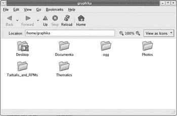(0503_0.jpg)

图 5-3：将文件夹添加到您的 Home 文件夹

### *5A-2：为文件夹添加徽标*

您必须承认，事情确实比以前看起来好多了，但这只是开始。为了图形化地提醒自己每个文件夹的用途，您可以添加称为*徽标*的小文件夹顶部图标。这些可以添加到任何文件夹或文件。现在，让我们通过右键单击 Documentia 文件夹并然后在弹出菜单中选择**属性**来为 Documentia 文件夹添加一个。当显示在图 5-4 中的属性窗口打开时，点击**徽标**选项卡，然后向下滚动直到您看到名为**documents**的徽标。点击**documents**旁边的复选框，然后点击**关闭**按钮。徽标现在应该出现在您的文件夹上。

图 5-4：为您的文件夹选择徽标

现在，为了额外的练习，尝试将**声音**徽标添加到您的**ogg**文件夹。只需使用之前相同的步骤，并替换适当的项目和条目。

### *5A-3：设置窗口背景（以及再次设置徽标）*

添加了这两个徽标后，您的文件夹看起来会更有活力。尽管如此，Nautilus 窗口的背景仍然是白色。如果您不想保持这种状态，您也可以更改它。要做到这一点，只需转到 Home 窗口的菜单栏，点击**编辑**菜单，然后选择**背景和徽标**。然后，背景和徽标窗口将出现（参见图 5-5 在第 74 页页码）。

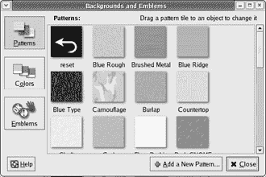(0505_0.jpg)

图 5-5：为您的 Nautilus 窗口选择背景

从这个窗口，您可以拖动任何图案到您的 Home 窗口，或者任何其他 Nautilus 窗口，然后该图案将成为您所有 Nautilus 窗口的背景。所以，为了体验一下，向下滚动找到名为**马尼拉纸**的图案样本，然后将其拖到 Home 窗口的空白区域。一旦完成，之前白色的窗口区域将看起来像律师办公室的壁纸。如果您喜欢这种风格，那就非常不错。当然，您也可以用同样的方式更改背景，或者您可以将**重置**样本拖到窗口中，回到默认的白色。

除了图案和颜色样本的按钮之外，背景和徽标窗口中还有一个名为**徽标**的第三个按钮。正如你所知，你已经通过右键单击文件夹并在弹出菜单中选择**属性**来为几个文件夹添加了徽标。**徽标**按钮提供了另一种做同样事情的方法，但当你一次添加多个文件夹或文件上的徽标时，这种方法更为方便。

要了解这是如何工作的，如果你还没有这样做，请点击**徽标**按钮。然后将名为**相机**的徽标拖动到你的照片文件夹，**酷**拖动到你的主题文件夹，将**包**拖动到你的 Tarballs_and_RPMs 文件夹。选定的徽标将立即出现在这些文件夹上。（如果你想知道为什么这些徽标的名称有些是大写的，有些则不是，我也没有头绪。抱歉。）

### *5A-4: 美化侧边栏（以及再次使用徽标）*

现在让我们继续改变 Nautilus 侧边栏的外观。保持背景和徽标窗口打开（如果你已经关闭了它，请再次打开），转到你的用户主窗口，点击**查看**菜单，并选择**侧边栏**。现在侧边栏将出现在 Nautilus 窗口的左侧。

你也可以为侧边栏添加不同的背景图案，但为了练习，让我们先添加一种颜色。要做到这一点，请点击背景和徽标窗口中的**颜色**按钮。现在窗口将充满颜色样本。将**葡萄柚**颜色样本拖动到你的侧边栏，它将从灰色变为，所有事情中，葡萄柚的颜色（尽管是一种非常暗淡且颜色不寻常的葡萄柚）。你还可以通过添加另一种颜色来创建双色渐变效果。将**芒果**颜色样本拖动到侧边栏的底部（但仍然在侧边栏内），你应该在侧边栏内有一个从葡萄柚到芒果，从上到下的渐变。当然，如果你对这种热带颜色组合不满意，你可以通过将**重置**颜色样本拖动到该区域来恢复到原始默认的灰色面板。完成之后，你可以关闭背景和徽标窗口。

你的 Nautilus 窗口侧边栏提供了另一种与徽标一起工作的方法。但在向你透露这第三种，也是最后一种方法之前，你需要在你的主文件夹中添加两个额外的文件夹。创建一个文件夹并将其命名为“财务”，你可以用它来存储涉及你在现代体系中的相对价值的文件，然后创建另一个并命名为“我的最爱”，你可以将……好吧，你的最爱文件放在那里。

在你创建了新的文件夹后，转到侧面板，点击显示 **Information** 的下拉菜单，并选择 **Emblems**。一个徽章列表将出现在侧面板中（参见 图 5-6）。找到名为 **Money** 的徽章，并将其拖到你的 **Finances** 文件夹上。然后找到 **favorite** 徽章，并将其拖到你的 **MyFaves** 文件夹上。完成后，返回到下拉菜单并选择 **Information** 以使一切恢复到相对正常的状态。

图 5-6：从 Nautilus 侧面板选择徽章

即使这不是你的菜，你不得不承认你的 Nautilus 窗口现在肯定更加丰富多彩了。当然，你可以改变它以任何你想要的方式，但我会请你稍后再做调整，因为你很快就会对它进行一些更多的操作。

### *5A-5：更改桌面背景*

现在你的主文件夹窗口已经装饰得很好了，或者说是装饰得很华丽（取决于你对事物的审美观），你可能觉得你的桌面相比之下显得相当单调。

更改桌面背景（通常称为 *wallpaper*）非常简单，你的系统预装了几个替代壁纸。不妨先尝试其中一个，所以右键点击桌面上的任何空白区域，在弹出的菜单中选择 **Change Desktop Background**。这将打开背景偏好设置窗口（参见下一页的 图 5-7）。

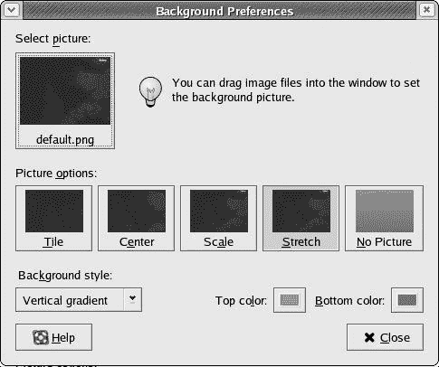

图 5-7：更改桌面背景

要从此窗口选择新的背景，点击位于 **Select picture** 下方应显示为 **default.png** 的按钮。这将弹出一个窗口（如图 5-8 所示），其中你可以从系统附带的一系列替代图像中选择。要查看有哪些可供选择，点击窗口右侧面板中的一个文件名，一个缩略图预览将出现在该面板的右侧。你可以这样预览所有图像。

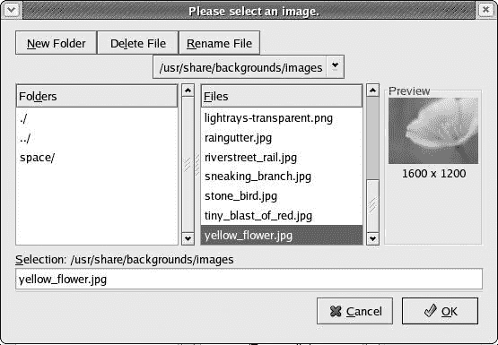

图 5-8：选择背景图像

你还会注意到在左侧面板中还有一个名为 **space** 的文件夹，其中包含与太空相关的主题图片。如果你想看看里面有什么，只需双击该文件夹，它内部的文件就会在右侧面板中列出。浏览完这些文件后，你可以通过在左侧面板中双击 **../** 返回到第一个文件夹。

现在你已经查看了系统内所有可用的背景图片，选择一个你愿意用一两个小时的，然后点击 **OK**。选择窗口将消失，你选择的壁纸将出现在桌面上。然后你可以关闭背景偏好设置窗口。

#### 获取你自己的壁纸

您已经看到了系统为您提供的选项，但我确信您会想使用一些自己的背景图片。当然，要使用您自己的图片，您首先必须获取它们，所以让我们开始通过从网上下载一个来解决这个问题。互联网上有许多提供可下载壁纸的网站，但在这个项目中，我将特别指向一个网站：[`art.gnome.org.`](http://art.gnome.org) art.gnome 网站包含您在本章步骤中需要的所有文件，以及您以后可以使用的许多其他文件。

如果您还没有连接到互联网，请先连接，然后在您的 Mozilla 浏览器中输入地址 [`art.gnome.org`](http://art.gnome.org) 并按回车键。

到达那里后，在页面左侧寻找标题**背景**，然后点击其下的**GNOME**链接。一旦背景列表打开，寻找您喜欢的背景图片。如果您想使用我将用于此特定任务的相同图片，寻找名为 GNOME-Orange 的图片。

找到图片后，点击其缩略图，这将带您到该文件的信息和下载页面。通过在**分辨率**（GNOME-Orange 的情况下为 **png-1280x1024**）下的链接上右键单击并从弹出菜单中选择**另存链接目标为**来下载它。一个“另存为”窗口将弹出，您可以选择您想要下载文件的文件夹（参见下一页的图 5-9）。在这种情况下，在“另存为”窗口中向下滚动到 Thematics 文件夹，双击打开它，然后点击**保存**按钮。您的新壁纸将很快保存在 Thematics 文件夹中。

图 5-9：选择下载目标文件夹

#### 安装您的全新壁纸

下载完成后，通过在桌面上空白区域右键单击并选择**更改桌面背景**来再次打开背景偏好设置窗口。与之前一样，点击**选择图片**下的按钮。在选择窗口底部的输入框中，输入 /home/username/Thematics/background_image_name.png，然后点击**确定**。您新下载的背景图片现在将作为您的桌面壁纸出现（如下一页的图 5-10 所示）。完成此操作后，您可以关闭背景偏好设置窗口。

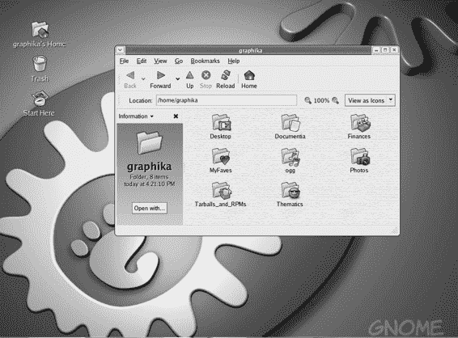

图 5-10：您新装饰的桌面

如果您想恢复到开始时的默认壁纸，只需右键单击桌面并选择**使用默认背景**。

顺便说一下，您可能已经注意到在图 5-10 中您看不到屏幕底部的面板。这是因为面板遮挡了新壁纸的底部，这让我有些不悦。我通过在面板的空白区域右键点击并从弹出菜单中选择**属性**来进入 GNOME 面板的偏好设置窗口。在偏好设置窗口中，我点击了“**自动隐藏**”旁边的复选框，然后点击**关闭**。自动隐藏功能就像在 Windows 或 Mac OS X 中一样工作——面板在您将鼠标移至它应该出现的大致位置之前保持不可见。如果您喜欢，也可以做出同样的更改，但这只是一个美学问题，我将留给您决定。啊，艺术自由的甜美滋味。

### *5A-6：更改窗口边框、控件和图标集*

现在，我们来到了这次数字美容世界之旅中最喜欢的部分——改变 GNOME 中窗口边框和控件的外观。让我们着手做这件事。

这个过程实际上非常简单。进入主菜单并选择**偏好设置** > **主题**。主题偏好设置窗口将打开，并显示您系统上安装的主题列表（见图 5-11）。Fedora Core 的默认主题被称为 Bluecurve，但正如您所看到的，还有许多其他主题。

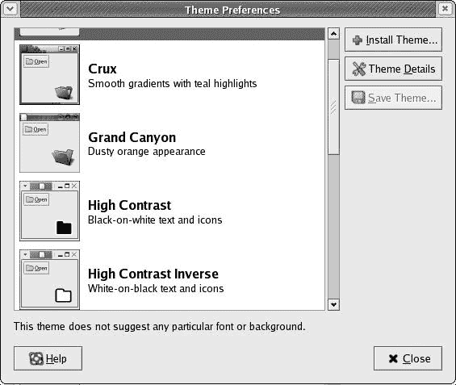

图 5-11：在 GNOME 中选择主题

为了熟悉这些，您可以逐个点击列出的每个主题。更改将立即生效。只需点击一个主题，就会更改您的窗口边框、控件，甚至如果您查看用户的主文件夹，图标也会改变。当您点击 Crux 或 Grand Canyon 时，这种变化尤为明显。

每个主题都包含一个窗口边框、一组控件和一组图标。既然如此，您就可以自己混合搭配这些元素。例如，假设您喜欢 Grand Canyon 中泡泡状控件的外观和颜色，但您更喜欢 Mist 的窗口边框和 Ocean Dream 的图标。好吧，您不必绝望，因为您可以创建一个包含这三个不同元素的定制主题。

要创建自己的混合主题，只需在主题偏好设置窗口中点击**主题详情**按钮。将打开一个新窗口，您将找到三个标签页：控件、边框和图标。在每一个标签页内，您可以选择您喜欢的组件。首先点击**控件**标签页并选择**Grand Canyon**。然后点击**窗口边框**标签页并选择**Mist**。最后，点击**图标**标签页并选择**Sandy**，这是 Ocean Dream 主题的图标集。

现在看看你做了什么。嗯……还不错。但是，再想想，你其实并不太喜欢那些 Mist 窗口边框的外观。为了找到更适合你的东西，再次点击**窗口边框**选项卡，并向下滚动直到你看到**Metabox**，然后点击它。是的，这样更好。现在你满意了，你可以点击**关闭**按钮。

现在，你将回到主题偏好设置窗口，你会注意到列表顶部有一个新的主题条目，称为自定义主题。如果你想保存你刚刚创建的用于以后使用的组合，请点击**保存主题**按钮。这样做将打开一个对话框，你可以给你的主题命名并简要评论。所以，给你的主题命名，如果你喜欢的话写个评论，然后点击**保存**。你的新主题现在将以你选择的名称在主题列表中按字母顺序出现。

一切都完成后，你的主文件夹窗口应该看起来像图 5-12 中的那样（同时看看你的面板和主菜单）。啊，太酷了！

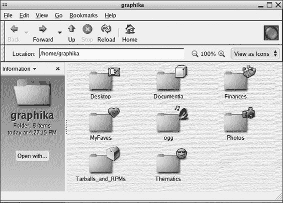

图 5-12：你的主文件夹窗口的新外观

### *5A-7：安装额外的窗口边框、控件和图标*

如果你热衷于这个定制过程，并且对系统提供的主题选择不满意，你可以下载并安装更多的窗口边框、控件和图标。为了展示如何做这件事，我将带你创建一个类似 Mac 的主题，它将看起来相当接近标准

Mac OS X 的水彩主题。如果你内心还有一丝讨厌 Mac 的 Windows 用户，不要太纠结。类似 Windows 的主题已经在 Fedora 的默认主题集合中可用。无论如何，你现在只是在学习，所以暂时抑制一下你的热情。

#### 获取所需的文件

要获取执行此操作所需的文件，请再次访问此 URL：http://art.gnome.org。到达那里后，点击**桌面主题**标题下的**应用程序**链接，并寻找一个名为**Aquativo**的主题。一旦找到，点击它进入信息和下载页面。通过右键单击文件名，**GTK2-Aquativo-1.5.tar.gz**，并在弹出菜单中选择**另存为**来下载它。确保将其下载到你的主题文件夹中。

你还必须下载一个窗口边框主题。在 art.gnome 主页的左侧，点击**桌面主题**标题下的**窗口边框**链接，当页面打开时，寻找一个名为**Metativo**的文件。一旦找到，点击文件名，然后从信息和下载页面，通过右键单击文件名，**MCity-Metativo.tar.gz**，并在弹出菜单中选择**另存为**来将其下载到你的主题文件夹中。

最后，你还将想要下载一组新的图标。你将下载的图标是一种 Mac-meets-Tux 的集合，虽然它们并不真正具有 Mac 风格，但看起来相当酷。无论如何，要下载它们，只需点击**Desktop Themes**标题下的**Icon**链接，然后在新的窗口中点击**Tux n Tosh 0.2**链接。一旦到达该文件的资料和下载页面，通过右键点击该文件的链接**ICON-Tux-n-Tosh-0.1.tar.bz2**，并在弹出菜单中选择**Save Link Target As**来将其下载到你的 Thematics 文件夹。

#### 安装你的新主题文件

现在你已经有一些新的主题文件了，安装它们非常简单。首先，在 Nautilus 中打开你的**Thematics**文件夹，然后将窗口拖到屏幕的右侧，以便可以轻松访问。接着，打开你的主题偏好设置窗口，如果它还没有打开，然后点击**Theme Details**按钮，在主题详情窗口中，点击**Window Border**标签页。

而不是使用**Install Theme**按钮，只需将**MCity-Metativo.tar.gz**文件从你的 Thematics 文件夹窗口拖动并放到主题详情窗口左侧的 Window Border 标签页的控制列表中。接下来，将打开一个类似于下一页图 5-13 中的小窗口。只需点击该窗口中的**Install**按钮，主题将被添加到边框列表中，标记为**MetaTivo**。一旦你在列表中看到它，你可以点击它，主题将立即生效。

图 5-13：安装新主题

现在你可以以基本相同的方式添加控制主题。在主题详情窗口中点击**Controls**标签页，然后将文件**GTK2-Aquativo-1.5.tar.gz**从你的 Thematics 文件夹窗口拖到主题详情窗口左侧的控制列表中。再次，一个小的安装新主题对话框会出现，和之前一样，只需点击**Install**。新的控制集将立即出现在控制列表中，标记为**Aquativo-1.5**。在列表中点击该名称，变化将立即生效。

最后，你需要安装新的图标主题。在主题详情窗口中点击**Icons**标签页，然后将文件**ICON-Tux-n-Tosh-0.1.tar.bz2**拖到主题详情窗口左侧的图标列表中。安装新主题对话框将出现，你只需点击**Install**。完成之后，在主题详情窗口中的图标列表向下滚动，并点击**Tux ’n’ Tosh**。变化将立即生效。

|  | 注意  | *如果你在安装新图标主题的流程之后发现图标没有改变，并且* ***Tux ’ n’ Tosh*** *没有出现在主题详情窗口的图标主题列表中，你将不得不做一些不同的操作。参见第二十章了解如何操作。* |
| --- | --- | --- |

你的窗口、菜单、图标和面板现在应该有更类似 Aqua 的外观，尽管文件夹和 Nautilus 背景可能需要一些调整。无论如何，你现在可以随心所欲地做了。你可以继续使用你获得的技术进行 Aqua 化过程，你可以保持现状，或者你可以切换到你喜欢的任何主题。为了保持一致性，我现在将切换回 Bluecurve。

* * *

* * *

## 更改登录屏幕

在 art.gnome 网站上，你可能已经注意到有一个名为*登录管理器*的链接。登录管理器是你的登录屏幕，也称为*欢迎界面*——当你首次登录系统时输入用户名和用户密码的屏幕。登录管理器是你还可以自定义的另一项功能，但你需要 root 权限才能这样做。此外，你做的任何更改都将影响整个系统，而不仅仅是针对你，所以无论你安装和选择哪种登录管理器主题，其他使用你电脑的人在使用机器时都会看到这个主题。当然，如果你是唯一使用这台机器的人，这个点就无关紧要了。

### *下载登录管理器主题*

为了尝试自定义登录管理器，请访问[`art.gnome.org`](http://art.gnome.org)网站并点击**登录管理器**链接。完成此操作后，浏览各种主题，下载一两个你想要的；这次我给你充分的自由。就像你迄今为止下载的其他文件一样，确保将这些文件下载到你的主题文件夹中。

### *安装你的新登录管理器主题*

下载了你喜欢的主题或两个之后，你需要打开登录屏幕设置窗口。为此，请转到主菜单，然后选择**系统设置** > **登录屏幕**。随后将弹出一个对话框，要求输入你的 root 密码。输入你的 root 密码，点击**确定**，登录屏幕设置窗口将很快出现（见图 5-14）。

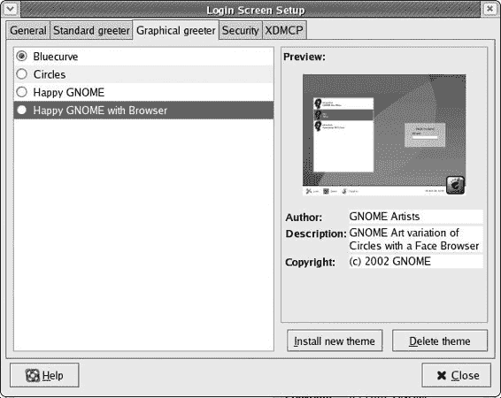

图 5-14：自定义登录管理器

点击窗口顶部的**图形欢迎界面**标签。然后你会看到默认包含在你的系统中的欢迎界面列表，你可以点击每个来查看缩略图预览。

你可以将你刚刚下载的欢迎界面添加到这个列表中，但不幸的是，你不能仅仅通过拖拽来安装它们。相反，你必须点击**安装新主题**按钮，但这几乎不是一项艰巨的任务。

一旦点击**安装新主题**，就会弹出一个窗口，你可以从中找到你的新文件。记住，文件应该位于**/home/username/ Thematics**。选择你的文件后，点击**确定**，它将立即出现在问候者列表中。

要选择你希望使用的问候者，只需在登录屏幕设置窗口中的列表中点击其名称，然后点击**关闭**按钮。当然，要看到你的问候者实际效果，你必须先注销，然后再登录，但你不需要重新启动或关闭机器。

* * *

* * *

## 选择屏幕保护程序

曾经，屏幕保护程序是计算机用户必须拥有（并必须使用）的项目，以防止显示器损坏（烧蚀）。然而，视频显示技术现在已经发展到屏幕保护程序不再是必需品的程度。尽管如此，屏幕保护程序看起来很酷，而且 Fedora 的一个非常好的特点是它附带了一个非常广泛的屏幕保护程序模块集合——近 200 个！有这么多，你肯定能找到几个你喜欢的。屏幕保护程序的设置预先配置为随机切换模块，每隔几分钟更改当前模块。你可以通过转到主菜单并选择**首选项** > **屏幕保护程序**来更改这些设置。

屏幕保护程序首选项窗口，如图 5-15 所示，允许你进行各种操作，例如设置模块之间切换的时间长度和屏幕保护程序启动前的空闲时间长度。你也可以选择只使用一个屏幕保护程序模块或者完全不使用屏幕保护程序。在随机模式下，你也可以通过取消选中不喜欢的模块旁边的复选框来省略这些模块。

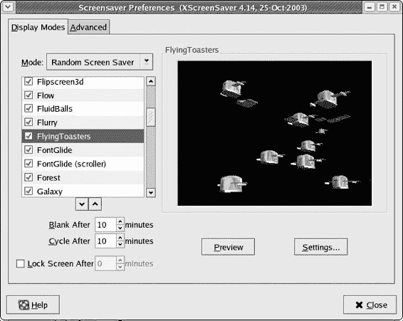

图 5-15：设置屏幕保护程序首选项

* * *

* * *

## 设置系统声音

我的一个朋友曾经说过：“如果你听不到音乐，那画有什么乐趣？”他显然是在谈论其他事情，毫无疑问有点装腔作势，但他的话也适用于这个定制业务。如果你打算让你的系统在视觉上大声尖叫，为什么不也让它听起来很棒呢？

我不会坚持让你在这里做任何事情，因为并不是每个人都热衷于系统声音，但你应该至少知道你可以设置你的系统以播放各种系统事件的声音。在默认系统设置中，声音事件是不活跃的，所以如果你想听声音，你必须启用它们并自己设置这些事件。幸运的是，这很容易做到。

要启用系统声音，请转到主菜单并选择**首选项** > **声音**。完成此操作后，声音首选项窗口将以其简洁的方式出现：两个标签页，两个复选框，两个按钮。要启用系统声音，你首先应该在“常规”标签页中点击两个复选框：**启用声音服务器启动**和**事件声音**。你必须选择它们。

之后，点击 **声音事件** 选项卡，它将为您提供事件和预配置声音的列表（参见下一页的 图 5-16）。您可以通过选择事件或声音然后点击 **播放** 按钮来预览列表中的任何声音。

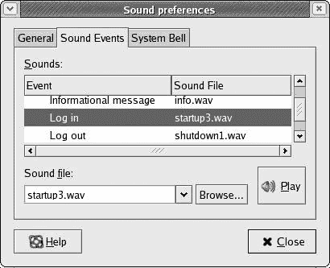

图 5-16：在 GNOME 中为不同事件设置播放声音

事件和声音列表适用于 GNOME 环境，以及几个 GNOME 游戏，您会注意到有几个事件没有与之关联的声音。通过使用 **浏览** 按钮，您可以添加任何合适的（在类型和长度上）声音文件，您可能现在拥有或将来可能下载的。

* * *

* * *

## Mozilla 主题

除了您可以在 GNOME 中进行的所有系统定制外，Mozilla 允许您通过使用专为 Mozilla 设计的皮肤来定制其界面。如果您喜欢，可以尝试一下。首先，打开您的 Mozilla 浏览器。它应该看起来和以前差不多。

### *尝试预装主题*

Mozilla 默认预装了两个主题：经典（默认）和现代。为了尝试一下，让我们尝试切换到现代主题。转到 Mozilla 的 **查看** 菜单并选择 **应用主题** > **现代**。然后退出 Mozilla 并再次运行它。

当它再次出现时，现代主题将就位，如果您使用过最近的 Netscape 版本，应该能认出它。这个变化将不仅影响您的 Mozilla 网络浏览器，还会影响 Mozilla Composer 和 Mail。

### *安装新主题*

如果您对 Mozilla 预先安装的主题不满意，您可以下载并安装更多。为此，回到 **查看** 菜单，然后这次选择 **应用主题** > **获取新主题**。现在应该会打开一个新窗口，并且有两个链接可供点击：themes.mozdev.org 和 theme.freshmeat.net。为了方便起见，点击 **mozdev.org** 链接，该页面将在另一个新窗口中加载。一旦加载完成，滚动到页面底部直到在右侧找到 **Skypilot Classic** 的链接。找到链接后，点击它。

新页面加载后，您将看到 Sky Pilot Classic 主题的示例，以及页面下方的一个写着 **安装它！** 的链接。点击该链接。

随后会出现一个对话框 (图 5-17) 以确认您想要安装并使用该主题。点击 **确定** 按钮，这将弹出一个显示下载和安装进度的窗口。

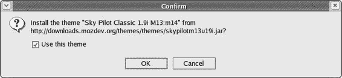

图 5-17：Mozilla 确保您想要继续安装

下载完成后，进度条将被单词 *成功* 替换。点击 **确定** 关闭窗口。

现在，通过返回到 Mozilla 的 **查看** 菜单并选择 **应用主题** > **Sky Pilot Classic** 来选择您的新主题。退出 Mozilla 并重新运行它，您应该会看到新主题（见图 5-18）。

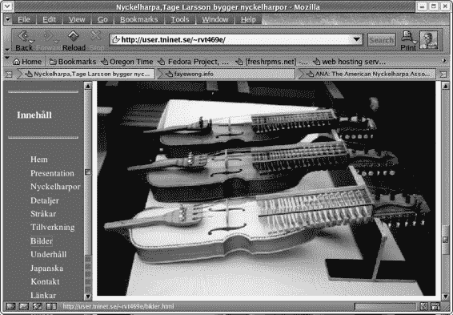

图 5-18：安装了 Sky Pilot Classic 主题的 Mozilla

当然，您可以通过相同的方式从任一网站下载并安装其他主题。不过，请确保下载适合您浏览器的版本，尽管两个网站都应该会自动引导您到正确的版本。您可以通过访问 Mozilla 中的 **帮助** 菜单并选择 **关于 Mozilla** 来查看您正在运行的 Mozilla 版本。

* * *
