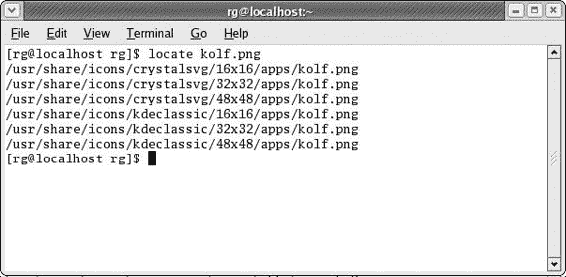
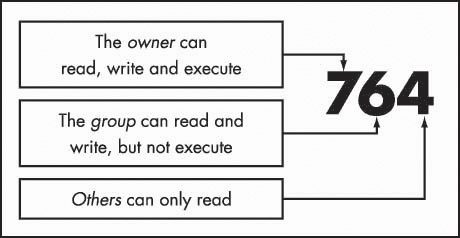
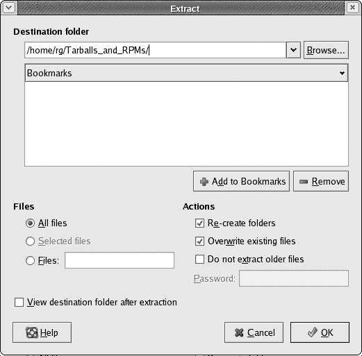
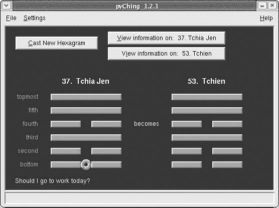
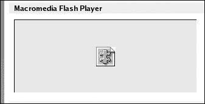

# 第九章：简单的小猫方式

## 概述

*了解 Linux 终端和命令行*

许多人避开 Linux，因为他们将其视为一个为电脑爱好者设计的系统：一个你需要通过命令行以艰难方式做所有事情的环境。在这个图形界面的时代，通过输入命令来完成事情的想法似乎是对 DOS 时代的可怕回归，这让许多人望而却步——尤其是那些记得那些“旧日子”的人。

这种反应是公正的，但它并不真正准确地反映了 Linux 世界的现实。毕竟，今天的大多数 Linux 用户都在使用某种图形界面。他们可以，并且经常只通过下拉菜单和鼠标点击就能实现他们希望实现的一切。许多人能够非常快乐地生活，甚至从未打开过他们的终端。对你来说可能也是如此。

不论如何，命令行的强大和便利性仍然值得称赞。事实上，现在命令行可以在终端应用程序提供的图形环境中使用，这也使得它显得不那么令人畏惧。终端只是图形世界中的一小块基于文本的岛屿（见图 9-1）。使用命令行可能和你系统上做的任何其他事情一样无害，而且如果你愿意尝试，它实际上可以给你带来一些乐趣。


图 9-1：将终端置于适当的位置

很不幸，许多关于使用命令行的指南都是由那些对命令行充满热情的硬核爱好者所写，他们的热情无意中使得他们所写的内容对最近加入 Linux 或想成为 Linux 用户的人来说显得更加令人望而却步。

为了你的利益，我会尽量控制自己的热情，以免让你再次回到第八章和看似安全的 RPM 世界。我还会尽量通过尽可能教你将命令行作为你拥有的各种图形工具的补充来使用，而不是将其作为做事的唯一方式。当然，我不会涵盖这个方面的每一个可能的角度——只是足够让你有一些接触和经验，并希望让你至少对命令行感到稍微自在一些。谁知道呢；你可能会真的认为使用命令行是……有趣的？好吧，我不会太过分。

* * *

* * *

## 认识终端

在你的 Fedora 系统中，可以通过转到主菜单并选择 **系统工具** > **终端** 来运行 Linux 命令终端应用程序。然而，你已经在 第三章 中为终端添加了一个启动器到你的 GNOME 面板，所以你也可以点击它。当终端打开时，它以其简洁的方式，看起来很像 图 9-2。


图 9-2：终端应用程序

如你所见，它只显示 **[rg@localhost rg]$**。在这种情况下，第一个 **rg** 是我的用户名，**localhost** 是我的计算机的默认名称，第二个 **rg** 是我当前所在的目录，即我的用户主目录，这是终端应用程序的默认位置。在你的情况下，用户名和默认目录都将不同。例如，如果你的用户名是 frog，命令行将显示 **[frog@localhost frog]$**。如果这一切听起来相当晦涩难懂，只需这样想：**[username@localhost username]$** 在命令终端中相当于你在 Nautilus 中的用户主文件夹。

在终端中打字很简单；你只需像平时一样打字。你也可以通过使用 DELETE 和 BACKSPACE 键以及光标键来删除和插入字母或短语。为了练习，请尝试以下操作：

1.  输入：我非常喜欢草莓。

1.  现在，将草莓改为樱桃（因为樱桃实际上要好得多）。只需使用你的左光标键将光标移到草莓中第一个 *s* 前面。

1.  接下来，按下 DELETE 键，直到删除单词

    ```
    strawberries (uh, that would be 12 times, methinks).
    ```

1.  最后，只需输入 cherry，然后使用你的右光标键将光标移回到这个有意义的句子的末尾。

现在你已经完成了这段有趣的打字练习，请按回车键。你几乎会立刻看到，终端对你迄今为止所做努力的回应只是轻蔑的：**bash: I: 命令未找到**。虽然你输入了一串对你有意义的文本，但对你系统来说却毫无意义。事实上，系统如此短视，以至于它只能看到你在终端中输入的第一个词（I）；由于 *I* 不是一个有效的命令，系统不知道该如何处理它。

* * *

* * *

## 无毒命令

如你所知，所有这些打字都很简单，但为了真正在终端中做些有用的事情，你需要输入命令，而且命令的数量比你希望或需要的要多。为了让你开始，我们将从一些容易理解、无毒且完全适合儿童使用的命令开始。

### *$ whoami*

没有一个命令像**whoami**（打印当前用户）这样简单、安全，甚至看似无用。**whoami**命令并不是帮助那些有多重人格障碍的人在任何给定时刻发现他们是谁，它只是简单地告诉你当前登录的用户是谁。在**$**后输入 whoami 然后按回车键来尝试一下。记住，命令是区分大小写的，所以相应地输入。现在终端会告诉你当前登录的用户名。如果你以青蛙的身份登录，你应该得到**frog**作为你命令的答案。

### *$ pwd*

如果你基本上知道你是谁，但不确定你在哪里，那么**pwd**命令（打印工作目录）应该会很有用。**pwd**命令会告诉你终端在你的目录树中的确切位置。

假设，例如，我在使用**pwd**命令时我的终端在我的 rg 主目录中；按下回车键后，我应该会在终端上打印出**/home/rg**。如果你尝试一下，你应该会得到类似的结果。

|  | 注意  | *这里的“print”一词与此处的打印机无关；它仅仅意味着响应将被打印到或显示在终端中。* |
| --- | --- | --- |

### *$ df*

另一个安全且简单，但非常有用的命令是**df**（磁盘文件系统）。**df**命令会告诉你每个挂载的磁盘分区上使用了多少磁盘空间，以及还有多少空间可用。通过输入 df 然后按回车键来尝试一下。你的输出应该看起来像图 9-3 中所示的那样（当然，这取决于你挂载的磁盘大小和它们的设置）。


图 9-3：df 命令的输出

如你所注意到的，大小是以千字节（KB）而不是你更熟悉的 GB（千兆字节）和 MB（兆字节）给出的，但有一个解决办法。许多命令接受一个*标志*或*选项*来进一步指示命令如何执行。这些标志直接写在主要命令之后，并且前面有一个空格和一个连字符。

在这种情况下，你可以尝试使用**-h**（可读性高）标志，让你的图形以你最熟悉的方式显示出来。通过在命令行中输入 df -h 并按回车键来尝试一下。现在输出应该以更熟悉的形式出现（见图 9-4）。


图 9-4：使用-h 标志的 df 命令的输出

### *$ ls*

另一个无害但实用的命令是**ls**（列出目录内容）。**ls**命令显示你当前目录中的内容。这是在 Nautilus 中双击文件夹以查看内部内容的非图形等效操作。通过输入 ls 然后按回车键来尝试一下。

如果您一直按照*我的*命令操作，您的结果应该会列出您家目录中的所有文件夹。您也可以使用**-R**标志来显示文件夹中的文件列表，以及子文件夹中的内容。当然，您应该没有在第五章中创建的任何文件夹中的子文件夹，所以您可以暂时不进行实验。相反，尝试输入 ls -a 来查看您的*不可见*或*隐藏*文件。

### *$ su*

当您需要从普通用户切换到 root 用户时，涉及两个简单直接步骤。通过点击面板中的终端启动器打开一个新的终端窗口，然后输入 su 并按回车键；您将被要求输入 root 密码。当您输入密码时，密码本身不会在终端中显示，但这就是事情应有的样子，所以不要慌张。完成输入后，按回车键，您通常在终端中看到的提示符**[username@localhost username]$**将被您的 root 提示符**[root@localhost username]#**所取代。请注意，提示符末尾不再是**$**，而是**#**，这表示您现在处于 root 模式。

如您所见，您现在已经是 root 用户，但您仍然处于您的家目录中。如果您在另一个文件夹中（例如**[username@localhost multimedia]$**）切换到 root 用户，提示符也会相应地显示在不同的文件夹中：**[root@localhost multimedia]#**。

### *# exit*

您可以通过使用**exit**命令从 root 用户模式退出并回到您的普通用户模式。只需输入 exit 并按回车键，您将再次以用户模式恢复到您原来的状态。非常简单且方便。如果您在用户模式下使用**exit**命令，您将退出终端窗口。

### *$ locate*

与您迄今为止所学的看似轻量级的命令相比，**locate**命令实际上非常有用。实际上，您可能会发现它是一个比主菜单中的图形搜索工具更容易、更快、更有效的方法来查找文件。使用此命令非常简单：您只需输入命令，然后跟一个空格和您要搜索的文件名。您可以在 root 或用户模式下使用此命令。

在您可以使用此命令之前，您需要创建一个文件名数据库供**locate**使用。这通过使用**su**命令（您在上一节中刚刚学习过）成为 root 用户，然后输入 updatedb（哇，内莉！又一个命令！），接着按回车键，就可以轻松完成。一开始可能会觉得没有任何动静，但请放心。只要您的终端光标在闪烁，就意味着进度正在被记录，当您的 root 提示符返回时，您就已经成功创建了数据库文件。之后，您就可以继续使用**locate**命令了。

1.  为了测试这个新命令，让我们查找之前在第三章中通过图形搜索工具搜索到的**kolf.png**文件。只需输入 locate kolf.png 并按回车键。你的结果应该看起来像图 9-5 中的那些。

    

    图 9-5：locate 搜索的结果

* * *

* * *

## 带有牙齿的命令

你迄今为止尝试的简单命令都是安全且合理的，消防队长批准的品种；它们只是将信息打印到你的终端。现在你将尝试从使用的命令中获得一些真实可触摸的结果。如果你遵循我的指示，这些命令基本上也是安全且合理的。

### *$ mkdir*

你已经学会了如何通过菜单和鼠标创建文件夹，但你也可以使用命令行来做这件事。命令是**mkdir**（创建目录），使用起来就像打拳一样简单（尽管我从未完全确定打拳是如何简单的）。

为了了解这个命令是如何工作的，以及如何使用接下来的命令，现在使用**mkdir**命令创建一个名为**command_exp**（用于命令实验）的文件夹。你只需输入 mkdir command_exp 然后按回车键。新文件夹应该出现在你的主文件夹中，所以你可以点击桌面上的用户主图标来检查它是否在那里。

好的，很好，*bra*，*bueno!*现在让我们在那个新文件夹内创建另一个新文件夹——一个*子文件夹*。我们将称之为**sub**。所以，只需输入 mkdircommand_exp/sub 然后按回车键。如果你愿意，现在可以去看看子文件夹是否出现在 command_exp 文件夹中。

### *$ mv*

下一个命令是**mv**（移动）命令，但在我们实验它之前，我们需要创建一个虚拟文件——毕竟我们需要一些东西来移动。转到主菜单并选择**附件**>**文本编辑器**。这将打开名为 Gedit 的文本编辑程序。你将使用 Gedit 做的只是点击**保存**按钮；你不需要在文档本身中写任何东西。然后应该会出现一个**另存为**窗口，在该窗口底部附近（在**选择：/home/username**这些字样下方），输入 expfile 然后点击**确定**。新文件，命名为 expfile，应该出现在你的主目录中。

要移动你刚刚创建的文件，你将使用**mv**命令，当然。只需输入 mv expfile command_exp/sub（这告诉系统要移动哪个文件以及移动到哪里）然后按回车键。文件现在将位于你的子文件夹中。

### *$ cd*

到目前为止，您一直是从您的个人文件夹中使用命令行。使用**cd**命令，您可以更改您的终端位置到另一个文件夹。这是一个非常实用的命令，您在本书的其他项目中会经常使用它。为了试一试，请输入 cd command_exp 并按回车键进入**command_exp**文件夹。如果您操作正确，您的终端提示符现在应该显示**[username@localhost command_exp]**。如果是这样，您可以给自己鼓掌。

当您在那里时，不妨尝试使用带有**-R**标志的**ls**命令来看看它是如何工作的。只需输入 ls -R 并按回车键。您的终端现在应该显示您有一个名为**sub**的子文件夹，其中有一个名为**expfile**的文件。

目前您在那里需要做的就这些了，所以为了回到您的个人文件夹，只需输入 cd 并按回车键，这样就可以“回家”了。

### *$ cp*

由于人类天生多变，您现在决定不仅要在**sub**文件夹中拥有您的**expfile**，还要在最初它所在的主目录中有一个副本。要复制**expfile**，您可以使用**cp**（复制）命令。

要做到这一点，命令需要知道您想要复制的文件的位置、文件名以及您想要复制到的地方。在这种情况下，输入以下命令（用您的实际用户名替换*username*）然后按回车键：

```
cp command_exp/sub/expfile /home/username 
```

在复制文件时，务必在文件及其目标位置（在本例中，在 expfile 和/home/username 之间）之间留一个空格。

完成此操作后，您应该有两个**expfile**的副本，一个在您的个人文件夹中，一个在您的**sub**文件夹中。去看看您努力的成果。

### *$ rm*

当您还是个孩子的时候，您可能已经体验过用乐高积木建造城堡的乐趣，然后是拆毁整个建筑的更大乐趣（最好是使用 D 型电池）。现在，我们将开始类似的操作。在这个怀旧任务中的第一个工具是**rm**（删除）命令，我们可以用它来删除文件。

虽然**rm**命令非常实用且易于使用，但应谨慎使用。一旦您使用此命令删除文件，就无法回头——文件将永远消失。

为了确保安全，让我们通过删除我们刚刚在您的个人文件夹中创建的新副本**expfile**来尝试一下**rm**命令。基本的**rm**命令结构包括命令本身，**rm**，后跟您希望删除的文件名。在这种情况下，您想要删除位于您的个人文件夹中的名为**expfile**的文件。假设您的命令行终端显示您处于个人文件夹，您可以通过输入 rm expfile 然后按回车键来删除该文件。文件随后将消失，并且永远消失。

现在，通过删除位于子文件夹 **sub** 中的 **expfile** 版本来加倍你的乐趣。在这种情况下，你需要指定文件的位置，因为它不在终端所在的文件夹中。只需输入 rm command_exp/sub/expfile 并按回车键。哇，非常酷。这让你想起了什么，不是吗？

### *$ rmdir*

现在，你将继续使用 **rmdir**（删除目录）命令的乐趣，这是 **rm** 命令的一个更大、更强大的版本。

**rmdir** 命令，就像 **rm** 命令一样，应该谨慎使用。**rmdir** 没有撤销操作。一旦你使用这个命令删除了一个目录或文件夹，它就永远消失了。

要尝试这个命令，你可以删除你创建的那个 **sub** 文件夹。输入 rmdir command_exp/sub 并按回车键。现在 **sub** 文件夹应该已经消失了。最后，为了圆满结束这个乐趣，再次使用 **rmdir** 命令来删除我们之前创建的 **command_exp** 文件夹。你现在可能已经掌握了这个，但以防万一你没有，输入 rmdir command_exp 并按回车键。

### *$ chmod*

在 第三章 中，你学习了如何通过 Nautilus 界面更改文件权限。毫无疑问，这是处理此类事情的最简单方法，但当你有一个文件夹充满了文件，可能是从光盘复制到硬盘上的，上面有 *verboten* 符号时，逐个更改这些文件的权限可能会相当累人。在这种情况下，命令行方法证明更容易处理。

更改文件权限的命令是 **chmod**（更改模式）。要使用它，只需输入命令，然后跟上传送给文件的权限，最后是文件本身的路径。例如，假设你从光盘复制了一个名为 mybirthday.jpg 的 JPEG 文件到硬盘上照片文件夹中的个人子文件夹，并且文件是写保护的。要更改文件以便你有写权限（意味着你可以修改文件），你需要输入以下内容并按回车键：

```
chmod 744 photos/personal/mybirthday.jpg 
```

要一次性更改所有文件和子文件夹（以及那些子文件夹中的所有文件）的权限，你可以在 **chmod** 命令中添加 **-R**（递归）标志。因此，命令如下：

```
chmod -R 744 photos/personal
```

顺便说一句，数字 744 会将读取、写入和执行权限扩展给你，即文件所有者，但其他人只有只读权限——当不确定时，这是一个相当安全的选择。如果你想自己找出权限数字，这相当简单。你基本上在处理三个数字位置，每个位置都有八个数字可能性（0–7）。最左边的槽位代表所有者的权限；中间的槽位代表组的权限；第三个槽位代表其他人的权限。

数字本身的含义如下：

> 7 = 读取、写入和执行权限
> 
> 6 = 读取和写入权限
> 
> 5 = 读取和执行权限
> 
> 4 = 只读权限
> 
> 3 = 写入和执行权限
> 
> 2 = 只写权限
> 
> 1 = 只执行权限
> 
> 0 = 没有权限

图 9-6 说明了每个数字的含义以及每个数字槽位代表的内容——权限并不那么复杂。



图 9-6：权限数字的含义

* * *

* * *

## 您很快就会使用的其他几个比特

这也是一个介绍本章以及本书其他地方将要使用的两个更多命令的好地方：**rpm**和**ln**。您目前不需要练习这些命令，因为您很快就会使用它们，但您最好了解一下它们是什么。

### *$ ln*

**ln**（链接）命令用于创建一个链接文件，该文件可以启动或激活位于单独文件夹中的另一个文件。当尝试激活位于硬盘深处某个子文件夹的子文件夹的子文件夹中的文件时，这非常有用。该命令经常与**-s**（符号）标志一起使用，该标志基本上与您在 Windows 中熟悉的“快捷方式”或 Mac 上的“别名”相同。

使用**ln**命令的最简单方法是首先使用**cd**命令将终端的位置更改为您想要放置链接的文件夹。然后您可以在命令行上输入*ln*命令，后面跟您想要链接的文件的路径。例如，假设您想在您的家文件夹中为名为**myLife.sxw**的自传 OpenOffice.org Writer 文件创建一个链接。该文件深深埋藏在用户家文件夹中的子文件夹中：/home/username/Documentia/personal/self/autobiography/myLife.sxw。要创建链接，您需要打开一个新的终端窗口，输入以下命令字符串，然后按回车键：

```
ln -s Documentia/personal/self/autobiography/myLife.sxw
```

完成后，链接将以与原始文件外观相匹配的图标形式出现在您的家文件夹中，尽管它有一个绿色的箭头来表示它是一个链接。

### *# rpm*

如您所猜测的，**rpm**命令用于安装 RPM 文件。当然，您可以通过简单的鼠标点击来完成此操作，但有时命令行替代方案可能非常有用。由于**rpm**命令通常需要系统写入只能由 root 写入的文件，因此您必须首先成为 root 才能用于安装。这就是为什么在标题中的命令前有一个#符号。

与大多数命令一样，**rpm**可以与标志一起使用。实际上，此命令最常用的命令和标志组合是**rpm -Uvh**。在这种情况下实际上使用了三个标志一起使用：**U**、**v**和**h**。当同时使用多个标志时，标志在连字符之后一起写入（**-Uvh**，而不是**-U -v -h**）。

**U**（更新）标志根据系统上是否存在该文件的版本，要么重新安装文件，要么更新之前安装的同一文件版本。因此，如果你正在尝试安装名为**dog-1.0.2**的文件，而你的系统上已经有一个名为**dog-1.0.1**的文件，**U**标志会告诉**rpm**命令更新该文件。如果系统上没有这样的**dog**文件，**U**标志仅告诉**rpm**命令安装它。第二个标志**v**（详细），告诉**rpm**命令给出正在进行的进度报告。最后一个标志**h**（散列），告诉命令使用散列标记（###）作为指示进度的手段——这是一种终端版本的进度条。

* * *

* * *

## 项目 9A：使用 pyWings 的命令练习

现在你已经了解了一些命令，让我们将它们用于实际。在这个项目中，你将安装的程序是一个简单且诚然有点愚蠢的占卜程序，名为 pyWings（见图 9-7）。pyWings 将根据你提出的任何问题给出神秘的指导。


图 9-7：从 pyWings 寻求智慧

要使用 pyWings，你可以在输入框中输入你的任何**困惑**，然后点击左侧的**关注**图标之一（自我、他人、世界），右侧的**领域**图标之一（爱情、工作、真理），然后点击那个看起来像半个眼睛的大按钮。然后占卜师会告诉你它有什么要说的。例如，我向占卜师询问我是否会变富，选择了**自我**作为我的关注点，**真理**作为领域。图 9-8 显示了我得到的智慧。


图 9-8：PyWings 赋予其智慧

正如你所见，占卜师告诉我，“急于结束会吓跑它”，我将这解读为对耐心的呼唤——如果我太过急躁，我就会成为一个靠工资过日子的家伙。

pyWings 是用一种名为 Python 的编程语言编写的，它实际上创建的是脚本而不是真正的传统程序。你将在第十一章中了解到更多关于这种区别的信息。现在，我可以立即提到的区别之一是，你实际上不必安装 pyWings；你只需将其放在你的 Home 文件夹的硬盘上，并从那里运行它，基本上就是这样。

### *9A-1：获取 pyWings 文件*

好的，现在你差不多准备好开始安装 pyWings 了，但在你这样做之前，你必须获取所需的文件。首先，你需要 pyWings 本身，你可以从项目的首页 [`pywings.sourceforge.net/download.html`](http://pywings.sourceforge.net/download.html) 获取。只需滚动到页面中写着 **Unix/Linux/X11** 的部分，然后点击 **HTTP** 链接，这将为你获取文件 **pywings-1.0.1.tar.gz**（.tar.gz 的扩展名告诉你这是一个 *tarball* —— Linux 世界对 ZIP 文件的回答）。将文件放入你的 Tarballs_and_RPMs 文件夹中，该文件夹位于你的 Home 文件夹内。

PyWings 需要你在系统上安装 **tkinter**，这是 Python 脚本的好几个图形界面包之一，并且 tkinter 有它自己的三个依赖项，你也必须安装这些依赖项才能使其工作——这是你第一次真正体验依赖地狱。幸运的是，这并不是一个多么地狱般的任务，因为所有四个文件都可在你的安装盘中找到。当然，你可以通过熟悉的拖放方法将这些文件简单地复制到你的硬盘上，但因为你正在学习命令行，让我们通过终端来做这件事。

### *9A-2：将 tkinter 及其依赖项复制到你的硬盘*

文件 **tkinter**、**itcl** 和 **tix** 都可以在 Fedora（或 Red Hat）安装盘中找到。在你将这些文件复制到你的硬盘之前，首先使用 **mkdir** 命令在你的 Home 文件夹内创建一个特殊的文件夹，用于放置这些 RPM 文件：

1.  打开一个新的终端窗口，输入 mkdir expRPMS 并然后按回车键。

    现在你有了放置这些 RPM 文件的文件夹，是时候将它们从 CD 复制到刚才创建的 expRPMS 文件夹中了。为此，你将使用 **cd**（更改目录）和 **cp**（复制）命令。

1.  将安装盘 2（或 Red Hat 9 用户或使用 Fedora Core 三盘版的用户使用的盘 3）插入 CD 驱动器，并等待它自动挂载。

1.  在终端窗口中，通过输入以下内容并按回车键，**cd** 到安装盘上的 RPMS 文件夹：cd /mnt/cdrom/Fedora/RPMS/（对于 Red Hat 9 用户，那将是 /mnt/cdrom/RedHat/RPMS/，当然）。

    现在，通过输入以下命令字符串并将每个命令输入后按回车键，将每个 RPM 文件复制到你的硬盘上的 **expRPMS** 文件夹中（确保在说 **username** 时使用 *你的* 用户名）：

    ```
    cp tkinter* /home/username/expRPMS/
    cp itcl* /home/username/expRPMS/
    cp tix* /home/username/expRPMS/
    ```

    |  | 注意  | *在上一个步骤中，你使用了通配符字符，星号 (*)，而不是输入完整的文件名（例如，* ***tix**** *而不是* ***tix-8.1.4-93.i386.rpm****），以节省一些手指的磨损。通配符字符 (*) 是一种快捷方式。当你输入* tix**时，你实际上是在告诉你的系统复制以* tix*开头的任何东西。如果你输入* *tix*，你是在告诉系统复制以* tix*结尾的任何东西。正如你所看到的，当你自己这样做时，你应该小心，因为你可能会复制很多你意料之外文件。* |
    | --- | --- | --- |

1.  在你的命令终端中，通过输入 cd 并按回车键将当前目录切换回你的家目录。

1.  另一个所需的依赖文件，**tk**，如果你按照我在 第二章 中的系统安装说明操作，应该已经安装在你的系统上了，但你可以使用带有 **-q**（查询）标志的 **rpm** 命令来检查它。输入 rpm -q tk 并按回车键。如果 tk 文件已经安装，终端将显示文件名和版本号：**tk-8.3.5-93**，或者你系统上安装的版本。请注意，在这种情况下，你不需要成为 root 用户来使用 **rpm** 命令，因为你没有安装任何东西，因此你不需要在 root 权限下写入任何内容。

    如果你的终端告诉你 tk 已经安装在你的系统上，请跳到 9A-部分。如果你的终端告诉你，**包 tk 未安装**，你还有更多的工作要做。

    如果你正在使用 Fedora Core，请卸载你现在驱动器中的磁盘，并插入安装盘。应该会弹出一个小窗口，询问你是否要运行 /mnt/cdrom/autorun。只需点击 **否**。一旦磁盘图标出现在你的桌面上，使用终端窗口通过输入 cd /mnt/cdrom/Fedora/RPMS/ 并按回车键来将当前目录切换到该磁盘上的 RPMS 文件夹。

    如果你正在使用 Red Hat Linux 9，tk 将在安装盘 3 上，所以你不需要更换磁盘。只需遵循上面的 **cd** 步骤，将 RedHat 替换为 Fedora。

1.  现在，通过输入以下命令并按回车键，将 tk RPM 软件包复制到你的 expRPMS 文件夹：cp tk* /home/username/expRPMS/

### *9A-3: 安装 tkinter 及其依赖*

1.  由于 tkinter 及其依赖项都是 RPM 文件，你可以使用你在第几章中学到的双击方法逐个安装它们。然而，因为我刚刚介绍了使用命令行的方法，那会是什么乐趣呢？你还会看到，使用命令行替代方案可以让你同时安装所有四个文件，换句话说，一石四鸟。这是一个命令行偶尔能为你节省时间的良好例子。

所以，暂时抑制你自然的倾向，按照以下步骤来操作：

1.  打开一个新的终端窗口，通过输入 su 并按回车键来成为 root 用户。

1.  输入您的 root 密码并按回车键。

1.  输入 `cd expRPMS` 并按回车键。这将带您进入新的 expRPMS 文件夹。

    |  | 注意  | *在以下步骤中，您将使用通配符 (*) 来告诉 ***rpm*** 命令将所有以 .rpm 结尾的文件安装到 expRPMS 文件夹中。在这样做之前，请确保您的 expRPMS 文件夹中只有您试图安装的三个或四个 RPM 文件。 |
    | --- | --- | --- |

1.  输入 `rpm -Uvh *.rpm` 并按回车键。

    安装过程将开始，您将在终端窗口中看到其进度。当您的终端中的进度条达到 100% 并且您回到 root 提示符时，您的终端应该看起来像 图 9-9 中的那样。如果确实如此，那么您已经成功安装了 tkinter 以及它正常运行所需的所有内容。

    

    图 9-9：使用 rpm 命令安装 RPM

1.  输入 `exit` 并按回车键以退出 root 模式。您还可以通过将文件夹拖到垃圾桶、右键单击并选择**移动到垃圾桶**，或通过命令行输入 `rmdir expRPMS` 并按回车键来删除您的 expRPMS 文件夹。

### *9A-4：为 pyWings 创建 LocalApps 文件夹*

如我之前所述，您将在主文件夹中本地安装 pyWings 程序。本地安装程序意味着您将程序及其所有支持和数据文件安装到自己的主文件夹中。这使得事情变得更容易，但也意味着程序将不可用于其他用户。这也意味着，如果您不小心，您可能会意外删除它。

为了让您未来使用起来更加方便和安全，您将在主文件夹中创建另一个文件夹，用于放置 pyWings 以及您未来在机器上本地安装的所有其他应用程序。您将逻辑地将其命名为 **LocalApps**。让我们通过命令来创建这个文件夹，以便获得更多的实践。以下是您需要做的：

> 在终端中，确保您处于主目录，然后输入以下命令并按回车键：`mkdir LocalApps`

### *9A-5：提取 pyWings Tarball*

之前您已经将 pyWings 的 tarball 下载到了 Tarballs_and_RPMs 文件夹中，现在您需要提取这个 tarball。您可以通过使用命令行来完成这个操作，但与双击方法相比，这显得有些繁琐，而双击方法更加方便和直接，因此我们将选择后者。

1.  在您的 Tarballs_and_RPMs 窗口中，双击 **pywings-1.0.1.tar.gz**。这将打开 File Roller 程序（如图 9-10 所示），该程序用于提取归档文件（以及创建归档）。

    

    图 9-10：File Roller 提取和创建文件归档

1.  在 File Roller 的主窗口中点击**提取**按钮。这将打开 File Roller 提取窗口（图 9-11）。

    

    图 9-11：使用文件归档器从 tar 包中提取文件

    大多数 tar 包的内容都集中在一个单独的文件夹中；然而，对于 pyWings 来说，情况并非如此，正如你在图 9-As 中可能注意到的那样。因此，你将不得不创建一个文件夹，以便你可以放置所有的 pyWings 文件。

1.  在文件归档器提取窗口的**目标文件夹**文本框中（如图 9-11 所示），将默认位置更改为/home/your_username/LocalApps/

    ```
    pyWings/ (replacing your_username with your actual username, of course) and  then click OK.
    ```

1.  然后会出现一个小窗口告诉你目标文件夹（pyWings）不存在，并询问你是否想要创建它。你确实需要，所以点击**创建文件夹**。

    如果你现在查看 LocalApps 文件夹，你会看到在内部有一个名为**pyWings**的新子文件夹，并且所有的 pyWings 文件都在这个文件夹中。

1.  现在继续关闭文件归档器窗口。

### *9A-6: 运行 pyWings*

你现在已经完成了使用 pyWings 所需的所有操作，所以让我们立即启动这个伟大的先知，这样你就可以更好地了解如何处理那些困扰你的生活难题。

在终端中，确保你处于你的主目录，然后输入 LocalApps/pyWings/pywings.py 并按回车键。

如果一切按计划进行，pyWings 应该已经启动并运行，并且很快就会让你成为一个更聪明的人。

### *9A-7: 为 pyWings 创建可启动链接*

你刚才使用的运行 pyWings 的方法足够好，但每次你想知道命运为你准备了什么时，打开终端并输入那个相当长的字符串确实很痛苦。让我们找到一种方法，让未来更容易一些。

要从终端运行应用程序，你通常输入该应用程序的名称，或者更准确地说，该程序的执行文件名称；因此，应用程序的名称充当了一种命令。然而，为了让你的系统识别该命令，该命令（可执行文件或指向它的链接）必须位于系统可以找到的位置。每次你运行任何类型的命令时，你的系统都会检查一系列位置（所有这些位置都是**bin**文件夹，可执行文件所在的位置）以找到该命令。

你可以通过在新的终端窗口中输入 echo $PATH 并按回车键轻松地找到这些位置。正如你将看到的，在你的 Fedora 或 Red Hat Linux 系统中，这些位置是：

+   /usr/local/bin

+   /usr/bin

+   /bin

+   /usr/X11R6/bin

+   home/username/bin

（如果你需要，你可以创建这些文件夹中的最后一个。）如果你输入的命令在这些位置之一，程序或脚本就会运行。然而，正如你所无疑问的，pyWings 不在这些位置中的任何一个。它在/home/username/LocalApps/pyWings，因此在某种程度上，它超出了你的系统视野。

为了解决这个问题，你可以将你的 pyWings 脚本路径添加到系统检查运行命令的路径列表中，这样系统就会意识到你的新应用程序的存在。然而，你在这本书的后面，也许在你作为 Linux 用户的长久生涯中，会遇到同样的问题。相反，让我们尝试另一种我认为更简单的方法。你将要做的是在系统检查命令的一个位置创建一个链接，一种可启动的别名。

要创建这个链接，你将使用三个命令：**cd**（更改目录）、**su**（成为 root 用户）和**ln -s**（创建链接）。

1.  在终端中输入 cd /usr/local/bin 并按回车键。这会将你置于一个可搜索的 bin 文件夹中。

1.  输入 su 并按回车键。然后系统会提示你输入 root 密码，所以输入它并再次按回车键。

1.  输入 ln -s /home/username/LocalApps/pyWings/pywings.py pywings 并按回车键。（注意，在命令字符串的 pywings.py 和 pywings 之间有一个空格。）命令字符串末尾的 pywings 是你给链接取的名字；因此，链接的名称就变成了你将用来运行应用程序的命令。如果你不输入任何内容，链接将被命名为 pywings.py，这意味着每次你想启动程序时都需要多按三个键。

### *9A-8：再次运行 pyWings*

现在你已经创建了链接，应该能够更容易地运行 pyWings 程序。让我们试试看。

1.  如果 pyWings 仍在运行，请退出它，然后打开一个新的终端窗口。

1.  在新的终端窗口中，输入 pywings 并按回车键。你友好的 pyWings 占卜师现在应该再次打开。

你已经成功减少了在终端中运行 pyWings 所需的按键次数。然而，如果你真的对 pyWings 感兴趣并希望经常使用它，那么在面板或抽屉中添加一个启动器可能最方便，就像你在第三章中学到的那样。对于大多数日常任务，点击比终端更方便。查看附录 A 以获取启动器的规格。

### *9A-9：将标志添加到你的 LocalApps 文件夹中*

现在 pyWings 已成功安装并运行，可能给你的新 LocalApps 文件夹添加一个标志是个好主意，这样你就不会不小心把它扔进垃圾桶。你已经在第五章中学到了如何做这件事，所以我就不会给你一步一步的指导。然而，我建议你选择**应用**标志。

* * *

* * *

## 项目 9B：使用 pyChing 进行更多命令练习（可选）

如果你对这些占卜东西已经厌倦了，或者，更重要的是，如果你想对命令行进行更多练习，pyWings 有一个配套程序叫做 pyChing（见 图 9-12）。其概念基本上与 pyWings 相同，但它基于中国道教的 *易经*，所以它更具文化和教育意义。pyChing 当然同样有趣，最终和 pyWings 一样无用，尽管它的建议可能更酷一些，也更神秘。



图 9-12：使用 pyChing 预测未来

### *9B-1: 获取 pyChing 文件*

要获取 pyChing，请访问项目主页 [`pyching.sourceforge.net/`](http://pyching.sourceforge.net/) download.html。一旦到达那里，滚动到 **Unix/Linux/X11** 部分，并点击名为 **pyChing 的 SourceForge 下载页面** 的链接。这将带您到下载页面，在那里您应该下载最新的 tarball 版本。在撰写本文时，那将是 **pyching-1.2.1.tar.gz**。

### *安装提示*

pyChing 也是一个 Python 脚本，它是由与 pyWings 同一个人创建的，所以安装它的过程将完全相同。唯一的区别是，你将在之前输入 pywings 的所有地方输入 pyching，并将 pyching-1.2.1.tar.gz 替换为 pywings-1.0.1.tar.gz。你也不需要再次安装 tkinter 及其依赖项。

* * *

* * *

## 项目 9C：Mozilla Flash 插件

现在你已经使用命令行玩得开心了，让我们填补你系统中缺失的一块——Mozilla 浏览器上的 Macromedia Flash 插件。正如你所知，有很多网站是用 Macromedia 的 Flash 编写的。为了查看这些网站的 Flash 内容，你必须为你的浏览器安装 Flash 播放器插件。

如果你访问 Macromedia 插件测试页面 [`www.macromedia.com/shockwave/welcome,`](http://www.macromedia.com/shockwave/welcome)，你就能明白我的意思。如果没有安装 Flash 插件，网页中的任何 Flash 内容都只会显示为一个插件图标，它看起来像一块蓝色的拼图碎片（见 图 9-13）。不用说，为了解决这个问题，你需要安装插件。



图 9-13：安装 Flash 插件前的 Flash 内容

### *9C-1: 获取 Flash 文件*

要完成这项工作，你首先需要两个文件：**compat-libstdc++**，这是 Flash 插件所依赖的，以及插件本身的 tarball。

**compat-libstdc++** 文件位于随本书附带的 CD（Disk 2）的 Fedora/RPMS 上，所以只需将文件从 CD 复制到你的 Tarballs_and_RPMs 文件夹。你可以通过命令终端来做这件事，但由于文件名很长，可能最简单的方法就是直接拖动它。（如果你是 Red Hat Linux 9 用户，你可以跳过这一步。）

接下来，前往[`plugindoc.mozdev.org/linux.html`](http://plugindoc.mozdev.org/linux.html)以获取插件压缩包。一旦到达那里，滚动到**Macromedia Flash**部分，通过点击位于**下载**一词下方右侧的**Flash Player 6.0r79**链接，将文件下载到你的`Tarballs_and_RPMs`文件夹。

### *9C-2: 安装 RPM 和提取压缩包*

这个项目部分相当简单，因为它只是几个双击操作，你现在已经熟悉了。首先，通过进入你的`Tarballs_and_RPMs`文件夹并双击**compat-libstdc++**文件来安装 RPM 文件。之后，只需按照你在第八章中学到的标准 RPM 安装程序进行操作。

要提取**install_flash_player_6_linux.tar.gz**压缩包，只需双击它，这将打开 File Roller 程序。在第一个 File Roller 窗口中，点击**提取**，在第二个窗口中点击**确定**。当过程完成后，你将在你的主文件夹中有一个新的 install_flash_player_6_linux 文件夹。然后你可以退出 File Roller 程序。

### *9C-3: 将插件文件复制到你的 Mozilla 插件文件夹*

要完成工作，你只需要将**install_flash_player_6_linux**文件夹中的**libflashplayer.so**和**flashplayer.xpt**文件复制到你的 Mozilla 插件文件夹中。Mozilla 插件文件夹位于 root 区域，因此你需要使用命令行以 root 权限进行复制。以下是你要做的：

1.  打开一个新的终端窗口，并使用**su**命令切换到 root 用户。

1.  输入`cd Tarballs_and_RPMs/install_flash_player_6_linux`并按回车键。

1.  输入`cp flashplayer.xpt /usr/lib/mozilla-1.4.1/plugins/`并按回车键。

1.  输入`cp libflashplayer.so /usr/lib/mozilla-1.4.1/plugins/`并按回车键。

    |  | 注意  | *上面行中的位置是 Mozilla 1.4 的。如果你运行的是不同版本，请确保替换为适当的版本号。如果你不确定你使用的是哪个版本的 Mozilla，请转到 Mozilla 的* ***帮助*** *菜单并选择* ***关于 Mozilla****.* |
    | --- | --- | --- |

现在两个文件已经被复制到你的 Mozilla 插件文件夹中，你已经完成了。

如果 Mozilla 已经打开，请退出它，然后再次运行。现在回到[`www.macromedia.com/shockwave/welcome/`](http://www.macromedia.com/shockwave/welcome/)上的 Macromedia 插件测试页面，查看你的安装是否成功。现在 Flash 部分应该看起来像图 9-14 中那样。如果是这样，你现在可以将**install_flash_player_6_linux**文件夹拖到垃圾桶（或者右键点击它，选择**移动到垃圾桶**），因为它的任务已经完成了。你也可以对**install_flash_player_6_linux.tar.gz**压缩包做同样的操作，尽管我建议你首先将其备份到 CD 上，以防将来需要再次进行此操作。


图 9-14：安装 Flash 插件后查看 Flash 内容

* * *
