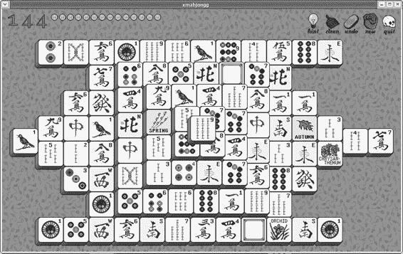
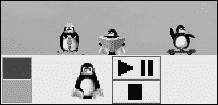

# 第十一章：享用 tar 包

## 概述

*从源代码编译程序（变得有点简单）*

对于初学者来说，仅仅提到从源代码编译程序就足以让人望而却步。*编译*和*源*这两个词似乎在新用户心中灌输了一种恐惧感。至少对我来说是这样的。

然而，安装程序的方法比听起来容易得多。实际上，现在你已经有了一些使用终端和命令行的经验，这简直太简单了——一种一、二、三，就完成了的过程。

当然，你可以不费心在你的系统上编译任何东西而长寿繁荣。你可以带着你的系统这样继续快乐地使用，或者你可以通过非常直接的 RPM 方法安装程序。

然而，并非所有的软件都以 RPM 格式提供；如果你充满自然的人类好奇心，总会有那么一天你想迈出一步。在完成这一章的简短内容后，你将能够做到这一点，我相信你会发现你最初的担忧是多余的。

* * *

* * *

## 什么是源？

为了理解*源*是什么，你应该了解一点程序实际上是如何从程序员电脑上的原始状态变成你机器上的运行应用程序的。首先，程序员用一种编程语言编写程序。你可能听说过像 Basic 或 C 这样的编程语言，还有很多其他的。程序员实际上用这样的语言编写的是一组称为*源代码*或*源*的指令。然而，你的电脑实际上无法理解任何这些源代码。这就像电脑说古希腊语，而源代码都是用法语写的。因此，电脑需要某种解释器来帮助它。

程序员使用的各种语言被称为*高级语言*——它们对程序员来说相对容易阅读。然而，计算机只理解被称为*低级语言*的东西，这对大多数普通程序员来说处理起来相当困难。为了将高级语言指令转换为低级语言，计算机需要一些其他程序来翻译。

这可以在程序运行时完成，在这种情况下，翻译程序被称为*解释器*。使用解释器运行的应用程序通常被称为*脚本*。第九章中的 pyWings 应用程序就是一个这样的脚本应用程序。

这种脚本应用程序的问题在于它们可能会更慢，因为计算机必须同时运行解释器、解释源代码以及运行实际应用程序。这就像让一个法语书籍被一个现场翻译员翻译给一个希腊语使用者——确实非常慢。

作为一种替代方案，许多程序使用 *编译器* 而不是解释器。编译器将高级源代码翻译成计算机在应用程序实际运行之前可以理解的低级 *机器代码* 或 *目标代码*。一旦完成这种翻译，计算机就再也不必担心高级指令了；它每次运行程序时只需读取翻译后的版本即可。这就像阅读一本你可以随时阅读且无需帮助的外国书的翻译版本一样。因为计算机可以在不同时使用解释器的情况下运行编译程序，所以编译程序运行得更快。因此，所有操作系统的应用程序大多数都是编译的。

* * *

* * *

## Tarballs：源代码的容器

几乎所有的源代码包都是以 tarballs 的形式提供的（tarballs 和 RPM 文件都被称为 *packages*，这就是为什么这类文件的图标看起来像一个小包裹）。Tarballs，就像 Windows 系统上的 ZIP 文件或 Mac 上的 StuffIt 文件一样，由一组文件组成，甚至是一个单独的文件，这些文件被压缩成一个节省空间的归档文件。在 Linux 中，创建此类归档最常见的方法是通过 tar 程序，tarballs 因此得名。Tar 文件或 tarballs 可以通过它们的文件扩展名来识别，这些扩展名是 .tar.gz 或 tar.bz2。

你可能已经意识到，也可能没有意识到，但你已经在前两个章节中使用了 tarballs。在第五章中，你将 tarballs 拖入主题偏好设置窗口以安装新的窗口边框和控制集，而在第九章中，你解压了一个 tarball（提取了归档文件）以设置和使用 pyWings 应用程序。tarballs 中的文件可以通过使用命令行提取，但为了方便起见，你只需使用在第九章中使用的简单双击方法即可。

* * *

* * *

## 项目 11A：编译和安装 Xmahjongg

为了获得一些从源代码编译程序的实际经验，你将使用一个名为 Xmahjongg 的游戏。现在，你可能认为，既然你已经在系统上安装了 GNOME mahjongg 游戏 和 KDE mahjongg 游戏（未列在主菜单中），再有一个 mahjongg 游戏有点多余。也许是这样，但就游戏而言，Xmahjongg 游戏在视觉上更易于接受，性能更敏捷。在我看来，它看起来也更漂亮。

尽管这些游戏点很重要，但更重要的是，Xmahjongg 软件包提供了一个完美的机会来学习从源代码编译程序然后安装它。它并不太大，不需要太多时间来完成，而且不需要调整。

你可以在图 11-1 中看到最终产品的样子。



图 11-1：Xmahjongg 游戏

如你所见，一切都非常简单且布局清晰。如果你还不熟悉这种麻将游戏类型，其想法足够简单。基本上，堆叠中有每种牌四张。你必须匹配一对面向一侧的相同牌面。当你点击两个匹配的开放牌面时，它们将消失。因此，游戏的目标就是从棋盘上移除所有牌面。这是一个非常简单的单人游戏。

要编译和安装 Xmahjongg，你将使用七个命令：**cd**（进入 xmahjongg 文件夹），**./configure**（配置 makefile，为下一个命令提供指令），**make**（将源代码转换为计算机可以理解的目标代码），**su**（成为 root 用户），**make install**（安装程序），**exit**（退出 root 模式），以及 **make clean**（清理混乱）。我知道这听起来像很多命令，但正如我经常说的，实际上做起来比看起来容易，所以不要害怕。

### *获取 Xmahjongg 文件*

要开始，你首先需要下载 Xmahjongg 文件。你可以从 Xmahjongg 项目页面获取：[`www.lcdf.org/~eddietwo/`](http://www.lcdf.org/~eddietwo/) xmahjongg/。下载 tarball **xmahjongg-3.6.1.tar.gz** 或更高版本（如果有的话）。不要下载任何 RPM 文件，即使它们声称是为 Red Hat 准备的。

一旦你将文件放在你的硬盘上，你就可以开始了。

### *11A-1：解压、编译和安装*

在你实际编译和安装 Xmahjongg 之前，你必须提取 tarball 的源文件，或者说是 *解压* 这个 tarball。

1.  双击文件图标来解压 **xmahjongg-3.6.1.tar.gz** 文件。这将打开文件滚动程序。

1.  在文件滚动程序窗口中，点击 **解压** 按钮。

1.  当文件滚动程序的解压窗口打开时，点击 **确定** 按钮。一旦文件滚动程序完成，你可以关闭文件滚动程序窗口。现在，一个新的文件夹，名为 xmahjongg-3.6.1，将出现在你的主文件夹中。图 11-2 展示了 xmahjongg-3.6.1 文件夹的内容。

    

    图 11-2：解压 Xmahjongg tarball 创建的文件夹内容

1.  滚动查看 xmahjongg-3.6.1 文件夹的内容，寻找一个名为 **INSTALL** 的文件。实际上，INSTALL 文件只是一个包含如何安装程序指令的文本文件。要阅读 INSTALL 文件，只需双击它，它将在相同的 Nautilus 窗口中打开，如图 11-3 所示。

    

    图 11-3：在 Nautilus 窗口中阅读 tarball 的 INSTALL 文件

    在这个例子中，你可以简单地关闭 INSTALL 文件，因为它规定的步骤与我下面列出的步骤相同。然而，在未来，当你从源代码安装其他程序时，你需要遵循随源代码文件提供的 INSTALL 文件中的说明。对于大多数 INSTALL 文件，说明将与以下说明相匹配。

1.  通过点击 GNOME 面板上的终端启动器来打开一个终端窗口，然后通过输入 cd xmahjongg-3.6.1 并按回车键进入新文件夹。

    下一个步骤类似于设置阶段，它会在 xmahjongg-3.6.1 文件夹中运行配置脚本。配置脚本检查它需要哪些文件、编译器和其他东西，然后搜索你的计算机以查看这些是否已经存在，以及它们在哪里。基于这些信息，它随后会写一个名为 **makefile** 的文件，这是一个指令集，将在后续步骤中告诉 **make** 命令如何针对你的系统配置进行具体设置。

    当你在运行 **configure** 时，你会在终端窗口中看到很多奇怪和神秘的事物流下来；这实际上是正在进行的记录，每一步都在进行。根据你处理的程序，这可能需要一点时间——几秒钟或几分钟。无论如何，你无需担心。只要神秘的文本继续流动，并且在整个过程的最后没有错误信息，一切都会顺利。

1.  通过输入 ./configure 并按回车键来编译程序。

    当 **configure** 完成其工作后，你将再次看到提示符，然后你可以继续到下一个步骤，即翻译步骤。**make** 命令读取 **configure** 创建的 makefile，以查看在你的机器上需要如何设置。然后它继续调用编译器将高级源代码翻译成低级、机器可读的文件，这些文件可以在后续步骤中安装。

1.  要执行此翻译，输入 make 并按回车键。

    再次，你将看到更多神秘文本在屏幕上流动，以及一段短暂的等待，通常比配置过程稍长。

    一旦 **make** 完成其工作并且你再次看到提示符，你就可以安装程序了。然而，由于一些由 **make** 创建的文件必须放入由 root 权限保护的区域，你必须在执行其他任何操作之前，使用 **su** 命令首先成为 root 用户。

1.  通过输入 su 并按回车键来成为 root 用户。

1.  当提示输入 root 密码时，输入你的 root 密码，然后按回车键。

    到目前为止，你还没有以任何方式改变你的系统。迄今为止的所有更改都只发生在 xmahjongg-3.6.1 文件夹中。你的系统仍然像你开始时一样纯净。当然，现在这一切都将结束，因为你即将将 **make** 创建的文件安装到你的系统中。

1.  输入 make install 并按回车键。

1.  一旦**make install**完成程序的安装，你的提示符将重新出现。现在输入 exit 并按回车键退出 root 模式。

1.  输入 cd 并按回车键返回用户的主目录，暂时保持终端窗口打开。

### *11A-2：运行 Xmahjongg*

通常情况下，从源代码编译的程序不会自动在主菜单中安装启动器。虽然你可以通过前往主菜单，选择**运行程序**，然后在对话框中输入程序名称来首次运行程序，但最好是通过在终端窗口中输入新程序的命令来首次运行程序。如果在安装过程中出现任何问题，终端会告诉你问题是什么，而运行程序的方法只会让你感到困惑，不知道发生了什么。

通常，程序的命令名称写在从 tar 包（在这种情况下是 xmahjongg-3.6.1）中提取源文件时创建的目录中的 INSTALL 文件或 README 文件中。有时你可能会在那里找不到它，但你可以在网上该应用程序的项目页面上找到它。然而，有时你甚至在那里也找不到它，所以你只能求助于猜测。有时从源代码编译程序最难的部分不是编译它，而是找出运行它的命令是什么。通常，它只是 tar 包的名称，减去文件扩展名。

是时候确保 Xmahjongg 程序安装一切顺利了。在你的终端窗口中输入 xmahjongg 并按回车键。如果一切如预期，没有理由不应该是这样，Xmahjongg 程序将在几秒钟内打开，一切都会顺利。如果你喜欢，现在可以玩一会儿游戏，或者直接回到清理工作，这是一个足够简单的过程。

### *11A-3：清理*

一旦你完成编译和安装你的新应用程序，你会在原始源文件夹中发现很多不再需要的额外文件。正如我之前提到的，**make**命令创建了所有源代码文件的翻译版本，然后在**make install**步骤中安装了这些低级语言版本的文件。现在你的安装已经完成，你不再需要这些文件了；它们已经被复制到其他地方。你源文件夹中的翻译文件只是在那里粗鲁地浪费磁盘空间。

清除这些空间占用者很简单，幸运的是。**make clean**命令将删除你源文件的所有额外翻译版本。然而，有时**make clean**也会清理你的 makefile，这是不好的，因为 makefile 通常允许你使用它卸载你安装的程序。因此，在运行**make clean**命令之前，将 makefile 复制到桌面是一个好主意。然后，一旦你完成了**make clean**，你可以检查 makefile 是否仍然在项目文件夹中。如果是，你可以在桌面上删除 makefile。如果 makefile 不在项目文件夹中，你可以将桌面上的 makefile 移回该文件夹。

这里是步骤：

1.  输入`cd xmahjongg-3.6.1`并按回车键返回到 xmahjongg-3.6.1 文件夹。

1.  输入`make clean`并按回车键。你不需要是 root 用户来做这件事。

1.  在**make clean**完成其整理工作后，你就完成了，你将节省一点磁盘空间。在 xmahjongg-3.6.1 目录的情况下，你会发现它将从 4.2MB 缩小到仅 867KB（不到一兆字节）左右。

1.  通过输入`exit`并按回车键关闭你的终端窗口。

1.  如果 Xmahjongg 运行正常，并且你对它的满意程度足以确信你不想卸载它，你现在可以将 xmahjongg-3.6.1 文件夹拖到垃圾桶。如果你并不那么印象深刻，并且不介意立即删除它，请继续到 11A-4。

就这样！你已经从源代码编译了一个程序，安装了它，甚至清理了现场。正如你所看到的，这真的没什么难的！现在确实是时候给自己一个自我表扬了。

### *11A-4：重新考虑——卸载 Xmahjongg*

假设你通过这个编译过程安装了一个程序，但你不喜欢或不需要它——你只是想把它从那里移除。通常，如果你在项目文件夹中仍然有那个讨厌的 makefile，你可以使用**make uninstall**命令来卸载程序。你可能首先想查看 INSTALL 或 README 文件，看看是否支持**make uninstall**或者是否有其他卸载方法。然而，有时卸载方法并没有指定，所以你只能试一试，看看**make uninstall**是否有效。这没有危险，因为如果不支持，什么也不会发生。

无论如何，Xmahjongg 是一个很好的例子。在 INSTALL 或 README 文件中都没有关于卸载程序的信息，所以为了找出你是否可以使用**make uninstall**，你必须经过或多或少标准的步骤：

1.  打开一个终端窗口，通过输入`su`并按回车键成为 root 用户。然后输入你的 root 密码并按回车键。

1.  使用**cd**命令通过输入

    ```
    cd xmahjongg-3.6.1 and hitting ENTER.
    ```

1.  输入`make uninstall`并按回车键。

    当你完成时，你应该会在你的终端窗口中看到一段文本流下几秒钟。如果你在它停止流动并回到 root 提示符后查看文本，你会发现它实际上是由你现在或多或少理解的信息组成：一系列**cd**、**rm**和**rmdir**命令。

1.  为了确保 Xmahjongg 确实被卸载，请输入 exit 并按回车键退出 root 模式，然后输入 xmahjongg 并按回车键尝试运行程序。你应该会被告知找不到该命令。如果是这种情况，你已成功从你的电脑中移除了 Xmahjongg。

这基本上是你以这种方式卸载任何其他最初以非 RPM 方式安装的软件包的方法。如果它有效，那就有效，如果它不有效的话……好吧，那么你将不得不通过双击它来阅读 makefile，看看所有东西都放在了哪里，然后逐个删除所有文件。这真的很痛苦，你可能在过程中搞砸了某些东西，所以我建议你至少在这个游戏的这个阶段忽略这个程序。

* * *

* * *

## 项目 11B：XPenguins（可选）

哎呀！正如我所预料的那样；你被自己的成就感冲昏了头脑，渴望更多。为了满足你的愿望，我将给你另一个小项目，你可以自己完成。这是一个分两部分的项目，将让你更多地运用你的技能。

这个 DIY 项目是一个叫做 XPenguins 的有趣的小桌面娱乐程序。该程序在你的桌面上释放了一群企鹅，它们通过气球降下，读书，走在你的窗口和面板上，甚至还在东西上钻孔（见图 11-4）。诚然，XPenguins 是那些系统资源浪费者之一；它完全无用，但根据你的观点，相当可爱和有趣。至少，所有这些企鹅在你的屏幕上闲逛会给你的系统带来更 Linux 化的外观。


图 11-4：XPenguins 在行动

### *获取 XPenguins 文件*

你需要两个不同的文件来完成这个项目。第一个是实际的 XPenguins 程序，你可以从[`dag.wieers.com/packages/xpenguins.`](http://dag.wieers.com/packages/xpenguins)获取。在那个页面上，只需下载适合你系统的最新 XPenguins 文件。如果你像我在第十章中解释的那样将 DAG 添加到 Synaptic 的仓库列表中，你也可以通过运行 Synaptic，在 Synaptic 的**查找**框中输入 xpenguins，然后遵循标准的 Synaptic 安装程序来下载文件。

你还需要另一个文件，这是一个 GNOME 面板小程序，你可以用它来在你心情好的时候让企鹅在你的屏幕上四处乱跑，一旦它们开始让你烦恼，你就可以把它们清除掉。要获取这个文件，请访问 XPenguins 项目主页[`www.xpenguins.seul.org.`](http://www.xpenguins.seul.org)。一旦到达那里，下载**xpenguins-applet-2.1.0.tar.gz**（GNOME 面板小程序）。如果你恰好在使用 Red Hat Linux 8，请使用**xpenguins-applet-2.0.1.tar.gz**而不是 2.1.0。

### *11B-1: 一般步骤*

第一步是安装**xpenguins RPM**，就像你在第八章中学到的那样。一旦完成，解压**xpenguins-applet-2.1.0.tar.gz**压缩包，切换到解压后创建的新文件夹，然后按照本章学到的步骤进行：**./configure**，**make**，**make install**，和**make clean**，但在此情况下，根据 INSTALL 文件中的说明，不要只是输入./configure，而是输入以下内容：

```
./configure --prefix=/usr --sysconfdir=/etc 
```

### *11B-2: 运行 XPenguins*

你可以直接在运行命令窗口或命令终端中输入 xpenguins 来运行 XPenguins，但如果你这样做，清除你新添的讨厌的小朋友们将会变成一项更加繁琐的任务。相反，通过右键点击面板，在弹出菜单中选择**添加到面板** > **娱乐** > **XPenguins**，将你刚刚编译的 XPenguins 小程序添加到 GNOME 面板中。如果 XPenguins 没有立即出现在菜单中，请在下次重启机器时再次尝试。

使用这个面板小程序（见图 11-5），你可以通过点击顶部按钮来召唤企鹅，然后通过点击底部按钮将它们送回原来的地方。这确实是一个非常方便的安排。



图 11-5：XPenguins 面板小程序（和一些正在活动的企鹅）

### *11B-3: 为 XPenguins 安装主题*

如果你喜欢 XPenguins 的概念，但不喜欢企鹅本身，请右键点击 XPenguins 面板小程序，并在弹出菜单中选择**属性**。在属性窗口中，点击**主题**标签，你将找到一些非企鹅的替代选项。如果这些选项中没有令你满意的，你可以回到 XPenguins 项目页面并下载一个包含几个卡通角色主题的附加包，例如辛普森一家。主题包可以作为压缩包提供，但为了方便起见，只需下载 RPM 文件**xpenguins_themes-1.0-1.noarch.rpm**并安装它。

* * *
