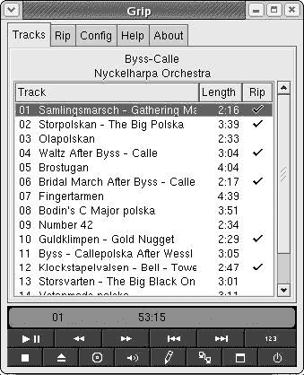
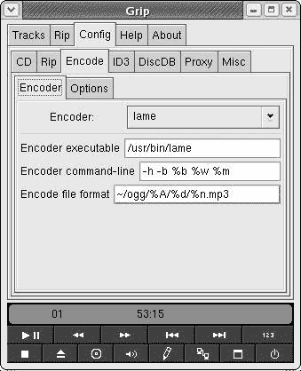
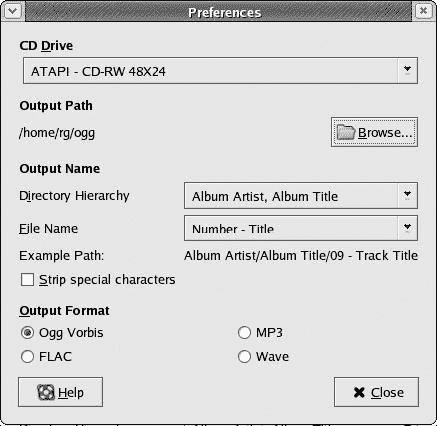
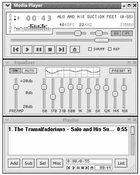
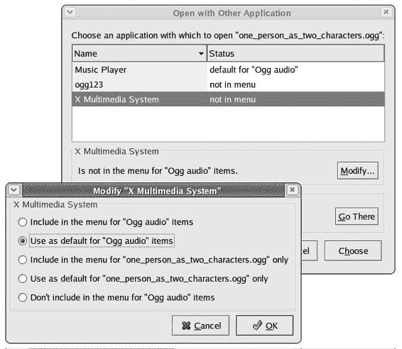
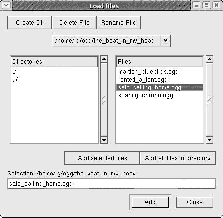
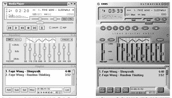
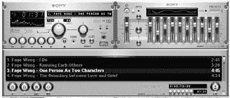
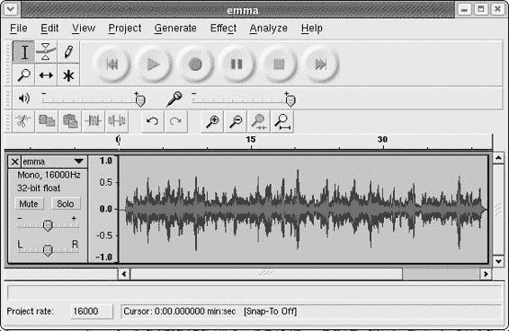
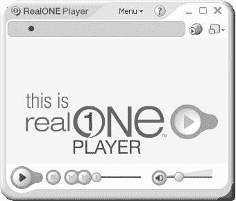

# 第十三章：Tux 摇滚

*Linux 音乐风格*

现在是时候转向音频方面的事情了。是的，Linux 确实很酷。您已经在第七章（DDU0055_split_000.html#309）中了解了 GNOME CD 播放器，但在这章中，您将了解到更多关于您系统音乐才能的信息。您将学习如何抓取 CD 并创建 MP3 和 Ogg 文件（这些文件的文件扩展名为.mp3 和.ogg），如何更改这些文件的标签，以及如何播放这些文件。您还将学习如何播放各种音频流。

## 音频格式

在我们继续之前，最好讨论一下音频数据可以在您的计算机上存储的各种格式。长期以来，事实上的标准一直是 WAV（由微软/IBM 创建并使用.wav 扩展名），AU

（来自 Sun/Unix，并使用.au 扩展名），以及 AIFF（来自苹果），所有这些都是未压缩的格式。因此，以这些格式保存的文件非常大，一张 CD 质量的 WAV 文件平均每分钟约为 10MB。为了更好地理解这一点，我 1988 年的第一台 Macintosh 有 40MB 的硬盘——当时我认为这比我所需要的空间多，但不足以存储 Nirvana 的“Come as You Are”的 WAV 文件。

随着计算机向今天的多媒体机器演变，很明显，必须对那些消耗磁盘空间的音频文件采取一些措施。因此，开发了音频压缩格式。这些压缩格式通过简化来说，是通过删除人耳听不到的声音信号部分——有点像狗哨的方法。最广为人知并被广泛接受的音频压缩格式是 MP3。以 MP3 格式编码的音频文件可以缩小到原始 WAV 文件大小的十二分之一，而不会在质量上产生任何明显的损失。

另一种开发的音频压缩格式是 Ogg Vorbis。Ogg Vorbis 是开源社区的产品，因此，与 MP3 不同，MP3 一直处于尚未行使的专利权阴影之下，从一开始就免除了专利和许可的担忧。正因为如此，以及它在质量和性能方面与 MP3 相当（如果不是更好），Ogg Vorbis 成为了 Linux 社区的宠儿，并成为了事实上的音频压缩格式。

* * *

* * *

## Grip

在您的系统中，最方便且最受欢迎的多媒体程序之一是 Grip。Grip 允许您从音频 CD 中*抓取*（复制）WAV 文件，并将这些文件原样保存，或者将它们*编码*（转换为）压缩的 Ogg 或 MP3 文件，供您在电脑或外部设备（如苹果的 iPod）上个人使用，尽管 iPod 目前还不能播放 Ogg 文件；并不是很多播放器可以。

将 CD 提取为 WAV 文件或将 CD 提取后编码为 Ogg 文件格式的过程相当简单。在 Fedora 中配置的 Grip 已经设置得很好来执行这项任务。要开始，只需将你想要提取的音频 CD 放入驱动器中。然后 GNOME CD 播放器将自动启动，但你不需要它来进行这项提取工作，所以你可以关闭它。然后，转到主菜单并选择**声音** & **视频** > **更多声音** & **视频应用程序** > **Grip**。

Grip 将打开，几秒钟后它将显示驱动器中的 CD 内容。假设你在做这件事时连接到了互联网，Grip 还将列出专辑标题、录制专辑的艺术家以及 CD 上所有歌曲的标题（见图 13-1）。

图 13-1：Grip 显示从互联网检索到的 CD 信息

当歌曲在 Grip 窗口中显示后，你可以通过点击**提取**列下标题旁边的按钮来选择你想要提取的歌曲。或者，如果你想提取所有歌曲，你只需点击该列顶部的标题**提取**。在你做出选择后，点击**提取**标签以显示提取页面（见图 13-2）。

图 13-2：在 Grip 中选择仅提取或提取并编码

如果你只想提取音轨并将它们保存为 WAV 文件（这些文件会占用大量磁盘空间），你可以点击**仅提取**按钮，提取过程将开始。如果你想提取文件并将它们编码成更小的 Ogg 格式以在你的电脑上播放，请点击**提取并编码**，Grip 将开始同时提取和编码文件。编码过程将比提取过程花费更长的时间。

一旦 Grip 完成工作并弹出你的 CD，你将在用户主目录下的**ogg**文件夹中找到你的新文件。如果你在第五章的项目中未创建 ogg 文件夹，Grip 将为你自动创建一个。如果你点击了**提取并编码**按钮以将文件编码为 Ogg 格式，Grip 也将删除从 CD 中提取的占用空间的 WAV 文件。

在你的**ogg**文件夹内将创建一个艺术家的文件夹，在新建的艺术家文件夹内将有一个专辑文件夹，提取（可能编码）的文件将位于专辑文件夹内。因此，如果你提取了 Chuck Rumsfoord 和 Venusians 的专辑*Orange Lightning Water*，你将在 ogg/chuck_rumsfoord_and_the_venutians/orange_lightning_water 找到你的文件。Grip 还会在艺术家文件夹外创建一个专辑播放列表（文件扩展名为.m3u）。双击该文件将启动你的默认音频播放器，该播放器将加载该专辑的整个歌曲列表并开始播放。非常方便。

### *使用 Grip 编码 MP3 文件*

尽管我，以及大多数 Linux 用户，更喜欢 Ogg Vorbis 格式而不是 MP3 格式，但仍有很多人需要或想要将文件编码为 MP3 格式。如果您有一个像 iPod 一样的播放器，目前还不能支持 Ogg 文件，那么这一点尤其正确。

Fedora 没有内置 MP3 支持，Grip 应用程序在没有这种支持的情况下无法编码 MP3 文件。然而，您可能不知道，当您在第十章中使用 APT/Synaptic 安装 MPlayer 时，您已经为 Grip 提供了这种能力。APT/Synaptic 为您系统下载并安装了 MPlayer 的一个依赖项，即名为 LAME 的程序，这是一个 MP3 编码程序。既然这样，您就已经准备好了。（我告诉过您，那些依赖项以后会派上用场。）

|  | 注意  | *如果您之前由于某些原因没有安装 LAME，现在应该通过运行 Synaptic，在* ***查找*** *框中输入* LAME *，然后按照您在第十章中学到的步骤进行操作来安装它。* |
| --- | --- | --- |

要设置 Grip 以编码 MP3 文件而不是 Ogg 文件，请点击主 Grip 窗口中的**配置**选项卡，然后在配置窗口中点击**编码**选项卡。这将显示编码设置页面（参见图 13-3）。在此页面上，从**编码器**下拉列表中选择**lame**。然后，在页面底部的**编码文件格式**框中，将现有字符串中的扩展名从**.ogg**更改为**.mp3\.**。就是这样。

图 13-3：设置 Grip 以编码 MP3

如果您想回到 Ogg 编码，只需将底部框中的**.mp3**扩展名改回**.ogg**，然后在**编码器**下拉列表中选择**oggenc**。

* * *

* * *

## Sound Juicer

Fedora Core 包含一个名为 Sound Juicer 的替代 CD 抓取程序。Sound Juicer 是一个相对较新的程序，不如 Grip 那么知名，但它使用起来要简单得多。缺点是，它不会自动为您抓取和编码的歌曲创建播放列表，而且（至少对我来说）它似乎有点慢，有时还有点古怪。

要尝试一下，请转到主菜单，选择**声音** & **视频** > **更多声音** & **视频应用程序** > **Sound Juicer CD 抓取程序**。将音频 CD 放入驱动器后，如果当时您连接到互联网，专辑标题、艺术家名称和 CD 上的曲目列表将出现在程序窗口中（参见下一页的图 13-4）。

图 13-4：Sound Juicer 显示 CD 信息

Sound Juicer 默认设置为提取你的 CD 并将音频文件编码为 Ogg Vorbis 格式。Sound Juicer 将保存这些文件的默认位置是你的家目录。因为你已经有一个 ogg 文件夹用于此目的，所以最好也将此作为 Sound Juicer 的默认位置。要这样做，转到**编辑**菜单并选择**首选项**。这将打开首选项窗口，你可以通过点击**浏览**按钮来更改输出路径（见图 13-5 页 177）。在“选择输出位置”窗口中，双击该窗口文件夹面板中的**ogg**文件夹，然后点击**确定**。你现在可以关闭首选项窗口了。

图 13-5：设置 Sound Juicer 音频文件默认位置

你可能已经注意到，在首选项窗口中，除了 Ogg Vorbis 之外，还有其他文件格式的设置。尽管首选项设置在那里，但使用这些格式所需的支持文件并未包含在你的 Fedora Core 系统中。如果你想编码 MP3，现在可以使用 Grip，或者你可以使用 Synaptic 检查 APT 仓库。你还可以查看我的网站，看看是否有关于这方面的更新信息([www.edgypenguins.org/LFYM](http://www.edgypenguins.org/LFYM))。

要开始提取所有歌曲，你只需要点击 Sound Juicer 窗口底部的**提取**按钮。如果你不打算提取和编码某些曲目，请在点击**提取**之前取消选中问题歌曲旁边的复选框。如果你只想提取和编码列表中的几首歌曲，可能最好先转到**编辑**菜单，选择**取消选择全部**，然后在你点击**提取**之前检查你想要提取的歌曲旁边的复选框。

当歌曲正在被提取和编码时，Sound Juicer 会在一个进度窗口中显示其进度，当所有操作完成后，它还会在一个小窗口中告诉你曲目已成功复制。一旦收到这条消息，点击**关闭**（仍然有问题的**打开**按钮做的是同样的事情）。然后你可以通过转到**文件**菜单并选择**弹出**来弹出 CD。如果你想提取和编码另一张 CD，只需将其放入驱动器中，然后，就像第一张 CD 一样，专辑、艺术家和标题都会出现在程序窗口中，你又可以继续提取了。

* * *

* * *

## Rhythmbox

Fedora Core 新增了一个名为 Rhythmbox 的音频播放器（见图 13-6），现在它是 Fedora Core 中 Ogg 文件的默认音频播放器。Rhythmbox 使用 Sound Juicer 作为其提取/编码器，其功能应该与 Macintosh 世界的 iTunes 应用程序非常相似。

图 13-6：Rhythmbox 音乐播放器

不幸的是，Rhythmbox 音乐播放器似乎在 Fedora Core 中引入得过早，因为它在某些区域仍然有点儿 bug。我实在无法推荐它，尤其是当经过考验的 XMMS 音频播放器（我稍后会提到）也安装在你的系统上时。我会在等待 Rhythmbox 升级几轮（最终将通过 APT 提供）之后再将其设为默认音频播放器。

如果你仍然想看看 Rhythmbox，当然可以，但请记住，你无法播放 MP3 文件（至少，目前不行），对 Ogg 格式的网络电台流的支持最多是奇特的。这实际上只让你能够播放磁盘上的 Ogg 文件，而 Rhythmbox 处理得相当不错。因为 Rhythmbox 现在是 Fedora Core 中 Ogg 文件的默认音频播放器，你只需双击任何 Ogg 文件即可运行它。或者，你也可以转到主菜单，选择**声音和视频** > **音乐播放器**。

第一次运行 Rhythmbox 时，你会遇到一个三步设置向导。要进入第一个介绍屏幕，只需点击**前进**。在第二个屏幕（如图 13-7 所示），你应该告诉 Rhythmbox 你将把 Ogg 文件保存在哪里（或者计划保存）。因为你应该已经在本书的指导下创建了一个 ogg 文件夹，请使用该文件夹。在**路径**输入框中输入/home/username/ogg（或使用**浏览**按钮图形化地定位文件夹），然后点击**前进**。最后，在第三个和最后一个屏幕中，只需点击**应用**，Rhythmbox 将扫描你的 ogg 文件夹，并将找到的任何歌曲添加到其库中。

(1307_0.jpg)

图 13-7：设置 Rhythmbox

### *Rhythmbox 库和浏览器*

如果你熟悉苹果的 iTunes，那么你应该对 Rhythmbox 中的库也有相当的了解，因为它们基本上是相同的概念。基本上，每次你告诉 Rhythmbox 检查你的 ogg 文件夹中的新歌曲（通过转到**文件**菜单并选择**添加到库**），它就会扫描该文件夹，并将找到的任何新歌曲添加到其库中。你也可以通过右键单击目标文件或文件夹，并在弹出菜单中选择**添加到音乐播放器库**来添加其他单个音频文件或包含此类文件的文件夹。因此，本质上，库是一个数据库，包含了你在 ogg 文件夹中的所有歌曲以及你指向 Rhythmbox 的其他任何歌曲。

当你想在 Rhythmbox 中播放歌曲时，只需在程序窗口左侧的资源面板中点击**库**。这将显示你已在库中列出的所有歌曲。你可以点击播放按钮开始播放它们，或者向下滚动到你想开始播放的歌曲并双击它。

当然，随着您的音乐库增长，这可能会变得相当麻烦——可能会有那么一天，您感觉更喜欢 Roxy Music 而不是 Britney（感谢上帝如此）。

幸运的是，Rhythmbox 有一个很好的浏览器功能，允许您查看其库中列出的艺术家和专辑列表。如果您在艺术家面板中点击一个特定的艺术家，该艺术家的专辑列表将出现在右侧面板中（见图 13-8）。然后，您可以通过双击右侧面板中的任意专辑来播放它。如果您想播放该艺术家所有的专辑，只需在左侧面板中双击艺术家的名字。总的来说，这是一个非常实用的功能。

图 13-8：在 Rhythmbox 中按艺术家选择音乐

### *创建播放列表*

Rhythmbox 允许您创建播放列表，这是您自己的个性化歌曲组合。要创建播放列表，请转到**文件**菜单并选择**新建播放列表**。然后会打开一个对话框，您可以在其中为您的列表命名；然后点击**创建**。新的列表将出现在 Rhythmbox 窗口的左侧面板中。

要将歌曲添加到您的列表中，只需将您想要添加的歌曲从主列表拖到新的播放列表图标。完成后，点击您的新播放列表，然后其内容将出现在主列表面板中。之后，只需点击播放按钮即可播放您新播放列表中的歌曲。

* * *

* * *

## XMMS

现在我们来谈谈 XMMS，它是 Linux 世界最知名且最广泛使用的音频播放器。在它能做什么方面，它几乎与 Windows 世界的 Winamp 相似，但它是从头开始编写的，非常酷且功能强大。使用 XMMS，您可以播放几乎所有类型的音频文件，甚至可以以 MP3 或 Ogg 格式收听互联网广播流。

XMMS 实际上由三个组件组成：媒体播放器、均衡器和播放列表（见下一页的图 13-9）。您可以单独运行媒体播放器，或者与其中一个或两个其他组件一起运行，您可以通过点击媒体播放器窗口中的小 **EQ** 按钮来打开均衡器，或者点击 **PL** 按钮来打开播放列表。您还可以像真正的组件立体声一样移动各个组件，使它们堆叠在一起，并排或以任何您想要的配置；只需拖动东西，直到它们看起来像您想要的那样。

图 13-9：XMMS 的三个组件

您可以通过进入主菜单并选择**声音** & **视频** > **音频播放器**来运行 XMMS。您过去也曾经能够通过双击任何 M3U、Ogg 或 MP3 文件（在 Red Hat 公司移除 MP3 支持后重新安装）来启动它播放。然而，由于 Rhythmbox 已被设置为 Fedora Core 的默认播放器，这种情况现在不再是默认的。

然而，你可以设置这些设置，使 XMMS 再次成为默认音频播放器，或者至少在右键点击音频文件时在弹出菜单中显示为选项。

要更改 Ogg 文件的这些设置，请按照以下步骤操作：

1.  右键点击任何 Ogg 文件，然后在弹出菜单中选择 **打开方式** > **其他应用**。将出现“打开方式”窗口（见图 13-10）。

    

    图 13-10：将 XMMS 设置为默认音频播放器

1.  通过单击名称一次选择 **X 多媒体系统**（XMMS），然后点击 **修改**。这将打开一个名为“修改‘X 多媒体系统’”的窗口（也显示在图 13-10 中）。

1.  在该窗口中，选择第二个选项，**将“Ogg 音频”项用作默认项**，然后点击 **确定**。

完成这些操作后，XMMS 将成为 Ogg 文件的默认播放器，而通过右键点击任何音频文件并在弹出菜单中选择 **打开方式** > **其他应用**，音乐播放器（也称为 Rhythmbox）仍然可用。即使你后来发现你更喜欢 Rhythmbox 而不是 XMMS，这种做法总体上还是更好的，因为你保留了 Rhythmbox 播放音乐的功能，同时利用 XMMS 的轻量级特性在首次遇到音频文件时快速检查。

既然你已经为 Ogg 文件完成了这个过程，同样为 MP3 文件做同样的事情也是一个好主意。只需右键点击一个 MP3 文件，然后按照相同的步骤操作。

* * *

* * *

## 项目 13A：为 XMMS 安装 MP3 支持

正如我提到的，XMMS 几乎可以播放任何格式的音频文件。然而，由于我本章开头提到的那些专利和许可问题，Red Hat 公司从其产品中移除了 XMMS 的 MP3 支持。这意味着，如果你想用 XMMS 播放 MP3 或 MP3 流，你需要安装一个补丁才能做到这一点。

如果你不相信我，或者只是不理解我在说什么，请亲自尝试。在你的硬盘上放置一个 MP3 文件，然后双击它。XMMS 将打开，同时还会打开另一个小窗口，显示无法播放 MP3 的消息。

### *13A-1：下载和安装 XMMS MP3 补丁*

XMMS MP3 补丁可以通过 Synaptic 轻松下载和安装。只需通过主菜单转到 **系统工具** > **Synaptic**（或在你的系统上为 **系统设置** > **Synaptic**）来运行 Synaptic。

一旦 Synaptic 启动并运行，只需在查找框中输入 XMMS-mp3，然后按照你在第十章中学到的通过 Synaptic 安装软件包的简单步骤进行操作。

### *13A-2：尝试 XMMS MP3 补丁*

一旦补丁安装完成，你可以通过双击硬盘上的任何 MP3 文件来轻松尝试它（如果你现在没有，你应该使用 Grip 创建一个，就像你在本章前面学到的）。然后 XMMS 将打开，你点击的文件将开始播放。正如你将看到的，这次不会有任何无法播放的 MP3 消息。

### *创建 XMMS 播放列表*

XMMS 可以播放 Grip 创建的 M3U 播放列表，但它也可以创建播放列表。假设你想要创建一个包含不同艺术家最喜欢的歌曲的播放列表，但这些歌曲自然地分布在不同的文件夹中。

要创建这个“我的最爱”播放列表，只需将你想要的每首歌曲添加到 XMMS 播放列表窗口中，你可以通过点击该窗口底部的较小 **添加** 按钮来完成（如 图 13-9 所示，位于 第 180 页）。这将打开加载文件窗口（见 图 13-11），在那里你可以定位第一个文件并点击 **添加选中文件**。然后在同一加载文件窗口中，导航到你想添加到列表中的每个额外曲目，为每个曲目点击 **添加选中文件**。（你可以忽略加载文件窗口中的 **添加** 按钮。）

图 13-11：通过加载文件窗口将歌曲添加到 XMMS 播放列表

一旦你添加了你想要的全部文件，你可以在播放列表窗口中看到所有标题（见 图 13-12）。如果一切看起来都符合你的预期，点击，但不要释放窗口右下角的 **列表** 按钮。然后选择

图 13-12：在 XMMS 播放列表窗口中显示的新播放列表

**保存** 从弹出菜单中选择，并释放鼠标按钮。这将弹出一个保存播放列表窗口，在那里你应该输入 /home/*用户名*/ogg/*播放列表标题*.m3u（用你的用户名和播放列表标题替换 *用户名* 和 *play-listtitle*）。例如，在我的情况下，我输入了 /home/rg/ogg/MyFaves.m3u。完成后，点击 **确定**，XMMS 将保存你的新播放列表。之后，要播放列表，只需双击该列表的 M3U 文件即可。

### *使用 XMMS 收听流媒体*

互联网最酷的功能之一是流媒体，这基本上是现场或录制的音频或视频互联网广播。这些广播可以以各种流格式出现，这些格式基本上是压缩格式，允许数据以尽可能小的尺寸在网络上传输。不幸的是，Linux 目前还不能以任何简单的方式处理这两种最常见格式，即微软的 Windows Media Player 和苹果的 QuickTime。幸运的是，互联网上还有其他媒体流格式，例如 RealMedia。此外，由于流媒体格式本质上是一种节省空间的压缩格式，MP3 和 Ogg Vorbis 这两种本身就是音频压缩格式的格式，自然也被用作互联网音频广播的流媒体格式。

#### Ogg Vorbis 流

除了允许你将音乐以 Ogg 文件的形式保存到磁盘外，Ogg Vorbis 还被用于互联网上的流媒体。然而，与 MP3 流的数量相比，Ogg Vorbis 广播流的数量仍然相当有限。尽管如此，情况似乎正在改变，实验 Ogg Vorbis 的互联网广播人数似乎在缓慢增加。

法国广播电台是这些 Ogg Vorbis 广播电台的一个很好的例子。法国广播电台为 Windows Media Player 格式的互联网听众提供了一系列节目流。现在，它已经开始“实验”（这是他们的话，不是我的）为所有广播节目提供 Ogg Vorbis 流。我推荐你尝试的流是 Fip，这是一个包含所有流派音乐的极酷的混合收藏；你将不断被他们播放的内容所惊讶。如果你担心语言问题，不用担心；谈话很少，大约 80% 的播放音乐是英文。我除了会说“我累了”之外，不会说任何法语，但我完全没有问题。

如果你想尝试一般性的流媒体，特别是法国广播电台的流媒体，那么在 XMMS 主窗口的任何空白处右键单击，并在弹出的菜单中选择**播放位置**。在弹出的位置窗口中，输入 [`ogg.tv-radio.fr:1441/encoderfip.ogg`](http://ogg.tv-radio.fr:1441/encoderfip.ogg)，然后点击**确定**。假设你已经连接到互联网，Fip 应该在几秒钟的预缓冲后开始播放。

如果你希望在将来再次玩 Fip 而不必每次都输入相对较长的网址，你可以在主目录中创建一个可点击的启动器，方法是将 Fip 的位置保存为播放列表。与上一节一样，点击但不释放播放列表窗口右下角的**列表**按钮。在弹出的菜单中，选择**保存**，这将打开一个保存播放列表的窗口。在窗口底部的选择框中，输入 Fip.m3u，然后点击**确定**。

完成所有这些后，一个 Fip.m3u 文件将出现在你的主文件夹中。现在，无论何时你想收听 Fip，只需双击那个图标，XMMS 将打开并开始为你提供一份折衷主义的音乐，当然，前提是你当时已经连接到互联网。

如果你想尝试其他法国广播电台的流媒体，请访问[www.radiofrance.fr/services/aide/difflive.php#ogg,](http://www.radiofrance.fr/services/aide/difflive.php#ogg)，在那里你可以找到一个地址列表。

如果你喜欢更传统的流行和摇滚音乐，提供 Ogg Vorbis 流的另一个广播电台是 Virgin Radio。Virgin Radio 提供标准流行/摇滚和经典摇滚广播流。要收听 Virgin Radio，请访问 Virgin Radio 网站 [www.virginradio.co.uk/thestation/listen/ogg.html.](http://www.virginradio.co.uk/thestation/listen/ogg.html)。一旦到达那里，点击你想收听的节目流的适当链接（调制解调器或宽带）。

完成后，Mozilla 将显示一个窗口（见 图 13-13），询问你想要使用什么程序来打开 Ogg 文件类型。选择 **打开方式**，并在相应的框中键入 /usr/bin/xmms。然后点击 **确定**。Mozilla 将打开 XMMS，Virgin Radio 流将开始播放。从现在起，每次你尝试播放 Ogg Vorbis 流时，Mozilla 都会自动启动 XMMS 来播放它。

(1313_0.jpg)

图 13-13：指示 Mozilla 使用 XMMS 播放 Ogg 流

#### SHOUTcast (MP3) 流

正如你刚刚学到的，XMMS 可以播放 Ogg Vorbis 流，但现在你已经安装了 MP3 支持，它也可以播放 SHOUTcast MP3 流。要尝试一下，请访问 [www.shoutcast.com](http://www.shoutcast.com)，在那里你可以看到一个广泛的 SHOUTcast MP3 流列表。一旦找到一个似乎对你有吸引力的流，点击该流的 **Tune In** 按钮。

当你这样做时，Mozilla 将弹出一个“我应该怎么处理这个文件”的窗口。只需在 **打开方式** 框中键入 /usr/bin/xmms 并点击 **确定**，XMMS 将打开并很快开始播放流。现在，任何将来你尝试播放 SHOUTcast 流时，Mozilla 都会知道如何处理它。

#### 输入 Ogg Vorbis 和 SHOUTcast 流的代理设置

如果你所在的互联网服务提供商让你在防火墙后面，除非你输入服务提供商给你的代理服务器设置，否则你将无法使用 XMMS 收听广播流。你可以通过在 XMMS 窗口的任何位置右键单击并选择弹出菜单中的 **选项** > **首选项** 来这样做。当你这样做时，首选项窗口将打开。

要为 Ogg Vorbis 流输入代理设置，在输入插件面板中滚动项目，选择**Ogg Vorbis 播放器**，然后点击**配置**按钮，这将打开 Ogg Vorbis 配置窗口（见图 13-14）。在该窗口中，勾选**使用代理**复选框，并在**主机**框中输入您的代理信息。完成输入后，点击**确定**退出 Ogg Vorbis 配置窗口，然后在首选项窗口中点击**应用**以应用您的更改。

(1314_0.jpg)

图 13-14：在 XMMS 中输入 Ogg Vorbis 流的代理设置

要为 SHOUTcast 流输入代理设置，再次在输入插件面板中滚动项目，但这次选择**MPEG Layer 1/2/3 播放器**。完成此操作后，点击**配置**按钮，这将打开 MPG123 配置窗口。在该窗口中，点击**流媒体**选项卡，在该页面上点击**使用代理**复选框。现在输入您从互联网提供商或网络管理员那里收到的代理设置。您还应在页面底部附近点击**启用 SHOUT/Icecast 标题流**复选框。完成所有这些后，点击**确定**关闭窗口。然后，在首选项窗口中，点击一次**应用**（这将立即使更改生效），然后点击**确定**关闭首选项窗口。

* * *

* * *

## 项目 13B：使用 XMMS 皮肤

在第五章中，您学习了如何通过更改窗口边框和应用程序控制主题来自定义系统的外观。然而，XMMS 被配置为隐藏其窗口栏，并且它使用自己的控件，所以您对系统进行的任何外观更改对 XMMS 都没有影响。但是，您可以通过使用 XMMS 自己的主题，称为**皮肤**，直接更改 XMMS 的外观。在 Fedora Core 中，XMMS 的默认皮肤被称为 Bluecurve，它基本上遵循系统其他部分的默认主题。

在我们继续之前，您需要安装一些皮肤来使用。这可以通过运行 Synaptic，在 Synaptic 的**查找**框中输入`xmms-skins`，然后按照常规的 Synaptic 下载/安装步骤来完成。一旦完成，您将拥有大量可用的 XMMS 皮肤。如果您是从 3 张安装光盘集安装的 Fedora Core 或 Red Hat Linux 系统，那么`xmms-skins`包已经包含在光盘上，因此您可以通过使用软件包管理窗口来安装皮肤。只需点击**声音和视频**旁边的**详细信息**按钮，然后勾选**xmms-skins**旁边的复选框，就可以开始操作了。

### *13B-1：更改皮肤*

如您在图 13-15 中看到的，在这个项目部分您将要做的就是将默认的 Bluecurve 皮肤（如图的左侧所示）更改为 Ultrafina 皮肤（如图的右侧所示），在我看来（我承认我并没有很多钱），这看起来要好得多。你可能不同意，但现在就跟着我吧。一旦我们分开，你就可以自由地做你喜欢的事情——不会伤害到任何人的感情。

(1315_0.jpg)

图 13-15：更改 XMMS 皮肤：前后对比

要实现这种惊人的变化，您首先需要启动 XMMS，如果它还没有运行的话。之后，在 XMMS 主程序窗口的任何位置右键点击，从弹出菜单中选择**选项** > **皮肤浏览器**。这将打开皮肤选择器窗口（参见图 13-16），您将向下滚动直到找到**Ultrafina**。一旦您看到它，就点击它。就像魔法一样，变化就会完成。

图 13-16：XMMS 皮肤选择器窗口

哇，这太简单了！现在，你可以通过简单地逐个点击它们来浏览其他选项，直到找到一个对你有用的选项。

如您可能注意到的，皮肤的世界有很多变化。有些可能非常疯狂，以至于您几乎无法使用它们，而有些可能相当单调，但看起来很舒服。您还需要考虑 XMMS 组件的配置。您可能会同意，当组件堆叠在一起时，Ultrafina 皮肤看起来比默认的 Bluecurve 皮肤要帅气得多，就像在上一页的图 13-15 中展示的那样。然而，在使用 Ultrafina 时将组件并排放置，一切看起来都很奇怪，而下一页图 13-17 中展示的更传统的立体声系统皮肤似乎更合适。

(1317_0.jpg)

图 13-17：XMMS 组件以经典立体声配置堆叠

### *13B-2：下载额外的皮肤*

如果您已经浏览了所有选项，但找不到让您心跳加速的东西，您还可以从网络上下载其他皮肤。XMMS 网站([www.xmms.org](http://www.xmms.org))上有一些，但 Winamp 网站([`classic.winamp.com/skins`](http://classic.winamp.com/skins))上可以找到更多。是的，您猜对了；Winamp 皮肤和 XMMS 皮肤是可以互换的。只是请确保不要使用为 Winamp 3 设计的皮肤，这些皮肤将无法使用。您可以通过文件扩展名来区分它们：Winamp 3 皮肤的扩展名为.wal，Winamp 2 皮肤（XMMS 兼容的）扩展名为.zip，而原生 XMMS 皮肤的扩展名为.wsz。

一旦您找到了一些您喜欢的皮肤，就按照常规方式下载它们。

### *13B-3：安装您的皮肤*

一旦你下载了一些新的皮肤，你将需要通过将它们放在系统中的正确位置来使它们对 XMMS 可用。你不需要解压缩它们，你可以直接使用它们，这可以节省你一些小麻烦。无论如何，在这个游戏阶段，最简单的方法是将它们放在主目录中的**.xmms**文件夹中。

以点开头的目录通常在视图中隐藏，所以你可以去 Nautilus 窗口中的“首选项”菜单，然后在首选项窗口中检查**显示隐藏和备份文件**，或者你只需打开另一个 Nautilus 窗口，在**位置**框中输入~~/.xmms/Skins/并按回车。从那时起，它就是一个简单的拖放过程。只需将下载的皮肤文件直接拖放到皮肤文件夹中，就是这样。下次你打开 XMMS 皮肤选择器时，你的新皮肤将等待在列表中。一切都非常简单。

* * *

* * *

## EasyTAG

如果你真的很喜欢 MP3 和 Ogg 文件，你可能想添加到你的工具箱中的一个实用程序是 EasyTAG，它允许你查看和更改你的 MP3 和 Ogg 文件的标签信息（见图 13-18）。当你有文件丢失或文件信息（艺术家、标题等）不正确时，这非常有用，因此当在 XMMS 或其他音频播放器中播放时不会显示这些信息。它还会显示每个文件的技术细节。

图 13-18：使用 EasyTAG 修改音频文件标签信息

你可以通过使用 APT/Synaptic 轻松下载和安装 EasyTAG，你已经在第十章中下载和安装了它。只需打开 Synaptic 程序，在 Synaptic 搜索框中输入 easytag，然后遵循第十章中概述的程序。安装完成后，你可以通过转到主菜单并选择**声音** & **视频** > **更多声音** & **视频应用程序** > **EasyTAG**来运行 EasyTAG。然后 EasyTAG 将启动并扫描你的硬盘上的所有 MP3 和 Ogg 文件。

* * *

* * *

## Audacity

如果你喜欢或需要真正地操作你的声音文件，那么 Audacity 是一个非常方便的程序（参见下一页的 图 13-19）。Audacity 是一个音频编辑器，允许你加载几乎任何音频格式（.wav, .aiff, .au, .ogg, .mp3）并以多种方式编辑它们。例如，你可能只想从一段讲话中捕获一句话，或者从一首歌中提取你最喜欢的吉他独奏，并将其用作系统声音，或者你可能想永久提高录音中某个部分的声音，这部分在第一次录制时没有录好。或者，也许你只是想在初中生面前播放某个更辣的部分之前，对某个“删除脏话”的常规操作进行旧式处理。你甚至可以使用 Audacity 为声音文件添加混响、回声或其他效果。你还可以通过线路输入或麦克风使用它来录制自己的声音。

图 13-19：使用 Audacity 调整音频文件

Audacity 不包含在 Fedora Core 中，但你可以通过 Synaptic/APT 轻松下载和安装它。要获取它，只需运行 Synaptic，然后在 **查找** 窗口中输入 Audacity。安装完成后，你可以通过转到主菜单并选择 **声音** & **视频** > **更多声音** & **视频应用程序** > **Audacity 音频编辑器** 来运行它。

如果之后你需要更多帮助，有一个相当不错的快速指南，你可以通过转到 **帮助** 菜单并选择 **在线帮助** 来访问，还有一个完整的手册，你可以在网上使用或从 [`audacity.sourceforge.net/help.php`](http://audacity.sourceforge.net/help.php) 下载。

* * *

* * *

## 项目 13C：RealOne Player

现在你已经知道了如何播放 Ogg Vorbis 和 SHOUTcast 流，是时候通过安装 RealOne Player 来让你的系统变得更加主流了。RealMedia 流非常普遍，由许多主流广播机构提供，包括本地和国际的。你甚至可以播放 RealVideo 流。

### *获取 RealOne 文件*

下载 RealOne Player 文件，请访问用户支持的 RealPlayer 下载页面 [`scopes.real.com/real/player/unix/unix.html.`](http://scopes.real.com/real/player/unix/unix.html) 到达该页面后，按照 图 13-20 中的表格填写信息，并进行适当的修改（姓名、电子邮件地址、连接速度）。在 #1 框中，当它说 **选择操作系统** 时，请务必选择 **Linux 2.x (libc6 i386)**。不要选择 *rpm* 版本或任何标有 *Red Hat* 的版本。完成后，点击 **下载用户支持的播放器** 按钮。

图 13-20：在 RealPlayer 网页上填写下载表格

现在将打开一个新页面。滚动到页面底部，直到您看到名为**RealOne Player for Unix — 预览发布**（见图 13-21）的部分。找到后，点击其下方的**立即下载**按钮。如果您找不到 RealOne Player 部分，可能是在上一页选择了错误的操作系统版本。返回并重新操作。

图 13-21：下载 RealOne Player

点击**立即下载**按钮后，将在同一窗口中显示下载位置页面。点击离您最近的位置，并将文件保存到您的硬盘上。下载完成后，您将在家目录中找到**r1p1_linux22_libc6_i386_a1.bin**文件。

### *13C-1: 安装 RealOne Player*

RealOne Player 通过脚本进行安装，这使得安装过程与您之前所做的一切都略有不同。要安装它，打开一个终端窗口，然后执行以下操作（您不需要是 root 用户，因为我们将在本地安装所有内容）：

1.  输入 chmod u+x r1p1_linux22_libc6_i386_a1.bin 并按回车键。

1.  输入 ./r1p1_linux22_libc6_i386_a1.bin 并按回车键。

    如果您在识别那些命令字符串中的*ones*和*L*字符时遇到困难，**r1p1**和**a1**中的字符是*ones*，而**linux22**和**libc6**中的字符是小写*L*。

1.  安装脚本将开始工作，您的终端窗口中将出现“提取 RealNetworks 安装文件”的词语。几秒钟后，安装过程的第一部分将完成，并将出现一个安装设置窗口。在此窗口中，通过点击**下一步**接受默认的**典型安装**。

1.  现在窗口将显示 RealOne Player 的条款和条件页面。阅读完毕后，点击“接受”。

1.  您将看到一个连接速度列表；选择适合您设置的选项，然后点击“下一步”。

1.  安装程序将在您的家目录中创建两个新文件夹，并将必要的文件安装到这两个文件夹中：Real 和 RealPlayer。建议稍后在这些文件夹上放置某种标志，以免在电脑清理狂潮中意外删除它们。

1.  将打开一个注册窗口，此时为 RealOne Player 的白绿色主题。填写相关信息。国家栏为下拉类型，因此点击框尾的小箭头，选择合适的国家。最后一个框的名称**邮政编码**，如果您选择的国家不是美国，可能会变为地区信息。似乎在该框中只有数字才能正常工作，所以只需尝试输入一个邮政编码或电话号码，看看是否有效。

1.  输入所需的内容后，**确定**按钮将变为可用，因此点击它。如果您这样做没有发生任何事，只需按回车键即可。

RealOne Player 将打开其首次运行的音乐和屏幕（见图 13-22）。RealOne Player 现在已准备好使用。

图 13-22：运行 RealOne Player

如果你的服务提供商要求你输入代理设置，你可以通过转到**菜单** > **查看** > **首选项**来完成，这将打开首选项窗口。只需在窗口左侧点击单词**代理**，然后在窗口右侧的“手动配置 HTTP 代理”处输入你的设置。完成后，点击**确定**，或者如果不起作用，按**回车键**。

### *13C-2: 设置 Mozilla 以自动播放 RealMedia 流*

RealOne Player 现在已安装并设置在你的机器上，但为了舒适地使用它，最好设置你的 Mozilla 网络浏览器，以便在尝试播放 RealMedia 流时知道如何操作。最简单的方法是直接尝试打开一个流。为了方便起见，我将使用国家公共广播电台网站([www.npr.org](http://www.npr.org))作为我的源流；当然，你可以选择任何你喜欢的流。如果你手头没有流，只需跟我一起做。在这个阶段，这并不重要，因为我们的目标仅仅是设置 Mozilla。

首先，访问该网站并点击节目流的链接。在 NPR 的情况下，你将首先被询问是否想使用 Real Player 或 Windows Media Player。点击**Real Player**。完成此操作后，Mozilla 将弹出一个“我该如何处理此文件”的窗口，询问你如何处理流。检查**打开方式**框旁边的单选按钮，并输入/home/*用户名*/RealPlayer9/realplay（当然，用你的用户名替换*用户名*）。一旦完成，点击**确定**，流应在几秒钟的预缓冲后开始播放。如果该流有图标，它也将出现在 RealOne Player 窗口中。

你可能不需要再次经历这个过程，因为 Mozilla 现在知道如何处理 RealMedia 流。如果你在某个环节再次被询问，请再次按照相同的步骤操作：选择**打开方式**，输入/home/username/RealPlayer9/realplay，然后点击**确定**。

现在你已经设置好了，你可能想立即尝试一些更多的流。外面有很多提供 RealMedia 流的网站，但让我带你看看我的一些最爱，以帮助你开始（你可能已经知道其中一些）：

> **Michael Feldman’s Whad’Ya Know?** [www.notmuch.com/Show](http://www.notmuch.com/Show)
> 
> **Sounds Eclectic** [`soundseclectic.com`](http://soundseclectic.com)
> 
> **Car Talk** [`cartalk.cars.com/Radio/Show`](http://cartalk.cars.com/Radio/Show)
> 
> **Radio Netherlands** [www.rnw.nl](http://www.rnw.nl)
> 
> **A Prairie Home Companion** [www.prairiehome.org/listings](http://www.prairiehome.org/listings)

* * *
