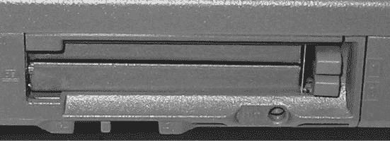
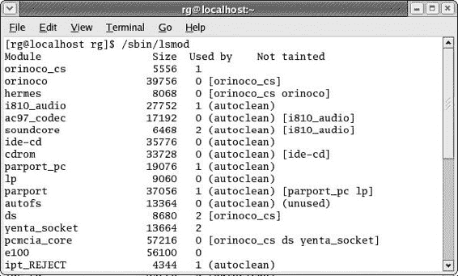
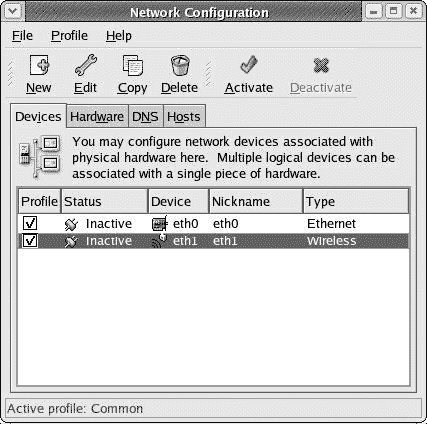

# 第十八章：脱线的图克斯

## 概述

*使用 Linux 进行无线连接*

当笔记本电脑最初出现时，它们最伟大的地方在于它们让人们从办公桌前解放出来。人们可以在任何他们想要的地方，做他们需要或想要在电脑上做的事情。作为一个喜欢坐在地上的人，笔记本电脑对我来说真的很棒，因为我可以把它放在电视前的地板上，然后坐在那里写作和玩游戏，同时在我的录像机上反复播放《华尔街》。是的，一切都很完美，但随后互联网出现了。笔记本电脑突然被电话线和以太网电缆束缚住了。

幸运的是，随着计算机世界无线化，笔记本电脑再次被释放出来。有了合适的无线硬件，你现在几乎可以在任何你能捕捉到信号的地方使用你的电脑，换句话说。无论你是在你的早餐桌上，后院露台上，你大学的图书馆里，还是你当地的星巴克，你现在都可以上网，而无需物理上将你的电脑连接到任何东西上。

在你的早餐桌上，后院露台上，你大学的图书馆里，或者你当地的星巴克，你现在都可以上网，而无需物理上将你的电脑连接到任何东西上。

* * *

* * *

## 我是否应该使用无线连接？

你是否应该加入无线网络的世界，这主要是一个个人选择和需求的问题。例如，如果你没有笔记本电脑，那么就没有太多理由去麻烦，因为你不可能轻松地移动台式电脑；而且，Linux 对桌面无线硬件的支持还没有真正准备好进入主流，这也不利于事情的发展。另一方面，如果你有一台笔记本电脑，你希望在圣地亚哥的圣达菲车站坐着等待去洛杉矶的火车时使用，或者在酒店房间里寻找在西雅图度假期间可以做的事情时使用，或者坐在前门廊上享受一点阳光时使用，那么为什么不尝试一下呢？无论你是准备承诺，仍在考虑，还是纯粹好奇，请继续阅读……

* * *

* * *

## 无线协议

要在无线世界中跟上步伐，你首先应该了解目前普遍使用的三种无线协议：802.11a、802.11b 和 802.11g，它们统称为*Wi-Fi*（无线保真的缩写）。如果你在好奇，那么*协议*基本上是一种被普遍接受的数据传输格式，在这种情况下是由电气和电子工程师协会（IEEE）达成的。在这三个 802.11 协议中，普通家庭用户只需要关注 802.11b 和 802.11g，因为这些协议的硬件比 802.11a 便宜得多，而 802.11a 主要用于大型办公环境。

两个协议中较快的协议是 802.11g，其传输速度为 54 Mbps，而 802.11b 的速度为 11 Mbps。然而，Linux 对 802.11g 无线卡的支持仍然处于开发阶段，这意味着现在在选择无线卡时，你最好坚持使用 11 Mbps 的 802.11b 协议。虽然这可能听起来像是一个不理想的限制，但在现实世界的方案中，这几乎无关紧要。802.11b 设备的较低速度对你来说可能影响不大，除非你每个月都要向互联网提供商支付大量费用以获得极端的带宽。毕竟，大多数家庭电缆互联网连接的平均传输速度仍然低于 802.11b 的 11 Mbps 速度，所以不必过于担心。只需记住，传统的拨号电话调制解调器的传输速度为 56 Kbps，即 56 *千*比特每秒；11 Mbps 是 11 *百万*比特每秒。这对普通人来说已经足够快了。

你不应该因为必须使用 802.11b 无线卡而感到如此受限的另一个原因是，802.11b 协议仍然比较新的 802.11g 更常用。大多数公共无线接入区域（热点），如机场、大学校园和酒店，仍然使用 802.11b 协议。即使在这些地方使用 802.11g 协议，或者即使你家里有人已经运行了一个基于 802.11g 的系统，你仍然可以使用你的 802.11b 网络卡通过该系统连接到互联网，因为这两个协议是兼容的（尽管你的 802.11b 卡无法使用 802.11g 网络的额外速度）。

|  | 注意  | *802.11a 卡与 802.11b 或 802.11g 网络不兼容。* |
| --- | --- | --- |

* * *

* * *

## Wi-Fi 硬件

要创建自己的家庭 Wi-Fi 设置，你需要至少两件硬件：一个无线接入点（WAP）和一个无线网络接口卡（NIC），这两件硬件都可以在图 18-1 中看到。这两个设备就像一对收发器，通过无线电信号而不是有线连接进行通信。WAP 从互联网源设备（如你的电缆或 ADSL 调制解调器）接收数据并将其传输，同时接收由你的电脑的 NIC 传输的数据。至于 NIC，它接收来自 WAP 的传输数据，并将从电脑传输的数据发送回 WAP。

图 18-1：Wi-Fi 设置所需的所有硬件：接入点和网络接口卡

有线和无线上网连接设置的基本区别可以在下一页的图 18-2 中看到。在典型的有线设置中，从你的高速互联网源设备通过以太网线直接连接到你的电脑。例如，如果你使用的是电缆调制解调器，那么你将会有一个以太网线直接从你的电缆调制解调器连接到电脑的以太网端口。

图 18-2：有线和无线互联网连接的比较

在 Wi-Fi 设置中，以太网电缆将你的互联网源设备直接连接到无线接入点，而不是连接到你的电脑。无线网卡连接到你的电脑。这通常是一个 PC 卡，你将其插入笔记本电脑上的一个 PCMCIA 端口（或在台式机上插入一个特殊适配器）。网卡和接入点然后通过无线电波而不是有线连接进行通信——如果你愿意，可以将其视为一种虚拟的电线。

### *无线接入点*

如果你想在家庭或办公室设置无线系统，你需要首先获得一个无线接入点。幸运的是，在这个领域，Linux 的兼容性并不是一个大问题，因为接入点在物理上并不与你的电脑接口。此外，由于你的 802.11b 无线网卡可以与使用 802.11b 或 802.11g 协议的接入点一起工作，所以你选择哪种类型的无线接入点并不重要。但这并不意味着你不需要注意你得到的是什么。

无论你使用哪个 Wi-Fi 接入点，都应该能够直接使用，无需任何特殊设置。但是，你可能想要考虑指定一些设置，尤其是出于安全考虑。例如，你可能希望仅允许某些硬件设备访问你的无线接入点，这样街上停着的车辆就无法访问你的网络。网络上的每一块硬件（节点）都有自己的唯一标识符，称为*MAC*（媒体访问控制）*地址*。如果你想确保只有你的无线网卡可以访问你的 WAP，你可以在 WAP 设置中指定你的无线卡的 MAC 地址。

你通常可以通过打开网页浏览器并输入无线接入点的 IP 地址来更改 WAP 设置，这个 IP 地址通常打印在用户手册的某个地方。这将显示一个网页，你可以在这里更改或输入各种设置。由于网页浏览器不是任何操作系统的原生应用，因此在 Linux 机器上更改设置与在其他操作系统上更改设置没有区别。

当然，一些 WAP 要求你使用 Internet Explorer 来处理基于浏览器的设置，由于没有 Linux 版本的 Internet Explorer，除非你有 Mac 或 Windows 机器来完成这项工作，否则你会发现自己陷入困境。更糟糕的是，一些 WAP 根本不支持基于浏览器的设置。相反，它们要求你安装特殊的 Windows 软件来完成这项工作。在选择无线设置硬件时，显然最好避免这种类型的 WAP。

### *无线网络接口卡*

无论您是设置家庭或办公室无线接入点，还是只需要访问公共 WAP（如星巴克），您的机器都需要一个无线 NIC。因为这些卡直接插入到您的系统中，您必须找到并使用一个与 Linux 兼容的卡。Fedora Core 内置了几个无线驱动程序，所以如果您使用与这些驱动程序兼容的卡，一切都会顺利。大多数无线 NIC 是弹出到笔记本电脑侧面的 PCMCIA 插槽中的 PC 卡（参见图 18-3）。

图 18-3：一对 PCMCIA 插槽

不幸的是，内置的 Linux 支持仍然主要限于 PC 卡类型的无线 NIC。尽管也有可以插入您机器的 USB 端口或 PCI 插槽的 NIC，但此类设备的驱动程序并不包含在您的 Linux 系统中。因此，我并不真的建议使用非 PC 卡 NIC，因为将驱动程序添加到 Linux 并不是像在其他系统上那样简单的插入 CD 并双击的过程。实际上，将驱动程序添加到 Linux 涉及到对 Linux 内核本身进行操作，这是一个繁琐甚至令人畏惧的过程，尤其是对于初学者来说。大多数驱动程序最终都会进入 Linux 内核的后续版本中，所以我强烈建议坚持使用您的系统包含的驱动程序支持的硬件。

如果您想了解更多关于 Linux 无线支持状态的信息，几乎每个人都会向您推荐一个优秀的网站：[www.hpl.hp.com/personal/Jean_Tourrilhes/Linux/](http://www.hpl.hp.com/personal/Jean_Tourrilhes/Linux/) Wireless.html。您很快会发现，这个网站的唯一问题是信息量太大，您可能会比开始时更加困惑。

与其无谓地让自己困惑，不如直接查看 Fedora Core 中包含的驱动程序支持的无线 NIC。以下列表直接来自 Fedora Core 的配置文件，因此从以下列表中选择任何一张卡应能确保兼容性。

**由 orinoco_cs 驱动程序支持的设备：**

> Cabletron RoamAbout 802.11 DS
> 
> Compaq WL100 11 Mbps 无线适配器
> 
> 11 Mbps 无线 PC 卡
> 
> 3Com 3CRWE737A AirConnect 无线局域网 PC 卡
> 
> ELSA AirLancer MC-11
> 
> Intersil PRISM2 11 Mbps 无线适配器
> 
> Lucent Technologies WaveLAN/IEEE 适配器
> 
> MELCO WLI-PCM-L11
> 
> MELCO WLI-PCM-L11G
> 
> Netgear MA401RA 无线适配器
> 
> NCR WaveLAN/IEEE 适配器
> 
> PLANEX GeoWave/GW-CF110
> 
> ZCOMAX AirRunner/XI-300

**由 airo_cs 驱动程序支持的设备：**

> Aironet ARLAN 4500 和 4800
> 
> Cisco 340 和 Cisco 350 系列
> 
> Xircom 无线网络适配器 CWE1100

**由 wavelan_cs 驱动程序支持的设备：**

> AT&T WaveLAN 适配器
> 
> Digital RoamAbout/DS
> 
> Lucent Technologies WaveLAN 适配器
> 
> NCR WaveLAN 适配器

**由 ray_cs 驱动程序支持的设备：**

> RayLink PC 卡 WLAN 适配器

**由 netwave_cs 驱动程序支持的设备：**

> Xircom CreditCard Netwave

尽管列出了大量的卡，你应该知道其中许多已经不再生产，而其他几个现在以不同的名称出售，无论是通过原始设备制造商（OEM）安排还是由于企业合并或收购。如果你已经拥有列表中的一张卡，你可以通过简单地插入它并按照以下“设置你的无线卡”章节中的设置步骤来查看情况来轻松尝试它。

如果你已经有了一张卡但它在上面没有列出，你可能也想检查一下，因为它可能是那些在不同品牌或型号标签下支持的支持卡之一。你可以通过使用**cardctl**（一个 PCMCIA 卡控制实用程序）来找出你的卡的制造商和型号。为此，将你的无线 NIC 插入到

你的计算机的 PCMCIA 插槽中，打开一个终端窗口，使用**su**命令成为 root 用户，然后输入/sbin/cardctl ident 并按回车键。卡的硬件制造商和型号将随后在终端窗口中显示。如果它与列表中的任何一个匹配，你可以相当肯定它将能够工作。如果不匹配，你仍然可以通过以下章节中的设置步骤来查看会发生什么。

如果你打算出去买一张卡，并且不想浪费你辛苦赚来的钱进行实验，你将想要更彻底地检查一下。像往常一样，直接向许多 Linux 列表中的一个寻求建议将是一个获得此类建议的好方法。我查看了 Fedora_List 邮件列表的存档，并找到了一些据说“即插即用”的卡的报告，无需任何特殊驱动程序。然后我在 froogle.google.com 上查找了这些设备，看看什么还在销售（以及什么价格范围内）。这些包括 Dell Truemobile 1150（39 至 49 美元）、Compaq WL 110（110 至 200 美元）和 Netgear MA401（42 至 65 美元）。Cisco 350 也被提到对一些人来说工作得很好，但对另一些人来说却是一个烦恼的来源。

在列表的任何地方都没有提到（至少不是我能找到的地方）的是 Buffalo AirStation WLI-PCM-L11GP（43 至 61 美元），这是我一段时间以来一直在使用且没有问题的卡。尽管标签上的卡似乎不在之前的兼容性列表中，但使用 cardctl 进行检查显示，该卡告诉我我的机器它是一个 Melco WLI-PCM-L11，它在列表中，所以外表可能具有欺骗性——即使在计算机世界中。

* * *

* * *

## 设置你的无线卡

设置 Linux 兼容的无线 PC 卡相对简单。虽然不是必需的，但最好在无线接入点附近进行设置过程，这样您就可以知道您已经成功了。因此，如果您在家或办公室有自己的 WAP，请将您的 WAP 连接到您的互联网源，然后打开 WAP。如果您只打算使用公共 WAP，请在您下次访问星巴克或其他无线热点时进行设置过程。

一旦您接近一个正在运行的网络接入点（WAP），将您的无线网络接口卡插入到计算机的 PCMCIA 插槽中。几乎在这样做的同时，您应该会听到两个蜂鸣声，这告诉您一切正常。此时卡上的任何 LED 灯都可能亮起。如果没有，它们将在您完成配置后亮起。如果您插入卡后只听到一个蜂鸣声，那么它很可能与预装的任何驱动程序都不兼容。

如果由于某种原因您的机器不允许您听到系统蜂鸣声或其他声音，或者您只是想再次确认，您可以通过使用**lsmod**（列出已加载模块）命令来直观地检查您的卡是否已加载驱动程序。为此，打开一个新的终端窗口，输入/sbin/lsmod，然后按回车键。结果应该类似于下一页上的图 18-4。您的卡的驱动程序（示例中的**orinoco_cs**）应该出现在列表的顶部，并且紧邻**pcmcia_core**。当然，您的卡可能使用的是前面列出的其他驱动程序之一，因此您的结果可能会有很大不同。

图 18-4：lsmod 命令的结果，显示了无线网络接口卡加载的驱动程序

一旦您的卡插入到 PCMCIA 插槽中并且加载了适当的驱动程序，就是时候配置系统以处理这张卡了，这都非常简单。按照以下步骤操作：

1.  通过转到主菜单并选择**系统设置**>**网络**来打开网络配置窗口。由于如今大多数计算机的主板上都集成了以太网支持，因此一个以太网设备很可能在窗口中列出，就像图 18-5 中所示。如果您没有通过该设备连接到互联网或其他网络，其状态将相应地列出为**不活动**，因此您可以安全地忽略它。

    

    图 18-5：网络配置窗口

1.  接下来，您需要将无线设备添加到设备列表中，这可以通过点击**新建**按钮来完成。这将弹出一个添加网络设备的向导，如图 18-6 所示。

    

    图 18-6：使用添加设备向导添加您的无线设备

1.  在选择设备类型页面，选择**无线连接**，然后点击**下一步**继续向导的下一页。

1.  在选择无线设备页面，应出现两个列表：一个显示您的网卡名称，另一个显示其他无线网卡。选择带有您的网卡名称的列表，然后点击**前进**继续。请注意，您的网卡名称列表中的名称可能与卡上的标签上的名称不同，但这不是问题。

1.  在配置无线连接页面，除非您的互联网服务提供商另有指示，否则请接受默认设置。完成设置后，点击**前进**。（如果您的连接不起作用，您始终可以返回并更改这些设置。）

1.  在配置网络设置页面，如果您的互联网服务提供商通过 DHCP 自动提供 IP 地址（如第四章所述[DDU0035_split_000.html#155]），只需通过点击**前进**接受默认设置。然而，如果您的提供商不使用 DHCP，您将必须从网络管理员或服务提供商那里获取必要的设置，在本页面上自行输入，然后点击**前进**。

1.  在创建无线设备页面，您将看到您迄今为止所做的所有选择的摘要。点击**应用**。

1.  完成向导步骤后，将弹出一个小窗口询问您是否想要保存设置。您需要保存，因此点击**是**。

1.  然后，您将看到一个较小的窗口，告知您更改已保存，并且可能需要重新启动计算机才能使更改生效。点击**确定**。

这将留下网络配置窗口，您现在将在设备列表中看到您的无线网卡（见图 18-7）。

图 18-7：已添加到网络设备列表中的新无线网卡

在关闭网络配置窗口之前，我强烈建议您做一件事，以便使激活无线网卡更加方便。如果您的设备尚未高亮显示，请单击一次以选择它。完成此操作后，点击**编辑**按钮。这将打开无线设备配置窗口，您应该在**允许所有用户启用和禁用设备**旁边的框中点击，如图 18-8 所示。这将允许您在不首先成为 root 用户的情况下激活和禁用您的网卡。完成此操作后，点击**确定**，这将关闭无线设备配置窗口。然后，您将在另一个窗口中被告知是否要保存更改（点击**是**），然后被告知您的更改已保存（点击**确定**）。然后您可以关闭网络配置窗口。

图 18-8：配置您的无线 NIC 以允许用户轻松激活

* * *

* * *

## 激活您的无线网络接口卡

现在你已经配置了无线网络接口卡，你需要激活它才能使用它，有两种方法可以做到这一点。然而，正如你在设置卡片时被警告的那样，你可能在使用新设备之前需要重新启动计算机，所以如果你的卡片在激活时没有立即工作，请重新启动计算机并再次尝试。

激活无线网卡的传统方式本质上是一种点击操作，利用网络设备控制窗口。要打开窗口，请转到主菜单并选择**系统工具** > **网络设备控制**。一旦网络设备控制窗口打开（见下一页的图 18-9），你可以方便地激活和停用配置的网络设备，而无需进入 root 模式。要激活你的设备，通过单击一次设备列表中的它来选择它，然后单击**激活**按钮。经过一两分钟的探测（进度将在一个小窗口中显示），你的设备将被激活，并在状态列中显示出来。这种点击操作不仅可以用来激活和停用无线设备，还可以用来激活和停用有线设备，如果你使用这两种连接方式，这将非常方便。

图 18-9：激活你的网络设备

激活无线网卡的另一种方式相当简单：将你的卡拔出，直到你听到机器响一次，然后重新插入卡，之后你的机器会响两次，网络接口卡上的 LED 灯将开始闪烁，一切都将恢复正常。我喜欢称之为“触觉方法”。它快速、有效，极其直接。尽管如此，公平地说，硬件就是硬件，随着时间的推移，它可能会磨损或损坏，所以如果你喜欢这种方式，请记住这一点。毕竟，一些 PCMCIA 插槽可能看起来有点脆弱。只需用你最好的判断力来使用它。

* * *

* * *

## “Wi-Fi 小怪癖”的快速修复

当在 Linux 下使用某些无线网络接口卡（NIC）时，你可能会遇到看似系统冻结的情况。这种情况并不经常发生，但通常会在进行某种形式的网络操作时发生，无论是后台还是前台。我喜欢称之为“Wi-Fi 的小怪癖”，尽管如果你愿意，也可以称之为后背的疼痛。当你知道怪癖发作时，你会知道，因为你将无法做任何事情，甚至无法移动鼠标。

幸运的是，这个问题的解决方案既快又简单——触觉方法，我在上一节中解释过。只需将你的无线网卡从电脑中拔出片刻，然后——*哔*——一切都会恢复正常。将网卡重新插回以重新激活并使用它，然后——*哔哔*——你就可以直接回到你在互联网上正在做的事情。这是一个简单且万无一失的解决问题的方式（而且这肯定比踢机器要好得多）。

* * *
