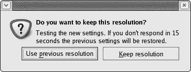
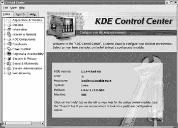
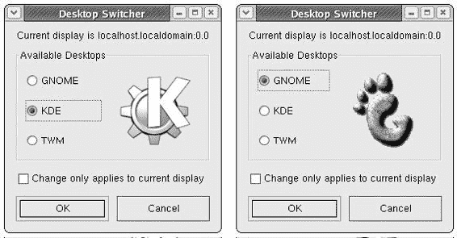
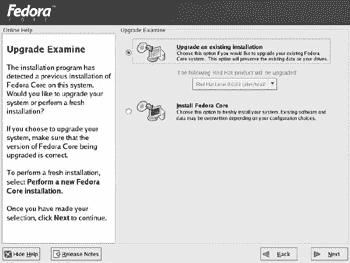
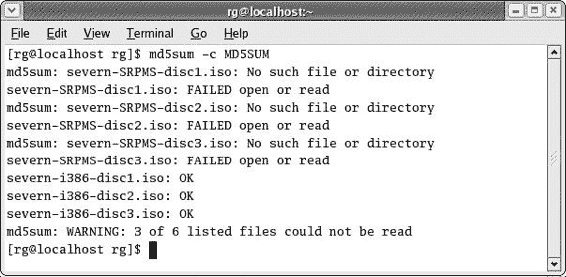
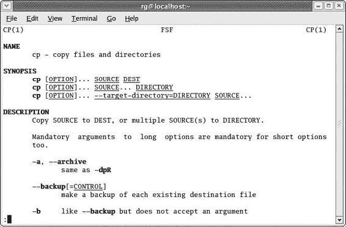
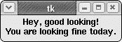

# 第十九章：离家出走

*准备独立生活*

我们几乎结束了我们的 Linux 冒险之旅。然而，在您独自一人之前，还有一些领域我需要涵盖，以便使您的 Linux 知识库达到这个水平。这一章实际上由四个部分组成：第一部分是系统设置，第二部分是 KDE，第三部分是保持系统更新，第四部分是一系列不适合放在其他地方的零散内容，但仍然很重要。

## 一些有用的系统设置

虽然我们已经讨论了您在系统设置方面（如主题和打印首选项等）所需的大部分内容，但仍有一些其他区域至少值得简要提及。

### *直接登录（绕过登录屏幕)*

如果您是唯一使用这台机器的人，您可能会想知道为什么每次启动机器时都需要麻烦登录。实际上，您不必这样做；您可以设置系统自动登录，从而绕过登录屏幕。

要以这种方式设置，请转到主菜单并选择**系统设置** > **登录屏幕**。然后系统会提示您输入 root 密码，所以请输入它并点击**确定**。登录屏幕设置窗口将出现（见图 19-1）。


图 19-1：在 Fedora Core 中更改自动登录设置

在登录屏幕设置窗口中，向下到**自动登录**部分，并勾选**首次启动时自动登录用户**复选框。然后，在**自动登录用户名**下拉菜单中，选择您的用户名。完成这些操作后，点击**关闭**按钮。

现在，下次您启动机器时，您将绕过登录屏幕并直接进入桌面。当然，如果您出于某种原因需要回到登录屏幕（例如，切换到 KDE，我将在稍后讨论，或切换到另一种语言模式），您仍然可以通过简单地转到主菜单并选择**注销**来实现。

### *更改屏幕分辨率*

*屏幕分辨率*，用一个非常非技术性的解释来说，指的是出现在您显示器上的所有内容的大小。高分辨率（如 1024 x 768）为您提供了更多的桌面区域来工作，但它使所有内容看起来都小一些。低分辨率（如 640 x 480）使所有内容都更大，更容易看到，但它也为您提供了更少的桌面空间来工作。您还可能发现某些显示器在某些分辨率下比在其他分辨率下看起来更好。我刚刚连接到一台机器的 LCD 显示器在 800 x 600 时看起来非常平坦和模糊，但当我将其更改为 1024 x 768 时，它看起来很美。如果您认为屏幕看起来不像您想象的那样好，您可能想对屏幕分辨率设置进行一些实验。

如果你有所疑问，这些数字分别指的是屏幕宽度和高度中显示的像素（或点）数量。

在 Fedora 中更改屏幕分辨率相当简单。你所要做的就是转到你的主菜单并选择**首选项** > **屏幕分辨率**。屏幕分辨率首选项窗口将打开，你可以在**分辨率**下拉菜单中选择你想要的分辨率。检查你的显示器规格，看看你选择的分辨率是否需要更改显示器的刷新率，也是一个好主意。

一旦你选择了你想要的分辨率，点击**应用**，分辨率将立即更改。一个小窗口将打开，询问你是否想要返回默认分辨率或保留你刚刚所做的更改（见图 19-2）。你可以点击满足你当前需求的任意按钮。



图 19-2：更改屏幕分辨率

### *更改颜色深度*

*颜色深度*指的是屏幕上显示的颜色数量。基本颜色级别是 256 种颜色；这有时被称为 8 位颜色，因为计算机必须发送八个数据位来在屏幕上创建一个像素。然而，如果你想查看图形，尤其是照片，256 种颜色的颜色深度会使这些图像看起来模糊和斑驳。在这种情况下，最好将颜色深度增加到数千种颜色（称为 16 位颜色），这应该足够了。

你可能想知道为什么你不应该随心所欲地选择数百万种颜色（32 位颜色），这从逻辑上来说是足够合理的——一种为什么不在车库里停着凯迪拉克时还要选择甲壳虫的观点。好吧，为了保持这个比喻，原因在于油耗，换句话说。基本上，你必须发送给屏幕的信息越多，你使用的计算能力和内存就越多，这会减慢速度。因此，运行纯文本、黑白系统的计算机（1 位系统）会比运行 8 位颜色系统的计算机快得多，8 位颜色系统会比 16 位颜色系统快，16 位颜色系统会比 32 位颜色系统快。

如果你想要更改颜色深度，那么你必须转到主菜单并选择**系统设置** > **显示**。在提供所需的 root 密码后，你将看到显示设置窗口，在那里你可以更改颜色深度（你还可以在这里更改屏幕分辨率）。完成操作后，点击**确定**。更改将在你注销并重新登录，或者重启计算机后生效。

* * *

* * *

## KDE

我尽可能地将你留在了 GNOME 世界，但人的本性是想要看看栅栏的另一边是什么样子。然而，在你踏上前往 KDE 领地的旅程之前，我想说几句话。

到目前为止，我在这本书中除了提到一些 KDE 应用程序外，并没有涉及 KDE。正如我之前提到的，这是因为我觉得 GNOME 对于初学者来说更容易处理。GNOME 也是 Fedora 的默认环境，因此它发展得更好（至少在 Fedora 中是这样）。最后，我更喜欢它的外观、感觉和便利性（毕竟，它有始终有用的 Nautilus 徽章和 CD 刻录器）。如果你真的想了解更多关于我为什么倾向于 GNOME 的原因，那么请访问 Edgy Penguins 网站([www.edgy-penguins.org/compurants](http://www.edgy-penguins.org/compurants))，我在那里详细说明了。

一旦你跨越到“另一边”，你会发现 KDE 看起来惊人地类似于 GNOME，因为两者都使用了 Bluecurve 主题，尽管 KDE 版本中的窗口边框是 Fedora 之前的样式。当然，这里还有一些细微的差异，但凭借你新获得的 Linux 技能，你应该能够轻松应对。我坚信通过探索来学习的理念。

### *启动到 KDE*

要进入 KDE，你可以通过启动你的机器或从当前的 GNOME 会话注销来到达登录屏幕。点击登录屏幕底部的“会话”一词。这将在其中打开一个小窗口，你应该选择**KDE**，然后点击**确定**。输入你的用户名和密码，然后按回车键，将打开一个小消息窗口，告诉你你已选择使用 KDE 桌面进行以下会话，并且如果你想要将 KDE 设置为默认环境，你需要使用 Switchdesk 实用程序。在这个窗口中，你唯一的选择是点击**确定**，所以点击它，这仅仅告诉系统，“是的，是的，我明白了，让我们继续吧。”

现在如果你是 Red Hat Linux 9 的用户，你也会看到一个小的消息窗口；然而，你的窗口会立即询问你是否想要将 KDE 设置为未来登录的默认环境。我建议你第一次点击**否**，直到你知道你是否真的更喜欢 KDE。无论如何，这并不重要，因为你总是可以通过同样的过程再次将 GNOME 设置为默认桌面。

### *KDE 与 GNOME 之间的差异*

关于 KDE 环境，有一些事情你应该知道，以便在那里度过愉快的时光：如何结束不守规矩的窗口，如何处理一般的环境问题（如自定义等），以及如何截屏。所有这些在 KDE 中都是相当不同的。

要在 KDE 中消除行为不端的窗口，只需使用 CTRL + ALT + ESC 键组合。同时按下这三个键后，您的光标将变成一个相当不祥的骷髅和交叉骨标志，您可以使用它来清除任何拒绝移动的窗口。当然，如果您的行为不端的窗口突然开始表现良好，或者如果您突然改变主意，您可以通过在任何地方右键单击鼠标来取消骷髅和交叉骨光标——不会造成任何损害。

为了处理一般的 KDE 环境问题，请使用 KDE 控制中心，您可以通过进入主菜单并选择 **控制中心**（见图 19-3）来访问它。打开后，您可以点击 **外观** & **主题** 旁边的 **+** 号，在那里您可以执行在 GNOME 中所做的大多数主题定制，尽管许多 KDE 主题将与 GNOME 中的不同，添加新的主题也稍微有些繁琐。请注意，您不能在 KDE 中使用在 GNOME 中安装的主题——它们根本不一样。

(1903_0.jpg)

图 19-3：使用 KDE 控制中心自定义 KDE

要在 KDE 中截取屏幕截图，您必须使用 KDE 屏幕捕获程序，您可以通过进入主菜单并选择 **图形** > **屏幕捕获程序** 来访问它。该程序允许您拍摄整个屏幕或单个窗口的截图（通过使用计时器），并且它相当直观且易于理解。

最后，在您离开 KDE 领地之前，我将提到 KDE 中的一个我认为相当方便的功能。这是 Konqueror（KDE 对 Nautilus 的回应）创建指定文件夹中所有图片的缩略图并将其设置为网页的能力，您可以在图 19-4 中看到一个示例。要利用这个酷炫的功能，导航到包含您想要缩略图的照片的文件夹，然后在 Konqueror 窗口的 **工具** 菜单中选择 **创建图片库**。在那之后，其余的应该对您来说都很清楚。

(1904_0.jpg)

图 19-4：在 KDE 的 Konqueror 中创建的图片库

如果您发现您喜欢这个缩略图功能，但又不想真的需要处理 KDE 来利用它，我有一套可以下载的指令，用于一个名为 Jigl 的简单程序，它做的是同样的事情（[www.edgy-penguins.org/LFYM/newprojects.html](http://www.edgy-penguins.org/LFYM/newprojects.html))）。

### *更改默认桌面环境*

假设您已经喜欢上了 KDE 并想暂时坚持使用它，或者您已经尝试使用 KDE 一段时间并想回到 GNOME 的家。要更改默认的桌面环境，您将不得不使用 Switchdesk 工具。

您可以通过进入主菜单并选择**系统设置** > **更多系统设置** > **桌面切换工具**来运行 Switchdesk。这将弹出一个非常简单的窗口（如图 19-5 所示），您可以从其中选择 KDE（或者如果您想将 GNOME 作为默认环境切换回来，也可以选择 GNOME）。选择完毕后，点击**确定**，您将看到一个消息窗口告诉您默认桌面系统设置已更新，并且您所做的更改将在重启后生效。只需点击**确定**关闭该窗口。不要去修改底部的 TWM 选择，因为它会带您到一个您不想去的地方。我不会再说更多了，但如果您忽略我的警告并最终不知道如何从 TWM 区域退出，只需左键单击完全空白的 TWM 桌面，并从弹出菜单中选择**退出**。



图 19-5：使用桌面切换器更改默认桌面环境

* * *

* * *

## 保持系统更新

如您所知，计算机世界变化迅速，因此在这些更改在您将操作系统安装到您的机器之前就已经对您的操作系统进行了修改。这不仅适用于 Linux，也适用于 Windows、Macintosh OS 以及所有其他操作系统。这些更改以两种形式提供给用户：更新和升级。

### *更新*

几乎所有操作系统都有一些机制，您可以通过这些机制来更新您的系统。更新是对您的系统或其中任何应用程序的微小更改。这些更改通常根据需要发布，以修复某些错误（例如 Fedora 1 中的软件包管理器错误），处理最近发现的安全漏洞，添加一些功能，或添加额外的硬件支持（例如对更新的数码相机型号的支持）。根据您的需求、关注点和下载速度，您可能希望下载所有可用的更新，从更新中选择，或者根本不麻烦。

如果您对更新系统感兴趣，您可能还记得您已经在第十章中学习了一种方法。第十章中提到，使用 Synaptic 是一个保持系统更新的非常简单的方法。它还具有额外的优势，即允许您更新不仅包括标准 Fedora RPM 软件包，还包括您从 FreshRPMs（如果您还将其添加到 Synaptic 仓库列表中，也包括 DAG）下载的非 Fedora 附加 RPM 软件包。

你也可以使用 Up2date 实用程序来更新你的系统，它允许你直接从 Red Hat Network 下载更新。然而，这仅适用于作为 Fedora 系统一部分的 RPM 包，而不是你后来从其他来源添加的包。由于 FreshRPMs 上的 Fedora 包与 Red Hat Network 上的相同，我并不认为走 Up2date 路线有什么优势，但也许你会看到不同的东西，所以我会留给你决定。

要使用 Up2date，右键单击位于 GNOME 面板时钟旁边的 Red Hat Network 警报通知工具，并选择**启动 up2date**。然后，你将被提示输入用户密码，所以输入它并点击**确定**。第一次使用时，你会被告知你需要安装一个密钥才能使用 Red Hat 更新代理，所以点击**是**，密钥将很快安装。然后更新代理会出现。代理是一个方便的向导，它会引导你完成更新过程。只需在每个屏幕上点击**前进**，直到你到达可用的软件包更新屏幕（图 19-6）。


图 19-6：使用 Up2date 选择要更新的文件

可用的软件包更新列表显示了您系统上所有可用的更新。您可以单独检查您希望更新的项目（或者如果您想全部更新，请勾选**选择所有软件包**），然后点击**前进**。Up2date 将然后下载并安装所选更新，并在完成后通知您。一旦你到达全部完成屏幕，点击**完成**。

### *升级*

虽然大多数 Linux 发行版在主要版本发布之间有 8 个月到 16 个月的周期，但 Fedora 项目计划显著缩短这个周期，以便每年发布两到三次 Fedora Core 的新版本。虽然这可能看起来有点难以应对，但你实际上不必担心，因为你不需要在 Fedora Core 的每个新版本中都升级你的系统。

如我在第一章中提到的，Fedora 项目的人们自己表示，Fedora Core 的变化将是“渐进的，而不是革命性的”，而且许多变化，毕竟，将是底层的类型，因此很可能对你来说并不重要。如果你仍然没有因为我的话而感到安慰，只需记住，在 Linux 世界中仍然有很多人仍然非常满足于使用 2001 年首次发布的 Red Hat Linux 7.2（别忘了那些仍然没有切换到 Windows XP 的 Windows 2000 用户，或者那些没有切换到 OS X 的 Mac OS 9 用户）。

你是否选择升级取决于你。如果你对你的系统现状感到满意，那么为什么还要费心呢？然而，如果未来的 Fedora 版本包含一些你认为你可能想要的功能，那就升级吧。

升级最安全的途径是通过下载并烧录操作系统的 ISO 镜像，正如我在第七章中讨论的那样。然而，如果你没有宽带互联网连接，这并不是一个好主意，因为每个 ISO 镜像可能需要你花费几天时间下载。如果你没有 CD 刻录机，这完全没有意义。在这种情况下，从附录 B 末尾列出的服务之一订购安装光盘可能值得你花费时间和保持心情平静。此类服务的光盘价格非常合理，快速交付，并将为你节省大量时间。

一旦你手头有一套安装光盘，你就可以按照在第二章中学到的安装过程大致进行升级。当然，在执行任何升级之前，总是备份你机器上的数据是一个非常不错的选择。一旦你完成了备份，就正常进行安装过程，直到你到达第 6 步的升级检查屏幕（参见下一页的图 19-7）。

(1907_0.jpg)

图 19-7：选择升级 Fedora 的早期版本

在这一点上，你需要决定你是想执行真正的升级还是全新安装。升级允许你保留设置、附加应用程序，甚至数据（无论如何，先备份一下）。然而，使用升级你可能会保留之前遇到的所有问题。另一方面，选择全新安装会在安装全新的系统之前清除你的 Linux 分区。我更喜欢后者，但选择哪一种取决于你。你总是可以先尝试升级路线，然后如果有任何问题，你可以在稍后进行全新安装。

要执行升级，请选择**升级现有安装**。之后，其余步骤应该相当自动化，当你完成所有操作后，你应该拥有一个新升级的系统，并且所有之前的设置都完好无损。要执行全新安装，请选择**安装 Fedora Core**，然后按照第二章中所述的步骤继续操作。如果你有双启动设置并且正在执行全新安装，你不需要再次通过第二章中给出的双启动程序；只需遵循标准安装程序，但当你到达第 9 步时，务必选择**删除此机器上的所有 Linux 分区**。

最后值得一提的一点是：如果你正在使用 APT 和 Synaptic，就像你在第十章中学到的那样，当你升级系统时，你可能需要重新安装这两个文件。所以，请访问[www.freshrpms.net](http://www.freshrpms.net)并下载与你的新升级系统版本匹配的 APT 新版本。如果你执行的是升级而不是全新安装，你可能发现，如果你双击 APT 文件尝试安装，你会收到一条消息告诉你 APT 已经安装。你想要升级这个版本的 APT，所以请通过命令行终端安装它。这可以通过首先使用*su*命令成为 root 用户，然后输入 rpm -Uvh apt*（确保在执行此操作时你的家目录中没有其他名为 apt 的文件），然后按回车键来完成。一旦你这样做，就按照你在第十章中学到的更新 APT 数据库和安装 Synaptic 的程序进行操作。

* * *

* * *

## 零碎事项

现在我们来到了一组本质上不相关的项目集合，这些项目在其他地方没有出现在书中，要么是因为在相关主题出现时，我还没有介绍必要的技能，要么是因为这里是最合适的地方。无论如何，这里的所有主题，尽管它们彼此之间没有关联，都值得提一下。

### *运行 Java 小程序*

虽然 Mozilla 浏览器能够处理 Java 命令，但它无法直接运行 Java 应用程序，或者说是*小程序*。这样的小程序有很多种形式。例如，大多数基于浏览器的在线游戏都是 Java 小程序。如果你曾经在网上寻找房子并浏览了某个列表的虚拟游览，以便查看这个地方，那么你也很可能使用了 Java 小程序。

为了在 Fedora Core 中使用 Java 小程序，你需要安装两个组件：Java 运行时环境（JRE）和一个插件，这样 Mozilla 就知道在哪里以及如何访问 JRE。在过去，在 Linux 中成功安装并运行 JRE 相当痛苦，各种在线 Linux 论坛上的“我该如何……？”问题就是对此的证明。幸运的是，DAG 仓库现在提供了 JRE 和 Mozilla JRE 插件的 RPM 版本，这使得一切变得干净且简单。

要获取这两个文件，请访问[`dag.wieers.com/packages/j2re`](http://dag.wieers.com/packages/j2re)并下载最新的 JRE 文件。JRE 文件相当大，有 18.8MB，所以请准备好进行一段较长的下载。Mozilla 插件将证明是一个更快的下载，因为它只是一个 198KB 的文件。它可以在与 JRE 相同的页面上找到，但更靠近底部。

下载完这两个文件后，通过你在第八章学到的双击方法安装它们就足够简单了。由于 Mozilla-j2re RPM 依赖于 j2re RPM，你必须首先安装 j2re RPM。完成后，你可能想测试一下，以确保一切按计划进行。为了快速、简单且完全出乎意料的简单 Java 示例，请访问[`java.sun.com/applets/other/BouncingHeads.`](http://java.sun.com/applets/other/BouncingHeads)。一旦到达那里，请稍等片刻，因为根据你的互联网连接速度，小程序需要一点时间来加载并开始运行。

### *使用 md5sum 检查 ISO 文件*

现在你已经成为 Linux 用户，你无疑会从互联网上以 ISO 文件的形式下载 Fedora Core 的未来版本。大多数下载网站还提供所谓的*校验和*或*md5sum*文件，你可以使用它来检查下载的 ISO 文件的完整性。然而，大多数新手最关心的问题是，如何使用该文件检查他们新下载的 ISO 文件的完整性。

这里是如何做到的。

将 ISO 文件和 md5sum 文件放在同一个文件夹中。该文件夹中是否有其他文件，或者是否有不同的 ISO 文件，都无关紧要——只需确保该文件夹中没有其他 md5sum 文件。接下来，打开一个终端窗口并输入以下命令：

```
md5sum -c MD5SUM 
```

如果你的 md5sum 文件名使用小写字母，将 MD5SUM 替换为 md5sum。然后按回车键。你的终端窗口中的输出应该类似于图 19-8 中的那样。



图 19-8：终端窗口中的 md5sum 结果

如示例所示，Fedora Core beta（代号 Severn）的 md5sum 不仅检查主要的安装 ISO 文件，还检查源 ISO 文件。由于我没有下载源 ISO 文件，md5sum 无法找到它们。然而，它确实找到了我下载的三个安装 ISO 文件，检查了它们，并发现它们是正常的。

### *man 页面*

在你穿越 Linux 世界的过程中，你最终会听到有关*man*页面的提及。Man（手册）页面基本上是 Linux 的原始在线文档系统，你会发现几乎每个应用程序和系统上的命令都有一个 man 页面。

尽管 man 页面几乎包含了你需要了解的所有相关信息，但整个系统有一个相当棘手的问题：对于新手来说，man 页面几乎是不可能理解的。幸运的是，在开始时，你几乎可以不用 man 页面就能应付，因为通常还有其他形式的帮助可用（例如 tar 包中的 README 文件或 GNOME 和 KDE 文档）。

然而，随着你对系统越来越熟悉，你对 Linux 世界的理解也越来越深入，你可能会逐渐理解 man 页面的内容。man 页面通过命令终端打开和查看。要查看 man 页面，只需输入单词 man，后跟您想了解的命令、应用程序或实用程序的名称。例如，要查看**cp**（复制）命令的 man 页面，您将输入 man cp 然后按回车键。

如图 19-9 所示，man 页面将在您的终端窗口中打开。要滚动查看 man 页面的上下文，只需使用上下箭头键；要一次向上或向下移动一页，请使用 PAGE UP 和 PAGE DOWN 键。最后，当您到达 man 页面的末尾并想回到正常的终端窗口和您现在熟悉的用户提示符时，只需按 Q 键。



图 19-9：**cp**命令的 man 页面

如果您想查看以 HTML 格式（带有可点击索引）设置的完整标准 Linux man 页面集合，请查看 http://linux.ctyme.com。

### *检查爱普生打印机的墨水水平*

最后，我们来到一个可能对许多读者都有价值的最后一个实用程序，因为爱普生喷墨打印机相当常见。如果您正在使用爱普生喷墨打印机并且想知道如何检查打印机的墨水水平，您可以通过在**查找**框中输入 gimp-print-utils 来使用 Synaptic/APT 下载并安装**gimp-print-utils**包。此包包括**escputil**程序。

要使用程序，首先在硬件浏览器中检查打印机的设备位置。通过转到主菜单并选择**系统工具** > **硬件浏览器**来启动硬件浏览器。一旦浏览器打开，在左侧窗格中点击**打印机**。您的打印机可能为**/dev/lp0**。

一旦你知道了打印机的位置，打开一个终端窗口，成为 root 用户，然后输入 escputil -r /dev/lp0 -i（如果您的设备位置不同，请更改设备位置）并按回车键。完成这些操作后，您的当前墨水水平将在您的终端窗口中显示。

* * *

* * *

## 项目 19A：为 Linux 编程？（绝对可选，但很有趣）

我首先应该说的是，我对编程并不特别感兴趣。我想我的思维太混乱、不逻辑，无法处理它，而且在我早年玩 Atari 游戏时，我可能已经对代码感到厌倦了。尽管如此，许多人想知道编程需要什么，以及他们需要做什么。

您需要的绝大多数内容都包含在您的 Fedora Core 系统中，实际上有很多选项。似乎最受欢迎且对新手来说最容易处理的语言被称为*Python*。如您所记得的，您在第九章中安装的 pyWings 预言者是用 Python 编写的。

为了让你对编程有个初步的了解，我会给你一些可以尝试的示例程序。几乎所有编程书中的第一个程序都是一个愚蠢的小东西，叫做“Hello, World”。这个程序所做的只是将“Hello, World”这几个字打印到你的屏幕上。这对我来说总是有点奇怪，因为唯一看这个程序输出的人就是输入代码的人，而不是“世界”。所以，让我们稍微改变一下这个标准的入门程序，让它对你自己的自尊心更有价值。让我们做一个“Hey, good looking”程序。实际上，这确实是同一件事。

要编写程序，请通过主菜单选择 **附件** > **文本编辑** 来打开 Gedit。在 Gedit 窗口中，输入以下两行——包括引号：

```
print "Hey, good looking!"
print "You are looking fine today."
```

完成这些后，点击 **保存** 按钮，并将程序保存到您的家目录中，命名为 goodlooking.py。

现在你已经编写了一个程序，不管它多么卑微。现在，打开一个终端窗口，通过输入 python goodlooking.py 并按回车键来运行程序。输出将出现在终端窗口中（见图 19-10）。

(1910_0.jpg)

图 19-10：运行“Hey, good looking” Python 程序

这让你感觉有点好，不是吗？现在，如果你想更深入地沉浸其中，你可以使用 tkinter 为你这个自我肯定程序创建一个简单的窗口。你可能还记得，你在第九章[DDU0068_split_000.html#372]中安装了 tkinter，用于 pyWings oracle 的使用，它也是为了同样的目的使用 tkinter。

要编写一个程序使其在它自己的窗口中打开，请再次打开 Gedit，这次输入以下内容：

```
from Tkinter import Label, mainloop
Label (text='Hey, good looking!\n'
'You are looking fine today.').pack()
mainloop()
```

注意，在第三行的 **today** 字词后面没有任何空格，并且在最后一行的 **mainloop** 和 **()** 之间没有空格。

将这个新程序保存到您的家目录中，命名为 goodlooking2.py。完成之后，回到您的终端窗口，输入 python goodlooking2.py 并按回车键。你的新程序将随后在其自己的窗口中显示（见图 19-11）。



图 19-11：“Hey, good looking”程序在其自己的窗口中

好吧，这没什么大不了的。如果你觉得编程很有趣，并想了解更多关于 Python 的信息，请访问 Python 网站 [www.python.org](http://www.python.org)，那里有链接到几个在线教程。

* * *

* * *

## 项目 19B：使用 Wine 在 Linux 下运行 Windows 程序（可选）

尽管大多数人们使用的或需要的 Windows 程序在 Linux 中都有等效版本，但仍可能有一两个程序您会开始怀念。对我来说，是一个奥地利的卡牌游戏 Schnapsen 的免费版。幸运的是，借助名为 Wine 的程序，可以在 Linux 中运行一些 Windows 应用程序。

Wine 团队似乎热衷于指出 Wine 不是一个 Windows 模拟器，更愿意称其为 Windows 兼容层。无论您选择如何看待它，其功能是允许您在没有安装 Windows 的情况下运行 Windows 应用程序。然而，公正地说，Wine 仍然是一个正在进行中的项目。它与某些程序配合得相当好，而与其他程序则完全不兼容。有些 Wine 的商业版本在某些情况下可能表现更好（查看 Wine 主页上的链接 —[www.winehq.org](http://www.winehq.org))，但尝试免费官方版本并无害处，尤其是现在您即将超越非技术人员的地位。

### *19B-1: 下载和安装 Wine 及 WineSetuptk*

Wine 并未包含在您的 Fedora Core 系统中，但您可以通过访问 [www.winhq.org/site/download](http://www.winhq.org/site/download) 并在 **官方 Wine 版本** 下点击 Sourceforge 图标来轻松获取它。一旦进入 Sourceforge 页面，滚动到 **RedHat 软件包** 部分，然后下载适合您系统和处理器的版本。例如，如果您在 Pentium II（或更新的）机器上运行 Fedora Core I，您将下载 wine-20040121-1fc1winehq.i686.rpm。

您还希望下载的另一个文件是 WineSetuptk，这是一个 Wine 的图形设置实用程序。要获取文件，请返回您开始的地方并进一步向下滚动到 **支持文件** 部分。一旦到达那里，下载 **winesetuptk** RPM 文件（不是 tarball）。一旦这两个文件都在您的硬盘上，首先安装 Wine，然后通过双击每个文件并遵循您在 第八章 中学到的常规程序来安装 WineSetuptk。

### *19B-2: 设置环境*

要设置 Wine，实际上您不需要做太多——WinSetuptk 会为您做大部分工作。通过在终端窗口或运行应用程序对话框（**主菜单** > **运行应用程序**）中键入 winsetuptk 来运行 WinSetuptk，之后会出现 Wine 配置向导（图 19-12）。


图 19-12：使用 WinSetuptk 设置 Wine

向导基本上是一个简单的三步写操作过程。只需在第一个屏幕上点击 **下一步**，在第二个屏幕上点击 **下一步**，在第三个屏幕上点击 **完成**，Wine 就会在您的家目录中创建一个子文件夹，充当伪 Windows 分区 (/home/username/.wine/fake_windows)，其中包含您通常在真实的 Windows C: 驱动器上找到的所有文件夹。如果您是双启动用户，您可以在向导的第二屏幕中选择使用真实的 Windows 分区而不是创建一个假的分区，但我不太愿意推荐这样做，至少直到您知道自己在做什么。

### *19B-3: 在 Linux 下安装和运行 Windows 程序*

一旦安装并设置好 Wine，除非你尝试运行一个 Windows 程序，否则它实际上什么也做不了。在这种情况下，在这个项目部分，你将下载、安装并运行一个名为 BookWorm Deluxe 的类似 Boggle 的游戏（图 19-13）。BookWorm Deluxe 是 PopCap Games（[www.popcap.com](http://www.popcap.com)）提供的 Windows 游戏之一，其中许多在 Linux 下使用 Wine 似乎运行得相当好。

(1913_0.jpg)

图 19-13：在 Wine 下运行的 Windows 游戏 BookWorm

你应该知道，你从 PopCap Games 下载的游戏都是试用版，而不是免费版，这意味着你最终可能需要为任何你希望继续使用的游戏付费，前提是你使用的免费游戏数量没有达到限制。毕竟，我们现在有一只脚在 Windows 世界中。然而，对于这个项目来说，这个事实不应该让你过于担忧——你只是在学习如何做事，并且使用一些相当酷的游戏作为你的学习工具。而且，毕竟，谁知道呢？你可能会觉得这些游戏足够酷，以至于你真的愿意为它们付费。即使你开始没有这种感觉，如果你在前面章节中安装了 Java 运行时环境（Java Runtime Environment）和 Mozilla Java 插件，你仍然可以玩免费在线 Java 版本的游戏（在同一个网站上提供）。

要下载 BookWorm Deluxe，请访问 PopCap Games 网站（[www.popcap.com](http://www.popcap.com)），然后在窗口左侧点击**Deluxe Games**按钮。一旦进入 Deluxe Games 页面，只需点击 BookWorm 旁边的**免费下载**按钮。下载完成后，你会在 Home 文件夹中找到一个名为 Bookworm_setup.exe 的文件。双击该文件，Wine 将首次启动，运行 BookWorm Deluxe 的 Windows 安装程序（图 19-14）。

(1914_0.jpg)

图 19-14：在 Wine 下运行的 Windows 安装程序。

要开始安装过程，你实际上只需要点击**下一步**。安装程序将在你的 fake_windows 分区中的 Program Files 文件夹内的 PopCap Games 文件夹中创建一个 BookWorm 文件夹。当安装程序接近结束时，你会收到一个警告消息，告诉你安装程序无法创建某些链接，之后你会被告知安装已被中止，你可能无法运行 BookWorm Deluxe。只需忽略所有这些，因为一切都会顺利（至少在这个情况下）。

现在，您可以运行 BookWorm Deluxe。最直接的方法是前往您的新 fake_windows 分区。您可以通过打开一个 Nautilus 窗口并在该窗口的 **位置** 框中输入 /home/username/.wine/fake_windows/Program Files 来完成此操作，然后按 ENTER。一旦到达那里，双击 **PopCap Games** 文件夹，然后是其中的 **BookWorm Deluxe** 文件夹。最后，只需双击 **BookWorm.exe**，您很快就会用您词汇量的广度和深度给周围的人留下深刻印象。

如果您想了解在 Wine 下应该运行哪些其他应用程序，请查看 Wine 应用程序数据库 [`appdb.winehq.org,`](http://appdb.winehq.org)，该数据库还说明了特定应用程序在 Wine 下已知的工作版本，以及程序在 Wine 下运行时可能存在的限制（如果有的话）。

* * *
