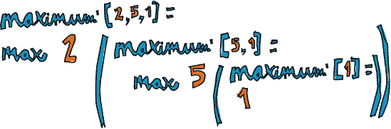
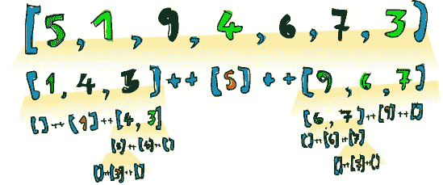

# 第四章。你好，递归！

在本章中，我们将探讨递归。我们将了解为什么递归在 Haskell 编程中很重要，以及我们如何通过递归思考来找到非常简洁和优雅的解决方案。

递归是一种定义函数的方式，其中函数在其定义内部应用自己。换句话说，函数调用自己。如果你仍然不知道递归是什么，请阅读这句话。（哈哈！只是开玩笑！）


开个玩笑，递归定义的函数的策略是将当前问题分解为相同类型的小问题，然后尝试解决这些子问题，如果需要，进一步分解它们。最终，我们达到问题的 *基本情况*（或基本情况），不能再分解，并且程序员需要明确（非递归地）定义其解决方案。

数学中的定义通常是递归的。例如，我们可以递归地指定 *斐波那契序列* 如下：我们通过直接说 *F*(0) = 0 和 *F*(1) = 1 来定义前两个斐波那契数，这意味着零和第一斐波那契数分别是 0 和 1。这些都是我们的基本情况。

然后，我们指定对于除了 0 或 1 之外的任何自然数，相应的斐波那契数是前两个斐波那契数的和。换句话说，*F(n)* = *F*(*n*-1) + *F*(*n*-2)。例如，*F*(3) 是 *F*(2) + *F*(1)，这又分解为 (*F*(1) + *F*(0)) + *F*(1)。因为我们现在只剩下非递归定义的斐波那契数，我们可以安全地说 *F*(3) 的值是 2。

递归在 Haskell 中很重要，因为与命令式语言不同，你在 Haskell 中通过声明“是什么”而不是指定“如何”来执行计算。这就是为什么 Haskell 不是关于向计算机发出一系列要执行的步骤，而是直接定义所需的结果，通常以递归的方式。

# 最大酷

让我们看看一个现有的 Haskell 函数，看看如果我们把大脑切换到“R”档（代表“递归”），我们如何自己编写这个函数。

`maximum` 函数接受一个可以排序的事物列表（即 `Ord` 类型类的实例）并返回其中的最大值。它可以非常优雅地使用递归表达。

在我们讨论递归解决方案之前，想想你可能如何命令式地实现 `maximum` 函数。你可能设置一个变量来保存当前的最大值，然后你会遍历列表中的每个元素。如果当前元素比当前最大值大，你会用那个元素替换最大值。循环结束时剩下的最大值将是最终结果。

现在，让我们看看我们如何递归地定义它。首先，我们需要定义一个基本情况：我们说单元素列表的最大值等于它唯一的元素。但如果列表有多个元素呢？嗯，那么我们就检查哪个更大：第一个元素（头部）还是列表剩余部分的最大值（尾部）。下面是我们递归 `maximum'` 函数的代码：

```
maximum' :: (Ord a) => [a] -> a
maximum' [] = error "maximum of empty list!"
maximum' [x] = x
maximum' (x:xs) = max x (maximum' xs)
```

正如你所看到的，模式匹配对于定义递归函数非常有用。能够匹配和分解值使得将查找最大值的问题分解为相关情况和递归子问题变得容易。

第一个模式表示如果列表为空，程序应该崩溃。这很有道理，因为我们根本无法说空列表的最大值是什么。第二个模式表示如果 `maximum'` 接收到一个单元素列表，它应该只返回该列表的唯一元素。

我们的第三个模式代表了递归的核心。列表被分为头部和尾部。我们将头部称为 `x`，尾部称为 `xs`。然后，我们利用我们老朋友，`max` 函数。`max` 函数接受两个参数，并返回其中较大的一个。如果 `x` 大于 `xs` 中最大的元素，我们的函数将返回 `x`，否则它将返回 `xs` 中的最大元素。但是我们的 `maximum'` 函数是如何在 `xs` 中找到最大元素的？简单——通过递归调用自己！



让我们通过一个具体的例子来分析这段代码，以防你难以想象 `maximum'` 的工作方式。如果我们对 `[2,5,1]` 调用 `maximum'`，前两个模式不匹配函数调用。然而，第三个模式匹配，所以列表值被拆分为 `2` 和 `[5,1]`，然后对 `[5,1]` 调用 `maximum'`。

对于这次对 `maximum'` 的新调用，`[5,1]` 匹配第三个模式，并且输入列表再次被拆分——这次是 `5` 和 `[1]`——然后对 `[1]` 递归调用 `maximum'`。这是一个单元素列表，所以最新的调用现在匹配我们的一个基本情况，并返回 `1` 作为结果。

现在，我们上升一个层次，使用 `max` 函数比较 `5` 和 `1`。`1` 是我们上一次递归调用的结果。由于 `5` 更大，我们现在知道 `[5,1]` 的最大值是 `5`。

最后，将 `2` 与 `[5,1]` 的最大值比较，我们现在知道它是 `5`，我们得到了原始问题的答案。由于 `5` 大于 `2`，我们现在可以说 `5` 是 `[2,5,1]` 的最大值。

# 一些更多的递归函数

现在我们已经看到了如何递归地思考，让我们以这种方式实现更多函数。像 `maximum` 一样，这些函数在 Haskell 中已经存在，但我们将编写自己的版本来锻炼我们递归肌肉群的递归肌肉中的递归肌肉纤维。让我们变得更强壮！

## replicate

首先，我们将实现 `replicate`。记住，`replicate` 接受一个 `Int` 和一个值，并返回一个包含该值重复次数（即 `Int` 指定的次数）的列表。例如，`replicate 3 5` 返回一个包含三个五的列表：`[5,5,5]`。

让我们考虑基本情况。如果我们被要求复制零次或更少的次数，我们立即知道应该返回什么。如果我们尝试复制零次，我们应该得到一个空列表。我们还声明负数的结果应该相同，因为复制少于零次的项没有意义。

通常，一个包含 `n` 次重复的 `x` 的列表是一个以 `x` 为首元素，尾部由 `x` 复制 `n-1` 次组成的列表。我们得到以下代码：

```
replicate' :: Int -> a -> [a]
replicate' n x
    | n <= 0    = []
    | otherwise = x : replicate' (n-1) x
```

我们在这里使用守卫而不是模式，因为我们正在测试布尔条件。

## take

接下来，我们将实现 `take`。这个函数从指定的列表中返回指定数量的元素。例如，`take 3 [5,4,3,2,1]` 将返回 `[5,4,3]`。如果我们尝试从一个列表中取出零个或更少的元素，我们应该得到一个空列表，如果我们尝试从一个空列表中取出任何东西，我们也应该得到一个空列表。注意，这些都是我们的两个基本情况。现在让我们编写这个函数：

```
take' :: (Num i, Ord i) => i -> [a] -> [a]
take' n _
    | n <= 0   = []
take' _ []     = []
take' n (x:xs) = x : take' (n-1) xs
```

注意，在第一个模式中，指定如果我们尝试从一个列表中取出零个或更少的元素，我们会得到一个空列表，我们使用 `_` 占位符来匹配列表值，因为我们在这种情况下并不关心它是什么。另外，注意我们使用了守卫，但没有 `otherwise` 部分。这意味着如果 `n` 转而大于 0，匹配将传递到下一个模式。


第二个模式表明，如果我们尝试从一个空列表中取出任何数量的东西，我们都会得到一个空列表。

第三个模式将列表分为头部和尾部。我们称头部为 `x`，尾部为 `xs`。然后我们声明从列表中取出 `n` 个元素与创建一个以 `x` 为首元素，从 `xs` 中取出 `n-1` 个元素作为其余元素的列表是相同的。

## reverse

`reverse` 函数接受一个列表并返回一个包含相同元素但顺序相反的列表。同样，空列表是基本情况，因为尝试反转一个空列表只会得到一个空列表。那么函数的其余部分呢？好吧，如果我们把原始列表分成头部和尾部，我们想要的反转列表就是尾部的反转，头部被固定在末尾：

```
reverse' :: [a] -> [a]
reverse' [] = []
reverse' (x:xs) = reverse' xs ++ [x]
```

## repeat

`repeat` 函数接受一个元素并返回一个由该元素组成的无限列表。`repeat` 的递归实现非常简单：

```
repeat' :: a -> [a]
repeat' x = x:repeat' x
```

调用`repeat 3`将给我们一个以`3`作为头部，尾部有无限多个`3`的列表。所以调用`repeat 3`的结果是`3:repeat 3`，这又等于`3:(3:repeat 3)`，然后等于`3:(3:(3:repeat 3))`，以此类推。`repeat 3`永远不会完成评估。然而，`take 5 (repeat 3)`将给我们一个包含五个`3`的列表。本质上，这就像调用`replicate 5 3`。

这是一个很好的例子，说明了我们可以如何成功地使用没有基本情况但可以创建无限列表的递归——我们只需确保在某个地方切断它们即可。

## zip

`zip`是我们已经在第一章中遇到过的另一个用于处理列表的函数。它接受两个列表并将它们组合在一起。例如，调用`zip [1,2,3] [7,8]`返回`[(1,7),(2,8)]`（该函数截断较长的列表以匹配较短的长度）。

使用空列表压缩某个东西只会返回一个空列表，这就是我们的基本情况。然而，`zip`函数接受两个列表作为参数，所以实际上有两个基本情况：

```
zip' :: [a] -> [b] -> [(a,b)]
zip' _ [] = []
zip' [] _ = []
zip' (x:xs) (y:ys) = (x,y):zip' xs ys
```

前两种模式是我们的基本情况：如果第一个或第二个列表为空，我们返回一个空列表。第三种模式说明将两个列表组合在一起相当于将它们的头部配对，然后将它们的压缩尾部附加到那个头部上。

例如，如果我们用`[1,2,3]`和`['a','b']`调用`zip'`，该函数将形成`(1,'a')`作为结果的第一元素，然后将`[2,3]`和`[b]`压缩在一起以获得其余的结果。在另一次递归调用之后，该函数将尝试将`[3]`与`[]`压缩，这符合基本情况模式之一。最终结果直接计算为`(1,'a'):((2,'b'):[])`，这正好是`[(1,'a'),(2,'b')]`。

## elem

让我们再实现一个标准库函数：`elem`。该函数接受一个值和一个列表，并检查该值是否是列表的成员。同样，空列表是一个基本情况——空列表不包含任何值，所以它当然不可能包含我们要找的值。一般来说，如果我们幸运的话，我们可能在我们所寻找的值在列表的头部；否则，我们必须检查它是否在尾部。以下是代码：

```
elem' :: (Eq a) => a -> [a] -> Bool
elem' a [] = False
elem' a (x:xs)
    | a == x    = True
    | otherwise = a `elem'` xs
```

# 快速排序！

对包含可以按顺序排列的元素（如数字）的列表进行排序的问题自然适合递归解决方案。有许多递归排序列表的方法，但我们将查看其中最酷的一种：*快速排序*。首先，我们将了解算法的工作原理，然后我们将用 Haskell 实现它。


## 算法

快速排序算法的工作原理是这样的。你有一个想要排序的列表，比如说`[5,1,9,4,6,7,3]`。你选择第一个元素，即`5`，并将所有小于或等于`5`的其他列表元素放在它的左侧。然后，你将大于`5`的元素放在它的右侧。如果你这样做，你会得到一个看起来像这样的列表：`[1,4,3,5,9,6,7]`。在这个例子中，`5`被称为*枢轴*，因为我们选择将其他元素与它比较并将它们移动到它的左右两侧。我们选择第一个元素作为枢轴的唯一原因是它将很容易通过模式匹配来捕获。但事实上，任何元素都可以作为枢轴。

现在，我们通过在它们上调用相同的函数递归地排序枢轴左右两侧的所有元素。最终结果是完全排序的列表！



上述图解说明了快速排序在我们例子中的工作原理。当我们想要排序`[5,1,9,4,6,7,3]`时，我们决定第一个元素是我们的枢轴。然后我们在`[1,4,3]`和`[9,6,7]`之间将其夹在中间。一旦我们这样做，我们就使用相同的方法对`[1,4,3]`和`[9,6,7]`进行排序。

要排序`[1,4,3]`，我们选择第一个元素`1`作为枢轴，并创建一个包含小于或等于`1`的元素的列表。结果是一个空列表`[]`，因为`1`是`[1,4,3]`中最小的元素。大于`1`的元素移到它的右侧，所以是`[4,3]`。同样，`[4,3]`也是以相同的方式排序的。它最终也会被拆分成空列表并重新组合。

算法然后返回到`1`的右侧，其左侧是空列表。突然，我们有了`[1,3,4]`，它是排序好的。这被保留在`5`的左侧。

一旦`5`右侧的元素以相同的方式排序，我们将得到一个完全排序的列表：`[1,3,4,5,6,7,9]`。

## 代码

现在我们已经熟悉了快速排序算法，让我们深入了解其在 Haskell 中的实现：

```
quicksort :: (Ord a) => [a] -> [a]
quicksort [] = []
quicksort (x:xs) =
    let smallerOrEqual = [a | a <- xs, a <= x]
        larger = [a | a <- xs, a > x]
    in  quicksort smallerOrEqual ++ [x] ++ quicksort larger
```

我们函数的类型签名是`quicksort :: (Ord a) => [a] -> [a]`，空列表是基础情况，正如我们刚才看到的。

记住，我们将所有小于或等于`x`（我们的枢轴）的元素放在它的左侧。要检索这些元素，我们使用列表推导式`[a | a <- xs, a <= x]`。这个列表推导式将从`xs`（所有不是我们的枢轴的元素）中抽取，并仅保留满足条件`a <= x`的元素，这意味着小于或等于`x`的元素。然后我们以类似的方式获取大于`x`的元素列表。

我们使用`let`绑定来给两个列表起方便的名字：`smallerOrEqual`和`larger`。最后，我们使用列表连接运算符（`++`）和我们的`quicksort`函数的递归应用来表达我们想要最终的列表由一个排序后的`smallerOrEqual`列表、我们的枢轴以及一个排序后的`larger`列表组成。

让我们测试一下我们的函数，看看它是否表现正常：

```
ghci> quicksort [10,2,5,3,1,6,7,4,2,3,4,8,9]
[1,2,2,3,3,4,4,5,6,7,8,9,10]
ghci> quicksort "the quick brown fox jumps over the lazy dog"
"        abcdeeefghhijklmnoooopqrrsttuuvwxyz"
```

那就是我所说的！

# 递归思考

在本章中，我们使用了大量的递归，而且正如你可能注意到的，它有一个模式。你首先定义一个基本情况：当输入是平凡的时，它保持简单、非递归的解决方案。例如，排序空列表的结果是空列表，因为——好吧，那还能是什么？

然后，你将你的问题分解为一个或多个子问题，并通过对它们应用相同的函数递归地解决这些子问题。然后，你从这些已解决的子问题中构建你的最终解决方案。例如，在排序时，我们将我们的列表分解为两个列表，加上一个枢轴。我们通过将相同的函数应用于它们来分别对每个列表进行排序。当我们得到结果时，我们将它们合并成一个大的已排序列表。


处理递归的最佳方式是识别基本情况，并思考你如何将当前的问题分解成类似但更小的问题。如果你正确地选择了基本情况和子问题，你甚至不需要考虑所有事情发生的细节。你只需相信子问题的解决方案是正确的，然后你可以从这些较小的解决方案中构建你的最终解决方案。
