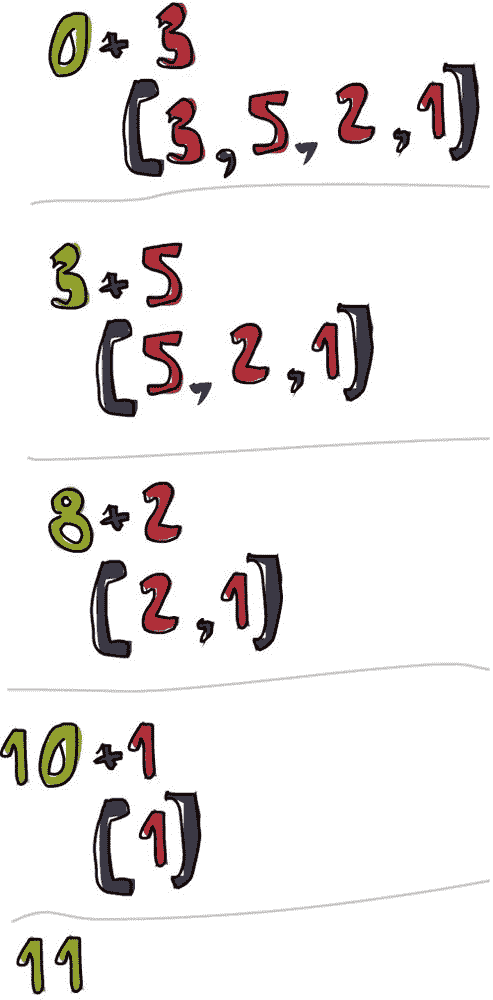
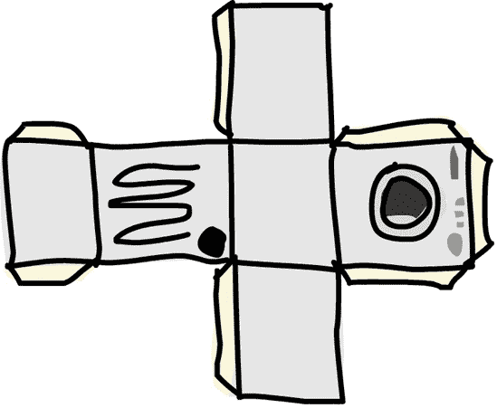

# 第五章。高阶函数

Haskell 函数可以接受函数作为参数，并返回函数作为返回值。执行这些操作的函数被称为*高阶函数*。高阶函数是解决问题和思考程序的一种非常强大的方式，当使用像 Haskell 这样的函数式编程语言时，它们是必不可少的。

# 柯里化函数

Haskell 中的每个函数官方上只接受一个参数。但到目前为止，我们已经定义并使用了几个接受超过一个参数的函数——这是怎么做到的？


嗯，这是一个巧妙的技巧！我们迄今为止使用的所有接受多个参数的函数都是*柯里化函数*。柯里化函数是一种函数，它不是接受多个参数，而是始终只接受一个参数。然后当它用那个参数被调用时，它返回一个接受下一个参数的函数，依此类推。

这最好用一个例子来说明。让我们以我们的好朋友`max`函数为例。它看起来像接受两个参数并返回较大的那个。例如，考虑表达式`max 4 5`。我们用两个参数调用`max`函数：`4`和`5`。首先，`max`应用于值`4`。当我们把`max`应用于`4`时，返回的实际上是一个函数，然后这个函数被应用于值`5`。将这个函数应用于`5`最终返回一个数值。因此，以下两个调用是等价的：

```
ghci> max 4 5
5
ghci> (max 4) 5
5
```

要理解它是如何工作的，让我们检查一下`max`函数的类型：

```
ghci> :t max
max :: (Ord a) => a -> a -> a
```

这也可以写成以下形式：

```
max :: (Ord a) => a -> (a -> a)
```

每当我们有一个带有箭头`->`的类型签名时，这意味着它是一个函数，它接受箭头左侧的任何内容，并返回一个类型在箭头右侧指示的值。当我们有类似`a -> (a -> a)`的东西时，我们正在处理一个接受类型为`a`的值的函数，它返回一个也接受类型为`a`的值并返回类型为`a`的值的函数。


那么，这对我们有什么好处呢？简单来说，如果我们用一个参数太少的方式来调用一个函数，我们会得到一个*部分应用*的函数，这是一个接受我们遗漏的参数数量的函数。例如，当我们执行`max 4`时，我们得到一个接受一个参数的函数。使用部分应用（如果你愿意的话，就是用参数太少的函数调用）是一种创建函数的好方法，因此我们可以将它们传递给其他函数。

看看这个简单的小函数：

```
multThree :: Int -> Int -> Int -> Int
multThree x y z = x * y * z
```

当我们调用 `multThree 3 5 9` 或 `((multThree 3) 5) 9` 时，实际上发生了什么？首先，`multThree` 被应用到 `3` 上，因为它们之间有一个空格。这创建了一个接受一个参数并返回一个函数的函数。然后，这个函数被应用到 `5` 上，创建了一个将接受一个参数，将 `3` 和 `5` 相乘，然后将结果乘以该参数的函数。这个函数被应用到 `9` 上，结果是 `135`。

你可以将函数想象成小型的工厂，它们接受一些材料并生产出东西。使用这个类比，我们向我们的 `multThree` 工厂提供数字 `3`，但它不是生产一个数字，而是产生一个稍微小一点的工厂。这个工厂接收数字 `5` 并也吐出一个工厂。第三个工厂接收数字 `9`，然后产生我们的结果数字，`135`。

记住，这个函数的类型也可以写成以下形式：

```
multThree :: Int -> (Int -> (Int -> Int))
```

在 `->` 前面的类型（或类型变量）是函数接受的值的类型，在它后面的类型是它返回的值的类型。所以我们的函数接受一个类型为 `Int` 的值并返回一个类型为 `(Int -> (Int -> Int)` 的函数。同样，*这个* 函数接受一个类型为 `Int` 的值并返回一个类型为 `Int -> Int` 的函数。最后，*这个* 函数只接受一个类型为 `Int` 的值并返回另一个类型为 `Int` 的值。

让我们看看一个例子，说明我们如何通过调用参数不足的函数来创建一个新的函数：

```
ghci> let multTwoWithNine = multThree 9
ghci> multTwoWithNine 2 3
54
```

在这个例子中，表达式 `multThree 9` 得到一个接受两个参数的函数。我们称这个函数为 `multTwoWithNine`，因为 `multThree 9` 是一个接受两个参数的函数。如果两个参数都提供了，它将在它们之间乘以两个参数，然后乘以 `9`，因为我们通过将 `multThree` 应用到 `9` 得到 `multTwoWithNine` 函数。

如果我们想要创建一个接受 `Int` 并将其与 `100` 进行比较的函数，我们可以这样做：

```
compareWithHundred :: Int -> Ordering
compareWithHundred x = compare 100 x
```

例如，让我们尝试用 `99` 调用这个函数：

```
ghci> compareWithHundred 99
GT
```

`100` 大于 `99`，所以函数返回 `GT`，即大于。

现在，让我们思考一下 `compare 100` 会返回什么：一个接受一个数字并将其与 `100` 进行比较的函数，这正是我们在例子中试图得到的东西。换句话说，以下定义和前面的定义是等价的：

```
compareWithHundred :: Int -> Ordering
compareWithHundred = compare 100
```

类型声明保持不变，因为 `compare 100` 返回一个函数。`compare` 的类型是 `(Ord a) => a -> (a -> Ordering)`。当我们将其应用到 `100` 上时，我们得到一个接受一个数字并返回一个 `Ordering` 的函数。

## 部分

中缀函数也可以通过使用 *部分应用* 来部分应用。要部分应用一个中缀函数，只需将其用括号括起来，并在一边提供一个参数。这创建了一个接受一个参数并将其应用到缺少操作数的边的函数。这里有一个令人难以置信的简单例子：

```
divideByTen :: (Floating a) => a -> a
divideByTen = (/10)
```

如下代码所示，调用 `divideByTen 200` 等同于调用 `200 / 10` 或 `(/10) 200`：

```
ghci> divideByTen 200
20.0
ghci> 200 / 10
20.0
ghci> (/10) 200
20.0
```

让我们再看另一个例子。这个函数检查传递给它的字符是否为大写字母：

```
isUpperAlphanum :: Char -> Bool
isUpperAlphanum = (`elem` ['A'..'Z'])
```

在使用 `-`（负号或减号）运算符时需要注意的只有一点。根据部分应用的定义，`(-4)` 会得到一个接受一个数字并从它减去 4 的函数。然而，为了方便，`(-4)` 表示负四。所以，如果你想创建一个从它得到的参数中减去 4 的函数，你可以这样部分应用 `subtract` 函数：`(subtract 4)`。

## 打印函数

到目前为止，我们已经将部分应用函数绑定到名称上，然后提供了剩余的参数以查看结果。然而，我们从未尝试将函数本身打印到终端。那么，我们尝试在 GHCi 中输入 `multThree 3 4` 而不是用 `let` 绑定它到一个名称或传递给另一个函数会发生什么呢？

```
ghci> multThree 3 4
<interactive>:1:0:
    No instance for (Show (a -> a))
      arising from a use of `print' at <interactive>:1:0-12
    Possible fix: add an instance declaration for (Show (a -> a))
    In the expression: print it
    In a 'do' expression: print it
```

GHCi 告诉我们表达式产生了一个类型为 `a -> a` 的函数，但它不知道如何将其打印到屏幕上。函数不是 `Show` 类型类的实例，所以我们无法得到一个函数的整洁字符串表示。这与我们在 GHCi 提示符中输入 `1 + 1` 的情况不同。在这种情况下，GHCi 计算出 `2` 作为结果，然后对 `2` 调用 `show` 来获取该数字的文本表示。`2` 的文本表示只是字符串 `"2"`，然后将其打印到屏幕上。

### 注意

确保你彻底理解了柯里化函数和部分应用的工作原理，因为它们非常重要！

# 有些时候需要高级思维

在 Haskell 中，函数可以接受其他函数作为参数，并且如你所见，它们也可以返回函数作为返回值。为了演示这个概念，让我们编写一个接受一个函数，然后将其应用于某个值两次的函数：

```
applyTwice :: (a -> a) -> a -> a
applyTwice f x = f (f x)
```


注意类型声明。在我们的早期示例中，我们声明函数类型时不需要括号，因为 `->` 是自然右结合的。然而，在这里括号是强制性的。它们表示第一个参数是一个接受一个参数并返回相同类型值（`a -> a`）的函数。第二个参数是类型为 `a` 的某个东西，返回值的类型也是 `a`。注意，`a` 的类型无关紧要——它可以是一个 `Int`、`String` 或其他任何类型，但所有值必须是相同类型。

### 注意

你现在知道，在底层，看似接受多个参数的函数实际上只接受一个参数并返回一个部分应用函数。然而，为了简化问题，我将继续说一个给定的函数接受多个参数。

`applyTwice` 函数的主体非常简单。我们只是使用参数 `f` 作为函数，通过在 `f` 和 `x` 之间留空格将 `x` 应用到它上。然后我们再次将结果应用到 `f` 上。以下是该函数的一些示例：

```
ghci> applyTwice (+3) 10
16
ghci> applyTwice (++ " HAHA") "HEY"
"HEY HAHA HAHA"
ghci> applyTwice ("HAHA " ++) "HEY"
"HAHA HAHA HEY"
ghci> applyTwice (multThree 2 2) 9
144
ghci> applyTwice (3:) [1]
[3,3,1]
```

部分应用的神奇之处和实用性显而易见。如果我们的函数需要我们传递一个只接受一个参数的函数，我们只需将函数部分应用到只接受一个参数的点，然后传递它。例如，`+` 函数接受两个参数，在这个例子中，我们通过使用部分应用使其只接受一个参数。

## 实现 zipWith

现在我们将使用高阶编程来实现标准库中的一个非常有用的函数，称为 `zipWith`。它接受一个函数和两个列表作为参数，然后通过在对应元素之间应用该函数来连接两个列表。以下是我们的实现方法：

```
zipWith' :: (a -> b -> c) -> [a] -> [b] -> [c]
zipWith' _ [] _ = []
zipWith' _ _ [] = []
zipWith' f (x:xs) (y:ys) = f x y : zipWith' f xs ys
```

首先，让我们看看类型声明。第一个参数是一个接受两个参数并返回一个值的函数。它们不必是同一类型，但可以是。第二个和第三个参数是列表，最终返回值也是一个列表。

第一个列表必须是类型 `a` 的值列表，因为连接函数将其第一个参数作为 `a` 类型。第二个必须是类型 `b` 的列表，因为连接函数的第二个参数是类型 `b`。结果是类型 `c` 的元素列表。

### 注意

记住，如果你正在编写一个函数（尤其是高阶函数），并且你不确定类型，你可以尝试省略类型声明，并使用 `:t` 检查 Haskell 推断的类型。

这个函数类似于正常的 `zip` 函数。基本案例是相同的，尽管有一个额外的参数（连接函数）。然而，在基本案例中，这个参数并不重要，所以我们可以只使用 `_` 字符。最后一个模式中的函数体也类似于 `zip`，不过它不是做 `(x, y)`，而是 `f x y`。

下面是 `zipWith'` 函数可以做的所有不同事情的演示：

```
ghci> zipWith' (+) [4,2,5,6] [2,6,2,3]
[6,8,7,9]
ghci> zipWith' max [6,3,2,1] [7,3,1,5]
[7,3,2,5]
ghci> zipWith' (++) ["foo ", "bar ", "baz "] ["fighters", "hoppers", "aldrin"]
["foo fighters","bar hoppers","baz aldrin"]
ghci> zipWith' (*) (replicate 5 2) [1..]
[2,4,6,8,10]
ghci> zipWith' (zipWith' (*)) [[1,2,3],[3,5,6],[2,3,4]] [[3,2,2],[3,4,5],[5,4,3]]
[[3,4,6],[9,20,30],[10,12,12]]
```

如您所见，一个单独的高阶函数可以以非常灵活的方式使用。

## 实现 flip

现在，我们将实现标准库中的另一个函数，称为 `flip`。`flip` 函数接受一个函数并返回一个函数，类似于我们的原始函数，但前两个参数被反转。我们可以这样实现它：

```
flip' :: (a -> b -> c) -> (b -> a -> c)
flip' f = g
    where g x y = f y x
```

从类型声明中可以看出，`flip` 接受一个接受 `a` 和 `b` 类型的函数，并返回一个接受 `b` 和 `a` 类型的函数。但是，因为函数默认是柯里化的，所以第二个括号实际上是不必要的。箭头 `->` 默认是右结合的，所以 `(a -> b -> c) -> (b -> a -> c)` 与 `(a -> b -> c) -> (b -> (a -> c))` 相同，这又与 `(a -> b -> c) -> b -> a -> c` 相同。我们写了 `g x y = f y x`。如果这是真的，那么 `f y x = g x y` 也必须成立，对吧？记住这一点，我们可以以更简单的方式定义这个函数：

```
flip' :: (a -> b -> c) -> b -> a -> c
flip' f y x = f x y
```

在这个 `flip` 函数的新版本中，我们利用了函数是柯里化的这一事实。当我们调用 `flip f` 而不带参数 `y` 和 `x` 时，它将返回一个接受这两个参数但调用顺序相反的 `f` 函数。

尽管翻转函数通常传递给其他函数，但通过提前思考和编写它们完全应用时的最终结果，我们可以利用柯里化来制作高阶函数。

```
ghci> zip [1,2,3,4,5] "hello"
[(1,'h'),(2,'e'),(3,'l'),(4,'l'),(5,'o')]
ghci> flip' zip [1,2,3,4,5] "hello"
[('h',1),('e',2),('l',3),('l',4),('o',5)]
ghci> zipWith div [2,2..] [10,8,6,4,2]
[0,0,0,0,1]
ghci> zipWith (flip' div) [2,2..] [10,8,6,4,2]
[5,4,3,2,1]
```

如果我们翻转 `zip` 函数，我们将得到一个类似于 `zip` 的函数，除了第一个列表的项目被放置在元组的第二个组件中，反之亦然。`flip div` 函数将其第二个参数除以第一个参数，因此当将数字 `2` 和 `10` 传递给 `flip div` 时，结果与使用 `div 10 2` 相同。

# 函数式程序员的工具箱

作为函数式程序员，我们很少只想对一个值进行操作。我们通常想要处理一组数字、字母或其他类型的数据，并将该集合转换以产生我们的结果。在本节中，我们将探讨一些有用的函数，这些函数可以帮助我们处理多个值。

## `map` 函数

`map` 函数接受一个函数和一个列表，并将该函数应用于列表中的每个元素，从而生成一个新列表。以下是它的定义：

```
map :: (a -> b) -> [a] -> [b]
map _ [] = []
map f (x:xs) = f x : map f xs
```

类型签名表明 `map` 接受一个从 `a` 到 `b` 的函数和一个 `a` 类型的值列表，并返回一个 `b` 类型的值列表。

`map` 是一个多才多艺的高阶函数，可以用多种方式使用。以下是它的实际应用：

```
ghci> map (+3) [1,5,3,1,6]
[4,8,6,4,9]
ghci> map (++ "!") ["BIFF", "BANG", "POW"]
["BIFF!","BANG!","POW!"]
ghci> map (replicate 3) [3..6]
[[3,3,3],[4,4,4],[5,5,5],[6,6,6]]
ghci> map (map (²)) [[1,2],[3,4,5,6],[7,8]]
[[1,4],[9,16,25,36],[49,64]]
ghci> map fst [(1,2),(3,5),(6,3),(2,6),(2,5)]
[1,3,6,2,2]
```

你可能已经注意到，这些示例中的每一个也可以通过列表推导来实现。例如，`map (+3) [1,5,3,1,6]` 技术上等同于 `[x+3 | x <- [1,5,3,1,6]]`。然而，使用 `map` 函数通常会使你的代码更易于阅读，尤其是当你开始处理映射的映射时。

## `filter` 函数

`filter` 函数接受一个谓词和一个列表，并返回满足该谓词的元素列表。（记住，*谓词* 是一个告诉某事是否为真的函数；也就是说，一个返回布尔值的函数。）类型签名和实现如下所示：

```
filter :: (a -> Bool) -> [a] -> [a]
filter _ [] = []
filter p (x:xs)
    | p x       = x : filter p xs
    | otherwise = filter p xs
```

如果 `p x` 评估为 `True`，则该元素包含在新列表中。如果它不评估为 `True`，则不包含在新列表中。

这里有一些 `filter` 的示例：

```
ghci> filter (>3) [1,5,3,2,1,6,4,3,2,1]
[5,6,4]
ghci> filter (==3) [1,2,3,4,5]
[3]
ghci> filter even [1..10]
[2,4,6,8,10]
ghci> let notNull x = not (null x) in filter notNull
 [[1,2,3],[],[3,4,5],[2,2],[],[],[]]
[[1,2,3],[3,4,5],[2,2]]
ghci> filter (`elem` ['a'..'z']) "u LaUgH aT mE BeCaUsE I aM diFfeRent"
"uagameasadifeent"
ghci> filter (`elem` ['A'..'Z']) "i LAuGh at you bEcause u R all the same"
"LAGER"
```

与`map`函数一样，所有这些例子也可以通过使用推导式和谓词来实现。没有固定的规则来决定何时使用`map`和`filter`与使用列表推导式。你只需要根据代码和上下文决定哪个更易读。

在列表推导式中应用多个谓词的`filter`等价于多次过滤或使用逻辑`&&`函数连接谓词。以下是一个例子：

```
ghci> filter (<15) (filter even [1..20])
[2,4,6,8,10,12,14]
```

在这个例子中，我们取列表`[1..20]`并过滤它，使得只有偶数剩下。然后我们传递这个列表到`filter (<15)`以去除 15 及以上的数字。这里是列表推导式的版本：

```
ghci> [x | x <- [1..20], x < 15, even x]
[2,4,6,8,10,12,14]
```

我们使用列表推导式，从列表`[1..20]`中抽取，然后说明一个数字要进入结果列表需要满足的条件。

记得我们在第四章中提到的`quicksort`函数？我们使用列表推导式来过滤出小于（或等于）或大于枢轴的列表元素。我们可以通过使用`filter`以更可读的方式实现相同的功能：

```
quicksort :: (Ord a) => [a] -> [a]
quicksort [] = []
quicksort (x:xs) =
    let smallerOrEqual = filter (<= x) xs
        larger = filter (> x) xs
    in  quicksort smallerOrEqual ++ [x] ++ quicksort larger
```

## map 和 filter 的更多示例


作为另一个例子，让我们找出小于 100,000 且能被 3,829 整除的最大数字。为了做到这一点，我们只需过滤一组可能的解：

```
largestDivisible :: Integer
largestDivisible = head (filter p [100000,99999..])
    where p x = x `mod` 3829 == 0
```

首先，我们制作一个小于 100,000 的所有数字的降序列表。然后我们通过谓词过滤它。因为数字是按降序排列的，所以满足我们谓词的最大数字将是过滤列表的第一个元素。而且因为我们最终只使用过滤列表的头部，所以过滤列表是有限的还是无限的无关紧要。Haskell 的惰性使得评估在找到第一个合适的解时停止。

作为下一个例子，我们将找出小于 10,000 的所有奇数平方的和。在我们的解决方案中，我们将使用`takeWhile`函数。这个函数接受一个谓词和一个列表。从列表的开始处开始，只要谓词为真，它就返回列表的元素。一旦找到一个不满足谓词的元素，函数就会停止并返回结果列表。例如，要获取字符串的第一个单词，我们可以这样做：

```
ghci> takeWhile (/=' ') "elephants know how to party"
"elephants"
```

要找出小于 10,000 的所有奇数平方的和，我们首先将`(²)`函数映射到无限列表`[1..]`上。然后我们过滤这个列表，只保留奇数元素。接下来，使用`takeWhile`，我们只从列表中取出小于 10,000 的元素。最后，我们得到这个列表的和（使用`sum`函数）。在这个例子中，我们甚至不需要定义一个函数，因为在 GHCi 中我们可以一行完成：

```
ghci> sum (takeWhile (<10000) (filter odd (map (²) [1..])))
166650
```

太棒了！我们从一个初始数据（所有自然数的无限列表）开始，然后对其进行映射、过滤和裁剪，直到它满足我们的需求。最后，我们只需将其求和！

我们也可以用列表推导式来写这个例子，如下所示：

```
ghci> sum (takeWhile (<10000) [m | m <- [n² | n <- [1..]], odd m])
166650
```

对于我们的下一个问题，我们将处理柯尔察茨序列。一个*柯尔察茨序列*（也称为*柯尔察茨链*）被定义为如下：

+   从任何自然数开始。

+   如果数字是 1，停止。

+   如果数字是偶数，将其除以 2。

+   如果数字是奇数，将其乘以 3 再加 1。

+   用结果数字重复算法。

实质上，这给我们一个数字链。数学家们理论认为，对于所有起始数字，链最终都会结束在数字 1。例如，如果我们从数字 13 开始，我们得到这个序列：13, 40, 20, 10, 5, 16, 8, 4, 2, 1。 (13 × 3 + 1 等于 40。40 除以 2 等于 20，以此类推。) 我们可以看到，以 13 开始的链有 10 项。

这里是我们想要解决的问题：对于 1 到 100 之间的所有起始数字，有多少柯尔察茨链的长度大于 15？

我们的第一步将是编写一个生成链的函数：

```
chain :: Integer -> [Integer]
chain 1 = [1]
chain n
    | even n =  n:chain (n `div` 2)
    | odd n  =  n:chain (n*3 + 1)
```

这是一个相当标准的递归函数。基本情况是 1，因为所有我们的链最终都会结束在 1。我们可以测试这个函数，看看它是否工作正常：

```
ghci> chain 10
[10,5,16,8,4,2,1]
ghci> chain 1
[1]
ghci> chain 30
[30,15,46,23,70,35,106,53,160,80,40,20,10,5,16,8,4,2,1]
```

现在我们可以编写`numLongChains`函数，它实际上回答了我们的问题：

```
numLongChains :: Int
numLongChains = length (filter isLong (map chain [1..100]))
    where isLong xs = length xs > 15
```

我们将`chain`函数映射到`[1..100]`以获得一系列链，这些链本身也以列表的形式表示。然后我们通过一个谓词来过滤它们，该谓词检查列表的长度是否超过 15。一旦过滤完成，我们就可以看到结果列表中剩下多少链。

### 注意

这个函数的类型是`numLongChains :: Int`，因为`length`返回一个`Int`而不是`Num a`。如果我们想返回一个更一般的`Num a`，我们可以在结果长度上使用`fromIntegral`。

## 映射多参数函数

到目前为止，我们映射了只接受一个参数的函数（如`map (*2) [0..]`）。然而，我们也可以映射接受多个参数的函数。例如，我们可以做类似`map (*) [0..]`的事情。在这种情况下，函数`*`，其类型为`(Num a) => a -> a -> a`，被应用到列表中的每个数字上。

正如你所见，给一个需要两个参数的函数只提供一个参数，会导致它返回一个只接受一个参数的函数。所以如果我们将`*`映射到列表`[0..]`，我们就会得到一个只接受一个参数的函数列表。

这里有一个例子：

```
ghci> let listOfFuns = map (*) [0..]
ghci> (listOfFuns !! 4) 5
20
```

从我们的列表中获取索引为`4`的元素返回一个等价于`(4*)`的函数。然后我们只需将`5`应用到该函数上，这相当于`(4*) 5`，或者简单地`4 * 5`。

# 独立函数

*独立函数*是我们需要只使用一次函数时使用的匿名函数。


通常，我们创建一个 lambda 的唯一目的是将其传递给一个高阶函数。要声明一个 lambda，我们写一个`\`（因为如果你足够用力地眯眼，它有点像希腊字母 lambda（λ）），然后我们写函数的参数，用空格分隔。之后是`->`，然后是函数体。我们通常用括号包围 lambda。

在上一节中，我们在`numLongChains`函数中使用了`where`绑定来创建`isLong`函数，仅为了将其传递给`filter`。我们也可以这样做，就像这样使用 lambda：

```
numLongChains :: Int
numLongChains = length (filter (\xs -> length xs > 15) (map chain [1..100]))
```


Lambda 是表达式，这就是为什么我们可以像这样将它们传递给函数。表达式`(\xs -> length xs > 15)`返回一个函数，告诉我们传递给它的列表长度是否大于 15。

不理解柯里化和部分应用如何工作的人经常在不必要的地方使用 lambda。例如，以下表达式是等价的：

```
ghci> map (+3) [1,6,3,2]
[4,9,6,5]
ghci> map (\x -> x + 3) [1,6,3,2]
[4,9,6,5]
```

`(+3)`和`(\\x -> x + 3)`都是接受一个数字并将其加 3 的函数，所以这些表达式产生相同的结果。然而，在这种情况下，我们不想创建一个 lambda，因为使用部分应用的可读性更好。

正如普通函数一样，lambda 可以接受任意数量的参数：

```
ghci> zipWith (\a b -> (a * 30 + 3) / b) [5,4,3,2,1] [1,2,3,4,5]
[153.0,61.5,31.0,15.75,6.6]
```

正如普通函数一样，你可以在 lambda 中进行模式匹配。唯一的区别是，你不能为一个参数定义多个模式（比如为同一个参数创建一个`[]`和一个`(x:xs)`模式，然后让值通过）。

```
ghci> map (\(a,b) -> a + b) [(1,2),(3,5),(6,3),(2,6),(2,5)]
[3,8,9,8,7]
```

### 注意

如果 lambda 中的模式匹配失败，将发生运行时错误，所以请小心！

让我们看看另一个有趣的例子：

```
addThree :: Int -> Int -> Int -> Int
addThree x y z = x + y + z

addThree :: Int -> Int -> Int -> Int
addThree' = \x -> \y -> \z -> x + y + z
```

由于函数默认是柯里化的，这两个函数是等价的。然而，第一个`addThree`函数的可读性要高得多。第二个函数几乎只是一个花招，用来说明柯里化。

### 注意

注意，在第二个例子中，lambda 表达式没有被括号包围。当你写一个没有括号的 lambda 表达式时，它假定箭头`->`右侧的所有内容都属于它。因此，在这种情况下，省略括号可以节省一些打字。当然，如果你更喜欢的话，也可以包括括号。

然而，有时使用柯里化符号而不是它是有用的。我认为当`flip`函数这样定义时，它的可读性最高：

```
flip' :: (a -> b -> c) -> b -> a -> c
flip' f = \x y -> f y x
```

即使这与写作`flip' f x y = f y x`相同，我们新的符号使得很明显，这通常会被用来产生一个新的函数。`flip`最常见的使用案例是只传递函数参数，或者函数参数和一个额外的参数，然后将得到的函数传递给`map`或`zipWith`：

```
ghci> zipWith (flip (++)) ["love you", "love me"] ["i ", "you "]
["i love you","you love me"]
ghci> map (flip subtract 20) [1,2,3,4]
[19,18,17,16]
```

当你想要明确指出你的函数旨在部分应用并随后作为参数传递给其他函数时，你可以在自己的函数中使用这种方式使用 lambda。

# 我折叠你

在我们处理递归（第四章）时，许多操作列表的递归函数遵循相同的模式。我们有一个空列表的基例，我们引入了 `x:xs` 模式，然后执行涉及单个元素和列表其余部分的一些操作。事实证明，这是一个非常常见的模式，因此 Haskell 的创造者引入了一些有用的函数，称为**折叠**，来封装它。折叠允许你将数据结构（如列表）缩减为单个值。


折叠（Folds）可以用来实现任何一次遍历列表，逐个元素，然后基于这些元素返回结果的函数。每当你要遍历一个列表来返回某个结果时，很可能你需要一个折叠操作。

折叠操作需要一个**二元函数**（一个接受两个参数的函数，例如 `+` 或 `div`），一个起始值（通常称为**累加器**），以及一个要折叠的列表。

列表可以从左侧或右侧折叠。折叠函数使用给定的二元函数调用，使用累加器和列表的第一个（或最后一个）元素作为参数。结果值是新的累加器。然后折叠函数再次使用新的累加器和列表的新第一个（或最后一个）元素调用二元函数，产生另一个新的累加器。这个过程重复进行，直到函数遍历了整个列表，并将其缩减为单个累加器值。

## 使用 foldl 的左折叠

首先，让我们看看 `foldl` 函数。这被称为**左折叠**，因为它从列表的左侧开始折叠。在这种情况下，二元函数应用于起始累加器和列表的头部。这会产生一个新的累加器值，然后使用该值和下一个元素调用二元函数，依此类推。

让我们再次实现 `sum` 函数，这次使用折叠而不是显式的递归：

```
sum' :: (Num a) => [a] -> a
sum' xs = foldl (\acc x -> acc + x) 0 xs
```

现在我们可以测试它：

```
ghci> sum' [3,5,2,1]
11
```



让我们深入了解一下这个折叠是如何发生的。`\acc x -> acc + x` 是二进制函数。`0` 是起始值，`xs` 是要折叠的列表。首先，`0` 和 `3` 分别作为 `acc` 和 `x` 参数传递给二进制函数。在这种情况下，二进制函数只是一个加法，所以这两个值相加，产生新的累加器值 `3`。接下来，`3` 和下一个列表值 (`5`) 被传递给二进制函数，并将它们相加以产生新的累加器值 `8`。以同样的方式，`8` 和 `2` 相加以产生 `10`，然后 `10` 和 `1` 相加以产生最终值 `11`。恭喜你，你已经折叠了你的第一个列表！

左侧的图示说明了折叠是如何一步一步发生的。`+` 左侧的数字是累加器值。你可以看到累加器是如何从左侧消耗列表的。（嗯嗯嗯！）如果我们考虑到函数是柯里化的，我们可以将这个实现写得更加简洁，如下所示：

```
sum' :: (Num a) => [a] -> a
sum' = foldl (+) 0
```

Lambda 函数 `(\acc x -> acc + x)` 与 `(+)` 相同。我们可以省略 `xs` 作为参数，因为调用 `foldl (+) 0` 将返回一个接受列表的函数。通常，如果你有一个像 `foo a = bar b a` 这样的函数，你可以通过柯里化将其重写为 `foo = bar b`。

## 使用 `foldr` 的右折叠

右折叠函数 `foldr` 与左折叠类似，但累加器从右侧消耗值。此外，右折叠的二进制函数的参数顺序是颠倒的：当前列表值是第一个参数，累加器是第二个。 (右折叠的累加器在右侧是有意义的，因为它从右侧折叠。)

折叠的累加器值（以及结果）可以是任何类型。它可以是数字、布尔值，甚至是新列表。作为一个例子，让我们用右折叠实现 `map` 函数。累加器将是一个列表，我们将逐个元素累积映射的列表。当然，我们的起始元素需要是一个空列表：

```
map' :: (a -> b) -> [a] -> [b]
map' f xs = foldr (\x acc -> f x : acc) [] xs
```

如果我们将 `(+3)` 映射到 `[1,2,3]`，我们将从右侧接近列表。我们取最后一个元素，即 `3`，并将其应用于该函数，得到 `6`。然后我们将其预连接到累加器，累加器最初是 `[]`。`6:[]` 是 `[6]`，因此现在是累加器。然后我们将 `(+3)` 应用到 `2` 上，得到 `5`，并将其预连接到累加器。我们的新累加器值现在是 `[5,6]`。然后我们将 `(+3)` 应用到 `1` 上，并将结果再次预连接到累加器，得到最终结果 `[4,5,6]`。

当然，我们也可以用左折叠来实现这个函数，如下所示：

```
map' :: (a -> b) -> [a] -> [b]
map' f xs = foldl (\acc x -> acc ++ [f x]) [] xs
```

然而，`++` 函数比 `:` 慢得多，所以我们通常在从列表构建新列表时使用右折叠。

两种折叠类型之间的一大区别是，右折叠可以在无限列表上工作，而左折叠则不行！

让我们再实现一个使用右折叠的函数。正如你所知，`elem`函数检查一个值是否是列表的一部分。以下是我们可以如何使用`foldr`来实现它的方法：

```
elem' :: (Eq a) => a -> [a] -> Bool
elem' y ys = foldr (\x acc -> if x == y then True else acc) False ys
```

在这里，累加器是一个布尔值。（记住，在处理折叠时，累加器值的类型和最终结果的类型总是相同的。）我们从一个`False`的值开始，因为我们假设值一开始就不在列表中。这也给我们提供了正确的值，如果我们对空列表调用它，因为对空列表调用折叠只会返回起始值。

接下来，我们检查当前元素是否是我们想要的元素。如果是，我们将累加器设置为`True`。如果不是，我们只保持累加器不变。如果它之前是`False`，它将保持那样，因为当前元素不是我们正在寻找的。如果它是`True`，它将保持那样，因为剩余的列表被折叠起来。



## foldl 和 foldr1 函数

`foldl1`和`foldr1`函数的工作方式与`foldl`和`foldr`非常相似，只是你不需要提供它们一个明确的起始累加器。它们假设列表的第一个（或最后一个）元素作为起始累加器，然后从它旁边的元素开始折叠。考虑到这一点，`maximum`函数可以这样实现：

```
maximum' :: (Ord a) => [a] -> a
maximum' = foldl1 max
```

我们通过使用`foldl1`实现了`maximum`。与提供起始累加器不同，`foldl1`只是假设第一个元素作为起始累加器，然后继续到第二个元素。所以`foldl1`所需的就是一个二元函数和一个要折叠的列表！我们从列表的开始处开始，然后比较每个元素与累加器。如果它比我们的累加器大，我们就将其作为新的累加器；否则，我们保持原来的累加器。我们将`max`传递给`foldl1`作为二元函数，因为它正是这样做的：取两个值并返回较大的那个。当我们完成列表的折叠后，只剩下最大的元素。

因为它们依赖于它们被调用的列表至少有一个元素，所以这些函数在用空列表调用时会导致运行时错误。另一方面，`foldl`和`foldr`与空列表一起工作得很好。

### 注意

当进行折叠时，考虑它对空列表的作用。如果函数在给空列表时没有意义，你可能可以使用`foldl1`或`foldr1`来实现它。

## 一些折叠示例

为了展示折叠有多么强大，让我们使用折叠来实现一些标准库函数。首先，我们将编写自己的`reverse`版本：

```
reverse' :: [a] -> [a]
reverse' = foldl (\acc x -> x : acc) []
```

在这里，我们通过使用空列表作为起始累加器，然后从左边接近我们的原始列表，并将当前元素放在累加器的开头来反转列表。

函数`\acc x -> x : acc`就像`:`函数一样，只是参数被翻转了。这就是为什么我们也可以像这样写出`reverse'`：

```
reverse' :: [a] -> [a]
reverse' = foldl (flip (:)) []
```

接下来，我们将实现 `product`：

```
product' :: (Num a) => [a] -> a
product' = foldl (*) 1
```

要计算列表中所有数字的乘积，我们以 `1` 作为累加器开始。然后我们使用 `*` 函数向左折叠，将每个元素与累加器相乘。

现在我们将实现 `filter`：

```
filter' :: (a -> Bool) -> [a] -> [a]
filter' p = foldr (\x acc -> if p x then x : acc else acc) []
```

在这里，我们使用空列表作为起始累加器。然后我们从右向左折叠并检查每个元素。`p` 是我们的谓词。如果 `p x` 为 `True`——意味着如果谓词对当前元素成立——我们将它放在累加器的开头。否则，我们只是重新使用我们的旧累加器。

最后，我们将实现 `last`：

```
last' :: [a] -> a
last' = foldl1 (\_ x -> x)
```

要获取列表的最后一个元素，我们使用 `foldl1`。我们从列表的第一个元素开始，然后使用一个二元函数，该函数忽略累加器并将当前元素始终设置为新的累加器。一旦我们到达末尾，累加器（即最后一个元素）将被返回。

## 另一种看待折叠的方式

另一种想象左右折叠的方式是将某个函数连续应用于列表中的元素。假设我们有一个右折叠，二元函数 `f` 和起始累加器 `z`。当我们对列表 `[3,4,5,6]` 进行右折叠时，我们实际上在做以下操作：

```
f 3 (f 4 (f 5 (f 6 z)))
```

`f` 被调用时使用列表中的最后一个元素和累加器，然后该值作为累加器传递给倒数第二个值，依此类推。

如果我们将 `f` 设为 `+` 并将初始累加器值设为 `0`，我们正在做以下操作：

```
3 + (4 + (5 + (6 + 0)))
```

或者，如果我们将 `+` 写作前缀函数，我们正在做以下操作：

```
(+) 3 ((+) 4 ((+) 5 ((+) 6 0)))
```

类似地，使用 `g` 作为二元函数和 `z` 作为累加器对该列表进行左折叠等同于以下操作：

```
g (g (g (g z 3) 4) 5) 6
```

如果我们使用 `flip (:)` 作为二元函数并将 `[]` 作为累加器（因此我们正在反转列表），那么这等同于以下操作：

```
flip (:) (flip (:) (flip (:) (flip (:) [] 3) 4) 5) 6
```

确实，如果你评估这个表达式，你会得到 `[6,5,4,3]`。

## 折叠无限列表

将折叠视为对列表值进行连续函数应用可以让你了解为什么 `foldr` 有时在无限列表上工作得很好。让我们使用 `foldr` 实现函数 `and`，然后像我们之前的例子一样将其写成一系列连续的函数应用。你会看到 `foldr` 如何与 Haskell 的惰性一起在具有无限长度的列表上操作。

`and` 函数接受一个 `Bool` 值列表并返回 `False` 如果有一个或多个元素是 `False`；否则，它返回 `True`。我们将从右向左处理列表，并使用 `True` 作为起始累加器。我们将使用 `&&` 作为二元函数，因为我们只想在所有元素都是 `True` 时得到 `True`。`&&` 函数在其任一参数为 `False` 时返回 `False`，因此如果我们遇到列表中的 `False` 元素，累加器将被设置为 `False`，最终结果也将是 `False`，即使所有剩余的元素都是 `True`：

```
and' :: [Bool] -> Bool
and' xs = foldr (&&) True xs
```

了解 `foldr` 的工作原理后，我们看到表达式 `and' [True,False,True]` 将被评估如下：

```
True && (False && (True && True))
```

最后的`True`代表我们的起始累加器，而前三个`Bool`值来自列表`[True,False,True]`。如果我们尝试评估前面的表达式，我们将得到`False`。

现在如果我们尝试使用无限列表，比如`repeat False`，它有无限个元素，所有这些元素都是`False`，会发生什么？如果我们把它写出来，我们得到类似这样的东西：

```
False && (False && (False && (False ...
```

Haskell 是惰性的，所以它只会计算它真正必须计算的内容。`&&`函数以这种方式工作，即如果它的第一个参数是`False`，它会忽略其第二个参数，因为`&&`函数只有在两个参数都是`True`时才返回`True`：

```
(&&) :: Bool -> Bool -> Bool
True && x = x False && _ = False
```

在无限个`False`值的列表的情况下，第二个模式匹配，并且`False`被返回，而 Haskell 不需要评估无限列表的其余部分：

```
ghci> and' (repeat False)
False
```

当我们传递给`foldr`的二进制函数不需要总是评估其第二个参数以给出某种答案时，`foldr`将在无限列表上工作。例如，如果第一个参数是`False`，`&&`就不关心其第二个参数是什么。

## 扫描

`scanl`和`scanr`函数类似于`foldl`和`foldr`，但它们以列表的形式报告所有中间累加器状态。`scanl1`和`scanr1`函数类似于`foldl1`和`foldr1`。以下是一些这些函数实际应用的例子：

```
ghci> scanl (+) 0 [3,5,2,1]
[0,3,8,10,11]
ghci> scanr (+) 0 [3,5,2,1]
[11,8,3,1,0]
ghci> scanl1 (\acc x -> if x > acc then x else acc) [3,4,5,3,7,9,2,1]
[3,4,5,5,7,9,9,9]
ghci> scanl (flip (:)) [] [3,2,1]
[[],[3],[2,3],[1,2,3]]
```

当使用`scanl`时，最终结果将位于结果列表的最后一个元素中。`scanr`将结果放在列表的头部。

扫描用于监控可以表示为折叠的函数的进展。作为一个使用扫描的练习，让我们尝试回答这个问题：要使所有自然数的平方根之和超过 1,000，需要多少个元素？

要得到所有自然数的平方根，我们只需调用`map sqrt [1..]`。要得到总和，我们可以使用折叠。然而，因为我们对总和的进展情况感兴趣，我们将使用扫描。一旦我们完成了扫描，我们就可以检查有多少个总和小于 1,000。

```
sqrtSums :: Int
sqrtSums = length (takeWhile (<1000) (scanl1 (+) (map sqrt [1..]))) + 1
```

我们在这里使用`takeWhile`而不是`filter`，因为一旦找到等于或超过 1,000 的数字，`filter`就不会截断结果列表；它会继续搜索。即使我们知道列表是递增的，`filter`也不知道，所以我们使用`takeWhile`来截断扫描列表，直到出现第一个总和大于 1,000 的情况。

扫描列表中的第一个总和将是 1。第二个将是 1 加上 2 的平方根。第三个将是那个数加上 3 的平方根。如果有*x*个总和小于 1,000，那么总和超过 1,000 需要*x*+1 个元素：

```
ghci> sqrtSums
131
ghci> sum (map sqrt [1..131])
1005.0942035344083
ghci> sum (map sqrt [1..130])
993.6486803921487
```

看哪，我们的答案是正确的！如果我们把前 130 个平方根相加，结果将略低于 1,000，但如果我们再加上一个，就会超过我们的阈值。

# 使用$进行函数应用

现在，我们将看看`$`函数，也称为*函数应用操作符*。首先，让我们看看它是如何定义的：

```
($) :: (a -> b) -> a -> b
f $ x = f x
```


究竟是怎么回事？这个无用的函数是什么？它只是函数应用！好吧，这几乎是对的，但并不完全正确。而正常的函数应用（在两个事物之间留空格）具有很高的优先级，而 `$` 函数具有最低的优先级。带有空格的函数应用是左结合的（因此 `f a b c` 与 `((f a) b) c` 相同），而带有 `$` 的函数应用是右结合的。

这对我们有什么帮助？大多数时候，它是一个方便的函数，让我们可以少写一些括号。例如，考虑表达式 `sum (map sqrt [1..130])`。因为 `$` 具有如此低的优先级，我们可以将那个表达式重写为 `sum $ map sqrt [1..130]`。当遇到 `$` 时，其右侧的表达式被用作左侧函数的参数。

那么 `sqrt 3 + 4 + 9` 呢？这是将 9、4 和 3 的平方根相加。然而，如果我们想计算 3 + 4 + 9 的平方根，我们需要写成 `sqrt (3 + 4 + 9)`。使用 `$`，我们也可以写成 `sqrt $ 3 + 4 + 9`。你可以想象 `$` 几乎等同于在表达式的最右侧写一个开括号，然后写一个闭括号。

让我们看看另一个例子：

```
ghci> sum (filter (> 10) (map (*2) [2..10]))
80
```

哇，这么多括号！看起来有点丑。这里，`(*2)` 被映射到 `[2..10]`，然后我们过滤结果列表，只保留大于 `10` 的那些数字，最后将这些数字相加。

我们可以使用 `$` 函数重写我们之前的例子，使其更容易看懂：

```
ghci> sum $ filter (> 10) (map (*2) [2..10])
80
```

`$` 函数是右结合的，这意味着 `f $ g $ x` 与 `f $ (g $ x)` 相同。考虑到这一点，前面的例子可以再次重写如下：

```
ghci> sum $ filter (> 10) $ map (*2) [2..10]
80
```

除了去掉括号外，`$` 允许我们将函数应用视为另一个函数。这使得我们能够，例如，将函数应用映射到函数列表上，如下所示：

```
ghci> map ($ 3) [(4+), (10*), (²), sqrt]
[7.0,30.0,9.0,1.7320508075688772]
```

这里，函数 `($ 3)` 被映射到列表上。如果你考虑 `($ 3)` 函数做了什么，你会发现它接受一个函数并将其应用于 `3`。所以列表中的每个函数都被应用于 `3`，这在结果中是显而易见的。

# 函数复合

在数学中，*函数复合* 定义如下：(*f* º *g*)(*x*) = *f(g(x)*)。这意味着复合两个函数相当于先调用一个函数并传递一些值，然后调用另一个函数并传递第一个函数的结果。

在 Haskell 中，函数复合基本上是同一件事。我们使用 `.` 函数进行函数复合，该函数定义如下：

```
(.) :: (b -> c) -> (a -> b) -> a -> c
f . g = \x -> f (g x)
```


注意类型声明。`f` 必须接受一个与 `g` 返回值类型相同的参数。因此，结果函数接受与 `g` 相同类型的参数，并返回与 `f` 相同类型的值。例如，表达式 `negate . (* 3)` 返回一个函数，该函数接受一个数字，将其乘以 3，然后取其相反数。

函数组合的一个用途是动态创建函数并将其传递给其他函数。当然，我们可以使用 lambda 表达式来做到这一点，但很多时候，函数组合更清晰、更简洁。

例如，假设我们有一个数字列表，并且我们想将它们全部转换为负数。一种方法是通过获取每个数字的绝对值然后取其相反数，如下所示：

```
ghci> map (\x -> negate (abs x)) [5,-3,-6,7,-3,2,-19,24]
[-5,-3,-6,-7,-3,-2,-19,-24]
```

注意 lambda 及其看起来像函数组合的结果。使用函数组合，我们可以将其重写如下：

```
ghci> map (negate . abs) [5,-3,-6,7,-3,2,-19,24]
[-5,-3,-6,-7,-3,-2,-19,-24]
```

太棒了！函数组合是右结合的，所以我们可以一次组合多个函数。表达式 `f (g (z x))` 等价于 `(f . g . z) x`。考虑到这一点，我们可以将一些混乱的表达式，比如这个：

```
ghci> map (\xs -> negate (sum (tail xs))) [[1..5],[3..6],[1..7]]
[-14,-15,-27]
```

变得更加简洁，如下所示：

```
ghci> map (negate . sum . tail) [[1..5],[3..6],[1..7]]
[-14,-15,-27]
```

`negate . sum . tail` 是一个函数，它接受一个列表，对其应用 `tail` 函数，然后对那个结果应用 `sum` 函数，最后对前一个结果应用 `negate`。所以它与前面的 lambda 表达式等价。

## 多参数的函数组合

但对于需要多个参数的函数怎么办？如果我们想在函数组合中使用它们，通常必须部分应用它们，以便每个函数只接受一个参数。考虑这个表达式：

```
sum (replicate 5 (max 6.7 8.9))
```

这个表达式可以被重写如下：

```
(sum . replicate 5) max 6.7 8.9
```

这与以下表达式等价：

```
sum . replicate 5 $ max 6.7 8.9
```

函数 `replicate 5` 被应用于 `max 6.7 8.9` 的结果，然后 `sum` 函数被应用于该结果。请注意，我们部分应用了 `replicate` 函数，使其只接受一个参数，因此当 `max 6.7 8.9` 的结果传递给 `replicate 5` 时，结果是一个数字列表，然后该列表被传递给 `sum`。

如果我们想使用函数组合重写一个包含许多括号的复杂表达式，我们可以先写出最内层的函数及其参数。然后我们在它前面加上一个 `$` 符号，并通过省略它们最后的参数并在它们之间加上点来组合所有之前的函数。比如说我们有一个这样的表达式：

```
replicate 2 (product (map (*3) (zipWith max [1,2] [4,5])))
```

我们可以写成以下形式：

```
replicate 2 . product . map (*3) $ zipWith max [1,2] [4,5]
```

我们是如何将第一个例子转换为第二个例子的呢？首先，我们看看最右边的函数及其参数，就在一串闭合括号之前。这个函数是 `zipWith max [1,2] [4,5]`。我们将保持它不变，所以我们现在有这个：

```
zipWith max [1,2] [4,5]
```

然后，我们看看哪个函数被应用于 `zipWith max [1,2] [4,5]`，我们看到它是 `map (*3)`。所以我们在这两者之间加上一个 `$` 符号：

```
map (*3) $ zipWith max [1,2] [4,5]
```

现在我们开始组合。我们检查所有这些应用了哪个函数，我们看到是`product`，所以我们将其与`map (*3)`组合：

```
product . map (*3) $ zipWith max [1,2] [4,5]
```

最后，我们看到函数`replicate 2`被应用到所有这些上，我们可以将表达式写成以下形式：

```
replicate 2 . product . map (*3) $ zipWith max [1,2] [4,5]
```

如果表达式以三个括号结束，那么很可能，如果你按照这个程序将其翻译成函数组合，它将有两个组合运算符。

## 无点风格

函数组合的另一个常见用途是在**无点风格**中定义函数。例如，考虑我们之前编写的一个函数：

```
sum' :: (Num a) => [a] -> a
sum' xs = foldl (+) 0 xs
```

`xs`位于等号两边的最右边。由于柯里化，我们可以省略两边的`xs`，因为调用`foldl (+) 0`创建了一个接受列表的函数。这样，我们就在无点风格中编写函数：

```
sum' :: (Num a) => [a] -> a
sum' = foldl (+) 0
```

作为另一个例子，让我们尝试以下函数的无点风格写法：

```
fn x = ceiling (negate (tan (cos (max 50 x))))
```

我们不能简单地在等号两边都去掉`x`，因为函数体内的`x`被括号包围。`cos (max 50)`是没有意义的——你不能得到一个函数的余弦值。我们**可以**做的是将`fn`表示为函数的组合，如下所示：

```
fn = ceiling . negate . tan . cos . max 50
```

太棒了！很多时候，无点风格更易于阅读和简洁，因为它让你思考函数以及什么样的函数组合会产生，而不是思考数据以及它是如何被重新排列的。你可以使用简单的函数，并用组合作为粘合剂来形成更复杂的函数。

然而，如果一个函数过于复杂，用无点风格编写它实际上可能更难以阅读。因此，不建议编写长的函数组合链。首选的风格是使用`let`绑定来给中间结果命名，或者将问题分解成更易于阅读代码的人理解的子问题。

在本章的早期，我们解决了寻找小于 10,000 的所有奇数平方和的问题。以下是将其放入函数中的解决方案：

```
oddSquareSum :: Integer
oddSquareSum = sum (takeWhile (<10000) (filter odd (map (²) [1..])))
```

利用我们对函数组合的了解，我们也可以这样写函数：

```
oddSquareSum :: Integer
oddSquareSum = sum . takeWhile (<10000) . filter odd $ map (²) [1..]
```

起初这可能有点奇怪，但你会很快习惯这种风格。由于我们去掉了括号，视觉噪音更少。阅读时，你只需说`filter odd`被应用到`map (²) [1..]`的结果上，然后`takeWhile (<10000)`被应用到那个结果上，最后`sum`被应用到那个结果上。
