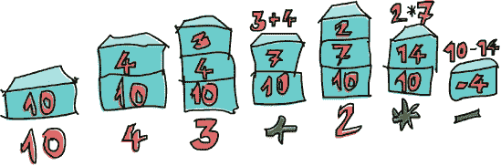
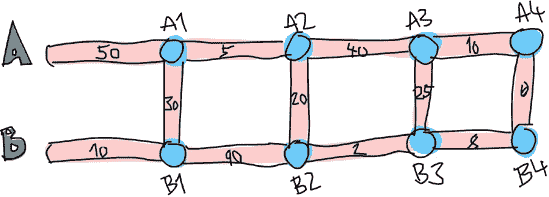

# 第十章。函数式解决问题

在本章中，我们将探讨几个有趣的问题，并思考如何尽可能优雅地使用函数式编程技术来解决它们。这将给你一个机会来锻炼你新学会的 Haskell 技能，并练习你的编码技巧。

# 逆波兰表示法计算器

通常，我们在学校处理代数表达式时，会以中缀方式书写。例如，我们写成 `10 - (4 + 3) * 2`。加法（`+`）、乘法（`*`）和减法（`-`）都是中缀运算符，就像 Haskell 中的中缀函数（`+`, `elem` 等）。作为人类，我们可以在脑海中轻松解析这种形式。缺点是我们需要使用括号来表示优先级。

另一种书写代数表达式的方法是使用逆波兰表示法，或称 RPN。在 RPN 中，运算符位于数字之后，而不是夹在它们之间。所以，我们不是写 `4 + 3`，而是写 `4 3 +`。但是，我们如何写包含多个运算符的表达式呢？例如，我们如何写一个将 `4` 和 `3` 相加然后乘以 `10` 的表达式？很简单：`4 3 + 10 *`。因为 `4 3 +` 等于 `7`，所以整个表达式等同于 `7 10 *`。

## 计算逆波兰表达式

为了了解如何计算逆波兰表达式，想象一个数字栈。我们从左到右遍历表达式。每次遇到一个数字，就将其放在栈顶（将其压入栈中）。当我们遇到一个运算符时，我们从栈顶弹出两个数字（现在栈中只剩 `10`），使用这两个数字和运算符，然后将结果数压回栈中。当我们到达表达式的末尾时，我们应该剩下代表结果的单个数字（假设表达式是正确形成的）。

让我们看看如何计算逆波兰表达式 `10 4 3 + 2 * -`：

1.  我们将 `10` 压入栈中，因此栈现在包含 `10`。

1.  下一个项目是 `4`，所以我们也将它压入栈中。栈现在是 `10, 4`。

1.  我们用同样的方法处理 `3`，栈现在是 `10, 4, 3`。

1.  我们遇到了一个运算符：`+`。我们从栈顶弹出两个数字（现在栈中只剩 `10`），将这两个数字相加，然后将结果压回栈中。栈现在是 `10, 7`。

1.  我们将 `2` 压入栈中，栈现在变为 `10, 7, 2`。

1.  我们遇到了另一个运算符。我们从栈中弹出 `7` 和 `2`，将它们相乘，然后将结果压回栈中。`7` 和 `2` 相乘得到 `14`，因此栈现在是 `10, 14`。

1.  最后，我们遇到了一个 `-`。我们从栈中弹出 `10` 和 `14`，从 `10` 中减去 `14`，然后将结果压回栈中。

1.  栈中的数字现在是 `-4`。因为我们的表达式中没有更多的数字或运算符，这就是我们的结果！



因此，这就是手动计算逆波兰表达式的方法。现在让我们考虑如何编写一个 Haskell 函数来完成同样的工作。

## 编写逆波兰表达式（RPN）函数

我们的函数将接受一个包含逆波兰表达式（RPN）的字符串作为参数（例如 `"10 4 3 + 2 * -"`），并返回该表达式的结果。

那这个函数的类型会是什么样子呢？我们希望它接受一个字符串作为参数，并返回一个数字作为结果。比如说，我们希望结果是双精度浮点数，因为我们还想包含除法操作。所以它的类型可能类似于以下这样：

```
solveRPN :: String -> Double
```

### 注意

在处理实现之前先思考函数的类型声明非常有帮助。在 Haskell 中，函数的类型声明由于非常强的类型系统，可以告诉你很多关于函数的信息。


当在 Haskell 中实现一个问题的解决方案时，考虑你是如何手动解决这个问题的可能会有所帮助。对于我们的逆波兰表达式计算，我们将每个由空格分隔的数字或运算符视为一个单独的项目。因此，如果我们首先将字符串 `"10 4 3 + 2 * -"` 分解成如下的项目列表，可能会有所帮助：

```
["10","4","3","+","2","*","-"].
```

接下来，我们是如何处理我们头上的这个项目列表的？我们是从左到右遍历它的，并在这样做的同时保持一个栈。这个过程让你想起了什么吗？在 I Fold You So 中，你看到了几乎任何通过逐个遍历列表元素并构建（累加）一些结果——无论是数字、列表、栈还是其他东西——的函数都可以通过折叠来实现。

在这种情况下，我们将使用左折叠，因为我们是从左到右遍历列表的。累加值将是我们的栈，所以折叠的结果也将是一个栈（尽管如我们所见，它将只包含一个项目）。

还有一件事需要考虑，那就是我们如何表示这个栈。让我们使用一个列表，并将栈顶放在列表的头部。在列表头部（开始处）添加元素比在末尾添加要快得多。所以如果我们有一个包含 `10, 4, 3` 的栈，我们将它表示为列表 `[3,4,10]`。

现在我们已经有了足够的信息来大致勾勒出我们的函数。它将接受一个类似于 `"10 4 3 + 2 * -"` 的字符串，并使用 `words` 函数将其分解成一系列项目。接下来，我们将对这个列表进行左折叠操作，最终得到一个只有一个项目的栈（在这个例子中，是 `[-4]`）。我们将这个单一的项目从列表中取出，这就是我们的最终结果！

下面是这个函数的草图：

```
solveRPN :: String -> Double
solveRPN expression = head (foldl foldingFunction [] (words expression))
    where  foldingFunction stack item = ...
```

我们将表达式转换成一个项目列表。然后我们使用折叠函数对这个项目列表进行折叠。注意`[]`，它代表起始累加器。累加器是我们的栈，所以`[]`代表一个空栈，这是我们开始的地方。在得到只有一个项目的最终栈后，我们应用`head`函数到这个列表上以获取项目。

现在只剩下实现一个折叠函数，它将接受一个栈，如`[4,10]`，和一个项目，如`"3"`，并返回一个新的栈`[3,4,10]`。如果栈是`[4,10]`且项目是`"*"`，那么该函数需要返回`[40]`。

在我们编写折叠函数之前，让我们将我们的函数转换为无参数风格，因为它有很多让我感到不安的括号：

```
solveRPN :: String -> Double
solveRPN = head . foldl foldingFunction [] . words
    where  foldingFunction stack item = ...
```

这样就好多了。

折叠函数将接受一个栈和一个项目，并返回一个新的栈。我们将使用模式匹配来获取栈的顶部项目，并对操作符如`"*"`和`"-"`进行模式匹配。这里就是实现了折叠函数的样子：

```
solveRPN :: String -> Double
solveRPN = head . foldl foldingFunction [] . words
    where  foldingFunction (x:y:ys) "*" = (y * x):ys
           foldingFunction (x:y:ys) "+" = (y + x):ys
           foldingFunction (x:y:ys) "-" = (y - x):ys
           foldingFunction xs numberString = read numberString:xs
```

我们将其展开为四种模式。模式将从顶部开始尝试。首先，折叠函数将检查当前项目是否是`"*"`。如果是，那么它将取一个如`[3,4,9,3]`的列表，并将其前两个元素分别命名为`x`和`y`。所以在这种情况下，`x`将是`3`，`y`将是`4`。`ys`将是`[9,3]`。它将返回一个与`ys`相同的列表，但以`x`和`y`的乘积作为头部。有了这个，我们将弹出栈中最上面的两个数字，将它们相乘，然后将结果推回栈上。如果项目不是`"*"`，模式匹配将失败，将检查`"+"`，依此类推。

如果项目不是操作符之一，我们假设它是一个表示数字的字符串。如果是数字，我们只需将`read`函数应用到这个字符串上，从中获取数字，并返回之前栈的状态，但将这个数字推到栈顶。

对于项目列表`["2","3","+"]`，我们的函数将从左侧开始折叠。初始栈将是`[]`。它将使用`[]`作为栈（累加器）和`"2"`作为项目调用折叠函数。因为这个项目不是操作符，所以它将被读取并添加到`[]`的开头。所以新的栈现在是`[2]`。折叠函数将使用`[2]`作为栈和`"3"`作为项目再次被调用，生成新的栈`[3,2]`。然后它第三次被调用，栈是`[3,2]`，项目是`"+"`。这导致这两个数字从栈中弹出，相加，然后推回。最终的栈是`[5]`，这是我们返回的数字。

让我们玩一下我们的函数：

```
ghci> solveRPN "10 4 3 + 2 * -"
-4.0
ghci> solveRPN "2 3.5 +"
5.5
ghci> solveRPN "90 34 12 33 55 66 + * - +"
-3947.0
ghci> solveRPN "90 34 12 33 55 66 + * - + -"
4037.0
ghci> solveRPN "90 3.8 -"
86.2
```

太棒了！它工作了！

## 添加更多操作符

这个解决方案的一个优点是它可以很容易地修改以支持各种其他运算符。它们甚至不需要是二元运算符。例如，我们可以创建一个名为 `"log"` 的运算符，它只需从栈中弹出一个数字并返回其对数。我们还可以创建操作多个数字的运算符，例如 `"sum"`，它将弹出所有数字并返回它们的总和。

让我们修改我们的函数以接受更多的一些运算符。

```
solveRPN :: String -> Double
solveRPN = head . foldl foldingFunction [] . words
    where  foldingFunction (x:y:ys) "*" = (y * x):ys
           foldingFunction (x:y:ys) "+" = (y + x):ys
           foldingFunction (x:y:ys) "-" = (y - x):ys
           foldingFunction (x:y:ys) "/" = (y / x):ys
           foldingFunction (x:y:ys) "^" = (y ** x):ys
           foldingFunction (x:xs) "ln" = log x:xs
           foldingFunction xs "sum" = [sum xs]
           foldingFunction xs numberString = read numberString:xs
```

`/` 当然是除法，`**` 是指数。对于对数运算符，我们只需对单个元素和其余栈进行模式匹配，因为我们只需要一个元素来执行其自然对数。对于求和运算符，我们返回一个只有一个元素的栈，这个元素是到目前为止栈中所有元素的总和。

```
ghci> solveRPN "2.7 ln"
0.9932517730102834
ghci> solveRPN "10 10 10 10 sum 4 /"
10.0
ghci> solveRPN "10 10 10 10 10 sum 4 /"
12.5
ghci> solveRPN "10 2 ^"
100.0
```

我认为创建一个能够计算任意浮点逆波兰表示法（RPN）表达式并且可以在 10 行代码内轻松扩展的函数是非常棒的。

### 注意

这个逆波兰表示法（RPN）计算解决方案实际上并不具备容错性。当输入不合理的值时，可能会导致运行时错误。但别担心，你将在第十四章中学习如何使这个函数更加健壮。

# 伦敦希思罗机场到伦敦

假设我们正在出差。我们的飞机刚刚在英国降落，我们租了一辆车。我们有一个会议马上就要开始了，我们需要尽快（但安全地！）从希思罗机场赶到伦敦。

从希思罗机场到伦敦有两条主要道路，以及许多区域道路与之交叉。从一个交叉点到另一个交叉点的旅行时间是固定的。我们必须找到最佳路径，以确保我们按时到达伦敦的会议。我们从左侧开始，可以选择穿越到另一条主要道路或前进。


正如你在图片中看到的，在这种情况下，从希思罗机场到伦敦的最快路径是从主道路 `B` 开始，穿过，然后在 `A` 上前进，再次穿过，然后在 `B` 上前进两次。如果我们选择这条路径，需要 75 分钟。如果我们选择其他任何路径，都会花费更长的时间。

我们的任务是编写一个程序，它接受表示道路系统的输入并打印出穿过它的最快路径。以下是这个案例的输入示例：

```
50
10
30
5
90
20
40
2
25
10
8
0
```

为了在心理上解析输入文件，以三为单位读取它，并将道路系统划分为几个部分。每个部分由道路 `A`、道路 `B` 和一条交叉道路组成。为了使其整齐地分成三部分，我们说有一个最后的交叉部分，需要 0 分钟来驾驶通过。这是因为我们不在乎到达伦敦的地点，只要我们在伦敦，伙计！

正如我们在考虑逆波兰计算器问题时所做的那样，我们将分三步解决这个问题：

1.  先放下 Haskell，想想我们如何手动解决这个问题。在逆波兰表达式计算器部分，我们首先确定在手动计算表达式时，我们在心中保持一种堆栈，然后逐个处理表达式中的每个项。

1.  考虑我们如何在 Haskell 中表示我们的数据。对于我们的逆波兰表达式计算器，我们决定使用字符串列表来表示我们的表达式。

1.  找出如何在 Haskell 中操作这些数据，以便我们产生一个解决方案。对于计算器，我们使用了左折叠来遍历字符串列表，同时保持一个堆栈以产生解决方案。

## 计算最快路径

那么，我们如何手动计算出从希思罗机场到伦敦的最快路径呢？嗯，我们只需看看整个图景，尝试猜测最快路径，并希望我们的猜测是正确的。这个解决方案对于非常小的输入是有效的，但如果我们有一个有 10,000 个路段的道路呢？哎呀！我们也不能肯定我们的解决方案是最优的；我们只能说我们相当肯定。所以，这不是一个好的解决方案。

这是我们道路系统的简化图：



我们能否计算出在道路`A`上的第一个交叉点（`A`上的第一个点，标记为`A1`）的最快路径？这相当简单。我们只需看看直接在`A`上前进是否比在`B`上前进然后横穿更快。显然，通过`B`前进然后横穿更快，因为这样只需要 40 分钟，而直接通过`A`需要 50 分钟。那么交叉点`B1`呢？我们看到直接通过`B`（成本为 10 分钟）要快得多，因为通过`A`然后横穿需要我们 80 分钟！

现在我们知道了到达`A1`的最快路径：通过`B`然后横穿。我们将这称为路径`B, C`，成本为 40 分钟。我们还知道到达`B1`的最快路径：直接通过`B`。所以这是一个只有`B`的路径，耗时 10 分钟。如果我们想知道两条主路上下一个交叉点的最快路径，这些知识对我们有帮助吗？哎呀，当然有帮助了！

让我们看看到达`A2`的最快路径是什么。要到达`A2`，我们要么直接从`A1`到`A2`，要么从`B1`前进然后横穿（记住我们只能向前移动或横穿到另一边）。因为我们知道到达`A1`和`B1`的成本，我们可以轻松地找出到达`A2`的最佳路径。到达`A1`需要我们 40 分钟，然后从`A1`到`A2`需要 5 分钟，所以这是路径`B, C, A`，总成本为 45 分钟。到达`B1`只需要 10 分钟，但然后还需要额外 110 分钟才能到达`B2`并横穿！所以显然，到达`A2`的最快路径是`B, C, A`。同样，到达`B2`的最快方式是从`A1`前进然后横穿。

### 注意

你可能自己在想，“但通过在`B1`处先交叉然后前进，如何到达`A2`？” 好吧，当我们寻找到`A1`的最佳路径时，我们已经涵盖了从`B1`到`A1`的交叉，所以在下一步中我们也不需要考虑这一点。

现在我们有了到`A2`和`B2`的最佳路径，我们可以重复这个过程，直到到达终点。一旦我们计算了`A4`和`B4`的最佳路径，耗时较短的那个就是最优路径。

因此，本质上，对于第二个部分，我们只是重复我们最初所做的步骤，但我们要考虑`A`和`B`上的先前最佳路径。我们可以说，在第一步中，我们也考虑了`A`和`B`上的最佳路径——它们都是成本为 0 分钟的空路径。

总结来说，为了从希思罗机场到伦敦找到最佳路径，我们这样做：

1.  我们查看通往主路`A`上下一个路口的最佳路径。有两种选择：直接前进或从相对的道路开始，然后前进并交叉。我们记住成本和路径。

1.  我们使用相同的方法来找到通往主路`B`上下一个路口的最佳路径，并记住它。

1.  我们检查从上一个`A`路口到下一个路口的路径是否比从上一个`B`路口过去然后交叉的时间更短。我们记住较快的路径。我们对相对的路口也做同样的处理。

1.  我们对每个部分都这样做，直到达到最后。

1.  一旦我们到达终点，两个路径中较快的那个就是我们的最优路径。

因此，本质上，我们保持`A`路上的一个最快路径和一个`B`路上的最快路径。当我们到达终点时，这两个路径中较快的那个就是我们的路径。

现在我们知道如何手动找出最快的路径。如果你有足够的时间、纸张和铅笔，你可以找出任何数量部分的公路系统的最快路径。

## 使用 Haskell 表示道路系统

我们如何用 Haskell 的数据类型表示这个道路系统？

回想一下我们手动解决问题的方法，我们同时检查了三个道路部分的时间：`A`路上的道路部分，它在`B`路上的相对部分，以及`C`部分，它接触那两个部分并将它们连接起来。当我们寻找到`A1`和`B1`的最快路径时，我们只处理了前三个部分的时间，分别是 50、10 和 30。我们将那称为一个部分。所以，我们用于这个示例的道路系统可以很容易地表示为四个部分：

+   `50, 10, 30`

+   `5, 90, 20`

+   `40, 2, 25`

+   `10, 8, 0`

总是保持我们的数据类型尽可能简单（尽管不能更简单了！）以下是我们的道路系统的数据类型：

```
data Section = Section { getA :: Int, getB :: Int, getC :: Int }
    deriving (Show)

type RoadSystem = [Section]
```

这是最简单的情况，我有一种感觉，它将完美地适用于实现我们的解决方案。

`Section` 是一个简单的代数数据类型，它包含三个整数，表示其三个道路部分的时间。我们还引入了一个类型同义词，表示`RoadSystem`是一个部分的列表。

### 注意

我们也可以使用`(Int, Int, Int)`三元组来表示一个道路部分。使用元组而不是创建自己的代数数据类型对于一些小而局部的东西来说很好，但对于更复杂的表现通常更好。它给类型系统提供了更多关于是什么的信息。我们可以使用`(Int, Int, Int)`来表示一个道路部分或三维空间中的向量，并且我们可以对这两个进行操作，但这允许我们混淆它们。如果我们使用`Section`和`Vector`数据类型，那么我们就不可能意外地将一个向量加到道路系统的部分上。

我们从希思罗到伦敦的道路系统现在可以表示如下：

```
heathrowToLondon :: RoadSystem
heathrowToLondon = [ Section 50 10 30
                   , Section 5 90 20
                   , Section 40 2 25
                   , Section 10 8 0
                   ]
```

现在我们需要做的就是用 Haskell 实现这个解决方案。

## 编写最优路径函数

对于任何给定的道路系统计算最短路径的函数的类型声明应该是什么？它应该接受一个道路系统作为参数并返回一个路径。我们将路径表示为一个列表。

让我们引入一个`Label`类型，它只是`A`、`B`或`C`的枚举。我们还将创建一个名为`Path`的类型同义词。

```
data Label = A | B | C deriving (Show)
type Path = [(Label, Int)]
```

我们将称之为`optimalPath`的函数应该具有以下类型：

```
optimalPath :: RoadSystem -> Path
```

如果用`heathrowToLondon`道路系统调用，它应该返回以下路径：

```
[(B,10),(C,30),(A,5),(C,20),(B,2),(B,8)]
```

我们将需要从左到右遍历包含部分的列表，并在过程中保持`A`和`B`上的最优路径。我们将随着列表的遍历，从左到右累积最佳路径。那听起来像什么？叮，叮，叮！没错，一个*左折叠*！

在手动解决问题时，有一个步骤我们反复进行。这涉及到检查到目前为止的`A`和`B`上的最优路径以及当前部分，以生成`A`和`B`上的新最优路径。例如，一开始，`A`和`B`的最优路径分别是`[]`和`[]`。我们检查了`Section 50 10 30`并得出结论，`A1`的新最优路径是`[(B,10),(C,30)]`，而`B1`的最优路径是`[(B,10)]`。如果你把这个步骤看作一个函数，它接受一对路径和一个部分，并生成一对新的路径。所以它的类型是：

```
roadStep :: (Path, Path) -> Section -> (Path, Path)
```

让我们实现这个函数，因为它肯定是有用的：

```
roadStep :: (Path, Path) -> Section -> (Path, Path)
roadStep (pathA, pathB) (Section a b c) =
    let timeA = sum (map snd pathA)
        timeB = sum (map snd pathB)
        forwardTimeToA = timeA + a
        crossTimeToA = timeB + b + c
        forwardTimeToB = timeB + b
        crossTimeToB = timeA + a + c
        newPathToA = if forwardTimeToA <= crossTimeToA
                        then (A, a):pathA
                        else (C, c):(B, b):pathB
        newPathToB = if forwardTimeToB <= crossTimeToB
                        then (B, b):pathB
                        else (C, c):(A, a):pathA
    in  (newPathToA, newPathToB)
```

这里发生了什么？首先，我们根据`A`上的最佳时间计算道路`A`上的最优时间，并为`B`做同样的操作。我们做`sum (map snd pathA)`，所以如果`pathA`类似于`[(A,100),(C,20)]`，则`timeA`变为`120`。

`forwardTimeToA`是如果我们直接从`A`上的前一个交叉路口前往下一个交叉路口，到达`A`上的下一个交叉路口所需的时间。它等于我们之前`A`上的最佳时间加上当前部分的`A`部分持续时间。


`crossTimeToA` 是如果我们从上一个 `B` 向前走到下一个 `A` 然后交叉过去所需的时间。这是到目前为止到达上一个 `B` 的最佳时间加上该部分 `B` 的时间加上该部分 `C` 的时间。

我们以同样的方式确定 `forwardTimeToB` 和 `crossTimeToB`。

现在我们知道了到达 `A` 和 `B` 的最佳方式，我们只需要根据这个新路径到 `A` 和 `B`。如果我们只是向前走就能更快地到达 `A`，我们将 `newPathToA` 设置为 `(A, a):pathA`。基本上，我们将 `Label A` 和该部分的持续时间 `a` 预先添加到迄今为止的 `A` 上最优路径中。我们说到达下一个 `A` 交叉路口的最佳路径是到达前一个 `A` 交叉路口然后通过 `A` 向前走一步。记住，`A` 只是一个标签，而 `a` 有 `Int` 类型。

为什么我们选择在列表开头添加元素而不是执行 `pathA ++ [(A, a)]`？嗯，将元素添加到列表的开头比添加到末尾要快得多。这意味着一旦我们使用这个函数折叠列表，路径就会是错误的顺序，但稍后很容易反转列表。

如果通过从道路 `B` 向前走到下一个 `A` 交叉路口并交叉过去更快，则 `newPathToA` 是到 `B` 的旧路径，然后向前走并交叉到 `A`。对于 `newPathToB`，我们做同样的事情，只是一切都进行了镜像。

最后，我们以一对的形式返回 `newPathToA` 和 `newPathToB`。

让我们在 `heathrowToLondon` 的第一个部分上运行这个函数。因为这是第一个部分，`A` 和 `B` 参数上最好的路径将是一对空列表。

```
ghci> roadStep ([], []) (head heathrowToLondon)
([(C,30),(B,10)],[(B,10)])
```

记住路径是反转的，所以从右到左读取它们。从这一点，我们可以看出到达下一个 `A` 的最佳路径是从 `B` 开始然后交叉到 `A`。到达下一个 `B` 的最佳路径是直接从 `B` 的起点向前走。

### 注意

当我们执行 `timeA = sum (map snd pathA)` 时，我们正在计算每一步路径上的时间。如果我们实现 `roadStep` 以接受并返回 `A` 和 `B` 上的最佳时间以及路径本身，我们就不需要这样做。

现在我们有一个函数，它接受一对路径和一个部分，并生成一条新的最优路径，我们可以轻松地对一系列部分进行左折叠。`roadStep` 使用 `([], [])` 和第一个部分调用，并返回到该部分的两个最优路径。然后它使用这对路径和下一个部分调用，依此类推。当我们走过所有部分后，我们剩下的是一对最优路径，其中较短的那个是我们的答案。考虑到这一点，我们可以实现 `optimalPath`：

```
optimalPath :: RoadSystem -> Path
optimalPath roadSystem =
    let (bestAPath, bestBPath) = foldl roadStep ([], []) roadSystem
    in  if sum (map snd bestAPath) <= sum (map snd bestBPath)
            then reverse bestAPath
            else reverse bestBPath
```

我们对 `roadSystem`（记住它是一个部分的列表）进行左折叠，初始累加器是一个空路径对的组合。这个折叠的结果是一对路径，所以我们在这个对上模式匹配以获取路径本身。然后我们检查哪一个更快，并返回它。在返回之前，我们还反转了它，因为到目前为止的最优路径由于我们选择在前面添加而不是在后面添加而被反转了。

让我们测试一下！

```
ghci> optimalPath heathrowToLondon
[(B,10),(C,30),(A,5),(C,20),(B,2),(B,8),(C,0)]
```

这是我们应该得到的结果！它与我们的预期结果略有不同，因为有一个 `(C,0)` 步骤在末尾，这意味着一旦我们到达伦敦，我们就跨越到另一条道路上。但由于这次穿越不占用任何时间，这仍然是正确的结果。

## 从输入中获取道路系统

我们已经有了找到最优路径的函数，所以现在我们只需要从标准输入读取道路系统的文本表示，将其转换为 `RoadSystem` 类型，通过我们的 `optimalPath` 函数运行它，并打印出结果路径。

首先，让我们创建一个函数，它接受一个列表并将其分成相同大小的组。我们将它命名为 `groupsOf`：

```
groupsOf :: Int -> [a] -> [[a]]
groupsOf 0 _ = undefined
groupsOf _ [] = []
groupsOf n xs = take n xs : groupsOf n (drop n xs)
```

对于 `[1..10]` 的参数，`groupsOf 3` 应该产生以下结果：

```
[[1,2,3],[4,5,6],[7,8,9],[10]]
```

如您所见，这是一个标准的递归函数。执行 `groupsOf 3 [1..10]` 等于以下内容：

```
[1,2,3] : groupsOf 3 [4,5,6,7,8,9,10]
```

当递归完成后，我们得到我们的列表，以三个为一组。这是我们的主函数，它从标准输入读取，将其制作成 `RoadSystem`，并打印出最短路径：

```
import Data.List

main = do
    contents <- getContents
    let threes = groupsOf 3 (map read $ lines contents)
        roadSystem = map (\[a,b,c] -> Section a b c) threes
        path = optimalPath roadSystem
        pathString = concat $ map (show . fst) path
        pathTime = sum $ map snd path
    putStrLn $ "The best path to take is: " ++ pathString
    putStrLn $ "Time taken: " ++ show pathTime
```

首先，我们从标准输入获取所有内容。然后，我们将 `lines` 应用到我们的内容上，将类似 `"50\n10\n30\n ...` 的内容转换为更干净的内容，如 `["50","10","30" ...`。然后，我们映射 `read` 到它上面，将其转换为数字列表。我们将 `groupsOf 3` 应用到它上面，使其变成长度为 3 的列表的列表。然后，我们将 lambda 函数 `(\[a,b,c] -> Section a b c)` 映射到这个列表的列表上。

如您所见，lambda 函数只是将长度为 3 的列表转换为一个部分。因此，`roadSystem` 现在是我们的道路系统，它甚至具有正确的类型：`RoadSystem`（或 `[Section]`）。我们将其应用于 `optimalPath`，得到路径和总时间的良好文本表示，并将其打印出来。

我们将以下文本保存到名为 *paths.txt* 的文件中：

```
50
10
30
5
90
20
40
2
25
10
8
0
```

然后，我们像这样将其输入到我们的程序中：

```
$ runhaskell heathrow.hs < paths.txt
The best path to take is: BCACBBC
Time taken: 75
```

工作得很好！

您可以使用对 `Data.Random` 模块的了解来生成一个更长的道路系统，然后将其输入到我们刚刚编写的代码中。如果您遇到栈溢出，可以将 `foldl` 改为 `foldl'`，将 `sum` 改为 `foldl' (+) 0`。或者，在运行之前，尝试按以下方式编译它：

```
$ ghc --make -O heathrow.hs
```

包含 `O` 标志会开启优化，这有助于防止 `foldl` 和 `sum` 等函数导致栈溢出。
