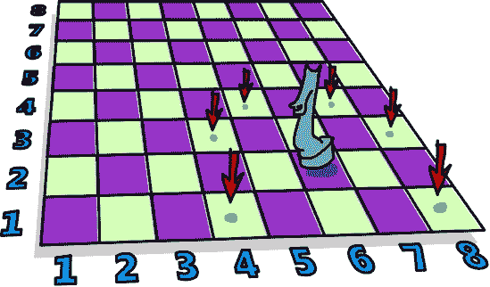

# 第十三章。一打 monad

当我们在第七章中首次讨论 functor 时，你看到了它们对于可以映射的值是一个有用的概念。然后，在第十一章第十一章。应用 functor 中，我们通过应用 functor 进一步发展了这个概念，它允许我们将某些数据类型的值视为带有上下文的值，并在这些值上使用正常函数，同时保留这些上下文的意义。

在本章中，你将学习关于*monad*的内容，它们只是增强的应用 functor，就像应用 functor 是增强的 functor 一样。

# 升级我们的应用 functor

当我们开始使用 functor 时，你看到了使用`Functor`类型类在各个数据类型上映射函数是可能的。functor 的介绍让我们提出了这样的问题：“当我们有一个类型为`a -> b`的函数和一些数据类型`f a`时，我们如何将这个函数映射到数据类型上，最终得到`f b`？”你看到了如何将函数映射到`Maybe a`、列表`[a]`、`IO a`等上。你甚至看到了如何将函数`a -> b`映射到其他类型为`r -> a`的函数上，以得到类型为`r -> b`的函数。为了回答如何将函数映射到某些数据类型的问题，我们只需要查看`fmap`的类型：


```
fmap :: (Functor f) => (a -> b) -> f a -> f b
```

然后我们只需要通过编写适当的`Functor`实例来使它适用于我们的数据类型。

然后你看到了 functor 可能的改进，并提出了更多问题。如果函数`a -> b`已经包裹在一个 functor 值中，那会怎样？比如说我们有`Just (*3)`——我们如何将其应用于`Just 5`？如果我们不想将其应用于`Just 5`，而是应用于`Nothing`呢？或者如果我们有`[(*2),(+4)]`，我们如何将其应用于`[1,2,3]`？这怎么可能呢？为此，引入了`Applicative`类型类：

```
(<*>) :: (Applicative f) => f (a -> b) -> f a -> f b
```

你也看到了，你可以将一个普通值包裹在数据类型中。例如，我们可以取一个`1`并把它包裹成`Just 1`。或者我们可以把它变成`[1]`。它甚至可以成为一个什么也不做，只是产生`1`的 I/O 操作。执行这个操作的函数被称为`pure`。

应用值可以看作是添加了上下文的值——用技术术语来说，就是一个*花哨*的值。例如，字符`'a'`只是一个普通字符，而`Just 'a'`则有一些额外的上下文。我们不是有一个`Char`，而是一个`Maybe Char`，这告诉我们它的值可能是一个字符，但也可能是一个字符的缺失。`Applicative`类型类允许我们使用带有上下文的正常函数对这些值进行操作，并且这个上下文被保留。观察一个例子：

```
ghci> (*) <$> Just 2 <*> Just 8
Just 16
ghci> (++) <$> Just "klingon" <*> Nothing
Nothing
ghci> (-) <$> [3,4] <*> [1,2,3]
[2,1,0,3,2,1]
```

因此，现在我们将它们视为应用值，`Maybe a`的值代表可能失败的计算，`[a]`的值代表有多个结果（非确定性计算）的计算，`IO a`的值代表有副作用的价值，等等。

单子是应用函子的自然扩展，并且它们为以下问题提供了一个解决方案：如果我们有一个带有上下文的价值`m a`，我们如何应用一个接受正常`a`并返回带有上下文的价值的函数？换句话说，我们如何将类型为`a -> m b`的函数应用到类型为`m a`的价值上？本质上，我们想要这个函数：

```
(>>=) :: (Monad m) => m a -> (a -> m b) -> m b
```

如果我们有一个复杂的价值和一个接受正常值但返回复杂值的函数，我们如何将这个复杂的价值喂给函数？这是处理单子时的主要关注点。我们写`m a`而不是`f a`，因为`m`代表`Monad`，但单子只是支持`>>=`的应用函子。`>>=`函数被称为*绑定*。

当我们有一个正常的值`a`和一个正常的函数`a -> b`时，将值喂给函数是非常容易的——我们只需正常地将函数应用到值上，就是这样。但是当我们处理带有特定上下文的价值时，需要一些思考才能看到这些复杂的价值是如何喂给函数的，以及如何考虑它们的行为。但你会看到，这就像一、二、三那么简单。

# 通过`Maybe`入门

既然你对单子的概念有了模糊的了解，让我们使这个想法更加具体。不出所料，`Maybe`是一个单子。在这里，我们将更深入地探讨它在这个角色中的工作方式。

### 注意

确保你现在理解了应用函子（我们在第十一章中讨论了它们）。你应该对各种`Applicative`实例的工作方式和它们所代表的计算类型有所感觉。为了理解单子，你将把现有的应用函子知识提升到更高层次。


类型为`Maybe a`的值代表类型为`a`的值，但带有可能失败上下文。`Just "dharma"`的值意味着字符串`"dharma"`存在。`Nothing`的值代表其不存在，或者如果你把字符串看作是计算的结果，它意味着计算失败了。

当我们把`Maybe`作为一个函子来考虑时，我们看到了，如果我们想要在它上面`fmap`一个函数，如果里面是`Just`值，函数会被映射到其内部。否则，会保留`Nothing`，因为没有东西可以映射！

```
ghci> fmap (++"!") (Just "wisdom")
Just "wisdom!"
ghci> fmap (++"!") Nothing
Nothing
```

作为应用函子，`Maybe`函数的行为类似。然而，在应用函子中，函数本身处于一个上下文中，以及它被应用到的值。`Maybe`作为一个应用函子，当我们使用`<*>`将一个`Maybe`内的函数应用于另一个`Maybe`内的值时，它们都必须是`Just`值，结果才是一个`Just`值；否则，结果是`Nothing`。这很有道理。如果你缺少函数或你要应用它的东西，你不能凭空创造出来，所以你需要传播失败。

```
ghci> Just (+3) <*> Just 3
Just 6
ghci> Nothing <*> Just "greed"
Nothing
ghci> Just ord <*> Nothing
Nothing
```

使用应用风格让普通函数作用于`Maybe`值的方式与此类似。所有值都必须是`Just`值；否则，结果都是`Nothing`！

```
ghci> max <$> Just 3 <*> Just 6
Just 6
ghci> max <$> Just 3 <*> Nothing
Nothing
```

现在，让我们思考一下如何使用`>>=`与`Maybe`结合。`>>=`接受一个单子值和一个接受正常值的函数。它返回一个单子值，并成功地将该函数应用于单子值。如果函数接受正常值，它是如何做到这一点的呢？嗯，它必须考虑到那个单子值的上下文。

在这种情况下，`>>=`将接受一个`Maybe a`值和一个类型为`a -> Maybe b`的函数，并以某种方式将函数应用于`Maybe a`。为了弄清楚它是如何做到这一点的，我们可以使用我们对`Maybe`作为一个应用函子的理解。让我们假设我们有一个函数`\x -> Just (x+1)`。它接受一个数字，将其加 1，并用`Just`包装起来：

```
ghci> (\x -> Just (x+1)) 1
Just 2
ghci> (\x -> Just (x+1)) 100
Just 101
```

如果我们给它`1`，它评估为`Just 2`。如果我们给它数字`100`，结果是`Just 101`。这似乎非常直接。但我们如何将`Maybe`值喂给这个函数呢？如果我们考虑`Maybe`作为应用函子的行为，回答这个问题就很简单了。我们给它一个`Just`值，取`Just`里面的东西，并将函数应用于它。如果我们给它一个`Nothing`，那么我们只剩下一个函数，但没有东西可以应用它。在这种情况下，我们就像之前做的那样，说结果是`Nothing`。

我们暂时不叫它`>>=`，而是叫它`applyMaybe`。它接受一个`Maybe a`和一个返回`Maybe b`的函数，并成功地将该函数应用于`Maybe a`。下面是相应的代码：

```
applyMaybe :: Maybe a -> (a -> Maybe b) -> Maybe b
applyMaybe Nothing f  = Nothing
applyMaybe (Just x) f = f x
```

现在让我们来玩玩这个。我们将将其用作中缀函数，这样`Maybe`值就在左边，函数在右边：

```
ghci> Just 3 `applyMaybe` \x -> Just (x+1)
Just 4
ghci> Just "smile" `applyMaybe` \x -> Just (x ++ " :)")
Just "smile :)"
ghci> Nothing `applyMaybe` \x -> Just (x+1)
Nothing
ghci> Nothing `applyMaybe` \x -> Just (x ++ " :)")
Nothing
```

在这个例子中，当我们使用`applyMaybe`与一个`Just`值和一个函数时，函数简单地应用于`Just`内的值。当我们尝试使用它与`Nothing`时，整个结果都是`Nothing`。那么如果函数返回`Nothing`呢？让我们看看：

```
ghci> Just 3 `applyMaybe` \x -> if x > 2 then Just x else Nothing
Just 3
ghci> Just 1 `applyMaybe` \x -> if x > 2 then Just x else Nothing
Nothing
```

结果正如我们所预期的。如果左边的单子值是`Nothing`，整个结果就是`Nothing`。如果右边的函数返回`Nothing`，结果又是`Nothing`。这和我们使用`Maybe`作为应用时得到的结果类似，如果在混合中存在`Nothing`。

看起来我们已经弄清楚如何取一个花哨的值，将其传递给一个接受普通值的函数，并返回一个花哨的值。我们是通过记住 `Maybe` 值代表可能失败的计算来做到这一点的。

你可能会问自己，“这有什么用？” 可能看起来应用函子比单子更强，因为应用函子允许我们取一个普通函数并使其能够操作带有上下文的值。在本章中，你将看到单子作为应用函子的升级，也可以做到这一点。事实上，它们可以做应用函子做不到的一些酷炫的事情。

我们稍后会回到 `Maybe`，但首先，让我们看看属于单子的类型类。

# 单子类型类

就像函子有 `Functor` 类型类，应用函子有 `Applicative` 类型类一样，单子也有自己的类型类：`Monad`！ (哇，谁能想到？)

```
class Monad m where
    return :: a -> m a

    (>>=) :: m a -> (a -> m b) -> m b

    (>>) :: m a -> m b -> m b
    x >> y = x >>= \_ -> y

    fail :: String -> m a
    fail msg = error msg
```

第一行说 `class Monad m where`。但是等等，我没有说过单子只是增强的应用函子吗？难道不应该有一个类约束，比如 `class (Applicative m) => Monad m where`，这样类型在成为单子之前必须是一个应用函子？嗯，应该是这样的，但 Haskell 被创造出来时，人们还没有意识到应用函子非常适合 Haskell。但请放心，每个单子都是一个应用函子，即使 `Monad` 类声明没有这么说。


`Monad` 类型类定义的第一个函数是 `return`。它与 `Applicative` 类型类的 `pure` 相同。所以，尽管它有不同的名字，但你已经熟悉它了。`return` 的类型是 `(Monad m) => a -> m a`。它接受一个值并将其放入一个最小的默认上下文中，该上下文仍然包含该值。换句话说，`return` 接受某物并将其包裹在单子中。我们在 第八章 处理 I/O 时已经使用了 `return`。我们用它来取一个值并创建一个虚假的 I/O 操作，该操作除了产生该值外什么都不做。对于 `Maybe`，它取一个值并将其包裹在 `Just` 中。

### 注意

提醒一下：`return` 与大多数其他语言中的 `return` 完全不同。它不会结束函数执行。它只是取一个普通值并将其放入一个上下文中。

下一个函数是 `>>=`，或绑定。它就像函数应用，但不是取一个普通值并将其传递给一个普通函数，而是取一个单子值（即带有上下文的值）并将其传递给一个接受普通值但返回单子值的函数。


接下来是`>>=`。我们现在不会过多关注它，因为它有一个默认实现，并且当创建`Monad`实例时很少实现。我们将在 Banana on a Wire 中更详细地探讨它。

`Monad`类型类的最后一个函数是`fail`。我们在代码中从不显式使用它。相反，Haskell 使用它来在后面你将遇到的特殊语法结构中启用失败。现在我们不需要过多关注`fail`。

现在你已经知道了`Monad`类型类的样子，让我们看看`Maybe`是如何成为`Monad`的一个实例的！

```
instance Monad Maybe where
    return x = Just x
    Nothing >>= f = Nothing
    Just x >>= f  = f x
    fail _ = Nothing
```

`return`与`pure`相同，所以这一点是显而易见的。我们做了与`Applicative`类型类中相同的事情，将其包裹在`Just`中。`>>=`函数与我们的`applyMaybe`相同。当我们向函数传递`Maybe a`时，我们牢记上下文，如果左边的值是`Nothing`，则返回`Nothing`。再次，如果没有值，那么就没有办法将我们的函数应用于它。如果是`Just`，我们就取出里面的值并对其应用`f`。

我们可以围绕`Maybe`作为`monad`进行一些实验：

```
ghci> return "WHAT" :: Maybe String
Just "WHAT"
ghci> Just 9 >>= \x -> return (x*10)
Just 90
ghci> Nothing >>= \x -> return (x*10)
Nothing
```

第一行没有什么新奇的，因为我们已经使用过`pure`与`Maybe`，而且我们知道`return`只是以不同名称的`pure`。

接下来的两行展示了`>>=`的使用。注意当我们将`Just 9`传递给函数`\x -> return (x*10)`时，函数内的`x`取值为`9`。这好像我们能够从`Maybe`中提取值而不需要模式匹配。而且我们也没有丢失`Maybe`值的上下文，因为当它是`Nothing`时，使用`>>=`的结果也将是`Nothing`。

# Walk the Line

现在你已经知道了如何在考虑可能失败的情况下，将一个`Maybe a`值传递给一个类型为`a -> Maybe b`的函数，让我们看看我们如何可以重复使用`>>=`来处理多个`Maybe a`值的计算。

皮埃尔决定从他在鱼场的工作中休息一下，尝试走钢丝。他在这方面并不差，但他有一个问题：鸟儿总是落在他的平衡杆上！它们来短暂休息，与它们的鸟类朋友聊天，然后去找面包屑。如果杆子两边的鸟儿数量总是相等，这不会让他太烦恼。但有时，所有的鸟儿都决定他们更喜欢一边。它们把他弄失衡，结果皮埃尔（他使用了安全网）尴尬地摔倒了。


假设皮埃尔保持平衡的条件是杆子两侧的鸟的数量都在三个以内。所以如果右边有一只鸟，左边有四只鸟，他就没问题。但如果第五只鸟降落在左边，他就失去了平衡，然后就会跌落。

我们将模拟鸟在杆子上降落和飞走，并查看在经过一定数量的鸟的到达和离开后，皮埃尔是否还在那里。例如，我们想看看如果首先有一只鸟降落在左边，然后四只鸟占据了右边，最后左边的那只鸟决定飞走，会发生什么。

## 代码，代码，代码

我们可以用一对简单的整数来表示杆子。第一个组成部分将表示左边的鸟的数量，第二个组成部分表示右边的鸟的数量：

```
type Birds = Int
type Pole = (Birds, Birds)
```

首先，我们为 `Int` 创建了一个类型同义词，称为 `Birds`，因为我们正在使用整数来表示鸟的数量。然后我们创建了一个类型同义词 `(Birds, Birds)` 并将其称为 `Pole`（不要与波兰血统的人混淆）。

现在来考虑添加一些函数，这些函数可以将一定数量的鸟降落在杆子的这一侧或那一侧。

```
landLeft :: Birds -> Pole -> Pole
landLeft n (left, right) = (left + n, right)

landRight :: Birds -> Pole -> Pole
landRight n (left, right) = (left, right + n)
```

让我们试试看：

```
ghci> landLeft 2 (0, 0)
(2,0)
ghci> landRight 1 (1, 2)
(1,3)
ghci> landRight (-1) (1, 2)
(1,1)
```

要让鸟飞走，我们只需让一侧降落的鸟的数量为负数。因为将鸟降落在 `Pole` 上会返回一个 `Pole`，所以我们可以链式调用 `landLeft` 和 `landRight`：

```
ghci> landLeft 2 (landRight 1 (landLeft 1 (0, 0)))
(3,1)
```

当我们将函数 `landLeft 1` 应用到 `(0, 0)` 上时，我们得到 `(1, 0)`。然后我们在右边降一只鸟，结果变为 `(1, 1)`。最后，左边降两只鸟，结果变为 `(3, 1)`。我们通过先写函数再写其参数的方式来应用函数到某个东西上，但在这里，如果杆子先写，然后是降落函数会更好。假设我们创建一个这样的函数：

```
x -: f = f x
```

我们可以通过先写参数再写函数的方式来应用函数：

```
ghci> 100 -: (*3)
300
ghci> True -: not
False
ghci> (0, 0) -: landLeft 2
(2,0)
```

通过使用这种形式，我们可以以更可读的方式反复在杆子上降落鸟：

```
ghci> (0, 0) -: landLeft 1 -: landRight 1 -: landLeft 2
(3,1)
```

真是酷！这个版本与我们之前反复将鸟降落在杆子上的版本等效，但看起来更整洁。在这里，我们一开始从 `(0, 0)` 开始，然后左降一只鸟，右降一只，最后左降两只。

## 我要飞走了

到目前为止一切顺利，但如果一侧降落了十只鸟会怎样？

```
ghci> landLeft 10 (0, 3)
(10,3)
```

左边有十只鸟，右边只有三只？这肯定会让可怜的皮埃尔从空中跌落！这里很明显，但如果有一系列的降落像这样：

```
ghci> (0, 0) -: landLeft 1 -: landRight 4 -: landLeft (-1) -: landRight (-2)
(0,2)
```

看起来一切似乎都正常，但如果你按照这里的步骤来，你会看到在某个时刻右边有四只鸟，左边没有鸟！为了解决这个问题，我们需要重新审视我们的 `landLeft` 和 `landRight` 函数。

我们希望`landLeft`和`landRight`函数能够失败。我们希望它们在平衡正常时返回一根新杆，但在鸟儿以不平衡的方式降落时失败。还有什么比使用`Maybe`来添加失败上下文到值更好的方法呢！让我们重新设计这些函数：

```
landLeft :: Birds -> Pole -> Maybe Pole
landLeft n (left, right)
    | abs ((left + n) - right) < 4 = Just (left + n, right)
    | otherwise                    = Nothing

landRight :: Birds -> Pole -> Maybe Pole
landRight n (left, right)
    | abs (left - (right + n)) < 4 = Just (left, right + n)
    | otherwise                    = Nothing
```

这些函数现在返回一个`Maybe Pole`而不是`Pole`。它们仍然接受与之前相同的鸟儿数量和旧杆，但随后会检查在杆上放下这么多鸟儿是否会让皮埃尔失去平衡。我们使用守卫来检查新杆上鸟儿数量的差异是否小于`4`。如果是，我们将新杆包裹在`Just`中并返回它。如果不是，我们返回一个`Nothing`，表示失败。

让我们试试这些小家伙：

```
ghci> landLeft 2 (0, 0)
Just (2,0)
ghci> landLeft 10 (0, 3)
Nothing
```

当我们放下鸟儿而不让皮埃尔失去平衡时，我们得到一根用`Just`包裹的新杆。但当更多的鸟儿最终落在杆的一侧时，我们得到一个`Nothing`。这很酷，但我们似乎失去了反复在杆上放下鸟儿的能力。我们不能再做`landLeft 1 (landRight 1 (0, 0))`了，因为当我们将`landRight 1`应用于`(0, 0)`时，我们得到的是一个`Maybe Pole`，而不是`Pole`。`landLeft 1`需要一个`Pole`，而不是`Maybe Pole`。

我们需要一种方法来接受一个`Maybe Pole`并将其提供给一个接受`Pole`并返回`Maybe Pole`的函数。幸运的是，我们有`>>=`，它对`Maybe`做了这件事。让我们试试：

```
ghci> landRight 1 (0, 0) >>= landLeft 2
Just (2,1)
```

记得`landLeft 2`的类型是`Pole -> Maybe Pole`。我们不能直接将`landRight 1 (0, 0)`的结果`Maybe Pole`喂给`landLeft 2`，所以我们使用`>>=`来带上下文地取那个值，并将其提供给`landLeft 2`。`>>=`确实允许我们将`Maybe`值作为带上下文的值来处理。如果我们将`Nothing`喂给`landLeft 2`，结果就是`Nothing`，失败被传播：

```
ghci> Nothing >>= landLeft 2
Nothing
```

通过这种方式，我们现在可以链式调用可能失败的降落，因为`>>=`允许我们将单子值喂给接受正常值的函数。以下是一系列鸟儿降落的序列：

```
ghci> return (0, 0) >>= landRight 2 >>= landLeft 2 >>= landRight 2
Just (2,4)
```

在开始时，我们使用`return`来取一根杆并将其包裹在`Just`中。我们可以直接将`landRight 2`应用于`(0, 0)`——结果会相同——但这样，我们可以通过为每个函数使用`>>=`来保持一致性。`Just (0, 0)`被喂给`landRight 2`，结果产生`Just (0, 2)`。然后，这个结果被喂给`landLeft 2`，结果产生`Just (2, 2)`，依此类推。

记得在我们将失败引入皮埃尔的常规之前给出的那个例子吗？

```
ghci> (0, 0) -: landLeft 1 -: landRight 4 -: landLeft (-1) -: landRight (-2)
(0,2)
```

它并没有很好地模拟他与鸟儿的互动。在中间，他的平衡失调，但结果并没有反映出这一点。现在让我们通过使用单子应用(`>>=`)而不是正常应用来修复这个问题：

```
ghci> return (0, 0) >>= landLeft 1 >>= landRight 4 >>= landLeft (-1) >>= landRight (-2)
Nothing
```

最终结果表示失败，这正是我们所期望的。让我们看看这个结果是如何得到的：

1.  `return`将`(0, 0)`放入一个默认上下文中，使其成为一个`Just (0, 0)`。

1.  `Just (0, 0) >>= landLeft 1` 发生。由于 `Just (0, 0)` 是一个 `Just` 值，`landLeft 1` 被应用于 `(0, 0)`，结果是一个 `Just (1, 0)`，因为鸟儿仍然相对平衡。

1.  `Just (1, 0) >>= landRight 4` 发生，结果是 `Just (1, 4)`，尽管平衡只是勉强保持。

1.  `Just (1, 4)` 被传递到 `landLeft (-1)`。这意味着 `landLeft (-1) (1, 4)` 发生。现在由于 `landLeft` 的工作方式，这导致了一个 `Nothing`，因为结果杆是不平衡的。

1.  现在我们有一个 `Nothing`，它被传递到 `landRight (-2)`，但由于它是一个 `Nothing`，结果自动变为 `Nothing`，因为我们没有东西可以应用 `landRight (-2)`。

我们不能仅仅通过使用 `Maybe` 作为应用性来实现这一点。如果你尝试这样做，你会陷入困境，因为应用性函子不允许应用性值之间有太多的交互。它们最多只能通过应用性风格将应用性值用作函数的参数。

应用性操作符将获取它们的结果，并以适合每个应用性的方式将它们传递给函数，然后将最终的适用性值组合起来，但它们之间并没有太多的交互。然而，在这里，每一步都依赖于前一步的结果。在每次着陆时，都会检查前一步的可能结果和杆的平衡。这决定了着陆是成功还是失败。

## 电线上的香蕉

现在让我们设计一个函数，它忽略平衡杆上当前鸟的数量，只是让皮埃尔滑倒并跌倒。我们将它称为 `banana`：


```
banana :: Pole -> Maybe Pole
banana _ = Nothing
```

我们可以将这个函数与我们的鸟儿着陆一起链式调用。它总会导致我们的行进者跌倒，因为它忽略传递给它的任何内容，并总是返回失败。

```
ghci> return (0, 0) >>= landLeft 1 >>= banana >>= landRight 1
Nothing
```

值 `Just (1, 0)` 被传递到 `banana`，但它产生了一个 `Nothing`，导致一切结果都是 `Nothing`。多么不幸啊！

而不是创建忽略输入并仅返回预定单子值的函数，我们可以使用 `>>` 函数。以下是它的默认实现：

```
(>>) :: (Monad m) => m a -> m b -> m b
m >> n = m >>= \_ -> n
```

通常情况下，将某个值传递给一个忽略其参数并总是返回某个预定值的函数，总是导致返回那个预定值。然而，在使用单子的情况下，还需要考虑它们的上下文和意义。下面是如何使用 `>>` 与 `Maybe` 一起工作的示例：

```
ghci> Nothing >> Just 3
Nothing
ghci> Just 3 >> Just 4
Just 4
ghci> Just 3 >> Nothing
Nothing
```

如果我们将 `>>` 替换为 `>>= \_ ->`，就可以很容易地看到发生了什么。

我们可以在链中用 `>>` 和一个 `Nothing` 替换我们的 `banana` 函数，以确保和明显的失败：

```
ghci> return (0, 0) >>= landLeft 1 >> Nothing >>= landRight 1
Nothing
```

如果我们没有选择将 `Maybe` 值视为具有失败上下文的值并将它们传递给函数，这会是什么样子？以下是鸟儿着陆的一系列示例：

```
routine :: Maybe Pole
routine = case landLeft 1 (0, 0) of
    Nothing -> Nothing
    Just pole1 -> case landRight 4 pole1 of
        Nothing -> Nothing
        Just pole2 -> case landLeft 2 pole2 of
            Nothing -> Nothing
            Just pole3 -> landLeft 1 pole3
```

我们在左边着陆一只鸟，然后检查失败的可能性和成功的可能性。在失败的情况下，我们返回一个 `Nothing`。在成功的情况下，我们在右边着陆鸟，然后再次做同样的事情。将这个怪物转换成一个整洁的单调应用链 `>>=` 是一个经典的例子，说明了 `Maybe` 单调在需要连续进行基于可能失败的计算的运算时可以节省大量时间。

注意 `Maybe` 实现 `>>=` 中的逻辑，它正是通过查看值是否为 `Nothing` 并根据这一知识采取行动。如果值是 `Nothing`，它将立即返回一个 `Nothing`。如果值不是 `Nothing`，它将使用 `Just` 内部的值继续前进。


在本节中，我们探讨了当函数返回的值支持失败时，一些函数的工作效果会更好。通过将这些值转换为 `Maybe` 值，并用 `>>=` 替换正常函数应用，我们得到了一种几乎免费处理失败的方法。这是因为 `>>=` 应该保留它所应用函数的上下文。在这种情况下，上下文是我们的值是有失败的值。因此，当我们对这些值应用函数时，总是考虑到失败的可能性。

# do 语法

Haskell 中的 Monads 非常有用，以至于它们拥有自己的特殊语法，称为 `do` 语法。你已经在 第八章 中遇到了 `do` 语法，当时我们用它来将几个 I/O 操作粘合在一起。实际上，`do` 语法不仅限于 `IO`，它可以用于任何单调。它的原则仍然是相同的：按顺序粘合单调值。

考虑这个熟悉的单调应用例子：

```
ghci> Just 3 >>= (\x -> Just (show x ++ "!"))
Just "3!"
```

已经历过，做过。给一个返回一个值的函数传递一个单调值——没什么大不了的。注意当我们这样做时，`x` 在 lambda 内部变成了 `3`。一旦我们进入那个 lambda，它就只是一个普通值，而不是单调值。那么，如果我们在这个函数内部有另一个 `>>=` 呢？看看这个例子：

```
ghci> Just 3 >>= (\x -> Just "!" >>= (\y -> Just (show x ++ y)))
Just "3!"
```

啊，嵌套使用 `>>=`！在外层 lambda 中，我们将 `Just "!"` 传递给 lambda `\y -> Just (show x ++ y)`。在这个 lambda 内部，`y` 变成了 `"!"`。`x` 仍然是 `3`，因为我们是从外层 lambda 中获取它的。这一切都让我想起了以下表达式：

```
ghci> let x = 3; y = "!" in show x ++ y
"3!"
```

这里的主要区别在于我们 `>>=` 例子中的值是单调的。它们是有失败上下文的值。我们可以用失败来替换其中的任何一个：

```
ghci> Nothing >>= (\x -> Just "!" >>= (\y -> Just (show x ++ y)))
Nothing
ghci> Just 3 >>= (\x -> Nothing >>= (\y -> Just (show x ++ y)))
Nothing
ghci> Just 3 >>= (\x -> Just "!" >>= (\y -> Nothing))
Nothing
```

在第一行，自然地将`Nothing`提供给一个函数会导致一个`Nothing`。在第二行，我们向一个函数提供`Just 3`，这时`x`变成了`3`。但是然后我们向内部 lambda 提供一个`Nothing`，其结果是`Nothing`，这导致外部 lambda 也产生`Nothing`。所以这有点像在`let`表达式中给变量赋值，只是所涉及的值是单子值。

为了进一步说明这一点，让我们把这个写在一个脚本中，并让每个`Maybe`值占据它自己的行：

```
foo :: Maybe String
foo = Just 3   >>= (\x ->
      Just "!" >>= (\y ->
      Just (show x ++ y)))
```

为了让我们免于编写所有这些讨厌的 lambda 函数，Haskell 给了我们`do`表示法。它允许我们像这样编写之前的代码：

```
foo :: Maybe String
foo = do
    x <- Just 3
    y <- Just "!"
    Just (show x ++ y)
```


看起来我们获得了从`Maybe`值中临时提取东西的能力，而无需在每一步检查`Maybe`值是`Just`值还是`Nothing`值。多么酷啊！如果我们尝试提取的任何值是`Nothing`，整个`do`表达式将导致一个`Nothing`。我们正在拉出它们的（可能存在的）值，让`>>=`来处理这些值带来的上下文。

`do`表达式只是连接单子值的不同语法。

## 如我所做

在`do`表达式中，每一行如果不是`let`行，就是一个单子值。为了检查其结果，我们使用`<-`。如果我们有一个`Maybe String`并将其绑定到一个变量上，那么这个变量将是一个`String`，就像我们使用`>>=`向 lambda 函数提供单子值时一样。

在`do`表达式中，最后一个单子值——就像这里的`Just (show x ++ y)`——不能使用`<-`来绑定其结果，因为如果我们把`do`表达式转换回一系列`>>=`应用的链，那就没有意义了。相反，它的结果是整个粘合的单子值的结果，考虑到之前任何一个可能的失败。例如，检查以下行：

```
ghci> Just 9 >>= (\x -> Just (x > 8))
Just True
```

因为`>>=`的左参数是一个`Just`值，所以 lambda 函数被应用于`9`，结果是`Just True`。我们可以用`do`表示法重写这个，如下所示：

```
marySue :: Maybe Bool
marySue = do
    x <- Just 9
    Just (x > 8)
```

比较这两个版本，很容易看出整个单子值的结果是`do`表达式中最后一个单子值的结果，所有前面的单子值都连接到它里面。

## 皮埃尔归来

我们走钢丝演员的表演也可以用`do`表示法来表示。`landLeft`和`landRight`接受一些鸟和一根杆，并产生一个用`Just`包裹的杆。例外的情况是当走钢丝演员滑倒时，这时会产生一个`Nothing`。我们使用`>>=`来连接连续的步骤，因为每一步都依赖于前一步，并且每一步都有一个可能的失败上下文。这里有两只鸟落在左边，然后两只鸟落在右边，最后一只鸟落在左边：

```
routine :: Maybe Pole
routine = do
    start <- return (0, 0)
    first <- landLeft 2 start
    second <- landRight 2 first
    landLeft 1 second
```

让我们看看他是否成功：

```
ghci> routine
Just (3,2)
```

他做到了！

当我们通过显式编写 `>>=` 来执行这些常规操作时，我们通常会说出类似于 `return (0, 0) >>= landLeft 2` 的话，因为 `landLeft 2` 是一个返回 `Maybe` 值的函数。然而，使用 `do` 表达式时，每一行都必须包含一个单调值。因此，我们显式地将之前的 `Pole` 传递给 `landLeft landRight` 函数。如果我们检查我们绑定的 `Maybe` 值的变量，`start` 将是 `(0, 0)`，`first` 将是 `(2, 0)` 等等。

由于 `do` 表达式是逐行编写的，它们可能看起来像命令式代码，但它们只是顺序的，因为每一行中的每个值都依赖于前一个值的結果，以及它们的上下文（在这种情况下，它们是成功还是失败）。

再次，让我们看看如果我们没有使用 `Maybe` 的单调特性，这段代码会是什么样子：

```
routine :: Maybe Pole
routine =
    case Just (0, 0) of
        Nothing -> Nothing
        Just start -> case landLeft 2 start of
            Nothing -> Nothing
            Just first -> case landRight 2 first of
                Nothing -> Nothing
                Just second -> landLeft 1 second
```

看看在成功的情况下，`Just (0, 0)` 中的元组变成了 `start`，`landLeft 2 start` 的结果变成了 `first`，以此类推？

如果我们想在 `do` 表示法中给 Pierre 抛一个香蕉皮，我们可以这样做：

```
routine :: Maybe Pole
routine = do
    start <- return (0, 0)
    first <- landLeft 2 start
    Nothing
    second <- landRight 2 first
    landLeft 1 second
```

当我们在 `do` 表示法中写一行代码而没有使用 `<-` 来绑定单调值时，它就像在想要忽略结果的单调值后面加上 `>>` 一样。我们按顺序排列单调值，但忽略其结果，因为我们不关心它是什么。此外，这比写其等价形式 `_ <- Nothing` 更美观。

何时使用 `do` 表示法，何时显式使用 `>>=` 取决于你。我认为这个例子适合显式编写 `>>=`，因为每个步骤都具体依赖于前一个步骤的结果。使用 `do` 表示法，我们需要特别指出鸟儿落在哪个极点上，但每次我们只是使用前一次着陆的结果。但即便如此，它还是给了我们一些关于 `do` 表示法的见解。

## 模式匹配与失败

在 `do` 表示法中，当我们将单调值绑定到名称时，我们可以利用模式匹配，就像在 `let` 表达式和函数参数中一样。以下是一个 `do` 表达式中的模式匹配示例：

```
justH :: Maybe Char
justH = do
    (x:xs) <- Just "hello"
    return x
```

我们使用模式匹配来获取字符串 `"hello"` 的第一个字符，并将其作为结果展示。因此 `justH` 的值是 `Just 'h'`。

如果这个模式匹配失败了怎么办？当在函数中对一个模式进行匹配失败时，会尝试下一个模式。如果匹配在给定函数的所有模式上都失败了，则会抛出一个错误，程序崩溃。另一方面，`let` 表达式中的失败模式匹配会立即产生错误，因为 `let` 表达式中不存在模式下降的机制。

当 `do` 表达式中的模式匹配失败时，`fail` 函数（`Monad` 类型类的一部分）允许它在当前单调的上下文中导致失败，而不是使程序崩溃。以下是它的默认实现：

```
fail :: (Monad m) => String -> m a
fail msg = error msg
```

因此，默认情况下，它确实会导致程序崩溃。但是，结合可能失败上下文（如`Maybe`）的单子通常会在它们自己的实现中处理它。对于`Maybe`，它的实现如下：

```
fail _ = Nothing
```

它忽略了错误消息并创建了一个`Nothing`。因此，当在`do`记法中编写的`Maybe`值中的模式匹配失败时，整个值的结果将是`Nothing`。这比程序崩溃要好。下面是一个带有必败模式匹配的`do`表达式：

```
wopwop :: Maybe Char
wopwop = do
    (x:xs) <- Just ""
    return x
```

模式匹配失败，因此效果等同于将带有模式的整个行替换为`Nothing`。让我们试一试：

```
ghci> wopwop
Nothing
```

失败的模式匹配在我们的单子上下文中引起了一个失败，而不是引起程序范围的失败，这相当不错。

# 列表单子

到目前为止，你已经看到了`Maybe`值可以被视为具有失败上下文的值，以及我们如何通过使用`>>=`将它们馈送到函数中来将失败处理纳入我们的代码。在本节中，我们将探讨如何使用列表的单子特性以清晰和可读的方式将非确定性引入我们的代码。


在第十一章中，我们讨论了当列表作为应用函子使用时如何表示非确定性值。像`5`这样的值是确定的——它只有一个结果，我们确切地知道它是什么。另一方面，像`[3,8,9]`这样的值包含多个结果，因此我们可以将其视为一个同时包含多个值的单一值。使用列表作为应用函子很好地展示了这种非确定性。

```
ghci> (*) <$> [1,2,3] <*> [10,100,1000]
[10,100,1000,20,200,2000,30,300,3000]
```

结果列表包括从左侧列表中乘以右侧列表中元素的所有的可能组合。在处理非确定性时，我们可以做出许多选择，所以我们只是尝试所有这些。这意味着结果也是一个不确定性值，但它有更多的结果。

这种非确定性上下文很好地转化为单子。下面是列表的`Monad`实例看起来像什么：

```
instance Monad [] where
    return x = [x]
    xs >>= f = concat (map f xs)
    fail _ = []
```

如你所知，`return`与`pure`做同样的事情，你已经熟悉了列表中的`return`。`return`接受一个值并将其放入一个最小的默认上下文中，该上下文仍然产生该值。换句话说，`return`创建一个只有一个值作为结果的列表。当我们只想将一个普通值包装到列表中以便它可以与不确定性值交互时，这很有用。

`>>=`是关于取一个具有上下文（一个单子值）的值并将其馈送到一个接受普通值并返回具有上下文的值的函数。如果该函数只是产生一个普通值而不是一个具有上下文的值，`>>=`就不会那么有用——使用一次后，上下文就会丢失。

让我们尝试将一个不确定性值馈送到一个函数：

```
ghci> [3,4,5] >>= \x -> [x,-x]
[3,-3,4,-4,5,-5]
```

当我们使用 `>>=` 与 `Maybe` 时，单子值被传递给函数，同时处理可能的失败。这里，它为我们处理了非确定性。

`[3,4,5]` 是一个非确定性值，我们将其输入到一个返回非确定性值的函数中。结果是也是非确定性的，它包含了从列表 `[3,4,5]` 中取元素并传递给函数 `\x -> [x,-x]` 的所有可能结果。这个函数接受一个数字并产生两个结果：一个取反和一个保持不变。所以当我们使用 `>>=` 将这个列表传递给函数时，每个数字都被取反并且保持不变。Lambda 中的 `x` 取代了传递给它的列表中的每个值。

要了解这是如何实现的，我们可以直接查看实现过程。首先，我们从列表 `[3,4,5]` 开始。然后我们将 lambda 函数映射到它上面，得到以下结果：

```
[[3,-3],[4,-4],[5,-5]]
```

Lambda 函数应用于每个元素，我们得到一个列表的列表。最后，我们只需将列表展平，voilà，我们就对一个非确定性值应用了一个非确定性函数！

非确定性还包括对失败的支持。空列表 `[]` 几乎等同于 `Nothing`，因为它表示没有结果。这就是为什么失败被定义为空列表。错误信息被丢弃。让我们来玩一些会失败的列表：

```
ghci> [] >>= \x -> ["bad","mad","rad"]
[]
ghci> [1,2,3] >>= \x -> []
[]
```

在第一行，一个空列表被传递给 lambda。因为列表没有元素，所以没有元素可以传递给函数，所以结果是空列表。这类似于将 `Nothing` 传递给函数。在第二行，每个元素都传递给函数，但元素被忽略，函数只返回一个空列表。因为函数对进入它的每个元素都失败了，所以结果是失败。

正如与 `Maybe` 值一样，我们可以使用 `>>=` 连接多个列表，传播非确定性：

```
ghci> [1,2] >>= \n -> ['a','b'] >>= \ch -> return (n, ch)
[(1,'a'),(1,'b'),(2,'a'),(2,'b')]
```


列表 `[1,2]` 中的数字绑定到 `n`，列表 `['a','b']` 中的字符绑定到 `ch`。然后我们执行 `return (n, ch)`（或 `[(n, ch)]`），这意味着取一个 `(n, ch)` 对并将其放入默认的最小上下文中。在这种情况下，它创建了一个最小的列表，仍然将 `(n, ch)` 作为结果呈现，并且尽可能减少非确定性。它对上下文的影响是最小的。我们说的是，“对于 `[1,2]` 中的每个元素，遍历 `['a','b']` 中的每个元素，并生成一个来自每个列表的一个元素的元组。”

一般而言，因为 `return` 接收一个值并将其包裹在最小上下文中，它没有额外的效果（比如在 `Maybe` 中失败或在列表中产生更多非确定性），但它确实呈现了某种结果。

当非确定性值相互作用时，你可以将它们的计算视为一棵树，其中列表中的每一个可能结果代表一个单独的分支。以下是之前表达式用 `do` 语法重写的样子：

```
listOfTuples :: [(Int, Char)]
listOfTuples = do
    n <- [1,2]
    ch <- ['a','b']
    return (n, ch)
```

这使得 `n` 从 `[1,2]` 中获取每一个值，`ch` 从 `['a','b']` 中获取每一个值这一点更加明显。就像 `Maybe` 一样，我们正在从单子值中提取元素，并将它们当作普通值处理，而 `>>=` 则为我们处理上下文。在这个情况下，上下文是非确定性。

## do 语法和列表推导

使用 `do` 语法与列表可能会让你想起之前看到过的东西。例如，检查以下代码片段：

```
ghci> [ (n, ch) | n <- [1,2], ch <- ['a','b'] ]
[(1,'a'),(1,'b'),(2,'a'),(2,'b')]
```

是的，列表推导！在我们的 `do` 语法示例中，`n` 变成了 `[1,2]` 中的每一个结果。对于每一个这样的结果，`ch` 被分配了 `['a','b']` 中的一个结果，然后最后一行将 `(n, ch)` 放入一个默认上下文（一个单元素列表）中，以不引入任何额外的非确定性来呈现它。在这个列表推导中，发生了同样的事情，但我们不需要在最后写 `return` 来呈现 `(n, ch)` 作为结果，因为列表推导的输出部分已经为我们做了这件事。

实际上，列表推导只是使用列表作为单子的语法糖。最终，列表推导和 `do` 语法中的列表都转换为使用 `>>=` 来执行具有非确定性的计算。

## MonadPlus 和 guard 函数

列表推导允许我们过滤输出。例如，我们可以过滤一个数字列表，只搜索包含数字 `7` 的数字：

```
ghci> [ x | x <- [1..50], '7' `elem` show x ]
[7,17,27,37,47]
```

我们将 `show` 应用到 `x` 上，将我们的数字转换为字符串，然后检查字符 `'7'` 是否是那个字符串的一部分。

要了解列表推导中的过滤是如何转换为列表单子的，我们需要查看 `guard` 函数和 `MonadPlus` 类型类。

`MonadPlus` 类型类是为那些也可以作为单子使用的单子设计的。以下是它的定义：

```
class Monad m => MonadPlus m where
    mzero :: m a
    mplus :: m a -> m a -> m a
```

`mzero` 与 `Monoid` 类型类的 `mempty` 同义，而 `mplus` 对应于 `mappend`。因为列表既是单子也是单子，所以它们可以成为这个类型类的一个实例：

```
instance MonadPlus [] where
    mzero = []
    mplus = (++)
```

对于列表，`mzero` 表示一个没有任何结果的非确定性计算——一个失败的计算。`mplus` 将两个非确定性值合并为一个。`guard` 函数的定义如下：

```
guard :: (MonadPlus m) => Bool -> m ()
guard True = return ()
guard False = mzero
```

`guard` 接收一个布尔值。如果该值为 `True`，`guard` 接收一个 `()` 并将其放入一个最小的默认上下文中，该上下文仍然成功。如果布尔值为 `False`，`guard` 会创建一个失败的单子值。下面是它的实际应用：

```
ghci> guard (5 > 2) :: Maybe ()
Just ()
ghci> guard (1 > 2) :: Maybe ()
Nothing
ghci> guard (5 > 2) :: [()]
[()]
ghci> guard (1 > 2) :: [()]
[]
```

这看起来很有趣，但它有什么用呢？在列表单子中，我们用它来过滤非确定性计算：

```
ghci> [1..50] >>= (\x -> guard ('7' `elem` show x) >> return x)
[7,17,27,37,47]
```

这里得到的结果与之前列表推导的结果相同。`guard` 是如何实现这一点的呢？让我们先看看 `guard` 与 `>>` 的结合使用：

```
ghci> guard (5 > 2) >> return "cool" :: [String]
["cool"]
ghci> guard (1 > 2) >> return "cool" :: [String]
[]
```

如果`guard`成功，则其内部包含的结果是一个空元组。所以然后我们使用`>>`来忽略那个空元组，并呈现其他内容作为结果。然而，如果`guard`失败，那么稍后的`return`也会失败，因为将空列表传递给使用`>>=`的函数总是会导致空列表。`guard`基本上说，“如果这个布尔值是`False`，那么在这里产生一个失败。否则，创建一个具有空结果`()`的成功值。”所有这些只是允许计算继续。

这是上一个例子用`do`表示法重写的样子：

```
sevensOnly :: [Int]
sevensOnly = do
    x <- [1..50]
    guard ('7' `elem` show x)
    return x
```

如果我们忘记使用`return`将`x`作为最终结果呈现，那么结果列表将只是一个空元组的列表。这是以列表推导式的形式再次呈现：

```
ghci> [ x | x <- [1..50], '7' `elem` show x ]
[7,17,27,37,47]
```

因此，在列表推导式中进行过滤与使用`guard`相同。

## 骑士的冒险

这里有一个非常适合用非确定性方法解决的问题。假设我们有一个棋盘，上面只有一个骑士棋子。我们想知道这个骑士是否能在三步之内到达某个特定位置。我们只需用一对数字来表示骑士在棋盘上的位置。第一个数字将决定他所在的列，第二个数字将决定他所在的行。



让我们为骑士在棋盘上的当前位置创建一个类型同义词：

```
type KnightPos = (Int, Int)
```

现在假设骑士从`(6, 2)`开始。他能否在正好三步内到达`(6, 1)`？从当前位置下一步的最佳移动是什么？我知道——为什么不选择所有这些！我们有非确定性可用，所以不是选择一个移动，而是一次性选择所有这些。这是一个函数，它接受骑士的位置并返回所有可能的下一步移动：

```
moveKnight :: KnightPos -> [KnightPos]
moveKnight (c,r) = do
    (c', r') <- [(c+2,r-1),(c+2,r+1),(c-2,r-1),(c-2,r+1)
               ,(c+1,r-2),(c+1,r+2),(c-1,r-2),(c-1,r+2)
               ]
    guard (c' `elem` [1..8] && r' `elem` [1..8])
    return (c', r')
```

骑士可以始终水平或垂直移动一步，也可以水平或垂直移动两步，但他的移动必须是水平和垂直的结合。`(c', r')`取自移动列表中的每个值，然后`guard`确保新的移动`(c', r')`仍然在棋盘上。如果不是，它将产生一个空列表，这会导致失败，并且对于该位置不会执行`return (c', r')`。

这个函数也可以不使用列表作为单子来编写。这是使用`filter`编写它的方法：

```
moveKnight :: KnightPos -> [KnightPos]
moveKnight (c, r) = filter onBoard
    [(c+2,r-1),(c+2,r+1),(c-2,r-1),(c-2,r+1)
    ,(c+1,r-2),(c+1,r+2),(c-1,r-2),(c-1,r+2)
    ]
    where onBoard (c, r) = c `elem` [1..8] && r `elem` [1..8]
```

这两个版本做的是同一件事，所以选择一个看起来更舒服的。让我们试试看：

```
ghci> moveKnight (6, 2)
[(8,1),(8,3),(4,1),(4,3),(7,4),(5,4)]
ghci> moveKnight (8, 1)
[(6,2),(7,3)]
```

工作得非常出色！我们取一个位置，然后一次性执行所有可能的移动，可以说是这样。

因此，现在我们有了非确定性的下一个位置，我们只需使用`>>=`将其传递给`moveKnight`。这是一个函数，它接受一个位置，并返回从该位置出发三步内可以到达的所有位置：

```
in3 :: KnightPos -> [KnightPos]
in3 start = do
    first <- moveKnight start
    second <- moveKnight first
    moveKnight second
```

如果你传入`(6, 2)`，生成的列表会相当大。这是因为如果用三步到达某个位置有几种方式，那么这个位置会在列表中出现多次。

这是前面代码没有使用`do`表示法的样子。

```
in3 start = return start >>= moveKnight >>= moveKnight >>= moveKnight
```

使用`>>=`一次给我们提供了从起点开始的所有可能的移动。当我们第二次使用`>>=`时，对于每一种可能的第一步移动，都会计算出每一种可能的下一步移动，最后一步也是如此。

通过将`return`应用于值并将其放入默认上下文中，然后通过`>>=`将其传递给函数，与直接将函数应用于该值是相同的，但我们在这里这样做是为了风格。

现在，让我们创建一个函数，它接受两个位置并告诉我们是否可以在恰好三步内从一个位置移动到另一个位置：

```
canReachIn3 :: KnightPos -> KnightPos -> Bool
canReachIn3 start end = end `elem` in3 start
```

我们通过三个步骤生成所有可能的位置，然后我们看看我们正在寻找的位置是否在其中。以下是如何检查在三次移动内能否从`(6, 2)`移动到`(6, 1)`的示例：

```
ghci> (6, 2) `canReachIn3` (6, 1)
True
```

是的！那么从`(6, 2)`到`(7, 3)`呢？

```
ghci> (6, 2) `canReachIn3` (7, 3)
False
```

不！作为一个练习，你可以修改这个函数，以便当你可以从一个位置到达另一个位置时，它告诉你应该采取哪种移动。在第十四章中，你会看到如何修改这个函数，以便我们也可以传递要采取的移动次数，而不是像现在这样硬编码这个数字。

# 单子法则

就像函子和应用函子一样，单子附带了一些所有单子实例都必须遵守的法则。仅仅因为某物被制作成`Monad`类型类的实例，并不意味着它实际上是一个单子。为了一个类型真正成为单子，该类型的单子法则必须成立。这些法则允许我们对类型及其行为做出合理的假设。


Haskell 允许任何类型都可以成为任何类型类的实例，只要类型检查通过。但是，它无法检查类型是否满足单子法则，因此如果我们正在创建`Monad`类型类的新的实例，我们需要合理地确信该类型的单子法则一切正常。我们可以依赖标准库中提供的类型来满足这些法则，但当我们着手创建自己的单子时，我们需要手动检查这些法则是否成立。但别担心，它们并不复杂。

## 左恒等性

第一个单子法则指出，如果我们取一个值，将其放入与`return`相关的默认上下文中，然后通过使用`>>=`将其传递给一个函数，那么这和仅仅取这个值并对其应用函数是相同的。用正式的说法，`return x >>= f`和`f x`是同一件该死的事情。

如果你将单子值视为具有上下文的值，将`return`视为将值放入一个默认的最小上下文中，该上下文仍然将值作为函数的结果呈现，那么这个法则是有意义的。如果这个上下文真的很小，将这个单子值传递给函数不应该与直接应用函数到正常值有很大不同——实际上，它确实没有不同。

对于 `Maybe` 单子，`return` 被定义为 `Just`。`Maybe` 单子完全是关于可能的失败，如果我们有一个想要放入这种上下文中的值，将其视为成功的计算是有意义的，因为我们知道这个值是什么。以下是一些使用 `return` 与 `Maybe` 的示例：

```
ghci> return 3 >>= (\x -> Just (x+100000))
Just 100003
ghci> (\x -> Just (x+100000)) 3
Just 100003
```

对于列表单子，`return` 将某个值放入一个单元素列表中。列表的 `>>=` 实现遍历列表中的所有值并将函数应用于它们。然而，由于单元素列表中只有一个值，它就等同于将函数应用于该值：

```
ghci> return "WoM" >>= (\x -> [x,x,x])
["WoM","WoM","WoM"]
ghci> (\x -> [x,x,x]) "WoM"
["WoM","WoM","WoM"]
```

你已经了解到，对于 `IO`，使用 `return` 会创建一个没有副作用但只呈现值的 I/O 操作。因此，这个法则对 `IO` 也适用是有意义的。

## 右单位性

第二个法则指出，如果我们有一个单子值并且使用 `>>=` 将其馈送到 `return`，结果是我们的原始单子值。形式上，`m >>= return` 与 `m` 没有区别。

这个法则可能没有第一个法则那么明显。让我们看看为什么它应该成立。当我们通过使用 `>>=` 将单子值馈送到函数时，这些函数将普通值作为输入并返回单子值。`return` 也是一个这样的函数，如果你考虑它的类型的话。

`return` 将一个值放入一个最小的上下文中，同时仍然将其作为其结果呈现。这意味着，例如，对于 `Maybe`，它不会引入任何失败；对于列表，它不会引入任何额外的非确定性。

这里是一些单子的测试运行：

```
ghci> Just "move on up" >>= (\x -> return x)
Just "move on up"
ghci> [1,2,3,4] >>= (\x -> return x)
[1,2,3,4]
ghci> putStrLn "Wah!" >>= (\x -> return x)
Wah!
```

在这个列表示例中，`>>=` 的实现如下：

```
xs >>= f = concat (map f xs)
```

因此，当我们把 `[1,2,3,4]` 送到 `return` 时，首先 `return` 被映射到 `[1,2,3, 4]` 上，结果得到 `[[1],[2],[3],[4]]`。然后这些被连接起来，我们就有了原始列表。

左单位性和右单位性基本上是描述 `return` 应如何行为的法则。这是一个重要的函数，用于将普通值转换为单子值，并且如果它产生的单子值有任何超过所需的最小上下文，那就不好了。

## 结合性

最终的单子法则指出，当我们有一个使用 `>>=` 的单子函数应用链时，它们嵌套的方式不应该很重要。形式上写，执行 `(m >>= f) >>= g` 就像执行 `m >>= (\x -> f x >>= g)`。

嗯嗯，现在这里发生了什么？我们有一个单子值 `m` 和两个单子函数 `f` 和 `g`。当我们使用 `(m >>= f) >>= g` 时，我们正在将 `m` 馈送到 `f`，这会产生一个单子值。然后我们把这个单子值馈送到 `g`。在表达式 `m >>= (\x -> f x >>= g)` 中，我们取一个单子值并将其交给一个函数，该函数将 `f x` 的结果馈送到 `g`。这两个如何相等并不容易看出，所以让我们看看一个使这种等式更清晰的例子。

记得我们有一次看到我们的走钢丝表演者皮埃尔在平衡杆上走钢丝，而鸟儿在他的平衡杆上着陆吗？为了模拟鸟儿在他的平衡杆上着陆，我们制作了一系列可能产生失败的功能链：

```
ghci> return (0, 0) >>= landRight 2 >>= landLeft 2 >>= landRight 2
Just (2,4)
```

我们从`Just (0, 0)`开始，然后将该值绑定到下一个单子函数`landRight 2`。这个结果又是一个单子值，然后被绑定到下一个单子函数，以此类推。如果我们显式地添加括号，我们会写成以下这样：

```
ghci> ((return (0, 0) >>= landRight 2) >>= landLeft 2) >>= landRight 2
Just (2,4)
```

但我们也可以这样写程序：

```
return (0, 0) >>= (\x ->
landRight 2 x >>= (\y ->
landLeft 2 y >>= (\z ->
landRight 2 z)))
```

`return (0, 0)`与`Just (0, 0)`相同，当我们将其喂给 lambda 函数时，`x`变为`(0, 0)`。`landRight`接受一些鸟和一根杆（一个数字元组），这就是它接收到的。这导致了一个`Just (0, 2)`，然后我们将其喂给下一个 lambda 函数，此时`y`是`(0, 2)`。这个过程一直持续到最后的鸟着陆，产生一个`Just (2, 4)`，这正是整个表达式的结果。

所以，你如何嵌套向单子函数传递值并不重要。重要的是它们的含义。让我们考虑另一种看待这条法则的方式。假设我们组合两个名为`f`和`g`的函数：

```
(.) :: (b -> c) -> (a -> b) -> (a -> c)
f . g = (\x -> f (g x))
```

如果`g`的类型是`a -> b`，而`f`的类型是`b -> c`，我们将它们排列成一个新函数，该函数的类型是`a -> c`，这样它的参数就可以在那些函数之间传递。现在，如果这两个函数都是单子呢？如果它们返回的值是单子值呢？如果我们有一个类型为`a -> m b`的函数，我们不能直接将其结果传递给一个类型为`b -> m c`的函数，因为这个函数接受一个普通的`b`，而不是单子。然而，我们可以使用`>>=`来实现这一点。

```
(<=<) :: (Monad m) => (b -> m c) -> (a -> m b) -> (a -> m c)
f <=< g = (\x -> g x >>= f)
```

现在我们可以组合两个单子函数：

```
ghci> let f x = [x,-x]
ghci> let g x = [x*3,x*2]
ghci> let h = f <=< g
ghci> h 3
[9,-9,6,-6]
```

好吧，这很酷。但这与结合律有什么关系呢？嗯，当我们把这条法则看作是组合的法则时，它表明`f <=< (g <=< h)`应该与`(f <=< g) <=< h`相同。这只是另一种说法，即对于单子来说，操作的嵌套不应该很重要。

如果我们将前两条法则翻译成使用`<=<`，那么左单位法则表明对于每个单子函数`f`，`f <=< return`与简单地写`f`相同。右单位法则说`return <=< f`也与`f`没有区别。这与如果`f`是一个普通函数，`(f . g) . h`与`f . (g . h)`相同，`f . id`始终与`f`相同，以及`id . f`也只是`f`类似。

在本章中，我们探讨了单子的基础知识，并学习了`Maybe`单子和列表单子是如何工作的。在下一章，我们将探索许多其他酷炫的单子，我们还将自己创建一些。
