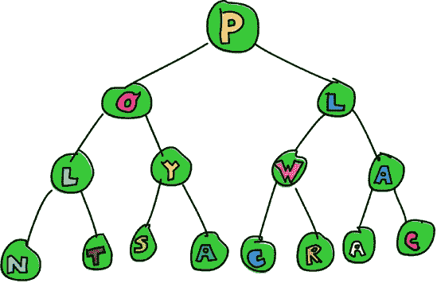

# 第十五章。Zipper

虽然 Haskell 的纯净性带来了一大堆好处，但它让我们以不同于不纯净语言的方式处理一些问题。

由于引用透明性，在 Haskell 中，如果一个值代表相同的东西，那么一个值和另一个值一样好。所以，如果我们有一棵满是五的树（可能是高五，也许？），并且我们想将其中一个改成六，我们必须有一种方法来确切地知道我们想要更改树中的哪个五。我们需要知道它在我们的树中的位置。在不纯净的语言中，我们只需记录五在内存中的位置并更改它。但在 Haskell 中，一个五和一个五一样好，所以我们不能根据它们在内存中的位置进行区分。


我们也不能真正地 *更改* 任何东西。当我们说“更改树”时，我们实际上意味着我们取一棵树并返回一个与原始树相似但略有不同的新树。

我们可以做的事情之一是记住从树根到我们想要更改的元素的一条路径。我们可以说，“拿这棵树，向左走，向右走，然后再向左走，然后更改那里的元素。”虽然这可行，但可能不太高效。如果我们想稍后更改靠近之前更改的元素的元素，我们需要再次从树根走到我们的元素！

在本章中，你将看到如何将某些数据结构装备上一种称为 *zipper* 的东西，以便以使更改其元素变得容易和遍历它变得高效的方式关注数据结构的一部分。太棒了！

# 散步

就像你在生物课上学到的那样，有很多不同种类的树，所以让我们选择一个种子，我们将用它来种植我们的树。这里就是：

```
data Tree a = Empty | Node a (Tree a) (Tree a) deriving (Show)
```

我们的树要么是空的，要么是一个包含元素和两个子树的节点。这里有一个很好的例子，我将它免费提供给你，读者！

```
freeTree :: Tree Char freeTree =
    Node 'P'
        (Node 'O'
            (Node 'L'
                (Node 'N' Empty Empty)
                (Node 'T' Empty Empty)
            )
            (Node 'Y'
                (Node 'S' Empty Empty)
                (Node 'A' Empty Empty)
            )
        )
        (Node 'L'
            (Node 'W'
                (Node 'C' Empty Empty)
                (Node 'R' Empty Empty)
            )
            (Node 'A'
                (Node 'A' Empty Empty)
                (Node 'C' Empty Empty)
            )
        )
```

这里是图形表示的这棵树：



注意树中的 `W` 吗？如果我们想把它改成 `P`，我们会怎么做？嗯，一种方法是对我们的树进行模式匹配，直到我们找到元素，首先向右走，然后向左走。这是这段代码：

```
changeToP :: Tree Char -> Tree Char
changeToP (Node x l (Node y (Node _ m n) r)) = Node x l (Node y (Node 'P' m n) r)
```

哎呀！这不仅相当难看，而且有点令人困惑。这里实际上发生了什么？嗯，我们在我们的树上进行模式匹配，并给它根元素命名为 `x`（它变成了根的 `'P'`），并给它左子树命名为 `l`。我们没有给它右子树命名，而是进一步对它进行模式匹配。我们继续进行这种模式匹配，直到我们达到根为 `'W'` 的子树。一旦我们进行了匹配，我们就重建树，但现在包含 `'W'` 的子树现在以 `'P'` 为根。

有没有更好的方法来做这件事？如果我们让我们的函数接受一个树和一个方向列表会怎样。方向将是 `L` 或 `R`，分别代表左或右，我们将通过跟随提供的方向来更改我们到达的元素。看看这个：

```
data Direction = L | R deriving (Show)
type Directions = [Direction]

changeToP :: Directions -> Tree Char -> Tree Char
changeToP (L:ds) (Node x l r) = Node x (changeToP ds l) r
changeToP (R:ds) (Node x l r) = Node x l (changeToP ds r)
changeToP [] (Node _ l r) = Node 'P' l r
```

如果方向列表的第一个元素是 `L`，我们将构建一个类似于旧树的新树，但其左子树有一个元素被更改为 `'P'`。当我们递归调用 `changeToP` 时，我们只给它方向列表的尾部，因为我们已经向左移动了。在 `R` 的情况下，我们做同样的事情。如果方向列表为空，这意味着我们已经到达了目的地，因此我们返回一个类似于提供的树，但它的根元素是 `'P'`。

为了避免打印整个树，让我们创建一个函数，它接受一个方向列表并告诉我们目的地的元素：

```
elemAt :: Directions -> Tree a -> a
elemAt (L:ds) (Node _ l _) = elemAt ds l
elemAt (R:ds) (Node _ _ r) = elemAt ds r
elemAt [] (Node x _ _) = x
```

这个函数实际上与 `changeToP` 非常相似。区别在于，它不是在途中记住东西并重建树，而是除了目的地之外忽略一切。在这里，我们将 `'W'` 更改为 `'P'`，并看看我们新树中的更改是否保持不变：

```
ghci> let newTree = changeToP [R,L] freeTree
ghci> elemAt [R,L] newTree
'P'
```

这似乎有效。在这些函数中，方向列表充当一种 *焦点*，因为它精确地指出了我们的树中的一个子树。例如，方向列表 `[R]` 会聚焦于根右侧的子树。一个空的方向列表会聚焦于主树本身。

虽然这个技术看起来很酷，但它可能相当低效，尤其是如果我们想要重复更改元素。比如说，我们有一个非常大的树和一个指向树底部的某个元素的长方向列表。我们使用方向列表在树上漫步并更改底部的元素。如果我们想要更改接近我们刚刚更改的元素的另一个元素，我们需要从树的根开始再次走到底部。真麻烦！

在下一节中，我们将找到一种更好的方法来聚焦于子树——这种方法允许我们高效地切换到附近的子树。

## 路径标记的踪迹


为了聚焦于一个子树，我们想要比仅仅遵循从树根开始的方向列表更好的东西。如果我们从树的根开始，一次向左或向右移动一步，并在路上留下“路径标记”会怎么样？使用这种方法，当我们向左移动时，我们会记住我们向左移动了，当我们向右移动时，我们会记住我们向右移动了。让我们试试。

为了表示我们的路径标记，我们也会使用一个方向值列表（`L` 和 `R` 值），但我们将不称之为 `Directions`，而是称之为 `Breadcrumbs`，因为当我们沿着树向下移动时，我们的方向将会被反转。

```
type Breadcrumbs = [Direction]
```

这是一个函数，它接受一个树和一些面包屑，并将移动到左子树，同时将 `L` 添加到表示我们的面包屑的列表的头部：

```
goLeft :: (Tree a, Breadcrumbs) -> (Tree a, Breadcrumbs)
goLeft (Node _ l _, bs) = (l, L:bs)
```

我们忽略根节点和右子树中的元素，只返回左子树以及带有 `L` 作为头部的旧面包屑。

这是一个向右走的函数：

```
goRight :: (Tree a, Breadcrumbs) -> (Tree a, Breadcrumbs)
goRight (Node _ _ r, bs) = (r, R:bs)
```

它的工作方式与向左走的方式相同。

让我们使用这些函数来将我们的 `freeTree` 向右走然后向左走。

```
ghci> goLeft (goRight (freeTree, []))
(Node 'W' (Node 'C' Empty Empty) (Node 'R' Empty Empty),[L,R])
```


现在我们有一个根节点为 `'W'` 的树，其左子树的根节点为 `'C'`，其右子树的根节点为 `'R'`。面包屑是 `[L,R]`，因为我们首先向右走然后向左走。

为了使沿着我们的树行走更清晰，我们可以使用来自第十三章的 `-:` 函数，我们定义如下：

```
x -: f = f x
```

这允许我们通过首先写下值，然后一个 `-:`, 然后函数的方式来应用函数。所以，我们不再需要 `goRight (freeTree, [])`，而是可以写成 `(freeTree, []) -: goRight`。使用这种形式，我们可以重写前面的例子，使其更明显地表明我们先向右走然后向左走：

```
ghci> (freeTree, []) -: goRight -: goLeft
(Node 'W' (Node 'C' Empty Empty) (Node 'R' Empty Empty),[L,R])
```

## 向上走

如果我们想在我们的树中向上走呢？从我们的面包屑中，我们知道当前树是其父树的左子树，并且它是其父树的右子树，这就是我们所知道的一切。面包屑没有告诉我们足够关于当前子树的父树的信息，使我们能够向上走树。看起来除了我们采取的方向外，单个面包屑还应该包含我们返回时所需的所有其他数据。在这种情况下，那就是父树中的元素及其右子树。

通常，单个面包屑应该包含重建父节点所需的所有数据。因此，它应该包含我们未采取的所有路径的信息，并且它还应该知道我们所采取的方向。然而，它必须不包含我们目前关注的子树。这是因为我们已经在元组的第一个组件中有了那个子树。如果我们也在面包屑中包含它，我们就会得到重复信息。

我们不希望有重复的信息，因为如果我们改变我们关注的子树中的某些元素，面包屑中的现有信息将与我们所做的更改不一致。当我们改变我们的关注点时，重复信息就会过时。如果我们的树包含很多元素，它也可能占用大量的内存。

让我们修改我们的面包屑，使它们也包含我们在左右移动时之前忽略的所有信息。我们将不再使用 `Direction`，而将创建一个新的数据类型：

```
data Crumb a = LeftCrumb a (Tree a) | RightCrumb a (Tree a) deriving (Show)
```

现在，我们不仅有`L`，还有包含从节点移动到的元素和未访问的右树的`LeftCrumb`。而不是`R`，我们有包含从节点移动到的元素和未访问的左树的`RightCrumb`。

这些面包屑现在包含了重新创建我们走过的树的所需所有数据。因此，它们不仅仅是普通的面包屑，更像是我们沿途留下的软盘，因为它们包含的信息比我们采取的方向要多得多。

从本质上讲，每个面包屑现在都像是一个有洞的树节点。当我们深入树中时，面包屑携带了从我们移动离开的节点所携带的所有信息，*除了*我们选择关注的子树。它还需要注意洞的位置。在`LeftCrumb`的情况下，我们知道我们向左移动，所以缺失的子树是左边的。

让我们也将我们的`Breadcrumbs`类型别名更改为反映这一点：

```
type Breadcrumbs a = [Crumb a]
```

接下来，我们需要修改`goLeft`和`goRight`函数，在面包屑中存储我们未采取的路径信息，而不是像之前那样忽略这些信息。以下是`goLeft`：

```
goLeft :: (Tree a, Breadcrumbs a) -> (Tree a, Breadcrumbs a)
goLeft (Node x l r, bs) = (l, LeftCrumb x r:bs)
```

你可以看到，它与我们的之前的`goLeft`非常相似，但我们不是仅仅在我们的面包屑列表的头部添加一个`L`，而是添加一个`LeftCrumb`来表示我们向左移动。我们还为我们的`LeftCrumb`配备了从节点移动到的元素（那就是`x`）和未访问的右子树。

注意，此函数假设当前焦点所在的树不是`Empty`。空树没有任何子树，因此如果我们尝试从一个空树向左移动，将会发生错误。这是因为对`Node`的模式匹配将不会成功，而且没有模式会处理`Empty`。

`goRight`类似：

```
goRight :: (Tree a, Breadcrumbs a) -> (Tree a, Breadcrumbs a)
goRight (Node x l r, bs) = (r, RightCrumb x l:bs)
```

我们之前能够左右移动。我们现在拥有的能力是通过记住关于父节点和未访问路径的信息，实际上能够向上移动。下面是`goUp`函数：

```
goUp :: (Tree a, Breadcrumbs a) -> (Tree a, Breadcrumbs a)
goUp (t, LeftCrumb x r:bs) = (Node x t r, bs)
goUp (t, RightCrumb x l:bs) = (Node x l t, bs)
```


我们正在关注树`t`，并检查最新的`Crumb`。如果它是一个`LeftCrumb`，我们使用我们的树`t`作为左子树，并使用关于未访问的右子树和元素的详细信息来填充`Node`的其余部分。因为我们“返回”并拾取最后一个面包屑，然后使用它来重新创建父树，所以新的列表不包含那个面包屑。

注意，如果我们已经在树的顶部并且想要向上移动，这个函数会导致错误。稍后，我们将使用`Maybe` monad 来表示移动焦点时可能出现的失败。

通过一对`Tree a`和`Breadcrumbs a`，我们拥有了重建整个树所需的所有信息，并且我们还关注了一个子树。这种方案使我们能够轻松地向上、向左和向右移动。

包含数据结构的一部分及其周围环境的对称为*拉链*，因为将焦点在数据结构中上下移动类似于裤子拉链的操作。所以，创建一个类型同义词是很有趣的：

```
type Zipper a = (Tree a, Breadcrumbs a)
```

我更愿意将类型同义词命名为`Focus`，因为这使它更清楚地表明我们正在关注数据结构的一部分。但由于`Zipper`这个名字更广泛地用来描述这种设置，我们将坚持使用它。

## 在焦点下操作树

现在我们能够上下移动，让我们创建一个函数来修改拉链关注的子树根部的元素：

```
modify :: (a -> a) -> Zipper a -> Zipper a
modify f (Node x l r, bs) = (Node (f x) l r, bs)
modify f (Empty, bs) = (Empty, bs)
```

如果我们关注一个节点，我们使用函数`f`修改其根元素。如果我们关注一个空树，我们保持它不变。现在我们可以从一个树开始，移动到任何我们想要的地方，并修改一个元素，同时保持对该元素的焦点，这样我们就可以轻松地向上或向下移动。这里有一个例子：

```
ghci> let newFocus = modify (\_ -> 'P') (goRight (goLeft (freeTree, [])))
```

我们向左走，然后向右走，然后通过将其替换为`'P'`来修改根元素。如果我们使用`-:`来写，这读起来更好：

```
ghci> let newFocus = (freeTree, []) -: goLeft -: goRight -: modify (\_ -> 'P')
```

然后，如果我们想的话，我们可以向上移动并用神秘的`'X'`替换一个元素：

```
ghci> let newFocus2 = modify (\_ -> 'X') (goUp newFocus)
```

或者我们可以用`-:`来写：

```
ghci> let newFocus2 = newFocus -: goUp -: modify (\_ -> 'X')
```

向上移动很容易，因为我们留下的面包屑构成了我们未关注的部分数据结构，但它被反转了，有点像把袜子翻过来。这就是为什么当我们想要向上移动时，我们不需要从根开始并向下走。我们只需取我们反转树的顶部，从而反转它的一部分并将其添加到我们的焦点中。

每个节点都有两个子树，即使这些子树是空的。所以，如果我们关注一个空子树，我们可以做的一件事是用非空子树替换它，从而将树附加到一个叶节点上。这个代码很简单：

```
attach :: Tree a -> Zipper a -> Zipper a
attach t (_, bs) = (t, bs)
```

我们取一个树和一个拉链，并返回一个新的拉链，其焦点被提供的树所替换。我们不仅可以通过用新树替换空子树来扩展树，还可以替换现有的子树。让我们将一个树附加到我们的`freeTree`的左侧：

```
ghci> let farLeft = (freeTree, []) -: goLeft -: goLeft -: goLeft -: goLeft
ghci> let newFocus = farLeft -: attach (Node 'Z' Empty Empty)
```

`newFocus`现在关注的是我们刚刚附加的树，其余的树以反转的形式位于面包屑中。如果我们使用`goUp`走到树的顶端，它将是与`freeTree`相同的树，但在其左侧额外有一个`'Z'`。

## 直接走到顶部，那里空气清新、干净！

创建一个函数，使其能够走到树的顶端，无论我们关注的是什么，这实际上非常简单。下面是它的样子：

```
topMost :: Zipper a -> Zipper a
topMost (t, []) = (t, [])
topMost z = topMost (goUp z)
```

如果我们的增强面包屑轨迹为空，这意味着我们已经在树的根上了，所以我们只需返回当前的焦点。否则，我们向上移动以获取父节点的焦点，然后递归地应用`topMost`。

因此，现在我们可以绕着我们的树走动，向左、向右和向上移动，在旅途中应用 `modify` 和 `attach`。然后，当我们完成我们的修改后，我们使用 `topMost` 来关注树的根，并从适当的视角看到我们所做的更改。

# 专注于列表

展开器可以与几乎任何数据结构一起使用，所以它们可以与列表的子列表一起使用并不令人惊讶。毕竟，列表几乎就像树一样，除了树中的节点有一个元素（或没有）和几个子树，列表中的节点有一个元素和只有一个子列表。当我们实现了自己的列表时，在第七章中，我们定义了我们的数据类型如下：

```
data List a = Empty | Cons a (List a) deriving (Show, Read, Eq, Ord)
```

将其与我们的二叉树定义进行比较，很容易看出列表可以被视为每个节点只有一个子树的树。


一个像 `[1,2,3]` 这样的列表可以写成 `1:2:3:[]`。它由列表的头部组成，即 `1`，然后是列表的尾部，即 `2:3:[]`。`2:3:[]` 也有一个头部，即 `2`，和一个尾部，即 `3:[]`。对于 `3:[]`，`3` 是头部，而尾部是空列表 `[]`。

让我们为列表创建一个展开器。要改变对列表子列表的关注，我们可以向前或向后移动（而与树不同，我们可以向上、向左或向右移动）。关注的部分将是一个子树，并且随着我们的前进，我们将留下面包屑。

现在，一个列表的单个面包屑由什么组成？当我们处理二叉树时，面包屑需要保存父节点根部的元素以及我们没有选择的全部子树。它还必须记住我们是向左还是向右移动。因此，它需要拥有节点所拥有的所有信息，除了我们选择关注的子树。

列表比树简单。我们不需要记住我们是向左还是向右移动，因为进入列表的深度只有一种方式。因为每个节点只有一个子列表，所以我们也不需要记住我们没有走的路径。看起来我们只需要记住前一个元素。如果我们有一个像 `[3,4,5]` 的列表，并且我们知道前一个元素是 `2`，我们只需将那个元素放在列表的头部，就可以回退到 `[2,3,4,5]`。

因为这里的单个面包屑只是元素，所以我们实际上不需要将它放入数据类型中，就像我们在为树展开器创建 `Crumb` 数据类型时做的那样。

```
type ListZipper a = ([a], [a])
```

第一个列表代表我们关注的列表，第二个列表是面包屑列表。让我们创建在列表中向前和向后移动的函数：

```
goForward :: ListZipper a -> ListZipper a
goForward (x:xs, bs) = (xs, x:bs)

goBack :: ListZipper a -> ListZipper a
goBack (xs, b:bs) = (b:xs, bs)
```

当我们向前移动时，我们专注于当前列表的尾部，并将头部元素作为面包屑留下。当我们向后移动时，我们取最新的面包屑并将其放在列表的开头。这里有两个函数在起作用：

```
ghci> let xs = [1,2,3,4]
ghci> goForward (xs, [])
([2,3,4],[1])
ghci> goForward ([2,3,4], [1])
([3,4],[2,1])
ghci> goForward ([3,4], [2,1])
([4],[3,2,1])
ghci> goBack ([4], [3,2,1])
([3,4],[2,1])
```

你可以看到，在列表的情况下，面包屑不过是你的列表的反转部分。我们移动开来的元素总是进入面包屑的头部。然后，只需从面包屑的头部取出该元素并将其作为我们关注的头部，就可以轻松地返回。这也使得我们更容易理解为什么我们称之为 *zipper*——它确实看起来像拉链的滑块上下移动。

如果你正在制作一个文本编辑器，你可以使用字符串列表来表示当前打开的文本行，然后你可以使用 zippers 来知道光标当前聚焦在哪一行。使用 zippers 也会使在文本中任何地方插入新行或删除现有行变得更加容易。

# 非常简单的文件系统

为了演示如何使用 zippers，让我们用树来表示一个非常简单的文件系统。然后我们可以为该文件系统制作一个 zippers，这样我们就可以在文件夹之间移动，就像我们在真实文件系统中跳转一样。

平均的分层文件系统主要由文件和文件夹组成。*文件*是数据单元，并且有名称。*文件夹*用于组织这些文件，可以包含文件或其他文件夹。在我们的简单示例中，让我们假设文件系统中的项目是以下之一：

+   一个文件，它带有名称和一些数据

+   一个文件夹，它有一个名称并包含其他项目，这些项目可以是文件或文件夹本身

这里有一个数据类型和一些类型同义词，这样我们就可以知道是什么：

```
type Name = String
type Data = String
data FSItem = File Name Data | Folder Name [FSItem] deriving (Show)
```

一个文件带有两个字符串，分别代表它的名称和它持有的数据。一个文件夹带有代表其名称的字符串和一个项目列表。如果该列表为空，则我们有一个空文件夹。

这里有一个包含一些文件和子文件夹的文件夹（实际上是我现在的磁盘内容）：

```
myDisk :: FSItem
myDisk =
    Folder "root"
        [ File "goat_yelling_like_man.wmv" "baaaaaa"
        , File "pope_time.avi" "god bless"
        , Folder "pics"
            [ File "ape_throwing_up.jpg" "bleargh"
            , File "watermelon_smash.gif" "smash!!"
            , File "skull_man(scary).bmp" "Yikes!"
            ]
        , File "dijon_poupon.doc" "best mustard"
        , Folder "programs"
            [ File "fartwizard.exe" "10gotofart"
            , File "owl_bandit.dmg" "mov eax, h00t"
            , File "not_a_virus.exe" "really not a virus"
            , Folder "source code"
                [ File "best_hs_prog.hs" "main = print (fix error)"
                , File "random.hs" "main = print 4"
                ]
            ]
        ]
```

## 为我们的文件系统制作一个 Zipper

现在我们有了文件系统，我们需要的只是一个 zippers，这样我们就可以在它周围压缩和扩展，添加、修改和删除文件和文件夹。与二叉树和列表一样，我们的面包屑将包含关于我们没有访问的所有内容的详细信息。单个面包屑应该存储除了我们当前关注的子树之外的所有内容。它还应该记录洞的位置，这样一旦我们向上移动，我们就可以将我们之前的关注点插入到洞中。


在这种情况下，一个面包屑应该像文件夹一样，只是它应该缺少我们当前选择的文件夹。“为什么不像文件一样？”你可能会问？好吧，因为我们一旦专注于一个文件，我们就不能在文件系统中进一步深入，所以留下一个表明我们来自文件的面包屑是没有意义的。文件有点像空树。

如果我们关注的是文件夹 `"root"`，然后关注文件 `"dijon_poupon.doc"`，我们留下的面包屑应该是什么样子？嗯，它应该包含其父文件夹的名称，以及我们关注的文件之前和之后的项目。所以，我们只需要一个 `Name` 和两个项目列表。通过为在我们关注的项之前和之后的项目保持单独的列表，我们知道一旦我们向上移动，它应该放在哪里。这样，我们就知道洞的位置。

这是我们的文件系统面包屑类型：

```
data FSCrumb = FSCrumb Name [FSItem] [FSItem] deriving (Show)
```

这里是我们的拉链的同义词：

```
type FSZipper = (FSItem, [FSCrumb])
```

在层次结构中向上回退非常简单。我们只需取最新的面包屑，并从当前焦点和面包屑中组装一个新的焦点，如下所示：

```
fsUp :: FSZipper -> FSZipper
fsUp (item, FSCrumb name ls rs:bs) = (Folder name (ls ++ [item] ++ rs), bs)
```

因为我们的面包屑知道父文件夹的名称，以及文件夹中我们关注的项目之前的项目（那是 `ls`）和之后的项目（那是 `rs`），向上移动很容易。

想要深入文件系统吗？如果我们处于 `"root"`，并且想要关注 `"dijon_poupon.doc"`，我们留下的面包屑将包括名称 `"root"`，以及 `"dijon_poupon.doc"` 之前和之后的项目。这里有一个函数，给定一个名称，关注当前焦点文件夹中位于该名称的文件或文件夹：

```
import Data.List (break)

fsTo :: Name -> FSZipper -> FSZipper
fsTo name (Folder folderName items, bs) =
    let (ls, item:rs) = break (nameIs name) items
    in  (item, FSCrumb folderName ls rs:bs)

nameIs :: Name -> FSItem -> Bool
nameIs name (Folder folderName _) = name == folderName
nameIs name (File fileName _) = name == fileName
```

`fsTo` 接受一个 `Name` 和一个 `FSZipper`，并返回一个新的 `FSZipper`，该 `FSZipper` 关注具有给定名称的文件。该文件必须位于当前焦点文件夹中。这个函数不会到处搜索——它只是在当前文件夹中查找。


首先，我们使用 `break` 将文件夹中的项目列表拆分为我们正在搜索的文件之前的项目和之后的项目。`break` 接受一个谓词和一个列表，并返回一对列表。这对中的第一个列表包含谓词返回 `False` 的项目。然后，一旦谓词对一个项目返回 `True`，它将该项目以及列表的其余部分放在对的第二个项目中。我们创建了一个辅助函数 `nameIs`，它接受一个名称和一个文件系统项，如果名称匹配则返回 `True`。

现在 `ls` 是一个包含我们正在搜索的项目之前的项目列表，`item` 是那个项目本身，而 `rs` 是在其文件夹中跟随它的项目列表。现在我们有了这些，我们只需将 `break` 得到的项目作为焦点，并构建一个包含所有所需数据的面包屑。

注意，如果我们寻找的名称不在文件夹中，模式 `item:rs` 将尝试在空列表上匹配，并且我们会得到一个错误。而且如果我们的当前焦点是一个文件而不是文件夹，我们也会得到一个错误，程序会崩溃。

因此，我们可以上下移动我们的文件系统。让我们从根目录开始，走到文件 `"skull_man(scary).bmp"`：

```
ghci> let newFocus = (myDisk, []) -: fsTo "pics" -: fsTo "skull_man(scary).bmp"
```

`newFocus` 现在是一个聚焦于 `"skull_man(scary).bmp"` 文件的 zippers。让我们获取 zippers 的第一个组件（焦点本身）并看看这是否真的正确：

```
ghci> fst newFocus
File "skull_man(scary).bmp" "Yikes!"
```

让我们向上移动并关注其相邻的文件 `"watermelon_smash.gif"`:

```
ghci> let newFocus2 = newFocus -: fsUp -: fsTo "watermelon_smash.gif"
ghci> fst newFocus2
File "watermelon_smash.gif" "smash!!"
```

## 操作文件系统

现在我们能够导航我们的文件系统，操作它变得容易。这里有一个函数可以重命名当前聚焦的文件或文件夹：

```
fsRename :: Name -> FSZipper -> FSZipper
fsRename newName (Folder name items, bs) = (Folder newName items, bs)
fsRename newName (File name dat, bs) = (File newName dat, bs)
```

让我们把 `"pics"` 文件夹重命名为 `"cspi"`:

```
ghci> let newFocus = (myDisk, []) -: fsTo "pics" -: fsRename "cspi" -: fsUp
```

我们下到了 `"pics"` 文件夹，重命名了它，然后移动了备份。

那么一个在当前文件夹中创建新项目的函数呢？看这里：

```
fsNewFile :: FSItem -> FSZipper -> FSZipper
fsNewFile item (Folder folderName items, bs) =
    (Folder folderName (item:items), bs)
```

简单得就像馅饼一样。注意，如果我们试图添加一个项目但焦点在文件而不是文件夹上，这会导致崩溃。

让我们在 `"pics"` 文件夹中添加一个文件，然后向上移动到根目录：

```
ghci> let newFocus =
    (myDisk, []) -: fsTo "pics" -: fsNewFile (File "heh.jpg" "lol") -: fsUp
```

所有这些真正酷的地方在于，当我们修改我们的文件系统时，我们的更改实际上并没有在原地做出，而是函数返回了一个全新的文件系统。这样，我们就可以访问我们的旧文件系统（在这种情况下，`myDisk`），以及新的一个（`newFocus` 的第一个组件）。

通过使用 zippers，我们免费获得版本控制。我们总是可以引用数据结构的旧版本，即使在我们更改它们之后。这不仅仅局限于 zippers，但它是 Haskell 的一个特性，因为它的数据结构是不可变的。然而，通过 zippers，我们得到了轻松高效地遍历数据结构的能力，因此 Haskell 数据结构的持久性真正开始闪耀。

# 小心脚下

到目前为止，在遍历我们的数据结构——无论是二叉树、列表还是文件系统——我们并不真的关心我们是否走得太远而跌倒了。例如，我们的 `goLeft` 函数接受一个二叉树的 zipping 并将焦点移动到其左子树：

```
goLeft :: Zipper a -> Zipper a
goLeft (Node x l r, bs) = (l, LeftCrumb x r:bs)
```

但如果我们离开的树是一个空树呢？如果它不是一个 `Node`，而是一个 `Empty` 呢？在这种情况下，我们会得到一个运行时错误，因为模式匹配会失败，我们没有为空树制作模式，而空树没有任何子树。

到目前为止，我们只是假设我们永远不会尝试关注空树的左子树，因为它的左子树不存在。但去空树的左子树并没有太多意义，而且到目前为止，我们只是方便地忽略了这一点。

或者如果我们已经到了某个树的根，没有面包屑但仍然试图向上移动呢？同样的事情会发生。似乎在使用 zippers 时，任何一步都可能成为我们的最后一步（提示：不祥的音乐）。换句话说，任何移动都可能成功，但也可能导致失败。这让你想起了什么吗？当然：monads！更具体地说，是 `Maybe` monad，它为正常值添加了可能的失败上下文。


让我们使用 `Maybe` 模态来给我们的移动添加一个可能失败的上下文。我们将把在二叉树 zippers 上工作的函数变成模态函数。

首先，让我们处理 `goLeft` 和 `goRight` 的可能失败。到目前为止，可能失败的函数的失败总是反映在其结果中，这个例子也不例外。

这里是添加了失败可能性的 `goLeft` 和 `goRight`：

```
goLeft :: Zipper a -> Maybe (Zipper a)
goLeft (Node x l r, bs) = Just (l, LeftCrumb x r:bs)
goLeft (Empty, _) = Nothing

goRight :: Zipper a -> Maybe (Zipper a)
goRight (Node x l r, bs) = Just (r, RightCrumb x l:bs)
goRight (Empty, _) = Nothing
```

现在，如果我们尝试在空树的一侧迈出一步，我们会得到一个 `Nothing`！

```
ghci> goLeft (Empty, [])
Nothing
ghci> goLeft (Node 'A' Empty Empty, [])
Just (Empty,[LeftCrumb 'A' Empty])
```

看起来不错！那么向上走呢？之前的问题发生在我们尝试向上走但没有更多的面包屑时，这意味着我们已经到达了树的根。这是 `goUp` 函数，如果我们不保持在我们树的范围内，它会抛出一个错误：

```
goUp :: Zipper a -> Zipper a
goUp (t, LeftCrumb x r:bs) = (Node x t r, bs)
goUp (t, RightCrumb x l:bs) = (Node x l t, bs)
```

让我们修改它以优雅地失败：

```
goUp :: Zipper a -> Maybe (Zipper a)
goUp (t, LeftCrumb x r:bs) = Just (Node x t r, bs)
goUp (t, RightCrumb x l:bs) = Just (Node x l t, bs)
goUp (_, []) = Nothing
```

如果我们有面包屑，一切正常，我们返回一个成功的新焦点。如果没有面包屑，我们返回一个失败。

以前，这些函数接受 zippers 并返回 zippers，这意味着我们可以像这样将它们链接起来以进行遍历：

```
gchi> let newFocus = (freeTree, []) -: goLeft -: goRight
```

但是现在，它们不再返回 `Zipper a`，而是返回 `Maybe (Zipper a)`，并且这样链接函数是不行的。我们在处理第十三章 第十三章 中的走钢丝者时也遇到了类似的问题。他也是一步一步地走，每一步都可能失败，因为一大群鸟可能会落在他的平衡杆的一侧，使他跌倒。

现在轮到我们成为笑话的主角了，因为我们成了行走的人，而且我们在自己设计的迷宫中穿梭。幸运的是，我们可以从走钢丝的人那里学到东西，就像他做的那样：用 `>>=` 替换正常的函数应用。这需要一个带有上下文（在我们的情况下，是 `Maybe (Zipper a)`，它有一个可能失败上下文）的值，并将其输入到一个函数中，同时确保上下文得到处理。所以就像我们的走钢丝者一样，我们将用所有的 `-:` 操作符来交换 `>>=` 操作符。然后我们就能再次链接我们的函数了！看看它是如何工作的：

```
ghci> let coolTree = Node 1 Empty (Node 3 Empty Empty)
ghci> return (coolTree, []) >>= goRight
Just (Node 3 Empty Empty,[RightCrumb 1 Empty])
ghci> return (coolTree, []) >>= goRight >>= goRight
Just (Empty,[RightCrumb 3 Empty,RightCrumb 1 Empty])
ghci> return (coolTree, []) >>= goRight >>= goRight >>= goRight
Nothing
```

我们使用 `return` 将 zippers 放入 `Just` 中，然后使用 `>>=` 将其输入到我们的 `goRight` 函数中。首先，我们创建了一个在其左侧有一个空子树，在其右侧有一个有两个空子树的节点的树。当我们向右走一次时，结果是成功的，因为操作是有意义的。向右走两次也是可以的。我们最终会在一个空子树上聚焦。但是向右走三次是没有意义的——我们无法走到空子树的右边。这就是为什么结果是 `Nothing` 的原因。

现在我们已经给我们的树配备了安全网，以防我们跌落。 （哇，我完美地使用了这个隐喻。）

### 注意

我们的文件系统也有许多操作可能失败的情况，例如尝试聚焦到一个不存在文件或文件夹。作为一个练习，你可以通过使用 `Maybe` 模态来为我们的文件系统添加优雅失败的功能。

# 感谢阅读！

或者直接翻到最后一页！希望你觉得这本书有用且有趣。我努力为你提供了对 Haskell 语言及其惯用法的良好洞察。虽然 Haskell 总是有新的东西可以学习，但现在你应该能够编写酷炫的代码，以及阅读和理解他人的代码。所以赶快开始编码吧！在另一边见！


