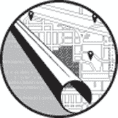
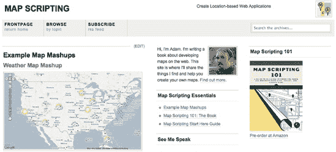

# **引言**

互联网以许多方式改变了我们的生活。MapQuest 提供的第一个在线、按需驾驶方向几乎使传统的道路地图变得过时。今天，许多提供驾驶方向的网站也向开发者提供他们的地图。使用这些地图 API，您可以绘制自己的点或与其他网站的地理数据混合。

本书向您展示如何利用这些服务并在您的网站上包含它们的地图。而不是限制您使用一个提供商，我会向您展示如何通过一个名为*Mapstraction*的开源库来使用所有这些服务。编写一次代码，然后观察它在 Google Maps、Bing、MapQuest、Yahoo!、OpenStreetMap 等地图上运行。

除了教您如何使用这些提供商的地图外，我还会向您展示许多其他常见的地理项目。您将学习如何计算地点之间的距离，并在您自己的网站上嵌入驾驶方向。您还将学习如何通过添加自己的图标、添加大型图形覆盖层，甚至完全更改底层地图图像来自定义地图的外观。

通过嵌入地图将位置信息引入网络是现在大多数网站的一个重要组成部分，但同时也越来越需要将网络“带到”运行移动浏览器的智能手机上。您可以使用本书中展示的技术将地图添加到您网站的移动版本中。我还会向您展示如何使用方便的地理位置标准来定位用户的位置，无论他是在使用手机、平板电脑，还是普通电脑。

您只需几页就能在您的网站上添加一些“位置”。本书旨在帮助您快速开始您已经构思的应用程序，或者激发您下一个地图的灵感。为此，我将本书组织成项目。一旦您成为地图脚本大师，我希望这本书足够有用，可以作为参考书籍放在您的书架上。

# **本书简介**

本书基于项目的方法从基本示例开始，然后迅速加快速度。如果您喜欢跳过，我建议您至少先阅读创建 Mapstraction 地图。本书中的几乎所有示例都是基于您在该部分创建的地图。

在第一章中，您将学习构建在线地图的基础知识。我将介绍 Mapstraction 并展示如何向您的地图添加控件，例如缩放界面。

在第二章中，您将开始向地图添加自己的点。您将创建自定义图标并添加信息框来描述位置。

在第三章中，您将学习许多将地址和城市名称转换为地图提供商可以理解的坐标的方法。这个过程称为*地理编码*，是使地图对人类友好的重要部分。

在第四章中，您将为您的地图添加更复杂的图层。您将学习如何绘制线条来描述路线和形状来勾勒边界。您甚至将看到如何将大型图形地理编码，然后将其作为地图叠加层添加。

在第五章中，您将使您的地图对事件做出响应，例如拖动、点击和缩放。这些钩子允许您为用户提供更互动的体验。

在第六章中，我们将探索邻近性。您将学习如何创建驾驶方向或围绕一个点进行搜索。您还将深入了解一些更高级的主题，例如确定一个位置是否在形状内（称为*碰撞测试*）。

在第七章中，您将学习几种简单的方法以不同精度访问用户的位置。我将介绍使用地理位置标准、回退到 IP 地址数据以及与位置共享服务集成。

在第八章中，您将专注于在网络上使用的常见定位数据格式。您将学习如何解析 GeoRSS、Google Earth 的 KML 以及大多数 GPS 设备的 XML 输出。

在第九章中，是时候转向服务器端了。您将获得 PHP 和 MySQL 的快速课程，这两种技术由许多网络托管商提供。然后我们将使用这些语言进行常见的定位任务，例如从您的数据库中查找最近的点。

在第十章中，您将通过五个有趣的项目将所有内容整合在一起。您将创建一个 Twitter 推文查找器、一个交互式天气地图，以及一种在两个地点之间查找咖啡馆的方法（这样您就可以在中间与朋友见面）。还有本地音乐会查找器和可视化全球地震的方法。

# 如何使用本书

本书向网络开发者介绍了制图学，并展示了制图师和其他地理爱好者如何将他们的地图上线。本书适合初学者和高级程序员阅读——您的技能水平和地图知识将影响您如何使用本书。第一章是每个人开始的好地方，因为大多数后续示例都是基于那里展示的基本地图构建的。

如果您之前没有使用过 JavaScript，或者需要复习，请务必阅读附录 A。这将为您介绍本书中使用的概念，并提供对 JavaScript 框架 jQuery 的快速介绍。

每一章都是基于前一章的内容构建的，因此你可以从开始读到结束，随着你对地图知识的扩展。这本书也很好地作为参考书使用——你可以跳过一些内容，找到你想要学习的概念，或者找到你当前应用所需的章节或项目。

书中另一个有用的部分是附录 B，它详细介绍了 Mapstraction 中的类和函数。这个参考可以作为快速检查语法的方式，并提供如何使用每个函数的示例。

# 关于网站

我鼓励你利用这本书的配套网站[`mapscripting101.com/`](http://mapscripting101.com/) (图 1). 在其他方面，你将找到书中每个项目的实时示例——这样你就可以通过下载或复制代码来节省一些打字时间。

图 1. 配套网站

此外，由于地图脚本技术和网络都在迅速变化，你需要查看网站以了解最新动态，这样你就可以保持你的技能更新。我将发布更新和教程，帮助你将知识扩展到这本书的页面之外。
