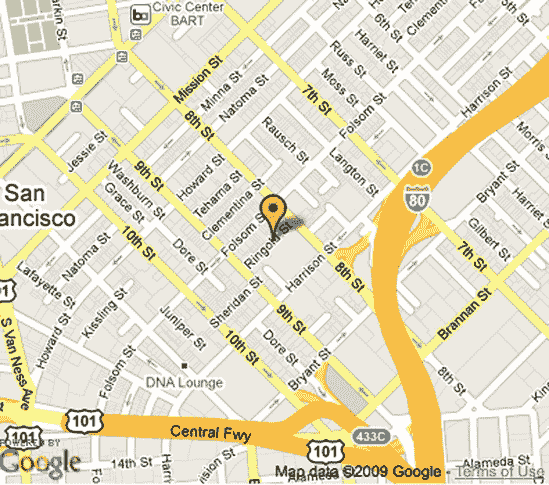

# 第二章. 绘制标记和消息框


创建简单的地图是查看某个位置周围区域的一种酷炫且实用的方式，但您会发现，当您在地图上绘制自己的点时，创建地图会更加有趣和实用。使用地图 API，您可以在地图上叠加小图形来引起对位置的注意（由纬度和经度坐标确定）。可选地，当点击标记时，您可以创建描述位置的文本消息。

您几乎在任何连锁店的网站上都能看到这些原则的应用，以及其他许多地方。如果您打算亲自购物，您可能已经使用了“查找商店”链接。从那里，您输入您的城市、ZIP 代码、地址或其他确定您位置的信息。然后出现一个地图，显示最近的商店，每个商店的位置都有标记，通常有一个与结果列表匹配的数字。如果数字是可点击的，您很可能会找到该商店的地址、电话号码或其他信息。

本章将指导您开始创建类似商店定位器这样的工具。您将学习如何添加标记、创建自定义图标、在悬停框中显示消息等。地图提供商实现了类似但略有不同的方式，在您的地图上绘制标记。Mapstraction 将这些差异整合成一组函数，无论底层地图类型如何，都可以添加标记和消息框。

# #1: 在您的地图上添加标记

基本标记是网络地图的必备元素。标记将用户的注意力吸引到地图上的一个或多个点上。对于许多项目来说，您可能不需要比地图和一些基本标记更复杂的元素。

虽然我们将使用 Mapstraction 来生成我们的标记地图，但底层工作是由我们使用的任何地图服务完成的。就像地图的外观由提供商决定一样，基本标记的默认样式也将由提供商决定。图 2-1 显示了主要地图服务之间标记的差异。


图 2-1. 来自不同提供商的默认标记：Google、Yahoo! 和 Microsoft

要在您的地图上添加一个简单的标记，您只需要使用两个 Mapstraction 函数。首先，创建标记。然后，将其添加到地图上。为什么需要这两个不同的步骤将在后续项目中变得清晰，当我们开始使用高级选项，如自定义标记图标时。

让我们看看在代码中创建标记的样子。从你在创建 Mapstraction 地图中创建的基本 Mapstraction 地图开始，并在`create_map()`函数中添加以下行：

```
marker = new mxn.Marker(new mxn.LatLonPoint(37.7740486,-122.4101883));
// marker options will go here
mapstraction.addMarker(marker);
```

第一行创建了一个标记对象，传递了旧金山 No Starch Press 办公室的纬度/经度坐标。记住这是我们第一章中用作地图中心的同一个点。通过引起对图形标记的注意，我们实际上是在标记这个位置很重要。

第二行是用于稍后添加的任何标记选项的占位符。（任何以两个斜杠开头的 JavaScript 行都是注释，浏览器会忽略它们。）标记选项是我们告诉 Mapstraction 使用哪个图标或添加在点击标记时显示的消息的地方。

最后，第三行将标记添加到地图上。一旦发生这种情况，就无法再添加其他选项。原因是标记对象仅由 Mapstraction 使用。然而，一旦标记被添加到地图上，Mapstraction 就会调用映射提供者进行适当的调用。Mapstraction 根据事先设置的所有选项绘制标记。在这种情况下，我们没有要添加的选项，但我们将在这个地图的后续项目中添加。

如果你使用 Google 作为你的映射提供者，你的新地图将看起来像图 2-2。默认的 Google 图标位于地图中心。尽管标记是可点击的，但这个标记非常简单，如果你点击它实际上不会发生任何事情。继续阅读以了解你可以用标记做的其他酷事情。



图 2-2. 带有简单标记的 Google 地图

# #2: 移除或隐藏标记

一旦你的地图上有标记，你可能希望选择性地从地图中移除它们。你可能想用新的结果替换当前的标记。或者，用户可能添加了一个不包括当前标记的过滤器。Mapstraction 提供了三个函数来使标记消失和再次出现。尽管*移除*和*隐藏*听起来像相似术语，但理解它们之间的区别很重要。从地图中移除标记意味着标记永远消失了。简单地隐藏标记允许你再次使其可见。

要使用移除、隐藏和显示标记的函数，你需要访问 Mapstraction 和标记对象。这些对象在你创建新地图以及每次创建新标记时生成。然而，它们是否可供脚本的其他部分使用，则取决于变量的作用域。

*作用域*指的是可以访问变量的代码部分。在`create_map`函数内部创建的任何变量只能在该函数内部使用。为了删除或隐藏标记，我们需要使我们的 Mapstraction 和标记对象全局化。为此，在`create_map`函数上方添加此声明：

```
var mapstraction, marker;
```

这两个变量现在具有全局作用域，这意味着我们可以在`create_map`函数外部使用这些变量。要删除标记，你需要在 Mapstraction 对象上调用`removeMarker`函数：

```
mapstraction.removeMarker(marker);
```

要简单地隐藏一个标记，你需要在标记对象上调用`hide`函数：

```
marker.hide();
```

要使隐藏的标记重新出现，你需要在标记对象上调用`show`函数：

```
marker.show();
```

你在哪里调用这些函数？任何需要的地方。为了测试目的，在`<body>`标签后的任何地方创建一个链接。例如，这里有一个将隐藏你的标记的链接：

```
<a href="javascript:marker.hide();">hide marker</a>
```

再次强调，这个位置只是为了测试。你想要不干扰的 JavaScript，它不会被链接的`href`调用。使用这三个函数的一个障碍是访问标记对象。

这个单个标记示例只需要变量在全局范围内。正如你所看到的，这很容易。当你开始使用许多标记时，你需要一种方法来组织它们，而不仅仅是声明几十个变量。

Mapstraction 内置的过滤特定标记的能力（参见第九部分：过滤特定标记）可能是最简单的解决方案。如果它没有提供你需要的所有功能，你总是可以访问 Mapstraction 添加的所有标记：

```
var allmarkers = mapstraction.markers;
```

Mapstraction 的`markers`对象为你提供了一个标记数组。从这里，你可以根据需要删除、隐藏或显示它们。

# #3: 当你的标记被点击时显示消息框

标记本身很有用，因为它们可以标识地图上的位置。一旦你的地图有多个标记，观众就会开始想知道每个标记代表什么。当然，你可以使用自定义图标来区分标记，我们很快就会看到如何做到这一点。但你可以通过在用户点击标记时显示描述性文本来提供更多信息。

每个映射提供商都有一种显示消息框的方式。就像标记本身一样，根据提供商的不同，框的外观也不同。图 2-3 显示了主要地图服务消息框之间的差异。


图 2-3. 来自不同提供商的消息框

Mapstraction 提供了一个名为*InfoBubble*的接口，它与所有提供商一起工作。要为标记创建一个 InfoBubble，你可以添加一个标记选项，如下所示：

```
marker.setInfoBubble("Look ma, No Starch!");
```

`setInfoBubble` 函数接受一个文本字符串（HTML 也同样适用）并将其与标记关联保存。该行必须在创建标记对象之后但在将其添加到地图之前插入。如果您有创建基本标记的代码（在第一章：向地图添加标记中），您只需将 `setInfoBubble` 行添加到关于标记选项的注释处即可。

为了澄清，以下是创建全新标记、包含信息气泡并将其放置在地图上的必要命令：

```
marker = new mxn.Marker(new mxn.LatLonPoint(37.7740486,-122.4101883));
marker.setInfoBubble("Look ma, No Starch!");
mapstraction.addMarker(marker);
```

太好了！现在如果您加载此文件，您将在 No Starch Press 社区看到基本标记。信息气泡在哪里？点击标记，您将看到类似于图 2-4 的内容。Mapstraction 和地图服务提供商会完成捕获点击事件和显示信息气泡的所有工作。您需要做的只是提供内容。如果您希望自动打开信息气泡或从代码中打开，请继续阅读；我将在下一个项目中向您展示如何在不让用户点击的情况下显示消息框。


图 2-4. 显示消息的消息框

# #4: 不点击标记显示和隐藏消息框

地图允许用户点击并交互位置。您已经看到了如何添加可点击标记，这些标记提供了关于您所绘制位置更多信息的功能。但有时您想要更多控制。有时您想在用户没有权限的情况下打开信息气泡。

例如，如果您的地图显示搜索结果，您可以在地图旁边以列表格式复制位置。然后用户可以从列表中选择位置，相应的标记将在地图上打开消息框。

从代码中显示消息框的基本设置与标准可点击标记相同。您只需将一些文本设置为标记选项：

```
marker.setInfoBubble("Look ma, No Starch!");
```

这样确保了点击的标记仍然会显示您的信息。然后，在您的代码的其他地方（例如当用户点击搜索结果之一时），您可以告诉标记打开信息气泡：

```
marker.openBubble();
```

您可以使用类似的命令关闭信息气泡：

```
marker.closeBubble();
```

`openBubble` 和 `closeBubble` 函数需要标记变量全局可访问。也就是说，标记对象需要在代码顶部声明，或者您需要找到另一种方法来访问它。在函数中，我描述了变量作用域以及如何声明变量以便在代码的任何地方访问。

# #5: 创建自定义图标标记

要让地图感觉像是自己的，最快的方法就是更改用于标记的默认图标。Mapstraction 提供简单的标记选项，使得使用自定义图标的技术过程变得非常简单。可能更费力的部分是创建图标文件本身。为了避免这个问题，你可以在网上找到其他人免费制作的图标。我在[`mapscripting.com/download-custom-markers/`](http://mapscripting.com/download-custom-markers/)列出了几个资源。

还想自己创建吗？继续阅读。

## 拿出图像编辑器

要创建自己的标记图标，你只需要有一个可以保存透明 *.png* 文件的图形程序。图标可以是任何大小，但保持每个维度在 20 到 50 像素之间可能是最好的。如果图标太小，点击它变得困难；太大，图标会遮挡你试图指出的位置。

如果你使用 Google 作为你的地图提供商，你还需要创建一个图像作为标记的阴影。如果你的标记形状与 Google 默认形状相似或如果你使用其他提供商，这一步是不必要的。

### 注意

不是很好的图像魔术师？你可以在[`www.cycloloco.com/shadowmaker/`](http://www.cycloloco.com/shadowmaker/)找到一个在线服务来创建阴影。

## 将您的图标添加到地图中

现在你有了图标，添加到标记选项的部分就简单了。只需设置几个值来告诉 Mapstraction 图标图像文件的位置。你最好的选择是将自定义标记图标保存在服务器上的一个特殊目录中。如果你在本地测试，你可以使用本地副本，通过它们相对于包含地图的页面的位置来访问。为了简单起见，我在这个例子中将 HTML 文件和图标文件放在同一个目录中。实际上，你可能更喜欢更有组织。

我决定使用一个微小的 No Starch Press 标志作为我的自定义图标。它宽 27 像素，高 31 像素。就像我说的，图标非常小。然后，我使用阴影制作服务创建了一个包括标记阴影的 43×31 像素的文件。

最后，是时候编码了。将这些行作为标记选项添加。这些行是在创建标记之后但在将标记添加到地图之前插入的：

```
marker.setIcon(❶'nostarch-logo.png', ❷[27,31]);
marker.setShadowIcon('nostarch-shadow.png', [43,31]);
```

你需要包含的唯一参数是图标和阴影的图像路径 ❶。注意，每个图形的尺寸都作为内联数组 ❷传递。此参数是可选的，但建议使用。如果你省略它，一些提供商将假设默认标记的尺寸，这可能导致图形缩放不良。

自定义标记代码的结果显示在图 2-5 中。No Starch Press 的办公室用公司的标志，一个小铁图标标记。注意，还有阴影，这使得图形从地图中突出出来。

在自己的风险下省略阴影图标。一些地图提供者将假设默认的阴影，这可能与你的图标看起来很傻。并非每个地图提供者都使用阴影，但计划一个阴影是好的。如果你真的不想有阴影，考虑使用完全透明的图形。我在#69: 创建天气地图中展示了无阴影图标的示例。


图 2-5. 自定义标记显示了 No Starch Press 的标志

# #6: 创建编号标记

当你在网页上有一系列位置信息，并且希望将这些位置也绘制到地图上时，为用户提供带编号的标记。例如，在显示搜索结果时，你希望在地图上和地图外都显示匹配的标签，以便用户能够轻松识别。

编号标记与其他自定义标记没有区别。你需要为每个数字创建一个图形图标。网上有大量的图标集可供使用，或者你可以使用 Google Charts API 动态创建它们。

## 生成编号图标

Google Charts API 生成反向泪滴风格的图钉，看起来像默认的 Google 标记。使用这些由 Google 生成的图标并不意味着你必须使用 Google Maps。Mapstraction 将为任何提供者添加图标到你的地图上。

你可以控制标记的背景和边框颜色，以及标签的读取内容。你需要的标准通过图标本身的 URL 发送。例如，这是一个带有数字一的红色标记的 URL：

```
http://chart.apis.google.com/chart?chst=d_map_pin_letter&chld=❶1|❷FF3333|❸000000
```

URL 的最后一个参数包含了标记的所有重要信息：标签文本❶（在这种情况下，数字一），背景颜色❷以及边框❸颜色。颜色以十六进制值表示，类似于 CSS 中颜色的声明方式。

`chld`参数的各个部分由管道字符`|`分隔。从某种意义上说，最后的参数实际上是三个参数，它们各自以自己的方式分割值。

当使用 Google 作为地图提供者时，添加到地图上的自定义标记也需要一个阴影。因为这些动态标记的形状都是相同的，所以阴影可以是静态的。Google Charts API 提供了这个 URL：

```
http://chart.apis.google.com/chart?chst=d_map_pin_shadow
```

现在你已经可以生成图标了，你需要将它们放置到地图上。为此，我们将实时调用这些 Google Charts URL。

## 将图标添加到地图

带着由 Google Charts 动态生成的标记 URL，将这些编号标记添加到地图上的过程与添加任何自定义图标的过程非常相似。以下是在旧金山内部创建五个随机点的代码示例。每个标记都根据创建的顺序分配了一个从一到五的编号标签：

```
mapstraction = new mxn.Mapstraction('mymap', 'googlev3');
mapstraction.setCenterAndZoom(new mxn.LatLonPoint(37.7740486,-122.4101883), 11);
mapstraction.addLargeControls();
for (i=1; i<=5; i++) {
    var rndlatlon = get_random_by_bounds(mapstraction.getBounds());
    marker = new mxn.Marker(rndlatlon);
    `marker.setIcon(`
      `'http://chart.apis.google.com/chart?chst=d_map_pin_letter&chld=' + i +`
      `'|FF3333|000000', [21,32]);`
    `marker.setShadowIcon(`
      `'http://chart.apis.google.com/chart?chst=d_map_pin_shadow');`
    mapstraction.addMarker(marker);
}
mapstraction.autoCenterAndZoom();
```

加粗的行设置了生成的图标及其阴影。其余的行要么设置地图，要么创建随机点。为了使代码正常工作，您需要一个名为 `get_random_by_bounds` 的 JavaScript 函数，该函数在 第六章 中讨论，但我将其重新打印如下。将前面的代码放入迄今为止所有示例中使用的 `create_map` 函数中，然后确保以下函数包含在 JavaScript 中（但不在其他函数中）：

```
function get_random_by_bounds(bounds) {
  var lat = bounds.sw.lat + (Math.random() * (bounds.ne.lat − bounds.sw.lat));
  var lon = bounds.sw.lon + (Math.random() * (bounds.ne.lon − bounds.sw.lon));
  return new mxn.LatLonPoint(lat, lon);
}
```

保存您的文件。您将看到一个类似于 图 2-6（标记位置可能不同——请记住，它们是随机的）所示的地图。


图 2-6. 编号标记，随机绘制

当顺序很重要时，例如在显示附近位置时，请使用编号标记。当用户将搜索结果或其他列表与地图上的单个标记匹配时，编号也很有帮助。

# #7：遍历所有标记

当您向地图添加了大量标记后，您可能希望有一种方法来访问它们。例如，您可能正在寻找异常值或确定哪个标记是最北边的。

Mapstraction 提供了一个属性，它包含地图上绘制的每个标记的数组。然后，您可以使用标准的 JavaScript 代码从该数组中引用单个标记，以在特定索引处提取值。对地图上的每个标记执行此操作可以让您遍历并执行所有标记上的操作。

将这些行添加到您的代码中，您需要为每个标记执行某些操作的地方：

```
❶ var allm = mapstraction.markers;
❷ for (var i=0; i<allm.length; i++) {
❸   var thism = allm[i];
    // Any code for thism variable goes here
  }
```

我们首先使用一个新的变量名 `allm` 引用 Mapstraction ❶ 中所有标记的数组。这节省了我们一些打字，因为我们还需要多次使用标记变量。接下来，我们使用 JavaScript 的 `for` 语句 ❷ 遍历数组。一个临时变量 `i` 跟踪索引，因为我们从零（数组中的第一个元素位于零）计数到标记总数。

随着每个标记变得可用，我们在临时变量 `thism` ❸ 中放置对该标记的引用，我选择这个名字是因为它描述了“这个标记”，即我们目前正在使用的标记。现在，`for` 循环的大括号 `{` 和 `}` 中的任何内容都可以访问这个新变量。

我们可以查找标记选项或在标记上调用函数（例如，`showBubble` 或 `hide` 等）。在大多数情况下，我们无法 *添加* 选项，因为选项需要在标记添加到地图之前添加。例如，我们不能更改标记的图标，除非移除并重新添加标记。

尽管有这些限制，但遍历标记是将有用的技巧添加到您的制图工具包中的好方法。Mapstraction 的许多函数，如过滤或自动居中，都使用循环作为内部操作。

# #8：根据标记确定正确的缩放级别

当你的地图上有几个标记点时，确保所有标记点都可以被查看变成了一项繁琐的工作。这尤其在你从数据库中获取位置信息时（见第六十六部分：从数据库中绘制位置）更是如此。标记点开始超出你手动设置的中心和缩放级别。

你可能已经尝试通过更改缩放级别来解决这个问题。如果你缩小缩放级别，你的标记点可能会挤在一起，留有足够的空间进行放大。要为任何标记点达到一个良好的缩放级别，唯一的方法是在所有标记点都添加到地图后，通过编程方式确定它。

Mapstraction 将设置缩放级别简化为一个函数调用。在你添加了一些标记点后，将以下行添加到基本地图的`create_map`函数中：

```
mapstraction.autoCenterAndZoom();
```

你还可以使用一个类似的功能，它只适用于显示的标记点。也就是说，如果你隐藏或过滤掉了一些标记点，你可能希望放大到仍然在地图上的那些标记点。而不是使用之前的函数，使用以下函数：

```
mapstraction.visibleCenterAndZoom();
```

如果这些功能感觉像是魔法，那也没关系。Mapstraction 使这变得简单，但幕后有很多事情在进行。以下是 Mapstraction 如何实现自动缩放的概述：

1.  遍历所有标记点（或仅遍历可见的标记点），并确定标记点的最大和最小纬度和经度。这个测量值被称为*边界框*，由四个数字组成，描述了框的每一边。

1.  通过平均两个纬度和两个经度来找到边界框的中心。

1.  检查缩放级别，直到找到可以显示整个边界框的一个。

实际上，Mapstraction 不需要为许多地图服务提供商执行最后两个步骤。大多数地图服务提供商的库中已经有一些可以自动缩放的功能。然而，情况并非总是如此，这也指向了 Mapstraction 的力量。Mapstraction 能够在所有地图 API 可用之前添加这些不可或缺的功能。

为了了解自动缩放是如何工作的，将以下代码插入基本地图的`create_map`函数中，以添加随机标记点：

```
❶ var num_markers = 5;
❷ var bigbounds = new mxn.BoundingBox(37.766, −122.400, 37.784, −122.418);
  for (i=1; i<=num_markers; i++) {
      var rndlatlon = ❸get_random_by_bounds(bigbounds);
      marker = new mxn.Marker(rndlatlon);
      mapstraction.addMarker(marker);
  }
❹ mapstraction.autoCenterAndZoom();
```

此代码选择了五个随机标记点，但你可以将第一个变量❶更改为任何你想要的数字。我还创建了一个比基本地图可见区域更大的边界框❷（你可以在第六章中了解更多关于边界的信息）。这些边界用于为我的每个标记点生成一个新的随机点。实际上，你需要包含一个特殊函数❸来创建这个点。我们稍后会讨论这个问题。

首先，注意最后一行❹，自动缩放的行。尝试通过在行首放置`//`来注释掉它，看看没有自动缩放时标记器看起来如何。多次重新加载地图，带有和没有注释斜杠的情况。图 2-7 显示了在这些情况下每种情况的地图示例比较。


图 2-7. 无自动居中和缩放与有自动居中和缩放的标记器之间的差异

当然，你需要那个特殊函数，`get_random_by_bounds`。与之前的代码不同，将此函数添加到`create_map`函数外部，但仍在 JavaScript 部分内部：

```
function get_random_by_bounds(bounds) {
  var lat = bounds.sw.lat + (Math.random() * (bounds.ne.lat − bounds.sw.lat));
  var lon = bounds.sw.lon + (Math.random() * (bounds.ne.lon − bounds.sw.lon));
  return new mxn.LatLonPoint(lat, lon);
}
```

这个函数在#44: 在边界框中获取随机点中有详细描述。

关于自动居中和缩放，现在你可以在一个函数调用中完成它，你可能会将其包含在除了最简单的地图之外的所有地图中——它真的非常有用。

# #9: 过滤掉某些标记器

到现在为止，你肯定有一大堆标记器，对吧？这意味着你正在掌握这种映射技术。当有满屏的标记器时，用户可能会想要看到他们关心的内容。这就是 Mapstraction 的过滤选项变得方便的地方。

在没有过滤选项的情况下跟踪许多标记器是一件痛苦的事情。你需要维护全局数组或使用`mapstraction.markers`对象。在两种情况下，你都需要一种方法来区分标记器的类型或与之相关的某些数据。

过滤的第一步是创建一个新的属性并将其添加到你的新标记器中。你是通过添加一些标记器选项来做到这一点的，这必须在创建标记之后但在将其添加到地图之前完成。在这里，我将价格设置为 1000——也许这个标记代表一个公寓，而这个属性是它的租金：

```
marker.setAttribute('price', '1000');
```

如果你想要添加更多属性，比如卧室数量，你可以通过额外的`setAttribute`行来实现。一旦你为几个标记器添加了数据，你就可以继续进行过滤。

过滤是在标记器添加到地图之后应用的。实际上，过滤通常是在用户行为（如用户点击过滤器按钮或输入搜索词）之后发生的。

要显示具有大于或等于 1000 的价格属性的标记器，请使用此代码：

```
mapstraction.removeAllFilters();
  mapstraction.addFilter(❶'price', ❷'ge', ❸1000);
❹ mapstraction.doFilter();
```

首先，使用`removeAllFilters`，除非你知道没有应用任何过滤器。原因是过滤器是累加的，这意味着第二个过滤器不会删除第一个。由于之前应用的过滤器，你可能会得到比你预期的更少的结果。

一旦移除了过滤器，你可以继续。要添加过滤器需要三个参数：属性名称 ❶、操作符（在这种情况下为 **g**reater than 或 **e**qual to） ❷，以及用作比较的数字 ❸。最后，除非你应用了过滤器 ❹，否则地图将不会发生任何变化。

表 2-1. 过滤运算符

| 操作符 | 描述 |
| --- | --- |
| `ge` | 大于或等于——用于数字。 |
| `le` | 小于或等于——用于数字。 |
| `eq` | 等于——用于数字或与单词（如标签或类型）一起使用。 |

一旦应用了过滤器，不符合过滤器的标记将消失。在我们的例子中，任何价格属性小于 1000（或没有价格属性）的物品都将被移除。因此，过滤可以被视为过滤“内”而不是“外”。

Mapstraction 提供了三个操作符用于过滤标记，如 表 2-1 所示。你可以组合过滤器以实现更精细的结果。继续以公寓搜索为主题，你可能添加一个区域属性，这样用户就可以查看某个区域价格低于某个水平的公寓，例如。

Mapstraction 过滤器是一种快速显示基于简单标准的一组标记子集的方法。它们不需要与服务器进行任何额外的通信，因为 Mapstraction 将每个标记的信息存储在内存中。有关在真实项目中使用过滤器的示例，请参阅 #71: 通过位置搜索音乐活动 在 #71: 通过位置搜索音乐活动。

# #10: 删除或隐藏所有标记

需要重新开始，或者在某些情况下想要显示一个清晰的地图？我们时不时都可以用一点春季大扫除。我已经在本章中展示了如何删除或隐藏单个标记。现在我们将摆脱它们所有。

再次确保你明白，当你删除一个标记时，它将永远消失。有时删除标记是希望的行为，例如当用户激活新的搜索时。Mapstraction 有一个功能可以做到从零开始。另一方面，隐藏的标记总是可以再次显示。我们将不得不编写自己的函数来隐藏所有标记并使画板看起来干净。

首先，让我们来点破坏性的，从我们的地图中删除所有标记。在任何你想砍掉所有标记的地方添加此行：

```
mapstraction.removeAllMarkers();
```

就这样——它们消失了。#71: 通过位置搜索音乐活动 在 #71: 通过位置搜索音乐活动 中展示了每次用户开始搜索时使用此函数的示例。通过删除标记，我们确保之前的搜索结果不会与新结果混淆。

如果我们只想隐藏所有标记，我们需要编写自己的函数。为此，我们需要遍历所有标记（在#7: 遍历所有标记中详细描述），并隐藏每一个。

```
function hideAllMarkers() {
❶   var allm = mapstraction.markers;
    for (var i=0; i<allm.length; i++) {
❷     var thism = allm[i];
❸     thism.hide();
    }
  }
```

到目前为止，我们的大部分代码都是在`create_map`函数内部使用的。因为`hideAllMarkers`是一个新函数，所以我们需要在它的位置添加它，但不在其他函数之外，仍然在页面的 JavaScript 部分。

函数本身很简单。它首先从 Mapstraction 获取标记对象的引用❶，该对象包含添加到地图上的所有标记的数组。然后，使用这个标记数组，函数逐个遍历它们。每次循环中，函数都会取另一个标记并将其放入一个名为`thism`❷的临时变量中（代表“这个标记”）。最后，它在这个标记上调用`hide`函数❸。

到函数结束时，地图上不会显示任何标记。我们已经遍历了每个标记，并逐个隐藏了它们。

编写函数还不够。我们需要在代码的其他地方调用这个函数：

```
hideAllMarkers();
```

注意，这个调用看起来与移除所有标记的调用非常相似。一个主要区别是`removeAllMarkers`是在 Mapstraction 对象上被调用的。这个新函数仅仅是独立调用的。区别在于我们自己在代码中编写了`hideAllMarkers`，而 Mapstraction 的函数是其包的一部分。

编写实用函数，就像我们在这里隐藏每个标记一样，是编程的重要部分。现在我们已经编写了这个函数一次，我们可以在需要时随时调用它。

# #11: 处理标记簇

本章已经介绍了几种理解带有许多标记的地图的方法。你可以对它们进行编号和筛选。你可以自动缩放以显示地图可见部分内的所有标记。这些工具都很有用，但你可能会发现有时你的标记仍然挤在一起并重叠。这是不可避免的，但你可以使这个问题不那么严重。

而不是显示每一个单独的标记，你可以使用一个特殊的图标来代表一组标记。然后，当用户放大查看时，该组标记将消失，并被实际的标记所取代。你可以在图 2-8 中看到一个带有和没有聚类的许多标记的例子。


图 2-8. 带和不带聚类的标记差异

标记聚类的代码背后非常复杂，但概念很简单。尽管存在许多方法，但通常地图被分成一个网格。如果一个地图的*单元*包含一个以上的标记（或者超过一定数量——你可能更喜欢每个单元五个标记的截止值），它们将被一个聚类替换。

我们不会自己编写这个算法，而是会使用一个已经编写好并可以直接与谷歌地图一起工作的实用工具，称为*ClusterMarker*。你可以从[`www.acme.com/javascript/`](http://www.acme.com/javascript/)下载代码，并将其保存为名为*clusterer2.js*的文件。

与本书中的大多数示例不同，你将直接与谷歌地图（Google Maps）工作，就像你在创建谷歌地图中做的那样，在创建你的第一张地图。除了在页眉中包含谷歌地图 API JavaScript 之外，你还需要引用新的聚类文件。将以下内容添加到 HTML 的页眉部分：

```
<script type="text/javascript" src="clusterer2.js"></script>
```

聚类代码与 Mapstraction 类似，因为它将自己包裹在谷歌地图周围。添加标记的代码将通过聚类函数进行，然后被路由到谷歌地图。用这个函数替换你的`create_map`函数，它将在地图上放置 100 个随机标记并在必要时进行聚类：

```
function create_map() {
   if (GBrowserIsCompatible()) {
     // Basic Google Map
     var map = new Gmap2(document.getElementById("mymap"));
     var center_point = new GLatLng(39.34, −98.26);
     map.setCenter(center_point, 8);
     map.addControl(new GsmallMapControl());
     // Cluster settings
❶     var clustobj = new Clusterer(map);
❷      clustobj.SetMaxVisibleMarkers(50);
❸      clustobj.SetMinMarkersPerCluster(2);
     // Add Markers
     for (var i=1; i<=100; i++) {
       var lat = center_point.lat() + Math.random() − 0.5;
       var lon = center_point.lng() + Math.random() − 0.5;
       var gmk = new GMarker(new GLatLng(lat, lon));
❹      clustobj.AddMarker(gmk, 'Marker #' + i);
    }
}
```

我将这个地图大致定位在美国中部（嗨，堪萨斯州！）。一旦创建了基本地图，我们需要告诉聚类代码在哪里可以找到它❶，这将创建一个对象，并将其放入名为`clustobj`的变量中。

在我们添加任何标记之前，我们希望重置聚类器的一些属性。第一个❷设置当聚类代码开始聚类时的标记数量。默认值是 150，这意味着如果我们不更改此设置，我们所有的 100 个标记将不会进行聚类而全部显示。下一个设置❸声明在聚类接管之前需要多少个标记占据一个网格单元。默认值是 5，对于我们的示例来说似乎有点拥挤。尝试找出最适合你地图的设置。

现在我们已经准备好向地图添加标记。我编写了一个`for`循环，在地图中心附近随机生成 100 个标记。然后，我们不是直接将它们添加到地图上，而是将它们添加到聚类器❹中。

保存你的文件，并在浏览器中打开它以查看大型的聚类标记。你也可能看到一些散乱的普通标记——这些标记不需要聚类，因为其他标记附近没有标记。地图看起来整洁多了，不是吗？放大一些，一些聚类将消失，因为地图能够显示实际的标记而不使它们拥挤。

## 更改聚类图标

默认情况下，你的聚类代码使用一个大的蓝色图标作为聚类标记。如果你有其他你更愿意使用的图形，你可以包含它。

在你的其他集群设置之后，但在你开始添加标记之前，添加以下代码：

```
var cicon = new GIcon();
cicon.image = 'icon.png';
cicon.iconSize = new GSize(27,31);
cicon.shadow = 'shadow.png';
cicon.shadowSize = new Gsize(43,31);
clusterer.SetIcon(cicon);
```

聚类图标解决了标记过载问题，其中标记数量如此之多以至于变得没有意义。聚类也是一种快速的方法，仍然可以展示所有内容，而不会让你的用户感到不知所措。
