# 第四章：层层叠加


地图绘制就像在地理参考画布上绘画。最常见的画笔是标记和信息框，这是我们迄今为止使用的大部分内容。为了达到不同的质感，您需要做出改变。在本章中，我们将通过一些专门的图层来扩展，这些图层将改善您地图的外观。

首先，我们将简单地绘制线条。通过连接地理坐标，可以简单地表示很多内容：路线、政治边界，甚至单个建筑物。本章甚至有一个项目可以在地图上着色州或国家，这可以用来制作像最近美国总统选举中变得流行的选举地图。

我们还将向地图添加图片。我们不是用自定义标记做过吗？是的，但我们将添加的图片将更大，并像您自己的地图图像一样使用。实际上，我们还将创建自定义瓦片，仍然利用地图 API，但绕过（或增强）其自己的地图。

在地图上创建图层是使您的地图脱颖而出成为杰作的一大步。拿出那些新画笔，让我们开始绘图。

# #16：在地图上绘制线条

从点 A 到点 B 的最短距离是多少？这里有一个提示：阅读本节后，您将能够在地图上表示它。

绘制线条，Mapstraction 称之为*折线*，非常有用。有了它们，您可以勾勒出路线，例如驾驶方向或徒步旅行路线。就像标记一样，线条使用纬度和经度点。当然，您不能只有一个点的线条，所以您至少需要两对坐标来绘制线条。

Mapstraction 允许您拥有无限数量的点，但让我们从简单开始。这个例子将在乔治亚州（美国州）和乔治亚国（国家）的首都之间绘制线条。在初始化地图后，将以下代码添加到您的`create_map`函数中：

```
var georgias = ❶[new LatLonPoint(33.754487, −84.389663),
                 new LatLonPoint(41.709981, 44.792998)];
  var poly = ❷new Polyline(georgias);
❸ mapstraction.addPolyline(poly);
  mapstraction.autoCenterAndZoom();
```

我首先声明了两个点❶，将它们存储在一个数组变量中。注意创建数组的方括号——`[`和`]`——以及数组内部两个`LatLonPoints`之间用逗号分隔。Mapstraction 需要一个至少包含两个`LatLonPoints`的数组来创建折线。

接下来，我实际上使用数组创建了`Polyline`对象❷。就像标记对象一样，这个对象是 Mapstraction 表示数据的方式，以便在必要时可以与多个地图服务提供商一起重现。然而，创建折线并不足以绘制线条。我还需要将其添加到地图中❸。

最后，我使用在#8：根据标记确定正确的缩放级别和#7：遍历所有标记中描述的相同函数自动将地图居中。在这种情况下，Mapstraction 使用折线而不是标记来确定缩放级别。

结果地图显示在图 4-1 中，横跨大西洋，连接两个乔治亚。让我们看看通过在在线上添加更多点，我们能否使其变得更有用。


图 4-1. 在两个乔治亚首都之间绘制的线

## 绘制多个线段

当你想到线时，你可能想象的是我们在上一节中创建的东西：两点之间的连接。然而，折线可以有无限多的段，这意味着你可以使用它们来创建路径和路线。

实际上，谷歌使用折线来显示其驾驶方向。使用折线是有意义的，因为很少有街道是完全直的。大多数街道至少在两侧有轻微的蜿蜒。在旧金山，有几条街道甚至以其弯曲而闻名，最著名的是洛马街的一段短距离。

这里有一些代码，用于创建一个大致沿着洛马街曲线的折线，从上到下：

```
var lombard = [new LatLonPoint(37.802010, −122.419635),
               new LatLonPoint(37.802036, −122.419463),
               new LatLonPoint(37.802120, −122.419356),
               new LatLonPoint(37.802010, −122.419184),
               new LatLonPoint(37.802137, −122.419034),
               new LatLonPoint(37.802053, −122.418841),
               new LatLonPoint(37.802197, −122.418701),
               new LatLonPoint(37.802087, −122.418519),
               new LatLonPoint(37.802231, −122.418401),
               new LatLonPoint(37.802120, −122.418186),
               new LatLonPoint(37.802214, −122.417993)];
var poly = new Polyline(lombard);
mapstraction.addPolyline(poly);
mapstraction.autoCenterAndZoom();
```

如图 4-2 所示，这 11 个纬度和经度点创建了一个沿着洛马街八个转弯的折线。与乔治亚的例子一样，这些点存储在括号内，以创建 Mapstraction 制作折线所需的 JavaScript 数组。


图 4-2. 使用多个点追踪旧金山著名的洛马街的折线

洛马街仍然是一个相当简单的例子。我们覆盖的还不到四分之一英里——这包括转弯。你可以使用折线来追踪整个高速公路、数百英里流淌的河流，甚至中国的长城。

## 设置颜色和粗细

就像标记和其他地图方面一样，折线也带有你可能会想要更改的标准外观。例如，你可以改变你绘制的线的颜色和粗细。

Mapstraction 有单独的函数来设置你想要的标准。每个函数都可以在你创建折线后、将其添加到地图之前应用。这个过程与添加标记选项的顺序相似。

这里有一个示例，它创建了一个五像素粗的紫色折线（它假设你的折线存储在`poly`变量中）：

```
poly.setColor(❶'#FF00FF');
poly.setWidth(5);
```

注意，颜色设置为十六进制值❶，类似于在 HTML 中声明颜色的方式。可以是六位或三位值，如果你愿意，甚至可以在其前面加上一个井号`#`。

### 注意

一些浏览器，尤其是较旧的浏览器，在处理彩色多边形时可能会遇到问题。请确保彻底检查你的用户群通常使用的所有浏览器，特别是如果多边形的颜色对你的应用程序至关重要的话。

由于你通常会同时设置多个属性，Mapstraction 有一个接受许多选项并存储它们值的 JavaScript 对象的函数：

```
poly.addData({color: '#FF00FF', width: 5});
```

大括号 `{` 和 `}` 很重要，因为它们声明了 JavaScript 对象。然后使用选项的名称、冒号和值设置一个属性。你将在下一个项目中看到更多添加样式选项到多边形的示例。

# #17: 在地图上绘制形状

你准备好一点哲学了吗？我希望如此，因为我有一个哲学问题要问你：什么是形状？

在你回答之前，让我们列出一些形状的名称。形状包括圆形和三角形。正方形很受欢迎，以及它们的相对矩形。如果我们继续增加边的数量，名称可能会听起来很熟悉——五边形、六边形、七边形、八边形——然后名称会变得有点奇怪。

你的哲学答案可能不同，但为了我们的目的，我们将创建一个具有一些边的形状。这个形状被称为 *多边形*。多边形由起点和终点相同的线段组成。如果你已经掌握了前面的项目，你很可能对如何使用 Mapstraction 创建多边形有一个相当好的想法。

意想不到的是，在地图上创建形状的过程基本上与绘制多边形相同。看看这段代码，它绘制了美国国防部总部（“五角大楼”——明白了吗？）的轮廓：

```
var pentagon = `[new LatLonPoint(38.870253, −77.058491)`,
                new LatLonPoint(38.872725, −77.057955),
                new LatLonPoint(38.873059, −77.054715),
                new LatLonPoint(38.870804, −77.053320),
                new LatLonPoint(38.869000, −77.055616),
                `new LatLonPoint(38.870253, −77.058491)`];
var poly = new Polyline(pentagon);
mapstraction.addPolyline(poly);
mapstraction.autoCenterAndZoom();
```

与标准多边形一样，我们需要使用方括号 `[` 和 `]` 声明一个 `LatLonPoint` 数组，以显示 JavaScript 数组。最大的不同是第一个和最后一个点（两者都加粗）是相同的，这向 Mapstraction 信号你正在创建一个多边形。

如图 4-3 所示，结果是多边形被填充以显示它不仅仅是一条线——它是一个形状。与普通线条相比，形状会引发更多样式问题，因此 Mapstraction 提供了一些额外的选项。

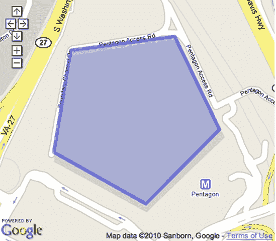

图 4-3. 使用多边形勾勒的五角大楼

## 设置填充颜色和透明度

现在既然你的多边形已经变成了多边形，让我们声明填充其中心的颜色。此外，由于填充覆盖了如此大的区域，你可能希望让多边形下的地图部分可见。这就是透明度发挥作用的地方——它决定了填充颜色的不透明度。

如果你熟悉图形程序，你可能会对透明度感到舒适。你用从 0 到 100 的百分比来声明它，其中 0 是不可见的，100 完全不透明。

让我们使用 Mapstraction 中的一个单一函数来设置我们之前制作的五边形的所有选项：

```
poly.addData({❶opacity: 0.9, ❷fillColor: '#00FF00', color: '#009900', width: 5});
```

在这里，我们声明了 90%的不透明度❶，所以我们几乎看不到它。请注意，我们使用 0 到 1 之间的十进制数来表示百分比。虽然从数学上是正确的，但你可能会觉得有点困惑。

填充颜色使用类似 CSS 的十六进制值声明❷。此值与折线颜色分开，可以是相同的也可以是不同的。在这个例子中，填充颜色是一种明亮的绿色，而边框则是一种略深的绿色。

# #18：添加圆以显示搜索半径

绘制线和多边形相对简单。它们由一系列连接的点组成。圆稍微有点难以表达。圆没有组成其边界的点。相反，它通过一个中心点和半径来声明。

圆在地图上很有用，因为你可以用它们来显示你正在搜索的区域。例如，如果你正在寻找距离一个点五英里内的地点，你的圆将宽十英里（并且高——圆是完美圆形的），搜索点正好位于中心。

Mapstraction 提供了两种创建圆的方法。首先，我们可以用多边形进行近似。其次，我们可以使用图形并将其叠加在地图上。在本节中，我将向你展示如何做这两件事。

## 用多边形进行近似

通过连接圆上的点来创建一个假圆看起来比你想象的要好。当然，你使用的点越多，圆看起来就越好。Mapstraction 有一个内置函数来执行计算，你可以设置质量。

记住，一个圆需要两个信息：一个中心和半径。在这个例子中，我们将通过画一个直径为 500 英里的圆来展示德克萨斯州的大小，这个圆从州的首府开始，位于州中心的附近。

将这些行添加到你的地图初始化函数中，我在整本书中将其称为`create_map`：

```
var radius_object = ❶new Radius(new LatLonPoint(30.268259, −97.744674), ❷10);
var poly = radius_object.getPolyline(❸mxn.fn.milesToKM(250), ❹'#990066');
mapstraction.addPolyline(poly);
mapstraction.setCenterAndZoom(center, 5);
```

这段代码是添加类似圆形的多边形到地图上所必需的。首先，你需要创建一个`Radius`对象❶，它是 Mapstraction 库的一部分。这个对象进行一些重要的计算来确定圆的边缘。然后你传递给这个对象两个值：中心点（德克萨斯州奥斯汀市中心）和一个质量数字❷。

质量数字越低，你的多边形看起来就越像圆形。这个数字代表多边形中每两点之间的度数。你可以用这个来确定你的“圆形”将有多少边。一个圆总共是 360 度，所以如果你除以 10，那就是 36 个点，这意味着你在这个例子中创建了一个 36 边形。使用这种方法，你做得相当不错，可以近似一个圆，就像你在图 4-4 中看到的那样。边数越多，创建圆所需的时间就越长，所以你必须做出权衡。


图 4-4. 用 36 边形近似的圆

现在你有了半径对象，你可以创建多边形，这是一个多段线对象。你使用 Mapstraction 函数将英里转换为公里❸。在这里，我传递了半径的英里数，这是最终圆直径的一半。此外，我还传递了一个用于圆的颜色十六进制值❹，在这种情况下，是一种紫罗兰色调。

你可以从半径对象创建任意多的圆形，所以你可以显示从奥斯汀出发的几个不同级别的距离。然而，如果你想移动中心（或改变圆的质量），你需要重新创建半径对象。

## 在图像上叠加圆形

多边形化的圆可能对你来说仍然太粗糙，或者你可能想要对圆形的外观有更多的控制。在这种情况下，在你的地图上叠加图像是你的最佳选择。

首先，你需要一个圆形图像，可能是一个保存为透明 PNG 文件的图像。透明度很重要，因为图形是以矩形存储的，所以你绝对不希望圆外的区域可见。此外，由于你将在这个地图上作为矩形引用它，你的圆形应该紧靠图形的四边。我在书的网站上包含了几个示例圆形图形供下载，网址为[`mapscripting.com/circle-overlays`](http://mapscripting.com/circle-overlays)。

一旦你有了圆形图像，你就可以确定它在地图上的位置。一个图形是通过其矩形的四边来引用的，所以你需要确定北、南、东和西的点。通常，一个圆是由其中心和半径确定的。你可以通过从中心测量四个方向来计算边值。

将以下行添加到你的地图代码中：

```
var center = new LatLonPoint(30.268259, −97.744674);
❶ var dist_lat = 250 / 69.2;
  var dist_lon = ❷mxn.fn.metresToLon(❸mxn.fn.milesToKM(250)*1000, center.lat);
❹ var n = center.lat + dist_lat;
  var s = center.lat − dist_lat;
  var e = center.lon + dist_lon;
  var w = center.lon − dist_lon;
  mapstraction.addImageOverlay(❺'searchradius', 'circle.png', ❻75, w, s, e, n);
  mapstraction.setCenterAndZoom(center, 5);
```

为了能够确定你的圆形图像的地理边界，你需要计算纬度和经度有多少度组成半径，这是 250 英里。纬度距离❶更容易计算，因为纬度在世界上几乎是一致的，每度 69.2 英里。

经度取决于你在地球上的位置，因为当你接近极点时，度数彼此更接近。Mapstraction 有一个方便的函数 ❷ 用于根据纬度将米转换为经度。为了将函数 250 英里转换为米，你必须首先将其转换为千米 ❸ 然后乘以 1000。

到目前为止，你已经有了距离，所以现在你只需要计算四条边。例如，图形的北部边界 ❹ 将在中心点纬度加上我们确定的 250 英里中的纬度数。南部也将使用那个纬度距离（只是从这个距离中减去中心点的纬度。东部和西部边界将使用经度距离。

拥有你的四个地理边界后，你可以应用你的图像叠加。Mapstraction 需要很多信息，包括图像的标识符 ❺ 和不透明度级别 ❻（在这个例子中，我选择了 75%）。结果如图 图 4-5 所示，你可以看到在德克萨斯州上方的完美圆形。你会发现，它覆盖的区域与 图 4-4 中多边形圆覆盖的区域相同。

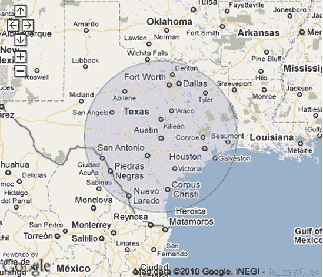

图 4-5. 透明圆形图像叠加

无论你选择使用哪种类型的圆，德克萨斯州都是一个很大的州。

# #19: 画一个矩形来声明一个区域

在 第二章 中，我讨论了边界框，一组大致描述地理区域的坐标。我写 *大致* 是因为边界在视觉上是矩形的，所以它们只能用来声明最简单的区域。当然，我们已经间接地为每个地图创建了边界。地图的可见部分是更大地图的一个矩形部分。

Mapstraction 使用 `BoundingBox` 类来描述一个区域。作为一个数据结构，这个类由两个 `LatLonPoint` 组成。一个声明西南角（左下角）和另一个声明东北角（右上角）。从这两个值中，我们可以推断出剩余的两个角。我们将在本项目中进行这样的操作。

你可能希望从视觉上声明地图上的一个区域。因为 `BoundingBox` 只是一个区域的简单数据表示，我们需要将其转换为 `Polyline`。将此函数添加到你的 JavaScript 中（在 `create_map` 函数外部）以执行转换：

```
function BoundingBox_to_Polyline(box) {
  var points = [❶box.sw, ❷new mxn.LatLonPoint(box.ne.lat, box.sw.lon), box.ne,
                new mxn.LatLonPoint(box.sw.lat, box.ne.lon),
                new mxn.LatLonPoint(box.sw.lat, ❸box.sw.lon-.0001)];
  var poly = new mxn.Polyline(points);
  return poly;
}
```

在地图上绘制一个矩形需要五个点。起初，这个要求可能看起来有点奇怪——矩形不是有四个角吗？当然。我们并没有违反基本的几何规则。然而，我们需要分别声明起点和终点。而且因为这两个点是相同的（或者，正如你将看到的，几乎相同），所以我们将其包含两次。

点数数组简单地从西南点开始 ❶。然后我们想要直接向北绘制一条线，这意味着我们需要保持相同的经度同时增加纬度。我们只有两个点可以操作，因此我们使用西南点的经度和东北点的纬度创建一个新的点 ❷。

第三个点是东北点本身。然后我们可以使用类似的过程来确定第四个点。最后，我们需要将矩形的最后一侧画回到西南点。但这里事情变得奇怪。如果我们使用确切的西南点，Mapstraction 将填充该区域。为了得到一个空心的框，我们创建一个最终点，其经度几乎无法察觉地偏离 ❸ 起始点。

现在我们已经编写了我们的新函数，我们需要调用它。在你的 `create_map` 函数内部，添加以下行：

```
❹ var bounds = mapstraction.getBounds();
❺ var poly = BoundingBox_to_Polyline(bounds);
  mapstraction.addPolyline(poly);
  mapstraction.setZoom(mapstraction.getZoom()-1);
```

如果我们想要创建新的边界，我们可以这样做，但相反，我们是从地图本身获取它们 ❹。然后我们使用这些边界来调用我们的函数将其转换为 `Polyline` ❺。正如你之前看到的，创建对象只是第一步。我们还需要将其添加到地图上。最终的线会放大，这样我们就可以看到矩形，如图 图 4-6 所示。如果不放大，矩形就会位于我们地图的边缘。


图 4-6. 将边界框转换为折线

使用此代码片段清楚地显示边界。有关此项目的实际示例，请参阅 其他有用参数 中的 #7: 遍历所有标记。

# #20: 沿点击绘制线条

在地图上创建自己的线路的最大障碍是找到经纬度点。通过这个项目，你（或你的用户）将能够通过点击地图来简单地绘制线路。Gmap Pedometer ([`gmap-pedometer.com/`](http://gmap-pedometer.com/)) 在地图 API 的早期阶段推广了这项技术，现在你也可以使用它了。

对点击事件的响应是这个方法的中心。你将在 第五章 中详细了解到事件。我们想要将所有点击的点存储在一个数组中。因为我们将从事件中访问它，所以我们创建的变量需要是公共的，这意味着它是在任何函数外部声明的。在你的 JavaScript 开头包含以下行：

```
var cpts = [];
```

这个变量将保存每个点击的点。目前它是一个空数组（方括号之间没有内容）。然而，每次点击，我们都会向数组中添加一个新的 `LatLonPoint`。

在你的地图初始化代码中，添加以下行以响应点击：

```
mapstraction.click.addHandler(function(event_name, event_source, event_args) {
    var clickpoint = event_args.location;
❶   cpts.push(clickpoint);
    if (cpts.length == 1) {
❷   var mk = new Marker(clickpoint);
      mapstraction.addMarker(mk);
    }
    else {
      ❸var poly = new Polyline(❹cpts.slice(cpts.length-2));
      mapstraction.addPolyline(poly);
    }
  });
```

在这里，我包括了当用户点击地图时运行的匿名内联函数中的代码。这几乎是我会编写的没有明确命名的函数的长度。

发生在第一件事是我们将新点“推入”数组❶。`push`函数是 JavaScript 中每个数组变量的内置函数，并且始终将其添加到数组的末尾。

在我们能够画线之前的最小点数是两个。这个要求引起了一些问题，因为我们需要让用户知道我们已经记录了第一次点击。为了解决这个问题，我们只在数组长度为 1 时在地图上添加一个标记❷。换句话说，只有在第一次点击时才会添加标记。

在随后的点击中，我们使用最近两个点创建一个新的折线❸。为此，我们将数组中的最后一个点❹连接到倒数第二个点（因为在 JavaScript 中数组从零开始计数，最后一个元素总是比长度少一个）。此外，请记住，折线是通过数组本身创建的，因此我们需要用括号包围这两个数字。代码开始看起来有点杂乱。

在多次点击之后，地图看起来可能像图 4-7。从内部来看，我们将所有点都存储在我们的数组中。然而，Mapstraction 将每个线段视为自己的折线。从视觉角度来看，它仍然看起来像一条大线。

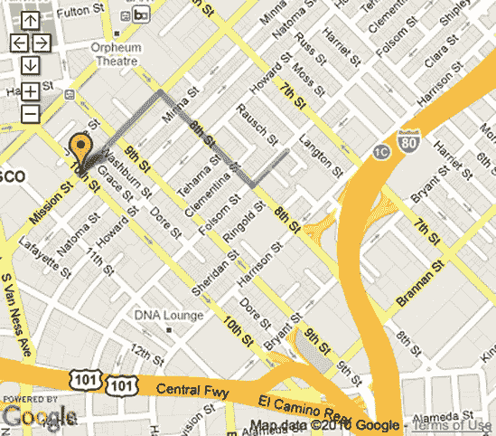

图 4-7. 通过折线段连接点击

# #21: 在地图上显示颜色状态/国家

如果你注意到了最近的美国政治，你很可能看到了红色和蓝色州地图。在 2004 年和 2008 年的总统竞选期间，这些地图在互联网上变得很常见。而且信不信由你，如果你读到本章的这一部分，你已经知道如何制作自己的彩色地图了。

你需要的只是构成每个州轮廓的点。然后，为每个州创建一个多边形，并给它适当的填充颜色。在你开始着色州之前，你需要构成每个州轮廓的点。你可以通过多种方式获取这些数据。例如，你可以使用与上一个项目类似的方法自己创建它。

你也可以直接从政府那里获取，但你可能需要将其转换为 Mapstraction 容易使用的格式。我在书的网站上提供了数据源[`mapscripting.com/state-boundaries`](http://mapscripting.com/state-boundaries)。

如果你想尝试一下，先从几个州开始。在这个例子中，我将使用犹他州、科罗拉多州、亚利桑那州和新墨西哥州的四个角落州。它们有相对较少的点，并且它们都整齐地聚集在一起。第一步是声明构成每个州边界的点作为 JavaScript 数组：

```
var utah = [new LatLonPoint(36.99, −114.05), new LatLonPoint(36.99, −109.04),
            new LatLonPoint(40.99, −109.05), new LatLonPoint(40.99, −111.05),
            new LatLonPoint(41.99, −111.05), new LatLonPoint(41.99, −114.04),
            new LatLonPoint(36.99, −114.05)];
var colorado = [new LatLonPoint(41.00, −102.05), new LatLonPoint(40.99, −109.04),
                new LatLonPoint(37.00, −109.04), new LatLonPoint(36.99, −102.04),
                new LatLonPoint(41.00, −102.05)];
var arizona = [new LatLonPoint(33.95, −114.52), new LatLonPoint(34.00, −114.47),
               new LatLonPoint(34.02, −114.43), new LatLonPoint(34.08, −114.43),
               ...
               new LatLonPoint(33.92, −114.53), new LatLonPoint(33.95, −114.52)];
var newmexico = [new LatLonPoint(32.00, −106.62), new LatLonPoint(31.99, −103.06),
                 new LatLonPoint(36.99, −103.00), new LatLonPoint(36.99, −109.04),
                 new LatLonPoint(36.99, −109.04), new LatLonPoint(31.33, −109.04),
                 new LatLonPoint(31.33, −108.21), new LatLonPoint(31.77, −108.20),
                 new LatLonPoint(31.78, −106.53), new LatLonPoint(32.00, −106.62)];
```

亚利桑那州过于复杂，无法在书中展示其所有点，但其他州的信息是完整的。就像使用点声明其他形状一样，我们使用方括号包含一个`LatLonPoint`列表来指定一个数组。为了创建一个完整的形状（因此包括填充颜色），数组中的第一个和最后一个点必须相同。相同的点告诉 Mapstraction 多边形开始和结束在同一个地方。

由于我们将多次执行相同的操作，这是一个创建我们自己的函数的合适时机。以下是填充状态的代码：

```
function color_state(❶pts, ❷color) {
  var poly = new Polyline(pts);
  poly.addData({❸opacity: 0.9, ❹fillColor: color, ❺width: 0});
  mapstraction.addPolyline(poly);
}
```

我们将调用这个函数四次——一次针对每个州。或者，如果你要绘制整个美国，你需要调用这个函数五十次。这个函数的三行意味着我们的代码只需占用三分之一的篇幅。如果你打算多次运行相同的代码，你将想要避免重复并创建自己的函数。

我们需要将函数传递两个参数。首先，我们传递给它一个点的列表❶——一个状态边界数组。然后，因为我们将在地图上用不同颜色的状态填充，我们需要让函数知道当前状态应该使用什么颜色❷。

函数随后开始创建一个`Polyline`并添加数据到它。我们已将不透明度设置为 90%，这意味着填充的状态形状将略微透明，足以看到下面的州名。颜色设置为❹为我们接收到的参数。我们将宽度设置为零❺，这意味着州将没有边界。你可能更喜欢有边界，所以尝试几个不同的值。这个参数接受整数，表示像素厚度。

我们到目前为止所做的一切实际上还没有做任何事情。为了做到这一点，我们需要调用这个函数，传递一个状态边界数组和颜色。将以下代码添加到你的地图初始化部分：

```
color_state(utah, '#00ff00');
color_state(colorado, '#006600');
color_state(arizona, '#009900');
color_state(newmexico, '#00cc00');
mapstraction.autoCenterAndZoom();
```

如你所见，这调用了`color_state`函数四次，每次使用不同的点数组变量和颜色。为了保持这个例子不涉及政治，我使用了绿色的不同色调。你可以自由地插入你自己的红色（`'ff0000'`）或蓝色（`'0000ff'`）值。

为了确保每个州都在视野中，我在添加了四个州之后自动居中了地图。正如你在图 4-8 中看到的那样，我们的地图看起来相当漂亮。但如果你放大查看，每个州的边界可能不会完全接触。这是一个精度问题，你可能并不关心。它的重要性取决于你期望用户多接近地查看边界。对于查看国家级别的彩色选举地图的情况，我们不需要完美。

您可能还会注意到创建州地图时的问题，并不是所有州都是完美的形状。夏威夷是一系列岛屿，密歇根的两个部分被一个大湖分隔。再次强调，您如何处理这取决于这对您有多重要。您可能觉得将部分连接起来以形成一个州是可以接受的。或者，您可能使用多个多边形来表示这些复杂的州。

# #22: 添加自定义控制

到目前为止，我们在地图上叠加的所有内容都进行了地理参照。换句话说，当用户将地图拖到一边时，我们叠加的内容也会移动。在本节中，我们将创建一些不移动，而是锚定在地图窗口特定位置的用户界面元素。

我们将要创建的控制类似于地图类型控制，它们位于地图的右上角。在添加缩放和其他控制中，我展示了如何包含这些（以及其他）控制。现在，我们将制作自己的按钮，它们将位于相同的位置。

对于这个例子，我们将创建一个按钮，用户可以通过它自动将地图居中，以便所有标记和线条都可见。更好的是，我们将编写代码，让您可以通过简单的函数调用创建任意数量的这些自定义控制。

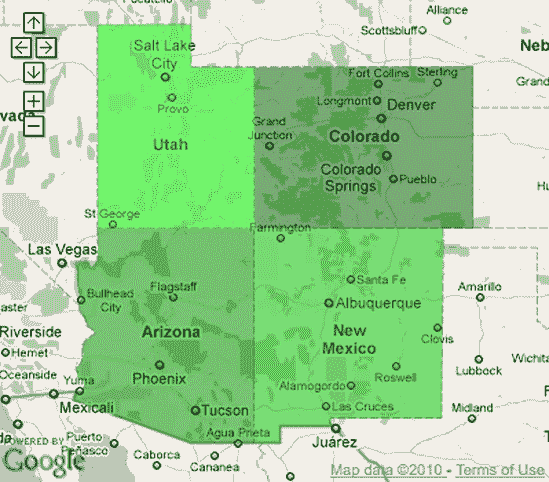

图 4-8. 四个美国州的区域

这是创建控制的代码：

```
function create_control(❶txt, ❷func) {
❸ var newcontrol = document.createElement("a");
❹ newcontrol.className = 'googlecontrol';
❺ newcontrol.appendChild(document.createTextNode(txt));
❻ newcontrol.onclick = func;
❼ mapstraction.currentElement.appendChild(newcontrol);
  }
```

为了创建控制并将其添加到地图中，此函数需要两份数据：它需要写入按钮内的文本❶，以及当按钮被点击时它将调用的函数❷。

有了这些信息，我们可以着手创建这个控制。从浏览器如何解释的角度来看，我们正在程序化地创建一个简单的`<a>`标签❸。我们给它一个类名❹，以便我们可以用 CSS 来样式化它。然后我们向它添加标签❺。

到目前为止，控制已经创建，但它还没有在地图上，也没有执行任何操作。为了解决这两个问题，我们设置了当用户点击时将被调用的函数❻，然后将对象作为地图对象的子对象❼添加。

现在我们可以为控制添加样式。将这些 CSS 行添加到您的样式表中：

```
a.googlecontrol {
  `position: relative;`
  `float: right;`
  width: 63px;
  height: 15px;
  margin: 5px 3px 0 0;
  border: 1px solid #b0b0b0;
  background-color: white;
  color: black;
  font-size: 12px;
  text-align: center;
}
a.googlecontrol:hover {
  cursor: pointer;
}
```

这段 CSS 旨在使我们的控制看起来与谷歌地图类型控制相似。只有前两行（加粗）是必要的，用于将其定位在右上角。其余的都是样式。

所有艰苦的工作现在都完成了，我们准备好使用我们的自定义控制。在我们的地图初始化代码中，添加以下行以创建一个自动居中控制：

```
create_control("auto-center", function() {
  mapstraction.autoCenterAndZoom();
});
```

这段代码传递了新控制（自动居中）的标签和一个匿名内联函数引用，该函数引用决定了当用户点击新控制按钮时应该执行的操作。在这种情况下，它会自动触发 Mapstraction 代码以显示地图上的所有标记和线条。请参见图 4-9，了解点击按钮前后的示例。

当用户点击你的自定义控制按钮时，你可以做任何你想做的事情。一个常见的选择可能是只显示特定类型的标记。我在第九部分：过滤掉某些标记中演示了如何做到这一点，第九部分：过滤掉某些标记。使用标记填充的地图，你还可以创建特定的区域进行缩放，就像我在第七十部分：显示全球最近的地震中做的那样，第七十部分：显示全球最近的地震。


图 4-9. 一个自定义控制看起来像 Google 控制

# #23: 创建你自己的缩放界面

当你选择一个地图服务提供商时，地图的外观某些元素无法轻易更改。缩放界面可能是你接受为不可更改的这些元素之一。在这个项目中，我将展示如何包含你自己的缩放按钮，以提供对你地图外观的更多控制。

这种方法与上一个项目类似。我们将创建一个函数，它将向页面添加一个新对象，并使用 CSS 对其进行定位和样式设计。我们将使用图像按钮而不是文本按钮。而且，就像之前一样，每个新对象都会对点击做出反应。

首先，你需要两个图像：一个将用作放大按钮，另一个将用作缩小按钮。你可以在图 4-10 中看到我选择的两个不起眼的图形。

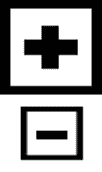

图 4-10. 两个用作自定义控制的缩放图形

这是创建图像控制的通用代码：

```
function create_image_control(❶src, ❷func) {
❸ var newcontrol = document.createElement("img");
❹ newcontrol.className = 'imgcontrol';
❺ newcontrol.src = src;
❻ newcontrol.onclick = func;
❼ mapstraction.currentElement.appendChild(newcontrol);
  }
```

这个函数需要两份数据才能创建控制并将其添加到地图中。它需要一个图像源❶，这是一个指向我们将用于此控制的图像文件的路径。它还需要一个函数❷，当图像被点击时，它会调用这个函数。

现在我们已经准备好创建这个控制了。我们以编程方式创建一个图像元素❸，就像我们在创建自定义控制时使用`<a>`标签一样。然后我们给图像一个类名❹，这样我们就可以使用 CSS 对其进行样式设计。最后我们添加图像 URL❺。这个 URL 可以是完整的，也可以相对于当前页面。

到目前为止，图像已经创建，但它既不在地图上，也没有做任何事情。为了解决这两个问题，我们设置了一个函数 ❻ 在用户点击时被调用，然后将图像对象作为地图对象的子对象 ❼ 添加。

让我们确保我们的新图像控制位置正确。将这些 CSS 行添加到您的样式表中：

```
img.imgcontrol {
  position: relative;
  float: right;
  margin: 2px;
}
```

现在我们可以将我们的自定义缩放控件添加到地图上。在您的地图初始化代码内部，添加以下行：

```
create_image_control(❶"zoom-plus.png", function() {
❷ mapstraction.setZoom(mapstraction.getZoom()+1);
  });
  create_image_control("zoom-minus.png", function() {
    mapstraction.setZoom(mapstraction.getZoom()-1);
  });
```

在这里，我创建了两个图像控制，如图图 4-11 所示。第一个用于放大。CSS 将控制放置在最右边。我发送了我的图像名称 ❶，这假设它存储在与 HTML 页面相同的目录中。然后我传递给它一个匿名内联函数。在这里，我使用 Mapstraction 设置了缩放级别 ❷，传递一个比当前缩放级别大一的数字。

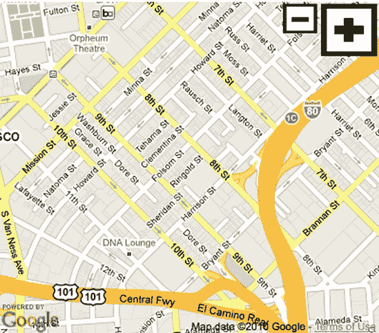

图 4-11. 地图上的自定义缩放图像

第二个图像控制类似。它被赋予了一个不同的图像，当点击时，它将缩放级别设置为当前缩放级别减一 *less*。

# #24: 在地图上绘制图像缩略图

一张图片可能不一定值一千个地理点，但它很接近。地图是展示被 *地理标记* 的照片的好方法。地理标记是将纬度和经度坐标与图像关联起来。然而，全尺寸照片可能不是理想的，因为它们会占用太多空间。相反，一种流行的方法是显示更小的版本——缩略图——供观众放大。

当然，你需要照片。你可以使用一些你有的作为测试，或者搜索照片分享网站 Flickr。我通过搜索奥兰多，佛罗里达找到了一些好的照片，它们已经地理标记。我特别寻找那些被许可为 Creative Commons 的照片，这意味着它们有较少的版权限制。

尽管我们将链接到每张图片的大版本，但我们还需要单独的文件来存储较小的版本。使用 Flickr 的另一个优点是它还自动创建这些缩略图和中等尺寸的图像。

对于我们绘制的每个奥兰多照片，我们需要以下内容：

+   照片缩略图

+   纬度和经度

+   中等尺寸的相片

+   中等相片的尺寸

+   完整照片的链接

至少你需要前两项，尽管你可以包含列表中的更多项来创建更好的用户体验。如果你像我一样使用 Flickr，那么你需要那个链接来避免违反 Creative Commons。

我的三个缩略图在图 4-12 中显示在地图上。正如在其他我们可能需要多次执行一个动作的情况中，创建一个函数是最好的。将以下代码添加到您的 JavaScript 代码中：

```
function plot_thumbnail(pt, thumbimg, medimg, medw, medh, link) {
    var mk = new Marker(pt);
❶ mk.setIcon(thumbimg, [50, 50]);
❷ mk.setShadowIcon('outline.png', [52, 52]);
    mk.setInfoBubble('<a href=\"' + ❸link + '\">' +
                     '</a>');
    mapstraction.addMarker(mk);
  }
```

作为函数的参数，我们需要传递列表中提到的所有项目。然后我们使用缩略图创建一个自定义标记❶。注意，我将标记的尺寸设置为 50×50。你可以使用任何大小，但确保图像本身接近那个大小。Flickr 的是 75 像素的方形，所以稍微缩小是可以的。

接下来，我们想要设置一个阴影❷，否则将使用默认设置（在 Google Maps 中，默认是倒泪滴形状，放在方形照片下面看起来会很奇怪）。我创建了一个轮廓图形，给图像添加了一点点边框。我将大小设置为略大于缩略图本身。

最后，我们添加一个消息框。记住，你可以在其中包含任何 HTML，所以我们将链接到完整图像❸，并显示中等大小的图像❹。为了帮助地图提供商确定消息框的大小，我们包括中等大小图像的宽度❺和高度❻。

现在我们已经准备好调用该函数：

```
plot_thumbnail(new LatLonPoint(28.4736, −81.4651),
               'http://farm3.static.flickr.com/2578/3769139951_954a782886_s.jpg',
               'http://farm3.static.flickr.com/2578/3769139951_954a782886_m.jpg',
               240, 180,
               'http://www.flickr.com/photos/lancerrevolution/3769139951/');
```


图 4-12. 以自定义标记覆盖缩略图（照片由 Ron Miguel、Kok Leng Yeo 和 LancerE 拍摄）

此函数在地图上绘制单个照片缩略图。点击小版本，它会打开一个显示中等版本的消息框。然后，当你点击图像时，Flickr 链接会打开。

现在只需调用该函数两次——或者二十次。你可以使用我的地图中的 Flickr 照片作为示例：

+   [`www.flickr.com/photos/kamoteus/2421383748/`](http://www.flickr.com/photos/kamoteus/2421383748/)

+   [`www.flickr.com/photos/yeowatzup/461692550/`](http://www.flickr.com/photos/yeowatzup/461692550/)

对于一个更高级的项目，你可以通过调用 Flickr API 在地理点附近搜索图像来自动化查找图像的过程。API 随后会以 XML 或 JSON 格式响应，这两种格式你都可以使用第八章中展示的技术进行解析。

# #25：在地图上覆盖图像

你可以用多种方式将图像添加到地图上。在“#5：创建自定义图标标记”（见第二章第五部分，ch02s05.html）和“#4：不点击标记显示和隐藏消息框”（见第二章第四部分，ch02s04.html）中，你使用图像作为 Placemark 的图标。在本节中，我们将做一些不同的事情——在地图的更大区域上覆盖图像，它将替换或增强现有地图。

你实际上已经熟悉这个过程，因为我们在本章前面已经使用过它，在第十八部分：添加圆圈以显示搜索半径和设置填充颜色和透明度中。在那里，我们使用了一个圆形图像并将其地理参照，使图像以一个点为中心并覆盖特定区域。那个例子比我们现在想要做的要简单，因为圆在各个方向上的距离相同，而且它指向哪里并不重要。

例如，考虑一下图 4-13 中纽约中央公园的地图。它包含了一些可能不在你标准网络地图上的建筑和地标。这张地图将公园完美地定位，使其南北方向延伸。实际上，环绕公园长边街道的位置稍微偏东（相对于北边，相对于南边）。


图 4-13. 中央公园源图形

Mapstraction 只能在其矩形顶部正好位于北边时覆盖图形。为了使中央公园地图与纽约的其他部分匹配，我们需要对其进行地理参照。

## 地理参照您的地图

地理参照技术的核心是确定图形上点的纬度和经度。然后，使用这些点，你可以弯曲和扭曲地图，使图形的顶部和底部边界成为静态纬度（以及另外两个静态经度）。

这个过程通常被称为*橡皮膜法*，因为你正在将二维参照拉伸到球形地球上，然后将其展开使其再次变平。结果是扭曲的图像，就像它是由橡皮制成的。

你可以通过多种方式将图形与地图进行地理参照。微软有一个名为 MapCruncher 的程序，效果很好。在这种情况下，你需要一台 Windows 机器，并且生成的图形只能用于非商业用途。MetaCarta 还有一个名为 Map Rectifier 的 Web 工具。

对于这个项目，我将使用一个名为 Map Warper 的 Web 应用程序，可以在[`warper.geothings.net/`](http://warper.geothings.net/)找到。Map Warper 是由 Tim Waters 开发的，是开源的，旨在让你摆脱对如何使用最终结果的担忧。你需要创建一个免费账户来存储你的地图图像。一旦你创建了账户，点击**添加地图**链接开始创建新地图。

在你为地图提供名称和其他元数据后，你可以包含一个图形。浏览你的硬盘以找到你想要使用的图像。你可以在本例中使用的中央公园图形在[`mapscripting.com/image-overlay/`](http://mapscripting.com/image-overlay/)找到。

点击**校正**标签，你会在左边看到你的图像和右边的地图（见图 4-14

图 4-14. Map Warper 界面

例如，我在中央公园图形的左下角选择了我的第一个点，在哥伦布圆环处。一旦我能在两个屏幕上看到哥伦布圆环，我就点击标记按钮（见图 4-14 所示。

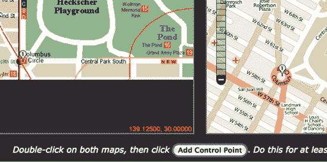

图 4-15. 地理参考的第一个控制点

要找到屏幕外的额外点，请记住从标记器切换到手，这样你就可以再次移动图像。你还需要用右边的地图做同样的事情。继续这个过程，直到你有一把点的数量。Map Warper 建议至少三个点，但我发现通常需要更多。

中央公园的例子比一些例子更容易，因为纽约市有一套很好的网格街道可以作为参考。图 4-16 显示了我在这个例子中选择的七个点。当你完成添加控制点后，滚动到底部并点击**扭曲图像**。


图 4-16. 更多控制点产生更好的校正地图

系统会旋转和嗡嗡作响一段时间。当它响应地图已经被校正时，你可以滚动到顶部并点击**预览校正**标签。一个带有你的图像扭曲并叠加在上面的地图将出现，如图图 4-17 所示。你可以移动底部的滑块来改变图像的不透明度。将标记完全移到右边会使图像完全不透明，这意味着它完全覆盖了原始地图。


图 4-17. 地理参考的中央公园地图预览

拖动滑块来确定你的图像与源地图的匹配程度。如果你对结果不满意，点击**Rectify**标签并添加几个更多点。

## 应用扭曲地图

当你对扭曲图像的结果满意时，点击**Export**链接下载图像以用于你自己的项目。你想要的是 PNG 格式的版本。图 4-18 显示了经过地理参考后我的中央公园图形现在看起来有多不同。

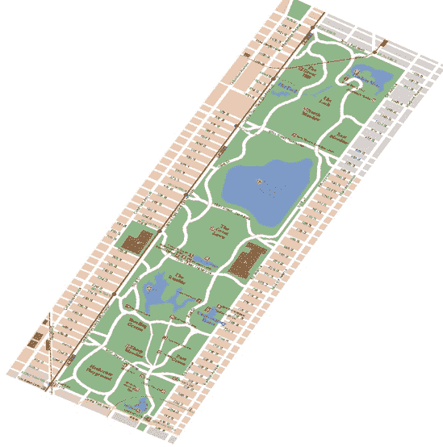

图 4-18. 从地理参考扭曲的中央公园图像

为了使用 Mapstraction 在地图上叠加扭曲的图像，你需要知道图像矩形的边界。要在 Map Warper 中找到这些信息，请点击**Activity**标签，在那里你会看到一个显示地理参考会话时间线的表格。最上面的条目可能是 Map Successfully Rectified。点击该行的**Further Details**链接，你会看到更多详细信息，包括一个包含四个十进制数字的框。突出显示并复制这些数字，它们应该已经按顺序排列：西、北、东、南。

现在你可以将叠加代码添加到你的 Mapstraction 地图中：

```
mapstraction.addImageOverlay(❶'centralpark', ❷'centralpark-warped.png', ❸100,
                             ❹-73.9867415, 40.7622753, −73.9460798, 40.8032834);
```

为了将我们的扭曲图像添加到地图中，我们需要给它一个标识符 ❶。我们让 Mapstraction 知道扭曲图像的路径 ❷（这里，我假设图像与 HTML 文件在同一个目录中）。然后，我们给出一个介于 0（不可见）和 100（隐藏——图像下无法看到地图）之间的不透明度百分比 ❸。最后，我们添加 Map Warper ❹中的四个数字，这些数字描述了图像将驻留的地理框。

图 4-19 显示了完成的地图，中央公园的图形完全遮挡了其下的谷歌地图。


图 4-19. 在谷歌地图上叠加的中央公园地理参考图像

你也可以在更大的区域内使用你自己的地图图像。然而，将整个城市或更多的数据存储在单个图像中效果不会很好。相反，请看下一个项目，它展示了如何一次显示一点来创建自己的图像。

# #26: 使用自定义瓦片

大多数提供商允许你为你的地图选择几种图像类型。你可以显示卫星视图、道路地图或混合版本。但你不是那种千篇一律的类型，对吧？你喜欢选择自己公园的绿色或自己道路的厚度。为此，你需要自定义瓦片。而且，哪里比拉斯维加斯大道更适合你的光彩和华丽呢？

要创建拉斯维加斯的瓦片，我们需要有关街道和其他特性的数据。尽管地图提供者在他们的 API 中允许你做的事情很宽松，但大多数像扑克玩家对待他们的牌一样对待底层数据。一个使其数据广泛可用的例子是 OpenStreetMap，这是世界上免费的可编辑地图。当然，分发地球上每条街道的详细信息意味着文件相当大，因此也提供了特定区域的下载。在这个项目中，例如，我们只需使用内华达州的数据，拉斯维加斯就位于这个州。

要创建瓦片，我们将数据输入到一个名为 Mapnik 的开源程序中。由于 Mapnik 的安装和配置可能有点复杂，我们将利用另一个名为 Tile Drawer 的项目，它提供了一个 Amazon EC2 机器镜像来执行大部分技术工作。首先，让我们了解一下地图提供者如何使用瓦片。

## 地球有多宽的像素？

如 第一章 所述，地图由排列成一个大图像的瓦片组成。每个瓦片是 256 像素的正方形，并组织成网格。大多数提供者从左到右和从北到南参考网格，从阿拉斯加上面的北极洋开始。瓦片通过其在网格中的编号进行引用，例如 `(14, 34)`。

显示整个地球所需的瓦片数量取决于缩放级别。例如，在 Mapstraction 中的最缩放级别 0，地球可以显示在一个单独的瓦片上。每次放大，需要四个瓦片来显示之前在一个瓦片上显示的细节。你可以通过确定 2 的 *缩放级别* 次方（2^缩放级别）来找到每个方向上使用的瓦片数量。表 4-1 显示了每个缩放级别的瓦片和像素信息。

当地图提供者加载地图瓦片时，它使用三个数字：缩放级别、从左侧的瓦片数量和从顶部的瓦片数量。所有这些数字都是从零开始的，因此每个缩放级别地图的左上角是 `(0, 0)`。例如，在级别 6 的右上角是 `(16383, 0)`。

表 4-1. 每个缩放级别的瓦片和像素

| 缩放级别 | 宽/高瓦片 | 宽/高像素 |
| --- | --- | --- |
| 0 | 1 | 256 |
| 1 | 2 | 512 |
| 2 | 4 | 1,024 |
| 3 | 8 | 2,048 |
| 4 | 16 | 4,096 |
| 5 | 32 | 8,192 |
| 6 | 64 | 16,384 |
| 7 | 128 | 32,768 |
| 8 | 256 | 65,536 |
| 9 | 512 | 131,072 |
| 10 | 1,024 | 262,144 |
| 11 | 2,048 | 524,288 |
| 12 | 4,096 | 1,048,576 |
| 13 | 8,192 | 2,097,152 |
| 14 | 16,384 | 4,194,304 |
| 15 | 32,768 | 8,388,608 |
| 16 | 65,536 | 16,777,216 |
| 17 | 131,072 | 33,554,432 |
| 18 | 262,144 | 67,108,864 |

幸运的是，您不需要通过瓦片的网格位置来引用它们。映射提供商为您完成所有这些。了解它是如何工作的重要，因为您需要使用这些知识在项目后期创建自定义瓦片 URL。

关于本节顶部的疑问——地球的宽度是多少像素？这取决于缩放级别，但对于大多数提供商来说，地球的宽度在 256 到 67,108,864 像素之间。

## 启动 Tile Drawer EC2 实例

Tile Drawer 可以帮助您创建自己的自定义地图瓦片，并在云中运行瓦片服务器。它运行在 Amazon EC2 之上，即一个**弹性计算云**，也就是说，一个可扩展的 Web 服务器。EC2 的另一个特点是能够保存预配置的服务器、亚马逊机器镜像（AMIs），并使它们可供他人使用。这就是 Tile Drawer 的创造者所做的事情。方便！

您需要一个亚马逊账户（准备好提供您的电子邮件地址和一些其他信息），然后注册 EC2。亚马逊为此服务收费，但按每小时几分钱收费，所以您可以用不到一美元的价格尝试这个项目。此页面将指导您完成注册过程：[`aws.amazon.com/ec2/`](http://aws.amazon.com/ec2/)。

从此页面登录 AWS 管理控制台。点击**启动实例**按钮。然后在社区 AMIs 中搜索 Tile Drawer 机器镜像。寻找*tiledrawer*，或者找到在[`tiledrawer.com/`](http://tiledrawer.com/)上列出的 ID，例如`ami-e1ea0a88`。当您找到 Tile Drawer AMI 时，点击**选择**按钮。

在实例详细信息屏幕上，只创建一个实例，如图图 4-20 所示。因为您将使用一个非常小的区域开始，所以可以使用小型实例类型。点击**继续**按钮，然后在下一屏幕上，您大部分保持默认设置不变。但是，您需要添加一些用户数据。

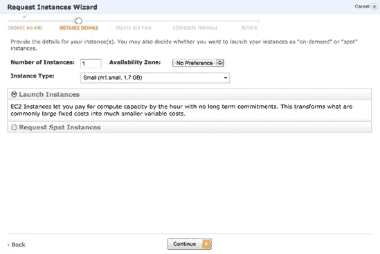

图 4-20. 创建单个 Amazon EC2 Tile Drawer 实例

## 为您的实例声明用户数据

Tile Drawer 服务器相当容易安装。只需设置几个设置即可使其运行。您稍后会发现，这些设置还允许您完全自定义您的地图瓦片。

您可以使用[`tiledrawer.com/`](http://tiledrawer.com/)上的向导来帮助您自动创建用户数据。或者，为了继续跟随这个示例，将以下数据粘贴到 EC2 设置页面上的用户数据框中（见图图 4-21)：

```
{
  "style": "http://tiledrawer.com/mapscratch.mml",
  "bbox": [−115.2, 36.10, −115.1, 36.15],
  "source": "http://downloads.cloudmade.com/north_america/
united_states/nevada/nevada.osm.bz2",
  "coast": "http://hypercube.telascience.org/~kleptog/processed_p.zip"
}
```

这组数据有四个偏好设置。首先，地图的样式，它使用类似 CSS 的样式表。在这个第一个例子中，我们将坚持使用瓦片抽屉的基本外观，稍后再进行更改。接下来，我们声明一个`BoundingBox`，类似于我们与 Mapstraction 一起使用的那些。这里的区别在于经度在纬度之前列出。我们使用的两个点仍然是西南，然后是东北。

最后两项是 Tile Drawer 将下载并使用的文件的 URL。第一个是数据本身。我们使用内华达州的数据，由 CloudMade 托管。您可以在 [`downloads.cloudmade.com/`](http://downloads.cloudmade.com/) 找到您需要的数据。寻找类型为 *.osm.bz2* 的文件。最后一个 URL 是海岸线数据，它被单独托管。

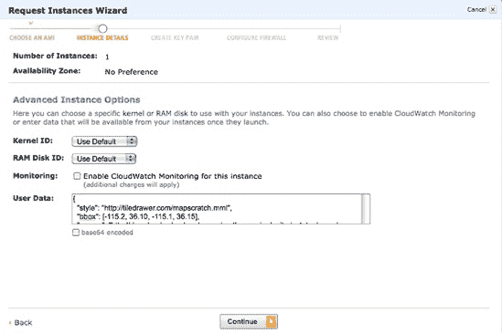

图 4-21. 向 EC2 实例添加用户数据

设置了用户数据后，再次点击**继续**。下一屏幕将提示您创建密钥对。密钥对使您能够连接到服务器的后端。这个高级功能可能在未来的某个时刻有用。现在，选择**不使用密钥对继续**，然后点击**继续**。

在防火墙屏幕上，请确保您选择了 web 服务器安全组。此组打开运行 web 服务器所需的适当端口，这对于从任何计算机访问您的瓦片，包括您自己的计算机，是必要的。点击**继续**，您将进入最终屏幕。深吸一口气，然后点击**启动**。

## 瓦片抽屉完成其工作

您的 EC2 实例不会立即启动。尽管它是一台虚拟计算机，但启动仍然需要几分钟。一旦可用，创建所有瓦片将需要额外的时间。这是一个休息的好时机！

但您不应该需要**太长**的休息时间。由于只需下载一个状态的数据并准备一个小区域，瓦片抽屉应在 15 分钟内准备好。从您的 EC2 仪表板，您应该能够点击“我的资源”下的**运行实例**链接。从那里，您可以查看您的新实例的状态。当服务器启动后，它应该从黄色和挂起切换到绿色和运行。

当服务器运行时，点击您的实例，下面面板中会出现一个描述。向下滚动并找到公共 DNS 地址，如图 图 4-22 所示。此地址是您新虚拟服务器的域名等效物。在您的网页浏览器中输入该地址，您应该会看到一个显示“它工作！”的页面。

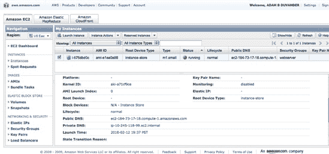

图 4-22. 实例详情显示您的公共 DNS 地址。

接下来，将*/status.php*添加到您的地址末尾以获取 Tile Drawer 的状态。Tile Drawer 会创建瓦片：入门，下载源，提取数据，创建表格，导入海岸线，下载样式表，以及创建 TileCache。随着每个步骤的完成，它将变为灰色，如图图 4-23 所示。当 Tile Dawer 完成时，您可以点击链接或转到您的地址后跟*/preview.php*。


图 4-23. Tile Drawer 的每个部分完成时的状态更新。

您将在 Tile Drawer 服务器上看到您新瓦片的快速预览。您可以双击以放大。如果一切看起来都很好，那么是时候将这些瓦片放到 Mapstraction 地图上了。

## 将瓦片叠加到您的地图上

将您的瓦片包含到 Mapstraction 中的过程就像一行代码一样简单。设置瓦片服务器的工作已经完成——在创建样式方面，您的工作还在前方，这可能是一项繁琐的任务。

使用以下代码创建一个新的基本地图：

```
function create_map() {
  mapstraction = new mxn.Mapstraction('mymap', 'googlev3');
  mapstraction.setCenterAndZoom(
    new mxn.LatLonPoint(36.123, −115.167), 13);
  mapstraction.addSmallControls();
  `mapstraction.addTileLayer(`
    `"http://```*`yourserver`*```.amazonaws.com/ tilecache/1.0.0/osm/`❶`{Z}/{X}/{Y}.png",` ❷1.0);
}
```

在这里，我们创建了一个以拉斯维加斯大道为中心的地图。然后，在加粗的行中，我们告诉 Mapstraction 在哪里找到我们的瓦片。我们的 URL 包含用于缩放级别❶和瓦片网格坐标的占位符。这些值，`{Z}`、`{X}`和`{Y}`，用实际数字填充。您可以通过访问*yourserver.amazonaws.com/tilecache/1.0.0/osm/13/1475/3213.png*来查看一个示例瓦片。请确保用您的 EC2 实例的公共 DNS 地址替换*yourserver*。

我们传递给 Mapstraction 的瓦片层函数的第二个参数是透明度。就像在第二十五部分：在地图上叠加图像中一样，我们可以使我们的瓦片半透明，这样我们仍然可以看到下面的提供者图像。在这里，我通过选择值为一来使我们的瓦片完全不透明❷。介于零和一之间的数字设置百分比。例如，0.6 将是 60%不透明。

保存您的地图并在浏览器中加载。现在您应该看到定制的拉斯维加斯瓦片而不是谷歌图像，如图图 4-24 所示。在您的瓦片加载之前，您可能会看到默认的外观。这是因为定制的瓦片被放置在谷歌图像之上，所以这两组都需要加载。

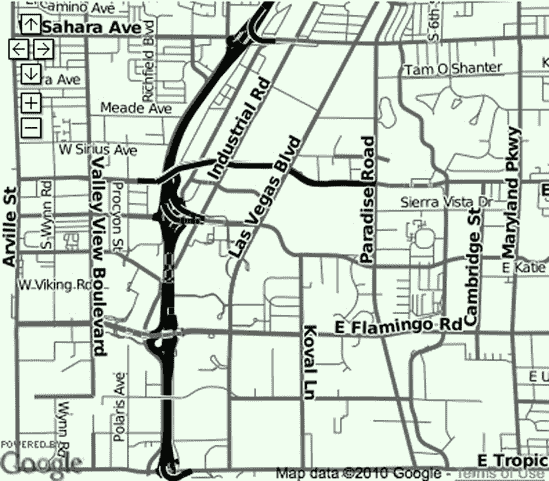

图 4-24. 使用 Tile Drawer 的" scratch"样式表定制的瓦片

## 创建您自己的瓦片样式

如果您熟悉用于网页样式的 CSS，您可能会对 Tile Drawer 应用颜色和其他样式到地图的方式感到舒适。它使用 Cascadenik 将其转换为与 Mapnik 瓦片生成器一起工作的文件格式。在本项目的早期，我们使用了 Tile Drawer 提供的基本示例。现在我们将尝试更改一些颜色和道路宽度。

您首先需要做的是将[`tiledrawer.com/mapscratch.mml`](http://tiledrawer.com/mapscratch.mml)复制到您自己的服务器上。或者，您可以使用我为本节编辑的版本，在[`mapscripting.com/examples/tiledrawer/mapscratch-edits.mml`](http://mapscripting.com/examples/tiledrawer/mapscratch-edits.mml)。

由于拉斯维加斯以其霓虹灯而闻名，让我们尝试使道路从地图中突出出来。为此，我们将使用鲜艳的颜色和深色背景。找到以`#land`开头的行，并使用以下样式数据进行更改：

```
#land { polygon-fill: #333; }
```

这组数据将土地（基本上是背景颜色）从非常浅的颜色变为接近黑色。黑色非常符合拉斯维加斯的风格，尤其是当我们包括鲜艳的颜色时。对于接下来的更改，您需要使用以`#lines`开头的样式。确保您的代码与这些设置匹配：

```
#lines[❶highway=motorway],
  #lines[highway=motorway_link]
  {
❷  line-width: 6;
❸  line-color: #f00;
  }
  #lines[highway=primary],
  #lines[highway=secondary],
  #lines[highway=tertiary]
  {
    line-width: 4;
    line-color: ❹#ff0;
  }
  #lines[highway=residential],
  #lines[highway=unclassified],
  #lines[highway=service]
  {
    line-width: 2;
    line-color: ❺#00f;
  }
```

Cascadenik 样式表使用方括号内的 OpenStreetMap 标签来确定您想要样式的元素。在所有这些示例中，我们正在样式化高速公路，这是一个任何道路的通用术语。在第一组中，我们只将样式应用于高速公路❶和高速公路“链接”（例如出口）。由于拉斯维加斯的一切都更大更亮，所以我们使高速公路更宽❷，然后将其染成鲜艳的红色❸。

在接下来的两个部分中，我们将较大街道设置为黄色❹。住宅和其他小街道设置为蓝色❺。随着街道变窄，地图上的街道宽度也相应变窄。然而，由于我们正在以拉斯维加斯风格进行，因此它们仍然比我们正在编辑的样式要宽。

您可以使用这些样式做一些强大的事情，使您的地图看起来与任何可用的图像都不同。作为样式如何具体的一个例子，尝试将以下行添加到您的样式表中：

```
#lines`[zoom=13]`[highway=motorway]
{
  line-color: #ff8000;
}
```

初看，这段代码与我们之前做的一些代码类似。请注意加粗的部分；它告诉瓦片服务器仅在缩放级别为 13 时应用此样式。在所有其他缩放级别，我们的其他样式将优先。但是，当我们的地图处于 13 级时，高速公路将变为橙色而不是红色。

我没有重置线宽，就像在其他部分做的那样，这意味着为高速公路设置的线宽在 13 级缩放时将保持不变。只有颜色会改变。除了`=`之外，您还可以使用`>`, `>=`, `<`, 和 `<=`在特定缩放级别进行样式化。

通过更改一些样式，让我们看看 Tile Drawer 的实际效果。创建一个新的 EC2 实例（记得终止未使用的实例以避免每小时收费）并使用以下数据：

```
{
  "style": "`http://mapscripting.com/examples/tiledrawer/mapscratch-edits.mml`",
  "bbox": [−115.2, 36.10, −115.1, 36.15],
  "source": "http://downloads.cloudmade.com/north_america/
united_states/nevada/nevada.osm.bz2",
  "coast": "http://hypercube.telascience.org/~kleptog/processed_p.zip"
}
```

如果您做了我没有在这里包括的更改，那真是太好了！在这种情况下，用您自己的服务器上地图样式表的地址替换粗体中的 URL。为了了解这些少数更改如何改变我们瓦片的外观，请参阅图 4-25。

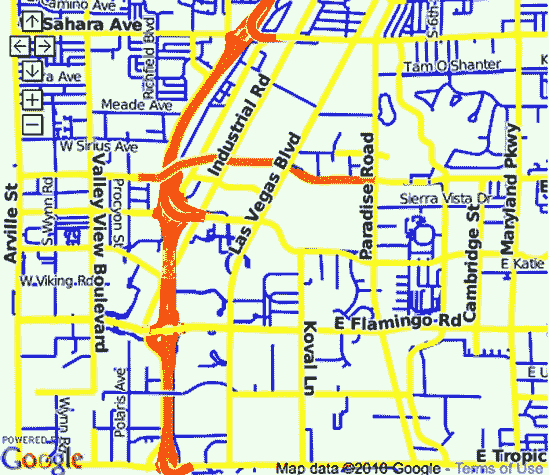

图 4-25. 大路和鲜艳的色彩风格化的拉斯维加斯地图

在您的虚拟服务器启动并 Tile Drawer 完成其工作后稍作等待，您新设计的拉斯维加斯瓷砖应该就绪了。更新您用于创建瓦片层的 Mapstraction 文件中服务器的地址。加载它，您应该会看到从您的新地图中跳出的明亮的拉斯维加斯道路。
