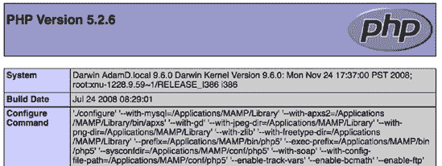
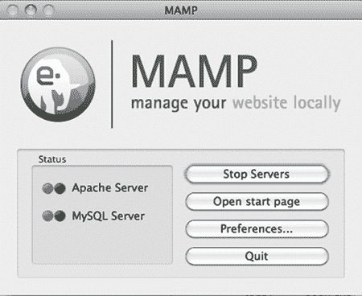
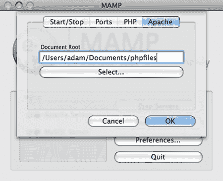
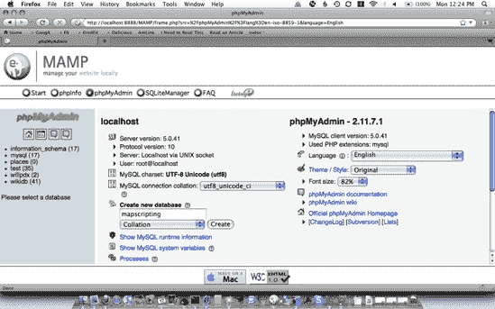
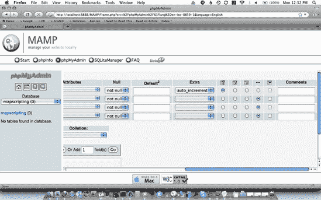
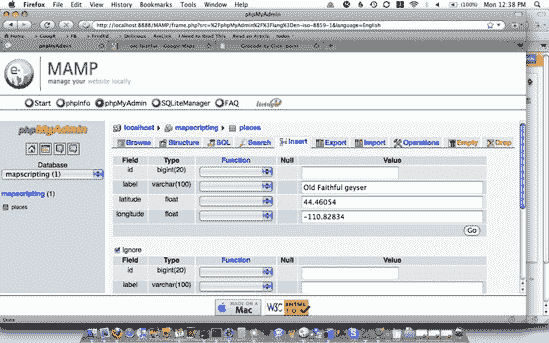
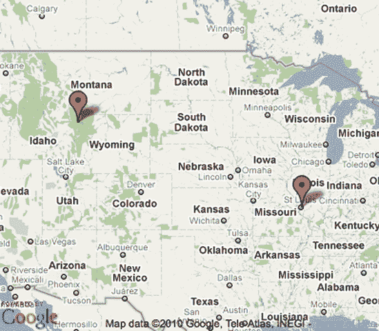

# 第九章：GO 服务器端


地图 API 之所以受欢迎，是因为它们为网页浏览器带来了许多以前对普通开发者来说更难实现的功能。然而，仍然存在许多情况，你的应用程序将从运行在浏览器外的脚本中受益。这就是你需要转向服务器端的时候。

在本章中，我们将探讨两种在服务器上运行的技术：PHP，一种主要用于输出网页的编程语言；以及 MySQL，一个用于存储文本、数字和更多内容的数据库。与众多其他可用的技术相比，我选择了这两种技术，因为它们非常普遍——几乎所有的网络主机都支持它们。它们也是由包括 Yahoo!在内的许多公司使用的稳固平台。

已经有整本书专门介绍了 PHP 和 MySQL，包括它们各自的内容。我将只提供一个非常快速的基础知识，以帮助你入门。然后我们将深入探讨每个如何帮助你制作更好的地图，包括存储位置和从数据库中查找最近的位置。

# #59：安装 PHP

PHP 是一种极为流行的编程语言，可以轻松创建动态网页和应用。你可以在电脑上安装它进行测试，或者在服务器上安装以供全世界共享。实际上，如果你在服务器上拥有网络托管服务，PHP 可能已经安装了。

你需要将 PHP 与一个网络服务器一起使用，其中最常见的是 Apache。请求从网页浏览器发送到你的网络服务器，然后服务器会查看请求的页面是否使用了 PHP。如果是，那么页面就会被发送到 PHP 进行处理。

接下来，我将展示几种安装 PHP 或确定其是否已安装的方法。只有在你需要安装 Apache 的情况下，你才需要担心安装 Apache。继续阅读，我们将帮助你快速掌握 PHP。

## 检查你的网络主机是否安装了 PHP

如果你已经拥有网络托管服务，那么你几乎肯定已经安装了 PHP。最简单的方法是创建一个简单的 PHP 文件，然后尝试用网页浏览器访问它。

你会希望将这个新文件放在你已知可以访问 HTML 文件的地方。你的网站管理员（他也可以确认你是否能够访问 PHP）可以指给你你的公共目录，其中存储着网页。

在你的网络目录中创建一个新的 PHP 文件，并添加以下几行：

```
<?php
  print phpinfo();
?>
```

很简单。给文件起一个以*.php*结尾的名字（我创意性地选择了*test.php*），然后从你的网页浏览器中，访问其公共网络地址。例如，我可能会访问*mapscripting.com/test.php*。

如果您在加载该文件时看到自己的代码，那么您可能没有安装 PHP。您需要要求管理员安装它或找到另一种使用 PHP 的方法。然而，如果您看到一个像 图 9-1 中所示的信息页面，那么您就会知道 PHP 已安装。完成操作后，请记住从您的服务器上删除该文件。



图 9-1. 我本地机器输出的 PHP 信息

如果您是 PHP 新手，您可能想跳到 第六十部分：快速 PHP 介绍，在 自行安装 PHP 中。否则，您需要检查是否已安装 MySQL（参见 第六十二部分：安装 MySQL，在 在其他脚本中包含您的函数），或者将 PHP 连接到 MySQL（参见 第六十五部分：从 PHP 使用 MySQL，在 第六十五部分：从 PHP 使用 MySQL）。

## 使用 PHP 的打包安装

在您自己的计算机上安装 PHP 的最简单方法是下载适用于您操作系统的包。这种方法的好处是您还将同时获得 Apache 和 MySQL，这很有用。

这些包的名称是根据流行的服务器架构 *LAMP* 命名的，它代表 *L*inux, *A*pache, *M*ySQL, 和 *P*HP*：

+   Windows (WAMP): [`www.wampserver.com/`](http://www.wampserver.com/)

+   Macintosh (MAMP): [`www.mamp.info/`](http://www.mamp.info/)

这两个包中的任何一个都应该可以在您的计算机上安装，而无需从您那里获取太多信息（尽管您可能需要输入管理员密码）。

安装过程完成后，打开 WAMP/MAMP。程序应该打开两个窗口。首先，它将打开一个小的状态仪表板，如图 图 9-2 所示。其次，应用程序还将创建一个新的指向 *localhost*（您计算机上的服务器名称）的网页浏览器窗口。默认情况下，您将看到一个欢迎屏幕。



图 9-2. MAMP 控制台

您可能希望更改 WAMP/MAMP 查找文件所使用的目录。为此，请单击 **首选项** 按钮，这将打开一个带有更多选项的新面板。单击 Apache（Web 服务器）选项卡，然后选择一个新的文档根目录，如图 图 9-3 所示。



图 9-3. 更改 MAMP 文档根目录。

## 自行安装 PHP

如果你使用的是一个没有提供软件包的操作系统，你需要自己安装 PHP。由于存在太多的变体，本章中无法描述，但互联网上有许多教程可以帮助你。

PHP 网站是开始的地方：[`php.org/`](http://php.org/)。

# #60: PHP 快速入门

有些非常厚的书籍——比这本书厚得多——专门用于教你如何用 PHP 编程。这个项目将提供必要的推动力，以便你在一些地图项目中使用 PHP。然而，它不会使你成为大师。

在接下来的章节中，你将学习关于结构化 PHP 代码的非常基础的知识。我还会向你展示如何使用条件语句，通常称为 *if 语句*。接下来，你将学习如何处理数组，然后使用循环。最后，我将展示如何创建你自己的函数以减少需要编写的 PHP 代码量。

## 精细之处

PHP 代码通常被添加到以 *.php* 扩展名结尾的文件中。当程序运行完成后，输出通常是 HTML（尽管它也可以是 XML、JSON 或任何可以通过 HTTP 传输的文本）。因此，PHP 可以与纯 HTML 混合使用。

代码中的 PHP 部分被特殊的 *双字符块* `<?php` 和 `?>` 包围。例如，尝试以下一小段代码，它结合了 PHP 和 HTML：

```
<html>
<body>
<?php
  print "This text comes from PHP!";
?>
</body>
</html>
```

这段代码是缩略的 HTML。但从中，你应该能够了解 PHP 的工作原理。并且代码将加载到浏览器中，并简单地显示引号内的文本，这是由 PHP 的 `print` 函数输出的。注意分号——大多数 PHP 行都以分号结束。然而，存在例外；如果你在一行中写一个命令，那么它很可能需要在末尾加上 `;`。

变量存储可以更改或稍后访问的值。它们可以存储数字、文本等，并且通常有一个描述性的名称，总是以美元符号开头。例如，`$mynum` 可以是一个用于存储单个数字的变量。

这里有一些与之前代码类似的代码，但包含了一些变量：

```
<html>
  <body>
  <?php
❶   $msg = "This is text";
❷   $mynum = 5 + 1;
❸   $msg = $msg . " and a number: " . $mynum;
    print $msg;
  ?>
  </body>
  </html>
```

当你运行这个示例时，它会生成以下输出：

```
This is text and a number: 6
```

代码从一个文本变量 ❶ 开始，通常称为 *字符串*。这个变量开始了一行，最终将成为代码的输出。接下来，你创建一个数字变量 ❷。我本可以直接将这个变量设置为 6，但我想要展示如何将两个数字相加。

在输出消息之前的最后一行 ❸ 中，我将字符串设置为等于自身，然后将其与更多文本连接起来，最后将数字附加到末尾。请注意，为了连接字符串，你使用点号，但为了连接数字，使用加号。

如果我们将第 ❷ 行中的加号替换为点号，则消息末尾输出的数字将是 `51`（5 后跟 1，而不是数字 5 加上数字 1）。如果我们替换第 ❸ 行中的第一个点号为加号，整个消息将是 `06`，因为文本的数字表示是零。

使用正确的操作符来组合数字和文本非常重要，因为所使用的操作符可以极大地改变你的输出。

## 获取输入

你可以通过两种方式从用户那里获取输入：从 URL 本身或通过表单。无论你选择哪种可能性，在 PHP 中访问这些数据的方法都非常相似。

如果输入是通过 URL 传递的，你会看到类似这样的内容：

```
yourfile.php?msg=Hello+there&num=42
```

要获取这些信息，你需要使用一个特殊的 PHP 变量，称为 `$_GET`。`$_GET` 是一个关联数组，它是一组通过方括号语法访问的键值对。通常，你希望从这个数组中取出值并将其放入一个新的变量中。

例如，以下是一些用于访问两个输入的 PHP 代码：

```
<html>
  <body>
  <?php
    if ($_GET["msg"] != "" && $_GET["num"] != "") {
❶     $msg = $_GET["msg"];
❷     $mynum = $_GET["num"];
❸     print "Your message is " . $msg . " and your number is " . $mynum;
    }
  ?>
  </body>
  </html>
```

这里是这个 PHP 程序的输出：

```
Your message is Hello there and your number is 42
```

为了获取消息❶，我把在 URL 中使用的键（即 **`msg`**`=Hello+there`）放在 `$_GET` 变量后面的方括号内。

### 注意

变量的名称不需要与 URL 中使用的名称匹配，尽管它们可以。

现在，我想获取数字，这是 URL 中的 `num=42` 部分。我使用与之前代码❷相同的方法，即使这是一个数字。最后，我打印出这两个新变量以及一些描述性文本❸。注意输出部分使用的点用于连接。

从表单中检索数据与从 URL 中检索数据非常相似。你使用变量 `$_POST` 而不是 `$_GET`。唯一棘手的部分是表单必须使用 HTML 中的 `action` 属性发送到这个页面。

## 如果这是真的，那么就做那件事

你的 PHP 程序需要做出决定。因为它们不能自己做出决定，你需要告诉它们如何决定要做什么。你这样做是通过使用一个 *条件*——或者 *if* 语句。

我们将基于之前的例子，其中我们在 URL 中接收输入，但我们将只使用数字部分。我们想查看这个数字，如果这个数字是两位数（10 或更大），则提供不同的输出。

我们的 URL 将看起来像这样：*yourfile.php?num=42*。

以下是包括我们两个条件的代码：

```
<html>
  <body>
  <?php
❶   $mynum = $_GET["num"];
    if (is_numeric($mynum)) {
❷   if ($mynum < 10) {
      print "Your number is less than 10!";
    }
❸   else {
      print "You have double digits!";
    }
    }
  ?>
  </body>
  </html>
```

首先，我们获取通过 URL 传递的数字❶。这个数字存储在一个变量中，现在可以在程序的其余部分中使用。我们使用这个变量来创建一个 `if` 语句❷，该语句检查数字是否小于 10。如果是，则输出相应的消息。

注意在 `if` 语句之后的花括号 `{` 和 `}`。这些花括号包含了当 `if` 语句为真时运行的代码。否则，将运行 `else` 后花括号中的所有代码。你可以有一个没有 `else` 的 `if`，但在这个例子中，我们想在两种情况下都做些事情，而不仅仅是其中一种。

表 9-1. 比较操作符

| 操作符 | 描述 | 使用情况 |
| --- | --- | --- |
| == | 等于 | 数字或文本 |
| != | 不等于 | 数字或文本 |
| > | 大于 | 主要用于数字 |
| < | 小于 | 主要用于数字 |
| >= | 大于等于 | 主要用于数字 |
| <= | 小于等于 | 主要用于数字 |

比较变量时，有六个运算符，如表 9-1 所示，可以使用这些运算符。运算符主要用于比较数字，但也可以用于比较文本。

## 数组真多

到目前为止，我已经展示了两种类型的变量：文本和数字。本节还将介绍两种其他常见类型。

第一种是*数组*。数组是一个包含许多其他变量的单个变量，因此你不必单独命名它们。简单的数组通过索引跟踪它持有的值，索引从零开始计数。你可以这样声明一个数组：

```
$beatles = array("John", "Paul", "George", "Ringo");
```

在这个例子中，我使用了文本。数组也可以包含数字，或者数字和文本的组合。它还可以包含其他数组和对象，但让我们现在保持简单。注意`array`函数可以接受任意数量的值，用逗号分隔。

这里是打印乔治（第三个选项）的代码行：

```
print $beatles[2];
```

注意索引是 2，而不是 3。这是因为索引从 0 开始。访问值时，索引位于方括号`[`和`]`内。

我还想向你展示另一种类型的数组，称为*关联数组*。它不是使用索引来跟踪数组内的值，而是使用文本键。

例如，你可以通过以下方式使用关联数组访问 George：

```
print $beatles["guitarist"];
```

我们仍然使用方括号表示法，但不是使用我们的索引，而是使用我们的文本键。以下是关联数组可能声明的示例：

```
$beatles = array("singer" => "John", "bassist" => "Paul",
                 "guitarist" => "George", "drummer" => "Ringo");
```

与标准数组一样，项目在`array`函数内部通过逗号分隔。然而，在这种情况下，使用`key => value`对来声明如何访问数组中的每个项目。

在下一节中，我将展示如何遍历数组值。

## 感觉到循环了

如果你想多次执行相同的事情，你可以通过使用循环结构来实现。本节将包括 PHP 中的`for`和`foreach`循环。我们将遍历数组中的每个值并输出其内容。

考虑这个简单的数组：

```
$bandmates = array("Simon", "Garfunkel");
```

现在让我们遍历它并打印出每个名称：

```
$upperBound = count($bandmates) - 1;
  for ($idx = 0; $idx <= ❶$upperBound; ❷$idx++) {
❸   print $bandmates[$idx];
❹   if ($idx < $upperBound) {
      print " and ";
    }
  }
```

当你运行此代码时，它将打印出乐队的名称：

```
Simon and Garfunkel
```

我们通过创建一个索引变量，从零开始，来完成这个操作。程序会遍历循环，直到那个索引变量不再小于数组中的项目总数 ❶。递增运算符`++`用于每次将索引增加 1 ❷。

打印名称仅意味着访问数组变量中的当前索引 ❸。然后，它还打印一些文本在名称之间，但只有当索引小于总数减一 ❹时。因为总数是 2，这只会发生在第一次遍历循环时，当零小于一。

如果你将你的姓氏作为`$bandmates`变量的第三个项目并再次运行代码，你会看到另一个`and`被加入（并且你将自己在乐队中）。

让我们使用另一个循环来遍历一个关联数组。我们将保持相同的乐队，但将注意力集中在他们的头发上。它是直的还是卷的？考虑这个关联数组：

```
$bandhair = array("straight" => "Simon", "curly" => "Garfunkel");
```

现在让我们遍历这个数组，分享我们关于他们头发的知识：

```
foreach ($bandhair as $description => $name) {
  print $name . " has " . $description . " hair. ";
}
```

最后，这是输出：

```
Simon has straight hair. Garfunkel has curly hair.
```

在这种情况下，我们正在访问关联数组中每个元素的键和值。然后，在每一步，我们都会打印出它们。

## 获得功能

在 PHP 中创建自己的函数可以节省你输入的时间。你还会发现这是一种良好的实践。创建 PHP 函数的方式与 JavaScript 非常相似，所以你可能比你想象的更接近能够使用自己的函数。

对于这个例子，我们将创建一个函数，它接受一个数字作为输入，并返回该数字的四倍。这个函数可能不是特别有用，但它足够简单，可以用来教授如何在 PHP 中工作函数。

在你的 PHP 括号`<?php`和`?>`中，包含以下代码：

```
function quadruple(❶$somenum) {
❷   $newnum = $somenum * 4;
❸   return $newnum;
  }
```

就像我说的，一个简单的函数：它包含一个名称，并且传递一个单一变量 ❶。这个变量仅限于这个函数内部，意味着它不必在其他地方存在。你可以给变量取任何你想要的名称。

然后，我创建了另一个变量 ❷ 来保存四倍后的值。这个变量也是局部的，所以我们只是在函数内部使用它。请注意，乘法运算符是星号。有了我们新的值，我们需要将其传递回 ❸ 调用我们新`quadruple`函数的任何代码行。

现在让我们调用我们的函数。为了展示这个函数有多有用，我们将使用数组和循环在连续的几个数字上调用它。创建一个新的 PHP 文件，并包含以下代码：

```
<html>
  <body>
  <?php
    $allnums = array(4, 18, 21);
    foreach ($allnums as ❶$thisnum) {
❷   $quadnum = quadruple($thisnum);
    print $thisnum . " quadrupled is " . $quadnum . "! ";
  }

  function quadruple($somenum) {
    $newnum = $somenum * 4;
    return $newnum;
  }
  ?>
  </body>
  </html>
```

在这里，我使用了一个`foreach`循环在一个常规的非关联数组上。为了做到这一点，我简单地使用一个值 ❶ 而不是键值对。然后，对于数组中的每个项目，我使用新函数将数字乘以四 ❷。

一切结束后，这里是输出：

```
4 quadrupled is 16! 18 quadrupled is 72! 21 quadrupled is 84!
```

有了这些，你就知道了 PHP 的基础知识。你已经将它与 HTML 结合使用。你学习了多种类型的变量：数字、文本、数组和关联数组。你可以使用条件语句让你的代码思考，并且可以使用循环和函数来保持你的代码小且可重用。

要了解如何抓取网页或将 PHP 连接到 Web 服务，请继续下一节。若要将 PHP 连接到数据库，你将需要查看 #65：从 PHP 中使用 MySQL。

# #61：检索网页

使用像 PHP 这样的服务器端语言的最常见原因之一是能够调用 Web 服务。一些服务提供的结果可以直接用 JavaScript 读取到浏览器中。然而，将这些调用放在服务器端给你更多的自由来使用或存储结果。

调用一个网络服务就像加载一个网页一样。你向服务器传递一个 URL，然后它以代码的形式响应（网页通常是 HTML，网络服务通常是 XML）。在 PHP 中，代码被放入一个字符串变量中，它包含一大堆文本。从那里，你可以对网页做任何你想做的事情——打印出来，分割它，解析成数据，存储起来。但首先，让我们先专注于*获取*网页。

PHP 5 附带一个名为 *cUrl* 的标准库。这个库全部关于建立网络连接。在 PHP 的早期版本中，你可能使用 `file` 函数来做这件事，它有点像用胶带粘上去的。切换到 cUrl——它是为抓取 URL 而设计的。

当然，`file` 函数非常简单。只需一行代码，你就有网页的内容了。正如你将看到的，cUrl 稍微复杂一些。然而，让我们创建自己的函数，这样我们就可以在许多地方重用它（正如我在这本书中多次做的那样）。然后我们将拥有 `file` 的便利性和 cUrl 的强大功能。

在一个空的 PHP 文件中，添加以下代码：

```
<?php
  // Additional code may go here

  // cUrl function
  function get_url(❶$url) {
❷   $c = curl_init();
❸   curl_setopt($c, CURLOPT_URL, $url);
❹   curl_setopt($c, CURLOPT_RETURNTRANSFER, 1);
    $content = trim(❺curl_exec($c));
❻   curl_close($c);
❼   return $content;
  }
  ?>
```

我命名的 `get_url` 函数有一个参数，即 URL ❶。这个输入是它完成工作所需的内容，即抓取一个网页。一旦进入函数内部，我们需要初始化一个 cUrl 对象 ❷，这样我们就可以开始使用它了。

现在，让我们通过设置选项来告诉 cUrl 我们需要什么。首先，我们告诉它我们想要获取的 URL ❸。然后我们解释我们想要获取 URL 发送的内容 ❹。有些人使用 cUrl 仅发送信息，在这种情况下，他们不关心回复。我们则不同。

注意，每次我们设置选项时，我们都传递了当初始化 cUrl 时创建的 `$c` 变量。这个变量很重要，因为它跟踪我们设置的选项和 cUrl 会话的状态。

设置好选项后，我们通过一个普通变量存储的内容调用 URL ❺。首先，我们运行它通过 `trim` 函数，以移除文件开头和结尾的任何空格或换行符。否则，我们会得到与网络浏览器得到的确切数据相同的数据。

现在，我们将清理我们的混乱，所以告诉 cUrl 我们已经完成 ❻。然后最重要的部分：我们从这个函数返回内容 ❼。这就是我们如何将网页的结果从函数中提取出来，并放入我们声明的任何变量中。

让我们来测试我们的新功能。在“`Additional code may go here`”行下面，让我们添加这一行，它将抓取书籍网站的首页：

```
$htmlcode = get_url("http://mapscripting.com");
print $htmlcode;
```

如果你将 PHP 文件加载到浏览器中，你应该会看到一个网页。这个网页来自你的新函数！在另一个浏览器窗口中打开 [`mapscripting.com/`](http://mapscripting.com/)，你会看到几乎相同的内容，尽管你的副本中可能缺少样式和图像——这是因为你只加载了 HTML。

使用 PHP 显示本书网站简化版的大惊小怪吗？这并不是什么大惊小怪的事情；这只是一个概念验证。真正精彩的部分出现在您从网络服务下载 XML 时。我在#52: 使用 XML 中展示了更多关于它是如何工作的。

## 在其他脚本中包含您的函数

使您的`get_url`函数在其他您编写的 PHP 脚本中可访问的一种方法是在每次需要时复制并粘贴它。当然，每次都剪切和粘贴是件麻烦事，如果您更改了函数，还很难保持更新；您必须更改您粘贴它的所有地方。

相反，创建一个可以从其他脚本中调用的包含文件。将之前的代码（不包括我们用来测试函数的两行）放入一个新文件中。我将其命名为*net_func.inc.php*，因为我可能将来会添加更多与网络相关的函数。我给文件添加了非*.php*扩展名，因为我不想让它被误认为是可以直接显示给 Web 浏览器的文件。

现在开始创建一个新的 PHP 文件，这样您就可以测试包含您的新函数文件：

```
<?php
include("net_func.inc.php");
$htmlcode = get_url("http://mapscripting.com");
print $htmlcode;
?>
```

这个测试的结果应该与之前的测试相同。但现在`get_url`函数的代码与调用它的代码是分开的，这将使我们能够轻松地在许多地方使用它。

# #62: 安装 MySQL

MySQL 是一个流行的数据库平台，可在大多数操作系统上使用。您可以在自己的计算机上安装它，也可以在 Web 服务器上运行它，这意味着将其用作应用程序的数据源很容易。

对于初学者来说，一个*数据库*包含一个或多个用于存储数据的表。在非常粗略的层面上，您可以将数据库想象成一个电子表格，就像 Microsoft Excel 文件一样，可以部分或全部访问，并过滤出您关心的内容。您没有工作表，而是有表格。工作表中的每一行都是一个新的*数据库记录*。大多数工作表顶部的列是*数据库字段*——它们描述了放入该列的数据。实际上，当人们谈论数据库时，他们经常谈论行和列。

MySQL 中的 SQL 部分代表*结构化查询语言*，是与数据库服务器通信的语法。MySQL 和许多其他数据库服务器使用一组标准的语句（称为 SQL-92），尽管每个都有其自己的方言。

当 MySQL 与其他技术结合使用时，你会发现它非常有用。本章中的示例使用 PHP 作为编程语言，Apache 作为 Web 服务器。然而，继续阅读以获取关于单独使用 MySQL 的详细信息。

## 检查您的 Web 主机是否支持 MySQL

如果您有网络托管服务，您可能已经安装了 MySQL。您需要检查您的控制面板或与您的管理员确认 MySQL 是否可用以及是否已为您设置好账户。询问以下两种常见的使用 MySQL 的方法之一：

| **phpMyAdmin** 一个用于访问 MySQL 的网页仪表板。正如其名所示，PHP 也必须安装。使用此方法，您可以通过视觉的点击方式创建数据库表并查看数据，这是初学者通常更喜欢的。 |
| --- |
| **命令解释器** 一个命令行实用程序，允许您从文本界面访问 MySQL。创建数据库表和其他所有操作都通过键入命令完成。 |

本章中的所有示例都将使用这两种方法展示。在某些情况下，差异很小，因为您还需要在 phpMyAdmin 中输入命令。

如果 MySQL 已安装，您就可以继续到 #63: 将位置存储到数据库中，在 自行安装 MySQL 中。

## 使用 MySQL 的软件包安装

要在您的计算机上安装 MySQL，最简单的方法是下载适用于您操作系统的现成软件包。如果您选择此路径，您还将同时获得 PHP 和 Apache，这对您来说很有用。

软件包的名称是根据流行的服务器架构 LAMP 命名的，它代表 L*inux*、A*pache*、M*ySQL* 和 P*HP*：

+   Windows (WAMP): [`www.wampserver.com/`](http://www.wampserver.com/)

+   Macintosh (MAMP): [`www.mamp.info/`](http://www.mamp.info/)

这两种软件包都应该可以在您的计算机上安装，而无需您提供太多信息（尽管您可能需要输入管理员密码）。

安装过程完成后，请打开 WAMP/MAMP。程序应创建一个新的指向 *localhost* 的网页浏览器窗口，这是您计算机上服务器的名称。默认情况下，会出现一个欢迎屏幕，如图 图 9-4 所示。


图 9-4. MAMP 欢迎屏幕

要管理您的 MySQL 安装，请点击 **phpMyAdmin** 链接。现在您已准备好进行下一个项目。

## 自行安装 MySQL

如果您使用的操作系统没有可用的软件包，您将需要自行安装 MySQL。由于存在太多变体，本章无法一一描述，但互联网上有许多教程可以帮助您。

MySQL 网站是您开始的地方：[`mysql.org/`](http://mysql.org/)。

当您开始运行时，继续阅读地理特定的说明。

# #63: 将位置存储到数据库中

为了构建极其强大的映射应用程序，您将想要使用数据库。通过维护自己的数据，您的网站将更快，您可以做更多有趣的事情。首先，您需要创建数据库并向其中添加一些位置。本节将描述如何开始使用 MySQL 位置数据库。

在这一点上，我们需要明确我们的术语。实际上，存在于数据库中的数据实际上位于数据库的*表*中。在您创建表之前，您需要有一个数据库。MySQL 是一个数据库管理系统，它可以包含许多单独的数据库，而这些数据库本身又包含许多表。

## 创建新数据库

如果您通过托管提供商使用 MySQL，您可能已经有一个数据库分配给您。即使您的数据库中已经包含其他表（例如，用于博客软件），您仍然可以使用它来完成这个项目。我们只是会创建一个额外的数据库表。

如果您没有数据库，在 phpMyAdmin 中创建一个很简单。从主屏幕上，只需在表单中输入您数据库的名称（我选择了*mapscripting*）并点击**创建**按钮（见图 9-5）。或者，使用 MySQL 命令解释器，输入**`create database("mapscripting");`**。



图 9-5。创建新的数据库。

一旦完成，您需要选择数据库名称，通过点击它或在解释器中输入**`\u mapscripting`**来选择。现在您已经准备好创建数据库表了。

## 创建数据库表

现在您已经有了数据库，您可以开始添加表了。为了简化示例，我们只会添加一个表。

要在 phpMyAdmin 中创建新表，您需要在数据库主页面上的表单中填写信息。您需要为表指定一个名称并选择字段数量。我称我的表为*places*，它将包含四个字段，这些字段是每个地点都将包含的值类型。点击**Go**按钮以进一步定义表。

正如您在图 9-6 中看到的，我们需要为每个字段命名并指定其类型。我要添加到我们基本地点表中的四个字段是 *id*（唯一标识符）、*label*（地点的名称）、*latitude*和*longitude*。


图 9-6。创建具有四个字段的表。

对于任何数据库表来说，标识符都是一个好主意，因为它使得区分一块数据与另一块数据变得容易。我已经将标识符设置为*bigint*，这意味着它是一个可以变得非常大的整数（高达 9 千万亿——即 18 个零）。然而，我们不想自己计数，因此我们需要确保 MySQL 为我们完成这项工作。

在 phpMyAdmin 的右侧查看（可能需要水平滚动），你会找到“额外”列。选择`id`行的下拉菜单并选择**auto_increment**。然后，也点击直接位于其右侧的选项，图标看起来像一把钥匙。参见图 9-7 的示例。选择此选项将使标识成为主键。这两个步骤对于 MySQL 为您进行计数是必要的。

剩余的字段相当简单。标签是对地点的简短（100 个字符）描述，然后位置以两个浮点数（小数）形式存储：纬度和经度，现在无疑对你来说已经很熟悉了。

点击**保存**按钮，你就创建了一个表。要在命令解释器（或使用 phpMyAdmin 的 SQL 窗口）中做同样的事情，请输入以下内容：

```
CREATE TABLE places (id BIGINT NOT NULL AUTO_INCREMENT PRIMARY KEY,
                     label VARCHAR(100), latitude FLOAT, longitude FLOAT);
```

现在你已经有一个表了，让我们开始向其中添加数据。



图 9-7. 使标识字段自动递增。

## 向你的地点表添加数据

你的地点表，包含其四个字段，现在快乐地坐在你的数据库中，但你有一个问题。表是空的。它没有任何数据。让我们添加一些。

在 phpMyAdmin 中，点击表名然后点击“插入”标签。你应该会看到另一个表单（如图图 9-8 所示），包含四个字段。这次，你将输入值而不是名称，因为名称已经列出。

留空`id`值很重要。MySQL 将创建该值，因为它在为我们计数（自动递增）。在其他框中，输入一个描述性名称，然后是纬度和经度。然后点击**Go**。

你不必通过 phpMyAdmin 添加数据。你也可以使用纯 SQL（例如在命令解释器中）。要将老忠实泉添加到`places`表，请输入以下内容：

```
insert into places (label, latitude, longitude)
            values ('Old Faithful geyser', 44.46054, −110.82834);
```

注意，我没有在这里包含`id`。我想让 MySQL 处理它。其他三个字段首先按名称列出，然后按我想要添加到它们的值列出。

执行这些任务后，你已向你的地点数据库表添加了一个位置。添加几个更多，改变标签、纬度和经度。现在你有一个正在兴起的位置数据库了。在 phpMyAdmin 中点击“浏览”标签查看你的地点，或者在命令解释器中输入以下 SQL：**`select * from places;`**。



图 9-8. 在你的地点表中输入值。

现在你可以对位置数据库做一些有趣的事情，比如从数据库中绘制位置或获取数据库中的最近位置。

# #64: 从电子表格导入数据

如果你决定将你的位置数据导入数据库（我希望你是），你将想要一种使其变得简单的方法。填写表格或手动编写 SQL 插入语句是乏味的。在本节中，我将展示如何使用电子表格，将其转换为 CSV 格式，然后直接导入 MySQL。

之前我把数据库表比作电子表格。两者都有列，在数据库中这些列也被称为字段名。两者都有行，我们称之为数据库记录。为数据库准备大量数据的最简单方法是使用电子表格，例如 Excel 或 OpenOffice Calc。像平常一样在你的电子表格上工作。图 9-9 展示了我在上一个项目中创建的位置数据库作为电子表格可能的样子。

确保你有几行填写完毕，然后保存电子表格的副本。不要保存为常规的电子表格格式，而是滚动到你的文件类型列表，并选择**逗号分隔的，.csv**。这种格式是存储数据的一个简单、通用的格式。

我给我的文件命名为*places.csv*，当我在纯文本编辑器中打开它时，它看起来是这样的：

```
"label","latitude","longitude"
"Old Faithful geyser",44.46054,-110.82834
"St. Louis Arch",38.62470,-90.18510
```


图 9-9. 数据库表类似于电子表格。

现在，你已经准备好导入数据库表的这种逗号分隔值（CSV）版本了。在 phpMyAdmin 中，导航到位置表并点击导入标签。首先，你需要选择要导入的文件，所以点击**浏览**按钮并选择你的 CSV 文件。如果你的文件有一个标题行，就像我的那样，确保填写表格以跳过一条记录，因为你不想将字段名作为值导入。

滚动到文件导入部分。它可能设置为 SQL，因为 MySQL 主要期望通过这种方式读取文件。选择**CSV**，然后填写如图图 9-10 所示选项。字段由逗号分隔；字段由双引号字符包围；字段由反斜杠转义。你可以让行终止符自动确定。


图 9-10. 将逗号分隔的文件导入 MySQL。

最后一个选项是导入的字段列表。如果你正在导入表中的所有字段，你可能不需要输入这些。然而，我们有一个自动生成的标识符，因此我们需要指定我们正在导入的列，除了`id`列之外的所有列。

点击**Go**按钮，你的数据应该会被导入。为了检查，点击浏览标签，它将显示位置表当前的内容。

你也可以使用命令解释器导入：

```
LOAD DATA LOCAL INFILE 'places.csv' INTO TABLE places
FIELDS TERMINATED BY ',' ENCLOSED BY '"' LINES TERMINATED BY '\n'
IGNORE 1 LINES (label, latitude, longitude);
```

CSV 文件需要可供运行 MySQL 的机器访问。如果您在服务器上使用解释器，您需要将文件上传到服务器。

当您有不止几个记录时，使用电子表格来创建数据是最简单的方法。此外，您可能会发现许多其他数据也以这种格式提供，因此了解如何从 CSV 导入可以帮助您使用他人的数据。

# #65：从 PHP 使用 MySQL

许多编程语言都有连接到 MySQL 的方法。PHP 在其默认安装中包含了多个函数，这使得 PHP 和 MySQL 成为一对流行的组合。在本节中，我将向您介绍从 PHP 访问 MySQL 数据库的最常用函数。

以下示例假设您有一个位置数据库表，就像我们在 第六十三部分：将位置存储到数据库 中创建的那样，在 自行安装 MySQL 中，并且至少已经将一个位置添加到数据库中。一旦您的表准备就绪，让我们编写一些 PHP 代码来获取所有位置描述。

创建一个包含以下内容的新的 PHP 文件：

```
<?php
❶ $db = `mysql_connect`('localhost', 'username', 'password');
❷ `mysql_select_db`('mapscripting', $db);
  $sql = "select label from places";
❸ $res = `mysql_query`($sql, $db);
  while (❹$row = `mysql_fetch_assoc`($res)) {
    print ❺$row["label"];
  }
❻ `mysql_close`($db);
  ?>
```

以 `mysql_` 开头的所有内容（粗体显示）都是与从 PHP 访问 MySQL 相关的函数。更多函数可以在 [`php.net/mysql`](http://php.net/mysql) 找到。

在此示例中，您首先使用服务器、用户名和密码连接到 MySQL❶，这些信息很可能由您的网站管理员提供。如果您使用 MAMP，您可以在安装的起始页面上找到登录信息。这些值建立了与 MySQL 的连接，并确保不是任何人都可以访问您的数据。

由于 MySQL 可以有多个不同的数据库，我们需要告诉它使用哪一个❷。在这里，我选择了之前创建的 mapscripting 数据库。我还传递了上一行的数据库连接变量。

现在我们已经准备好从数据库中获取一些数据了。我们使用 SQL 来完成这项任务，这与在 phpMyAdmin 的浏览标签页背后发生的情况类似。当使用 PHP 与 MySQL 结合时，您需要自己编写 SQL 语句，我已经将这些语句放入了变量 `$sql` 中，并将其与数据库连接变量一起传递给查询❸。

您可以通过多种方式从查询中获取数据，所有这些方式都使用上一行返回的对象。在此示例中，我们使用 `while` 循环逐个查看每个结果。每当 `$row` 变量不再有值时，`while` 循环就会结束。

每个结果的价值是一个关联数组❹，因此结果以键值对的形式存储。表的字段名是键，因此我们将它放在方括号中以获取值❺。最后，我们关闭与数据库的连接❻，这样可以释放资源。

当你运行这段 PHP 代码时，你应该会看到你添加的每个地点的描述依次打印出来，没有特定的格式。输出可能看起来不太美观，但你现在已经从 PHP 中建立了一个非常简单的与 MySQL 数据库的连接。更好的是，现在你可以将任何数据连接到网络上。你感觉强大了吗？你应该会的。

继续阅读，以在位置数据库中的数据上做一些更有用的操作。

# #66：从数据库绘制位置

这个项目正是你一直在等待的。你耐心地投入时间学习 MySQL 和 PHP 的基础知识。你真正想要的只是将一些点放在地图上，而不需要手动编码。一旦你掌握了这个项目中的技能，你的地图项目将会更加强大，因为它们将由数据驱动。

信不信由你，你已经拥有了从数据库中绘制位置所需的知识。我们将使用结合了 #65：在 PHP 中使用 MySQL 和数据格式项目中的解析部分，即 #53：使用 JSON 的概念，后者让 JavaScript 框架 jQuery 为我们工作。

这个项目分为两部分：在服务器上使用我们的数据库创建 JSON，然后在浏览器中解析 JSON。让我们按顺序来做。

## 以 JSON 格式输出所有地点

我们将使用比其他项目中写的更高级一点的 PHP。而不是在遇到每个结果时打印出来，我们将存储它。一旦我们有了所有数据，我们将使用内置的 PHP 函数将其以 JSON 格式打印出来。

每次从数据库获取数据时，考虑你需要什么。在这里，我们将要在地图上绘制我们的位置，所以至少需要每个地点的纬度和经度。如果每个地点都有描述那就更好了，因此我们也会获取标签。根据你所做的事情，你可能还希望获取唯一的`id`。

你想要多少行？在我们的例子中，让我们获取所有行。记住，如果你的表非常大，你可能会让用户下载一个相当长的文件。在这种情况下，你可能只想从数据库中获取最近的位置，但这又是另一个项目。继续前进！

创建一个新的 PHP 文件，并添加以下代码：

```
<?php
  $db = mysql_connect('localhost', 'username', 'password');
  mysql_select_db('mapscripting', $db);
❶ $sql = "select label, latitude, longitude from places";
  $res = mysql_query($sql, $db);
❷ $allrows = array();
  while ($row = mysql_fetch_assoc($res)) {
❸   array_push($allrows, $row);
  }
  mysql_close($db);
❹ print json_encode($allrows);
  ?>
```

我们从连接细节开始，然后直接进入 SQL ❶。我已经列出了我们想要从数据库中获取的三个字段名。在遍历结果之前，我创建了一个空数组 ❷。我们将使用这个数组来存储所有结果。

当我们遍历数据库返回的每一行时，我们使用 PHP 函数将结果“推”到我们的数组末尾❸。你可能记得，数据库中的每个结果本身就是一个关联数组，值以字段名作为键存储。因此，包含所有行的数组实际上是一个数组的数组。可能有点令人困惑，但它非常适合 JSON。

在所有结果都存储在我们的巨大数组中之后，我们将变量转换为 JSON 文本并打印出来。如果我们有 JSON 扩展（包含在所有最新的 PHP 安装中），我们可以在一行中完成所有这些操作❹。

这是我的数据库的 JSON 输出，它有两行：

```
[
  {"label":"Old Faithful geyser","latitude":"44.4605","longitude":"-110.828"},
  {"label":"St. Louis Arch","latitude":"38.6247","longitude":"-90.1851"}
]
```

很可能你的结果都会挤在一起成为一行，但我已经将它们拆分，以便更容易理解。当我们将其解析到 JavaScript 中时，我们将有一个对象数组（由方括号定义），每个对象（由花括号定义）。

一旦数据被放入 JavaScript 中，我们就能在地图上绘制它。让我们开始吧。

## 从 JSON 中绘制地点

使用 PHP，我们已经将我们的位置数据库中的所有地点输出为 JSON。现在我们需要创建一个地图，该地图读取数据并为每个地点创建一个新的标记。表面上，这个地图就像我们之前创建的任何地图一样。然而，在这种情况下，我们甚至不会初始化地图，直到我们从数据库收到回复。

在我们解析 JSON 结果之前，我们需要包含 jQuery JavaScript 框架。将以下代码添加到基本 Mapstraction 地图的头部代码中：

```
<script src="http://ajax.googleapis.com/ajax/libs/jquery/1.3/jquery.min.js"></script>
```

现在用以下函数替换任何 JavaScript 代码以初始化地图：

```
var mapstraction;
    function create_map() {
❶     $.getJSON("allplaces.php", function(jobj) {
❷       mapstraction = new Mapstraction('mymap', 'google');
❸       for (var i=0; i < jobj.length; i++) {
❹         var place = jobj[i];
          var mk = new Marker(new LatLonPoint(place.latitude, place.longitude));
          mk.setInfoBubble(place.label);
          mapstraction.addMarker(mk);
        }
        mapstraction.autoCenterAndZoom();
      });
    }
```

与我们之前使用`create_map`函数的其他时候不同，我们不是先创建一个新的 Mapstraction 地图。我们将其保留到收到数据之后。相反，我们首先使用 jQuery 创建一个 Ajax 调用到我们的 PHP 文件（我将其命名为*allplaces.php*）❶。

一旦我们有了结果，*然后*我们创建地图❷，这样我们就可以开始向它添加数据。在这里，我们使用了一个`for`循环来遍历每个地点❸。然后我们可以保存这个对象❹，它有三个属性：标签、纬度和经度。这些值用于创建标记并给标记一个信息框。

最后，在`for`循环外部（所以它只发生一次），我们自动根据我们的标记来居中地图。图 9-11 显示了具有两个地标作为地点的我的地图的样子。

如果我在数据库中添加第三个地点并重新加载页面，我将有一个第三个标记。这就是数据库驱动地图的美丽之处！



图 9-11. 数据库驱动的地点地图

# #67: 从数据库获取最近的位置

在第六章中，我们探讨了几个关于附近地点的项目。我展示了如何计算两点之间的距离以及如何确定离某一点最近的标记。更有用的是我们将在本项目中所做的工作：从一个数据库中存储的许多可能性中选择离某一点最近的位置。

为了能够查看数据库中的位置，我们首先需要在数据库中有所作为。在这个例子中，我们将使用第六十三部分：将位置存储到数据库中中的 places 数据库表，来自自己安装 MySQL。尽管我们一直在使用 MySQL 作为引擎，但大多数数据库都将与以下 SQL 语句一起工作。

因为我们正在寻找离一个单独的点最近的位置，我们需要确定那个点是什么。我选择了一个位于波特兰附近的点，纬度为 45.517，经度为−122.649。现在我们将这个值代入 Haversine 公式——这是我们在第六章中用来确定距离的同一部分三角学。在那里，我们使用了 JavaScript，在这个例子中，我们将使用 SQL。

要查看数据库中的位置，我们首先需要在数据库中有所作为。在这个例子中，我们将使用第六十三部分：将位置存储到数据库中中的 places 数据库表，来自自己安装 MySQL。虽然我们一直在使用 MySQL 作为引擎，但大多数数据库都将与以下 SQL 语句一起工作。

```
SELECT *,
  `( 6371❶ * ACOS( COS( RADIANS( 45.517 ) ) * COS( RADIANS( latitude ) ) *`
  `COS( RADIANS( longitude ) - RADIANS( - 122.649 ) ) + SIN( RADIANS( 45.517 ) ) *`
  `SIN( RADIANS( latitude ) ) ) ) AS dist`
FROM places
ORDER BY dist;
```

在这里，我们选择了 places 表中的所有字段，以及一个额外的字段，由整个加粗部分描述。这是一段相当多的代码！这段代码使用每个地点存储的纬度和经度值来计算我们的点与数据库中点之间的距离。

距离，成为名为 dist 的列，单位是千米。与之前实现的 Haversine 公式相同，我们乘以地球半径，即 6,371 千米。对于英里，将数字❶替换为其英里等价物（3,958）。

当你运行 SQL 查询时，你的结果将如表 9-2 所示。因为我们按距离排序，所以离我们点最近的地点在表中排在前面。因此，离我们选定的点最近的地方是老忠实喷泉。当然，更有用的例子将来自包含许多地点且都在同一城市的地点数据库。然后，基于该城市内的一个点，你可以找到最近的地点，这些地点可能就在几英里之内。

表 9-2。SQL 中最近地点的结果

| ID | 标签 | 纬度 | 经度 | 距离 |
| --- | --- | --- | --- | --- |
| 1 | 老忠实喷泉 | 44.46 | − 110.83 | 936.12 |
| 2 | 圣路易斯 Gateway Arch | 38.62 | − 90.19 | 2765.97 |

## 提高查询性能

数据库专家会对我们在上一节中使用的 SQL 有一些大问题。你知道我们使用了哪些数学：COS 这个，RADIANS 那个？这些值正在为数据库中的每一行计算，即使值没有变化。结果是，一旦你存储了许多地点，这个查询将不会让你的服务器感到高兴。在计算机科学术语中，这个查询有*较差的性能*。

让我们通过在 SQL 变量中存储一些不会改变的价值来提高性能。这个过程与 PHP 变量类似，但语法略有不同。将上一节中的查询修改如下：

```
SET @earthRadius = 6371;
  SET @lat = 45.517;
  SET @lon = −122.649;
❶ SET @radLat = RADIANS(@lat);
  SET @radLon = RADIANS(@lon);
  SET @cosLat = COS(@radLat);
  SET @sinLat = SIN(@radLat);
  SELECT *,
    `( @earthRadius * ACOS( @cosLat * COS(RADIANS(latitude)) *`
    `COS( RADIANS(longitude) - @radLon ) + @sinLat *`
    `SIN(RADIANS(latitude)) ) ) AS dist`
  FROM places
  ORDER BY dist;
```

`SET`命令用于将值存储到变量中。变量本身以`@`符号开头。前三个变量用于存储之前直接写入查询中的数字，这使得查询的距离部分（再次强调，加粗）更容易阅读。

其他四个变量，从❶开始，也提高了可读性，并使查询大大缩短。更好的是，性能也得到了提升。存储在变量中的值只计算一次——当变量被创建时。

在查询运行过程中，仍然在进行许多计算，这将会拖慢你的服务器。像`COS(RADIANS(latitude))`这样的代码可以被避免，但前提是我们需要更改我们的数据库表。在下一节中，我将向你展示如何进一步优化你的查询性能。

## 在新列中预先计算值

你对 SQL 所做的更改在你数据库中存储了许多位置之前不会很明显。另一方面，随着存储的位置增多，应用这个查询变得更加有趣，这可能会吸引更多用户到你的网站。这绝对不是你希望服务器变慢的时候。

有些事情*必须*即时计算，否则每个位置的结果都会相同。你将为每一对纬度和经度坐标返回不同的结果。我们将专注于预先计算上一节中的这三个值：

+   `COS(RADIANS(latitude))`

+   `RADIANS(longitude)`

+   `SIN(RADIANS(latitude))`

对于数据库中存储的每个地方，这些值都会不同。然而，一旦值被设置，它们将保持不变。这正是添加三个列到你的表中的完美案例。我们将它们命名为`cosRadLat`、`radLon`和`sinRadLat`，并将它们都设置为`FLOAT`类型。

这是通过命令解释器添加这些列的 SQL 版本：

```
ALTER TABLE places ADD cosRadLat FLOAT, ADD radLon FLOAT, ADD sinRadLat FLOAT;
```

一旦你添加了这三个列，你需要为当前表中所有的地方填充值：

```
UPDATE places set
  cosRadLat = COS(RADIANS(latitude)),
  radLon = RADIANS(longitude),
  sinRadLat = SIN(RADIANS(latitude));
```

最后，现在你已经为你表中的新列添加了值，你可以使用这个优化的查询从数据库中获取最近的位置：

```
SET @earthRadius = 6371;
SET @lat = 45.517;
SET @lon = −122.649;
SET @radLat = RADIANS(@lat);
SET @radLon = RADIANS(@lon);
SET @cosLat = COS(@radLat);
SET @sinLat = SIN(@radLat);
SELECT label, latitude, longitude
  `( @earthRadius * ACOS( @cosLat * cosRadLat *`
  `COS( radLon - @radLon ) + @sinLat *`
  `sinRadLat ) ) AS dist`
FROM places
ORDER BY dist;
```

结果是一个更短、更快的查询。仍然需要即时进行一些计算，但其余的已经被预先计算并存储在地点表中的变量或列中。

唯一的其他变化是我们明确命名了要选择的字段，这是另一个数据库最佳实践。此外，现在我们添加了三个预先计算的字段，我们不想让结果变得混乱。这些数字只是为了提高速度，并不特别有用。

# #68: 获取与邮政编码最近的地点

大型企业通常在其网站上设有商店定位器。要使用它，你输入你的邮政编码，然后你会得到一个离你最近的地点列表。在这个项目中，我将向你展示如何执行 SQL 数据库调用，以便在你的网站上重现此功能。

一方面，查找与邮政编码附近的地点的代码与上一个项目相同。你只需要确定特定邮政编码的纬度和经度点，这可以从大多数地理编码服务中获得，然后你就能找到最近的地点。

当然，在你的数据库中拥有邮政编码表甚至更有用。这个过程在第十五部分：获取邮政编码坐标中描述，我在第十五部分：获取邮政编码坐标中提供了数据库源链接 [`mapscripting.com/postal-code-database`](http://mapscripting.com/postal-code-database)。安装你自己的数据库将节省一个步骤，这样你就可以在数据库的一次调用中找到 ZIP 编码的坐标及其最近的地点。

创建一个新的数据库表，我将称之为 *postals*。它将有三列：*code*、*latitude* 和 *longitude*。正如你在图 9-12 中看到的，邮政编码本身是一个五字符的字符串（*varchar*），因为这是在美国使用的，ZIP 编码是五位数字。


图 9-12. 创建 ZIP 编码表。

邮政编码以文本形式表示，以应对代码以零开头的情况。如果你将代码存储为数字，这更有效率，你需要在每次查找时考虑起始零。纬度和经度是浮点数，就像在地点数据库中一样。

这里是使用命令解释器创建此表的 SQL 版本：

```
CREATE TABLE postals(code VARCHAR(5), latitude FLOAT, longitude FLOAT);
```

现在，你可以开始向数据库添加一些邮政编码了。为了这次测试，你可以手动添加几个，使用地理编码器来确定正确的纬度和经度点。更好的长期解决方案是下载完整的邮政编码数据库，并使用第六十四部分：从电子表格导入数据。

到目前为止，你的数据库应该有两个表：*places* 和 *postals*。我们将在一个 SQL 调用中使用这两个表来确定最近的地点。

从 MySQL 命令行解释器或 phpMyAdmin 中，输入以下查询：

```
SELECT `@lat:=latitude, @lon:=longitude` FROM postals WHERE code='90210';
SET @earthRadius = 6371;
SET @radLat = RADIANS(@lat);
SET @radLon = RADIANS(@lon);
SET @cosLat = COS(@radLat);
SET @sinLat = SIN(@radLat);
SELECT label, latitude, longitude
  ( @earthRadius * ACOS( @cosLat * cosRadLat *
  COS( radLon - @radLon ) + @sinLat *
  sinRadLat ) ) AS dist
FROM places
ORDER BY dist;
```

大部分查询与之前项目中优化的版本相同。而不是硬编码纬度和经度，第一行从我们的 *postals* 数据库中选择它。粗体部分将坐标存储在 `@lat` 和 `@lon` 变量中。

我们示例查询的结果显示在 表 9-3 中。再次强调，因为我选择的是美国西海岸的位置，所以老忠实喷泉是最接近的。至于查找靠近某个地点的地方，真正有趣的事情发生在你有一个城市内多个地点时。

表 9-3. Nearest Place SQL 的结果

| 标签 | 纬度 | 经度 | 距离 |
| --- | --- | --- | --- |
| 老忠实喷泉 | 44.46 | − 110.83 | 1322.32 |
| 圣路易斯 Gateway Arch | 38.62 | − 90.19 | 2566.23 |
