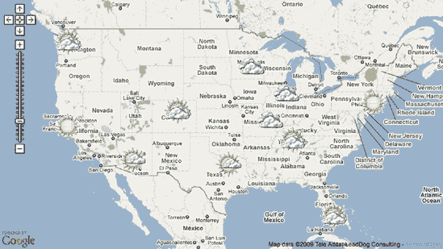
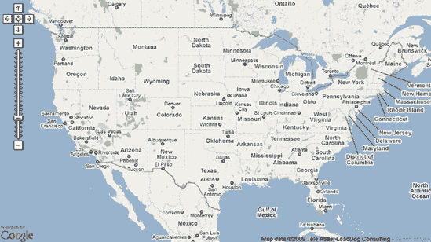
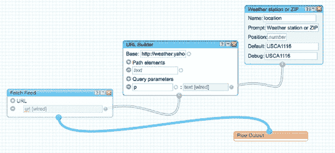
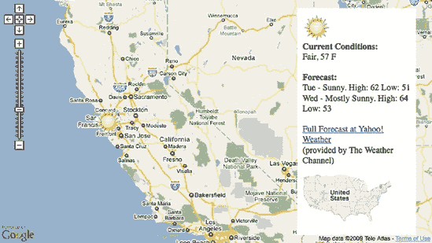
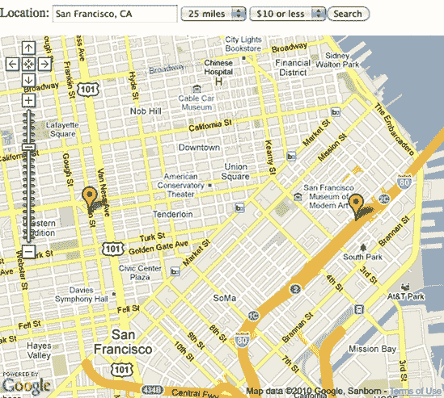
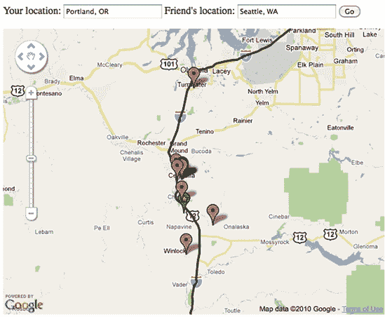
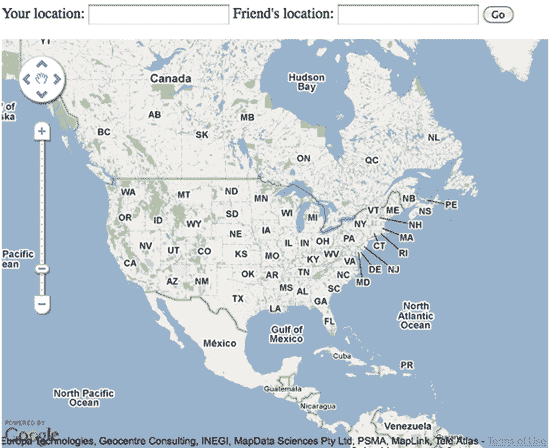

# 第十章 MASHUP 项目


在本书中，我演示了如何使用网络地图和地理数据执行一些常见任务。现在，我将把这些课程中的许多结合到示例项目中。本章中的 mashup 展示了如何检索、转换和利用外部数据源。

我们还将创建超越仅显示地图上几个位置的界面。使用事件来捕捉点击和鼠标移动，我们将为地图添加一些交互性。

# 什么是 Mashup？

互联网远不止是一系列相互连接的文档。数百万个应用程序正在不断创建、收集和消费数据。当这些应用程序通过应用程序编程接口（API）相互交流，共享这些数据时，产生的功能被称为*mashup*。

这个名字来自音乐。在音乐上，当 DJ 将两首或多首歌曲叠加在一起以创造新事物时，就会产生 mashup。这个类比描述了程序员和设计师如何使用网络 mashup。他们结合 API 来创造新事物，通常是一种启发性的数据可视化方式。

在本书中，我们一直在使用不同类型的 API。除了图表 API 之外，地图还用于可视化数据，这些数据可能来自你自己的或其他 API。然而，大多数 API 都是用来向开发者提供数据的。在本章中，我将使用提供公开可用位置数据的 API。

## 项目

本章中的五个项目将帮助你开始创建 mashup。它们被选为概念多样性，因此你可以在单个章节中学习到许多技术。以下是项目的简要概述：

**天气**

就像你的日常报纸一样，这张地图显示了美国的天气状况——只是这张天气图是交互式的，并且每次页面加载时都会更新。请参阅[`mapscripting.com/weather`](http://mapscripting.com/weather)。

**地震**

你将获得地质信息并创建一张显示上周全球地震分布的地图。使用里氏震级衡量地震的强度，你可以看到大地震发生的位置，并放大查看全球的地震热点。请参阅[`mapscripting.com/earthquakes`](http://mapscripting.com/earthquakes)。

**音乐会**

将这个 mashup 调到 11！我们将创建一个工具来搜索城市或周边地区的音乐会。我们甚至允许用户在搜索前声明他们的预算。我们只会过滤出符合他们标准的结果。请参阅[`mapscripting.com/concerts`](http://mapscripting.com/concerts)。

**Twitter**

帮助用户找到他们所在位置附近的推文，或者他们搜索的任何地方。用户可以选择添加一个关键词到搜索中，以缩小 Twitter 状态消息中存储的*什么*和*哪里*的范围。请参阅[`mapscripting.com/twitter`](http://mapscripting.com/twitter)。

**中点搜索**

在中间相遇！仅仅搜索咖啡是不够的。最终的混合显示了你如何首先找到路线的中点，然后在该中点附近搜索咖啡。这样，当你找到中间相遇的地方时，你就不必开车穿越整个城镇。参见[`mapscripting.com/middle`](http://mapscripting.com/middle)。

这五个项目使用了本书前面学到的许多概念。完成它们，你将肯定走向地图混合大师的道路。让我们开始混合吧！

# #69: 创建天气地图

一张显示当前状况的大地图不仅对当地气象学家有用。使用 Yahoo!天气 API，你可以制作一个区域、国家或整个世界的视觉预报。在这个例子中，我将展示如何创建一个带有主要区域城市当前状况图标的美国天气地图。

正如你所看到的，创建天气地图的大部分工作都涉及数据处理。一旦数据以 JavaScript 可以轻松访问的格式，我们只需要一个基本的地图和一些自定义标记。当我们放大到城市并显示其覆盖层中的预报时，事情会变得有点棘手，但对于像你这样的地图大师来说，这应该不成问题。在这个项目结束时，你的地图将看起来像图 10-1。



图 10-1. 完整的美国天气地图

## 准备一张基本的美国地图

网络地图的基本要素是什么？一个中心点和缩放级别。好吧，你还需要带有`div`的 HTML 以及一些基本样式。此外，你还需要加载一些 JavaScript 文件。然而，一旦这个基础建立起来，你只需要调用`setCenterAndZoom`。

我很早就决定只展示美国大陆。抱歉阿拉斯加和夏威夷——我将在本章后面的地震示例中弥补这一点。我通过一点猜测和检查找到了中心和缩放级别。将地图拖动到你想要的位置，并将缩放设置为完美的级别。然后，调用`getCenter`和`getZoom`（或者每当地图被拖动时自动执行此操作）。

我到达的中心纬度为 38 度，经度为-98 度。虽然不是美国的精确中心，但看起来最好。我选择了 4 倍缩放级别，足以看到主要城市和高速公路。以下是创建基本地图的代码，我们将在接下来的章节中在此基础上进行构建：

```
<html >
    <head>
      <title>Weather Map Mashup</title>
      <style>
        div#mymap {
          width: 800px;
          height: 450px;
        }

      </style>
❶     <script src="http://ajax.googleapis.com/ajax/libs/
jquery/1.3/jquery.min.js"></script>
      <script type="text/javascript" src="http://maps.google.com/
maps/api/js?sensor=false"></script>
      <script src="mxn.js?(googlev3)"></script>
      <script type="text/javascript">
        var mapstraction;
❷       var center = new mxn.LatLonPoint(38,-98);
❸       var zoom = 4;

        function create_map() {
          mapstraction = new mxn.Mapstraction('mymap', 'googlev3');
          mapstraction.setCenterAndZoom(center, zoom);
          mapstraction.addControls({"zoom":"large"});

        }
      </script>
    </head>
    <body onload="create_map()">
      <div id="mymap"></div>

    </body>
    </html>t
```

这段代码的大部分内容可能看起来与其他简单地图相似。我们很快就会添加更多内容，但你已经可以看到这个代码有前瞻性的迹象：我包含了*jQuery* ❶，这是一个使应用效果和使用 Ajax 检索数据变得容易的 JavaScript 框架。我还全局设置了`center` ❷和`zoom` ❸变量，这样我们就可以在放大后返回用户到原始视图。

基本地图，如图 10-2 所示，现在可以添加标记。然而，在我们能够在地图上绘制天气条件之前，我们需要一些可访问格式的数据。



图 10-2. 基本美国天气图

## 将天气结果转换为 JSON

要使我们的地图成为一个混合体，我们需要一些数据，特别是当前的天气状况数据。Yahoo!有一个易于使用的天气 API，它接受邮政编码或专有位置标识符。结果以 GeoRSS 形式出现，这是一个纯文本 XML 文件。

让我们看看对 Yahoo!天气 API 的一个示例调用。为了获取明尼苏达州明尼阿波利斯市的当前条件和预报，我们获取这个 URL：[`weather.yahooapis.com/forecastrss?p=USMN0503`](http://weather.yahooapis.com/forecastrss?p=USMN0503)。

URL 中的粗体部分是位置 ID。API 也可以接受邮政编码，但在这个例子中，我们将使用 ID。当我们把条件绘制在地图上时，我会解释如何获取位置 ID。

如果你访问这个 URL，结果将类似于以下 XML 缩略版本的返回结果：

```
<rss version="2.0" xmlns:yweather="http://xml.weather
.yahoo.com/ns/rss/1.0" >
<channel>
...
<item>
<title></title>
<geo:lat></geo:lat>
<geo:long></geo:long>

</item></channel></rss>
```

对于免费数据的格式不必过于挑剔，但正如我在第五十二部分：使用 XML 中讨论的那样，使用 JavaScript 解析 XML 可能会有点麻烦。许多 API 现在提供 JavaScript 对象表示法（JSON），这是一种可以直接插入 JavaScript 的格式。Yahoo!天气只提供 XML，但另一个 Yahoo!产品可以为我们转换数据。

Yahoo! Pipes 可以执行许多复杂的操作来合并、过滤和排序数据。在这个例子中，我们不会触及边界。我们只想从 API 读取 XML 并输出 JSON。使用 Pipes 很容易做到这一点。你也可以使用 Yahoo!查询语言或在你的服务器上运行 XML 处理。我将在本章后面的项目中展示第二种方法。

### 创建一个新的管道

因为我们只需要将 XML 转换为 JSON，我们将创建尽可能简单的管道。你可以在第五十七部分：从 XML 转换为 JSON 中看到这个例子的更深入版本，在那里你也会找到 Pipes 的更多高级用法。

从[Pipes 首页](http://pipes.yahoo.com/)，点击**创建管道**以获取一个全新的、空的管道。在左侧，你会看到你可以使用的“管道”组件。将一个**获取源**拖到工作区。这是数据流入的点。

那个馈送的 URL 是什么？我们将对天气 API 进行多次调用，一次针对我们想要查询的每个城市。这些调用将通过管道路由，这意味着馈送 URL 不能是静态的。为了接受管道的输入，将一个**文本输入**拖到工作区。将输入命名为**位置**，并将提示设置为类似于**输入一个位置**的内容。对于默认和调试值，可以使用你的邮政编码或城市名称。你也可以使用位置 ID，例如明尼阿波利斯的 ID，**USMN0503**。这有助于你确认管道是否正常工作。

现在你已经设置了文本输入以提供位置值，你准备好创建 URL 了。为了合并 URL 的静态和动态部分，我们将使用最后一部分管道。将一个**字符串构建器**拖到工作区。作为第一个值，添加天气 API URL 的开头：[`weather.yahooapis.com/forecastrss?p=`](http://weather.yahooapis.com/forecastrss?p=)。

将**文本输入**的输出拖到**字符串构建器**的第二个值。这个动作会将位置 ID 添加到对天气 API 的调用末尾。现在你有一个完整的馈送 URL。将**字符串构建器**的输出拖到**获取馈送 URL**行。最后，将**获取馈送**的输出拖到工作区底部的**管道输出**。

你刚刚创建了一个 Yahoo! Pipe！最终产品应该看起来像图 10-3。在屏幕底部的调试输出部分，你应该能看到一些基于你输入的文本输入调试值的样本结果。

要使用你的管道，你需要保存它。一旦保存，你就可以通过输入不同的位置来运行它以获取更多示例结果。从样本结果屏幕，点击**获取 JSON**。你可能需要右键单击（在 Mac 上按住 Ctrl 键单击）并复制链接。Pipes URL 将类似于这样：[`pipes.yahoo.com/pipes/pipe.run?_id=sGDQu...&_render=json&location=USMN0503`](http://pipes.yahoo.com/pipes/pipe.run?_id=sGDQu...&_render=json&location=USMN0503)。



图 10-3. 完整的 Yahoo! Pipe 用于获取天气数据

这个 URL 将以 JSON 格式检索明尼阿波利斯的天气状况。以下是它返回的简略版本：

```
{"count":1,"value":{"items":[{"geo:long":"-93.26","geo:lat":"44.98",
"description":"
<br \/>\n<b>Current Conditions:<\/b><br \/>\nCloudy...","yweather:condition":
{"temp":"50","text":"Cloudy",...,"code":"26"}}]}
```

那个 URL 是我们将用来获取几个城市的天气状况，并替换明尼阿波利斯特定的位置 ID。实际上，这正是我们在将 XML 结果转换为 JSON 后要做的。

## 在地图上绘制条件

我们的 JSON 数据源已经准备好了，现在让我们深入 JavaScript 来获取天气状况并将它们绘制在我们的美国地图上。首先，你需要决定要绘制哪些城市。我选择了 11 个具有代表性的地方，注重地理多样性。

为了收集我城市的地点 ID，我去了[`weather.yahoo.com/`](http://weather.yahoo.com/)并在搜索框中输入每个城市的名称。结果会转发到一个类似这样的 URL：[`weather.yahoo.com/forecast/USMN0503.html`](http://weather.yahoo.com/forecast/USMN0503.html)。

文件名中不带扩展名的那部分，即粗体部分，是位置 ID。一旦我有了所有城市的 ID，我在 JavaScript 顶部创建了一个变量来保存这些值：

```
var weatherids = [
      "USIL0225", // Chicago
      "USTX0327", // Dallas
      "USCO0105", // Denver
      "USFL0316", // Miami
      "USMN0503", // Minneapolis
      "USTN0357", // Nashville
      "USNY0996", // New York City
      "USAZ0166", // Phoenix
      "USMO0787", // Saint Louis
      "USCA0987", // San Francisco
      "USWA0395" // Seattle
    ];
```

`weatherids`变量是一个数组，它包含一系列值。我将变量声明分散到多行，以提高可读性并使添加或删除城市变得容易。城市名称是注释，因此你可以轻松地知道哪个位置 ID 对应哪个城市。

当地图加载时，我们想要遍历每个城市并在我们的 Yahoo!天气 API 管道版本中查找它。将此循环代码添加到`create_map`函数中：

```
var pipeid = "Sbcb8u8J3hGNdOcopgt1Yg";for (var i=0; i < weatherids.length; i++) {
  var pipeurl = "http://pipes.yahoo.com/pipes/pipe.run?_id=" + pipeid;
  pipeurl += "&_render=json&location=" + weatherids[i] + "&_callback=?";
  jQuery.getJSON(pipeurl, add_weather);}
```

变量`i`持有数组的索引，它从零开始，数到 10（数组中的第 11 项是纳什维尔）。每次循环时，我们都会创建一个 URL 来调用我们的管道，使用当前天气站的地点 ID 值。

要从我们的管道中获取 JSON，我们使用 jQuery，一个小的 JavaScript 框架。当我们之前设置基本地图时，我们包括了 jQuery 文件的引用，所以我们已经准备好了；创建 Ajax 调用的大部分工作都由 jQuery 的`getJSON`函数和刚刚创建的 URL 为我们完成。

除了`location`参数外，我们还在 URL 中添加了一个新参数，`_callback=?`。这个安全特性让我们可以从除我们自己的网站之外的网站获取 JSON。Yahoo! Pipes 会将结果包装起来，这样只有我们的回调函数才能访问数据。问号是一个占位符，用于我们作为`getJSON`的第二个参数传递的函数。

当 jQuery 从天气 API 获取结果时，这些结果会被传递给我们的`add_weather`函数，我们现在需要编写这个函数：

```
function add_weather(data) {
  jQuery.each(data.value.items, function(i, item) {
    var lat = item["geo:lat"];
    var lon = item["geo:long"];
    var code = item["yweather:condition"].code;
    var imgsrc = "http://l.yimg.com/a/i/us/we/52/" + code + ".gif;

    `add_marker`({"lat":lat, "lon":lon, "code":code, "imgsrc":imgsrc});
}
```

JSON 数据会自动作为参数传递给我们的回调函数。在这种情况下，我使用了一个名为`data`的变量来保存管道的响应。我们想要获取的天气条件在名为`items`的数组的第一个结果中，而`items`本身又在一个名为`value`的对象中。是的，我们有一些不必要的开销，但这些是 XML 残留物。

我们需要的主要数据是纬度、经度和描述。尽可能的情况下，我使用 JavaScript 点表示法，如`item.description`。在这个数据源中，有几个字段名包含冒号，这在使用点表示法时会被错误地解释。在这种情况下，我使用括号表示法从`item`中检索属性。

每种天气状况都有一个与特定描述匹配的编号代码。数字允许机器轻松地解释预报，而无需解析文本。该代码也由 Yahoo! 天气用于调用为每种状况指定的图像。例如，代码 30 表示天空部分多云。相应的图形存储在 [`l.yimg.com/a/i/us/we/52/30.gif`](http://l.yimg.com/a/i/us/we/52/30.gif)。我将此图像 URL 拼接到 `imgsrc` 变量中。

一旦我们有了所需的数据，我们就将其包裹在一个带有花括号的对象中，并将其传递给 `add_marker` 函数来完成在地图上绘制此标记的工作：

```
function add_marker(options) {
  var marker = new mxn.Marker(new mxn.LatLonPoint(options["lat"], options["lon"]));
  marker.setIcon(options["imgsrc"], [52,52]);
  marker.setShadowIcon('❶blankshadow.png', [0,0]);
  mapstraction.addMarker(marker);
}
```

为什么我传递数据为 JavaScript 对象（`options` 变量）而不是单独的参数？你可以使用参数，但四个参数传递给函数会很多。每次调用它时，我们都需要检查顺序。描述是第三个还是第四个？此外，JavaScript 对象通常用于在 JavaScript 函数之间共享数据，因此使用它们是良好的实践。

`add_marker` 函数的其余部分创建了一个简单的自定义标记。唯一可能看起来奇怪的行是阴影图标 ❶，我希望它是空的。因为没有无阴影标记的选项，所以我使用了一个透明的像素作为阴影图标。

现在我们有了绘制我们城市列表状况的所有部件。将它们组合起来，你就有了一个完整的天气地图，每个城市上方都有当前天气的简略图形表示。以下是混合体加载时发生的所有事情的简要回顾：

1.  HTML 页面加载后，调用 `create_map` 函数，该函数设置基本地图并为 `weatherids` 数组中的每个位置 ID 调用 `get_weather` 函数。

1.  JSON 数据是从 Yahoo! Pipe 中检索的，数据被传递到 `add_weather` 函数。

1.  重要信息从 JSON 中提取到 JavaScript 对象中，该对象本身被传递到 `add_marker` 函数。

1.  创建并放置在地图上的自定义标记。

现在让我们使这个混合体更具交互性。当用户点击标记时，地图将放大显示该位置的预报详情。

## 添加预报详情面板

当前条件的视觉表示很棒，但我们无法从天气 API 中展示太多内容。在本节中，我们将添加一个预报详情面板。为了增加交互性，当用户点击标记时，面板将出现，如图 图 10-4 所示。



图 10-4. 我们天气地图的预报面板

首先，我们需要为新内容添加 HTML 壳。在地图 `div` 下方添加此行：

```
<div id="forecast"></div>
```

就像地图一样，外壳是空的。我们将使用 JavaScript 来填充它。因为我们想在地图本身上叠加预报详情，所以我们将使用 CSS 来定位新的`div`。在页眉的`<style>`部分添加以下行：

```
div#forecast {
  position: relative;
  width: 200px;
  height: 400px;
  background-color: #fff;
  top: −435px;
  left: 550px;
  padding: 10px;
}
```

此 CSS 在地图右侧创建了一个细长的白色框。实际上，保存你的文件，在浏览器中加载它，从密歇根州向东将会被这个框遮挡。这显然不是我们想要的。我们只想在选中城市时显示预报面板。默认情况下，我们需要将其隐藏。

我们可以通过在`create_map`函数中添加这一行 jQuery 来实现这一点：

```
$('#forecast').hide();
```

在这里，我们调用 jQuery 的`hide`函数在预报`div`上。当地图首次加载时，面板将被隐藏，等待用户点击。

现在我们可以使用 Mapstraction 来填充预报详情面板的内容。当标记被点击时，我们不会创建 infoBubbles，而是使用 API 中的预报数据调用`setInfoDiv`。

首先，我们实际上需要获取那些数据。整个当前条件的描述以及预报都通过 Weather API 的描述字段传递。在`add_weather`函数中，我们需要第五个变量。在`imgsrc`行之后添加：

```
var desc = item.description;
```

现在你将通过向传递的对象中添加另一个选项来修改对`add_marker`的调用：

```
add_marker({"lat":lat, "lon":lon, "code":code, "desc":desc, "imgsrc":imgsrc});
```

然后你将在`add_marker`函数内部使用新值。在调用`addMarker`之前添加这一行：

```
marker.setInfoDiv(❶options["desc"] + "<p><a href=\"javascript:return_center()\">"
    + ❷""
    + "</a></p>", ❸"forecast");
```

在这里，我们将预报详情面板设置为包含 API 中的描述❶，以及一个可点击的美国地图图像❷，该图像调用一个新的 JavaScript 函数以返回地图到中心并清除预报详情面板。Mapstraction 如何知道使用哪个`div`？我们通过将其`id`作为第二个变量❸传递。

要查看预报详情面板的实际效果，我们需要编写代码在标记被点击时显示隐藏的`div`。在调用`addMarker`之后添加此行，因为我们将与刚刚创建的标记对象一起工作：

```
marker.click.addHandler(marker_clicked);
```

现在我们正在监听一个标记上的点击事件，然后通过函数引用进行响应。让我们编写`marker_clicked`函数，该函数将在我们任何标记被点击时被调用：

```
function marker_clicked(event_name, event_source, event_args) {
❹   mapstraction.setCenterAndZoom(event_source.location, 6);
    var bounds = mapstraction.getBounds();
    var diff = ((bounds.ne.lon − bounds.sw.lon)/4);
❺   mapstraction.setCenter(
      new mxn.LatLonPoint(mapstraction.getCenter().lat, bounds.ne.lon − diff));
❻   $('#forecast').show();
  });
```

当任何标记被点击时，我们将它设置为地图的中心并放大❹。我们使用被点击标记的位置作为中心，该位置通过`event_source`参数传递给函数。然后，为了考虑到地图右侧的预报详情面板，我们将地图中心向西移动❺，这样标记就会出现在地图可见部分的中心。最后，我们确保预报详情面板是可见的❻。

保存你的文件并在浏览器中加载它。现在你应该能够点击一个标记并放大以查看预报。唯一没有连接的部分是能够缩回到整个连续的美国地图。为此，我们需要编写一个`return_center`函数，该函数将在你点击美国地图时被调用。

将此函数添加到 JavaScript 部分：

```
function return_center() {
  mapstraction.setCenterAndZoom(center, zoom);
  $('#forecast').hide();
}
```

这个维护函数将地图返回到其原始中心和缩放级别，然后隐藏预报详情面板。现在我们又能看到整个美国地图了。

房子打扫干净后，混合应用就完成了。你使用 Yahoo! Pipes 从 Yahoo!天气中提取数据，并将其转换为 JSON。然后你在地图上显示几个城市的条件，以及一个描述性的图形。最后，点击标记后，你将地图缩放到城市，并在自己的叠加信息面板中显示预报。

当然，最好的部分是，你再也不需要阅读报纸上的天气页面了。你有一个在线的、始终更新的替代品。

# #70: 显示全球最近地震

你是一个有抱负的地质学家吗？或者你可能只是想找一个快速查看世界上发生什么震动的方法？在这个混合应用中，我将向你展示如何使用公共数据源来理解你周围的世界。我们将绘制美国地质调查局（USGS）统计的一周内的地震。

幸运的是，美国地质调查局不仅记录美国的地震数据，还记录了全球的地震数据。更幸运的是，他们熟悉最新的数据格式。该组织发布了一个地理编码为 GeoRSS 的 XML 数据流。它涵盖了里氏震级 2.5 或以上的地震。这应该仍然给我们提供足够的地震数据，以便在我们的地图上揭示一些有趣的趋势，如图 10-5 所示。


图 10-5. 显示最近地震震级的地图

你可以将数据流加载到网络浏览器中直接查看内容：[`earthquake.usgs.gov/eqcenter/catalogs/7day-M2.5.xml`](http://earthquake.usgs.gov/eqcenter/catalogs/7day-M2.5.xml)。

许多浏览器默认会显示一个“美观”版本。查看其源代码，以了解它发送的所有数据。以下是 USGS 的 XML 文件的简略版本：

```
<feed xml:base="http://earthquake.usgs.gov/" 
      >
<title>USGS M2.5+ Earthquakes</title>
<subtitle>Real-time, worldwide earthquake list for the past 7 days</subtitle>
<entry>
  <id>...</id>
  <title>M 2.6, Washington</title>
  <updated>YYYY-MM-DDTHH:MM:SSZ</updated>
  <link rel="alternate" type="text/html" href="/eqcenter/recenteqsww/Quakes/..."/>
  <summary type="html">...</summary>
  <georss:point>46.4078 −119.2521</georss:point>
</entry>
<entry>
...
</entry>
...
</feed>
```

这是一些很好的内容。让我们开始在我们的地图上使用这些数据。首先，我们将自动解析 GeoRSS，这是 Mapstraction 使它看起来很容易实现的功能。然后，如果基本的可视化还不够，我们将创建一个完全定制的解决方案。

## 使用 GeoRSS 显示地震

好吧，你已经选择了快速版本。你只想看到这些地震被扔在地图上。你希望用尽可能少的代码来实现这一点。

将这几行代码添加到一个新的 HTML 文件中：

```
<html >
  <head>
    <title>Earthquake GeoRSS Map</title>
    <script src="http://maps.google.com/maps?file=api&amp;v=2&amp;key=
*`YOURKEY`*" type="text/javascript"></script>
    <script type="text/javascript" src="mxn.js?(google)"></script>
    <style type="text/css">
    div#mymap {
      width: 550px;
      height: 450px;
    }
    </style>
    <script type="text/javascript">
    var mapstraction;
    function create_map() {
      mapstraction = new mxn.Mapstraction('mymap', 'google');
      mapstraction.setCenterAndZoom(❶ new mxn.LatLonPoint(0, 0), 0);
      mapstraction.addControls({zoom: 'large'});
      `mapstraction.addOverlay(`
        `"http://earthquake.usgs.gov/eqcenter/catalogs/7day-M2.5.xml");`
      mapstraction.autoCenterAndZoom();
    }
    </script>
  </head>
  <body onload="create_map()">
    <div id="mymap"></div>
 </body>
</html>
```

和往常一样，记得使用你自己的 API 密钥。否则，代码就准备好了。在浏览器中保存和加载它，可以看到类似于图 10-6 的显示。标记的实际位置将根据过去一周的地质活动而有所不同。


图 10-6. 使用直接 GeoRSS 叠加显示的地震

您是否注意到了我们设置中心和缩放时线上的所有零❶？这些不是打字错误。纬度为零是赤道。经度为零大约是国际日期变更线，穿过伦敦。最后，缩放级别为零显示整个世界。

加载地震数据的“金钱线”被加粗显示。Mapstraction 的`addOverlay`函数做了大部分工作。它创建了数十个标记，甚至为它们添加了 infoBubble 内容。不幸的是，乐趣在这里就结束了。一旦我们将所有这些工作外包给一个单独的函数，我们就限制了制作我们想要的确切内容的能力。

为了给这个地震地图添加个人风格，我们需要更深入地研究代码。我们需要定制化。

## 创建自定义地震地图

如果您只想可视化地震的位置，使用 Mapstraction 的内置 GeoRSS 支持可以轻松完成任务。另一方面，如果您想预先过滤内容或根据地震强度显示不同的图标，您将需要一个更定制化的解决方案。

在本节中，我将向您展示如何使用 Yahoo!查询语言将 GeoRSS 转换为 JSON。然后您将根据地震的里氏值选择一个标记图标。最后，您将变得更加聪明，并放大通常有相当多地震活动的区域。

首先，您需要在地图上有一个基本的世界视图。

### 准备基本世界地图

世界的基本地图不需要与地震映射器的 GeoRSS 版本中的地图有很大不同。我们需要加载地图，然后设置中心和缩放级别。

将以下代码添加到一个新的 HTML 文件中：

```
<html >
    <head>
      <title>Earthquake Map Mashup</title>
      <style type="text/css">
        div#mymap {
          width: 550px;
          height: 450px;
        }
      </style>
❶     <script type="text/javascript"
  src="http://ajax.googleapis.com/ajax/libs/jquery/1.3/jquery.min.js"></script>
      <script src="http://maps.google.com/maps?file=api&amp;v=2&amp;key=
*`YOURKEY`*" type="text/javascript"></script>
      <script type="text/javascript" src="mxn.js?(google)"></script>
      <script type="text/javascript">
        var mapstraction;
❷       var defaultloc = {"point": new mxn.LatLonPoint(14.6048
47155053898, −177.1875),  "zoom": 1};

        function create_map() {
          mapstraction = new mxn.Mapstraction('mymap', 'google');
          mapstraction.setMapType(mxn.Mapstraction.HYBRID);
          mapstraction.addControls({"zoom":"large"});
          view_world();

        }
        function view_world() {
❸         mapstraction.setCenterAndZoom(defaultloc["point"], defaultloc["zoom"]);
        }
      </script>
    </head>
    <body onload="create_map()">
      <div id="mymap"></div>
    </body>
    </html>
```

保存文件，将其加载到浏览器中，您将看到一个没有标记的世界地图，就像图 10-7 所示。我已经对代码做了一些修改，以便我们在定制地图时提前做好准备。其中之一是包括了 jQuery❶，这是一个 JavaScript 框架，它使得应用效果和使用 Ajax 检索数据变得容易。


图 10-7. 空的世界地图，等待标记

我创建了一个对象变量来保存默认的位置和缩放级别❷，而不是单独的变量。我选择这些值是基于猜测然后检查，以找到一个好的位置，使得整个世界都能可见，并且地震的位置最有意义。因为世界地图是三维物体的二维视图，所以可能会出现标记和多边形缠绕的问题。我选择了我们基本地图的中心，这样我们的热点区域在全球范围内都能完全在视野中。

最后，我创建了一个完整的函数 ❸ 来使用默认的中心和缩放值。稍后，在这个混合应用中，我们将放大那些热点区域，但之后我们需要一种方式来将缩放回原始中心。我们不妨重用代码。

### 将地震数据转换为 JSON

现在基本地图已经设置好了，我们需要开始考虑数据。USGS 提供了一个 XML 源。JavaScript 可以解析 XML，但出于安全原因，我们首先需要将 XML 下载到服务器上。如果我们能以 JSON 格式获取数据，我们的工作就会容易得多。

我们有多种将地震数据从 XML 转换为 JSON 的选项。在天气混合应用中，我们使用了 Yahoo! Pipes。在这种情况下，我们将使用另一个 Yahoo! 产品，即 Yahoo! 查询语言 (YQL)。YQL 技术的许多其他用途中，它使得将任何 GeoRSS 源转换为 JSON 变得非常简单。

YQL 的语法类似于 SQL，这是查询数据库所使用的语言。您可以在 [`developer.yahoo.com/yql/console/`](http://developer.yahoo.com/yql/console/) 的 YQL 控制台中尝试命令。我们不会查询数据库表，而是将针对我们在上一节中使用的 USGS GeoRSS URL 进行操作。以下是获取该源所有数据的查询：

```
select * from atom where
  url='http://earthquake.usgs.gov/eqcenter/catalogs/7day-M2.5.xml'
```

在 YQL 控制台中输入该命令，选择 JSON 输出，并点击 **测试** 按钮。如图 图 10-8 所示，您将在下面的面板中看到结果。如果您更喜欢看到更结构化的视图，请点击 **树视图** 选项卡来浏览数据。从那里，您可以看到当我们将数据加载到地图中时我们将拥有的可用项。


图 10-8. YQL 控制台显示地震源的结果

复制控制台底部“REST 查询”下的长 URL 并将其存储在某个地方。我们将在下一节中使用该 URL。

### 在地图上绘制地震

如您所见，仅通过调用 GeoRSS 源在地图上绘制地震只需要一行代码。然而，这对我们来说太基础了。这个混合应用的目的是要创建一些更定制化的东西。我们希望通过使用更大图标的方式，在里氏值较高的地方提供一种直观查看地震强度的方法。

以下两个 JavaScript 函数将从我们在上一节中找到的 YQL JSON URL 加载数据，确定要使用哪个图标，并在世界地图上绘制标记。请将此代码添加到您的 `create_map` 函数后的基本地图中：

```
// Data and marker functions
  function get_quakes() {
❶   var jsonurl = "http://query.yahooapis.com/v1/public/yql"
    + "?q=select+*+from+atom+where+url%3D'http%3A%2F%2Fearthquake.usgs.gov"
    + "%2Feqcenter%2Fcatalogs%2F7day-M2.5.xml'"
    + "&format=json&diagnostics=true&callback=?";
    jQuery.getJSON(jsonurl, function(data) {
❷     jQuery.each(data.query.results.entry, function(i, item) {
        // Get Lat/Lon point
        var lltxt = item.point;
❸       var llarr = lltxt.split(" ");
        // Get Richter value
        var richter = item.title;
❹       richter = richter.substr(2, 3);
        var majorrichter = richter.substring(0, 1);
        var iconvals = get_icon(majorrichter);
        // Find link
        var link;
        if (item.link[0]) {
          link = item.link[0].href;
        }
        else {
          link = item.link.href;
        }
        // Create marker
        var marker = new mxn.Marker(new mxn.LatLonPoint(llarr[0], llarr[1]));
        marker.setIcon(iconvals.name, iconvals.size);
❺       marker.setShadowIcon('blankshadow.png', [0,0]);
        var eqdate = item.updated.substr(0, 10);
❻       marker.setInfoBubble('<strong>' + item.title +
 '</strong><p>On ' + eqdate +  ' (<a href="' + link + '">more info</a>)</p>');
        mapstraction.addMarker(marker);
      });
    });
  }
  function get_icon(majorrichter) {
    var identifier;
    var size;
    if (majorrichter < 4) {
      identifier = "low";
      size = [10, 10];
    }
    else if (majorrichter == 4) {
      identifier = "med";
      size = [15, 15];
    }
    else {
      identifier = "high";
      size = [20, 20];
    }
    return {"name": "richter-" + identifier + ".png", "size": size};
  }
```

`get_quakes`函数实际上是一行，但它非常长。它调用 jQuery 中的`getJSON`函数。JavaScript 框架需要两个变量来从 YQL 检索我们的 JSON。第一个是调用的 URL。第二个是回调函数的引用。我使用了一个匿名内联函数。这个回调函数占据了`get_quakes`函数的大部分空间。

YQL URL❶被展开成几行作为单个长字符串，几乎与你从 YQL 控制台复制的内容完全相同。唯一的区别是回调参数（URL 的最后一部分）是一个问号。通过包含一个问号，jQuery 会为我们替换成回调函数。

一旦我们得到结果，它就被作为`data`变量传递给匿名函数，它将是一个 JavaScript 对象。在对象中，`data.query.results.entry`指的是所有地震结果的数组。使用 jQuery 的`each`函数❷，我们遍历每一个结果。每个地震都被传递给另一个匿名函数。

对于每一次地震，我们首先从`point`值中检索地理坐标。如您从 USGS XML 中回忆起来，纬度和经度都存储为单个值，中间有一个空格。我们的代码将它们分成两个值❸并将结果存储在数组中。数组中的第一个元素（索引为零）是纬度；第二个是经度。

接下来，我们需要找到里氏值。*里氏值*是衡量地震强度的测量值，通常给出小于 10 的十进制值。不幸的是，USGS 并没有直接传递这个值，尽管它就在标题中。例如，`M 2.6, Washington`。通过从标题中提取子字符串，我们可以找到里氏值。在这种情况下，我们想要 2.6，不想要更多。

里氏值从字符串的第三个字符开始，这被称为*槽位二*，因为文本字符串，就像数组一样，从零开始计数。然后里氏值继续三个字符。因此，我们的`substr`调用❹从槽位二开始，继续三个字符。在这个例子中，`richter`变量的值现在是 2.6，正如我们想要的。

拿到里氏值后，我们可以通过将其传递给`get_icon`函数来确定使用哪个图标。我选择了三个级别，并为每个级别创建了一个图形。如果地震相对较小，小于四，我分配给它最小的图标。如果地震在四到五之间，它得到一个中等大小的图标。任何五以上的地震都得到最大的图标。这些图标在不同级别上也有不同的颜色，因此地震标记随着震级的增加而变大变红。

使用我们从数据中分割出的纬度/经度数组，我们为这次地震创建了一个标记。我们根据里氏值给它一个自定义图标，然后给它不显示阴影 ❺。我使用了一个透明的像素作为阴影图标，并将宽度和高度设置为零。您将看到，我们的地图将包含如此多的地震，以至于我们没有空间为阴影留出位置。

最后，我在 infoBubble ❻中添加了一条非常简单的信息。这条信息显示了完整的标题、日期以及一个链接，用户可以通过该链接访问 USGS 网站上的页面，获取更多关于这次地震的信息。

### 创建图例

只需几行代码，这张地图比 GeoRSS 生成的地图更容易阅读。由于标记较小，许多地震占据的空间更少。我们已经通过改变图标的大小和颜色表明，一些地震比其他地震更有意义。这张地图对不知道我们基于里氏震级方法的某人来说有意义吗？

让我们创建一个图例，就像在完成后的地图(图 10-5)中显示的那样，在地图下方显示每个图标的意义。在地图`div`之后添加以下有序列表，它描述了不同的图标：

```
<ol id="legend">
  <li> 2.5 − 3.9</li>
  <li> 4.0 − 4.9</li>
  <li> 5.0+</li>
</ol>
```

我们不希望图例看起来像有序列表，因为这会占用太多空间。大多数时候，类似这样的内容会显示在一行中。输入一些 CSS 来使其看起来符合您的需求。将以下内容添加到您的样式表中：

```
ol#legend {
  list-style: none;
  margin: 0;
  padding: 0;
}
ol#legend li {
  display: inline;
  padding-right: 30px;
}
```

现在有序列表存在于一行中。每个列表项都向右填充，因此哪个图标与哪个描述相对应仍然很明显。既然我们已经清楚地说明了图标的含义，那么让我们给这个地图添加一点交互性。

### 放大热点区域

如您从这次混合体中可以看出，世界上某些地区的地震活动性比其他地区更强。这些区域是相对可预测的区域。有些，比如加利福尼亚，可能比其他地区更明显。由于这些区域有许多标记的聚集，因此有一种方法可以放大以获得更好的视图将会很有用。

我确定了四个这样的区域，并创建了一个系统，使得添加其他区域变得容易。在您的代码变量部分，添加以下行以创建包含区域边界的对象：

```
var regions = {
  "California": new mxn.BoundingBox(30, −136, 45, −101),
  "Alaska": new mxn.BoundingBox(48, 164, 68, −125),
  "Latin America": new mxn.BoundingBox(−47, −112, 24, −15),
  "Southeast Asia": new mxn.BoundingBox(−33, 52, 39, −167)
};
```

在最基本层面上，`regions`变量包含与 Mapstraction `BoundingBox`对象对应的文本键。在我们的用途中，键是区域的唯一标识符。用于创建边界的四个数字是描述该区域所需的最小数字。第一对描述了盒子的西南角。第二对描述了东北角。盒子的其他两个角可以从这些值中推断出来。

当用户在地图上移动鼠标时，我们想要确定光标是否悬停在这些区域之一上。如果是，我们将通过围绕它绘制一个框来突出显示该区域。然后，如果用户点击，我们将放大到该区域，就像在图 10-9 中所示。

要实现这一点，我们需要监听两个事件：鼠标移动和点击。将这些行添加到你的`create_map`函数中：

```
❶ google.maps.event.addListener(mapstraction.getMap(), 'mousemove', `check_hover`);
❷ mapstraction.click.addHandler(function() {
    if (highlighted) {
❸     `set_region`(highlighted);
    }
  });
```

第一个❶监听鼠标移动，并在鼠标在其边界框内时突出显示区域。我们必须使用谷歌的本地`addListener`函数，因为 Mapstraction 不支持`mousemove`事件。一个事件对象被传递给`check_hover`函数。


图 10-9. 放大到地震热点区域

尽管我们使用了少量的谷歌特定代码，但我们仍然能够使用 Mapstraction 处理其他所有事情。第二个❷事件监听地图上的任何位置的点击。如果某个区域已经被突出显示，它就会❸放大以更仔细地查看地震。

现在，让我们编写从我们的事件代码中调用的两个（加粗）函数。首先，我们将编写确定鼠标是否悬停在识别区域上的代码。将此代码添加到你的 JavaScript 中：

```
// Region highlight functions
  var highlighted = "";
  function find_region(cpt) {
    for (var k in regions) {
      if (k != "World") {
❶       if (regions[k].contains(cpt)) {
          return k;
        }
      }
    }
    return "";
  }
  function check_hover(google_event) {
    // Google-specific code to convert event to Mapstraction LatLonPoint
    pt = new mxn.LatLonPoint(google_event.latLng.lat(), google_event.latLng.lng());
    // Mapstraction code to highlight appropriate region
    var regionin = find_region(pt);
    if (regionin) {
❷     if (highlighted != regionin) {
        highlighted = regionin;
        highlight_region(regionin);
      }
    }
❸   else if (highlighted) {
      highlighted = "";
❹     mapstraction.removeAllPolylines();
    }
  }
```

除了`check_hover`函数外，我们还有一个辅助函数。这两个函数一起确定用户是否悬停在区域上，如果是，是哪个区域。`find_region`函数做了大部分工作。它通过使用方便的`contains`函数将鼠标的纬度/经度与边界框的四条边❶进行比较，遍历区域的数组。

如果用户悬停在某个区域上，该区域的名称将被返回到`check_hover`。假设我们还没有突出显示该区域❷，我们将名称传递给`highlight_region`函数，该函数绘制框。如果鼠标没有悬停在区域上，但之前已经突出显示❸，那么我们知道用户将鼠标移出了该区域。因此，我们可以从屏幕上移除该框❹。

我们还没有创建添加框的函数，所以我们现在就做：

```
function highlight_region(name) {
    var bounds = regions[name];
    if (bounds) {
      mapstraction.removeAllPolylines();
❺     var pdata = {"color": "white"};
      var poly = BoundingBox_to_Polyline(bounds);
      mapstraction.addPolylineWithData(poly, pdata);
    }
  }
  function BoundingBox_to_Polyline(box) {
    var points = [box.sw, new mxn.LatLonPoint(box.ne.lat, box.sw. Lon),
                  box.ne, new mxn.LatLonPoint(box.sw.lat, box.ne.lon),
                  new mxn.LatLonPoint(box.sw.lat, box.sw.lon-.0001)];
    var poly = new mxn.Polyline(points);
    return poly;
  }
```

突出显示的过程相当简单，尽管我已经将其分为两个函数。我已经从第十九部分：绘制矩形以声明区域中重新打印了第二个函数，`BoundingBox_to_Polyline`，在第十九部分：绘制矩形以声明区域。

在`highlight_region`函数中创建的框使用白色折线❺。你可能希望将折线颜色改为其他颜色。其余的只是简单地绘制地图上的框。

到目前为止，当用户在地图上移动鼠标时，区域将被突出显示。现在我们需要在用户在突出显示的区域点击时发生某些事情。换句话说，我们需要设置当前区域并放大，以满足事件监听器调用的第二个功能。

将以下代码添加到您的 JavaScript 中：

```
function set_region(name) {
  var bounds = regions[name];
  if (bounds) {
    mapstraction.setBounds(bounds);
  }
}
```

简单来说，如果我们的数组中存在该区域，我们将地图的边界设置为仅包含所选区域。地图会放大并居中显示该区域的地震。

现在我们需要一种方法回到世界地图。在这个 mashup 的早期阶段，我们创建了一个 `view_world` 函数。我们如何调用它？我们将使用世界地图的图形，并在点击图像时调用该函数。

添加此功能会影响 mashup 的几个部分。因此，我们需要在多个地方包含几行代码。首先，将图形添加到您的 HTML 中，在地图和图例之间：

```
<a href="#" id="reset"></a>
```

您可以在 [`mapscripting.com/earthquake-mashup`](http://mapscripting.com/earthquake-mashup) 找到这张图片，以及我在此示例中使用的标记图标。

接下来，我们需要添加一些 CSS，以便图形出现在地图的右上角：

```
#reset img {
  border: 5px solid white;
  position: relative;
  top: −435px;
  left: 430px;
}
```

让我们使用 jQuery 来响应用户点击图像。将此代码添加到 `create_map` 函数中：

```
$("#reset").click(view_world);
```

这通过 CSS 选择器语法检索链接元素，并告诉浏览器在点击该对象时调用 `view_world` 函数。

如果我们不挑剔，我们就可以在这里停止。在一个完美的世界中，可点击的图形只有在地图放大时才可见。让我们看看我们是否不能使这个世界更加完美，再次使用一些 jQuery 函数。

因为我们希望图形在我们查看整个世界时消失，所以我们需要在 `view_world` 函数内部添加此行：

```
$("#reset").hide();
```

图像现在将始终不可见。当然，我们希望它在放大时出现。在 `set_region` 函数中，直接在 `setBounds` 行下方，我们添加此行：

```
$("#reset").show();
```

这样，我们就将一个更好的界面整合到了我们的交互式地震地图中。按区域放大很酷，只要你能够返回到地图。我们可能没有创造一个完美的世界，但这个世界地图 mashup 几乎是完美的。

我们将 USGS 数据从 XML 转换为 JSON。然后我们读取过去一周内的每一场地震，确定其强度，并给它一个适当的图标。最后，我们实现了热点区域的放大功能。剩下要做的就是监控构造运动；至少现在你有一个工具来做这件事。

# #71：按位置搜索音乐活动

想要今晚查看一场音乐会吗？我们去哪里，谁在演奏？这些信息都在那里。让我们动手获取它并在地图上绘制。

对于这个混合应用，我们将使用雅虎的 Upcoming API。Upcoming 是一个显示会议、音乐会、用户组会议等活动的日历。我们只想搜索音乐，这是通过使用基于标签的搜索 API 实现的选项。

除非我们能确保所有用户都来自同一个城市，否则我们需要提供一种按位置搜索的方法。幸运的是，Upcoming 也提供了这个选项。因为有些人愿意比其他人开更远的车，所以我们还希望用户能够指定距离。是的，这个选项也得到了支持。

有些人比其他人更节俭。你可能愿意花 75 美元去看一位年迈的摇滚明星，但我更喜欢支付一小笔入场费去看在酒吧的当地乐队。我们需要为不同的价格范围做出计划。不幸的是，Upcoming 并不直接支持这个选项。我们可以查询免费音乐会，但我不算是个十足的吝啬鬼；我会支付五到十美元。然而，由于 Upcoming 确实传递了票价信息，我们可以自己处理价格过滤。

这个混合应用需要很多功能。你可以在图 10-10 中看到，它们都很好地结合在一起。

现在我们有了行动计划，让我们开始吧！在我们深入研究数据本身之前，我们先了解一下我们将为用户创建的界面。


图 10-10. 25 英里内显示的

## 准备搜索界面 HTML

由于这是一个地图混合应用，地图将是我们的体验中心。用户需要告诉我们他们的位置和价格方面的喜好。我们需要将搜索功能放在地图附近，这样就很明显一个控制另一个。

打开一个新文件，并添加以下代码以创建一个基本的地图和表单字段：

```
<html >
  <head>
    <title>Upcoming Music Map Mashup</title>
❶   <script type="text/javascript"
    src="http://ajax.googleapis.com/ajax/libs/jquery/1.3/jquery.min.js"></script>
    <script src="http://maps.google.com/maps?file=api&amp;v=2&amp;key=
*`YOURKEY`*"  type="text/javascript"></script>
    <script type="text/javascript" src="mxn.js?(google)"></script>
    <style type="text/css">
    div#mymap {
      width: 550px;
      height: 450px;
    }
    </style>
    <script type="text/javascript">
      var mapstraction;
      function create_map() {
        mapstraction = new mxn.Mapstraction('mymap', 'google');
        mapstraction.addControls({"zoom":"large"});
        mapstraction.setCenterAndZoom(new mxn.LatLonPoint(45.5, −122.5)❷, 10);
      }
    </script>
  </head>
  <body onload="create_map();">
  <p>
  <form onsubmit="`search_upcoming()`; return false;">
  Location: <input type="text" name="location" value="Portland, OR"❸ size="20" />
  <select name="radius" onchange="`search_upcoming()`;">
    <option value="1">1 mile</option>
    <option value="5"❹>5 miles</option>
    <option value="10">10 miles</option>
    <option value="25" selected="selected">25 miles</option>
    <option value="50">50 miles</option>
  </select>
  <select name="cost" onchange="`filter_select(this)`;">
    <option value="9999"❺>Any price</option>
    <option value="25">$25 or less</option>
    <option value="10">$10 or less</option>
  </select>
  <input type="submit" value="Search" />
  </form>
  </p>
  <div id="mymap"></div>
  </body>
  </html>
```

大部分 HTML 看起来都很熟悉。和大多数地图一样，我加载了 Google Maps 和 Mapstraction JavaScript 库。我还包括了 jQuery❶，这使得应用效果和使用 Ajax 变得简单。

在这个例子中，搜索位置文本默认为俄勒冈州的波特兰。当地图首次加载时，它以波特兰为中心。你可以将中心更改为你的城市，但你需要编辑多个地方。首先，我使用了地理坐标❷来设置中心。你现在已经记住了你所在城市的这些坐标，对吧？其次，你需要更改文本字段的值❸。当然，你的用户可能会编辑位置，但从一个合理的默认值开始是有意义的。对我来说，我使用了我的家乡。

半径和成本字段是下拉框。值包含最大值。例如，如果你选择五英里的半径❹，那么超过五英里甚至一英尺的距离都不会显示在结果中。价格值也是如此。对于显示不考虑成本的选项❺，我们希望没有音乐会收费超过 9999 美元。

创建一个像我们这里这样的基本界面，可以帮助您了解需要做的一切。回顾代码列表，并注意粗体显示的函数名。您至少需要编写这些函数——一个用于搜索，另一个用于过滤——以便将此界面转换为可工作的混合应用。

在我们开始构建所需的函数之前，让我们看看我们将使用的数据。为此，我们需要熟悉 Upcoming API。

## 执行 Upcoming API 搜索

Upcoming 使用 REST API，这意味着我们可以在编码任何东西之前在浏览器中对其进行尝试。作为第一步，您需要一个 Yahoo! 账户来登录 Upcoming。然后，您需要获取一个 Upcoming API 密钥。这个密钥与您用于任何其他 Yahoo! 服务的密钥不同。

在登录 Upcoming 后，请在此处请求密钥：[`upcoming.yahoo.com/api/url`](http://upcoming.yahoo.com/api/url)。

现在您有了 API 密钥，请通过将此 URL 复制到浏览器中尝试 Upcoming 搜索：[`upcoming.yahooapis.com/services/rest/?api_key=YOURKEY&method=event.search&location=Portland,+OR`](http://upcoming.yahooapis.com/services/rest/?api_key=YOURKEY&method=event.search&location=Portland,+OR)。

这里是简单搜索结果的示例：

```
<rsp stat="ok" version="1.0" resultcount="12">
<event id="1234567" name="Some Band Name" description="..."
start_date="2011-04-15" latitude="45.5409" longitude="-122.6637"
geocoding_precision="address" geocoding_ambiguous="0"
venue_name="Wonder Ballroom" venue_address="128 NE Russell St"
venue_city="Portland" venue_state_name="Oregon" venue_state_code="OR"
venue_zip="97212" ticket_url="..." ticket_price="$25-$40" ticket_free="0" />
<event .... />
...
</rsp>
```

搜索词仅限于位置。在找到我们寻求的数据之前，我们需要添加更多搜索选项。请参阅表 10-1 以了解我们将使用的参数描述。Upcoming 的文档中列出了更多参数。

表 10-1. Upcoming API 事件搜索选项

| 参数 | 描述 |
| --- | --- |
| `api_key` | 您的 API 密钥（必需） |
| `location` | 搜索事件的市和州 |
| `radius` | 搜索位置中心多远范围内的搜索 |
| `min_date` | 开始搜索事件的时间 |
| `max_date` | 停止搜索事件的时间 |
| `tags` | 用于过滤结果的元数据关键字 |

## 服务器端检索事件数据

现在我们已经了解了 Upcoming API 的预期结果，我们准备连接到它。我们不会直接使用 JavaScript 获取数据，而是将通过服务器端 PHP 脚本处理数据。如果您不确定是否安装了 PHP 或如何使用它，请查看第九章。

我们使用 PHP 将结果传递给 JavaScript 的两个原因是：首先，我们必须考虑到使用 JavaScript 直接访问外部 API 的安全问题。在许多情况下，浏览器不会允许这样做。其次，我们可以对数据进行一些预处理。我们需要找到音乐会成本并将价格格式化为便于过滤结果的形式。此外，尽管 API 提供了 XML，但我们将通过服务器端脚本输出 JSON 格式。JSON 可以直接读入 JavaScript 对象，这再次会使我们的工作变得更容易。

我们将用来访问即将到来的 API 的 PHP 代码大约有 60 行长。为了不一次性显示所有内容，我将一次处理一个部分。这样我就可以描述正在发生的事情，你会在继续到下一个部分之前理解每一部分。

首先，让我们在你的服务器上创建一个新的 PHP 文件，并从查询字符串中检索参数：

```
<?php
  $apikey = "*`YOURKEY`*";
  $dateformat = "Y-m-d";
  // Get arguments from querystring
  `$location = $_GET["location"];`
  `$radius = $_GET["radius"];`
  `$timeframe = $_GET["timeframe"];`
  `$tags = $_GET["tags"];`
  // Determine the timeframe as a timestamp, set max/min date variables
❶ $mindate = date($dateformat);
  $maxdate = "";
  switch($timeframe) {
    case "1d":
      $timestamp = ❷time();
      break;
    case "1m":
      $timestamp = strtotime("+1 month −1 day");
      break;
    case "1w":
    default:
      $timestamp = ❸strtotime("+1 week −1 day");
      break;
  }
❹ $maxdate = date($dateformat, $timestamp);
```

尽管我们正在使用别人的 API，但编写这样的中间人 PHP 脚本有点像是创建我们自己的 API。我们大部分的查询字符串参数（粗体）将不变地传递给即将到来的 API。然而，`timeframe`参数是我自己的创造。

这个参数指定了搜索未来的时间范围。这个简单的版本允许三种选项：一天（`1d`）、一周（`1w`）和一个月（`1m`）。因为即将到来的 API 没有这个选项，我们需要通过找到代表未来一天的戳记来将时间范围转换为最大日期。

我们已经将最小日期设置为今天 ❶。PHP 的`date`函数，如果没有包含第二个参数，则假定当前日期。我们可以通过传递`time()`作为第二个参数来达到相同的结果。实际上，在一天的时间范围内，我们只需将时间戳设置为`time()` ❷。这样，最小日期和最大日期都是今天，正如我们想要的。

对于一周或一个月的情况，我们需要进行一些日期计算。PHP 有一个`strtotime`函数，它接受许多不同类型的输入。在这个例子 ❸ 中，函数从今天开始并增加一周。然后它减去一天。为什么？因为否则我们会有一周多八天，这比一周还多。对于月份选项也是如此。

最后，我们将我们的时间范围转换为计算机能理解的戳记格式。现在我们只需要通过将`timeframe`传递给`date`函数来设置`$maxdate`变量 ❹。

现在我们已经确定了要发送给即将到来的 API 的所有变量，我们已经准备好编写下一部分代码。在本节中，我们实际上检索数据并进行预处理：

```
// Get XML results from Upcoming
❺ $url = "http://upcoming.yahooapis.com/services/rest/?api_key=$apikey";
  $url .= "&method=event.search&location=$location&radius=$radius";
  $url .= "&tags=$tags";
  $url .= "&max_date=$maxdate&min_date=$mindate";
❻ $xmlobj = get_xml($url);
  $outobj = array();
  // Loop through results
  foreach (❼$xmlobj->event as $event) {
❽   $attribs = $event->attributes();
    $id = (int) $attribs->id;
    $lat = (float) $attribs->latitude;
    $lon = (float) $attribs->longitude;
    $title = (string) $attribs->name;
    $date = (string) $attribs->start_date;
    $cost = "";
    // Convert ticket price range into number value we can use in JavaScript
❾   preg_match_all("(\\\$\d+)", (string) $attribs->ticket_price, $dollars);
    if (count($dollars) > 0 && count($dollars[0]) > 0) {
      $cost = $dollars[0][count($dollars[0])-1];
    }
    $cost = str_replace("$", "", $cost);
    // Put all results into an array of associative arrays
    $eventobj = array(
      "id" => $id,
      "latitude" => $lat,
      "longitude" => $lon,
      "title" => $title,
      "date" => $date,
      "cost" => $cost
    );
❿   array_push($outobj, $eventobj);
  }
```

使用我们在上一节中创建的变量，我们将 URL 拼凑起来以调用即将到来的 API ❺。URL 的内容将以 XML 格式通过，我们将它转换成一个`SimpleXML`对象。在第六十一部分：检索网页中，我们编写了`get_xml`函数来完成这个任务。我们不妨节省一些时间，并在这里重用那个函数 ❻。

现在 XML 数据很容易访问，让我们遍历 Upcoming API 返回的所有活动。我们将逐个抓取 `<event>` 标签 ❼。关于活动的数据存储为事件标签的属性。我们可以一次性抓取所有属性 ❽，然后挑选我们想要的：Upcoming 分配的唯一 `id`、纬度、经度、活动的标题、日期和成本。大多数这些都是直接的，但我们需要做一些魔法来获取我们想要格式的活动价格。

Upcoming 在票价前包含一个美元符号，许多活动有一个价格范围而不是单一金额。为了在我们的 JavaScript 代码中按成本过滤，我们需要我们的 PHP 代码返回一个简单的数字。

在这里，我使用正则表达式来查找所有以美元符号开头后跟一个或多个数字的实例 ❾。这样，我们可以取最后一个美元金额，如果有的话，它应该是在范围最高端。如果票价只有一个价格，表达式也会找到它。最后，我们移除美元符号，因此我们只返回一个数字。

现在我们已经得到了所需的活动数据，我们将它放入一个关联数组 `$eventobj` 中。然后这个新数组被“推”到结果对象 ❿ 的末尾，这是一个普通数组。我将其命名为 `$outobj`，因为我们将会打印它。实际上，在所有预处理完成之后，我们现在就可以这样做：

```
// Output values as JSON
print header("Content-type: application/json");
print json_encode($outobj);
?>
```

我们首先打印标题来声明我们正在发送纯文本。PHP 默认为 HTML。接下来，我们打印出结果对象，但我们确保它是 JSON 编码的。这样，我们给 JavaScript 代码提供了一些容易消化的东西。

记得我们曾经使用 `get_xml` 函数来检索即将到来的 URL 并将 XML 内容转换为 `SimpleXML` 对象吗？我们实际上从未在我们的代码中包含这个函数。现在让我们来做这件事：

```
<?
//cUrl functions
function get_url($url) {
  $c = curl_init();
  curl_setopt($c, CURLOPT_URL, $url);
  curl_setopt($c, CURLOPT_RETURNTRANSFER, 1);
  $content = trim(curl_exec($c));
  curl_close($c);
  return $content;
}
function get_xml($url) {
  $xml = get_url($url);
  return simplexml_load_string($xml);
}
?>
```

嘿！这是两个函数！

你抓住了我。因为一个函数调用了另一个，所以我们需要包含它们两个。如果你经常使用这些函数，将它们添加到自己的文件中可能是有益的。然后你可以根据需要使用 PHP 的 `include` 函数将它们作为项目的一部分。

就这样。我们已经编写了一些 PHP 代码来调用 Upcoming API。从 Upcoming 返回的 XML 中，我们只取我们想要的，并以 JSON 格式输出。我将 PHP 文件保存为 *upcoming.php*，与之前创建的 HTML 搜索界面在同一目录下。现在让我们回到那个 HTML 文件，这样我们就可以使用 JavaScript 连接到我们刚刚创建的 PHP 文件。

## 在地图上绘制事件搜索结果

现在你已经知道如何从 Upcoming 获取数据，让我们将那些数据放在我们的地图上。我们将连接到我们刚刚创建的 PHP 文件，发送它所需的信息。

你可能还记得在设置 HTML 时，我们需要创建两个函数。首先，我们编写 `search_upcoming` 函数来执行对 PHP 的 Ajax 调用。在 `create_map` 函数下方添加这些行：

```
function search_upcoming() {
❶   var tags = "music,concert";
    var timeframe = "1w";
❷   var data = {
      "location": f.location.value.replace(", ", ",").replace(" ", "_"),
      "radius": f.radius.value,
      "tags": tags,
      "timeframe": timeframe
    };
❸   $.get("upcoming.php", data, ❹plot_upcoming);
  }
```

在我们能够搜索即将发生的事件之前，我们需要从表单中检索用户的值。为此，我使用了`document.getElementById`函数，并对位置进行了一些数据清理。

我硬编码了一些我们目前在 PHP 文件中不作为用户输入使用的选项值。例如，我们寻找的标签❶可以更改为其他内容，如果你不是在寻找音乐会。时间范围默认为一周，这似乎对计划即兴娱乐最有用。

我硬编码的值，加上表单中的几个值，被放入一个 JavaScript 对象❷中。调用我们的 PHP 文件并使用`data`变量包含值的 jQuery `getJSON`函数❸需要这种格式。最后一个参数是`plot_upcoming`❹函数的引用。这是我们需要编写的函数之一。

在这个新函数中，我们想要遍历 JavaScript 对象中的所有结果。当我们找到每个事件时，我们将其绘制在地图上。将此代码添加到您的 JavaScript 中：

```
function plot_upcoming(jobj) {
    if (jobj.length > 0) {
      mapstraction.removeAllMarkers();
❺     for (var i=0; i < jobj.length; i++) {
        var ev = jobj[i];
❻       var url = "http://upcoming.yahoo.com/event/" + ev.id;
        var marker = new mxn.Marker(new mxn.LatLonPoint(ev.latitude, ev.longitude));
        var cost = ev.cost;
        if (cost != "") {
❼         marker.setAttribute('cost', parseInt(cost));
          cost = " ($" + cost + ")"; // Format cost for infoBubble
        }
        else {
          marker.setAttribute('cost', 9999); // Set a way too high value
        }
        var bubbletext = ev.date + " <a href=\"" + url + "\">" + ev.title
                         + "</a>" + cost;
        marker.setInfoBubble(bubbletext);
        mapstraction.addMarker(marker);
      }
❽     filter_select(document.forms[0].cost);
    }
    else {
      alert('no results for this search');
    }
  }
```

这个函数解包了 PHP 输出的变量，并使用它们为 API 返回的每个即将发生的事件添加一个标记。记住，我们使用了一个包含许多关联数组的数组。JavaScript 对象也是一个数组。我们使用`for`命令❺遍历它，将每个事件结果放入`ev`变量中。

使用从 Upcoming 返回的`id`，我们可以拼凑出用户可以找到更多事件信息的 URL❻。其他数据，如纬度和经度，我们直接放入我们用来创建标记的变量中。

如果 PHP 能够确定事件的成本，我们将在标记上添加包含该信息的属性❽。当按票价过滤时，这些信息将很有用。实际上，在这个函数的末尾，一旦所有标记都添加到地图上，我们调用那个过滤器函数❽，这意味着我们最好去编写它。

## 通过票价过滤结果

当结果返回时，它们包含该区域内的所有音乐事件，而不仅仅是符合用户预算的事件。尽管 Upcoming API 没有查询特定票价以下事件的方法，但它确实在结果中提供了价格（如果有的话）。我们编写的 PHP 代码将票价转换为我们可以用作过滤器的数值。

在上一节中，我们为每个包含票价属性的标记添加了一个`cost`属性。仅仅有这个属性还不够，我们需要应用过滤器，这个过滤器来自 HTML 表单中的下拉框。

当所有标记添加到页面或下拉框中的值更改时，会调用`filter_select`函数。将这些函数添加到您的 JavaScript 代码中：

```
function filter_select(selobj) {
❶   var cost = parseInt(selobj.options[selobj.selectedIndex].value);
    filter_cost(cost);
  }
  function filter_cost(amt) {
❷   mapstraction.removeAllFilters();
    mapstraction.addFilter('cost', ❸'le', amt);
    mapstraction.doFilter();
❹   mapstraction.visibleCenterAndZoom();
  }
```

与其他示例一样，两个函数执行这个任务。第一个从下拉框中检索值❶，然后将成本传递给第二个。`filter_cost`函数执行实际的过滤工作。

在创建新的过滤器之前，我们需要删除任何之前的过滤器❷。为什么？Mapstraction 的过滤是累加的，这意味着第二个过滤器不会替换第一个，而是附加到第一个之上。在这种情况下，我们只想使用一种过滤方法，所以我们删除所有过滤器后再添加新的。

应用过滤器需要三个信息：要过滤的属性、要使用的运算符（在这种情况下为`le`，表示小于或等于❸），以及最后要比较的值。标记实际上只有在 Mapstraction 的`doFilter`函数被调用时才会被过滤。

现在只显示与我们的过滤器匹配的标记，我们可以确保它们都在地图上可见。Mapstraction 有一个专门用于这种情况的函数❹。我们不想根据所有标记设置中心点和缩放级别；我们只想使用可见的标记。

这些过滤函数在我们的大杂烩中调用，每当用户搜索演出时。当用户更改票价下拉框中的值时，我们也会节省一点带宽。因为我们已经存储了所有价格范围的演出，所以我们调用这些过滤函数来仅显示匹配的演出，如图图 10-11 所示。



图 10-11。仅显示匹配搜索条件的演出结果

如果你回顾一下图 10-10，你可以看到旧金山 25 英里范围内的所有演出结果。然后，在图 10-11 中，你只能看到票价为 10 美元或以下的两个演出。地图自动缩放以仅显示符合我们过滤器标准的演出。相当酷。那么我们接下来要听哪支乐队呢？

# #72：绘制 Twitter 地理推文

Twitter 是一个流行的服务，用于与朋友分享简短的消息。在 140 个字符或更少的情况下，人们发送牢骚、链接、照片或他们想分享的任何内容。可选地，这些消息（称为*tweets*）可以进行地理标记。当内容与位置相关联时，你可以用这些数据做一些有趣的事情。

在这个大杂烩中，我们将创建一个工具，让用户可以通过城市名称、ZIP 代码或地址搜索地理标记的推文。我们还将创建一个可选的按关键词搜索的方式。你想要查看附近所有提到*lunch*的地理标记推文吗？你可以做到！只需看看图 10-12。


图 10-12. 旧金山人喜欢在哪些地方发午餐推文

除了搜索推文，我们还将整合书中早期的一些其他项目。因为我们需要用户输入一个位置，所以我们需要一个地理编码器将地点名称转换为经纬度坐标。为此，我们将使用 #12: 使用 JavaScript 进行地理编码 在 #12: 使用 JavaScript 进行地理编码。而且因为我们需要从某个地方开始，我已经使用了 #50: 通过 IP 获取位置 在 #50: 通过 IP 获取位置 来猜测用户的位置。

但首先我们需要创建我们的地图将驻留的页面 HTML。让我们开始吧。

## 准备带有用户位置的地图

我们创建的大多数地图都以默认位置开始。这是此地图与其他地图之间最大的区别。在这里，我们将使用 Google 的`ClientLocation`来猜测用户的城市。如果不可用，我们将显示整个美国的地图。在任何情况下，地图下面的表单都可以用来设置新位置或其他搜索词。

在一个空文件中添加以下代码：

```
<html >
    <head>
      <title>Show Geocoded Tweets</title>
      <style>
        div#mymap {
          width: 600px;
          height: 400px;
        }
      </style>
❶     <script type="text/javascript"  src="http://ajax.google
apis.com/ajax/libs/jquery/1.3/jquery.min.js"></script>
❷     <script type="text/javascript" src="http://www.google.com/
jsapi?key=*`YOURKEY`*"></script>
      <script type="text/javascript" src="mxn.js?(google)"></script>
❸     <script type="text/javascript" src="mxn.google.geocoder.js"></script>
      <script type="text/javascript">
❹       google.load("maps", "2");

        var mapstraction;
        var radius_field, location_field, kw_field;
        function create_map() {
          mapstraction = new mxn.Mapstraction('mymap', 'google');
          mapstraction.addControls({"zoom":"large"});

          // Store form field objects
          radius_field = document.getElementById('radius');
          location_field = document.getElementById('loc');
          kw_field = document.getElementById('keyword');

          // Get position from ClientLocation
          var pos = google.loader.ClientLocation;
          if (pos) {
            var posloc = new mxn.LatLonPoint(pos.latitude, pos.longitude);
            var cityname = pos.address.city + ", " + pos.address.region;
            get_twitter_geo(posloc, 5);
            mapstraction.setCenterAndZoom(posloc, 11);

❺           location_field.value = cityname;
          }
          else {
❻           mapstraction.setCenterAndZoom(new mxn.LatLonPoint(40, −92), 3);
          }
        }
      </script>
    </head>
    <body onload="create_map()">
      <div id="mymap"></div>
      <form onsubmit="geocode_form();return false;">
        <input type="text" id="keyword" name="keyword" size="25" /> within
        <select name="radius" id="radius">
          <option value="1">1 mi</option>
          <option value="5" selected>5 mi</option>
          <option value="10">10 mi</option>
          <option value="25">25 mi</option>
        </select>
        of <input type="text" id="loc" name="loc" size="25" />
        <input type="submit" value="Go" />
      </form>
    </body>
  </html>
```

首先，我们包含 jQuery 库 ❶，我们将使用它来向 Twitter 发起 Ajax 调用。然后我们加载通用的 Google JavaScript API 脚本 ❷。与正常加载 Google Maps API 的方式相比，这种区别很重要；我们使用这种方法，以便我们可以检索用户的地理位置。因为我们还将使用 JavaScript 地理编码器，所以我们也需要包含它 ❸。

到目前为止，我们已以标准方式加载了所有脚本。然而，我们只从 Google 包含了加载其他脚本的脚本。在 JavaScript 部分，我们首先需要加载 Google Maps ❹。

当我们创建地图时，我们需要检查我们是否可以确定用户的地理位置。如果我们能，那么我们可以根据从`ClientLocation`检索到的坐标设置地图的中心。我们还将预先填充搜索表单，包含此位置的名称 ❺，并调用`get_twitter_geo`函数，该函数从 Twitter 检索搜索结果。

如果我们无法确定用户的地理位置，我们只需放大地图，使整个美国显示在地图上 ❻。从这种视图调用搜索结果是无用的，因此我们将等待用户手动搜索。这是如何发生的？请继续阅读。

## 地理编码用户输入

接受用户输入是此混合应用的重要部分。用户希望与地图和数据交互，这需要查找任何位置的能力。我们在上一节中创建的表单有关键词、半径和地点的输入。Twitter 可以使用所有这些来查找推文，但首先我们需要将地点转换为 Twitter 期望的经纬度坐标。

当用户提交表单时，浏览器将调用`geocode_form`函数，该函数用于启动对 JavaScript 地理编码器的调用。让我们通过在 JavaScript 部分外添加以下行来创建此函数：

```
function geocode_form() {
    var loctxt = location_field.value;
❶   if (loctxt == "") {
      call_twitter_geo({point: mapstraction.getCenter()});
    }
    else {
      geocoder = new MapstractionGeocoder(❷call_twitter_geo,
 'google'); var address = { address: loctxt };
❸     geocoder.geocode(address);
    }
  }
```

如果用户留空了位置字段❶，我们假设他们想要使用当前地图的中心进行搜索。否则，我们创建一个地理编码器并设置回调函数❷。然后，我们使用用户输入的位置进行地理编码❸。

在任何情况下，接下来将被调用的函数是`call_twitter_geo`（直接或作为地理编码器的回调），它将点和其他标准传递给我们的`get_twitter_geo`函数，该函数执行繁重的工作。现在让我们创建这两个函数中的第一个和更简单的函数。在 JavaScript 部分中添加以下代码，但不要在另一个函数内部：

```
function call_twitter_geo(❹loc) {
    mapstraction.setCenterAndZoom(loc.point, 11);
    var kw = kw_field.value;
    var rad = radius_field.options[radius_field.selectedIndex].value;
❺ get_twitter_geo(loc.point, rad, kw, 1, 100);
  }
```

预期参数是一个位置对象❹，它包含一个 Mapstraction `LatLonPoint`的`point`属性。尽管我们有时会直接调用此函数，但它设计为接受 JavaScript 地理编码器的结果。

我们收集表单中的其余字段（关键字、半径）并将它们传递出去以用于检索地理推文❺。

这样，我们就完成了准备工作。现在我们准备搜索推文。

## 从 Twitter 检索地理推文

到目前为止，我们只确定了（以各种方式）搜索的某个点，但尚未执行实际的搜索。这正是我们在这里要做的：将我们的要求发送给 Twitter，并接收回推文。

Twitter 的搜索 API 不需要密钥，因此您可以立即开始。基本 URL 是*search.twitter.com/search.json*，您可以使用多个参数来调用它。我们将使用的是表 10-2 中列出的参数。

表 10-2. 一些 Twitter 搜索参数

| 参数 | 描述 |
| --- | --- |
| `q` | 搜索查询/关键字 |
| `geocode` | `lat,lon,radius`格式的坐标 |
| `page` | 要检索的结果页 |
| `rpp` | 每页结果数 |

您可以通过调整 URL 在浏览器中进行搜索。以下是一些简化的示例结果：

```
{"results":[
  {"from_user":"mapscripting", "created_at":"Thu 15 Jul 2010 12:30:12",
   "text":"This is an example tweet, shown in the API",
   "geo":{"coordinates":[45.5228,-122.6485],"type":"Point"},
   ...},
  {"from_user":"adamd", ...
   "geo":null, ... },
   ...
], ... }
```

您可以看到结果包含用户名、推文文本和日期。此外，`geo`属性包含有关地理编码推文的信息。然而，并非每个推文都包含这些数据，即使我们在搜索查询中发送了`geocode`参数。在创建绘制地理编码推文的函数时，我们需要注意这一点。事实上，由于存在大量未地理编码的推文，我们可能需要浏览多页结果才能收集到足够多的推文来在地图上绘制。

与我展示的相比，推文中发送了更多的数据，例如创建推文的客户端和撰写推文的用户的个人资料图片。你可以在 Twitter 的网站上找到搜索 API 的完整文档，网址为[`dev.twitter.com/doc/get/search`](http://dev.twitter.com/doc/get/search)。

现在你已经更好地了解了从 Twitter 的 API 中获得的数据，让我们编写 `get_twitter_geo` 函数，这是我们从我们的混合应用中调用的。将以下代码添加到你的 JavaScript 中，任何其他函数之外：

```
function get_twitter_geo(loc, rad, kw, pg, rpp) {
    // Set default values
    if (rpp == null) {
      rpp = 100;
    }
    if (rad == null) {
      rad = 5; // radius in miles
    }
    // Clear the map on first page
    if (pg == null || pg == 1) {
      pg = 1;
      mapstraction.removeAllMarkers();
      mapstraction.removeAllPolylines();
❶     polygon_circle(loc, rad);
    }
    mapstraction.autoCenterAndZoom();
    // Construct URL
    var url = "http://search.twitter.com/search.json?page=" + pg;
    if (kw != null && kw != "") {
      url += "&q=" + kw;
    }
    url += "&geocode=" + loc.lat + "," + loc.lon + "," + rad + "mi" + "&rpp=" + rpp;
❷   url += "&callback=?";

    $.getJSON(url, function(jobj) {
      var resarray = jobj.results;
      for (var i=0; i<resarray.length; i++) {
        var res = resarray[i];
❸       if (res.geo) {
          var coords = res.geo.coordinates;
          var mk = new mxn.Marker(new mxn.LatLonPoint(coords[0], coords[1]));
          mk.setInfoBubble(res.text);
          mapstraction.addMarker(mk);
        }
      }
❹     if ((pg * rpp) < 1500 && resarray.length == rpp) {
        get_twitter_geo(loc, rad, kw, ❺pg+1, rpp);
      }
    });
  }
```

该函数包含五个参数，但只需要一个（位置）即可。其他参数——半径、关键词、页面和每页结果数——如果需要，则设置为默认值。

每当搜索结果的第一页时，我们知道这是一个新的搜索，因此我们必须从地图中移除之前的结果。然后，基于中心点，我们在搜索区域周围画一个圆。正如在第 18 条：添加圆形以显示搜索半径中描述的，我使用多边形来近似圆形，该描述在设置填充颜色和透明度章节中。为了方便，`polygon_circle` ❶ 函数在本文节的末尾重新打印。

使用函数参数（或默认值），我们然后创建一个 Twitter 搜索的 URL。最后，我们包括一个带有问号的 `callback` 参数 ❷，jQuery 将用生成的函数名填充它。

一旦我们得到查询结果，我们就循环遍历，直到找到一个地理编码的推文 ❸。然后我们获取其坐标（一个数组，纬度在经度之前）并创建一个带有这些坐标的标记。我已经给标记添加了一个包含推文文本的消息框。如果你想的话，也可以包含更多关于推文的数据。

当我们遍历完所有结果后，我们不一定已经完成。因为并非每条推文都有地理编码，我们需要查看许多页面。Twitter 只会返回 1,500 条推文。页数将取决于每页的结果数。只要我们低于限制并且仍然收到完整的推文集合 ❹，我们就想继续搜索。在某些地区，尤其是在没有按关键词搜索的情况下，你的推文地图可能会非常满，就像在图 10-13 中所示。

这个 `get_twitter_geo` 函数是计算机科学家所说的**递归**，意味着它调用自己。这可能会很危险，因为如果你在再次调用时没有注意条件，你可能会遇到无限循环。函数最重要的部分可能是我们每次调用时都会增加页面编号 ❺。这样做将确保我们最终会停止调用该函数。

就这些了！在你代码生效之前，你需要包含以下代码，这些代码是从第四章中重新打印的：

```
function polygon_circle(center, radius) {
  var rad = new mxn.Radius(center, 10);
  var poly = rad.getPolyline(mxn.util.milesToKM(radius), '990066');
  mapstraction.addPolyline(poly);
}
```

现在你已经编写了一个混合应用，它将位置地理编码并搜索该地点附近的推文。你已经触动了地理蜂群智慧。现在开始使用它来揭示一些有趣的数据。在你的城市里，人们在哪里发推文谈论午餐？


图 10-13. 波特兰市中心附近有许多许多推文

# #73: 在中间找一个咖啡店见面

在中间见面是幸福婚姻的秘密，也是通过幼儿园的关键。当涉及到在物理上找到一个见面地点时，中间见面是制作出色地图混合应用的好方法。无论你和朋友是城里还是相隔千里，我们都会制作一个地图，找到尽可能靠近你两个位置中点的咖啡店，如图图 10-14 所示。

我们创建的地图将使用本书前面提到的几个示例。首先，我们将从用户那里获取输入并确定路线，就像我在第 37 条：使用路线查找真实距离中展示的那样。然后，我们将遍历驾驶方向的每个步骤，以确定我们何时大约走了一半的路程。为了找到确切的中点，我们将使用第 40 条：在一条线上找到一点中描述的另一种方法。最后，我们将使用中点通过 Yelp 的 API 执行本地搜索。

带着这个行动计划，继续阅读以开始。



图 10-14. 在路线中点寻找咖啡店

## 准备地图和表单

在我们能够整合第六章中的其他示例之前，我们需要考虑在网页上包含哪些部分。显然，我们需要包含一个地图。我们还需要一种方法从用户那里获取两个位置。

打开一个新文件，并添加以下 HTML 来创建一个包含整个美国视图和获取用户输入所需输入字段的地图：

```
<html >
    <head>
      <title>Coffee in the Middle</title>
      <style>
        div#mymap {
          width: 600px;
          height: 450px;
        }
      </style>
❶     <script type="text/javascript"  src="http://ajax.google
apis.com/ajax/libs/jquery/1.3/jquery.min.js"></script>
      <script src="http://maps.google.com/maps?file=api&amp;v=2&amp;key=
*`YOURKEY`*" type="text/javascript"></script>
      <script type="text/javascript" src="mxn.js?(google)"></script>
      <script type="text/javascript">
        var mapstraction;
❷       var gdir;

        function create_map() {
          mapstraction = new mxn.Mapstraction('mymap', 'google');
          mapstraction.addControls({"zoom":"large"});
          mapstraction.setCenterAndZoom(new mxn.LatLonPoint(40, −92), 3);

        }
      </script>
    </head>
    <body onload="create_map()">
      <form id="myform" onSubmit="❸goDir();return false;">
        Your location: <input type="text" id="start" />
        Friend's location: <input type="text" id="end" />
        <input type="submit" value="Go" />
      </form>
      <div id="mymap"></div>
    </body>
  </html>
```

我已经包含了 jQuery JavaScript 库❶，我们稍后会用它来连接到 Yelp。展望未来，我添加了`gdir`变量❷来保存来自 Google 的驾驶方向。保存并加载文件，它将看起来像图 10-15。



图 10-15. 混合应用的基础：我们的地图和表单

注意，当前这个表单没有任何功能。如果你点击提交按钮或在文本字段中按下回车键，它将尝试调用`goDir()`函数，正如 HTML ❸中指示的那样。然而，该函数目前还不存在，所以下一步是创建它。我们将在下一节中完成这个任务，并从用户的输入中检索行驶方向。

## 检索行驶方向

这个混合应用*可以*找到两个起点和终点之间的中点，但这只有在你和你的朋友都是乌鸦或飞行员的情况下才成立。你更有可能开车而不是飞行，所以我们将使用谷歌的行驶方向 API。

如您从第六章中可能记得的，要检索行驶方向，我们首先需要告诉谷歌加载适当的代码。在`create_map`函数中，添加以下行以准备行驶方向：

```
❶ // Google-specific code for driving directions
❷ gdir = new google.maps.DirectionsService();
```

首先，我们创建了一个注释❶来标记我们正在编写特定提供商的代码；在这种情况下，这段代码只与谷歌兼容。如果你需要将这个混合应用转换为使用不同的地图提供商，这将是有帮助的。

为了使用行驶方向，我们必须创建一个`DirectionsService`对象❷。稍后，我们可以调用该对象上的函数或将它传递给其他函数。

现在我们已经准备好查找行驶方向，让我们编写`goDir`函数。当用户填写表单时，这个函数会被调用。将此代码添加到 JavaScript 部分，但不在`create_map`函数内：

```
function goDir() {
    var start = document.getElementById('start').value;
    var end = document.getElementById('end').value;

    // Remove Markers and Polylines
    mapstraction.removeAllMarkers();
    mapstraction.removeAllPolylines();

    // Google-specific: load directions
❸   var diropt = {
        origin: start,
        destination: end,
        travelMode: google.maps.DirectionsTravelMode.DRIVING
     }
❹   gdirroute(diropt, addDir);
  }
```

`goDir`函数的目的是将两个位置传递给行驶方向服务。我们首先将用户输入的文本存储到变量中。如果这是一个后续搜索，并且地图已经包含结果，在调用方向之前，我们需要清除地图上的标记和折线。

现在我们已经准备好将位置传递给谷歌的方向服务。我们将它们包含在一个特殊选项对象❸中。然后我们可以使用这些选项调用方向服务，并给谷歌提供一个回调函数❹。

在我们找到中点之前，让我们将方向添加到地图上。以下是回调函数的代码：

```
function addDir(response, status) {
    if (status == google.maps.DirectionsStatus.OK) {
❺     var gpts = response.routes[0].overview_path;
      var polypts = [];
      for (var i=0; i<gpts.length; i++) {
❻       polypts.push(new mxn.LatLonPoint(gpts[i].lat(), gpts[i].lng()));
      }
      // Add polyline to map
      var poly = new mxn.Polyline(polypts);
      mapstraction.addPolyline(poly);
      mapstraction.autoCenterAndZoom();
      // Find distance
❼     var dist = response.routes[0].legs[0].distance.value / 1000;
      // Find midpoint
❽     findMidpoint(polypts, dist);
    }
  }
```

此函数接收谷歌行驶方向服务的输出结果。从结果中，我们可以获取构成路线的点❺。然后，遍历这些点，将每个点转换为 Mapstraction `LatLonPoint`后，添加到新的点数组❻中。

当我们有了路线上的所有点后，我们可以使用它们来创建一个新的折线。这条线将作为两个位置之间整个路线的视觉表示，如图图 10-16 所示。我们几乎准备好找到中点，但我们需要从谷歌方向中获取一个额外的信息：总路线距离（公里）❽。然后，我们将新的点数组和距离传递给`findMidpoint`函数❽。

在下一节中，我们将创建那个函数，它完成了这个混合应用中大部分的实际工作。


图 10-16. 在找到咖啡店时显示的完整方向

## 找到路线的中点

现在我们已经设置了网页并从 Google 的方向服务中检索了路线，我们需要编写代码来遍历返回的路线数据。当我们遍历方向中的每个点时，我们将添加到目前为止的总行程距离，直到我们走了一半的总距离。

`findMidpoint`函数接收两个参数，即路线点和总距离。将此函数添加到您的 JavaScript 代码中，但放在其他函数之外：

```
function findMidpoint(allpts, totaldist) {
    var midicon = 'http://chart.apis.google.com/chart?chst=d_map_pin_icon
&chld=star|00FF00';

    // Determine distance needed
    var halfdist = totaldist / 2;
    var distsofar = 0;

    // Loop through points, adding up distance so far
    for (var i=1; i < allpts.length; i++) {
    var pt1 = allpts[i-1];
    var pt2 = allpts[i];
    var thisdist = pt1.distance(pt2);
❶   if ((distsofar + thisdist) < halfdist) {
      distsofar += thisdist;
    }
    else {
❷     var distneeded = halfdist − distsofar;

      // Determine point that is "distneeded" along the line between pt1 and pt2
      var bearing = get_bearing(pt1, pt2);
      var midpt = get_destination(pt1, distneeded, bearing);
❸     var midmk = new mxn.Marker(midpt);
      midmk.setIcon(midicon);
      mapstraction.addMarker(midmk);

      // Determine search radius
      var radius = 1+ totaldist / 10;
      if (radius > 25) {
        radius = 25;
      }
❹     loadYelp("coffee", midpt, radius);
      break; // stop the loop, we're halfway!
    }
   }
  }
```

每次通过循环，我们查看两个点——前一个点和当前点。因为我们需要两个点，所以我们的循环从 1（第二个点）开始，而不是从 0 开始。我们计算这两个点之间的距离。只要到目前为止所有点之间的距离小于总距离的一半 ❶，我们就将这两个点之间的距离加到运行总和中，然后继续循环到下一个点。

一旦我们找到了中点，真正的任务就开始了。我们找到的点很可能实际上比中点更远。然而，因为我们按顺序查看每个点，所以我们知道中点在两个点之间。我们可以计算出我们需要走多远 ❷ 才能到达中点。

现在我们有了两个点以及从第一个点到第二个点的距离，我们拥有了使用第四十部分：在直线上找到一点中示例所需的所有信息。第四十部分：在直线上找到一点项目中的两个函数`get_bearing`和`get_destination`在本节末尾重新打印。

当我们有了中点，我们可以用它来创建一个标记 ❸，并将其添加到地图上。然后我们也将使用那个点来搜索 Yelp。但首先我们需要确定要发送给搜索的半径。Yelp 可以接受 25 英里或更小的任何东西。如果我们用户只是在镇上搜索路线，25 英里的搜索可能比整个路线更长。然而，如果我们选择半径太小，当中点在更乡村地区时，附近可能没有咖啡的风险。

我选择将搜索半径至少设置为 1 英里，然后再加上总距离的 10%。这样，小距离会有相应较小的搜索半径。而且，如果我的用户正在穿越整个国家，25 英里的半径是合理的。

最后，我们将所有这些信息发送到 Yelp ❹。在我们到达那里之前，这里有一些从第六章重新打印的函数：

```
function get_bearing(pt1, pt2) {
  var lat1 = degrees_to_radians(pt1.lat);
  var lat2 = degrees_to_radians(pt2.lat);
  var lon_diff = degrees_to_radians(pt2.lon − pt1.lon);
  var y = Math.sin(lon_diff) * Math.cos(lat2);
  var x = Math.cos(lat1) * Math.sin(lat2)
          - Math.sin(lat1) * Math.cos(lat2) * Math.cos(lon_diff);
  var bearing = Math.atan2(y, x);
  return (radians_to_degrees(bearing)+360) % 360;
}
function get_destination(pt, dist, bearing) {
  var R = 6371; // radius of earth (km)
  var lat1 = degrees_to_radians(pt.lat);
  var lon1 = degrees_to_radians(pt.lon);
  bearing = degrees_to_radians(bearing);
  var cosLat1 = Math.cos(lat1);
  var sinLat1 = Math.sin(lat1);
  var distOverR = dist / R;
  var cosDistOverR = Math.cos(distOverR);
  var sinDistOverR = Math.sin(distOverR);
  var lat2 = Math.asin( sinLat1 * cosDistOverR
             + cosLat1 * sinDistOverR * Math.cos(bearing) );
  var lon2 = lon1 + Math.atan2( Math.sin(bearing) * sinDistOverR * cosLat1,
             cosDistOverR − sinLat1 * Math.sin(lat2) );
  lon2 = (lon2 + Math.PI) % (2 * Math.PI) − Math.PI;
  lat2 = radians_to_degrees(lat2);
  lon2 = radians_to_degrees(lon2);
  return new mxn.LatLonPoint(lat2, lon2);
}
function degrees_to_radians(deg) {
  return deg * Math.PI / 180;
}
function radians_to_degrees(rad) {
  return rad * 180 / Math.PI;
}
```

现在唯一缺少的是对 Yelp 的调用。我们将在下一节中编写它。

## 在 Yelp 上搜索咖啡

这个混合应用不仅仅是找到中点；它是在中点附近找到一个会面的地方。正如混合应用的标题所暗示的，我们正在搜索咖啡馆，尽管你的混合应用可以搜索任何你想要的关键词。为了执行搜索，我们将使用 Yelp，这是一个记录本地商业的网站。

Yelp 提供了一个 API，使得基于纬度和经度点的搜索变得简单。更好的是，Yelp 的响应以 JSON 格式返回，这种格式使得将其整合到我们的混合应用中变得快速。在使用 API 之前，你需要获取一个访问密钥，就像你为地图所做的那样。在 [`yelp.com/developers`](http://yelp.com/developers) 上注册成为 Yelp 开发者。现在你已准备好对 Yelp API 进行第一次调用。基本 URL 是 *api.yelp.com/business_review_search*，但我们还会包括 表 10-3 中显示的参数。

你可以在浏览器中尝试一些搜索并查看 JSON 结果的文本。例如，这里是一个响应片段：

```
{"message": {"text": "OK", "code": 0, "version": "1.1.1"},
 "businesses": [
   {"name": "Somewhere Coffee", "latitude": 12.3456, "longitude": 123.4567, ... },
   {"name": "Someplace Jo", "latitude": 12.3456, "longitude": 123.4567, ... },
   ...
 ]
}
```

表 10-3. Yelp API 搜索选项

| 参数 | 描述 |
| --- | --- |
| `ywsid` | 你的 API 密钥（必需） |
| `num_biz_requested` | 请求的搜索结果数量 |
| `term` | 搜索的关键词（s） |
| `lat` | 搜索点的纬度 |
| `long` | 搜索点的经度 |
| `radius` | 搜索半径（以英里为单位—25 或更少） |

让我们深入探讨并创建之前代码中已经调用的 `loadYelp` 函数。将以下函数添加到你的 JavaScript 部分，注意要将其放置在其他所有函数之外：

```
function loadYelp(kw, loc, rad) {
    var url = "http://api.yelp.com/business_review_search";
    url += "?ywsid=*`YOURKEY`*&num_biz_requested=10&term=" + kw";
    url += "&lat=" + loc.lat + "&long=" + loc.lon + "&radius=" + rad;
❶   url += "&callback=?";
  $.getJSON(url, ❷function(x) {
    if (x.message.text == "OK") {
      if (x.businesses.length != 0) {
        var res = x.businesses;
        var allpts = [];
        for (var i = 0; i < res.length; i++) {
❸         var place = res[i];
❹         var thisloc = new mxn.LatLonPoint(place.latitude, place.longitude);
          allpts.push(thisloc);
          var html = "<strong>" + place.name + "</strong><br />" + place.address1;
          html += "<br />" + place.city + ", " + place.state;
          // Create and add marker to the map
          var mk = new mxn.Marker(thisloc);
          mk.setInfoBubble(html);
          mapstraction.addMarker(mk);
        }
❺       mapstraction.centerAndZoomOnPoints(allpts);
      }
    }
  });
 }
```

`loadYelp` 函数需要三个参数：搜索的关键词、搜索的位置（作为一个 Mapstraction `LatLonPoint`），以及半径（以英里为单位）。函数的第一件事是使用参数创建 Yelp API 的 URL。我们包括一个带有问号的 `callback` 参数❶，jQuery 将用生成的函数名填充它。

为了解释 Yelp 的结果，我们将使用一个匿名内联函数❷，它接受一个名为 `x` 的单一参数来保存 JSON 对象结果。一旦我们确认我们有可用的数据，我们就循环遍历所有结果并获取每个商业列表❸。从那里，我们还可以找到商业的位置❹和其他信息。

在这个例子中，我创建了一个包含一些简单商业信息和基本样式的消息框。你可以在这里尽情发挥，在消息框内包含任何你想要的 HTML。Yelp 还在其响应中提供了一些有趣的数据，但我没有在这里包括。你可以获取搜索点的距离、平均评论，甚至是一些地点的图片。

当我们完成对结果的循环遍历后，我们将为每个商业机构设置一个标记。然后我们只针对这些标记进行居中和缩放❺，传递我们在循环过程中收集到的点数组。这个函数与在第七部分：遍历所有标记中展示的第八部分：根据标记确定正确的缩放级别不同。`autoCenterAndZoom`函数也考虑了多边形，这显示了整个路线。

你可以在图 10-17 中看到一个示例搜索，其中混合体在博尔德和 Little Rock 之间找到了几个堪萨斯州的咖啡店。


图 10-17. 在科罗拉多州的博尔德和阿肯色州的小石城之间的堪萨斯州，中间相遇的结果显示了咖啡店。

下次你想见一个朋友，无论是城里还是全国范围内，你们中的任何一个人都不需要开车全程。你们可以见个中点，多亏了行车路线、一点数学知识、Yelp 以及你刚刚创建的这个小小的混合体。
