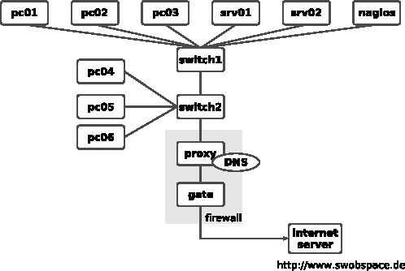
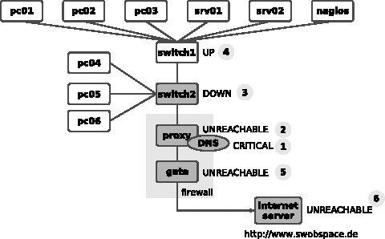
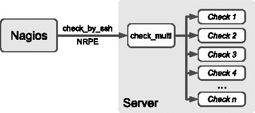
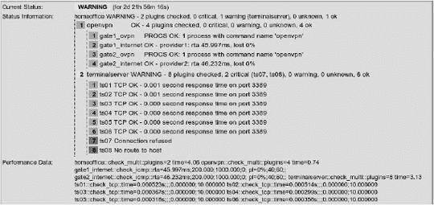
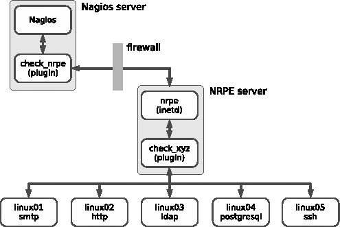
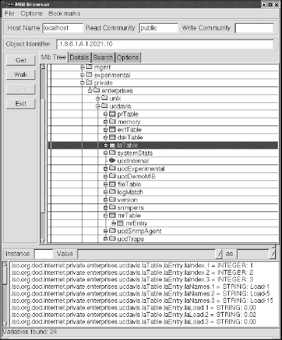
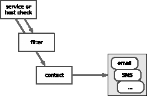
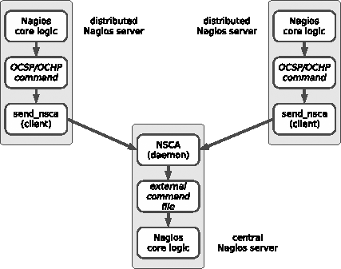

# 第二部分：更详细地...

# 第四章：Nagios 基础

如果一个主机可以访问，但上面没有运行任何依赖的服务，那么这个事实本身几乎没有意义。因此，Nagios 中的所有内容都围绕着服务检查展开。毕竟，没有主机就无法运行服务。如果主机计算机失败，它就无法提供所需的服务。如果，例如，一个位于用户和提供服务的系统之间的路由器被引入，事情会变得稍微复杂一些。如果这个路由器失败了，目标主机上可能仍然运行着所需的服务，但对于用户来说，它仍然无法访问。

Nagios 能够重现这样的依赖关系，并精确地通知管理员一个重要网络组件的故障，而不是让管理员被无法访问的服务的不相关错误信息淹没。理解这些依赖关系对于 Nagios 的平稳运行至关重要，这就是为什么 4.1 考虑网络拓扑 将会详细检查这些依赖关系以及 Nagios 的工作方式。

另一个重要的事项是主机或服务的 *状态*。一方面，Nagios 允许比仅仅 OK 或 "not OK" 更精细的区分；另一方面，*软状态* 和 *硬状态* 之间的区分意味着管理员不必处理那些在管理员收到信息时早已消失的短期中断。这些状态也会影响服务检查的强度。这种功能是如何工作的将在 4.3 主机和服务的状态 中详细描述。

# 4.1 考虑网络拓扑

Nagios 如何处理主机和服务的依赖关系，可以通过一个例子来最好地说明。图 4-1 表示一个包含要监控的 **`proxy`** 上的域名服务的小型网络。



图 4-1. 示例网络的拓扑

服务检查始终是系统定期执行的监控的起点。只要服务可以访问，Nagios 就不会采取进一步措施；也就是说，它不会执行任何主机检查.^([41])

对于 **`switch1`**、**`switch2`** 和 **`proxy`**，这样的检查无论如何都是没有意义的，因为如果 DNS 服务对 **`proxy`** 响应，那么提到的主机将自动可访问。

然而，如果域名服务失败，Nagios 将通过主机检查测试相关的计算机，以查看是服务还是主机导致了问题。

如果**`proxy`**无法访问，Nagios 可能会测试配置中输入的**`parent`**主机（图 4-2）。通过**`parents`**主机参数，管理员可以提供有关网络拓扑结构的信息给 Nagios。


图 4-2. 服务失败后执行的测试顺序

在进行此操作时，管理员只需为每个主机输入与 Nagios 服务器同一路径上的直接相邻计算机作为父节点。42] 同一网络段内分配的主机定义为没有父节点。对于图 4-1 中的网络拓扑，相应的配置（简化为主机名和父节点）如下所示：

```
define host{
    host_name      proxy
    ...
  **parents switch2**
}
define host{
    host_name      switch2
    ...
  **parents switch1**
}
define host{
    host_name      switch1
    ...
}
```

**`switch1`**位于与 Nagios 服务器相同的网络段中，因此没有分配父计算机。属于网络段的是一种观点。如果您将交换机解释为段限制，就像这里的情况一样，这有一个优点，即可以更紧密地隔离中断。但您也可以有不同的看法，将 IP 子网解释为段。那么，路由器就会形成段限制；在我们的例子中，**`proxy`**就会计入与 Nagios 服务器相同的网络。然而，将无法区分**`proxy`**的故障与**`switch1`**或**`switch2`**的故障。



图 4-3. Nagios 对单个网络节点的分类

如果示例中的**`switch1`**失败，图 4-3 显示了 Nagios 执行的顺序。首先，系统检查**`proxy`**上的 DNS 服务并确定该服务已无法访问（1）。为了区分，它现在执行主机检查以确定**`proxy`**计算机的状态（2）。由于**`proxy`**无法访问，但它有**`switch2`**作为父节点，Nagios 在**`switch2`**上执行主机检查（3）。如果这个交换机也无法访问，系统会检查其父节点，即**`switch1`**（4）。

如果 Nagios 能够与**`switch1`**建立联系，那么**`proxy`**上 DNS 服务失败的故障原因就可以隔离到**`switch2`**。系统相应地指定了主机的状态：**`switch1`**是 UP 状态，**`switch2`**是 DOWN 状态；另一方面，**`proxy`**是不可达的。通过适当配置 Nagios 消息系统（参见第 267 页的 12.3 消息过滤器），你可以使用这种区别来确定，例如，只有当主机处于 DOWN 状态并代表实际问题时，管理员才会被通知，而不是通知那些依赖于 DOWN 主机的其他主机。

在进一步的操作中，Nagios 可以确定网络中的其他拓扑特定故障（所谓的*网络中断*）。**`proxy`**是**`gate`**的父节点，因此**`gate`**也被表示为 UNREACHABLE（5）。**`gate`**反过来又作为父节点；依赖于这个节点的互联网服务器也被分类为“UNREACHABLE”。

这种“智能”，即 Nagios 所特有的，当更多主机和服务依赖于一个失败的组件时，对管理员帮助就更大了。对于一个骨干网中的路由器，它依赖于数百个主机和服务，系统会通知管理员具体的故障，而不是发送数百条本质上没有错误但实际对消除故障没有帮助的错误消息。

* * *

^([41]) 第 95 页的 4.2 按需主机检查与定期可达性测试讨论了这些*按需检查*。

^([42]) 参数名称**`parents`**可以通过以下事实来解释：存在一些场景——例如在高可用性环境中——其中主机有两个上游路由器来保证互联网连接，例如。

# 4.2 按需主机检查与定期可达性测试的比较

原则上，Nagios 定期执行服务检查，除了被动服务检查。 （参见第 293 页的 13.2 被动服务检查。）对于主机检查，有一些稍微不同的规则适用，因为它们扮演着主要角色。Nagios 在需要时执行主机检查——也就是说，*按需*——并使用它们来监控那些安装了服务的状态变为错误状态的主机，或者那些与失败主机存在拓扑依赖关系的主机。第三种方式是通过主机依赖性，如第 289 页的 12.6.2 仅在异常情况下：主机依赖性所述。按需主机检查是 Nagios 的核心功能，因为这是系统唯一能够精确通知管理员一个失败的中央交换机，而不是用成千上万关于不可达服务的错误消息轰炸他的方式。

定期间隔计划的主机检查——在 Nagios 术语中称为*主动主机检查*——只扮演了较小的角色。尽管 Nagios 2.0 确实提供了一种实现这种方式的方法，但 Nagios 2.x 只以串行方式执行主动主机检查，这被认为是一个真正的性能杀手。

在 Nagios 3.0 中，检查是同时执行的，消除了早期版本性能下降的问题。如果使用 3.0 之前的 Nagios 版本，建议不要使用主动主机检查。然而，在 Nagios 3.0 中，像这样的常规主机检查可以帮助提高性能，因为该版本可以缓存检查结果，如果需要，可以指定缓存时间。Nagios 在需要时将回退到缓存的结果，从而节省大量时间——前提是这些结果仍然足够最新。Nagios 3.0 中主机检查的新逻辑在第 689 页的 H.7 主机检查的新逻辑中进行了处理。

在 Nagios 2.x 中，可以通过使用基于 ping 的服务检查技巧来定期检查主机的可达性（参见第 108 页的 6.2 使用 Ping 进行可达性测试）。Nagios 并行执行服务检查，因此在 Nagios 2.x 下的性能下降问题得到了缓解。同时，你还可以获得更多额外信息，如响应时间或可能的丢包，这为网络负载或可能的网络问题提供了间接线索。另一方面，主机检查即使在许多数据包丢失且网络性能极差的情况下也会发出 OK 状态。正如“主机检查”这个名字所暗示的，这里涉及到的仅仅是原则上可达性，而不是连接质量。

# 4.3 主机和服务的状态

Nagios 使用插件进行主机和服务检查。它们提供四种不同的返回值（参见第 105 页的表 6-1）：**`0`**（OK），**`1`**（WARNING），**`2`**（CRITICAL），和**`3`**（UNKNOWN）。

返回值 UNKNOWN 表示插件运行通常出错，可能是由于参数错误。通常可以指定插件启动时发出警告或临界状态的情况。

Nagios 通过插件的返回值来确定服务和主机的状态。服务状态与返回值 OK、WARNING、CRITICAL 和 UNKNOWN 相同。对于主机来说，情况略有不同：UP 状态描述了一个可达的主机，DOWN 表示计算机已关闭，而 UNREACHABLE 指的是不可达状态，此时 Nagios 无法测试主机是否可用，因为父节点已关闭（参见 4.1 考虑网络拓扑，第 92 页）。

此外，Nagios 在两种状态之间做出区分：软状态和硬状态。如果问题首次发生（即，直到现在服务的状态都没有问题），则程序最初将该新状态分类为软状态，并重复测试几次。可能的情况是，错误状态只是短暂的事件，稍后就被消除了。只有当错误在多次测试后仍然存在时，Nagios 才将其分类为硬状态。管理员只会被告知硬状态，因为涉及短期中断的消息，而这些中断随后又立即消失，只会导致信息的不必要泛滥。

在我们的示例中，可以非常简单地说明服务状态的时间序列。使用以下参数的服务用于此目的：

```
define service{
     host_name                              proxy
     service_description                    DNS
     ...
     **normal_check_interval**[43] **5**
 **retry_check_interval**[44] **1**
 **max_check_attempts**              **5**
     ...
}
```

**`normal_check_interval`** 指定了 Nagios 在服务状态正常或存在硬状态时应检查相应服务的间隔——在这种情况下，每五分钟检查一次。**`retry_check_interval`** 定义了软状态期间两次服务检查之间的间隔——在示例中为 一分钟。如果发生新的错误，Nagios 将在更短的间隔内更仔细地检查服务。

**`max_check_attempts`** 确定了在首次发生错误后服务检查应重复的次数。如果达到 **`max_check_attempts`** 并错误状态持续，Nagios 将在 **`normal_check_interval`** 中指定的间隔内再次检查服务。

图 4-4 以图形形式表示了时间序列的进展。插图从 OK 状态（这始终是硬状态）开始。通常 Nagios 将在五分钟间隔内重复服务检查。十分钟时发生错误；状态变为 CRITICAL，但最初是软状态。此时，Nagios 尚未发出任何消息。

现在，系统以 **`retry_check_interval`** 中指定的间隔检查服务。这里是一分钟。在总共五次（如 **`max_check_attempts`** 中指定）检查并得到相同结果后，状态从软状态变为硬状态。只有现在 Nagios 才会通知相关人员。现在测试将以 **`normal_check_interval`** 中指定的间隔重复进行。


图 4-4. 监控服务状态时间序列的示例

在下一次测试中，服务再次可用；因此其状态从 CRITICAL 变为 OK。由于 OK 状态始终是硬状态，因此这种变化不会受到 Nagios 在更短间隔内进行的任何测试的影响。

服务在硬状态错误后过渡到 OK 状态被称为*硬恢复*。系统会通知管理员这一点（如果配置了这样做），以及各种错误相关联的硬状态之间的变化（例如从 WARNING 到 UNKNOWN）。如果服务从错误软状态恢复到正常状态（OK），也称为*软恢复*，管理员将不会收到通知。

即使消息系统省略了软状态并切换回软状态，它仍然会在 Web 界面和日志文件中记录这些状态。在 Web 前端，可以通过**`2/5`**的值出现在**尝试**列中来识别软状态。这意味着**`max_check_attempts`**期望**`五个`**尝试，但到目前为止只进行了两个。在硬状态下，**`max_check_attempts`**在相应的位置列出两次，在示例中是**`5/5`**。

对于 Web 界面中的管理员来说，比状态是否仍然是“软”还是已经“硬”的区别更重要的是**持续时间**列中的错误状态持续时间。从这个数据可以更好地判断整体问题可能有多大。

对于由于主机故障而不可用的服务，**尝试**列中会出现 1/5 的条目，因为 Nagios 不会重复进行服务检查，直到整个主机再次可访问。计算机的故障可以通过 Web 界面中的颜色更容易地识别：3.3 Web 界面概述中的服务概览图用红色标记失败的宿主；如果计算机可访问，背景保持灰色。

* * *

^([43]) 作为一种替代，Nagios 3.0 允许使用从主机定义中已知的表示法，**`check_interval`**。

^([44]) 对于 Nagios 3.0，你可以使用**`retry_interval`**作为替代。

# 第五章。服务检查及其执行方式

为了测试服务，Nagios 使用称为*插件*的外部程序。在最简单的情况下，这涉及到测试一个互联网服务，例如 SMTP。在这里，服务可以通过网络直接访问，因此只需要在 Nagios 服务器上调用一个测试远程主机上邮件服务器的本地程序就足够了。

并非所有你可能想要测试的内容都可以通过网络轻松访问；例如，没有网络协议可以用来检查硬盘的空闲容量。在这种情况下，你必须通过远程 shell 在远程主机上启动一个插件（但首先这个插件必须安装在远程计算机上），或者使用其他方法，例如*简单网络管理协议（SNMP）*，来测试硬盘容量。

这里提供了不同的方法，但这并不使开始使用 Nagios 变得更容易。因此，本章提供了常见方法的概述，并试图理解涉及的基本概念。随后章节将提供详细的配置示例。


图 5-1. Nagios 允许不同的测试方法。

图 5-1 展示了 Nagios 支持的多种测试方法的概述。带有灰色背景的上方框标记了所有直接在 Nagios 服务器机器上运行的组件：这包括服务器本身，以及插件和其他辅助工具。这个单元与五个客户端接触，以各种方式对这些客户端进行测试。接下来的几节将更详细地介绍个别方法。

为了监控第一个客户端（从左起标记为**`service`**）上的网络服务，Nagios 服务器运行其“自己的”插件**`check_xyz`**（5.1 Testing Network Services Directly，第 101 页）。对于第二个客户端，它启动“中间插件”**`check_by_ssh`**，以便在远程客户端上远程执行它真正想要的插件（5.2 Running Plugins via Secure Shell on the Remote Computer，第 102 页）。

在第三种情况下，插件也直接在客户端机器上执行，但现在 Nagios 使用专门为此目的创建的 NRPE 服务。查询在 Nagios 端通过**`check_nrpe`**进行（5.3 The Nagios Remote Plugin Executor，第 102 页）。

第四种方法通过 SNMP 进行查询。为此，客户端必须有一个可用的 SNMP 代理（11.1 Introduction to SNMP，第 228 页）。有各种插件可用于通过 SNMP 查询数据（5.4 Monitoring via SNMP，第 103 页）。

这四种方法代表“主动”检查，因为 Nagios 主动采取行动并触发测试。相比之下，第五种方法是“被动”的。在这种情况下，Nagios 不会主动采取任何行动，而是等待客户端通过程序**`send_nsca`**发送给 Nagios 服务器的传入信息。在 Nagios 服务器本身，*Nagios 服务检查接受器*，NSCA，作为一个守护进程运行，接受传输的结果并将它们转发到外部命令的接口（参见 5.5 The Nagios Service Check Acceptor，第 104 页）。

除了这些方法之外，还有其他执行检查的方式。通常，客户端会安装一个独立的服务，然后 Nagios 服务器通过专门的插件查询该服务。这里的一个典型例子是 NSClient/NC_Net，它可以用来监控 Windows 服务器（20.2.1 NSClient，第 464 页）。

# 5.1 直接测试网络服务

邮件或 Web 服务器可以通过网络非常简单地测试，因为底层协议 SMTP 和 HTTP 按定义是网络兼容的（图 5-1，第 100 页，客户端 1）。Nagios 可以调用广泛的插件，每个插件都针对特定的服务进行了专门化。

这样的特定程序比通用的程序有优势。通用插件只测试相应的 TCP 或 UDP 端口是否打开，以及服务是否在那里等待，但它并不确定正确的服务是否在端口上，或者它是否处于活动状态。

特定插件采用网络协议，并测试相关端口上的服务是否按预期行为。例如，邮件服务器在建立连接后通常会以所谓的*问候*进行响应：

```
220 swobspace.de ESMTP
```

这里重要的是数字 **`220`**。200 系列数字表示正常，220 代表问候。**`check_smtp`** 插件评估这个回复。它还可以模拟发送邮件时的初始对话（除了问候之外），如 6.3 监控邮件服务器第 113 页中所示。

它与其他特定插件的行为类似，例如**`check_http`**，它不仅能够处理简单的 HTTP 对话，而且在需要时还会操作 HTTP 头，检查 Web 服务器的 SSL 功能和证书，甚至可以使用**`POST`**命令向服务器发送数据（更多内容请参阅 6.4 监控 FTP 和 Web 服务器，第 118 页）。

安装 Nagios 插件的软件包是单独安装的（请参阅 1.4 安装和测试插件，第 43 页），它包括最重要的网络服务的特定插件。如果缺少特定服务的插件，值得查看 Nagios 主页^([45])或 Nagios 附加组件交换.^([46])

如果在这些位置找不到合适的插件，可以使用通用插件**`check_tcp`**或**`check_udp`**，除了执行纯端口测试外，它们还会向目标端口发送数据并评估响应。（在大多数情况下，这只有在涉及基于 ASCII 的协议时才有意义。）更多关于通用插件的内容请参阅 6.7.1 测试 TCP 端口，第 132 页。

* * *

^([45]) [`www.nagios.org/`](http://www.nagios.org/)

^([46]) [`www.nagiosexchange.org/`](http://www.nagiosexchange.org/)

# 5.2 在远程计算机上通过安全壳运行插件

要测试本地资源，如硬盘容量、交换区的负载、当前 CPU 负载或特定进程是否正在运行，有各种**本地插件**可供使用。它们被称为“本地”插件，因为它们必须安装在被检查的计算机上。

Nagios 服务器无法直接通过网络访问此类信息，除非采取进一步措施。然而，它可以通过远程 shell 在远程主机上启动本地插件（图 5-1，第 100 页，客户端 2）。在这里应仅考虑使用**安全壳**，SSH；**远程壳**，RSH，存在太多的安全漏洞。

要做到这一点，Nagios 服务器运行程序**`check_by_ssh`**，该程序将命令作为参数传递，以在目标主机上运行本地插件。为此，**`check_by_ssh`**需要一种无需密码登录目标主机的方法，这可以通过**公钥认证**来设置。

从 Nagios 服务器的角度来看，**`check_by_ssh`**是处理其结果的插件。它不会注意到有关安全壳连接和远程插件启动的任何内容——主要的是回复必须符合 Nagios 标准，并包含状态以及一行供管理员查看的注释文本。（参见第 105 页第六章的介绍。）

关于通过安全壳执行插件**远程执行**的更多信息，请参阅第 205 页的第九章。

# 5.3 Nagios 远程插件执行器

通过安全壳运行目标计算机上安装的插件的另一种方法是**Nagios 远程插件执行器**（NRPE）。图 5-1（第 100 页）以中间客户端为例说明了这一点。

NRPE 安装在目标主机上，并通过 inet 守护进程启动，必须相应地配置。如果 NRPE 通过（可选的）TCP 端口 5666 从 Nagios 服务器接收查询，它将运行相应的查询。与使用安全壳的方法一样，要执行测试的插件必须安装在目标主机上。

因此，所有这些与使用安全壳相比都要做更多的工作，尤其是 SSH 应该安装在几乎每一台 Unix 机器上，并且当它被使用时，可以在 Nagios 服务器上集中配置监控。然而，安全壳方法需要一个具有本地壳的账户，从而允许在目标主机上运行任何命令。^([47]) 相反，远程插件执行器仅限于配置的命令。

如果你不想让用户 **`nagios`** 在目标主机上执行任何需要密码的操作，那么坚持使用 NRPE 会更好。该安装配置在第十章")中描述，第 213 页。

* * *

^([47]) 安全壳允许在不打开单独的壳的情况下执行单个命令。然而，通常你将想要测试多个资源，因此你需要运行多个命令。

# 5.4 通过 SNMP 监控

使用 *简单网络管理协议*，即 SNMP，可以通过网络查询本地资源（参见图 5-1, 第 100 页)中的客户端 4。如果安装了 SNMP 守护进程（广泛使用 NET-SNMPD，并在第 238 页的 11.2.2 NET-SNMP 守护进程中描述），Nagios 可以使用它来查询本地资源，如进程、硬盘和接口负载。

SNMP 的优势在于其广泛的应用。UNIX 和 Windows 系统都有相应的服务，几乎所有现代网络组件，如路由器和交换机，都可以通过 SNMP 进行查询。甚至不间断电源（UPS）和其他设备有时也具有网络连接，可以通过 SNMP 提供当前状态信息。

除了标准的插件 **`check_snmp`**，一个通用的 SNMP 插件，还有各种专门的插件，它们专注于特定的 SNMP 查询，但有时使用起来更简单。例如，**`check_ifstatus`** 和 **`check_if-operstatus`** 专注于网络接口的状态。

如果你第一次处理 SNMP，你很快就会意识到，当定义该协议时，“可读性”似乎并不是优先考虑的事项之一。SNMP 查询针对机器处理进行了优化，例如用于网络监控工具。

如果你使用供应商提供的网络组件工具，SNMP 将基本上对用户隐藏。但为了与 Nagios 一起使用，你必须动手操作，并涉及协议及其底层语法。这需要一些习惯，但事实上并没有看起来那么困难。

SNMP 的使用是第十一章（第 227 页）的主题；在那里你可以学习如何配置和使用 Linux 和其他 UNIX 系统的 SNMP 守护进程。

# 5.5 Nagios 服务检查接受者

处理服务检查结果的方法之一导致了*Nagios 服务检查接受者*，NSCA 的使用。它作为 Nagios 服务器上的守护进程运行，等待接收测试结果（参见图 5-1，位于第五章的右侧）。这种方法被称为*被动*，因为 Nagios 本身并不主动。

NSCA 使用 CGI 脚本使用的外部命令接口，以及其他接口，向 Nagios 发送命令。它由一个*命名管道*组成，Nagios 从中读取外部命令。使用命令**`PROCESS_SERVICE_CHECK_RESULT`**，Nagios 处理在其他地方确定的测试结果。该接口的详细信息在 13.1 外部命令接口的第 292 页有更详细的描述。

NSCA 的主要用途是*分布式监控*。这意味着有多个不同的 Nagios 安装将它们的结果发送到一个中央 Nagios 服务器。分布式的 Nagios 服务器，可能在公司的不同分支，作为自主和独立的 Nagios 实例运行，除了它们还将结果发送到总部。这并不是积极检查分散的网络，而是以纯粹被动的方式处理来自分支的信息。

NSCA 不仅限于分布式监控。使用程序**`send_nsca`**，可以将测试结果发送出去，这些结果并非来自 Nagios 实例，而是来自例如执行所需服务检查的 cron 作业。

在使用 NSCA 之前，你应该考虑安全性方面的问题。因为外部程序可以使用它来向 Nagios 发送信息和命令，所以存在被滥用的风险。这不应该阻止你使用 NSCA，而应该激励你在配置 NSCA 时关注安全性方面。

关于使用 NSCA、分布式监控以及一般安全性的更多信息，请参阅第十四章的第 299 页。

* * *

^([48]) 命名管道是一个缓冲区，一个进程向其中写入数据，另一个进程从中读取数据。这个缓冲区在文件系统中被赋予一个名称，以便可以具体地指向它，这就是为什么它被称为*命名管道*。

# 第六章 网络服务插件

用于主机和服务检查的每个插件都是一个独立且独立的程序，也可以独立于 Nagios 使用。反过来，就不那么容易了：为了使 Nagios 使用外部程序，它必须遵守某些规则。其中最重要的是程序返回的返回状态。通过使用它，Nagios 可以精确评估状态。表 6-1 显示了可能值。

表 6-1. Nagios 插件的返回值

| 状态 | 名称 | 描述 |
| --- | --- | --- |
| 0 | OK | 一切正常 |
| 1 | WARNING | 警告限制已超过，但尚未达到临界限制 |
| 2 | CRITICAL | 超过临界限制或插件在超时后中断了测试 |
| 3 | UNKNOWN | 插件内部发生错误（例如使用了错误的参数） |

因此，插件不是通过使用“OK—Not OK”的模式来区分的，而是更加细致。为了能够将状态分类为 WARNING，它需要知道某个事件在什么测量值以下被视为 OK，何时被视为 WARNING，以及何时被视为 CRITICAL。

例如，除了响应时间外，ping 还会返回数据包丢失率。对于慢速网络连接（ISDN、DSL），1000 毫秒的响应时间可以被视为警告限制，5000 毫秒为临界，因为这意味着交互式工作将不再可能。如果网络连接负载高，偶尔也会发生数据包丢失，^([49]) 因此可以将 20%的数据包丢失指定为警告限制，60%为临界限制。

在所有情况下，管理员决定哪些值应作为警告信号或被视为临界。由于所有服务都可以单独配置，因此每个主机的值可能不同，即使在同一插件中也是如此。

插件总是有一个 *超时时间*，通常是十秒。这防止程序无限期地等待，从而阻止大量插件进程在 Nagios 主机上积累。在其他方面，对于许多应用来说，超过 10 秒的响应时间也几乎没有意义，因为这些应用会在一定时间后中断连接尝试，这具有与相应服务完全失败相同的效果。在这种情况下，管理员可以介入并明确指定不同的超时时间。

所有插件的一个进一步特点是文本输出，Nagios 在其概览中显示它。它主要面向管理员，因此需要是“可读的”。Nagios 2.x 只处理第一行，这里的输出可能不超过 300 个字符。自 3.0 版本以来，Nagios 已不再有此限制。输出可以有多个行，长度可达 8KB（参见 8.5.1 多行插件输出）。然而，在 Web 界面中，Nagios 3.0 也只显示第一行。因此，简单插件应将其输出限制为单行，多行输出仅推荐用于特殊应用，例如**`plugin check_multi`** (8.5 使用 check_multi 汇总检查）。文本输出的以下形式已经确立：

```
*TYPE_OF_CHECK STATUS - informational text*
```

实际的文本输出看起来像这样：

```
SMTP OK - 0.186 sec. response time
DISK WARNING - free space: /net/eli02/a 3905 MB (7%);
```

上述示例分别来自**`check_smtp`**和**`check_disk`**插件。在这两种情况下，检查类型（此处为**`SMTP`**或**`DISK`**）后面跟着文本形式的状况，然后是实际信息。并非所有插件都遵循此建议进行输出。有时测试类型的细节缺失，有时甚至状况也缺失。

不同的插件也提供性能信息，这些信息可以用外部程序进行评估和图形表示（参见第十九章）：

```
OK - 172.17.129.2: rta 97.751ms, lost 0%| rta=97.751ms;200.000;500.000;0; pl=0%;40;80;;
```

如此可见，从**`check_icmp`**插件的示例中，性能数据遵循文本输出，由管道字符**`|`**分隔。这些数据在 Web 界面中不会显示。

**`check_icmp`**在这里提供两个值：中等的回复时间，**``*`r`*``****`ta`** (*Real Time Answer*，实际时间回答)，以毫秒为单位，以及数据包丢失率，**`pl`**.^([50]) 对于每个变量，插件首先显示测量值（**`97.751`**毫秒和**`0%`**），然后是警告限制（200 毫秒或 40%）和临界限制（500 毫秒或 80%）。Developer Guidelines 指定了只有**``*`r`*``****`ta`**或**`pl`**列表中的第一个值提供单位，因为变量的单位不会改变，所以只需要给出一次。

为了尽可能简化安装过程（1.4 安装和测试插件]) 用于测试网络服务。借助它们，Nagios 服务器查询其他服务器上的服务。描述仅限于对正常操作重要的功能。如果您对所有选项感兴趣，我们建议您参考集成在线帮助。

# 6.1 标准选项

表 6-2 列出了所有插件共有的选项。粗体字体的选项必须为所有插件所知。非粗体字体的关键词可以被程序省略，但如果它们被支持，则必须按照指定的意义使用。

如果一个选项需要参数，通常在简短形式中通过空格分隔，但在长形式中通过等号分隔。但对于 Perl 或 shell 脚本特别地，并非所有作者都遵循这些规则，因此在这里您没有选择，只能查看相应的描述。

表 6-2. 插件的标准选项

| 简短形式 | 长形式 | 描述 |
| --- | --- | --- |
| ^([a]) |
| **`-h`** | **`--help`** | 输出在线帮助 |
| **`-V`** | **`--version`** | 输出插件版本 |
| **`-v`** | **`--verbose`** | 输出额外信息——此选项可以多次给出^([a]) |
| **`-H`** | **`--hostname`** | 目标的主机名或 IP 地址 |
| **`-t`** | **`--timeout`** | 超时时间（秒），在此时间后插件将中断操作并返回 CRITICAL 状态 |
| **`-w`** | **`--warning`** | 指定警告限制值 |
| **`-c`** | **`--critical`** | 指定临界限制值 |
| **`−4`** | **`--use-ipv4`** | 强制使用 IPv4 |
| **`−6`** | **`--use-ipv6`** | 强制使用 IPv6 |

|

^([a]) 这是否会导致更多信息取决于特定的插件...

|

因此，不允许使用**`-c`**，例如，用于指定除临界限制以外的任何内容。另一方面，**`-c`**和**-w**的确切使用方法可能因插件而异，因为有时可能需要一个单独的值，而在其他时候，可能需要多个值（也请参阅下面对插件**`check_icmp`**的解释）。

大多数插件也具有**`−4`**和**`−6`**选项，但在版本 1.4 之前并不一定如此。

* * *

^([49]) ICMP 数据包不会被重发；丢失的数据包将保持丢失。

^([50]) 短称*数据包丢失*。

^([51]) 1.4 版本之前的版本不应再使用。一些参数已更改，并且通常性能数据输出会缺失。此外，插件开发者付出了巨大的努力来清理现有错误并不断改进插件。

# 6.2 使用 Ping 进行可达性测试

UNIX 系统中的经典可达性测试一直是 ping，它发送 ICMP 回显请求数据包并等待 ICMP 回显响应数据包。Nagios 插件包包括两个执行此 ping 检查的程序：**`check_icmp`**和**`check_ping`**。尽管**`check_ping`**在标准配置中使用，但你应该用更有效的**`check_icmp`**来替换它，该功能自插件版本 1.4 以来已包含在内。

而**`check_ping`**调用 UNIX 程序**`/bin/ping`**，这就是为什么总是与现有的**`ping`**版本存在兼容性问题，**`check_icmp`**则无需任何外部帮助程序发送 ICMP。**`check_icmp`**基本上更有效率，因为它不像**`ping`**那样在各个数据包之间等待一秒钟。此外，它还会评估 ICMP 错误消息，如**`ICMP 主机不可达`**，而**`check_ping`**会丢弃这些消息。**`check_icmp`**与**`check_ping`**向后兼容；这使得可以完全不用**`check_ping`**，并用**`check_icmp`**来替换它。

**`check_icmp`**测量 ICMP 数据包的回复时间并确定丢失的数据包比例。如果收到的是预期的**`ICMP 回显应答`**之外的错误消息，则会立即进行评估。因此，如果收到**`ICMP 主机不可达`**消息，Nagios 会中断测试。

**`check_icmp`**有以下选项^([52])。

**`-H`** **``*`地址`*``**

没有要测试的计算机的主机名或 IP 地址，**`check_icmp`**无法工作。使用**`-H`**，可以使用空格分隔多个**``*`主机`*``**条目。

**`-w`** **``*`response_time,packet_loss_percent%`*``**

此开关设置警告的警告限制。**``*`响应时间`*``**代表所需的响应时间（以毫秒为单位），**``*`丢包百分比`*``**代表相应的丢包百分比。如果你指定**`-w 500.0,20%`**，则插件会在响应时间至少为 500.0 毫秒或 20%或更多 ICMP 数据包丢失时发出警告。

**`-c`** **``*`response_time,packet_loss_percent%`*``**

此开关以与**`-w`**定义警告值相同的方式指定临界限制。临界限制应始终大于警告限制。

**`-n`** **``*`数据包`*``**

使用**``*`数据包`*``**，你可以设置**`check_icmp`**在每次测试中应使用的数据包数量。默认为**`5`**个数据包。

**`-i`** **``*`数据包间隔`*``**

此开关设置发送到同一主机的两个单独数据包之间的时间间隔。默认为 80 毫秒。它指定为浮点数（例如，**`-i 80.000`**）。

**`-I`** **``*`目标间隔`*``**

此开关设置向不同主机发送数据包的时间间隔（前提是 **`-H`** 包含多个主机）。默认值为 **`0`** 毫秒，意味着向多个主机发送数据包是同时进行的。

**`-m`** **``*`number_of_reachable_hosts`*``**

此开关指定必须可访问的主机数量，插件才能返回 OK。此选项允许简单的集群检查：

```
nagios@linux:local/libexec$ **./check_icmp -m 2 -H 192.168.1.9**
\
**192.168.1.11 192.168.1.13**
OK - 192.168.1.9: rta 0.098ms, lost 0% :: **192.168.1.11: rta nan, lost 100%** ::
192.168.1.13: rta 0.744ms, lost 0%|192.168.1.9rta=0.09 8ms;200.000;500.000;0;
 192.168.1.9pl=0%;40;80;; 192.168.1.11rta=0\. 000ms;200.000;500.000;0;
 192.168.1.11pl=100%;40;80;;
 192.168.1.13r ta=0.744ms;200.000 ;500.000;0; 192.168.1.13pl=0%;40;80;;
```

在指定的三个主机中，**`192.168.1.11`**（加粗显示）无法访问。**`-m 2`** 仅请求两个可访问的主机；因此，结果是 OK。如果没有这个细节，结果将是 CRITICAL，因为有一个主机无法访问。

**`-l`** **``*`ttl`*``**

大于 **`0`** 的值设置 IP 数据包的 TTL（生存时间）。默认值是 **`0`**，这意味着插件将 TTL 的选择留给操作系统。

**`-t`** **``*`timeout`*``**

经过 **``*`timeout`*``** 秒后，插件中断测试并返回 CRITICAL 状态。默认值为 **`10`** 秒。

与程序 **`/bin/ping`** 一样，**`check_icmp`** 也必须以 **``*`r`*``****`oot`** 权限运行，这就是为什么设置了 SUID 位：

```
linux:~ # **chown root.nagios /usr/local/nagios/libexec/check_icmp**
linux:~ # **chmod 4711 /usr/local/nagios/libexec/check_icmp**
linux:~ # **ls -l /usr/local/nagios/libexec/check_icmp**
-rwsr-x--x l root nagios 61326 2005-02-08 19:49 check_icmp
```

作为测试，您应该在命令行上以用户 **`nagios`** 的身份执行插件，因为 Nagios 将后来以这个账户执行它：

```
nagios@linux:~$ **cd /usr/local/nagios/libexec**
nagios@linux:nagios/libexec$ **./check_icmp -H 192.168.1.13** \ **-w 100.0,20%
 -c 200.0,40%**

OK - 192.168.1.13: rta 0.253ms, lost 0%| rta=0.253ms;100.000;200.000;0; pl=0%;20;40;;
```

**`check_icmp`** 然后发送标准数量的五个 ICMP 数据包。如果所有数据包的平均响应时间至少为 100.0 毫秒，或者丢失 20% 或更多——即至少有一个数据包在五个中，它就会立即发出警告。对于 CRITICAL 状态，平均响应时间必须至少为 200.0 毫秒，或者至少有两个数据包（五个中的 40%）未得到响应。

## 6.2.1 **`check_icmp`** 作为服务检查

为了将 **`check_icmp`** 用作服务检查，您需要一个合适的命令对象。包含 **`check_ping`** 的文件 **`checkcommands.cfg`** 已经有一个用于 ping 服务。我们只需将其中的 **`check_ping`** 插件替换为 **`check_icmp`**：

```
define command{
 **command_name   check**_**ping**
      command_line          $USER1$/**check**_**icmp** -H $HOSTADDRESS$ -w $ARG1$ -c
 $ARG2$
}
```

宏 **`$HOSTADDRESS$`** 提供了主机定义中 **`address`** 参数的 IP 地址，以及两个自由定义的宏 **`$ARG1$`** 和 **`$ARG2$**，可以从服务定义中获取参数，因此可以使用这些宏设置警告和临界限制。

在 **`PING`** 服务的服务定义（此处显示的是其中的一部分）中，除了要执行的命令对象的名称外，现在还需要两个参数，这些参数在命令之后输入，并用感叹号分隔：

```
define service{
    service_description   PING
    host_name             linux01
    **check_command      check_ping!100.0,20%!500.0,60%**
   ...
}
```

从命令对象的定义中，您可以看到第一个参数（**`100.0,20%`**）定义了警告限制，第二个参数（**`500.0,60%`**）定义了临界值。

## 6.2.2 **`check_icmp`** 作为主机检查

要能够在主机检查中使用名为 **`check_host`** 的插件，需要设置一个指向 **`check_icmp`** 的相应符号链接：

```
linux:~ # **cd /usr/local/nagios/libexec**
linux:nagios/libexec # **ln -s check_icmp check**_**host**
```

如果以新名称 **`check_host`** 调用，该插件会稍微修改其行为：在收到第一个 ICMP 回显响应后中断测试，因为单个响应包就足以证明主机“活着”。如果第一个返回的响应是错误消息，例如 **`ICMP 网络不可达`** 或 **`主机不可达`**，则主机被认为是不可达的。

主机检查的定义与其他检查类似。唯一的区别是，这个测试是在定义主机对象时指定的（而不是服务对象）：

```
define host{
    host_name           linux01
    alias               Linux File Server
    address             192.168.1.21
     **check**_**command   check-host-alive**
    ...
}
```

这里使用的名称 **`check-host-alive`** 可以自由定义，并且可以为每个主机单独指定。命令本身的定义是在 **`checkcommands.cfg`** 中进行的：

```
define command{
 **command**_**name  check-host-alive**
      command_line         $USER1$/**check**_**host** -H $HOSTADDRESS$
}
```

主机检查不总是需要使用 **`check_icmp`** 来执行。你也可以测量冰箱温度或使用 TCP 或 UDP 的通用插件（**`check_tcp`** 和 **`check_udp`**；参见第 132 页的 6.7.1 测试 TCP 端口）来测试特定的端口是否打开。例如，端口扫描器 **`nmap`** 使用 TCP 端口 80（HTTP）。

这种方法的缺点在于，除了主机本身之外，还需要运行另一个应用程序——即 Web 服务器。此外，对特定应用程序的测试并不能证明计算机不再可访问。ping 的一大优点是内核会自己回复 ICMP 回显请求消息，因此不需要运行任何应用程序。因此，只有当有充分的理由时，才应该从 ping 转换到其他主机检查方法。一个例子可能是一个防火墙，它会过滤 ICMP 消息，管理员无法对其产生影响，但允许通过 TCP 端口 80 的 HTTP 查询。

* * *

^([52]) 在线帮助 **`check_icmp`** -h 表示它还知道一些长格式选项，但这些选项至今尚未实现。

^([53]) 与任何其他对象一样，服务定义也可以定义在你选择的文件中，Nagios 会从这个文件中加载对象定义。为了清晰起见，最好为文件选择一个描述性的名称，例如 **`services.cfg`**，就像我们在简单结构示例中所做的那样。

# 6.3 监控邮件服务器

许多插件也可用于监控邮件服务器。邮件服务器本身（*邮件传输代理*（MTA））由**`check_smtp`**监控，而邮件服务器上的邮件队列可以通过**`check_mailq`**进行检查。由于后者的测试是在本地进行的，因此该插件将在下一章 7.8 定期检查邮件队列状态（第 180 页）中描述。

要监控*邮件用户代理*（MUA）协议 POP3 和 IMAP——包括 SSL 变体 POP3S 和 IMAPS——使用插件**`check_tcp`**。**`check_pop`**等是**`check_tcp`**的符号链接，它通过被调用的名称确定应测试哪种协议，并做出相关预设。

## 6.3.1 使用**`check_smtp`**监控 SMTP

SMTP 监控插件**`check_smtp`**有以下选项：

**`-H`** **``*`address`*``** **`/--host=`****``*`address`*``**

详细说明应检查 SMTP 服务的计算机。

**`-p`** **``*`port`*``** **`/--port=`****``*`port`*``**

**``*`port`*``**确定端口，如果邮件服务不在标准端口 25 上监听。例如，可以使用这种方式监控邮件病毒扫描器 Amavis（通常端口 10024）。但通常只能从**`localhost`**访问。

**`-e`** **``*`string`*``** **`/--expect=`****``*`string`*``**

**``*`string`*``**定义了邮件服务器必须在第一行回复中提供的文本。**``*`string`*``**的默认设置是**`220`**，这是正常 SMTP 问候语开始的地方，但可能有服务器有不同的设置。监控服务的错误回复将生成一个警告。

**`-f`** **``*`address`*``** **`/--from=`****``*`address`*``**

使用**``*`address`*``**指定一个邮件地址，**`check_smtp`**随后将使用“**`MAIL FROM:`**”命令将该地址发送到服务器。此选项是测试 Microsoft Exchange 2000 服务器所必需的。

**`-C`** **``*`"mail command"`*``** **`/--command=`****``*`"mail command"`*``**

使用**`-C`**可以向服务器发送单个邮件命令，以稍微扩展测试（见以下示例）。

**`-R`** **``*`"string"`*``** **`/--response=`** **``*`"string"`*``**

如果您使用**`-C`**向服务器发送 SMTP 命令，您可以在这里指定预期的回复，而不是**``*`string`*``**（例如，**`250`**）。一个“错误”的回复将触发一个警告。

**`-S / --starttls`**

测试期间建立的连接使用 STARTTLS。

**`-D`** **``*`duration`*``****`/--certificate=`****``*`duration`*``**

用于 STARTTLS 的证书必须仍然有效的最小持续时间（以天为单位）。

**`-A / --authtype=`****``*`autheutication type`*``**

SMTP-Auth 过程的认证类型。默认是**`none`**（无认证）。目前唯一支持的过程是**`LOGIN`**，它基于用户密码对。

**`-U / --authuser=`****``*`user`*``**

如果使用 **`-A LOGIN`**，则为 SMTP 身份验证的用户名。

**`-P / --authpass=`****``*`密码`*``**

如果指定了 **`-A LOGIN`**，则附带密码。

**`-w`** **``*`浮点数秒`*``** **`/--warning=`****``*`浮点数秒`*``**

如果服务器回答所需时间超过 **``*`浮点数秒`*``**，则 **`check_smtp`** 会发出警告。

**`-c`** **``*`浮点数秒`*``** **`/--critical=`****``*`浮点数秒`*``**

与 **`-w`** 类似，但 **`check_smtp`** 在 **``*`浮点数秒`*``** 秒后发出 CRITICAL。

在最简单的情况下，你只需输入邮件服务器的名称或 IP 地址：

```
nagios@linux:nagios/libexec$ **./check_smtp -H smtp01**
SMTP OK - 0,008 sec. response time|time=0,008157s;;;0,000000
```

在收到 SMTP 问候后，插件 **`check_smtp`** 会发送一个 **`HELO`** **``*`主机名`*``**，其中应包含回复 **`250`**。

在这种情况下，相应的命令对象定义如下：

```
define command{
    command_name **check_smtp**
    command_line      $USER1$/**check_smtp** -H $HOSTADDRESS$
}
```

要使用此选项检查主机对象 **`linux01`**，需要以下服务定义：

```
define service{
     service_description     SMTP
     host_name               linux01
      **check_command    check_smtp**
     ...
}
```

使用 **`-C`** 选项，可以将 SMTP 对话扩展得更远，大致直到 **`RCPT TO`**：

```
nagios@linux:nagios/libexec$ **./check_smtp -H localhost** \
 **-C "MAIL FROM: <bla@gna.dot>" -R "250"** \
 **-C "RCPT TO: <bla@gna.dot>" -R "554"**
SMTP OK - 0,019 sec. response time|time=0,018553s;;;0,000000
```

例如，此类测试可以用来检查内置在邮件服务器中的限制配置（无效域名、垃圾邮件防御等）。示例检查邮件服务器是否拒绝接受包含无效域名 **`gna.dot`**（即在 **`RCPT TO`** 中）的邮件。如果服务器以 **`554`** 的状态拒绝邮件，则测试运行成功。在此处，**`check_smtp`** 所执行的操作对应于以下由 **`telnet`** 复制的邮件对话：

```
user@linux:~$ **telnet localhost 25**
Trying 127.0.0.1...
Connected to loca1host.
Escape character is '^]'.
220 swobspace.de ESMTP
**helo swobspace**
250 swobspace.de
**MAIL FROM: <bla@gna.dot>**
250 Ok
**RCPT TO: <bla@gna.dot>**
554 <bla@gna.dot>: Recipient address rejected: test not existing top lev
el domain
...
```

如果邮件服务器没有因为配置错误而拒绝接收者域名，则回复将不再包含 **`554`**，插件将发出警告。

通常，在检查限制时，你应该记住，服务器只有在收到 **`RCPT TO:`** 后才会拒绝邮件，即使在此之前（一个特定的客户端 IP 地址、**`HELO`** 中的服务器名称或 **`MAIL FROM:`** 中的发送者地址）已经发生了这种情况。

## 6.3.2 POP 和 IMAP

有四个伪插件可用于测试 POP 和 IMAP 协议：**`check_pop`**、**`check_spop`**、**`check_imap`** 和 **`check_simap`**。它们被称为伪插件，因为它们只是对插件 **`check_tcp`** 的符号链接。通过插件调用的名称，这确定了其预期用途，并相应地设置了所需的参数，例如标准端口、是否应向服务器发送某些内容、预期的响应以及如何终止连接。所有插件都使用相同的选项，因此我们将一起介绍它们：

**`-H`** **``*`地址`*``** **`/--host=`****``*`地址`*``**

这指定了要检查 POP 或 IMAP 的计算机。

**`-p`** **``*`端口`*``** **`/--port=`****``*`端口`*``**

**``*`port`*``**指定一个替代端口，如果插件旨在监视标准端口以外的端口：**`check_pop`**为 110，**`check_spop`**为 995，**`check_imap`**为 143，**`check_simap`**为 993（另见**`/etc/services`**）。

**`-w`** **``*`floating_point_dec`*``** **`/--warning=`****``*`floating_point_dec`*``**

占位符**``*`floating_point_dec`*``**被替换为响应时间的警告限制，以秒为单位，指定为浮点小数。

**`-c`** **``*`floating_point_dec`*``** **`/--critical=`****``*`floating_point_dec`*``**

这设置了响应时间的临界限制（秒），（见**`-w`**）。

**`-s`** **``*`"string"`*``** **`/--send=`****``*`"string"`*``**

此字符串要发送到服务器。在默认设置下，四个插件都不使用此选项。

**`-e`** **``*`"string"`*``** **`/--expect=`****``*`"string"`*``**

**``*`string`*``**指定一个文本字符串，该字符串必须包含在服务器的响应中。默认情况下，(S) POP 为+**`0K`**，(S)IMAP 为**`* OK`**。此选项可以多次给出，以在答案中搜索不同的部分字符串。

**`-E / --escape`**

此选项允许在**`-s`**和**`-e`**的详细信息中使用转义序列**`\n`**、**`\r`**、**`\t`**或简单地使用**`\`**。在所有情况下，**`-E`**必须放在它要影响的选择**`-s`**和**`-e`**之前。

**`-A / --all`**

如果你指定了多个回复字符串与**`-e`**，带有**`-A`**的插件只有在找到所有必需的回复字符串时才会返回 OK。没有这个选项，多个搜索字符串中只要有一个找到就足以触发积极的确认。

**`-M`** **``*`return value`*``** **`/ -mismatch=`****``*`return value`*``**

如果返回的字符串与**`-e`**中的声明不匹配，插件应该如何反应？默认值为**`warn`**，表示有 WARNING。使用**`crit`**可以将错误返回值指定为 CRITICAL，使用**`ok`**则为 OK。

**`-q`** **``*`"string"`*``** **`/--quit=`****``*`"string"`*``**

这是请求服务结束连接的字符串。对于(S)POP，这是**`QUIT\r\n`**，对于(S)IMAP，**`al L0G0UT\r\n`**。

**`-S / --ssl`**

测试期间建立的连接使用 SSL/TLS 进行连接。如果你调用插件**`check_simap`**和**`check_spop`**，此选项会自动设置。为了建立连接，服务器必须在指定的端口上直接支持 SSL/TLS。

仅凭 STARTTLS 本身不支持插件。使用

```
./check_imap -H *computer* -s "a1 CAPABILITY" -e "STARTTLS"
```

你至少可以检查服务器是否提供此方法：如果回复字符串包含 STARTTLS，插件返回 OK，如果不包含，则返回 WARNING。但这并不是真正测试 STARTTLS 是否真正正常工作的测试。

**`-D`** **``*`duration`*``** **`/--certificate=`****``*`duration`*``**

此开关指定用于 STARTTLS 的证书将保持有效的天数。

**`-r`** **``*`return_value`*``** **`/ -refuse=`****``*`return_value`*``**

此开关指定如果服务器拒绝 TCP 连接，插件返回哪个值。默认值为 **`crit`**（严重）。如果没有任何 POP 或 IMAP 服务可用，可以设置 **`ok`** 值。第三个可能的值，**`warn`**，会触发警告。

**`-m`** **``*`bytes`*``** **`/--maxbytes=`****``*`bytes`*``**

此开关建议插件在接收到指定数据量（以字节为单位）后关闭 TCP 连接。

**`-d`** **``*`seconds`*``** **`/--delay=`****``*`seconds`*``**

此开关在发送字符串到服务器后等待指定时间，然后搜索使用 **`-e`** 指定的字符串。

当然，所有通用插件 **`check_tcp`**（在第 132 页的 6.7.1 测试 TCP 端口 中描述）的其他选项都可以与 **`check_pop`**、**`check_spop`**、**`check_imap`** 和 **`check_simap`** 一起使用。

在最简单的情况下，您只需提供要测试的计算机名称（此处：**`mailsrv`**）或 IP 地址：

```
nagios@linux:nagios/libexec$ **./check_pop -H mailsrv**
POP OK - 0.064 second response time on port 110 [+OK eli11 Cyrus POP3
v2.1.16 server ready <1481963980.1118597146@eli11>]
|time=0.064228s;0.000000;0.000000;0.000000;10.000000
```

在每种情况下，插件仅提供一行输出，这里为了布局原因进行了换行。管道字符 **`|`** 后面的详细信息涉及 Web 界面未显示的性能数据。性能数据的结构和处理方式在 19.1 使用 Nagios 处理插件性能数据 中有更详细的描述，第 404 页。

作为命令对象实现，上述 **`check_pop`** 命令看起来是这样的：

```
define command{
    command_name **check_pop**
    command_line     $USER1$/**check_pop** -H $HOSTADDRESS$
}
```

作为对 **`linuxO1`** 机器的服务，它被集成如下：

```
define service{
    service_description     POP
    host_name               linux01
     **check_command    check_pop**
     ...
}
```

* * *

^([54]) STARTTLS 指的是在建立正常连接之后，服务设置 SSL/TLS 加密连接的能力——例如，对于 POP3，通过 TCP 端口 110。实现 STARTTLS 的每个服务都必须有一个合适的命令来完成此操作。对于 POP3，这被称为 **`STLS`**（见 RFC 2595）。STARTTLS 与 SMTP、LDAP、IMAP 和 POP3 等一起使用，但并非所有服务器都自动支持此方法。

# 6.4 监控 FTP 和 Web 服务器

Nagios 插件包提供了两个插件来监控经典的互联网服务 FTP 和 HTTP（包括 HTTPS）：**`check_ftp`** 和 **`check_http`**。当网络中的许多用户使用 Web 服务时，通常会使用代理。为了监控这一点，您也可以使用 **`check_http`**，但与 **`check_squid.pl`** 插件相比，Nagios Exchange 有一个更好的工具可用。

## 6.4.1 FTP 服务

插件 **`check_ftp`** 与 POP 和 IMAP 插件一样，是通用插件 **`check_tcp`** 的符号链接，因此它也有相同的选项。它们在 132 页的 6.7.1 测试 TCP 端口 中详细描述。

如果使用名称 **`check_ftp`** 调用通用插件，则设置以下参数：

```
--port=21 --expect="220" --quit="QUIT\r\n"
```

它不会向服务器发送字符串，而是期望包含文本 **`220`** 的回复，并且使用 **`QUIT\r\n`** 清洁地结束到标准端口 21 的连接。

在命令行中，通常有一行回复（对于打印版本，带有换行符），其中包含在 **`|`** 字符后面的性能数据，该数据在 Web 界面中未显示（参见 404 页的 19.1 使用 Nagios 处理插件性能数据 以了解此信息）：

```
nagios@linux:nagios/libexec$ **./check_ftp -H ftp.gwdg.de**
FTP OK - 0,130 second response time on port 21 [220-Gesellschaft fuer wi
ssenschaftliche Datenverarbeitung mbH Goettingen] |time=0,130300s;0,0000
00;0,000000;0,000000;10,000000
```

作为命令对象，此调用如下所示：

```
define command{
     command_name **check_ftp**
     command_line   $USER1$/**check_ftp** -H $HOSTADDRESS$
}
```

相应的服务定义看起来如下：

```
define service{
    service_description    FTP
    host_name              linux01
 **check_command   check_ftp**
    ...
}
```

## 6.4.2 通过 HTTP 控制 Web 服务器

根据 intended use，HTTP 和 HTTPS 的 **`check_http`** 插件包含大量非常有用的选项：

**`-H`** **``*`virtual_host`*``** **`/--hostn.ame=`****``*`virtual_host`*``**

此开关指定插件在 HTTP 头部的 **`host:`** 字段中传输的虚拟主机名：

```
nagios@linux:nagios/libexec$ **./check_http -H www.swobspace.de**
HTTP OK HTTP/1.1 200 OK - 2553 bytes in 0.154 seconds
```

如果您不想 **`check_http`** 发送此信息，可以使用 **`-I`** 代替。

**`-I`** **``*`ip-address`*``** **`/--IP-address=`****``*`ip-address`*``**

而不是 **``*`ip`*``**，给出目标计算机的计算机名或 IP 地址。对于具有多个虚拟环境的系统，您将进入默认环境，对于大多数 Web 托管提供商，您将收到错误消息：

```
nagios@linux:nagios/libexec$ **./check_http -I www.swobspace.de**
HTTP WARNING: HTTP/1.1 404 Not Found
```

**`-u`** **``*`url_or_path`*``** **`/--url=`****``*`url_or_path`*``**

参数是要发送到 Web 服务器的 URL。如果设计文档位于要测试的服务器上，则只需输入从服务器的 *文档根* 开始的目录路径：

```
nagios@linux:nagios/libexec$ **./check_http -H linux.swobspace.net \**
 **-u /mailinglisten/index.html**
HTTP OK HTTP/1.1 200 OK - 5858 bytes in 3.461 seconds
```

如果未指定此选项，插件将请求文档根**`/`**。

**`-p`** **``*`port`*``** **`/--port=`****``*`port`*``**

这是 HTTP 的替代端口指定。

**`-w`** **``*`floating_point_dec`*``** **`/--warning=`****``*`floati.ng_point_dec`*``**

这是 Web 服务器响应时间的警告限制（以秒为单位）。

**`-c`** **``*`floating_point_dec`*``** **`/--critical=`****``*`floating_point_dec`*``**

这是 Web 服务器响应时间的临界限制（以秒为单位）。

**`-t`** **``*`timeout`*``** **`/--timeout=`****``*`timeout`*``**

在 **``*`timeout`*``** 秒后过期，插件中断测试并返回 CRITICAL 状态。默认值为 **`10`** 秒。

**`-L`** **`/--link-url`**

此选项确保在文本输出中，虚拟主机在 Web 界面中作为链接显示。

```
nagios@linux:nagios/libexec$ **./check_http -H www.swobspace.de -L**
<A HREF="http://www.swobspace.de:80/" target="_blank"> HTTP OK HTT P/1.1 200 OK
 - 2553 bytes in 0.156 seconds</A>
```

**`-a`** **``*`username : password`*``** **`/--authorization=`****``*`username : password`*``**

如果 Web 服务器需要身份验证，可以使用此选项指定用户密码对。然而，插件只能处理**基本身份验证**；**摘要身份验证**目前尚不可行。

**`-f`** **``*`behavior`*``** **`/--onredirect=`****``*`behavior`*``**

如果 Web 服务器将重定向作为对请求的 Web 页面的回复发送，**``*`behavior`*``**参数会影响插件的行为。允许的值有**`ok`**、**`warning`**、**`critical`**和**`follow`**。默认值为**`ok`**，因此插件将简单地返回 OK，而不会跟随重定向。可以通过**`follow`**使插件跟随重定向。带有重定向的**`warning`**和**`critical`**返回**`WARNING`**或**`CRITICAL`**状态。

**`-e`** **``*`"string"`*``** **`/--expect=`****``*`"string"`*``**

这是服务器响应应在其第一行状态中包含的文本。如果未指定此选项，插件期望**`HTTP/1`**作为**``*`*string`*``**。

**`-s`** **``*`"string"`*``** **`/--string=`****``*`"string"`*``**

这是在页面返回的内容中插件搜索的搜索文本，而不是在标题中。

**`-r`** **``*`"regexp"`*``** **`/--regex=`****``*`"regexp"`*``**

这是插件应在返回的页面中搜索的正则表达式。

**`-R`** **``*`"regexp"`*``** **`/--eregi=`****``*`"regexp"`*``**

此开关与**``*`-r`*``**类似，但插件现在不区分大小写。

**`--invert-regex`**

这将**``*`-r`*``**或**`-R`**的搜索反转。如果匹配，插件现在返回 CRITICAL 而不是 OK。

**`-l`** **`/--linespan`**

通常，正则表达式的搜索限制在一行内，使用**``*`-r`*``**和**`-R`**。如果**`−l`**在这些选项之前，搜索模式可以引用多行文本。

**`-P`** **``*`string`*``** **`/--post=`****``*`string`*``**

使用此开关发送您希望通过 POST 命令发送到 Web 服务器的数据。**``*`*string`*``**中的字符必须按照 RFC 1738 进行编码：仅允许字母 A 到 Z（大小写）、特殊字符**`$-_. + !*' ()`**和数字 0 到 9。

要发送文本**Übung für Anfänger**（德语中的“Exercise For Beginners”），在发送之前必须对重音符号和空格进行编码：**%DCbung%20f%FCr%20Anf%E4nger**。

**`-T`** **``*`string`*``** **`/ -content-type=`****``*`string`*``**

这指定了头部的**`内容类型`**，如果您正在使用**`--post`**向服务器发送某些内容。默认为**`application/x-www-form-urlencoded`**。所有内容类型的列表在文件**`/etc/mime.types`**中给出，格式描述可以在 RFC2045 中找到.^([57])

**`-m`** **``*`min_bytes:max_bytes`*``** **`/--pagesize=`****``*`min_bytes:max_bytes`*``**

此参数定义返回的页面必须至少为**``*`min_bytes`*``**大小，否则插件将发出警告。您还可以使用一个上限（由冒号分隔）来指定网页的大小。现在**`check_http`**如果返回的页面大于**``*`max_bytes`*``**，也会发出警告。在以下示例中，如果返回的页面大小至少为 500 字节且最多为 2000 字节，则一切正常：

```
nagios@linux:nagios/libexec$ **./check_http -H www.swobspace.de** \
 **m 500:2000**
HTTP WARNING: page size 2802 too large|size=2802B;500;0;0
```

**`-N`** **`/--no-body`**

使用此选项，插件不会等待服务器返回完整的页面内容，而是只读取头部数据。为此，它使用 HTTP 命令**`GET`**或**`POST`**，而不是**`HEAD`**。

**`-M`** **``*`seconds`*``** **`/--max-age=`****``*`seconds`*``**

如果返回的文档早于头部中指定的日期（HTTP 头部字段**`Date:`**），则插件将生成警告。除了秒（不包含其他详细信息）之外，您还可以使用显式单位，例如**`5m`**（五分钟）、**`12h`**（十二小时）或**`3d`**（三天）；不允许组合。

**`-A`** **``*`"string"`*``** **`/--useragent=`****``*`"string"`*``**

此参数明确指定 HTTP 头中的用户代理，例如**`-A "Lynx/1.12"`**用于 Lynx 版本 1.12。通常插件不会发送此字段。

**`-k`** **``*`"string"`*``** **`/--header=`****``*`"string"`*``**

这指定了任何 HTTP 头标签。如果需要指定多个标签，它们必须由分号分隔，如下例所示：

```
-k "Accept-Charset: iso-8859-1; Accept-Encoding: compress, gzip;"
```

**`-S`** **`/--ssl`**

这强制使用 SSL 连接：

```
nagios@linux:nagios/libexec$ **./check_http --ssl -H \**
 **www.verisign.com**
HTTP OK HTTP/1.1 200 OK - 33836 bytes in 1.911 seconds
```

主机[www.verisign.com](http://www.verisign.com)允许 SSL 连接。如果不是这种情况，服务器将返回错误，插件将返回值 CRITICAL:^([58])

```
nagios@linux:nagios/libexec$ **./check_http --ssl -H www.swobspace.de**
Connection refused
Unable to open TCP socket
```

**`-C`** **``*`days`*``** **`/--certificate=`****``*`days`*``**

测试证书是否至少有效给定天数。否则将发出警告。

**`−4`** **`/--use-ipv4`**

测试是在 IPv4 连接上明确进行的。

**`−6`** **`/--use-ipv6`**

测试是在 IPv6 连接上明确进行的。

相应命令对象及其作为服务的定义与基于其他插件的不同；6.4.3 监控 Web 代理展示了示例。

## 6.4.3 监控 Web 代理

### 使用**`check_http`**进行代理测试

类似于 Squid 这样的代理也可以用**`check_http`**进行测试，但这假设您对浏览器如何与代理建立联系有一些了解。它是通过以下形式的 HTTP 头部来做的：

```
GET **http://www.swobspace.de/** HTTP/1.1
Host: **www.swobspace.de**
User-Agent: Mozilla/5.0 (X11; U; Linux i686; de-DE; rv:1.7.5)
Gecko/20041108 Firefox/1.0
Accept: text/xml,application/xml,application/xhtml+xml,...
Accept-Language: de-de,de;q=0.8,en-us;q=0.5,en;q=0.3
Accept-Encoding: gzip,deflate
Accept-Charset: ISO-8859-15,utf-8;q=0.7,*;q=0.7
Keep-Alive: 300
Proxy-Connection: keep-alive
Pragma: no-cache
Cache-Control: no-cache
```

决定性的条目以粗体形式打印。与正常的 Web 服务器查询相比，浏览器通过 GET 命令从服务器请求文档，而不是指定目录路径，而是使用包括协议类型在内的完整 URL。在**`Host:`**字段中，它指定了它实际上想要到达的 Web 服务器的名称。对于直接发送到 Web 服务器（而不是通过代理）的正常 HTTP 查询，Web 服务器的名称将写入那里。此行为可以用**`check_http`**来重现：

```
nagios@linux:nagios/libexec$ **./check_http -H www.swobspace.de** \
 **-I 192.168.1.13 -p 3128 -u http://www.swobspace.de**
HTTP OK HTTP/1.0 200 OK - 2553 bytes in 0.002 seconds
```

为了在头部设置**`Host:`**字段，您需要使用**-H**指定 Web 服务器的名称。非本地 URL 由**`-u`**强制，同时指定**-I**确保代理被寻址，而不是 Web 服务器本身。最后，您需要选择代理端口，然后代理测试就完成了。然后**`check_http`**将以下 HTTP 头部发送到代理：

```
GET **http://www.swobspace.de HTTP/1.0**
User-Agent: check_http/v1861 (nagios-plugins 1.4.11)
Connection: close
Host: **www.swobspace.de**
```

此测试不使用代理的任何特定实现信息，因此它应该与每个 Web 代理一起工作。

命令对象定义为如下：

```
define command{
    command_name **check_proxy**
    command_line   $USER1$/**check_http** -H www.googl
e.de -u http://www.google.de -I $HOSTADDRESS$ -p $ARG1$
}
```

然后使用以下服务测试代理计算机**`linuxO1`**：

```
define service{
    service_description    Webproxy
    host_name              linux01
 **check_command   check_proxy!3128**
    ...
}
```

参数**`3128`**确保命令对象**`check_proxy`**可以从**`$ARG1$`**中读取端口。

### 使用**`check_squid`**进行代理测试

在上一节中介绍的**`check_http`**代理检查仅在所需 Web 页面可用或已存在于缓存中时才有效。如果这两种情况都不成立，此测试将产生错误，即使代理在原则上正在工作。

插件**`check_squid.pl`**使用不同的方法，但它不是标准安装的一部分，可以在**检查插件**类别下找到，在**软件 | HTTP & FTP | Squid 代理**下.^([59])

它利用 Squid 代理的**缓存管理器**，该管理器通过伪协议进行查询。命令以以下形式发送

```
GET cache_object: //*ip_address/command* HTTP/1.1\n\n
```

向 Squid 发送并获取所需信息。插件**`check_squid.pl`**使用**`info`**命令，该命令查询一系列统计使用信息：

```
user@linux:~$ **echo "GET cache_object://192.168.1.13/info HTTP/1.1\n\n"** \
    | **netcat 192.168.1.13 3128**
...
File descriptor usage for squid:
         Maximum number of file descriptors:     1024
         Largest file desc currently in use:       18
         Number of file desc currently in use:     15
         Files queued for open:                     0
         Available number of file descriptors:   1009
         Reserved number of file descriptors:     100
         Store Disk files open:                     0
...
```

它针对的是仍然空闲的文件描述符数量（从末尾起的第三行）；您可以为此值设置警告或临界限制。文件描述符的数量在同时访问 Squid 缓存中的对象时发挥作用。在具有大量并行访问代理的环境下，1024 个文件描述符可能不足。在只有几百个用户的小型网络中，并非所有用户都在同一时间上网，编译的 1024 值将足够。

`Squid 配置` 通常 Squid 只允许从**`localhost`**访问缓存管理器。为了使 Nagios 可以通过网络查询它，代理必须相应地重新配置：

```
...
acl manager proto cache_object
**acl nagiosserver 192.168.1.9**
**http_access allow manager nagiosserver**
http_access deny manager
**cachemgr_passwd none info menu**
...
```

配置文件**`squid.conf`**中必要的更改以粗体形式打印，其他相关行已包含在默认文件中。要打印的第一行定义了一个通过内部协议**`cache_object`**的访问控制列表（*访问控制列表*，**`acl`**）名为**`manager`**，因此它指的是使用**`cache_object`**协议访问代理的所有内容。接下来是一个基于 Nagios 服务器 IP 地址的访问控制列表，这里为**`192.168.1.9`**。列表名称**`nagiosserver`**可以在这里自由选择（第一行中的**`manager`**也可以自由选择）。通过**`http_access allow`**，**`nagiosserver`**在行之前获得对缓存管理器（**`manager`**）的访问权限。

```
http_access deny manager
```

通过**`cache_object`**协议禁止所有其他访问。最后，**`cachemgr_passwd`**为缓存管理器访问提供密码。如果您省略此选项，则没有密码，则应仅允许执行没有潜在更改事物的选定命令，例如**`info`**和**`menu`**，后者显示缓存管理器可以执行的所有操作。修改配置文件后，Squid 需要重新读取它：

```
linux:~ # **/etc/init.d/squid reload**
```

`应用插件` 测试插件**`check_squid.pl`**本身有以下选项：

**`-H`** **``*`address`*``** **`/--hostname=`****``*`address`*``**

这是 Squid 要测试的服务器，通过 IP 地址或 FQDN 指定。

**`-P`** **``*`port`*``** **`/ --port=`****``*`port`*``**

这指定了 Squid 监听的端口号。默认值为标准端口 3128。

**`-p`** **``*`password`*``** **`/ --password=`****``*`password`*``**

这是访问缓存管理器的密码。

**`-w`** **``*`free_descriptors`*``** **`/ --warning=`****``*`free_descriptors`*``**

这是插件将发出警告的空闲文件描述符数量。默认值为 200。

**`-c`** **``*`free_descriptors`*``** **`/ --critical=`****``*`free_descriptors`*``**

这是空闲文件描述符的临界限制。如果数量低于此值，**`check_squid`**返回 CRITICAL。默认值为 50。

当运行**`check_squid`**时，通常非常不起眼：

```
nagios@linux:nagios/libexec$ **./check_squid.pl -H 192.168.1.13**
Squid cache OK (1009 FreeFileDesc)
```

相应的命令也没有问题 ...

```
define command{
    command_name   **check_squid.pl**
    command_line $USER1$/**check_squid.pl** -H $HOSTADDRESS$
}
```

... 对于服务定义也是如此：

```
define service{
   service_description   Squid
   host_name             linux01
   **check_command  check_squid.pl**
   ...
}
```

* * *

^([55]) Posix 正则表达式，请参阅**`man 7 regex`**。

^([56]) [`www.faqs.org/rfcs/rfcl738.html`](http://www.faqs.org/rfcs/rfcl738.html)，第 2.2 段

^([57]) [`tools.ietf.org/html/rfc2045#section-5`](http://tools.ietf.org/html/rfc2045#section-5)

^([58]) 这可以在 shell 中通过**`echo $?`**进行检查。

^([59]) [`www.nagiosexchange.org/cgi-bin/pages/Detailed/1764.html`](http://www.nagiosexchange.org/cgi-bin/pages/Detailed/1764.html)

# 6.5 控制域名服务器

还提供了两个插件用于测试 *域名服务 (DNS)*：**`check_dns`** 和 **`check_dig`**。虽然 **`check_dns`** 通过使用外部 **`nslookup`** 程序测试主机名是否可以解析，但 **`check_dig`** 允许查询所有记录。这两个插件都是标准分发的一部分。

它们被使用的场景有所重叠。使用 **`check_dns`**，你也可以显式查询特定的 DNS 服务器，尽管这个插件实际上是用于检查名称服务是否通常可用。

# 6.5.1 使用 **`nslookup`** 进行 DNS 检查

**`check_dns`** 插件检查指定的主机名是否可以解析为 IP 地址。在本地使用时，该插件测试运行它的计算机上的 DNS 配置。对于名称解析，它使用 **`/etc/resolv.conf`** 中配置的名称服务器。

可能的选项同样不起眼。

**`-H`** **``*`主机`*``** **`/ --hostname=`****``*`主机`*``**

这是需要解析为 IP 地址的主机名。

**`-s`** **``*`DNS 服务器`*``** **`/ --server=`****``*`DNS 服务器`*``**

此选项明确指定要使用的名称服务器。如果此选项缺失，**`check_dns`** 将使用 **`/etc/resolv.conf`** 中的名称服务器。

**`-a`** **``*`IP 地址`*``** **`/ --expected-address=`****``*`IP 地址`*``**

**``*`IP 地址`*``** 是 **``*`主机`*``** 应该有的 IP 地址。如果名称服务返回不同的地址，插件将使用 CRITICAL 状态发出警报。此选项仅在需要名称服务器提供固定 IP 地址时才有意义。没有此选项，插件将接受所有 IP 地址作为回复。

**`-A / --expect-authority`**

使用 **`-s`** 指定的名称服务器应该能够权威地回答给定的查询，因此相应的域名必须充当主域名服务器或辅助域名服务器。如果不是这种情况，插件将返回 CRITICAL 状态。

**`-w`** **``*`浮点数`*``** **`/ - 警告=`****``*`浮点数`*``**

此选项指定名称服务器响应时间的警告限制（以秒为单位，指定为浮点数）。

**`-c`** **``*`浮点数`*``** **`/ - 临界=`****``*`浮点数`*``**

此选项以秒为单位指定名称服务器的临界响应时间，指定为浮点数。

**`-t`** **``*`超时`*``** **`/ --timeout=`****``*`超时`*``**

在 **``*`超时`*``** 秒后，插件中断测试并返回 CRITICAL 状态。默认值为 **`10`** 秒。

对于本地 DNS 配置测试（不是名称服务器），你只需要一个不太可能从 DNS 中消失的主机名，例如 [www.google.com](http://www.google.com)：

```
nagios@linux:nagios/libexec$ **/check_dns -H www.google.com**
DNS OK: 0,009 seconds response time www.google.com returns 216.239.59.99
```

在这种情况下，相应的命令定义如下：

```
define command{
    command_name **check_dns**
    command_line $USER1$/**check_dns** -H www.google.de
}
```

以下服务测试计算机 **`linux01`** 的域名服务器配置是否正常工作：

```
define service{
    service_description      DNS/nslookup
    host_name                linux01
    **check_command  check_dns**
    ...
}
```

# 6.5.2 使用 **`dig`** 监控域名服务器

插件 **`check_dig`** 为监控域名服务器提供了比 **`check_dns`** 更多的选项。正如其名所示，它基于外部实用程序 **`dig`**，旨在实现这一目的。

**`-H`** **``*`address`*``** / **`--hostname=`****``*`address`*``**

**``*`address`*``** 是要测试的 DNS 服务器的 IP 地址。也可以指定一个主机名（而不是 IP 地址），但在大多数情况下这几乎没有意义，因为这首先必须解析，然后才能到达域名服务器。

**`-p`** **``*`port`*``** **`/ --port=`****``*`port`*``**

此开关指定要使用的 UDP 端口。默认值为 **`53`**。

**`−1`** **``*`hostname`*``** **`/ --lookup=`** **``*`hostuame`*``**

**``*`hostname`*``** 是要测试的主机名。如果未查找特定计算机，而是仅测试 DNS 服务器的功能，则应在此处指定一个易于从互联网访问的地址，例如 [www.google.com](http://www.google.com)。

**`-T`** **``*`record_type`*``** **`/ --record_type=`****``*`record_type`*``**

此开关指定要查询的记录类型。默认为 **`A`**（IPv4 地址），但通常也使用 **`NS`**（相关域名服务器）、**`MX`**（相关 *邮件交换*）、**`PTR`**（*指针*；反向查找的 IP 地址）或 **`S0A`**（*授权源*，域的管理细节）。

**`-w`** **``*`floating_point_dec`*``** **`/ --warning=`****``*`floating_point_dec`*``**

此开关设置域名服务器响应时间的警告限制（以秒为单位，浮点十进制）。

**`-c`** **``*`floating_point_dec`*``** **`/ --critical=`****``*`floating_point_dec`*``**

此开关设置域名服务器在秒（浮点十进制）内的关键响应时间。

**`-a`** **``*`address`*``** **`/ --expected_address=`****``*`address`*``**

这是 **`dig`** 应在 *ANSWER SECTION* 中返回的地址。与 **`check_dns, check_dig`** 不同，只有当 IP 地址不匹配时，**`check_dig`** 才会发出警告，但回复本身已在该给定时间限制内到达。

**`-t`** **``*`timeout`*``** **`/ --timeout=`****``*`timeout`*``**

在 **``*`timeout`*``** 秒后过期，插件中断测试并返回 CRITICAL 状态。默认值为 **`10`** 秒。

以下两个示例检查域名服务器 **`194.25.2.129`**，通过请求其计算机 [www.swobspace.de](http://www.swobspace.de) 的 IP 地址。第二个示例以警告结束，因为域名服务器对 [www.swobspace.de](http://www.swobspace.de) 的回复返回了与 **`ANSWER SECTION`** 中的 **`1.2.3.4`** 不同的 IP 地址：

```
nagios@linux:nagios/libexec$ **./check_dig -H 194.25.2.129 -l** \
 **www.swobspace.de**
DNS OK - 2,107 Sekunden Antwortzeit (www.swobspace.de. 1800 IN A 21
2.227.119.101)
nagios@linux:nagios/libexec$ **./check_dig -H 194.25.2.129 -l** \
 **www.swobspace.de -a 1.2.3.4**
DNS WARNING - 0,094 Sekunden Antwortzeit (Server nicht gefunden in ANSWE
R SECTION)
```

示例 1 实现为一个命令对象，如下所示：

```
define command{
    command_name **check_dig**
    command_line $USER1$/**check_dig** -H $HOSTADDRESS$ −1 $ARG1$
}
```

为了测试特定的名称服务器 **`linux0l`**，您寻找 Nagios 应该始终能够解析的地址，例如 [www.google.com](http://www.google.com/)

```
define service{
   service_description     DNS/dig
   host_name               linux01
   **check_command    check_dig!www.google.com**
   ...
}
```

# 6.6 查询 Secure Shell 服务器

无论 Secure Shell 服务器使用的是协议版本 1 还是 2，对 Secure Shell 服务器的监控都由插件 **`check_ssh`**（包含在标准发行版中）负责。它相当简单，只是评估 SSH 握手。测试不需要用户名和密码。

不要与 **`check_sshis`** 混淆的插件 **`check_by_ssh`**（见第九章通过 SSH 执行插件），该插件在另一台计算机上远程启动插件。

**`-H`** **``*`address`*``** **`/ --hostname=`****``*`address`*``**

插件应建立 SSH 连接的计算机的主机名或 IP 地址。

**`-p`** **``*`port`*``** **`/ --port=`****``*`port`*``**

这指定了一个备用端口。默认为 22。

**`-r`** **``*`version`*``** **`/ --remote-version=`****``*`version`*``**

测试的 Secure Shell 的版本详细信息必须与指定的文本匹配，而不是 **``*`version`*``**，否则将发送警告（见下例）。如果版本详细信息包含空格，则字符串必须用双引号括起来。

**`-t`** **``*`timeout`*``** **`/ --timeout=`****``*`timeout`*``**

在 **``*`timeout`*``**（默认为 **`10`**）秒后，插件中断测试并返回 CRITICAL 状态。

以下示例依次测试本地计算机和 **`wobgate`** 上的 Secure Shell 守护程序，以查看是否正在使用 Debian Etch 的当前 SSH 版本：

```
nagios@linux:nagios/libexec$ **./check_ssh -H localhost** \
 **-r 'OpenSSH_4.3p2 Debian-9'**
SSH OK - OpenSSH_4.3p2 Debian-9 (protocol 2.0)
nagios@linux:nagios/libexec$ **./check_ssh -H wobgate -r** \
 **'OpenSSH_4.3p2 Debian-9'**
SSH WARNING - OpenSSH_3.8.1p1 Debian-8.sarge.6 (protocol 2.0) version mi
smatch, expected 'OpenSSH_4.3p2 Debian-9'
```

在 **`wobgate`** 上未使用 SSH 的最新版本。

在具有各种 Linux 发行版的异构环境中，您通常只需“手动”进行插件调用时才使用版本检查，并且很少将它们集成到 Nagios 配置中。相反，通常使用以下简单模式使用命令和服务定义就足够了：

```
define command{
    command_name **check_ssh**
    command_line        $USER1$/**check_ssh** -H $HOSTADDRESS$
}

define service{
    service_description   SSH
    host_name             linux01
     **check_command  check_ssh**
    ...
}
```

否则，您将面临在每次安全更新后都必须调整命令对象中版本号的风险。

# 6.7 通用网络插件

有时找不到与要监控的服务完全匹配的插件。对于此类情况，有两个通用插件可用：**`check_tcp`** 和 **`check_udp`**。它们都测试目标端口上是否针对相关协议有活动服务。尽管这还不能保证在端口上运行的服务确实是所需的服务，但在一个管理员负责和配置的环境中，可以通过其他方式充分保证这一点。

这两个插件都会向服务器发送一个字符串并评估回复。对于基于文本的协议，如 POP 或 IMAP，这最为简单：这两个“特定”插件，专为这两种邮件服务量身定制（参见第 115 页的 6.3.2 POP 和 IMAP），除了到**`check_tcp`**的符号链接外，没有使用任何其他东西，而**`check_tcp`**已经完成了相应的问答游戏，并设置了相关默认设置。

如果您知道要测试的协议，并配置了一个适合此协议的“测验”（对于二进制协议来说这不是一件容易的事），那么检查就不仅仅是端口扫描了。这样，通用插件也可以替代缺失的特定插件。

## 6.7.1 测试 TCP 端口

**`check_tcp`**专注于基于 TCP 的服务。与其通用性质一致，它有许多选项：

**`-H`** **``*`address`*``** **`/ --hostname=`****``*`address`*``**

这是应测试端口的计算机的 IP 地址或主机名。

**`-p`** **``*`port`*``** **`/ --port=`****``*`port`*``**

这指定了目标端口。与作为**`check_tcp`**符号链接的插件不同，此详细信息始终是必需的。

**`-w`** **``*`floating_point_dec`*``** **`/ --warning=`****``*`floating_point_dec`*``**

这将设置响应时间的警告限制（以秒为单位）。

**`-c`** **``*`floating_point_dec`*``** **`/ --critical=`****``*`floating_point_dec`*``**

这设置了一个类似于**`-w`**的时间限制，但指定了临界限制值。

**`-s`** **``*`"string"`*``** **`/ --send=`****``*`"string"`*``**

这是插件应发送到服务器的字符串。

**`-e`** **``*`"string"`*``****`/ --expect=`****``*`"string"`*``**

这是服务器回复中应包含的字符串。插件不会将其搜索限制在第一行。

**`-E`** **`/ --escape`**

这允许使用转义序列**`\n`**、**`\r`**、**`\t`**或简单地**`\`**来表示**`-s`**和**`-e`**。在所有情况下，**`-E`**必须放在影响**`-s`**和**`-e`**选项之前。

**`-A`** **`/ --all`**

如果您指定了多个回复字符串**`-e`**，则带有**`-A`**的插件只有在所有必需的回复字符串都被找到时才会返回 OK。如果没有此选项，只要找到几个字符串中的任何一个就足够了。

**`-M`** **``*`return_value`*``** **`/ --mismatch=`****``*`return_value`*``**

如果返回的字符串与**`-e`**指定的内容不匹配，插件应该如何反应？默认值为**`warn`**，这意味着会发出警告。使用**`crit`**，错误的返回值可能被分类为 CRITICAL，而使用**`ok`**，则被视为 OK。

**`-q`** **``*`"string"`*``** **`/ --quit=`****``*`"string"`*``**

这是请求服务结束连接的字符串。

**`-m`** **``*`bytes`*``** **`/ --maxbytes=`****``*`bytes`*``**

插件在接收到超过**``*`bytes`*``**后关闭连接。

**`-d`** **``*`floating_point_decimal`*``** **`/ --delay=`****``*`floating_point_decimal`*``**

这是发送字符串和检查响应之间的秒数间隔。

**`-t`** **``*`timeout`*``** **`/ --timeout=`****``*`timeout`*``**

在**``*`timeout`*``**（默认为**`10`**）秒后，插件停止测试并返回 CRITICAL 状态。

**`-j`** **`/ --jail`**

设置此选项将显示 TCP 输出。对于基于文本的协议，如 POP 或 IMAP，这通常是“可读的”，但对于二进制协议，你通常无法解析输出，因此**`-j`**是合适的。

**`-r`** **``*`return_value`*``** **`/ --refuse=`****``*`return_value`*``**

此选项指定插件在服务器拒绝 TCP 连接时返回的值。默认为**`crit`**（CRITICAL）。如果**``*`return_value`*``**为**`ok`**，则可以测试是否有一个不应从外部访问的服务可用。第三种可能的值，**`warn`**，确保给出 WARNING。

**`-D`** **``*`days`*``** **`/ --certificate=`****``*`days`*``**

这是服务器证书至少需要有效的天数范围，以便测试成功运行。这仅适用于 SSL 连接。请注意，存在混淆的危险：在**`check_http`**插件中，此相同选项是**`-C`**（见 6.4.2 通过 HTTP 控制 Web 服务器）。如果时间范围低于为服务器证书指定的时间段，插件将返回 WARNING。

**`-S`** **`/ --ssl`**

应使用 SSL/TLS 进行连接。插件无法处理 STARTTLS^([60]）。

以下示例检查命令行是否在目标主机**`192.168.1.89`**的 5631 端口上激活了服务，这是 Windows 远程控制软件 PCAnywhere 的 TCP 端口：

```
nagios@linux:nagios/libexec$ **./check_tcp -H 192.168.1.89 -p 5631**
TCP OK - 0,061 second response time on port 5631 | time=0,060744s;0,
000000;0,000000;0,000000;10,000000
```

对于所有计算机名和端口细节足以作为测试参数的服务，命令对象如下：

```
define command{
     command_name  **check_tcp**
     command_line       $USER1$/**check_tcp** -H $HOSTADDRESS$ -p $ARG1$
}
```

要监控机器**`Win0l`**上的 PCAnywhere，将使用以下服务定义：

```
define service{
   service_description   pcAnywhere
   host_name             Win01
   **check_command  check_tcp!5631**
   ...
}
```

* * *

^([60]) 见 6.3.2 POP 和 IMAP 中的脚注。

# 6.7.2 监控 UDP 端口

监控 UDP 端口并不简单，因为没有标准连接设置，例如 TCP 的 *三次握手*，在这个过程中连接被打开，但数据尚未传输。对于无状态协议如 UDP，没有发送和接收数据包的规范序列。服务器可以用 UDP 数据包回复客户端发送的 UDP 数据包，但它没有义务这样做。

如果你找到一个未使用的端口，请求的主机通常会发送一个 ICMP 端口不可达消息，这会评估插件。如果没有回复，有两种可能性：要么目标端口上的服务没有对请求做出反应，要么防火墙正在过滤网络流量（无论是 UDP 流量本身还是 ICMP 消息）。这就是为什么你永远不能确定特定端口背后的服务器是否真的提供了服务。

为了在可能的情况下强制得到积极的响应，你通常必须向服务器发送包含某种有意义消息的数据，使用**`-s`**选项。大多数服务不会对空或无意义的包做出响应。这就是为什么你不能避免了解相应的协议，因为否则你将无法向服务器发送有意义的数据，从而促使它给出回复。

自从 Nagios 插件版本 1.4.4 以来，**`check_udp`**一直是**`check_tcp`**的符号链接，因此**`check_udp`**具有与**`check_tcp`**相同的选项（参见 6.6 查询安全外壳服务器）。**`-p`** **``*`port`*``**、**`-s`** **``*`string`*``**和**`-e`** **``*`string`*``**是必填项，尽管集成在线帮助声明这些是可选的。

以下示例测试目标主机**`192.168.1.13`**上的服务是否在时间服务器（NTP）端口 123 上活跃。NTP 守护进程只对包含有意义请求的包做出响应（例如，内容以**`w`**开头的包）：

```
nagios@linux:nagios/libexec$ **./check_udp -H 192.168.1.13 -p 123 -s "w"** \
 **-e""**
UDP OK - 0.001 second response time on port 123 []|time=0.000586s;;;0.00
0000;10.000000
```

回复保持为空，因此回复字符串被指定为**`-e ""`**。NTP 服务器不会对非协议形式的包做出响应。通常，NTP 期望一个相对复杂的包^([61))，其中包含各种信息。这里使用的**`w`**是通过试错法找到的：它不包含真正有意义的资料，但它确实能促使服务器做出响应。

上面的命令行命令被实现为一个命令对象：

```
define command{
    command_name **check_udp**
    command_line $USER1$/**check_udp** -H $HOSTADDRESS$ -p $ARG1$ -s $ARG2$
}
```

在这里，我们将端口作为第一个参数传递；所有其他插件的选项都通过**`$ARG2$`**访问。

然后以下服务定义接管了检查 NTP 时间服务器：

```
define service{
   service_description
   host_name             timesrv
    **check_command  check_tcp!123!-s "w" -e ""**
   ...
}
```

如命令行示例所示，Nagios 将字符串**`w`**发送到服务以引发一个积极的响应。

* * *

^([61]) NTPv3 协议版本在 RFC 1305 中描述：[`rfc.sunsite.dk/rfc/rfcl305.html`](http://rfc.sunsite.dk/rfc/rfcl305.html)。

# 6.8 监控数据库

Nagios 提供了三个用于监控数据库的插件：**`check_pgsql`**用于 PostgreSQL，**`check_mysql`**用于 MySQL，以及**`check_oracle`**用于 Oracle。最后一项在本书中不会涉及^([62])。它们共同的特点是它们既可以在本地使用，也可以通过网络使用。后者的优点是相关的插件不需要安装到数据库服务器上。缺点是您必须更深入地了解认证主题，因为配置数据库的**安全本地**访问要简单一些。

对于不太关键的系统，插件的网络访问可以不使用密码进行。为此，用户**`nagios`**在要测试的数据库管理系统（DBMS）中设置了自己的数据库，其中不包含任何（重要）数据。通过此用户访问的区域可以通过数据库自身的权限系统与其他数据隔离，存储在 DBMS 中。

当然，您可以为用户**`nagios`**设置密码。但如果您无法使用 SSL 加密连接，大多数数据库连接将以明文形式传输。此外，它还在 Nagios 配置文件中未加密存储。在这方面，密码确实提供了一些保护，但并不真正安全。

作为一项额外措施，您当然应该限制用户**`nagios`**可以从 Nagios 服务器访问数据库的 IP 地址。

这里介绍的插件对数据库只有读取访问权限。**`check_mysql`**插件还允许进行纯连接检查，而不需要读取访问。在提到的任何插件中，数据库的写入访问均不可用。对于 Oracle，Nagios Exchange^([63])上有一个名为**`check_oracle_writeaccess.sh`**的插件，它也测试数据库的可写性。

## 6.8.1 PostgreSQL

使用**`check_pgsql`**插件，您可以建立到数据库的本地和网络连接。本地连接由 PostgreSQL 通过 Unix 套接字处理，这是一个纯粹的本地区域机制。如果显式传递目标主机给**`check_pgsql`**，则会通过它建立 IP 连接。插件对测试数据库执行纯连接测试，但不从中读取任何数据。

为了使 PostgreSQL 可以通过网络访问，您必须启动**`postmaster`**程序，使用**`-i`**选项，或者在配置文件**`postgresql.conf`**中将参数**`tcpip_socket`**设置为**`true`**。

### 配置便于监控的 DBMS

为了更清晰地分离用户**`nagios`**（执行插件）可以看到的数据与其他数据，您首先设置一个具有相同名称的数据库用户，并授予此用户访问权限的数据库：

```
postgres@linux:~$ **createuser --no-adduser --no-createdb nagios**
postgres@linux:~$ **createdb --owner nagios nagdb**
```

在使用命令 **`createuser`** 创建数据库用户时，**`--no-adduser`** 选项尤为重要。对于 PostgreSQL 来说，允许自动创建用户的能力意味着你是超级用户，可以轻松绕过各种权限设置.^([64]) 但在任何情况下都不应授予 **`nagios`** 超级用户权限。

**`createdb`** 最终创建了一个名为 **`nagdb`** 的新空数据库，属于 **`nagios`**。

数据库访问可以通过文件 **`pg_hba.conf`** 进行限制。根据发行版的不同，它可能位于 **`/etc/postgresql`** 或数据库本身的子目录 **`./data`** 中（例如，对于 SUSE，为 **`/var/lib/pgsql/data`**）。以下摘录限制了数据库用户 **`nagios`** 对特定数据库和 Nagios 服务器 IP 地址的访问（而不是由 **``*`ip-nagios`*``** 完成的 IP 地址）：

```
#type   db     user   ip-address   ip-mask       method options
local   nagdb  nagios                            ident sameuser
host    nagdb  nagios *ip-nagios* 255.255.255.255 ident sameuser
```

第一行是注释，描述了列的功能。第二行允许数据库用户 **`nagios`** 通过本地连接访问数据库 **`nagdb`**。尽管这里的身份验证方法被称为 **`ident`**，但你不需要为 Linux 和 BSD 变体（NetBSD、FreeBSD 等）安装本地身份验证守护进程。

最后一行描述了相同的限制，但这次是针对与 Nagios 服务器建立的 TCP/IP 连接。但现在 PostgreSQL 会询问 Nagios 服务器上的身份验证守护进程，哪个用户触发了连接请求。这意味着必须在 **``*`ip-nagios`*``** 上安装一个身份验证守护进程。这样，数据库管理系统就会检查从 Nagios 服务器发起连接的用户是否真的叫做 **`nagios`**。它不会允许其他用户（或来自不同主机的连接）。

通常，身份验证协议只部分适用于用户身份验证。但在 Nagios 服务器的情况下，你可以假设涉及的主机是在管理员控制之下，管理员可以确保身份验证守护进程确实运行在端口 113 上。

存在着大量不同的身份验证守护进程。**`pidentd`**^([65]) 被广泛使用，并且包含在大多数 Linux 发行版中。通常它已经预先配置好，只需启动即可。但是启动方式取决于发行版；通常由 **`inetd`** 或 **`xinetd`** 承担这项任务。浏览文档（应该）能让你直接找到答案。

修改 **`pg_hba.conf`** 中的配置后，必须停止数据库管理系统，以便它可以重新加载配置文件。这最好通过以下命令完成：

```
linux:~ # **/etc/init.d/postgresql reload**
```

（不需要重启）。如果修改了 **`inetd/xinetd`** 的配置，此守护进程将以相同的方式重新初始化。

### 测试插件 **`check_pgsql`**

**`check_pgsql`** 有以下选项：

**`-H`** **``*`address`*``** **`/ --hostname=`****``*`address`*``**

如果提供了此选项，插件将建立 TCP/IP 连接，而不是通过 Unix 套接字与本地 DBMS 建立联系。

**`-P`** **``*`port`*``** **`/ --port=`****``*`port`*``**

与之前讨论的插件不同，**`check_pgsql`** 使用大写 P 来指定 PostgreSQL 运行的端口。默认情况下，它连接到端口 5432。此选项仅在 PostgreSQL 允许 TCP/IP 连接时有用。

**`-d`** **``*`database`*``** **`/ --database=`****``*`database`*``**

指定插件应连接到的数据库名称。如果缺少此详细信息，它将使用标准数据库 **`template1`**。

**`-w`** **``*`floating_point_dec`*``** **`/ --warning=`****``*`floating_point_dec`*``**

这是测试性能时间的警告时间（以秒为单位）。

**`-c`** **``*`floating_point_dec`*``** **`/ --critical=`****``*`floating_point_dec`*``**

这是测试性能时间的临界限制（以秒为单位）。

**`−1`** **``*`user`*``** **`/ --logname=`****``*`user`*``**

这是应该与数据库建立联系的用户名称。

**`-p`** **``*`passwd`*``** **`/ --password=`****``*`passwd`*``**

此开关设置数据库访问密码。由于必须在服务定义中以纯文本形式存储，因此可能存在潜在的安全问题。最好在 PostgreSQL 的用户 **`nagios`** 配置中显式定义一个受限的、无密码的数据库访问。

**`-t`** **``*`timeout`*``** **`/ --timeout=`****``*`timeout`*``**

10 秒后过期，插件停止测试并返回 CRITICAL 状态。此选项允许更改默认值。

要测试专门为此目的设置的数据库 **`nagdb`** 在网络上的可达性，此参数与目标主机（此处：**`linux01`**）一起传递：

```
nagios@linux:nagios/libexec$ **./check_pgsql -H linux01 -d nagdb**
CRITICAL - no connection to 'nagdb' (FATAL: IDENT authentication failed
for user "nagios")
```

检查在示例中出错明显是由于 ident 认证。例如，如果你忘记在修改配置后重新加载 ident 守护进程，就会发生这种情况。一旦错误得到纠正，插件——希望——将工作得更好：

```
nagios@linux:nagios/libexec$ **./check_pgsql -H linux01 -d nagdb**
OK - database nagdb (0 sec.)|time=0,000000s;2,000000;8,000000;0,000000
```

如果省略数据库参数，**`check_pgsql`** 将连接到数据库 **`template1`**：

```
nagios@linux:nagios/libexec$ **./check_pgsql -H linux01**
CRITICAL - no connection to 'template1' (FATAL: no pg_hba.conf entry fo
r host "172.17.129.2", user "nagios", database "template1", SSL off)
```

如果使用正确的数据库但错误的用户运行测试，也会得到类似的结果：

```
wob@linux:nagios/libexec$ **./check_pgsql -H linux01 -d nagdb**
CRITICAL - no connection to 'nagdb' (FATAL: no pg_hba.conf entry for ho
st "172.17.129.2", user "wob", database "nagdb", SSL off)
```

你当然应该运行最后两个测试，只是为了检查 PostgreSQL 数据库是否真的拒绝相应的请求。否则，你将有一个安全漏洞，我们建议你删除配置中过于宽泛的设置。

如果你为检查创建了单独的数据库，就没有理由不在命令定义中明确写出，而不是使用参数，使用 **`$ARG1$`**：

```
define command{
    command_name **check_pgsql**
    command_line $USER1$/**check_pgsql** -H $HOSTADDRESS$ -d nagdb
}
```

然后，**`linux01`** 的服务定义就像这样简单：

```
define service{
    service_description     PostgreSQL
    host_name               linux01
     **check_command     check_pgsql**
    ...
}
```

## 6.8.2 MySQL

使用 **`check_mysql`** 插件，MySQL 数据库可以在本地和网络上进行测试。对于本地连接，它通过 Unix 套接字进行联系，而不是通过真正的网络连接。

### MySQL 配置

为了使数据库可以通过网络访问，必须在配置文件 **`my.cnf`** 中取消注释 **`skip-networking`** 选项。然后数据库应在 TCP 端口 3306 上运行，可以使用 **`netstat -ant`** 等命令进行测试：

```
user@linux:~$ **netstat -ant | grep 3306**
tcp 0 0 0.0.0.0:3306 0.0.0.0:* LISTEN
```

为了相对安全地设置无密码访问数据库，这里创建了一个单独的 **`nagdb`** 数据库，其中不包含任何关键数据，并且用户 **`nagios`** 从 Nagios 服务器获得了受限访问。为此，您作为数据库用户 **`root`** 连接到数据库 **`mysql`**，然后在其中创建数据库 **`nagdb:`**

```
user@linux:~$ **mysql --user=root mysql**
mysql> **CREATE DATABASE nagdb;**
```

如果命令 **`mysql --user=root mysql`** 无需输入 **`root`** 密码即可执行，那么您面临一个严重的安全问题。在这种情况下，任何人——至少是从数据库服务器开始——都可以获得对数据库的完全访问权限。如果出现这种情况，您必须阅读 MySQL 文档中的安全注意事项。^([66)]

重新创建用户和访问限制可以一步完成：

```
mysql> **GRANT select ON nagdb.* TO nagios@ ip-nagios;**
```

命令设置用户 **`nagios`**，如果不存在。它可能只接受来自 IP 地址 **``*`ip-nagios`*``** 的 Nagios 服务器的连接，并能够访问数据库 **`nagdb`** 中的所有表，但只能执行 **`SELECT`** 命令（不允许 **`INSERT`**、**`UPDATE`** 或 **`DELETE`**）；也就是说，用户 **`nagios`** 只具有读取权限。

### 测试插件 **`check_mysql`**

**`check_mysql`** 的选项比其 PostgreSQL 等效选项少——除了 **`-H`** 之外，它不实现任何标准标志，并且没有警告或临界性能时间限制。对于特定数据库的选项，它使用与 **`check_pgsql`** 相同的语法，除了用户输入：

**`-H`** **``*`address`*``** **`/ --hostname=`****``*`address`*``**

这设置了数据库服务器的计算机名或 IP 地址。如果省略了选项 **`-H`**，或者它与参数 **`localhost`** 一起使用，**`check_mysql`** 不会建立网络连接，而是使用 Unix 套接字。如果您想建立到 **`localhost`** 的 IP 连接，您必须明确指定 IP 地址 **`127.0.0.1`**。

**`-P`** **``*`port`*``** **`/ --port=`****``*`port`*``**

这是 MySQL 安装的 TCP 端口。默认情况下，使用端口号 3306。

**`-d`** **``*`database`*``** **`/ --database=`****``*`database`*``**

这是插件应建立连接的数据库的名称。如果省略此选项，它仅连接到数据库进程，而不指定特定的数据库。

**`-u`** **``*`user`*``** **`/ --username=`****``*`user`*``**

这是插件应以其名义登录到 DBMS 的用户。

**`-p`** **``*`passwd`*``** **`/ --password=`****``*`passwd`*``**

此开关用于提供登录数据库的密码。

要设置与数据库 **`nagdb`** 的连接，以用户 **`nagios`** 身份，这两个参数都传递给插件：

```
nagios@linux:nagios/libexec$ **./check_mysql -H dbhost -u nagios -d nagdb**
Uptime: 19031 Threads: 2 Questions: 80 Slow queries: 0 Opens: 12
Flush tables: 1 Open tables: 6 Queries per second avg: 0.004
```

与 PostgreSQL 相比，使用 MySQL，您也可以在不连接到特定数据库的情况下建立联系：

```
nagios@linux:nagios/libexec$ **./check_mysql -H dbhost**
Uptime: 19271 Threads: 1 Questions: 84 Slow queries: 0 Opens: 12
Flush tables: 1 Open tables: 6 Queries per second avg: 0.004
```

使用 **`mysql`** 手动连接到数据库后，您可以使用 MySQL 命令 **`use`** 切换到所需的数据库：

```
user@linux:~$ **mysql -u nagios**
mysql> **use nagdb**;
Database changed
mysql>
```

使用此插件，后续无法更改数据库。在这里，您必须从一开始就决定您是想联系数据库还是只想建立与 MySQL 数据库系统的连接。

要测试为该目的明确设置的 **`nagdb`** 数据库，在创建相应的命令对象时可以不使用参数，并明确指定用户和数据库：

```
define command{
   command_name **check_mysql**
   command_line $USER1$/**check_mysql** -H $HOSTADDRESS$ -u nagios -d nagdb
}
```

这简化了服务定义：

```
define service{
   service_description     MySQL
   host_name               linux01
   **check_command               check_mysql**
   ...
}
```

* * *

^([62]) 插件 **`check_oracle`** 假设 Nagios 服务器上安装了 Oracle 完整客户端；它与 Instant Client 不兼容，并期望其用户对 Oracle 有广泛的知识。在这里解释所有这些内容远远超出了本书的范围。

^([63]) [`www.nagiosexchange.org/153;3`](http://www.nagiosexchange.org/153;3)

^([64]) PostgreSQL 中的权限由数据库命令 **`GRANT`** 提供。

^([65]) [`www.lysator.liu.se/~pen/pidentd/`](http://www.lysator.liu.se/~pen/pidentd/).

^([66]) 可在 [`dev.mysql.com/doc/mysql/de/Security.html`](http://dev.mysql.com/doc/mysql/de/Security.html) 找到。

# 6.9 监控 LDAP 目录服务

对于监控 LDAP 目录服务，有 **`check_ldap`** 插件可用。它运行一个可以指定为匿名或带认证的搜索查询。为此，它有以下参数：

**`-H`** **``*`address`*``** **`/ --hostname=`****``*`address`*``**

这是 LDAP 服务器的主机名或 IP 地址。

**`-b`** **``*`base_dn`*``** **`/ --base=`****``*`base_dn`*``**

这是 LDAP 目录的顶级元素 (*基础域名*)，例如由域名组件组成：**`dc=swobspace,dc=de`**。

**`-p`** **``*`port`*``** **`/ --port=`****``*`port`*``**

这是 LDAP 服务器运行的服务器端口。默认端口是标准端口 389。

**`-a`** **``*`"ldap-attribute"`*``** **`/ --attr=`****``*`"ldap-attribute"`*``**

此开关启用根据特定属性进行搜索。因此 **`-a "(objectclass=inetOrgPerson)"`** 搜索目录树中包含对象类 **`inetOrgPerson`** 的所有节点（通常用于电话和电子邮件目录，例如）。

在检查中指定属性不如表面上看起来那么有用。如果您在 LDAP 目录中搜索不存在的属性，您通常会收到一个包含零结果但无错误的答案。

**`-D`** **``*`ldap_bind_dn`*``** **`/ --bin.d=`****``*`ldap_bind_dn`*``**

这指定了一个用于认证连接的 bind DN^([67])，例如：

```
uid=wob,dc=swobspace,dc=de
```

如果没有此条目，插件将建立匿名连接。

**`-P`** **``*`ldap_passwd`*``** **`/ --pass=`****``*`ldap_passwd`*``**

这是认证连接的密码。它仅在 **`-D`** 选项结合使用时才有意义。

**`-t`** **``*`timeout`*``** **`/ --timeout=`****``*`timeout`*``**

在 **``*`timeout`*``** 秒（如果没有给出此选项，则为 10 秒）后过期后，插件停止测试并返回 CRITICAL 状态。

**`−2`** **`/ --ver2`**

使用 LDAP 版本 v2（默认）。如果服务器不支持此协议版本，连接将失败。从 OpenLDAP 2.1 版本开始，默认使用 v3；要激活协议版本 v2，请在配置文件 **`slapd.conf`** 中输入以下行：

```
allow bind_v2
```

许多客户端，如 Mozilla 和 Thunderbird 地址簿，仍在使用 LDAP 版本 v2。

**`−3 / --ver3`**

使用 LDAP 版本 v3。对于许多现代 LDAP 服务器，如 Open-LDAP，这现在是标准，但它们通常也支持旧版本 v2 的并行支持，因为各种客户端还不能实现 v3。

**`-w`** **``*`floating_point_dec`*``** **`/ --warning=`****``*`floating_point_dec`*``**

如果插件的执行时间超过 **``*`floating_point_dec`*``** 秒，它将发出警告。

**`-c`** **``*`floating_point_dec`*``** **`/ --critical=`****``*`floating_point_dec`*``**

如果插件的执行时间超过 **``*`floating_point_dec`*``** 秒，它将返回 CRITICAL。

**`-T`** **`/ --starttls`**

使用 LDAPv3 中预期的 STARTTLS。^([68])

**`-S`** **`/ --ssl`**

使用 SSL 加密的 LDAP（LDAPS）从 LDAPv2 开始，同时设置用于此的端口，端口 636。在可能的情况下，您应选择 STARTTLS。使用 STARTTLS 的 LDAP 使用与未使用 SSL 加密的 LDAP 相同的端口；在许多情况下，这允许将未加密的 LDAP 访问配置为 STARTTLS 的后备。由于端口不同，这种后备对于 LDAPS 是不可能的。

在最简单的情况下，只需查询 LDAP 服务器是否真的拥有用 **`-b`** 指定的基准 DN 即可：

```
nagios@linux:nagios/libexec$ **./check_ldap -H ldap.swobspace.de** \
 **-b "dc=swobspace,c=de"**
LDAP OK - 0,002 seconds response time|time=0,002186s;;;0,000000
```

此查询对应以下命令对象：

```
define command{
    command_name **check_ldap**
    command_line $USER1$/**check_ldap** -H $HOSTADDRESS$ -b $ARG1$
}
```

由于 LDAP 服务器可以处理具有不同基准 DNs 的多个 LDAP 目录，建议您使用以下参数进行配置：

```
define service{
   service_description    LDAP
   host_name              linux01
    **check_command     check_ldap!dc=swobspace,dc=de**
   ...
}
```

如果涉及身份验证，事情会稍微复杂一些。一方面，插件被赋予**`nagios`**用户的绑定 DN，使用**`-D`**。另一方面，以下示例通过将此密码存储为文件**`resource.cfg`**中的宏**`$USER3$**来保护必要的密码，该文件可能只有用户**`nagios`**可以读取（参见 2.14 资源文件 resource.cfg，第 79 页）。

```
define command{
   command_name **check_ldap_auth**
   command_line $USER1$/**check_ldap** -H $HOSTADDRESS$ -b $ARG1$ -D $ARG2$
-P $USER3$
}
```

因此，匹配的服务定义包含基础 DN 和绑定 DN 作为参数，但不包含密码：

```
define service{
    service_description     LDAP
    host_name               linux01
 **check_command check_ldap_auth!dc=swobspace,dc=de!uid=nagios,**\
 **dc=swobspace,dc=de**
   ...
}
```

* * *

^([67]) 绑定 DN 用于识别用户，并指向目录树中用户的节点，指定所有上层节点。LDAP 中的绑定 DN 在功能上与在 Unix 下登录时的用户名相对应。

^([68]) 请参阅 6.3.2 POP 和 IMAP 脚注。

# 6.10 检查 DHCP 服务器

要监控 DHCP 服务，可用的插件是**`check_dhcp`**。它通过 UDP 广播发送**`DHCPDISCOVER`**到目标端口 67，并等待 DHCP 服务器以**`DHCPOFFER`**的形式提供 IP 地址和进一步配置信息。

因为**`check_dhcp`**在此之后不会发送**`DHCPREQUEST`**，所以服务器不需要保留源并使用**`DHCPACK`**确认此保留，也不需要使用**`DHCPNACK`**拒绝请求。

## 授予插件**`root`**权限

### 授予插件**`root`**权限

对**`check_dhcp`**有进一步的限制：它需要完全访问网络接口，因此必须以**`root`**权限运行。

为了让用户**`nagios`**能够以**`root`**权限运行插件，插件必须属于用户**`root`**，并且必须设置 SUID 位。如果您从当前的 tarball 安装插件，权限将被正确设置。一些发行版禁用了 SUID 位，因为它代表潜在的危险——可能通过不干净编程代码中的缓冲区溢出而使一般**`root`**权限泄露。在此，程序所有者必须手动更改为用户**`root`**，以便可以使用**`chmod`**设置 SUID 位。完成此操作后，只有组**`nagios`**（除了**`root`**之外）被允许运行插件：

```
linux:nagios/libexec # **chown root.nagios check_dhcp**
linux:nagios/libexec # **chmod 4750 check_dhcp**
linux:nagios/libexec # **ls -l check_dhcp**
-rwsr-x--- 1 root nagios 115095 Jan 8 12:15 check_dhcp
```

**`chown`**命令将插件分配给用户**`root`**和组**`nagios`**，除了用户**`nagios`**本身之外，不应属于其他任何人。（运行 Web 服务器的用户应该是不同组的成员，例如**`nagcmd`**，如第一章第 37 页所述。）

此外，**`chmod`**确保除了**`root`**之外没有人可以读取插件文件，更不用说编辑它。

### 应用插件

**`check_dhcp`** 仅以下选项：

**`-s`** **``*`server_ip`*``** **`/ --serverip=`****``*`server_ip`*``**

这是插件应明确查询的 DHCP 服务器的 IP 地址。如果没有此条目，只要网络中有一个功能正常的 DHCP 服务器，就可以通过测试。因此，您必须决定您是想测试 DHCP 服务的总体可用性还是特定 DHCP 服务器的功能。

**`-r`** **``*`requested_ip`*``** **`/ --requestedip=`****``*`requested_ip`*``**

使用此选项，插件尝试从服务器获取 **``*`请求的 IP 地址`*``**。如果由于它已被保留或位于配置区域之外而无法成功，**`check_dhcp`** 将以警告响应。

**`-i`** **``*`interface`*``** **`/ --interface=`****``*`interface`*``**

这选择了一个特定的网络接口，通过该接口应通过 DHCP 请求。如果没有此参数，插件始终使用配置的第一个网络卡（在 Linux 中通常是 **`ethO`**）。

**`-m`** **``*`mac_address`*``** **`/ -mac=`****``*`mac_address`*``** (从版本 1.4.10 开始)

使用指定的 MAC 地址进行 DHCP 查询，而不是 Nagios 服务器的 MAC 地址。如果 DHCP 服务器只将 IP 地址分配给特定的 MAC 地址，而 Nagios 服务器的 MAC 地址不在此列表中，则需要此明确细节。

**`-u`** **`/ --unicast`** (从版本 1.4.10 开始)

发送单播消息而不是广播.^([69]) DHCP 请求地址的 IP 地址由 **`-s`** **``*`server_ip`*``** 指定。

**`-t`** **``*`timeout`*``** **`/ --timeout=`****``*`timeout`*``**

经过 **`10`** 秒后（默认值），否则 **``*`超时`*``** 秒，插件停止测试并返回 CRITICAL 状态。

如果性能时间有一个可配置的警告或临界限制，则插件没有用。在这种情况下，您必须根据需要显式设置超时，这将导致发出 CRITICAL 返回值。

下一个示例显示网络中的 DHCP 服务正在运行：

```
nagios@linux:nagios/libexec$  **./check_dhcp -i eth0**
DHCP ok: Received 1 DHCPOFFER(s), max lease time = 600 sec.
```

插件仅包含额外的 **``*`租期`*``** 信息，即客户端将被分配 IP 地址的时间。如果您想查看 **`DHCPOFFER`** 中包含的所有信息，应使用选项 **`-v`** ("详细")。

在下一个示例中，插件明确请求一个特定的 IP 地址（**`192.168.1.40`**），但这个地址不可用：

```
nagios@linux:nagios/libexec$ **./check_dhcp -i ethO -r 192.168.1.40**
DHCP problem: Received 1 DHCPOFFER(s), requested address (192.168.1.40)
was not offered, max lease time = 600 sec.
nagios@linux:nagios/libexec$ **echO $?**
1
```

结果是一个警告，如状态输出所示，带有 **`$?`**。

如果您想测试 DHCP 服务的总体可用性和相关服务器，则需要两个不同的命令：

```
define command{
   command_name **check_dhcp_service**
   command_line $USER1$/**check_dhcp** -i etho
}
```

**`check_dhcp_service`** 通过发送任何 DHCP 服务器都可能响应的广播来整体审查 DHCP 服务。

```
define command{
  command_name **check_dhcp_server**
  command_line $USER1$/**check_dhcp** -i etho -s $HOSTADDRESS$
}
```

另一方面，**`check_dhcp_server`** 明确测试特定服务器上的 DHCP 服务。

为了匹配这些，你可以定义一个监控整个 DHCP 的服务，以及另一个测试特定主机的 DHCP 的服务。即使第一种变化在原则上不是针对特定主机的，它仍然需要明确分配给一台计算机，以便在 Nagios 中运行：

```
define service{
   service_description    DHCP Services
   host_name              linux01
 **check_command      check_dhcp_service**
   ...
}

define service{
   service_description     DHCP Server
   host_name               linux01
 **check_command     check_dhcp_server**
   ...
}
```

* * *

^([69]) 单播消息针对的是确切的 IP 地址，而广播消息是针对本地网络中所有站点的。

# 6.11 使用网络不间断电源工具监控 UPS

监控不间断电源（UPS）有两种可能性：*网络不间断电源工具* 支持几乎所有标准设备。专门针对 APC 公司不间断电源的 **`apcupsd`** 守护进程，在 7.10 使用 apcupsd 监控 UPS 一节中描述，见第 182 页。Nagios 中包含的插件 **`check_ups`** 只支持第一种实现。

以下规则通常适用：没有插件直接访问 UPS 接口。相反，它们依赖于相应的守护进程，该守护进程监控 UPS 并提供状态信息。此守护进程的主要目的是在电力故障发生时及时关闭连接的服务器。但它也始终提供状态信息，插件可以查询这些信息，并且 Nagios 可以处理这些信息。

网络不间断电源工具包的解决方案和 **`apcupsd`** 的解决方案在本质上都是网络兼容的，也就是说，守护进程总是通过 TCP/IP（通过专有协议，或者通过 SNMP）进行查询。但你应该意识到，电力故障可能会影响传输路径，因此相应的信息可能甚至无法到达 Nagios。因此，只有当整个网络路径得到适当的电力故障保护时，通过网络进行监控才有意义。在理想场景中，UPS 直接连接到 Nagios 服务器。在这种情况下调用 **`check_ups`** 插件与网络配置没有区别，因为即使对于本地使用，它也是通过 TCP/IP 进行通信的——但在这个情况下，使用主机 **`localhost`**。

## 网络不间断电源工具

### 网络不间断电源工具

网络不间断电源工具包是一个制造商独立的软件包，包含用于监控不间断电源的工具。不同的特定驱动程序负责硬件访问，因此可以轻松支持新的电源供应，前提是它们的协议是已知的。

剩余的功能也分布在各种程序中：而守护进程 **`upsd`** 提供信息，程序 **`upsmon`** 以受控方式关闭由不间断电源（UPS）供电的计算机。它既负责通过串行接口连接到 UPS 的机器，也在客户端/服务器模式下负责通过网络供电的计算机。

[`www.networkupstools.org/`](http://www.networkupstools.org/)列出了目前支持的型号，并提供了有关 UPS 主题的更多信息。标准发行版已经包含了软件，但并不总是包含非常明显的包名：在 SuSE 和 Debian 中，它们以**`nut`**命名。

要查询由守护进程**`upsd`**提供的信息，有来自 Nagios 插件包的**`check_ups`**插件。它通过网络 UPS 工具自己的网络协议查询 UPS 的状态。一个子项目还允许它通过 SNMP 查询电源供应。然而，目前没有对其进行进一步开发。

仅通过 Nagios 进行纯粹监控（不根据测试结果自动关闭计算机），在通过串行线连接 UPS 的主机上配置并启动**`upsd`**就足够了。目录**`/etc/nut`**中的相关配置文件名为**`ups.conf`**。如果您通过网络进行查询，通常需要在（基于 IP 的）访问权限中添加 Nagios 服务器的条目。详细信息可以直接在文件本身或包含的文档中找到，在 Debian 中位于目录**`/usr/share/doc/nut`**，在 SuSE 中位于**`/usr/share/doc/packages/nut`**。

假设网络 UPS 工具包括用于不间断电源的合适驱动程序，驱动程序和通信接口将输入到**`ups.conf`**文件中：

```
# -- /etc/nut/ups.conf

[upsfw]
    driver = apcsmart
    port = /dev/ttySO
    desc = "Firewalling/DMZ"
```

在示例中，使用了公司 APC 的 UPS。通信通过串行接口**`/dev/ttySO`**进行。在方括号中给出了 UPS 的名称，稍后通过该名称进行寻址：**`desc`**可以用来更详细地描述 UPS 的预期用途，但 Nagios 会忽略这一点。

接下来，您必须确保运行网络 UPS 工具的用户（例如来自**`nut`**组的用户**`nut`**）具有对接口**`/dev/ttySO`**的完全访问权限：

```
user@linux:~$ **chown nut:nut /dev/ttyS0**
user@linux:~$ **chmod 660 /dev/ttyS0**
```

为了让 Nagios 通过**`upsd`**守护进程访问 UPS 的信息，需要在**`upsd`**配置文件**`upsd.conf`**中输入相应的数据：

```
# -- /etc/nut/upsd.conf

# ACL *aclname ipblock*
ACL all 0.0.0.0/0
ACL localhost 127.0.0.1/32
ACL nagios 172.17.129.2/32

ACCEPT localhost nagios
REJECT all
```

使用关键字**`ACL`**，您首先定义主机和网络范围及其 IP 地址。您必须始终在此指定一个网络块：**`/32`**表示网络掩码的所有 32 位都设置为 1（这对应于 255.255.255.255），因此是一个单独的主机地址。仅指定 IP 地址是不够的。

**`ACCEPT`**条目允许在 ACL **``*`acl-name`*``**中指定的计算机访问。**`ACCEPT`**规则可以多次使用。最后的**`REJECT`**条目拒绝所有其他主机的访问。

要完成配置，你应该确保 UPS 守护进程在每次系统启动时启动。在 SuSE 中，这是通过 YaST2 完成的；在 Debian 中，这是在安装过程中处理的。

### 这是检查 UPS 插件。

监控插件本身有以下选项：

**`-H`** **``*`address`*``** **`/ --host=`****``*`address`*``**

这是安装**`upsd`**的计算机。

**`-u`** **``*`identifier`*``** **`/ --ups=`****``*`identifier`*``**

这是**`ups.conf`**中 UPS 的名称，用方括号指定。

**`-p`** **``*`port`*``** **`/ --port=`****``*`port`*``**

这是**`upsd`**运行的端口号。默认是 TCP 端口 3493。

**`-w`** **``*`whole_number`*``** **`/ --warning=`****``*`whole_number`*``**

此开关定义一个警告极限为整数。如果没有给出变量（参见**`-v`**），**``*`whole_number`*``**表示秒数响应时间；否则，变量的值范围（例如，**`80`**表示**`BATTPCT`**中的 80%）。目前无法指定多个警告极限：插件将仅使用最后一个变量和最后一个警告极限。

**`-c`** **``*`whole_number`*``** **`/ --critical=`****``*`whole_number`*``**

此选项指定与变量相关的临界极限（参见**`-v`**）。

**`-v`** **``*`variable`*``** **`/ --variable=`****``*`variable`*``**

使用此选项，可以查询 UPS 的特定值。然后引用此参数的极限值。**`check_ups`**当前仅支持以下变量：

**`LINE:`**

UPS 的输入电压。

**`TEMP:`**

USV 的温度。

**`BATTPCT:`**

剩余电池容量百分比。

**`LOADPCT:`**

UPS 上的负载百分比。

如果缺少此选项，插件将只检查 UPS 的状态（在线或离线）。

由于**`-v`**具有另一个值，**`check_ups`**不知道强制选项**`--verbose`**（参见第 108 页的表 6-2），即使在其长形式中也是如此。

**`-T /--temperature`**

此命令以摄氏度而不是华氏度发布温度值。

**`-t`** **``*`timeout`*``** **`/ --timeout=`****``*`timeout`*``**

经过**``*`timeout`*``**秒后，插件停止测试并返回 CRITICAL 状态。默认是**`10`**秒。

以下示例测试了上面定义的名为**`upsfw`**的本地不间断电源（UPS）。**`-T`**开关确保温度输出以摄氏度为单位：

```
user@linux:nagios/libexec$ **./check_ups -H localhost -u upsfw -T**
UPS OK - Status=Online Utility=227.5V Batt=100.0% Load=27.0% Temp=30.6C|
voltage=227500mV;;;0 battery=100%;;;0;100 load=27%;;;0;100 temp=30degF;;
;0
```

如果一个变量未被使用，当 UPS 关闭（**`状态=关闭`**）或已达到低电池容量（**`状态=0n 电池，低电池`**）时，插件返回 CRITICAL。**`check_ups`**如果至少有一个三个状态**`电池供电`**、**`低电池`**或**`更换电池`**适用，则发出警告，但这不足以达到 CRITICAL 状态（例如，因为相应设置的变量）。在**`电池供电`**状态下，电源由电池提供，在**`低电池`**状态下，UPS 在线但电池电量低，在**`更换电池`**状态下，必须更换电池。

如果这些点都不适用，插件将为以下状态发出 OK：

+   在正常的**`在线`**状态下

+   如果 UPS 正在校准（**`校准`**）

+   如果它目前正在旁路，并且电源直接从电源电网提供（**`旁路`**）

+   如果 UPS 过载（**`过载`**）

+   如果电网电压过高，UPS 将电压限制在正常值（**`调整`**）

+   如果电网电压过低，并由 UPS 补充（**`提升`**）

+   如果 UPS 目前正在充电（**`充电`**）

+   如果不间断电源（UPS）目前正在放电（例如，在计划中的维护程序期间）(**`放电`**)

将上述测试转换为命令对象，对于任何主机看起来是这样的：

```
define command{
    command_name **check_ups**
    command_line   $USER1$/**check_ups** -H $HOSTADDRESS$ -u $ARG1$ -T
}
```

对于连接到计算机**`linux01`**（UPS 连接的计算机）和上述定义的 UPS**`upsfw`**的相应服务定义将如下所示：

```
define service{
   service_description    UPS
   host_name              linux01
 **check_command     check_ups!upsfw**
   ...
}
```

如果**`check_ups`**要通过当前负载确定 UPS 状态，则相关信息从变量**`LOADPCT`**中获取：

```
user@linux:nagios/libexec$ **./check_ups -H linux01 -u upsfw -T -v** \
 **LOADPCT -W 60 -c 80**
UPS WARNING - Status=Online Utility=227.5V Batt=100.0% Load=61.9%
Temp=30.6C|voltage=227500mV;;;0 battery=100%;;;0;100 load=61%;60000;
80000;0;100 temp=30degC;;;0
```

UPS 的负载比限制值**`-w`**指定的负载重 61%，但尚未达到 80%以上的临界区域，因此只是警告。如果出现两个错误标准，例如查询变量的警告限制被超过和同时处于临界状态，因为 UPS 正在失去电力（**`电池供电`**和**`低电池`**同时），则最关键的返回值状态具有优先级，因此在这里，**`check_ups`**将返回 CRITICAL，而不是由**`LOADPCT`**查询产生的 WARNING。

* * *

^([70]) [`eul.networkupstools.org/server-projects/`](http://eul.networkupstools.org/server-projects/)

# 6.12 使用**`check_ntp_peer`**检查 NTP 服务器健康

从插件版本 1.4.11 开始包含的插件**`check_ntp_peer`**测试 NTP 服务器的质量。如果您想检查本地服务器与 NTP 服务器的时间偏差，您需要使用在 7.7.1 通过 NTP 检查系统时间页面 177 中描述的插件**`check_ntp_time`**。

几个参数表征了质量：*偏移*描述了与其他 NTP 服务器（参考服务器）的时间差。*抖动*是测量到远程参考服务器的数据包延迟波动的度量，而*分层*指定了到下一个原子钟的拓扑距离。分层 0 是原子钟本身，分层 1 指的是直接连接到原子钟的 NTP 服务器。分层 2 是从分层 1 的 NTP 服务器获取时间的 NTP 服务器。NTP 服务器离原子钟越远，分层值就越高。服务器的精度越高，这个值也越高。

这些参数也可以通过程序 **`ntpq`** 进行查询，通过提供 NTP 服务器的 IP 地址。选项 **`-p`** 显示了查询的 NTP 服务器获取时间详情的参考服务器。选项 **`-n`** 防止在参考服务器上进行名称解析，从而加速 **`ntpq`** 的执行：

```
nagios@linux:nagios/libexec$ **ntpq -np 192.168.1.13**
remote           refid         st  t  when  poll  reach  delay  offset  jitter
127.127.1.1      .LOCL.        10  1   26    64    377    0.000  0.000   0.001
*81.169.141.30   81.169.172.219 3  u    1   128    377   27.515 −4.411   1.219
+217.160.215.119 212.82.32.26   3  u  125   128    377   17.834  1.505   1.069
```

**`remote`** 列指定了使用查询的 NTP 服务器的参考服务器。**`127.127.1.1`** 是一个特殊情况，代表本地系统时钟。分层值（列 **`st`**），**`10`**，相对较高，但只有当没有其他 NTP 源可达时，本地系统时钟才起作用。其他两个质量参数，偏移和抖动，位于最后两列。

在最简单的情况下，您可以运行 **`check_ntp_peer`**，仅指定要检查的 NTP 服务器（选项 **`-H`**）：

```
nagios@linux:nagios/libexec$ **./check_ntp_peer -H 192.168.1.13**
NTP OK: Offset −0.004411 secs|offset=−0.004411s;60.000000;120.000000;
```

没有进一步详情的情况下，插件会检查与参考服务器的时间偏差，并且不考虑分层和抖动。所有来自 **`check_ntp_peer`** 的阈值详情都按照 24.1.5 指定阈值 中描述的格式指定，该格式位于第 557 页。插件有以下选项：

**`-H`** **``*`地址`*``** **`/ -host=`****``*`地址`*``**

这是待检查的 NTP 服务器的名称或 IP 地址。

**`-p`** **``*`端口`*``** **`/--端口=`****``*`端口`*``**

这是 NTP 服务器监听的 UDP 端口。默认端口是 **`123`**。

**`-q`** **`/--静默`**

如果 NTP 服务器未同步，则返回 UNKNOWN 而不是 WARNING 或 CRITICAL。

**`-w`** **``*`阈值`*``** **`/ -warning=`****``*`阈值`*``**

这是时间偏差的警告阈值。如果 NTP 服务器与至少一个参考服务器的时间偏差大于指定的秒数，则发出警告。默认是 **`60`** 秒。

**`-c`** **``*`秒`*``** **`/ -critical=`****``*`秒`*``**

这是时间偏差的临界阈值。如果使用的某个参考服务器的时间与 NTP 服务器的时间偏差超过 **``*`秒`*``** 秒（默认为 **`120`**），则状态变为 CRITICAL。

**`-W`** **``*`阈值`*``** **`/ -swarn=`****``*`阈值`*``**

这是基于 stratum 值的警告阈值。如果没有可用的参考服务器其 stratum 值与指定的阈值匹配，则发出警告。这意味着**`-W 1:2`**如果没有可用的参考服务器具有 stratum 1 或 stratum 2，则引起警告。如果没有此参数的详细信息，则 stratum 值不包括在检查中。

**`-C`** **``*`阈值`*``** **`/ -scrit=`****``*`阈值`*``**

这是基于 stratum 值的临界阈值。见**`-W`**。

**`-j`** **``*`阈值`*``** **`/ -jwarn=`****``*`阈值`*``**

这是毫秒级的抖动警告阈值，以阈值格式给出。如果至少有一个参考服务器在指定的范围内显示抖动，则插件返回 OK。如果没有给出此选项，则抖动不包括在评估中；没有默认值。

**`-k`** **``*`阈值`*``** **`/ -jcrit=`****``*`阈值`*``**

这是阈值格式中抖动的临界阈值。

# 第七章。测试本地资源

本章介绍的插件来自**`nagios-plugins`**包，^([71]) 测试没有自己的网络协议的本地资源，因此不能轻易通过网络查询。因此，它们必须安装在被测试的计算机上。Nagios 服务器上的此类插件只能测试服务器本身——命令和服务定义如第六章网络服务插件中所述。

要从中央 Nagios 服务器对远程主机执行此类本地测试，你需要额外的工具：插件通过安全外壳启动，或者你使用*Nagios 远程插件执行器*（NRPE）。使用安全外壳的描述见第九章通过 SSH 执行插件，以及第十章第十章。Nagios 远程插件执行器（NRPE）（第 213 页）专门介绍了 NRPE。

命令和服务的定义取决于机制的选择。如果你想在安装了**`check_by_ssh`**插件的 Nagios 服务器上测试空闲硬盘容量，该插件远程调用目标服务器上的**`check_disk`**（见第七章测试本地资源），则需要为此定义一个特殊的命令，这与第六章网络服务插件（第 105 页）中给出的定义有所不同。远程执行本地插件看起来像什么命令和服务定义在前面提到的 NRPE 和 SSH 章节中描述。

对于远程查询某些本地资源，您还可以使用 SNMP（参见第十一章收集与 SNMP 相关的监控信息，从第 227 页开始），但检查将限于使用的 SNMP 守护进程的功能。本地插件通常在这里更灵活，并提供更多查询选项。

# 7.1 空闲硬盘容量

计算机硬盘可能溢出的时间问题由**`check_disk`**插件回答。它有以下选项用于指定阈值：

**`-w`** **``*`limit`*``** /**`--warning=`****``*`limit`*``**

如果空闲硬盘容量低于此限制，插件将发出警告，该限制可以表示为百分比或整数。如果您指定百分比，则必须包括百分号**`%`**；例如**`12.5%`**这样的浮点小数是可能的。整数值表示**`--units`**开关定义的单位中的绝对空闲空间。默认值为**`--units=MB`**，即兆字节。

**`-c`** **``*`limit`*``** / **`--critical=`****``*`limit`*``**

如果空闲硬盘容量低于此百分比或整数（见**`-w`**），**`check_disk`**将显示 CRITICAL 状态。临界限制必须小于警告限制。

**`-W`** **``*`limit`*``** / **`-iwarning=`****``*`limit`*``**

文件系统中空闲 inode 的数量作为百分比；如果此值低于限制，**`check_disk`**将发出警告。

**`-K`** **``*`limit`*``** / **`-icritical=`****``*`limit`*``**

与**`-W`**类似，但这是临界阈值。

**`-u`** **``*`unit`*``** / **`--units=`****``*`unit`*``**

您指定整数限制值时使用什么单位？**`kB`**、**`MB`**、**`GB`**和**`TB`**都是可能的。

**`-k`** / **`--kilobytes`**

使用此开关，**`-c`**和**`-w`**中给出的整个数字限制值应解释为 KB。这等同于**`--units=kB`**。

**`-m`** / **`--megabytes`**

使用此开关，**`-c`**和**`-w`**中的整个数字限制值被插件解释为 MB（默认值）。这等同于**`--units=MB`**。

在指定以下路径选择器之前，至少必须给出一个阈值（**`-w`**、**`-c`**、**`-W`**或**`-K`**）。

**`-p`** **``*`path_or_partition`*``** / **`--path=`****``*`path`*``**或**`--partition=`****``*`partitioin`*``**

这指定了文件系统的根目录或分区中的物理设备（例如，**`/dev/sda5`**）。从版本 1.4 开始，**`-p`**可以多次调用。如果没有指定路径，插件将测试所有文件系统（另见**`-x`**和**`-X`**）。

**`-E`** / **`--exact-match`**

这要求对于使用**`-p`**指定的所有路径或分区，都必须包含文件系统的根目录，否则插件将发出错误：

```
nagios@linux:nagios/libexec$ **df /usr/local**
Filesystem 1K-blocks Used Available Use% Mounted on
/dev/md2 9843168 7062980 2280172 76% /usr
```

**`/usr/local`** 不是一个文件系统，而是位于分区 **`/dev/md2`** 上的 **`/usr`** 文件系统中的一个目录。如果您使用 **`-p /usr/local`** 和 **`-E`** 调用插件，您将收到错误，因为 **`/usr/local`** 本身不是所需的文件系统根目录 **`-E`**：

```
nagios@linux:nagios/libexec$ **./check_disk -w 10% -E -p/usr/local**
DISK CRITICAL: /usr/local not found
```

**`-x`** **``*`path`*``** / **`--exclude_device=`****``*`path`*``**

此选项排除指定的挂载点 **``*`path`*``**，从测试中排除。此选项假定路径使用 **`-p`** 指定，并且它们可能在插件调用中多次运行。

**`-X`** **``*`fs_typ`*``** / **`--exclude-type=`****``*`fs_typ`*``** (从 1.4)

此选项排除特定文件系统类型，其缩写与 **`mount`** 命令的 **`-t`** 选项中相同。这样，**`fs_type`** 可以取 **`ext3`**、**`reiserfs`** 或 **`proc`** 等值（另见 **`man 8 mount`**）。此选项可以在插件命令中使用多次。

**`-R`** **``*`regexp`*``** / **`--eregi-path=`****``*`regexp`*``**,**`--eregi-partition=`****``*`regexp`*``**

从版本 1.4.8 开始：一个正则表达式，用于选择所有与它匹配的路径或分区。这里忽略大小写。以下示例检查所有以 **`mdO`** 至 **`md2`** 结尾的分区：

```
nagios@linux:nagios/libexec$ **./check_disk -w 10% -r 'md[0-2]$'**
DISK OK - free space: / 281 MB (31% inode=80%); /usr 2226 MB (24% i
node=77%);| /=626MB;861;;0;957 /usr=6897MB;8650;;0;9612
```

交换分区 **`/dev/mdl`** 在这里被忽略。

**`-r`** **``*`regexp`*``** / **`--ereg-path=`****``*`regexp`*``**, **`--ereg-partition=`****``*`regexp`*``**

从版本 1.4.8 开始：一个正则表达式，用于检查分区和/或路径。类似于 **`-R`**，但现在区分大小写。

**`-A`** / **`--all`**

从版本 1.4.10 开始：检查所有分区和文件系统。相当于 **`-R '.*'`**。

**`-I`** **``*`regexp`*``** / **`--ignore-eregi-path=`****``*`regexp`*``**, **`--ignore-eregi-partition=`****``*`regexp`*``**

从版本 1.4.10 开始：一个正则表达式，用于排除检查中匹配的路径或分区。这里忽略大小写。

**`-i`** **``*`regexp`*``** / **`--ignore-ereg-path=`****``*`regexp`*``**, **`--ignore-ereg-partition=`****``*`regexp`*``**

从版本 1.4.10 开始：类似于 **`-I`**，但现在区分大小写。

此外，插件还具有以下选项：

**`-e`** / **`--errors-only`**

使用此选项，插件仅显示处于警告或关键状态的文件系统或分区。

**`-M`** / **`--mountpoint`**

从版本 1.4 开始，默认情况下，**`check_disk`** 显示文件系统路径（例如，**`/usr`**）。使用 **`-M`**，您将被告知涉及的是哪个物理设备（例如，**`/dev/sda5`**）。

**`-C`** / **`--clear`**

从版本 1.4 开始，**`-p`** 可以多次使用。如果您想同时测试多个文件系统，但使用不同的限制值，可以使用 **`-C`** 删除已设置的旧限制值：

```
-w 10% -c 5% -p / -p /usr -C -w 500 -c 100 -p /var
```

这里的顺序很重要：限制值在文件系统详细信息中有效，直到它们被 **`-C`** 重置。然后必须使用 **`-w`** 和 **`-c`** 设置新的限制值。

**`−1`** / **`--local`**

仅检查本地文件系统，例如通过 NFS 挂载的其他文件系统被忽略。

**`-L`** / **`--stat-remote-fs`** (ab 版本 1.4.10)

检查指定阈值的本地文件系统，但仅检查网络文件系统的可用性。使用此开关，您可以测试例如，通过 NFS 连接的路径是否存在*过时的文件句柄*。^([72])

**`-g`** **``*`group_name`*``** / **`--group-type=`****``*`group_name`*``**

指的是所有指定分区和路径的总和的限制值。没有此开关，插件将单独将每个路径和每个分区与限制值进行比较。**`-g`** 需要给出一个名称，该插件将其作为附加信息包含在输出中：

```
nagios@linux:nagios/libexec$ **./check_disk -g CLUSTER -w 10%**\
  **-r 'md[0-3]'**
DISK OK - free space: CLUSTER 7437 MB (38% inode=86%);| CLUSTER=11
719MB;18163;;0;20182
```

此选项必须放置在它所引用的路径指定之前。

**`-t`** **``*`timeout`*``** / **`--timeout=`****``*`timeout`*``**

在 **``*`timeout`*``** 秒后，插件停止测试并返回 CRITICAL 状态。默认为 **`10`** 秒。

这里是 **`check_disk`** 使用的一个稍微更详细的例子：

```
user@linux:nagios/libexec$ **./check_disk -w 10% -c 5% -p / -p /usr** \
  **-p /var -C -w 5% -c 3% -p /net/emil1/a -p /net/emil1/c -e**
DISK WARNING - free space: /net/emil1/c 915 MB (5%);| /=146MB;458;483;0;
509 /usr=1280MB;3633;3835;0;4037 /var=2452MB;3633;3835;0;4037 /net/emil1
/a=1211MB;21593;22048;0;22730 /net/emil1/c=17584MB;17574;17944;0;18499
```

文件系统 **`/`**, **`/usr`**, 和 **`/var`** 上一切正常，因为它们上的可用空间比 10%的限制值（用于警告）要多——这一点可以从性能数据中看出，当然也比 5%的限制值（用于关键状态）要多。文件系统 **`/net/emil1/a`** 和 **`/net/emil1/c`** 包含的数据范围显著更大，这就是为什么在删除之前的限制值后，限制值被设置得更低。

**`-e`** 确保 Nagios 只显示真正显示错误状态的文件系统。实际上，插件在 **`|`** 符号之前的输出，带有 **`/net/ emil1/c`**，只显示一个单独的文件系统。管道之后的性能信息只能在命令行上看到——它包含之前测试的所有文件系统。这有点令人困惑，因为 Nagios 插件将其输出限制为单行，这里为了打印版本而进行了换行。

* * *

^([71]) 本版基于 1.4.11 版本。

^([72]) 错误消息 **`NFS stale file handle`** 指示 NFS 路径不可用。

# 7.2 交换空间的使用

**`check_swap`** 插件测试本地可用的交换空间：

**`-w`** **``*`limit`*``** / **`--warning=`****``*`limit`*``**

警告限制可以指定为百分比或整数，就像 **`check_disk`** 一样，但整数值以字节为单位指定，而不是以千字节为单位！

如果至少应有 10%的空间空闲，指定 **`-c 10%`**。整数指定也指剩余的空闲空间。

**`-c`** **``*`limit`*``** / **`--critical=`****``*`limit`*``**

临界限值，类似于警告限值。

**`-a`** / **`--allswaps`**

分别测试每个交换分区的阈值值。

以下示例测试至少一半的交换空间是否可用。如果可用交换空间少于 20%，则插件应返回临界状态。在**`|`**符号之后，程序再次提供性能数据，这些数据由 Nagios 记录但不显示在 Web 界面的消息中：

```
user@linux:nagios/libexec$ **./check_swap -w 50% -c 20%**
swap OK: 100% free (3906 MB out of 3906 MB) |swap=3906MB;1953;781;0;3906
```

# 7.3 测试系统负载

系统负载可以通过同时运行的进程数量来观察，这是由**`check_load`**插件测试的。借助**`uptime`**程序，它确定过去一分钟、过去五分钟和过去十五分钟的平均值。**`uptime`**在关键字**`load average`**之后按此顺序显示这些值：

```
user@linux:~$ **uptime**
16:33:35 up    7:05, 18 users, load average: 1.87, 1.38, 0.74
```

**`check_loadhas`**只有两个选项（两个限制值），但它们可以用两种不同的方式指定：

**`-w`** **``*`limit`*``** / **`--warning=`****``*`limit`*``**

此选项指定警告限值，可以是简单的浮点十进制数（**`5.0`**）或包含三个浮点十进制数的逗号分隔的三元组（**`10.0,8.0,5.0`**）。

在第一种情况下，指定的限制适用于所有三个平均值。如果（至少）其中一个超过，插件会发出警告。在第二种情况下，三元组允许为每个平均值分别指定限制值。同样，**`check_load`**在任何一个平均值超过为其定义的限制时就会发出警告。

**`-c`** **``*`limit`*``** / **`--critical=`****``*`limit`*``**

这以与**`-w`**指定警告限值相同的方式指定了临界限值。这些临界限值应高于**`-w`**的值。

**`-r`** / **`--percpu`**（从版本 1.4.9 开始）

将由现有 CPU 核心数确定的系统负载进行分割，以更好地了解每个 CPU 核心的负载。

在以下示例中，如果在过去一分钟内平均有超过 15 个进程活跃，在过去五分钟内平均有超过 10 个进程活跃，或者在过去 15 分钟内平均有 8 个进程活跃，Nagios 会发出警报。对于十个、八个或五个进程的平均值，都有一个警告：

```
user@linux:local/libexec$ **./check_load -w 10.0,8.0,5.0 -c 15.0,10.0,8.0**
OK - load average: 1.93, 0.95, 0.50| load1=1.930000;10.000000;15.000000;
0.000000  load5=0.950000;8.000000;10.000000;0.000000 load15=0.500000;
5.000000;8.000000;0.000000
```

# 7.4 监控进程

**`check_procs`**插件根据各种标准监控进程。通常它用于监控单个程序的运行进程。在这里，也可以指定上限和下限。

**`nmbd`**，例如，Samba 的名称服务，始终以守护进程的形式运行，有两个进程。进程表中的**nmbd**条目数量较多始终是问题的明确迹象；这在较老的 Samba 版本中尤为常见。

如 Nagios 本身这样的服务应该只有一个主进程。这可以通过其父进程的进程 ID **`1`** 来看出，这表明它是**`init`**进程的子进程。在 Nagios 2.0 的开发阶段，在失败的重新启动或重新加载后，通常会有几个这样的进程并行活动，这导致了不希望出现的副作用。你可以通过以下方式测试是否只有一个 Nagios 主进程活动：

```
nagios@linux:nagios/libexec$ **./check_procs -c 1:1 -C nagios -p 1**
PROCS OK: 1 process with command name 'nagios', PPID = 1
```

需要监控的程序称为**`nagios`**（选项**`-C`**），其父进程的 ID 应为**`1`**（选项**`-p`**）。必须恰好有一个 Nagios 进程正在运行，不多也不少；否则插件将发出 CRITICAL 状态。这被指定为一个范围：**`-c 1:1`**。

另一个例子：OpenLDAP 复制服务**`slurpd`**应该有一个到四个同时运行的进程：

```
nagios@linux:nagios/libexec$ **./check_procs -w 1:4 -c 1:7 -C slurpd**
PROCS OK: 1 process with command name 'slurpd'
```

如果实际进程数位于**`1`**和**`4`**之间，插件将返回 OK，正如这里的情况。如果它发现五个到七个进程，则将发出警告。在此范围之外，**`check_procs`**将状态分类为 CRITICAL。如果没有任何进程运行，或者运行超过七个，这种情况就适用。

除了相同程序的进程数量之外，你还可以监控由它引起的 CPU 负载、其内存使用，甚至 CPU 运行时间。**`check_procs`**有以下选项：

**`-w`** **``*`start: end`*``** / **`--warning=`****``*`start: end`*``**

如果实际值位于由起始值和结束值指定的范围内，插件将发出警告。在没有进一步细节的情况下，它假定应该计算进程：**`-w 2:10`**意味着如果**`check_ procs`**发现少于两个或超过十个进程，它将发出警告。

如果你省略了两个限制值中的一个，则零作为下限，或无限作为上限。这意味着范围**`:10`**与**`0:10; 10:`**相同，描述任何大于或等于 10 的数字。如果你只输入一个单独的整数而不是范围，这表示最大值。因此，条目**`5`**代表**`0:5`**。

如果你交换最大值和最小值，如果实际值位于该范围内，插件将发出警告，因此对于**`-w 10:5`**，这将是在值为 5、6、7、8、9 或 10 时。你可以始终只指定一个区间。

**`-c`** **``*`start : end`*``** / **`--critical=`****``*`start : end`*``**

这指定了关键范围，与警告限制的方式相同。

**`-m`** **``*`type`*``** / **`--metric=`****``*`type`*``**

此开关选择以下指标之一用于测试：

**`PROCS`**:

进程数量（如果没有指定特定类型，则为默认值）

**`VSZ`**:

进程在内存中的虚拟大小（虚拟内存大小），由进程使用的专用主内存空间和使用的共享库组成。这些库即使被多个不同的进程使用，也只占用一次内存空间。指定以字节为单位。

**`RSS`**:

进程实际为自己使用的物理内存的比例（以 KB 为单位）（*常驻集大小*），即**`VSZ`**减去共享内存。

**`CPU`**:

CPU 使用百分比。此插件检查每个进程的 CPU 使用情况，以确定早晨和关键限制。如果某个进程超过警告限制，Nagios 将发出警告。在文本输出中，插件还会显示超过警告或关键限制的进程数量。

**`ELAPSED`**:

自进程启动以来经过的总时间。

**`-s`** **``*`flags`*``** / **`--state=`****``*`flags`*``**

这将测试限制为具有指定状态标志的进程。^([73]) 下面的示例插件如果存在多于一个的僵尸进程（状态标志:**`Z`**)，将发出警告：

```
nagios/libexec@linux: $ **./check_procs -w 1 -c 5 -s Z**
PROCS OK: 0 processes with STATE = Z
```

如果多于五个僵尸进程“阻塞”进程表，情况将变得关键。可以通过将单个标志相加同时查询多个状态，例如**`-s DSZ`**。现在 Nagios 将取消处于至少一个上述状态之一的进程。

**`-p`** **``*`ppid`*``** / **`--ppid=`****``*`ppid`*``**

此开关将测试限制为父进程具有*父进程 ID*（**``*`ppid`*``**）的进程。从开始就已知且不会改变的唯一 PPID 是 0（由内核启动，通常仅涉及 init 进程）和 1（init 进程本身）。

**`-P`** **``*`pcpu`*``** / **`--pcpu=`****``*`pcpu`*``**

此选项根据进程使用的 CPU 百分比过滤进程：

```
nagios/libexec@linux: $ **./check_procs -w 1 -c 5 -P 10**
PROCS OK: 1 process with PCPU >= 10,00
```

此示例插件仅考虑至少有 10%CPU 使用率的进程。只要有一个这样的进程（**`-w 1`**），它就返回 OK。如果有两个到五个这样的进程，返回值是 WARNING。如果有至少六个进程，每个进程的 CPU 使用率至少为 10%，则情况变得关键。

**`-r`** **``*`rss`*``** / **`--rss=`****``*`rss`*``**

此选项过滤掉至少占用**``*`rss`*``**字节主内存的进程。它像**`-P`**一样使用。

**`-z`** **``*`vsz`*``** / **`--vsz=`****``*`vsz`*``**

此选项过滤掉 VSZ（见上文）至少为**`vsz`**字节的进程。它像**`-P`**一样使用。

**`-u`** **``*`user`*``** / **`--user=`****``*`user`*``**

此选项过滤掉属于指定用户的进程（见下文示例）。

**`-a`** **``*`"string"`*``** / **`--argument-array=`****``*`"string"`*``**

过滤掉其参数列表包含**``*`string`*``**的命令。例如，**`-a. tex`**指的是所有处理**`*. tex files`**的进程；**`-a -v`**指的是所有带有-v 标志调用的进程。

**`-C`** **``*`command`*``** / **`--command=`****``*`command`*``**

这会导致进程列表搜索指定的命令名称。命令必须与指定的**``*`command`*``**完全匹配，没有路径（见下例）。

**`-t`** **``*`timeout`*``** / **`--timeout=`****``*`timeout`*``**

在**``*`timeout`*``**秒后过期，插件停止测试并返回 CRITICAL 状态。默认值为**`10`**秒。

以下示例检查是否恰好有一个名为**`master`**的进程在安装了 Cyrus IMAPd 的邮件服务器上运行。没有进程和多个进程一样都是错误：

```
user@linux : nagios/libexec$ **./check_procs -w 1 : 1 -c 1 : 1 -C master**
CRITICAL - 2 processes running with command name master
```

第一次尝试返回两个进程，尽管只有一个 Cyrus Master 进程正在运行。如果你运行**`ps`**，可以找到原因：

```
user@linux : ~$ **ps -fC master**
UID    PID   PPID   C   STIME   TTY   TIME          CMD
cyrus  431      1   0    2004   ?   00 : 00 : 28    /usr/lib/cyrus/bin/master
root  1042      1   0    2004   ?   00 : 00 : 57    /usr/lib/postfix/master
```

Postfix 邮件服务也有一个同名进程。为了仅关注 IMAPd 的主进程，搜索还额外限制为以用户**`cyrus`**的权限运行的进程：

```
user@linux : nagios/libexec$ **./check_procs -w 1 : 1 -c 1:1 -C master -u** \
 **cyrus**
OK - 1 processes running with command name master, UID = 96 (cyrus)
```

* * *

^([73]) 在 Linux 中可能存在以下状态：**`D`**（不可中断等待，通常是*磁盘等待*），**`R`**（运行进程），**`S`**（等待状态），**`T`**（进程挂起），**`W`**（分页，仅限于内核 2.4），**`X`**（已结束、被杀死的进程），以及**`Z`**（僵尸进程）。更多信息可由**`man ps`**提供。

# 7.5 检查日志文件

监控日志文件并不是 Nagios 概念的一部分。一方面，syslog 守护进程会立即注意到那里的关键事件，从而可以正确确定错误状态。但如果错误状态持续，在大多数情况下无法在日志文件中看到。

相应地，这里描述的插件只能确定是否在错误事件上添加了其他、新的条目。为了通过日志文件将有关持续错误行为的消息传递给 Nagios，被监控的服务必须定期记录错误状态——至少与 Nagios 读取日志文件的间隔相同，并且重复记录。否则，插件将在返回错误状态和 OK 状态之间交替，这取决于（持续）错误是否在此期间出现在日志中。

在任何情况下，Nagios 都不能重复测试。参数**`max_check_attempts`**（见 2.3 定义要监控的机器，带有主机的第 309 页中描述。对于以这种方式定义的服务，系统将每个错误状态都视为第一次发生（例如，每次都会发送消息）。

Nagios 定期使用这里介绍的插件执行（主动）检查。如果所寻求的条目没有再次出现，插件返回 OK。这在许多情况下是期望的，管理员不需要担心早期错误事件。但如果所有情况下都需要处理错误事件，简单的 Nagios 检查就不再足够，因为它很容易因为后续检查的 OK 而被忽略。在第二十三章的第 531 页中介绍了一种稍微不同的方法，其中管理员必须明确确认每个错误结果。

## 7.5.1 标准插件 **`check.log`**

使用**`check_log`**，Nagios 提供了一个简单的插件来监控日志文件。每次运行时，它都会创建测试日志文件的一个副本。如果自上次调用以来日志文件已更改，**`check_log`**将在新添加的数据中搜索简单的文本模式。该插件没有更长的选项，只有 OK 和 CRITICAL 两种状态：

**`-F`** **``*`logfile`*``**

这是待测试的日志文件的名称和路径。它必须对用户**`nagios`**可读。

**`-O`** **``*`oldlog`*``**

这是日志文件副本的名称和路径。插件在运行时仅检查**``*`oldlog`*``**和**``*`logfile`*``**之间的差异。之后，它将当前日志文件复制到**``*`oldlog. oldlog`*``**。**``*`oldlog`*``**必须包含绝对路径，并且用户**`nagios`**可读。

**`-q`** **``*`query`*``**

这是在检查日志文件时搜索的模式。未找到表示正常；匹配则返回 CRITICAL 状态。

建议您通常不要使用*恢复通知*类型的信息（错误状态后的 OK）。

重复测试中的 OK 仅意味着自上次测试以来事件中没有出现新的错误。因此，在服务定义中的**`notification_options`**参数（见 2.3 定义要监控的机器，包括主机 < Jan 1 18 : 47 : 56 swobspace su[22893]: (pam_unix) authentication
failure; logname=wob uid=200 euid=0 tty=pts/8 ruser=wob rhost= user=root
```

这会产生一个匹配项。插件在文本中不显示其返回值，但可以在 shell 中使用**`echo $?`**显示。在示例中，返回一个**`2`**表示 CRITICAL。

如果你检查多个不同事件的日志文件，你必须为每个日志文件指定一个单独的**``*`oldlog`*``**：

```
./check_log -F /var/log/messages -O /tmp/check_log.pluto -q "pluto"
./check_log -F /var/log/messages -O /tmp/check_log.ntpd -q "ntpd"
```

即使你在同一个原始日志文件中进行搜索，也无法避免使用两个不同的**`oldlogs`**：否则**`check_log`**将无法正确工作。

## 7.5.2 现代变体：**`check_logs.pl`**

作为替代方案，Nagios Exchange^([74])提供了一个用于监控日志文件的全新插件。**`check_logs.pi`**是 Perl 插件**`check_log2.pl`**的进一步发展，该插件包含在 Nagios 插件的**`contrib`**目录中，但不是自动安装的。

**`check_logs.pl`**可以同时检查多个日志文件中的事件，这与**`check_log`**和**`check_log2.pl`**不同。为此，它需要一个配置文件。

它确实有一个简单的命令行模式，但只有在同时指定单个日志文件和单个正则表达式时才会工作。但**`check_logs.pl`**真正有趣的功能是你可以一次进行多次检查。这就是为什么我们不会花更多时间描述命令行模式。

初始时，我们创建一个配置文件，大致内容如下，最好放在目录**`/etc/nagios:`**中。

```
# /etc/nagios/check_logs.cfg
$seek_file_template='/var/nagios/$log_file.check_log.seek';

@log_files = (
   {'file_name' ⇒ '/var/log/messages',
   'reg_exp' ⇒ 'ntpd',
   },
   {'file_name' ⇒ '/var/log/warn',
   'reg_exp' ⇒ '(named|dhcpd)',
   },
 );
 1;
```

Perl 变量**`$seek_file_template`**包含插件保存最后搜索位置的文件的路径。**`check_logs.pl`**在这里记住下次运行时应该在日志文件的哪个位置继续搜索。这意味着插件不需要处理过的日志文件的副本。而不是使用变量**`$log_file`**，它使用要检查的日志文件名，并为每个日志文件创建一个单独的位置文件。

**`check_logs.pl`**具体要做什么由 Perl 数组**`@log_files`**定义。条目**`file_name`**指向要测试的日志文件（带有绝对路径），而**`reg_exp`**包含**`check_logs.pl`**应在日志文件中搜索的正则表达式^([75))。在上面的例子中，这是**`/var/log/messages`**日志文件中的一个简单文本**`ntpd`**，但在**`/var/log/warn`**的情况下有一个替代方案：正则表达式**`(named | dhcpd)`**匹配包含文本**`named`**或文本**`dhcpd`**的行。

当插件运行时，它本身需要的唯一指定是配置文件（选项**`-c`**）：

```
nagios@linux : local/libexec$ **./check_logs.pl -c \**
**/etc/nagios/check_logs.cfg**
messages ⇒ OK; warn ⇒ OK;

nagios@linux : local/libexec$ **./check_logs.pl -c \**
**/etc/nagios/check_logs.cfg**
messages ⇒ OK; warn ⇒ (4): Jul  2 14 : 33 : 25 swobspace dhcpd: Configuration file
 errors encountered -- exiting;
```

第一条命令展示了基本原理：在文本输出中，每个日志文件的插件会分别宣布是否找到了匹配的事件。在上面的例子中，它没有找到任何内容，因此返回 OK。在第二条命令中，插件在**`warn`**日志文件中发现了四个相关条目，但在**`/var/log/messages`**中没有找到。因此，插件返回警告；只有在检查的任何日志文件中都没有找到相关事件时，才会给出 OK。在其输出行中，在**`(4):`**之后，插件会记住找到的四个行中的最后一个。

## 7.5.3 瑞士军刀：**`check_logfiles`**

如果你有很多来自日志文件的要求，而迄今为止介绍的工具不能满足你的需求，那么你真的应该看看 Gerhard Laußer 开发的插件 **`check_logfiles`**。除了复杂的搜索选项外，它还可以处理任何你想要的轮换方法，以确保轮换后不会丢失任何信息。其功能范围可以通过脚本扩展，这些脚本可以用于重启崩溃的应用程序，发送 SNMP 陷阱，或者通过 **`send_nsca`** 将被动检查结果发送到 NSCA 守护进程（14.4 将测试结果发送到服务器，第 305 页）。

对于简单的任务，插件可以通过命令行轻松操作，但若要更高级地使用它，你需要具备一些 Perl 知识：用于利用所有功能的配置文件使用 Perl 语法。

将插件解压到合适的目录中，例如 **`/usr/local/src`**：

```
linux: local/src **# tar xvzf /**pfad-zu**/check_logfiles-2.3.1.2.tar.gz**
...
linux: local/src **# cd check_logfiles-2.3.1.2**
linux: check_logfiles-2.3.1.2 # .**/configure \**
  **--with-seekfiles-dir=/var/tmp \**
  **--with-protocols-dir=/var/tmp**
...
linux: check_logfiles-2.3.1.2 **# make && make install**
...
```

安装通过三个命令 **`configure && make && make install`** 完成。**`--with-seekf iles-dir`** 指定 **`check_logfiles`** 写入状态信息的目录，而 **`--with-protocol-dir`** 指定 **`check_logfiles`** 明确保留找到的匹配项的目录。在执行此操作时，你应该选择一个在每次重启后不会直接删除的目录。根据定义的检查，可以在配置中关闭日志记录。

在命令行上，**`check_logfiles`** 提供以下选项：

**`--tag=`****``*`designator`*``**

指示单个检查，以便更好地区分它们。性能数据中变量的名称也以此标识符开头，以便以后可以将值重新分配给检查。指定 **`--tag`** 是可选的，但插件作者通常推荐使用它。

**`--logfile=`****``*`logfile`*``**

指定要检查的日志文件名称和路径。**`check_logfiles`** 在每次检查时都会注意文件的最后一行，以便在下一次调用时从相同的位置继续。此外，**`check_logfiles`** 还会保存其他信息，如 inode 和时间戳，以便检测日志文件轮换。

**`--rotation=`****``*`rotation method`*``**

指定日志文件的轮换过程：如果你想将 **``*`logfile`*``** 转换为 **``*`logfile.0`*``** 并将其转换为 **``*`Logfile.1.gz.`*``**，则使用 **`loglog0log1gz`**。

**`loglog0gzlog1gz`** 表示首先将 **``*`logfile`*``** 压缩为 **``*`logfile. 0\. gz`*``**，然后将其重命名为 **``*`logfile.1.gz.`*``**

**`loglogdate8gz`** 表示 **``*`logfile`*``** 将被转换为 **``*`logfile. YYYYMMDD.gz.`*``**。

**`loglog01og1`** 描述了将 **``*`logfile`*``** 转换为 **``*`logfile.0`*``** 并在下一个旋转步骤中创建文件 **``*`logfile.1`*``** 的旋转方法。

hpux 则描述了变体“ **``*`logfile`*``** 转换为 **`OLD`****``*`logfile`*``**”。

如果缺少合适的旋转方法，可以指定一个匹配存档文件的正则表达式。对于 Debian，因此指定 **`--rotation='`** **``*`logfile`*\. (0|[0-9]+\.gz)``**。这是以防在文件的初始旋转过程中错过结尾 **`.0`**，并且如果所有较旧的存档文件都以 **``*`.number`*``****`.gz`** 结尾。

**`--criticalpattern=`****``*`regexp`*``**

Perl 语法中的正则表达式，触发 CRITICAL。更详细的信息由 **`man perlre`** 提供。

**`--warningpattern=`****``*`regexp`*``**

与 **`--criticalpattern`** 类似，但这里的正则表达式触发 WARNING。

**`--noprotocol`**

关闭匹配的记录到单独的文件。

**`--syslogserver`**

将对 syslog 服务器日志文件的评估限制在服务器本身输入的行。

**`--syslogclient=`****``*`clientname`*``**

将对 syslog 服务器日志文件的评估限制在来自 syslog 客户端 **``*`clientname`*``** 的行。

**`-f`** **``*`configfile`*``**

指定一个配置文件，它允许比仅通过几个命令行参数允许的更广泛的配置。对于此功能，Perl 知识是必不可少的（参见 7.5.3 瑞士军刀：check_logfiles）。

**`-d`**

开启调试模式。在查找错误时很有用；此选项不应在正常操作期间使用。

**`check_logfiles`** 在首次调用时初始化，以便它可以定位自身。插件仅考虑随后附加到日志文件的日志条目，因此它无法评估已存在的详细信息。

为了演示目的，我们首先使用 **`logger`** 程序在文件 **`/var/log/messages`** 中生成条目：^([77])

```
user@linux: ~$ **logger -p daemon.info hellowob**
```

日志文件现在包含以下条目：

```
Dec 16 17 : 46 : 06 swobspace wob: hellowob
```

简单调用 **`check_logfiles`** 返回以下结果：

```
nagios@linux : nagios/libexec$ **./check_logfiles --tag=hellowob** \
 **--logfile=/var/log/messages --criticalpattern='hellowob'**
CRITICAL - (1 errors in check_logfiles.protocol-2007-12-16-17-46-08) - D
ec 16 17 : 46 : 06 swobspace wob: hellowob |hellowob_lines=2 hellowob_warni
ngs=0 hellowob_criticals=1 hellowob_unknowns=0
```

性能数据中的所有变量都附加到 **`hellowob`** 标签，以便在 **`check_logfiles`** 同时搜索多个不同条目时可以再次引用相应的事件。

再次运行 **`check_logfiles`** 返回 OK，因为新增的 32 条条目（**`hellowob_lines=32`**）中没有任何一条包含要搜索的文本：

```
nagios@linux : nagios/libexec$ **./check_logfiles --tag=hellowob** \
 **--logfile=/var/log/messages --criticalpattern='hellowob'**
OK - no errors or warnings |hellowob_lines=32 hellowob_warnings=0 hellow
ob_criticals=0 hellowob_unknowns=0
```

### 配置文件

**`check_logfiles`** 的配置文件基本上包含一个由搜索指令组成的数组，每个指令都编写为一个匿名散列：

```
@searches = (
   { *search_instruction_1* },
   { *search_instruction_2* },
   ...
   { *search_instruction_n* },
)
```

该数组被称为**`@searches`**；每个包含在**`{}`**中的指令都是一个搜索指令。**`hellowob`**示例的配置文件可能看起来像这样：

```
@searches = (
   {
      tag              ⇒ 'hellowob',
      logfile          ⇒ '/var/log/messages',
      criticalpatterns ⇒ 'hellowob',
      rotation         ⇒ 'debian',
      options          ⇒ 'noprotocol,nocase',
    },
)
```

指令标记和**`rotation`**对应于同名命令行参数。指令**`criticalpatterns`**和**`warningpatterns`**在此处标记（与等效命令行参数不同）为复数。配置文件还允许指定多个细节：

```
criticalpatterns ⇒ ['VIRUS found', 'hellowob'],
```

除了标量之外，还可以在方括号内指定匿名数组。以下是**`@searches`**的一些更多指令：

**`archivedir`**

轮转日志文件的存档目录。默认是日志文件所在的目录。

**`type`**

指定日志文件的类型：如果设置了参数**`rotation`**，则默认接受**`rotation`**。**`simple`**描述没有轮转的日志文件，**`check_logfiles`**不会继续搜索归档文件。**`virtual`**表示应该从开始搜索的文件，例如 Linux 中的**`/proc`**目录中的套接字或文件。对于 AIX，选项**`errpt`**也可用：插件现在搜索**`errpt`**命令的输出，而不是真实文件。

**`criticalpatterns`**

与命令行选项**`--criticalpattern`**类似，但现在可以指定多个表达式作为数组：

```
criticalpatterns ⇒ ['.*hallowob.*', '.*hellowob.* ', '!dontcryforme'],
```

感叹号确保如果没有找到包含文本**`dontcryforme`**的行，则状态为 CRITICAL。

**`criticalexceptions`**

与**`criticalpatterns`**类似，但作为例外：如果一行匹配**`criticalpatterns`**中的表达式，则会触发 CRITICAL 状态。如果**`criticalexceptions`**中的表达式也匹配此行，则停止临界状态。该指令用于拦截特殊情况。

**`criticalthreshold`**

设置一个阈值。例如，值**`5`**表示只有来自**`criticalpatterns`**的每第五个匹配项才真正被计为 CRITICAL。低于此阈值，结果保持为 OK。

**`warningpatterns`**

与**`criticalpatterns`**类似，但针对警告。

**`warningexceptions`**

与**`criticalexceptions`**类似，但针对警告。

**`warningthreshold`**

与**`criticalthreshold`**类似，但针对警告。

**`okpatterns`**

有时错误可以自行纠正。在这种情况下，管理员不希望被不必要的警报唤醒。

**`okpatterns`**取消所有之前的 WARNINGs 和 CRITICALs。可以指定多个细节（见**`criticalpatterns`**）。

**`script`**

允许在找到匹配项时执行脚本。以下指令补充了这一点：**`scriptparams`**将额外的命令行选项传递给脚本，**`scriptstdin`**允许指定脚本期望的 STDIN 字符串，而**`scriptdelay`**强制**`check_logfiles`**在脚本执行后暂停。

**`options`**

此指令允许进一步设置选项，其含义可以通过在选项前放置前缀**`no`**来否定：

**`script`**

执行指定的脚本。默认是**`noscript`**。

**`smartscript`**

控制脚本的返回值及其输出是否应包含在匹配列表中。默认是**`nosmartscript`**。

**`supersmartscript`**

定义了脚本的返回值和输出是否应该替换之前的匹配（默认是**`nosupersmartscript`**）。例如，脚本的返回值**`0`**（OK）将抑制一个找到的匹配项，通过覆盖通常由**`check_logfiles`**返回的返回值。

**`protocol`**

控制是否将匹配项保留在单独的日志文件中。（默认是**`protocol`**）。

**`count`**

是否应该计数匹配项？**`count`**是默认值。如果使用**`nocount`**关闭此选项，你仍然可以使用**`check_logfiles`**来仅执行脚本。

**`syslogserver`**

对应于**`--syslogserver`**选项（默认是**`nosyslogserver`**）。

**`syslogclient=string`**

与**`--syslogclient`**类似，但可以指定一个额外的过滤器，例如，仅搜索特定客户端的文件（默认是**`nosyslogclient`**）。

**`perfdata`**

是否应该显示性能数据？默认是**`perfdata`**。

**`logfilenocry`**

如果日志文件不存在，**`check_logfiles`**将输出 UNKNOWN，按照默认的**`logfilenocry`**。参数**`nologfilenocry`**告诉插件如果日志文件缺失则省略错误信息。

**`case nocase`**

忽略大小写。默认情况下，带有大小写的情况与这种情况相反。

**`sticky=seconds`**

使用此选项**`check_logfiles`**会注意到指定时间内的错误状态。通常，后续的检查如果没有找到更多匹配项，将返回 OK，这样管理员可能会忽略一个重要的条目。

假设你只有在日志文件中没有更多匹配项两小时后才接受休战。那么使用**`sticky=7200`**的检查将宣布一个错误状态长达两小时。只有在这一时期过后，如果在此期间没有新的条目重新启动两小时的时间限制，**`check_logfiles`**才会返回 OK。

如果搜索模式包含**`okpattern`**，**`check_logfiles`**将在匹配后直接返回 OK，即在指定时间到期之前。

**`savethresholdcount`**

如果事件没有达到**`*threshold`**选项中要求的匹配数量，则不会宣布错误。这里的问题是整体上应该如何处理匹配。**`savethresholdcount`**（默认值）将匹配数量保存到下一次检查，并将这些数量相加，直到达到阈值并触发错误。**`nosavethresholdcount`**参数防止事件计数器在两次检查之间总是重置为零。

本书不涉及所有可能的**`check_logfiles`**应用。因此，我们参考**`check_logfiles`**网站上的文档，该文档有德语和英语版本.^([78])

* * *

^([74]) [`www.nagiosexchange.org/54;279`](http://www.nagiosexchange.org/54;279)

^([75]) 以 Perl 兼容正则表达式（PCRE，见**`man perlre`**）的形式，因为**`check_logs.pi`**是一个 Perl 脚本。

^([76]) [`www.consol.de/opensource/nagios/check-logfiles`](http://www.consol.de/opensource/nagios/check-logfiles)

^([77]) 我们假设**`daemon`**功能以**`info`**优先级记录在**`/var/log/messages`**中。然而，这取决于发行版。在 Debian 中，此类条目位于**`/var/log/daemon.log`**。

^([78]) [`www.consol.com/opensource/nagios/check-logfiles`](http://www.consol.com/opensource/nagios/check-logfiles)

# 7.6 监控登录用户数量

插件**`check_users`**用于监控登录用户数量：

```
user@linux:nagios/libexec$ **./check_users -w 5 -c 10**
USERS CRITICAL - 20 users currently logged in |users=20;5;10;0
```

它只有两个选项：

**`-w`** **``*`number`*``** **`/ --warning=`****``*`number`*``**

这是登录用户数量的阈值，超过这个阈值后插件应该发出警告。

**`-c`** **``*`number`*``** **`/ --critical=`****``*`number`*``**

这是临界状态的阈值，通过登录用户数量来衡量。

**`|`**后面的性能数据通常仅在命令行中可见；Nagios 不会将其包含在 Web 界面中。

# 7.7 检查系统时间

## 7.7.1 通过 NTP 检查系统时间

两个插件**`check_ntp`**和**`check_ntp_time`**比较本地计算机的时钟时间与网络中可用的 NTP 服务器的时间。如果 Nagios 服务器通过 NTP 准确到足以作为参考，那么它也可以用作网络插件，前提是网络中要检查的主机已安装 NTP 守护进程。

从插件版本 1.4.11 开始，插件 **`check_ntp_time`** 和 **`check_ntp_peer`** (6.12 使用 check_ntp_peer 检查 NTP 服务器健康, 第 154 页)) 替换了 **`check_ntp`**，它包含两个功能：将本地系统时间与这里描述的 NTP 服务器进行比较，以及检查 NTP 服务器本身的健康状态。这里的选项适用于 **`check_ntp`** 和 **`check_ntp_time`**。

在最简单的情况下，**`check_ntp`** 被调用，指定了计算机（此处：**`ntpserver`**），其时间应与本地计算机的时间进行比较：

```
nagios@linux:nagios/libexec$ **./check_ntp_time -H ntpserver**
NTP OK: Offset −0.009505749214 secs|offset=−0.009506s;60.000000;120.0000
00;
```

这里确定的偏差仅为 9.5 毫秒，这是一个很好的值。可以容忍的偏差大小取决于特定的用途。如果您想比较几个不同计算机的日志文件条目，它们应该进行 NTP 同步。然后您当然可以使用 **`-w 1 -c 2`**，即分配两秒的偏差作为临界值。在使用 Kerberos 进行身份验证的环境中，所有涉及的主机的时间同步也很重要，但并不那么关键：Windows Server 2003 下的 Microsoft Active Directory 可以容忍最大五分钟的偏差，只有在出现更大的偏差时才会真正出现问题。

**`check_ntp_time`** 和 **`check_ntp`** 具有以下选项：

**`-H`** **``*`地址`*``** **`/ --host=`****``*`地址`*``**

这是插件应该与之比较本地系统时间的 NTP 服务器。

**`-p`** **``*`端口`*``** **`/ --port=`****``*`端口`*``**

NTP 服务器运行的 UDP 端口。默认端口为 **`123`**。

**`-w`** **``*`阈值`*``** **`/ --warning=`****``*`阈值`*``**

这是警告限制，按照标准阈值格式指定（24.1.5 指定阈值, 第 557 页）。如果本地系统时间的波动大于指定的阈值，则发出警告。默认值为 60 秒。

**`-c`** **``*`阈值`*``** **`/ --critical=`****``*`阈值`*``**

以秒为单位的临界阈值，按照标准阈值格式指定（24.1.5 指定阈值, 第 557 页）。如果本地系统时间与 NTP 服务器的时间偏差超过给定的秒数（默认设置 120 秒），状态变为 CRITICAL。

**`-q / --quiet`** (仅 **`check_ntp_time`**)

如果 NTP 服务器由于任何原因不提供偏移量，则返回 UNKNOWN 而不是 CRITICAL。

## 7.7.2 使用时间协议检查系统时间

除了*网络时间协议* NTP 之外，还有另一个更老、更简单的协议：RFC 868 中描述的*时间协议*，其中通信通过 TCP 端口 37 进行。在许多 Unix 系统中，相应的服务器集成到 inet 守护进程，因此您不需要启动单独的守护进程。使用**`check_time`**，Nagios 提供了一个适当的测试插件。

**`check_time`**也可以用作网络插件，类似于**`check_ntp`**，但这也假设每个客户端都可用时间服务。因此，在大多数情况下，它将用作本地插件，将其自己的时钟时间与中央时间服务器的时间进行比较（此处：**`timesrv`**）：

```
nagios@linux:nagios/libexec$ **./check_time -H timesrv -w 10 -c 60**
TIME CRITICAL - 1160 second time difference| time=0s;;;0 offset=1160s;10 ;60;0
```

**`|`**符号后面的性能数据，在 Web 界面中未显示，包含以秒为单位的响应时间，**`time`**（此处：零秒）；**`offset`**描述时钟时间与时间服务器时间差异的程度（此处：**`1160`**秒）。其他值，每个值由分号分隔，提供警告限制、关键阈值和最小值（另见 19.1 使用 Nagios 处理插件性能数据，第 404 页）。由于我们没有使用**`-W`**或**`-C`**选项设置任何阈值值，因此**`time`**的相应条目为空。

**`check_time`**有以下选项：

**`-H`** **``*`地址`*``** **`/ --主机名=`****``*`地址`*``**

这是时间服务器的计算机名或 IP 地址。

**`-p`** **``*`端口`*``** **`/ --端口=`****``*`端口`*``**

这是 TCP 端口指定，如果与默认的**`37`**不同。

**`-u / --udp`**

通常通过 TCP 查询时间服务器。使用**`-u`**，如果服务器支持，可以使用 UDP。

**`-w`** **``*`整数`*``** **`/ --警告偏差=`****``*`整数`*``**

如果本地时间与时间服务器的时间差异超过**``*`整数`*``**秒，插件返回 WARNING。**``*`整数`*``**始终为正数，这涵盖了运行速度慢和快的时钟。

**`-c`** **``*`整数`*``** **`/ --关键偏差=`****``*`整数`*``**

如果本地时间和时间服务器时间之间的差异超过**``*`整数`*``**秒，该插件的返回值为 CRITICAL。

**`-W`** **``*`整数`*``** **`/ --警告连接=`****``*`整数`*``**

如果时间服务器需要超过**``*`整数`*``**秒的响应时间，则返回 WARNING。

**`-C`** **``*`整数`*``** **`/ --关键连接=`****``*`整数`*``**

如果时间服务器在**``*`整数`*``**秒内没有响应，插件将以 CRITICAL 返回值响应。

# 7.8 定期检查邮件队列状态

**`check_mailq`** 插件可以用来监控邮件服务器的邮件队列，以监控尚未投递的电子邮件。**`check_mailq`** 运行已安装的邮件服务的 **`mailq`** 程序。不幸的是，每个 MTA 对邮件队列的解释都不同，因此插件只能评估程序员考虑到的邮件服务的邮件队列。这些是：**`sendmail`**、**`qmail`**、**`postfix`** 和 **`exim`**。**`check_mailq`** 插件有以下选项：

**`-w`** **``*`number`*``** **`/ --warning=`****``*`number`*``**

如果邮件队列中至少有 **``*`number`*``** 封邮件，插件会发出警告。

**`-c`** **``*`number`*``** **`/ --critical=`****``*`number`*``**

一旦队列中有至少 **``*`number`*``** 封邮件等待投递，则达到临界状态。

**`-W`** **``*`number_of_domains`*``** **`/ --Warning=`****``*`number_of_domains`*``**

这是关于邮件队列中等待消息的接收者域数量的警告限制。因此 **`-W 3`** 如果队列中有任何邮件被发送到三个或更多不同的接收者域，则会发出警告。

**`-C`** **``*`number_of_domains`*``** **`/ --Critical=`****``*`number_of_domains`*``**

这是关于接收者域数量（如 **`-W`**）的临界阈值。

**`-M`** **``*`daemon`*``** **`/ --mailserver=`****``*`daemon`*``**（从版本 1.4 开始）

这指定了使用的邮件服务。**``*`daemon`*``** 的可能值是 **`sendmail`**（默认值）、**`qmail`**、**`postfix`** 和 **`exim`**。

**`-t`** **``*`timeout`*``** **`/ --timeout=`****``*`timeout`*``**

在 **``*`timeout`*``** 秒后，插件停止测试并返回 CRITICAL 状态。这里作为一个例外，默认值是 **`15`** 秒（通常为 10 秒）。

在以下示例中，如果队列中至少有五封邮件，Nagios 应该发出警告；如果数量达到十封，这里使用的 MTAs Postfix 的状态变为 CRITICAL：

```
user@linux:nagios/libexec$ **./check_mailq -w 5 -c 10 -M postfix**
OK: mailq reports queue is empty|unsent=0;5;10;0
```

由于队列是空的，**`check_mailq`** 在这里返回 OK。

# 7.9 监控文件的修改日期

使用 **`check_file_age`** 插件，您可以监控文件的最后修改日期，也可以监控其大小。在最简单的情况下，它只是运行要监控的文件名和路径：

```
user@linux:nagios/libexec$ **./check_file_age /var/log/messages**
WARNING - /var/log/syslog/messages is 376 seconds old and 7186250 bytes
```

在这里，由于设置的警告限制是 240 秒，临界限制是 600 秒，插件发出警告。文件的最后修改是在 376 秒前——即在警告范围内。

只有在显式指定文件大小的警告限制（选项 **`-W`**）时，**`check_file_age`** 才会考虑文件大小。然后，如果文件小于给定的限制（以字节为单位），插件可以发出警告。这里的警告和临界限制的默认值都是零字节。

**`check_file_age`** 具有以下选项：

**`-w`** **``*`整数`*``** **`/ --warning-age=`****``*`整数`*``**

如果文件比 **``*`整数`*``**^([79])（默认为 **`240`**）秒旧，插件会发出警告。

**`-c`** **``*`整数`*``** **`/ --critical-age=`****``*`整数`*``**

如果文件比 **``*`整数`*``**（默认：**`600`**）秒旧，则会发生临界状态。

**`-W`** **``*`大小`*``** **`/ --warning-size=`****``*`大小`*``**

如果文件小于 **``*`大小`*``** 字节，插件会发出警告。如果省略了选项，**`0`** 字节是限制。在这种情况下，**`check_file_age`** 不考虑文件大小。

**`-C`** **``*`大小`*``** **`/ --critical-size=`****``*`大小`*``**

如果文件大小小于 **``*`大小`*``** 字节，则会触发临界状态。默认值为 **`0`** 字节，这意味着文件大小被忽略。

**`-f`** **``*`文件`*``** **`/ --file=`****``*`文件`*``**

要测试的文件名。如果像上面的例子一样，您直接提供文件名作为参数，则可以省略此选项。

* * *

^([79]) 因为 **`check_file_age`** 是一个 Perl 脚本，所以在这种情况下指定整数或浮点小数没有关系。在文件系统中，秒的分数不起作用。

# 7.10 使用 apcupsd 监控不间断电源（UPS）

要监控来自 APC 公司的不间断电源（UPS），除了在 6.11 使用网络 UPS 工具监控 UPS 中描述的网络 UPS 工具外，还可以使用专门针对这些 UPS 优化的 **`apcupsd`** 守护进程。软件可以从 [`www.apcupsd.com/`](http://www.apcupsd.com/) 获取，并且尽管它依赖于供应商，但遵循 GPL 许可。

主要功能是在断电事件发生时能够关闭系统，而不仅仅是 Nagios 的监控功能。对于后者，配置网络 UPS 工具更容易。

几乎所有 Linux 发行版都包含一个可用的 **`apcupsd`** 软件包，^([80]) 因此您无需担心安装问题。Nagios 不包含 **`apcupsd`** 插件，但有一个非常简单且有效的脚本可供下载，网址为 [`www.negativel.org/check_apc/`](http://www.negativel.org/check_apc/)：**`check_apc`**.^([81]) 它也遵循 GPL 许可，但没有网络功能。插件运行时不能指定主机，也不支持任何其他类型的选项。相反，内部命令控制其功能，这些命令作为第一个参数给出。

执行 **`check_apc status`** 测试 UPS 是否在线。如果是这样，插件返回 OK 状态，在其他所有情况下返回 CRITICAL：

```
user@linux:nagios/libexec$ **./check_apc status**
UPS OK - ONLINE
```

**`check_apc load`** **``*`warn crit`*``** 检查 UPS 当前的负载，并以最大容量的百分比显示。如果负载超过**``*`warn`*``**（以下示例中为 60%）指定的警告限制，则发出警告；如果负载超过**``*`crit`*``**（此处为 80%），则发出 CRITICAL。

```
user@linux:nagios/libexec$ **./check_apc load 60 80**
UPS OK - LOAD: 39%
```

UPS 的负载状态通过命令**`check_apc bcharge`** **``*`warn crit`*``**进行检查。在这里，警告限制**``*`warn`*``**和临界限制**``*`crit`*``**也以百分比给出。值**`100`**表示“完全加载”。插件相应地如果负载小于警告限制则发出警告，如果负载小于临界限制则发出 CRITICAL。

```
user@linux:nagios/libexec$ **./check_apc bcharge 50 30**
UPS OK - Battery Charge: 100%
```

你可以使用**`check_apc time`** **``*`warn crit`*``**来找出存储的电能可以维持多长时间。在这里，如果剩余时间少于**``*`warn`*``**分钟，则**`check_apc`**发出警告；如果剩余时间少于**``*`crit`*``**分钟，则发出 CRITICAL。

```
user@linux:nagios/libexec$ **./check_apc time 20 10**
UPS OK - Time Left: 30 mins
```

* * *

^([80]) 至少 SuSE 和 Debian 使用这个包名。

^([81]) 它也可以在以下位置获得：[`www.nagiosexchange.org/54;615`](http://www.nagiosexchange.org/54;615)。

# 7.11 Nagios 自我监控

如果需要，Nagios 甚至可以自我监控：包含的插件**`check_nagios`**一方面测试 Nagios 进程是否正在运行，另一方面测试 Nagios **`var`** 目录中日志文件**`nagios.log`**的年龄，例如，**`/var/nagios/nagios.log`**。

尽管如此，这个问题需要被提出：如果 Nagios 本身没有运行，那么系统就无法执行插件，进而无法传递错误信息。解决这个问题的方法是拥有两个 Nagios 服务器，每个服务器都通过 NRPE（见第十章，第 213 页的“Nagios 远程插件执行器（NRPE）”）来处理对方服务器上本地安装的插件。

如果你只有一个 Nagios 服务器，你也可以通过 cron 单独运行**`check_nagios`**，并使用 shell 脚本来检查返回值。在这种情况下，你自己采取行动，如 7.11.1 使用脚本手动运行插件中所示，以便你得到适当的告知。

插件有以下选项：

**`-C`** **``*`/path/to/nagios`*``** **`/ --command=`****``*`/path/to/nagios`*``**

这是完整的 nagios 命令，包括路径（例如，**`-C /usr/local/nagios/bin/nagios`**）。

**`-F`** **``*`/path/to/logfile`*``** **`/ --filename=`****``*`/path/to/logfile`*``**

这是 Nagios 日志文件**`nagios.log`**的保存路径。该文件位于 Nagios 的**`var`**目录中。

**`-e`** **``*`integer`*``** **`/ --expires=`****``*`integer`*``**

这是日志文件的最大年龄。如果文件在超过**``*`integer`*``**分钟内没有发生变化，**`check_nagios`**将发出警告。

你应该确保这个时间指定足够大：如果没有当前错误发生，Nagios 不会在日志文件中记录任何内容。获取常规条目的唯一可靠方法是使用配置文件**`nagios.cfg`**中的参数**`retention_update_interval`**（见 A.1 主配置文件 nagios.cfg）。默认值是 60 分钟。

在以下示例中，日志文件不应超过 60 分钟（这对应于默认的*保留更新间隔*；见 A.1 主配置文件 nagios.cfg)：

```
user@linux:nagios/libexec$ **./check_nagios -e 60 \**
 **-F /var/nagios/nagios.log -C /usr/local/nagios/bin/nagios**
NAGIOS OK: 1 process, status log updated 184 seconds ago
```

在一个运行中的 Nagios 进程和一个最后更改了 183 秒（大约三分钟）的日志文件的情况下，这里一切正常。如果省略了**`-e`**参数，插件总是给出警告。

## 7.11.1 使用脚本手动运行插件

以下示例脚本演示了如何在 Nagios 环境外调用插件。它最初像 Nagios 一样启动**`check_nagios`**，然后评估返回值。如果状态不是**`0`**，它将使用外部**`mailx`**程序给管理员 nagios-admin@example.com 发送电子邮件：

```
#!/bin/bash
NAGCHK="/usr/local/nagios/libexec/check_nagios"
PARAMS="-e 60 -F /var/nagios/nagios.log -C /usr/local/nagios/bin/nagios"

INFO='$NAGCHK $PARAMS'
STATUS=$?

case $STATUS in
   0) echo "OK : " $INFO
      ;;
   *) echo "ERROR : " $INFO | \
        /usr/bin/mailx -s "Nagios Error" nagios-admin@example.com
      ;;
esac
```

可以通过 cron 作业定期运行此脚本——例如每 15 分钟一次。但这样它也会每隔一刻钟就通过电子邮件“打扰”管理员。在这方面肯定有改进的空间——但这将超出本书的范围。

# 7.12 使用 LM Sensors 进行硬件检查

现代主板配备了传感器，允许你检查系统的“健康”状态。在**`lm-sensors`**^([82])项目中，在 Linux 中也可以通过 I2C 或 SMBus（*系统管理总线*，I2C 的一个特殊情况）查询这些数据。

要启用此功能，内核必须有一个合适的驱动程序。2.4.x 内核通常需要额外的模块，这些模块包含在软件中.^([83]) 有一些运气的话，你的发行版可能包含预编译的模块（例如，SUSE）。然而，2.6 内核已经包含了许多驱动程序；在这里，你只需编译以下整个分支**`I2C Hardware Sensors Chip support`**。

在这里详细说明必要模块的安装会占用太多空间。因此，我们只对**`check_sensors`**插件进行详细说明，并假设相应的内核驱动程序已经作为模块加载。在操作过程中，**`lm-sensors`**包中的**`sensors-detect`**程序会提供帮助，该程序执行一系列测试，然后告诉您需要加载哪些模块。如果所有要求都得到满足，运行**`sensors`**程序将产生类似于以下输出的结果，并显示板载传感器正在提供数据：

```
user@linux:~$ **sensors**
fscher-i2c-0-73
Adapter: SMBus I801 adapter at 2400
Temp1/CPU:       +41.00 C
Temp2/MB:        +45.00 C
Temp3/AUX:       failed
Fan1/PS:           1440 RPM
Fan2/CPU:             0 RPM
Fan3/AUX:             0 RPM
+12V:            +11.86 V
+5V:              +5.10 V
Battery:          +3.07 V
```

输出取决于硬件，因此对于每台计算机都会略有不同。例如，您可以看到 CPU 和主板温度（41 和 45 摄氏度），风扇的转速，以及 12 伏和 5 伏电路和电池上的电压。根据板设计和生产商的不同，某些详细信息可能缺失；在这个例子中，只有电源风扇**`FAN1/PS`**^([84])提供了信息；**`Fan3/AUX`**指的是计算机箱内的额外风扇，尽管它在运行，但芯片组没有记录。

除了标准选项**`-h`**（帮助功能）、**`-v`**（详细），它显示传感器的响应，以及**`-V`**，它显示插件版本之外，插件本身没有特殊选项。警告和临界限制必须通过**`lm-sensors`**配置设置。**`check_sensors`**只返回板载传感器的状态：

```
user@linux:nagios/libexec$ **./check_sensors**
sensor ok
```

如果使用**`-v`**选项调用，您可以更清楚地看到测试是否工作：

```
user@linux:nagios/libexec$ **./check_sensors -v**
fscher-i2c-0-73 Adapter: SMBus I801 adapter at 2400 Temp1/CPU: +40.00 C Temp2/MB:
 +45.00 C Temp3/AUX: failed Fan1/PS: 1440 RPM Fan2/CPU: 0 RPM
Fan3/AUX: 0 RPM +12V: +11.86 V +5V: +5.10 V Battery: +3.07 V
sensor ok
```

输出行仅为了打印目的而换行；插件在单行上显示详细信息。

或者，您可以使用 SNMP 来访问传感器数据：NET-SNMP 软件包（见第 234 页的 11.2 NET-SNMP）提供了**`lm-sensors`**提供的数据，并且通过 SNMP 插件**`check_snmp`**，还可以从 Nagios 设置警告限制。这种解决方案在 11.3.1 通用 SNMP 插件 check_snmp 中描述，见第 246 页。

* * *

^([82]) [`www.lm-sensors.nu/`](http://www.lm-sensors.nu/)

^([83]) [`secure.netroedge.com/˜lm78/download.html`](http://secure.netroedge.com/%CB%9Clm78/download.html)

^([84]) PS 代表**电源供应**；但显示的名称可以在**`/etc/sensors.conf`**中进行编辑。

# 第八章. 特殊任务插件

许多插件实际上并不适合本地检查与远程检查的分类，因为它们本身不检测操作系统状态，而是操作其他检查的结果或将它们总结成新的结果。这些包括始终返回固定结果的插件**`check_dummy`**，以创建一个为测试场景定义良好的环境。

**`negate`**（取消返回值）和**`urlize`**（将超链接添加到文本输出）操作输出。总结和处理检查结果是**`check_cluster`**和**`check_multi`**的任务。其中**`check_cluster`**仅组合和评估现有状态，而**`check_multi`**则直接调用指定的插件并组合其结果。

# 8.1 用于测试的虚拟插件

对于预期以定义响应结束的测试，可以使用**`check_dummy`**插件。它被赋予一个返回值和所需的响应文本作为参数，并精确地提供这两个响应作为结果：

```
nagios@linux:nagios/libexec$ ./**check_dummy 1 "Debugging"**
WARNING: Debugging
nagios@linux:nagios/libexec$ **echo $?**
1
```

输出行包含定义的响应，前面是文本形式的状况。返回值可以通过**`echo $?: 1`**再次检查，其中**`1`**代表 WARNING。

或者，你可以给**`check_dummy`**一个**`0`**（OK）、**`2`**（CRITICAL）或**`3`**（UNKNOWN）作为第一个参数。第二个参数，响应文本，是可选的。

# 8.2 取消插件结果

在某些情况下，你可能想测试标准插件通常测试的相反情况，例如一个不应激活的接口，一个不应通常可达的网页或主机。在这些情况下，Nagios 插件中包含的**`negate`**程序提供了一种取消原始检查返回值的方法。

与插件类似，**`negate`**有一个选项可以指定秒数作为超时时间，使用**`-t`**，之后应终止操作。实际的命令行必须始终包含插件的全路径：

```
negate *plugin command*
negate -t *timeout plugin command*
```

**`negate`**将**`2`**（CRITICAL）的返回值改为**`0`**（OK），反之亦然。返回代码**`1`**（WARNING）和**`3`**（UNKNOWN）保持不变。

以下示例在主机**`192.0.2.1`**上执行**`check_icmp`**，在正常情况下不应可达：

```
nagios@linux:nagios/libexec$ ./**negate** \
 **/usr/local/nagios/libexec/check_icmp -H 192.0.2.1**
CRITICAL - 192.0.2.1: rta nan, lost 100%| rta=0.000ms;200.000;500.000;0;
pl=100%;40;80;;
nagios@linux:nagios/libexec$ **echo $?**
0
```

在这种情况下，插件本身返回一个 CRITICAL 状态和相应的文本。**`negate`**“反转”返回值；**`2`**（CRITICAL）变为**`0`**（OK）。由于文本来自插件且未更改，因此信息**`CRITICAL`**仍然在这里。然而，对于 Nagios 本身来说，只有返回值才是任何感兴趣的。

# 8.3 使用**`urlize`**插入超链接

如果需要，程序**`urlize`**将插件文本输出表示为超链接，这样在 Nagios Web 界面上点击测试结果就会带你到另一个网页。与**`negate`**类似，**`urlize`**作为正常插件命令的包装器，包含在其他 Nagios 插件中。

作为第一个参数，它期望一个有效的 URL，该 URL 是超链接应指向的位置。之后是插件命令，包括其路径：

```
urlize *url plugin command*
```

为了避免插件参数中的空格问题，您可以设置完整的

**``*`插件命令`*``**用双引号括起来。

当手动运行命令时，可以轻松地识别围绕正常插件输出的超链接：

```
nagios@linux:nagios/libexec$ ./**urlize http://www.swobspace.de \ /usr/local/nagios/
libexec/check_http -H www.swobspace.de**
<A href="http://www.swobspace.de">HTTP OK HTTP/1.1 200 OK - 2802 bytes
in 0.132 seconds |time=0.132491s;;;0.000000 size=2802B;;;0</A>
```

在版本 1.4 中，**`urlize`**也将性能输出嵌入到链接文本中，但 Nagios 在 Web 界面的表示之前将其截断，包括结束标签。但大多数浏览器对缺失的**`</A>`**没有问题。

# 8.4 将主机或服务集群作为一个实体进行检查

插件通常检查单个主机或服务，将结果与指定的阈值进行比较，然后返回适当的结果。在冗余设计系统（如集群）中，您也可以单独检查相应的主机或服务。此外，对虚拟主机或服务的检查可以提供有关整个虚拟系统是否可访问的线索。插件**`check_cluster`**允许查询更复杂的价值。

例如，我们将以一个由五个相同单系统组成的主机集群为例。这些主机中的一个可能没有任何问题就失败了，但如果第二个失败了，插件应该发出 WARNING。如果第三个主机应该失败，则肯定应该发出 CRITICAL 信号。

**`check_cluster`**的特殊之处在于它本身不主动执行检查，而是从所需的主机或服务已存在的状态值中确定返回值。为此，它使用按需宏（参见第 632 页的 D.2 按需宏）。与标准宏始终引用当前主机或服务相比，这对于**`check_cluster`**显然意义不大，按需宏允许访问其他主机或服务的所有现有信息。

对于**`check_cluster`**，我们需要各种主机或服务的状态。这些可以通过按需宏**`$HOSTSTATEID:`**和**`$SERVICESTATEID:`**确定。它们都提供相应的状态，以数值形式表示：**`0`**表示 OK；对于主机，**`1`**表示 DOWN，**`2`**表示 UNREACHABLE；对于服务，**`1`**表示 WARNING，**`2`**表示 CRITICAL，**`3`**表示 UNKNOWN).^([85]) 在每种情况下，都必须指定主机名，并且对于**`$SERVICESTATEID$`**，还必须给出从 Nagios 获取值的宿主或服务的服务描述。

插件有以下选项：

**`-s / --service`**

将状态值作为服务检查的结果处理，即**`0`**表示 OK，**`1`**表示 WARNING，**`2`**表示 CRITICAL

**`-h / --host`**

将状态值作为主机检查的结果处理，即**`0`**表示 UP，**`1`**表示 DOWN，**`2`**表示 UNREACHABLE

**`-l`** **``*`label`*``** **`/ --label=`****``*`label`*``**

将指定的文本 **``*`label`*``** 插入到文本输出中

**`-d`** **``*`statusliste`*``** **`/ --data=`****``*`statusliste`*``**

以逗号分隔的状态列表，从这些状态中确定总结果；这里使用已提到的宏：

```
--data=$HOSTSTATEID:srv1$,$HOSTSTATEID:srv2$,$HOSTSTATEID:srv3$
```

**`-w`** **``*`schwellwert`*``** **`/ --warning=`****``*`schwellwert`*``**

警告阈值在阈值格式中，^([86]) 与错误状态的数量相关。所以通过指定 **`-w 0:2`**，允许最多两个错误状态为 OK 结果。从第三个错误状态开始，将发出警告。

**`-c`** **``*`threshold`*``** **`/ --critical=`****``*`threshold`*``**

与 **`--warning`** 类似，但指的是关键阈值

以下调用模拟了五个现有 Web 服务器中两个发生故障的情况。第三个服务器显示警告。这意味着我们总共有三个错误状态：

```
nagios@linux:local/libexec$ ./**check cluster -s -d 0,2,1,0,2 -w 0:2 -c 0:3**
CLUSTER WARNING: Service cluster: 2 ok, 1 warning, 0 unknown, 2 critical
```

检查发出警告，因为超过了警告阈值（即使关键阈值没有）。**`check_cluster`** 命令的定义保持简单：

```
define command{
   command_name    check_cluster
   command_line    $USER1$/check_cluster -l $ARG1$ $ARG2$
}
```

命令期望一个标签作为第一个参数，并将插件将其添加到文本输出之前。其他所有内容都在第二个参数中定义，在主机或服务定义中：

```
define service{
   host_name mycluster
   service_description Web Cluster
   command check_cluster!Web Cluster!--service -d $SERVICESTATEID:srv1:
HTTP$, $SERVICESTATEID:srv2:HTTP$ -w 0:0 -c 0:1
}
```

服务 **`Web Cluster`** 检查两个服务 **`srv1:HTTP`** 和 **`srv2:HTTP`** 的服务状态。只要它们都工作正常且无错误，命令将返回 OK。如果存在错误状态，结果将是警告，如果两个服务都有错误，则返回 CRITICAL。

这完成了 **`check_cluster`** 的可能性。如果您对仅仅评估现有错误状态的数量不满意，您应该更仔细地查看插件 **`check_multi`**，它还允许 AND 和 OR 操作。

* * *

^([85]) 请参阅第 625 页的附录 D。

^([86]) 关于阈值的指定，请参阅第 557 页的 24.1.5 指定阈值。

# 8.5 使用 **`check_multi`** 汇总检查

将不同的检查组合成一个的原因有很多。一方面，它简化了 Nagios 的工作，因为现在系统只需要管理 1,000 个程序，而不是可能 20,000 个——这在许多情况下显著提高了性能。如果您远程汇总检查，Nagios 现在执行 1 次而不是 20 次网络查询，这导致更好的网络性能。Nagios 管理员也可能更容易配置，因为配置更简洁。

原计划用于负载分配和减少检查的方法是通过分布式 Nagios 实例。当然，有一些生产安装中，一个 Nagios 实例只执行 50 个检查并将这些检查传输到中央 Nagios 安装。如果有几百个 Nagios 实例，这种方法确实可以减轻中央 Nagios 安装的负载，但不会减轻管理员的工作负担，因为管理员需要管理大量的此类配置。

Matthias Flacke 编写的插件**`check_multi`**采取了不同的方法。它以去中心化的方式执行（几乎）任何数量的检查，并将结果的汇总仅返回给 Nagios 服务器（图 8-1）。该插件在远程执行；它可以通过 NRPE（第十章，第 213 页）或通过插件**`check_by_ssh`**（9.1 check_by_ssh 插件，第 206 页）来调用。



图 8-1. 使用`check_multi`汇总检查

在此过程中会丢失信息——最终，每个**`check_multi`**调用只能有一个返回值。但通过配置服务，你可以获得清晰度，并且意外地获得了一个很好的功能：必须执行的检查列在**`check_multi`**也安装的对应目标系统上的类似 NRPE 的配置文件中。这使得可以将某些任务，例如阈值维护，委托给其他（非 Nagios）管理员。他们需要访问相关的**`check_multi`**配置文件的写权限，但不需要继续与 Nagios 配置纠缠——除了正确运行所使用的插件之外。

为了传递尽可能多的信息，**`check_multi`**经常使用 Nagios 3.0 引入的多行插件输出格式（见 8.5.1 多行插件输出）。这基本上限制了**`check_multi`**的使用范围到 Nagios 3.0。从**`check_multi`**版本 0.14 开始，已经有一些方法来支持 Nagios 2.x。然而，这些方法的使用有限，因为 Nagios 2.x 中插件的所有信息大约有 300 字节，并且只使用了插件输出的第一行。

## 8.5.1 多行插件输出

从 Nagios 3.0 开始，引入了插件扩展输出格式。而不是将所有内容挤在单行上，输出可以扩展到多行：

```
*normal text output* | *optional performance data*
*longtext, 1st line*
*longtext, 2nd line*
...
*longtext, n-th line | performance data, 2nd line*
*performance data, 3rd line*
...
*performance data, n-th line*
```

第一行包含标准文本输出，如果需要，还会补充性能数据。这一行仍然可以被 Nagios 2.x 处理，因此它不应该超过 300 字节。在随后的行中，插件可以提供其他文本信息，直到字符 **`|`** 关闭文本输出，并允许写入其他性能数据。Nagios 3.0 在 Web 界面上的 **`extinfo.cgi`** 生成的状态信息中显示整个文本信息（参见第 339 页的 16.2.2 额外信息和控制中心：extinfo.cgi）。

当通过宏访问文本信息时（参见第 627 页的 D.1 标准宏），Nagios 将信息分成两个宏：**`$HOSTOUTPUT$`** 包含主机检查的文本信息的第一行（即占位符 **``*`normal text output`*``** 的内容），而 **`$LONGHOSTOUTPUT$`** 只包含长文本。对于服务检查，宏称为 **`$SERVICEOUTPUT$`** 和 **`$LONGSERVICEOUTPUT$`**。宏的 **`LONG*`** 变体仅在 Nagios 3.0 及以后版本中可用；Nagios 2.x 只知道短版本。

Nagios 3.0 将第一行和末尾的性能数据汇总到宏 **`$HOSTPERFDATA$`** 和 **`$SERVICEPERFDATA$`** 中。没有 **`LONG*`** 变体，正如输出那样。

在 Nagios 3.0 中，整个输出（包括性能数据）最长为 8 KB。如果 Nagios 直接运行插件，而不是间接运行（例如，通过 NRPE 或 **`check_by_ssh`**），你必须确保整个 8 KB 确实通过了整个传输路径。这已在 8.5.2 安装要求 中说明。

## 8.5.2 安装要求

**`check_multi`** 对其输出的尺寸没有限制。为了支持足够的检查，你应该确保所有使用的资源都允许至少 8 KB 的插件输出。对于 Nagios 3.0 版本，开发人员已将缓冲区大小增加到 8 KB，因此不需要调整。对于涉及 NRPE 或 **`check_by_ssh`** 的远程使用场景，你可能需要手动调整。

### 调整 NRPE 的缓冲区大小

默认情况下，NRPE (第十章"), 第 213 页) 传输不超过 1,024 个字符。为了正确使用 **`check_multi`**，你需要调整源代码中的缓冲区大小。为此，你需要在文件 **`include/common.h`** 中设置适当的值为 **`8192`**：

```
#define MAX_INPUT_BUFFER           8192
#define MAX_PACKETBUFFER_LENGTH                    8192
```

之后，你必须重新编译和重新安装 NRPE 守护进程和 **`check_nrpe`** 插件。

### 调整 **`check_by_ssh`** 的缓冲区大小

插件**`check_by_ssh`**(9.1 check_by_ssh 插件，第 206 页)可以处理版本 1.4.10 及更高版本的插件的多行输出，因此可以不修改直接使用。对于旧版本，需要补丁，可以在**`check_multi`**主页上找到.^([87])

## 8.5.3 安装和测试

在从非常详尽的、有良好文档的首页下载插件后，^([88])你应该在任何目录中解压缩它，然后切换到该目录以执行初始测试。在源代码的**`contrib`**子目录中有一个预配置的文件，**`check_multi.cmd`**，其中包含几个示例检查。在运行插件时，使用选项**`-f`**指定此文件；**`check_multi`**将一次性执行那里定义的所有检查。此输出让你对插件的功能有了一定的感觉：

```
user@linux:~$ ./**check_multi -f contrib/check_multi.cmd**
MULTI CRITICAL - 35 plugins checked, 7 critical (network_rsync, proc_acp id,
 proc_httpd, system_syslog, system_users, nagios_system, dummy_critical), 2 warning
 (nagios_tac, dummy_warning), 2 unknown (network_if_ethl, dummy_unknown), 24 ok
[1] network_ping PING OK - Packet loss = 0%, RTA = 0.06 ms
[2] network_interfaces OK: host 'localhost', interfaces up: 6, down: 0, dormant: 0,
 excluded: 0, unused: 0
[3] network_if_eth1 Either a valid snmpkey key (-k) or a ifDescr (-d) must be
 provided)
...
[16] system_load OK - load average: 0.89, 0.71, 0.71
[17] system_mail TCP OK - 0.000 second response time on port 25
[18] system_mailqueue OK: mailq is empty
[19] system_mysql Uptime: 5573 Threads: 1 Questions: 140 Slow queries
: 0 Opens: 137 Flush tables: 1 Open tables: 19 Queries per second avg
: 0.025
[20] system_ntp NTP OK: Offset −0.07118669868 secs
[21] system_portmapper OK: RPC program portmapper version 2 udp running
[22] system_rootdisk DISK OK - free space: / 287 MB (31% inode=81%);
[23] system_ssh SSH OK - OpenSSH_4.3p2 Debian-9 (protocol 2.0)
...
|MULTI::check_multi::plugins=35 time=10.92 network_interfaces::check_ifs tatus::
up=6,down=0,dormant=0,excluded=0,unused=0 system_load::check_load ::
load1=0.890;5.000;10.000;0; load5=0.710;4.000;8.000;0; load15=0.710;3\. 000;6.000;0;
 system_mail::
check_tcp::time=0.000225s;;;0.000000;10.000000 system_mailqueue::check_mailq::
unsent=0;2;4;0
 system_ntp::check_ntp::off set=−0.071187s;60.000000;120.000000; system_rootdisk::
check_disk::
/=620M B;909;937;0;957 system_swap::check_swap::swap=3906MB;0;0;0;3906 system_u sers::
check_users::users=25;5;10;0 nagios.org_dns::check_dns::time=0.039 187s;;;
0.000000 nagios.org_http::check_http::time=0.674044s;;;0.000000 s ize=21530B;;;0
```

输出的第一行——以**`MULTI CRITICAL`**开头——总结了所有已执行的检查。这些行（为了显示目的而换行）也由 Nagios 2.x 处理。单个检查的输出从第 2 行开始（以**`[ 1]`**开头），这与当前正在运行的插件的单次调用输出完全相同。性能数据由**`check_multi`**总结，但仅在末尾的总计行中——以**`| MULTI::check_multi::plugins`**开头。各个变量由空格分隔。变量名称的目的，以及它们的格式（需要一些时间来适应），在 8.5.6 性能数据和 PNP 的第 198 页中解释。

## 8.5.4 配置文件

配置文件的格式基于 NRPE 的格式(10.3 监控计算机上的 NRPE 配置，第 218 页)。然而，对于**`check_multi`**，只定义了命令。以下是包含的示例文件摘录，**`check_multi.cmd`**：

```
...
command[ network_interfaces ] = check_ifstatus -H localhost
command[ system_load ] = check_load -w 5,4,3 -c 10,8,6
command[ system_mail ] = check_tcp -H localhost -p 25
command[ system_mailqueue ] = check_mailq -w 2 -c 4
command[ system_mysql ] = check_mysql -u admin
command[ system_ntp ] = check_ntp -H ntp1.fau.de
command[ system_portmapper ] = check_rpc -H localhost -C portmapper
command[ system_rootdisk ] = check_disk -w 5% -c 2% -p /
command[ system_ssh ] = check_ssh localhost
...
```

命令**`command[`** **``*`Name_of_check`* ]``**指定了相应检查的名称。这在文本输出和性能数据中使用。

等号后面是执行的检查。在调用插件时，如果插件位于默认路径**`/usr/local/nagios/libexec`**，则可以省略路径细节。或者，在运行**`check_multi`**时，可以使用选项**`−1`**包含插件路径。当然，你还可以在配置文件中指定绝对路径。

## 8.5.5 命令行参数

**`check_multi`**有以下选项：

**`-f`** **``*`/path/to/config/file`*``** **`/ --filename=`****``*`/path/to/config/file`*``**

这指定了配置文件。为了使 Nagios 能够找到它，您应该始终指定完整的路径。此选项没有默认值；它可以多次指定。

**`-l`** **``*`/path/to/the/plugins`*``** **`/ --libexec=`****``*`/path/to/the/plugins`*``**

调用插件的默认路径是 **`/usr/local/nagios/libexec`**。如果它们位于不同的目录中，可以使用 **`-l`** 选项在这里指定。

**`-n`** **``*`name`*``** **`/ --name=`****``*`name`*``**

这是 **`check_multi`** 在文本输出和性能数据中输出的检查名称。默认为空字符串。如果您在机器上多次运行 **`check_multi`** 并使用不同的检查，这里最好使用不同的名称，以便它们之间更加清晰地区分开来。

**`-t`** **``*`sekunden`*``** **`/ --timeout=`****``*`seconds`*``**

这指定了单个检查的超时时间。默认为 **`10`** 秒。

**`-T`** **``*`seconds`*``** **`/ --TIMEOUT=`****``*`seconds`*``**

对于所有检查一起，**`check_multi`** 需要一个额外的超时参数，该参数通过 **`-T`** (默认为 **`60`** 秒) 定义。

这确保了 **`check_multi`** 的调用将在指定的时间内结束。如果单个插件启动时间和超时超过了整个 **`check_multi`** 调用的超时，插件将不会启动任何新的检查。^([[89]) 这样的单个检查将被赋予未知状态；在输出中，**`check_multi`** 将它们分配给消息 **`plugin cancelled due to global timeout`**。

**`-r`** **``*`integer`*``** **`/ --report=`****``*`integer`*``**

此选项控制 **`check_multi`** 的输出行为。占位符 **``*`integer`*``** 可以取以下值：

+   **`1`** 在插件输出中包含括号内的服务名称以表示错误状态：

    ```
    ..., 2 critical (network_rsync, proc_acpid), 1 warning (nagios_tac), 1 unknown
     (if_eth1), dummy_unknown), 24 ok
    ```

+   **`2`** 将输出格式化为 HTML。在这里，存储了单个检查的编号（例如，[ **`3`**]）以及相应的返回值颜色（绿色表示 OK，黄色表示 WARNING，红色表示 CRITICAL，橙色表示 UNKNOWN）。

    如果您递归地使用 **`check_multi`**（一个 **`check_multi`** 本身调用其他 **`check_multi`** 实例），则下属检查的输出将缩进（见第 202 页的图 8-3）。

+   **`4`** 如果存在，则在 STD-ERR 上显示单个检查的输出。

+   **`8`** 以多格式输出性能数据（见第 8.5.6 节“性能数据和 PNP”，第 198 页）。

+   **`16`** 与 **`1`** 有相同的功能，除了对于没有检查结果的状态（例如，**`0 unknown`**）也会包括在内。

+   **`32`** 以经典格式输出性能数据（见 8.5.6 性能数据和 PNP）。

+   **`128`** 通过包含一个指向已安装的 PNP 的超链接来扩展了**`2`**所需的 HTML 格式，如果可用性能数据且输出为多格式（**`8`**）。PNP 在 19.6 使用 PNP 进行平滑绘图的第 446 页进行描述。

+   **`256`** 以 XML 格式显示输出。

+   **`512`** 确保输出与 Nagios 2.x 兼容，以便将输出控制在 300 字节限制以下。

可以组合单个值；默认为 13（8 + 4 + 1）。

**`-w`** **``*`expression`*``** **`/ --warning=`****``*`expression`*``**

如果**``*`expression`*``**为真，则设置状态为 WARNING，例如**`COUNT (WARNING) > 0`**（默认）。对于所有状态，**`check_multi`**分别检查相应的状态是否已确定。最终，具有最高优先级的状态获胜：CRITICAL 胜过 WARNING，胜过 UNKNOWN，胜过 OK。表达式定义和使用的说明见 8.5.7 简单业务流程监控的第 199 页。

**`-c`** **``*`ausdruck`*``** **`/ --critical=`****``*`expression`*``**

如果表达式为真，则将状态设置为 CRITICAL。最终，具有最高优先级的状态获胜（见**`--warning`**和 8.5.7 简单业务流程监控）。

**`-u`** **``*`expression`*``** **`/ --unknown=`****``*`expression`*``**

如果表达式为真，则设置状态 UNKNOWN。具有最高优先级的状态（见**`--warning`**和 8.5.7 简单业务流程监控）获胜。

**`-o`** **``*`expression`*``** **`/ --ok=`****``*`expression`*``**

如果**``*`ausdruck`*``**为真，则设置状态 OK。在这里，具有最高优先级的状态也获胜（见**`--warning`**和 8.5.7 简单业务流程监控）。

**`-v / --verbose`**

这增加了插件的详细程度，以便进行调试。此选项最多可以使用三次；如果指定了三次，您将获得最详细的信息。

## 8.5.6 性能数据和 PNP

在性能数据的简单输出形式（可以通过选项**``*`-r`*``** **`32`**设置）中，**`check_multi`**简单地列出插件提供的所有变量：

```
...|rta=0.111ms;500.000;1000.000;0; pl=0%;5;10;; offset=0.002980s;60.000 000;
120.000000;
```

在这个例子中，插件 **`check_icmp`**（平均响应时间 **``*`r`*``****`ta`** 和丢包率 **`pl`**）的性能数据无缝地跟随 **`check_ntp`** 的性能数据，形式为与本地系统时间的偏差（**`offset`**）。一开始你无法判断信息来自哪个插件——你必须查阅配置文件的顺序和各个检查的输出。

这并不特别适合自动处理。因此，**`check_multi`** 提供了默认选项 **``*`-r`*``****`8`** 的扩展输出，该选项专门修改以处理 PNP（参见第 446 页的 19.6 使用 PNP 进行平滑绘图）。在这种情况下，插件会将服务描述和所使用的插件名称添加到变量名称中。没有偏离标准化格式；标签只是给出了更广泛的形式：

```
*servicedescription:: plugin:: label = values [label = calues]*
```

PNP 需要有关已执行插件的详细信息，以便它可以选择一个合适的模板来处理图形（参见第 454 页的 19.6.5 图形应该如何显示？）。此外，**`check_multi`** 现在也提供了关于整体处理的性能数据：

```
|MULTI::check_multi::plugins=5 time=0.18 net_ping::check_icmp::rta=0.048 ms;
500.000;1000.000;0; pl=0%;5;10;; system_ntp::check_ntp::offset=0.0022 66s;60.000000;
120.000000;
```

首先 **`check_multi`** 宣布它已调用 **`5`** 个插件，并用了总共 0.18 秒来处理。随后是其他插件的性能数据，每个都补充了服务描述和插件名称。如果一个插件发出多个变量，则服务描述和插件名称不会重复。

## 8.5.7 简单业务流程监控

为了评估业务流程，你通常想知道某个特定流程是否在运行——例如，客户是否能够进行在线银行操作。所有涉及的主机和服务的个别信息从这个角度来看并不相关，而且在系统以不同形式冗余设计的情况下也并不总是有用的。


图 8-2. 要从互联网访问终端服务器农场，必须提供 OpenVPN 访问和终端服务器。

一个例子显示在 图 8-2 中：在家办公的用户通过 OpenVPN 访问终端服务器农场。对于从互联网的访问，有两个连接可用，并且有 **`gate1`** 和 **`gate2`**，两个 OpenVPN 网关可用。终端服务器农场由八个终端服务器 **`ts01`** 到 **`ts08`** 组成。

为了让在家办公的用户能够工作，至少必须有一个互联网连接（包括伴随的网关）可用，并且服务器场必须可访问。业务流程可以分为两个过程：我们的例子将互联网访问与服务器场分开，然后可以使用一个过程将两个结果连接起来。

互联网访问处于关键状态的条件可以表述如下：

```
(gate1 > 1 || provider1 > 1) && (gate2 > 1 || provider2 > 1)
```

如果提供者不可达或（**`||`**）网关上没有可用的 OpenVPN 服务，则访问不可用。但如果两个接入点中的任何一个正在工作（因此使用 && 逻辑运算符），则足够了。语法来自 Perl，并且可以由 **`check_multi`** 同样处理。因此，用于互联网检查的配置文件包含四个命令和逻辑运算符：

```
# openvpn.cmd
command[ gate1 ] = check_nrpe -H gate1 -c check_openvpn
command[ provider1 ] = check_icmp -H provider1 -c 1000.0,60%
command[ gate2 ] = check_nrpe -H gate2 -c check_openvpn
command[ provider2 ] = check_icmp -H provider2 -c 1000.0,60%

state[warning] = count(CRITICAL) > 0 || count(UNKNOWN) > 0
state[critical] = (gate1 > 1 || provider1 > 1) && (gate2 > 1 || provider
2 > 1)
```

两个 **`gate*`** 命令各自检查（通过 NRPE）OpenVPN 服务的网关是否正在运行。提供者测试向各自提供者的拨号路由器发送 ICMP 回显数据包。在这里，你应该非常小心，确保路由设置正确，即向各自提供者的 ICMP 数据包确实是通过伴随的连接发送的。

对于业务流程，配置文件中定义了单个状态的布尔表达式，因此根据需要，可能会有一个用于 CRITICAL，一个用于 WARNING，如果需要，还有一个用于 UNKNOWN。语法和运算符按照指定传递给 Perl，并在 Perl 在线文档（**`man`** **``*`per`*``****`lop`**）中详细描述。在评估表达式之前，**`check_multi`** 执行以下替换：

+   如果表达式中包含之前使用 **`command`** 定义的检查的名称，则将使用该检查的返回值。假设检查 **`gatel`** 返回 **`2`**，检查 **`providerl`** 返回 **`1`**。那么上述部分表达式将变为

    ```
    state [critical] = (2 > 1 || 1 > 1) ...
    ```

    在括号内，第一个条件为真，并通过随后的 OR（Perl 语法中的 **`||`**）操作，部分表达式评估为真。

+   函数 **`count`** 确定所有提供作为参数给出的返回值的检查的数量。

+   在表达式中，除了状态数值之外，还可以包含文本形式（UNKNOWN、WARNING、CRITICAL、WARNING、OK），（因此可以写类似 **`gate1 > WARNING`** 的内容）。这个细节在表达式评估之前由 **`check_multi`** 替换为数值。

当至少发生一个关键状态、至少一个检查返回未知或至少一个检查返回警告时，警告状态将在**`openvpn.cmd`**中设置。如果两个访问都应失败（因为括号中两个部分表达式之间的 AND 逻辑运算符），则会出现关键状态。如果**`gate`**或**`provider`**检查中的任何一个返回关键（返回值**`2`**）或未知（返回值**`3`**），则部分表达式本身为真。由于未知结果总是导致警告状态，因此可以省略未知状态的条件。

第二个部分过程——终端服务器农场的功能——在配置文件**`terminalserver.cmd`**中描述：

```
# terminalserver.cmd
command[ ts01 ] = check_tcp -H ts01 -p 3389
command[ ts02 ] = check_tcp -H ts02 -p 3389
command[ ts03 ] = check_tcp -H ts03 -p 3389
command[ ts04 ] = check_tcp -H ts04 -p 3389
command[ ts05 ] = check_tcp -H ts05 -p 3389
command[ ts06 ] = check_tcp -H ts06 -p 3389
command[ ts07 ] = check_tcp -H ts07 -p 3389
command[ ts08 ] = check_tcp -H ts08 -p 3389

state[ warning ] = count(CRITICAL) > 0 || count(UNKNOWN) > 0 || count(WA
RNING) > 0
state[ critical ] = ts01 >= CRITICAL || count(CRITICAL) > 3
```

这里单独的检查仅包括对 RDP 端口 3389 的原始 TCP 检查，以保持示例相对简单。如果至少发生一个关键或至少一个未知，应指示警告，以便管理员有机会在早期修复问题。对于关键状态的条件规定，**`ts01`**不得为关键，因为那里运行着一个非常特定的应用程序，其他服务器上没有。此外，不超过三个终端服务器可能失败，否则其他服务器的负载可能会增加得如此之高，以至于无法进行有用的工作。



图 8-3. Nagios Web 界面扩展信息页面上的`chech_multi`递归输出

部分过程的两个检查通过一个**`check_multi`**调用汇总为一个单一的结果（以下行是为了显示目的而换行的）：

```
# homeoffice.cmd
command[ openvpn ] = check_multi -f /etc/nagios/check_multi/openvpn.cmd
-r31
command[ terminalserver ] = check_multi -f /etc/nagios/check_multi/termi
nalserver.cmd -r31
```

为了使 Nagios 的扩展信息页面（图 8-3)更具可读性，省略了各自的插件名称的细节（通过缺失的选项**`-n`**；**`check_multi`**的递归 HTML 输出添加了无论如何被调用的检查名称）。**`-r 31`**细节设置所有报告功能从 1 到 16，包括 HTML 格式（**``*`-r`*``** **`2`**）。没有为状态的特殊条件制定公式，因此部分过程的警告会导致上层检查的警告，而关键会导致关键。

图 8-3 清楚地显示了两个部分流程。检查的序列号与相应的状态颜色一起存储，遗憾的是，这些颜色在这本黑白书中不可见。在插件主页上可以找到复杂颜色示例的递归显示在扩展信息 Web 页面上.^([90])

为了完整性，以下是 Nagios 的命令和服务的定义。前者被故意保持简单，并且所有命令行的详细信息都在服务定义中重复：

```
define command{
   command_name check_multi
   command_line $USER1$/check_multi $ARG1$
}

define service{
   host_name           elix01
   service_description homeoffice
   check_command check_multi!-f /etc/nagios/check_multi/homeoffice.cmd -n
   homeoffice -r 31
   ...
}
```

如果使用**`check_multi`**对业务流程的映射不足以满足您的需求，您应该查看来自德国纽伦堡的 Sparda-Datenverarbeitung eG 提供的相对更复杂的插件*Nagios Business Process View and Nagios Business Impact Analysis*，该插件可在 Nagios-Exchange 上找到.^([91])

与仅作为唯一 Nagios 服务出现且只需由 Nagios 管理一次的**`check_multi`**不同，此插件使用 Nagios 中已定义的服务，这意味着 Nagios 会像往常一样执行每个单个检查。它检索单个检查的结果，将这些结果链接起来，并在自己的 Web 界面上显示。

在这样做的时候，这些链接（即业务流程）的结果可以在 Nagios 中重新定义为单独的服务，这样就可以使用 Nagios 的通知逻辑。此外，该插件还包括一个模式，可以模拟“如果发生什么情况”的情景。单个服务被设置为预期的状态，并且可以通过 Web 界面查看其效果。

因此，**`check_multi`**和 Nagios Business Process View 以及 Nagios Business Impact Analysis 插件并不相互竞争。根据预期的用途，**`check_multi`**将减少 Nagios 中表示的服务复杂性，从而减少执行的检查数量，或者插件将允许更详细地查看整体事件，尽管它要求在 Nagios 中单独映射所有服务。

* * *

^([87]) [`www.my-plugin.de/wiki/de/projects/check_multi/installation#c heck_by_ssh`](http://www.my-plugin.de/wiki/de/projects/check_multi/installation#c%20heck_by_ssh)

^([88]) [`www.my-plugin.de/wiki/de/projects/check_multi/start`](http://www.my-plugin.de/wiki/de/projects/check_multi/start)

^([89]) 假设自**`check_multi`**被调用以来已经过去了 53 分钟，但并非所有计划的单个检查都已完成。从开始时间和单个超时（53 + 10 = 63）的总和超过了**`check_multi`**调用的超时时间，因此**`check_multi`**不会启动任何进一步的检查。

^([90]) [`www.my-plugin.de/wiki/de/projects/check_multi/screenshot#ser-vice_extended_info_rekursiv`](http://www.my-plugin.de/wiki/de/projects/check_multi/screenshot#ser-vice_extended_info_rekursiv)

^([91]) [`www.nagioserchange.org/22;1088`](http://www.nagioserchange.org/22;1088)

# 第九章。通过 SSH 执行插件

本地插件，即仅在本地上运行测试的程序，因为不存在网络协议，必须在目标系统上安装并启动。它们检查进程、CPU 负载或剩余多少空闲硬盘容量，等等。

但是，如果您仍然想从 Nagios 服务器执行这些插件，建议您使用安全外壳，特别是如果测试的机器上安装了任何类型的 Unix 系统——在这样的目标系统上，Secure Shell 守护进程几乎总是运行的，并且您不需要任何特殊权限来运行大多数插件。Nagios 管理员只需要一个账户，他可以从 Nagios 服务器使用这个账户。在服务器本身，必须安装**`check_by_ssh`**插件。

在异构环境中，Secure Shell 本身常常会创建可能导致问题的条件：根据操作系统，可能正在使用一个返回错误返回代码^([92])的 SSH 守护进程，或者它太旧，无法处理 SSH 协议版本 2.0。在这种情况下，最好安装当前的 OpenSSH 版本.^([93]) 在纯 Linux 环境中，如果安装最新且维护良好，这些问题通常不会发生。

# 9.1 **`check_by_ssh`**插件

**`check_by_ssh`**在 Nagios 服务器上运行，并建立一个到远程计算机的 Secure Shell 连接，以便可以在其上执行本地测试。在远程机器上运行的程序在很大程度上是本地插件（参见第七章测试本地资源，第 157 页）；然而，**`check_by_ssh`**的使用并不仅限于这些。

插件向远程计算机发送完整的命令行，然后等待插件兼容的响应：一个介于**`0`**（OK）和**`3`**（UNKNOWN）之间的响应状态，以及一行文本信息供管理员使用（第六章）。

如果您通过**`check_by_ssh`**运行网络插件以在其他计算机上执行测试，这些被称为*间接检查*，将在 10.6 间接检查中解释，见第 224 页。

以下示例展示了如何使用**`check_by_ssh`**来检查目标计算机上的交换分区：

```
nagios@linux:nagios/libexec$ **./check_by_ssh** -H target_computer  \
 **-i /etc/nagios/.ssh/id_dsa \**
 **-C "/usr/local/nagios/libexec/check_swap -w 50% -c 10%"**
SWAP OK: 100% free (972 MB out of 972 MB) |swap=972MB;486;97;0;972
```

命令与安全外壳的命令类似，形式为

```
ssh -i *private_key target_computer "command"*
```

使用单独的私钥（不是主目录中的默认私钥）是可选的，并在 9.2 配置 SSH 中详细描述，从第 208 页开始。要运行的命令在 **`check_by_ssh`** 中指定——与安全的 shell **`ssh`** 相比——使用带有选项 **`-C`** 的命令，插件始终使用绝对路径。

**`check_by_sshhas`** 具有以下选项：

**`-H`** **``*`address`*``** **`/ --hostname=`****``*`address`*``**

插件应建立 SSH 连接的计算机的主机名或 IP 地址。

**`-C`** **``*`command`*``** **`/--command=`****``*`command`*``**

在远程计算机上运行的命令，即带有完整路径和所有必要参数的插件：

```
-C "/usr/local/nagios/libexec/check_disk -w 10% -c 5% -e -m"
```

**`−1 /--proto1`**

强制使用 secure shell 协议的第 1 版。

**`−2 /--proto2`**

强制使用 secure shell 协议的第 2 版。

**`-o`** **``*`ssh_option`*``** **`/--ssh-option=`****``*`ssh_option`*``** (从版本 1.4.6)

将 SSH 选项传递给目标主机上的 Secure Shell。要指定多个选项，请重复使用开关。

**`-i`** **``*`keyfile`*``** **`/--ldentlty=`****``*`keyfile`*``**

应使用哪个文件代替包含用户 **`nagios`** 的私钥的标准密钥文件。有关一个推荐选项，请参阅 9.2.3 检查 SSH 连接和 check_by_ssh，第 210 页。

**`-p`** **``*`port`*``** **`/--port=`****``*`port`*``**

如果目标服务器上的 Secure Shell 守护进程没有监听标准 TCP 端口 22，则指定端口号。

**`-l`** **``*`user`*``** **`/--logname=`****``*`user`*``**

目标主机上的用户名。 [**`-S`** **``*`number`*``** /**``--skip-stdout=*`number`*``** (从版本 1.4.9)]

忽略 STDOUT 输出的指定行数。如果省略此选项，则忽略整个输出。

**`-E`** **``*`number`*``** **`/--skip-stderr=`****``*`lines`*``** (从版本 1.4.9)

与 **`--skip-stdout`** 类似，但仅指 STDERR 的输出。

**`-w`** **``*`floating_point_decimal`*``** **`/--warning=`****``*`floating_point_decimal`*``**

如果执行命令的响应时间超过 *浮点小数* 秒，插件将发出警告。

**`-c`** **``*`floating_point_decimal`*``** **`/--critical=`****``*`floating_point_decimal`*``**

关于要执行的命令响应时间的临界值（以秒为单位）。

**`-f`**^([94])

在不打开交互式终端（tty）的情况下启动后台进程。

**`-t`** *超时时间* /**`--timeout=`***超时时间*

超过 *超时时间* 秒后，插件停止测试并返回 CRITICAL 状态。默认为 **`10`** 秒。

除了这个之外，**`check_by_ssh`** 还有一些可用的参数，**`-o`**，**`-s`** 和 **`-n`**，这使得它能够以**被动模式**将结果写入**外部命令接口**（参见第 292 页的 13.1 外部命令接口）。这种模式之所以被命名为这种方式，是因为 Nagios 本身并不直接接收信息，而是从接口间接读取。

此过程的优势在于能够在单个 SSH 连接上同时运行多个独立的命令。然而，这可能会使命令定义相当复杂。由于插件本身是在目标服务器上作为程序调用和执行的，所以 SSH 连接建立一次或三次几乎无关紧要。因此，最好使用简单的命令定义而不是被动模式。

但是，如果您仍然想了解更多关于这个的信息，您可以在在线帮助中查找，该帮助是通过 **`check_by_ssh -h`** 调用的。

* * *

^([92]) 在 **`nagios-users`** 邮件列表中报告说 **`Sun_SSH_1.0`** 返回代码为 255 而不是 0，这使得它不适合此处描述的部署。

^([93]) [`www.openssh.org/`](http://www.openssh.org/)

^([94]) 目前没有此选项的长格式。

# 9.2 配置 SSH

为了使 Nagios 能够在远程和自动的情况下通过安全外壳运行插件，它——或者更严格地说，Nagios 服务器上的用户 **`nagios`**——不能被任何密码查询所打扰。这通过通过公钥机制进行登录来避免。

## 9.2.1 在 Nagios 服务器上生成 SSH 密钥对

执行此操作所需的关键对默认由密钥生成器 **`ssh-keygen`** 存储在相应用户主目录的子目录 **`.ssh`** 中（对于用户 **`nagios`**，这因此对应于第 39 页的 1.2 编译源代码中的安装指南，即 **`/usr/local/nagios`**）。如果它还通过 **`-f`** **`private_keyfile`** 选项（不指定路径）发送，它将落在当前工作目录中，在下面的例子中是 **`/etc/nagios/.ssh`**：

```
nagios@linux:~$ **mkdir /etc/nagios/.ssh**
nagios@linux:~$ **cd /etc/nagios/.ssh**
nagios@linux:/etc/nagios/.ssh$ **ssh-keygen -b 1024 -f id_dsa -t dsa -N"**
Generating public/private dsa key pair.
Your identification has been saved in id_dsa.
Your public key has been saved in id_dsa.pub.
The key fingerprint is:
02:0b:5a:16:9c:b4:fe:54:24:9c:fd:c3:12:8f:69:5c nagios@nagserv
```

这里密钥的长度是 1024 位，使用 DSA 加密密钥。**`-N' '`** 确保私钥在 **`id_dsa`** 中不接收单独的密码保护：此选项强制使用空密码。

## 9.2.2 在目标主机上设置用户 **`nagios`**

与 Nagios 服务器上的配置类似，被监控计算机上的组和用户 **`nagios`** 也被设置：

```
target_computer:~ # **groupadd -g 9000 nagios**
target_computer:~ # **useradd -u 9000 -g nagios -d /home/nagios -m \**
 **-c "Nagios Admin" nagios**
target_computer:~ # **mkdir /home/nagios/.ssh**
```

目标计算机被分配了目录 **`/home/nagios`** 作为主目录，其中创建了一个子目录 **`.ssh`**。在这里，管理员（或另一个用户^([95])) 将在 Nagios 服务器上生成的公钥保存在名为 **`authorized_keys`** 的文件中：

```
linux:~ # **scp /etc/nagios/.ssh/id_dsa.pub** \
 target_computer**:/home/nagios/.ssh/authorized_keys**
```

现在用户 **`nagios`** 在目标服务器上不需要自己的密码。您只需确保在目标服务器上，**`.ssh`** 目录以及 **`authorized_keys`** 文件属于用户 **`nagios`**：

```
target_computer:~ # **chown -R nagios.nagios /home/nagios/.ssh**
target_computer:~ # **chmod 700 /home/nagios/.ssh**
```

## 9.2.3 检查 SSH 连接和 **`check_by_ssh`**

使用此配置，您首先应该检查安全壳连接是否正常工作。测试是以用户 **`nagios`** 的身份进行的，因为 Nagios 在检查过程中会使用它：

```
nagios@linux:~$ **ssh -i /etc/nagios/.ssh/id_dsa** target_computer **w**
18:02:09 up 128 days, 10:03, 8 users, load average: 0.01, 0.02, 0.00
USER     TTY      FROM          LOGIN@  IDLE   JCPU   PCPU WHAT
wob      pts/1    linux01:S.1   08Sep04 1:27   4.27s  0.03s -bin/tcsh
...
```

**`-i`** 选项明确指定了私钥文件的路径。如果要在目标计算机上运行的命令 **`w`** 没有提供任何输出，或者相反的 SSH 守护进程请求密码，那么通过公钥的登录将不起作用。在这种情况下，您必须首先找到并消除错误，然后才能继续测试 **`check_by_ssh`**。

在此下一步中，您在目标计算机上运行本地插件，使用 **`check_by_ssh`**，稍后它将自动从 Nagios 服务器的命令行运行。确保每种情况下插件路径都是正确的。服务器上用户 **`nagios`** 的私钥文件路径使用 **`-i`** 指定：

```
nagios@linux:~$ **/usr/local/nagios/libexec/check_by_ssh** \
 **-H** target_computer **-i /etc/nagios/.ssh/id_dsa** \
 **-C "/usr/local/nagios/libexec/check_disk -w 10% -c 5% -e -m"**
DISK CRITICAL [2588840 kB (5%) free on /net/linux04/b] [937152 kB (5%)
free on /net/linux04/c]
```

在示例中，**`check_by_ssh`** 应该在目标计算机上以选项 **`-w 10% -c 5% -e -m`** 启动 **`/usr/local/nagios/libexec/check_disk`** 插件。如果这不起作用，那么它首先在目标主机上以相同的参数本地运行。通过这样做，您可以排除问题出在插件命令本身，而不是在安全壳连接上。

* * *

^([95]) ... 但不是用户 **`nagios`**，因为当创建账户时，**`useradd`** 首先在这里设置了一个无效密码，我们没有将其更改为有效密码。这意味着您目前无法以 **`nagios`** 身份登录到目标计算机。

# 9.3 Nagios 配置

匹配的命令对象再次在文件 **`checkcommands.cfg`** 中定义；类似于 **`check_local_disk`**，它应该命名为 **`check_ssh_disk`**：

```
# check_ssh_disk command definition
define command{
    command_name **check_ssh_disk**
    command_line     $USER1$/**check_by_ssh** -H $HOSTADDRESS$ \
                     -i /etc/nagios/.ssh/id_dsa \
                     -C "$USER1$/check_disk -w $ARG1$ -c $ARG2$ -p $ARG3$"
}
```

存储在 **`command_line`** 中的命令行首先运行 **`check_by_ssh; $USER1$`**，其中包含 Nagios 服务器上的本地插件路径。接下来是参数——目标主机的 IP 地址（参数 **`-H`**）、私钥文件（参数 **`-i`**）以及最后，使用 **`-C`** 参数，目标主机应执行的全部命令。如果目标主机和 Nagios 服务器上的插件路径相同，那么您也可以在其中使用 **`$USER1$`** 宏；否则，目标计算机上的插件路径将明确给出。

设置命令与 7.1 硬盘剩余空间中的**`check_local_disk`**（第 158 页）中的命令没有不同。这意味着除了警告和临界限制之外，我们明确指定了一个文件系统或硬盘分区，使用**`-p`**参数。

以这种方式定义的命令**`check_ssh_disk`**如下应用，这里在一个名为**`linux02`**的计算机上：

```
define service{
    host_name       linux02
    service_description FS_root
    ...
   **check_command   check_ssh_disk**!10%!5%!/
    ...
}
```

以这种方式定义的服务对象确保 Nagios 检查其**`/`**文件系统。警告限制在 10%，临界限制在 5%。

如果你使用**`check_by_ssh`**插件与**`check_ssh_disk`**一起，如本例所示，你必须确保所有目标主机上的插件路径相同。出于简单起见，这也值得做，尽管在实践中并不总是可能。以下服务定义因此将插件路径作为附加参数提供给目标计算机：

```
define service{
    host_name       linux02
    service_description FS_root
    ...
    check_command   check_ssh_disk!**/usr/lib/nagios/plugins**!10%!5%!/
    ...
}
```

为了使这成为可能，你必须更改命令定义中的命令行，通过**`-C`**传递，如下所示：

```
-C "$ARG1$/check_disk -w $ARG2$ -c $ARG3$ -p $ARG4$"
```

注意：这会导致**`$ARGx`**宏的每个**`-w`**、**`-c`**和**`-p`**的数字都向右移动一位。

# 第十章. Nagios 远程插件执行器（NRPE）

如其名所示，*Nagios 远程插件执行器*（或简称 NRPE）在远程主机上执行程序。这些通常是本地测试相应计算机的插件，因此必须安装在其上。NRPE 的使用不仅限于本地插件；任何插件都可以执行，包括那些旨在测试网络服务的插件——例如，间接测试无法从 Nagios 服务器访问的计算机（如第 224 页的 10.6 间接检查所示）。

当使用安全外壳时，远程计算机上必须有一个真正的用户账户（见第九章），这也可以用来做除了启动插件之外的其他事情，但 NRPE 仅限于显式配置的测试。如果你愿意或被迫在目标主机上不使用登录外壳，那么使用 NRPE 会更好，尽管与安全外壳相比，这需要更多的配置工作。除了 Nagios 配置和在 Nagios 服务器上安装**`check_nrpe`**插件之外，以下任务仍然在目标系统上：

+   必须安装程序**`nrpe`**。

+   那里的 inet 守护进程（**`inetd`**或**`xinetd`**）必须以管理员权限配置。

+   所有通过 NRPE 调用的插件都必须安装。

# 10.1 安装

NRPE 和插件可以从源代码安装，或者您也可以使用发行商提供的软件包。您应该使用至少 2.0 版本的 NRPE，因为这与它的前辈不兼容。从 2.6 版本开始，NRPE 具有开关 **`-u`**。如果目标系统上的 NRPE 服务不可达，Nagios 服务器上的插件 **`check_nrpe`** 会为此开关返回一个 UNKNOWN。从 2.8 版本开始，NRPE 支持与 Nagios 3.0 一起引入的多行插件输出（参见第 193 页的 8.5.1 多行插件输出）。在本书付印时，当前版本为 2.12，日期为 2008 年 3 月 26 日。

所有已建立的发行版至少包含从 1.4 版本开始的插件集合。您是否需要最新版本取决于您对相应插件的期望。

## 10.1.1 特定发行版的软件包

SuSE Linux 10.3 包含以下软件包：**`nagios-nrpe-2.10-4.1.i586.rpm, nagios-plugins-1.4.10-12.1.i586.rpm`**，以及 **`nagios-plugins-extras −1.4.10-12.1.i586.rpm.nagios-nrpe`** 包含了守护进程和插件 **`check_nrpe`**，该插件安装了几个额外的插件，例如数据库检查、FPing 测试或 Radius 测试，这些可以根据您的具体监控需求省略。

为了简化，设计软件包通过 YAST2^([96]) 或 **`rpm -ihv`** **``*`package`*``** 安装。第二种方法也适用于 Fedora 用户。

对于 Fedora Core 和 Red Hat Enterprise Linux，Dag Wieers 已经提供了几个版本的相应 Nagios 软件包.^([97])

Debian/Sarge 将 NRPE 守护进程和 NRPE 插件 **`check_nrpe`** 分装在两个不同的软件包中，分别称为 **`nagios-nrpe-server`** 和 **`nagios-nrpe-plugin`**，可以通过 **`apt-get install`** **``*`package`*``** 独立安装。如果您不想安装本地文档，可以省略软件包 **`nagios-nrpe-doc`**，只需将插件软件包 **`nagios-plugins`** 添加到目标主机即可。

程序 **`nrpe`**、配置文件 **`nrpe.cfg`** 和插件目录的路径列在 表 10-1 中。

表 10-1. NRPE 和插件的安装路径

| 发行版 | NRPE 程序 | 配置文件 | 插件 |
| --- | --- | --- | --- |
| ^([a]) |
| ^([b]) |
| 自编译^([a]) | **`/usr/local/sbin/nrpe`** | **`/etc/nagios/nrpe.cfg`** | **`/usr/local/nagios/libexec`** |
| SuSE | **`/usr/bin/nrpe`** | **`/etc/nagios/nrpe.cfg`** | **`/usr/lib/nagios/plugins`** |
| Debian | **`/usr/sbin/nrpe`** | **`/etc/nagios/nrpe.cfg`** | **`/usr/lib/nagios/plugins`** |
| Fedora^([b]) | **`/usr/sbin/nrpe`** | **`/etc/nagios/nrpe.cfg`** | **`/usr/lib/nagios/plugins`** |

|

^([a]) 推荐。

^([b]) 来自 Dag Wieers 提供的包。

|

## 10.1.2 从源代码安装

插件按照 1.4 安装和测试插件中从第 43 页描述的 Nagios 服务器上的方式安装在要监控的计算机上。

NRPE 源代码可以从 Nagios 主页获取.^([98]) 目录**`/usr/local/src`**^([99]) 是卸载源代码的理想选择。

```
linux:~ # **mkdir /usr/local/src**
linux:~ # **cd /usr/local/src**
linux:local/src # **tar xvzf** /path/to/**nrpe-2.11.tar.gz**
```

在已创建的新目录中，您运行**`configure`**命令：

```
linux:local/src # **cd nrpe-2.11**
linux:src/rnpe-2.11 # **./configure --sysconfdir=/etc/nagios --enable-ssl**
```

推荐的路径规范列在表 10-1 中。与默认设置唯一不同的是 NRPE 配置文件存储的目录（**`configure`**选项**`--sysconfdir`**）。

因此，我们可以在**`configure`**命令中省略**`--with-nrpe-user`**和**`--with-nrpe-group`**的条目。这两个选项仅在**`nrpe`**程序作为守护进程运行时相关，并且可以在配置文件中覆盖。如果使用 inet 守护进程，您应该在 inet 守护进程的配置文件中指定**`nrpe`**应该以何种权限启动的用户。

**`--enable-ssl`** 确保 NRPE 通过 SSL 加密通道进行通信。当然，这只有在目标主机上的**`nrpe`**和 Nagios 服务器上的**`check_nrpe`**都相应编译的情况下才能工作。

命令**`make all`**编译程序**`nrpe`**和**`check_nrpe`**，但它**不会**将它们从**`/usr/local/src/nrpe-2.11/src`**复制到相应的系统目录中。由于没有**`make install`**，您必须自己完成此操作，具体细节请参考表 10-1：您需要在要监控的计算机上安装**`nrpe`**，并在 Nagios 服务器上安装**`check_nrpe`**插件。

如果 Nagios 服务器和目标主机使用相同的平台，您可以在一台计算机（例如服务器）上编译这两个程序，然后将**`nrpe`**及其配置文件复制到要监控的计算机上，而不是在 Nagios 服务器上单独编译**`check_nrpe`**，在目标系统上单独编译**`nrpe`**。

* * *

^([96]) 在命令行上，使用**`yast -i`** **``*`package`*``**。

^([97]) [`dag.wieers.com/`](http://dag.wieers.com/)

^([98]) [`www.nagios.org/download/`](http://www.nagios.org/download/)

^([99]) 可能需要首先创建子目录**`src`**。

# 10.2 通过 inet 守护进程启动

最好通过 inet 守护进程在要监控的机器上启动程序 **`nrpe`**，而不是作为单独的守护进程，因为 Nagios 服务器只是偶尔执行测试，而 **`nrpe`** 不需要加载任何大型资源。

如果你有选择，你应该使用更现代的 **`xinetd`**。但为了将工作减少到最低限度，通常将使用 inet 守护进程，因为它已经在目标系统上运行。为了使 NRPE 可以通过 **`inetd`** 或 **`xinetd`** 作为服务启动，**`nrpe`** 服务在文件 **`/etc/services`** 中定义：

```
nrpe 5666/tcp # Nagios Remote Plugin Executor NRPE
```

即使这是作为软件包安装的，你也应该检查此条目是否存在。默认情况下，NRPE 使用 TCP 端口 5666。

## 10.2.1 **`xinetd`** 配置

如果使用 **`xinetd`**，则每个要启动的服务都会在目录 **`/etc/xinetd.d`** 中存储一个单独的文件。对于 **`nrpe`**，最好创建一个名为 **`nrpe`** 或 **`nagios-nrpe`** 的文件：

```
# /etc/xinetd.d/nrpe
# description: NRPE
# default: on
service nrpe
{
   flags           =    REUSE
   socket_type     =    stream
   wait            =    no
   user            =    *nobody*
   group           =    *nogroup*
   server          =    */usr/local/sbin/nrpe*
   server_args     =    -c /*etc/nagios/nrpe.cfg* --inetd
   log_on_failure  +=    USERID
   disable         =    no
   only_from       =    *127.0.0.1 ip_of_the_nagios_server*
}
```

以斜体打印的值会传递到你的环境中；对于 **`only_from`**，例如，你应该输入你的 Nagios 服务器的 IP 地址，而不是占位符 **``*`ip_of_the_nagios_server`*``**。NRPE 从外部访问将仅限于这台计算机和 **`local-host`** （**`127.0.0.1`**）。后者地址允许本地测试；多个 IP 地址由空格分隔。然而，此限制性配置仅在 **`xinetd`** 编译了 TCP 包装器支持的情况下才有效。

在任何情况下都不应该使用具有特权的用户权限运行 NRPE——因此 **`nobody`** 是一个合理的值。**`server`** 参数指定了程序 **`nrpe;`** 的完整路径，对于 **`server_args`**，你应该输入配置文件的匹配路径。在此修改后，重新加载 **`xinetd`** 的配置，使用

```
linux:~ # **/etc/init.d/xinetd reload**
```

## 10.2.2 **`inetd`** 配置

在标准的 **`inetd`** 中，以下行被添加到配置文件 **`/etc/inetd.conf`** 中：

```
nrpe stream tcp nowait *nobody* /usr/sbin/tcpd */usr/local/sbin/nrpe* -c/
*etc/nagios/nrpe.cfg* --inetd
```

这一行被拆分是为了空间原因，但在配置文件中，所有这些必须在单行中。这里使用 TCP 包装器 **`tcpd`**。如果不打算使用它，只需省略此条目^([100])。在这里，你还应该明确输入用户 **`nobody`**、二进制文件的完整路径 **`nrpe`** 和配置文件，以及其完整路径。上述斜体打印的字符串应根据你的系统进行必要的调整。配置更改后，重新加载 **`inetd`**：

```
linux:~ # **/etc/init.d/inetd reload**
```

## 10.2.3 Inet 守护进程是否正在监视 NRPE 端口？

一个简单的测试可以显示 inet 守护进程是否想要在端口 5666 上响应查询：

```
linux:~ # **netstat -lnt | grep ':5666'**
...
tcp  0  0 0.0.0.0:5666     0.0.0.0:*   LISTEN
...
```

程序 **`netstat`** 使用选项 **`−1`** 显示服务等待接收查询的所有端口，即处于 **`LISTEN`** 状态的服务。选项 **`-n`** 抑制主机和端口的名称解析，并加快信息显示速度，而 **`-t`** 限制输出为 TCP 端口。

测试仅显示 inet 守护进程是否正确配置并已重新启动，例如，是否在 **`/etc/services`** 中正确地输入了 **`nrpe`** 服务。它不明确指出 NRPE 守护进程及其配置文件的路径是否正确。这种错误仅在具体尝试访问 NRPE 端口 5666 时由 inet 守护进程宣布。只有在 NRPE 守护进程配置完成后，才会进行后续的完整功能测试。这在本节的 10.4 NRPE 功能测试 页 221 中描述。

* * *

^([100]) **`inetd`** 没有内置方法仅允许来自特定 IP 地址的服务访问。此功能是在 TCP 包装器 **`tcpd`** 中添加的。然后，访问配置由文件 **`/etc/hosts.allow`** 和 **`/etc/hosts.deny`** 担任。关于此的更多信息，请参阅 **`man host_access`**。

# 10.3 监控计算机上的 NRPE 配置

在编译 NRPE 时，源目录中会创建 **`nrpe.cfg`** 文件，其中包含几个参数以及运行 NRPE 的命令。这些命令需要手动复制到配置目录，通常首先需要在目标计算机上创建该目录：

```
linux:src/rnpe-2.11 # **mkdir /etc/nagios**
linux:src/rnpe-2.11 # **cp nrpe.cfg /etc/nagios/**.
```

特定于发行版的软件包从第 215 页 表 10-1 中指定的位置解包。

**`nrpe`** 在运行时被赋予 inet 守护进程配置中指定的用户权限，在我们的例子中是 **`nobody`**。因此，**`nrpe.cfg`** 需要对该用户可读。只要文件不包含任何密码（这些实际上不应该使用）或其他关键信息，则可以允许所有用户读取权限。

配置文件包含许多注释；以下命令显示活动参数：^([101])

```
user@linux:~$ **egrep -v '^#|^$' nrpe.cfg | less**
server_port=5666
allowed_hosts=127.0.0.1
nrpe_user=nobody
nrpe_group=nogroup
dont_blame_nrpe=0
debug=0
command_timeout=60
...
```

参数 **`server_port`**、**`allowed_hosts`**、**`nrpe_user`** 和 **`nrpe_group`** 仅在 **`nrpe`** 作为守护进程运行时相关。当使用 inet 守护进程时，程序会忽略这些值，因为它们已经被 **`(x) indetd`** 配置确定。

条目**`dont_blame_nrpe=0`**阻止**`nrpe`**接受参数，从而关闭了一个潜在的安全漏洞。**`debug=l`**允许详细的日志记录，这在查找错误时很有用（**`debug=0`**关闭调试信息的输出），而**`command_timeout`**指定了秒数，在此之后**`nrpe`**会突然中断挂起的插件。配置文件中的注释解释了所有这些参数。

在此之后，定义了将被 NRPE 执行的命令。配置文件**`nrpe.cfg`**已经包含了一些，但首先它们都必须被注释掉，并且只有那些真正打算使用的命令被激活。

关键字**`command`**后面跟着方括号中的名称，这是**`check_nrpe`**应该调用的命令的名称。在等号（=）之后，指定相应的插件命令，包括其完整路径:^([102])

```
command[check_users]=/usr/local/nagios/libexec/check_users -w 5 -c 10
command[check_load]=/usr/lib/nagios/libexec/check_load -w 8,5,3 -c 15,10,7
command[check_zombies]=/usr/lib/nagios/libexec/check_procs -w :1 -c :2 -s Z
```

在路径方面，必须注意这确实指向了本地插件目录。在这里指定的目录中，**`/usr/local/nagios/libexec`**，自编译的插件位于^([103]）；而对于来自发行版包的安装，路径通常是**`/usr/lib/nagios/plugins`**。

从 Nagios 服务器，现在通过**`check_nrpe`**在**目标计算机**上运行刚刚定义的命令**`check_users`**：

```
nagios@linux:nagios/libexec$ **./check_nrpe -H** target_host **-c check_users**
```

## 10.3.1 将参数传递给本地插件

到目前为止描述的方法有一个缺点：对于目标系统上的每个测试，都需要一个单独定义的命令。以下是一个需要监控九个文件系统的服务器的示例，其中插件**`check_disk`**（参见第 158 页的 7.1 硬盘剩余空间）是必需的：

```
command[check_disk_a]=*path/to/*check_disk -w 5% -c 2% -p /net/linux01/a
command[check_disk_b]=*path/to/*check_disk -w 4% -c 2% -p /net/linux01/b
command[check_disk_c]=*path/to/*check_disk -w 5% -c 2% -p /net/linux01/c
command[check_disk_d]=*path/to/*check_disk -w 5% -c 2% -p /net/linux01/d
command[check_disk_root]=*path/to/*check_disk -w 10% -c 5% -p /
command[check_disk_usr]=*path/to/*check_disk -w 10% -c 5% -p /usr
command[check_disk_var]=*path/to/*check_disk -w 10% -c 5% -p /var
command[check_disk_home]=*path/to/*check_disk -w 10% -c 5% -p /home
command[check_disk_tmp]=*path/to/*check_disk -w 10% -c 5% -p /tmp
```

为了避免所有这些工作，NRPE 也可以配置为将参数传递给**`check_nrpe`**：

```
dont_blame_nrpe=1
...
command[check_disk]=*path/to/*check_disk -w $ARG1$ -c $ARG2$ -p $ARG3$
```

为了使这生效，必须使用带有选项的 NRPE **`configure`** 脚本运行：

**`--enable-command-args`**。这种不便的程序的原因是传递参数是一个基本的风险，因为不能排除某些参数选择可能导致（尚未知）的缓冲区溢出，从而允许目标系统被渗透。

尽管存在所有安全风险，如果你仍然决定这样做，应该使用 TCP 包装器（参见 10.2.2 inetd 配置，第 217 页），以确保只有 Nagios 服务器本身被允许向 NRPE 发送命令。

如果插件提供了相应的选项，有时还有第三种方法：上述问题也可以通过获取**`check_disk`**来解决，如果需要，可以使用一个单独的命令测试所有文件系统：

```
user@linux:nagios/libexec$ **./check_disk -w 10% -c 4% -e -m**
DISK WARNING [2588840 kB (5%) free on /net/linux1/b] [937160 kB (5%) free on
 /net/linux1/c]
```

**`-e`**参数说服插件只显示那些产生警告或错误的文件系统。一个限制仍然存在：警告和临界限制对于所有文件系统来说，必然是相同的。

* * *

^([101]) 正则表达式**`^#|^$`**匹配所有以注释符号**`#`**开头或由空行组成的行。选项**`-v`**确保**`egrep`**显示所有不匹配这些行的行。

^([102]) **`check_users`**命令在 7.6 监控登录用户数量的第 177 页进行了解释，**`check_load`**在 7.3 测试系统负载的第 162 页进行了解释，而 7.4 监控进程的第 163 页涉及**`check_procs`**。

^([103]) ...前提是你已经遵循了书中的说明。

# 10.4 NRPE 功能测试

为了进行一个总结性的功能测试，Nagios 服务器上的插件**`check_nrpe`**被调用。命令**`-H`** **``*`目标`*``** **`主机`**返回刚刚安装 NRPE 服务的服务器上指定的 IP 地址：

```
nagios@linux:nagios/libexec$ **./check_nrpe -H swobspace**
CHECK_NRPE: Error - Could not complete SSL handshake.
```

这里给出的错误信息非常频繁地发生，并且几乎同样频繁地引起混淆，因为尽管 SSL 握手可能会出现问题，但在大多数情况下，原因在其他地方。只有当插件**`check_nrpe`**和所指向的**`NRPE 守护进程`**使用的 SSL 版本不兼容，或者两个软件包中有一个没有使用 SSL 编译，而另一个使用了 SSL 时，你才有一个 SSL 问题。

否则，原因将在于其他地方：问题可能是由于配置文件中的错误引起的，或者 inet 守护进程无法找到 NRPE 程序或配置文件，或者文件**`nrpe.cfg`**的访问权限不足。如果 Nagios 服务器无法通过 inetd 配置访问 NRPE 服务，你也会收到提到的错误信息。在这种情况下，你需要检查**`xinetd`**的**`only_from`**参数或通过**`tcpd`**为**`inetd`**设置的相同限制。

你可以在 syslog 文件中查找错误的精确原因，特别是文件**`messages`**，根据发行版的不同，也可能在**`warn.log`**、**`daemon.log`**或另一个日志文件中：

```
linux:~ # **grep nrpe /var/log/messages**
...
nrpe[19844]: Unable to open config file '/etc/nagios/nrpe.cfg' for reading
nrpe[19844]: Config file '/etc/nagios/nrpe.cfg' contained errors, aborting...
...
```

在这个例子中，文件**`nrpe.cfg`**要么不在搜索的路径中，要么**`nrpe`**无法打开它。由于**`nrpe`**以**`nobody`**用户的权限运行，它也必须能够读取配置文件。

然后一个成功的**`check_nrpe`**调用将提供已安装 NRPE 服务的版本：

```
nagios@linux:nagios/libexec$ **./check_nrpe -H swobspace**
NRPE v2.11
```

# 10.5 Nagios 配置

通过 **`check_nrpe`** 在远程计算机上“触发”本地插件的命令，在 Nagios 服务器上的 **`checkcommands.cfg`** 文件中定义为之前所述。

## 10.5.1 不传递参数的 NRPE

如果没有将参数传递给目标插件，情况将如下所示：

```
define command{
    command_name check_nrpe
    command_line $USER1$/**check_nrpe** -H $HOSTADDRESS$ -c $ARG1$
}
```

作为唯一的参数，Nagios 在这里传递给 NRPE 执行的命令。如果 Nagios 服务器上的 **`check_nrpe`** 插件位于与其他插件不同的目录中，你必须输入正确的路径而不是 **`$USER1$`**。

要通过 NRPE 测试的服务使用刚刚定义的命令 **`check_nrpe`** 作为 **`check_command`**。作为参数，指定了在目标系统（此处：**`linux04`**）上的 **`nrpe.cfg`** 中定义的命令：

```
define service{
    host_name           linux04
    service_description FS_var
    ...
   check_command check_nrpe!check_disk_var
   ...
}
```

## 10.5.2 NRPE 中的参数传递

为了解决第 220 页 10.3.1 将参数传递给本地插件 中定义的命令

```
command[check_disk]=*path/to/*check_disk -w $ARG1$ -c $ARG2$ -p $ARG3$
```

从 Nagios 服务器，通过选项 **`-a`** 将相应的参数传递给 **`check_nrpe`**：

```
define command{
    command_name check_nrpe
    command_line $USER1$/**check_nrpe** -H $HOSTADDRESS$ -c $ARG1$ -a $ARG2$
}
```

以便 **`$ARG2$`** 可以正确地传输远程插件的参数，这些参数在服务定义中以空格分隔。此外，你应该确保顺序正确：

```
define service{
    host_name           linux04
    service_description FS_var
    ...
 **check_command check_nrpe!check_disk!10% 5% /var**
    ...
}
```

本地安装在 **`linux04`** 上的 **`check_disk`** 将三个字符串 **`10%，5%`** 和 /var 分配给其自己的三个宏 **`$ARG1$`**、**`$ARG2$`** 和 **`$ARG3$**，用于 **`nrpe.cfg`** 中定义的命令。

## 10.5.3 优化配置

如果在所有目标系统上给 NRPE 命令相同的名称，则可以将具有相同名称的所有 NRPE 命令包含在单个服务定义中。在这种情况下，你可以利用指定多个主机或甚至整个主机组的可能性：

```
define service{
    host_name       **linux04,linux02,linux11**
    service_description FS_var
    ...
    check_command check_nrpe!check_disk_var
    ...
}
```

使用在 10.3.1 将参数传递给本地插件 的第 220 页开头定义的命令 **`check_disk_var`**，Nagios 现在检查计算机 **`linux04`**、**`linux02`** 和 **`linux11`** 上的 **`/var`** 文件系统。如果要将其他文件系统包含在测试中，则为每个文件系统创建单独的服务，从而避免传递参数时涉及的安全问题。如果你使用测试所有文件系统的同时的选项，使用 **`check_disk`** 插件（见 7.1 硬盘剩余空间），那么最终，一个单一的服务定义就足够监控所有 Linux 服务器上的所有文件系统——前提是你有目标系统上的相应 NRPE 配置：

```
define service{
 **hostgroup_name     linux-servers**
    service_description Disks
    ...
    check_command check_nrpe!check_disk
    ...
}
```

# 10.6 间接检查

NRPE 不仅执行本地插件，还执行任何可用的插件。如果你通过 NRPE 使用网络插件，这些插件被称为*间接检查*，如图图 10-1 所示。



图 10-1. 使用 NRPE 进行间接检查

如果每个网络服务都直接通过防火墙进行测试，那么就必须打开所有所需的端口。在示例中，这些端口将是 SMTP、HTTP、LDAP、PostgreSQL 和 SSH 的端口。另一方面，如果检查是从防火墙后面的计算机间接进行的，那么只需要在防火墙上打开 NRPE（TCP 端口 5666）的端口就足够了。只要通过 NRPE 进行配置，防火墙后面的 NRPE 服务器就可以执行它想要的任何测试。

间接检查所涉及的努力是否大于直接检查的努力取决于具体的实现：如果这意味着你必须在防火墙上“打洞”，那么在 NRPE 服务器上的额外工作可能是值得的。但如果涉及的端口已经打开，那么通常可以直接进行测试；这会使在 NRPE 主机上进行额外配置工作变得不必要。

# 第十一章. 使用 SNMP 收集与监控相关的信息

SNMP 代表*简单网络管理协议*，这是一个定义在所有之上的协议，用于监控和管理网络设备。这意味着不仅能够读取网络设备，还能够写入网络设备，因此你可以打开或关闭交换机上的特定端口，或以其他方式干预。

几乎所有可以通过 TCP/IP 进行寻址的网络设备都可以处理 SNMP，而不仅仅是交换机和路由器。对于 Unix 系统，有 SNMP 守护进程；即使是 Windows 服务器在其标准发行版中也包含 SNMP 实现，尽管这必须明确安装。但即使是不间断电源（UPS）或网络传感器也具有 SNMP 功能。

如果你使用 Nagios，那么在某个时候你不可避免地会接触到 SNMP，因为尽管你通常有很多查询 Unix 和 Windows 系统的技术选择，但当涉及到没有自己复杂操作系统的硬件特定组件，如交换机时，SNMP 通常是获取网络设备信息的唯一方式。SNMP 并不以易于理解而闻名，这与其他因素有关，例如它旨在程序之间的通信，机器处理是主要的。此外，你通常不会直接与协议和原始信息接触，因为即使是调制解调器或路由器也提供了一个简单易用的界面，掩盖了底层 SNMP 的复杂性。

如果你想在 Nagios 中使用 SNMP，你不可避免地要涉及到协议的信息结构。11.1 SNMP 简介因此提供了对 SNMP 的简要介绍。11.2 NET-SNMP 从第 234 页介绍了 NET-SNMP，这可能是 Unix 系统上最广泛使用的 SNMP 实现。一方面，它展示了如何使用命令行工具获取网络设备信息结构的概览，另一方面，它描述了 Linux 中 SNMP 守护进程的配置。最后，11.3 Nagios 自带的 SNMP 插件从第 246 页专门讨论了 SNMP 与 Nagios 的具体使用。

# 11.1 SNMP 简介

虽然 SNMP 的名字中包含了“协议”的 P，但这不仅仅代表一个协议，而是作为*互联网标准管理框架*的同义词使用。这包括以下组件：

+   可管理的网络节点，可以通过 SNMP 远程控制。一个特定的 SNMP 引擎实现，无论是软件还是硬件，被称为*代理*。

+   至少一个由可以管理代理的应用程序组成的 SNMP 单元。这个单元被称为*管理者*。

+   一个代理和管理者可以交换信息的协议：*简单网络管理协议*（SNMP）。

+   一个明确的信息结构，以便任何管理者和代理都能相互理解：所谓的*管理信息库*，简称 MIB。

框架将管理者的角色定义为主动。代理本身只是被动地等待接收命令。此外，所谓的*陷阱*扩展了 SNMP 的应用可能性：这些是代理主动发送给单个管理者或一组管理者的消息，例如当预定义的极限值被超过或当网络设备的函数失败时。

作为代理，制造商实现的 SNMP 引擎用于特定硬件设备（交换机、路由器）。对于 Linux 和通用 Unix 系统，有 NET-SNMP 实现可用（见 11.2 NET-SNMP），对于 Windows 服务器，操作系统已经包含了等效的软件。

与 Nagios 结合使用时，有两种可能性。在 Nagios 扮演主动角色的方面，相应的 Nagios 插件，作为管理者，会向代理请求所需信息。反过来，Nagios 也可以使用工具被动接收传入的 SNMP 陷阱并处理它们。14.6 应用示例 II：处理 SNMP 陷阱从第 312 页专门讨论了这一主题。

如果你想成功使用 Nagios 与 SNMP，理解 SNMP 信息结构，所谓的 *管理信息库* (MIB) 是至关重要的。因此，本节将专注于这一点。协议本身只是简要提及，以说明不同协议版本之间的差异。

如果你想要更深入地了解 SNMP，我们建议你查阅描述 SNMP 的众多 *请求评论* (RFCs)。最佳起点是 RFC 3410，“互联网标准管理框架的介绍和适用性声明”和 RFC 3411：“描述简单网络管理协议（SNMP）管理框架的架构”。除了介绍和许多交叉链接外，你还可以在那里找到对较旧版本原始文档的引用，今天被称为 SNMPv1 和 SNMPv2。

## 11.1.1 管理信息库

SNMP 信息结构由数字的分层命名空间构造组成。图 11-1 展示了这一结构的摘录。树结构类似于其他分层目录服务，如 DNS 或 LDAP。

它的根被称为 **`1 (iso)`**，代表 *国际标准化组织*。下一级，如图 图 11-1 所示的 **`3 (org)`**，为一般、国家和国际组织提供空间。在其下方是 **`6 (dod)`**，代表美国的 *国防部*。基于 IP 的一般（互联网）**`internet`** 被分配为 **`dod`** 的子项 **`1 (internet)`**，这归因于其作为军事项目的起源。

如果你从左到右将相应的数字组合起来并用点分隔，那么对于树中的 **`internet`** 节点，你将得到标识 **`1.3.6.1`**。这类节点通常被称为 *对象标识符* (OID)。它们的语法不仅用于 SNMP，也用于定义 LDAP 对象和属性，例如。

OID **`1.3.6.1`** 对于人类来说并不容易阅读，这就是为什么其他表示方法已经得到认可：**`iso.org.dod.internet`** 和组合 **`iso(1).org(3).dod(6).internet(1)`** 都是允许的。因为如果树足够深，这会迅速使可读描述变得无限长，因此另一种缩写表示方法已经建立：只要术语保持唯一，你只需简单地写 **`internet`** 而不是 **`1.3.6.1`**。

这里重要的是，管理器和代理之间的通信完全是数值性的。管理器是否也允许文本输入或能否以文本形式而不是以数值 OID 发布信息取决于每种情况下的实现。有关各个节点的信息由 SNMP 代理的制造商以文件形式提供，作为管理信息库（MIB）。


图 11-1. 使用 MIB-II 接口示例的 SNMP 命名空间

存储在 MIB 中的数据包括联系信息（谁设计了 MIB；通常设备制造商将被提供在这里），各个子节点和属性的定义，以及使用的数据类型。如果 MIB 文件还描述了各个子节点和属性，这将使管理器能够向用户提供有关所讨论条目意义和目的的附加信息。

在**`internet`**下面，下一级被划分为各种命名空间。对于 SNMP 来说，管理节点**`1.3.6.1.2`**特别重要，即**`iso(1) .org(3) .dod(6) .internet(1) .mgmt(2)`**。这里的命名空间由 RFC 1155，“基于 TCP/IP 互联网的管理信息的结构和标识”所描述。

为了使管理器和代理能够相互理解，管理器需要知道代理如何结构化其数据。这就是**管理信息库，版本 II**发挥作用的地方。SNMP 从代理那里请求有关其实施的信息；通过这种方式，每个管理器都可以访问代理的最重要参数，而无需之前的 MIB 定义交换。**管理信息库 II**，或简称为 MIB-II（或 mib-2），可以在**`1.3.6.1.2.1`**或**`iso(1).org(3).dod(6).internet(1).mgmt(2).mib-2(1)`**命名空间中找到。由于它是明确定义且唯一的，因此位于其下的 OID 通常简短描述，以 MIB-II 或 mib-2 开头。

您也可以在自己的管理信息库中定义制造商特定的信息。相应的 MIB 位于**`internet.private.enterprise`**之下。一旦在 MIB 中描述了一个 OID，该条目的含义就永远不能更改。MIB 的描述格式由 RFC 1212 标准化，这也是为什么供应商为代理提供的特殊 MIB 几乎可以集成到任何管理器中。

### MIB-II

MIB-II，即所有 SNMP 代理都必须遵守的管理信息库，包含几个信息组。其中最重要的总结在表 11-1")中。表示法**`mib-2.`****``*`x`*``**代表**`1.3.6.1.2.1.`****``*`x`*``**。

表 11-1. MIB-II 组（部分选择）

| 组 | OID | 描述 |
| --- | --- | --- |
| system | mib-2.1 | 设备信息（例如，位置、联系人或运行时间） |
| 接口 | mib-2.2 | 网络接口信息（名称、接口类型、状态、统计信息等） |
| at | mib-2.3 | 将物理地址（例如，MAC 地址）分配给 IP 地址（地址转换表） |
| ip | mib-2.4 | 路由表和 IP 数据包统计信息 |
| icmp | mib-2.5 | 单个 ICMP 数据包类型的统计信息 |
| tcp | mib-2.6 | 打开的端口和现有的 TCP 连接 |
| udp | mib-2.7 | 对于 UDP 也是如此 |
| host | mib-2.25 | 存储介质、设备、运行进程及其资源使用的信息 |

如何具体处理存储在 MIB-II 中的信息可以通过*接口*组的例子来解释：图 11-1 展示了它们如何分为两个 OID **`interfaces.if Number`** 和 **`interfaces.if Table`**。这是因为一个网络节点最初会显示未知数量的接口。这个数量由**`ifNumber`**来表示。在更详细地查看这些接口之前，管理者可以从**`ifNumber`**获取有关实际接口数量的信息。

**`ifTable`** 包含了不同接口的实际信息。为了获取特定接口的信息，管理者查询所有最后一位数字相同的条目，如下所示：

```
ifEntry.ifIndex.1 = INTEGER: 1
ifEntry.ifDescr.1 = STRING: eth0
ifEntry.ifType.1 = INTEGER: ethernetCsmacd(6)
ifEntry.ifMtu.1 = INTEGER: 1500
ifEntry.ifSpeed.1 = Gauge32: 100000000
ifEntry.ifPhysAddress.1 = STRING: 0:30:5:6b:70:70
ifEntry.ifAdminStatus.1 = INTEGER: up(1)
ifEntry.ifOperStatus.1 = INTEGER: up(1)
```

**`ifIndex`** 描述了设备内部的索引——SNMP 总是从**`1`**开始计数，交换机从这里开始计数为**`100`**。**`ifDescr`** 包含接口的名称，这里为**`eth0`**——这显然是一台 Linux 机器。从接下来的四个条目可以推断出，这里涉及到的是一个普通的 100-Mbit 以太网接口。

接口类型**`ifType`**给出为**`ethernetCsmacd`**，即以太网。**`ifMtu`**指定了*最大传输单元*，在本地网络中，以太网总是 1,500 字节。接口速度**`ifSpeed`**为 100,000,000 位，即 100 Mbit。而**`ifPhysAddress`**包含物理网络地址，也称为 MAC 地址。

**`ifAdminStatus`** 揭示了管理员是否通过配置将接口打开（**`up`**）或关闭（**`down`**）。另一方面，**`ifOperStatus`** 指定了实际状态，因为即使由管理员激活的接口也不一定连接到设备，或者甚至打开。

第二个接口也有类似的图示：

```
ifEntry.ifIndex.2 = INTEGER: 2
ifEntry.ifDescr.2 = STRING: lo
ifEntry.ifType.2 = INTEGER: softwareLoopback(24)
ifEntry.ifMtu.2 = INTEGER: 16436
ifEntry.ifSpeed.2 = Gauge32: 10000000
ifEntry.ifPhysAddress.2 = STRING:
ifEntry.ifAdminStatus.2 = INTEGER: up(1)
ifEntry.ifOperStatus.2 = INTEGER: up(1)
...
```

然而，这里不是以太网卡，而是一个本地回环设备。

## 11.1.2 SNMP 协议版本

第一个 SNMP 版本和**互联网标准管理框架**最早在 1988 年的 RFC 1065–1067 中描述；关于这个版本（命名为 SNMPv1）的当前文档可以在 RFC 1155–1157 中找到。它今天仍在使用，因为更高版本在本质上与旧版本向后兼容。

SNMPv1 的主要缺点是这个版本只允许在精确的三阶段中进行令人不满意的认证：无访问权限、读取访问权限和读写操作的完全访问权限。两个简单的密码，所谓的**社区**，在这里提供了一点保护：它们将用户分为具有读取权限的一个社区，以及具有读取和写入权限的第二个社区。不可能进行进一步的区分。如果这还不够，社区是以明文形式传输的，这使得它很容易成为嗅探工具的目标。

第二个版本 SNMPv2 的进一步开发旨在解决有关值范围显示、错误事件以及大量请求时的性能问题（RFC 1905）。然而，这个 RFC 从未完全实现。在实践中使用的唯一相对完整的实现被称为**基于社区的 SNMPv2**，或简称为 SNMPv2c（RFC 1901-1908）。当前版本 SNMPv3（RFC 3411–3418）具有互联网标准的地位。具有 SNMPv3 实现的代理始终理解来自 SNMPv1 的请求。

除了扩展协议操作外，SNMPv1 和 SNMPv2c 之间没有根本性的区别。这也可能是 SNMPv2 无法真正站稳脚跟的原因。在这个版本中，期望的安全性的提高显然是缺失的。只有 SNMPv3 中框架的扩展允许更精确的访问控制，但这比 SNMPv1 中的两个社区字符串要复杂得多。RFC 3414 描述了基于用户的**安全模型**（USM），RFC 3415 描述了基于视图的**访问控制模型**（VACM）。

当访问 SNMP 代理时，你必须告诉所有工具，包括插件，要使用哪个协议版本。在 Nagios 中，你只需要读取访问。如果这仅限于所需的信息，并且你只允许来自 Nagios 服务器的访问，那么你无需担心没有 SNMPv3 的扩展认证。重要的是，如果你可能的话，配置代理以完全防止写访问，或者至少要求密码。你永远不应该使用这个：因为它以明文形式传输，总有人可能会监听，并可能在以后滥用密码。

在 NET-SNMP 中，可以完全防止写访问，访问可以限制到特定的主机，并且可以限制公开的信息。对于其他在硬件中实现的代理，例如交换机和路由器，你必须权衡是否真的需要 SNMPv3，假设制造商已经提供了这项功能。然而，SNMPv1 对于所有 SNMP 设备都是可用的。

因此，我们下面将仅解释通过 SNMPv1 的访问方式，并假设这通常是只读访问。如果您仍然想涉足 SNMPv3，我们建议您查阅 NET-SNMP 文档.^([105])

* * *

^([104]) *载波侦听* (CS) 指的是每个网络接口根据网络信号（例如与令牌环网相比，网络卡可能只有明确接收到令牌时才能使用线路）检查线路是否空闲；*多路访问* (MA) 指的是多个网络卡可以同时访问一个公共网络介质。

^([105]) [`net-snmp.sourceforge.net/docs/FAQ.html#How_do_I_use_SNMPv`](http://net-snmp.sourceforge.net/docs/FAQ.html#How_do_I_use_SNMPv)

# 11.2 NET-SNMP

可能是 Linux 和其他 UNIX 系统上最广泛使用的 SNMP 实现是 NET-SNMP ^([106])，最初由卡内基梅隆大学的 Wes Hardaker，加州大学戴维斯分校的系统管理员构想，他继续开发代码，并首次以 UCD-SNMP（版本 3.0）的名义发布。

在 5.0 版本中，该项目最终得到了 NET-SNMP 这个名字。但各种发行版仍然称这个包为 UCD-SNMP，部分原因是因为它包含了 4.2 版本，部分原因是因为维护者简单地还没有时间将其重命名。

NET-SNMP 由一组命令行工具、一个图形浏览器（**`tkmib`**）、一个代理（**`snmpd`**，见第 238 页的 11.2.2 NET-SNMP 守护进程）和一个库组成，现在它几乎成为开源领域几乎所有 SNMP 实现的基石。

所有常见的发行版都包括相应的包。在 SuSE 中，这被称为**`net-snmp`**，包含所有组件；Debian 将工具打包在**`snmp`**包中，并将守护进程打包在**`snmpd`**包中。在印刷时，5.4.1 是当前版本，但较老的 5.x 版本也能满足我们的需求。它们的输出在某种程度上有所不同，但具体选项可以在必要的 man 页面上查找。

## 11.2.1 SNMP 请求工具

对于读取访问，使用**`snmpget`**、**`snmpgetnext`**和**`snmpwalk`**程序。**`snmpget`**特别请求一个 OID 并从中返回一个值。**`snmpgetnext`**显示管理信息库中存在的下一个变量，包括其值：

```
user@linux:~$ **snmpget -v1 -c public localhost ifDescr.1**
IF-MIB::ifDescr.1 = STRING: eth0
user@linux:~$ **snmpgetnext -v1 -c public localhost ifDescr.1**
IF-MIB::ifDescr.2 = STRING: lo
user@linux:~$ **snmpgetnext -v1 -c public localhost ifDescr.3**
IF-MIB::ifType.1 = INTEGER: ethernetCsmacd(6)
```

选项**`-v1`**指示**`snmpget`**使用 SNMPv1 作为协议。使用**`-c`**指定读取社区；在这种情况下，密码是**`public`**。接下来是查询的计算机，这里为**`localhost`**，最后是我们要查找值的 OID。

NET-SNMP 工具是 OID 缩写的专家：没有特殊指令，它们总是假设涉及的 OID 位于 MIB-II 内部。对于如**`ifDescr.1`**这样的唯一条目，这已经足够了。但各种 Nagios SNMP 插件是否也能处理这种情况取决于具体的实现；最好逐个尝试。为了安全起见，最好使用完整的 OID，可以是数值形式，也可以是可读形式。后者是在你指示**`snmpget`**显示完整 OID 时获得的：

```
user@linux:~$ **snmpget -v1 -On -c public localhost ifDescr.1**
.1.3.6.1.2.1.2.2.1.2.1 = STRING: eth0
user@linux:~$ **snmpget -v1 -Of -c public localhost ifDescr.1**
.iso.org.dod.internet.mgmt.mib-2.interfaces.ifTable.ifEntry.ifDescr.1 = STRING: eth0
```

**`-On`**选项提供数值 OID，**`-Of`**提供文本版本。这样，你可以轻松地找到完整的 OID，对于无法处理缩写的插件来说。这里重要的是要记住：每个 OID 总是以一个点开始。如果你省略了它，总会有一个插件无法正常工作。

为了获取 MIB-II 中存储的所有信息，最好使用**`snmpwalk`**。正如其名称所暗示的，该程序会遍历整个管理信息库，要么是全部，要么是树的一部分。如果你想要了解节点**`mib-2.interfaces`**（图 11-1 在第 230 页）下的所有条目，你只需给**`snmpwalk`**提供所需的 OID：

```
user@linux:~$ **snmpwalk -v1 -c public localhost mib-2.interfaces**
IF-MIB::ifNumber.0 = INTEGER: 3
IF-MIB::ifIndex.1 = INTEGER: 1
IF-MIB::ifIndex.2 = INTEGER: 2
IF-MIB::ifIndex.3 = INTEGER: 3
IF-MIB::ifDescr.1 = STRING: eth0
IF-MIB::ifDescr.2 = STRING: lo
IF-MIB::ifDescr.3 = STRING: eth1
IF-MIB::ifType.1 = INTEGER: ethernetCsmacd(6)
...
```

**`snmpwalk`**略微隐藏了确切的结构（例如，缺少到**`ifTable`**和**`ifEntry`**的链接，例如，参见图 11-1)，因此最好使用**`-Of:`**

```
user@linux:~$ **snmpwalk -v1 -Of -c public localhost mib-2.interfaces**
...mib-2.interfaces.ifNumber.0 = INTEGER: 3
...mib-2.interfaces.ifTable.ifEntry.ifIndex.1 = INTEGER: 1
...mib-2.interfaces.ifTable.ifEntry.ifIndex.2 = INTEGER: 2
...mib-2.interfaces.ifTable.ifEntry.ifIndex.3 = INTEGER: 3
...mib-2.interfaces.ifTable.ifEntry.ifDescr.1 = STRING: eth0
...mib-2.interfaces.ifTable.ifEntry.ifDescr.2 = STRING: lo
...mib-2.interfaces.ifTable.ifEntry.ifDescr.3 = STRING: eth1
...mib-2.interfaces.ifTable.ifEntry.ifType.1 = INTEGER: ethernetCsmacd(6)
```

这里简写用于打印的三个点...代表**`.iso.org.dod.internet.mgmt`**。

作为下一步，你可以查看自己的网络并查询那里可用的管理信息库。通常，使用读取社区**`public`**可以走得很远，因为这是常见的默认设置。因此，你也应该尝试社区字符串**`private`**，这是许多厂商默认设置的。顺便说一句，这是一种极其可疑的做法：任何对 SNMP 有点了解并且有权访问网络的人都可以使用它来操纵设备设置，例如关闭某些端口或整个交换机。但即使对于所有其他默认密码，你也应该麻烦去更改它们。整个密码列表可以在互联网上找到，按厂商和设备分类——通过 Google 很容易找到。

无论你是否也更改了预设的读取社区（例如**`public`**），这取决于该社区上的信息以及你自己的安全需求。但读写社区在任何情况下都不应保留默认设置。此外，对于既不通过 SNMP 查询也不通过 SNMP 管理的设备，建议您完全关闭 SNMP，以确保安全。

### 使用**`mbrowse`**进行图形遍历

图形界面通常推荐用于交互式研究和管理信息库的初始探索，例如 SNMP 浏览器**`mbrowse`**^([107])（见图 11-2）。这不是 NET-SNMP 的组件，但大多数 Linux 发行版都提供了**`mbrowse`**包以供安装。



图 11-2. SNMP 浏览器 `mbrowse`

如果你突出显示一个条目并点击**`Walk`**按钮，下方的窗口将显示与**`snmpwalk`**相同的输出。然而，图形显示允许更好的定位——更容易看到你目前位于哪个部分树中。而且，**`mbrowse`**还会在**`Object Identifier`**中显示每个选定对象的数值 OID。

## 11.2.2 NET-SNMP 守护进程

NET-SNMP 守护进程**`snmpd`**作为 Linux 和其他 Unix 系统的 SNMP 代理工作；也就是说，它响应管理器的请求，同时也提供了一种通过写入访问来设置 Linux 系统的方式，例如操作路由表。

### 支持的管理信息库

代理最初提供关于 RFC 1213 中描述的 MIB-II 的信息(11.1.1 管理信息库，以及属于此的 RFC 2790（主机 MIB）的扩展。表 11-2")总结了主机 MIB 的组，并在表 11-1（第 231 页）中介绍了最重要的 MIB-II 组。

如果你感兴趣 MIB-II 的详细描述，包括主机 MIB，我们推荐你访问[`www.snmplink.org/`](http://www.snmplink.org/)。在那里你可以浏览大量的 MIB，如果你愿意，还可以下载它们。

除了基本的 MIB-II 之外，NET-SNMP 实现在其**`private.enterprises.ucdavis`**（UCD-SNMP-MIB）处有自己的扩展。在表 11-3 中给出的指令指的是配置文件**`snmpd.conf`**（见支持的管理信息库）中的指令。这里的一些信息也包含在主机资源 MIB 中。

表 11-2. 主机资源 MIB `MIB mib-2.host`（RFC 2790）

| 组 | OID | 描述 |
| --- | --- | --- |
| hrSystem | host.1 | 主机系统时间和运行时间，登录用户和活动进程数量 |
| hrStorage | host.2 | 所有存储媒体的详细信息，如交换、硬盘驱动器、可移动媒体和主内存 |
| hrDevice | host.3 | 可用设备及其属性的列表：除了处理器、网络接口、打印机和 DVD-/CD-ROM 驱动器的详细信息外，还包括硬盘驱动器、它们的分区、文件系统、挂载点和文件系统类型 |
| hrSWRun | host.4 | 包括 PID 和命令行参数的所有运行进程 |
| hrSWRunPerf | host.5 | 来自 hrSWRun 的进程的 CPU 使用率和内存使用率 |
| hrSWInstalled | host.6 | 已安装的软件；信息来源于 RPM 数据库（不幸的是，这在 Debian 中不起作用）。 |

表 11-3. UCD-SNMP-MIB 的摘录

| **`Group`** | **`OID`** | **`Directive`** | **`description`** |
| --- | --- | --- | --- |
| prTable | ucdavis.2 | **`proc`** | 运行进程的详细信息 |
| memory | ucdavis.4 | - | 内存和交换空间负载，如程序**`free`**所示 |
| extTable | ucdavis.8 | **`exec`** | 关于配置文件中自定义命令的信息 ^([a]) |
| dskTable | ucdavis.9 | **`disk`** | 关于文件系统的信息，请参见文本中的示例 |
| laTable | ucdavis.10 | **`load`** | 系统负载 |
| ucdExper- | ucdavis.13 | - | 包含 lm-sensor 信息条目的实验性扩展，等等 |
| fileTable | ucdavis.15 | **`file`** | 关于要显式监控的文件的信息 |
| version | ucdavis.100 - | - | 关于 NET-SNMP 版本和编译守护进程的参数的详细信息 |

|

^([a]) 这里可以使用任何可执行程序。

|

虽然**`mib-2.host`**仅指定绝对值，例如文件系统，但 UCD-SNMP-MIB 还允许为代理页面设置阈值值，然后明确生成一个错误值（**`dskErrorFlag`**）和错误文本（**`dskErrorMsg`**）：

```
user@linux:~$ **snmpwalk -v1 -c public localhost ucdavis.dskTable |\ grep '.2 ='**
UCD-SNMP-MIB::dskIndex.2 = INTEGER: 2
UCD-SNMP-MIB::dskPath.2 = STRING: /net/swobspace/b
UCD-SNMP-MIB::dskDevice.2 = STRING: /dev/md6
UCD-SNMP-MIB::dskMinimum.2 = INTEGER: −1
UCD-SNMP-MIB::dskMinPercent.2 = INTEGER: 10
UCD-SNMP-MIB::dskTotal.2 = INTEGER: 39373624
UCD-SNMP-MIB::dskAvail.2 = INTEGER: 1694904
UCD-SNMP-MIB::dskUsed.2 = INTEGER: 35678636
UCD-SNMP-MIB::**dskPercent**.2 = INTEGER: 95
UCD-SNMP-MIB::dskPercentNode.2 = INTEGER: 1
UCD-SNMP-MIB::**dskErrorFlag**.2 = INTEGER: 1
UCD-SNMP-MIB::**dskErrorMsg**.2 = STRING: /net/swobspace/b: less than 10% free (= 95%)
```

**`grep '. 2 ='`**过滤器从**`snmpwalk`**输出中过滤出第二台设备的所有条目，Linux 软件 RAID **`/dev/md6`**。条目**`dskPercent`**显示此数据媒体的当前负载。如果**`dskErrorFlag`**包含值 1 而不是 0，则存在错误；**`dskErrorMsg`**向错误消息添加可读的消息。可以假设代理正在配置为在可用容量低于 10%时宣布错误。

### **`snmpd.conf`**配置文件

代理的配置在文件**`snmpd.conf`**中完成，该文件位于目录**`/etc`**中（适用于 SUSE 的情况）或**`/etc/snmp`**（Debian），具体取决于发行版。

`身份验证和安全` 作为精细访问控制的第一步，您首先需要定义谁应该有权访问哪个社区：

```
#(1) source addressesQuelladressen
com2sec localnet 192.168.1.0/24 public
com2sec localhost 127.0.0.1 public
com2sec nagiossrv 192.168.1.9 public
```

**`com2sec`** 将源 IP 地址链接到一个社区字符串（SNMP 密码）。此关键字后跟 IP 地址范围的别名，地址范围本身，然后是一个自由选择的社区字符串，我们将使用 **`public`** 以保持简单.^([108]）。**`192.168.1.0/24`** 指的是本地网络；Nagios 服务器本身的 IP 地址为 **`192.168.1.9`**。如果您稍后设置别名 **`localnet`** 的访问权限，它们将应用于整个本地网络 **`192.168.1.0/24`**，但如果您引用 **`nagiossrv`**，则它们仅应用于 Nagios 服务器本身。

然后将定义的计算机和网络通过它们的别名分配给具有不同安全模型的组：

```
# (2) assignment of group - security model - source-IP alias
group Local     v1     localhost
group Nagios    v1     nagiossrv
```

关键词 **`group`** 首先跟一个自由选择的组名：在这里我们定义了名为 **`Local`** 的组，其安全模型为 **`v1`**，属于地址范围 **`localhost`**，以及具有相同安全模型的 **`Nagios`** 组，该组包含在 Nagios 服务器中。

您可以选择 **`v1`**（SNMPv1）、**`v2c`**（基于社区的 SNMPv2）和 **`usm`**（SNMPv3 的 *用户模型*）作为安全模型。如果您同时分配给计算机或网络多个安全模型，则需要具有相同组名的单独条目：

```
group Nagios     v1     nagiossrv
     group Nagios     usm    nagiossrv
```

通过定义视图（关键字 **`view`**），可以从外部精确限制对管理信息库的部分树的视图。每个视图也都有一个名称用于引用：

```
#(3) View definition for partial trees of the SNMP namespace
     view all included .1
     view system included .iso.org.dod.internet.mgmt.mib-2.system
```

引用 **`included`** 包含视图中的以下部分树。因此视图 **`all`** 覆盖整个树（**`.1`**）。如果您想排除某些部分树，则使用关键字 **`excluded`**：

```
view all included   .1
     view all excluded   .iso.org.dod.internet.private
```

在 **`all`** 下的 **`private`** 下的部分树现在已被阻止，例如 MIB **`ucdavis (private.enterprises.ucdavis`**）。

一个有趣的功能是掩码；它以十六进制表示法指定哪些节点正好对应于子树：

```
view all     included .iso.org.dod.internet.mgmt     F8
```

对于查询的 OID 的所有位置，如果掩码以二进制表示法包含 1，则必须在查询的部分树中与这里指定的 OID **`.iso.org.dod.internet.mgmt`** 相同，否则守护进程将拒绝访问且不提供任何信息。**`.iso.org.dod.internet.mgmt`** 以数值形式表示为 **`.1.3.6.1.2`**。

多亏了掩码 **`F8`**，^([109]) 二进制 11111000，OID 的最左边五个位置必须始终是 **`.iso.org.dod.internet.mgmt`**。如果有人查询了一个 OID（例如 **`private`** 树 **`.1.3.6.1.4`**），它偏离了这一点，代理将保持沉默且不提供任何信息。如果您省略掩码细节，将使用 **`FF`**。

如果您已定义了别名、社区、安全模型和视图，您只需将它们组合起来用于访问控制。这是通过 **`access`** 指令完成的。

```
# (4) Definition of the access control
access   Local   any   noauth   exact   all   none   none
access   NagiosGrp   any   noauth    exact   all    none   none
```

访问限制绑定到组。**`context`** 列保持为空（**`'""`**），因为只有 SNMPv3 需要它.^([110]）。作为安全模型，你通常选择 **`any`**，但你也可以使用 **`v1`**、**`v2c`** 或 **`usm`** 定义一个特定的模型，因为可能将多个不同的安全模型分配给一个组，如本节开头“身份验证和安全”讨论中所示。第五列指定了安全级别，这对于 SNMPv3 也是感兴趣的。在其他两种安全模型（我们只使用 **`v1`**）中，**`noauth`** 被给出。第四列最后一列在 SNMPv3 中也有唯一的意义。但由于你必须为 SNMPv1 和 SNMPv2c 输入有效的值，因此这里选择 **`exact`**。

最后两列指定了哪种视图应该用于哪种访问（读取或写入）。在示例中，组 **`Local`** 和 **`NagiosGrp`** 获得了对视图 **`all`** 的读取访问，但没有写入访问。最后一列定义了代理是否应该为视图有效范围内发生的事件向管理器发送 SNMP 陷阱——即主动消息。14.6 应用示例 II：处理 SNMP 陷阱 从第 312 页更详细地介绍了 SNMP 陷阱。

使用这里描述的配置，你现在可以通过 SNMPv1 独家访问 Nagios 服务器和 **`localhost`** 以获取信息。可以通过定义一个只使 MIB 的部分可见的视图进一步限制服务器访问。但你应该在配置描述正常工作后尝试此操作，以避免逻辑错误和耗时的调试。

`系统与本地信息` 部分树 **`mib-2.system`** 提供了关于系统本身以及可用的（即已实现的）MIBs 的信息。使用 **`syslocation`** 你可以指定系统在公司或校园中的位置，并在关键字 **`syscontact`** 后输入负责管理员的电子邮件地址：

```
#(5) mib-2.system
syslocation Server room Martinstr., 2nd rack from the left
syscontact root <wob@swobspace.de>
```

只要在此处不重新定义参数 **`sysname`** 和 **`sysdescr`**，默认情况下相应的 MIBs 将揭示主机名和/或系统和内核规范，对应于 **`uname -a`**：

```
user@linux:~$ **snmpwalk -v1 -c public localhost system**
system.sysDescr.0 = STRING: Linux swobspace 2.6.10 #20 SMP Mon Dec 27 11:55:25 CET
 2004 i686
system.sysObjectID.0 = OID: NET-SNMP-MIB::netSnmpAgentOIDs.10
system.sysUpTime.0 = Timeticks: (1393474) 3:52:14.74
system.sysContact.0 = STRING: root <wob@swobspace.de>
system.sysName.0 = STRING: swobspace
system.sysLocation.0 = STRING: Serverraum Martinstr., 2\. Rack von links
```

`定义要监控的进程` 使用 SNMP 监控的进程通过 **`proc`** 指令指定，如果需要，你可以指定进程的最小或最大数量：

```
# (6) Processes: enterprises.ucdavis.procTable
# proc *process maximum minimum*
# proc *process maximum*
# proc *process*
proc sshd
proc nmbd 2 1
proc smbd
proc slapd
```

如果缺少最大和最小值的条目，至少必须有一个进程正在运行。如果只省略了最小值，NET-SNMP 将使用零进程定义此值。相应的条目最终会出现在 MIB **`ucdavis.prTable`** 中；在出错的情况下，你会收到一个错误标志（**`prError-Flag`** 和错误描述（**`prErrMessage`**）（遗憾的是，你不能自己定义它））：

```
user@linux:~$ **snmpwalk -v1 -c public localhost prTable**
...
prTable.prIndex.4 = INTEGER: 4
prTable.prNames.4 = STRING: slapd
prTable.prMin.4 = INTEGER: 0
prTable.prMax.4 = INTEGER: 0
prTable.prCount.4 = INTEGER: 0
prTable.**prErrorFlag**.4 = INTEGER: 1
prTable.**prErrMessage**.4 = STRING: No slapd process running.
...
```

**`ucdavis. prTable`** 仅显示已配置的进程；另一方面，它允许 **`mib-2.host.hrSWRun`** 和 **`mib-2.host.hrSWRunPerf`** 通常查询所有运行进程。如果您想防止这种情况，视图必须排除您不希望包含的区域。

`您的自定义命令` 使用 **`exec`** 指令，您可以在扩展 **`ucdavis.extTable`** 中指定命令，代理将在相应的查询中执行这些命令。结果随后将出现在相关条目中。在以下示例中，如果代理被要求查询 **`ucdavis.extTable`**，它将调用 **`/bin/echo`**：

```
# (7) your own commands: enterprises.ucdavis.extTable
# exec *name command arguments*
exec echotest /bin/echo hello world
```

要执行的程序必须在配置中以其绝对路径出现。运行 **`snmpwalk`** 只提供以下信息：

```
user@linux:~$ **snmpwalk -v1 -c public localhost extTable**
extTable.extEntry.extIndex.1 = INTEGER: 1
extTable.extEntry.extNames.1 = STRING: echotest
extTable.extEntry.extCommand.1 = STRING: /bin/echo hello world
extTable.extEntry.extResult.1 = INTEGER: 0
extTable.extEntry.extOutput.1 = STRING: hello world
...
```

**`extTable.extEntry.extResult`** 包含执行命令的返回值，而 **`extTable.extEntry.extOutput`** 包含文本输出。

因此，使用 **`exec`** 指令可以查询本地脚本或程序可以找到的所有信息。然而，这可能会成为一个安全问题：如果使用的程序容易受到缓冲区溢出的影响，这个功能可能会被误用作为拒绝服务攻击的起点。

监控硬盘容量：**`disk`** 指令适用于监控文件系统。关键字 **`disk`** 后跟挂载点的路径，然后是应可用的最小硬盘空间（以 KB 或百分比表示）。如果您省略容量条目，至少必须有 100 MB 可用；否则将给出错误消息。

在以下示例中，**`/`** 文件系统的空闲容量不应低于 **`10%`**，在 **`/usr`** 上，至少应保留 800 MB 的空闲空间 ^([111])：

```
#(8) File systems: enterprises.ucdavis.dskTable
#disk *mount point*
#disk *mount point* minimum_capacity_in_KB
#disk *mountpoint* minimum_capacity_in_percent%
disk / 10%
disk /usr 819200
disk /data 50%
```

就数据分区 **`/data`** 而言，如果空闲容量低于 **`50%. dskErrorFlag`**，则应发出警报：在这种情况下，`dskErrorFlag` 的值应为 1 而不是 0，`dskErrorMsg` 包含错误文本：

```
...
UCD-SNMP-MIB::dskPercent.3 = INTEGER: 65
UCD-SNMP-MIB::**dskErrorFlag**.3 = INTEGER: 1
UCD-SNMP-MIB::**dskErrorMsg**.3 = STRING: /data: less than 50% free (= 65%)
```

**`dskPercent`** 显示当前负载为 **`65%`**。除了此处配置的部分树外，**`ucdavis.dskTable, mib-2.host.hrStorage`** 还提供了所有文件系统的概述，包括那些未明确定义的文件系统。然而，这些文件系统缺少百分比细节，并且您不会收到 **`ucdavis.dskTable`** 提供的错误状态或错误消息。

您应该仔细考虑是否在 NET-SNMP 或 Nagios 配置中设置警告限制。在前一种情况下，您必须在每个单独的主机上配置值。但是，如果您使用 **`check_snmp`** 插件（见第 246 页的 11.3.1 通用 SNMP 插件 check_snmp）查询百分比负载，那么您将在 Nagios 服务器上集中设置警告和临界限制，如果以后进行更改，这将节省您大量工作。**`includeAHDisks`** 指令将所有现有文件系统添加到 **`dskTable`** 表中：

```
includeAllDisks 10%
```

它需要指定一个最小限制值（以百分比表示），并返回错误值。在这里无法进行绝对 KB 的指定。如果您为**`check_snmp`**集中设置警告和错误限制；（参见 11.3.1 通用 SNMP 插件 check_snmp，从第 246 页开始）则不会查询错误属性**`dskErrorFlag`**和**`dskErrorMsg`**，因此这里设置的最低限制值可以忽略。

`系统负载` **`load`** 指令查询 CPU 负载。作为限制值，您指定一分钟的平均值，可选的五分钟和十五分钟的平均值：

```
# (9) System Load: enterprises.ucdavis.laTable
# load *max1*
# load *max1 max5*
# load *max1 max5 max15*
load 5 3 2
```

如果值超出范围，**`laErrorFlag`** 将包含状态 **`1`**（否则：**`0`**），而 **`laErrMessage`** 将包含错误信息的文本。

在超过指定限制的系统上，**`snmpwalk`** 返回以下内容：

```
user@linux:~$ **snmpwalk -v1 -c public localhost laTable**
...
UCD-SNMP-MIB::laNames.1 = STRING: Load-1
UCD-SNMP-MIB::laNames.2 = STRING: Load-5
UCD-SNMP-MIB::laNames.3 = STRING: Load-15
UCD-SNMP-MIB::laLoad.1 = STRING: 5.31
UCD-SNMP-MIB::laLoad.2 = STRING: 2.11
UCD-SNMP-MIB::laLoad.3 = STRING: 0.77
...
UCD-SNMP-MIB::laLoadInt.1 = INTEGER: 530
UCD-SNMP-MIB::laLoadInt.2 = INTEGER: 210
UCD-SNMP-MIB::laLoadInt.3 = INTEGER: 77
UCD-SNMP-MIB::laLoadFloat.1 = Opaque: Float: 5.310000
UCD-SNMP-MIB::laLoadFloat.2 = Opaque: Float: 2.110000
UCD-SNMP-MIB::laLoadFloat.3 = Opaque: Float: 0.770000
UCD-SNMP-MIB::laErrorFlag.1 = INTEGER: 1
UCD-SNMP-MIB::laErrorFlag.2 = INTEGER: 0
UCD-SNMP-MIB::laErrorFlag.3 = INTEGER: 0
UCD-SNMP-MIB::laErrMessage.1 = STRING: 1 min Load Average too high (=5.31)
UCD-SNMP-MIB::laErrMessage.2 = STRING:
UCD-SNMP-MIB::laErrMessage.3 = STRING:
```

从 **`laLoadlnt.1`** 我们得知系统 **`load`** 的一分钟平均值为整数，从 **`laLoad.l`** 作为字符串，从 **`laLoadFloat.1`** 作为浮点十进制。**`laErrorFlag.1`** 包含相应的错误状态，**`laErrMessage.1`** 包含相应的错误信息。其他两个平均值也适用同样的规则。

您也可以在这里使用**`check_snmp`**插件，以极高的精度查询浮点十进制值，并集中指定限制值。

* * *

^([106]) [`net-snmp.sourceforge.net/`](http://net-snmp.sourceforge.net/)

^([107]) [`www.kill-9.org/mbrowse/`](http://www.kill-9.org/mbrowse/)

^([108]) 参见第 236 页

^([109]) F= 1.2³+1.2²+1.2¹ +1.2⁰ = 1111, 8=1000

^([110]) 关于 SNMPv3 的相应描述将超出本书的范围

^([111]) 1024KB * 800

# 11.3 Nagios 自带的 SNMP 插件

在标准 Nagios 插件中，有三个程序可以通过 SNMP 获取数据：一个通用的插件可以查询您想要的任何 OID，以及两个专门处理网络卡接口数据和交换机、路由器等端口信息的 Perl 脚本。此外，**`contrib`** 目录包含其他未自动安装的 SNMP 插件源代码。显然，这些插件已经不再维护，并且需要代码的重大调整才能运行。

[`www.nagiosexchange.org/`](http://www.nagiosexchange.org/) 也提供了一些有用的专用插件，其中一些在 11.4 其他基于 SNMP 的插件中介绍，从第 255 页开始。由于篇幅限制，以下描述仅限于 SNMPv1/2 查询；对于 SNMPv3 特定的选项，请参阅相应插件的在线帮助。

## 11.3.1 通用 SNMP 插件 **`check_snmp`**

使用**`check_snmp`**，有一个通用的插件可以查询所有可用的信息，根据您的要求。然而，它的操作确实需要一定的谨慎，因为作为一个通用插件，它不知道它具体查询的是什么数据。

因此，其输出看起来相当简陋；专门的插件在这里提供了更多便利。但是，由于并非每个目的都有这些插件，因此**`check_snmp`**的使用是相当合理的。它调用程序**`snmpget`**，这意味着必须安装 NET-SNMP 工具。

它提供了以下选项：

**`-H`** **``*`address`*``**/ **`--host=`****``*`address`*``**

这是将被查询的 SNMP 代理的主机名或 IP 地址。

**`-o`** **``*`OID`*``** /**`--oid=`****``*`OID`*``**

这是将被查询的对象标识符，可以是完整的数值 OID，也可以是字符串，由**`snmpget`**解释（例如，**`system.sysName.O`**）。

注意：与**`snmpwalk`**不同，您必须始终指定包含信息的端节点。

**`-p`** **``*`port`*``** **`/ --port=`****``*`port`*``**

这是 SNMP 代理运行的备用端口。默认为 UDP 端口 161。

**`-C`** **``*`password`*``** **`/ --community=`****``*`password`*``**

这是读取访问的社区字符串。默认值为**`public`**。

**`-w`** **``*`start:end`*``** **`/ --warning=`****``*`start:end`*``**

如果查询值在由*start*和*end*指定的范围内，**`check_snmp`**不会输出警告。因此，对于**`-w 0:90`**，它必须大于 0 且小于 90。

**`-c`** **``*`start:end`*``** **`/ --critical=`****``*`start:end`*``**

如果查询值超出范围，插件将输出 CRITICAL。如果警告和临界限制重叠，则临界限制始终具有优先级

**`-s`** **``*`string`*``** **`/ --string=`****``*`string`*``**

查询的 OID 内容必须与指定的*字符串*完全匹配，否则**`check_snmp`**将输出错误。

**`-r`** **``*`regexp`*``** **`/ --ereg=`****``*`regexp`*``**

此选项检查查询的 OID 内容，以查看是否匹配正则表达式*regexp*^([112])。如果是这样，插件返回 OK，否则返回 CRITICAL。

**`-R`** **``*`regexp`*``** **`/ --erexi=`****``*`regexp`*``**

与**`-r`**类似，但没有任何大小写区分。

**`−1`** **``*`prefix`*``** **`/ --label=`****``*`prefix`*``**

放在插件响应前面的字符串。默认为**`SNMP`**。

**`-u`** **``*`string`*``** **`/ --units=`****``*`string`*``**

SNMP 只有简单值，没有单位。指定的字符串代替*string*被插件扩展到文本输出中，以便作为值使用单位。因为这里只涉及文本，所以您也可以指定**`apples`**或**`pears`**等作为“单位”。

**`-d`** **``*`delimiter`*``** **`/ --delimiter=`****``*`delimiter`*``**

这个字符将**`snmpget`**输出中的 OID 与值分开。默认是=。

**`-D`** **``*`分隔符`*``** **`/ --output-`** **`delimiter=`****``*`分隔符`*``**

插件能够同时查询多个 OID。结果值由*分隔符*分隔，默认是一个空格。

**`-m`** **``*`mibs`*``** **`/ --miblist=`****``*`mibs`*``**

这指定了**`snmpget`**应该加载的 MIB。默认是**`ALL.-m +UCD-DEMO-MIB`**^([113]）。加载*附加的*，**`-m UCD-DEMO-MIB`**（没有**`+`**符号）*仅*加载指定的 MIB.^([114]）。

**`-P`** **``*`version`*``** **`/ --protocol=`****``*`version`*``**

定义 SNMP 协议版本。*版本*的值是**`1`**或**`3`**。如果没有此选项，则使用 SNMPv1。

SNMP 提供了几乎无限的可能性，所以以下示例只能传达对其他插件使用的感觉。

### 通过 SNMP 测试硬盘容量

以下命令查询文件系统的负载，为此访问本地运行的 NET-SNMP 代理的局部树**`ucdavis.dskTable`**：

```
nagios@linux:local/libexec$ ./**check_snmp -H swobspace -C public \**
 **-o dskTable.dskEntry.dskPercent.2 -w 0:90 -c 0:95 -u percent** SNMP WARNING
 - *95* percent
```

查询适用于索引号为 2 的文件系统的百分比负载。只要硬盘空间使用率不超过 90%，测试应该返回 OK；如果它在 91%到 95%之间，则返回警告，如果超过这个范围，则返回关键状态。多亏了**`-u`**选项，**`check_snmp`**将**`percent`**描述添加到确定的数值输出中。

然而，插件并没有说出全部真相：使用**`df`**进行的测试检查显示 96%的负载，这是因为该程序正确地将实际的 95.8%负载向上取整，而 SNMP 中的整数值很少向上取整，而是简单地截断。所以只要 MIB 不提供任何浮点小数，你就只能忍受轻微的不准确。

如果你想让内容更详细，可以使用选项**`−1: −1 'SNMP-DISK: /net/swobspace/b'`**，这会导致其他，自定义的信息被添加到上述命令的输出中：

```
SNMP-DISK: /net/swobspace/b WARNING - *95* percent
```

上述查询可以通过以下命令对象更一般地运行：

```
define command{
    command_name **check_snmp**
    command_line $USER1$/**check_snmp** -H $HOSTADDRESS$ -C $USER3$ -P 1 -o $ARG1$
 -w $ARG2$ -c $ARG3$ -l $ARG4$
}
```

此定义假定要查询的值是数值，而不是布尔值（参见监控网络接口），否则同时指定警告和关键值就没有意义。我们在这里将社区存储在宏**`$USER3$`**中.^([115]）。这后面跟着协议版本（**`-P 1`**代表 SNMPv1），OID，警告和关键限制，以及一个前缀。

在服务定义中对该命令的调用形式是

```
check_snmp! *oid! warn! critical !prefix*
```

如果你想要通过 **`dskTable`** 特定地监控计算机 **`swobspace`** 上索引号为 2 的文件系统的负载，那么以下定义将被使用：

```
define service{
   service_description    SNMP-DISK-a
   host_name              swobspace
 **check_command check_snmp!dskTable.dskEntry.dskPercent.2!0:90!0:95!DIS**
 **K: /net/swobspace/a**
...
}
```

尽管这里的 **`check_command`** 行被换行了，但在实际操作中，所有参数必须位于同一行，由感叹号 **`!`**（分隔符前后没有空格）分隔。

### 通过 **`lm-sensors`** 测量温度

下一个测试检查主机的 CPU 温度。对于传感器，这里使用的是 **`lm-sensors`** 软件包^([116]), 它访问现代主板上相应的芯片。一旦 **`lm-sensors`** 激活，它允许 NET-SNMP 代理从部分树 **`ucdavis.ucdExperimental.lmSensors:`** 中读取相应的信息。

```
nagios@linux:local/libexec$ ./**check_snmp -H localhost -C public \ -o
 lmTempSensorsValue.1 -w 25000:45000 -c 20000:48000 \ -u 'degrees Celsius (* 1000)'
 -l 'Temp1/CPU'**
     Temp1/CPU OK - 41000 degrees Celsius (* 1000)
```

输出取决于芯片组：在这里你必须将查询值乘以 1000 的系数。因此，你别无选择，只能将警告和临界限制调整到你使用的主板。在示例中，CPU 温度为 41 摄氏度，处于“绿灯”状态：如果它低于 25 摄氏度或高于 45 摄氏度，将会触发警告，而低于 20 摄氏度或高于 48 摄氏度，则会被视为临界。

### 正则表达式和比较固定字符串

你可以检查文本 **`swobspace`** 是否出现在系统名称中，方法如下：

```
nagios@linux:local/libexec$ ./**check_snmp -H localhost -C public \ -o system.sysName.0
 -r swobspace**
     SNMP OK - "swobspace"
```

除了使用 **`-r`** 作为正则表达式来定义要搜索的字符串外，你也可以使用 **`-s`** 选项。然后文本必须完全匹配，但这可能相当棘手，因为 **`snmpget`** 在分隔符 **`=`** 之后输出的所有内容都算数。

### 监控网络接口

最后一个示例查询的是否是 Cisco 路由器的第一个网络接口正在运行：

```
nagios@linux:local/libexec$ **./check_snmp -H cisco1 -C public** \
**-o ifOperStatus.1 -w 1:1 -l 'SNMP: Port Status for Port 1 is: '**
SNNP: Port Status for Port 1 is: OK - 1
```

所需信息可以在 **`ifOperStatus`** 中找到。在这里我们查询端口 1。而 **`ifOperStatus`** 提供操作状态，**`ifAdmin-Status`** 则揭示接口是否被管理性地开启或关闭。

在这里指定警告限制时，我们使用范围 **`1:1`**，这样插件就会在接口物理关闭时发出警告，因此返回值是 0。在这里我们不需要定义临界状态，因为只有两种状态，“开启”或“关闭”。如果插件在接口关闭时返回 CRITICAL，你应该使用 **`-c 1:1`** 并完全省略 **`-w`**。

如果你只想查询网络接口的状态，你当然应该看看下面描述的插件 **`check_ifstatus`** 和 **`check_ifoperstatus`**，它们提供了稍微更多一些的操作便利性。

如果 MIB-II 或 MIB **`ucdavis`** 没有提供所需的信息，你也可以看看制造商提供的 MIB。你可以从 **`mib-2.system`** 中找出整体 MIB 隐藏在哪个部分树中：

```
user@linux:~$ **snmpwalk -v1 -c public konica01 system**
system.sysDescr.0 = Konica IP Controller
system.sysObjectID.0 = OID: enterprises.2364
...
```

该示例涉及一台名为**`konica01.system.sysObjectID.0`**的网络功能型柯尼卡复印机，表明**`enterprises.2364`**是设备特定细节的入口点。使用**`snmpwalk`**，您可以进一步获取信息：

```
user@linux:~$ **snmpwalk -v1 -c public konica01 enterprises.2364**
...
enterprises.2364.1.2.6.1.1.5.1.1 = "Ready to Print"
...
```

在这台复印机的具体情况下，您可以通过**`enterprises.2364.1.2.6.1.1.5.1.1`**查询当前设备状态。制造商通常存储有关实现 MIB 的信息，这样您就不必仅仅猜测。

## 11.3.2 同时检查多个接口

活动网络组件，如交换机，通常具有相当多的端口，检查每一个端口都会非常耗时。在这里，**`check_ifstatus`**插件非常有用，因为它可以同时测试所有端口。它通过 SNMP 检索此信息，并具有以下选项：

**`-H`** **``*`address`*``** **`/ --host=`****``*`address`*``**

这是将被查询的 SNMP 代理的主机名或 IP 地址。

**`-C`** **``*`password`*``** **`/ --community=`****``*`password`*``**

这设置了读取访问的社区字符串。

**`-p`** **``*`port`*``** **`/ --port=`****``*`port`*``**

此参数是 SNMP 代理运行的备用端口。默认为 UDP 端口 161。

**`-v`** **``*`version`*``** **`/ --snmp_version=`****``*`version`*``**

此参数指定查询的 SNMP 版本（**`1`**、**`2`**或**`3`**）。

**`-x`** **``*`list`*``** **`/ --exclude=`****``*`list`*``**

使用此选项来指定不应查询的逗号分隔的接口类型列表（请参见以下示例）。

**`-u`** **``*`list`*``** **`/ --unused_ports=`****``*`list`*``**

使用此选项来指定应从测试中排除的所有端口的逗号分隔列表。像**`-x`**一样，该列表由接口索引组成，这些索引由**`if Index: -u 13,14,15,16`**确定。

**`-M`** **``*`bytes`*``** **`/ --maxmsgsize=`****``*`bytes`*``**

这是 SNMP 数据包的最大大小；默认为**`1472`**字节。

使用排除列表，可以排除某些接口类型或端口号，可能是因为这些端口未被占用，或者连接到 PC 或其他设备，而这些设备并不总是运行。

使用以下查询，我们可以找出例如，在名为**`cisco01`**的 Cisco 交换机上哪些接口类型被组合在一起：

```
user@linux:~$ **snmpwalk -v1 -c public cisco01 ifType**
...
interfaces.ifTable.ifEntry.ifType.12 = ethernetCsmacd(6)
interfaces.ifTable.ifEntry.ifType.13 = other(1)
interfaces.ifTable.ifEntry.ifType.14 = propVirtual(53)
...
```

如果要排除接口类型**`other(1)`**和**`propVirtual(53)`**，则插件将发送带有两个数字的排除列表**`-x 1,53`**：

```
nagios@linux:local/libexec$ **./check_ifstatus -C public -H cisco01** \
 **-x 1,53**
CRITICAL: host 'cisco01', interfaces up: 2, down: 10, dormant: 0,
excluded: 4, unused: 0<BR>GigabitEthernet0/2: down
<BR>GigabitEthernet0/3: down <BR>GigabitEthernet0/4: down
<BR>GigabitEthernet0/10: down <BR>GigabitEthernet0/5: down
<BR>GigabitEthernet0/11: down <BR>GigabitEthernet0/6: down
<BR>GigabitEthernet0/7: down <BR>GigabitEthernet0/8: down
<BR>GigabitEthernet0/9: down <BR> |up=2, down=10, dormant=0, excluded=4, unu
sed=0
```

实际上，此插件也不会在其输出中显示多行，尽管这里的换行可能暗示了这一点。此信息之所以在 Nagios Web 界面中以相对清晰的形式出现，是因为其中加入了 HTML 格式化元素**`<BR>`**。这导致每个端口的输出都显示在不同的行上。**`|`**字符定义性能数据的开始，在 Web 界面中根本不会出现。

此类查询作为以下命令对象实现：

```
define command{
    command_name **check_ifstatus**
    command_line $USER1$/**check_ifstatus** -H $HOSTADDRESS$ -C
        $USER3$
 -x $ARG1$
}
```

这里也使用了宏**`$USER3$`**来在文件**`resource.cfg`**中定义社区字符串。总共有 32 个**`$USERx$`**宏可用，其中前两个通常包含路径细节，其余的可以按您希望的方式使用。

如果您希望排除端口而不是接口类型，可以在定义中使用**`-u`**选项而不是**`-x`**。

如果 Nagios 要监控**`cisco01`**交换机，如上所示，排除接口类型**`1`**和**`53`**，相应的服务定义如下：

```
define service{
   service_description   Interfaces
   host_name             cisco01
**check_command         check_ifstatus!1, 53**
   ...
}
```

## 11.3.3 测试单个接口的运行状态

要测试单个接口，可以使用通用的插件**`check_snmp`**或**`check_ifoperstatus`**，后者专门测试网络卡的运行状态（**`ifOperStatus`**）。与通用插件相比，其优势主要在于易于使用：您不仅可以指定端口的索引，还可以指定其描述，例如，**`eth0`**。

**`check_ifoperstatus`**具有以下选项：

**`-H`** **``*`address`*``** **`/ --host=`****``*`address`*``**

这是待查询的 SNP 代理的主机名或 IP 地址。

**`-C`** **``*`password`*``** **`/ --community=`****``*`password`*``**

此参数给出读取访问的社区字符串。

**`-p`** **``*`port`*``** **`/ --port=`****``*`port`*``**

只要 SNMP 代理不在 UDP 端口 161 上运行，就可以使用此选项指定端口。

**`-k`** **``*`ifIndex`*``** **`/ --key=`****``*`ifIndex`*``**

*ifIndex* 是要查询的网络接口的编号（例如计算机的网络卡或交换机的端口）。

**`-d`** **``*`ifDescr`*``** **`/ --descr=`****``*`ifDescr`*``**

与索引键不同，该插件处理接口名称，从 *ifDescr*（见下文）获取。

**`-v`** **``*`version`*``** **`/ --snmp_version=`****``*`version`*``**

此处指定查询的 SNMP 版本（**`1, 2`**，或 **`3`**）。

**`-w`** **``*`return_value`*``** **`/ --warn=`****``*`return_value`*``**

此选项选择在接口休眠时的返回值。*return_value* 可以是 **`i`**（忽略休眠状态并返回 OK!），**`w`**（警告）或 **`c`**（严重，默认值）。

**`-D`** **``*`return_value`*``** **`/ --admin-down=`****``*`return_value`*``**

如果接口被管理员关闭，插件应该返回什么值（**`i`**、**`w`** 或 **`c`**）？默认值 **`w`** 会发出警告，**`c`** 返回 CRITICAL，**`i`** 返回 OK。

**`-M`** **``*`bytes`*``** **`/ --maxmsgsize=`****``*`bytes`*``**

这是 SNMP 数据包的最大大小；默认为 **`1472`** 字节。

在一个名为 **`igate`** 的系统上，其中 **`snmpwalk`** 找到以下接口 ...

```
...
interfaces.ifTable.ifEntry.ifDescr.3 = ipsec0
interfaces.ifTable.ifEntry.ifDescr.4 = ipsec1

...
interfaces.ifTable.ifEntry.ifDescr.7 = eth0
interfaces.ifTable.ifEntry.ifDescr.8 = eth1
interfaces.ifTable.ifEntry.ifDescr.9 = eth2
interfaces.ifTable.ifEntry.ifDescr.10 = ppp0
```

第一块以太网卡可以通过 **`-k 7`** 或 **`-d etho`** 进行测试。由于在第二种情况下，插件必须查询所有 **`ifDescr`** 条目以确定索引本身，这种变化会产生更高的网络负载。如果主机上的不是所有网络接口都处于活动状态，导致其索引发生变化，这特别有用。

插件本身会显示当前端口的索引：

```
nagios@linux:local/libexec$ **./check_ifoperstatus -H igate -c public \**
 **-d eth0**
OK: Interface eth0 (index 7) is up.
```

作为 Nagios 配置中的命令对象，调用看起来是这样的：

```
define command{
    command_name **check_ifoperstatus**
    command_line $USER1$/**check_ifoperstatus** -H $HOSTADDRESS$ -C $USER
3$ -d $ARG1$
}
```

**`$USER3$`** 宏再次包含社区字符串，该字符串在文件 **`resource.cfg`** 中定义。**`igate`** 服务的定义指定了要测试的接口名称作为插件参数：

```
define service{
   service_description   Interface eth0
   host_name             igate
**check_command         check_ifoperstatus!eth0**
}
```

* * *

^([112]) POSIX 正则表达式，请参阅 **`man 7 regex`**。

^([113]) **`UCD-DEMO-MIB`** 是一个用于演示目的的 MIB

^([114]) 参见在线帮助，使用 **`man snmpcmd`**

^([115]) **`$USERx$`** 宏定义在资源文件 **`resource.cfg`** 中

^([116]) [`www.lm-sensors.nu/`](http://www.lm-sensors.nu/)

# 11.4 其他基于 SNMP 的插件

除了 Nagios 插件包中的 SNMP 插件外，Nagios 社区还提供大量针对特殊目的的其他插件。大多数可以在 **`[`www.nagiosexchange.org/`](http://www.nagiosexchange.org/)`** 的 `Check Plugins | SNMP` 类别中找到。^([117])

## 11.4.1 使用 **`nagios-snmp-plugins`** 监控硬盘空间和进程

其中之一是包 **`nagios-snmp-plugins`**，^([118]) 它不仅存在源代码版本，也存在 RPM 包（适用于 Red Hat 和 Fedora）。它包含两个非常易于使用的插件：**`check_snmp_disk`** 和 **`check_snmp_proc`**。

它们都绝对需要 NET-SNMP 代理作为另一侧的合作伙伴（参见第 238 页的 11.2.2 The NET-SNMP daemon），并使用 **`ucdavis.dskTable`** 和 **`ucdavis.prTable`** 测试配置文件 **`snmpd.conf`** 中指定的进程和文件系统。其选项仅限于指定主机和社区字符串：

**`-H`** **``*`address`*``** **`/ --host=`****``*`address`*``**

这是将被查询的 NET-SNMP 代理的主机名或 IP 地址。

**`-C`** **``*`password`*``** **`/ --community=`****``*`password`*``**

这是读取访问的社区字符串。

以下示例测试了 **`/data`** 文件系统的可用容量；再次使用 **`public`** 作为社区字符串：

```
nagios@linux:local/libexec$ **./check_snmp_disk -H swobspace -C public**
/data: less than 50% free (= 95%) (/dev/md6)
```

NET-SNMP 代理的配置使用 **`disk`** 指令 (配置文件 snmpd.conf)，将 **`50%`** 作为此文件系统的阈值。在这种情况下，插件相应地返回 CRITICAL。它只能区分错误和正常；没有警告状态。

使用 **`check_snmp_proc`** 同样简单：

```
nagios@linux:local/libexec$ **./check_snmp_proc -H localhost -C public**
No slapd process running.
```

插件再次使用 **`proc`** 指令 (配置文件 snmpd.conf) 测试 NET-SNMP 代理配置中定义的进程。这里缺少 **`slapd`** 进程，因此返回 CRITICAL。返回值通过 **`echo $?`** 揭示。

相应的命令对象以类似不引人注目的方式定义：

```
define command{
    command_name **check_snmp_proc**
    command_line      $USER1$/**check_snmp_proc** -H $HOSTADDRESS$ -C $USER3$
}

define command{
    command_name  **check_snmp_disk**
    command_line       $USER1$/**check_snmp_disk** -H $HOSTADDRESS$ -C $USER3$
}
```

此定义还假设社区字符串存储在文件 **`resource.cfg`** 中的 **`$USER3$`** 宏中。为了查询计算机 **`linux01`** 上的 NET-SMTPD 的硬盘负载，定义以下服务对象：

```
define service{
   service_description   DISK
   host_name             linux01
**check_command         check_snmp_disk**
   ...
}
```

## 11.4.2 使用 **`check-iftraffic`** 检查网络接口的负载

MIB-II 只包含关于网络接口负载的信息数字，但没有使用带宽的平均值，例如。如果供应商在其 MIB 中没有特别提供此类条目，那么您将始终需要记录最后计数器状态和时间戳，以便您可以自己计算出相对使用情况。

**`[`www.nagiosexchange.org/`](http://www.nagiosexchange.org/)`** 介绍了两个插件，它们接管此任务。基于 Perl 的插件 **`check_traffic`**^([119]) 将查询值写入 *循环冗余数据库*（RRD，见 19.2 使用 Nagiosgraph 在 Web 上创建图形)，这使得处理稍微复杂一些。

通过 **`check_iftraffic.pl`** 插件.^([120])，以更简单的方式达到相同的目的。它有以下选项：

**`-H`** **``*`address`*``** **`/ --host=`****``*`address`*``**

*`address`* 是要查询的 NET-SNMP 代理的主机名或 IP 地址。

**`-C`** **``*`password`*``** **`/ --community=`****``*`password`*``**

**``*`password`*``** 是读取访问的社区字符串。默认为公开。

**`-i`** **``*`ifDescr`*``** **`/ --interface=`****``*`ifDescr`*``**

从接口名称 **``*`ifDescr`*``**，插件确定索引以便它可以访问其他值（例如，计数器状态）。

**`-b`** **``*`integer`*``** **`/ --bandwith=`****``*`integer`*``**

这是接口的最大带宽，以比特为单位（见 **`-u`**）。

**`-u`** **``*`单位`*``** **`/ --units=`****``*`单位`*``**

这是使用**`-b`**指定的带宽的单位。可能的值是**`g`**（Gbit）、**`m`**（Mbit）、**`k`**（kbit）和默认的**`b`**（bit）：**`-b 100 -u m`**对应于 100 兆比特（快速以太网）。

**`-w`** **``*`整数`*``** **`/ --warning=`****``*`整数`*``**

如果流量超过此警告限制的百分比（默认：**`85`**%），则插件发出警告。

**`-c`** **``*`整数`*``** **`/ --critical=`****``*`整数`*``**

这是百分比中的临界阈值（默认：**`92`**%）。

该插件将查询界面的时间戳和计数器状态保存在**`/tmp`**目录下的文件中，并在其前添加前缀**`traffic`**。因此，如果你在命令行上使用不同于**`nagios`**的用户 ID 进行手动测试，应在激活适当的 Nagios 服务之前删除**`/tmp/traffic`**目录下的**`_interface_computer`**文件。

以下命令行示例查询了计算机**`linux01`**上的快速以太网网络接口**`etho`**，理论上具有 100 Mbit 的带宽：

```
nagios@linux:local/libexec$ **./check_iftraffic.pl -H linux01 -i etho \**
**-b 100 -u m**
Total RX Bytes: 60.32 MB, Total TX Bytes: 26.59 MB<br> Average Traffic:
1.14 kB/s (0.0%) in, 777.93 B/s (0.0%) out | inUsage=0.0,85,98 outUsage
=0.0,85,98
```

此处传输的数据量由插件分别报告，根据方向不同，这里宣布了 60.32 MB（**`RX`**，"接收")和 26.59 MB（**`TX`**，"发送")。文本包含 HTML 元素**`<br>`**（换行），用于在 Nagios Web 界面上显示输出为两行。随后是平均传输速率，再次分别针对传入和传出数据流量。**`|`**符号之后的性能数据（见 19.1 使用 Nagios 处理插件性能数据，第 404 页）仅包含平均负载的百分比，每个值分别对应传入和传出。数字**`85`**和**`98`**是警告和临界限制的默认值。

相应的命令对象实现如下：

```
define command{
    command_name **check_iftraffic**
    command_line      $USER1$/**check_iftraffic.pl** -H $HOSTADDRESS$ -C $USER3$
-i $ARG1$ -b $ARG2$ -u m
}
```

如果直接采用定义，必须在**`$USER3$`**宏中定义社区字符串。如果你只一般性地使用**`public`**作为密码，最好写成**`-C public`**而不是**`-C $USER3$`**。

为了简化以下服务定义中命令的调用，我们将单位设置为兆比特/秒（**`-u m`**）。

```
define service{
   service_description   Traffic load eth0
   host_name             linux01
**check_command         check_iftraffic!eth0!100**
   ...
   max_check_attempts    1
   normal_check_interval 5
   retry_check_interval  5
   ...
}
```

**`check_iftraffic`**通过比较不同时间点的两个计数器状态来计算使用的带宽。由于 Nagios 不能精确到秒进行测试，因此你选择的检查间隔不应太小。显示带宽使用的图形形式的**`Multi Router Traffic Grapher`**，^([121])通常以五分钟为间隔工作。

如果你选择 **`max_check_attempts`** 不是 **`1`**，你应该确保重试间隔（**`retry_check_interval`**）与正常检查间隔相同。对于 **`max_check_attempts 1`** 这没有区别，但你必须在某个时候定义一个 **`retry_check_interval`**。

## 11.4.3 用于特殊应用目的的 [manubulon.com](http://manubulon.com) 插件

Nagios Exchange，其中包含可在 [`www.manubulon.com/nagios/`](http://www.manubulon.com/nagios/) 找到的 SNMP 插件（见 表 11-4），还包括一些针对特定应用定制的插件，例如查询硬盘空间。它们相对简单易用。

表 11-4. [manubulon.com](http://manubulon.com)-SNMP 插件

| 插件 | 描述 |
| --- | --- |
| **`check_sn.mp_storage.pl`** | 存储设备（硬盘驱动器、交换空间、主内存等）查询 |
| **`check_snmp_int.pl`** | 接口状态和负载 |
| **`check_snmp_process.pl`** | 进程：状态、CPU 和内存使用情况 |
| **`check_snmp_load.pl`** | 系统负载 |
| **`check_snmp_mem.pl`** | 主内存和交换空间使用情况 |
| **`check_snmp_vrrp.pl`** | 查询诺基亚-VRRP 集群 ^([a]) |
| **`check_snmp_cpfw.pl`** | 查询 Checkpoint firewall-1^([b]) |
| **`check_snmp_env.pl`** | 测试交换机等环境参数，如温度、电源单元和风扇（思科、Foundry 等） |
| **`check_snmp_win.pl`** | 通过 SNMP 查询 Windows 服务 |

|

^([a]) VRRP 的缩写代表 *虚拟路由冗余协议*。

^([b]) [`www.checkpoint.com/products/firewall-1/`](http://www.checkpoint.com/products/firewall-1/)

|

我们将在这里详细介绍两个插件——**`check_snmp_storage.pl`** 和 **`_snmp_load.pl`**。

### 使用 **`check_snmp_storage`** 保持对存储介质的检查

虽然 **`check_snmp_disk`** 插件，如第 256 页的 11.4.1 使用 nagios-snmp-plugins 监控硬盘空间和进程 中所述，仅检查在 NET-SNMP 配置中输入的文件系统，但 **`check_snmp_storage.pl`** 能够查询任何存储介质——甚至交换空间或主内存——无需在目标主机上进行预先配置。**`check_snmp_storage.pl`** 测试的是 **`mib-2`** 的部分树，这里的 **`host`**，而 **`check_snmp_mem.pl`** 使用 **`ucdavis.memory`**，因此它仍然局限于 NET-SNMP。

你不必与 OID 作战，而是可以使用 **`swap space`** 类型的描述来指定存储介质的类型，这提供了一定程度的便利。这些可以通过以下方式使用 **`snmpwalk`** 进行查询：

```
user@linux:~$ **snmpwalk -v1 -c public swobspace hrStorageDescr**
hrStorageDescr.2 = STRING: Real Memory
hrStorageDescr.3 = STRING: Swap Space
hrStorageDescr.4 = STRING: /
...
hrStorageDescr.11 = STRING: /net/swobspace/b
```

当插件被调用时，**`STRING`**之后指定的文本就足够了，或者如果唯一的话，是这部分的一部分：

```
nagios@linux:local/libexec$ **./check_snmp_storage.pl -H swobspace \**
 **-C public -m /net/swobspace/b -w 90 -c 95**
/net/swobspace/b : 91 %used (34842MB/38451MB) (< 90) : WARNING
nagios@linux:local/libexec$ **./check_snmp_storage.pl -H swobspace \**
 **-C public -m "Swap" -w 50 -c 75 -f**
Swap Space : 0 %used (0MB/3906MB) (< 50) : OK | 'Swap Space'=0MB;1953;
2930;0;3906
```

在第二个示例中，只需指定**`Swap`**，即可查询**`交换空间`**的数据，因为模式是唯一的。**`-f`**选项确保**`check_snmp_storage.pl`**将在其输出中包含性能数据。

**`-w`**和**`-c`**以常规方式指定可用内存空间的警告或临界限制的百分比。以下概述列出了所有选项：

**`-H`** **``*`地址`*``** **`/ --host=`****``*`地址`*``**

这是将要查询的 NET-SNMP 代理的主机名或 IP 地址。

**`-C`** **``*`字符串`*``** **`/ --community=`****``*`字符串`*``**

这是读取访问的共同体字符串。

**`-p`** **``*`端口`*``** **`/ --port=`****``*`端口`*``**

**``*`端口`*``**指定一个替代端口，如果 SNMP 代理不在默认的 UDP 端口 161 上运行。

**`-m`** **``*`字符串`*``** **`/ --name=`****``*`字符串`*``**

**``*`字符串`*``**包含要查询的设备的描述，对应于其在**`hrStorageDescr`**中的描述（见上文），例如**`-m "交换空间"`**用于交换设备，**`-m "真实内存"`**用于主内存，或**`-m "/usr"`**用于文件树中挂载在**`/usr`**的分区。

**`-w`** **``*`百分比`*``** **`/ --warn=`****``*`百分比`*``**

如果使用的内存比例超过指定的阈值，默认情况下会发出警告。其他警告限制可以通过**`-T`**参数定义。

**`-c`** **``*`临界`*``** **`/ --critical=`****``*`临界`*``**

默认情况下，如果使用的内存比例超过指定的临界限制，状态将被分类为临界。也可以通过**`-T`**参数指定其他临界限制。

**`-T`** **``*`选项`*``** **`/ --type=`****``*`选项`*``**

临界和警告阈值指的是什么？

+   **`pu`** (*使用百分比*): 使用容量（百分比）

+   **`pl`** (*剩余百分比*): 百分比剩余空间

+   **`bu`** (*使用字节*): 使用容量（兆字节）

+   **`bl`** (*剩余字节*): 百分比剩余空间

默认是**`-T pu`**。

**`-r`** **`/ --noregexp`**

通常，**`-m`**参数中的描述被视为正则表达式。例如，这里的**`/var`**代表包含**`/var`**的所有文件系统，例如**`/var`**和**`/var/spool/imap`**，前提是这些确实是两个独立的文件系统。**`-r`**选项关闭正则表达式功能，因此指定**`/var`**将精确匹配此文件系统，但不匹配例如**`/var/spool/imap`**。

**`-s`** **`/ --sum`**

而不是对几个指定的存储介质进行单独测试，将总占用空间加起来并与总容量进行比较。然后确定是否超过阈值。

**`-i`** **`/ --index`**

使用 **`-m`**，通常指定一个文本，该文本会在描述 **`hrStorageDescr`** 中再次出现。使用 **`-i`** 选项时，使用索引表而不是描述。在这里，正则表达式功能也适用：**`-m 2`** 匹配索引中包含数字 **`2`** 的所有条目（即，**`2, 12, 20`** 等）。因此，同时使用 **`-r`** 选项是有意义的。

**`-e`** **`/ --exclude`**

现在，所有与 **`-m`** 规范匹配的内存都被排除在测试之外，剩余的内存包含在测试中。

**`-f`** **`/--perfparse`**

此选项提供额外的性能数据输出，这些数据未在 Web 界面中显示，但可以通过其他工具评估（见第十九章）。

### 使用 **`check_snmp_load`** 测试系统负载

插件比较平均系统负载，形式为一分钟、五分钟和十五分钟的平均值，或者以百分比表示的 CPU 负载。

**`-H`** **``*`address`*``** **`/ --host=`****``*`address`*``**

这是将被查询的 NET-SNMP 代理的主机名或 IP 地址。

**`-C`** **``*`string`*``** **`/ --community=`****``*`string`*``**

这是读取访问的社区字符串。

**`-p`** **``*`port`*``** **`/ --port=`****``*`port`*``**

**``*`port`*``** 是 SNMP 代理运行的替代 UDP 端口。默认为 UDP 端口 161。

**`-w`** **``*`warning_limit`*``** **`/ --warn=`****``*`warning_limit`*``**

警告限制可以是一个简单的整数百分比（例如，**`90`**）或由逗号分隔的整数三元组，它定义了系统负载平均的阈值，用于一分钟、五分钟和十五分钟（例如，**`8,5,5`**）。另一方面，百分比负载始终指代最后分钟的 CPU 负载。

如果插件查询 NET-SNMP 代理，则必须在第二种变体中另外指定 **`-L`** 选项，对于百分比，**`-N`**。

**`-c`** **``*`critical_limit`*``** **`/ --crit=`****``*`critical_limit`*``**

这指定了一个临界限制；语法与 **`-w`** 相同。

**`-L`** **`/ --linux`**

此选项指定插件通过 NET-SNMP 查询 Linux 系统的系统模式。

**`-A`** **`/ --as400`**

此选项指定查询 AS/400 机器上的 CPU 负载。

**`-I`** **`/ --cisco`**

此选项指定 Cisco 网络组件的 CPU 负载涉及。

**`-N`** **`/ --netsnmp`**

如果插件通过 NET-SNMP 查询 Linux 系统的 CPU 负载百分比，则必须指定 **`-N`** 选项。

**`-f`** **`/--perfparse`**

此选项确保输出未在 Web 界面中显示的性能数据，但可以通过其他工具评估（见第十九章）。

以下示例通过 NET-SNMP 查询计算机**`swobspace`**的系统负载，并指定了一分钟、五分钟和十五分钟平均值的阈值：

```
nagios@linux:local/libexec$ **./check_snmp_load.pl -H swobspace \**
 **-C public -w 1,2,3 -c 3,5,6 -L**
Load : 0.05 0.07 0.06 : OK
nagios@linux:local/libexec$ **./check_snmp_load.pl -H swobspace \**
**-C public -N -w 80 -c 90 -f**
CPU used 3.0 : < 80 : OK | cpu_prct_used=3%;80;90
```

第二个示例涉及同一台机器的 CPU 负载百分比。在这里，我们除了请求性能数据外，还像往常一样重复了测量的值和阈值。

* * *

^([117]) [`www.nagiosexchange.org/SNMP.51.0.html`](http://www.nagiosexchange.org/SNMP.51.0.html)

^([118]) ftp://ftp.hometree.net/pub/nagios-snmp-plugins/

^([119]) [`nagios.sourceforge.net/download/contrib/misc/check_traffic/`](http://nagios.sourceforge.net/download/contrib/misc/check_traffic/)

^([120]) [`www.nagiosexchange.org//51;37`](http://www.nagiosexchange.org//51;37)

^([121]) [`www.mrtg.org/`](http://www.mrtg.org/)

# 第十二章. Nagios 通知系统

如果系统出现问题时没有通知正确的联系人，系统和网络监控还有什么意义？几乎没有任何系统或网络管理员能够持续关注 Nagios Web 界面并等待状态变化。一个实用的工作系统必须主动通知管理员（推送信息），这样管理员就有时间处理其他事情，并且只有在 Nagios 发出警报时才需要干预。

一个通知系统是否在实际中发挥作用，最终取决于它如何适应特定情况的要求。对某个人来说可能是关键错误的错误，对另一个人来说可能不是正常但仍然可以容忍的，没有什么比被大量看似错误但甚至在某些环境中不被视为错误的消息轰炸更糟糕了。过多的错误信息会使管理员变得粗心大意，并且最终真正的问题会淹没在错误消息的洪流中。

Nagios 提供了一个复杂的通知系统，允许您根据自身需求对环境进行精细调整。一开始的广泛设置可能看起来令人困惑，但一旦理解了基本原理，一切都会变得清晰许多。

保持 Nagios 小巧和模块化的努力也适用于通知系统：发送消息再次由系统交给外部程序：从简单的电子邮件到短信，再到硬件解决方案——例如服务器机柜上的真实交通灯——任何可能的事情都是可能的。

# 12.1 应在何时通知谁？

为了让 Nagios 发送有意义的消息，管理员必须回答四个问题：

+   系统应在何时生成消息？

+   应在何时发送？

+   系统应通知谁？

+   消息应该如何发送？



图 12-1. 通知系统的概述

图 12-1 给出了概念的大致轮廓。服务和主机检查生成消息，然后该消息通过各种过滤器，^([122])这些通常与时间有关。*联系人*指的是 Nagios 应该通知的人。如果消息通过了所有测试，系统将其交给一个外部程序，该程序通知相应的联系人。

* * *

^([122]) 严格来说，在主机或服务中定义的过滤器阻止消息的创建，而不是过滤已经生成的消息。然而，为了简化问题，我们假设 Nagios 创建了一个随后被相应过滤器丢弃的消息。

# 12.2 消息何时发生？

每条消息都由主机或服务检查开始，这确定了当前状态。在以下两种情况下，它会生成一条消息：

+   一个硬状态变为另一个硬状态。

+   一台计算机或服务保持在一个硬错误状态。（因此，测试确认了一个已经存在的问题。）

为了提醒您：**`max_check_attempts`** 参数（参见 2.3 定义要监控的机器，包括主机和 2.5 定义要监控的服务)定义了在主机和服务对象中，在 Nagios 将新状态分类为“硬”之前，测试应该重复多少次。如果设置为**`1`**，这立即就是情况，并随后产生相应的消息。如果值大于 1，系统会重复测试这么多次数，并且只有当它们都得到相同的新结果——例如确定 CRITICAL 错误状态——状态才会最终变为新的硬状态，从而触发新的通知。

只要 Nagios 没有达到指定的重复次数，就存在一个软状态。如果在这些重复完成之前旧状态再次出现，除非管理员查看 Web 界面或日志文件，否则管理员将不会得到通知。最终，管理员只对真正的未解决问题感兴趣。另一方面，为了评估可用性，通常连续几分钟服务不可用确实很重要，这就是为什么在评估中也考虑了软状态。

# 12.3 消息过滤器

即使您在系统范围内定义 Nagios 不仅可以通过 Web 界面和日志文件，还可以通过电子邮件和/或短信来引起对错误的注意，但在某些情况下，主机和服务定义中的过滤器参数可能会取消这些基本决定。在所有情况下，最终决定权在于为相关联系人定义的过滤器。在每个这三个级别（系统范围、主机/服务、联系人）上起作用的参数是什么，在图 12-2 中有描述。

如果一个过滤器阻止了通知，那么过滤器链就“在真空中”结束，换句话说——在层次结构中更低的过滤器选项仍然没有被考虑——Nagios 不会生成任何消息。


图 12-2. Nagios 通知系统中的过滤器序列（一些参数仅从 Nagios 版本 3.0 开始可用）

## 12.3.1 在系统范围内开启和关闭消息

在中央配置文件**`nagios.cfg`**中的**`enable_notifications`**参数，原则上可以定义 Nagios 是否应该发送消息。只有当它设置为**`1`**时，通知系统才会工作：

```
enable_notifications=1
```

## 12.3.2 启用和抑制计算机和服务相关的消息

在定义主机或服务时，各种参数可以影响消息系统。在这里，您可以定义，例如，Nagios 应该在什么时间发送消息，是否应该定期通知联系人错误状态，以及关于哪些状态或状态变化他应该被告知（仅 CRITICAL，或者 WARNING 等）。

开关**`notifications_enabled`**确定这个特定的计算机或服务是否足够重要，以至于管理员不仅应该通过 Web 界面，还应该通过其他方式被告知错误。如果是这样，该参数必须设置为**`1`**：

```
notifications_enabled=1
```

这也是默认情况，因此您必须在此处显式地将值设置为**`0`**以停止单独的通知。

### 考虑停机时间

在特定服务或主机故意不可用的时候，Nagios 当然不应该通过网络发送任何错误消息。相应的维护期配置（*停机时间安排*）只能通过 Web 界面进行，并在第 359 页的 16.3 计划停机时间中描述。

### 哪些状态和状态变化值得发送通知？

如果常规测试显示服务或计算机正在持续更改其数据，这在 Nagios 中被称为*摆动*（参见第 611 页的附录 B，第 332 页）发布确认，则不会发送通知，但如果管理员没有及时反应，那么一旦延迟期过期，Nagios 就会发送第一次通知。此选项对于避免在管理员在正常工作时间期间使用 Web 界面定期检查系统时发送不必要的通知非常有用。

### 消息是谁关注的？

在主机或服务对象中定义的联系人组本身不属于消息过滤器，但它仍然决定谁被通知，谁不被通知：

```
contact_group=admins
```

哪些联系人属于指定的组（此处：**`admins`**）是由其定义对象中的相应**`contact_group`**对象定义的（参见 2.8 消息接收者：联系人组，第 72 页）：

```
# -- /etc/nagios/global/contactgroups.cfg
define contactgroup{
    contactgroup_name  admins
    alias              administrators
 **members**     **nagios,wob,mwi**
}
```

尽管指定的联系人组仅进行粗略的预选：其中指定的哪些联系人实际上会收到消息取决于单个联系人定义中的过滤器函数。通过这种方式，你可以确保一位员工只在正常办公时间内被通知，另一位员工全天候被通知，其中一位员工需要了解所有状态变化，而另一位员工只被通知选择的一部分（例如，只有 CRITICAL 而不是 WARNING）。

## 12.3.3 与人员相关的过滤器选项

在定义**`contact`**对象时，也指定了 Nagios 在特定情况下如何发送通知的方法（参见第 275 页的 12.4 外部通知程序）。它可以分别针对主机和服务问题进行描述。还可能有几种并行方法，例如通过电子邮件**和**短信。

由于与联系人相关的过滤器专门针对相应的联系人对象，因此为同一个收件人定义几个参数不同的联系人肯定是有用的，例如一个联系人对象在正常工作时间通过电子邮件通知所有问题，另一个用于工作外时间的短信消息。

### Nagios 应该通知你什么？

应通知某人的事件不仅可以由主机或服务指定，也可以由联系人指定。在这里分别定义与主机和服务相关的状态：

```
host_notification_options=d,u,r
service_notification_options=c,r,u
```

可能的值与主机-服务参数**`notification_options`**相同（参见第 12.3.2 节的启用和抑制计算机和服务相关消息）。

从 Nagios 3.0 开始，您通常可以通过一个附加参数来切换主机和服务的通知：

```
host_notifications_enabled=1
service_notifications_enabled=1
```

值 0 阻止相应的消息，值 1 确保消息被发送。乍一看，这对应于伴随选项参数的值**`n`**（无通知）。

两个**`*_notifications_enabled`**参数也可以通过外部命令**`ENABLE/DISABLE_CONTACT_HOST_NOTIFICATIONS`**和**`ENABLE/DISABLE_C0NTACT_SVC_N0TIFICATI0NS`**^([123])来开启和关闭，这是通过外部命令接口实现的（参见第 292 页的 13.1 外部命令接口）。这可以通过一个涉及联系人的脚本完成，无需更改预设的**`*_notification_options`**。

### 消息何时到达收件人？

过滤链中的最后一个过滤器再次引用时间段。如果在此指定的时间段内产生消息，Nagios 会通知联系人；否则它会丢弃该消息。通知窗口可以分别为主机和服务的设置，并且它期望一个在别处定义的**`timeperiod`**对象作为值：

```
host_notification_period=24x7
service_notification_period=workhours
```

## 12.3.4 案例示例

### 通知一次，但可靠地完成

如果只为服务状态的每次变化发送一条消息，但这条消息必须在工作时间内始终到达相关收件人，你应该怎么做？我们可以通过将**`admins`**联系人组作为例子来说明这个问题的解决方案，该组分配了联系人**`wob`**，...

```
define contactgroup{
 **contactgroup_name   admins**
    alias               Local Site Administrators
 **members             wob**
}
```

...以及针对计算机**`linux01`**的**`PING`**服务：

```
define service{
   host_name                  linux01
   service_description        PING
   check_command              check_ping!100.0,20%!500.0,60%
   max_check_attempts         3
   normal_check_interval      2
   retry_check_interval       1
   check_period               24x7
**notification_interval      0**
**notification_period        workhours**
**notification_options       w,u,c,r,f**
**contact_groups             admins**
}
```

**`notification_interval 0`**通常强制 Nagios 不产生任何重复消息。**`notification_period`**通过**`timeperiod`**对象**`workhours`**确保所需的时间段：如果 Nagios 在其他时间发出警报，则使用内置的*重新安排*，即只有当指定的时间段再次适用时，才会发送通知。它绝对不会被丢弃。

为了使 Nagios 在所有状态变化中保持活跃，**`notification_options`**必须始终覆盖所有可能的服务事件。

为了确保联系人**`wob`**始终收到消息，重要的是在相应的**`contact`**对象中**`service_notification_period`**设置为**`24x7`**：

```
define contact{
   **contact_name                 wob**
   alias                        Wolfgang
   host_notification_period     24x7
   host_notification_options    d,u,r
   **service_notification_period  24x7**
   **service_notification_options w,u,c,r,f**
}
```

在这个位置设置一个受限的时间过滤器，在特定情况下可能会导致每个单独的消息丢失。对于**`service_notification_options`**的值也是如此：只有当所有这些值都输入到这里时，才不会丢失任何消息。

### 在不同时间通知不同的管理员

如果您想在不同的时间通知不同的人关于不同的事件，您可能不能限制主机或服务的**`notification_period`**或**`notification_options`**：

```
define service{
   ...
**notification_interval    120**
**notification_period      24x7**
**notification_options     w,u,c,r,f**
   ...
}
```

过滤仅针对单个联系人进行。为了在时间级别上使其工作，您必须确保 Nagios 在错误状态持续时定期生成消息（此处为每 120 个时间单位，通常是分钟）。

如果管理员 A 只想在工作时间内收到通知，并且只通知关键或正常状态的变化，A 的联系人对象将带有以下参数：

```
define contact{
   ...
**service_notification_period     workhours**
**service_notification_options    c,r**
   ...
}
```

与第一个例子相比，还有一个第二个不那么明显的变化：让我们假设该服务在早上 7:30 报告 CRITICAL 状态，这将持续几个小时。**`workhours`**对象被定义为描述周一至周五上午 8:00 至下午 18:00 的时间。在上面的例子中，Nagios 会暂时保留消息（重新安排），直到达到其中定义的时间段。因此，管理员将在 8:00 收到相应的消息。

在这里描述的情况下，不会进行重新安排，Nagios 每两小时生成一条相应的消息，如果联系人当前正在休息，则该消息会被过滤掉。系统相应地在 7:30 丢弃该消息，但允许两小时后下一条消息通过。因此，如果问题仍然存在，管理员直到 9:30 才能收到相应的信息。

两种解决方案哪一种更适合取决于具体要求。例如，对于电子邮件通知来说，管理员是否全天候接收邮件但只在办公室里阅读邮件几乎没有区别。在这种情况下，在邮件客户端中为 Nagios 消息设置过滤器，按倒序时间排序（最新的邮件排在前面）是有意义的。当问题被宣布时，管理员也可以在屏幕前快速查看 Web 界面，以检查是否有任何变化。

如果到目前为止描述的微分方法不足以解决问题，那么在 12.5 升级管理中描述的升级管理可能有所帮助。

* * *

^([123]) 查看 [`www.nagios.org/developerinfo/externalcommands/`](http://www.nagios.org/developerinfo/externalcommands/).

# 12.4 外部通知程序

哪些外部程序传递消息由联系定义确定。

这里又有两个参数用于定义要使用的命令，一个用于服务，一个用于主机：

```
define contact{
   ...
   service_notification_commands   notify-by-email,notify-by-sms
   host_notification_commands      host-notify-by-email,host-notify-by-sms
   email                           nagios-admin@localhost
   pager                           +49-1234-56789
address1                root@example.com
    address2                123-456789
   ...
}
```

两个**`*_notification_commands`**都允许逗号分隔的列表，因此可以同时指定多个命令。然后，消息会以定义的所有方式同时发送给所有接收者。命令对象的名称描述了这些方式：通过电子邮件和通过短信。

为了获得更好的概览，相应的命令不是与文件**`checkcommands.cfg`**中的插件命令一起定义，而是在一个单独的对象文件**`misccommands.cfg`**中定义。Nagios 像加载任何其他具有对象定义的文件一样加载这些文件，这就是为什么可以为它们选择任何名称。

其他参数，**`email`**、**`pager`**、**`address1`**和**`address2`**，可以被视为变量。传递命令通过宏访问这些变量中设置的值。对于联系定义来说，**`pager`**是否包含用于短信发送的电话号码或指向电子邮件短信网关的电子邮件地址无关紧要。决定性因素是值与引用此变量的相应命令相匹配。

## 12.4.1 通过电子邮件通知

在定义**`notify-by-email`**命令时，指定一个名称和要执行的命令行，就像其他每个命令对象一样。只是它的长度不寻常，这就是为什么在这个打印版本中不得不多次换行：

```
define command{
   command_name        notify-by-email
   command_line        /usr/bin/printf "%b" "***** Nagios *****\n\n Notificat
ion Type: $NOTIFICATIONTYPE$\n\nService: $SERVICEDESC$\nHost: $HOSTALIAS
$\nAddress: $HOSTADDRESS$\nState: $SERVICESTATE$\n\nDate/Time: $LONGDATE
TIME$\n\nAdditional Info:\n\n$SERVICEOUTPUT$" | /usr/bin/mail -s "** $N
OTIFICATIONTYPE$ alert - $HOSTALIAS$/$SERVICEDESC$ is $SERVICESTATE$ **"
$CONTACTEMAIL$
}
```

打印出的命令对象来自包含的示例文件**`misccommands.cfg-sample`**。其中定义的命令行在原则上可以简化为以下模式：

```
printf *text* | mail -s *"subject" e-mail_address*
```

通过宏的帮助，**`printf`**生成消息文本，该文本通过管道传递给邮件程序。具体由哪些宏引起的情况在表 12-1 中揭示。^([124]) 使用此方法，上述长行生成类似以下的消息：

```
To: wob@swobspace.de
Subject: ** PROBLEM alert - mail-WOB/SMTP is CRITICAL **
Date: Fri, 14 Jan 2005 16:22:47 +0100 (CET)
From: Nagios Admin <nagios@swobspace.de>

***** Nagios *****

Notification Type: PROBLEM

Service: SMTP
Host: mail-WOB
Address: 172.17.168.2
State: CRITICAL

Date/Time: Fri Jan 14 16:22:47 CET 2005

Additional Info:

CRITICAL - Socket timeout after 10 seconds
```

表 12-1. 在通过电子邮件通知和主机通过电子邮件通知中使用的宏

| 宏 | 描述 |
| --- | --- |
| **`$CONTACTEMAIL$`** | 联系定义中**`email`**参数的值 |
| **`$LONGDATETIME$`** | 数据指定的长格式，例如，**`Fri Jan 14 16:22:47 CET 2005`** |
| **`$HOSTALIAS$`** | 主机定义中**`alias`**参数的值 |
| **`$HOSTADDRESS$`** | 主机定义中**`address`**参数的值 |
| **`$HOSTNAME$`** | 主机定义中**`host_name`**参数的值 |
| **`$HOSTOUTPUT$`** | 上次主机检查的文本输出 |
| **`$HOSTSTATE$`** | 主机状态：**`UP`**、**`DOWN`**或**`UNREACHABLE`** |
| **`$NOTIFICATIONTYPE$`** | 通知类型：**`PROBLEM`**（CRITICAL、WARNING 或 UNKNOWN），**`RECOVERY`**（错误状态后的 OK），**`ACKNOWLEDGEMENT`**（管理员已确认错误状态；见 16.1.2 对问题的负责，第 332 页），**`FLAPPINGSTART`**或**`FLAPPINGSTOP`** |
| **`$SERVICEDESC$`** | 服务定义中**`description`**参数的值 |
| **`$SERVICEOUTPUT$`** | 上次服务检查的文本输出 |
| **`$SERVICESTATE$`** | 服务状态：**`OK`**、**`WARNING`**、**`CRITICAL`**、**`UNKNOWN`** |

对于命令**`host-notify-by-email`**，命令行看起来类似，但现在使用的是与主机相关的宏：

```
/usr/bin/printf "%b" "***** Nagios *****\n\nNotification Type:
$NOTIFICATIONTYPE$\nHost: $HOSTNAME$\nState: $HOSTSTATE$\nAddress:
$HOSTADDRESS$\nInfo: $HOSTOUTPUT$\n\nDate/Time: $LONGDATETIME$\n" |
/usr/bin/mail -s "Host $HOSTSTATE$ alert for $HOSTNAME$!" $CONTACTEMAIL$
```

它生成以下内容的电子邮件：

```
To: wob@swobspace.de
Subject: Host UP alert for wob-proxy!
Date: Fri, 14 Jan 2005 17:50:21 +0100 (CET)
From: Nagios Admin <nagios@swobspace.de>

***** Nagios *****

Notification Type: RECOVERY
Host: wob-proxy
State: UP
Address: 172.17.168.19
Info: PING OK - Packet loss = 0%, RTA = 69.10 ms

Date/Time: Fri Jan 14 17:50:21 CET 2005
```

## 12.4.2 通过短信通知

虽然发送电子邮件所需的基础设施通常总是可用的，但发送短信的程序，如**`yaps`**，^([125]) **`smssend`**，^([126]) 或**`smsclient`**^([127**)，通常需要额外安装。**`yaps`**和**`smsclient`**需要本地调制解调器或 ISDN 卡，并直接与手机服务提供商（例如，T-Mobile）“电话”联系，**`smssend`**则建立与手机服务提供商的互联网服务器的连接，并通过此路径发送短信。使用**`yaps`**和**`smsclient`**，您还可以使用一个邮件网关，该网关从电子邮件生成并发送短信。

无论你选择哪种方法，都应该意识到在发送消息时可能存在的干扰：Nagios 服务器与互联网之间的连接要经过许多主机、路由器和防火墙。特别是如果 Nagios 本身正在监控涉及的某台计算机，事情就变得有趣了：如果这台机器宕机，那么通过**`smssend`**发送的消息将不再有效。同样适用于电子邮件-SMS 网关。无论是涉及自制的结构，使用**`yaps`**或**`smsclient`**，每个都代表自己的 SMS 网关，还是具有复杂统一消息解决方案的电信安装，如果实际发送 SMS 的节点距离 Nagios 服务器很远（例如，因为你有一个具有多个位置的联网电话系统），由于连接中断，消息无法到达目标的可能性会增加。

因此，最佳解决方案是在 Nagios 服务器本身上安装**`smsclient`**或**`yaps`**，并直接提供电话访问。在较大的、联网的电话系统中，你也可以考虑为电话访问提供从电话系统来的专用、直接线路。这里是否是 ISDN 或模拟只是所用技术的区别。

为了表示这里提到的程序，我们将更详细地研究**`smsclient`**，它可以非常简单地配置，并且在其主页上有一个活跃的社区。你还可以在那里找到一个链接到邮件列表，其成员会乐意在你有问题时提供帮助。

### 设置**`smsclient`**

虽然 Debian 有自己的预编译**`smsclient`**软件包，但对于 SuSE 和其他发行版，你必须自己编译软件。出于历史原因，程序本身被称为**`sms_client`**；在**`man sms_client`**中提供了一个简短的子文本。

从源代码安装遵循常规流程：

```
linux:~ **# cd /usr/local/src**
linux:local/src **# tar xvzf /*path*/to/sms_client-2.x.y**
linux:local/src **# cd ./sms_client-2.x.y**
linux:src/sms_client-2.x.y **# ./configure**
linux:src/sms_client-2.x.y **# make && make install**
```

这里值得提的一点是，“自制”的**`configure`**过程无需**`autoconf`**和**`automake`**。

表 12-2 中列出的配置文件现在位于目录**`/etc/sms`**；Debian 软件包将其安装到**`/etc/smsclient`**。

表 12-2. `smsclients`配置文件

| 文件 | 描述 |
| --- | --- |
| **`sms_addressbook`** | 别名和组的定义 |
| **`sms_config`** | 主要配置文件 |
| **`sms_daemons`** | **`smsclient`**守护进程模式的配置文件，其中可以通过专有协议访问。不是必需的。 |
| **`sms_modem`** | 调制解调器配置 |
| **`sms_services`** | 支持的提供商 |

文件 **`sms_services`** 列出了支持的提供商，并同时将它们分配给使用的协议。精确的拨打电话号码由目录 **`services`**（如果你自己编译）或 **`/usr/lib/smsclient/services`**（对于 Debian）中的相应服务文件指定。如有疑问，你应该请求你自己的移动蜂窝提供商的电话号码。邮件列表在这里也可能有所帮助。

在文件 **`sms_config`** 中，你设置了一个默认的提供商，程序在未指定特定提供商时将使用它进行调用：

```
SMS_default_service = "d1"
```

目前文件 **`sms_modem`** 中缺少的只是调制解调器的配置。然而，原则上，任何在 Linux 下工作的调制解调器都可以使用。以下示例中我们使用的是带有 Isdn4Linux-HiSax 驱动程序的 ISDN 卡：

```
MDM_lock_dir          = "/var/lock"    # directory for the lock files
MDM_device            = "ttyI0"        # device name of the modem
...
MDM_command_prefix    = "AT"
MDM_init_command      = "Z&E<MSN>"
MDM_dial_command      = "D"
MDM_number_prefix     = "0"            # outside line, if required
...
```

这里使用 **`/dev/ttyI0`** 作为设备；对于 **`MDM_init_command`**，使用你自己的 MSN。这尤其适用于私人分支交换，它只允许在正确指定你自己的 MSN 时建立连接。

由于 Isdn4Linux 不识别音调或脉冲拨号，我们只使用 **`D`** 而不是通常的 **`DT`** 作为 **`MDM_dial_command`**。如果 ISDN 连接需要作为电话交换的一部分的外部线路，你应该输入相应的前缀；否则，此字符串保持为空。

**`smsclient`** 需要用于所使用的设备和日志文件 **`/var/log/smsclient.log`** 的写权限：

```
linux:~ **# touch /var/log/smsclient.log**
linux:~ **# chgrp dialout /usr/bin/sms_client**
linux:~ **# chgrp dialout /dev/ttyI0 /var/log/smsclient.log**
linux:~ **# chmod 2755 /usr/bin/sms_client**
linux:~ **# chmod 664 /dev/ttyI0 /var/log/smsclient.log**
```

为了测试这个，你现在应该发送——最好是作为用户 **`nagios`**（稍后将会使用 **`smsclient`**）——一条短信到你的手机（这里可以通过电话号码 **`01604711`** 接达）：

```
nagios@linux:~$ **sms_client 01604711 "Text"**
Dialing SMSC 01712521002...
WARNING: read() Timeout
Connection Established.
Login...
SMSC Acknowledgment received
Login successful
Ready to receive message
Received Message Response: Message 3003123223 send successful - message
submitted for processing<CR>
Successful message submission
Disconnect...
Disconnected from SMSC
Hangup...
d1 Service Time: 17 Seconds
[000] d1:01604711 "Text"
Total Elapsed Time: 17 Seconds
```

### 使 Nagios 与 **`smsclient`** 协同工作

如果在 **`smsclient`** 中缺少第二个参数，即包含消息文本的参数，程序将从中读取 STDIN：

```
nagios@linux:~$ **/bin/printf "%b"** *message* | sms_client *number*
```

基于命令 **`notify-by-email`**，如第 276 页所述，我们在此将使用第二个变体来定义 **`notify-by-sms`** 命令：

```
# 'notify-by-sms' command definition
define command{
command_name     notify-by-sms
   command_line     /usr/bin/printf "%.150s" "$NOTIFICATIONTYPE$ $HOSTNAM
 E$[$HOSTADDRESS$]/$SERVICEDESC$ is $SERVICESTATE$ /$SHORTDATETIME$/ $SER
 VICEOUTPUT$" | /usr/bin/smsclient $CONTACTPAGER$

}
```

如同往常，整个 **`command_line`** 都写在一行上。Nagios 通过宏 **`$CONTACTPAGER$`** 获取电话号码（或别名），该宏从联系定义中读取 **`pager`** 参数的值。由于这里的短信可能不超过 150 个字符，我们将与电子邮件消息相比大大缩短信息。为了安全起见（你永远不知道插件输出（**`$SERVICEOUTPUT$`**）的实际长度），**`printf`** 格式说明符 **`.150`**（而不是 **`%b`**）在 150 个字符后截断文本。尽管我们通过 **`\n`** 在消息中省略了换行符，但由于其有限的显示，短信永远不会格式化得很好。因此 **`notify-by-sms`** 生成以下类型的一行消息：

```
PROBLEM elimail[172.17.130.1]/UPS is CRITICAL /2005-03-30 17:00:53/ Connection refused
```

* * *

^([124]) 所有宏的完整列表包含在原始文档中，可在[`localhost/nagios/docs/macros.html`](http://localhost/nagios/docs/macros.html)（通常在文件系统中的**`/usr/local/nagios/share/docs/macros.html`**下找到）找到。对于 Nagios 3.0，相应的文件**`macrolist.html`**也可以在这个目录中找到。

^([125]) 除了**`/usr/bin/mail`**客户端之外，还需要一个本地邮件服务器。

^([126]) **`[`www.sta.to/ftp/yaps/`](http://www.sta.to/ftp/yaps/)`**

^([127]) **`[`zekiller.skytech.org/smssend_menu_en.html`](http://zekiller.skytech.org/smssend_menu_en.html)`**

^([128]) **`[`www.smsclient.org/`](http://www.smsclient.org/)`**

# 12.5 升级管理

当重要组件失败且负责的管理员在指定时间内找不到解决方案时，尽管服务水平协议或其他合同要求 IT 部门这样做，^([129]) Nagios 升级通知的能力允许在组织层面上至少解决冲突。它可以用来提供多级支持。例如，Nagios 首先通知*第一级支持*（通常是*帮助台*）。如果问题在一天后仍然存在，那么就会通知*第二级支持*，依此类推。

Nagios 在这里也对主机和服务相关的升级阶段进行了区分。本质上，它们的功能是相同的。

在升级过程中，Nagios 不按时间单位计算，而是按已发送的消息数量计算。在以下示例中，系统应每 120 分钟报告**`linux01`**上**`Database`**服务的错误状态，^([130])并且全天候：

```
define service{
    host_name                linux01
service_description      Database
    notification_period      24x7
    notification_interval    120
    ...
    contact_groups           admins
}
```

相应的消息总是发送到联系人组，因此没有升级时，就是发送到**`admins`**。


图 12-3. Nagios 根据已发送的消息数量进行升级

在第四次通知之后，Nagios 应启动升级的第一阶段（如图 12-3 所示），除了**`admins`**之外，还应通知**`second-level`**联系人组。第八条消息触发第二级，此时 Nagios 会通知**`contact_group third-level`**。

如图 12-3 所示，升级确实可以重叠。从图形中还可以看出，在服务对象中定义的联系人组仅在 Nagios 不进行升级时适用。一旦启动升级阶段，系统就会使默认联系人组失效。

如果原始联系人组——这里为**`admins`**——在第一级升级中也应收到消息，那么必须在升级定义中额外指定。如果有多个级别重叠，Nagios 将通知所有涉及的组。在图 12-3 中，第 8 到第 10 条消息相应地发送给**`admins`**和**`second-level`**以及**`third-level`**，而只有后者接收消息编号 11 和 12。从消息编号 13 开始，Nagios 只通知联系人组**`admins`**，因为此处不再定义升级。

后者通过单独的**`serviceescalation`**（用于服务）和**`hostescalation`**对象（用于计算机）来实现。对于服务升级对象，Nagios 除了服务详情（由**`service_description`**和**`host_name`**参数组成）和负责的联系人组名称之外，还要求定义异常情况开始和结束的时间：

```
define serviceescalation{
    host_name             linux01
    service_description   Database
    first_notification    4
    last_notification     10
    notification_interval 60
    contact_groups        admins, second-level
}
```

在此处定义的升级级别从所需的第 4 条消息开始，并以第 10 条消息结束。如果**`last_notification`**被赋予值**`0`**，则升级仅在服务返回到 OK 状态时才结束。

此外，您还必须指定服务升级的**`notification_interval`**参数：这改变了通知间隔（根据服务定义之前为**`120`**）到**`60`**时间单位。此参数对于主机升级也是强制性的。**`hostescalation`**对象定义的唯一区别是，除了主机名称外，您还可以指定一个或多个主机组（当然，**`service_description`**参数也被删除）。

第二个升级步骤以相同的方式定义：

```
define serviceescalation{
    host_name              linux01
    service_description    Database
    first_notification     8
    last_notification      12
    notification_interval  90
    contact_groups         third-level
}
```

如果存在具有不同**`notification_intervals`**的重叠升级，Nagios 将选择每种情况下定义的最小时间单位。因此，Nagios 以 60 分钟的间隔发送消息 8 到 10，以 90 分钟的间隔发送数字 11 和 12，然后再次应用原始的 120 分钟间隔。

使用**`escalation_period`**和**`escalation_options`**，有另外两个专门用于升级的设置参数。这两个参数与主机或服务定义中的**`notification_period`**和**`notification_options`**具有相同的功能，但它们仅适用于升级情况。

与**`notification_interval`**相反，**`escalation_period`** *并不替代* **`notification_period`**，而是作为其补充。从**`notification_period`**和**`escalation_period`**的交集，可以推导出实际的时间段。假设**`notification_period`**指的是早上 7:00 到下午 5:00 的时间，而**`escalation_period`**指的是上午 8:00 到下午 8:00 的时间段。那么 Nagios 将只在上午 8:00 到下午 5:00 的升级级别发送消息。你必须始终记住，只有已经发送的消息数量决定了是否存在升级级别。**`escalation_period`**和**`escalation_options`**仅作为额外的过滤器起作用。

在使用这两个参数之前，你应该仔细考虑你想通过它们实现什么。在某些情况下，将升级限制在特定时间段可能会导致它完全被省略。例如，如果你将它们限制在工作日，这意味着如果**`Database`**服务在周末失败，Nagios 只会在周一早上通知联系人组**`admins`**：周末系统已经发送了超过 12 条消息，因此它甚至不再使用其升级机制。如果通过**`escalation_period`**有时间限制，你应该将**`last_notification`**设置为**`0`**，以确保升级确实发生。

每次错误都会在某个时间点之后被恢复。一个智能机制确保 Nagios 只通知那些负责的联系人，这些联系人根据活跃的升级级别，并且也收到了要发送的最后一项通知。

* * *

^([129]) 这些也可以是内部的专业部门。

^([130]) 严格来说，每 120 个时间单位，默认时间单位是 60 秒。

# 12.6 主机和服务的依赖关系处理

如果你通过 NRPE（见第十章）使用本地插件（见第七章所示，该主机上本地安装的插件通过 NRPE 监控硬盘空间（**`Disks`**服务，见 10.5.3 优化配置)、登录用户数（**`Users`**服务）和系统负载（**`Load`**服务）。如果 NRPE 现在失败，Nagios 将宣布所有三个服务的 CRITICAL 状态，尽管它们的实际状态是未知的，而真正的问题是“NRPE 守护进程”。

为了解决这个矛盾，NRPE 作为一个独立的服务进行监控，并在**`servicedependency`**对象中描述了依赖关系。


图 12-4. 上述三个服务依赖于 NRPE

为了定义 NRPE 的附加服务检查，我们利用调用**`check_nrpe`**插件（见第十章)（几乎）没有任何参数的可能性。它将简单地返回正在使用的 NRPE 守护进程的版本：

```
nagios@linux:~$ **/usr/local/nagios/libexec/check_nrpe -H linux01**
NRPE v2.0
```

在第 222 页 10.5 Nagios 配置中定义的命令**`check_nrpe`**需要额外的参数，因此不能用于我们的目的。因此，我们设置了一个新的命令对象**`test_nrpe`**，它专门测试 NRPE：

```
define command{
    command_name     test_nrpe
    command_line $USER1$/check_nrpe -H $HOSTADDRESS$
}
```

使用这种方式，现在可以定义一个**`NRPE`**服务：

```
define service{
    host_name              linux01
    service_description    NRPE
    check_command          test_nrpe
    ...
}
```

NRPE 的三个本地服务的依赖关系由以下**`servicedependency`**对象描述。

```
define servicedependency{
    host_name                        linux01
    service_description              NRPE
    dependent_host_name              linux01
    dependent_service_description    Disks, Users, Load
    notification_failure_criteria    c, u
    execution_failure_criteria       n
}
```

**`host_name`**和**`service_description`**定义了主服务，其故障会导致在**`dependent_host_name`**指定的计算机上名为**`dependent_service_description`**的服务失败。所有四个参数都可以有多个条目，用逗号分隔。然而，你应该记住，每个从属服务都依赖于每个可能的主服务。

剩余的参数影响服务检查和通知：**`notification_failure_criteria`**指定对于主服务的哪些状态，涉及从属服务（例如**`Disks`**）错误的通告不应出现。可能的值是**`u`**（未知），**`w`**（警告），**`c`**（严重），**`p`**（挂起，即计划进行初始检查但尚未执行），**`o`**（正常）和**`n`**（无）。

**`u`**, **`c`** 在上述示例中意味着，如果主服务处于 CRITICAL 或 UNKNOWN 状态，Nagios 不会通知负责 "错误" 的管理员关于 **`Disks`**, **`Users`**, 和 **`Load`** 在 **`linux01`** 上的服务。如果用 **`o`** 表示 OK，逻辑可以反转：这里在没有错误的情况下没有消息，只要主服务处于 OK 状态。相应地，**`n`** 表示无论主服务状态如何，Nagios 都会提供通知。

**`execution_failure_criteria`** 参数根据主服务状态控制测试。与 **`notification_failure_criteria`** 一样，**`u`**（未知），**`w`**（警告），**`c`**（严重），**`p`**（挂起），**`o`**（正常），和 **`n`**（无），都指的是应该没有检查的主服务状态。在示例中，指定了 **`n`**，因此即使 NRPE 失败，Nagios 也会测试 **`Disks`**, **`Users`**, 和 **`Load`**。

因此，Nagios 抑制消息，但由于它仍然在依赖服务上执行服务检查，Web 界面始终显示这些服务的当前状态。

**`notification_failure_criteria`** 的详细信息与被动测试的 *Freshness 机制* 相互作用（参见第 295 页的 13.4 对被动检查过时信息的响应）。如果服务定义中使用了 **`check_freshness`**，并且 Nagios 认为最近确定的状态已过时，它将根据服务依赖关系执行主动测试，即使它应该抑制它们。

### 继承

Nagios 不自动继承依赖关系。一个例子在 图 12-5 中显示：在防火墙的内部，系统应通过 SNMP 查询各种资源。出于安全原因，测试是通过 NRPE 间接执行的，也就是说，Nagios 服务器运行安装在文件内部主机上的 SNMP 插件，间接通过 NRPE。


图 12-5. 服务的多级依赖

以下两个 **`servicedependency`** 对象描述了主机 **`linux04`** 上 **`SNMP`**（主服务）和 **`Disks`**（依赖服务）之间的依赖关系，以及 **`linux01`** 上的 **`NRPE`** 服务和 **`linux04`** 上的 **`SNMP`** 服务之间的依赖关系：

```
define servicedependency{
    host_name                       linux04
    service_description             SNMP
    dependent_host_name             linux04
    dependent_service_description   Disks
    notification_failure_criteria   c, u
    execution_failure_criteria      c, u
}

define servicedependency{
    host_name                         linux01
    service_description               NRPE
    dependent_host_name               linux04
    dependent_service_description     SNMP
    notification_failure_criteria     c, u
    execution_failure_criteria        c, u
}
```

如果 **`linux01`** 上的 NRPE 守护进程失败，Nagios 只会识别 **`NRPE`** 和 **`SNMP`** 之间的定义依赖关系，但不会识别 **`NRPE`** 和 **`Disks`** 之间的隐式依赖关系。为了考虑这些依赖关系，在 **`Disks`** 和 **`SNMP`** 之间的服务依赖关系定义中插入参数 **`inherits_parent`**。

```
inherits_parent                  1
```

通过这种方式，Nagios 检查主服务本身（此处为 **`SNMP`**）是否依赖于另一个服务，这得益于相应的 **`servicedependency`**。如果 **`linux01`** 上的 **`NRPE`** 服务失败（CRITICAL 状态），Nagios 将省略对 **`linux04`** 上的 **`Disks`** 的检查，归功于 **`execution_failure_criteria c, u`**，并且也不会发送任何关于最近检测到的 **`Disks`** 状态的通知。

### 其他应用案例

如果大量依赖单一服务，服务之间的依赖定义尤其有用，这样实际问题可能会在错误消息的洪流中消失。除了与 NRPE 结合使用之外，这也适用于 Nagios 服务器无法直接测试的所有服务，并且它必须使用工具（NRPE、SNMP 或甚至 **`NSCLIENT`** 用于 Windows，见 20.2.1 NSClient）。如果无法建立到实用程序的简单连接并且无法查询常量值（版本号、系统名称），您仍然可以使用通用插件来访问相应的端口。

使用服务依赖性的另一个例子是依赖于数据库的应用程序：如果一个具有动态网页的 Web 应用程序（其基础数据库可能位于网络中的另一个主机上）无法工作，那么该 Web 应用程序将失败。数据库服务与动态 Web 应用程序之间精确定义的依赖性也确保了管理员会被告知实际原因。

### Nagios 3.0 的附加功能

Nagios 3.0 包含两项创新：一方面，参数 **`dependency_period`** 现在允许对依赖性施加时间限制。默认值为 **`7x24h`**，即全天候。

另一方面，Nagios 3.0 使得在同一主机上定义服务和依赖服务的依赖性变得更加容易。如果 **`dependent_host_name`** 与 **`host_name`** 相同，则可以省略在前面示例中使用的指定。这种所谓的 *同一主机依赖性* 的一个例子在 H.1.6 依赖描述 页 683 中描述。

## 12.6.2 仅在异常情况下：主机依赖性

主机依赖性在原则上与服务依赖性完全相同；**`hostdependency`** 对象也能够抑制消息。

然而，在细节上存在一些细微的差异。只有显式配置的常规主机检查可以被抑制，其中检查间隔被定义为与服务相同。然而，这种类型的主机检查应仅在特殊情况下使用，因为它可能会对 Nagios 的性能产生重大影响。通常，Nagios 会自行决定何时执行主机检查（参见第 92 页的 4.1 考虑网络拓扑）。

在几乎所有情况下，主机定义中的**`parents`**参数在描述主机之间的依赖关系方面表现得更好。只要 Nagios 可以直接测试单个主机，系统就能更好地区分 DOWN 和 UNREACHABLE（参见第 92 页的 4.1 考虑网络拓扑）。如果您不希望对特定主机进行任何通知，这取决于网络拓扑，那么您只应收到 DOWN 的通知，而不是 UNREACHABLE 的通知。

只有当 Nagios 无法再区分 DOWN 和 UNREACHABLE 时，才应使用主机依赖。这通常是在间接检查（例如，在 10.5.3 优化配置中显示的图中）执行主机检查时的情况。

# 第十三章. 使用外部命令文件进行被动测试

除了主动服务和主机检查之外，Nagios 还利用被动测试（以及这两种类型测试的组合）。虽然系统本身定义了主动检查执行的时间，并随后启动它们，但在被动模式下，Nagios 仅处理传入的结果。

为了实现这一点，需要一个接口，允许将外部测试结果传递给 Nagios，以及执行检查并通过接口提供结果的命令。通常，远程主机通过*Nagios 服务检查接受器*（NSCA）发送由 shell 脚本确定的测试结果，如下一章（第十四章）中所述，到 Nagios 服务器。

被动检查在分布式监控中尤其有用，其中非中心化的 Nagios 服务器将所有结果发送到中央 Nagios 实例。这一主题在第十五章中有详细讨论。它们还用于处理异步事件，这些事件的时间 Nagios 无法自行定义。一个例子是备份脚本在完成数据备份后向 Nagios 发送结果（OK 或 CRITICAL），另一个例子是处理 SNMP 陷阱（参见 14.6 应用示例 II：处理 SNMP 陷阱）。

# 13.1 外部命令的接口

外部命令的接口，在 Nagios 术语中称为*外部命令文件*，由 Nagios **`var`**目录下的子目录**`rw`**中的命名管道（FIFO）组成。131]

```
user@linux:~$ **ls -lF /var/nagios/rw**
prw-rw---- 1 nagios nagcmd 0 Dec 19 10:56 nagios.cmd|
```

在**`ls`**输出中用**`p`**标记的管道，在安装过程中正确设置了**`make install-commandmode`**命令。出于安全考虑，确保只有组**`nagcmd`**可以读取和写入管道是至关重要的。任何有权访问这里的人都可以通过命令远程控制 Nagios，并且如果他们想的话，可以完全关闭它。

Nagios 从外部命令文件接受的命令具有以下形式：

```
[*timestamp*] *command;arguments*
```

正如方括号中的时间戳所示，Nagios 期望的是以纪元秒为单位的当前时间，即自 1970 年 1 月 1 日以来在 UTC 时区中经过的秒数。其后跟一个空格，然后是一个命令，后面跟着匹配数量的参数，由分号分隔。

该接口广泛使用这种机制，允许用户通过鼠标点击进行各种设置。在线文档提供了所有可能命令的详细描述。132]。每个命令的示例脚本都可以在那里找到，可以复制到文件中并通过剪切粘贴使用，之后进行一些路径调整。

在本章中，我们将仅限于两种处理命令，即计算机将被动检查的结果传递给 Nagios 服务器的命令，**`PROCESS_SERVICE_CHECK_RESULT`**和**`PROCESS_HOST_CHECK_RESULT`**。

出于安全考虑，必须在主配置文件**`nagios.cfg`**中使用指令**`check_external_commands=1`**显式地打开外部命令的处理：

```
# /etc/nagios/nagios.cfg
...
check_external_commands=1
command_check_interval=-1
command_file=/var/nagios/rw/nagios.cmd
...
```

**`command_check_interval`**确定 Nagios 每隔几秒钟检查一次现有命令的接口。**`−1`**表示“尽可能频繁”。**`command_file`**指定命名管道的路径。

* * *

^([131]) 命名管道是一个进程可以写入数据的缓冲区，然后另一个进程可以读取这些数据。最先写入的数据也是最先被读取的：*先进先出*（FIFO）。由于这涉及到主内存中的空间，命名管道不需要在硬盘上占用任何空间。

^([132]) [`www.nagios.org/developerinfo/externalcommands/`](http://www.nagios.org/developerinfo/externalcommands/)

# 13.2 被动服务检查

为了使 Nagios 能够通过接口接受被动服务检查，必须在全局配置和相应的服务定义中明确允许。在**`nagios.cfg`**中的对应条目是

```
# /etc/nagios/nagios.cfg
...
accept_passive_service_checks=1
...
```

在服务定义中，你可以选择是否要在被动检查的同时执行主动检查。当然，只有在 Nagios 能够自己查询信息的情况下，才能执行主动检查。以下示例允许被动检查并停止所有主动检查：

```
define service{
    host_name                             linux01
    service_description                   Disks
    passive_checks_enabled                1
    active_checks_enabled                 0
    check_command                         check_dummy
    check_period                          none
    ...
}
```

通常会对*新鲜度检查*（见 13.4 对被动检查过时信息的反应，第 295 页）进行例外处理——在这里，Nagios 使用在**`check_command`**中定义的命令。要完全禁止主动检查，将**`check_period`**参数设置为**`none`**。在这种情况下，检查命令不起作用，因此你可以在这里输入一个虚拟检查，例如（当然，像所有其他命令一样，必须定义）。

在要被动测试的计算机（在这个例子中，**`linux01`**）上，你必须通过 NSCA（见第十四章）确保它通过外部命令接口联系 Nagios 服务器。在那里，它以下一行形式写入被动服务检查的命令：

```
[*timestamp*] PROCESS_SERVICE_CHECK_RESULT; *host-name;service;*
*return value; plugin output*
```

时间戳可以在 shell 脚本中创建，例如使用**`date`**：

```
user@linux:~$ **date +%s**
1112435763
```

一个简单的脚本，可以将 Nagios 服务器上被动服务检查的结果传递给安装在该服务器上的 Nagios，可能看起来像这样：

```
#!/bin/bash
EXTCMDFILE="/var/nagios/rw/nagios.cmd"
TIME='date +%s'
HOST=$1
SRV=$2
RESULT=$3
OUTPUT=$4
CMD="[$TIME] PROCESS_SERVICE_CHECK_RESULT;$HOST;$SRV;$RESULT;$OUTPUT"

/bin/echo $CMD >> $EXTCMDFILE
```

当它运行时，它期望参数以正确的顺序出现：

```
*name_of_script* linux01 Disks 0 'Disks ok: everything in order :-)'
```

在主机名和服务名之后，测试状态以数字形式跟随，最后是输出文本。如果服务名包含空格，那么它也应该用引号括起来。

# 13.3 被动主机检查

被动主机检查遵循与被动服务检查相同的原理，只是它们涉及的是计算机而不是服务。要全局允许它们，必须在**`nagios.cfg`**中将**`accept_passive_host_checks`**参数设置为 1：

```
# /etc/nagios/nagios.cfg
...
accept_passive_host_checks=1
...
```

此外，要被动监控的计算机的主机定义必须允许这种主机检查：

```
define host{
    host_name                       linux01
    passive_checks_enabled          1
    active_checks_enabled           0
    check_period                    none
    check_command                   check_dummy
    ...
}
```

在这个例子中，它同时禁止了主动检查。

通过外部接口发送的命令，该计算机通过该接口提供其测试结果，与已经介绍的服务检查命令的语法只有细微差别：

```
[*timestamp*] PROCESS_HOST_CHECK_RESULT;*hostname;return value; plugin output*
```

激活和被动主机检查在一点上有所不同：在被动检查中，Nagios 不再能够区分 DOWN 和 UNREACHABLE（参见第 92 页的 4.1 考虑网络拓扑）。如果你仍然想在发出通知时考虑网络拓扑依赖性，并给出实际已关闭的主机的具体信息，你必须在这种情况下使用主机依赖性（参见第 289 页的 12.6.2 仅在异常情况下：主机依赖性）。

# 13.4 对被动检查过时信息的反应

被动检查的本质在于 Nagios 对提供的信息感到满意。Nagios 无法控制远程主机何时以及以何种间隔提供这些信息。甚至可能发生信息根本未到达的情况。

为了将服务器的“知识状态”分类为过时，Nagios 具有通过*freshness 检查*自行变得活跃的能力。与被动检查一样，freshness 检查必须在全局范围内以及相关的服务主机对象中启用。为此，你需要在文件**`nagios.cfg`**中设置以下全局参数：

```
# /etc/nagios/nagios.cfg
...
check_service_freshness=1
service_freshness_check_interval=60
check_host_freshness=0
host_freshness_check_interval=60
...
```

**`check_host_freshness`**中的值**`0`**和**`check_service_freshness`**中的值**`1`**确保 Nagios 只为服务执行 freshness 检查，而不是为主机。检查间隔定义了服务器更新其信息的间隔，在这种情况下，每 60 秒更新一次。Nagios 在特定服务或主机的情况下真正变得活跃取决于阈值值，你可以使用**`freshness_threshold`**参数在适当的服务或主机定义中设置此值：^([133])

```
define service{
    host_name                 linux01
    service_description       Disks
    passive_checks_enabled    1
    active_checks_enabled     0
    check_freshness           1
    freshness_threshold       3600
    check_command             service_is_stale
    ...
}
```

因此，在这个例子中，Nagios 只有在最后传输的值超过 3600 秒（一小时）时才会执行此服务的 freshness 检查。然后 Nagios 启动在**`check_command`**中定义的命令，即使相应的主机或服务定义中已关闭主动检查，或者甚至在全局范围内也是如此。

如果你定义了示例中提到的命令，即**`service_is_stale`**，以便 Nagios 真正检查服务或主机，那么即使主动检查被关闭，Nagios 也会执行主动测试，但始终仅在被动结果超过阈值值设置的时间更长时。

如果无法进行或不需要主动检查，您可以使用伪测试来确保 Nagios 会明确地显示错误状态，从而引起管理员的注意。否则，Nagios 将始终显示最后接收到的状态。如果这是正常的，那么可能不会注意到当前结果已经有一段时间没有到达。以下伪测试脚本使用**`echo`**提供适当的错误信息，并通过**`exit 2`**提供 CRITICAL 的返回值，以便管理员可以相应地做出反应：

```
#!/bin/bash
/bin/echo "CRITICAL: no current results of the service"
exit 2
```

如果您从插件目录中以**`service_is_stale.sh`**启动脚本，Nagios 命令**`service_is_stale`**将被定义为以下内容：

```
define command{
   command_name         service_is_stale
   command_line         $USER1$/service_is_stale.sh
}
```

如果**`linux01`**上的**`Disks`**服务的结果超过一小时没有出现，Nagios 将运行脚本**`service_is_stale.sh`**，该脚本始终返回 CRITICAL，无论**`linux01`**最后发送了什么数据。只有当主机通过被动检查向服务器传递新的更积极的结果时，这种 CRITICAL 状态才会结束。

* * *

^([133]) 如果您没有明确指定**`freshness_threshold`**，则硬状态将使用为**`normal_check_interval`**设置的值，如果存在软状态，则**`retry_check_interval`**的值将作为默认值。

# 第十四章. Nagios 服务检查接受者（NSCA）

为了将服务和主机检查通过网络发送到中央 Nagios 服务器，需要一个传输机制。这由**Nagios 服务检查接受者**（NSCA）提供。它由两个组件组成：一个客户端程序**`send_nsca`**，它接受远程主机上的服务或主机检查结果并将它们发送到 Nagios 服务器，以及运行在服务器上的 NSCA 守护进程**`nsca`**，它接收来自客户端的数据，为此外部命令文件接口（参见 13.1 外部命令接口）。

Nagios 服务检查接受者最初开发是为了实现分布式监控，其中分散的 Nagios 服务器可以将它们的检测结果发送到中央 Nagios 服务器（参见第十五章分布式监控，第 317 页）。原则上，**`send_nsca`**发送给 Nagios 服务器的数据可以来自您喜欢的任何应用程序。

在网络安全方面，通过网络发送命令到中央 Nagios 实例并非微不足道，因为可以使用外部命令文件完全关闭 Nagios。这就是为什么 NSCA 以加密形式发送数据，客户端必须拥有正确的密钥才能访问接口。这阻止了任意网络参与者能够运行任何命令在 Nagios 服务器上。


图 14-1. NSCA 的功能

# 14.1 安装

NSCA 版本 2.7.2，在本书印刷时，是在 2007 年春季发布的；因此，你使用的发行版很可能包含一个当前包。然而，源代码^([134])编译起来相当简单。作为先决条件，你需要安装库**`libmcrypt`**以及相关的头文件^([135))，否则无法使用集成加密。

在解压后的源代码目录中，你应该运行包含的**`configure`**脚本，指定 Nagios 配置和**`var`**目录：

```
linux:local/src # **tar xvzf**/path/to/**nsca-2.7.2.tar.gz**
...
linux:local/src # **cd nsca-2.7.2**
linux:src/nsca-2.7.2 # **./configure --sysconfdir=/etc/nagios \**
**--localstatedir=/var/nagios**
...
******* Configuration summary for nsca 2.7.2 07-03-2007 *******:

 General Options:
 --------------------------
 NSCA port: 5667
 NSCA user: nagios
 NSCA group: nagios
...
```

最后它会显示输出，显示 NSCA 用户默认启动时的权限，如果没有在配置中指定其他权限。通常 NSCA 守护进程在 TCP 端口 5667 上等待。

最后执行**`make all`**编译两个程序**`nsca`**和**`send_nsca`**。它们现在位于子目录**`src`**中，需要手动复制到合适的目录：

```
linux:src/nsca-2.7.2 # **cp src/nsca /usr/local/sbin/**.
linux:src/nsca-2.7.2 # **scp src/send_nsca** remote host**: /usr/local/bin/**.
```

**`nsca`**被复制到 Nagios 服务器，最好复制到目录**`/usr/local/ sbin`**。**`send_nsca`**应该位于将测试结果发送到 Nagios 服务器的远程主机上。如果这台计算机有不同的操作系统版本或平台，那么运行在那里的客户端可能需要重新编译。这两个程序各自都需要自己的配置文件，最好存储在目录**`/etc/nagios`**中。

```
linux:src/nsca-2.7.2 # **cp nsca.cfg /etc/nagios/**.
linux:src/nsca-2.7.2 # **scp send_nsca.cfg** remote_host**: /etc/nagios/**.
```

* * *

^([134]) [`www.nagios.org/download/`](http://www.nagios.org/download/)

^([135]) 相应的二进制包通常在其名称中包含**`-dev`**或**`-devel`**。

# 14.2 配置 Nagios 服务器

## 14.2.1 配置文件**`nsca.cfg`**

为了 NSCA 能够工作，Nagios 服务器上的外部命令文件接口必须在配置文件**`/etc/nagios/nagios.cfg`**中激活（13.1 外部命令接口, 第 292 页）并且相应的数据在 NSCA 配置文件**`nsca.cfg`**中输入。

```
# /etc/nagios/nsca.cfg
server_port=5667
server_address=192.168.1.1
allowed_hosts=127.0.0.1
nsca_user=nagios
nsca_group=nagios
debug=0
command_file=/var/nagios/rw/nagios.cmd
alternate_dump_file=/var/nagios/rw/nsca.dump
aggregate_writes=0
append_to_file=0
max_packet_age=30
password=verysecret
decryption_method=10
```

参数 **`server_port`**、**`server_address`**、**`allowed_hosts`**、**`nsca_user`** 和 **`nsca_group`** 仅在 **`nsca`** 以守护进程方式启动时生效。如果以 inet 守护进程启动，则其配置文件中设置的值应用于 NSCA 服务器地址和 NSCA 监听的端口，允许访问该接口的主机的 IP 地址，以及运行 Service Check Acceptor 的用户和组权限。

**`debug`** 参数使得查找错误更加容易，但通常应关闭（值 **`0`**）。如果设置为 **`1`**，NSCA 将将调试信息写入 syslog。

命名管道由条目 **`command_file`** 定义。如果你指定了替代输出文件，使用 **`alternate_dump_file`**，则在指定的命名管道不存在时，它作为后备。在版本 2.0 之前，Nagios 每次关闭时都会删除管道，但这种情况不应再发生。

如果设置为 **`1`**，**`aggregate_writes`** 确保 NSCA 只收集一次所有传入的命令，然后将这些命令作为块传递给接口。如果此位置的值是 **`0`**，则 NSCA 会立即将每个传入的命令发送到外部命令文件。

**`append_to_file`** 可以是值 **`0`**（以写入模式打开外部命令文件）或 **`1`**（以追加模式打开），并且应始终设置为 **`0`**。^([137])

NSCA 会丢弃超过 **`max_packet_age`** 秒的客户端消息，以避免重放攻击。此值不应超过 900 秒（15 分钟），并且应尽可能小。

最后两个参数涉及通信的加密。**`password`** 包含实际密钥，对于客户端来说是相同的，并且必须在客户端的配置中输入（参见第 304 页的 14.3 客户端配置）。因为密钥以明文形式写入文件，所以 **`nsca.cfg`** 应仅对运行 NSCA 的用户可读，在我们的例子中是 **`nagios:`**。

```
linux:/etc/nagios # **chown nagios.nagios nsca.cfg**
linux:/etc/nagios # **chmod 400 nsca.cfg**
```

最后，**`decryption_method`** 定义了加密算法。默认值为 **`1`**（XOR），与 **`0`**（无加密）几乎一样不安全。**`10`** 代表 LOKI97，被认为是安全的。所有可能的算法列表包含在提供的配置文件中，其中包含许多旧算法和一些较新的算法，如 DES（**`2`**）、Triple-DES（**`3`**）、Blowfish（**`8`**）和 Rijndael（AES）。

## 14.2.2 配置 inet 守护进程

如果你想使用 inet 守护进程启动 **`nsca`**，则需要在文件 **`/etc/services:`** 中添加以下条目。

```
nsca 5667/tcp # Nagios Service Check Acceptor (NSCA)
```

### **`xinetd`** 配置

如果使用较新的 **`xinetd`**，则将在 **`/etc/xinetd.d`** 目录中创建 **`nagios-nsca`** 文件，内容如下：

```
# /etc/xinetd.d/nsca
# description: NSCA
# default: on
service nsca
{
   flags           = REUSE
   socket_type     = stream
   wait            = no
   user            = **nagios**
   group           = **nagios**
   server          = **/usr/local/sbin/nsca**
   server_args     = -c **/etc/nagios/nsca.cfg** --inetd
   log_on_failure  += USERID
   disable         = no
   only_from       = **127.0.0.1** ip1 ip2... *ipn*
}
```

对于用户和组，以它们的权限运行 NSCA，以及 NSCA 守护进程 **`nsca`**（参数 **`server`**) 和相应的配置文件路径，以粗体打印的值，如有必要，调整到您自己的环境。行 **`only_from`**，作为 **`nsca.cfg`** 参数 **`allowed_hosts`** 的等效，接受来自所有 IP 地址的空间分隔值，这些地址可以用来调用 NSCA。包含 NSCA 作为完整包并默认安装 **`xinetd`** 的发行版，包括一个可用的 **`xinetd`** 配置文件，您只需调整最后一个参数。

为了使新的配置生效，需要使用 **`reload`** 参数运行 **`xinetd`** 初始化脚本：

```
linux:~ # **/etc/init.d/xinetd reload**
```

### inetd 配置

如果运行标准 **`inetd`** 命令，配置文件 **`/etc/inetd.conf:`** 中将添加以下行（为了打印版本而进行了换行）：

```
nsca stream tcp nowait **nagios** /usr/sbin/tcpd
 **/usr/local/sbin/nsca** -c **/etc/nagios/nsca.cfg** --inetd
```

如果您想省略 TCP 包装器 **`tcpd`**，只需省略字符串 **`/usr/sbin/tcpd`**。在这种情况下，您还必须明确指定 NSCA 启动时使用的用户（**`nagios`**)、二进制的完整路径 **`nsca`** 和配置文件的绝对路径。以便网络守护进程能够考虑到修改，其配置必须重新加载：

```
linux:~ # **/etc/init.d/inetd reload**
```

* * *

^([136]) 如果要为 **`allowed_hosts`** 定义多个 IP 地址，它们之间用逗号分隔。

^([137]) 仅当外部命令文件用于调试目的替换为简单文件时，追加模式才有意义。

^([138]) [`en.wikipedia.org/wiki/L0KI97`](http://en.wikipedia.org/wiki/L0KI97)

^([139]) Rijndael-128: **`14`**; Rijndael-192: **`15`**; Rijndael-256: **`16`**

# 14.3 客户端配置

客户端侧的配置文件 **`send_nsca.cfg`** 必须包含与 Nagios 服务器上的文件相同的加密参数：

```
password=verysecret
decryption_method=10
```

由于密钥也以纯文本形式写入此处，因此它不应被任何用户读取。因此，最好在客户端创建一个用户 **`nagios`** 和一个组 **`nagios`**：

```
linux:~ # **groupadd -g 9000 nagios**
linux:~ # **useradd -u 9000 -g nagios -d /usr/local/nagios** \
 **-c "Nagios Admin" nagios**
```

您现在应该保护文件 **`send_nsca.cfg`**，以确保只有用户 **`nagios`** 可以读取它，并确保使用 SUID 机制，程序 **`send_nsca`** 总是以此用户的用户 ID 运行。如果您现在授予组 **`nagios`** 执行权限，只有其成员可以执行 NSCA 客户端程序：

```
linux:~ # **chown nagios.nagios /etc/nagios/send_nsca.cfg**
linux:~ # **chown nagios.nagios /usr/bin/send_nsca**
linux:~ # **chmod 400 /etc/nagios/send_nsca.cfg**
linux:~ # **chmod 4710 /usr/bin/send_nsca**
linux:~ # **ls -l /usr/bin/send_nsca**
-rws--x--- 1 nagios nagios 83187 Apr 2 17:56 /usr/local/bin/send_nsca
```

# 14.4 将测试结果发送到服务器

客户端程序 **`send_nsca`** 从标准输入读取主机或服务检查的详细信息，管理员必须按以下格式格式化：^([140])

```
*host-name\tservice\treturn value\toutput*
*host-name\treturn value\toutput*
```

**`send_nsca`**将此发送到 Nagios 服务器。第一行描述了服务检查的格式，第二行描述了主机检查的格式。占位符**``*`返回值`*``**被替换为确定的状态，即**`0`**表示 OK，**`1`**表示 WARNING，**`2`**表示 CRITICAL，**`3`**表示 UNKNOWN。**``*`输出`*``**指的是一行文本，是插件为管理员提供的支持类型。作为分隔符，使用制表符（**`\t`**）。

为了使这个命令能够被外部命令理解，NSCA 守护进程首先在时间戳和匹配的命令（**`PROCESS_SERVICE_CHECK_RESULT`** 或 **`PROCESS.HOST_CHECK_RESULT`**）前加上前缀。这就是为什么只有这两个命令可以使用 NSCA 发送。

**`send_nsca`**本身有以下选项：

**`-H`** **``*`地址`*``**

这是 NSCA 将要联系的目标 Nagios 服务器的计算机名或 IP 地址。

**`-d`** **``*`分隔符`*``**

这是输入的分隔符；默认为制表符。以下示例页面使用分号作为*分隔符*。

**`-c`** **``*`配置文件路径`*``**

此参数指定配置文件**`send_nsca.cfg`**的路径。由于没有路径被编译到客户端中，**`send_nsca`**默认期望在当前目录中找到该文件。因此，使用此选项指定绝对路径是有意义的。

**`-p`** **``*`端口`*``**

这定义了一个替代端口，如果默认的 TCP 端口 5667 没有被使用。

**`-to`** **``*`超时`*``**

在**``*`超时`*``**秒（默认为**`10`**）后，如果未建立连接，**`send_nsca`**将终止连接尝试到 NSCA 守护进程。

通过以下简单的测试脚本，可以测试 NSCA 的功能。选择一个状态不是未知（例如，OK）的服务作为测试对象，在这个例子中，是主机**`linux0l:`**上的**`nmbd`**。

```
#!/bin/bash
CFG="/etc/nagios/send_nsca.cfg"
CMD="linux01;nmbd;3;UNKNOWN - just one NSCA test"

/bin/echo $CMD | /usr/local/bin/send_nsca -H nagios -d ';' -c $CFG
```

脚本将其从 Nagios 的角度看，置于未知状态。运行之后，你应该发现传输是否成功：

```
nagios@linux:~$ **bash./test_nsca**
1 data packet(s) sent to host successfully.
```

一旦 Nagios 处理了这个命令，并且你在浏览器中重新加载了页面，Web 界面就会显示所选服务的未知状态。在下一个活跃的检查之后，之前的状态将会恢复。

由于使用**`send_nsca`**发送 Nagios 检查结果非常简单，因此保护 NSCA 不被滥用至关重要，正如已经展示的那样。在客户端，你应该限制对客户端程序**`send_nsca`**及其配置文件的访问，并确保你有安全的加密，在服务器上明确定义允许的发送者和 IP 地址。

* * *

^([140]) 通常你必须确保你自己编写的测试脚本产生正确的输出；如果你使用 Nagios 插件，你必须相应地重新格式化它们的输出。由于后者可以直接通过 NRPE 运行得更好，这应该成为规则的例外。

# 14.5 应用示例 I：集成 syslog 和 Nagios

Linux 和 Unix 系统通常通过 syslog 记录系统相关的事件。迟早你可能会希望 Nagios 也通知管理员重要的 syslog 事件。为此，你需要被动服务检查、NSCA 用于将结果传输到 Nagios 服务器，以及过滤单个块条目的方法。

如果你使用的是 **`syslog-ng`**^([141]) 而不是标准的 BSD syslog，你可以利用其设置过滤器和使用模板格式化输出的能力。使用 NSCA 可以弥补程序本身无法以加密形式传输数据的事实。

除了与 Nagios 的连接外，还有评估日志文件的程序来补充，例如 **`logcheck`**^([142])，它几乎包含在每一个 Linux 发行版中，但它并不能取代它们。这是因为 Nagios 可以为每个事件发送单独的电子邮件，但不能像 **`logcheck`** 那样发送事件摘要（通常每小时一次）。此外，Web 界面总是显示每个情况下的最后事件。

## 14.5.1 为使用 Nagios 准备 **`syslog-ng`**

除了源代码外，**`syslog-ng`** 的主页^([143]) 还提供了一份详细的手册，因此我们在此仅讨论基本原理。该软件区分了 **`source`**、**`filter`** 和 **`destination`**。所有三个对象可以以任何形式组合；它们在配置文件 **`/etc/syslog-ng/syslog-ng.conf:`** 中定义。

```
# /etc/syslog-ng/syslog-ng.conf
source local {
   unix-stream("/dev/log");
   internal();
   file("/proc/kmsg" log_prefix("kernel: "));
};

destination console_10 {
   file("/dev/tty10");
};

filter f_messages {
   not facility(auth, authpriv) and
   level(info.. alert);
};

log {
   source(local);
   filter(f_messages);
   destination(console_10);
};
```

此示例同时定义了三个源：**`unix-stream`** 从套接字 **`/dev/log`** 读取，这是大多数程序将消息发送到 syslog 的方式。**`internal`** 是 **`syslog-ng`** 提供内部消息的源名称，以及从文件 **`/proc/kmsg`** 接收 **`kernel`** 消息。这些消息带有 **`kernel:`** 前缀，以便它们可以与正常日志条目区分开来。

**`destination`** 定义确保所有 syslog 输出都显示在控制台 **`ttyl0`** 上（这可以通过 -)。

**`filter`** 定义了哪些消息应该到达这个目的地，如果有。在 **`f_messages`** 过滤器的情况下，这是所有匹配类别（**`level`**）**`info`** 的消息，并且 syslog 没有提供带有戳记（**`facility`**；参见 **`man syslog.conf`** 和 **`man 3 syslog`**）**`auth`** 或 **`authpriv`** 的消息。或者 **`syslog-ng`** 可以根据搜索模式进行过滤，使用指令 **`match`** （**``"*`pattern`*"``**），根据记录日志的程序（**`program`**（**``"*`program name`*"``**））和根据源主机（**`host`**（**``"*`hostname`*"``**））。

最后，关键字 **`log`** 将源、过滤器和目的地链接起来。这里可以指定多个配置，因此可以在单个语句中指定多个源和目的地：

```
log {
   source1); *source2*;...
 *filter1; filter2*;...
 *destination1*; *destination2*;...
}
```

如果你在一个 **`log`** 语句中指定了多个过滤器，**`syslog-ng`** 只允许通过匹配所有过滤条件的数据（AND 链接）。

要将此集成到 Nagios 中，使用定义程序作为目标的选项，该目标会在每个事件上被调用：

```
destination d_nagios_warn {
   program("/usr/local/nagios/misc/send_syslog.sh"
   template("$HOST;syslog-ng;1;WARNING: $MSG\n") template_escape(no));
};

destination d_nagios_crit {
   program("/usr/local/nagios/misc/send_syslog.sh"
   template("$HOST;syslog-ng;2;CRITICAL: $MSG\n") template_escape(no));
};
```

**`template`** 指令格式化输出，使其适合用于 **`send_nsca`**，使用分号作为分隔符：主机和服务名称（**`syslog-ng`**）后面跟着状态（**`1`** = 警告；**`2`** = 严重），然后是实际输出文本。除了 **`$H0ST`** 和 **`$MSG`**，**`syslog-ng`** 还有一系列其他宏，这些宏在主页上的文档中分别进行了描述。参数 **`template_escape`** 用于保护文本中的引号，主要用于 SQL 命令，因此在这种情况下可以将其设置为 **`no`**。

以下脚本 **`send_syslog.sh`** 使用 bash 函数 **`read`** 逐行读取标准输入，对于每行读取的内容，它调用 **`send_nsca`**，将数据作为被动测试结果发送到 Nagios（如本章所述）：

```
#!/bin/bash
while read -r line; do
    echo $line | /usr/bin/send_nsca -H nagsrv -d ';' \
              -c /etc/nagios/send_nsca.cfg \
               1>/usr/local/nagios/var/send_syslog.log 2>&1
done
```

由于使用了分号作为分隔符，我们使用选项 **`-d`** 明确指定这一点。每个 **`send_nsca`** 命令在标准输出上显示的状态报告被脚本重定向到单独的日志文件（**`/usr/local/nagios/var/send_syslog.log`**）。

由于 syslog 配置中的 **`program`** 指令，**`syslog-ng`** 会自动启动脚本。这也是 **`send_nsca`** 命令处于无限循环中的原因：这意味着每次有相关事件时，**`syslog-ng`** 都不会运行外部程序。

## 14.5.2 Nagios 配置：易变服务

在 Nagios 术语中，“volatile”指的是只显示一次错误状态的服务。这适用于例如在查询错误时自动重置状态的设备——这意味着错误无法重现。同样适用于 syslog 条目：如果跟随错误状态检查返回错误，这始终是第二个事件。因此，这里没有持续错误状态，而是一个再次发生的问题。

对于持续错误状态，Nagios 通常在将问题状态分类为硬状态之前不会发送任何进一步的消息。然而，有了**`is_volatile`**参数，它将每个错误都视为刚刚发生。Nagios 记录状态，发送通知，并实现事件处理器——如果已定义的话——（见第 619 页的附录 C

图 14-2. `syslog-ng`服务处于错误状态

此问题可以通过 Web 界面解决，该界面允许手动生成被动检查结果。

如果您点击图 14-2 中的服务名称，将显示扩展状态信息（图 14-3

图 14-3. 箭头指向生成`syslog-ng`服务的被动测试结果的可能性

当然，您也可以为每个 syslog 事件定义自己的服务。这有时可能相当耗时，但它确实允许您在 Web 界面中分离各种消息及其处理状态。如果**`syslog-ng`**中的过滤器限制为 syslog 服务对象始终只引用一个要监控的资源，您也可以省略**`is_volatile`**参数。


图 14-4. 创建被动检查结果 `syslog-ng`

* * *

^([141]) 中的“ng”代表*下一代*。

^([142]) [`sourceforge.net/projects/logcheck/`](http://sourceforge.net/projects/logcheck/)

^([143]) [`www.balabit.com/products/syslog_ng/`](http://www.balabit.com/products/syslog_ng/)

# 14.6 应用示例 II：处理 SNMP 陷阱

由 SNMP 代理（见 11.1 SNMP 简介）。

## 14.6.1 使用**`snmptrapd`**接收陷阱

为了接收 SNMP 陷阱，你需要一个特殊的 Unix/Linux 守护进程，它从它们生成消息供 Nagios 使用。软件包 NET-SNMP，在 11.2.2 NET-SNMP 守护进程中描述，包括守护进程**`snmptrapd`**。

在以下场景中，**`snmptrapd`**安装在第三台主机上（既不是生成陷阱的计算机，也不是 Nagios 服务器）。它通过脚本评估接收到的信息，并将其通过 NSCA 转发到 Nagios 服务器。145]

在**`snmptrapd`**配置文件**`/etc/snmp/snmptrapd.conf`**中，每个陷阱类型都有一个单独的条目，其语法对应于以下行之一：

```
traphandle *oid program*
traphandle *oid program arguments*
traphandle default *program*
traphandle default *program arguments*
```

关键字**`traphandle`**后面跟的是所需陷阱的对象标识符，或者跟关键字**`default`**。在后一种情况下，条目适用于所有没有自己的配置条目的陷阱。最后，指定了在接收到相关陷阱时应运行的程序。

此外，你还可以包括与此程序一起使用的参数。但在此过程中必须小心。引号由**`snmptrapd`**作为字符传递，而空格始终用作分隔符。这意味着你不能传递包含空格的任何参数，这在分配 Nagios 中的名称服务时应予以考虑。

**`snmpdtrapd`**通过标准输出以以下格式向此程序提供信息：

```
*hostname*
*ip-address*
*oid value*
...
```

第一行包含发送消息的主机的完全限定域名，第二行是其 IP 地址。然后给出一个或多个 OID-值对，每个值对占一行。特定事件通常与一个唯一的 OID-值对相关联，因此程序通常可以完全省略 OID-值对的评估。

在下面的 **`snmptrapd.conf`** 示例中，为了便于阅读，行已被换行。每个 **`traphandle`** 指令 *必须* 在一行中输入：

```
# snmptrapd.conf
traphandle SNMPv2-MIB::coldStart /usr/local/nagios/libexec/eventhandler/
handle-trap SNMP cold-start
traphandle NET-SNMP-AGENT-MIB::nsNotifyRestart /usr/local/nagios/libexec
/eventhandler/handle-trap SNMP restart
traphandle NET-SNMP-AGENT-MIB::nsNotifyShutdown /usr/local/nagios/libexe
c/eventhandler/handle-trap SNMP shutdown
traphandle default /usr/local/nagios/libexec/eventhandler/handle-trap SN
MP unknown
```

这里使用的陷阱默认由 NET-SNMP 包中的 SNMP 代理 **`snmpd`** 发送，只要在 **`snmpd.conf:`** 中指定了目的地。

```
# snmpd.conf
trapsink *name_or_ip_of_the_nagios-server*
```

如果收到带有 OID **`SNMPv2-MIB::coldStart`** 的陷阱，例如，**`snmptrapd`** 将使用参数 **`cold-start`** 启动脚本 **`handle-trap`**。这样它就不必首先从 OID-值对中搜索必要的信息。然而，这个快捷方式仅适用于描述其功能的陷阱 OID 名称。

## 14.6.2 将陷阱传递给 NSCA

脚本 **`handle-trap`**，由 **`snmptrapd`** 运行，分解传递的信息并将其正确格式化后传递给 **`send_nsca:`**

```
#!/bin/bash

NAGIOS="nagsrv"
LOGFILE="/usr/local/nagios/var/handle-trap.log"

read HOST && echo "host: $HOST" >> $LOGFILE
read IPADDR && echo "ip: $IPADDR" >> $LOGFILE

case $IPADDR in
   192.168.201.4)
      HOSTNAME="irouter"
   ;;
   *)
      # silent discard from unknown hosts
      exit 0
   ;;
esac

if [ -z "$1" ]; then
   echo "usage: $0 <service> <key>"
   echo "usage: $0 <service> <key>" >> $LOGFILE
   exit 1
else
   SERVICE="$1"
fi

if [ ! -z "$2" ]; then
   SWITCH="$2"
fi

case $SWITCH in
   "cold-start")
      OUTPUT="snmpd: Cold Start"
      STATE=0
   restart)
      OUTPUT="snmpd: Restart"
      STATE=1
      ;;
   shutdown)
      OUTPUT="snmpd: Shutdown"
      STATE=2
      ;;
   *)
      OUTPUT="Unknown Trap"
      STATE=1
      ;;
esac

CMD="$HOSTNAME;$SERVICE;$STATE;$OUTPUT"

echo "$CMD" >> $LOGFILE

echo "$CMD" | /usr/bin/send_nsca -H $NAGIOS -d ';' \
              -c /etc/nagios/send_nsca.cfg >> $LOGFILE 2>&1
```

首先它保存日志文件和 Nagios 服务器 **`nagsrv`** 的名称，每个都在单独的变量中。第一个 **`case`** 语句指定 Nagios 用于传递的 IP 地址（暂时存储在 **`IPADDR`** 中）的主机名。**`HOST`** 通常包含完全限定域名，这也不可以直接使用，有时也只包含一个 IP 地址，因此在这里使用后者更好。显式测试还允许它丢弃来自不受欢迎的主机的陷阱。最后，匹配的陷阱无需进一步认证即可在 Nagios 服务器上着陆.^([146])

下面的 **`if`** 语句确定是否也向脚本提供了服务名称。如果是这样，则将其保存到 **`SERVICE`** 变量中。如果有第二个参数，过程类似。根据值，下一个 **`case $SWITCH`** 指令定义输出文本和 Nagios 期望的状态。

最终组装 NSCA 的命令，并通过脚本将 **`CMD`** 变量传递给 **`send_nsca`**。与前面的示例一样，使用分号作为分隔符，这必须在 **`send_nsca`** 中使用选项 **`-d`** 指定。

## 14.6.3 匹配服务定义

与 **`syslog-ng`** 示例（14.5.1 为使用 Nagios 准备 syslog-ng 在第 309 页专门讨论了易变服务的问题。

* * *

^([144]) [`www.opennms.org/`](http://www.opennms.org/)

^([145]) 如果您在 Nagios 服务器本身上安装**`snmptrapd`**，则不需要 NSCA，并且可以像第 13.2 节被动服务检查中描述的那样，直接将格式化命令发送到外部命令接口，该节在第 293 页。

^([146]) 虽然 SNMPv3 确实为 SNMP 陷阱提供了认证，但这超出了本书的范围。

# 第十五章. 分布式监控

可以使用被动服务和主机检查来创建一个场景，其中几个非中心 Nagios 实例将它们的结果发送到中央服务器。通常，它们使用 Nagios 服务检查接受者（参见第十四章）。



图 15-1. 使用 Nagios 进行分布式监控

# 15.1 启用 OCSP/OCHP 机制

为了使用 OCSP/OCHP，需要几个步骤。该机制最初在全局配置文件**`/etc/nagios/nagios.cfg`**中的非中央 Nagios 服务器上开启（仅限），其中定义了针对主机（OCHP）和服务的全局命令。这导致非中央 Nagios 实例将每个结果发送到中央服务器。

在服务和主机定义中，您可以额外设置相应的服务或主机是否应该使用该机制。为了使中央 Nagios 服务器能够使用传输的结果，它上面的每个服务或主机最终都必须重新定义一次。

只有在您确实想要分布式监控的情况下，才应在**`nagios.cfg`**中开启**`obsess_over_services`**和**`obsess_over_hosts`**这两个参数。

```
# /etc/nagios/nagios.cfg
...
obsess_over_services=1
ocsp_command=submit_service_check
ocsp_timeout=5
obsess_over_hosts=1
ochp_command=submit_host_check
ochp_timeout=5
```

每次 Nagios 服务器收到新的测试结果时，它会调用使用**`ocsp_command`**或**`ochp_command`**定义的命令对象。这会在资源上造成额外的负载。

这两个超时防止 Nagios 在一个命令上花费太多时间。如果处理没有终止（因为命令本身没有超时，中央 Nagios 服务器没有反应），那么非中央 Nagios 实例的进程表会很快填满，并可能溢出。

如果您想选择性地排除特定服务和主机的测试结果，不将其传输到中央 Nagios 服务器，可以使用以下参数：

```
define host{
  ...
   obsess_over_hosts=0
  ...
}

define service{
  ...
   obsess_over_services=0
  ...
}
```

当值为**`1`**时，本地 Nagios 实例将主机或服务检查的结果发送到中央服务器，但值为**`0`**时，则不会发生这种情况。**`1`**是**`obsess_over_hosts`**和**`obsess_over_services`**的默认值；如果结果**不**要传输，则必须指定这两个参数。如果中央位置只负责特定的事情，而其余的行政工作在现场进行，则始终建议这样做。

# 15.2 定义 OCSP/OCHP 命令

定义非中央实例将结果发送到 Nagios 主服务器的两个命令，在大多数情况下涉及基于**`send_nsca`**的脚本（参见 14.4 将测试结果发送到服务器中的示例）。对于服务，这样的脚本如下所示，在这种情况下称为**`submit_service_check:`**

```
#!/bin/bash
# Script submit_service_check

PRINTF="/usr/bin/printf"
CMD="/usr/local/bin/send_nsca"
CFG="/etc/nagios/send_nsca.cfg"
HOST=$1
SRV=$2
RESULT=$3
OUTPUT=$4

$PRINTF "%b" "$HOST\t$SRV\t$RESULT\t$OUTPUT\n" | $CMD -H nagios -c $CFG
```

当运行时，命令期望在命令行上以正确的顺序提供四个参数：监控的主机、服务名称、插件打开的返回值（**`0`** 表示 OK，**`1`** 表示 WARNING 等），以及插件发出的单行信息文本。为了格式化数据，我们使用**`printf`**函数（**`man printf`**）。最终将格式化后的字符串传递给**`send_nsca`**。

OCHP 的等效脚本（存储在此处的文件**`submit_host_check`**）看起来如下所示：

```
#!/bin/bash
# Script submit_host_check

PRINTF="/usr/bin/printf"
CMD="/usr/local/bin/send_nsca"
CFG="/etc/nagios/send_nsca.cfg"
HOST=$1
RESULT=$2
OUTPUT=$3

$PRINTF "%b" "$HOST\t$RESULT\t$OUTPUT\n" | $CMD -H nagios -c $CFG
```

唯一缺少的是服务描述的指定。

最好将这两个脚本，按照 Nagios 文档的要求，存储在插件目录（通常是 **`/usr/local/nagios/libexec`**，但对于某些发行版来说将是 **`/usr/lib/nagios/plugins`**）下的子目录 **`eventhandlers`** 中（通常需要创建）。您可以使用宏 **`$USER1$`** 从匹配的命令对象定义中检索它。这最好在 **`misccommands.cfg 文件`** 中定义：

```
define command{
    command_name submit_service_check
    command_line **$USER1$/eventhandlers/submit_service_check** $HOSTNAME$ '$
 SERVICEDESC$' $SERVICESTATEID$ '$SERVICEOUTPUT$'

define command{
   command_name submit_host_check
   command_line **$USER1$/eventhandlers/submit_host_check** $HOSTNAME$ $HO STSTATEID$
 '$HOSTOUTPUT$'
```

如果您为此使用单独的文件，您必须确保 Nagios 通过在 **`/etc/nagios/nagios.cfg`** 中添加条目来加载此文件。**`$SERVICEDESC$`** 宏和 **`command_line`** 行中的两个输出宏周围的单引号很重要。它们的值有时包含空格，如果没有引号，命令行会将这些空格解释为分隔符。

# 15.3 实际场景

分布式监控的一个应用是监控分支或外部办公室，在这些地方，非中心 Nagios 安装仅限于运行服务和主机检查，并将结果发送到中心实例。非中心实例不需要进一步使用 Nagios 功能，如通知系统或 Web 界面。

另一方面，如果管理员负责分布式位置的网络安全，而中心 IT 部门只负责特殊服务，那么非中心 Nagios 服务器将设置为正常、完整的安装，并选择性地通过 OCSP/OCHP 机制仅将那些检查结果转发到中央办公室，那里的专家负责。

无论情况如何，您必须确保主机和服务定义在非中心和中心都可用。这可以通过使用模板（2.11 模板，第 75 页）和 **`cfg_dir`** 指令（2.1 主配置文件 nagios.cfg，第 55 页）非常简单地完成：您设置定义，以便配置文件可以 1:1 复制。

## 15.3.1 避免配置文件中的冗余

在以下示例中，我们假设非中心服务器仅执行主机和服务的检查，并将结果发送到中心服务器，不提供任何其他 Nagios 功能。以下目录设置在中心主机上：

```
/etc/nagios/global
/etc/nagios/local
/etc/nagios/sites
/etc/nagios/sites/bonn
/etc/nagios/sites/Frankfurt
/etc/nagios/sites/berlin
...
```

用于每个位置的配置都放在目录 **`/etc/nagios/sites/`** 下的 **`location`** 目录中。在 **`global`** 之后，所有可以在所有位置相同使用的定义都跟随（例如，在 **`checkcommands.cfg`** 中的命令定义）。目录 **`local`** 包含针对中心服务器定义的特定定义。这些包括服务和主机的模板，其中必须区分中心和外部。

此目录也在非中心服务器上单独创建：仅从中心实例复制 **`global`** 和 **`sites/`****``*`location`*``** 文件夹到分支机构。

三个目录通过 **`/etc/nagios/nagios.cfg`** 中的 **`cfg_dir`** 指令读取。

```
# -- /etc/nagios/nagios.cfg
...
cfg_dir=/etc/nagios/global
cfg_dir=/etc/nagios/local
cfg_dir=/etc/nagios/sites
...
```

在服务定义中仅使用对于非中心页面和中心页面都相同的设置：

```
# -- /etc/nagios/sites/bonn/services.cfg
define service{
    host_name            bonn01
    service_description  HTTP
  **use        bonn-svc-template**
   ...
    check_command                      check_http
   ...
}
```

位置相关的参数由模板处理。

## 15.3.2 定义模板

为了确保中心服务器和非中心服务器上的服务定义一致，本地模板必须与中心模板具有相同的名称。此外，您还应该确保所有必需的参数（参见第二章配置 Nagios 第 53 页）都已输入，即使它们在某个位置不是必需的，因为模板和服务定义必须共同覆盖所有必需的参数。

以下示例显示了一个非中心位置的服务模板：

```
# -- On-Site configuration for the Bonn location
define service{
    name               bonn-svc-template
    register           0
  **max_check_attempts     3**
  **normal_check_interval  5**
  **retry_check_interval   1**
  **active_checks_enabled  1**
    passive_checks_enabled           1
  **check_period            24×7**
  **obsess_over_services     1**
    notification_interval              0
    notification_period                none
    notification_options               n
  **notifications_enabled    0**
    contact_groups                     dummy
}
```

对于非中心页面重要的参数以粗体形式打印。除了指向测试本身的参数外，参数 **`obsess_over_services`** 也必须包含在内。这确保检查结果被发送到中心服务器。

**`notifications_enabled`** 在此情况下关闭通知，因为本地管理员无需担心来自中心监控服务的错误消息。或者这也可以在非中心的 **`/etc/nagios/nagios.cfg`** 中全局完成。

**`register 0`** 确保模板仅作为模板使用，因此 Nagios 不会将其解释为单独的服务定义。

中心服务器上具有相同名称的对应部分看起来如下：

```
# -- Service template for the central Nagios server
define service{
    name            bonn-svc-template
    register        0

    max_check_attempts            3
    normal_check_interval         5
    retry_check_interval          1
    active_checks_enabled         0
 **passive_checks_enabled     1**
 **check_period           none**
 **check_freshness        0**
obsess_over_services   0
**notification_interval 480**
 **notification_period   24×7**
 **notification_options u,c,r**
 **notifications_enabled 1**
 **contact_groups        admins**
}
```

参数 **`passive_checks_enabled`** 以及通知系统的配置在这里很重要。在中心侧，涉及测试本身的参数仅在启用新鲜度检查时才会起作用（参见第 13.4 节对被动检查过时信息的反应第 295 页）。这仅在中心 Nagios 服务器本身能够主动测试所有服务且有任何疑问时才有效。由于在此简单的模板解决方案中，**`check_command`** 在位置相关的服务定义中给出，且在非中心和中心服务器上相同，因此只有在中心和非中心都可以使用相同的命令对象时才会有效——如果**`global/checkcommands.cfg`** 中的对象定义在两边匹配。

然而，在示例中，我们完全关闭了波恩地点的服务主动测试，使用 **`check_period none`** 和将 **`check_freshness`** 设置为 0。到目前为止所描述的系统当然也可以应用于主机检查。
