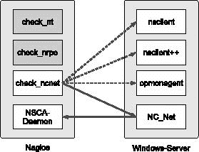
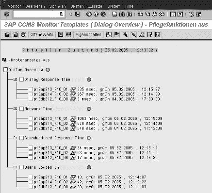
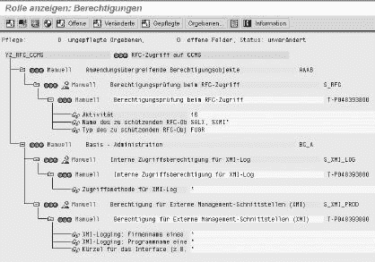
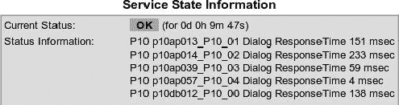

# 第四部分. 第四部分 特殊应用

# 第二十章 监控 Windows 服务器

您并不总是处理由仅包含 Linux 或 Linux/Unix 计算机的同质服务器景观。只要您只是监控纯网络服务，操作系统就没有区别。但如果你想要查询本地、非网络功能的资源，那就完全是另一回事了。

对于基于 Unix 的系统，如 Mac OS X，您通常可以使用之前描述的工具（本地插件、NRPE、NSCA）。在 Windows 上，您必须寻找其他解决方案。在某种程度上，可以在模拟 Unix 的环境中运行和/或编译本地插件（例如，Cygwin^[228])。

由于操作系统家族的不同哲学，也有一些独特之处，即一个操作系统中存在的功能在另一个操作系统中无法与之相比。因此，尽管 Windows 事件日志在 Unix 中的 syslog 中起到了类似的作用，但从技术角度来看，查询方式完全不同。在这里，你不能简单地编译 Unix 插件在 Windows 上，然后使用它。

对于 Windows 服务器的一种监控方法是使用 SNMP，Microsoft 提供了本机实现，只需安装即可。由于 Windows 代理的 SNMP 查询在原则上与其他 SNMP 代理的查询没有区别，我们建议您参考 第十一章，第 227 页。然而，Microsoft 的实现并不总是可靠，尤其是在显示图表——尤其是 CPU 负载和硬盘空间方面。


图 20-1. `check_nt` 查询本地 Windows 资源关于 NSClient 机制。

但如果你在 Windows 服务器上安装了一个可以通过网络访问的服务，你也可以查询本地 Windows 资源。以前，只有一个工具可用，那就是 NSClient，但如今你有多种程序可供选择：NSClient、NSClient++、OpMon Agent 或 NC_Net。对于所有这些，都会使用 **`check_nt`** 插件查询基本参数，如 CPU 和硬盘负载、内存使用或 Windows 计数器（参见 图 20-1），这是 Nagios 的标准插件之一。


图 20-2. `check_nrpe` 使用 NRPE 机制通过 NSClient++、OpMon Agent 和 NRPE_NT 执行检查。

此外，NSClient++和 OpMon Agent 支持 NRPE（见第十章"), 从第 213 页开始）。通过**`check_nrpe`**(图 20-2)查询本地安装的插件。

NC_Net 反过来也允许被动检查，其结果通过 NSCA 发送到 Nagios 服务器(第十四章"), 第 299 页)。如果您使用**`check_ncnet`**(图 20-3)而不是标准插件**`check_nt`**，则可以访问一组扩展的命令(20.3.3 安装 check_ncnet 插件, 第 480 页)。



图 20-3. `check_ncnet` 允许被动检查。

最后，还有一个纯 NRPE 服务用于 Windows：NRPE_NT，其配置与 Unix 相同。然而，由于 NSClient++和 OpMon Agent 增加了额外的 NRPE 功能，因此它已经失去了一些重要性。

# 20.1 通过 WMI 进行无代理检查

通过**Windows 管理规范**，或简称 WMI，微软提供了一个允许网络查询系统属性的接口，前提是执行查询的用户拥有足够的权限。WMI 查询从中央 Windows 系统执行；NRPE 用于 Nagios 服务器与 WMI 代理之间的通信(图 20-4). 只需要一个 Windows 服务器，在该服务器上安装一个 NRPE 服务以及所有所需的插件，形式为 WMI 脚本——尽管要这样做，您必须熟悉微软的 WMI 世界。


图 20-4. 使用 Nagios 的 WMI 接口

在 NagiosExchange^([229])的**类别 | 检查插件 | 操作系统 | Windows | Windows NRPE**下可以找到大量的配置示例，例如，在**wmi 无代理插件**条目下.^([230])在此处我们将不深入探讨 WMI 接口的细节。

* * *

^([228]) [`www.cygwin.com/`](http://www.cygwin.com/)

^([229]) [`www.nagiosexchange.org`](http://www.nagiosexchange.org)

^([230]) [`www.nagiosexchange.org/66;235`](http://www.nagiosexchange.org/66;235)

# 20.2 安装和配置附加服务

与 WMI 方法相比，NSClient、NS-Client++、OpMon Agent 和 NC_Net 等附加服务必须在每个 Windows 服务器上单独安装。

## 20.2.1 NSClient

作为最古老的包，NSClient 已经过广泛的测试，并且被广泛使用，但它已不再积极开发。最新的当前版本是 2003 年 10 月的版本；该包可以从 Nagios Exchange 下载.^([231]）。它也适用于 Windows NT、Windows 2000 和 Windows XP。

对于 Windows 2003，特别是 Windows 2003 R2，原始包不再适用，因为出现了许多错误信息

```
PDH.dll Collect CPU - ERROR:...
```

出现在事件日志中，这会显著增加执行时间。在 NagiosExchange 上可以找到一个重新编译的版本，在包 **`nsclient_-_no_pdh.zip`** 中，^([232]) 该版本不存在此问题。

对于 NSClient 的安装，您需要解压存档 **`nsclient_201.zip`** 或 **`nsclient_-_no_pdh.zip`**。这会创建按照架构命名的子目录：**`Win_NT4_Bin`** 用于 Windows NT 和 **`Win_2k_XP_Bin`** 用于 Windows 2000 及更高版本。将相应文件夹的内容复制到目录 **`C:\Programs\NSClient`**，然后从该目录安装 NSClient 作为服务：

```
C:\Programs\NSClient> **pNSClient.exe /install**
C:\Programs\NSClient> **net start nsclient**
```

运行 **`pNSClient.exe /install`** 安装服务，而开关 **`/uninstall`** 则再次删除服务。您应该确保操作系统通过服务管理自动启动。

NSClient 有两个参数：**`port`** 和 **`password`**，默认值为 **`1248`**（端口号）和 **`none`**（密码）。这些值只能通过 **`regedit`** 在 **`HKEY_LOCAL_MACHINE\SOFTWARE\NSClient\Parms`** 注册表下进行更改。

## 20.2.2 NC_Net

NC_Net，由 Tony Montibello 开发，是 NSClient 的继承者之一，其调用也与 NSClient 兼容。因此，在 Windows 服务器上，可以直接用 NC_Net 替换 NSClient，无需更改 Nagios 配置。NC_Net 的发展非常活跃。本书付印时的当前版本为 4.x，基于 [DOT.NET](http://dot.net) 框架，版本 2.0。默认情况下，从 Windows Server 2003 R2 开始才包含此框架，但即使在那时也不是自动安装的。对于那些不能或不想安装新框架的用户，较旧的 NC_Net 版本 2.28 可以在 [DOT.NET](http://DOT.NET) 1.1 下运行，非常稳定且已建立良好。

NC_Net 版本 2.28 可在 NC_Net 主页上找到，^([233]) 而所有更新的版本都可以在 SourceForge 上找到.^([234]）。请确保首先卸载任何之前安装的版本。由于 NC_Net 使用 Microsoft Installer，您可以通过软件管理工具来完成此操作。即使可能存在的 NSClient 也应首先删除。

双击文件 **`NC_Net_setup.msi`** 将安装服务，但你应该在服务管理中检查它是否真的正在运行，以及是否已将 **`自动`** 作为启动类型输入。

NC_Net 具有与 NSClient 相同的参数，包括 **`密码`** 和 **`端口`**，但也可以在服务管理中的 **`属性`** 下的 **`启动参数`** 行中指定：

```
port 4711 password *password*
```

## 20.2.3 NSClient++

NSClient++结合了两种查询方法。一方面，它与 NSClient 兼容，可以使用 **`check_nt`** 进行常规查询。另一方面，它包含一个内置的 NRPE 服务，可以像 NRPE_NT（见第 488 页的 20.4.1 NRPE_NT，经典工具])不仅提供了下载区域和以 Wiki 形式存在的文档，还提供了一个错误跟踪系统，允许你报告任何错误并提交请求，包括跟踪开放票据。

### 安装

当前 NSClient++版本可以作为 zip 文件从主页^([236])或从 SourceForge.^([237])下载。此文件的内容被解压，例如在 **`D:\Program Files\Nagios\nsclient++`** 中，然后从这里将其作为服务安装，并启动程序：

```
D:\Program Files\Nagios\nsclient++> **NSClient++/install**
D:\Program Files\Nagios\nsclient++> **NSClient++/start**
```

如果你想使用传统的 **`net start`** 命令而不是管理工具来启动和停止服务，你需要知道它被称为 **`nsclientpp`**（而不是 **`nsclient++`**）：

```
D:\> **net start nsclientpp**
D:\> **net stop nsclientpp**
```

### 配置

NSClient++需要一个配置文件 **`NSC.ini`**，该文件位于 NSClient++-EXE 文件所在的同一目录中。在所有情况下都需要编辑分发中的 **`NSC.ini`**。

此文件分为多个部分：

```
[modules]
; loadable modules
[Settings]
; general settings
[log]
; Logging and debugging
[NSClient]
; Parameters for NSClient-compatible queries
[Check System]
; Fine-tuning configuration for system checks (CPU, memory, ...)
[NRPE]
; Parameters for NRPE
[NRPE Handlers]
; NRPE commands
```

每个部分都以方括号中的关键字开始，注释行以分号开头。**`[modules]`** 部分加载单个模块。以下模块目前可用：

```
[modules]
FileLogger.dll
CheckDisk.dll
CheckSystem.dll
NSClientListener.dll
NRPEListener.dll
; SysTray.dll
; CheckHelpers.dll
; CheckWMI.dll
```

内部模块 **`FileLogger.dll`** 将 NSClient++的工作记录到文件中，并且不提供任何检查。

**`CheckDisk.dll`** 检查文件大小和硬盘使用情况，而 **`CheckSystem.dll`** 检查 CPU、内存、计数器、运行时间和服务及进程状态。

**`NSClientListener.dll`** 确保与 NSClient 的兼容性。如果此模块未加载，则使用 **`check_nt`** 的查询将失败。模块 **`NRPEListener.dll`** 实现了 NRPE 服务。这意味着您可以选择是否使用 NSClient++ 作为 NSClient 或作为 NRPE_NT 的替代品，或者同时使用这两个功能。

**`SysTray.dll`** 在服务器上安装一个系统托盘图标，以便访问 NSClient++。

**`CheckHelpers.dll`** 是一个测试模块，它总是提供一个特定的返回值（例如，OK），并且对于正常操作不是必需的。

**`CheckWMI.dll`** 提供了 WMI 接口的查询，但尚未完全完成。

全局部分 **`[Settings]`** 包含跨越部分边界的设置，包括密码参数和 **`allowed_hosts`**，这些设置由 **`[NSClient]`** (配置) 和 **`[NRPE]`** (Windows 中的 Perl 插件) 部分继承，除非在这些选项中设置了不同的值：

```
[Settings]
; obfuscated_password=Jw0KAUUdXlAAUwASDAAB
; password=secret-password
allowed_hosts=
use_file=1
```

**`obfuscated_password`**，就像 **`password`** 一样，目前仅由 NS-Client 兼容的 NSClient++ 部分使用，而不是 NRPE。这两个参数都设置了 **`check_nt. obfuscated_password`** 的密码，这会将其隐藏，使其不会在 INI 文件中以明文形式出现。然而，这并不是真正的加密。**`obfuscated_password`** 是通过运行 **`nsclient++ /encrypt`** 生成的。此实用程序会要求输入密码，然后以加密形式显示它.^([238])

参数 **`allowed_hosts`** 控制哪些 IP 地址可以访问 NSClient++。如果留空，则没有访问限制。您可以通过逗号分隔来指定多个 IP 地址，但在此处不能使用主机名。

最后，**`use_file`** 控制是否使用配置文件（**`use_file=1`**）。如果在此处输入的值是 **`0`**，NSClient++ 将在注册表中搜索设置。通过注册表进行配置目前仍然是实验性的，并且由于缺乏足够的保护，存在安全风险，因此我们不会对此进行更详细的探讨。

下一节是关于日志记录的：

```
[log]
debug=0
; file=NSC.log
date_mask=%Y-%m-%d %H:%M:%S
```

使用 **`debug=1`**，可以开启调试（默认情况下是禁用的，使用值 **`0`**）。**`file`** 指定日志文件。如果您省略此参数或（如所示）将其注释掉，NSClient++ 将将其错误消息写入 **`nsclient.log`**，位于二进制文件所在的同一目录中。即使调试被关闭，软件也会这样做。使用 **`date_mask`**，您可以指定每条日志消息开始时的时间戳的日期格式。此格式与 **`man date`** 中描述的格式相对应。

**`[NSClient]`** 部分设置了一些关于与 NSClient 兼容性的选项。尽管这里不能配置其他内容，但 NSClient 函数（见第 472 页的 20.3 The check_nt Plugin]

参数 **`allowed_hosts`** 覆盖了 **`[Settings]`** 部分的设置。通过这种方式，NSClient++ 可以使用与 NRPE 不同的配置来与 **`check_nt`** 一起工作：

```
[NSClient]
; allowed_hosts=
port=12489
; bind_to_address=
```

**`port`** 和 **`bind_to_address`** 参数指定 NSClient++ 接受 **`check_nt`** 查询的套接字。端口的默认值为 1248，这在一些 Windows 服务器（例如，Exchange 服务器）上通常会引发问题（也请参阅第 471 页）。因此，你应该将其更改为更高的端口号（例如，12489）。

**`bind_to_address`** 指定服务将监听的预期主机的 IP 地址。如果计算机有多个网络接口并且需要设置特定的 IP 地址，则需要此参数。

**`[Check System]`** 部分允许对系统检查进行微调。通常你在这里不需要配置任何内容：

```
[Check System]
; CPUBufferSize=1h
; CheckResolution=10
```

**`CPUBufferSize`** 决定了 NSClient++ 存储 CPU 负载信息的时间长度。允许的值范围从一秒（**`1s`**）开始，最大值通常是几周（**`10w`**）。然而，为了长期保存数据，你需要大量的内存。对于大多数用途，默认值一小时就足够了。

**`CheckResolution`** 指定了存储的测量值的分辨率，单位为十分之一秒。因此，值 **`10`** 表示每秒确定一个值。**`CheckResolution`** 目前仅影响 CPU 测量值。

**`[Check System]`** 部分的其他参数很少需要，并在 Wiki 中有文档说明。240]

在 20.4.3 NRPE with NSClient++（第 493 页）中处理了两个部分 **`[NRPE Handlers]`** 和 **`[NRPE]`** 中的 NRPE 服务的配置，并且描述了可以通过 NRPE 调用的 NSClient++ 的内部函数，在 20.4.4 Internal NSClient++ functions]。因此，它可以被认为是 NSClient 程序的继任者。像其前身一样，该软件在 GNU 公共许可证下发布。

要安装它，请将当前 zip 文件从[`www. opservices.com.br/downloads/`](http://www.%20opservices.com.br/downloads/)解压到**`C:\Program Files\Nagios\opmonagent`**，并输入以下命令：

```
C:\Program Files\Nagios\opmonagent> **opmonagent/install**
C:\Program Files\Nagios\opmonagent> **net startopmonagent**
```

OpMon Agent 也将其配置存储在 INI 文件中。原始的**`opmo-nagent.ini`**看起来如下：

```
[OPMONAGENT]
enable=1
password=None
port=5667
allow_from=127.0.0.1,192.168.10.2,192.168.2.1
autodetect_counters=1
use_counters=W2K
max_connections=300
debuglevel=0

[NRPE]
enable=1
port=5666
command_timeout=60
allow_from=127.0.0.1,192.168.10.1,192.168.2.1
```

NSClient 功能在**`[OPMONAGENT]`**部分进行配置。**`enable=1`**允许通过**`check_nt`**进行查询，但如果此参数设置为**`0`**，OpMon Agent 将忽略此设置。

**`password`**设置密码，值**`None`**表示不需要密码。否则，密码将以明文形式写在等号之后。

在此处输入 5667 作为标准端口，但如果你想使用常用的端口 1248，只需更改条目并重新启动服务。**`allow_from`**限制了对特定主机的访问。

**`autodetect_counters=1`**尝试根据 Windows 的语言设置和确切版本自动确定 Windows 性能计数器的确切名称。如果你通过值**`0`**关闭此功能，必须在**`use_counters`**中显式指定名称。此参数的可能值列在**`counters.def`**文件中，该文件位于与**`opmonagent.ini`**相同的目录中。

**`max_connections`**限制可能的同时连接数。**`debuglevel`**的值大于**`0`**时开启调试模式。

在未来，应该可以在**`[NRPE]`**部分配置 OpMon Agent 的 NRPE 功能，这些功能将在稍后的版本中引入。本书付印时的 OpMon Agent 当前版本 2.4 尚未提供对 NRPE 的官方支持。

## 20.2.5 矫正端口 1248 的问题

所有与 NSClient 兼容的服务默认在端口 1248 上运行。这有时可能成为一个问题，因为 Windows 操作系统与 RPCs（远程过程调用）进行密集型工作。端口是动态分配的，从端口 1025 开始。因此，在特定情况下——例如，对于拥有许多服务或许多同时连接的服务器——当 NSClient 作为服务启动时，端口 1248 通常已经被占用。对于 Exchange 服务器，重启后这种情况相当常见。因此，你应该将其更改为一个高端口，如 12489，这样就不会有问题。

如果你不是第一次安装 Nagios，而是在使用现有的安装，你可能无法轻松地更改所有要监控的主机的端口。对于 Nagios 2.x，除了为每个端口定义单独的命令外，别无选择。在 Nagios 3.0 中，这可以做得更加优雅。解决方案是使用自定义变量（见第 685 页的 H.2 变量和宏，第 75 页）中，现在全局指定为标准端口（在此示例中为 1248）：

```
define host{
   name        host_t
   register    0
   ...
   _NSCLIENT_PORT 1248
   ...
}
```

对于已经转换为新端口的已转换主机，你用新端口覆盖 **`_NSCLIENT_PORT`** 变量：

```
define host{
   host_name      winsrv
   use            host_t
   ...
   _NSCLIENT_PORT 12489
}
```

对于所有其他主机，模板中定义的值将适用。命令对象的定义会考虑到所需的端口，通过评估变量来实现，如下所示：

```
define command{
    command_name check_nt
    command_line $USER1$/check_nt -H $HOSTADDRESS$ -p $_HOSTNSCLIENT_POR
T$ -v $ARG1$ $ARG2$
}
```

这意味着对于每个新转换的主机，只需以这种方式设置变量即可，所有服务定义保持不变。

* * *

^([231]) [`www.nagiosexchange.org/49;65`](http://www.nagiosexchange.org/49;65)

^([232]) [`www.nagiosexchange.org/49;508`](http://www.nagiosexchange.org/49;508)

^([233]) [`www.shatterit.com/NC_Net`](http://www.shatterit.com/NC_Net)

^([234]) [`sourceforge.net/projects/nc-net`](http://sourceforge.net/projects/nc-net)

^([235]) [`trac.nakednuns.org/nscp/`](http://trac.nakednuns.org/nscp/)

^([236]) [`trac.nakednuns.org/nscp/downloads`](http://trac.nakednuns.org/nscp/downloads)

^([237]) [`sourceforge.net/projects/nscplus/`](http://sourceforge.net/projects/nscplus/)

^([238]) 使用的算法没有文档说明，因此应谨慎使用此实用程序。

^([239]) **`MEMUSE`** 命令（见主内存使用]) [`trac.nakednuns.org/nscp/wiki/Documentation`](http://trac.nakednuns.org/nscp/wiki/Documentation)

^([241]) [`www.opservices.com.br/`](http://www.opservices.com.br/)

# 20.3 **`check_nt`** 插件

当安装标准 Nagios 插件时，**`check_nt`** 插件会自动加载到硬盘上。这里可以查询的检查对应于 NSClient 在 NSClient、NS-Client++、OpMon Agent 和 NC_Net 中提供的功能范围。要使用 NC_Net 的扩展，你必须从[`www.shatterit.com/NC_Net`](http://www.shatterit.com/NC_Net)下载扩展源代码（文件**`check_nt.c`**）并自行编译。

下面描述的 **`check_nt`** 参数的实际效果取决于使用 **`-v`** 选项指定的命令：^([242]):

**`-H`** **``*`地址`*``** / **`--host=`****``*`地址`*``**

安装 NSClient/NC_Net 的主机的 IP 地址或主机名。

**`-v`** **``*`命令`*``** / **`--variable=`****``*`命令`*``**

要执行的命令。

**`-p`** **``*`端口`*``** / **`--port=`****``*`端口`*``**

这为 NSClient/NC_Net 定义了一个替代端口（见 20.2.5 纠正端口 1248 的问题，第 471 页）。默认为 TCP 端口 1248。

**`-w`** **``*`整数`*``** / **`--warning=`****``*`整数`*``**

这定义了一个警告限制。此选项不是所有命令都可用。

**`-c`** **``*`整数`*``** / **`--critical=`****``*`整数`*``**

临界限制选项也不是所有命令都可用。

**`-l`** **``*`参数`*``**

这用于传递参数，例如硬盘检查的驱动器或检查进程时的进程名称。

**`-d`** **``*`选项`*``**

在检查服务或进程时，您可以同时指定多个服务或进程。通常**`check_nt`**只显示有缺陷的项（**`-d SHOWFAIL`**）。要显示所有项，您必须指定**`SHOWALL`**作为**``*`选项`*``**。

**`-s`** **``*`密码`*``**

如果 NC_Net 或 NSClient 使用密码参数启动相应的服务，则才需要认证密码。

**`-t`** **``*`超时`*``** / **`--timeout=`****``*`超时`*``**

在**``*`超时`*``**秒后，插件终止测试并返回 CRITICAL 状态。默认为**`10`**秒。

## 20.3.1 通常支持的命令

对于这里介绍的命令，使用 NSClient、NSClient++、NC_Net 或 OpMon 没有区别；它们都可以与未打补丁的**`check_nt`**一起运行。

### 查询客户端版本

通过运行命令返回已安装的 NSClient 或 NC_Net 服务的版本

```
check_nt -H *address* -v CLIENTVERSION
```

所有其他参数都被忽略：

```
nagios@linux:nagios/libexec$ ./**check_nt -H winsrv -v CLIENTVERSION**
NC_Net 2.21 03/13/05
```

本书的第一版为每个**`check_nt`**功能定义了单独的命令。但这一点根本不必要，正如 Ethan Galstad 在 Nagios 的在线文档中所示：^([243])。

```
define command{
   command_name check_nt_nsclient
   command_line $USER1$/check_nt -H $HOSTADDRESS$ -v $ARG1$ $ARG2$
}
```

对于 Nagios 3.0，如果 NSClient 端口以主机依赖的方式定义（见 20.2.5 纠正端口 1248 的问题，第 471 页），则命令对象**`check_nt`**将如下所示：

```
define command{
   command_name check_nt
   command_line $USER1$/check_nt -H $HOSTADDRESS$ **-p$_HOSTNSCLIENT_POR**
**T$** -v $ARG1$ $ARG2$
}
```

要执行的命令行期望两个参数：宏**`$ARG1$`**在每种情况下都扩展为要调用的命令，而**`$ARG2$`**的内容取决于相应的命令，并在某些情况下可能为空：

```
define service{
   host_name           winsrv
   service_description NSClient
   check_command       check_nt!**CLIENTVERSION**
   ...
}
```

命令**`CLIENTVERSION`**没有其他参数，因此第二个参数简单地被省略。

这项不起眼的服务在描述依赖关系方面极为有用。如果 NSClient/NC_Net 在 Windows 服务器上失败，Nagios 通常会通知管理员所有可能失败的服务。通过查询 **`CLIENT-VERSION`**，可以清楚地看出问题出在 NSClient 不可用。如果您定义了适当的依赖关系，Nagios 可以提供更精确的信息.^([244]) 下面是 NSClient 应用程序的示例：

```
define servicedependency{
    host_name                     winsrv
    service_description           NSClient
    dependent_host_name           winsrv
    dependent_service_description Disks,Load,Memory
    notification_failure_criteria c,u
    execution_failure_criteria    n
}
```

以 **`NSClient`** 作为主服务，其他服务依赖于它，只要 **`NSClient`** 处于 CRITICAL 或 UNKNOWN 状态，Nagios 就不会让管理员收到这些其他服务的消息。

在 Nagios 2.x 中，您必须为每个主机单独设置依赖对象。在 Nagios 3.0 中有 *相同的宿主依赖*：如果您省略了 **`dependent_host_name`** 条目，这里定义的依赖关系适用于同一主机。这允许以合理的方式使用主机组：

```
# Nagios 3.0
define servicedependency{
    hostgroup_name                  WINDOWS_SERVER
    service_description             NSClient
    dependent_service_description   Disks,Load,Memory
    notification_failure_criteria   c,u
    execution_failure_criteria      n
}
```

在这里，每个案例中的 **`Disks`** 服务仅依赖于同一主机的 **`NSClient`** 服务。在 Nagios 2.x 中使用主机组时，**`Disks`** 将依赖于主机组 **`WINDOWS.SERVER`** 中所有主机的所有 **`NSClient`** 服务——而这通常不是所希望的。

### CPU 负载

处理器负载的严重程度可以通过 **`CPU-LOAD`** 命令揭示：

```
check_nt -H *address* -v CPULOAD -l *interval, warning limit, critical_limit*
```

它期望一个由逗号分隔的三元组参数，包括要平均的时间间隔长度（以分钟为单位），以及警告和临界限制的两个阈值（以百分比表示）：

```
nagios@linux:nagios/libexec$ .**/check_nt -H winsrv -v CPULOAD -l 5,80,90**
CPU Load 10% (5 min average) |   '5 min avg Load'=10%;80;90;0;100
```

因此，**`CPULOAD`**，配合 **`5,80,90`**，计算五分钟的平均值，如果确定值超过 **`80`** 百分比，则发出警告。如果 CPU 负载超过 90%，命令将返回 CRITICAL。

此处的输出还包含 **`|`** 符号之后的附加性能数据，Nagios 在 Web 界面中忽略这些数据。如果您对多个时间间隔的平均值感兴趣，只需在第一个值之后添加更多的三元组值：

```
nagios@linux:nagios/libexec$ .**/check_nt -H winsrv -v CPULOAD \**
  **-l 5,80,90,15,70,80**
CPU Load 10% (5 min average) 10% (15 min average) |   '5 min avg Load'=10
%;80;90;0;100 '15 min avg Load'=10%;70;80;0;100
```

在此示例中，**`CPULOAD`** 检查两个间隔：过去五分钟和过去 15 分钟。在第二种情况下，有不同的限制值。插件总是返回更严重的值；例如，如果一个间隔发出 CRITICAL 而另一个只是 WARNING，它将返回 CRITICAL。

因此，服务定义看起来是这样的：

```
define service{
   host_name             winsrv
   service_description   CPU Load
   check_command         check_nt!**CPULOAD**!-l 5,80,90,15,70,80
   ...
}
```

### 主内存使用

在指定限制值时，监控主内存使用量的命令——与 **`CPULOAD`** 相比——基于“正常”Nagios 插件的语法：

```
check_nt -H *address* -v MEMUSE -w *integer* -c *integer*
```

**`MEMUSE`** 返回内存使用百分比。应该记住，Windows 这里指的是内存和交换文件的总和，即整个可用的虚拟内存。命令期望警告和临界限制以百分比给出，不包含百分号：

```
nagios@linux:nagios/libexec$ .**/check_nt -H winsrv -v MEMUSE \**
 **-w 70 -c 90**
Memory usage: total:4331.31Mb - used: 257.04Mb (6%) - free: 4074.27Mb (9
4%) |   'Memory usage'=257.04Mb;3031.91;3898.18;0.00;4331.31
```

在示例主机 **`winsrv`** 上，只使用了六分之一的虚拟内存。输出中没有显示主内存本身的物理大小（此处：256 MB）已经超过的事实。

然而，请求内存使用情况并不一定有意义，就像在 Unix 中一样：Windows 会定期将程序和数据代码从主内存交换出来，即使它还有额外的储备。在 Unix 中，程序和数据只有在需要比当前空闲空间更多的空间时才会进入交换分区。在这方面，Windows 整个虚拟内存的负载是更重要的参数。

上文提到的命令再次打包到一个服务对象中：

```
define service{
   host_name           winsrv
   service_description MEM Usage
   check_command       check_nt!**MEMUSE**!-w 70 -c 90
   ...
}
```

### 硬盘容量

通过 **`USEDDISKSPACE:`** 测试文件系统的负载

```
check_nt -H *address* -v USEDDISKSPACE -l *drive letter* -w *integer* -c *integer*
```

在 Windows 风格中，文件系统指定为驱动器字母，百分比限制值：

```
nagios@linux:nagios/libexec$ .**/check_nt -H winsrv -v USEDDISKSPACE\**
  **-l C -w 70 -c 80**
C: - total: 4.00 Gb - used: 2.06 Gb (52%) - free 1.94 Gb (48%)  |  'C: Use
d Space'=2.06Gb;2.80;3.20;0.00;4.00
nagios@linux:nagios/libexec$ **echo $?**
0
```

在示例中，**`check_nt`** 应该在驱动器 **`C`** 超过 70% 容量时发出警告，如果负载超过 80%，则发出 CRITICAL。当前值位于 52%，因此 **`check_nt`** 返回 OK，你可以使用 **`echo $?`** 来检查。

相应的服务对象可能看起来像这样：

```
define service{
   host_name           winsrv
   service_description Disk_C
   check_command       check_nt!**USEDDISKSPACE**!-l C -w 70 -c 80
   ...
}
```

### 运行时间

通过命令 **`UPTIME:`** 可以揭示上次重启执行的时间

```
check_nt -H *address* -v UPTIME
```

定义警告或临界限制是不可能的，这就是为什么这样的查询仅用于信息目的（插件返回 OK 或 UNKNOWN，如果使用不当）：

```
nagios@linux:nagios/libexec$ .**/check_nt -H winsrv -v UPTIME**
System Uptime - 17 day(s) 9 hour(s) 54 minute(s)
```

因此，主机 **`winsrv`** 已经运行了 17 天。相应服务对象的一个合适定义可能如下所示：

```
define service{
   host_name           winsrv
   service_description UPTIME
   check_command       check_nt!**UPTIME**
   ...
}
```

### 服务的状态

可以使用 **`SERVICESTATE`** 来检查 Windows 服务的当前状态：

```
check_nt -H *address* -v SERVICESTATE -d SHOWALL -l *service1, service2*,...
```

使用可选的 **`-d SHOWALL`** 可以确保输出文本列出所有服务。如果你省略此选项，插件只提供有关那些 **`not`** 正在运行的服务的信息。

在 **`-l`** 选项之后找到要为 NSClient 指定的服务描述名称是一项挑战。不是由服务管理器（例如，**`Routing and RAS`**）显示的 **`display name`**，而是对应的注册表条目。因此，你需要在注册表编辑器 **`regedit`** 的部分树 **`HKEY_LOCAL_MACHINE\SYSTEM\CurrentControlSet\Services`** 中搜索具有相应显示名称的节点。它包含要查找的服务描述，对于 **`Routing and RAS`** 来说，可能是类似于 **`Remote-Access`** 的内容。

如果你使用 NC_Net，你的任务会更容易：该软件接受服务描述和显示名称，其中不区分大小写。以下两个示例使用显示名称：

```
nagios@linux:nagios/libexec$ .**/check_nt -H winsrv1 -v SERVICESTATE \**
  **-l "RemoteAccess"**
RemoteAccess: Stopped
nagios@linux:nagios/libexec$ .**/check_nt -H winsrv2 -v SERVICESTATE \**
  **-l "Routing and RAS"**
All services are running
```

在第一种情况下使用了服务名称；在第二种情况下使用了显示名称。第一个查询的服务没有运行，正如输出 **`Stopped`** 所示，并且 **`check_nt`** 返回 **`2`**（CRITICAL）作为返回值。第二个命令中提到的服务正在运行，这就是为什么如果没有给出 **`-d SHOWALL`** 选项，插件不会显示它。这里的返回值是 **`0`**（OK）。也可以在单个查询中查询多个服务（用逗号分隔）。这里的最坏情况结果决定了返回值。匹配的服务对象可能看起来像这样：

```
define service{
   host_name           winsrv
   service_description Routing and RAS
   check_command       check_nt!**SERVICESTATE**!-l RemoteAccess
   ...
}
```

### 进程状态

与服务类似，**`PROCSTATE`** 监控正在运行的过程：

```
check_nt -H *address* -v PROCSTATE -d SHOWALL -l *process1, process2*,...
```

进程名称，几乎总是以 **`.exe`** 结尾，最好在任务管理器的进程列表中确定；这里也忽略了大写和小写：

```
nagios@linux:nagios/libexec$ .**/check_nt -H winsrv -v PROCSTATE** \
**WinVNC.exe,winlogon.exe,notexist.exe**
  notexist.exe: not running
```

与服务类似，您也可以指定一个由逗号分隔的多个进程列表。没有 **`-d SHOWALL, PROCSTATE`** 时，**`PROCSTATE`** 只显示那些 **`not`** 正在运行的进程，在这个例子中，**`notexist.exe`**。对应的服务定义可能看起来像这样：

```
define service{
   host_name           winsrv
   service_description WinVNC
   check_command       check_nt!**PROCSTATE**!-l winvnc.exe
   ...
}
```

### 文件年龄

值得注意的是，使用 **`FILEAGE`** 监控自上次修改关键文件以来经过的时间，尤其是对于日志文件和其他经常更改的文件：

```
check_nt -H *address* -v FILEAGE -l *path* -w *integer* -c *integer*
```

**`FILEAGE`** 可以用来检查文件的年龄，例如一个应该定期写入数据的日志文件。文件名使用完整路径指定，并且反斜杠必须写两次：**`C:\\xyz.log`**。如果超过指定的阈值（以分钟为单位），插件会发出 WARNING 或 CRITICAL。然而，默认情况下，它以纪元秒为单位给出文件的年龄：^([245])

```
nagios@linux:nagios/libexec$ .**/check_nt -H winsrv -v FILEAGE \**
  **-l "C:\\test.log" -w 1 -c 20**
1113158517
nagios@linux:nagios/libexec$ **echo $?**
1
```

可以再次使用 **`echo $?`** 检查状态。同样，服务定义不包含任何秘密：

```
define service{
   host_name           winsrv
   service_description Log file
   check_command       check_nt_fileage!C:       xyz.log!60!1440
   ...
}
```

### 查询 Windows 计数器和实例

NSClient 和 **`check_nt`** 的组合提供了另外两个功能：使用 **`COUNTER`** 查询 Windows 计数器和使用 **`INSTANCES`** 查询 Windows 性能计数器对象。然而，查询性能计数器在不同服务之间有一些小的细节差异（例如，在计数器名称中使用双反斜杠而不是单反斜杠）。因此，我们将在第 481 页关于 NC_Net 扩展功能的讨论中描述这两个功能。如果您想使用 OpMon Agent、NSClient 或 NSClient++ 中的计数器，我们建议您查看每个服务的原始文档。

当使用 NSClient++ 时，建议您使用内部函数 **`CheckCounter`**，该函数在 使用 CheckMem 检查内存负载 中有描述。

## 20.3.2 NC_Net 的高级功能

NC_Net 的功能范围正在不断扩展；本章描述了超越 NSClient 2.28 版本的可能性。这些功能只能与修改后的 **`check_nt`** 插件一起使用。扩展版本基于原始 **`check_nt`** 版本 1.4.1。但是，两个插件可能会继续以不同的方式开发，从而产生分歧。

因此，我们将 NC_Net 版本重命名为 **`check_ncnet`**，这样我们就可以保持两个版本独立，并同时运行它们。因此，本书中的 **`check_nt`** 示例演示了所有 NSClient 兼容服务可用的功能；如果使用 **`check_ncnet`**，则可以结合扩展插件使用 NC_Net 功能。

## 20.3.3 安装 **`check_ncnet`** 插件

**`check_ncnet`** 仅存在于源代码中；它由一个单独的文件组成，不幸的是，这个文件与原始插件 **`check_nt.c`** 具有相同的名称。该文件在安装 NC_Net 时会出现在硬盘上，但也可以从 [`www.shatterit.com/nc_net`](http://www.shatterit.com/nc_net) 独立下载。

目前，只有与整个 Nagios 插件包结合时，源代码才能无问题地编译（参见 1.4 安装和测试插件，第 43 页）。为此，你需要在子目录 **`plugins`** 中用扩展版本覆盖现有的文件 **`check_nt.c`**。为了安全起见，应该将旧的 **`check_nt`** 二进制文件重命名；然后运行 **`make check_nt`** 重新编译源文件。之后，将名为 **`check_ncnet`** 的二进制文件复制到 Nagios 的 **`libexec`** 目录中，与其他插件一起：

```
linux:~ # **cp check_nt.c /usr/local/src/nagios-plugins-1.4/plugins**
linux:~ # **cd /usr/local/src/nagios-plugins-1.4/plugins**
linux:nagios-plugins-1.4/plugins # **mv check_nt check_nt_orig**
linux:nagios-plugins-1.4/plugins # **make check_nt**
...
linux:nagios-plugins-1.4/plugins # **mv check_nt check_ncnet**
linux:nagios-plugins-1.4/plugins # **cp check_ncnet** \
  **/usr/local/nagios/libexec/**.
```

### Windows 性能计数器

通过所谓的性能计数器，Windows 为系统中所有可以用数字表示的内容提供值：硬盘使用率、CPU 使用率、登录次数、终端服务器会话数、网络接口的负载等等。**`check_ncnet`** 使用 **`ENUMCOUNTER`** 命令查询这些值：

```
check_ncnet -H *address* -v ENUMCOUNTER -l *category1, category2*
```

如果你省略了 **`-l`** 参数，**`ENUMCOUNTER`** 将会显示所有性能计数器类别：

```
nagios@linux:nagios/libexec$ .**/check_ncnet -H winsrv -v ENUMCOUNTER**
... Processor; ... Terminal services; .NET CLR loading procedure; tot
al RAS services; Process; ...
```

否则，它将显示使用 **`-l`** 指定的类别中的所有计数器。几个类别由逗号分隔。**`终端服务`** 类别包含三个计数器对象：

```
nagios@linux:nagios/libexec$ .**/check_ncnet -H winsrv -v ENUMCOUNTER** \
  **-l Terminal services**
Terminal Services: Total Sessions; Active Sessions; Inactive Sessions
nagios@linux:nagios/libexec$ .**/check_ncnet -H winsrv -v ENUMCOUNTER** \
 **-l "Terminal Services","Process"**
Terminal Services: Total Sessions; Active Sessions; Inactive Sessions-Process: %
 Processor Time; % User Time; % Privileged Time; Virtual Bytes Peak; Virtual Bytes;
 Page Faults/sec; Working Set Peak; Working Set; ...
```

精确的对象名称对于后续使用很重要，其中百分号（例如，在 **`% Processor Time`** 中）是名称的一部分。如果计数器或类别名称包含空格，你必须记住在提出请求时将其放在引号内。

存储在 Windows 性能计数器对象中的描述可以通过 **`ENUMCOUNTERDESC`** 命令显示。

几个计数器类别包含实例，查询计数器对象时你必须指定这些实例。因此，你应该首先使用 **`INSTANCES`** 函数检查你想要的类别是否与实例一起工作：

```
check_ncnet -H *address* -v INSTANCES -l *category1, category2*
```

对于终端服务，情况并非如此：

```
nagios@linux:nagios/libexec$ .**/check_ncnet -H winsrv -v INSTANCES** \
  **-l "Terminal Services"**
  Terminal Services:
```

典型的具有实例的类别是 **`Processor or Process`**：

```
nagios@linux:nagios/libexec$ .**/check_ncnet -H winsrv -v INSTANCES** \
  **-l "Process"**
Process: svchost#6,svchost,Idle,explorer,services,...
```

这里可以明显看出实例的含义：Windows 将每个正在运行的进程视为 **`Process`** 性能计数器类别中的一个实例。如 20.3.3 安装 check_ncnet 插件 中所示，包含处理器时间百分比使用的计数器对象（**`% Processor Time`**）属于这个类别。它只能查询单个实例，例如对于 **`explorer`** 进程，或者查询所有进程。在后一种情况下，你指定 **`_Total`** 而不是实例。

因此，为了访问 Windows 性能计数器，你总是需要提供以下详细信息：

```
*\category\counter object*
*\category(instance)\counter object*
```

只有当类别有可用的实例时，才会指定实例。类别名称和第一个括号之间不能有空格。相应的查询命令称为 **`COUNTER`**；占位符 **``*`name`*``** 被上述组合替换：

```
check_nt -H *adresse* -v COUNTER -l *name, formatbeschreibung* -w *ganzzahl* -c
*ganzzahl*
```

此功能询问在 **`-l`** 选项之后指定的 Windows 性能计数器对象的确切名称。作为整数值给出的警告和临界限制指的是测量的尺寸：如果涉及一个有百分比数字的对象（例如，处理器负载），只需想象在其上添加一个百分号；进程、会话等的数量只是未指定单位的值。

活动会话的数量是通过 **`Active Sessions`** 对象检查的，该对象没有实例：

```
nagios@linux:nagios/libexec$ .**/check_ncnet -H winsrv -v COUNTER** \
  **-l "\Terminal Services\Active Sessions"**
1
nagios@linux:nagios/libexec$ .**/check_ncnet -H winsrv -v COUNTER** \
  **-l "\Process(Idle)\% Processor Time"**
98
```

因为 **`Idle`** 实例总是查看已用和备用处理器负载之间的差异，所以两者的总和总是 100%，所以在第二个示例中查询 **`_Total`** 伪实例并没有太多意义。

通常 **`COUNTER`** 不格式化其输出。这可以通过在对象名称后跟一个以逗号分隔的描述来改变，该描述采用 **`printf`** 格式，^([246])：

```
nagios@linux:nagios/libexec$ **./check_ncnet -H winsrv -v COUNTER** \
  **-l "\Process(Idle)\% Processor Time","Idle Process: %.2f %%"**
Idle Process Usage is: 54.00 % | 'Idle Process Usage is: %.2f %%'=54.000000%;
0.000000;0.000000;
```

不仅使输出更清晰，还返回额外的性能数据。一个对应的服务定义可能看起来像这样：

```
define service{
   host_name           winsrv
   service_description Terminal Sessions
   check_command check_nt!**COUNTER**!-v "\Terminal Services\Active Sessions"
-w 20 -c 30
   ...
}
```

### 列出进程和服务

要找出进程的名称，你可以通过任务管理器逐个查找，或者使用 **`ENUMPROCESS:`** 显示所有正在运行的进程列表

```
nagios@linux:nagios/libexec$ **./check_ncnet -H winsrv -v ENUMPROCESS**
System Idle Process; System; smss.exe; csrss.exe; winlogon.exe;
services.exe; lsass.exe; svchost.exe; svchost.exe; svchost.exe;
...
```

列出所有已安装服务的等效命令是 **`ENUMSERVICE`**：

```
check_ncnet -H *host* -v ENUMSERVICE -l *typ*, short
```

可选的 **`−1`** 限制输出到特定类别（见 表 20-1)：

```
nagios@linux:nagios/libexec$ **./check_ncnet -H winsrv -v ENUMSERVICE**
    \ **-l manual,short**
ALG; AppMgmt; BITS; COMSysApp; dmadmin; EventSystem; HTTPFilter; LPDSVC; MSIServer;
 Netman; Nla; NtFrs; NtLmSsp; NtmsSvc; RasAuto;
...
```

使用**`short`**选项，**`ENUMSERVICE`**显示服务名称，这些名称是按照在注册表中输入的顺序显示的；如果您省略了关键字，则显示显示名称。

表 20-1. `ENUMSERVICE`的限定选项

| 类型 | 描述 |
| --- | --- |
| **`all`** | 所有服务 |
| **`running`** | 所有当前活动服务 |
| **`stopped`** | 所有已停止的服务 |
| **`automatic`** | 自动启动的服务 |
| **`manual`** | 必须手动启动的服务 |
| **`disabled`** | 已禁用的服务 |

### 查询 Windows 事件日志

使用**`EVENTLOG`**命令，可以查询 Windows 事件日志：

```
check_ncnet -H *adress* -v EVENTLOG -w *integer* -c *integer* -l *eventlog, event_type,
interval,source_filter, description_filter, id_filter*
```

使用它确实需要一些习惯，然而：^([247]) 接下来的三个参数 **`-l`** 选择要考虑的事件类型和时间。

占位符**``*`eventlog`*``**被替换为三个日志区域之一**`application, security`**和**`system`**，您想要查看的区域。如果**`EVENTLOG`**要包含所有三个，只需指定**`any`**；但是您不能只选择三个区域中的两个。

对于**``*`event type`*``**，您可以选择**`error, Warning, Information`**，或者选择**`any`**以选择所有三个。

用**``*`interval`*``**代替，您指定一个以分钟为单位的时间间隔：**`5`**将选择在过去五分钟内发生的事件；例如，**`1440`**代表一整天。

最后三个参数实际上充当过滤器，可以从所有源自特定来源（**``*`source_filter`*``**占位符）的结果中确定特定结果，这些结果在其描述中包含特定模式（**``*`description_filter`*``**），或者具有特定的事件 ID（**``*`id_filter`*``**）。

每个过滤器由两部分组成：在第一部分中，一个整数表示要跟随多少个搜索模式（根据.NET-**`Regexp`**类制定的正则表达式），然后指定实际的过滤器条目，用逗号分隔。如果未使用其中一个过滤器，则其占位符被替换为**`0`**，这将精确地搜索零个搜索模式。仅查找**`NC_Net`**事件的源过滤器将被称为**`1,NC_Net`**；如果您要搜索**`NC_Net`**和**`Perflib`**事件，它将被称为**`2,NC_Net,Perflib`**。

**`-l any, any,5,0,0,0`**评估过去五分钟内所有事件范围的所有条目。**`-l application,error,1440,0,0,0`**确定在过去 24 小时内事件范围**`application`**中发生的所有**`error`**类型的事件。使用**`−1 application, error, 60,1,NC_Net,0,0`**，时间窗口设置为 60 分钟，并使用字符串**`NC_Net`**过滤事件源。最后**`-l application,any,60,0,2, start, stop,0`**在事件描述中搜索两个关键字：**`start`**和**`stop`**。

使用警告和临界限制，您可以指定在插件返回警告或临界值之前需要多少匹配条目。如果您省略这两个参数，Nagios 会在没有发生任何事件的情况下显示 OK；否则，它将显示 CRITICAL。

以下示例询问在过去 24 小时内 **`applications`** 区域有多少条消息：

```
nagios@linux:nagios/libexec$ .**/check_ncnet -H winsrv -v EVENTLOG** \
  **-l "Application,any,1440,0,0,0"**
9 Errors with ID: 13001;2003;1010;6013;1111;262194;26;262194;26 LAST - I
D 262194;Not all data for the file "\Device\LanmanRedirector" were sa
ved. Possible causes are computer hardware or the network connection. P
lease specify a different file path.
```

我们定义的服务在 **`System`** 区域的所有类中搜索过去五分钟内发生的错误。（在指定时间范围时，通常应确保它与 **`normal_check_interval`** 中的时间范围相关联。）该服务检查找到的条目的描述，以查找文本 **`data loss`**。这里不使用源和 ID 过滤器：

```
define service{
   host_name        winsrv
   service_description Eventlog data loss
   check_command    check_ncnet!**EVENTLOG**!-l System,any,5,0,1,data loss,0
   is_volatile           1
   normal_check_interval 5
   max_check_attempts    1
   ...
}
```

日志文件具有在特定情况下仅指出问题一次的特性，即使问题持续存在。因此，您必须确保 Nagios 在事件首次发生时立即发出通知，并省略重复测试和软状态。这可以通过 **`max_check_attempts 1`** 实现：这立即设置硬状态，并立即发出通知。

但如果硬状态保持不变，这在实践中意味着在此期间可能会出现新的错误（五分钟后的下一次测试不再记录旧状态），而状态没有改变；管理员只有在 **`notification_interval`** 过期后才会再次被通知。对于此类情况，Nagios 提供了 **`is_volatile`** 参数（见 14.5.2 Nagios 配置：易变服务，第 309 页），系统会为每个单独的错误提供通知。

### 显示和操作 NC_Net 配置

**`ENUMCONFIG`** 函数以可读的形式显示 NC_Net 的当前设置：

```
nagios@linux:nagios/libexec$ **./check_ncnet -H winsrv -v ENUMCONFIG**
Date: 16.04.2005 18:15:10;
Version: NC_Net 2.21 03/13/05;
NC_Net Config Path: c:\Programs\shatter it\nc_net\config\;
Startup Config: c:\Programs\shatter it\nc_net\config\startup.cfg;
Debug Log: c:\Programs\shatter it\nc_net\config\deb.log;
...
Port: 1248;
Pass: None;
...
```

**`Date`** 显示当前查询日期，**`Version`** 表示使用的 NC_Net 版本。**`NC_Net Config Path`** 描述配置目录的路径，**`Startup Config`** 表示使用的配置文件。**`Debug Log`** 指定包含调试输出的日志文件，但仅当配置文件中设置了 **`MYDEBUG true`** 参数时。**`Port`** 揭示 NC_Net 监听的端口，而 **`Pass`** 显示是否已为连接使用了密码（**`None:`** 无密码）。

此外，还有 **`CONFIG`** 命令，用于通过网络操作 NC_Net 安装的配置。出于安全考虑，您应仅将其用于测试目的，否则应保持该功能关闭。因此，您应在配置文件 **`startup.cfg`** 中保留以下默认设置：

```
lock_passive_config true
lock_active_config true
```

这意味着配置不能从外部更改。

### 其他功能

NC_Net 的功能范围正在不断增长，要详细描述所有功能需要单独的书籍。我们只提几个非常有用的命令：

**`FREEDISKSPACE`**

**`USEDDISKSPACE`** (主内存使用)期望警告和临界限制的空闲硬盘容量（而不是已用空间）的百分比

**`WMIQUERY`**

此功能使能够查询具有 SQL 功能的 WMI^([248])数据库，其中包含.NET 配置数据。

**`WMICOUNTER`**

与 Windows 性能计数器类似的对象也存在于 WMI 区域（仅限.NET）；可以使用此功能进行查询。

**被动检查**

从 2.0 版本开始，NC_Net 也支持基于 NSCA 机制的被动检查（参见第十四章"), 第 299 页）。简短的文档可以在包含的**`passive.cfg`**文件中找到。

更多信息可以在安装包中包含的文件**`readme.html`**中找到，但也可以直接在[`www.shatterit.com/nc_net/files/readme.html`](http://www.shatterit.com/nc_net/files/readme.html)查看。

* * *

^([242]) 你可以在 20.3 The check_nt Plugin 中详细了解它们。

^([243]) [`nagios.sourceforge.net/docs/3_0/monitoring-windows.html`](http://nagios.sourceforge.net/docs/3_0/monitoring-windows.html)

^([244]) 此问题与 NRPE 类似，通过定义依赖关系得到解决（参见 12.6 Accounting for Dependencies between Hosts and Services，第 285 页）。

^([245]) 即，自 1970 年 1 月 1 日以来经过的秒数。

^([246]) **`man 3 printf`**

^([247]) 根据他的评论，作者 Tony Montibello 希望在 2.25 版本中更改定义服务的语法。但截至包括 2.28 版本，此解决方案尚未实施。

^([248]) 简称*Windows Management Instrumentation*。

# 20.4 NRPE for Windows

除了 NRPE_NT（一个移植到 Windows 的 NRPE 守护进程）之外，NSClient++和现在的 OpMon Agent 也提供 NRPE 服务。其任务是如果特定的测试只能在本地进行且没有合适的网络协议来查询相关资源，则在目标系统上执行插件。与 Unix 版本（参见第 213 页的第十章"))一样，除了守护进程（在这种情况下：NRPE_NT）外，所需的插件必须安装在本地目标系统上，并且必须在本地配置文件中输入测试。

NRPE 也可以用于其他目的：一旦安装在 Windows 服务器上，除了 Nagios 插件外，您还可以使用该机制远程运行其他脚本。如果您想通过 Eventhandler 远程重启 Nagios 服务，这也可以用 NRPE_NT 轻松完成^([249])。

## 20.4.1 NRPE_NT，经典工具

NRPE_NT 可以像第十章中介绍的 Nagios 远程插件执行器一样使用——实际上，这只是该工具的 Windows 版本。然而，目前看来，这个工具似乎不会继续积极开发。

从 Nagios Exchange 的当前 zip 存档，^([250]) SourceForge^([251])或[`www.miwi-dv.com/nrpert`](http://www.miwi-dv.com/nrpert)解压到合适的目录，例如**`D:\Programs\Nagios\nrpe_nt`**：

```
D:\Programs\Nagios\nrpe_nt> **unzip nrpe_nt.0.8-bin.zip**
...
```

它包含一个名为**`bin`**的子目录，其中包含守护进程**`NRPE_NT.exe`**，用于 SSL 的两个 DLL（**`libeay32.dll`**和**`ssleay32.dll`**），一个简单的插件脚本示例（**`test.cmd`**）以及配置文件**`nrpe.cfg`**。

使用命令**`nrpe_nt -i`**从该目录安装服务，之后只需启动即可，无论是在 Windows 服务管理器中还是在命令行中：

```
D:\Programs\Nagios\nrpe_nt\bin> **nrpe_nt -i**
D:\Programs\Nagios\nrpe_nt\bin> **net start nrpe_nt**
```

配置文件**`nrpe.cfg`**与 NRPE 2.0 的 Unix 版本略有不同（见 10.3 监控计算机上的 NRPE 配置，第 218 页）：在 NRPE_NT 中，只有**`include_dir`**指令不起作用。

Windows 中的文件也具有经典的 Unix 文本格式^([252]），因此您需要合适的编辑器（**`notepad.exe`**不足以使用）或者您必须在 Linux 中编辑它，之后将其复制到测试系统中。

由于 Windows 中没有 inet 守护进程，您必须在**`nrpe.cfg`**中指定端口（标准：**`server_port=5666`**）以及 NRPE 应从哪些主机接收请求（您应只在此处输入 Nagios 服务器；例如：**`allowed_hosts=172.17.129.2`**)^([253])。参数**`nrpe_user`**和**`nrpe_group`**在 Windows 中没有意义，其他参数与 10.3 监控计算机上的 NRPE 配置中讨论的参数相对应。

在可执行命令的定义中（这里针对包含的测试插件），您必须记住 Windows 典型的语法，包括硬盘驱动器字母和反斜杠：

```
command [check_cmd]=D: \Programs\Nagios\nrpe_nt\plugins\test.cmd
```

在此示例中，插件位于名为**`plugins`**的单独子目录中。在更改配置文件后，您应该始终重新启动 NRPE_NT：

```
D:\Programs\Nagios\nrpe_nt\bin> **net stop nrpe_nt**
D:\Programs\Nagios\nrpe_nt\bin> **net start nrpe_nt**
```

### 功能测试

在将 NRPE_NT 投入服务之前，您应该检查它是否正常工作。为此，以用户 **`nagios`** 在 Nagios 服务器上运行插件 **`check_nt`**，仅指定一个主机，不使用其他参数：

```
nagios@linux:nagios/libexec$ **./check_nrpe -H winsrv**
NRPE_NT v0.8/2.0
```

如果服务已正确安装和配置，它将以版本号回复。另一个简单的测试是通过包含的 **`test.cmd`** 插件进行的。它提供一段简短文本，并以返回值 **`1`** 结尾：

```
@echo off
echo hallo from cmd
exit 1
```

要执行的命令（在上一节中定义）通过 **`-c`** 选项传递给插件 **`check_nt`**：

```
nagios@linux:nagios/libexec$ **./check_nrpe -H winsrv -c check_cmd**
hallo from cmd
nagios@linux:nagios/libexec$ **echo $?**
1
```

使用 **`echo $?`** 确定的返回值在这种情况下必须是 **`1`**，因为脚本以 **`exit 1`** 退出。

## 20.4.2 Windows 中的 NRPE 插件

在互联网上可以找到一系列在 Windows 中运行且适合与 NRPE 一起使用的插件。首选的起点是 NagiosExchange 的子类别 **检查插件 | 操作系统 | Windows NRPE**.^([254]) 其中一些是基于与 Unix 等效程序相同的源代码的程序，这些程序只是重新编译为 Windows。然而，移植还包括需要安装 Perl 的 Perl 脚本——在大多数情况下，必须在 Windows 中首先安装脚本语言。

### Cygwin 插件

在 **检查插件 | Windows**^([255]) 类别中，Nagios Exchange 包含了用于下载的 **`CygwinPlugins`** 软件包。它包括为 Windows 编译的 Nagios 标准插件，这些插件是在 Cygwin 工具的帮助下编译的.^([256]) 该软件包基于较旧的插件版本 1.3.1，但对于大多数用途来说已经足够了。除了可执行插件（**`*.exe`**）之外，该软件包还包含所有必要的 DLL 文件。因此，只需将 zip 存档解压到一个目录中即可：

```
D:\Tmp> **unzip CygwinPlugins1-3-1.zip**
D:\Tmp> **dir NagPlug**
check_dummy.exe  check_ssh.exe   check_udp.exe        cygwin1.dll
check_http.exe   check_tcp.exe   cygcrypto-0.9.7.dll  negate.exe
check_smtp.exe   check_time.exe  cygssl-0.9.7.dll     urlize.exe
```

为了简化，只需将创建的目录 **`NagPlug`** 的内容复制到一个单独的插件目录中：

```
D:\Tmp\NagPlug> **copy * D:\Programme\Nagios\plugins**
```

插件功能与 Linux 中相同。表 20-2 指的是本书中相应的部分。

表 20-2. Cygwin Plugins for NRPE_NT

| 插件 | 页面 | 描述 |
| --- | --- | --- |
| **`check_dummy.exe`** | 188 | 测试插件 |
| **`check_http.exe`** | 119 | 网站的可达性 |
| **`check_smtp.exe`** | 113 | 测试邮件服务器 |
| **`check_ssh.exe`** | 131 | SSH 可用性 |
| **`check_tcp.exe`** | 132 | 通用插件 |
| **`check_time.exe`** | 178 | 两个主机的时钟时间比较 |
| **`check_udp.exe`** | 135 | 通用插件 |
| **`negate.exe`** | 188 | 取消插件返回值 |
| **`urlize.exe`** | 189 | 将 Nagios Web 界面中的插件输出转换为链接 |

与 Unix 类似，配置文件 **`nrpe.cfg`** 中的每个相应的命令定义都必须写在单独一行上：

```
command [check_web]=D:\Programme\nagios\plugins\check_http -H www.swobspa ce.de
command [check_identd]=D:\Programme\nagios\plugins\check_tcp -H linux01 -p 113
```

第一行检查主机[www.swobspace.de](http://www.swobspace.de)是否在 HTTP 标准端口 80 上运行 Web 服务器。第二行测试主机**`linux01`**上是否有一个**`identd`**守护进程（TCP 端口 113）处于活动状态。

如果插件版本 1.3.1 太旧，或者缺少插件，如果你对 C 程序的开发和如何处理 Makefiles 有一些基本知识，你也可以在 Cygwin 环境中自行编译插件。然而，并非所有重新编译的插件都能在 Windows/Cygwin 下工作。例如，**`check_icmp`**直接使用网络套接字，Windows 中的套接字构建与 Unix 套接字大不相同；因此，除非首先修改代码，否则该插件在 Windows 中不会工作。有关在 Cygwin 下编译的说明，以及插件版本 1.4.5 的已编译二进制存档，可以在[`www.psychoticwolf.net/blog/2007/07/nagios_plugins_for_windows.php`](http://www.psychoticwolf.net/blog/2007/07/nagios_plugins_for_windows.php)找到。

### Windows 下的 Perl 插件

不幸的是，Cygwin 插件不包含**`check_ping`**或**`check_icmp`**。你可以使用可从 Nagios Exchange 的**`Networking`**类别下载的 Perl 脚本**`check_ping.pl`**代替。它使用 Perl 模块**`Net::Ping`**进行网络连接。与**`check_tcp`**不同，**`check_ping.pl`**发送多个数据包，因此可以对响应时间和数据包丢失进行更精确的评估。

可以从 ActiveState 获取最新版且易于安装的 Perl for Windows。^([258]) 下载*Active Perl Free Distribution*不需要注册，即使下载过程可能会暗示需要注册。在提供的版本中，你应该使用最新的 Perl 版本（目前为 5.8.7），如果使用较旧的版本 5.6.1 会导致问题，则才回退使用。

插件脚本本身包含一个**`BEGIN`**语句，你必须将其注释掉才能在 Windows 中使用：

```
# BEGIN{
#       push @INC, "/usr/lib/perl5/site_perl/...
# }
```

它向端口 7 发送 TCP 回显请求，或者你也可以在**`Net::Ping->new`**语句之后添加以下行来显式设置不同的端口：

```
$p->port = 80;
```

这将导致对端口 80（HTTP）的 TCP ping。为了使 NRPE_NT 能够执行脚本，你必须显式启动 Perl 可执行文件：

```
command [check_ping_eli02]=C:\Perl\bin\perl.exe D:\Programme\Nagios\plugi ns\
check_ping.pl --host 172.17.129.2 --loss 10,20--rta 50,250
```

命令在打印版本中已经换行，但在配置文件中整个命令必须写在单行上。使用**`--host`**参数指定一个可解析的主机名或 IP 地址，**`--loss`**后面跟着一个表示百分比中数据包丢失警告和临界限制的值对，用逗号分隔（因此这里可能的值在 0 到 100 之间）。**`--rta`**选项也要求一个阈值值对作为参数，用于平均响应时间（以毫秒为单位）。由于这是一个 Perl 脚本，所以这些值指定为整数或浮点逗号小数没有关系。

## 20.4.3 NRPE 与 NSClient++

NSClient++包含其自己的 NRPE 服务，因此在使用它时不需要安装额外的 NRPE 服务。它通过在配置文件**`NSC.ini`**的**`[modules]`**部分加载库**`NR.PEListener.dll`**来激活（配置）。服务的配置由**`[NRPE]`**和**`[NRPE Handlers]`**部分处理。第一个部分包含 NRPE 基本配置，第二个部分定义要执行的检查。

NRPE 的默认端口是 5666，参数**`allow_arguments`**当设置为**`1`**时，允许传递参数，并对应于 NRPE 参数**`dont_blame_nrpe`**(10.3 监控计算机上的 NRPE 配置)：

```
[NRPE]
port=5666
allow_arguments=1
allow_nasty_meta_chars=1
use_ssl=1
; bind_to_address=
; allowed_hosts=
command_timeout=10
performance_data=1
```

**`allow_nasty_meta_chars=1`**允许在**`check_nrpe`**参数中使用特殊字符`|'&><' "\[]{}`。如果这里输入的值是**`0`**而不是**`1`**，则不允许使用这些字符。**`use_ssl`**应该仅在**`check_nrpe`**无法编译带有 SSL 支持时关闭（即设置为**`0`**）。

**`bind_to_address`**和**`allowed_hosts`**参数允许 NRPE 设置与默认设置不同。**`command_timeout`**在指定的时间（以秒为单位）后中断要执行的外部命令，但超时只对外部命令有效。基于内部函数的 NRPE 命令不受此影响。最后，**`performance_data`**参数控制是否返回性能数据。默认值（值为**`1`**）是返回它，而值为**`0`**时不返回。

在**`[NRPE Handlers]`**部分，定义了实际命令。你可以使用 NRPE 中使用的相同语法，或者使用简短表示法，其中完全省略了关键字**`command`**：

```
command [*command_name*]=*command line*
*command_name=command line*
```

除了使用外部插件的常规插件调用外，还有一个命令**`inject`**。这个命令运行一个内部函数（该函数在 20.4.4 内部 NSClient++函数中描述，见第 495 页）：

```
[NRPE Handlers]
; ---------------------------------------------
; external plugins
; ---------------------------------------------
; NRPE-stylish:
;command [check_tcp]=C:\Plugins\check_tcp -H $ARG1$ -p $ARG2$
; shorter:
check_tcp=C:\Plugins\check_tcp -H $ARG1$ -p $ARG2$
;
check_smtp=C:\Plugins\check_smtp -H $ARG1$ -f wob@example.net
;
check_uptime=inject CheckUpTime ShowAll MinWarn=1d MinCrit=12h
```

在这个例子中，**`check_uptime`** 通过 **`inject`** 调用内部函数 **`CheckUpTime`**。如果允许通过 NRPE 传递参数，你可以极大地简化 **`inject`** 命令的定义：

```
check_inject=inject $ARG1$
```

现在你将内部函数以及所有必需的参数，作为调用 **`check_nrpe`** 时的参数包括在内：

```
nagios@linux:nagios/libexec$ **./check_nrpe -H winsrv -ccheck_inject** \
  **-a "checkUpTime ShowAll MinWarn=1d MinCrit=12h"**
OK: uptime: 6d 7:19|'uptime'=544771000;86400000;43200000;
```

如果你将 Nagios 中的命令对象定义得非常通用，命令的确切表述将完全转移到服务定义中：

```
define command{
   command_name   check_inject
   command_line   $USER1$/check_nrpe -u -H $HOSTADDRESS$ -c check_inject -a "$ARG1$"
}
define service{
   host_name         winsrv
   service_description Uptime
   check_command     check_inject!checkUpTime ShowAll MinWarn=1d MinCr
it=12h
   ...
}
```

然而，这里应该指出一个安全问题。如果你像上面描述的那样定义 **`check_inject=inject $ARG1$`**，那么你为可能希望 NSClient++ 代码中存在缓冲区溢出攻击的攻击者打开了一扇门。在这种情况下，客户端将能够运行任何命令。因此，你应该只在安全环境中使用这个相当宽泛的命令，并且即使如此，你也应该通过 **`allowed_hosts`** 限制允许通过 NRPE 访问 NSClient++ 的主机。另一方面，这样的自由定义在实施阶段会大大简化生活，因为你可以在不调整配置文件 **`NSC.ini`** 的情况下，尝试各种组合和检查命令行。

## 20.4.4 内部 NSClient++ 函数

NSClient++ 提供了一系列可以通过 NRPE 的 **`inject`** 命令调用的内部函数，通常也可以通过插件 **`check_nt`** 调用。这些函数存储在几个可加载的模块中。表 20-3 提供了特定函数所需模块的概述。

表 20-3. NSClient++ 模块的内部函数

| 模块 | 功能 |
| --- | --- |
| **`CheckDisk`** | **`CheckFileSize`**, **`CheckDriveSize`** |
| CheckSystem | **`CheckCPU`**, **`CheckUpTime`**, **`CheckServiceState`**, **`CheckProcState`**, **`CheckMem`**, **`CheckCounter`** |
| CheckEventLog | **`CheckEventLog`** |
| CheckHelpers | **`CheckAlwaysOK`**, **`CheckAlwaysCRITICAL`**, **`CheckAlwaysWARNING`**, **`CheckMultiple`** |

要使用这些函数中的任何一个与 **`check_nt`** 结合，你只需要确保所需的模块已在 **`[modules]`** 部分加载。通过 NRPE 和 **`inject`** 调用提供了额外的配置选项。

因此，对于使用 **`check_nt`** 进行的硬盘负载检查，该函数内部使用 **`CheckDriveSize`** 函数，你可以只显示警告和临界阈值：

```
nagios@linux:nagios/libexec$ **./check_nt -H winsrv -vUSEDDISKSPACE** \
  **-l C -w 80 -c 90**
...
```

如果相反，你直接访问 **`CheckDriveSize`**，你可以指定更高的和更低的阈值，并且可以使用 UNC 路径而不是硬盘驱动器字母（参见 使用 CheckFileSize 检查文件大小）。

下列列出的许多参数都是可选的，至少按照 Wiki 中的文档来说是这样。然而，这种约定似乎并没有得到统一遵守。例如，性能数据只有在指定了警告和临界阈值时才会获得。您也可以省略一个或两个阈值，调用仍然会执行；所缺少的是性能数据。如果函数允许，**`ShowAll`**和**`nsclient`**参数也是可选的。

对于所有其他功能，在您将其部署到生产环境之前，您应该测试您的配置是否真正实现了预期的目的，并且 NSClient++是否在没有错误消息的情况下正常工作。

### 使用**`CheckFileSize`**检查文件大小

**`CheckFileSize`**测试单个文件或目录的大小：

```
CheckFileSize MaxWarn=*size* MaxCrit=*size*
MinWarn=*size* MinCrit=*size*
File=*path:alias* ShowAll
```

最后，这里处理的是递归的。如果您指定**`File=C:\*.*`**，例如，您也可以测试驱动器。然而，阈值参数确实需要给出大小值。如果您想按百分比监控驱动器的使用情况，您最好使用**`CheckDriveSize`**命令。

在指定阈值大小时，您可以包含一个后缀：**`B`**表示字节，**`K`**表示**`KB`**，**`M`**表示 MB，**`G`**表示 GB（例如，**`MaxWarn=2198M`**）。没有后缀的数字指定的是字节大小。

语法允许指定多个文件和/或目录。在这种情况下，**`File`**参数遵循相关的阈值：

```
user@linux:nagios/libexec$ **./check_nrpe -H 172.17.129.25** \
 **-c check_inject -a "CheckFileSize** \
 **MaxWarn=500M MaxCrit=1024MFile=E:\Exchsvr\mdbdata_log\*.***\
 **MaxWarn=10G  MaxCrit=30G  File=F:\store02\priv2.edb**
\
 **File=G:\store03\pub3.edb ShowAll"**

WARNING:  E:\Exchsvr\mdbdata_log\*.*: 77M,
F:\store02\priv2.edb: 11.4G > w
arning, G:\store03\pub3.edb: 3.09G|
'E:\Exchsvr\mdbdata_log\*.*'=80740352
;524288000;1073741824;
'F:\store02\priv2.edb'=12234989568;10737418240 ;322
12254720;
'G:\store03\pub3.edb'=3316719616;10737418240;32212254720;
```

监控目录时，仅仅提供目录名称是不够的。相反，正如目录**`E:\Exchsvr\mdbdata_log\`**的示例所示，您需要使用**`*.*`**来指定目录中包含的所有文件和子目录（及其内容）都必须包含在计算中。

当然，您也可以使用通配符，例如，**`*.log`**来找出目录中所有以**`.log`**结尾的文件的总大小。阈值始终指的是在相应的**`File`**参数中指定的所有文件和目录的总和。

如果有多个连续的**`File`**指定，则使用它们之前指定的最后一个阈值。**`ShowAll`**显示指定所有文件或目录的状态，如果没有给出此参数，则显示只有错误状态的文件和目录。

显示包含测试的文件和目录的完整路径，这可能会变得非常混乱。因此，**`CheckFileSize`**允许使用可选的别名。调用

```
MaxWarn=500M MaxCrit=1024M File:TMP=C:\tmp\*.*
```

将仅显示别名**`TMP`**而不是完整路径：

```
OK: TMP: 0B|'TMP'=0;524288000;1073741824;
```

### 使用**`CheckDriveSize`**检查驱动器的使用情况

**`CheckDriveSize`**检查驱动器的使用情况。在这里可以非常灵活地给出阈值：您可以使用**`*Free`**参数来确定剩余的可用驱动器空间，或者使用**`*Used`**参数来建立已使用的驱动器空间：

```
CheckDriveSize MaxWarnFree=*größe* MaxCritFree=*size*
MinWarnFree=*size* Min
CritFree=*size* MaxWarnUsed=*size*
MaxCritUsed=*size* MinWarnUsed=*size* Min
CritUsed=*size* Drive=*laufwerk* FilterType=*type*
CheckAll CheckAllOthers Sho
wAll
```

在给出阈值时，你可以再次使用大小，或使用 **`%`** 后缀来获取百分比。与 **`CheckFileSize`** 不同，大小参数的后缀必须小写：**`b`** 表示字节，**`k`** 表示 KB，**`m`** 表示 MB，**`g`** 表示 GB。

对于占位符 **``*`disk`*``**，你可以使用相应的磁盘字母或网络共享的 UNC 路径：例如，**`Drive=\\WinSRV\C$`**。如果指定了 **`CheckAllOthers`**，NSClient++ 将检查所有未单独指定的硬盘。**`CheckAll`** 处理所有驱动器，因此可以省略 Drive 参数。一个额外的过滤器允许仅考虑某些驱动器类型：**`FilterType=FIXED`** 仅限于永久安装的所有驱动器，而 **`FilterType=REMOVABLE`** 只考虑可移动驱动器。过滤器 **`FilterType=CDROM`** 描述光盘驱动器，而 **`FilterType=REMOTE`** 查看所有网络驱动器。可以组合多个过滤器：

```
CheckDriveSize CheckAll FilterType=FIXED FilterType=REMOTE
```

检查所有永久安装的本地驱动器和所有连接的网络驱动器。

### 使用 **`CheckCPU`** 检查 CPU 负载

**`CheckCPU`** 检查处理器负载百分比，阈值在此处给出时不带百分号：

```
CheckCPU warn=*percentage* crit=*percentage*
time=*period* ShowAll nsclient
```

负载是在使用 **`time`** 参数指定的期间计算的。如果没有给出后缀，则期间以秒为单位，否则可以使用后缀 **`w`**（周）、**`d`**（天）、**`h`**（小时）、**`m`**（分钟）和 **`s`**（秒）。对于更长的期间，必须确保在 **`[CheckSystem]`** 配置文件下的 **`CpuBufferSize`** 参数具有足够大的值。默认期间为一个小时。

要同时显示多个不同时间间隔的 CPU 负载，可以多次指定 **`time`** 参数：

```
CheckCPU warn=30 crit=80 time=1m time=5m time=15m
```

**`ShowAll`** 影响插件输出的显示（但性能数据除外；以下已省略）：

```
OK CPU Load ok.
OK:  1m:  2%,  5m:  2%,  15m:  2%
OK:  1m:  average load 2%, 5m: average load 2%, 15m: average load 2%
```

第一行显示没有 **`ShowAll`** 的输出，第二行显示带有此参数的输出。在此 **`CheckCPU`** 会分别显示每个时间间隔的值。第三行演示了参数 **`ShowAll=long`**。这不会提供更多信息，只是文本更多。

剩余的参数是 **`nsclient`**，它以原始 NSClient 的风格显示输出，并使用 **`&`** 符号分隔时间间隔的详细信息：**`2&2&2`**。使用此参数时不会显示性能数据。

### 使用 **`CheckUpTime`** 确定运行时间

**`CheckUpTime`** 显示自系统启动以来经过的时间。与 **`CheckCPU`** 类似，可以使用后缀（**`s`**、**`m`**、**`h`**、**`d`**、**`w`**）设置阈值：

```
CheckUpTime MaxWarn=*time* MaxCrit=*time*
MinWarn=*time* MinCrit=*time* ShowAll
nsclient Alias=*string*
```

**`ShowAll`** 即使在没有错误状态时也会显示时间。**`nsclient`** 将输出更改为秒的简单值，不包含任何其他文本。使用 **`Alias`**，可以将单词 **`Uptime`** 替换为不同的文本：

```
OK:  uptime:  1d  20:11
OK:  Running_Time:  1d 20:12
```

第一行显示带有 **`ShowAll`** 的正常输出；在第二行中设置了额外的 **`Alias=Running_Time`**。

### 使用 **`CheckServiceState`** 进行活动检查

**`CheckServiceState`** 检查服务是否处于活动状态（**`started`**）或未处于活动状态（**`stopped`**）。您可以检查一个或多个单独列出的服务，或者使用 **`CheckAll`** 开关，该开关检查所有已设置自动启动标志且应在每次系统启动后运行的服务：

```
CheckServiceState *service* ShowFail CheckAll
exclude= *servicename*
CheckServiceState ShowFail ShowAll CheckAll exclude=*servicename*
```

可以显式检查单个服务以获取所需的状态：

```
CheckServiceState MSExchangeSA=started MSSEARCH=stopped ShowFail
```

此调用检查 **`MSExchangeSA`** 服务是否正在运行，以及 **`MSSEARCH`** 服务是否未运行。如果这两个服务中的任何一个的状态与指定状态不同，则显示 CRITICAL。**`ShowFail`** 确保只有出现错误的服务出现在输出中。

**`CheckAll`** 通常包括所有带有自动启动标志的服务。可以使用 **`exclude`** 将单个服务排除在外。

### 使用 **`CheckProcState`** 监控进程

**`CheckProcState`** 检查进程的状态，其功能与 **`CheckServiceState`** 相同，只是这里可用的选项较少：

```
CheckProcState ShowAll ShowFail
CheckProcState ShowFail *prozess*
```

对于单个进程，您可以再次指定所需的状态（**``*`process`*``****`=started`** 或 **``*`process`*``****`=stopped`**）；否则，只有 **`ShowAll`** 将被保留以控制输出。**`ShowFail`** 是默认值，可以省略。

### 使用 **`CheckMem`** 检查内存负载

**`CheckMem`** 检查内存的负载水平。这里的 **`type`** 参数很有意义：

```
CheckMem MaxWarn=*size* MaxCrit=*size*
MinWarn=*size* MinCrit=*size* ShowAll
type=*typ*
```

**`type=page`** 和 **`type=paged`** 显示整个内存（物理内存加上交换空间），并对应于 **`check_nt -v MEMUSE`** 的值。**`page`** 和 **`paged`** 之间的区别仅在于所使用的例程：前者使用 NSClient 所使用的 PDH 库，该库起源于 Windows NT 时代，而后者使用 Windows 2000 和 Windows 2003 的新例程。**`type=virtual`** 指的是使用的交换内存，而 **`type=physical`** 指的是使用的物理内存。

**`CheckMem`** 的输出仅在出现错误状态时提供整个可用内存的详细信息；对于正常状态，仅显示指定类别的实际使用情况。

与 **`CheckFileSize`** 类似，此函数的阈值后缀以大写形式书写：**`B`**、**`K`**、**`M`** 和 **`G`**。允许使用带有后缀 **`%`** 的百分比。

### 使用 **`CheckCounter`** 检查性能计数器

使用 **`CheckCounter`** 可以查询记录了几乎所有 Windows 提供的参数的 Windows 性能计数器：

```
CheckCounter MaxWarn=*number* MaxCrit=*number*
MinWarn=*number* MinCrit=*number* showAll
Averages=*value* Counter=*countername*
```

使用 **`Averages=true`**，**`CheckCounter`** 为性能计数器计算平均值，这些计数器本身不提供平均值。值 **`false`** 关闭此功能，因此查询时间更短。**`Averages`** 参数对 Windows 已经提供平均值的性能计数器没有影响。

关键在于找到正确的性能计数器。一个起点是性能监视器本身，在 Windows 中通过 **`perfmon`** 程序启动。如果你在此处插入新的性能计数器以进行查看，你将看到所有可用的对象（性能计数器类别）和性能指标。所有可用的计数器在 NSClient++ 从命令行直接运行时也会显示。由于计数器数量众多，最好将输出重定向到文本文件：

```
C:\Programme\Nagios\nsclient++> **nsclient++CheckSystem listpdh > All.txt**
```

**`CheckCounter`** 只接受整数作为阈值，因为计数器通常没有单位。此函数允许指定计数器的别名（参见使用 CheckFileSize 检查文件大小)：

```
CheckCounter "Counter:Logins=\Terminal services\Active
sessions" MaxWarn=2
0 MaxCrit=30 showAll
```

引号在这里很重要。你必须确保参数本身在引号内。如果指定了别名，NSClient++ 将在输出中将性能计数器替换为别名：

```
OK: Login: 1|'Login'=1;20;30;
```

### 使用 **`CheckEventLog`** 评估日志条目

**`CheckEventLog`** 在事件日志中搜索特定事件，如果找到的条目数量超过相应的阈值，则发出警告或严重错误。该函数功能强大且复杂——遗憾的是，它并不容易理解：

```
CheckEventLog file=**typ** filter=*value* truncate=*number*
MaxWarn=*number* MaxCrit=
*number* descriptions filter*modetype*=*string*
```

Windows 事件日志有各种日志文件：对于应用程序本身（**`file=Application`**），对于安全方面（**`file=Security`**），以及对于系统参数（**`file=System`**）。还有一些是为域控制器准备的。如果你想在多个日志文件中搜索事件，只需重复 **`file`** 参数：

```
file=Application file=Security file=System
```

第一个 **`filter`** 参数用作开关，与后面列出的过滤器表达式结合使用。**`filter=in`** 包含所有与实际过滤器表达式匹配的事件，**`filter=out`** 排除此类事件。**`filter=all`** 要求所有过滤器表达式与事件匹配（逻辑与），但对于 **`filter=any`**，一个匹配项（逻辑或）就足够了。

编写过滤器表达式本身需要一些习惯：它以关键字 **`filter`** 开始——这是一个不幸的选择，因为相同的关键字已经被使用。接下来是一个模式：**`+`** 或 **`-`**，确保如果过滤器匹配，则事件被计数，而 **`-`** 排除事件。对于 **`+`**，如果过滤器不匹配，即使使用 **`filter=any`** 并有另一个过滤器表达式要求计数，事件也会被排除。

模式后面跟着过滤器类型。**`eventType`** 描述是否涉及错误或信息（此的可能值包括 **`error`**、**`warning`**、**`info`**、**`auditSuccess`** 和 **`auditFailure`**）：

```
filter+eventType==warning
```

此表达式包括所有事件类型匹配 **`warning`** 的事件。加号确保无论是否设置了 **`filter=any`**，都会考虑此过滤器。

**`eventSource`** 过滤器类型指定了事件的来源（例如 **`Print`**、**`Netlogon`** 或 **`Service Control Manager`**）。以下示例搜索所有来源包含部分字符串 **`KCC`** 的所有事件：

```
filter.eventSource=substr:KCC
```

**`generated`** 和 **`written`** 过滤器类型指的是时间细节：**`generated`** 表示事件条目生成的时间，**`written`** 表示事件写入日志文件的时间：

```
filter-generated⇒2d
```

此表达式排除所有超过两天的事件。

**`message`** 过滤器类型指的是事件条目的文本，并允许根据文本内容进行过滤：

```
filter.message=regexp:(hans|lisa)
```

这里使用正则表达式搜索包含文本 **`hans`** 或 **`lisa`** 的事件。

使用 **`event ID`** 过滤器类型可以根据事件编号进行过滤：

```
filter.eventID==7031
```

此外，还有 **`severity`** 类型，旨在根据事件优先级进行过滤。由于作者不知道这个的合适用途，我们不会更详细地探讨它。

当需要为过滤器表达式写入 **`=`** 时以及何时需要 **`==`** 并不立即清楚。对于只有文本参数的表达式（**`eventSource, message`**），单个等号就足够了。对于所有其他允许比较的表达式，关系符号是表达式本身的一部分：例如，**`=warning`**、**`=7031`**、**`>2d`**。与过滤器类型所属的等号一起，这看起来像双等号或“大于等于”符号——但这不是情况，没有“大于等于”。

以下示例在 **`System`** 日志文件中搜索 NSClient++ 服务的崩溃：

```
user@linux:nagios/libexec$ **./check_nrpe -H 172.17.133.10** \
 **-c check_inject -a 'CheckEventLog** \
 **file=System filter=in filter=all filter.eventID==7031** \
 **filter.generated=<1d filter.message=substr:NSClientpp** \
 **MaxWarn=1 MaxCrit=2 descriptions'**
Service Control Manager(error, 7031, error)[NSClientpp (Nagios) 0.2.7 20 07-03-06, 1,
 60000, 1, Starten Sie den Dienst neu., ], : 1 > warning|''= 1;1;2;
```

由于 **`filter=in filter=all`**，所有过滤表达式必须同时匹配。正在查找的事件编号是 7031，事件不应早于一天，并且文本中应包含子字符串 **`NSClientpp`**。如果找到，测试将返回警告，如果找到两个或更多匹配事件，则返回值是 CRITICAL。这里的 **`descriptions`** 开关确保不仅显示来源的名称，还显示整个文本。此外，还有 **`truncate`** 参数，它限制返回给 **`check_nrpe`** 的整个输出。

当使用**`CheckEventLog`**时，“熟能生巧”这句话适用。如果你过滤得太不具体，以至于**`CheckEventLog`**不得不处理太多的日志条目，可能会出现奇怪的副作用。有时会显示**`UNKNOWN: No handler for that command`**的消息，尽管实际上这是因为缓冲区溢出。如有疑问，您应该开启 NSClient++的调试功能（别忘了停止/启动），并检查与可执行程序和 INI 文件相同的目录中的日志文件，以查找相关的错误条目。有关**`CheckEventLog`**的更多信息包含在 Wiki 中.^([259]).

### 调试函数**`CheckAlwaysOK`**、**`CheckAlwaysWARNING`**和**`CheckAlwaysCRITICAL`**

用于调试目的的函数**`CheckAlwaysOK`**、**`CheckAlwaysWARNING`**和**`CheckAlwaysCRITICAL`**总是返回相同的状态。它们的使用相对简单：所选的调试函数简单地插入到通常定义的函数之前，例如**`CheckFileSize`**：

```
CheckAlwaysOK CheckFileSize ...
```

### 使用**`CheckMultiple`**汇总几个检查

如果需要将几个检查汇总成一个单独的检查，可以使用**`Check-Multiple`**：

```
CheckMultiple command=CheckFileSize ... command=CheckUpTime ... command=...
```

所有单独的检查都是依次书写的，每个检查都以**`command=`**开始。不需要使用**`command=""`**风格的引号。单独检查中出现的最高错误值将作为结果返回。

* * *

^([249]) 在 Windows 服务器上远程执行脚本，您还可以使用 Windows 版本的 Secure Shell，这是一个在本书中无法详细讨论的话题。

^([250]) [`www.nagiosexchange.org/77;139`](http://www.nagiosexchange.org/77;139)

^([251]) [`sourceforge.net/project/showfiles.php?group_id=83239`](http://sourceforge.net/project/showfiles.php?group_id=83239)

^([252]) Unix 中的换行符仅由一个换行符字符组成，而 Windows 文本文件的换行符由两个字符回车符和换行符组成。

^([253]) 然而，这种安全措施仅限于对 IP 地址的简单比较。

^([254]) [`www.nagiosexchange.org/NRPE_Plugins.66.0.html`](http://www.nagiosexchange.org/NRPE_Plugins.66.0.html)

^([255]) [`www.nagiosexchange.org/49;63`](http://www.nagiosexchange.org/49;63).

^([256]) Cygwin 工具包含大量的 GNU 工具，包括编译器、库和 shell，所有这些都是在 Windows 上运行的。这意味着许多 Unix 程序可以直接移植到 Windows 上。通常只需要 Cygwin DLL（**`cygwin1.dll`**）。

^([257]) [`www.nagiosexchange.org/Networking.53.0.html`](http://www.nagiosexchange.org/Networking.53.0.html)

^([258]) [`www.activestate.com/store/languages/register.plex?id=ActivePerl`](http://www.activestate.com/store/languages/register.plex?id=ActivePerl)

^([259]) [`trac.nakednuns.org/nscp/wiki/CheckEventLog/CheckEventLog`](http://trac.nakednuns.org/nscp/wiki/CheckEventLog/CheckEventLog)

# 第二十一章 监控房间温度和湿度

有许多用于监控房间温度和湿度的传感器。大多数都作为独立的网络设备集成到网络中，通常通过 SNMP 进行寻址。

但你至少需要在第一个传感器上花费至少三百美元。在寻找更便宜且模块化的系统时，作者最终发现了[`www.pcmeasure.com/`](http://www.pcmeasure.com/)；到目前为止，它已经满足了他的所有要求。

本章仅限于介绍这种传感器，并不是要贬低其他系统，而是因为仅此一个主题就足以写成一本书。

# 21.1 传感器和软件

一个完整的物理数据监控系统通常由三个组件组成：一个传感器（例如温度或湿度传感器）、一个适配器，用于连接到 PC 的串行或并行端口，以及一个查询传感器的软件.^([260])

PCMeasure 系统有从一到四个传感器的适配器，可以同时操作。对于电源，适配器需要一个可用的 USB 接口；或者可以选择一个单独的“USB 电源”。除了适配器解决方案之外，还有一个可选的以太网盒，带有四个传感器连接端口，价格略高，可以扩展以接受 12 个传感器。

PCMeasure 测量查询软件适用于 Linux 和 Windows.^([261]) 一些功能仅限于 Windows 版本，这也是为什么它稍微贵一些。对于与 Nagios 一起使用，Linux 版本就足够了，因为只有测量值通过简单的网络协议传输。

传感器本身很有趣：除了温度和湿度传感器（以及两者的组合）之外，还有接触传感器、烟雾和水报警器、运动检测器和电压检测器。这些传感器通常通过双绞线电缆（RJ45 连接器）连接；根据常见问题解答，^([262]) 只要你有好的电缆，它们可以从适配器或以太网盒处使用，最多可达 100 米，即在整个建筑内。

## 21.1.1 Linux 版的**`PCMeasure`**软件

Linux 软件的 tar 归档文件**`pcmeasure.tar.gz`**解压到其自己的目录中，例如**`/usr/local/pcmeasure`**。配置文件**`pcmeasure41in.ux.cfg`**也安装在这里。此文件中的端口条目需要调整，以便只列出连接传感器的端口：

```
[ports]
com1.1=01
```

**`com1`**代表第一个串行端口；如果你正在使用第一个并行端口，则点号前的条目是**`lpt1`**。端口后面的数字指的是传感器使用的适配器插槽，因此，根据你有多少个适配器，这是一个从**`1`**到**`4`**的数字。等号后面跟着传感器类型：**`01`**代表温度传感器，**`03`**代表湿度传感器。如果同一适配器的第二个插槽上还有一个额外的湿度传感器，则其地址为**`coml.2=03`**。

查询程序**`pcmeasure`**需要将配置文件指定为参数：

```
linux:local/pcmeasure # **./pcmeasure ./pcmeasure4linux.cfg**
```

它作为后台守护进程运行，只有当它被**`kill`**终止时才会结束。原则上，任何具有相应接口读取权限的用户都可以启动它。

## 21.1.2 查询协议

该软件默认打开 TCP 端口 4000，并接受来自网络的请求。使用的协议相当简单：你发送一个文本，格式如下

```
pcmeasure.*interface.slot*<CR><LF>
```

（即，使用 DOS 行结束符）你将收到一个格式如下

```
*port*;valid=*validity*;value=*value*;...
```

*有效性*占位符被替换为**`1`**表示有效值，或**`0`**表示无效值。端口号规范遵循内部编号系统：**`lpt1.1`**对应于**`port1`**，**`com1.1`**对应于**`port13`**。是否一切正常可以通过**`telnet`**进行测试：

```
user@linux:~$ **telnet localhost 4000**
Trying 127.0.0.1...
Connected to localhost.
Escape character is '^]'.
**pcmeasure.com1.1**
port13;valid=1;value=22.59;counter0=10627;counter1=14373;
Connection closed by foreign host.
```

在本例中，当前温度为 22.59°C，且数值有效。

* * *

^([260]) PCMeasure 网站截至 2008 年 2 月显示了以下价格：简单温度传感器 30101，36 美元；串行单端口适配器 30201，51 美元；Linux 软件，38 美元（Windows：53 美元）。

^([261]) 下载的访问数据包含在发票中。

^([262]) [`www.pcmeasure.com/faq.php`](http://www.pcmeasure.com/faq.php)

# 21.2 Nagios 插件 check_pcmeasure2.pl

插件**`check_pcmeasure2.pl`**^([263])允许通过网络查询单个传感器。在特殊情况下——例如测量气压时——一个调用也可能查询两个传感器。该插件取代了**`check_pcmeasure.pl`**，并使用 Perl 模块**`Nagios::Plugin`**来正确表示阈值（见 24.1.5 指定阈值，第 557 页）。较旧的**`check_pc-measure.pl`**仍在同一链接下提供，但作者不再维护。

除了常用的标准选项外，**`-h`**（在线帮助）、**`-t`**（超时）、**`-V`**（显示版本）和**`-v`**（*详细*，查找错误时的附加信息），**`check_pcmeasure2.pl`**还有以下选项：

**`-H`** **``*`address`*``** / **`--host=`****``*`address`*``**

这是运行软件并连接传感器的测量计算机的计算机名或 IP 地址，或者以太网盒的 IP 地址或主机名。

**`-S`** **``*`sensor`*``** / **`--sensor=`****``*`sensor`*``**

此开关定义了传感器，例如**`coml.1`**或**`lpt1.2`**（见上文）。在查询空气压力值时，需要两个传感器，指定时用逗号分隔：**`--sensor=com1.1`**，**`com1.2`**。

**`-p`** **``*`port`*``** / **`--port=`****``*`port`*``**

此选项指定了软件或以太网盒子的替代 TCP 端口。默认端口为 4000。

**`-w`** **``*`thresholds`*``** / **`--warning=`****``*`thresholds`*``**

如果测量值超出此处指定的警告范围（例如，**`-w 18.0:22.0`**，参见第 557 页的 24.1.5 指定阈值]) 插件会自动检测该模块是否可用。如果缺失，则不会单独保存数据。

在以下示例中，插件请求连接到 IP 地址**`192.168.1.199`**的主机的传感器的温度：

```
nagios@linux:nagios/libexec$ **./check_pcmeasure2.pl -H 192.168.1.199** \
 **-S com1.1 -w 18.0:22.0 -c 16.0:24.0**
WARNING: Value com1.1: 23.5 |value=23.5;18.0:22.0;16.0:24.0;
```

由于测量值高于 22.0°C 的警告限制，但低于 24°C 的关键限制，因此存在警告。间隔细节与 24.1.5 指定阈值中的图例相对应。

可以使用或不用循环冗余数据库来指定相应的 Nagios 命令：

```
define command{
    command_name **check_temp_max**
    command_line   $USER1$/**check_pcmeasure2.pl** -H $HOSTADDRESS$ -S $ARG1$
-w $ARG2$ -c $ARG3$
}
define command{
    command_name **check_temp_max_rrd**
    command_line   $USER1$/**check_pcmeasure2.pl** -H $HOSTADDRESS$ -S $ARG1$
-w $ARG2$ -c $ARG3$ -R $ARG4$
}
```

除了传感器详细信息外，无需 RRD，只需指定最大和关键警告限制。在第二个示例中，**`$ARG4$`**中预定义的 RRD 文件保存了测量数据。以下服务使用**`/var/lib/rrd/temperatur-serverroom1.rrd`**文件进行此目的：

```
define service{
    host_name             linux01
    service_description   Room temperature
    max_check_attempts    1
    normal_check_interval 2
  **check_command check_temp_max_rrd!com1.1!18.0:22.0!16.0:24.0!/var/lib**
**/rrd/temperatur-serverroom1.rrd**

  ...
}
```

当**`max_check_attempts`**设置为**`1`**时，如果发生错误，Nagios 不会在**`retry_check_interval`**间隔内重复查询。相反，温度会每两分钟持续测量一次。

由于室温通常变化非常缓慢，你可以使用**`normal_check_interval`**为五分钟的**`normal_check_interval`**。如果你选择更大的测量间隔，你可以将**`max_check_attempts`**设置为大于**`1`**的值，并在出现错误时在更短的间隔内重复测量（例如，**`retry_check_interval 1`**）。

* * *

^([263]) [`www.nagiosexchange.org/60;575`](http://www.nagiosexchange.org/60;575)

^([264]) [`www.rrdtool.org/`](http://www.rrdtool.org/)

# 第二十二章 监控 SAP 系统

监控 SAP 系统有几种方法。最简单的是检查对应 SAP 服务运行的端口。通常这些是系统编号**`00`**的 TCP 端口 3200/3300，系统编号**`01`**的 3201/3301 等。这可以通过在第 6.7.1 节“测试 TCP 端口”中描述的通用插件来完成（第 132 页）。但是，即使端口可达，也可能没有用户能够登录，因为 SAP 内部服务失败，使得无法与系统一起工作。

要真正测试各种 SAP 组件之间的复杂交互，你需要一个与应用层上的 SAP 系统进行通信的程序。这里有两种选择：更简单的一种是使用程序**`sapinfo`**，它可以在不直接登录的情况下查询可用信息——就像 SAP-GUI 在启动时那样。不过，如果你愿意付出更多努力，你可以通过 SAP 标准接口与 SAP 系统进行通信。然而，除非你有相应的权限的 SAP 登录，否则这毫无用处。使用*计算中心管理系统*（CCMS），SAP 提供了自己的内部监控系统，该系统也可以通过 RFC^([265])接口进行查询，并且可以与正确的插件一起在 Nagios 中发挥出色的作用。

# 22.1 无登录检查：sapinfo

程序**`sapinfo`**是客户端 RFC 接口开发的可选软件包的一部分。你需要的 Linux 版本**`RFC_0PT_46C.SAR`**可以在 ftp://ftp.sap.com/pub/linuxlab/contrib/获得，或者你可以登录到[SAP Service Marketplace](http://service.sap.com/)（需要密码）并使用那里的搜索帮助查找关键字**`RFC-SDK`**。SAP 笔记 413708（目前是当前的 RFC 库）、27517（安装 RFC SDK）和 212876（新的存档工具 SAPCAR）也提供了信息。

## 22.1.1 安装

SAP 有自己的存档格式，其中预编译的软件被存储。要解包程序，你需要程序**`SAPCAR`**，它也可以通过提到的 FTP 链接或通过 SAP Service Marketplace 获得。它的操作方式类似于 tar：

```
linux:~ # **mkdir /usr/local/sap**
linux:~ # **cd /usr/local/sap**
linux:local/sap # ***/path/to/*SAPCAR -xvf RFC_OPT_46C.SAR**
SAPCAR: processing archive RFC_OPT_46C.SAR
x rfcsdk
x rfcsdk/bin
x rfcsdk/bin/sapinfo
...
```

存档中的数据位于其自己的子目录 **`rfcsdk`** 中。如果您不带任何参数运行 **`SAPCAR`**，将显示简短的操作手册。

## 22.1.2 第一次测试

程序 **`sapinfo`** 现在可以不进行进一步配置进行测试。为此，您需要所谓的 *连接字符串*；如果连接通过 SAP 网关运行，则这是一个类似于 **`/H/`****``*`ip_of_the_sap-gate-way`*``****`/S/3297/H/`****``*`ip_of_the_sap_system`*``** 的字符串；如果没有网关，您只需指定一个可以解析的 IP 地址或主机名，而不是这个复杂的表达式。如有疑问，负责 SAP 系统的管理员将揭示确切的连接字符串。此外，您还必须指定系统编号，^([266)) 在本例中，**`01`**：

```
nagios@linux:~$ **cd /usr/local/sap/rfcsdk/bin**
nagios@linux:rfcsdk/bin$ **./sapinfo ashost=10.128.254.13 sysnr=01**

SAP System Information
--------------------------------------------

Destination           p10ap013_P10_01
Host                  p10ap013
System ID             P10
Database              P10
DB host               P10DB012
DB system             ORACLE

SAP release           620
SAP kernel release    640

RFC Protokoll         011
Characters            1100 (NON UNICODE PCS=1)
Integers              LIT
Floating P.           IE3
SAP machine id        560

Timezone              3600
```

输出提供了有关 SAP 安装的各种信息，包括 SAP 版本（**`620`**）、SAP 系统 ID（**`P10`**）、数据库所在的主机以及使用的数据库系统，在这种情况下是 Oracle。

使用 **`ashost`** 参数查询特定的应用程序服务器。对于消息服务器，**`sapinfo`** 需要以下详细信息：

```
nagios@linux:rfcsdk/bin$ **./sapinfo r3name=P10 mshost=10.128.254.12 \
    group=ISH**
```

**`r3name`** 参数指定 SAP 系统 ID，**`mshost`** 定义服务器的 IP 地址，**`group`** 描述登录组。只要存在 **`PUBLIC`** 组，您就可以省略此参数，然后使用默认值 **`PUBLIC`**。

如果查询以错误消息结束，例如

```
ERROR      service 'sapmsP10' unknown
```

那么 Nagios 服务器在 **`/etc/services`** 中的 **`sapmsP10`** 服务定义缺失^([267))：

```
sapmsP10    3600/tcp
```

对于端口，您定义消息服务器运行的 TCP 端口。这取决于特定的 SAP 安装；标准端口是 **`3600`**。

## 22.1.3 插件 **`check_sap.sh`**

插件 **`check_sap.sh`**，一个基于 **`sapinfo`** 的 shell 脚本，包含在标准的 Nagios 插件包中，但它位于 **`contrib`** 目录中，并且不会自动安装。您可以手动将其复制到插件目录：

```
linux:~ # **cp /usr/local/src/nagios-plugins-1.4/contrib/check_sap.sh \
   /usr/local/nagios/libexec/**.
```

然后您在插件中查找变量 **`sapinfocmd`** 并调整 **`sapinfo`** 的路径：

```
sapinfocmd='/usr/local/sap/rfcsdk/bin/sapinfo'
```

如果在此处指定的位置找不到插件 **`sapinfo`**，**`check_sap.sh`** 将将错误消息写入 STDERR，但如果没有发生错误，您将在 STDOUT 上收到 OK 消息和返回值 **`0`**：

```
./check_sap.sh: line 79: /usr/sap/rfcsdk/bin/sapinfo: No such file or directory
OK - SAP server available.
```

与 **`sapinfo`** 类似，该插件可以通过两种方式运行：使用参数 **`as`** 查询应用程序服务器，使用 **`ms`** 消息服务器。每种情况下，第二个参数是连接字符串，如果没有使用 SAP 网关，则它是要查询的主机的 IP 地址或主机名：

```
check_sap.sh as *connect_string system_number*
check_sap.sh ms *connect_string SID logon_group*
```

第一种变化需要应用程序服务器的两位系统编号作为第三个参数，计数从 **`00`** 开始：

```
nagios@linux:nagios/libexec$ **./check_sap.sh as 10.128.254.13 01**
OK - SAP server p10ap013_P10_01 available.
```

这意味着在主机 **`10.128.254.13`** 上运行的应用程序服务器是可用的。

当查询消息服务器时，插件会显示属于指定登录组（作为第四个参数给出）的应用服务器。如果此信息缺失，它将确定 **`PUBLIC`** 组的应用服务器。

对于消息服务器，你指定 SAP 系统 ID (*SID*)，例如 **`P10`**，而不是系统编号：

```
nagios@linux:nagios/libexec$ **./check_sap.sh ms 10.128.254.12 P10 ISH**
OK - SAP server p10ap014_P10_02 available.
```

在此示例中，运行在 **`10.128.254.12`** 的消息服务器检测到 **`p10ap014_P10_02`** 作为登录组 **`ISH`** 的应用服务器，并且还揭示了它是可到达的。

以下两个命令定义假设使用 IP 地址就足够了，并且不需要 SAP 连接字符串：

```
define command{
    command_name **check_sap_as**
    command_line   $USER1$/**check_sap.sh** as $HOSTADDRESS$ $ARG1$
}
define command{
    command_name **check_sap_ms**
    command_line   $USER1$/**check_sap.sh** ms $HOSTADDRESS$ $ARG1$ $ARG2$
}
```

如果不是这种情况，查询应用服务器的 **`command_line`** 可能如下所示：

```
$USER1$/**check_sap.sh** as /H/sapgw/S/3297/H/$HOSTADDRESS$ $ARG1$
```

以下服务定义可用于所有应用服务器：

```
define service{
    service_description    SAP_AS
    host_name              sap01
    **check_command**      **check_sap_as!00**
    ...
}
```

由于 SAP 系统中只有一个消息服务器，因此为每个登录组定义一个单独的服务更有意义。以下示例展示了对于 **`ISH`** 组：

```
define service{
    service_description    SAP_MS_ISH
    host_name              sap09
    **check_command**   **check_sap_ms!P10!ISH**
    ...
}
```

以这种方式，你可以测试用户是否可以登录，而实际上并不登录。如果在数据库和应用服务器之间存在中断，使得无法登录，**`sapinfo`** 在超时后会提供相应的错误信息。作者曾多次观察到在这种情况下，**`sapinfo`** 和 **`check_sap.sh`** 报告了错误，而应用服务器的仅 TCP 端口测试 **`check_tcp`** 返回了 OK，尽管用户已经无法登录。因此，**`check_sap.sh`** 即使没有登录，也提供了比仅端口检查更可靠的信息。

## 22.1.4 更新且用 Perl 编写：**`check_sap.pl`**

**`check_sap.sh`** 不仅年代久远，显然也不再维护，所以偶尔你只能忍受它返回 OK，即使存在错误。因此，本书的作者用 Perl 编写了自己的插件版本，并在 NagiosExchange 上提供。正如一个值得信赖的 Perl 插件一样，它使用 Perl 模块 **`Nagios::Plugin`**（更多内容请参阅 24.2 The Perl Module Nagios::Plugin，第 560 页），使用 **`Getopt::Long`**（25.1 使用 Getopt::Long 分割命令行，第 565 页）解析命令行，并包含集成在线帮助。

插件 **`check_sap.pl`** 也使用 **`sapinfo`** (22.1 不登录检查：sapinfo)，并具有以下选项：

**`--ashost=`** 表示 **`connect_string`**

测试应用服务器。必须指定连接字符串（21.2 Nagios 插件 check_pcmeasure2.pl]) *远程功能调用*。

^([266]) SAP 管理员也会知道这一点。

^([267]) 这里将始终显示适当的系统 ID，而不是**`P10`**。

^([268]) 这种情况的第一例系统编号为 00，第二例为 01，等等。

^([269]) [`www.nagiosexchange.org/21;744`](http://www.nagiosexchange.org/21;744)

# 22.2 使用 SAP 自己的监控系统 CCMS 进行监控

使用 SAP 自己的*计算中心管理系统*（CCMS）框架，不仅可以监控 SAP 系统，还可以监控外部应用程序。在这里，本地代理从每个主机收集数据，自 R/3 4.6C 版本发布以来，^([270]) 可以从中央组件中进行查询。检查的数据不仅包括 SAP 特定的功能，如 SAP 缓冲区或批处理作业，还包括操作系统数据，如内存和 CPU 使用情况，或磁盘 I/O 和交换。甚至可以查询使用的数据库或应用程序的平均响应时间。

CCMS 的数据也可以通过 RFC（*远程功能调用*，一个标准的 SAP 接口）在外部进行查询。SAP 提供了适用于 Unix 和 Windows 平台的相应库，例如，Linux 程序可以通过网络从 CCMS 查询信息。

## 22.2.1 警报监控器简要概述

在 SAP 世界中，您可以通过 CCMS 警报监控器（事务 RZ20）访问这些数据（图 22-1）。该图显示了所谓的监控连接，它们将各种信息分组。


图 22-1. SAP CCMS 警报监控器

SAP 在其分发中提供了几个预配置值的监控集合。经过培训的 SAP 管理员可以随时创建和操作监控器。在这里，我们将限制自己关注监控集合**`SAP CCMS 监控模板`**和**对话概述**监控器（图 22-2）。

那里指定的会话响应时间（通过监控属性**`会话响应时间`**访问）为用户感觉的“慢系统”对应性能问题提供了一个可测量的等效值。此值指定了事务的平均处理时间（不包括网络传输时间和在客户端 GUI 中渲染信息所需的时间）。



图 22-2. SAP CCMS 监控对话框概览

监控属性**`网络时间`**揭示了系统在会话阶段从客户端（SAP GUI）到 SAP 系统以及返回所需的时间。

对于每个属性，监控显示在 SAP 系统中定义的上下文（通常是哪个 SAP 实例）参与了指定的测量值。大多数测量参数都有一个警告和临界限制。如果值低于警告限制，监控器将以绿色显示该行；对于单色设备，颜色以文本形式列出。如果超过警告限制，显示**`黄色`**，如果超过临界限制，显示**`红色`**。如果部分树的条目超出绿色限制，监控器也将上层节点设置为黄色或红色，以便管理员即使在菜单未打开的情况下也能看到有问题。

通常情况下，您不需要担心阈值。SAP 配置的设置是合理的，只有在有充分的理由进行更改时才应该更改。

在 22.2.4 CCMS 插件（第 525 页）中描述的 CCMS 查询的 Nagios 插件返回 CCMS 中定义的状态：绿灯亮时为 OK，黄灯为 WARNING，红灯为 CRITICAL。因此，阈值是由 SAP 系统设置的，而不是由 Nagios 设置的。

如果您想了解更多关于 CCMS 的信息，请参阅[`service.sap.com/monitoring`](http://service.sap.com/monitoring)（需要密码）中的文档。在那里，SAP 提供了关于 CCMS 安装和操作的详细信息。SAP 在线帮助也提供了广泛的信息。如果您只想对主题有一个简短的总结，并且对 Nagios 插件的工作方式更感兴趣，您可以在关键字**`SAP CCMS`**下找到两个信息丰富的 PDF 文档，地址为[`www.nagiosexchange.org/Misc.54.0.html`](http://www.nagiosexchange.org/Misc.54.0.html)。

## 22.2.2 为 Nagios 获取必要的 SAP 使用权限^([271])

从 CCMS 检索信息是通过 RFC *(远程功能调用)*完成的，这需要在 SAP 端进行登录。幸运的是，用户只需要最小权限集。

在角色生成器（事务 PFCG）中设置了一个新角色，其名称符合公司内部规范。在菜单中没有分配任何事务。



图 22-3. 从 Nagios 访问需要这些 SAP 授权对象

在维护权限时，以下权限对象会手动添加：**`S_RFC`**、**`S_XMI_LOG`**和**`S_XMI_PROD`**（参见图 22-3）。

这些权限是否足够可以通过 22.2.4 CCMS 插件中描述的插件**`check_sap_cons`**进行测试，第 525 页**`check_sap_cons`**。如果权限对象**`S_RFC`**中缺少功能组（如**`SALG`**），则插件会在错误消息中以纯文本形式显示该名称。

登录数据存储在 Nagios 服务器上的文件**`/etc/sapmon/login.cfg`**中。在此过程中，可以同时配置多个目标主机（在 SAP 中称为*RFC 目标*）。这种针对目标系统的登录配置在 CCMS 插件的语言中称为*RFC 模板*（22.2.4 CCMS 插件，第 525 页）。它具有以下形式：

```
[LOGIN_*template*]
LOGIN=-d *target* -u *user* -p *password* -c *client-id* -h *address*
    -s *system_number*
```

完整的**`LOGIN`**定义必须写在单行上，并且它必须包含以下详细信息：

**`-d`** **``*`target`*``**

这是 SAP 系统的名称，也称为*SID*或*系统 ID*。

**`-u`** **``*`user`*``** **`-p`** **``*`password`*``**

这些参数指定了 SAP 用户及其对应的密码。请记住，新创建的对话框用户在首次登录时必须更改其密码。

此外，某些系统存在大小写问题：在某些情况下，密码必须全部大写。

如果登录是为了以后使用，密码可能不能包含#符号。允许的特殊字符似乎取决于系统设置。这里你可能需要稍微试验一下，如果需要的话。如果你遇到问题，最好从一个非常简单的密码开始，这样就可以排除这类错误。

**`-c`** **``*`client-id`*``**

这是三位数的客户端 ID。

**`-h`** **``*`address`*``**

命名用户应该登录的主机名。这必须解析为 IP 地址。

**`-s`** **``*`system_number`*``**

SAP 系统编号。第一个 SAP 实例通常是**`00`**，然后增量增加。

下面，具有密码**``*`secret`*``**的用户应从 ID 为**`020`**的客户端登录到主机**`p10ap013`**，其 SAP 安装的系统编号为**`01`**：

```
[LOGIN_P10]
LOGIN=-d P10 -u *user* -p *secret* -c 020 -h p10ap013 -s 01
```

方括号中的 RFC 模板名称由文本**`LOGIN_`**和 SAP 系统 ID（SID）组成。这里定义的 RFC 模板属于 SAP 系统**`P10`**。

## 22.2.3 监视器和模板

SAP 提供的由插件使用的接口有简单和可扩展两种形式。只有额外的功能才能检索 CCMS 的所有信息，这就是为什么我们省略了简单接口的描述.^([272])

对于扩展接口，模板定义了要使用的监控数据。这些数据存储在 Nagios 服务器上的文件 **`/etc/sapmon/agent.cfg`** 中，并具有以下格式：

```
[TEMPLATE_*name*]
DESCRIPTION *description*
MONI_SET_NAME= *monitor collection*
MONI_NAME= *name_of_the_monitor*
PATTERN_0=SID\*context\monitor_object\attribute*
```

以斜体字写的占位符替换如下：

**``*`name`*``**

这是插件用来引用模板的名称。该名称可以由数字、字母以及字符 **`_`** 和 **`-`** 组成。当插件调用时，名称必须小写，无论它被调用为 **`TEST`**、**`Test`** 或 **`test`** 等。如果您在字母数字名称上遇到问题，在开始时最好选择由两位数字组成的模板名称，例如 **`00`**、**`01`** 等。

**``*`description`*``**

一个自由选择的简单文本。

**``*`monitor collection`*``**

这是监控器的名称，设置方式与 CCMS 中完全相同（包括大小写和空格）。

**``*`name_of_the_monitor`*``**

监控器的名称也必须与 SAP 名称完全匹配。

**``*`context`*``**

此模式从监控器包含的值中筛选出所需值。在大多数情况下，您指定 SAP 实例的标识符，例如 **`p10ap013_P10_01`**（**`p10ap013`** 是主机名，**`P10`** 是 SAP 系统的 SID，**`01`** 是系统编号）。

**``*`monitor_object`*``**

这是所需监控对象的名称，例如 **`Dialog`**。不幸的是，这里要求的术语很少与 SAP GUI 中显示的术语相符。最好使用 **`PATTERN_0=*`** 来确定它，如下所述。

**``*`attribute`*``**

这是需要查询的变量。每个监控对象可能包含多个变量。例如，**`Dialog`** 除了 **`ResponseTime`** 变量外，还有 **`FrontendNetTime`** 变量，该变量揭示了事务的平均处理时间，限于网络传输时间和客户端的处理时间。

这里的挑战在于在 **`PATTERN_0`** 中指定过滤器。它必须与 SAP 内部名称完全匹配，而这些名称与在 CCMS 警报监控器（事务 RZ20）中显示的术语并不相同。

最好从 **`PATTERN_0=*`** 开始，这确保了整个树都出现。我们将简单地称这个模板为 **`00`**：

```
[TEMPLATE_00]
DESCRIPTION=Dialog response time
MONI_SET_NAME=SAP CCMS Monitor Templates
MONI_NAME=Dialog Overview
PATTERN_0=*
```

在 **`/etc/sapmon/agent.cfg`** 中的这个条目使用 **`check_sap_cons`** 插件查询所有监控条目的完整列表，在这种情况下是 ID 为 **`P10`** 的系统：

```
nagios@linux:nagios/libexec$ **./check_sap_cons 00 P10**
...
P10 p10ap013_P10_01 Dialog ResponseTime 262 msec
P10 p10ap014_P10_02 Dialog ResponseTime 61 msec
P10 p10db012_P10_00 Dialog ResponseTime 11 msec
...
```

条目包含以下信息——项目之间由空格分隔：

```
*SID context monitor_object attribute value*
```

查询上述**`P10`**系统信息首先给出 SAP 实例，例如**`p10ap013_P10_01`**，然后是监控对象（**`Dialog`**）和属性（**`ResponseTime`**）及其值。在 SAP GUI（图 22-2])转换为 tar 文件，或者您可以从 SuSE FTP 镜像^([274])获取源 RPM 并自行编译源代码。这将为您提供表 22-1 中列出的插件。

表 22-1. SAP-CCMS 插件

| 插件 | 描述 |
| --- | --- |
| ^([a]) |
| **`check_sap`** | 以 HTML 格式输出监控数据 |
| **`check_sap_cons`** | 同上，但输出无 HTML 格式和无超链接 |
| **`check_sap_instance`** | 特定应用服务器的对话框响应时间和登录用户数（需要 CCMS Ping^([a])) |
| **`check_sap_instance_cons`** | 同上，作为无 HTML 标记的文本输出 |
| **`check_sap_multiple`** | 监控模板数据的 HTML 格式输出，返回多个值 |
| **`check_sap_mult_no_thr`** | 与**`check_sap_multiple`**不同，输出多个值，具有简单的 HTML 格式，无超链接 |
| **`check_sap_system`** | 显示 SAP 系统的应用服务器及其状态（需要 CCMS Ping） |
| **`check_sap_system_cons`** | 与**`check_sap_system`**类似，但无 HTML 格式 |

|

^([a]) 作为 CCMS 监控系统的一部分，CCMS Ping 监控属于 SAP 系统的应用服务器的可用性。

|

以 _cons 结尾的插件特别适合测试目的：它们只是简单地将数据传递到命令行，而不进行进一步格式化。其他插件的输出包含由 SAP 修改的 Nagios 版本的 HTML 格式；在 Nagios 2.0 中，它们通常会导致视图错误，因此无用。

最好使用**`check_sap_cons`**检索单个值。对于 Nagios 2.x，监控定义必须真正只返回一个单一值。其余的将返回在额外的行上，由 Nagios 2.x 忽略。

如果你从 3.0 版本开始使用 Nagios，你当然可以以这种方式制定监控定义，使得**`check_sap_cons`**返回多个值。尽管 Web 界面只会显示这些值的第一个，但通过**`extinfo.cgi`**扩展视图将显示其余的输出，长度可达 8 KB（见图 22-4）。



图 22-4. check_sap_cons 在 Nagios 3.0 中的多行输出。

如果 Nagios 2.x 要显示多个返回值，最好使用**`check_sap_mult_no_thr`**，它提供了这些值和一些 HTML 格式化元素，这些元素也适用于 Nagios 2.x。这导致所有结果都在 Web 界面中显示。

所有插件都要求两个参数：**`check_sap`**、**`check_sap_cons`**、**`check_sap_multiple`**和**`check_sap_mult_no_thr`**首先需要从文件**`/etc/sapmon/agent.cfg`**中获取监控模板的名称，例如**`00`**、**`00_sapl3`**、**`01`**或**`10`**（见 22.2.2 为 Nagios 获取必要的 SAP 使用权限），然后是 RFC 模板的名称，如**`/etc/sapmon/login.cfg`**中定义的（在这本书的例子中我们使用系统 ID **`P10`**）。

对于**`check_sap_system/check_sap_system_cons`**和**`check_sap_instance/check_sap_system_cons`**，第一个参数发生变化：**`check_sap_system`**要求系统 ID（在这里，**`P10`**），而**`check_sap_instance`**要求 SAP 实例，包括主机名、SID 和系统编号（例如，**`p10apl3_P10_01`**）。

### 使用**`check_sap_cons`**的初步步骤

插件**`check_sap_cons`**可能最适合你的初次尝试。只有在你正确地在命令行上使用它之后，你才应该继续进行实际的 Nagios 配置。在 22.2.3 监控和模板的例子中已经展示了如何使用监控模板**`00`**确定对话框响应时间，接下来的例子使用监控模板**`01`**查询 SAP GUI 需要的网络时间，直到事务的结果出现在 SAP GUI 中：

```
nagios@linux:nagios/libexec$ **./check_sap_cons 01 P10**
P10 p10ap013_P10_01 Dialog FrontEndNetTime 383 msec
P10 p10ap014_P10_02 Dialog FrontEndNetTime 673 msec
P10 p10db012_P10_00 Dialog FrontEndNetTime 1491 msec
```

两个模板中的定义可以在第 523 页的 22.2.3 监控器和模板中找到。在两个示例中，**`check_sap_cons`** 返回多个值，只有其中第一行会在 Web 界面和通知中被 Nagios 注意到。如果实例 **`p10ap014_P10_02`** 显示了关键状态，而 **`p10ap013_P10_01`** 没有显示，插件会返回 CRITICAL，但 Web 界面只会显示第一行（就像通知一样），这不会引起任何担忧。这意味着管理员不会看到触发关键状态的确切原因。

如果 **`check_sap_cons`** 只返回错误消息而不是您想要的数据，这可能有几个原因。在以下示例中，登录失败：

```
nagios@linux:nagios/libexec$ **./check_sap_cons 00 P10**
<== RfcLastError
FUNCTION: SXMI_LOGON
RFC operation/code SYSTEM_FAILURE
ERROR/EXCEPTION
key     :
status  :
message : User account not in validity date
internal:
<==  RfcClose
```

原因在 **`message:`** 字段中给出：当前用户没有有效的账户。如果以下消息出现在那里

```
message : User 910WOB has no RFC authorization for function group SXMI.
```

这意味着用户 **`910W0B`** 在授权对象 **`S_RFC`** 中没有必要的权限。为了授予它，该用户应分配到功能组 **`SXMI`**。

插件将此类 RFC 错误消息记录在当前工作目录的 **`dev_rfc`** 文件中。如果 Nagios 运行插件，那么它将在 Nagios 主目录（**`/usr/local/nagios`**，如果您遵循了本书中的安装说明）中生成此文件。

在下一个案例中，登录工作得很好，但插件没有返回任何值：

```
nagios@linux:nagios/libexec$ **./check_sap_cons 01 P10**
No information gathered! System up?
```

错误在于监控定义：通常监控集或监控器的名称写错了，或者模式与使用的监控器不匹配。监控器和模式的交集为空，如果监控器或监控集不存在，SAP 也不会明确警告。

### 使用 **`check_sap_mult_no_thr`** 检查多个值

如果 Nagios 要在 Web 界面中代表多个查询值，您应使用 **`check_sap_mult_no_thr`**：

```
nagios@linux:nagios/libexec$ **./check_sap_mult_no_thr 00 P10**
<table>
<tr><td CLASS='statusOK'>P10 p10ap013_P10_01 <br>
        Dialog ResponseTime 785 msec</td></tr>
<tr><td CLASS='statusOK'>P10 p10ap014_P10_02 <br>
        Dialog ResponseTime 352 msec</td></tr>
<tr><td CLASS='statusOK'>P10 p10db012_P10_00 <br>
        Dialog ResponseTime 22 msec</td></tr>
</table>
```

输出以单行给出，我们在此手动重新格式化，以便更容易阅读。使用 HTML 代码，插件确保每个值（多亏了 **`CLASS`** 规范）都在与其状态匹配的颜色上单独一行显示。如果至少有一个测量值是关键的，Nagios 服务的状态将变为 CRITICAL。这种情况在图 22-5 中显示。


图 22-5. `Check_sap_mult_no_thr` 使用 HTML。标记，Nagios 2.0 也理解

在这种情况下，你也应该记住，Nagios 2.x 总共处理的插件输出不超过 300 字节，并截断其余部分。对于 HTML 格式的输出，不仅信息会丢失，而且在 Web 界面的表格布局中也会有副作用。如果有疑问，你必须将测试分配给多个服务检查。从 Nagios 3.0 开始，这个问题通常不再发生，因为插件输出的 8 KB 限制通常也足够显示大量输出。

在 Nagios 命令对象的定义中，主机名对于 CCMS 插件来说例外，不起作用。这意味着不使用 **`$HOSTADDRESS$`** 宏：

```
define command{
    command_name **check_sap_ccms**
    command_line $USER1$/**check_sap_mult_no_thr** $ARG1$ $ARG2$
}
```

如果你同时请求多个值，它们通常属于不同的主机。这意味着服务只能在一对一的单一值查询中分配给主机。尽管如此，Nagios 期望在服务定义中有一个特定的主机：

```
define service{
   service_description     SAP Dialog Response Time
   host_name     sap01
    **check_command**  **check_sap_ccms!00!P10**
   ...
}
```

## 22.2.5 性能优化

由于监控器总是通过 RFC 接口传输所有可用的数据，因此过滤总是在客户端通过插件进行。因此，不建议你依次查询大型监控器的单个值：这会消耗大量资源。

你应该让单个服务提供所有值，^([275]) 或者你自己定义一个包含你想要测试的精确值的单独监控器。SAP 推荐后者。

如果你想要检查多个监控器，或者依次检查监控器的单个值，你应该注意必要的网络带宽。在本地网络中这通常不是问题，但它可能会对窄带长距离连接（ISDN、简单的 VPN）造成相当大的负担。在这种情况下，你应该在启动操作时测量网络流量，以便在出现问题时相应地增加检查间隔。

* * *

^([270]) 在早期版本中无法进行集中评估。

^([271]) 本节旨在为 SAP 授权管理员提供信息。如果你不自己维护 SAP 授权，你可以跳过本节。

^([272]) 关于此的信息由 22.2.1 监控器概述 中提到的 PDF 文档提供。

^([273]) 可以在 [`www.rpmseek.com/`](http://www.rpmseek.com/) 找到，例如，如果你在那里搜索 nagios-plugins-sap-ccms。

^([274]) 例如，ftp://ftp5.gwdg.de/pub/linux/suse/opensuse/distribution/SL-OSS-factory/inst-source/suse/i586/nagios-plugins-sap-ccms-0.7.3-143.i586.rpm

^([275]) 使用专为输出多个值预定的插件。

# 第二十三章 处理事件数据库中的事件

事件在 Nagios 中与其他通常的主机和状态服务截然不同。在服务处于关键状态时，对服务的检查会返回 CRITICAL，直到服务状态改变，无论检查次数和重复间隔是多少。另一方面，事件只会发生一次，例如以 syslog 条目或 SNMP 陷阱的形式。

如果不间断电源（UPS）的事件通过 syslog 记录到日志文件中，那么 UPS 由于电压供应失败而切换到电池的消息将只出现一次。如果您现在定期测试是否在过去的半小时内发生了相应的条目，那么简单的日志文件检查在时间过期后不会宣布匹配，因此它们将返回 OK，因为没有关键事件。但是 UPS 仍然处于关键状态。只有当收到电压供应已恢复的消息时，关键状态才会真正结束。

通过 SNMP 陷阱进行监控接近期望的行为：一个警报陷阱宣布电压供应失败，服务状态设置为 CRITICAL，随后的 OK 陷阱宣布电压供应已恢复，状态变回 OK。

事件可以通过多种方式集成到 Nagios 中。简单的 syslog 集成在 14.5 应用示例 I：集成 syslog 和 Nagios 中有描述，从第 306 页开始，另一种处理 SNMP 陷阱的方法，也保持得很简单，在 14.6 应用示例 II：处理 SNMP 陷阱中有处理，从第 312 页开始。对于 Windows 事件，通常只需要测试在过去 12 到 24 小时内是否发生了特定事件。可以使用 NSClient++和模块**`CheckEventLog`**(20.4.4 内部 NSClient++函数，第 502 页)进行检查，例如。

本章中描述的程序更进一步。所有事件都收集在事件数据库中。管理员通过 Web 界面处理所有这些事件，并设置确认。Nagios 现在通过插件检查特定组是否超过了定义的事件数量，这样管理员就必须采取行动——设置确认并采取进一步行动，如果需要的话。

**`nagtrap`**^([276])（以前称为 SNMPTT Web 前端，不要与 SNMPTT GUI^([277])混淆）采用了类似的方法。**`nagtrap`**专门用于 SNMP 陷阱，并直接集成到 Nagios Web 界面中。由于篇幅原因，我们在此不进行详细描述。

# 23.1 事件数据库如何工作

NETWAYS 的 EventDB 基本上由四个组件组成：一个 syslog 连接，用于收集事件；一个 MySQL 数据库用于保存事件；一个用于交互式处理的 Web 界面；以及一个连接 EventDB 到 Nagios 的 Nagios 插件。图 23-1 显示了该设置的示意图。

由于其更灵活的配置，使用了一个中央 syslog 服务——**`syslog-ng`**来收集来自各种来源的事件。有各种软件包可用于集成 Windows 事件日志，其中之一在 23.6 将 Windows 事件发送到 Syslog（第 545 页）中进行了描述。安装在 syslog 服务器上的 SNMP 陷阱守护进程**`snmptrapd`**（14.6.1 使用 snmptrapd 接收陷阱, 第 312 页），能够将其接收到的陷阱传递给 syslog。为了从加密的 OID 中提供更有意义和可读的消息，*SNMP 陷阱翻译器*（SNMPTT）可以帮助**`snmptrapd`**，这简要地描述在 23.7 使用 SNMPTT 使难以理解的内容易于理解的第 546 页。

**`syslog-ng`**允许将现有事件按自定义格式排列并发送到命名管道。从这个管道中，一个守护进程读取传入的事件并将它们写入 MySQL 数据库。通过 Web 界面(图 23-2, 第 539 页)，管理员可以通过确认来确认已处理的事件。Nagios 使用插件来测试是否存在一个或多个未确认的特定事件的条目，并相应地通知管理员有关通知功能。

还应提到，即使不使用 Nagios，EventDB 也非常适合处理 syslog 条目。EventDB 的 Web 界面提供了一个简单但有效的界面，可以快速轻松地搜索数据库以查找特定事件或类似事件，尤其是在从大量主机收集相同类型的事件时。


图 23-1. `syslog-ng`从各种来源收集数据并将其写入命名管道。一个单独的守护进程从该管道读取事件并将它们写入数据库。从这里可以通过 Web 界面或通过 Nagios 插件进行查询。

* * *

^([276]) [`www.nagtrap.org/`](http://www.nagtrap.org/)

^([277]) [`snmptt-gui.sourceforge.net/`](http://snmptt-gui.sourceforge.net/)

^([278]) [`www.netways.de/`](http://www.netways.de/)

# 23.2 安装

可以从 NagiosExchange 获取 EventDB 的当前版本，^([279])并将 tar 存档的内容解压到目录**`/usr/local/src`**：

```
linux:~ # **cd /usr/local/src**
linux:local/src # **tar xvzf** /pfad**/eventdb.tgz**
eventdb/
eventdb/plugin/
eventdb/plugin/check_eventdb.pl
eventdb/agenten/
eventdb/agenten/syslog-ng/
eventdb/agenten/syslog-ng/syslog-ng2mysql
eventdb/agenten/syslog-ng/syslog-ng.conf
eventdb/agenten/syslog-ng/syslog-ng2mysql.pl
...
eventdb/db/
eventdb/db/create_tables.sql
eventdb/webinterface/
eventdb/webinterface/index.php
...
eventdb/cleanup/
eventdb/cleanup/eventdb-clean_database.sh
eventdb/cleanup/rotate_eventdb.sh
...
```

Nagios 插件位于**`plugin`**子目录中。子目录**`agenten`**包含与**`syslog-ng`**的集成。在**`db`**中有一个 MySQL 脚本，用于在数据库中创建必要的表。**`webinterface`**目录包含 EventDB 的 Web 界面。

## 23.2.1 安装要求

EventDB 的一个先决条件是至少版本 1.9.1 的**`syslog-ng`**，因为所需的模板机制只从这个版本开始实现。对于数据库，您需要一个当前的 MySQL-5.0 服务器（例如，包含在 Debian 软件包**`mysql-server-5.0`**中），以及用 Perl 编写的**`syslog-ng2mysql.pl`**守护进程所需的模块**`DBD::MySQL`**（在 Debian 中，软件包**`libdbd-mysql-perl`**）。

网络界面是用 PHP 5 实现的。这需要 Apache 2，以及适用于此服务器版本的 PHP-5 模块（在 Debian 中为**`libapache2-mod-php5`**）和 PHP5-MySQL 软件包（在 Debian 中为**`php5-mysql`**）。

EventDB 中不包括检查所有必需软件包是否存在的自动安装程序。

如果要集成的 SNMPTT（将在 23.7 使用 SNMPTT 使难以理解的内容易于理解中稍后描述），则需要**`snmpd`**和**`snmptrapd`**守护进程，以及相应的客户端程序。Debian 将这些程序提供在**`snmpd`**和**`snmp`**软件包中。SNMP 陷阱翻译器需要 SNMP Perl（在 Debian 中，包含在**`libsnmp-perl`**软件包中），不要与**`Net::SNMP`**混淆。

## 23.2.2 准备 MySQL 数据库

在安装相应发行版的 MySQL-5 服务器软件包后，设置数据库**`eventdb`**和数据库用户**`eventdb`**：

```
linux:~ # **mysql -p**
mysql> **CREATE DATABASE eventdb;**
Query OK, 1 row affected (0.01 sec)

mysql> **GRANT SELECT,INSERT,UPDATE,DELETE ON eventdb.* TO** \
 **'eventdb'@'localhost' IDENTIFIED by** 'mypassword';
Query OK, 0 rows affected (0.00 sec)
mysql> **quit**
Bye
```

**`GRANT`**命令给**`eventdb`**提供了与事件数据库一起工作的必要权限；而不是在这里设置的密码，您使用自己的安全密码。然后切换到源代码已解压的目录（在这种情况下，**`/usr/local/src/eventdb`**）并使用子目录**`db`**中的脚本**`create_tables.sql`**设置必要的表：

```
linux:~ # **cd /usr/local/src/eventdb**
linux:src/eventdb # **mysql -p eventdb < db/create_tables.sql**
```

如果在这个过程中没有发生错误，将出现提示，没有任何其他输出。然后可以使用**`show tables`**和**`describe`** *`tablename`*显示脚本创建的内容：

```
user@linux:~$ **mysql -u eventdb -p eventdb**
mysql> **show tables;**
+-------------------+
| Tables_in_eventdb |
+-------------------+
| comments          |
| events            |
+-------------------+
2 rows in set (0.00 sec)

mysql> **describe events;**
+-------------+---------------------+-----+-----+---------------+
| Field       | Type                | Null| Key | Default       |
+-------------+---------------------+-----------+---------------+
| uid         | int(11)             | NO  | PRI | NULL          |
| type        | varchar(50)         | NO  | MUL |               |
| host        | varchar(50)         | NO  | MUL |               |
| facility    | varchar(50)         | NO  | MUL |               |
| priority    | varchar(20)         | NO  | MUL |               |
| level       | varchar(10)         | NO  |     |               |
| tag         | varchar(10)         | NO  |     |               |
| program     | varchar(50)         | NO  |     |               |
| datetime    | datetime            | NO  |     | 0000-00-00 00:00:00 |
| message     | blob                | NO  | MUL |               |
| acknowledged| tinyint(1) unsigned | NO  |     | 0             |
+-------------+---------------------+-----+-----+---------------+
11 rows in set (0.00 sec)
```

MySQL 命令**`show tables`**显示创建的表。所有事件都保存在**`events`**中。**`comments`**表只是一个辅助表，用于管理员在设置确认时可能做出的评论。

## 23.2.3 使用**`syslog-ng`**将事件发送到数据库

**`syslog-ng`**的配置已在 14.5 应用示例 I：集成 syslog 和 Nagios 中描述，从第 306 页开始，因此在这里我们只处理 EventDB 的调整。为了使 syslog 守护进程能够将数据传递给 EventDB，我们需要合适的*目标*和一条使用这些目标的日志条目。为了使配置更清晰，我们将自己的模板写入文件**`syslog-ng.conf`**，该文件格式化输出，并在两个目标**`d_eventdb`**和**`df_eventdb`**的定义中引用：

```
template t_eventdb {
  template("$HOST\t$FACILITY\t$PRIORITY\t$LEVEL\t$TAG\t$YEAR-$MONTH-$DAY
\t$HOUR:$MIN:$SEC\t$PROGRAM\t$MSG\n");
  template_escape(no);
};
destination d_eventdb {
  pipe("/var/run/syslog-ng.pipe" template(t_eventdb));
};
destination df_eventdb {
  file("/var/log/eventdb" template(t_eventdb));
};
```

在**`TAG`**变量中有一个非文档化的组合，即**`$FACILITY`**和**`$PRIORITY`**，表示要记录的程序类型（守护进程、授权工具、内核、cron 守护进程、打印机等；也见**`man 3 syslog`**）和消息的重要性。**`$HOST`**是计算机的占位符，**`$YEAR-$MONTH-$DAY`**是日期，**`$HOUR:$MIN:$SEC`**是时间，**`$PROGRAM`**是消息适用的程序，**`$MSG`**是日志消息本身。

**`LEVEL`**变量实际上是不必要的，因为它包含与**`PRIORITY`**相同的值。然而，数据库布局要求这两个值，因此必须指定。整个模板定义必须在配置文件**`syslog-ng.conf`**中写在一行上；这里只是为了打印目的而换行。

目标**`d_eventdb`**是一个命名管道，其中包含模板的数据。目标**`df_eventdb`**用于调试目的，可以在查找错误时用作替代或并行使用。这里的数据最终会进入一个正常的日志文件。由于使用了相同的模板，它产生的文本与命名管道中的文本完全相同。

目前缺少的只有源、过滤器和日志条目：

```
source local {
    unix-stream("/dev/log");
    internal();
};
source remote {
   udp( ip(0.0.0.0) port(514) );
};

filter f_warn {
   level(warn .. alert);
};

log {
   source(local); source(remote);
   filter(f_warn);
   destination(d_eventdb);
   # destination(df_eventdb);
};
```

源**`local`**读取所有到达**`syslog-ng`**的本地和系统内部事件，但不包括内核事件。**`remote`**描述了通过 UDP 端口 514 接收远程 syslog 守护进程数据包的经典方法。过滤器**`f_warn`**覆盖所有优先级（或级别）至少为**`warn`**的事件。最后，**`log`**将过滤器匹配的两个源的事件写入目标**`d_eventdb`**。

所示的配置使用**`/var/run/syslog-ng.pipe`**作为命名管道。基于 Debian 的系统在系统启动时会删除**`/var/run/`**目录的内容。因此，命名管道必须在每次系统启动时重新创建。Event-DB 附带的自启动脚本，**`agenten/syslog-ng`**目录中的**`syslog-ng2mysql`**，自 2007-11-30 版本以来一直在做这件事；对于旧安装，你应该在脚本开头添加以下两行：

```
FIFO="/var/run/syslog-ng.pipe"
test -p $FIFO || mkfifo $FIFO
```

然后将脚本复制到**`/etc/init.d`**，并根据发行版确保它在系统启动时自动运行，并且在**`/etc/init.d/syslog-ng`**之前运行。

Perl 守护进程**`syslog-ng2mysql.pl`**也位于**`agenten/syslog-ng`**子目录中。在这个脚本中，你需要将变量**`$dbuser`**和**`$dbpass`**更改为与你的 MySQL 安装匹配：

```
my $db      = "eventdb";
my $dbhost  = "localhost";
my $dbuser  = "eventdb";
my $dbpass  = *"mypasswd";*
my $dbtable = "events";
```

然后将文件复制到**`/usr/local/sbin`**，其中 init 脚本期望它在那里。使用

```
linux:~ # **/etc/init.d/syslog-ng2mysql start**
linux:~ # **/etc/init.d/syslog-ng restart**
```

你重启 Perl 守护进程并重新启动 syslog 守护进程。

可以通过在**`events`**表上输入简单的**`select *`**命令来获得事件是否最终进入数据库的初步概述：

```
user@linux:~$ **mysql -u eventdb -p eventdb**
mysql> **select * from events;**
...
```

如果这里没有任何操作，你可以使用**`logger`**程序来测试 syslog 守护进程是否正在将条目写入日志文件（有关更多信息，请参阅**`man logger`**）：

```
user@linux:~$ **logger -p daemon.warn "hallo wob"**
```

即使 syslog 工作正常，如果没有条目出现，你应该启用目标**`df_eventdb`**并检查模板的输出是否格式正确。

* * *

^([279]) [`www.nagiosexchange.org/36;1129`](http://www.nagiosexchange.org/36;1129)

# 23.3 使用 Web 界面

EventDB 的 Web 界面由一个单一的 PHP 文件**`index.php`**组成，该文件包含在**`webinterface`**子目录中的 tar 文件中。它直接访问数据库，因此需要数据库的详细信息，例如用户名和密码。你应该相应地检查（并更改）文件中的以下四行：

```
// Database
cset('db.user', 'eventdb');
cset('db.pass', '*mypasswd')*;
cset('db.host', 'localhost');
cset('db.name', 'eventdb');
```

然后将**`index.php`**复制到（之前创建的）目录**`/usr/local/nagios/share/eventdb`**。如图图 23-2 所示，Web 界面可以通过 URL [`nagios-server/nagios/eventdb/index.php`](http://nagios-server/nagios/eventdb/index.php) 访问。

Web 界面大致分为三个区域：顶部的选择窗口，允许选择性过滤数据，中间的事件显示，以及一个允许对确认进行注释的第三部分。


图 23-2. EventDB 的 Web 界面允许选择某些条目，管理员也可以通过 Web 界面为每个事件设置确认。

选择过滤器**类型**指的是事件源，通常是**syslog**。如果正在处理 SNMP 陷阱，则包括另一种类型，**snmptrap**。通过**主机**，您可以通过 syslog 条目中的主机详细信息指定事件的来源系统。**设施**和**优先级**的选择选项也对应于 syslog 中使用的命名约定（见 23.2.2 准备 MySQL 数据库）。

如果您勾选了**显示已确认的项目**，Web 界面将显示所有事件。通常您只会看到没有确认的事件。

更重要的是中间的**文本**框：在顶部，您可以输入简单的模式。例如，如果您正在寻找程序**`pluto`**的所有条目，您只需在这里输入**`pluto*`**。区分大小写。正则表达式提供了更多选项，可以在第二行指定：条目（**`smbd|nmbd|win/bind`**）搜索所有包含**`smbd`**、**`nmbd`**或**`winbind`**的条目。然而，正则表达式搜索要慢得多。**字符串不存在**的勾选标记将否定之前的选项。

选项**消息为空**只能单独使用。它忽略**文本**框中的所有其他设置，并显示所有不包含任何消息文本的事件。

**显示**框会影响展示效果。您可以选择不同的排序方法，并定义要显示的条目数量。默认的**`20`**条目对于许多用途来说太低。如果 Web 界面默认显示更多的条目，您应该相应地更改文件**`index.php`**中的以下行：

```
cset('page.maxrows', 20);
```

数据范围显示正常的 syslog 条目，以及数据库中数据集的编号在**ID**列中。对于确认，您可以在条目前面放置勾选标记，如果需要，在下方部分输入注释，并选择**确认**按钮。确认的条目在重新加载网页时消失。

如果您想同时确认所有显示的条目，请选择第一张表的第一列的**rev**标题，这将反转选择字段的当前状态。通过按钮进行的后续确认将同时确认所有条目。

负责确认的人员列在 **作者** 行中。一旦用户登录到 Web 服务器，他的用户名将自动显示在那里；否则，将显示 **AnonymousGnome** 作为作者。此条目可以按需覆盖。

## 23.3.1 使用 URL 参数预选择过滤器

可以通过 URL 将特定参数传递给 Web 界面，以便在调用时已预先选择：

```
http://*nagios-server*/nagios/eventdb/index.php?host[0]=swobspace
```

此示例调用分配给主机 **`swob-space`** 的所有未确认条目。多选条目在 Web 界面中以数组形式表示，因此必须在参数 **`host`**、**`type`**、**`facility`** 和 **`priority`** 中用方括号指定。多主机条目通过连续索引查询：**`index.php?host[0]=swobspace&host[1]=wobgate`** 或 **`index.php?host[0]=wobgate&host[1]=swobspace`**—Web 界面中菜单条目的顺序不必与索引顺序匹配。

可以指定以下 CGI 参数，彼此之间用 & 分隔：

**`type[`****``*`index`*``****`]=`****``*`type`*``**

对应于 **类型** 过滤器。

**`host[`****``*`index`*``****`]=`****``*`host`*``**

确保选择在 **主机** 字段中。

**`facility[`****``*`index`*``****`]=`****``*`facility`*``**

选择 **设施** 条目。

**`priority[`****``*`index`*``****`]=`****``*`priority`*``**

对应于 **优先级** 选择。

**`message=`****``*`pattern`*``**

占位符 **``*`pattern`*``** 被替换为你将在 **消息** 框中写入的表达式。特殊字符必须首先以 HTML 兼容的代码编译。因此，**`*Bad TCP*`** 转换为 **`%2Abad%20TCP%2A`**:^([280])

```
event.php?message=%2ABad%20TCP%2A
```

**`regexp=`****``*`regular_expression`*``**

允许给出正则搜索表达式。与 **`message`** 一样，特殊字符也必须以 HTML 兼容的形式给出。

**`displayack=`****``*`value`*``**

当设置为 **`true`** 时，也显示已确认的条目。默认值是相反的值，**`false`**。

**`message_notexists=`****``*`value`*``**

模拟在 **字符串不存在** 前设置勾选：值 **`true`** 取消 **`message`** 和 **`regexp`** 选择。相反的值，**`false`**，是默认值。

**`message_notext=`****``*`value`*``**

当设置为 **`true`** 时，仅显示消息为空的条目。这里默认值也是 **`false`**。

**`order=`****``*`sorting`*``**

允许定义排序顺序：**`ASC`** 为升序，**`DESC`** 为降序。

**`orderby=`****``*`criterion`*``**

定义通过哪个字段进行排序：**`datetime`**、**`priority`**、**`host`**、**`facility`** 或 **`uid`**（数据库索引）。

**`displayrows=`****``*`number`*``**

定义要显示的行数。

## 23.4 EventDB 的 Nagios 插件

使用 Nagios 中的插件 **`check_event-db.pl`** 从 Nagios 查询 EventDB，该插件位于子目录 **`plugin`** 中，并复制到目录 **`/usr/local/nagios/libexec/`**。它有以下选项：

**`--db=`****``*`数据库名称`*``**

EventDB 的名称。仅在它不同于默认的 **`eventdb`** 时指定。

**`--dbtable`**=**``*`数据库表`*``**

数据库中的事件表。默认的 **`events`** 很少更改。

**`--dbuser=`****``*`数据库用户`*``**

此参数必须始终提供，因为数据库用户默认设置为 **`none`**。

**`--dbpassword=`****``*`数据库密码`*``**

同样适用于此用户的密码。

**`--dbhost=`****``*`数据库主机`*``**

运行数据库的主机的详细信息。默认设置为 **`localhost`**。

**`-H`** **``*`主机名`*``** **`/--host=`****``*`主机名`*``**

系统日志中消息的实际来源主机。

**`-p`** **``*`优先级`*``** **`/ --priority=`****``*`优先级`*``**

所需的系统日志优先级（或级别），例如 **`warning`**、**`err`** 或 **`crit`**。有关其他信息，请参阅 **`man 3 syslog`**。

**`-f`** **``*`设施`*``** **`/ --facility=`****``*`设施`*``**

要查询的系统日志设施，例如 **`cron`**、**`daemon`** 或 **`auth`**（另请参阅 **`man 3 syslog`**）。

**`-m`** **``*`文本`*``** **`/ --message=`****``*`文本`*``**

插件应查找的事件文本。它以消息来源程序的名称开头。如果您正在查找来自程序 **`snmpd`** 的条目，请输入 **`-m ' snmpd*'`**。可以使用等效的通配符 **`*`**（shell 语法）和 **`%`**（SQL 语法）；插件将 **`*`** 替换为 **`%`**。

**`-t`** **``*`类型`*``** **`/ --type=`****``*`类型`*``**

事件类型，通常是 **`syslog`**。

**`-l`** **``*`前缀`*``** **`/ --label=`****``*`前缀`*``**

放在插件输出前面的文本，以便更好地识别特定的检查。

**`-w`** **``*`整数`*``** **`/ --warning=`****``*`整数`*``**

如果插件找到至少 *整数* 个匹配项，它将发出警告。

**`-c`** **``*`整数`*``** **`/ --critical=`****``*`整数`*``**

如果插件找到至少 *整数* 个匹配项，它将发出严重警告。

以下插件调用查找来自 **`daemon`** 设施的所有具有 **`err`** 优先级的错误消息，这些消息源自 **`snmpd`** 并包含任何类型的消息文本。如果插件找到一个条目，它应该发出警告；如果找到两个或更多，它应该发出严重警告：

```
nagios@linux:nagios/libexec$ **./check_eventdb.pl --dbuser=eventdb** \
 **--dbpassword=secret --facility daemon --priority err -m "snmpd%" \**
 **-w 1 -c 2 --label=syslog-snmpd**
CRITICAL: syslog-snmpd 6 matches found!|matches=6
```

**`--label`** 在 **`syslog-snmpd`** 文本前添加实际结果，以便更容易解释。

由于实际逻辑存储在服务定义中，因此命令定义保持非常简单。整个 **`command_line`** 必须像以前一样，写在一行中：

```
define command {
   command_name check_eventdb
   command_line $USER1$/check_eventdb.pl --dbuser=eventdb --dbpass=$USER
9$ $ARG1$
}
```

数据库用户名和密码在这里紧密相连。为了确保此时没有密码可见，我们使用资源文件中的宏**`$USER9$`**（请参阅 A.1 主配置文件 nagios.cfg）。所有其他参数都由**`$ARG1$`**的服务定义指定，例如如下所示：

```
define service {
    host_name             nagios
    service_description syslog_snmpd
    check_command       check_eventdb!--facility daemon --priority err -m
    "snmpd%" -w 1 -c 2 --label=syslog-snmpd
    ...
}
```

* * *

^([280]) 特殊字符将被转换为**`%`**后跟其十六进制值：空格对应 20，**`*`**对应 2A；请参阅**`man ascii`**。

# 23.5 维护

在某些情况下，MySQL 数据库可能会很快填满——这取决于连接的系统和通过 syslog 传递的事件数量。这时就需要进行清理。为此，您需要找到所有早于某个日期的条目，检查是否存在确认，然后删除它们。以下**`SELECT`**语句展示了这一原理：

```
user@linux:~$ **mysql -u eventdb -p eventdb**
mysql> **SELECT * FROM events WHERE datetime < '2007-11-16'**
    -> **AND acknowledged;**
```

MySQL 以**``*`YYYY-mm-dd HH:MM:SS`*``**的格式存储日期，这就是为什么简单的字符串比较可以工作。如果管理员已确认条目，则**`acknowledged`**字段将包含值**`1`**。以下简单的清理脚本删除所有超过两周的确认条目：

```
#!/bin/bash
OLDDATE='date --date '-2 weeks' "+%Y-%m-%d %H:%M:%S"'
MYSQL="mysql --user=eventdb --password*mypassword* eventdb"

$MYSQL --execute="DELETE FROM events WHERE datetime < '$OLDDATE' AND acknowledged;"
$MYSQL --execute="optimize table events;"
```

该脚本通过 cron 每天运行，但在彻底测试之前不会运行。如果您在删除之前想要存档数据，您需要在**`DELETE`**语句之前导出它。为此，您需要将 SQL 语句**`INTO OUTFILE`**添加到上面引入的**`SELECT`**命令中，在**`SELECT *`**和**`FROM`**之间。这将数据保存到文本文件中，使用制表符作为分隔符，如下所示：

```
SELECT *
   INTO OUTFILE '/var/backups/eventdb/$OLDDATE.txt'
   FIELDS TERMINATED BY '\t'
   FROM events WHERE datetime < '2007-11-16' AND acknowledged;
```

EventDB tar 文件包含两个示例脚本**`eventdb-clean_database.sh`**和**`rotate_eventdb.sh`**，位于**`cleanup`**子目录中，这些脚本本质上调用前面描述的函数。尽管如此，您仍然需要仔细考虑如何清理数据库，并相应地修改和测试脚本。

# 23.6 将 Windows 事件发送到 Syslog

为了将 Windows 系统集成到 syslog 环境中，您需要一个读取 Windows 事件日志并通过 syslog 协议将其发送到中央 Syslog 服务器的服务。这项任务由来自普渡大学工程计算机网络的免费且易于安装的**`evtsys`**工具（项目名称*Eventlog to Syslog*的缩写）执行，该工具可在其主页上下载。网页提供了两个二进制包，一个用于 32 位系统，一个用于 64 位系统（**`evtsys_exe_32.zip`**或**`evtsys_exe_64.zip`**），以及源代码。

包含在包中的文件**`evtsys.exe`**和**`evtsys.dll`**被复制到 Windows 服务器系统根目录下的**`system32`**子目录（通常是**`C:\Windows\system32`**）。然后使用命令安装并激活服务

```
C:\Windows\system32> **evtsys -i -h** syslogserver
C:\Windows\system32> **net start evtsys**
```

如果要在已运行该服务的系统上安装当前的 **`evtsys`** 版本，您必须首先完全卸载旧版本：

```
C:\Windows\system32> **net stop evtsys**
C:\Windows\system32> **evtsys -u**
```

**`evtsys`** 会将所有事件日志条目无例外地发送到中央系统日志服务器。消息发送到 **`daemon`** 功能，可能的优先级是 **`notice`**、**`warning`** 和 **`err`**。

在所有情况下，您都应利用系统日志服务器上 **`syslog-ng`** 的广泛过滤选项，因为单个域控制器本身的安全消息每小时可能就有 1,000 条或更多，即使在小型环境中也是如此！

如果您想在 Windows 端首先过滤事件日志条目，您将需要使用其他服务。一个免费但相对较旧的工具是 NTsyslog，它可能从 Windows 2003 R2 开始无法完美运行。您还可以在互联网上找到各种可以购买的商业解决方案。

Windows 另一个过滤选项是由 Steve Shipway 提供的 *Nagios EventLog Agent for Windows*，**`nagevtlog`**，它也可在 NagiosExchange 上找到。^([283]) 但由于数据通过 NSCA 发送到 Nagios 服务器，因此它与 EventDB 不兼容。

所有在 Windows 端提供过滤功能的服务都有一个缺点：在某些情况下，未知事件甚至可能不会出现在系统日志中，必须在配置中单独补充。如果中央系统日志服务器能够处理数据洪流，使用中央过滤器的方案更容易维护。

* * *

^([281]) [`engineering.purdue.edu/ECN/Resources/Documents/UNIX/evtsys/`](https://engineering.purdue.edu/ECN/Resources/Documents/UNIX/evtsys/)

^([282]) [`ntsyslog.sourceforge.net/`](http://ntsyslog.sourceforge.net/)

^([282]) [`www.steveshipway.org/software/f_nagios.html`](http://www.steveshipway.org/software/f_nagios.html)

^([283]) [`www.nagiosexchange.org/49;221`](http://www.nagiosexchange.org/49;221)

# 23.7 使用 SNMPTT 使难以理解的内容变得可读

*SNMP Trap Translator (SNMPTT)*^([285]) 通过伴随的 MIB 将难以理解的数值对象标识符转换为可读文本。要安装此软件，您需要将 SNMPTT 源代码从 Sourceforge^([287]) 解压到 **`/usr/local/src`**：

```
linux:local/src # **tar xvzf /**pfad*/snmptt_1.2.tgz*
linux:local/src # **cd snmptt_1.2**
linux:src/snmptt_1.2 # **cp snmptt snmptthandler snmpttconvertmib /usr/sbin/**.
linux:src/snmptt_1.2 # **chmod +x /usr/sbin/snmptt***
linux:src/snmptt_1.2 # **cp snmptt.ini /etc/snmp/**.
```

存档中包含的 **`snmptt`**、**`snmptthandler`** 和 **`snmpttconvertmib`** 文件被复制到 **`/usr/sbin`** 并通过 **`chmod`** 命令使其可执行。配置文件 **`snmptt.ini`** 被复制到 **`/etc/snmp`** 目录，该目录是在安装 **`snmpd`** 软件包时设置的。

**`snmptrapd`** 接受 SNMP 陷阱。为了将其转发到 **`snmptt`**，需要在 **`snmptrapd.conf`** 配置文件中输入以下内容：

```
# /etc/snmp/snmptrapd.conf
traphandle default /usr/sbin/snmptt
```

为了将所有陷阱转发到 **`snmptt`**，该文件可能只包含此默认规则。**`snmptt`** 接受以数值形式表示的对象标识符，因此需要使用带有 **`-On`** 选项启动 **`snmptrapd`**。根据发行版的不同，**`snmptrapd`** 启动脚本可能需要调整。对于 Debian，文件 **`/etc/default/snmpdis`** 需要相应修改：

```
# /etc/default/snmpd (Debian)
...
TRAPDRUN=**yes**
TRAPDOPTS='-Lsd **-On** -p /var/run/snmptrapd.pid'
```

**`-Lsd`** 选项通过 syslog 并行记录所有陷阱以进行调试。这应该在之后关闭，通过将 **`-Lsd`** 替换为 **`-t`**。

## 23.7.1 配置文件 **`snmptt.ini`**

要描述中央 SNMPTT 配置文件 **`/etc/snmp/snmptt.ini`** 的所有参数，将超出本书的范围。我们只需查看可以检查和可能需要调整的节和选项：

```
[General]
mode = standalone
net_snmp_perl_enable = **1**
mibs_environment = **ALL**
...
[Logging]
log_enable = 1
log_system_enable = 1
unknown_trap_log_enable = 1
syslog_enable = 1
syslog_level = warning
...
[TrapFiles]
snmptt_conf_files = <<END
**/etc/snmp/snmptt/snmptt.conf**
**/etc/snmp/snmptt/messbox.conf**
END
```

**`[General]`** 部分中的设置 **`mode=stardlone`** 表示 **`snmptrapd`** 直接调用 **`snmptt`**。使用 **`mode=daemon`**，SNMPTT 作为独立的守护进程运行。**`net_snmp_perl_enable=1`** 启用使用 Perl 模块 SNMP，该模块将 OIDs 转换为有意义的文本。由于默认值 **`0`** 禁用了模块，因此此参数肯定需要更改。**`mibs_environment=ALL`** 集成所有已安装的 MIB。然而，这些必须没有错误，这对于从发行版安装的 MIB（对于 Debian，在 **`libsnmp-base`** 软件包中）通常是正常的情况。

**`[TrapFiles]`** 部分中的 **`snmptt_conf_files`** 参数包含一个配置文件列表，这些文件翻译传入的 SNMP 陷阱并在必要时触发操作。这些文件来自设备的 MIB——如何执行此操作在 23.7.2 转换 MIB 中解释。

**`[Logging]`** 部分中的三个变量 **`log_enable=1`**、**`log_system_enable=1`** 和 **`unknown_trap_log_enable=1`** 确保将 SNMPTT 的活动记录到 **`/var/log/snmptt*`**，这在查找错误时非常有用。通过记录未知陷阱，使用 **`unknown_trap_log_enable=1`**，你可以看到为什么 SNMPTT 没有翻译它接收到的陷阱（例如，可能包含来自配置文件的 OIDs，这些 OIDs 与 MIB 中获取的配置文件中预期的不同）。

两个 **`syslog_*`** 参数将翻译后的陷阱转发到这里的 syslog 守护进程，使用 syslog 优先级 **`warning`**，这样数据就会随后出现在 EventDB 中。

在 **`snmptt.ini`** 和设备相关的配置文件中允许的参数在 SNMPTT 主页上有详细的文档说明.^([288])

## 23.7.2 转换 MIB

包含的程序 **`snmpttconvertmib`** 将现有的 MIB 转换为可以由 SNMPTT 使用的配置文件。翻译器只翻译配置文件中明确列出的文件，这些文件已经与 **`snmptt_conf_files`** 集成。

**`snmptt convertmib`**使用**`snmptranslate`**，因此在使用之前，您应该检查实际的转换程序是否正常工作。为此，运行**`snmptranslate -m ALL`**而不带任何其他参数。会出现一个在线帮助，以下是一些起始行：

```
USAGE: snmptranslate [OPTIONS] OID [OID]...
```

在此行之前不应出现其他错误消息；如果出现了，这意味着 MIB 没有正确安装。如果 MIB 是直接从发行版安装的，则不应出现错误。

转换过程——根据 MIB 的质量——从非常简单（对于正确构建的 MIB）到几乎不可能（对于存在许多错误的 MIB）不等。例如，Debian 在文件**`rfcl628-UPS.mib`**中提供了一个完美的 MIB。此发行版将 MIB 存储在目录**`/usr/share/snmp/mibs`**中。

在您开始从其他来源查找和安装 MIB 之前，您应该使用一个“干净的”MIB 进行转换测试。已经提到的 UPS-MIB 如下转换为 SNMPTT 配置文件：

```
user@linux:~$ **/usr/sbin/snmpttconvertmib** \
 **--in=/usr/share/snmp/mibs/rfc1628-UPS.mib** \
 **--out=rfc1628-UPS.conf**
....
Done

Total translations:            4
Successful translations:       4
Failed translations:           0
```

输出末尾的摘要中不应出现错误，就像这里的情况一样。新的配置文件的内容现在如下所示：

```
EVENT upsTrapOnBattery .1.3.6.1.2.1.33.2.1 "Status Events" CRITICAL
FORMAT UPS On Battery - Utility Power Failure: The UPS is operating on ba
ttery power (Minutes Remaining=%0 Seconds on Battery=$1)
...
```

这里的两个关键条目是**`EVENT`**和**`FORMAT`**。第一个包含状态（此处：CRITICAL）以及 OID，而**`FORMAT`**定义了在 syslog 和 EventDB 中描述相应事件的文本。更多信息可以在 SNMPTT 主页上的**ConvertMIB**文档中找到.^([289])

* * *

^([285]) [`www.snmptt.org/`](http://www.snmptt.org/)

^([286]) 对于 SNMP，请参阅第十一章（第十一章. 使用 SNMP 收集监控相关信息]) [`www.sourceforge.net/projects/snmptt`](http://www.sourceforge.net/projects/snmptt)

^([288]) [`www.snmptt.org/docs/snmptt.shtml`](http://www.snmptt.org/docs/snmptt.shtml)

^([289]) [`www.snmptt.org/docs/snmpttconvertmib.shtml`](http://www.snmptt.org/docs/snmpttconvertmib.shtml)
