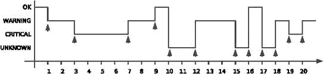
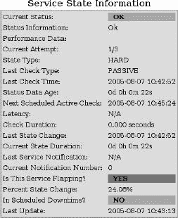
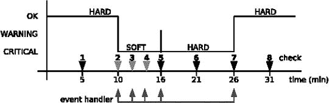
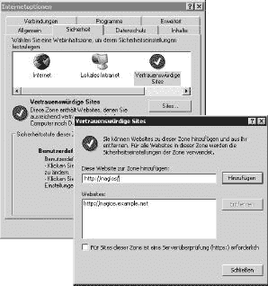
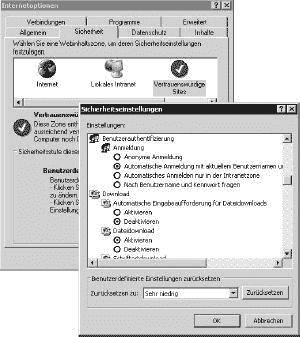

# 第六部分附录

# 附录 A. Nagios 配置参数概述

Nagios 包含两个独立的配置文件：**`nagios.cfg`** 控制 Nagios 守护进程的操作，**`cgi.cfg`** 配置 Web 界面。这两个文件应位于 Nagios 配置目录中，通常为 **`/etc/nagios`**。

**`nagios.cfg`** 指定了一系列进一步的配置数据库和日志文件，以及各自参数的功能将在以下参考中简要描述。符号 ⇒**`parameter`** 指的是当前正在讨论的配置文件中 **`parameter`** 的描述。

除非另有指定，否则参数可能具有 **`0`** (禁用) 或 **`1`** (启用) 的值。如果参数有默认值，则相应指定。对于某些路径细节，标准值是在编译时通过选项定义的。在这种情况下列出的值对应于书中使用的路径（见表 1-1，第 40 页）。

对于某些参数没有默认值。如果配置中缺少这些值，Nagios 不会提供相应的功能（例如，如果没有 **`cfg_dir`** 参数，Nagios 将忽略存储在单独目录中的对象定义）。

根据您使用的 Nagios 版本，并非所有参数始终都可用。（Nagios 2.x）表示仅限于 Nagios 2.x 的参数，而（Nagios 3.0）表示在 Nagios 3.0 中添加的参数。

# A.1 主要配置文件 **`nagios.cfg`**

**`accept_passive_host_checks`**

被动主机检查的全局开关；值 **`0`** 会抑制它们。尽管根据 **`nagios.cfg`** 允许被动主机检查，但必须在定义主机对象时明确启用此功能。默认值：

**`accept_passive_host_checks=1`**

**`accept_passive_service_checks`**

被动服务检查的全局开关。尽管值 **`1`** 允许相应的测试，但此功能必须在定义服务对象时明确启用。默认值：

**`accept_passive_service_checks=1`**

**`additional_freshness_latency`** (Nagios 3.0)

将指定的秒数延迟添加到固定新鲜度间隔。在运行之前，即将到来的新鲜度检查（见 13.4 对被动检查过时信息的反应，第 295 页）将被延迟。示例：

**`additional_freshness_latency=15`**

默认值为 **`0`** (无额外延迟)。

**`admin_email`**

负责 Nagios 服务器管理的管理员电子邮件地址，您可以通过宏 **`$ADMINEMAIL$`** 访问。如果没有明确配置联系人对象，Nagios 不会向此地址发送电子邮件。示例（无默认值）：

**`admin_email=nagios`**

**`admin_pager`**

传呼机号码、短信号码或用于通过管理员可以联系到的传呼机网关/短信网关的电子邮件地址。可以通过宏 **`$ADMINPAGER$`** 访问。示例（无默认值）：

**`admin_pager=pagenagios`**

**`aggregate_status_updates`**

指定 Nagios 是否将来自主机、服务和其自身程序的状态信息写入 **`⇒status_update_interval`** 时间间隔的块中到 **`⇒status_file`**。值 0 表示 Nagios 在每个事件之后立即更新此文件。默认值：

**`aggregate_status_updates=1`**

Nagios 3.0 基本上按照第一种方法工作，这就是为什么参数被省略的原因。

**`auto_reschedule_checks`**

使用这个实验性功能，Nagios 将测试均匀地分布在时间周期内，以避免峰值。这可能会显著降低性能，尤其是在 Nagios 已经因为性能不佳而难以保持时间表的情况下，这一点尤其没有用。通常应该关闭此选项。默认值：

**`auto_reschedule_checks=0`**

**`auto_rescheduling_interval`**

在这里指定的间隔内，Nagios 将在接下来的 **`auto_rescheduling_window`** 秒内执行的测试进行分配，以确保负载均衡。默认值：

**`auto_rescheduling_interval=30`**

**`auto_rescheduling_window`**

在这里指定的接下来几秒钟内将要进行的所有测试都将由 Nagios 重新安排，以便它们在这段时间内均匀分布。指定在未来时间但位于此间隔之外的时间进行的检查（目前）不考虑。这是一个实验性功能；仅在特殊情况下使用！默认值：

**`auto_rescheduling_window=180`**

**`broker_module`** (Nagios 3.0)

此参数在系统启动时集成指定的事件代理模块（见第 17.1 节“事件代理”，第 376 页）。除了完整路径外，还可以指定模块特定的参数。以下示例集成了 NDO 事件代理模块（另见第 17.4.4 节“在 Nagios 中加载事件代理模块”，第 386 页）：

**`broker_module=/usr/local/nagios/bin/ndomod-3x.o config_file=/etc/nagios/ndomod.cfg`**

模块特定的参数 **`config_file`** 提供了其配置文件的路径。要集成多个模块，只需为每个模块分别指定参数 **`broker_module`**。

**`cached_host_check_horizon`**(Nagios 3.0)

指定 Nagios 回收主机检查结果的秒数。在此时间框架内，Nagios 不会重复测试，但认为最后一次检查的缓存结果仍然是最新的。这可以节省时间和资源。示例：

**`cached_host_check_liorizon=30`**

值 **`0`** 会关闭缓存；默认值为 **`15`**。此值的大小取决于具体情况。大值可以显著减轻 Nagios 的负担，但同时也存在这些值可能变得过时且不再有效的风险。

**`cached_service_check_horizon`**(Nagios 3.0)

与 **`⇒cached_host_check_horizon`** 类似，但 Nagios 仅使用缓存的服务检查结果来处理依赖关系。因此，此参数只有在存在大量服务依赖关系检查时才会对性能产生影响。例如：

**`cached_service_check_horizon=30`**

值 **`0`** 会关闭缓存；默认值为 **`15`**。

**`cfg_dir**

存放包含对象定义的配置文件的目录。Nagios 会递归地搜索扩展名为 **`.cfg`** 的配置文件。其他名称的文件将被忽略，因此您可以将帮助文件放在此目录中，例如，一个 CSV 文件，该文件由脚本自动生成主机定义。要集成单个文件 **`⇒cfg_file`**。此指令可以指定多次（也请参阅 2.1 主配置文件 nagios.cfg，第 55 页）。例如（未设置默认值）：

cfg_dir=/etc/nagios/servers

**`cfg_file`**

集成一个包含对象定义的单个文件。更多关于这一点的内容请参阅 2.1 主配置文件 nagios.cfg，第 55 页。此指令可以指定多次。例如（未设置默认值）：

**`cfg_file=/etc/nagios/checkcommands.cfg`**

Nagios 3.0 允许设置相对路径，从包含文件 **`nagios.cfg`** 的目录开始。

**`check_external_commands`**

启用外部命令的接口。对于被动检查或要通过 Web 界面执行命令时是必要的。更多关于这一点的内容请参阅 13.1 外部命令接口，第 292 页。默认值：

**`check_external_commands=0`**

**`check_for_orphaned_hosts`** (Nagios 3.0)

从 Nagios 3.0 开始，此参数将主机附加到已经在 Nagios 2.x 中存在的 ⇒ **`check_for_orphaned_services`**。

**`check_for_orphaned_services`**

如果在一段时间后没有收到服务检查的结果，这被称为 *孤儿服务*。由于 Nagios 只有在存在结果的情况下才会重新安排服务检查，因此可能存在服务永远不会再次被测试的情况。通常这种情况只会发生在运行中的服务检查被手动从外部终止的情况下。

如果怀疑出现了这样的孤儿服务，您应该将**`check_for_orphaned_services`**设置为**`1`**以进行调试。然后，如果 Nagios 将相应的错误条目写入日志文件，则可以确认这一点。是否合理很容易在 Web 界面中看到：您可以独立于其状态显示所有服务，并按最后测试时间升序排序。通常，主动检查的执行不应早于**`normal_check_interval`**中指定的日期。默认值：

**`check_for_orphaned_services=0`**

**`check_host_freshness`**

允许在长时间没有检查结果到达时，对被动主机检查进行主动测试。如果 Nagios 认为测试结果过旧，则 ⇒**`host_freshness_check_interval`**介入。更多关于*新鲜度检查*的信息，请参阅 13.4 对被动检查过时信息的反应，第 295 页。默认值：

**`check_host_freshness=1`**

**`check_result_path`** (Nagios 3.0)

从 Nagios 3.0 开始，检查结果以文件形式缓存的路径。此目录中不应有其他文件，因为 Nagios 会定期清空它。每个 Nagios 实例需要一个单独的目录。示例：

**`check_result_path=/var/nagios/checkresults`**

**`check_result_reaper_frequency`** (Nagios 3.0)

收割进程在检查结果中聚集，并为 Nagios 处理这些结果。**`check_result_reaper_frequency`**定义了这些进程启动的间隔（以秒为单位）。短间隔会增加系统负载；长间隔可能导致 Nagios 调度延迟。示例：

**`check_result_reaper_frequency=5`**

该参数替换了 Nagios 2.x 中的 ⇒service_reaper_frequency。

**`check_service_freslmess`**

等同于**`check_host_freshness`**的服务。Nagios 认为测试结果过旧的时间由参数 ⇒**`service_freshness_check_interval`**定义。默认值：

**`check_service_freslmess=1`**

**`child_process_fork_twice`** (Nagios 3.0)

当执行服务或主机检查时，Nagios 通常启动两个子进程。这不是必需的，但旨在使系统对插件调用崩溃具有更强的鲁棒性。默认：

**`child_process_fork_twice=1`**

参数**`use_large_installation_tweaks`** (A.1 主配置文件 nagios.cfg) 设置值为**`0`**（仅一个子进程）；**`child_process_fork_twice=1`**激活此功能，尽管**`use_large_installation_tweaks`**已设置。

**`command_check_interval`**

定义 Nagios 测试外部命令文件（见 13.1 外部命令接口, 第 292 页）新条目的时间间隔。要使此操作发生，必须启用 ⇒**`check_external_coramands`**。

简单数字作为值表示由 ⇒**`interval_leiigth`** 指定的时间单位（通常为 60 秒，因此 **`1`** 代表一分钟）。值 **`−1`** 表示 Nagios 尽可能频繁地测试接口。如果数字后面补充（不带空格）单位 s，也可以显式指定秒。

依赖于被动检查的间隔可能不会太大，因为外部命令文件中的操作系统，一个命名管道，通常只能保存 4 KB。默认值：

**`command_check_interval=-1`**

**`command_file`**

作为外部命令文件的命名管道。它应该只对用户 **`nagios`** 和组 **`nagcmd`** 可写（另见 13.1 外部命令接口, 第 292 页）。默认值：

**`command_file=/var/nagios/rw/nagios.cmd`**

**`comment_file (Nagios 2.x)`**

通过 Web 界面指定的 Nagios 存储注释的文件。默认值：

**`comment_file=/var/nagios/comments.dat`**

此参数已在 Nagios 3.0 中删除；注释现在存储在文件 **`status.dat`** 中。

**`date_format`**

Nagios 在 Web 界面中显示或用于日期和时间宏的日期格式。可能的值有 **`us`** （``*`mm/dd/yyyy hh:mm:ss`*``**），欧元（``*`dd/mm/yyyy hh:mm:ss`*``**），**`iso8601`** （``*`yyyy-mm-dd hh:mm:ss`*``**），和 **`strict-iso8601`** （``*`yyyy-mm-ddThh:mm:ss`*``**）。默认值：

**`date_format=us`**

**`downtime_file`** （Nagios 2.x）

保存停机详情的文件，可以通过 Nagios Web 界面为主机和/或服务指定（见 16.3 规划停机时间, 第 359 页）。默认值：

**`downtime_file=/var/nagios/downtime.dat`**

此参数已在 Nagios 3.0 中删除；注释现在存储在文件 **`status.dat`** 中。

**`debug_file`** （Nagios 3.0）

对于 Nagios 2.x，在编译时仍需要激活调试（例如，使用 **`./configure --enable-DEBUGALL`**；见 **`configure --help`**）。在 Nagios 3.0 中，这通常可以在 **`nagios.cfg`** 中配置。**`debug_file`** 定义了调试输出写入的文件。示例：

**`debug_file=/var/nagios/debug.log`**

**`debug_level`** （Nagios 3.0）

这定义了记录的信息。该参数有以下值，也可以组合使用：

| **`−1`** 所有信息 |
| --- |
| **`0`** 关闭调试 |
| **`1`** 函数调用开始/结束 |
| **`2`** 配置信息 |
| **`4`** 进程信息 |
| **`8`** 调度细节 |
| **`16`** 主机和服务的检查 |
| **`32`** 消息 |
| **`64`** 事件代理 |

示例：

**`debug_level=−1`**

**`debug_verbosity`**（Nagios 3.0）

定义了调试时的详细程度：值**`0`**仅提供基本信息，而**`1`**提供稍微详细的信息。值**`2`**提供更多详细的信息，通常只有开发人员才会感兴趣。默认：

**`debug_verbosity=1`**

**`enable_embedded_perl`**（Nagios 3.0）

如果已内置，则开启嵌入式 Perl 解释器（附录 G，第 669 页），Nagios 2.x 中内置的解释器始终处于活动状态，而 Nagios 3.0 允许通过此参数设置。示例：

**`enable_embedded_perl=1`**

开启解释器，值**`0`**关闭它。如果解释器已内置，则默认为**`1`**，否则为**`0`**。

**`enable_environment_macros`**（Nagios 3.0）

Nagios 标准宏，如**`$HOSTADDRESS$`**（参见使用环境标准宏，第 631 页）可以在 Nagios 2.x 中作为环境变量访问。在 Nagios 3.0 中，可用的宏数量急剧增加，因此在大型环境中处理它们可能会导致性能问题。默认：

**`enable_environment_macros=1`**

值**`0`**关闭此机制。

**`enable_event_handlers`**

全局切换选项以使用服务和主机检查的事件处理器。更多内容请参阅附录 C，第 619 页。默认值：

**`enable_event_handlers=l`**

**`enable_flap_detection`**

定义了 Nagios 是否通常能够检测持续变化的状态（*状态波动检测*，更多内容请参阅附录 B，第 611 页）。默认值：

**`enable_flap_detection=0`**

**`enable_notifications`**

定义了 Nagios 是否可以发送通知。关闭此功能通常只在分布式安装的中心主机上才有意义，这些主机本身无法生成通知，而是将测试结果转发到中心 Nagios 实例（参见第十五章分布式监控，第 317 页）。默认值：

**`enable_notifications=l`**

**`enable_predictive_host_dependency_checks`**（Nagios 3.0）

如果提供了相应的时间范围，Nagios 3.x 会缓存主机检查结果⇒**`cached_host_check_horizon`**。参数**`enable_predictive_host_dependency_checks`**不仅用于决定无法到达的主机的 DOWN 和 UNREACHABLE 状态，还用于主机依赖关系检查，前提是已经定义了一些（参见 12.6.2 特殊情况：主机依赖，第 289 页）。

**`enable_predictive_service_dependency_checks`** (Nagios 3.0)

如果此参数启用（值**`1`**），服务检查将使用缓存的结果来解决依赖关系，而不是再次执行检查。有关服务依赖关系检查的更多信息，请参见 12.6.1 标准情况：服务依赖，第 285 页。

**`event_broker_options`**

Nagios 2.0 中的事件代理作为新接口允许第三方以可加载模块的形式向 Nagios 添加一些功能，例如将测试结果保存到数据库而不是文件中。使用事件代理接口的一个应用程序是 NDOutils（第十七章，从第 375 页）。可能的值是**`0`**（关闭）和**`−1`**（接受所有代理模块）。默认值：

**`event_broker_options=0`**

**`event_handler_timeout`**

Nagios 终止尚未完成的事件处理器的超时时间。默认值：

**`event_handler_timeout=30`**

**`execute_host_checks`**

全局启用/禁用活动主机检查。仅在具有中央 Nagios 实例的分布式环境中才值得关闭，该实例仅接受来自其他 Nagios 服务器的被动结果（参见第十五章，第 317 页）。默认值：

**`execute_host_checks=1`**

**`execute_service_checks`**

与**`execute_host_checks`**类似，但用于服务检查。默认值：

**`execute_service_checks=1`**

**`external_command_buffer_slots`** (Nagios 3.0)

指定外部命令文件接口（13.1 外部命令接口，第 292 页）可以临时存储的外部命令的最大数量。如果缓冲区不够大，可能会丢失一些结果。默认：

**`external_command_buffer_slots=4096`**

**`free_child_process_memory`** (Nagios 3.0)

Nagios 通常从内存中清除子进程，但参数**`use_large_installation_tweaks=1`**（参见 A.1 主配置文件 nagios.cfg）默认关闭此行为。使用

**`free_child_process_memory=1`**

即使设置了**`use_large_installation_tweaks=1`**，也可以重新激活清理过程。

**`global_host_event_handler`**

定义一个全局主机事件处理器，除了使用**`event_handler`**定义的主机特定事件处理器外。为此，主机定义中的全局参数⇒**`enable_event_handlers`**以及参数**`event_handler_enabled`**都必须启用。Nagios 在执行主机特定事件处理器之前，先执行全局事件处理器，这是一个正常的命令对象。示例（未设置默认值）：

**`global_host_event_handler=`****``*`name_of_the_command-object`*``**

**`global_service_event_handler`**

服务特定的等效于**`global_host_event_handler`**。除了⇒**`enable_event_handlers`**之外，服务定义中的参数**`event_handler_enabled`**也必须启用。示例（未设置默认值）：

**`global_service_event_handler=`****``*`name_of_command_object`*``**

**`high_host_flap_threshold`**

主机检查中检测跳变的上限。详细信息请见附录 B, 第 611 页。默认值：

**`high_host_flap_threshold=30.0`**

**`high_service_flap_threshold`**

服务检查中检测跳变的上限（见附录 B). 默认值：

**`high_service_flap_threshold=30.0`**

**`host_check_timeout`**

Nagios 在未返回结果的情况下，在多少秒后终止主机检查。默认值：

**`host_check_timeout=30`**

**`host_freshness_check_interval`**

两次*新鲜度检查*之间的秒数间隔。默认值：

**`host_freshness_check_interval=60`**

**`host_inter_check_delay_method`**

控制 Nagios 在重启后如何处理主机检查。一个复杂的程序旨在防止 Nagios 在这种情况下同时执行所有测试，从而过载服务器。可能的值是：**`s`**（*智能*，智能，自动分配主机检查），**`n`**（*无*，所有检查同时开始），**`d`**（*愚蠢*，Nagios 以秒为间隔处理测试），以及以秒为单位的间隔，格式为**``*`x.xx`*``**。默认值：

**`host_inter_check_delay_method=s`**

**`host_perfdata_command`**

一个 Nagios 命令对象，应在每次主机检查后检查性能数据。需要设置⇒**`process_performance_data`**参数。

此参数仅在少数情况下有意义，因为 Nagios 仅在必要时执行主机检查，因此间隔非常不规则。如果要在没有模板的情况下处理性能数据（19.1 使用 Nagios 处理插件性能数据, 第 404 页），则使用此参数。示例（未设置默认值）：

**`host_perfdata_command=process-host-perfdata`**

**`host_perfdata_file`**

指定一个文件或命名管道，通过该文件或管道 Nagios 将主机检查的性能数据通过模板机制转发到外部程序（参见 第十九章, 第 403 页）。⇒**`process_performance_data`** 必须设置。示例（未设置默认值）：

**`host_perfdata_file=/tmp/host-perfdata`**

**`host_perfdata_file_mode`**

定义如何将数据传递到文件 ⇒**`host_perf data_file`**。可能的值是 **`a`** (*追加* 到一个普通文件) 或 **`w`** (*写入*到一个新文件)，对于 Nagios 3.0，还有 **`p`** (*非阻塞写入*)，这对于管道特别有用。示例（未设置默认值）：

**`host_perfdata_file_mode=a`**

**`host_perfdata_file_processing_command`**

Nagios 命令对象在将主机性能数据传递到 ⇒**`host_perf data_file`** 接口之后被调用。该参数仅在模板机制中使用，是可选的。例如，**`perf2rrd`** (19.3 使用 Perf2rrd 准备性能数据以供评估, 第 415 页) 有自己的守护进程，它永久地从接口读取数据。示例（未设置默认值）：

**`host_perfdata_file_processing_command=process-host-perfdata-file`**

**`host_perfdata_file_processing_interval`**

如果这个间隔——以秒为单位——大于 **`0`**，则属于它的命令（⇒**`host_perfdata_file_processing_command`**）将在这个间隔内定期运行。**`0`** 确保它不被使用。示例（未设置默认值）：

**`host_perfdata_file_processing_interval=0`**

**`host_perfdata_file_template`**

描述性能数据的输出格式。Nagios 宏和其中包含的格式细节，如 **`\t`** (制表符) 或 **`\n`** (换行符)，在输出中被替换。更多关于模板的使用，请参阅 19.1 使用 Nagios 处理插件性能数据, 第 404 页。示例（未设置默认值）：

host_perfdata_file_template=$TIMET$\t$HOSTNAME$\t$HOST-EXECUTIONTIME$\t\$HOSTOUTPUT$\t$HOSTPERFDATA$

**`illegal_macro_output_chars`**

列出在宏替换通知时被丢弃的字符，以避免诸如由 shell 解释等问题。该参数对主机或服务定义中宏的替换没有影响。示例（未设置默认值）：

**`illegal_macro_output_chars=' ˜$&|'"<>`** 

**`illegal_object_name_chars`**

指定 Nagios 对象名称中不允许的字符。建议至少指定以下示例中列出的字符（未设置默认值）：

illegal_object_name_chars='˜ !$%^&*|'"<>?, () =

**`interval_length`**

定义对象定义（如**`normal_check_interval`**或**`retry_check_interval`**）中时间细节所参照的秒数时间单位。如果**`interval_length`**为**`60`**秒，则时间指定为**`5`**分钟。只有有充分的理由，您才应该更改默认的 60 秒。然而，**`interval_length`**对**`nagios.cfg`**中的时间参数没有影响。默认值：

**`interval_length=60`**

**`lock_file`**

指定包含 Nagios 守护进程进程 ID（PID）的 Nagios 守护进程锁定文件。启动/停止操作需要此文件。默认值：

**`lock_file=/var/nagios/nagios.lock`**

**`log_archive_path`**

Nagios 日志文件的归档目录。评估基于复制到该目录的归档文件。如果删除其中一个文件，则其中包含的信息将丢失。Nagios 仅在启用⇒**`log_rotation_method`**参数进行日志轮转时使用该目录。默认值：

**`log_archive_path=/var/nagios/archives`**

**`log_event_handlers`**

事件处理器操作是否应出现在日志文件中？此参数主要用于查找错误。默认值：

**`log_event_handlers=1`**

**`log_external_commands`**

Nagios 是否应在日志文件中记录外部命令（见 13.1 外部命令接口, 第 292 页）？默认值：

**`log_external_commands=1`**

**`log_file`**

中心日志文件。除了错误和问题外，它还保留所有事件。所有历史评估都使用此文件。对于日志轮转，Nagios 提供了一个单独的机制，即⇒**`log_rotation_method`**，您不应在此处使用外部程序。默认值：

**`log_file=/var/nagios/nagios.log`**

**`log_host_retries`**

指定 Nagios 是否应记录由于错误状态而导致的主机检查重复。如果使用的事件处理器（见附录 C, 第 619 页）需要响应软状态，则此选项绝对必要。默认值：

**`log_host_retries=0`**

**`log_initial_states`**

指定在 Nagios 系统启动时，服务主机启动状态是否应出现在日志文件中。默认值：

**`log_initial_states=0`**

**`log_notifications`**

定义 Nagios 是否也应将通知记录到日志文件中。默认值：

**`log_notifications=1`**

**`log_passive_checks`**

指定 Nagios 是否应在日志文件中记录被动检查。默认值：

**`log_passive_checks=1`**

**`log_rotation_method`**

定义是否应该定期将日志文件⇒**`log_file`**保存到存档⇒**`log_archive_path`**。日志轮转应始终由 Nagios 本身处理，而不是任何外部程序，否则软件在评估历史数据时将遇到困难。可能的值是**`n`**（无存档，不存档）、**`h`**（每小时，每个小时的开始）、**`d`**（每天，每天 00:00 小时）、**`w`**（每周，周六午夜至周日午夜）和**`m`**（每月，每月的第一天 00:00 小时）。默认：

**`log_rotation_method=n`**

**`log_service_retries`**

Nagios 是否应该记录由于软状态错误而重复的服务检查？这在开发事件处理器时进行调试很有用，但否则最好省略。默认值：

**`log_service_retries=0`**

**`low_host_flap_threshold`**

主机检查的翻转检测的下限。详细信息请参阅附录 B，第 611 页。默认值：

**`low_host_flap_threshold=20.0`**

**`low_service_flap_threshold`**

与**`low_host_flap_threshold`**类似，但用于服务检查。默认值：

**`low_service_flap_threshold=20.0`**

**`max_check_result_file_age`** (Nagios 3.0)

定义检查结果文件的最大年龄（以秒为单位），Reaper 进程从目录**`check_result_path`**中仍然处理这些文件。较旧的文件将被丢弃。例如：

**`max_check_result_file_age=1800`**

只有当伴随文件不超过 30 分钟时，这里的检查结果才会被处理。**`0`**的值忽略结果文件的年龄。

**`max_check_result_reaper_time (Nagios 3.0)`**

限制单个 Reaper 进程的运行时间为指定的秒数。例如：

**`max_check_result_reaper_time=10`**

在这里，Reaper 进程在 10 秒后被取消。检查结果中剩余的将由下一个 Reaper 进程处理。

**`max_concurrent_checks`**

指定 Nagios 可以同时执行多少个检查。值**`0`**允许无限数量。在不利的条件下，通过大于零的值进行限制可能会导致测试未能及时执行。默认值：

**`max_concurrent_cnecks=0`**

**`max_debug_file_size (Nagios 3.0)`**

将调试文件的大小限制为指定的字节数。例如：

**`max_debug_file_size=2048000`**

如果大小超过给定值，Nagios 将添加结尾的**`.old`**到文件。如果已存在同名文件，它将被删除。因此，您必须为此指定的大小提供两倍的空间，因为可能同时存在两个文件（带有和没有后缀**`.old`**）的最大大小。

**`max_host_check_spread`**

重启后，Nagios 应在多长时间间隔（以分钟为单位）内启动所有主机检查？这可以防止所有测试同时执行，从而避免过载 Nagios 服务器。默认值：

**`max_host_check_spread=30`**

**`max_service_check_spread`**

与**`max_host_check_spread`**类似，但用于服务检查。默认值：

**`max_service_check_spread=30`**

**`nagios_group`**

Nagios 守护进程运行的权限所属的组。默认值（在编译时定义）：

**`nagios_group=nagios`**

**`nagios_user`**

Nagios 守护进程运行的权限所属的用户。默认值（在编译时定义）：

**`nagios_user=nagios`**

**`notification_timeout`**

Nagios 在多少秒后应该放弃发送通知的尝试？一些操作，例如发送短信，需要一定的时间，因为系统首先等待接收者的确认。因此，这个值不应太低。默认值：

**`notification_timeout=30`**

**`object_cache_file`**

Nagios 启动后存储所有对象的文件。由于 Web 界面使用此文件，因此可以在 Nagios 运行时编辑带有对象定义的正常配置文件，而不会危及 Web 界面的功能。默认值：

**`object_cache_file=/var/nagios/objects.cache`**

**`obsess_over_hosts`**

在一般情况下，定义是否将主机检查结果转发到中央 Nagios 实例。如果启用此参数，则运行在⇒**`ocsp_commandis`**中定义的命令。这在分布式环境中使用；描述可参见第十五章，第 317 页。默认值：

**`obsess_over_hosts=0`**

**`obsess_over_services`**

在一般情况下，定义是否应将服务检查结果转发到中央 Nagios 实例。如果启用此参数，则使用在⇒**`ohcp_command`**中定义的命令。此功能用于分布式环境（见第十五章，第 317 页）。默认值：

**`obsess_over_services=0`**

**`ochp_command`**

定义*强迫症主机处理器*，这是一个 Nagios 命令对象，将分布式环境中的所有主机检查结果转发到中央实例（见第十五章，第 317 页）。示例（未设置默认值）：

**`ochp_command=`****``*`name_of_the_command_object`*``**

**`ochp_timeout`**

定义⇒**`ochp_command`**的超时时间。在此指定的时间过后，Nagios 将中止命令的执行。默认值：

**`ochp_timeout=15`**

**`ocsp_command`**

指定命令对象，作为*强迫症服务处理器*，应将分布式环境中的所有服务检查结果转发到中央实例（见第十五章，第 317 页）。示例（未设置默认值）：

**`ochp_command=`****``*`name_of_the_command_object`*``**

**`ocsp_timeout`**

对于⇒**`ocsp_command`**的超时时间。在此指定的时间过后，Nagios 将中止命令的执行。默认值：

**`ocsp_timeout=15`**

**`passive_host_checks_are_soft`**（Nagios 3.0）

通常，被动主机检查的结果总是被视为硬状态。使用

**`passive_host_checks_are_soft=1`**

同样的行为也可以应用于主动主机检查。现在可以通过主机定义中的参数**`max_check_attempts`**来调节分配软或硬状态。

**`perfdata_timeout`**

定义了性能命令（⇒**`host_perfdata_command`**，⇒**`service_perfdata_command`**，⇒**`host_perf-data_file_processing_command`**，或⇒**`service_perfdata_file_processing_command`**）应该在多少秒后终止。默认值：

**`perfdata_timeout=5`**

**`precached_object_file`**（Nagios 3.0）

从 Nagios 3.0 开始，可以在 Nagios 重启之前执行读取和检查配置，并将结果缓存到**`precached_object_file`**指定的文件中（参见第 690 页的 H.8 重启）。示例：

**`precached_object_file=/var/nagios/objects.precache`**

**`process_performance_data`**

开启性能数据的处理。此参数只有在性能数据确实被评估时才应启用。否则，它只会占用 Nagios 服务器的资源。默认值：

**`process_performance_data=0`**

**`resource_file`**

包含（最多 32 个）**`$USER`**χ**`$`** 宏定义的配置文件。**`$USER1$`** 通常指定 Nagios 插件的路径。否则，您可以将密码保存在这里，例如，这些密码不应在正常的 Nagios 配置文件中读取。然后，该文件必须受到所有外部访问的保护，并且只有用户**`nagios`**能够读取它。示例（未设置默认值）：

**`resource_file=/etc/nagios/resource.cfg`**

**`retain_state_information`**

确定 Nagios 在关闭时是否将当前状态保存到文件中（⇒**`state_retention_file`**），并在启动时再次读取这些状态。默认值：

**`retain_state_information=0`**

**`retention_update_interval`**

Nagios 应每隔多少分钟将当前状态信息存储在⇒**`state_retention_file`**中？如果值为**`0`**，则系统仅在 Nagios 关闭时保存信息。必须启用参数⇒**`retain_state_information`**。默认值：

**`retention_update_interval=60`**

**`service_check_timeout`**

Nagios 在多少秒后如果服务检查尚未返回结果，则终止服务检查。默认值：

**`service_check_timeout=60`**

**`service_freshness_check_interval`**

两次新鲜度检查之间的秒数间隔。默认值：

**`service_freshness_check_interval=60`**

**`service_inter_check_delay_method`**

控制 Nagios 在重启后如何处理服务检查。一个“智能”的过程应该防止它们同时开始，以避免对服务器造成不必要的负载。可能的值是 **s** (*smart*，自动分配)，**n** (*no*，同时启动所有测试！)，**d** (*dumb*，检查之间间隔一秒)，以及以秒为单位的显式指定间隔，形式为 *x. xx*。默认值：

**`service_inter_check_delay_method=s`**

**`service_interleave_factor`**

通过 Nagios 在一段时间内“智能”地分配所有主机的计划检查，防止针对特定主机的检查同时执行（⇒**`max_concurrent_checks`**, 598），可能的值是 **s** (*smart*，自动分配) 或大于 0 的整数。值为 **`1`** 时，Nagios 不执行任何分配；值为 **4** 时，Nagios 首先计划每第四个服务检查（即从预期检查的数量中，第 1 个、第 5 个、第 9 个等），然后是下一个数字（即第 2 个、第 6 个、第 10 个等），依此类推。测试序列通过 Web 界面中的 **服务详情** 项显示。如有疑问，默认值可以保持不变：

**`service_interleave_factor=s`**

**`service_perfdata_command`**

在每次服务检查后运行的 Nagios 命令对象，用于处理性能数据。此要求是必须设置 ⇒**`process_performance_data`**。

当性能数据需要在不使用模板的情况下进行处理时使用此参数 (19.1 使用 Nagios 处理插件性能数据, 第 404 页)。示例（未设置默认值）：

**`service_perfdata_command=process-service-perfdata`**

**`service_perfdata_file`**

Nagios 通过模板机制将服务检查的性能数据转发到外部程序的文件或命名管道的路径。这仅在 ⇒**`process_performance_data`** 设置的情况下有效。关于处理性能数据的更多信息请参阅 第十九章, 第 403 页。示例（未设置默认值）：

**`service_perfdata_file=/tmp/service-perfdata`**

**`service_perfdata_file_mode`**

定义了数据传递到 ⇒**`service_perfdata_file`** 的模式。可能的值有 **a** (*append* 向正常文件追加)，**w** (*write* 写入新文件) 以及在 Nagios 3.0 中 **p** 也有效 (*非阻塞写入*)，这对于管道很有用。示例（无默认值）：

**`service_perfdata_file_mode=a`**

**`service_perfdata_file_processing_command`**

Nagios 在将服务性能数据传递给⇒**`service_perfdata_file`**之后执行的一个命令对象。该参数是可选的，并且仅与模板机制一起使用。只要进一步处理数据的程序，如**`perf2rrd`** (19.3 使用 Perf2rrd 准备性能数据以供评估，第 415 页)，包含它们自己的永久读取**`service_perfdata_file`**的服务，您就可以不定义读取命令来管理。另见第十九章，第 403 页。示例（未设置默认值）：

**`service_perfdata_file_processing_command=process-service-perfdata-file`**

**`service_perfdata_file_processing_interval`**

在多长时间间隔内，定义在⇒**`service_perfdata_file_processing_command`**中的命令会定期运行。将值设置为**`0`**确保它永远不会被使用。示例（未设置默认值）：

**`service_perfdata_file_processing_interval=0`**

**`service_perfdata_file_template`**

性能数据的输出格式；Nagios 宏和格式细节，如**`\t`**（制表符）或**`\n`**（换行符），在输出中替换。另见 19.1 使用 Nagios 处理插件性能数据，第 404 页。示例（未设置默认值）：

**`service_perfdata_file_template=$TIMET$\t$HOSTNAME$\t$SERVICEDESC$\t$SERVICEEXECUTIONTIME$\t$SERVICELATENCY$\t$SERVICEOUTPUT$\t$SERVICEPERFDATA$`**

**`service_reaper_frequency`** (Nagios 2.x)

Nagios 每隔多少秒处理累积的服务测试结果？默认值：

**`service_reaper_frequency=10`**

在 Nagios 3.0 中，相应的参数被称为⇒check_result_reaper_frequency，它不仅影响服务检查，还影响主机检查。

**`sleep_time`**

Nagios 在再次在调度队列中搜索要执行的检查之前等待的秒数。默认值：

**`sleep_time=0.5`**

**`state_retention_file`**

Nagios 在关闭时存储状态信息的文件，以及 Nagios 启动时再次从中读取信息的位置。这仅在⇒**`retain_state_information`**参数设置时使用。默认值：

**`state_retention_file=/var/nagios/retention.dat`**

**`status_file`**

Nagios 保存所有当前状态值的文件路径，以及 Web 界面从中检索它们的位置。默认值：

**`status_file=/var/nagios/status.dat`**

**`status_update_interval`**

Nagios 应该在什么间隔内将状态值存储在文件⇒**`status_file`**中？如果⇒**`aggregate_status_updates`**未设置，系统将忽略此参数，并立即将状态值写入此文件（不推荐）。默认值：

**`status_update_interval=60`**

**`temp_file`**

Nagios 在必要时使用的临时文件路径，并在不再需要时删除。默认值：

**`temp_file=/var/nagios/tempfile`**

**`temp_path`** (Nagios 3.0)

Nagios 可能存储临时文件的目录。该目录应定期清空。示例：

**`temp_path=/tmp`**

**`translate_passive_host_checks`**(Nagios 3.0)

确定 Nagios 是否应从拓扑角度将被动主机检查的结果转换为 DOWN 或 UNREACHABLE。默认为“否”：

**`translate_passive_host_checks=0`**

被动主机检查通常用于分布式环境，而 Nagios 没有关于这些环境拓扑结构的所有信息。在这种情况下，默认值是合理的。值 1 将转换设置为 DOWN 或 UNREACHABLE。

**`use_aggressive_host_checking`**

Nagios 在决定不可达的主机是 DOWN 还是 UNREACHABLE 时做出了一些假设。如果此参数设置为值**1**，Nagios 在主机检查上非常严格，在某些情况下可能会执行相当多的单独检查。虽然结果将更精确，但这会给系统带来相当大的压力。此参数仅在检测失败的主机存在问题时应设置。默认：

**`use_aggressive_host_checking=0`**

**`use_embedded_perl_implicitly`** (Nagios 3.0)

自动运行嵌入式 Perl 解释器中的所有 Perl 脚本，前提是脚本本身不包含避免解释器的显式指令。更多关于此内容请参阅 G.2 使用 ePN，第 672 页。

**`use_large_installation_tweaks`**(Nagios 3.0)

此参数包含多个设置，旨在提高 Nagios 在大环境中的性能。以下条目将其启用：

**`use_large_installation_tweaks=1`**

更多关于此内容请参阅 F.2.7 优化大型 Nagios 环境，第 667 页。

**`use_regexp_matching`**

定义是否允许在对象定义中使用通配符**`*`**（任意字符）和**`?`**（单个字符）。如果您想使用正则表达式，则必须使用**`use_true_regexp_matching`**。默认值：

**`use_regexp_matching=0`**

**`use_retained_program_state`**

Web 界面上参数的更改（**`enable_notifications`**、**`enable_flap_detection`**、**`enable_event_handlers`**、**`execute_service_checks`** 和 **`accept_passive_service_checks`**）在 Nagios 重启后是否仍然有效？只有当**`retain_status_informationis`**启用时才有效。默认值：

**`use_retained_program_state=1`**

**`use_retained_scheduling_info`**

Nagios 在关闭时是否应保存当前调度信息，以便在重启时再次读取？如果您正在添加大量测试，则可以暂时禁用此参数；否则，保持启用是明智的。默认值：

**`use_retained_scheduling_info=1`**

**`use_syslog`**

确保所有 Nagios 活动都记录在 syslog 中。默认值：

**`use_syslog=1`**

**`use_timezone`** (Nagios 3.0)

明确为 Nagios 设置时区。通常，Nagios 使用其运行系统的时区。如果在一个主机上运行多个不同时区的实例，则需要此参数。示例：

**`use_timezone=Europe/Berlin`**

指定所需区域信息文件的相对路径，通常在**`/usr/lib/zoneinfo`**或**`/usr/share/zoneinfo`**。

**`use_true_regexp_matching`**

与⇒**`use_regexp_matching`**相比，允许根据 POSIX 标准使用真正的正则表达式.^([304]) 默认值：

**`use_true_regexp_matching=0`**

* * *

^([304]) 请参阅 man 7 regex。

# A.2 **`cgi.cfg`**中的 CGI 配置

## A.2.1 认证参数

通过联系人和联系组，Nagios 将责任分配给用户，从而可以推断出 Web 界面的权限：每个联系人通常只能看到他负责的主机和服务的那些。这就是为什么 Web 登录名必须与联系人名称匹配。

下列参数在一定程度上解决了这一概念。然而，它们并不旨在解决由联系人和 Web 用户名不匹配引起的问题。

cmduse_authentication

确定是否通常需要登录到 Web 界面。与用户名一样，联系名称始终使用；密码的存储方式请参阅 1.5 Web 界面配置，第 47 页。

通常你不应该允许这种认证，但如果确实需要，你应该确保外部命令接口（13.1 外部命令接口，第 292 页）完全关闭。默认：

**`use_authentication=1`**

**`authorized_for_all_host_commands`**

允许指定的用户通过 Web 界面为所有主机运行命令，而无需属于适当的联系组。示例（未设置默认值）：

**`authorized_for_all_host_commands=nagiosadmin`**

**`authorized_for_all_hosts`**

允许指定的用户查看所有主机信息，无论他们的实际责任如何。示例（未设置默认值）：

**`authorized_for_all_hosts=nagiosadmin.guest`**

**`authorized_for_all_service_commands`**

允许在此定义的用户通过 Web 界面运行所有服务的命令，而不管他们是否属于联系组。示例（未设置默认值）：

**`authorized_for_all_service_commands=nagiosadmin`**

**`authorized_for_all_services`**

允许指定的用户查看所有服务信息，无论他们的权限如何。示例（未设置默认值）：

**`authorized_for_all_services=nagiosadmin,guest`**

**`authorized_for_configuration_information`**

启用指定的用户通过 Web 界面查看所有配置数据。这应该仅限于 Nagios 管理员。示例（未设置默认值）：

**`authorized_for_configuration_information=nagiosadmin,jdoe`**

**`authorized_for_system_commands`**

允许指定的用户通过 Web 界面关闭或重启 Nagios。通常情况下，没有人拥有这种授权。示例（未设置默认值）：

**`authorized_for_system_information=nagiosadmin,theboss,jdoe`**

**`authorized_for_system_information`**

允许指定的用户通过 Web 界面查看 Nagios 进程信息。通常情况下，没有人可以这样做。示例（未设置默认值）：

**`authorized_for_system_information=nagiosadmin,theboss,jdoe`**

## A.2.2 其他参数

**`action_url_target`** (Nagios 3.0)

设置操作 URL 的 HTML 标签 **`target`**（见 16.4.1 扩展主机信息）。默认值为 **`blank`**，将在新窗口中打开：

**`action_url_target=blank`**

**`default_statusmap_layout`**

定义状态图的布局。可能的值是 **0**（通过 **hostextinfo** 对象定义坐标），**1**（用户必须通过鼠标点击从一个层移动到下一个层），**2**（压缩树——在图片中分支交错，有些令人困惑），**3**（平衡树，分支显示得没有交错——更清晰，但需要更多空间），**4**（圆形表示，Nagios 位于中心：可以直接到达的主机显示在内圈，而其他圈中则位于可以从图形中已进入的主机到达的主机），**5**（与 **4** 类似的圆形；主机周围用颜色标记——正常为灰色，DOWN 或 UNREACHABLE 为红色；16.2.4 一目了然的最重要事项：tac.cgi 中的图 A.27 展示了一个示例），以及 **6**（圆形；主机显示为气球）。这些设置也可以在 Web 界面中更改，无需每次都调整配置文件，这使得尝试新事物变得更加容易。示例：

**`default_statusmap_layout=5`**

**`default_statuswrl_layout`**

通过 **`statuswrl.cgi`** 确定状态页面的 VRML 表示布局。可能的值是 **0**、**2**、**3** 和 **4**；相应的外观基于同名参数 **`default_statusmap_layout`** 的值。示例：

**`default_statuswrl_layout=4`**

**`default_user_name`**

可能使用网页而不进行身份验证的访客用户名。您应该只在 Web 服务器受到未经授权的访问保护时使用此参数，并且应仔细查看此用户通过联系组分配的权限。示例（未设置默认值）：

**`default_user_name=guest`**

**`enable_splunk_integration`** (Nagios 3.0)

激活 Splunk 工具的集成，Splunk 是日志文件的搜索引擎.^([306])

**`escape_html_tags`** (Nagios 3.0)

值 **1** 禁用插件输出中的 HTML 格式：

**`escape_html_tags=1`**

因此，相应的格式化没有效果。默认是 **`0`**，这会导致 HTML 格式传递。

**`lock_author_name`** (Nagios 3.0)

对于各种 CGI 动作，例如设置确认，指定作者名称。使用设置

**`lock_author_names=1`**

这不能再更改（默认是登录用户）。

**`main_config_file`**

Nagios 主配置文件。默认值：

**`main_config_file=/etc/nagios/nagios.cfg`**

**`notes_url_target`** (Nagios 3.0)

设置 Notes URLs 的 HTML 标签 **`target`**（见 16.4.1 扩展主机信息）。默认是 **`blank`**，它将在新窗口中打开：

**`notes_url_target=blank`**

**`physical_html_path`**

文件系统中指向 Nagios 文档和图像目录的路径。另见 ⇒**`url_html_path`**。默认值：

**`physical_html_path=/usr/local/nagios/share`**

**`refresh_rate`**

指定网页自动更新的间隔。默认值：

**`refresh_rate=60`**

**`splunk_url`** (Nagios 3.0)

定义 Splunk 搜索引擎的 URL。示例：

**`splunk_url=http://127.0.0.1:8000/`**

参数 ⇒**`enable_splunk_integration`** (A.2.2 其他参数) 也必须启用。

**`statusmap_background_image`**

状态图显示的背景图像。示例（未设置默认值）：

**`statusmap_background_image=smbackground.gd2`**

**`statuswrl_include`**

用于 VRML 表示的具有自己的 VRML 对象的文件。路径相对于 ⇒**`html_physical_path`** 指定。示例（未设置默认值）：

**`statuswrl_include=myworld.wrl`**

**`url_html_path`**

从浏览器的角度来看，Nagios 文档和图像的逻辑路径，从 Web 服务器文档根开始。如果您在此路径中使用 URL，您将被带到 Nagios 启动页面。默认值：

**`url_html_path=/nagios`**

**``**`use_pending_states`** (Nagios 3.0)``**

如果尚未对此进行检查，主机和服务应在 Web 界面中如何显示？

**`use_pending_states=1`**

显示未检查的主机和服务的状态 **`PENDING`**；值 **`0`** 可以保持不变。

* * *

^([305]) 即，不通过父级进行“转移”。

^([306]) [`www.splunk.com/`](http://www.splunk.com/)

# 附录 B. 快速交替状态：翼尖

如果主机或服务的状态不断变化，Nagios 会向管理员发送大量的问题和恢复消息，这不仅会非常令人烦恼，还会分散管理员对其他可能更紧急问题的注意力。

通过一种特殊机制，Nagios 可以快速识别交替状态，并可以选择性地通知管理员。Nagios 文档将此类交替状态称为*状态翼尖*，并将它们的检测称为*翼尖检测*。

这些交替状态涉及主机或服务本身对检测机制没有影响。差异更多地体现在主机和服务检查的性质上：Nagios 定期执行服务检查，因此定期。这样，系统可以持续接收有关当前状态的新信息。从 Nagios 3.0 开始，定期主机检查才有意义（参见第 689 页的 H.7 主机检查的新逻辑）。在 Nagios 2.x 中，主机检查通常仅在需要时进行，因此 Nagios 必须通过其他方式获取适当的信息。

# B.1 使用服务进行翼尖检测

要检测交替状态，你需要一个包含上次服务检查期间发生的所有状态的完整列表。为此，Nagios 为每个服务存储最后 21 个测试结果，然后在内存中覆盖每个情况下的最老值。在这 21 个状态中，最多可以发生 20 次变化。

图 B-1 展示了示例。x 轴为每个情况中可能的交替状态编号，从 1 到 20，箭头的头部指示实际发生的交替状态。



图 B-1. Nagios 保存最后 21 个状态以检测频繁交替状态。此服务状态变化了十二次

在指定期间，系统状态的变化次数为 20 次中的 12 次，百分比是 60%。0%表示没有发生任何交替状态，而 100%则意味着服务每次记录时都处于不同的状态。

在确定百分比值时，Nagios 将较旧的状态变化赋予的权重低于较新的变化。因此，在图 B-1 中，它将最旧的状态变化权重设置为**`1`**，而最近的权重设置为**`20`**，权重每次增加约 0.02，^([307])从而实现线性增长。

在这种情况下，这种加权对最终结果没有太大影响：对于图 B-1，这导致 62.21%（而不是 60%），略有变化，因为第二半部分的状态变化更频繁。如果只有一次状态变化在**`20`**，加权将产生最大影响：5%（即可能的 20 次变化中的一次）将变为 5 * 1.2 = 6%。

使用可以定义的阈值值——两个用于服务，两个用于主机——Nagios 定义了服务或主机是否处于“折叠”状态。上下限都指定为百分比。如果检测到的状态变化超过上限，Nagios 将该服务分类为*折叠*。这会产生一些后果：Nagios 将事件记录在日志文件中，添加一个非永久性注释，^([308])并停止发送与此相关的任何通知。

如果百分比值低于下限，系统将撤销此步骤；也就是说，注释将消失，将再次发送通知，结果也将出现在日志文件中。

## B.1.1 Nagios 配置

折叠检测配置在两个位置：在中央配置文件中以及服务对象定义中。在**`nagios.cfg`**中，该功能通常通过参数**`enable_flap_detection`**来开启，并且在这里也定义了全局限制值，如果没有为该服务定义其他内容，这些值将始终适用：

```
# /etc/nagios/nagios.cfg
...
enable_flap_detection=1
low_service_flap_threshold=5.0
high_service_flap_threshold=20.0
...
```

这里为**`enable_flap_detection`**设置的值**`1`**启用了折叠检测，而**`0`**将其关闭。

在这种情况下，下限**`low_service_flap_threshold`**位于 5%，上限**`high_service_flap_threshold`**限制在 20%。这意味着如果保存的历史记录检测到至少五个状态变化（超过可能的 20 个中的四个），Nagios 将服务分类为折叠。下限的五个百分比相当于一个状态变化。要低于这个值，所有 21 个状态都必须相同.^([309])要低于这个下限，所有 21 个状态都必须相同.^([310])

在服务对象的定义中，您还有机会决定在这种情况下是否需要启用翻动检测。您还可以选择为此服务指定与全局设置不同的阈值值：

```
define service{
    host_name              linux01
    service_description    NTP
    ...
    flap_detection_enabled 1
    low_flap_threshold     5.0
    high_flap_threshold    20.0
    ...
}
```

**`flap_detection_enabled`**中的值**`1`**启用此服务的功能，而**`0`**（默认值）则关闭它。两个限制值**`low_flap_threshold`**和**`high_flap_threshold`**定义了覆盖全局定义值的限制值。如果它们设置为**`0`**或被省略，则应用全局阈值。

从 Nagios 3.0 版本开始，参数**`flap_detection_options`**允许在检测状态变化时仅考虑指定的状态。可能的值有**`o`**（OK）、**`w`**（WARNING）、**`c`**（CRITICAL）和**`u`**（UNKNOWN）。默认值为

```
flap_detection_options u,w,c,u
```

如果值限制为**`w`**、**`c`**，则只有 WARNING 和 CRITICAL 在检测中起作用；其他状态被忽略。Nagios 3.0 在全局关闭翻动检测时也保存状态，并引入了相应的新消息类型。更多内容请参阅第 687 页的 H.4 快速变化状态。

## B.1.2 历史内存和状态变化的时序进展

由于历史记录只保存硬状态和软恢复，x 轴上的部分不能如此容易地按时间顺序分配，因为可能的状态变化之间的间隔并不相等。假设服务对象具有以下定义：

```
max_check_attempts    3
normal_check_interval                 5
retry_check_interval                  1
```

Nagios 在服务从 OK 状态变为 WARNING 状态后，在服务变为硬状态 WARNING（图 B-1 中的状态 1）之前再次检查服务两次。从最后一次返回 OK 的检查以来，总共过去了七分钟^([311])，因为五分钟和六分钟后的两个软状态不包括在历史记录中。

如果下一个服务检查，如图 B-1 所示，再次检测到 WARNING（即这次状态没有变化），那么状态 1 和 2 之间这次只间隔了五分钟。因此，x 轴因此只在特殊情况下以线性形式表示时间——例如，如果没有状态变化发生。

## B.1.3 Web 界面中的表示

Nagios 将其归类为摆动状态的服务在 Web 界面中有三个可见点：由 **`tac.cgi`** 生成的摘要（16.2.4 一目了然的最重要事项：tac.cgi，第 345 页）和 **`status.cgi`**（16.2.1 状态显示的变体：status.cgi，第 334 页），以及由 **`extinfo.cgi`** 创建的信息页面（16.2.2 附加信息和控制中心：extinfo.cgi，第 339 页）。

最快到达那里的方式是通过 **`tac.cgi`** (图 B-2)：在 **`监控功能`** 部分标记为 **`x Services Flapping`** 的链接会将你带到不断改变状态的服务状态概述。图 B-3 中显示的状态概述也可以直接通过 **`status.cgi?host=all&style=detail&serviceprops=1024`** 打开。

**`serviceprops=1024`** 描述了 Nagios 将其归类为摆动状态的所有服务。**`style=detail`** 提供详细视图（与 **`overview`** 相比，如图 B.10 所示 16.2 个体 CGI 程序概述)，而 **`host=all`** 包含所有主机。


图 B-2. `tac.cgi` 在 `监控功能` 部分记录状态变化

在 图 B-3 的状态视图中，一个带有几个水平灰色条移动来去的白色区域揭示了一个摆动服务正在涉及。同时，一个白色话泡表示对此（由 Nagios 自动生成）的评论存在。


图 B-3. 动画水平条表示摆动状态

如果你在状态视图中点击问题服务旁边的摆动图标，**`extinfo.cgi`** 会生成关于该服务的附加信息（图 B-4)，显示在摆动类别旁边的状态变化百分比，由标记为 **YES** 的红色条表示。



图 B-4. `百分比状态变化`：揭示了硬状态变化的频率，以百分比表示

页面还包含由 Nagios 生成的非永久性注释（图 B-5)，指出消息发送已停止，直到服务状态再次稳定。因此，当 Nagios 重启时，它就会消失。


图 B-5. 带有此注释，Nagios 将服务分类为翻页

* * *

^([307]) (1.2–0.8)/19=0.0211

^([308]) 在监控系统重启后，非永久性注释会消失，但永久性注释会保留。

^([309]) 如果状态变化最近发生，加权将确保四个状态变化就已经足够超过 20%的限制。

^([310]) 如果在第一半部分发生单个状态变化，加权结果将小于 5%。

^([311]) 5 5+2*1=7

# B.2 主机的翻页检测

Nagios 试图以两种方式检测主机的状态变化：在主机检查本身（无论是 Nagios 3.0 的主动检查还是按需检查）以及如果为主机执行了服务检查，并且最近进行了翻页检测。Nagios 下一次执行服务检查以检测状态变化是由所有服务检查间隔的平均值确定的。

从 Nagios 3.0 开始，常规主机检查也不再是必要的，Nagios 的最新版本完全可以不使用它们。出于性能考虑，在 Nagios 2.x 中应尽量避免它们（4.2 需求主机检查与周期性可达性测试, 第 95 页）。通过使用一种技巧仅在需要时执行服务检查，Nagios 弥补了常规主机检查结果缺失的事实。如果至少有一个服务检查返回 OK，Nagios 就会据此得出主机也是可达的并且处于 OK 状态的结论。翻页检测的结果由 Nagios 存储在历史记录中。

同样的翻页检测机制在主机和服务中都使用。所以区别仅在于 Nagios 如何确定对应的数据基础。

是否需要为主机启用翻页检测由中央配置文件**`nagios.cfg`**和主机对象定义揭示。全局参数**`enable_flap_detection`**，适用于主机和服务，必须设置为**`1`**：

```
# /etc/nagios/nagios.cfg
enable_flap_detection=1
low_host_flap_threshold=5.0
high_host_flap_threshold=20.0
```

主机阈值参数的名称中包含**`host`**，但它们与它们的**`service`**等效参数具有相同的效果.^([312])

对于主机对象本身，检测通过**`flap_detection_enabled`** **`1`**开启，通过**`0`**关闭：

```
define host{
    host_name              linux01
    ...
    flap_detection_enabled 1
    low_flap_threshold     5.0
    high_flap_threshold    20.0
}
```

可选参数**`low_flap_threshold`**和**`high_flap_threshold`**允许为主机设置特定的阈值。如果省略这些参数，则使用全局阈值值。

对于服务检查，从 3.0 版本开始，Nagios 在这里还增加了额外的**`flap_detection_options`**参数。在主机定义中可能的值有**`o`**（正常），**`d`**（已关闭）和**`u`**（不可达）。只有为参数指定的状态用于翻页检测，如果没有提供此参数，则使用所有可能的状态。

* * *

^([312])参见 B.1 使用服务进行翻页检测。

# 附录 C. 事件处理器

如果主机或服务的状态在正常和错误状态之间交替，你可以使用*事件处理器*运行任何你想要的程序。例如，如果服务失败，你可以利用这个功能让 Nagios 尝试重新启动它。这为解决小问题提供了机会，而不需要管理员干预。

*事件处理器*的使用不仅限于自我修复：使用适当的脚本，你同样可以轻松地将当前值或事件本身记录到数据库中。但在 19.1 使用 Nagios 处理插件性能数据中描述了更合适的方法，第 404 页。这里以失败的打印机服务为例，说明了使用事件处理器进行自我修复。在这个例子中使用了打印机服务**`lpd`**，但这种方法可以普遍应用于任何有启动停止脚本的服务的场景。

# C.1 事件处理器的执行时间

在服务定义中以下参数确保 Nagios 每五分钟在正常情况下测试一次服务，但在出错情况下，每两分钟测试一次：

```
normal_check_interval 5
retry_check_interval  2
max_check_attempts    4
```

经过四次测试后，如果结果相同，错误状态会变得难以处理。



图 C-1. Nagios 何时运行事件处理器？

图 C-1 展示了**`lpd`**服务从 OK 状态变为 CRITICAL，然后再变回 OK 状态的示例。10 分钟后，测试编号 2 检测到服务不再可用。由此产生的软状态导致 Nagios 以两分钟的间隔更仔细地检查**`lpd`**（检查编号 3、4 和 5）。测试编号 5 第四次返回 CRITICAL，导致 Nagios 将其分类为硬状态，并回到正常的五分钟测试间隔。在检查编号 7 中，服务再次运行，状态从 CRITICAL 变为 OK（关于主机的状态，见 4.3 主机和服务的状态，第 96 页）。

Nagios 对软错误状态（在检查编号 2、3、4 中）执行事件处理器，首次出现硬错误状态（在检查编号 5 中），以及在错误后的 OK 状态重置（无论这是硬恢复还是软恢复）。

由于硬错误状态会导致管理员被通知，因此建议将修复尝试移至软错误状态的时间。如果在此时刻成功，管理员就可以避免这些细节。理想情况下，在用户甚至注意到服务失败之前，服务应该已经重新启动。

Nagios 仅在首次出现硬错误状态时才执行事件处理器，这防止了进行修复尝试，但这些尝试最终并没有达到预期的结果（如果尝试成功，则不会发生进一步的硬错误状态）。

# C.2 在服务定义中定义事件处理器

虽然 Nagios 为每个事件执行事件处理器，但它不必每次都执行操作。在我们的例子中，处理器应该在第三次软错误状态（检查编号 4）和第一次硬错误状态（检查编号 5）时尝试重置打印机服务，在其他执行时间则什么都不做。

为了这个目的，服务定义被修改如下：

```
define service{
    host_name             printserver
    service_description   LPD
    ...
  **event_handler**  **restart-lpd**
    ...
}
```

**`event_handler`**参数期望一个 Nagios 命令对象，该对象将运行处理器脚本：

```
define command{
    command_name **restart-lpd**
    command_line $USER1$/eventhandler/restart-lpd.sh $SERVICESTATE$ $SER
VICESTATETYPE$ $SERVICEATTEMPT$
}
```

在这个例子中，它被称为**`restart-lpd.sh`**，并且并不直接位于 Nagios 插件目录**`/usr/local/nagios/libexec`**中，而是在一个名为**`/usr/local/nagios/libexec/eventhandler`**的子目录中，正如 Nagios 文档中所建议的。该脚本接收三个宏作为参数：当前状态**`$SERVICESTATE$`**（OK、WARNING、CRITICAL 或 UNKNOWN），状态类型**`$SERVICESTATETYPE$`**（**`SOFT`**或**`HARD`**），以及当前（可能重复的）尝试次数**`$SERVICE ATTEMPT$`**（例如，如果测试正在进行第三次，则为**`3`**）。如果事件处理器用于主机检查，则使用宏**`$HOSTSTATE$`**、**`$HOSTSTATE-TYPE$`**和**`$HOSTATTEMPT$`**。

# C.3 处理器脚本

实际处理错误（根据当前事件）由命令定义中定义的脚本处理。因此，为了在这个上下文中集中精力关注本质方面，我们假设**`lpd`**安装在 Nagios 服务器本身上。这使得服务可以在本地重启，而无需远程 shell（如 Secure Shell）。

**`restart-lpd.sh`**脚本检查确切涉及的事件，使用传递给它的宏，要么什么也不做，要么尝试重启**`lpd`**：

```
#!/bin/bash
# /usr/local/nagios/libexec/eventhandlers/restart-lpd.sh
# $1 = Status, $2 = status type, $3 = attempt

case $1 in
   OK)
      ;;
   WARNING)
      ;;
   CRITICAL)
      if [ $2 == "HARD" ] || [[ $2 == "SOFT" && $3 -eq 3 ]]; then
         echo "Restarting lpd service"
         /usr/bin/sudo /etc/init.d/lpd restart
      fi
      ;;
   UNKNOWN)
      ;;
esac
exit 0
```

**`case`** 语句首先检查存在什么状态。只有当它是 CRITICAL 时，脚本才会执行任何操作；对于其他状态，它不会执行任何操作。如果服务处于临界状态，则状态类型必须是**`HARD`**或者（**`||`**）相应的软状态必须连续发生三次，这样**`restart-lpd.sh`**才能使用**`restart`**参数执行**`lpd`**初始化脚本。^[[313]

脚本以**`nagios`**用户的权限执行，该用户既不能停止也不能重启系统服务。这就是为什么使用**`sudo`**的原因，它只为启动脚本**`/etc/init.d/lpd`**提供临时的**`root`**权限，仅限该用户。相应的配置可以在文件**`/etc/sudoers`**中找到，但如果编辑它，则必须使用程序**`visudo`**而不是标准编辑器（这会在保存时检查配置文件的语法错误）：

```
linux:~ # **visudo**
```

然后你需要在配置文件中添加以下行：

```
nagios nagsrv=(root) NOPASSWD: /etc/init.d/lpd
```

用简单的话说就是：用户**`nagios`**可以在**`nagsrv`**主机上运行**`/etc/init.d/lpd`**命令。命令以**`root`**用户身份运行，但不需要密码。

* * *

^([313]) 如果你想更深入地了解 Bash 编程，我们可以推荐 Mendel Cooper 的杰出作品*高级 Bash 脚本指南* ([`www.tldp.org/LDP/abs/html`](http://www.tldp.org/LDP/abs/html))。

# C.4 使用事件处理器时需要注意的事项

如果你重新启动一个已经处于软错误状态的服务，只要操作成功，管理员将不会收到任何通知。尽管日志文件记录了重启，但除非你明确搜索日志文件以查找此类事件，否则几乎不会被注意到。这意味着管理员很少会调查服务失败的原因。

因此，你应该记住，消除问题是最好的解决方案，而重启只是次优选择。就像汽车中的安全气囊一样，事件处理器应仅被视为一种额外的安全措施，绝对不能代表处理错误的初级方法。如果你仅在发生硬错误状态时执行重启，管理员将通过通知机制面对问题。

此外，并非每个服务都适合自动重启。在 2.1.17 版本之前的 OpenLDAP 中，通过 **`slurpd`** 复制时偶尔会出现问题，留下了损坏的复制文件。尽管复制服务可以重启，但它在短时间内又死了。要真正让复制再次运行，您就必须手动修复复制文件。

您应该始终记住这个例子，并且永远不要完全相信自我修复。在最坏的情况下，反复无思考地重启服务可能会导致数据丢失，这可能只能通过从备份中检索数据来纠正。

# 附录 D. 宏

宏是 Nagios 汤中的盐，因为没有它们，每个服务都必须为每个主机单独定义，每个命令都必须为每个主机和每个服务单独定义。它们通过围绕它们的美元符号来识别：**`$macro$`**。我们将查看使用插件 **`check_http`** 的命令定义（见 6.4.2 通过 HTTP 控制 Web 服务器，第 119 页）：

```
define command{
   command_name check_http
   command_line $USER1$/check_http -H $HOSTADDRESS$ $ARG1$
}
```

定义包含三个不同的宏：用户宏 **`$USER1$`**，在文件 **`resource.cfg`** 中定义（见 2.14 资源文件 resource.cfg，第 79 页），以及 **`$HOSTADDRESS$`** 和 **`$ARG1$`**。32 个可能的用户宏 **`$USER1$`** 到 **`$USER32$`** 类似于常量，您可以使用它们来记录信息，例如插件目录的路径（通常在 **`$USER1$`** 中）或甚至不应出现在正常配置中的密码。然后，文件 **`resource.cfg`** 可能只能由用户 **`nagios`** 读取。

第二个宏 **`$HOSTADDRESS$`** 是所谓的 *标准宏*，在命令运行之前，它被替换为主机定义中的主机地址：

```
define host{
   host_name linux01
   address 192.0.2.1
   ...
}

define service{
  host_name            linux01

  service_description  HTTP
  check_command        check_http!-u test.html
  ...
}
```

如果服务 **`linux0l;HTTP`** 调用命令 **`check_http`**，该命令将从参数 **`address`** 中获取主机地址。然而，标准宏不仅可以提供对象定义中参数的内容，如本例所示，还可以提供可以变化的动态值。例如，主机的状态（例如，**`$HOSTSTATE$`**）、插件的输出（例如，**`$SERVICEOUTPUT$`**）以及系统信息，例如 Nagios 的启动时间或当前时间，或者有关配置或静态值的信息。

**`$ARGx$`** 宏按顺序包含命令行参数。这些参数出现在命令 **`check_http`** 后面的感叹号之后。感叹号还用作各个参数之间的分隔符。这样，可以在参数内部使用空格，如本例所示（**`-u test.html`**），而不会出现任何问题。

Nagios 可以处理两组其他宏：按需宏和自定义宏。*按需宏*（见第 632 页的 D.2 按需宏]

并非所有宏都可以在任何地方使用。因此，表格提供了关于每个宏适用上下文的信息。通常，这可以通过一点常识推断出来。服务宏不属于主机检查或主机通知，同样，通知宏在主机或服务检查中也没有位置。当然，必须首先找到的值（例如主机状态）在识别过程中（即主机检查期间）尚未可用。

宏基本上可以在以下操作中使用：用于主机和服务检查、用于主机和服务通知、在运行事件处理器 (附录 C，第 619 页) 或 OCSP/OHCP 命令 (第十五章，第 317 页)，以及使用伴随命令处理性能数据时 (19.1.1 模板机制，第 405 页和 19.1.2 使用外部命令处理性能数据，第 407 页)。

## D.1.1 主机宏

表 D-1. 选择的宿主机宏

| 宏 | 描述 |
| --- | --- |
| **`$HOSTNAME$`** | 主机定义中来自 **`host_name`** 参数的主机名 |
| **`$HOSTALIAS$`** | 主机定义中来自 **`alias`** 参数的别名 |
| **`$HOSTADDRESS$`** | 主机定义参数中的 IP 地址或 FQDN |
| **`$HOSTSTATE$`** | 文本形式的状态：UP，DOWN，UNREACHABLE |
| **`$HOSTSTATEID$`** | 数值形式的状态：**`0`**（UP），**`1`**（DOWN），**`2`**（UNREACHABLE） |
| **`$HOSTSTATETYPE$`** | **`HARD`**，**`SOFT`** |
| **`$HOSTOUTPUT$`** | 主机检查文本输出的第一行 |
| **`$HOSTLONGOUTPUT$`**(Nagios 3.0) | 主机检查的长文本，如果提供多行信息 |
| **`$HOSTPERFDATA$`** | 主机检查的性能数据 |

表 D-1 记录了与主机相关联的最重要宏。宏 **`$HOSTNAME$`**、**`$HOSTALIAS$`** 和 **`$HOSTADDRESS$`** 提供来自主机定义本身的信息，因此它们是静态的。**`$HOSTSTATEID$`** 和 **`$HOSTSTATE$`** 并不给出插件返回值——**`1`**（OK）或 **`2`**（CRITICAL），而是 Nagios 进行拓扑评估后的结果。**`$HOSTSTATETYPE$`** 定义 Nagios 是否真正完成了检查（硬状态）或检查是否需要重复（软状态）。

## D.1.2 服务宏

表 D-2 展示了选定的服务宏。

表 D-2. 选定的服务宏

| 宏 | 描述 |
| --- | --- |
| **`$SERVICEDESC$`** | 服务的名称，从服务定义中的参数 **`service_description`** 中获取 |
| **`$SERVICESTATE$`** | 文本形式的状态：OK，WARNING，CRITICAL，UNKNOWN |
| **`$SERVICESTATEID$`** | 状态的数值：**`0`**（OK），**`1`**（WARNING），**`2`**（CRITICAL），**`3`**（UNKNOWN） |
| **`$SERVICESTATETYPE$`** | **`HARD`**，**`SOFT`** |
| **`$SERVICEOUTPUT$`** | 服务检查期间插件文本输出的第一行 |
| **`$SERVICELONGOUTPUT$`** (Nagios 3.0) | 服务检查的长文本，如果提供多行输出 |
| **`$SERVICEPERFDATA$`** | 服务检查的性能数据 |

## D.1.3 组宏

表 D-3 中描述的主机组宏也由 Nagios 为服务和联系人组提供。宏名称中的字符串 **`HOST`** 根据相应地替换为 **`SERVICE`** 或 **`CONTACT`**。

宏 **`$HOSTGROUPNAME$`** 和 **`$HOSTGROUPNAMES$`** 总是与主机相关联。对于等效的 **`SERVICEGROUP`**（与服务相关联）和 **`CONTACTGROUP`** 宏（与联系人相关联）也是如此。其中 **`$HOSTGROUPNAME$`** 总是返回关联主机的第一个主机组，而 **`$HOSTGROUPNAMES$`** 显示一个完整的、以逗号分隔的列表，列出主机所属的所有主机组。

表 D-3. 选定的组宏

| 宏 | 描述 |
| --- | --- |
| **`$HOSTGROUPNAME$`** | 第一个主组名称 |
| **`$HOSTGROUPNAMES$`** | 与关联主机相关的所有主机组的一个以逗号分隔的列表 |
| **`$HOSTGROUPALIAS$`** | 主组别名 |
| **`$HOSTGROUPMEMBERS$`** | 主机组成员 |

相比之下，宏 **`$HOSTGROUPALIAS$`** 和 **`$HOSTGROUPMEMBERS$`** 指的是主机组。然而，现在没有活动使用主机组作为参考点.^([315]) 因此，这些宏的目的是什么？它们可以作为按需宏实现（参见第 632 页的 D.2 按需宏）。例如，**`$HOSTGROUPMEMBERS:Linux$`** 显示了 **`Linux`** 主机组所有成员的列表。

另一方面，如果宏在“正常”环境中运行，Nagios 会识别主机定义中指定的第一个主机组并评估其伴随的值。对于服务和联系组也是如此。

## D.1.4 联系宏

列在 表 D-4 中的宏引用了相应联系定义中的所有参数。

表 D-4. 通知所选联系宏

| 宏 | 要读取的参数 |
| --- | --- |
| **`$CONTACTNAME$`** | **`contact_name`** |
| **`$CONTACTALIAS$`** | **`alias`** |
| **`$CONTACTEMAIL$`** | **`email`** |
| **`$CONTACTPAGER$`** | 联系的 **`pager`** 参数 |
| **`$CONTACTADDRESSn$`** | 六个可能的联系地址之一，其中 **`n`** 是介于 **`1`** 和 **`6`** 之间的数字^([a]) |

|

^([a]) **`$CONTACTADDRESSn$`** 的确切内容由 Nagios 管理员指定。任何内容都可以：其他电话号码、电子邮件地址，甚至是奶奶的电话号码。

|

## D.1.5 通知宏

表 D-5 展示了通知所选宏的示例。

表 D-5. 通知所选宏

| 宏 | 描述 |
| --- | --- |
| **`$NOTIFICATIONTYPE$`** | 通知类型（有关值，请参阅文本） |
| **`$NOTIFICATIONRECIPIENTS$`** (Nagios 3.0) | 所有收件人的逗号分隔列表 |
| **`$HOSTNOTIFICATIONNUMBER$`** | 通知计数器 |
| **`$SERVICENOTIFICATIONNUMBER$`** (Nagios 3.0) | 通知计数器 |

**`$NOTIFICATIONTYPE$`** 描述了通知的类型。对于 Nagios 2.x，通知类型是 **`PROBLEM`**、**`RECOVERY`**、**`ACKNOWLEDGEMENT`**、**`FLAPPING-START`** 和 **`FLAPPINGSTOP`**。Nagios 3.0 还包括 **`FLAPPINGDISABLED`**、**`DOWNTIMESTART`**、**`DOWNTIMEEND`** 和 **`DOWNTIMECANCELLED`**。

宏 **`$NOTIFICATIONRECIPIENTS$`** 仅从 Nagios 3.0 版本开始可用；它包含刚刚发送的通知的所有收件人的逗号分隔列表。此版本中还包括两个新宏 **`$HOSTNOTIFICATIONNUMBER$`** 和 **`$SERVICENOTIFICATIONNUMBER$`**。这些宏包含最后发送消息的递增编号，这对于升级管理非常重要。在这种情况下，忽略确认消息，以及摆动消息或计划维护期间的消息。一旦主机或服务的状态再次变为正常，此计数器将重置为 0，并且在发生错误时，计数将从开始处重新开始。

## D.1.6 用于指定时间和日期的宏

日期宏的输出（表 D-6）。

表 D-6. 用于日期详细信息的选定宏

| 宏 | 示例 |
| --- | --- |
| **`$LONGDATETIME$`** | **`Sa 29 Dec 17:23:22 CET 2007`** |
| **`$SHORTDATETIME$`** | **`2007-12-29 17:23:22`** |
| **`$DATE$`** | **`2007-12-29`** |
| **`$TIME$`** | **`17:23:22`** |
| **`$TIMET$`** | **`1198945589`** |

**`$LONGDATETIME$`** 输出与 **`date`** 程序提供的无参数格式相同的格式。**`$SHORTDATETIME$`** 和 **`$DATE$`** 的示例对应于 **`date_format=iso8601`** 设置。使用 **`date_format=us`** 值时，日期将写为 **`12/29/2007`**。**`$TIME$`** 仅包含时间，而 **`$TIMET$`** 显示纪元时间（自 1970 年 01 月 01 日起经过的秒数）。

## D.1.7 统计宏

如果在通知中使用表 D-7，以及**`enable_environment_macros`**，A.1 主配置文件 nagios.cfg)。在 Nagios 2.x 中，环境变量无法关闭。

以下示例中，不是直接从外部脚本中访问 Nagios 环境变量，

```
#!/bin/bash
# badscript

HOST=$NAGIOS_HOSTADDRESS
...
```

它可以通过以下方式调用，

```
define command{
command_line $USER1$/badscript
...
}
```

作为替代，你可以明确地将宏的内容作为参数传递给脚本：

```
define command{
   command_line $USER1$/goodscript $HOSTADDRESS$
...
}
```

然后你可以在脚本本身中不使用 Nagios 环境变量来管理：

```
#!/bin/bash
# goodscript

HOST=$1
...
```

**`goodscript`**使用**`$1`**从命令行检索相关值。

* * *

^([314]) Nagios 2.x: [`nagios.sourceforge.net/docs/2_0/macros.html`](http://nagios.sourceforge.net/docs/2_0/macros.html);

Nagios 3.0: [`nagios.sourceforge.net/docs/3_0/macrolist.html`](http://nagios.sourceforge.net/docs/3_0/macrolist.html)

^([315]) 从 Web 界面运行主机组的命令是可能的，但 Nagios 总是将这些解析为每个主机的单个操作。

# D.2 按需宏

按需宏——自 Nagios 2.0 以来就存在——引用的内容与标准宏相同。它们之间的细微差别在于它们引用的上下文。而标准宏仅引用当前正在使用的宿主、服务或联系对象，按需宏则允许访问任何外部对象中的值：

```
$HOSTADDRESS:linux01$
$HOSTSTATE:switch05$
```

宏与标准宏相同，但它们的名称包括引用的宿主名称。冒号用作分隔符。对于服务，还需要指定服务名称，再次用另一个冒号分隔：

```
$SERVICESTATE:switch05:PING$
$SERVICESTATE::NRPE$
```

如果主机字段留空，则宏引用调用宏的主机。例如，如果你通过 NRPE 在主机**`linux01`**上检查磁盘使用情况，使用服务**`Disks`** NRPE，那么标准宏**`$SERVICESTATE$`**将返回服务**`linux01;Disks`**的状态，而按需宏**`$SERVICESTATE::NRPE$`**将显示服务**`linux01;NRPE`**的状态。适当的脚本可以考虑到服务**`NRPE`**和基于 NRPE 的检查（如**`Disks`**）之间的依赖关系。

对于联系对象，外部参考点是每个情况下的一个联系点：

```
$CONTACTNAME:gregor$
$CONTACTEMAIL:smith$
```

此外，还有针对主机、服务和联系组的按需宏，并且在每个情况下，参考点是相关的组。

# D.3 用户定义变量的宏

从 Nagios 3.0 开始，你可以在主机、服务和联系定义中指定自己的宏。这些宏在 Nagios 术语中被称为*自定义宏*，它们被像正常的标准宏一样处理，并且它们的名称以下划线开头，以便更容易识别：

```
define host {
   host_name         linux01
   ...
   _NSCLIENT_PORT 12489
   _ASSETID       734287
}
define service {
   host_name           linux01
   service_description HTTP
   ...
   _HTTP_PORT          8080
}
define contact {
   contact_name wob
   ...
   _DEPARTMENT  41ZBV
}
```

它们使用前缀对象类型来表示：

```
$_HOSTNSCLIENT_PORT$
$_HOSTASSETID$
$_SERVICEHTTP_PORT$
$_CONTACTDEPARTMENT$
```

该宏再次以下划线开头，但在定义中提供的下划线被省略。这很难阅读。如果你想在**`HOST`**和**`NSCLIENT_PORT`**之间使用下划线作为分隔符，例如，自定义宏必须以两个下划线开头。因此，

```
define host {
   host_name       linux01
   ...
   __NSCLIENT_PORT 12489
   __ASSETID       734287
}
```

转换为

```
$_HOST_NSCLIENT_PORT$
$_HOST_ASSETID$
```

在自定义宏的定义中，大小写不区分，但在调用宏时，它总是以大写形式书写。除了为主要用于文档目的的内容提供缩写，如**`ASSETID`**或**`DEPARTMENT`**，此类用户定义宏还可以用来整洁地定义命令。

例如，如果你使用 NS-Client 机制监控 Windows 环境，则在被监控的主机上安装了一个服务，该服务监听特定的端口（20.2.1 NSClient, 第 464 页）。在特定情况下，你将被迫更改标准端口。如果你现在有多个服务器，它们使用不同的端口，你必须告诉插件它在哪个端口上运行查询。

一种方法是将端口也作为每个服务定义的参数包含在内，或者定义一个带有永久存储的备用端口的第二个命令。然而，如果目标系统上的端口现在已更改，则必须修改目标系统的整个服务定义。

一个更优雅的解决方案是将端口，如上所述，存储为主机定义中的自定义宏，并在命令中评估该自定义宏。

这种解决方案遗憾的是只能在 Nagios 3.0 中工作，它在 20.2.5 端口 1248 问题的修正的第 471 页中进行了描述，NRPE 的等效示例可以在 H.2 变量和宏的第 685 页找到。

# D.4 宏内容：并非所有内容都允许

许多宏包含的值既不是在 Nagios 配置中定义的，也不是由 Nagios 本身定义的，而是来自外部程序。这些包括记录插件输出的宏（**`$HOSTOUTPUT$`**、**`$LONGHOSTOUTPUT$`**、**`$HOSTPERFDATA$`**），以及对应服务的宏。通过 Web 界面，管理员可以通过确认来将值传递给 Nagios，这些值可以从宏**`$HOSTACKAUTHOR$`**、**`$HOSTACKCOMMENT$`**和等效的服务宏中读取。

为了防止这些宏可能包含的破坏性代码，这些代码可能会触发缓冲区溢出或启用其他恶意行为，Nagios 会移除“危险”的行。这些“危险”的行由参数**`illegal_object_name_chars`**定义（A.1 主配置文件 nagios.cfg)：

```
illegal_object_name_chars='~$^&'<>
```

Nagios 管理员可以更改这些设置，但他必须意识到字符越少，潜在的风险越高。

# 附录 E. Nagios Web 界面的单点登录

对于 Web 界面的登录，Nagios 使用已经对 Web 服务器进行身份验证的用户，通常是 Apache。原则上，这种身份验证是如何发生的没有区别，但联系人的名称必须与从 Web 服务器传递给 CGI 程序的用户名相匹配。Nagios 在这里对名称约定相当宽容。即使是**`wob@EXAMPLE.NET`**或**`EXAMPLE/wob`**这样的用户名也是可能的。这是通过*单点登录（SSO）*实现的，这意味着用户只需要登录一次。理想情况下，所有应用程序都应接受已经完成的身份验证，用户不需要每次都输入密码。

安全专家们一直在忙于讨论单点登录的利弊^([316))，但它在用户中非常受欢迎。因此，我们不会深入讨论安全问题。

单点登录与 Nagios Web 界面的结合意味着，当调用 Nagios CGI 程序时，用户会自动从浏览器进行身份验证，不再需要密码。当然，这里所描述的也可以用于其他 Web 页面——这可能是 NagVis、PNP 或 Wiki。单点登录的使用机会几乎没有限制。

本章描述了 Apache 2 中两个替代模块的使用，这些模块可以启用单点登录场景。作为认证服务器，需要 Windows 2003 上运行的活动目录.^([317]) 在客户端，使用的浏览器必须支持所选的 HTTP 认证程序。微软 Internet Explorer 和 Firefox 都适合这个用途。

Apache 模块 **`mod_auth_kerb`** 直接使用 Kerberos，因此可以在仅限 Linux 环境中使用（没有 Active Directory）。由于作者自己没有可用的生产 Kerberos 环境，包括 Linux 客户端，所以我们在这里不会讨论这个话题。如果你在 Linux/Unix 上运行一个完全功能的 Kerberos 环境，你应该很容易修改 **`mod_auth_kerb`** 部分以适应你的环境。

Apache 模块 **`mod_auth_ntlm_winbind`** 利用 **`ntlm_auth`**，这是一个 Samba 3.0 的组件。因此，它需要一个完整的 Samba 安装，服务器必须是 Active Directory 域的成员。

# E.1 单点登录的 HTTP 认证

微软已经支持通过 Web 浏览器进行单点登录一段时间了。原始程序基于 (*NT 网络管理器 (NTLM)*，这是一种在网络中使用的协议，例如在登录域或访问网络驱动器时。在这里，客户端发送一个包含客户端主机和域名所谓的 *类型 1 消息*。服务器回复一个 NTLM 挑战（一个 NTLM *类型 2 消息*），客户端通过一个 *类型 3 消息*完成认证，这个消息反过来发送回服务器，不仅包括客户端名称和域名，还包括用客户端密码加密的挑战。这个程序是微软特有的，从未作为标准发布。尽管如此，

Firefox 能够使用它。NTLM 协议与 HTTP 认证相关的描述也可以在互联网上找到.^([318])

微软将很快用基于 Kerberos 的新认证替换基于 NTLM 的认证。在 Windows Server 2008 中，NTLM 将不再可用于 HTTP 认证，至少在服务器端。

这种技术的继任者已经实际应用了一段时间。它使用了一个名为 *通用安全服务应用程序接口 (GSSAPI)* 的通用接口。对于 HTTP 认证，以及 GSSAPI，使用了一个名为 *SPNEGO (简单保护协商)* 的机制，通过该机制进行具体的认证协商。微软在非正式的请求评论 (RFC 4559) 中描述了 HTTP 认证.^([319]) 这也讨论了 NTLM 程序。用于较新变体的 SPNEGO 在 RFC 4178 中描述.^([320])

SPNEGO 流程比 NTLM 认证要短一些，并且更接近 HTTP 认证方法 **`Basic`** 和 **`Digest`**。首先，客户端使用 **`GET`** 命令请求受保护的页面。服务器回复状态码 **`401`** (Unauthorized) 并包含可能的认证流程：

```
HTTP/1.1 401 Authorization Required
...
WWW-Authenticate: Negotiate
WWW-Authenticate: NTLM
WWW-Authenticate: Basic realm="Nagios Monitoring"
...
```

在这个示例中，服务器提供了三种流程的选择：**`Negotiate`** 代表基于 Kerberos 的 SPNEGO 流程，**`NTLM`** 代表较旧的 NTLM 认证，而 **`Basic`** 指的是经典的用户密码方法，其中认证数据以明文形式传输。现在客户端需要决定使用这三种流程中的哪一种。客户端——这里是一个 Microsoft Internet Explorer 6.0 的实例——选择了基于安全的 Kerberos 流程：

```
**GET /nagios/index.html HTTP/1.1**
...
**Authorization: Negotiate YIIIlwYGKwYBBQUCoIIIizCCCIegJDA..**.
```

在 HTTP 头部字段 **`Authorization`** 之后是关键字 **`Negotiate`**，后面跟着 Base64 编码的认证数据。如果成功，

服务器依次回复 HTTP 状态码 **`200`** (OK)，并且 HTTP 头部也包含认证数据，^([321]) 客户端会处理这些数据：

```
HTTP/1.1 200 OK
...
WWW-Authenticate: Negotiate oYGeMIGbo...
```

如果成功，浏览器将显示它接收到的 HTTP 页面。这里以某种简化的形式展示了协商过程，服务器在接收到客户端的 **`Authorization`** 数据包后，可能会发送回 **`401`** 状态码 (Unauthorized) 和 **`WWW-Authenticate`** 字段，因为需要进一步的身份验证数据。客户端随后发送另一个 **`Authorization`** 头部条目，如请求所示。这个过程会重复，直到服务器回复 **`200 OK`**。

* * *

^([316]) [`en.wikipedia.org/wiki/Single_sign_on`](http://en.wikipedia.org/wiki/Single_sign_on)

^([317]) 所描述的场景也可能适用于 Windows 2000，但作者未能进行测试。尽管如此，Windows 2000 和 Windows 2003 在 Kerberos 实现上肯定存在差异，这可能导致需要对这里描述的流程进行调整。

^([318]) [`www.innovation.ch/personal/ronald/ntlm.html`](http://www.innovation.ch/personal/ronald/ntlm.html)，更详细的信息请见 [`davenport.sourceforge.net/ntlm.html`](http://davenport.sourceforge.net/ntlm.html)

^([319]) [`rfc.sunsite.dk/rfc/rfc4559.html`](http://rfc.sunsite.dk/rfc/rfc4559.html)

^([320]) [`rfc.sunsite.dk/rfc/rfc4178.html`](http://rfc.sunsite.dk/rfc/rfc4178.html)

^([321]) 通常，Kerberos 在双方都提供认证，因此服务器也必须向客户端进行自我认证。

# E.2 使用 **`mod_auth_kerb`** 进行 Kerberos 认证

模块 **`mod_auth_kerb`** 将 Apache 集成到现有的 Kerberos 环境中，并允许通过两种方式进行认证：使用 **`Basic`** 方法的简单认证或 RFC 4559 中描述的协商过程 SP-NEGO。

两个程序都在 图 E-1 中展示。对于通过协商认证（仅 Kerberos v5），客户端从 Kerberos 服务器获取票据（1），并将其转发给 Web 服务器（2）。Web 服务器随后通过 Kerberos 协议将票据发送给 Kerberos 服务器进行验证（3）。未展示的是，如果认证成功（或失败），Web 服务器对客户端的响应。


图 E-1. `mod_auth_kerb` 允许通过 Kerberos 和 SPNEGO 进行完全认证。使用 `Basic` 程序，Web 服务器和 Kerberos 服务器之间的通信也通过 Kerberos 协议进行。

使用 **`Basic`** 认证，客户端将用户/密码对以明文形式发送到 Web 服务器（4）。然而，服务器部分通过 Kerberos 协议将认证数据传输到 Kerberos 服务器（5）——这并不改变 Web 服务器和客户端之间的认证没有保护的事实。在这里使用 SSL 加密是至关重要的。Web 服务器本身有一个用于 HTTP 服务的永久票据，以便它首先可以与 Kerberos 服务器通信。

## E.2.1 安装

该模块可在 SourceForge 上找到，^([322]) 其中也提供了一些关于安装和少量文档的说明。现代发行版将该模块作为包提供，这有一个优点，即您无需担心其他包的依赖关系——安装程序会自动安装所需的软件。在 Debian "Etch" 中，该模块称为 **`libapache2-mod-auth-kerb`**。您应该至少拥有版本 5.3，因为早期版本有一些小错误，尤其是在与 Microsoft Internet Explorer 6.0 一起工作时.^([323])

执行配置需要程序 **`klist`** 和 **`kinit`**，在 Debian "Etch" 中，这些程序可以在包 **`krb5-user`**（而不是 **`krb5-clients`**）中找到！关于 Kerberos 本身的一个额外说明：本书中的描述基于麻省理工学院（MIT）的 Kerberos 实现，该实现也用于 Microsoft Windows。

## E.2.2 为 Apache 创建服务票据

要参与 Kerberos 流程，Apache 需要一个具有相当特定领域的服务票据：

```
HTTP/*fqdn*@EXAMPLE.NET
```

这包括协议，在本例中为**`HTTP`**，完全限定域名（FQDN）和域的域。协议和域域必须大写，FQDN 必须与 Web 服务器稍后使用的名称完全匹配。否则，客户端将在协商过程中拒绝工作。下面，将使用**`nagios.example.net`**作为 FQDN，域控制器名称为**`dc01.example.net`**。

Windows 2003 中的 Kerberos 实现要求服务票据绑定到一个用户。为此，需要设置一个用户（在示例中为**`webnagios`**），该用户不需要任何特殊权限。要手动创建票据，需要 Active Directory 环境中的支持工具，最好安装在域控制器上。安装后，切换到支持工具所在的目录，并使用程序**`ktpass`**创建服务票据：

```
C:\> **cd \Programs\Support Tools**
C:\Programs\Support Tools> **ktpass -princ HTTP/nagios.example.net@EXAMP**
**LE.NET -mapuser webnagios@example.net -pass ***** -out c:\temp\webnagios**
**http.keytab**

Targeting domain controller: dc01.example.net
Successfully mapped HTTP/nagios.example.net
to webnagios. Key created. Output keytab to
c:\temp\webnagioshttp.keytab: Keytab version:
0x502 keysize 81 HTTP/nagios.example.net@EXAMPLE.NET
ptype 1 (KRB5_NT_PRINCIPAL) vno 3 etype 0x3 (DES-CBC-MD5)
keylength 8 (0x7fc42302a7342952) Account webnagios has
been set for DES-only encryption.
```

然后，票据将被复制到一个目录中，最好是 Apache 安装目录中，例如到**`/etc/apache2/keytabs`**。

## E.2.3 Kerberos 配置

**`/etc/krb5.conf`**用作 Kerberos 的配置文件：

```
# /etc/krb5.conf
[libdefaults]
   default_realm = EXAMPLE.NET

[realms]
   EXAMPLE.NET = {
        kdc = dc01.example.net:88
        kdc = dc02.example.net:88
        admin_server = dc01.example.net
}
```

**`[libdefaults]`**部分基本上定义了默认值。在这里，重要的是域域必须大写。在**`[realms]`**部分，定义了各自的域和相应的服务器。参数**`kdc`**描述了充当密钥服务的 Kerberos 服务器（Active Directory 中的所有域控制器），而**`admin_server`**是 Kerberos 主服务器（通常是 Active Directory 中的第一个域控制器）。必须能够将这里指定的名称解析为 IP 地址，这可以通过对给定的 FQDN 进行**`ping`**测试来验证。

要检查 Kerberos 是否工作，最好使用程序**`kinit`**，如果成功，它将从 Kerberos 服务器获取一个有效的票据：

```
linux:~ # **kinit administrator@EXAMPLE.NET**
Password for administrator@EXAMPLE.NET: ******
```

**`kinit`**需要一个有效的账户作为参数，并且用户名后的域名必须大写。如果密码正确且一切正常，**`kinit`**将没有输出。现在可以使用**`klist`**显示获取的票据：

```
linux:~ # **klist**
Ticket cache: FILE:/tmp/krb5cc_0
Default principal: administrator@EXAMPLE.NET

Valid starting      Expires     Service principal
08/26/07 14:31:47   08/27/07 00:31:49 krbtgt/EXAMPLE.NET@EXAMPLE.NET
      renew until 08/27/07 14:31:47

Kerberos 4 ticket cache: /tmp/tkt0
klist: You have no tickets cached
```

## E.2.4 Apache 配置

确保 Apache 在启动时确实加载了模块**`mod_auth_kerb`**。通过发行版安装时，模块已经预先配置。在 Debian "Etch"中，可以在文件**`/etc/apache2/mods-available/auth_kerb.load:`**中找到相应的**`LoadModule`**指令。

```
LoadModule auth_kerb_module /usr/lib/apache2/modules/mod_auth_kerb.so
```

对于激活，Debian 使用命令**`a2enmod`**，该命令基本上只是在一个目录中放置一个指向配置文件的符号链接**`/etc/apache2/mods-enabled/`**。

```
linux:~ # **a2enmod auth_kerb**
Module auth_kerb installed; run /etc/init.d/apache2 force-reload to enable.
```

要使用 Kerberos 进行身份验证，您需要修改 Apache 配置文件 **`/etc/apache2/conf.d/nagios.conf`**，该文件在 1.5.3 用户身份验证 (1.5.2 SELinux) 中有描述：

```
<Directory "/usr/local/nagios">
   AllowOverride None
   Order allow,deny
   Allow from all

   # -- Authentification
   AuthType Kerberos
   AuthName "Nagios Monitoring"
   KrbAuthRealms EXAMPLE.NET
   Krb5Keytab /etc/apache2/keytabs/webnagioshttp.keytab
   KrbMethodK5Passwd on
   KrbMethodNegotiate on
   KrbSaveCredentials off

   require valid-user
</Directory>
```

**`AuthType`** 指定应使用 Kerberos。通过 **`AuthName`** 为身份验证赋予一个名称，该名称将在 **`Basic`** 身份验证中显示。**`KrbAuthRealms`** 描述一个或多个域领域，如果有多个，则由空格分隔。

在域控制器上生成的服务票据在 **`Krb5Keytab`** 下指定。**`KrbMethodK5Passwd on`** 除了协商过程外，还允许使用密码进行简单身份验证，其中浏览器通过 **`Basic`** 身份验证将密码发送到 Web 服务器。通过 **`KrbMethodNegotiate on`** 开启协商过程，并建立一个完全封闭的 Kerberos 电路。然后 **`KrbSaveCredentials`** 决定是否缓存接收到的身份验证数据，以防其他 CGI 应用程序应自动使用这些数据。对于我们来说，这并不是必要的，因此我们使用 **`off`** 选项将其关闭。最后，**`require valid-user`** 确保只有有效用户才能访问。不需要更详细的配置，例如指定组或单个用户，因为 Nagios 自己管理其用户，只需要认证用户的名称。

## E.2.5 Nagios 联系人定义

要在 Nagios 中使用单点登录，现在您只需将联系人的名称修改为新认证的 Web 用户 **`user@REALM:`**

```
define contact{
        use            template-contact-webuser
        contact_name   wob@EXAMPLE.NET
        alias          wob@EXAMPLE
        contactgroups  admins
        email          w.barth@example.net
}
```

联系人定义（见第 70 页的 2.7 定义错误消息接收者：联系人）假设存在一个名为 **`template-contact-webuser`** 的模板（见第 75 页的 2.11 模板）。

当修改身份验证及其相关的名称更改时，您还必须修改 CGI 配置文件 **`cgi.cfg`**（见第 606 页的 A.2 cgi.cfg 中的 CGI 配置），如果需要明确包含在 **`authorized_*`** 参数中的用户。

* * *

^([322]) [`modauthkerb.sourceforge.net/`](http://modauthkerb.sourceforge.net/)

^([323]) 即使在浏览器启动时使用了协商过程，一段时间后仍会弹出密码窗口，IE 浏览器会切换回基本身份验证。

# E.3 使用 **`mod_auth_ntlm_winbind`** 进行单点登录

Apache 模块**`mod_auth_ntlm_winbind`**使用最初为 Squid 开发的程序**`ntlm_auth`**进行身份验证，因此其要求之一是在其中服务器本身是 Active Directory 域成员的 Samba 服务器安装。**`ntlm_auth`**使用**`winbind`**，因此可以平滑地集成到现有的 Active Directory 中。

该模块提供了三种身份验证方法：NTLM、Negotiate（SPNEGO）和**`Basic`**身份验证。在 2007 年夏季，Negotiate 仍然存在问题。该方法最初是为代理开发的，并不完全符合 Web 服务器的需求，因此没有被使用。在撰写本文时，NTLM 和**`Basic`**身份验证仍然存在，但在此书出版后可能会发生变化。NTLM 工作得非常好，其中**`ntlm_auth`**还允许选择特定的组。但你也应该记住，Microsoft 正在停止在 Windows Server 2008 中使用 NTLM 进行 HTTP 身份验证。

## E.3.1 安装

该模块仍然非常新。它的版本号是 0.0.0，只能从 Subversion 源代码或相应的**`unpacked`**目录中获取。除了包含的**`README`**之外，你还可以在 SourceForge 上找到一些文档。^[[324]]^[[325]]^[[326]]

对于安装，你切换到源代码解压的目录：

```
linux:~ # **cd /usr/local/src/mod_auth_ntlm_winbind**
linux:src/mod_auth_ntlm_winbind # **autoconf**
...
linux:src/mod_auth_ntlm_winbind # **./configure**
...
linux:src/mod_auth_ntlm_winbind # **apxs2 -DAPACHE2 -c -i mod_auth_ntlm_ \**
**winbind.c**
...
```

**`autoconf`**生成一个**`configure`**文件，然后运行以查询特定的系统参数。经典的**`make ; make install`**通常不起作用；幸运的是，运行 Apache 扩展工具**`apxs2`**时不再需要更多的工作，它知道已安装 Apache 环境的精确设置。选项**`-c`**编译指定的 C 文件，而**`-i`**将结果安装到其他可动态加载的模块所在的目录。

对于 Debian，Apache 配置文件以**`auth_ntlm_winbind.load`**文件的形式存在于**`debian`**子目录中，当 Apache 启动时会自动加载该模块：

```
LoadModule auth_ntlm_winbind_module /usr/lib/apache2/modules/mod_auth_nt
lm_winbind.so
```

此文件被复制到目录**`/etc/apache2/mods-available`**，并通过**`a2enmod auth_ntlm_winbind`**激活。

对于其他发行版，显示的条目被输入到动态模块加载的文件中，并相应地调整模块目录的路径。然后重新启动 Apache：

```
linux: # **/etc/init.d/apache2 stop; /etc/init.d/apache2 start**
```

在大多数情况下，简单的重启是不够的。

## E.3.2 准备 Samba

为了使**`mod_auth_ntlm_winbind`**能够执行其服务，运行 Apache 的服务器必须作为 Samba 服务器包含在 Active Directory 域中。为此，你需要一个当前的 Samba-3 服务器软件包。最好使用发行版的内置资源进行安装。

对于域成员资格，Kerberos（如第 642 页的 E.2.3 Kerberos 配置 中所述）必须完全配置，并且您还需要使用 **`kinit`** 获得的有效的管理员票据来访问域。如果仅使用 Samba 的 Apache 模块，则足够简单的 Samba 配置即可：

```
# /etc/samba/smb.conf (Minimalkonfiguration)
[global]
workgroup             =EXAMPLE
realm                 =EXAMPLE.NET
security              =ads
password server       =dc01.example.net dc02.example.net
encrypt passwords     =yes
idmap uid             =10000-20000
idmap gid             = 10000-20000
winbind enum users    =yes
winbind enum groups   =yes
winbind separator     = /
# winbind use default domain = yes
hosts allow           =127.0.0.1
```

**`workgroup`** 和 **`realm`** 分别对应 NetBIOS 域名和 Active Directory 域的完整域名。对于 **`realm`**，再次强调，您必须将名称大写。**`security=ads`** 描述了 Active Directory 域的成员资格。对于密码服务器，您至少需要提供一个，最好提供两个域控制器；**`encrypt passwords = yes`** 是强制性的。

参数 **`idmap*`** 和 **`winbind enum*`** 将 Windows 用户和组映射到 Unix 用户和组。对于 **`winbind separator`**，您应该选择一个与 Unix 兼容的字符，通常是 **`/`**，以分隔域名和用户名，例如 **`EXAMPLE/wob`**。如果这导致应用程序出现问题，则可以替换此字符为另一个字符，前提是 Nagios 可以处理它。在这里 **`hosts allow`** 只允许来自本地主机的访问。

参数 **`winbind use default domain`** 定义了是否应该自动用 **`workgroup`** 的默认域替换缺失的域。然后可以在 **`Basic`** 认证中省略域。同时，**`mod_auth_ntlm_winbind`** 从 HTTP 用户中移除域名。用户根据域成员资格被不同对待：来自外部域的用户被分配到 HTTP 用户 **`FOREIGN/`****``*`user`*``**，而来自同一域的用户只分配到 **``*`user`*``**（前面没有域）。如果您只使用单个域，可以将参数设置为 **`yes`**，这样您就不再需要担心可能的前缀域。

使用 Samba 命令 **`net ads join`** 来实现域访问：

```
linux:~ # **net ads join -U administrator@EXAMPLE.NET**
administrator's password: ******
Using short domain name - EXAMPLE
Joined 'NAGIOS' to realm 'EXAMPLE.NET'
```

在成功加入后，您必须重新启动 Samba 和 Winbind：

```
linux:~ **# /etc/init.d/samba restart**
linux:~ **# /etc/init.d/winbind restart**
```

您可以使用 **`wbinfo -t`** 测试是否一切正常。该命令运行加密的 RPC 调用，只有当服务器确实是域成员时才可能：

```
linux:~ **# wbinfo -t**
checking the trust secret via RPC calls succeeded
```

如果您还想稍微玩一下 Winbind，可以使用 **`wbinfo -u`** 显示所有用户，使用 **`wbinfo -g`** 显示所有组。在启动后首次运行时，需要一段时间两个程序才会显示任何内容。

对于认证，Apache 使用 Web 服务器运行的权限调用程序 **`ntlm_auth`**。在 Debian 中，这是来自 **`www-data`** 组的 **`www-data`** 用户。在他的权限下，**`ntlm_auth`** 尝试访问目录 **`/var/lib/samba/winbindd_privileged/`**。这必须属于用户 **`root`**，并且对于 Apache 运行的用户来说是可读的，否则其他人无法访问该目录：

```
user@linux:~$ **chgrp www-data /var/lib/samba/winbindd_privileged**
user@linux:~$ **chmod 750 /var/lib/samba/winbindd_privileged**
user@linux:~$ **ls -ld /var/lib/samba/winbindd_privileged**
drwxr-x— 2 root www-data 4096 Aug 26 17:51 /var/lib/samba/winbindd_pri
vileged/
```

如果访问权限设置不正确，**`ntlm_auth`** 将拒绝提供服务。

## E.3.3 Apache 配置

模块 **`mod_auth_ntlm_winbind`** 只需要在 Apache 配置文件 **`/etc/apache2/conf.d/nagios.conf`** 中进行少量条目，因为配置的大部分工作都在 Kerberos 和 Samba 中完成。在 1.5.3 用户认证（第 49 页）中描述的文件 **`nagios.conf`** 的更改如下：

```
<Directory "/usr/local/nagios">
  AllowOverride None
  Order allow,deny
  Allow from all

  AuthName "Nagios Monitoring"
  # -- NTLM
  AuthType NTLM
  NTLMAuth on
  NTLMAuthHelper "/usr/bin/ntlm_auth --helper-protocol=squid-2.5-ntlmssp"

  # -- Basic
  NTLMBasicAuth on
  NTLMBasicAuthoritative on
  PlaintextAuthHelper "/usr/bin/ntlm_auth --helper-protocol=squid-2.5-bas
ic"
  NTLMBasicRealm "Nagios Monitoring (Basic)"

  # -- Negotiate
  # AuthType Negotiate
  # NegotiateAuth on
  # NegotiateAuthHelper "/usr/bin/ntlm_auth --helper-protocol=gss-spnego"

   require valid-user
</Directory>
```

NTLM 认证只需要三个参数：**`AuthType`** 选择认证模块，**`NTLMAuth`** 激活 NTLM 流程，**`NTLMAuthHelper`** 定义 **`ntlm_auth`** 的具体调用。这里使用的是协议 **`squid-2.5-ntlmssp`**，它最初是为 Squid 设计的。

**`Basic`** 认证，其中浏览器以明文形式将用户名和密码发送到 Web 服务器，还需要指定一个 *Basic Realm*，形式为参数 **`NTLMBasicRealm`**。参数 **`NTLMBasic Authoritative`** 的值控制是否可以回答失败尝试（用户未找到），或者是否应该查询其他认证模块（如果存在）(**`off`**)。

如果它确实无法正常工作，则无论如何都不应配置协商过程。如果 Web 服务器提供与其他过程一起协商，则浏览器将始终选择协商。然后认证将注定失败。

顺便说一下，使用 **`ntlm_auth`** 参数 **`--require-membership-of`** 可以强制特定组的成员资格。**`/usr/bin/ntlm_auth--require-membership-of =EXAMPLE/admins`** 只有当正在认证自己的用户是 **`admins`** 组的成员时才返回 OK。分隔符对应于在 **`smb.conf`** 中给出的 **`winbind separator`** 的值。

## E.3.4 定义 Nagios 联系人

在联系人定义中，必须考虑 Samba 配置文件 **`smb.conf`** 中的设置 **`winbind use default domain`**。如果那里给出 **`no`** 值（或者参数根本未给出），则联系人名称将始终由域名（大写）、**`winbind separator`** 和用户名组成：

```
define contact{
       use           template-contact-webuser
       contact_name  EXAMPLE/wob
       ...
}
```

另一方面，如果 **`winbind use default domain`** 设置为 **`yes`**，则对于属于 Nagios 服务器所属域的用户，将省略域名。对于外部域的用户，则保留带有前缀域的命名约定。

* * *

^([324]) svn co svn://svnanon.samba.org/lorikeet/trunk/mod_auth_ntlm_winbind_mod_auth_ntlm_winbind

^([325]) [`samba.org/ftp/unpacked/lorikeet/mod_auth_ntlm_winbind/`](http://samba.org/ftp/unpacked/lorikeet/mod_auth_ntlm_winbind/)

^([326]) [`adldap.sourceforge.net/mod_auth_ntlm_winbind.php`](http://adldap.sourceforge.net/mod_auth_ntlm_winbind.php)

# E.4 Mozilla Firefox 作为 Web 客户端

在 Windows XP 中配置 Mozilla 网络浏览器非常简单，前提是工作站是 Active Directory 域的成员。使用地址 **`about:config`** 您可以在 Firefox 中调用当前配置，并将 **`negotiate`** 作为过滤器输入（见图 E-2）。在 **`network.negotiate-auth.trusted-uris`** 参数中，您输入所有应自动登录的主机或域名。多个条目由空格或逗号分隔。如果目标主机或其域名不在列表中，Firefox 将肯定会要求用户名和密码。然而，这些信息是以明文形式传输的，因此您应始终优先选择自动登录。


图 E-2. 在 Firefox 的 `network.negotiate` 设置下启用了通过 SPNEGO/Kerberos 的单点登录。

在 Linux 中，您也可以通过协商过程自动使用 Firefox 进行身份验证。您只需要一个有效的用户票据即可完成此操作。

只要 Linux 工作站登录尚未通过 Kerberos 活跃处理，只需使用 **`kinit`** 手动获取票据即可。此外，文件 **`/etc/krb5.conf`** 必须按照第 E.2.3 节 Kerberos 配置中从第 642 页所述进行配置。作为普通用户，您可以使用对应 Windows 用户的领域获取票据：

```
user@linux:~$ **kinit myuser@EXAMPLE.NET**
Password for myuser@EXAMPLE.NET: ******
```

之后，您可以使用 **`klist`** 检查是否真的收到了票据。这通常只有效八小时。时间过期后，您必须获取新的票据，因为没有有效的票据，Firefox 将再次通过用户/密码查询宣布自己。

## E.4.1 Firefox 和 NTLM

除了 SPNEGO/Kerberos 过程外，Firefox 也能够通过 NTLM 进行身份验证。为此，你需要在参数**`network.automatic-ntlm-auth.trusted-uris`**中输入所需的域或主机。在 Windows XP 中，其他所有操作都会自动进行。

在 Linux 中，通常不可用 NTLM 身份验证，因为 Linux 客户端无法通过 NTLM 在 Active Directory 中验证自身到 Windows 域。但这里也有解决方案：*NTLM 授权代理服务器* **`ntlmaps`**^([327]) 允许 Linux 客户端参与基于 NTLM 的 Web 身份验证。然而，对此的描述将超出本书的范围。

* * *

^([327]) [`ntlmaps.sourceforge.net/`](http://ntlmaps.sourceforge.net/)

# E.5 微软 Internet Explorer 作为 Web 客户端

微软 Internet Explorer 可以处理 SPNEGO/Kerberos 和 NTLM 身份验证过程。然而，出于安全考虑，Internet Explorer 并不总是立即提供账户数据信息。因此，你应该在安全设置下的**受信任站点**中输入 Nagios 主机，使用与之后调用时完全相同的 URL（图 E-3）。



图 E-3. 如何在 Internet Explorer 中添加受信任站点的主机

此外，你还应该在**自定义级别**中检查，是否真的需要为所选级别传输用户名和密码（图 E-4））。更改后，重启 Internet Explorer 并不会造成任何伤害。



图 E-4. 在更新受信任站点时，必须勾选“自动使用当前用户名和密码登录”

# 附录 F. 优化性能的技巧

用一般术语描述一个性能良好的 Nagios 安装是非常困难的。Nagios 应该立即执行检查，也就是说，它应该对主机和服务检查有很小的*延迟时间*。这是检查的计划执行时间和实际执行时间之间的差异。如果这是一个小时或更长时间，你当然可以谈论灾难性的性能。另一方面，小于一秒的延迟代表非常好的性能。在这两个极端之间，可接受和不可接受之间的界限有些模糊。

主机和服务的延迟时间可以客观地测量。其他更为主观的印象更难评估。在主机命令行上坚持不懈地工作，系统负载极高，或者当调用 Nagios Web 界面时页面显示时间过长：这些是否被视为性能问题或可以容忍，取决于您的具体要求。如果 Web 界面显示即使是少量服务也需要超过十秒钟，这当然不适合交互式使用。在强大的 4-CPU 机器上，负载为 40 可能不是问题，而在较不强大的系统上，负载为 10 可能已经灾难性。

当然，Nagios 安装的主机系统的容量也会严重影响整体性能。例如，一个非常慢的 RAID 系统，如果 Nagios 需要在短时间内将大量检查结果写入 RAID，并且 NDOUtils 同时想要将所有事件保存到数据库中，那么它可能会显著减慢 Nagios 的速度。如果 Nagios 的延迟值在容许范围内，从 Nagios 的角度来看，就没有理由更改 RAID 系统的配置。

为了更好地区分个体品质，我们在这里引入两个概念。一个*性能指标*是衡量 Nagios 客观性能的度量。服务主机检查的延迟时间到目前为止是最佳的性能指标。一旦任何问题开始影响 Nagios，这几乎总是直接体现在延迟上。

另一方面，*问题指标*是可能指向潜在问题的参数，但仅凭其绝对值本身并不能对实际性能做出判断。这些可能是系统测量，例如高 CPU 负载或 Nagios 运行的主机上的永久性交换，或者它们可能是 Nagios 的内部测量，例如外部命令结果的永久性满队列（参见第 666 页的 F.2.6 优先使用被动检查）。

# F.1 Nagios 的内部统计

Nagios 在 Web 界面的所谓战术概览中显示性能指标的简短版本，位于右上角（参见 16.2.4 一目了然的最重要事项：tac.cgi 中的图），并通过**`extinfo.cgi`**显示一个稍微详细一点的版本（参见 16.2.2 额外信息和控制中心：extinfo.cgi 中的图）。此外，命令行程序**`nagiostats`**显示个别性能值或所有数据的摘要。

## F.1.1 Nagios 的命令行工具 nagiostats

**`nagiostats`** 在安装 Nagios 时自动安装，并且位于主 **`nagios`** 程序相同的目录中（在我们的案例中：**`/usr/local/nagios/bin`**）。它需要一个参数，即主配置文件 **`nagios.cfg`** 的路径，以便在 Nagios 2.x 中显示所有值。（对于 Nagios 3.0，这并非必需。）

```
user@linux:~$ /usr/local/nagios/bin/nagiostats -c /etc/nagios/nagios.cfg
Nagios Stats 3.0b3
Copyright (c) 2003-2007 Ethan Galstad (www.nagios.org)
Last Modified: 08-30-2007
License: GPL

CURRENT STATUS DATA
-----------------------------------------------------
Status File:                              /var/nagios/status.dat
Status File Age:                          0d 0h 0m 5s
Status File Version:                      3.0b3

Program Running Time:                     1d 23h 26m 57s
Nagios PID:                               8184
**Used/High/Total Command Buffers:          0 / 1 / 4096**

Total Services:                           1997
Services Checked:                         1997
Services Scheduled:                       1995
Services Actively Checked:                1995
Services Passively Checked:               2
Total Service State Change:               0.000 / 30.260 / 0.040 %
**Active Service Latency:                   0.000 / 2.233 / 0.361 sec**
Active Service Execution Time:            0.063 / 20.081 / 0.518 sec
Active Service State Change:              0.000 / 7.630 / 0.011 %
Active Services Last 1/5/15/60 min:       308 / 1417 / 1922 / 1944
Passive Service State Change:             26.250 / 30.260 / 28.255 %
Passive Services Last 1/5/15/60 min:      0 / 0 / 0 / 0
Services Ok/Warn/Unk/Crit:                1904 / 61 / 5 / 27
Services Flapping:                        2
Services In Downtime:                     0

Total Hosts:                              166
Hosts Checked:                            166
Hosts Scheduled:                          166
Hosts Actively Checked:                   166
Host Passively Checked:                   0
Total Host State Change:                  0.000 / 0.000 / 0.000 %
**Active Host Latency:                      0.000 / 1.527 / 0.638 sec**
**Active Host Execution Time:               0.066 / 0.537 / 0.155 sec**
Active Host State Change:                 0.000 / 0.000 / 0.000 %
Active Hosts Last 1/5/15/60 min:          52 / 148 / 166 / 166
Passive Host State Change:                0.000 / 0.000 / 0.000 %
Passive Hosts Last 1/5/15/60 min:         0 / 0 / 0 / 0
Hosts Up/Down/Unreach:                    166 / 0 / 0
Hosts Flapping:                           0
Hosts In Downtime:                        0

Active Host Checks Last 1/5/15 min:       59 / 209 / 622
   Scheduled:                             54 / 154 / 475
   On-demand:                             5 / 43 / 108
   Parallel:                              59 / 198 / 584
 **Serial:                                0 / 0 / 0**
   Cached:                                0 / 12 / 39
Passive Host Checks Last 1/5/15 min:      0 / 0 / 0
**Active Service Checks Last 1/5/15 min:    345 / 2148 / 6342**
      Scheduled:                          345 / 2148 / 6342
      On-demand:                          0 / 0 / 0
      Cached:                             0 / 0 / 0
Passive Service Checks Last 1/5/15 min:   0 / 0 / 0

External Commands Last 1/5/15 min:        0 / 0 / 0
```

程序首先提供关于评估状态文件和 Nagios 版本的信息。第二段中 **`Command Buffers`** 的详细信息更有趣。如果命令缓冲区满了，Nagios 将无法通过外部命令的接口处理命令。所有被动检查都会受到影响（参见 F.2.6 优先选择被动检查）。

接下来的两个块提供了主机和服务检查的值。其中许多纯粹是信息性的。如果右侧包含多个值，例如两个性能指标 **`Active Service Latency`** 和 **`Active Host Latency`**（此处以粗体显示），而左侧页面没有提供任何解释，那么这些是最小值、最大值和平均值。

您应该关注两个问题指示器 **`Active Host Execution Time`** 和 **`Active Service Execution Time`**。由于失败的主机导致的检查执行时间过长，无疑会对 Nagios 的性能产生负面影响。假设没有明确配置长超时，插件的标准超时时间为 10 秒，超过 30 秒的平均值相当不祥。尽管服务检查的长时间执行通常对性能没有显著影响，但它们仍然表明某些事情不正常。

最终信息块中关于 **`Active/Passive Host/Service Checks Last 1/5/15 min`** 的详细信息提供了描述当前检查结果是如何确定的统计数据。**`Scheduled`** 下的详细信息处理 Nagios 定期计划执行的检查，而 **`On-demand`** 行处理在考虑当前情况时执行的测试。对于主机，这包括由于主机失败而进行的检查，对于服务，则是由于依赖关系触发的测试。如果可以避免测试，因为已经存在一个相对较新的值，这将在 **`Cached`** 行中列出。

对于主机检查，**`Serial`** 行中的统计也揭示了根据效率低下的旧主机检查逻辑，串联执行了多少次测试。**`Parallel`** 行处理并行执行的主机检查，并显示定期计划和执行的主机检查的值。在 Nagios 3.0 中，主动主机检查可以改善性能。在 Nagios 2.x 中，如果可能的话，你应该尽量不使用它们。主机检查逻辑的改进在第 H.7 节 新的主机检查逻辑中描述，见第 689 页。

**`Active Service Checks Last`** 的 5 分钟平均资源提供了 Nagios 活动信息，而不是服务检查的绝对数量：20 分钟检查间隔的 10,000 次服务检查在 5 分钟平均中只产生 2,500 次检查，但 1 分钟检查间隔的 1,000 次检查在 5 分钟平均中则达到 5,000 次。

因此，所有检查的绝对数量并不代表太多。关键问题是 Nagios 每单位时间执行了多少次检查：5 分钟内的 2,500 次服务检查导致平均每秒 8.33 次检查。这意味着 Nagios 每秒启动 8.33 次检查，同时还需要收集和处理 8.33 次其他检查的结果，将任何性能数据转发到外部程序，然后可能还需要等待每个检查完成。如果还使用了 NDOUtils（见第十七章，第 375 页），系统还会将结果传递给事件代理。

### 确定单个值

**`nagiostats`** 还显示选定的值，使用**`--mrtg`** 和 **`--data=`****``*`variables`*``** 选项。这里可用的值可以通过运行**`nagiostats -h:`** 来查看。

```
user@linux:~$ **/usr/local/nagios/bin/nagiostats -h**
 ...
 NUMACTSVCCHECKSxM  number of total active service checks
                    occuring in last 1/5/15 minute
 ...
 xxxACTSVCLAT       MIN/MAX/AVG active service check latency (ms).
 ...
```

在这里，**`NUMACTSVCCHECKSxM`** 中的**`x`**被替换为所需的分钟数：**`1`**、**`5`**、**`15`** 或 **`60`**：

```
user@linux:~$ **/usr/local/nagios/bin/nagiostats -c /etc/nagios/nagios.cfg\**
  **--mrtg --data=NUMACTSVCCHECKS5M**
2195
```

**`xxxACTSVCLAT`**，**`nagiostats`** 的行为与此类似；现在**`xxx`**被替换为**`MIN`**（最小值）、**`MAX`**（最大值）或**`AVG`**（平均值）。多个目标值由逗号分隔：

```
user@linux:~$ **/usr/local/nagios/bin/nagiostats -c /etc/nagios/nagios.cfg\**
  **--mrtg --data=MINACTSVCLAT,MAXACTSVCLAT,AVGCTSVCLAT**
0
934
203
```

此处的输出以毫秒为单位，每个值占一行。因此，服务检查的平均延迟时间为 0.203 秒，最大值为 0.934 秒。**`--mrtg`** 开关表示此输出主要用于由 MRTG 处理，如下一节所示。当你在编写自己的插件时，性能指标的单个输出也非常有用。我们将在第 F.1.3 节 监控延迟的插件中查看，见第 660 页。

## F.1.2 以图形方式显示 Nagios 性能

*多路由器流量图（MRTG）*^([328])最初是为了以图形形式表示活动网络组件的带宽而开发的。MRTG 始终在图形中显示两个测量值，一个作为绿色区域，另一个作为蓝色线条。在表示网络带宽时，这些通常是入站和出站流量。Nagios 使用 MRTG 来显示**`nagiostats`**提供的值。

通常，安装 MRTG 的最佳方式是从您使用的发行版提供的同名软件包中安装。源代码可以在主页上找到.^([329])

MRTG 每五分钟由 cron 运行一次。Debian 包含了现成的 cron 表**`/etc/cron.d/mrtg`**；该工具期望其配置在**`/etc/mrtg.cfg`**。Debian 提供的文件仅包含两个全局设置：

```
# Global configuration
WorkDir: /var/www/mrtg
WriteExpires: Yes
```

**`WorkDir`** 指定 MRTG 保存当前图形的目录，**`WriteExpires`** 为 Apache 创建额外的 Expire 文件。然而，此参数可以省略。

您只需将这些两行追加到 Nagios 在源代码的**`./sample-config`**目录中包含的配置文件**`mrtg.cfg`**。

最后，您使用 MRTG 包中包含的程序**`indexmaker`**来生成如图 图 F-1 所示的概览页。

```
linux:~ # **indexmaker /etc/mrtg.cfg > /var/www/mrtg/index.html**
```


图 F-1. Nagios 性能指标概览页

如果您点击此页上的任何图形，将出现一个详细视图，显示不同时间分辨率的图形，如图 图 F-2（每日、每周、每月和每年）所示。


图 F-2. 服务检查延迟的详细视图

随时间推移检查延迟的图形显示让您可以一眼看出高延迟是孤立事件、趋势的一部分还是永久性问题。如图 图 F-2 所示，周六下午采取的措施已经产生了积极效果（见周度图形）。服务检查的延迟现在低于一秒，不再是 20-80 秒。

伴随的在线文档^([331]) 包含每个图形的更详细链接，以及链接到可用于影响每个图形显示的指标的各个参数的文档。

## F.1.3 监控延迟的插件

有什么比让 Nagios 监控其自身性能，并在必要时使用通知系统更合适呢？为此，您可以使用**`nagiostats`**查询延迟值，或者使用插件**`check_mrtg`**查询通过 MRTG 已收集的性能数据。

我们将在这里选择第一种方法，并将服务检查的延迟时间作为被动检查结果提供给 Nagios。为此目的的 shell 脚本通过 cron 独立于 Nagios 调度运行。在某些情况下，如果 Nagios 调度因为性能问题而完全混乱，Nagios 主动运行的插件可能不会返回任何结果，或者只返回不规律的结果。脚本看起来是这样的：

```
#!/bin/bash
# Attention: thresholds in milliseconds

WARN=20000
CRIT=60000
TIMESTAMP='date +%s'
CMDFILE='/var/nagios/rw/nagios.cmd'

LATENCY='/usr/local/nagios/bin/nagiostats \
           --config=/etc/nagios/nagios.cfg \
           --mrtg --data=AVGACTSVCLAT'

if [$LATENCY < $WARN ]; then
   STATUS=0; INFO="OK"
elif [$LATENCY < $CRIT ]; then
   STATUS=1; INFO="WARNING"
else
   STATUS=2; INFO="CRITICAL"
fi

CMD="PROCESS_SERVICE_CHECK_RESULT"
OUTCMD="[%lu] $CMD;*nagios-server*;Service Latency;$STATUS;"
OUTINFO="$INFO Service Latency = ${LATENCY}ms "
OUTPERF="svclat=$LATENCY;$WARN;$CRIT;\n"

printf "${OUTCMD}${OUTINFO}|${OUTPERF}" $TIMESTAMP > $CMDFILE
```

首先**`nagiostats`**确定平均服务延迟的当前值（**`AVGACTSVCLAT`**）。脚本将结果保存到变量**`LATENCY`**中，并使用**`WARN`**和**`CRIT`**中的阈值决定是否返回 OK、WARNING 或 CRITICAL。

**`OUTCMD`**、**`OUTINFO`**和**`OUTPERF`**组成了传递给外部命令接口的命令（参见 13.1 外部命令接口，第 292 页）。它以方括号中的时间戳开始。命令**`PROCESS_SERVICE_CHECK_RESULT`**后面跟着主机名、服务名**`Service Latency`**、状态和实际输出，包括性能数据。在 Nagios 3.0 中，最好省略配置文件的详细内容，使用**`--config`**，因为否则**`nagiostats`**将开始输出额外的信息行，这只会干扰脚本：

```
NEW VALUE: /etc/nagios/nagios.cfg
```

在 Nagios 2.x 版本中，然而，您需要指定配置文件。这样 cron 守护进程才能定期运行脚本，在目录**`/etc/cron.d`**中创建一个名为**`nagios`**的文件，包含以下行：

```
*/3 * * * * nagios /usr/local/nagios/libexec/passive/check_svc_latency.sh
> /dev/null
```

现在所缺少的只是一个定义得当的服务：

```
# -- service latency check
define service{
    host_name                   *nagios-server*
    service_description         Service-Latenz
    active_checks_enabled       0
    passive_checks_enabled      1
    check_freshness             0
    check_command               check_dummy!3!active check, should not happen!
    max_check_attempts          3
    flap_detection_enabled      0

    use                         template-service
}
```

**`host_name`**和**`service_description`**必须与脚本中的对应细节匹配。主动检查被关闭，被动检查被启用。为了确保 Nagios 在某个时刻不会自行执行检查，**`check_freshness`**必须设置为**`0`**（参见 13.4 对被动检查过时信息的响应，第 295 页）。这里的定义使用在别处定义的服务模板（参见 2.11 模板，第 75 页）。

在重新加载后，Nagios 接受来自脚本的信息并处理它。如果你使用 PNP 来处理性能数据（19.6 使用 PNP 进行平滑绘图，第 446 页），你应该确保 Nagios 包括检查命令的名称（在这种情况下，**`check_dummy`**）。如果你想使用不同的名称，你需要在脚本中指定性能标签**`svclat`**：

```
OUTPERF=**"check_svc_latency::check_svc_latency::svclat**=$LATENCY;$WARN; $CRIT;"
```

PNP 接受以下形式的标签 **``*`wrapper :: check_command :: label`*``**，工具从中提取双冒号之间的名称（在这种情况下，**`check_svc_latency`**），以便它可以将其用作插件名称。这个技巧通常适用于所有被动检查。

* * *

^([328]) [`www.mrtg.org/`](http://www.mrtg.org/)

^([329]) [`www.mrtg.org/`](http://www.mrtg.org/)

^([330]) 也就是说，扩大 Linux 用于文件系统缓存的空闲内存，以提高 NDOUtils 使用的 MySQL 数据库的 I/O 性能以及整体文件系统访问性能。

^([331]) [`nagios.sourceforge.net/docs/3_0/mrtggraphs.html`](http://nagios.sourceforge.net/docs/3_0/mrtggraphs.html)

# F.2 提高性能的措施

如果性能主观上较差，并且服务检查的延迟始终处于红色区域，那么你需要采取行动。但你应该从哪里开始？尝试解决问题比研究问题更好，而且没有专利配方。通常，如果你在这里和那里进行小的调整，你很快就会失去对整体图景的把握。因此，你应该一次只更改一个参数，并给 Nagios 时间来适应新的状态。根据系统、五分钟平均要执行的检查数量以及其他指标，有时几分钟就足够用**`nagiostats`**或 MRTG 注意到变化，但有时即使过了半小时，如果延迟已经积累了一段时间，可能也不够。

以下章节讨论了 Nagios 中可能成为性能问题原因的各种问题区域。

## F.2.1 服务检查：尽可能少，尽可能必要

你会用大炮去打麻雀吗？当然不会。除了你通常永远不会打麻雀的事实，即使你不得不这样做，你也永远不会使用像大炮这样的大号武器。同样，你的服务检查间隔的正确选择是什么？为什么每隔 60 秒检查一次硬盘的使用情况，除非你或你的同事会在几分钟内对超过警告阈值的警告做出反应？也许五到十分钟的间隔就能达到同样的效果。而且如果文件系统中存储的数据的典型增长率为每周五%，那么 15 分钟的检查间隔肯定足够了。

如果你每天只安装一次安全补丁，每周只安装一次非关键安全更新，那么每五分钟检查相关版本状态就没什么用了。如果你每两小时才下载一次病毒签名，为什么还要每十五分钟检查一次病毒签名呢？你是在第一次警报后立即反应，还是只有在几个小时没有更新后才反应？

这些不仅仅是学术问题——它们旨在让你思考。当然，有些情况下服务需要每分钟检查一次，例如当涉及到服务等级协议的遵守时，并且停机合同罚款是按分钟计算的。但这并不是说如果十五分钟检查就足够了，还需要每分钟测试其他服务。总之，*检查的频率要尽可能少，但又要满足必要的需求*。

以平均 5 分钟的检查间隔开始。对于不太关键或静态的服务，可以将间隔延长到 10、15、30 或 60 分钟，甚至更长。只有当绝对必要时，才应该将间隔降低到 5 分钟以下——并且有选择性地为单个检查进行。

## F.2.2 智能处理性能数据

在不利的条件下，处理性能数据可能会成为真正的性能杀手。

对于模板机制，其中 Nagios 首先需要格式化性能数据，然后将它们写入文件，并由外部命令定期处理这些文件（19.1.1 模板机制，第 405 页），当调用命令时，内部 Nagios 逻辑会停止。Nagios 期望在程序完成工作后得到确认。如果外部程序需要一些时间来完成其任务，很容易得出结论，直接为每个单独的检查结果调用外部命令（19.1.2 使用外部命令处理性能数据，第 407 页）会对 Nagios 造成相当大的压力。模板机制可以在这里提供缓解。如果每分钟有 400 个检查结果等待（5 分钟平均有 2,000 个检查），而 Nagios 每 30 秒就为模板机制调用外部命令，这将一次性处理大约 200 个结果。虽然这会比只处理单个结果的外部程序花费更长的时间，但不再需要 199 个程序启动。

对于大量的检查结果，这可能仍然不够，因为 Nagios 在这里每 30 秒也会等待外部程序，直到它终止。

为了尽可能缩短这个暂停时间，你可以使用 PNP 的批量模式（19.6 使用 PNP 进行平滑绘图，第 446 页）：然后 Nagios 每 30 秒将带有缓存结果的文件移动到特殊目录。这不会造成任何时间损失。处理外部数据的全权责任交给一个 Nagios 不需要控制的守护进程。这些细节在 19.6.4 批量处理性能数据中有描述，从第 452 页开始。

智能处理的一个方面是仅在需要评估的地方记录性能数据。相反的例子可能是将所有检查的性能数据发送到像 NagiosGrapher（19.5 自动化到很大程度：NagiosGrapher，第 426 页）这样的工具，然后在收集守护进程**`collect2.pl`**的侧边丢弃不需要的数据。对于所需服务的性能数据处理是通过在服务定义中设置**`process_perf_data=1`**来启用的。

## F.2.3 避免在解释型语言中使用插件

Nagios 的标准插件主要是用 C 和 C++编写的，这有很好的理由。诚然，通常在脚本语言中编写插件更容易；然而，在解释型语言中的插件每次运行时都会检查正确的语法，然后在运行时进行解释，最后执行。

更重要的是，每次调用此类插件时，都会启动相应的解释器。对于编译型插件，你不必忍受所有这些。语法检查和编译过程只发生一次，结果可以直接执行，无需额外支持另一个程序，比如解释器，这并不小。考虑到在解释型插件的生命周期中会进行数百万次调用，你可能会发现这些资源本可以用于更合理的目的。

这并不是从根本上质疑在一般情况下使用解释型语言。对于某些目的，将插件实现为脚本语言可能更容易。但如果你在 5 分钟的平均时间内仅使用解释型插件执行 5,000 次服务检查，你不需要对此所需的资源感到惊讶。那么简单的 PC 硬件肯定不足以满足 Nagios 服务器。

如果你想使用 Perl 插件，有一个几乎完美的解决方案：Nagios 内置的 Perl 解释器（见附录 G，第 669 页）。尽管不是所有 Perl 插件都能在这个环境下运行，但大多数都可以，这大大减轻了 Nagios 服务器的负担。

## F.2.4 优化主机检查

一个不应被低估的性能因素是 Nagios 执行主机检查的方式。有时，无论 Nagios 版本如何，都可能在这里浪费大量时间。

对于主机检查，通常使用**`check_ping`**或**`check_icmp`**（参见 6.2 使用 Ping 进行可达性测试）。*Reaper*（这是 Nagios 核心的“收割机”）会定期检索这些结果。

两个参数控制该过程：**`check_result_reaper_frequency`**^([332])指定 Reaper 搜索新结果的时间间隔（秒）（参见 A.1 主配置文件 nagios.cfg）。如果间隔增加，延迟时间也可能增加。你应该只将默认的**`5`**秒更改为更低的值，并且只有在大量检查等待且 Nagios 从未真正清空检查结果目录的情况下才这样做。

第二个参数，**`max_check_result_reaper_time`**，在指定时间后中断活动，这样 Nagios 就不会因为 Reaper 而长时间停滞。这里的默认值是**`30`**秒（参见 A.1 主配置文件 nagios.cfg）。

在 Nagios 2.x 中，只有**`service_reaper_frequency`** (A.1 主配置文件 nagios.cfg)参数可用，而且 Nagios 不将检查结果以文件形式存储，而是存储在消息队列中。

在这一点上，我们应该提到，Reaper 对性能的影响是有限的。只要您保持两个参数的默认值不变，更改**`check_result_reaper_frequency`**参数将无法解决其他地方出现的问题。尽管如此，如果您已经尝试了其他方法但仍然没有头绪，更改此设置无疑是值得的。无论如何，您都应该通过图形方式监控检查的延迟时间。如果没有变化，您应该恢复到默认设置。

* * *

^([332]) 在 Nagios 2.x 中，该参数称为 service_reaper_frequency，参见 A.1 主配置文件 nagios.cfg。

# F.2.6 优先考虑被动检查

而不是让 Nagios 主动逐个启动每个检查，您还可以使用外部应用程序并将检查结果作为被动检查转发给 Nagios。外部应用程序——即使这只是一个 cron 作业——也能在多个方面减轻 Nagios 的压力，包括调度。Nagios 只需要接受结果并相应地排序。

在许多情况下，您甚至可以更进一步，无需进行常规检查，例如，如果 UPS 在电源故障时发送 SNMP 陷阱，Nagios 将其作为被动检查处理（参见 14.6 应用示例 II：处理 SNMP 陷阱，第 312 页）。

Nagios 会缓存被动检查的结果。默认情况下，有 4096 个所谓的*命令缓冲区槽位*可用于此。每个缓冲区槽位只接受一个外部命令。如果这个最大值几乎已经达到，您应该肯定地使用参数**`external_command_buffer_slots`**（参见 A.1 主配置文件 nagios.cfg）来增加其值，无论您是否有具体的性能问题。有关缓冲区槽位使用的报告由**`nagio-stats`**提供；其值最好通过 MRTG 在时间轴上显示（参见 F.1.2 以图形方式显示 Nagios 性能）。缓冲区槽位太少肯定会引起性能下降。

## F.2.7 优化大型 Nagios 环境

对于非常大的环境，Nagios 提供了**`use_large_installation_tweaks`**参数（A.1 主配置文件 nagios.cfg）。如果此参数设置为**`1`**，Nagios 将优化许多可能非常耗时的过程，尤其是在大型环境中。因此，系统无需为子进程显式释放内存，这项任务完全由操作系统负责。

通常，Nagios 通过双叉分支启动检查，以便在插件运行时能够防御崩溃和其他异常。检查不是作为子进程，而是作为孙进程执行的。双叉分支将孙进程的清理工作留给操作系统。如果 Nagios 满足于简单的叉（**`use_large_installation_tweaks=1`**），它将不得不负责所有检查进程的清理工作，因为这些进程现在直接作为子进程运行。但作为回报，系统负载会降低，因为只需要启动一半数量的进程。这通常可以提高性能。

作为第三项措施，Nagios 关闭了用于 *摘要宏* 的环境变量（D.1.7 统计宏）。使这些变量可用需要花费大量时间。

参数 **`enable_environment_macros`** (A.1 主配置文件 nagios.cfg) 更进一步——当值为 **`0`** 时，Nagios 通常不再将宏的内容作为环境变量提供（参见 D.1.8 关于环境的标准宏）。

这些宏可以在 Nagios 配置中正常使用，但现在外部脚本无法隐式访问它们。关闭这一功能可以节省大量资源，尤其是在大型环境中，而且在许多情况下，根本不需要这些环境变量。

## F.2.8 优化 NDOUtils 数据库

NDOUtils 利用将 Nagios 可用的所有信息写入外部数据库的可能性，通过事件代理器（第十七章）。参数 **`event_broker_options`** 控制 Nagios 传递哪些数据。默认值为 **`−1`**，这意味着传递所有可用信息。

从性能角度来看，这是一个相当糟糕的选择。如果你只需要选择性的数据——例如主机和服务检查的结果——你应该只传递这些信息。其他所有内容都会消耗不必要的资源，并影响性能，而不会带来任何回报。包括参数 event_broker_options 的可能值在内的更多信息，请参阅 17.1 事件代理。

# 附录 G. 嵌入式 Perl 解释器

Perl 是一种解释型脚本语言。当启动一个 Perl 脚本时，它会被 Perl 解释器读取，检查错误，仅在运行时转换为可执行代码，并最终执行。用 C 或 C++等语言编写的程序在运行前会检查错误，只编译一次，并保存为可以直接运行的二进制代码。在这里，检查和编译过程只发生一次——在程序第一次运行之前——而 Perl 脚本每次运行时都会进行检查和编译。这个过程发生得非常快，但仍然需要时间。

但情况变得更糟——对于每个脚本，无论它有多小，都必须每次都加载这个重量级的 Perl 解释器。这就像，为了将两个数字相加，你需要打开你的电脑，等待登录，然后运行一个电子表格程序，你才能最终输入这两个数字。

如果你想继续使用电子表格，那么电脑必须开启，电子表格程序必须安装并运行，这样你才能输入你的数字。将这个类比应用到 Nagios 脚本中，这意味着 Perl 解释器的一个实例必须已经在 Nagios 服务器上运行——而且最好是这个实例用于所有插件，这样每个插件在被调用时都可以立即执行。这正是 Nagios 中嵌入的 Perl 解释器所做的事情。这项技术并不新颖；Apache 模块**`mod_perl`**也是以同样的方式工作的。

然而，嵌入的 Perl 解释器确实有一个小小的缺点：它对 Perl 脚本的要求比正常的 Perl 解释器更多。并不是每个在命令行上运行没有问题的插件都能在嵌入的解释器下工作。这通常是一些小细节的问题。使用这个解释器进行调试非常困难，即使是非常简单的错误，定位它们并相应地调整插件也不是一件容易的事情。但你不应该因此气馁，因为在 Nagios 3.x 中，解释器可以选择性地关闭，而在 Nagios 2.x 中，可以使用一个技巧来绕过它。

关于术语的简要说明：在官方 Nagios 文档中，ePN 代表*嵌入 Perl Nagios*，即编译了 Perl 解释器的 Nagios。在一般用法中，这个术语指的是集成的 Perl 解释器本身。在这本书中，我们也是这样使用这个术语的。无论如何，使用它都需要 Nagios。

# G.1 具备 ePN 功能的插件的要求

如果你使用**`use strict`**和**`use warnings`**这两个 pragma，许多原始错误从一开始就可以避免：

```
#!/usr/bin/perl
use strict;
use warnings;
...
```

**`use strict`** 对代码非常精确，并强制预先定义所有变量（例如，**`my $var;`**）。**`use warnings`** 显示扩展的错误信息，这极大地简化了查找导致错误的行或语句。对于 5.6 版本之前的 Perl，**`use warnings`** 不存在，你必须使用 **`-w`** 开关，例如在脚本的第一个行：

```
#!/usr/bin/perl -w
...
```

关于语法的详细信息可以在 **`man 3perl strict`** 和 **`man 3perl warnings`** 中找到，以及互联网上相应的 Perldoc 页面.^([333])

为了更好地理解以下说明，你必须了解两件事。一方面，插件只被加载到解释器中一次，因此初始化序列仅在第一次运行时显式执行。另一方面，解释器将 Perl 代码嵌入到其他 Perl 代码中。因此，插件代码的结束并不是执行此插件的完整 Perl 代码的结束。因此，有时会生成不期望的副作用，你应该注意以下提示：

如果可能，尽量避免使用 **`BEGIN!`**

在一个 **`BEGIN`** 语句中，你通常包括初始化值或由于某种原因应该在代码的其他部分之前执行的语句。ePN 只在插件第一次执行时运行此部分。每次调用插件时都必须执行的语句将毫无意义。因此，最好完全省略 **`BEGIN`** 部分。

定义一个明确的退出代码！

正常的 Perl 脚本总是以退出代码 **`0`** 结束（除非你明确指定退出代码）。在 ePN 中这不起作用，因为脚本代码之后还有其他代码运行。尽管这样的插件在命令行上运行时（没有 ePN）会返回 OK，但在 ePN 中它们返回 UNKNOWN。

尽量避免使用 **`__DATA__`** 或 **`__END__`** 部分！

这两条指令都明确终止了 Perl 代码的执行。然而，在 ePN 中并非如此。因此，你必须省略此类指令。例如，你可以在 **`__DATA__`** 部分使用 Here 指令：

```
my $data = <<DATA;
a 1  30
b 2  40
c 7  80
...
DATA
```

不要误用词法变量作为全局变量！

词法变量，如 **`my $value`**，定义了局部所需的值。因此，你应该不要直接从子程序中访问这些值。相反，将这些值作为全局值存储：

```
use vars qw($value);
```

更好的做法是将变量作为引用传递：

```
$result = &mysub( \$value );
```

终止所有操作和函数！

嵌入式 Perl 解释器也会在一些小细节上出现问题。以一个例子来说明，考虑将 POD 文档集成到脚本中（参见 25.2 Perl 在线文档，第 566 页）：通常文档部分会用 **`=cut`** 来结束。在 Perl 脚本末尾，Perl 会确保一个隐式的结束，这样如果脚本末尾没有用 **`=cut`** 结束的文档部分，在命令行上就不会有问题。但是 ePN 会附加 Perl 代码到这个部分，所以省略 **`=cut`** 总是会导致错误。

这种错误模式也出现在其他上下文中，因此你应该养成总是显式清理的习惯。如果插件打开了一个文件，它也必须显式关闭它。

Nagios 在线文档^([334]) 和 mod_perl 用户指南^([335]) 提供了更多信息。对于仅与 ePN 相关的错误，包含的迷你版本很有帮助，并在 G.3 测试工具 new_mini_epn 页 674 中描述。

* * *

^([333]) [`perldoc.perl.org/strict.html`](http://perldoc.perl.org/strict.html) 和 [`perldoc.perl.org/warnings.html`](http://perldoc.perl.org/warnings.html)

^([334]) [`nagios.sourceforge.net/docs/3_0/epnplugins.html`](http://nagios.sourceforge.net/docs/3_0/epnplugins.html)

^([335]) [`perl.apache.org/docs/1.0/guide/`](http://perl.apache.org/docs/1.0/guide/)

# G.2 使用 ePN

为了使用嵌入式 Perl 解释器，这个特性必须编译到 Nagios 中。这适用于 Nagios 2.x，但对于 Nagios 3.0，你必须在主配置文件 **`nagios.cfg`** 中设置参数。此外，Nagios 3.0 允许每个单独的 Perl 插件激活或关闭嵌入式 Perl 解释器。

## G.2.1 编译 ePN

解释器在 **`configure`** 调用期间集成，使用开关 **`--enable-embedded-perl`**。在 Nagios 2.x 中，你还应该使用选项 **`--with-perlcache`**，这确保了解释器缓存已加载的脚本，如果再次运行它们，则会加快速度。如果指定了 **`--enable-embedded-perl`**，Nagios 3.0 会隐式设置此选项。

在 Nagios 2.x 中，缓存有一个缺点：在某些情况下，Nagios 不会识别对 Perl 脚本后来所做的更改。这里唯一的补救措施是重新加载或重启 Nagios。在开发系统中，该系统仅用于开发或测试插件，不使用缓存当然是有意义的。然而，在生产 Nagios 系统中，缓存的好处不容忽视。在 Nagios 3.0 中，Perl 解释器会考虑脚本的更改，并在需要时重新加载这些更改。

## G.2.2 nagios.cfg 中的解释器特定参数

从 Nagios 3.0 开始，主配置文件**`nagios.cfg`**中的参数确定是否使用嵌入式 Perl 解释器：

```
# /etc/nagios.cfg
...
enable_embedded_perl=1
use_embedded_perl_implicitly=1
...
```

**`enable_embedded_perl=1`**启用了解释器的通用使用，而值**`0`**将其关闭。第二个参数用于微调。**`use_embedded_perl_implicitly=1`**会自动为每个插件打开解释器，前提是插件本身不包含任何其他指令（参见下一节）。值**`0`**暂时关闭 ePN，然后每个插件必须自行决定是否使用它。

## G.2.3 在每个插件的基础上禁用 ePN

在 Nagios 3.0 中，参数**`use_embedded_perl_implicitly`**被补充了一个可以在每个插件中设置的指令：

```
#!/usr/bin/perl -w
# nagios: -epn
...
```

文本**`# nagios: +epn`**或**`-epn`**必须出现在前十条线中。使用**`+epn`**时，插件将在 ePN 环境中执行，而使用**`-epn`**则不会。这个插件中的明确细节具有最高优先级。只有当缺少指令时，Nagios 3.0 才会使用参数**`use_embedded_perl_implicitly`**。

在许多情况下，现有的 Perl 插件将在 ePN 中工作。因此，我们建议使用设置**`use_embedded_perl_implicitly=1`**。对于引起问题的插件，你可以使用**`-epn`**显式关闭解释器的使用。

在 Nagios 2.x 版本中，没有选项可以在运行时或在插件中切换嵌入式解释器的开关。一旦它被编译进 Nagios，它就始终处于激活状态。但是，在定义命令时，你可以通过在实际命令行前加上**`/usr/bin/perl`**作为前缀来使用一种解决方案：

```
define command{
   command_name    check_disk
   command_line  **/usr/bin/perl** $USER1$/check_disk.pl $ARG1$
}
```

因此，对于插件**`check_disk.pl`**，每次运行插件时都会启动正常的 Perl 解释器，而 ePN 则被绕过。

# G.3 测试工具**`new_mini_epn`**

在其源代码中，Nagios 包含了两个模拟 ePN 环境的实用工具，这大大简化了错误搜索：**`mini_epn`**和较新的**`new_mini_epn`**。它们的行为与 ePN 并不完全相同，但这只涉及少数几个特殊场景。一般来说，以下规则适用：如果一个 Nagios 插件在 mini 解释器中无法运行，那么在 ePN 中也无法运行。

这两个程序位于源代码的子目录**`./contrib`**中，并且不会自动安装。如果你想使用它们，请运行

```
linux:nagios/contrib **# make mini_epn**
...
linux:nagios/contrib **# make new_mini_epn**
...
```

但在任何情况下都不应该运行**`make install!`**。此目录中的 Makefile 没有考虑路径的默认值，可能会更改**`/bin`**和**`/var`**等目录的访问权限。程序必须在包含文件**`p1.pl`**的目录中执行。在 Nagios 的基本安装过程中，它被复制到**`/usr/local/nagios/bin`**，因此这两个程序也被复制到那里：

```
linux:nagios/contrib **# cp mini_epn new_mini_epn /usr/local/nagios/bin/**.
```

在 **`./contrib`** 目录本身中有一个过时的 **`p1.pl`**，不应使用。Nagios 安装的最新版 **`p1.pl`** 位于源代码的主目录中。

为了运行迷你解释器，您需要以用户 **`nagios`** 的身份切换到目录 **`/usr/local/nagios/bin`** 并不带参数运行程序：

```
user@linux:nagios$ **~cd /usr/local/nagios/bin**
user@linux:nagios$ nagios/bin**./new_mini_epn**
plugin command line:
```

您将被带到简单的命令行，您可以在其中运行插件。您应该始终包含插件的完整路径：

```
plugin command line: **/usr/local/nagios/libexec/check_file_age -f /etc/hosts**
embedded perl plugin return code and output was: 2 & FILE_AGE CRITICAL:
/etc/hosts is 3718127 seconds old and 2671 bytes
```

迷你解释器显示返回代码，以及 **`&`** 字符之后的插件实际输出。

如果一个迷你解释器没有找到错误，您应该尝试使用另一个，因为在这种情况下它可能会有不同的反应。此外，您应该始终以 Nagios 运行的用户权限运行解释器（在这本书中是 **`nagios`**），以排除从开始就存在访问权限问题。

迷你解释器像其大哥一样缓存已执行的插件，并且在运行时不会意识到对插件所做的任何更改。如果您对插件进行了更改，您应该重新启动迷你解释器，否则您可能会在错误的位置徒劳地寻找错误。

# 附录 H. Nagios 3.0 的新特性

Nagios 3.0 相比 2.x 版本带来了一系列的改进和创新.^([336]). 其中许多改进在外观上并不明显，配置也几乎相同；通常 Nagios 3.0 也会使用一个功能正常的 Nagios-2.x 配置启动。所有新的配置参数都不是绝对必要的。

一些参数已被重命名，Nagios 3.0 在启动时会抱怨配置中包含的某个参数已被删除，然后将其设置为合理的值。对象 **`hostextinfo`** 和 **`service-extinfo`** 被认为是过时的，但仍然可以使用，至少在 3.0 版本中。

除了配置之外，内部逻辑在很多地方也得到了改进。例如，运行主机检查方式的变化导致性能显著提高，尤其是在非常大的安装中。

# H.1 对象定义的变化

Nagios 3.0 现在允许在指定检查和通知间隔时使用浮点小数。新参数 **`check_interval =2.5`**，取代了 **`normal_check_interval`**，表示 Nagios 将每两个半时间单位执行一次检查。时间单位本身由主配置文件 **`nagios.cfg`** 中的 **`interval_length`** 定义（参见 A.1 主配置文件 nagios.cfg）。默认为 60 秒，**`check_interval`** 的 **`2.5`** 对应 150 秒。

## H.1.1 **`host`** 对象

别名在 Nagios 3.0 中不再是绝对必要的。如果主机定义中缺少此细节，则自动使用主机名。**`host`**对象可以从 3.0 版本开始使用以下选项：

```
define host {

   ...
   display_name              *display_name*
   contacts                  *contacts*
   first_notification_delay  *number*
   flap_detection_options    o,d,u
   notification_options      d,u,r,f,s
   initial_state             o,d,u
   retry_interval            *number*

   ...
}
```

**`display_name`**

定义一个替代名称，该名称应在 Web 界面和其他未来的用户界面中显示。Nagios 3.0 的 CGI 程序尚未使用此参数。默认值为**`host_name`**。

**`contacts`**

Nagios 3.0 现在允许在主机定义中直接指定单个联系人。到目前为止，您只能在此处输入联系人组，因此您必须首先为每个单个联系人定义一个特定的联系人组。您仍然可以使用联系人组，并可以与单个联系人一起指定它们。

**`first_notification_delay`**

延迟发送第一条通知（以 Nagios 时间单位发送，由新参数**`interval_length`**定义；参见 A.1 主配置文件 nagios.cfg）。通常 Nagios 在错误变为硬状态后立即发送通知。为了仅在经过一段时间后才发送第一条通知，您之前必须使用升级机制（参见 12.5 升级管理，第 282 页）。现在可以通过参数**`first_notification_delay`**更轻松地完成此操作。

**`flap_detection_options`**

使用**`flap_detection_options`**，可以排除某些翻转检测状态（附录 B，第 611 页）。

可能的值是**`o`**（OK）、**`u`**（UNREACHABLE）和**`d`**（DOWN）。如果您使用**`flap_detection_options o`**排除 OK 状态，Nagios 将只考虑 UNREACHABLE 和 DOWN 之间的变化。

**`notification_options`**

如果指定了新值**`s`**，则 Nagios 将在维护间隔（参见 16.3 计划停机时间，第 359 页)开始、结束或取消时发送通知。

**`initial_state`**

设置主机的初始状态。通常 Nagios 假设这是 UP（**`initial_state o`**）。**`d`** 将初始状态设置为 DOWN，**`u`** 设置为 UNREACHABLE。

**`retry_interval`**

如果**`max_check_attempts`**大于 1，则活动主机检查将在多少时间单位后重复？有关主机检查的新功能的更多信息，请参见 H.7 主机检查的新逻辑。

### 扩展主机信息

对象**`hostextinfo`**和**`serviceextinfo`**被认为是过时的，但 Nagios 3.0 仍然评估这些对象。在检查配置以及重启时，Nagios 会发出相应的警告。以后的 Nagios 版本将不再支持此对象类型。

Web 接口的附加信息（见第 363 页的 16.4.1 扩展主机信息中可以找到有关定义时间周期的更多信息，该部分位于第 74 页。

## H.1.6 依赖描述

对象**`hostdependency`**和**`servicedependency`**有一个新参数称为**`dependency_period`**，它定义了依赖的有效时长。指定一个**`timeperiod`**对象作为值。如果此参数缺失，依赖在时间上不受限制：

```
define hostdependency {
   dependency_period  *timeperiod_name*
   ...
}

define servicedependency {
   dependency_period  *timeperiod_name*
   ...
}
```

所说的*同一主机依赖性*也是新的；这些是**`servicedependencies`**，它们引用同一主机。在这种情况下，参数**`dependend_host_name`**被简单地省略：

```
define servicedependency {
   host_name                                linux
   service_description                    Disk_Usage
   dependent_service_description NRPE
   ...
}
```

因此，**`Disk_Usage`**服务依赖于同一主机上的**`NRPE`**服务。

如果将参数**`host_name`**替换为**`hostgroup_name`**，可以为整个主机组定义相同的依赖关系。在 Nagios 2.x 中这是不可能的。如果你定义了**`dependent_hostgroup_name`**，该组中所有主机的**`Disk_Usage`**服务将依赖于这些主机上的所有**`NRPE`**服务，这在许多情况下都是不利的。

## H.1.7 升级对象

与主机和服务定义一样，从 Nagios 3.0 开始，也可以通过**`contacts`**指定个别联系人而不是整个联系人组来进行主机和服务升级，以代替：

```
define hostescalation {
   contacts   *contact*
   ...
}
define serviceescalation {
   contacts *contact*
   ...
}
```

## H.1.8 继承

在 Nagios 2.x 中，已经可以定义对象模板以及实际对象继承模板的属性。Nagios 3.0 现在允许多重继承，并且还可以选择性地抑制继承。在以下示例中，两个模板**`host_generic_t`**和**`host_site_t`**被主机**`linux01`**继承：

```
define host {
   name **host_generic_t**
   register 0
   #
   check_period         24×7
   max_check_attempts   3
   check_interval       10
   retry_interval       2
   ...
   hostgroups           ALL_HOSTS
}
define host {
   name **host_site_t**
   register 0
   #
   check_interval   5
   retry_interval   1
   ...
   parents          switch01
   hostgroups       HAMBURG
}
define host {
   host_name   linux01
   use         **host_site_t,host_generic_t**
   ...
   parents **null**
   hostgroups **+LINUX**
}
```

**`check_interval`** 和 **`retry_interval`** 参数在两个模板中都有定义。在这种情况下，使用的是首先定义的模板（**`host_site_t`**），结果如下所示：

```
define host {
   host_name             linux01
   check_period          24×7
   max_check_attempts    3
   check_interval        5
   retry_interval        1
   ...
   hostgroups            **HAMBURG,LINUX**
}
```

两个检查间隔都源自模板 **`host_site_t`**。对于 **`parents`** 的 **`zero`** 值会抑制继承；模板中定义的值不会传递，并且参数不会被设置。

同样新的是可以将指定值与模板中的值结合起来的选项。在 **`hostgroups`** 中的加号会传递模板中的值并添加指定的值。直到现在，继承的值会被对象完全覆盖。然而，模板中的默认值只能与对象中指定的值结合，这些值是包含文本形式列表的标准参数（例如，**`hostgroups`**、**`servicegroups`**、**`contact_groups`**）。

对于在升级中的 **`contact_groups`**，还有一个加号的额外变体。如果包含的升级对象没有定义可以继承属性的联系组，则使用伴随的主机（对于主机升级）或服务定义（对于服务升级）。三个参数 **`contact_groups`**、**`notification_interval`** 和 **`notification_period`** 会自动由服务对象从主机对象继承，因此在那里定义不再是必需的。

Nagios 包含的在线文档使用一个更复杂的示例来描述多重继承.^([337])

* * *

^([336]) 参见 [`nagios.sourceforge.net/docs/3_0/whatsnew.html`](http://nagios.sourceforge.net/docs/3_0/whatsnew.html)。

^([337]) [`localhost/nagios/docs/objectinheritance.html`](http://localhost/nagios/docs/objectinheritance.html)

# H.2 变量和宏

你可以在 **`host`**、**`service`** 和 **`contact`** 对象中定义自己的变量。这些变量的名称总是以下划线开头，并且像普通变量一样继承：

```
define host {
   host_name linux01
   use       host_site_t,host_generic_t
   ...
 **_NRPE_PORT** 5666
}
```

变量 **`_NRPE_PORT`** 通过 **`$_HOSTNRPE_PORT$`** 访问，这意味着对象类型（**`HOST`**、**`SERVICE`** 或 **`CONTACT`**）在下划线后添加。这有点不幸，因为它更难阅读。创建的宏可以在其他地方使用，例如在命令的定义中：

```
define command {
   command_name check_nrpe
   command_line $USER1$/check_nrpe -H $HOSTADDRESS$ -p $_HOSTNRPE_PORT$
-c $ARG1$
}
```

宏允许访问配置数据、状态和检查结果。在 Nagios 3.0 中，包含当前状态发送的通知数量的宏 **`$NOTIFICATIONNUMBER$`** 已被移除。它已被主机和服务特定的宏 **`$HOSTNOTIFICATIONNUM-BER$`** 和 **`$SERVICENOTIFICATIONNUMBER$`** 替换。

可用宏的列表已经大幅增长。例如，一些新宏是 **`$L0NGH0ST0UTPUT$`** 和 **`$LONGSERVICEOUTPUT$`**，它们包含多行插件结果的扩展插件输出（参见 H.10 扩展插件输出和 8.5.1 多行插件输出，第 193 页）。

宏 **`$H0STN0TIFICATI0NID$`**、**`$SERVICENOTIFICATIONID$`**、**`$H0ST-EVENTID$`**、**`$SERVICEEVENTID$`**、**`$LASTHOSTEVENTID$`** 和 **`$LASTSERVICE-EVENTID$`** 为每个事件分配一个唯一的识别号码，该号码是在 Nagios 3.0 中添加的。

**`$HOSTDISPLAYNAME$`** 和 **`$SERVICEDISPLAYNAME$`** 返回在主机和服务定义中设置的 **`display_name`**。

另一个值得关注的新宏是允许访问最后状态：**`$LASTHOSTSTATE$`** 和 **`$LASTHOSTSTATEID$`** 提供前一个主机状态，而 **`$LASTSERVICESTATE$`** 和 **`$LASTSERVICESTATEID$`** 用于前一个服务状态。**`*ID`** 宏提供数值（例如，服务的严重状态为**`2`**），而其他两个提供相应的文本（例如，服务为 WARNING，主机为 DOWN）。

宏通常也可以通过环境读取，但宏数量的增加会影响性能。如果你不通过环境变量访问 Nagios 宏，因此在 Nagios 3.0 中最好完全关闭此功能：

```
enable_environment_macros=0
```

如何使用宏在附录 D 第 625 页中描述。所有宏的完整列表可以在在线文档中找到.^([338]) Nagios 3.0 的变更日志将告诉你哪些是新的。

* * *

^([338]) [`nagios.sourceforge.net/docs/3_0/macrolist.html`](http://nagios.sourceforge.net/docs/3_0/macrolist.html)

^([339]) [`nagios.sourceforge.net/docs/3_0/whatsnew.html`](http://nagios.sourceforge.net/docs/3_0/whatsnew.html)

# H.3 停机时间、注释和确认

注释和维护间隔现在与其他信息一起保存在状态和保留文件中。这些特殊文件和相关参数 **`downtime_file`** 和 **`comment_file`** 已从 Nagios 3.0 中删除。从 Nagios 2.x 升级到这个版本，你可以保留任何现有的注释和维护间隔——如何做到这一点在 H.13 从 Nagios 2.x 升级到 3.0 中描述。

另一项变化涉及注释的处理。到目前为止，非持久性注释会在每次重启时被删除。在 Nagios 3.0 中，它们现在可以保留；系统仅在问题得到纠正时删除注释，以便服务或主机状态为正常。

# H.4 状态快速变化

即使关闭了翻转检测，Nagios 3.0 现在也会记录状态历史。如果您全局开启 **`enable_flap_detection`**（参见第 796 页的 A.1 主配置文件 nagios.cfg），Nagios 将立即对所有主机和服务进行翻转测试。

对于全局关闭翻转检测，如果主机或服务定义中的 **`notification_options`** 中指定了 **`f`**（翻转），Nagios 将将翻转状态记录到日志文件，并发送通知类型为 FLAPPINGDISABLED 的消息。

与 Nagios 2.x 仍然记录每个状态变化不同，在 Nagios 3.0 中，参数 **`flap_detection_options`**（参见第 679 页的 H.1.1 主机对象）允许将其限制为某些状态。然后只将指定的状态包含在状态变化计算中。

# H.5 外部命令

在 Nagios 3.0 中，外部命令列表变得更长，因此可以通过相关界面设置更多的事情（参见第 292 页的 13.1 外部命令的界面）。

其中，命令 **`PROCESS_FILE`** 特别引人注目，它传递一个包含外部命令的文件。这允许大量处理被动检查：

```
PROCESS_FILE; *path/to/file; number*
```

**`PROCESS_FILE`** 需要指定要处理的文件的完整路径。第二个参数决定在处理完成后是否保留文件（**`0`** 表示保留）或删除（非 **`0`** 值）。

另外两个新命令允许您创建自己的通知。通知实际上有一个固定的类型（**`PROBLEM`**、**`RECOVERY`**、**`ACKNOWLEDGE`** 等；参见第 277 页的 表 12-1），通过宏 **`$N0TIFI-CATI0NTYPE$`** 进行查询。所谓的 *自定义通知*，相比之下，类型为 **`CUSTOM`**，允许在通常严格的规则之外进行通知。这意味着广播——对所有人的消息——也是可能的：

```
SEND_CUSTOM_SVC_NOTIFICATION;*host; service; options; author; comment*
SEND_CUSTOM_HOST_NOTIFICATION;*host; options; author; comment*
```

代替 *选项* 占位符，您指定一个位掩码，它控制两个命令的行为。值 **`0`** 表示“未设置选项。”**`1`** 确保向所有正常联系人以及在整个升级过程中添加的联系人发送广播消息。**`2`** 强制发送消息，无论主机、服务或联系人是否启用了通知，并且忽略可能设置的任何时间窗口。最后，值 **`4`** 增加通知计数器，消息随后在升级过程中被计数。通常自定义通知不会被计数。

所有外部命令的完整描述都提供在 Nagios 主页的开发者页面。^[[340]) 那里的 Web 界面允许进行选择性搜索，以查找特定 Nagios 版本允许的命令或处理特定主题（例如，服务、主机、**计划内停机**（维护窗口）、**通知**）。

* * *

^([340]) [`www.nagios.org/developerinfo/externalconunands/conunandlist.php`](http://www.nagios.org/developerinfo/externalconunands/conunandlist.php)

# H.6 嵌入式 Perl

处理嵌入式 Perl 解释器（参见第 669 页的 附录 G）在 Nagios 3.0 中也更容易。它可以通过主配置文件 **`nagios.cfg`** 中的参数 **`enable_embeded_perl`** 来开启或关闭。参数 **`use_embedded_perl_implicitly`** 控制是否在没有相反指令的情况下，插件应隐式使用激活的解释器（有关更多信息，请参阅第 672 页的 G.2 使用 ePN）。在 Nagios 2.x 中，在编译 Nagios 系统时只有开启或关闭解释器的选项。

如果启用了开关 **`--with-embedded-perl`**，Nagios 3.0 的 **`configure`** 脚本将自动使用开关 **`--with-perlcache`**。如果 Nagios 检测到要执行的脚本中有所变化，它将重新加载脚本。在 2.x 版本中，您必须开启 Perl 缓存后重启 Nagios。

# H.7 主机检查的新逻辑

Nagios 2.x 以串行方式执行主机检查，因此它会在检查直接附近的其他主机之前等待单个检查的结果，以确定第一个主机是否是 DOWN 或 UNREACHABLE（参见 4.1 考虑网络拓扑 中的图）。相比之下，Nagios 3.0 在这里以并行方式工作，前提是待检查的主机的 **`max_check_attempts`** 参数大于 **`1`**。对于 **`max_check_attempts=l`**，系统的行为与 2.x 版本相同。

在某些情况下，这会强烈影响性能，因此您应该在 Nagios 3.0 中始终设置一个大于 **`1`** 的值。并行运行主机检查也意味着有时会丢失检查结果，因为 Nagios 不再等待每个单个检查的结果都可用。参数 **`check_for_orphaned_hosts`** 现在确保 Nagios 将处理孤儿检查。

如果使用同样新功能的 *缓存检查*，主动主机检查甚至可以在某些环境中提高性能。在这种情况下，Nagios 访问最近执行的检查结果，前提是这可以被认为是最新的。这意味着系统在处理失败服务的宿主机检查、解决失败宿主机的拓扑结构以及前瞻性依赖性检查（见最后一节）时可以节省大量时间。对于服务检查，缓存仅在服务依赖性方面发挥作用。

缓存的时间范围应该有多大，对于主机检查由参数 **`cached_host_check_horizon`** (参见 A.1 主配置文件 nagios.cfg) 定义，对于服务检查由参数 **`cached_service_check_horizon`** (A.1 主配置文件 nagios.cfg) 定义。默认情况下，每个参数都是 15 秒，而值 **`0`** 完全关闭缓存。

Nagios 缓存结果的间隔越大，Nagios 访问缓存而不实际执行检查的频率就越高。然而，这确实有一个关键缺点：缓存的結果可能已过时。因此，您始终需要在过时的结果和减轻 Nagios 的负担之间做出妥协。您必须自己决定缓存的时间间隔应该有多大。再次强调，首选的方法是测量服务检查的延迟时间，这可以很好地指示 Nagios 的性能。如果在 30 秒和 60 秒的缓存时间之间，长时间内没有明显的差异，那么选择较短的时间间隔更好，因为在这种情况下，您将使用更及时的结果。如何测量检查的延迟时间，请参阅第 660 页的 F.1.3 监控延迟的插件。

是否通过结合主动主机检查和缓存检查可以提高性能，也可以用 **`nagiostats`** (F.1.1 命令行工具 nagiostats, 第 654 页)) 进行测试。程序显示在过去一分钟、过去五分钟和过去十五分钟内，Nagios 重新使用缓存的宿主机检查结果的次数。

在分布式环境中，或者对于冗余的 Nagios 安装，有时视角会发生变化：Nagios 服务器 A 对网络的拓扑视图与 Nagios 服务器 B 不同。服务器 A 发送给服务器 B 作为被动检查结果的主机检查结果在某些情况下可能不再匹配。服务器 A 分类为 UNREACHABLE 的，从服务器 B 的角度看可能是一个处于 DOWN 状态失败的主机。参数 **`translate_passive_host_checks`** (A.1 主配置文件 nagios.cfg) 允许 Nagios 重新分类它已接收的被动主机检查。

为了实现更精细的调整，如果将主机定义中的参数 **`max_check_attempts`** 设置为大于 **`1`** 的值，并在主配置文件中启用参数 **`passive_host_checks_are_soft`**（第 600 页），被动主机检查现在也可以接受软状态。到目前为止，被动主机检查始终是“硬”的。

# H.8 重启

当你启动 Nagios 时，它会每次重新检查配置以查找错误和依赖关系。根据具体环境，这可能非常快，或者可能持续很长时间，在此期间 Nagios 将不会运行。在 Nagios 3.0 中，有一个选项可以将此测试与重启分离，并将结果保存到单独的临时文件中。当 Nagios 启动时，它会读取此文件，并且在这个点上省略了通常的对象处理。是否值得这样做可以通过 **`nagios -s`** 来揭示：

```
nagios@linux:~$ **/usr/local/nagios/bin/nagios -s /etc/nagios/nagios.cfg**
OBJECT CONFIG PROCESSING TIMES
(* = Potential for precache savings with -u option)
----------------------------------
Read:                 0.019277 sec
Resolve:              0.001001 sec *
Recomb Contactgroups: 0.000737 sec *
Recomb Hostgroups:    0.003890 sec *
Dup Services:         0.005938 sec *
Recomb Servicegroups: 0.048659 sec *
Duplicate:            0.001527 sec *
Inherit:              0.005602 sec *
Recomb Contacts:      0.000001 sec *
Sort:                 0.030277 sec *
Register:             0.010132 sec
Free:                 0.001831 sec
                      ============
TOTAL:                0.128874 sec * = 0.097634 sec (75.76%)
                                       estimated savings

CONFIG VERIFICATION TIMES
(* = Potential for speedup with -x option)
----------------------------------
Object Relationships: 0.013131 sec
Circular Paths:       0.002341 sec *
Misc:                 0.001032 sec
                      ============
TOTAL:                0.016504 sec * = 0.002341 sec (14.2%)
                                       estimated savings
```

标记有 **`*`** 的时间是通过这种 *预缓存* 程序保存的。在这个例子中，启动时间的 75%用于处理定义的对象，但从绝对意义上讲，这仅仅是十分之一秒，所以几乎不值一提。

如果有真正的节省潜力，可以通过以下步骤打开预缓存：

```
nagios@linux:~$ **/usr/local/nagios/bin/nagios -vp /etc/nagios/nagios.cfg**
nagios@linux:~$ **/etc/init.d/nagios stop**
nagios@linux:~$ **/usr/local/nagios/bin/nagios -udx /etc/nagios/nagios.cfg**
```

第一次调用使用选项 **`-v`** 检查配置，并使用 **`-p`** 将处理过的对象缓存到单独的文件中。该文件由 **`nagios.cfg`** 文件中的参数 **`precached_object_file`** 定义（A.1 主配置文件 nagios.cfg）。然后，在第二步停止 Nagios。

第三步是使用选项 **`-udx`** 启动系统。选项 **`-u`** 读取预缓存文件的內容，**`-d`** 正常启动 Nagios 作为守护进程。**`-x`** 防止循环依赖的测试，但假设这个调用始终基于一个经过测试的配置，就像步骤 1 中生成的配置一样。选项 **`-x`** 是否真的节省时间，可以从上面的例子中 **`CONFIG VERIFICATION TIMES`** 部分的 **`Circular Paths`** 行中看出。

# H.9 性能优化

除了对外部不可见的性能优化之外，Nagios 3.0 还包括一些旨在提高大型安装性能的参数。其中最重要的是 **`large_installation_tweaks`** (F.2.6 优先使用被动检查)。

在现有环境中性能的提升处理可以在 附录 F 从第 653 页找到。

# H.10 扩展插件输出

Nagios 3.0 最终能够处理多行插件输出。输出的总长度不得超过 8 KB——但你必须确保所有传输路径都能兼容这么大的数据量。NRPE 目前仍需要在源代码中进行调整（8.5.2 安装要求）；标准插件反转 1.4.10 中的插件 **`check_by_ssh`**（第九章（第 193 页）中描述，插件 **`check_multi`**（8.5 使用 check_multi 汇总检查）中添加了一些新参数。**`lock_author_names`** 防止在设置主机或服务的确认或注释时包含的用户名被更改。相反，使用用户在向 Web 服务器进行身份验证时指定的用户名。因此，每个注册用户都是一个经过身份验证的用户。

**`escape_html_tags`** 决定了插件输出中的 HTML 格式是否被使用（值 **`0`**）或者 Nagios 是否将其移除（值 **`1`**）。为了与 **`action_url`** (16.4.1 扩展主机信息) 和 **`notes_url`** (16.4.1 扩展主机信息) 相关联，现在有一个额外的选项来指定目标窗口，即 **`action_url_target`** 和 **`notes_url_target`**。

使用 CGI 程序 **`status.cgi`**（参见 16.2.1 状态显示的变体：status.cgi），您现在也可以通过 **`hostprops`** 和 **`serviceprops`** 选择硬状态和软状态。这在使用 NagVis (第十八章）时尤其有用，因为 NagVis 默认只显示硬错误状态。

# H.12 杂项

上述各节中未包含的改进之一是参数 **`use_timezone`**（第 606 页），您可以使用它独立于 Nagios 服务器上设置的时间区域来设置时区。这仅在多个 Nagios 实例在单个机器上运行时才是必要的。

参数 **`additional_freslmess_latency`**（参见 附录 A），通常使用以秒为单位指定的时间段，以防 Nagios 等待被动检查的结果时间过长。

指令 **`cfg_file`** 和 **`cfg_dir`**（参见 A.1 主配置文件 nagios.cfg 中描述的步骤运行安装，使用 **`configure`** 和 **`make all`**，但不运行 **`make install`**。您将在 **`base`** 子目录中获得可执行的 Nagios-3.0 二进制文件，您可以使用它从源代码目录测试现有的配置：

```
linux:src/nagios-3.0 # **./base/nagios -v /etc/nagios/nagios.cfg**
...
```

如果 Nagios 在这里发现错误，如果不消除这个错误，它将阻止新版本的 Nagios 启动。在某些点上，Nagios 3.0 会给出关于新特性的警告和信息，但这些不会阻碍重启。

尽管如此，在 Nagios 3.0 投入运行之前，还有一些小细节需要注意。参数**`service_reaper_frequency`**现在被称为**`check_result_reaper_frequency`** (A.1 主配置文件 nagios.cfg); 它在**`nagios.cfg.aggregate_status_updates`**中被完全删除，因此在**`nagios.cfg`**中被注释掉。

宏**`$NOTIFICATIONNUMBER$`**被合理地拆分为主机和特定服务的宏（**`$HOSTNOTIFICATIONNUMBER$`**和**`$SERVICEN0TI-FICATI0NNUMBER$`**）。使用该宏的命令和脚本必须进行调整，以确保它们能正确工作。

为了保留在**`downtime_file`**和**`comment_file`**（在这本书中是**`comments.dat`**和**`downtime.dat`**）中指定的不再使用的文件中的维护间隔和注释，您必须停止 Nagios，保存它们，然后从它们中删除开头的 Info 块，因为在新文件中这可能只发生一次，该文件在**`retention_file`**中指定：

```
info {
   created=1144429286
   version=2.0
}
```

然后将这两个文件的内容复制到保留文件的末尾，在这里这本书中是文件**`/var/nagios/retention.dat`**：

```
linux:~ **# /etc/init.d/nagios stop**
linux:~ **# cd /var/nagios**
linux:var/nagios # cat **comments.dat downtime.dat >> retention.dat**
```

现在执行剩下的三个安装步骤（见 1.2 编译源代码)：

```
linux:src/nagios-3.0 # **make install**
...
linux:src/nagios-3.0 # **make install-init**
...
linux:src/nagios-3.0 # **make install-commandmode**
...
```
