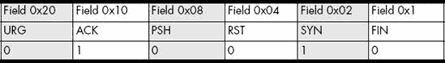

# 第三章。查看流


你有传感器正在传输数据，你的收集器正在将数据写入磁盘。现在怎么办？Flow-tools 提供了几个程序来查看流数据、生成统计分析以及生成报告。你将从显示流文件中的数据开始。

# 使用 flow-print

流文件包含紧密打包的二进制数据，使用 `cat` 或 `more` 查看流文件会打乱你的终端。要查看流数据，你应该使用 `flow-print`。

每个流文件都包含标识导出数据的宿主、捕获时间等信息。当你需要查看多个流文件时，你应该在将数据传递给 `flow-print` 之前删除这些标题，以免干扰你查看实际流数据。这就是 `flow-cat` 的作用。你将使用 `flow-cat` 来连接多个流文件，并将干净的数据呈现给 `flow-print`。虽然使用 `flow-cat` 是可选的，但我建议你始终与 `flow-print` 一起使用，除非你专门检查标题数据。

要检查流文件，使用 `flow-cat` 将数据传递给 `flow-print`，然后将结果传递给分页器，以便你可以查看所有结果，如 示例 3-1 所示。

示例 3-1. 样本 flow-print 输出

```
# `flow-cat ft-v05.2009-12-01.171500-0500 | flow-print | less`
srcIP            dstIP            prot  srcPort  dstPort  octets      packets
36.85.32.9       158.43.192.1     17    2325     53       59          1
158.43.192.1     36.85.32.9       17    53       2325     134         1
36.85.32.37      83.243.35.204    6     25       4115     1035        14
83.243.35.204    36.85.32.37      6     4115     25       1527        12
...
```

示例 3-1 中的每一行代表一个流。第一列 `srcIP` 显示流的源 IP 地址，第二列（`dstIP`）显示目标地址。

`prot` 列显示此流的协议号。协议 17 是 UDP，协议 6 是 TCP。(表 3-1 在 常见协议和端口号分配 中描述了网络上最常见的协议，你将在你的收集器服务器上的 */etc/protocols* 文件中找到这些协议号的完整列表。）

`srcPort` 列显示 TCP 或 UDP 流的源端口，`dstPort` 显示目标端口。最后，`octets` 列显示流中的字节数，`packets` 显示流中的数据包数。

示例 3-1 中的第一个流量来自地址 36.85.32.9。这是我的网络上的一个地址，它将数据发送到 IP 158.43.192.1。据我所知，我对这个地址一无所知，也不知道为什么我会与它通信，但我确实知道协议 17 是 UDP，源端口是 2325，目标端口是 53。端口 53 是为 DNS 事务保留的 UDP 端口，所以我知道这个流量代表了一个 DNS 查询，而且我也知道从“八位字节”列中，一个数据包发送了 59 字节。

现在看看示例 3-1 中的第二个流量。注意，源和目标 IP 地址与我们的第一个流量相反：远程端从端口 53 发送数据到我的端口 2325，这与第一个流量相反。响应，一个数据包 134 字节，几乎肯定是对第一个流量中发送的查询的 DNS 响应，但为了绝对确定，我需要查看时间信息。

第三种流量来自示例 3-1 中的不同 IP，并且将数据发送到与前两种流量中的任何一个 IP 都不同的远程 IP。这种流量代表了一个与前面两种流量分开且不同的 TCP/IP 事务。这个事务运行在协议 6（或 TCP）上，源端口为 25，目标端口为 4115。这很奇怪。TCP 端口 25 用于 SMTP，或电子邮件。你可能会期望电子邮件连接是*到*端口 25，而不是*从*端口 25。为什么网络事务会有一个*源*端口为 25？记住，每个网络事务都包括两个流量：一个是从客户端到服务器，另一个是从服务器到客户端。这个“源端口 25”的流量是服务器与客户端的通信。

现在看看第四个也是最后一个流量。这个流量是第三个流量的反向，代表了那个 SMTP 事务的另一部分。源端口是 4115，目标端口是 25，如果有人试图向电子邮件服务器发送邮件，这是有意义的。

如这两行所示，`flow-print` 并不一定按照流量发生的顺序打印流量。例如，如果两个主机之间有非常快的连接性，流量记录可能会显示同时启动的连接流量和响应该连接请求的流量。在这种情况下，`flow-print` 会按照它们在流量文件中记录的顺序显示流量。（我们稍后会从流量文件中提取实际的时间数据。）

位、字节和八位字节

大多数网络管理系统以比特的某个倍数（千比特、兆比特等）提供有关流量的信息，所有这些都在十进制基数下。然而，一些流量分析系统，如 flow-tools，提供以 *八进制* 为单位的流量信息，而不是比特甚至字节，因为字节并不总是 8 比特。

大多数计算专业人士都知道字节是 8 比特。但 *非常* 严格地说，大多数计算机专业人士是错误的。字节是在特定硬件平台上内存寻址的最小单位。英特尔 8086 CPU 及其后续产品，今天最常见的机器，拥有 8 比特的字节，许多其他平台将其作为方便的标准。市面上可用的硬件的字节大小从 5 比特到 12 比特不等，实验性硬件的字节大小几乎可以是任何大小。

八进制总是 8 比特，与正常字节的大小相同。如果你有字节不是 8 比特的系统，单词 *字节* 是模糊的。一些软件，如 flow-tools，明确使用八进制进行区分，因为几乎所有网络管理员都只有 8 比特字节的硬件。（我们大多数人没有奇数硬件。）你只需在看到八进制时识别它们，并感激一些网络管理员遭受的烦恼是你永远不需要应对的。

## 打印协议和端口号名称

你可能记得端口号 53 是用于域名系统，端口号 25 是用于电子邮件的 SMTP 协议，但大多数人并没有记住每个端口号的用途。同样，你可能记得协议号 6 是 TCP，17 是 UDP，但你不必费心记住所有其他协议号。文件 */etc/protocols* 和 */etc/services* 列出了端口号及其相关名称。使用 `-n` 标志让 `flow-print` 使用这些名称显示端口和协议，如下所示：

```
# `flow-cat ft-v05.2011-12-01.171500-0500 | flow-print -n | less`
srcIP            dstIP            prot  srcPort  dstPort  octets      packets
36.85.32.9       158.43.192.1     udp   2325     domain   59          1
158.43.192.1     36.85.32.9       udp   domain   2325     134         1
36.85.32.37      83.243.35.204    tcp   smtp     4115     1035        14
83.243.35.204    36.85.32.37      tcp   4115     smtp     1527        12
...
```

这些结果与 示例 3-1 相同，只是在 `prot` 列中 `tcp` 替换了 6，`udp` 替换了 17。同样，`srcPort` 和 `dstPort` 列中的数字已被替换为服务名称，如 `domain` 和 `smtp`。虽然使用端口号的名称是合理的，但使用主机名而不是 IP 地址引入了对网络的依赖。此外，获取数百或数千个 IP 地址的主机名可能需要非常长的时间。

并非所有 `flow-print` 格式都支持以名称输出。在这些输出格式中，`flow-print` 会忽略 `-n` 标志。

## 常见协议和端口号分配

一旦你与流量信息工作了一段时间，你将开始自动识别端口号和协议号。表 3-1 列出了一些你将在互联网上常见到的协议。

表 3-1. 常见协议号

| 号码 | 协议 |
| --- | --- |
| 1 | 因特网控制消息协议 (ICMP) |
| 6 | 传输控制协议 (TCP) |
| 17 | 用户数据报协议 (UDP) |
| 47 | 通用路由封装 (GRE) |
| 50 | 封装安全载荷 (ESP) |
| 51 | 认证头部 (AH) |

类似地，表 3-2 列出了内部和公共网络上常用的一些 TCP 和 UDP 端口分配。（对于更完整的列表，请参阅您的收集器主机上的 */etc/services*。）

表 3-2. 常用 TCP 和 UDP 端口分配

| 编号 | 服务 |
| --- | --- |
| 20 | 文件传输协议 (FTP) 数据通道 |
| 21 | 文件传输协议 (FTP) 控制通道 |
| 22 | 安全壳 (SSH) |
| 23 | Telnet |
| 25 | 电子邮件（SMTP） |
| 53 | 域名系统 (DNS) |
| 80 | 超文本传输协议 (HTTP，Web) |
| 137 | NetBIOS 命名服务（Windows 文件共享） |
| 138 | NetBIOS 数据报服务（Windows 文件共享） |
| 139 | NetBIOS 会话服务（Windows 文件共享） |
| 161 | 简单网络管理协议 (SNMP) |
| 389 | 轻量级目录访问协议 (LDAP) |
| 443 | 安全超文本传输协议 (HTTPS) |
| 445 | 基于 TCP 的 SMB（Windows 文件共享） |

当然，您会发现更多这样的端口正在使用中，如果您发现某个端口不在这个列表中或不在 */etc/services* 中，进行网络搜索应该可以识别它。尽管有些端口会顽强地抵抗网络识别：主机上的某个程序正在使用该端口，您需要使用该主机的本地工具来识别该程序。

端口与服务的比较

总是记住，端口分配并不能作为特定协议在该端口运行的结论性证据。系统管理员可以在任何端口上运行任何程序。例如，您可以在端口 25（电子邮件）上运行 Web 服务器或在端口 443（HTTPS）上运行 FTP 服务器。我的一个服务器在端口 23、25、53、80、443 等上运行 SSH，这让我可以绕过大多数简单的数据包过滤防火墙。如果您发现可疑流量，例如非常长的基于 TCP 的 DNS 请求，请记住，用户是狡猾的小东西，他们会尝试各种方法来规避您的访问控制。

## 使用 -p 查看流记录头部信息

每个流文件都包含头部数据，记录收集器主机名、时间信息和压缩信息，以及其他捕获数据。`-p` 标志会在任何流之前打印流文件的头部信息，以便您更容易地识别传感器主机、流的开始和停止时间、流的运行时长、`flow-capture` 认为在传输中丢失的流数量等。这些流数据并不常用，但如果您认为它们可能有所帮助，您可以看到它们。

记住，`flow-cat` 会特别移除这些头部数据以避免混淆其他流工具，这意味着您一次只能有效地检查一个流文件的头部，并且不能使用 `flow-cat`。

```
# `flow-print -p < ft-v05.2011-12-01.171500-0500 | less`
```

## 打印到宽终端

许多`flow-print`报告包含大量信息，因此列与列之间的空白不多。`-w`标志告诉`flow-print`你有宽终端，因此它可以在列之间添加额外的空间，以便更容易阅读输出。然而，如果你有一个非常宽的终端，我建议你查看格式 5。

标志位与控制位

TCP 协议包括*标志位*，也称为*控制位*。`flow-print`提供了 TCP 流的标志位字段，但这个字段对其他协议来说没有意义。我将用*控制位*这个名字来保持一致性。

# 使用`-f`设置`flow-print`格式

由于默认的`flow-print`输出可能不会包含你感兴趣的所有信息（而且它当然不会包含流文件中包含的所有信息），`flow-print`支持多种输出格式。你可以使用`-f`标志来设置`flow-print`的格式。

每个格式都有一个数字。例如，格式 3 是`flow-print`最常用的默认格式。（如果你使用 NetFlow 版本 8，`flow-print`可能会选择不同的默认格式。）你可以使用这些格式选项以最适合你的方式展示流数据，如下面的示例所示。我将只介绍最有用的那些，但你可以在`flow-print`的 man 页面上了解其他格式。

## 使用格式`-f 0`显示接口和端口的十六进制表示

如果你想要查看流经过的路由器接口，请使用格式 0，如下所示：

```
# `flow-cat ft-v05.2011-12-01.171500-0500 | flow-print -f 0 | less`
Sif  SrcIPaddress     Dif  DstIPaddress      Pr SrcP DstP  Pkts       Octets
0000 36.85.32.9       0000 158.43.192.1      11 915  35    1          59
0000 158.43.192.1     0000 36.85.32.9        11 35   915   1          134
0000 36.85.32.37      0000 83.243.35.204     06 19   1013  14         1035
0000 83.243.35.204    0000 36.85.32.37       06 1013 19    12         1527
...
```

这部分输出看起来与默认输出几乎相同，但请注意增加了`Sif`和`Dif`列。这些代表源（`Sif`）和目的（`Dif`）接口。流记录包括有关数据包进入哪个接口以及流离开哪个接口的信息。你可以将这些与路由器接口匹配，正如你将在第四章(使用 SNMP 识别接口号)中看到的。（在使用 SNMP 识别接口号中）。

然而，软件流传感器*不会*记录接口信息，因为它们无法访问。基于软件的传感器监听交换机上的监控端口，但它们看不到接口信息。对它们来说，接口号始终是 0。

格式`0`通过压缩其他一些列将接口号添加到流输出中。例如，协议列现在是`Pr`。但看看这些数字。第一个流是协议 11（或根据`/etc/protocols`的“网络语音协议”），源端口是 915，目的端口是 35。你几乎肯定不会在你的网络上运行 NVP！这里发生了什么？

发生的事情是这个格式通过以十六进制形式打印端口和协议信息来为接口编号留出空间。例如，11 是 17 的十六进制，或 UDP；915 是 2325 的十六进制；35 是 53 的十六进制。结果，这四个流与前面示例中显示的流完全相同，只是以十六进制形式打印，并增加了接口列。

### 注意

如果你在查看 ICMP 流，以十六进制形式打印端口号是有用的。如果你在查看带有端口和接口的 TCP 或 UDP 流，而这些端口和接口不在老式的 80 列终端上，请使用 132 列格式。

## 使用 `-f 1` 选项，两行显示时间、标志和十六进制端口

有一种更好的方法可以在标准宽度的屏幕上显示流的所有信息：将每个流分成两行。使用格式 `1` 来查看接口信息和时间。

```
# `flow-cat ft-v05.2011-12-01.171500-0500 | flow-print -n -f 1 | less`
 Sif  SrcIPaddress     DIf  DstIPaddress      Pr SrcP DstP  Pkts  Octets
   StartTime          EndTime             Active   B/Pk Ts Fl

 0000 36.85.32.9       0000 158.43.192.1      11 915  35    1          59
❶  1201.17:09:46.750  1201.17:09:46.869      0.119 59  00 00

 0000 158.43.192.1     0000 36.85.32.9        11 35   915   1          134
   1201.17:09:46.750  1201.17:09:46.869      0.119 134 00 00

 0000 36.85.32.37      0000 83.243.35.204     06 19   1013  14         1035
   1201.17:09:46.912  1201.17:09:51.890     4.978 ❷73  00 1b

 0000 83.243.35.204    0000 36.85.32.37       06 1013 19    12         1527
   1201.17:09:46.912  1201.17:09:51.890     4.978 ❸127 00 1b
 ...
```

这些流与前面所有示例中出现的流相同，但看起来非常不同。每个流都在两行中显示，用空白行分隔单个流。此外，每行的条目略有偏移。这种两行格式一开始可能会让人困惑，尤其是因为它没有实际的列：标题显示了信息在每个流的两个行条目中的位置。每个流的第 1 行显示了源接口、源 IP 地址、目的接口、目的 IP 地址、协议、源和目的端口、数据包数量以及流中的字节数。（你之前都见过这些。）花点时间看看这些在四个样本流中的显示方式，然后你可以查看每个流第二行的新条目。

`StartTime` 和 `EndTime` 空间给出了连接开始和结束的时间。在这里，❶处的 `1201` 代表日期，12 月 1 日。接下来的三个值以 24 小时制给出时间：`17:09:46` 是下午 5:09:46。最后的分数是流开始时的毫秒数，或 `.750` 秒。（如果你需要比这更高的精度，你可能是在试图解决错误的问题。）

`Active` 列给出了流活跃的秒数，这样你就不必从 `EndTime` 减去 `StartTime`（对于前两个流来说很容易，但随着流的增长会稍微困难一些）。

`B/Pk` 空间表示每包的平均字节数。第一个流在 1 个数据包中有 59 字节，所以计算很简单，但在更大的流中会更困难。第三个流在❷的平均每包 73 字节，而第四个流在❸的平均每包 127 字节。

`Ts` 空间表示服务类型（ToS），这几乎总是 `00`，因为大多数 TCP/IP 网络不需要尊重 ToS 标志。通常，数据包中的 ToS 表示你在一个实验性网络中，或者你正在使用复杂的如 VoIP 或 MPLS 等服务，或者有人在玩愚蠢的小把戏。^([4)]

`Fl`空间给出流的标志，即 TCP 控制位。非 TCP 流，如前两个，总是显示为零的标志。第三和第四个示例是 TCP 流，标志显示为`1b`。参见 TCP 控制位和流记录以了解如何将`1b`转换为有意义的值。

## 打印 BGP 信息

与多个上游 ISP 使用边界网关协议（BGP）的路由器传输包含自治系统编号（ASNs）的流记录。格式 4 打印这些信息而不是端口号。否则，这个格式包括你在其他格式中看到的通常的源和目的地址、协议、字节数和包信息。

这些是示例 3-1 中使用的相同四个流，以格式 4 显示：

```
# `flow-cat ft-v05.2011-12-01.171500-0500 | flow-print -n -f 4 | less`
srcIP              dstIP              prot  srcAS  dstAS  octets      packets
36.85.32.9/0       158.43.192.1/0     udp   0      701    59          1
158.43.192.1/0     36.85.32.9/0       udp   701    0      134         1
36.85.32.37/0      83.243.35.204/0    tcp   0      4713   1035        14
83.243.35.204/0    36.85.32.37/0      tcp   4713   0      1527        12
...
```

注意在先前的列表中，每个流的源（`srcAS`）或目的 AS（`dstAS`）都是 0。这些流是本地生成的。流传感器不跟踪你的本地 AS。

如果你没有使用 BGP，这个格式对你来说无关紧要。

## 宽屏显示

如果你有一个足够宽的显示器，在 80 列工作是一种烦恼。为什么不只有一个非常宽的格式，可以在一行中显示最有用的信息呢？既然我们在这里，让我们去掉十六进制，并以十进制打印一切。这就是格式 5 的目的，这是我在检查网络问题时最频繁使用的格式。

就像一部夏季特效大片，这个格式在宽屏显示器上工作得很好，但在打印页面上则不太理想。但与其提供实际打印的样本，该样本会跨越书的两个对页或必须横向打印，不如让我们直接浏览这个格式显示的字段。

```
# `flow-cat ft-v05.2011-12-01.171500-0500 | flow-print -f 5 | less`
```

格式 5 生成`Start`、`End`、`Sif`、`SrcIPaddress`、`SrcP`、`DstIPaddress`、`DstP`、`P`、`Fl`、`Pkts`和`Octets`列。

`Start`和`End`以毫秒分辨率给出流的开始和结束时间，就像格式 1 一样。

然后是`Sif`（源接口）、`SrcIPaddress`（源 IP 地址）和`SrcP`（源端口），然后是`DIf`（目的接口）、`DstIPAddress`（目的 IP 地址）和`DstP`（目的端口）。在理解了前面的报告后，你应该没有阅读这些的困难。

`P`是协议号。

`Fl`给出以十进制打印的 TCP 控制位。

最后，`Pkts`给出流中的数据包数量，而`Octets`给出字节数。

**TIMES VS. TIMES**

流记录文件以它们在服务器上收集的时间命名。打印流时显示的时间是流传感器的时钟。如果你的收集器时钟和你的传感器时钟不匹配，你的流记录中显示的时间将不会与记录收集的时间相匹配。请同步你的时钟！

## IP 计费格式

也许你有软件可以解释 Cisco IP 会计输出，或者你已经看了很长时间的输出，以至于可以不耗费宝贵的脑力来处理它。这里显示的格式 6 专门是为了让你高兴：

```
# `flow-cat ft-v05.2011-12-01.171500-0500 | flow-print -f 6 | less`
   Source           Destination              Packets               Bytes
 36.85.32.9       158.43.192.1                     1                  59
 158.43.192.1     36.85.32.9                       1                 134
 36.85.32.37      83.243.35.204                   14                1035
 83.243.35.204    36.85.32.37                     12                1527
...
```

例如，这里是以 Cisco 格式显示的四个示例流量。如果你按字节数排序这个输出，你应该能够轻松地识别交换最多流量的主机。

```
# `flow-cat ft-v05.2011-12-01.171500-0500  | flow-print -f 6 | sort -rnk 4 | less`
 36.85.32.36      64.18.6.14                ❶  12820         ❷  19216320
 36.85.32.36      64.18.6.13                   12820            19216320
 207.46.209.247   36.85.32.4                   10977            16458558
 84.96.92.121     36.85.32.37                   6904             9671951
...
```

通过按发送的字节数对流量进行排序，你已经将流量从大到小进行了排名。是什么填满了你的电路？这里有一个快速的答案：第一行显示主机 36.85.32.36 向 64.18.6.14（❶）发送了 12,820 个包含（❷）19,216,320 字节的包。同一个主机 36.85.32.36 向 64.18.6.13 发送了相同数量的流量。进一步的过滤和报告可以识别这些最繁忙的主机之间的流量类型，正如你将在下一章中看到的。

现在你已经可以以任何你想要的方式查看流量，让我们更仔细地看看 TCP 和 ICMP 连接的一些复杂性。

警告：前方是十六进制数学！

网络是二进制的，其中很多都是以 16 进制为基础的。要理解 TCP 控制位和 ICMP 代码和类型，你需要使用基本的十六进制数学。记住，前缀 0x 表示一个数是十六进制的。

* * *

^([4]) 尽管服务类型/服务质量是值得探讨的话题，尽管 flow-tools 支持 ToS/QoS，但这些话题只被少数网络所需要。包括对这些话题的适当讨论会使这本书变得很长。一旦你了解了如何根据端口和地址搜索和报告流量，你将不会在处理基于 ToS 或 QoS 的流量时遇到任何麻烦。

# TCP 控制位和流记录

每个 TCP 包都包含一个或多个控制位，这些是开/关开关，告诉连接参与者如何处理特定的包。流记录捕获每个 TCP 流使用的控制位。当连接正常工作时，这些控制位并不特别有用，但在识别问题时却非常有价值。如果你不熟悉 TCP 控制位，请阅读一本好的 TCP/IP 入门书籍，如 Charles A. Kozierok 的《TCP/IP 指南》（No Starch Press，2005）。

控制位之所以被称为控制位，是因为 TCP 为它们预留了六个位。这些位如下：

+   **同步（SYN）位**表示一个连接同步请求。它允许发送方和接收方同步 TCP 序列号，在每个端点分配一致的端口等。这个位在流中的第一个包上总是被设置。

+   **确认（ACK）位**表示一个包包含对特定先前包的接收确认。

+   **推送（PSH）位**在发送数据的端点希望客户端的网络堆栈立即将此数据推送到协议堆栈时被设置。这个位请求客户端清空所有硬件和内核缓冲区，并将所有数据交给客户端。

+   **URG（紧急）位**表示紧急指针字段包含需要解释的数据。用日常语言来说，这意味着这个数据包包含了接收方正确处理流中其他数据包所需的粘合剂。

+   **RST（重置）**立即终止连接。

+   最后，**FIN（结束）位**宣布该主机将不再发送数据，但它将继续监听来自另一端的数据。FIN 信号表示是时候断开连接了。

每个控制位都表示为一个十六进制数，如表 3-3 所示。

表 3-3. TCP 控制位十六进制值

| 标志 | 十六进制 |
| --- | --- |
| FIN | 0x01 |
| SYN | 0x02 |
| RST | 0x04 |
| PSH | 0x08 |
| ACK | 0x10 |
| URG | 0x20 |

许多人发现用图表表示更容易理解，例如图 3-1。


图 3-1. TCP 控制位

数据包中控制位的任何组合都可以表示为一个唯一的数字。如果设置了控制位，将该标志的数字加到数据包的总控制位数字上。如果你说一个数据包的控制位设置为 18，这表示一组精确的控制位。只有一种可能的控制位组合的总和为 18。（试试看，我会等着。）

例如，图 3-2 展示了如何表示一个典型的 SYN/ACK 数据包。



图 3-2. SYN/ACK 数据包中的 TCP 控制位

如图 3-2 所示，这个数据包的控制位 SYN（0x2）和 ACK（0x10）被标记，而所有其他控制位都没有被标记。现在把 0x2 和 0x10 加起来。十六进制 10 加十六进制 2 等于十六进制 12；我的计算器告诉我十六进制 12 是十进制 18。

要得到控制位值为 18 的数据包，只有当选择了 SYN 和 ACK，并且只有这两个控制位时才可能。

流不会跟踪单个数据包，那么流记录如何合理地跟踪 TCP 控制位呢？流传感器跟踪单个流中出现的所有控制位。例如，当一个主机在连接期间发送 SYN 和 ACK 时，你合理地期望看到，比如说，PSH 和 FIN。当这些标志中的任何一个出现在流中时，流传感器会记录它们的出现。图 3-3 展示了这在位图中会是什么样子。


图 3-3. 流中的 TCP 控制位（包含 SYN、ACK、PSH 和 FIN）

因此，我们有 0x1 + 0x2 + 0x8 + 0x10 = 0x1b，或者十进制 27。

回想一下本章早些时候对 TCP 标志的第一种视图（在使用-f 1 显示时间、标志和十六进制端口的两个行中，见使用-f 1 显示时间、标志和十六进制端口的两个行）。第三个和第四个样本流的`Flags`字段等于`1b`，这告诉你这个流包含了正常连接所需的全部 TCP 标志（SYN、ACK 和 FIN）。它还告诉你这个流包含了一个在正常连接中完全可接受的标志（PSH），并且没有包含表示问题的标志（RST）。这个连接几乎肯定成功了。在第四章中，你将搜索具有指示问题的控制位组合的流（见 TCP 控制位原语，见 TCP 控制位原语）。

将十六进制转换为十进制和二进制

Windows 中的计算器程序可以在三种进制之间进行转换。打开计算器，选择**视图 ▸ 科学**。你会看到十六进制（Hex）、十进制（Dec）、八进制（Oct）和二进制（Bin）的按钮。选择你想要转换的进制。输入该进制下的数字。选择你想要转换到的进制，计算器会为你转换。如果你不经常进行十六进制数学运算，你也可以使用计算器来学习。大多数类 Unix 桌面环境也包含十六进制/十进制计算器。

# ICMP 类型和代码以及流记录

流记录还记录 ICMP 类型和代码，将它们显示为目标端口号。我将首先回顾 ICMP 类型和代码，然后讨论流记录如何表示它们。

## ICMP 中的类型和代码

许多人将不同的 ICMP 请求心理上归入一个大篮子，并依靠诸如“ICMP 是 ping”这样的概括来应对。虽然这可能对普通用户来说足够了，但你不是普通用户，你需要对 ICMP 有更深入的理解才能管理网络。

ICMP 的*类型*是一类通用的 ICMP 请求，例如 ping 请求和 ping 回复。其他 ICMP 类型包括诸如“主机不可达”、“路由通告”、“traceroute 请求”、“路由重定向”等消息。一些 ICMP 类型会从接收方那里得到响应，而其他类型则无注释地接收。

一些 ICMP 类型还包括一个 ICMP *代码*，允许 ICMP 消息提供更具体的响应。每个 ICMP 代码的意义随消息的 ICMP 类型而变化。例如，尽管 ICMP 类型 3、5 和 11 都提供 ICMP 代码 1，但该代码在每个类型中都有完全不同的意义。

互联网数字分配机构（IANA）分配 ICMP 类型和代码，并在[`www.iana.org/assignments/icmp-parameters/`](http://www.iana.org/assignments/icmp-parameters/)维护当前分配列表。这些分配很少改变，因此表 3-4 提供了最常见的 ICMP 类型和代码。尽管不同 ICMP 消息的意义最好留给 TCP/IP 方面的书籍（如前面提到的《TCP/IP 指南》）来解释，但此表提供了一个便捷的参考。

表 3-4. 十进制和十六进制表示的常见 ICMP 类型和相关代码

| 类型 | 代码 | 十进制 | 定义 |
| --- | --- | --- | --- |
| 0 | 0 | 0 | 回显应答 |
| 3 |   |   | 目标不可达 |
|   | 0 | 300 | 网络不可达 |
|   | 1 | 301 | 主机不可达 |
|   | 2 | 302 | 协议不可达 |
|   | 3 | 303 | 端口不可达 |
|   | 4 | 304 | 需要分片，但设置了不分片 |
|   | 6 | 306 | 目标网络未知 |
|   | 7 | 307 | 目标主机未知 |
|   | 9 | 309 | 与目标网络通信管理上禁止 |
|   | 10(a) | 310 | 与目标主机通信管理上禁止 |
|   | 13(d) | 313 | 通信管理上禁止 |
| 5 |   |   | 重定向 |
|   | 0 | 500 | 子网重定向 |
|   | 1 | 501 | 主机重定向 |
| 8 | 0 | 800 | 回显请求 |
| 11(b) |   |   | 时间超出 |
|   | 0 | 2816 | 转发中的生存时间超时 |
|   | 1 | 2817 | 分片重组超时 |
| 12(c) |   | 3072 | 参数问题 |
| 13(d) |   | 3328 | 时间戳请求 |
| 14(e) |   | 3584 | 时间戳应答 |

## 流和 ICMP 详细信息

流传感器将 ICMP 类型和代码编码在流的目标端口中。目标（和源）端口是两个字节。端口的第一个字节给出类型，第二个字节给出代码。因为 ICMP 没有源端口的观念，所以源端口始终为零。在以下示例中，我从我的测试数据中选取了一些 ICMP 流。

此示例使用一种打印格式，显示目标端口为十六进制。您可以使用显示端口的十进制格式的格式，但必须将目标端口从十进制转换为十六进制才能解释它。

```
# `flow-cat ft* | flow-print -f 0 | less`
Sif  SrcIPaddress     Dif  DstIPaddress      Pr SrcP DstP  Pkts       Octets
0000 80.95.220.173    0000 36.85.32.153      01 0    ❶800   2          122
0000 189.163.178.51   0000 36.85.32.130      01 0    ❷b00   1          56
0000 64.142.0.205     0000 36.85.32.5        01 0    ❸300   1          56
0000 201.144.13.170   0000 36.85.32.130      01 0    ❹303   1          144
0000 36.85.32.9       0000 194.125.246.213   01 0    ❺0     5          420
...
```

第一个流量来自地址 80.95.220.173 到 36.85.32.153，目标端口为十六进制 800 (❶)。尽管 `flow-print` 不打印前导零，但你可以将其视为 0800，就像你可以将端口 25 视为端口 025 一样。在这个例子中，ICMP 类型是 8，代码是 00。ICMP 类型 8 没有相关代码，所以 `flow-print` 将 ICMP 代码显示为 00。

查看第表 3-4 可知，ICMP 类型 8 是一个回显请求，也称为 *ping 尝试*。主机 80.95.220.173 正在尝试 ping 36.85.32.153。

第二个 ICMP 流量目标端口为 b00 (❷)，或 ICMP 类型为 b 和 ICMP 代码为 00。ICMP 类型 b 是 "超时"。与 ICMP 类型 8 不同，这种 ICMP 类型有相关代码。代码 0 表示 "传输过程中生存时间超时"。在这种情况下，IP 189.163.178.51 正在通知 IP 36.85.32.130，到达特定地址的时间过长，这通常意味着客户端已断开连接。

第三个流量，从 64.142.0.205 到 36.85.32.5，目标端口为 300 (❸)。ICMP 类型 3 消息表示目标不可达。ICMP 类型 3 的代码 0 表示 "网络不可达"。在这种情况下，主机 36.85.32.5 尝试连接到另一个主机，而互联网上的一个路由器正在返回一个表示目标网络不可达的消息。

第四个流量目标端口为 303 (❹)。ICMP 类型 3 表示目标不可达，但代码 03 表示 "端口不可达"。当客户端向未打开的服务器端口发送 UDP 请求时，服务器会返回此 ICMP 消息。如果你要搜索这些流量记录，你会在这两个主机之间找到相反方向的 UDP 请求。

我们第五个流量目标端口为 0 (❺)。ICMP 类型 0 是一个回显响应，或对 ping 的响应。如果你搜索这些流量，你会找到相反方向的回显请求。

如你所见，ICMP 消息通常是其他类型网络请求的响应。它们通常会显示尝试连接时发生的确切错误类型。将这些消息与其它流量匹配通常需要搜索流量记录，这最好通过过滤来实现，正如你将在第四章中看到的。
