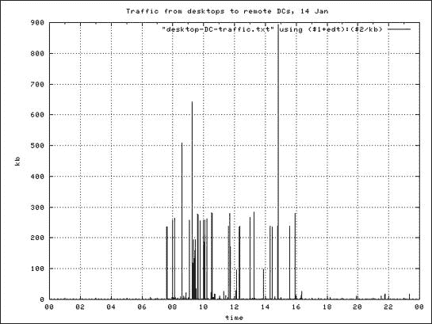
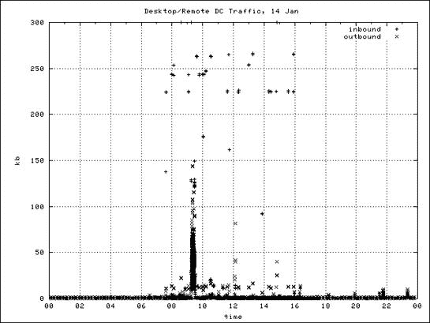
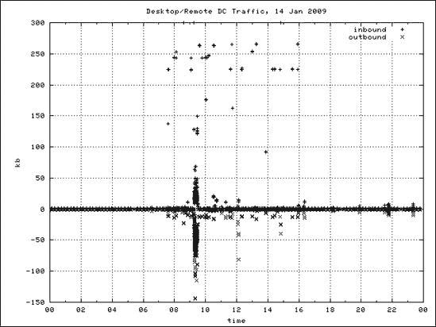
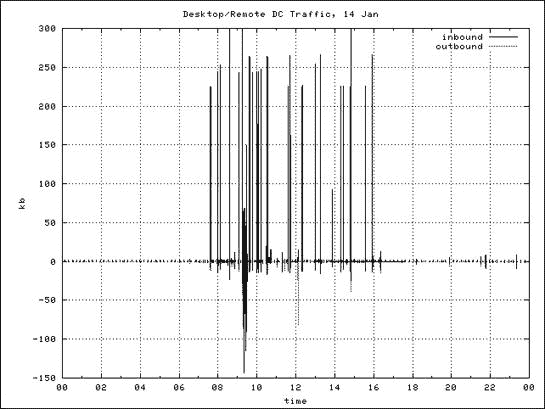

# 第八章。即兴流量可视化


虽然查看流量内容和运行报告有助于追踪问题，但某些问题只能通过可视化来正确评估。普通的人类大脑根本无法将 6,000 行纯文本数据组合成一个对情况的连贯理解。将大量数据转换为视觉形式可以简化理解。

将数据转换为图形形式最常见的方式可能是通过办公套件，例如 Microsoft Office 或 OpenOffice.org。然而，办公套件并不适合自动化。一旦你设计好了你的图表，用新数据重新生成它们应该是简单或甚至是瞬间的。CUFlow (第六章) 和 FlowGrapher (第七章) 这样的工具提供了基本的绘图功能，但它们缺乏真正的即兴灵活性，例如选择图表样式或是否将一个图表叠加在另一个图表之上。要提供真正无限的灵活性，并且能够自动化或快速重现，你需要 `gnuplot`。

# gnuplot 101

`gnuplot` ([`www.gnuplot.info/`](http://www.gnuplot.info/)) 以其陡峭的学习曲线和复杂性著称。这种恶名和声誉并非完全无根据。然而，`gnuplot` 的强大和效率足以弥补其挑战。虽然掌握 `gnuplot` 可能需要数年，但你可以快速学习到足够多的知识来创建你网络数据的令人印象深刻的图表。几乎每个类 Unix 的操作系统都包括当前的 `gnuplot` 软件包，你还可以找到适用于 Windows、DOS、VMS 以及过去 20 年中使用的几乎所有其他操作系统的软件包。

在报告服务器上使用 `gnuplot` 可以简化报告和图表的开发。要在你的报告服务器上使用 `gnuplot`，你需要在你的工作站上有一个 X 服务器。如果你使用的是 Unix 工作站，那么你已经准备好了。如果不是，你可以找到许多适用于 Microsoft Windows 的 X Windows 服务器。务必选择一个可以转发 X 通过 SSH 的服务器，而不是在网络中直接传输原始 X。（在 Windows 上，我使用 PuTTY SSH 客户端和 Xming X 服务器。）

如果你不想在桌面上的 X 终端上使用 `gnuplot`，请在你的工作站上安装 `gnuplot`，然后在服务器上运行报告并将它们传输到你的工作站。在你的工作站上开发图表，保存它们的配置，并将这些配置复制到你的服务器上以自动创建更多图表。

其他绘图程序

gnuplot 的主要优势是它易于自动化。为了即时创建图表而不用担心以后的重现，请考虑 Grace ([`plasma-gate.weizmann.ac.il/Grace/`](http://plasma-gate.weizmann.ac.il/Grace/))。

## 启动 gnuplot

学习 `gnuplot` 的最好方法是使用它。当 `gnuplot` 启动时，它会显示一条消息并提供一个自己的命令提示符。

```
# `gnuplot`
...
Terminal type set to 'x11'
gnuplot>
```

要退出 `gnuplot`，请输入 **`exit`** 或 **`quit`**。

大多数 `gnuplot` 命令要么改变图表的外观，要么创建一个新的图表。为了体验 `gnuplot` 的工作方式，绘制一个正弦波。 (出于某种原因，正弦图在 `gnuplot` 教程中是传统的。) 在 `gnuplot` 命令行中，输入以下内容：

```
gnuplot> `plot sin(x)`
```

您应该会看到一个新窗口出现，显示经典的正弦波，如图 图 8-1 所示。


图 8-1. 正弦波

要修改您的图表，请使用 `set` 命令。您可以设置无数个值，从图表的标题到 x 轴和 y 轴的标签，使用的颜色等等。在这里，我正在给图表添加标题 *test graph*：

```
gnuplot> `set title "test graph"`
```

显示的图表在你告诉 `gnuplot` 重新绘制数据之前不会改变，就像这样：

```
gnuplot> `plot sin(x)`
```

现在您的图表应该有一个标题。

## gnuplot 配置文件

您在这里创建的测试图表几乎不需要任何努力。您没有读取任何数据或输入复杂的公式。然而，流量数据比正弦波复杂得多，在本章中，您将通过多次迭代您的图表来使其看起来“恰到好处”。您可以从 `gnuplot` 会话中保存所有设置，以便您可以调用相同的设置并使用它们来绘制新的数据。只需告诉 `gnuplot` 您想保存配置的文件名即可。

```
gnuplot> `save "test.plt"`
```

您将在当前目录中找到一个名为 *test.plt* 的 `gnuplot` 配置文件。此文件包含您输入的所有 `gnuplot` 命令，包括标题和 `plot sin(x)` 指令。退出 `gnuplot`，然后重新启动它。然后加载此配置文件：

```
gnuplot> `load "test.plt"`
```

您指定的所有更改都会在图表中重新出现。

重新输入两个命令来重新创建您的图表并不困难，但基于流量报告的图表可能包含数十条指令，其中一些可能很长且繁琐。能够保存您的 `gnuplot` 配置并重新使用它来绘制新的数据将节省时间和精力，并减少错误。

现在让我们获取一些实际的数据来绘制图表。

# 时间序列示例：带宽

网络工程师经常遇到的一个常见问题是“这个应用程序使用了多少带宽？” 我在多个全球运营中工作过，管理层关心电子邮件消耗了多少内部带宽，或者 Active Directory 团队需要知道域间控制器通信使用了多少带宽。

流量报告可以通过许多不同的方式回答这个问题。一天中带宽使用的平均值很有用，但不会揭示间歇性的性能瓶颈。一个大部分时间都处于空闲状态，但在每天高峰时段有大量吞吐量波峰的连接，其平均吞吐量可能约为 50Kbps。一天的平均值既准确又无意义。回答这个问题的最佳方式是使用图表。

你将从调查在特定 24 小时期间，你的桌面 DHCP 范围与内部网络上远程站点的 Active Directory 域控制器之间使用了多少带宽开始。这是一个网络工程师经常遇到的具体问题示例，你可以使用这种技术来回答任何与带宽相关的问题。你将从查看总带宽报告中的总入站和出站流量开始。

## 总带宽报告

每次你想创建一个随时间变化的带宽、数据包或流量的图表时，获取数据的最佳方式是使用`linear-interpolated-flows-octets-packets`报告（在第五章中讨论）。此报告产生了一个关于所选流量数据中每秒八位字节、流和数据包数量的良好估计。你特别感兴趣的是每秒带宽（八位字节），因此你可以使用以下*stat.cfg*配置来生成此信息：

```
stat-report octets
     type linear-interpolated-flows-octets-packets
     output
❶    fields -packets,-flows
     path |/usr/local/bin/flow-rptfmt
     sort -key

 stat-definition octets
     report octets
```

由于你感兴趣的是传输的字节数，你从❶报告中删除了数据包和流计数。其他设置是`flow-report`的默认设置。接下来，你需要决定将什么数据输入到报告中。

### 过滤总流量中的流量

假设你想要绘制你的桌面 DHCP 范围与几个远程主机之间的带宽使用情况图。为了从你的流量数据中过滤出这些主机，你将使用这些主机的原语。

```
filter-primitive localDesktops
    type ip-address-prefix
    permit 172.17.3/24
    permit 172.17.4/23

filter-primitive remoteDC
    type ip-address
    permit 172.18.0.10
    permit 172.18.0.11
...
```

你需要一个用于远程域控制器的过滤器和一个用于桌面的过滤器。（你可以编写一个捕获从桌面到域控制器并返回的流量的单个过滤器，但通常两个独立的过滤器更易于重用。）

```
filter-definition desktops
    match src-ip-addr desktops
    or
    match dst-ip-addr desktops

filter-definition remoteDCs
    match src-ip-addr remoteDC
    or
    match dst-ip-addr remoteDC
```

现在将你选择的日期的流量通过这些过滤器以及你的插值八位字节`flow-report`运行。你正在报告 2011 年 1 月 14 日的所有流量。

```
# `flow-cat ft-v05.2011-01-14.* | flow-nfilter -F desktops | flow-nfilter -F`
`remoteDCs | flow-report -S octets > desktop-DC-traffic.txt`
```

文件顶部应类似于以下内容：

```
#  ['/usr/local/bin/flow-rptfmt']
unix-secs  octets
1294981479 168.000000
1294981610 30.000000
...
1295066753 15.000000
1295066757 367.000000
```

左侧的数字是 Unix 纪元秒。为了验证报告时间，使用`date`程序将第一个和最后一个数字转换一下。

```
# `date -r 1294981479`
Fri Jan 14 00:04:39 EST 2011
# `date -r 1295066757`
Fri Jan 14 23:45:57 EST 2011
```

第一个匹配的流量在午夜后四分钟开始，最后一个流量在几乎 11:46 **pm**结束，都是在 1 月 14 日。报告涵盖了您感兴趣的时间段。

`gnuplot`将无法处理此文件的列名，因为`unix-secs`和`octets`不是可绘制的数字。处理这个问题最简单的方法是手动或使用`sed`删除前两行。（尽管手动编辑文件在手动创建图表时可能更容易，但`sed`可以自动化。）

```
# `sed '1,2d' desktop-DC-traffic.txt > octets.txt`
```

### 目标图表

你希望图表看起来是什么样子？它应该清楚地显示使用了多少带宽。坐标轴应该标注时间以及带宽测量的单位，图表本身也应该有一个标签。如果你想让人真正关心你的图表，时间应该是本地时钟时间，而不是纪元秒或格林威治平均时间（GMT）。如果图表对不同类型的流量有不同的线条，应该有一个解释键。所有这些都应该自动生成。哦，顺便说一下，你还会使数据准确且有意义。

### 第一张图：未达到目标

首先创建一个默认的 `gnuplot` 图表来展示你的数据，并将其与你的期望结果进行比较。

```
gnuplot> `plot "octets.txt"`
```

在任何给定时间，带宽由一个点表示，如图 图 8-2 所示。基于每秒的带宽利用率太不规则，不适合绘制平滑的曲线，但稍后你将学习如何使用除点以外的标记来绘制图表。


图 8-2. 原始吞吐量图

两个坐标轴都没有标签；从你所能看到的，默认图表可能代表苹果与石榴。此外，底部的沿时间看起来像纪元秒，例如 1.2319E+08，而不是有用的时间。从严格意义上讲，纪元秒是准确的，但并不是你想要给你的同事看的东西。你将迭代地改进图表，首先在两个坐标轴上设置标签，然后告诉 `gnuplot` 如何格式化时间。

```
❶ gnuplot> `set xdata time`
❷ gnuplot> `set timefmt x "%s"`
❸ gnuplot> `set format x "%H"`
❹ gnuplot> `set xlabel "time"`
❺ gnuplot> `set ylabel "bytes"`
❻ gnuplot> `plot "octets.txt" using ($1):($2)`
```

你首先告诉 `gnuplot` ❶ 横轴上的数据代表时间。然后，在 ❷ 你告诉 `gnuplot` 横轴上时间数据的格式。字符 `%s` 是 `gnuplot` 的时间格式，代表纪元秒，它为 `gnuplot` 提供了将纪元秒转换为人类友好时间所需的信息。`gnuplot` 可以以 `flow-rptfmt`（见 第五章）使用的相同 `strftime` 格式打印时间度量。对于覆盖 24 小时的图表，打印小时是一个合理的选择，你在 ❸ 设置了该格式。然后你在 ❹ 和 ❺ 标注了 x 轴和 y 轴。

现在你已经开始了复杂化的操作，你需要告诉 `gnuplot` ❻ 如何在你的文件中绘制数据。跟随数字的美元符号表示数据列。`($1)` 表示“第 1 列”，而 `($2)` 表示“第 2 列”。语句 `plot "octets.txt" using ($1):($2)` 告诉 `gnuplot` 读取 `octets.txt` 并将第一列与第二列进行绘图。结果看起来像 图 8-3。


图 8-3. 带有基本标签的流程图

此图表更接近之前描述的目标图表。x 轴以字节为单位标注，y 轴以可读时间标注。请注意，底部的时间与报告中的数据不匹配。流量数据在午夜后不久开始，在午夜前结束，但此图表从大约早上 5 点开始，并在 24 小时后结束。这是一个时区问题。我在东部标准时间（EST），而`gnuplot`生成的图表是协调世界时（UTC）。此图表需要显示本地时间。此外，我购买的是千比特而不是千字节。尽管千字节标签是准确的，但我希望图表显示千比特。

要将协调世界时（UTC）转换为东部标准时间（EST），您需要减去 5 小时，即每个值减去（5 × 60 × 60 =）18,000 秒。您需要将数据中列出的所有时间减去 18,000 秒，以便图表显示准确的时钟时间。要将字节转换为千比特，您需要除以 125。 （一个字节有 8 位，一个千比特有 1,000 位：1,000 / 8 = 125。）您可以将这两个转换设置为`gnuplot`中的常量，以便在绘图时转换数据。（别忘了在更改测量单位时更改 y 轴的标签。）

```
❶ gnuplot> `edt = −18000`
❷ gnuplot> `kb = 125`
❸ gnuplot> `set ylabel "kb"`
  gnuplot> `plot "octets.txt" using ($1+edt)` ❹ `:($2/kb)` ❺
```

首先，您定义一个从 EST 到 UTC 之间的秒数常量（❶）以及一个每千比特的八位常量（❷）。

接下来，因为您正在将 y 轴的测量单位从字节更改为千比特，所以您也更改了 y 轴标签，如图❸所示。

困难的部分是告诉`gnuplot`在绘图时更改数据。之前，您将第一列与第二列绘图。您通过将时区偏移量加到该列的每个值上来转换第一列（❹）。您通过除以常量`kb`（❺）来转换第二列。您不更改`octets.txt`文件中的数字；您在它们到达图表的过程中进行转换。

当您在这里时，您可以做一些其他更改，例如分配一个标题并给图表添加网格。

```
gnuplot> `set title "Traffic between desktops and remote DCs, 14 Jan"`
gnuplot> `set grid`
gnuplot> `replot`
```

您将得到图 8-4 中所示的图表，乍一看与图 8-2 中的图表相似，但具有更合适的时间和更有用的带宽测量，这使得它更适合与同事分享。


图 8-4. 使用更好的时间、带宽单位、网格和标题的网络利用率

### 改变图表的绘制方式

虽然我喜欢由单独的点组成的图表，但许多人更喜欢不同的图表风格。`gnuplot` 支持几乎无限数量的图表风格。一种流行的带宽图表风格是使用实线，称为*脉冲*，来表示任何给定时间的带宽使用情况。在这里，我正在创建与之前完全相同的图表，但使用脉冲：

```
gnuplot> `plot "octets.txt" using ($1+edt):($2/kb) with impulses`
```

除了指定脉冲之外，这个命令完全相同。

你会得到一个如图图 8-5 所示的图表。有些人会发现这种图表风格更容易理解。只需使用你大脑适应的任何格式即可。



图 8-5. 使用脉冲的网络利用率

### 裁剪级别

你可能已经注意到在图 8-5 中，一些数据点与平均值差异很大。如果你检查原始数据，你会发现有几个连接只有三或四个数据包。在一毫秒内传输四个八位字节与在一秒内传输 4,000 个八位字节不同，但这就是在大部分空闲网络上简单的“每秒平均八位字节”计算产生的结果。

为了消除这些异常值，你可以设置一个合理的裁剪级别来创建一个更真实的图表。为此，你将使用 `gnuplot` 内置的逻辑运算符，格式如下。（Perl 和 C 爱好者应该熟悉这种语法。）

```
(a ? b : c )
```

这表示“`a` 是否为真？如果是真的，则使用 `b`。如果不是真的，则使用 `c`。”

在评估了第一个图表及其下的数据峰值之后，你可能会决定希望你的图表最大值为，比如说，300Kbps，并且如果值超过 300Kbps，则应将其视为 300。用之前的语法翻译，你有以下内容：

```
( $2/kb>300 ? 300 : $2/kb)
```

`$2/kb` 是千比特带宽。使用 `>300 ?`，你可以检查带宽是否超过 300。如果超过，则使用值 `300`。如果没有超过，则使用实际的 `$2/kb` 值。

要让 `gnuplot` 为你执行此检查，请在 `plot` 语句中输入它。

```
gnuplot> `plot "octets.txt" using ($1+edt):($2/kb>300 ? 300 : $2/kb ) with impulses`
```

你会得到一个如图图 8-6 所示的图表。


图 8-6. 使用裁剪级别的网络利用率

通过设置裁剪级别，你可以得到一个更真实反映你实际带宽使用的图表。

裁剪级别和多个图表

当创建用于比较的图表时，所有图表应使用相同的裁剪级别。不同的裁剪级别会混淆结果。

### 将图表打印到文件

`gnuplot` 支持广泛的图形格式。要查看您版本支持的完整列表，请在 `gnuplot>` 提示符下输入 **`set terminal`**。网站最常用的三种格式是 GIF、JPEG 和 PNG。

要让 `gnuplot` 将图形打印到文件而不是屏幕上，告诉 `gnuplot` 文件类型和名称。在这里，您将图形保存为 JPEG 文件：

```
❶ gnuplot> `set terminal jpeg`
  Terminal type set to 'jpeg'
  Options are 'nocrop medium '
❷ gnuplot> `set output "bandwidth.jpeg"`
❸ gnuplot> `replot`
❹ gnuplot> `set terminal x11`
```

❶ 处的 `set output` 语句告诉 `gnuplot` 要生成哪种类型的输出，❷ 处的 `set output` 语句说明将输出放在哪里。要实际创建文件，您需要让 `gnuplot` 在❸处重新绘制图形。最后，在❹处您设置终端再次将输出显示到屏幕上。

### 保存您的作品！

您可以使用此配置轻松生成非常相似的图形。将其保存为未来报告的基础。

```
gnuplot> `save "totalBW.plt"`
```

## 单向带宽报告

图 8-6 中的图形显示了桌面和远程站点域控制器之间通信使用的总带宽。如果您只想查看单向使用的带宽报告，比如从服务器到桌面或从桌面到服务器，怎么办？

您生成的报告与上一节中生成的总带宽报告没有太大区别。要创建报告，您将使用 `flow-nfilter` 配置来提取感兴趣的数据，将其输入到您的八位字节 `flow-report`，然后将其输入到一个非常相似的 `gnuplot` 配置中。

### 过滤单向流量

过滤器配置使用与总带宽报告相同的 `desktops` 和 `remoteDCs` 基本元素。如所示，您创建了两个新的过滤器，每个方向一个：

```
filter-definition DCtoDesktops
    match src-ip-addr remoteDC
    match dst-ip-addr desktops

filter-definition DesktopsToDC
    match src-ip-addr desktops
    match dst-ip-addr remoteDC
```

第一个过滤器仅显示域控制器发送到桌面的流量；第二个过滤器显示桌面发送到域控制器的流量。现在您运行这些新过滤器之一对相同的流量文件进行操作，从域控制器到桌面的流量开始。

```
# `flow-cat ft-v05.2011-01-14.* | flow-nfilter`
 `-F DCtoDesktops | flow-report -S octets > DCtoDesktop.txt`
# `sed '1,2d' DCtoDesktop.txt > octets.txt`
```

您可以使用相同的 `sed` 命令来删除文件顶部额外的两行。最后，验证数据文件的内容是否与您之前报告中的内容相似：包含时间戳和带宽数量的两列。

### 创建单向图

单向流量图应该非常类似于总带宽图。实际上，要生成最终图形，您只需修改现有的 `gnuplot` 配置并更改标题。

```
❶ gnuplot> `load "totalBW.plt"`
❷ gnuplot> `set title "DC to Desktop Traffic, 14 Jan 11"`
❸ gnuplot> `replot`
```

您首先在❶处加载用于总带宽图的配置。此配置为您提供正确的时间、比特而不是八位字节等。接下来，在❷处更改标题，在❸处使用新数据创建一个新的图形。结果将类似于 图 8-7。


图 8-7. 单向带宽使用图

如你所见，使用不同的数据重用`gnuplot`配置是一种快速生成外观一致但数据不同的图表的方法。

要创建一个显示相反方向流量的图表，你几乎会做同样的事情；只需更改图表标题和流量过滤器。

## 结合入站/出站流量

同时显示入站和出站流量的图表可能比只显示单向流量的图表更有用。你已经有数据了；要生成显示双向流量的图表，你只需要一个稍微不同的`gnuplot`配置。

### 准备数据文件

如果你创建两个单向图表，你将已经有你需要的数据文件，你本质上会这样做。你不能将两个数据文件都命名为`octets.txt`；然而，你需要给每个文件一个独特的名称。由于你在测量本地和远程主机之间的流量，让我们将其中一个命名为`inbound.txt`，另一个命名为`outbound.txt`。使用`sed`从原始数据文件中删除标题，但其他数据保持不变。

```
# `flow-cat ft-v05.2011-01-14.* | flow-nfilter`
 `-F DCtoDesktops | flow-report -S octets > DCtoDesktop.txt`
# `flow-cat ft-v05.2011-01-14.* | flow-nfilter -F DesktopsToDC`
 `| flow-report -S octets > DesktopToDC.txt`
# `sed '1,2d' DCtoDesktop.txt > inbound.txt`
# `sed '1,2d' DesktopToDC.txt > outbound.txt`
```

### 同时显示两个图表

要同时显示两个图表，首先从你的单向图表配置开始。你将更改正在绘制的文件名，但所有其他配置信息，如时区、千比特而不是字节等，都将适用于这个新图表。

要在一个图表上绘制来自两个不同文件的两个不同数据集，在单个`plot`语句中用逗号分隔每个数据集，如下所示：

```
gnuplot> `plot "inbound.txt" using ($1+edt):($2/kb>300 ? 300 : $2/kb)` ❶ `\`
       > ❷ `title "inbound"` ❸`, \`
       > `"outbound.txt" using ($1+edt):($2/kb>300 ? 300 : $2/kb) title "outbound"`
```

此列表在此显示了几个新功能。❶处的反斜杠（`\`）告诉`gnuplot`命令将在下一行继续。如果你需要使用反斜杠来显示续行，输入反斜杠，然后按**Enter**键。你将被带到下一行。

在`plot`语句中的❷处`title`标签标识数据。在这种情况下，你有两种类型的数据，分别标记为`inbound`和`outbound`。❸处的逗号（,）分隔两个数据源。生成的图表看起来就像图 8-8。



图 8-8. 入站和出站流量图

根据键值，入站流量的数据点以加号（`+`）表示。出站流量的数据点则以`x`字符表示。`gnuplot`也会为数据点使用不同的颜色。(图 8-8 在颜色上更容易理解，但本书是黑白印刷，因为我希望它更便宜。)使用两种不同的数据点字符有所帮助，但效果有限。最好同时显示两种类型的流量，但不要混合在一起。

为了使这张图更容易一眼看懂，将出站流量表示为负数，如下所示：

```
gnuplot > `plot "inbound.txt" using ($1+edt):($2/kb>300 ? 300 : $2/kb) \`
        > `title "inbound", \`
        > `"outbound.txt" using ($1+edt):($2/kb>300 ?` ❶ `−300 :` ❷
 `-$2/kb) title "outbound"`
```

你在这里只做了两项小的改动，在你的出站图表的绘图语句中放置了❶和❷的负号。图 8-9 显示了结果图。



图 8-9. 以负数表示出站流量的利用率图

如您从这张图中可以看到，很明显，你接收到的流量比你发送的要多得多，而且接收的频率也要高得多。入站和出站的剪辑级别没有变化，但出站流量从未接近剪辑级别。您还可以看到，在东部标准时间上午 9 点之后，您有一个很大的利用率峰值。

要以另一种方式查看这些数据，您可以像这样用脉冲来绘制图表：

```
gnuplot> `plot "inbound.txt" using ($1+edt):($2/kb>300 ? 300 : $2/kb) \`
       > `title "inbound" with impulses, \`
       > `"outbound.txt" using ($1+edt):($2/kb>300 ? −300 : -$2/kb) \`
       > `title "outbound" with impulses`
```

结果类似于图 8-10。

使用适当的图表，任何人——甚至你的经理——都可以理解网络利用率。图 8-10 清楚地表明，桌面计算机正在与远程域控制器交换流量，尽管微软坚持认为客户端应该只联系其本地域控制器。你现在可以用有据可查的事实而不是猜测和间歇性的数据包嗅探快照来解决问题。



图 8-10. 以负数表示出站流量的脉冲利用率图

# 自动化图表生成

虽然您始终需要具备一些临时的报告能力，但您会发现您需要某些图表一次又一次。您应该使这些图表的生成变得如此简单，以至于您的助手可以完成它，或者您甚至可以用`cron`安排图表生成。管理这些图表的最佳方式是通过脚本和自动化。`gnuplot`非常适合脚本，以下脚本处理昨天的流量文件以生成双向流量图。

### 注意

这个脚本没有优化。在实际环境中，您会通过 Perl 发送电子邮件，但我不想在您可能已经在系统上有一个标准的发送邮件方式时浪费一页来介绍这个例子。此外，这个脚本使用不安全的临时文件，您不应该在共享系统上使用这样的文件。简而言之，不要直接使用此脚本；相反，将其用作编写适合您自己需求的脚本的指南，并尽可能使用您能维护的最好的 Perl。谁告诉你要听我的，对吧？ 

```
#!/usr/bin/perl

#where are our flow files?
$logdir="/var/log/flows/";
#flow file version
$version=5;

#get yesterday's date
@T=localtime(time-86400);
$year=$T[5]+1900;
$month=$T[4]+1;
unless ($month>9) {
    $month = '0'.$month;
}
$day=$T[3];

$filePrefix="ft-v0$version.$year-$month-$day";

#generate the reports and prepare them for graphing

system ("flow-cat $logdir$filePrefix* | flow-nfilter -F DCtoDesktops
 | flow-report -S octets > /tmp/DCtoDesktop.txt");

system ("flow-cat $logdir$filePrefix* | flow-nfilter -F DesktopsToDC
 | flow-report -S octets > /tmp/DesktopToDC.txt");

system ("sed '1,2d' /tmp/DesktopToDC.txt > /tmp/outbound.txt");
system ("sed '1,2d' /tmp/DCtoDesktop.txt > /tmp/inbound.txt");

#`run gnuplot`
open GNUPLOT, "| gnuplot";
print GNUPLOT <<gnuplot_settings;
set terminal jpeg
set output "/tmp/desktop-DC.jpeg"
set xdata time
set timefmt x "%s"
set format x "%H"
set xlabel "time"
set ylabel "kb"
set title "Desktop/DC Traffic, $day $month $year"
edt = −18000
kb=125
set grid
plot "/tmp/inbound.txt" using (\$1+edt):(\$2/kb>300 ? 300 : \$2/kb) \\
    title "inbound" with impulses, \\
    "/tmp/outbound.txt" using (\$1+edt):(\$2/kb>300 ? −300 : -\$2/kb) \\
    title "outbound" with impulses
gnuplot_settings
close GNUPLOT;

#`send mail`
system ("mutt -s \"Traffic for $day $month $year\" -a /tmp/desktop
-DC.jpeg mwlucas@localhost < /dev/null");
```

承认，这里的一些命令有点长，但直接从 Perl 中运行流量报告没有接口。你用教科书中的 Perl 例程替换`sed`，但你已经在各个地方使用`system()`调用了。

从`run gnuplot`开始，你在这个脚本中完全配置`gnuplot`。你也可以从文件中加载大部分`gnuplot`配置。

至于发送邮件（在脚本末尾），你可能已经有一个从你的服务器发送邮件的首选方式。如果没有，我推荐使用 Perl 的 MIME::Lite 模块。否则，查看`mutt`或`metamail`等程序。

# 比较图

比较多个时间段的交通最简单的方法是将一个图叠加在另一个图上；这样做有助于你评估系统变化对网络的影响。你也可以使用相同类型的线性插值，但需要对图形技术和时间值进行一些调整。

在以下报告中，你将比较两个不同 24 小时周期 A 和 B 的入站和出站互联网流量。数据在两个文件中：*inboundA.txt*和*inboundB.txt*。我已经从这些文件的顶部移除了列名。

## 数据归一化

要使图形相互叠加，你需要调整数据时间。带宽值基本没有变化，但时间值有问题。最简单的方法是从每组数据中减去一个值，使每个图从时间零开始。

当你在线性插值报告的输出部分使用`sort -key`时，你的文件中最早的时间出现在顶部。例如，看看*inboundA.txt*的顶部。

```
#  ['/usr/local/bin/flow-rptfmt']
  unix-secs  octets
❶ 1229488610 1033.430171
  1229488611 1033.430171
  1229488612 1033.430171
  ...
```

*InboundA.txt*从纪元秒 1229488610（❶）开始。你从每个时间值中减去 1,229,488,610，将其转换为从零开始的偏移量。同样，*inboundB.txt*从纪元秒 1230179749 开始。你将这些值存储在`gnuplot`中，在定义常量的同时，你也会定义千字节中的字节数。

```
gnuplot> `inboundA=1229488610`
gnuplot> `inboundB=1230179749`
gnuplot> `kb=125`
```

### 注意

检查这些日期的各位会注意到它们大约相差一分钟。在一天交通的小图中，一分钟的差异是可以忽略不计的。如果你是在单个分钟内绘图交通或为单个小时创建宽图，你将不得不为此差异进行校正，但在这个规模上我们并不关心。

## 时间尺度

你想用“样本中的小时数”来标记 x 轴，但就目前情况来看，x 轴将以秒为单位进行编号。你可以通过配置`gnuplot`的*tics*将秒转换为小时。tic 是轴上的分隔符；主 tic 有标签，而副 tic 没有。之前的图形每两小时有一个标记的 tic，每小时中间有一个副 tic。让我们保持这个值：两小时是 7,200 秒。

```
gnuplot> `set xtics 7200`
gnuplot> `set mxtics 2`
```

使用这些基本标签，你现在可以绘制你的数据了。

```
gnuplot> `plot "inboundA.txt" using ($1-inboundA)`
`:($2/kb) with lines title "day 1 traffic", "inboundB.txt"`
 `using ($1-inboundB):($2/kb) with lines title "day 2 traffic"`
```

结果应该看起来像图 8-11，只是颜色不同。


图 8-11. 两天不同日期的交通比较

您可以将这种比较图与同时显示进出流量的图表结合起来，从而得到两个不同时间窗口之间交通的易于理解的比较。或者，您可以将一天的交通设置为负值，以便更容易查看。您可以构建图表，展示从周一到周五，上午 9 点至下午 5 点，您的互联网流量中有多少是网页浏览，以显示用户对网络的影响。或者，您可以比较您当前的网络使用情况与去年安装新的互联网电路时的使用情况。`gnuplot`让您可视化您拥有的任何数据。如果您想了解更多使用`gnuplot`处理流量数据的复杂示例，请查找 CAIDA 工具或 FloCon([`www.cert.org/flocon/`](http://www.cert.org/flocon/))会议记录。
