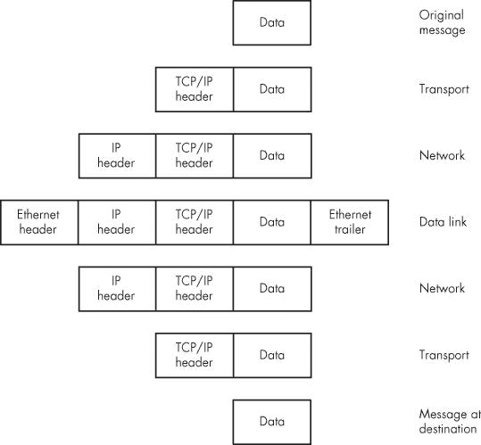
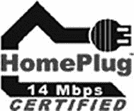
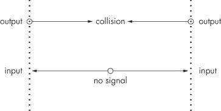
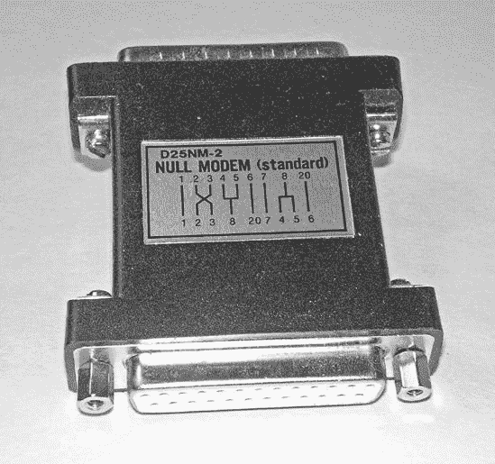
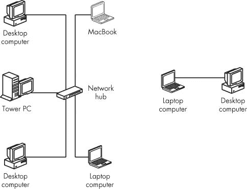
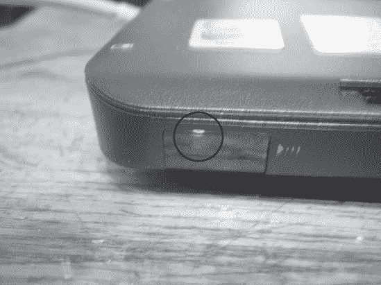
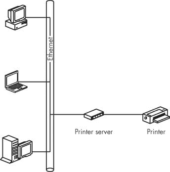

# 第二章。网络连接类型

每台连接到网络的计算机都必须遵循一组规则和规范，这些规则和规范定义了物理连接的特性以及从一台计算机传输到另一台计算机的数据的形式和结构。没有这些规则，使用网络的人们无法确保他们的计算机能够成功通信。

例如，数据线两端的插头必须与每台计算机和其他网络硬件上的插座相匹配。如果一根电缆使用的是带有两个触点的正方形插头，但计算机有一个带有四个孔的圆形插座，它们就无法匹配。同样的事情也适用于电压、时序、错误检查和其他问题。有许多不同类型的网络，每种网络都有自己的规则。本章解释了关于网络的一些基本原理，并描述了你在家庭或小型办公室网络中最有可能看到的网络类型。

你可以在不了解网络通信的所有内部细节的情况下使用网络，但如果你正在设计和构建一个新的网络，你应该知道如何根据你的特定需求选择最佳选项。你可以将单个网络组件视为一系列黑盒，但你仍然需要知道*使用哪些*黑盒。而且当出现问题的时候，了解这些盒子里的内容将使故障排除变得容易得多。

在我们讨论具体的网络类型之前，让我们看看每个计算机网络共有的元素。

如你所知，计算机将所有信息简化为仅两种信息状态：要么有信号，要么没有信号。这两种条件通常描述为 1 和 0，或者开和关，或者标记和空白。每个 1 或 0 的实例都是一个“比特”。任何被描述为“数字”的东西都可以简化为那些一和零。

每个 1 或 0 的形式在不同的通信通道中是不同的。它可能是一个开或关的光、声音或电信号；一系列长和短的声音或光闪烁；或者两种不同的音频音调、电压或无线电频率。在一个非常简单的系统中，1 可能对应于“是”，而 0 对应于“否”，或者任何其他一对选项。

单个比特位只提供两种选择，因此它们并不特别有用，但当你将八个这样的比特位（组成一个*字节*）连在一起时，你可以有 256 种不同的组合（2 × 2 × 2 × 2 × 2 × 2 × 2 × 2）。这足以为字母表中的每一个字母（大小写）分配一个不同的序列，从 0 到 9 的十个数字，单词之间的空格，以及其他符号，如标点符号和许多用于外国字母表的字母。字节是计算机通信的基本构建块。将字节转换为字符最广泛使用的编码系统称为*ASCII*（美国信息交换标准代码）。图 2-1 显示了两个字节的典型序列。

**图 2-1. 这些比特形成了字母*A*（01000001）和字母*n*（01101110）的 ASCII 序列。**

ASCII 对于文本来说很好，但计算机还可以将许多其他形式的信息转换为数字数据。例如，它可以把麦克风或模拟录音中的每一秒声音分成成千上万的非常短片段，并使用 16 或 24 比特来指定每个片段的内容，或者将一张图片分成数百万个单独的点（称为*像素*，即*图像元素*），并使用一系列比特来指定每个像素的颜色。

一根电线或其他数据链路一次只能传输一个比特位。要么有线路上有信号，要么没有。在短距离内，可以通过一根电缆发送数据，该电缆通过八根（或八的倍数）单独的电线并行传输八个信号。显然，并行连接可以比通过单根电线一次发送一个比特位快八倍，但那八根电线成本是单根电线的八倍。当电线只有一英尺或两英尺长时，这种额外成本微不足道，但当你要在长距离发送数据时，并行电线的额外成本会迅速增加。而且当你使用现有的电路，如电话线时，你没有任何选择；你必须找到一种方法，一次发送一个比特位，并附加一些额外的比特位和暂停，以标识每个新字节的开始。这是一个*串行*数据通信通道，因为你是一比特接一比特地发送比特的。在这个阶段，你使用的传输介质是什么并不重要——它可能是电线上的电脉冲，或两种不同的音频音调，或一系列闪烁的灯光，甚至是一群绑在信鸽腿上的音符——但你必须有一种方法将计算机的文本或其他输出转换为传输介质使用的信号，并在另一端将相同的信号转换回来。

# 数据包和头部

在单一源地址和目标地址之间通过直接物理连接（如电线）进行通信时，不需要任何类型的地址或路由信息来告诉消息该去哪里。你可能需要首先设置连接（通过打电话或把电缆插入交换机板），但一旦连接，该链路就会保持直到你指示系统断开连接。这种类型的连接非常适合语音和简单的数据链路，但它对于复杂网络中的数字数据来说效率不高，因为这种连接会一直占用电路，即使没有数据通过该通道。

另一种方法是向一个交换中心发送你的消息，该交换中心将保留它，直到目标可用链接出现。这被称为*存储转发*系统。如果网络已经根据系统中的数据类型和流量量进行了适当设计，等待时间将微不足道。如果通信网络覆盖了大量的领土，你可以在消息到达最终目的地之前将其转发到一个或多个中间交换中心。

为了使网络更加高效，你可以将超过某个任意限制的消息分成单独的部分，称为*数据包*或*帧*。来自多个消息的数据包可以在它们在交换中心之间旅行时交替包含其他消息的数据包，并在目标处重新组装成原始消息。

这种方法的巨大优势在于，许多消息可以在可用基础上共享相同的电路。一个消息的数据包可能与一个或多个其他消息的数据包在网络的不同部分交替移动。例如，如果你向另一个城市的收件人发送消息，这些数据包通常与其他许多消息一起通过城际通道移动。

每个数据包还必须包含另一组信息：数据包目的地的地址、该数据包相对于原始传输中其他数据包的顺序，等等。其中一些信息提供了额外的错误检查，并指导交换中心将每个数据包转发到何处，而其他信息则告诉目标设备如何将数据包中的数据重新组装成原始消息。

每个数据包附加的*头部*（位于数据包的开始处）和*尾部*（位于数据包的末尾）包括数据包目的地的地址、允许收件人确认数据包内容准确性的信息，以及收件人用来按原始顺序重新组装数据包的信息。在源地址和目标地址之间，网络路由设备有时会添加更多包含路由指令和其他管理信息的头部或尾部。

图 2-2 展示了网络如何在通信会话的不同阶段添加和移除头部和尾部。目前头部的具体名称和尾部并不重要；重要的是它们包围了原始数据包。

**图 2-2. 数据包可能被几种类型的头部和尾部包围。**

每次你在通信系统中添加另一层活动时，相同的模式都会重复。每一层都可能向原始消息附加额外的信息，并在完成附加信息指示的任务后移除该信息。当一条消息从无线网络上的笔记本电脑通过办公室网络和网关到互联网，然后继续到连接到另一个本地网络的远程计算机时，在接收者阅读原始文本之前，可能会添加和删除十几个或更多信息附件。包含地址和控制信息的数据包，这些信息位于包含消息内容比特之前，后面跟着一个错误检查序列，被称为*帧*。有线和无线网络都将数据流划分为帧，这些帧包含各种握手信息以及原始数据。

### 注意

网络在传输数据的过程中会在不同的地方处理数据包和帧。幸运的是，这一切都是自动发生的，所以你（作为一个网络用户）不必担心手动添加或删除它们。

## 错误检查

在一个完美的传输通道中，从一端进入的信号会与从另一端出来的信号完全相同。但在现实世界中，沿线路几乎总是存在某种噪声，这可能会干扰原始信号。*噪声*被定义为任何干扰或添加到原始信号的东西；它可能是由雷击、来自另一个通信通道的干扰、设备工作不正常，或者电路中某个地方的电气接触上的灰尘（或者在信鸽的情况下，是一只掠夺性鹰的攻击）引起的。无论来源如何，通道中的噪声都可能中断数据的流动。在现代通信系统中，这些比特以极快的速度穿过电路——每秒数百万个——因此即使是短短一秒钟的噪声冲击也可能抹去足够的比特，使你的数据变成数字垃圾。

因此，你的数据流必须包含一个称为 *错误检查* 的过程。错误检查是通过向每个字节添加某种标准信息来完成的。在一个简单的计算机数据网络中，握手信息被称为 *奇偶校验位*，它告诉接收每个字节的设备字节内 1 和 0 的总和是奇数还是偶数。这个值被称为 *校验和*。如果接收设备发现奇偶校验位不正确，它会指示发送器再次发送相同的字节。更复杂的网络，包括无线系统，在每个数据字符串中包含额外的错误检查握手数据。

## 握手和开销

发送消息或数据流的计算机不能直接上网开始发送字节。首先，它必须警告另一端的设备它已准备好发送，并确保预期的接收者已准备好接收数据。为了完成这个任务，一系列的“握手”请求和回答必须围绕实际数据。

请求序列大致如下：

> 源头: "嘿，目的地！我有一些数据给你。"
> 
> 目的地: "好的，源头，开始吧。我已经准备好了。"
> 
> 源头: "数据来了。"
> 
> 源头: 数据数据数据数据……校验和
> 
> 源头: "这就是信息。你收到了吗？"
> 
> 目的地: "我收到了一些东西，但看起来好像损坏了。"
> 
> 源头: "又是这个。"
> 
> 源头: 数据数据数据数据……校验和
> 
> 源头: "这次你收到了吗？"
> 
> 目的地: "是的，我收到了。我准备好接收更多数据了。"

我们可以将握手信息的具体形式留给网络设计者和工程师，但重要的是要理解，并不是所有通过计算机数据网络移动的比特都是原始信息块的一部分，该信息块到达了输入计算机。在一个复杂的网络，如无线数据通道中，多达 40%或更多的传输数据是握手和其他开销。这些都是必不可少的，但每一个比特都会增加消息通过网络所需的时间。

# 以太网

以太网在 20 世纪 70 年代被引入，作为一种在同一建筑物内连接多个计算机和相关设备的方法。以太网提供了一些优点：它速度快，极其灵活，相对容易安装和使用，而且价格低廉。它已成为由数十家制造商支持的行业标准，因此你可以在同一网络中使用不同品牌的设备。今天，超过 85%的所有局域网（LAN），包括几乎所有现代家庭和办公网络，都使用某种形式以太网来提供通过双绞线、同轴电缆或光纤电缆的物理连接。

以太网最重要的特性之一是它用来防止节点之间冲突的方法，称为*载波侦听多路访问与碰撞检测（CSMA/CD）*。每当一个网络节点准备发送一个帧时，它会检查是否有其他帧正在使用网络；如果网络空闲，节点就会发送帧。但如果节点检测到另一个帧正在使用网络（这种情况称为*碰撞*），它会在再次尝试之前等待一个随机的时间段。CSMA/CD 之所以重要，是因为它允许相对大量的计算机和其他设备通过同一网络运行而不会相互干扰。

有许多以太网规范涵盖了不同的数据传输速率以及不同类型的电缆和连接器。在小型局域网中最可能看到的有以下几种：

+   10Base-T：通过双绞线提供 10 Mbps 的传输速率

+   100Base-T 或快速以太网：通过双绞线提供 100 Mbps 的传输速率

+   1000Base-T 或千兆以太网：通过双绞线或光纤电缆提供 1000 Mbps 的传输速率

+   无线或 Wi-Fi：使用无线电信号而不是线缆的几种系统——最新的 802.11n Wi-Fi 网络可以以高达 70 Mbps 的速度运行。

10Base-T 网络对于小型家庭网络来说是足够的。它比大多数宽带互联网服务都要快，因此足以处理与互联网交换的进出的数据（包括音频和视频）。然而，大多数新的网络端口、集线器和交换机都可以处理 10Base-T 和 100Base-T，所以将网络限制在较慢的速度上几乎没有意义。100Base-T 还将允许你在自己的网络中更快地移动图片、音乐和视频，并玩多人游戏，而不会限制 802.11n 链路的速度。考虑到成本差异微乎其微，今天的 100Base-T 网络总是比较旧的 10Base-T 版本更好选择。

如果由于干扰或其他问题，100Base-T 网络无法处理 100 Mbps，它将自动降至 10Base-T。10Base-T 设备可以在 100Base-T 网络上工作，但它将迫使整个网络降至 10 Mbps。

千兆以太网网络（按照今天的标准）速度极快，但它的成本也比使用较慢设备的网络要高。它可能适合那些在其局域网中传输大量数据的企业。随着千兆以太网成本的降低，它将成为家庭和小型企业网络的优选选择。

你也可能看到*以太网*这个词用来标识与以太网电缆配合使用的计算机、打印机或其他网络设备的连接器。每台以太网兼容设备的说明书或标签都应该告诉你它使用的是哪种类型的连接。

*绞合线*是由多根线组成的束，其中每对线都相互绞合，如图图 2-3 所示。因为数据通常只通过每对线的一个方向移动，所以 10Base-T 或 100Base-T 网络连接使用两对线——一对用于每个方向。最常见的以太网电缆包括四对颜色编码的线，共八根线，因此你可以使用剩余的线作为备用。

**图 2-3. 典型的以太网电缆包含四对颜色编码的绞合线。**

本书的大部分剩余章节都致力于以太网网络的功能和特性。

**处理其他（大多数已过时）有线网络**

以太网是目前最广泛使用的局域网连接类型，但如果你使用的是旧设备，你可能会偶尔发现一些使用其他类型网络结构的电脑或其他设备。许多这些旧网络需要特殊设备和经验丰富的网络技术人员，但其他人不必回避它们。

如果你继承了一个正在工作的网络，最好的做法就是让它保持原样。它可能已经多年没有出现问题地正常工作，除非你尝试扩展或以其他方式“改进”它，否则你可以期待它继续这样做。这是一个典型的“如果它没有坏，就不要修它”的例子。

另一方面，如果你有一台带有其他类型网络接口的老式台式电脑，或者根本没有网络适配器，如果你不介意打开电脑并更换电路板，你可能将它连接到你的以太网局域网。寻找一个适合其中一个空扩展槽的以太网网络接口适配器，并从卡制造商的网站上下载最新的驱动软件。

# Wi-Fi

Wi-Fi（无线保真度的简称）是一类使用无线电信号而不是电线连接电脑和其他设备的网络。Wi-Fi 的另一个名字是*无线以太网*，因为 Wi-Fi 使用了许多与有线以太网网络相同的数据处理规则和规范。然而，每个 Wi-Fi 数据包都必须包含额外的握手数据，因此整体数据传输速度通常比传统的以太网链路慢。

Wi-Fi 具有几个优点：它不需要电缆来连接每个网络节点，因此它通常比有线网络连接更容易安装和使用。您不必在每张桌子上拉线并提供网络插座，而可以通过位于每台计算机和中央位置基站（一个*接入点*）之间的天线来分配网络访问。当您携带笔记本电脑、手持 PDA（个人数字助理）或移动互联网设备（如 BlackBerry 或 iPhone）旅行时，您通常只需打开它，就可以通过 Wi-Fi 连接到互联网。

许多家庭和小型商业网络使用以太网和 Wi-Fi 的组合；Wi-Fi 基站同时作为以太网电缆的连接点，因此同一局域网包括有线和无线节点。第八章包含有关安装和使用 Wi-Fi 网络链接的信息。

# 电力线网络

在电力线网络中，计算机数据通过建筑物的现有电线传输。每台计算机通过并行端口、USB 端口或以太网端口连接到一个数据适配器，该适配器直接插入交流电源插座。为房屋电线供电的同一电力变压器也隔离了您的数据网络与邻居的网络。

电力线网络最广泛使用的标准称为*HomePlug*。HomePlug 和其他电力线网络的最大优点是电线已经就位。房屋中的每个交流电源插座都可以作为网络连接点。它也比 Wi-Fi 更安全，并且只需一个基站，就可以比 Wi-Fi 网络覆盖更远的距离。Wi-Fi 信号通常会被厚墙和其他障碍物阻挡，而这些障碍物对电力线系统没有影响。

### 注意

您必须将所有电力线适配器直接插入墙壁插座。浪涌保护器和电力线调节器通常会吸收电力线网络数据，因为它们将数据视为交流电源电压上的“噪声”。相反，如果您正在使用电力线网络，您将希望将您的立体声音响或家庭影院系统连接到电力调节器，以过滤掉网络产生的噪声。

所有遵循 HomePlug 规范的网络设备都应该在同一网络中协同工作。一些较老类型的电力线网络可能也可用，但它们不如 HomePlug 可靠，因为它们可能受到某些家用电器（如吸尘器和其他使用大电机或电力变压器的电器）的干扰，并且它们并不总是与非常旧的房屋电线很好地协同工作。今天，最好远离任何没有 HomePlug 认证标记的东西，如图图 2-4 所示。

**图 2-4. HomePlug 认证标志表示该电力线网络产品已获得 HomePlug 电力线联盟的批准。**

如果在你的建筑中安装以太网线缆不切实际，HomePlug 网络可能是你的最佳选择。当它起作用时，这在大多数家庭中都是如此，它提供了一个简单、可靠的网络。但一些潜在的用户新闻报道了性能缓慢和其他问题，因此最好从允许你如果它们在你家中不起作用就退货的零售商那里购买你的 HomePlug 适配器。

# 其他替代布线方法

可能还有两种家庭网络方法，但它们几乎总是作为其他服务的补充提供。这些系统使用连接多个房间分机电话的内部电话线，或者提供有线电视信号的同轴电缆（*同轴电缆*）。通过电话线推广家庭网络的行业组织被称为 HomePNA（家庭电话线网络联盟）；MoCA（同轴电缆多媒体联盟）是与之相当的团体。

不要混淆内部电话线或同轴电缆线与连接高速互联网服务到你的家庭或商业局域网的 DSL 和电缆服务；HomePNA 和 MoCA 严格用于在建筑物内分配网络服务。

HomePNA 和 MoCA 比 HomePlug 网络布线更不灵活，因为大多数家庭已经内置了比电话或电视插座多得多的 AC 电源插座。然而，如果电话盒或电缆插座已经位于方便的位置，考虑 HomePNA 或 MoCA 作为 Wi-Fi 或单独以太网布线的替代品可能是实用的。

# DTE 和 DCE 设备

每个网络规划者都应该理解的一个概念是：*数据终端设备（DTE）*和*数据通信设备*或*数据电路终端设备（DCE）*之间的区别。如果你清楚这两种网络设备，你将避免由通信故障引起的大量头痛。

数据只能通过一个方向通过电线移动。当一个数据链路同时发送和接收信号时，它必须使用单独的电线从 DTE 发送数据到 DCE，并从 DCE 发送数据到 DTE。因此，网络设备在同一多针连接器上使用单独的输入和输出。具体的针脚分配在不同连接类型中不同，但输入和输出始终是不同的针脚或插座。

问题出现是因为每个输出都必须连接到一个输入。如图 2-5 所示，如果你将一个输出连接到另一个输出，两个信号将发生冲突；如果你将一个输入连接到另一个输入，将永远没有信号。

**图 2-5. 将输出连接到输出或输入连接到输入，将不会发生任何有用的事情。**

因此，当你连接两台设备时，每端的输出必须连接到另一端的输入。如果一个设备上的引脚 2 是输出，那么另一个设备上的引脚 2 必须是输入。大多数标准数据电缆将每个连接器的引脚连接到另一端的相同编号引脚，因此通过电缆连接两台设备与直接将一台设备插入另一台设备完全相同。

正因如此，数据设备分为两大类。数据终端设备包括远程终端、计算机、一些打印机以及其他网络端点。数据通信设备包括调制解调器、集线器、交换机以及其他控制设备。当你将终端连接到控制设备时，DTE 设备的输出引脚连接到 DCE 设备的输入引脚。

当你想要连接两台计算机而没有中间控制设备时，问题就出现了。直接计算机到计算机的通信需要一个特殊的电缆，因为你不能直接将一个 DTE 设备连接到另一个 DTE 设备。当你使用串行数据端口连接两个 DTE 设备时，你将一台计算机的输出连接到另一台计算机的输出，输入连接到输入，因此两台计算机实际上都不会接收任何数据。因此，你必须翻转连接，使得每个输出连接到一个输入。将输出引脚连接到输入引脚的电缆或适配器称为*空调制解调器*。图 2-6 显示了典型的空调制解调器适配器。

**图 2-6. 空调制解调器适配器或电缆直接连接输入到输出。**

### 注意

"数据只单向移动"的规则不适用于通过同轴电缆传输的数据，同轴电缆可以通过同一电缆以不同频率调制传入和传出信号。

# 点对点网络

大多数时候，我们认为计算机网络是一个可以将一台计算机连接到同一网络中任何其他计算机的结构。但有时你只需要两台计算机之间的直接连接。这种连接称为*点对点*网络。图 2-7 显示了这两种网络类型。

当你想在两台计算机之间传输数据，而其中一台或两台尚未连接到网络时，点对点连接非常方便。例如，如果你在一个会议中，有人要求一份报告或图纸的副本，你可以使用许多笔记本电脑内置的红外网络工具，将文件从你的电脑传到同事的电脑上。或者，如果你想从朋友的电脑上复制文件，你可以将传输电缆插入两台机器，或者设置一个点对点 Wi-Fi 链接。

**图 2-7. 局域网（左侧）可以提供任意节点对之间的连接；点对点网络（右侧）连接两个节点。**

点对点网络可以使用电线、无线电信号或红外光在两个端点之间交换数据。如果你使用的是电缆连接，你必须使用特殊的点对点以太网适配器或电缆。对于点对点 Wi-Fi 链接，你必须将其配置为*临时*连接。

## 临时 Wi-Fi

大多数 Wi-Fi 网络通过无线接入点将无线节点连接到局域网，但 Wi-Fi 网络适配器也可以直接支持一台计算机到另一台计算机的无线链接。这种连接被称为*临时*网络，因为它通常被设置为一个临时链接，而不是作为永久性网络基础设施的一部分（具有一个或多个中心接入点的无线网络被称为*基础设施*网络）。

## 红外

红外连接使用不可见闪烁的光（它不可见，因为它使用人眼可见范围之外的光频）在计算机、移动电话、数码相机和其他设备之间交换数据。你用来与电视、DVD 播放器和家庭立体声音响系统配合使用的无线遥控器的大部分无线遥控单元也使用红外光信号。红外通道通常被称为*IrDA*连接，因为红外数据协会（IrDA）已经为红外通信设定了标准。

许多笔记本电脑内置了 IrDA 端口，通常位于机箱边缘的一个不明显位置。IrDA 端口通常是一个位于透明塑料盖下的红外透镜，就像图 2-8 中所示的那样。相机捕捉到了闪烁的红外光，尽管它通常对人眼是不可见的。

**图 2-8. 笔记本电脑上的 IrDA 端口通常看起来像机箱边缘的一个空白面板。**

正如你可能已经注意到你的电视遥控器一样，红外信号可以反射在墙壁和其他物体上，因此并不绝对需要将一对 IrDA 端口直接对准对方，尤其是在它们都在室内时。当两个具有活动 IrDA 端口的计算机在同一房间内时，它们通常会自动检测到对方。

### 注意

笔记本电脑上的红外端口可以检测到同一房间内另一台计算机的 IrDA 信号，并自动在两个设备之间建立网络连接。因此，当你不打算使用红外端口时，最好禁用它。要在 Windows 中禁用或启用红外通信，请打开设备管理器（**控制面板** ▸ **系统** ▸ **硬件** ▸ **设备管理器**），展开红外设备列表，右键单击红外端口的名称，然后从弹出菜单中选择**禁用**或**启用**。

## FireWire (IEEE 1394)

FireWire 是由苹果公司开发的一种高速串行数据传输方法，用于将计算机连接到外部设备。后来，电气和电子工程师协会（IEEE）将其采纳为其标准编号 1394。IEEE 1394 通常用于从音频和视频设备到计算机的高速数据传输，但它也可以通过特殊电缆在两台计算机之间交换数据。

### 注意

与 FireWire 不同，无法使用简单的电缆在两个计算机的 USB 端口之间作为直接数据传输的通信链路。然而，为了这个目的，有专门的“USB 数据传输设备”可用。

# 通过电话线连接

当高速宽带网络服务（如 DSL）不可用时，您可以通过拨号电话系统（公共电话交换网络或 PTSN，也称为 POTS，即“普通老式电话服务”）将您的计算机或 LAN 连接到互联网，或直接连接到远程计算机。拨号网络链路比 DSL、电缆或其他高速服务慢得多，但它们很方便，因为几乎每个家庭和企业都有 POTS 电话线，而且 PTSN 在停电期间通常仍然可以工作。

通过电话线的网络连接使用调制解调器将数字计算机数据转换为可以通过 PTSN 传输的声音。另一端的第二个调制解调器将这些声音转换回数字数据。Windows 和其他操作系统的通信程序发送控制代码，指示调制解调器传输电话号码并调整数据传输速度和其他配置设置。

大多数新型笔记本电脑都内置了 PTSN 调制解调器。台式计算机的独立调制解调器可以作为内部扩展卡或外部设备提供，这些设备通过串行数据端口或 USB 电缆连接到计算机。

图 2-9 展示了在 Windows XP 中用于将计算机连接到远程网络或互联网服务提供商（ISP）的拨号调制解调器控制面板。图 2-10 展示了 HyperTerminal 程序的设置屏幕。其他程序有不同的布局，但它们都基本上做同样的事情：拨打一个电话号码并登录到接听电话的计算机。高级属性指定网络连接类型、数据速度和其他配置设置。

**图 2-9. Windows 中的连接对话框指定了调制解调器将要拨打的电话号码以及连接成功后计算机将发送的登录名和密码**

**图 2-10. HyperTerminal 中的连接到对话框包括区号和电话号码的空间**

# 远程终端

现在，大多数网络连接两台或多台计算机，但也可以使用您的计算机作为*远程终端*（键盘和屏幕）来操作可能位于隔壁房间或世界另一端的另一台计算机。使用终端仿真程序的计算机从您的计算机键盘向远程系统发送命令，并在您的计算机屏幕上显示远程计算机的数据。您可以通过局域网、通过拨号电话线或通过互联网作为远程终端连接到另一台计算机。

例如，图 2-11 展示了从连接到 The Well（一个运行在加利福尼亚州萨克拉门托的 Unix 主机计算机上的基于文本的在线社区）的远程终端程序中的登录序列。The Well 的计算机将我的桌面计算机（位于西雅图）处理得就像它处理一个直接连接到主机的本地终端一样。您可能会在图书馆目录或大型机计算机上看到类似的基于文本的主机计算机显示屏。

**图 2-11. 远程终端允许用户通过网络操作远程计算机**

你可以通过互联网使用称为*telnet*的程序类别作为远程终端连接到计算机，这些程序是大多数终端仿真程序的核心，或者你可以通过调制解调器和传统的拨号电话线路直接连接到主机计算机。

# 客户端和服务器

随着网络的扩展，你可能需要添加一些计算机和其他设备（例如打印机）到网络中。这些额外的计算机将为所有网络用户提供有用的资源。

在网络中，*客户端*是使用其他设备提供的资源的计算机或程序；*服务器*是提供这些资源的设备。将网络组织成客户端和服务器是使该网络比连接到它的单个计算机更加灵活和强大的方法之一。当你计划一个新的网络或扩展现有的网络时，你应该考虑每个网络活动要么是运行在本地计算机上的客户端程序，要么是从中央源提供程序的服务器。

### 注意

重要的是要理解服务器不总是专用计算机；在许多小型网络中，一个或多个服务器程序运行在同时被网络用户用于日常活动的同一台计算机上。

例如，如果你将所有音乐文件存储在一台计算机上，并通过网络从其他连接到它的计算机播放这些文件，那么包含所有文件的计算机是“存储服务器”，每个播放器都是一个客户端。或者，如果你通过网络将文档发送到另一台计算机或独立的打印机进行打印，那么控制打印机的计算机或特殊网络节点设备就是“打印机服务器”。

服务器几乎总是通过客户端与用户（也就是你和我）进行通信。除了系统管理员或维护人员外，很少有人会直接与服务器程序打交道。向服务器发送指令并接收数据或其他服务的软件是*客户端程序*。每个服务器都与一个客户端程序通信，该程序发送正确的请求集并按特定格式接收信息。例如，Firefox、Opera 和 Internet Explorer 等网页浏览器都是使用万维网联盟指定的 HTTP（超文本传输协议）命令的客户端；世界上每个网页服务器都识别这些命令。

客户端和服务器不一定连接到同一个局域网；有时它们通过互联网或大型企业广域网（WAN）连接。例如，当你从网站下载页面或从 iTunes 或 Zune 等服务下载音乐文件时，你正在使用自己的计算机作为客户端从网络服务器获取东西。

网络可以利用许多种类的客户端和服务器。这里只列举一些：

**邮件服务器**

一台处理所有网络用户收发邮件的计算机

**文件服务器**

存储数据文件并通过连接到网络的任何计算机提供这些文件的计算机。

**音乐服务器**

存储音乐文件并通过计算机和家庭娱乐系统提供这些文件的专用文件服务器。

**防火墙服务器**

作为网络安全防火墙的计算机，它在网络上的其他计算机和外界之间起到作用。

**游戏服务器**

作为多人游戏主机的计算机。

服务器可以是一个仅运行专用服务器软件的独立计算机，一个运行服务器程序和其他程序的通用计算机，或者是一个包含专用内部计算机处理器的更专业化的设备。例如，如图 2-12 所示，打印机服务器可以是连接打印机的计算机，或者是一个带有内部或外部网络适配器的打印机，该适配器直接连接到网络。

**图 2-12。打印机服务器可以是连接打印机的计算机或专用打印机服务器。**

在小型网络中，同一台计算机同时充当客户端和服务器并不罕见。例如，在家庭网络中，家庭的打印机可能位于厨房，妈妈在那里有一台电脑，她用它保存家庭的财务记录并在互联网上查找食谱。厨房的电脑是网络上的打印机服务器。当家里其他人需要打印东西时，他们会指示自己的电脑通过网络将打印任务发送到厨房的电脑。计算机的操作系统知道如何处理这样的打印请求，而不会中断打印机服务器上运行的其它程序。

客户端和服务器都很重要，因为它们是网络构建的基本模块。客户端-服务器结构通常是向网络添加服务的一种非常好的方式，因为它是一种高效地共享昂贵硬件和软件的方法，并且使这些服务对每个人都是可访问的。

关于添加和使用服务器的更多详细信息，请参阅第九章。
