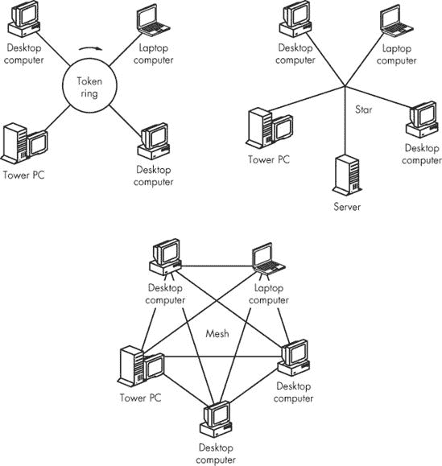
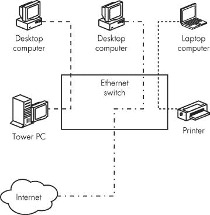
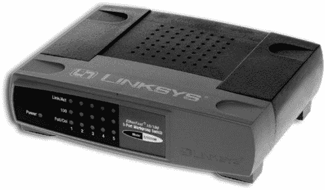
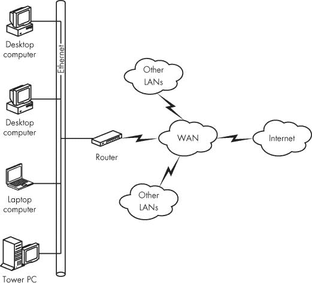

# 第三章。集线器、交换机和路由器

任何包含超过两个节点的网络都必须有一种方式来连接任何一对节点。大型网络可以具有非常复杂的结构，有许多分支和扩展，但每个网络的核心都可以简化为几种模式。网络的简化布局称为其*拓扑结构*。

最常见的网络拓扑结构是一个称为*环形*的大环；一个所有设备都连接到称为*星形*的中心核心的集线器系统；一个连接节点的常见路径（不是一个环），使用时间共享方法；以及*网状*，其中每个节点都直接连接到其他每个节点。图 3-1 显示了每种网络拓扑的简化图。

在环形网络中，例如 IBM 的老式令牌环设计，数据在环中移动，直到到达目的地。在更常见的集线器系统中，每个数据包都前往一个中心位置，在那里控制设备读取地址并将其发送回正确的目的地。包括大多数小型局域网在内的以太网网络是集线器系统。

**图 3-1. 每个网络都使用特定的拓扑结构。**

网状拓扑在小型家庭或办公网络中不常见，但连接您的网络到互联网的广域网通常使用网状设计。

本章描述了星形网络中心的设备，该设备将计算机和其他节点相互连接，以及提供网络之间连接的相关设备。除非您只连接两个节点，否则这些集线器、交换机和路由器是网络构建的基本模块。

# 集线器和交换机

网络集线器和交换机都是以太网网络逻辑中心的数据交换点，如图图 3-2 所示。每台计算机或其他网络节点通过插入称为*端口*的插座的电缆连接到集线器或交换机。在小型网络中，集线器或交换机几乎总是带有前面板指示灯和后面板以太网端口的桌面盒。在大型网络中，集线器或交换机可能是一个安装在设备机架上的面板。

**图 3-2. 网络集线器或交换机是以太网网络中的中心连接点。**

网络的最大数据传输速度是中心节点或交换机的数据处理速度。你可能会找到一个 10 Mbps 的以太网中心节点，但随着更快的设备变得不那么昂贵，使用它的理由不多。今天，最常见的中心节点和交换机都设计为支持 10 Mbps 和 100 Mbps 的操作。最新一代的交换机和中心节点支持甚至更快的千兆以太网（1000 Mbps）交换机，价格通常仅略高于旧 100 Mbps 版本的价格。

## 中心节点

当一个数据包进入中心节点时，中心节点会将该数据包转发到中心节点的所有端口（以及连接到这些端口的节点）。每个节点会将数据包上的地址与其自己的地址进行比较，如果地址相同则接受它，如果数据包被发送到其他节点则忽略它。因为中心节点将每个数据包发送到每个端口，所以一次只能有一个数据包通过网络（我们说的是每秒许多数据包，但它们仍然一个接一个地通过网络）。如果两台或多台计算机试图同时发送数据包，以太网的碰撞检测功能会迫使它们停止，等待，并在几秒钟后再次尝试。

为了防止碰撞，每个节点在发送数据包之前必须检查网络，以确保没有其他节点已经在使用中心节点。因此，带有 10/100 中心节点的网络的速度不会比最慢的节点快。如果你的网络中的所有计算机都使用 100 Mbps 网络适配器，但打印机通过 10 Mbps 端口连接，整个网络将只能以 10 Mbps 或更慢的速度运行。

当越来越多的节点同时尝试使用一个中心节点时，整个网络的数据传输速度会下降。这可能会对使用中心节点的繁忙网络产生重大影响：实际的数据传输可能只有标称的 10 Mbps 或 100 Mbps 的一小部分。

通常情况下，中心节点速度慢、简单且便宜。但中心节点和交换机之间的成本差异通常微不足道，因此交换机几乎总是更好的选择。

## 交换机

数据交换机执行与集线器相同的功能——它将网络的节点相互连接，但它以完全不同的方式完成这项工作。交换机不会将每个数据包发送到每个端口，而是读取每个传入数据包的地址部分，并为每个数据包的源地址和目标地址建立直接连接。与此同时，如果其他节点尝试将数据包发送到另一个未使用的端口，交换机可以在不中断其他连接的情况下建立链接。如图图 3-3 所示，交换机可以同时处理多个连接。因为连接到交换机的网络节点不需要监控整个网络以检测可能的冲突，所以它可以同时发送和接收数据（这称为*全双工*模式）。这两个特性——多个段和全双工操作——意味着数据可以通过交换机比通过集线器更快地移动。

**图 3-3. 以太网交换机可以支持两个或更多同时连接。**

数据交换机（和集线器）有多种尺寸和形状。最小的交换机通常有四个、五个或八个端口，放在一个可以放在桌子或架子上的盒子里，如图图 3-4 所示。当您的网络扩展到需要比原始交换机提供的端口更多的端口时，您可以将一个或多个额外的交换机连接到原始单元的一个端口上。

**图 3-4. 此交换机连接了五个网络节点。**

*照片由思科系统公司子公司 Linksys 提供*

大型商务办公室中的网络通常从每台计算机向后布线到所有交换设备安装的中央空间，这些设备安装在墙壁板或设备架上。这通常是内部电话设备连接到电话公司外部线路的同一房间。这个空间通常被称为*配线间*。

# 局域网和广域网

您家中或办公室的网络被称为*局域网（LAN）*。连接到 LAN 的所有计算机可以共享外围设备（如打印机或扫描仪），它们可以在同一 LAN 上的其他计算机上运行程序和读取数据，并且它们都共享一个通向互联网的公共连接。在家庭网络中，局域网可能还包括家庭娱乐系统和游戏控制器。

局域网也使用相同的规则和设置来控制所有联网计算机之间的通信。这包括网络本身的名称以及每台计算机的名称（或地址号码，或两者都有），有时还包括防火墙来保护使用局域网的人的隐私。

当你想连接多个局域网时，你可以创建一个称为*广域网（WAN）*的“网络网络”，它可以使用电话线或有线电视服务之类的通信通道来提供链接。图 3-5 显示了一个简单的局域网连接到广域网。你的互联网服务提供商（*ISP*）使用广域网将你连接到互联网。互联网本身是一系列连接点，连接了许多广域网。

也有可能直接将一台计算机连接到广域网，而不通过局域网。如果你只有一台计算机，并且它直接连接到调制解调器，那么你的计算机就在你的 ISP 的广域网中。

**图 3-5. 局域网通常限于一个建筑或一些其他小空间；广域网可以连接多个局域网。**

# 网桥和路由器

每当你连接两个网络时，你必须使用一个工具，将每个网络使用的地址和控制数据转换成另一个网络可以理解的价值。当设备仅仅检查每个数据包上的地址并决定将哪些数据包转发到另一个网络时，它就是一个*网桥*。当设备检查每个数据包中的地址（或路由）信息并将数据包发送到其最终目的地（可能是在远离原始网络的另一个局域网中）时，它就是一个*路由器*。

### 注意

网桥和路由器在两个不同的网络之间运行。不要将它们与在网络上分发数据的交换机和集线器混淆。然而，许多路由器将功能与交换机结合在一个设备中。

当你将你的局域网连接到互联网时，你会在局域网中添加一个路由器作为节点。这种路由器有时被称为*网关路由器*，因为你的局域网中的数据包必须通过它才能到达互联网（当然，来自互联网的数据包在到达你的局域网时也必须通过路由器）。最常见的网关路由器是专门设计来提供 DSL 或有线电视连接所需的正确类型的信号和地址转换。

# 组合盒子

在相对较小的网络中，两个或多个网络控制设备的功能通常被组合到一个单独的盒子中。例如，连接网络到互联网的路由器可能还包括一个内置的交换机，用于连接多个节点，或者 DSL 调制解调器可能与网关路由器相匹配。许多其他组合也广泛可用。

如果您能找到一个满足您网络要求的组合包，那么它几乎总是比两个或更多单独部件更好的选择。单个单元几乎总是比单独的组件更便宜，因为外壳和电源供应占了总价格的大部分，而且当一台设备处理多个活动时，配置网络通常更容易。

使用结合两个或更多活动的单个设备提供了另一个可能直到您使用网络一段时间后才会变得明显的优势，要么是因为您需要解决一个问题，要么是因为您想向网络添加更多设备：组合设备内部的连接不需要外部电缆。如图图 3-6 所示，您的网络电缆插入交换机、路由器、调制解调器等设备的地方几乎总是混乱的线缆团；您能做的任何减少电缆数量的工作都会使事情变得容易得多。

**图 3-6. 连接到您网络控制器的电缆常常会形成一团混乱。**
