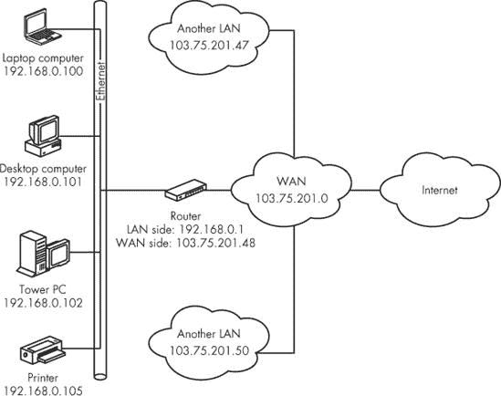

# 第四章：计算机网络的组织方式

为了通过网络交换文件和消息，连接到该网络的所有计算机都必须使用相同的一套规则（网络设计人员称之为*协议*）。控制互联网的规则被称为*传输控制协议/互联网协议（TCP/IP）*。即使你现在不打算将你的网络连接到互联网，你也应该至少出于两个原因使用 TCP/IP：首先，TCP/IP 集成在 Windows、Macintosh 和 Linux 操作系统中，以及大多数廉价的网络设备中；其次，你将浪费大量时间和金钱去寻找与另一种较旧的网络协议兼容的设备。

本章提供了一个相对简单的 TCP/IP 协议的解释以及你的网络如何使用它们。

# TCP/IP 网络

TCP/IP 实际上是一套协议。其中最重要的是 TCP（传输控制协议），它控制命令、消息和文件如何被分割成数据包并在另一端重新组装，以及 IP（互联网协议），它提供指导每个数据包通过不同类型的网络到达正确目的地的规则。

你的计算机自动处理传输控制，因此你不必过多关注单个数据包及其内容。本书第二章中的信息提供了大多数用户所需的详细程度。但互联网协议是另一回事；你应该了解你的网络（以及几乎连接到互联网的每个其他网络）如何为单个计算机和其他网络节点使用名称和地址，以及如何使用包含在每个网络计算机中的某些标准软件工具。

幸运的是，通过互联网的内部路由是自动的；如果你在你的网页浏览器、电子邮件客户端或其他程序中输入一个有效的地址，互联网几乎总是会找到通往该地址的计算机的路径。如果找不到，网络工具中描述的`ping`和`traceroute`命令将帮助你找到问题的根源。

## 名称和地址

“寻址约定”听起来像是一个人们参加关于门牌号码的演讲和研讨会，并因发送五百万封垃圾邮件而无一错误地获奖的活动。正式会议通常很无聊，但下班后的派对却很棒。在网络中，“寻址约定”实际上是每个人用来识别连接到网络中的计算机和其他设备以及使用它们的人的规则。每个连接到网络的计算机在该网络中都有一个独特的名称和地址，每个连接到互联网的网络都有其独特的数字互联网地址，称为*IP 地址*。

### 数字地址

管理互联网的技术委员会、国际标准组织和政府机构都同意使用 32 位数字地址格式，格式如下，显示为介于 0 到 255 之间的四个数字，由点分隔，如下所示：

| 192.168.3.200 |
| --- |

当你大声读出一个 IP 地址时，每个数字都要单独发音，每个点读作“点”。所以你会读这个示例地址为“一-九-二 点 一-六-八 点 三 点 二-零-零”。

你可以把 IP 地址想象成类似于你的电话号码。连接到你的局域网（LAN）的每台计算机以及连接到互联网的每个设备或网络都有一个不同的地址。

负责在互联网上分配数字 IP 地址的机构是*互联网名称与数字地址分配机构（IANA）*。涉及一些与美国政府签订的正式合同，但 IANA 能够向全球互联网社区提供这项服务的真正原因是每个人都同意尊重他们的分配。

作为一个小型局域网的所有者，你永远不会直接与 IANA 打交道。你的互联网服务提供商控制着一块数字地址块，当你设置新的连接时，它会为你分配一个（或多个）地址。

### 保留地址

如第三章所述，你的局域网通过路由器与其他网络通信。对于连接到该路由器的网络而言，路由器只是一个具有 IP 地址的额外网络连接。因此，正如图 4-1 所示，路由器有两个不同的 IP 地址：一个用于其与局域网的连接，另一个用于广域网（WAN）或互联网。路由器向互联网呈现一个地址，该地址代表你局域网上的所有计算机和其他设备；它执行一个称为*网络地址转换（NAT）*的功能，将你的公共地址转换为单个网络设备的地址。这个系统的优点之一是，你可以在你的局域网中使用与街对面的邻居（或世界另一边的局域网）相同的 IP 地址，而这些地址不会相互干扰。

为了使这个系统正常工作，IANA 已经为局域网（LAN）保留了几个 IP 地址块；当路由器收到一个地址在这些范围内的数据包时，它不会将数据包转发到互联网。如果你使用这些地址来配置你的局域网中的设备，你可以确信当你想要将数据包发送到走廊另一边的助手时，你的数据包（以及构成这些数据包的命令、消息和文件）不会最终出现在厄瓜多尔国家图书馆的阅览室。

保留的 IP 地址包括：

| 10.0.0.0 到 10.255.255.255 |
| --- |
| 169.254.0.0 到 169.254.255.255 |
| 172.16.0.0 到 172.31.255.255 |
| 192.168.0.0 到 192.168.255.255 |

### 固定和动态地址分配（DHCP）

您的局域网中的计算机和其他节点可以通过两种方式获取它们的数字 IP 地址：设置网络连接的人可以分配一个永久地址，或者路由器或其他网络控制设备可以在设备每次连接到网络时自动分配地址。永久分配称为*固定*或*静态*IP 地址；自动分配称为*动态*地址。



**图 4-1. 路由器向每个网络提供单独的 IP 地址。**

分配动态 IP 地址的方法称为*动态主机配置协议（DHCP）*，因此执行分配的设备是*DHCP 服务器*。在局域网中，DHCP 服务器使用保留范围内的数字；在互联网上，服务器使用 IANA 提供的范围。

固定和动态 IP 地址分配都可以同样有效地工作，但网络上的所有设备必须使用相同的系统；否则，可能会有多台设备同时使用相同的号码。

### 注意

如果您的局域网包括笔记本电脑和其他连接和断开网络的便携式设备，DHCP 是更好的选择，因为它允许网络在用户连接时自动分配地址，并在第一个用户断开连接后重新使用相同的地址。

一些互联网服务提供商和公司网络管理员为每个用户分配静态 IP 地址，而其他人使用 DHCP 生成地址。第十章和第十一章解释了如何设置您自己的计算机和局域网以使用这两种方法之一。

### 域名系统

计算机处理长串数字没有问题，但人们往往不行。以文字形式而不是数字形式表示的地址通常更容易记忆和使用。这就是为什么互联网和几乎每个局域网都使用每个连接到网络的计算机的名称。在局域网中，每台计算机都会自动读取同一网络中其他设备的名称；在互联网上，一个称为*域名系统服务器（DNS 服务器）*的计算机将名称转换为数字地址；当您在浏览器中输入网站名称时，DNS 服务器找到与该名称对应的数字，并将其返回给您的浏览器，浏览器连接到该数字地址。

当您设置网络时，您（或您的网络管理员）将为每台计算机分配一个名称；您的互联网服务提供商应该为您的互联网连接设置一个域名。在局域网内，您可以为每台计算机使用简单的描述性名称，例如“Sam”或“Kate”。

另一方面，命名连接到互联网的计算机和网络（而不是你的局域网）的系统遵循一些非常具体的规则，这些规则被称为 *域名系统（DNS）*。在域名系统中，每个名称都以一个顶级域名开始，位于最右边，它可以是通用的描述（例如 *com*、*net* 或 *edu*），也可以是两字母的国家代码（例如 *uk* 代表英国，*ca* 代表加拿大）。当你向左移动时，下一个单词（或一组字母和数字）是一个名称（称为 *子域名*），它已被某个特定所有者预留——个人、企业、政府机构或其他正式或非正式组织。大型组织可能在第一个子域名左侧有一个或多个额外的子域名。名称的每一部分都通过一个点（读作 *点*）与下一部分分开。

例如，华盛顿大学的域名是 [washington.edu](http://washington.edu)。在大学内部，基因组科学系的地址是 [gs.washington.edu](http://gs.washington.edu)。在该系内部，研究进化遗传学的研究小组的地址是 [evolution.gs.washington.edu](http://evolution.gs.washington.edu)。

在域名最左边，你有时会看到一个子域名，用来标识服务器的类型。这个地址可能是熟悉的 *www*，或者是其他互联网服务，例如 *ftp（文件传输协议）*。

许多地址还包括地址中使用的互联网服务类型（即协议）作为地址的前导部分，后面跟着一个冒号和两个正斜杠（*//*），例如 [`host.sample.com/`](http://host.sample.com/)。*http*部分代表*超文本传输协议*——定义大多数网站的协议。如果您想访问同一目的地上的不同服务，例如文件传输服务器、telnet 主机或互联网中继聊天服务器，您可能分别使用 ftp://host.sample.com/、[telnet://host.sample.com/](http://telnet://host.sample.com/) 或 [irc://host.sample.com/](http://irc://host.sample.com/)。当一个地址不包含协议类型和两个正斜杠时，您的网络浏览器将假设它是一个 http 地址。一些使用国家代码的最高级域名具有与其他国家不同的其他结构。具有*us*（代表美国）顶级域名的域名有时会使用子域名（也称为二级域名），以识别所有者的州和城市，例如 [example.sf.ca.us](http://example.sf.ca.us)，这将位于加利福尼亚州的旧金山。在加拿大和其他国家，域名直接位于国家代码之前（例如加拿大广播公司的*cbc.ca*），而其他国家则使用与地理域名一起的通用标识符，例如英国广播公司的[bbc.co.uk](http://bbc.co.uk)；*co*代表*商业*，而*uk*代表*英国*。

### 备注

仅因为一个域名地址有国家代码，并不意味着该地址的所有者一定位于该国。例如，许多美国 FM 广播电台已经获得了属于密克罗尼西亚联邦的*.fm*域名，而一些电视台使用分配给太平洋岛国图瓦卢的*.tv*域名。

表 4-1 列出了最常见的通用顶级域名。

**表 4-1. 通用顶级域名**

| 顶级域名 | 使用者 |
| --- | --- |
| *.com* | 最初为商业用途，但现在是一个通用域名 |
| *.net* | 最初为与网络相关的域名保留，但现在是一个通用域名 |
| *.edu* | 保留给美国大学和学院 |
| *.org* | 最初为非营利组织保留，但现在是一个通用域名 |
| *.gov* | 最初为美国政府保留，但现在也被州和地方政府使用 |
| *.mil* | 保留给美国军事部门 |
| *.info* | 没有限制的通用域名 |
| *.biz* | 限制仅用于企业的通用域名 |
| *.name* | 保留给个人的通用域名 |

一些其他顶级域名，如*.asia*、*.coop*、*.museum*和*.travel*，仅限于特定类别的用户。还有一些其他顶级域名，例如

|  |
| --- |
|  |
|  |
|  |

这些地址不使用罗马字母。

### 域名服务器

DNS 域名服务器是互联网内部管道的重要组成部分，但大多数人并不知道它们的存在。如果你的电脑找不到 DNS 服务器，除非你使用数字 IP 地址来标识目的地，否则你的电子邮件程序、网页浏览器和其他互联网程序将无法工作。

DNS 服务器执行看似简单的任务，但这个任务比最初看起来要复杂得多，因为有成千上万的域名，而且新的域名一直在增加。世界上每个 DNS 服务器都必须跟上所有的添加、移动、更改和删除。它是通过一个不断更新的*根服务器*系统来完成的。如果一个本地 DNS 服务器不认识一个名称，它会咨询负责该名称顶级域的根服务器。

### 注意

实际上，DNS 服务器有一个层次结构，所以如果根服务器本身无法处理一个名称请求，它可能会咨询另一个服务器（依此类推）。

当你设置电脑以访问互联网时，你必须指定电脑将使用哪些 DNS 服务器将域名转换为数字 IP 地址。在大多数情况下，你的互联网服务提供商或网络管理员会给你一个或多个附近 DNS 服务器的数字地址。如果你的主要 DNS 服务器不可访问，如果你的电脑提供了备用地址，它会寻找备用服务器。

通常最好使用你的 ISP 提供的 DNS 服务器地址，因为这个地址的服务器可能比其他任何服务器都更接近你的电脑，并且当 DNS 服务的总需求尽可能分散在尽可能多的服务器上时，系统工作得最好。但如果你的本地服务提供商无法提供可靠的 DNS 服务，公共 DNS 通常是一个有用的替代方案。你可以通过在 Google 或其他网页搜索“公共 DNS 服务器”来找到几个公共 DNS 服务器的地址。

一些公共 DNS 服务还可以提供一些你的 ISP 可能不提供的附加功能。例如，OpenDNS ([`www.opendns.com/`](http://www.opendns.com/)) 可以提供另一层针对间谍软件、身份盗窃、成人网站和其他可能问题的过滤。它还允许你为常用地址设置两个三字母快捷键，并自动纠正常见的按键错误（例如，输入 *example.cmo* 而不是 *.com*）。关于这些功能存在一些争议，因为它们可能导致返回的名称是链接到广告而不是原始用户请求的网站。

# 网络工具

如果您的局域网和互联网连接工作正常，您不会经常使用它们，但您应该了解一些故障排除工具，这些工具允许您检查您网络的内部结构和其互联网连接。

所有这些工具都是简单的文本命令，您几乎可以在任何操作系统上使用它们。当您输入一个命令时，系统将在同一窗口或屏幕上显示结果。在 Microsoft Windows 中，您可以通过选择“开始”▸“程序”或选择“开始”▸“运行”并输入**cmd**来打开命令提示符窗口。在 Mac OS X 中，选择“应用程序”▸“实用工具”并选择终端程序。如果您使用 Linux 或 Unix，请使用命令提示符或 XTerminal。

## IPConfig

IPConfig 工具显示有关您计算机当前局域网和互联网连接的详细信息，如示例 4-1 所示。

**示例 4-1. IPConfig 工具显示计算机的网络配置状态。**

```
C:\>IPConfig
Windows IP Configuration
Ethernet adapter Local Area Connection:
        Connection-specific DNS Suffix  . : domain.actdsltmp
        IP Address. . . . . . . . . . . . : 192.168.1.100
        Subnet Mask . . . . . . . . . . . : 255.255.255.0
        Default Gateway . . . . . . . . . : 192.168.1.1
```

在此示例中，`连接特定的 DNS 后缀`是由 DHCP 主机分配的地址。这个地址通常是网络内部使用的任意名称，但如果您的计算机直接连接到互联网，它可能是您的计算机的 DNS 地址。如果您尝试连接到没有后缀的域名（例如“example”而不是“example.net”），当网络将其发送到 DNS 服务器时，网络将为此地址分配此后缀。

`IP 地址`是此计算机在局域网或广域网中的数字地址。`子网掩码`告诉网络哪些数字地址的部分标识了单个计算机，而`默认网关`是连接您的局域网到互联网的网关路由器在局域网中的数字地址。

要获取有关您网络连接的更多详细信息，请在命令中添加 `/all`，如示例 4-2 所示。

**示例 4-2. `IPConfig /all` 命令显示有关您连接的附加信息。**

```
C:\>IPConfig /all

Windows IP Configuration

        Host Name . . . . . . . . . . . . : desktop
        Primary Dns Suffix  . . . . . . . :
        Node Type . . . . . . . . . . . . : Unknown
        IP Routing Enabled. . . . . . . . : No
        WINS Proxy Enabled. . . . . . . . : No
        DNS Suffix Search List. . . . . . : domain.actdsltmp

Ethernet adapter Local Area Connection:

        Connection-specific DNS Suffix  . : domain.actdsltmp
        Description . . . . . . . . . . . : Intel(R) PRO/100 VE Network Connection
        Physical Address. . . . . . . . . : 00-0C-F1-AA-BF-BF
        Dhcp Enabled. . . . . . . . . . . : Yes
        Autoconfiguration Enabled . . . . : Yes
        IP Address. . . . . . . . . . . . : 192.168.1.100
        Subnet Mask . . . . . . . . . . . : 255.255.255.0
        Default Gateway . . . . . . . . . : 192.168.1.1
        DHCP Server . . . . . . . . . . . : 192.168.1.1
        DNS Servers . . . . . . . . . . . : 198.137.231.1
                                            206.63.63.1
        Lease Obtained. . . . . . . . . . : Wednesday, April 08, 2009 3:11:22 PM
        Lease Expires . . . . . . . . . . : Friday, April 10, 2009 3:11:22 PM
```

显然，这个命令会产生更多的信息。`主机名`是这台计算机在局域网中使用的名称。`描述`标识了连接这台计算机到网络的网络接口适配器的类型。`物理地址`是网络适配器的*MAC 地址*——唯一的硬件标识符。`DHCP 服务器`是分配 IP 地址给局域网中其他设备的设备的地址（在这种情况下，这个设备与`默认网关`相同），而`DNS 服务器`是网络咨询以将 DNS 地址转换为数字 IP 地址的计算机。`租约获取`和`租约过期`行显示了这台计算机从 DHCP 服务器获取 IP 地址的日期和时间，以及计算机放弃该地址的时间；主机在租约过期之前自动续订租约，所以你不必担心过期时间。

## ifconfig

`ifconfig`命令在 Macinstosh OS X 以及 Unix 和 Linux 中可用。这个命令显示有关当前网络接口的信息，包括连接类型和连接的当前状态。然而，信息显示的格式在不同的操作系统中会有所不同。因此，找到你自己的系统生成的`ifconfig`显示的详细解释的最佳地方是`ifconfig`命令的手册页。

## ping

`ping`命令是一个回显请求。当你输入`ping 目标地址`时，你的计算机向目标地址发送一系列“请回答”消息，然后那台计算机发送回复，如示例 4-3 所示。你的计算机测量每次往返的时间，并以毫秒为单位显示持续时间。

**示例 4-3. `ping`命令向指定的地址发送一系列回显请求。**

```
C:\>ping nostarch.com

Pinging nostarch.com [72.32.92.4] with 32 bytes of data:

Reply from 72.32.92.4: bytes=32 time=140ms TTL=48
Reply from 72.32.92.4: bytes=32 time=99ms TTL=48
Reply from 72.32.92.4: bytes=32 time=99ms TTL=48
Reply from 72.32.92.4: bytes=32 time=97ms TTL=48

Ping statistics for 72.32.92.4:
    Packets: Sent = 4, Received = 4, Lost = 0 (0% loss),
Approximate round trip times in milli-seconds:
    Minimum = 97ms, Maximum = 140ms, Average = 108ms
```

许多书籍和人都告诉你，ping 是*Packet InterNet Groper*的缩写，但编写原始程序的 Mike Muuss 总是坚持认为他选择这个名字是为了模仿潜艇上的声纳系统的声音；当回声脉冲从目标返回时，声纳系统会发出可听见的“ping”声。

`ping`有几个用途。它可以确认远程计算机是活跃的，并且你的计算机的连接工作正常。它还可以提供一个关于网络性能的大致概念（时间越少意味着速度越快）。`ping`在查找 DNS 问题方面也很有用；如果你在输入目标数字 IP 地址时收到成功的 ping 回显，但在输入域名时没有，那么故障几乎肯定在 DNS 系统中某个地方。

在示例 4-3 中，每次测试从西雅图到旧金山并返回大约需要十分之一秒（100 毫秒）。这是一个完全合理的时间。但如果其中一次或多次尝试需要大约 500 毫秒或更长时间，那么这表明存在某种问题。

*Ping*在计算机术语中已经成为一个动词。你会在技术支持台听到技术人员要求你在一个特定的地址上“ping 我”，这意味着你应该向该地址发送 ping 请求。有些人将这种用法扩展到计算机网络之外：当他们想要通过电子邮件、电话甚至探进收件人的办公室来引起某人的注意时，他们会谈论“ping”某人。

许多大型商业互联网网站，如[yahoo.com](http://yahoo.com)和[microsoft.com](http://microsoft.com)，已经选择阻止来自其自身网络之外的 ping 请求。如果你对一个 ping 请求收到“无响应”的回复，在假设问题出在你的互联网连接之前，尝试另一个地址。

## TraceRoute

TraceRoute 工具测量并显示你的计算机从每个网络设备接收回声所需的时间，这些设备位于你的计算机和目标之间。因此，TraceRoute 显示可以显示你的计算机与互联网上任何其他计算机之间的路径，并确定该路径中发生问题的部分。在 Windows 中，命令是`tracert`；在 OS X、Linux 和 Unix 中，它是`traceroute`。TraceRoute 向每个中间节点发送三个请求，并显示每个请求的计时。

示例 4-4 展示了从西雅图办公室到旧金山 No Starch Press 的 TraceRoute。

**示例 4-4. 通过互联网显示远程计算机的路径**

```
C:\>tracert nostarch.com

Tracing route to nostarch.com [72.32.92.4]
over a maximum of 30 hops:

❶   1     4 ms     3 ms     3 ms  192.168.0.1
❶   2     3 ms     3 ms     3 ms  192.168.0.1
❷   3    71 ms    63 ms    64 ms  --..blv.nwnexus.net [206.63..]
❸   4    57 ms    53 ms    48 ms  fe000.cr1.sea.nwnexus.net [206.63.74.1]
    5     *       44 ms    42 ms  fe000.br4.sea.nwnexus.net [206.63.74.20]
    6    45 ms    43 ms    41 ms  204.181.35.197
    7    42 ms    42 ms    43 ms  sl-bb20-sea-4-0-0.sprintlink.net [144.232.6.121]
❹   8    86 ms    85 ms    87 ms  sl-bb25-chi-5-0.sprintlink.net [144.232.20.84]
    9    96 ms    97 ms    97 ms  sl-bb20-kc-2-0.sprintlink.net [144.232.20.108]
   10   108 ms   109 ms   107 ms  sl-crs1-fw-0-4-0-1.sprintlink.net [144.232.20.56]
❺  11   110 ms   110 ms   108 ms  sl-st20-dal-1-0.sprintlink.net [144.232.9.136]
   12    99 ms    98 ms    97 ms  sl-racks-5-0.sprintlink.net [144.223.244.138]
   13   101 ms    98 ms    97 ms  vlan903.core3.dfw1.rackspace.com [72.3.128.53]
   14   101 ms   100 ms    98 ms  aggr115a.dfw1.rackspace.net [72.3.129.109]
   15    97 ms   100 ms    99 ms  squid14.laughingsquid.net [72.32.92.4]

  Trace complete.
```

在这种情况下，完成连接需要 15 个跳数：

❶ 前两行显示了与电脑放在同一张桌子上通过 6 英尺电缆连接的路由器的非常快速的响应。第 2 行重复第 1 行是因为路由器中的软件问题。

❷ 第 3 行，我已经隐藏了域名和 IP 地址，是我的互联网服务提供商的 WAN，位于西雅图市中心几英里外。完成那个回声需要更长的时间，但仍然相当快。

❸ 第 4 至 7 行显示了数据包在同一个西雅图交换中心内通过各个路由器的情况。

❹ 从第 8 行开始，路由显然跳过了芝加哥、堪萨斯城、沃斯堡和达拉斯的路由器，这增加了响应时间。

❺ 路径在第 11 至 15 行绕过达拉斯的路由中心，直到最终到达位于 No Starch web 服务器上的 Laughing Squid 网络托管服务。

这个连接从起点到终点有数千英里的绕行。然而，整个过程只需大约十分之一秒，所以那些绕行实际上并不重要。

TraceRoute 可以帮助识别几个可能的问题：

+   如果 TraceRoute 报告以一或多个星号行（`***`）结束，通常这会将问题隔离到上一行中提到的路由器或从该路由器到下一个路由器的连接。

+   如果报告显示了一条非常长的路径，其中包括看起来不在合理路由上的路由器地址（例如，通过新加坡从纽约到费城的路径），那么网络中的某个路由器配置不正确。

+   如果路由显示一对路由器在 TraceRoute 超时之前来回传递信号，这通常表明其中一个路由器丢失了连接并将信号返回到上一个路由器。*那个*路由器仍然认为最佳路径是通过另一个路由器，因此它再次尝试。

+   如果报告显示一个从同一路由器开始的长时间延迟，这可能表明该路由器存在问题或该部分互联网的服务需求非常高。

除非你是网络管理员，否则你可能不需要经常分析 TraceRoute 报告。但如果你遇到连接问题，它们有时可以帮助你理解为什么你无法访问网站或即时消息接收者。
