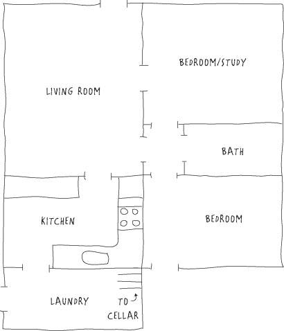
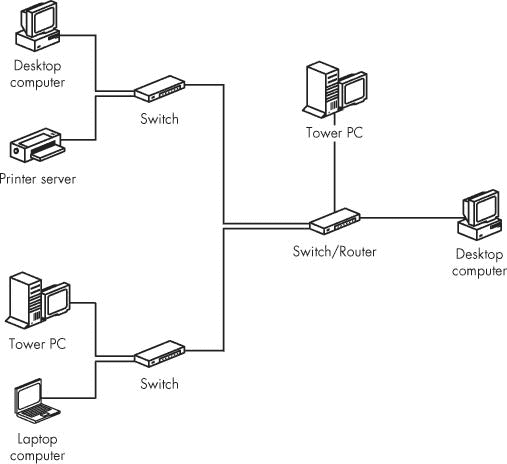

# 第五章。设计您的网络

在现场构建计算机网络是完全可能的，随着需要，从中心集线器或交换机拉出以太网电缆到单个计算机和其他设备。但在开始安装之前花些时间规划您的网络几乎总是更好的。在纸上修改设计比在物理空间中进行添加、移动和更改要容易得多。本章提供了准备网络计划的建议和说明。

在本章中，我假设您没有选择使用电力线或视频电缆作为您的主要网络分配介质。在某些情况下，这两种方法都可以是实用的，但传统的以太网系统，可能辅以补充的 Wi-Fi 基站，通常对于小型企业或家庭网络来说是一个更好的选择，因为设备广泛可用，通常价格低廉，安装和维护简单。

开始您的网络计划，从您想要安装网络的房子、公寓或工作空间的平面图开始。这个计划不需要完全按比例，但它应该足够大，以便在每个房间或隔间内添加备注，并且应该显示每个房间的相对位置。图 5-1 显示了一个小型单层房子的典型平面图。如果方便，可以使用复印机或扫描仪制作几份平面图的副本。

**图 5-1。使用平面图来识别网络连接点的位置**

# 识别当前和未来的节点

下一步是决定您希望网络连接的位置。使用不同的颜色来标记以下每个项目的位置：

**电源插座**

网络布线和插座应至少离交流电线 12 英寸远，因此识别每个房间的所有交流插座将很有帮助。此外，您还需要访问计算机、路由器、调制解调器和其他网络硬件的交流电源。

**您的家庭娱乐系统**

家庭影院设备、立体声音响、电视和游戏机都可以通过您的家庭网络交换数据，因此网络插座应该位于附近。

**电话墙插座和连接盒**

如果您计划使用 DSL 或拨号上网连接到互联网，您的网络将使用电话插座进行连接。

**有线电视或其他视频插座**

如果您从有线电视提供商那里获取互联网服务，您将把调制解调器连接到有线电视插座。即使您不使用有线电视互联网服务，您可能也想使用视频和数据插座的组合墙板。

**靠墙放置的家具**

你不会想要在需要你移动书架或沙发才能到达的地方规划一个网络插座。另一方面，如果墙边有一张桌子，你很可能可以轻松地爬到桌子下面，在不会引起注意的地方插上电缆。

**壁橱、楼梯和其他隐藏处**

如果你的家或工作场所包括建筑物的多个楼层上的空间，务必注意壁橱、楼梯和其他相对容易在天花板或地板中穿行隐藏电缆的位置。与其他家庭或工作场所的布线一样，你的目标将是将所有网络电缆隐藏在墙壁、地板和其他看不见的位置。

如果你在一个现有的家庭或办公室中添加网络，所有这些元素可能已经就位。在你开始添加新的网络布线和连接点之前，你必须了解它们将如何与每个房间的其他事物相关联。如果你计划在重大翻修或新建设中作为一部分来规划网络，计划与将提供电气布线、电话、有线电视或卫星电视以及家庭影院或家庭娱乐系统布线的承包商或外部安装人员协调你的工作。

将所有这些信息集中在一个地方，很容易决定你想要在哪里安装网络连接点。使用另一种颜色的铅笔在每台电脑和计划连接到网络的每个其他设备最近的墙上标记一个无障碍的网络插座位置。

每个插座至少应离最近的电源插座一英尺远，这不仅因为交流电线可能产生干扰，影响数据信号，而且通常根据当地电气规范，需要防止交流电线和数据电缆之间的短路。

如果你家的电话或有线电视插座安装在面板上（而不是安装在踢脚板上的小盒子里），考虑用一个新的面板替换现有的面板，这个面板将两种或三种不同类型的插座组合在单个面板上，如图图 5-2 所示。

当你设计你的网络时，你也应该为未来做规划。你可能今天并不需要它们，但几年后，你很可能想要将家用电器、床头收音机和其它设备连接到你的局域网和互联网上。如果你计划最终将一个或多个网络摄像头或智能家居设备（如照明或气候控制）添加到网络中，标记它们的临时位置是个好主意。

**图 5-2. 这个面板结合了电视和数据网络插座。**

记住，在楼层平面图上标记插座的位置并不需要花费任何费用。你不必立即安装每个插座，但当你规划电缆布线时知道它们可能的位置是有帮助的。你总是在实际拉线穿墙之前可以改变确切的地点。

### 备注

计划大量的额外网络连接点现在可能看起来是不必要的，但这一点几乎可以肯定会发生。如果你计划比你现在认为需要的更多的网络连接点，你可能会在未来十年内都有足够的连接点。考虑一下：如果你住在一座有原始电气布线的老房子里，你可能知道在 1925 年，每个房间有一个或两个交流插座被认为已经足够了；更多的插座会被认为是奢侈的。今天，你应该在每个墙上都有几个电源插座。在未来，家庭数据网络将像电力和电话一样普遍。

在你的家中，考虑在每个主要房间至少放置一个网络插座——不要担心走廊和其他奇怪的空间。在厨房，将一个插座放在靠近操作台的地方，并计划在冰箱和炉灶旁边的墙上再放置一个插座。你可能还希望在洗衣房也放置一个插座，离洗衣机和烘干机不远——你现在可能不想将你的电器连接到网络上，但通过家庭网络进行远程控制和监控在未来是一个真正的可能性。在每个卧室，计划在靠近房间使用者使用电脑或视频游戏控制台的地方放置一个插座，以及（如果它离第一个插座不远）另一个插座用于床头互联网收音机或笔记本电脑。

在办公室，计划在每个办公桌旁边以及你预期放置电脑或其他网络设备（如打印机）的每个其他位置至少有一个网络连接点。

如果你预计将使用以太网和 Wi-Fi 连接到你的网络，请在你的楼层平面图上标记一个或多个 Wi-Fi 接入点的位置。

你所有的网络布线都应该使用 CAT5e 或 CAT6 数据电缆；更便宜的 CAT5（没有“e”）电缆无法处理你未来可能需要的更高速度的网络数据。

# 控制中心

网络控制中心是交换机、路由器、调制解调器和其他网络核心设备的所在地。连接每个插座到网络的布线都在控制中心汇聚。网络控制中心的常见位置（有时被称为*布线间*）包括壁橱、工具室、车库或地下室。对于一个非常小的网络（不超过五个节点），你也可以考虑将调制解调器和路由器放在你电脑旁边的一张桌子上，但这可能会限制你在未来轻松扩展网络的机会。

如果你计划在房屋内分布音频、视频、电话或家庭自动化布线，同时还有计算机网络数据，你的控制中心应该有足够的空间来容纳所有这些服务所需的所有必要设备。同时拉两根或多根电缆比分别安装每种类型要容易。

网络控制中心可以有多种形式：它可能是一块简单的胶合板，固定在墙上，或者可能是一个预先布线的模块化机柜，安装在墙上或墙体之间。或者如果你有足够的地板空间，它可能在一个或多个独立设备架上。

控制中心的位置应具备以下特点：

+   它应该容易到达。不要选择一个需要你爬过自行车和储物箱或推开衣架才能到达的位置。

+   它应该有足够的光线，让你在任何时间都能看到你在做什么。

+   它应该在一个保持干燥且温度稳定的地方。

+   它应该靠近至少一个电源插座。

+   它应该相对居中，以减少连接电缆的长度。

+   它应该位于或略低于眼睛水平，这样你可以舒适地工作。

+   它应该有足够的空间，以便未来进行额外的布线和设备安装。

+   它不应靠近保险丝盒、断路器盒或其他电气面板。交流电源线必须与网络、电话和视频线保持分离，以防止干扰并符合国家电气规范。

在你为控制中心选择位置后，在你的平面图上标注其位置。

## 直通布线

当你确定了网络连接点的位置并找到了控制中心的位置后，你可以规划网络电缆的路径。网络布线的首选方法称为**直通布线**，因为每根电缆都“返回”到中心集线器或交换机。另一种方法，对于电话和视频布线比数据网络更实用，是**点对点布线**，它使用长电缆连接到每个插座，并通过分路器连接，如图 5-3 所示。

**图 5-3. 直通布线（左侧）最适合数据网络；电话和视频可以使用直通布线或点对点网络（右侧）。**

如果您还没有这样做，现在是时候环顾一下您计划安装网络插座的房间，以及每个房间上方和下方的空间。如果您可以进入未完工的地下室或阁楼，您可以通过桁架和梁运行电缆；但如果您必须通过完工的墙壁和天花板运行电缆，您可能不得不将电缆隐藏在墙壁和基板后面，并在电缆就位后修补一些孔洞。无论如何，寻找从每个网络插座到控制中心的最佳电缆路径。用铅笔在您的平面图上标记路径。

将网络插座连接到墙壁有两种方法。为了达到完美的外观，使用与电源插座类似的墙板，如图图 5-2 所示。如果插座将被隐藏在家具后面或在其他不会看到的地方，您可以使用安装在基板上的小型终端块，如图图 5-4 所示。

**图 5-4. 数据终端块可以直接安装到基板上。**

## **枝干与分支：使用二级开关**

对于小型网络，有一种替代纯直通布线设计的方法，可以使网络扩展成为可能，而无需将新电缆一直运行到控制中心。这种方法类似于树的主干和分支或河流的支流，它使用数据交换机通过单个插座将额外的电脑和其他设备连接到网络，如图图 5-5 所示。当您想在同一个房间中使用两个或更多设备（例如电脑和游戏机或打印机服务器，或两个或更多电脑）时，通过交换机连接特别方便。

**图 5-5. 一个以太网交换机可以通过单根电缆将两个或更多设备连接到网络集线器。**

当您想在难以从控制中心到达的相邻房间放置网络连接点时，二级开关也可能很有用。例如，如果您有两个位于二楼且共用一墙的卧室，您可以将一根电缆连接到开关，并将开关连接到两个房间的电脑上。

许多无线接入点都集成了交换机，允许您通过有线以太网端口将一台或多台设备连接到网络。如果您将接入点放置在您也使用台式电脑或其他网络设备的房间内，组合单元通常是一个很好的选择：将接入点放在电脑旁边，并使用以太网线将其连接到交换机。

# 关于 Wi-Fi 的思考？

通过 Wi-Fi 网络连接电脑和其他网络设备通常是有线以太网系统的简单替代方案。一个接入点通常足以向许多房间的电脑发送和接收数据。

无线网络可以提供互联网接入和局域网服务，但与有线网络相比，它有几个缺点：

+   除非网络中的所有节点都兼容最新的 802.11n 标准，否则 Wi-Fi 网络通常比有线以太网慢。

+   与有线网络相比，Wi-Fi 网络的安全性较低。除非您使用 WPA 等安全加密方法保护您的网络，否则未经您允许，专门的入侵者可以通过您的网络连接到互联网，并可以从同一网络上的其他电脑中窃取信息。

+   您的 Wi-Fi 网络与邻居的网络和其他无线设备之间的干扰可能会降低您的网络数据传输速度。

尽管存在这些限制，但如果您不想在墙上打洞或花时间在阁楼或地下室里爬行，Wi-Fi 网络通常是一个可接受的选择。即使您在建筑的一部分安装了有线网络，Wi-Fi 也可能是到达一两个孤立位置（如顶层卧室或独立的车库）的最佳方式。

对于许多家庭和小型企业来说，最佳做法是在同一网络中安装有线和无线网络。这将允许您和您的用户通过有线以太网连接您的台式电脑、打印机、音乐服务器和其他永远不会物理移动的设备，并使用 Wi-Fi 连接笔记本电脑、互联网协议语音（VoIP）电话、智能手机和其他便携式设备。

如果您决定在网络中包含一个或多个 Wi-Fi 接入点，请在您的平面图上标记它们的临时位置。在大多数情况下，单个接入点可以与大约 300 英尺（100 米）范围内的电脑和其他设备交换数据，因此确切的位置并不重要。最佳位置通常是网络控制中心，或者在一个固定位置的电脑旁边的地板或桌子上。有关安装 Wi-Fi 接入点和将 Wi-Fi 设备连接到您的家庭或办公网络的详细信息，请参阅第八章。

当您的网络布局基本完成时，您就准备好安装控制中心和将以太网线拉到每个房间了。下一章将告诉您如何完成这项工作。
