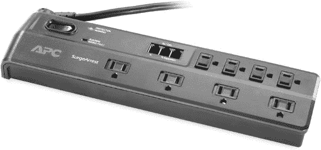
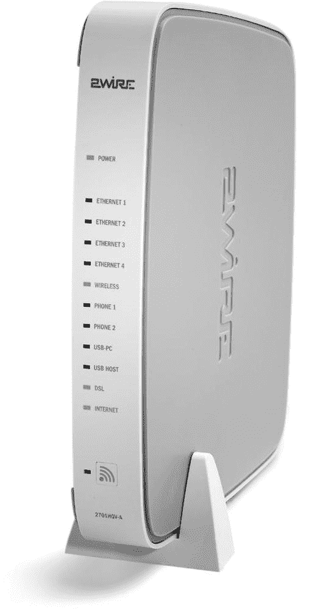

# 第六章. 安装网络控制中心和以太网电缆

无论您是通过电缆还是无线链接将计算机和其他设备连接到网络，您的网络都必须有一种控制中心，包括一个或多个用于有线以太网连接的集线器或交换机，一个用于 Wi-Fi 的接入点，或者两者都有。如果您计划将您的局域网连接到互联网，控制中心还必须包括一个网关路由器和一台调制解调器。本章将解释如何组装控制中心，并在控制中心与计算机、游戏机、打印机和其他组成您网络的设备之间布线。

# 连接器、墙板和表面盒

作为您楼层计划的一部分，您在每个房间选择了一个网络出口的位置。在您决定使用表面盒的地方，您可以使用双面胶或木螺钉将出口块固定在踢脚板上。对于墙板，您必须在墙上开一个洞，并使用类似于图 6-1 中所示的那种安装支架将板固定到墙上。如果同一墙上有一个电源插座，请测量板底部到地板的距离，并将数据板安装在完全相同的高度。请记住，将数据出口至少保持一英尺远离最近的电源插座。当您拧紧安装支架前部的螺丝时，墙内的翅膀会转动并固定支架。

**图 6-1. 使用安装支架将数据出口墙板固定到墙上。**

如果您想安装一个用于数据、电话线和视频的单合一墙式插座板，请使用带有卡扣连接器的模块化板。对于单一用途的插座，您可以使用卡扣连接器或永久连接数据出口的板。

# 以太网电缆

所有以太网电缆都有四对颜色编码的线绞在一起：绿色与绿色和白色，棕色与棕色和白色，等等。以太网电缆和连接器根据电缆能通过的数据量和电缆对干扰的敏感性被标识为第 5 类（CAT5）、增强型第 5 类（CAT5e）或第 6 类（CAT6）。除非你计划安装超高速千兆以太网网络，否则在家庭或小型办公网络中，CAT5e 通常是成本和性能之间的最佳折衷方案。

### 注意

不要为新安装使用 CAT5 电缆。它可能适合今天的网络，但无法可靠地支持下一代高速数据服务。

以太网电缆有两种形式：卷轴或箱子中的大批量电缆，以及已经连接好插头的预组装电缆。预组装的数据电缆通常被称为**补丁线**、**补丁电缆**或**跳线**。它们有多种颜色，长度从 1 英尺到 100 英尺不等。使用不同颜色的补丁线与具有许多连接点的交换机或其他设备；多种颜色将允许你快速找到正确的线。

大批量电缆是你在控制中心和房间内其他数据出口之间墙壁内运行的正确选择。另一方面，预制的电缆更适合较短的距离，例如在终端块或墙壁插座与计算机、控制设备和其他设备之间，因为它们通常使用更耐用的外皮和带有永久环的插头。你可以使用大批量电缆和松散的插头自己制作补丁线，但将插头连接到电缆上是一项繁琐的工作，通常比它值得的麻烦更多。一般来说，对于带有终端块永久安装的情况，使用大批量电缆，对于补丁线和墙壁插座与网络设备之间的连接，使用预制电缆。

补丁线在办公用品和电子产品商店中很常见，但它们通常比通过工业电子产品供应商和在线来源（如 Jameco [`www.jameco.com/`](http://www.jameco.com/)）、Cyberguys [`www.cyberguys.com/`](http://www.cyberguys.com/) 和 [Newegg.com](http://newegg.com) [`www.newegg.com/`](http://www.newegg.com/) 销售的相同电缆贵四到五倍。3 英尺长的电缆不应该花费 8 美元或 10 美元。没有必要为“高级”补丁线支付更多费用；任何符合 CAT5e 规范的电缆都能完成工作。（这条建议可能会为你节省比这本书价格还多的钱。）

### 注意

在有高架地板或吊顶的建筑中，通常方便将数据线通过天花板上的通风空间或地板下的空间运行。然而，消防法规通常要求使用特殊的**通风电缆**，这种电缆不易燃烧且不会产生有毒烟雾。通风电缆比普通的大批量以太网电缆更贵，而且使用起来更困难，因为其外皮更重且不太灵活，但其在数据处理性能上没有差异。当你购买电缆时，你可能会在普通 CAT5e 电缆旁边找到通风电缆的箱子或卷轴。有时唯一的区别是标签上的一条线。除非你有特殊需要通风电缆，否则不要浪费钱购买更贵的产品。

# 将电缆推入墙壁

这本书是关于计算机网络而不是家庭装修或新房建设，所以这里不是描述电工和电话安装人员过去一百多年来用来将电线推入墙壁、踢脚线和壁橱内部的所有特殊工具和技术的地方。如果你计划自己安装内部电线，请在开始之前咨询一些 DIY 网站或在当地家居中心寻找关于家庭电线的书籍。

### 注意

我可以特别推荐《家庭网络布线指南》（Sunset Books，2004 年出版）作为安装网络布线的指南，因为我就是作者。然而，还有几本关于家庭布线的插图书籍也包含了你需要的信息。

为了将电线从墙面或表面盒通过墙壁传输到控制中心，你将不得不在你房屋或工作场所的基座、墙体和其他结构元素上钻一些孔。如果你在一楼的工作室工作，你可能能够从下面到达墙壁之间的空间，从地下室或地下室未完工的天花板向上钻孔。在顶层，你可以从阁楼向下工作。但如果无法从上方或下方到达墙壁内部，最佳选择将是切割墙壁上的孔并钻过垂直的墙体，或者将电缆和孔隐藏在拖把板和其他装饰条后面。电线安装好后，你必须修补孔洞并重新粉刷墙壁。

使用电工蛇（一根长而细的金属条）来拉或推你手够不到的地方的电缆。当蛇的末端到达目标位置时，用电工胶带将粗电缆的末端固定在蛇上，然后从另一端拉回蛇和电缆。使用刚性蛇（一根长而细的金属条）来布线比在墙内处理松散的电缆要容易得多。

记得在通过墙壁拉每根电缆或电缆束时，都要添加一段粗绳作为拉线。将来，当你想要在相同路径上添加另一根电缆时，你可以将电缆连接到拉线上，然后拉过而不需要在你墙上创造新的孔洞。

你将需要连接很多电缆到控制中心以及通过控制中心，因此你希望将它们隐藏起来以保持整洁和干净的外观。在壁橱后面或其他隐蔽位置放置一根 2 英寸的 PVC 管道可以为电缆在上层楼或阁楼与地下室或地下室之间提供一条不易察觉的路径。如果管道穿过控制中心所在的空间，请在离地面约四到五英尺高的地方组装一个由两根较短的管道和一个 T 型接头组成的通道。管道、接头和胶水都可以在当地五金店或家居中心购买。

### 注意

按照包装上的说明将 PVC 管道粘接到配件上，但不必担心创建不透水的密封。您的网络数据不会通过一个不良的管道接头泄漏。

# 控制中心

网络控制中心始终执行以下任务：

+   它通过调制解调器、电话线、有线电视服务或其它介质将本地网络连接到互联网。

+   它使用路由器在局域网和互联网之间转换地址。

+   它使用集线器或交换机在网络上交换数据。

+   它作为数据电缆的中心分配点。

此外，它可能还包括以下服务：

+   一个 Wi-Fi 基站

+   音频、视频和电话连接的分发中心

如果您在阅读了第五章后创建了楼层平面图，您已经为控制中心选择了一个位置。如果没有，找一个容易到达但远离日常交通的地方：步入式衣橱的内墙、工具室或地下室墙都是常见的选择。建在房子里的车库可能也是一个好地方。控制中心应靠近至少一个双 AC 电源插座。

网络控制中心可以采取多种形式：

**一个模块化的“结构化布线中心”**

几家制造商提供结构化布线机柜，以及组装网络控制中心所需的多数开关、路由器和其它控制设备。面板安装在墙上（或在未完工的地下室或车库的梁之间），并且可以包括一个盖子以保持内部清洁并使其不显眼。这些面板和组件比来自不同来源的单独部件要贵得多，但如果控制中心位于显眼的位置，这种完成的外观可能很重要。如果您使用这些系统之一，请遵循每个组件提供的安装说明。

**一块固定在墙上的胶合板**

一张半张（4 英尺乘 4 英尺）的胶合板，牢固地螺栓固定在墙梁上，足以支撑您的网络安装块、控制设备和其他设备。它可能没有结构化布线中心那么吸引人，但您不会经常看到它。如果您做得整洁、像工匠一样，它将和装满匹配组件的华丽金属机柜一样有效。

**一个独立的安装框架或机柜**

如果您的工具室有足够的地面空间，您可以使用安装在 19 英寸宽*继电器架*上的设备和架子来组装控制中心。这种方法通常限于包含大量位置和设备的较大网络。

**几个壁挂式插座和少量控制设备（调制解调器、路由器和/或交换器）在桌子或架子上**

如果您的网络仅限于两三个房间的电脑，那么选择其中一个房间作为您的控制中心，并将调制解调器、路由器和交换机放置在电脑附近可能最简单（但请记住为未来的额外网络节点留出空间）。一个单面接线板可以容纳多达六个数据端口，因此可以在不安装看起来像工业设备的一排固定块的情况下，将电缆延伸到几个其他房间。

数据端口块是墙壁内部内部数据线与两端带有以太网插头的电缆插座之间的过渡。在每个房间使用插座终止每根电缆将使您更容易对网络布线进行添加和更改。

端口块的一侧有一组槽口插针，每个插针都固定着数据电缆中的一根电线，另一侧有一个以太网插头的插座。数据端口可以位于连接到踢脚板（或您的控制中心胶合板底座）的小盒子侧面，或者位于嵌入式墙板上。图 6-2 显示了带有连接到两侧的电缆的端口块，盖子已被移除以使单个电线连接可见。

一个在胶合板上完成的控制中心看起来可能像图 6-3。

**图 6-2. 一个端口块提供了从松散的电线到以太网连接器的过渡。**

**图 6-3. 一个自制的控制面板应包括 AC 电源、DSL 或视频以及几个数据端口，以及您的调制解调器、路由器和交换机。**

## AC 电源

您的调制解调器、路由器和交换机都需要某种形式的电力。如果您使用胶合板作为您的控制中心，请将一个带有足够端口以容纳所有设备以及至少一个备用端口的 AC 电源插座连接到面板靠近最近的 AC 插座的一侧，靠近底部。控制面板应足够靠近插座，以便连接到电源插座的电缆可以到达它而无需延长线。为了保护您的设备免受雷击或其他电源浪涌造成的损坏，请使用带有内置浪涌保护器的电源插座。

许多网络设备使用插拔式变压器或电源转换器（有时称为“墙壁小玩意”），其体积大于简单的交流电源插头，因此您可能需要一个提供额外空间之间的电源插座，就像图 6-4 中所示的那样。这个特定的型号还包括为 DSL 电话线路提供浪涌保护的装置。

**图 6-4。这个电源插座是为大尺寸插拔式电源供应设计的。**

*照片由 APC 提供*

作为电源插座的替代品，可以考虑使用不间断电源（UPS），当您的交流电源失效时，它将从电池提供备用电源。UPS 不能替代发电机，但它将在短暂的电源中断期间保持您的网络运行。网络控制设备使用的电量不如计算机和显示器多，因此一个小型 UPS 应该足以保持您的网络运行长达一小时。当然，在停电期间，您只能使用笔记本电脑和其他电池供电的便携式设备来使用网络。

UPS 中的电池相对较重，因此您可能希望将 UPS 放在地板上而不是控制面板的架子上。如果 UPS 没有足够的电池备份插座来为控制中心的所有设备供电，请将电源插座直接插入 UPS 的插座。

## 调制解调器、路由器和交换机

如果您已经拥有宽带互联网服务，请仔细查看连接您的计算机到电话线或电视电缆的调制解调器以及调制解调器提供的说明书。一些互联网服务提供商提供调制解调器（如图 6-5 中所示），这些调制解调器同时充当网关路由器、交换机和/或 Wi-Fi 接入点。如果您有一个组合单元，就没有必要用一或多个单独的盒子来重复这些功能。

**图 6-5。这个 DSL 调制解调器包括一个四端口交换机和 Wi-Fi 基站。**

*照片由 2Wire，Inc.提供*

您的楼层平面图应包含足够的信息，以告诉您网络中的节点数量。您将需要一个交换机或组合交换机/路由器上的一个端口来连接每个节点，以及额外的端口来连接控制设备。例如，如果您网络中总共有七个节点，您可能使用以下控制设备：

+   一种 DSL 或电缆调制解调器

+   一种结合了四端口交换机的网关路由器

+   一个四端口以太网交换机

图 6-6 展示了这些设备是如何相互连接的。

**图 6-6. 具有七个节点的网络可能使用这种配置在控制中心。**

你可以在许多办公用品和电子产品商店以及在线零售商那里找到交换机和路由器。似乎几乎总有一个品牌在打折，所以值得看看本周报纸上的广告以寻找热销优惠。

如果可能的话，你的路由器或交换机应该至少有一个备用端口，你可以用它来连接笔记本电脑。当你试图排除网络故障时，从计算机发送命令并在控制设备的状态灯上查看这些命令的响应通常很方便。

当你在未来向网络中添加更多节点时，你可以通过连接一个额外的交换机到控制中心来扩展网络。如果现有的交换机上没有多余的端口，从活动交换机上断开一根电缆，将新交换机连接到那个端口，并将原始电缆插入新交换机。

一些交换机和路由器在底部的机箱上设有钥匙孔槽，允许你直接将它们安装在墙上，就像图 6-7 中展示的那样。当你将设备安装在墙面板上时，将其放置在视线以下，面板在箱子的顶部，这样状态灯就很容易看到了。

如果你的调制解调器、交换机或路由器上没有安装孔，而你正在使用壁挂式控制中心，请将一个 6 英寸的架子固定在胶合板面板上，并将设备放置在那个架子上。如果你使用的是模块化结构化布线中心，通常在机柜底部有空间可以用作架子。对于机架式控制中心，使用机架式架子来放置任何不能直接安装在机架上的设备。

**图 6-7. 这款 D-Link 交换机在其机箱底部有钥匙孔槽。**

使用来自五金店的粗线夹子，将电源线整齐地沿着控制面板的一侧路由，在每一个控制设备和电源插座之间。不要将夹子完全压入胶合板；留出一些空间以确保你没有压扁任何电线。确保在每台设备的后面留出足够的电线，以便你可以轻松地拔掉电源连接器。

## 添加 DSL 或电缆连接

宽带互联网服务通过电话线或电视线进入您的建筑。因此，您需要在您的控制中心安装电话或有线电视插座。这就是您已经用来连接电话或电视机的同一类型插座。如果您从有线电视公司获得互联网服务，有时可以说服安装人员将电缆拉到您的控制中心。但如果您从电话公司获得 DSL 或其他类型的互联网服务，您可能需要自己安装布线。

### 连接电话线

如果您从电话公司获得 DSL 或其他类型的互联网服务，您将需要一个带有四个引脚的插座，称为*RJ-11 插孔*。这就是您用来插入电话机的那种插座。

将接线块安装到您的面板上，大约在电源条上方一英尺处。您可以使用带有两对线的传统电话电缆，或者与您用于计算机网络相同的四对数据电缆，将控制面板上的接线块连接回连接您的电话到服务入口的分配块。如果您使用电话电缆，请确保将线的颜色与两端接线块上的字母匹配（R = 红色，Y = 黄色，G = 绿色，B = 黑色）。如果您使用数据电缆，请使用表 6-1 中的颜色代码。

**表 6-1. 电话线路数据电缆颜色代码**

| 端子颜色 | 数据电缆颜色 |
| --- | --- |
| 绿色 | 蓝色 |
| 红色 | 蓝白 |
| 黑色 | 橙色 |
| 黄色 | 橙白 |

使用剥线工具从电话电缆末端去除大约两英寸的塑料护套。如果接线块有螺丝端子，则从每根线末端剥去大约半英寸的绝缘层，并将裸露的末端缠绕在对应于线颜色的字母旁边的螺丝上。

如果端子使用两个带有槽的垂直引脚来固定每根线，则不要剥线，而应使用打孔工具将每根线压入引脚之间。如果您的端子没有附带小打孔工具，请在家居中心或五金店寻找；您将需要相同的工具来连接数据电缆到它们的插座。如果从连接器侧面伸出多余的线，请将其剪掉。当所有四根线都连接好时，将尘盖放在插头上。

在将电话线连接到接线块后，使用带有模块化 RJ-11 电缆的电话进行测试，以检查拨号音。如果没有拨号音，请检查两端连接；如果有拨号音，请拔掉电话机，并使用调制解调器提供的电缆之一将调制解调器连接到电话线。

### 连接电视线

大多数建筑物内的视频接线都使用称为*RG6/U*的同轴电缆，其中有一根中央铜线被绝缘和金属屏蔽包围。连接到这种电缆的连接器称为*F 型插头*。

视频电缆通常需要特殊工具将 F 型插头连接到电缆的两端。如果您不与数据网络一起安装自己的视频分配系统，并且必须从服务入口到网络控制中心安装自己的电缆，那么购买一个预先组装的电缆（寻找接近所需长度的电缆——不要使用 100 英尺的电缆来连接 20 英尺的路径）可能更容易且更便宜。使用电工胶带或电缆扎带将多余的电缆长度在末端整齐地卷成环。

如果您必须自行安装视频电缆，找到电缆进入您家或办公室的服务入口。将电缆沿着天花板或地板下的桁架拉到控制中心，然后将电缆连接到插座板内的 F 型插头。如果服务入口处有一个带有备用插头的分线器，将电缆末端的插头拧到未使用的插座上。如果您找不到分线器，您可能需要安装一个新的分线器，或者从控制面板分发视频。

如果您不通过控制中心连接其他插座，将服务入口的电缆直接插入您的电缆调制解调器。如果您想使用控制面板将有线电视信号分发到房屋内的各个插座，将服务入口的电缆连接到分线器的输入端，并将输出端连接到您的电缆调制解调器和每个房间的电缆。

## 网络电缆的终端处理

如果您使用胶合板面板作为您的控制中心，请在面板顶部或与电源条相对的一侧安装一排或多排插座块。保持插座均匀分布，并留出足够的空间以备将来添加更多插座。

在终端块上使用八针*RJ-45*插座（务必遵循颜色代码）终止每根网络电缆的线，并在电缆上贴上标签以标识电缆另一端的地点。使用记号笔或终端块提供的标签在块的盖子上标识每根电缆。您的目标是能够一眼看出哪个终端块连接到哪个目的地。

连接以太网电缆到插头和插座有两种不同的标准颜色代码。使用其中一种标准颜色代码（T568A 或 T568B）将电缆中的每根线连接到终端块内的插座。表 6-2 显示了正确的连接方式。使用哪一种标准无关紧要，只要每根电缆的两端都遵循相同的标准。最佳做法是选择一个标准，并将网络中每个插座都按照该标准接线。

**表 6-2. 以太网线缆和插座的接线**

| 颜色 | T568A 插针号 | T568B 插针号 |
| --- | --- | --- |
| 蓝色 | 4 | 4 |
| 蓝色-白色 | 5 | 5 |
| 橙色 | 6 | 2 |
| 橙色-白色 | 3 | 1 |
| 绿色 | 2 | 6 |
| 绿色-白色 | 1 | 3 |
| 棕色 | 8 | 8 |
| 棕色-白色 | 7 | 7 |

按照以下步骤将 CAT5、CAT5e 或 CAT6 线缆连接到以太网插座：

1.  留出大约一英尺的余量，并切断多余的线缆。

1.  剥去线缆外护套大约两英寸的长度。确保你用剥线工具时没有划伤任何内部线。

1.  将超出护套的四对线分开，但不要解开单根线。

1.  按照连接器附带说明将每根线引导到正确的槽位。确保护套延伸到连接器的后面。

1.  使用打孔工具将连接器后面最近的两根线插入各自的槽位中。

1.  将其他三对线的线插入正确的槽位。不要解开对线超过必要的程度。

1.  再次检查，确认每根线都根据你使用的颜色代码正确地插入了相应的槽位。

1.  如果你的打孔工具不会自动切断多余的线缆，请使用线剪修剪每根线。

1.  如果 RJ-45 插座附带防尘盖，将其扣在电线上方。

1.  从块或机箱的内部将插座插入终端块或墙壁面板。

## 添加电话

当你试图解决网络连接问题时，在控制面板旁边放一部电话通常很有帮助，这样你可以在查看调制解调器、路由器或交换机的状态灯时与技术支持人员交谈。你不会经常需要这部电话，但一旦出现问题，你会很高兴拥有它。如果你有一部手机或无绳电话，请使用它，或者在你或控制面板附近安装一部经济实惠的固定电话。如果可能的话，寻找不需要外部电源的简单桌面电话或墙壁电话。

# 小型网络的桌面控制中心

对于仅连接几个房间的计算机的小型网络，不需要单独的控制中心。通常，将调制解调器和路由器放在一个房间里，并直接将数据线运行到其他每个房间会更简单。你可以在你的电脑桌上或附近的书架上放置调制解调器和路由器。

Leveton 和其他制造商生产的墙壁面板可以在与双 AC 插座相同的空间内容纳多达六个或八个数据端口。这对小型网络应该足够了；如果你需要更多，请添加第二个墙壁面板或用双宽面板替换第一个面板。

当您需要扩展网络时，您有两个选择：您可以从原始控制室到新位置重新布线，或者您可以在离新位置最近的房间添加一个下游交换机，并从那里运行数据线。当新位置与已有数据插座的房间共用墙壁时，第二种方法尤其方便。

### 注意

在没有控制中心的网络中标记墙壁插座尤为重要。多年以后，当您搬走后其他人尝试使用您的网络时，他们需要知道每根连接到数据插座的电缆去向。

您还可以使用一个小型以太网交换机在同一房间内使用多个网络设备。例如，如果青少年卧室里有数据插座，您可以将一个四端口交换机连接到墙壁插座，并通过该交换机将电脑、游戏控制器和互联网收音机连接到家庭网络。
