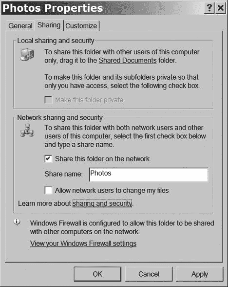
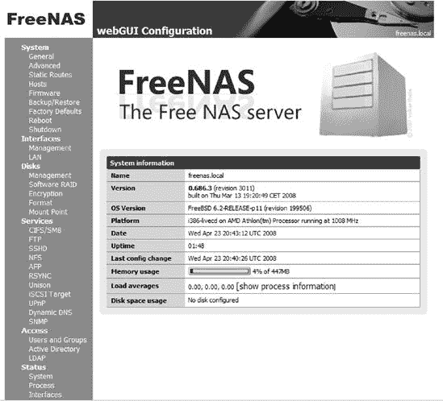
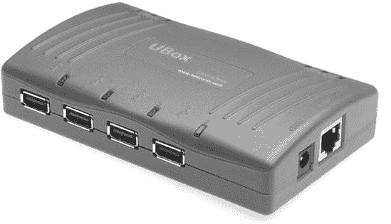
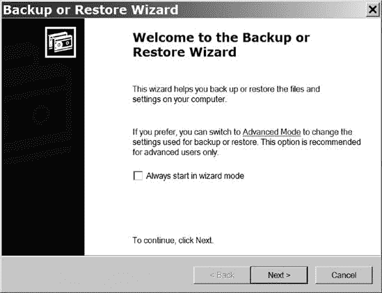
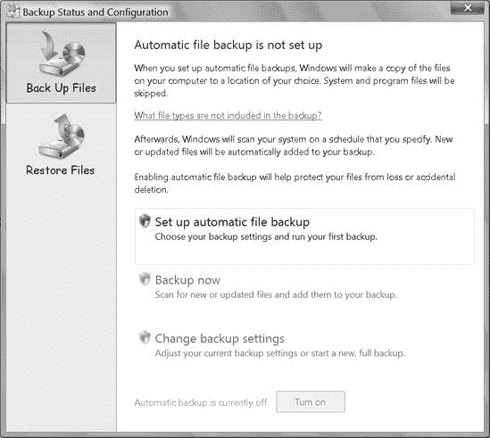

# 第九章. 文件服务器

文件服务器是网络上的电脑，它们存储文本、数据和其他文件，这些文件可以被同一网络上的所有其他电脑使用。文件服务器还可以用作工作站，即专门用于文件存储的电脑，或单一用途的网络附加存储（NAS）设备。本章描述了将一个或多个文件服务器连接到您的网络的优点，并解释了如何设置和使用它们。

文件服务器在商业网络中比在家用网络中更为常见，但它们也可以作为家庭网络的一部分很有用。无论是在工作还是在家，服务器都可以提供以下服务：

+   它可以通过自动创建和存储这些文件的备份副本来保护网络中连接的其他电脑上的文件。

+   它可以将相关文件存储在中央位置。

+   它可以通过确保每个人都使用相同的版本来帮助控制文档和其他文件的修订和更新。

+   它可以将多人使用的“公共”文件与每个用户的个人文件分开存储。

+   它可以允许同事或家庭成员创建和存储新文件或使用现有文件，而无需打开其他人的电脑。

+   它可以为主机内的网站和其他服务提供托管，这是一个类似于互联网的网站，但只能在本地网络中查看。

+   它可以在网络中管理电子邮件的分发。

+   它可以通过互联网提供对文件的远程访问。

家庭网络中的服务器也可以是照片、音乐和视频文件的中央存储位置，并允许用户通过家中的任何一台电脑，或通过电视、立体声音响或家庭娱乐系统来查看或播放它们。第十五章解释了如何将网络作为家庭娱乐系统的一部分来使用。

# 选择用作文件服务器的电脑

您几乎可以使用任何电脑作为文件服务器。如果您有一台闲置的电脑或一台不再适合日常使用的旧电脑，这可能是一个不错的选择，尤其是如果您只想共享文件并增加网络存储容量。如果您添加一些额外的内存和一个或多个新的硬盘驱动器，您可能会从旧电脑中获得更好的性能——Linux 服务器软件只需要大约 10GB 的硬盘空间，但旧硬盘可能由于年龄和磨损而更有可能损坏。当然，您还需要为服务器上存储的所有文件预留磁盘空间。

如果您想将服务器用于存储和文件共享之外的功能，您可以购买或构建一个带有多个存储驱动器和特殊服务器软件的新服务器，该软件包括额外的功能和功能，如网站托管和自动备份。包括 IBM、戴尔、惠普和苹果在内的所有主要办公电脑制造商都销售预装软件的服务器电脑。

# Windows、Mac、Linux，还是……？

每台计算机都需要一个操作系统，服务器也不例外。如果你正在复活一台旧计算机用作文件服务器，你可能能够回收在该计算机上运行的原始操作系统，但将任何早于 Windows 2000 或 Mac OS X 的设备连接到你的网络可能会带来更多麻烦，不值得这样做。

如果你有一些 Unix 或 Linux 的经验，或者你愿意学习，那么这些操作系统中的一个可能是一个更好的选择，因为它们具有最新的功能和功能，并且它们对处理能力或内存的需求不会像 Windows 的新版本那样高（一本好的入门书籍将帮助你开始）。

如果成本是一个问题（成本难道不是总是一个问题吗？），许多 Linux 和 Unix 发行版都可以在线免费（如果耗时）下载，或者从 LinuxCD ([`www.linuxcd.org/`](http://www.linuxcd.org/)) 和 The Linux Store ([`www.thelinuxstore.ca/`](http://www.thelinuxstore.ca/)) 等分销商那里以低成本的光盘和 DVD 形式获得。包括 CentOS 和 FreeBSD 在内的几个版本，除了核心操作系统和桌面程序外，还包括服务器应用程序。如果你想要一个简单的文件服务器，FreeNAS（可在 [`www.freenas.org/`](http://www.freenas.org/) 获取）也是一个值得考虑的选择。另一方面，如果你之前没有使用过 Linux 或 Unix，你可能不想在尝试设置新网络的同时处理安装和学习新操作系统所带来的干扰。

微软的 Windows Server 家族以及苹果和 Novell 的类似产品包括简单文件服务器的所有功能，以及许多额外的商业功能，如网站和电子邮件托管、日历协调、远程访问、自动备份和数据管理，所有这些都具有或多或少一致的外观。这些服务器软件包相对较贵，但它们的易于安装和可用的支持可能值得额外的成本，尤其是在大型企业中，额外的支持人员是一个问题。这些商业服务器产品的开发者认为，他们的产品的*总拥有成本（TCO）*，包括原始购买价格和持续维护和支持的成本，与“免费”的 Linux 和 Unix 服务器的 TCO 大致相同。微软声称，管理和维护人员以及停机时间占服务器 TCO 的约 75%，但许多开源软件用户的经验却截然不同。在一个非常小的企业中，除非你必须支付外部支持的费用，否则免费或价格低廉的服务器软件可能会更有利可图。

如果你已经承诺使用其他微软产品，包括 Access、Microsoft SQL 或 Windows Media，Windows Server 可能是最佳选择。另一方面，许多 Linux 和 Unix 版本包括可比较的程序（如 Apache 网络服务器），其性能至少与微软产品相当，甚至更好。如果你是 Mac 家庭或企业用户，Apple Server 是一个合理的选择。

除非你的家庭像企业一样运营，否则你的家庭网络可能需要与商业使用的不同功能集：中央存储、备份，也许还有网页和电子邮件托管。但你可能不会使用其他常见的商业服务器功能，如数据库服务和项目管理。微软的 Windows Home Server 优化用于家庭而非商业用途，因此这个产品可能更适合你的家庭网络。Windows Home Server 已安装在惠普和其他制造商的服务器计算机上，微软还提供了一种“OEM 版本”，你可以将其安装到现有的计算机上（如果该计算机超过了最低要求，这些要求比 Linux 服务器所需的要多得多）。然而，该版本不包括任何形式的微软支持，因此当你遇到安装或使用困难时，你必须自己解决。OEM 版本可能难以通过当地零售商找到，但许多网络和邮件订购供应商都愿意出售副本。

对于包含使用多个操作系统的计算机的混合网络，Samba ([`www.samba.org/`](http://www.samba.org/)) 是一个极佳的选择。它是一个成熟的开源（因此免费）跨平台文件共享程序。

图 9-1 展示了 Windows Home Server 的控制台屏幕。Windows Home Server 的最低要求列在 *WHS 入门指南* 中，该指南可在 [`www.microsoft.com/windows/products/winfamily/windowshomeserver/support.mspx`](http://www.microsoft.com/windows/products/winfamily/windowshomeserver/support.mspx) 获取。

**图 9-1. Windows Home Server 控制台在单屏上提供许多控制选项。**

为了从你网络中的其他计算机使用存储在 Windows Home Server 上的共享文件，你必须将 WHS 提供的连接程序安装到每个客户端机器上。没有这个软件，客户端将找不到共享文件。连接程序仅适用于 Windows XP 和 Vista，因此对于 Macintosh 和 Linux/Unix 客户端来说，家用服务器不太有用。

# 使用服务器进行文件存储

设置文件服务器的最简单方法就是将一台计算机连接到网络，并将其指定为服务器。创建一个或多个用于共享文件的文件夹，并将权限或网络共享特性设置为与网络用户共享目录或文件夹中的文件。如果您在服务器上存储照片、音乐或视频文件，请为这些文件创建一个或多个单独的文件夹，并将权限设置为*只读*，允许网络用户打开文件但不能更改它们。图 9-2 显示了 Windows XP 中控制这些设置的共享选项卡。有关共享文件的信息，请参阅第十二章。

**图 9-2. 设置存储在您服务器上的文件的文件夹的共享权限。**

当您在文档或其他类型的数据文件上工作，以及从互联网下载文件时，请使用“另存为”命令将文件通过网络存储在服务器上的一个共享文件夹中。要读取、查看或收听存储在服务器上的文件，可以打开包含所需文件的文件夹并选择该文件，或者使用与该文件类型关联的程序（如文字处理程序、电子表格或媒体播放器）中的“打开”命令，并使用选择窗口或选择器查找文件。程序应将文件处理得与存储在您自己的计算机上的文件完全相同。

# 使用网络附加存储

一个*网络附加存储（NAS）*设备是一个专用计算机——没有键盘或显示屏——用作网络文件服务器。在许多本书的读者可能拥有的小型企业或家庭网络中，一个或多个 NAS 磁盘驱动器可以完全替代更昂贵且复杂的网络服务器。

从所有实际目的来看，NAS 驱动器只是一个通过以太网端口连接到网络的磁盘驱动器。几家磁盘驱动器和网络设备制造商提供专用的 NAS 设备，包括完整的硬盘驱动器组件和网络存储外壳，用于 IDE 或 SATA 硬盘。一些 NAS 设备同时具有以太网和 USB 端口，因此您可以使用它们通过直接连接到您的网络或连接到计算机的外部驱动器（无论是否有网络连接）来使用。 图 9-3 显示了一个独立磁盘驱动器作为 NAS 设备在网络中运行。

**图 9-3. 网络附加存储设备直接连接到网络。**

一个 NAS 服务器也可以是一台普通计算机，带或不带键盘和屏幕。如果您已经有一台备用计算机用作服务器，那么 FreeNAS 版本的 FreeBSD，如图 9-4 所示，可以提供您需要的所有文件服务器操作系统服务。图 9-4 中的 FreeNAS 是为远程配置和操作而设计的，并且相对容易设置和使用。

**图 9-4. FreeNAS 是一个为用作文件服务器而设计的简单 Unix 版本。**

## USB 设备服务器

要将一个或多个独立的 USB 硬盘驱动器添加到您的网络作为文件服务器，可以考虑使用 USB 设备服务器，例如图 9-5 中所示的 Lantronix UBox 4100。图 9-5 中的服务器通过以太网电缆直接连接到网络，并且连接到服务器的每个硬盘驱动器或其他 USB 设备在每个连接到网络的计算机上都会显示为本地设备。Silex Technology 也生产类似的设备，包括一个通过 Wi-Fi 接入点连接到网络的无线 USB 设备服务器。

**图 9-5. Lantronix UBox 将外部硬盘驱动器和其他 USB 设备直接连接到您的网络。**

*照片由 Lantronix 提供*

## 苹果的 AirPort Extreme

无论您的网络中是否使用 Macintosh 计算机，苹果的 AirPort Extreme 产品都可以作为全尺寸文件服务器的经济实惠的替代品。除了作为 DSL 或电缆网关路由器、以太网交换机和 Wi-Fi 基站的功能外，AirPort Extreme 还有一个 USB 端口，可以将外部硬盘直接连接到您的网络。要使用多个外部硬盘，请通过 USB 集线器将它们连接到 AirPort Extreme。图 9-6 显示了 AirPort Extreme 的后面板。

**图 9-6. AirPort Extreme 可以直接将 USB 硬盘连接到您的网络。**

*照片由苹果提供*

# 将文件备份到服务器

将文件备份到服务器的方式不止一种：你可以在客户端机器上运行备份程序，并指定服务器上的驱动器和文件夹作为备份存储位置，或者你可以从服务器发起备份，并选择一个或多个客户端上的文件（如前所述，*客户端*计算机是那些从服务器接收服务器的计算机）。

在创建备份之前，你必须决定你确切想要完成什么。可能存在几种不同的备份类型，每种类型都适用于特定的情况：

+   你的硬盘的*完整镜像*包括所有文件夹、文件和程序的副本。这种备份允许你在磁盘故障后恢复你的计算机到之前的状态。硬盘的完整镜像有时也被称为*克隆*。

+   *增量备份*仅包括自上次备份以来已安装或已更改的文件的副本。增量备份比完整备份更快，因为它们不包括已经是备份一部分的未更改文件。

+   *选择性备份*仅包括你计算机上重要的文件和程序。这种备份通常比完整备份更快，并且在备份驱动器上占用的空间更少，因为它不包括像临时文件、旧的日志文件和不再使用的下载等东西。

+   当你预计要将备份恢复到已经安装了操作系统和应用程序程序的另一台计算机时，*仅数据文件备份*可能很有用。你也可以从它们的 CD 或其他媒体中重新安装操作系统和程序。如果你确实选择了这个选项，记得在尝试使用该程序之前，检查每个程序的网站以获取最新的补丁和升级。

+   *限制性备份*仅包括一种或多种特定类型的文件，如音乐、照片或文档。这种备份通常是对包含驱动器上所有必需程序和文件的更完整备份的补充。

Windows、Mac OS X 以及大多数 Linux 和 Unix 版本提供的备份程序对于大多数人来说已经足够，但还有许多其他具有额外功能和选项（通常与自动计划备份相关）的备份程序。备份程序通常与网络附加存储（NAS）设备和外部 USB 硬盘一起提供。在使用任何备份程序时，您需要记住的重要事项是您必须将备份文件与原始文件分开存储：您可以在同一台计算机上的第二个硬盘上存储备份（但这不是一个好主意，因为它不能防止火灾或盗窃）；在一系列 CD、DVD 或数据磁带上；或者在一个通过网络或互联网连接到原始计算机的计算机或其他存储设备上。网络是将备份数据移动到另一台计算机进行存储的好方法，但您仍然需要在异地存储的某种可移动媒体上备份，以保护您的数据免受火灾或盗窃的侵害。

### 注意

本章中描述的备份方法在没有指定文件服务器的网络上同样有效；您可以使用同一网络上的任何其他计算机或网络存储设备作为备份文件的存储目标。

## Windows 备份程序

微软为 Windows 的大多数版本提供了备份程序，包括 XP 和 Vista。本例使用 Windows XP，但任何备份程序的一般原则都是相同的。

要使用 Windows 备份程序，请按照以下步骤操作：

1.  从 Windows 开始菜单，选择 **所有程序**（如果您使用的是经典开始菜单，则为 **程序**）▸ **附件** ▸ **系统工具** ▸ **备份**。将打开显示在 图 9-7 中的备份或还原向导窗口。

    

    **图 9-7. 使用 Windows 备份或还原向导创建文件的备份副本。**

1.  点击 **下一步** 进入下一屏幕。向导将询问您是否要创建新的备份或恢复之前保存的文件。选择 **备份文件和设置** 选项并点击 **下一步**。

1.  向导将询问您要备份什么内容。要保存计算机上的所有信息，请选择 **所有信息** 选项；此选项将允许您创建原始硬盘的新副本，但此副本需要占用大量存储空间。要创建更具有选择性的备份，请选择 **让我选择** 选项。

1.  点击 **下一步** 进入下一屏幕。向导将询问您希望将备份存储在哪里。

1.  点击**浏览**按钮打开“另存为”对话框。使用“保存到”字段或查找窗口在网络中导航到您想要存储备份文件的文件服务器上的文件夹。选择该文件夹，然后点击向导窗口中的**保存**按钮和**下一步**按钮。

1.  巫师将向您展示您即将创建的备份的详细信息。如果一切正确，请点击**完成**。备份程序将开始运行。

要从备份文件中恢复数据，请运行相同的 Windows 备份程序，但在备份或还原向导中选择**还原文件和设置**选项。

您进行备份的原因是为了保护您的数据免受损失或损坏。将破坏您原始文件的最常见问题是由于人为错误——您真的不是有意要重新格式化那个硬盘驱动器，对吧？——或者硬盘驱动器的损坏。当这些事件中的任何一个发生时，从网络服务器恢复文件很容易，但如果您因为火灾、电力过载、损坏服务器的雷击以及客户端计算机或某些其他重大灾难而丢失文件，那么已死亡的服务器上的备份文件对您帮助不大。因此，在另一地点（如朋友的家或办公室或银行的安全存款箱）创建至少一套备份文件，并存储在 DVD、磁带或可移动硬盘上，始终是良好的做法。

### 在 XP 家庭版中安装备份

在 Windows XP 家庭版中，安装操作系统时备份实用程序不会自动加载。显然，微软某位员工认为家庭版用户不需要备份他们的数据。真是难以理解。

要从 XP 家庭版 CD 安装 Windows 备份，请按照以下步骤操作：

1.  将 XP 光盘放入您的计算机驱动器中。

1.  当出现欢迎信息时，选择**执行其他任务**。

1.  选择**浏览此光盘**选项。

1.  打开*ValueAdd*文件夹，然后是*Msft*文件夹，最后是*Ntbackup*文件夹。

1.  运行 Ntbackup.msi 程序。这将启动一个向导，用于安装备份程序。

### 在 Windows Vista 中安装备份

大多数 Windows Vista 版本（除 Vista Starter 和 Home Basic 外）都包含一个可以存储备份文件在网络服务器上的自动实用程序，但它不会运行，直到您打开它。

要配置 Vista 备份实用程序，选择**开始** ▸ **所有程序**（或在经典开始菜单中选择**程序**）▸ **附件** ▸ **系统工具** ▸ **备份状态和配置**。将显示图 9-8 中所示的备份状态和配置工具。

**图 9-8. 使用备份状态和配置工具设置自动文件备份。**

备份状态和配置工具将逐步引导一系列窗口，请求运行自动备份所需的具体信息。

## Macintosh 备份程序

创建和恢复备份在 Mac 上的相同一般原则适用：定期进行备份并将备份文件存储在文件服务器、可移动媒体或两者上。OS X 中包含的 Time Machine 程序可以自动将备份创建到外部驱动器或网络驱动器，如图 图 9-9 所示。几个替代的 Mac 备份程序也可以将备份文件发送到网络，包括：

| **SuperDuper!** [`www.shirt-pocket.com/SuperDuper/SuperDuperDescription.html`](http://www.shirt-pocket.com/SuperDuper/SuperDuperDescription.html) |
| --- |
| **Synk Backup** [`www.decimus.net/comparison.php`](http://www.decimus.net/comparison.php) |
| **iBackup** [`www.grapefruit.ch/iBackup/`](http://www.grapefruit.ch/iBackup/) |
| **.Mac Backup** [`www.mac.com/1/solutions/backup.html`](http://www.mac.com/1/solutions/backup.html) |

**图 9-9.** 如果您有一台新 Mac，请开启 Time Machine 以自动创建备份。

在您信任任何备份程序来处理关键文件之前，运行一些测试以确认程序可以准确地恢复这些文件，包括嵌入其中的元数据。一些为早期版本设计的 Mac 备份程序在处理 OS X 文件时可能会有困难。

## Linux 和 Unix 备份

Linux 和 Unix 用户有广泛的备份程序选择，包括一些可以从服务器（从客户端计算机拉取备份数据）或从单个客户端计算机（将备份文件推送到服务器）启动备份过程的程序。Linux Online! 网站在 *http://www.linux.org/apps/all/Administration/Backup.html* 上提供了一个最新的备份程序列表。具有图形环境如 Gnome 和 KDE 的发行版通常至少包含一个图形备份程序。在运行 Linux、Unix 或 Mac OS X 的计算机上，一个可能的备份解决方案是使用 `rsync` 通过 SSH 到外部系统，并通过 `cron` 进行调度。这没有漂亮的图形前端，但它可以安全高效地完成任务，因为 `rsync` 不会复制网络上另一侧已经存在的字节——它只复制“已更改”的字节。

*服务器端* 程序在服务器上运行并从每台客户端计算机收集备份。BackupPC 作为服务器端 Linux 备份程序是一个不错的选择，因为它可以通过网络备份 Windows、Linux 和 Mac 计算机。可以从 [`backuppc.sourceforge.net`](http://backuppc.sourceforge.net) 下载 BackupPC。

Amanda，即马里兰高级自动网络磁盘归档器 ([`www.amanda.org/`](http://www.amanda.org/))，是另一个支持 Windows 和多个 Linux 及 Unix 版本的客户端备份程序。

# 在家中使用服务器

家庭网络中的服务器可以执行与商业网络中的服务器相同的功能，但其中许多商业功能在家用环境中可能并不特别重要。典型的家庭网络服务器主要用于存储和共享文件（如音乐和视频），进行自动备份，也许还可以托管网页和电子邮件。

然而，本地服务器并不总是管理电子邮件或托管网页的最佳方式。使用与您的互联网连接一起提供的托管服务通常更容易；一个好的托管服务将为您处理所有的安全问题和其他维护工作。许多互联网服务提供商将为每个家庭成员提供单独的电子邮件地址，并在现有的网页服务器上为您的家庭网页提供空间。或者，如果您愿意，您可以从一个或多个免费或低成本电子邮件服务（如 Hotmail、Gmail 或[`www.emailaddresses.com/`](http://www.emailaddresses.com/)上描述的其他服务）中获取个人地址。将一个或多个文件服务器添加到网络中以共享资源，可以大大提高您计算机的价值。您当然可以在没有任何服务器的情况下运行小型网络，但就像网络本身一样，一个用于文档、图像和其他文件的中央存储位置通常比在个别用户的机器上存储一切要方便得多，尤其是如果您可以使用一台本可以继续在储藏室里积灰的旧计算机作为服务器的话。
