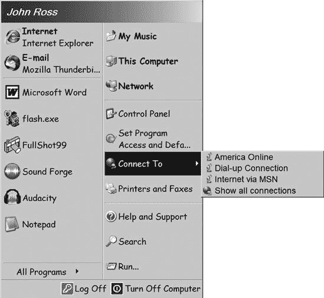
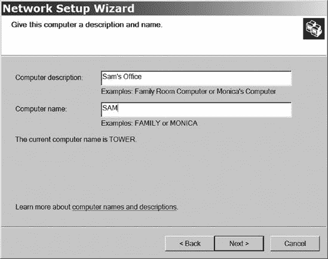
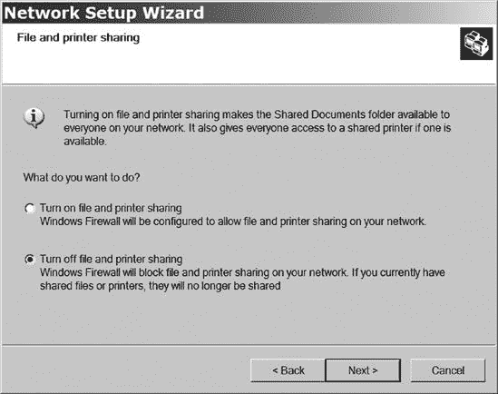
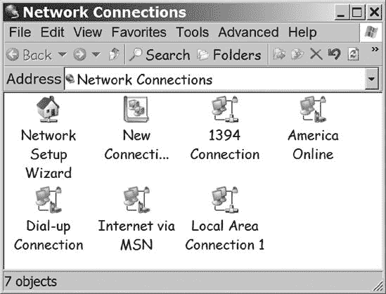
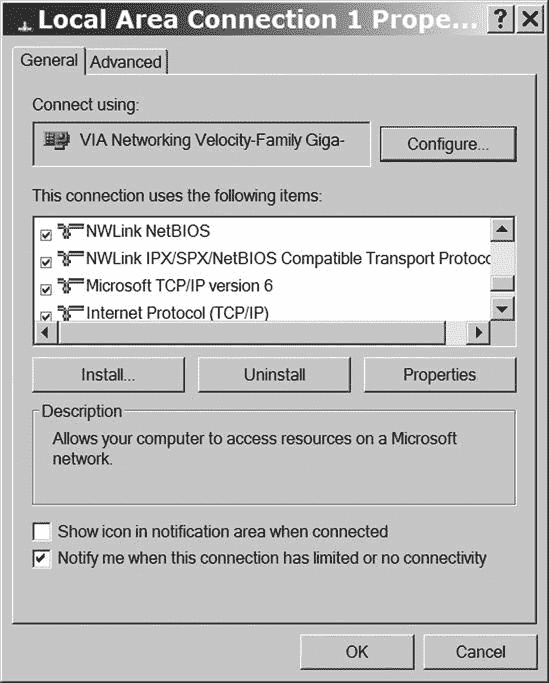
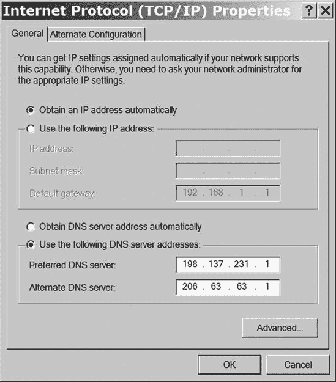
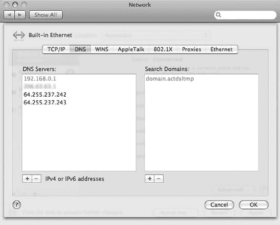
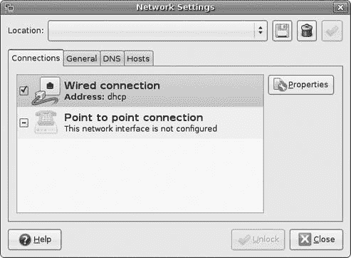

# 第十一章。将您的计算机连接到网络

不论计算机使用的是哪种操作系统，连接到局域网和互联网都需要相同的配置设置。每个操作系统以不同的方式组织配置信息，但它们都需要描述在第十章中的设置。本章描述了 Windows、Macintosh OS X 以及 Linux 和 Unix 的配置设置，并为连接运行这些操作系统的计算机到您的网络提供了逐步说明。

在您尝试配置网络中的计算机之前，请先在网络的调制解调器和路由器上设置 LAN 和 WAN 设置；您网络中计算机的配置必须与这些设置兼容。

如果您的网络包含一个活动的 DHCP 服务器，您的计算机应自动获取连接到局域网和互联网所需的设置。当没有 DHCP 服务器或 DHCP 客户端工作不正常时，您应手动分配地址并为每个计算机单独输入其他设置。

### 注意

您可以在 DHCP 网络中使用具有固定 IP 地址的计算机，但使用固定地址是一个糟糕的想法，因为固定地址可能会与自动分配发生冲突。一些包含 DHCP 服务器的路由器和其他设备也可能允许您将特定的 IP 地址分配给具有特定 MAC 地址的网络节点。

您的调制解调器或路由器的用户手册以及您的互联网服务提供商提供的信息是网络配置信息的权威来源。请记下您调制解调器或路由器上的以下设置，因为您将需要它们来配置单个计算机：

+   DHCP 状态：开启或关闭

+   IP 地址

+   子网掩码

+   默认网关

+   DNS 服务器

# 将您的 Windows 计算机连接到网络

在 Windows XP 和 Windows Vista 中，网络设置向导创建一个配置文件，将您的计算机连接到局域网。要更改现有配置文件，请使用该配置文件的属性设置。

## 创建新的网络配置文件

按照以下步骤运行网络设置向导：

1.  从开始菜单，选择**连接到** ▸ **显示所有连接**，如图图 11-1 所示。如果您使用的是经典开始菜单，请选择**设置** ▸ **网络连接**。

    

    **图 11-1. 选择“显示所有连接”选项以打开网络连接窗口。**

1.  从网络连接窗口，选择**网络设置向导**。向导的欢迎界面将出现。

1.  从欢迎界面，点击**下一步**。向导会提醒您安装并打开网络中的所有计算机和其他组件。

1.  再次点击**下一步**。向导将寻找网络连接并询问您正在建立什么类型的连接，如图图 11-2 所示。

    

    **图 11-2. 选择其他选项将此计算机添加到您的局域网。**

1.  选择**其他**并点击**下一步**。向导将要求提供更多详细信息，如图图 11-3 所示。

    

    **图 11-3. 选择“此计算机直接连接到互联网或通过网络集线器”选项以连接到您的局域网。**

1.  选择**此计算机直接连接到互联网或通过网络集线器**选项并点击**下一步**。向导将要求输入此计算机的简要描述和名称，如图图 11-4 所示。

    

    **图 11-4. 为您的局域网上的每台计算机分配一个独特的名称和描述。**

1.  输入此计算机的简要描述和您想要在局域网中识别此计算机的名称。其他用户将使用此名称通过局域网连接到此计算机。点击**下一步**。

1.  巫师将要求输入工作组名称。输入工作组名称并点击**下一步**。您必须在局域网上的每台计算机上使用相同的工作组名称。

1.  向导将询问有关文件和打印机共享的信息，如图图 11-5 所示。如果您想允许其他网络用户使用连接到此计算机的打印机（或打印机）或如果您想与其他网络用户共享存储在此计算机上的文件，请选择“开启文件和打印机共享”单选按钮；如果您没有连接到此计算机的打印机（或您不想其他用户使用打印机）并且不想共享文件，请选择“关闭文件和打印机共享”单选按钮。

    ### 注意

    如果您没有开启文件共享，您将无法通过网络查看或更改此计算机上的文件。

    

    **图 11-5. 选择适用于您的网络的文件和打印机共享选项。**

1.  向导将根据您选择的设置配置您的计算机。配置完成后，向导将显示图 11-6 所示的窗口，该窗口提供创建网络设置磁盘或完成向导的选项。选择描述您要执行的操作的选项。如果您选择创建网络设置磁盘，可以使用软盘、USB 闪存驱动器或其他可移动磁盘作为您的设置磁盘。

    

    **图 11-6. 网络设置向导将提供创建网络设置磁盘的选项。**

1.  向导将遵循您的指示并显示完成网络设置向导的窗口。点击 **完成**。

对您网络中连接的每台 Windows 计算机重复此过程。如果您在第一个计算机的网络设置向导结束时创建了网络设置磁盘（或闪存驱动器），您可以使用该磁盘上的程序，而不是每次都运行向导。

## 更改您的计算机网络设置

要手动更改您计算机的网络配置设置，请按照以下步骤操作：

1.  从开始菜单中选择 **连接到** ▸ **显示所有连接**，或从经典开始菜单中选择 **设置** ▸ **网络连接**。将打开网络连接窗口，如图 11-7 所示。

    

    **图 11-7. 网络连接窗口显示了您计算机的所有网络配置文件。**

1.  您的有线连接配置文件被称为 *本地连接*，有时会包含一个数字。这个数字通常是 1，如图 11-7 所示，但如果您已添加或删除了额外的配置文件，可能会使用其他数字。如果您正在使用 Wi-Fi 或其他无线网络连接，网络配置文件将被称为 *无线网络连接*。打开本地连接并点击 **属性** 按钮，或打开无线网络连接配置文件并点击 **更改高级设置**。将打开一个类似于图 11-8 所示的窗口。

    

    **图 11-8. 本地连接状态窗口显示有关您的网络连接的信息。**

1.  滚动到项目列表的末尾，选择**互联网协议（TCP/IP**），然后点击**属性**按钮。将打开显示在图 11-9 中的属性窗口。

    

    **图 11-9. 互联网协议属性窗口控制您的网络和互联网设置。**

1.  要使用此计算机与 DHCP 服务器，请选择**自动获取 IP 地址**单选按钮。要分配并使用静态 IP 地址，请选择**使用以下 IP 地址**选项，并输入 IP 地址、子网掩码和默认网关的数字。

1.  要使用 DHCP 服务器指定的 DNS 服务器，请选择**自动获取 DNS 服务器地址**单选按钮。要在此计算机上指定一个或多个 DNS 服务器，请选择**使用以下 DNS 服务器地址**单选按钮，并输入首选和备用 DNS 服务器的地址。

# 将您的 Macintosh 计算机连接到网络

要将运行 OS X 的 Macintosh 计算机连接到您的网络，请按照以下步骤操作：

1.  如果尚未安装，请在计算机和网络集线器、交换机或路由器之间安装一根以太网线。

1.  从 Macintosh 桌面，点击菜单栏最左侧的 Apple 图标以打开 Apple 菜单。将显示显示在图 11-10 中的系统偏好设置窗口。

    

    **图 11-10. 使用系统偏好设置窗口设置您的网络连接。**

1.  点击互联网与网络组中的**网络**图标。将显示显示在图 11-11 中的网络窗口，其中包含有关您的网络连接的详细信息。如果您的网络有提供 IP 地址的 DHCP 服务器，设置将自动出现在网络窗口中。

    

    **图 11-11. 网络窗口显示当前网络连接设置。**

1.  如果网络窗口中显示的设置不是您想要使用的，请点击窗口左下角的锁形图标来更改它们。图标将变为开启的锁。

1.  要更改网络配置设置，请点击窗口底部附近的高级按钮。将显示图 11-12 所示的内置以太网窗口。

    

    **图 11-12. 内置以太网窗口控制网络配置设置。**

1.  窗口顶部的栏包含七个网络选项。点击**TCP/IP**以输入或更改您的互联网连接设置。

1.  配置 IPv4 字段是一个下拉菜单。点击字段右侧的箭头以打开图 11-13 所示的菜单。

    

    **图 11-13. 使用配置 IPv4 下拉菜单在此计算机上启用或禁用 DHCP。**

1.  选择您想要在此计算机上分配 IP 地址的选项。选择**使用 DHCP**从网络的 DHCP 服务器获取地址，或选择**手动**分配固定地址。

1.  如果您选择手动选项，请在相应的字段中输入数字 IP 地址、子网掩码和网关路由器地址，然后在窗口顶部的菜单栏中点击**DNS**。将显示图 11-14 所示的窗口。

1.  点击 DNS 服务器框底部的加号（+），并输入一个或多个 DNS 服务器的 IP 地址。您应从您的互联网服务提供商获取这些地址。

1.  点击**确定**保存您的更改并关闭高级网络窗口。主网络窗口将显示您的当前设置。

1.  点击窗口左下角的打开锁形图标以锁定设置，然后点击**应用**以保存您的设置并关闭网络窗口。

    

    **图 11-14. 在 DNS 窗口中输入您的 ISP DNS 服务器的地址。**

# 将您的 Linux 或 Unix 计算机连接到网络

不同的 Linux 和 Unix 发行版使用不同的网络配置程序，但它们都需要与 Windows 和 Macintosh 计算机连接到局域网以及通过局域网连接到互联网所需的信息。与 Mac 和 Windows 的网络连接一样，大多数 Linux 和 Unix 系统在 DHCP 服务器激活时将自动设置连接。

图 11-15 显示了 Ubuntu 提供的 Gnome 网络管理工具。要更改设置，请选择**有线连接**框并点击**属性**。

**图 11-15. Gnome 使用标签窗口设置网络配置选项。**

在图 11-16 的属性窗口中显示了 DHCP 控制以及手动 IP 地址和 DNS 设置。此窗口包括用于常规数字 IP 地址、子网掩码和默认网关地址的字段。

**图 11-16. 使用 Gnome 网络属性窗口配置没有 DHCP 服务器的网络连接。**

图 11-17 和图 11-18 显示了 PC-BSD 中包含的 KDE 控制模块实用程序。要更改配置设置，请选择连接到网络的适配器并点击**配置**按钮。

**图 11-17. KDE 控制模块实用程序包括每个网络适配器的网络设置。**

**图 11-18. 每个网络适配器的 KDE 配置窗口包括 DHCP、IP 地址和子网掩码（网掩码）的设置。**

其他桌面环境可能使用不同的配置实用程序，但设置类似。您通常可以通过在每个版本的桌面周围搜索来找到控件和设置。

请记住，某些网络控制设置程序不会进行永久性更改（尤其是当您从 CD 或 DVD 加载操作系统或使用`ifconfig/route`命令的版本分配 IP、子网掩码或其他地址时）。要进行永久性更改，您必须在计算机的硬盘上加载操作系统并编辑系统配置。每次启动计算机时检查设置始终是良好的实践。

# 摘要

无论你使用什么类型的计算机，基本的网络配置设置都是相同的：要么计算机从网络的 DHCP 服务器获取 IP 地址和相关设置，要么它使用网络配置工具的设置。本章中的程序应能为你提供足够的信息，以设置与任何常用操作系统的网络连接。
