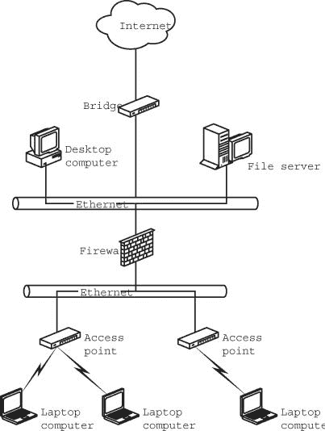
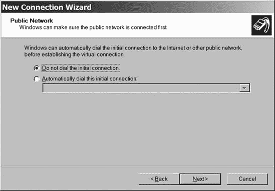
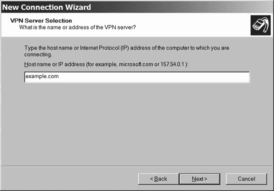
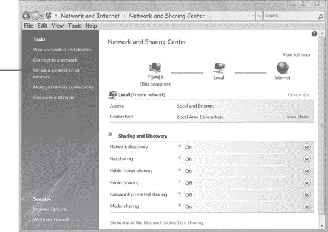
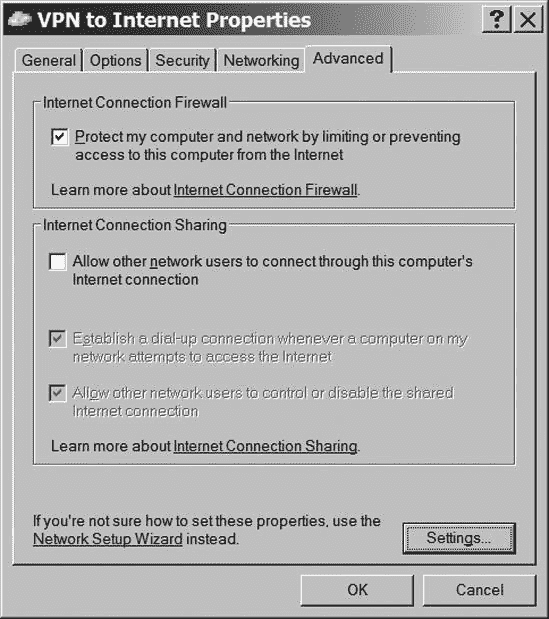
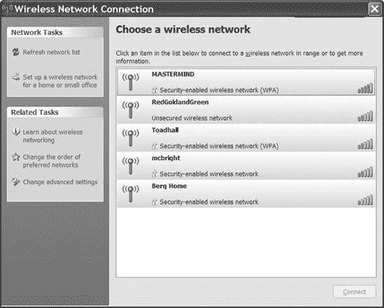
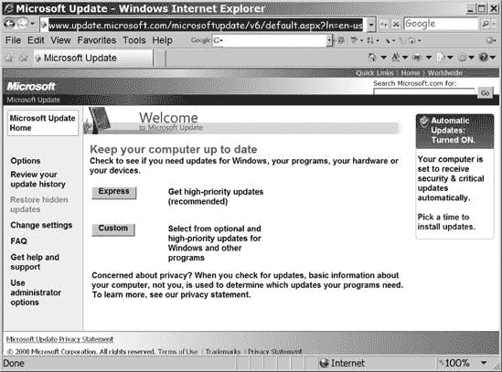

# 第十三章 网络安全

每次操作网络时，都必须保护它免受外部入侵以及内部网络用户有意或无意滥用或误用造成的损害。计算机网络容易受到多种形式的攻击，包括未经授权访问文件、服务盗窃以及由于过多的网络连接请求导致的拒绝服务。严格来说，针对单个计算机的攻击，如病毒、蠕虫和特洛伊木马，与网络漏洞是分开的问题，但一个好的网络安全计划将包括防火墙和其他工具，这些工具也会保护连接到网络上的计算机。

本章描述了每个家庭和小型网络管理员必须采取的基本步骤，以保持其网络的安全。

# 防止入侵者入侵

网络入侵者入侵网络有多种原因：

+   他们想打开文件和阅读文档，要么是为了窃取机密信息，要么是为了克服“破解”受保护文件的挑战。

+   他们想利用网络获取高速互联网连接。

+   他们想利用网络转发不雅或非法数据（如垃圾邮件或色情内容）到互联网或下载类似材料。

+   他们想窃取密码、信用卡号、银行账户信息以及其他他们可以出售或用于订购有价值物品的数据。

+   他们想通过超负荷网络处理数据的能力、更改或删除重要软件或导致硬件损坏来干扰正常网络运行。

网络安全的两个重要目标是限制授权用户访问，并使这些用户远离配置设置和机密数据。维护安全网络的最重要工具包括为不同用户设置不同的访问级别、密码和防火墙。如果这些工具不够充分，还可以采用更复杂的方法，包括内核级别的强制访问控制系统、身份验证和授权机制以及数据加密。

## 用户账户和访问级别

几乎所有计算机操作系统至少有两种用户账户级别：管理员和用户。*管理员*可以访问计算机的所有配置设置，例如安装或删除打印机、加入网络等。*用户*可以读取和写入分配给自己账户以及允许其他人使用的资源的数据文件。在网络中，*访客*账户为通过网络而不是通过直接连接到每台计算机的键盘和其他输入设备使用计算机资源的人设置了各自的访问设置。

每个用户对其文件拥有独家控制权。每个账户的所有者都可以设置文件访问控制，使文件保持私密和机密，或者公开供其他用户访问。即使其他用户在同一台计算机上有账户，他们也无法阅读他人的私人文件。例外的是系统管理员账户，它提供了对几乎所有文件的访问和控制权限。

## 密码

密码是防止未授权访问计算机或网络的第一个防线。如果潜在的入侵者无法启动操作系统，打开数据文件或使用网络就会变得困难得多（但并非不可能——一个有决心、有足够时间和资源的入侵者通常可以绕过密码来打开和读取未加密的文件）。

你可能会被诱惑不设置启动密码就设置你的计算机，但这完全破坏了计算机的大部分安全功能和与之相连的网络的安全功能。除非你绝对确信陌生人永远不会足够接近来打开你的计算机或通过有线或无线网络获得访问权限，并且你信任家里的其他人或办公室里的其他人尊重你的隐私，否则每次打开计算机或通过网络连接到它时输入密码所花费的额外时间是值得的。

一个有效的密码应该是难以猜测的，并且足够长，以至于难以用暴力破解程序（一种应用大量计算资源尝试一个密码又一个密码，直到偶然找到正确密码的程序）找到。

太多人使用以下这些项目作为密码：

+   你自己的名字或中间名

+   你配偶、孩子或宠物的名字

+   你母亲的本姓或任何其他家族姓氏

+   你最喜欢的艺人、乐队、团队或歌曲

+   你自己的首字母和姓氏（例如*JSmith*）

+   一个明显的数字、字母或两者的组合（例如*123456*、*abcxyz*或*abc123*）

+   你的生日或任何其他重要日期

+   你的家乡或国家

+   来自键盘的一串字符（例如*qwerty*或!*@#$%*)

+   词语*password*

+   短语*letmein*（即*let me in*，不是中国面条菜的名字）

+   短语*trustno1*（电视剧《X 档案》中福克斯·穆德尔的密码）

+   词语*swordfish*（最初用于马克斯兄弟的*Horse Feathers*以及许多随后的电影、书籍和计算机游戏）

+   词语*sex*或任何常见的诅咒或污言秽语

+   词语*上帝*或*耶稣*（或你选择的任何神祇）

+   这些词语或短语的反向拼写

当电影或电视剧中的“计算机安全专家”在第三次尝试中找到正确的密码来破解坏人的计算机时，他可能尝试了这份列表上的某些密码。

许多网络路由器、调制解调器和其他硬件在出厂时预设了默认密码。这些密码被破解者所熟知，在设备手册和互联网上很容易找到。

最佳密码是随机字母、数字和其他字符的字符串，至少七到八个字符长度。一位专家测试了一个暴力破解密码程序；表 13-1 显示了程序员（吉米·鲁斯卡）通过创建和测试所有可能的组合来发现不同长度密码所需的时间。（此表中的具体数字仅适用于他的特定程序。您应该注意随着密码中字符数量的增加，所需时间是如何增加的，而不是确切的时长。）如果您的密码包含一个或多个符号，例如！、@、#、$、&和+，破解时间会更长。

**表 13-1. 测试所有可能密码所需时间^([a])**

| 密码长度 | 仅字母 | 字母和数字 |
| --- | --- | --- |
| ^([a]) |
| 3 个字符 | 1 秒 | 2 秒 |
| 4 个字符 | 3 秒 | 10 秒 |
| 5 个字符 | 1 分 17 秒 | 6 分钟 |
| 6 个字符 | 26 分钟 | 3 小时 30 分钟 |
| 7 个字符 | 14 小时 | 6 天 |
| 8 个字符 | 15 天 | 205 天 |

|

^([a]) 来源：[`blog.jimmyr.com/Most_Common_Passwords_20_2008.php`](http://blog.jimmyr.com/Most_Common_Passwords_20_2008.php)

|

其他破解方法可能更快或更慢，但一个普遍的观点——即更长的密码更难破解——仍然适用。

## 防火墙

*防火墙*是一种服务器，它使用网络管理员设定的规则来检查传入的数据，并阻止来自不在列表上或与特定描述（如病毒）匹配的源的数据。或者防火墙可能允许所有从局域网 *到* 互联网的数据流动，但只允许某些类型的数据 *从* 互联网进入。在局域网中，防火墙最常见的使用是在通往互联网的网关处，如图图 13-1 所示。防火墙监控本地网络一侧的计算机与另一侧的互联网之间的所有进出数据。这种防火墙旨在保护局域网中的计算机免受来自互联网的未经授权的入侵。

### 无线网络中的防火墙

在无线网络中，防火墙还可以放置在无线接入点和有线网络之间的网关处。这个防火墙将网络的无线部分与有线局域网隔离开，因此未经授权将计算机连接到网络的入侵者无法使用无线连接访问互联网或局域网的有线部分。图 13-2 显示了混合网络中防火墙的位置，该网络包含有线和无线连接。

**图 13-1. 一个网络防火墙将局域网与互联网隔离开。**

**图 13-2. 防火墙还可以保护局域网的有线部分免受无线入侵者的影响。**

无线网络中的防火墙可以执行几个功能：

+   它可以作为无线网络和有线局域网之间的网关路由器。

+   它可以保护单个计算机直接连接到互联网。

+   它可以阻止所有来自无线侧到有线网络的流量，除非这些流量来自经过身份验证的用户。

+   它将命令、消息和文件传输从受信任的用户传递到互联网。

因此，合法用户可以连接到混合局域网的有线部分或互联网上的网络节点，但入侵者会在防火墙处被切断。

由于授权的无线用户和入侵者都在防火墙的无保护侧，它并不能将无线节点彼此隔离开。入侵者仍然可以访问同一无线网络上的另一台计算机并读取共享文件，因此关闭连接到无线网络的任何计算机上的文件共享，并在单个计算机上使用防火墙软件是个好主意。

无线网络的防火墙应使用某种身份验证来允许合法用户通过网关，但应拒绝其他人。如果基于 MAC 地址的访问控制内置在 Wi-Fi 网络中，并且 802.1*x*中增加的身份验证不足，那么外置防火墙应要求所有用户在连接到互联网之前输入登录名和密码。

如果您的无线网络包括运行多个操作系统的计算机，您的防火墙必须使用在任何平台上都适用的登录工具。最简单的方法是使用基于 Web 的认证服务器，例如 Apache Web 服务器中包含的认证服务器([`httpd.apache.org/`](http://httpd.apache.org/))。

Apache 网络服务器作为一个 Linux 或 Unix 应用程序可用，可以在老式、慢速的计算机上运行，比如早期的奔腾或甚至古老的 486 CPU，因此你通常可以回收一些旧垃圾并用作防火墙。Apache 应用程序和操作系统都作为开源软件提供，因此应该能够构建一个极其低成本的 Apache 防火墙。

如果你更喜欢使用 Windows，或者如果你不想自己组装防火墙，你有几个选择。你可以使用 Apache 的 Windows 版本，或者你可以使用商业实用程序，如 [`www.thegild.com/firewall/`](http://www.thegild.com/firewall/) 中列出的那些。

对无线局域网的攻击并不全部来自空中。无线网络也需要与完全有线的网络相同的防火墙保护来抵御来自互联网的攻击。许多无线接入点包括可配置的防火墙功能，但如果你的接入点没有，网络应该在每台计算机上包括防火墙程序，以及一个单独的路由器或一台作为网络防火墙的专用计算机。

### 保护个人电脑

客户端防火墙程序为来自互联网的攻击提供了另一道防线。其中一些攻击来自那些试图读取你的文件和其他你不想让全世界都能看到的资源的恶意分子。其他人可能想将你的计算机用作垃圾邮件或试图入侵世界另一端的某些计算机的中继点，以便使真实来源更难识别。还有一些人传播病毒或使用名为 rootkits 的真正令人不快的程序，这些程序会控制个人电脑或显示威胁信息。

一个拥有大量未使用存储空间的未受保护的系统可能成为黑客想要分发盗版软件、音乐或视频文件的诱人目标（你不会认为他们会把那些东西存储在自己的电脑上，对吧？）。

互联网上这样的笨蛋和怪人数量出人意料地多；如果你安装了一个在外部计算机尝试连接你的网络时通知你的防火墙，你的防火墙日志可能会每天列出几个入侵尝试。

### 带防火墙的无线接入点

在无线网络中使用最简单的防火墙是集成在接入点中的防火墙。许多无线接入点将无线接入点的功能与宽带路由器和以太网交换机相结合，因此它们支持有线和无线网络客户端。

如你所知，网络路由器在局域网到互联网的数字 IP 地址和识别本地网络中单个计算机的内部 IP 地址之间进行地址转换。防火墙通常阻止所有对网络主机的数据请求，但当你想使用本地网络中的一台或多台计算机作为文件服务器时，这会引发问题。因此，防火墙将某些类型的请求重定向到防火墙内的适当计算机。

连接到服务器的每个请求都包含一个特定的端口号，用于标识服务器类型。例如，Web 服务器运行在端口 80 上，FTP 服务器使用端口 21，因此这些端口号是访问请求的一部分。为了接受对服务器的访问请求，你必须指导防火墙的*网络地址转换（NAT）*功能将那些请求转发到局域网内的特定计算机。表 13-2 列出了最常见的服务端口号。

已经分配了数百个其他端口号，但在实际使用中你永远不会看到其中大多数。端口号分配的官方列表可在网上找到，地址为[`www.iana.org/assignments/port-numbers`](http://www.iana.org/assignments/port-numbers)。

NAT 假设每个内部服务器的 IP 地址在每次请求之间不会改变。今天的 192.168.0.23 上的 Web 服务器不会迁移到下周的 192.168.0.47。在有线网络中这通常不是问题，但在无线环境中，网络客户端不断加入和离开网络，DHCP 服务器会自动为每个新客户端分配下一个可用的地址。如果这些客户端中的一个是网络服务端口的所在地，NAT 可能找不到它。这个问题并不常见，因为大多数网络不会使用便携式计算机作为服务器，但这种情况可能发生。解决方案是关闭 DHCP 服务器，并为每个客户端分配一个固定的 IP 地址。

**表 13-2. 常见 TCP/IP 服务端口号**

| 端口号 | 互联网服务 |
| --- | --- |
| 20 | FTP-数据（FTP 默认数据） |
| 21 | FTP（文件传输协议） |
| 23 | Telnet |
| 25 | SMTP（发件箱邮件） |
| 37 | 时间 |
| 53 | DNS（域名系统） |
| 70 | Gopher |
| 79 | Finger |
| 80 | HTTP（Web 服务器） |
| 88 | Kerberos |
| 110 | POP3（收件箱邮件） |
| 119 | NNTP (网络新闻) |
| 1863 | 微软 MSN 即时消息 |
| 5190 | AOL 即时消息 |
| 7070 | 真实音频和视频 |

### 防火墙软件

在接入点与您局域网的有线部分之间的无线网关防火墙将阻止入侵者使用您的网络访问互联网，而在互联网连接处的防火墙将拒绝来自互联网的连接到您的网络的尝试，但无线网络仍需要另一种保护形式。如果有人未经许可访问您的无线局域网，您希望将他们与同一网络上的其他合法计算机隔离开来，因此每个网络节点都需要一个客户端防火墙程序。

客户端防火墙在计算机的网络接口上执行的功能与局域网或企业级防火墙在整个网络中执行的功能相同；客户端防火墙会检测尝试连接到 TCP 服务端口的尝试，除非它们与防火墙程序的配置设置之一或多个匹配，否则会拒绝这些尝试。有几种优秀的防火墙产品作为共享软件提供，而其他产品则对非商业用户免费。您可以在自己的系统上尝试它们，并选择您最喜欢的一个。ZoneAlarm ([`www.zonealarm.com/`](http://www.zonealarm.com/)) 和 LANguard ([`www.languard.com/`](http://www.languard.com/)) 都是备受推崇的 Windows 防火墙软件产品。Windows XP 和 Windows Vista 也内置了防火墙，对于大多数家庭和小型商业网络来说已经足够。

Linux 和 Unix 用户也有许多防火墙选项。其中大多数是为独立防火墙计算机编写的，这些计算机通常用作网络网关，但它们同样适合作为单个网络客户端的保护。

在 Linux 中，iptables 防火墙是内核的一部分。详细信息请参阅 [`www.netfilter.org/projects/iptables/index.html`](http://www.netfilter.org/projects/iptables/index.html)。端口扫描攻击检测器（psad）是另一套工具，用于识别许多 Linux 系统上的端口扫描和其他入侵。更多信息请参阅 [`www.cipherdyne.org/psad/`](http://www.cipherdyne.org/psad/)。

IP Filter 是一个软件包，为 FreeBSD 和 NetBSD 系统提供防火墙服务。官方 IP Filter 网站为 [`coombs.anu.edu.au/~avalon`](http://coombs.anu.edu.au/~avalon)，您可以在 [`www.obfuscation.org/ipf/ipf-howto.txt`](http://www.obfuscation.org/ipf/ipf-howto.txt) 下载一份优秀的 HOWTO 文档。该程序可以拒绝或允许任何数据包通过防火墙，并且可以根据子网掩码或主机地址进行过滤，建立服务端口限制，并提供 NAT 服务。

OpenBSD、FreeBSD 和 NetBSD 都可以使用数据包过滤器，或称 PF，功能来执行防火墙操作。更多详细信息请参阅 [`www.openbsd.org/faq/pf/`](http://www.openbsd.org/faq/pf/)。

NetBSD/i386 防火墙是另一个免费的 Unix 防火墙。它可以在任何具有 486 或更高 CPU 以及至少 8MB 内存的个人计算机上运行。NetBSD/i386 防火墙项目主页为 [`firewall.dubbele.com/`](http://firewall.dubbele.com/)。

# 虚拟专用网络

虚拟专用网络（VPN）可以为从远程客户端到任何有互联网连接的主网络传输的数据增加另一种有效的安全形式。

VPN 使用*数据隧道*通过加密通道连接网络上的两个点。端点可以是一个网络客户端和一个网络服务器、一对客户端计算机或其他设备，或者一对局域网的网关。通过公共网络（如互联网）传输的数据与其他网络流量完全隔离。VPN 使用登录和密码认证来限制对授权用户的访问；它们加密数据以使拦截数据的入侵者无法理解；并且它们使用数据认证来维护每个数据包的完整性，并确保所有数据都来自合法的网络客户端。

### 注意

VPN 功能在 ISO 模型的 IP 或网络层发生。因此，它们可以在 Wi-Fi 或其他物理层运行的无线协议之上运行。VPN 还可以跨越包含多个物理介质（例如，将数据传递到有线以太网网络的无线链路）的网络连接传输数据。换句话说，VPN 是一种端到端服务；数据可以使用无线链路、以太网电缆、普通电话线或这些以及其他传输媒体的组合。

在传统的 VPN 中，远程用户可以登录到远程局域网，并获取与本地客户端相同的所有网络服务。VPN 通常用于扩展企业网络到分支机构，以及让用户从家中或从客户端或客户的办公室等远程地点连接到局域网。

通过 VPN 服务器建立的连接在网络上看起来就像一台直接连接到局域网的客户端设备。唯一的区别是，VPN 中的数据是通过 VPN 驱动器和公共网络传输，而不是直接从网络适配器传输到局域网。图 13-3 展示了到远程网络的典型 VPN 连接。

**图 13-3. 一台远程网络可以通过虚拟专用网络连接到局域网。**

本地、短距离的 VPN 对无线网络操作者来说很有趣，因为它们为无线链接增加了另一层安全性。由于无线客户端和网络接入点之间的数据是加密的（使用比 WPA 加密更安全的算法），因此任何可能正在监听无线电信号的第三方都无法理解这些数据。因为 VPN 服务器不会接受未使用正确 VPN 驱动程序和密码的无线客户端从接入点发送的数据链接，所以入侵者无法通过将恶意客户端与接入点关联来入侵网络。

无线 VPN 的目标是保护客户端与接入点之间的无线连接，并阻止未经授权的用户访问。因此，隔离和加密的数据只能在一个房间内移动，而不是跨越数百或数千英里。当然，接入点也可能通过互联网将 VPN 编码的数据转发到另一个位置的网络上。

图 13-4 展示了无线网络连接到 VPN 的情况。VPN 服务器位于无线接入点和主机局域网之间，因此所有通过网络无线部分传输的数据包都被编码。为了清晰起见，该图将 VPN 服务器显示为一个独立的组件，但将 VPN 安全添加到无线局域网的最实用方法是使用集成了 VPN 支持的路由器或网关。提供 VPN 路由器的厂商包括思科（Cisco）、网件（NETGEAR）和腾达（TRENDnet）。

**图 13-4. VPN 提供无线网络与互联网网关或本地局域网之间的安全连接。**

## VPN 方法

VPN 通过一个或多个中间网络将数据传输到另一个网络上的目的地。VPN 的隧道客户端通过添加一个带有路由信息的新头，将现有数据包或帧封装起来，指示数据包如何到达 VPN 的端点。通过中间网络的传输路径称为隧道。在隧道的另一端，VPN 服务器移除隧道头，并将数据转发到由下一层头指定的目的地。隧道的具体形式对数据没有影响，因为数据将隧道视为点对点连接。

隧道头可以采取多种形式。在 VPN 中最广泛使用的方法是点对点隧道协议（PPTP）、第二层隧道协议（L2TP）和 IP 安全（IPsec）模式。PPTP 和 L2TP 可以通过 IP、IPX 和 NetBEUI 网络传输数据；IPsec 仅限于 IP 网络。客户端和服务器必须使用相同的协议。

在 PPTP 和 L2TP 中，客户端和服务器必须在开始交换数据之前为每次传输配置隧道。配置参数包括通过中间网络的路线以及加密和压缩规范。传输完成后，客户端和服务器终止连接并关闭隧道。

不幸的是，几位数据安全分析师已经发现了 PPTP 的重大缺陷，这些缺陷允许入侵者突破基于 PPTP 的 VPN，嗅探密码，然后解码加密，读取数据，或对网络服务器造成损害。因此，PPTP 头信息不安全，不应使用。

在 IPsec 网络链路中，客户端和服务器必须在开始交换数据之前通过中间网络建立隧道，这是一个单独的事务。

L2TP 和 IPsec 都各有特定的优缺点，但它们都足够好，可以创建无线网络客户端和接入点之间的安全连接。三者之间的差异是技术性的，而不是实际性的。您可以在微软的白皮书“Windows 2000 中的虚拟专用网络：概述”中找到对这三个协议内部操作的出色解释，该白皮书可在网上找到，网址为[`technet.microsoft.com/en-us/library/bb742566.aspx`](http://technet.microsoft.com/en-us/library/bb742566.aspx)（但请记住，PPTP 网络的缺陷是在该白皮书编写之后被发现的）。

## VPN 服务器

VPN 服务器（或*主机*）可以是 Linux/Unix 或 Windows 服务器的一部分，或者可以集成到独立的网络路由器或网关中。如果您的网络已经使用一台单独的计算机作为专用服务器，则可以使用该计算机作为 VPN 服务器。如果您的网络尚未拥有完整的网络服务器，则单独的硬件可能是一个更好的选择。

数十家 VPN 设备制造商提供支持一个或多个 VPN 协议的路由器、网关和其他产品。这些产品各自具有不同的功能集，因此在您决定使用它们之前，在自己的网络上测试您打算使用的特定客户端和服务器组合是必不可少的。虚拟专用网络联盟（VPNC）正在朝着一系列互操作性测试和认证标准迈进（类似于无线以太网设备的 Wi-Fi 标准）。VPNC 网站列出了通过互操作性测试的产品（[`www.vpnc.org/`](http://www.vpnc.org/)），并且该网站还提供了大量 VPN 产品的信息来源链接。

### 配置 Windows 服务器以支持 VPN

如果您坚持使用 Windows 服务器，您可以使用 Windows Server 2003 或 Windows Server 2008 上的 L2TP 或 IPsec；如果您的服务器运行的是较旧的 Windows NT Server 4.0 或 Windows 2000 Server 软件，您将限于 L2TP（或严重有缺陷的 PPTP）。服务器还需要两个网络接口卡：一个连接到有线局域网或互联网网关，另一个连接到无线网络。连接到无线端口的接口卡通常直接连接到无线接入点的以太网端口。在 Windows 服务器上安装 L2TP 主机的确切过程在每个 Windows 版本中都略有不同，但一般步骤是相同的。有关配置特定操作系统的具体信息，请参阅在线帮助屏幕和 Microsoft 为您的服务器操作系统提供的资源包和其他在线文档。以下各节以一般术语描述配置步骤。

### 注意

有关使用 Microsoft 服务器部署和配置 VPN 的更多信息，请参阅 Microsoft TechNet 文章（[`technet.microsoft.com/en-us/network/bb545442.aspx`](http://technet.microsoft.com/en-us/network/bb545442.aspx)）。

**配置到局域网的连接**。

到局域网或其他网络的链接是通过网络适配器的一个专用连接。此连接的网络连接配置文件必须包括分配给此连接的 IP 地址和子网掩码，以及分配给网络网关的默认网关地址。

**配置 VPN 连接**。

VPN 连接通常是一个或多个接入点的以太网链路。VPN 连接在服务器上的连接配置文件必须包括分配给此端口的 IP 地址和子网掩码，以及此网络使用的 DNS 和 WINS 命名服务器的地址。

**将远程访问服务器配置为路由器**。

服务器必须使用静态路由或使每个 VPN 客户端从有线网络可到达的路由协议。

**启用并配置服务器以支持 L2TP 客户端**。

Windows 使用远程访问服务（RAS）和点对点协议（PPP）来建立 VPN 连接。路由和远程访问服务启用 RAS。VPN 连接需要以下 RAS 配置选项：

**认证方法**

加密 PPTP 连接使用 MS-CHAP 或 EAP-TLS 认证方法。

**认证提供者**

可以使用 Windows 2000 安全或外部 RADIUS 服务器来验证网络客户端。

**IP 路由**

IP 路由和基于 IP 的远程访问必须处于活动状态。如果有线网络作为无线客户端的 DHCP 服务器，则 DHCP 必须处于活动状态。

**配置 L2TP 端口**。

将每个 L2TP 端口设置为接受远程访问。

**配置网络过滤器**。

输入和输出过滤器阻止远程访问服务器发送和接收非 VPN 客户端起源的数据。这些过滤器将拒绝来自或发往未经授权用户的数据，因此入侵者将无法通过无线网络获得互联网连接（或有线局域网连接）。

**配置远程访问策略**。

为每个 VPN 客户端设置远程访问权限，允许访问 RAS 服务器。端口号类型必须设置为正确的 VPN 协议（例如，PPTP 或 L2TP），并且每个连接的配置文件必须包括使用的加密类型。Windows 提供了三种加密强度选项：

**基本**

使用 40 位加密密钥

**强**

使用 56 位加密密钥

**最强**

使用 128 位加密密钥

### **Linux/Unix VPN 服务器**

所有的 BSD 变体（包括 FreeBSD、NetBSD、OpenBSD 和 Mac OS X）都将 IPsec VPN 客户端和服务器作为发布包的一部分。

Linux FreeS/WAN 是 Linux 上最流行的 IPsec 实现。请访问[`www.freeswan.org/`](http://www.freeswan.org/)下载、文档和访问 FreeS/WAN 用户社区。

OpenVPN 是 Linux、BSD、OS X 和 Windows 的基于 SSL 的 VPN 解决方案。OpenVPN 易于配置，并提供**路由 VPN**（将特定目的地的流量通过 VPN 发送）和**隧道虚拟接口**（模拟物理层以太网设备，可以传递非 IP 流量通过 VPN）。OpenVPN 可以在[`openvpn.net/`](http://openvpn.net/)找到。

如果您正在使用 Linux 防火墙，您可能需要考虑 VPN 伪装。Linux 使用 Linux 内核中的 IP 伪装功能，在多个客户端之间共享单个互联网连接。VPN 伪装是支持 IPsec 客户端的 IP 伪装部分。Linux VPN 伪装的 HOWTO 可以在[`tldp.org/HOWTO/VPNMasquerade-HOWTO.html`](http://tldp.org/HOWTO/VPNMasquerade-HOWTO.html)找到。

### 带内置 VPN 支持的网络硬件

运行 Linux 或 Unix 的 BSD 版本之一的专用计算机可以是一个低成本的 VPN 服务器。或者，如果您正在使用 Windows 服务器进行其他目的，专用计算机也可以以很少或没有额外成本提供 VPN 支持。但是，全尺寸网络服务器通常是一个相对简单问题的更大、更复杂的解决方案。它们并不总是最佳选择。许多交换机、路由器、网关和防火墙设备也包含 VPN 支持。思科、3COM、英特尔和许多其他制造商制造的 VPN 产品通常比单独的计算机更容易安装和维护。

在无线网络中，VPN 服务器不需要像大型企业网络中的服务器那样拥有所有相同的铃声和哨声。如图 13-5 所示，位于无线接入点和企业网络有线部分之间的路由器可以轻松地充当 VPN 服务器。在家庭网络中，VPN 服务器可以在接入点和 DSL 或电缆调制解调器之间运行。

**图 13-5. 网络路由器也可以作为无线网络的 VPN 服务器。**

介于计算机和网络之间的独立 VPN 客户端硬件也可用，但在无线网络中这种设置并不那么实用，因为无线网络适配器几乎总是直接插入到计算机本身。

## VPN 客户端软件

无线客户端通过其无线以太网链路连接到网络接入点，操作系统将其视为局域网连接。要设置通过该连接的 VPN 隧道，您必须将隧道协议作为网络服务安装。

### 配置 Windows 以支持 VPN

Windows XP 和 Vista 包括对虚拟专用网络的支持，但此支持不是默认安装的一部分，因此设置 VPN 客户端的第一步是安装协议。

在 Windows XP 和 Windows Vista 中，向导使整个过程变得简单。在 XP 中，按照以下步骤设置 VPN 连接：

1.  从控制面板中打开网络连接。

1.  双击**新建连接向导**图标。

1.  当出现网络连接类型窗口，如图 13-6 所示，选择**连接到我的工作场所的网络**选项并单击**下一步**按钮。

    

    **图 13-6. 创建 VPN 链接的选项指定连接到工作场所网络，但此选项也适用于无线 VPN。**

1.  在网络连接窗口中（如图 13-7 所示），选择**虚拟专用网络连接**选项并点击**下一步**按钮。

    

    **图 13-7. 选择虚拟专用网络连接选项以创建 VPN 连接。**

1.  在连接名称窗口中，为无线 VPN 连接输入一个名称。此名称将显示在桌面快捷方式上。点击**下一步**按钮。

1.  在公共网络窗口中（如图 13-8 所示），选择**不拨初始连接**选项，因为您不需要通过电话线连接。点击**下一步**按钮。

    

    **图 13-8. 在无线网络中，VPN 不需要拨号连接。**

1.  在 VPN 服务器选择窗口中，如图 13-9 所示，输入 VPN 服务器的名称或 IP 地址。

    

    **图 13-9. 主机名或 IP 地址标识无线链路另一端的 VPN 服务器。**

1.  点击**下一步**按钮，然后点击**完成**按钮以完成向导。

在 Vista 中，按照以下步骤操作：

1.  打开控制面板。

1.  选择**网络和共享中心**。

1.  在网络和共享中心的左侧任务列表中，如图 13-10 所示，选择**设置连接或网络**选项。将打开一个选择连接选项窗口。

    

    **图 13-10. 使用设置连接或网络选项创建 VPN 链接。**

1.  选择**连接到工作场所**选项并点击**下一步**按钮。向导将询问您是否要使用现有连接。

1.  选择**否，创建新连接**选项。向导将询问您是否要使用 VPN 或拨号连接。

1.  选择**互联网连接（VPN）**选项。然后向导将在图 13-11 所示的屏幕中要求详细信息。

1.  在互联网地址字段中输入网络管理员提供的 VPN 服务器地址。这可以是数字地址或名称。

1.  在目标名称字段中输入您想在您的计算机上使用的此 VPN 连接的名称。

1.  如果您想测试连接，请点击**下一步**按钮。如果您不想连接，请选择“现在不连接”选项，然后点击**下一步**。向导将要求您输入名称和密码。

1.  输入您用于此 VPN 账户的名称和密码。如果您希望您的计算机自动发送密码，请启用“记住此密码”选项。点击**创建**按钮以建立 VPN 连接并关闭向导。

    

    **图 13-11. 使用此屏幕配置您的 VPN。**

要在 Windows 桌面上创建 VPN 的快捷方式，请按照以下步骤操作：

1.  在 XP 中，打开控制面板并选择**网络连接**。在 Vista 中，打开控制面板，选择**网络和共享中心**，然后从任务列表中选择**管理网络连接**。

1.  从网络连接窗口中，右键单击 VPN 的图标或列表，从弹出菜单中选择**创建快捷方式**。

1.  将会弹出一个窗口询问您是否要将快捷方式放置在桌面上。点击**是**按钮。现在桌面上将出现一个快捷方式。

### 微软 L2TP/IPsec VPN 客户端

微软在 Windows 2000、Windows XP 和 Windows Vista 中包含了一个用于具有互联网协议安全（IPsec）的 L2TP 连接的客户端。Windows 98、Windows Me 和 Windows NT Workstation 4.0 的类似客户端程序可以从[`download.microsoft.com/download/win98/Install/1.0/W9XNT4Me/EN-US/msl2tp.exe`](http://download.microsoft.com/download/win98/Install/1.0/W9XNT4Me/EN-US/msl2tp.exe)免费下载。

### 在 Windows 中建立连接

当 VPN 连接配置文件就绪后，连接 Windows 客户端到主机 LAN 或通过无线 VPN 链接连接到互联网变得非常简单：只需双击连接配置文件的图标。Windows 将要求输入登录名和密码，然后建立连接。

如果您主要使用无线连接来连接到互联网，您可以将其设置为默认连接，这样每次运行网络应用程序（如网页浏览器或电子邮件客户端程序）时都会打开。要将 VPN 配置文件设置为默认，请按照以下步骤操作：

1.  从控制面板打开**互联网属性**窗口。

1.  选择**连接**选项卡。

1.  在拨号设置部分，从列表中选择 VPN 连接配置文件，然后点击**设置默认**按钮。

1.  点击**设置**按钮。在拨号设置部分，在 VPN 服务器上输入您的登录名和密码。

1.  选择“**当没有网络连接时拨号**”选项。

### 选择 Windows XP 和 Vista 选项

Windows XP 和 Windows Vista 提供了许多在早期 Windows 版本中不可用的 VPN 选项。要设置这些选项，请按照以下步骤操作：

1.  从控制面板中选择“**网络连接**”窗口。如果您在桌面上有 VPN 连接的快捷方式，您可以跳过此步骤。

1.  双击 VPN 图标。将出现一个“连接 VPN 到互联网”窗口，类似于 图 13-12 中的窗口。

    

    **图 13-12. 使用“连接 VPN 到互联网”窗口在 Windows XP 中配置 VPN。**

1.  单击“**属性**”按钮。将出现您的 VPN 客户端属性窗口。图 13-13 显示了 VPN 到互联网属性窗口的“常规”选项卡。

    

    **图 13-13. “常规”选项卡控制 VPN 连接的目标。**

1.  VPN 服务器的 IP 地址应该已经在“目标的主机名或 IP 地址”字段中可见。应禁用“首先拨号另一个连接”选项。单击“**网络**”选项卡以查看 图 13-14 中显示的对话框。

    

    **图 13-14. “网络”选项卡控制 VPN 的网络配置选项。**

1.  从“**VPN 服务器类型**”菜单中选择您的网络将使用的 VPN 服务器类型。如果您不知道 VPN 类型，请选择“**自动**”选项。

1.  从连接项目列表中选择“Internet 协议 (TCP/IP)”或“Internet 协议版本 4”，然后单击“**属性**”按钮以更改网络设置，包括使用 DHCP 服务器或手动设置 IP 地址和 DNS。

1.  单击“**高级**”选项卡以打开 图 13-15 中显示的对话框。如果您的网络尚未由防火墙保护，请选择“**Internet 连接防火墙**”选项。这将保护无线客户端免受通过互联网发起的攻击。

    

    **图 13-15. “高级”选项卡控制 VPN 上防火墙的使用。**

VPN 到互联网属性窗口中的“选项”和“安全”选项卡控制着通常不会从默认设置更改的连接选项。希望更改安全设置的网路管理员应指导用户如何配置这些选项以满足网络的特定要求。

## Linux/Unix 的 VPN 客户端

在 Unix 计算机上使用 VPN 客户端比在 Windows 机器上运行 VPN 更复杂，因为客户端没有集成到内核中。因此，您必须找到一个与您要使用的 Unix 版本和 VPN 协议兼容的客户端程序。没有单个程序提供通用的 VPN 客户端，而且某些组合，如 BSD Unix 版本上的 PPTP，似乎根本不存在。

然而，Linux 用户可以从几个 IPsec 实现中进行选择：

| **FreeS/WAN** [`www.freeswan.org/`](http://www.freeswan.org/) |
| --- |
| **pipsec** [`perso.enst.fr/~beyssac/pipsec`](http://perso.enst.fr/~beyssac/pipsec) |
| **NIST Cerberus** [`w3.antd.nist.gov/tools/cerberus/`](http://w3.antd.nist.gov/tools/cerberus/) |

IPsec 包含在 OpenBSD 发行版中。您可以在[`tutorials.papamike.ca/pub/obsd_ipsec.html`](http://tutorials.papamike.ca/pub/obsd_ipsec.html)找到解释如何使用它的教程。

FreeBSD 的 IPsec 实现位于[`www.r4k.net/ipsec/`](http://www.r4k.net/ipsec/)。有关 NetBSD IPsec 的信息，请参阅[`www.netbsd.org/Documentation/network/ipsec/`](http://www.netbsd.org/Documentation/network/ipsec/)。

## OpenVPN：跨平台替代方案

OpenVPN ([`openvpn.net/`](http://openvpn.net/)) 是一个不使用 IPSec 的开源 VPN，它可以在 Windows、Mac OS X、Linux 和 Unix 上运行。它旨在易于使用和安全，即使在嘈杂或不稳定的网络中也是如此。

## 通过公共网络使用 VPN

当您通过机场或会议中心的公共网络将笔记本电脑连接到您的企业局域网，或者如果您正在使用宽带无线服务时，您可以通过该网络连接到互联网，然后连接到您企业的 VPN 服务器。因为您必须在启动 VPN 连接之前登录到公共网络，所以除了您在办公室使用的连接外，您还应创建一个单独的“通过公共网络 VPN”连接配置文件。该配置文件应指向您的企业 VPN 服务器，但不应该是您的默认连接。

要在运行 Windows 的计算机上通过公共网络连接，请按照以下步骤操作：

1.  打开带有无线网络适配器的计算机。

1.  使用您的无线配置工具选择您想要使用的公共网络。

1.  启动 Internet Explorer、Netscape Navigator 或其他网络浏览器。您将看到公共网络的登录界面。

1.  如果计算机没有自动完成，请输入您的用户名和密码。公共网络将确认您的登录。

1.  最小化浏览器窗口并打开**网络连接**窗口，或在你的桌面上找到 VPN 快捷方式。

1.  双击公共网络配置文件中的 VPN 图标。计算机将通过互联网连接到你的企业局域网。

1.  输入你企业网络的登录名和密码。

VPN 是许多网络为远程用户制定的安全计划的重要组成部分。只需几个按键或鼠标点击，你就可以从任何有互联网连接的地方建立对网络资源的访问。如果任何互联网技术可以在不牺牲安全性的情况下消除你与局域网、办公室和同事之间的明显距离，那么虚拟私人网络就是那种技术。

# 无线安全

无线网络并不安全。它们对于许多用户来说在大多数时候是安全的，但使用无线电交换数据的网络绝对不可能做到完全私密。

无线网络在安全性和便利性之间是一种权衡。无线网络连接的明显好处——从便携式计算机或孤立的位置快速轻松地访问网络——是有代价的。对于大多数用户来说，无线操作带来的便利性超过了可能的安全威胁。但就像你在街上停车时锁上车门一样，你也应该采取类似的步骤来保护你的网络和数据。

简单的事实是，无线网络使用具有明确特性的无线电信号，因此任何愿意投入足够的时间和精力来监控这些信号的人可能都能找到一种方法来拦截并读取其中包含的数据。如果你通过无线链路发送机密信息，窃听者可以复制它们。信用卡号码、账户密码和其他个人信息都容易受到攻击。

在互联网上可以轻松找到破解 Wi-Fi 加密方法的工具库。尽管 3G 宽带和 WiMAX 网络可能比 Wi-Fi 更安全（主要是因为捕获它们的数据更困难），WPA 加密也比 WEP 加密更好，但没有任何无线安全是完美的。加密和其他安全方法可以使数据更难被盗，但这些方法并不能完全保护免受真正专注的窃听者的侵害。就像任何警察都会告诉你的那样，锁对于阻止诚实的人来说是很好的，但严重的盗贼知道如何绕过它们。

更糟糕的是，许多网络管理员和家用无线用户由于没有使用加密和其他内置在每个 Wi-Fi 接入点和网络节点中的安全功能，使得他们的网络大门敞开，让入侵者有机可乘。“驾车登录”未受保护的私有网络在许多城市和郊区的商业区和令人惊讶数量的住宅区都是可能的。

大多数人都已经了解到在家庭和办公网络中使用加密的重要性，但其中太多的人仍在使用较旧的 WEP 加密系统，而不是更安全的 WPA 方法。在一家主要电话公司 Qwest 的技术支持人员，直到 2007 年中旬还在建议他们的 DSL 客户使用 WEP 加密。

如果你位于市中心或郊区，你可能自己就能看到这一点。当你使用你的 Wi-Fi 控制程序扫描你所在地区的网络时，你可能会看到除了你自己的接入点之外，还有附近网络列表。控制程序还会告诉你每个网络正在使用什么类型的加密（如果有的话）。在图 13-16 所示的示例中，一个网络（RedGoldandGreen）是开放的，而其他四个网络是加密的；其中两个加密网络使用 WPA，而列出的“已启用安全”但没有加密类型的两个网络使用 WEP。

**图 13-16. 这个社区中的四个网络在连接前需要加密密钥。**

做个数学题：你的接入点可以在所有方向上达到 150 英尺或更远，所以信号可能超出了你自己的财产线（或公寓或办公室的墙壁）。隔壁或街对面的建筑物中的网络设备可能检测到你的网络。如果你不采取一些预防措施来防止这种情况，你的邻居，或者使用笔记本电脑或 PDA 在街上停放的汽车内的人，可以登录到你的局域网，从你的服务器中窃取文件，并通过流媒体视频、多人游戏或更糟糕的方式占用你的互联网连接。

重要的是要理解我们在谈论两种不同类型的安全威胁。第一种是未经你知情或允许的外部人员连接到你的网络；第二种是在你发送和接收数据时，一个专门的窃听者可能会窃取或修改数据。每种都代表一个不同的问题，并且每种都需要不同的预防和保护方法。虽然确实没有任何加密工具可以提供完全的保护，但它们可以使大多数普通入侵者更难生存。只要这些工具存在，你最好还是使用它们。

一个未加密的无线网络为攻击者提供了许多机会。不仅网络破解者能够监控通过网络传输的任何数据，他们还可能能够修改这些数据。例如，如果你的网络浏览器存在漏洞，攻击者可以在你查看图像时替换图像，用利用该漏洞的图像替换，并在你的计算机上安装特洛伊木马程序，允许攻击者窃取存储在计算机上的数据，*即使你从未通过无线网络发送过这些数据*。这种攻击可能相对罕见（普通窥探者不太可能花时间窥探你是否有有趣的东西），但它仍然是一个真实的风险。

此外，许多流行的网站通过 HTTPS 使用 SSL 加密来加密登录页面，但他们不会加密后续页面以减少对处理能力的消耗——你的密码可能很安全，但通过网页邮箱接口阅读的任何电子邮件可能就不安全了，攻击者可能能够窃取*cookie*（随网页数据传递的唯一数据块）来识别你的登录信息并直接打开你的邮箱。

## 保护你的网络和你的数据

作为 Wi-Fi 网络的运营商，你能做些什么来阻止外人进入？你可以采用一些可以阻止他们的技术。首先，你要接受无线网络并不完全安全的事实，并使用内置的网络安全功能来减缓潜在的入侵者；其次，你可以通过硬件或软件防火墙（或两者兼而有之）来补充你的无线路由器内置的工具，以隔离无线网络；第三，你可以使用额外的加密，如 VPN，来保护网络流量。

早期 Wi-Fi 协议（WEP 加密）的安全特性不足以保护数据。无线等效隐私（WEP）协议存在几个严重缺陷：基本的加密方法（RC4 算法）在特定应用中已知存在弱点，所有用户都必须知道密钥，并且没有安全机制来分发新的密钥。大多数这些不足都被认可并被视为超出提供与标准有线网络用户相同保护的范围，但实际上，这意味着无线等效隐私几乎与没有保护一样好。最近的攻击（如 aircrack-ptw 工具执行的攻击）进一步削弱了 WEP，因为这些工具通常能够在分析有限流量的情况下几分钟内披露加密密钥。随着这些发展，WEP 应该被视为一个“请勿打扰”的标志，而不是真正的保护手段。

WPA 和 WPA2 标准试图修复 WEP 的不足，但它们只有在你的网络的所有用户都拥有现代网卡和驱动程序时才能正常工作。大多数，如果不是所有，近几年来制造的网卡都支持 WPA 或 WPA2。

对于我们大多数人来说，更严重的危险不是人们会窃听我们的消息，而是他们会创建自己的网络连接，并可能在不知情的情况下读取局域网上的计算机上存储的文件，或者使用你的宽带连接到互联网。

然而，商业网络必须采取额外的预防措施来保护他们的（以及他们的客户的）数据。几家大型连锁店客户信用卡数据泄露事件已被追踪到网络保护不足。

维护网络控制并确保其安全至关重要。“Wi-Fi 安全”在 Wi-Fi 安全中包含了一系列你可以使用的具体操作，以防止入侵者进入你的无线网络。

Wi-Fi 规范中的安全工具并不完美，但它们总比没有好。即使你选择不使用它们，了解它们是什么以及它们是如何工作的也是至关重要的，至少为了能够关闭它们。

## 网络名称

每个无线网络都有一个名称。在只有一个接入点的网络中，该名称是基本服务集 ID（BSSID）。当网络有多个接入点时，名称变为扩展服务集 ID（ESSID），但你的计算机的控制程序会在同一列表中显示这两种类型。所有网络名称的通用名称是*服务集 ID (SSID)*，这是你在无线接入点和客户端配置实用程序程序中最常看到的术语。

当你配置网络的接入点时，你必须指定该网络的 SSID。网络中的每个接入点和网络客户端都必须使用相同的 SSID。当网络客户端检测到两个或更多具有相同 SSID 的接入点时，它会假设它们都是同一网络的一部分（即使接入点在不同的无线电频道上运行），客户端会与提供最强或最清晰信号的接入点关联。如果该信号由于干扰或衰减而恶化，客户端将尝试转移到它认为的同一网络上的另一个接入点。这种转移被称为*切换*。

如果两个具有重叠信号的不同的网络具有相同的名称，客户端会假设它们都是单一网络的一部分，并可能尝试从一个网络切换到另一个网络。从用户的角度来看，这种误导性的切换看起来就像网络已经完全断开了连接。因此，任何可能与其他网络重叠的无线网络都必须有一个唯一的 SSID。

唯一 SSID 规则的例外是公共和社区网络，这些网络只提供对互联网的访问，但不提供对局域网中其他计算机或其他设备的访问。这些网络通常有一个共同的 SSID，因此订阅者可以从多个位置检测和连接到它们。换句话说，如果您在当地咖啡馆有互联网接入账户，您可能会在访问同一家公司拥有的另一家商店时找到并使用完全相同的 SSID。

一个网络的 SSID 提供了一种非常有限的形式的访问控制，因为您在设置无线连接时必须指定 SSID。接入点中的 SSID 选项始终是一个文本字段，可以接受您想要分配的任何名称，但许多网络配置程序（包括 Windows XP 中的无线网络工具以及几个主要品牌网络适配器提供的工具）会自动检测并显示其信号范围内的每个活动网络的 SSID。

在尝试连接之前，您并不总是需要知道网络的 SSID；配置实用程序（或网络监控器或嗅探程序，如网络嗅探器）会以列表或菜单的形式向您显示每个附近网络的名字（广播 SSID 功能已被关闭的网络除外）。例如，图 13-17 显示了在西雅图-塔科马机场进行网络嗅探器扫描的结果，其中 Wayport 为乘客候机楼提供服务，MobileStar 为美国航空公司的 VIP 俱乐部提供覆盖。

### 警告

每个接入点都附带一个默认 SSID 设置和密码。这些默认值在网络安全嗅探者社区中是众所周知的，并且有详细的文档记录（通过在网络上搜索“默认 SSID”可以找到几个列表）。显然，在任何活动网络中都不应使用这些默认值。在您更改接入点的管理登录名和密码时，请确保这样做。

**图 13-17. 网络嗅探器和许多配置工具显示每个附近无线网络的 SSID。**

通常情况下，大多数 Wi-Fi 接入点会发送信标信号来广播网络的 SSID。当网络适配器执行无线电扫描时，它会检测到这些信标信号，并在其控制程序中显示附近 SSID 的列表。然而，您可以禁用 SSID 广播，这样网络就不会出现在大多数控制程序扫描中。要连接到一个不可见的网络，您必须指导您的控制程序搜索 SSID。

非广播 SSID 并非完全不可见。嗅探程序（如 Network Stumbler）仍然可以检测到它并显示 SSID，并且每次用户连接到网络时，网络适配器都会在可以轻松嗅探的数据包中发送 SSID。在某些情况下，禁用 SSID 广播可能会使攻击者更容易后来攻击您用户中的某台笔记本电脑（这对企业或企业网络管理员来说是一个更严重的问题，比运行家庭网络的人更严重）。因为笔记本电脑无法知道隐藏的网络是否可用，它必须不断探测网络，宣布其存在，并为攻击者提供大量伪造隐藏网络所需的信息。因为隐藏网络必须在笔记本电脑的“首选网络”列表中，笔记本电脑将自动连接到伪造的网络。

## WEP 加密

WEP 加密是每个 Wi-Fi 系统的选项之一，因此了解它是如何工作的很重要，即使您选择不使用它。正如其名所示，有线等效隐私（WEP）协议的原始目的是在无线网络上提供与有线网络相当的安全级别。那是目标，但依赖于 WEP 加密的网络几乎与没有任何保护的网络一样容易受到入侵。WEP 可以阻止偶然的窃听者（以及如果他们不是特别擅长破解加密，您的免费邻居），但 WEP 对专业入侵者并不特别有效。较新的 WPA 加密始终是更好的选择。

WEP 加密旨在执行三个功能：它防止未经授权的网络访问；对每个数据包执行完整性检查；并保护数据免受窃听者侵害。WEP 使用一个秘密加密密钥在客户端或接入点传输数据包之前对其进行编码，并在接收后使用相同的密钥对其进行解码。原始标准使用共享认证，其中接入点发送一个挑战数据包，客户端必须使用正确的 WEP 密钥对其进行加密并发送回。然而，这通过允许窃听者观察交换的两个部分并推导出密钥，打开了一个重大的漏洞。

“开放”认证方法，任何使用 WEP（实际上没有任何网络应该使用 WEP）的网络都应该使用，它简单地丢弃无法由网络 WEP 密钥解密的数据包。因此，网络中的每个接入点和客户端适配器的 WEP 设置必须完全相同。这听起来很简单，但它可能会变得令人困惑，因为制造商使用不同的方法来识别 WEP 密钥的大小和格式。功能不会从一个品牌改变到另一个品牌，但相同的设置并不总是有相同的描述。

### 您的加密密钥有多少位？

WEP 密钥可以是 64 位或 128 位。尽管 128 位密钥更难破解（但它们仍然相当不安全），它们也增加了每个数据包传输所需的时间。然而，由于 40 位 WEP 密钥与 64 位 WEP 密钥相同，104 位密钥与 128 位密钥相同，因此产生了混淆。标准的 64 位 WEP 密钥是一个包含内部生成的 24 位初始化向量和网络管理员分配的 40 位密钥的字符串。一些制造商的规格和配置程序称这为*64 位加密*，但其他描述为*40 位加密*。无论如何，加密方案都是相同的，所以使用 40 位加密的适配器与使用 64 位加密的接入点或另一个适配器完全兼容。

许多网络适配器和接入点还包含一个使用 128 位密钥的*强加密*选项。支持强加密的设备与 64 位加密向下兼容，但兼容性不是自动的，因此在一个混合网络中，所有 128 位和 64 位设备的操作都将使用 64 位。如果你的接入点和所有适配器都接受 128 位加密，请使用 128 位密钥。但如果你想让你的网络与只识别 64 位加密的适配器和接入点兼容，请将整个网络设置为使用 64 位密钥。

实际上，选择 64 位或 128 位 WEP 加密并没有太大的区别。可以轻松获得可以破解这两种类型的工具，尽管破解 128 位密钥可能需要更长的时间。

### 你的密钥是 ASCII 还是十六进制？

WEP 加密设置的长度并不是唯一令人困惑的事情。一些程序要求将密钥作为 ASCII 字符的字符串，但许多其他程序希望密钥以十六进制（hex）数字的形式。还有一些可以从可选的口令短语生成密钥。

每个 ASCII 字符有 8 位，所以 40 位（或 64 位）WEP 密钥包含 5 个字符，而 104 位（或 128 位）密钥有 13 个字符。在十六进制中，每个字符使用 4 位，所以 40 位密钥有 10 个十六进制字符，128 位密钥有 26 个字符。在图 13-18 中，D-Link 接入点的无线设置屏幕，40 位共享密钥安全字段使用十六进制字符，因此它有 10 个字符的空间。D-Link 程序将所有 10 个字符作为一个单独的字符串运行，但有些其他程序将它们分成 5 组两位数或 2 组 5 位数。无论哪种方式，密钥对计算机来说看起来都一样，但将分开的字符串复制出来更容易。

密码短语是一系列文本，适配器和接入点会自动将其转换为十六进制字符序列。因为人类通常比记住十六进制乱码更容易记住实际的单词或短语，所以密码短语比十六进制字符串更容易分发。然而，只有当网络中的所有适配器和接入点来自同一制造商时，密码短语才有用。

**图 13-18. D-Link 接入点的配置实用程序接受十六进制格式的 WEP 密钥。**

### 有哪些选项？

就像 Wi-Fi 配置实用程序中的几乎所有其他内容一样，加密选项的名称在不同的程序之间并不一致。一些程序使用一套简单的选项，例如“启用 WEP（或 WPA）加密”，但其他程序使用来自正式 802.11 规范的技术语言。

一些接入点还提供了一种共享密钥认证选项，当网络客户端拥有密钥时使用加密，但与其他网络节点使用未加密的数据。

### 混合十六进制和 ASCII 密钥

当一些网络节点仅使用十六进制而其他节点需要 ASCII 密钥时，设置混合网络变得更加复杂。如果您的网络中存在这种情况，您将需要遵循以下规则来设置加密密钥：

+   将所有 ASCII 密钥转换为十六进制。如果配置程序要求 ASCII 密钥，请输入字符*0x*（零后跟小写字母*x*），然后跟十六进制字符串。如果您使用的是苹果的 AirPort 软件，您必须在十六进制密钥的开头输入美元符号（*$*）。

+   确保所有加密密钥的字符数完全正确。

+   如果所有其他方法都失败了，请阅读您网络适配器和接入点的手册中的安全部分。可能您的网络中的某些设备可能有一些您不知道的神秘专有功能。

## WPA 加密

WPA 加密是为了解决 WEP 加密不完全安全的问题而部分开发的解决方案。WPA 比 WEP 安全得多，但破解 WPA 仍然可能。

WPA 更安全，因为它使用一种称为*时间密钥完整性协议（TKIP）*的方法，在指定的时间间隔后或系统交换特定数量的数据包后自动更改加密密钥。因为 WPA 频繁更改密钥，破解者收集足够信息来破解其加密代码变得更加困难。

在大型网络中，WPA 使用认证服务器来验证每个网络用户的身份。服务器使用远程身份验证拨号用户服务（RADIUS）和可扩展认证协议（EAP）与连接到无线网络的计算机和其他设备交换加密密钥。

在没有服务器的家庭网络和小型商业网络中，一种称为*预共享密钥（PSK）模式*的方法使用存储在接入点中的密码短语代替认证服务器。要连接到网络，用户必须在他们的计算机或其他网络设备上输入相同的密码短语（或将他们的设备设置为自动输入密码短语）。当你设置 WPA 加密时，你必须指定网络是使用服务器还是 PSK 模式。

任何支持 802.11g 或 802.11n 的接入点和网络适配器也应识别 WPA 加密。如果你使用的是较旧的 802.11b 或 802.11a 接入点，你可能可以通过安装最新版本的固件和驱动程序来添加 WPA 加密。请在制造商网站的“支持”或“下载”部分查找免费升级说明和软件。

### PSK 密码短语

WPA-PSK 密码短语可以是 8 到 63 个 ASCII 字符或 64 个十六进制数字的字符串。你输入到网络设备中的密码短语必须与存储在接入点中的密码短语完全相同。显然，正确输入 64 位数字不是你希望经常做的事情，因此对于大多数用户来说，ASCII 替代方案是更好的选择。为了最佳安全性，分配给你的网络的 ASCII 密码短语应该是至少包含 20 个字符的随机混合，包括字母（大小写）、数字和标点符号。

PSK 网络使用密码短语来设置客户端（如计算机或 PDA）与接入点之间的初始连接。一旦建立连接，TKIP 将为每个数据包或数据包组分配新的加密密钥。PSK 与你的网络 SSID 结合计算最终的密钥值。选择唯一的 SSID 和强大的密码短语很重要。

攻击者可以构建包含常见网络名称和字典单词的 SSID 和 PSK 对的庞大表格，一旦进行一次计算，就可以几乎立即确定任何匹配该对值的网络的密钥。选择强大的密码短语和唯一的 SSID 可以减轻这种攻击。

### 使用 WPA 加密

当你设置一个新的网络时，接入点配置软件的安全部分将询问你是否想使用加密，以及如果是的话，你是否想使用 WEP 或 WPA 加密。除非你计划运行一个开放接入网络，否则你应该选择 WPA。

在许多情况下，接入点将提供两种或多种类型的 WPA 加密。如果你的网络包括一个 RADIUS 服务器，请选择 EAP。如果网络没有加密服务器，请使用 WPA-TKIP 选项。

对于网络用户来说，提供 WPA 密钥就像提供 WEP 密钥一样简单。过去几年中制造的多数网络适配器自动识别它们检测到的每个 Wi-Fi 信号中嵌入的加密类型，因此控制程序可能会要求输入加密密钥，而不会指定它是 WEP 密钥还是 WPA 密钥。

### 攻击 WPA 安全

很可能有人会将 WPA 加密中增加的安全功能视为挑战，并开发出 WPA 破解工具。

现在有几款这样的工具，所以 WPA 并不提供一些支持者可能希望你相信的不可渗透的保护。特别是，名为 coWPAtty 和 Aircrack-ng 的程序都使用*字典攻击*对 WPA-TKIP 网络进行攻击，尝试成千上万或数百万可能的密钥，直到找到正确的密钥。幸运的是，这些程序以及旨在破解 WPA 加密的其他任何程序都不容易使用，破解网络可能需要大量时间，因此对 WPA 的成功攻击并不常见。这种技术需要时间，因为程序每秒只能尝试大约 50 个不同的加密密钥，但最终它们会找到正确的密码并连接到目标网络。由于每个额外的字母、数字或其他字符都会增加密钥的复杂性，因此长密钥破解所需的时间比短密钥长得多。然而，一款名为 Elcomsoft Distributed Password Recovery 的商业产品使用显卡上的图形处理器，“将 Wi-Fi 加密破解速度提高至仅使用 CPU 的 100 倍”，因此即使是相对较长的密钥也不太安全。

完全保护自己免受攻击可能不可能或不太实际，但包含随机数字和标点符号的长密码仍然比单独的单词或数字字符串要好。换句话说，像*hdt%mzx33wolf$fgilxxq&#smedbxor*这样的密码比*nostarchpressbooks*要好。但使用 Wi-Fi 的唯一真正安全方式是结合 VPN 加密。

## 访问控制（MAC 身份验证）

大多数接入点都包括一个选项，允许网络管理员限制对特定客户端适配器列表的访问。如果一个具有 MAC 地址且该地址未出现在授权用户列表上的网络设备尝试连接，接入点将不会接受与网络关联的请求。此选项可以防止入侵者连接到无线局域网，但迫使网络管理员保持用户适配器和其 MAC 地址的完整列表。每次新用户想要加入网络，以及每次现有用户更换适配器或获得带有内置适配器的新笔记本电脑、PDA 或其他设备时，网络管理员都必须将另一个 MAC 地址添加到列表中。这项任务在家庭或小型办公室网络中可能是可管理的，但对于大型企业或校园范围内的系统来说，这可能是一项重大的任务，如果它实际上可行的话。

MAC 身份验证并不能提供对未经授权用户的无懈可击的保护，因为一个坚定的破解者可以监控来自已批准用户的无线电信号，拦截他们的适配器的 MAC 地址，并将一个已批准的地址加载到不同的适配器上。但是，结合加密和其他安全工具，身份验证在破解者通往网络的路上又增加了一道障碍。

每个接入点配置工具都使用不同的格式来定义其访问列表。您接入点提供的手册和在线文档应该提供详细的说明，用于创建和维护访问控制列表。

Wi-Fi 标准没有指定接入点访问控制列表的最大大小，因此数字各不相同。一些接入点将列表限制在几十个条目，但其他接入点，如 Proxim Harmony AP 控制器，将支持多达 10,000 个单独的地址。还有一些接受实际上无限的地址。如果您计划使用地址列表来控制对网络的访问，请确保您的接入点能够与足够大的列表一起工作，以支持所有用户，并留有足够的空间供未来增长。一般来说，接入点应至少接受比当前网络上用户数量多两倍的 MAC 地址。

一些接入点还包括一个 MAC 地址排除功能，允许网络管理员阻止一个或多个 MAC 地址访问网络。

# 物理安全

窃贼并不总是使用技术手段来破解网络。有时他们会使用暴力破解方法。例如，如果一个小偷偷走了您的笔记本电脑，他通常可以利用电脑软件的“便利”功能通过您的网络连接到互联网，阅读您的电子邮件和其他机密文件，并访问同一网络上的其他电脑。其他低技术手段包括“窥视”，即窃贼在您输入登录名和密码时观察您的屏幕或键盘，以及“社会工程学”，其中入侵者说服您透露您的密码或其他信息，因为她已经说服您她有合法的使用理由。

您可以采取一些措施来保护您的电脑和存储在其上的数据：

+   想象自己是一个窃贼，并采取一切必要措施使电脑难以被盗。不要将笔记本电脑放在无人看管的车辆中显眼的位置，或者在一个公共场所，如咖啡馆、机场或图书馆离开它。在一个有隔间或“开放式”工作空间的办公室中，如果您无法将其存放在上锁的抽屉或柜子里，请使用链条和锁将电脑固定在桌子上、文件柜或其他大型物体上。

+   不要将您的电脑放置在窗户附近，以便路人能清楚地看到您的内容。

+   当您离家或工作时，始终跟踪您的笔记本电脑。

+   每次您准备离开办公桌时，请注销您的办公电脑。不要允许其他人进入并使用您的账户，当您不在时。

+   保持您的笔记本电脑的登录和密码活跃，并对包含机密数据的文件使用加密。如果有人偷走了您的电脑，您希望尽可能难以为盗贼打开和读取您的文件。

+   在您的笔记本电脑的 PC 卡或台式机的内部卡上安装一个防盗报警装置。如果有人试图移动计算机、断开电缆或在没有输入安全码的情况下打开机箱，报警装置将发出非常响亮的警报。

+   在您的笔记本电脑上使用如 LostPC ([`www.lostpc.com/`](http://www.lostpc.com/))这样的追踪程序。每当它从新位置连接到互联网时，追踪软件会自动向安全中心发送一个“我在这里”的信号。警方和互联网服务提供商有时可以使用这些信息来定位和找回被盗的电脑。

+   考虑使用像 Windows 的 TrueCrypt 或 Linux 的 dm-crypt 这样的全盘加密工具，这样如果您的笔记本电脑被盗，数据将变得无用。

# Windows 更新和补丁

微软至少每月通过互联网发布一次安全更新和补丁，包括对新发现的安全问题的修复。您可以手动检查更新并选择您想要安装的更新，但让 Windows 自动检查新发布的更新包并为您安装它们要容易得多。作为网络管理员，您将希望设置您网络上的所有 Windows 计算机以运行自动更新。

要运行自动更新，请按照以下步骤操作：

1.  右键单击**我的电脑**，从弹出菜单中选择**属性**。将出现系统属性窗口。

1.  从系统属性窗口中选择**自动更新**选项卡。将显示图 13-19 所示的对话框。

    

    **图 13-19. 在系统属性中使用自动更新选项卡来开启 Windows 更新。**

1.  选择一个选项来设置您的计算机如何处理新更新。在大多数情况下，自动选项是最好的选择，但如果您正在使用需要系统大部分处理能力的程序，例如音频或视频录制，请选择“通知我，但不要自动下载或安装它们”选项。

1.  点击**确定**以保存您的设置并关闭系统属性窗口。

自动更新将加载被微软某位员工标记为对计算机性能或安全至关重要的更改，但它忽略了包括设备驱动程序的新版本和为 Windows 以及一些相关程序添加或改进其他功能的更新在内的许多其他更改。要查找和选择这些程序，请按照以下步骤操作：

1.  如果您尚未连接到互联网，请现在连接您的计算机。

1.  从开始菜单中选择**Windows 更新**。您也可以在 Internet Explorer 的工具菜单中找到此命令的链接。

1.  在更新网站确认它已安装用于扫描您的计算机的软件后，该网站将显示图 13-20 所示的欢迎屏幕。点击**自定义**按钮。

    

    **图 13-20. 使用自定义按钮搜索非关键更新。**

1.  在程序完成对新程序的搜索后，它将显示一个类似于图 13-21 所示的列表。使用左侧列中的更新类型列表来显示每个类别的可用更新列表。别忘了向下滚动列表以查看所有类别。

    

    **图 13-21. 更新类型列表（左侧）显示了每个类别的可用更新数量。**

1.  从右侧面板中选择您想要安装的每个类别的更新。左侧面板中“安装更新”旁边的括号中的数字显示了您已选择的更新数量。

1.  点击**安装更新**。将出现“审查和安装更新”面板，位于窗口的右侧。

1.  点击**安装更新**按钮。更新程序将依次加载您已选择的更新。如果需要，更新程序将重新启动计算机以完成一个或多个更新。

# 微软基线安全分析器

微软基线安全分析器是一个免费工具，用于扫描运行 Windows XP 和 Windows Vista 的计算机，以识别安全威胁和易受攻击的功能和功能。您可以从[`technet.microsoft.com/en-us/security/cc184924.aspx`](http://technet.microsoft.com/en-us/security/cc184924.aspx)下载它。您可以使用基线安全分析器扫描自己的计算机，或者作为网络管理员，您可以通过您的局域网测试连接到您的计算机的其他计算机。基线安全分析器提供了一种快速简便的方法来查找和修复许多常见的安全问题。

图 13-22 显示了 Baseline Security Analyzer 扫描的结果。对于它识别的每个项目，您都可以点击链接查看解释（扫描了什么）和解决问题的指导。

**图 13-22. Microsoft Baseline Security Analyzer 发现潜在的安全问题并提供修复指导。**

# 控制您的用户

作为您家庭或商业网络的管理员，请记住，您对整个网络及其所有连接的计算机的安全负责。只要有可能，就尽您所能鼓励所有用户关注安全。即使运行计算机“完全开放”似乎更容易，没有适当的安全措施，您也有责任说服他们保持计算机安全。

# 拒绝服务攻击

当您的网络接收到非常大量的连接尝试时，就会发生*拒绝服务（DoS）*攻击，这会超出网络响应的能力。流量量迫使网络中的计算机和路由器在其能力范围内或超出其能力运行，这会导致它们向网络发送无用的流量，破坏机器之间的连接，或完全中断网络服务。例如，*邮件炸弹*攻击可能会生成数万条无用的电子邮件消息。

DoS 攻击可能会使您无法在网络上做任何事情，或者它可以阻止合法的传入流量，例如请求访问 Web 服务器或交换电子邮件。大多数 DoS 攻击针对的是大型企业、政府机构和教育机构，因此它们不是家庭或小型商业网络的常见问题。即便如此，了解如何识别 DoS 攻击以及如何处理它们仍然很重要。

美国计算机应急响应团队 US-CERT 已经确定了三种基本的 DoS 攻击类型：消耗有限资源、破坏或更改配置信息，以及物理破坏或更改网络组件。如果您的小型网络遭受 DoS 攻击，您可能会看到网络性能显著下降——甚至完全崩溃。

如果有人决定针对您的网络进行 DoS 攻击，您很难阻止他们。因此，您最好的保护措施是开启防火墙和调制解调器中的内置过滤器，安装所有最新的软件和网络硬件安全补丁，并在您的网络首次受到攻击的迹象出现时，与您的互联网服务提供商（ISP）紧密合作。大多数 ISP 拥有更复杂的监控和过滤资源，可以帮助他们识别和中断攻击。

在美国，拒绝服务攻击（DoS）是违反联邦法律的，因此向您当地的联邦调查局（FBI）分局寻求协助以查找和起诉攻击源头是合适的。

# 结论

作为家庭或小型企业网络的经理，维护其安全和稳定是您的主要职责之一。本章概述的方法，结合一些常识性的关注，将使您和您的用户能够专注于计算机、网络和互联网的业务（和娱乐）使用。
