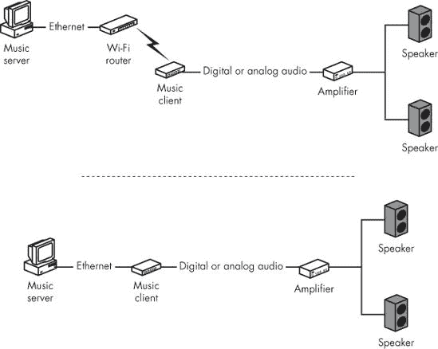

# 第十五章。您可以将哪些其他设备连接到您的网络

### *音频、视频、家庭娱乐以及更多*

如果您能将信息转换为数字数据，您就可以通过网络传输这些数据，要么将其转换回原始形式，要么将其用作计算机的输入数据。有了合适的输入和输出设备，您可以使用共享计算机资源的同一网络来监控和控制工业流程，通过麦克风收听声音或通过摄像头观看图像，通过您的家庭或商业场所分配音频和视频，并通过遥控操作设备。如果网络连接到互联网，您就可以从任何有互联网连接的地方做所有这些事情。

许多这些网络应用非常专业（例如监控溪流中的水温），但其他应用对于家庭或小型商业网络通常是实用的。例如，您可以使用您的网络来监视或收听另一间房间的活动，或者从娱乐服务器将音频和视频文件分发到您家中几个位置的扬声器和视频显示器。本章解释了如何将附加设备连接并使用到您的网络中。

# 在您的网络中使用麦克风和摄像头

连接到计算机或音频服务器的麦克风可以捕捉声音并将它们转换为数字音频文件。摄像头（称为*网络摄像头*）可以捕捉计算机或服务器可以将其转换为静态或动态图像文件的画面。音频或视频服务器可以是带有内置或外置麦克风或摄像头（或两者都有）的计算机，或者是一个直接连接到网络的独立设备。当另一台计算机通过网络接收相同的音频和/或视频文件时，它可以在显示器上显示图像，并通过一个或多个扬声器或一副耳机播放声音。

一个广泛使用的远程网络摄像头服务是大家熟悉的在线交通监控器，就像图 15-1 中展示的那样。

**图 15-1. 一辆交通摄像头使用网络摄像头。这个摄像头显示了布鲁克林桥上的汽车和行人。**

## 内部和外部控制器

视频摄像头可以通过安装在计算机上的控制器连接到网络，该控制器位于插卡上的 PCI 扩展卡内，或者作为外部 USB 设备。控制器以恒定速率从一侧到另一侧、从上到下扫描摄像头的光敏部分；当它到达一行的末端时，控制器自动移动到下一行；当它到达底部行的末端时，控制器返回顶部。

在信号链的某个点上，摄像头镜头的模拟图像转换为连续的数字数据流；在大多数情况下，这发生在摄像头内部，但某些设备可能在控制器卡上执行模拟到数字的转换。作为替代，摄像头一次捕获一张静态图像，并将它们存储或作为一系列图像文件通过网络传输。

### 注意

许多摄像头控制器卡包括两个或多个摄像头输入。一般来说，多输入卡比具有类似图像质量和性能的单输入卡更贵。

计算机可以使用声卡或 USB 或 FireWire 端口以类似的方式处理音频。声卡直接从麦克风或通过外部放大器、调音台或其他来源接收模拟音频；USB 端口接收来自外部模拟到数字转换器的数字音频。

计算机接收到一个或多个视频流、音频流或静态图像后，可以执行以下操作：

+   将它们存储在硬盘或其他大容量存储设备上

+   将图像显示在计算机的视频监视器上作为“实时”图像

+   通过计算机的扬声器或通过插入计算机的耳机播放音频流

+   将它们集成到另一个程序或文档中，例如网页或文字处理文档

+   通过计算机的网络连接传输它们

连接到网络计算机的摄像头替代品是*网络摄像头*——一个摄像头和控制单元，作为独立节点直接连接到网络。典型的网络摄像头包括一个用户可以通过网络操作的控制程序，或者，通过正确的密码集和授权，通过互联网操作。根据每个摄像头单元的具体功能，遥控可能允许操作员放大和缩小图像，旋转或倾斜摄像头，或通过同一控制单元选择不同的图像。一些网络摄像头还包括一个无线网络接口，可以通过 Wi-Fi 基站连接到网络。

## 网络摄像头和麦克风

将摄像头连接到您的网络——无论是否在同一位置安装麦克风——可以添加许多有用的功能和功能。在任何您希望或需要远程视听的地方，您都可以安装摄像头、麦克风或两者兼具。以下是一些例子：

**监控显示器**

靶向无人看管的入口、走廊和其他位置的摄像头可以传输图像到远程计算机的视频显示器。

**婴儿监视器**

在婴儿房或儿童房中安装带有摄像头和麦克风的网络计算机可以替代传统的婴儿监视器发射单元。您可以在工作时监视婴儿——通过桌面上的一个小窗口，该窗口包含另一房间中摄像头的图像。

**实时对话**

当双方都连接了摄像头和麦克风到他们的电脑时，通过网络进行“面对面”的对话变得很容易。

**远程会议**

会议或会议中的参与者可以从远程位置参与。

# 家庭娱乐网络

家庭娱乐系统可以通过连接家庭电脑彼此以及连接到互联网的同一网络来分配音乐、电视、电影和其他音频和视频。空中、电缆或卫星电视和广播、CD 播放器中的音乐或存储在硬盘上的音乐，以及 DVD 中的视频都可以为可以在任何有网络连接的房间播放音乐或显示视频的系统提供源材料。

现在有一个完整的行业支持非常昂贵的家庭娱乐系统，包括视频放映室（高科技爆米花机是可选的，需额外付费）、嵌入墙壁或从厨房或卧室隐藏的柜子中升起的电视屏幕、每个房间都有多个扬声器，以及预编程的氛围照明。但除非你有多达 10,000 美元或 20,000 美元（或更多——很多更多）的额外费用来购买昂贵的设备和定制安装，否则这些系统并不特别实用。我们大多数人将不得不（！）满足于一些相当不那么奢侈的东西。如果你已经为你的房子或公寓布线了数据网络，你可以添加一个娱乐服务器，并在不花费大量资金的情况下连接多个房间的立体声音响或电视。你还可以分阶段连接娱乐设备到你的网络，而不是一次性花费大量资金。

可供选择的设备和服务种类繁多，可以适应家庭娱乐系统类别，但出于本书的目的，我会考虑通过家庭网络分配音乐、视频和游戏的过程，并在电视、立体声音响、环绕声音响和桌面“收音机”上播放。

# 通过家庭网络的音乐

任何能够再现声音的技术至少包含两个元素：一个*源*和一个*目的地*。通常在源和目的地之间会有一个或多个额外的中间元素，例如一个放大器来提升音量水平，或者一个模拟到数字或数字到模拟的转换器，但你总会有一个程序源和一个将信号转换回声音的目的地设备。

例如，考虑一个像图 15-2 中展示的古老留声机。声音的源是一个跟随槽中振动轨迹的针头，而目的地是一个通过喇叭再现这些振动的膜片。

在现代音乐系统中，程序源可以包括以下内容：

+   模拟媒体，如黑胶唱片或磁带

+   数字媒体，如光盘

+   广播电台

+   有线电视和卫星广播电台或音乐服务

+   互联网

+   存储在计算机硬盘或便携式设备（如 iPod）上的数字音乐文件

**图 15-2. 这张留声机上播放的音乐来源是刻有沟槽的赛璐珞唱片上的针；目的地是号角。**

目的地可以是以下任何一种：

+   连接到家庭立体声系统、电视接收器或环绕声系统的扬声器

+   连接到计算机或集成到笔记本电脑中的扬声器

+   连接到便携式设备（如 iPod）的耳机或基座单元的扬声器

+   一种存储设备，如硬盘或闪存驱动器

+   桌面式或便携式音响盒或互联网收音机

家庭网络可以将这些来源中的任何一个连接到任何一个目的地。在通过网络传输之前，可能需要将源从模拟格式转换为数字格式，在通过扬声器或耳机播放声音之前，可能还需要将数字数据转换回模拟格式，但这些只是相对较小的技术细节；重要的是，处理其他数据的同一网络也可以分发数字音频文件。在联网术语中，可以认为处理节目来源的设备是*服务器*，而目的地是*客户端*。

## 音频服务器

家庭网络中的*音频服务器*存储音乐、广播节目和其他声音文件，这些文件对同一网络上的其他设备都是可访问的。服务器可以是你也用作工作站的计算机，其他数据文件的服务器，音频文件的专用服务器，或立体声或家庭影院系统的一部分。无论它们的物理形式如何，大多数音频服务器都执行以下功能：

+   他们将（或*抓取*）CD 和其他来源的音频轨道转换成一种或多种标准文件格式。

+   他们将声音文件存储在硬盘上。

+   他们根据需求将声音文件分发到一个或多个播放器。

+   他们可以直接从 CD、DVD、互联网或其他数字源将音频分发到网络上。

任何其他服务器，音乐服务器都应该有一个相对较大的硬盘，有足够的空间来存储你想要存储的所有单个音乐文件。通用计算机和立体声组件音乐服务器都可以执行类似的服务；每种类型都有不同的成本、易用性和音质组合。

### 通用计算机

当你使用标准的台式或塔式计算机作为你的音乐服务器时，你可以使用同一台计算机来提供其他类型的数据服务。你可以使用免费或低成本的软件，如 Windows Media Player、RealPlayer、Sound Forge Audio Studio、Exact Audio Copy 或 Audacity 来创建或转换文件到你的标准存储格式，并且你可以通过安装一个或多个额外的硬盘来增加服务器的存储容量。

最常见的声卡（以及许多主板上的内置声音处理）的音质对于休闲听音来说是足够的。然而，质量并不如“发烧友”或“录音室质量”的声卡或外部接口单元好，后者能将背景噪音和失真降到最低。如果你是从 CD 或未压缩的数字节目源创建自己的文件，你可能需要将电脑附带的“Sound Blaster”接口升级到更好的声卡。另一方面，如果你通过从 iTunes 或其他在线服务下载 MP3 文件，或者将你的音乐从 CD、黑胶唱片或其他来源转换为高度压缩的 MP3 文件来获取所有音乐，你不会注意到任何区别。

操作系统选择——Windows、Macintosh 或 Linux——是个人偏好的问题；三者都可以作为音乐服务器使用。如果你已经在使用 Windows Home Server 来控制你的家庭网络并共享其他文件，同一个服务器可以流式传输音频（和视频）到其他网络计算机。

微软的 Windows 媒体中心，包含在某些版本的 Windows Vista 中，也可以作为单独的附加产品提供，它主要是一个媒体播放器，但当你将其连接到已安装媒体中心扩展技术的设备时，你可以使用媒体中心计算机向其他计算机、游戏机和电视提供音频和视频文件。

对于混合网络，XMBC 媒体中心([`xmbc.org/`](http://xmbc.org/))是管理和共享媒体文件的一个优秀选择。

请记住，将包含服务器音乐文件的文件夹或驱动器配置为共享资源，以便同一网络上的其他计算机和设备可以访问。

### 专用音乐服务器

烧录音乐服务器将音乐和其他音频文件存储在硬盘上，并且通常执行两种播放方式：它们直接连接到立体声或家庭影院系统作为本地程序源，并且它们还连接到以太网或 Wi-Fi 网络，向其他房间的计算机和音频设备提供音乐文件。

作为发烧友设备出售的音乐服务器通常包含高质量的内部部件，并且经常有前面板文本显示屏，可以提供关于当前播放的音乐轨道的信息。其中许多，如麦金托什 MS750，也非常昂贵。大多数都包括自己的 CD 驱动器，用于将副本复制到内部硬盘驱动器，以及具有出色的模拟到数字转换器的模拟输入，用于制作黑胶唱片和其他模拟源材料的数字副本。

音乐服务器是昂贵的替代方案，它比具有非常好的内部或外部音频接口卡或适配器的计算机更贵，但在一个严肃的音响系统中，这样的服务器有其位置；一个 3500 美元的音乐服务器可能作为包含 3000 美元放大器和一对 7500 美元扬声器的系统的一部分是有意义的。但如果我们愿意使用计算机，其他人可以用大大减少的费用完成同样的事情。

### 音频文件格式

数字音乐播放器将常见格式的声音和音乐文件转换为可以通过耳机或扬声器播放的模拟声音。其中一些格式使用*压缩*音频，将数据压缩成更小的文件。其他格式使用更大的*未压缩*文件，以保持所有原始细节。最常用的压缩音频文件格式是 MP3。最广泛使用的未压缩文件格式包括 WAV 和 AIFF。表 15-1 列出了你可能会看到的格式。

格式的选择是在文件大小和声音质量之间进行权衡。一般来说，声音质量随着文件大小的增加而提高，以每秒比特数来衡量。一首音乐轨道的 WAV 文件可能需要的存储空间是相同记录的 MP3 文件的八到十倍，但 WAV 文件几乎总是原始内容的更准确副本。压缩的 MP3 文件在硬盘上占用的空间更少，并且可以在网络上更快地传输，但 WAV 文件中增加的比特数意味着音乐有更少的失真和更好的频率响应（最低低音和最高高音之间的范围）。换句话说，MP3 文件可能听起来像通过 AM 收音机播放的录音，而同样音乐从 WAV 文件播放可能至少和非常好的 CD 播放器一样好。

**表 15-1. 常见音频文件格式**

| 文件扩展名 | 格式名称 | 描述 |
| --- | --- | --- |
| *.wav* | WAV 或 Wave（波形音频） | 这是微软的未压缩音频格式，后来也被其他人采用。它在音频存档中广泛使用。 |
| *.mp3* | MP3 或 MPEG Layer-3 | 这是一种消费音频的压缩格式。它不是一个高保真格式，但对于休闲收听来说已经足够好了。 |
| *.ogg* | Ogg Vorbis | 这是一种开源的压缩格式。它广泛用于免费内容。 |
| *.flac* | 自由无损音频编解码器（FLAC） | 这是一种压缩格式，与 MP3 或 Ogg Vorbis 不同，它不会从压缩文件中删除内容。由于这种格式是无损的，FLAC 文件比其他压缩文件格式更准确地复制了原始内容。 |
| *.aiff* | 音频交换文件格式 | 这是一种未压缩格式，由苹果公司引入并在其计算机上主要使用。 |
| *.wma* | Windows Media Audio | 这是微软开发的一种压缩格式，主要用于与 Windows Media Player 一起使用（但它也被其他播放器支持）。 |
| *.ra* 或 *.ram* | Real Audio | 这是 Real Audio 的流式传输互联网音频格式系列。它被包括 BBC 在内的许多广播电台广泛使用。 |
| *.bwv* | 广播波形 | 这是欧洲广播联盟为数字存储音频文件而建立的未压缩格式。它与 WAV 类似，但为*元数据*（关于每个文件内容的详细信息）提供了额外的空间。 |

MP3 文件对于休闲收听来说完全足够，尤其是对于语音，但未压缩文件听起来要好得多。在文件大小和音质之间的权衡在你将文件加载到存储空间有限的 iPod 或其他便携式设备上时尤为重要。对于家庭系统，你几乎没有或没有实际存储空间的限制（你几乎总是可以向服务器添加另一个硬盘驱动器），将你的音乐文件存储在未压缩格式中，特别是如果你计划通过高质量立体声或环绕声系统收听，这是最好的。

### 注意

存储原始录音的存档副本作为未压缩文件非常重要，这样未来的用户将能够使用尽可能好的录音进行工作。许多图书馆和档案馆都保留高质量的 WAV 文件作为主副本，以及一个单独的 MP3 *听副本*用于分发。当你处理商业可用的 CD 时，存档未压缩文件的重要性较低，因为可能已经有数百或数千（如果不是数百万）的其他副本在流通，但当你只有唯一副本时，存档未压缩版本可能会有所不同。

许多音频播放器程序可以自动识别和加载大多数常见文件格式。然而，你可能想安装多个程序，以防你的默认播放器无法处理某个文件。例如，Windows Media Player 无法接受非常高的比特率（每秒 24 位/96 千赫）的 WAV 文件，因此你必须在另一个程序中播放它们，例如 Audacity 或 Sound Forge。

### 从模拟源转换

如果你想要通过网络分发从 LP 和其他模拟媒体（如磁带、旧 78 转唱片和开盘磁带）的音乐和其他录音，你必须首先将它们转换为数字音频文件。这种转换比抓取 CD 更耗时，但如果你有一些其他格式中不可用的优秀旧唱片，这可能会很有回报。

如果你计划将大量模拟媒体转换为数字文件，使用比电脑内置的更好的模拟-数字转换器是值得额外花费的。专业录音室质量的转换器可能价值数百或数千美元，但像 E-Mu、M-Audio 和 Edirol 等制造商生产的更便宜的设备，将为你提供比消费级声音接口显著更好的性能。

记住，你的数字副本的声音不会比从模拟原始材料传来的声音更好。在制作副本之前，务必清理你的黑胶唱片上的灰尘和杂质，并确保你的唱机针头处于良好状态。在尝试播放卡式磁带或开盘磁带之前，使用酒精或其他头部清洁剂清除针头表面的污垢。

## 音频客户端

在家庭网络中，音乐分发系统的另一半是一个 *音乐客户端* 或 *音频客户端*。客户端可以是运行在家庭电脑中的一或多个程序，一个立体声音频组件，环绕声或家庭影院系统，或者一个桌面“随身听”或网络收音机。客户端从服务器或通过互联网的流媒体音频程序接收音乐文件，并通过一套耳机或扬声器播放。

通过网络播放的声音质量取决于几个因素：原始录音的质量、网络流量量，以及客户端的数字到模拟转换器和扬声器的质量。例如，如果你通过笔记本电脑中微小的、音质差的扬声器播放一个起源于嘈杂的卡式磁带的音乐曲目，音乐听起来会比从 CD 上抓取并通过好的立体声放大器和高保真扬声器播放的曲目差得多。而且如果连接服务器和客户端的网络已经接近其容量，或者它正在使用嘈杂的 Wi-Fi 连接，当客户端无法将数据包转换为连续的音频流时，你可能会在音乐中听到重复的中断。

### 通过计算机播放音乐

作为音乐客户端使用的计算机必须具有内部或外部音频接口，例如声卡、电脑主板的接口，或者通过 USB 或 FireWire 端口连接到电脑的接口。要播放音乐文件，只需在支持该文件格式的音频播放程序中打开文件，就像打开任何其他类型的文件一样。电脑音频接口的音频输出应通过音频线连接到一套有源电脑扬声器或全尺寸立体声或家庭影院系统。

如果你将电脑仅用作音乐客户端，你不需要最新的、最强大的处理器或大屏幕显示器。任何可以连接到网络并支持合理的音频接口单元的东西都应该完全足够。如果你有一台不再用于其他目的的旧笔记本电脑，尝试将其用作音乐客户端；笔记本电脑可能比台式单元更紧凑，如果你将其插入 USB 端口并连接一个合理的音频接口，它可能同样有效。

大多数计算机看起来都像，嗯……就像计算机。如果您的立体声系统位于客厅的书架上或玻璃柜门后面，您可能更喜欢使用与您的其他立体声组件相匹配的音乐服务器。如果您不介意组装一台由部件组成的计算机，请寻找看起来像立体声设备的机箱（例如，图 15-3

**图 15-3. 一些机箱设计得看起来像立体声组件。**

*照片由安泰克提供*

### 将您的网络连接到您的立体声

如果您没有备用计算机，您也可以在您的立体声和用于其他目的的附近计算机之间运行音频线。例如，如果您在家庭办公室或书房中既有台式计算机又有立体声系统，您可以使用该计算机通过立体声的放大器为现有扬声器供电。即使立体声在另一个房间，通过墙壁或地板运行音频线可能更实用。图 15-4 显示了典型的系统连接。

要从您的音乐服务器播放音乐，请将立体声的输入选择器设置为辅助输入（或您连接到计算机的任何输入），并使用计算机的鼠标和显示器选择您想听的歌曲或其他音乐文件。如果您的计算机或声卡有数字输出（无论是光缆还是铜缆）且立体声有数字输入，请使用数字线传输音频。计算机应自动在兼容的播放器中打开音乐文件并将其传输到立体声。

**图 15-4.** 音乐服务器可以通过 Wi-Fi 连接或以太网线连接到客户端。客户端将音频发送到放大器的模拟或数字辅助输入。

### 专用音乐客户端设备

作为使用电脑的替代方案，可以考虑使用专门设计为音乐客户端或网络音乐播放器的独立设备。客户端设备向音乐服务器发送指令以查找和播放特定的音乐文件（或其他音频轨道），音乐服务器将请求的文件流回播放器。播放器可以将数字流发送到音频系统中的转换器，或者将文件转换为模拟信号并将音乐信号发送到音频系统。

例如，Slim Devices 生产了一系列 Squeezebox 音乐客户端，包括 Squeezebox Classic、Squeezebox Receiver 和 Squeezebox Transporter。图 15-5 显示了 Squeezebox 的网络和立体声系统的连接。Roku、Netgear、Philips 和其他公司也有类似的产品。这些设备大多数被作为音频组件来销售，因此寻找演示的最佳地点可能是家庭音频零售商而不是电脑店。

每个音乐客户端制造商支持不同的音频文件格式；它们都支持最广泛使用的格式，但如果你的音乐库包含更少见的格式，你应该确认客户端可以识别它们。

网络音乐播放器提供了一些好处：它们占用的空间比电脑小；它们通常更容易使用；并且它们可以提供与电脑相当甚至更好的音质，而且价格更低。如果你正在购买新设备通过网络播放音乐，一个专用的音乐播放器可以是一个极好的选择；但如果你已经有一台闲置的电脑，你可能不需要购买任何新设备就能完成同样的事情（尽管更换电脑的音频接口可能会提高系统的性能）。

**图 15-5. Slim Devices 的 Squeezebox 通过以太网或 Wi-Fi 网络将音乐服务器连接到家庭音频系统。**

*照片由 Slim Devices 提供*

### 网络接收器和互联网收音机

只需通过音乐服务器或通过互联网的流媒体广播电台和音乐频道收听音乐，并不需要使用电脑或全尺寸的立体声或环绕声系统。你可以找到一类桌面“互联网收音机”，它们将音乐客户端和扬声器组合在一个盒子中（有时带有卫星扬声器以实现立体声）。尽管名称如此，大多数互联网收音机也可以播放存储在你自己的音乐服务器上的音乐文件。一些还包含 AM 和 FM 收音机，因此你可以使用同一台设备收听本地广播电台。

互联网收音机的工作方式与任何其他网络音乐客户端一样：它通过互联网端口或内置 Wi-Fi 端口连接到您的家庭网络，并允许您从自己的服务器或通过互联网选择流媒体程序。最终，这些设备将像您卧室或厨房中的台式收音机一样易于使用；只需打开设备，选择电台，然后收听。重要的区别是您不受本地电台节目的限制；您可以从数千个电台和流媒体音乐服务中选择，这些服务提供大量音乐、新闻和其他节目——其中许多没有广告。

今天，互联网收音机仍然是昂贵的 novelty——大多数售价 200 美元或更多，但如果价格下降，它们可能会成为仅接收本地电台的收音机的巨大替代品。

# 通过家庭网络传输视频

视频——以电影、电视节目、家庭录像或通过互联网下载的文件的形式——是另一种您可以通过网络分发的节目材料。您可以在计算机监视器上或通过电视屏幕上的适配器观看视频。

通过网络进行视频分发与音频类似：视频文件存储在服务器上，并在需要时传输到客户端。然而，视频文件每分钟的内容比特数比音频文件多得多，因此网络必须具有足够高的容量来处理额外的需求。在实践中，这意味着许多 Wi-Fi 链路（除了最新的 802.11n 设备）可能无法跟上视频流，而且即使是有线 100-BaseT 网络，如果您尝试同时推送多个视频流，也可能过载。

当您想要通过互联网下载电影或其他大型视频文件时，通常最好将文件保存到您的计算机硬盘上，而不是尝试在计算机接收的同时观看它，因为下载速度通常太慢，无法让视频播放程序组装数字数据包并以连续流的形式显示它们。另一方面，当所有比特都已经在 DVD 或硬盘上时，视频播放器可以播放流，而无需等待更多比特到达。

您可以将传入比特流想象成一个花园水管，它以缓慢的滴漏速度向水桶注水；如果您倒水的速度超过水管向水桶注水的速度，您必须先重新装满水桶，然后才能继续倒水。同样，对于通过网络传输的视频文件来说也是如此：如果包含视频流的 数据包进入您的网络的速度比视频播放器组装和显示它们的速度慢，播放器的缓冲区将耗尽比特，并停止显示任何内容，直到它收到更多。

## 视频服务器

视频服务器是一种网络服务器，用于存储电影和其他视频文件，并通过网络将它们发送到客户端计算机上的视频播放程序或视频播放器。大多数视频服务器还可以存储和分发音乐文件。一些计算机操作系统，如 Windows Home Server 及其相关客户端程序，包括针对视频分发优化的软件，但您也可以使用通用的 Linux、Unix、Macintosh 或 Windows 服务器，只要服务器计算机包含一个或多个相对较大的硬盘驱动器，并且有足够的可用空间来存储非常大的视频文件。

其他媒体服务器将网络服务器和本地媒体播放器的功能合并到一个单一软件包中。您可以通过连接到媒体服务器的屏幕和扬声器播放音乐和视频，或者通过您的网络从其他播放器向服务器发送请求。

## TiVo 和其他数字视频录像机

数字视频录像机（DVR）的主要功能是记录即将播出的广播或有线电视节目以便稍后观看。然而，一些 DVR，包括北美和澳大利亚最受欢迎的 DVR——TiVo，还可以通过网络将节目分发到另一个 DVR。通过将 TiVo 连接到网络，您还可以通过互联网而不是较慢的拨号电话连接下载节目时间表。

包括 Series2 双调谐器和 Series3 高清 DVR 在内的最新 TiVo 型号都配备了以太网端口作为标准配置。较老的 Series2 单调谐器 DVR 需要可选的以太网网络适配器，该适配器连接到 DVR 的 USB 端口。对于无线连接，您必须使用 TiVo 无线适配器，这是一个可选的配件，连接到 DVR 的 USB 端口，或者使用 Belkin、D-Link、Linksys 或 Netgear 生产的兼容适配器。

### 连接到有线网络

要将 TiVo 连接到现有的有线网络，请按照以下步骤操作：

1.  从 DVR 到网络集线器或路由器运行一根以太网线。

1.  按下 DVR 上的 TiVo 按钮，选择**消息和设置** ▸ **设置** ▸ **电话和网络**。

1.  从显示在图 15-6 中的网络连接屏幕中选择**更改网络设置**选项。

    

    **图 15-6. 使用 TiVo 的网络连接屏幕配置家庭网络的以太网连接。**

1.  按照屏幕上出现的说明操作。如果您的网络有一个活动的 DHCP 服务器，TiVo 客户端将自动检测它并显示网络设置完成屏幕。如果您的网络没有 DHCP 服务器，选择**否，让我指定静态 IP 地址**，并为这个网络节点输入 IP 地址、子网掩码以及节点网关路由器和 DNS 服务器的数字地址。

1.  DVR 将测试连接。如果设置正确，它将显示网络设置完成屏幕。

### 连接到无线网络

要通过 Wi-Fi 链接将 TiVo DVR 连接到您的网络，请按照以下步骤操作：

1.  按下您的数字录像机（DVR）上的 TiVo 按钮。TiVo 中央屏幕将出现。

1.  选择**消息和设置** ▸ **设置** ▸ **电话和网络**。

1.  如果您的 TiVo 已经连接到电话线，请选择使用网络。如果它连接到有线网络，请选择更改网络设置。按下**选择**。

1.  如果无线适配器尚未连接，请现在连接它。当 TiVo 识别到无线适配器时，它将显示网络适配器检测屏幕。

1.  按下**选择**。将出现无线网络名称屏幕。

1.  您可以选择您 Wi-Fi 网络的名称并按下**选择**，或者如果网络没有广播网络名称，选择**输入网络名称**并按照屏幕上的说明操作。

1.  TiVo 将要求您输入网络密码。使用屏幕上的键盘输入您的 WEP 或 WPA 密码，然后点击**完成输入网络密码**。

1.  如果密码正确且您的网络使用 DHCP 服务器，将出现网络设置完成屏幕。如果网络不使用 DHCP，您将看到一系列配置屏幕。输入 IP 地址、子网掩码以及您的网络网关路由器和 DNS 服务器的地址。

### 导入节目

要从另一个房间的第二台数字录像机（DVR）观看存储在 TiVo 上的节目，请按照以下步骤操作：

1.  打开两台电视并转到目标播放器的**现在播放列表**。其他 DVR 将出现在可用节目列表的底部。

1.  高亮显示远程 DVR 的名称并按下**选择**。该 DVR 的现在播放列表将出现。

1.  选择您想要传输到这个 DVR 的节目名称并按下**选择**。将节目获取屏幕将出现。

1.  在传输节目时观看节目，请在获取节目屏幕上选择**开始播放**。传输完成后，节目的名称将出现在这个 DVR 的现在播放列表中。

## 在计算机上播放视频

一些在计算机上播放音乐的相同程序也可以处理视频文件。Windows Media Player、RealPlayer 和 QuickTime 包括音频和视频解码器。其他如 VideoLAN ([`www.videolan.org/`](http://www.videolan.org/))和 MPlayer 则针对视频进行了优化。与其他网络文件一样，您可以使用客户端计算机上的播放程序从服务器查看视频文件。在大多数情况下，一个或多个视频播放程序会自动控制特定文件类型，因此几乎所有的视频文件在您从屏幕目录或文件文件夹中选择文件时都会自动加载到适当的播放器中。

## 将电视连接到您的网络

在您有电视但没有计算机的房间里，通常可以使用游戏机或其他适配器在电视屏幕上观看电影和其他数字视频文件。在既有计算机又有大屏幕电视的房间里，将电视直接连接到计算机作为较小计算机监视器的补充通常是值得麻烦的。电视屏幕上的图片和文字质量并不总是像计算机监视器上的同一图像那样清晰，或者像广播或有线电视信号或 DVD 播放器上的图像那样清晰，但经过一些调整，它足够好以供观看。

### 直接连接到计算机

要将电视直接连接到计算机，您需要两样东西：

+   计算机输出的与电视输入兼容的信号

+   计算机视频控制器的驱动软件

您的电视有一个或多个以下输入类型：

+   两个或更多螺丝端子，连接到扁平天线电缆

+   一个螺纹插座，与来自天线、有线电视服务或其他节目源的同轴电缆相匹配——电缆末端的插座和匹配插头被称为*F 连接器*

+   一个带有四个或七个插孔的圆形连接器，与一个称为*S 视频*（用于*超级视频*或*分离视频*）的多针插头相匹配

+   三个颜色编码的插座（黄色用于视频，白色用于立体声音频左或单声道，红色用于立体声音频右）用于模拟音频视频电缆——这些类似于大多数家庭立体声系统中使用的 RCA 唱机插头和插座

+   类似于旧式计算机显示器所使用的 15 针模拟 VGA 连接器

+   一种矩形多针数字输入，称为*数字视觉接口（DVI）*连接器

+   一种称为*高清晰度多媒体接口（HDMI）*连接器的 19 针或 29 针数字插座

从计算机向电视传输信号的最简单方法是找到与您的电视输入相匹配的计算机视频控制器，但这并不总是可能的。例如，您找不到只能通过 F 型连接器作为信号输入直接向旧模拟电视供电的视频控制器（或者一个更老的带有螺钉端子的电视）。另一种选择是使用某种类型的*适配器*——一端有不同电缆的特殊电缆，或者一个*转换器*，它将计算机的输出信号转换为与电视输入兼容的信号。为了获得 HDTV 屏幕的最佳质量，请根据电视的输入使用 DVI-to-DVI 电缆、DVI-to-HDMI 电缆或适配器。在电子产品零售商处寻找适配器或转换器。

### 视频输出驱动程序

视频控制器的驱动软件可能来自几个可能的来源：与您的计算机操作系统捆绑在一起，或由视频控制器制造商或控制器芯片组提供，或者由视频转换器提供。每个驱动程序包的控制程序都不同，因此您在安装软件时必须遵循打印的或屏幕上的说明。

### 视频缩放

不考虑模拟和数字视频转换相关的问题，似乎电视屏幕和计算机显示器之间没有太多区别。但它们使用不同的方法来完成相同的目标，这些方法在您尝试从一个转换到另一个时会产生问题。困难产生的原因是因为计算机监视器和电视屏幕将图像分解成扫描线和像素的方式。为了解释的目的，我们可以考虑一张静态图片，但同样的问题也可能出现在动态图像中。

在北美，模拟电视以从左到右的顺序显示屏幕上的 535 条扫描线来显示图像；当电视到达一条扫描线的末端时，它会向下移动到下一条。在数字电视中，屏幕被分成大量称为*图像元素*或*像素*的点。电视用来点亮扫描线段或像素的方法在显像管和平板屏幕上不同，但扫描线或像素的数量由行业标准指定。屏幕的大小无关紧要；屏幕上的扫描线或像素数量始终相同（平板屏幕有几种不同的标准，取决于尺寸和成本，但每个标准下的像素数量是恒定的）。

计算机显示器也使用像素，但图像中的像素数量取决于屏幕分辨率。当您将监视器的分辨率从，比如说，800 × 600 像素更改为 1280 × 1024 像素时，计算机会调整屏幕或任何其他图像区域内 1 英寸（2.5 厘米）平方空间内的像素数量。

要在电视屏幕上显示电脑图像，控制器必须调整扫描线或像素的数量以适应监视器上可用的区域。如果电视屏幕期望的扫描线或像素多于传入信号，控制器将重复偶尔的扫描线或像素，或者它将创建一条新的扫描线，该扫描线是上方和下方扫描线的混合。如果电脑发送过多的扫描线或像素，屏幕将跳过其中一些。这个过程称为*视频缩放*。

视频缩放有两个影响：它迫使视频控制器努力改变图像的大小（有时是形状），这可能会降低性能，并且它将图像发送到电视屏幕，可能会出现颜色模糊、焦点松散、边缘锯齿和图像失真。一个好的控制器可以做出调整以最大限度地减少这些问题，但不要惊讶，如果您的电脑在电视屏幕上显示的图像（即使是非常好的高清电视屏幕）不如电脑监视器上的图像清晰；当一切正常工作时，一个好的 DVI 到 HDMI 图像在 HDTV 上可能比 VGA 显示更清晰，但一个不匹配的系统可能会显得相当不令人印象深刻。

# 游戏机

最广泛使用的游戏机——索尼 PlayStation2 或 PlayStation3、任天堂 Wii 和 Xbox 360——都可以通过有线以太网端口或无线连接连接到您的家庭网络，以支持在同一局域网或通过互联网与一台或多台附加游戏机进行多人游戏（它们也可以连接到商业网络，但您的雇主可能不会批准）。

## 连接 PlayStation

要通过无线连接，请使用 PlayStation 的内置 Wi-Fi 接口。要将索尼 PlayStation 通过以太网线连接到您的网络，请从游戏机运行以太网线，直接连接到以太网集线器或路由器。

要配置网络连接，请按照以下步骤操作：

1.  关闭或断开网络集线器、调制解调器、Wi-Fi 基站和其他网络设备的电源，等待两分钟，然后再次打开所有设备。

1.  如果 PlayStation 游戏机和连接的显示器尚未打开，请现在打开它们。

1.  确认 PlayStation 的互联网连接处于活动状态：从 XMB 主菜单中选择**设置** ▸ **网络设置** ▸ **互联网连接** ▸ **启用**。

1.  选择**互联网连接设置**并按下⊗按钮。PlayStation 将询问“您想继续吗？”

1.  选择**是**。PlayStation 将要求您选择连接方式。

1.  选择**有线连接**并按下⊗按钮。将出现互联网连接设置屏幕。

1.  选择**简单**并按下⊗按钮。PlayStation 将扫描您的连接并显示当前设置。

1.  再次按下⊗按钮以保存配置值。将出现测试连接屏幕。

1.  按下⊗按钮以测试连接。大约一分钟后，PlayStation 将显示“成功”或“失败”消息。

1.  如果测试成功，PlayStation 就准备好运行多人游戏了；如果失败，PlayStation 将提供修复问题的说明。

## 连接 Wii

Nintendo 的 Wii 控制台需要可选的 Wii LAN 适配器（型号编号 RVL 015）才能连接到网络。按照以下步骤将 Nintendo Wii 连接到您的局域网：

1.  关闭 Wii 控制台并将 LAN 适配器插入控制台的 USB 端口。

1.  从局域网适配器运行以太网电缆到您的网络路由器或集线器。

1.  打开 Wii 控制台。

1.  从主菜单中，点击左下角的**Wii**按钮。将出现显示数据管理框和 Wii 设置框的屏幕。

1.  点击**Wii 设置**框。将出现系统设置屏幕。

1.  点击列表右侧的蓝色箭头，转到三个系统设置菜单中的第二个。

1.  点击**互联网**按钮。将出现互联网屏幕。

1.  点击**连接设置**。将出现连接设置选项列表。

1.  选择一个“空”连接槽，显示**无**作为连接类型。

1.  根据您的系统选择无线或有线连接。控制台将告诉您它正在启动测试。

1.  点击**确定**。Wii 控制台将测试您的连接。如果成功，您就可以在网络上使用您的游戏控制台了。如果失败，尝试以下这些修复方法：

    +   检查您的防火墙设置。

    +   如果控制台显示错误代码，请访问[`www.nintendo.com/consumer/systems/wii/en/en_na/errors/iindex.jsp`](http://www.nintendo.com/consumer/systems/wii/en/en_na/errors/iindex.jsp)以查找代码的解释。

## 连接 Xbox 360

如果您在同一房间内使用 Microsoft Xbox 360 游戏控制台和计算机，但该房间只有一个网络插孔或插座，您可以通过游戏控制台将网络连接到计算机。按照以下步骤将 Microsoft Xbox 360 控制台连接到您的网络：

1.  关闭或断开计算机、您的网络路由器、集线器、调制解调器和 Xbox 360 控制台的电源。

1.  如果房间内没有第二个网络插座，请从计算机断开以太网电缆并将其插入 Xbox 360 控制台。现在电缆应从游戏控制台运行到网络集线器或路由器。

1.  如果您有备用插座，您不需要断开计算机。只需从游戏控制台到空闲网络插座或直接到集线器或路由器的开放端口运行新电缆。

1.  如果需要，将第二根以太网电缆的一端插入 Xbox 360 控制台，另一端插入您的计算机。

1.  按照以下顺序打开您的设备：首先是调制解调器，然后是路由器，最后是计算机。暂时保持游戏控制台关闭。

1.  确认计算机可以检测到局域网和互联网，就像您添加游戏控制台之前一样。

1.  打开 Xbox 360 控制台，确保光盘托盘中没有光盘。Xbox 仪表板将显示 Xbox Live 区域。

1.  假设您已经配置了诸如时间和语言之类的设置，游戏配置文件屏幕将出现。如果您在其他位置已经有了一个 Xbox Live 会员资格，请选择“迁移您的 Xbox LIVE 账户”。如果您正在设置新账户，请选择“加入 Xbox LIVE”。

1.  按照屏幕上的说明提供您的联系信息和游戏配置文件，并创建或转移账户。

# 将家用电器连接到您的网络

目前它们并不广泛使用（在许多人的观点中，也不够有用以至于可以证明额外成本是合理的），但带有互联网连接的家用电器已经存在，未来几年可能会有更多。网络连接可以让你通过互联网或手机远程控制家里的电视、冰箱、微波炉和其他电器——即使你不在家。结合内置的诊断模块，网络连接还将使识别问题和通知服务部门成为可能，服务部门可以发送软件修复或派遣维修人员，以防止问题演变成灾难性故障。

记得那个经典的科幻噩梦吗？在这个梦中，你家里的所有电器都在互相沟通，并密谋接管你的生活。当你把所有东西都连接到家庭网络时，这个幻想就离现实更近了一步。

已经建立了几个网络家用电器规范，以确保不同制造商生产的电器可以通过家庭网络相互通信，包括由 LG 电子开发的 Living Network Control Protocol (LnCP)，该协议被几家其他（主要是韩国）制造商采用，以及家用电器制造商协会（AHAM）的联网家用电器标准（CHA-1）。目前还无法知道 LnCP、CHA-1 或其他规范最终是否会成为行业标准，但很可能在接下来的几年内，通过家庭网络在电器和其他设备之间交换数据的方法将变得普遍。

如果您今天购买了一个网络兼容的“智能”家用电器，它可能使用以太网端口连接到您的家庭网络。根据每个电器内置的具体应用，它可能使用控制面板或遥控单元、专用客户端软件或基于 Web 的界面来运行电器的通信功能。

# 家庭自动化

其他家庭网络应用可以控制你的房屋供暖和空调系统，开关窗帘，调节照明，与防盗报警或家庭安全服务进行通信，操作草坪喷水装置，以及控制游泳池的过滤器和温度，等等。网络与控制设备之间的接口可以是直接的以太网链接，或者是一个遵循低压 X.10 标准的控制器。

# 遥感传感器和控制设备

当你将远程接口设备连接到你的局域网时，你可以监控环境条件或无人看管的设备性能，并通过网络进行远程控制操作。这种网络远程活动有许多可能的应用，包括以下内容：

+   监控设备室、冷藏室或“冷箱”中的温度

+   测量和监控空气或水温、风速、溪流或其他水体中的水流以及其他环境条件

+   监控功率水平

+   监控和响应警报

+   关闭和重新启动“挂起”的设备所需的交流电或直流电

+   监控常开或常闭的入侵警报（如打开的门或窗户）

+   远程控制和调整孤立设备

+   跟踪任何可以用数字传感器测量或监控，或者可以用继电器操作的其他条件

这些应用中的大多数更适合相对较大的企业和政府机构，它们在多个地点运营（例如，县或州级的无线电发射系统或允许多个地点的研究人员通过互联网跟踪环境条件的科学研究），但其中一些可以适应家庭或小型企业网络。例如，地下室的水探测器可能会触发警报或发送电子邮件，或者一个谷仓中的入侵警报、火灾警报和远程温度传感器可以通过连接到房屋中的计算机或其他监控设备的 Wi-Fi 链接连接到农场网络。或者，通过连接到家庭网络的正确设备，你可以在突然下雪的情况下从你的工作地点通过互联网发送指令，打开车道中嵌入的加热线圈，在你到家之前融化冰。至于这一点，你甚至可以通过网络操作一个模型铁路，但你将需要有人在轨道附近处理脱轨和其他比例模型灾难！

遥控器、恒温器、传感器和监控器是专业设备，但它们可以通过工业来源、零售商和家用自动化设备的邮寄/网络订购供应商广泛获得。

### 警告

通过有线或电缆连接到你的网络的每个远程传感器和控制设备都会增加网络对雷击的敏感性。请记住，在可行的地方使用适当的雷击抑制。

# 条形码读取器和远程数据录入

小型企业网络的一个更多可能的用途是将信息远程输入到中央计算机。这可能包括用于库存控制或物业管理的便携式条形码读取器，用于受控访问的安全设备，以及网络化的收银机和其它销售点设备。

# 如果你能将其转换为数字，你就可以将其放在网络上

数据网络最熟悉的使用方式是与电脑或游戏机相关，但同一个网络也可以处理其他形式的数字数据。今天的科技使得几乎任何类型的信息都可以转换为数字形式；如果你找不到现成的设备和软件来完成你心中的任务，你可能可以从标准部件和软件中组装一个系统。

当你安装家庭网络时，把它看作是一种家庭公用事业——就像电力、电话服务和水一样。即使你现在只使用网络将电脑连接到互联网，未来也可能出现新的和意想不到的用途。
