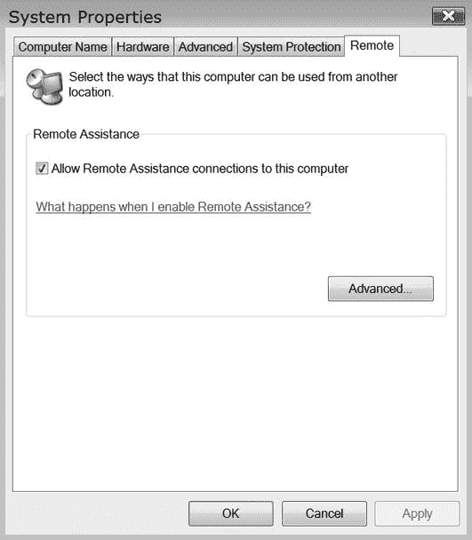
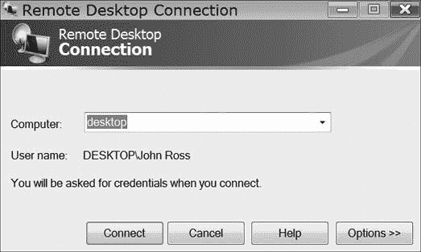
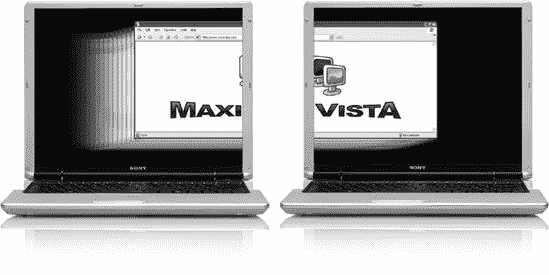
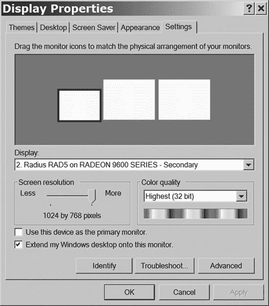
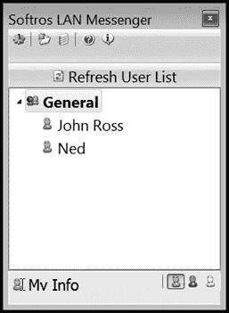
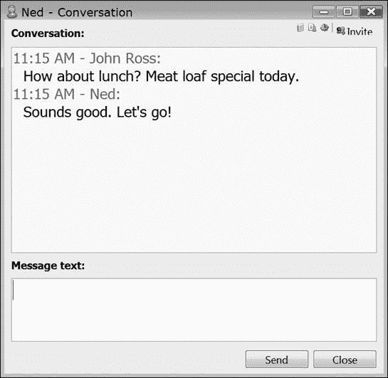

# 第十六章。其他网络应用

大多数人使用网络进行有限的目的；他们共享文件和消息，连接到互联网，也许玩多人游戏或从服务器收听音乐和观看视频。但一旦您的家庭或小型企业网络启动并运行，您就可以使用网络完成一些您可能没有预料到的事情。

本章描述了一些其他有用的网络应用。这些都不是安装网络的理由，但如果您已经走到这一步，您已经在其他目的上使用网络了。将本章中的网络程序和服务视为*额外奖励*，一点额外的可能增强您的网络体验的东西。

# 远程桌面

*远程桌面*程序允许另一个用户（在您的许可下）通过网络控制您的计算机。当远程控制程序处于活动状态时，网络管理员或服务技术人员可以分发和安装新软件或更新软件，提供帮助和远程协助，并查看其他计算机上的信息。远程桌面程序是 Windows XP、Windows Vista 和 Macintosh 的标准功能。

Linux 和 Unix 也有几个开源的远程桌面程序，包括虚拟网络计算（VNC）、FreeNX、2X 终端服务器和 X 显示管理器控制协议。您可以在[`blog.lxpages.com/2007/03/13/remote-desktop-for-linux/`](http://blog.lxpages.com/2007/03/13/remote-desktop-for-linux/)找到所有这些程序的下载链接。对于 Mac 到 Windows 的远程访问，请尝试 Microsoft 的 Mac 远程桌面连接客户端([`www.microsoft.com/mac/products/remote-desktop/`](http://www.microsoft.com/mac/products/remote-desktop/))。对于 Windows 到 Mac，请使用基于 Windows 的 VNC 客户端，例如 RealVNC 或 TightVNC。您将在本节后面找到有关 VNC 的更多信息。

## Windows 远程桌面

Windows 远程桌面将客户端计算机的控制权转移到主机。主机镜像客户端的屏幕显示，并使用主机的鼠标和键盘控制客户端上运行的程序。当远程桌面处于活动状态时，客户端计算机显示一个空白屏幕，并且不会对键盘或鼠标输入做出响应，直到主机释放控制。

远程桌面使运行主机计算机的人成为某种*超级用户*，可以控制客户端计算机，因此系统中内置了一些限制这种访问的控制：首先，客户端用户必须将计算机设置为接受远程桌面访问，其次，在主机计算机上运行远程桌面的人必须在客户端计算机上有账户（通常带有密码）。换句话说，如果您关闭计算机上的远程桌面，其他人未经您的许可无法使用它。

在 Windows XP 中，远程访问工具被称为*远程访问*；在 Windows Vista 中，它被称为*远程桌面*。运行 Windows Vista Starter、Windows Vista Home Basic、Windows Vista Home Basic N 或 Windows Vista Home Premium 的计算机不接受入站访问，但您可以使用远程桌面控制运行其他版本 Vista 的计算机。Windows XP 家庭版不会接受来自任何 Windows Vista 机器的访问。

### 配置 Windows 以远程桌面访问

要配置 Windows XP 计算机以接受远程桌面访问，请按照以下步骤操作：

1.  右键单击**我的电脑**。将出现一个弹出菜单。

1.  从菜单中选择**属性**。将打开系统属性窗口。

1.  点击**远程**选项卡。将显示图 16-1 所示的对话框。

    

    **图 16-1. 系统属性中的远程选项卡控制 Windows 远程桌面工具的入站和出站访问**

1.  要使用此计算机远程控制网络上的其他计算机，请在远程协助区域中勾选**允许远程协助邀请 . . .**选项。

1.  要允许网络上的另一台计算机控制此计算机，请勾选**允许用户远程连接 . . .**选项。

1.  当**允许用户远程连接到此计算机**被启用时，任何登录到同一网络上的另一台机器，并且用户名与该计算机管理员账户相同的用户——并且使用密码登录此计算机的用户——可以请求远程访问。要允许非管理员使用远程访问，请点击**选择远程用户**按钮，在远程桌面用户窗口中点击**添加**按钮，然后输入您想要允许使用远程访问的人员的账户名。

1.  点击每个打开窗口中的**确定**按钮以保存您的数据并关闭窗口。

要配置 Windows Vista 以远程协助，请按照以下步骤操作：

1.  右键单击**我的电脑**。将出现系统窗口。

1.  在窗口右侧的任务列表中点击**远程设置**。系统属性窗口将出现，并显示远程选项卡，如图图 16-2 所示。

    

    **图 16-2. 使用系统属性中的远程选项卡来开启或关闭远程协助**

1.  选择**允许远程协助连接到此计算机**选项。激活此选项将允许双向远程访问。

1.  点击**确定**保存您的设置并关闭属性窗口。

### 使用远程桌面

要使用 Windows XP 中的远程桌面或 Windows Vista 中的远程协助控制另一台计算机，请按照以下步骤操作：

1.  选择**开始** ▸ **所有程序** ▸ **附件** ▸ **远程桌面连接**。将出现一个类似于图 16-3 所示的对话框。

    

    **图 16-3. 使用远程桌面连接对话框来指定您想要控制的计算机。**

1.  输入您想要控制的计算机的名称，然后点击**连接**。您的屏幕将变黑，除了屏幕顶部附近的一个控制标签和一个登录框。

1.  在登录框中输入目标计算机的有效账户名和密码，然后点击**确定**。远程计算机的屏幕将变暗，您将在屏幕上看到远程计算机的桌面图像。

您现在可以使用自己的计算机键盘和鼠标控制远程系统。您可以通过网络打开文件、运行测试和加载程序。然而，查看远程计算机屏幕的用户将看到的是一个黑暗的屏幕。

当一个新的远程桌面连接打开时，它会填满客户端计算机的屏幕，但您可以通过点击屏幕顶部的远程桌面标签上的尺寸图标来减小远程桌面窗口的大小，并看到您自己的计算机桌面和开始菜单。这将允许您在两台计算机之间复制文本、数据或文件。

要将控制权交还给本地用户，请点击屏幕顶部附近的控制标签上的**X**。

### 注意

如果您尝试使用没有密码的账户来接管远程桌面连接，您将收到以下错误消息：*由于账户限制，无法登录*。如果您看到此消息，请转到目标计算机的控制面板▸用户账户，选择更改账户以为您账户分配密码，然后再次尝试连接。

## 虚拟网络计算 (VNC)

*虚拟网络计算 (VNC)* 是一种允许一台计算机（客户端）远程访问另一台计算机（服务器）并使用第一台计算机的鼠标和键盘来控制第二台计算机的系统。一般来说，VNC 的速度不如 Windows 和 Macintosh 的远程桌面程序快，但它更灵活。与上一节中描述的 Microsoft 工具不同，VNC 不受任何操作系统的限制；您可以使用任何 VNC 客户端（或查看器）来控制任何 VNC 服务器——即使两台计算机使用不同的操作系统。

有几个基于 VNC 的程序可供选择，提供多个操作系统的客户端和服务器，包括 RealVNC ([`www.realvnc.com/`](http://www.realvnc.com/))、UltraVNC ([`www.uvnc.com/`](http://www.uvnc.com/)) 和 TightVNC ([`www.tightvnc.com/`](http://www.tightvnc.com/))。还有几个仅限于 Linux 和 Unix 操作系统。有关描述和链接到其他版本的信息，请访问 [`www.linux.com/feature/43165`](http://www.linux.com/feature/43165)。

# MaxiVista：添加屏幕

MaxiVista 是一套针对 Windows 的流畅网络工具，允许您将电脑的显示扩展到通过您的网络连接到第一台电脑的一个或多个附加电脑，或者使用相同的鼠标和键盘操作两个或更多电脑。它还可以允许您通过网络在两个或更多电脑之间使用 Windows 剪贴板。这些工具并非适合所有人，但在某些条件下，扩展键盘或共享控制可以非常方便。MaxiVista 提供免费演示版，可在 [`www.maxivista.com/`](http://www.maxivista.com/) 获取。

MaxiVista 包括两个程序：一个在主电脑上运行的服务器程序和一个在每个辅助机器上运行的客户端程序。除了已经存在的网络连接外，MaxiVista 不需要任何特殊硬件。

MaxiVista 的所有控制都在服务器上；每个客户端的唯一设置是打开或关闭程序。服务器自动检测每个活动的客户端，并包括您可以使用来选择扩展桌面或远程控制客户端电脑的控制。

## 多显示器

通过添加额外的显示器来扩展屏幕显示大小是那些听起来奢侈的事情之一，但几乎所有尝试过的人都会确信第二个屏幕使他们变得更加高效。因为您可以在不将其中一个窗口带到顶部的情况下同时打开两个或更多窗口，您可以更有效地工作；仅从开始，您可以将文本、图表或数据从一个文档或程序拖到另一个，无需滚动查看文档的一端到另一端，同时在一个屏幕上保持网页浏览器或视频监控窗口打开，而您在另一个屏幕上工作。如果您正在编写代码或制作网页，您可以在应用程序窗口或浏览器中保存您的作品，并立即看到您最新的更改在窗口中的样子。在许多 Windows 程序中，您可以将一个或多个工具栏从主程序窗口拖到第二个屏幕，以便使更多的工作内容可见。

您桌上的两个（或三个或更多）显示器将改变您使用电脑的方式。图 16-4 展示了桌面扩展到两个笔记本电脑屏幕上。

**图 16-4. 窗口可以扩展到两个或更多屏幕上显示单个大窗口。**

如果您在壁橱后面有一台旧显示器，尝试将其添加到计算机上。即使该显示器与您的主显示器大小不同，它仍然可以工作，并且比单个屏幕有所改进。

向您的系统添加另一个显示器最简单的方法不需要 MaxiVista 或其他任何特殊软件——只需将显示器连接到计算机上的备用 VGA 或 DVI 连接器即可。如果您的视频控制器没有额外的视频输出，请在空余的扩展槽中安装另一块视频控制器卡。除非您正在玩前沿的游戏，否则无需担心高性能和内存；您可以使用来自您的垃圾箱或二手电脑商店的旧 PCI 视频卡，内存只需 8 或 16MB。

这一切都不需要 MaxiVista。您可以使用 Windows 中的显示属性控件将您的桌面扩展到额外的显示器屏幕。但如果您想将笔记本电脑作为第二屏幕使用，或者如果您已经在同一张桌子或台面上有两台或更多联网的计算机，MaxiVista 允许您使用这些额外计算机上的显示器作为扩展屏幕，并在更方便时切换回正常使用。

如果您已经拥有一台笔记本电脑和一台台式计算机，MaxiVista 允许您尝试扩展屏幕而无需携带任何额外的硬件；只需将您的笔记本电脑连接到网络，安装 MaxiVista 的免费试用版，并重新配置您的显示属性设置（如图 16-5 所示）。

**图 16-5. 显示属性对话框包括一个可以将 Windows 桌面扩展到两个或更多显示器屏幕的选项。**

## 远程控制

当您在同一房间内使用两台或更多计算机时，在控制它们的键盘和鼠标之间切换常常是一件麻烦事。MaxiVista 包括一个远程控制功能，允许单个键盘和鼠标通过网络向多台计算机传输信号。

要使用 MaxiVista 的远程控制功能，请在主计算机上开启**远程控制**模式，并将鼠标光标拖动到您想要使用的计算机的桌面上。当您使用连接到主计算机的鼠标选择或打开程序时，主键盘将与该程序一起工作。

共享剪贴板是 MaxiVista 远程控制功能的一部分。只需使用主计算机上的鼠标选择并复制一个文件、文件夹、文本块或其他对象到剪贴板，就像你在本地计算机上正常复制对象一样。然后移动鼠标光标到目标计算机，打开一个程序（或选择一个已打开的窗口），并将剪贴板的内容粘贴进去。

# 文件同步

每当你与其他人合作一个项目时，你都会面临这样的风险：每个文档（或图纸、电子表格或任何其他工作记录）的副本都会累积不同的更改集。维护某种同步控制是至关重要的。

*文件同步*软件在网络上比较计算机文件，并将每个副本的所有添加、移动、更改和删除合并到所有其他副本中。当文件同步器在两个版本之间发现冲突时，它可以标记差异，并允许人类编辑器或项目经理决定接受哪个版本。大多数文件同步器比较和更新文件夹或目录的内容，但它们不会打开和更改单个文件——你必须对每个文件做出全部或全部不的决定。

一些同步器仅限于 Windows 或 Macintosh 计算机，但其他同步器可以比较存储在不同操作系统上的计算机上的文件。以下是一些免费或作为试用下载的软件：

+   Synchronize It! ([`www.grigsoft.com/winsin.htm`](http://www.grigsoft.com/winsin.htm))

+   GoodSync ([`www.goodsync.com/`](http://www.goodsync.com/))

+   Microsoft SyncToy ([`www.microsoft.com/downloads/`](http://www.microsoft.com/downloads/)—搜索 *SyncToy*)

+   DirSync Pro ([`directorysync.sourceforge.net/index.html`](http://directorysync.sourceforge.net/index.html))

+   FreeFileSync ([`sourceforge.net/projects/freefilesync/`](http://sourceforge.net/projects/freefilesync/))

# 即时通讯和实时通信

如其名所示，*即时消息（IM）* 是发送文本或其他数据的过程，这些数据几乎立即到达目的地。最常见的形式是 *文本消息*，其中参与者使用键盘在显示屏上进行对话，以及 *音频* 或 *视频消息*，其中麦克风和/或摄像头取代或补充键盘。

与电子邮件相比，实时消息更加即时，因为发送者点击发送按钮后，消息立即出现在接收者的屏幕上，而不是等待邮件服务器转发每条消息。假设远程计算机已开启且消息程序正在运行，文本会立即显示在屏幕上，或者发送者的声音会通过计算机的扬声器传来。实时消息使得通过网络进行基于文本的对话成为可能，避免了发送和接收电子邮件时的时间延迟。

即时通讯最常见的使用涉及简短的问题和答案，例如请求特定信息的项目（“嘿，莎拉，我正在和客户通电话。我们有多少库存的 4 号尺寸小工具支架？”），邀请面对面会议（“你能在我的办公室里十分钟内见我吗？”或“你午餐有什么计划？”），以及朋友和家人之间的纯粹社交交流。即时通讯也已成为青少年和儿童在线八卦的首选媒介。

即时通讯（IM）在通信方法体系中占据一个特定的位置。它比电子邮件或传真（传真）更不正式，更直接，比电话打扰性更小，比在房间之间大声喊叫更文明。在一些企业和家庭中，即时通讯是文化的重要组成部分；而另一些则几乎从不使用它。要深入了解即时通讯及其在商业中的应用方式，请参阅《互动与外在行动：即时通讯在行动》（计算机支持的协作工作研讨会论文集，第 79-88 页，纽约：ACM 出版社，[`dis.shef.ac.uk/stevewhittaker/outeraction_cscw2000.pdf`](http://dis.shef.ac.uk/stevewhittaker/outeraction_cscw2000.pdf)）。这项研究的作者提供了一些有趣的见解，但他们将这些见解埋没在一些非常密集的学术语言之下，使用了诸如*二元*和*民族方法学*等华丽的词汇。

几乎每个消息程序都有类似的结构：它显示其他用户的列表，并有一个指示器显示每个用户是否目前可以接收消息。用户可能不可用，因为他们的消息程序未激活，或者他们已将程序设置为不接受传入的消息。要开始对话，点击目标收件人的名字。当消息到达时，它会在收件人的屏幕上弹出一个窗口（一些程序在收到新消息时也会发出可听信号）。

### 注意

即时通讯与在线聊天不同，但体验相似。区别在于聊天发生在连接到公共频道（*聊天室*）的两个或多个参与者之间。当你加入聊天时，你指示程序连接到特定的聊天室。即时通讯似乎直接连接了两个参与者的计算机，因此你指定的是其他参与者的名字而不是频道。一旦建立了初始连接，聊天和即时通讯之间就没有太大区别了。

## 服务器对等通讯

即时消息服务可以使用两种不同的结构：通过*消息服务器*接收所有消息并将它们转发到最终目的地，以及*对等网络*系统，它们将每条消息直接从源地址转发到目的地。图 16-6 显示了这两种类型。几乎每个基于互联网的即时消息服务都使用服务器；局域网内的消息服务通常是点对点。

**图 16-6. 互联网即时消息服务器和对等聊天使用不同的结构来完成相似的目标。**

## 基于互联网的即时消息服务

大多数即时消息服务使用通过互联网发送和接收消息的服务，例如美国在线即时消息（AIM）、Windows Live Messenger、Google Talk 或 Yahoo! Messenger，或者与移动电话交换消息的服务。还有其他一些消息程序可以在局域网（LAN）内运行。

不幸的是，许多即时消息服务是封闭的网络；例如，您不能使用 Google Talk 软件向 AIM 账户发送消息。然而，有几个第三方程序——如 Pidgin ([`www.pidgin.im/`](http://www.pidgin.im/))；Trillian ([`www.ceruleanstudios.com/`](http://www.ceruleanstudios.com/))；和 meebo ([`www.meebo.com/`](http://www.meebo.com/)))——可以与不同服务的人进行消息交换，从单个联系人和消息窗口中进行。

要设置一个或多个主要服务的即时消息（IM）账户，请访问它们各自的网站：

+   Google Talk ([`www.google.com/talk/`](http://www.google.com/talk/))

+   Jabber ([`www.jabber.org/`](http://www.jabber.org/))

+   AIM 或美国在线即时消息([`www.aim.com/`](http://www.aim.com/))

+   Yahoo! Messenger ([`messenger.yahoo.com`](http://messenger.yahoo.com))

+   Windows Live Messenger ([`get.live.com/messenger`](http://get.live.com/messenger))

+   Gadu-Gadu，总部位于波兰，有波兰语界面([`www.gadu-gadu.pl`](http://www.gadu-gadu.pl))

内部局域网（LAN）消息传递在业务或家庭内部交换消息方面比互联网消息服务具有多个优势。它更安全、更私密，因为消息永远不会离开局域网。而且它们不会受到来自陌生人的垃圾邮件和其他不受欢迎的消息的影响。此外，它们不使用局域网和互联网之间的带宽，因此不会干扰其他活动，也不需要为每个使用即时消息服务的用户单独开设账户（尽管主要的即时消息服务都提供免费账户）。更重要的是，本地消息系统控制局域网内的所有消息，而不是将所有内容发送到外部服务。

## 通过局域网进行消息传递

有许多局域网消息程序可供选择，所有这些程序都具有类似的功能集。有些仅限于单一操作系统，而其他则提供适用于不同计算机类型之间交换消息的兼容版本。在大多数情况下，连接到局域网的每台计算机都必须运行相同的程序；你不能假设两个不同的局域网消息程序会自动相互识别。

SoftRos Lan Messenger ([`messenger.softros.com/`](http://messenger.softros.com/)) 是这一类产品的典型代表。如图 16-7 所示，该程序显示了一个当前登录到其计算机的用户列表，每个用户都有一个图标显示其状态（可用、忙碌或离开）。要向其他用户发送消息，只需单击该用户的名字，并在弹出的对话窗口中输入你的消息。

**图 16-7. 局域网消息程序列出可用的用户名。**

当消息到达时，接收者的计算机发出信号，并在一个类似于图 16-8 的弹出窗口中显示消息。相同的窗口出现在发送者和接收者的计算机上。要继续对话，请在消息文本框中输入文本，然后单击**发送**。

**图 16-8. 消息交换的两边都显示在对话窗口中。**

同样的程序还允许用户通过局域网传输文件。

如果你不喜欢 SoftRos 包，还有很多其他选择，每个都有略微不同的屏幕布局和功能。通过在网络上搜索“LAN messenger”，会产生数十个链接，描述和下载源。

## 通过虚拟专用网络进行消息传递

当你通过虚拟专用网络（VPN）连接到局域网时，局域网将你的计算机视为网络中的其他任何网络节点一样，即使你可能距离网络的其他部分数百或数千英里。第十三章解释了如何设置和使用 VPN。

VPN 连接通常用于即时消息（IM），尽管你也可以使用公共 IM 服务来完成同样的事情。要通过 VPN 设置 IM，请遵循以下一般步骤：

1.  建立到局域网的 VPN 连接。

1.  运行你的局域网消息程序。

1.  选择通过 VPN 的连接，并选择你想与之交换消息的人。

## 音频和视频消息

在某些情况下，在文本消息中添加声音和图片是有价值的。世界各地的电话公司花费了许多年和大量资金试图开发一种成功的商业“可视电话”服务，作为传统语音电话的补充，但直到他们将其重新包装为“视频会议”才实现。将图片添加到电话服务中看似是个好主意，但结果证明这对个人用户来说太昂贵且过于侵入性，不实用。作为一个商业提案，基于电话的可视电话完全失败了。

但更便宜的视频设备和更高的带宽使得通过计算机网络发送和接收静态图片和全动作视频成为可能。因此，许多人已经将网络摄像头（*网络摄像头*）和麦克风添加到他们的系统中。

微软的 Windows Live Messenger（如图 图 16-9

**图 16-9. Windows Live Messenger 可以将视频图像添加到简单文本中。**

*图片由微软提供*
