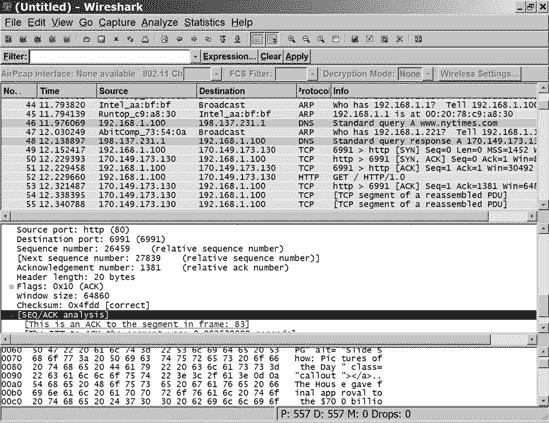

# 第十七章。故障排除

当你的网络运行正常时，它几乎是无形的；你可以在任何一对计算机或其他连接设备之间通过网络发送和接收文件。但是，当连接失败，或者你的某个用户找不到网络节点，或者发生真正惊人的其他可能问题时，作为本地网络专家，你的任务是修复它。网络问题总是有特定的原因（或原因的组合），即使这个原因并不明显。

太频繁地，网络错误信息会提示“向你的网络管理员寻求帮助”。但是，当网络管理员就是你时，这条信息并没有告诉你如何解决问题。本章提供了一些工具和方法，可以帮助你识别和解决大多数网络问题。

# 一般故障排除技术

成功故障排除的关键是遵循逻辑的解决问题的过程，而不是简单地随机尝试，直到你偶然找到解决问题的正确方法。大多数花大量时间修理东西的人都会使用这种系统，而不需要正式的计划，但如果你是修理计算机和网络的新手，请考虑将本章中的技术作为指南。

许多这些建议都是常识性的答案，而不是复杂的技术程序。不要忽视它们；否则，你可能会花费数小时追踪电路或试图找到坏连接，仅仅因为有人拔掉了电缆。

记住，出现在你网络中的问题实际上可能位于网络中连接的计算机或其他设备之一。在许多情况下，你将想要在 Windows、Macintosh 或 Linux/Unix 操作系统以及网络本身中查找问题。

## 定义问题

解决问题的第一步应该是识别症状。记住，计算机和网络不会完全随机地崩溃。你可以找到的关于问题的每一份信息都可以帮助你隔离和解决问题。问题是无法通过网络连接到特定的计算机，还是错误信息，或者文件传输比平时花费的时间更长？问题是否仅限于单个计算机，还是出现在整个网络上？你的网络路由器、交换机或调制解调器上的任何灯光是否改变了颜色或变暗？问题是否在你使用特定程序时发生，或者只有在某个台灯（或吸尘器或任何其他电器）打开时才发生？当你识别症状时，制作一个清单——无论是写在纸上还是记在心里。

如果你看到错误信息，将确切文本复制到一张纸上。你可能需要重新启动计算机或去另一台计算机上查找信息，你需要消息的具体措辞。不要忽视那些神秘的代码数字或其他看似难以理解的信息。即使信息对你来说毫无意义，它也可能是找到你需要帮助的关键。

有时候你可以在症状中识别出一个模式。当多个用户报告相同的问题时，问问自己这些用户有什么共同点：他们是否都在尝试同时使用打印机或连接到互联网？他们是通过以太网电缆还是 Wi-Fi 连接到网络的？问题是否每天都会在同一时间发生？

如果你很幸运，定义问题可以告诉你足够的信息来修复它。例如，如果你的调制解调器的电源 LED 指示灯熄灭，这表明电源线可能未插在墙上的插座或调制解调器本身上。如果在大雨期间每个人都遇到连接互联网的问题，可能是因为水渗入从公用事业杆到你的家的互联网连接的电话线（这发生在我身上——维修人员告诉我，那根线大约从 1927 年以来就在那里）。

更常见的情况是，你的症状列表将成为你用来搜索更多信息的一个起点。在分析问题时，问问自己这些问题：

**问题是由什么引起的？**

是在你或另一个用户运行特定程序或尝试连接时发生的吗？问题似乎与某些其他动作有关吗？如果你再次尝试相同的动作，是否会出现相同的问题？它第一次出现是在你打开计算机时吗？

**发生了什么变化？**

你是否在网络上安装了新的硬件，或在服务器或另一台计算机上加载了新的软件？你是否最近更新了路由器的固件？你是否对网络或另一台连接的计算机进行了任何其他更改，即使这个更改似乎与问题无关？

**还发生了什么？**

你是否注意到其他问题或意外事件？是否有其他网络用户在大约同一时间遇到类似的问题？

**这是新问题吗？**

你以前是否遇到过这个问题或类似的问题？

## 首先寻找简单解决方案

在开始拆卸硬件或运行复杂的软件诊断程序之前，先寻找简单的解决方案。没有什么比花费几个小时运行详细的故障排除程序，最后发现只需重新启动计算机或翻转开关就能解决问题更令人沮丧的了。

### 重新启动一切

当出现无法解释的问题时，首先要尝试的是逐一关闭每个网络组件——一次一个——等待几秒钟，然后再重新打开。有时这可能是清除卡在错误设置上的程序或内存块并使其回到正确值所需的所有操作。如果可能的话，使用操作系统的关机过程以有序的方式关闭计算机；除非计算机对鼠标或键盘命令无响应，否则不要使用电源开关或复位按钮。

### 备注

在您复制屏幕上任何错误信息的文本之前，不要关闭您的电脑。有时在重启（或根本没有任何信息）之后，相同的问题可能会产生不同的信息，而原始信息的文本可能是一个有用的故障排除工具。

当您重启电脑时，不要使用重启选项；这可能会使一些设置保持相同的值，而不是将它们重置为默认启动配置。您应该完全关闭电脑，数到十，然后重新打开。

如果您重启电脑后问题仍然存在，尝试重启调制解调器、Wi-Fi 接入点或网络路由器。如果一个设备没有开关，断开电源线，等待几秒钟，然后重新连接。在重启每个设备后，检查问题是否仍然存在。如果问题仍然发生，继续到下一个设备。

### 检查插头和电缆

如果一台电脑无法连接到网络，请确认提供这些连接的物理电缆没有拔出。务必检查每根电缆的两端。如果整个网络无法连接到互联网，请检查连接到调制解调器的电缆。如果可能，检查电缆本身，以确保它没有被中间切断。

几乎所有的路由器、交换机、调制解调器和网络适配器都有 LED 指示灯，当它们检测到活动连接时，指示灯会亮起。如果一个或多个这些 LED 灯熄灭了，请检查连接。

大多数数据插头和插座都保持稳固的连接，但有可能插头可能已经松动，但没有从插座中分离出来，或者插头内部的电线可能存在不良接触。如果您怀疑有松动的连接，尝试在观察与该插座对应的 LED 指示灯的同时晃动电缆。如果 LED 灯在晃动电缆时亮起然后熄灭，请尝试使用另一根电缆。

如果您无法通过新安装的墙壁插座连接，请确保插座内部的电线在墙壁内部电缆的两端（插座和数据中心）正确连接到正确的端子上。

为了快速确认数据正在通过网络在每台电脑之间传输，请使用计算机操作系统中提供的工具来显示网络活动。在 Windows 中，使用任务管理器中的网络选项卡；在 Linux 中，使用`ethtool`命令（`ethtool` *`interfacename`* `| grep Link`）。如果电脑报告没有可用的链接，可能是电缆未连接，或者网络适配器或集线器有问题。

### 检查交流电源

连接到网络的每个设备可能都有一个 LED 指示灯，当设备连接到交流电源时，指示灯会亮起。当连接失败时，查看每个设备的正面，以确认电源指示灯是亮的。如果它没有亮，检查设备的电源开关（如果有的话）以及设备后面的插头和插入交流电源插座的插头或电源供应。

如果你使用电源插座或不间断电源，请确保主电源开关已打开，电源单元已插入交流电源插座。

如果网络失败但你的计算机仍然工作，那么房间内包含网络交换机、路由器或其他控制设备的保险丝或断路器可能已经烧毁。

### 检查设置和选项

寻找可能干扰设备操作的其它开关和设置。例如，确保网络打印机处于在线状态，并且控制面板上没有可见的错误 LED 指示灯或消息。或者如果你在 Wi-Fi 连接上遇到麻烦，确保你的计算机没有与“错误的”基站关联并连接到邻居的网络而不是你自己的。

## 隔离问题

如果你寻找简单解决方案以解决网络问题或故障但没有得到答案，下一步就是确定问题发生的物理位置。虽然将网络视为一个无处不在的、无形的云可能既简单（且通常合适），但在寻找特定的故障点时，你必须用一张详细的地图来代替那个云，该地图显示了每个组件和连接。如果你文件中没有网络图，现在考虑绘制一张。

大多数问题都会提供一些关于其位置的线索：如果只是有一台计算机的网络连接失败了，但其他所有计算机都工作正常，那么问题可能就在那台计算机或其网络链路上。但如果网络上没有人能够连接到任何其他计算机或互联网，那么问题可能就在服务器、路由器或其他中央设备上。从最合理的设备开始搜索问题的源头。

如果你有硬件问题，通过逐个替换组件和电缆来隔离问题通常很有效。如果在安装替换件时问题消失了，那么这是一个很好的迹象，表明原始部件是问题的源头。如果替换件是一个相对昂贵的物品，如路由器或打印机，你可能希望将其退回制造商进行更换或维修，尤其是如果它在保修期内。但如果替换的是一个便宜的部件，如电缆或网络接口卡，通常更容易直接扔掉并购买一个新的。

类似的技巧也可以用于软件。如果计算机连接失败，尝试逐个关闭该计算机上运行的每个程序，然后尝试重新建立连接。如果你最近安装了新的程序、驱动程序或更新，尝试卸载新软件并再次测试连接。如果连接成功，则冲突是新软件与你的网络连接或设备驱动程序之间的冲突。在 Windows 中，尝试以安全模式重新启动计算机并重新建立连接；如果它在安全模式下工作，则你知道 Windows 操作系统不是问题的根源。

## 追溯你的步骤

即使网络问题没有预警出现，问题可能也是由硬件或软件中的某些变化引起的。因此，重复你的步骤通常可以帮助识别和解决问题。

## 记录笔记

当你试图识别和解决问题时，记录你所做的一切。在简单的日志或笔记本中描述你遇到的每个问题以及你为修复它所做的事情。注意配置设置、提供有用信息的网站，以及任何导致问题或帮助解决问题的选项或控制程序的精确位置。将此记录在纸上，而不是存储在计算机上的文本文件中，这样你就可以在计算机再次出现问题时访问它。

如果相同的问题再次出现，你的日志将告诉你第一次修复它时做了什么；而不是再次通过所有无效的故障排除技术，你可以直接转到正确的解决方案。

一个很好的方法是将网络笔记本放在活页夹中。除了其他事项外，你的笔记本应包括以下内容：

+   每个调制解调器、路由器、Wi-Fi 接入点和其他连接到网络的设备的配置设置和密码

+   你互联网连接的数值 IP 地址、DNS 服务器、默认网关和子网掩码

+   你局域网使用的数字地址

+   每个集线器、交换机、路由器、调制解调器、Wi-Fi 接入点、网络适配器和其他网络设备的制造商、型号、序列号和 MAC 地址（如果你能找到的话）

+   你 Wi-Fi 网络的频道号码、SSID 和密码列表

+   你 ISP 的联系电话号码以及其他联系信息，以及提供你物理互联网连接的电话公司或电缆服务

+   每个调制解调器、路由器、接入点或其他网络设备的说明书

+   你网络用户的列表，包括姓名、电话号码和登录名

+   一张显示每台计算机和其他设备如何连接到网络的图

+   每个网络服务器的密码

+   你电子邮件服务的用户名和密码

+   有网络插座的房间列表以及每根电缆另一端的标签

+   你网络中添加、移动、更改和删除的日志

+   包括以下内容的维修日志：

    +   每个问题出现的时间和日期

    +   每个问题的描述

    +   您为解决问题所采取的措施

+   每次联系技术支持中心的通话时间和日期

+   您联系到的每个技术支持人员的姓名和电话号码

+   每个支持中心分配给问题的“故障单”编号或案例编号

### 警告

您的网络笔记本可能包含诸如密码和用户账户信息之类的机密信息。因此，您应该将其保存在安全的地方，如上锁的柜子或抽屉中。

# 病毒和其他恶意软件

如果您找不到明显的网络问题解决方案，对连接到您局域网的每台计算机进行病毒、蠕虫、特洛伊木马和间谍软件的完整扫描并不会造成伤害。即使您在所有计算机上运行了防火墙、最新的防病毒程序和其他网络安全软件，仍然有可能有东西绕过了您的防御。

几个防病毒程序供应商提供免费在线扫描，可能会识别出您本地程序可能无法检测到的病毒。作为您的故障排除常规的一部分，使用您通常的网络安全程序进行全面扫描，并使用一个或多个这些在线扫描：

| **趋势科技 HouseCall** [`housecall.trendmicro.com`](http://housecall.trendmicro.com) |
| --- |
| **Symantec 安全检查** [`security.symantec.com/sscv6/default.asp`](http://security.symantec.com/sscv6/default.asp) |
| **BitDefender 在线扫描器** [`www.bitdefender.com/scan8/ie.html`](http://www.bitdefender.com/scan8/ie.html) |
| **卡巴斯基在线扫描器** [`www.kaspersky.com/virusscanner`](http://www.kaspersky.com/virusscanner) |
| **ESET 在线扫描器** [`www.eset.com/onlinescan/`](http://www.eset.com/onlinescan/) |
| **熊猫 ActiveScan** [`www.pandasecurity.com/homeusers/solutions/activescan/`](http://www.pandasecurity.com/homeusers/solutions/activescan/) |

使用由不同供应商提供的在线扫描器，而不是您计算机中防病毒程序自带的扫描器。每个公司都采用略微不同的规则来查找和隔离病毒，因此您可能希望利用多种方法。

# 其他常见问题

描述所有可能出现的网络问题并不实际，但有一些问题比其他问题更频繁地发生。如果您的网络问题在本章中没有描述，请尝试在《互联网集体智慧》中描述的“Windows 网络问题解决器”（适用于使用 Windows 的计算机），或者搜索有关您自己的操作系统的网页上的相关信息。

## 配置设置

当您无法将计算机连接到互联网，但同一网络上的其他计算机可以连接时，检查计算机的网络配置设置以确认默认网关和 DNS 服务器存在且正确。如果网络中的所有计算机都无法找到互联网，请检查网络路由器或调制解调器的设置。

要确认网关和 DNS 服务器处于活动状态且正常运行，请尝试向它们的数字地址发送 ping 请求。如果您没有收到回复，请查找网关或服务器的问题，或者查找您计算机和目标之间的设备和电缆中的问题。

## DHCP 设置：DNS 和默认网关

当您的网络上激活了 DHCP 服务器，并且您的计算机（或您正在排除故障的计算机）设置为接受 DHCP 设置时，计算机应自动连接到网络。但如果没有 DHCP 服务器，或者计算机未配置为从服务器接受 DHCP 数据，并且计算机本身的设置缺失或不正确，则计算机无法连接。

要确认 DHCP 设置是否正确，请按照以下步骤操作：

1.  检查作为您的网络 DHCP 服务器的调制解调器、路由器、Wi-Fi 接入点或其他设备。如果服务器处于激活状态（并且网络上的其他计算机可以正常连接），则问题出在您的计算机上；如果服务器未激活，请打开它或确认该网络不使用 DHCP。

1.  在您的计算机中打开网络配置设置实用程序。如果 DHCP 服务器处于激活状态，请确认计算机设置为接受来自服务器的数据；如果网络不使用 DHCP，请确保 DNS 服务器和默认网关（或网关路由器）的地址正确。

如果您计算机或 DHCP 服务器中的 DNS 服务器设置看起来是正确的，那么 DNS 服务器本身可能不工作（但这种情况不太可能）。尝试将 OpenDNS 服务器（208.67.222.222 或 208.67.220.220）的地址添加为您的常用 DNS 服务器地址的备用选项。

## 无法连接到特定网站

当您尝试连接到特定网站或其他互联网服务时，您有时会看到“无法连接”的消息，而不是您预期的网页或其他屏幕。当这种情况发生时，立即尝试其他地址，该地址将带您到不同地理位置的网站；例如，如果您无法连接到“The New York Times”网站，请尝试位于德国或澳大利亚的网站。如果您可以连接到第二个地址，您可以安全地假设问题出在第一个地址，而不是您的计算机或网络上。如果您无法连接到任何网站，请寻找本地问题，例如您的计算机、局域网或您的互联网服务提供商。

# 互联网的备用连接

当你的互联网连接中断时，无法使用该连接来咨询技术支持网站或向网络提供商发送电子邮件。因此，通常有一个备份方法来连接至少一台计算机到互联网是很有帮助的。这可能是一个邻居的 Wi-Fi 网络（当然，需要他们的许可），一个提供互联网接入的附近图书馆或咖啡馆，或者通过拨号电话线和调制解调器建立的联系。

在遇到问题之前，向你的互联网服务提供商询问他们是否提供高速服务的同时也提供拨号接入。如果他们提供，请他们为你提供一个拨号账户作为紧急备份，并在你的网络笔记本上记下接入电话号码、登录名和密码。

# 互联网的集体智慧

在你的网络上发生的任何问题，之前都曾有人遇到过。你很可能在互联网的某个地方找到该问题的描述以及修复它的说明。

这就是仔细定义问题变得重要的地方。如果你正在使用基于 Windows 的网络，微软知识库在[`support.microsoft.com/`](http://support.microsoft.com/)可能特别有用；如果微软的技术支持人员曾经处理过某个特定问题，他们可能已经在知识库中包含了修复它的说明。类似资源在[`www.apple.com/support`](http://www.apple.com/support)的 Macintosh 网络和服务器上，以及在各个发行版网站的支持部分为 Unix 和 Linux 系统提供。

其他有用的故障排除信息在线来源包括制造商的技术支持中心、独立的新闻组和网络论坛，以及提供各种类型技术描述和解释的网站，如维基百科和[HowStuffWorks.com](http://howstuffworks.com)。如果这些网站不能回答你的问题，尝试进行更广泛的网络搜索。在搜索引擎中输入几个描述问题的关键词（例如“XP 找不到网络打印机”）或错误信息的确切文本，并跟随每个链接阅读在类似情况下其他人的经历。记住，短语周围的引号指示搜索网站搜索整个短语，而不是单个单词。

在网络故障排除中，一个特别有用的工具是位于[`winhlp.com/wxnet.htm`](http://winhlp.com/wxnet.htm)的 Windows 网络问题解决器，如图图 17-1 所示。问题解决器是一个交互式症状列表，链接到解决问题的指导说明。如果你花时间仔细回答问题定义表中的每个问题，问题解决器可以成为一个非常有效的工具。

**图 17-1. Windows 网络问题解决器是一个出色的交互式故障排除工具。此屏幕截图仅显示页面的一小部分；向下滚动以获取更多信息和建议。**

# 故障排除软件

几个软件程序可以在你试图了解网络内部发生的事情时收集和显示有用的信息。这些程序可以作为免费或试用下载获得，因此你在测试它们时无需承担费用。

## Network Magic

Network Magic ([`www.networkmagic.com/`](http://www.networkmagic.com/)) 提供了连接到局域网的设备的图形显示，如图图 17-2 所示，以及添加新网络设备或更改现有网络配置的中心控制点。它还可以执行一些基本的故障排除测试和自动修复。

## 协议分析仪

微软网络监视器（访问[`www.microsoft.com/downloads/`](http://www.microsoft.com/downloads/)并搜索*网络监视器*）和 Wireshark（[`www.wireshark.org/`](http://www.wireshark.org/)）是免费的协议分析器，它们可以捕获并显示数据在网络中的移动情况。换句话说，它们会捕获每个数据块（一个*帧*）在进入或离开您的计算机时的内容，并显示每个帧的内容以及每个帧的形式和结构的详细信息。图 17-3 显示了网络监视器中的数据捕获，图 17-4 显示了 Wireshark 的屏幕。这两个程序捕获相同的数据流，但它们处理和显示的方式不同。这些程序免费提供，因此您可能想要安装这两个程序。协议分析器也被称为*网络嗅探器*。

**图 17-2. 网络魔法扫描您的局域网并显示所有连接到它的设备。**

大多数这种数据显示看起来像十六进制乱码，但它包含了消息、对话和其他交易的实际文本，以及通过网络传输的所有命令和状态信息。大多数时候，您可以允许您的计算机和网络管道在后台处理数据。但当出现问题的时候，协议分析器捕获的数据可以帮助您确定问题的原因。

例如，如果通过网络传输的进出流量增加，网络可能每秒发送或接收许多请求。这可能是一个黑客的拒绝服务攻击，或者是一台无意中陷入无限程序循环的计算机。无论如何，您都希望确定源头并采取措施使其停止。当这种情况发生在我身上时，我使用了 Wireshark 来找到发送虚假消息的计算机的数字 IP 地址，并使用 whois 程序来识别该计算机的所有者；然后我发送了一封电子邮件解释问题并要求他们修复它。数据流在一小时内停止。

网络嗅探器还可以识别您自己的网络中感染或出现其他问题、干扰正常操作的设备。通过在多台计算机上运行嗅探程序，或者在路由器、调制解调器连接或其他接口点插入嗅探器，您通常可以隔离问题的源头。

你不会经常使用协议分析器，这可能是好事，因为它是一个复杂且繁琐的过程。但当你需要知道通过网络传输的内容时，分析器可以提供你在其他地方找不到的信息。

**图 17-3. Microsoft Network Monitor 显示有关网络数据的详细信息。**

**图 17-4. Wireshark 使用对比颜色来显示不同类型的数据帧。**

# ISP 问题

作为一名正式或非正式的网络管理员，当你试图在局域网中查找和修复问题时，你通常独自一人，但如果你或你的用户在使用互联网时发现了一个问题，你可能需要从你的互联网服务提供商（ISP）的支持中心以及运行你连接另一端计算机或网络的人那里获得帮助。

因此，你应该找到并保留 ISP 客服台和网络技术中心的电话号码和电子邮件地址，这些中心位于电话公司、有线电视服务或其他提供你自己的局域网和 ISP 之间物理连接的公司。那些支持中心接电话的人在那里是为了帮助你，他们通常会拥有可以测试和监控你的网络连接的工具。当你与支持代表交谈时，请要求他们为你分配的案件编号或故障报告编号；如果你稍后需要回电，案件编号将引导接听你电话的人找到之前通话的记录。

# 不要慌张

最后，保持冷静。你的网络没有自己的思想。如果你采取逻辑和有条理的方法来寻找网络问题的原因，你可能会在没有发展（或扩大）溃疡的情况下解决问题。随着时间的推移，你会识别出特定的症状，并知道如何集中精力使用最有效的诊断工具和技术。

如果你在一小时内找不到问题，就离开几分钟。为自己做三明治，喝一杯咖啡或一杯柠檬水，或者去短途散步。当你回来时，网络还在那里，你会对它感觉更好。用清醒的头脑来处理问题通常可能是解决它的最有效方法。
