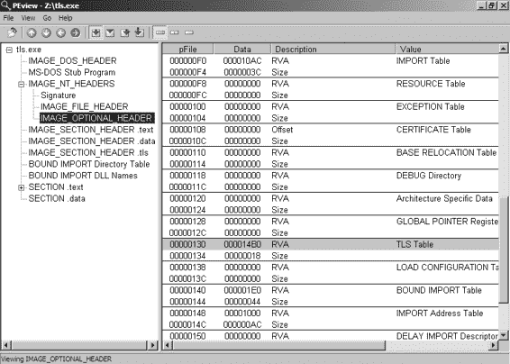
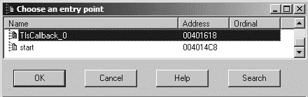
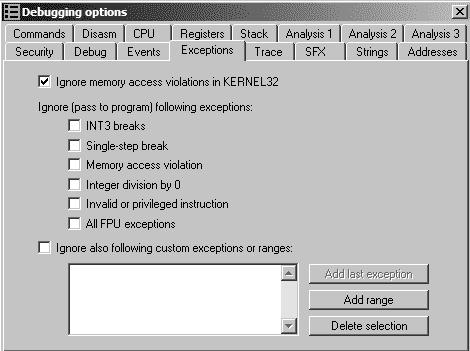
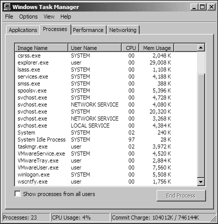
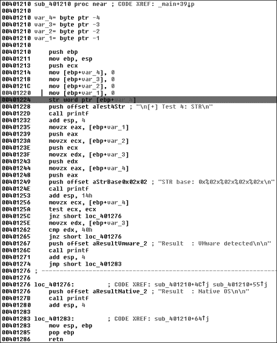

睡眠 1 小时

superlongsleep

c3VwZXJsb25nc2xlZXA=

睡眠 24 小时

shortsleep

c2hvcnRzbGVlcA==

睡眠 1 分钟

run:www.example.com/fast.exe

cnVuOnd3dy5leGFtcGxlLmNvbS9mYXN0LmV4ZQ==

下载并执行二进制文件

在本地系统上

connect:www.example.com:80

Y29ubmVjdDp3d3cuZXhhbXBsZS5jb206ODA=

使用自定义协议建立

反弹壳

针对恶意软件的网络签名

**319**

[www.it-ebooks.info](http://www.it-ebooks.info/)

为此后门创建签名的一种方法是对已知由恶意软件使用的全部命令集进行目标定位（包括周围上下文）。恶意软件识别的五个命令的内容表达式将包含以下字符串：

<!-- adsrv?bG9uZ3NsZWVw -->

<!-- adsrv?c3VwZXJsb25nc2xlZXA= -->

<!-- adsrv?c2hvcnRzbGVlcA== -->

<!-- adsrv?cnVu

<!-- adsrv?Y29ubmVj

最后两个表达式仅针对命令的静态部分（运行和连接），由于参数长度未知，它们不会针对尾随注释字符（-->）。

虽然使用所有这些元素的签名可能会找到这种精确的恶意软件，但过于具体可能会牺牲鲁棒性。如果攻击者更改恶意软件的任何部分——命令集、编码或命令前缀——一个非常精确的签名将不再有效。

***针对多个元素***

之前，我们看到了命令解释的不同部分位于代码的不同部分。基于这些知识，我们可以创建不同的签名来分别针对不同的元素。

看起来位于不同函数中的三个元素是注释括号、固定的 adsrv? 后跟 Base64 表达式，以及实际的命令解析。基于这三个元素，一组签名元素可能包括以下内容（为了简洁，只包括每个签名的主体元素，每行代表一个不同的签名）。

pcre:"/<!-- adsrv\?([a-zA-Z0-9+\/=]{4})+ -->/"

content:"<!-- "; content:"bG9uZ3NsZWVw -->"; within:100; content:"<!-- "; content:"c3VwZXJsb25nc2xlZXA= -->"; within:100; content:"<!-- "; content:"c2hvcnRzbGVlcA== -->"; within:100; content:"<!-- "; content:"cnVu";within:100;content: "-->"; within:100; content:"<!-- "; content:"Y29ubmVj"; within:100; content:"-->"; within:100; 这些签名针对组成发送给恶意软件的命令的三个不同元素。所有这些都包括注释括号。

第一个签名针对命令前缀 adsrv? 后跟一个通用的 Base64 编码命令。其余的签名针对一个已知的 Base64 编码命令，不依赖于任何命令前缀。

由于我们知道解析发生在代码的独立部分，因此独立定位它是合理的。如果攻击者更改代码的一部分或另一部分，我们的签名仍然可以检测到未更改的部分。

注意，我们仍在做出假设。新的签名可能更容易产生误报。我们还假设攻击者最有可能继续使用注释括号，因为注释括号是常规网络通信的一部分，不太可能被考虑为**320**

第十四章

[www.it-ebooks.info](http://www.it-ebooks.info/)

可疑。尽管如此，这种策略比我们最初的尝试提供了更稳健的覆盖范围，并且更有可能检测到恶意软件的未来变体。

让我们回顾一下我们之前为信标流量创建的签名。回想一下，我们将每个可能元素都组合到同一个签名中：alert tcp $HOME_NET any -> $EXTERNAL_NET $HTTP_PORTS (msg:"TROJAN Malicious Beacon "; content:"User-Agent: Mozilla/4.0 (compatible\; MSIE 7.0\; Windows NT 5.1)"; content:"Accept: * / *"; uricontent:"58"; content:!"|0d0a|referer:"; nocase; pcre:"/GET \/([12]{0,1}[0-9]{1,2}){4}58[0-9]{6,9}58(4[89]|5[0-7]|9[789]|10 [012]){8} HTTP/"; classtype:trojan-activity; sid:2000002; rev:1;)

这个签名的作用范围有限，如果攻击者对恶意软件进行了任何更改，它将变得无用。通过这些两个目标分别处理不同的元素，可以避免快速过时：



目标 1：用户代理字符串，接受字符串，无引用者



目标 2：特定的 URI，无引用者

这种策略会产生两个签名：

alert tcp $HOME_NET any -> $EXTERNAL_NET $HTTP_PORTS (msg:"TROJAN Malicious Beacon UA with Accept Anomaly"; content:"User-Agent: Mozilla/4.0 (compatible\; MSIE 7.0\; Windows NT 5.1)"; content:"Accept: * / *"; content:!"|0d0a|referer:"; nocase; classtype:trojan-activity; sid:2000004; rev:1;)

alert tcp $HOME_NET any -> $EXTERNAL_NET $HTTP_PORTS (msg:"TROJAN Malicious Beacon URI"; uricontent:"58"; content:!"|0d0a|referer:"; nocase; pcre:

"/GET \/([12]{0,1}[0-9]{1,2}){4}58[0-9]{6,9}58(4[89]|5[0-7]|9[789]|10[012]){8} HTTP/"; classtype:trojan-activity; sid:2000005; rev:1;)

**理解攻击者的视角**

设计签名策略时，试图理解攻击者的视角是明智的。攻击者正在玩一场持续的猫捉老鼠游戏。他们的意图是融入常规流量以避免检测并维持成功的持续操作。像任何软件开发者一样，攻击者努力更新软件，以保持与不断变化的系统的兼容性。任何必要的更改都应该是最小的，因为大的更改可能会威胁到他们系统的完整性。

如前所述，使用针对恶意代码不同部分的多个签名可以使检测对攻击者的修改更具弹性。通常，攻击者会稍微修改他们的软件以避免特定签名的检测。通过创建基于通信不同方面的多个签名，即使攻击者更新了代码的一部分，你仍然可以成功检测到恶意软件。

这里有三条额外的经验法则，你可以利用攻击者的弱点：

**关注协议中属于两个端点的元素**。

仅更改客户端代码或服务器代码比同时更改两者要容易得多。寻找协议中使用代码的元素。

**321**

[www.it-ebooks.info](http://www.it-ebooks.info/)

客户端和服务器端都需要，并基于这些元素创建一个签名。攻击者需要做很多额外的工作才能使这样的签名失效。

**关注已知属于密钥的任何协议元素**。

通常，协议中的一些硬编码组件被用作密钥。例如，攻击者可能使用特定的 User-Agent 字符串作为认证密钥，以便检测非法探测（并可能重新路由）。为了绕过这样的签名，攻击者需要在两个端点更改代码。

**识别在流量中不明显协议元素**。

有时，多个防御者的同时行动可能会妨碍恶意软件的检测。如果另一个防御者创建了一个能够对攻击者取得足够成功的签名，攻击者可能被迫调整其恶意软件以避免该签名。如果你依赖于相同的签名，或者一个针对攻击者通信协议相同方面的签名，攻击者的调整也会影响你的签名。为了避免被其他防御者的响应所淘汰，尝试识别其他防御者可能没有关注的恶意操作方面。从仔细观察恶意软件中获得的知识将帮助你开发一个更健壮的签名。

**结论**

在本章中，我们描述了恶意软件如何使用网络进行命令和控制。我们还介绍了恶意软件用来伪装其活动以看起来像常规网络流量的技术。通过提供关于签名生成过程的见解，恶意软件分析可以提高网络防御的有效性。

我们已经描述了基于更深入的恶意软件分析来建立网络签名的好处，而不是基于现有流量捕获的表面分析或基于沙箱的分析。基于恶意软件分析的签名可以更精确，减少产生低误报签名的试错过程。此外，它们更有可能识别出同一恶意软件的新变种。

本章已经讨论了基本恶意软件分析通常的最终目标：开发有效的对策来保护免受未来恶意软件的侵害。然而，本章假设可以通过动态和静态分析对恶意软件有一个很好的理解。在某些情况下，恶意软件作者会采取积极措施来防止有效的分析。下一组章节将解释恶意软件作者用来阻碍分析的技术，以及你可以采取哪些步骤来确保你可以完全分解和理解所讨论的恶意软件。

**322**

第十四章

[www.it-ebooks.info](http://www.it-ebooks.info/)

**L A B S**

本章的实验重点在于识别恶意软件的网络组件。在某种程度上，这些实验建立在第十三章的基础上，因为当开发网络签名时，你通常会需要处理编码内容。

**实验 14-1**

分析文件 *Lab14-01.exe* 中发现的恶意软件。此程序对您的系统无害。

***问题***

1.

恶意软件使用了哪些网络库，它们有什么优势？

2.

构建网络信标所使用的源元素是什么，以及什么条件会导致信标发生变化？

3.

为什么嵌入在网络信标中的信息可能对攻击者感兴趣？

4.

恶意软件使用标准的 Base64 编码吗？如果不是，编码有什么不寻常之处？

5.

这种恶意软件的整体目的是什么？

6.

使用网络签名可以有效地检测恶意软件通信的哪些元素？

7.

分析师在尝试为这种恶意软件开发签名时可能会犯哪些错误？

8.

哪套签名可以检测这种恶意软件（以及未来的变种）？

**实验 14-2**

分析文件 *Lab14-02.exe* 中发现的恶意软件。此恶意软件已被配置为向硬编码的回环地址信标，以防止它损害您的系统，但想象一下，它是一个硬编码的外部地址。

***问题***

1.

将恶意软件编码为使用直接 IP 地址的优势或劣势是什么？

2.

这种恶意软件使用了哪些网络库？使用这些库的优势或劣势是什么？

针对恶意软件的网络签名

**323**

[www.it-ebooks.info](http://www.it-ebooks.info/)

3.

恶意软件用于信标功能的 URL 的来源是什么？

这个来源提供了哪些优势？

4.

恶意软件利用 HTTP 协议的哪个方面来实现其目标？

5.

恶意软件的初始信标中传达了哪些信息？

6.

在设计这种恶意软件的通信渠道时，有哪些缺点？

7.

恶意软件的编码方案是否标准？

8.

通信是如何终止的？

9.

这种恶意软件的目的是什么，它可能在攻击者的工具库中扮演什么角色？

**实验 14-3**

这个实验建立在实验 14-1 的基础上。想象一下，这种恶意软件是攻击者试图改进其技术的尝试。分析文件 *Lab14-03.exe* 中发现的恶意软件。

***问题***

1.

初始信标中使用了哪些硬编码元素？如果有的话，哪些元素可以作为一个好的签名？

2\.

初始信标中哪些元素可能不利于持久签名？

3\.

恶意软件是如何获取命令的？本章中使用了类似方法的例子是什么？这种技术的优点是什么？

4\.

当恶意软件接收输入时，会对输入进行哪些检查以确定它是否是有效的命令？攻击者是如何隐藏恶意软件正在搜索的命令列表的？

5\.

命令参数使用了哪种编码类型？它与 Base64 有何不同，它提供了哪些优点或缺点？

6\.

这种恶意软件有哪些可用的命令？

7\.

这种恶意软件的目的是什么？

8\.

本章介绍了针对代码的不同区域使用独立签名（如果可能）的想法，以增加网络指示器的弹性。可以针对哪些独特的代码或配置数据区域使用网络签名？

9\.

应该使用哪一套签名来应对这种恶意软件？

**324**

第十四章

[www.it-ebooks.info](http://www.it-ebooks.info/)

**第五部分**

**反逆向工程**

[www.it-ebooks.info](http://www.it-ebooks.info/)

[www.it-ebooks.info](http://www.it-ebooks.info/)

**反反汇编**

*反反汇编*通过在程序中使用特别定制的代码或数据来导致反汇编分析工具产生

一个错误的程序列表。这种技术是精心制作的

由恶意软件作者手动进行，使用一个单独的工具

构建和部署过程或交织在一起

他们的恶意软件源代码。

所有恶意软件都是针对特定目标设计的：键盘记录、后门访问、使用目标系统发送大量邮件以破坏服务器等。恶意软件作者经常超越这种基本功能，以实现特定的技术来隐藏用户或系统管理员，使用 rootkits 或进程注入，或者以其他方式阻止分析和检测。

恶意软件作者使用反反汇编技术来延迟或阻止恶意代码的分析。任何成功执行的代码都可以被逆向工程，但通过使用反反汇编和反调试技术来加固他们的代码，恶意软件作者增加了恶意软件分析师所需的技能水平。时间敏感的调查过程受到阻碍

[www.it-ebooks.info](http://www.it-ebooks.info/)

恶意软件分析师无法理解恶意软件的功能，推导出有价值的宿主和网络签名，以及开发解码算法。这些额外的保护层可能会耗尽许多组织内部的技能水平，并需要专家顾问或大型研究项目级别的工作来进行逆向工程。

除了延迟或阻止人工分析外，反汇编技术也有效地防止了某些自动化分析技术。许多恶意软件相似性检测算法和反病毒启发式引擎使用反汇编分析来识别或分类恶意软件。任何使用单个程序指令的手动或自动化过程都将受到本章中描述的反分析技术的攻击。

**理解反汇编**

反汇编不是一个简单的问题。可执行代码序列可以有多个反汇编表示，其中一些可能是无效的，并掩盖了程序的真实功能。当实现反汇编时，恶意软件作者创建了一个序列，欺骗反汇编器显示一个与将要执行的指令不同的指令列表。

反汇编技术通过利用反汇编器的假设和限制来工作。例如，反汇编器一次只能将程序的每个字节表示为一条指令的一部分。如果反汇编器被欺骗在错误的偏移量处进行反汇编，一个有效的指令可能会被隐藏。例如，检查以下反汇编代码片段：

jmp short near ptr loc_2+1

; ---------------------------------------------------------------------------

loc_2: ; CODE XREF: seg000:00000000j call near ptr 15FF2A71h 

or [ecx], dl

inc eax

; ---------------------------------------------------------------------------

db 0

这段代码使用线性反汇编技术反汇编，结果不准确。阅读这段代码，我们会错过作者试图隐藏的信息。我们看到的是一个看似调用指令，但调用的目标毫无意义 。第一条指令是一个 jmp 指令，其目标无效，因为它位于下一条指令的中间。

**328**

第十五章

[www.it-ebooks.info](http://www.it-ebooks.info/)

现在检查使用不同策略反汇编的相同字节序列：

jmp short loc_3

; ---------------------------------------------------------------------------

db 0E8h

; ---------------------------------------------------------------------------

loc_3: ; CODE XREF: seg000:00000000j push 2Ah

call Sleep 

这个片段揭示了不同的汇编指令序列，看起来更有信息量。在这里，我们看到在  处调用了 API 函数 Sleep。第一个 jmp 指令的目标现在得到了适当的表示，我们可以看到它跳转到一个 push 指令，然后是调用 Sleep。

本例中第三行的字节是 0xE8，但这个字节不会被程序执行，因为 jmp 指令跳过了它。

这个片段使用流程导向的反汇编器反汇编，而不是之前使用的线性反汇编器。在这种情况下，流程导向的反汇编器更准确，因为它的逻辑更接近真实程序，并且没有尝试反汇编不属于执行流的任何字节。我们将在下一节更详细地讨论线性和非流程导向的反汇编。

因此，反汇编并不像你可能想象的那样简单。反汇编示例显示了同一组字节的两个完全不同的指令集。这展示了反汇编技术如何导致反汇编器为给定字节范围生成一组不准确的指令。

一些反汇编技术足够通用，可以在大多数反汇编器上工作，而一些则针对特定产品。

**击败反汇编算法**

反汇编技术源于反汇编算法的固有弱点。任何反汇编器都必须做出某些假设，以便清楚地展示它正在反汇编的代码。当这些假设失败时，恶意软件作者有机会欺骗恶意软件分析师。

反汇编算法有两种类型：线性和非流程导向。

线性反汇编更容易实现，但也更易出错。

***线性反汇编***

*线性反汇编*策略遍历一段代码，一次线性地反汇编一条指令，不偏离。这种基本策略被反汇编编写教程采用，并被调试器广泛使用。

反汇编技术

**329**

[www.it-ebooks.info](http://www.it-ebooks.info/)

线性反汇编使用反汇编指令的大小来确定下一个要反汇编的字节，而不考虑流程控制指令。

以下代码片段展示了使用反汇编库 libdisasm (*http://sf.net/projects/bastard/files/libdisasm/*) 在几行 C 代码中实现一个简单的反汇编器，使用线性反汇编：char buffer[BUF_SIZE];

int position = 0;

while (position < BUF_SIZE) {

x86_insn_t insn;

int size = x86_disasm(buf, BUF_SIZE, 0, position, &insn); if (size != 0) {

char disassembly_line[1024];

x86_format_insn(&insn, disassembly_line, 1024, intel_syntax); printf("%s\n", disassembly_line);

position += size;

} else {

/* 无效/未识别的指令 */

position++;

}

}

x86_cleanup();

在这个例子中，一个名为 buffer 的数据缓冲区包含要反汇编的指令。函数 x86_disasm 将填充一个数据结构，其中包含它刚刚反汇编的指令的详细信息，并返回指令的大小。循环通过大小值递增位置变量，如果成功反汇编了一个有效的指令；否则，递增一。

此算法将无问题地反汇编大多数代码，但在非恶意二进制文件中偶尔也会引入错误。这种方法的主要缺点是它会反汇编过多的代码。算法会盲目地反汇编，直到缓冲区末尾，即使只有一小部分缓冲区会被流程控制指令执行。

在 PE 格式的可执行文件中，可执行代码通常包含在单个部分中。可以合理地假设，您只需将此线性反汇编算法应用于包含代码的.text 部分，但问题是几乎所有二进制文件的代码部分也会包含不是指令的数据。

在代码部分最常见的数据项类型之一是指针值，它在表驱动的 switch 习语中使用。以下反汇编片段（来自非线性反汇编器）显示了一个包含 switch 指针紧随函数代码的功能。

**330**

第十五章

[www.it-ebooks.info](http://www.it-ebooks.info/)

jmp ds:off_401050[eax*4] ; switch 跳转

; 跳转情况省略...

xor eax, eax

pop esi

retn

; ---------------------------------------------------------------------------

off_401050 dd offset loc_401020 ; 数据引用: _main+19r dd offset loc_401027 ; switch 语句的跳转表 dd offset loc_40102E

dd offset loc_401035

这个函数中的最后一条指令是 retn。在内存中，紧随 retn 指令之后的字节是起始地址为 401020 的指针值，在内存中表现为字节序列 20 10 40 00

以十六进制表示。这些代码片段中显示的四个指针值组成了这个二进制文件.text 部分中的 16 字节数据。它们也恰好可以反汇编成有效的指令。以下反汇编片段是当线性反汇编算法在函数结束之后继续反汇编指令时产生的：

and [eax],dl

inc eax

add [edi],ah

adc [eax+0x0],al

adc cs:[eax+0x0],al

xor eax,0x4010

这个片段中的许多指令由多个字节组成。恶意软件作者利用线性反汇编算法的关键方式在于植入构成多字节指令操作码的数据字节。例如，标准局部调用指令是 5 个字节，以操作码 0xE8 开始。

如果组成切换表的 16 字节数据以 0xE8 的值结束，反汇编器会遇到 call 指令操作码，并将接下来的 4 字节视为该指令的操作数，而不是下一个函数的开始。

线性反汇编算法是最容易被击败的，因为它们无法区分代码和数据。

**面向流程的反汇编**

更高级的反汇编算法类别是*面向流程的反汇编器*。这是大多数商业反汇编器（如 IDA Pro）使用的方法。

面向流程和线性反汇编之间的关键区别是反汇编器不会盲目地迭代缓冲区，假设数据是 Anti-Disassembly

**331**

[www.it-ebooks.info](http://www.it-ebooks.info/)

仅仅是整齐排列的指令。相反，它检查每条指令并构建一个要反汇编的位置列表。

以下片段展示了只有使用面向流程的反汇编器才能正确反汇编的代码。

test eax, eax

jz short loc_1A

push Failed_string

call printf

jmp short loc_1D

; ---------------------------------------------------------------------------

Failed_string: db 'Failed',0

; ---------------------------------------------------------------------------

loc_1A: 

xor eax, eax

loc_1D:

retn

此示例从测试和条件跳转开始。当面向流程的反汇编器到达条件分支指令 jz 在时，它会记录在未来的某个时刻需要反汇编 loc_1A 在的位置。因为这是一个条件分支，所以处的指令

在执行中也是可能的，因此反汇编器也会反汇编这个指令。

在和处的行负责将字符串 Failed 打印到屏幕上。随后是一个在处的 jmp 指令。面向流程的反汇编器会将这个指令的目标 loc_1D 添加到未来要反汇编的位置列表中。由于 jmp 是无条件的，反汇编器不会自动反汇编内存中紧随其后的指令。相反，它会退回并检查之前记录的位置列表，例如 loc_1A，并从该点开始反汇编。

相比之下，当线性反汇编器遇到 jmp 指令时，它将盲目地按顺序在内存中反汇编指令，而不考虑代码的逻辑流程。在这种情况下，Failed 字符串会被错误地反汇编为代码，无意中隐藏了示例片段中的 ASCII 字符串和最后两个指令。例如，以下片段展示了使用线性反汇编算法反汇编的相同代码。

test eax, eax

jz short near ptr loc_15+5

push Failed_string

call printf

jmp short loc_15+9

Failed_string:

inc esi

popa

loc_15:

imul ebp, [ebp+64h], 0C3C03100h

**332**

第十五章

[www.it-ebooks.info](http://www.it-ebooks.info/)

在线性反汇编中，反汇编器在给定时间关于要反汇编哪些指令没有选择余地。面向流程的反汇编器会做出选择和假设。尽管假设和选择可能看似不必要，但简单的机器代码指令会因为添加了诸如指针、异常和条件分支等问题代码而变得复杂。

条件分支给面向流程的反汇编器提供了两个选择：真分支或假分支。在典型的编译器生成的代码中，如果反汇编器首先处理真分支或假分支，输出不会有差异。然而，在手工编写的汇编代码和反汇编代码中，这两个分支通常会对同一块代码产生不同的反汇编。当存在冲突时，大多数反汇编器首先信任给定位置的初始解释。大多数面向流程的反汇编器将首先处理（并因此信任）任何条件跳转的假分支。

图 15-1 显示了字节序列及其对应的机器指令。注意指令中间的字符串 hello。当程序执行时，这个字符串会被 call 指令跳过，并且它的 6

字节和空终止符永远不会作为指令执行。

CALL

h e l l o

POP RET

E8

06

00

00

00

68

65

6c

6c

6F

00

58

C3

*图 15-1：call 指令后跟一个字符串*

call 指令是反汇编器必须做出决定的另一个地方。被调用的位置被添加到未来的反汇编列表中，以及 call 指令后的位置。就像条件跳转指令一样，大多数反汇编器将首先反汇编 call 指令后的字节，然后是调用位置。在手工汇编中，程序员通常会使用 call 指令来获取指向固定数据块的指针，而不是实际调用子程序。在这个例子中，call 指令用于在堆栈上创建字符串 hello 的指针。随后的 pop 指令然后从这个值中取出并将其放入寄存器（在这个例子中是 EAX）。

当我们使用 IDA Pro 反汇编这个二进制文件时，我们看到它产生了我们预期的反汇编结果：

E8 06 00 00 00 call near ptr loc_4011CA+1

68 65 6C 6C 6F

push 6F6C6C65h

loc_4011CA:

00 58 C3 add [eax-3Dh], bl

结果表明，字符串 hello 的第一个字母是字母*h*，十六进制表示为 0x68。这同时也是 5 字节指令 push DWORD 的指令码。hello 字符串的空终止符也恰好是第一个 Anti-Disassembly

**333**

[www.it-ebooks.info](http://www.it-ebooks.info/)

字节被另一个合法指令的字节覆盖。IDA Pro 中的面向流程的反汇编器决定在（紧跟在 call 指令之后）处理反汇编线程，然后再处理 call 指令的目标，因此产生了这两个错误的指令。如果它首先处理目标，它仍然会产生第一个 push 指令，但随后的指令将与由于 call 目标而反汇编的实际指令冲突。

如果 IDA Pro 产生不准确的结果，你可以通过使用键盘上的 C 或 D 键手动将字节从数据转换为指令或从指令转换为数据，如下所示：



按下 C 键将光标位置转换为代码。



按下 D 键将光标位置转换为数据。

下面是经过手动清理后的相同函数：

E8 06 00 00 00 call loc_4011CB

68 65 6C 6C 6F 00 aHello db 'hello',0

loc_4011CB:

58 pop eax

C3 retn

**反汇编技术**

恶意软件迫使反汇编器产生不准确反汇编的主要方式是利用反汇编器的选择和假设。在本章中我们将要检查的技术利用了反汇编器最基本的假设，通常很容易被恶意软件分析师修复。更高级的技术涉及利用反汇编器通常无法访问的信息，以及生成用传统汇编列表无法完全反汇编的代码。

***具有相同目标的跳转指令***

在野外最常见的反汇编技术是两个连续的条件跳转指令，它们都指向同一个目标。例如，如果 jz loc_512 后面跟着 jnz loc_512，那么 loc_512 位置总是会跳转。实际上，jz 与 jnz 的组合相当于一个无条件 jmp，但反汇编器并不将其识别为这样的指令，因为它一次只反汇编一条指令。当反汇编器遇到 jnz 时，它会继续反汇编这个指令的假分支，尽管在实际中这个分支永远不会被执行。

**334**

第十五章

[www.it-ebooks.info](http://www.it-ebooks.info/)

下面的代码显示了使用此技术保护的代码片段的 IDA Pro 的第一种解释：

74 03 jz short near ptr loc_4011C4+1

75 01 jnz short near ptr loc_4011C4+1

loc_4011C4: ; CODE XREF: sub_4011C0

; sub_4011C0+2j

E8 58 C3 90 90 call near ptr 90D0D521h

在这个例子中，紧随两个条件跳转指令之后的指令看起来像是在位置处的调用指令，以字节 0xE8 开始。然而，实际情况并非如此，因为这两个条件跳转指令实际上都指向了 0xE8 字节之后的 1 个字节。当使用 IDA Pro 查看这个片段时，位置 loc_4011C4 显示的代码交叉引用将以红色显示，而不是标准的蓝色，因为实际的引用指向了这个位置处的指令内部，而不是指令的开始处。作为一名恶意软件分析师，这是你分析样本时第一个表明可能使用了反汇编技术的迹象。

下面的代码是同一代码的汇编，但这次使用 D 键进行了修正，将 jnz 指令之后的字节转换为数据，并使用 C 键将 loc_4011C5 处的字节转换为指令。

74 03 jz short near ptr loc_4011C5

75 01 jnz short near ptr loc_4011C5

; -------------------------------------------------------------------

E8 db 0E8h

; -------------------------------------------------------------------

loc_4011C5: ; CODE XREF: sub_4011C0

; sub_4011C0+2j

58 pop eax

C3 retn

在这些示例中，左侧的列显示了构成指令的字节。显示此字段是可选的，但在学习反汇编时很重要。要显示这些字节（或关闭它们），请选择**选项****常规**。操作码字节数量选项允许您输入要显示的字节数。

图 15-2 以图形方式显示了此示例中的字节序列。

JZ

JNZ

POP RET

74 03 75 01 E8

58

C3

CALL

*图 15-2：jz 指令后跟 jnz 指令的反汇编* 

**335**

[www.it-ebooks.info](http://www.it-ebooks.info/)

***具有常量条件的跳转指令***

另一种常见的反汇编技术是在条件始终相同的位置放置一个单独的条件跳转指令。以下代码使用此技术：33 C0 xor eax, eax

74 01 jz short near ptr loc_4011C4+1

loc_4011C4: ; CODE XREF: 004011C2j

; DATA XREF: .rdata:004020ACo

E9 58 C3 68 94 jmp near ptr 94A8D521h

注意，此代码以 xor eax, eax 指令开始。此指令将 EAX 寄存器设置为 0，并作为副作用设置零标志。接下来的指令是一个条件跳转，如果零标志被设置，则会跳转。实际上，这根本不是条件性的，因为我们可以保证在程序的此点零标志始终会被设置。

如前所述，反汇编器将首先处理假分支，这将产生与真分支冲突的代码，并且由于它首先处理了假分支，因此它更信任这个分支。正如你所学的，当你将光标放在一行代码上时，可以按键盘上的 D 键将代码转换为数据，按 C 键将数据转换为代码。使用这两个键盘快捷键，恶意软件分析员可以修复这个片段，并显示实际的执行路径，如下所示：33 C0 xor eax, eax

74 01 jz short near ptr loc_4011C5

; --------------------------------------------------------------------

E9 db 0E9h

; --------------------------------------------------------------------

loc_4011C5: ; CODE XREF: 004011C2j

; DATA XREF: .rdata:004020ACo

58 pop eax

C3 retn

在此示例中，0xE9 字节与上一个示例中的 0xE8 字节使用方式相同。E9 是 5 字节 jmp 指令的操作码，E8 是 5 字节 call 指令的操作码。在每种情况下，通过欺骗反汇编器将此位置反汇编，此操作码后的 4 个字节实际上被隐藏起来。图 15-3 以图形方式显示了此示例。

XOR

JZ

POP

RET

33

C0

74

01

E9

58

C3

JMP

*图 15-3：xor 指令后跟 jz 指令的假条件**336**

第十五章

[www.it-ebooks.info](http://www.it-ebooks.info/)

***不可能的反汇编***

在前面的章节中，我们检查了反汇编器第一次尝试反汇编的代码，但是使用像 IDA Pro 这样的交互式反汇编器，我们能够与反汇编一起工作，并产生准确的结果。然而，在某些条件下，没有任何传统的汇编列表能够准确地表示执行的指令。我们使用 *不可能的反汇编* 这个术语来描述这种情况，但这个术语并不完全准确。你可以反汇编这些技术，但你将需要一个与当前反汇编器提供的代码完全不同的表示。

我们讨论的简单的反汇编技术使用一个数据字节，它被放置在条件跳转指令之后，其想法是，从这个字节开始的反汇编将阻止后续真实指令的反汇编，因为插入的字节是多字节指令的 opcodes。我们将称之为 *违规字节*，因为它不是程序的一部分，而只是在代码中用来迷惑反汇编器的。在所有这些例子中，违规字节都可以被忽略。

但如果这个违规的字节不能被忽略怎么办？如果它是运行时实际执行的有效指令的一部分呢？在这里，我们遇到了一个棘手的场景，即任何给定的字节可能是多个执行指令的一部分。目前市场上没有任何反汇编器会将单个字节表示为两个指令的一部分，然而处理器并没有这样的限制。

图 15-4 展示了一个例子。这个 4 字节序列中的第一条指令是一个 2 字节 jmp 指令。跳转的目标是它自己的第二个字节。

这不会引起错误，因为 FF 字节是下一个 2 字节指令 inc eax 的第一个字节。

JMP -1

EB

FF

C0

48

INC EAX DEC EAX

*图 15-4：指向内部的 jmp 指令*

在尝试将这个序列表示为反汇编时遇到的困境是，如果我们选择将 FF 字节表示为 jmp 指令的一部分，那么它将无法作为 inc eax 指令的开始来显示。FF 字节实际上是两个执行指令的一部分，而我们的现代反汇编器没有方法来表示这一点。这个 4 字节序列先增加 EAX，然后减少它，这实际上是一个复杂的 NOP 序列。它几乎可以插入到程序中的任何位置来打断有效的反汇编链。为了解决这个问题，恶意软件分析师可以选择使用 IDC 或 IDAPython 脚本来调用 PatchByte 函数，用 NOP 指令替换这个整个序列。另一个选择是简单地使用 D 键将其全部转换为数据，这样反汇编将在 4 字节结束时按预期继续。

反汇编

**337**

[www.it-ebooks.info](http://www.it-ebooks.info/)

为了一瞥这些指令序列所能达到的复杂性，让我们考察一个更高级的样本。图 15-5

展示了一个与前面一个相同的原理的例子，其中一些字节是多个指令的一部分。

MOV ax, 05EBh

XOR eax, eax

JZ - 7

假设 CALL

66

B8

EB

05

31

C0

74

F9

E8

JMP 5

实际代码

*图 15-5：多级内向跳转序列*

这个序列中的第一条指令是一个 4 字节的 mov 指令。最后两个字节被突出显示，因为它们都是这个指令的一部分，也是稍后要执行的指令。第一条指令将数据填充到 AX 寄存器中。第二条指令，一个 xor，将清空这个寄存器并设置零标志。第三条指令是一个条件跳转，如果零标志被设置，则会跳转，但实际上是无条件的，因为前面的指令总是会设置零标志。反汇编器将决定立即反汇编 jz 指令之后的指令，该指令以字节 0xE8 开始，是 5 字节 call 指令的操作码。以字节 E8 开始的指令实际上永远不会执行。

在这种情况下，反汇编器无法反汇编 jz 指令的目标，因为这些字节已经被准确地表示为 mov 指令的一部分。jz 指向的代码总是会执行，因为在这个点上零标志总是会设置。jz 指令指向第一条 4 字节 mov 指令的中间。这条指令的最后两个字节是将被移动到寄存器中的操作数。当单独反汇编或执行时，它们形成一个 jmp 指令，将从指令末尾向前跳过 5 个字节。

当首次在 IDA Pro 中查看此序列时，它将如下所示：66 B8 EB 05 mov ax, 5EBh

31 C0 xor eax, eax

74 F9 jz short near ptr sub_4011C0+1

loc_4011C8:

E8 58 C3 90 90 call near ptr 98A8D525h

由于无法清理代码以便所有执行指令都得到表示，我们必须选择要留下的指令。这种反反汇编序列的净副作用是将 EAX 寄存器设置为 0。如果你使用 IDA Pro 中的 D 和 C 键操作代码，使得唯一可见的指令是 xor 指令和隐藏的指令，你的结果应该如下所示。

**338**

第十五章

[www.it-ebooks.info](http://www.it-ebooks.info/)

66 byte_4011C0 db 66h B8 db 0B8h

EB db 0EBh

05 db 5

; ------------------------------------------------------------

31 C0 xor eax, eax

; ------------------------------------------------------------

74 db 74h

F9 db 0F9h

E8 db 0E8h

; ------------------------------------------------------------

58 pop eax

C3 retn

这是一个相对可接受的解决方案，因为它只显示了理解程序相关的指令。然而，此解决方案可能会干扰分析过程，如绘图，因为很难确切知道 xor 指令或 pop 和 retn 序列是如何执行的。

一个更完整的解决方案是使用 IDC 脚本语言的 PatchByte 函数来修改剩余的字节，使它们看起来像 NOP

指令。

此示例有两个未反汇编的字节区域，我们需要将其转换为 NOP 指令：从内存地址 0x004011C0 开始的 4 个字节

and 3 bytes starting at memory address 0x004011C6。以下 IDAPython 脚本将这些字节转换为 NOP 字节（0x90）：

def NopBytes(start, length):

for i in range(0, length):

PatchByte(start + i, 0x90)

MakeCode(start)

NopBytes(0x004011C0, 4)

NopBytes(0x004011C6, 3)

此代码采用长方法，通过创建一个名为 NopBytes 的实用函数来 NOP 掉一系列字节。然后它使用该实用函数针对我们需要修复的两个范围。当此脚本执行时，生成的反汇编是干净的、可读的，并且逻辑上与原始代码等效：90 nop

90 nop

90 nop

90 nop

31 C0 xor eax, eax

90 nop

90 nop

90 nop

58 pop eax

C3 retn

反汇编

**339**

[www.it-ebooks.info](http://www.it-ebooks.info/)

我们刚刚编写的 IDAPython 脚本在此场景中工作得很好，但它在应用于新挑战时的实用性有限。为了重用之前的脚本，恶意软件分析师必须决定哪些偏移量和字节长度需要更改以转换为 NOP 指令，并手动使用新值编辑脚本。

***使用 IDA Pro NOP 掉指令***

有了少量的 IDA Python 知识，我们可以开发一个脚本，允许恶意软件分析师轻松地将指令 NOP 掉。以下脚本设置了热键 ALT-N。一旦此脚本执行，每当用户按下 ALT-N 时，IDA Pro 将 NOP 掉当前光标位置的指令。它还将光标方便地移动到下一个指令，以方便轻松 NOP 掉大块代码。

导入 idaapi

idaapi.CompileLine('static n_key() { RunPythonStatement("nopIt()"); }') AddHotkey("Alt-N", "n_key")

def nopIt():

start = ScreenEA()

end = NextHead(start)

for ea in range(start, end):

PatchByte(ea, 0x90)

Jump(end)

Refresh()

**隐藏流程控制**

现代反汇编器，如 IDA Pro，在关联函数调用和基于函数之间相互关系的知识推断高级信息方面做得非常出色。这种分析对于用标准编程风格和标准编译器编写的代码效果很好，但很容易被恶意软件作者击败。

***函数指针问题***

函数指针是 C 编程语言中的一种常见编程习惯，在 C++中幕后被广泛使用。尽管如此，它们仍然对反汇编器构成问题。

在 C 程序中以预期的方式使用函数指针可以大大减少可以自动推断出的程序流程信息。如果函数指针在手工汇编中或以非标准方式在源代码中编写，则可能需要动态分析才能难以反汇编。

以下汇编代码列表显示了两个函数。第二个函数通过函数指针调用了第一个函数。

**340**

第十五章

[www.it-ebooks.info](http://www.it-ebooks.info/)

004011C0 sub_4011C0 proc near ; DATA XREF: sub_4011D0+5o 004011C0

004011C0 arg_0 = dword ptr 8

004011C0

004011C0 push ebp

004011C1 mov ebp, esp

004011C3 mov eax, [ebp+arg_0]

004011C6 shl eax, 2

004011C9 pop ebp

004011CA retn

004011CA sub_4011C0 endp

004011D0 sub_4011D0 proc near ; CODE XREF: _main+19p 004011D0 ; sub_401040+8Bp 004011D0

004011D0 var_4 = dword ptr -4

004011D0 arg_0 = dword ptr 8

004011D0

004011D0 push ebp

004011D1 mov ebp, esp

004011D3 push ecx

004011D4 push esi

004011D5 mov [ebp+var_4], offset sub_4011C0

004011DC push 2Ah

004011DE call [ebp+var_4]

004011E1 add esp, 4

004011E4 mov esi, eax

004011E6 mov eax, [ebp+arg_0]

004011E9 push eax

004011EA call [ebp+var_4]

004011ED add esp, 4

004011F0 lea eax, [esi+eax+1]

004011F4 pop esi

004011F5 mov esp, ebp

004011F7 pop ebp

004011F8 retn

004011F8 sub_4011D0 endp

虽然这个例子并不特别困难，但它确实暴露了一个关键问题。函数 sub_4011C0 实际上是从 sub_4011D0 函数中的两个不同位置（和）调用的，但它只显示了处的单个交叉引用。这是因为 IDA Pro 能够在 004011D5 行将函数偏移加载到栈变量时检测到对函数的初始引用。然而，IDA Pro 没有检测到的是，该函数随后从位置和调用了两次。任何通常会被自动传播到调用函数的函数原型信息也丢失了。

当广泛使用并与其他反汇编技术结合时，函数指针可以极大地增加反汇编的复杂性和难度。

反汇编

**341**

[www.it-ebooks.info](http://www.it-ebooks.info/)

**在 IDA Pro 中添加缺失的代码交叉引用**

所有未自动向上传播的信息，例如函数参数名称，都可以由恶意软件分析师手动添加为注释。

为了添加实际的交叉引用，我们必须使用 IDC 语言（或 IDAPython）来告诉 IDA Pro，函数 sub_4011C0 实际上是从其他函数的两个位置调用的。

我们使用的 IDC 函数称为 AddCodeXref。它接受三个参数：引用的来源位置、引用的目标位置和流程类型。该函数可以支持几种不同的流程类型，但对我们来说，最有用的是 fl_CF，用于正常调用指令或 fl_JF

对于一个跳转指令。为了修复 IDA Pro 中的先前汇编代码列表，执行了以下脚本：

AddCodeXref(0x004011DE, 0x004011C0, fl_CF);

AddCodeXref(0x004011EA, 0x004011C0, fl_CF);

***返回指针滥用***

call 和 jmp 指令并不是唯一在程序内部转移控制的指令。call 指令的对立面是 retn（也代表为 ret）。call 指令的行为就像 jmp 指令一样，除了它在栈上推送一个返回指针。返回点将是 call 指令本身结束后的内存地址。

As call 是 jmp 和 push 的组合，retn 是 pop 和 jmp 的组合。retn 指令从栈顶弹出值并跳转到该值。它通常用于从函数调用中返回，但没有架构上的原因说明它不能用于通用流程控制。

当 retn 指令以除从函数调用返回之外的方式使用时，即使是最高明的反汇编器也可能一无所知。

这种技术的最明显结果是反汇编器不会显示任何代码交叉引用到跳转的目标。这种技术的另一个关键好处是反汇编器会提前终止函数。

让我们检查以下汇编片段：

004011C0 sub_4011C0 proc near ; CODE XREF: _main+19p 004011C0 ; sub_401040+8Bp 004011C0

004011C0 var_4 = byte ptr -4

004011C0

004011C0 call $+5

004011C5 添加 [esp+4+var_4], 5

004011C9 retn

004011C9 sub_4011C0 endp ; sp-analysis failed

004011C9

**342**

第十五章

[www.it-ebooks.info](http://www.it-ebooks.info/)

004011CA ; ------------------------------------------------------------

004011CA push ebp

004011CB mov ebp, esp

004011CD mov eax, [ebp+8]

004011D0 imul eax, 2Ah

004011D3 mov esp, ebp

004011D5 pop ebp

004011D6 retn

这是一个简单的函数，它接受一个数字并返回该数字乘以 42 的乘积。不幸的是，IDA Pro 无法推断出关于此函数的任何有意义的信息，因为它已被一个恶意的 retn 指令击败。注意，它没有检测到此函数的参数。前三个指令完成了跳转到函数真实开始的任务。让我们检查这些指令中的每一个。

这个函数中的第一条指令是 call $+5。这条指令简单地调用其自身之后的地址，这会导致指向该内存位置的指针被放置在栈上。在这个特定示例中，在执行这条指令后，值 0x004011C5 将被放置在栈顶。这是一个在需要自引用或位置无关的代码中常见的指令，将在第十九章中更详细地介绍。

下一条指令是 add [esp+4+var_4], 5。如果你习惯于阅读 IDA Pro 反汇编代码，你可能会认为这条指令正在引用一个栈变量 var_4。在这种情况下，IDA Pro 的栈帧分析是错误的，这条指令并没有引用一个正常的栈变量，在普通函数中自动命名为 var_4。这可能会让人一开始感到困惑，但请注意，在函数顶部，var_4 被定义为常数-4。这意味着方括号内的内容是[esp+4+(-4)]，也可以表示为[esp+0]或简单地[esp]。这条指令是将五个加到栈顶的值上，该值是 0x004011C5。加法指令的结果是栈顶的值将变为 0x004011CA。

这个序列中的最后一条指令是 retn 指令，它的唯一目的是从栈上取出这个值并跳转到它。如果你检查 0x004011CA 处的代码，它看起来是一个相当正常的函数的合法开始。这个“真实”函数被 IDA Pro 确定为不属于任何函数，因为存在这个恶意的 retn 指令。

要修复这个示例，我们可以用 NOP 指令覆盖前三个指令，并调整函数边界以覆盖实际函数。

要调整函数边界，请在 IDA Pro 中函数内部放置光标，并按 ALT-P。调整函数结束地址为函数中最后一条指令之后的内存地址。要替换前几条指令为 nop，请参考第 340 页上“使用 IDA Pro NOP-out 指令”中描述的脚本技术。

反汇编

**343**

[www.it-ebooks.info](http://www.it-ebooks.info/)

***滥用结构化异常处理程序***

结构化异常处理（SEH）机制提供了一种无法被反汇编器跟踪的流程控制方法，并且会欺骗调试器。SEH 是 x86 架构的一个特性，旨在为程序提供一种智能处理错误条件的方法。像 C++和 Ada 这样的编程语言在 x86 系统上编译时，会大量依赖异常处理，并且自然地转换为 SEH。

在探索如何利用 SEH 来隐藏流程控制之前，让我们先看看 SEH 是如何操作的几个基本概念。异常可以由许多原因触发，例如访问无效的内存区域或除以零。可以通过调用 RaiseException 函数来引发额外的软件异常。

SEH 链是用于在线程内处理异常的函数列表。列表中的每个函数都可以处理异常或将它传递给列表中的下一个处理程序。如果异常最终到达最后一个处理程序，那么它被认为是*未处理的异常*。

最后的异常处理程序是负责触发用户熟悉的消息框，告知用户“发生了未处理的异常。”异常在大多数过程中都会定期发生，但在它们导致进程崩溃并通知用户之前，通常会被静默处理。

要找到 SEH 链，操作系统会检查 FS 段寄存器。该寄存器包含一个段选择符，用于访问线程环境块（TEB）。TEB 中的第一个结构是线程信息块（TIB）。TIB 的第一个元素（以及因此 TEB 的第一个字节）是指向 SEH 链的指针。SEH 链是一个简单的 8 字节数据结构链接列表，称为 EXCEPTION_REGISTRATION 记录。

struct _EXCEPTION_REGISTRATION {

DWORD prev;

DWORD handler;

};

EXCEPTION_REGISTRATION 记录中的第一个元素指向前一个记录。第二个字段是指向处理函数的指针。

这个链接列表在概念上作为一个栈来操作。首先被调用的记录是最后添加到列表中的记录。当程序中的子程序调用和嵌套异常处理程序块改变异常处理程序的层级时，SEH 链会增长和缩小。因此，SEH 记录始终建立在栈上。

为了使用 SEH 来实现隐蔽的流程控制，我们不需要关心链中当前有多少异常记录。我们只需要了解如何将我们自己的处理程序添加到这个列表的顶部，如图 15-6 所示。

**344**

第十五章

[www.it-ebooks.info](http://www.it-ebooks.info/)

FS:[0]

prev handler

处理函数

prev handler

处理函数

prev handler

处理函数

prev handler

处理函数

*图 15-6：结构化异常处理（SEH）链* 要将记录添加到这个列表中，我们需要在栈上构造一个新的记录。由于记录结构只是两个 DWORD，我们可以用两个 push 指令来完成。栈向上增长，所以第一个 push 将是处理函数的指针，第二个 push 将是下一个记录的指针。我们试图将记录添加到链的顶部，所以当我们完成时，链中的下一个记录将是当前顶部，即由 fs:[0]指向的。下面的代码执行了这个序列。

push ExceptionHandler

push fs:[0]

mov fs:[0], esp

异常处理程序函数将在发生异常时首先被调用。这一行为将受到 Microsoft 的软件数据执行保护（Software DEP，也称为 SafeSEH）施加的限制。

软件 DEP 是一种安全特性，它防止在运行时添加第三方异常处理程序。对于手写汇编代码，有几种方法可以绕过这项技术，例如使用支持 SafeSEH 指令的汇编器。使用 Microsoft 的 C 编译器，作者可以在链接器命令行中添加/SAFESEH:NO 来禁用此功能。

当 ExceptionHandler 代码被调用时，堆栈将发生剧烈变化。幸运的是，对于我们的目的来说，没有必要完全检查此时添加到堆栈的所有数据。我们只需了解如何将堆栈恢复到异常之前的原始位置。记住，我们的目标是隐藏流程控制，而不是正确处理程序异常。

当我们的处理程序被调用时，操作系统会添加另一个 SEH 处理程序。为了使程序恢复正常操作，我们需要解除不仅我们的处理程序，还要解除这个处理程序的链接。因此，我们需要从 esp+8 而不是 esp 中拉取我们的原始堆栈指针。

mov esp, [esp+8]

mov eax, fs:[0]

mov eax, [eax]

mov eax, [eax]

mov fs:[0], eax

add esp, 8

反汇编

**345**

[www.it-ebooks.info](http://www.it-ebooks.info/)

让我们把这些知识都带回我们最初的目的是隐藏流程控制的目标。以下片段包含来自 Visual C++的反汇编代码。

隐秘地将流程转移到子程序的二进制代码。由于没有指向此函数的指针，反汇编器也不理解 SEH，因此看起来子程序没有引用，反汇编器认为在异常触发后立即执行的代码将被执行。

00401050 mov eax, (offset loc_40106B+1) 00401055 add eax, 14h

00401058 push eax

00401059 push large dword ptr fs:0 ; dwMilliseconds 00401060 mov large fs:0, esp

00401067 xor ecx, ecx

00401069 div ecx

0040106B

0040106B loc_40106B: ; DATA XREF: sub_401050o 0040106B call near ptr Sleep

00401070 retn

00401070 sub_401050 endp ; sp-analysis failed

00401070

00401070 ; ------------------------------------------------------------------

00401071 align 10h

00401080 dd 824648Bh, 0A164h, 8B0000h, 0A364008Bh, 0

00401094 dd 6808C483h

00401098 dd offset aMysteryCode ; "Mystery Code"

0040109C dd 2DE8h, 4C48300h, 3 dup(0CCCCCCCCh) 在此示例中，IDA Pro 不仅遗漏了位于 401080 处的子程序未被调用的事实，而且还未能对这一函数进行反汇编。此代码通过首先将寄存器 EAX 设置为 40106C 的值，然后加 14h 来构建指向函数 401080 的指针，秘密地设置了一个异常处理程序。通过将 ECX 设置为 0（使用 xor ecx, ecx）并在处执行 div ecx 来触发除以零异常，这会将 EAX 寄存器除以 ECX。

让我们使用 IDA Pro 中的 C 键将位于 401080 的数据转换为代码，并查看使用此技巧隐藏了什么。

00401080 mov esp, [esp+8]

00401084 mov eax, large fs:0

0040108A mov eax, [eax]

0040108C mov eax, [eax]

0040108E mov large fs:0, eax

00401094 add esp, 8

00401097 push offset aMysteryCode ; "Mystery Code"

0040109C call printf

**346**

第十五章

[www.it-ebooks.info](http://www.it-ebooks.info/)

**阻止栈帧分析**

高级反汇编器可以分析函数中的指令以推断其栈帧结构，这使得它们能够显示与函数相关的局部变量和参数。这些信息对于恶意软件分析员来说极其宝贵，因为它允许一次分析一个函数，并使分析员能够更好地理解其输入、输出和结构。

然而，分析一个函数以确定其栈帧结构并不是一门精确的科学。与其他许多反汇编方面一样，用于确定栈帧结构的算法必须做出某些合理的假设和猜测，但这些通常可以被知识渊博的恶意软件作者利用。

阻止栈帧分析也将防止某些分析技术的操作，最值得注意的是 IDA Pro 的 Hex-Rays 反汇编插件，它为函数生成类似 C 的伪代码。

让我们从检查一个被武装以抵抗栈帧分析的功能开始。

00401543 sub_401543 proc near ; CODE XREF: sub_4012D0+3Cp 00401543 ; sub_401328+9Bp 00401543

00401543 arg_F4 = dword ptr 0F8h

00401543 arg_F8 = dword ptr 0FCh

00401543

00401543 000 sub esp, 8

00401546 008 sub esp, 4

00401549 00C cmp esp, 1000h

0040154F 00C jl short loc_401556

00401551 00C add esp, 4

00401554 008 jmp short loc_40155C

00401556 ; --------------------------------------------------------------

00401556

00401556 loc_401556: ; CODE XREF: sub_401543+Cj 00401556 00C add esp, 104h

0040155C

0040155C loc_40155C: ; CODE XREF: sub_401543+11j 0040155C -F8

mov [esp-0F8h+arg_F8], 1E61h

00401564 -F8 lea eax, [esp-0F8h+arg_F8]

00401568 -F8 mov [esp-0F8h+arg_F4], eax 0040156B -F8 mov edx, [esp-0F8h+arg_F4]

0040156E -F8 mov eax, [esp-0F8h+arg_F8]

00401572 -F8 inc eax

00401573 -F8 mov [edx], eax

00401575 -F8 mov eax, [esp-0F8h+arg_F4]

00401578 -F8 mov eax, [eax]

0040157A -F8 add esp, 8

0040157D -100 retn

0040157D sub_401543 endp ; sp-analysis failed

*列表 15-1：一个用于抵抗栈帧分析的函数* 反汇编

**347**

[www.it-ebooks.info](http://www.it-ebooks.info/)

栈帧反分析技术高度依赖于所使用的编译器。当然，如果恶意软件完全用汇编语言编写，则作者可以自由地使用更多非常规技术。然而，如果恶意软件是用 C 或 C++ 等高级语言编写的，则必须特别小心地输出可操作代码。

在列表 15-1 中，最左侧的列是标准的 IDA Pro 行前缀，其中包含每个函数的段名和内存地址。右侧的下一列显示堆栈指针。对于每条指令，堆栈指针列显示 ESP 寄存器相对于函数开始时的值。这个视图显示这个函数是基于 ESP 的堆栈帧，而不是像大多数函数那样的基于 EBP 的堆栈帧。（这个堆栈指针列可以在 IDA Pro 的选项菜单中启用。）

在 ，堆栈指针开始显示为负数。这对于普通函数来说永远不会发生，因为这意味着这个函数可能会损坏调用函数的堆栈帧。在这个列表中，IDA Pro 也告诉我们，它认为这个函数接受 62 个参数，其中它认为有 2 个实际上正在使用。

**注意**

*在 IDA Pro 中按 CTRL-K 键可以详细检查这个巨大的堆栈帧。如果你* *尝试按 Y 键为这个函数提供一个原型，你会看到你* *见过的最令人毛骨悚然的函数原型之一。*

如你所猜，这个函数实际上并没有接受 62 个参数。实际上，它不接受任何参数，并且有两个局部变量。负责破坏 IDA Pro 分析的代码位于函数的开始附近，在 00401546 和 0040155C 之间。这是一个简单的比较，有两个分支。

ESP 寄存器正在与值 0x1000 进行比较。如果它小于 0x1000，则执行 00401556 处的代码；否则，执行 00401551 处的代码。每个分支都会向 ESP 添加一些值——在“小于”分支上是 0x104，在“大于或等于”分支上是 4。从反汇编器的角度来看，此时堆栈指针偏移量有两个可能的值，这取决于哪个分支被执行。反汇编器被迫做出选择，幸运的是，它被诱骗做出了错误的选择。

之前，我们讨论了条件分支指令，这些指令根本不是条件性的，因为它们存在于条件是常数的地方，例如紧跟在 xor eax, eax 指令之后的 jz 指令。创新的反汇编器作者可以在他们的算法中编码特殊的语义来跟踪这样的保证标志状态并检测这种虚假条件分支的存在。这种代码在许多场景中都是有用的，尽管实现起来很繁琐，但非常直接。

在列表 15-1 中，指令 cmp esp, 1000h 将始终产生一个固定结果。一个经验丰富的恶意软件分析师可能会意识到，Windows 进程中最低的内存页面不会被用作堆栈，因此这个比较几乎可以保证总是导致“大于 348

第十五章

[www.it-ebooks.info](http://www.it-ebooks.info/)

或等于分支正在执行。反汇编程序没有这种程度的直觉。它的任务是向您展示指令。它不是设计来评估代码中的每个决策与一组现实世界场景的。

问题的核心在于反汇编器假设`add esp, 104h`指令是有效且相关的，并据此相应地调整了对栈的解释。在大于或等于分支中的`add esp, 4`指令仅仅是为了在比较之前的`sub esp, 4`指令之后重新调整栈。在实时中的净结果是 ESP 的值将与地址 00401546 处序列开始之前的值相同。

的值将与地址 00401546 处序列开始之前的值相同。

为了克服对栈帧的微小调整（由于栈帧分析固有的易错性而偶尔发生），在 IDA Pro 中，您可以将光标放在反汇编的特定行上，然后按 ALT-K 键进入对栈指针的调整。在许多情况下，例如在列表 15-1 中，修补栈帧操作指令可能更有成效，就像之前的例子一样。

**结论**

反汇编防御不仅限于本章讨论的技术。

这是一类利用分析固有困难的技术。现代反汇编器等高级程序在确定哪些指令构成程序方面做得非常出色，但它们在过程中仍然需要做出假设和选择。对于反汇编器可以做出的每个选择或假设，可能都有一个相应的反汇编防御技术。

本章展示了反汇编器的工作原理以及线性与面向流程的反汇编策略如何不同。面向流程的反汇编器进行反汇编防御更困难，但一旦理解到反汇编器对代码将执行的位置做出了一定的假设，仍然是非常可能的。许多针对面向流程的反汇编器使用的反汇编防御技术是通过构建条件流程控制指令来操作的，这些指令在运行时条件始终相同，但反汇编器却不知道。

模糊流程控制是恶意软件可以导致恶意软件分析师忽略代码部分或通过模糊其与其他函数和系统调用的关系来隐藏函数目的的一种方式。我们探讨了实现这一目标的各种方法，从使用`ret`指令到使用 SEH 处理程序作为通用跳转。

本章的目标是帮助您从战术角度理解代码。您学习了这些类型的技术是如何工作的，为什么它们是有用的，以及如何在遇到它们时如何击败它们。还有更多技术等待被发现和发明。有了这个坚实的基础，您将准备好在未来反汇编防御战场上进行战斗。

反汇编防御

**349**

[www.it-ebooks.info](http://www.it-ebooks.info/)

**L A B S**

**Lab 15-1**

分析文件 *Lab15-01.exe* 中的样本。这是一个命令行程序，它接受一个参数，如果参数匹配一个秘密代码，则打印“做得好！”。

***问题***

1.

在这个二进制文件中使用了哪种反汇编技术？

2.

反汇编技巧将哪个恶意操作码欺骗性地反汇编？

3.

这种技术使用了多少次？

4.

什么命令行参数会导致程序打印

“做得好！”？

**Lab 15-2**

分析文件 *Lab15-02.exe* 中发现的恶意软件。在分析二进制文件之前，先纠正所有反汇编反制措施，以便回答问题。

***问题***

1.

程序最初请求什么 URL？

2.

用户代理是如何生成的？

3.

程序在它最初请求的页面中寻找什么？

4.

程序如何处理从页面中提取的信息？

**Lab 15-3**

分析文件 *Lab15-03.exe* 中发现的恶意软件。乍一看，这个二进制文件似乎是一个合法的工具，但实际上它包含的功能比宣传的要多。

***问题***

1.

恶意代码最初是如何调用的？

2.

恶意代码做了什么？

3.

恶意软件使用什么 URL？

4.

恶意软件使用什么文件名？

**350**

第十五章

[www.it-ebooks.info](http://www.it-ebooks.info/)

**反调试**

*反调试* 是恶意软件常用的反分析技术，用于识别其是否处于调试器的控制之下

阻止调试器。恶意软件作者

知道恶意软件分析师使用调试器来找出

恶意软件是如何运行的，作者使用反调试技术试图尽可能多地减缓分析师的工作。一旦恶意软件意识到它在调试器中运行，它可能会改变其正常的代码执行路径或修改代码以导致崩溃，从而干扰分析师理解它，并增加他们工作的时间和额外开销。

存在许多反调试技术——可能数百种——

我们将讨论我们在现实世界中遇到的最流行的技术。我们将介绍绕过反调试技术的办法，但本章的总体目标（除了介绍具体技术之外）是帮助你在分析过程中克服新的和以前未知的新反调试方法所需的技能。

[www.it-ebooks.info](http://www.it-ebooks.info/)

**Windows 调试器检测**

恶意软件使用各种技术来扫描调试器连接的迹象，包括使用 Windows API、手动检查调试器留下的内存结构，以及搜索调试器留下的系统残留。调试器检测是恶意软件执行反调试最常见的方式。

***使用 Windows API***

使用 Windows API 函数是反调试技术中最明显的一种。Windows API 提供了几个函数，程序可以使用这些函数来确定它是否正在被调试。其中一些函数是为调试器检测而设计的；其他一些函数是为不同目的设计的，但可以重新用于检测调试器。其中一些函数使用了 API 中未记录的功能。

通常，克服对反调试 API 函数调用的最简单方法是在执行过程中手动修改恶意软件，使其不调用这些函数，或者修改调用后的标志以确保采取正确的路径。一个更困难的选择是使用 rootkit 钩住这些函数。

以下 Windows API 函数可用于反调试：**IsDebuggerPresent**

检测调试器的最简单 API 函数是 IsDebuggerPresent。

此函数在进程环境块（PEB）结构中搜索 IsDebugged 字段，如果您不在调试器的上下文中运行，它将返回零；如果附加了调试器，它将返回非零值。

我们将在下一节中更详细地讨论 PEB 结构。

**CheckRemoteDebuggerPresent**

此 API 函数几乎与 IsDebuggerPresent 相同。尽管名称具有误导性，因为它并不检查远程机器上的调试器，而是检查本地机器上的进程。它还会检查 PEB 结构中的 IsDebugged 字段；然而，它可以为自己或本地机器上的另一个进程执行此操作。此函数以进程句柄作为参数，并将检查该进程是否附加了调试器。可以通过简单地传递您进程的句柄来使用 CheckRemoteDebuggerPresent 检查您的进程。

**NtQueryInformationProcess**

这是一个在 *Ntdll.dll* 中原生的 API 函数，用于检索有关给定进程的信息。此函数的第一个参数是进程句柄；第二个参数用于告诉函数要检索的进程信息类型。例如，使用 ProcessDebugPort（值 0x7）作为此参数的值将告诉您所讨论的进程是否正在被调试。如果进程没有被调试，将返回零；否则，将返回端口号。

**352**

第十六章

[www.it-ebooks.info](http://www.it-ebooks.info/)

**OutputDebugString**

此函数用于将字符串发送到调试器进行显示。它可以用来检测调试器的存在。例如，列表 16-1

使用 SetLastError 将当前错误代码设置为任意值。如果调用 OutputDebugString 而没有附加调试器，GetLastError 应不再包含我们的任意值，因为如果 OutputDebugString 失败，它将设置一个错误代码。如果调用 OutputDebugString 而有调试器附加，OutputDebugString 的调用应该成功，并且 GetLastError 中的值不应改变。

DWORD errorValue = 12345;

SetLastError(errorValue);

OutputDebugString("Test for Debugger");

if(GetLastError() == errorValue)

{

ExitProcess();

}

else

{

运行恶意有效载荷();

}

*列表 16-1：OutputDebugString 反调试技术*

***手动检查结构***

使用 Windows API 可能是检测调试器存在最明显的方法，但手动检查结构是恶意软件作者最常用的方法。有许多原因使得恶意软件作者不鼓励使用 Windows API 进行反调试。

例如，API 调用可能被 rootkit 挂钩以返回错误信息。因此，恶意软件作者通常选择手动执行 API 调用的功能等效，而不是依赖于 Windows API。

在执行手动检查时，PEB 结构中的几个标志提供了有关调试器存在的信息。在这里，我们将查看一些用于检查调试器的常用标志。

**检查 BeingDebugged 标志**

Windows 操作系统为每个运行进程维护一个 PEB（进程环境块）结构，如列表 16-2 中的示例所示。它包含与进程相关联的所有用户模式参数。这些参数包括进程的环境数据，它本身包括环境变量、加载的模块列表、内存地址和调试器状态。

typedef struct _PEB {

BYTE 保留 1[2];

BYTE **BeingDebugged**;

反调试

**353**

[www.it-ebooks.info](http://www.it-ebooks.info/)

BYTE 保留 2[1];

PVOID 保留 3[2];

PPEB_LDR_DATA Ldr;

PRTL_USER_PROCESS_PARAMETERS ProcessParameters;

BYTE 保留 4[104];

PVOID 保留 5[52];

PPS_POST_PROCESS_INIT_ROUTINE PostProcessInitRoutine;

BYTE 保留 6[128];

PVOID 保留 7[1];

ULONG SessionId;

} PEB, *PPEB;

*列表 16-2：已记录的进程环境块（PEB）结构* 当进程正在运行时，可以通过 fs:[30h]的位置引用 PEB 的位置。为了反调试，恶意软件将使用该位置来检查 BeingDebugged 标志，该标志指示指定的进程是否正在被调试。表 16-1 显示了此类检查的两个示例。

**表 16-1：手动检查 BeingDebugged 标志**mov 方法**

**push/pop 方法**

mov eax, dword ptr fs:[30h]

push dword ptr fs:[30h]

mov ebx, byte ptr [eax+2]

pop edx

test ebx, ebx

cmp byte ptr [edx+2], 1

jz NoDebuggerDetected

je DebuggerDetected

在表 16-1 的左侧代码中，将 PEB 的位置移动到 EAX 中。接下来，将此偏移量加 2 移动到 EBX 中，这对应于 BeingDebugged 标志在 PEB 中的偏移量。最后，EBX

检查它是否为零。如果是，则没有附加调试器，并且将执行跳转。

另一个示例如表 16-1 的右侧所示。使用指令的 push/pop 组合将 PEB 的位置移动到 EDX 中，然后直接将偏移量为 2 的 BeingDebugged 标志与 1 进行比较。

此检查可以采取多种形式，最终条件跳转决定了代码路径。您可以采取以下方法之一来克服这个问题：



在跳转指令执行之前立即手动修改零标志来强制跳转（或不跳转）。这是最简单的方法。



手动将 BeingDebugged 标志设置为 0。

这两种选项通常对所有本节中描述的技术都有效。

**注意**

*许多 OllyDbg 插件会为您更改 BeingDebugged 标志。最受欢迎的是 Hide Debugger、Hidedebug 和 PhantOm。所有这些都有助于克服 BeingDebugged 标志检查，并有助于本章中讨论的许多其他技术。*

**354**

第十六章

[www.it-ebooks.info](http://www.it-ebooks.info/)

**检查进程堆标志**

在保留 4 数组（如列表 16-2 所示）中的一个未记录的位置，称为进程堆（ProcessHeap），被设置为加载器为进程分配的第一个堆的位置。进程堆位于 PEB 结构中的 0x18 位置。这个第一个堆包含一个头部，其中包含用于告诉内核堆是否在调试器内创建的字段。这些字段被称为 ForceFlags 和 Flags 字段。

在堆头部的 0x10 偏移量是 Windows XP 中的 ForceFlags 字段，但对于 Windows 7，它位于 32 位应用程序的 0x44 偏移量。恶意软件也可能查看 Windows XP 上的 0x0C 偏移量或 Windows 7 上的 0x40 偏移量以获取 Flags 字段。此字段几乎总是等于 ForceFlags 字段，但通常与值 2 进行 OR 运算。

列表 16-3 显示了这种技术的汇编代码。（注意，必须发生两次单独的间接引用。）

mov eax, large fs:30h

mov eax, dword ptr [eax+18h]

cmp dword ptr ds:[eax+10h], 0

jne DebuggerDetected

*列表 16-3：手动进程堆标志检查*

克服这种技术的最好方法是手动更改进程堆标志或使用调试器的隐藏调试插件。如果您使用 WinDbg，您可以使用禁用调试堆的方式启动程序。例如，命令 windbg –hd notepad.exe 将以正常模式启动堆，而不是调试模式，我们讨论的标志将不会设置。

**检查 NTGlobalFlag**

由于进程在以调试器启动时运行略有不同，它们创建内存堆的方式也不同。系统用于确定如何创建堆结构的信息存储在 PEB 中的一个未记录位置，偏移量为 0x68。如果此位置的值为 0x70，我们知道我们正在调试器中运行。

0x70 的值是以下标志的组合，当调试器创建堆时。如果进程是从调试器内部启动的，则这些标志会设置为进程。

(FLG_HEAP_ENABLE_TAIL_CHECK | FLG_HEAP_ENABLE_FREE_CHECK | FLG_HEAP_VALIDATE_PARAMETERS) 列表 16-4 显示了执行此检查的汇编代码。

mov eax, large fs:30h

cmp dword ptr ds:[eax+68h], 70h

jz DebuggerDetected

*列表 16-4：NTGlobalFlag 检查*

反调试

**355**

[www.it-ebooks.info](http://www.it-ebooks.info/)

克服这种技术的最简单方法是通过手动更改标志或使用调试器的隐藏调试插件。如果你使用的是 WinDbg，你可以像前一个章节中提到的那样，禁用调试堆选项来启动程序。

***检查系统残留***

在分析恶意软件时，我们通常使用调试工具，这些工具会在系统中留下残留。恶意软件可以搜索这些残留，以确定你何时尝试分析它，例如通过搜索注册表键以查找对调试器的引用。以下是一个调试器的常见位置：HKEY_LOCAL_MACHINE\SOFTWARE\Microsoft\Windows NT\CurrentVersion\AeDebug 这个注册表键指定了当应用程序发生错误时激活的调试器。默认情况下，它设置为 Dr. Watson，因此如果它被更改为 OllyDbg，恶意软件可能会确定它正在被放大镜观察。

恶意软件也可以在系统中搜索文件和目录，例如常见的调试程序可执行文件，这些文件通常在恶意软件分析期间存在。（许多后门已经内置了遍历文件系统的代码。）或者恶意软件可以通过查看当前进程列表或更常见的是，通过执行 FindWindow 操作来检测调试器，如列表 16-5 所示。

if(**FindWindow**("OLLYDBG", 0) == NULL)

{

//调试器未找到

}

else

{

//调试器已检测到

}

*列出 16-5：用于 FindWindow 检测的 C 代码*

在这个例子中，代码只是寻找名为 OLLYDBG 的窗口。

**识别调试器行为**

回想一下，调试器可以用来设置断点或逐行执行进程，以帮助恶意软件分析师进行逆向工程。然而，当这些操作在调试器中执行时，它们会修改进程中的代码。恶意软件使用几种反调试技术来检测这种调试器行为：INT 扫描、校验和检查和定时检查。

**356**

第十六章

[www.it-ebooks.info](http://www.it-ebooks.info/)

***INT Scanning***

INT 3 是调试器用于在运行程序中临时替换指令并调用调试异常处理程序的软件中断——

一个基本的设置断点的机制。INT 3 的操作码是 0xCC。每次你使用调试器设置断点时，它都会通过插入 0xCC 来修改代码。

除了特定的 INT 3 指令外，INT *立即*可以设置任何中断，包括 3（*立即*可以是寄存器，例如 EAX）。INT

*立即*指令使用两个操作码：0xCD *值*。这个 2 字节操作码在调试器中不太常用。

一种常见的反调试技术是让进程扫描其代码以查找 INT 3 修改，通过搜索代码中的 0xCC 操作码，如列表 16-6 所示。

call $+5

pop edi

sub edi, 5

mov ecx, 400h

mov eax, 0CCh

repne scasb

jz DebuggerDetected

*列出 16-6：扫描代码以查找断点*

此代码以一个调用开始，然后是一个弹出操作，将 EIP 放入 EDI。

然后将 EDI 调整为代码的开始处。然后扫描代码以查找 0xCC 字节。如果找到 0xCC 字节，它知道调试器存在。这种技术可以通过使用硬件断点而不是软件断点来克服。

***执行代码校验和***

恶意软件可以在其代码的一部分上计算校验和，以实现与扫描中断相同的目标。而不是扫描 0xCC，这个检查只是对恶意软件中的操作码执行循环冗余校验（CRC）或 MD5 校验和。

这种技术不如扫描常见，但同样有效。

寻找恶意软件正在迭代其内部指令，然后与预期值进行比较。

这种技术可以通过使用硬件断点或在运行时通过调试器手动修改执行路径来克服。

***时间检查***

时间检查是恶意软件检测调试器最受欢迎的方法之一，因为被调试的进程运行速度会变慢。例如，逐行执行程序会显著降低执行速度。

反调试

**357**

[www.it-ebooks.info](http://www.it-ebooks.info/)

有几种方法可以使用时间检查来检测调试器：



记录一个时间戳，执行一些操作，然后获取另一个时间戳，并比较这两个时间戳。如果有延迟，可以假设存在调试器。



在抛出异常前后获取时间戳。如果一个进程没有被调试，异常将会被非常快速地处理；调试器处理异常则会慢得多。默认情况下，大多数调试器需要人工干预来处理异常，这会导致巨大的延迟。虽然许多调试器允许你忽略异常并将它们传递给程序，但在这种情况下仍然会有相当大的延迟。

**使用 rdtsc 指令**

最常见的时间检查方法使用 rdtsc 指令（操作码 0x0F31），它以 64 位值的形式返回自上次系统重启以来的滴答计数，放入 EDX:EAX。恶意软件将简单地执行此指令两次，并比较两次读取之间的差异。

列表 16-7 展示了使用 rdtsc 技术的一个真实恶意软件样本。

rdtsc

xor ecx, ecx

add ecx, eax

rdtsc

sub eax, ecx

cmp eax, 0xFFF 

jb NoDebuggerDetected

rdtsc

push eax 

ret

*列表 16-7：rdtsc 时间技术*

恶意软件检查两次调用 rdtsc 之间的差异是否大于 0xFFF 在处，并且如果经过的时间过长，条件跳转将不会执行。如果跳转没有执行，则再次调用 rdtsc，并将结果推入堆栈在处，这将导致返回执行到随机位置。

**使用 QueryPerformanceCounter 和 GetTickCount**

两个 Windows API 函数被用来像 rdtsc 一样执行反调试时间检查。这种方法依赖于处理器具有高分辨率的性能计数器——存储处理器执行活动计数的寄存器。可以通过调用 QueryPerformanceCounter 来查询这个计数器两次，以便在比较中使用时间差。

如果两次调用之间经过的时间过长，则假设正在使用调试器。

**358**

第十六章

a = **GetTickCount**();

GetTickCount 函数返回自上次系统重启以来经过的毫秒数。（由于为该计数器分配的大小，它会在 49.7 天后溢出。）GetTickCount 在实际中的应用示例请参见列表 16-8。

头部定义的程序入口点开始。TLS 回调可以用来在入口点之前执行代码，因此在调试器中秘密执行。如果你只依赖于调试器的使用，你可能会错过某些恶意软件功能，因为 TLS 回调可以在加载到调试器中后立即运行。

MaliciousActivityFunction();

b = **GetTickCount**();

delta = b-a;

if ((delta) > 0x1A)

{

//Debugger Detected

}

else

{

//Debugger Not Found

}

*列表 16-8：GetTickCount 时间技术*

我们所讨论的所有时间攻击都可以在调试或静态分析期间通过识别这些函数的连续两次调用并随后进行比较来找到。这些检查应该只在你在两次用于捕获时间差的调用之间单步执行或设置断点时捕获调试器。因此，避免时间检测的最简单方法是在这些检查之后设置一个断点，然后再次开始单步执行。如果这不是一个选项，只需修改比较的结果，以强制执行你想要的跳转。

**干扰调试器功能**

恶意软件可以使用几种技术来干扰正常的调试器操作：线程局部存储（TLS）回调、异常和中断插入。这些技术仅在程序处于调试器控制下时尝试干扰程序的执行。

***使用 TLS 回调***

你可能认为当你将程序加载到调试器中时，它将在程序执行的第一个指令处暂停，但这并不总是如此。大多数调试器从由 PE

[www.it-ebooks.info](http://www.it-ebooks.info/)

TLS 是一个 Windows 存储类，其中数据对象不是自动堆栈变量，但却是运行代码的每个线程的局部变量。基本上，TLS

允许每个线程为使用 Anti-Debugging 声明的变量维护不同的值

**359**

[www.it-ebooks.info](http://www.it-ebooks.info/)

TLS。当可执行文件实现 TLS 时，代码通常会在 PE 头部包含一个 .tls 部分，如图 16-1 所示。TLS 支持用于 TLS 数据对象初始化和终止的回调函数。

Windows 在程序正常启动时运行这些函数之前执行。

*图 16-1：TLS 回调示例——PEview 中的 TLS 表* 通过使用 PEview 查看 .tls 部分可以找到 TLS 回调。

如果你看到 .tls 部分，应立即怀疑反调试，因为正常程序通常不会使用这个部分。

使用 IDA Pro 分析 TLS 回调非常简单。一旦 IDA Pro 完成分析，你可以通过按 CTRL-E 来显示所有程序的入口点，包括 TLS 回调，如图 16-2 所示。所有 TLS 回调函数都以 TlsCallback 开头。你可以在 IDA Pro 中通过双击函数名来浏览回调函数。

*图 16-2：在 IDA Pro 中查看 TLS 回调函数* *(按 CTRL-E 显示)*

**360**

第十六章

[www.it-ebooks.info](http://www.it-ebooks.info/)

TLS 回调可以在调试器内处理，尽管有时调试器会在初始入口点中断之前运行 TLS 回调。为了避免这个问题，更改调试器的设置。例如，如果你使用 OllyDbg，你可以通过选择 **选项****调试选项****事件** 并将 **系统断点** 设置为第一次暂停的位置来使其在 TLS 回调之前暂停，如图 16-3 所示。

**注意**

*OllyDbg 2.0 比版本 1.1 具有更多的中断能力；例如，它可以在 TLS 回调的开始处暂停。此外，WinDbg 总是在 TLS 回调之前在系统断点处中断。*

*图 16-3：OllyDbg 首次暂停选项*

由于 TLS 回调众所周知，恶意软件比过去更少使用它们。很少的合法应用程序使用 TLS 回调，因此

可执行文件中的 .tls 部分可能会突出显示。

***使用异常***

如前所述，中断生成异常，调试器使用这些异常来执行诸如断点设置等操作。在第十五章中，你学习了如何设置 SEH 以实现非传统跳转。SEH 链的修改适用于反汇编和反调试。在本节中，我们将跳过 SEH 的具体细节（因为它们已在第十五章中讨论过），并关注其他可以用来阻碍恶意软件分析员的方法。

可以使用异常来干扰或检测调试器。大多数基于异常的检测依赖于调试器将捕获异常而不是立即将其传递给被调试进程进行处理的这一事实。大多数调试器的默认设置是捕获异常而不将其传递给程序。如果调试器没有正确地将异常传递给进程，那么这种失败可以在进程异常处理机制中检测到。

反调试

**361**

[www.it-ebooks.info](http://www.it-ebooks.info/)

图 16-4 显示了 OllyDbg 的默认设置；除非勾选框被选中，否则所有异常都将被捕获。这些选项可以通过**选项****调试** **选项****异常**访问。

*图 16-4：Ollydbg 异常处理选项*

**注意**

*在进行恶意软件分析时，我们建议将调试选项设置为* *将所有异常传递给程序* *。*

***插入中断***

一种经典的反调试方式是通过抛出异常来打扰分析师，并在有效指令序列的中间插入中断来干扰正常程序执行。根据调试器的设置，这些插入可能导致调试器停止，因为这是调试器本身用来设置软件断点的相同机制。

**插入 INT 3**

因为 INT 3 被调试器用来设置软件断点，所以一种反调试技术是在代码的有效部分插入 0xCC 操作码，以欺骗调试器，使其认为这些操作码是它的断点。一些调试器跟踪它们设置的软件断点，以避免上当受骗。

双字节操作码序列 0xCD03 也可以用来生成 INT 3，这通常是恶意软件干扰 WinDbg 的有效方式。在调试器外部，0xCD03 生成 STATUS_BREAKPOINT 异常。然而，在 WinDbg 内部，它会捕获断点，然后静默地将 EIP 向前推进正好 1 个字节，因为断点通常是 0xCC 操作码。这可能导致程序在 WinDbg 调试时与正常运行时执行不同的指令集。（OllyDbg 不受到这种 2 字节 INT 3 攻击的干扰。） 

**362**

第十六章

[www.it-ebooks.info](http://www.it-ebooks.info/)

列表 16-9 显示了实现此技术的汇编代码。此示例设置了一个新的 SEH，然后调用 INT 3 来强制代码继续执行。

push offset continue

push dword fs:[0]

mov fs:[0], esp

int 3

//being debugged

continue:

//not being debugged

*列表 16-9：INT 3 技术*

**插入 INT 2D**

INT 2D 反调试技术的工作原理类似于 INT 3——使用 INT 0x2D 指令来访问内核调试器。因为 INT 0x2D 是内核调试器设置断点的方式，所以 16-10 列表中所示的方法适用。

**插入 ICE**

英特尔未公开指令之一是电路仿真器（ICE）断点，icebp（操作码 0xF1）。这个指令是为了使用 ICE 更容易地进行调试而设计的，因为使用 ICE 设置任意断点比较困难。

执行此指令会产生单步异常。如果程序正在通过单步执行进行跟踪，调试器会认为它是单步执行产生的正常异常，并且不会执行之前设置的异常处理程序。恶意软件可以通过使用异常处理程序来利用其正常执行流程，在这种情况下，该流程将被中断。

为了绕过这种技术，不要对 icebp 指令进行单步执行。

**调试器漏洞**

与所有软件一样，调试器也包含漏洞，有时恶意软件作者会攻击它们以防止调试。在这里，我们介绍了 OllyDbg 处理 PE 格式时存在的几个常见漏洞。

***PE 标头漏洞***

第一种技术修改了可执行二进制的 Microsoft PE 标头，导致 OllyDbg 在加载可执行文件时崩溃。结果是“无效或未知的 32 位可执行文件”错误，但程序通常在调试器外运行良好。

这个问题是由于 OllyDbg 对 PE 标头的 Microsoft 规范遵循得太严格。在 PE 标头中，通常有一个称为 IMAGE_OPTIONAL_HEADER 的结构。图 16-5 显示了该结构的子集。

反调试

**363**

[www.it-ebooks.info](http://www.it-ebooks.info/)

…

…

00000000h

LoaderFlags

NumberOfRvaAndSizes

00000099h

0x99 是无效的！

DataDirectory[0]

虚拟地址

00000000h

大小

00000000h

DataDirectory[1]

虚拟地址

01007604h

01007604h

大小

000000C8h

000000C8h

DataDirectory[2]

虚拟地址

0100B000h

16 项在

大小

00008958h

00008958h

数据目录数组

…

…

DataDirectory[15]

虚拟地址

00000000h

大小

00000000h

*图 16-5：PE IMAGE_OPTIONAL_HEADER 和 NumberOfRvaAndSizes 漏洞* 该结构中的最后几个元素特别引人关注。NumberOfRvaAndSizes 字段标识了后续 DataDirectory 数组中的条目数。DataDirectory 数组指示在文件中查找其他重要可执行组件的位置；它只是可选标头结构末尾的 IMAGE_DATA_DIRECTORY 结构数组。

每个数据目录结构指定目录的大小和相对虚拟地址。

数组的大小设置为 IMAGE_NUMBEROF_DIRECTORY_ENTRIES，等于 0x10。Windows 加载器忽略任何大于 0x10 的 NumberOfRvaAndSizes，因为任何更大的值都不会适合 DataDirectory 数组。

OllyDbg 遵循标准，无论什么情况都使用 NumberOfRvaAndSizes。

因此，将数组的大小设置为大于 0x10 的值

（如 0x99）将导致 OllyDbg 在退出程序之前向用户弹出窗口。

克服这种技术的最简单方法是通过十六进制编辑器或 PE 手动修改 PE 标头，并将 NumberOfRvaAndSizes 设置为 0x10。

Explorer。或者，当然，您也可以使用不受这种技术影响的调试器，例如 WinDbg 或 OllyDbg 2.0。

另一个 PE 头部技巧涉及部分头部，这会导致 OllyDbg 在加载时崩溃，错误信息为“文件包含太多数据。”（WinDbg 和 OllyDbg 2.0 对这种技术不敏感。）部分包含文件的内容，包括代码、数据、资源和其他信息。

每个部分都有一个以 IMAGE_SECTION_HEADER 结构为形式的头。

图 16-6 显示了该结构的子集。

**364**

第十六章

[www.it-ebooks.info](http://www.it-ebooks.info/)

**名称**

**“.text”**

VirtualSize

00004C52h

虚拟位置的地址

VirtualAddress

00401000h

加载此部分

SizeOfRawData

77777777h

77777777h 是

原始数据的位置

无效！

PointerToRawData

00000400h

在 PE 文件中

PointerToRelocations

00000000h

…

*图 16-6：PE IMAGE_SECTION_HEADER 结构*

我们感兴趣的是 VirtualSize 和 SizeOfRawData 这两个元素。根据 Windows PE 规范，VirtualSize 应包含当加载到内存中时部分的总体大小，而 SizeOfRawData 应包含磁盘上的数据大小。Windows 加载器使用 VirtualSize 和 SizeOfRawData 中较小的一个来将部分数据映射到内存中。如果 SizeOfRawData 大于 VirtualSize，则只将 VirtualSize 数据复制到内存中；其余的将被忽略。因为 OllyDbg 只使用 SizeOfRawData，将 SizeOfRawData 设置为类似 0x77777777 这样的大值，会导致 OllyDbg 崩溃。

克服这种反调试技术的最简单方法是通过手动修改 PE 头部，并使用十六进制编辑器将 SizeOfRawData 的值修改得接近 VirtualSize。请注意，根据规范，此值必须是 IMAGE_OPTIONAL_HEADER 中的 FileAlignment 值的倍数。PE Explorer 是一个用于此目的的绝佳程序，因为它不会被 SizeOfRawData 的大值所欺骗。

***OutputDebugString 漏洞***

恶意软件通常会尝试利用 1.1 版本中的格式化字符串漏洞。

通过向 OutputDebugString 提供%s 字符串作为参数来导致 OllyDbg 崩溃。小心像 OutputDebugString("%s%s%s%s%s%s%s%s%s%s%s%s%s%s")这样的可疑调用。如果这个调用执行，你的调试器将会崩溃。

**结论**

本章向您介绍了一些流行的反调试技术。

要学会识别和绕过反调试技术需要耐心和毅力。务必在分析过程中做笔记，并记住任何反调试技术的位置以及你是如何绕过它们的；这样做将有助于你在需要重新启动调试过程时。

大多数反调试技术都可以通过在缓慢调试过程中使用常识来发现。例如，如果你看到代码在条件跳转处提前终止，这可能会暗示存在反调试技术。

**365**

[www.it-ebooks.info](http://www.it-ebooks.info/)

技巧。大多数反调试技术都涉及访问 fs:[30h]，调用 Windows API 调用或执行时间检查。

当然，与所有恶意软件分析一样，学习挫败反调试技术的最佳方法是继续逆向工程和研究恶意软件。

恶意软件作者总是在寻找新的方法来挫败调试器，并让像你这样的恶意软件分析师保持警惕。

**366**

第十六章

[www.it-ebooks.info](http://www.it-ebooks.info/)

**L A B S**

**Lab 16-1**

使用调试器分析 *Lab16-01.exe* 中找到的恶意软件。这是与 *Lab09-01.exe* 相同的恶意软件，但增加了反调试技术。

***问题***

1.

此恶意软件采用了哪些反调试技术？

2.

每种反调试技术成功时会发生什么？

3.

你如何绕过这些反调试技术？

4.

你如何手动更改运行时检查的结构？

5.

哪个 OllyDbg 插件可以保护你免受此恶意软件使用的反调试技术的影响？

**Lab 16-2**

使用调试器分析 *Lab16-02.exe* 中找到的恶意软件。本实验的目的是找出正确的密码。恶意软件不会投放恶意有效载荷。

***问题***

1.

从命令行运行 *Lab16-02.exe* 时会发生什么？

2.

当你运行 *Lab16-02.exe* 并猜测命令行参数时会发生什么？

3.

命令行密码是什么？

4.

将 *Lab16-02.exe* 加载到 IDA Pro 中。在主函数中 strncmp 在哪里被找到？

5.

当你使用默认设置将此恶意软件加载到 OllyDbg 中时，会发生什么？

6.

*Lab16-02.exe* 的 PE 结构有什么独特之处？

7.

回调位于何处？（提示：在 IDA Pro 中使用 CTRL-E。）8.

程序使用哪种反调试技术立即在调试器中终止，你如何避免此检查？

9.

在禁用反调试技术后，你在调试器中看到什么命令行密码？

10. 在调试器中找到的密码在命令行上是否有效？

11. 哪些反调试技术导致了调试器和命令行中的不同密码，以及如何保护自己免受它们的影响？

反调试

**367**

[www.it-ebooks.info](http://www.it-ebooks.info/)

**Lab 16-3**

使用调试器分析 *Lab16-03.exe* 中的恶意软件。此恶意软件与 *Lab09-02.exe* 类似，但进行了某些修改，包括引入反调试技术。如果你遇到困难，请参阅第 9-2 章。

***问题***

1.

使用静态分析在二进制文件中看到哪些字符串？

2.

运行此二进制文件时会发生什么？

3.

你必须如何重命名样本才能使其正常运行？

4.

此恶意软件采用了哪些反调试技术？

5.

对于每种技术，如果恶意软件确定它在调试器中运行，它会做什么？

6.

为什么反调试技术在恶意软件中如此成功？

7.

此恶意软件使用什么域名？

**368**

第十六章

[www.it-ebooks.info](http://www.it-ebooks.info/)

**A N T I - V I R T U A L M A C H I N E**

**T E C H N I Q U E S**

恶意软件作者有时会使用反虚拟机

(反虚拟机)技术来挫败分析尝试。

使用这些技术，恶意软件试图检测

它是否在虚拟机内部运行。如果一个

虚拟机被检测到时，它可以采取不同的行动或

简单地不运行。这当然可能会

对分析师造成问题。

反虚拟机技术最常见于广泛部署的恶意软件，如僵尸网络、恐吓软件和间谍软件（主要是因为蜜罐通常使用虚拟机，并且这种恶意软件通常针对普通用户的机器，而这种机器不太可能运行虚拟机）。

近期来，反虚拟机恶意软件的流行度有所下降，这可以归因于虚拟化使用的极大增加。

传统上，恶意软件作者使用反虚拟机技术，因为他们认为只有分析师会在虚拟机中运行恶意软件。

然而，如今管理员和用户都使用虚拟机以便于重建机器（重建曾经是一个繁琐的过程，但虚拟机通过允许你回到快照来节省时间）。

恶意软件作者开始意识到，仅仅因为一台机器是虚拟的

[www.it-ebooks.info](http://www.it-ebooks.info/)

机器并不一定意味着它不是一个有价值的受害者。随着虚拟化的持续增长，反虚拟机技术可能会变得更加不常见。

由于反虚拟机技术通常针对 VMware，在本章中，我们将重点关注反 VMware 技术。我们将检查最常见的技术以及如何通过调整一些设置、删除软件或修补可执行文件来击败它们。

**VMware 证据**

VMware 环境在系统上留下了许多证据，尤其是在安装了 VMware Tools 的情况下。恶意软件可以使用这些证据，这些证据存在于文件系统、注册表和进程列表中，以检测 VMware。

例如，图 17-1 显示了安装了 VMware Tools 的标准 VMware 镜像的进程列表。注意有三个 VMware 进程正在运行：*VMwareService.exe*、*VMwareTray.exe* 和 *VMwareUser.exe*。恶意软件在搜索包含 VMware 字符串的进程列表时，可以找到任何一个。

*图 17-1：VMware 镜像上的进程列表*

*VMware Tools 运行*

*VMwareService.exe* 以 *services.exe* 的子进程运行 VMware Tools 服务。

可以通过在机器上搜索安装的服务或在以下命令中列出服务来识别：

C:\> **net start | findstr VMware**

VMware 物理磁盘辅助服务

VMware Tools 服务

**370**

第十七章

[www.it-ebooks.info](http://www.it-ebooks.info/)

VMware 的安装目录 *C:\Program Files\VMware\VMware Tools* 也可能包含一些证据，注册表中也可能有。快速搜索“VMware”

在虚拟机的注册表中可能找到如下键，这些键包含有关虚拟硬盘、适配器和虚拟鼠标的信息。

[HKEY_LOCAL_MACHINE\HARDWARE\DEVICEMAP\Scsi\Scsi Port 0\Scsi Bus 0\Target Id 0\Logical Unit Id 0]

"Identifier"="VMware Virtual IDE Hard Drive"

"Type"="DiskPeripheral"

[HKEY_LOCAL_MACHINE\SOFTWARE\Microsoft\Windows\CurrentVersion\Reinstall\0000]

"DeviceDesc"="VMware 加速 AMD PCNet 适配器"

"DisplayName"="VMware 加速 AMD PCNet 适配器"

"Mfg"="VMware, Inc."

"ProviderName"="VMware, Inc."

[HKEY_LOCAL_MACHINE\SYSTEM\ControlSet001\Control\Class\{4D36E96F-E325-11CE-BFC1-08002BE10318}\0000]

"LocationInformationOverride"="连接到 PS/2 鼠标端口"

"InfPath"="oem13.inf"

"InfSection"="VMMouse"

"ProviderName"="VMware, Inc."

如第二章所述，你可以以多种方式将虚拟机连接到网络，所有这些方式都允许虚拟机拥有自己的虚拟网络接口卡（NIC）。因为 VMware 必须虚拟化 NIC，所以它需要为虚拟机创建一个 MAC 地址，并且根据其配置，网络适配器也可以识别 VMware 的使用。

MAC 地址的前三个字节通常是特定于供应商的，以 00:0C:29 开头的 MAC 地址与 VMware 相关联。

VMware 的 MAC 地址通常从版本到版本都会变化，但恶意软件作者需要做的只是检查虚拟机的 MAC 地址是否为 VMware 值。

恶意软件还可以通过其他硬件，如主板来检测 VMware。如果你看到恶意软件正在检查硬件版本，它可能正在尝试检测 VMware。寻找检查 MAC 地址或硬件版本的代码，并修补代码以避免检查。

最常见的 VMware 痕迹可以通过卸载 VMware Tools 或尝试使用以下命令停止 VMware Tools 服务来轻松消除：

**net stop "VMware Tools Service"**

你也可能能够防止恶意软件搜索痕迹。

例如，如果你在恶意软件中找到一个与 VMware 相关的字符串——例如 net start | findstr VMware, VMMouse, VMwareTray.exe 或 VMware Virtual IDE Hard Drive——你就知道恶意软件正在尝试检测 VMware 痕迹。

你应该能够在 IDA Pro 中使用字符串的引用轻松找到此代码。一旦找到，修补它以避免检测，同时确保恶意软件能够正常工作。

虚拟机检测技术

**371**

[www.it-ebooks.info](http://www.it-ebooks.info/)

***绕过 VMware 痕迹搜索***

消除搜索 VMware 痕迹的恶意软件通常是一个简单的两步过程：识别检查并修补它。例如，假设我们对恶意软件*vmt.exe*运行 strings 命令。我们注意到二进制文件中包含字符串"VMwareTray.exe"，并且我们发现代码中有一个对此字符串的交叉引用。我们跟随这个交叉引用到 0x401098，如列表 17-1 所示的汇编所示。

0040102D call ds:**CreateToolhelp32Snapshot**

00401033 lea ecx, [ebp+processentry32]

00401039 mov ebx, eax

0040103B push ecx ; lppe

0040103C push ebx ; hSnapshot

0040103D mov [ebp+processentry32.dwSize], 22Ch

00401047 call ds:Process32FirstW

0040104D mov esi, ds:WideCharToMultiByte

00401053 mov edi, ds:strncmp

00401059 lea esp, [esp+0]

00401060 loc_401060: ; CODE XREF: sub_401000+B7j 00401060 push 0 ; lpUsedDefaultChar

00401062 push 0 ; lpDefaultChar

00401064 push 104h ; cbMultiByte

00401069 lea edx, [ebp+Str1]

0040106F push edx ; lpMultiByteStr

00401070 push 0FFFFFFFFh ; cchWideChar

00401072 lea eax, [ebp+processentry32.szExeFile]

00401078 push eax ; lpWideCharStr

00401079 push 0 ; dwFlags

0040107B push 3 ; CodePage

0040107D call esi ; WideCharToMultiByte

0040107F lea eax, [ebp+Str1]

00401085 lea edx, [eax+1]

00401088 loc_401088: ; CODE XREF: sub_401000+8Dj 00401088 mov cl, [eax]

0040108A inc eax

0040108B test cl, cl

0040108D jnz short loc_401088

0040108F sub eax, edx

00401091 push eax ; MaxCount

00401092 lea ecx, [ebp+Str1]

00401098 push offset Str2 ; " **VMwareTray.exe**" 

0040109D push ecx ; Str1

0040109E call edi ; **strncmp** 

004010A0 add esp, 0Ch

004010A3 test eax, eax

004010A5 jz short loc_4010C0

004010A7 lea edx, [ebp+processentry32]

004010AD push edx ; lppe

004010AE push ebx ; hSnapshot

004010AF call ds:**Process32NextW**

004010B5 test eax, eax

004010B7 jnz short loc_401060

...

**372**

第十七章

[www.it-ebooks.info](http://www.it-ebooks.info/)

004010C0 loc_4010C0: ; CODE XREF: sub_401000+A5j 004010C0 push 0 ; Code

004010C2 call ds:exit

*列表 17-1：从 vmt.exe 中提取的汇编片段，显示 VMware 艺术品检测* 分析此代码，我们注意到它正在使用 CreateToolhelp32Snapshot、Process32Next 等函数扫描进程列表。在处的 strncmp 正在比较 VMwareTray.exe 字符串与将 processentry32.szExeFile 转换为 ASCII 的结果，以确定进程名称是否在进程列表中。如果进程列表中发现 VMwareTray.exe，程序将立即终止，如 0x4010c2 所见。

有几种方法可以避免这种检测：



在调试时修补二进制文件，以确保在 0x4010a5 处的跳转永远不会被执行。



使用十六进制编辑器修改 VMwareTray.exe 字符串，使其读取 XXXareTray.exe，从而使比较失败，因为这不是一个有效的进程字符串。



卸载 VMware 工具，这样 *VMwareTray.exe* 就不再运行。

***检查内存艺术品***

由于虚拟化过程，VMware 在内存中留下了许多艺术品。其中一些是关键处理器结构，由于它们在虚拟机上被移动或更改，因此留下了可识别的痕迹。

检测内存艺术品的一种常用技术是在物理内存中搜索 VMware 字符串，我们发现这可能检测到数百个实例。

**易受攻击的指令**

虚拟机监控程序程序监控虚拟机的执行。它在宿主操作系统上运行，为 guest 操作系统提供一个虚拟平台。它还有一些安全弱点，允许恶意软件检测虚拟化。

**注意**

*本节中讨论的虚拟机中的 x86 指令相关问题是* *最初由 John Robin 和 Cynthia Irvine 在 USENIX 2000 论文“分析英特尔奔腾支持安全虚拟机监控器的能力”中概述的* *。

在内核模式下，VMware 使用二进制转换进行模拟。内核模式中的某些特权指令被解释和模拟，因此它们不会在物理处理器上运行。相反，在用户模式下，代码直接在处理器上运行，几乎所有与硬件交互的指令要么是特权的，要么生成内核陷阱或中断。VMware 捕获所有中断并处理它们，这样虚拟机仍然认为它是一台普通机器。

反虚拟机技术

**373**

[www.it-ebooks.info](http://www.it-ebooks.info/)

x86 中的某些指令访问基于硬件的信息，但不会生成中断。这些包括 sidt、sgdt、sldt 和 cpuid 等。

为了正确虚拟化这些指令，VMware 需要对每个指令执行二进制转换（而不仅仅是内核模式指令），这会导致巨大的性能损失。为了避免因完全指令模拟而导致的巨大性能损失，VMware 允许某些指令在不被正确虚拟化的情况下执行。最终，这意味着在某些指令序列在 VMware 下运行时与在原生硬件上运行时将返回不同的结果。

处理器使用某些关键结构和表，由于缺乏完全转换，这些表以不同的偏移量加载。*中断* *描述符表* *(IDT)* 是 CPU 内部的数据结构，操作系统使用它来确定对中断和异常的正确响应。在 x86 中，所有内存访问都通过 *全局* *描述符表 (GDT)* 或 *局部描述符表 (LDT)*。这些表包含段描述符，为每个段提供访问细节，包括基址、类型、长度、访问权限等。IDT (IDTR)，GDT

(GDTR)，和 LDT (LDTR) 是包含这些相应表地址和大小的内部寄存器。

注意，操作系统不需要使用这些表。例如，Windows 实现了平面内存模型，并仅使用 GDT

默认情况下。它不使用 LDT。

三个敏感指令——sidt、sgdt 和 sldt——读取这些表的地址，并将相应的寄存器存储到内存位置。

虽然这些指令通常由操作系统使用，但在 x86 架构中它们不是特权的，并且可以从用户空间执行。

x86 处理器只有三个寄存器来存储这三个表的地址。因此，这些寄存器必须包含对底层宿主操作系统的有效值，并且将与虚拟化（客户）操作系统预期的值不同。由于 sidt、sgdt 和 sldt 指令可以在任何时候由用户模式代码调用，而无需被捕获并由 VMware 正确虚拟化，因此可以使用它们来检测其存在。

***使用 Red Pill 反虚拟机技术***

Red Pill 是一种反虚拟机技术，它执行 sidt 指令以获取 IDTR 寄存器的值。虚拟机监控程序必须重新定位客户的 IDTR 以避免与宿主的 IDTR 冲突。由于虚拟机监控程序在虚拟机运行 sidt 指令时不会收到通知，因此返回的虚拟机的 IDTR。Red Pill 测试这种差异以检测 VMware 的使用。

列表 17-2 显示了恶意软件可能如何使用 Red Pill。

push ebp

mov ebp, esp

sub esp, 454h

push ebx

push esi

**374**

第十七章

[www.it-ebooks.info](http://www.it-ebooks.info/)

push edi

push 8 ; Size

push 0 ; Val

lea eax, [ebp+Dst]

push eax ; Dst

call _memset

add esp, 0Ch

lea eax, [ebp+Dst]

 **sidt** fword ptr [eax]

mov al, [eax+5]

cmp al, 0FFh

jnz short loc_401E19

*列表 17-2：恶意软件中的 Red Pill*

恶意软件在处发出 sidt 指令，将 IDTR 的内容存储到由 EAX 指向的内存位置。IDTR 是 6 字节，第五个字节偏移量包含基本内存地址的开始。该第五个字节与 0xFF（VMware 签名）进行比较。

Red Pill 仅在单核机器上成功。它不会在多核处理器上持续工作，因为每个处理器（客户或宿主）都有一个 IDT 分配给它。因此，sidt 指令的结果可能不同，Red Pill 使用的签名可能不可靠。

为了阻止这种技术，请在多核处理器机器上运行或简单地 NOP 掉 sidt 指令。

***使用 No Pill 技术***

VMware 检测的 sgdt 和 sldt 指令技术通常被称为 No Pill。与 Red Pill 不同，No Pill 依赖于 LDT（局部描述符表）结构被分配给处理器，而不是操作系统。由于 Windows 通常不使用 LDT 结构，但 VMware 提供了对它的虚拟支持，因此表将可预测地不同：宿主机器上的 LDT 位置将为零，而在虚拟机上，它将不为零。通过将 sldt 指令的结果与零进行比较，可以简单地完成这项任务。

结构被分配给处理器，而不是操作系统。由于 Windows 通常不使用 LDT 结构，但 VMware 提供了对它的虚拟支持，因此表将可预测地不同：宿主机器上的 LDT 位置将为零，而在虚拟机上，它将不为零。通过将 sldt 指令的结果与零进行比较，可以简单地完成这项任务。

在 VMware 中，可以通过禁用加速来绕过 sldt 方法。

要做到这一点，请选择**VM****设置****处理器**并检查**禁用加速**框。如果 sldt 方法失败，No Pill 通过使用 smsw 指令来解决这个加速问题。这种方法涉及检查 smsw 指令返回的未记录的高位。

***查询 I/O 通信端口***

目前最流行的反 VMware 技术之一是查询 I/O 通信端口。这种技术在蠕虫和僵尸程序中很常见，如 Storm 蠕虫和 Phatbot。

VMware 使用虚拟 I/O 端口在虚拟机与宿主操作系统之间进行通信，以支持两个系统之间的复制和粘贴等功能。可以通过查询端口并与一个魔数进行比较来识别 VMware 的使用。

反虚拟机技术

**375**

[www.it-ebooks.info](http://www.it-ebooks.info/)

这种技术的成功取决于 x86 的`in`指令，它从源操作数指定的 I/O 端口复制数据到由目标操作数指定的内存位置。VMware 监视`in`指令的使用并捕获指向通信通道端口 0x5668（VX）的 I/O。因此，第二个操作数需要加载 VX 以检查 VMware，这仅在 EAX

注册器被加载为魔数 0x564D5868（VMXh）。`ECX`必须加载与您要在端口上执行的操作相对应的值。值 0xA 表示“获取 VMware 版本类型”，而 0x14 表示“获取内存大小”。两者都可以用于检测 VMware，但 0xA 更受欢迎，因为它可能确定 VMware 版本。

Phatbot，也称为 Agobot，是一个易于使用的僵尸网络。其一个特性是内置了对 I/O 通信端口技术的支持，如列表 17-3 所示。

004014FA 将`eax`压入栈中

004014FB 将`ebx`压入栈中

004014FC 将`ecx`压入栈中

004014FD 将`edx`压入栈中

004014FE 将'VMXh'压入栈中

00401503 将`ebp+var_1C`处的值移动到`ebx`

00401506 将`ecx`设置为 0xA

00401509 将`dx`设置为'VX' 

0040150E 从`dx`读取到`eax`

0040150F 将`ebp+var_24`处的值移动到`eax`

00401512 将`ebp+var_1C`处的值移动到`ebx`

00401515 将`ebp+var_20`处的值移动到`ecx`

00401518 将`ebp+var_28`处的值移动到`edx`

...

0040153E 将`ebp+var_1C`处的值移动到`eax`

00401541 比较`eax`与'VMXh' 

00401546 如果不跳转，则跳转到`loc_40155C`

*列表 17-3：Phatbot 的 VMware 检测*

恶意软件首先将魔数 0x564D5868（VMXh）加载到 EAX

在处，它将局部变量`var_1c`加载到`EBX`中，这是一个将返回 VMware 任何回复的内存地址。`ECX`被加载为 0xA 以获取 VMware 版本类型。在处，0x5668（VX）被加载到`DX`中，用于以下指令中指定 VMware I/O 通信端口。

在执行时，`in`指令被虚拟机捕获并模拟执行。`in`指令使用 EAX（魔值）、ECX（操作）和 EBX（返回信息）的参数。如果魔值匹配 VMXh 且代码在虚拟机中运行，虚拟机监控器将在 EBX 指定的内存位置回显。

注册器。

在处的检查确定代码是否在虚拟机中运行。由于选择了获取版本类型选项，ECX 寄存器将包含 VMware 的类型（1=Express，2=ESX，3=GSX，4=Workstation）。

**376**

第十七章

[www.it-ebooks.info](http://www.it-ebooks.info/)

克服此技术的最简单方法是清除 in 指令或修补条件跳转以允许它无论比较结果如何。

***使用 str 指令***

str 指令从任务寄存器中检索段选择器，该选择器指向当前执行任务的任务状态段（TSS）。

恶意软件作者可以使用 str 指令来检测虚拟机的存在，因为该指令在虚拟机和原生系统上返回的值可能不同。（此技术在多处理器硬件上不起作用。）

图 17-2 显示了恶意软件*SNG.exe*中 0x401224 处的 str 指令。此指令将 TSS 加载到 4 个字节：var_1 通过 var_4，如 IDA Pro 所示。在 0x40125A 和 0x401262 处进行两次比较，以确定是否检测到 VMware。

***Anti-VM x86 Instructions***

我们刚刚回顾了恶意软件使用最常见的反虚拟机技术指令。这些指令如下：



sidt



sgdt



sldt



smsw



str



in (第二个操作数设置为 VX)



cpuid

恶意软件通常不会运行这些指令，除非它正在执行 VMware 检测，避免这种检测可以通过修补二进制文件以避免调用这些指令来实现。如果执行在用户模式下，这些指令基本上是无用的，所以如果您看到它们，它们很可能是反 VMware 代码的一部分。VMware 描述了大约 20 条指令为“不可虚拟化”，其中前面的是恶意软件最常用的。

***在 IDA Pro 中突出显示 Anti-VM***

您可以使用 Listing 17-4 中显示的 IDA Pro 脚本在 IDA Pro 中搜索上一节中列出的指令。此脚本查找指令，将任何找到的指令用红色突出显示，并打印出 anti-VM 指令的总数。

指令在 IDA 输出窗口中找到。

图 17-2 显示了运行此脚本对*SNG.exe*的局部结果，其中一条指令（str 指令在 0x401224 处）被条形图突出显示。在 IDA Pro 中检查突出显示的代码将允许您快速查看找到的指令是否涉及反虚拟机技术。进一步调查表明，str 指令正在被用来检测 VMware。

反虚拟机技术

**377**

[www.it-ebooks.info](http://www.it-ebooks.info/)

*图 17-2：SNG.exe 中的 str 反虚拟机技术* from idautils import *

from idc import *

heads = Heads(SegStart(ScreenEA()), SegEnd(ScreenEA()))

antiVM = []

for i in heads:

if (GetMnem(i) == "sidt" or GetMnem(i) == "sgdt" or GetMnem(i) == "sldt" or GetMnem(i) == "smsw" or GetMnem(i) == "str" or GetMnem(i) == "in" or GetMnem(i) == "cpuid"):

antiVM.append(i)

print "Number of potential Anti-VM instructions: %d" % (len(antiVM)) for i in antiVM:

SetColor(i, CIC_ITEM, 0x0000ff)

Message("Anti-VM: %08x\n" % i)

*Listing 17-4: IDA Pro 脚本用于查找反虚拟机指令* **378**

第十七章

[www.it-ebooks.info](http://www.it-ebooks.info/)

***使用 ScoopyNG***

ScoopyNG (*http://www.trapkit.de/*) 是一款免费的 VMware 检测工具，它实现了针对虚拟机的七种不同检查，如下所示：



前三次检查寻找 sidt、sgdt 和 sldt（红帽和无帽）指令。



第四次检查寻找 str.



第五和第六次分别使用后门 I/O 端口 0xa 和 0x14 选项。



第七次检查依赖于在仿真模式下运行的较旧 VMware 版本中的漏洞。

要查看 ScoopyNG 第四次检查的反汇编版本，请参阅图 17-2。

**调整设置**

在本章中，我们讨论了多种阻止 VMware 检测的方法，包括修补代码、删除 VMware 工具、更改 VMware 设置和使用多处理器机器。

此外，VMware 中还有一些未记录的功能可以帮助减轻反 VMware 技术。例如，将列表 17-5 中的选项放入虚拟机的*.vmx*文件中，将使虚拟机更难被检测到。

isolation.tools.getPtrLocation.disable = "TRUE"

isolation.tools.setPtrLocation.disable = "TRUE"
