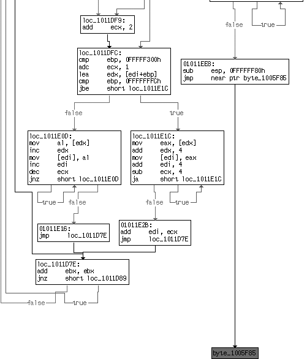
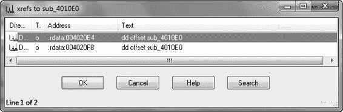

isolation.tools.setVersion.disable = "TRUE"

isolation.tools.getVersion.disable = "TRUE"

monitor_control.disable_directexec = "TRUE"

monitor_control.disable_chksimd = "TRUE"

monitor_control.disable_ntreloc = "TRUE"

monitor_control.disable_selfmod = "TRUE"

monitor_control.disable_reloc = "TRUE"

monitor_control.disable_btinout = "TRUE"

monitor_control.disable_btmemspace = "TRUE"

monitor_control.disable_btpriv = "TRUE"

monitor_control.disable_btseg = "TRUE"

*列表 17-5：VMware 的* .vmx *文件未记录的选项，用于阻止反 VM 技术* 直接 exec 参数导致用户模式代码被模拟，而不是直接在 CPU 上运行，从而阻止某些反 VM 技术。

前四个设置被 VMware 后门命令使用，以便在虚拟机中运行的 VMware Tools 无法获取有关宿主机的信息。

这些更改将防止在多处理器机器上运行时 ScoopyNG 的所有检查，除了第六项。然而，我们不推荐在 VMware 中使用这些设置，因为它们禁用了 VMware Tools 的有用性，并且可能对虚拟机的性能产生严重影响。只有在您已经尝试了反虚拟机技术之后，才添加这些选项。

**379**

[www.it-ebooks.info](http://www.it-ebooks.info/)

尝试了所有其他技术。这些技术被提及是为了完整性，但修改*.vmx*文件以尝试捕捉 VMware 可能被检测到的数百种潜在方式中的十种可能是一种徒劳的追求。

**逃离虚拟机**

VMware 有其漏洞，可以利用这些漏洞来崩溃宿主操作系统，甚至在其中运行代码。

许多公开的漏洞都发现存在于 VMware 的共享文件夹功能或利用 VMware Tools 拖放功能的工具中。

一种广为人知的漏洞利用共享文件夹允许来宾向宿主操作系统的任何文件写入，以修改或损害宿主操作系统。尽管这种特定技术不适用于当前版本的 VMware，但已在共享文件夹功能中发现了几个不同的漏洞。在虚拟机设置中禁用共享文件夹以防止此类攻击。

在 VMware 的虚拟机显示功能中也发现了一个广为人知的漏洞。这个漏洞的利用程序被称为 Cloudburst，它是 Canvas 渗透测试工具的一部分公开可用（VMware 也已经修复了这个漏洞）。

一旦宿主机被感染，某些公开可用的工具可以帮助利用 VMware，包括 VMchat、VMcat、VMftp、VMdrag-n-hack 和 VMdrag-n-sploit。这些工具在你从虚拟机中逃脱之前几乎没有用处，如果你在虚拟机中运行恶意软件，你也不必担心它们。

**结论**

本章介绍了最流行的反 VMware 技术。由于恶意软件作者使用这些技术来减缓分析，因此能够识别它们非常重要。我们已经详细解释了这些技术，以便您可以在反汇编或调试中找到它们，并且我们已经探讨了在不修改反汇编级别的恶意软件的情况下克服它们的方法。

在执行基本动态分析时，您应该始终使用虚拟机。但是，如果您的目标恶意软件似乎无法运行，在调试或反汇编恶意软件以寻找虚拟机检测之前，请考虑尝试使用未安装 VMware Tools 的另一个虚拟机。

您还可以在不同的虚拟环境中（如 VirtualBox 或 Parallels）或甚至在物理机上运行您的目标恶意软件。

与反调试技术一样，在缓慢调试进程时，可以使用常识来发现反 VMware 技术。例如，如果你看到代码在条件跳转处提前终止，那么它可能是由于反 VMware 技术导致的。始终要意识到这些问题，并在代码中向前查看以确定采取什么行动。

**380**

第十七章

[www.it-ebooks.info](http://www.it-ebooks.info/)

**L A B S**

**Lab 17-1**

分析在 VMware 中 *Lab17-01.exe* 中发现的恶意软件。这与 *Lab07-01.exe* 中的恶意软件相同，增加了反 VMware 技术。

**注意**

*本实验中发现的反 VMware 技术可能在您的环境中不起作用。*

***问题***

1\.

这种恶意软件使用了哪些反 VMware 技术？

2\.

如果您拥有 IDA Pro 的商业版本，请运行第十七章中提供的 *findAntiVM.py*（见列表 17-4）的 IDA Python 脚本。

它发现了什么？

3\.

每种反 VMware 技术成功时会发生什么？

4\.

哪些反 VMware 技术对您的虚拟机有效？

5\.

为什么每个反 VMware 技术有效或失败？

6\.

如何禁用这些反 VMware 技术，并使恶意软件运行？

**Lab 17-2**

分析在 VMware 中文件 *Lab17-02.dll* 中发现的恶意软件。在回答本实验的第一个问题后，尝试使用 *rundll32.exe* 运行安装导出，并使用类似 procmon 的工具进行监控。以下是一个执行 DLL 的示例命令行：

rundll32.exe Lab17-02.dll,InstallRT (或 InstallSA/InstallSB)

***问题***

1\.

这个 DLL 的导出是什么？

2\.

使用 *rundll32.exe* 尝试安装后会发生什么？

3\.

哪些文件被创建，它们包含什么内容？

4\.

正在使用哪种反 VMware 技术？

5\.

如何在运行时强制恶意软件安装？

6\.

如何永久禁用反 VMware 技术？

7\.

每个安装导出函数是如何工作的？

反虚拟机技术

**381**

[www.it-ebooks.info](http://www.it-ebooks.info/)

**Lab 17-3**

分析 VMware 中的恶意软件 *Lab17-03.exe*。这个实验与 *Lab12-02.exe* 类似，增加了反 VMware 技术。

***问题***

1\.

当你在虚拟机中运行这个恶意软件时会发生什么？

2.

你如何让这个恶意软件运行并放下其键盘记录器？

3.

该恶意软件使用哪些反虚拟机技术？

4.

你可以做出哪些系统更改以永久避免反虚拟机

该恶意软件使用的技巧？

5.

你如何在 OllyDbg 中修补二进制文件，以强制反虚拟机技术永久失效？

**382**

第十七章

[www.it-ebooks.info](http://www.it-ebooks.info/)

**打包器和解包**

被称为*打包器*的打包程序已经变得

极受恶意软件编写者欢迎，因为他们

帮助恶意软件躲避防病毒软件，使问题复杂化

恶意软件分析，并缩小恶意软件的大小

可执行文件。大多数打包器易于使用且免费提供。对打包程序进行基本静态分析没有用；打包的恶意软件在进行分析之前必须先解包，这使得分析更加复杂和具有挑战性。

打包器用于可执行文件的两个主要原因：缩小程序或阻止检测或分析。尽管有各种各样的打包器，但它们都遵循一个类似的模式：它们将可执行文件转换成一个新的可执行文件，该文件将转换后的可执行文件作为数据存储，并包含一个由操作系统调用的解包占位符。

我们从本章开始介绍打包器的工作原理和如何识别它们的一些背景信息。然后我们将讨论解包策略，从简单的策略开始，然后逐步过渡到更复杂的策略。

[www.it-ebooks.info](http://www.it-ebooks.info/)

**打包器解剖**

当恶意软件被打包后，分析师通常只能访问打包文件，无法检查原始未打包的程序或打包恶意软件的程序。为了解包可执行文件，我们必须撤销打包器执行的工作，这要求我们了解打包器的工作原理。

所有打包器都将可执行文件作为输入，并生成一个可执行文件作为输出。打包的可执行文件被压缩、加密或进行其他转换，使其更难识别和逆向工程。

大多数打包器使用压缩算法来压缩原始可执行文件。设计用于使文件难以分析的打包器可能会加密原始可执行文件并采用反逆向工程技术，如反汇编、反调试或反虚拟机。打包器可以打包整个可执行文件，包括所有数据和资源部分，或者只打包代码和数据部分。

为了保持原始程序的功能，打包程序需要存储程序的导入信息。信息可以存储在任何格式中，本章后面将详细介绍几种常见的策略。在解包程序时，重建导入部分有时可能具有挑战性和耗时，但对于分析程序的功能是必要的。

***解包占位符***

未打包的可执行文件由操作系统加载。对于打包程序，解包占位符由操作系统加载，然后解包占位符加载原始程序。可执行文件的代码入口点指向解包占位符而不是原始代码。原始程序通常存储在文件的一个或多个额外部分中。

解包占位符可以被恶意软件分析师查看，理解占位符的不同部分对于解包可执行文件是基本的。解包占位符通常很小，因为它不贡献于程序的主要功能，其功能通常是简单的：解包原始的可执行文件。如果你尝试对打包程序进行静态分析，你将分析的是占位符，而不是原始程序。

解包占位符执行三个步骤：



将原始可执行文件解包到内存中



解析原始可执行文件的所有导入



将执行权转移到原始入口点（OEP）

***加载可执行文件***

当常规可执行文件加载时，加载器读取磁盘上的 PE 头，并根据该头为可执行文件的每个部分分配内存。然后加载器将部分复制到内存中分配的空间。

**384**

第十八章

[www.it-ebooks.info](http://www.it-ebooks.info/)

打包的可执行文件也会格式化 PE 头，以便加载器为部分分配空间，这些空间可以来自原始程序，或者解包占位符可以创建部分。解包占位符解包每个部分的代码，并将其复制到分配的空间中。确切的解包方法取决于打包器的目标，并且通常包含在占位符中。

***解析导入***

如第一章所述，未打包的 PE 文件包含一个部分，告诉加载器需要导入哪些函数，以及另一个部分存储所有导入函数名称的地址。Windows 加载器读取导入信息，确定需要哪些函数，然后填写地址。

Windows 加载器无法读取打包的导入信息。对于打包的可执行文件，解包占位符将解析导入。具体方法取决于打包器。

最常见的方法是让解包占位符只导入 LoadLibrary 和 GetProcAddress 函数。在解包占位符解包原始可执行文件后，它将读取原始的导入信息。它将为每个库调用 LoadLibrary，以便将 DLL 加载到内存中，然后使用 GetProcAddress 获取每个函数的地址。

另一种方法是保持原始导入表完整，以便 Windows 加载器可以加载 DLL 和导入函数。这是最简单的方法，因为解包占位符不需要解析导入。然而，对打包程序的静态分析将揭示所有原始导入，因此这种方法缺乏隐蔽性。此外，由于导入函数以明文形式存储在可执行文件中，因此使用这种方法可能无法实现最佳压缩。

第三种方法是保留原始导入表中每个 DLL 的一个导入函数。这种方法在分析过程中将只揭示每个导入库的一个函数，因此比前一种方法更隐蔽，但分析仍然会揭示所有导入的库。这种方法对于打包器来说比第一种方法更容易实现，因为库不需要由解包占位符加载，但解包占位符仍然需要解析大多数函数。

最后一种方法是删除所有导入（包括 LoadLibrary 和 GetProcAddress）。打包器必须找到从其他库中需要的所有函数，而不使用函数，或者它必须找到 LoadLibrary 和 GetProcAddress，并使用它们来定位所有其他库。这个过程在第十九章中讨论，因为它与 shellcode 必须执行的操作类似。

这种方法的优点是打包的程序根本不包含任何导入，这使得它具有隐蔽性。然而，为了使用这种方法，解包的占位符必须复杂。

打包器和解包器

**385**

[www.it-ebooks.info](http://www.it-ebooks.info/)

***尾部跳转***

一旦解包占位符完成，它必须将执行权转移到 OEP。

将执行权转移到 OEP 的指令通常被称为*尾部跳转*。

跳转指令是最简单且最受欢迎的执行转移方式。由于它非常常见，许多恶意打包器会尝试通过使用 ret 或 call 指令来隐藏这个功能。有时尾部跳转会通过操作系统函数来隐藏，例如 NtContinue 或 ZwContinue。

***解包图解***

图 18-1 至图 18-4 说明了打包和解包过程，如下所示：



图 18-1 显示了原始的可执行文件。头部和段是可见的，起始点设置为 OEP。



图 18-2 显示了磁盘上存在的打包可执行文件。可见的只有新的头部、解包占位符和打包的原始代码。

头部

导入

导出

入口点

.text 段

入口点

头部

.data 段

解包占位符

打包

.rsrc 段

原始代码

*图 18-1：原始的可执行文件，*

*图 18-2：打包的可执行文件，*

*在打包之前*

*在原始代码打包之后* 

*解包占位符被添加*



图 18-3 显示了当它被加载到内存中时的打包可执行文件。解包占位符已经解包了原始代码，并且是有效的

.text 和.data 节是可见的。可执行文件的起始点仍然指向解包占位符，并且在此阶段导入表通常无效。



图 18-4 显示了完全解包的可执行文件。导入表已被重建，起始点已被编辑以指向 OEP。

注意，最终解包的程序与原始程序不同。解包程序仍然具有解包占位符和打包程序添加的任何其他代码。解包程序有一个 PE

由解包器重建的标题，并且不会与原始程序完全相同。

**386**

第十八章

[www.it-ebooks.info](http://www.it-ebooks.info/)

标题

标题

导出

入口点

导出

.text 节

.text 节

.data 节

.data 节

.rsrc 节

.rsrc 节

入口点

解包占位符

解包占位符

导入

*图 18-3：程序被解包后的*

*图 18-4：完全解包的*

*解包并加载到内存中。程序*

*程序。导入表是*

*解包占位符解包所有必要的*

*重建，并且起始*

*必要的代码运行。程序的*

*点回到原始入口*

*起始点仍然指向解包*

*点（OEP）。*

*占位符，并且没有导入。*

**识别打包程序**

分析恶意软件的早期步骤是识别它被打包。我们在前面的章节中介绍了检测恶意软件是否被打包的技术。在这里，我们将进行回顾并介绍一种新技术。

***打包程序的指标***

以下列表总结了在确定恶意软件是否被打包时需要寻找的迹象。



程序导入较少，尤其是如果唯一的导入是 LoadLibrary 和 GetProcAddress。



当程序在 IDA Pro 中打开时，自动分析只识别了一小部分代码。



当程序在 OllyDbg 中打开时，会有一个警告，表明程序可能被打包。



程序显示的节名称表明了特定的打包器（如 UPX0）。



程序有异常的节大小，例如.text 节具有原始数据大小为 0 和虚拟大小非零。

可以使用 PEiD 等打包检测工具来确定可执行文件是否被打包。

***熵计算***

打包的可执行文件也可以通过称为*熵* *计算*的技术来检测。熵是系统或程序中无序的度量，虽然没有定义良好的标准数学公式来计算熵，但有许多针对数字数据的熵度量方法。

打包和解包

**387**

[www.it-ebooks.info](http://www.it-ebooks.info/)

压缩或加密的数据更接近随机数据，因此具有高熵；未加密或未压缩的可执行文件具有较低的熵。

用于检测打包程序的自动工具通常使用诸如熵之类的启发式方法。其中一个免费自动工具是 Mandiant Red Curtain，它使用诸如熵之类的度量来为任何可执行文件计算威胁分数。Red Curtain 可以扫描文件系统以查找可疑的打包二进制文件。

**解包选项**

解包打包的可执行文件有三种选项：自动静态解包、自动动态解包和手动动态解包。自动解包技术比手动动态解包更快、更简单，但自动技术并不总是有效。如果你已经确定了使用的打包器类型，你应该确定是否有可用的自动解包器。如果没有，你可能能够找到有关如何手动解包打包器的信息。

在处理打包的恶意软件时，请记住你的目标是分析恶意软件的行为，这并不总是需要你重新创建原始恶意软件。大多数时候，当你解包恶意软件时，你会创建一个新的二进制文件，它不与原始文件完全相同，但执行所有相同的事情。

**自动解包**

自动静态解包程序解压缩和/或解密可执行文件。这是最快的方法，当它有效时，是最佳方法，因为它不运行可执行文件，并将可执行文件恢复到其原始状态。自动静态解包程序针对单个打包器特定，它们不会在旨在阻止分析的工具上工作。

PE Explorer，一个用于处理 EXE 和 DLL 文件的免费程序，作为默认设置的一部分包含几个静态解包插件。默认插件支持 NSPack、UPack 和 UPX。使用 PE Explorer 解包文件是完全无缝的。如果 PE Explorer 检测到你选择的要打开的文件是打包的，它将自动解包可执行文件。请注意，如果你想在 PE Explorer 之外检查解包的可执行文件，你需要将其保存。

自动动态解包器运行可执行文件，并允许解包占位符解包原始可执行代码。一旦原始可执行文件被解包，程序将被写入磁盘，解包器重建原始导入表。

自动解包程序必须确定解包占位符的结束位置和原始可执行文件的开始位置，这是困难的。当打包器未能正确识别解包占位符的结束位置时，解包将失败。

**388**

第十八章

[www.it-ebooks.info](http://www.it-ebooks.info/)

不幸的是，目前还没有好的公开可用的自动动态解包器。许多公开可用的工具在处理某些打包器时可以完成足够的工作，但没有一个是完全准备好用于严重使用的。

两种自动解包技术都运行得很快，使用起来也很方便，但它们的成功率有限。恶意软件分析师必须知道自动静态解包器和动态解包器之间的区别：自动动态解包程序运行恶意可执行文件，而自动静态解包程序则不运行。每当恶意程序运行时，都必须确保它在安全环境中运行，正如第二章所讨论的那样。

**手动解包**

有时，打包的恶意软件可以通过现有的程序自动解包，但更常见的是必须手动解包。手动解包有时可以快速完成，付出最小的努力；有时它可能是一个漫长而艰巨的过程。

手动解包程序有两种常见的方法：



发现打包算法，并编写一个程序来逆向运行它。

通过逆向运行算法，程序取消打包程序中的每个步骤。有一些自动化工具可以做到这一点，但这种方法仍然效率低下，因为用于解包恶意软件的程序将针对特定的打包程序。因此，即使有自动化，这个过程也需要相当长的时间才能完成。



运行打包程序，让解包占位符为您完成工作，然后将进程从内存中转储出来，并手动修复 PE 头，以便程序完整。这是更有效的方法。

让我们通过一个简单的手动解包过程来了解一下。为了这个示例，我们将解包一个使用 UPX 打包的可执行文件。尽管 UPX 可以使用 UPX 自动解包，但我们将手动进行解包。

程序，它简单且是一个很好的例子。您将在本章的第一个实验中亲自完成这个过程。

首先，将打包的可执行文件加载到 OllyDbg 中。第一步是找到 OEP，这是程序在打包之前的第一个指令。在手动解包过程中，找到函数的 OEP 可能是更困难的任务之一，将在本章后面详细讨论。在这个例子中，我们将使用 OllyDbg 的 OllyDump 插件的一部分自动化工具。

**注意**

*OllyDump 是 OllyDbg 的一个插件，具有两个用于解包的良好功能：它可以* *转储当前进程的内存，并且可以搜索打包* *可执行文件的 OEP* *。*

打包和解包

**389**

[www.it-ebooks.info](http://www.it-ebooks.info/)

在 OllyDbg 中，选择**插件****OllyDump****通过段跳转查找 OEP**。程序将在 OEP 执行前遇到断点。

当达到这个断点时，所有代码将被解包到内存中，原始程序准备运行，因此代码是可见的，并且可用于分析。唯一剩下的步骤是修改此代码的 PE 头，以便我们的分析工具可以正确解释代码。

调试器将在 OEP 的指令上中断。写下 OEP 的值，不要关闭 OllyDbg。

现在我们将使用 OllyDump 插件来导出可执行文件。选择 **插件****OllyDump****导出调试进程**。这将把进程内存中的所有内容导出到磁盘上。屏幕上有一些选项用于将文件导出到磁盘。

如果 OllyDbg 只是导出了程序而没有进行任何更改，那么导出的程序将包括打包程序的 PE 头，这不同于解包程序的 PE 头。我们需要更改两件事来纠正头文件：



导入表必须重建。



PE 头中的入口点必须指向 OEP。

幸运的是，如果你没有在导出屏幕上更改任何选项，OllyDump 将会自动执行这些步骤。可执行文件的入口点将被设置为当前指令指针，在这个例子中是 OEP，并且导入表将被重建。点击 **导出** 按钮，你就可以完成这个可执行文件的解包。我们之所以能够通过几个简单的步骤解包这个程序，是因为 OEP 被定位，并且导入表是由 OllyDump 自动重建的。对于复杂的解包器来说，这不会那么简单，本章的其余部分将涵盖 OllyDump 失败时如何解包。

***使用导入重建器重建导入表***

重建导入表很复杂，并且并不总是在 OllyDump 中有效。解包占位符必须解析导入以允许应用程序运行，但它不需要重建原始的导入表。当 OllyDbg 失败时，尝试使用导入重建器（ImpRec）执行这些步骤是有用的。

ImpRec 可以用来修复打包程序的导入表。

运行 ImpRec，打开屏幕顶部的下拉菜单。你应该能看到正在运行的过程。选择打包的可执行文件。接下来，在右侧的 OEP 字段中输入 OEP 的 RVA 值（不是整个地址）。例如，如果图像基址是 0x400000，OEP 是 0x403904，则输入 **0x3904**。接下来，点击 **IAT 自动搜索** 按钮。你应该会看到一个窗口，显示消息表明 ImpRec 找到了原始的导入地址表（IAT）。现在点击 **获取导入**。所有带有导入函数的文件列表应该出现在主窗口的左侧。如果操作成功，所有导入都应该显示为有效：是。如果获取导入函数失败，则无法使用 ImpRec 自动修复导入表。

**390**

第十八章

[www.it-ebooks.info](http://www.it-ebooks.info/)

在本章后面将讨论手动修复表的策略。现在，我们假设导入表已成功发现。

点击 **修复导出** 按钮。你将被要求输入之前使用 OllyDump 导出的文件的路径，ImpRec 将会创建一个新文件，并在文件名后添加下划线。

如果您不确定是否正确执行了操作，可以执行文件以确保一切正常。这个基本的解包过程将适用于大多数加密的可执行文件，并且应该首先尝试。

如前所述，手动解包恶意软件的最大挑战是找到 OEP，我们将在下一节讨论。

***查找 OEP***

定位 OEP 有许多策略，没有一种策略对所有加密器都有效。分析师通常会有个人偏好，并且会首先尝试他们最喜欢的策略。但为了成功，分析师必须熟悉许多技术，以防他们最喜欢的方 法不起作用。选择错误的技术可能会令人沮丧且耗时。

查找 OEP 是一项必须通过实践来培养的技能。本节包含各种策略，以帮助您培养技能，但真正学习的方法只有实践。

为了找到 OEP，您需要在调试器中运行恶意程序并使用单步执行和断点。回想一下第八章中描述的不同类型的断点。OllyDbg 提供四种类型的断点，它们由不同的条件触发：标准的 INT 3 断点、OllyDbg 提供的内存断点、硬件断点和带有断点条件的运行跟踪。

加密代码和解密 stub 通常与调试器通常处理的代码不同。加密代码通常是自修改的，包含不返回的调用指令、未标记为代码的代码以及其他奇怪之处。这些特性可能会使调试器困惑并导致断点失败。

使用自动化工具查找 OEP 是最简单的策略，但就像自动化解包方法一样，这些工具并不总是有效。您可能需要手动找到 OEP。

**使用自动化工具查找 OEP**

在上一个示例中，我们使用了一个自动化工具来查找 OEP。用于查找 OEP 最常用的自动化工具是 OllyDbg 中的 OllyDump 插件，称为通过段跳转查找 OEP。通常，解包 stub 位于一个部分，而可执行文件被压缩到另一个部分。OllyDbg 检测到从一个部分到另一个部分的转移时，会在这里中断，使用单步执行或单步进入方法。单步执行方法会跳过任何调用指令。调用通常用于在另一个部分执行代码，这种方法旨在防止 OllyDbg 错误地将这些调用标记为 OEP。然而，如果一个调用函数没有返回，那么 OllyDbg 将无法定位 OEP。

加密器和解密器

**391**

[www.it-ebooks.info](http://www.it-ebooks.info/)

恶意打包器经常包含不返回的调用函数，以混淆分析师和调试器。单步执行选项会进入每个调用函数，因此更有可能找到 OEP，但也更有可能产生假阳性。在实践中，您应该尝试单步执行和单步进入方法。

**手动查找 OEP**

当自动查找 OEP 的方法失败时，您需要手动查找。最简单的手动策略是寻找尾部跳转。如前所述，这个指令从解包占位符跳转到 OEP。

通常，它是一个跳转指令，但一些恶意软件作者将其改为返回指令以逃避检测。

通常，尾部跳转是在一系列无效指令之前的最后一个有效指令。这些字节是填充，以确保该部分正确字节对齐。通常，使用 IDA Pro 在打包的可执行文件中搜索尾部跳转。列表 18-1 显示了简单的尾部跳转示例。

00416C31 PUSH EDI

00416C32 CALL EBP

00416C34 POP EAX

00416C35 POPAD

00416C36 LEA EAX,DWORD PTR SS:[ESP-80]

00416C3A PUSH 0

00416C3C CMP ESP,EAX

00416C3E JNZ SHORT Sample84.00416C3A

00416C40 SUB ESP,-80

00416C43 JMP Sample84.00401000

00416C48 DB 00

00416C49 DB 00

00416C4A DB 00

00416C4B DB 00

00416C4C DB 00

00416C4D DB 00

00416C4E DB 00

*列表 18-1：简单的尾部跳转*

这个例子展示了 UPX 在地址 0x00416C43 处的尾部跳转，它位于代码的末尾。两个特征清楚地表明这是尾部跳转：它位于代码的末尾，并且链接到一个非常远的地址。如果我们在一个调试器中检查这个跳转，我们会看到跳转之后有数百个 0x00 字节，这是不常见的；返回通常跟随跳转，但这个跳转后面没有任何有意义的代码。

使这个跳转突出的另一个特征是其大小。通常，跳转用于条件语句和循环，并跳转到距离几百字节内的地址，但这个跳转跳转到距离 0x15C43 字节远的地址。这与合理的 jmp 语句不一致。

IDA Pro 的图形视图通常使尾部跳转非常容易发现，如图 18-5 所示。当 IDA Pro 无法确定**392**时，它会将跳转颜色设置为红色。

第十八章

[www.it-ebooks.info](http://www.it-ebooks.info/)

跳转的目的地。通常，跳转是在同一个函数内，IDA Pro 会在 jmp 指令的目标处画一个箭头。在尾部跳转的情况下，IDA Pro 遇到错误并将跳转颜色设置为红色。

*图 18-5：在 IDA Pro 图形视图中以红色突出显示尾部跳转。*

尾部跳转将执行权转移到磁盘上打包的原始程序。因此，当解包占位符开始时，尾部跳转会跳转到不包含有效指令的地址，但在程序运行时包含有效指令。列表 18-2 显示了在 OllyDbg 中加载程序时跳转目标的地址处的反汇编代码。指令 ADD BYTE PTR DS:[EAX],AL 对应于两个 0x00

字节，这不是一个有效的指令，但 OllyDbg 仍然尝试反汇编这个指令。

00401000 ADD BYTE PTR DS:[EAX],AL

00401002 ADD BYTE PTR DS:[EAX],AL

00401004 ADD BYTE PTR DS:[EAX],AL

00401006 ADD BYTE PTR DS:[EAX],AL

00401008 ADD BYTE PTR DS:[EAX],AL

0040100A ADD BYTE PTR DS:[EAX],AL

0040100C ADD BYTE PTR DS:[EAX],AL

0040100E ADD BYTE PTR DS:[EAX],AL

*列表 18-2：在原始程序解包之前存储在 OEP 的指令字节* 打包和解包

**393**

[www.it-ebooks.info](http://www.it-ebooks.info/)

列表 18-3 包含了在执行尾部跳转时在相同地址找到的反汇编代码。原始可执行文件已被解包，现在该位置有有效的指令。这种变化是尾部跳转的另一个标志。

00401000 CALL Sample84.004010DC

00401005 TEST EAX,EAX

00401007 JNZ SHORT Sample84.0040100E

00401009 CALL Sample84.00401018

0040100E PUSH EAX

0040100F CALL DWORD PTR DS:[414304] ; kernel32.ExitProcess 00401015 RETN

*列表 18-3：在原始程序解包后存储在 OEP 的指令字节* 另一种找到尾部跳转的方法是在堆栈上设置一个读取断点。

记住对于读取断点，你必须使用硬件断点或 OllyDbg 内存断点。大多数反汇编中的函数，包括解包占位符，都以某种类型的压栈指令开始，你可以利用这一点。首先，注意堆栈上第一个值被推入的内存地址，然后在该堆栈位置设置一个读取断点。

在那个初始压栈之后，堆栈上的其他所有内容都将位于更高的堆栈上（在较低的内存地址）。只有当解包占位符完成时，才会访问原始压栈的堆栈地址。因此，该地址将通过一个弹出指令来访问，这将触发断点并中断执行。尾部跳转通常就在弹出指令之后。通常需要在该地址尝试几种不同的断点类型。读取硬件断点是一个值得首先尝试的类型。

注意 OllyDbg 界面不允许你在堆栈窗口中设置断点。你必须查看内存转储窗口中的堆栈地址，并在那里设置断点。

手动找到 OEP 的另一种策略是在代码中的每个循环后设置断点。这允许你监控每条正在执行的指令，而无需花费大量时间重复遍历相同的代码。通常，代码将包含多个循环，包括嵌套循环。通过扫描代码并在每个循环后设置断点来识别循环。这种方法需要手动操作，通常比其他方法耗时更长，但易于理解。这种方法的最大陷阱是在错误的位置设置断点，这会导致可执行文件运行到完成而不触发断点。如果发生这种情况，不要气馁。回到你离开的地方，并在过程中继续设置断点，直到找到 OEP。

另一个常见的陷阱是跳过一个永远不会返回的函数调用。

当你跳过函数调用时，程序将继续运行，并且断点永远不会被触发。解决这个问题的唯一方法是重新开始，回到相同的函数调用，并进入函数而不是跳过**394**。

第十八章

[www.it-ebooks.info](http://www.it-ebooks.info/)

跳入每个函数可能会很耗时，因此建议使用试错法来确定何时跳过，何时进入。

找到尾部跳转的另一种策略是在 GetProcAddress 上设置断点。大多数解包器都会使用 GetProcAddress 来解决原始函数的导入。在 GetProcAddress 上触发的断点位于解包器占位符的深处，但在尾部跳转之前还有很多代码。在 GetProcAddress 上设置断点允许你绕过解包器占位符的开始部分，这部分通常包含最复杂的代码。

另一种方法是设置一个断点在你知道原始程序将会调用的函数上，然后反向工作。例如，在大多数 Windows 程序中，OEP 可以在主方法之外的标准包装代码的开始处找到。因为包装器总是相同的，你可以通过在它调用的函数之一上设置断点来找到它。

对于命令行程序，这个包装器在过程开始时非常早地调用了 GetVersion 和 GetCommandLineA 函数，因此你可以在这些函数被调用时尝试中断。程序尚未加载，因此你无法在 GetVersion 的调用上设置断点，但你可以在 GetVersion 的第一条指令上设置断点，这同样有效。

在 GUI 程序中，GetModuleHandleA 通常是被调用的第一个函数。程序崩溃后，检查之前的堆栈帧以确定调用来源。有很大可能性，调用 GetModuleHandleA 或 GetVersion 的函数的开始就是 OEP。从调用指令开始，向上滚动并搜索函数的开始。大多数函数以 push ebp 开头，然后是 mov ebp, esp。尝试以该函数的开始作为 OEP 来导出程序。如果你是对的，并且该函数是 OEP，那么你就完成了。如果你错了，那么程序仍然会被导出，因为解包占位符已经完成了。

你将能够在 IDA Pro 中查看和导航程序，但你并不一定知道程序从哪里开始。你可能很幸运，IDA Pro 可能会自动识别 WinMain 或 DllMain。

定位 OEP 的最后一种策略是使用 OllyDbg 中的 Run Trace 选项。Run Trace 提供了多个额外的断点选项，并允许你在大量地址上设置断点。例如，许多打包器保留了原始文件中的 .text 部分。通常，磁盘上的 .text 部分中没有内容，但该部分保留在 PE 头部，以便加载器在内存中为它创建空间。OEP 总是在原始 .text 部分内，并且通常是该部分中第一个被调用的指令。Run Trace 选项允许你设置一个断点，以便在 .text 部分中的任何指令执行时触发。当断点被触发时，OEP 通常可以找到。

***手动修复导入表***

OllyDump 和 ImpRec 通常能够通过在内存中的程序中搜索看起来像导入函数列表的内容来重建导入表。但有时这会失败，你需要对导入表的工作原理有更多的了解才能分析恶意软件。

打包器和解包

**395**

[www.it-ebooks.info](http://www.it-ebooks.info/)

导入表实际上在内存中是两个表。第一个表是加载器或解包占位符使用的名称或序号列表，用于确定需要哪些函数。第二个表是所有导入函数的地址列表。当代码运行时，只需要第二个表，因此打包器可以移除名称列表以阻止分析。如果移除了名称列表，那么可能需要手动重建该表。

没有导入信息分析恶意软件极其困难，因此最好尽可能修复导入信息。最简单的策略是在反汇编中遇到导入时逐个修复它们。为此，在 IDA Pro 中打开文件，不包含任何导入信息。当你看到对导入函数的调用时，在反汇编中标记该导入函数。对导入函数的调用是对加载程序外地址的间接调用，如列表 18-4 所示。

push eax

call dword_401244

...

dword_401244: 0x7c4586c8

*列表 18-4：当导入表未正确重建时对导入函数的调用* 列表显示了一条基于 DWORD 指针的目标调用指令。

在 IDA Pro 中，我们导航到 DWORD，看到它的值为 0x7c4586c8，这个值超出了我们加载的程序。接下来，我们打开 OllyDbg 并导航到地址 0x7c4586c8，看看那里有什么。OllyDbg 将该地址标记为 WriteFile，现在我们可以将该导入地址标记为 imp_WriteFile，这样我们就知道该函数的功能了。你需要为遇到的每个导入执行这些步骤。IDA Pro 的交叉引用功能将标记所有对导入函数的调用。一旦标记了足够多的函数，你就可以有效地分析恶意软件。

这种方法的主要缺点是你可能需要标记很多函数，并且在你标记之前，你不能搜索对导入的调用。这种方法的另一个缺点是你实际上不能运行你的解包程序。这并不是一个致命的问题，因为你可以使用解包程序进行静态分析，你仍然可以使用打包程序进行动态分析。

另一种策略，这确实允许你运行解包的程序，就是手动重建导入表。如果你能找到导入函数表，那么你可以手动重建原始的导入表。PE

文件格式是一个开放标准，你可以逐个输入导入函数，或者你可以编写一个脚本来为你输入信息。

这种方法的最大缺点是它可能非常繁琐和耗时。

**396**

第十八章

[www.it-ebooks.info](http://www.it-ebooks.info/)

**注意**

*有时恶意软件作者会使用多个打包器。这会加倍分析员的工作量，但只要有毅力，通常可以解包双层打包的恶意软件。策略很简单：使用我们刚刚描述的任何技术来撤销第一层打包，然后重复操作以撤销第二层打包。策略是相同的，无论使用了多少打包器。*

**常见打包器的技巧和窍门**

本节仅涵盖了您在分析恶意软件时可能遇到的一些流行打包器的样本。对于每个打包器，我们都包括了一个描述和手动解包的策略。对于其中一些打包器，还列出了自动解包器，但它们并不总是有效。对于每个打包器，还包括了查找 OEP 和潜在问题的策略。

***UPX***

用于恶意软件的最常见的打包器是 Ultimate Packer for eXecutables (UPX)。UPX 是开源的、免费的，并且易于使用，它支持广泛的平台。UPX 压缩可执行文件，其设计重点是性能而非安全性。UPX 因其高解压缩速度、小尺寸和低内存要求而受到欢迎。

UPX 并未设计成难以逆向工程，它对恶意软件分析师来说并不构成太大挑战。大多数用 UPX 打包的程序也可以用 UPX 解包，并且命令行有一个 -d 选项，您可以使用它来解压缩 UPX 打包的可执行文件。

由于它相对容易克服，UPX 是学习如何手动解包恶意软件的好打包器。然而，许多隐秘的恶意程序被设计成看起来是用 UPX 打包的，而实际上它们是用另一个打包器或 UPX 的修改版本打包的。在这种情况下，UPX 程序将无法解包可执行文件。

您可以通过使用本章前面概述的许多策略来找到 UPX 的 OEP。您还可以在 OllyDump 中使用“通过段跳转查找 OEP”功能，或者简单地向下翻页通过解包 stub，直到您看到尾部跳转。使用 OllyDump 导出文件并重建导入表将会有所成功。

***PECompact***

PECompact 是一个为速度和性能设计的商业打包器。

已停用的免费学生版本仍然经常被恶意软件作者使用。

使用此打包器打包的程序可能难以解包，因为它包括反调试异常和混淆代码。PECompact 有一个插件框架，允许集成第三方工具，恶意软件作者经常包括使解包更加困难的第三方工具。

打包和解包

**397**

[www.it-ebooks.info](http://www.it-ebooks.info/)

手动解包 PECompact 与解包 UPX 大致相同。该程序生成一些异常，因此您需要将 OllyDbg 设置为将异常传递给程序。这在第十六章中已有详细讨论。

您可以通过寻找尾部跳转来找到 OEP。跳过几个函数，您将看到一个由 jmp eax 后跟许多 0x00 字节组成的尾部跳转。

***ASPack***

ASPack 专注于安全性，并采用了一些使程序难以解包的技术。ASPack 使用自修改代码，这使得设置断点和一般分析变得困难。

设置断点可能会导致使用 ASPack 打包的程序提前终止，但仍然可以通过在堆栈地址上设置的硬件断点手动解包。此外，ASPack 非常受欢迎，因此有许多自动化解包器可用。它们的有效性各不相同，但自动化解包始终值得作为首选选项尝试。

尽管你可能使用自动化技术成功解包 ASPack 打包的文件，但很可能会需要手动解包文件。首先，打开解包占位符的代码。在代码的早期部分，你会看到一个 PUSHAD 指令。确定哪些堆栈地址用于存储寄存器，并在其中一个地址上设置硬件断点。确保它设置为在读取指令时中断。当相应的 POPAD 指令被调用时，断点将被触发，你将距离指向 OEP 的尾部跳转指令只有几条指令的距离。

当调用该指令时，断点将被触发，你将距离指向 OEP 的尾部跳转指令只有几条指令的距离。

***Petite***

Petite 在许多方面与 ASPack 相似。Petite 也使用反调试机制来使确定 OEP 非常困难，Petite 代码使用单步异常来中断调试器。这可以通过在第十六章中描述的方式将单步异常传递给程序来解决。最佳策略是使用堆栈上的硬件断点来找到 OEP，就像 ASPack 一样。Petite 使用复杂的代码结构，一旦接近 OEP，就很容易发现，因为原始代码看起来很正常，与 Petite 包装代码不同。

Petite 也保留原始导入表中的每个库至少一个导入。尽管这不会影响解包的难度，但你可以在不解包的情况下轻松确定恶意软件使用的 DLL。 

***WinUpack***

WinUpack 是一个具有图形用户界面的打包器，旨在实现最佳压缩，而不是为了安全。这个打包器的命令行版本称为 UPack，还有针对 UPack 和 WinUpack 的特定自动化解包器。

**398**

第十八章

[www.it-ebooks.info](http://www.it-ebooks.info/)

虽然安全不是其重点，但 WinUpack 仍然包括一些安全措施，这使得找到 OEP 非常困难，并且使搜索尾部跳转或使用 OllyDump 等技术变得无用。列表 18-5 显示了这个可执行文件的尾部跳转。

010103A6 POP ECX

010103A7 OR ECX,ECX

010103A9 MOV DWORD PTR SS:[EBP+3A8],EAX

010103AF POPAD

010103B0 JNZ SHORT Sample_upac.010103BA

010103B2 MOV EAX,1

010103B7 RETN 0C

010103BA PUSH Sample_upac.01005F85

010103BF RETN

010103C0 MOV EAX,DWORD PTR SS:[EBP+426]

010103C6 LEA ECX,DWORD PTR SS:[EBP+43B]

010103CC PUSH ECX

010103CD PUSH EAX

010103CE CALL DWORD PTR SS:[EBP+F49]

010103D4 MOV DWORD PTR SS:[EBP+555],EAX

010103DA LEA EAX,DWORD PTR SS:[EBP+447]

010103E0 PUSH EAX

010103E1 CALL DWORD PTR SS:[EBP+F51]

010103E7 MOV DWORD PTR SS:[EBP+42A],EAX

*列表 18-5：使用 UPack 打包程序的尾部跳转* 在这个列表中，尾部跳转在解包占位符的中间，因此很难发现。在处的一个 push 指令后面跟着一个 return 指令对于尾部跳转来说非常常见。代码在到达尾部跳转之前跳来跳去，以使其更难发现。为了进一步隐藏尾部跳转，在调用之前，打包器修改了在 retn 指令之前的前一个 push 指令。跳转也不是很远，所以你不能通过搜索长跳转来识别它。因为 OEP 和解包占位符在同一个节中，所以 OllyDump 不能通过其节跳转方法自动识别尾部跳转。

对于使用 UPack 打包的程序，找到 OEP 的最佳策略是在 GetProcAddress 上设置断点，然后仔细单步执行指令，寻找设置导入解析的循环。如果你在每一个 jmp 或 call 指令上设置断点，你将永远单步执行，但如果你设置得太稀疏，程序可能会错过你的断点并运行到完成。

如果程序运行到完成而没有触发你的断点，不要气馁。只需在调试器中重新启动应用程序并再次尝试。犯错误是这个过程的一部分。最终，你将单步执行到一个 ret 指令，它就是尾部跳转。

有时，识别尾部跳转可能很棘手。在这种情况下，它跳转大约 0x4000 字节。大多数解包占位符都比 0x4000 小得多，而那么大的跳转通常是指向 OEP 的跳转。一个好的双重检查方法是检查 OEP 周围的代码，它应该看起来更像是打包和拆包。

**399**

[www.it-ebooks.info](http://www.it-ebooks.info/)

普通代码与解包占位符相比。解包占位符通常在函数中间有很多条件跳转和返回，但 OEP 周围的代码不应该有这些不寻常的元素。

对于 UPack，另一种有效的策略是在 GUI 程序上对 GetModuleHandleA 或命令行程序上的 GetCommandLineA 设置断点。在 Windows 中，这些函数在 OEP 之后不久就被调用。

一旦触发断点，通过代码向后搜索以找到 OEP。

有时，WinUpack 会通过使用 OllyDbg 解析错误的 PE 头文件来崩溃 OllyDbg。在第十六章中，我们展示了 OllyDbg 并不完美，并且存在解析在调试器外 Windows 上运行良好的二进制文件的问题。如果你遇到这个问题，在尝试解析 PE 头文件错误之前，总是尝试使用 WinDbg。

***Themida***

Themida 是一个非常复杂的打包器，具有许多功能。大多数功能都是反调试和反分析，这使得它成为一个非常安全的打包器，难以解包和分析。

Themida 包含防止使用 VMware、调试器和进程监视器（procmon）进行分析的功能。Themida 还有一个内核组件，这使得分析变得更加困难。在内核中运行的代码受到的限制非常少，而分析代码通常在用户空间运行，因此受到更多的限制。

由于 Themida 包含了许多功能，因此打包的可执行文件异常庞大。此外，与大多数打包程序不同，Themida 的代码在整个原始程序运行期间都会继续运行。

一些自动化工具被设计用来解包 Themida 文件，但它们的成功率取决于 Themida 的版本以及程序打包时使用的设置。Themida 有如此多的功能和设置，以至于不可能找到一个始终有效的单一解包策略。

如果自动化工具不起作用，另一个很好的策略是使用 ProcDump 从内存中转储进程而不进行调试。ProcDump 是微软的一个工具，用于转储 Windows 进程的内容。它设计用于与调试器一起工作，但它本身不是一个调试器。ProcDump 的最大优点是你可以转储进程内存而不停止或调试进程，这对于具有高级反调试措施的打包程序来说非常有用。即使你无法调试可执行文件，你仍然可以在可执行文件运行时使用 ProcDump 转储解包的内容。这个过程并不完全恢复原始的可执行文件，但它确实允许你运行 strings 并在代码上进行一些分析。

**无需完全解包的分析**

一些程序，包括使用 Themida 打包的程序，可能非常难以解包。有时，你可能会花整天时间尝试解包一个程序，但毫无成功。也许打包程序正在使用一种全新的技术，你根本不知道**400**

第十八章

[www.it-ebooks.info](http://www.it-ebooks.info/)

无法解决。如果发生这种情况，你可能很幸运——分析恶意软件时，你并不总是需要创建一个完全解包的工作可执行文件。

最简单的情况是，一个解包的程序无法执行，因为你无法完全修复导入表和 PE 头。在这种情况下，你仍然可以使用 IDA Pro 来分析程序，即使它不是完全可执行的。一旦你在磁盘上有程序的转储，你可以通过导航到内存地址并标记该部分为代码，让 IDA Pro 分析代码的特定部分。你还可以在程序上运行 Strings（如第一章所述），这可能揭示导入的函数和其他有用的信息。

在无需完全解包的情况下进行的分析非常有限，但根据你的目标，它可能足够了。

一些解压缩器实际上在程序开始运行之前不会解压缩整个原始程序。相反，它们会解压缩原始程序的一部分，并运行这部分。当需要运行代码的下一部分时，这部分会被解压缩到内存中并运行。这给可执行文件带来了相当大的开销，但使得分析师解压缩变得非常困难。

反汇编解压缩单个代码块的技术可以使你编写一个脚本来解压缩所有代码，或者至少是大部分代码。另一种选择是更多地关注动态分析。

**打包 DLL**

与打包 DLL 相关还有一些额外的复杂性，因此并非所有打包器都支持此功能。处理 DLL 的导出是一个复杂性。DLL 中的导出表指向导出函数的地址，如果 DLL 被打包，那么导出函数也会被打包。打包器必须考虑到这一点，以确保 DLL

运行正常。

解压缩 DLL 与解压缩 EXE 并没有太大区别。要记住的关键点是 DLL 有一个 OEP，就像可执行文件一样。所有 DLL 都有一个名为 DllMain 的函数，当 DLL 被加载时会被调用。

DLL 中的 OEP 是 DllMain 的原始起始地址。打包 DLL 中列出的起始地址是解压缩占位符的地址，它被放置在 DllMain 中而不是主方法中。OllyDbg 可以加载 DLL，OllyDbg 有一个名为 *loadDll.exe* 的工具，允许你加载和调试 DLL。

问题在于 DllMain 方法将在 OllyDbg 中断之前被调用。到断点发生时，解压缩占位符已经执行，这将非常难以找到 OEP。

要解决这个问题，请打开 PE 文件，并在 IMAGE_FILE_HEADER 部分找到 Characteristics 字段。IMAGE_FILE_HEADER 中的 0x2000 位置的位被设置为 1 用于 DLL。如果这个字段被更改为 0，那么文件将被解释为可执行文件。OllyDbg 将程序作为 EXE 打开，你将能够应用本章讨论的所有解压缩策略。在你找到 OEP 之后，将位改回，这样程序将再次被当作 DLL 处理。

打包和解压缩

**401**

[www.it-ebooks.info](http://www.it-ebooks.info/)

**结论**

本章介绍了大量处理打包软件的策略。我们从打包器的工作原理和如何解压缩软件的基本知识开始，然后讨论了一些自动解压缩工具和策略。

接下来，我们介绍了可以用来手动解压缩恶意软件的技术。没有单一的策略或工具在所有情况下都有效，所以你需要熟悉几种技术。

在下一章中，我们将介绍识别和分析恶意壳代码的策略。

**402**

第十八章

[www.it-ebooks.info](http://www.it-ebooks.info/)

**L A B S**

本章实验室的目标仅仅是解包代码以进行进一步分析。对于每个实验室，你应该尝试解包代码，以便可以使用其他静态分析技术。虽然你可能能够找到一些可以与这些实验室一起工作的自动化解包器，但自动化解包器不会帮助你学习当你遇到自定义打包器时所需的技能。此外，一旦你掌握了解包，你可能能够在比找到、下载和使用自动化解包器更短的时间内手动解包文件。

每个实验室都是前一章实验室的打包版本。在这种情况下，你的任务是解包实验室并确定它出现在哪一章。

文件为*Lab18-01.exe*至*Lab18-05.exe*。

打包和反打包

**403**

[www.it-ebooks.info](http://www.it-ebooks.info/)

[www.it-ebooks.info](http://www.it-ebooks.info/)

**第六部分**

**S P E C I A L T O P I C S**

[www.it-ebooks.info](http://www.it-ebooks.info/)

[www.it-ebooks.info](http://www.it-ebooks.info/)

**S H E L L C O D E A N A L Y S I S**

*Shellcode*指的是原始可执行代码的有效负载。

名称*shellcode*来源于攻击者通常会使用此代码来获取交互式 shell 的事实

在受损害系统上的访问。然而，超过

时间，这个术语已经变得普遍用来描述

任何自包含的可执行代码片段。

Shellcode 通常与漏洞利用一起使用，以颠覆正在运行的程序，或者由恶意软件执行进程注入。漏洞利用和进程注入在 shellcode 被添加到正在运行的程序并在进程启动后执行方面是相似的。

Shellcode 要求其作者手动执行软件开发者通常从不关心的几个动作。例如，shellcode 包不能依赖于 Windows 加载器在正常程序启动期间执行的操作，包括以下操作：



将程序放置在其首选内存位置



如果无法在首选内存位置加载，则应用地址重定位



加载所需的库和解决外部依赖

[www.it-ebooks.info](http://www.it-ebooks.info/)

本章将向您介绍这些 shellcode 技术，并通过完整的、实际应用的示例进行演示。

**加载 Shellcode 进行分析**

在调试器中加载和运行 shellcode 存在问题，因为 shellcode 通常只是一个无法像正常可执行文件那样运行的二进制数据块。为了使事情变得简单，我们将使用*shellcode_launcher.exe*（包含在*http://www.practicalmalwareanalysis.com/*提供的实验室中）来加载和跳转到 shellcode 的各个部分。

如第五章所述，将 shellcode 加载到 IDA Pro 进行静态分析相对简单，但用户必须在加载过程中提供输入，因为没有可执行文件格式可以描述 shellcode 的内容。首先，你必须确保在加载过程对话框中选择了正确的处理器类型。对于本章的示例，你可以使用**Intel 80x86 处理器：metapc**处理器类型，并在提示时选择**32 位反汇编**。IDA Pro 将加载二进制文件，但不会进行自动分析（分析必须手动完成）。

**位置无关代码**

*位置无关代码（PIC）* 是不使用硬编码地址的代码或数据。Shellcode 是 PIC。它在执行时不能假设它将位于特定的内存位置，因为在运行时，不同版本的易受攻击程序可能将 shellcode 加载到不同的内存位置。Shellcode 必须确保所有代码和数据访问都使用 PIC 技术。

表 19-1 显示了多种常见的 x86 代码和数据访问类型，以及它们是否是 PIC。

**表 19-1:** 不同类型的 x86 代码和数据访问 **指令助记符**

**指令字节**

**位置无关？**

调用子程序 sub_401000

E8 C1 FF FF FF 

是

jnz short loc_401044

75 0E 

是

mov edx, dword_407030 

8B 15 30 70 40 00

否

mov eax, [ebp-4] 

8B 45 FC

是

在表中，call 指令包含一个 32 位的带符号相对位移量，该位移量加到 call 指令后的地址上，以计算目标位置。因为表中的 call 指令位于 0x0040103A，所以加上偏移值 0xFFFFFFC1 

到指令位置的地址，加上调用指令的大小（5 字节），得到调用目标 0x00401000。

jnz 指令与 call 指令非常相似，不同之处在于它只使用一个 8 位的带符号相对位移。jnz 指令位于 0x00401034。

**408**

第十九章

[www.it-ebooks.info](http://www.it-ebooks.info/)

将此位置、指令中存储的偏移量（0xe）和指令的大小（2 字节）相加，得到跳转目标 0x00401044。

如你所见，控制流指令如 call 和 jump 已经是位置无关的。它们通过将指令中存储的相对偏移量加到由 EIP 指定的当前位置来计算目标地址。

寄存器。 (某些形式的 call 和 jump 允许程序员使用绝对或非相对的地址，这些地址不是位置无关的，但它们很容易避免。)

在处的 mov 指令显示了访问全局数据变量 dword_407030 的指令。此指令中的最后 4 个字节显示了内存位置 0x00407030。这个特定的指令不是位置无关的，shellcode 作者必须避免它。

将指令 `mov` 在位置  与指令 `mov` 在位置  进行比较，后者从堆栈中访问一个 DWORD。此指令使用 EBP 寄存器作为基址，并包含一个有符号的相对偏移量：0xFC (-4)。这种数据访问是位置无关的，并且是壳代码作者必须用于所有数据访问的模型：计算运行时地址，并通过使用此位置的偏移量来引用数据。（以下章节讨论如何找到合适的运行时地址。）

**识别执行位置**

壳代码需要在位置无关的方式访问数据时对基指针进行解引用。向此基值添加或减去值将允许它安全地访问包含在壳代码中的数据。

由于 x86 指令集不提供与控制流指令相同的 EIP 相对数据访问，因此必须首先将当前指令指针加载到通用寄存器中，用作基指针。

获取当前指令指针可能并不立即明显，因为 x86 系统上的指令指针不能被软件直接访问。实际上，没有方法可以汇编指令 `mov eax, eip` 来直接将当前指令指针加载到通用寄存器中。然而，壳代码使用两种流行的技术来解决此问题：call/pop 和 fnstenv 指令。

***使用 call/pop***

当执行 call 指令时，处理器将调用后指令的地址推入堆栈，然后转到请求的位置。此函数执行，当它完成时，它执行 ret 指令以从堆栈顶部弹出返回地址并将其加载到指令指针中。因此，执行返回到调用后的指令。

壳代码可以通过在调用指令后立即执行 pop 指令来滥用此约定，这将立即将调用后的地址加载到指定的寄存器中。清单 19-1 展示了一个简单的 Hello World 示例，它使用了这种技术。

壳代码分析

**409**

[www.it-ebooks.info](http://www.it-ebooks.info/)

字节反汇编

83 EC 20 sub esp, 20h

31 D2 xor edx, edx

E8 0D 00 00 00 call sub_17 

48 65 6C 6C 6F db 'Hello World!',0 

20 57 6F 72 6C

64 21 00

sub_17:

5F pop edi  ; edi 获取字符串指针 52 push edx ; uType: MB_OK

57 push edi ; lpCaption

57 push edi ; lpText

52 push edx ; hWnd: NULL

B8 EA 07 45 7E mov eax, 7E4507EAh ; MessageBoxA FF D0 call eax 

52 push edx ; uExitCode

B8 FA CA 81 7C mov eax, 7C81CAFAh ; ExitProcess FF D0 call eax 

*清单 19-1：call/pop Hello World 示例*

在  处的调用将控制权转移到  处的 sub_17。这是 PIC，因为调用指令使用 EIP 相对值（0x0000000D）来计算调用目标。在  处的 pop 指令将存储在堆栈顶部的地址加载到 EDI 中。

记住，call 指令保存的 EIP 值指向 call 后立即的位置，所以 pop 指令之后，EDI 将包含指向 db 声明（）的指针。这个 db 声明是汇编语言语法，用于创建一个字节序列来拼写字符串 Hello World！在  处的 pop 之后，EDI 将指向这个 Hello World！字符串。

这种将代码和数据混合的方法对于 shellcode 来说是正常的，但它很容易使尝试将调用指令后的数据解释为代码的反汇编器感到困惑，这可能导致反汇编无意义或遇到无效操作码组合时完全停止反汇编过程。如第十五章所示，使用 call/pop 对对来获取数据指针可能被纳入更大的程序中作为额外的反逆向工程技术。

剩余的代码调用 MessageBoxA  来显示“Hello World！”消息，然后调用 ExitProcess  来干净地退出。此示例使用硬编码的位置来调用这两个函数，因为在 shellcode 中的导入函数不会被加载器自动解析，而硬编码的位置使得此代码脆弱。（这些地址来自 Windows XP SP3 系统，可能与您的不同。）

要使用 OllyDbg 查找这些函数地址，打开任何进程并按 CTRL-G 弹出“跟随表达式”对话框。在对话框中输入 **MessageBoxA** 并按回车。只要被调试的进程已加载包含此导出（*user32.dll*）的库，调试器应显示函数的位置。

**410**

第十九章

[www.it-ebooks.info](http://www.it-ebooks.info/)

要使用 *shellcode_launcher.exe* 加载并单步执行此示例，请在命令行中输入以下内容：

**shellcode_launcher.exe -i helloworld.bin -bp -L user32**

-L user32 选项是必需的，因为 shellcode 没有调用 LoadLibraryA，所以 *shellcode_launcher.exe* 必须确保加载此库。

-bp 选项在跳转到由 -i 选项指定的 shellcode 二进制文件之前插入一个断点指令。回想一下，调试器可以注册为即时调试器，并在程序遇到断点时自动启动（或提示时启动）。如果 OllyDbg 等调试器已注册为即时调试器，它将打开并附加到遇到断点的进程。这允许您跳过 *shellcode_launcher.exe* 程序的内容，并从 shellcode 二进制文件的开头开始。

您可以将 OllyDbg 设置为即时调试器，通过选择**选项**

**即时调试****将 OllyDbg 设置为即时调试器**。

**注意**

*希望执行此示例的读者可能需要修改 MessageBoxA 和 ExitProcess 的硬编码函数位置。这些地址可以在文本中找到的描述中找到* *。一旦找到地址，您可以在 OllyDbg 中通过将光标放在将硬编码函数位置加载到寄存器 EAX 的指令上并按空格键来修补 helloworld.bin。这将打开 OllyDbg 的* *汇编对话框，允许您输入自己的汇编代码。这将由 OllyDbg 汇编并覆盖当前指令。只需将* *7E4507EAh 值替换为您机器上的正确值，OllyDbg 将修补* *内存中的程序，使 shellcode 能够正确执行。*

***使用 fnstenv***

x87 浮点单元（FPU）在正常的 x86 架构内提供了一个独立的执行环境。它包含一组需要由操作系统在进程执行浮点运算时进行上下文切换保存的特殊目的寄存器。清单 19-2

显示了在 32 位保护模式下执行时，fstenv 和 fnstenv 指令用于将 FPU 状态存储到内存中使用的 28 字节结构。

struct FpuSaveState {

uint32_t control_word;

uint32_t status_word;

uint32_t tag_word;

uint32_t fpu_instruction_pointer;

uint16_t fpu_instruction_selector;

uint16_t fpu_opcode;

uint32_t fpu_operand_pointer;

uint16_t fpu_operand_selector;

uint16_t reserved;

};

*清单 19-2：FpuSaveState 结构定义*

Shellcode 分析

**411**

[www.it-ebooks.info](http://www.it-ebooks.info/)

在这里使用的唯一字段是字节偏移量为 12 的 fpu_instruction_pointer。这将包含最后使用 FPU 的 CPU 指令的地址，为异常处理器提供上下文信息，以识别可能引起故障的 FPU 指令。这个字段是必需的，因为 FPU 与 CPU 并行运行。如果 FPU

生成异常时，异常处理器不能简单地查看中断返回地址来识别导致故障的指令。

清单 19-3 显示了另一个使用 fnstenv 获取 EIP 值的 Hello World 程序的汇编代码。

字节 汇编

83 EC 20 sub esp, 20h

31 D2 xor edx, edx

EB 15 jmp short loc_1C

EA 07 45 7E dd 7E4507EAh ; MessageBoxA FA CA 81 7C dd 7C81CAFAh ; ExitProcess 48 65 6C 6C 6F db 'Hello World!',0

20 57 6F 72 6C

64 21 00

loc_1C:

D9 EE fldz 

D9 74 24 F4 fnstenv byte ptr [esp-0Ch] 

5B pop ebx 

; ebx 指向 fldz

8D 7B F3 lea edi, [ebx-0Dh]  ; 加载 HelloWorld 指针 52 push edx ; uType: MB_OK

57 push edi ; lpCaption

57 push edi ; lpText

52 push edx ; hWnd: NULL

8B 43 EB mov eax, [ebx-15h]  ;

加载

MessageBoxA

FF D0 call eax ; 调用 MessageBoxA 52 push edx ; uExitCode

8B 43 EF mov eax, [ebx-11h]  ; 加载 ExitProcess FF D0 call eax ; 调用 ExitProcess *清单 19-3：fnstenv Hello World 示例*

在处的 fldz 指令将浮点数 0.0 推送到 FPU 堆栈。fpu_instruction_pointer 值在 FPU 内部更新，以指向 fldz 指令。

在处执行 fnstenv 将 FpuSaveState 结构存储到[esp-0ch]的堆栈上，这允许 shellcode 在处执行 pop，将 EBX 加载为 fpu_instruction_pointer 值。一旦 pop 执行，EBX 将包含一个指向内存中 fldz 指令位置的值。然后 shellcode 开始使用 EBX 作为基址寄存器来访问代码中嵌入的数据。

与之前使用 call/pop 技术的 Hello World 示例一样，此代码使用硬编码的位置调用 MessageBoxA 和 ExitProcess，但在这里，函数位置与要打印的 ASCII 字符串一起作为数据存储。在处的 lea 指令加载 Hello **412**的地址

第十九章

[www.it-ebooks.info](http://www.it-ebooks.info/)

World! 通过从 EBX 中存储的 fldz 指令的地址中减去 0x0d 来获取字符串。在处的 mov 指令加载 MessageBoxA 的第一个函数位置，而在处的 mov 指令加载 ExitProcess 的第二个函数位置。

**注意**

*列表 19-3 是一个虚构的例子，但 shellcode 存储或创建* *函数指针数组是常见的。我们在这个例子中使用了 fldz 指令，但任何非控制 FPU 指令都可以使用。*

此示例可以使用*shellcode_launcher.exe*通过以下命令执行：

**shellcode_launcher.exe -i hellofstenv.bin -bp -L user32**

**手动符号解析**

Shellcode 作为一个二进制 blob 存在，并获取执行权。一旦它获得执行权，它必须做一些有用的事情，这通常意味着通过 API 与系统交互。

记住，shellcode 不能使用 Windows 加载器来确保所有必需的库都已加载并可用，并且要确保所有外部符号都已解析。相反，它必须自己找到符号。之前示例中的 shellcode 使用了硬编码的地址来查找符号，但这种方法非常脆弱，只能在特定版本的操作系统和服务包上工作。Shellcode 必须动态定位函数，以便在不同的环境中可靠地工作，为此，它通常使用 LoadLibraryA 和 GetProcAddress。

LoadLibraryA 加载指定的库并返回一个句柄。GetProcAddress 函数在库的导出中搜索给定的符号名称或序号。如果 shellcode 可以访问这两个函数，它可以加载系统上的任何库并找到导出符号，此时它就可以完全访问 API。

这两个函数都从*kernel32.dll*导出，因此 shellcode 必须执行以下操作：



在内存中查找*kernel32.dll*。



解析*kernel32.dll*的 PE 文件，并在导出函数中搜索 LoadLibraryA 和 GetProcAddress。

***在内存中查找 kernel32.dll***

为了定位 *kernel32.dll*，我们将遵循一系列未记录的 Windows 结构。其中之一包含 *kernel32.dll* 的加载地址。

Shellcode 分析

**413**

[www.it-ebooks.info](http://www.it-ebooks.info/)

**注意**

*大多数 Windows 结构都在微软开发者网络（MSDN）* *网站上列出，但它们并未完全文档化。许多包含名为 Reserved 的* *字节数组，并带有警告“此结构可能在 Windows 的将来版本中更改。”关于这些结构的完整列表，请参阅* http://undocumented.ntinternals.net/ *.*

图 19-1 显示了通常遵循以找到 *kernel32.dll* 基地址的数据结构（仅显示每个结构中的相关字段和偏移）。

**TEB**

...

0x30: PPEB peb;

**PEB**

...

...

0x0c: PPEB_LDR_data ldr;

...

**PEB_LDR_Data**

...

0x0c: LIST_ENTRY InLoadOrderLinks;

0x14: LIST_ENTRY InMemoryOrderLinks;

0x1c: LIST_ENTRY InInitializationOrderLinks;

...

***ntdll.dll*** **LDR_DATA_TABLE_ENTRY**

***kernel32.dll*** **LDR_DATA_TABLE_ENTRY**

0x00: LIST_ENTRY InLoadOrderLinks;

0x00: LIST_ENTRY InLoadOrderLinks;

0x08: LIST_ENTRY InMemoryOrderLinks;

0x08: LIST_ENTRY InMemoryOrderLinks;

0x10: LIST_ENTRY InInitializationOrderLinks;

0x10: LIST_ENTRY InInitializationOrderLinks;

...

0x18: PVOID DllBase;

...

0x24: UNICODE_STRING FullDllName;

*图 19-1：结构遍历来查找* kernel32.dll *DllBase* 过程从可从 FS 段寄存器访问的 TEB 开始。TEB 中的偏移 0x30 是 PEB 的指针。PEB 中的偏移 0xc 是 PEB_LDR_DATA 结构的指针，它包含三个双向链接列表的 LDR_DATA_TABLE 结构——每个加载的模块一个。

*kernel32.dll* 条目中的 DllBase 字段是我们正在寻找的值。

三个 LIST_ENTRY 结构通过名称以不同的顺序链接 LDR_DATA_TABLE 条目。InInitializationOrderLinks 条目通常后面跟着 shellcode。从 Windows 2000 到 Vista，*kernel32.dll* 是第二个初始化的 DLL，紧随 *ntdll.dll* 之后，这意味着结构列表中的第二个条目应属于 *kernel32.dll*。然而，从 Windows 7 开始，*kernel32.dll* 已不再是第二个初始化的模块，因此这个简单的算法不再有效。可移植的 shellcode 将需要检查 UNICODE_STRING

FullDllName 字段以确认它是 *kernel32.dll*。

在遍历 LIST_ENTRY 结构时，重要的是要意识到 Flink 和 Blink 指针指向下一个和前一个 LDR_DATA_TABLE 结构中的等效 LIST_ENTRY。这意味着在跟随 InInitializationOrderLinks 以到达 *kernel32.dll* 的 LDR_DATA_TABLE_ENTRY 时，只需将指针增加八位即可获得 DllBase，而不是像指针指向结构开始时那样增加 0x18。

**414**

第十九章

[www.it-ebooks.info](http://www.it-ebooks.info/)

列表 19-4 包含用于查找*kernel32.dll*基本地址的示例汇编代码。

; __stdcall DWORD findKernel32Base(void);

findKernel32Base:

push esi

xor eax, eax

mov eax, [fs:eax+0x30]  ; eax 获取 PEB 指针

test eax, eax

;如果高位设置：Win9x

js .kernel32_9x 

mov eax, [eax + 0x0c] 

; eax 获取 PEB_LDR_DATA

;esi 获取第一个

;LDR_DATA_TABLE_ENTRY.InInitializationOrderLinks.Flink

mov esi, [eax + 0x1c]

;eax 获取第二个

;LDR_DATA_TABLE_ENTRY.InInitializationOrderLinks.Flink

lodsd 

mov eax, [eax + 8]

; eax 获取 LDR_DATA_TABLE_ENTRY.DllBase

jmp near .finished

.kernel32_9x:

jmp near .kernel32_9x 

; 不支持 Win9x：无限循环

.finished:

pop esi

ret

*列表 19-4：findKernel32Base 实现*

列表使用 FS 段寄存器在处访问 TEB，以获取 PEB 的指针。在处的 js（如果符号位设置则跳转）指令用于测试 PEB 指针的最高位是否设置，以区分 Win9x 和 WinNT 系统。在 WinNT（包括 Windows 2000、XP 和 Vista）中，PEB 指针的最高位通常永远不会设置，因为高内存地址是为操作系统保留的。

使用符号位来识别操作系统家族在使用/3GB

引导选项，这会导致用户级/内核级内存分割在 0xC0000000 而不是 0x8000000 处发生，但在这个简单的示例中忽略这一点。此 shellcode 选择不支持 Win9x，因此如果检测到 Win9x，它将在处进入无限循环。

shellcode 继续到 PEB_LDR_DATA 在处。它假设它在 Windows Vista 或更早的版本下运行，因此它可以简单地检索处的 InInitializationOrderLinks 链接列表中的第二个 LDR_DATA_TABLE_ENTRY 并返回其 DllBase 字段。

***解析 PE 导出数据***

找到*kernel32.dll*的基本地址后，必须解析它以查找导出符号。与查找*kernel32.dll*的位置一样，此过程涉及在内存中跟随几个结构。

Shellcode 分析

**415**

[www.it-ebooks.info](http://www.it-ebooks.info/)

PE 文件在定义文件内的位置时使用相对虚拟地址（RVAs）。这些地址可以被视为 PE

图像在内存中的偏移量，因此必须将 PE 图像基本地址添加到每个 RVA 中，才能将其转换为有效的指针。

导出数据存储在 IMAGE_EXPORT_DIRECTORY 中。该 RVA 存储在 IMAGE_OPTIONAL_HEADER 末尾的 IMAGE_DATA_DIRECTORY 结构数组中。IMAGE_DATA_DIRECTORY 数组的位置取决于 PE 文件是为 32 位应用程序还是 64 位应用程序。

典型的 shellcode 假设它在 32 位平台上运行，因此在编译时知道从 PE 签名到目录数组的正确偏移量如下：

sizeof(PE_Signature) + sizeof(IMAGE_FILE_HEADER) + sizeof(IMAGE_OPTIONAL_HEADER) = 120 bytes 相关字段在 IMAGE_EXPORT_DIRECTORY 结构中如图 19-2 所示。AddressOfFunctions 是一个指向实际导出函数的 RVA 数组。它通过导出序号（查找导出符号的另一种方式）进行索引。

Shellcode 需要将导出名称映射到序号才能使用此数组，它使用 AddressOfNames 和 AddressOfNameOrdinals 数组来完成此操作。这两个数组并行存在。它们具有相同数量的条目，并且这些数组中的等效索引直接相关。

AddressOfNames 是一个指向符号名称字符串的 32 位 RVA 数组。AddressOfNameOrdinals 是一个 16 位序号数组。对于这些数组中的给定索引 idx，AddressOfNames[idx] 中的符号在 AddressOfNameOrdinals[idx] 中具有导出序号值。AddressOfNames 数组按字母顺序排序，以便快速通过二分搜索找到特定字符串，尽管大多数 shellcode 只是在数组开头进行线性搜索。

要找到符号的导出地址，请按照以下步骤操作：1.

遍历 AddressOfNames 数组，查看每个 char* 条目，并与所需的符号进行字符串比较，直到找到匹配项。将此索引称为 AddressOfNames 中的 iName。

2.

使用 iName 索引 AddressOfNameOrdinals 数组。检索到的值是 iOrdinal。

3.

使用 iOrdinal 来索引 AddressOfFunctions 数组。检索到的值是导出符号的 RVA。将此值返回给请求者。

本章后面将展示该算法的一个示例实现，作为完整 Hello World 示例的一部分。

**416**

第十九章

[www.it-ebooks.info](http://www.it-ebooks.info/)

;BOOL __stdcall ActivateActCtx(HANDLE hActCtx, ULONG_PTR *lpCookie) mov edi, edi

push ebp

mov ebp, esp

...

;ATOM __stdcall AddAtomA(LPCSTR lpString)

mov edi, edi

push ebp

mov ebp, esp

...

;ATOM __stdcall AddAtomW(LPCWSTR lpString)

mov edi, edi

push ebp

mov ebp, esp

...

...

**IMAGE_EXPORT_DIRECTORY**

"ActivateActCtx"

"lstrln"

"AddAtomA"

"lstrlnA"

...

"AddAtomW"

"lstrlnW"

0x18: NumberOfNames

0x1c: AddressOfFunctions

0x20: AddressOfNames

0x24: AddressOfNameOrdinals

...

0

1

2

...

3b6

3b7

3b8

*图 19-2:* kernel32.dll *IMAGE_EXPORT_DIRECTORY*

一旦 shellcode 找到 LoadLibraryA，它就可以加载任意库。LoadLibraryA 的返回值在 Win32 API 中被视为 HANDLE。检查 HANDLE 值显示，它实际上是指向已加载库的 dllBase 的 32 位指针，这意味着 shellcode 可以跳过使用 GetProcAddress，并继续使用从 LoadLibraryA 返回的 dllBase 指针（这在下一节中解释的哈希名称使用时也有益）。

***使用哈希导出名称***

上面讨论的算法有一个弱点：它会对每个导出名称执行 strcmp 操作，直到找到正确的名称。这要求将 shellcode 所使用的每个 API 函数的完整名称作为 ASCII 字符串包含在内。

当 shellcode 的大小受到限制时，这些字符串可能会使 shellcode 的大小超过限制。

Shellcode 分析

**417**

[www.it-ebooks.info](http://www.it-ebooks.info/)

解决这个问题的常见方法是对每个符号字符串计算一个哈希值，并将结果与存储在 shellcode 中的预计算值进行比较。哈希函数不需要很复杂；它只需要保证在 shellcode 所使用的每个 DLL 中，shellcode 使用的哈希值是唯一的。不同 DLL 中的符号之间的哈希冲突以及 shellcode 未使用的符号之间的哈希冲突是可以接受的。

最常见的哈希函数是 32 位右旋加法哈希，如列表 19-5 所示。

; __stdcall DWORD hashString(char* symbol);

hashString:

push esi

push edi

mov esi, dword [esp+0x0c] ; 将函数参数加载到 esi

.calc_hash:

xor edi, edi 

cld

.hash_iter:

xor eax, eax

lodsb 

; 加载输入字符串的下一个字节

cmp al, ah

je .hash_done ; 检查是否到达符号末尾 ror edi, 0x0d 

; 右旋 13 位 (0x0d)

add edi, eax

jmp near .hash_iter

.hash_done:

mov eax, edi

pop edi

pop esi

retn 4

*列表 19-5：hashString 实现*

此函数计算字符串指针参数的 32 位 DWORD 哈希值。EDI 寄存器被视为当前哈希值，并在  处初始化为零。通过 lodsb 指令在每个输入字符串的每个字节上加载。如果字节不是 NULL，则当前哈希值通过  右旋 13 位 (0x0d)，并将当前字节添加到哈希中。此哈希值返回到 EAX，以便其调用者可以将结果与编译到代码中的值进行比较。

**注意**

*列表 19-5 中的特定算法由于包含在 Metasploit 中而变得普遍使用，但有时也会看到使用不同旋转量和哈希大小的变体。*

**一个完整的 Hello World 示例**

列表 19-6 显示了 findSymbolByHash 函数的完整实现，该函数可用于在加载的 DLL 中查找导出符号。

**418**

第十九章

[www.it-ebooks.info](http://www.it-ebooks.info/)

; __stdcall DWORD findSymbolByHash(DWORD dllBase, DWORD symHash); findSymbolByHash:

pushad

mov ebp, [esp + 0x24] ; 加载第一个参数：dllBase

mov eax, [ebp + 0x3c] 

; 获取 PE 签名偏移量

; 加载包含 DataDirectories 数组的 edx：假设为 PE32 格式

mov edx, [ebp + eax + 4+20+96] 

add edx, ebp ; edx:= addr IMAGE_EXPORT_DIRECTORY

mov ecx, [edx + 0x18]  ; ecx:= NumberOfNames

mov ebx, [edx + 0x20] ; ebx:= RVA of AddressOfNames add ebx, ebp ; rva->va

.search_loop:

jecxz .error_done ; 如果到达数组末尾，跳转到 done dec ecx ; 减少循环计数器

; esi:= 下一个名称，使用 ecx*4 因为每个指针是 4 个字节 mov esi, [ebx+ecx*4]

add esi, ebp ; 将 rva 转换为 va

push esi

call hashString 

; 对当前字符串进行哈希处理

; check hash result against arg #2 on stack: symHash

cmp eax, [esp + 0x28] 

jnz .search_loop

; at this point we found the string in AddressOfNames

mov ebx, [edx+0x24] ; ebx:= ordinal table rva add ebx, ebp ; rva->va

; turn cx into ordinal from name index.

; use ecx*2: each value is 2 bytes

mov cx, [ebx+ecx*2] 

mov ebx, [edx+0x1c] ; ebx:= RVA of AddressOfFunctions add ebx, ebp ; rva->va

; eax:= Export function rva. Use ecx*4: each value is 4 bytes mov eax, [ebx+ecx*4] 

add eax, ebp ; rva->va

jmp near .done

.error_done:

xor eax, eax ; clear eax on error

.done:

mov [esp + 0x1c], eax 

; overwrite eax saved on stack

popad

retn 8

*Listing 19-6: findSymbolByHash implementation*

函数接受 DLL 基地址的指针和一个与要查找的符号对应的 32 位哈希值作为参数。它将请求的函数的指针返回到寄存器 EAX。记住，PE 文件中的所有地址都存储为 RVAs，因此代码需要持续地将 dllBase 值（在此示例中保存在寄存器 EBP 中）添加到从 PE 获取的 RVAs

structures to create pointers it can actually use.

The code begins parsing the PE file at  to get the pointer to the PE

signature. A pointer to IMAGE_EXPORT_DIRECTORY is created at  by adding the correct offset, assuming this is a 32-bit PE file. The code begins parsing the Shellcode Analysis

**419**

[www.it-ebooks.info](http://www.it-ebooks.info/)

IMAGE_EXPORT_DIRECTORY structure at , loading the NumberOfNames value and the AddressOfNames pointer. Each string pointer in AddressOfNames is passed to the hashString function at , and the result of this calculation is compared against the value passed as the function argument at .

一旦找到 AddressOfNames 中的正确索引，它就被用作 AddressOfNameOrdinals 数组在位置  的索引，以获取相应的序数值，该值被用作 AddressOfFunctions 数组在  的索引。这是用户想要的价值，因此它被写入到  的堆栈中，覆盖了由 pushad 指令保存的 EAX 值，以便通过后续的 popad 指令保留此值。

列表 19-7 展示了一个完整的 Hello World shellcode 示例，它使用先前定义的 findKernel32Base 和 findSymbolByHash 函数，而不是依赖于硬编码的 API 位置。

mov ebp, esp

sub esp, 24h

call sub_A0  ; call to real start of code db 'user32',0 

db 'Hello World!!!!',0

sub_A0:

pop ebx ; ebx gets pointer to data

call findKernel32Base 

mov [ebp-4], eax ; store kernel32 base address push 0EC0E4E8Eh ; LoadLibraryA hash

push dword ptr [ebp-4]

call findSymbolByHash 

mov [ebp-14h], eax ; store LoadLibraryA location lea eax, [ebx]  ; eax points to "user32"

push eax

call dword ptr [ebp-14h] ; LoadLibraryA

mov [ebp-8], eax ; store user32 base address

push 0BC4DA2A8h  ; MessageBoxA hash

push dword ptr [ebp-8] ; user32 dll location

call findSymbolByHash

mov [ebp-0Ch], eax ; store MessageBoxA location push 73E2D87Eh ; ExitProcess hash

push dword ptr [ebp-4] ; kernel32 dll 位置

call findSymbolByHash

mov [ebp-10h], eax ; 存储 ExitProcess 位置 xor eax, eax

lea edi, [ebx+7] ; edi:= "Hello World!!!!" 指针 push eax ; uType: MB_OK

push edi ; lpCaption

push edi ; lpText

push eax ; hWnd: NULL

call dword ptr [ebp-0Ch] ; 调用 MessageBoxA

xor eax, eax

push eax ; uExitCode

call dword ptr [ebp-10h] ; 调用 ExitProcess

*列表 19-7：位置无关的 Hello World*

**420**

第十九章

[www.it-ebooks.info](http://www.it-ebooks.info/)

代码首先通过一个 call/pop 在  处获取从  开始的数据的指针。然后它调用 findKernel32Base 在  处找到 *kernel32.dll*，并调用 findSymbolByHash 在  处找到 *kernel32.dll* 中具有哈希值 0xEC0E4E8E 的导出。这是字符串 LoadLibraryA 的 ror-13-加性哈希。

当这个函数返回 EAX 时，它将指向 LoadLibraryA 的实际内存位置。

代码加载指向 "user32" 字符串的指针在 ，并调用 LoadLibraryA 函数。然后它找到导出函数 MessageBoxA 在 

并调用它来显示“Hello World!!!!”消息。最后，它调用 ExitProcess 来干净地退出。

**注意**

*使用 Shellcode 的 PE 解析能力而不是 GetProcAddress 有额外的优势，即使 Shellcode 的逆向工程更加困难。哈希值隐藏了从普通检查中使用的 API 调用。*

**Shellcode 编码**

为了执行，当触发时，Shellcode 二进制文件必须位于程序地址空间中的某个位置。当与漏洞利用结合使用时，这意味着 Shellcode 必须在漏洞利用发生之前存在，或者与漏洞利用一起传递。例如，如果程序正在对输入数据进行一些基本的过滤，Shellcode 必须通过这个过滤器，否则它将不会在易受攻击进程的内存空间中。这意味着 Shellcode 通常必须看起来像合法数据，才能被易受攻击的程序接受。

一个例子是使用不安全的字符串函数 strcpy 和 strcat 的程序，这两个函数都没有设置它们写入数据的最大长度。如果程序使用这些函数中的任何一个将恶意数据读取或复制到固定长度的缓冲区中，数据可以轻易超过缓冲区的大小，从而导致缓冲区溢出攻击。这些函数将字符串视为以 NULL (0x00) 字节终止的字符数组。攻击者想要复制到这个缓冲区的 Shellcode 必须看起来像有效数据，这意味着它中间不能有任何 NULL 字节，否则会提前结束字符串复制操作。

列表 19-8 显示了用于访问注册表的代码的少量反汇编代码，在这个选择中就有七个 NULL 字节。这段代码通常不能直接用作 Shellcode 有效负载。

57 push edi

50 push eax ; phkResult

6A 01 push 1 ; samDesired 8D 8B D0 13 **00 00** lea ecx, [ebx+13D0h]

6A **00** push 0 ; ulOptions 51 push ecx ; lpSubKey

68 02 **00 00** 80 push 80000002h ; hKey: HKEY_LOCAL_MACHINE

FF 15 20 **00** 42 **00** call ds:RegOpenKeyExA *清单 19-8：带有突出显示的空字节典型代码* Shellcode 分析

**421**

[www.it-ebooks.info](http://www.it-ebooks.info/)

程序可能对 shellcode 必须通过的数据执行额外的合理性检查，以便成功，例如以下内容：



所有字节都是可打印的 ASCII 字节（小于 0x80）。



所有字节都是字母数字的（*A*到*Z*，*a*到*z*，或 0 到 9）。

为了克服易受攻击程序过滤限制，几乎所有 shellcode 都将主要有效载荷进行编码以通过易受攻击程序的过滤器，并插入一个解码器，将编码的有效载荷转换为可执行的字节。

只需小心编写小的解码器部分，以确保其指令字节可以通过严格的过滤器要求；其余的有效载荷可以在编译时进行编码，以通过过滤器。如果 shellcode 将解码的字节写回到编码的字节之上（如通常情况），则 shellcode 是自我修改的。解码完成后，解码器将控制权传递给主要有效载荷以执行。

以下是一些常见的编码技术：



将所有有效载荷字节与常数字节掩码进行 XOR 运算。记住，对于相同大小的所有值*a*，*b*，(*a* XOR *b*) XOR *b* == *a*。



使用字母变换，将有效载荷的单字节分成两个 4 位的半字节，并将其添加到可打印的 ASCII 字符（如*A*或*a*）中。

Shellcode 编码对攻击者有额外的优势，因为它们通过隐藏可读字符串（如 URL 或 IP 地址）使分析更加困难。此外，它们可能有助于绕过网络入侵检测系统。

**NOP 雪橇**

一个*NOP 雪橇*（也称为*NOP 滑块*）是位于 shellcode 之前的一长串指令，如图 19-3 所示。NOP 雪橇不是 shellcode 必须存在的，但它们通常作为攻击的一部分被包含，以提高攻击成功的可能性。Shellcode 作者可以通过在 shellcode 之前创建一个大的 NOP 雪橇来实现这一点。只要执行被引导到 NOP 雪橇的某个地方，shellcode 最终会运行。

跳转位置

NOP 雪橇

解码器

编码有效载荷

*图 19-3：NOP 雪橇和 shellcode 布局*

传统的 NOP 雪橇由一长串的 NOP（0x90）指令组成，但攻击者可以富有创意以避免检测。

其他流行的操作码位于 0x40 到 0x4f 范围内。这些操作码是单字节指令，用于增加或减少通用寄存器。

**422**

第十九章

[www.it-ebooks.info](http://www.it-ebooks.info/)

这个操作码字节范围也只包含可打印的 ASCII 字符。这通常很有用，因为 NOP 雪橇在解码器运行之前执行，因此它必须通过与其他 shellcode 相同的过滤要求。

**寻找 Shellcode**

Shellcode 可以在各种来源中找到，包括网络流量、网页、媒体文件和恶意软件。由于不一定总是能够创建一个具有目标漏洞程序正确版本的测试环境，恶意软件分析师必须尝试仅使用静态分析来逆向工程 shellcode。

恶意网页通常使用 JavaScript 来分析用户的系统，并检查浏览器和已安装插件的易受攻击版本。

JavaScript 的 unescape 通常用于将编码的 shellcode 文本转换为适合执行的二进制包。Shellcode 通常以编码的文本字符串的形式存储在触发漏洞的脚本中。

未转义编码理解的文本将%u *XXYY*视为一个编码的大端 Unicode 字符，其中*XX*和*YY*是十六进制值。在小端机器（如 x86）上，解码后的字节序列将是*YY* *XX*。例如，考虑以下文本字符串：

%u1122%u3344%u5566%u7788%u99aa%ubbcc%uddee

它将被解码为以下二进制字节序列：22 11 44 33 66 55 88 77 aa 99 cc bb ee dd

如果%符号后面不是紧跟字母 u，则被视为一个单独的编码十六进制字节。例如，文本字符串%41%42%43%44 将被解码为二进制字节序列 41 42 43 44。

**注意**

*同一文本字符串中可以使用单字节和双字节编码的字符。*

*这是一个在 JavaScript 使用的地方都很流行的技术，包括 PDF 文档中。*

在恶意可执行文件中使用的 shellcode 通常很容易识别，因为整个程序将使用 shellcode 技术作为混淆，或者 shellcode 有效载荷将存储在恶意软件中，并将其注入到另一个进程中。

通常通过查找第十二章中讨论的典型进程注入 API 调用来找到 shellcode 有效载荷：VirtualAllocEx、WriteProcessMemory 和 CreateRemoteThread。如果恶意软件在未应用重定位修复或解决外部依赖的情况下启动远程线程，写入另一个进程的缓冲区可能包含 shellcode。这可能对恶意软件编写者来说很方便，因为 shellcode 可以自我引导并执行，而无需来自原始恶意软件的帮助。

有时，shellcode 会以未编码的形式存储在媒体文件中。像 IDA Pro 这样的反汇编器可以加载任意二进制文件，包括那些疑似包含 shellcode 的文件。然而，即使 IDA Pro 加载了文件，它也可能不会分析 shellcode，因为它不知道哪些字节是有效的代码。

Shellcode 分析

**423**

[www.it-ebooks.info](http://www.it-ebooks.info/)

寻找 shellcode 通常意味着搜索可能存在于 shellcode 开头处的初始解码器。表 19-2 中列出了要搜索的有用操作码。

**表 19-2：要搜索的一些操作码字节**

**指令类型**

**常见操作码**

调用

0xe8

无条件跳转

0xeb, 0xe9

循环

0xe0, 0xe1, 0xe2

短条件跳转

0x70 通过 0x7f

尝试反汇编表 19-2 中列出的每个操作码实例

在加载的文件中。任何有效的代码都应该立即显而易见。只需记住，有效载荷很可能是编码的，所以最初只能看到解码器。

如果这些搜索都不起作用，可能仍然存在嵌入的 shellcode，因为某些文件格式允许嵌入编码的数据。例如，针对 Adobe Reader 中 CVE-2010-0188 关键漏洞的漏洞利用使用格式错误的 TIFF 图像，嵌入在 PDF 中，存储为 Base64 编码的字符串，可能被 zlib 压缩。在处理特定文件格式时，你需要熟悉该格式及其可以包含的数据类型，以便搜索恶意内容。

**结论**

Shellcode 作者必须采用技术来克服 shellcode 在执行时固有的运行时环境的限制。这包括确定 shellcode 在内存中的执行位置，并手动解决 shellcode 的所有外部依赖，以便它可以与系统交互。为了节省空间，这些依赖通常通过使用哈希值而不是 ASCII 函数名来混淆。整个 shellcode 几乎全部编码也是常见的，以便绕过目标进程的数据过滤。所有这些技术都可能轻易地让初学者感到沮丧，但本章中的材料应该有助于你识别这些常见活动，这样你就可以专注于理解 shellcode 的主要功能。

**424**

第十九章

[www.it-ebooks.info](http://www.it-ebooks.info/)

**L A B S**

在这些实验室中，我们将使用第十九章中介绍的内容来分析受真实 shellcode 启发的样本。由于调试器无法轻松加载和运行 shellcode，我们将使用名为 *shellcode_launcher.exe* 的实用程序来动态分析 shellcode 二进制文件。你可以在第十九章和附录 C 中的详细分析中找到如何使用此实用程序的方法。

**Lab 19-1**

使用 *shellcode_launcher.exe* 分析文件 *Lab19-01.bin*。

***问题***

1\.

shellcode 是如何编码的？

2\.

shellcode 手动导入了哪些函数？

3\.

shellcode 与哪个网络主机通信？

4\.

shellcode 留下了哪些文件系统残留？

5\.

shellcode 执行什么操作？

**Lab 19-2**

文件 *Lab19-02.exe* 包含一段将被注入另一个进程并运行的 shellcode。分析此文件。

***问题***

1\.

哪个进程被注入了 shellcode？

2\.

shellcode 位于何处？

3\.

shellcode 是如何编码的？

4\.

shellcode 手动导入了哪些函数？

5\.

shellcode 与哪些网络主机通信？

6\.

shellcode 执行什么操作？

**Lab 19-3**

分析文件 *Lab19-03.pdf*。如果你遇到困难，找不到 shellcode，就跳过实验室的这一部分，并使用以下方法分析文件 *Lab19-03_sc.bin*：

*shellcode_launcher.exe*。

Shellcode 分析

**425**

[www.it-ebooks.info](http://www.it-ebooks.info/)

***问题***

1.

在这个 PDF 中使用了哪种漏洞？

2.

壳代码是如何编码的？

3.

壳代码手动导入了哪些函数？

4.

壳代码留下了哪些文件系统残留？

5.

壳代码执行了什么操作？

**426**

第十九章

[www.it-ebooks.info](http://www.it-ebooks.info/)

**C + + 分析**

恶意软件分析在没有访问源代码的情况下进行

源代码的情况下，但具体的源语言对汇编有重大影响。例如，C++ 有几个

C 语言中不存在的特性和构造，以及

这些可能会使结果的汇编分析复杂化。

用 C++ 编写的恶意程序给恶意软件分析师带来了挑战，使得确定汇编代码的目的变得更加困难。

理解基本的 C++ 特性和它们在汇编语言中的表现对于分析用 C++ 编写的恶意软件至关重要。

**面向对象编程**

与 C 不同，C++ 是一种面向对象的编程语言，遵循使用包含数据和函数的对象的编程模型来操作数据。面向对象编程中的函数类似于 C 程序中的函数，只不过它们与特定的对象或对象类相关联。C++ 类中的函数通常被称为 *方法*

[www.it-ebooks.info](http://www.it-ebooks.info/)

来区分。尽管面向对象编程的许多特性与恶意软件分析无关，因为它们不会影响汇编，但其中一些可能会使分析复杂化。

**注意**

*要了解更多关于 C++ 的信息，请考虑阅读 Bruce Eckel 的 *Thinking in C++*，可在 *http://www.mindviewinc.com/* 免费下载。*

在面向对象中，代码按用户定义的数据类型（称为 *类*）排列。类类似于结构体，除了它们存储函数信息以及数据。类是创建对象的蓝图——它指定了对象在内存中的函数和数据布局。

当执行面向对象的 C++ 代码时，您使用类来创建类的对象。这个对象被称为类的 *实例*。您可以拥有同一类的多个实例。每个类的实例都有自己的数据，但同一类型的所有对象共享相同的函数。要访问数据或调用函数，您必须引用该类型的对象。

列表 20-1 显示了一个包含类和单个对象的简单 C++ 程序。

class SimpleClass {

public:

int x;

void HelloWorld() {

printf("Hello World\n");

}

};

int _tmain(int argc, _TCHAR* argv[])

{

SimpleClass myObject;

myObject.HelloWorld();

}

*列表 20-1：一个简单的 C++ 类*

在这个例子中，类被称为 SimpleClass。它有一个数据元素 x 和一个单独的函数 HelloWorld。我们创建了一个名为 myObject 的 SimpleClass 实例，并调用了该对象的 HelloWorld 函数。（公共关键字是一个编译器强制执行的抽象机制，对汇编代码没有影响。）

***this 指针***

正如我们已经建立的，数据和函数与对象相关联。为了访问一块数据，你使用*对象名.变量名*的形式。

函数的调用方式与*对象名.函数名*类似。例如，在列表 20-1 中，如果我们想访问 x 变量，我们会使用 myObject.x。

**428**

第二十章

[www.it-ebooks.info](http://www.it-ebooks.info/)

除了使用对象名和变量名来访问变量外，你还可以仅使用变量名来访问当前对象的变量。列表 20-2 展示了示例。

class SimpleClass {

public:

int x;

void HelloWorld() {

if (x == 10) printf("X is 10.\n");

}

...

};

int _tmain(int argc, _TCHAR* argv[])

{

SimpleClass myObject;

myObject.x = 9;

myObject.HelloWorld();

SimpleClass myOtherObject;

myOtherOject.x = 10;

myOtherObject.HelloWorld();

}

*列表 20-2：带有 this 指针的 C++示例*

在 HelloWorld 函数中，变量 x 作为处的 x 直接访问，而不是*对象名*.x。相同的变量，它指向相同的内存地址，在主方法中通过 myObject.x 在处访问。

在 HelloWorld 方法中，变量可以像 x 一样访问，因为它假定它指的是调用函数所使用的对象，在第一种情况下是 myObject 。根据哪个对象被用来调用 HelloWorld 函数，将访问不同的存储 x 变量的内存地址。例如，如果函数是用 myOtherObject.HelloWorld 调用的，那么在处的 x 引用将访问与用 myObject.HelloWorld 调用时不同的内存位置。this 指针用于跟踪访问 x 变量时要访问的内存地址。

在函数中，每当没有指定对象时，this 指针都是隐含的；它是每个对象函数调用的隐含参数。在 Microsoft 生成的汇编代码中，this 参数通常在 ECX 寄存器中传递，尽管有时也使用 ESI。

在第六章，我们介绍了 stdcall、cdecl 和 fastcall 调用约定。C++中 this 指针的调用约定通常称为*thiscall*。

通过识别 thiscall 约定，可以是一个识别反汇编时面向对象代码的简单方法。

C++分析

**429**

[www.it-ebooks.info](http://www.it-ebooks.info/)

列表 20-3 中的汇编代码，由列表 20-2 生成，展示了 this 指针的使用。

;主函数

00401100 push ebp

00401101 mov ebp, esp

00401103 sub esp, 1F0h

00401109

mov [ebp+var_10], offset off_404768

00401110

mov [ebp+var_C], 9

00401117

lea ecx, [ebp+var_10]

0040111A call sub_4115D0

0040111F mov [ebp+var_34], offset off_404768

00401126 mov [ebp+var_30], 0Ah

0040112D

lea ecx, [ebp+var_34]

00401130 call sub_4115D0

;HelloWorld 函数

004115D0 push ebp

004115D1 mov ebp, esp

004115D3 sub esp, 9Ch

004115D9 push ebx

004115DA push esi

004115DB push edi

004115DC mov [ebp+var_4], ecx

004115DF mov eax, [ebp+var_4]

004115E2 cmp dword ptr [eax+4], 0Ah

004115E6 jnz short loc_4115F6

004115E8 push offset aXIs10_ ; "X is 10.\n"

004115ED call ds:__imp__printf

*列出 20-3：反汇编中显示的 this 指针*

主方法首先在堆栈上分配空间。对象的开始存储在堆栈上的 var_10。在该对象中存储的第一个数据值是变量 x，它设置在对象开始的偏移量为 4。值 x 在  处访问，并被 IDA Pro 标记为 var_C。

IDA Pro 无法确定这些值是否都是同一对象的组成部分，并将 x 标记为单独的值。然后，将对象指针放入 ECX 以进行函数调用 。在 HelloWorld 函数中，检索 ECX 的值并将其用作 this 指针 。然后在偏移量为 4 的位置，代码访问 x 的值 。当主函数第二次调用 HelloWorld 时，它将不同的指针加载到 ECX 中。

***重载和混淆***

C++ 支持一种称为 *方法重载* 的编码结构，即具有相同名称但接受不同参数的多个函数的能力。当调用函数时，编译器根据调用中使用的参数的数量和类型确定要使用的函数版本，如图 20-4 所示。

**430**

Chapter 20

[www.it-ebooks.info](http://www.it-ebooks.info/)

LoadFile (String filename) {

...

}

LoadFile (String filename, int Options) {

...

}

Main () {

LoadFile ("c:\\myfile.txt"); // 调用第一个 LoadFile 函数 LoadFile ("c:\\myfile.txt", GENERIC_READ); // 调用第二个 LoadFile

}

*列出 20-4：函数重载示例*

如列表所示，存在两个 LoadFile 函数：一个只接受字符串，另一个接受字符串和整数。当在主方法中调用 LoadFile 函数时，编译器根据提供的参数数量选择要调用的函数。

C++ 使用一种称为 *名称混淆* 的技术来支持方法重载。在 PE 文件格式中，每个函数只标记其名称，函数参数不在编译的二进制格式中指定。

为了支持重载，文件格式中的名称被修改，以便名称信息包括参数信息。例如，如果名为 TestFunction 的函数是 SimpleClass 类的一部分，并接受两个整数作为参数，则该函数的混淆名称将是

?TestFunction@SimpleClass@@QAEXHH@Z.

混淆名称的算法是编译器特定的，但 IDA Pro 可以对大多数编译器进行去混淆。例如，图 20-1 显示了 TestFunction 函数。IDA Pro 对函数进行去混淆并显示原始名称和参数。

*图 20-1：IDA Pro 中去混淆的函数名称列表* 内部函数名称仅在分析代码中有符号时可见。恶意软件通常移除了内部符号；然而，一些具有混淆名称的导入或导出 C++ 函数可能在 IDA Pro 中可见。

C++ 分析

**431**

[www.it-ebooks.info](http://www.it-ebooks.info/)

***继承与函数覆盖***

*继承* 是一种面向对象编程概念，其中在类之间建立父-子关系。子类从父类继承函数和数据。子类自动拥有父类的所有函数和数据，并且通常定义额外的函数和数据。例如，列表 20-5 显示了一个名为 Socket 的类。

class Socket {

...

public:

void setDestinationAddr (INetAddr * addr) {

...

}

...

};

class UDPSocket : public Socket {

public:

void sendData (char * buf, INetAddr * addr) {

 setDestinationAddr(addr)

...

}

...

};

*列表 20-5：继承示例*

Socket 类有一个设置目标地址的函数，但没有 sendData 函数，因为它不是特定类型的套接字。一个名为 UDPSocket 的子类可以发送数据并实现了处的 sendData 函数，它也可以调用在 Socket 类中定义的 setDestinationAddr 函数。

在列表 20-5 中，sendData 函数在处可以调用 setDestinationAddr 函数在处，即使该函数在 UDPSocket 类中没有定义，因为父类的功能会自动包含在子类中。

继承帮助程序员更有效地重用代码，但它是一个不需要任何运行时数据结构的特性，并且在汇编代码中通常不可见。

**虚函数与非虚函数**

*虚函数* 是可以被子类覆盖的函数，其执行是在 *运行时* 决定的。如果一个函数在父类中定义，而在子类中定义了具有相同名称的函数，则子类的函数将覆盖父类的函数。

几种流行的编程模型使用此功能来极大地简化复杂的编程任务。为了说明这为什么有用，回到列表 20-5 中的套接字示例。在那里，我们有将要通过网络发送 sendData 的代码，我们希望它能够通过 TCP 和 UDP 发送数据。实现这一目标的一种简单方法是通过创建一个父类 **432**

第二十章

[www.it-ebooks.info](http://www.it-ebooks.info/)

调用了具有 sendData 虚函数的 Socket。然后我们有两个子类，分别是 UDPSocket 和 TCPSocket，它们覆盖了 sendData 函数以通过适当的协议发送数据。

在使用套接字的代码中，我们创建一个 Socket 类型的对象，并创建在这个实例中使用的套接字。每次调用 sendData 函数时，sendData 函数将根据最初创建的 Socket 对象类型从 Socket 的适当子类中调用，无论是 UDPSocket 还是 TCPSocket。

这里最大的优势是，如果发明了一种新的协议——例如 QDP——

is invented, you simply create a new QDPSocket class, and then change the line of code where the object is created. Then all calls to sendData will call the new QDPSocket version of sendData without the need to change all the calls individually.

在非虚函数的情况下，要执行哪个函数是在编译时确定的。如果对象是父类的实例，即使运行时对象属于子类，也会调用父类的函数。当对子类的对象调用虚函数时，如果对象被类型化为父类的实例，可能会调用子类的函数版本。

表 20-1 显示了如果函数是虚函数或非虚函数，代码将执行不同的代码片段。

**表 20-1：虚函数源代码示例** **非虚函数**

**虚函数**

class A {

class A {

public:

public:

void foo() {

**virtual** void foo() {

printf("类 A\n");

printf("类 A\n");

}

}

};

};

class B : public A {

class B : public A {

public:

public:

void foo() {

**virtual** void foo() {

printf("类 B\n");

printf("类 B\n");

}

}

};

};

void g(A& arg) {

void g(A& arg) {

arg.foo();

arg.foo();

}

}

int _tmain(int argc, _TCHAR* argv[])

int _tmain(int argc, _TCHAR* argv[])

{

{

B b;

B b;

A a;

A a;

g(b);

g(b);

return 0;

return 0;

}

}

C++分析

**433**

[www.it-ebooks.info](http://www.it-ebooks.info/)

代码包含两个类：类 A 和类 B。类 B 重写了类 A 的 foo 方法。代码还包含一个从外部调用 foo 方法的函数。如果该函数未声明为虚函数，它将打印“类 A。”如果它声明为虚函数，它将打印“类 B。”两边的代码除了虚函数关键字在和处不同之外，其余都是相同的。

在非虚函数的情况下，确定调用哪个函数是在编译时进行的。在列表 20-6 中的两个代码示例中，当编译此代码时，处的对象是类 A 的。而

可能是类 A 的子类，在编译时，我们知道它是一个类 A 的对象，并调用类 A 的 foo 函数。这就是为什么左边的代码会打印“类 A。”

在虚函数的情况下，确定调用哪个函数是在运行时进行的。如果运行时调用的是类 A 的对象，则调用类 A 的函数版本。如果对象是类 B 的，那么类 B

function is called. This is why the code on the right will print “Class B.”

这种功能通常被称为*多态性*。多态性的最大优点是它允许执行不同功能的对象共享一个公共接口。

***vtable 的使用***

当 C++编译器编译代码以支持虚函数时，会添加特殊的数据结构。这些数据结构被称为*虚函数表*，或*vtables*。这些表仅仅是函数指针的数组。每个使用虚函数的类都有自己的 vtable，并且类中的每个虚函数在 vtable 中都有一个条目。

表 20-2 显示了表 20-1 中两个代码片段的 g 函数的反汇编。左侧是非虚函数调用 foo，右侧是虚调用。

**表 20-2：表 20-1 示例的汇编代码**

**非虚函数调用**

**虚函数调用**

00401000 push ebp

00401000 push ebp

00401001 mov ebp, esp

00401001 mov ebp, esp

00401003 mov ecx, [ebp+arg_0]

00401003 mov

eax, [ebp+arg_0]

00401006 call sub_401030

00401006 mov

edx, [eax]

0040100B pop ebp

00401008 mov ecx, [ebp+arg_0]

0040100C retn

0040100B mov eax, [edx]

0040100D call eax

0040100F pop ebp

00401010 retn

源代码更改很小，但汇编代码看起来完全不同。左侧的函数调用看起来与我们之前看到的 C 函数相同。右侧的虚函数调用看起来不同。最大的不同是我们看不到调用指令的目标，这在分析反汇编的 C++时可能是一个大问题，因为我们需要追踪调用指令的目标。

**434**

第二十章

[www.it-ebooks.info](http://www.it-ebooks.info/)

g 函数的参数是一个引用，它可以作为一个指向类 A（或 A 的任何子类）对象的指针。汇编代码访问对象开始的指针。然后代码访问对象的第一个 4 字节。

图 20-2 显示了在表 20-2 中如何使用虚函数来确定要调用的代码。对象的第一个 4 字节是一个指向 vtable 的指针。vtable 的第一个 4 字节条目是指向第一个虚函数代码的指针。

对象

vtable

代码

vtable

函数 1

push ebp

mov ebp, esp

对象数据 1

函数 2

...

对象数据 2

...

...

*图 20-2：具有虚函数表(vtable)的 C++对象* 要确定正在调用哪个函数，你需要找到 vtable 被访问的地方，并查看哪个偏移量被调用。在表 20-2 中，我们看到第一个 vtable 条目被访问。要找到被调用的代码，我们必须在内存中找到 vtable，然后转到列表中的第一个函数。

非虚函数不会出现在 vtable 中，因为它们在编译时不需要。非虚函数调用的目标在编译时是固定的。

***识别 vtable***

为了确定调用目标，我们需要确定对象的类型并定位虚表。如果您能找到构造函数的新操作符（一个在下一节中描述的概念），通常可以找到附近被访问的虚表的地址。

虚表看起来像是一个函数指针数组。例如，列表 20-6 显示了一个具有三个虚函数的类的虚表。当您看到虚表时，表中只有第一个值应该有一个交叉引用。

表格的其他元素通过从表格开始的偏移量进行访问，并且没有直接访问表格内项的访问。

**注意**

*在这个例子中，标记为 off_4020F0 的行是虚表的开始，但不要* *将此与第六章中介绍的 switch 偏移表混淆。switch 偏移表* *将包含指向不是子例程的位置的偏移量，标记为 loc_###### 而不是 sub_######。*

004020F0 **off_4020F0** dd offset sub_4010A0

004020F4 dd offset sub_4010C0

004020F8 dd offset sub_4010E0

*列表 20-6：IDA Pro 中的虚表*

C++ 分析

**435**

[www.it-ebooks.info](http://www.it-ebooks.info/)

您可以通过交叉引用来识别虚函数。虚函数不是由代码的其他部分直接调用的，并且当您检查虚函数的交叉引用时，您不应该看到对该函数的任何调用。例如，图 20-3 显示了虚函数的交叉引用。这两个交叉引用都是对函数的偏移量，都不是调用指令。虚函数几乎总是以这种方式出现，而非虚函数通常通过调用指令进行引用。

*图 20-3：虚函数的交叉引用* 一旦找到虚表和虚函数，您就可以使用这些信息来分析它们。当您识别到虚表时，您立即知道该表中的所有函数都属于同一个类，并且同一类中的函数以某种方式相关。您还可以使用虚表来确定是否存在类关系。

列表 20-7，是列表 20-6 的扩展，包括两个类的虚表。

004020DC off_4020DC dd offset sub_401100

004020E0 dd offset sub_4010C0

004020E4

dd offset sub_4010E0

004020E8 dd offset sub_401120

004020EC dd offset unk_402198

004020F0 off_4020F0 dd offset sub_4010A0

004020F4 dd offset sub_4010C0

004020F8

dd offset sub_4010E0

*列表 20-7：两个不同类的虚表*

注意到和处的函数是相同的，并且如图 20-3 所示，该函数有两个交叉引用。这两个交叉引用来自指向此函数的两个虚表，这表明存在继承关系。

记住，子类会自动包含父类中的所有函数，除非它们重写了这些函数。在列表 20-7 中，sub_4010E0 在和处是父类中的一个函数，它也在子类的 vtable 中，因为它也可以为子类调用。

你不一定能区分子类和父类，但如果一个 vtable 比另一个大，那么它是子类。在这个例子中，偏移量为 4020F0 的 vtable 是父类，而偏移量为 4020DC 的 vtable 是子类，因为它的 vtable 更大。（记住，子类总是有与父类相同的函数，并且可能有额外的函数。）**436**

第二十章

[www.it-ebooks.info](http://www.it-ebooks.info/)

**创建和销毁对象**

C++类有两个特殊函数：*构造函数*和*析构函数*。当创建对象时，会调用构造函数。当对象被销毁时，会调用析构函数。

构造函数执行对象需要的任何初始化。

对象可以创建在栈上或存储在堆上。对于在栈上创建的对象，不需要为对象分配特定的内存；对象将简单地与其他局部变量一起存储在栈上。

当对象超出作用域时，会自动调用对象的析构函数。有时这会使反汇编变得复杂，因为编译器可能需要添加异常处理代码，以确保调用对象析构函数。

对于不在栈上存储的对象，内存是通过 new 运算符分配的，它是 C++中的一个关键字，用于为新的对象创建堆空间并调用构造函数。在反汇编中，new 运算符通常是一个导入函数，可以很容易地找到。例如，列表 20-8 显示了使用导入函数实现的 new 运算符的 IDA Pro 反汇编。由于这是 new 运算符而不是常规函数，它有一个不寻常的函数名。IDA Pro 正确地将该函数识别为 new 运算符，并将其标记为这样的。同样，当需要释放堆分配的对象时，会调用 delete 运算符。

**注意**

*对象创建和销毁是 C++程序执行流程中的关键元素。*

*对这些例程进行逆向工程通常可以提供关于对象布局的关键见解，并有助于分析其他成员函数。*

00401070 push ebp

00401071 mov ebp, esp

00401073 sub esp, 1Ch

00401076 mov [ebp+var_10],  offset off_4020F0

0040107D mov [ebp+var_10],  offset off_4020DC

00401084 mov [ebp+var_4], offset off_4020F0

0040108B push 4

0040108D call ??2@YAPAXI@Z ; operator new(uint)

*列表 20-8：反汇编中的 new 运算符*

在列表 20-8 中，我们正在查看堆栈上存储的对象。移动到位置 var_10 的偏移量是虚表。编译器在这里表现出一些奇怪的行为，连续两次将不同的偏移量放入同一位置。指令  是无用的，因为偏移量  将覆盖存储在  中的内容。

如果我们查看这段代码的偏移量，我们会看到它们是两个类的虚表。第一个偏移量是父类的虚表，第二个偏移量是正在创建的对象的类的虚表。

C++ 分析

**437**

[www.it-ebooks.info](http://www.it-ebooks.info/)

**结论**

为了分析用 C++ 编写的恶意软件，你需要了解 C++ 特性和它们如何影响汇编代码。通过理解继承、虚表、this 指针和名称修饰，你不会因为 C++ 代码而减慢速度，并且能够利用 C++ 类创建的任何结构提供的线索。

**438**

第二十章

[www.it-ebooks.info](http://www.it-ebooks.info/)

**L A B S**

**Lab 20-1**

本次第一个实验的目的是演示 this 指针的使用。

分析 *Lab20-01.exe* 中的恶意软件。

***问题***

1.

0x401040 处的函数是否接受任何参数？

2.

在调用 URLDownloadToFile 时使用了哪个 URL？

3.

这个程序做了什么？

**Lab 20-2**

本次实验的目的是演示虚函数。分析 *Lab20-02.exe* 中的恶意软件。

**注意**

*这个程序对您的计算机没有危险，但它会尝试从您的机器上传可能敏感的文件。*

***问题***

1.

你可以从这个程序中的有趣字符串中学到什么？

2.

导入项能告诉你关于这个程序什么信息？

3.

在 0x4011D9 处创建的对象的目的是什么？它有任何虚函数吗？

4.

0x401349 处的 [edx] 指令可能调用哪些函数？

5.

你如何轻松设置恶意软件期望的服务器，以便在不连接到互联网的情况下完全分析恶意软件？

6.

这个程序的目的是什么？

7.

在这个程序中实现虚函数调用的目的是什么？

**Lab 20-3**

本次第三个实验是一个更长、更真实的恶意软件样本。本实验附带一个名为 *config.dat* 的配置文件，必须与实验文件位于同一目录下才能正确执行。分析 *Lab20-03.exe* 中的恶意软件。

C++ 分析

**439**

[www.it-ebooks.info](http://www.it-ebooks.info/)

***问题***

1.

你可以从这个程序中的有趣字符串中学到什么？

2.

导入项能告诉你关于这个程序什么信息？

3.

在 0x4036F0 处有一个函数调用，它调用字符串 Config error，随后几条指令后调用 CxxThrowException。这个函数除了字符串外还接受任何参数吗？这个函数返回任何东西吗？你能从它被使用的上下文中了解到这个函数的什么信息？

4.

0x4025C8 处的切换表中的六个条目分别做什么？

5.

这个程序的目的是什么？

**440**

第二十章

[www.it-ebooks.info](http://www.it-ebooks.info/)

**6 4 - B I T M A L W A R E**

几乎所有当前的恶意软件都是 32 位的，但也有一些是...

为了与 64 位架构交互

与 64 位操作系统相关。随着 64 位操作系统的普及，

所以 64 位恶意软件也是如此。

已介绍了几种 64 位架构。Windows 首先支持的 Itanium 是为高性能计算设计的，与 x86 不兼容。AMD 后来引入了一种称为 AMD64 的 64 位架构，它与 x86 代码兼容。英特尔采用了 AMD64

并将其实现称为 EM64T。这种架构现在被称为 x64，或 x86-64，它是 Windows 上 64 位代码最流行的实现。所有当前的 Windows 版本都提供 64 位版本，支持 64 位和 32 位应用程序。

x64 架构被设计为 x86 的升级，指令集没有太大差异。因为大多数指令从 x86 到 x64 没有变化，所以当你用 IDA Pro 打开 64 位可执行文件时，你应该熟悉大多数指令。最大的复杂性之一

[www.it-ebooks.info](http://www.it-ebooks.info/)

与 64 位恶意软件分析相关的是，并非所有工具都支持 x64 汇编。例如，截至本文撰写时，OllyDbg 不支持 64 位应用程序，尽管 WinDbg 支持。IDA Pro 支持 x64 汇编，但它需要 IDA Pro 高级版本。

本章讨论了 32 位和 64 位系统之间的差异，并提供了一些提示，以帮助分析 64 位代码。

**为什么是 64 位恶意软件？**

既然 32 位恶意软件可以针对 32 位和 64 位机器，为什么还有人要编写 64 位恶意软件？

虽然你可以在同一系统上运行 32 位和 64 位应用程序，但你不能在 64 位应用程序中运行 32 位代码。当处理器运行 32 位代码时，它处于 32 位模式，你不能运行 64 位代码。因此，每当恶意软件需要在 64 位进程的进程空间中运行时，它必须是 64 位的。

这里有一些示例说明为什么恶意软件可能需要为 x64 架构编译：

**内核代码**

操作系统的所有内核代码都在单个内存空间内，且在 64 位操作系统上运行的内核代码必须是 64 位的。因为 rootkits 通常在内核中运行，所以针对 64 位操作系统的 rootkits 必须编译成 64 位机器代码。此外，由于防病毒和基于主机的安全代码通常包含内核元素，旨在干扰这些应用程序的恶意软件必须是 64 位的，或者至少包含 64 位组件。

微软对 Windows 64 位版本进行了修改，使得通过检测内核的未授权修改并限制 Windows 加载未数字签名的驱动程序的能力，难以运行恶意内核代码。（这些修改在第十章的末尾有详细说明。）

**插件和注入代码**

这些必须是 64 位的，以便在 64 位进程中正常运行。例如，如果计算机运行的是 64 位版本的 Internet Explorer，那么恶意 Internet Explorer 插件或 ActiveX 控件必须是 64 位的。在第十二章中介绍的技术注入的代码也在另一个进程中运行。如果目标进程是 64 位的，注入的代码也必须是 64 位的。

**Shellcode**

Shellcode 通常作为被利用进程的一部分运行。例如，为了利用 64 位版本 Internet Explorer 中的漏洞，恶意软件作者需要编写 64 位 shellcode。随着越来越多的用户运行 64 位和 32 位应用程序的混合，恶意软件编写者将为 32 位和 64 位受害者编写单独的 shellcode 版本。

**442**

第二十一章

[www.it-ebooks.info](http://www.it-ebooks.info/)

**x64 架构的差异**

以下是 Windows 64 位和 32 位架构之间最重要的差异：



所有地址和指针都是 64 位的。



所有通用寄存器——包括 RAX、RBX、RCX 等——

尺寸已增加，尽管 32 位版本仍然可以访问。
