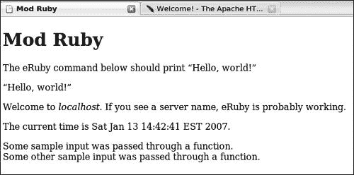

# 第十一章。CGI 和网页


Ruby 作为一种特别适合网页编程的语言受到了很多关注，尤其是在 Rails 开发框架的背景下。有些人甚至将 Ruby 归类为一种网页语言，暗示它不是一个完整的通用编程语言。我希望前几章至少在某种程度上说服了读者这一说法是错误的。

话虽如此，Ruby 对于网页开发非常有用，它确实有一些特性使其比（例如）视频游戏编程更适合网页编程。Ruby 在一个非常高的抽象级别上运行，为程序员提供了一个庞大的工具集来使用，并且它执行代码的速度比某些其他语言要慢。这些特性使 Ruby 非常适合网页开发，因为开发速度通常至关重要，但程序执行速度通常不如其他类型的程序，如实时动作视频游戏重要。

Rails 开发框架在将 Ruby 推向越来越广泛的受众方面发挥了重要作用。有人说它是 Ruby 的“杀手级应用”，类似于 Perl 的 CPAN 或 GNU 项目的 gcc。这是一本关于 Ruby 的通用书籍，而不是 Rails 的书籍，但 Rails 的重要性足以让它拥有自己的章节。（由于我们将使用 RubyGems，Ruby 的包管理系统，来安装 Rails，因此本书还包括一个关于 RubyGems 的章节。）

你需要等待两章才能了解 Rails。除了知道如何使用 RubyGems 安装它之外，到那时你也应该对一般性的网页程序有所了解——这就是本章的目的。如果你是网页应用程序的老手，你可以自由地跳过这一章，尽管你可能发现其中的一些特定脚本新颖有趣，即使你已经知道它们是如何工作的。

# 通用网关接口

网页编程最常见的方法是通用网关接口（CGI）。*CGI* 并不是一种编程语言；它是一套规则，程序在网页上运行时需要遵循这些规则，无论每个程序可能用哪种特定的语言编写。CGI 允许多个文件之间友好地协作，即使这些文件是用不同的编程语言编写的，但它们都存在于一个更大的网络应用程序中。

在单个网络应用程序中使用多种语言相当常见。我提到 Ruby 的高度抽象性使其适合于网络编程。然而，有时你可能真的想在网络程序中使用别人用另一种语言（比如 Python）编写的库。如果你使用 CGI，你可以在 Python 中编写你的网络应用程序的一部分，以便使用那个库。你也可能有一个对速度要求很高的网络应用程序部分，因此你可以用 C 编写这部分以提高执行速度，其余部分用 Ruby 编写以提高开发速度。这正是保罗·格雷厄姆和他的同事选择在他们的公司 Viaweb 中使用 Lisp 和 C 的组合的原因，Viaweb 最终成为了 Yahoo! Stores。他们之所以能够这样做，是因为 CGI 规范适用于多种语言。

# 准备和安装

在我们开始使用 Ruby 和 CGI 之前，我们需要做一些工作来使我们的 Web 服务器准备就绪。为了本章的目的，我将专注于在类 Unix 环境中为 Apache Web 服务器设置 CGI。Apache 是最受欢迎的 Web 服务器，类 Unix 操作系统是最常见（也是最稳定）的服务器操作系统。

你可以在[`httpd.apache.org`](http://httpd.apache.org)获取 Apache Web 服务器的副本，或者你可以使用包管理器来安装它。（Mac OS X 预装了 Apache。）我在 Ubuntu 系统上使用了`apt-get`，如下所示：

```
apt-get install apache2 apache2-doc
Reading package lists... Done
Building dependency tree... Done
The following extra packages will be installed:
 apache2-common apache2-mpm-worker apache2-utils libapr0 libpcre3 ssl-cert
Suggested packages:
 lynx www-browser
The following NEW packages will be installed:
 apache2 apache2-common apache2-doc apache2-mpm-worker apache2-utils libapr0
 libpcre3 ssl-cert
0 upgraded, 8 newly installed, 0 to remove and 5 not upgraded.
Need to get 3555kB of archives.
After unpacking 16.4MB of additional disk space will be used.
Do you want to continue [Y/n]? Y
```

我回答了`Y`。你可以看到我选择了 Apache Web 服务器的`apache2`版本。安装 Apache 后，你还会想安装`mod_ruby`的包，它允许 Ruby 程序在 Web 服务器中运行。当我展示使用`mod_ruby`的脚本时，我会解释它的好处。你可以在基于 Debian 的系统上通过输入`apt-get install libapache2-mod-ruby liberuby`来安装`mod_ruby`。现在安装完成，让我们开始我们的第一个简单的 CGI 脚本。

# #41 一个简单的 CGI 脚本 (simple_cgi.rb)

这个脚本相当简单，但展示了如何使用 Ruby 进行 CGI 的基本方法，并介绍了 Ruby 的名为`cgi`的库。你需要将这个脚本放在你的系统 cgi-bin 目录下。在我的系统上，它是`/usr/lib/cgi-bin/`，但你的系统位置可能不同。然后你可以浏览到 http://localhost/cgi-bin/simple_cgi.rb，因为你的 Web 服务器将通过 http://localhost/cgi-bin/提供对 cgi-bin 目录内容的访问。

### 注意

*你还需要给`simple_cgi.rb`设置`755`权限，这意味着它的所有者可以做任何事情，而其他人可以读取和执行它，但不能写入（更改）它。更多信息，请参阅*`man chmod`**。

在我们开始脚本之前，你也应该浏览到 http://localhost/。如果你看到的是告诉你 Apache 安装正确的页面，或者是一个目录中的文件列表，那么你的 web 服务器可能正在工作。如果你没有看到这两者中的任何一个，请查阅 Apache 文档（可在 http://httpd.apache.org/docs 获取）以诊断问题。如果你的 web 服务器正在工作，你可以继续到脚本。

## 代码

```
  #!/usr/bin/env ruby
  # simple_cgi.rb

❶ require 'cgi'    *Requiring CGI.rb*

❷ class Simple_CGI

❸   EMPTY_STRING = ''
    TITLE = 'A simple CGI script'

    def display()
❹     cgi = CGI.new('html4')
❺     output = cgi.html do
        cgi.head do
          cgi.title { TITLE }
        end +
        cgi.body do
          cgi.h1 { TITLE } +
❻          show_def_list(cgi)
        end
      end
❼     cgi.out { output.gsub('><', ">\n<") }
    end

    private

❽   def get_items_hash()
      {
        'script'   => ENV['SCRIPT_NAME'],
❾       'server'   => ENV['SERVER_NAME'] || %x{hostname} || EMPTY_STRING,
        'software' => ENV['SERVER_SOFTWARE'],
        'time'     => Time.now,
      }
    end

❿   def show_def_list(cgi)
      cgi.dl do
        items = get_items_hash.merge(cgi.params)
        items.keys.sort.map do |term|
          definition = items[term]
          "<dt>#{term}</dt><dd>#{definition}</dd>\n"
        end.join( EMPTY_STRING )
      end
    end

  end

  Simple_CGI.new.display()
```

## 它是如何工作的

我们在脚本中做的第一件事是在❶处`require` `cgi`库。然后我们在❷处定义一个名为`Simple_CGI`的类，并在❸处定义常量`EMPTY_STRING`和`TITLE`。接下来，在`display`方法（在❹处），我们创建了一个名为`cgi`的`CGI`实例，用`html4`来定义它，这是`CGI`所了解的 HTML 版本之一。我们将使用`cgi`来创建一个`simple_cgi.rb`将要输出的 HTML 文档。

`CGI`的实例有几个接受块的方法，这些方法的名称与它们将要创建的标签相同。每个 HTML 文档都需要一个`<html>`标签，所以我们包括它（在❺处）。出于我将要解释的原因，我想将`<html>`标签的内容存储在一个名为`output`的临时局部变量中。我们可以遍历我们想要创建的 HTML 文档，使用`cgi`的适当方法打开新的标签（如`head, title, h1`等）。正如你所看到的，使用块实现了分层嵌套，同一级别的标签（*兄弟标签*）使用`+`方法连接。

你会注意到在`cgi.body`中，它创建了我们输出结果中的`<body>`标签，我在❻处使用了一个名为`show_def_list`的方法（定义在❿处）。这主要是为了避免`cgi`方法的嵌套层级过多，但它也执行其他任务。让我们在❿处检查它。它输出一个定义列表，正如你所期望的那样，使用`cgi.dl`与一个块。为此，它从名为`items`的哈希中提取`terms`和它们的`definitions`，分别用`<dt>`和`<dd>`标签包裹。

`items`哈希是由`get_items_hash`（❽）的输出与`cgi.params`合并而成的。`cgi.params`哈希代表查询字符串，所以如果你浏览到 http://localhost/cgi-bin/simple_cgi.rb?key1=value1&key2=value2，`cgi.params`将会是`{‘key1’ => ‘value1’, ‘key2’ => ‘value2’}`。`get_items_hash`方法返回一个哈希，代表一些我认为可能值得展示的值，例如脚本名称、服务器等。一般来说，脚本只是从机器的环境变量中读取，使用`ENV`哈希的值。在❾处，哈希中`‘server’`的值比其他值稍微复杂一些。它尝试像其他值一样从`ENV`中读取，如果需要，回退到系统执行的`hostname`命令，最后回退到`EMPTY_STRING`。然后这个哈希作为方法中的最后一个评估表达式隐式返回。

在 ❽ 处，我们调用 `cgi.out`，给它一个包含对 `output` 变量进行轻微调整的块，使用 `gsub`。我首先承认这有点不寻常。通常，您会使用包含 `cgi.html` 和我用来填充 `output` 变量的所有其他方法的块来调用 `cgi.out`。我为什么这样做呢？有两个相关的原因。

第一个原因是 `cgi.out` 并非纯粹的功能性：它不会返回一个使用 `puts` 打印的值。相反，它自己进行输出。第二个原因是 `cgi` 的方法在标签之间不会引入换行符。这对于速度优化是有好处的，因为每个新字符，即使是换行符，都会稍微增加传输的内容。然而，这并不使生成的 HTML 源代码非常易于阅读。我喜欢可读的 HTML 源代码，所以我在 ❽ 处使用 `gsub` 在相邻标签之间引入换行符。如果您不介意您的 HTML 都连成一行，那么当然，将您的 `cgi.html` 和类似的调用放在 `cgi.out` 的块中。

我们到目前为止所讨论的一切都是在 `display` 方法中。我们在脚本的最后一行直接调用它，在一个匿名的 `Simple_CGI` 新实例上。实际上没有必要将它实例化为一个变量，如下所示：

```
scgi = Simple_CGI.new
scgi.display()
```

然而，如果您更习惯这样做，也没有理由不这样做。让我们看看它是如何工作的。

## 结果

在您的系统上，浏览到 http://localhost/cgi-bin/simple_cgi.rb 并查看您得到的结果。它应该大致类似于 图 11-1。

注意，软件值可能会不同，除非您也在使用相当标准的 Ubuntu 系统，时间显然会有很大差异。您可以看到，标签显示的是页面标题，即 *一个简单的 CGI 脚本*（与大的粗体标题相同）。除非您故意将文件名从 `simple_cgi.rb` 改为其他名称或浏览到除 `localhost` 之外的主机名，否则不应有差异的值是脚本和服务器。敏锐的读者也会看到我还有一个打开的 Apache 网站标签页。


图 11-1. `simple_cgi.rb` 的输出

现在我们尝试稍微改变一下查询字符串，使用 http://localhost/cgi-bin/simple_cgi.rb?lang=Ruby。我不会麻烦展示新的截图，但你现在应该会看到定义列表中有五个条目而不是四个。新的一条是键 `lang`，其值为 `Ruby`。这是由于 `cgi.params` 是 `show_def_list` 中的项目 Hash 的一部分，当我们使用查询字符串 `lang=Ruby` 时，`cgi.params` 变为 `{ `lang` => `Ruby` }`，然后它就是 `items` 中的其中一个对。

现在我们尝试在查询字符串中为已经出现在项目中的某个键提供一个显式值，使用 URL http://localhost/cgi-bin/simple_cgi.rb?lang=Ruby&server=some_other_server_name。你应该仍然看到键`lang`的值为`Ruby`，但除此之外，`server`的值不再是`localhost`，而是`some_other_server_name`。这种情况发生的原因是`cgi.params`是`merge`的参数，它覆盖了在调用`merge`的哈希中已经存在的任何冲突的键值对。因此，`cgi.params`中的任何内容都优先。

## 漏洞脚本

这是一个简单的脚本，展示了 CGI 的基础知识。你可以以无数种方式对其进行修改和扩展。一个建议是将其与`currency_converter2.rb`的一部分结合使用。例如，你可以显示时间，就像这个脚本已经做的那样，并接受要转换的货币以及转换的金额作为参数。许多人也使用 CGI 在机器上执行系统调用并显示结果，展示机器上正在运行的过程、磁盘空间使用情况以及其他对系统管理员感兴趣的信息。

# #42 Mod Ruby (mod_ruby_demo.rhtml 和 mod_ruby_demo.conf)

CGI 对于许多应用来说都很棒。然而，有时你可能希望有一些主要是 HTML 的文件，只有部分子部分需要由你的编程语言，比如 Ruby，来执行。如果有一个 HTML 标签意味着“现在开始 Ruby 代码”，之后你可以添加一些 Ruby 代码，然后使用另一个标签表示“Ruby 代码完成，回到普通的 HTML”，那岂不是很好？

对于许多语言来说，都存在这样的系统。这是 PHP 语言的默认行为，Perl 和 Python 等其他语言也有类似的系统。为 Ruby 实现这一功能的系统之一是`eRuby`，它将通过`mod_ruby`软件直接嵌入到 Web 服务器中。

CGI 的一个问题是速度。当有人发起一个需要动态 CGI 执行的 Web 请求时，该请求会启动一个新的 Ruby 解释器；^([32])然后该解释器评估 CGI 程序，将其值返回给 Web 服务器进程，并关闭。对于下一个 CGI 请求，整个过程从头开始。所有这些都需要时间。`mod_ruby`和类似系统所做的就是在后台始终运行一个 Ruby 解释器，随时准备评估脚本并将结果返回给 Web 服务器，但无需为每个脚本启动和关闭一个独立的`ruby`进程。这使得 Web 服务器启动稍微慢一些，因为它需要做更多的事情，但只需几个请求之后，它就能节省大量的机器开销。

在代码中，您会看到 `<%` 和 `%>`，这是表示 *将我的内容解释为 Ruby，而不是 HTML* 的开始和结束标签。但首先我们需要设置 Apache，使其知道如何处理 `mod_ruby`。我们已经安装了 `mod_ruby` 软件包，但我们需要一个配置文件。那就是下面的 `mod_ruby_demo.conf`。

## 代码

### mod_ruby_demo.conf

```
  <IfModule mod_ruby.c>    *An Apache Config File*
    # for Apache::RubyRun
    RubyRequire apache/ruby-run

    # for Apache::ERubyRun
    RubyRequire apache/eruby-run

    # handle *.rcss as eruby files.
❷   <Files *.rcss>
      AddType text/css .rcss
      AddType application/x-httpd-ruby *.rb
      SetHandler ruby-object
      RubyHandler Apache::ERubyRun.instance
    </Files>

    # handle *.rhtml as eruby files.
❷   <Files *.rhtml>
      AddType text/html .rhtml
      AddType application/x-httpd-ruby *.rb
      SetHandler ruby-object
      RubyHandler Apache::ERubyRun.instance
    </Files>

    RubyRequire auto-reload

  </IfModule>
```

此文件不是 Ruby 代码——它使用 Apache 的配置文件格式。将此文件放在 `/etc/apache2/mods-available/` 中，并在 `/etc/apache2/mod-enabled/` 中创建一个符号链接^([33])。如果您使用的是 Apache 版本 1.X（例如 1.3，它仍然很受欢迎），您将在 `/etc/apache/httpd.conf` 文件中添加此文件的內容。正如我之前提到的 `cgi-bin` 目录，这些特定的文件和目录位置适用于我的系统，但您的可能不同。

### mod_ruby_demo.rhtml

此文件应该更像是 HTML 和 Ruby 代码的奇怪混合体。

```
  <!DOCTYPE html
       PUBLIC "-//W3C//DTD XHTML 1.0 Strict//EN"
      "http://www.w3.org/TR/xhtml1/DTD/xhtml1-strict.dtd">
  <html  xml:lang="en" lang="en">

  <head>
  <title>Mod Ruby</title>
  <style>
  code {
   background-color: #ddf;
   color: #f00;
   padding: 0.3em;
  }
  </style>
  </head>

  <body>
  <h1>Mod Ruby</h1>

  <p>
  The eRuby command below should print <q>Hello, world!</q>
  </p>

  <p>
❸ <q><% print "Hello, world!" %></q>    ***`%`** tags*
  </p>

  <p>
❹ Welcome to <em><%= ENV['SERVER_NAME'] %></em>. If you see a server name,
❺ <%= 'e' + 'Ruby' %> is probably working.
  </p>

  <p>
❻ The current time is <%= Time.now %>.
  </p>

  <p>
  <%
❼ def function_within_mod_ruby(input)
    "#{input} was passed through a function.\n"
  end

  print function_within_mod_ruby("Some sample input")
  print '<br />'
  print function_within_mod_ruby("Some other sample input")
  %>
  </p>

  </body>
  </html>
```

将此文件放置在可通过网络浏览的位置。我将假设它在 http://localhost/mod_ruby/，使其可通过 http://localhost/mod_ruby/mod_ruby_demo.rhtml 访问。

## 工作原理

希望地，`mod_ruby_demo.conf` 将是完全透明的。当然，我在开玩笑，但在这个阶段，如果您不理解这个文件的所有内容，并不是关键。了解 Apache 配置文件是很好的，您当然可以从 Apache 网站或各种 Apache 相关的书籍中学到很多，但对我们来说重要的是 ❶ 和 ❷。在 ❶，我们声明具有 .rcss 扩展名的文件应被解释为 Ruby 文件。在 ❷，我们对具有 .rhtml 扩展名的文件做了同样的声明。

### 注意

*为什么使用这些扩展名？为动态解释的文件定义文件扩展名，通常使用正常的扩展名，并在前面加上代表所用编程语言的额外字母，这是一种相当常见的做法。例如*，.rhtml 用于生成 HTML 输出的 Ruby 文件，.rcss 用于生成 CSS 样式表的 Ruby 文件，等等。您有时也可能看到 .phtml 文件，它集成了 Perl 或 PHP，甚至 .mhtml 文件，它使用的是用 Perl 编写的软件 Mason*。

`mod_ruby_demo.conf` 的内容到此为止。在 `mod_ruby_demo.rhtml` 中，我们有一些额外的关注点。它应该看起来像标准的 HTML，直到 ❸。在那个点上，我们看到这一行：`<q><% print “Hello, world!” %></q>`。`<%` 和 `%>` 是我之前提到的 *将我的内容解释为* Ruby 标签，所以那些标签内的任何内容都将被解释为 Ruby 代码。在这种情况下，我们要求 Ruby 打印 `‘Hello, world!’`，它确实这样做了，将打印的输出包含在最终的 HTML 中。

你可能预期我们经常想要打印出将被整合到 HTML 中的输出。不断地使用`print`语句会很繁琐，所以有一个快捷方式，你可以在❹处看到。如果你使用一个初始的代码标签`<%=`, Ruby 就会假设你想要打印出评估后的表达式。在❹处，我们在一个`<em>`标签内整合了`ENV[‘SERVER_NAME’]`的值。为了展示在`<%=`和`%>`之间的内容可以是任何表达式，在❺处，我们连接了两个字符串，只关心结果。

打印的输出也不一定是简单的字面表达式。在❻处，我展示了方法调用的值，在这种情况下结果是当前本地时间。最后，在❼处，我们在.rhtml 文件中定义了一个全新的方法，名为`function_within_mod_ruby`，之后任何时候都可以使用，如代码所示。

## 结果

当我通过自己的 web 服务器调用这个脚本时，我得到了图 11-2 中显示的结果。



图 11-2. `mod_ruby`的输出

你的结果中的时间显然会有所不同，但那应该是唯一的区别，除非你通过除`localhost`之外的名字浏览你的机器，或者你将`mod_ruby_demo.rhtml`放在不同的目录下或给它不同的名字。

## 操纵脚本

这个脚本是一个修改的游乐场。你可以在那些`<%`或`<%=`标签内放置任何你想要的 Ruby 表达式。尝试使用`require`，无论是你知道是标准库的一部分的文件（如`cgi`）还是你自己的文件。这种技术让你可以将所有真正的“东西”定义为类，放在.rb 库文件中，而将.rhtml 文件保留用于显示。

* * *

^([32]) 或者是 CGI 程序使用的语言的解释器。

^([33]) 你可以在 Unix shell 中使用`ln -s`命令创建一个符号链接。

# #43 CSS 样式表，第一部分 (stylesheet.rcss)

拥有.rhtml 文件是很好的——它们允许你动态生成你想要的任何可见 HTML。但你可以使用`mod_ruby`做更多的事情。任何设计良好的现代网站的大部分内容将是其样式表。网页设计师必须处理的一个挫折是各种浏览器之间不完整或不兼容的 CSS 支持。对于这些挫折有很多潜在的解决方案，你可以在像[`www.richinstyle.com`](http://www.richinstyle.com)或[`alistapart.com`](http://alistapart.com)这样的网站上找到。对于程序员来说，一个明显的解决方案是确定某人正在使用哪种浏览器（通过`ENV[‘USER_AGENT’]`），并为该用户提供一个针对其特定浏览器的定制样式表。

这是一个非常好的解决方案，在网络上被无数次地付诸实践。然而，还有一个解决方案。为什么不将样式表本身做成一个动态的 .rcss 文件呢？采用这种方法，样式表就变成了多态的，这是从面向对象编程中借用的一个术语。每个浏览器都会通过名称引用相同的样式表，然后接收针对该浏览器恰好合适的内容。以下是一个例子。

## 代码

```
  /*
  This file outputs CSS data customized by user_agent via eruby.
  There is a blog entry about some similar ideas at
  http://blog.airbladesoftware.com/2006/12/11/cssdryer-dry-up-your-css
  */
  <%
  # define functions
❶ def alpha_width(user_agent)
    width =
      if (user_agent =~ /Windows/)
        11.8 if (user_agent =~ /Opera/)
        11.8 if (user_agent =~ /MSIE 6/)
        14   if (user_agent =~ /MSIE/)
        11.8
      elsif (user_agent =~ /Palm/)
        5
      else
        11.8
      end
❷ return %Q[\twidth:#{width}em;]
  end

❸ def beta_width(user_agent)
    width =
      if (user_agent =~ /Windows/)
        15.8 if (user_agent =~ /Opera/)
        15.8 if (user_agent =~ /MSIE 6/)
        18   if (user_agent =~ /MSIE/)
        15.8
      elsif (user_agent =~ /Palm/)
        7
      else
        15.8
      end
❹   return %Q[\twidth:#{width}em;]
  end

❺ def margin_left(user_agent)
    margin =
      if (user_agent =~ /Mac/)
        3   if (user_agent =~ /Opera/)
        1   if (user_agent =~ /MSIE/)
        2.5 if (user_agent =~ /Safari/)
        2   if (user_agent =~ /Gecko/)
        2.7
      elsif (user_agent =~ /Windows/)
        1.5
      else
        2   if (user_agent =~ /Opera/)
        2   if (user_agent =~ /onqueror/)
        1.8 if (user_agent =~ /Galeon/)
        2.5
      end
❻   return %Q[margin-left:-#{margin}em;]
  end
  %>

❼ li { <%= margin_left(ENV['HTTP_USER_AGENT']) %> }

  #navAlpha {
    position:absolute;
❽   <%= alpha_width(ENV['HTTP_USER_AGENT']) %>
    top:2em;
    left:2em;
    border:0.5em double #333;
    background-color:#ada;
    padding:1em;
    z-index:2;
  }

  #navBeta {
    position:absolute;
❾   <%= beta_width(ENV['HTTP_USER_AGENT']) %>
    top:2em;
    right:2em;
    border:0.5em double #333;
    background-color:#ada;
    padding:1em;
    z-index:1;
  }
```

## 它是如何工作的

与 `mod_ruby_demo.rhtml` 类似，这主要是一个具有其他格式（在这种情况下是一个 CSS 样式表）的文件，它恰好包含一些 Ruby 代码。我们在 ❶ 处定义了一个名为 `alpha_width` 的新函数，该函数确定一个名为 `width` 的局部变量的值，最终在遵循 CSS 格式的文本中返回它 ❷。请注意，这个函数利用了 Ruby 中的 `if` 语句也会返回值的这一事实，在这种情况下，将那个值赋给 `width`。我们在 ❸ 处对 `beta_width` 做了类似的事情，它返回自己的 CSS 格式化输出 ❹。最后，我们在 ❺ 处定义了 `margin_left`，它返回 ❻ 的 CSS。

### 注意

*为什么是那些特定的函数？我发现最让我沮丧的 CSS 支持差异涉及边距和填充以及列表项的左边距，所以我就做了这些函数。比我更了解 CSS 的人可能已经找到了更优雅的解决方案，但有时，当为时已晚时，一个相当不错的解决方案比一个完美的解决方案更好。这个脚本的目的也是为了证明多态样式表技术*是可以做到的，但这并不是*它应该被做到的方式。如果你非常关心 CSS，你可以使用这种技术来完成更大的事情*。

然后，我们在列表元素的 CSS 声明中使用 `margin_left` 的输出 ❼。样式表还定义了两个 ID，即 `#navAlpha` 和 `#navBeta`，它们只是列 div 的标识符。在 `#navAlpha` ❽ 中，我们使用 `alpha_width` 的输出作为 `#navAlpha` 的宽度，在 ❾ 中，我们对 `#navBeta` 做了类似的事情。

## 结果

这里是使用 Ubuntu 系统上的 Mozilla Firefox 浏览 `stylesheet.rcss` 时的输出：

```
/*
This file outputs CSS data customized by user_agent via eruby.
There is a blog entry about some similar ideas at
http://blog.airbladesoftware.com/2006/12/11/cssdryer-dry-up-your-css
*/

li { margin-left:-2.5em; }

#navAlpha {
  position:absolute;
        width:11.8em;
  top:2em;
  left:2em;
  border:0.5em double #333;
  background-color:#ada;
  padding:1em;
  z-index:2;
}

#navBeta {
  position:absolute;
        width:15.8em;
  top:2em;
  right:2em;
  border:0.5em double #333;
  background-color:#ada;
  padding:1em;
  z-index:1;
}
```

你会注意到，适当的值被插值在 `li` 和 `width` CSS 声明之间。由于这个文件的全部目的就是为不同的浏览器提供不同的输出，所以你的结果可能会有所不同。

## 黑客脚本

对于这个脚本，有很多黑客选项。其中一个是我们下一个脚本，`stylesheet2.rcss`。

# #44 CSS 样式表，第二部分（stylesheet2.rcss）

在许多方面，这个脚本只是 `stylesheet.rcss` 的一个美化版黑客。我主要将其分离出来，以便进行比较。这两个文件之间的主要区别在于 `stylesheet2.rcss` 将 `width` 值概括为一个单一函数。

## 代码

```
  /*
  This file outputs CSS data customized by user_agent using eruby.
  */
  <%
  # define functions
❶ def width(type, user_agent)
❷   small = {
      'alpha' => 11.8,
      'beta'  => 15.8,
    }
❸   large = {
      'alpha' => 14,
      'beta'  => 18,
    }
❹   palm = {
      'alpha' => 5,
      'beta'  => 7,
    }
❺   width =
      if (user_agent =~ /Windows/)
        small[type] if (user_agent =~ /Opera/)
        small[type] if (user_agent =~ /MSIE 6/)
        large[type] if (user_agent =~ /MSIE/)
        small[type]
      elsif (user_agent =~ /Palm/)
        palm[type]
      else
        small[type]
      end
    return %Q[\twidth:#{width}em;]
  end

  def margin_left(user_agent)
    margin =
      if (user_agent =~ /Mac/)
        3   if (user_agent =~ /Opera/)
        1   if (user_agent =~ /MSIE/)
        2.5 if (user_agent =~ /Safari/)
        2   if (user_agent =~ /Gecko/)
        2.7
      elsif (user_agent =~ /Windows/)
        1.5
      else
        2   if (user_agent =~ /Opera/)
        2   if (user_agent =~ /onqueror/)
        1.8 if (user_agent =~ /Galeon/)
        2.5
      end
    return %Q[margin-left:-#{margin}em;]
  end
  %>

  li { <%= margin_left(ENV['HTTP_USER_AGENT']) %> }

  #navAlpha {
    position:absolute;
    <%= width('alpha', ENV['HTTP_USER_AGENT']) %>
    top:2em;
    left:2em;
    border:0.5em double #333;
    background-color:#ada;
    padding:1em;
    z-index:2;
  }

  #navBeta {
    position:absolute;
    <%= width('beta', ENV['HTTP_USER_AGENT']) %>
    top:2em;
    right:2em;
    border:0.5em double #333;
    background-color:#ada;
    padding:1em;
    z-index:1;
  }
```

## 它是如何工作的

在 ❶ 处，我们定义了通用的 `width` 函数，您现在会看到它现在接受两个参数：与之前一样，用户代理，但还包括我们正在为它生成 `width` 的列的 `type`。然后我们有针对 `small`（❷）、`large`（❸）和 `palm`（❹）的单独的 Hash。Palm 设备始终使用它们自己的 Hash，而其他浏览器则根据特定的用户代理使用 `small` 或 `large` Hash。然后在 ❺ 处，我们确定 `width`。^([34]) `type` 只是已经决定的 Hash 的键。其他一切都是与 `stylesheet.rcss` 相同的，除了现在对 `alpha_width` 或 `beta_width` 的调用现在是 `width` 的调用，如之前所述。

## 结果

如前所述，这是我的设置下的输出。

```
/*
This file outputs CSS data customized by user_agent using eruby.
*/

li { margin-left:-2.5em; }

#navAlpha {
  position:absolute;
        width:11.8em;
  top:2em;
  left:2em;
  border:0.5em double #333;
  background-color:#ada;
  padding:1em;
  z-index:2;
}

#navBeta {
  position:absolute;
        width:15.8em;
  top:2em;
  right:2em;
  border:0.5em double #333;
  background-color:#ada;
  padding:1em;
  z-index:1;
}
```

这个输出基本上与 `stylesheet.rcss` 的输出相同，只是没有初步注释。

## 漏洞脚本

正如我之前提到的，如果对 CSS 有更深入理解的人，可以真正定制这个脚本，使其做一些奇妙的事情。毫无疑问，完成这个脚本所做事情的方法有很多种，但它的目的是以粗略的方式展示技术。希望您觉得它有用。

* * *

^([34]) 不要因为存在一个名为 `width` 的函数和一个内部也称为 `width` 的局部变量而感到困惑。函数外部无法访问变量，函数知道在自动递归调用自身之前检查是否存在名为该名称的变量。

# 章节总结

本章有哪些新内容？

+   使用 Ruby 进行 CGI 脚本

+   `cgi` 库

+   `cgi.params`

+   `mod_ruby`

+   .rhtml 和 .rcss 文件

+   Apache 配置文件

本章仅对使用 Ruby 或其他语言进行的 CGI 编程进行了初步探讨。其目的是让您熟悉使用 Ruby 与 web 服务器和浏览器交互。大多数基于 Ruby 的网络编码都使用了 Rails 框架，我们很快就会涉及到。但首先，我们将使用 RubyGems 系统安装 Rails，这就是我们下一章的主题。
