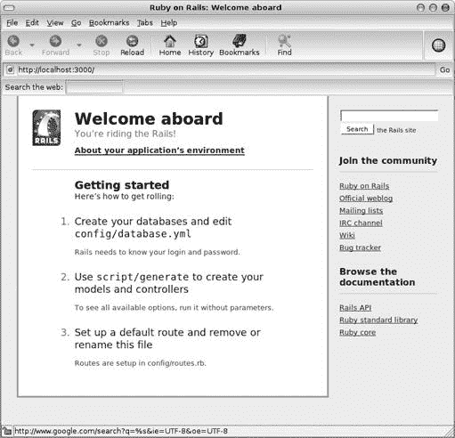
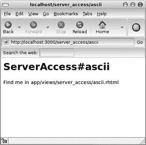

# 第十二章。RubyGems 和 Rails 准备


在本章中，我们将讨论 Ruby 的包管理系统 RubyGems，以及 Ruby 最突出的 Web 开发框架 Rails。这些相对独立的主题被放在一起，因为安装 Rails 的“官方”方法是使用 RubyGems 软件。到本章结束时，您将能够通过 RubyGems 安装 Rails，并理解构成 Rails 应用程序的基本结构和目的的文件。

# RubyGems

良好的操作系统都有良好的包管理系统——软件可以跟踪该操作系统所需或提供的其他软件，并确保一切保持最新。Mac OS X 有软件更新，Windows 有 Windows 更新，而各种 GNU/Linux 版本有 RPM、YUM 和我最喜欢的 APT 等程序。良好的编程语言也有类似的程序，这些程序为程序员和其他用户提供访问用该语言编写的庞大软件库的途径。Perl 有综合 Perl 存档网络 ([`cpan.org`](http://cpan.org))，Python 有 Cheese Shop ([`cheeseshop.python.org/pypi`](http://cheeseshop.python.org/pypi))，而 Ruby 有 RubyGems ([`rubygems.org`](http://rubygems.org))。

### 注意

*最新的 RubyGems 信息可在 [`docs.rubygems.org`](http://docs.rubygems.org) 获取。本章旨在为您提供一个基本介绍，并帮助您启动 Rails。如果您对 RubyGems 感到好奇（我希望您会），我强烈建议将 [`docs.rubygems.org`](http://docs.rubygems.org) 设为您的常规网络访问之一*。

RubyGems 已经成为创建独立 Ruby 软件的事实标准方法（尤其是库和程序员工具），供 Ruby 社区中的其他人使用。使用此系统，您可以轻松使用其他程序员的软件来简化您的工作，同时也可以分享您自己的工作，这可能会使其他程序员的某些工作变得更简单。通过 RubyGems 将软件打包成一个单一单元的每个软件包称为 *gem*，用户可以使用名为 `gem` 的相应命令来操作这些 gem。

## 安装 RubyGems

您需要浏览到 [`rubyforge.org/frs/?group_id=126`](http://rubyforge.org/frs/?group_id=126) 下载 RubyGems 的最新版本。文件提供 TGZ 和 Zip 格式，以及 gem 文件（用于在您已安装 RubyGems 后更新）和补丁文件。在此示例中，我已下载 `rubygems-0.9.2.tgz`。解压缩下载的文件，并使用命令 `ruby setup.rb` 运行新创建目录中找到的 `setup.rb` 程序。您可能需要以 root 用户身份执行此操作（如果适用于您的操作系统）。您可以通过输入 `gem -v` 来查看您现在系统上安装的 RubyGems 版本。

## 使用 RubyGems

如果您不带参数运行`gem`，它应该返回类似于以下内容：

```
RubyGems is a sophisticated package manager for Ruby.  This is
a basic help message containing pointers to more information.

  Usage:
    gem -h/--help
    gem -v/--version
    gem command [arguments...] [options...]

  Examples:
    gem install rake
    gem list --local
    gem build package.gemspec
    gem help install

  Further help:
    gem help commands            list all 'gem' commands
    gem help examples            show some examples of usage
    gem help <COMMAND>           show help on COMMAND
                                   (e.g. 'gem help install')
  Further information:
    http://rubygems.rubyforge.org
```

### 列出已安装和可安装的宝石

通过执行`gem list --local`，您可以看到哪些宝石已经安装到您的系统上。以下是我在机器上安装 RubyGems 后立即运行`gem list --local`的结果：

```
*** LOCAL GEMS ***

sources (0.0.1)
    This package provides download sources for remote gem installation
```

`sources`宝石使您能够通过维护有关它们的检索信息来安装其他宝石。我们可以通过`gem query --remote`查询这些信息，它输出一个非常长的可用宝石列表，这里以高度截断的形式显示：

```
*** REMOTE GEMS ***

abstract (1.0.0)
    a library which enable you to define abstract method in Ruby

ackbar (0.1.1, 0.1.0)
    ActiveRecord KirbyBase Adapter

action_profiler (1.0.0)
    A profiler for Rails controllers
```

### 安装宝石

每个单独的宝石都可以通过命令`gem install --remote` *`some_gem_name`*进行安装。作为一个例子，让我们使用`gem install --remote rails`来安装`rails`宝石。

```
Install required dependency rake? [Yn]
Install required dependency activesupport? [Yn]
Install required dependency activerecord? [Yn]
Install required dependency actionpack? [Yn]
Install required dependency actionmailer? [Yn]
Install required dependency actionwebservice? [Yn]
Successfully installed rails-1.2.2
Successfully installed rake-0.7.1
Successfully installed activesupport-1.4.1
Successfully installed activerecord-1.15.2
Successfully installed actionpack-1.13.2
Successfully installed actionmailer-1.3.2
Successfully installed actionwebservice-1.2.2
Installing ri documentation for rake-0.7.1...
Installing ri documentation for activesupport-1.4.1...
Installing ri documentation for activerecord-1.15.2...
Installing ri documentation for actionpack-1.13.2...
Installing ri documentation for actionmailer-1.3.2...
Installing ri documentation for actionwebservice-1.2.2...
Installing RDoc documentation for rake-0.7.1...
Installing RDoc documentation for activesupport-1.4.1...
Installing RDoc documentation for activerecord-1.15.2...
Installing RDoc documentation for actionpack-1.13.2...
Installing RDoc documentation for actionmailer-1.3.2...
Installing RDoc documentation for actionwebservice-1.2.2...
```

我对所有确认请求都回答了`Y`。您可以看到，RubyGems 系统足够智能，足以知道哪些宝石需要其他宝石，并且它会自动安装您请求的宝石的依赖项。我们现在有一个功能齐全的 Rails 系统，我们将在下一章中对其进行探索。

### 注意

*在我安装的时候，有一些关于* `actionpack`*的 ri 和 RDoc 文档的轻微警告。它们对代码的功能没有影响，并且可能在您阅读这本书的时候已经过时了，所以我已经从本章的输出示例中省略了它们*。

### 更新宝石

您可以使用`gem update`命令更新系统上现有的宝石。一个好的先决条件是使用`gem outdated`查询是否有任何宝石需要更新。我在一个有一些过时宝石的系统上运行了这个命令，并得到了以下结果：

```
Bulk updating Gem source index for: http://gems.rubyforge.org
activerecord (1.15.1 < 1.15.2)
rails (1.2.1 < 1.2.2)
actionwebservice (1.2.1 < 1.2.2)
rubygems-update (0.9.1 < 0.9.2)
actionpack (1.13.1 < 1.13.2)
actionmailer (1.3.1 < 1.3.2)
activesupport (1.4.0 < 1.4.1)
```

使用`gem update rails`（作为 root 用户）更新宝石产生了以下输出：

```
Updating installed gems...
Bulk updating Gem source index for: http://gems.rubyforge.org
Attempting remote update of rails
Install required dependency activesupport? [Yn]
Install required dependency activerecord? [Yn]
Install required dependency actionpack? [Yn]
Install required dependency actionmailer? [Yn]
Install required dependency actionwebservice? [Yn]
Successfully installed rails-1.2.2
Successfully installed activesupport-1.4.1
Successfully installed activerecord-1.15.2
Successfully installed actionpack-1.13.2
Successfully installed actionmailer-1.3.2
Successfully installed actionwebservice-1.2.2
Installing ri documentation for activesupport-1.4.1...
Installing ri documentation for activerecord-1.15.2...
Installing ri documentation for actionpack-1.13.2...
Installing ri documentation for actionmailer-1.3.2...
Installing ri documentation for actionwebservice-1.2.2...
Installing RDoc documentation for activesupport-1.4.1...
Installing RDoc documentation for activerecord-1.15.2...
Installing RDoc documentation for actionpack-1.13.2...
Installing RDoc documentation for actionmailer-1.3.2...
Installing RDoc documentation for actionwebservice-1.2.2...
Gems: [rails] updated
```

我特意选择了`rails`作为要更新的宝石，因为它是一个具有许多依赖项的宝石，正如我们在第一次安装时所了解的那样。因此，更新它展示了如何自动更新请求的宝石及其依赖项。Rails 依赖于 Active Record（一个提供高级数据库访问工具的软件包），因此更新`rails`宝石也会自动更新`activerecord`宝石，如上图中更新会话结果所示。所有其他`rails`依赖项以类似的方式更新。

### 注意

*在更新您的宝石之后，您可能希望在您的每个 Rails 应用程序目录中执行* `rake rails:update`*。这确保了您已经生成的任何应用程序文件都将更新以适应宝石的变化，同样也是如此*。

### 了解更多关于 RubyGems 的信息

您可以通过在您的机器上使用`gem help`和`gem help` *`some_specific_command`*来随时了解更多关于`gem`命令的信息。这些信息将始终是最新的，并且针对您的系统。

# Rails 准备

现在你应该对 RubyGems 有了足够的了解，可以用来安装 Rails。接下来的这一章将使你对 Rails 有足够的了解，以便你可以在下一章开始创建 Rails 应用程序。本书介绍了 Rails（侧重于一般设计哲学，而不是 API 的详尽列表），但认为几章内容就能给予 Rails 应有的关注是愚蠢的。关于 Rails 的权威文本是 Dave Thomas、David Heinemeier Hansson（Rails 的创造者）和其他人合著的《Agile Web Development with Rails》，现在已出到第二版（Pragmatic Bookshelf，2006 年）。Rails 社区的成员也对 David Alan Black 的《Ruby for Rails》（Manning Publications，2006 年）给予了高度评价。

## 什么是 Rails？

根据其网站[`rubyonrails.org`](http://rubyonrails.org)的描述，Rails 是“一个针对程序员幸福感和可持续生产力的优化开源 Web 框架。它通过优先考虑约定而非配置来让你编写优美的代码。”该网站将其描述为“不会伤害的 Web 开发。”这意味着什么？

由于它优化了程序员的幸福感和专注于编写优美代码的能力，Rails 完全符合 Ruby 本身的设计哲学。Rails 为其行为选择了合理的默认值，只要你愿意遵循这些约定，你的程序员工作就会相对容易。Rails 为你提供了快速生成 Web 应用程序骨架的快捷方式和工具；它允许你将每段代码放置在目录结构中合理的位置，该位置适合代码预期执行的任务。这为你提供了干净、有序、可重用的代码，帮助你快速、高效、无痛苦地开发应用程序。

## 安装 Rails 的其他选项

使用 RubyGems 并不是安装 Rails 的唯一方式。还有其他几种你可能想要使用的选项，例如，如果你没有跟随文本，或者你只是希望通过其他方法安装 Rails。然而，需要注意的是，作为 gem 的安装是推荐的方式。

### 通过操作系统包管理器

一些操作系统的包管理器，例如 APT，提供 Rails 作为可安装的包。例如，在我的 Ubuntu 系统中，命令`apt-cache search rails`显示（在其他包中）以下结果：

```
rails - MVC ruby based framework geared for web application development
```

如果你想要使用 Rails，但不需要最新的尖端版本，并且你想要避免安装 RubyGems（无论出于什么原因），这个选项可能对你来说是个不错的选择。

### 从源代码安装

就像任何免费或开源软件一样，总有从源代码安装的选项。你可以浏览到[`rubyonrails.org/down`](http://rubyonrails.org/down)获取最新推荐的源代码 tarball。

### 预包装

还有一些预包装的 Rails 版本可用。对于 Windows，有 Instant Rails（[`instantrails.rubyforge.org`](http://instantrails.rubyforge.org)），对于 Mac OS X，有 Locomotive（[`locomotive.sourceforge.net`](http://locomotive.sourceforge.net)）。这两款软件都可以帮助您开始使用 Rails。请注意，这些软件包与默认 Rails 设置之间可能存在细微的配置差异。在遇到这种情况时，咨询您选择的预包装应用程序的网站可能是您的最佳选择。

## 数据库

Rails 需要访问数据库程序才能正常工作。通常，这个数据库是 MySQL（[`mysql.com`](http://mysql.com)），尽管其他选项也是可能的。如果您通过 gem 安装或通过操作系统的包管理器安装，您应该安装 MySQL。这可能是通过操作系统的包管理器完成的最简单的方法。预包装的 Rails 安装程序，如 Instant Rails 和 Locomotive，通常包含自己的预配置数据库；然而，对于所有后续的例子，我将假设您已将 Rails 作为 gem 安装，并且您正在使用 MySQL。

## Rails 应用程序的结构

Rails 遵循一种名为模型-视图-控制器（MVC）的软件设计哲学（或模式），这是由挪威计算机科学家 Trygve Reenskaug 在 20 世纪 70 年代末在施乐帕克研究中心工作时开发的。它最初是与传统的图形用户界面（GUI）相关联而开发的，但 MVC 最近在 Web 开发中变得非常流行。这个模式的基本内容如下。*模型*代表数据，是某种类型的对象。*视图*是展示数据的方式，无论是直接向用户展示，还是向其他计算机展示，或者以任何其他类型的输出形式。*控制器*是交通警察或管理者，它跟踪任何请求的操作、查询或操作模型以获取或更新数据，并给视图提供所需的信息，以便按需格式化数据。

让我们通过一个例子来帮助解释这个模式。在我们的第二个货币转换脚本（第十九部分 货币转换高级（currency_converter2.rb）
      create  public/javascripts/application.js
      create  doc/README_FOR_APP
      create  log/server.log
      create  log/production.log
      create  log/development.log
      create  log/test.log
```

会自动为您创建大量的目录和文件。我们将简要介绍`app, doc, lib, log, public, script`和`test`目录。`app`目录包含您为应用程序编写的代码：模型、视图、控制器等。`doc`目录包含文档。`lib`目录最初不创建任何内容，但您会在这里放置通用库文件（例如，向现有类添加新方法的扩展）。`log`目录包含应用程序日志文件，这些文件根据生产、开发和测试进行了分割。`public`目录包含在网页浏览器中查看或使用的非 Ruby 文件，例如静态 HTML 文件、图像、JavaScript 文件、CSS 样式表等。`script`目录包含供应用程序的开发者或管理员运行的有用的小程序。`test`目录包含允许您轻松自动化应用程序测试的文件。

我们将简要讨论这些文件和目录的作用，但首先，让我们测试我们的应用程序以确保它运行正常。

### 查看您的 Rails 应用程序

执行`cd rails_sample_app`以导航到新创建的目录`rails_sample_app`，然后执行命令`ruby script/server`。这将启动 Rails 内置的用于开发目的的 web 服务器。你应该会看到类似以下输出的内容：

```
$ ruby script/server    *Starting WEBrick*
=> Booting WEBrick...
=> Rails application started on http://0.0.0.0:3000
=> Ctrl-C to shutdown server; call with --help for options
[2007-02-10 12:43:54] INFO  WEBrick 1.3.1
[2007-02-10 12:43:54] INFO  ruby 1.8.4 (2005-12-24) [i486-linux]
[2007-02-10 12:43:54] INFO  WEBrick::HTTPServer#start: pid=27162 port=3000
```

您的具体情况可能不同。`pid`值几乎肯定不同，您的 Ruby 版本可能是一个更新的版本。您的 web 服务器也可能不是 WEBrick，而是一个像 Mongrel 这样的新 web 服务器（WEBrick 是一个作为默认回退的较老 web 服务器）。不太可能不同的是端口：3000。您可以通过在本地机器上浏览该端口来测试您的应用程序（只需将您喜欢的网页浏览器指向 http://localhost:3000）。图 12-1 显示了我在我的 Ubuntu 机器上使用 Epiphany 网页浏览器查看该 URL 时的样子。



图 12-1. 在网页浏览器中查看您的应用程序，URL 为 http://localhost:3000

如您所见，此页面提供了有关如何设置您的应用程序的有用信息，以及指向 Web 上 Rails 相关信息的链接。两个特别感兴趣的是，数据库连接在 YAML 文件`config/database.yml`中描述，以及`script/generate`可用于帮助您生成模型和控制器。

### 生成应用程序的基本知识

在`rails_sample_app`目录中，执行命令`ruby script/generate model ExchangeRate`，遵循我们之前提到的 MVC 示例。我们告诉 Rails 我们想要*生成*一些东西，我们想要制作的东西是*模型*，模型的名称是*ExchangeRate*。以下是结果：

```
ruby script/generate model ExchangeRate    *Making a Model*
      exists  app/models/
      exists  test/unit/
      exists  test/fixtures/
      create  app/models/exchange_rate.rb
      create  test/unit/exchange_rate_test.rb
      create  test/fixtures/exchange_rates.yml
      create  db/migrate
      create  db/migrate/001_create_exchange_rates.rb
```

除了一些有用的测试和数据库相关文件外，此命令创建了一个名为`app/models/exchange_rate.rb`的 Ruby 文件，其内容如下：

```
class ExchangeRate < ActiveRecord::Base
end
```

看起来似乎没有多少内容，但外表可能会欺骗人。模型遵循 Rails 的命名约定，即使用驼峰命名法（CamelCase）为类名和下划线分隔的多单词小写（multi_word_separated_lowercase）为文件名。您还会注意到`ExchangeRate`是`ActiveRecord::Base`的子类。Active Record 是赋予 Rails 直观数据库交互功能的软件。它定义了模型（即类），每个实例代表数据库表中的一个记录。不仅如此，表的名称总是类的复数形式。因此，`exchange_rate.rb`文件定义了一个名为`ExchangeRate`的类，每个实例都存储在名为`exchanges_rates`的数据库表中。这一切都在幕后发生——Rails 为您自动完成，甚至足够智能，知道`person`的复数是`people`，`baby`的复数是`babies`等等。

### 注意

*Active Record 提供了所谓的对象关系映射 (ORM)。ORM 允许类的特定实例在数据库表中表示一条记录。对于那些好奇的人来说，表中的每个字段也代表相应类中的一个实例变量。我们将在下一章中更详细地讨论这个话题*。

我们的模式目前还没有做任何事情。我们不会在下一章开始添加到模型中，所以让我们使用命令 `ruby script/generate controller server_access rss html ascii yaml` 创建一个控制器，告诉 Rails 这次我们想要生成一个控制器，并且它应该有视图 `rss, html, ascii` 和 `yaml`。以下是结果：

```
ruby script/generate controller server_access rss html ascii yaml    *Making a Controller*
      exists  app/controllers/
      exists  app/helpers/
      create  app/views/server_access
      exists  test/functional/
      create  app/controllers/server_access_controller.rb
      create  test/functional/server_access_controller_test.rb
      create  app/helpers/server_access_helper.rb
      create  app/views/server_access/rss.rhtml
      create  app/views/server_access/html.rhtml
      create  app/views/server_access/ascii.rhtml
      create  app/views/server_access/yaml.rhtml
```

这个输出稍微复杂一些。我们看到现在我们在 `app/controllers/` 中有一个名为 `server_access_controller.rb` 的控制器，现在在 `app/views/server_access/` 中有文件 `rss.rhtml, html.rhtml, ascii.rhtml` 和 `yaml.rhtml`。让我们看看 `app/controllers/server_access_controller.rb`。

```
class ServerAccessController < ApplicationController

  def rss
  end

  def html
  end

  def ascii
  end

  def yaml
  end
end
```

我们现在看到了另一个类定义，这次是从 `ApplicationController` 继承下来的，以及几个名称与请求的视图名称匹配的空方法。现在将您的浏览器指向 http://localhost:3000/server_access，看看那里有什么 (图 12-2).


图 12-2. 未知操作

发生了什么？我们浏览到了我们的 Rails 应用程序相同的顶级 URL，这次添加了我们的新 `server_access` 控制器的名称，而我们的应用程序提出了抗议。让我们尝试使用 URL http://localhost:3000/server_access/rss。我的结果是 图 12-3。

然后尝试使用 http://localhost:3000/server_access/ascii 作为 URL (图 12-4).


图 12-3. RSS 视图的默认结果



图 12-4. ASCII 视图的默认结果

在后两种情况下，Rails 告诉我们哪个文件提供了请求的 URL 的内容。我们浏览到顶级 Rails 应用程序，并提供控制器名称作为第一个目录，并将视图名称作为 URL 中的下一个元素。这意味着在我们的第一个示例（http://localhost:3000/server_access）中，我们没有提供视图。Rails 将如何解释这一点？

类似于目录中的默认 HTML 文件是 `index.html`，当没有明确提供时使用的默认视图是 `index`。然而，`ServerAccessController` 没有名为 `index` 的方法，因此它提出了抗议。别担心——我们将在下一章的示例应用程序中创建一个 `index` 视图。

然而，URL http://localhost:3000/server_access/ascii 使用了我们已知存在的视图 `ascii`，其结果指示我们查看 `app/views/server_access/ascii.rhtml` 文件。让我们这样做。

```
<h1>ServerAccess#ascii</h1>
<p>Find me in app/views/server_access/ascii.rhtml</p>
```

这里仅包含足够的 HTML 内容，以提供可见信息。文件告诉我们控制器名称是类，视图名称是方法，使用 `#` 符号来表示这是一个实例方法（在 Ruby 社区中，`#` 符号通常用于区分实例方法和类方法）。要编写真正的 Rails 应用程序，我们将开始填充这些空类、方法和 HTML 模板文件，并连接到数据库以检索我们的信息。

由于我们的视图文件是 .rhtml 文件，而不仅仅是静态的 .html 文件，因此我们可以使用与我们在 `mod_ruby` 上下文中已经看到的类似的技术，将 Ruby 代码直接放入我们的 .rhtml 文件中.^([36]) 这将在下一章中变得至关重要。

* * *

^([35]) Reenskaug 博士正在线，请访问 [`heim.ifi.uio.no/~trygver`](http://heim.ifi.uio.no/~trygver)。

^([36]) 技术上，`mod_ruby` 使用 eRuby，而 Rails 使用 erb；它们是两种在标记中嵌入 Ruby 代码的不同方法，但在实践中非常相似。

# 章节回顾

本章有哪些新内容？

+   软件包管理

+   安装 RubyGems

+   安装、更新和查询特定的 gem 软件包文件

+   Rails 基础

+   安装 Rails

+   MVC 模式

+   ORM 基础

+   查看您的第一个 Rails 应用程序

+   生成模型和控制器

+   作为默认视图使用的 `index` 视图

+   使用 `#` 区分实例方法和类方法

+   视图用的 HTML 模板文件

仅凭这些信息，你就可以创建一些执行各种动态任务的应用程序。然而，Rails 的真正力量来自于其访问数据库和操作内容的能力。这将是下一章和最后一章的重点。
