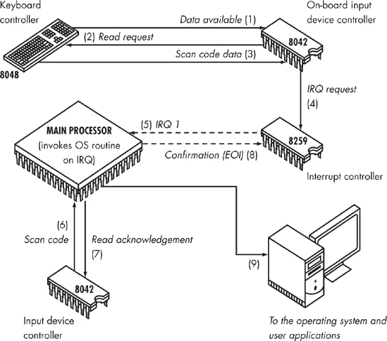
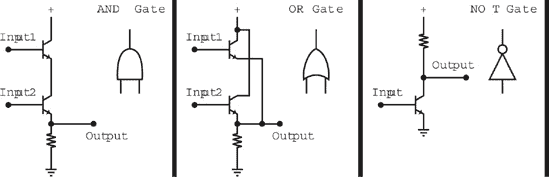
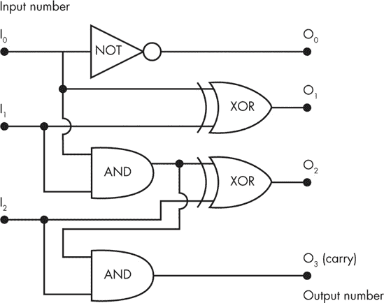
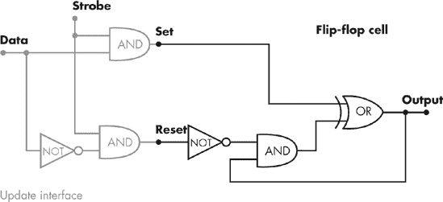
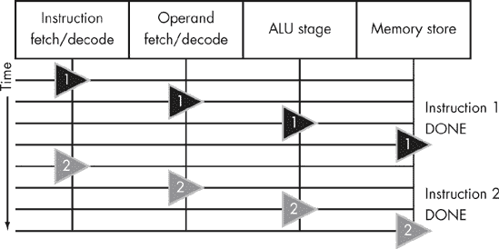

# 第一部分。源头

*关于在发送任何网络信息之前就显现出来的问题*

—

# 第一章。我能听到你在打字

*我们调查你的按键如何从远远的地方被监控*

—

从你按下键盘上的第一个键的那一刻起，你发送的信息就开始在虚拟世界中进行漫长的旅程。在数据包通过光纤链路快速传输并从卫星收发器反射之前，几微秒内，一条信息就会通过一个令人惊叹的电路迷宫走很长的路。在你按下的键被操作系统及其可能运行的应用程序接收之前，许多精确和微妙的基础机制都在进行一个对各种黑客都感兴趣的过程，并且已经证明对安全群体也具有重要意义。通往用户空间的道路上潜伏着许多惊喜。

本章重点讨论这些数据传输的早期阶段，以及你的同行（可能还有淘气的用户）有机会在你自己的终端中了解你正在做什么的机会。

一个与计算机处理输入方式相关的潜在信息泄露场景的显著例子，与一个乍一看似乎完全不相关的主题相关联：在一个完全可预测的行为的机器上产生随机数的困难任务。很难想象一个不那么明显的联系，然而我提到的这个问题是非常真实的，可能允许一个狡猾的观察者推断出用户的大部分活动，从他的密码到他正在输入的私人电子邮件。

# 需要随机性

计算机是完全确定性的。它们以受一组明确定义的法律所控制的方式处理数据。工程师们尽最大努力补偿与制造过程和电子元件本身的特性（干扰、热噪声等）相关的缺陷，所有这些都是为了确保系统始终遵循相同的逻辑并正常工作；当随着时间的推移和压力，组件拒绝按预期行事时，我们认为计算机出现了故障。

机器能够达到这种一致性水平的能力，加上它们惊人的计算能力，这就是为什么计算机对于那些能够掌握和控制它们的人来说是一个如此伟大的工具。自然，有一件事必须说：并非一切尽善尽美，那些抱怨计算机不可靠的人并不完全错。尽管设备运行得完美无缺，但计算机程序本身在许多场合还是会出问题。这是因为尽管计算机硬件可以并且通常是一致和可靠的，但你通常无法对足够复杂的计算机程序的行为做出长期预测，更不用说一个复杂的相互依赖的程序矩阵（如典型的操作系统）了；这使得验证计算机程序变得相当困难，即使我们能够提出一个详细、足够严格且无懈可击的假设模型，来描述程序应该做什么。为什么？好吧，在 1936 年，现代计算机之父艾伦·图灵通过**归谬法**（reductio ad absurdum）证明，在有限时间内确定任何计算机程序或算法的结果的**通用**方法是不可行的（尽管对于某些算法可能有**特定**的方法）.^([41])

这在实践中意味着，虽然你不能期望你的操作系统或文本编辑器始终如你或作者所期望的那样表现，但你合理地期望在相同硬件上运行的同一文本编辑器的两个实例在相同的输入下会表现出一致和相同的行为（除非，当然，其中一个实例被一架掉落的钢琴压碎或受到其他讨厌的外部事件的影响）。这对软件公司来说是个好消息，但无论如何，在某些情况下，我们这些安全专家宁愿计算机的确定性稍微低一点。不一定是在它的行为上，而是在它能提出什么上。

以数据加密和特别是那神秘的生物，公钥加密为例。这种新颖而卓越的加密形式（以及更多），最早在 20 世纪 70 年代由惠特菲尔德·迪菲和马丁·赫尔曼提出，不久之后由罗恩·里维斯、阿迪·沙米尔和伦·阿德勒曼将其发展成为完整的加密系统，其基础是一个简单的概念：有些事情比其他事情更难。当然，这似乎很明显，但只要加入几个高等数学概念，你就为突破性发明做好了准备。

传统对称加密要求所有参与秘密通信的各方共享一个相同的“秘密”值（一个密钥）。这个密钥是必需的，也是足够的，用于加密和随后解密传输的信息，使得即使知道加密方法的第三方观察者也无法解读信息。共享秘密的需求使得整个方法在计算机通信方面并不总是实用，主要是因为各方在通信之前必须建立一个安全的交换通道；通过非安全流传输秘密会使该方案容易受到解密攻击。在计算机的世界里，你经常与之前从未见过的人或系统进行通信，而且没有其他负担得起且安全的通信渠道。

另一方面，公钥密码学不是基于共享秘密。每个参与者持有两份信息：一份（公钥）用于创建加密消息，但对于解密几乎毫无用处，另一份（私钥）用于解密之前加密的消息。现在，各方可以通过一个不安全的通道交换他们的公钥，即使有人在监听。他们提供了给对方所需的信息（对观察者来说毫无意义），以在各方之间加密消息，但他们将访问加密数据的部分保持私密。突然之间，完全陌生的人之间的安全通信——比如坐在公寓沙发上的一位顾客和在线购物服务器——变得接近现实。

基本上，原始 RSA（Rivest, Shamir, 和 Adleman）公钥密码系统是基于这样一个观察：任意两个大数相乘的计算复杂度相对较低；它直接与要相乘的数字位数成正比。另一方面，找到大数的因子（分解）的复杂度要高得多，除非你是为国家安全局工作的神话般的密码天才。RSA 算法首先选择两个任意非常大的质数，记为*p*和*q*，然后将它们相乘。然后它使用这个乘积以及一个互质数，记为(*p-1*)(*q-1*)，来构造一个公钥。这个密钥可以用来加密信息，但仅凭这个密钥本身不足以解密该信息，除非通过分解。

而且还有一个问题：两个大质数的乘积的分解通常是不切实际的，这阻碍了这种攻击。在传统计算机上，最快的通用整数分解算法，即通用数域筛法（GNFS），需要超过一千年才能找到这样一个 1024 位整数的因子，以每秒一百万次测试的速度。另一方面，找到一个产生如此大乘积的两个质数，对于一台普通的 PC 来说，只需要几秒钟。

如前所述，在 RSA 中，除了你的公钥外，你还会生成一个私钥。私钥携带有关质数的额外信息，可用于解密使用你的公钥加密的任何信息。这种技巧之所以可能，得益于中国剩余定理、欧拉定理以及其他一些可能令人畏惧但非常迷人的数学概念，特别好奇的读者可能希望自行探索.^([42])

之后还设计了一些其他依赖于数学中其他难题的公钥加密系统（包括椭圆曲线加密系统等），但所有这些系统都共享公钥和私钥的基本概念。这种方法已被证明对于保护电子邮件、网络交易等非常实用，即使双方之前从未交流，并且在建立连接之前没有安全的通道来交换任何额外的信息.^([3]) 我们每天使用的几乎所有加密设计，从安全壳（SSH）和安全套接字层（SSL）到数字签名的更新或智能卡，都是由于 Diffie、Hellman、Rivest、Shamir 和 Adleman 的贡献。

## 自动随机数生成

只有一个问题：在确定性机器上实现 RSA 时，第一步是生成两个非常大的质数，*p* 和 *q*。对于计算机来说，找到一个大的质数很简单，但有一个小问题：这些质数还必须是不可能被他人猜到的，并且它们不能在每台机器上都是相同的。（如果它们是相同的，那么对这个算法的攻击就不需要任何分解，而且 *p* 和 *q* 将为拥有类似计算机的任何人所知。）

在过去几年中，已经开发出许多算法来快速找到质数候选者（伪质数）并执行快速的初步质数测试（用于验证伪质数).^([43]) 但要生成一个真正不可预测的质数，我们需要使用大量的熵或随机性，以便盲目地选择一个范围内的质数之一，或者从一个随机位置开始，选择遇到的第一个质数。

虽然在密钥生成时需要一些随机性是必不可少的，但需求并不止于此。公钥加密依赖于相当复杂的计算，因此速度相对较慢，尤其是在与传统对称密钥加密相比时，后者使用短共享密钥和一组已知执行非常快的操作机器。

为了实现如 SSH 这样的功能，其中期望有合理的性能，更合理的方法是使用公钥算法建立初始通信和基本验证，从而创建一个安全通道。下一步是交换一个紧凑的、可能是 128 位的对称加密密钥，并通过切换到旧式对称加密继续通信。对称加密的主要问题通过创建一个初始（且缓慢）的安全流来解决，以交换共享秘密，然后切换到更快的算法，从而使用户能够在不牺牲安全性的情况下受益于更高的性能。然而，为了以合理的方式使用对称加密，我们仍然需要使用一定量的熵来为每次安全通信生成一个不可预测的对称会话密钥。

* * *

^([1]) 质数是只能被 1 和自身整除的正整数。

^([2]) 与 x * *互质*（也称为与 x * *相对质*）的数与 x 没有除了 1 和 -1 以外的共同因子。（它们的最大公约数是 1。）

^([3]) 为了完整性起见，应该指出，临时公钥加密，在其他方面，容易受到“中间人”攻击的威胁，攻击者假冒其中一个端点并提供自己的、伪造的公钥，以便能够拦截通信。为了防止此类攻击，必须设计额外的手段来验证密钥的真实性，无论是通过安排安全交换还是建立一个中央机构来颁发或认证密钥（公钥基础设施，PKI）。

# 随机数生成器的安全性

程序员们为计算机发明了许多生成看似随机数的方法；这些算法的通用名称是伪随机数生成器（PRNGs）。

PRNGs 对于简单的应用足够了，例如为计算机游戏生成“随机”事件或为特别侵扰性的垃圾邮件创建无意义的主题行。例如，考虑线性同余（也称为幂余数）生成器，^([44]) 这是一个此类算法的经典例子。尽管其名称晦涩，但这个随机数生成器每次生成“随机”输出时都会执行一系列简单的操作（乘法、加法和模运算^([4]))。生成器使用其前一个输出 r[t] 来计算下一个输出值，*r*[*t*+1]（其中 *t* 表示时间）：

| *r[t]* + 1 = (*a* × *r[t]* + *c*) mod *M* |
| --- |

模运算符控制范围并防止溢出，这是一种当结果在某个点超出预定义值范围时发生的情况。如果 *r*[*0*]，*a*，*M* 和 *c*——生成器的控制变量集——都是正整数，则此方程的所有结果都落在 0 到 *M-1* 的范围内。

尽管，通过一些微调，这个算法的输出可能表现出适合生成随机数类似物的统计特性，但其操作本身并没有真正不可预测。这正是问题所在：攻击者可以轻松地开发他们自己的生成器副本，并使用它来确定我们的生成器将产生的任何数量的结果。即使我们从一个攻击者不知道的初始生成器状态（*r*[*0*]）开始，他们通常也可以通过观察受害者的生成器的后续输出，然后利用这些知识来调整他们的版本以模仿我们的版本。事实上，早在十年前就设计了一种通用的方法来重建和预测所有多项式同余生成器，[45]，在用于关键任务时忽视这个可能有些不便的小细节是非常不明智的，因为它在这个算法中留下了巨大的漏洞。

随着时间的推移，我们意识到，在计算机没有发生大规模内存故障或处理器崩溃的情况下，产生实际不可预测数据的唯一合理方式，就是尽可能多地从其物理环境中收集实际不可预测的信息，然后将这些信息作为值传递给任何需要良好随机性的应用程序。问题是，一台普通的计算机没有“感官”来探测环境中的看似随机的外部信号。然而，我们知道一种相当好的方法来克服这种不便。

* * *

^([4]) 模运算符返回两个数整数除法的余数。例如，7 除以 3 得到整数结果 2 和余数 1（7 = 2 * 3 + 1）；因此，7 模 3 等于 1。

# I/O Entropy: This Is Your Mouse Speaking

在几乎每个计算机系统中，外部设备通过硬件中断机制通信相关的事件，这种信息可以通过网卡或键盘从网络卡或键盘获取。每个设备都有一个分配的硬件中断（IRQ）号，并通过改变计算机内部指定硬件线上的电压来报告重要的发展情况，对应于这个特定的 IRQ。然后，这种变化被一个称为*可编程中断控制器*（PIC）的设备解释，它作为主处理器（或处理器）的个人管家。

一旦 CPU 发出指令，PIC（可编程中断控制器）将决定何时、如何以及以何种优先级将外部设备对主单元的请求发送出去，这使得处理器能够以高效和可靠的方式管理事件。当 PIC 接收到信号时，处理器会推迟其当前任务，除非当然 CPU 已经选择在那一刻忽略所有中断请求（如果它真的很忙）。接下来，它会调用操作系统分配的代码来处理来自该设备或设备组的反馈。一旦程序处理了事件，CPU 就会恢复原始进程及其上下文——即中断发生时其环境状态的信息——然后继续就像什么都没发生一样。

## 发送中断：一个实际例子

在实践中，检测外部条件并生成和接收一个中断请求（IRQ）涉及许多额外的步骤。例如，图 1-1 展示了按下或释放键盘上的键时触发的事件序列。在你甚至触摸单个键之前，你键盘内部的一个微控制器芯片，作为键盘控制器，正忙于扫描键盘的状态变化。



图 1-1. 键盘与计算机通信

键盘被组织成一个水平和垂直线的阵列。按键（微开关或压力敏感膜开关）安装在每一行和每一列的交叉点。控制器以非常高的速度单独测试每一行和每一列。

例如，如果键盘控制器在测试第 3 行第 5 列时检测到一个闭合电路（当电压施加到这些线时表现为低电阻），它就会得出结论，该特定位置的键（J）被按下。当键盘控制器感知到变化时，它会将行列坐标转换为扫描码，这是一个通过其唯一标识符识别键的值。然后，扫描码信息被排队在芯片的内部缓冲区中，然后告诉 CPU 有新数据，并回到自己的事务中。

输入控制器芯片是主板上的键盘控制器对应的部分。输入控制器通常处理所有基本输入设备，例如鼠标和键盘。它从键盘芯片接收一个单一的扫描码，并向 CPU 的管家，即 PIC 发出适当的中断信号。一旦 PIC 确定它可以传递这个特定的 IRQ，它就会将这个信号传递给处理器，处理器随后通常会中断当前任务并调用操作系统安装的中断处理程序。处理程序预计会读取数据，并告诉芯片它已成功读取扫描码。然后输入控制器继续其正常操作，并最终从键盘读取另一个扫描码，如果缓冲区中有数据的话。⁵

这种方案对于随机数生成非常重要，尽管其重要性是间接的。计算机使用异步事件通知方案（中断）几乎立即且精确地接收关于用户活动的反馈——也许最有趣的是，按键之间的准确延迟测量。尽管信息并不总是不可预测的，但可能是机器能够获得的最好的外部、可测量、某种程度上不可确定性的信号。因此，为了绕过计算机的决定论性质并在计算中插入随机性，安全 PRNG 实现的作者们求助于从某些设备的通常不可预测行为中收集熵，例如鼠标、键盘、网络接口，有时甚至是硬盘驱动器。为此，他们在操作系统的中断处理程序中添加了额外的代码，以记录每个可接受事件的某些参数。

尽管可以争辩说，那些来源中的任何一个都无法始终如一地提供真正的随机反馈——例如，用户输入了`aardva`之后，接下来的两个字符很可能是`rk`——但某些行为，比如一开始想到鸵鸟，确实相当不可预测，从实际的角度来看（而不涉及关于自由意志和决定论宇宙的学术讨论）。这种方法增加熵的效果相当不错，因为它包含了几个攻击者难以合理考虑、监控或预测的因素，同时还能保持他们的理智。通过长时间从所有这些来源收集数据，概率定律告诉我们，我们将收集一定量的熵。通过在缓冲区中收集数据，我们构建了一个熵池，它可以充满或耗尽，这取决于不可预测数据的供应和需求。不幸的是，池中的这些随机小片段——我们的打字受到宇宙事件的影响——仍然与大量容易预测的数据混合在一起，因此不能立即用于随机数生成。

为了确保在维护和补充熵池的过程中实际收集到的熵量均匀地分布在所有 PRNG 输出位上（所有不可预测的数据都耗尽），池必须进行哈希；也就是说，必须彻底搅拌和混合，以便没有数据部分比其他部分更容易预测。输出中的每一个比特都必须以非平凡的方式同等依赖于所有输入比特。在没有知道哪些信息是可预测的，哪些是不可预测的（这些信息对于监控按键或鼠标移动的计算机来说并不容易获得）的情况下实现这一点可能是一项艰巨的任务。

## 单向快捷键函数

幸运的是，安全的单向哈希函数（“消息摘要”），现代密码学的旗舰产品，可以帮助我们混合数据，将最多的熵输入到每个输出比特中，无论输入如何不均匀。这些是生成固定长度快捷键的函数：任意块输入数据的唯一标识符。但这还不是全部。

所有单向哈希函数都有两个重要特性：

+   计算快捷键很容易，但无法从结果中推断出原始消息或其任何属性。对消息的任何特定更改都有可能影响输出的一切属性，就像任何其他更改一样。

+   两个不同消息具有相同快捷键的可能性仅由快捷键的大小决定。拥有足够大的快捷键（大到使穷举搜索变得不切实际，如今设定在约 128 到 160 位，或大约 3.4E+38 到 1.46E+48 种组合），就找不到两个具有相同快捷键的消息。

因此，快捷键函数提供了一种方法，将输入数据中存在的熵以均匀的方式分布到输出数据中。这解决了通常随机但局部可预测的熵源的问题：我们从环境中收集大约数量的熵，与可预测的数据混合或不混合，并可以生成一个保证与最初收集的熵一样不可预测的快捷键，无论输入数据中的熵是如何分布的。

快捷键函数是如何工作的？一些又依赖于我们已知非常难以解决的数学问题。事实上，任何安全的对称或公钥加密算法都可以很容易地转换成一个安全的哈希函数。只要人类没有找到解决这些问题的真正巧妙解决方案，依赖这种方法应该是可以的。

然而，通过使用重型武器，我们最终得到了缓慢且过于复杂的生成快捷方式的工具，这在紧凑型实现中通常是不切实际的，尤其是在将此类解决方案与操作系统集成时。另一种选择是处理数据，使得输入和输出所有比特之间的相互依赖关系足够复杂，以便完全混淆输入消息，并希望这“足够好”以阻止已知的密码分析技术。因为“希望足够好”实际上是计算机科学中很大一部分的座右铭，我们欣然接受这作为一个合理的做法。

后者这类算法的优点，包括 MD2、MD4、MD5 和 SHA-1 等流行函数，是它们通常比基于困难数学挑战的对应算法快得多，而且当设计得当，它们不易受到行业中的密码分析技巧的影响。它们的弱点是它们不是可证明安全的，因为它们都没有简化为经典且难以解决的问题。事实上，一些已经被证明具有特定的弱点.^([46])

如前所述，伪随机数生成中的快捷函数的一项重要服务是它们可以在包含 *n* 个随机比特和任意数量可预测比特的数据段上运行，从而产生一个快捷方式，将 *n* 比特的熵均匀地分布在快捷方式的全部比特上（这得益于之前讨论的两个基本单向快捷函数属性）。因此，快捷函数成为了一个方便的熵提取器。通过将收集到的足够多的、通常不可预测的中断处理程序数据通过快捷函数处理，我们可以生成随机数，而无需透露用于生成该数的具体信息形状的任何有价值信息，也不会因为输入不完善而影响输出的任何有意义方式。我们所需做的只是确保在一段中断数据中收集到足够的熵并输入到快捷函数中，否则我们可能会危及整个方案。如果攻击者可以预测我们用于随机数生成的大量数据，而剩余的部分只有少数几种可能的组合，他们可以通过尝试并验证所有可能的值来对我们的实现进行成功的暴力攻击。例如，如果我们使用产生 128 位摘要的快捷函数，无论我们实际收集了多少数据，无论是 200 字节还是 2 兆字节的键盘敲击数据，我们都必须确保在哈希之前至少有 128 个输入比特对攻击者来说是不可预测的。

## 严谨的重要性

作为事物可能出错的一个例子，考虑一个用户在系统熵池为空时决定编写一个 shell 脚本的情况，这可能是由于之前执行的一些需要随机数的操作。攻击者注意到用户正在编写脚本，因为正在执行`vi delallusers.sh`；他们进一步假设脚本必须以类似`#!/bin/sh`的内容开始。尽管他们不能确定接下来会发生什么，但他们可以合理地预期脚本将以调用一个 shell 命令开始，并且不太可能接着是一首关于河马的蹩脚诗。

在这个时候，某种加密实用工具突然向系统请求一个 128 位的随机数，用作会话密钥来保护通信。然而，系统未能正确估计记录脚本第一行写入过程的缓冲区中可用的熵量，攻击者现在有一个简单的任务。计算机没有信息表明用户此时所执行的这个特定动作是否对他人来说是可预测的。它只能推测（在程序员的假设帮助下），在几分钟或几小时的过程中，用户的行为将汇总成某种无法精确预测的东西，并且平均而言，这么多的输入确实会依赖于攻击者无法预测的因素。

到目前为止，攻击者已经知道了熵池的大部分内容，在未知部分的选择上只剩下寥寥数千种可能——尽管操作系统确信缓冲区中有更多的熵。对于有计算机辅助的人来说，这数千种选择几乎不是什么大挑战。因此，而不是得到一个有 39 位数字组合的 39 位随机数，一个无知的加密应用程序最终得到了一个由输入生成的数字，这个输入可能只是成千上万个选项中的一个，攻击者可以通过试错法轻松验证，攻击者很快就能解密原本应该保持安全的信息。

* * *

^([5]) 在许多架构上，必须手动指示 PIC（中断控制器）中断已被处理，并且它不应再阻止后续的中断。这是通过结束中断（EOI）代码来完成的。

# 熵是一种可怕的东西，浪费它

由于在短期内准确预测从用户那里收集到的熵量几乎是不可能的，为了防止之前讨论过的可预测的 PRNG 输出问题，所有实现都包括在生成新输出过程中的快捷方式或内部 PRNG 状态。之前的输出成为计算下一个 PRNG 值所使用的方程的一部分。

在这个设计中，一旦系统最初收集了足够的熵，用于补充熵池的最新数据并不需要在任何时候都是完全随机的，以确保基本的安全性。

然而，还有一个问题。如果实现过程在旧的、继承的熵上运行了很长时间，只是反复使用 MD5 或 SHA-1 进行哈希，它就完全依赖于快捷算法的安全性，由于之前讨论的性能和安全权衡，这一点无法完全信赖。此外，哈希函数未必经过了合格密码学家对这一特定用途的适当适用性评估。实现不再仅仅依赖于快捷函数的位哈希属性，现在完全依赖于其免受破解攻击的不可攻破性。如果，在每一步后续操作中，都会泄露一些关于生成器内部状态的信息，并且没有向池中添加新的不可预测数据，从长远来看，这些数据可能足以以合理的确定性重建或猜测内部状态，这使得预测设备未来的行为成为可能。另一方面，如果以至少统计上防止内部状态大量重用的速率添加新的随机数据，即使哈希函数在本质上被破坏，攻击也变得不太可行。

许多专家认为，对于最苛刻的应用，不应进行这种程度的对哈希函数的信任和依赖。因此，对于实现来说，跟踪系统中收集的估计熵量非常重要，即使它不是瞬间的正确，但它反映了我们从使用的源中期望的一般统计趋势。外部熵可用性的短期波动，如之前讨论的脚本编辑示例，可能会发生，并且将通过输出重用算法得到补偿。然而，为了确保频繁地补充内部熵池并最小化哈希函数随着时间的推移可能泄露内部状态的风险，有必要进行准确的长远预测。因此，实现必须考虑提供给用户进程的数据中消耗的所有熵，并在足够的熵可用之前拒绝提供更多的随机数。

一个考虑了上述所有因素的适当 PRNG 实现的良好例子是麻省理工学院 Theodore Ts’o 在 1994 年设计和实施的优秀系统。他的机制，/dev/random，最初在 Linux 中实现，后来被引入到 FreeBSD、NetBSD 和 HP/UX 等系统中。Ts’o 的机制监控多个系统 I/O 事件，测量时间间隔和其他重要的中断特征。它还通过将熵池保存到磁盘来在系统关闭期间保留熵池，从而防止系统启动到完全可预测的状态，这使得攻击更加困难。

# 攻击：突然范式转变的影响

对于为要求严格的应用程序提供不可预测随机数的看似万无一失的方案，可能存在什么问题？至少在你期望的地方没有问题。生成的数字确实难以预测。

然而，在这个技术的设计师的推理中存在一个微小但灾难性的错误。Ts’o 先生的设计假设攻击者对基于对机器及其环境的了解来预测随机数感兴趣。但如果攻击者想要做的是完全相反的事情呢？

即使攻击者有机器上的账户，尽管他们无法直接访问用户正在输入的信息，但通过清空熵池（可以通过简单地从系统中请求随机数据并将其丢弃来实现）然后监控 PRNG 输出的可用性，他们可以推断出系统输入活动发生的确切时刻。如果没有 I/O 活动，PRNG 将没有新的数据可用，因为熵估计不会改变。如果发生按键或按键释放，攻击者将获得少量信息，然后可以推断出某个键被按下或释放。

其他事件，例如磁盘活动，也会生成一些伪随机数生成器（PRNG）输出，但通过这种方式收集到的熵的数量和时序模式与键盘中断数据的特征不同。因此，根据任何给定时间可用的数据量，可以区分事件。按键数据与磁盘活动数据看起来将不同。

最后，确保安全随机数生成最高可能安全水平的方法实际上会降低用户的隐私：这种机制可以用来估计从外部来源可用的熵的数量，可能会被滥用并用于监控系统输入活动的某些方面。尽管攻击者无法检测到正在输入的确切内容，但键盘上输入不同单词的时序模式非常明显，特别是如果存在精确的按键和释放信息，就像在这个案例中一样。通过检查这些模式，攻击者可以推断出实际的输入，或者至少更容易地猜测它。

## 输入时序模式的近距离观察

由加州大学的研究团队进行的一项深入分析表明，仅通过观察按键间隔时间，就有可能推断出用户输入的某些属性，甚至可以完全重建数据。研究得出结论，对于无缝打字和键盘熟练的操作者，按键间隔时间可能会有所变化，但每个键到键转换的主导时间模式是明显可见的。

原因在于我们的手以某种方式放在键盘上，而键盘上的键位位置会影响我们用指尖到达键位的速度。例如，按 e 和 n 之间的间隔通常与按 m 和 l 之间的间隔不同。在前一种情况下，因为一只手控制键盘的左侧，另一只手控制右侧（参见图 1-2），同时输入这两个字符几乎不需要移动，并且两个键几乎同时按下，时间间隔小于 100 毫秒。输入 m 和 l 则需要相当不自然的指法，并且需要更长的时间。


图 1-2. 每只手通常的领域。深灰色键通常由左手控制，白色区域由右手控制。

在分析了大量样本之后，这项研究的作者估计，从按键时间数据中可以获得大约每个按键 1.2 比特的信息。通过观察序列延迟，可以确定最有可能产生这种模式的一组键盘输入，从而更容易猜测按键的确切顺序。计算比特分数的想法可能听起来很荒谬，但它的真正含义是，每个键的可能性可以减少到 2^(1.2)，或者大约 2.40 倍。对于一个普通的按键，它一开始通常携带不超过 6 比特的随机性，这将从大约 64 个元素减少到 26 个元素。

这种净效应是减少了搜索空间水平；如果我们想猜测正在输入的键，我们可以看到有一种方法可以限制可能性的数量。尽管这种减少本身可能并不特别令人印象深刻，但加上从键盘输入的数据不太可能是随机的垃圾。英语文本的熵估计为每字符 0.6 到 1.3 比特，这意味着平均需要大约 1.5 到 2.5 次尝试才能成功预测下一个字符。有了进一步减少搜索空间的方法，几乎可以找到所有输入数据的非歧义性词典单词匹配。

为了验证他们的估计并在实践中展示问题，研究人员使用了隐马尔可夫模型和维特比算法来猜测按键。马尔可夫模型是一种描述离散系统的方法，其中下一个值仅取决于其当前状态，而不是先前值（马尔可夫链）。隐马尔可夫模型是一种变体，它提供了一种描述系统的方法，其中每个内部状态都产生一个观察结果，但对于实际状态却不知道。该模型在语音识别等应用中常用，其目标是获得纯数据（口头语言的文本表示）。

作者得出结论，隐马尔可夫模型适用于按键分析，他们认为系统的内部状态是按键信息；隐马尔可夫模型中的观察结果是按键间的时序。

可能会有人认为这是一种过度简化，因为在图 1-3 图 1-3. 在前一步中需要将左手移动到不同的位置会影响 P-V 时间。马尔可夫模型无法考虑手切换场景中手的先前位置。所示的情况下，可能存在更深层次的依赖关系。


图 1-3. 在前一步中需要将左手移动到不同的位置会影响 P-V 时间。马尔可夫模型无法考虑手切换场景中手的先前位置。

维特比算法是解决隐马尔可夫模型问题的一种方法。该算法可以根据观察序列找到最可能的内部状态序列。在这种情况下，我们使用它来确定基于时序的最可能的字符序列。

应用维特比算法的最终结果是，将非字典八字符密码的搜索空间减少了 50 倍。对于基于字典的英语文本的重建，这个因素可能要高得多。

现在让我们看看中断监控。我们刚才讨论的研究主要集中在通过监听安全壳（SSH）流量模式可获得的部分信息。在中断监控的情况下，攻击者可以获得的信息要多得多。首先，按键持续时间信息以及按键间的时序信息都是可用的，单个按键的持续时间取决于使用的手指。例如，食指通常与键的接触时间最短，无名指可能是最慢的，依此类推。这是非常有价值的信息，使得定位键盘上按键的大致区域变得容易得多。

其次，这些数据还使攻击者能够监控手部转换，即当左手首先输入第一个字符，右手输入第二个字符，或者反之亦然的时刻。因为每只手都受大脑不同半球的控制，几乎所有熟练的键盘用户在切换手时通常会在释放第一个键之前按下第二个键。尽管按键和释放事件本身是不可区分的，但两个键盘事件之间特别短的时间间隔是这种现象的明显迹象。在某些罕见的情况下，尤其是当打字员匆忙时，第二个按键不仅会在释放之前发生，甚至会在第一个键按下之前发生。这导致了诸如“teh”而不是“the”这样的常见打字错误。

图 1-4 展示了样本键盘时序的捕获。用户输入单词 *evil*。左手的中指按键 e 持续了中等的时间。然后，由于需要整个手移动以使用食指按键 v，因此在按键 v 之前有一个相当长的间隔。（因为空格键挡住了，所以不能用大拇指。）“v 按键的时间很短，i 也是如此，两者都通过食指访问。还有一个明显的重叠：由于手部转换，i 在 v 释放之前被按下。最后，一段时间后，无名指按下 l（不需要移动手），接触时间相当长。


图 1-4. 按键和释放时间的手部转换

因此，合理地预期，在这个攻击中可以达到更高的成功率。（上述白皮书中讨论的场景中，大部分这些信息是不可用的。）

## 立即防御战术

既然我们知道键盘嗅探的潜在可能性，我们该如何阻止它？最好的办法是使用一个合理大小的独立键盘熵缓冲区。只有在缓冲区溢出或经过比通常的按键延迟（即至少几秒钟）大得多的时间间隔之后，缓冲区才会被刷新并传递到核心 PRNG 实现，从而消除攻击者测量时间的能力。

使用这种解决方案，攻击者只能获得两种类型的信息。第一种来自溢出时的刷新程序，向攻击者透露在可测量的时间段内按下了多少个键（取决于缓冲区大小），但不会透露确切的键间隔时间。第二种可能是定时刷新序列的结果，并告知攻击者在一个固定的时间框架内按下了键或几个键，但不会提供有关事件数量及其精确发生时间的任何信息。以这种方式提供的信息对于时间攻击的价值很小，只能用于生成键盘活动的通用统计数据，后者在大多数多用户环境中不构成威胁。

## 硬件随机数生成器：更好的解决方案？

到目前为止，许多硬件平台实现了物理随机数生成器，通常称为 TRNGs，即真正的随机数生成器。这些设备提供了一种更可靠的方式来生成真正不可预测的数据，而不是收集仅预期难以预测的信息，并且是所有配备此硬件的机器获取熵的推荐方式。目前两种流行的解决方案是英特尔和 VIA 开发的集成电路。

英特尔随机数生成器（Intel RNG）与 i810 等芯片组集成，并采用传统的双振荡器设计。高频振荡器产生一个基本信号，本质上是一种交替逻辑状态的模式（010101010101...）。另一个振荡器是一个低频设备，以高速振荡器频率的 1/100 的标称速率工作，但其实际频率由一个电阻调制，该电阻作为熵的主要来源。

由于热噪声和其他随机材料效应，电阻的一些可测量特性会发生变化。低频振荡器用于在现在随机的频率下驱动采样交替信号（振荡器输出的下降沿）。信号经过一些必要的条件处理和“白化”使用冯·诺伊曼校正后，然后对外界可用。密码学研究公司（Cryptography Research）的本杰明·朱（Benjamin Jun）和保罗·科赫（Paul Kocher）对设计者和实际输出进行了仔细分析，表明输出质量始终很高，并且该生成器每输出一个比特提供大约 0.999 比特的熵。

VIA C3 “Nehemiah” RNG 基于一个稍微不同的设计，它使用一组振荡器，但没有使用如特殊电阻连接等单独的噪声源。相反，它依赖于振荡器的内部抖动，这是一个可以归因于许多内部和外部因素的效果，并且可以通过可配置的“偏差”设置进行控制。

在这种情况下，由密码学研究进行的单独分析表明，生成器显然提供的熵量低于其对应物，范围从每个输出比特 0.855 到 0.95 比特。如果将 RNG 输出视为完全随机的并直接用于密钥生成或其他关键任务，这将是一个危险的结果，因为实际熵量相应减少。为了解决这个问题，我们可以从生成器获取比必要更多的数据，然后通过一个安全的哈希函数，如 SHA-1，来消除任何可能的偏差或熵不足。这个解决方案是防止 TRNG 问题的通用良好实践，只要这些不良影响在合理范围内——也就是说，每个比特仍然携带一些有用的熵。

一些研究人员还建议使用某些非专用输入设备，如网络摄像头或内置麦克风，作为熵的来源：数字相机的电荷耦合器件（CCD）传感器往往会表现出像素噪声，而严重过放的麦克风信号基本上是一个好的随机噪声来源。然而，由于不同制造商的流行媒体设备电路的不同，没有通用的设置此类生成器的方法，因此这种方式生成的“随机”数质量无法保证。实际上，一些设备会接收到看似随机但实际上完全可预测的无线电干扰或某些电路信号。此外，一些设备，特别是 CCD 传感器，表现出静态噪声模式。虽然看似随机，但这种噪声变化不快，可能不可靠。

# 思考食物

我已经决定省略对一些有趣概念的深入讨论，但这些可能对进一步的探索具有宝贵的启发。

## 远程定时攻击

理论上，可能通过网络部署 PRNG 定时攻击。某些启用了密码学的服务实现了对称密码学。在通过公钥基础设施建立较慢的非对称流并验证双方后，生成一个对称会话密钥，然后两个端点切换到更快的对称替代方案。

+   可能通过使应用程序耗尽系统中的现有熵池，直到没有足够的熵来生成新的会话密钥，但仅是微小的一部分。然后应用程序将延迟生成对称密钥，直到有足够的熵来生成密钥的剩余部分，这可能会在下一个按键或释放时发生。

+   我认为这种攻击更有可能在实验室环境中成功，而不是在任何实际应用中，尽管我的技术审稿人不同意我的怀疑态度，因此，这只是一个观点。弗吉尼亚大学的一项有趣的分析批评了之前在论文中讨论的原始 SSH 时间研究，理由是网络抖动足以使时间数据变得不可用，尽管值得注意的是，如果某个特定活动在一段时间内重复进行（例如，每次登录都输入相同的密码），随机网络性能波动可能会很好地平均化.^([51])

## 利用系统诊断

一些系统有更好的方法来恢复按键信息和其他时间数据。在我发布 PRNG 时间研究之后，有人指出 Linux 提供了一个/proc/interrupts 接口，该接口显示中断摘要统计信息，目的是提供一些有用的性能数据。通过检查中断计数器变化对于 IRQ 1，可以获得与通过 PRNG 获取的相同的时间信息，已经过滤掉了任何可能的磁盘和网络活动，从而造成与之前讨论过的类似的隐私泄露。

## 可复现的不确定性

值得考虑的其他问题与 PRNG 实现本身有关。批量购买相同硬件并在每个设备上安装相同的系统是一种常见做法，但对于没有经历大量控制台活动的服务器来说可能会成为问题。使用专门的复制工具镜像安装并随后在多台服务器上传播镜像也存在风险。在所有情况下，系统可能会因为实际熵过低而持续一段时间。

# 第二章. 付出额外努力永远不会被忽视

*在这里我们学习如何构建木制计算机以及如何通过观察真实计算机的运行来获取信息*

—

您输入的数据现在已安全地存储在您选择的运行应用程序的手中。程序将花费时间决定如何处理信息，如何解释它，以及下一步要采取哪些行动。

在本章中，我们详细探讨了数据处理的基础机制，并探讨了可能潜伏在处理器散热片之下的某些陷阱。我们特别关注我们可以通过观察机器执行给定程序以及完成某些任务所需的时间来推断的信息。作为额外奖励，我们还将构建一个完全功能的木制计算机。

# 布尔的遗产

要理解处理器的结构，我们必须回到处理器尚未被梦想出来的时代。这一切始于 19 世纪，当时自学成才的数学家乔治·布尔（1815–64）设计了一种简单的二进制代数系统，旨在为理解建模形式推理提供一个框架。他的方法将逻辑的基本概念简化为三组简单的代数运算，这些运算可以应用于代表两种相反状态的元素，即真和假。这些运算包括：

+   析取运算符，**OR**。当至少有一个操作数^([6])为真时，这个运算符才为真.^([7])

+   连接运算符，**AND**。只有当所有操作数都为真时，这个运算符才为真。

+   补码（否定）运算符，**NOT**。当它的唯一操作数为假时，这个运算符才为真。

尽管布尔代数模型在设计上很简单，但它最终成为了解决逻辑问题和某些其他数学挑战的有力工具。最终，它使得许多勇敢的先知能够梦想出聪明的分析机器，这些机器有一天将改变我们的日常生活。

今天，布尔逻辑对于经验丰富的计算机用户来说很少是神秘的，但从这一组简单操作到今天的计算机的道路往往如此。我们将首先通过尝试捕捉这个模型在最简单形式下的本质来开始探索这条道路。

* * *

^([6]) 操作数是操作符操作的对象。

^([7]) 逻辑或的意义与英语中对这一术语的常见理解不同：当只有其中一个或所有参数为真时，结果语句仍然为真。在英语中，“或”通常意味着*只有*一个选项为真。

# 通向通用运算符之路

简化的道路往往要通过看似不必要的复杂级别——这个例子也不例外。为了开始，我们必须考虑另一位 19 世纪数学家奥古斯都·德摩根（1806–71）的工作。德摩根定律指出，“析取的补码是补码的合取。”这种臭名昭著的混淆简单概念的做法对布尔逻辑以及最终数字电路的设计产生了深远的影响。

用简单的英语来说，德摩根定律解释了当任何（或两个）条件不满足时，声称两个条件都满足的句子（或者说，条件合取发生）也将是错误的——哦，反之亦然。

这条定律得出结论，NOT OR (a, b) 应该在逻辑上等同于 AND (NOT a, NOT b)。考虑一个现实世界的例子，其中 a 和 b 代表以下内容：

| a = “Bob 喜欢牛奶” |
| --- |
| b = “Bob 喜欢苹果” |

现在可以将德摩根方程的两侧写成：

| OR (NOT a, NOT b) ⇔ Bob 不喜欢牛奶或不喜欢苹果 |
| --- |
| NOT AND (a, b) ⇔ 不正确的是 Bob 同时喜欢牛奶和苹果 |

两个表达式在功能上是等价的。如果 Bob 不喜欢牛奶或苹果中的任何一个，第一个表达式就是真的；那么他也不喜欢两者，这意味着第二个表达式也是真的。

反转情况也会得到一致的结果：如果 Bob 不喜欢至少一个选择，他喜欢两者（第一个表达式是假的）。在这种情况下，他也不喜欢两者（第二个表达式也是假的）。

## 德摩根定律的应用

为了评估超出直觉和一些手势的逻辑语句，构建所谓的真值表是有帮助的，这些真值表展示了从所有可能的真值和假值操作符组合中可以计算出的所有结果。

下面的两个表格表示了上一个例子中的每个表达式。每个表格都包括操作符和所有可能的真值和假值组合的对应结果列。因此，在第一行中，你可以看到前两列——NOT AND(a, b)的两个操作数——都是假的。这导致 AND(a, b)也是假的，因此 NOT AND(a, b)是真的。结果在第三列中给出。

正如你所看到的，两个表达式的行为相同：

| NOT AND(a, b): 与结果取反 |
| --- |
| 操作数 1 (a) | 操作数 2 (b) | 结果 |
| --- | --- | --- |
| FALSE | FALSE | TRUE |
| FALSE | TRUE | TRUE |
| TRUE | FALSE | TRUE |
| TRUE | TRUE | FALSE |
| OR(NOT a, NOT b): 操作数取反的 OR |
| --- |
| 操作数 1 | 操作数 2 | 结果 |
| --- | --- | --- |
| FALSE | FALSE | TRUE |
| FALSE | TRUE | TRUE |
| TRUE | FALSE | TRUE |
| TRUE | TRUE | FALSE |

但为什么计算机设计师关心 Bob 的食物偏好呢？因为在布尔操作符的背景下，德摩根定律意味着布尔代数提出的基本操作集实际上是部分冗余的：NOT 和另外两个操作符（OR 和 AND）中的任何一个的组合总是足以合成剩下的一个。例如：

| OR (a, b) ⇔ NOT AND (NOT a, NOT b) |
| --- |
| AND (a, b) ⇔ NOT OR(NOT a, NOT b) |

这种理解将操作符集减少到两个，但布尔系统还可以进一步简化。

## 便利性是必需的

一些额外的操作符对于实现布尔逻辑不是必需的，但补充了现有的操作集。这些额外的操作符，即 NAND 和 NOR，仅在 AND 和 OR 分别为假时才为真：

| NAND(a, b) ⇔ NOT AND(a, b) ⇔ OR(NOT a, NOT b) |
| --- |
| NOR(a, b) ⇔ NOT OR(a, b) ⇔ AND(NOT a, NOT b) |

这些新函数并不比 AND 和 OR 更复杂。每个都有四个状态（四行）的真值表，因此其值可以用同样的努力确定。

### 注

NOR 和 NAND 都不在基本操作数集中，因为它们都不对应于句子之间常用的基本逻辑关系，也没有在通用语言中的原子表示。

我刚刚介绍了一套新运算符，这些运算符是从现有集合中派生出来的，似乎只为那些想要使用形式化符号表达更奇特逻辑依赖或问题的人提供了一种可疑的便利功能。这又是为了什么？

仅引入 NAND 或 NOR 就可以完全消除 AND、OR 和 NOT。这进一步实现了我们的简化目标，并使我们能够用更少的元素和运算符来描述整个布尔代数系统。

那些否定辅助运算符的重要性在于你可以使用它们中的任何一个来构建一个完整的布尔代数系统。实际上，你可以使用 NAND 构造所有基本运算符，如下所示（*T* 代表一个真命题，*F* 代表一个假命题^([8]))。怎么做？很明显，以下成对的陈述是等价的：

| NOT a ⇔ NAND(*T*, a) |
| --- |
| AND(a, b) ⇔ NOT NAND(a, b) ⇔ NAND(*T*, NAND(a, b)) |
| OR(a, b) ⇔ NAND(NOT a, NOT b) ⇔ NAND(NAND(*T*, a), NAND(*T*, b)) |

或者，如果我们更愿意只依赖 NOR 而不是 NAND，我们可以说

| NOT a ⇔ NOR(*F*, a) |
| --- |
| OR(a, b) ⇔ NOT NOR(a, b) ⇔ NOR(*F*, NOR(a, b)) |
| AND(a, b) ⇔ NOR(NOT a, NOT b) ⇔ NOR(NOR(*F*, a), NOR(*F*, b)) |

## 接受复杂性

很难相信所有计算的精髓都可以被包含在某个通用逻辑运算符中。你可以使用包含以下真值表的简单电路来实现大多数复杂算法、高级计算、尖端游戏和互联网浏览，这些真值表将输入信号转换为输出信号：

| NAND 状态表 |
| --- |
| 操作数 1 | 操作数 2 | 结果 |
| --- | --- | --- |
| FALSE | FALSE | TRUE |
| FALSE | TRUE | TRUE |
| TRUE | FALSE | TRUE |
| TRUE | TRUE | FALSE |
| NOR 状态表 |
| --- |
| 操作数 1 | 操作数 2 | 结果 |
| --- | --- | --- |
| FALSE | FALSE | TRUE |
| FALSE | TRUE | FALSE |
| TRUE | FALSE | FALSE |
| TRUE | TRUE | FALSE |

看起来我们似乎没有进展。然而……为什么这个看似微不足道的依赖集使得构建一个能够解决复杂问题的设备成为可能，比如以得体的方式拒绝你的信用申请？基于“真”和“假”状态的这块理论又与数字电路有什么共同之处？

* * *

^([8]) 纯粹主义者可能想要假设 *T* 等同于 AND(a, a)，例如，这始终为真，而 *F* 等同于 NOT AND (a, a)，这始终为假。换句话说，我们并没有引入新的概念或方程元素——我们只是在这一点上稍微简化了符号。

# 走向物质世界

布尔设计的机制并不复杂：它需要两种相反的逻辑状态，“真”和“假”，0 和 1，“青色”和“紫色”，999 和 999 ½。实际意义、物理表示和介质都是无关紧要的；重要的是任意选择的约定，将介质中的一些状态分配给特定的逻辑值集合。

我们所知道的计算机在电子电路中使用两种不同的电压水平，并将它们解释为设计师称为 0 和 1 的值。这些值通过电路传输，代表二进制系统中的两个数字——但没有任何阻止一个人使用几乎任何方法来传递数据的方法，从水流到化学反应，到烟雾信号，到由一组精心制作的木齿轮传递的扭矩。信息保持不变，无论其载体如何。

在物理世界中实现布尔逻辑的关键很简单，一旦我们同意逻辑值的物理表示。接下来，我们只需要找到一种方法来安排一组组件，以操纵这些值以适应我们想要计算机执行的任务（但关于这一点稍后还会讨论）。首先，让我们尝试找出如何操纵信号和实现现实世界的逻辑设备，通常称为门。即木门。

# 无电计算机

从纯数学世界产生的一组理论操作转移到可以调节水流、扭矩或电信号的设备，以模仿逻辑运算器之一的方式，这似乎是一项艰巨的任务——但实际上并非如此。

展示了使用扭矩逻辑实现 NOR 功能的简单齿轮组机制。在闲置状态下，“输出”齿轮代表状态 0；当对齿轮施加扭矩时，其状态为 1。该设备仅在外部源未对两个控制“输入”齿轮施加扭矩时将扭矩从外部源传输到输出。在理论上，不需要外部能源，设计可以更简单；然而，实际上，摩擦和其他问题会使构建更复杂的完全自包含门集相当困难。


图 2-1. 机械 NOR 门设计

对输入之一或两个施加扭矩将拉出微小的连接齿轮，使“输出”齿轮闲置。当输入闲置时，弹簧将连接齿轮拉回其位置。该设备的真值表正是 NOR 应有的样子。

如你所回忆的那样，NOR 或 NAND 都是我们实现任何布尔逻辑运算器所需的所有。尽管添加实现其他运算的能力而不需要重新组合 NAND 和 NOR 门会使我们的设备更小、更高效，但设备不需要这种能力才能工作。

假设我们跳过所有门一起以我们习惯的方式工作的繁琐细节，我们可以得出结论，计算机可以用几乎任何技术来构建.^([9])

* * *

^([9]) 不言而喻，非电子计算机并非空穴来风。此类设备的著名例子包括查尔斯·巴贝奇的解析机，以及如纳米技术等技术也持有一些希望。参见 Ralph C. Merkle，“两种机械可逆逻辑类型”，*纳米技术* 4 (1993)。

# 一种稍微更受欢迎的计算机设计

尽管过去几十年计算机的繁荣源于巧妙的晶体管，但我们对其的依赖并非与任何神奇的价值或独特的品质相关联。简单来说，它目前是我们最经济、最易用和最高效的设计。

与可能远优于木制齿轮机的电子计算机不同，我们使用的电子计算机使用晶体管传递电信号，晶体管是微小的设备，当在第三个节点（连接点）施加电压时，它们在两个节点之间允许电流单向流动。晶体管可以非常有效地小型化，功耗低，且可靠且便宜。

## 逻辑门

晶体管很简单。实际上，它本身是一个非常简单的设备，无法实现任何有意义的布尔逻辑。然而，当在逻辑门中正确排列时，晶体管使得执行所有基本和补充布尔代数运算变得容易。

AND 门可以通过串联两个晶体管来实现，这样电压才能流向输出，前提是两个晶体管都必须具有低电阻（“开启”）。每个晶体管由单独的输入线控制（激活）。输出通过一个电阻“拉低”，因此它具有地电压 0（“假”），但一旦两个晶体管都开启并允许轻微的电流流动，输出就会超过 0。

OR 门通过设置一个并联晶体管来实现，这样只要任何一个晶体管被激活，输出就能被设定为非零电压，表示“真”。

最后一个基本门，NOT 门，使用一个晶体管和一个电阻来实现。“NOT”输出在空闲状态下为 1（通过电阻拉高），当晶体管开启时被拉低到 0。

图 2-2 展示了三种最基本的晶体管门设计：AND、OR 和 NOT。



图 2-2. 基于晶体管的逻辑门——构造和符号

### 注

你可能会注意到，AND 门和 OR 门都可以通过不引入额外组件的方式转换为 NAND 和 NOR。这只需要使用 NOT 门电路图上观察到的设计——即通过将电阻和“输出点”移向电源电压，从而反转输出逻辑。

我们现在已经到了可以组合晶体管以实现一个通用门之一的时候了，但无论我们可以构建多少个门，这仍然离真正的计算相当远。

前面的讨论都很好，但是什么让布尔逻辑不仅仅是一个解决关于鲍勃饮食谜题的强大工具？

# 从逻辑运算符到计算

组合简单的布尔逻辑运算可以带来许多令人惊讶的能力，例如在数字的二进制表示上执行算术运算。这就是事情变得有趣的地方。

一组 XOR 和 AND 门，例如，可以用来增加输入数字 1，这是我们走向加法的第一步。图 2-3 展示了基于这个概念的设计。

啊，一个新术语！XOR 是另一个“方便”的布尔逻辑运算符，只有当其操作数之一为真时才为真。在这方面，它更接近英语中“或”的通常含义。XOR 通常用于简化符号，但通常可以通过重新组合 AND、NOT 和 OR 来实现，其他方法也容易实现。它被定义为以下方式：

| XOR(a, b) ⇔ AND(OR(a, b), NOT AND(a, b)) |
| --- |

回到我们的电路……它能做什么？图 2-3 中展示的设备用二进制数供电。在这个例子中，这个数字限制在三个位上，尽管这个设计可以很容易地扩展以允许更多的输入。



图 2-3. 简单的加一电路

这个简单的计算设备的工作方式与人类在一张纸上加十进制数字的方式相同——从右到左工作，最终将一个值带到下一列。唯一的真正区别是它使用二进制。

让我们看看会发生什么。我们有一行写着的二进制数。我们想要增加它 1；我们从最右边的数字开始，就像我们做十进制加法一样。

我们在那里有一个二进制位；当增加一个二进制位时，只有两种可能的结果：如果输入位是 0，输出是 1（0 + 1 = 1）；否则，输出是 0，并且我们需要将 1 带到下一列（1 + 1 = 10）。换句话说，我们做了两件事：我们产生一个输出，它是输入的否定（0 对应 1，1 对应 0），并且，如果输入位是 1，我们必须记住这一点并在稍后包含它。

电路正是这样做的：对于第一个输入，I[0.] 顶部的门通过否定输入并将其提供给输出 O[0]，同时也将输入值本身提供给负责处理下一列的门（O[1]）。

| O[0] = NOT I[0] |
| --- |
| C[0] = I[0] |

好吧，我们已经将数字增加了一；如果没有来自前一位的进位，我们就没有其他事情可做在剩余的列中。如果没有进位，O[1]应该与 I[1]相同。然而，如果有进位值，我们需要以相同的方式处理这种情况，就像我们处理向上一列加 1 一样：否定输出，并在适用的情况下将进位值传递到下一列。

从现在开始，每个后续的输出（对于 n > 0 的 O[n]）将直接从 I[n]复制，如果没有从前一列传递过来的位，或者由于进位位的增加而增加 1（这再次归结为否定）。因此，如果 I[n]是 1，这一列的进位 C[n]也将是 1，O[n]将是 0（因为在二进制中，1 + 1 是 10）。你可能已经注意到，位置*n*的实际输出仅仅是位置*n*的输入值和来自列*n*−1 的进位位的异或的结果。因此，电路通过将 C[n−1]携带的位与 I[n]的值进行异或，然后通过将 O[n−1]的进位与 I[n]进行与操作来确定是否应该向下一列传递进位来生成 O[n]：

| O[n] = XOR(I[n], C[n−1]) |
| --- |
| C[n] = AND (I[n], C[n−1]) |

考虑以下示例。我们想要将一个输入值，3（二进制中的 011），增加 1。输入如下：

| I[0] = 1 |
| --- |
| I[1] = 1 |
| I[2] = 0 |

电路通过否定 I[0]来产生 O[0]，因此 O[0] = 0。因为 I[0]不为零，所以也有一个进位传递到下一列。在下一列，XOR 门将 O[1]设置为 0，因为尽管 I[1]是 1，但前一个列有一个进位值（1 + 1 = 10）。同样，也有一个进位传递到下一列。

在另一列中，I[2] = 0，但 AND 门指示前一行有一个进位值，因为前两个输入都设置为 1。因此，输出是 1。最后一列不会有进位。输出如下：

| O[0] = 0 |
| --- |
| O[1] = 0 |
| O[2] = 1 |
| O[0] = 0 |
| ...或者 0100，这偶然地，当转换为十进制数时是 4。 |

哇哦——这就是+1，用二进制表示。

### 注释

我们刚刚用布尔代数表达了这个第一个计算问题。你可能想扩展设计，使其能够对两个任意数进行求和，而不仅仅是求一个数和 1 的和。然而，这个基本的电路是计算开始和结束的地方。

数字算术电路通过将某些输入数据通过一系列巧妙排列的逻辑门来运行，这些逻辑门随后对一系列位进行加、减、乘或其他简单的修改。其中涉及到的魔法很少。

到目前为止，我已经解释了硅芯片或手工制作的木材执行某些固定、基本操作的能力，例如整数算术。然而，这幅画面中缺少了某些东西：计算机并没有在 CPU 内部一个复杂而费力的门阵列中硬编码文本编辑器、游戏和对等软件。软件在哪里？

# 从电子计时器到计算机

计算机的真正价值在于其能够被编程以特定方式行动——根据某个计划执行一系列软件命令。

图 2-4 展示了我们朝着开发一种能够执行更多任务（而不仅仅是单一、硬连线任务）的灵活机器的下一步：数据存储和内存。在这张图中，我们看到一种称为*触发器设计*的内存存储单元。这个内存单元有两个控制线，“设置”和“复位”。当两者都为低电平时，门通过其输入和输出到或门的反馈连接保持其当前状态。来自或门的先前输出通过一个与门，因为它的另一条线被设置为 1（否定“复位”），然后再次通过或门，因为它的另一个输入是 0（“设置”）。输出状态保持，直到门有电。



图 2-4. 具有实用接口的触发器内存

当“设置”信号变为高电平时，或门被迫输出 1，并且当“设置”信号变回低电平时，它将保持这个值。当“复位”线变为高电平时，与门被迫输出 0 并打破反馈回路，从而迫使电路输出 0。一旦“复位”信号变回低电平，输出保持为 0。当两个控制线都为高电平时，电路变得不稳定——这在机械计算机中尤其不美观。

该设计的真值表如下（*V*表示任意逻辑值）：

| 触发器真值表 |
| --- |
| 设置 | 复位 | Q[t-1] | Q[t] |
| --- | --- | --- | --- |
| 0 | 0 | *V* | *V* |
| 1 | 0 | - | 1 |
| 0 | 1 | - | 0 |
| 1 | 1 | - | 不稳定 |

触发器电路的一个更实用的变体，它包含一个“更新接口”（见图 2-4)，使用两个与门和一个非门，以便在发生外部“触发”控制信号时捕获输入线的状态（采样并保持）。这种设计消除了不稳定的输入组合，使得这种类型的内存更容易用于存储信息。

| 改进的触发器真值表 |
| --- |
| 输入 | 触发 | Q[t-1] | Q[t] |
| --- | --- | --- | --- |
| - | 0 | *V* | *V* |
| *S* | 1 | - | *S* |

这种简单的门配置表现出一个重要的特性：它可以存储数据。单个单元只能存储一个比特，但通过组合多个触发器可以扩展存储容量。尽管今天的内存设计各不相同，但这一功能的重要性仍然相同：它允许程序执行。但这是如何实现的呢？

在基本设计中，芯片在内部芯片内存锁存器（寄存器）中存储一个特殊值，通常称为*指令指针*，该锁存器由几个触发器组成。由于流行的计算机是同步工作的，所有进程都由一个高频时钟信号发生器计时，因此指针在每个时钟周期从主存储器中选择一个内存单元格。通过这种方式检索的控制数据然后选择并激活适当的算术电路来处理输入数据。

对于某些控制数据，我们的假设芯片执行加法；对于其他数据，它涉及到输入输出操作。在获取每一块控制数据（每条机器指令）之后，芯片必须前进其内部指令指针，以便在下个周期准备好读取下一条命令。多亏了这种功能，我们可以使用芯片来执行一系列机器指令，或者一个程序。

现在是时候找出芯片必须实现哪些操作才能使其可用的了。

# 图灵与指令集复杂性

事实上，处理器并不需要复杂。实际上，一个芯片能够执行几乎所有任务的指令集非常小。图灵-丘奇定理指出，每个现实世界的计算都可以通过图灵机来完成，图灵机是计算机的原始模型。图灵机以发明者的名字命名，是一种简单的设备，它在一个可能无限长的由单个单元格组成的磁带上操作，这是一种假设的、纯粹抽象的存储介质。每个单元格可以存储机器“字母表”中的一个字符，这个“字母表”只是对可能的有限有序值集合的命名。（这个字母表与人类字母表毫无关系；这样命名是为了在门外汉中引起一些混乱。）

该设备还配备了一个内部寄存器，可以存储有限数量的内部状态。图灵机从磁带上的某个位置开始，处于给定状态，然后从磁带上的一个单元格中读取一个字符。每个自动机都有一个与之相关的转换模式集合，描述了如何修改其内部状态，根据读取后的情况在磁带上存储什么，以及如何（可选地）将磁带向一个方向移动一个单元格。这样一组转换定义了基于系统当前特性的计算系统下一个状态的规则。这些规则通常使用像这样的*状态转换表*来记录。

| 状态转换表 |
| --- |
| 当前状态 | 新状态/动作 |
| --- | --- |
| C[t] | S[t] | C[t+1] | S[t+1] | MOVE |
| 0 | S0 | 1 | S1 | - |
| 1 | S0 | 0 | S0 | LEFT |

表格告诉我们，如果机器当前位于其下的单元格的当前值是 0，并且机器在那个时刻的内部状态是 S0，设备将改变 C 的状态为 1，将内部状态改变为 S1，并且不会移动读取头。

图 2-5 展示了图灵机位于单元格 C 并处于内部状态 S 的示例。


图 2-5. 样例图灵机执行阶段

让我们一步步来看。正如你在图 2-5 中可以看到的，机器使用两个字符的字母表，0 和 1，并且有两个内部状态，S0 和 S1。它从 S0 开始。（起始条件可以任意定义；我选择在那里开始没有任何特别的原因。）当位于磁带上存储的二进制数（C[0]）的末尾（最低有效位）时，机器遵循以下逻辑：

+   如果机器头下方的字符是 0，它将变为 1，根据表格中记录的第一个转换规则，机器的状态将变为 S1。因为没有从 S1 到其他状态的转换规则，机器将在下一个周期停止。

+   如果从头部下方读取的字符是 1，它将变为 0，状态保持不变。根据第二个转换规则，机器还将读取头在磁带上向左移动。整个过程然后从新位置开始重复，因为机器仍然处于当前状态，对于该状态，定义了进一步的转换规则。

## 功能性，终于实现了

虽然这可能会让人惊讶，但这台特定的机器实际上是有用的，并实现了具有超过理论价值的任务：它执行基本的算术。它与我们本章前面讨论的增加电路做完全相同的事情。事实上，它实现了相同的算法：磁带上从最右边位置开始的位被反转，直到遇到 0（也被反转）。

这只是冰山一角。一个合适的图灵机可以实施任何曾经构思过的算法。唯一的问题是每个算法都需要实施一组单独的转换规则和内部状态；换句话说，我们需要为每个新任务构建一个新的图灵机，这在长期来看并不十分实用。

幸运的是，这种特殊类型的机器，即通用图灵机（UTM），具有足够先进的指令集，可以实施所有特定的图灵机并执行任何算法，而无需更改转换表。

这台超级机器既不特别抽象，也不复杂。它的存在是有保证的，因为可以设计一个特定的图灵机来执行任何有限算法（根据上述丘奇-图灵论题）。因为“运行”图灵机的方法本身就是一个有限算法，所以可以设计一个机器来执行它。

至于这台机器的复杂性，一个单比特、两个元素的字母表机器（设计出的最小通用图灵机）需要 22 个内部状态和描述状态转换的指令，以便在顺序无限内存带上执行算法。^([52)] 这并不是什么大问题。

## 圣杯：可编程计算机

图灵机也远不止是数学家用来娱乐自己的假设性抽象设备。这是一个需要用专门设计的、基于布尔逻辑的电子（或机械）设备实现的构造，也许可以扩展使其更加有用，这使我们离实用计算更近一步。唯一的问题是，在现实世界中无法满足无限长输入带的前提条件。尽管如此，我们可以提供大量的输入带，使得这样的硬件图灵机对于我们的大多数日常问题来说非常实用。通用计算机的时代到来了。

当然，真正的计算机远远超出了顺序访问单比特内存，从而显著减少了实现图灵完备性所需的指令集。一个具有 18 个字符的字母表通用图灵机只需要两个内部状态才能工作。另一方面，真正的计算机通常在一个至少有 4,294,967,296 个字符（32 位）的“字母表”上运行，通常更多，这允许非顺序内存访问和使用大量具有天文数字般可能内部状态的寄存器。

最后，通用图灵机模型证明了，日常实践也证实了，仅使用少量特性（由两个或三个内部寄存器组成，如指令指针、数据读写指针，可能还有一个累加器）和一小套指令，就可以构建一个灵活、可编程的处理单元。仅用几百个逻辑门就能组装这样的设备，尽管今天的设计可能需要更多。

如您所见，从头开始构建计算机的想法并不那么荒谬——即使是木制的。

## 简单化进步

当然，提出这样一套不起眼的指令集并不会使设备变得快速或易于编程。通用图灵机几乎可以做任何事情（在很多情况下，得益于它们的简单性），但它们运行缓慢且难以编程，到了甚至实现从更易读的语言到机器码的机器辅助翻译都变得困难，至少在没有让程序员临床性疯狂的情况下。

接近实现裸骨 Turing 完整性的架构或语言通常被称为*图灵陷阱*。这意味着，虽然理论上使用它们可以完成几乎所有任务，但在实践中，这几乎是不可能的，也太耗时、太费力。即使是像整数乘法或移动内存内容这样简单的任务，设置起来可能需要很长时间，执行起来可能需要两倍的时间。完成简单和重复性任务所需的时间和精力越少，以及软件使用多个指令完成的任务越少，就越好。

提高处理单元的功能性和性能的一种流行方法是在硬件中实现某些常见任务，这些任务在软件中执行可能会相当麻烦。这些任务通过使用一系列专用电路来实现（包括乘法和房屋贷款拒绝处理），从而为架构添加方便的扩展，并使程序的部署更快、更合理，同时仍然允许系统以编程和灵活的顺序执行这些功能。

令人惊讶的是，在设计处理器时，除了最初的几个步骤之外，并不总是希望线性增加电路的复杂性，以使处理器达到更高的速度、更高的能效和更好的功能集。当然，你可以构建大量的电路来处理几乎所有可以想象到的常用复杂操作。然而，除非架构真正成熟，并且你的预算允许你投入额外的努力和资源来制造芯片，否则这并不实用。在这样的平台上运行的程序确实需要更少的时间来执行，并且编写起来更容易，但设备本身构建起来更困难，需要更多的电力，并且可能因为体积过大或价格过高而不适合常规使用。像除法或浮点运算这样的复杂算法需要大量的通常处于闲置状态的门，才能在单步中完成这样的任务。

## 分解任务

与此相反，在拥有工作设计和大量时间来改进它之前，最好是放弃单周期执行模型。在硬件中实现复杂功能的一个更好的方法是将其分解成微小的部分，并在多个周期中执行高级任务。

在这样的多周期设计中，处理器会经过多个内部阶段，就像加一图灵机示例一样。它按照正确的顺序运行数据通过简单的电路，从而逐步实现更复杂的功能，这依赖于更基本的组件。而不是使用一个复杂的设备一次性完成所有数学运算，它可能使用一个电路来乘以 32 位整数的后续位，跟踪进位值，然后在第 33 个周期产生最终结果。或者，它还可以执行某些独立的、准备性的任务，这些任务在实际操作之前进行。这将使我们免于为每个操作码变体设计数十个电路，取决于它应该从哪里获取操作数或存储结果。

这种方法的额外好处是它使得硬件资源管理更加高效：对于简单的操作数；一个可变复杂性的算法可以更快完成，只需要绝对必要的周期数。例如，除以 1 可能比除以 187,371 所需时间更少。

一个简单、便宜、使用率最高且执行时间可变的电路，可能比一个复杂且耗电的、具有恒定执行时间的电路更经济高效。尽管一些今天的处理器试图使用固定数量的周期来完成越来越多的任务，但几乎所有处理器最初都是多周期架构。即使是这些大块头，模型也很少真正保持单周期，正如你马上就会看到的。

但首先，让我们看看这种通过多周期执行实现的简单优势是如何产生反效果的。

## 执行阶段

多周期执行的一种变体是将任务分割成若干个不同的、但通用的准备和执行阶段，而不是分割成若干个重复的步骤。这种方法被称为*阶段化*，在今天的处理器中被用来使它们在没有必要线性增加复杂性的情况下表现更好。执行阶段化已经成为处理器的一个重要特性。

今天的处理器可以将每条指令转换成一组大量独立的小步骤。某些步骤可以使用所有指令共享的通用电路来完成，从而有助于整体的简单性。例如，特定任务（再次想到我们最喜欢的乘法）的电路可以通过将其从任何通用 I/O 处理任务中分离出来，作为各种高级指令的一部分而变得更加通用和可重用。执行阶段和转换的集合取决于架构，但通常类似于图 2-6 中所示的方案。



图 2-6. 基线指令执行阶段

图 2-6 显示了以下阶段：

**指令获取/解码**

处理器从内存中检索指令，将其转换为低级序列，并决定如何进行以及将哪些数据传递给所有后续阶段。该电路对所有操作都是共享的。

**操作数获取/解码**

处理器使用一个通用电路从源中获取操作数以执行特定指令（例如，从指定的内部寄存器中获取），这样主电路就不必支持所有可能的操作数组合和获取策略。

**ALU**

一个针对执行此特定操作（可能需要多个步骤）而定制的算术逻辑单元（ALU）被调用以执行指定的算术任务。对于非算术（内存传输）指令，有时使用通用或专用 ALU 电路来计算源和目标地址。

**内存存储**

结果存储在其目标位置。对于非算术操作，内存将在计算的位置之间进行复制。

仅此而已，可能看起来只是常规多周期执行和电路重用措施的一种变化——这在今天的大多数 CPU 设计中都很普遍。但正如你将看到的，这对执行速度也极其重要。

## **较少的内存**

电路的简单性并不是这个故事结束的地方。多周期设计的另一个额外优势是处理器速度不再受限于系统中最慢的组件——内存。消费级外部内存的访问速度远低于今天的处理器，并且具有高访问和写入延迟。即使处理器并非始终在访问内存，单周期处理器的速度也无法超过可靠访问内存所需的时间。它需要慢的原因之一是它可能遇到的单周期指令中**可能**需要内存访问；因此，必须有足够的时间来完成这项任务。另一方面，多周期设计允许 CPU 根据需要花费时间，甚至在必要时闲置几个周期（例如，在内存 I/O 期间），但在执行内部计算时以全速运行。此外，在使用多周期设计时，更容易加快内存密集型操作的速度，而无需投资于更快的内存。

反转门设计，通常被称为 SRAM（静态 RAM），提供低访问延迟并消耗少量电力。当前设计需要大约 5 纳秒，这相当于一些处理器的周期间隔。不幸的是，该设计还需要每个触发器相当数量的组件，通常每个比特大约需要六个晶体管。

与 SRAM、DRAM（动态 RAM）等其他今天流行的内存设计不同，DRAM 使用电容器阵列来存储信息。然而，电容器往往会放电，需要定期刷新。DRAM 比 SRAM 消耗更多的电力，并且访问和修改的延迟相当高，高达 50 纳秒。从积极的一面来看，DRAM 的制造成本比 SRAM 低得多。

由于成本过高，使用 SRAM 作为主内存几乎是不可能的。此外，我们还会遇到使用所有增加的性能的困难，这将要求我们以几乎与 CPU 相同的速度运行内存。遗憾的是，由于主内存体积较大且设计为可扩展，它必须放置在 CPU 外部。尽管 CPU 核心通常可以以比周围世界更高的速度运行，但当数据必须通过更长的距离传输时，会出现严重的可靠性问题（如主板上的轨道电容器、干扰、高速外围芯片的成本等）。

而不是采用使用更快的外部内存或集成所有内存与 CPU 的成本高昂的方法，制造商通常采用更合理的方法。先进的 CPU 配备了快速但相对较小的内核内存，SRAM 或某些衍生品，它缓存了最常访问的内存区域，有时还存储某些特定的 CPU 数据。因此，每当在缓存中找到内存块（缓存命中）时，它就可以快速访问。只有当必须从主内存中获取内存块（缓存未命中）时，才会出现相当大的延迟，此时处理器必须暂时推迟一些操作。 （单周期处理器不能充分利用内部缓存。）

## 一次做更多：流水线

正如我之前提到的，流水线化提供了相当大的性能优势，这远远超过了传统的多周期方法。尽管如此，它们之间有一个主要区别：由于许多阶段被各种指令共享，因此没有必要不稍微优化一下执行过程。

图 2-6 显示，当各个阶段分别执行时，每个周期只使用设备的一部分。尽管当前正在执行的指令已经通过了第一阶段，但它会阻塞整个 CPU，直到它完成。对于具有大量执行阶段（在今天芯片上，这个数字通常达到或超过 10，Pentium 4 甚至超过 20）的系统来说，这证明是一种严重的计算能力浪费。

一种解决方案是让下一条指令在上一条指令移动到下一个阶段后立即进入执行流水线，如图 图 2-7 所示。一旦第一条指令的某个阶段完成，并且执行移动到下一个阶段，前一个阶段就会用后续指令的一部分来填充，依此类推。当第一条指令完成时，下一条指令只差一个阶段就能完成，第三条指令则相隔两个阶段。因此，通过这种级联方法，执行时间可以显著减少，芯片使用也变得最优化。


图 2-7. 流水线执行模型

只要指令不相互依赖，并且没有操作在其前驱仍在流水线中的输出上操作，流水线就可以正常工作。如果指令确实相互依赖，那么必然会出现严重问题。因此，必须实施一个特殊电路来监督流水线，以防止这种锁定情况。

在流水线方面还有更多的挑战。例如，在某些处理器上，不同的操作可能具有不同的阶段集合。并非所有阶段都始终适用，有时跳过一些阶段可能更优。某些简单操作可能通过流水线运行得更快，因为没有要取或存储的操作数。此外，某些阶段可能需要可变数量的周期，这增加了两条指令在同一执行阶段同时到达的风险。为了防止这种情况，必须设计某些额外的机制，例如流水线“气泡”，以及设计用于在必要时引入短暂延迟的无操作阶段。

## 流水线的重大问题

传统的流水线是利用简单、多阶段芯片设计实现高性能的伟大工具，通过减少后续指令的延迟并确保电路使用最优化，但它们并非没有问题：如果这些指令可能会改变进一步的程序执行，则无法将指令流水线到条件分支指令之后。

实际上，通常是有可能的，但处理器不知道应该遵循哪个执行路径，如果做出了错误的决定，整个流水线必须在分支指令之后立即被清空。（CPU 还必须延迟提交这些指令所做的任何更改，因为这些指令毕竟是没有被执行的。）清空流水线引入了额外的延迟。

不幸的是，对于这种设计，许多 CPU 密集型任务，包括大量的视频和音频算法，都依赖于执行数百万次的小型条件退出循环，从而对流水线架构造成了巨大的性能影响。

这个问题的答案是*分支预测*。分支预测器通常是相当简单的计数电路，它跟踪最近的代码执行并维护一个小型历史缓冲区，以便对条件分支操作的最可能结果做出明智的猜测（尽管也经常部署更复杂的设计^([53])）。

所有分支预测器都采用一种策略，旨在为给定的代码提供最佳的流水线性能：如果特定的分支指令执行次数多于跳过次数，则最好取指令并流水线化。当然，预测可能会失败，在这种情况下，整个队列必须被丢弃。然而，今天的预测器在典型代码中达到了高达 90%的成功率。

# 影响：细微的差异

今天处理器中采用的先进优化集产生了一系列有趣的结果。我们观察到执行时间取决于以下特征，这些特征可以分为三组：

| **指令类型和操作的复杂性**。某些操作比其他操作执行得更快。 |
| --- |
| **操作数值**。某些多周期算法对于简单输入证明更快。例如，将一个值乘以 0 通常相当简单，可以快速完成。 |
| **指令所需数据的内存位置**。缓存内存可以更快地访问。 |

这些特征的重要性、普遍性和影响取决于所讨论的 CPU 架构的确切性质。第一个特征——可变指令执行时间——是所有多周期架构共有的，但在一些基本芯片上可能不存在。第二个特征——对操作数的依赖性——在顶级处理器中越来越少见。

在高端设备中，算术逻辑单元（ALU）和浮点运算单元（FPU）组件有时的工作速度高于 CPU 本身。因此，即使存在计算速度差异，也无法精确测量，因为大部分算术运算都是在单个 CPU 时钟周期内完成的。

最后一组时序模式——内存位置依赖性——与以往不同，仅限于今天的、高性能的计算机，而在低端控制器和各种嵌入式设计中闻所未闻。

前两个时间模式组——操作复杂性和操作数值依赖——也可以在 CPU 本身略高的层面上表现出来，即软件层面。处理器具有处理相当小的整数（通常从 8 位到 128 位）和一些浮点数的算术单元，但今天的密码学以及许多其他应用需要操作大数（通常是数百或数千位）、高精度浮点数或各种未在硬件中实现的高级数学运算。因此，这种功能通常在软件库中实现。这些库中的算法可能因操作和操作数的具体细节而具有可变的时间。

## 使用时间模式重构数据

可以认为，攻击者可以通过监控程序处理数据所需的时间来推断操作数或操作的某些属性。这构成了潜在的安全风险，因为在几个场景中，至少有一个操作数可能是一个不应向第三方透露的秘密值。

虽然用手中的秒表观察某人恢复数据的概念可能听起来很超现实，但今天的 CPU 提供了精确的计数器，使得各方能够确定确切的时间间隔。此外，某些操作可能需要更多的时间，例如在英特尔平台上，某些高级操作码可能需要数千个周期才能完成。随着网络吞吐量的不断增长和响应时间的持续改善，从远程系统中推断出这些信息并非完全不可能。

作为计算复杂度测量的信息泄露的性质可能并不立即清楚。如果是这样，密码学研究公司的保罗·科赫在上个世纪（即 20 世纪 90 年代）展示了一个很好的攻击示例（即，在 20 世纪 90 年代），使用我们在第一章中讨论的 RSA 算法。

## 逐位……

科赫观察到，RSA 算法中解密数据的过程相当简单，它基于解决以下方程：

| *T* = *c*^(*k*) mod *M* |
| --- |

其中 *T* 是解密的消息，*c* 是加密的消息，*k* 是密钥，*M* 是模数，它们是密钥对的一部分。

在典型实现中使用的简单整数模幂指数算法有一个重要的特性：如果指数的某个位是 1，则结果的一部分是通过在基数的一部分（*c*的一些位）上执行模乘法来计算的。如果位是 0，则跳过该步骤。即使实际上没有跳过该步骤，软件执行乘法所需的时间也会变化，如前所述。大多数简单情况——例如乘以 2 的幂——比其他情况解决得更快。

因此，在这样的系统中，我们可以通过反复检查解密信息所需的时间来确定关于密钥（*k*）的大量信息。即使在硬件乘法需要固定时间的平台上，软件乘法算法（如 Karatsuba 乘法算法）的使用也会产生时间模式，这些算法是处理大数（如公钥密码学中使用的数）所必需的。指数的后续位构成私钥，而基数是提供给好奇旁观者或可见的消息的表示。

攻击相当简单。反派发送攻击者两个相似但略有不同的加密数据部分。它们在部分 *X* 上有所不同，因此解密该部分可能需要不同的时间。就反派对受害者模乘实现的想法而言，*X* 的一个变体是一个简单的情况，因此解密 *X* 的任务会很快完成。另一个变体预计需要更多时间。

如果攻击者解码和响应两个序列所需的时间相同，攻击者可以安全地假设用于解码部分 *X* 的密钥部分由零组成。他们还可以假设乘法算法采用了早期优化路径，即根本不执行任何乘法。

相反，如果其中一个场景花费更多时间，那么很明显，在两种情况下都进行了乘法运算，其中一种情况更容易解决。相应的密钥位必须设置为非零值。

通过遵循此程序，将加密消息的后续位视为我们的“部分 *X*”，生成或（如果时间允许）简单地等待与该场景兼容的加密消息，可以重建密钥的每一位。

### 注意

研究表明，这种方法可以成功扩展到几乎所有在可变时间内执行的计算算法，并讨论了一些攻击的实用优化，例如部署有限的错误检测和纠正功能。

# 在实践中

仅根据时间信息推断算术指令操作数的可感知属性，是执行计算复杂度攻击最明显、最有效和最有意思的向量。其他技术，如缓存命中和未命中时间，通常需要更详细的分析，并且在每个周期中揭示的信息较少。

很明显，这个问题在一定程度上会影响许多软件算法，例如在加密应用中常用的大数算术库。但抛开软件算法和理论，还有一些重要的问题仍然存在：执行时间对硬件级别的依赖程度有多真实，以及如何进行测量？

一个例子很容易找到。至少英特尔 IA32 架构的一部分表现出这种行为。《*80386 程序员参考手册*》^([55]) 描述了一个整数有符号乘法操作码，用助记符 IMUL 表示。该操作码在其基本形式下，将存储在*累加器*（一个多功能工作寄存器，在此平台上称为 [E]AX）中的值与另一个寄存器中存储的值相乘。然后，结果被存储回累加器。

文档进一步解释道：

> 80386 使用早期退出乘法算法。实际时钟数取决于优化乘数中最显著位的位位置 [...]。优化适用于正数和负数。由于早期退出算法，给出的时钟数是最大值到最小值。为了计算实际时钟数，请使用以下公式：
> 
> 实际时钟数 = 如果 m <> 0 则 max(ceiling(log2(m)), 3) + 6 个时钟
> 
> 实际时钟数 = 如果 m = 0 则 9 个时钟

虽然这看起来可能有些晦涩，但其含义很简单：处理器根据乘数的值优化乘法。它不是将乘数乘到乘数的所有位都耗尽，而是跳过操作数开头的零。

## 早期退出优化

要理解这种策略对整数乘法的相关性，可以想象一下学校里教授的传统迭代乘法方法，只不过这次是在二进制下。一个假设的“愚蠢”实现算法执行以下一系列操作。

```
00000000 00000000 11001010 11111110     Multiplicand (P)
* 00000000 00000000 00000000 00000110     Multiplier (R)
 -------------------------------------
  00000000 00000000 00000000 00000000     P * R[0] = P * 0
  00000000 00000001 10010101 1111110      P * R[1] = P * 1
  00000000 00000011 00101011 111110       P * R[2] = P * 1
  00000000 00000000 00000000 00000        P * R[3] = P * 0
  00000000 00000000 00000000 0000         P * R[4] = P * 0
  00000000 00000000 00000000 000          P * R[5] = P * 0
  ...
+ 0                                       P * R[31] = P * 0
 -------------------------------------
  00000000 00000100 11000001 11110100
```

显然，这些操作中的许多是完全不必要的和不合理的，而且一旦乘数的后续位只剩下零，继续操作就毫无意义。一个更合理的方法是跳过它们：

```
00000000 00000000 11001010 11111110      Multiplicand (P)
* 00000000 00000000 00000000 00000110      Multiplier (R) - optimizing
 -------------------------------------
  00000000 00000000 00000000 00000000      P * R[0] = P * 0
  00000000 00000001 10010101 1111110       P * R[1] = P * 1
+ 00000000 00000011 00101011 111110        P * R[2] = P * 1
  ...Bail out − ignore leading zeros of R!
 -------------------------------------
  00000000 00000100 11000001 11110100
```

这本质上是英特尔部署的*早期退出优化*的本质。

### 注意

这种优化使得乘法在时间上不对称。2*100 的计算速度会比 100*2 慢 (!)，尽管结果显然是相同的。

通过早期退出优化，英特尔处理器执行乘法需要可变数量的周期，其长度与第二个操作数中最老（最显著）位被设置的位的位置成正比。通过应用文档中提供的时钟计数算法，可以确定乘数和 IMUL 时间的相关性，如下所示：

| 乘数值范围 | 完成周期数 |
| --- | --- |
| 0 – 7 | 9 |
| 8 – 15 | 10 |
| 16 – 31 | 11 |
| 32 – 63 | 12 |
| 64 – 127 | 13 |
| 128 – 255 | 14 |
| 256 – 1,023 | 15 |
| 1,024 – 2,047 | 16 |
| 2,048 – 4,095 | 17 |
| 4,096 – 8,191 | 18 |
| 8,192 – 16,383 | 19 |
| 16,384 – 32,767 | 20 |
| 32,768 – 65,535 | 21 |
| 65,536 – 131,071 | 22 |
| 131,072 – 262,143 | 23 |
| 262,144 – 524,287 | 24 |
| 524,288 – 1,048,575 | 25 |
| 1,048,576 – 2,097,151 | 26 |
| 2,097,152 – 4,194,303 | 27 |
| 4,194,304 – 8,388,607 | 28 |
| 8,388,608 – 16,777,215 | 29 |
| 16,777,216 – 33,554,431 | 30 |
| 33,554,432 – 67,108,863 | 31 |
| 67,108,864 – 134,217,727 | 32 |
| 134,217,728 – 268,435,455 | 33 |
| 268,435,456 – 536,870,911 | 34 |
| 536,870,912 – 1,073,741,823 | 35 |
| 1,073,741,824 – 2,147,483,647 | 36 |

对于负乘数值也存在类似的依赖关系。

## 工作代码—自己动手做

以下代码列表展示了适用于 Unix 类系统的 C 语言的实际实现，可用于确认和测量计时模式的不同。程序使用两个参数调用：*乘数*（不应以任何方式影响性能）和*乘数*（可能用于早期退出优化，因此影响整个操作的速度）。程序使用所选参数执行 256 次测试，每次测试 500 次后续乘法，并返回最短测量时间。

我们运行了 256 次测试，并选择最佳结果以补偿系统在一段时间内中断执行的情况，这在多任务环境中相当常见。尽管单个测试可能会受到此类事件的影响，但至少在一系列快速进行的短测试中，可以预期至少有一些测试可以无中断地完成。

代码使用系统时钟来测量执行时间（微秒）。

### 注意

今天的一些英特尔芯片具有通过 RDTSC 指令码提供的精确计时机制。这种方法访问内部时钟周期计数器在旧平台上不可用，因此我们不会依赖它。

```
#include <stdio.h>
#include <stdlib.h>
#include <unistd.h>
#include <sys/time.h>
#include <limits.h>

int main(int argc,char** argv) {

  int shortest = INT_MAX;
  int i,p,r;

  if (argc != 3) {
    printf("Usage: %s multiplicand multiplier\n",argv[0]);
    exit(1);
  }

  p=atoi(argv[1]);
  r=atoi(argv[2]);

  for (i=0;i<256;i++) {
    int ct;
    struct timeval s;
    struct timeval e;

    gettimeofday(&s,NULL);

    asm(

      "  movl $500,%%ecx    \n"  /* Loop repetition counter (R) */
      "imul_loop:           \n"
      "  movl %%esi,%%eax   \n"
      "  movl %%edi,%%edx   \n"
      "  imul %%edx,%%eax   \n"        /* Comment out for first run */
      "  loop imul_loop     \n"
        :
        : "S" (p), "D" (r)
        : "ax", "cx", "dx", "cc");

    gettimeofday(&e,NULL);

    ct = ( e.tv_usec - s.tv_usec ) +
         ( e.tv_sec - s.tv_sec ) * 1000000;

    if (ct < shortest) shortest = ct;

  }

  printf("T[%d,%d] = %d usec\n",p,r,shortest);
  return 0;
}
```

通过将 IMUL 指令最初注释掉并使用任意参数调用程序，我们可以估计计时代码的开销（T[idle]）。如果该值超出 10 到 100 微秒的范围——这足以提供精细的读数，但足够低以最大化操作系统中断的机会——则调整循环重复计数器 R，默认设置为 500。

在恢复 IMUL 指令并使用选定的乘数 D 和重复计数器 R 重新编译和运行程序后，可以使用返回的时间近似值 T[D,R] 来估计 IMUL 操作（C[D,R]）所花费的 CPU 周期数，只要知道处理器的运行频率（F[MHz]）：

| *C*[*D, R*] = (*T*[*D, R*] − *T*[*idle*]) · *F*[*MHz*]/*R* |
| --- |

如预期的那样，在更新和更先进的芯片上的流水线和分支预测器将启动并略微扭曲结果，但可以做出良好的估计。

### 注意

在较新的英特尔处理器上，完成乘法所需的时间已经是恒定的。

# 预防

你可以采取多种方法来防止计算工作量分析。最明显的方法是使所有操作执行所需的时间相同。然而，这很困难，并且通常会导致严重的性能惩罚，因为所有计算所需的时间都必须延长以匹配最慢的那个。

如果延迟不是关键因素，引入随机延迟有时似乎是应用程序的可接受防御策略，特别是对于许多非交互式网络服务，并且对处理器的压力较小。然而，如果攻击可以重复进行，这种随机噪声可以被有效地过滤掉。

另一种方法，称为“遮蔽”，通过运行随机或其他虚假且不可预测的数据，结合算法的实际输入，在系统中引入一定量的噪声，以使攻击者无法从输入中推断出有意义的属性，即使加密算法容易受到时间攻击——然后丢弃我们无意发送的额外信息。尽管在这种情况下性能惩罚相对较低，但很难很好地执行遮蔽。

# 思考之食

我带你经历了一段漫长的旅程，但我希望它是值得的。像往常一样，我将给你留下几个可能相当有趣的问题供你思考：

+   首先，尽管我专注于计算复杂度攻击对密码学相关应用的影响，但这个问题并不严格局限于这个领域，并且通常在处理私人或机密信息时表现出来。当然，通过仔细观察系统上的适当服务，可以推断出有关 HTTP 请求或 SMTP 流的各种基本信息；你能想到更多实际的应用场景吗？

+   其次，即使服务没有处理任何秘密数据，计算复杂度信息也可能有些用处。考虑一下像网络守护进程这样的应用，它们通过提供可能过于通用的错误或成功消息来防止秘密泄露，目的是例如使攻击者难以确定他是否因为密码输入错误或用户不存在而收到“登录失败”的消息。然而，根据接收此消息所需的时间，一个细心的观察者可能能够确定代码中确实执行了哪条路径，以及错误是在早期（仅检查有效用户名时）还是稍后（在验证密码时）发生的。我鼓励你通过实验常见的网络服务，如 SSH、POP3 和 Telnet，看看是否存在可测量的和一致的区别。

+   正如往常一样，即使是对信息泄露的最佳防御也往往会意外失败。此外，计算复杂性并不是确定硅芯片内部发生什么情况的唯一方法。考虑以下例子：Biham 和 Shamir^([56])设计了一种巧妙的方法来破解用于智能卡的“安全”芯片设计。智能卡被设计成安全存储个人信息或加密密钥，并且只向特定的认证服务和受信任的客户披露。结果证明，通过滥用设备并诱导由于机械应力、高能辐射、过热或类似的外部因素导致的故障，可以推断出受保护数据或保护机制的性质。

只是想分享一下。

# 第三章. 水蛇的十个头

*我们在探索过程中非常早期出现的其他诱人场景*

—

在第一章和第二章中，我讨论了由于设计上的巧妙但最终考虑不周，导致计算机要么功能更强大，要么更容易维护而出现的两种不同的信息披露场景。这些设计决策所开启的被动监听向量隐藏在实际实现的深处，并为处理信息最早期的威胁提供了迷人的洞察。

另一方面，暴露自然限于被监控环境的物理或逻辑邻近性。尽管在信息泄露的可能性的早期阶段就出现了几乎无穷无尽的可能性，但我选择单独提出这两个案例，因为它们具有独特性、美丽性，以及一个坚定的攻击者相对容易实施潜在攻击的相对容易性。尽管其他场景也值得提及，但在本章中，我简要提到了一些可能不需要详细讨论但你可以自己更深入探索的更有趣的可能性。 

# 揭示的辐射：电视中的 TEMPEST

在 20 世纪 50 年代，研究人员得出结论，电磁辐射（EMR）通常可以实际且容易地用来恢复或重建发射该辐射的设备的行为信息。EMR 是由几乎所有电子、机电和电气设备产生的不可取的噪声，无论其设计和预期用途如何，并且通常通过电力线或空气传播到相当远的距离。

在他们的发现之前，电磁辐射问题被认为与工程相关，因为存在不同设备或电路之间意外干扰的风险，但并未证实对监测设备污染的射频频率的人有任何价值。然而，随着世界即将进入信息战时代，以及电子数据处理和电信设备（一些用于传输或存储机密或敏感信息）的发展和不断增加的部署，一个远程观察者仅通过监听特定频率就能重建系统处理的一些信息的结论，对自由（或不太自由的）世界的政府来说变得相当令人担忧。

术语 TEMPEST（瞬态电磁脉冲辐射标准）起源于 20 世纪 60 年代为美国军方委托进行的一项机密电磁辐射发射研究，最初用于表示一套防止在处理敏感数据的电子电路中泄露辐射的实践。后来，它仅仅成为描述与截获和重建射频（RF）辐射相关的一般问题和技术的流行语。

尽管这种风险最初在怀疑者的耳朵里听起来更像是一部糟糕的科幻小说，而不是一个实际的威胁，但 1985 年 Wim van Eck 发表的一篇重要研究论文^([57])证明了通过截获这种设备内部高压电路产生的射频信号，可以非常容易地重建 CRT 显示器上显示的图像。

一个典型的 CRT 显示器（见图 3-1Figure 3-1)）通过按顺序照亮图像的每个像素，逐行逐行，然后逐行逐行，以非常高的速度构建其显示，并根据任何时刻被照亮的屏幕位置调节信号的强度。为此，从设备后部的阴极枪发射出一束窄电子束。这个电子束击中阳极（显示器上的导电材料层），然后阳极反过来发出我们看到的可见光光子。电子束由一个特殊电路调节，但也由一组电磁铁定位，使它从左到右和从上到下扫过整个显示区域，以产生和更新屏幕上的图像。Wim 指出，控制电磁铁和电子枪电子学的振荡器发出几种类型的特征信号，这些信号在标准频率下。在无线电频谱中捕捉这些信号相当简单，^([10])并且每个信号通常都足够清晰和强烈，足以构建一个相当便宜的设备，可以窃听 CRT 显示器，甚至从相当远的距离。


图 3-1. CRT 显示器图像扫描和建立过程

### 注意

电磁辐射当然不仅限于 CRT 屏幕，在 LCD（TFT，或薄膜晶体管）显示器和任何计算机电路中也很常见。它们在数据总线上的出现同样普遍，信息通过主板上通常相当长且尖锐拐角的大量导电轨道传输，这些轨道除了其他用途外，还充当了一个大天线（尽管提取和解释特定信号以及辐射范围的变化可能相当显著）。

虽然没有关于野外进行电磁辐射攻击的可验证报道，除了军事和情报应用（尤其是在冷战期间[58]))之外，但在文献中可以找到一些关于工业间谍活动的轶事报道[59]）。

显然，这种攻击有其局限性：攻击者必须靠近目标。此外，除了监听模拟 CRT 显示器外，攻击者还必须配备昂贵且复杂的设备，尤其是在监听今天低干扰显示器和更高 CPU 和总线速度的情况下。尽管如此，任何此类攻击都难以防范且成本高昂。

* * *

^([10]) 由于这个原因，以及电源线干扰，想要收听地球超低频信号的“自然无线电”爱好者必须经常携带他们的录音设备前往偏远、隐蔽的地区。

# 隐私，有限

到目前为止讨论的暴露场景可以归类为特定技术设计和部署方式的不希望或意外结果，尽管开发者和最终用户的目标或期望是相同的。然而，在某些情况下，暴露结果导致两组的目标和期望存在微小差异。尽管由于程序员的疏忽或恶意导致的软件级隐私问题臭名昭著且通常具有普遍性，但一些不那么明显的设计问题，本身并非缺陷，也开始出现。在这个领域，一些更有趣的问题组属于电子文档数据披露的范畴。

我们在编写文档时自然地假设，与文档内容无关的所有信息（尤其是任何唯一标识原作者的信息）都会被其他能够访问文档的各方隐藏，除非作者明确披露。但纯文本编辑器的时代已经一去不复返了。今天的文档格式支持广泛的元信息存储功能，旨在使文档的独特标记、后续索引、搜索和跟踪变得更加容易。然而，令人担忧的是，编写工具的设计者经常决定自动填写某些信息，通常给予作者很少或没有控制权，并且没有让他们立即意识到这种做法。尽管这种做法可以被视为使环境更加用户友好和透明的另一种练习，但只有少数人对此过程缺乏广泛的认知表示赞赏。

## 跟踪来源：“他做了这件事！”

编写软件的一个常见问题是，某些应用程序存储了唯一标识标签，这使得将文档与其来源相关联成为可能。特别是，Microsoft Word 长期以来一直使用计算机网络卡的硬件地址（如果有的话）来在文档中构建一个全局唯一标识符（GUID）字段——无论是饼干食谱还是恐怖分子的手册。尽管这个问题已经在微软 Office 应用套件的最新版本中得到了解决，但这种做法产生了一些有趣的后果：

+   每个设备都有一个唯一的硬件卡地址。由于硬件地址用于在本地网络上定位特定设备，这种唯一性是必要的，以防止两个具有相同硬件地址的计算机连接到同一网络时出现的问题。因此，记录在 Microsoft Word 文档 GUID 字段中的数字可以用来唯一地识别文档的作者，无论这个人是否匿名编写了文档或签了名。这既可以作为一项有价值的法医调查工具，也可以作为在某些情况下抑制言论自由的有效方式（例如，雇主追查告密者）。

+   硬件地址是分批分配给特定制造商的。此外，在许多情况下，网卡是按顺序制造的，然后批量出售给计算机制造商。因此，一个有知识的人不仅可以确定谁制造了特定的卡，还可以确定谁出售了它以及出售给了谁。在许多情况下，实际上可以将特定的硬件地址追踪到一台特定的机器，并有效地追踪到一个私人实体或特定的公司。这可能会使一个坚定的调查员能够确定特定文档的来源。

+   由于硬件地址是批量分配的，也可能有可能从创建文档的系统硬件配置中得出有限的结论。尽管这构成了轻微的威胁，但它可能是容易开心或特别好奇的人有趣的信息来源。

一些功能虽然对用户可用，但被深深埋藏在界面中，以至于典型用户不知道正在保存什么以及如何更改这些默认设置。例如，Microsoft Word 和[OpenOffice.org](http://openoffice.org)这样的生产力软件因插入“默认作者”信息而臭名昭著。这些信息通常来自软件许可提供的数据或首次运行后自动存储在文档的元数据深处，而大多数用户不会费心去查看。尽管这是一个在共享文档时有用的功能，但其隐私影响通常远超过对最终用户可能带来的任何潜在好处。

另一个例子是“用户友好”的做法，即根据文档中的第一句话自动填写元头部的“标题”字段。这是一个很好的细节，但选择通常是永久的，这意味着即使后来第一段被更改（例如，新的商业报价现在面向竞争对手），细心观察者也能推断出原始内容。这个“功能”再次暴露了作者预期之外的信息给文档的接收者。

旧版本的 Microsoft Word 也保存了未正确清除所有已编辑数据的文档，实际上提供了撤销信息，并记录了文本的所有先前修订。这些信息可以很容易地被任何足够熟练的攻击者通过解析对象链接和嵌入（OLE）容器（编辑器存储所有数据的格式）的软件恢复。当将文档的先前版本用作模板并发送给另一方，例如竞争对手时，问题尤其严重。恢复报价的先前版本、动机信或对客户的官方回应的能力无疑是令人娱乐和启发的，但并不总是发送者所希望的。

当然，随着最近对可信计算和为减少盗版而增加“问责制”的推动，预期所有文档都将被标记以便追踪其来源，这是合理的。

## “哎呀”曝光：_*~1q'@@ . . . 以及密码是 . . .

各种文本编辑器共同面临的最后一个问题是随机内存泄露。这种披露纯粹是由于无能或测试不足造成的，但它与其他编码缺陷不同，它更多地是向细心观察者透露一些有用的提示，而不是使代码容易受到攻击。无论这个问题是否仅限于程序本身，还是由系统范围内的泄露（在内存保护较差的系统上，如 Windows 3.*x*或 9*x*）引起，泄露的数据可以包括其他文档、浏览历史、电子邮件内容，甚至密码等敏感信息。

当一个应用程序分配一块内存（例如用于编辑缓冲区），可能之前用于其他任务，并且在重新用于完全不同的目的之前忘记清除它时，就会发生这个问题。出于性能原因，在分配给应用程序之前，内存并不总是被清零。应用程序可以操作并覆盖内存块的一小部分，但在保存文件时，会写入整个分配的数据块，包括它想要的数据和一些来自不知多久以前的遗留内容。而且，不出所料，较老的微软 Word 版本曾经因在几乎每个文档中丢弃大量随机内存而臭名昭著。

这个问题在微软 Windows 操作系统中多次出现，最早在 1998 年出现在所有系统上，然后在 2001 年只出现在 Mac OS 上。一些轶事证据表明还有其他发现，但这些记录相当不完整。

# 第四章. 为公共利益工作

*当提出并留下关于计算机如何确定用户意图的问题时*

—

任何足够广泛和多样化的计算机网络的美妙之处，但也是最大的问题之一，是你不能盲目地相信任何连接的方就是他们所声称的那样，而且无法确定他们的意图或他们行动背后的真实驱动力。

我将在本书的第三部分讨论确认来源身份的问题，届时我将剖析网络架构并探讨由此产生的风险。然而，发起者意图的问题是计算机安全的一个独立且迷人的方面，它通常具有严重且牵涉广泛的社交和法律影响，这些影响超出了计算领域。随着我们使计算机在预测用户想要做什么（这是一种实现直观性和易用性的手段）方面越来越好，并赋予它们更多的自主权，欺骗机器成为他人使用的工具变得越来越容易，而不是帮助用户。

关于这个主题已经写下了长篇大论，随后是一系列关于当事情出错时应该把责任归咎于谁以及应该起诉谁的激烈争论。我相信解决这个问题是重要的，但并不适合强加任何特定的观点给你。因此，我将用一篇简短且主要技术性的论文结束这本书的这一部分，这篇论文我最初于 2001 年在*Phrack*杂志第 57 期上发表。我对它做了一些小的编辑，并将避免进一步的评论。

让我来找找……/我在找纸张……啊，找到了：

```
==Phrack Inc.==
                  Volume 0x0b, Issue 0x39, Phile #0x0a of 0x12
|=---------------=[ Against the System: Rise of the Robots ]=----------------=|
|=---------------------------------------------------------------------------=|
|=---=[ (C)Copyright 2001 by Michal Zalewski <lcamtuf@bos.bindview.com> ]=---=|

-- [1] Introduction -----------------------------------------------------------

" . . . [the] big difference between the Web and traditional well-controlled
 collections is that there is virtually no control over what people can put on
 the Web. Couple this flexibility to publish anything with the enormous
 influence of search engines to route traffic, and companies that deliberately
 manipulate [sic] search engines for profit become a serious problem."

                                    -- Sergey Brin, Lawrence Page [A]

Consider a remote attacker who can compromise a remote system without sending
 any traffic to his victim. Consider an attack that relies on simply creating a
 file to compromise thousands of computers and that does not require any local
 resources to carry it out. Welcome to the world of zero-effort exploit
 techniques, automation, and anonymous as well as virtually unstoppable attacks
 that result from the ever-increasing complexity of the Internet.

Zero-effort exploits create their wish list and leave it somewhere in
 cyberspace where others can find it. The utility workers of the Internet [B] --
 hundreds of tireless, never-sleeping robots, information browsers, search
 engines, intelligent agents -- come to pick up the information and,
 unknowingly, become a tool in the hands of the attacker. You can stop one of
 them, but you cannot stop them all. You can find out what their orders are, but
 you cannot guess what these orders will be tomorrow, lurking somewhere in the
 abyss of not-yet-indexed cyberspace.

Your private army, close at hand, is picking up the orders you left for them on
 their way. You exploit them without having to compromise them. They do what
 they are designed to do the best they can. Welcome to the new reality, in which
 our AI machines can rise against us.

Consider a worm. Consider a worm that does nothing. It is carried and injected by
 others, but does not infect them. This worm creates a list of 10,000 random
 addresses with specific orders. And waits. Intelligent agents pick up this
list, and with their united forces they try to attack the targets. Imagine that
 they are not too lucky and achieve a 0.1% success ratio. Ten new hosts are now
 infected. On every single one of them, the worm does exactly the same thing-
prepares a list. Now the agents come back to infect 100 new hosts. And so the
 story goes (or crawls, if you wish).

Agents are virtually unnoticeable, as people are now accustomed to their
 presence and persistence. Agents just slowly move ahead in a never-ending loop.
 They work systematically. They do not choke connections with excessive data,
 and there are no network meltdowns, traffic spikes, or telltale signs of
 disease. Week after week they try new hosts, carefully, and their exploration
 never ends. Is it possible to notice that they carry a worm? Possibly . . .

-- [2] An example -------------------------------------------------------------

When this idea came to mind, I tried to use the simplest test just to see if I
 was right. I targeted, if that is the correct word, several general-purpose
 web-indexing crawlers. I created a very short HTML document and put it
 somewhere on my home page and then waited for a couple of weeks. And they came
 -- AltaVista, Lycos, and dozens of others. They found new links, picked them up
 enthusiastically, and then disappeared for days.

  bigip1-snat.sv.av.com:
    GET /indexme.html HTTP/1.0

  sjc-fe5-1.sjc.lycos.com:
    GET /indexme.html HTTP/1.0

  [...]

They came back later to see what I had given them to parse.

    http://somehost/cgi-bin/script.pl?p1=../../../../attack
    http://somehost/cgi-bin/script.pl?p1=;attack
    http://somehost/cgi-bin/script.pl?p1=|attack
    http://somehost/cgi-bin/script.pl?p1=`attack`
    http://somehost/cgi-bin/script.pl?p1=$(attack)
    http://somehost:54321/attack?`id`
    http://somehost/AAAAAAAAAAAAAAAAAAAAA...

The bots followed the links, each of the links simulating vulnerabilities.
 Although these exploits did not affect my server, they could easily compromise
 specific scripts or the entire web server on a remote system by causing the
 script to execute arbitrary commands, to write to arbitrary files, or, better
 yet, to suffer a buffer overflow problem:

  sjc-fe6-1.sjc.lycos.com:
    GET /cgi-bin/script.pl?p1=;attack HTTP/1.0

  212.135.14.10:
    GET /cgi-bin/script.pl?p1=$(attack) HTTP/1.0
bigip1-snat.sv.av.com:
    GET /cgi-bin/script.pl?p1=../../../../attack HTTP/1.0

  [...]

Bots also happily connected to the non-HTTP ports I prepared for them and
 started a conversation by sending the data I supplied in URLs, thus making it
 possible to attack even services other than just web servers:

  GET /attack?`id` HTTP/1.0
  Host: somehost
  Pragma: no-cache
  Accept: text/*
  User-Agent: Scooter/1.0
  From: scooter@pa.dec.com

  GET /attack?`id` HTTP/1.0
  User-agent: Lycos_Spider_(T-Rex)
  From: spider@lycos.com
  Accept: */*
  Connection: close
  Host: somehost:54321

  GET /attack?`id` HTTP/1.0
  Host: somehost:54321
  From: crawler@fast.no
  Accept: */*
  User-Agent: FAST-WebCrawler/2.2.6 (crawler@fast.no; [...])
  Connection: close

  [...]

Other than the well-known set of web search engines, a bunch of other, private,
 crawl bots and agents run by specific organizations and companies also
 responded. Bots from ecn.purdue.edu, visual.com, poly.edu, inria.fr,
 powerinter.net, xyleme.com, and even more unidentified engines found this page
 and enjoyed it. Although some robots did not pick all addresses (some crawlers
 do not index CGI scripts at all, while others would not use nonstandard ports),
 the majority of the most powerful bots did attack virtually all vectors I
 supplied; and even those that were more careful always got tricked into
 performing at least some.

The experiment could be modified to use a set of real vulnerabilities in the
 form of thousands and thousands of web server overflows, Unicode problems in
 servers such as Microsoft IIS, or script problems. Instead of pointing to my
 own server, the bots could point to a list of randomly generated IP addresses
 or a random selection of .com, .org, or .net servers. Or, you could point the
 bots to a service that could be attacked by supplying a specific input string.
There is an army of robots encompassing a wide range of species, functions, and
 levels of intelligence. And these robots will do whatever you tell them to do.

-- [3] Social considerations --------------------------------------------------

Who is guilty if a "possessed" web crawler compromises your system? The most
 obvious answer is: the author of the original web page the crawler visited. But
 web page authors are hard to trace, and a web crawler indexing cycle takes
 weeks. It is hard to determine when a specific page was put on the Net because
 pages can be delivered in so many ways or even produced by other robots. There
 is no tracking mechanism for the Web that provides functionality similar to
 that implemented in the SMTP protocol. Moreover, many crawlers do not remember
 where they "learned" new URLs. Additional problems are caused by indexing
 flags, such as "noindex" without the "nofollow" option. In many cases, an
 author's identity and attack origin can never be fully determined.

By analogy to other cases, it is reasonable to expect that intelligent bot
 developers would be forced to implement specific filters or to pay enormous
 compensation to victims suffering from bot abuse, should this kind of attack
 become a reality. On the other hand, when you consider the number and wide
 variety of known vulnerabilities, it seems almost impossible to successfully
 filter contents to eliminate malicious code. And so the problem persists. (An
 additional issue is that not all crawler bots are under U.S. jurisdiction,
 which differs significantly from some of their counterparts when it comes to
 computer abuse regulations.)

-- [4] Defense ----------------------------------------------------------------

As mentioned earlier, web crawlers themselves have limited defense and
 avoidance possibilities, due to a wide variety of web-based vulnerabilities. It
 is impossible to simply ban all malicious sequences, and heuristic
 investigation is risky: input that is valid and expected for one script may be
 enough to attack another. One reasonable defense tactic is for all potential
 victims to use secure and up-to-date software, but this concept is extremely
 unpopular for some reason. (A quick and nonscientific test: A search at http://
www.google.com with the unique documents filter enabled returns 62,100 matches
 for "CGI vulnerability" query [C].) Another line of defense against infected
 bots is to use the standard /robots.txt exclusion mechanism [D]. The price you
 pay, though, is the partial or complete exclusion of your site from search
 engines, which in most cases is undesirable and unacceptable. Also, some robots
 are broken or intentionally designed to ignore /robots.txt when following a
 direct link to new websites.

-- [5] References -------------------------------------------------------------

[A] "The Anatomy of a Large-Scale Hypertextual Web Search Engine"
    Googlebot concept, Sergey Brin, Lawrence Page, Stanford University
    URL: http://www7.scu.edu.au/programme/fullpapers/1921/com1921.htm

[B] "The Web Robots Database"
    URL: http://www.robotstxt.org/wc/active.html

[C] "Web Security FAQ", Lincoln D. Stein
    URL: http://www.w3.org/Security/Faq/www-security-faq.html

[D] "A Standard for Robot Exclusion", Martijn Koster
    URL: http://info.webcrawler.com/mak/projects/robots/norobots.html

|=[ EOF ]=-------------------------------------------------------------------=|
```

在没有能力预测和分类特定用户行为背后的实际意图的情况下，几乎不可能完全防止自动化滥用，而这种情况在短期内不太可能发生。与此同时，每年依赖与其它实体自动化交互的系统数量都在增加，这使得这个问题可能比最初写这篇文章时更有趣，尤其是在过去几年中，越来越多的复杂和数量庞大的蠕虫病毒袭击了互联网。

这个故事有没有道德寓意或者我们应该得出的明确结论？实际上并没有。然而，记住这一点很重要，即机器并不总是代表其操作者行事，即使它们并没有被明显地损害或直接滥用以变得敌对。确定意图和恶意行为欲望起源的地点可能是一个巨大的挑战，正如你将在后面的章节中看到的。
