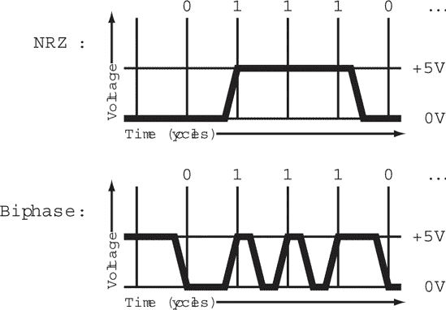
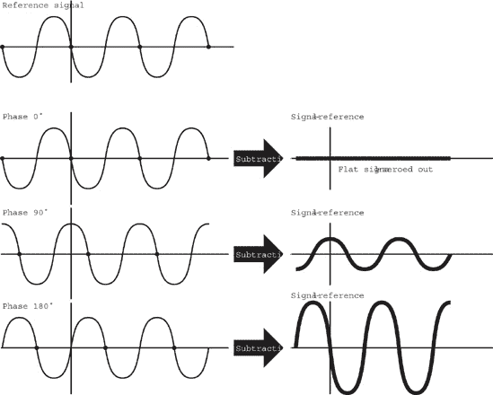
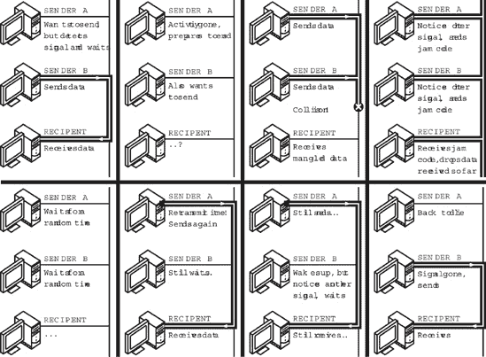
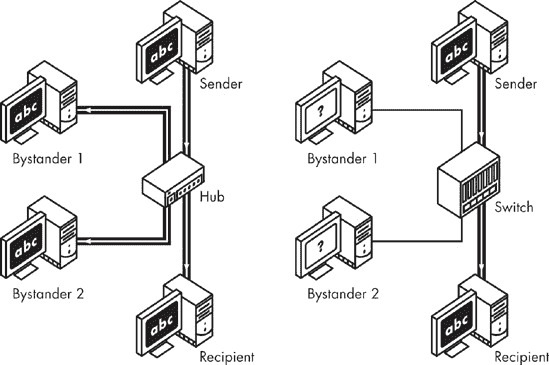
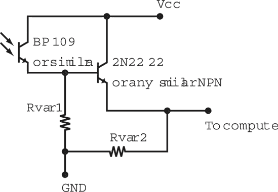
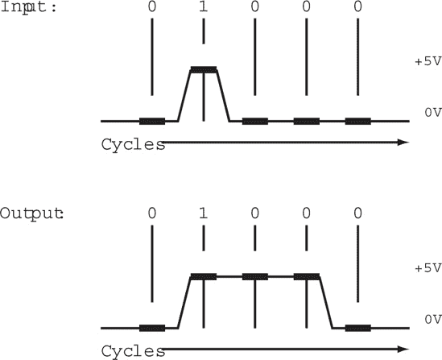
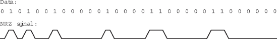
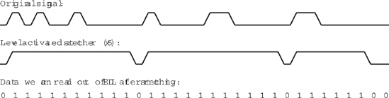
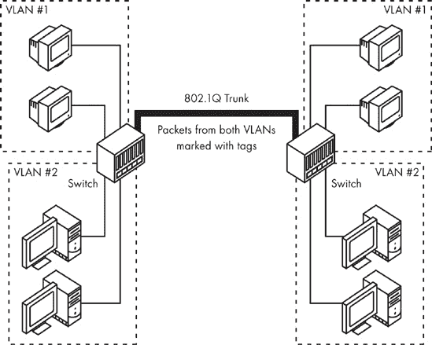
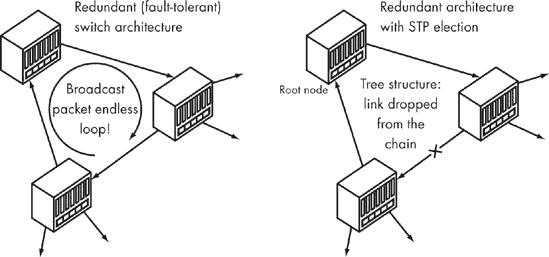

# 第二部分。安全港

*在计算机和互联网之间潜伏的威胁*

—

# 第五章。闪烁灯

*我们得出结论，美丽也可能致命，我们学会了从 LED 中阅读*

—

本书的第一部分关注与数据输入点系统设计相关的各种问题。这些问题仅限于通过观察似乎无关的行为模式来推断输入，这些模式是由对系统具有本地访问权限的用户观察到的。但随着信息沿着其路径进一步移动并离开这个系统，其暴露范围扩大，问题变得更加具体。

本书第二部分关注数据仍在可触及范围内，但刚刚离开原始系统时出现的一些问题——在它进入互联网之前的一瞬间。这里讨论的暴露范围限于大约一个局域网及其直接周边的物理足迹。在这个层面上进行攻击需要观察点位于源头附近，但不需要系统级访问权限。

本章讨论的具体问题与之前讨论的问题略有不同：现在的暴露现在在硬件层面上体现，类似于 TEMPEST，但有所不同。这一现象的美丽之处，以及无需专用设备就能轻松观察到的便利性，完全有理由更深入地研究它。

# 传输数据的艺术

计算机与其他电子设备进行通信的需求自实用计算开始以来就显而易见，实现这一任务既可靠又经济困难。我们可以通过在所有主要组件之间提供充足且定制化的接口，保持精确的信号特性，并使用所有操作的公共参考时钟来控制机器的内部通信，这样接收者总是知道何时监听，发送者总是知道何时传输数据。但是，在更长的距离或非专业、廉价的接口设备上进行通信则是一个不同的挑战：计算机被迫通过一种通常不允许我们习惯于在单台机器内部进行操作的自由度进行通信。

实际上，情况正好相反。客户期望简单、方便、实用且价格低廉的解决方案，而要求通过一根价值 100 美元、3 英寸长、100 芯的电缆将计算机连接起来，似乎并不是一个获胜的解决方案。简单是一个必需品。任何外部通信通道的核心几乎总是依赖于后续比特的串行传输，只有当这些比特重新组装并分组在一起时，才能产生数值、文本字符串或其他数据，这些数据是发送方或接收方机器环境中的原生数据。在最看似微不足道和明显的情况下，当仅通过一对电线连接的两台机器或设备需要交换信息时，它们通过将其中一根电线相对于另一根（参考）线设置为高电压或低电压（或者使用任何其他不同的信号或状态）来实现。它们这样做是为了以给定的频率发送后续的数据比特——这个频率必须在两个设备上保持合理接近并同步。

即使在这样的简单设计中，也会立即出现许多问题。首先，设备没有共享一个参考时钟。尽管两者都有基于石英的内部时钟，但由于细微的制造缺陷、干扰和其他物理条件，没有任何两个经济实惠的时钟足够精确，能够在较长的时间内保持可靠和快速的通信。串行通信需要精确的同步。简单的位编码方案，通常称为非归零（NRZ），简单地输出一个信号（电压）表示 0，另一个信号表示 1。在这样的系统中，当值定期变化时，很容易保持两端同步——系统只需检测下降或上升沿，将其用作粗略的参考，并相应地调整自己的时钟。但是，给定一个较长的 1s 或 0s 序列，接收方很难准确地确定正在发送多少比特。事实上，即使是微小的时钟漂移也可能导致问题，而且在交换恒定序列的比特时无法补偿这一点。

显然的方法，即简单地通过一个单独的、可区分的时序信号将数据交织在一起，并不总是最方便和高效的方法；增加的复杂性和降低的吞吐量通常被视为一种麻烦。

为了有效地解决这个问题，许多系统使用一种称为**曼彻斯特编码**的方案，也称为**双相码**。曼彻斯特编码的算法，如图 5-1")所示，与 NRZ 一起展示，使用信号边缘来编码数据，而不是使用信号电平。原始的、上述 NRZ 编码使用一个内部时钟以恒定的速度测量电压水平，将低电压解释为二进制 0，将高电压解释为 1。另一方面，曼彻斯特编码通过从低电压到高电压或相反的转换来传输数据。在这种设计中，信号切换到高电平表示二进制 1，切换到低电平表示 0。11]

尽管这种编码不需要时钟保持同步，但它本身也并不足够：无法编码两个二进制 0 或 1，因为不可能在不返回到低电平一半路程的情况下两次从低电压到高电压（反之亦然）。为了允许这种类型的信息被编码，忽略在下降或上升信号边缘之后立即发生的转换，从而允许系统通过在半周期中返回到相同的电压来编码 0 和 1 的多个出现。为了管理转换后的“黑屏”期，需要一个简单的单次间隔时钟。

图 5-1. 串行线路传输编码——NRZ 和双相（曼彻斯特）

基于上述讨论的自同步方案的串行线路设计通常被扩展以提供全双工通信，在这种通信中，双方可以同时交谈，要么通过使用两条独立的线路（发送和接收，简称 Tx 和 Rx）或通过使用高级回声检测和消除技巧来区分其自身的信号和从另一侧发送的数据。某些介质需要或允许更复杂的信号方案，例如在每个周期中发送不止一个比特；然而，通信的基本原理仍然是相同的，在整个领域内，使用最低可能数量的线——通常是两条——的曼彻斯特编码非常普遍。

在掌握了“线对”串行通信的基本知识后，让我们来看看网络世界中两个突出的串行通信示例，看看它们如何内部交换数据，以及如何查看这些信息在没有用户注意的情况下泄露给第三方。

## 从您的电子邮件到大声噪音……来回往返

毫无疑问，最受欢迎的长距离计算机通信设备是调制解调器。最初在 20 世纪 50 年代推出，用于在偏远地点维护和控制某些类型的军事设备，调制解调器将互联网带给了大众。尽管今天通常被认为有些过时，但调制解调器催生了许多先进技术，例如经济实惠的高速数字用户线路（DSL）系统或电缆调制解调器。这些设备都使用相同技术集的巧妙变体，通过电话线或其他非专用模拟媒介使用可听或不可听信号进行通信。对改进调制解调器所投入的研究也促进了我们对电子学中众多大规模设计问题的理解，特别是计算机和网络设计。因此，了解调制解调器的工作原理对于探索其他，可能更现代的长距离数据传输方法至关重要。

电话线的通用性使其成为计算机用于通信的自然媒介。电话线几乎无处不在，电话系统提供了出色的呼叫路由能力，使得几乎可以轻松地到达任何地点。然而，有一个小小的注意事项：电话线原本是为了传输人类声音而设计的，这些声音以波形形式在狭窄的频率响应范围内（通常不超过几 kHz）传输。因为这些频率被记录为两根电线上的电压变化，并通过多个模拟中继器和放大器进行传输，所以传输的标准质量并不特别高。它只需要足够好，以便人们能够听到并理解对方，而且由于人脑是一个出色的信号滤波和处理系统，偶尔的噪音或音量波动并不是什么大问题——直到后来，当客户变得稍微挑剔一些。

与此相反，计算机通常被设计用来交换二进制信息，这些信息通过在精心设计的、较短的线路中使用相当精确的电压水平进行编码，这些线路具有良好的信号特性和低电容——这与长距离、保护不良且信号特性不足的电话线路正好相反。计算机还需要比人类通常的速度快得多，并且需要交流的信息量也大得多。因此，调制解调器设计师们（这里是一个巨大的夸张）面临着一项艰巨的挑战：他们必须确定一种方法来编码数据位，不仅能够通过线路高效地传输到远程系统（曼彻斯特编码使这一点变得稍微容易一些），而且还能够作为可听信号，在线路的另一端准确地区分，无论电压变化和其他传输伪影通常是完全不可预测的。他们必须采用鲁棒的错误纠正算法和可变传输速度来补偿线路质量差、偶尔的串扰、卡车压过地下电话线、鸟儿在电线杆上筑巢等情况。设计师们点头、挠头，也许在 40 年后，他们为我们带来了一个既经济又相当快速的计算机间通信方法。让我们简要地看看这一发展过程以及技术是如何在接下来的几十年中成熟——尽管本质上保持不变。

商业调制解调器开发和标准化的历史始于 20 世纪 60 年代，当时提出了两个标准，即 Bell 103/113 和 V.21。这两个标准都提供了一种在当时令人惊叹的 300 波特（每秒比特数）全双工连接，使用的技术称为*频率移位键控*（FSK）。FSK 是一个听起来很神秘的术语，实际上代表了一种相当简单的信号编码方案：它使用两种不同的音调来表示不同的值，一个频率表示“低”，另一个频率表示“高”。使用可听频率而不是其他类型信号的优势相当显著：这是唯一一种可以在电话系统中相当好地转发的信号——毕竟，这就是系统的设计目的。所有其他信号在最佳情况下可能被彻底破坏，在最坏的情况下，可能被线路某处的带通滤波器立即过滤掉。

除了 FSK 编码外，上述贝尔 103/113 和 V.21 标准将电话线可以传输的频率范围分成两部分：一端调制解调器，即呼叫者，使用 980 Hz 来编码低频，使用 1,180 Hz 来编码高频。另一端，即应答者，使用频谱的高部分：分别为 1,650 Hz 和 1,850 Hz。为什么以这种方式分割频率？因为电话线本质上只是一对电线，可以被两个设备同时用来传输（全双工），但前提是它们能够处理它们各自的传输会相互叠加的事实。在全双工通信中，每个设备必须能够区分自己的信号和它接收到的数据，并将其过滤掉。如果不能成功做到这一点，每个设备在另一端说话时都必须暂停（单工模式），这会严重损害已经不太令人印象深刻的吞吐量。通过分割频率，电话线本质上被用来传输它视为两个不同的“声音”，从而确保可以无冲突地同时进行通信。

调制解调器在正确的方向上又迈出了 25 年的步伐。下一个主要的标准集，贝尔 212A 和 V.22，迈出了巨大的步伐，并放弃了频率移位键控，转而采用*差分相移键控*（DPSK）。DPSK 不是改变波的频率，而是通过改变其相位来表示不同的值。

相移技术本质上引入了最小的时间移位或延迟，导致输出音频信号略微与原始参考波不同步，同时保持完全相同的形状（参见图 5-2）。

图 5-2. 频率移位与相移

相移的值，也称为*移位值*，用度数表示（这是对其对三角函数影响的一个参考：y = sin(x)通过 90°移位与 y = sin(90° + x)完全相同。360°的移位值表示整个波长的移位，这简单地将波重新同步，对波形没有影响。各种相移的对应关系如图图 5-3 所示，在左侧。

一旦双方同步并且有方法将电缆接收到的信号与预期的波形进行比较，实际编码的数据就可以轻松检索。差分电路可以比较两个信号，将它们相减，并通过将其与参考信号进行比较，轻松确定信号的精确相位偏移，如图图 5-3 所示，在右侧。

新标准还利用了一种更先进的数据编码方法。与之前简单地使用两个交替信号来传输 0 和 1 的情况不同，V.22 编码整个*二进制*——即比特对的俚语。一次编码两个比特可以通过使用四个相位偏移值来实现，所使用的偏移量用来表示每个可能的值，以便值在整个 360°频谱中均匀分布，并且可能相隔最远——因此可以很容易地区分彼此（参见表 5-1”))。

图 5-3. 相位偏移信号（左）和减去参考波形以更容易区分相位的結果（右）

使用二进制允许显著提高传输速度（1,200 波特），而无需增加实际信号调制的物理速率。每个单个蜂鸣声可以携带两倍多的信息——两倍的比特数。

表 5-1. 使用相位偏移来编码两个比特的数据（二进制）

| Dibit | 相位偏移 |
| --- | --- |
| `00` | 90° |
| `01` | 0° |
| `10` | 180° |
| `11` | 270° |

### 备注

虽然在理论上使用这种扩展字母表——即类似于二进制（具有超过两种状态，因此可以一次编码多个比特）的复合信号单元——与 FSK 编码也是可能的，但这样做会有些问题。FSK 信号必须避免通过电话系统发送时特别容易失真的次谐波和其他频率，从而严重限制了可能的状态集。DPSK 相对于 FSK 的优势在于它使用一个已知会导致最少传输问题的固定频率，因此可以在更高的传输速率下更可靠地使用。

在接下来的几年里，研究步伐加快了一些，出现了一些新的标准。V.22bis 标准将宽字母表信号的概念进一步发展，将 DPSK 与信号幅度（响度）调制相结合，构建了一个包含 16 个可能值的二维集合。从测量信号到二进制值的转换使用二维表格表示。信号对应的值首先根据测量的相位偏移值查找列，然后根据幅度测量查找行。一个简化的但类似的二乘四示例显示在表 5-2 中。

表 5-2. 使用两个不同的信号参数对三个比特进行二维编码

|    | 相位 0° | 相位 90° | 相位 180° | 相位 270° |
| --- | --- | --- | --- | --- |
| **低幅度** | 000 (0) | 001 (1) | 010 (2) | 011 (3) |
| **高幅度** | 100 (4) | 101 (5) | 110 (6) | 111 (7) |

为了增加混乱，这种新方法被称为**正交幅度调制**（QAM）。QAM 再次使得从 1,200 bps 提高到 2,400 bps 成为可能，而实际上并没有提高信号调制速度，而是通过扩展单个信号原子可以具有的意义的数量。

下一个主要的发展步骤是 V.32。V.32 是第一个引入新概念的设计：它不是分割频率，而是使用先进的回波消除电路^([12])来检测和减去设备本身通过线路传输的信号。这项技术使得发送方和接收方都可以使用整个频谱，而不仅仅是其中的一半，同时仍然进行全双工通信。

发展持续进行，V.34 协议很快出现。尽管在多年间，信号在引入过度失真之前可以安全交替的速度没有明显变化，但该标准比其前辈要快得多。V.34 实现了 28,800 波特的吞吐量，有时通过制造商仅发送大约 2,500 到 3,500 个信号样本（字母表符号）每秒，将其推到了一个非官方的速度 33,600 波特（33.6 Kbps）；然而，它结合了四种不同的编码方案，构建了一个具有 1,664 个可能状态的四维结构，使得一次可以发送多达 41 比特。实际上，这并不是关于原始速度，而是关于如何使用你所拥有的。

人们普遍认为，V.34 标准及其衍生标准在通过以语音为导向的电话系统传输数据方面接近理论极限。尽管考虑到 56 Kbps 调制解调器的普遍存在，这个说法可能显得有些奇怪，但有一个转折：56 Kbps 设备以与模拟解决方案完全不同的方式实现这种传输速率。鉴于大多数电话系统自从调制解调器最初开发以来已经从模拟迁移到数字，并且大多数拨号服务提供商现在可以直接将他们的系统与数字电信系统接口，服务提供商可以回归最明显但直到最近仍不可能的解决方案：在向用户发送数据时改变线路电压而不是改变频率。因为信号从一开始就是以数字数据的形式传输的——并且只能通过埋设的铜线传输到最近的电信设施——实际上没有信号质量问题，唯一的限制是电话系统硬件中设计的语音承载能力。以每秒 8,000 个符号的速度工作，但使用相当小的字母表（通常约为 128 个符号或电压等级），可以使用 56 Kbps 调制解调器以比通常更高的速度向连接到数字电话系统的用户发送数据。尽管上行传输仍然以传统方式实现，速度相当慢；因此，调制解调器只部分达到 56 Kbps，并且只有在条件允许的情况下。

## 今天的日子

自从调制解调器技术的构想以来，变化不大。随着传输协议的进步，所需的错误纠正和回退机制也相应发展，以确保当您最喜欢的四足动物决定咬电话线时，仍能保证可靠的传输。产生了许多标准：V.42 提供了一个基本的 CRC（循环冗余检查）实现，MNP-1 到 MNP-4 提供了专有的错误纠正算法，V.42bis 和 MNP-5 提供了完整性检查与压缩相结合，等等。但真正的革命尚未到来。

或者是吗？你可能会争辩说，DSL 和电缆调制解调器是一项革命性的技术，它改变了世界。我愿意争辩：事实上，它们与它们的较老版本——调制解调器——非常相似。这两者之间唯一的显著区别是，另一个端点——处理所有连接的服务器——已经从服务提供商所在的城市移动到了最近的本地电信设施，并且可以通过来自客户住宅或商业建筑的铜线直接连接到它。因为这种直接连接再次没有通过任何其他设备，这些设备可以使用高、不可听见的频率和更微妙的信号，否则这些信号会在电话网络中被扭曲或根本无法中继。相比之下，那个好老的调制解调器严格限于电话系统旨在携带并且能够良好携带的窄带范围内的可听频率和信号。在许多方面，DSL 设备比老式调制解调器更容易。

正如我们所见，设计调制解调器实际上是一项相当复杂和困难的任务；这就是为什么我们花了数十年时间从笨重且昂贵的 300 波特设备发展到现在的水平.^([60]) 令人惊讶的是，所有这些设备都可以相互通信，甚至可以与十年前的设备通信，即使是在我们早已遗忘的最低速度下。同样，它们通常都了解迄今为止的规范，包括每个规范的数十个替代方案和分支。这难道不是使调制解调器成为计算机工程奇迹的另一个原因吗？

但是谁在拉这些线呢？

## 有时，调制解调器仅仅是一个调制解调器

调制解调器之间的通信当然不是故事开始或结束的地方。调制解调器只是一个小巧而几乎无用的中间件，甚至不是一个好的镇纸。为了使调制解调器有用，它必须能够与计算机通信以接收命令和交换数据，即使它只是被用于像随机网页浏览这样微不足道的事情。内置调制解调器比较容易：ISA（集成系统架构）、PCI（外围组件互连）、PCMCIA（PC 内存卡国际协会）以及一些其他专用总线提供了高速且相当慷慨的并行接口，使得通信过程几乎变得微不足道。

然而，外置调制解调器（无论是模拟的还是 DSL 类型的）必须通过串行链路来处理事情。大多数模拟调制解调器使用众所周知的串行协议 RS-232（在 90 年代更名为更具描述性的 EIA/TIA-232-E^([61]));许多较新的调制解调器使用 USB（通用串行总线）。当我们接近这些设备的信息披露场景时，我们还想一瞥调制解调器和计算机之间数据传输过程中发生的事情，因为这在攻击中起着至关重要的作用。

尽管外部调制解调器必须使用不人道的手段与远程系统以及本地机器本身进行通信，但由于计算机的邻近性和接口如 RS-232 是数字的，并且最初是为计算机设计的，这一阶段仍然比著名的电话线路调制解调器的调制解调和解调要简单得多。

RS-232 使用了一种相当直接的二进制编码实现，用于在两条独立的线上交换数据，并辅以一组 NRZ 控制线。为了让生活更有趣，RS-232 还提供了一系列的链路或协议功能，这使得从头开始实现它变得相当困难：它的异步特性、广泛的可能设置和速度，以及不寻常的电压水平。但即便如此，对于处理过电话线路信号调制的实现者来说，RS-232 仍然算不上真正的挑战。

另一方面，USB 试图标准化和统一串行接口。尽管 USB 需要比 RS-232 更高端的电路来连接计算机和设备（其中之一是因为更高的抽象层次和更高的支持传输速度），但 USB 是通用的（因此得名），并且具有更少的怪异性和遗留功能。

最后但同样重要的是，与本地设备通信的常用方法是使用以太网，这是一种与 USB 类似但更早出现的机制。让我们现在来看看以太网，我相信所有这些通信协议最终都会在同一个地方相遇。

## 控制碰撞

从本质上讲，以太网网络是一种多党串行链路的高级类型。62 一个以太网网络由多个通过共享介质连接的计算机组成——在最基本的形式中，这只是一对相当规则的电线。当网络上的设备使用介质时，它会将特定的电压应用到电线上，所有其他连接的系统都可以通过测量电压来解释数据。一系列的检查确保设备不会同时尝试使用链路，如果发生意外，恢复过程将很顺利。尽管如此，即使考虑到这种可能性，与调制解调器相比，基本设计仍然令人难以置信地简单。

为了解决双方同时说话的问题，使用了一个名为载波侦听多路访问与碰撞检测（CSMA/CD）的标准作为控制所有通过以太网通信的核心机制。在发送任何数据之前，连接到以太网的每个设备都遵循 CSMA 程序，通过检查调制解调器的电气特性来查看是否有其他设备正在使用电缆。如果没有其他传输发生，设备进入传输阶段，并将数据发送给所有设备。

在这个阶段，数据以比特序列的形式通过*双极性编码*在电线上发送；流量包含一个带有所有必要发送者和接收者信息以及一个适当的校验和的报头，旨在保护数据在遭受外部或内部干扰时的完整性，无论是四足动物还是其他。一个将自己视为代表接收方行事的网络接口，可能通过比较数据包中提供的观察到的目标地址与其存储在卡上的唯一 MAC（硬件）地址进行比较，应该接受这种流量并验证校验和。同时，所有其他方都应该忽略这个帧；自然地，如果他们不这样做（几乎每张卡都可以被指示不要这样做），用户可以查看或对指向其他人的流量做出反应。（你可以看到以太网是如何在设计精神上体现了远不可及的信任和利他主义——一种高尚但风险较高的方法。）

在以太网网络上，两个设备可能在同一时刻开始发送数据，尽管它们刚刚检查了微秒或纳秒前是否有其他方正在传输。如果它们确实在完全相同的时刻传输，灾难几乎是不可避免的。两个传输被混合并损坏，发送的数据在目的地应该无法通过校验和测试……或者不是吗？

尽管在以太网帧规范中实现的校验和通常足以验证数据传输的准确性，但如果链路饱和且在短时间内发生数百或数千次冲突，它可能并不特别有效；它只是足够小，有时会意外地正确。概率法则告诉我们，一些损坏的包——仅仅通过偶然——会有与原始包相同的校验和。此外，即使我们忽略校验和不足的问题，我们仍然希望尽快停止冲突——如果让冲突肆虐，你可能会发现你不再能够确保网络中损坏和丢失的帧的及时重传。毕竟，发送者发送时没有表明任何问题，而接收者甚至没有收到任何类似有用数据包的东西。

解决方案包含标准的后半部分：碰撞检测（CD）。规范要求发送者在向他人解释他们的业务时监控网络链路。如果检测到另一方试图同时说话，那么应该检测到（再次，通过简单地测量线路的电气特性），并且应该立即中止传输。设备还应发送一个特殊的拥塞代码，以确保两个帧（正在发送的帧和干扰它的帧）将被无条件丢弃，甚至没有到达校验和验证；接收方应该能够识别拥塞代码并停止处理中的数据接收。设备在每次尝试（称为重传退避）之后都会空闲一段逐渐增加且最好是（最初）随机的时期，以最大限度地减少后续碰撞的可能性。

### 注意

一个有趣的事实：拥塞代码机制对协议提出了一个不寻常的要求。所有帧都必须有最小（！）长度，其值计算得使得在传输完成之前，拥塞代码能够生成并传播到所有机器。对于非常短的帧，可能没有足够的时间实现这一点。因此，发送者需要人工填充所有他们的输出传输。

图 5-4 显示了典型碰撞场景中事件的精确顺序。正如你所见，发送者 A 希望向接收者发送数据，但注意到另一个传输正在进行，此时他们决定等待那个传输停止。发送者 A 随后准备发送数据，但不幸的是，发送者 B 也做了同样的事情，并且双方都得出结论，几乎同时发送数据是安全的。

两次尝试都试图传输，数据被破坏，此时双方都检测到对方的传输，并迅速发送一个拥塞代码来指示接收方忽略这个帧。最后，双方发送者都会退避一段时间，并希望在下一次不会同时开始。

## 背后故事：布线汤和我们是如何应对的

尽管不是特别可扩展或优雅设计的例子，但以太网协议非常强大且易于部署；它使得使用同轴电缆在几乎任何地方构建廉价的对等结构网络成为可能。因此，它已经成为一个事实上的标准，取代了许多其他（有时甚至更优越，但更昂贵或专有）的网络架构。

图 5-4. 典型以太网对话的阶段

自然，简单的同轴电缆以太网有其局限性和缺点；它基本上是基于一根长长的电线，各种设备连接在它的各个位置，两端都有电阻，这不是你希望在大型办公室中负责维护的东西。一个简单且难以调试的事故，比如短路终端，可能会使整个基础设施崩溃。一个更先进——但仅略贵一点的——替代品受到了热烈的欢迎。

电子多端口中继器（集线器）使得使用双绞线（Cat-3 和 Cat-5 电缆带 RJ-45 连接器）进行布线变得几乎不需要费力。要使用它们，你只需将一根线从你的机器插入一个黑色盒子，然后所有连接到这个黑色盒子的其他设备都可以与之通信，而不必过多考虑电气问题或单根电缆故障导致整个网络崩溃的风险。

*集线器*本质上是非常简单的中继器，它们将接收到的所有流量广播到所有其他端口。它们使得构建易于重新配置和更可靠的星型网络成为可能，但除此之外它们几乎不做其他事情。随着网络的扩大，将每比特信息广播到所有位置的成本，以及在整个网络中一次只有一个参与者可以发言的事实，都使得这种设计的简单性成为其主要弱点。

*交换机*最终成为了解决方案。交换机是集线器的下一代产品。配备了一个不错的处理器和一些内存，它们是比集线器更昂贵的替代品，在正常情况下，它们提供了对以太网帧的额外高级分析。这种分析将硬件地址与特定端口关联起来，并通过将某些数据包直接发送到适当的端口（在单播模式下），而不是广播给所有参与者（见图 5-5)来优化帧路由。这在更大型的网络中大大提高了性能。

### 注意

另一个有趣的事实：现在的真实集线器几乎已经灭绝。几乎所有标榜为集线器的 10/100 Mb 设备实际上都使用基本的交换芯片组；重新包装芯片比开发和维护几个变体要便宜得多。

图 5-5. 本地网络中集线器与交换机的对比

我猜这时你可能在想，你到底要带我去哪里？调制解调器与信息披露有什么关系？在这个背景下串行链路有什么意义？以太网网络如何适应？闪烁灯光究竟是什么？

很高兴你问了。我正要说到那里——也就是最后一个问题。

## 通信中的闪烁灯光

从历史上看，几乎所有的冰箱大小的计算机都配备了众多显眼的诊断接口。这些接口包括一系列小灯，它们显示的内容包括机器内部状态的一些神秘属性，例如内部寄存器或核心处理单元的标志，或者显示今天是否给住在下面的猫喂食了。随着计算机变得更加可靠和紧凑，普通用户不再需要理解机器的内部结构才能高效地使用它，这些灯开始从许多设备中消失。不断增长的时钟速度也导致了这种下降——大多数时候，人类已经无法从这种每秒变化数千或数百万次的视觉信号中获得任何有意义的信息。

然而，在某些应用中，这些灯仍然存在；例如，几乎所有的网络设备在其前面或后面面板上都有发光二极管（LED）。这些提供了链路诊断，例如指示特定模块或插槽是否正常工作，是否有连接，数据是否正在传输等等。这些灯不仅仅是诊断工具；它们的催眠模式具有奇特的吸引力，它们的神秘感在进入服务器房间领域的普通人心目中播下了不确定、恐惧和尊重的种子。

术语 *blinkenlights* 或 *blinkenlichten* 自从计算机的黑暗时代以来就被用来描述计算机设备上备受喜爱的诊断 LED 机构，那些在终端孤独长夜中度过，被舒缓的绿色灯光沐浴的计算机极客。它源自一份有趣的恶作剧便条，这是一份模仿德语的便条（本身是对二战时期另一个非计算机笑话的恶搞），大约在 20 世纪 50 年代在 IBM 实验室展出。这份便条后来传播到世界各地的多数服务器房间和计算机科学实验室，内容如下（摘自 Eric S. Raymond 的《黑客字典》）：

通信设备是最后一个仍然盛行和繁荣的闪烁灯领域。但不仅如此。几乎所有这些设备都使用串行线路进行通信。为了简单和美观，有时“活动”LED 几乎直接通过一个简单的驱动电路连接到设备的发射或接收线路。帷幕落下。

* * *

^([11]) 或者反过来，这取决于发射器的设计。

^([12]) 消音电路试图区分由设备本身发送的信号和来自另一方的信号，并消除或显著减少前者。这类设备的各种类型不仅广泛应用于数字数据传输，而且用于提高电话通话质量，消除公共活动中的麦克风反馈，以及解决许多其他日常问题。

# 美学的影响

这个问题被发现花费了数十年时间，一旦发生（在 2002 年），它对我们所有人来说都如此明显和简单，以至于我们想要敲打键盘几次。

Joe Lughry 和 David A. Umphress 在一份题为“光辐射信息泄露”的研究论文中^([63])发现了一种新的信号泄露场景，在特定类型的网络设备中，最常见的是调制解调器。他们得出结论，观察这些灯光的人可以超越仅仅用肉眼观看这些神奇灯光。

与白炽灯泡不同，LED 灯通常具有很短的上升和下降时间，这意味着它们几乎可以瞬间开启和关闭。这并不令人惊讶；毕竟，高端 LED 被用于控制光纤链路和一些其他光电通信通道。因此，连接到串行数据传输线的 LED 闪烁实际上可以经常反映传输线上发生的单个比特。如果有一种方法可以以足够快的速度记录这种活动，那么应该可以从至少你用肉眼（或用长焦镜头）可以看到的设备上的微小闪烁灯光中检索到这些信息。

这项研究在业界引起了一些轰动；它最终既被轻描淡写，又被过度炒作，因此随之而来的是大量的混淆，几乎没有发生变化。这篇论文导致了许多相互矛盾的报道，但它的基本前提简单而真正美丽。这种技术的美妙之处在于，设计这样的接收设备非常简单：与 LED 一样便宜且受欢迎的替代品——光电二极管和光电晶体管——很容易获得，并且同样容易与计算机接口。而且，曝光区域，与我们在第三章中讨论的大多数 TEMPEST 活动不同，不仅仅是城市传说和纯实验室结果的主体，而且可以直接观察和测量。

在他们的研究过程中，作者进行了一系列实验来验证信号可以从 20 米（不到 100 英尺）远的地方成功获取，而不需要额外的数字信号处理。常识表明，这实际上可能是一个低估，尤其是在使用良好的光学设备时。（作者在测试中使用了 100 mm 焦距、f/2.0 的镜头，但许多中端单反相机摄影爱好者都可以获得更好的远摄镜头。那些愿意花钱的人可以购买焦距高达 1,200 mm 的高质量镜头。）

在某些情况下，论文采取了防御性的立场，一个仔细的读者可能会倾向于得出结论，一些被分类的设备并不容易受到该问题的影响。特别是，一些以太网设备可能表现出更微妙的漏洞变体，正如你将在本章后面的预防部分中看到的。但首先，让我们用我们自己的（计算机化）眼睛来看看这个问题，好吗？

# 构建自己的间谍装备……

构建窃听设备的简单性使其颇具吸引力。本节包含了一些关于如何构建和连接此类设备到普通计算机的建议和粗略的电路图。尽管电路并不特别复杂，也不需要焊接和印刷电路板设计软件的硕士学位，但至少需要具备一定的电子学知识和一些常识。尽管今天计算机的外部接口相当坚固且不易出错，但在疯狂的创新方式下连接自制设备时，总是存在损坏设备的风险。这种情况甚至可能发生在我们最好的情况下。

基线设计极其简单。它需要一个单光敏晶体管（由内置光电二极管驱动的晶体管组件），一个普通的低功耗 NPN（负-正-负）晶体管来进一步放大信号（不一定总是必要的），以及一套电位器（可能为 10 kΩ，以便有足够的灵活性）来实验性地降低电压并控制电路的灵敏度和阈值点。对于组件没有特别的要求，尽管你的使用效果会根据你使用的组件而有所不同。不过，务必选择一个在可见光范围内有良好响应的光敏晶体管，尽管所有便宜的光敏晶体管都应该可以工作。（作为参考，绿色 LED 发出的波长约为 520 nm。）

一个示例电路设计如图 图 5-6 所示。

图 5-6. 简单接收电路

该电路的最佳运行电压约为 5V，最大电流较低：一个能够提供大约 10 到 50 mA 的电源就足够了。警告：如果您使用能够提供更高电压的电源，您将冒着损坏端口或计算机的风险；同样，如果您使用更强大的电源并且没有防止电路中流动更高的电流，也会造成风险。

### 注意

将 Rvar1 或 Rvar2 设置到非常低的电阻可能会短路电路。如果您想盲目地摆弄旋钮，可能最好添加一个固定电阻以限制电流消耗。

您必须屏蔽光电晶体管免受外部光源的影响——例如，通过将其封装在一个不透明的管子中。因为光电晶体管没有聚焦机制，它不太可能捕捉到更远的信号（除了环境光）。因此，对于初始测试，完全覆盖它以模拟黑暗，然后放在 LED 旁边以激发电路是一个好主意。您还可以在 GND 和输出线之间临时连接另一个 LED 来测试电路。当传感器指向光源时，测试 LED 应该点亮，否则应该相当暗。

# ...以及使用计算机

如果带有测试 LED 连接的电路到目前为止工作正常，那么做得好；你已经构建了一个花哨的电视遥控器测试器。因为通用的、便宜的光电晶体管渴望捕捉红外光，你的创造应该能够“翻译”红外光（IR）为可见光，但这几乎就是它能做的所有有趣的事情。为了使其更有用，你需要将电路与计算机连接起来。如果您的计算机有一个行打印机接口（LPT），这是一个很好的方法。不幸的是，这个出色的硬件黑客工具正在被一些更紧凑和花哨的设计所摒弃。

虽然最初设计为单向（仅用于输出），但 LPT 接口提供了一些状态反馈线，如“纸尽”、“忙碌”和“确认”，旨在为打印机提供抱怨问题的手段。您可以通过访问 PC 兼容系统上的端口 0x379（LPT1 状态寄存器）轻松读取通过此接口发出的数据。通过将电路连接到并行端口，您可以轻松地将信息传回计算机。虽然您可能希望将电路连接到不同的接口，但 LPT 比 RS-232 等其他接口要快得多，而且您不必处理任何平凡的协议、信号方案或异常的电压水平。此外，与 USB 和一些其他当前解决方案不同，您不需要特殊的控制器来实现一个相当复杂的协议，甚至能够与您的 PC 通信。

### 注意

虽然 LPT 也提供双向操作模式（ECP 或 EPP），但对于如此简单的任务尝试使用此功能通常是没有意义的。在单向模式下，有四个输入位可用，对于此应用来说已经足够；切换到双向模式如 EPP 或 ESP 可以提供额外的四个位。

选择要使用的状态行由您决定。表 5-3 显示了用于打印机端口的 DB25 连接器的引脚布局。灰色阴影的行可用于输入。

要将电路与该端口接口，您只需将连接器上的地参考点与电路中使用的地连接，然后将输出线连接到任意五个引脚之一。（请记住先断开用于诊断的 LED。）接下来，在首次将传感器暴露于光线下并覆盖传感器时，监控状态端口。在两种情况下，读取的值取决于您如何连接电路；确切的值并不重要，只要两个值不同即可。

表 5-3. LPT 引脚布局

| LPT 端口：DB25 引脚布局（标准模式） |
| --- |
| 引脚 | 名称 | 功能 |
| --- | --- | --- |
| 1 | 选通 | 控制输出位 0 |
| 2 | D0 | 数据输出位 0 |
| 3 | D1 | 数据输出位 1 |
| 4 | D2 | 数据输出位 2 |
| 5 | D3 | 数据输出位 3 |
| 6 | D4 | 数据输出位 4 |
| 7 | D5 | 数据输出位 5 |
| 8 | D6 | 数据输出位 6 |
| 9 | D7 | 数据输出位 7 |
| 10 | ACK | 状态输入位 2 |
| 11 | 忙 | 状态输入位 3 |
| 12 | 纸张输出 | 状态输入位 1 |
| 13 | 选择输入 | 状态输入位 0 |
| 14 | 自动进纸 | 控制输出位 1 |
| 15 | 错误 | 状态输入（未使用） |
| 16 | 初始化 | 控制输出位 2 |
| 17 | 选择 | 控制输出位 3 |
| 18 | GND | 地（0V） |
| 19 | GND | 地（0V） |
| 20 | GND | 地（0V） |
| 21 | GND | 地（0V） |
| 22 | GND | 地（0V） |
| 23 | GND | 地（0V） |
| 24 | GND | 地（0V） |
| 25 | GND | 地（0V） |

由于芯片逻辑需要与您的测试 LED 二极管不同的输入电平，您可能需要调整`Rvar2`，直到在覆盖传感器和将传感器暴露于光线下时从端口获得不同的读取值。为此，最好能够在计算机上实时监控端口。

监控端口状态的方法将取决于您使用的操作系统和编程语言。如果您使用 C 语言，用于从端口读取值的函数是`inb(port)`，因此在这种情况下，您将发出`inb(0x379)`并检查返回值。在其他语言中，它可能具有类似的名字。（尝试查找`in`、`inport`、`readport`等。）此外，Windows 用户可能会发现内置的“调试”实用程序及其“i”（端口读取）功能非常方便。

### 备注

在某些系统上，例如 Linux，您可能需要请求系统首先给予您访问特定端口的权限。有关`iopl(3)`或类似调用的更多信息，请参阅文档。

到目前为止，您已经准备好出发了。您可以选择将探头指向设备上的任何 LED，根据其亮度调整传感器，并开始读取光和暗信号的交替模式，同时发现它们如何与交换的信息相对应，如果有的话。

### 注意

如果您好奇，您可能会尝试检查指示二极管的亮度，而不仅仅是其状态的二进制表示。结果可能表明，即使特定的 LED 不是为了将串行线上的信号直接映射到其闪烁模式，电路之间仍然存在一些模拟串扰，串行线信号将对亮度产生影响。德州仪器的 TLV571 这样的廉价模拟-数字转换器正是用来这样使用的。

您可以使用这种方法来采样每秒低于 100 万比特的频率，这对于捕获许多接口上的传输应该是足够的，但并不一定适用于以太网端口（以太网端口传输的比特率至少为 1000 万比特每秒）。超过这个捕获能力，您的并行端口（LPT）很可能会达到其物理吞吐量限制，但不要绝望：只要传感器（光敏晶体管）能够以足够快的速度切换以捕获相关通信，您仍然有选择。记住，并行端口（LPT）是一个并行端口。为了达到更快的捕获速度，例如以太网所需的，可以将一个简单的时钟、一个计数电路和一组采样保持锁存器（如 74LS377）结合起来，在计算机端口读取尝试之间顺序存储数据。您可以在短时间内积累这些信息，然后，通过使用不止一个状态引脚（或将端口切换到双向模式），在单个读取周期内一次性发送多个比特——样本——到计算机，从而提高读取速率四倍或八倍。

我将省略进一步的、可能是不必要的对电子世界的探索。如果您想尝试高速或模拟采样，或者只是从组装东西并将其连接到计算机中获得乐趣，您可能想看看我在一个计算机控制机器人设计项目薄薄伪装下的相当全面的入门教程。您应该能在[`lcamtuf.coredump.cx/robot.txt`](http://lcamtuf.coredump.cx/robot.txt)找到它。

现在，对于那些对实用安全更感兴趣的人：简要讨论如何解决这个问题，而不仅仅是用胶带覆盖办公室里的所有 LED。

# 防止闪烁灯数据泄露——以及为什么它会失败

解决这个问题的最简单方法，也是原始研究中提出的方法，是**脉冲扩展**——一种通过延长一些闪烁来扭曲指示器闪烁的实践，从而使任何实际的数据恢复看似不可行。**脉冲扩展电路**是一组相当简单的设备，它们将遇到的“高”输入信号的持续时间额外延长。大多数基本的脉冲扩展器设计依赖于一个在输入信号存在时充电并在之后缓慢放电的电容器。这个电容器连接到一个**二进制判别器**，它不是一个邪恶摔跤冠军的昵称，而是一种通过应用特定的阈值将模拟数据转换为二进制输出的设备（对于所有高于*n*的输入电压输出逻辑 1 的电压，对于所有低于*n*的输入电压输出 0）。在这种情况下，它使用一定的电容器充电水平作为判别点。

更高级和可靠的设计，包括纯数字电路，也很常见，并且所有这些都可以用于集线器和交换机，使 LED 看起来更美观。没有它们，超过每秒 50 次（被认为是我们的闪烁感知极限）的高速闪烁通常会导致我们看到的灯光看起来较暗但似乎恒定。通过延长每个 1 脉冲的持续时间，判别器使得 LED 被 1 驱动比被 0 驱动的频率更高。这使得 LED 灯光更亮，闪烁频率更低。图 5-7 展示了这种脉冲扩展器的行为：单个尖峰（单个 1）被拉伸到原来的三倍长，而所有的 0 都保持不变。

图 5-7. 脉冲扩展器行为，3 倍

虽然它们的主要目的是美观，正如我提到的，这似乎也是解决光发射信息泄露问题的好方法，通过让攻击者只能推断出交通的某些一般属性。因此，在最理想的情况下，攻击者只能推断出交通的一般属性，例如何时有东西被发送，何时没有发送。^([13])

然而，看似良好的解决方案并不总是如此。考虑以下样本数据和相应的串行线路信号：

假设信号是使用 5 倍脉冲扩展器处理的，使得每个 1 持续五次额外的周期。（原始论文建议一个安全的极限是 2 倍，但我们将夸张一下以说明问题。）

尽管与我们要拦截的输入信号相比，可能看起来几乎所有的信息都已经丢失，但通过做出四个重要的观察，我们仍然可以恢复其中大部分信息：

+   显然，所有拉伸器输出为零的区域在原始信号中必须为零。

+   每个扩展的 1 序列必须是由原始流中的起始位置触发的一个 1。

+   每个 L 1 序列最初必须包含至少一个 1，每*N*个周期，其中*N*是此电路的拉伸因子；否则，运行中会有间隙。在单个 1 扩展输出下表示的数据块中的 1 的计数大于或等于 L/*N*向上取整。

+   每个运行在原始流中恰好有*N*−1 个零后结束。我们知道这些零必须由 1 precede；否则，运行将提前结束。

通过将此知识应用于之前的例子，我们可以重建大部分原始数据，如下所示：

在之前的相当现实的例子中，由于脉冲扩展，只有不到 9 个 32 位数据中的数据丢失，无法最终重建（在图形中以问号标记）。因此，我们恢复了 99.999988%的潜在搜索空间。我们必须猜测剩余的数据，而这些数据（尤其是如果被窃听的数据是常规英语文本，如电子邮件）与起点相比，重建起来相当简单。该研究的作者建议，即使 N = 1.5 或 N = 2 的“开启”时间脉冲扩展也足以混淆数据，但这并不一定如此。

之前的重建方案适用于 0s 或 1s 的扩展。一些链路使用归零（RZ）编码（如之前提到的曼彻斯特方案），由于信号不断交替，2 倍扩展确实可能足以混淆所有数据。然而，这只在 LED 由在初始内部解码到 NRZ 之前的信号驱动时才成立——在大多数情况下并非如此。实际上，将脉冲扩展应用于 RZ 编码信号通常是一个愚蠢的想法，因为 LED 将一直处于开启状态；因此，最初做这件事似乎没有意义。

如前所述，另一个问题源于脉冲扩展器的质量和其对其他内部电路干扰的敏感性：在“拉伸”期间导致 LED 亮度略有变化的光电压波动可能会泄露一些信息。特别是基于电容的解决方案可能会落入这一类别。

因此，一些系统，特别是已知部署脉冲扩展的以太网设备，可能部分容易受到攻击，尽管之前讨论的原始论文得出结论，基于使用示波器观察记录的闪烁模式，传输数据与 LED 行为之间没有直接相关性。

最佳解决方案，尤其是在其他类型的编码中，或者当脉冲扩展不是出于某些其他原因（例如，如果设计者想避免在传输期间使 LED 灯持续发光）所希望的情况时，是在相当低的频率（例如，20 Hz）下采样线路，并将其锁定到一个寄存器中，该寄存器在下一个采样之前保持其状态，并控制 LED。

现在，让我们回到普通的英语。

* * *

^([13]) 从技术上来说，这仍然是一个攻击场所，根据第一章中的讨论，但它相对不那么有效和实用，因为我们只能得到一个大致的了解，而不是数据的副本。

# 思考的食物

除了网络设备的 LED 灯之外，还可以找到许多其他同样有趣的光辐射泄露场景，尽管泄露的信息量可能显著较低。例如，考虑磁盘活动 LED 灯。当然，磁盘通信并不是使用串行信号；相反，数据的一部分，从字节到 32 位字，是通过一组信号线同时发送的。而且，尽管 LED 灯通常只连接到指示特定控制线状态，但通过测量寻道时间或存储和读取的数据量，仍然可以推断出许多系统活动的方面。（根据 LED 灯实际连接的位置，可能可以测量其中一个或两个。）尽管这些信息可能不会给攻击者带来任何立即的优势，但某些诱导的 I/O 活动可以与硬盘驱动器 LED 观察相结合，得出有趣的结论，尽管我对这个领域的任何研究都不了解。

其他潜在的攻击场所涉及许多 USB 设备和其他专有接口。如前所述，USB 是一种串行总线，一些 USB 设备确实有活动指示器。

还提出了各种其他不寻常和神秘的信息泄露场所，部分进行了研究或至少进行了尝试。这包括通过分析 CPU 根据执行指令消耗不同级别的功率时充电电容的声学效应^([64])，或者通过统计分析帮助分析其功耗来测量黑盒设备^([65])。再次强调，除了经典的电磁场（EMF）辐射之外，还没有对泄露通道领域进行真正全面的研究——这似乎是一个很好的研究想法。祝你好运。:-)

# 第六章。过去的回声

*在以太网漏洞的例子中，我们了解到精确表达的好处*

—

上一章讨论了以太网通信的基础。这个看似无懈可击且令人惊讶简单的机制似乎无法引起严重的安全问题，除了可能由于向网络上的所有方定期广播数据而导致的信任关系滥用。这是以太网网络众所周知且被充分理解的特性，其中一些有效的补救措施包括交换机、网桥和网络分段，仅举几例。

尽管如此，这个问题以完全无法预见的方式表现出来，这主要归因于以太网驱动程序官方实施要求中不幸的用词选择，或者缺乏用词。结果是普遍的实施问题，并且已经达到了一个规模，足以使它在这一章中占有一席之地。它为这一类无过错问题提供了一个有趣的案例研究。

# 建造巴别塔

以太网协议提供了在一段线缆上分配字节的基本手段：一种低级的数据编码方案，以及一种数据格式来包含部分信息。以太网帧包含了它所携带的数据的本地处理信息（即，谁在发送它以及谁应该是接收者）以及封装信息的简要描述。还提供了额外的错误检测方法，然后整个帧被推送到可能的接收者以及所有其他系统。从功能上讲，以太网类似于在不同介质或不同应用中使用的数据部分封装方案，例如帧中继、异步传输模式（ATM）、点对点协议（PPP）等等。

问题是，“这样一个以太网帧应该携带什么数据？”计算机使用数百种格式和应用协议，可以运行从科学模拟到网络游戏和聊天客户端的各种应用程序。因此，尽管可以在以太网帧中简单地封装远程接收者的数据，但通常这不是一个好主意，因为接收者不知道如何处理它。是传入的电子邮件？网页图片？还是可能是配置数据？你无法确定。此外，由于典型的计算机几乎同时运行各种程序，这种区别甚至更加模糊。

以太网在更大规模上又提出了另一个问题；具体来说，如何到达另一端。向本地网络上的所有方广播数据很容易；但如果另一个系统，即本地用户希望到达的一方，不是本地的呢？如果它必须通过广域网（WAN）并且使用完全不同的链路层协议来访问呢？即使找到了将流量路由到那个远程目的地的方法，一个更基本的问题仍然存在：如何寻址这个包。

以太网使用其独特的、专门的寻址方案。它通过制造商在每个以太网适配器上嵌入的理论上唯一的硬件卡识别号（媒体访问控制地址，或 MAC 地址）来称呼主机。这些数字对以太网来说是有意义的；对任何其他类型的网络来说都是没有意义的，如果你不在本地设置中，几乎不可能使用这些数字来追踪硬件。这引发了一个信任问题。例如，谁购买了地址为 00:0D:56:E3:FB:E4 的卡，他们现在在哪里？你能信任他们真的是原始购买者而不是冒名顶替者吗？

低级主机寻址方案，如这个方案，通常在将数据转发到目的地时没有帮助，除非具有特定 MAC 地址的硬件直接连接到发送者的物理网络。没有直接将物理设备标识符映射到地球上的特定位置并确定发送信息应使用的路径的方法。

## OSI 模型

链路层协议被设计来支持本地节点之间的通信，或者在极端情况下，在共享链路上的两个固定端点之间进行通信。为了使互连网络成为可能，并使网络的某些更实际的应用成为可行，设计了一个称为开放系统互连（OSI）的网络协议分层结构。

OSI 模型（见图 6-1

图 6-1. OSI 模型中的物理数据布局示例

第三层被设计用来提供有关流量的一般分布情况以及使用网络特定寻址对数据源和最终目的地的通用识别，从而使得路由分组变得更容易。与第二层协议不同，第三层在传输过程中不会被丢弃或修改，并且不包含任何链路特定特征，如 MAC 地址、CSMA/CD（载波侦听多路访问与碰撞检测）开销等。

第四层提供了在给定机器上起始和终止的端点之间建立特定通信通道的手段。这为多种类型和通道的同步通信提供了一种方式。第四层的任何协议都不需要中间系统理解，以便正确地将流量传输到目的地。数据包仅由最终接收者解释，以确定哪个应用程序应该接收数据以及这一信息片段如何与相邻的数据包相关。

OSI 模型的后续层可能不太有趣，并且有融合在一起的趋势。第五层本应提供可靠性功能，这些功能通常包含在第四层协议中，如 TCP/IP（传输控制协议/互联网协议），或者在应用层。在某些情况下，如果没有必要实现可靠的通信，它们甚至根本不会实现。第六层提供“库”功能，如数据的解压缩和解码，并且与第五层一样，通常以应用级功能来感知。最后，第七层是应用层，数据以特定格式在此层传输。

注意，OSI 模型中的高层相对于底层是独立的，因为它们应用于承载的数据。当时机成熟时，底层可以逐渐被丢弃，而不会丢失数据或进一步处理数据的能力。第二层在每一个中间系统中都会被丢弃；第三层在数据被传输到其目的地系统后可以丢弃。第四层在将数据传输到客户端应用程序之前被丢弃。

第三层通常通过提供完整的发送者和接收者信息、完整性保护机制（校验和）以及承载有效载荷的大小信息，与底层链路层协议完全独立。这正是 IP 所做的事情。

这种设计的一个重要后果是，在传输过程中附加到第二层数据包上的任何多余信息都不会影响接收者解释 IP 信息的方式。

# 缺失的句子

在前一章关于以太网设计的讨论中，我提到了一个有趣的需求，即出于提供可靠的中断代码传播以实现冲突通知的目的：以太网帧的*最小*尺寸限制。

这个要求被带到了官方的 IP-over-Ethernet 封装规范中，例如 RFC 1042，“在 IEEE 802 网络中传输互联网协议数据报的标准”[66]，它要求长度短于此最小长度的帧进行填充。填充可以随意进行，并且对 IP 层上携带的数据没有影响，因为 IP 头中指定的数据包长度不会改变。因此，填充不会被接收方解释为 OSI 模型高层流量的一个部分。

然而，存在一个轻微的问题。尽管 RFC 要求填充必须初始化为零，但它没有指定谁应该提供和准备填充，以及填充应该在哪个软件阶段发生。填充需要具有特定值的需求本质上是一种相当随意的需求；因此，对此没有给予关注——以任何其他方式设置都不会影响协议的工作，因为接收到的额外数据会被简单地丢弃。

更令人困惑的是，许多网络接口卡提供自动填充功能，如果操作系统发送给硬件的数据包太短——但自然地，不是为了确保填充的具体内容，如果帧大小已经在软件中得到了处理。这导致一些选择遵守大小要求的开发者中广泛存在混淆，他们简单地通过增加声明的长度来在软件中扩展数据包的大小。他们通常没有意识到，IP 数据包末尾和填充帧末尾之间的数据没有被驱动程序、操作系统或硬件准备（初始化为零）。

这个问题多年来几乎未被注意，尽管它引起了一些尴尬的问题，这些问题经常让一些网络黑客感到疯狂。他们从本地系统接收到的数据包通常在末尾包含一些额外的垃圾数据——例如网站内容的片段或显然无关的聊天对话。他们责怪接收方（设备故障、网络流量分析应用程序、库）但最终放弃寻找原因，因为这个问题的重要性微乎其微。这个问题从未得到应有的关注。

直到 2003 年，Ofir Arkin 和 Josh Anderson 在@Stake 决定更仔细地研究这个问题。他们的论文“EtherLeak——以太网帧填充信息泄露”[67]更详细地研究了这个问题。作者意识到，大量主流系统，如 Linux、NetBSD、Microsoft Windows 和其他平台，在修改长度后未能初始化新准备的以太网帧末尾的内存。一些实现甚至未能正确更改帧的大小或向硬件层发送适当数量的字节。

因此，IP 数据包被填充了系统之前用于其他目的的内存部分中存储的数据。内存可能包含之前发送的数据包的一部分或其他内核内存片段，这取决于驱动程序或操作系统的设计。这当然创造了一个迷人的信息泄露场景：攻击者向受害者发送不明显且合法的流量，并且如果运气好的话，可以获得可能敏感的信息。泄露的信息量通常足以证明担忧。

这种暴露仅限于单个以太网网络，因此在一个典型的局域网环境中，它相对局部化和非关键。尽管如此，这确实是一个具有一定重要性的问题，尽管任何本地网络都部分容易受到窃听，但这个问题提出了一些结论，这些结论超出了最明显的：

+   在使用动态缓冲区来处理出站以太网帧的系统（例如 Linux）中，填充可能会暴露不仅前一个帧，还包括其他内存内容，例如编辑或查看的文档、URL、密码或其他敏感资源。在这种情况下，一个细心的观察者可能能够获取到他们原本无法在网络中截获的信息。

+   在仅使用静态缓冲区来准备以太网帧的系统上，可以利用这个问题来击败那些保护防止流量嗅探的系统，如交换机，从而使得攻击者能够截取来自不同连接的数据。

+   在某些静态缓冲区设计中，来自多端口机器上另一个段的信息，其中一个网络接口连接到通用局域网，另一个接口连接到受限网络，可能会被暴露，从而将可能被认为是秘密数据的部分转发到公共基础设施。

论文作者广泛审查了几个开源实现，并得出结论，各种方法和缓冲区布局被普遍使用，并且没有占主导地位的缓冲区分配和用法方案。他们的结论是？一个典型的多样化网络环境可能会在某个时刻受到所有三种类型问题的影響。

# 思考之食

这里讨论的问题不仅限于以太网或网络设计。这些问题几乎总是在一个本应详细的实现指南省略或仅模糊讨论单个必要步骤时出现，导致许多开发者在实现标准时简单地忽略了这个问题。如果他们得到了更模糊的整体指示，开发者可能被迫思考这个问题。相反，他们实施逐步指令，并且更容易犯错误。“万无一失”的指令，告诉如何执行某些任务，而不是要达到什么目标，往往适得其反。

我们将在本书的第三部分 Part III 中，以略有不同的背景重新回到协议泄露场景的问题。

# 第七章。在交换网络中保持安全

*或者，为什么无论我们多么努力，以太网局域网都无法完全固定*

—

以太网网络不提供一种通用的、简单的方法来确保它们传输数据的完整性和机密性，它们也没有设计成能够抵御恶意、故意注入的流量。以太网仅仅是一种将多个本地、假设为可信的系统进行接口的手段。

假设在设计阶段这种信任程度是方便的，并且在理论上对于同一网络上的对等系统和通常位于大致相同物理位置的系统来说是足够的。但是，正如俗话所说，只有在理论上，理论与实践之间没有区别。在实践中，是有区别的。

事实上，本地网络很难完全控制，并且必须保护它们免受自身用户以及外部威胁的影响。任何扩展的本地网络都注定会遇到一个恶意用户，无论是来自组织内部还是外部，利用系统中某个漏洞。这种攻击的发生只是时间问题，因为几乎所有的网络管理员在某一点上都会学到这一点。

实际的网络安全是检测事件、最小化暴露、评估和理解所有层面的风险的艺术，而不仅仅是建立外围防御的练习。问题是什么？裸骨的以太网基础设施容易受到各种数据拦截、劫持和仿冒场景的影响；一旦入侵者或恶意但合法的用户控制了网络上的单个系统——突破了一道防线——这个人就可以对基础设施造成破坏，并以最小的努力获取或接管某些资源和服务。

# 一些理论

以太网交换机，一类智能设备，旨在将第二层 OSI 上的单播流量路由到适当的端口，而不是像集线器或直接连接那样广播到所有节点，似乎可以解决这个问题。它们通常被认为可以解决与一个系统观察或劫持第三方流量相关的安全问题，但这并非如此。解决方案并不简单，这种假设造成的混淆有时比交换机最初能做的危害更大。但首先，为了理解暴露情况，让我们看看以太网交换机实际上是如何工作的。

## 地址解析和交换

本地网络内的所有通信都是基于在第五章中讨论的寻址方案。硬件制造商为特定端点设备分配的唯一标识符用于寻址系统和传输数据帧。然而，互联网和今天的大多数私有网络都是围绕一个更灵活和通用的协议套件构建的，并使用第三层 OSI 的寻址方案，通常称为互联网协议（IP）地址。IP 地址首先用于通过全球中间系统上的路由表层次结构将流量引导到适当的地方网络；直到数据包到达目标网络的边缘，才必须以传统方式定位最终接收者，即通过硬件地址查找。

当本地网络上的一个系统决定定位具有特定 IP 地址的另一个本地方时，它使用一个特殊的地址解析协议（ARP）来确定物理卡地址（本地网络系统寻址的基础）与 IP 地址（通用互联网系统标识符）之间的关联。68 发送者将 ARP 查询分发到本地网络上的一个特殊广播地址。这个保留地址保证会被网络上的所有系统接收和处理，无论分配给特定节点的实际硬件地址是什么。在这种情况下，认为自己有权使用查询中指定的 IP 地址的系统应向发送者发送响应，从而在回答查询时披露其硬件地址；其他人则应静默忽略广播 ARP 数据包。在此交换之后，双方现在都知道对方的 IP 地址和媒体访问控制（MAC）地址。他们应该在特殊缓冲区中缓存这个发现，以消除每次交换数据部分时进行额外查找的需要，然后继续实际通信——但除此之外，他们准备根据 IP 地址交换一些数据包。这种设计是一个古老而迷人的信任和礼貌的例子。但如何限制同一网络上的恶意旁观者造成的暴露，他假装成另一个人，以及如何防止好奇心强或邪恶的对手走得太远？以太网硬件制造商通过使大多数设备上的 MAC 地址更改变得可能且简单，肯定没有帮助网络管理员——可能允许用户重新编程，以防万一一批卡片出现重复地址时陷入麻烦。

再次，交换机似乎解决了这个问题。智能交换设备背后的基本设计概念依赖于在临时网络设备级别复制 MAC 地址缓存。交换设备配备了多个以太网端口，每个端口连接到单个系统（或较少情况下，是一组系统）。但交换机不是作为哑重复器，将一个端口接收到的所有流量发送到所有其他端口（就像以太网集线器那样），而是尝试记住连接到每个端口的机器的 MAC 地址，有效地创建 MAC 到端口的关联，而不是由端点系统创建的 MAC 到 IP 映射。

存储在内容可寻址内存^([14])（CAM）中的数据决定了如何交付传入的数据包。每当部分流量到达时，交换机会尝试确定接收者所在的端口。如果此信息可用，数据包将直接（并且仅）发送到该特定端口，将信息从其他人那里隔离开来，从而提高网络性能。

## 虚拟网络和流量管理

一些更高级的交换机解决方案提供了额外的功能，旨在使管理大型网络更加容易，并降低部署时间和成本。这些功能似乎也有助于网络安全，可能包括以下内容：

**虚拟局域网 (VLAN**)

这是一个通用的名称，用于描述一系列方法，用于将物理设备上的端口池划分为一组独立的逻辑网络，从而将一组端口的流量与其他流量分离，并防止任何类型的流量在交换机级别之间交叉。（此方案通常使用 IEEE 802.1Q 标准实现，将在下一项中详细讨论。）实现 VLAN 就像将单个交换机分割成多个完全独立的设备，只不过 VLAN 解决方案更加灵活且成本效益更高，因为它允许您随意重新设计网络和重新分配物理资源。VLAN 在网络工作人员中受到了热烈的欢迎，因为它们承诺提供一种简单而强大的方式，在单个设备上构建一组独立的网络，例如，将服务器与工作站分离，无需为每个组购买专用交换机。

**聚合**

基线 VLAN 设计的自然扩展。 trunk 使用 IEEE 802.1Q 帧标记方案在单个链路上隧道多个 VLAN 流量，而不是强迫用户为每个要填充到另一个设备的 VLAN 运行单独的线缆，如图图 7-1 所示。来自源交换机上的所有或某些 VLAN 的数据包被标记上足够的信息，以便在以太网帧头部确定它们的原始 VLAN，通过传统的链路隧道到另一个端点，解码后，然后推送到目标端适当的 VLAN。尽管这种选项通常会导致比为每个子网运行单独的线缆的性能更低，但它要实际得多。trunk 系统通常还具备 DTP（动态 trunking 协议），这是一种 trunk 自动配置协议，允许设备在没有特殊管理操作的情况下自动发现和交换封装帧，其他 trunk 启用设备。

图 7-1. VLAN trunking in action. VLANs propagated across two devices. Devices on all instances of both VLAN #1 and VLAN #2 can talk with each other, but cross talk between VLAN #1 and VLAN #2 is not possible.

**生成树协议（STP**）

允许您构建冗余的网络结构，其中交换机在多个位置相互连接，以保持容错性。传统上，这种设计可能会导致广播流量和一些其他数据包永远循环，同时也会显著降低网络性能，因为在一个接口上接收到的数据被转发到另一个接口时实际上会弹回原始发送者（参见图 7-2, 左侧）。

设计网络时，往往难以避免意外广播环的出现。有时，设计具有潜在环路的架构（其中某个交换机连接到两个或更多交换机）也是可取的，因为这种设计具有更高的容错性，单个设备或单个链路被移除时，整个网络不会分裂成两个独立的岛屿。

为了能够在不引起严重性能问题的同时构建环路和其他非平凡架构，STP 实现了一个选举机制来选择一个“根”节点交换机。基于选举结果，从该节点向下构建一个树状流量分布层次结构，并暂时禁用可能导致广播流量反向传播的链路（参见图 7-2, 右）。当其中一个节点掉线时，您可以快速更改这个简单的自组织层次结构，并重新激活之前认为不必要的链路。

图 7-2. 数据包风暴问题和 STP 选举方案；左侧显示了一个没有 STP 的容错网络，其中一些数据包注定会在交换机之间（几乎）永远循环；右侧是相同的网络，其中一个设备被自动选为根节点交换机，并使用 STP 调整了逻辑拓扑以消除环路。当其中一个链路失败时，网络会重新配置以确保正常运行。

* * *

^([14]) 如其名所示，这种类型的内存可以直接通过您试图确定值的参数进行寻址，这节省了通常需要花费在搜索参数上的时间。图书馆目录是 CAM 的一个简单例子——您不需要翻阅图书馆中的所有书籍，只需找到一本书；您根据您要查找的内容（关于“内容”的信息）来确定查找位置。

# 攻击架构

到目前为止讨论的机制都是为了提高底线，同时提供高性能，在没有任何安全特性的网络设计之上。尽管某些常见的、易于理解的且易于预防的攻击，如*MAC 欺骗*（任何人都能够欺骗 ARP 消息并冒充具有特定 IP 的设备）被广泛认为是局域网的一个陷阱，并且可以通过正确配置的交换机轻松预防，但一些其他严重的设计缺陷并不那么简单，实际上也不容易预防。并非总是明显，那些通常被认为是为了提高安全性而设计的解决方案实际上并没有帮助提高安全性。

## CAM 和流量拦截

考虑到交换机不是安全特性之一的一个更引人注目的理由是*CAM 溢出*场景。存储 MAC 到端口关联的 CAM 具有固定和有限的大小，并且通常以非歧视性的方式构建。每当系统无法在 CAM 中定位时，交换机只有一个方法来交付数据包——它必须回退到集线器模式，向所有系统广播数据包，希望接收者能识别出这是针对自己的流量，而其他系统会足够友好地完全忽略它。因此，一个谨慎的攻击者可以采取策略生成大量虚假的 ARP 请求和响应，或者一些其他的数据包，冒充大量不同的网络设备，只是为了填满交换机的 CAM。一旦 CAM 满了，攻击就有效地降低了网络安全性，通过禁用交换机上的智能帧路由并迫使其回退到广播所有数据。这反过来又允许攻击者窃听所有通信，就像网络根本就没有交换一样。攻击者可以不冒充接收者或明显影响网络的运行来做所有这些，因此受害者可能完全不知道这个问题。这是一个设计问题；这并不是这些设备预期用途中的缺陷，而是一个对交换机工作原理的普遍理解的严重误解。而且，请放心，在典型环境中，几乎不可能完全解决这个问题。一些交换机确实实现了端口和时间限制来防止此类攻击，但这些方法永远不会 100%有效。

## 其他攻击场景：DTP、STP、Trunks

其他问题通常更容易预防，并且更为明显（受害者通常能够检测到），但仍然说明了以太网级别的安全问题。例如，对上述 DTP 机制的攻击是一种有趣的可能性。DTP 自动协商通常在设备的所有端口上启用，以便更容易设置。问题是，一个聪明的攻击者可以假装成启用中继的交换机，而不是一个普通的终端工作站或谦逊的服务器；一旦被连接的交换机识别为友好设备，他就开始接收 802.1Q 标记的帧，包括由连接的交换机提供的其他虚拟局域网的流量，能够拦截或注入恶意流量到他不应该能够通信的网络。在许多网络中，同一个交换机同时处理受保护的“非军事化”网络和常见的公司局域网基础设施，这种攻击可能通过使一个网络的成员能够窃听或与另一个网络交互，从而获得非常有用的数据。

你可以通过更改默认配置并在交换机上明确定义一组专用中继启用端口来解决某些设备上的 DTP 问题。然而，问题并没有结束——我们的另一个朋友 STP 也可以以类似的方式被滥用，允许攻击者选择自己作为“根”交换机并接收一部分网络流量。在典型的企业环境中，禁用 STP 发现可能更加困难。

当任何中继在非专用 VLAN 中起源或终止时，又会出现另一个问题。（也就是说，用于中继的端口放置在也由工作站使用的 VLAN 中。）通过注入已标记的帧，可以将流量注入到中继。这可以说是配置缺陷，这个问题通常被忽视，因为许多工程师认为实现中继的方法比实际情况要高级和神奇得多。

# 攻击预防

这些问题通常很难解决，尤其是在一个在其开发和扩展的各个阶段都没有得到严格和紧密监督的网络中。尽管某些高端设备提供了扩展的安全功能来对抗潜在的攻击向量并减轻或消除一些风险，但以太网网络并不是为了提供安全而设计的，许多智能设备也不是为了管理这些网络而创建的。攻击者可以轻易地使一些或所有功能失效，并将网络安全模型降级到最不希望的选择。

虽然有方法和严格的做法可以遵循以确保本地以太网网络的安全，但这个过程复杂性、额外的财务成本和性能影响，以及需要解决的问题数量，都清楚地表明这项技术并不是在设计时考虑到任何实际的安全级别。

# 思考的食物

当以太网开发时，在设计决策中忽视任何安全考虑似乎是合理的，并将保护网络的责任留给高级架构、加密等。然而，随着时间的推移，这个最初的决策已经开始对以太网网络的总体维护成本以及在不牺牲某些功能的情况下保持它们合理难以被黑客攻击的难度做出了贡献。

问题并不仅限于以太网。许多基于物理访问或设备访问标准设计的网络，例如，世界上大多数电话系统，本质上且无法控制地暴露于内部威胁之下，几乎没有或没有有效的方法来限制这种暴露并控制来自单个系统在电网中受到损害的附带损害。随着网络规模的扩大和交换数量的增加，某个系统被恶意用户操作或物理或远程访问保护不足的概率稳步接近 1。尽管传统上，要损害系统，需要访问骨干网络而不是终端用户站，这使得情况与以太网有所不同——但现在，VoIP（语音-over-IP）系统迅速弥补了这一不便，经常通过过度信任用户端点来允许轻松的欺骗和其他诡计。

# 第八章。我们与他们对立

*在我们的“本地”网络范围内还能发生什么其他事情？相当多！*

—

本地网络设计，如令牌环或现在占主导地位的以太网，是在假设没有必要在用于传输数据的技术的（或层）级别确保安全性的情况下设计的。当计算机最初开发时，共享网络的用户被期望表现得很好。

尽管仅基于这一原因，人们可能会认为以太网的开发者没有必要将完整的安全功能纳入其设计，但他们应受到无根据的乐观和未能预见必然性的责备。以太网根本就没有留下空间来轻松实现 OSI 高层、设备和应用程序中的完整性、机密性和发送者验证机制。随后的协议和通信方案试图实现部分隐私和通信不可否认性的一定程度——但仅仅达到我们意识到，如果不回到并重新工作链路层，就不可能在那里实现适当的安全性的地步。我们剩下的唯一可能性是在系统之上构建计算昂贵且复杂的加密破解，其纯粹复杂性导致每年发现许多安全问题。

这种不幸且后来相当故意的趋势有效地创建了一套网络机制，尽管它们性能良好且价格合理，但在存在敌对一方的情况下，它们不适合处理即使是中等敏感的数据（几乎所有与用户相关的本地网络数据流都是敏感的）。试图解决这些问题的解决方案——如虚拟专用网络（VPN）应用程序、加密封装的幸运的少数最流行的网络协议、高级交换机等——通常比在为以太网通信方案构思初始概念时将安全作为关键因素时要昂贵和复杂得多。

在我们到达那里之前，我们相当长时间处于部分否认的状态。当安全成为现实世界的关注点（随着互联网的扩展和系统妥协的突然激增）时，最初出现的防御措施集中在外部世界，而忽视了可能来自“受信任”网络内部的威胁。但不久之后，一些企业和机构实体吸取了一些痛苦的教训。随着时间的推移，很明显，仅靠外部防御措施，如防火墙和入侵检测系统，即使配置得当，也不足以保护企业。网络层仍然容易受到攻击，允许内部人员在不利用公司任何单个系统的安全漏洞的情况下破坏数据交换。

尽管你可以争辩说，通过在所有接口上部署适当的加密和加密身份及完整性验证机制来保护网络，但这通常是不切实际的或不可能的，尤其是在不影响网络性能和可靠性以及产生重大成本的情况下（更不用说与各种操作系统和应用程序的兼容性问题了）。此外，正如我提到的，加密并不总是答案：当数据可以被看到和拦截时（例如重放或定时攻击），攻击成功的可能性要大得多，而且某些类型的信息——例如之前讨论过的以太网帧填充漏洞——可以阻止所有保护用户的努力。

在本书的第二部分中，我们正在解决一些固有于本地网络中的威胁，这些威胁在没有发生传统攻击的情况下暴露信息。只要网络使用的是旧的和经过测试的设计，这种设计对于今天的网络来说相当不合适，所有这些问题就会伴随着我们。

我们现在准备向前迈进，但在我们深入探索本地边界之外的狂野和迷人的世界之前，让我们先看看一些其他有趣的（并且更具体的）暴露场景。

# 逻辑闪烁灯及其不寻常的应用

这样一个例子与逻辑指示符的滥用有关——也就是说，计数器、标志和其他没有物理表示但由计算机维护并在软件中提供的装置，通常在本地网络中实现。逻辑指示符是一个有用的功能，再次假设本地网络是可以信赖的。

简单网络管理协议^([70))（SNMP）是监控和有时管理网络设备最流行的方法。SNMP 通常在端点系统（服务器和工作站）以及网络设备（如交换机、路由器和打印机）上实现。

SNMP 提供了一种读取（或修改）许多系统和应用程序内部抽象表示的方法，包括操作和配置参数以及统计数据。使用 SNMP，你可以查询网络打印机有多少网络卡或其运行时间，然后使用完全相同的方法查询主机以获取相同的信息，尽管在每个系统中，设备需要以完全不同的方式内部获取这些信息。因此，SNMP 使得在不实现大量本地访问协议和检查程序的情况下，轻松监控和管理异构环境变得容易。

自然地，SNMP 本身有许多实现和部署安全问题，但这里不是我的重点。即使正确实现，此功能也可能导致安全信息泄露，例如提供对网络接口看似无关的统计数据的只读访问。（如果仔细限制协议，这个漏洞就会被消除，但在某些类型的网络设备上这通常是不可能的。）一个细心的攻击者可以观察运行 SNMP 的系统的帧或数据包计数器，并使用这些信息推导出用于时间攻击的配置文件信息，以恢复交互会话信息或其他有趣的特征，其方法类似于在第一章中讨论的方法。

哎呀。但真的，这么多坏事情会因为这个原因发生吗？

## 展示你的打字，我会告诉你你是谁

虽然我已经多次提到这类问题，它们可能看起来很抽象，但它们的后果是真实的，即使在我关注的第一章中忽略按键重建向量也是如此。例如，在令人着迷的发展中，来自 Institut für Bankinnovation 的一组德国研究人员创建了一个商业产品 PSYLock，它提供基于打字模式的生物识别^([71))：使用 PSYLock，他们能够通过检查用户如何使用键盘来唯一识别（因此可能追踪）用户。

PSYLock 主要依赖于按键间时间间隔的测量，这是我之前讨论过的技巧。鉴于能够观察特定机器的包计数器并计算在交互会话中用户何时按键的能力，你可以识别出无论他们使用哪个终端的人。基于将此概念应用于网络层，可以提出一些有趣的应用，这些应用既可以是恶意的，也可以是监督性的。如果攻击者知道他们可以监控 SNMP 交换机端口统计信息的某个站点的远程访问协议的交互会话，他们可以通过重复轮询计数器来确定何时按键，从而得出正在输入的内容或谁正在输入的结论。

攻击的一个更轻量级的变体，不需要我们之前必须应对的任何高级建模，也是可行的。在他们的 Bugtraq 帖子“SSH（安全壳）流量被动分析”中，Solar Designer 和 Dug Song 等人（以及其他事项）建议了另一种可能的攻击，这次使用的是 SSH 协议，这是一种常见的连接到远程系统的方法。尽管 SSH 是加密的，但在他们研究之前发布的版本中，通过仔细分析登录期间观察到的数据包的大小，可以测量密码的长度（密码在用户输入后以单个数据块发送）。

这种技术可以成功地应用于其他加密协议，这些协议在发送之前不会通过填充来隐藏密码长度。不出所料，攻击可以通过简单地观察 SNMP 字节数计数器来执行，而不是直接监控流量。

# 意料之外的片段：周围无处不在的个人数据

另一个我们不应该对敌对方窥视我们网络（无论我们是否认为他们能看到的数据是敏感的）的前景感到兴奋的理由是，大量的软件违反了最小惊讶原则。最小惊讶原则是软件设计的基本规则，基本上说，一个程序应该以最不令人惊讶的方式对用户做出反应——以一致、直观、可预测或预期的其他方式。事实证明，许多来自几个软件出版商的程序发送了大量的有价值信息，远远超出了我们的预期，通常使用户陷入他们未曾预料到的境地。正如往常一样，微软 Windows 在令人惊讶的程序中处于领先地位，并且出色地以有意但经常被忽视且不明显的方式发布信息，但友好的软件巨头并不孤单。

尽管很少有用户知道这一点，但当 Windows 在域中工作并配置为使用漫游配置文件以使用户能够从不同的工作站登录并访问其个人数据时，每次用户登录或注销时，用户的大量注册表都会发送到域控制器。尽管配置文件中包含的信息最初可能看起来毫无价值，但它包括各种个人设置和历史信息，这些信息可能非常有意思，包括最后执行的命令、最后访问的网页和最后打开的文档。

同样地，也许甚至更加令人惊讶的是，如果一个用户的家庭目录位于域内的网络驱动器上，Windows 会首先在远程服务器上，然后在本地上查找用户在运行框中输入的所有命令。因此，用户发出的所有命令的信息都通过服务器消息块（SMB）协议泄露给一个细心的观察者。

这些以及其他许多例子痛苦地表明，几乎所有网络数据都应该被认为是敏感的。因此，大型本地网络并不特别适合传输任何常见的数据，除非是特定的、有限的或额外受保护的环境。而且我们没有很好的方法来保护这些信息，除非部署重型武器，如加密 IP 隧道或类似的软件，或者从头开始重新设计网络的所有方面。

# Wi-Fi 漏洞

如果在这个章节的结尾忽略无线以太网替代品：Wi-Fi 的问题，那就太不公平了。

基于 IEEE 802.11 协议的无线网络在企业界以及普通家庭用户中正在获得动力。不幸的是，甚至在获得广泛接受之前，尽管它们的设计意图是在有线连接之上保持一定程度的额外安全性，Wi-Fi 证明很难正确部署，可能是因为它试图过于紧密地跟随其老大哥的脚步。

802.11 标准在其操作原理上与以太网并没有太大的区别。它使用传统的“一个可以说话，其他人在听”的介质访问控制方案，唯一的区别在于，信号载体现在只是一段指定的无线电频率。这让我们来到了 802.11 的第一个问题。

在 2004 年 5 月，昆士兰科技大学的信息安全研究中心（ISRC）宣布了其研究结果：任何企业的任何 802.11 网络都可以在几秒钟内被简单地通过发送一个阻止其他方尝试通信的信号而完全瘫痪。当然，对于以太网来说，情况也是如此，但你必须首先能够连接到网络插孔，这无疑使得攻击者更容易追踪，问题也更容易解决。你可以简单地检查交换机，然后追踪电缆。这种攻击并不完全令人惊讶，但也不是企业采用者所预期的。

问题并没有就此结束。802.11 标准试图阻止运营商级别的攻击，但实际上却失败了。有线等效隐私（WEP）机制是为了为 Wi-Fi 网络提供一种保护水平，以防止外部方窃听网络会话，从而提供与传统局域网相当的安全保障。然而，2001 年，加州大学和零知识系统的研究人员发现了 WEP 方案中的多个设计缺陷，这证明了该方案完全不合适。遗憾的是，即使到那时，Wi-Fi 已经广泛部署，以至于进行必要的修改变得难以实施。^([73)]

更糟糕的是，WEP 的使用是可选的，并且大多数无线网络设备都关闭了 WEP；它们准备好接受和转发它们接收到的任何流量。尽管这在有线网络中通常是可接受的，因为物理层面上还提供了一层额外的安全保护，但无线网络对任何在范围内的随机人员都是开放的。

图 8-1. Tracy Reed 的战飞冒险（由 Copilot Consulting 的 Tracy Reed 提供，邮箱：treed@copilotconsulting.com)

wardriving 的做法——在汽车上配备一台具有 Wi-Fi 功能的笔记本电脑，进行城市网络寻找探险——一旦发现大多数大型企业——尤其是在每个城市的大型购物中心和商业区——部分或全部开放无线网络，就变得极为流行。滥用行为通常相当微不足道，从免费使用网络到发送垃圾邮件或通过受害者的网络进行远程攻击，但网络被熟练的攻击者从内部渗透的风险是真实的。

这个问题的真正规模有多大？ suffice it to say that at some point wardriving became passé with the birth of warflying (wardriving, but with a plane rather than a ground vehicle). In 2002, Tracy Reed of Copilot Consulting decided to fly around and vicinity with a wireless scanner. Cruising at 1,500 feet, he managed to find nearly 400 access points with default configurations and likely free network access to the Internet or internal corporate networks for any person nearby (see 图 8-1 和 图 8-2)). Only 23 percent of the devices scanned were protected by WEP (which is, in general, easy to crack anyway) or better mechanisms.

Go figure.

图 8-2. 硅谷空中侦察
