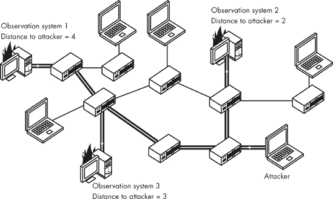
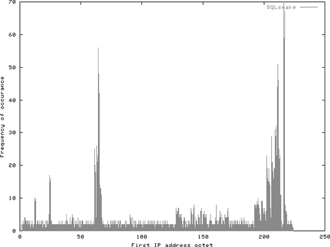
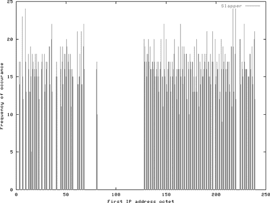

# 第四部分。大局观

*我们的法律部门建议我们在这里不要说“网络即计算机”*

—

# 第十六章。寄生计算，或者如何积少成多

*旧有的真理——拥有一个手下比亲自做工作更好——再次得到了证实*

—

我希望到目前为止你已经享受了这次旅程。我讨论了许多影响信息安全和隐私的复杂问题，从键盘输入到最终目的地数百或数千英里之外。但对我们俩来说，现在还为时尚早；画面中缺少了某些东西——比我们迄今为止讨论的还要大得多——暗物质。

我们故事中的问题很简单：通信不会在真空中发生。尽管数据交换的过程通常限于两个系统和十几个中间系统，但所有事件的宏大背景绝对不能被忽视；周围环境的特性可以以深刻的方式塑造端点之间闲聊的现实。我们不能忽视那些没有直接参与通信的系统的相关性，以及所有看似孤立、各自微不足道的单个事件的重要性，数据在其路径上遇到这些事件。只关注对特定应用或特定案例看似相关的事物可能是致命的，正如我希望这本书到目前为止已经向你展示的那样。

而不是陷入这种短视的陷阱，我选择拥抱事物的宏伟蓝图，尽其所有光辉。因此，本书的第四部分和最后一部分专门关注整个网络的安全，并将互联网视为一个生态系统，而不是完成特定任务的系统集合。我们向将世界联系在一起看似无生命的物质致敬。

本书这一部分从分析一个概念开始，这个概念似乎是最合适的过渡方式。对于许多计算机爱好者来说，这个被称为寄生计算的概念，彻底改变了我们对互联网的看法。

# 咬噬 CPU

一篇谦逊的研究论文，由 Albert-Laszlo Barabasz、Vincent W. Freeh、Hawoong Jeong 和 Jay B. Brochman 于 2001 年在《自然》杂志的来信栏目上发表，本可能被轻易忽视。乍一看，这封信似乎不值得过多关注；事实上，它提出了一个看似可笑的论点。作者们建议，在 TCP/IP 等成熟的网络协议中可以创建流量，对远程计算机提出一个简单的算术挑战——一个需要解决的问题；远程系统在解析消息和准备响应时会无意中解决这个问题。但为什么有人会浪费时间向无情的机器投掷谜题呢？从这能获得什么？自己解决它们不是更有趣吗？当然，答案非常有趣。

首先，用计算机解决谜题是一项业务：今天的大多数密码学都是基于解决一组所谓的非多项式^([33])（NP）问题的相对难度。NP 完全问题似乎喜欢在最不合适的时候破坏每个密码破译者的派对。高效解决它们的能力——无论是使用巨大的计算能力、巧妙算法，还是两者兼而有之——可能会让一个幸运的发明家离世界霸权更近一步。因此，有这个激励，但一个人该如何去做呢？

研究中提出的方法相当新颖。论文首先指出，数学中的许多 NP 问题可以很容易地用布尔可满足性（SAT）方程来表述。SAT 方程将这些问题表示为布尔逻辑运算，有效地构建了一系列参数和变量（布尔公式）。一个经典的 SAT 公式示例可能是

| P = (x[1] XOR x[2]) AND (~x[2] AND x[3]) |
| --- |

在这里，*P* 是公式（问题）本身，而 *x*[1] 到 *x*[3] 是二进制输入，或参数。

虽然对于 x[1]、x[2] 和 x[3] 的值有 2³ 种可能的组合，但只有其中一种使得 *P* 为真：x[1] = 1，x[2] = 0，x[3] = 1。因此，我们说只有这个三元组是 *P* 的解。解决 SAT 问题的本质在于确定方程中所有变量的值，使得包含这些变量的整个公式具有逻辑真值。尽管像前面展示的简单 SAT 问题很容易解决，即使不调用任何除了试错之外的求解机制，更复杂的多变量情况确实是 NP 完全的，因此，其他 NP 问题可以在多项式（即合理的）时间内被归结为 SAT 问题。

这就是问题所在。我们可以用 SAT 来表述一个困难的 NP 问题，但这并没有给我们带来太多好处。截至本文写作时，即使是针对一个非平凡方程，已知最好的 SAT 求解算法也并不比穷举搜索更有效，穷举搜索尝试所有可能性，并对每个可能性评估公式的值。这意味着如果我们有一个 SAT 问题，并且有足够的计算能力去考虑它，那么使用穷举法尝试解决方案并不是一个疯狂的方法，而且使用更复杂的方法也不会让我们走得更远。无论如何，尝试一下也不会损失太多。

以下是揭示将 SAT 问题与 TCP/IP 网络联系起来的秘密。研究人员的基本观察相当明显（或者应该是这样的，如果你订阅了 *Nature*）：TCP（或 IP）的校验和算法，如 第九章 中所讨论的，虽然在原则上是为一个完全不同的目的而设计的，即解决方程，但实际上不过是一系列对输入消息位进行的布尔操作。毕竟，在低级别上，该算法简化为在传输数据包的单词上执行纯粹的布尔逻辑。他们得出结论，通过提供数据包的特定内容（“输入”），远程系统可以被迫执行一系列算术运算，然后评估其正确性——即与 TCP 或 IP 报头中声明的校验和的一致性。

尽管远程系统在校验和过程中的操作在每次迭代中都是完全相同的，但它具有足够的功能作为通用逻辑门，这是我们记得的 第二章 中的机制。通过将实际测试的输入与精心选择的“控制”单词交织在一起，这些单词反转或以其他方式改变迄今为止计算的局部校验和，可以执行任何布尔运算。

这反过来意味着，一旦数据暴露于校验和算法，就可以使用数据包中的特定序列控制和“输入”位轻松重新创建 SAT 逻辑；方程变量（以这种方式或那种方式选择）与用于转换当前校验和值的固定单词交织在一起，以便下一个操作的输出模仿特定的布尔运算符。最终结果——数据包的总和值——表示最终结果：要评估公式的逻辑值。

因此，可满足性测试是在远程接收者在到达时尝试验证校验和时意外进行的。如果校验和结果为 1（或在我们 SAT 计算系统中对应于评估为真的 SAT 语句的某个其他值），则该特定数据包选择的变量值通过了可满足性测试（并且流量被传递到更高层并执行）。如果校验和失败，则公式没有被满足，数据包将被静默丢弃。换句话说，如果我们的输入位表示一个特定的假设，接收者要么验证它，要么证明它是错误的，根据结果采取不同的行动。

此外，想要快速解决 SAT 问题的任何一方可以准备一组给定公式的所有可能的变量值（输入）组合，将这些值与导致输入以最理想的方式组合的信息交织在一起，将这些信息放入 TCP 数据包中，并将它们发送到全球范围内的众多主机（几乎并行）。数据包的校验和可以手动设置为已知“假设”如果被证明为真将产生的值，而不是实际计算它。只有接收到具有使公式评估为所需值的变量值的数据包的主机才会响应流量；其他系统会简单地忽略这种由于校验和不匹配而损坏的流量。因此，发送者可以在不执行大量计算的情况下确定正确解决方案，只需查找发送给那些响应请求的主机的数据包中使用的值集。

研究进一步深入，并报告了使用全球范围内的实际主机成功解决 NP 问题的尝试，从而不仅提供了理论背景，而且还实际证实了这种方法。

这种技术的影响相当微妙，但也很重要：它证明了可以将计算任务有效地“外包”给网络上的不知情和不情愿的远程方，包括解决现实世界计算问题所需的一系列操作，而无需实际攻击这些系统、接管它们、安装恶意软件或以其他方式干扰合法任务。因此，一个人可以有效地将一个特定的计算任务分配给大量系统。在这个过程中，他们只需消耗系统计算能力的一小部分，这部分计算能力加起来却可能相当于一台相当不错的超级计算机，当数百万个系统共同处理一个问题时。

世界统治即将到来？并非如此迅速。

* * *

^([33]) 在复杂性理论中，多项式问题可以通过图灵机在时间上以多项式比例与输入长度（必须找到答案的变量数量或大小）成比例地解决。这意味着解决多项式问题所需的时间直接对应于输入长度乘以一个常数指数，这个指数可以是零（导致时间完全不依赖于输入长度，例如在奇偶性测试中）。非多项式（NP）问题没有已知的此类解决方案，并且随着输入长度的增加，可能需要显著更多的时间来解决，例如表现出指数依赖性。被称为 NP 完全的 NP 问题子集已被证明没有多项式时间解决方案。NP 问题通常被认为对于非平凡输入是“困难”的，而 P 问题则更容易解决。

# 实际考虑因素

. . . 或者，也许，还不是时候。上述研究中提出的方法是革命性的和有趣的，但并不一定是一个特别实用的方法来通过窃取富人的资源来构建超级计算机。为了维持合理的计算速率所需的带宽量，以及为其他系统解决准备的计算量相当高。因此，这个方案效率不足，无法将复杂数学问题的解决外包给一个全球超级集群的不情愿的受害者。

在前面概述的方案中，指数级计算能力的需要被交换为指数级带宽的需要。这并不一定是一个合理的权衡，尤其是考虑到大多数网络的包大小限制，只有相对简单的测试可以被推出去。（所有这些可能都在通过以太网传输这些数据所需的时间内被解决。）这项技术证明了攻击是可能的，并提供了一个真正通用的场所来促进它，但使用更具体的攻击场景可能会产生更有用的结果。

其他窃取少量个人计算能力的方法可能作为以低成本实现强大计算能力的方式更有趣。例如，某些类型的客户端软件（如网络浏览器）可以很容易地以相对简单的方式执行甚至相当复杂的算法。一个这样的例子，详细说明在 RFC 3607 中的“中国彩票”计算方案，由让-吕克·库克（Jean-Luc Cooke）的[md5crk.com](http://md5crk.com)网站鼓励网站管理员添加到他们的网页上。一旦这个小程序被添加到网站上，每个访问者都可以在自己的系统上运行该小程序，借用微不足道的 CPU 周期，以贡献给旨在寻找 MD5 简短函数碰撞的项目。（碰撞是产生相同简短函数的两个不同的消息。它们难以捉摸且具有轶事性质，尽管绝对可能，因为它们可以帮助我们更好地理解简短函数的弱点，并且可以经验性地证明和展示 MD5 对于今天的计算机来说太弱了，无法与之匹配。）

Java 小程序是独立于机器的小程序片段，默认情况下由网络浏览器在特殊的、受限的“沙盒”环境中执行。它们无法访问本地磁盘存储，并且（理论上）无法造成任何伤害，尽管它们可以使用有限的网络连接来执行计算并在网页上添加某些视觉元素。它们最常用于增强网站的功能，例如交互式游戏、视觉效果等。但让-吕克使用这些小程序来做其他事情：利用全球数百或数千个系统的联合计算能力，同时寻找碰撞的潜在候选者。

该小程序操作背后的原理很简单：每当访问一个合作的网站时，该小程序就会在全球的客户端系统上执行；然后，一旦启动，小程序就会尝试计算不同随机选择的消息的 MD5 快捷方式。这个过程会一直持续，直到找到一个与某个任意选择并固定的掩码模式相匹配的快捷方式。这种模式可能是“任何最后四个字节为零的快捷方式”或类似的东西。这种模式的选择是为了确保通过试错找到合适的快捷方式不会花费太多时间（这样人们就不必离开网页并在找到之前停止代码），但同时又只有一小部分所有可能的快捷方式会符合规则。

一旦找到合适的信息，程序就会将候选者“打电话回家”。作者可以检查这些提交。小程序已经检查并拒绝了一些冲突候选者，并且只提交了那些符合预定义条件（部分相同的）的候选者。由于通过这种方式收集的数据变化可能性较小，因此在*n*个条目中的一块数据发生冲突的可能性比纯随机数据要高得多。通过类比，如果我们只订购重量和颜色几乎相同的苹果进行配送，而不是购买一车任意水果，那么在一天内能够处理的水果中遇到两个视觉上无法区分的苹果的可能性就会更高。

尽管在网络安全伦理的灰色地带，这种由[md5crk.com](http://md5crk.com)首次公开部署的巧妙方法确实有效，并很好地展示了寄生计算如何既有效又隐蔽。看起来，窃取原本打算用于“正当”目的的处理器周期的能力触手可及，而且可能比我们希望的更频繁地被使用。这种可能性将长期存在。

然而，一个挑剔的怀疑者继续问道，寄生计算除了窃取 CPU 的微小部分来帮助破解加密方案之外，还能做些什么？这项任务很少有人真正感兴趣？

* * *

^([34]) 当这本书准备印刷时，来自山东大学的一组中国研究人员——王晓云、冯登国、赖雪佳和余红波——提出了一种寻找 MD4、MD5、HAVAL-128 和 RIPEMD-128 冲突的技术，并提供了样本。这是现代密码学中更为重要的新闻之一，并证实了这些函数对于某些安全相关应用是不够的。虽然[md5crk.com](http://md5crk.com)项目已经关闭，但其对探索寄生计算领域的贡献仍然有效。

# 寄生存储：早期阶段

当你喊叫时，声波会穿过空气，逐渐失去能量并向四面八方扩散。然而，如果它们在途中遇到固体障碍物，它们很可能会反弹，并且如果角度恰到好处，它们会反弹回你这里。可听到的结果是，在你喊叫后的瞬间，你会听到自己声音的回声。

但是，当一位信息理论爱好者站在山顶上，大声朗读他们的代码，将他们的话语指向一个岩石山谷时，会发生什么呢？我想你肯定想知道。在这种情况下，他们不可避免地会做出一个聪明的观察：如果他们快速阅读然后立即忘记他们刚才背诵的内容（因为他们被其他事情占据了注意力），他们仍然可以在信息从山谷底部反弹回来并回声返回时最终恢复信息。哇——一个方便的数据存储机制。

听起来很荒谬？也许我们只是太年轻了。早期的计算机内存模块使用了一种类似的技术，允许处理器将一些信息“离线”存储，并在稍后恢复。而不是使用空气（通过空气，声波传播得有点太快，无法在不构建极其庞大的内存单元的情况下提供合理的存储容量），使用了一个装满水银的鼓（在这种环境中，声波传播得要慢得多）。然而，原理保持不变，甚至给“内存泄漏”这个术语赋予了有趣的意义。例如，这种设备，即水银延迟线内存，被用于著名的 UNIVAC I.^([35])。

自然地，这种缓慢、笨重、危险且不便的记忆方式，随着技术的成熟，很快就被其他解决方案所取代。然而，这项发明本身具有一定的魅力，并不会那么轻易地消失在人们的记忆中。2002 年，萨基布·A·汗在拉斯维加斯的 DefCON 会议上做了一次简短的演讲，重新唤起了人们对它的兴趣，并为我们提供了关于如何利用大规模网络的特性，通过互联网作为媒介来构建类似类型的瞬时存储的第一手信息。但这一次，关于声学记忆的描述听起来不再那么荒谬原始，而是对观看这个简短幻灯片的黑客和极客们来说，不可思议地酷。声学记忆以一种时尚的方式回归了。

由于数据包的往返时间（即消息到达远程系统所需的时间和响应返回所需的时间）不为零，可以通过重复发送和接收数据包的部分内容并等待其回声来始终在“线”上保持一定量的数据。萨基布使用了 ICMP（互联网控制消息协议）“回声请求”（ping）数据包来实现这一效果；互联网上的大多数系统都会对这些数据包做出“回声响应”，引用它们收到的原始有效载荷。

这看起来像是一个酷炫的技巧。然而，对于任何合理应用来说，它都离实际应用还很远，因为它需要频繁地重新传输数据的一部分。由于 ICMP“回显应答”在接收到“回显请求”后几乎立即发送，因此在数据被发送回并需要从线路上恢复之前，只能推送出很少量的数据。因此，以这种方式可以存储的数据量不会超过用户在最多几秒钟内（通常不到一秒钟）能够推送出的数据量。

啊，但是寄生存储可以改进。

* * *

^([35]) 可能值得指出的是，低容量、模拟延迟线存储器也用于 SECAM（Séquentiel Couleur avec Mémoire，或顺序彩色存储）电视接收器的早期实现中。与 NTSC 或 PAL 不同，SECAM 信号使用降低的色彩分辨率；红色和蓝色色度分量交替传输，永远不会同时传输。其他分量必须从前一帧中获取，以确定特定像素的外观。为了实现这一点，需要实现一个存储设备。

# 使寄生存储可行

在 2003 年，我和 Wojciech Purczynski 共同撰写了一篇名为“用数据包进行杂耍：寄生数据存储”的论文。我们将寄生存储的概念进一步拓展，并考虑了多种可以显著扩展互联网存储容量同时保持维持信息所需带宽的方法。我们的研究集中在几种其他在远程系统上存储数据的方法上，并根据存储介质的特性（其可见性、易失性和可靠性）对它们进行了分类。我们还对每种技术的假设存储容量进行了详细讨论。

这篇论文相当简短，并且——我希望——清新有趣，它被包含在这里。

```
==============================================
 Juggling with packets: floating data storage
==============================================

  "Your dungeon is built on an incline. Angry monsters can't play marbles!"

  Wojciech Purczynski <cliph@isec.pl>
  Michal Zalewski <lcamtuf@coredump.cx>

1) Juggle with oranges!
------------------------
  Most of us, including the authors of this paper, have attempted to juggle
 with three or more apples, oranges, or other fragile ballistic objects. The
 effect is usually rather pathetic, but most adept juggler padawans sooner or
 later learn to do it without inflicting excessive collateral damage.

  A particularly bright juggler trainee may notice that, as long as he
 continues to follow a simple procedure, at least one of the objects is in the
 air at all times and that he has to hold at most two objects in his hands at
 once. Yet, each and every apple goes through his hands every once in a while,
 and he can recover it at will.

  After some fun with juggling, he may decide that the entire process is
 extremely boring and go back to his computer. While checking his e-mail, an
 educated juggler might notice that a typical network service has but one duty:
 to accept and process data coming from a remote system and take whatever steps
 it deems appropriate based on its interpretation of the data. Many of those
 services do their best to behave robustly, to be fault tolerant, and to supply
 useful feedback about the transaction.

  In some cases, the mere fact that a service is attempting to process the
 data and reply according to protocol can be used in ways that the authors
 never dreamed of. One of the more spectacular examples of this, which our
 fellow juggler might be familiar with, is research done at the University of
 Notre Dame, titled "Parasitic Computing" and published in letters to "Nature."

  Nevertheless, our hero concludes that such attempts are quite impractical in
 the real world. The cost of preparing and delivering trivia to be solved far
 exceeds any eventual gain since the sender has to perform operations of
 comparable computational complexity simply to deliver the request. "The
 computing power of such a device is puny!" he says.

  A real juggler would focus on a different kind of outsourced data
 processing, one that is much closer to his domain of expertise. Why not
 implement a distributed fruit-based data storage? What if I write a single
 letter on every orange and then start juggling? I can then store more orange
 bytes than my physical capacity (the number of oranges I can hold in my
 hands)! How brilliant. . . . But, but, would it work without oranges?

2) The same, without oranges
-----------------------------

  This paper is based on the observation that for all network communications,
 there is a nonzero (and often considerable) delay between sending information
 and receiving a reply--a result of the physical constrains of the medium and
 the time it takes to process data on all computer equipment.

  Like an orange with a message written on it, a packet used to store a piece
 of data travels for a period of time before returning to the source, and for
 this period of time we can safely forget its message without losing data. As
 such, the Internet has a nonzero momentary data storage capacity, and it is
 possible to push out a piece of information and effectively have it stored
 until echoed back. By establishing a mechanism for the cyclic transmission and
 reception of chunks of data to and from a number of remote hosts, it is
 possible to maintain an arbitrary amount of data constantly 'on the wire,'
 thus establishing a high-capacity, volatile medium.

  This medium can be used for memory-expensive operations, either as regular
 storage or for certain types of sensitive data for which one does not want to
 have leave a physical trail on a hard disk or other nonvolatile media.

  Since it is not considered bad programming practice to return as much
 relevant information to the sender as the sender sends to the service, and
 because many services or stacks maintain a high level of verbosity, our
 juggling experience tells us that it is not only possible, but also feasible,
 to establish this kind of storage, even over a low-end network hookup. Unlike
 traditional methods of parasitic data storage (such as P2P abuse, open FTP
 servers, binary Usenet postings, and so on), this particular method may or may
 not leave a trail of data (depending on how we implement it), and it does not
 put any single system under a noticeable load. Therefore, unlike the
 traditional methods, this technique is less likely to be detected and
 considered an abuse. Hence, the possibility of the data being intercepted and
 purposefully discarded is much less a problem.

3) Class A data storage: memory buffers
----------------------------------------

  Class A data storage uses the capacity inherent in communication delays
 during the transmission and processing of live data as it travels across
 networks between two endpoints. The information stored herein remains cached
 in the memory of a remote machine and is not likely to be swapped out to a
 disk device.

  Examples of class A memory are a variety of schemes that rely on sending a
 message that is known to result in partial or full echo of the original
 request, including the following:

    - SYN+ACK, RST+ACK responses to SYN packets, and other bounces

    - ICMP echo replies

    - DNS lookup responses and cache data. It is possible to store some
      information in a lookup request and have it bounce back with an NXDomain
      reply or to store data in an NS cache.

    - Cross-server chat network message relaying. Relaying text messages
      across IRC servers and so on can exhibit considerable latency.

    - HTTP, FTP, web proxy, or SMTP error or status replies.

  The most important properties of class A storage are:

    - Low latency (milliseconds to minutes), which makes it more useful for
       near random access memory applications.

    - Lower per-system capacity (usually kilobytes), which makes it less
       suitable for massive storage.

    - Only one chance to receive or few retransmits which make it less
       reliable in case of a network failure.

    - Lower likelihood of permanent recording. The data is not likely to be
       stored on a nonvolatile medium or swapped out, increasing privacy and
       deniability.

  In particular, when using higher-level protocols, additional features appear
that might solve some of the low-capacity and short- recovery window problems
 shared by various types of class A storage. For example, it is possible to
 establish a connection to a service such as SMTP, FTP, HTTP, or any other
 text-based service and send a command that is known to result in an
 acknowledgment or error message being echoed along with part of the original
 data. We do not, however, send a fully formatted message; we leave some
 necessary characters unsent. In most cases, end-of-line characters are
 required in order to complete the command. In this state, our data is already
 stored on remote service waiting for a complete command or until connection
 time-out occurs. To prevent time-outs, either on TCP or at the application
 level, no-op packets need to be sent periodically. A \0 character interpreted
 as an empty string has no effect on many services but is sufficient to reset
 TCP and service time-out timers. A prominent example of an application
 vulnerable to this attack is Microsoft Exchange.

  The attacker can sustain the connection for an arbitrary amount of time,
 with a piece of data already stored at the other end. To recover the
 information, the command must be completed with the missing \r\n, and then the
 response is sent to the client.

  A good example is the SMTP VRFY command:

  220 inet-imc-01.redmond.corp.microsoft.com Microsoft.com ESMTP Server
  Thu, 2 Oct 2003 15:13:22 −0700
  VRFY AAAA...
  252 2.1.5 Cannot VRFY user, but will take message for
  <AAAA...@microsoft.com>

  It is possible to store just over 300 bytes, including nonprintable
 characters, this way--and have it available almost instantly. More data can be
 stored if the HTTP TRACE method is used with data passed in arbitrary HTTP
 headers, depending on the server software. Sustained connections can give us
 arbitrarily high latency, thus creating large storage capacity.

  This type of storage is naturally more suited for privacy-critical
 applications or low-latency lower to medium capacity storage (immediate RAM-
extending storage for information that should leave no visible traces). The
 storage is not suitable for critical data that should be preserved at all
 costs, due to the risk of data being lost on network failure.

4) Class B data storage: disk queues
-------------------------------------

  Class B data storage uses "idle" data queues that store information for an
 extended period of time (often on the disk). For example, MTA systems can
 queue e-mail messages for as many as 7 days (or more, depending on the
 configuration). This feature can give us a long delay between sending data to
 store on the remote host and receiving it. Because a typical SMTP server
 prevents the relay of e-mail from the client to itself, e-mail bounces can be
 used to have data returned after a long period of time.

  For example, consider this potential attack scenario:

  1\. The user builds a list of SMTP servers (perhaps servers that provide a
      reasonable expectation of being beyond the reach of their foes).

  2\. The user blocks (with block/drop, not reject) all incoming connections to
      their port 25.

  3\. For each server, the attacker has to confirm its delivery time-outs and
      the IP from which the server connects back while trying to return a
      bounce. This is done by sending an appropriate probe to an address local
      to the server (or requesting a DSN notification for a valid address) and
      checking to see how long the server tries to connect back before giving
      up. The server does not have to be an open relay.

  4\. After confirming targets, the attacker starts sending data at a pace
      chosen so that the process is spread evenly over the period of one week.
      The data should be divided so that there is one chunk per each server.
      Every chunk is sent to a separate server to immediately generate a bounce
      back to the sender.

  5\. The process of maintaining the data boils down to accepting an incoming
      connection and receiving the return at most a week from the initial
      submission, just before the entry is about to be removed from the queue.
      This is done by allowing this particular server to go through the
      firewall. Immediately after the chunk is received it is relayed back.

  6\. To access any portion of data, the attacker looks up which MTA is holding
      this specific block and then allows this IP to connect and deliver the
      bounce. Three scenarios are possible:

     - If the remote MTA supports the ETRN command, the delivery can be
        induced immediately.

     - If the remote MTA was in the middle of a three-minute run in an attempt
        to connect to a local system (keeps retrying thanks to the fact its SYN
        packets are dropped, not rejected with RST+ACK), the connection can be
        established in a matter of seconds.

     - Otherwise, it is necessary to wait from five minutes to one hour,
        depending on the queue settings.

  This scheme can be enhanced using DNS names instead of IPs for users on
 dynamic IP or to provide additional protection (or when it is necessary to cut
 the chain immediately).

  The important properties of class B storage are:

    - High per-system capacity (megabytes), making it a perfect solution for
       storing large files and so on

    - Higher access latency (minutes to hours), likening it to a tape device,
       not RAM (with the exception of SMTP hosts that accept the ETRN command
       to immediately reattempt delivery)

    - Very long lifetime, increasing per-user capacity and reliability

    - Plenty of delivery attempts, making it easy to recover the data even
       after temporary network or hardware problems

    - Likely to leave a trace on the storage devices, making it a less-useful
       solution for fully deniable storage (although it would still require
       examining a number of foreign systems, which does not have to be
       feasible)

  Class B storage is suitable for storing regular file archives, large append-
only buffers, encrypted resources (with a proper selection of hosts, it
 remains practically deniable), etc.

5) Discreet class A storage
----------------------------

  In certain situations, it might be necessary to devise a solution for
 discreet data storage that does not reside on the machine itself and that
 makes it possible to deny the presence of this information anywhere.

  The basic requirement is that the data is:

    - Not returned until a special key sequence is sent

    - Permanently discarded without leaving any record on any nonvolatile
       storage media in the absence of keep-alive requests

  It is possible to use class A storage to implement this functionality using
 the sustained command method discussed earlier. The proper TCP sequence number
 is necessary to release the data, and until this sequence is delivered, the
 data is not returned or disclosed to any party. If the client node goes
 offline, the data is discarded and likely overwritten.

  The sequence number is thus the key to the stored information, and, if the
 lifetime of the data is fairly short when keep-alive \0s stop coming, it is
 often adequate protection.

6) User-accessible capacity
----------------------------

  In this section, we attempt to estimate the storage capacity available to a
 single user.

  In order to maintain a constant amount of data "outsourced" to the network,
 we must be able to receive and send it back on a regular basis.

  The amount of time that data can be stored remotely is constrained by the
 maximum lifetime Tmax of a single packet (including packet queuing and
 processing delays). The maximum amount of data that can be sent is limited by
 maximum available network bandwidth (L). Thus, the maximum capacity
 can be defined as:

    Cmax [bytes] = L [bytes/second] * Tmax [seconds] / Psize * Dsize

where:

    Dsize - The size of a packet required to store an initial portion of data
 on a remote host

Psize - The size of a packet required to sustain the information stored on
 a remote host

  Psize and Dsize are equal and thus can be omitted whenever the entire chunk
 of data is bounced back and forth; they differ only for "sustained command"
 scenarios. The smallest TCP/IP packet to accomplish this has 41 bytes. The
 maximum amount of data that can be sustained using HTTP headers is about 4096 bytes.

  That all, in turn, gives us the following chart:

            Bandwidth  | Class A | Class B
           -----------+---------+---------
            28.8 kbps |  105 MB |    2 GB
             256 kbps |  936 MB |   18 GB
               2 Mbps |  7.3 GB |  147 GB
             100 Mbps |  365 GB |    7 TB

7) Internet as a whole
-----------------------

  In this section, we attempt to estimate the theoretical momentary capacity
 of the Internet as a whole.

  Class A

    To estimate the theoretical class A storage capacity of the Internet, we
     assume the following:

      - ICMP messages offer the best balance between storage capacity and
         preserving a remote system's resources.

      - An average operating system has a packet input queue capable of
         holding at least 64 packets.

      - The default PMTU is approximately 1500 (the most common MTU).

    As an estimate of the number of hosts on the Internet we use an ISC survey
     for 2003, which lists 171,638,297 systems with reverse DNS entries
     (although not all IPs with reverse DNS have to be operational). To take
     this into account, we used the ICMP echo response ratio calculated from
     the last survey that performed such a test (in 1999). The data then
     suggested that approximately 20 percent of visible systems were alive,
     which, in turn, sets the number of systems ready to respond to ICMP
     requests at roughly 34,000,000.

    By multiplying the number of systems that reply to ICMP echo requests by
     the average packet cache size and maximum packet size (minus headers), we
     estimate the total theoretical momentary capability for class A ICMP
     storage to be approximately 3 TB.

Class B:

    To estimate theoretical class B storage capacity, we use the example of
     MTA software. There is no upper cap for the amount of data we feed to a
     single host. Although it is safe to assume that only messages under
     approximately 1 MB will not cause noticeable system load and other
     undesirable effects, we assume that the average maximum queue size is
     500 MB.

    Our own research suggests that roughly 15 percent of systems that respond
     to ping requests have port 25 open. We thus estimate the population of
     SMTP servers to be 3 percent (15 percent of 20 percent) of the total host
     count, or just over 5,000,000 hosts.

    This gives a total storage space capacity of 2500 TB.
```

# 应用、社会考虑和防御

但是现在呢？如果实际寄生计算和存储方案的好处仍然不足以让它成为一个比增加更多硬件更有吸引力的替代品，那么拥有这些方案有什么好处呢？

尽管在实用化寄生计算方面取得了进展，但当考虑到廉价内存和千兆赫兹处理器的丰富性时，旨在扩展传统系统纯粹的计算能力或存储空间的应用可能看起来毫无意义。

然而，这项技术的潜在价值可能在于一套完全不同的应用领域：*易失性计算*。构建可用的分布式计算机的能力，这些计算机可以随意分散，不留任何物理痕迹，在任何单一位置也不存储任何有意义的数据，这可能是一种强大的隐私工具，同时也可能对法医和执法部门构成一些挑战。构建易失性存储和保持内存的能力，在单个节点离线后不久就会崩溃，但又不涉及频繁的数据重传，这可能为犯罪分子（或任何受压迫的实体）提供一定程度的否认能力，并且需要许多常见的证据收集程序发生相当大的变化。

此外，想象一下易失性系统，一旦启动和初始化，就可以在互联网上持续很长时间，没有本地化的物理存在。对于易失性分布式计算机系统，有两种可能的设计，而且都不荒谬：

+   可以设计系统，使它们通过并行找到解决方案来完成复杂任务（这已经在之前讨论的 SAT 计算方案中基本实现）。这类系统的缺点是必须手动检索计算结果，并偶尔从某个位置重新“播种”整个系统以启动下一次处理迭代。依赖于协议的低级属性（如 TCP）的低级解决方案可能会落入这一类别。

+   可以设计系统，使它们自己执行分布式计算的后续迭代。所有高级功能（如嵌入式文档渲染算法）和某些网络服务的滥用都可能被用来促进这种活动。

在每种情况下，后果都可能非常严重。例如，如何摧毁一个冗余的自修复机器，该机器不使用单一系统，而是从其他人那里借用一小部分内存和处理能力几秒钟——而且不使用任何漏洞或明显可过滤的流量？而且，意识到我们无法立即识别这种分布式计算机的目标，难道不是也有些令人不安吗？向糟糕的科幻小说大师们表示尊敬，我相信计算机的统治即将到来，并欢迎我们新的机器主宰。

# 思考食物

防御寄生计算通常极其困难。存储数据或导致对方执行某些简单计算的能力通常与网络协议的基本功能绑定。这是我们无法想象在不抹去我们所知的互联网的同时消除这种特性，并引入一系列比解决的问题更严重的新问题的。

保护单个系统免于成为寄生计算节点也是相当困难的，因为从系统中窃取的资源通常只是空闲 CPU 时间和内存的微不足道的一部分，因此可能很容易被忽视。

很可能寄生计算尚未展现出其全部潜力，而这种威胁——对于单个系统来说可能无关紧要或不存在，但对于整个网络来说却具有重要意义——将会持续存在。

# 第十七章：网络拓扑

*关于我们周围世界的知识如何帮助我们追踪朋友和敌人*

—

互联网的形状是什么？没有委员会来监督它或决定它应该在哪里、如何以及为什么应该扩展，或者新的和现有的系统应该如何组织或管理。互联网在所有方向上以同样由需求、经济、政治、技术和盲目运气驱动的方向发展。

然而，互联网并非无形状的团块：存在由自主系统组成的计划内、本地管理的层次结构，核心路由器周围环绕着较小的节点，链接由自动机制配置或由人类精心设计。互联网是一个壮观的网状结构，一个复杂而脆弱的蜘蛛网，覆盖着整个工业化和发展中国家。捕捉这个不断变化的拓扑结构似乎是一项挑战，但同时也很有吸引力，尤其是当我们意识到我们可以如何从收集到的信息中受益。

在本章中，我将首先讨论两个著名的尝试来绘制互联网的拓扑结构，然后我将再次道德化地讨论收集到的信息的潜在用途，这些用途可以让我们的祖先连做梦都不敢想的事情成为可能。

# 捕捉这一刻

对互联网进行最全面映射的尝试是由互联网数据分析合作协会（CAIDA）进行的，该组织由联邦研究机构（如 NSF、DHS、DARPA）以及行业（如 Cisco、Sun）资助。该组织的成立是为了提出交通和基础设施分析工具，以供互联网社区共同受益，希望使其变得更好、更可靠、更具弹性和更健壮。

自 2000 年以来，CAIDA 的旗舰公共项目之一就是创建和维护自主系统核心网络图（也称为“Skitter”）。截至本出版物，他们最新的捕获代表了 12,517 个主要自主系统的数据，对应于 1,134,634 个 IP 地址和 2,434,073 个链接（逻辑路径）。

尽管听起来非常晦涩难懂，但 CAIDA 互联网地图仅使用公开可访问的路由器 BGP 配置数据、经验网络测试结果（traceroute）和网络块 WHOIS 记录创建。这个地图使用极坐标组织。代表每个系统的点位于一个角度上，对应于网络声明的总部位置的物理位置，以及对应于该特定自治系统的“对等关系相关性”的半径。后者是通过计算观察到的其他自治系统接受来自该特定节点的流量数量来得到的。因此，庞大的核心系统位于地图的中心，而只与几个节点直接接触的系统则位于外围附近。图中的线条简单地对应于路由器之间的对等关系。

### 注意

非常遗憾，我们无法在书中免费使用 CAIDA Skitter 图形的图表。然而，我鼓励您在线查看这张令人惊叹的图片，网址为[`www.caida.org/analysis/topology/as_core_network/pics/ascoreApr2003.gif`](http://www.caida.org/analysis/topology/as_core_network/pics/ascoreApr2003.gif)，公众可以免费获取。

另一个值得注意的尝试绘制网络的方法是，通过分析从特定位置（在本例中为贝尔实验室）观察到的到各种网络的距离，构建一个类似于树状结构，而不是 CAIDA 创建的复杂网状结构。这项分析由比尔·切斯威克于 2000 年进行，^([110]) 结果在图 17-1 中展示。这个结构并不根据系统的物理或行政位置来参数化图；从中心到该节点的相对距离对应于该节点与贝尔实验室之间的跳数。

虽然这两个尝试似乎涉及大量数据收集和分析，但对于业余爱好者来说，即使在低端链路上尝试绘制网络也不是特别困难。使用单个数据包探测所有公开路由的子网可能只需要生成几 GB 的流量——相当于典型 DSL 连接上几个小时到一天的时间。唯一的危险是可能会激怒一些系统管理员，但随着计算机蠕虫和自动化攻击的泛滥，很少有系统管理员对这种低敏感度阈值有反应。绘制观察到的互联网结构是可能的，并且可能会很有成效，尤其是因为它可以告诉我们很多关于全球网络是如何组织的信息。


图 17-1. 比尔·切斯威克的互联网地图

但实际上，数据，例如 CAIDA、比尔·切斯威克或几乎任何熟练的互联网用户获得的信息，也可以成功地用来更好地理解神秘流量的性质，并更好地检查我们可能有一天偶然遇到的流量的来源。

# 使用拓扑数据识别来源

欺骗流量是互联网的主要问题之一——或者至少是其中较为令人烦恼的问题之一。盲目地使用虚假或特别选择的但具有欺骗性的源地址发送的数据包，可以用来滥用计算机之间的信任关系，注入恶意内容（如未经请求的大规模邮件）而不留下明确的痕迹和合法的原始信息，等等。盲目欺骗还可以用来隐藏进行系统探测的攻击者的身份（“诱饵扫描”在第十三章中已有讨论）。然而，所有问题中最严重的是用于执行拒绝服务（DoS）攻击的欺骗。

在典型的 DoS 攻击中，管理员有机会看到针对他们服务之一（并且可能旨在使其崩溃并给运营商带来不便或损失）的恶意流量的来源。然而，可能随机欺骗违规数据包，在这种情况下，管理员将无能为力，无法过滤掉来自攻击者的流量，而不切断其他用户的连接。他们唯一的希望是与上游提供商合作，调查链路层上流量的实际来源，并将信息传递给违规者的 ISP；然而，这需要时间，而且需要很多时间。这也要求在没有法院命令的情况下，让所有各方都相信这个案例值得调查（以及他们的时间和金钱）。这种情况使得系统管理员配备区分欺骗流量和合法流量的工具和方法变得尤为重要。

当我以前在美国生活和工作时（现在我在波兰），我的同事马克·洛夫莱斯决定实施唐纳德·麦克拉克兰最初提出的一个想法：他会测量他与一个数据包的假定发送者之间的生存时间（TTL），以自动确定传入的数据包是否被欺骗。在一个信息不可信的世界中，确定网络数据包的来源是一个重要挑战，而且即使只是在特定子集的情况下，这种能力也会极大地促进许多分析和管理任务，如前所述。

要理解唐纳德和马克的想法，考虑一下，我们从其中看到流量的远程系统，与我们之间有一个特定的逻辑距离，由一定数量的网络设备隔开。因此，该系统合法发送的所有数据包在到达时都会显示一定的 TTL，对应于该系统上配置的默认初始 TTL 减去数据包经过的中间系统数量（如第九章第九章. 外国口音中所述）。然而，对于可能源自完全不同网络的伪造流量，初始 TTL 和距离很可能与上述观察结果不同。马克的工具 despoof^([111])比较了特别诱导和先前接收到的流量中观察到的 TTL，以区分合法和伪造的流量。

然而，尽管这种方法在针对毫无防备的攻击者时可能效果很好，但至少有两个问题与之相关：

+   一个偏执的攻击者可以在攻击之前测量距离并选择一个与预期值匹配的 TTL。尽管可能，但这个技巧实施起来有些困难。一方面，攻击者可能无法将 TTL 设置得足够高，以达到与真实数据包到达目的地时预期值相匹配的具体值。如果他被试图冒充的系统使用的默认 TTL 在 255（最大可能值）或附近，并且他离目标比他试图冒充的系统更远（因此他不可能发送一个在到达目的地时会有所需 TTL 的数据包），那么他的计划可能会被挫败。当然，很少有系统使用最高的 TTL，而且攻击者一开始就想冒充特定系统的可能性也很小。

    攻击者的第二个挑战是，如果他离受害者很远，并且不知道这些主机之间的路由细节，他可能无法确定受害者和冒充系统之间的确切距离。但如果受害者使用 despoof 动态实施过滤规则来切断恶意数据包，攻击者可能会尝试从各种来源尝试不同的 TTL，直到他看到受害者不再能够区分为止。（这将是明显的：被攻击的系统将开始表现出成功攻击的效果，例如性能影响。）

+   每次接收到可疑数据包时，接收者都必须开始调查，然后等待结果到来。这使得将 despoof 作为自动防御的基础变得不切实际，尤其是在应对 DoS 攻击时。然而，这种方法对于确定“诱饵扫描”的实际来源仍然非常有用。

没有特定网络拓扑的知识，很难比使用 despoof 做得更好；这个工具实现的 TTL 分析技术足够好，可以识别并阻止许多常见的探测和个别攻击，但接下来怎么办？

将马克的工具与网络结构的实时数据相结合，并应用被动指纹识别来确定发送特定请求的系统的初始 TTL，这种技术就变得更加强大。这些额外的数据使我们能够通过比较观察到的初始 TTL 与网络图所示预期的距离来进行对传入流量的初步被动评估。^([36]) 由于我们可以不启动任何主动探测网络拓扑数据来确定我们应该看到的距离，因此我们可以几乎不费吹灰之力就区分合法和恶意流量。这反过来又使得我们能够相当可靠地应对大规模事件，并检测到单个低配置探测，而不会让攻击者知道有欺骗检测系统在位。

显然，在考虑对等关系时，考虑到网络的结构可以获得很多好处。但欺骗检测只是开始。

* * *

^([36]) 在这种方法中，必须允许一定的误差范围来比较 TTLs，因为内部网络中可能有几个额外的跳数。此外，一些路由是非对称的，它们的长度可能会根据流量交换的方向略有不同。

# 网络三角测量与网格型拓扑数据

网络三角测量是网络拓扑网格型数据在流量分析目的上的一个相当有趣的应用。一旦攻击者选择同时或连续攻击多个目标，我们可以使用网络三角测量来确定发送欺骗数据包的攻击者的近似位置，而不需要那些操作底层路由骨干的人员的帮助——这真是痛苦中的快乐。

好吧，为了准确起见：虽然当攻击者选择多个目标时，三角测量效果最佳，但在某些场景中，即使他们选择仅攻击一个服务，也可能效果相当好。特别是，当攻击目标具有多个 IP 地址，并且服务由多个物理位置提供，以分散负载并使整个结构容错（如网络服务常见的那样）时，我们可能能够从不同的角度观察到相同的攻击。在所有其他场景中，当系统管理员注意到多个系统被攻击者针对并分享他们关于事件的资料时，我们可以获得关于攻击的一系列数据。

无论情况如何，一旦认为来自单一来源的数据出现在多个目的地，我们就可以进行三角测量。对于每个观察到流量的目的地，只有一组特定的网络距离可以通过观察违规数据包经过的距离来确定（再次，可以通过检查 TTL 来找出）。所有观察点的这些集合的交集将产生一个更小的集合——或者通常情况下，只有一个网络——攻击可能由此发起，如图 图 17-2 所示。

能够自行执行跟踪使我们摆脱了对 ISP 的无条件依赖，并有助于精确确定谁在攻击或探测我们的网络——也许还能找出原因。

尽管这种方法比传统的去欺骗方法更难阻止，但一个狡猾的攻击者仍然可能通过为每个目标随机化不同的 TTL（或 TTL 范围）来欺骗观察者。诚然，我们目前不知道有工具能做这件事，但这可能会改变。

战斗已经失败了吗？不，有一种方法可以防止肇事者用这种方式欺骗我们。

* * *

^([37]) 即使工具使用随机的 TTL，如果可以在每个目的地观察到多个数据包，那么通过观察数据包经过的距离（再次，可以通过检查 TTL 来找出）来判断距离是可能的。例如，如果扫描工具在 32 到 255 的范围内随机化初始 TTL，但在目的地接收到的数千个数据包中，没有一个的 TTL 超过 247，那么主机很可能有 255 - 247 = 8 个系统距离。

# 网络压力分析

解决方案被称为“网络压力分析”，以一篇由 Hal Brunch 和 Bill Cheswick 在 2000 年 LISA 大会上展示的优秀研究成果的形式出现。^([[112)]] Brunch 和 Cheswick 提出了一种对树形网络拓扑数据（类似于前面在 图 17-1) 中获得的数据的有趣用途，这些数据是针对特定位置的。他们想出了一种使用这些数据来检测特定类型欺骗流量（拒绝服务）来源的方法。这种方法本身相当简单，基于这样一个假设：这种攻击不仅会对所针对的系统造成压力，还会对中间路由器造成压力，而这种压力可以通过受害者外部测量并用来——几乎可以说是——通过拉动电线来回溯找到线索。



图 17-2. 一个简单的网络三角剖分：只有一个源头与所有观察结果一致。攻击者可能正在伪造源地址，但无法欺骗受害者。

通过首先从您的位置构建或获取到所有互联网网络的链接树，然后在攻击发生时遍历此树结构的后续分支，来完成对网络链接的压力测试工作。对于每个分支（在现实中，这表示与更高阶路由器的连接），我们可以通过向或通过与其关联的路由器发送测试流量来迭代测量此节点的网络负载。（在这篇特定的论文中，使用了 UDP [用户数据报协议] chargen，但也可以使用 ICMP 请求或其他类型的消息。）我们选择一个更负载的节点作为潜在入流候选，然后列出并测试从这个节点产生的所有分支，直到我们追踪到流量源头。

图 17-3 展示了简单的回溯场景。在第一阶段，当攻击发生时，受攻击的系统试图测量三个最近的互联网路由器的性能；它得出结论，第一个（最顶部的）路由器是最饱和的。

基于这些信息，受害者选择只测试与此设备直接连接（对等）的路由器。在这个特定的图中，只有三个设备需要测试（剩余的六个不需要测试，因为它们不与此设备对等），再次，第一个是最负载的。这个过程会持续进行，直到确定一个直接连接到特定网络的路由器，通过公共数据库可以找到其物理位置和所有者信息，作为最终端点。


图 17-3. 使用网络拓扑数据和压力测试进行递归攻击回溯

出现了一个潜在问题：一些设备可能因为处理 DoS 流量以外的其他原因而负载过重；其他设备可能有充足的 CPU 周期，不会因为中继恶意流量而受到严重影响。

为了解决这个问题，研究提出了在路由器上施加人工短期负载（通过生成额外流量）并观察这种测试如何影响 DoS 请求的带宽和延迟；如果这个特定设备确实参与了恶意数据包的中继，那么当我们对设备施加负载时（再次，可能通过生成额外的伪造 TCP、UDP 或 ICMP 请求，这些请求更多地是为了消耗设备的 CPU 功率而不是使其接口拥塞），攻击率应该会下降。因此，应该只在涉及服务恶意流量的分支上存在相关性。

这个聪明而简单的方案已经在测试环境中成功使用。然而，因为它涉及到与路由器交互并在其上放置额外的负载，所以在考虑在现实世界中使用它时，某些伦理问题就出现了。

# 思考题

在本章讨论的技术用于追踪攻击者的主要困难在于，我们需要为每个地点构建和更新网络图。并不立即清楚这些图应该多久刷新一次，以及哪些方法将证明最可靠且最不具侵入性。

另一个可能的问题是，大部分核心互联网基础设施是冗余的。在某些情况下，只有在主路由失败或饱和时，才会选择某些替代路由，尽管在某些情况下，切换可能作为负载平衡的一部分发生。因此，某些经验性地图可能在几分钟或几小时内就过时了——尽管这种情况并不常见。

最后，尽管使用各种去伪战术的私人、个人用途可能非常成功，但在我们可以大规模部署这些技术之前，还有许多需要回答的问题——其中一些问题并不完全是关于技术问题。

# 第十八章：监视虚空

*当我们凝视深渊时，没有杀死我们的东西使我们变得更强大*

—

我们已经探讨了通过观察两个系统之间的通信或观察此类通信的副作用来发现信息和拦截数据的方法。然而，故事还没有结束。有时，通过避开我们希望探测的目标，我们甚至可以看到更多。

一整套通常被称为“黑洞监控”的方法，致力于观察和分析意外、错误或以损坏形式到达特定目的地的未请求或不想要的流量。这些方法通常包括简单地运行数据包转储工具，然后痛苦地分析和理论化每一个观察结果。

尽管在一个完美的世界中，我们不应该在不应找到数据的地方寻找数据，但现实中我们可以使用这些方法收集大量信息，并获得关于整个网络状况的无价线索。尽管信息大多是随机的，我们无法选择我们听谁的话，但我们仍然可以从这些努力中受益。

# 直接观察策略

黑洞监控的一个应用在于检测和分析全球攻击趋势。许多掌握新攻击技术的黑帽黑客通常会简单地扫描大量网络地址，以寻找可被利用的脆弱目标，最终用于非法活动（可能是为了收集跳转主机^([38]) 或构建用于自动攻击的攻击无人机网络）。我们可以通过观察来自各种来源的标准网络扫描活动增加，来使用黑洞监控提醒我们野外正在被利用的新漏洞。

许多网络管理员部署黑洞监控。他们有时会将其与蜜罐（在网络中放置一个假的“诱饵”系统来捕捉攻击者，拦截他们的工具并识别他们的技术^([113])) 结合使用，以产生一个预警系统，使他们能够首先了解蠕虫和其他恶意软件即将爆发的信息。（您还可以使用黑洞流量来校准“噪声水平”并更有效地检测针对您的服务器的针对性攻击，而不会收集自动的、无差别的恶意活动。）

如杜格·桑格和何塞·纳萨里奥（何塞最近在他的书《针对互联网蠕虫的防御和检测策略》^([114])) 等研究人员，曾尝试在大量网络蠕虫爆发期间分析黑洞活动。他们的目标是更好地理解和模拟网络的分布（初始传播和再感染）动态，并测试蠕虫感染算法的效率和持续性。他们的研究将帮助我们设计针对大规模、分布式威胁的未来防御措施，同时为今天网络的状态提供宝贵的见解。他们的发现示例显示在图 18-1 通过图 18-4 展示了在爆发期间蠕虫的传播方式。数据基于对 TCP 端口 137 的观察到的攻击尝试次数，这是 Windows NetBIOS 实现的一部分，默认安装在所有 Windows 计算机上，并且被许多类型的自传播恶意软件所针对。注意在这个图中，在最初的传播一周后——当受感染的站点（源）和被观察到的黑洞网络上的攻击系统数量稳步且快速增加时——一个稳定期突然持续了一个多月，出现了戏剧性的高峰和低谷。这种传播足迹对于蠕虫及其运行的网络安全条件来说非常独特；它还反映了作者使用的目标选择和感染算法的微妙之处。

图 18-2 展示了蠕虫传播算法的不同方面，并描述了目标选择算法的特性。在这种情况下，一个针对 Microsoft SQL 服务器的流行蠕虫似乎对地址空间有相当连续的覆盖（尽管在约 200 到 225 之间的八位字节被选择得相当频繁，而且蠕虫似乎完全跳过了 225 以上的值）。


图 18-1. Windows 蠕虫传播特性



图 18-2. SQLSnake 蠕虫目标选择算法直方图；注意地址空间的非均匀但总体连续覆盖

图 18-3 展示了不同网络蠕虫 Slapper 的相同图表。这个蠕虫针对 Linux 系统，利用了流行的 OpenSSL 加密库中的一个漏洞。该算法似乎提供了相当均匀的覆盖，但连续性较差，某些值之间存在巨大的空洞。



图 18-3. Slapper 蠕虫目标选择算法直方图。这显示了更加均匀的分布，但非连续的覆盖，存在间隙，表明每个“随机”地址的最不显著位是恒定的——可能是因为编程错误。

图 18-4 显示了蠕虫随时间的持久性模式。例如，一些蠕虫似乎随着系统的修补和消毒而稳步死亡，而其他蠕虫则使用算法导致突然和反复的上升和下降模式（对任何尝试过基于自然现象的种群或流行病学模型的人来说都很熟悉）。

正如何塞和他的同事们努力证明的那样，黑洞监控可能不仅是一项常规活动，也许完全是多余的，而且也是发现所有恶意事物秘密生活的一种极好方式。然而，故事还没有结束。仅仅观察我们认为针对我们的流量，我们就错过了最有趣的数据。

* * *

^([38]) 跳过主机是一种用作中间跳转以执行进一步攻击或其他非法活动（如发送垃圾邮件）的系统。这种技术使得追踪最终罪犯变得更加困难，因为他们的来源不是直接知道的，需要多个管理员或司法管辖区合作才能找到他们。

# 攻击后果流量分析

黑洞监控的另一种应用是观察从未针对我们，但仅仅是其他活动副作用的流量。


图 18-4. 蠕虫随时间持久性。注意 CodeRed 没有简单的峰值衰减模式，并且模型的行为类似于生物种群模型。

在这里，我们可以看到许多常见的侦察和攻击方案如何使用地址欺骗来隐藏攻击者的身份。假设管理员将难以区分诱饵流量和攻击者实际探测的虚假地址。尽管如我在前几章中所示，这种方法并不能保证攻击者完全匿名；为了成功“去欺骗”流量，管理员必须在攻击时实施广泛的日志记录和额外的措施。因为这些程序并不总是实施，攻击者通常可以非常有效地欺骗他们的攻击，并保持不在聚光灯下。

不论数据包是否被伪造，被攻击的系统都将诚实地响应所有请求，包括那些声称来自虚构地址的请求。然而，只有带有正确源地址的数据包的响应会返回给发送者；所有其他探测都会生成散布在互联网各处的响应，我们通常可以捕捉到它们。

虽然我们收到这种误定向的数据包似乎不太可能，但请记住，相当数量的 SYN+ACK、RST+ACK 和 RST 数据包是作为诱饵扫描或 SYN 洪水攻击的响应生成的。互联网地址空间看似庞大，通常涉及数百万个数据包的此类攻击，但相当可能的是，随着时间的推移，其中一些会到达每个网络块。尽管随机生成的伪造数据包弹回到特定地址的可能性仅为 1/4,294,967,296（1 到 2 的 32 次方），假设典型的小型子网分配给小型公司或组织通常由 256 个地址组成（C 类网络或等效），这种概率增加到 1/16,777,216（1 到 2 的 24 次方）。通过排除已知为特殊用途保留的地址范围或因其他原因在特定类型的攻击中被排除的地址范围，这个概率还可以进一步提高。

由于单个 SYN 数据包的大小大约为 40 字节（并且在大批量中压缩良好），而一个普通攻击者可用的典型网络链路的吞吐量大约为每秒 10 到 150 千字节（分别对应低端 DSL 和 T1 线路），他可以在这一时间段内发送 250 到近 3000 个数据包——或者每小时 900,000 到约 10,000,000 个数据包。39

对于典型的拒绝服务攻击（DoS）要产生任何明显的效果并给受害者造成重大不便，通常需要持续数小时或数天。（攻击者希望尽可能长时间地给受害者带来不便。）因此，会发送数十亿到数亿个数据包，产生数量相似的数量级的 SYN+ACK 或 RST+ACK 响应。

由于流量如此巨大，我们完全有理由预期，即使接收主机丢弃了许多攻击数据包，即使是相对较小的实体也能在攻击发生时注意到小 SYN 洪水攻击的影响。此外，能够监控 B 类等效网络（65,356 个地址，通常由大型公司、ISP、研究机构等拥有）的管理员能够快速捕捉到更小的事件。

由于在伪造的 DoS 攻击中，所有响应的回波都包含攻击者为了最初触发这些响应而编造的消息的某些细节（例如端口号和序列号、时间信息等），我们可以利用这些回复来提取有关攻击类型和规模的重要信息。我们可以利用这些回复来确定是否针对了特定的服务，有多少系统受到了攻击，攻击者可用的带宽，以及执行攻击所使用的工具（通过检查源端口选择、选择的序列号和“随机”IP 模式^([40]))。

最后，通过分析这些回波响应的来源，我们可能会注意到某个网络段正在遭受攻击，或者能够识别全球的“敌对趋势”，这可能有助于更好地准备，如果某个特定行业或企业正在遭受攻击。我们还可以利用这些信息来了解受害者掩盖的攻击，或者识别攻击的虚假声明。（有时，声称某些目标正遭受网络恐怖分子攻击的说法，是一种公关手段，用以证明财务损失或推动特定的政治议程。最近，一些专家指责 SCO 关闭了他们的服务器，并假装成为协调 DoS 攻击的受害者，以诋毁 Linux 用户社区。）

* * *

^([39]) 注意，那些熟练掌握拒绝服务攻击的坚定、经验丰富的攻击者通常控制着数十个或数百个“僵尸”节点，这大大增加了这个估计。

^([40]) 例如，由于编码错误，一些工具只“伪造”来自偶数或奇数 IP 地址的数据包。与 Jose Nazario 等人进行的类似分析通常证明在确定攻击工具方面与识别蠕虫一样有效。

# 检测格式错误或误向数据

这种用于监控黑洞的应用依赖于监控看似没有意义，但仍然似乎到达特定目的地的流量。为了更好地说明问题，请允许我进行一些离题的讨论。

在 1999 年，一群朋友、波兰的同事和我开始了一个谦逊的业余项目。我们的目标是追踪我们维护的网络中到达的难以解释的 RST+ACK 数据包集合，并监控一般到达未使用网络段的不寻常和未经请求的流量模式。这很有趣，正如你可能想象的那样，当我们试图合理地解释一些最不寻常的情况时，这导致了大量的猜测。我们的研究还使我们能够更多地了解我们周围的世界，因为我们遇到了一些极其奇特且看似无法解释的流量，一旦经过适当分析，就为我们提供了对我们有线世界广泛阴谋的更多洞察。

虽然形式上已被放弃，但这个项目最终落入了我的私人“破损数据包博物馆”，^([115])这是一个半幽默的网页，致力于追踪、记录和解释那些本不应该到达目的地或本不应该以那种方式出现的数据包。博物馆的声明目的是如下：

> 这家博物馆的目的是为我们这些凡人，在人生这条曲折的道路上遇到的各种奇怪、不受欢迎、畸形的数据包——被遗弃和注定要灭亡的自然怪胎——提供一个庇护所。我们的展品——或者如果你愿意，居民——通常只是它们在遇到敌对、故障的路由器之前的样子的一丝影子。其中一些在破损的 IP 堆栈实现深度中天生畸形。另一些则是像他们的朋友（你或我）一样的正常数据包，但在寻找它们存在的终极意义时迷路了，到达了我们不应该看到的地方。在每一种情况下，我们都试图发现每个数据包生活的独特历史，并帮助你理解在充满敌意的比特和字节宇宙中做一个孤独的使者是多么困难。

这就是最后一种黑洞监控类型归结为的东西。虽然这项任务一开始可能看起来毫无意义，但认为它是愚蠢的。博物馆使我们可以被动地揭露关于各种专有设备和受保护的网络的黑暗秘密，在其他地方进行这样的实验无疑会取得相同或更大的成就。

我博物馆中的展品包括以下这样的奇迹：

+   来自具有特定类型网络加速器、路由器或防火墙的网络的数据包；该设备会附加、删除或以其他方式破坏一些数据。一个很好的例子是某些 Nortel CVX 设备中的缺陷，该缺陷偶尔会从数据包中剥离 TCP 头（如第十一章中讨论的第十一章）。这个缺陷的独特性使我们能够在不实际外出探测的情况下，了解许多远程网络的大量信息。

+   几个行噪声展品，展示了包含要么是垃圾数据要么是肯定不属于特定连接的数据的数据包。最令人惊讶的展品之一是不请自来的流量，其中包含看起来像是.de DNS 区域内容（德国所有域的列表）的转储。这种流量不可能来自任何地方，因为凡人没有权利获得这样的列表。相反，它必须来自一个有权获取和传输这些数据的授权方，并且可能是在发送者或沿途某个设备中被破坏的。尽管所有这些案例都很少能揭示网络事故的本质，但像这样的案例往往会使观察者获得意外——通常是宝贵的——发现。

其他值得注意的展品包括伪装成常规流量的明显间谍活动以及许多其他编码或网络小故障。但别再吹嘘了——如果你觉得有必要了解更多信息，请访问[`lcamtuf.coredump.cx/mobp/`](http://lcamtuf.coredump.cx/mobp/)。

# 思考的食物

许多人认为黑洞监控只是检测针对他们系统攻击的另一种方式（考虑到公共 IP 空间资源的稀缺，这可能是一种昂贵的方式）。但这项技术的真正价值在于，它不仅能够识别已知的攻击（这在许多其他地方也可以做到，而不必浪费 IP 空间），还能够检测和分析那些在其他情况下可能被网络“噪声水平”淹没的微妙模式。

当然，执行这种类型的黑洞监控并不容易，而且仍然很昂贵。需要时间来学习如何在通常的蠕虫和黑客活动的大杂烩中找到那根针，在足够广泛的网络中，这些活动通常除了统计报告外没有其他意义。

然而，为了最终找到那根针的喜悦，尝试一下通常是值得的。
