# 第二部分。个人电脑先驱

# 第四章。ANSI 炸弹和病毒

我认为计算机病毒应该算作生命。我认为这反映了人类本性，因为我们迄今为止创造的生命形式纯粹是破坏性的。我们在自己的形象中创造了生命。

—— 斯蒂芬·霍金

在最初，个人电脑在物理上是相互隔离的。为了共享文件，人们必须将数据复制到软盘上，然后将该软盘拿到另一台计算机上。这种共享文件的方法被称为*地下网络*（因为数据是通过脚力传输的），这使得信息共享变得缓慢且繁琐，但同时也减少了恶意软件，即*恶意软件*可能快速传播，如果有的话，的威胁。

在互联网之前，有电子公告板系统，也称为 BBS。一个 BBS 由一台连接到一个或多个电话线的单一计算机组成，允许呼叫者连接、阅读和写入消息、玩游戏或复制文件。在任何给定时间内可以登录到 BBS 上的用户数量受限于连接到 BBS 主机计算机的电话线数量。在一些 BBS 上，一次只能有一个用户登录，而在其他 BBS 上，可以有数十甚至数百个用户同时登录。

一个 BBS 允许人们相互分享消息，但最受欢迎的 BBS 活动是分享最新的免费软件和共享软件文件。为了鼓励人们上传自己的文件，许多 BBS 强制执行严格的上传与下载比率。每上传两个或三个文件，你就有权下载一个作为回报。这样，一个 BBS 可以不断扩展其文件库。

当然，随着这么多人共享文件，不可避免的事情发生了：恶意黑客滥用了社区荣誉系统。他们不再上传与声称完全一致的文件，而是开始植入恶意负载，这些负载会趁其他用户不备并清除他们的数据。这些最早的恶意软件威胁中有两种是 ANSI 炸弹和计算机病毒。

# ANSI 炸弹的制作

在现在过时的 MS-DOS 操作系统盛行的时代，计算机通常通过加载一个名为 ANSI.SYS 的程序来启动。这个 ANSI.SYS 程序是一个特殊的程序，称为设备驱动程序，它允许计算机显示颜色和当时（对于那个时代）的花哨图形。

ANSI.SYS 驱动程序提供的一个功能，它产生了意想不到的后果，就是重新映射键盘上的按键。在其预期的实际用途中，这允许你创建键盘宏，或快捷方式，例如每次按下功能键时启动一个特定的程序。然而，这也允许恶意黑客重新编程你的计算机，每次你按下 E 键时就会删除一个文件。

## ANSI 炸弹是如何工作的

ANSI.SYS 按键重映射命令由看起来很神秘的文本组成，它使用 ANSI 数字代码指定要重新定义哪些按键。在以下两个示例中，ANSI 代码 99 和 66 分别代表字母*C*和*c*：

```
ESC99;"format c:";13p
ESC[66;"format c:";13p
```

在上述两个命令中，字母*C*和*c*的键被重新定义为在按下时运行"`format c:`"命令，然后按回车键（ANSI 代码 13）。自然地，当计算机尝试运行"`format c:`"命令来重新格式化硬盘时，会出现一条消息并询问：“你真的想重新格式化驱动器 C:（是/否）？”

大多数用户可能会通过按下 n 或 N 键来回答“否”。因此，ANSI 炸弹还包括驱动命令来重新定义 N 键（ANSI 代码 110）和 n 键（ANSI 代码 78），以代表 Y 键（ANSI 代码 121）和 y 键（ANSI 代码 89）：

```
ESC[110;121;13p
ESC[78;89;13p
```

现在当用户按下 n 或 N 键时，ANSI 炸弹实际上会给计算机 y 或 Y 的响应，这告诉它继续格式化整个硬盘。

## 种植 ANSI 炸弹

为了诱骗人们运行 ANSI 炸弹，恶意黑客通常会将其伪装成看起来无辜的批处理文件。批处理文件不过是包含一个或多个 MS-DOS 命令以运行的文本文件。使用批处理文件，用户只需输入批处理文件名即可运行一组命令，而不是在 MS-DOS 命令行中逐个输入。

在 BBS 上的恶意黑客会使用一个普通的文本编辑器或专门的 ANSI 炸弹制作程序来创建 ANSI 炸弹，如图 4-1 所示。他们要么将恶意代码保存在一个具有通用名称的文本文件中，例如 install.bat（通常用于安装免费软件或共享软件的批处理文件），要么将其插入到某些其他流行共享软件程序使用的批处理文件中。然后，他们将篡改的文件上传到 BBS 及其毫无戒心的用户。不幸的是，这些善良的公民因此运行了 ANSI 炸弹，该炸弹会重新定义键盘并在他们的机器上造成混乱。

更阴险的 ANSI 炸弹会将自身复制到 autoexec.bat 批处理文件中，这是计算机启动时运行的第一个批处理文件。然后，每次用户打开计算机时，ANSI 炸弹都会加载，从而反复造成问题。

![一个 ANSI 炸弹制作程序可以简化创建和种植 ANSI 炸弹的过程。图 4-1. 一个 ANSI 炸弹制作程序可以简化创建和种植 ANSI 炸弹的过程。由于很少的 BBS 用户知道 ANSI 炸弹命令的样子，他们通常不知道如何识别被篡改的批处理文件。尽管自从微软 Windows 引入以来，ANSI 炸弹本身已经很大程度上过时了，但它们确实展示了恶意人员使用的一种永恒且普遍的策略：利用受害者的信任（用户愿意运行从 BBS 下载的程序）和无知（将 ANSI 炸弹伪装成合法程序）。# 计算机病毒的传播 ANSI 炸弹最常见的受害者是 BBS 操作员自己，他们会急切地运行每个人上传到他们 BBS 上的新共享软件程序，只是为了测试一下。然而，一旦 ANSI 炸弹清除了 BBS 宿主计算机上的文件，至少可以确信它不会传播给其他人。恶意黑客需要的是一个携带恶意有效载荷的程序，它可以隐藏在受信任的程序中并传播，而不依赖于受害者运行被篡改的程序。这些黑客在*计算机病毒*中找到了他们的解决方案。就像它们的生物同类一样，计算机病毒通过“感染”一个载体，例如一个文件或软盘来生存。一旦病毒感染了宿主，它就依赖于这个宿主来传播。最常见的感染方法有：+   感染程序文件+   感染软盘的引导扇区+   利用文字处理器或电子表格的宏功能感染文档（这种方法至今仍然实用）## 传播文件感染病毒在过去，程序通常可以适应单个软盘。如果你想玩一个视频游戏或运行像 WordPerfect 或 Microsoft Excel 这样的应用程序，你可以请朋友将程序复制到软盘上并交给你。因此，最早形式的病毒感染之一涉及通过软盘共享的程序。文件感染病毒仍然存在，但它们只能通过某人通过互联网或通过感染的光盘/DVD 传输感染程序文件来传播。然而，如今的大多数程序由多个文件组成，所以大多数人只是复制程序的原始安装光盘/DVD，而不是从硬盘上复制单个程序文件。除非病毒能够感染这个原始安装光盘/DVD，否则它无法通过这种方式传播，因此，这种感染方式在今天的计算环境中几乎没有威胁。### 寄生程序感染器当病毒感染一个文件时，它有三个选择：它可以在文件的前面、后面或中间插入自己。通过删除它所感染的文件的一部分而在文件中间植入自己的病毒被称为*覆盖病毒*。当病毒附着在文件的开始或结尾时，它会改变文件的大小，通常不会损害感染文件。这种寄生病毒不会改变感染程序，因此用户可以在甚至没有意识到感染的情况下运行受这种病毒困扰的程序。这种感染方式的脆弱性在于，寄生病毒可以通过它引起的感染程序文件大小的变化轻易被发现。### 覆盖文件感染器覆盖病毒试图通过物理替换受感染程序文件的部分代码为病毒代码来掩盖其存在。受感染程序文件的文件大小不会改变（这将是一个明显的迹象，表明文件可能已感染），但在病毒运行并尝试感染其他程序文件时，宿主程序将无法工作。由于覆盖病毒会破坏宿主程序，很少的受害者会与其他用户共享受感染的宿主程序。因此，尽管覆盖病毒对受害者的计算机造成的损害比寄生病毒更严重，但它们传播到其他机器的可能性也更小。## 引导扇区病毒传播*引导扇区病毒*感染磁盘的引导扇区，该扇区告诉计算机如何使用该特定磁盘。每当您从受感染的硬盘或可移动磁盘（如软盘或光盘）启动或访问时，引导扇区病毒就会传播。曾经，引导扇区病毒是最常见的感染类型，但随着现在越来越少的人共享软盘，它们已经变得非常罕见。在人们使用软盘在计算机之间传输文件的时候，他们经常会把软盘留在软驱里。当有人插入软盘并开启计算机时，它会首先尝试从软盘启动。如果软盘感染了引导扇区病毒，那么这个病毒就会感染硬盘或潜伏在内存中，以便感染插入计算机中的任何其他软盘。因此，引导扇区病毒通常是通过感染软盘的共享来传播的，尽管现在引导扇区病毒通过感染可启动光盘传播的可能性仍然存在。## 分区病毒传播文件感染器和引导扇区病毒都有其优势和劣势。文件感染病毒只有在用户运行受感染的程序时才能传播。如果病毒恰好感染了一个很少使用的文件，病毒可能永远不会传播并造成损害。同样，引导扇区病毒仅在计算机从受感染的软盘或硬盘启动时才会传播。为了增加传播的机会，一些病毒结合了文件感染器和引导扇区病毒的功能。这些被称为*多部分病毒*，可以感染文件和引导扇区（或两者）。尽管这增加了它们传播的机会，但由于它们的大小增加和容易受到防病毒程序的影响，多部分病毒也更易被检测到。它们编写起来也更复杂，而且由于越来越少的人共享（甚至使用）软盘，文件、引导扇区和多部分病毒正迅速消失在人们的视野中。尽管如此，您的计算机仍然可能被这些讨厌的病毒感染，但每天感染的机会都在减少。## 宏病毒传播宏病毒仅感染由特定程序创建的文件，例如在 Microsoft Word 中创建的文档或在 Microsoft Excel 中创建的电子表格。当你加载一个受感染的文档时，宏病毒会试图传播到你电脑上存储的任何类似文档。由于许多人使用 Microsoft Word，最常见的宏病毒目标是 Word 文档，尽管也有一些宏病毒也针对 Excel 和 Microsoft PowerPoint 文件。与使用汇编语言、C/C++、BASIC 或 Pascal 等编程语言编写的其他类型的病毒不同，宏病毒是使用针对其目标应用程序特定的宏编程语言编写的。大多数宏病毒都是使用 Microsoft 的宏语言编写的，称为 Visual Basic for Applications (VBA)，尽管也有一些是用 WordBasic 编写的，这是 Microsoft Word 的一个较老的宏编程语言。文字处理宏病毒感染定义特定文字处理器创建的每个文档的页边距、字体和一般格式的模板文件。尝试从一个受宏病毒感染的模板创建新文档，宏病毒随后会尝试感染另一个模板。由于大多数人共享文档而不是模板，宏病毒巧妙地将受感染的文档转换为模板文件，同时保持普通文档文件的外观。因此，当你实际上在打开模板文件时，你可能会认为你正在打开一个普通文档进行编辑。尽管宏病毒在野外很普遍，但它们倾向于仅感染使用 Microsoft 产品（如 Word、Excel 和 PowerPoint）创建的文档。有些人尝试编写宏病毒来感染 WordPro 或 WordPerfect 文档，但这些文档将它们的宏存储在单独的文件中，因此不太可能成为传播病毒的良好土壤。（更不用说，与 Microsoft Word 相比，使用 WordPro 和 WordPerfect 的人要少得多。）相比之下，当你将 Word 或 Excel 文档文件复制到软盘、通过网络或互联网时，你实际上是在单个文件中自动复制你的文档及其包含的任何宏，这给了宏病毒传播的机会。为了最小化宏病毒的风险，Microsoft Word 2003 提供了一个特殊的宏安全功能，你可以通过选择“工具”▸“宏”▸“安全性”来访问它，以显示一个如图 图 4-2 所示的安全对话框。然后点击“非常高”或“高”单选按钮以限制宏病毒运行的能力。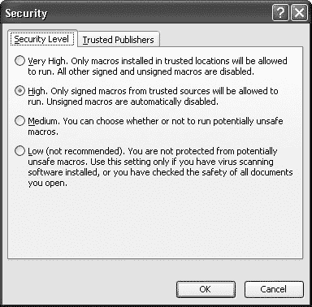

图 4-2. Microsoft Word 2003 提供了一些宏病毒的保护。

微软 Office 2007 通过更改 Office 文件本身的文件格式，更进一步地消除了宏病毒。虽然这不会阻止有人为 Microsoft Office 2007 文件编写新的宏病毒，但它阻止了大多数现有的宏病毒感染 Office 2007 文件。

# 病毒如何避免检测

病毒只有在足够长时间不被检测到，以传播到其他计算机的情况下才能生存。病毒程序员已经使用了各种策略来增加病毒的生命周期。

## 感染方法

防病毒程序可以通过两种方式之一检测到病毒。首先，防病毒程序可能识别到特定病毒的签名，这不过是病毒程序中嵌入的特定指令，告诉它如何行为和行动。病毒的签名就像罪犯的指纹——每个都是独特且不同的。

防病毒程序可以通过观察病毒尝试感染其他文件或磁盘来检测病毒的第二种方式。防病毒程序可以通过启发式分析或检测来检测到之前未知的病毒的存在。

为了绕过防病毒程序，病毒可能会采用各种繁殖方法：

**直接感染**

每当用户运行感染程序或打开感染文档时，病毒都会感染磁盘或额外的文件。如果用户不执行这两件事中的任何一件，病毒就无法传播。这是最简单但也是最容易被注意到的感染计算机的方式，并且可以很容易地被防病毒程序检测到。

**快速感染**

病毒感染任何被感染程序访问的文件。例如，如果病毒感染了您的防病毒程序，请注意！每次感染后的防病毒程序检查文件时，它实际上可以在确认该文件无病毒后立即感染该文件。

**慢速感染**

病毒只感染新创建的文件或由合法程序修改的文件。通过这种方式，病毒试图更彻底地隐藏自己的存在，以避免防病毒程序。例如，防病毒程序通常会监视试图修改它通常不应访问的文件的程序。如果您运行 Windows 资源管理器并点击一个文件以重命名它，您的防病毒程序不会发出警报，因为 Windows 资源管理器被允许修改文件。但如果病毒感染了 Windows 资源管理器，重命名文件可能会导致它同时被感染。

**稀疏感染**

这种类型的病毒感染文件时很慢，并且是任意进行的。通过缓慢且不可预测地传播，这些病毒降低了其活动（但不一定是存在）被发现的机会。

**内存驻留感染**

这种类型的病毒将自己隐藏在您的计算机的工作内存（RAM）中，每次您运行程序或插入软盘时，病毒都会感染该程序或软盘。RAM 驻留感染是引导扇区病毒传播的唯一方式，因为受害者必须物理地将感染软盘插入他的计算机中。

## 隐蔽

病毒通常通过改变它们感染的文件的大小、时间和日期戳来揭示它们的存在。然而，使用隐蔽技术的文件感染病毒可能在不造成任何这些修改的情况下完成其肮脏工作，从而保持隐藏和未被发现。

引导扇区病毒总是使用隐蔽技术。当计算机读取磁盘的引导扇区时，病毒会迅速加载真实引导扇区的副本（它已安全地将其存储在磁盘的另一个位置）。这就像当你父母在家打电话给你，确保你行为端正时，你从邻里的游泳池大厅接听电话一样使用呼叫转接。就你的父母而言，他们拨打了你的家庭电话，而你接听了。家里一切安好，或者他们认为如此。引导扇区病毒使用类似的技术来隐藏它们的存在，以免被计算机发现。但这样并不总能欺骗好的防病毒程序。为了绕过它们，病毒可能会使用多态性。

## 多态性

如果罪犯每次犯罪时都能修改他们的指纹，那么他们就会更难被抓住。这就是多态性的理念。一种*多态病毒*在感染文件时每次都会改变其签名——构成该病毒的一组指令。从理论上讲，这意味着防病毒程序永远找不到它。

然而，由于病毒需要确保它们不会反复感染相同的文件，从而通过消耗磁盘空间暴露自己，因此多态病毒仍然必须留下一个微小、稳定且独特的签名，它（或防病毒程序）可以找到。当然，一旦病毒被捕获并检查——例如，由防病毒软件供应商——防病毒程序就可以找到这些相同的签名。这就是为什么防病毒程序需要不断和频繁地更新以识别最新的病毒。

## 报复者

最佳的防御就是主动进攻。许多病毒不是被动地躲避防病毒程序，而是主动搜索并攻击它们。这些报复性病毒要么修改防病毒程序，使其无法检测到病毒，要么感染防病毒程序本身，使其成为传播病毒的共犯。在这两种情况下，被攻击的防病毒程序都会愉快地显示“您的计算机无病毒”的信息，而病毒则愉快地在您的计算机中传播。

# 防病毒程序的工作原理

防病毒程序有两个用途：一是检测和删除你电脑上现有的任何病毒，二是防止任何病毒首先感染你的电脑。为了检测和删除病毒，防病毒程序依赖于病毒签名数据库。你的防病毒程序会扫描硬盘上的每个文件，寻找这些病毒签名的实例。为了提供额外的保护，许多防病毒程序还会扫描你发送或接收的任何电子邮件。

然而，你必须勤奋地保持你的防病毒程序更新到最新的已知病毒签名库，否则新发现的威胁在扫描过程中可能不会被检测到。因此，防病毒程序永远无法对病毒达到 100%的有效性。为了扫描病毒的签名，防病毒软件的供应商必须首先获取病毒的副本并对其进行解剖，以了解其工作原理。然后供应商可以更新签名数据库，以便其防病毒程序能够识别并删除该特定病毒。

由于扫描病毒签名永远无法保护未知病毒，防病毒程序也使用一种称为启发式分析的方法，这涉及到监控可疑行为，例如一个程序突然尝试修改另一个文件。当启发式分析检测到可疑活动时，它可以警告你停止运行可疑程序。

## 比较防病毒程序

防病毒程序的有效性取决于其病毒签名数据库。由于一家公司不可能找到并解剖每个新出现的病毒，防病毒公司之间相互合作。一旦一家防病毒公司做出新的发现，它会与竞争对手分享信息（尽管不一定像竞争对手希望的那样快，这给了自己的产品一个机会，比竞争对手的产品多捕获一个病毒）。这种安排有助于所有防病毒公司保持其程序更新。

尽管防病毒公司共享信息，但每个公司仍然必须为其客户提供一种方法来更新其防病毒程序以捕获最新的威胁。由于公司更新签名数据库的时间表不同，即使是不同防病毒程序的最新版本，在检测和消除病毒方面也可能存在差异。因此，在任何给定时间，一个防病毒程序可能检测到的病毒比另一个多，尽管这通常在几天内就会改变。因此，没有一种“最佳”的防病毒程序可以声称能够捕获所有病毒或能够持续比任何竞争对手捕获更多的病毒。最好的防病毒程序只是你喜欢的，并且觉得最方便使用的程序。（要了解更多关于哪些防病毒程序擅长捕获最新一批病毒的信息，请访问病毒公告网站[www.virusbtn.com](http://www.virusbtn.com)。)

## 选择防病毒程序

由于没有反病毒程序能够始终捕捉到 100%的所有病毒，因此最好同时运行两个。但这可能会很昂贵。这里有一个更便宜的选择。

首先，使用免费的在线病毒扫描器，如图 4-3 所示 Figure 4-3，例如以下之一：

| **趋势科技的 Housecall** | [`housecall.trendmicro.com/housecall`](http://housecall.trendmicro.com/housecall) |
| --- | --- |
| **熊猫的主动扫描** | [www.pandasoftware.com/products/activescan.htm](http://www.pandasoftware.com/products/activescan.htm) |
| **RAV 反病毒在线病毒扫描** | [www.ravantivirus.com/scan](http://www.ravantivirus.com/scan) |
| **比特防御在线扫描器** | [www.bitdefender.com/scan8/ie.html](http://www.bitdefender.com/scan8/ie.html) |

第二，获取一款能够自动扫描计算机病毒并阻止任何可疑行为的反病毒程序。虽然市面上有很多商业反病毒程序，但以下三个免费的反病毒程序（仅限个人使用）包括：

| **AntiVir** | [www.free-av.com](http://www.free-av.com) |
| --- | --- |
| **AVG 反病毒软件** | [www.grisoft.com](http://www.grisoft.com) |
| **Avast 反病毒** | [www.avast.com](http://www.avast.com) |

对于完全免费的、开源的反病毒程序，请访问：

| **Clam 反病毒** | [www.clamav.net](http://www.clamav.net) |
| --- | --- |
| **开源反病毒项目** | [www.openantivirus.org](http://www.openantivirus.org) |


图 4-3。在线扫描器可以检测计算机上的病毒，但无法阻止它们感染计算机。

将免费的抗病毒程序与免费的在线病毒扫描器的定期检查相结合，可以在不额外增加您成本的情况下保护您的计算机。毕竟，病毒经常攻击 Windows 并不是您的错，那么为什么您还要额外花钱呢？

如果您使用的是 Macintosh 或 Linux 计算机，您的病毒威胁既小又大。目前，只有少数几种病毒会感染 Macintosh 和 Linux 计算机，因此可能攻击 Macintosh 或 Linux 计算机的现有病毒数量相对较少。然而，由于如此少的 Macintosh 和 Linux 用户担心病毒，很少有人拥有，更不用说使用 Macintosh 或 Linux 反病毒程序。一旦有人发明了一种新的方法来感染和传播病毒给 Macintosh 或 Linux 用户，它很可能会迅速传播到许多无防备的计算机中。总之，如果您没有反病毒程序，最终您将会被感染，无论您使用什么类型的计算机和操作系统。

从技术上来说，最大的威胁不再来自病毒，而是来自*蠕虫*和*间谍软件*。蠕虫本质上是可以自行传播的病毒，间谍软件程序跟踪你的互联网行为或从你的计算机中检索信息，并将其发送到其他地方，而你却毫不知情。（你将在第五章中了解更多关于蠕虫的信息，在第二十章中了解更多关于间谍软件的信息。）由于这些新的威胁，大多数杀毒程序不仅扫描病毒，还扫描蠕虫和间谍软件。

# 为什么人们编写病毒

病毒只是有人花费时间编写和测试的计算机程序，所以人们可能会想——为什么有人会做破坏性和有害的事情，针对他们不认识的人，而且可能永远不会见到的人？基本上，有些人编写病毒的原因和其他人喷漆在建筑物上、砸碎汽车窗户或从高架桥上扔石头的原因是一样的。人们做这些事情的原因是因为他们可以，而且因为他们通常可以逃脱惩罚。

## 为了好玩

许多人编写计算机病毒只是为了看看他们是否能做到。

编写病毒需要深入了解特定的操作系统，因此对于许多程序员来说，编写病毒是一种测试和证明他们知识的方式。许多这些早期病毒更多地被设计为概念证明，而不是故意试图破坏他人的计算机。

这些早期病毒反映了其创造者的好奇心和缺乏恶意，它们通常只是通过计算机的扬声器播放持续的蜂鸣声或重新编程键盘，每次按下 E 键时生成一个问号或其他符号。当然，很烦人，但最终是无害的。

一些病毒甚至变得顽皮，并在屏幕上显示图形图像，如救护车或一个男人在屏幕底部漫步。有一个顽皮的病毒会随机在屏幕上显示消息，“我想吃饼干。”要使消息消失，唯一的方法是输入**饼干**。其他病毒显示政治或幽默信息，如图 4-4 所示。

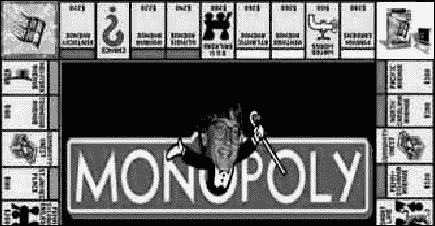

图 4-4. 《垄断病毒》戏谑比尔·盖茨及其在操作系统市场上的垄断地位。

## 为了出名

尽管人们每天都在编写和发布病毒，但大多数病毒由于编程质量差而无法传播。许多病毒编写者希望获得因创建传播更快、造成最大破坏的病毒而声名狼藉。如果一个病毒编写者能够使整个国家陷入恐慌，并且他的病毒在《今日美国》或 CNN 上被点名报道，那么他在地下病毒社区中的声誉将会飙升。

因此，恶意病毒编写者开发了越来越巧妙的策略来绕过防病毒程序，并尽可能快速地传播。他们的最终目标是创建一个将成为家喻户晓的病毒的病毒，如 Michelangelo、Melissa、Chernobyl 和 I Love You 病毒。尽管这些病毒编写者永远无法公开享受他们创作的恶名，但他们仍然可以在他们的地下黑客朋友中获得一定程度的名声。

许多病毒编写者甚至联合起来，成立了以“业余病毒创建与研究小组（AVCR）”、“国际恶意编程（CPI）”、“Phalcon/Skism”和“反对麦咖啡的年轻人（YAM）”等命名的病毒编写小组。这些小组通常出版自己的通讯，如 40Hex、The Crypt Newsletter 和 VLAD（病毒实验室与分发）杂志，解释他们最新的病毒创作是如何工作的。病毒编写小组通常运行自己的 BBS 或网站，上面有其他人可以下载和运行的活病毒。他们发布的通讯越多，传播的病毒越多，小组的名声就越大。

现在存在的病毒编写小组较少，部分原因是蠕虫传播得更快、更容易，部分原因是病毒编写者从未从他们的创作中获得利润，还有部分原因是政府当局在识别和追踪病毒编写者方面变得越来越熟练，例如 1999 年逮捕大卫·L·史密斯，他被指控编写和传播 Melissa 病毒。相反，许多病毒程序员现在发现为制作间谍软件的公司工作更有利可图。

# 寻找病毒编写教程

虽然现在大多数病毒编写教程已经过时，但阅读它们仍然可以让人了解病毒编写地下成员过去如何吹嘘他们的成就，并相互分享新想法。要找到这些历史病毒编写教程和通讯的集合，请访问 TextFiles ([www.textfiles.com](http://www.textfiles.com)) 或 Sirkus ([www.sirkussystem.com](http://www.sirkussystem.com))。

美国老鹰出版社([www.ameaglepubs.com](http://www.ameaglepubs.com))甚至提供了它曾经出版的一些早期病毒编写教程的 PDF 版本，包括《计算机病毒小黑书》（如图 4-5 所示），《计算机病毒大黑书》和《计算机病毒、人工生命与进化》。通过阅读这些教程，你会看到病毒编写者如何从零开始，使用汇编语言精心制作病毒。

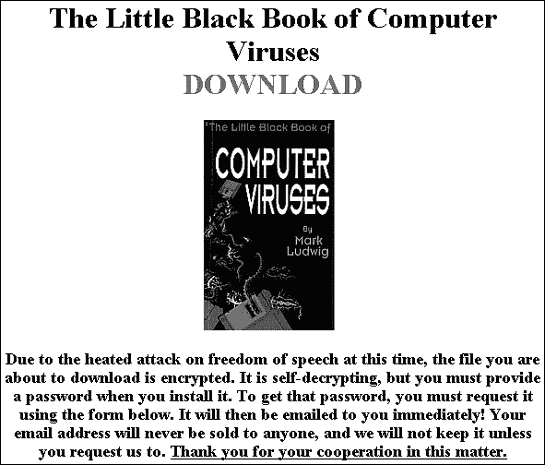

图 4-5. 《计算机病毒小黑书》提供了使用汇编语言创建不同类型病毒的逐步指导。

# 病毒编写工具包

除了通过通讯录和新病毒传播他们的声名狼藉之外，一些病毒团体还创建了病毒编写工具包。这些工具包通常配备了花哨的下拉菜单和现代图形用户界面，使得病毒编写变得像从菜单中选择你想要的特性并等待工具包为你创建定制的病毒一样简单。

最早的病毒编写工具包之一被称为 Dark Avenger 变异引擎（MtE）。病毒编写者可以将他们的作品链接到 MtE，这将变异病毒的签名，将普通病毒转变为多态病毒。理论上，MtE 将使功能上相同的病毒副本彼此不同，使得防病毒扫描器无法根据其签名检测病毒。然而，在实践中，MtE 的使用证明是困难的，并且无法完全掩盖病毒的签名，因此很少有病毒编写者实际上使用 MtE 创建病毒。

作为第一个变异引擎，MtE 因其开创了多态病毒的概念而声名狼藉。虽然 MtE 从未释放出人们最初担心的无法检测到的病毒洪水，但它确实激发了其他病毒程序员创建自己的工具包，这些工具包可以用来轻松生成病毒。

在 MtE（多态引擎）引入之后，其他病毒编写者创建了类似的多态引擎，例如 TridenT 多态引擎（TPE）和 Dark Angel 的多个加密器（DAME）。与 MtE 一样，这些其他变异引擎在创建病毒方面取得了不同程度的成功，尽管没有一种能够达到其最初承诺的完全改变病毒以避免检测的原始承诺。创建病毒本身就足够困难，而且很少有病毒编写者愿意花费额外的时间将他们的病毒链接到一个有缺陷且难以使用的变异引擎。

然而，随着病毒编写者研究了这些后来的变异引擎，他们采用了这些想法和编程技术用于他们自己的病毒。因此，尽管变异引擎从未实现其原始目标，但它们间接地激发了病毒编写者创建更难被防病毒程序检测到的病毒。

进化的下一步是完整的病毒创建程序。具有用户友好的下拉菜单和界面，这些程序让想要成为病毒编写者的人挑选他们想要的特性，病毒创建程序会自动为他们创建。第一个病毒创建程序之一是病毒创建实验室，如图 4-6 所示。

在这个时期，病毒编写者将更少的注意力放在设计更危险的病毒上，而是更多地专注于开发他们自己的病毒编写工具包，他们急切地与他人分享。图 4-7 显示了今天你仍然可以在各种黑客网站上找到的典型病毒编写工具包列表。

理论上，病毒创建工具包将允许任何人制作自己的病毒。实际上，他们创建的病毒要么不起作用，要么很容易被发现，因此它们无法造成很大损害。尽管尝试自动化生产，病毒编写工具包并没有使病毒编写更容易，也没有像最初担心的那样使世界充满不可检测的病毒。如果你想编写病毒，你仍然需要学习一种编程语言并了解特定操作系统的弱点，这实际上将病毒编写艺术限制在了一小部分对开发具有破坏性事物感兴趣且只追求匿名名声的熟练人士手中。

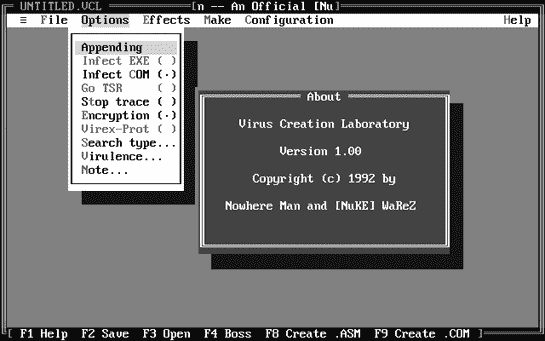

图 4-6. 病毒创建实验室提供了下拉菜单，以便快速创建定制病毒。

# 病毒神话和骗局

由于每次病毒爆发都会在计算机用户中引起歇斯底里和恐慌，因此通过发明一个虚构的病毒，你可以造成与创建真实病毒几乎一样多的麻烦。你可以在[Vmyths.com](http://vmyths.com)网站([www.vmyths.com](http://www.vmyths.com))上了解最新的病毒骗局。以下是一些典型的病毒骗局示例。请注意，在每种情况下，骗子都使用可能令人困惑的技术语言，并通过将自己与一个受信任且知名的组织联系起来来建立自己的信誉。

## 移动电话病毒骗局

在更具有破坏性的病毒骗局中，那些鼓励你将警告的副本发送给你的朋友的骗局。为了使人们相信其合法性，这些病毒骗局通常呈现看似有效和威胁性的信息，但实际上是无用的并且完全错误。通常，骗局基于一个真实的事件，这是在不知情电子邮件接收者中引起恐慌的可靠方式。

一个例子是 ICE 电话病毒骗局，它发生在合法组织 In Case of Emergency (ICE)——[www.icecontact.com](http://www.icecontact.com)——建议人们在手机的目录中添加一个条目，包含在紧急情况下要联系的人的姓名和电话号码，通过字母*ICE*访问。

恶作剧者抓住了这个机会。他们通过传播以下文本创造了并传播了 ICE 骗局：

> 警告 - ICE 是手机病毒，见下文！！对此要非常小心——尽管意图是好的，但它不幸地是手机病毒的第一阶段，正在为快速传播铺路。传播它是病毒有趣的一部分，这些编写这些事情的人真是狡猾。我们已经看到了“第二阶段”，其中程序作为铃声下载的一部分发送，进入你的地址簿，寻找它认识的东西——你已经猜到了，一个标记为“ICE 或 I.C.E.”或什么的地址簿条目。然后它将自己发送到 ICE 列表，向你收费。

这个骗局利用了人们对病毒和病毒以及特制为感染手机的病毒和特洛伊木马的恐惧，例如 RedBrowser，一个潜入手机并给俄罗斯打电话的特洛伊木马，每次通话向用户收费 5 美元。然而，请记住，真正的病毒和特洛伊木马新闻出现在 Symantec 或 Trend Micro 等合法安全网站上，而不是通过未经请求的电子邮件消息。毕竟，你会依赖一个完全陌生人的电子邮件消息来获取最新的体育比分——更不用说真正的新闻了？


图 4-7。病毒编写者很快在黑客地下世界中充斥着不同名称和功能的病毒编写工具包。

## 核战争骗局

为了使他们的骗局更具可信度，许多恶作剧者经常引用受信任的权威机构，如下面的例子，它声称你可以通过一个错误的电子邮件消息意外地发射核导弹：

> 嘿。我刚收到一封邮件，来自 Symantec，所以我想到要转发它。这是一种我们应该注意的新病毒。请将此转发给您的每一个人。这非常重要。
> 
> 病毒更新，1/07/02
> 
> Symantec 病毒警报中心
> 
> 亲爱的订阅者，作为我们持续努力确保 Symantec 客户了解病毒警报的一部分，此电子邮件已发送给所有 Symantec 订阅者。在野外检测到一种新的、致命的病毒类型。您不应打开任何标题为“立即启动核打击”的消息，因为该消息已被编程为访问科罗拉多州的 NORAD 计算机，并对俄罗斯和前苏联国家进行全面核打击。显然，一个不满的前共产主义者黑客设计了一个有害的 vb-script，实际上绕过了美国军火库的重要安全系统，并直接控制导弹和轰炸机。通过打开电子邮件，您可能正在引发末日。不用说，末日将摧毁您的硬盘并损坏您的计算机。再次警告您，请务必不要打开任何标题为“立即启动核打击”的电子邮件。您可能引发全面核浩劫。作为预防措施，所有美国核导弹都已设置为“不允许通过电子邮件启动”，以防止意外末日。然而，由于 Y2K 错误，您仍然有可能通过打开上述电子邮件而结束我们所知的这个星球上的生命。
> 
> 病毒名称：ArmaGeddyLee，HappyOrMaybeNot00，OopsWrongButton00
> 
> 传输方法：电子邮件附件中的 vb-script
> 
> 危险等级：极高
> 
> 感染区域：在野外检测到
> 
> 特征：通过核末日毁灭地球上的生命
> 
> 请将此警告转发给所有人。感谢您对此事的关注，
> 
> 诚挚地，
> 
> 瑞星反病毒团队

尽管这个骗局听起来很荒谬（任何国家会想通过电子邮件发射核导弹吗？），但将 Symantec 的名字作为病毒信息的可信来源，给这个骗局带来了明显的可信度。如果人们在转发之前验证信息，这些骗局就可以被阻止。只需快速访问 Symantec 的网站，就可以确定这个警告是否确实为真。

## 诱饵和替换病毒骗局

由于大多数人都不了解病毒是如何工作的，任何看似可信的病毒报告都可能引起大量关注。为了利用这一点，一个色情网站曾经发送了一封据称来自“Dave Norton，VirusCenter@CNN.com”的电子邮件，其中包含以下文本：

> CNN 带来关于名为“狮子之穴”的新毁灭性计算机病毒的信息。据报道，这种病毒导致互联网提供商如 AOL、MSN、Yahoo 和 Earthlink 因会员流失而损失数百万美元。

消息随后显示了一个链接，读者可以点击获取有关狮子之穴病毒的信息以及如何保护计算机免受其侵害的信息。然而，该链接并没有直接引导读者访问 CNN 网站，而是直接将他们导向色情网站。再次强调，如果人们在转发之前验证信息，这种骗局是可以被阻止的。

## 寻求公众关注的病毒骗局

2003 年，一个名为 Gobbles Security 的计算机安全/黑客小组发布了一份声明，称美国录音工业协会（RIAA）联系他们开发一种可以通过几个流行的文件共享程序中的安全漏洞传播的计算机蠕虫。据称，这种蠕虫的目的是禁用通常用于传播非法复制的 MP3 音乐文件的文件共享网络。

使这个骗局获得可信度的事实是，许多人相信 RIAA（美国录音工业协会）实际上会采取这种非法手段来关闭文件共享网络。此外，Gobbles 安全公司过去曾发布过合法的安全警告，甚至还提供了一个示例程序，说明计算机蠕虫如何利用文件共享程序中的这些漏洞。

最终，Gobbles 安全公司承认他们的声明是虚假的，他们这么做只是为了制造舆论。这告诉每个人，即使是经验丰富的计算机专业人士也可能被骗局所欺骗。记住，无论过去某人或某事多么值得信赖，他们现在都有可能为了自己的利益而对你撒谎。对所有的声明都持怀疑态度，包括你在本书中读到的所有内容，这样你应该就能安全无虞。

# 了解更多关于病毒的信息

要了解更多关于病毒（无论是真实的还是骗局）的信息，请访问以下网站之一：

| **AVP 病毒百科全书** | [www.avp.ch/avpve](http://www.avp.ch/avpve) |
| --- | --- |
| **F-Secure 安全信息中心** | [www.f-secure.com/virus-info](http://www.f-secure.com/virus-info) |
| **Sophos** | [www.sophos.com/virusinfo](http://www.sophos.com/virusinfo) |
| **Symantec** | [www.symantec.com/avcenter](http://www.symantec.com/avcenter) |
| **McAfee 安全** | [`us.mcafee.com/virusInfo`](http://us.mcafee.com/virusInfo) |
| **趋势科技** | [www.trendmicro.com/vinfo](http://www.trendmicro.com/vinfo) |

这些网站列出了所有已知的病毒（以及病毒骗局），它们的特征、造成的损害（如果有）以及如何检测它们。要交换有关计算机病毒的消息，请访问 comp.virus 或 alt.comp.virus Usenet 新闻组。

# 未来病毒威胁

随着计算环境的变化，今天的病毒威胁逐渐消失，取而代之的是新型恶意软件。由于现在使用软盘的人越来越少，文件感染和引导扇区病毒也就无法像以前那样轻易传播。同样，随着微软对其 Office 产品套件（包括 Word、Excel、PowerPoint 和 Access）的文件格式进行更改，依赖于早期版本的宏病毒也将逐渐失去其效力。

然而，尽管来自纯病毒的威胁在减少，但防病毒程序仍然重要，以保护您的计算机免受所有类型的恶意软件的侵害，而不仅仅是病毒。为了真正安全，您最终需要提供自己的一份常识，并养成良好的计算习惯（例如，不要无差别地复制和运行来自不可信来源的程序）。

# 第五章 特洛伊木马和蠕虫

准备好解放阵线成员

我这样做是为了享受创造东西的乐趣，看到它工作，并创造出真正能够生存、传播并在野外立足的东西。病毒是某种活着的东西。在现实生活中，你不能创造一种动物。你可以在电脑上做到。这就像在玩上帝。

— 蓝色猫头鹰

在 20 世纪 80 年代，一位名叫鲍勃·华莱士的程序员基于一个独特的营销方案创办了一家软件公司。他并没有强迫人们在使用软件之前付费，从而避免后来发现软件并不完全符合他们的期望。华莱士免费提供他的软件。在他的规则下，后来被称为*共享软件*，任何人都可以自由合法地复制和分享他的程序，一个名为 PC-Write 的文字处理器。那些额外付费 75 美元注册程序的用户不仅得到了一份印刷手册和技术支持，而且每当其他人也注册了他们的 PC-Write 副本时，他们还能获得 25 美元的佣金。自然地，用户们将他们注册的 PC-Write 程序复制到他们能到达的任何地方，最常见的是通过全球各地的 BBS 系统。

由于有如此多人分享 PC-Write 的副本，不可避免的事情发生了。1986 年，一个恶意黑客编写了一个特洛伊木马，并将其伪装成 PC-Write 的合法副本。当毫无戒心的用户尝试运行这个假冒的 PC-Write 副本时，特洛伊木马会格式化他们的硬盘并删除所有文件。

# 特洛伊木马的世界

尽管这个经过篡改的 PC-Write 版本是早期 IBM-PC 特洛伊木马中最突出的之一，但特洛伊木马自从第一台计算机出现以来就一直存在。最简单和最古老的特洛伊木马类型之一是窃取密码的程序。这些程序在由许多人使用的共享计算机上尤其常见，例如学校计算机实验室中的计算机。这类计算机通常要求用户输入用户名和密码，因此黑客要窃取某人的密码，只需创建一个看起来像常规登录屏幕的假程序。这个假登录屏幕会存储信息，返回错误消息，然后显示真实的登录屏幕。毫无戒心的用户会重新输入他们的用户名和密码，从而获得对计算机的访问权限，而他们从未意识到在第一次登录尝试中，他们实际上已经将自己的个人信息交给了窃取密码的特洛伊木马。

正如它名字所来源的古代希腊诡计，特洛伊木马程序依赖于欺骗。特洛伊木马通常只运行一次，但这已经足够清除文件、窃取密码或造成其他类型的损害。在 PC-Write 特洛伊木马出现后，恶意黑客开始创建类似的特洛伊木马，伪装成游戏或常见于 BBS 上的实用程序。大多数特洛伊木马只运行一次，清除硬盘上存储的所有文件，从而也移除了特洛伊木马本身，防止其传播。所以尽管特洛伊木马很危险，但它们依赖于用户的轻信来传播自己。

由于特洛伊木马只能通过欺骗人们运行它们来工作，因此许多特洛伊木马伪装成诱饵，例如最新名人的裸照或来自 Symantec 或 Trend Micro 等受信任公司的安全更新。特洛伊木马编写者也迅速利用最新的时事。当有人开始传播有关名为 AOL4Free 的病毒骗局时，另一人创建了一个特洛伊木马来利用这个谣言：

> 主题：电子邮件病毒！！！——这不是玩笑！！！
> 
> 收到此邮件的人必须将其发送给尽可能多的人。尽快解决这个问题是至关重要的。
> 
> 几小时前，有人打开了一封主题为“AOL4FREE.COM”的电子邮件。
> 
> 打开邮件几秒钟后，一个窗口出现并开始显示正在被删除的所有文件。他立即关闭了电脑，但已经太晚了。这个病毒将他摧毁了。它吞噬了 Windows '95 程序附带的防病毒软件以及 F-Prot AVS。两者都无法检测到它。
> 
> 请小心，并将此邮件发送给尽可能多的人，这样也许可以消除这种新病毒。
> 
> 不要打开标有“AOL4FREE”的电子邮件
> 
> 病毒警报！！！
> 
> 请注意，有一些信件在流传，称您将免费获得 Aol 直到 1998 年...或者免费获得 AOL 4...请删除......包含一个会清除您硬盘的病毒......在您下载并执行之后.....
> 
> 邮件主题区域......恭喜！您是赢家！
> 
> 邮件主题区域......AOL 4 Free - 免费获得 Aol
> 
> 发件人................................Matthews27 或 VPVVPPVVP
> 
> 警告您的朋友！！！！！！！！！！！！！！

AOL4Free 病毒实际上并不存在，但在这封骗局邮件流传开来不久后，一个恶意黑客就创建了一个。这个特洛伊木马声称它将为用户提供免费访问美国在线的机会。由于人们已经被告知 AOL4Free 病毒并不存在，他们觉得运行“新”的 AOL4Free 特洛伊木马是安全的。实际上，这个特洛伊木马会清除他们硬盘上的所有文件。

## 欺骗受害者

一些木马不是破坏文件，而是通过恶作剧来骚扰或戏弄用户，例如在实际上没有发生任何事情时显示一个假对话框，上面写着“现在正在格式化硬盘”，或者通过计算机的扬声器随机播放蜂鸣声。

一款名为 Yusufali 的阿拉伯木马悄悄进入计算机，并监视当前活动窗口的标题栏，例如网页浏览器。如果它发现诸如*XXX*、*sex*或*teen*等词语，表明用户可能正在访问色情网站，木马会显示《古兰经》的段落，如图图 5-1 所示。


图 5-1. Yusufali 木马阻止用户查看色情网站。

尽管像 Yusufali 这样的木马不会损害任何文件，但它们可以阻止你使用计算机，以至于你可能需要重新启动来摆脱它们令人烦恼的干扰。

## 攻击受害者的钱包

除了破坏文件外，木马还可以让你损失金钱。

在 1989 年，有人编写了艾滋病木马，声称提供关于艾滋病和 HIV 的信息。当用户运行该程序时，木马会加密他们的硬盘并显示一条信息，要求支付金钱以换取一个密码，该密码可以用来解密硬盘并恢复他们的文件。如果用户不支付任何金钱，木马作者声称，他们的硬盘将保持加密状态，他们的数据实际上被当作人质，直到赎金支付。

在 2005 年，这种类型的木马再次出现，当有人传播 PGPcoder 木马时，它也会加密文件并试图通过提供解密文件的密码来勒索用户金钱。第二年，即 2006 年，另一种勒索木马出现，名为 Cryzip，这可能是安全专家所说的恶意软件新类别，暂称为*ransomware*。

随着越来越多的人意识到病毒的危险，更多的计算机用户开始使用能够检测病毒和木马的防病毒程序，因此恶意黑客开始寻找更容易的目标。他们在智能手机易受攻击的世界中找到了机会，智能手机允许人们玩游戏、收发电子邮件和播放音乐。例如，一位恶意黑客开始传播一个名为 Mosquito 的木马，它伪装成可以在运行 Symbian 操作系统的任何智能手机上运行的游戏。一旦有人将 Mosquito 木马复制到他们的智能手机上并运行它，木马就会开始向英国、德国、荷兰和瑞士的电话号码发送短信，让受害者承担巨额电话费。

除了干扰个人电脑和智能手机外，恶意黑客还针对了索尼 PlayStation Portable 用户。许多 PlayStation 用户喜欢修改他们的 PlayStation 设备，以便除了官方的索尼游戏卡带外，还可以运行其他类型的程序，这种爱好被称为*modding*。针对这些 modders，一个恶意黑客在 2005 年编写了第一个针对索尼 PlayStation 的特洛伊木马，称为 Trojan.PSPBrick。它据说会移除使设备对 modding 更具抵抗力的索尼升级。然而，当人们安装这个特洛伊木马时，它会删除关键文件，并将 PlayStation Portable 设备变成一块无法使用的硬件。

## RAT（远程访问特洛伊木马）的到来

直到 20 世纪 90 年代末，黑客编写的病毒比特洛伊木马多，因为病毒可以比特洛伊木马传播得更广，造成更大的破坏。所有这些都改变了，1998 年，一个名为“死牛崇拜”的黑客团体发布了一种新的特洛伊木马，称为*远程访问特洛伊木马（RAT）*，它利用了互联网。像其他特洛伊木马一样，RAT 只能通过欺骗用户来运行，但一旦启动，它们也可以连接到互联网，并直接与创建它们的黑客通信。

### 将 RAT 悄悄植入计算机

RAT 由两个独立的程序组成：客户端文件和服务器文件。服务器文件通过欺骗用户运行它来感染计算机。客户端文件在黑客的计算机上运行，并控制被 RAT 服务器文件感染的任何计算机。

为了诱骗受害者运行服务器文件，RAT 可能会伪装成附带的新闻故事（例如关于美国军事力量捕获奥萨马·本·拉登的骗局），或者伪装成包含名人性行为的图形图像文件，或者伪装成简单的游戏，如图图 5-2 所示。

RAT 服务器文件的一个问题是它们往往相当大，大小可以达到 1MB。一个机敏的用户可能会想知道一个包含所谓新闻故事内容的文件为什么会这么大。为了避免因为 RAT 服务器文件体积庞大而暴露潜在受害者，RAT 黑客使用了两种欺骗策略：后门特洛伊木马和绑定程序。

与全尺寸 RAT 不同，后门特洛伊木马通常是一个小文件，其大小允许它伪装成其他东西，例如简单的游戏或新闻故事。当受害者运行后门特洛伊木马时，程序所做的只是打开一个网络端口——“后门”——进入受感染的计算机。现在黑客可以通过这个开放的端口发送一个更大的文件，例如功能齐全的 RAT。一旦这个文件安装到计算机上，后门特洛伊木马就没有进一步的使用价值，可以忽略或删除。

将功能齐全的 RAT 偷偷运送到计算机的另一种方法是使用绑定程序，该程序将两个程序合并到一个文件中。当有人运行一个“绑定”文件时，两个程序同时运行。黑客使用绑定程序将 RAT 绑定到合法程序上，这样任何文件都可以成为安装木马的马车。由于大多数程序，如游戏演示或实用程序试用版，本身就已经很大，因此绑定 RAT 增加的体积不太可能被发现。当受害者运行绑定文件时，RAT 会秘密地与合法程序一起安装。

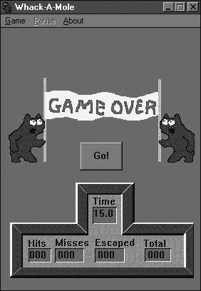

图 5-2. RATs 经常伪装服务器文件的真正身份，假装成游戏。

### RATs 工作原理

RAT 通过发送信息通过互联网端口来工作。当计算机通过互联网交换信息时，它们将它们的物理互联网连接划分为虚拟端口，每个端口处理特定类型的信息；例如，电子邮件消息在一个端口上接收，而网页通过另一个端口查看。端口号标识每个端口上接收的信息类型，以便操作系统知道将其导向何处。例如，按照惯例，任何到达计算机端口 25 的数据应该是电子邮件，任何到达计算机端口 80 的数据应该是一个网页。

RAT 的服务器程序在感染计算机后首先要做的是在其网络连接上打开一个或多个端口，以便向 RAT 客户端程序广播其存在。由于理论上计算机可以同时使用数千个不同的编号端口，而且操作系统隐藏了这些细节，使得普通用户无法察觉，因此大多数用户永远不会注意到 RAT 是否打开了许多可用端口之一，或者一个开放的端口是否被 RAT 而不是合法应用程序使用。

在感染计算机的网络连接上打开一个端口后，RAT 服务器等待来自运行在恶意黑客计算机上的 RAT 客户端的消息。RAT 客户端是如何定位 RAT 服务器实例的？黑客们简单地扫描他们能找到的每个联网计算机上的开放端口，寻找 RAT 服务器安装后打开的特定端口。不同的 RAT 使用不同的端口，因此 RAT 黑客可以判断其 RAT 何时在机器上运行。例如，名为 Backage 的 RAT 使用端口 411，而另一个名为 Ripper Pro 的 RAT 使用端口 2023，尽管黑客可以配置 RAT 连接到任何端口号。

RAT 客户端文件只能控制被相应服务器文件感染的计算机，因此黑客需要使用 Ripper Pro 的客户端文件来控制被 Ripper Pro 服务器文件感染的计算机，例如。一旦黑客发现了他特定的 RAT 使用的开放端口，他就可以使用 RAT 客户端程序连接到服务器，并通过它像坐在键盘前一样控制受感染的计算机。在受感染的计算机上输入的任何内容（密码、信用卡号、社会保障号等）都可以被运行 RAT 客户端的黑客看到。这种交互在图 5-3 中展示。

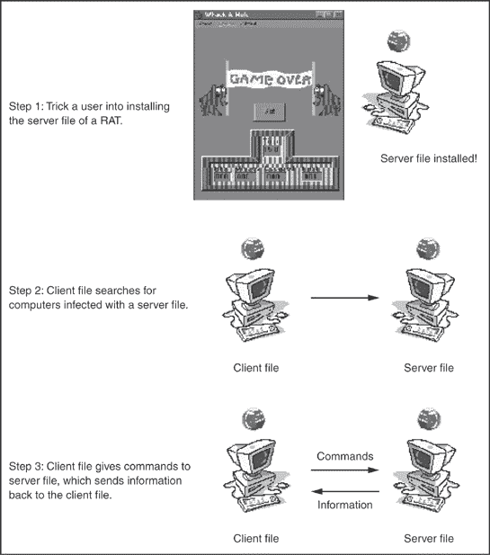

图 5-3. RATs 由一个客户端文件和一个服务器文件组成，它们协同工作，允许恶意黑客通过互联网远程控制计算机。

一些 RAT 甚至可以捕获受感染计算机的屏幕图像和按键，并将它们（编码为纯文本）发送回黑客。显示了 Optix Pro RAT 客户端的用户界面，它提供了按钮访问其控制受感染计算机的许多功能。

一旦 RAT 的服务器感染了您的计算机，任何拥有相应客户端程序的人都可以访问和控制它。因此，您不仅要担心最初创建特洛伊木马的黑客，还要担心一群黑客，他们通常会例行检查互联网上的计算机，寻找具有开放端口和等待接收并执行 RAT 客户端指令的服务器。

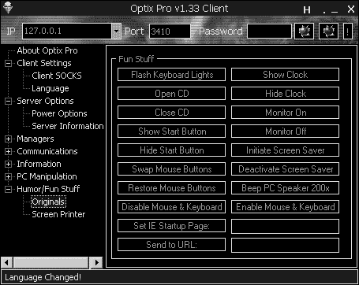

图 5-4. RAT 的客户端文件为控制该 RAT 服务器文件感染的计算机提供了各种功能。

# 蠕虫：自我复制病毒

如今大多数“病毒爆发”实际上都是蠕虫，尽管媒体倾向于将“病毒”和“蠕虫”这两个词互换使用。技术上讲，病毒只能通过感染其他东西（如程序文件或 Microsoft Word 文档）来传播，然后必须复制。当有人复制受感染的程序文件或 Word 文档时，他就帮助病毒传播。

蠕虫比病毒更危险，因为蠕虫是自我传播的。在其最简单的形式中，蠕虫程序所做的只是复制和传播自己，但这一行为本身就足以经常堵塞网络带宽，减缓或崩溃计算机，就像 1988 年莫里斯互联网蠕虫的案例一样，据报道感染了多达 6,000 台计算机。真正的危险发生在蠕虫在传播过程中传递恶意有效载荷时，例如在受感染的计算机上放置一个远程访问木马（以便黑客以后可以监视它）或删除关键文件。

蠕虫通常通过“始终在线”的互联网连接传播，如个人使用的电缆或 DSL 调制解调器，或企业使用的 T1 和 T3 线路。虽然可以通过拨号连接传播蠕虫，但拨号连接速度较慢，这也限制了蠕虫传播的速度。

蠕虫传播的常见方式有通过电子邮件、互联网中继聊天（IRC）频道或即时消息服务，以及互联网端口。一些蠕虫仅通过一种方法传播自己，而另一些则使用多种方法的组合以确保尽可能快速地传播。

## 电子邮件蠕虫

为了通过电子邮件传播，蠕虫会搜索电子邮件应用程序（如 Microsoft Outlook 或 Outlook Express）的地址簿。一旦蠕虫找到地址簿，它就会将自身的副本连同欺骗性的主题行（如 2000 年爱虫蠕虫使用的“我爱你”或 2004 年 Zafi 蠕虫使用的“圣诞快乐”）一起发送到存储的某些或所有地址。

与来自未知来源的垃圾邮件不同，蠕虫的电子邮件来自收件人很可能认识的人（否则电子邮件地址就不会首先存储在人的地址簿中）。人们倾向于信任来自熟悉来源的电子邮件，打开消息及其附件，而不会怀疑其中包含蠕虫。

为了进一步诱使用户运行恶意附件，蠕虫可能会错误地将附件内容描述为图形文件（一个名人性行为），电子贺卡，或者看似无害的文本文件（MyDoom 蠕虫使用的技术）。当受害者打开附件时，蠕虫会从新受害者的地址簿中复制电子邮件地址，并再次向世界各地的新一批人发送邮件。

## IRC/即时消息蠕虫

IRC 网络是任何人都可以加入的聊天室群体。要访问 IRC 网络，用户必须运行一个名为客户端的 IRC 程序，这允许他连接到 IRC 服务器。选择要访问的 IRC 网络后，用户然后选择一个特定的 IRC 频道进行聊天。

当一个 IRC 蠕虫感染了计算机，它会启动该计算机的 IRC 客户端程序，通常是流行的 mIRC 程序。一旦蠕虫在其宿主计算机上运行了 IRC 客户端程序，它就会随机连接到一个 IRC 网络和频道，并试图欺骗聊天者接受一个包含其副本的文件，将其伪装成流行录音艺术家的 MP3 文件或名人的色情图像。

当一个毫无戒备的 IRC 用户同意下载 IRC 蠕虫提供的文件时，蠕虫也会感染该人的计算机，并且蠕虫可以使用新受害者的 IRC 客户端连接到另一个 IRC 网络，并再次开始蠕虫的传播。

即时消息（IM）蠕虫的工作方式与 IRC 蠕虫相似。IM 蠕虫加载一个 IM 程序，如 MSN Messenger，并向聊天室中的每个人发送提供诱人文件的消息，当下载这些文件时，会感染用户的计算机并继续循环。

## 互联网蠕虫

电子邮件和 IRC 蠕虫都使用特洛伊木马策略来欺骗受害者感染他们的计算机。互联网蠕虫可以在用户甚至没有意识到攻击、感染和传播的情况下感染计算机。互联网蠕虫扫描易受攻击的计算机以寻找特定的开放端口，然后将自身下载到这些机器上，通常利用目标计算机操作系统的漏洞来逃脱检测。一旦互联网蠕虫感染了计算机，它就会扫描互联网以寻找其他易受攻击的计算机。

Santy 蠕虫采取了一种略有不同的方法。它不是直接扫描目标计算机（从而冒着暴露其存在风险），而是使用 Google 搜索引擎来寻找运行社区论坛程序（称为 PHP 公告板，phpBB）有缺陷版本的计算机。然后，它针对这些特定的计算机进行感染。通过采取这种方法，Santy 蠕虫不会浪费时间尝试感染那些不会帮助其传播的计算机（例如，任何运行 Mac OS X 的计算机）。

## 恶意网页

在不知不觉的计算机上安装特洛伊木马的最新技术涉及恶意网页。首先，特洛伊木马感染了一个托管网站的服务器。然后，每次有人访问该网站时，特洛伊木马都会感染该人的计算机。

虽然浏览可能感染您计算机的网站的想法可能令人恐惧，但技术细节阻止了这些类型的特洛伊木马变得更加普遍。首先，特洛伊木马必须感染托管网站的服务器。因此，如果黑客想将微软的网站变成恶意网页，他首先必须找到托管微软网页的服务器，然后他必须让特洛伊木马感染该计算机。

如果黑客能够成功感染服务器，那么他接下来就必须感染用户的电脑。这依赖于 ActiveX 控件，这些是微软用来更新 Windows 的小型程序，以及防病毒供应商用来运行您硬盘在线扫描的程序。由于 ActiveX 控件仅在 Windows 下运行，因此只有 Windows 电脑容易受到攻击，而且只有那些使用 Internet Explorer 的 Windows 电脑才会受到攻击。由于 Firefox 和 Opera 都不允许 ActiveX 控件运行，因此特洛伊木马无法感染运行这些浏览器的电脑。（ActiveX 控件比特洛伊木马更常用于在用户的电脑上安装间谍软件。有关间谍软件的更多信息，请参阅第二十章。）

尽管恶意网页的威胁是真实的，但感染正确服务器以及随后感染用户电脑所涉及的问题限制了恶意网页成为传播特洛伊木马和其他恶意软件的突出方式。

# 阻止蠕虫和特洛伊木马

如果您连接到互联网，您的电脑最终可能会被特洛伊木马或蠕虫攻击。为了保护自己，您需要检测并移除电脑上已有的任何特洛伊木马或蠕虫，并防止它们再次感染您的电脑。

第一步是使用防病毒程序（有关防病毒程序的列表，请参阅第四章），该程序将寻找特洛伊木马或蠕虫的独特指纹或签名，并从您的电脑中移除所有痕迹。为了进一步防止远程访问木马（RATs），您还可以购买专门的抗特洛伊木马程序，例如：

| **Bo Clean** | [www.nsclean.com](http://www.nsclean.com) |
| --- | --- |
| **Ewido 安全套件** | [www.ewido.net](http://www.ewido.net) |
| **Tauscan** | [www.agnitum.com](http://www.agnitum.com) |
| **The Cleaner** | [www.moosoft.com](http://www.moosoft.com) |
| **黑客消除器** | [www.lockdowncorp.com](http://www.lockdowncorp.com) |
| **TrojanHunter** | [www.misec.net/trojanhunter](http://www.misec.net/trojanhunter) |

由于远程访问木马和蠕虫都可以通过开放的网络端口潜入和退出电脑，因此您还需要一个防火墙来阻止这些端口。有了防火墙，即使远程访问木马或蠕虫确实感染了您的电脑，它也无法通过其习惯的端口与外界通信和传播。不幸的是，防火墙无法保护电脑免受蠕虫可能造成的任何损害。

许多蠕虫依赖于利用受害机器上运行的软件（如操作系统）的漏洞，因此请确保下载操作系统和应用程序发布的每个更新。当然，这不会保护您的电脑免受那些知道如何利用尚未报告和修补的漏洞的蠕虫的攻击，但至少可以限制不必要的暴露。

为了阻止蠕虫的传播和感染，考虑使用流行的软件的替代品。大多数远程访问木马（RAT）和蠕虫针对 Windows 操作系统，因此没有什么能比切换到非 Windows 操作系统（如 Linux 或 BSD）使你的电脑更安全。

如果你仍然坚持使用 Windows，你可以通过不使用 Microsoft Outlook 或 Outlook Express 来阻止电子邮件蠕虫。相反，尝试使用 Thunderbird ([www.mozilla.org](http://www.mozilla.org))、Pegasus Mail ([www.pmail.com](http://www.pmail.com))或 Eudora ([www.eudora.com](http://www.eudora.com))。为了阻止大多数 IRC 蠕虫，从 mIRC 切换到 Visual IRC ([www.visualirc.net](http://www.visualirc.net))、XiRCON ([www.visualirc.net](http://www.visualirc.net))或 X-Chat ([www.xchat.org](http://www.xchat.org))。为了进一步帮助从你的电脑中移除蠕虫和特洛伊木马，下载 Microsoft 的恶意软件移除工具的免费副本 ([www.microsoft.com/security/malwareremove/default.mspx](http://www.microsoft.com/security/malwareremove/default.mspx))。

阻止特洛伊木马和蠕虫的关键是防止它们最初访问你的电脑（通过使用防火墙来阻止它们使用的端口），检测和移除任何现有的特洛伊木马和蠕虫（使用防病毒和特洛伊木马清理程序），以及停止使用最常被用来传播它们的程序（Windows、Outlook、mIRC 等）。无论你安装了什么防御措施，你的电脑仍然可能成为特洛伊木马和蠕虫的目标，但至少你的电脑遭受损害或助长这些威胁传播的机会会小一些。

# 跟踪威胁

为了了解最新的安全威胁，请访问 CERT ([www.cert.org/advisories](http://www.cert.org/advisories))、病毒列表 ([www.viruslist.com](http://www.viruslist.com))、安全焦点 ([www.securityfocus.com](http://www.securityfocus.com))、SANS (SysAdmin, Audit, Network, Security)研究所 ([www.sans.org](http://www.sans.org))或 Symantec ([`securityresponse.symantec.com`](http://securityresponse.symantec.com))。

最终，对特洛伊木马和蠕虫传播方式的知识和理解将比所有防御程序更有用。如果你在处理可疑威胁时没有稍微运用一些常识，那么世界上所有的防火墙和反特洛伊木马程序都不足以保护你的电脑。

# 第六章. 软件盗版

对于上帝来说，唯一不可能的事情是：在地球上找到任何版权法的任何意义。

—— 马克·吐温

当人们开始用纸带、磁带盒、软盘和 CD 销售第一台计算机程序时，人们发现他们可以轻松地复制一个程序并与朋友分享。这种公然的复制促使 Altair 计算机 BASIC 解释器的程序员给同好们写了一封公开信，敦促他们不要非法复制或盗版软件：

> 致爱好者的公开信
> 
> 威廉·亨利·盖茨三世
> 
> 1976 年 2 月 3 日
> 
> 对我来说，目前爱好者市场中最关键的事情是缺乏好的软件课程、书籍和软件本身。没有好的软件和懂得编程的所有者，爱好者电脑就是浪费。高质量的软件会被编写用于爱好者市场吗？
> 
> 几乎一年前，保罗·艾伦和我，预计爱好者市场会扩大，雇佣了蒙特·大卫奥夫并开发了 AltairBASIC。尽管最初的工作只花了两个月，但我们三个人在过去的这一年里大部分时间都在记录、改进和添加 BASIC 的功能。现在我们有 4K、8K、EXTENDED、ROM 和 DISKBASIC。我们使用的计算机时间价值超过 40,000 美元。
> 
> 我们从声称使用 BASIC 的数百人那里得到的反馈都是积极的。然而，有两个令人惊讶的事情很明显，1) 这些“用户”中的大多数从未购买过 BASIC（所有 Altair 所有者中不到 10%的人购买了 BASIC），2) 我们从爱好者销售中获得的版税使得在 Altair BASIC 上花费的时间价值低于每小时 2 美元。
> 
> 为什么会这样？正如大多数爱好者必须意识到的那样，你们中的大多数都在盗版软件。硬件必须付费，但软件是共享的东西。谁在乎那些为之工作的人是否得到报酬呢？
> 
> 这公平吗？通过盗版软件，你做的唯一一件事不是为了某个可能遇到的问题报复 MITS^([1])。MITS 不通过销售软件赚钱。我们收到的版税、手册、磁带和开销使得这是一个盈亏平衡的运营。你做的事情之一是阻止好软件的编写。谁会免费做专业工作呢？哪个爱好者能投入 3 人年进行编程，找出所有错误，记录他的产品并免费分发呢？事实上，除了我们之外，没有人大量投资于爱好者软件。我们已经编写了 6800BASIC，正在编写 8080APL 和 6800APL，但几乎没有动力将这种软件提供给爱好者。最直接的是，你做的事情就是盗窃。
> 
> 那些重新销售 AltairBASIC 的人呢？他们不是在爱好者软件上赚钱吗？是的，但那些向我们报告的人最终可能会亏损。他们是那些给爱好者带来坏名声的人，应该被从他们出现的任何俱乐部会议上踢出去。
> 
> 我很感激任何愿意付款或提出建议或评论的人的来信。请写信给我，地址是 1180 Alvarado SE, #114, Albuquerque, New Mexico, 87108。没有比能够雇佣十个程序员并将优质软件倾注于爱好者市场更让我高兴的事情了。
> 
> 比尔·盖茨
> 
> 微软合伙人

# 复制受版权保护的软件

尽管比尔·盖茨多次呼吁，但软件盗版不仅繁荣发展，还以俚语“warez”之名扩散。在早期，软件出版商试图通过在加密软盘上分发程序来保护他们的产品，但其他公司很快推出了能够复制加密软盘的特殊程序，表面上是为了备份目的。

一些软件出版商在他们的程序中附带了一个名为狗锁的硬件设备，通常连接到计算机的并行端口。每次程序运行时，它都会检查这个狗锁是否连接到计算机。如果没有找到狗锁，程序就会假设它已被非法复制，并拒绝运行。

黑客们很快找到了使用软件模拟这些狗锁的方法，本质上是通过欺骗程序，使其在实际上没有连接狗锁的情况下，认为狗锁已经连接到计算机。许多公司甚至开始销售软件狗锁模拟器，例如 Spectrum Software ([www.donglefree.com](http://www.donglefree.com)) 和 SafeKey International ([www.safe-key.com](http://www.safe-key.com))。

当新兴的在线服务如美国在线出现时，软件盗版变得更加猖獗。黑客们成立了软件破解小组，并给自己取了像 Phrozen Crew、Fantastic Four Cracking Group 和 International Network of Crackers 这样的名字。这些破解小组相互竞争，争夺复制受保护的程序（通常是游戏）的副本，移除复制保护方案，并在 BBS 和在线服务如美国在线上分发破解后的程序。

为了炫耀他们的成就，破解小组会在尝试运行破解程序时插入一个屏幕。这些屏幕被称为*crack intros*或简单地称为*cracktros*，通常显示彩色图形来宣传破解小组的名字、他们的 BBS 号码、对朋友的致谢或只是一个愚蠢的信息，如图图 6-1 所示。

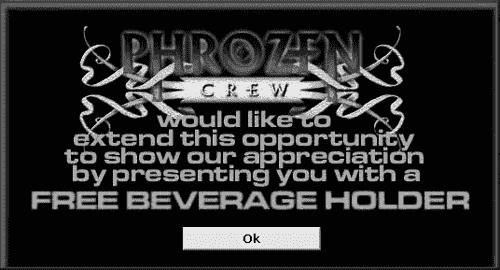

图 6-1. Cracktros 让每个人都知道哪个破解小组负责破解了特定的程序。

要查看由各种破解小组创建的更多 cracktros 示例，请访问 Defacto2 ([www.defacto2.net](http://www.defacto2.net))、Flashtro ([www.flashtro.com](http://www.flashtro.com)) 或 Cracktros 的世界 ([`cracktros.planet-d.net`](http://cracktros.planet-d.net))。

在那些不使用破解程序的人中，复制保护确实防止了随意复制，但它也阻止了合法用户备份他们的软件。一杯洒在加密软盘上的饮料可能会有效地毁掉价值 495 美元的程序。

为了在不给合法用户带来太多不便的情况下拷贝保护他们的软件，软件出版商尝试了各种方案。其中一些方法涉及每次程序启动时在用户手册中输入特殊代码。另一种方法是将程序“锁定”到特定的硬盘上。这要求你在使用不同计算机上的安装盘之前，从第一台计算机“解锁”并删除程序。

这个故事可能是虚构的，但据说微软甚至在其 Microsoft Word 的 MS-DOS 版本上尝试了一种奇特的拷贝保护形式。程序会定期检查是否从合法的拷贝保护软盘上运行。如果检测到盗版拷贝，程序就会通过销毁它找到的任何文件来进行报复。直到 Word 意外地销毁了计算机记者的文件，这种拷贝保护形式才为人所知。更糟糕的是，这位记者一直在运行合法的 Microsoft Word 拷贝。

微软迅速否认了这种拷贝保护形式的存在，然后指责一个暑期实习生未经公司许可或知情就将报复功能植入 Microsoft Word。

尽管消费者讨厌它，但拷贝保护机制仍然存在于大多数软件程序中，直到硬盘变得更便宜、更常见。然后，用户需要将他们的软件从软盘复制到硬盘上。软件出版商不再通过物理阻止程序被复制，而是求助于使用序列号进行验证。

* * *

^([1]) 微仪器和遥测系统（MITS）是制造第一台个人电脑 Altair 8800 的公司。

# 克服序列号

安装许多程序时，你必须输入一个序列号，通常在附带的注册卡上找到，或者（如果你从互联网上下载了软件）在软件出版商的电子邮件消息中包含。通过输入有效的序列号，通常是一个不寻常的字母和数字组合，你“解锁”软件并将其安装到你的计算机上。

当然，有些人发现序列号很容易被破解。他们只是简单地复制他们的有效序列号并在朋友之间传递。由于他们不再需要使用编程技能来破解任何类型的拷贝保护，破解者只需建立包含大量不同程序有效序列号的网站，任何人都可以立即使用，如图 6-2 所示。

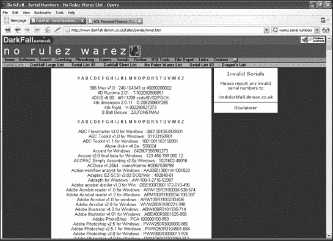

图 6-2. 许多破解网站提供各种不同程序的序列号。

除了在网站上存储不同程序的序列号可能会被关闭之外，其他黑客还存储了可以在数据库中下载、搜索和更新的序列号，如图 6-3 所示。

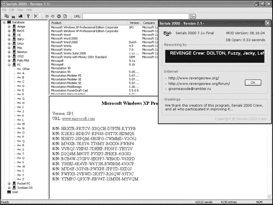

图 6-3。您可以在 Serials 2000 数据库中找到不同程序的序列号列表，该数据库可在互联网上下载。

这种方法的一个问题是，扩展数据库通常需要人们共享他们的有效序列号。由于很少有人愿意这样做，黑客们创建了特殊的序列号生成程序，这些程序使用与程序本身相同的算法。

尽管序列号看起来是数字和字母的随机组合，但实际上它们是由数学公式生成的。因此，虽然猜测一个程序的合法序列号几乎是不可能的，但通常可以通过逆向工程程序来确定它在验证过程中使用的特定公式。

要逆向工程一个程序，黑客们使用称为反汇编器的特殊程序，这些程序可以将程序转换为汇编语言指令。一旦黑客理解了确切的验证方法，他们就可以创建一个程序来生成与目标程序序列号验证公式匹配的随机序列号。大多数公司为不同的产品使用相同的序列号验证公式，因此黑客为不同的供应商开发了不同的序列号生成器，例如微软和 Adobe，如图 6-4 所示。

要找到列出序列号或提供序列号生成器的网站，请访问 CrackHell（[www.crackhell.com](http://www.crackhell.com)）、KeyGen（[www.keygen.us](http://www.keygen.us)）、MegaZip（[www.megazip.com](http://www.megazip.com)）或 Serials（[www.serials.ws](http://www.serials.ws)）。

### 注意

在访问任何黑客网站时要小心，因为它们通常会向你弹出装满色情内容的窗口，并试图偷偷地将间谍软件（见第二十章“广告软件和间谍软件”）安装到你的电脑上。为了安全起见，请在运行 Linux 或 Mac OS X 等非 Windows 电脑上浏览黑客网站。


图 6-4. 序列号生成器可以为 Adobe 或 Microsoft 等公司的一系列产品开发“有效”的序列号。

# 打败产品激活

最新尝试遏制软件盗版的措施涉及产品激活。当你安装一个使用产品激活的程序时，它会收集关于计算机 CPU、硬盘、显卡和其他硬件的信息，以创建一个唯一的标识符。然后程序将此信息，连同用户输入的序列号，发送给软件出版商。这会将特定的序列号与特定的计算机绑定，防止任何人将此序列号用于另一台计算机。

产品激活阻止了有效序列号的广泛共享，但仍无法击败序列号生成器，因为总是可以生成新的序列号并将其链接到另一台计算机。

更麻烦的是，从用户的角度来看，产品激活充其量是件麻烦事，最糟糕的情况下则是一场大灾难。Intuit 曾经销售其流行的 TurboTax 程序，该程序的产品激活在许多情况下实际上阻止了人们安装和使用他们合法购买的软件。当 Symantec 开始将其 Norton Antivirus 程序与产品激活一起提供时，也遇到了类似的问题。在 Symantec 的情况下，产品激活会在每次计算机启动时要求输入序列号。无论用户输入多少次有效的序列号，产品激活最终会在几天后关闭，并完全停止 Norton Antivirus 的工作。在这两种情况下，产品激活程序中的错误最终惩罚了合法用户。

产品激活可能阻止普通计算机用户盗版软件，但它对决心已定的黑客毫无作用，这些人最有可能首先盗版软件。当微软为 Windows 引入产品激活时，黑客们开发了产品激活补丁，可以修改操作系统并阻止其产品激活功能工作，如图 6-5 所示。


图 6-5. 要击败产品激活，许多黑客开发了补丁，这些补丁会欺骗程序认为它已经被激活。

就像序列号和复制保护一样，产品激活阻止了随意复制，但给软件出版商带来了额外的麻烦和费用。无论软件出版商使用什么方法来防止盗版，他们只能成功减缓软件海盗，而不能消除他们。产品激活在理论上可能有效，但正如每个黑客都知道的，理论在现实（和虚拟）的计算机世界中毫无意义。

# 盗版网站

在过去，人们通过将程序复制到软盘上并将副本给其他人来盗版软件。后来，海盗运行私人 BBS 并通过电话线交换软件。

当海盗发现互联网时，他们建立了自己的网站进行非法软件交易，如图图 6-6 所示。一些流行的黑客网站列表包括 Warez List ([www.warezlist.com](http://www.warezlist.com))、DirectDL ([www.directdl.com](http://www.directdl.com))、AllSeek ([`top.allseek.info`](http://top.allseek.info))、CrackDB ([www.crackdb.com](http://www.crackdb.com))和 Warez Files ([www.warez-files.com](http://www.warez-files.com))。

由于网站容易被当局追踪，海盗很快转向通过文件共享网络（如 FastTrack、Gnutella 和 BitTorrent）以及 Usenet 新闻组交换程序。

文件共享网络的一个问题是，当局可以追踪到任何用户的互联网协议（IP）地址，然后通过将计算机的 IP 地址与物理地址联系起来，通常可以抓获明显的文件共享者并惩罚他们。

这就是为什么越来越多的海盗涌向 BitTorrent。与 Gnutella 这样的传统文件共享网络不同，你不需要搜索任何其他人的计算机。相反，你必须访问一个网站，称为索引网站，它提供你可以下载的文件列表，例如电影、程序或音乐。一旦你点击一个文件，索引网站就会将你引导到所有拥有该文件的计算机。

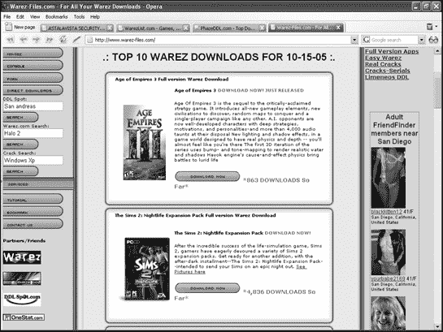

图 6-6. 海盗通常通过海盗网站之间交换软件。

更令人惊讶的是，一旦你开始下载文件，BitTorrent 就允许你同时与任何人共享该文件。这不仅加快了文件传输速度，而且还确保了如果您的计算机与另一台计算机断开连接，您仍然可以从不同的计算机下载您需要的文件部分。由于其处理大文件的能力和下载速度，BitTorrent 迅速成为各种海盗的首选。

# Usenet 新闻组：新的盗版滋生地

虽然大多数海盗使用 BitTorrent 来共享文件，但许多海盗也使用看似过时的 Usenet 新闻组。

在 Usenet 新闻组中，盗版者可以匿名上传程序，任何人也可以匿名下载。无论他们多么努力，当局只能确定软件盗版正在发生；他们无法追踪违法者。

最初，与网页的点对点便利性相比，Usenet 新闻组相当繁琐。试图找到特定的程序意味着要浏览多个新闻组。此外，Usenet 新闻组对每个文件施加了 10,000 行的固定文件大小限制，这意味着大型文件，如盗版程序，必须分成几部分，分别下载并重新组装。如果缺少任何一部分，程序将无法运行。因此，Usenet 新闻组通常对不太懂技术的用户来说过于麻烦。

为了使在新闻组中搜索文件更容易，程序员创建了一种新的文件格式，称为 NewzBin (NZB)，将 Usenet 新闻组变成一个快速索引和下载资源，用于盗版软件。

要在 Usenet 新闻组中搜索文件，你可以访问更常见的新闻组，如 alt.binaries.warez，或者你可以使用 Usenet 新闻组搜索引擎，如 alt.binaries.nl ([`alt.binaries.nl`](http://alt.binaries.nl))、BinCrawler ([www.bincrawler.com](http://www.bincrawler.com))、Newzbin ([www.newzbin.com](http://www.newzbin.com))或 Find Free Files ([www.findfreefiles.com](http://www.findfreefiles.com))），如图 6-7 所示。

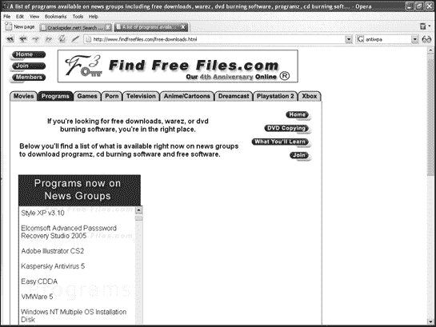

图 6-7。通过搜索 Usenet 新闻组，你可以找到可以下载的盗版程序，例如 Adobe Illustrator 或 VMware。

一旦找到你想要的盗版程序，你可以使用支持 NZB 文件的新闻阅读器程序，例如 NewsMan Pro ([www.newsmanpro.com](http://www.newsmanpro.com))、Binary Boy ([www.binaryboy.com](http://www.binaryboy.com))、NewsBin Pro ([www.newsbin.com](http://www.newsbin.com))或 News Rover ([www.newsrover.com](http://www.newsrover.com))，如图 6-8 所示，来下载它，而无需手动搜索。

将支持 NZB 的新闻阅读器与高速、专用新闻服务器（如 NewsDemon ([www.newsdemon.com](http://www.newsdemon.com))）、GigaNews ([www.giganews.com](http://www.giganews.com))或 AstraWeb ([www.news.astraweb.com](http://www.news.astraweb.com)））结合使用，你就可以开始下载你想要的全部盗版软件，而无人知晓你的身份。

自从计算机问世以来，人们一直在盗版软件，这种情况在不久的将来也不会改变。发展中国家以及中国和俄罗斯等国家的人们盗版软件是因为他们负担不起其他方式。这并不意味着盗版是正确的，但考虑到单份 Adobe Photoshop 的价格超过世界上大多数人一个月的收入，可以肯定地说，对于一些人来说，盗版将始终是一个比诚实地购买软件更具吸引力的选择。


图 6-8。新闻阅读器可以帮助你在新闻组中找到破解软件，例如 Microsoft Windows Vista 的副本以及一个禁用 Windows Vista 产品激活功能的补丁。

为了反击盗版，美国电影协会（MPAA）和录音工业协会（RIAA）已经使用了几种不同程度成功的技巧。最初，MPAA/RIAA 针对的是从他们的电脑上分享大量文件的个人，比如一千个或更多。通过起诉这些个人，MPAA/RIAA 希望吓阻其他人不要分享文件。

为了进一步遏制盗版，MPAA/RIAA 还“毒化”了文件共享网络，添加了虚假文件。如果人们继续下载虚假文件，MPAA/RIAA 希望他们会放弃文件共享网络，转而使用合法的网络。

接着，MPAA/RIAA 开始针对制作文件共享程序的公司。在 2005 年，MPAA/RIAA 设法起诉并关闭了 Grokster 和 WinMX 的出版商。通过剥夺交换文件所用的软件，MPAA/RIAA 希望逐一关闭文件共享网络。

对于他们最新的策略，MPAA/RIAA 针对的是提供访问盗版文件的搜索引擎，例如 BinNews.com，它允许人们搜索 Usenet 新闻组中的破解软件，或者 IsoHunt.com，它提供了指向 BitTorrent 文件的链接，如完整长度的电影或像 Adobe Photoshop 这样的主要应用程序。

一般而言，寻找盗版程序可能会很繁琐——有时让盗版程序运行起来可能比出去购买它还要令人沮丧。对于黑客来说，软件盗版是一个挑战。对于普通用户来说，只有在方便的时候盗版才具有吸引力。但对于专门的软件盗版者来说，盗版可以是一种生活方式，软件出版商能做的任何事情都无法阻止它。
