# 第四部分. 真实世界的黑客

# 第十三章. 互联网骗子

显然，犯罪是有回报的，否则就不会有犯罪。

— G. GORDON LIDDY

当大多数人想到网络犯罪时，他们会想到黑客窃取信用卡号码并为他人累积巨额费用。尽管这可能会发生，但网络上的最大威胁不是黑客，而是骗子，其中许多人使用电脑的能力并不比他们所欺骗的人强。

无论骗子是亲自欺骗受害者，通过邮件，通过电话，还是通过互联网，他们都会遵循相同的基本方法：

1.  承诺以极少的努力或没有努力就能获得丰厚的回报。（受害者通常被自己的贪婪蒙蔽，以至于不会质疑骗子最初为什么要帮助他们。）

1.  利用受害者的信任。（骗子鼓励受害者展示他们的信任，以表明他们应得的承诺回报。）

1.  收取受害者的钱财。（骗子必须欺骗受害者交出钱财或价值相当的东西。）

毫不奇怪，骗子和政治家经常使用相同的策略。政治家总是承诺他们是在为选民的利益服务，而不透露他们自己的动机（第一步）。然后他们通过暗示如果特定的政治家当选，选民将从中受益来吸引选民的信任（第二步）。最后，政治家呼吁选民的支持（第三步），这为政治家带来了权力和金钱。在常规政治的情况下，这些钱被用于促进政治家的连任和其他政治行动。在腐败政治的情况下，选民被欺骗，一无所获。

由于几乎每个人都想不劳而获地赚很多钱，我们所有人都是骗局的潜在受害者。为了避免成为网络诈骗的受害者，花些时间了解多年来一直在欺骗人们的不同类型的骗局。

# 慈善诈骗

每当世界上任何地方发生灾难时，骗子都会试图利用人们的慷慨。这些慈善诈骗通常涉及假冒慈善网站，这些网站有合法听起来名字，并接受在线支付，例如通过 PayPal 进行的交易。例如，2005 年卡特里娜飓风之后，一些与任何合法慈善机构无关的网站名称包括 [www.katrinareliefonline.org](http://www.katrinareliefonline.org)，[www.katrinahelp.com](http://www.katrinahelp.com)，和 [www.katrinadfamilies.com](http://www.katrinadfamilies.com)。

伪造的慈善网站可以吸引想要捐款的人，但骗子往往会更进一步，通过垃圾邮件积极征求捐款。这类未经请求的电子邮件通常会提到一个与合法慈善机构非常相似的虚假慈善机构名称，例如国家癌症协会（而不是合法的美国癌症协会）或国家心脏研究所（而不是合法的美国心脏研究所）。

这些骗子可以通过两种方式欺骗你。首先，如果你捐款，你将把钱给骗子而不是给慈善机构。其次，如果你给骗子你的信用卡号码，你将面临他大量透支的风险。

为了避免慈善诈骗，永远不要向任何发送未经请求电子邮件的组织捐款，也永远不要向寻求电话捐款的推销员提供你的信息。因为全面电话推销既昂贵又耗时，很少有合法慈善机构依赖它来筹集资金。如果你询问，合法的组织会提供网站或邮寄地址，将此作为你的标准程序将确保你有时间和能力调查慈善机构。在你捐款之前，检查慈善机构的名称。虚假网站通常会创建与合法慈善机构相似的标志。使用谷歌或美国商会网站（[www.bbb.com](http://www.bbb.com)）进行简单搜索可以发现已知的欺诈行为。你通常可以通过在域名上进行 WHOIS 搜索（[www.networksolutions.com/whois](http://www.networksolutions.com/whois)）来区分虚假慈善机构和合法慈善机构。如果 WHOIS 搜索显示域名所有者是预期的慈善机构，例如对于 redcross.org 域名，美国红十字会（如图 13-1 所示），那么该网站很可能是合法的。如果 WHOIS 搜索显示除网站推广的慈善机构以外的个人或组织，你可能在发送任何钱之前应该更仔细地调查该慈善机构。

即使是合法的慈善机构本身也可能成为骗子的受害者。联合之路的前首席执行官曾因从慈善机构窃取 50 万美元而认罪，将捐款转入自己的口袋，而不是用于他们原本打算支持的慈善事业。因此，即使你向合法的慈善组织捐款，你的钱也可能不会帮助真正需要帮助的人。

如果你真的想帮助他人，请进行研究以找到一家信誉良好的慈善机构。当你向该慈善机构捐款时，请使用你已研究和验证的方法（通过点击安全的在线链接，将支票寄送到指定地址，或通过拨打电话号码）。更好的是，通过志愿服务来捐赠你的时间。这样你可以确保你的钱没有被浪费。有关向慈善机构捐款的更多信息，请访问美国商会明智捐赠联盟的网站[www.give.org](http://www.give.org)。要研究和了解不同的（有效）慈善机构，请访问慈善搜索网站([www.charitynavigator.org](http://www.charitynavigator.org))。如果你怀疑某个慈善机构可能是欺诈或不诚实的，请访问谷歌，搜索慈善机构名称以及像*丑闻*或*诈骗*这样的词，以找到可能被该特定慈善机构欺骗的人的信息。

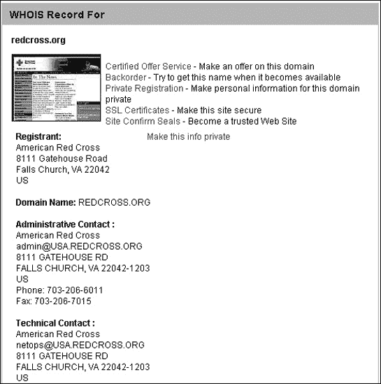

图 13-1. WHOIS 搜索可以揭示慈善域名背后的真实所有者。

即使你找到一个有效的慈善机构，也要小心他们的隐私政策。为了赚取额外收入，一些慈善机构可能会将你的姓名、地址和电子邮件地址出售给市场研究公司，这意味着你可能会为好事业捐款，然后得到垃圾邮件和垃圾邮件作为回报。

# 区号诈骗

一些诈骗利用新创建的电话区号的激增。骗子首先通过留下电话留言或发送电子邮件声称你在比赛中赢得了大奖，或者你的信用卡被错误地收费，或者你的亲戚遇到麻烦——任何能促使你回电或回复电子邮件的事情。

如果你拨打信息中提供的电话号码，你可能会被长时间等待，接到冗长的录音信息，或者与一个说英语结巴的人取得联系。无论如何，对方只是试图尽可能长时间地让你保持通话，因为（惊喜！）这个电话号码实际上是一个按次付费的服务（就像 1-900 号码一样），它会向你（打电话的人）收取天文数字的费用，可能高达每分钟 25 美元。

在这个诈骗案中，最常用的区号是 809，实际上位于加勒比地区。因此，诈骗者可以规避美国法律，例如那些要求他在产生费用之前提前警告你，并说明每分钟的费率，或者必须在一定时间内提供终止通话的条款而不收取费用。然而，由于不需要国际区号就能拨打该电话号码，大多数人甚至不会意识到他们正在进行国际通话。

区号诈骗案件很难起诉。受害者实际上发起了通话，因此当地电话公司或长途电话运营商不太可能提供任何帮助或取消费用。

为了避免这种诈骗，当回拨带有不熟悉区号的未知电话时，要小心。随着越来越多的人了解 809 诈骗，骗子们已经转向其他区号，如 242（巴哈马）、284（英属维尔京群岛）和 787（波多黎各），以及 500 和 700 前缀，这些前缀通常用于按次付费的成人娱乐服务。

如果有疑问，首先通过访问 LincMad 网站（[www.lincmad.com](http://www.lincmad.com)）来检查一个区号的所在地。

# 尼日利亚诈骗

其他国家许多人憎恨美国人，当你意识到许多外国人只通过典型的“丑陋”美国游客和美国政治家的行为（其中许多人在自己国家也不受欢迎）来了解美国时，这并不奇怪。

其他国家的人从美国电视节目中获取关于美国人的大部分信息。在看过《欲望都市》等节目后，许多其他国家的人认为美国人不仅富有和美丽，而且演技也很糟糕。

无论外国人对美国人的看法如何，事实仍然是美国是地球上最富有的国家之一。鉴于美国人的平均收入与其他国家的人之间的巨大差距，对于许多人来说，在每一个可能的机会中骗走美国人的钱，并没有太多的内疚或羞耻感。

不仅许多诈骗起源于尼日利亚，而且尼日利亚政府本身也卷入其中，以至于许多人认为国际诈骗是该国第三大产业。在尼日利亚的一般观点是，如果你能骗走一个美国人的钱，那首先是美国人的错，因为他们一开始就太容易上当。

尼日利亚诈骗通常被称为“预付费欺诈”、“419 欺诈”（四一九，指尼日利亚刑法的相关条款），或“传真诈骗”。诈骗过程如下：受害者收到尼日利亚发来的未经请求的电子邮件、传真或信件，其中包含一个伪装成看似合法的商业计划的洗钱提议，该商业计划涉及原油，或者是一份关于遗嘱中留下的遗产的通知。

传真或信件通常要求受害者协助将一大笔钱转账到受害者的自己的银行账户，并承诺如果受害者支付“预付费”、“转账税”、“业绩保证金”或某种形式的政府贿赂，他将获得一份份额。如果受害者支付了费用，就会神秘地出现一些复杂情况，需要受害者再发送更多的钱，直到他耗尽资金或耐心，或者两者兼而有之。

随着互联网的日益普及，尼日利亚的骗子们一直非常忙碌。如果你收到来自尼日利亚的请求你帮助的电子邮件，不要感到惊讶。以下是一个例子：

> 亲爱的先生
> 
> 我正在与尼日利亚联邦卫生部的卫生部门合作。五个月前，我的父亲，他是现任军事政府为监控海湾战争危机前后原油销售和收益而成立的特别任务委员会主席，在从拉各斯参加完国家会议回家的路上发生车祸去世。他在医院住了八（8）天，最终去世。在我与他一起在医院的时候，他向我透露了他的所有机密文件，其中之一就是我现在想向你介绍的业务。
> 
> 在我的父亲最终在医院去世之前，他告诉我，他在一个编码的保险箱里有 $21.5M（二千一百五十万美元）现金，该保险箱存放在一家安全公司。他告诉我，安全公司并不知道其内容。他给了我一份文件，我出示这份文件后，我只需支付滞纳金，之后箱子就会被释放给我。
> 
> 他还建议我，在没有外国人的帮助下不要取钱，这位外国人将为他公司开设本地账户，以便将钱款转至他指定的海外账户进行投资。
> 
> 这是因为作为一个公务员，我不应该拥有这样的钱。如果我作为一个外国人都没有问题，这会在银行引起很多问题。
> 
> 正是在这个时候，我决定联系你寻求帮助，但有以下条件：
> 
> 1.  此交易应被视为高度机密、合作和绝对保密，正如它所要求的。
> 1.  
> 1.  钱款将被转入一个税收发生率不会造成太大损失的账户。
> 1.  
> 1.  所有关于此次转账成功的财务问题将由双方解决。
> 1.  
> 1.  你签署并密封的汇票声明，金额为 US $21.5M（二千一百五十万美元），将由你通过你的账户支付给我，并且总金额中只有 20% 是作为你的协助费。
> 1.  
> 请通过上述传真号码联系我获取更多详细信息。请在所有通讯中引用（QS）。
> 
> 您真诚的，
> 
> DR. AN UZOAMAKA

想了解更多关于源自尼日利亚的诈骗信息，请访问 419 协盟网站 ([`home.rica.net/alphae/419coal`](http://home.rica.net/alphae/419coal))。如果你愚蠢到足以向进行此诈骗的骗子汇款，你很可能会收到后续的电子邮件，声称有额外的延误或问题，例如需要支付的意外费用、罚款或贿赂。目的是让你尽可能长时间地汇款。在某些情况下，人们向这些骗子汇出了数千美元，而其他人甚至亲自前往尼日利亚与骗子会面。2003 年，捷克共和国一位 72 岁的男子将他的全部积蓄损失给了尼日利亚的骗子，并在愤怒之下枪杀了尼日利亚外交官。

自从 2001 年美国向阿富汗和伊拉克派遣部队以来，一种新的尼日利亚诈骗变种出现了。在这个改编版本中，潜在的受害者收到一封据称来自美国士兵的电子邮件，这位士兵发现了一大笔钱，需要帮助将其偷偷带回美国。除了用美国士兵的名字代替尼日利亚官员外，这种诈骗方式与之前相同。

与尼日利亚诈骗相似的是提前贷款诈骗，它承诺以极低的利率贷款给你。你只需支付“处理”的预付费即可。一旦骗子收到你的钱，就会神秘地出现一些复杂情况。你永远不会得到你预期的贷款，骗子带着你的预付费离开。

# 家庭办公业务

另一种常见的诈骗通常在未经请求的电子邮件中推广，承诺在家只需付出很少的努力就能实现巨大的赚钱机会。这种类型的诈骗并不新鲜。骗子最初使用邮政信箱和信件进行这些诈骗；今天的骗子使用互联网的覆盖范围和电子邮件的简便性，比以往任何时候都更快地接触到更多的潜在受害者。这应该又给你一个理由避免接收，更不用说阅读任何未经请求的电子邮件（有关垃圾邮件的更多信息，请参阅第十八章 Chapter 18）。本节列出了一些这些诈骗的典型例子。

## 填写信封

最常见的家庭办公业务诈骗声称，你可以在业余时间通过填写信封赚取数百或数千美元。

首先，谁会愿意把一生都花在填写信封上呢？如果这种前景实际上吸引了你，并且你为了获取更多信息而汇款，你需要认真审视你的生活抱负。如果你汇款，你可能会收到以下内容：

+   一封信表示，如果你想赚钱，你应该只是在自己的杂志或报纸上放置广告，提供出售关于如何通过填写信封赚钱的信息给他人。实际上根本不涉及填写信封。

+   关于联系邮购公司并为他们填写信封的信息。不幸的是，你很快会发现填写信封的报酬甚至低于第三世界的工资。

## DIY 套件

另一种家庭办公业务诈骗提供出售一套工具（例如贺卡套件）。你应按照套件的说明制作定制贺卡、圣诞花环、传单或其他产品，然后自己销售这些产品，作为快速开始自己业务的一种方式。这种业务可能听起来合法，但套件通常毫无价值，而且总是定价过高，它声称你可以销售的产品很少能让你赚到足够的钱来弥补你的原始投资成本。

## 作为独立承包商工作

你为什么不自己制作产品并从 DIY 套件开始自己的业务，而是作为独立承包商为公司工作，让他们为你处理营销和销售的麻烦呢？这个骗局声称公司愿意每月支付数千美元让你帮助他们建造一些东西，比如玩具娃娃或婴儿鞋。你所要做的就是在家制造这些物品并将其卖给公司。

如果你愚蠢到足以汇款，你会收到指示和材料来制作你应制作的产品。然而，这些材料通常很便宜，在当地商店只需一小部分价格就能轻易获得。

通常会发生的情况是，工作太无聊，大多数人甚至在卖出一批产品之前就放弃了（通常在说明书中列出了很高的最低购买量）。对于那些更有毅力的人来说，公司通常会声称工艺质量差（无论是否如此）并因此拒绝支付你的工作费用。无论如何，现在有人得到了你的钱。

## 欺诈性销售

人们多年来一直被欺骗购买劣质或不存在的产品。互联网只是为骗子提供了一个新的途径来兜售他们的“蛇油”。骗子每天通过向数千个电子邮件地址发送垃圾邮件，就能接触到大量受众。两种常见的欺诈性销售涉及“奇迹”健康产品和投资。

奇迹健康产品已经存在了几个世纪，声称可以治愈从阳痿和消化不良到艾滋病和癌症的一切。当然，如果你购买其中一种产品，你的病情不会有所改善——实际上可能会变得更糟。与此同时，你将陷入一个毫无价值的产品，可能只包含玉米糖浆和食用色素。

投资骗局也并非什么新鲜事。典型的股票骗子会承诺高额利润和低风险，但前提是你必须立即行动（这样骗子就能更快地得到你的钱，并阻止你研究“诱饵”，最终意识到它实际上是一个骗局）。许多股票骗子会访问投资论坛或聊天室，例如美国在线上的那些，并寻找愿意相信他们关于“底层”机会的承诺，并将钱交给陌生人的这些人。

就像毫无价值的奇迹健康产品一样，投资骗局可能会向你出售没有任何实际价值的股票证书或债券。通常这些投资集中在金矿、油井、房地产、鸵鸟农场或其他看似激动人心且有趣但证明是不存在或毫无价值的投资上。

# 空中楼阁计划

垂直方案背后的想法是让两个人或更多人给你钱。作为交换，你给他们除了希望他们也能致富之外什么都没有——只要他们能说服两个人或更多人给他们钱，以此类推。垂直方案最常见的表现形式是连锁信。

典型的连锁信列出了五个地址，并敦促你给每个人寄钱（一美元或更多）。它指示你复制连锁信，从地址列表中移除最上面的名字，并在底部加上你自己的姓名和地址，然后将五份连锁信邮寄给其他人。信中的承诺是，如果你寄出五美元（或更多），你只需坐等在几周内，每次一美元，令人难以置信的财富就会涌入你的邮箱。（那些想从别人那里骗钱的人可能意识到，简单地以他们的名字为开头开始一个新的连锁信会更快。）

许多连锁信要求你签署一封信件，同意你将钱作为礼物提供，或者你购买五个地址作为邮寄名单。这样，连锁信的作者说，你不会违反任何法律。

大多数人将连锁信视为未经请求的电子邮件，但在 20 世纪 90 年代初出现了一种独特的连锁信诈骗，称为 Mega$Nets。与仅包含文本的连锁信不同，Mega$Nets 是一个计算机程序，允许人们使用特别生成的代码输入他们的姓名和地址，用户可以购买这些代码然后将其出售给他人。

Mega$Nets 声称它不是连锁信，因为人们是为其软件付费（实际上这只是连锁信的电子版）。Mega$Nets 通过人们在个人网站上发布副本来传播，其他人可以下载并加入这个“令人难以置信的赚钱机会”。

在 20 世纪 90 年代中期收到 Mega$Nets 的副本后，我花了一个下午剖析了这个程序，并发现除非包含 VBRUN300.DLL 文件，否则程序无法运行，这意味着程序是用 Visual Basic 3.0 编写的。接下来，我使用 Visual Basic 反汇编器将程序从可执行文件转换回原始的 Visual Basic 源代码，这样我就可以看到它是如何存储姓名和地址以及生成其“秘密代码”的。然后，我编写了另一个 Visual Basic 3.0 程序，命名为 Mega$Hack，允许用户编辑 Mega$Nets 程序中存储的任何姓名和地址，并生成他们自己的“秘密代码”，而无需支付一分钱。通过将 Mega$Hack 程序发布到公共领域，并允许怀疑者免费修改 Mega$Nets，我希望破坏 Mega$Nets 诈骗，并突出支付“秘密代码”加入连锁信的愚蠢行为。这是我对抗骗子的小小贡献，并使互联网对每个人来说都变得更安全。

多层次营销（MLM）商业机会类似于连锁信。有效的 MLM 业务提供两种赚钱方式：通过销售产品或通过招募新的分销商。在 MLM 业务中致富的大多数人都是通过招募新的分销商来实现的。不幸的是，许多骗局伪装成合法的 MLM 业务，关键区别在于你只能通过招募他人来赚钱；唯一销售的产品是模糊的“商业机会”。

庞氏骗局往往使少数人非常富有，但代价是金字塔底部的几乎所有其他人。如今，那些经营庞氏骗局的人可以通过 Usenet 新闻组或通过垃圾邮件发送到多个电子邮件账户来招募新成员（见第十八章：身份盗窃和垃圾邮件）。一旦你意识到庞氏骗局需要你的钱来使其他人致富，无论这些诱惑多么诱人，你都不会被这些机会所迷惑。

## 庞氏骗局

在最古老和最常见的投资骗局中，有一种被称为庞氏骗局的金字塔骗局变体，以一战后的金融家查尔斯·庞兹的名字命名，他使用新投资者的钱来支付早期投资者的回报。因为早期投资者从他们的投资中获得了巨大的回报，他们迅速传播了查尔斯·庞兹是投资天才的消息。新投资者带着现金蜂拥而至，希望也能致富，这时查尔斯·庞兹拿走了钱就逃跑了。

### 注意

社会保障基本上是一个庞氏骗局，因为它用当前投资者的资金支付当前受益人。这需要越来越多的人不断向系统中缴费，这也解释了为什么它始终面临破产的危险。

欺诈者现在通过电子邮件、传真或提供“难以置信的投资机会！”的网站在互联网上经营庞氏骗局。2006 年，美国证券交易委员会（SEC）指控[12dailypro.com](http://12dailypro.com)的所有者经营了一个互联网庞氏骗局，从“投资者”那里骗走了超过 5000 万美元。这些所谓的投资者被承诺在 12 天内获得 44%的投资回报。在以每份 6 美元的价格购买“单位”后，投资者会因查看互联网上的广告而获得报酬。这笔钱据说来自广告商，但 SEC 声称这笔钱实际上来自其他所谓的投资者。

任何时候有人承诺你在极短的时间内获得难以置信的高回报，他们很可能是在向你提供庞氏骗局，如果你上了钩，你的钱就会一去不复返。

## 不可战胜的预测者

任何时候你收到陌生人寄来的信件或电子邮件，声称他出于某种明显的原因愿意帮助你，要小心。许多骗局都是从提供免费的东西给受害者开始的，这迎合了受害者不可避免的贪婪（证明了这个谚语：“你不能欺骗一个诚实的人”）。

在“不可预测的预测者”投资骗局中，一个“经纪人”访问投资聊天室或论坛，并向他找到的每个人发送电子邮件，免费提供投资预测。电子邮件说，提供这个预测的目的仅仅是展示经纪人预测市场的技能。免费的预测会告诉你关注特定的股票或商品，果然，价格就像他说的那样上涨了。

很快，你会收到来自同一经纪人的另一条消息，其中包含预测说股票价格或商品即将下跌。再次，他只是想让你相信他的不可预测的预测能力——而价格确实会按照预测的那样变动。

之后，你会收到一条包含第三次预测的消息，但这次你有机会进行投资。因为经纪人的前两次预测看起来很准确，许多人会抓住这个确定无疑的机会。然后经纪人拿走了受害者的钱并消失了。

这里就是真正发生的事情。在第一次大规模电子邮件营销活动中，经纪人联系了 100 个人。在其中的半数信件中，他声称股票或商品价格将会上涨；在另一半信件中，他声称价格将会下跌。无论市场如何变化，50 个人可能会相信经纪人准确预测了市场走势。

与这 50 个人，经纪人重复这个过程，告诉其中 25 个人价格将会上涨，另外 25 个人则认为价格将会下跌。再次，骗子潜在受害者的半数将收到准确的预测。

因此现在骗子已经有了 25 个人（原始的 100 人中的），他们看到了他准确预测市场的证据。他们把钱给了经纪人——然后再也没有听到他的消息。

下次你访问与投资相关的聊天室、新闻组或网站时，记住你可能会成为专门从事这类投资诈骗的骗子的目标。所以，要小心，保管好你的钱，并警告他人投资诈骗。对于每一个提议都要运用常识保持警惕，你应该就会没事。

# 孤独心灵骗局

孤独心灵骗局涉及用爱情和关怀的承诺来欺骗富有的受害者。在以前，骗子必须亲自与潜在受害者见面和交谈，但现在，骗子可以利用互联网从远处施展他们的魔法。

骗子联系潜在受害者，并声称自己是一位居住在俄罗斯或菲律宾等国的美丽女性。在发送照片（通常是别人的照片）后，骗子通过电子邮件、传真或信件稳步赢得受害者的信任和信心。

当骗子相信他已经赢得了受害者的信任时，他会提出一个简单的请求，要求金钱以获取签证，这样外国笔友就可以去见受害者——据说是为了永远幸福地生活在一起。如果受害者汇款，不可避免地会出现需要更多金钱用于贿赂或额外费用的复杂情况，就像尼日利亚骗局一样。

有时受害者意识到自己被骗并停止汇款，但有时受害者真诚地相信骗子是一个试图逃离自己国家的美丽女人。骗子能够维持这种错觉的时间越长，他从受害者那里骗取的金钱就越多。

# 互联网特定骗局

许多骗局已经存在多年，但还有一些是全新的，是在互联网发展之后出现的。互联网上的主要骗局涉及窃取信用卡号码。骗子有几种方法来做这件事：数据包嗅探、网络欺骗、钓鱼、使用按键记录器和使用色情拨号器。（其中一些方法已在之前的章节中介绍过。）

## 数据包嗅探器

当您通过互联网发送任何信息（如您的姓名、电话号码或信用卡号码）时，信息不会直接从您的计算机发送到您正在查看的网站。相反，互联网将此信息分解成信息包，并将其从一个计算机路由到另一个计算机，就像接力赛一样，直到它到达您要发送信息的网站的主机计算机。

数据包嗅探器通过拦截这些信息包来工作。通常，黑客会在一个托管购物网站的计算机上放置一个数据包嗅探器。在该主机计算机上拦截的大多数数据包将包含信用卡号码或其他盗贼可能觉得有用的信息。

数据包嗅探器在将其发送到最终目的地之前会复制信用卡号码。因此，您可能直到在账单上发现不寻常的费用时才知道您的信用卡号码已被盗。

为了帮助您防止数据包嗅探器，请只将您的信用卡号码输入到使用加密的网站（当您连接到使用加密的在线购物网站时，屏幕上会出现一个微小的锁形图标，通常在屏幕右下角）。

尽管目前的公众认知如此，但互联网并不是窃取信用卡号码最容易的工具。当您在餐厅使用信用卡时，服务员可能会记下号码以供自己以后个人使用。这比安装数据包嗅探器所需的时间和麻烦要容易得多。对您的信用卡更大的威胁实际上发生在公司将其存储在其（通常不安全）计算机上时。黑客可以入侵该计算机并窃取其中存储的所有信用卡信息，包括您的，而您对此无能为力。

在 2005 年，入侵者闯入了 CardSystems Solutions 公司的网络，该公司负责处理万事达卡、维萨卡、发现卡和美国运通卡的信用卡订单。黑客复制了超过 20 万张信用卡持有人的记录。同年，骗子欺骗了 ChoicePoint 公司，该公司向保险公司和政府机构提供消费者数据，并窃取了包含姓名、地址、社会保障号码和信用报告的超过 11 万条记录。即使斯坦福大学也成为了黑客的受害者，黑客入侵了学校的电脑，并获取了包含姓名和社会保障号码的超过 1 万条记录。无论你的电脑多么安全，你存储在其他地方的数据总是会受到他人电脑安全性的影响。

## 网络欺骗

网络欺骗与数据包嗅探类似，但涉及建立一个伪装成合法网站的网站。为了吸引受害者，骗子可能会依赖 URL 地址的常见拼写错误。例如，试图访问微软网站[www.microsoft.com](http://www.microsoft.com)的人可能会不小心输入[www.micrsoft.com](http://www.micrsoft.com)，并访问看起来是他们想要访问的合法网站。但任何发送到该网站的信用卡号码都会直接流向骗子。

为了防止自己成为网络欺骗的受害者，始终在浏览器窗口中验证 URL 地址的正确拼写。为了安全起见，而不是自己输入 URL 地址，访问搜索引擎以找到你想要的网站，例如微软或 eBay，并遵循搜索结果中显示的链接。将常用页面添加到书签，这样就不必经常输入。

## 钓鱼

然而，大多数骗子不会等待有人误拼 URL 地址，而是通过发送声称来自银行、eBay、PayPal 或其他合法组织的虚假电子邮件来积极钓鱼，以寻找受害者，如图图 13-2 所示。


图 13-2. 钓鱼者发送的类似这种大量电子邮件，声称来自合法企业并告诉收件人点击链接并输入个人信息。

钓鱼邮件的语气和内容总是相同的。首先，它们警告用户必须通过输入一些有价值的信息（通常是信用卡号码）来更新他们的账户。为了营造紧迫感，邮件还威胁说，如果不采取行动，账户可能会被暂停。最后，邮件提供了一个方便的链接，该链接指向一个看似合法的网页，受害者可以在其中输入他的信用卡号码。受害者输入他们的信用卡号码，并无意中将这些信息给了骗子。

为了防止自己成为网络欺骗的受害者，请始终在浏览器窗口中验证 URL 地址的正确拼写。为了安全起见，与其自己输入 URL 地址，不如访问搜索引擎并找到您想要的网站，例如 Microsoft 或 eBay，然后点击搜索结果中显示的链接。

即使如此，您也不能总是确定您访问的是有效的网站。许多钓鱼者现在利用浏览器解释国际字符（如ă或ğ字符）的方式，这种漏洞被称为国际域名（IDN）漏洞。

钓鱼者简单地创建一个模仿真实网站的假网站，例如 PayPal 的网站。然后他们给这个假网站一个与真实网站完全相同的域名，只是用国际字符替换，例如[www.păypăl.com](http://www.păypăl.com)。当受害者访问这个网站时，浏览器无法显示国际字符，所以地址看起来就像国际字符被移除一样，[www.paypal.com](http://www.paypal.com)。讽刺的是，唯一对这种欺骗免疫的浏览器是 Internet Explorer，因为微软从未费心更新他们的浏览器以处理国际域名。

您通常可以通过检查文本中的拼写错误来识别钓鱼邮件，如图图 13-2 中的*attion*和*non existant*单词所示。另一种识别欺骗网站的方法是检查邮件中提供的链接。如果您将鼠标指针移到链接上，您的浏览器将显示链接指向的实际 URL 地址。如图图 13-3 所示，欺骗网站通常在 URL 地址中嵌入公司的名称（如 PayPal）以及如*signin*之类的单词，以营造合法性的假象。然而，合法企业的域名并不是这些钓鱼网站的真正域名，例如[`paypal.signin0794.com`](http://paypal.signin0794.com)。


图 13-3. 您的浏览器可以为您显示链接的实际 URL 地址以便您检查。

如果一个 URL 地址包含一大堆看起来没有意义的字母和数字，那么它很可能将您带到诈骗者的网站。

由于大多数有经验的计算机用户都收到了许多声称来自 PayPal 或 eBay 的网络钓鱼信息，因此通过这种方式欺骗人们变得越来越困难。因此，网络钓鱼者越来越有选择性地针对目标，这种策略被称为*鱼叉式网络钓鱼*。

与那些不分青红皂白发送声称来自 PayPal 或国家银行等组织的普通网络钓鱼者不同，鱼叉式网络钓鱼者会将他们的信息发送给一组精选的个人，通常是那些在通用汽车或政府机构（如农业部）等大型公司工作的人。这些信息看起来像是来自该组织内部的一个现有小组或部门，要求提供用户名或密码以获取对公司网络的访问权限。因为虚假电子邮件看起来像是来自另一个公司部门，人们更有可能做出回应并上当受骗。

要了解更多关于网络钓鱼的信息，请访问反网络钓鱼工作组 ([www.antiphishing.org](http://www.antiphishing.org))。为了避免成为最新的网络钓鱼诈骗的受害者，获取 PhishGuard ([www.phishguard.com](http://www.phishguard.com)) 的副本，其中包含网络钓鱼者用来模仿其他公司网站（如花旗银行或 eBay）的虚假网站地址数据库。一旦 PhishGuard 检测到您正在访问网络钓鱼网站，它会提醒您。PhishGuard 通过让用户提交最新的网站到其数据库来保持最新和有效。

## 按键记录器

按键记录器是一种特殊的软件或硬件，用于记录用户的按键，例如人们用于输入密码或信用卡号的字符。软件按键记录器像其他程序一样运行，但它们隐藏在内存中。硬件按键记录器连接在计算机和键盘之间。访问 KeyGhost ([www.keyghost.com](http://www.keyghost.com)) 查看不同基于硬件的按键记录器的示例，包括一个伪装成普通键盘的示例，如图 图 13-4 所示。


图 13-4. 您的键盘可能正在监视您并记录所有按键。

如果黑客没有物理访问您的电脑，他仍然可以通过使用远程访问特洛伊木马或 RAT（见第五章第五章。特洛伊木马和蠕虫)或 Who's Watching Me?([www.trapware.com](http://www.trapware.com))这样的程序。这些程序会扫描您的电脑，寻找键盘记录器的迹象并将它们根除。

## 成人电话拨号器

成人电话拨号器不会窃取您的信用卡号码。相反，它们使用另一种方法来清空受害者的银行账户。成人电话拨号器得名于它们经常声称是免费程序，可以提供访问色情网站。

一旦您下载了这个“免费”程序，它就会控制您的电话调制解调器，关闭您的电脑扬声器，切断您的本地互联网连接，然后秘密拨打长途电话，将您连接到另一个互联网服务提供商（ISP），通常位于遥远的地方，如非洲或东欧。

就受害者所知，该程序确实做了它声称的事情；它提供了访问免费色情内容。受害者不知道的是，他的互联网连接现在正在进行长途电话，电话的另一端在地球的另一边。受害者观看色情文件的时间越长，他与这个外国互联网服务提供商的连接时间就越长，这可能会产生每分钟几美元的通话费用。客户直到收到电话账单时才意识到自己被骗了。因为电话是从受害者端发起的，所以很难从电话账单中取消费用。

虽然如果受害者使用电缆或 DSL 调制解调器连接到互联网，成人电话拨号器将无法工作，但它们可以欺骗仍然使用拨号连接的电话调制解调器的任何人。如果您有外置调制解调器，请观察状态灯，确保您的调制解调器不会自行断开连接并神秘地重新连接。如果您有内置调制解调器，您通常唯一的防御手段是小心，如果网站诱使您下载带有色情内容的“免费”软件。（此外，当您甚至没有要求时，您应该已经对任何免费提供给您东西的人表示怀疑。）如果电话线仅用于电脑，您可能可以通过向电话公司提出请求来移除所有长途和按次付费的访问权限。然而，必须在出现费用之前实施此选项。

# 在线拍卖欺诈

互联网上最近的一种流行趋势是在线拍卖，人们可以向任何想要竞标的人出售垃圾、古董或收藏品。数百万的人访问在线拍卖网站（如 eBay），这使得它们成为骗子眼中的诱人目标。卖家经常不得不处理来自没有钱或没有购买意图的人的欺诈性报价。买家必须警惕那些出售欺诈或不存在物品的骗子。

最简单的骗局是拍卖一个根本不存在的物品。例如，每年圣诞节，总有一款必备玩具，正常情况下购买价格约为 10 美元，但由于其在商店中的稀缺性，从私人卖家那里购买时可能高达数千美元。许多骗子会声称提供这样的产品，然后在从受害者那里骗到钱后就消失。

错误表述是另一种常见的在线拍卖欺诈。骗子可能会出售伪造的收藏品，例如签名棒球或运动球衣。为了保护自己免受在线拍卖欺诈，请遵循以下指南：

+   识别卖家并检查卖家的评分。在线拍卖网站，如 eBay，允许买卖双方互相留言。通过浏览这些评论，你可以看到其他人是否有过与特定卖家不愉快的经历。

+   检查你的在线拍卖网站是否提供保险。eBay 将赔偿买家高达 200 美元，扣除 25 美元的免赔额。

+   确保你清楚地了解你正在竞标的物品、其相对价值以及销售的所有条款和条件，例如卖家的退货政策和谁支付运费。

+   考虑使用第三方托管服务，该服务将在你的商品安全到达之前保管你的资金。

+   永远不要通过垃圾邮件购买广告中的物品。骗子使用垃圾邮件，因为他们知道，他们发出的电子邮件越多，就越有可能遇到一个容易上当的受害者。如果有人出售合法物品，他更有可能通过在线拍卖网站进行交易。

Scambusters 网站([www.scambusters.org/Scambusters31.html](http://www.scambusters.org/Scambusters31.html))提供了额外的明智建议：

+   不要与匿名用户进行交易。获取该人的真实姓名、公司名称（如果适用）、地址和电话号码。在购买之前验证这些信息。永远不要向邮政信箱汇款。

+   如果卖家使用免费电子邮件服务，如 Hotmail 或 Yahoo!，请更加谨慎。当然，使用这些服务的大多数人都是诚实的，但 Hotmail 及其类似服务也使得卖家很容易隐藏其真实身份和信息。

+   在线购买时始终使用信用卡（而不是借记卡、现金或汇票）。如果有任何争议，你可以让信用卡公司取消费用或帮助你为你的产品辩护。

+   保存任何电子邮件往来和交易中涉及的其他文件的副本。

# 信用卡欺诈

信用卡欺诈实际上对商家的困扰大于对客户的困扰。如果盗贼偷走了某人的信用卡并订购了价值数千美元的商品，那么损失是由商家承担的，而不是被盗信用卡的所有者。

所以如果你是商家，在接受信用卡订单时要格外小心。为了保护你的业务，请遵循以下指南：

+   验证每个订单的全名、地址和电话号码。对于列出不同的“账单地址”和“发货地址”的订单，要特别警惕。

+   注意任何来自免费电子邮件账户（[hotmail.com](http://hotmail.com), [juno.com](http://juno.com), [usa.net](http://usa.net)等）的订单，这些账户用虚假身份很容易设置。在接受来自免费电子邮件账户的订单之前，请要求提供额外信息，例如备用电子邮件地址、发卡银行的名称和电话号码、信用卡上的确切名称以及确切的账单地址。大多数信用卡盗贼会避免这样的额外信息请求，并寻找不那么警惕的商家进行欺诈。

+   对于要求次日送货的极其大额订单，要格外小心。盗贼通常希望尽快得到他们的商品——在他们被发现之前——并且不介意在总费用上加一点，他们本来就不打算支付的。

+   同样，在向国际地址发货时要小心。通过电子邮件或最好是电话尽可能验证更多信息。

关于如何保护自己免受信用卡欺诈和其他在线盗窃的更多信息，请访问 AntiFraud 网站[www.antifraud.com](http://www.antifraud.com)。

# 保护自己

为了保护自己免受诈骗，特别是在线诈骗，请注意以下诈骗迹象：

+   几乎不需要工作就能得到钱的承诺。

+   在你有机会检查产品或业务之前，要求提前支付大额款项。

+   保证你永远不会失去你的钱。

+   “这不是骗局！”的保证以及引用的具体法律来证明提供的合法性。你上次走进超市或餐馆，商家需要说服你不会上当受骗是什么时候？

+   有大量大写字母和标点符号!!!或大声喊叫“奇迹疗法!!！”或“快速赚大钱!!!!！”的广告应该以健康的好奇心来看待。

+   隐藏费用。许多诈骗提供免费信息，然后悄悄地收取入场费或管理费。

+   出现在你电子邮件收件箱中的任何未经请求的投资建议。

要了解更多关于诈骗的信息，请访问你喜欢的搜索引擎，并查找以下字符串：*scam*，*fraud*，*pyramid scheme*，*ponzi*和*packet sniffer*。

关于如何保护自己的更多信息，你可以联系以下机构之一。

## 猎奇消费者

这个网站提供了关于最新促销活动、优惠和骗局的最新信息 ([`cageyconsumer.com`](http://cageyconsumer.com))。

## 更好商业局理事会

想查看一家企业是否有任何过去的欺诈、欺诈或消费者投诉历史，请访问更好的商业局网站 ([www.bbb.org](http://www.bbb.org))。如果你是骗局的受害者，可以通过这个网站找到报告诈骗的说明。

## 联邦调查局 (FBI)

美国联邦调查局 (FBI) 运行自己的互联网犯罪投诉中心 ([www.ic3.gov](http://www.ic3.gov))。通过访问 FBI 的常规网站，你可以找到关于最近揭露的欺诈的最新消息 ([www.fbi.gov](http://www.fbi.gov))。

## 联邦贸易委员会 (FTC)

消费者保护规则和指南的信息，以及最新的骗局新闻，可以从联邦贸易委员会 ([www.ftc.gov](http://www.ftc.gov)) 获取。

## 欺诈局

欺诈局是一个免费服务，旨在提醒在线消费者和投资者关于在线卖家（包括在线拍卖的卖家）的先前投诉。它还向消费者、投资者和用户提供有关如何在互联网上安全冲浪、购物和投资的资讯和新闻 ([www.fraudbureau.com](http://www.fraudbureau.com))。

## ScamBusters

ScamBusters 提供有关从活病毒和骗局计算机病毒到骗局和信用卡欺诈等各种在线威胁的信息。通过定期访问这个网站，你可以确保自己不会成为最新的互联网骗局的受害者 ([www.scambusters.org](http://www.scambusters.org))。

## 网络上的骗局

想要查看互联网上流传的各种骗局的多链接，你可以通过这些链接确保你收到的任何优惠都不是欺骗了其他人的骗局，请访问这个网站 ([www.advocacy-net.com/scammks.htm](http://www.advocacy-net.com/scammks.htm))。

## ScamWatch

ScamWatch 提供了一个论坛，人们可以在这里分享和讨论在互联网上流传的最新骗局。通过与他人交流，你可以了解如何避免成为下一个受害者 ([www.scamwatch.org](http://www.scamwatch.org))。

## 证券交易委员会 (SEC)

美国证券交易委员会 (SEC) 监管证券市场，提供投资建议，提供上市公司的信息，发布关于投资骗局的警告，帮助那些认为自己可能被欺骗的投资者，并提供到其他联邦和州执法机构的链接。如果你是那些把资金投入股市的婴儿潮一代之一，不妨查看一下 ([www.sec.gov](http://www.sec.gov))。

# 恢复室骗局

> “被骗了？我们会帮你追回你的钱！”

在被骗子骗走钱财后，许多人最想做的就是拿回自己的钱。这使得他们成为另一种名为“恢复室骗局”的诈骗的易受攻击目标。骗子会获取那些被骗人的名字，然后打电话或发送电子邮件给他们，声称自己是联邦律师或特工，可以收取费用来追回他们全部或部分丢失的钱。

受害者通常急于拿回自己的钱，他们会愿意提前支付这笔费用，而没有意识到他们已经被另一组骗子（或者甚至可能是最初骗他们的人）骗了。自然地，受害者从未从任何骗子那里拿回他们的钱。恢复室骗局尤其狡猾，因为它们可以一次又一次地针对同一个人。

只需记住：天下没有免费的午餐。如果你想不劳而获，那就做诚实的事情，成为一个不诚实的政治家。然后你可以制定对你有利的法律，并声称这是完全合法的。

# 第十四章. 在互联网上寻找人

作家

你可以通过观察敌人用来恐吓你的手段来发现你最害怕的是什么。

— ERIC HOFFER

在现实生活中，人们有礼貌的原因。你不能推搡别人以插队到队伍前面，或者告诉你的老板你对他真正的看法，因为你将不得不面对你行为的后果。在互联网上，除非你告诉他们，否则没有人知道你是谁，甚至不知道你在哪里。（或者除非他们追踪到你的 IP 地址，并通过你的 ISP 追踪到你的名字和街道地址。）

在互联网上，人们会感到一种距离感和匿名感，这让他们能够放下任何社会伪装，按照自己的冲动行事。这就是互联网如此危险的原因。在没有暴露威胁或惩罚恐惧的情况下，有些人不仅不再做好事，反而变得邪恶。

# 追踪者是谁？

追踪者可以是任何人——隔壁邻居、同事、前配偶或前男女朋友、前或现任员工、亲戚，甚至是完全陌生的人。然而，很少有追踪者有随机选择陌生人来攻击和骚扰他们根本不认识的人的动机。在大多数情况下，追踪者知道他们的受害者。有些人会持续骚扰数天、数周、数月，有时甚至数年。

虽然任何人都可以是追踪者（或受害者），但男性通常是追踪者，女性通常是受害者。以下是一些不同类型的追踪者：

**前亲密伴侣**

最常见的跟踪者是前配偶、女友或男友，他们对与受害者的关系结束感到受伤或愤怒。他们试图通过骚扰（跟踪受害者、在受害者的家或工作场所附近徘徊、发送信件或电子邮件、不断打电话等）来延长关系。在大多数情况下，跟踪者只是想恢复关系，并且实际上相信跟踪可以实现这个梦想。

**报复型跟踪者**

这种类型的跟踪者通过威胁甚至直接的暴力行为进行骚扰，如割轮胎、攻击或杀害他的跟踪目标。报复型跟踪者认为他们在纠正一些真实、夸张甚至想象的错误，并且他们认为纠正的唯一方法是不断骚扰、威胁或伤害受害者。

**妄想型跟踪者**

这些跟踪者可能从危险到无害都有，但因为他们基于对受害者的一些想象中的爱或愤怒，他们可能是不可预测和令人恐惧的。他们可能会在友好和突然爆发愤怒之间交替。通常，妄想型跟踪者针对的是知名度高的受害者，如电影明星或其他类型的名人，尽管妄想型跟踪者也可能是同事或与受害者有真正联系的其他人。

### 注意

跟踪者并不总是严格属于某一类别。一个跟踪者可能最初是前任亲密恋人，然后变得愤怒，变成了报复型跟踪者。

典型的跟踪者往往是一个孤独者和社会不适应者，朋友很少，个人卫生状况不佳，工作历史不稳定。他经常独自生活，很少打扫或照顾他的家、衣服甚至自己。总的来说，他对自己的关心如此之少，以至于不出所料，他也不关心其他人。他不是通过学习在他人周围正确行为的方式，而是选择跟踪某人。这并不一定是他自觉或受欢迎的选择，但这是他唯一知道如何表达情绪的方式，无论是好是坏。

# 网络跟踪

跟踪者早在互联网出现之前就已经存在，但网络空间给了跟踪者新的力量感和匿名感，以及骚扰全球任何地方的受害者的能力。在以前，跟踪者只能通过拨打骚扰电话或留下可能被受害者找到的便条来达到目的。如今，跟踪者可以通过发送大量电子邮件或即时消息来电子化地做到这一点。通常，这些信息旨在挑衅或威胁受害者，并给人一种跟踪者总是在附近的感觉，即使他们实际上身处另一个州或国家。

有一个跟踪者甚至在他的前女友的车上安装了一个带有 GPS（全球定位系统）跟踪的手机。这样他就可以随时跟踪她的行踪。如果跟踪者发送足够的电子邮件或即时消息，他可以向受害者的电脑发送大量无用信息，阻止她接收任何合法的通讯。一些跟踪者可能会尝试用病毒、RAT（见第五章）、或间谍软件（见第二十章）感染受害者的电脑，以窃取更多信息（如信用卡号码或密码），监视该人的个人生活和活动，或者只是破坏她的电脑。

跟踪者可能不会直接联系受害者，而是通过新闻组或聊天室散播谣言或令人尴尬的信息。他可能会冒充受害者发送虚假的电子邮件或聊天室消息给其他人。在受害者的名义下侮辱或激怒他人，跟踪者可以迷惑受害者，受害者将不知道为什么或如何会有这么多人似乎毫无理由地反对她。

除了侮辱或使受害者尴尬之外，跟踪者还可能试图为受害者设置其他人骚扰的陷阱。例如，跟踪者可能会将受害者的电子邮件地址提供给垃圾邮件发送者，从而鼓励垃圾邮件发送者向受害者的电子邮件账户发送大量邮件。跟踪者还可能将受害者的姓名、地址、电话号码和电子邮件地址提供给宗教邪教、虐待狂、恋童癖或其他令人不快的角色，这些人随后会联系无意识的受害者，在受害者的生活中播下更多的混乱和麻烦。

通过诱使其他人骚扰受害者，跟踪者隐藏了自己的共谋，同时仍然享受让受害者生活尽可能不舒服的满足感。

互联网跟踪者受到过时的法律保护，这些法律将“跟踪”定义为对某人进行身体威胁。因此，互联网跟踪超出了法律通常的界限。如果有人对受害者进行身体跟踪，受害者至少可以拨打当地警察的电话。然而，在互联网上，当地警察通常无能为力；跟踪者可能甚至不在受害者的国家，并且可能难以追踪。

# 在互联网上寻找个人信息

如果你无法被找到，你就不会成为受害者，因此每个跟踪者首先需要的信息就是找到选定受害者的一种方式。在互联网上，这意味着获取受害者的电子邮件地址、即时消息 ID，甚至 IP 地址。有了这些信息，跟踪者通常可以检索其他类型的信息，如电话号码、家庭和工作地址，甚至社会保险号码。给跟踪者一点信息，他很可能将其转化为大量个人数据。

## 搜索个人网站

查找某人的信息最简单的方法是搜索他的个人网站。这不仅可能提供电子邮件地址，而且通常还会包括其他信息，例如该人的爱好、工作历史、任何组织的会员资格以及他或她名字的正确拼写。如果个人网站有自己的独特域名，例如[www.JohnDoe.com](http://www.johndoe.com)，跟踪者可以进行 WHOIS 搜索以找到为该网站注册的联系方式。图 14-1 显示了比尔·盖茨的 WHOIS 搜索，揭示了他在使用一家单独的公司来保护自己的地址免受潜在跟踪者的侵害。而且所有这些信息实际上都是受害者自己提供给跟踪者的。

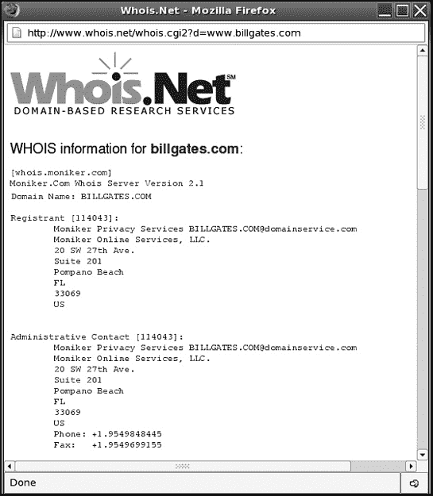

图 14-1. 在描述性域名上进行 WHOIS 搜索可以识别网站所有者的姓名、地址和电话号码。

## 查找姓名、地址和电话号码

并非每个人都有个人网站，但大多数人都会在互联网上以各种形式散布他们的私人信息。任何有电话服务的人很可能都会被列入可以在线搜索的电话簿中，例如 AT&T 的 AnyWho([www.anywho.com](http://www.anywho.com))目录。只需输入某人的姓名，你就能找到他的家庭地址、电话号码，甚至还有通往他家的路线和地图，如图图 14-2 所示。

你还可以使用以下列出的人查找网站来追踪某人的亲戚、朋友或前邻居。尽管你试图找到的人可能正在删除他们的纸面记录，但前同事或邻居可能没有这样做，他们可能能够告诉你关于某人的信息或她可能搬到哪里。

### [555-1212.com](http://555-1212.com)

现在是一个付费服务，这个网站([www.555-1212.com](http://www.555-1212.com))允许你在黄页和白页中搜索公司和个人的信息，以查找地址和电话号码。使用反向查找，你可以输入一个电话号码、家庭地址，甚至是电子邮件地址来找到与之关联的姓名。


图 14-2. 个人公开信息可用于在互联网上找到他们的私人信息。

### Freeality

使用 Switchboard、WorldPages 和 Four11 等最受欢迎的人查找搜索引擎，根据姓名、城市和州查找个人，请访问[www.freeality.com/find.htm](http://www.freeality.com/find.htm)。

### ICQ White Pages

ICQ 是一种流行的即时通讯服务，ICQ 白页帮助人们根据姓名或电子邮件地址找到他们的朋友 ICQ 号码([www.icq.com/whitepages](http://www.icq.com/whitepages))。

### [Infobel.com](http://infobel.com)

[Infobel.com](http://infobel.com)提供几乎世界上所有电话簿的链接，包括美国、欧洲、亚洲、非洲、中东和南美洲的电话簿，以防您需要找到在乌拉圭居住的人([www.infobel.com/teldir](http://www.infobel.com/teldir))。

### InfoSpace

在 InfoSpace，您可以通过公司名称、类别或城市进行搜索。要搜索个人，您只需要姓氏和州名，就可以找到匹配的住宅地址、城市和电话号码([www.infospace.com](http://www.infospace.com))。

### Lycos People Search

Lycos 允许您通过姓名搜索人，以找到他们的电子邮件地址、电话号码或包含他们姓名的任何网页。它还提供反向查找，可以将电话号码转换为地址([`peoplesearch.lycos.com`](http://peoplesearch.lycos.com))。

### Switchboard

要根据姓名和/或居住地搜索企业和个人，请尝试[www.switchboard.com](http://www.switchboard.com)。

### [USSearch.com](http://ussearch.com)

此基于费用的搜索服务提供各种结果，从基本的街道地址和电话号码到财产记录、亲友名单以及婚姻和离婚记录([www.ussearch.com](http://www.ussearch.com))，如图 14-3 所示。


图 14-3. 以一定价格，[USSearch.com](http://ussearch.com)可以挖掘出一个人的法院和财产记录。

### [WhitePages.com](http://whitepages.com)

WhitePages 网站提供姓名、商业列表、电话号码、地址、区号和邮编的搜索，以及电话号码和地址的反向查找([www.whitepages.com](http://www.whitepages.com))。

### Yahoo! People Search

Yahoo! People Search 可以根据姓名、城市或州提供个人的地址、电话号码和电子邮件信息([`people.yahoo.com`](http://people.yahoo.com))。

### ZabaSearch

提供按电话号码、社会保障号码和姓名搜索([www.zabasearch.com](http://www.zabasearch.com))。

## 使用社会保障号码查找某人

由于雇主、美国国税局和银行的要求，以及许多其他机构（如大学和健康保险公司）的使用，社会保障号码可能是追踪美国某人的当前居住和工作地点的最快追踪工具。

找到社会保障号码可能很困难，除非你曾经雇佣过或与该人结婚。例如，如果你正在试图追踪前配偶，可以在旧联合纳税申报单上查找他的社会保障号码。你可以从国税局或你当地的州税务局订购你旧申报表的副本。信用卡、贷款和银行账户的联合申请几乎总是列出两位申请人的社会保障号码，你可以要求信用机构或银行提供这些旧申请的副本。离婚文件也可能列出这些信息。如果你正在试图追踪前雇员，你可以从就业申请或税务表格上获取他或她的社会保障号码。

一旦你有了某人的社会保障号码，你可以支付费用给像 Computrace ([www.amerifind.com](http://www.amerifind.com))、Fast-Track ([www.usatrace.com](http://www.usatrace.com))、USSearch ([www.ussearch.com](http://www.ussearch.com)) 或 Find A Friend ([`findafriend.com`](http://findafriend.com)) 这样的网站，这些网站将提供该人最后已知的地址。

## 在军队中寻找人员

如果你正在寻找目前服役于军队的人，请访问 VetFriends ([www.vetfriends.com](http://www.vetfriends.com))。如果你知道某人曾经服役的军种和单位，你可以支付给 VetFriends 一小笔费用来找出他或她可能目前驻扎的地方。如果你找不到你试图寻找的人，你可能能够联系那些在同一单位服役的人，他们可能能够给你提供关于该人下落的额外线索。

如果你正在寻找不再服役的人（例如老战友），可以尝试以下这些网站：退伍军人事务部 ([www.va.gov](http://www.va.gov))、GISearch ([www.gisearch.com](http://www.gisearch.com)) 或 Ancestry ([www.ancestry.com](http://www.ancestry.com))。

## 搜索公共记录

KnowX ([www.knowx.com](http://www.knowx.com)) 提供的公共记录数据库，以付费方式提供多种追踪某人的方法。如果他或她曾经经营过企业、为商业名称提交了 DBA、获得过飞行员执照、拥有船只、提起过诉讼、购买过房地产、申请过破产或结婚或离婚，这些信息将被存储在公共记录中。

检查一个人的驾驶记录、信用历史、选民登记信息、犯罪记录或出生和死亡证明，请访问以下网站并准备好信用卡以支付费用：国家信用信息网络 ([www.wdia.com](http://www.wdia.com))。

如果你正在寻找犯有重大罪行的人，请访问“最想抓获的罪犯”网站 ([www.mostwanted.org](http://www.mostwanted.org))。谁知道呢？如果你在警察之前找到罪犯，你可能会得到奖励。

也许你并不是在试图追踪某人，但你只是遇到了一个新人，在冒险约会或雇佣他之前想先了解一下。要对某人进行背景调查，请尝试 Who Is He/She? ([www.whoishe.com](http://www.whoishe.com))或 Instant Background Check ([www.instant-background-check.com](http://www.instant-background-check.com))。

如果你被收养并想找到你的亲生父母，或者如果你放弃了孩子的收养并想看看他或她现在的情况，请访问以下网站之一，这些网站旨在帮助亲生父母和子女团聚：[AdoptionRegistry.com](http://adoptionregistry.com) ([www.adoption.com](http://www.adoption.com))，国际 Soundex 团聚登记处 ([www.plumsite.com/isrr](http://www.plumsite.com/isrr))，团聚 [Registry.com](http://registry.com) ([www.reunionregistry.com](http://www.reunionregistry.com))，或寻人者 ([www.seeklost.com](http://www.seeklost.com))。

## 查找电子邮件地址

随着越来越多的人涌向互联网，找到你想要找到的人拥有电子邮件地址的几率越来越高。要找到某人的电子邮件地址，你需要他的或她的姓名，如果可能的话，位置（城市和州，或国家）。从以下网站之一开始。

### 邮件变更

如果你知道某人的旧电子邮件地址或姓名，EmailChange 可能能够找到当前的电子邮件地址。这通常适用于该人最后已知的电子邮件地址，所以你知道的电子邮件越新，它就越有可能成功（[www.emailchange.com](http://www.emailchange.com)）。

### 元电子邮件搜索代理（MESA）

这个元搜索引擎通过同时使用多个搜索引擎来通过姓名查找某人的电子邮件地址（[`mesa.rrzn.uni-hannover.de`](http://mesa.rrzn.uni-hannover.de)）。

### NedSite

在 NedSite 上通过姓名、电话或传真号码、街道地址、就读大学、祖先或军事历史查找某人的电子邮件地址（[www.nedsite.nl/search/people.htm#top](http://www.nedsite.nl/search/people.htm#top)）。

### 其他选项

如果你不知道该人的位置，或者上述搜索引擎没有找到任何信息，请尝试 Google Groups ([`groups.google.com`](http://groups.google.com))。也许你的目标最近向一个新闻组贡献了消息。如果是这样，通过 Google Groups 搜索他的或她的姓名将找到消息和难以找到的电子邮件地址。

# 追踪名人

如果你是一个名人，跟踪只是成名的一个缺点。名人担心陌生人随时接近他们，而现在随着一个网站的推出，任何人都可以记录下名人的目击情况，其他人可以跟踪他们的行踪。

该网站被称为 Gawker Stalker ([www.gawker.com/stalker](http://www.gawker.com/stalker))，它不断列出来自世界各地的名人的目击事件，甚至提供一张显示他们最后已知位置的地图，如图图 14-4 所示。

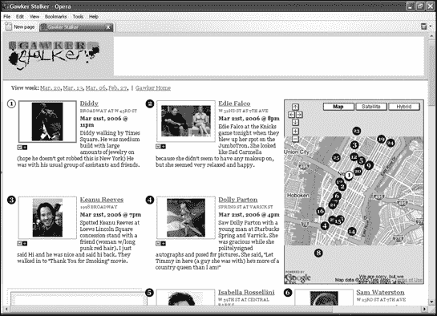

图 14-4. 如果你是一名名人，有人在公共场合看到你，并在互联网上报告你的位置，以便其他人可以追踪你的行踪。

# 保护自己

现在你已经知道如何追踪某人，你也知道其他人如何追踪你，你可以采取措施保护你的个人信息。如果你不想让你的名字和住宅地址在互联网上到处传播，可以尝试以下一种或多种技术：

+   获取一个未列名的电话号码。这阻止了大多数追踪网站找到你的名字、地址和电话号码（因为它们不会在电话簿中）。电话公司通常会为此收费。

+   使用假名或拼写错误的姓名。电话公司不在乎你使用什么名字，只要你能按时支付电话费。一个假名会误导大多数这些追踪网站。

+   如果你被列入名单，避免列出你的街道地址。这样，即使有人在一个目录中找到你的电话号码，他们也无法知道你住在哪里。此外，这项服务通常是免费的。

+   直接联系人查找网站，并要求从其列表中删除你的名字。遗憾的是，由于不断出现大量的人查找网站，这可能意味着需要联系十几个不同的网站——而且即使你要求删除，也无法保证不会出现一个新网站含有你的信息。更糟糕的是，仅仅因为你要求删除，并不意味着网站会这样做。

+   如果你发送每封电子邮件时都包含一个签名文件，请确保不要在其中透露任何个人信息或重要信息，例如家庭电话号码或网站地址（除非你已经妥善处理，隐藏了网站上的任何个人信息）。

如果你不想让任何搜索你的人找到你的电子邮件地址，可以尝试以下一种或两种技术：

+   在向 Usenet 新闻组发布任何消息之前，请使用匿名重发器。这也有助于防止你的电子邮件地址出现在垃圾邮件发送者使用的列表中。

+   经常更换电子邮件地址。如果你不介意接收电子邮件，可以使用多个电子邮件账户，并定期关闭它们。

如果你真的需要隐藏，避免留下任何形式的纸迹。不要注册电话服务（或者如果必须，使用假名）；避免使用信用卡；用现金支付一切；并避免使用使用你真实姓名的杂志订阅。消除你的纸迹可能需要大量的工作，但如果你在躲避一个危险的人（比如美国国税局），这可能值得。

尽管你尽了最大努力，你可能会成为网络跟踪者的下一个受害者。当有人开始给你发送骚扰邮件或即时消息时，发送一条明确的信息要求他们停止。在许多情况下，一条坚定而简短的信息，例如，“我很抱歉你这样感觉，但我认为你正在跨越一些界限，我宁愿我们在这里结束沟通，”可能足以阻止大多数人。如果这个人继续骚扰你，不要回复。有些跟踪者只是喜欢挑衅别人；如果你拒绝上钩，他们可能会感到无聊，并寻找更满意的猎物。

更令人恐惧的是那些专门针对你的跟踪者，要么因为他们认识你，要么因为他们因为你在一个聊天室中发表的某些简单内容而对你怀有个人怨恨。如果你继续收到骚扰邮件，检查邮件头以找到骚扰者的 ISP，然后发送一封邮件通知 ISP 有关骚扰的情况。很多时候，ISP 会向骚扰者发送警告，这样可能就足够了。

如果骚扰者的 ISP 没有回应你，骚扰行为持续进行，保存所有形式的骚扰证据。如果跟踪者对你或你的家人直接发出威胁，比如提到你的孩子上什么学校或你开什么颜色的车，立即联系警察，并向他们提供你收集的所有证据。有时跟踪者喜欢从远处恐吓受害者，并没有伤害或接近你的意图，但为了安全起见，保护自己总是更好的。

正如你永远不会在危险的街区闲逛而不担心遇到麻烦一样，你也不应该在互联网上不采取预防措施地漫游。有关如何保护自己免受网络跟踪者（以及任何类型的跟踪者）的侵害的更多信息，请访问以下网站：

| **Anti-Stalking website** | [www.antistalking.com](http://www.antistalking.com) |
| --- | --- |
| **Bully Online** | [www.bullyonline.org](http://www.bullyonline.org) |
| **CyberAngels** | [www.cyberangels.org](http://www.cyberangels.org) |
| **LoveFraud.com** | [www.lovefraud.com](http://www.lovefraud.com) |
| **Stalking Resource Center** | [www.ncvc.org/src](http://www.ncvc.org/src) |
| **Stalking Victim's Sanctuary** | [www.stalkingvictims.com](http://www.stalkingvictims.com) |
| **Working to Halt Online Abuse** | [www.haltabuse.org](http://www.haltabuse.org) |

虽然你无法预测哪个熟人会变成全然的跟踪狂，但你可以通过对遇到的每个人都礼貌和文明来最小化你的风险。同样，与几乎不认识的人迅速进入亲密接触也是合理的；这可以消除跟踪的最大威胁。如果你确定要跟踪你，你永远无法阻止他们，但通过一点预见性，你通常可以阻止他们一开始就想要跟踪你，或者通过保持你的个人信息私密来阻止他们将其提升到下一个层次。

# 第十五章。宣传作为新闻和娱乐

英国诗人

公众会相信任何东西，只要它不是建立在真相的基础上。

——伊迪丝·西特韦尔

在 2004 年冬季的《2600》杂志中，一位黑客写了一篇文章，讲述了如何入侵 CBS 网站并篡改一个名为《星探》的真人秀节目的投票过程。尽管这篇文章在技术上准确且信息丰富，但它展示了黑客技术的真正局限性，并恰当地证明了作者托马斯·品钦曾经说过的话：“如果你能让人们提出错误的问题，他们永远找不到正确的答案。”

在描述黑客如何轻松操纵在线投票过程之后，黑客想知道：“为什么 CBS 的《星探》在线投票安全性如此松懈？”以下是两个可能的答案：

1.  安全性松懈，因为哥伦比亚广播公司（CBS）和《星探》（*Star Search*）不知道如何改进，因为他们甚至没有意识到存在这个问题。

1.  安全性松懈，因为在线投票一开始就不被计算在内。

黑客犯的错误在于假设第一个答案是正确的——假设 CBS 为《星探》建立了有效的在线投票系统，并认真努力准确地统计观众的投票，以确定比赛的最终获胜者。

但如果他假设第二个答案是真实的，即 CBS 并不真正关心其在线投票系统的安全性，因为没有人真正去统计观众的投票呢？

在每个真人秀节目申请的细小条款中，都有类似的免责声明，以下是从 CBS 节目《极限挑战》申请中摘录的：

> 制作人关于选择参赛者和其他事项的所有决定都是最终决定，不得提出质疑或上诉。

这听起来无害，但实际上意味着制作人拥有最终和绝对的权力来决定哪些参赛者被选中参加节目，哪些参赛者被淘汰。因此，无论节目是否有评委团、电话投票或对公众开放的在线投票，制作人仍然保留推翻除他们自己之外任何人做出的任何决定的权力。喜剧演员德鲁·卡里和布赖特·巴特勒在担任已取消的 NBC 真人秀节目《最后的喜剧演员》的才艺评委时发现了这一点：

> 洛杉矶（2004 年 3 月 8 日）——至少有两名知名喜剧演员，Drew Carey 和 Brett Butler，对他们在 NBC 新真人秀节目《最后的喜剧演员》中担任评委时被愚弄感到愤怒。
> 
> 这两位情景喜剧老将周一抱怨说，NBC 高管和节目制作人否决了他们为 10 位有资格进入今年夏天即将播出的电视竞赛的 10 位有潜力的喜剧演员的投票。
> 
> “我认为这是不正当和不诚实的，”ABC 情景喜剧《Drew Carey 秀》的明星 Drew Carey 对娱乐行业报纸《好莱坞报道》说。
> 
> 此外，前《Grace Under Fire》明星 Butler 在她的网站上发布了一条消息，称评委们“对结果感到惊讶和失望，而且……我们与结果毫无关系。”
> 
> NBC 表示，由网络高层和制作人决定谁能够晋级，将名人评审团的意见视为一个因素。一位 NBC 女发言人表示，这样的免责声明作为节目片尾的一部分播出。

（阅读 MSNBC 上的完整路透社文章：[`msnbc.msn.com/id/4483013`](http://msnbc.msn.com/id/4483013).）

CBS 的《幸存者》节目参赛者 Stacey Stillman 声称，由于制作人 Mark Burnett 指导参赛者投票将她淘汰并保留 Rudy，该真人秀节目被操纵。（你可以在[`news.findlaw.com/hdocs/docs/survivor/segstillmanbeendp525.pdf`](http://news.findlaw.com/hdocs/docs/survivor/segstillmanbeendp525.pdf)上阅读她的证词。）

真人秀节目《猎手》的制作人 Bob Jaffe 声称，派拉蒙网络电视的高管们“认为参赛者之间的冲突还不够”，所以他们要求他“伪造整个游戏的环节，创造虚假的故事情节，并错误地陈述游戏规则”。（阅读整个故事请访问：[www.thestingray.net/manhunt.probe](http://www.thestingray.net/manhunt.probe).）

想了解更多关于各种真人秀节目被操纵、参赛者被指导、投票决定被推翻的指控，请访问 Reality Blurred 网站[www.realityblurred.com](http://www.realityblurred.com)。（如果你想知道为什么更多的真人秀节目参赛者不透露他们是如何被操纵的，那是因为他们签订的合同。为了出现在电视节目中，参赛者被禁止在没有电视网络批准的情况下讨论节目。）

在好莱坞，真人秀节目出于纯粹的商业原因被操纵，这是一个公开的秘密。把一群陌生人聚在一起会发生什么？如果你参加过派对，你就会知道，几乎总是“没什么”。但是看真人秀节目会发生什么？总有人会成为反派，总有人会成为弱势群体。参赛者之间总是存在涉及暗箭伤人、恶毒的闲言碎语和激动人心的戏剧性事件，这些事件吸引了我们的想象力，并鼓励我们观看下一集。

大多数真人秀节目参赛者不是普通人，而是有抱负的演员和女演员，他们的经理和经纪人让他们上电视节目是为了获得全国曝光并启动他们的职业生涯。当演员们假装成普通人，制片人们指导他们以某种方式行事时，你保证会得到一个充满冲突和戏剧的节目。如果黑客行为是操纵和控制的最极端形式，那么真人秀制片人已经“黑客”了观众，因为你在真人秀节目中看到的都不是真实的。

如果一个网络要投资数百万美元制作一档真人秀节目，他们不能冒险说不会发生什么激动人心的事情。他们必须掌握控制权，并积极操纵结果，以确保发生一些激动人心的事情。查看 EntertainmentCareers.net 上的职位公告，你甚至可以找到招聘真人秀节目编剧的广告，例如这个：

> 这是一个全职工作。地点：迈阿密，佛罗里达州。发布日期：2005 年 2 月 14 日，下午 6:07:48。描述：新节目正在寻找有戏剧性非虚构写作背景的资深编剧。将为新节目撰写剧本和故事线。
> 
> 要求：必须能够创作具有强烈高潮和结局的戏剧性故事。有真人秀写作经验者优先。

一旦编剧们规划好了故事线和人物冲突，导演就会接手，并以一种让观众只能看到遵循编剧建议围绕每个参赛者创造虚假情节的场景来拍摄参赛者。你在电视上看到的并不一定是实际发生的事情。这只是许多可能拍摄版本中的一个。你看到的游戏和竞赛只是编剧们预期会引发最多冲突和戏剧，以符合他们预先计划的故事线。

一些真人秀节目还邀请观众通过 1-900 号码电话线路或网站投票选出赢家。这就是你发现为什么*星探*和其他许多真人秀节目对在线投票的安全措施如此宽松的真实原因：他们不在乎，因为投票并不算数。

电话和在线投票的目的不是为了选择一个赢家。制片人在导演和一队编剧的帮助下，在真人秀拍摄时就做出了这个决定。相反，电话和在线投票的目的是让观众对节目的结果产生情感上的投入，并鼓励他们观看下一集。

如果你拨打 1-900 号码来投票，你只是在给制作人付钱，而不是对节目的最终结果产生影响。如果你在线投票，你可以想投多少次就投多少次，甚至可以黑入投票系统，但没有人会在意，因为没有人会计算这些票。为真人秀选手投票就像试图改变 1960 年尼克松-肯尼迪选举的结果。事情已经发生，你做什么都无法改变结果。如果你希望通过投票或黑客技术影响真人秀的结果，那么在游戏开始之前，你就已经输了，而你甚至不知道这一点。

真人秀节目是一种商业行为，而商业就是关于最小化风险以实现最大财务回报。如果电脑黑客真的想影响真人秀的演变，最好的方法不是操纵选票；而是阻止所有人投票，并在制作人公布所谓的“结果”时揭露真人秀制作人的欺骗行为。如果你能阻止 100%的在线投票，那么制作人所说的任何发生的事情都可以被揭露为谎言。（但即使如此，真人秀制作人仍然比你先一步。他们给自己权利忽略在线投票，理由是“技术困难”。）

从真人秀节目中我们可以学到的是，黑客技术不仅仅是技术技能；它意味着超越显而易见的事物，质疑不言而喻的假设，并揭露谎言。你可以尽情地黑掉所有的真人秀投票网站，但这无关紧要；结果已经决定，而且永远不会由你来决定。（要了解美国总统选举如何与真人秀投票惊人地相似，请访问[ElectionArchive.org](http://electionarchive.org)，网址为[`uscountvotes.org`](http://uscountvotes.org)。）

在你黑掉任何系统之前，确保没有人先秘密地黑了你。在真人秀节目制作的世界上，你从一开始就被黑了，我保证。哦，等等。我不用保证这一点，因为真人秀节目的制作人已经为我做到了这一点。

# 新闻就像真人秀

当观看电视节目以娱乐为目的时，暂时放下信念没有什么不妥。问题在于当人们把幻觉当作现实，并接受有意的欺骗作为真相时。虽然真人秀为了增加娱乐价值而向观众撒谎，但新闻来源出于各种原因撒谎，这些原因都没有使他们的受众受益。

+   2004 年 9 月 8 日，哥伦比亚广播公司（CBS）电视新闻节目《60 Minutes》未能核实国民警卫队备忘录的真实性，这些备忘录似乎证明乔治·布什（George Bush）在国民警卫队中没有完成整个任期。

+   在 1999 年至 2003 年期间，《纽约时报》记者杰森·布莱尔（Jayson Blair）在多达 36 篇报道中伪造了事实、引言和整个访谈。

+   在 1994 年，ABC 记者科基·罗伯茨穿着一件外套，站在一个假背景前，声称她正在国会山现场报道，而实际上她正站在 ABC 的演播室内。

+   2003 年，白宫发布了一段视频，展示了乔治·布什总统在签署一项医疗保险法案成为法律后，受到欢呼人群的起立鼓掌。白宫官员后来承认，扮演人群和记者的人实际上是雇佣来录像的演员。

+   2004 年 10 月 27 日，布什总统的连任竞选活动发布了一则名为“无论代价如何”的电视广告，描绘了一群美国士兵在听布什总统说：“我将不惜一切代价捍卫美国。”然而，广告中的美国士兵形象被篡改，使得相同的士兵出现在多个地点，以使支持者的队伍看起来更大，如图 15-1 所示。

+   2005 年 10 月 13 日，乔治·布什总统举行了一次被称为“与美国士兵对话”的电话会议。白宫后来承认，士兵们被指导只提出那些与伊拉克战争目标和即将举行的新伊拉克宪法投票相匹配的问题。

+   2005 年 12 月，洛杉矶时报报道，五角大楼雇佣了一家位于华盛顿的承包商，林肯集团，在伊拉克报纸上刊登“正面新闻故事”，而不注明这些故事是由美国军方本身提供的来源。


图 15-1. 一则电视广告，声称展示支持乔治·布什的部队，实际上在同一群人中重复粘贴了相同的士兵面孔。

在新闻媒体中有许多记录在案的故意谎言和事实扭曲的案例，很难知道该相信什么。唯一确定的事实是，新闻从未并且永远不会 100%可信。（阅读世界各地的报纸，你经常会得到对相同“事实”的广泛不同的解释。）如果你接受这一点，那么你已经远远领先于那些想要相信相反观点的人。

# 公司对新闻的影响

大多数新闻媒体机构（报纸、电视台、广播电台和杂志）都由依赖广告来支付账单的公司拥有。那么，报纸发表批评主要广告商或揭露媒体公司所有者不当行为的文章的可能性有多大？更重要的是，哪个新闻机构会冒着激怒自己政府的风险，危及其参加未来新闻发布会的权利，而竞争对手肯定会被允许参加？

### 备注

你是否曾想过为什么新闻记者似乎从不向总统提出尖锐问题？这是因为记者在事先会被筛选“可信度”，他们的问题“批准”后再提出。为了防止进一步的尴尬，大多数政府新闻发布会都会录像，以隐藏任何可能发生在现场直播期间的问题。

## Project Censored：你从未读过的新闻

如果你想知道哪些偏见、影响或微妙审查可能影响你喜欢的新闻媒体，不要看他们印刷或播报的故事。要看的是他们*不会*印刷或播报的故事。每年，Project Censored ([www.projectcensored.org](http://www.projectcensored.org))都会提供其新闻媒体方便忽略的前 10 大故事列表，这些故事往往成为重大的环境、政治或社会灾难，使显赫的公司或政府看起来腐败、剥削或犯罪无能。

Project Censored 突出的一些最近的故事包括以下内容：

+   由政策研究所和公平经济联盟发布的一份报告揭露了自 2001 年 9 月 11 日以来，国防工业的 CEO 们工资增长了 200%，而其他行业的 CEO 们工资只增长了 7%。

+   美国军事在伊拉克秘密投掷 napalm，尽管 1980 年联合国禁止使用燃烧武器。当然，美国从未签署联合国协议，称这种武器为“燃烧弹”或 MK-77，这是根据美国科学家协会（FAS）网站的说法，如图 15-2 所示。

    

    图 15-2. FAS 网站将 napalm 与 MK-77 和其他军事缩写联系起来。

+   世界卫生组织已批准天花病毒的基因改造，而国土安全部声称他们正在研究这种病毒，以便在恐怖袭击的情况下开发天花疫苗。科学家估计，天花病毒的意外释放可能威胁到数百万人的生命。

## 喝牛奶——化学物质对你有好处

与其引起麻烦，许多报纸和电视台只是避免与他们的广告商、读者或企业所有者有关的任何争议。

根据 SourceWatch.org 的报道，1997 年，夫妇记者史蒂夫·威尔逊和简·阿克雷声称，他们因拒绝播报他们故事的低浓度版本“牛奶之谜”，被佛罗里达州坦帕的 FOX 拥有的 WTVT 第 13 频道解雇，该故事警告孟山都公司的合成牛生长激素（BGH），称为 rBST。威尔逊描述了这个故事：

> 我们的目标是向佛罗里达州消费者揭示一个大型化学公司和强大的乳品游说团体显然不希望他们知道的事实。过去，调查记者因揭露真相而获奖。我们痛苦地学到，如今，如果新闻机构更重视其底线而不是诚实地向观众传递新闻，那么你可能会因此被解雇。

FOX 强迫威尔逊和阿克雷在近一年的时间内修改他们的故事 83 次，而这 83 次修改中没有任何一次是为了纠正事实错误。相反，这些修改的目的是为了淡化故事关于国家牛奶供应中 BGH 污染潜在危险的发现。根据 SourceWatch 的报道，佛罗里达州州法院陪审团一致裁定，FOX“故意和蓄意地篡改或歪曲原告的新闻报道”。为了了解更多关于孟山都和 WTVT 试图隐藏关于 BGH 污染牛奶真相的努力，请访问 BGH 公报网站([www.foxbghsuit.com](http://www.foxbghsuit.com))，如图 15-3 所示。


图 15-3. 美国牛奶供应可能已经被危险的化学物质污染，你可以从 BGH 公报中了解更多关于这个问题，但不是从观看当地坦帕的新闻中。

## 来自 ABC 和沃尔玛的客观新闻

公正与准确报道网站([www.fair.org](http://www.fair.org))报道，沃尔玛赞助 ABC 的《世界新闻今晚》节目中的“本周人物”环节（如图 15-4 所示，该节目播放了多个沃尔玛的广告）和 ABC 的《早安美国》节目中的“美国独家”系列，甚至销售一款在 ABC 肥皂剧中出现过的香水。


图 15-4. ABC 的“本周人物”网页比提到 ABC 新闻的次数更多。

在这种亲密关系下，ABC 新闻是如何报道美国历史上最大的集体诉讼案的，超过 100 万名工人指控沃尔玛存在性别歧视？

ABC 新闻采访了三位批评此案的人，包括沃尔玛首席执行官李·斯科特；美国商会成员史蒂夫·博卡特，他称诉讼“根本不公平”；以及来自保守派传统基金会的蒂姆·凯恩，他说：“这将使管理层变得风险规避，这会增加你和我的成本。”

ABC 新闻记者杰夫·莫雷尔补充说：“经济学家表示，这可能会对大型零售商产生寒蝉效应，迫使他们提高价格并实施更严格的促销政策。”

只有原告克里斯·夸普诺斯基在 ABC 节目中公开反对沃尔玛。即便如此，莫雷尔通过提到“讽刺的是，克里斯·夸普诺斯基在提起诉讼三天后晋升”来削弱她的可信度。ABC 新闻未能质疑她的晋升是否是沃尔玛试图让她保持沉默的策略的一部分。

## 乔治·布什背部的神秘肿块

在 2004 年的总统辩论期间，出现了一些照片，显示乔治·布什夹克下有一个神秘的肿块。白宫官员立即驳斥了有关肿块是秘密通信设备，允许布什从其他人那里接收答案的谣言。其他报道声称，肿块不过是一个防弹背心的带子。白宫的裁缝甚至声称，肿块不过是布料上的一个褶皱。

对于这个肿块，主流媒体没有提及的一个解释来自 NASA 和加州理工学院喷气推进实验室的高级研究科学家罗伯特·纳尔逊博士，他同时也是国际图像分析领域的权威。他最近的工作涉及分析土卫六泰坦的数字照片，以确定不同的形状是陨石坑还是峡谷。

“我愿意以我的科学声誉担保，布什在辩论期间夹克下确实穿着某物，”纳尔逊博士在[Salon.com](http://salon.com)文章中陈述道（[www.salon.com/news/feature/2004/10/29/bulge/index_np.html](http://www.salon.com/news/feature/2004/10/29/bulge/index_np.html)），如图 15-5 所示（ch15s02.html#could_the_mystery_bulge_under_bush_apost "图 15-5. 布什夹克下的神秘肿块可能是隐藏的通信设备吗？"）。 “这不仅仅是一件糟糕的西装。而且，肿块不可能被描述为皱巴巴的衬衫。”


图 15-5. 布什夹克下的神秘肿块可能是隐藏的通信设备？

除了 Salon.com 的读者外，大多数人从未听说过内森博士的分析。*帕萨迪纳星新闻报*没有刊登这个故事，因为高级编辑在出版前将其取消。*纽约时报*几乎要刊登这个故事，但在最后一刻也取消了。为什么新闻媒体会基于可信的分析取消这样一个有趣的故事呢？或许真正的故事并不是乔治·布什夹克下的膨胀，而是谁下达了命令，为什么一定要确保新闻媒体从未报道过这件事。

如需了解更多关于媒体偏见和替代新闻来源的信息，请访问芝加哥媒体观察([www.chicagomediawatch.org](http://www.chicagomediawatch.org))、自由言论电视([www.freespeech.org](http://www.freespeech.org))和 WebActive([www.webactive.com](http://www.webactive.com))的网站。

# 新闻只报道事实——以及任何人告诉他们的任何其他事情

无论你多么信任某个新闻来源，它都可能出错，无论是故意还是无意。新闻媒体从自己的记者、新闻社以及任何向他们提供有趣故事的人那里获取信息。向新闻媒体传递误导性信息，记者可能懒得核实事实，而只是将信息作为新闻呈现，以追求更高的收视率。

一位自称多媒体艺术家的乔伊·斯卡格斯([www.joeyskaggs.com](http://www.joeyskaggs.com))将错误信息变成了一种艺术形式，利用媒体本身作为他的画布，展示他们在广播“新闻”时经常缺乏对信息来源可信度的核实。乔伊·斯卡格斯出现在*早安美国*和 CNN 上，并在*费城询问者报*和*华盛顿邮报*上发表文章，讨论诸如由蟑螂制成的维生素丸；为狗开设的妓院；一种新的转基因化学物质，被称为 BioPEEP，让人对某些食物上瘾；以及一个“名人精子库”，据说鲍勃·迪伦和披头士乐队曾在此留下存款。

乔伊·斯卡格斯吹嘘他留下了足够的线索，让新闻记者能够识别他的恶作剧，但他们从未找到这些信息，仅仅是因为他们从不费心核实他提供的“事实”。甚至有一家电视台因为报道乔伊·斯卡格斯为狗开设的妓院的故事而赢得了艾美奖（“一个以美味选择为特色的狗妓院，特色是热辣的母狗”）。后来，当乔伊坚持说这一切都是他编造的时，该电视台报道了他的否认，并将其作为进一步“证据”，表明他试图逃避因运营他的（虚构的）狗妓院而承担的刑事责任。

下次你根据你从你最喜欢的可信新闻来源读到的、看到的或听到的内容形成观点时，请记住，那可能是真相，可能是缺乏关键事实的片面信息，或者可能只是像乔伊·斯卡格斯这样的人制造的另一个媒体骗局。无论情况如何，都要仔细阅读新闻，并意识到，无论你多么坚定地持有观点，你都有可能完全错误。

# 新闻即历史

没有比通过查看历史事件实际发生时人们阅读和观看的内容来了解过去更好的方式了。为了回到过去，请访问互联网档案馆（[www.archive.org](http://www.archive.org)）。你可以通过浏览旧网页来感受围绕某个新闻事件的氛围，例如 9 月 11 日对世界贸易中心的恐怖分子袭击，如图 15-6 所示（ch15s05.html#viewing_history_through_web_pages_from_t "图 15-6. 通过过去的网页查看历史。"）。

互联网档案馆还存储了旧电视报道的视频剪辑，以及自 1940 年代以来发行的电视广告和政府电影。从这些旧政府电影中，你可以看到美国政府实际上变化了多少（或变化了多少）。

一些经典之作包括臭名昭著的“鸭子躲藏”电影，它教孩子们通过头上拿着夹克来生存核攻击，还有另一部短片解释了生物战的风险，它警告说共产主义特工可能会通过向我们的水源中倾倒毒素或使用喷雾机在整个地区喷洒细菌来攻击美国。将“共产主义者”一词替换为“恐怖分子”，你就可以看到这部电影为何至今仍然相关。

# 恐惧、未来、乐趣和伪造：《每周世界新闻》作为新闻媒体的典范

他们为了不惹恼企业赞助商而扭曲了新闻，被像乔伊·斯卡格斯这样的媒体操纵者欺骗，任何可能让政府尴尬的事情都被埋没了，那么新闻媒体除了关注收视率之外，还有什么？为了了解新闻媒体在基本层面的运作方式，请查看《每周世界新闻》（[www.weeklyworldnews.com](http://www.weeklyworldnews.com)），这是一份耸人听闻的小报，如图 15-7 所示（ch15s05.html#despite_appearances_to_the_contrary_comm "图 15-7. 尽管表面上看起来相反，但《每周世界新闻》与其他报纸的相似性可能比你想象的要大。"），它使用与更“受尊敬”的新闻媒体相似的策略来吸引观众：恐惧、未来、乐趣和伪造。


图 15-6. 通过过去的网页查看历史。


图 15-7. 尽管表面上看起来相反，但《每周世界新闻》与其他报纸的相似之处可能比你想象的要多。

## 恐惧：吸引观众

不论是《每周世界新闻》还是《纽约时报》，新闻媒体都必须让人们注意到它们，而做到这一点最好的方式就是唤起人们的恐惧。恐惧性的头条会吓人，但也会像看交通事故一样同时吸引读者的好奇心。考虑以下《每周世界新闻》的头条：

| "外星人用电子邮件诱惑地球女性！" |
| --- |
| "伊拉克战争的真实原因：布什想保护萨达姆的伊甸园" |
| "海豚正在长出四肢”（如果它们学会走路并制造武器，它们将成为全人类的强大对手！） |

如果你浏览全球“受尊敬”媒体网站上的头条，如[WorldPress.org](http://WorldPress.org) ([www.worldpress.org](http://www.worldpress.org))、World Headlines ([www.worldheadlines.com](http://www.worldheadlines.com)) 或 Science Daily ([www.sciencedaily.com](http://www.sciencedaily.com))，你会发现类似的令人恐惧的故事，包括：

| "切尼呼吁对酷刑豁免"（西雅图时报） |
| --- |
| "布什说上帝告诉他要入侵伊拉克、阿富汗"（BBC） |
| "科学家展示思考如何损害脑细胞"（罗切斯特大学医学中心） |

《每周世界新闻》的头条之所以好笑，是因为我们知道它们是假的。而“受尊敬”的新闻媒体的头条之所以令人恐惧，是因为它们是真实的（假设你最初就相信新闻媒体所报道的一切）。

## 未来：分散对当下的注意力

人们只能承受这么多全球变暖、致命流感大流行或恐怖袭击的威胁，因此新闻媒体也提供了大量关注虚构未来的故事。以下是一些《每周世界新闻》的头条，展示了这些如何让人们将注意力从现在转移到未来：

| "大脚怪将加入《黑道家族》的阵容" |
| --- |
| "比尔·盖茨要买火星了！" |
| "月亮将在五年后撞击地球！" |

“可敬”的新闻媒体也会对未来进行猜测，但由于未来变化如此之快，今天的预测往往会被明天的预测所埋没和遗忘。结果是，新闻媒体很少有时间、空间，甚至欲望去跟进先前预测的准确性，如下所示：

| "预测经济‘末日’”（波士顿先驱报） |
| --- |
| "专家警告网络恐怖袭击"（《数据化》杂志） |
| "许多印度人正在为 2012 年即将到来的动荡做准备——我们能否幸存？"（印度日报） |

这些关于未来的头条有没有成真？更重要的是，有没有人甚至费心去检查和跟进后续报道？正如《每周世界新闻》所知，只要你不断用新的预测轰炸他们，人们很快就会忘记过去的预测。

## 娱乐：让人们快乐

在用关于未来的无意义预测吓唬读者并分散他们的注意力之后，媒体最终需要给人们一些让他们感到高兴的东西。这样的琐事，也称为人情故事，关注的是吸引情感的故事和话题，如下列 *《每周世界新闻》* 的标题所示：

| "如何判断你是否被外星人绑架" |
| --- |
| "恶魔在和你说话吗？（你可以从他们那里学到的东西！）" |
| "如何让女孩们相信你是个医生" |

在“体面的”新闻媒体中，有趣的琐事故事为持续的负面新闻提供了喘息的机会，并阻止了观众流失。你可能从这样的琐事新闻故事中学不到很多东西，但也许这正是目的，正如以下标题所展示的那样：

| "爱因斯坦管理他的收件箱就像你一样" (福克斯新闻) |
| --- |
| "神话生物狩猎季节开始" (美联社) |
| "想知道你的房子是否闹鬼吗？现在就找出答案" (CBS 新闻) |

虽然每个人都同意 *《每周世界新闻》* 为了卖报纸而扭曲真相和编造谎言，但很少有人愿意承认传统新闻媒体也做同样的事情。*《每周世界新闻》* 只是更坦率地这样做。

## 假冒：谎言比真相更有趣

没有人真的被那些定期出现在 *《每周世界新闻》* 上的拙劣“照片”所欺骗，这些照片显示总统在白宫会见外星人，在月球上发现了一架二战 B-17 轰炸机，或者泰坦尼克号幸存者透过船舱关闭的舷窗向外张望。

但是，很多人都被那些微妙地修改过的照片所欺骗，这些照片扭曲了现实，描绘了一个根本不存在的东西，尤其是在这些扭曲的图像出现在“可信”新闻机构时。

### *《电视指南》* 和奥普拉·温弗瑞

在 1989 年 8 月 26 日的封面上，*《电视指南》* 特刊了一幅日间脱口秀主持人奥普拉·温弗瑞的图片。不幸的是，这不是真的。*《电视指南》* 后来承认，其编辑将奥普拉的头与 1979 年的一次宣传照中的安·玛格丽特的身躯组合在一起。奥普拉和安·玛格丽特都没有给 *《电视指南》* 使用他们照片的许可。这个骗局是由安·玛格丽特的女装设计师发现的，她认出了图 15-8 中展示的薄纱连衣裙。

### *《新闻周刊》* 和玛莎·斯图尔特

2005 年 3 月 7 日的《新闻周刊》封面故事是关于家庭主妇玛莎·斯图尔特即将出狱，封面上有一张玛莎·斯图尔特笑着的照片。然而，这张照片实际上是玛莎·斯图尔特的头像贴在一位在洛杉矶工作室拍摄过的模特身上，如图图 15-9 所示。《新闻周刊》确实提到了（在细小字体中）这张图片不是真实的。

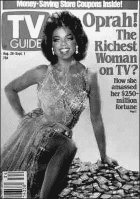

图 15-8. 这期《电视指南》封面描绘了奥普拉的头像在安·玛格丽特的身上。

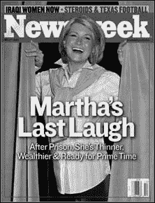

图 15-9. 《新闻周刊》将玛莎·斯图尔特的头像贴在了洛杉矶模特的身体上。

### 奥·J·辛普森和《时代》杂志

1994 年 6 月 27 日，《时代》杂志展示了一张经过修改的奥·J·辛普森的警察照片，将其加深色调以使其看起来更邪恶。如果《新闻周刊》没有在封面上也使用相同的警察照片，这种修改可能就不会被发现，如图图 15-10 所示。

### 威斯康星大学多样性

为了展示他们学校学生群体的多样性，威斯康星大学杂志《威斯康星》的编辑们在一张欢呼学生的照片上数字添加了一位黑人男性的面孔。修改后的图像出现在杂志的封面上，如图图 15-11 所示。

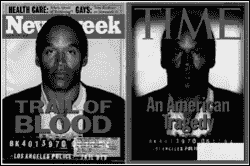

图 15-10. 《时代》杂志将一张普通的警察照片加深色调，创造了一个虚构的奥·J·辛普森形象。

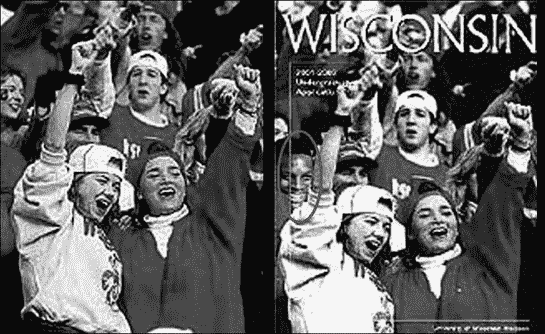

图 15-11. 为了展示种族多样性，威斯康星大学的杂志在封面照片上添加了一位黑人男性的面孔，而不是在校园中找到一位黑人男性。

### 波比·麦克考伊，《新闻周刊》，《时代》杂志

在 1997 年，Bobbi McCaughey 生下了第一组存活的七胞胎。不幸的是，Bobbi 的外貌被认为不适合发表在 *Newsweek* 上，所以当杂志将其放在封面上时，编辑们将她的牙齿拉直并美白。*Time* 发表了类似的图片，但只美白了牙齿，如图 图 15-12 所示。讽刺的是，唯一展示 Bobbi 未修改牙齿的报纸是 *National Enquirer*。

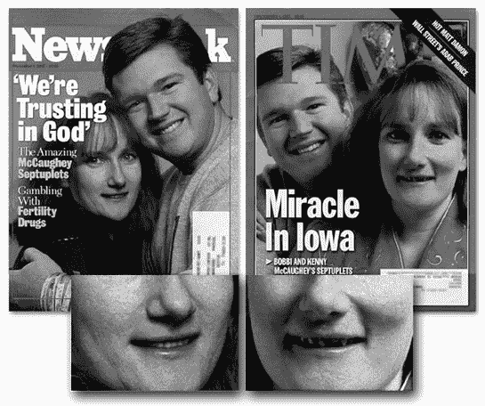

图 15-12. *Newsweek* 对 Bobbi McCaughey 的牙齿进行了数字化拉直和美白，以用于封面展示。*Time* 美白了牙齿，但没有拉直。

# 使用讽刺报道现实

幽默在反映真相或人们认为的真相时最为有效。因此，幽默常常以普通新闻报道无法做到的方式揭露事件。也许周围最好的讽刺报纸之一是 *The Onion* ([www.theonion.com](http://www.theonion.com))，它以仅足够的事实来使新闻故事可信且滑稽，如图 图 15-13 所示。

*The Onion* 的其他标题包括 "伊拉克警察兼职恐怖分子只为糊口"、"教皇谴责三个更多腺体" 和 "夫妻贷款公司被大信用卡公司驱逐"。

Abrupt 网站 ([www.abrupt.org](http://www.abrupt.org)) 也使用幽默来讽刺时事，其作者称之为 "文化干扰"。其想法是通过扭曲公司标志和营销心理学来出人意料地惊吓人们，使他们从全新的角度看待信息，如图 图 15-14 所示。

# 博客作为新闻来源

与其处理传统媒体的自我审查和胆怯，许多人正在阅读独立发布的目击者证词。这些个人日记，被称为 *博客*，如图 图 15-15, 提供了被世界事件夹击的普通人的原始、未经编辑的故事。

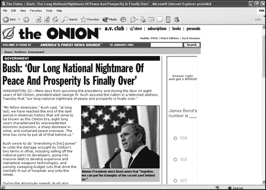

图 15-13. 这篇来自 2001 年 1 月的《洋葱》头条，比其他任何地方发表的内容都更接近预测未来。

博客未经审查和编辑，因此您会得到一个人的想法，包括他的拼写错误和语法错误。通过阅读来自冲突双方的人的博客，您可以获得更全面、可能更准确的世界真实情况的想法。

为了让您了解博客可能有多真实（因此有多危险），全世界的政府，包括利比亚、埃及和中国，都曾拘留和逮捕过博主。要找到博客，请访问谷歌博客搜索([`blogsearch.google.com`](http://blogsearch.google.com))、Technorati([www.technorati.com](http://www.technorati.com))、Daypop([www.daypop.com](http://www.daypop.com))或 Bloogz([www.bloogz.com](http://www.bloogz.com))。

根据定义，博客是单方面的和有偏见的，但如果您阅读了不同人写的几篇博客，您肯定能获得一个更平衡的视角。在许多国家，博客可能是向世界其他地区传递新闻的唯一方式，也是克服政府审查的一种方式。

如果没有人有话可说，言论自由就毫无意义，如果媒体提供的是娱乐而不是信息，那么新闻自由也就毫无用处。博客结合了言论自由和新闻自由，形成了一种新的沟通、娱乐和信息媒介。考虑到传统新闻媒体是多么容易被欺骗，博客可能是获取未经修饰的真相的最佳来源。当然，除非有人专门写博客来歪曲真相或撒谎。

为了影响公众舆论，玛莎·斯图尔特、HealthSouth 的理查德·斯克鲁西和安然公司的肯尼思·莱伊都开设了自己的网站和博客，在他们的备受瞩目的审判之前展示他们的故事。肯尼思·莱伊的网站甚至列出了他的社区服务奖项，包括他与当地教堂的联系、被当地社区团体评为“年度父亲”以及他在 1988 年为乔治·布什担任休斯顿财务委员会主席的工作。通过推广这些“健康”的犯罪嫌疑人的形象，这些网站和博客希望说服公众他们不可能有罪。毕竟，一个被称为“年度父亲”的人真的会为了自己的个人利益欺骗像安然这样的公司吗？


图 15-14. 文化撞击扭曲了正常的公司形象以颠覆其预期的信息。

虽然博客通常代表“草根”运动，但企业和公关公司已经注意到了这些博客可能产生的影响，并开始通过使用自己的博客进行反击。企业使用博客来模仿草根运动，通常被称为“虚假草根”，以强调其虚假的草根起源。

在 2001 年，微软被指控进行虚假宣传，当时报纸收到了大量信件，抗议司法部对微软的反垄断诉讼。当追踪这些信件的姓名和地址时，最终发现这些信件来自已故的人和非存在的城镇。

在 2006 年，博客作者突然开始抨击一项将迫使沃尔玛在员工健康保险上花费更多费用的州立法。"全国各地的报纸编辑委员会——并不是商业的好朋友——都在抨击这些法案，"支持沃尔玛的博客作者声称，他们使用了那些完全相同的词语，因为后来揭露这些词语是由沃尔玛公关公司撰写并分发给博客作者的。虽然博客作者重印别人的话并没有什么不妥，但当他们在不透露这些词语来源的情况下假装那是他们自己的原创思想时，就有些不妥了。


图 15-15. 博客可以带来来自目击者的新闻。

在揭露沃尔玛对博客的虚假宣传后，*《纽约时报》*后来揭露了一份内部沃尔玛备忘录的内容，该备忘录关注了这些相同的问题。根据这份备忘录([www.nytimes.com/packages/pdf/business/26walmart.pdf](http://www.nytimes.com/packages/pdf/business/26walmart.pdf))，沃尔玛建议，为了阻止不健康的求职者，一种方法就是确保“所有工作都包括一些体力活动（例如，所有收银员都要做一些购物车整理工作）。”

这份备忘录进一步指出，“吸引和留住一个更健康的劳动力将比改变现有劳动力的行为要容易得多。这些举措也将劝阻不健康的人来沃尔玛工作。”

在博客上试图区分事实、谎言和扭曲的感知很可能会成为一种新的互联网娱乐活动。许多博客在报道真相方面现在与传统新闻媒体一样不可靠，随着使用博客传播观点的有效性越来越为人所知，它们将越来越多地倾向于保持传统媒体不报道真相的相同弱点。现实只是你选择看到的东西，而且令人担忧的是，人们选择看到的是别人决定他们应该看到的东西。

# 第十六章。黑客活动：在线活动

历史学家

你只需要反思一下，在当今社会，让自己成为一个危险公民的最好方法之一就是重复我们的开国元勋在争取独立斗争中所使用的那些话语。

— 查尔斯·奥斯汀·比尔德

猜猜在民主制度中谁拥有更多的政治权力——是每隔几年才能投一次票的个体，还是可以随时向政治家们提供竞选捐款和其他金钱好处的跨国公司？

尽管当权者希望您相信您的投票实际上是有影响力的（当它没有被投票机丢失时），但现实是，面对游说团体和公司的影响，大多数个体感到无力和无助。这就是为什么绝望的人们常常诉诸暴力，迫使政府解决长期存在的问题。例如，1992 年 4 月的洛杉矶暴乱（由四名被控殴打罗德尼·金的白人警察被宣判无罪引发）期间，黑人抗议种族不平等，2005 年 10 月，法国移民暴乱以抗议社区的高失业率和警察的暴力行为。在暴乱将这些问题带到公众视野之前，这些问题在很大程度上被那些本应积极寻求解决方案的政府所忽视。

而不是等到局势达到如此沸点，许多个人将他们的精力投入到活动组织中。在互联网出现之前，活动家们必须依赖会议、通讯和大规模邮寄来吸引支持者，并保持他们的成员组织有序和知情。然而，互联网为他们提供了一个向全球受众传播思想和宣传目标的媒介。

要了解更多关于如何使用互联网来组建或改善活动团体，请阅读 NetAction 提供的培训课程《虚拟活动家》（[www.netaction.org](http://www.netaction.org)）。如果您想找到附近的抗议集会，请访问[Protest.Net](http://protest.net) ([www.protest.net](http://www.protest.net))，它列出了世界各地的活动，并提供了一本活动手册，帮助人们参与其中，如图 16-1 所示。

电子邮件、网站和即时通讯让活动家们能够更快、更方便地沟通，但互联网作为抗议媒介的真正承诺（或威胁）在于其本身。互联网为虚拟静坐和封锁、电子邮件炸弹、网页篡改以及为某个事业创造和传播蠕虫和病毒提供了机会。


图 16-1. [Protest.Net](http://protest.net)按地理位置、日期和主题列出不同事件，以便您在方便的时候在世界各地进行抗议。

# 虚拟静坐和封锁

一种常见的抗议形式是物理占领或封锁区域或建筑物的入口，例如 1969 年 4 月 9 日，300 名学生占领哈佛大学行政大楼，抗议越南战争。这种静坐很少造成任何损害，但有助于引起人们对抗议者事业的关注，尤其是如果抗议者能够占领并关闭像哈佛这样的高调目标。（在加利福尼亚州巴斯特罗的一个加油站占领并控制男洗手间，无论涉及多少人，都不会产生同样的戏剧性效果。）

由于实体占领难以组织，许多活动家参与虚拟静坐和封锁，任何人都可以加入，无论他们身在何处。这种虚拟抗议的目标与线下抗议相同——关闭对高调目标的访问并争取公众关注。

## 世界上第一次互联网罢工

1995 年 12 月 21 日，一个自称 Strano 网络的组织宣布，组织了世界上第一次互联网罢工：

> BOIKOTT 法国政府的机构！
> 
> 法国政府完全蔑视法国人民、国际社会，以及那些只想在更好的世界中抚养子女的普通人：
> 
> +   在太平洋岛屿进行核试验
> +   
> +   继续使用核能作为“民用”能源的主要来源
> +   
> +   在不考虑最近抗议此类政策的示威活动中人们巨大存在的情况下，继续其“社会重新划分”的项目。

在指定的时间，Strano 网络要求抗议者访问包括法国外交部([www.france.diplomatie.fr](http://www.france.diplomatie.fr))、法国文化和法语部([`web.culture.fr`](http://web.culture.fr))以及经合组织核能署([www.nea.fr](http://www.nea.fr))在内的众多法国政府机构网站。在如此庞大的访问量冲击下，Strano 网络希望压垮法国政府的网络服务器，使其网站离线，据一些报道，他们确实做到了这一点。

世界上第一次虚拟静坐的独特之处在于，它不仅攻击了目标并阻止了合法用户访问，而且完全使用合法手段做到了这一点。在实体静坐中，参与者可能会因非法侵入而被逮捕，但个人同时访问单个网站并不违法。然而，结果是拒绝服务攻击，对于个人来说，无法承担责任。

## 网络上的萨帕蒂斯塔

很少有人知道基查帕斯（Chiapas）在哪里（它位于墨西哥的南端），甚至更少的人知道萨帕塔主义者是谁（他们是基查帕斯的土著人民，以 20 世纪初墨西哥革命领袖埃米利亚诺·萨帕塔的名字命名，他为人民的土地和自由而战）。所有这些都改变了，1994 年 1 月 1 日，萨帕塔主义民族解放军（EZLN）宣布对墨西哥国家宣战，并要求解放基查帕斯和墨西哥的人民。作为萨帕塔主义者的战争宣言的一部分，他们解释了基查帕斯州是墨西哥最贫穷的州之一，但却是墨西哥石油财富的大部分来源，以及木材、咖啡和牛肉的出口。

萨帕塔主义者最初试图通过传统新闻媒体，如 CNN 和墨西哥国家控制的电视网络 Televisa，向世界传达他们的使命，但他们发现他们的信件、报告和故事被严重编辑，这阻止了其他人了解他们叛乱的真正性质。只有墨西哥报纸《La Jornada》完整且未经编辑地发表了萨帕塔主义者的材料，但这份报纸很少有人能接触到墨西哥城以外的地方。就传统新闻媒体而言，萨帕塔主义者不存在，而阅读有限新闻覆盖范围的大多数人得出结论，他们只是应该被镇压的麻烦制造者。

即使墨西哥政府紧急派遣 15,000 名军队来军事镇压叛乱，媒体仍然继续淡化关于萨帕塔主义者的新闻，有效地封住了他们争取自由的呼声，并忽视了他们关于政府镇压和剥削的报告。为了绕过传统新闻媒体的冷漠，萨帕塔主义者的支持者开始键入或扫描小组的信息，并在互联网上分发。

人们将西班牙语文本翻译成英语和其他语言，很快，萨帕塔主义者（Zapatistas）的困境开始吸引海外报纸和杂志的关注，否则他们可能从未想过要报道这场叛乱。当墨西哥军队包围了 12,000 名游击队员时，萨帕塔主义者通过互联网报告说他们已经逃脱了包围并征服了几个附近的村庄，这导致了世界市场的混乱，并使墨西哥比索的价值突然下跌。随着更多独立的新闻媒体证实了萨帕塔主义者的说法（让墨西哥政府感到尴尬），萨帕塔主义运动获得了更多的可信度和关注度。在这种情况下，萨帕塔主义者不必举行虚拟静坐来宣传他们的困境；他们只是简单地使用新闻组、电子邮件和网站向全世界广播萨帕塔主义者的斗争。

要了解更多关于萨帕蒂斯塔的信息，请访问萨帕蒂斯塔网络（[www.zapatistas.org](http://www.zapatistas.org)），如图 16-2 所示，或奇帕斯观察（[www.zmag.org/chiapas1](http://www.zmag.org/chiapas1)）。


图 16-2. 萨帕蒂斯塔人是第一批利用互联网来宣传其困境的异见团体之一。

## 需求干扰

一个自称电子干扰剧院的团体（[www.thing.net/~rdom/ecd/EDTECD.html](http://www.thing.net/~rdom/ecd/EDTECD.html)）通过开发虚拟活动软件和组织互联网罢工，将萨帕蒂斯塔的事业提升到了新的水平，如图 16-3 所示。

为了组织其互联网罢工，电子干扰剧院创建了一个名为 FloodNet 的特殊 Java 小程序，参与者可以安装它，每隔几秒自动重新加载目标网站。根据电子干扰剧院的说法，超过 10,000 人参与了 9 月 9 日的互联网罢工，使用 FloodNet 每分钟向每个目标网站发送 600,000 次点击。


图 16-3. 1998 年 9 月 5 日，电子干扰剧院呼吁对五角大楼、法兰克福证券交易所和墨西哥总统塞迪略的网站进行互联网罢工，以支持萨帕蒂斯塔人。

当五角大楼检测到 FloodNet 的攻击时，它将 FloodNet 用户重定向到另一个包含名为 HostileApplet 的 Java 小程序的网页，该小程序会在参与者的浏览器中不断重新加载文档，有效地占用他的电脑，防止他攻击五角大楼的网站。

在 9 月 9 日的攻击中，塞迪略的网站没有进行报复，但后来在次年 6 月的一次类似攻击中，他的网站导致抗议者的浏览器不断打开窗口，直到他们的电脑崩溃。尽管有这些反制措施，电子干扰剧院还是宣布他们的第二次互联网罢工也取得了成功，并指出“我们的兴趣是帮助恰帕斯的民众继续获得他们需要的国际认可，以维持他们的生存。”

在 2000 年 1 月 3 日，萨帕塔运动的支持者给镇压萨帕塔叛乱的墨西哥士兵写信，将这些信折叠成纸飞机，然后发射了萨帕塔的“空军”。为了纪念这一事件，电子干扰剧院创建了萨帕塔部落端口扫描（ZTPS）程序，它以类似的方式工作，通过扫描目标计算机上的随机端口并发送文本消息，如图 16-4 所示。

除了萨帕塔运动外，电子干扰剧院还支持了其他各种事业。为了反对美国对伊拉克的军事打击和经济制裁，电子干扰剧院利用其 FloodNet 程序攻击白宫网站，并在 1999 年 1 月还帮助组织动物权利活动家在瑞典抗议不同的网站。如果你有一个需要全球宣传的事业，考虑联系电子干扰剧院寻求帮助。

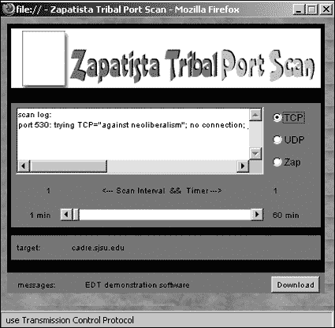

图 16-4. 萨帕塔部落端口扫描器可以用文本消息轰炸目标计算机的端口。

# 电子邮件轰炸

人们可以通过给政治家写信的方式来让自己的声音被听到。虽然一封信可能不会产生太大的影响，但数百或数千封信可能会让最坚定的政治家也注意到。

### 注意

由于个人或组织发送多封电子邮件非常容易，许多政治家对电子邮件消息的重视程度不如实体信件。亲手书写的、用你自己的话写的信件，在触及政治家时往往比批量生产的格式化信件更有效。

在互联网领域，发送电子邮件既简单又容易。实际上，可以发送大量消息，淹没目标收件箱，阻止收件人阅读或接收合法消息。这种做法被称为电子邮件洪水或轰炸，其最终结果是一种拒绝服务攻击。图 16-5 显示了一个典型的群发邮件程序，它可以用来向单个目标发送多条消息（邮件轰炸）或向多个目标发送单条消息（垃圾邮件）。

首次已知将电子邮件炸弹用于政治目的发生在 1998 年，当时斯里兰卡的泰米尔游击队据报道向斯里兰卡大使馆发送了数千封电子邮件，内容为：“我们是互联网黑虎，我们这样做是为了干扰你们的通讯。”或许是因为攻击的独特性，这次电子邮件炸弹攻击为泰米尔游击队带来的宣传比他们之前多年所进行的无数自杀式爆炸还要多。

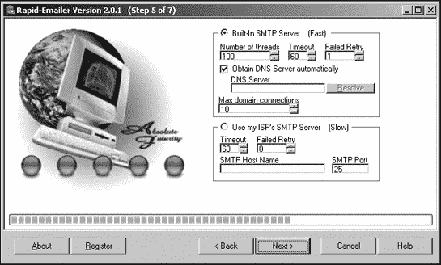

图 16-5. 电子邮件炸弹可以向用户指定的目标发送定制的消息，从而淹没整个互联网。

1998 年 3 月，一名黑客每天向北约的网站发送 2000 多条消息，以抗议该组织在科索沃冲突（友好委婉的说法是战争）中的作用。当一位加利福尼亚居民理查德·克拉克（Richard Clark）得知这次针对北约的黑客攻击后，据报道他采用了这种技术进行报复，每天向南斯拉夫政府的网站发送超过 50 万条消息，直到其网站崩溃。（理查德·克拉克的 ISP 太平洋贝尔后来因违反其反垃圾邮件政策而取消了其服务。）

全球通信研究所（IGC），一家位于旧金山的互联网服务提供商，在 1997 年因托管*Euskal Herria Journal*网站而遭到电子邮件炸弹攻击，该网站是一家支持西班牙和法国巴斯克分离主义运动的在线出版物。抗议者声称 IGC 支持恐怖主义，因为*Euskal Herria Journal*网站的一部分包含了恐怖组织埃塔（Euskadi Ta Askatasuna，ETA）的信息，该组织在其 30 年的巴斯克独立斗争中杀害了 800 多人。

为了说服 IGC 停止托管*Euskal Herria Journal*网站，抗议者向该公司发送了数千条消息，这些消息通过众多不同的计算机路由，这样 IGC 就无法从单一来源拦截邮件。为了进一步施加压力，抗议者还向 IGC 的员工以及任何由 IGC 托管的网站的公司发送电子邮件炸弹，并使用虚假的信用卡订单堵塞了目标公司托管的商业网站的在线订购表单。

IGC 最终关闭了*Euskal Herria Journal*网站，但在关闭之前已经存档了其网页。几天之内，几个其他网站在三个不同的洲上发布了*Euskal Herria Journal*网站的副本。尽管抗议者成功地审查了 IGC，但他们未能实现最终目标，即阻止*Euskal Herria Journal*与世界其他地区的联系。事实上，他们给了这本杂志国际知名度。

# 网络黑客攻击和计算机入侵

电子邮件轰炸和虚拟静坐可以扰乱目标，但除非人们知道你为什么这么做，否则这可能会被视为单纯的电子破坏行为，而不是政治抗议。为了以另一种方式传达他们的信息，黑客活动家通常会篡改像 NASA、FBI 甚至白宫这样的知名网站的主页。通过篡改高调网站，黑客活动家可以确保大量的人会阅读他们的信息。以下是一些例子。

1998 年发生了一起最早的由政治动机驱动的网页篡改事件，当时葡萄牙黑客入侵了几个印度尼西亚政府网站，以抗议印度尼西亚对东帝汶（一个前葡萄牙殖民地）的处理，如图 16-6 所示。图 16-6。


图 16-6. 一个被篡改的网站，例如这个被劫持的印度尼西亚外交部版本，可以在让被攻击网站尴尬的同时宣传一个事业。

1998 年 6 月，一群自称 Milw0rm 的黑客入侵了印度巴哈原子研究中心（BARC）的网站——[www.barc.ernet.in](http://www.barc.ernet.in)，并对网站进行了篡改，展示了原子弹特有的蘑菇云爆炸图，并附上文字：“如果核战争真的开始，你们将是第一个尖叫的人……”

1999 年，巴基斯坦和印度军队在卡吉尔地区发生战斗。巴基斯坦黑客针对包括[www.armyinkashmir.com](http://www.armyinkashmir.com)在内的多个印度政府网站，该网站提供了关于克什米尔山谷印度军队的事实信息。巴基斯坦黑客篡改了该网站，并发布了显示印度军队据称杀害克什米尔激进分子的照片，标题为“大屠杀”、“酷刑”和“镇压的痛苦”。巴基斯坦黑客还针对印度的信息技术部([www.mit.gov.in](http://www.mit.gov.in))网站，并用 Flash 电影图像进行了替换，如图 16-7 所示。图 16-7。


图 16-7. 巴基斯坦黑客在各种印度政府网站上发布了政治信息。

1998 年科索沃冲突双方的黑客针对对方的网站进行了攻击。一个名为 Team Spl0it 的美国黑客组织声称，他们用信息“告诉你们的政府停止战争”篡改了南斯拉夫政府的网页。塞尔维亚黑手党黑客组织声称，他们通过删除美国海军计算机上的所有数据进行了报复。

可能更令人恐惧的是，黑客已经针对许多敏感的美国政府网站，并声称已经入侵。2001 年 5 月，官方白宫网站([www.whitehouse.gov](http://www.whitehouse.gov))甚至因为未知黑客持续不断的拒绝服务攻击而关闭了三天。另一个黑客组织，香港危险双人组，后来声称已经入侵白宫网站，并留下信息：“停止所有战争。专注于你们的问题。没有造成任何损害，但我们不会告诉你们我们是如何进入的。”

在 1999 年北约意外轰炸中国大使馆之后，中国黑客加入了战斗，针对美国官方政府网站。内政部的网站被涂鸦，上面有在轰炸中遇难的三个中国记者的照片，而能源部的网站则包含了一条信息，内容如下：

> 抗议美国纳粹行径！抗议北约的残忍行径！我们是中国的黑客，对政治毫不关心。但我们无法忍受看到我们的中国记者被杀害，你可能已经知道了。无论目的如何，由美国领导的北约必须承担绝对责任。你们欠中国人民一笔血债，这是你们必须偿还的。除非战争停止，否则我们不会停止攻击！

回到美国后，在 2005 年 1 月 18 日，一个名为“互联网解放阵线（ILF）”的黑客组织篡改了六个共和党网站，并留下了以下信息：

> 与全世界那些在布什议程下遭受压迫的数十亿人站在一起，互联网解放阵线已经黑入并破坏了六个推广战争、资本主义和利润至上主义等病态和暴力意识形态的共和党网站。

在一家丹麦报纸发表了一幅描绘先知穆罕默德头上携带炸弹的卡通后，全球穆斯林爆发了抗议活动。一个自称红魔队（Red Devils Crew）的黑客组织将他们的抗议活动带到了互联网上，并于 2006 年 2 月 27 日，篡改了名为 Plasq.com 的公司的网站，该公司销售一款名为 Comic Life 的漫画制作程序。在原主页的位置，红魔队黑客活动家发布了以下信息。

> 我们看到一份丹麦报纸（日德兰邮报）通过发表一幅将先知穆罕默德描绘成头戴炸弹的恐怖分子的漫画，这让全球近 15 亿穆斯林深感震惊！
> 
> 我只是好奇，如果这幅卡通展示的是耶稣或摩西先知，你们政府的反应会是一样的吗？我不这么认为……

为了推广某个原因而篡改网页仅当人们有机会在受影响的网站管理员将其删除之前看到你的信息时才会有效。这个机会窗口可以从几小时到几天不等。

无论在哪里有战争、冲突、分歧和权力，你都会发现网页篡改紧跟在物理力量之后。尽管这可能违法，闯入计算机可能被视为非法侵入，但它肯定比射击、轰炸和屠杀要少破坏性。从这个角度来看，黑客行为实际上可能被认为比任何传统的军事力量展示更道德。

# 计算机病毒和蠕虫

对于黑客活动家来说，另一种选择是通过（有时是仁慈的）蠕虫和病毒传播他们的信息，这些蠕虫和病毒可以在全球范围内传播，并且在未来多年内触及成千上万的人。

最早的黑客病毒之一是 1988 年的 MS-DOS 傅满洲病毒，它将自己隐藏在计算机的内存中，等待用户输入罗纳德·里根、玛格丽特·撒切尔或南非前总统 P.K.博塔的名字。当输入这些名字之一时，傅满洲病毒就会将其改为一个淫秽词语。当反核抗议者试图阻止 NASA 将伽利略探测器发射向木星，因为探测器的助推器含有作为燃料的放射性钚时，另一个早期的黑客蠕虫出现了。1989 年 10 月 16 日，黑客感染了 NASA 的网络，NASA 官员估计清理这些病毒花费了价值五十万美元的时间和资源。当运行时，WANK 蠕虫显示以下信息：

```
W O R M S   A G A I N S T   N U C L E A R   K I L L E R S
______________________________________________________________
\__  ____________  _____    ________     ____  ____  __  _____/
 \ \ \    /\    / /    / /\ \       | \ \  | |    | | / /    /
  \ \ \  /  \  / /    / /__\ \      | |\ \ | |    | |/ /    /
   \ \ \/ /\ \/ /    / ______ \     | | \ \| |    | |\ \   /
    \_\  /__\  /____/ /______\ \____| |__\ | |____| |_\ \_/
     \___________________________________________________ /
      \                                                  /
       \    Your System Has Been Officically WANKed     /
        \_____________________________________________ /

You talk of times of peace for all, and then prepare for war.
```

在一次抗议法国核试验的黑客行动中，有人编写了 1996 年核宏病毒，用以感染微软 Word 并在每个文档末尾插入文本：“停止在太平洋进行所有法国核试验！”

计算机病毒可以从一台计算机传播到另一台，但它们的传播速度 rarely match the distribution speed of an email worm. 两个黑客蠕虫包括 Mari@mm 蠕虫和不公正蠕虫。这些蠕虫的工作方式与许多其他蠕虫类似；每个都可以将自身的副本发送到目标 Microsoft Outlook 地址簿中存储的每个电子邮件地址。当 Mari@mm 蠕虫感染计算机时，它会在屏幕上放置一个大麻图标。如果用户点击此大麻图标，会出现一个对话框，如图 16-9 所示，推动大麻合法化。


图 16-9. Mari@mm 蠕虫推动大麻合法化。

不公正蠕虫将自身电子邮件发送到 Microsoft Outlook 地址簿中存储的前 50 个电子邮件地址，并显示以下信息：

> 请接受我为打扰您而表示歉意。
> 
> 记住，总有一天你可能处于这种境地。
> 
> 我们需要一切可能的支持。
> 
> 以色列士兵在冷血中杀害了 12 岁的巴勒斯坦儿童穆罕默德·阿尔-杜拉，当他的父亲徒劳地用自己的身体保护他时。由于以色列士兵无差别和过度使用机关枪，记者和旁观者无助地看着孩子被野蛮地谋杀。
> 
> 巴勒斯坦红新月会医生巴撒姆·巴尔贝西试图介入并挽救孩子的生命，但以色列的火力向他胸部发射了实弹，夺去了他的生命。孩子和医生被残忍地谋杀。穆罕默德的父亲贾马尔重伤并永久瘫痪。同样，大约有 40 名儿童被杀害，媒体没有注意到或报道这些悲剧。
> 
> 这些犯罪行为不能被原谅或遗忘！！！
> 
> 帮助我们停止血腥屠杀！！

一些其他黑客病毒和蠕虫的例子包括 2002 年的 Yaha-e 蠕虫，由印度黑客编写，试图对巴基斯坦政府网站进行拒绝服务攻击（[www.pak.gov.pk](http://www.pak.gov.pk)）；以及 2001 年的 Mawanella 病毒，该病毒抗议斯里兰卡 Mawanella 烧毁两座清真寺和 100 家穆斯林拥有的商店，这是穆斯林和佛教徒之间持续冲突的一部分，如图 16-10 所示。

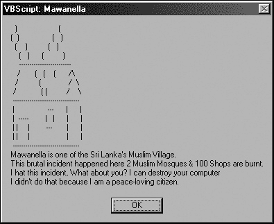

图 16-10. Mawanella 病毒旨在宣传斯里兰卡的冲突。

与常规病毒或蠕虫不同，黑客活动家的创作很少故意破坏数据；他们的意图是传播信息，而不是伤害用户。然而，1999 年 2 月的情况并非如此，当时 14 岁的以色列人 Nir Zigdon 告诉伦敦《星期日泰晤士报》，他独自一人摧毁了一个伊拉克政府网站，他说该网站“包含有关美国、英国和以色列的谎言，以及许多针对犹太人的可怕言论。”Nir Zigdon 说：“我想，如果以色列害怕暗杀萨达姆·侯赛因，至少我可以尝试摧毁他的网站。”

据报道，Nir Zigdon 向该网站发送了一个电子邮件附件，并“声称我是一个巴勒斯坦的萨达姆崇拜者，制作了一种能够摧毁以色列网站的病毒。这说服了他们打开信息并点击指定的文件。几小时内，该网站就被摧毁了。不久之后，我收到了网站管理员 Fayiz 的电子邮件，他告诉我‘去见鬼’。”

# 激活主义视频游戏

由于网页篡改、病毒和蠕虫可能具有破坏性，或者至少是令人烦恼的，一些活动家已经转向通过创建视频游戏来发表政治声明。Molleindustria ([www.molleindustria.it](http://www.molleindustria.it)) 提供了一款名为 Tamatipico 的游戏，玩家控制一个工厂工人，使他更有效率。但要注意。工作过度并让他幸福水平下降，他实际上会变得不那么有效率（这是许多管理者似乎忘记的一个教训）。

Newsgaming ([www.newsgaming.com](http://www.newsgaming.com)) 提供了两款独特的政治视频游戏，名为 Madrid 和 September 12th。在 Madrid 游戏中，你必须点击人群中人们手中的蜡烛以保持它们燃烧，如图 16-11 所示。点击得太慢，蜡烛会一个接一个地熄灭。


图 16-11. 通过尽可能长时间地保持每个人的蜡烛燃烧，来保持希望。

9 月 12 日的游戏描绘了在不伤害无辜平民的情况下杀死恐怖分子的绝望斗争。在这款游戏中，玩家向街道上追踪的已知恐怖分子发射导弹。如果你不小心杀死了无辜的旁观者，你最终会创造出更多的恐怖分子，直到最终，你拥有的恐怖分子比你开始时还要多，如图图 16-12 所示。


图 16-12. 9 月 12 日视频游戏挑战你杀死恐怖分子，而不会无意中杀死平民并创造出更多的恐怖分子。

在 2004 年的总统选举期间，共和党甚至发布了一款名为《税入侵者》的政治视频游戏。游戏的目标是使用布什总统的面孔射击不断增加的约翰·克里税收计划，如图图 16-13 所示。失败意味着约翰·克里成功地提高了你的税收。

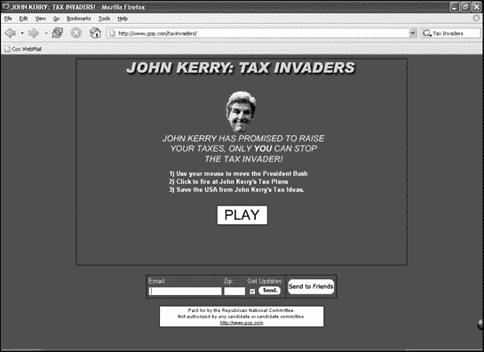

图 16-13. 玩《税入侵者》游戏，帮助约翰·克里避免提高你的所得税。

2004 年 11 月 22 日，一家名为 Traffic Management 的苏格兰公司发布了一款名为 JFK: Reloaded 的奇怪活动视频游戏。这款游戏背后的想法是证明李·哈维·奥斯瓦尔德可能是一个独自开枪射杀约翰·F·肯尼迪的狙击手。玩家扮演奥斯瓦尔德的角色，有机会通过尝试刺杀总统来重新创造历史。你的射击越接近奥斯瓦尔德的行为，你的得分就越高。最初，Traffic Management 甚至提供 10 万美元的奖金给第一个能够最准确地重现奥斯瓦尔德射击的人。

通过玩像《JFK: Reloaded》这样的视频游戏，你可以改写历史，目标是杰克·肯尼迪，甚至可以扮演司机，而不是肯尼迪本人。如果你杀死了司机，车队可能会停下来，然后你可以逐个击毙被困的乘客。或者，如果你射击司机，游戏可能会让司机向前倾倒，导致豪华轿车撞上路灯。

尽管出版商声称他们开发这款游戏是为了驳斥关于枪击来自其他地方（如草丛山丘）的阴谋论，但它引发了争议的风暴，最终迫使公司倒闭。虽然许多人认为这很无味，但 JFK: Reloaded 确实提出了一个有趣的问题。如果射击总统的动画形象是如此卑鄙，那么在其他视频游戏中射击无名的动画形象为何会被认为是“娱乐”？

# 谷歌炸弹

作为当时最受欢迎的搜索引擎，谷歌控制着人们在搜索特定单词或短语时找到哪些网站。搜索“戴尔”时，谷歌会提供数百个结果，尽管列出的顶级网站直接与戴尔电脑相关。这些结果是通过衡量网站的感知流行度来确定的，这部分基于链接回这些网站的网站数量。谷歌炸弹涉及通过伪造指向该网站的链接并在整个互联网上散布它们来人为提高一个网站的谷歌排名。

虽然一个人几乎不可能创建足够的链接来影响一个网站的排名，但一旦你有很多其他人在他们的网站上、新闻组、聊天室、博客、电子邮件消息中等地方发布链接，直到整个互联网都被淹没，那就很容易了。

1999 年，人们发现，如果他们在谷歌中输入短语“比魔鬼更邪恶”，微软的首页就会出现在顶级排名中。2005 年，谷歌炸弹将单词“悲惨的失败”链接到乔治·W·布什和迈克尔·摩尔两人的网站上。搜索短语“最糟糕的总统”也返回了乔治·W·布什的网站，因此布什的支持者对互联网进行了谷歌炸弹反击，使得“伟大的总统”也会指向乔治·W·布什的网站。

在另一个例子中，在谷歌中搜索“犹太人”时，排名第一的网站是 JewWatch，这是一个由白人权力民族主义者 Frank Weltner 运营的反犹太主义网站。（更多信息请参阅第十七章 Chapter 17 关于仇恨团体的内容。）因此，博客 Jew School（[www.jewschool.com](http://www.jewschool.com)）的编辑现在正在征求网站帮助他通过谷歌炸弹将 JewWatch 网站从排名第一的位置上移除。

所以下次你在谷歌搜索时，仔细检查结果列表。其中一些网站可能是合法的，但有些可能是人为提高排名的受益者。你如何区分呢？你无法区分，这就是为什么你可能需要检查每一个网站来了解其真正的政治议程。

# 成为黑客活动家

如果你想要利用互联网来推广你的信仰，你同样可以成为一个黑客活动家。在最基本层面上，你可以向国会代表请愿或在[`e-thepeople.com`](http://e-the-people.com)辩论当前事件。除了政府代表的电子邮件地址外，这个网站还列出了你可以支持的各项请愿，甚至给你机会在线创建和发布自己的请愿。

另一个网站，进步秘书处([www.progressivesecretary.org](http://www.progressivesecretary.org))，允许任何人开始或加入一项写信运动，向美国政府的各种官员请愿，议题范围从环境和军备扩散到死刑和古巴禁运。通过与其他数千人联合力量，你可以比单独写信更快地让声音被听到。

当然，电子邮件只是比互联网发展之前活动家所依赖的大规模邮寄和传真更快的一种方式。然而，由于网站向全球观众推广特定团体、其目标和其哲学，网络活动家具有更高的可见性。为了增加影响力，许多活动家已经与类似组织结盟。要了解更多关于通过互联网与其他活动家团体建立联系的信息，请访问网络信息联盟([www.cni.org](http://www.cni.org))、全球互联网自由运动([www.gilc.org](http://www.gilc.org))、数字自由网络([www.dfn.org](http://www.dfn.org))、互联网自由表达联盟([www.ifea.net](http://www.ifea.net))，或如图 16-14 所示的人民全球行动([www.nadir.org/nadir/initiativ/agp](http://www.nadir.org/nadir/initiativ/agp))。


Figure 16-14. 人民全球行动网站让你用你选择的任何语言了解最新的全球问题。

如果你想加入某个特定的活动家团体，请访问无国界行动([www.idealist.org](http://www.idealist.org))、指南星([www.guidestar.org](http://www.guidestar.org))或[Activism.net](http://activism.net) ([www.activism.net](http://www.activism.net))获取更多信息。[Activism.net](http://activism.net)还提供了更多关于使用计算机来推广你事业的技术数据，包括关于匿名重发邮件和密码学的讨论。

当然，即使是活动家有时也需要帮助，因此 Cause Communications ([www.causecommunications.com](http://www.causecommunications.com)) 和 Grassroots Enterprise ([www.grassroots.com](http://www.grassroots.com)) 提供咨询服务，以帮助活动家实现他们的目标。如果你需要支持你事业的事实，可以尝试 Political Research Associates ([www.publiceye.org](http://www.publiceye.org))，它提供了关于各种反民主、威权主义和压迫性运动、机构和趋势的研究。

如果你拥有政府不希望任何人看到的信息，你可以联系 Cryptome ([`cryptome.org`](http://cryptome.org))，它将在其网站上发布任何秘密或被禁止的信息。

为了学习涉及黑客行动主义的具体策略，你甚至可以参加 Ruckus Society ([www.ruckus.org](http://www.ruckus.org)) 提供的训练营，该组织曾训练抗议者破坏 1999 年世界贸易组织（WTO）在西雅图的峰会。Ruckus Society 倾向于吸引各种类型的黑客行动主义者，从反对微软在操作系统市场上的垄断到为所有公民，无论国籍，争取在互联网上自由发言的权利。

关于黑客行动主义的信息和灵感来源还包括 Anarchist Resistance ([`anarchistresistance.org`](http://anarchistresistance.org))、Counter Inaugural ([`counter-inaugural.org`](http://counter-inaugural.org))、[CrimethInc.com](http://crimethinc.com) ([www.crimethinc.com](http://www.crimethinc.com))、[Infoshop.org](http://infoshop.org) ([`infoshop.org`](http://infoshop.org))、Independent Media Center ([www.indymedia.org](http://www.indymedia.org))、The Hacktivist ([www.thehacktivist.com](http://www.thehacktivist.com)) 和 Hack This Site ([www.hackthissite.org](http://www.hackthissite.org))。

当然，活动家并不总是正确的，他们的行为可能会造成破坏，无论他们的意图多么高尚。一些活动家对于违法或与可疑组织结盟以推进他们的议程毫不介意，这并不使他们比他们攻击的政客、政府或公司道德或伦理上更高尚。

要了解不同的活动家团体，请访问[ActivistCash.com](http://activistcash.com)网站([www.activistcash.com](http://www.activistcash.com))，该网站提供“反消费者活动家团体的深入剖析，以及他们巨额资金来源的信息。”在其发现中，[ActivistCash.com](http://activistcash.com)声称，环保组织“地球第一！”成立于 1979 年，当时其创始人戴夫·福雷曼被西雅图俱乐部和荒野协会接触，他们希望资助一个新极端主义团体，以便与他们相比显得温和。据报道，福雷曼接受了一份为期 10 年的协议，作为环保运动的非官方激进派。在这个角色中，他可以自由地追求西雅图俱乐部和荒野协会无法公开支持的有争议的活动，例如在圣地亚哥焚烧住宅开发区和在洛杉矶焚烧悍马和 SUV 经销商。在《生态战士的忏悔》一书中，戴夫·福雷曼甚至吹嘘说，“仅在美国国家森林中进行的生态破坏（经济破坏）每年就使工业和政府损失 2,000 万至 2,500 万美元。”

动物权益保护组织（PETA）也受到了 ActivistCash.com 的审查，该网站声称 PETA 支付了 27,000 美元用于罗杰·特罗恩的法律辩护，他因 1986 年 10 月在俄勒冈大学参与盗窃和纵火被捕。在其他地方，7,500 美元被用于弗兰西丝·斯蒂芬妮·特鲁特，她试图谋杀一家医疗实验室的总裁，还有 5,000 美元被用于乔什·哈珀，他在鲸鱼狩猎中向美洲原住民投掷烟雾弹、发射信号弹，并用化学灭火器喷洒他们的脸部。

即使是反对酒驾的母亲（MADD）也未能免受 ActivistCash.com 的批评，该网站声称该组织无必要扩大其使命，以完全禁止酒精使用。MADD 创始人坎迪·莱特纳甚至与该组织断绝了关系，她说：“我成立 MADD 不是为了处理酒精问题。我是为了处理酒驾问题。”

通过审查 ActivistCash.com 的声明，你可以看到问题的不同方面，并选择你想要支持的一边。然而，你也可能想要研究[ActivistCash.com](http://activistcash.com)背后的人，看看他们可能隐藏的议程。

无论你决定支持什么事业，你最终都需要采取行动来支持你的观点。破坏网页或编写计算机病毒和蠕虫可以宣传问题，但永远不会解决问题。现在就采取行动吧。如果你只是尝试一下，你可能会惊讶于作为一个个体，你可以拥有多大的力量。

# 第十七章.互联网上的仇恨团体和恐怖分子

说我恨一切是不准确的。我强烈支持常识、诚实和普通礼貌。这使得我永远不适合担任公职。

——H.L. MENCKEN

在 1968 年电影《人猿星球》的拍摄过程中，演员罗迪·麦克道尔（饰演科内利厄斯）注意到一些不寻常的事情。穿猿猴服装的演员在午餐时总是坐在一起，而扮演猩猩的演员则坐在另一个区域。演员们只愿意与穿着相似服装的人社交可能看起来很有趣，但这确实突显了人类的一种普遍特征。人们自然会倾向于那些看起来像他们的人，并下意识地避免那些看起来不同的人。

从历史上看，人类种族总是根据各种特征如肤色、宗教信仰、意识形态或人工国家边界来划分自己。如果这么多人不把它们作为仇恨、歧视和杀戮的借口，这些区别就不会有问题。

# 互联网上的仇恨组织

在过去，仇恨组织通常在地区范围内运作，设立秘密会议，分发油印小册子，邮寄影印的通讯。但随着互联网的普及，这一切都改变了。互联网的大众传播媒介使仇恨组织能够利用网站、电子邮件和新闻组建立国际影响力，招募新成员并与地球上任何地方的类似组织分享想法。

在 1995 年 3 月 13 日的《纽约时报》文章中，前三 K 党大龙头 Don Black（Stormfront 白人至上主义主页的拥有者[www.stormfront.org](http://www.stormfront.org)）被引用说：“互联网对资源有限的[白人至上主义]运动产生了相当深刻的影响。访问是匿名的，并且有无限的能力与他人进行沟通。”

当然，仇恨组织不仅限于白人至上主义者、光头党和新纳粹分子。还有反犹主义大屠杀否认者、黑人激进分子、基督教民族主义者、反同性恋活动家、反基督教团体和反阿拉伯团体。对于几乎任何人群，你都可以确信总有人有理由仇恨他们。

为了反击任何形式的容忍度，几个组织致力于追踪仇恨组织并监控他们的在线活动。要了解更多关于仇恨组织和对抗他们影响的方法，你应该访问[Tolerance.org](http://tolerance.org) ([www.tolerance.org](http://www.tolerance.org))、仇恨目录([www.bcpl.net/~rfrankli/hatedir.htm](http://www.bcpl.net/~rfrankli/hatedir.htm))和南方贫困法律中心([www.splcenter.org](http://www.splcenter.org))的网站。

[Tolerance.org](http://tolerance.org)甚至按州追踪仇恨组织，因此你可以找到你附近的组织，如图图 17-1 所示。


图 17-1. [Tolerance.org](http://tolerance.org) 按州追踪仇恨团体。

可能最著名的白人至上主义团体是三 K 党([www.kkk.com](http://www.kkk.com))，其主页自豪地宣称它要“为白人基督教美国带来希望与救赎的信息！爱的信息，而非仇恨的信息！”与三 K 党早期的版本不同，现在的组织已经缓和了仇恨的言辞，并通过声称自己是“美国最大、最古老、最专业的白人权利组织——我们爱你！”来强调白人自豪的积极方面。

一些仇恨组织可能会在其自己的网站上过滤内容以显得温和，但提供链接到其他以更极端措辞宣扬其观点的网站。使用这种方法，犹太防卫联盟（JDL）—[www.jdl.org.il](http://www.jdl.org.il)—将访客引导到攻击伊斯兰教的网站，例如 AnsweringIslam 网站 ([`answering-islam.org.uk`](http://answering-islam.org.uk))，该网站声称：

> 事实真相是，伊斯兰教是一种人造宗教，充满了仇恨和毒液，这个可怕教派的信徒正以惊人的速度被引离上帝和救赎。

憎恨团体用来误导访客的另一种自私策略是在主页上展示温和的内容，并将他们更激进的言论更深地隐藏在网站内部。这种策略的一个例子是否认大屠杀的历史审查研究所([www.ihr.org](http://www.ihr.org))，其主页上声明：

> 成立于 1978 年的历史评论研究所是一个以促进公众对历史的认识，特别是 20 世纪历史中与社会政治相关方面的认识为宗旨的公共利益教育、研究和出版中心。历史评论研究所特别致力于提高对战争和冲突的原因、性质和后果的理解。

这种清醒的、学术性的语言给组织带来了信誉，使其看起来平衡，但当你进入传单部分时，你会发现自己被反犹太文章轰炸，这些文章消除了任何学术研究和辩论的错觉。这些文章的标题包括“伊拉克：一场为以色列而战”、“奥斯维辛：神话与事实”和“大屠杀：让我们听听双方的观点”。

# 种族主义视频游戏

除了创建推广其议程的网站外，仇恨群体还通过种族主义视频游戏传播其言论。如果你访问抵抗记录（[www.resistance.com](http://www.resistance.com)），你可以购买一款名为种族清洗的第一人称射击游戏，玩家在城市街道和地铁隧道中寻找非洲裔美国人、西班牙裔和犹太人角色进行射击。

内布拉斯加州林肯的纳粹分子加里·劳克，被称为“农场地带领袖”，也在他的网站上提供了一些种族主义视频游戏（[www.auschwitz.biz](http://www.auschwitz.biz)），包括一个玩家管理集中营的游戏。另一位白人至上主义者汤姆·梅茨格运营着《叛乱者》（[www.resist.com](http://www.resist.com)），该网站提供在线 Flash 游戏，包括边境巡逻（目标是射击试图穿越墨西哥边境的人）、驾车射击（玩家在街区驾驶并射击慢跑者、骑自行车的人和妓女）和爆炸！（玩家控制一名巴勒斯坦自杀式炸弹袭击者，并试图杀死尽可能多的犹太人），如图 17-2 所示。


图 17-2. 种族主义视频游戏让你尝试杀害不同种族和宗教背景的人。

种族主义视频游戏为仇恨群体提供了另一种影响人们和传播其不容忍信息的方式。种族主义团体主要将这些游戏针对年轻男子和男孩，这正是他们需要招募未来成员的精确人口群体。就像任何好的企业一样，仇恨群体理解目标营销的有效性。

所以下次你的孩子玩游戏时，从他们肩膀上看看。他们可能正在玩一款商业上可接受的像《侠盗猎车手》这样的游戏，其目标是偷车、卖毒品和逃离警察，或者他们可能正在玩一款种族主义游戏，比如边境巡逻，他们试图射击他们不喜欢的人。在任何情况下，你必须问自己，你希望你的孩子长大后接受这些价值观吗？

# 恐怖主义：21 世纪的共产主义威胁

憎恨群体通常只会进行威胁、恐吓和嘲笑他们的目标。一般来说，他们避免采取军事式的对抗。

另一方面，恐怖分子想要杀死任何不与他们思维方式相同的人。

尽管恐怖主义不是新事物，但恐怖分子通过互联网进行沟通和协调攻击的方式随着互联网的引入而发生了变化，互联网为恐怖分子提供了与其他用户相同的优势：

+   匿名性

+   即时全球通信

+   使用简便

## 网络恐怖主义的神话

最普遍的威胁之一是对国家安全的恐惧，即网络恐怖主义或“数字珍珠港”，恐怖分子仅使用计算机、精心设计的病毒或特洛伊木马和黑客技能来破坏一个国家的基础设施。网络恐怖主义可能取得的成果从令人恐惧到奇异不等，正如 1997 年巴里·C·柯林在安全与情报研究所发表的论文《网络恐怖主义的未来》([`afgen.com/terrorism1.html`](http://afgen.com/terrorism1.html))中所概述的。

科林设想的一个可能的网络恐怖主义场景涉及黑客入侵空中交通控制系统，并将民用飞机重新引导以相撞。另一个更不寻常的场景警告说，黑客可能闯入谷物制造商的处理控制系统，提高谷物中铁补充剂的水平，导致儿童铁中毒，生病，甚至可能死亡。

另一个场景是网络恐怖分子破坏控制国际金融交易的计算机，导致银行倒闭和股市崩盘（这意味着腐败的政治家和大型企业的首席执行官可能被归类为网络恐怖分子，如果他们只使用计算机的话）。

虽然网络恐怖主义听起来令人恐惧，但现实却远没有那么激动人心。问题不在于网络恐怖主义不可能，而在于它不太可能发生。就像一个流氓国家可以向美国发射洲际弹道导弹一样，这样的大规模、协调一致的计算机系统攻击也可能发生。然而，就像来自朝鲜或伊朗等国家的实际攻击远不如涉及常规爆炸物的恐怖袭击可能一样，噩梦般的网络恐怖主义场景的威胁实际上相对较小。

密码学专家布鲁斯·施奈尔甚至写了一本名为《超越恐惧》的书（[www.schneier.com/book-beyondfear.html](http://www.schneier.com/book-beyondfear.html)），该书消除了网络恐怖主义的大部分威胁。他的一些幽默引言包括：“你有没有想过为什么在安检点会没收镊子，但火柴和打火机——真正的易燃物质——却没有被没收？……如果镊子游说团有更多的权力，我敢肯定他们也会被允许带上飞机，”以及“当美国政府说反恐安全值得牺牲个人公民自由时，这是因为做出这一决策的成本并不是由那些做出决策的人承担的。”

大多数恐怖分子都有保持互联网运行的既得利益，因为这也是他们相互沟通的方式。黑客入侵空中交通管制计算机可能导致飞机坠毁，但用肩扛式防空导弹击落飞机或偷偷将炸弹带上飞机要简单得多。此外，当炸弹爆炸时，当局很难否认恐怖袭击。恐怖分子希望通过即将到来的攻击的确定性以及未来攻击的恐惧来恐吓人们。网络恐怖主义实施起来过于困难，其结果也不够戏剧化和确定。

## 互联网上的恐怖分子

没有人怀疑，如果恐怖分子能够并且如果网络恐怖主义像炸毁某物一样有效，他们将会从事网络恐怖主义活动。相反，他们更有可能仅仅将互联网作为一种通信媒介来使用。

在最简单的层面上，恐怖组织可以在网站上发布关于他们自己的信息来推广他们的事业，招募新成员，并提供关于他们敌人的最新消息。例如，黎巴嫩的真主党网站([www.moqawama.net](http://www.moqawama.net))在图 17-3 中展示。


图 17-3. 黎巴嫩真主党网站描述了以色列的侵略及其对以色列目标的攻击。

就像仇恨组织一样，恐怖主义网站通常使用温和的语言来解释他们的使命，并从公众那里获得同情，同时巧妙地省略了对这类残酷事实的提及，例如该组织为了追求其长远目标而杀害无辜人民的倾向。

要了解世界各地的恐怖组织，请访问[TerroristFiles.org](http://terroristfiles.org) ([www.terrorismfiles.org](http://www.terrorismfiles.org))、全球恐怖警报([www.globalterroralert.com](http://www.globalterroralert.com))或赫兹利亚跨学科中心([www.ict.org.il](http://www.ict.org.il))。

除了网站之外，恐怖分子还使用互联网的所有其他普通工具来相互沟通，例如电子邮件、IRC 聊天室和即时消息。一些政府官员认为，恐怖分子甚至可能使用隐写术，这涉及到在网站上发布的图片中隐藏信息，其他恐怖分子成员可以下载并阅读这些信息。

尽管恐怖分子可以使用加密和隐写术来隐藏他们的信息，但他们在使用普通语言、使用无人能理解的暗语进行交流时可能更容易。矛盾的是，加密可能会突出显示一个人试图隐藏某事的事实。

9-11 恐怖袭击的策划者之一拉姆齐·本·阿勒希布据报道收到了基地组织领导者穆罕默德·阿塔的电话，阿塔告诉他，“两根棍子，一个破折号，一根插在蛋糕上的棍子”，这意味着他们准备执行他们的计划攻击。任何拦截此类信息的人可能会将其视为无用，使得加密变得完全没有必要。

使用普通英语暗语的消息可能会被忽视，但加密消息会引发疑问——谁发送了它，谁在接收它，它究竟意味着什么？在某种程度上，使用加密实际上可能会给恐怖分子带来不必要的关注。

从经济角度来看，大规模恐怖主义活动成本高昂。它涉及培训人员、购买设备和在世界各地安置恐怖分子据点。毒品走私长期以来一直是资金来源的宠儿，但现在恐怖分子可能也在深入互联网欺诈。

在线诈骗（见第十三章)、特种作战([www.specialoperations.com/Terrorism](http://www.specialoperations.com/Terrorism))或恐怖主义：问题与答案([`cfrterrorism.org/home`](http://cfrterrorism.org/home))。在这些网站上，您可以了解世界各地不同的恐怖组织，它们的组织方式，它们可能的目标，以及它们通常如何发动攻击。

最有趣的是，这些恐怖主义信息网站没有提及恐怖组织通常是如何从仇恨团体演变成为恐怖分子，再到政党，最后成为执政政府，正如巴勒斯坦解放组织（PLO）和后来的哈马斯所见证的那样。

可能真正的恐怖主义威胁在于任何恐怖组织都可能通过选举成为“合法”政府，并利用军事士兵而不是恐怖分子来实现他们的目标，去攻击和杀害无辜平民。当这种情况发生时，任何支持他们政府所犯下的暴力行为的人，将不会比他们大声谴责的恐怖分子更好。
