# 第五部分。未来——为了利润而黑客攻击

# 第十八章。身份盗窃和垃圾邮件

科技作家

计算机犯罪和武装抢劫的兴起并没有消除现金的诱惑。

——詹姆斯·查尔斯

并非每个能够操纵电脑的人都是黑客，也并非每个黑客都是电脑专家。黑客是一种探索的态度。然而，真正的黑客通常可以利用他们的电脑技能和知识来利用他人。当黑客想要利用他们的电脑技能从他人那里窃取东西时，他们通常会从事某种形式的身份盗窃。当黑客想要利用他们的电脑技能向人们发送合法（和不那么合法）产品的广告时，他们使用垃圾邮件。

无论动机是什么，身份盗窃和垃圾邮件的最终结果都是一样的：有人在未经您同意的情况下黑客您的生命。

# 理解身份盗窃

进行身份盗窃不需要电脑，但它们确实使它更容易、更方便。简单来说，身份盗窃涉及伪装成另一个人，让他们陷入支付你的账单的困境。这可以简单到服务员在你支付晚餐账单时记下你的信用卡号码，然后通过邮寄或互联网订购昂贵的商品。

在更极端的情况下，当有人使用你的名字、社会保险号码、当前地址和出生日期来访问你的银行账户、提取贷款，甚至犯下可以追溯到你的罪行时，就会发生身份盗窃。

## 身份盗窃是如何工作的

相对来说，知道您的人很少，所以您在日常生活中与之交易或遇到的大多数人依赖独特的信息来识别您，例如您的全名、出生日期、社会保险号码、母亲婚前姓氏、邮政编码和信用卡号码。

然而，从所有目的和意义上讲，任何拥有这些信息的人都可以欺骗他人，让他们认为他就是你。身份盗贼不需要具备模仿你的行为、外貌或说话方式的技能，就可以冒充你的身份。

## 最小化身份盗窃的威胁

任何人都可以成为身份盗窃的受害者。只需问问奥普拉·温弗瑞、史蒂文·斯皮尔伯格和泰格·伍兹。但当身份盗贼针对普通人时，这几乎总是因为他们有机会，而不是因为他们花时间专门针对你。

身份盗贼通常通过以下三种方式获取您的个人信息：

+   黑入存储您个人信息的公司电脑，例如银行和信用卡公司保留的数据库。黑客也可以针对任何存储其员工记录在电脑上的大型公司。

+   在您的垃圾箱或您工作或交易的公司垃圾箱中翻找。

+   网络钓鱼和其他社会工程技巧以获取您的个人信息。

如果黑客入侵银行的电脑并窃取你的账户号码、社会保险号码以及你母亲的婚前姓氏，你将无能为力。你的个人信息的安全性仅取决于存储它们的计算机，因此，只与可信赖的机构共享此类数据是很重要的。然后祈祷他们能尽最大努力保护它。

翻垃圾桶只是指翻看某人的垃圾寻找有价值的东西。身份盗贼寻找印有个人信息的文件，例如已经印有姓名和地址的未开封信用卡申请。然后，身份盗贼可以填写申请表，并要求将信用卡寄给你。接下来，除非你有带锁的邮箱，否则他会监视你的邮件，直到新卡到达。这时，身份盗贼可以开始在你甚至不知道的情况下使用信用卡进行消费（信用卡上印有你的名字，随后的账单也会在一个月后开始涌入）。军事基地是身份盗贼工作的热门地点，因为这些地点通常使他们能够接触到大量人的邮件，即使他们不是邮政员工，也能拦截这些邮件。

另一个翻垃圾桶的目标是寻找有用的物品，例如存款单上的银行账户号码、带有打印信用卡号的信用卡账单，或者税务申报信息（这可能包括社会保险号码）。

为了保护自己不受翻垃圾桶的人侵扰，任何包含个人信息的东西都应该被粉碎，并销毁信用卡申请表，以防止有人在不经你同意的情况下填写它们。为了进一步保护，可以安装一个带锁的邮箱。

如果你真的非常担心，可以申请一个邮政信箱，并将所有财务信息，如信用卡和银行对账单，都寄到那里。当然，你仍然需要信任你邮局分拣邮件的人。

最后，身份盗贼可以通过钓鱼手段获取你的个人信息，无论是通过发送电子邮件还是打电话假装成合法公司。为了尽可能多地接触到潜在受害者，身份盗贼可能会一次性向数千人发送虚假电子邮件（这是一种更恶意的垃圾邮件形式），并等待一定比例的收件人上当受骗，并在他们的网站上输入个人信息。

钓鱼者的另一种策略是直接打电话给潜在受害者，通常针对老年人。电话钓鱼需要更多的时间和精力，但仍然可以获得所需个人信息。

在罕见的情况下，身份盗贼可能会设置街头调查，并要求受访者提供他们的姓名、地址和电话号码。由于人们没有泄露任何在电话簿中找不到的信息，他们通常认为这样做没有问题。但他们没有意识到的是，他们已经使身份盗贼的工作变得容易得多。他可以使用这些信息来稍后找到该人的社会保障号和信用卡号。

减少成为身份盗贼受害者的风险的关键是仅少量提供您的个人信息，销毁任何可能被他人利用或用来获取您更多信息的信息的纸张，并且永远不要回应未经请求的电话或电子邮件。

在向“受信任”的组织，如银行或企业提供信息时也要小心。虽然他们可能为了“营销”目的请求敏感信息，如社会保障号码，但您总是可以拒绝提供这些信息，除非法律要求。通过限制谁可以访问您的个人数据，您可以减少有人从他人那里窃取您个人信息的可能性。

## 保护您的信用评分

尽管采取了所有预防措施，你仍然可能成为身份盗贼的受害者。为了帮助您监控和保护您的信用评分，首先获取一份免费的信用报告，您可以在以下方式中每年请求一次：

+   访问 [www.annualcreditreport.com](http://www.annualcreditreport.com)。

+   拨打 877.322.8228（免长途话费）。

+   填写一份年度信用报告请求表，并将其邮寄至年度信用报告请求服务，P.O. Box 105281, Atlanta, GA 30348-5281。您可以从 [www.ftc.gov/credit](http://www.ftc.gov/credit) 网站打印此表格。

根据联邦法律，如果公司对您采取不利行动，例如拒绝您的信用、保险或就业申请，您也可以免费获得一份您的信用报告。如果发生这种情况，您可以在收到行动通知后的 60 天内请求一份免费的信用报告。审查您的信用报告可以帮助您确定是否有身份盗贼破坏了您的信用评分。

如果您想购买一份您的信用报告，请联系以下机构之一：

| **Equifax** | 800.685.1111; [www.equifax.com](http://www.equifax.com) |
| --- | --- |
| **Experian** | 888.EXPERIAN (888.397.3742); [www.experian.com](http://www.experian.com) |
| **TransUnion** | 800.916.8800; [www.transunion.com](http://www.transunion.com) |

为了避免在邮件中收到信用卡优惠（并不得不销毁它们以保护自己），您可以要求信用卡公司首先停止向您发送他们的申请。要退出通过邮件收到的信用卡优惠，请拨打 1.888.5.OPTOUT (1.888.567.8688)。最后，创建一个包含所有银行和信用卡电话号码的文档，以防您需要紧急关闭账户。

保护您的身份信息比在身份盗贼作案后试图清理生活要容易得多，因此现在花时间做好准备是明智的。有关身份盗窃的更多信息，请访问以下网站：

| **身份盗窃资源中心** | [www.idtheftcenter.org](http://www.idtheftcenter.org) |
| --- | --- |
| **联邦贸易委员会** | [www.consumer.gov/idtheft](http://www.consumer.gov/idtheft) |
| **隐私权利保护中心** | [www.privacyrights.org/identity.htm](http://www.privacyrights.org/identity.htm) |
| **身份盗窃预防和生存** | [www.identitytheft.org](http://www.identitytheft.org) |
| **打击身份盗窃** | [www.fightidentitytheft.com](http://www.fightidentitytheft.com) |

# 垃圾邮件：互联网上的垃圾邮件

即使你很少使用互联网，你也可能被来自广告产品的公司的大量垃圾邮件所困扰，这些产品从完全无用的（假冒维生素）到非法的（儿童色情），提供“免费”度假赠品，或推广赚钱计划。与你可以忽略而不会失去片刻思考的新闻纸或杂志广告不同，垃圾邮件似乎永远不会让你独自一人。

发送垃圾邮件意味着向多个电子邮件账户或 Usenet 新闻组发送未经请求的消息。垃圾邮件的受害者必须花时间删除这些不想要的邮件，以便为有用的电子邮件腾出空间。垃圾邮件可能包括从合法广告到诈骗和身份盗贼试图钓鱼的个人信息的虚假消息。更常见的一种垃圾邮件类型涉及连锁信或其他可疑的“商业机会”，如下所示：

> $$$$$$$$ 快速现金!!!! $$$$$$$$
> 
> 你好，读这个，它有效！债务人朋友：这听起来可能像骗局，但实际上它真的有效！现在排在名单上的第 4 个人在我得到它的时候是第 5 个，那只是几天前。五美元是你未来的小投资。忘记彩票一周，试试这个。它可以为我们所有人工作。你可以用文字处理器或文本编辑器编辑这个列表，然后将其转换为文本文件。祝你好运！！
> 
> 亲爱的朋友，
> 
> 我的名字是戴夫·罗德斯。1988 年 9 月，我的汽车被收回，账单收款人像你想象不到的那样追着我。我被解雇了，我的失业救济金已经用完。我从失败的压力中唯一的逃避方式是我的电脑和调制解调器。我渴望将我的爱好变成我的职业。
> 
> 1989 年 1 月，我和家人去热带地区进行了为期十天的巡航。1989 年 2 月，我以现金购买了一辆林肯城市轿车。我目前正在佛罗里达州西海岸建造一栋房子，那里有一个私人泳池、船位，以及从我的早餐室餐桌和露台欣赏海湾的美丽景色。
> 
> 我将永远不再需要工作。今天我已经富有！到目前为止，我赚了超过$400,000.00（四十万美元）。在 4 到 5 个月内，我将成为百万富翁。任何人都可以做到。这个赚钱程序每次都完美无缺，100%有效。我从未失败过，每次我想要赚取$50,000.00 或更多。最好的是，你永远不需要离开家，除非去邮箱或邮局。
> 
> 我意识到，有了计算机的力量，我可以将这个赚钱公式扩展和提升为有史以来最令人难以置信的现金流生成器。我用计算机公告板取代了邮局，并通过计算机电子化地完成其他人 100%通过邮件完成的事情。现在只有少数信件是手动邮寄的。大部分艰苦的工作迅速下载到世界各地的其他公告板上。
> 
> 如果你相信总有一天你会得到那个你等待了一生的幸运机会，只需遵循下面的简单说明。你的梦想将会成真。

为了进一步吸引人们，许多垃圾邮件连锁信件包括“如奥普拉所见”等标题，以增加它们的可信度。然而，无论他们如何伪装自己，连锁信件垃圾邮件只是金字塔骗局（见第十三章[The Internet Con Artists]）的另一种形式，在这种骗局中，少数人受益，而其他人则受损。

# 为什么公司会发送垃圾邮件以及他们是如何做到的

没有人喜欢收到垃圾邮件，因为它浪费了时间，堵塞了邮箱，然而许多公司仍然继续发送，因为与直接邮件和其他形式的广告不同，发送垃圾邮件基本上是免费的。只需一个互联网账户的费用，任何人都可以接触到可能数以百万计的全球受众。在垃圾邮件发送者的眼中，即使他们激怒了互联网上的 99%的人，只要有 1%的人购买他们的产品，这一切都值得麻烦。

发送垃圾邮件时，也不需要输入多个电子邮件消息；就像批量邮件发送者永远不会舔邮票一样，批量电子邮件软件为垃圾邮件发送者自动化了这一过程。点击一个按钮，你也能在互联网上散布不受欢迎的电子邮件消息。

垃圾邮件发送者通常被刻板化为骗子或骗子，但许多是合法的企业，它们将垃圾邮件视为一种低成本、低风险的接触潜在客户的方法。当然，他们意识到大多数人不喜欢收到垃圾邮件，所以他们用委婉语如“批量电子邮件营销”来代替。所以下次当大量不受欢迎的消息堵塞你的电子邮件账户时，放松一下。你收到的不是垃圾邮件；你收到的是批量电子邮件营销信息。现在你感觉好些了吗？

要从垃圾邮件发送者的角度了解更多关于垃圾邮件的信息，请访问销售批量电子邮件程序的公司网站，例如 ClickZ 网络([www.clickz.com](http://www.clickz.com))、互联网营销技术([www.marketing-2000.net](http://www.marketing-2000.net))、电子邮件营销软件([www.massmailsoftware.com](http://www.massmailsoftware.com))、MailWorkz([www.mailworkz.com](http://www.mailworkz.com))或 MTI 软件([`desktopserver.com`](http://desktopserver.com))。

## 收集电子邮件地址

垃圾邮件发送者经常在 Usenet 新闻组中发布垃圾邮件，在那里他们可以将他们的产品定位到具有特定兴趣的人群。例如，一个销售维生素补充剂的垃圾邮件发送者可能会在 misc.health.alternative 新闻组中找到一个愿意接受的人群。

当然，新闻组只代表了互联网上潜在客户的一小部分。在垃圾邮件发送者能够将他们的信息淹没整个互联网之前，他们需要一个电子邮件地址列表。尽管可以购买电子邮件列表，但它们并不总是准确或最新的。因此，垃圾邮件发送者使用电子邮件地址提取程序来构建自己的列表。这些程序从三个来源收集地址：新闻组、网站和数据库目录。

### 新闻组提取器

当你向 Usenet 新闻组发布消息时，你的消息会显示你的电子邮件地址。新闻组提取器简单地下载存储在 Usenet 新闻组中的消息，移除文本，并存储返回的电子邮件地址，如图图 18-1 所示。


图 18-1. 新闻组提取器可以扫描新闻组帖子并在几秒钟内检索到一串电子邮件地址。

为了防止你的电子邮件地址被新闻组提取器吸走，在发布新闻组消息时使用虚假地址或匿名重发器。虽然这将阻止其他新闻组用户直接联系你，但它也阻止垃圾邮件发送者用垃圾邮件淹没你的账户。

由于新闻组提取器可以一次性收集成千上万的电子邮件地址，有些人将地址中的@符号替换为单词*AT*，例如将 joesmith@yahoo.com 替换为[joesmithATyahoo.com](http://joesmithatyahoo.com)。最初，电子邮件提取器不会识别电子邮件地址中间的单词*AT*，但新版本足够智能，可以将该单词替换为@符号，因此这种技术正在逐渐失去其有效性。

### 网站提取器

网站提取器的工作方式与新闻组提取器类似，只是它们从网站上提取电子邮件地址。当人们创建个人网站时，他们通常会提供一个链接，供访客联系他们。对于商业网站，他们通常会列出多个公司联系人，例如销售人员、技术支持人员，甚至首席执行官和总裁。垃圾邮件发送者在网上徘徊，在搜索引擎的指导下寻找网页，并摘取电子邮件地址以备将来使用。

为了欺骗网站提取器，许多人将他们的电子邮件地址中的字符替换为 ASCII 代码等效值。所以，而不是输入@符号，网页设计师可以替换@符号的 ASCII 代码等效值，即&#64，如下所示。

```
<html>
<body bgcolor="#FFFFFF" text="#000000">
E-mail: joesmith&#64yahoo.com
</body>
</html>
```

网站提取器可能会去除无效的 joesmith&#64yahoo.com，即使当在浏览器窗口中查看时，这个电子邮件地址正确地显示为 joesmith@yahoo.com。

不幸的是，最新的电子邮件提取器甚至可以捕获被 ASCII 代码隐藏的电子邮件地址，并将它们转换为有效的地址，因此许多网站现在以图形图像的形式显示他们的电子邮件地址。人们会知道如何正确输入它，但电子邮件提取器不会，这可以暂时阻止它们。

### SMTP 服务器提取器

SMTP（简单邮件传输协议）服务器是一种发送和接收电子邮件的计算机。SMTP 服务器提取器是一种从 SMTP 服务器检索有效电子邮件地址的程序，如图图 18-2 所示。


图 18-2. 一个 SMTP 服务器提取器可以从任何 SMTP 服务器中挖掘出有效的电子邮件地址。

这就是它的工作原理。首先，提取器创建一个电子邮件地址并询问 SMTP 服务器该地址是否有效。它使用伪造的地址无限重复此过程，直到偶然发现一个有效的地址，它可以存储起来用于未来的垃圾邮件发送。为了尽可能捕获尽可能多的有效电子邮件地址，SMTP 提取器通常针对互联网服务提供商（ISPs）的服务器，这些服务器可能拥有成千上万的客户电子邮件地址等待被发现。

### P2P 网络收割者

当人们加入一个文件共享网络以交换音乐、电影或程序时，他们通常会输入他们的电子邮件地址，而这个文件共享网络上的任何其他人都可以查看。这是垃圾邮件发送者在寻找电子邮件地址时的又一个肥沃领域。为了保护自己，永远不要在其他人可能不知道的情况下输入你的电子邮件地址。更糟糕的是，许多人，在配置文件共享程序时，无意中共享了他们电脑上的所有文件，允许垃圾邮件发送者窥视并从他们的电子邮件程序（如 Microsoft Outlook）中复制地址簿。有了这些信息，垃圾邮件发送者可以开始向你和你认识的所有人发送垃圾邮件。

### 钓取电子邮件地址

为了回应那些被电话推销员惹怒的人的压力，政府创建了一个“不要打电话”名单([www.donotcall.gov](http://www.donotcall.gov))，人们可以在这里注册他们的电话号码。电话推销员随后必须清理他们的电话名单，以移除任何存储在“不要打电话”名单上的号码。

因此，回到 2004 年，一位垃圾邮件发送者模仿联邦贸易委员会的网站，创建了他自己的虚假“不要垃圾邮件”网站。想法是你可以在这里输入你的电子邮件地址，垃圾邮件发送者将无法向你发送电子邮件。不幸的是，这个网站最初实际上是由一个垃圾邮件发送者运行的，所以任何在那里注册的人最终都得到了更多的垃圾邮件。联邦贸易委员会迅速关闭了那个虚假网站，但垃圾邮件发送者已经成功地收集了一个巨大的有效电子邮件地址列表。

在 2005 年，另一位网络钓鱼者利用垃圾邮件发送木马。任何愚蠢到运行附件文件的人都会安装木马，它在受感染的计算机上安静地坐着，直到检测到用户访问在线银行网站。然后木马会醒来，捕捉所有按键以捕获密码和账户号码，然后将这些信息发送回黑客，黑客随后可以随意访问受害者的账户。

## 隐藏垃圾邮件发送者的身份

垃圾邮件发送者可能会招致数百（或数百万）愤怒受害者的愤怒。一些垃圾邮件接收者会以愤怒的信息回应；其他人则发起自己的电子邮件炸弹攻击，向垃圾邮件发送者的地址发送多条信息，使其堵塞并变得无用。

不幸的是，如果垃圾邮件发送者的互联网服务提供商崩溃或堵塞，也可能惩罚那些恰好使用相同服务提供商的无辜客户。为了避免这种反击，许多垃圾邮件发送者会在 Hotmail 或 Juno 等服务上创建临时互联网账户，发送他们的垃圾邮件，然后在任何人能够攻击他们之前取消账户。被踢出互联网服务提供商并开设新账户只是大量垃圾邮件发送者玩的游戏的一部分。如果有人真的想购买垃圾邮件发送者的产品，他可以点击垃圾邮件中的链接，这将带他到垃圾邮件发送者的网站。

当然，对于那些懒得打开和关闭电子邮件账户的垃圾邮件发送者来说，有一个更简单的方法。许多群发电子邮件程序简单地省略或伪造发件人的电子邮件地址，以避免反击。

大多数 ISP 限制单个个人可以发送的电子邮件数量，以避免带宽消耗者阻碍其他客户的互联网接入。如果一个 ISP 发现有人发送了大量的电子邮件，它可以取消该账户。因此，垃圾邮件发送者可能会注册群发电子邮件账户，这些是特殊的邮件服务器，允许任何人以一定的价格发送大量电子邮件。

另一种替代方案是成本更低（但道德上更不可取）的方法，即通过“僵尸”计算机发送垃圾邮件，这些计算机之前已被蠕虫或特洛伊木马程序劫持（参见第五章）。

在感染了一组计算机的蠕虫或特洛伊木马程序之后，黑客可以使用一个名为“机器人”的程序来控制受感染的或僵尸计算机，该程序可能存储在 IRC 聊天室中。然后，黑客将他的受感染计算机网络租给垃圾邮件发送者，垃圾邮件发送者将垃圾邮件发送到控制机器人，机器人随后通过僵尸网络分发它。这比其他垃圾邮件发送方法对无耻的群发邮件发送者有几个优势。

首先，由于垃圾邮件似乎来自每个僵尸计算机的电子邮件账户，或者通过每个受感染计算机的 ISP 邮件服务器，追踪垃圾邮件的来源会导致一个无辜的人，而不是垃圾邮件发送者本人。其次，通过一个由机器人控制的网络发送垃圾邮件，这种网络被称为僵尸网络，垃圾邮件发送者并没有直接违反其 ISP 对群发邮件的禁令。第三，最重要的是，许多垃圾邮件过滤器通过阻止来自已知群发电子邮件账户的消息来工作。当垃圾邮件来自通过不同 ISP 连接的计算机，如 Earthlink 时，垃圾邮件通常可以绕过人们安装的任何过滤器。（如果一个过滤器检测到来自单个 ISP 的大量电子邮件，垃圾邮件过滤器会将其阻止。但如果电子邮件来自多个 ISP，过滤器通常会错误地假设电子邮件是有效的。）

垃圾邮件发送者还可以劫持合法的电子邮件账户，并使用该账户向互联网发送垃圾邮件。现在，如果有人追踪垃圾邮件的来源，他们会发现一个无辜的（并且可能感到困惑的）人，而真正的垃圾邮件发送者早已消失，去劫持其他电子邮件账户，一次又一次地通过发送垃圾邮件。

# 保护自己免受垃圾邮件发送者的侵害

现在你已经知道了垃圾邮件发送者如何找到电子邮件地址并发送垃圾邮件，你该如何反击呢？根据你的情绪和性格，你的反应可能从礼貌到敌对不等。你可能永远得不到任何令人满意的回应或解决方案。但至少你可以发泄一下情绪。

## 向垃圾邮件发送者投诉

当你收到垃圾邮件时，消息可能包含一个你可以请求将其地址从垃圾邮件发送者列表中删除的电子邮件地址。有时这会起作用，但更有可能的是，这个电子邮件地址本身就是假的，或者你的回复只是让垃圾邮件发送者知道你的电子邮件地址是有效的，这可能会鼓励他将你的地址卖给其他垃圾邮件发送者。

## 向垃圾邮件发送者的 ISP 投诉

即使你无法在垃圾邮件发送者的消息中找到有效的回执地址，你仍然可能在其他地方找到它。为此，搜索垃圾邮件的头部以查找 ISP 的地址，例如 earthlink.net，它隐藏在“发件人”字段或“消息-ID”标题中。一旦你确定了 ISP，你就可以直接向它投诉。

例如，考虑以下电子邮件：

> 收件人：从 flpvm07.prodigy.net 通过 yipvme 使用 SMTP；星期一，2005 年 11 月 28 日 11:24:25 -0500
> 
> **X-Originating-IP: [198.31.62.48]**
> 
> 收件人：从 [mta.offer.omahasteaks.com](http://mta.offer.omahasteaks.com) ([mta.offer.omahasteaks.com](http://mta.offer.omahasteaks.com) [198.31.62.48]）
> 
> > 由 flpvm07.prodigy.net (8.12.10 083104/8.12.10) 使用 ESMTP id jASGNxvH018752 发送
> > 
> > 发送给 <bothecat@prodigy.net>；星期一，2005 年 11 月 28 日 08:24:07 -0800
> > 
> X-MID：<Kilauea87671-36598-218255-1-1010@flonetwork.com>
> 
> 日期：星期一，2005 年 11 月 28 日 11:24:24 -0500 (EST)
> 
> 消息-ID：<Kilauea87671-36598-218255-1-1010@flonetwork.com>
> 
> **发件人： "Omaha Steaks" <OmahaSteaks@offer.omahasteaks.com>**

“发件人”标题标识消息来自 OmahaSteaks@offer.omahasteaks.com，而“X-Originating-IP”标题标识发送者的 IP 地址为 198.31.62.48。

要验证 IP 地址（[omahasteaks.com](http://omahasteaks.com)）与“X-Originating-IP”标题中显示的数字 IP 地址匹配，你需要进行反向 DNS 查找，使用诸如 ZoneEdit（[www.zoneedit.com/lookup.html](http://www.zoneedit.com/lookup.html)）等网站上的工具，如图 18-3 所示。


图 18-3. 反向 DNS 查找可以验证 IP 地址属于某个域名，例如 omahasteaks.com。

在这个情况下，数字 IP 地址与域名相匹配，因此电子邮件可能没有被伪造。这意味着你应该能够直接联系发件人 (OmahaSteaks@offer.omahasteaks.com) 并要求从其邮件列表中删除，以避免未来的邮件发送。你也可以尝试联系发件人使用的 ISP，这在 图 18-3 中被识别为 [DartMail.net](http://dartmail.net)。然而，如果你访问 [DartMail.net](http://dartmail.net) 网站，你会发现它是一家专门从事群发邮件服务的公司，因此向他们投诉不想要的垃圾邮件可能不会取得太大进展。

在下一个邮件示例中，看起来像来自西班牙网站的电子邮件地址 (James.Horne@unex.es) 似乎被伪造。通过 X-Originating-IP 标题识别的 IP 地址反向 DNS 查询显示 69.61.230.16 属于 Fuse.Net，这是一家位于辛辛那提的 ISP。由于电子邮件地址是假的，你不能直接向垃圾邮件发送者投诉，但你可以向看起来像是他的 ISP，Fuse.Net 投诉。

> 收件人：通过 flpvm21.prodigy.net 使用 SMTP；周二，22 诺夫 2005 11:47:22 −0500
> 
> **X-Originating-IP: [69.61.230.16]**
> 
> 收件人：从 cn-esr1-69-61-230-16.fuse.net (CN-ESR1-69-61-230-16.fuse.net [69.61.230.16])
> 
> > 通过 flpvm21.prodigy.net (8.12.10 083104/8.12.10) 使用 SMTP id jAMGi3Ir025787；
> > 
> > 周二，22 诺夫 2005 08:44:04 −0800
> > 
> 收件人：从 tomcat@localhost
> 
> > 通过 82.51.63.111 (8.12.8/8.12.8/Submit) id j0CHmn4V425775
> > 
> > 为 cruise41@prodigy.net；周二，22 诺夫 2005 08:46:29 −0800
> > 
> 消息 ID：<464n236e.2447002@207.115.57.16>
> 
> 日期：周二，22 诺夫 2005 08:46:29 −0800
> 
> **From: "sileas Workman" <James.Horne@unex.es>**

ISP 无法监控所有用户，但如果他们收到关于某个特定客户的投诉潮，他们可以采取行动对付垃圾邮件发送者并阻止未来的滥用（也许）。

要通知 ISP 关于垃圾邮件发送者，请将您的投诉电子邮件发送到 postmaster@spammer.site，root@spammer.site，admin@spammer.site，或 abuse@spammer.site，其中 *spammer.site* 是垃圾邮件发送者发送垃圾邮件的网站。

并非所有垃圾邮件发送者都使用群发邮件服务或僵尸网络来隐藏他们的身份，因此向垃圾邮件发送者的 ISP 投诉可能会实际上导致垃圾邮件发送者被踢出。

## 向国内税务局投诉

因为许多垃圾邮件发送者推广快速致富的计划，所以他们很可能没有妥善记录他们的收入税务记录。因此，对这些人进行报复的一种方式是联系国内税务局（或您自己政府的税务机关）进行调查。美国公民可以将垃圾邮件转发到 net-abuse@nocs.insp.irs.gov 来报告欺诈性的快速赚钱（MMF）计划，或者转发到 hotline@nocs.insp.irs.gov 来报告逃税者。税务欺诈的报告应直接发送到您所在地区的国内税务局服务中心，目前没有用于报告疑似违法行为的互联网电子邮件地址。

为了避免被他们政府的税务机关抓住，许多垃圾邮件发送者使他们的实际位置难以找到。他们可能居住在一个国家，但将他们的网站托管在另一个国家。而且很难确定谁真正拥有该网站，尤其是如果垃圾邮件发送者使用像 Geocities 或 Tripod 这样的免费网络托管服务。通过电子支付转账，垃圾邮件发送者可以居住在世界上的任何地方，并从他们的网站上收款，无论他们的网站托管在哪里。这可能会使得追踪他们以支付所得税变得几乎不可能。但嘿，你无论如何都已经发泄出来了，对吧？

## 定位垃圾邮件发送者的邮政地址

一旦你知道垃圾邮件发送者网站的 IP 地址或域名，你可以使用像 DNS Stuff ([www.dnsstuff.com](http://www.dnsstuff.com)) 这样的服务进行 WHOIS 查询。这将告诉你注册该 IP 地址或域名的公司或个人的名称，如图 18-4 所示。


图 18-4. 对域名或 IP 地址进行 WHOIS 查询可以识别拥有特定网站的个人信息。

不幸的是，垃圾邮件发送者知道他们的网站将成为目标，所以他们经常通过第三方服务器，如专门的批量电子邮件 ISP，伪装他们的真实网站地址。其中一家 ISP 甚至宣传如下：

> IP 隧道是一种方法，收件人通过一个（不可追踪的）二进制加密链接访问您的网站，其外观类似于以下示例：
> 
> (.....unique.site.net .co.fr |https.am2002.opt.com:8096)
> 
> 一旦收件人点击电子邮件消息，他们的浏览器将通过链接内的二进制编码引用我们的服务器。然后，我们的服务器（幕后）调用您网站上的 IP 地址，该地址位于您的服务器或第三方服务器上。这项技术为用户提供完全的保护和匿名性。

因此，你可以在不知道确切域名地址的情况下浏览垃圾邮件发送者的网站，该域名地址可用于查找垃圾邮件发送者的真实地址和电话号码。

# 垃圾邮件过滤器的工作原理

垃圾邮件过滤器可以减少垃圾邮件，但不能完全消除。现在许多互联网服务提供商（ISP）运行垃圾邮件过滤器来清除最明显的违规者，但你可能仍然希望有自己的过滤器来捕获任何额外的漏网垃圾邮件。垃圾邮件过滤器使用的常见技术包括内容过滤（也称为贝叶斯过滤）、黑名单和白名单、DNS 查询以及附件过滤。

## 内容（贝叶斯）过滤

内容过滤是垃圾邮件过滤中最常见的类型。它通过分析每条消息中的文本，使用数学家托马斯·贝叶斯发展的概率理论来工作。大多数垃圾邮件可以通过主题和文本标题如“!!!快速赚钱!!！”等轻易识别。然而，其他类型的垃圾邮件可能更为微妙。

如果你识别出任何通过过滤器的垃圾邮件，程序可以逐渐“学习”并在未来更好地筛选出类似的垃圾邮件，如图 18-5 所示。图 18-5。因为垃圾邮件发送者不断改变他们的策略，你总是会收到一些垃圾邮件，但内容过滤可以逐渐将潜在的洪水减少到仅仅的涓流。

## 黑名单和白名单

另一种过滤技术涉及黑名单或白名单，或两者兼而有之。黑名单简单地是一个已知垃圾邮件发送者电子邮件地址或域名的列表，包括整个国家的域名（因为许多垃圾邮件发送者通过位于俄罗斯或罗马尼亚的邮件服务器发送垃圾邮件），如图 18-6 所示。图 18-6。一旦过滤器识别出消息来自已知的垃圾邮件发送者，它就会阻止该消息。

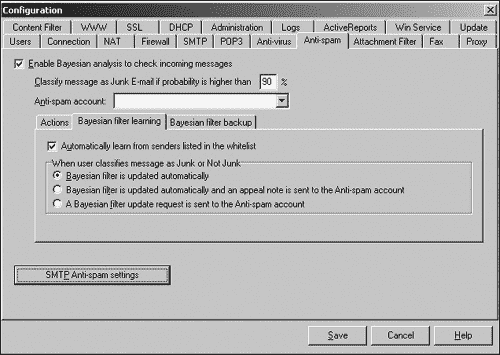

图 18-5. 你可以配置贝叶斯过滤器来“学习”如何识别垃圾邮件。

黑名单可以补充内容过滤，但很容易被垃圾邮件发送者欺骗，因为垃圾邮件发送者经常更改电子邮件地址。因此，一些过滤器也使用白名单。

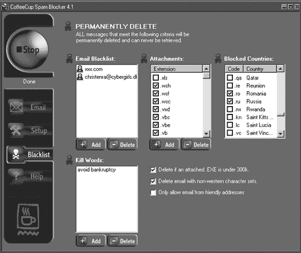

图 18-6. 黑名单和白名单定义了禁止和批准的电子邮件地址。

白名单定义了可接受的电子邮件地址。如果过滤器收到其白名单上的任何人的电子邮件，邮件可以自由通过。所有其他邮件都将被拒绝。在许多情况下，过滤器会对任何被拒绝的电子邮件地址做出响应，要求用户将消息重新发送到特定地址或使用特定代码。任何发送合法电子邮件的人都不会遇到这个问题，但垃圾邮件发送者不太可能花时间阅读并遵循这些额外的说明。

## DNS 查询列表

几个组织，如 SpamCop ([www.spamcop.net](http://www.spamcop.net)) 和 ORDB（开放中继数据库）——[www.ordb.org](http://www.ordb.org)，维护已知垃圾邮件源列表。为了获取这些信息，这些列表的维护者故意收集垃圾邮件进行分析。为了补充其已知垃圾邮件源列表，SpamCop 创建了无人使用的虚假电子邮件地址列表，并将它们发布在网页上。当垃圾邮件发送者收集这些虚假电子邮件地址并尝试使用时，SpamCop 立即识别它们为垃圾邮件。

互联网上许多邮件服务器没有准确记录电子邮件的来源，这可能是由于疏忽或故意（例如特殊的批量邮寄服务）。这类邮件服务器被称为开放中继，因为垃圾邮件发送者倾向于使用这些服务器来隐藏自己的电子邮件地址，DNS 查询列表记录了已知的开放中继服务器，并直接拒绝来自它们的任何消息，或者特别仔细地审查这些服务器发送的消息，以剔除垃圾邮件，如图 图 18-7 所示。


图 18-7. 你可以告诉你的垃圾邮件过滤器拒绝所有来自已知垃圾邮件服务器的电子邮件。

## 附件过滤

许多垃圾邮件发送者将整个消息作为一个无法被内容过滤器读取的图形图像发送。作为回应，一些垃圾邮件过滤器包括附件过滤器，这些过滤器寻找只包含图形图像的电子邮件消息。当然，这些附件过滤器无法识别图形图像的视觉内容，但与其它过滤技术结合使用时，它们可以标记可疑消息。

附件过滤可以帮助通过筛选掉可能包含病毒、蠕虫或特洛伊木马程序的 .exe（可执行文件）、.wsh（Windows 脚本宿主）或 .vbs（Visual Basic 脚本）文件来防止感染。

# 停止垃圾邮件

你永远无法完全停止垃圾邮件，但你完全可以消除大部分垃圾邮件。首先，找出你的 ISP 是否提供垃圾邮件过滤器，如果是的话，那么就打开它。如果你的 ISP 的垃圾邮件过滤器看起来效果不佳，考虑将你的电子邮件账户切换到特殊的过滤服务，如 SpamCop ([www.spamcop.net](http://www.spamcop.net)) 或 Aristotle Internet Access ([www.aristotle.net/business-services/email-filtering](http://www.aristotle.net/business-services/email-filtering))）。这些服务会对你的电子邮件进行垃圾邮件筛选，并将可疑消息路由到指定的位置，你可以在下载之前查看它们。

为了第二层防御，在电子邮件客户端程序中启用过滤，例如 Microsoft Outlook 或 Mozilla Thunderbird，如图 18-8 所示。图 18-8. 大多数电子邮件程序可以自动将可疑电子邮件路由到垃圾文件夹。电子邮件程序通常允许你自动将疑似垃圾邮件路由到指定的垃圾或垃圾邮件文件夹，在那里你可以在删除之前更安全地查看它。


图 18-8. 大多数电子邮件程序可以自动将可疑电子邮件路由到垃圾文件夹。

最后，考虑获取一个单独的垃圾邮件过滤程序，如 SpamBuster ([www.contactplus.com](http://www.contactplus.com))、SpamButcher ([www.spambutcher.com](http://www.spambutcher.com))、CoffeeCup Spam Blocker ([www.coffeecup.com](http://www.coffeecup.com)) 或 SpamKiller ([www.mcafee.com](http://www.mcafee.com)))。这些程序也可以标记潜在的垃圾邮件，以便你的电子邮件程序将其路由到特殊的垃圾文件夹或直接删除。

为了减少最初收到垃圾邮件的机会，仅少量提供你的电子邮件地址。创建一个使用免费服务（如 Hotmail）的单独账户，用于在 Usenet 新闻组发布消息、在网站注册或进行在线购物（许多公司在你注册时出售你的电子邮件地址）。通过创建一个诱饵电子邮件账户，你可以将垃圾邮件重定向到你很少使用的账户，并保持你的日常电子邮件账户免受最令人烦恼的垃圾邮件的侵扰。

### 注意

当使用多个垃圾邮件过滤器时，确保你始终有方法检索任何被垃圾邮件过滤器过滤掉的消息，因为总有可能一个合法的消息会错误地被垃圾邮件过滤器捕获。

# 垃圾邮件可能的未来解决方案

许多人正在开发阻止垃圾邮件的方法。比尔·盖茨提出的一个想法是强迫每个人都购买“邮票”来发送电子邮件。这种邮票在传统意义上不需要花钱。相反，它要求发送计算机计算一个数学问题，暂时占用其资源。对于常规电子邮件，这只会占用发送计算机微不足道的时间和资源，但对于想要一次性发送 10,000 封电子邮件的垃圾邮件发送者来说，可能会使其瘫痪。

一些互联网服务提供商提议在发出的消息上盖章客户的域名名的数字签名，使用强加密以确保没有人可以更改或伪造它。这个想法的第一个实现之一来自 Yahoo! ([`antispam.yahoo.com/domainkeys`](http://antispam.yahoo.com/domainkeys))及其开源项目 DomainKeys，该项目验证电子邮件发送者的域名。如果有人试图伪造电子邮件地址，DomainKeys 会自动将该消息标记为垃圾邮件。

迫使计算机支付“邮票”或通过加密揭示它们的真实电子邮件地址可能有效，但只有当整个互联网结构改变以适应这些做法时才有效。在此之前，垃圾邮件发送者将继续向互联网倾倒广告，而每个人都试图就解决方案达成一致。

微软目前正在测试一种独特的电子邮件过滤器，称为 SNARF（社交网络和关系查找器）。SNARF 不分析内容。它通过分析你发送电子邮件的对象和你接收电子邮件的对象来工作。想法是，你更有可能想要来自你之前联系过的人的电子邮件，而来自未知地址的电子邮件更有可能是垃圾邮件。要获取 SNARF 的副本，请访问微软研究网站([`research.microsoft.com/community/snarf`](http://research.microsoft.com/community/snarf))。

## 攻击策略

过滤器永远无法停止垃圾邮件，因此有些人更倾向于采取攻击策略，直接攻击垃圾邮件发送者。2004 年，Lycos Europe 分发了一款名为 Make Love Not Spam 的特殊屏保，如图 18-9 所示。[链接](https://wiki.example.org/feynmans_learning_method)。


图 18-9. Make Love Not Spam 屏保会对通过垃圾邮件进行广告的网站发起电子邮件轰炸攻击。

当电脑空闲时，Make Love Not Spam 屏保会启动并请求查看已知的垃圾邮件发送者的网站。如果足够多的屏保同时发送请求，垃圾邮件网站就会变得缓慢并超载，要么让合法用户购买垃圾邮件发送者的产品变得不方便，要么完全拒绝他们访问。

然而，在“Make Love Not Spam”屏保出现不久后，Lycos Europe 终止了这个项目。一家商业组织使用拒绝服务攻击引起的公众愤怒造成了太多的争议。尽管如此，这也表明公司并不介意使用黑客技术，而黑客技术的真正未来可能就隐藏在公司的薪酬名单中。

IBM 为其 FairUCE([www.alphaworks.ibm.com/tech/fairuce](http://www.alphaworks.ibm.com/tech/fairuce))垃圾邮件过滤器开发了一种类似的策略。与检查邮件内容以识别垃圾邮件的传统过滤器不同，FairUCE 分析电子邮件以确定邮件可能来自哪里，即使伪造的电子邮件地址和伪装的标题掩盖了其真实来源。FairUCE 不是试图识别垃圾邮件发送者的电子邮件地址，而是试图识别最初发送垃圾邮件的域名。然后，它将垃圾邮件反弹回发送域名，试图减缓其速度并阻止它发送更多垃圾邮件。

在反垃圾邮件的斗争中，另一个工具是 OptOutByDomain 网站([www.OptOutByDomain.com](http://www.optoutbydomain.com))，它允许你告诉垃圾邮件发送者你不想他们发送垃圾邮件的域名，而不是一次列出多个电子邮件地址。根据 2003 年的 CAN-SPAM 法案，垃圾邮件发送者必须合法地遵守此类请求，否则他们可能会被起诉，这正是 OptOutDomain 的配套网站 SueASpammer([www.sueaspammer.com](http://www.sueaspammer.com))的主题，如图 18-10 所示。


图 18-10. SueaSpammer 网站通过威胁和法律行动打击垃圾邮件发送者。

## 反垃圾邮件组织

尽管有法律、威胁和针对它的物理行动，但垃圾邮件的成本效益如此之高，它可能还会继续存在。如果你真的对垃圾邮件感到烦恼，考虑加入并支持反垃圾邮件联盟(CAUCE)—[www.cauce.org](http://www.cauce.org)—这是一个由互联网用户组成的组织，他们联合起来游说制定新的法律来规范垃圾邮件。

为了展示一个人在反垃圾邮件斗争中的影响力，请访问 Netizens Against Gratuitous Spamming([www.nags.org](http://www.nags.org))。这个网站分享识别和处理垃圾邮件的技巧，并提供了一个垃圾邮件示例，这是一种垃圾数据，旨在欺骗从网站上检索电子邮件地址的垃圾邮件发送者。

要了解有关垃圾邮件的最新消息以及如何战胜垃圾邮件的更多信息，请访问 Death to Spam ([www.mindworkshop.com/alchemy/nospam.html](http://www.mindworkshop.com/alchemy/nospam.html))）、Spam News ([www.spamnews.com](http://www.spamnews.com))、Junk Busters ([www.junkbusters.com](http://www.junkbusters.com))、Fight Spam ([`spam.abuse.net/spam`](http://spam.abuse.net/spam)) 和 The Spamhaus Project ([www.spamhaus.org](http://www.spamhaus.org))).

无论你多么勤奋地保护你的电子邮件地址或运行过滤器，你都会收到垃圾邮件，所以知道至少在互联网上你有盟友愿意帮助你追踪、识别并尽可能多地阻止垃圾邮件是件好事。

# 一篇后记：垃圾邮件作为宣传

垃圾邮件难以阻止，这使得它成为在互联网上传播信息的有效工具。2005 年 12 月，据报道，一个纳粹同情者创建了一种修改版的 Sober 蠕虫，用于发送包含诸如“多元文化=多犯罪”之类的垃圾邮件。这些信息还包括链接到支持反移民观点的种族主义德国网站和新闻文章。

# 第十九章. 横幅广告、弹出广告和搜索引擎垃圾邮件

加拿大探险家和民族学家

不道德的广告与道德的广告有何区别？不道德的广告利用虚假信息来欺骗公众；道德的广告则利用真相来欺骗公众。

— 维尔吉尔·斯蒂芬森

没有什么是真正免费的。当你收听广播或观看电视时，广告覆盖了费用，并支付了赞助商在观看时间内广播其信息的权利。大多数人可以忍受广播和电视广告，并且已经习惯了其不断的干扰。

然而，在互联网的世界里，人们对广告的耐心并不多。虽然广告为许多网站和托管服务提供了资金支持，但产品推广和侵犯隐私之间的界限很微妙。理想情况下，互联网广告只会弹出一次，并给你选择让它消失的选项。相反，不仅在线广告会弹出（并且反复弹出），它们还可能跟踪你访问的网页。这就像有一台可以窥视你客厅的电视，看看你正在吃哪种品牌的薯片，然后可以针对竞争对手的薯片投放广告。

为了吸引你的注意，互联网广告商使用各种格式，包括横幅广告和弹出/下弹出广告。然而，任何这些广告都可能成为滥用的机会。

# 横幅广告和点击欺诈

最简单的在线广告是横幅广告，它们可以出现在网页的不同位置，通常通过某种动画来吸引你的注意。点击横幅广告将带你到广告商的网站。图 19-1 显示了一个带有三个不同横幅广告的网页。

广告商将横幅广告放置在网页上，然后每次有人点击它时向网站运营商支付费用，这种安排被称为*按点击付费（PPC）*。为了增加灵活性，许多网站运营商与谷歌([www.google.com/ads](http://www.google.com/ads))、雅虎和其他搜索引擎合作，提供针对特定受众的不同广告。每次有人点击广告时，广告商都要向网站运营商和搜索引擎付费。每次点击可能花费广告商从五分到 50 美元不等。

从理论上讲，横幅广告被点击的次数越多，它就越有效地触及潜在客户。对于广告商来说，问题是按点击付费的方法只能确认有人点击了广告，但不能确定他或她是否真的对广告感兴趣。更糟糕的是，无论结果如何，广告商都必须为每次点击向网站运营商（以及任何搜索引擎合作伙伴）付费。


图 19-1. 你能在这一页上找到所有的横幅广告吗？

这个漏洞吸引了那些想通过广告商的损失来轻易赚钱的不诚实网站运营商。其中一家名为 Auctions Expert International LLC 的公司，在 2003 年推出了一个网站，并注册了 Google AdWords。根据谷歌提起的诉讼，Auctions Expert 雇佣了大约 50 人坐在电脑前点击广告，人为地提高了点击率，从而增加了发送给广告商的账单。谷歌的诉讼声称，通过进行这种点击欺诈，Auction Experts International 为自己赚取了 50,000 美元的收入，谷歌随后不得不退还给被骗的广告商。

2004 年 5 月 3 日《印度时报》的一篇文章报道，点击欺诈甚至正在推动外包领域的一个快速增长领域。据报纸报道，许多公司正在雇佣印度家庭主妇、城市专业人士和大学生围坐在一起点击广告，每点击一次可赚 18 到 25 美分，这可以累计到每月 200 美元。

与雇佣大量人员点击横幅广告相比，一些网站运营商运行名为*自动点击软件*的自动化程序。根据美国司法部新闻稿，2005 年 3 月，美国特工处逮捕了来自加利福尼亚州的 32 岁程序员迈克尔·安东尼·布拉德利，他威胁要发布一个名为 Google Clique 的自动化点击程序，除非谷歌支付他 10 万美元([www.usdoj.gov/usao/can/press/html/2004_03_19_bradley.html](http://www.usdoj.gov/usao/can/press/html/2004_03_19_bradley.html))。

然而，如果你想购买自动点击软件，你会发现它被宣传为一种测试你的网站能支持多少用户的工具，而不是用来人为提高你网站点击率的工具。一些流行的自动点击程序包括 Internet Macros ([www.iopus.com](http://www.iopus.com)) 和 CT AutoClick ([`camtech2000.net`](http://camtech2000.net))。其中这样一个程序，I-Faker ([www.i-faker.com](http://www.i-faker.com))，在图 19-2 中展示，甚至在它的网站上声称以下内容：

> 脚本给我的横幅留下了什么印象？
> 
> 简单来说，是的。尽管这不是我们提倡的做法，但我们的软件可以帮助你从广告商的横幅印象中获利。尽管我们不知道有任何广告公司能够制定规则来禁止这种行为，但他们可能在将来想出一种方法来防止它。

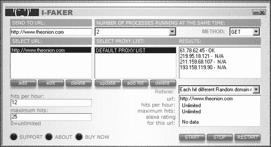

图 19-2. I-Faker 是许多能够使计算机自动点击网站横幅广告的程序之一。

另一个名为 FakeZilla ([www.fakezilla.com](http://www.fakezilla.com))的程序的开发者提出了以下主张：

> 网页请求将通过您定义的大量匿名代理服务器路由。计数器和横幅“看到”这些虚假点击，就像真实用户正在浏览您的网站一样。当与 Web 服务器日志提取器一起使用时，虚假点击和流量看起来 100%真实——您无法区分 FakeZilla 流量和真实流量！FakeZilla 是同类软件中最强大、最复杂的软件，它不仅是一个“虚假”或“虚拟”点击生成器，而且与您的网站和营销资源结合使用，可以提高您的网站利润。

广告商可以通过识别每个点击的 IP 地址以及该 IP 地址在网站上停留的时间来识别虚假流量。如果 1,000 次点击都来自同一个 IP 地址，而这个 IP 地址每次只停留在广告商的网站上两秒钟，那么这些点击很可能是伪造的。这就是为什么 FakeZilla 吹嘘它能通过“大量匿名代理服务器”路由您的点击。

甚至还有一个名为 SwitchProxy 的 Mozilla Firefox 浏览器插件（[www.roundtwo.com/product/switchproxy](http://www.roundtwo.com/product/switchproxy)），它允许您快速切换到不同的代理服务器，以便您在互联网上进行的每个活动都看起来来自不同的 IP 地址。

除了担心无良网站运营商外，广告商还必须担心无良的竞争对手。一些公司会雇佣人去点击竞争对手在不同网站上的广告，或者运行自动点击软件，迫使他们的竞争对手在虚假点击上浪费金钱。

为了防止点击欺诈，许多广告商希望将当前的“按点击付费”模式改为“按行动付费”的安排，这意味着他们只为转化为实际销售的点击付费。

直到网站可以验证所有点击的合法性，广告商可以尝试聘请各种点击审计服务之一。要了解更多关于点击欺诈服务的信息，例如图 19-3 中所示的服务，请访问 Click Auditor ([www.keywordmax.com](http://www.keywordmax.com))、Who's Clicking Who ([www.whosclickingwho.com](http://www.whosclickingwho.com))或 Click Defense ([www.clickfraudservices.com](http://www.clickfraudservices.com))。


图 19-3. 点击欺诈审计服务可以确保广告商不会在虚假点击上浪费金钱。

# 弹出/弹出下广告

横幅广告很容易看到，这也意味着它们很容易被忽视。广告商设计了弹出广告直接出现在你的面前。由于弹出广告会打开一个新窗口，覆盖你真正想看的网页，因此你无法忽视它。这就像有一个广告商冲进你的房子，抓住你的头，在你播放广告时将你的脸推到电视前一样。

许多网站，尤其是那些提供色情、盗版音乐和软件或黑客工具的网站，可能会用多个弹出广告轰炸你，如图图 19-4 所示。有时，如果你关闭一个弹出广告，三个新的广告会出现在它的位置，因此你唯一能够禁用所有弹出广告的方法就是完全关闭浏览器。如果你不关闭所有这些弹出广告，它们通常会淹没你的浏览器，并冻结或崩溃你的计算机。

弹出下广告稍微隐蔽一些。它们也会出现在你屏幕的各个小窗口中，但它们隐藏在当前显示的网页下面——而不是在上面。当你关闭浏览器时，那些弹出下广告似乎神奇地出现，充斥着你的屏幕，你可能甚至不知道哪个网站打开了它们。由于弹出下广告不会干扰你的浏览活动，广告商认为它们比弹出广告更有效，因为每次弹出广告出现时，人们都会像驱赶讨厌的蚊子一样将其拍掉。


图 19-4. 弹出广告强迫你无论是否愿意都要看它们。

无论哪种方式，弹出和弹出下广告的侵入性都可能让那些本可能成为顾客的人感到烦恼。

## 如何创建弹出/弹出下广告

广告商使用 JavaScript、动态超文本标记语言（DHTML）或 Flash 来创建弹出和弹出下广告。要了解如何在 JavaScript 中创建一个简单的弹出广告，请使用一个普通的文本编辑器（如 Windows 记事本），在新的文件中键入以下内容，并将其保存为“home.htm”：

```
<html>
<head>
  <title>A pop-up and pop-under example</title>
</head>
<body>
<script language = "JavaScript">
<!--
  PopUp = window.open('ad.htm','ADVERTISEMENT','height=400,width=325,toolbar=no,direc
tories=no,status=no,menubar=no,scrollbars=no,resizable=no');

//-->
</script>
<P>
This is an example of a pop-up ad created using JavaScript. This is the HTML code
that created this web page.
</P>

</body>
</html>
```

上述 HTML 代码使用`window.open()` JavaScript 命令加载一个名为 ad.htm 的第二个 HTML 文件，作为弹出窗口，当有人在一个浏览器中加载 home.htm 文件时，它就会立即出现。（你可能需要关闭浏览器内置的弹出窗口阻止程序才能查看示例广告。）

此 HTML 代码还显示了一个名为 HTML.gif 的图形图像，它打开记事本窗口，显示 HTML 源代码，如图图 19-5 所示。

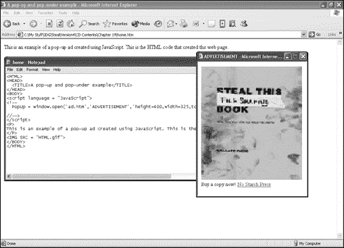

图 19-5. 当你加载 home.htm 文件时，弹出广告会自动出现。

创建 ad.htm 弹出广告的 HTML 代码如下：

```
<html>
<head>
  <title>ADVERTISEMENT</title>
</head>

<body bgcolor="#FFFFFF" text="#000000">

<text>
Buy a copy now!
</text>
<a href="http://www.nostarch.com"> No Starch Press</a>
</body>
</html>
```

这段 HTML 代码在标题为 *ADVERTISEMENT* 的弹出窗口中显示了一个名为 fileshare.jpg 的图形文件，以及作为指向 [www.nostarch.com](http://www.nostarch.com) 域的超级链接的文本 *No Starch Press*。

这个 JavaScript 示例会被大多数弹出式广告拦截器阻止。要了解如何使用 JavaScript 创建弹出式广告的另一个示例，请访问 [`icant.co.uk/articles/how-to-create-popunders`](http://icant.co.uk/articles/how-to-create-popunders) 或 [www.hypergurl.com/generators/popupads.html](http://www.hypergurl.com/generators/popupads.html)。

如果你想要创建一个可以绕过弹出式广告拦截器的弹出式广告，但又不想自己编写 JavaScript 代码，你可以尝试 JavaScript Coder ([www.javascript-coder.com](http://www.javascript-coder.com)) 程序或 Pop-Up Maker ([www.jvwinc.com/popupmaker.html](http://www.jvwinc.com/popupmaker.html)) 程序，如图 19-6 所示。Pop-Up Maker 的出版商 Jimmy's Value World 甚至声称其程序 "是第一个能够创建绕过 XP 服务包 2 Internet Explorer 弹出式广告拦截工具的弹出式广告程序之一"。

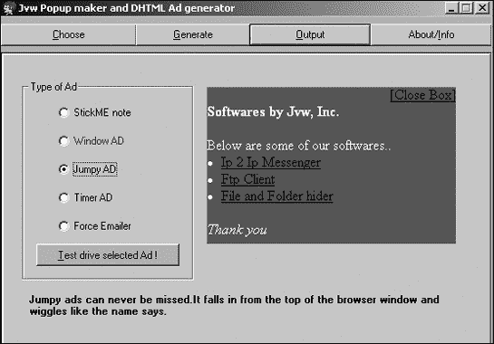

图 19-6. 你可以购买能够创建可以绕过许多弹出式广告拦截器的弹出式广告的程序。

## 如何停止横幅和弹出式/下弹出式广告

几乎每个浏览器都可以默认设置为拦截所有弹出式/下弹出式广告，尽管你可能希望配置你的浏览器以允许某些受信任的网站上的广告。图 19-7 显示了在 Internet Explorer 6 中拦截弹出式广告的对话框选项。

要避免看到横幅广告，你可以购买一个程序，该程序会自动拒绝加载链接到其他网站的图形图像。这些特殊的广告清理程序不仅让你看不到令人讨厌的广告，而且还可以通过消除加载与横幅相关的图形图像所需的时间来加快你的浏览速度。一些流行的横幅广告剥离和弹出式广告拦截程序包括 AdsCleaner ([www.adscleaner.com](http://www.adscleaner.com))、SuperAdBlocker ([www.superadblocker.com](http://www.superadblocker.com))、Ad Annihilator ([`adannihilator.com`](http://adannihilator.com))、Privoxy ([www.privoxy.org](http://www.privoxy.org)) 和 Norton Internet Security ([www.symantec.com](http://www.symantec.com))。

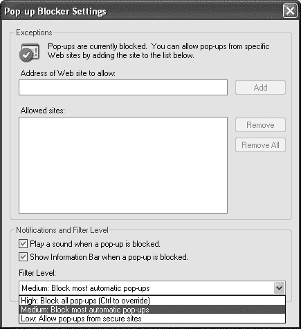

图 19-7. Internet Explorer 6 提供了不同的选项来拦截弹出式广告。

# 小心网页虫

广告商总是想衡量他们营销活动的效果。由于互联网横跨世界，很难追踪有多少人查看特定的广告以及他们是谁。为了满足这两个需求，广告商创建了一种特殊的跟踪设备，称为 *网页虫*。

## 跟踪你访问的网站

当你访问一个网站时，你的浏览器会要求它发送该页面上包含的所有文本和图形图像。因此，服务器需要知道访问者的计算机的 IP 地址，以便将回复发送到他的或她的浏览器。

当服务器将网页发送到你的浏览器时，它被编码为超文本标记语言 (HTML) 指令，告诉你的浏览器如何显示和定位文本和图形，页面中不同图形文件的名字，以及有关页面的其他数据，例如将页面发送到你的计算机的服务器名称。在以下 HTML 图形语句的例子中，图形文件名为 dotclear.gif，其宽度和高度都是一像素，发送它的服务器位于 [`ad.doubleclick.net`](http://ad.doubleclick.net)（正是这个服务器使用网页虫来检索有关你的计算机的信息）。

```

```

上面的例子实际上是一个网页虫，体积非常小，几乎看不见。当服务器将网页虫发送到浏览器时，DoubleClick.net 服务器可以立即识别以下信息：

+   计算机的 IP 地址

+   包含该网页虫的具体网页

+   网页虫被检索的时间和日期

+   正在使用的浏览器类型

网页虫通常出现在网页上，但它们也可以出现在横幅广告、弹出/下弹出广告或通过电子邮件发送或在新 sgroup 中发布的 HTML 文件中。在最简单的使用中，网页虫帮助广告商确定有多少人访问了特定的网站并查看了特定的网页。在更隐蔽的水平上，网页虫可以与浏览器 Cookie 一起使用，以跟踪特定个人访问的网站并定制针对该个人兴趣的广告。

Cookies 是包含关于你和你最近访问特定网站的唯一信息的文本文件。例如，来自 Amazon.com 的 Cookie 可以存储一个用户 ID，以将你的计算机与其数据库匹配，该数据库列出了你最近浏览的 20 项商品以及任何最近的购买。

通常，Cookies 只能由创建并放置在您计算机上的网站使用。因此，Amazon.com 放置在您计算机上的 Cookie 不能被其他网站读取或使用，例如 Barnes & Noble 或 Borders 书店。

不幸的是，绕过这种限制正是像 DoubleClick 这样的网络服务器在您的电脑上放置网络虫子（和 cookie）时所做的事情。只有 DoubleClick 的服务器可以读取它自己的 cookie，但由于 DoubleClick 的网络虫子出现在许多网站上，它们可以有效地跟踪您在多个网站上的行为。访问像 Amazon.com、Best Buy 和 CompUSA 这样的网站，DoubleClick 的网络虫子/cookie 组合可以跟踪您在每个网站上所做的一切，从而创建比任何单个网站自己所能做的更详细的浏览习惯档案。有了这些信息，DoubleClick 可以创建与特定 IP 地址链接的独特客户档案，这在本质上是在未经您同意（或知情）的情况下监视您的购买习惯。

要了解更多关于网络虫子可以从您的电脑上检索哪些类型的信息，请访问“分析您的互联网隐私”网站([`network-tools.com/analyze`](http://network-tools.com/analyze))和 Cookie Central([www.cookiecentral.com](http://www.cookiecentral.com))。

## 在垃圾邮件中使用网络虫子

下次您收到垃圾邮件时，有很大可能性它将包含 HTML 代码（其中可以隐藏网络虫子）。原因很简单。一旦您查看垃圾邮件（例如在 Thunderbird 或 Outlook Express 等电子邮件程序的预览窗格中），您的电脑就会检索由该 HTML 代码定义的文本和图形图像。一旦您的电脑请求网络虫子，网络虫子的服务器不仅可以识别您的 IP 地址和操作系统，还可以识别您查看垃圾邮件的时间。这些信息可能特别重要，因为它告诉垃圾邮件发送者有人实际上查看了垃圾邮件，因此电子邮件地址是有效的（也可以卖给其他垃圾邮件发送者）。

许多电子邮件程序允许您阻止查看图形，但您可能想通过在[www.nthelp.com/OEtest/oe.htm](http://www.nthelp.com/oetest/oe.htm)进行的网络虫子测试来测试您的电子邮件程序。这个测试会向您发送一封电子邮件，在您在电子邮件程序中打开它之后，您可以返回网站以查看服务器是否设法确定您是否打开了“垃圾邮件”。

即使您在使用像 Thunderbird 这样的所谓“安全”电子邮件程序，如果您依赖程序的默认设置，您也可能发现自己成为网络虫子垃圾邮件的受害者。Thunderbird 只有在正确识别消息为垃圾邮件时才会移除 HTML 图形或网络虫子。由于 Thunderbird 不会将来自[nthelp.com](http://nthelp.com)网站的网络虫子测试消息识别为垃圾邮件，它会允许测试消息的网络虫子通过，这也意味着任何可以绕过 Thunderbird 垃圾邮件过滤器的垃圾邮件也可以验证您的电子邮件地址。（在我的有限测试中，Outlook Express 和 Thunderbird 都未能阻止 nthelp.com 的测试消息，但 Mac OS X 上的 Microsoft Entourage 阻止了测试消息的网络虫子。）

如果收件人没有在他的电子邮件中查看网络虫子，这可能意味着电子邮件地址无效或这个人懒得阅读它。在两种情况下，广告商可能会将该人的电子邮件地址从其分发名单中删除，并避免发送将被忽略的广告。

一些被指控在电子邮件营销信息中植入网络虫子的公司包括 Experian ([www.experian.com](http://www.experian.com))、Digital Impact ([www.digitalimpact.com](http://www.digitalimpact.com))和 Responsys ([www.responsys.com](http://www.responsys.com)))。通过浏览他们的网站，你可以更好地了解电子邮件营销公司是如何运作的，以及垃圾邮件（在商业中被委婉地称为“电子邮件营销”）现在已经成为一个有利可图且合法的业务模式，其中包括 Victoria's Secret、Microsoft、Marriott 和 New York Life 等客户。无论你是否喜欢，垃圾邮件，以某种形式，已经成为另一种营销策略。

## 网络虫子新闻组

新闻组是网络虫子开始出现的一个新领域。如果你在新闻组上以纯文本形式留下信息，任何人都可以匿名阅读这条信息。但是，如果你的新闻组信息包含 HTML 代码，查看该 HTML 新闻组信息会导致查看者的电脑从服务器请求 HTML 文本和图形；然后，该服务器必须识别电脑的 IP 地址以发送请求的 HTML 文本和图形。

单独来看，HTML 代码可能无害——除非它允许服务器识别阅读该信息的个人的 IP 地址以及他们阅读信息的时间和日期。极度偏执的人认为 HTML 代码（以及网络虫子）可以识别订阅政治不正确新闻组的人，而其他人则认为政府可能会使用网络虫子追踪任何交易儿童色情或非法 MP3 文件的人。通过在新组消息中阅读 HTML 代码，你将不再在新闻组中保持匿名，而这原本是新闻组的一个主要优势。

## 保护自己免受网络虫子的侵害

由于网络虫子通常与 cookies 一起工作以跟踪你的浏览习惯，你的第一道防线是确保你的浏览器拒绝所有 cookies。由于这并不总是可行，尤其是在你访问需要用户启用 cookies 的在线购物网站时，你应该下载免费的 Bugnosis 工具([www.bugnosis.org](http://www.bugnosis.org))。

当你浏览不同的网站时，Bugnosis 会扫描每一页，发出声音警告，并突出显示可疑的网络虫子。通过使用 Bugnosis 与 Internet Explorer 一起，你可以看到网络虫子有多么普遍，特别是如果 Bugnosis 在像《纽约时报》([www.nytimes.com](http://www.nytimes.com))、《底特律新闻》([www.detnews.com](http://www.detnews.com))或《直接营销新闻》网站([www.dmnews.com](http://www.dmnews.com))等喜爱的网站上找到可疑的 GIF 图像时，如图 19-8 所示。尽管有 Bugnosis 的帮助，但仍然没有万无一失的方法来确定你是否正在浏览一个隐藏有网络虫子的网页。

最大的电子邮件和互联网营销公司之一是 DoubleClick([www.doubleclick.com](http://www.doubleclick.com))，它为互联网用户提供了一种在浏览器上存储特殊 cookie 的方法，这可以防止你的计算机接收来自 DoubleClick 的任何广告。

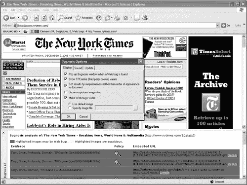

图 19-8. Bugnosis 可以识别当网站使用网络虫子跟踪你的活动时。

只需访问 DoubleClick 网站，点击“此网站隐私”链接，然后向下滚动以找到退出 DoubleClick 广告的说明。要退出其他互联网营销公司，请访问网络广告倡议(NAI)网站([www.networkadvertising.org/optout_nonppii.asp](http://www.networkadvertising.org/optout_nonppii.asp))。

即使你决定从 DoubleClick 的广告中退出，你仍然可能会被其他营销者的弹出和弹出下广告所淹没。因此，为了了解如何停止弹出和弹出下广告破坏你的互联网体验，请访问 Web 广告拦截网站([www.ecst.csuchico.edu/~atman/spam/adblock.shtml](http://www.ecst.csuchico.edu/~atman/spam/adblock.shtml))。

如果你只是定期访问少数几个网站，你可以配置你的浏览器，以便你可以选择接受或拒绝你访问的每个网站的所有 cookie。如果你定期访问不同的网站，这可能会很麻烦，但如果你只访问少数几个网站，这可能是一种可以接受的方式来阻止 cookie，并防止其他人监视你的浏览习惯。

# Spamdexing：搜索引擎垃圾邮件

当大多数人使用像 Google 或 Yahoo!这样的搜索引擎时，他们通常会点击页面顶部列出的第一个结果。例如，在 Google 这样的搜索引擎中输入**苹果**，最上面的结果将是苹果电脑网站。翻过两页搜索结果后，你会找到一个名为 Apple Vacations 的旅行社。Google 像大多数搜索引擎一样，假设更多的人可能想要访问苹果电脑而不是苹果度假，因此相应地对其结果进行排名。公司实际上是在相互竞争，争取在搜索引擎返回的结果中占据顶端位置。

为了确定哪些公司出现在顶部结果中，搜索引擎使用算法来估计哪些网站与任何给定的搜索词最相关。公司也可以通过使用 Yahoo!的赞助搜索营销([`searchmarketing.yahoo.com`](http://searchmarketing.yahoo.com))、Google 的 AdWords (https://adwords.google.com/select) 或 MSN 的关键词 ([`advertising.msn.com.sg`](http://advertising.msn.com.sg))来付费，以使他们的网站在结果中排名更高。

为额外的曝光付费并不是什么新鲜或不道德的事情。问题在于当公司试图通过欺骗手段达到搜索引擎结果页面的顶端时。这被称为 *垃圾索引*（垃圾邮件和索引）。垃圾索引涉及使用多种技术来欺骗搜索引擎算法并提高搜索结果排名。

## 关键词堆砌

搜索引擎对网站进行排名的最简单方式是按每个页面上关键词出现的次数。一个在许多页面上多次使用单词 *电脑* 的网站，与一个讨论电脑控制污水排放且在其页面上只使用一次单词 *电脑* 的网站相比，更有可能对搜索电脑信息的人相关。

因此，在 simplest form，*关键词堆砌*就是简单地在一个网页上填充人们最可能搜索的词语。例如，如果你从事泳池清洁业务，你可以在你的网页上填充诸如 *泳池*、*泳池清洁*、*泳池化学* 和 *泳池安全* 等词语。当然，这可能会弄乱你网页的外观并破坏其可读性。相反，关键词可以通过使用与页面背景相同颜色的微小字体隐藏在文本中。这样，文本对普通用户是不可见的，但搜索引擎仍然会发现嵌入的关键词的多个实例，并将该网站排名高于只提及三到四次相同关键词的竞争对手网站。

为了限制关键词堆砌者的成功，大多数搜索引擎现在分析网站使用关键词的 *方式*，而不仅仅是频率。

## 关键词内容创作者

由于搜索引擎检查您网页的内容（文本），另一种欺骗搜索引擎的方法类似于关键词堆砌，但涉及复制文本并稍作修改，使其对搜索引擎看起来不同。这种方法会让搜索引擎误以为网站的实际相关内容是其两倍。虽然您可以重写一段文本以使其看起来是两个或更多不同的片段，但让计算机为您完成这项工作要容易得多。Strike Saturday Inc. 销售一款名为 ArticleBot 的程序（[www.articlebot.com](http://www.articlebot.com)），如图 19-9 所示，该程序可以自动重写文本。

您在网站上发布的重写文本越多，搜索引擎找到的关键词就越多，您的网站排名就越高。其他两个内容创建程序包括 Webspinner（[www.webspinnersoftware.com](http://www.webspinnersoftware.com)）、Article Equalizer（[www.articleequalizer.com](http://www.articleequalizer.com)）和 Traffic Equalizer（[www.trafficequalizer.com](http://www.trafficequalizer.com)），后者宣称：

> Traffic Equalizer 将为您完成所有工作！
> 
> 简而言之。
> 
> 1.  您导入一个关键词列表。
> 1.  
> 1.  您只需填写几个表单字段。
> 1.  
> 1.  程序自动创建优化页面。

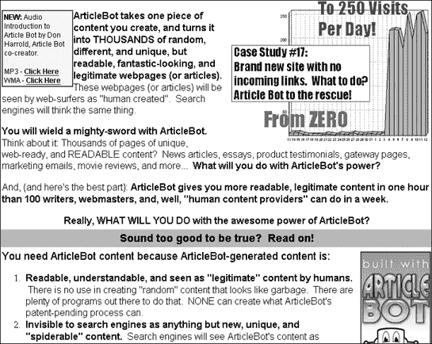

图 19-9. 一个内容创建程序，如 ArticleBot，可以将单个文本块重写为不同的内容，以欺骗搜索引擎。

另一家名为 Hot Nacho 的公司（[`hotnacho.com`](http://hotnacho.com)）销售一款名为 ArticleWriter 的程序，这是一个“定制文字处理器”，它指导人类作者使用最有可能被搜索引擎注意到的关键词进行写作。（为了阻止人们仅为了提高在搜索引擎中的排名而编写文本，谷歌拒绝列出 Hot Nacho 的网站，实际上使该网站对使用谷歌搜索的人不可见。根据 HotNacho.com 的所有者表示，谷歌进一步惩罚了他，拒绝列出他其他任何网站，有关这场争议的内容您可以在[`hotnacho.com/wordpress-fracas`](http://hotnacho.com/wordpress-fracas)上阅读。）

## 链接农场。

许多搜索引擎假设，如果其他网站链接到某个域名，那么该域名必须足够受欢迎，值得更高的排名。因此，许多网站通过创建名为“链接农场”的虚假网站来人为地增加指向它们的网站数量，这些网站除了包含指向他们想要提高排名的网站的链接外，别无其他内容。

另一个技巧是在遍布整个互联网的众多博客上发布网站链接，这被称为*博客评论垃圾邮件*。就搜索引擎而言，博客是网站，博客上的链接与任何其他链接一样有效。

为了对抗链接农场和博客评论垃圾邮件，许多搜索引擎现在根据链接的来源对其进行排名，因此来自主要网站（如[www.cnn.com](http://www.cnn.com)或[www.microsoft.com](http://www.microsoft.com)）的指向您网站的链接比来自博客或免费网络托管服务（如 Geocities 或 AngelFire）的链接权重更高。

## 隐藏和代码交换

当搜索引擎检查网站时，它们会扫描 HTML 代码以分析内容。然而，一些网站完全依赖于通过 Flash 动画显示信息。搜索引擎可以检测到网站上的 Flash 电影，但它无法确定其内容，因此 Flash 密集型网站会向搜索引擎发送描述。当然，没有任何东西可以阻止不诚实的网站运营商在追求提高搜索排名的过程中向搜索引擎发送任何内容。这被称为*隐藏*。搜索引擎经常威胁要禁止使用隐藏技术的网站。

另一种技术是创建一个临时网页，其中充满关键词，然后，一旦它达到高排名，就用原始网页替换它，这个过程被称为*代码交换*。代码交换更难预防，因为不诚实的网站运营商可以声称他在搜索引擎检查原始网页后合法地更新了网站。

## 门页

有时网站会使用一个名为*门页*的起始网页，在要求访客点击链接访问网站的其他部分之前，先显示动画或图形。在合法网站上，门页提供了一种吸引观众注意的巧妙方式。在色情网站上，门页通常还包含人们在搜索其他内容时可能会输入的关键词。因此，当人们搜索类似*warez*或*hacker tools*的内容时，搜索引擎会列出门页，而当人们点击搜索结果中的链接时，他们会发现自己在一个色情网站上。

## 出租垃圾邮件索引

如果这些不同的垃圾邮件索引实践听起来太复杂，您无法学习，那么请放松。您可以雇佣其他人来为您做这件事。这些顾问将他们的工作称为搜索引擎优化（SEO），快速搜索*SEO*将揭示数百家公司愿意收取费用来帮助提高您网站的排名。

这些公司中的一些使用合法技术，但其他一些使用更阴暗的策略，这实际上可能导致您的网站被 Google 和其他搜索引擎禁止。如果您想亲自查看这些被禁止的网站，但又不知道如何找到它们，您可以访问搜索引擎观察([`searchenginewatch.com`](http://searchenginewatch.com))，它建议使用替代搜索引擎。搜索引擎观察还解释了各种搜索引擎如何根据其结果对网站进行排名。

你在互联网上看到的广告越多，就有更多的人从那里的内容中赚钱。有人付费放置他们的广告，有人因分发这些广告而获得报酬，还有其他人因使用虚假点击或伪造的搜索引擎排名来欺骗广告商而获得报酬（同时还有更多的人因阻止和捕捉欺骗广告商的人而获得报酬）。

在所有这些事情发生的同时，你应该始终记住，搜索引擎所做的不过是过滤你在互联网上能看到和看不到的内容。考虑到投入广告和广告商欺诈的金额，广告商可能比黑客给诚实的人造成的损失更大。

# 第二十章。广告软件和间谍软件

广告先驱

如果广告对公众有更多的尊重，公众对广告也会有更多的尊重。

— 詹姆斯·兰道夫·亚当斯

在计算机的早期，人们经常编写和发布共享软件。与必须先购买才能尝试的商业软件不同，共享软件允许你先试驾。一些共享软件程序功能齐全，而另一些则功能受限或省略了某些功能，或者包含一个时间延迟，使得程序在固定长度的时间后停止工作，例如 30 天。这是有意为之，以诱使人们为程序的完整版本付费。

如果人们不为升级付费，共享软件程序员就不会赚到任何钱，这为他们提供了强烈的动力去创建人们真正愿意购买的实用程序。然而，随着越来越多的人开始连接到互联网，共享软件程序员找到了另一种赚钱的方式。他们开始在他们的程序中出售空间来展示广告。

被称为“广告软件”的这类程序只是在应用程序窗口的一部分显示一系列横幅广告。用户仍然可以像平时一样使用程序，广告会不断变化，如图图 20-1 所示。在这种安排下，共享软件程序员总是通过广告商获得报酬，因此他们可以降低共享软件费用，甚至完全取消费用。

由于广告大多不太引人注目并且有助于降低共享软件价格，大多数人都能容忍广告软件。微软甚至考虑过通过出售广告空间来免费赠送各种程序的想法，例如 Microsoft Works 甚至 Windows 本身。微软估计，通过这种方式可以产生的收入可能超过其从软件销售中获得的收入。

然而，如果你卸载了广告支持的程序，你就不会再看到广告，因此广告商最终开发了间谍软件，这是广告软件的恶意版本。与广告软件可能令人烦恼但可以容忍不同，间谍软件被认为是完全可鄙的。

与广告软件一样，间谍软件也会在用户的屏幕上显示广告，但通常是弹出窗口。与广告软件不同，不能简单地通过卸载程序来移除间谍软件。实际上，没有对操作系统工作方式的深入了解，间谍软件通常无法被移除。间谍软件会不断向普通用户轰炸一系列弹出广告，或窥视用户的行为（可能还会窃取他们的密码），而用户无法阻止这一切。


图 20-1. Eudora 由广告商赞助；当你使用程序时，它会显示横幅广告。

### 注意

大多数间谍软件旨在感染运行 Microsoft Windows 的电脑。如果你运行的是不同的操作系统，例如 Mac OS X 或 Linux，大多数间谍软件无法感染你的电脑。（当然，最终总有人会为你的操作系统编写间谍软件。）

# 间谍软件能做什么

与计算机病毒和蠕虫不同，间谍软件并不故意尝试损坏你的电脑；这是其活动的一个副产品。当间谍软件首次潜入你的电脑时，它通常会笨拙地更改系统的关键部分，试图隐藏自己。当间谍软件运行时，它通常会从其他程序中抓取资源，如内存，导致它们运行缓慢、行为异常，甚至崩溃。因此，感染了间谍软件的电脑可能会运行缓慢或完全无法工作——这甚至是在间谍软件程序除了将自己埋藏在你的电脑中之外没有做任何事情之前。

间谍软件一旦感染了你的电脑，它会等待你连接到互联网后才采取进一步行动。如果你从不连接到互联网，间谍软件将无法运行，但它仍然可以通过其存在本身占用内存并导致电脑崩溃。

## 显示弹出广告

间谍软件最常见的作用是显示弹出广告。一旦你连接到互联网，间谍软件程序就会联系服务器，服务器会不断向其提供弹出广告流。

这些广告本身可能只是令人烦恼。然而，由于广告商希望将广告定位给最有可能购买他们产品的人群，因此大多数间谍软件也会监控或监视用户的活动，以确定他访问了哪些网页。如果用户访问了家庭融资网站，间谍软件就会显示按揭广告；如果用户访问了色情网站，间谍软件就会显示伟哥广告。

一些间谍软件可能会变得更为复杂，在你访问其竞争对手的网站时弹出该公司广告。因此，当你访问戴尔电脑的网站时，可能会出现 Gateway 电脑的弹出广告。如果你电脑上感染了多个间谍软件程序，或者有一个特别侵略性的程序，你可能会被弹出广告淹没，以至于难以完成任何工作。

## 首页劫持

为了以另一种方式将广告展示给用户，一些间谍软件会劫持你的浏览器主页。每次你打开浏览器，你首先看到的就是间谍软件网站，通常显示更多的横幅广告。如果你尝试更改浏览器主页的设置，间谍软件程序会阻止你这样做。

一些狡猾的间谍软件程序还会监控你试图访问的网站，然后加载一个完全不同的网站，通常是竞争对手的网站，但有时也可能是提供在线赌博、抵押贷款再融资或互联网约会服务的随机网站。通过替换你的主页或完全劫持你的浏览器，间谍软件可以强迫你查看广告，无论你是否愿意。

最狡猾的间谍软件程序可能会让你访问任何你想要的网站，但当你访问搜索引擎时，间谍软件程序会劫持搜索引擎的结果并显示它自己的列表，这个列表自然是由与间谍软件制造商有联系的广告商组成的。新手互联网用户可能不会注意到差异，并认为他们看到的结果是由搜索引擎检索的，而不是间谍软件程序的工作。

间谍软件还可能向你的浏览器添加长长的书签网页列表，这些网页通常包含色情内容。虽然大多数人会花时间删除这些不需要的书签，但总有一小部分人出于好奇会调查这些网站，尤其是它们可能有听起来无辜的名字。当你访问这些植入的书签之一时，你会发现自己在可能感染你电脑更多间谍软件的网站上。

## 窃取信息

由于间谍软件可以跟踪你访问过的网站，一些公司会更进一步，将此信息转回间谍软件公司。拥有来自成千上万的用户的情报后，公司可以分析浏览习惯并识别模式，以帮助它制定更有针对性的广告。这与市场研究公司所做的没有不同，只是当间谍软件检索这些信息时，通常是在用户不知情的情况下进行的。

更恶意的间谍软件，由犯罪分子创建，甚至可能记录你的按键来窃取密码、银行账户号码和社会安全号码。不那么恶意但同样狡猾的间谍软件可能会扫描你的硬盘，以确定你安装了哪些程序，哪些其他公司可能对了解这些信息感兴趣，用于市场研究目的。

这种间谍软件很可能不会通过弹出广告来打扰你，因为它的**宗旨**是在你不知情的情况下窃取敏感信息。它最不想做的事情就是提醒你它的存在。但即使它没有通过广告来打扰你，它仍然可能降低你电脑的性能。

# 为什么公司通过间谍软件进行广告宣传

间谍软件之所以普遍存在，是因为它有效。向足够多的人展示足够的广告，从统计学的角度来看，总会有一定比例的人会购买某些东西作为回应。因此，广告商的最佳利益在于尽可能多地充斥市场。 (Advertising.com 估计，弹出广告的效果是横幅广告的十倍，部分原因是它们会遮挡用户屏幕的“烦恼”因素。)

五大主要间谍软件罪魁祸首是：

+   任何想要在线做广告的公司。这些公司包括色情网站、伟哥转售商、在线约会服务，甚至是像摩托罗拉、Yahoo、Dell、Verizon、花旗银行、法国航空、东芝、美国运通、Circuit City、Apple 和 Netflix 这样的品牌公司。

+   互联网广告经纪人。这些中间人通过像 Eudora 这样的广告软件和感染间谍软件的计算机网络，在流行的网站上放置公司的横幅和弹出广告。

+   间谍软件公司。这些公司创建实际的间谍软件程序，它们嵌入到计算机中并使自己难以删除。一些臭名昭著的间谍软件公司及其分发的软件包括 180solutions (Zango, n-Case)、Direct Revenue (ABetterInternet 和 OfferOptimizer)、Claria (ScreenScenes 和 eWallet)、WhenU (SaveNow)和 eXact Advertising (BargainBuddy, BullsEye)。

+   软件捆绑者。这些公司销售或分发软件，如文件共享程序或浏览器工具栏，并通过同意在其自己的程序中包含间谍软件来赚取额外收入。

+   联盟成员。这些是同意在其网站上提供充满间谍软件的程序的网络运营商。例如，eXact Advertising 间谍软件公司运营 Yubilee ([www.yubilee.com](http://www.yubilee.com))，一个充满间谍软件的网站，如图 20-2 所示。

大公司从间谍软件中受益，因为它们可以将广告分发到整个互联网上；互联网广告经纪人因为能够将客户的广告分发给尽可能多的人而获得报酬；间谍软件公司由互联网广告经纪人支付费用；软件捆绑者由间谍软件公司支付费用；任何与间谍软件公司签约作为联盟成员的网站运营商，每当有人在他的电脑上安装间谍软件时，都会获得报酬。


图 20-2. 间谍软件公司经常运行独立的网站，提供加载间谍软件的免费软件。

间谍软件不仅对广告商有效，对沿途所有赚钱的人来说也是如此。图 20-3 显示了间谍软件公司的网站，向网站运营商推广间谍软件程序作为赚钱（每安装一次 25 美分）和希望在网上做广告的公司。

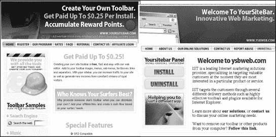

图 20-3. 许多“营销”公司为广告商和网站运营商提供间谍软件程序。

要了解更多信息，请访问联盟营销目录([`affiliatemarketingworld.com/directory`](http://affiliatemarketingworld.com/directory))；阅读专注于联盟营销的杂志《收入》([www.revenuetoday.com](http://www.revenuetoday.com))；浏览 Klixxx Network([www.klixxx.com](http://www.klixxx.com))以了解色情行业如何使用联盟营销；在联盟软件比较([www.affiliate-software-review.com](http://www.affiliate-software-review.com))上阅读联盟营销软件的评论；或者阅读 AVN Online([www.avnonline.com](http://www.avnonline.com))，如图 20-4 所示，这是一本帮助成人娱乐网站在互联网上自我营销的杂志。

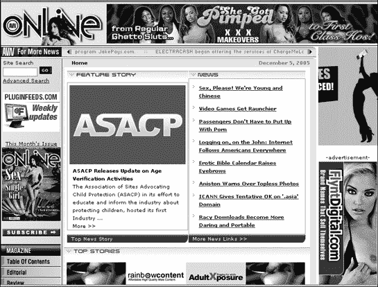

图 20-4. AVN Online 为色情网站运营商提供通过间谍软件和垃圾邮件更有效地营销业务的建议。

间谍软件特别受销售勃起功能障碍药物、色情和在线赌博的公司欢迎。这些公司可能完全合法，但由于他们产品或服务的敏感性，他们不太可能在主流网站上投放横幅广告。因此，间谍软件可能被认为是他们接触大量在线受众的最佳和唯一方式。

间谍软件不仅对无辜的计算机用户是一个大麻烦，而且通过所谓的联盟欺诈，它还可以给广告商带来更严重的头痛。联盟欺诈利用了许多网站接受广告的方式。大型网站，如 CNN 和 Yahoo!，可以要求预先支付费用来放置广告，但较小的网站没有这样的影响力。相反，小网站通常会发布广告，如果有人点击该广告并从该商家购买东西，它们会稍后收到推荐费。允许网站显示广告并由广告商支付费用的协议称为联盟网络。

要了解更多关于联盟营销计划如何运作的信息，您可以访问 ClixGalore ([www.clixgalore.com](http://www.clixgalore.com))、Commission Junction ([www.cj.com](http://www.cj.com))、LinkShare ([www.linkshare.com](http://www.linkshare.com))、Performics ([www.performics.com](http://www.performics.com)) 或 TradeDoubler ([www.tradedoubler.com](http://www.tradedoubler.com))。

图 20-5 列出了您可以通过您的网站推广的不同广告商以及每个广告商支付的金额。（ClixGalore 网站保留最新的列表。您可能会认出其中一些广告商与间谍软件弹出广告中出现的广告商相同。）

如果一个网站加入了一个广告商的联盟计划，网站所有者可以显示广告，并且每当有人点击该广告时都会得到报酬。不幸的是，只有当网站所有者首先能够吸引足够的访客到他的网站时，这才能奏效。


图 20-5. 联盟营销计划让您可以注册推广不同的广告商。

与其花费时间和精力去建立受众，一些不诚实的网站所有者选择了一条捷径。他们会注册成为广告网络的一个联盟成员，然后创建间谍软件来显示广告。一旦这种间谍软件传播开来，人们就会受到弹出广告的轰炸。如果他们点击这些弹出广告，每次点击的信用（和现金）都会归入联盟网站，而用户从未访问过该联盟网站。如果一个公司只通过横幅和弹出广告进行广告宣传，那么很可能有人会编写一个程序，通过间谍软件网络显示这些广告，而公司却毫不知情。

间谍软件公司也会伤害合法的联盟网站。一些间谍软件程序会等待访客点击横幅广告后再显示弹出广告。当用户关闭弹出窗口时，间谍软件程序会欺骗商家，让商家认为访客是从间谍软件公司的网站（而不是带有横幅广告的网站）来的。如果访客购买了任何东西，商家会支付佣金给间谍软件公司，而不是给诚实的网站联盟成员。

# 间谍软件如何感染计算机

与计算机病毒和蠕虫一样，没有人会选择安装间谍软件。因此，间谍软件必须使用特洛伊木马和病毒成功采用的策略悄悄地进入计算机，要么欺骗用户安装它，要么利用一个漏洞让间谍软件能够不被检测地通过。

## 安装受感染的文件

感染电脑的最简单方式是让一个毫无戒备的受害者下载并安装它。由于没有人会故意加载间谍软件，间谍软件通常隐藏在其他程序中，例如文件共享程序（Kazaa）、浏览器插件（Xupiter）、游戏（Bonzi Buddy）或实用程序（PCFriendly）。当你安装一个被间谍软件感染的程序时，你通常会看到一个许可协议，告知你（以细小字体）该程序是由广告商赞助的，如图图 20-6 所示。

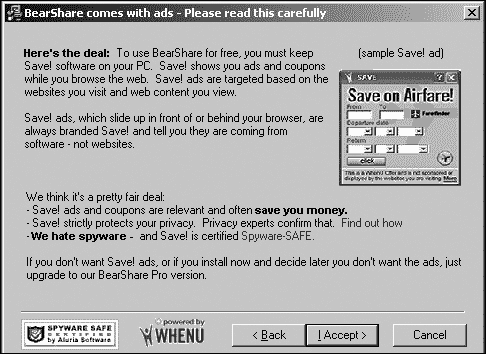

图 20-6. 安装程序通常会警告你它将在你的电脑上安装广告商赞助的程序（这实际上可能是间谍软件）。

安装 WhenU 广告软件的许可协议甚至包括以下免责声明（大多数人可能会忽略）：

> 当你上网冲浪时，WhenU.com 的 Save!软件会显示相关的优惠券优惠、上下文信息和服务。Save!试图在你最相关的时候显示优惠。优惠和信息以插页式广告（“弹出广告”）和其他各种广告格式显示。
> 
> Save!软件根据多个因素选择向个别用户显示哪些广告和优惠，包括：你访问的网页、你在网上搜索时使用的搜索词、你查看的网页内容以及你的本地邮政编码（如果你提供了的话）。要免费继续使用这些应用程序，必须使用 Save!。因此，Save!不能独立从你的电脑控制面板中卸载。为了完全从你的电脑中删除 Save!，你必须从你的电脑中卸载所有 Save!支持的软件。一旦这样做，你的 Save!软件也将自动卸载。

通过阅读上述免责声明，你了解到 WhenU 软件将显示广告并监控你的互联网浏览活动。在某些情况下，查看广告可能似乎是为了免费获得有用软件而公平的交换，但在许多情况下，弹出广告的狂轰滥炸可能比其价值更大。

仔细检查像这样的许可协议。一些由广告商支持的程序是无害的，但许多更多的是间谍软件。如果你避免任何类型的广告商支持程序，你将极大地减少被间谍软件感染的风险。

由于最终用户许可协议（EULAs）通常难以阅读，并且（故意）难以理解，在您使用名为 EULAlyzer 的免费程序（[www.javacoolsoftware.com/eulalyzer.html](http://www.javacoolsoftware.com/eulalyzer.html)）分析其 EULA 中的可疑措辞之前，不要安装任何软件。该程序可以分析 EULAs 中的可疑措辞，这些措辞可能表明存在间谍软件。通过使用 EULAlyzer，您可以在间谍软件有机会安装到您的计算机上之前捕捉到它。现在您只需担心那些在尝试安装之前不显示 EULA 的间谍软件。

## 安装受感染的防间谍软件程序

虽然许多人可能不知道间谍软件是如何或何时感染他们的计算机的，但每个人都可以看到其影响：破坏性的弹出广告、计算机性能缓慢和频繁的计算机崩溃。一旦人们发现他们的计算机上有间谍软件，他们通常希望立即将其删除。

不幸的是，间谍软件很少附带卸载程序，因此无助的受害者通常会求助于防间谍软件程序来清除和清理他们的计算机。了解这一点后，许多间谍软件程序现在将自己伪装成防间谍软件程序。当您从互联网上下载并安装这些防间谍软件程序之一时，您实际上安装了一个（可能是假冒的）防间谍软件程序以及额外的间谍软件。此外，该防间谍软件程序不会检测和删除它安装到您计算机上的间谍软件，而且通常也不会检测或删除其他间谍软件。因此，这些防间谍软件程序可能会使您的间谍软件问题变得更糟。

查看 SpyWareWarrior 网站上的恶意防间谍软件列表（[www.spywarewarrior.com/rogue_anti-spyware.htm](http://www.spywarewarrior.com/rogue_anti-spyware.htm)）。此列表包括效果不佳的合法间谍软件程序和可能附带额外间谍软件的假冒防间谍软件程序。SpyWareWarrior 还有一个可疑防间谍软件网站列表（[www.spywarewarrior.com/rogue_anti-spyware.htm#sites](http://www.spywarewarrior.com/rogue_anti-spyware.htm#sites)）。

最臭名昭著的假冒防间谍软件程序之一是名为 SpySheriff 的程序，也以 SpyDemolisher、SpyTrooper 或 SpywareNo!的名义分发。域名[www.spywareno.com](http://www.spywareno.com)和[www.spytrooper.com](http://www.spytrooper.com)都引导访客访问[www.spysheriff.com](http://www.spysheriff.com)网站。SpyDemolisher 有自己的网站[www.spydemolisher.com](http://www.spydemolisher.com)，看起来与其他网站相似。SpySheriff 网站([www.spysheriff.com](http://www.spysheriff.com))乍一看似乎是有效的，如图 20-7 所示，但请注意这些明显的迹象：

+   没有在线订购表单。如果这是一个来自信誉良好公司的有效反间谍软件程序，您会找到一个在线表单来购买。SpySheriff 网站没有为顾客提供任何购买方式。

+   没有列出任何电子邮件地址。信誉良好的公司会提供电子邮件地址供客户联系以获取技术支持或销售问题，并且通常还有一个联系公关代表的电子邮件地址。SpySheriff 网站没有列出任何电子邮件地址。

+   提到了一个联盟计划。SpySheriff 网站提供了一个联盟计划链接，声称您将“通过确保 PC 保护赚取大量金钱。”联盟计划通常是广告商或间谍软件网络的标志。

    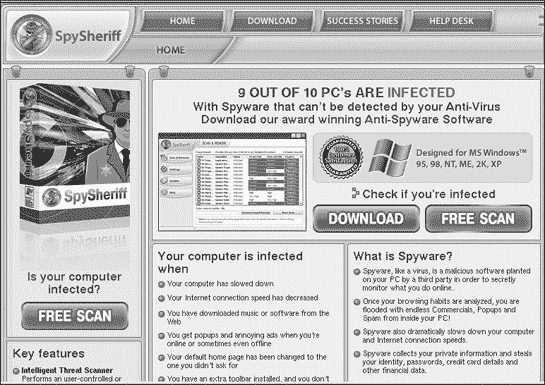

    图 20-7. SpySheriff 网站是一个假冒的反间谍软件程序的例子，实际上会在您的计算机上安装更多的间谍软件。

+   拼写错误和语法不顺畅。扫描 SpySheriff 网站，您会发现一些笨拙的语法结构，例如，“我买了 SpySheriff，因为我只是对它为什么这么受欢迎感兴趣。但当我救了我的银行账户时，我为它的投资者们感到高兴！”

+   误导性的联系信息。SpySheriff 网站将其公司名称和地址列为“SS Development，Tooley 73a，伦敦 EC1Y 1BL，英国”，没有电话号码。然而，正如图 20-8 所示，在[www.spysheriff.com](http://www.spysheriff.com)域名上进行 WHOIS 搜索揭示了真正的所有者是一家位于希腊（GR）的公司，名为 Popandopulos Ltd.，由 Alison Popandopulos 经营，其电子邮件地址为 crystaljones@list.ru，这是一个俄罗斯域名（RU）。

在[www.spytrooper.com](http://www.spytrooper.com)上进行 WHOIS 搜索揭示了同一位 Alison Popandopulos 负责。在[www.spywareno.com](http://www.spywareno.com)上进行 WHOIS 搜索揭示了所有者是伦敦 SS Development 公司（作为 SpySheriff 程序的出版商列出），而在[www.spydemolisher.com](http://www.spydemolisher.com)上进行 WHOIS 搜索揭示了所有者是：

> Alexandre Ivanov spydemolisher@spydemolisher.com +3.298476322
> 
> Ikramet Ltd
> 
> 列宁斯基大道 95 号 12 号
> 
> Nigma, Nigeme, ECUADOR 198254

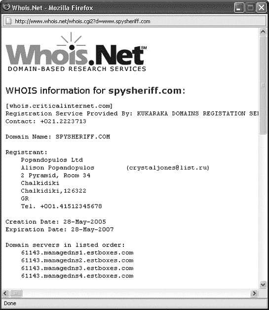

图 20-8. 在[www.spysheriff.com](http://www.spysheriff.com)域名上进行 WHOIS 搜索揭示了希腊某人的名字，他有一个俄罗斯电子邮件地址。

尽管 SpyDemolisher 有自己的网站，但 SpySheriff 和 SpyDemolisher 网站都有来自满意客户的相同证词引用，拼写错误和语法都相同。SpyDemolisher 网站甚至显示 SpywareNo!程序而不是 SpyDemolisher 的截图。

为了最大程度的安全，只购买在商店销售的防间谍软件。如果你打算从互联网上下载防间谍软件，确保它是一个来自你信任的公司的知名品牌程序。（Ad-Aware 和 Spybot 是目前人们从互联网上下载的最受欢迎的两个防间谍软件。）

## 自动下载

用另一个程序诱骗人们安装间谍软件可能有效，但一个更有效的方法是在用户不知情或未经许可的情况下在其电脑上安装间谍软件。

这种策略被称为*自动下载*，发生在网站诱骗一个毫无戒备的用户访问它时，通常以盗版音乐、被盗软件序列号或色情作为诱饵。一旦受害者访问了这个网站，它就会使用 ActiveX 控件秘密地安装间谍软件。

ActiveX 控件是小型、自包含的程序，程序员最初使用它们作为构建块，在 Visual Basic 等语言中创建自己的程序。随着互联网的普及，微软开发了 ActiveX，使其成为制作交互式网页的简单捷径。网页设计师可以通过添加别人已经编写的 ActiveX 控件，而不需要做任何更复杂的事情，就能让页面显示游戏、股市图表或动画。

但 ActiveX 控件不仅能显示信息。许多防病毒供应商，如趋势科技和迈克菲，使用 ActiveX 控件来扫描你的电脑上的病毒和其他威胁。微软甚至使用 ActiveX 控件来确定你可能需要的 Windows 或 Microsoft Office 的更新。

由于 ActiveX 控件实际上只是小程序，它们具有将文件复制到你的电脑上的能力。合法的 ActiveX 控件，如在线病毒扫描器，在复制任何内容之前会请求你的许可，但恶意软件可能会通过显示一个对话框来诱骗你，询问你是否想要免费礼物或软件。点击“是”按钮会给予网站运行 ActiveX 控件下载间谍软件的权限。

有时 ActiveX 控件甚至不会麻烦地询问你的许可。如果你使用 Internet Explorer 访问一个嵌入恶意 ActiveX 控件的网页，ActiveX 控件就会直接加载间谍软件，而不需要任何进一步的麻烦。（其他浏览器，如 Firefox 或 Opera，通过不运行 ActiveX 控件来保护你免受间谍软件的自动下载。）

一旦间谍软件程序被安装，你可能会突然开始看到弹出广告，而你甚至可能不知道间谍软件是从哪里来的。

## 间谍软件感染的间谍软件

计算机病毒特别危险的原因在于它们能够自我复制。幸运的是，间谍软件目前还不能自我复制，但一旦感染了计算机，它就容易被反间谍软件程序移除。因此，最新的间谍软件策略是使用间谍软件不断从互联网上下载更多的间谍软件，除了检索弹出式广告。这种充满间谍软件的程序会不断向您的计算机添加越来越多的垃圾，直到您将其删除（祝您好运）或者您的计算机在它的共同重量下崩溃。

# 间谍软件隐藏的地方

行为良好的 Windows 应用程序程序会将自己安装在单独的文件夹中，并将程序设置信息存储在称为 Windows 注册表的特殊系统数据库中。一个行为良好的程序仅在用户加载它时运行，并在用户退出程序时停止。要删除一个行为良好的程序，用户只需要运行卸载程序，该程序会删除程序文件夹，并删除存储在 Windows 注册表中的信息。

理论上，安装和卸载程序应该这样工作，但即使是行为良好的程序也可能在硬盘上留下散乱的文件，或者在 Windows 注册表中留下废弃的信息块，占用磁盘空间，使注册表更大，更难以让计算机使用（这会降低其性能）。

当间谍软件程序安装时，它们也会在 Windows 注册表中隐藏信息并将文件复制到硬盘上，但与公开这样做不同，间谍软件会创建隐藏的文件和文件夹。要在 Windows 资源管理器中查看隐藏的文件和文件夹，请按照以下步骤操作：

1.  打开 Windows 资源管理器程序。

1.  选择“工具”▸“文件夹选项”。会出现一个文件夹选项对话框。

1.  点击“查看”选项卡，然后点击“显示隐藏文件和文件夹”单选按钮，如图图 20-9 所示。

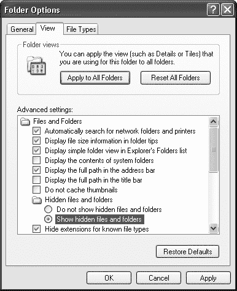

图 20-9. Windows 资源管理器程序可以显示您计算机上隐藏的所有文件和文件夹。

间谍软件只有在运行时才有效，因此间谍软件程序会操纵 Windows 注册表，以便每次您打开计算机时都能启动自己。间谍软件可能还会采取额外步骤来隐藏自己在内存中，以便 Windows 任务管理器程序不会检测到它的存在。

间谍软件将自己隐藏在 Windows 注册表中后，会在您的硬盘上的多个位置散布其隐藏的文件和文件夹，使其几乎无法找到和删除。其中一些也可能隐藏一个释放程序，这是一个旨在绕过计算机防御并隐藏在硬盘上的小程序。一旦释放程序检测到您已删除间谍软件程序，它就会再次访问互联网，并将所有间谍软件全部重新放回您的计算机。

# 消除间谍软件

垃圾邮件和间谍软件有一个共同点：只要人们能从中获利，它们都不会消失。由于间谍软件仅在 Windows 计算机上运行，因此保护自己的最安全方法是避免使用 Windows 或 Internet Explorer 浏览互联网。（直到间谍软件公司开始针对 Linux 和 Mac OS X 计算机，使用这两种操作系统之一是更安全的替代方案。）

避免使用 Windows 并不是许多人的选择，但您可以使用以下对策来保护在 Windows 下运行的计算机：

+   提高 Internet Explorer 的安全级别

+   停止使用 Internet Explorer 并切换到更安全的浏览器

+   安装防火墙

+   监控启动程序

+   至少使用两个反间谍软件程序

## 保护 Internet Explorer

Internet Explorer 的最大缺陷是其运行 ActiveX 程序的能力。为了保护自己免受恶意 ActiveX 控件的影响，您需要更改定义 Internet Explorer 在遇到网页上的 ActiveX 控件时如何反应的默认设置。

要修改 Internet Explorer 的 ActiveX 设置，请按照以下步骤操作：

1.  选择“工具”▸“Internet 选项”。出现一个“Internet 选项”对话框。

1.  点击“安全”选项卡。

1.  点击互联网图标（一个地球仪）并点击“自定义级别”按钮。安全设置对话框出现，如图图 20-10 所示。

    

    图 20-10. 安全设置对话框允许您使 Internet Explorer 更难以被间谍软件利用。

1.  在“下载已签名的 ActiveX 控件”标题下，点击“提示”单选按钮。

1.  在“下载未签名的 ActiveX 控件”标题下，点击“禁用”单选按钮。

1.  在“初始化和脚本 ActiveX 控件未标记为安全”标题下，点击“禁用”单选按钮。

1.  在“运行 ActiveX 控件和插件”标题下，点击“提示”单选按钮。

1.  在“脚本 ActiveX 控件标记为脚本安全”标题下，点击“提示”单选按钮。

1.  点击“确定”。可能会出现一个对话框，询问您是否确定要更改安全设置。

1.  点击“是”。安全设置对话框再次出现。

1.  点击“确定”。

## 切换到更安全的浏览器

通过切换到不同的浏览器，你可以消除来自 ActiveX 控件驱动的间谍软件下载的威胁。最流行的两个 Internet Explorer 替代品是 Firefox ([www.mozilla.com/firefox](http://www.mozilla.com/firefox)) 和 Opera ([www.opera.com](http://www.opera.com))。Firefox 和 Opera 都是免费的，并且能够抵御利用 ActiveX 或 Internet Explorer 漏洞的驱动下载攻击。然而，这些浏览器都不能保护你，如果你故意下载并安装了含有间谍软件的程序。

为了获得更安全的浏览器替代方案，请下载免费的 VMWare Player ([www.vmware.com/products/player](http://www.vmware.com/products/player)) 以及一个名为浏览器设备的免费文件。VMWare Player 在你的计算机内存中创建一个虚拟计算机，浏览器设备运行一个修改后的 Ubuntu Linux 版本，其中包含 Firefox 浏览器。通过在 Ubuntu Linux（在 VMWare Player 内）中使用 Firefox，你实际上隔离了任何可能感染你的计算机和其上的 Windows 操作系统的互联网危险。间谍软件不仅不能影响 Ubuntu Linux，而且它可能造成的任何损害都局限于 VMWare Player 的内存限制内。

## 安装防火墙

防火墙可以阻止对互联网的入站和出站连接。阻止入站连接可以阻止间谍软件试图悄悄进入你的计算机。阻止出站连接可以阻止任何现有的间谍软件连接到互联网并检索更多广告或间谍软件，或者将你的个人信息发送到另一台计算机。一些流行的（且免费）防火墙包括 ZoneAlarm ([www.zonelabs.com](http://www.zonelabs.com)) 和 Jetico Personal Firewall ([www.jetico.com](http://www.jetico.com)))。一些流行的商业防火墙包括 Look 'n' Stop ([www.looknstop.com](http://www.looknstop.com)) 和 Norton Personal Firewall ([www.symantec.com](http://www.symantec.com)))。

## 监控你的启动程序

检测间谍软件存在的一种方法是通过监控你的计算机在启动时自动启动哪些程序。例如，System Mechanic ([www.iolo.com](http://www.iolo.com))、Process Guard ([www.diamondcs.com.au](http://www.diamondcs.com.au))、MalWhere ([www.malwhere.com](http://www.malwhere.com)) 和 Advanced Startup Manager ([www.rayslab.com](http://www.rayslab.com))) 会显示启动程序列表，你可以使用这些列表来研究和然后禁用或删除任何可疑程序。

### 注意

间谍软件会故意使用难以理解的名称伪装自己，所以除非你知道要寻找什么，否则你可能会不小心错误地禁用或删除一个合法程序。

## 运行反间谍软件程序

间谍软件公司总是在修改他们的程序，以绕过反间谍软件程序的防御，避免被检测和删除，因此你永远不能依赖单个反间谍软件程序来完全保护你的计算机。

就像病毒和反病毒软件一样，一款间谍软件可能会绕过一些反间谍软件，但不会绕过所有。因此，最好至少运行两个反间谍软件。好消息是，有许多免费的反间谍软件可供选择，例如 Spybot ([www.safer-networking.org](http://www.safer-networking.org))、Ad-Aware ([www.lavasoftusa.com](http://www.lavasoftusa.com))、Bazooka ([www.kephyr.com](http://www.kephyr.com))、SpywareBlaster ([www.javacoolsoftware.com](http://www.javacoolsoftware.com)) 或 Microsoft Windows AntiSpyware ([www.microsoft.com](http://www.microsoft.com))。尽管目前 Mac OS X 操作系统没有间谍软件感染，但您仍然可能想使用 MacScan ([`macscan.securemac.com`](http://macscan.securemac.com))来保护自己。

您还应该考虑购买一款商业反间谍软件。商业反间谍软件通常提供更多功能以防止间谍软件感染，并为您提供额外的保证，确保您的计算机没有间谍软件。一些流行的商业反间谍软件包括 Spy Sweeper ([www.webroot.com](http://www.webroot.com))、PestPatrol ([www.pestpatrol.com](http://www.pestpatrol.com)) 和 McAfee AntiSpyware ([www.mcafee.com](http://www.mcafee.com))。

为了获得检测和删除间谍软件的额外帮助，请使用 Trend Micro Anti-Spyware ([www.trendmicro.com/spyware-scan](http://www.trendmicro.com/spyware-scan)) 或 Panda ActiveScan ([www.pandasoftware.com/products/activescan.htm](http://www.pandasoftware.com/products/activescan.htm)) 在线扫描器。这两个都运行 ActiveX 控件，并要求您使用 Internet Explorer，但 Trend Micro 和 Panda Software 都是您可以信赖的知名公司。

另一方面，也许并非如此。一些间谍软件公司现在正在与反间谍软件公司达成协议。例如，Aluria Software ([www.aluriasoftware.com](http://www.aluriasoftware.com))，Aluria Anti-Spyware 的制造商，与广告软件/间谍软件公司 WhenU 达成了协议，其中 Aluria 同意不将 WhenU 的任何程序归类为间谍软件。后来，WhenU 与 PestPatrol 和 Ad-Aware 的制造商达成了类似的协议。

当微软被传言有兴趣收购间谍软件公司 Claria（原名 Gator）时，Microsoft Windows AntiSpyware 工具仍然检测到 Claria 的间谍软件程序，但不再建议用户删除它们。随着间谍软件公司与反间谍软件公司联手，您的计算机可能被间谍软件感染，而您的反间谍软件程序却找不到它，这不是由于技术原因，而是由于商业原因，您将是唯一受苦的人。
