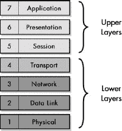
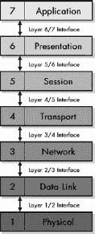
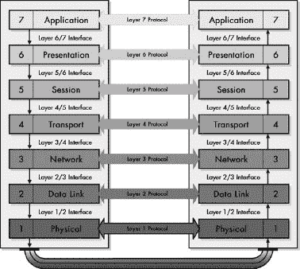
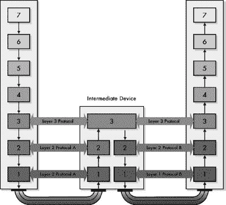

# 第一部分-2. 开放系统互联（OSI）参考模型

第五章

第六章

第七章

模型是有用的，因为它们帮助我们理解复杂的概念和系统。当涉及到网络时，有几个模型被用来解释各种技术所扮演的角色以及它们是如何相互作用的。在这些模型中，最流行和最常用的就是开放系统互联（OSI）参考模型。OSI 参考模型通过允许网络被视为以可预测的方式相互作用的模块化组件，而不是庞大的、复杂的单体，使得网络的分析、设计、构建和重新排列变得更加容易。

你会发现，在阅读大量关于网络的内容时，几乎不可能不遇到一些讨论，这些讨论假设至少对 OSI 参考模型的工作方式有一些了解。这就是为什么我强烈建议，如果你是 OSI 参考模型的新手，你应该仔细阅读这部分内容。虽然这所有内容都可以说是背景材料，但这些信息将为你理解网络打下基础，并使本书的其余部分更容易理解。如果你对 OSI 参考模型非常熟悉，你可能希望跳过这部分内容或只是快速浏览一下。

本部分旨在讨论网络和互联网的一般性，而不是专门针对 TCP/IP 协议套件。因此，本节中并非所有材料都与学习 TCP/IP 直接相关，尽管其中很多是。你也可以参考第一部分-3，其中讨论了 TCP/IP 和 OSI 模型之间的比较。

在这部分，我详细描述了 OSI 参考模型。我首先讨论了一些与 OSI 参考模型和网络模型总体相关的一般概念。然后，我描述了 OSI 参考模型的七个层次。最后，我通过一个有用的类比来总结，帮助你理解参考模型是如何在多个层面上解释网络交互的。那一章还提供了一个层次及其相应功能的参考表。

# 第五章. 一般 OSI 参考模型问题和概念

OSI 参考模型背后的理念是为设计网络系统和解释它们的工作提供框架。当你阅读有关网络的内容时，你经常会发现对 OSI 参考模型的各个级别或层次的引用。然而，在我能够正确讨论实际的 OSI 模型层次之前，你需要理解整个模型。

在本章中，我介绍了 OSI 参考模型，并提供了一些有用的背景信息，以帮助您理解它。我首先简要回顾了该模型的历史，包括其发展和目标。然后，我以一般术语介绍了网络模型，描述了它们的好处以及如何最好地使用它们。本章的大部分内容包含重要的 OSI 模型概念，这将帮助您真正理解模型的工作方式，描述它的术语以及它如何有助于解释网络技术的操作。

# OSI 参考模型的历史

查看 OSI 参考模型的起源，将我们带回到第三章中讨论的与标准和标准组织相关的几个问题。创建网络标准的理念是为了定义广泛接受的设置网络和连接网络的方式。OSI 参考模型代表了早期尝试让所有各种硬件和软件制造商就开发各种网络技术框架达成一致的努力。

在 20 世纪 70 年代末，两个项目独立开始，目标相同：为网络系统的架构定义一个统一的标准。一个是国际标准化组织（ISO）管理的，另一个是由国际电报电话咨询委员会（CCITT）或简称*CCITT*（该缩写来自法语名称）承担的。这两个国际标准机构各自开发了一份定义类似网络模型的文件。

到 1983 年，这两份文件合并形成了一个名为*开放系统互连基本参考模型*的标准。这个名字听起来很复杂，所以这个标准通常被称为*开放系统互连参考模型*、*OSI 参考模型*，甚至简称为*OSI 模型*。它于 1984 年由 ISO 作为 ISO 7498 标准以及更名为 CCITT（现在称为国际电信联盟的*电信标准化部门*或*ITU-T*）作为 X.200 标准发布。（顺便说一句，CCITT 的新名字不是比旧名字*有趣得多*吗？听起来是不是顺耳多了？）

OSI 参考模型的历史中一个有趣的方面是，其原始目标并不是为了创建一个主要用于教育目的的模型，尽管今天许多人认为这是事实。它的目的是作为建立一个广泛采用的协议套件的基石，这些协议将被国际互联网使用——基本上，这就是互联网成为的样子。这被称为 OSI 协议套件，毫不奇怪。

然而，事情并没有按计划进行。互联网的普及及其 TCP/IP 协议与 OSI 协议套件正面相遇，简而言之，TCP/IP 取得了胜利。一些 OSI 协议得到了实施，但当互联网开始增长时，OSI 协议整体上输给了 TCP/IP。

然而，OSI 模型本身找到了一个家，作为一个解释不仅 OSI 协议，而且网络总体运作的设备。它被广泛用作教育工具——就像我本人使用它一样——并且也被用来帮助描述其他协议套件组件和甚至硬件设备之间的交互。尽管大多数技术并非专门为满足 OSI 模型的要求而设计，但许多都是根据它们如何适应其层级来描述的。这包括网络协议、软件应用，甚至不同类型的硬件设备，如交换机和路由器。该模型对开发软件和硬件产品的那些人也非常有用，因为它阐明了网络系统中每个组件所执行的角色。

### 小贴士

**关键概念** *开放系统互联参考模型*（*OSI 参考模型*或*OSI 模型*）最初被创建作为设计一套通用协议的基础，这套协议被称为*OSI 协议套件*。这个套件从未取得广泛的成功，但该模型成为了一个非常有用的工具，既适用于教育，也适用于开发。该模型定义了一系列层级及其使用概念，使得理解网络变得更加容易。

# 一般参考模型问题

让我们讨论一些与参考模型相关的基本问题。部分原因是我想要解释为什么我对 OSI 模型如此重视，甚至将本书的大部分组织结构都围绕这个模型及其层级构建。我还希望您理解这个模型的重要性，以及它在现实中对网络的好处。

在接下来的主题中，我以一般性的方式描述了与参考模型相关的一些问题，当然，特别是与 OSI 参考模型相关。我首先概述了为什么网络模型是有益的，以及为什么了解 OSI 模型的工作原理对您来说很重要。然后，我讨论了如何最好地使用该模型，并将其与一些“现实世界”的网络架构和协议栈进行对比。

## 网络模型的好处

网络很复杂，必须特别努力来尝试*简化*它。网络技术变得更容易理解的一种方式是将它分解成各个部分，每个部分都扮演特定的角色或负责特定的任务或功能。

然而，如果要做这件事，你必须有一种确保这些不同部分可以互操作的方法；也就是说，每个部分都必须知道对其的期望以及它可以从其他部分期望什么。这是网络模型的一个重要角色。它们将实现现代网络所需的大量任务分解为更小的块，这些块可以更容易地管理。同样重要的是，它们在这些部分之间建立“墙壁”以及跨越这些墙壁传递信息的规则。

一个网络模型的良好类比是制造商的装配线。没有公司试图让一个人构建一辆完整的汽车；即使公司这样做，也不会期望这个人能够一次性学会如何完成所有工作。劳动分工为构建复杂产品（如汽车）的公司提供了几个优势。一般来说，这些包括以下内容：

**培训和文档** 通过将构建复杂系统的过程分解为更小的部分，解释如何构建系统会更容易。可以为特定的工作进行培训，而不需要每个人都了解其他所有工作的运作方式。

**专业化** 如果每个人都负责做每一项工作，没有人会积累足够经验成为任何领域的专家。通过专业化，某些个人会在特定工作中发展出专业知识。

**更易进行设计和改进** 通过将汽车分解为系统以及构建这些系统所需的特定工作，你可以在未来更容易地进行更改。如果没有这样的划分，确定更改可能产生的影响将会非常困难，这会抑制创新。

**模块化** 这与前面提到的每一项都有关。如果汽车的系统和生产步骤根据合理的架构或模型分解，那么在车辆之间交换零件和程序就会变得更容易。这节省了时间和金钱。

网络模型为网络世界带来了非常相似的好处。它们代表了一个框架，通过将工作分割为不同的级别或*层*来划分实现网络所需的任务。运行在每个层上的硬件和软件负责与其他设备上运行的同层硬件和软件进行交互。每个硬件或软件元素的责任部分是通过在层之间划分特定的界限来定义的。

因此，你将获得前面列出的所有好处：更容易的培训、每一层的专用功能、改进的修改能力以及模块化。模块化尤其重要，因为它允许你交换在不同层运行的技术。虽然没有人会尝试建造一辆部分是紧凑型轿车、部分是 SUV、部分是摩托车的车辆，但在网络中，你可能想要做类似的事情。网络模型有助于实现这一点。

### 小贴士

**关键概念** 网络模型，如*OSI 参考模型*，提供了一个框架，将复杂的互连网络分解为更容易理解和利用的组件。该模型将网络功能定义为不是一个大而复杂的整体，而是一组分层、模块化的组件，每个组件负责特定的功能。结果是更好地理解网络操作、提高性能和功能、更容易的设计和开发，以及以最适合网络需求的方式组合不同组件的能力。

## 为什么理解 OSI 参考模型对你很重要

许多网络书籍和其他资源都忽略了 OSI 参考模型，或者将其放在难以找到的附录的最后一页。通常给出的原因是 OSI 模型“过于理论化”并且“不适用于现代网络协议如 TCP/IP”。

这是一个错误的观念。虽然确实如此，OSI 模型主要是理论性的，而且网络协议并不总是严格地设计在它们的层内，但 OSI 模型对现实世界的适用性很小这一说法是不正确的。事实上，现在很难阅读关于网络技术的文章而不看到对 OSI 模型及其层的引用，因为该模型的结构有助于构建对协议的讨论和对比各种技术。

例如，OSI 参考模型为理解像以太网和 HomePNA 这样的技术如何相似提供了基础；它解释了 PC 如何使用几组不同的协议进行通信，甚至可以同时使用；它是理解诸如中继器、集线器、网桥、交换机和路由器等互连设备之间差异的重要组成部分；它还解释了许多广域网技术如何互操作。

OSI 模型层远非过时，现在在技术讨论中出现的频率比以往任何时候都要高。事实上，一些协议甚至被*特别命名*，以反映它们在 OSI 参考模型中的位置！例如，考虑第二层隧道协议。此外，交换机现在通常被分类为第 2 层、第 3 层，甚至更高层的交换机。

在理论讨论中，OSI 参考模型帮助你理解网络和网络协议在现实世界中的运作方式。它还帮助你确定哪些协议和设备可以相互交互。因此，我鼓励你继续阅读。这是值得花费的时间。

### 小贴士

**关键概念** 当许多人嘲笑研究 OSI 参考模型这一概念时，理解它对于理解网络协议和技术非常有帮助。该模型是理论性的，但其概念经常被用来描述现实世界中网络的运作。

## 如何使用 OSI 参考模型

尽管有些人过分贬低 OSI 模型，但其他人则走向另一个极端。他们过度使用它，过度分析，并试图以从未打算的方式使用它。

最常见的错误是在尝试将“一切”都“适应”到 OSI 模型的分层结构中时犯下的。我必须承认，有时我也会陷入这个陷阱。当我最初开始安排这本书的结构时，我希望根据 OSI 模型层的位置来组织*所有*内容。我很快发现，这就像试图将各种形状的钉子放入只有圆形孔的板上。我不得不改变我的方法。最终，我根据它对 OSI 层的合理性来组织，在不合理的地方则采用不同的结构。

从我的经验中学习。一个简单的经验法则是这样的：如果参考 OSI 参考模型能帮助你理解技术及其工作原理，那么就使用它；如果它使事情变得更复杂，那么就*不要*使用它。特别是，请记住以下几点：

+   确定某些技术在该模型中的位置可能非常困难。许多协议在设计时并未考虑 OSI 模型，它们可能无法整齐地归入某一层。有些协议可能跨越两层或多层；其他协议集可能有两个协议共享同一层。

+   上层（会话、表示和应用）之间的界限尤其模糊。有些协议显然是为适应这些层之一而设计的，而其他协议可能重叠所有三个层。这也是为什么我不按层对高级协议进行分类的原因之一。（OSI 参考模型是为了解释区分这些层可能没有意义而设计的。）

+   OSI 参考模型主要是为了考虑局域网（LANs）而设计的。广域网（WAN）技术往往很难适应该模型，存在大量重叠和部分层覆盖。然而，在大多数情况下，从 OSI 模型的大致适应角度来考虑这些协议仍然是有用的，因为 WAN 技术的某些部分有时可以互换。

+   设计产品的人们通常不会担心确保他们的最新发明只实现模型的具体层级。因此，有时新产品会违反规则，在多个层级上实现功能，这在以前是由多个设备在各个层级上完成的。这通常被视为进步——一件好事！

最后，一个观察：我注意到学习网络知识的人——尤其是那些试图记住简单答案以应对难题以便通过考试的人——经常问：“这块硬件在哪个层级运行？”这里的问题不在于答案，而在于问题本身过于简单。除了简单的物理设备，如连接器和电缆之外，几乎所有网络设备都在多个层级上运行。例如，虽然路由器通常与第 3 层相关联，但它有两个或更多设备接口，实现了第 2 层和第 1 层。一个更好的问题是，设备在哪个**最高**层级上运行？

重要的是要记住，OSI 参考模型是一个工具。如果你明智地使用它，它可以对你非常有帮助。只需记住不要在应用它时过于僵化，你就会没事的。

### 小贴士

**关键概念** 过分重视 OSI 参考模型和过分轻视模型一样都是错误。虽然该模型定义了理解网络的一个框架，但并非所有网络组件、协议和技术都必然符合模型严格的分层架构。有些情况下，试图使用该模型来描述某些概念可能会导致理解更加模糊，而不是更加清晰。你应该记住，OSI 模型是一个**工具**，应该相应地使用。

## 其他网络架构和协议栈

OSI 参考模型不是唯一用于描述网络结构的模型；还有其他几个模型和系统被用来描述各种协同工作的网络技术集合。这些通常不是描述理论模型，而是实际网络中积极使用的协议分组。因此，它们更常被称为**网络架构**和**协议套件**，而不是模型。

正如你所看到的，许多技术和协议并不很好地适应 OSI 模型中使用的特定层级。同样，在现实世界中使用的多数协议套件也不完全符合 OSI 模型。当然，这是因为它们是在独立于 OSI 模型的情况下开发的。尽管如此，这些架构和套件仍然使用层级——只是与 OSI 模型使用的层级不同。

由于 OSI 模型经常被引用，它对于理解其他架构甚至比较它们非常有帮助。无论各个层和技术被称为什么，网络协议套件都试图在实现网络时达到相同的目标。因此，尽管层不相同，但它们通常是可以比较的。

在 TCP/IP 的情况下，通常在讨论套件时使用一个特殊的模型，称为国防部（DoD）模型或 TCP/IP 模型（参见第八章[Chapter 8. TCP/IP PROTOCOL SUITE AND ARCHITECTURE]）。这个模型与 OSI 模型有许多相似之处，但也有一些重要的区别。在网络领域的其他领域，还使用其他模型，例如 IEEE 802 网络架构模型。这些模型在某些方面与 OSI 模型相似，但它们也有自己独特的特点。

即使在某些特定技术的范围内，你也能看到相关协议的分层结构。有些技术通常被认为实现了 OSI 模型的一个级别，尽管它们实际上有部分重叠多个 OSI 层；例如，以太网和异步传输模式（ATM）。事实上，一些协议甚至有*子协议*，这些子协议在 OSI 认为的单个层内分层。一个很好的例子是 TCP/IP 点对点协议（PPP），尽管名称如此，但它不是一个单独的协议，而是一个自身就是协议套件的协议（参见[Part II-1. TCP/IP 网络接口层协议]Part II-1）。

# OSI 参考模型的关键概念

OSI 参考模型作为解释网络如何工作以及描述不同网络技术和协议之间关系的工具非常有价值。为了实现这一目标，模型依赖于许多重要的概念和术语，我将在以下章节中进行讨论。

我将从讨论模型如何使用层开始。这可能是所有模型概念中最重要的一个。然后，我将谈论一些你可能在模型的一般讨论中看到的符号和术语。我在模型背景下更详细地定义了*接口*和*协议*的含义。接着，我解释了数据封装的重要概念以及用于指代 OSI 参考模型中消息的术语：协议数据单元（PDUs）和服务数据单元（SDUs）。最后，我通过描述各个层如何从理论上处理消息的路由来连接前面讨论的大部分问题。

## OSI 参考模型网络层、子层和层分组

OSI 参考模型最重要的概念是网络*层*的概念。说层实际上是 OSI 模型的核心并不过分——整个模型的目的就是将网络分离成不同级别上操作的独立功能。每一层都负责执行特定的任务或一系列任务，并处理其上下的层。

OSI 参考模型由七个概念层组成，每个层都被分配了一个从 1 到 7 的数字。层号代表层在整个模型中的位置，并表明层与实现网络的实际硬件的接近程度。第一层也是最低层是*物理层*，这是低级信号和硬件实现的地方。第七层也是最高层是*应用层*，它处理用户使用的高级应用：既包括最终用户也包括操作系统软件。

你可以看到，当你从第一层移动到第七层时，你是在向上移动*层堆栈*，并且在这个过程中，你的抽象级别在增加。这意味着层堆栈中层的级别越高，它就越处理逻辑概念和软件，而越少处理网络的硬件以及使其工作的细节。第一层是最具体的，因为它处理网络的实际硬件以及将比特从一台设备发送到另一台设备的特定方法。这是硬件工程师和信号专家的领域。第二层稍微抽象一些，但仍然处理信号和硬件。当你通过第三、第四和随后的层时，那些层的科技变得越来越抽象。当你到达第七层时，你不再处理硬件甚至操作系统概念，你处于用户和依赖较低级别来完成“重活”的高级程序的领域。

OSI 参考模型并没有正式地将相邻层之间的关系分配给任何组。然而，为了帮助解释层是如何工作的，通常将它们分为两种*层分组*：

**底层（第 1 层、第 2 层、第 3 层和第 4 层）** 如图 5-1 所示，模型的底层——*物理层、数据链路层、网络层*和*传输层*——主要关注在网络中数据的格式化、编码和传输。它们并不太关心数据是什么或者它被用于什么目的；相反，它们只想知道如何移动数据。这些层既可以用硬件实现，也可以用软件实现，从第 1 层到第 4 层的过渡是从硬件到软件的。

**上层（第 5 层、第 6 层和第 7 层）** 模型的上层——*会话层、表示层*和*应用层*——主要关注与用户的交互以及实现通过网络运行的应用程序。在较高层运行的协议对数据如何从一个地方发送到另一个地方的低级细节不太关心；它们依赖于底层来传递数据。这些层几乎总是作为在计算机或其他硬件设备上运行的软件来实现。

有些人可能不会完全同意我对图 5-1 中层次划分的选择。特别是，可以提出合理的论点来支持将传输层包含在上层分组中，因为它通常作为软件实现并且相当抽象。我将其放在底层分组中，因为它的主要任务仍然是为上层提供数据传输的服务。实际上，第 4 层可以看作是一个过渡区域，很难归类。图 5-1 显示了第 4 层在堆栈中的特殊位置。

### 提示

**关键概念** OSI 参考模型中最基本的概念是将网络功能划分为一组*层*，从底部的第 1 层到顶部的第 7 层。随着你向上移动层堆栈，你将远离具体的、硬件特定的功能，转向越来越抽象的功能，直到你达到第 7 层的用户应用领域。这七层有时被分为分组：底层（1 到 3 层）和高层（4 到 7 层）。关于第 4 层是底层还是高层，存在一些争议。

图 5-1. OSI 参考模型层 OSI 参考模型将网络功能划分为一个由七层组成的堆栈，从底部向上编号为 1 到 7，有时分为两层分组——底层和高层。

此外，还有一些 OSI 层之间存在着自然的关系。特别是物理层和数据链路层，它们之间关系密切。例如，大多数人将以太网视为第 2 层技术，但以太网规范实际上处理了第 2 层和第 1 层。同样，第 3 层和第 4 层也经常相关；协议套件通常设计得使得第 3 层和第 4 层协议可以协同工作。TCP/IP 协议套件中的 TCP 和 IP，以及 Novell 套件中的 IPX 和 SPX 是很好的例子。

在某些领域，层与层之间的关系非常紧密，以至于它们之间的界限变得*模糊不清*。这尤其是在观察更高层时更为明显；许多技术实现了两层甚至三层这些层，这也是我认为它们最好被归为一组的原因之一。5 到 7 层之间的界限之所以模糊不清，一个重要原因是 TCP/IP 协议是基于 TCP/IP 模型（在第八章中介绍，第八章），该模型将 5 到 7 层的功能合并为一个单一、厚重的层。

### 小贴士

**关键概念** OSI 模型的四层以下通常被单独讨论，因为它们之间的界限相对清晰。相比之下，会话层、表示层和应用层之间的界限则有些模糊。因此，有时协议跨越两层甚至所有这三层；这在 TCP/IP 应用协议中尤为如此，因为 TCP/IP 模型将 5 到 7 层视为一个单一的层。

最后，请注意，某些 OSI 参考模型层被进一步划分为*子层*，以更精确地定义这些层中协议和技术内部细节。这通常在底层进行，尤其是在物理层和数据链路层。

## “N”表示法和其他 OSI 模型层术语

作为一种理论模型，OSI 参考模型附带了一套术语，用于描述它及其组成部分。这既是好消息也是坏消息。好消息是，如果你理解这些术语，它可以帮助你理解技术如何与模型相关，以及大多数关于 OSI 模型的讨论。坏消息是，这些术语也可能增加混淆——尤其是在它们并不总是被一致使用的情况下。

这里有一些术语概念，你经常会看到它们被用来指代 OSI 参考模型：

**层名称和编号** OSI 参考模型的各个层可以用多种方式来指代。它们的名字可能被完整拼写，也可能被缩写。它们也经常简单地通过层编号来引用。例如，所有这些都指代同一事物：数据链路层，数据链路层，DLL，L2，第二层，和层 2。同样，你经常会看到层名称被用作形容词来描述协议和技术。例如，层 3 技术主要在网络层操作。

**N 表示法** 字母*N*常被用来泛指计算机世界中的数字。就 OSI 模型而言，在讨论与单个层相关的通用内容而不提及特定层时，经常看到这个字母被使用。你会听到像*N-功能*和*N-服务*这样的术语，它们只是指特定层内提供的功能和服务的简称。作为另一个例子，你可能会听到有人说某种特定的技术“为 N+1 层提供了一种有用的服务。”这仅仅意味着它为其操作的层之上的层提供了一个功能。从概念上讲，除了第一层和第七层之外，每个层都有一个 N-1 层，一个 N+1 层，依此类推。如果你正在查看网络层（层 3），那么 N+2 层就是会话层（层 5）。

**协议和接口** 这些词在 OSI 模型中具有特殊含义。一个**协议**代表模型同一层中逻辑或物理设备之间的通信。一个**接口**代表同一设备相邻层之间的信息移动。因此，在 N 表示法中，协议代表一个设备上的层 N 与另一个设备上的层 N 之间的通信，而接口处理同一设备上层 N 与 N+1 或层 N 与 N-1 之间的通信。

**网络栈** 当你把许多层堆叠在一起时，你会得到一个**栈**。这个术语用来指代模型或技术套件中的整个层集，或者部分层集。由于每个层都与协议相关联，这有时也被称为**协议栈**。

**实体、功能、设施和服务** 这些术语经常互换使用，有些模糊，它们指的是在模型中各个层执行的具体任务或工作。*N 实体*是一个指代在层 N 执行的特定操作或工作的术语。*功能*基本上是同一件事。*设施*和*服务*是层为其上层提供的内容。这通常也用 N-notation 表示：N+1 层通常使用由 N 层提供的 N 组服务或 N 设施。

图 5-2 通过展示 OSI 模型层之间的关系以及在任何特定层上下文中用于指代相邻层的术语，总结了之前的信息。每一层（除了第 7 层）都为其上层提供服务；每一层（除了第 1 层）都使用其下层提供的服务。另一种说法是，每一层 N 为层 N+1 提供服务，并使用层 N-1 的服务。以第 3 层，即网络层为例，你可以看到它为第 4 层提供服务，并使用第 2 层的服务。从网络层的角度来看，传输层是层 N+1，数据链路层是 N-1。

图 5-2. OSI 参考模型层之间的关系和术语 每一层都与它上面的和下面的层有关联；在这里，如果网络层是层 N，它为传输层（层 N+1）提供服务，并使用数据链路层（层 N-1）的服务。

你可能刚刚读完了所有这些内容，然后对自己说：“他们为什么要使这一切如此**复杂**？”这是个好问题。记住，我**确实**说过这里有个坏消息！现在你知道了所有这些内容，如果你遇到它，你不会感到**太**困惑。

幸运的是，之前使用的热门词汇的使用范围有限。大多数参考文献都是针对特定的层名称或数字，特别是 N-1 和 N+1 的内容在现实技术的讨论中很少使用。然而，在解释模型本身时，这可以非常有用，正如你在阅读本章其余部分时将看到的一些术语一样。

## 接口：垂直（相邻层）通信

OSI 参考模型的七层被用来划分实现网络系统所需的各种功能。在任何网络设备上，不同的软件和硬件例程和设备可能同时在这些层的任何一层或所有层上运行。因为，一般来说，所有这些都应该共同工作来实现网络功能，所以在特定主机内的层之间进行垂直通信是必要的。

在 OSI 参考模型术语中，模型中相邻层之间通信的机制被称为“接口”。当然，“接口”一词在计算机和网络世界的其他环境中也被广泛使用，因为它的通用含义是指连接几乎所有“任何东西”。然而，当某人谈论 OSI 模型层之间的接口时，那个人通常指的是数据在模型层 N 和层 N-1 或层 N+1 之间传递的过程。这些关系在图 5-3 中得到了展示。例如，“层 2/3 接口”被层 2 和层 3 协议用来传递数据和控制信息；“层 3/4 接口”将层 3 和层 4 连接在一起。

图 5-3. 垂直通信的 OSI 参考模型接口 在 OSI 模型术语中，接口是层堆栈中相邻层之间通信的通道。

### 注意

*请记住，并非所有层都可能在现实世界的每个系统或协议堆栈中得到实现。因此，一个在技术上运行在层 7 的进程可能与运行在层 5 的进程进行通信。然而，我这里讨论的是理论模型*。

每当在网络上发送任何东西时，都会在协议堆栈的上下方向进行垂直通信，当然，在接收任何东西时也是如此。这是因为高层被实现为软件中的逻辑功能；没有实际的物理连接。高层将数据打包并发送到低层，以便在网络中发送。在最低层，数据通过网络发送。在接收端，过程相反，数据从接收设备的高层向上传输。我稍后会讨论这种对应层之间的逻辑交互。

OSI 参考模型的一个主要目标是允许不同层实现之间的互连。因此，意图是有一定自主权的单个层，你可以混合搭配——到一定程度。使这一切得以工作的唯一方法是定义层之间连接的明确方式，这又让我回到了接口的问题。每一层必须向其上层的层提供一个一致、良好记录的接口，以便任何上层实现都能正确使用下层。

我将从 TCP/IP 世界的例子中提供一个例子来说明我的意思。TCP/IP 协议套件的核心是互联网协议（IP）。无论你使用互联网上的任何应用程序——电子邮件、网站、FTP、聊天室等等——你都是在间接使用 IP。

然而，你通常不会直接使用 IP——你一般会使用两种传输层（层 4）协议之一：传输控制协议（TCP）或用户数据报协议（UDP）（见第二部分-8). 在 TCP/IP 协议栈中，网络层和传输层之间存在一个标准接口，它定义了上层协议如何使用 IP；这使得 TCP 和 UDP 能够与之接口。同样，TCP 和 UDP 也向使用它们的数百个高层协议和应用提供了特定的接口。

实际上，层之间发生着多种不同类型的通信。控制信息被传递，以便使高层能够利用低层，并使低层能够将状态和结果信息传递回高层。数据也在接口的两侧传递。在传输过程中，它流向低层，这通常会导致数据封装。在接收过程中，过程相反，数据从低层向上层通过接口发送回来。

### 小贴士

**关键概念** 在 OSI 参考模型中，*接口*定义了相邻层之间垂直通信的机制。层之间存在良好定义的接口是允许高层使用任何较低层的服务，而不需要了解这些层是如何实现的。

## 协议：水平（对应层）通信

OSI 参考模型中的每一层都有特定的角色（或角色）——一组它负责的一般任务。在网络的每个系统上，硬件和软件都在模型的许多不同级别上运行。在机器 A 上执行特定任务的例程被设计成与在机器 B 上运行的类似或互补的例程进行通信。这种*水平通信*正是网络的核心所在。它是使网络浏览器和 Web 服务器能够交谈、电子邮件应用能够交换消息以及更多内容得以实现的原因。

当然，所有通信类型只有在每个人都同意使用相同的方法来完成它时才能正常工作。描述一种通信类型的每一组规则都称为“协议”。你可以把协议想象成一种语言或一组指令。网络中的每个功能或服务都有自己的语言；就像人类语言一样，有些彼此相似，而有些则非常独特。

如果你阅读过任何关于网络的内容，你可能已经多次看到“协议”这个术语。像“接口”这个词一样，“协议”这个词可以有多个含义。实际上，它对网络来说如此基础，并且以多种不同的方式使用，以至于我在第一章中专门讨论了它。

不论其他情况如何，你必须记住，OSI 参考模型旨在成为一种描述网络的正式方式。因此，在模型中，“协议”这个术语有一个正式的含义。它具体指的是一组通信规则、指令和程序，这些规则、指令和程序描述了在网络中不同机器上运行于同一层级的特定软件或硬件元素之间的通信。

让我们考虑这些对应层如何使用协议进行通信。首先，你会记得，模型中的每一层（除了底层的物理层）实际上是在计算机上运行的程序或算法。例如，一个网页浏览器和一个网页服务器无法直接连接在一起——毕竟，它们只是软件程序。相反，运行在不同层上的软件通过逻辑方式通信。也就是说，通过使用软件和程序，一个机器上第 5 层的进程可以与另一个机器上第 5 层的类似进程进行逻辑通信。

由于机器只在第 1 层进行物理连接，发送机器上的数据必须通过第 5 层和第 1 层之间的层传递，以便第 5 层的协议能够工作。然后，数据通过物理连接传输到另一台机器的第 1 层，并在接收机器的协议堆栈中向上传递到第 5 层。这就是这两台机器在第 5 层逻辑连接的方式，尽管在那个层它们没有物理连接。

因此，除了第 1 层的实际物理连接外，所有横向通信也都需要纵向通信——在一个机器上的堆栈向下，然后在另一个机器上的堆栈向上。（然而，并非每个连接都需要完全回溯到堆栈顶部，例如在“间接设备连接和信息路由”部分讨论的路由情况。这部分内容位于本章末尾。）

图 5-4 展示了水平通信的工作原理。例如，IP 被认为是一个第 3 层协议，因为每个设备都使用 IP 软件在第 3 层进行通信。实际的数据传输和接收仅发生在最低的物理层；高层协议通过向下通过接口传递数据，直到达到第 1 层，在第 1 层进行传输，然后将数据传回接收设备相应层的适当层，以逻辑方式通信。

图 5-4. OSI 参考模型协议：水平通信 术语协议有许多含义；在 OSI 参考模型中，它特指实现两个或更多设备上对应层之间通信的软件或硬件元素。

### 提示

**关键概念** 在 OSI 参考模型中，*协议*特指定义网络设备上同一层运行的软件或硬件元素之间通信的一组规则或程序。物理层协议负责在第 1 层实际传输和接收数据。高层协议将数据向下传递到它们下面的层，直到第 1 层进行传输，然后穿过网络，并返回到接收设备同一层的相应实体。结果是，在两个设备中的每个设备上运行的软件过程，例如在第 4 层，可以像它们在第 4 层直接连接一样进行逻辑通信，尽管它们并没有直接连接。

## 数据封装、协议数据单元（PDUs）和服务数据单元（SDUs）

协议描述了控制水平通信的规则，即运行在 OSI 参考模型中对应层内的进程之间的对话。在每一层（除了第 1 层之外），这些通信最终都采取某种形式的消息，这种消息是在两个或更多设备上对应软件元素之间发送的。由于这些消息是协议之间传递信息的机制，它们通常被称为*协议数据单元（PDUs）*。每个 PDU 都有一种特定的格式，该格式实现了协议的功能和需求。

如前节所述，层 1 以上的层之间的通信是**逻辑**的；唯一的硬件连接是在物理层。因此，为了使协议能够通信，它必须将其 PDU 传递到下一层进行传输。您也已经看到，使用 OSI 术语，较低层被说成是为它们上面的层提供**服务**。每个层提供的每个服务之一是这项功能：处理和管理从上层接收到的数据。

在特定的层 N 中，PDU 是一个实现了该层协议的完整消息。然而，当这个层 N 的 PDU 传递到层 N-1 时，它变成了层 N-1 协议应该**服务**的**数据**。因此，层 N 协议数据单元（PDU）被称为层 N-1 的**服务数据单元（SDU**）。层 N-1 的任务是传输这个 SDU，它通过将层 N 的 SDU 放入自己的 PDU 格式中，在 SDU 前面加上自己的头部，并在必要时添加尾部来实现。这个过程被称为**数据封装**，因为高层消息的全部内容都被封装为低层消息的数据负载。

层 N-1 对其 PDU 做什么？它将其传递到下一层，在那里它被视为层 N-2 SDU。层 N-2 创建一个包含层 N-1 SDU、层 N-2 的头部和尾部的层 N-2 PDU。这个过程一直持续到物理层。在理论模型中，最终你得到的是层 1 的消息，它由应用层数据组成，这些数据被层 7 到层 2 的头部和尾部封装。

图 5-5

图 5-5. OSI 参考模型数据封装 每个协议都为传输创建一个协议数据单元（PDU），每个 PDU 都包含该协议所需的头和数据要传输的数据。这些数据成为下一层的服务数据单元（SDU）。

### 小贴士

**关键概念** 在 OSI 模型术语中，用于特定协议通信信息的消息称为其*协议数据单元（PDU）*。该 PDU 被传递到下一较低层进行传输；由于该层提供处理该 PDU 的服务，因此称为该较低层的*服务数据单元（SDU）*。SDU 被封装到该层的自己的 PDU 中，然后，反过来，发送到堆栈中下一较低层，直到达到物理层。在接收设备上，这个过程是相反的。总之，层 N 的 PDU 是层 N-1 的 SDU，它是*封装*到层 N-1 的 PDU 中的。

“N-1，N-2”这样的东西使得这个过程看起来比实际情况更复杂，所以让我们用一个现实世界（简化）的例子来代替。TCP 在 OSI 模型的第 4 层运行。它传输称为*段*的消息，这些消息包含从高层协议封装的数据。TCP 下面的层是第 3 层的 IP。它从 TCP 接收数据，并将其封装以进行传输。

因此，在 OSI 参考模型的正式语言中，TCP 段作为第 4 层 PDU 被创建。当传递给 IP 时，它们被视为第 3 层 SDU。IP 软件将这些 SDU 打包成称为*IP 数据包*或*IP 数据报*的消息，这些是第 3 层 PDU。这些被传递到第 2 层协议，例如以太网，它将 IP 数据报视为第 2 层 SDU，并将它们打包成第 2 层 PDU（以太网帧），然后发送到第 1 层。实际上，在某些技术中，在传输之前甚至在第 1 层发生进一步的封装。 

在接收设备上，封装过程是相反的。以太网软件检查第 2 层 PDU（以太网帧），从中移除第 2 层 SDU（IP 数据报），并将其作为第 3 层 PDU 传递给 IP。IP 层移除第 3 层 SDU（TCP 段），并将其作为第 4 层 PDU 传递给 TCP。TCP 继续这个过程，向上返回到协议层堆栈。

图 5-6 更详细地展示了 OSI PDU 和 SDU 的创建和封装过程。一个 TCP 段（第 4 层 PDU）变成一个第 3 层 SDU，通过添加 IP 头部封装进第 3 层的 PDU。这成为以太网帧的有效载荷，它是一个包含以太网头部、第 2 层 SDU（IP 数据报）和以太网尾部的第 2 层 PDU。接收设备从以太网头部提取 IP 数据报并将其传递到第 3 层；IP 软件提取 TCP 段并将其传递到 TCP 软件。

整个封装问题，包括在协议栈中上下传递数据，等等，可能看起来过于复杂。它也可能显得相当低效；为什么发送一个带有这么多头部和尾部的消息？然而，数据封装的概念对于创建模块化、灵活的网络至关重要。

图 5-6. OSI 参考模型 PDU 和 SDU 封装 OSI 模型每一层的每个 PDU 在下一层变为 SDU，并被封装进该层的 PDU 中。

术语*协议数据单元*或 PDU 相当正式。你会在标准中看到它的使用，有时在讨论中也会看到，但更常见的是，你会遇到如*帧*和*数据报*这样的消息术语，正如在第一章中讨论的那样。同样，这些消息封装的数据通常不被称为*服务数据单元*或 SDU，而简单地称为*消息体*或*有效载荷*，正如你在查看第一章中的消息格式时所看到的。然而，在某些情况下，了解 SDU 和 PDU 之间的区别对于理解技术很重要。一个例子是 IEEE 802.11 物理层——802.11 标准经常提到 SDU 和 PDU！

### 小贴士

**相关信息** 在本章前面的“网络模型的好处”部分中，可以看到 OSI 参考模型类比的一个例子，该例子将网络封装与实际非网络环境中的操作进行比较。

## 间接设备连接和消息路由

我在本章其他部分提供的多数解释都讨论了机器在网络中直接连接的机制。然而，网络最强大的方面之一是能够创建互连网络——网络的网络，允许设备间接连接。例如，机器 A 可能向机器 B 发送消息，而实际上甚至不知道它在网络上的位置。

如果消息是在不在同一网络中的设备之间发送，那么它必须在网络之间传递，直到达到其最终目的地。从一网络传输到另一网络的过程称为*转发*，从一设备到另一设备的转发过程称为*路由*。这些概念是所有互连网络的基础，包括互联网本身。每次你访问互联网资源，如网站时，你都在发送被路由到该站点的消息，而你收到的响应也会被路由回来。

### 注意

*尽管从一网络移动到相邻网络的技术正确术语是*转发*，但随着时间的推移，*路由*这个术语已经被用来指代单个网络到网络的传输，以及将消息从一台设备传输到另一台设备的整体过程*。

在 OSI 参考模型中，路由通常发生在网络层，即第 3 层。你会记得，数据封装会在低层为高层消息添加头部和尾部。当消息被路由时，以下是会发生的事情：

+   一台机器上的高级应用程序决定向远程计算机发送一个数据报。数据报被封装，然后通过原始机器上的协议栈垂直向下传递。每一层都按照前述章节所述封装数据。数据报被指定给最终目标设备。然而，当消息到达低层时，它并不是直接封装以直接发送到其最终目的地，而是传递给一个*中间设备*。这是负责将该目标网络路由的设备。消息被传递到数据链路层和物理层，以便发送到该中间设备。

+   中间设备（通常称为*路由器*）在物理层接收消息。它被传递到数据链路层，在那里进行处理、检查错误等，并移除数据链路层的头部。生成的数据包被传递到网络层。在那里，中间设备确定目标机器是否在其本地网络中，或者是否需要转发到另一个中间设备。然后它重新封装消息，并将其*向下*传递到数据链路层，以便在旅程的下一阶段发送。

+   在经过几个潜在的中间设备处理信息后，它最终到达目的地。在这里，它沿着协议栈向上行进，直到达到在源机器上生成信息的应用程序所在的同一层。

这段描述的关键在于，在中间设备中，消息只沿着 OSI 层向上行进到网络层。然后它被重新封装，并沿着其路径发送回去。高层只涉及源设备和目标设备。在第 3 层使用的协议必须在互联网中是通用的，但每个单独的网络可以不同。这展示了分层的一些强大功能，它使得甚至非常不同的物理网络也能够连接在一起。

图 5-7 展示了在 OSI 模型中概念上如何实现路由。中间设备连接消息发送者和接收者的网络。当发送数据时，数据被传递到中间设备的网络层，在那里它被重新封装，并沿着传输的下一阶段向下发送到栈中。请注意，中间设备实际上有两个不同的第 1 层和第 2 层实现——一个用于每个网络的接口。另外请注意，虽然第 3 层协议必须在互联网中相同，但每个网络可以在第 1 层和第 2 层使用不同的技术。

图 5-7. OSI 参考模型中的消息路由。在 OSI 模型中，通过连接第 3 层的网络的中间设备来实现路由。数据在一个网络中的该设备上传递到第 3 层，然后传递到另一个网络上的第 1 层。

### 小贴士

**关键概念** 在 OSI 模型中，当数据不是直接从发送者发送到最终接收者，而是通过使用中间系统间接发送时，发生路由过程。该设备通常被称为**路由器**，连接到两个或多个物理网络，因此具有多个第 2 层接口。当它接收数据时，数据只传递到网络层，在那里它被重新封装，然后通过适当的第 2 层接口发送到旅程的下一阶段。

# 第六章。OSI 参考模型层

在本章中，我们查看 OSI 参考模型的各个单独层。OSI 模型中的每一层都有定义其自身的某些特征，以及通常与之相关的各种协议。我将描述每一层在 OSI 层堆栈中的功能，概述每一层通常负责的具体活动类型，并提供一些位于每一层的技术和协议的示例。理解每一层的细微差别将有助于您理解使用它们的全部技术。

然而，请注意，本节中的描述是**通用的**。要真正理解各个层及其使用的细节，请阅读本书后面各层所使用的各个协议的详细信息。

### 提示

**相关信息** 第七章 包含可能对您理解 OSI 模型层有帮助的总结信息。这包括一些用于记住层顺序的常见记忆法，以及用于快速比较层关键特征的总结图表。

# 物理层（层 1）

OSI 参考模型的最底层是层 1，即**物理层**；它通常缩写为 PHY。这一层是唯一一个在物理上通过网络接口移动数据的层。所有其他层执行创建实现各种协议的消息的功能，但这些消息必须通过协议堆栈向下传输到物理层，并最终通过网络发送出去。

首先，稍作澄清。物理层这个名字可能有点问题，因为它暗示这一层只与实际的网络硬件相关，这并不正确。虽然有些人说物理层是网络接口卡和电缆，但这实际上并不正确。物理层定义了除与硬件电缆和卡接口之外的一系列网络功能。

人们还建议所有网络硬件都属于物理层。然而，这并不完全准确。所有硬件都必须与物理层**有些**关系才能在网络中发送数据，但硬件设备通常除了物理层之外还实现 OSI 模型的多个层。例如，以太网网络接口卡在物理层和数据链路层都执行功能。

物理层技术处理在网络中传输的实际的 0 和 1。例如，中继器、传统集线器和收发器都在物理层操作。这些设备对消息的内容一无所知；它们只是接收输入比特并将它们作为输出发送。物理层负责以下内容：

**硬件规格定义** 电缆、连接器、无线收发器、网络接口卡和其他硬件设备的操作细节通常是物理层的功能（尽管也部分属于数据链路层，层 2）。

**编码与信号** 物理层负责各种编码和信号功能，这些功能将计算机或其他设备内的比特转换为可以在网络上发送的信号。

**数据传输与接收** 在适当编码数据后，物理层实际上负责传输数据，当然，也负责接收它。（这同样适用于有线和无线网络，即使无线网络中没有可见的电缆。）

**拓扑与物理网络设计** 物理层也被认为是许多与硬件相关的网络设计问题的领域，例如局域网（LAN）和广域网（WAN）拓扑。

尽管网络物理层主要定义了它所使用的硬件，但它也与数据链路层密切相关。因此，通常无法独立于数据链路层所使用的特定技术来定义物理层的硬件。例如，以太网是一种描述特定类型电缆和网络硬件的技术，但以太网的物理层只能在一定程度上与其数据链路层方面分离。尽管以太网电缆是物理层，但电缆的最大长度与数据链路层存在的消息格式规则密切相关。

此外，一些技术还在物理层执行通常与数据链路层更紧密相关的功能。例如，物理层通常负责对数据链路层帧进行低级（比特级）重新封装以进行传输。在某些情况下，错误检测和纠正也可能在层 1 进行，尽管大多数人会认为这些是层 2 的功能。

在许多技术中，可以使用多个物理层与数据链路层一起使用。经典的例子是以太网，它有数十种不同的物理层实现。每种实现都使用相同的数据链路层（可能略有变化）。

### 提示

**关键概念** OSI 参考模型中的最低层是*物理层*。它是网络硬件规格的领域，是数据编码、信号、传输和接收功能所在的地方。物理层与数据链路层密切相关。

许多技术进一步将物理层细分为*子层*，以便不同的网络媒体能够由相同的技术支持，同时在物理层共享各种媒体之间常见的其他功能。一个很好的例子是用于快速以太网、千兆以太网和 10 千兆以太网的物理层架构。

### 注意

*在某些情况下，用于在网络或通信线路中传输比特的物理层技术被称为传输方法（不要与 OSI 传输层，层 4 混淆）*。

# 数据链路层（层 2）

OSI 参考模型堆栈中第二低层（层 2）是 *数据链路层*，通常简称为 *链路层*，或缩写为 DLL。数据链路层是许多有线和无线局域网技术主要功能的地方。例如，以太网、令牌环、FDDI 和 802.11（无线以太网或 Wi-Fi）有时被称为数据链路层技术。连接在数据链路层的设备集合通常被认为是一个简单网络（与在层 3 连接的集合网络即互联网相对）。

数据链路层通常在概念上分为两个子层：*逻辑链路控制（LLC）* 和 *媒体访问控制（MAC）*。这种划分基于 IEEE 802 项目所采用的架构，该架构是负责创建定义许多网络技术标准的 IEEE 工作组。通过分离 LLC 和 MAC 功能，不同网络技术的互操作性变得更容易，如第五章中关于网络模型讨论所述。

以下是在数据链路层执行的关键任务：

**逻辑链路控制（LLC）** 逻辑链路控制指的是在网络上建立和控制本地设备之间逻辑连接所需的功能。这通常被认为是一个子层；它为上层的网络层提供服务，并隐藏数据链路层其余的细节，从而使不同的技术能够与高层无缝工作。大多数局域网技术使用 IEEE 802.2 LLC 协议来实现数据链路层的这部分功能。

**媒体访问控制（MAC）** 这指的是设备用于控制对网络介质访问的规程。由于许多网络使用共享介质（如单根网络电缆，或一系列电缆通过电气连接形成一个单一虚拟介质），因此有必要制定管理介质以避免冲突的规则。例如，以太网使用 CSMA/CD 媒体访问控制方法，而令牌环使用令牌传递。

**数据帧** 数据链路层负责数据帧，这是将高级消息最终封装成在物理层发送的 *帧*。

**寻址** 数据链路层是 OSI 模型中关注寻址的最低层。它用特定的目的地位置标记信息。网络上的每个设备都有一个唯一编号，该编号由数据链路层协议使用，以确保针对特定机器的数据能够正确到达。这通常被称为*硬件地址*（因为它与底层硬件密切相关）或*MAC 地址*（根据前面描述的 MAC 功能命名）。

**错误检测和处理** 数据链路层处理网络堆栈较低层发生的错误。例如，循环冗余检查（CRC）字段通常基于帧的内容计算，然后包含在其中。这可以用来允许接收数据的站检测它是否被正确接收。

**物理层标准** 物理层和数据链路层非常紧密相关。网络物理层的要求通常是描述特定技术的数据链路层标准的一部分。某些物理层硬件和编码方面由所使用的数据链路层技术指定。最好的例子是以太网标准 IEEE 802.3，它不仅指定了以太网在数据链路层的工作方式，还指定了其各种物理层。

### 提示

**关键概念** 第二个 OSI 参考模型层是*数据链路层*。这是大多数局域网和无线局域网技术被定义的地方。层 2 负责*逻辑链路控制（LLC）、媒体访问控制（MAC）、硬件寻址、错误检测和处理以及定义物理层标准*。它通常根据使用该架构的 IEEE 802 项目被分为 LLC 和 MAC 子层。

许多类型的硬件都与数据链路层相关联。网络接口卡通常实现特定的数据链路层技术，因此它们通常被称为以太网卡、令牌环卡等。还有一些网络互连设备，它们在整体或部分上被认为在层 2 运行，因为它们通过查看数据链路层帧来决定对接收到的数据采取什么行动。这些设备包括大多数桥接器、交换机和桥接路由器，尽管后两者还包含由层 3 执行的功能。

与层 2 一般相关的一些最流行的技术和协议包括以太网、令牌环、FDDI（加上 CDDI）、HomePNA、IEEE 802.11、异步传输模式（ATM）、TCP/IP 的串行线路接口协议（SLIP）和 TCP/IP 的点对点协议（PPP）。

# 网络层（层 3）

OSI 参考模型中的第三低层是*网络层*。如果数据链路层定义了被认为是网络的范围，那么网络层就定义了*互联网*（互联网络）如何工作。网络层是 OSI 模型中唯一一个真正关注将数据从一台计算机传输到另一台计算机的层，即使它们位于远程网络中；相比之下，数据链路层只处理彼此相邻的设备。

虽然第 2 层到第 6 层都充当了它们上下层之间的屏障，但网络层在区分高层和低层功能方面尤为重要。在这里，从更高层的更抽象功能——不太关注数据传输——到将数据传输到目的地的具体任务的实际转变真正开始。（随着您向上移动 OSI 协议栈，传输层继续这种抽象转变。）

网络层通常执行的一些具体工作包括以下内容：

**逻辑寻址**每个通过网络进行通信的设备都与一个逻辑地址相关联，该地址无论其特定位置如何都能识别该设备。这有时被称为*第 3 层*地址。例如，在互联网上，互联网协议（IP）是网络层协议，每台机器都有一个 IP 地址。逻辑地址独立于特定硬件，并且在整个互联网中必须是唯一的。

### 注意

*地址分配也在数据链路层进行，但这些地址指的是本地物理设备*。

**路由**网络层的定义功能是路由——在一系列互联网络中移动数据。网络层上运行的设备和软件例程负责处理来自各种来源的传入数据包，确定它们的最终目的地，然后找出它们需要发送到何处才能到达目的地。（您可以在第五章中关于间接设备连接的部分找到 OSI 模型中关于路由的更完整讨论。第五章。）

**数据报封装**网络层通常通过将它们放入带有网络层头部（前一章讨论了封装）的*数据报*（也称为*数据包*）来封装从高层接收到的消息。

**分片与重组** 网络层必须将消息发送到数据链路层进行传输。某些数据链路层技术限制了可以发送的任何消息的长度。如果网络层想要发送的数据包太大，网络层必须将数据包分割（分片），将每个部分发送到数据链路层，然后在目标机器的网络层到达后重新组装这些部分。IP 是执行这些功能的最知名协议；请参阅第二十二章以了解 IP 数据报分片的讨论。

**错误处理和诊断** 网络层使用特殊的协议来允许逻辑上连接的设备（或尝试路由流量）交换有关网络中主机状态或设备本身状态的信息。

网络层协议提供面向连接或无连接的服务来在网络中传输数据包。在网络层，无连接的服务更为常见。在许多协议集中，网络层协议是无连接的，而面向连接的服务由传输层提供。例如，在 TCP/IP 中，IP 是无连接的，而第 4 层的传输控制协议（TCP）是面向连接的。面向连接和无连接协议在第一章中进行了详细讨论。

最常见的网络层协议是 IP，这也是我之前提到过几次的原因。IP 是互联网的骨干，也是整个 TCP/IP 协议集的基础。还有一些与 IP 直接相关的协议在网络层与之协同工作，例如 IPsec、IP NAT 和移动 IP。互联网控制消息协议（ICMP）是与 IP 一起使用的错误处理和控制协议的主要协议。TCP/IP 世界之外的一个值得注意的网络层协议是 Novell Internetworking Packet Exchange (IPX)协议。

### 小贴士

**关键概念** OSI 参考模型的第三层是*网络层*。这是模型中最重要的层之一；它负责将单个网络链接成*互联网*的任务。网络层功能包括互联网级寻址、路由、数据报封装、分片与重组以及某些类型的错误处理和诊断。网络层和传输层彼此紧密相关。

在网络层运行的网际互联设备通常被称为*路由器*。它们负责我提到的路由功能，因为它们在路由的每一段“跳跃”中接收数据包，并将它们发送到旅程的下一阶段。它们通过路由协议相互通信，以确定发送流量的最佳路由。所谓的桥接路由器也至少部分地位于网络层，就像名称明显为第三层的交换机一样。

# 传输层（第 4 层）

OSI 参考模型协议栈的第四层是*传输层*，也称为*中间层*。在 OSI 模型中，传输层在某种程度上是下层和上层层组的一部分。它更常与下层相关联，因为它关注数据的*传输*，但它的功能也有些高级，因此它与第 5 层到第 7 层也有相当多的共同之处。

你会记得，第 1 层到第 3 层关注的是数据的实际打包、寻址、路由和交付。物理层处理比特，数据链路层处理本地网络，网络层处理网络之间的路由。相比之下，传输层足够概念化，不再关注这些基础问题。它依赖于下层在设备之间移动数据。

传输层在较高层的抽象应用世界和第 1 层到第 3 层的具体功能之间充当某种联络员。它的总体任务是提供必要的功能，以实现不同计算机上软件应用进程之间的通信，这包括许多不同但相关的职责。

由于现代计算机是多任务的，许多不同的软件应用可能在任何给定时刻都试图向同一台机器发送和接收数据。传输层负责提供一种方式，使这些应用都可以使用相同的下层协议实现发送和接收数据。因此，有时人们说它负责*端到端*或*主机到主机*的传输（实际上，TCP/IP 模型中相当层的名称是主机到主机传输层）。

为了实现进程之间的这种通信，传输层必须执行几个不同但相关的任务。对于传输，它必须跟踪每个应用的数据，然后将其组合成单一的数据流发送到下层。接收信息的设备必须执行相反的操作，将数据分段，并将其引导到适当的接收进程。传输层还负责定义将潜在的大量应用数据分段进行传输的方式。

传输层还负责为在其之上运行的协议和应用程序提供**连接服务**。这些可以分为面向连接的服务和无连接的服务，每种都有其用途。虽然面向连接的服务可以在网络层处理，但在现实世界中它们更常见于传输层。（一些协议套件，如 TCP/IP，提供面向连接和无连接的传输层协议，以满足不同应用程序的需求。）

传输层也是通常包含添加端到端数据传输功能的地方。而网络层协议通常只关注“尽力而为”的通信，不保证交付，传输层协议则通过算法赋予智能，确保设备之间可靠且高效的通信。这种智能包括几个相关任务，包括丢失传输的检测和处理，以及管理数据发送速率，以确保接收设备不会被淹没。

传输质量——确保传输被接收时与发送时相同——非常重要，以至于一些网络书籍根据可靠性和流量控制功能来定义传输层。然而，并非所有传输层协议都提供这些服务。正如协议套件可能既有面向连接的传输层协议也有无连接的传输层协议一样，它也可能有一个提供可靠性和数据管理服务的传输层协议，以及一个不提供这些服务的协议。再次强调，TCP/IP 就是这种情况：有一个主要的传输层协议 TCP，它包括可靠性和流量控制功能，还有一个第二层协议用户数据报协议（UDP），它不提供这些功能。

让我们更详细地看看传输层通常执行的具体功能：

**进程级寻址** 传输层寻址用于区分不同的软件程序。这是许多不同的软件程序能够同时使用网络层协议的部分原因。传输层进程级寻址的最佳例子是 TCP/IP 中使用的 TCP 和 UDP 端口号机制，它允许在任意 TCP/IP 设备上对应用程序进行单独引用。

**复用和解复用** 使用进程级地址，发送设备上的传输层协议会将从多个应用程序接收到的数据进行**复用**，将它们组合成一个要发送的单个数据流。相同的协议接收数据，然后从进入的数据报流中**解复用**，并将每个数据报直接导向相应的接收应用程序进程。

**分段、封装和重组** 传输层将发送到网络的大量数据在网络源机器上分段成更小的块，然后在目标机器上重新组装。这个功能类似于网络层的分片功能。就像网络层将消息分片以适应数据链路层的限制一样，传输层将消息分片以满足底层网络层的要求。

**连接建立、管理和终止** 传输层面向连接的协议负责建立连接所需的一系列通信，包括在数据通过它发送时维护连接，并在不再需要时终止连接。

**确认和重传** 如前所述，传输层是实现许多保证数据可靠交付的协议的地方。这是通过多种技术实现的，最常见的是通过结合*确认*和*重传计时器*。发送设备在每次发送数据时启动一个计时器；如果数据被接收，接收方会向发送方发送一个确认，以指示传输成功。如果在计时器到期之前没有收到确认，数据将被重新发送。通常还需要其他算法和技术来支持这个基本过程。

**流量控制** 提供可靠交付的传输层协议通常也实现了*流量控制*功能。这些功能允许通信中的一个设备向另一个设备指定它必须降低发送数据的速率。这将防止接收器被数据拖累。这些功能允许检测和处理发送方和接收方之间的速度不匹配。

### 提示

**关键概念** 第四层和中间的 OSI 参考模型层是*传输层*。这一层代表了处理数据交付问题的底层和与应用程序软件一起工作的更高层之间的过渡点。传输层负责在应用程序进程之间实现*端到端通信*，部分是通过使用进程级寻址和复用或解复用来实现的。传输层协议负责将应用程序数据分段以便传输，可以是面向连接的或无连接的。此层的协议也经常提供数据交付管理服务，例如可靠性和流量控制。

理论上，传输层和网络层是不同的，但在实践中，它们通常彼此非常紧密相关。您只需查看常见协议栈的名称就可以轻松看到这一点。它们通常以套件中第 3 层和第 4 层协议命名，从而暗示了它们之间的紧密关系。例如，TCP/IP 这个名字来自套件中最常用的传输层协议（TCP）和网络层协议（IP）。同样，Novell NetWare 套件通常被称为 IPX/SPX，因为它有第 3 层（IPX）和第 4 层（顺序包交换，或 SPX）协议。

通常，特定的传输层协议使用同一家族的网络层。您不太可能找到一个使用一个套件中的传输层协议和另一个套件中的网络层协议的网络。在 TCP/IP 套件中，最常用的传输层协议是 TCP 和 UDP，在 NetWare 协议套件中是 SPX，在 NetBIOS/NetBEUI/NBF 套件中是 NetBEUI（尽管 NetBEUI 更难归类）。

# 会话层（第 5 层）

OSI 参考模型中的第五层是*会话层*。随着您从 OSI 层堆栈的底部向上移动，会话层是第一个基本上将所有与寻址、封装和交付数据相关的实际事务留在了后面的层；它们是第 4 层及以下层的功能。会话层是三个上层层中最低的，作为一个整体，它们主要关注软件应用问题，而不是网络和互联网实现的细节。

会话层的名字说明了其设计目的：它旨在允许设备建立和管理*会话*。一般而言，会话是两个软件应用进程之间持久的逻辑连接，允许它们在一段时间内交换数据。在某些讨论中，这些会话被称为*对话*，实际上，它们大致相当于两个人之间的电话通话。

会话层协议主要提供设置、管理和结束会话所需的必要手段。实际上，在某些方面，会话层软件产品更像是工具集而不是特定的协议。这些会话层工具通常通过通常称为*应用程序程序接口*或*API*的命令集提供给高层协议。

常见的 API 包括 NetBIOS、TCP/IP 套接字和远程过程调用（RPCs）。API 允许应用程序通过使用一组标准化的服务，轻松地在网络上完成某些高级通信。这些会话层工具主要对应用软件的开发者感兴趣。程序员使用 API 编写能够使用 TCP/IP 进行通信的软件，而无需开发者了解 TCP/IP 如何工作的实现细节。

例如，套接字接口在概念上位于第 5 层，并被 TCP/IP 应用程序程序员用于在 UNIX 操作系统上创建互联网上软件程序之间的会话。Windows 套接字同样允许程序员创建能够上网的 Windows 软件，并且能够轻松与其他使用该接口的软件交互。（严格来说，套接字不是一个协议，而是一种编程方法。）

### 注意

*层与层之间的界限一旦达到会话层就开始变得模糊。这使得很难确定哪些内容确切地属于第 5 层，有些技术实际上跨越了第 5 层到第 7 层。在 TCP/IP 的世界中，特别是不常见能识别出专门针对 OSI 会话层的协议*。

### 小贴士

**关键概念** OSI 参考模型中的第五层是*会话层*。正如其名称所暗示的，它是旨在为软件进程之间建立和管理会话提供功能的层。会话层技术通常作为一组称为*应用程序编程接口（API）*的软件工具集来实现，这些工具集提供了一套一致的服务，使程序员能够在不担心传输、寻址和交付的底层细节的情况下开发网络应用程序。

### 注意

*“会话”这个术语有些模糊，这意味着有时会对属于会话层的具体功能或某些协议是否属于会话层存在分歧。更不用说区分连接与会话的问题了。连接通常属于第 4 层和第 3 层，但例如 TCP 连接可以持续很长时间。TCP 连接的持久性使得它们难以与会话区分开来（有些人甚至认为 TCP/IP 的主机到主机传输层实际上跨越了 OSI 的第 4 层和第 5 层）*。

# 表示层（第 6 层）

*表示层*是 OSI 参考模型协议堆栈的第六层，也是从顶部数第二层。它在两个关键方面与其他层不同。首先，它的功能和作用范围比其他层要有限和具体得多。其次，它比其他层使用得少，并且不是许多类型通信所必需的。

这一层处理数据的*表示*。更具体地说，它负责处理当从一系统发送的数据需要以不同的方式由接收系统查看时可能出现的任何问题。表示层还处理从应用程序尝试发送数据到数据通过网络发送这段时间内必须进行的任何特殊处理。

下面是表示层处理的一些具体的数据处理问题类型：

**翻译** 在同一个网络中可能存在多种不同类型的计算机，例如 PC、Mac、UNIX 系统、AS/400 服务器和大型机。每种计算机都有许多独特的特性，并以不同的方式表示数据（例如，使用不同的字符集）。表示层隐藏了机器之间的差异。

**压缩** 压缩（和解压缩）可以在表示层进行，以提高数据的吞吐量。

**加密** 在表示层执行某些类型的加密（和解密）操作，以确保数据在协议栈中传输时的安全性。例如，与表示层通常相关联的最流行的加密方案之一是安全套接字层（SSL）协议。（在 IPsec 等技术中，某些加密操作在协议栈的较低层进行。）

表示层并不总是在网络通信中使用，因为这些提到的功能并不总是需要的。压缩和加密通常被认为是可选的，并且仅在特定情况下需要翻译功能。此外，表示层的功能可能由应用层执行。

### 注意事项

*由于翻译工作并不总是需要，因此表示层通常在实际协议栈实现中被省略；在这些实现中，第 7 层的协议可以直接与第 5 层的协议进行通信。这也是为什么第 5 层到第 7 层的所有功能可能都包含在同一个软件包中的原因，如前一章中关于层和层分组的概述所述*。

### 小贴士

**关键概念** OSI 模型的第 6 层是*表示层*。该层的协议负责执行将数据从一种表示形式转换为另一种表示形式的操作任务，例如翻译、压缩和加密。在许多情况下，特定的网络栈中可能不需要此类功能；如果是这样，第 6 层可能没有活跃的协议，因此第 7 层可能直接处理第 5 层。

# 应用层（第 7 层）

在 OSI 参考模型层堆栈的最顶层，您会发现第 7 层，即*应用层*。继续您在层 5 和层 6 中看到的趋势，这一层的命名也非常恰当。应用层是网络应用程序使用的层。这些程序实际上实现了用户在网络中完成各种任务时执行的功能。

重要的是要理解 OSI 模型所说的应用层与您通常所想的应用层并不完全相同。在 OSI 模型中，应用层为用户应用提供服务。

例如，当你使用你的网页浏览器时，那个实际的软件是在你的 PC 上运行的应用程序。它并不真正位于应用层。相反，它利用了在应用层运行的协议提供的服务，这个协议被称为超文本传输协议（HTTP）。浏览器和 HTTP 之间的区别微妙但很重要。

并非所有用户应用程序都以相同的方式使用网络的网络应用层。当然，你的网页浏览器、电子邮件客户端和 Usenet 新闻阅读器都是这样，但如果你使用文本编辑器通过网络打开一个文件，那个编辑器并没有使用应用层——它只是看到了一个被映射到某处网络的文件名。操作系统将编辑器的操作重定向到网络上。

同样，并非所有应用层的用途都是通过应用程序实现的。操作系统本身可以（并且确实）直接在应用层使用服务。

不考虑这个警告，在正常情况下，每次你与电脑上专门为网络使用而设计的程序交互时，你都是在直接处理应用层。例如，发送电子邮件、启动网页浏览器和使用聊天程序都涉及到位于应用层的协议。

### 注意

*有数十种不同的应用层协议。其中一些最受欢迎的包括 HTTP、FTP、SMTP、DHCP、NFS、Telnet、SNMP、POP3、NNTP 和 IRC。我在第三部分中描述了所有这些以及更多内容*。

作为堆栈的顶层，应用层是唯一一个不对堆栈中其上层的层提供任何服务的层——没有这样的层！相反，它为想要使用网络的程序以及用户你提供服务。因此，这一层的责任仅仅是实现网络用户所需的函数，并发出适当的命令以利用下层提供的服务。

### 提示

**关键概念** 应用层是 OSI 参考模型的第七层和最高层。在这一层定义了实现特定用户应用程序和其他高级功能的协议。由于它们位于堆栈的顶部，应用协议是唯一不向更高层提供服务的协议；它们使用下层提供的服务。

正如你所看到的，OSI 模型中最上面三层之间的区别并不非常明显。在 TCP/IP 的情况下，这种区别由于决定不将会话层、表示层和应用层功能分开而加剧。前面提到的所有协议都属于 TCP/IP 协议族，其中一些可能覆盖了 OSI 模型中最上面的三层、两层或一层；在 TCP/IP 模型中，它们都被视为应用层。

# 第七章 OSI 参考模型总结

许多网络学的学生发现 OSI 参考模型很难处理。主要原因之一是这个模型有些**抽象**，使得理解起来很困难，甚至更难将其应用于实际的网络环境中。因此，我在本章中包含了一套我希望能帮助你更好地理解和记住 OSI 参考模型及其概念的三个工具：一个类比、一组记忆法和一个 OSI 模型层的总结表。

# 理解 OSI 模型：一个类比

我在讨论 OSI 参考模型时，尽可能地提供尽可能多的平实的英语解释，说明它是如何工作的。然而，在某些情况下，一个好的类比可以完成许多描述都无法做到的事情。所以，我将通过一个现实生活中的类比来阐述关键 OSI 模型概念。你可以判断这个类比是否是一个**好的**类比。只需记住，没有任何类比是完美的！

我们的场景似乎相对简单且常见：一家《财富》500 强公司的首席执行官需要给另一家公司的首席执行官发送一封信。简单，对吧？就像打开你的网络浏览器并连接到你最喜欢的网站一样简单。然而，在这两种情况下，幕后都有很多工作要做，以确保通信能够发生。在表 7-1 中展示的类比中，我比较了这些现实世界和虚拟世界中的通信。

表 7-1. OSI 参考模型现实世界类比

| 阶段 | OSI 层 | CEO 信件 | 网站连接（简化版） |
| --- | --- | --- | --- |
| 传输 | 7 | 凤凰城一家公司的首席执行官决定需要给阿尔巴尼的一个同行发送一封信。他将信件口述给他的行政助理。 | 你决定想要连接到 IP 地址 10.0.12.34 的网络服务器，该地址位于你的组织内但不在你的本地网络中。你将地址输入到你的浏览器中。 |
|   | 6 | 行政助理将口述记录成文字。 | 使用网站连接，这里通常不会发生任何事情。在某些情况下可能需要进行格式转换。 |
|   | 5 | 行政助理将信件放入信封并交给邮件室。助理实际上不知道信件将如何发送，但知道它很紧急，所以他说：“请尽快将这封信送到目的地。” | 请求通过调用 API 发送，该 API 发出必要的命令以联系该地址的服务器。 |
|   | 4 | 邮件室必须决定如何将信件送到目的地。由于是加急件，邮件室的人决定将信封交给快递公司发送。 | 使用 TCP 创建一个将被发送到 IP 地址 10.0.12.34 的段。 |
|   | 3 | 快递公司收到信封，但需要添加自己的处理信息，因此将较小的信封放入快递信封（封装）。然后快递员查阅其飞机路线信息，确定要将此信封运送到阿尔巴尼，必须通过其在芝加哥的枢纽。他将此信封交给负责装载飞机包裹的工人。 | 您的计算机创建了一个封装了之前创建的 TCP 数据报的 IP 数据报。然后它将数据包地址设置为 10.0.12.34，但发现它不在其本地网络中。相反，它意识到需要将消息发送到其 IP 地址为 10.0.43.21 的指定路由设备。它将数据包交给您的以太网卡驱动程序（与以太网硬件接口的软件）。 |
| 路由 | 2 | 工作人员拿起快递信封，并在上面贴上芝加哥的代码标签。然后他们将其放入处理箱中，并装载到飞往芝加哥的飞机上。 | 以太网卡驱动程序形成一个包含 IP 数据报的帧，并准备通过网络发送。它包装消息，并将地址 10.0.43.21（用于路由器）放入帧中。 |
|   | 1 | 飞机飞往芝加哥。 | 帧通过连接您本地网络的 twisted-pair 电缆发送。（在此处我忽略了开销、冲突等，但那时我也忽略了与飞机发生冲突的可能性。） |
|   | 2 | 在芝加哥，箱子被卸下，快递信封从箱子中取出，并交给在芝加哥处理路由的人员。 | 具有 IP 地址 10.0.43.21 的机器上的以太网卡接收帧，移除帧头部，并将其向上传递到网络层。 |
|   | 3 | 从快递信封的外面移除标记为“芝加哥”的标签。然后信封被交还给飞机工作人员，以便发送到阿尔巴尼。 | IP 数据报由路由器处理，路由器意识到目的地（10.0.12.34）可以直接到达。它将数据报向下传递到以太网驱动程序。 |
|   | 2 | 信封被贴上新的标签，带有阿尔巴尼的代码，放入另一个箱子中，并装载到飞往阿尔巴尼的飞机上。 | 以太网驱动程序创建一个新的帧，并准备将其发送到使用 IP 地址 10.0.12.34 的设备。 |
|   | 1 | 飞机飞往阿尔巴尼。 | 帧通过网络发送。 |
|   | 2 | 箱子被卸下，快递信封从箱子中取出，并交给阿尔巴尼的路由办公室。 | 具有 IP 地址 10.0.12.34 的设备的以太网卡接收帧，移除头部，并将其向上传递到堆栈。 |
| 接收 | 3 | 阿尔巴尼的快递公司看到目的地是阿尔巴尼，就将信封递送到目的地 CEO 的公司。 | 从数据报中移除了 IP 头，并将 TCP 段传递给 TCP。 |
|   | 4 | 邮件室从快递信封中取出内层信封并将其交付给目的地 CEO 的助手。 | TCP 移除其头部并将数据交给目标机器上的驱动程序。 |
|   | 5 | 助手从信封中取出信件。 | 请求被发送到网络服务器软件进行处理。 |
|   | 6 | 助手阅读信件并决定是否将信件交给 CEO，将其转录成电子邮件，给 CEO 打电话或做其他事情。 | 再次，在这个例子中，在表示层可能没有发生任何事情。 |
|   | 7 | 第二位 CEO 接收第一位 CEO 发送的消息。 | 网络服务器接收并处理请求。 |

如你所见，这些过程有很多共同之处。垂直通信和封装相当明显，路由也是如此。还隐含的是逻辑上的横向通信——两位 CEO 似乎“连接”在一起，尽管发生了所有这些事情才能实现这一点。同样，从某种意义上说，两位助手也是逻辑上连接的，尽管他们从未真正交谈过。当然，这个例子在几乎所有方面都被高度简化了，所以请不要用它来尝试了解 TCP/IP 的工作方式——或者快递服务，等等！

# 记忆 OSI 模型层：一些助记符

如果你花任何时间处理网络设计或实施问题，或者学习各种协议的工作方式，各种层的名称和数字最终会变得自然而然。

许多人，然而，尤其是那些刚开始学习网络的人，发现很难回忆起所有层的名称，尤其是它们的准确顺序。对于这些人，已经创造了许多助记符作为记忆辅助工具。你可能还记得小学时的助记符。这些是包含每个单词都以 OSI 模型层首字母开头的可爱短语，并按正确的顺序排列。其中一些按层号升序排列，而另一些则按相反方向排列。

这两个从物理层到应用层：

+   请勿丢弃史蒂夫的香肠披萨

+   请勿触摸史蒂夫的宠物鳄鱼

而这些则是从应用层到物理层的相反方向：

+   所有人似乎都需要数据处理（一个流行的例子）

+   所有人完全赤身裸体站立都不会出汗（嗯，这很有趣！）

为了您的方便，我已经在图 7-1 中说明了这四个。

图 7-1. OSI 参考模型助记符 这些助记符可能有助于你记住 OSI 参考模型层的顺序。

或者尝试我的自创：所有人都应该每天教授网络知识。

# 总结 OSI 模型层：摘要图表

为了帮助您快速比较 OSI 参考模型的层，并了解它们之间的不同之处以及它们是如何相互关联的，我为您提供了一张摘要图表，如图表 7-2 所示。它显示了每一层的名称和编号，描述了其关键职责，讨论了在每一层通常处理的数据类型，并大致描述了每一层的范围。我还展示了与每一层相关的一些更常见的协议。

本表仍适用标准免责声明。也就是说，层与层之间并不总是严格划分；我没有列出每一个单独的协议，因此有些可能实际上适合多个层，等等。特别是请注意，列在数据链路层中的许多技术之所以在那里，是因为它们的主要功能位于该层。实际上，这些技术中的大多数都包含在其他层中的组件，尤其是物理层。

表 7-2. OSI 参考模型层摘要

| 组 | # | 层名称 | 主要职责 | 处理的数据类型 | 范围 | 常见协议和技术 |
| --- | --- | --- | --- | --- | --- | --- |
| 下层 | 1 | 物理层 | 编码和信号；物理数据传输；硬件规范；拓扑和设计 | 比特 | 本地设备之间发送的电气或光信号 | 列出的大部分数据链路层技术的物理层 |
|   | 2 | 数据链路 | 逻辑链路控制；媒体访问控制；数据帧；寻址；错误检测和处理；定义物理层的要求 | 帧 | 本地设备之间的低级数据消息 | IEEE 802.2 LLC、以太网系列；令牌环；FDDI 和 CDDI；IEEE 802.11（WLAN、Wi-Fi）；HomePNA；HomeRF；ATM；SLIP 和 PPP |
|   | 3 | 网络 | 逻辑寻址；路由；数据报封装；分片和重组；错误处理和诊断 | 数据报/包 | 本地或远程设备之间的消息 | IP；IPv6；IP NAT；IPsec；移动 IP；ICMP；IPX；DLC；PLP；如 RIP 和 BGP 的路由协议 |
|   | 4 | 传输 | 进程级寻址；复用/解复用；连接；分段和重组；确认和重传；流量控制 | 数据报/段 | 软件进程之间的通信 | TCP 和 UDP；SPX；NetBEUI/NBF |
| 上层 | 5 | 会话 | 会话建立、管理和终止 | 会话 | 本地或远程设备之间的会话 | NetBIOS、套接字、命名管道、RPC |
|   | 6 | 表示层 | 数据转换；压缩和加密 | 编码的用户数据 | 应用数据表示 | SSL；外壳和重定向器；MIME |
|   | 7 | 应用 | 用户应用服务 | 用户数据 | 应用数据 | DNS; NFS; BOOTP; DHCP; SNMP; RMON; FTP; TFTP; SMTP; POP3; IMAP; NNTP; HTTP; Telnet |
