# 第二部分-1. TCP/IP 网络接口层协议

TCP/IP 底层核心协议

TCP/IP 协议套件在很大程度上是通过其构成的协议来定义的，本书涵盖了数十个协议。套件中的大多数关键协议都位于 OSI 参考模型的底层（在第一部分-2 参考模型")中介绍）：第 2 层、第 3 层和第 4 层，这对应于 TCP/IP 模型架构中的网络接口、互联网和传输层（在第一部分-3 中描述）。这里包括至关重要的第 3 层互联网协议（IP）和第 4 层的传输控制协议（TCP），它们共同构成了 TCP/IP 的名称。

由于这些和其他 TCP/IP 协议在底层的重要性，这是本书三个部分中最大的一个。它包含八个部分。第一部分描述了位于网络接口层（OSI 参考模型的第 2 层）的两个 TCP/IP 协议：点对点协议（PPP）和串行线路接口协议（SLIP）。第二部分描述了位于第 2 层和第 3 层之间架构上的几个特殊协议：地址解析协议（ARP）和反向地址解析协议（RARP）。第三和第四部分描述了 IP 版本 4 和 6（IPv4 和 IPv6）。第五和第六部分讨论与 IP 相关的功能和支持协议，第七部分描述 IP 路由协议。最后，第八部分涵盖了两个 TCP/IP 传输层协议：传输控制协议（TCP）和用户数据报协议（UDP），以及相关的主题，例如 TCP/IP 端口的使用。

第九章 和点对点协议 (PPP) 概述和基础")

第十章

第十二章

OSI 参考模型的最底层是物理层，它负责在网络上从一处传输信息到另一处的细节。物理层之上的层是 *数据链路层*，在 TCP/IP 架构模型中被称为 *网络接口层*，或简称为 *链路层*。其主要任务是实施本地网络，并在以硬件为导向的物理层和更抽象的、以软件为导向的网络层及其以上各层之间进行接口。

在 TCP/IP 的情况下，互联网协议（IP）是第 3 层的核心协议，它是整个 TCP/IP 协议套件的基础。IP 被设计成可以建立在任何数量的第 2 层技术之上。然而，某些类型的连接不包括 IP 可以运行的第 2 层协议。为了使 TCP/IP 能够在这些类型的链路上运行，有两种特殊的 TCP/IP 协议在网络接口层运行，将 IP 连接到下面的物理层。

在本部分，我提供了关于 TCP/IP 协议套件中位于数据链路或网络接口层的两个协议的描述。这些是较旧的简单串行线路接口协议（SLIP）和较新的、功能更强大的点对点协议（PPP）。我首先用一个章节简要概述 SLIP 和 PPP，展示它们如何融入整个 TCP/IP 协议套件，并以一般术语描述它们。

本部分其余部分包含三个章节，详细描述了两个协议中更为重要的 PPP 协议。这三个章节中的第一个解释了负责设置 PPP 链路和基本操作的核心理议。第二个章节涵盖了用于实现 PPP 中各种特殊功能的协议，例如压缩和加密。PPP 的最后一章提供了关于 PPP 协议使用的各种帧格式的详细信息。

# 第九章：TCP/IP 串行线路互联网协议（SLIP）和点对点协议（PPP）概述和基础

TCP/IP 的核心协议在 OSI 模型的第 3 层和第 4 层运行，对应于 TCP/IP 架构模型中的互联网层和主机到主机的传输层（在第八章中介绍）。该模型还定义了网络接口层，对应于数据链路层。然而，在大多数网络实现中，TCP/IP 没有定义在这一层运行的任何协议。相反，TCP/IP 假设第 2 层功能由广域网（WAN）或局域网（LAN）技术，如以太网、令牌环或 IEEE 802.11 提供。这些技术负责经典的第 2 层功能：物理层寻址、媒体访问控制，特别是，从第 3 层接收的数据报的第 2 层帧格式。

假设互联网协议（IP）可以建立在现有的第 2 层协议之上是有问题的，因为有时并不存在这样的协议。某些技术，如两个设备之间简单的串行连接，仅在物理层建立基本、低级的连接。当然，一种串行连接仍然非常流行：串行拨号网络。当你通过拨号调制解调器连接到你的 ISP 时，调制解调器协商的连接在架构上仅存在于物理层。

由于 IP 假设某些服务将在第 2 层提供，因此无法使其直接在串行线或其他物理层连接上运行。至少，最重要的第 2 层功能是需要某种机制来对 IP 数据报进行封装以进行传输；也就是说，提供必要的数据封装机制，以便数据报能够在物理层网络上传输。没有这个机制，IP 数据报就无法在链路上发送。

# SLIP 与 PPP 的比较

为了填补第 3 层的 IP 和第 1 层的物理连接之间的差距，有两个协议在第 2 层运行并提供 IP 运行所需的服务。一个协议是*串行线互联网协议*（SLIP），一个非常简单的第 2 层协议，只为 IP 提供基本的封装。另一个是*点对点协议*（PPP），一个更复杂、功能更全面的链路层协议，提供封装以及许多其他改进安全和性能的功能。

SLIP 非常简单且易于实现，但缺乏 PPP（如认证、压缩和错误检测）的一些功能，而 PPP 功能全面但更复杂。为了进行类比，SLIP 就像一辆结实、十年级的紧凑型轿车，而 PPP 则像一辆闪亮的、全新的豪华 SUV。两者都能让你从这里到奶奶家，但 SUV 将更安全、更舒适，并能更好地处理路上可能出现的问题。如果它们购买和运营成本相同，你可能会选择 SUV。SLIP 和 PPP 的成本大致相同，而且与 SUV 不同，PPP 不会造成空气污染，也不会大量消耗汽油。因此，PPP 是今天大多数串行线连接的选择，几乎取代了 SLIP。

### 提示

**关键概念** *SLIP* 和 *PPP* 为直接在物理层链路上运行而没有第 2 层技术的 TCP/IP 实现提供第 2 层连接。虽然 SLIP 更简单，但由于其许多功能和能力，PPP 更受欢迎。

SLIP 和 PPP 都是为了连接仅两个设备而设计的；因此，称为点对点协议。由于只有两个设备，A 和 B，通信是直接的：A 发送给 B，B 发送给 A，由于它们只处理简单的两设备连接，因此它们不需要像以太网等技术那样管理媒体访问控制、冲突和独特的寻址方案等复杂性。

### 注意

*有些人不认为 SLIP 和 PPP 是真正的 TCP/IP 协议套件的一部分。他们认为 TCP/IP 在 OSI 模型的第 3 层及以上被定义，IP 是 TCP/IP 在第 3 层的基础，而 SLIP 和 PPP 只是可以在 TCP/IP 下使用的额外协议。为了支持他们的论点，他们指出 PPP 可以用于除了 IP 之外的协议，这是事实*。

# 串行线互联网协议（SLIP）

在 TCP/IP 的开发早期就确定了需要一个数据链路层协议，以便 IP 能够在串行链路上运行。在 IP 上工作的工程师需要一种方法来通过串行链路发送 IP 数据报。为了解决这个问题，他们创建了一个非常简单的协议 SLIP，用于在串行线上传输 IP 消息的帧。

与大多数 TCP/IP 协议不同，SLIP 从未被定义为正式标准。它是在 20 世纪 80 年代初非正式创建的，在它被描述在请求评论（RFC）之前就已经成为事实上的标准。当它在 1988 年发布（RFC 1055，“在串行线上传输 IP 数据报的非标准：SLIP”）时，决定将其指定为“非标准协议”。

SLIP 被指定为非标准，因为它被开发为一个非常原始的临时措施，以在需要时提供第 2 层帧。SLIP 非常简单，以至于实际上没有什么可以标准化的。此外，它有太多的缺陷，以至于互联网工程任务组（IETF）显然不想将其正式化为标准。RFC 1055 特别提到了 SLIP 的各种问题（我将在本章后面讨论），以及已经开始定义 PPP 作为 SLIP 更强大的继任者的工作。

### 小贴士

**关键概念** SLIP 为 IP 数据报提供*第 2 层帧服务*，但没有其他功能或能力。

## SLIP 数据帧方法及一般操作

SLIP 只执行一个功能：为传输数据帧。以下是 SLIP 帧的工作方式。一个 IP 数据报被传递到 SLIP，它将其分解成字节，并将这些字节逐个发送到链路上。在发送完数据报文的最后一个字节后，发送一个特殊的字节值，告诉接收设备数据报文已经结束。这被称为 SLIP 的*END 字符*，其十进制值为 192（十六进制为 C0，二进制为 11000000）。这就是 SLIP 帧的精髓：将整个数据报文发送，一次发送一个字节，然后发送字节 192 来界定数据报文的结束。

对 SLIP 基本操作的一个小改进是在数据报文前也加上一个*END*字符，从而清楚地分隔数据报文的开始和它之前的内容。为了理解为什么可能需要这样做，你可以想象在某个特定时间你只有一个数据报文要发送：数据报文 1。你发送 1，然后发送*END*字符来界定它。现在，假设在下一个数据报文出现之前有一个暂停。在这段时间里，你没有传输，但如果有线噪声，另一台设备可能会在这里和那里接收到虚假的字节。如果你后来收到数据报文 2 并且开始发送它，接收设备可能会认为噪声字节是数据报文 2 的一部分。

从数据报 2 开始使用*END*字符告诉接收方，在此*END*字符和前一个*END*字符之间接收到的任何内容都是单独的数据报。如果这只是噪音，那么这个“噪音数据报”只是无意义的文本，将在 IP 层被拒绝。同时，它不会破坏你希望发送的真实数据报。如果在数据报之间的线路上没有发生噪音，那么接收方将只看到数据报 2 开始处的*END*字符，紧随数据报 1 结束处的*END*字符之后，并忽略两者之间的“空数据报”。

但如果*END*字符的十进制值为 192；如果数据报本身出现字节值 192，会发生什么？按原样传输它会让接收方误以为数据报提前结束。为了避免这种情况，定义了一个*转义字符* (*ESC*)，其十进制值为 219（十六进制 DB，二进制 11011011）。这个符号意味着“这个字节和下一个字节是特殊的。”当数据报中出现 192 的值时，发送设备将其替换为 ESC 字符后跟十进制值 220。因此，单个 192 变为 219 220（或十六进制的 DB DC）。接收方将 219 220 转换回 192。

### 注意

*SLIP* ESC *字符与 ASCII* ESC *字符不同。它们都执行一个“转义”操作，但除此之外没有其他关联。如果 ESC 字符本身就在原始数据报中——也就是说，如果 IP 数据报中要发送的字节值为 219——则设备使用 219 221 而不是仅仅使用 219。

总结来说，SLIP 执行以下操作：

+   将 IP 数据报拆分为字节

+   在数据报的最后一个字节之后发送*END*字符（值为 192）；在更好的实现中，它还在第一个字节之前发送*END*字符

+   将数据报中要发送的任何字节值为 192 的字节替换为 219 220

+   将要发送的任何字节值为 219 的字节替换为 219 221

图 9-1 的操作。SLIP 的唯一功能是通过在数据报周围添加 END 字符并替换所需的特殊字符来封装来自第 3 层（通常是 IP 数据报）的数据。")展示了如何使用示例 IP 数据报来完成这一操作。IP 数据报在第二层（这里显示的是一个简化的版本，只有五个字节）传递到 SLIP 软件。在那里，它们被封装，通过在它们周围添加*END*字符（十六进制值 C0h，以斜线阴影显示）。具有十六进制值 DBh 和 C0h 的特殊字符被替换为双字节序列。请注意，括号*END*字符的存在迫使接收设备将噪音字节（03h，黑色）视为单独的 IP 数据报，而不是真实数据报的一部分。当它被传递到 IP 层时将被拒绝。

## SLIP 的问题和局限性

SLIP 的简单性并非没有代价。SLIP 简单地没有提供你在现代串行链路上真正需要的许多功能和能力。SLIP 在以下方面最缺乏：

**标准化的数据报大小规范** SLIP 支持的最大数据报大小没有标准化，并且取决于每个实现。通常的默认值是 1,006 字节，这成为链路的最大传输单元（MTU）（见第二十七章

图 9-1. 串行线路互联网协议（SLIP）的操作 SLIP 的唯一功能是通过围绕它们放置 END 字符并根据需要替换特殊字符来封装来自第三层（通常是 IP 数据报）的数据。

**错误检测和纠正机制** SLIP 不提供任何检测或纠正传输中错误的方法。虽然通过 IP 头部校验和等机制在高层提供了这样的保护，但这项工作传统上也在第二层完成。原因是依赖于那些高层意味着错误只有在整个数据报发送并返回到接收方的堆栈后才会被检测到。错误纠正只能通过重新发送任何损坏的数据报来实现。这效率低下，尤其是在串行链路通常比普通局域网链路慢得多的情况下。

**控制信息** SLIP 没有提供两种设备之间通信可能需要的管理链路控制信息的方法。

**类型识别** 由于 SLIP 没有自己的头部信息，因此无法识别正在使用 SLIP。虽然它是为 IP 设计的，但没有理由其他第三层协议不能使用 SLIP（如果你在高层运行多个互连网络协议）。然而，没有类型识别，就没有办法在同一个链路上混合来自两个或更多第三层协议的数据报。

**地址发现方法** 在第二层不需要寻址，因为在点对点连接中只有两个设备，所以每个设备显然只向另一个设备发送数据。然而，设备确实需要某种方式来学习彼此的 IP 地址以在第三层进行路由。SLIP 没有提供这种方法。

**压缩支持** 压缩可以提高与其他技术相比本来较慢的串行线路的性能。SLIP 没有提供压缩功能。（然而，请注意，调制解调器通常在第一层支持使用它们的串行连接的压缩。）在 20 世纪 80 年代末，创建了一个名为*压缩 SLIP*或*CSLIP*的 SLIP 变体，但它并没有像常规 SLIP 那样得到广泛部署。

**安全特性** SLIP 缺乏甚至基本的安全特性，没有认证连接或加密数据的方法。

SLIP 的许多缺点导致大多数实现从 SLIP 迁移到 PPP，PPP 是一个更丰富的数据链路协议，用于直接连接，解决了 SLIP 的问题。SLIP 现在已经过时。尽管如此，SLIP 仍然在许多地方被使用。简单性很有吸引力，人们以其惯性而闻名：如果某事物被实施并且运行良好，许多人会拒绝改变，除非他们被迫这样做。

# 点对点协议（PPP）概述和基础

即使 SLIP 正在被记录，关于一种新协议的工作也在进行中，该协议将在成对的设备之间的直接链路上提供全功能的 IP 传输。结果是*PPP*，它定义了使用串行线路或其他物理层设备之间稳健数据链路连接的完整方法。它包括许多功能和特性，包括错误检测、压缩、认证和加密。

串行链路的激增，尤其是对于拨号互联网接入，导致了 PPP 的广泛应用。PPP 现在是网络世界中最受欢迎的第 2 层广域网技术之一，并已取代 SLIP，成为除了旧实现之外所有串行连接的标准。虽然 PPP 通常与拨号调制解调器的使用相关联，但它可以跨越任何类似类型的物理层链路运行。例如，它通常用于在综合业务数字网络（ISDN）上提供第 2 层功能。

### 注意

*尽管 PPP 被称为协议，通常被认为是 TCP/IP 的一部分，但它实际上更像是一个协议套件，因为它的操作基于许多单个协议中定义的程序。或者，其组件可以被视为 PPP 内的子协议，尽管在标准中通常不这样称呼它们*。

## 开发和标准化

与 SLIP 不同，PPP 的开发是为了成为一个完整的协议套件，它将能够支持完全功能的第 2 层连接，不仅支持 IP，还支持其他网络层协议的传输。

PPP 的历史可以追溯到 20 世纪 80 年代末，当时 SLIP 是串行 IP 实现的既定标准。与 PPP 相关的第一个正式的 IETF 文档是 RFC 1134（1989 年）。这个 RFC 本身并不是标准，而是一个提案，最终被定义为第一个主要 PPP 标准 RFC 1171（1990 年）。RFC 1171 经过多次修订，并添加了几个其他文档来定义构成整个 PPP 套件的各个协议。

### 注

*与其从头开始开发 PPP，IETF 决定基于 IBM 最初开发的 ISO 高级数据链路控制（HDLC）协议，该协议是同步数据链路控制（SDLC）协议的衍生品。PPP 的开发者从 HDLC 中采用了其帧结构及其一些通用操作*。

## 功能和架构

PPP 是一种面向连接的协议，它能够在各种不同的物理层连接上建立第 2 层链路。它支持同步和异步线路，可以在半双工或全双工模式下操作。它被设计用来携带 IP 流量，但足够通用，允许任何类型的网络层数据报通过 PPP 连接发送。正如其名称所暗示的，PPP 是为两个设备之间的点对点连接而设计的，并且它假定帧是按照相同的顺序发送和接收的。

PPP 在网络接口层（链路层）中与 TCP/IP 相匹配，如图图 9-2 所示。PPP 的操作遵循一个特定的顺序，包括一个可能包含可选认证的多步骤链路建立阶段。

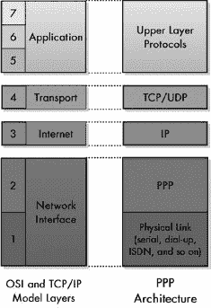

图 9-2. PPP 在 TCP/IP 架构中的位置 PPP 是 IP 与物理链路（如串行线或拨号网络连接）之间的接口。这对应于 OSI 参考模型中的第 2 层。

## 优点和好处

PPP 的优点列表在很大程度上类似于 SLIP 的弱点列表，如本章前面所述。PPP 的一些具体好处包括以下内容：

+   与 SLIP 中的单个*END*字符相比，更全面的帧机制

+   封装协议的规范，以允许多个第 3 层协议在单个链路上复用

+   通过在每个帧的帧头中使用循环冗余检查（CRC）代码来检测每个传输帧的错误

+   一种强大的协商链路参数的机制，包括允许的最大帧大小

+   在数据报传输之前测试链路的方法以及监控链路质量的方法

+   支持使用多个认证协议对连接进行认证

+   支持额外的可选功能，包括压缩、加密和链路聚合（允许两个设备使用多个物理链路，就像它们是一个单一的高性能链路一样）

串行链路的激增，尤其是对于拨号互联网访问，导致了 PPP 的广泛应用。现在，它是网络世界中最受欢迎的第 2 层广域网技术之一，并且已经取代了 SLIP，成为除了旧实现之外所有串行连接的标准。虽然 PPP 通常与拨号调制解调器的使用相关联，但它可以运行在任何类似的物理层链路上。例如，它通常用于在 ISDN 上提供第 2 层功能。

### 小贴士

**关键概念** PPP 是为使用 TCP/IP 的设备提供的完整的链路层协议套件。它提供了帧定界、封装、认证、质量监控和其他功能，这些功能使得 TCP/IP 能够在各种物理层连接上稳健运行。

PPP 的一个关键优势是它具有**可扩展性**。多年来，为了提供额外的功能或能力，已经向该套件中添加了新的协议。例如，PPP 设计为不仅仅使用单个认证协议，而是允许选择。

PPP 的成功甚至导致了派生协议的发展，如以太网上的 PPP（PPPoE）和 ATM 上的 PPP（PPPoA）。这些派生协议实际上是在现有的数据链路层技术之上叠加 PPP，这证明了 PPP 功能的价值。即使已经使用了第 2 层技术，也可以在顶部应用 PPP，为数字用户线路（DSL）等服务提供认证和管理优势。

## PPP 主要组件

在最高级别，PPP 的功能可以分为几个组件。每个组件都包含 PPP 功能的一般类别，并由套件中的一个协议或一组协议表示。PPP 标准描述了 PPP 的三个主要组件：

**PPP 封装方法** PPP 的主要任务是取更高层的消息，例如 IP 数据报，并将它们封装以通过底层物理层链路进行传输。为此，PPP 定义了一种特殊的帧格式，用于封装数据以进行传输，该格式基于 HDLC 中使用的帧定界。PPP 帧被设计得小巧，只包含简单的字段，以最大限度地提高带宽效率和处理速度。

**链路控制协议（LCP）** LCP 负责设置、维护和终止设备之间的链路。它是一种灵活、可扩展的协议，允许交换许多配置参数，以确保两个设备就如何使用链路达成一致。

**网络控制协议 (NCPs)** PPP 支持封装多种不同的第三层数据报类型。其中一些在激活链路之前需要额外的设置。一旦使用 LCP 完成了一般的链路设置，控制权就传递给特定于 PPP 链路上传输的第三层协议的 NCP。例如，当 IP 通过 PPP 传输时，使用的 NCP 是 PPP 互联网协议控制协议 (IPCP)。其他 NCPs 定义用于支持互联网包交换 (IPX) 协议、NetBIOS 数据包 (NBF) 协议等。

PPP 封装方法和 LCP 定义在主要的 PPP 标准和一些支持标准中；NCPs 在单独的标准文档中描述，每个 NCP 一个文档。

## PPP 功能组

虽然 PPP 的主要组件构成了总包的大部分，但我还会添加两个额外的功能组。这些代表了随着时间的推移添加到套件中的许多额外协议，以支持或增强其基本操作：

**LCP 支持协议** PPP 套件中的几个协议在链路协商过程中使用，用于管理或配置选项。例如，挑战握手认证协议 (CHAP) 和密码认证协议 (PAP) 是在可选的认证阶段由 LCP 使用的认证协议。这些内容在第十章中有讨论。

**LCP 可选功能协议**多年来，许多协议被添加到基本的 PPP 套件中，以增强链路设置后和设备之间传输数据报的操作。例如，PPP 压缩控制协议 (CCP) 允许压缩 PPP 数据；PPP 加密控制协议 (ECP) 允许对数据报进行加密以提高安全性；PPP 多链路协议 (PPP MP) 允许单个 PPP 链路在多个物理链路上运行。这些协议通常在链路协商期间也需要额外的设置，因此许多它们定义了扩展（例如额外的配置选项），这些扩展作为 LCP 协商的一部分。

### 注意

*每个可选协议都由一个特定的标准文档定义，正如你将在本章后面看到的那样*。

## 一般操作

虽然 PPP 套件包括数十个协议，但其一般操作实际上非常简单。基本上，PPP 涉及以下三个基本步骤（参见图 9-3)：

1.  **链路设置和配置** 在两个设备可以交换信息之前，它们必须相互联系并设置它们之间的链路。在链路设置过程中，设备就管理链路操作所需的所有参数达成一致。LCP 开始这个过程，并在需要时调用支持协议，例如身份验证。一旦链路建立，为了完成链路设置，将调用适当的 NCP 来处理链路上传输的任何第三层技术。

1.  **链路操作** 设备使用链路发送数据报。每个设备通过封装第三层数据报并将其发送到第 1 层进行传输来传输。每个设备通过从自己的物理层接收发送上来的 PPP 帧，移除 PPP 头部并将数据报传递到第 3 层来接收。在适当的情况下，使用可选协议提供如压缩（CCP）等功能。

1.  **链路终止** 当任一设备决定不再想要通信时，它会终止链路。

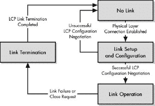

图 9-3. PPP 操作的概述 以最简单的术语来说，PPP 只包含三个基本步骤：链路设置、链路操作和链路终止。

链路设置是这些一般步骤中最复杂的，因为它涉及几个子步骤，用于协商链路参数和选项。

## PPP 链路设置和阶段

在 PPP 连接上交换数据之前，必须在两个设备之间建立链路。作为此设置任务的一部分，进行配置过程，其中设备配置链路并就数据如何在他们之间传输的参数达成一致。只有完成这一步骤后，帧才能实际通过链路传输。

LCP 通常负责设置和维护 PPP 链路。当 PPP 配置为使用身份验证时，LCP 可能会调用一个身份验证协议（PAP 或 CHAP）。一旦 LCP 链路已打开，PPP 将调用一个或多个 NCP 来处理链路上传输的第三层协议。这些 NCP 执行在链路能够携带特定网络层协议之前所需的任何网络层特定配置。

PPP 链路的操作可以描述为具有一定的生命周期：PPP 链路建立、配置、使用，最终终止。设置、使用和关闭 PPP 链路的过程在 PPP 标准中被描述为一系列*阶段*或*状态*。这是一种*有限状态机（FSM）*，它是用来解释协议操作的工具。有限状态机背后的基本概念在讨论传输控制协议（TCP）的有限状态机的章节中描述，见第四十七章。

为了更好地理解 PPP 是如何工作的，让我们看看这些阶段，以及链路生命周期中从一个阶段过渡到下一个阶段是如何进行的。为了清晰起见，这个描述基于一个例子，其中设备 A 是通过拨号网络连接到远程主机 B 的 PC（参见图 9-4）。

### 注意

*当我们总体上谈论 PPP 链路时，我们是在谈论两个设备之间的 LCP 连接状态。一旦打开了一个 LCP 链路，链路上的每个 NCP 都可以独立于整体的 PPP（LCP）链路打开或关闭。你很快就会看到这是如何工作的*。

### 链路死亡阶段

设计上，PPP 链路始终从*链路死亡*阶段开始和结束。这个阶段表示两个设备之间没有建立物理层链路的情况。链路将保持在这个阶段，直到物理层链路建立，此时它将进入*链路建立*阶段。

在这个例子中，当设备 A 首次开启时，它与设备 B 之间没有物理层连接（调制解调器连接）。一旦建立连接，链路就可以进入第 2 阶段。

### 注意

*在直接连接中，例如通过串行电缆连接两个 PC，链路可能只保持在链路死亡阶段几秒钟，直到检测到物理层连接*。

### 链路建立阶段

物理层现在已连接，LCP 执行链路的基本设置。设备 A 通过物理链路向设备 B 发送一个 LCP 配置请求消息，指定它希望使用的参数。如果设备 B 同意，它将回复一个确认。如果设备 B 不同意，它将返回一个否定确认或拒绝，告诉设备 A 它不接受什么。然后设备 A 可以尝试使用设备 B 可能接受的新的参数的不同配置请求。（这个过程在第十章中有更详细的描述。）

如果设备 A 和设备 B 最终达成一致，链路状态被认为是*LCP 打开*，并将进入*认证*阶段。如果它们无法达成一致，物理链路将被终止，并返回到链路死亡阶段。

### 认证阶段

在许多情况下，设备可能需要在允许另一个设备连接之前进行认证。（这通常是在使用 PPP 进行拨号时的情况。）然而，在 PPP 中认证不是强制的。当使用时，将采用适当的认证协议（CHAP 或 PAP）。

在认证成功后，链路将进入*网络层协议*阶段。如果认证不成功，链路将失败并过渡到*链路终止*阶段。

### 网络层协议阶段

一旦基本链路配置完成并且认证完成，LCP 链路的一般设置就完成了。现在，通过调用适当的 NCP，如 IPCP、IPXCP 等，执行适当的网络层协议的具体配置。

每个成功配置了 NCP 的特定网络层协议被认为在 LCP 链路上是开启的。一个 PPP 链路上可以开启多个 NCP，并且当不再需要时，每个都可以独立关闭。一旦所有必要的 NCP 都已被调用，链路将进入*链路开启*状态，即使没有任何 NCP 成功开启。

### 注意

*某些 PPP 特性需要在两个设备之间协商额外的选项，这些设备在*网络层协议*阶段可能会执行自己的链路建立过程。PPP 压缩控制协议（CCP）以这种方式设置数据压缩*。

### 链路开启阶段

在链路开启状态下，LCP 链路和一个或多个 NCP 链路是开启并操作的。对于每个成功设置的 NCP，都可以传递数据。

链路可以因各种原因在任何时间由任一设备终止。这些原因可能包括用户请求（当你想要断开拨号会话时，你点击断开连接）；链路质量问题（由于线路噪音，调制解调器挂断）；或其它原因（你在洗手间花费了太多时间，你的 ISP 的闲置计时器将你登出）。当这些情况中的任何一种发生时，LCP 链路被中断，链路进入*链路终止*阶段。

### 链路终止阶段

终止链路的设备发送一个特殊的 LCP 终止帧，另一个设备确认它。然后链路返回到链路死亡阶段。如果终止是请求的，并且物理层连接仍然活跃，PPP 实现应该特别向物理层发出信号以终止第 1 层连接。

你应该记住，基本链路是由 LCP 建立的，NCP 链路是在 LCP 链路内设置的。关闭 NCP 链路不会导致 LCP 链路关闭。即使所有 NCP 都关闭，LCP 链路仍然保持开启状态。（当然，在适当的 NCP 链路重新建立之前，无法传递数据；需要设备丢弃包含任何没有开启 NCP 的第 3 层协议的帧。）要终止 PPP 连接，只需要在*链路终止*阶段终止 LCP 链路；NCP 不需要显式关闭。

图 9-4 展示了 PPP 阶段及其之间转换发生的情况。两个设备之间的 PPP 连接从链接失效状态开始，经过三个中间阶段，直到链接完全开启。它保持在稳定的链接开启阶段，直到终止。较浅的框显示了在阶段之间转换时 PPP 链接状态的相应变化。

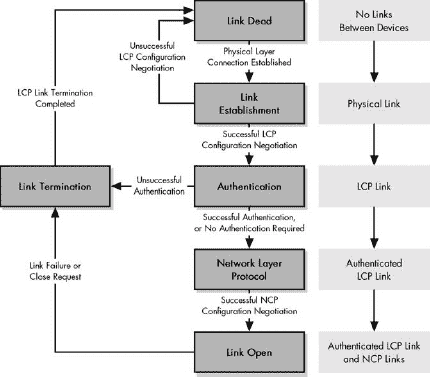

图 9-4. PPP 阶段 一个 PPP 连接遵循从链接失效阶段通过链接开启阶段的主要线性转换序列。

表 9-1 总结了 PPP 阶段；LCP 链接状态和 NCP 链接状态列显示了阶段开始时链接的状态。

## PPP 标准

虽然 PPP 的不同部分由不同的标准覆盖是有意义的，但这确实使得学习 PPP 的工作原理变得更加困难。此外，确实有数十个 RFC 涵盖了 PPP 的主要操作、其各种协议和其他相关问题。您可以通过查阅 RFC 的主列表并搜索字符串“PPP”来找到它们，但您将按数字顺序（RFC 编号）找到它们，这在协议的使用方面意义不大。您还必须区分当前的和过时的 RFC。

表 9-1. PPP 阶段

| 阶段/状态 | 阶段摘要 | 进入阶段时的 LCP 链接状态 | 进入阶段时的 NCP 链接状态 | 转换要求 | 转换到阶段 |
| --- | --- | --- | --- | --- | --- |
| 链接失效 | 默认状态；物理层未连接。 | 关闭 | 关闭 | 成功的物理层连接 | 链接建立 |
| 链接建立 | 物理层已连接，链路的基本配置由 LCP 执行。 | 关闭 | 关闭 | 成功协商 | 认证 |
|   |   |   |   | 未成功的谈判 | 链接失效 |
| 认证 | 基本链接现在已开启，并执行设备可选认证。 | 开启 | 关闭 | 成功认证或无需认证 | 网络层协议 |
|   |   |   |   | 认证失败 | 链接终止 |
| 网络层协议 | 一个或多个 NCP 在 LCP 链接内打开 NCP 链接。 | 开启 | 关闭 | 所有 NCP 已开启 | 链接开启 |
| 链接开启 | 链接开启并正常运行。 | 开启 | 开启 | 链接故障或关闭请求 | 链接终止 |
| 链接终止 | LCP 链接关闭。 | 开启 | 开启 |   | 链接失效 |

表 9-2 列出了最重要的和有趣的 PPP 相关 RFC。为了更容易地了解 RFC 的内容，我已经将它们组织成五个组，如下所示：

**核心** 这些是 PPP 的主要文档。它们涵盖了 PPP 的基本操作，包括 PPP LCP 和数据报封装。

**LCP 支持** 这些协议支持 LCP 的基本操作。我只包括在链路启动期间提供认证服务的那些协议。

**NCPs** 这些协议协商 PPP 承载的各种第 3 层协议的特定参数。

**功能** 这些协议定义了与 PPP 一起使用的可选功能，例如压缩和加密。

**应用和杂项** 这些是描述 PPP 如何适应在特定类型的链路上运行或实际上不适合任何前述组的协议。

在每个组内，RFC 按数字顺序列出，也就是日期顺序。只列出最新的 RFC，不包括已被废弃的较早的 RFC（除了 RFC 1334，尽管已被废弃，但仍然很重要）。

表 9-2. PPP 标准

| 组 | RFC 编号 | 标准名称 | 描述 |
| --- | --- | --- | --- |
| 核心 | 1570 | PPP LCP 扩展 | 定义了两个 LCP 功能，允许设备相互识别，并让每个设备告诉对方当前会话剩余多少时间。 |
|   | 1661 | 点对点协议（PPP） | PPP 的基本标准。描述了 PPP 架构、一般操作（包括链路建立、维护和终止的过程）以及 LCP 的详细信息。 |
|   | 1662 | 类似于 HDLC 的 PPP 帧 | 定义了 PPP 帧的具体帧格式，基于在 HDLC 中使用的格式。这个标准可以被认为是主要 PPP 标准 RFC 1661 的补充。 |
| LCP 支持 | 1334 | PPP 认证协议 | 定义了两个 PPP 认证协议：PAP 和 CHAP。请注意，RFC 1994 废弃了 RFC 1334，但没有讨论 PAP。（这表明 IETF 对 PAP 的看法不高；有关更多信息，请参阅第十章。） |
|   | 1994 | PPP 挑战握手认证协议（CHAP） | 更新了 RFC 1334 中提供的 CHAP 信息。 |
| NCPs | 1332 | PPP 互联网协议控制协议（IPCP） | IP 的 NCP。 |
|   | 1377 | PPP OSI 网络层控制协议（OSINLCP） | OSI 协议套件网络层协议（如 CNLP、ES-IS 和 IS-IS）的 NCP。 |
|   | 1378 | PPP AppleTalk 控制协议（ATCP） | AppleTalk 协议的 NCP。 |
|   | 1552 | PPP 互连包交换控制协议（IPXCP） | Novell IPX 协议的 NCP。 |
|   | 2043 | PPP SNA 控制协议（SNACP） | IBM 系统网络架构（SNA）的 NCP。 |
|   | 2097 | PPP NetBIOS 帧控制协议（NBFCP） | NetBIOS 帧（NBF，也常称为 NetBEUI）的 NCP。 |
|   | 2472 | PPP 上的 IPv6 版本 | IPv6 的 NCP：IPv6 控制协议（IPv6CP）。 |
| 功能 | 1962 | PPP 压缩控制协议（CCP） | 定义了一种压缩通过 PPP 链路发送的数据的机制，以提高性能。本标准描述了如何在 PPP 链路上的两个设备之间协商压缩。它与几个实际执行数据压缩的压缩算法一起使用。 |
|   | 1968 | PPP 加密控制协议（ECP） | 定义了一种加密通过 PPP 链路发送的数据的机制，以提高性能。本标准描述了如何在两个设备之间协商加密。它与几个加密算法一起使用。 |
|   | 1989 | PPP 链路质量监控 | 定义了一种协议，允许 PPP 设备相互生成关于链路质量的报告。 |
|   | 1990 | PPP 多链路协议（MP） | 定义了在一系列聚合链路上运行 PPP 的方法，从而允许两个设备将多个低带宽链路作为一个单一的高带宽虚拟链路使用。 |
|   | 2125 | PPP 带宽分配协议（BAP）/PPP 带宽分配控制协议（BACP） | 定义了两个支持协议，用于管理使用 PPP MP 聚合的链路上的带宽分配。 |
| 应用和杂项 | 1618 | PPP over ISDN | 描述了在 ISDN 链路上运行 PPP 的应用特定细节。 |
|   | 1973 | PPP 在帧中继上 | 描述了如何修改 PPP 以在第二层上通过帧中继运行。 |
|   | 2290 | PPP IPCP 的移动 IPv4 配置选项 | 定义了对 PPP 互联网协议控制协议（IPCP）的更改，以支持移动 IP。 |
|   | 2364 | PPP over AAL5 | 定义了一种在 AAL5（ATM）上发送 PPP 帧的方法，通常称为 PPPoA。 |
|   | 2516 | 通过以太网（PPPoE）传输 PPP 的方法 | 定义了一种封装 PPP 帧通过以太网（PPPoE）的技术。 |
|   | 2615 | PPP over SONET/SDH | 讨论了如何在 SONET/SDH 链路上封装 PPP 帧。 |

# 第十章. PPP 核心协议：链路控制、网络控制和认证

本章描述了负责 PPP 链路设置和基本操作的协议，包括链路控制协议（LCP）和用于配置 PPP 以适应不同第 3 层协议的网络控制协议（NCPs）。我还讨论了两个 PPP 认证协议，密码认证协议（PAP）和挑战握手认证协议（CHAP），它们用于在链路设置期间提供认证。

# 链路控制协议（LCP）

在所有 PPP 套件协议中，LCP 是最重要的。它负责 PPP 的整体成功运行，并在每个 PPP 链路阶段（配置、维护和终止，如第九章所述）中发挥关键作用（第九章）。链路配置在初始链路建立阶段执行；链路维护在链路开启期间进行；链路终止发生在链路终止阶段。

图 10-1 概述了 LCP 在 PPP 连接的不同阶段执行的大多数消息交换。链路配置在此显示为简单的配置请求和配置确认的交换。在随后的交换中使用其他 PPP 协议进行身份验证和配置一个或多个 NCP 之后，链路进入链路开启阶段。在此示例中，首先使用 Echo-Request 和 Echo-Reply 消息来测试链路，然后是两个设备发送和接收数据。显示了一个数据消息因代码字段无效而被拒绝。最后，使用终止请求和终止确认消息终止链路。

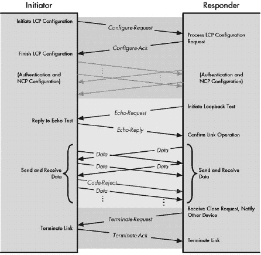

图 10-1。PPP 链路控制协议（LCP）消息交换 此图显示了 LCP 在链路配置、维护和终止期间执行的不同消息交换

## LCP 数据包

设备使用 LCP 通过在它们之间的物理链路上发送 LCP 消息来控制 PPP 链路。这些消息被称为*LCP 数据包*和*LCP 帧*。尽管标准使用*数据包*，但术语*帧*更受欢迎，因为第 2 层消息通常被称为帧。主要 PPP 文档定义了 11 种不同的 LCP 帧，这些帧分为三个组，分别对应三个链路阶段。四种 LCP 帧类型用于链路配置，五种用于维护，两种用于终止。

在下一节中，我将讨论 LCP 的三个主要功能以及在每个功能中如何使用帧。(第十二章描述了数据包本身的帧格式。)

## LCP 链路配置

链路配置可以说是 LCP 在 PPP 中最重要的工作。在链路建立阶段，两个物理连接的设备交换 LCP 帧，以帮助它们协商链路将运行的条件。图 10-2 显示了整个过程。

此过程从发起设备（设备 *A*）创建一个包含它希望设置在链路上的配置选项的可变数量的配置请求帧开始。这基本上是设备 *A* 的“愿望清单”，说明了它希望如何创建链路。

图 10-2。PPP LCP 链路配置过程 LCP 配置链路所进行的协商过程。此过程从 PPP 链路进入链路建立阶段开始。配置成功后，连接过渡到认证阶段。

RFC 1661，主要的 PPP 文档，定义了发起者可以在该请求中指定的多个不同配置选项。这些选项中的任何一个都可以包含在内，如果包含，则用与设备 *A* 对该选项所希望值相对应的值填写。如果不存在，则设备 *A* 不请求该选项。这六个选项如下：

**最大接收单元 (MRU)** 允许设备 *A* 指定它希望链路能够携带的最大数据报大小。

**认证协议** 设备 *A* 可以指示它希望使用的认证协议类型（如果有的话）。

**质量协议** 如果设备 *A* 希望在链路上启用质量监控，则应使用哪种质量监控协议（尽管目前只定义了一种：LQR）。

**魔法数字** 用于检测回环链接或其他连接中的异常。

**协议字段压缩** 允许设备 *A* 指定它希望使用“压缩”的（8 位）协议字段，而不是 PPP 数据帧中的正常 16 位协议字段。这为每个 PPP 帧提供了一小（一个字节）但免费的节省。（注意，这与压缩控制协议（CCP）提供的压缩功能无关；有关此功能的更多信息，请参阅第十二章中 PPP 通用帧格式的讨论。）

**地址和控制字段压缩（ACFC）** 与协议字段压缩相同，但用于压缩地址和控制字段以节省少量带宽。（有关更多信息，请参阅第十二章 AND POINT-TO-POINT PROTOCOL (PPP) OVERVIEW AND FUNDAMENTALS")）。

对于每种常见的网络层技术，都在单独的 RFC 中为其定义了一个 PPP NCP。"PPP 互联网协议控制协议(IPCP)"、"PPP 互连包交换控制协议(IPXCP)"和"PPP NetBIOS 帧控制协议(NBFCP)"分别是 IP、IPX 和 NBF（也称为 NetBEUI）的 NCP。还定义了一个单独的 NCP 用于 IP 版本 6，即"PPP IP 版本 6 控制协议(IPv6CP)"。

## NCP 的操作

每个 NCP 的操作非常类似于 LCP 的一个轻量级版本，正如您可以在图 10-3 中看到的那样。（为了看到相似之处，您应该将图 10-3 与图 10-1 进行比较，后者显示了 LCP 的消息。）像 LCP 一样，每个 NCP 执行链路设置、维护和终止的功能，但它只处理其特定的 NCP 链接，而不是整个 LCP 链接。每个 NCP 使用 LCP 中定义的以下七个消息类型的一个子集，其方式与 LCP 使用相同名称的消息类型非常相似，正如在每个主要链路活动中的示例所示：

**链路配置** 一旦建立了 LCP 链接，就会使用配置请求、配置确认、配置否定和配置拒绝消息来设置和协商特定 NCP 链接的参数（如 LCP 中讨论的那样）（但这些都是针对每个 NCP 特定的）。配置选项是正在协商的网络层协议参数。

**链路维护** 可以发送代码拒绝消息来指示无效的代码值（NCP 帧类型）。

**链路终止** 可以使用终止请求和终止确认消息来终止 NCP 链接。但请记住，NCP 链接是在 LCP 链接内设置的，并且可以打开多个 NCP 链接。关闭 NCP 链接不会终止 LCP 链接。（当终止 LCP 链接时，不需要关闭 NCP 链接。）

图 10-3 展示了 NCP（如 IPCP）的整体操作与 LCP 非常相似。一旦 LCP 配置（包括认证）完成，就会使用配置请求和配置确认消息来建立 IPCP 链接。然后可以通过该链接发送 IP 数据。如果不再需要 IPCP 连接，它可以被终止，之后 LCP 链接仍然保持开启状态，以便传输其他类型的数据。然而，在终止 LCP 连接之前，没有必要明确终止 IPCP 链接。

图 10-3. PPP IP 控制协议（IPCP）消息交换 配置和终止 IPCP 所执行的消息交换与用于 LCP 的相当相似。

### 小贴士

**关键概念** 一旦使用 LCP 建立了主要的 PPP 链路，每个要携带通过链路的网络层协议都需要建立适当的 NCP 链路。其中最重要的是*PPP 互联网协议控制协议（IPCP）*，它允许 IP 数据报通过 PPP 传输。

## 互联网协议控制协议（IPCP）：一个示例 NCP

让我们看看 IP 的 NCP：IPCP。当 PPP 被设置为携带 IP 数据报时，IPCP 在网络层协议阶段被调用，以在两个设备之间建立 IP NCP 链路。设置是通过使用四个配置消息来完成的。对于 IP，可以在 IPCP 配置请求消息中指定两个配置选项：

**IP 压缩协议** 允许设备协商使用 Van Jacobson TCP/IP 头部压缩，这缩小了 TCP 和 IP 头部的大小以节省带宽。在概念上，这与 LCP 中的协议字段压缩和 ACFC 选项类似。

**IP 地址** 允许发送配置请求消息的设备指定它想要用于通过 PPP 链路路由 IP 的 IP 地址，或者请求另一台设备提供 IP 地址。这通常用于拨号网络链路。

一旦配置完成，就可以发送对应于协商的 NCP 的第三层协议的数据。这通过在包含该第三层数据的 PPP 数据帧中使用适当的协议字段值来指示。

# PPP 认证协议：PAP 和 CHAP

PPP 被设计为在各种串行链路和其他物理层技术上提供第二层连接性，其中一些比其他技术引入了更多的安全担忧。例如，假设你用串行电缆连接办公室中的两台机器，并想在它们之间运行 PPP。当其中一台机器与另一台机器建立 PPP 链路时，你实际上不需要担心是谁在打电话。另一方面，考虑一个使用 PPP 为远程拨入用户提供服务的互联网服务提供商（ISP）。他们通常只想允许他们的客户连接。

PPP 协议集允许在设备协商基本链路设置时使用可选的认证协议。PPP 套件最初定义了两个这样的协议：PAP 和 CHAP。一旦在两个设备之间建立 LCP 链路，就使用这些协议发送一系列认证消息来验证发起链路的设备的身份。只有认证成功，链路配置才能继续。

## PAP

PAP 是一个非常直接的认证方案，只包含两个基本步骤，如图 图 10-4 所示。

**认证请求** 发起设备发送一个包含用户名和密码的 Authenticate-Request 消息。

**认证回复** 响应设备查看用户名和密码，并决定是否接受发起设备并继续设置链路。如果是这样，它将发送一个 Authenticate-Ack 消息。否则，它将发送一个 Authenticate-Nak 消息。

PAP 是一个例子，它过于简单，以至于不利于自身。其主要缺陷之一是它在链路中明文传输用户名和密码。这是一个大忌，因为窃听者可以获取密码。

PAP 也不能提供针对各种安全攻击的保护。例如，未经授权的用户可能会尝试不同的密码，直到发现正确的密码。PAP 还将认证控制完全放在发起设备（通常是客户端机器）的肩上，这通常不被认为是理想的，因为这是管理员更喜欢管理的服务器功能。

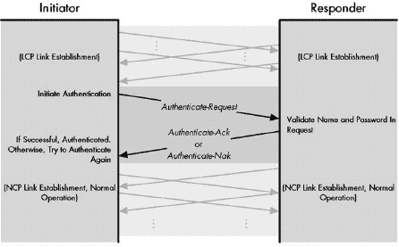

图 10-4. PAP 认证 PAP 使用包含用户名和密码信息的请求以及指示认证是否成功的回复的简单交换。

## CHAP

PAP 和 CHAP 之间最重要的区别在于 CHAP 不会在链路中传输密码。当使用 PAP 时，发起者（调用客户端）向认证者（通常是决定是否授予认证的服务器）发送一条消息，其大意是：“这是我知道的密码；看看它是否与你的匹配。”每个设备使用密码执行加密计算，然后检查是否得到相同的结果。如果是这样，它们就知道它们有相同的密码。

在 CHAP 中，首先在发起者和认证者之间建立一个基本的 LCP 链路。然后，认证者负责认证过程，使用一种称为“三次握手”的技术。

### **注意**

**三次握手是一种相当常见的通用认证程序。例如，在 IEEE 802.11 无线网络中的共享密钥认证中也使用了相同的基本技术**。

三路握手步骤如下（参见图 10-5 认证 CHAP 使用一个三路握手，从认证设备发出的挑战开始。此消息被加密并返回给认证设备，认证设备检查尝试进行认证的设备是否使用了正确的密码（或其他共享秘密）"))）：

**挑战** 认证器生成一个称为挑战的帧并发送给发起者。此帧包含一个简单的文本消息（有时称为*挑战文本*）。消息没有固有的特殊含义，所以如果有人拦截它，也没有关系。重要的是在收到挑战后，两个设备都有相同的挑战消息。

**响应** 发起者使用其密码（或认证者也知道的其他共享秘密）来加密挑战文本。然后，它将加密的挑战文本作为响应发送回认证器。

**成功或失败** 认证器对挑战文本执行与发起者相同的加密操作。如果认证器收到与发起者在响应中发送的相同结果，它就知道发起者在进行加密时拥有正确的密码，因此认证器返回一个成功消息。否则，它发送一个失败消息。

图 10-5. PPP 挑战握手认证协议 (CHAP) 认证 CHAP 使用一个三路握手，从认证设备发出的挑战开始。此消息被加密并返回给认证设备，认证设备检查尝试进行认证的设备是否使用了正确的密码（或其他共享秘密）。

这的好处在于它验证了两个设备具有相同的共享秘密，但不需要它们通过链路发送秘密。响应是根据密码计算的，但响应的内容被加密，因此从响应中推导密码要困难得多。CHAP 还提供了对重放攻击的保护，其中未经授权的用户捕获一条消息并试图稍后再次发送。这是通过在每个消息中更改一个标识符并改变挑战文本来实现的。此外，在 CHAP 中，服务器控制认证过程，而不是发起链路的客户端。

### 小贴士

**关键概念** PPP 支持两种认证协议：*PAP* 和 *CHAP*。PAP 是一种简单的请求和回复认证协议，因为它以明文形式发送用户名和密码，并且对许多安全问题的保护很少，所以普遍被认为是不够的。CHAP 使用三次握手过程，在大多数实现中比 PAP 更受欢迎。

CHAP 并不完美，但比 PAP 好得多。事实上，IETF 在修订描述 PAP 和 CHAP 的原始 RFC 时，对此做出了相当强烈的声明，将新标准中仅包括 CHAP。尽管如此，PAP 仍然在一些应用中使用，因为它很简单。在安全不是大问题的情况下，PAP 就足够了，但 CHAP 是一个更好的选择。

### 注意

*顺便说一下，除了 PAP 和 CHAP，还可能使用专有认证方案。这需要将适当的配置选项值编程到 LCP 中，以便放置在认证协议配置选项中*。

# 第十一章。PPP 功能协议

点对点协议（PPP）是串行链路上的数据链路层连接标准，因为其核心协议提供了一个坚实的基础操作基础，正如你在 第十章 中所看到的。然而，PPP 的流行并不仅仅基于其高度强大的链路建立和管理功能，它还拥有许多非常有用的功能，为网络用户提供了重要的安全和性能优势。

在本章中，我描述了实现 PPP 中一些最常见额外功能的协议。我首先讨论 PPP 链路质量监控。我描述了用于配置和实现数据压缩和数据加密的协议集。然后，我讨论 PPP 多链接协议（MP，MLPPP），它允许 PPP 将多个低速链路捆绑成一个高速链路。我还涵盖了 *带宽分配协议（BAP）* 和 *带宽分配控制协议（BACP）*，它们用于管理 MLPPP 的操作。

# PPP 链路质量监控和报告（LQM，LQR）

PPP 包括可选认证，以适应 PPP 可能运行的许多不同类型链路的不同的 *安全* 需求。这些链路在 *质量* 方面也有很大的差异。正如你不需要过多担心认证，当两台机器通过短电缆连接时，你同样可以相当有信心地认为它们之间发送的数据将会完整到达。现在，将这一点与通过长途电话建立的 PPP 会话进行对比。至于使用模拟蜂窝电话拨号连接的 PPP 会话呢？

PPP 在其基本包中包括检测发送帧中错误的规定，而像 TCP 这样的高层协议也包含在嘈杂线路上提供鲁棒性的方法。这些技术允许链路容忍问题，但提供了很少有关链路状态的有用信息。在某些情况下，设备可能希望能够跟踪链路的工作情况，并可能采取行动。例如，在拨号连接上遇到太多错误的设备可能想要切断并重试新的呼叫。在某些情况下，如果当前物理链路工作不佳，设备可能希望尝试另一种连接方法。

认识到这一需求，PPP 套件包括一个功能，允许设备分析它们之间链路的质量。这被称为 *PPP 链路质量监控* 或 *LQM*。PPP 以通用方式设置，以允许使用任意数量的不同监控功能，但目前在现有情况下，只有一个，称为 *链路质量报告 (LQR)*。LQR 允许设备请求其对等方（链路上的另一台设备）跟踪有关链路的统计信息，并定期发送关于它们的报告。

## LQR 设置

在可以使用 LQR 之前，必须设置它，这是通过 LCP 在链路建立阶段协商基本链路参数时完成的（参见 第十章中如何工作的内容，这应该看起来很熟悉）：

**链路配置** 与 NCPs 一样，压缩配置是在 CCP 达到*网络层协议*阶段时完成的。设置压缩和协商参数的过程是通过使用配置请求、配置确认、配置拒绝和配置拒绝消息来完成的，就像 LCP 一样，只是配置选项是针对 CCP 特定的。

**链路维护** 可以发送 Code-Reject 消息来指示 CCP 帧中的无效代码值。两种新的消息类型是 Reset-Request 和 Reset-Ack，它们用于在检测到解压缩失败时重置压缩（CCP 链路）。

**链路终止** 可以使用 Terminate-Request 和 Terminate-Ack 来终止 CCP 链路。再次提醒，与 NCP 链路一样，CCP 链路是在 LCP 链路内设置的，关闭它不会终止控制 PPP 总体的 LCP 链路。

## CCP 配置选项和压缩算法

CCP 配置选项仅用于协商两个设备将使用的压缩类型，以及获取该算法如何使用的具体细节。发起协商的设备会发送一个包含它支持的每个压缩算法的一个选项的 Configure-Request。另一个设备会将此选项列表与它理解的算法进行比较。它还会检查与选项相关的任何特定细节，以查看是否同意如何使用该算法。然后，它会发送适当的回复（Ack, Nak 或 Reject），并开始协商，直到两个设备找到一个双方都理解的共同算法。如果是这样，则启用压缩；否则，不启用。

CCP 配置选项以类型值开始，该值指示压缩算法。当类型值为 0 时，这表示该选项包含有关特殊、专有压缩算法的信息，该算法不受任何 RFC 标准的覆盖。如果两个设备都理解它，则可以使用此信息。从 1 到 254 的值表示为 CCP 使用而定义的压缩算法。表 11-1 压缩算法") 显示了类型字段的最常见值，包括每个类型值对应的压缩算法以及定义它的 RFC 编号。

表 11-1. PPP 压缩控制协议 (CCP) 压缩算法

| CCP 选项类型值 | 定义 RFC | 压缩算法（如 RFC 标题所示） |
| --- | --- | --- |
| 0 | — | 专有 |
| 1 和 2 | 1978 | PPP 预测器压缩协议 |
| 17 | 1974 | PPP Stac LZS 压缩协议 |
| 18 | 2118 | 微软点对点压缩 (MPPC) 协议 |
| 19 | 1993 | PPP Gandalf FZA 压缩协议 |
| 21 | 1977 | PPP BSD 压缩协议 |
| 23 | 1967 | PPP LZS-DCP 压缩协议 (LZS-DCP) |
| 26 | 1979 | PPP Deflate 协议 |

## 压缩算法操作：压缩和解压缩数据

一旦成功协商了算法，压缩算法就会在传输前压缩数据，并在接收后解压缩数据。为了压缩，发送设备会取通常放在未压缩 PPP 帧信息字段中的数据，并通过压缩算法进行处理。为了指示一个帧已被压缩，特殊的值 0x00FD（十六进制）被放置在 PPP 协议字段中。当与多个链路一起使用压缩，并且链路独立压缩时，使用不同的值：0x00FB。

你会记得，在一个常规未压缩帧中，协议字段指示数据来自哪个第 3 层协议。由于你仍然需要知道这一点，原始的协议值实际上是在压缩之前附加到数据之前的。当数据解压缩时，这个值被用来恢复原始的协议字段，以便接收设备知道数据属于哪个高层。

例如，如果你使用 IPCP 在 PPP 中封装 IP 数据，未压缩帧的协议字段将具有 0x8021 的值。这个值（0x8021）将被放置在要压缩的数据的开始处。压缩数据将被放入一个协议值为 0x00FD 的 PPP 帧中。接收设备会在协议字段看到 0x00FD 的值，识别帧为压缩帧，解压缩它，并恢复原始帧，其中协议值为 0x8021。第十二章中关于 PPP 通用帧格式的讨论更详细地介绍了这一点。

理论上，压缩算法可以将多个 PPP 数据帧放入一个压缩 PPP 数据帧中。尽管如此，许多，如果不是大多数算法，保持一对一的对应关系，将每个 PPP 数据帧放入一个压缩帧中。请注意，LCP 帧不压缩，也不用于其他协议的控制帧。例如，携带 IP 流量的数据帧会被压缩，但用于 IPCP（IP 的 NCP）的控制帧则不会。

压缩可以与加密结合使用。在这种情况下，压缩是在加密之前进行的。

### 注意

*CCP 执行的压缩与可以作为 LCP 一部分协商的头部压缩选项无关。这种类型的压缩不涉及使用压缩算法压缩数据流，而是一种在链路两端同意这样做时简化头部空间占用的一种简单方法*。

# PPP 加密控制协议（ECP）和加密算法

PPP 认证协议密码认证协议（PAP）和挑战握手认证协议（CHAP）可用于确保只有授权设备才能建立 PPP 连接。一旦完成，PPP 通常不会为传输的数据提供其他安全措施。特别是，所有数据通常都是明文（未加密）发送的，这使得拦截它的人很容易阅读。

对于必须保持安全的重要数据，传输前的加密是一个好主意。这可以在更高层使用类似 IPsec 的方法来完成，但 PPP 也提供了一个可选功能，允许在数据链路层本身使用两个协议组件来加密和解密数据：

**PPP 加密控制协议 (ECP)** 该协议负责协商和管理 PPP 链路上的加密使用。

**PPP 加密算法** 是一组执行实际数据加密和解密的加密算法。其中一些在 RFCs 中定义，如果两个设备想要使用未由公共标准定义的加密方法，它们也可以协商一个专有加密方法。

### 小贴士

**关键概念** PPP 包含一个可选的加密功能，为通过 PPP 传输的数据提供隐私。支持多种加密算法。要启用加密，PPP 链路上的两个设备都使用 *PPP 加密控制协议 (ECP)* 来协商使用哪种算法。然后使用选定的算法来加密和解密 PPP 数据帧。

## ECP 操作：加密设置

当讨论 PPP 中的加密时，通常只提到 ECP 的这一部分，但实际上它只用于配置和控制加密的使用；算法做实际的工作。这种技术允许每个实现选择它希望使用的加密类型。

原始的 ECP 只定义了一种加密方法，后来又增加了一些。像 CCP 一样，ECP 类似于 NCPs，它们协商特定于在链路上发送的网络层协议的参数，但它处理的是设备如何加密数据，而不是如何传输第 3 层流量。这也意味着，像 NCPs 一样，ECP 是 LCP 的轻量级版本，并以相同的基本方式工作。一旦协商了 ECP 链路，设备就可以相互发送加密帧。当不再需要时，可以终止 ECP 链路。

ECP 使用与 NCPs 相同的七个 LCP 消息类型的子集，并增加了两个。以下是对 ECP 链路每个生命阶段使用这些消息的说明：

**链路配置** 与 NCPs（当然，也像 CCP 一样），加密配置是在 ECP 达到 *网络层协议* 阶段时完成的。设置加密和协商参数的过程是通过使用 Configure-Request、Configure-Ack、Configure-Nak 和 Configure-Reject 消息来完成的，正如我在 第十章 中对 LCP 的描述中解释的那样，除了配置选项是特定于 ECP 的。

**链路维护** 可以发送 Code-Reject 消息来指示 ECP 帧中的无效代码值。两种新的消息类型是 Reset-Request 和 Reset-Ack，它们用于在检测到解密失败时重置加密（ECP 链路）。

**链路终止** 使用 Terminate-Request 和 Terminate-Ack 可以终止 ECP 链路。再次提醒，与 NCP 链路一样，ECP 链路是在 LCP 链路内设置的，因此关闭它不会终止 LCP 链路。

## ECP 配置选项和加密算法

ECP 配置选项仅用于协商两个设备将使用的加密算法类型以及该算法的具体应用方式。发起协商的设备会发送一个包含它支持的每个加密算法的一个选项的 Configure-Request。另一个设备会将此选项列表与它理解的算法进行比较。它还会检查与选项相关的任何细节，以查看是否同意如何使用该算法。然后，它会发送适当的回复（Ack, Nak 或 Reject），并开始协商，直到两个设备找到一个它们都理解的共同算法。如果找到了，则启用加密；否则，关闭加密。

ECP 配置选项以一个表示加密算法的类型值开始。当类型值为 0 时，这表示选项包含有关特殊专有加密方法的信息，该方法不受任何 RFC 标准的覆盖，如果两个设备都理解它，则可以使用。范围从 1 到 254 的值表示为 ECP 定义了用于加密的加密算法；目前，只定义了两个。表 11-2 压缩算法") 显示了类型字段的值，包括每个类型值对应的加密算法以及定义它的 RFC 编号。

表 11-2. PPP 加密控制协议 (ECP) 压缩算法

| ECP 选项类型值 | 定义 RFC | 加密算法（如 RFC 标题中所示） |
| --- | --- | --- |
| 0 | — | 专有 |
| 2 | 2420 | PPP 三重 DES 加密协议 (3DESE) |
| 3 | 2419 | PPP DES 加密协议，版本 2 (DESE-bis) |

### 注意

*类型值 1 用于原始 DES 算法，该算法在 RFC 1969 中定义。它已被 RFC 2419 中的 DES 版本 2 取代*。

## 加密算法操作：加密和解密数据

一旦成功协商了加密算法，它就会用于在传输前加密数据以及解密接收到的数据。为了加密，发送设备会将通常放入未加密 PPP 数据帧信息字段中的数据通过加密算法处理。为了指示帧已被加密，将特殊值 0x0053（十六进制）放入 PPP 协议字段。当使用多个链路进行加密且链路独立加密时，使用不同的值：0x0055。

你会记得，在一个常规未加密的帧中，协议字段指示数据来自哪个第 3 层协议。由于你仍然需要知道这一点，原始的协议值实际上是在加密之前附加到数据之前的。当数据被解密时，这个值被用来恢复原始的协议字段，这样接收设备就知道数据属于哪个高层。

例如，如果你使用 IPCP 将 IP 数据封装在 PPP 中，未加密的帧在协议字段中的值为 0x8021（十六进制）。这个值（0x8021）将被放置在要加密的数据的开始处。加密的数据将被放入一个协议值为 0x0053 的 PPP 帧中。接收设备会在协议字段中看到 0x0053 的值，将其识别为加密帧，解密它，并恢复原始帧，其协议值为 0x8021。第十二章中关于 PPP 通用帧格式的讨论更全面地涵盖了这一点。

每个加密的 PPP 数据帧恰好携带一个 PPP 数据帧。请注意，与你在压缩中看到的不同，LCP 帧以及用于其他协议的控制帧**可以**被加密。压缩可以与加密结合使用；在这种情况下，压缩是在加密之前进行的。

# PPP 多链路协议（MP，MLP，MLPPP）

大多数情况下，两个设备之间只有一个物理层链路。然而，有些情况下，实际上可能存在两个层 1 连接在同一对设备之间。这看起来可能有些奇怪。为什么任何一对机器之间会有多个链路？

有许多情况下可能会发生这种情况。一个常见的情况是在一对设备之间故意放置两个链路。这通常是为了通过扩大两个设备之间的管道来提高性能，而不必采用更新、更昂贵的技术。例如，如果两台机器通过一个速度太慢的常规模拟调制解调器相互连接，一个相对简单的解决方案是使用两个模拟调制解调器对来连接机器，以加倍带宽。

当多路复用在两个设备之间创建相当于几个物理层通道时，会出现一种稍微不同的情况，即使它们之间只有一个硬件链路。以 ISDN 为例。ISDN 服务最常见的形式（ISDN 基本速率接口或 BRI）在两个设备之间创建两个 64,000 bps 的*B 通道*。这些 B 通道是时分复用，并携带在单一对铜线上，但对于设备来说，它们看起来*就像*有两条物理层链路，每条链路都携带 64 Kbps 的数据。而 ISDN 主速率接口（PRI）实际上创建了 23 个或更多的通道，所有这些通道都在同一对硬件设备之间。

在你有多个链路的情况下，你可以在每个连接上独立建立 PPP。然而，这远非一个理想的解决方案，因为你将不得不手动在连接它们的两个（或更多）通道或链路上分配流量。如果你想连接到互联网，你需要建立单独的连接，然后选择每个动作使用哪一个。这并不 exactly 是一件有趣的事情，更糟糕的是，你永远无法将所有带宽用于单一目的，例如下载最新的 100 MB 微软安全补丁。

你真正想要的是一个能够让你结合多个链路并将它们用作一个高性能链路的解决方案。一些硬件设备实际上允许在硬件级别本身执行此操作。在 ISDN 中，当在第一层执行时，这项技术有时被称为*bonding*。对于那些不提供此功能的硬件单元，PPP 通过 PPP 多链路协议（MP）的形式提供这项功能。该协议最初在 RFC 1717 中描述，并在 RFC 1990 中进行了更新。

### 注意

*PPP 多链路协议正确缩写为 MP，但经常看到许多其他缩写被用来指代它。其中许多实际上是从将名称中的单词顺序改变为 Multilink PPP 中派生出来的，所以你经常会看到它被称为 ML PPP、MLPPP、MPPP、MLP 等等。这些在技术上是不正确的，但被广泛使用，尤其是 MLPPP。我在这本书中使用正确的缩写*。

## PPP 多链路协议架构

MP 是 PPP 的一个可选特性，因此它必须被设计成能够无缝地集成到常规 PPP 操作中。为了实现这一点，MP 被实现为 PPP 内部的一个新的架构子层。本质上，一个 MP 子层被插入到常规 PPP 机制和任何使用 PPP 的网络层协议之间，如图图 11-1 所示。这使得 MP 能够将所有要发送到 PPP 链路上的网络层数据分散到多个物理连接上，而不会导致常规 PPP 机制或网络层协议接口与 PPP 之间的中断。

图 11-1 左边的列显示了带有相应 OSI 参考模型层号的 TCP/IP 模型架构。中间的列显示了正常的 PPP 层架构。当使用 MP 时，有两个或更多物理链路上的单独 PPP 实现。MP 在架构上位于这些链路和将通过这些链路传输的任何网络层协议之间。（在此图中，只显示了 IP，因为它最常见，但 MP 可以与多个网络层协议一起工作，每个协议都通过每个物理链路发送。）

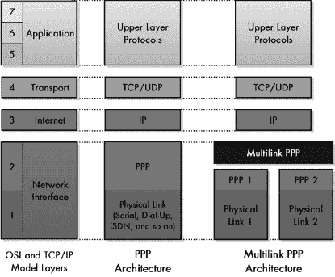

图 11-1. 多链路 PPP 架构 当使用多链路 PPP 来组合两个或更多物理链路时，它在架构上位于每个物理链路上运行的 PPP 层之上。

### 提示

**关键概念**PPP 多链路协议（MP）允许 PPP 将多个物理链路捆绑在一起，并像使用单个高容量链路一样使用它们。在链路配置期间必须启用它。一旦运行，它通过分割整个 PPP 帧并将碎片通过不同的物理链路发送来工作。

## PPP 多链路协议设置和配置

要使用 MP，两个设备都必须将其作为 PPP 软件的一部分实现，并且必须协商其使用。这是通过 LCP 作为*链路建立*阶段中基本链路参数协商的一部分来完成的（就像本章前面描述的 LQR 一样）。定义了三个新的配置选项，用于协商以启用 MP：

**多链路最大接收重构单元**提供了基本指示，表明开始协商的设备支持 MP 并希望使用它。该选项包含一个指定它支持的 PPP 帧最大大小的值。如果接收此选项的设备不支持 MP，则必须以 Configure-Reject LCP 消息响应。

**多链路短序列号头部格式**允许设备协商使用较短的序列号字段来提高 MP 帧的效率。（有关 MP 帧的完整讨论，请参阅第十二章。）

**端点区分器**唯一地标识系统。它用于允许设备确定哪些链路连接到哪些其他设备。

在可以使用 MP 之前，必须在两个设备之间的每个链路上进行至少 Multilink 最大接收重建单元选项的成功协商。一旦完成，并且每个物理链路都存在一个 LCP 链路，就会从 LCP 链路制作一个虚拟 *包*，并启用 MP。

## PPP 多链路协议操作

如前所述，MP 基本上位于网络层和常规 PPP 链路之间，充当中间人。以下是它在通信每个方向上所做的工作：

**传输** MP 接受通过适当的 NCP 配置的网络层协议接收到的数据报。它首先将它们封装成修改后的常规 PPP 帧，然后决定如何通过多个物理链路传输该帧。通常，这是通过将帧分成均匀分布在链路集合上的 *片段* 来实现的。然后，这些片段被封装并通过物理链路发送。然而，你也可以实现一种替代策略，例如在链路之间交替发送完整大小的帧。此外，通常较小的帧不会被分段，控制帧（如用于链路配置的帧）也不会。

**接收** MP 接收来自所有物理链路的片段，并将它们重新组装成原始的 PPP 帧。然后，该帧就像任何 PPP 帧一样被处理，通过查看其协议字段并将其传递到适当的网络层协议。

MP 中使用的片段在概念上类似于 IP 片段，但当然这些是运行在不同层的不同协议。对于 PPP 或 MP 来说，一个 IP 片段就像任何其他 IP 数据报一样。

MP 中数据分片引入了协议必须处理的许多复杂性。例如，由于片段大致是并发发送的，你需要用序列号来标识它们以方便重新组装。你还需要一些控制信息来标识第一个和最后一个片段。MP 片段使用特殊的帧格式来携带这些额外信息。我在 第十二章 中描述了这一点，该章还包含了更多关于如何实现分片的信息，以及一个演示其工作原理的插图。

# PPP 带宽分配协议（BAP）和带宽分配控制协议（BACP）

PPP MP 允许一对设备之间（无论是物理的还是虚拟通道的形式）的多个链路组合成一个宽管道（高容量通道）。这对许多 PPP 用户来说提供了巨大的优势，因为它让他们能够充分利用所有带宽，特别是对于互联网连接等应用。因此，MP 成为 PPP 最受欢迎的功能之一，也就不足为奇了。

定义 MP 的原标准基本上假设多个链路将组合成一个单一的束。例如，如果您有两个调制解调器链路，它们都会连接并合并，或者 ISDN 链路中的两个 B 通道会合并。在 MP 设置之后，束将可供任何设备完全使用。

这个系统的缺点之一是：粗管道始终处于启用状态，在许多情况下，始终设置这种配置是昂贵的。连接两个或更多层 1 链路通常比单个链路更昂贵，而且并不总是需要。例如，一些 ISDN 服务对 B 通道的通话按分钟收费。在调制解调器拨号的情况下，世界上某些地区的通话也按分钟收费。即使在常规电话免费的地方，也存在占用电话线的成本。考虑到在许多应用中，所需的带宽量会随时间变化。

如果您能设置 MP，使其能够在需要时动态地将链路添加到束中（例如，当您决定下载一些大文件时），然后在不再需要时自动删除它们，那就更好了。这种对基本 MP 包的增强是以 RFC 2125 中描述的一对新的协议的形式提供的：

**带宽分配协议（BAP）** 描述了一种机制，其中在层 1 链路束中通信的任一设备都可以请求将链路添加到束中或从其中删除。

**带宽分配控制协议（BACP）** 允许设备配置它们想要如何使用 BAP。

### 提示

**关键概念** *BAP* 和 *BACP* 用于提供对 PPP MP 功能的动态控制。

## BACP 操作：配置 BAP 的使用

让我们从 BACP 开始，因为它是用于该功能初始设置的协议。从概念上讲，BACP 与其他所有名称中带有“控制”（Control）的 PPP 协议非常相似，例如 LCP、NCP 家族、CCP 和 ECP，但实际上它更加简单。它仅在链路配置期间使用，用于设置 BAP。这是通过使用配置请求（Configure-Request）、配置确认（Configure-Ack）、配置拒绝（Configure-Nak）和配置拒绝（Configure-Reject）消息来完成的，正如在 LCP 主题中所描述的那样。

在 BACP 中协商的唯一配置选项是称为“首选对等方”（Favored-Peer）的选项，它用于确保当链路上的两个设备同时尝试发送相同的请求时不会出现问题。如果两个设备都支持 BAP，那么 BACP 协商将成功，并将激活 BAP。

## BAP 操作：添加和删除链路

BAP 定义了一组可以在设备之间发送的消息，用于向当前 PPP 束中添加或删除链路。BAP 特别有趣的是，它包括在需要更多带宽时实际启动不同类型的物理层连接（例如，为捆绑的模拟链路拨打电话调制解调器或启用额外的 ISDN 通道）所需的工具。然后，当不再需要时，它们会关闭这些连接。

这里是 BAP 消息类型的简要描述：

**呼叫请求和呼叫响应** 当链路上的一个设备想要将链路添加到捆绑中并自己启动新的物理层链路时，它向另一台设备发送一个呼叫请求帧来告知，该设备则以呼叫响应进行回复。

**回调请求和回调响应** 这些与前面两种消息类型类似，但它们是在设备想要其对等方（链路上的另一台设备）发起调用以添加新链路时使用的。所以，如果设备 A 说，“我需要更多的带宽，但我想让你打电话给我，而不是我打电话给你，”它就会向设备 B 发送一个回调请求。

**呼叫状态指示和呼叫状态响应** 在设备尝试向捆绑中添加新链路（在发送呼叫请求或接收回调请求后）后，它使用呼叫状态指示帧报告新链路的状态。然后，另一台设备以呼叫状态响应进行回复。

**链路删除查询请求和链路删除查询响应** 一台设备使用这些消息请求删除链路，而另一台设备则使用它们来响应这个请求。

注意，何时添加或删除链路的决定不是由这些协议做出的。这取决于特定的实现。

# 第十二章。PPP 协议帧格式

点对点协议（PPP）协议套件包括许多不同的协议，用于以不同的方式发送数据和控制信息。每个协议都将信息打包成称为*帧*的消息，每个帧都遵循特定的*帧格式*。PPP 从一个通用帧格式开始，涵盖链路上发送的所有帧，然后包括用于不同目的的更具体格式。理解这些格式不仅使诊断 PPP 问题更容易，而且有助于更清楚地了解关键 PPP 协议的功能。

在本章中，我展示了用于在 PPP 上发送数据和控制信息的最常见帧格式。我首先解释了用于所有 PPP 帧的整体格式。我还描述了用于各种控制协议的一般格式以及它们大多数使用的选项格式。（PPP 的一个优点是，许多协议使用具有共同格式的控制帧。）

我随后具体列出了用于链路控制协议（LCP）和身份验证协议（PAP 和 CHAP）的帧。我还描述了 PPP 多链路协议（MP）用于在捆绑链路上传输数据片段的特殊格式。

### 注意

*由于 PPP（点对点协议）中有大量不同的协议（数十种）以及许多协议都有其独特的选项，我无法在此详细描述每个协议的所有特定帧格式和选项格式。请参阅相应的 RFC（列于第九章以获取更多详细信息)。*

# PPP 通用帧格式

使用 PPP 发送的所有消息都可以被认为是*数据*或*控制信息*。单词*数据*描述了你在第二层尝试传输的更高层数据报。这是我们“客户”给我们发送的内容。控制信息用于管理 PPP 内部的各种协议的操作。尽管 PPP 套件中的不同协议使用许多类型的帧，但在最高层，它们都符合一个单一的、*通用*的帧格式。

你会记得，PPP 套件的基本操作基于 ISO 高级数据链路控制（HDLC）协议。当你查看 PPP 帧的整体结构时，这一点变得非常明显——它们使用与 HDLC 相同的基本格式，甚至包括某些对于 PPP 本身并非严格必要的字段。唯一的重大变化是添加了一个新字段来指定封装数据的协议。PPP 帧的一般结构在 RFC 1662 中定义，它是 PPP 主要标准 RFC 1661 的配套文件。

PPP 的通用帧格式，展示了如何将 HDLC 帧格式应用于 PPP，在表 12-1 中描述，并在图 12-1 中展示。

表 12-1. PPP 通用帧格式

| 字段名称 | 大小（字节） | 描述 |
| --- | --- | --- |
| 标志 | 1 | 表示 PPP 帧的开始。始终具有二进制值 01111110（十六进制 0x7E，或十进制 126）。 |
| 地址 | 1 | 在 HDLC 中，这是帧的目标地址。但在 PPP 中，你处理的是两个设备之间的直接连接，因此该字段没有实际意义。因此，它始终设置为 11111111（十六进制 0xFF 或十进制 255），这相当于广播（意味着“所有站”）。 |
| 控制 | 1 | 此字段在 HDLC 中用于各种控制目的，但在 PPP 中设置为 00000011（十进制 3）。 |
| 协议 | 2 | 识别帧信息字段中封装的数据报的协议。有关协议字段更多信息，请参阅“协议字段范围”部分。 |
| 信息 | 可变 | 包含数据或控制信息的零个或多个负载字节，具体取决于帧类型。对于常规 PPP 数据帧，网络层数据报封装在这里。对于控制帧，控制信息字段放置在这里。 |
| 填充 | 可变 | 在某些情况下，可能需要添加额外的空字节来填充 PPP 帧的大小。 |
| 帧校验序列 | 2 (或 4) | 对帧进行校验和计算，以提供对传输错误的基本保护。这是一个类似于在以太网中使用的其他层 2 协议错误保护方案（如）的 CRC。它可以是 16 位或 32 位大小（默认为 16 位）。FCS 是在地址、控制、协议、信息和填充字段上计算的。 |
| 标志 | 1 | 表示 PPP 帧的结束。始终具有二进制值 01111110（十六进制 0x7E，或十进制 126）。 |

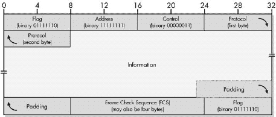

图 12-1. PPP 通用帧格式

## 协议字段范围

协议字段是接收帧的设备的主要帧类型指示器。对于数据帧，这通常是创建数据报的网络层协议；对于控制帧，通常是创建控制消息的 PPP 协议。在修改数据（如前一章中解释的压缩（CCP）或加密（ECP））的情况下，此字段标识数据是压缩的还是加密的，并在信息字段解压缩/解密后提取原始协议值。

所有 PPP 帧都是基于图 12-1 中所示的一般格式构建的。前三个字节是固定的，后面跟着一个两字节的协议字段，表示帧类型。可变长度的信息字段根据 PPP 帧类型以多种方式格式化。可以对帧应用填充，以一个两字节或四字节的 FCS 字段（此处显示为两字节）和一个尾随的标志值 0x7E 结束。（参见图 12-2 了解此格式如何应用。）

网络层协议和 PPP 控制协议有数十种，相应地，协议值也有大量。主要 PPP 标准定义了四个范围来组织这些值，如表 12-2 所示。

标准还规定，协议值必须分配，以便第一个字节是偶数，第二个字节是奇数。例如，0x0021 是一个有效值，但 0x0121 和 0x0120 则不是。（原因将在稍后变得明显。）还有一些特定的块是保留的，不使用。

图 12-2 展示了 PPP 通用帧格式的常见应用之一：携带数据。协议字段中的值 0x0021 标识这是一个 IPv4 数据报。此示例有 1 字节填充和 2 字节帧校验序列（FCS）。（显然，真实的 IP 数据报比这里显示的 23 字节要长！这些字节是任意的，并不代表一个真实的数据报。）请参阅 图 12-12 以了解如何格式化和分片此相同的数据帧，以便通过多个链路进行传输。

表 12-2. PPP 协议字段范围

| 协议字段范围（十六进制） | 描述 |
| --- | --- |
| **0000–3FFF** | 与 NCP（见 第十章）关联的封装网络层数据报。在这种情况下，对应 NCP 的控制帧使用通过将网络层协议值的第一字节加 8 计算出的协议字段值。例如，对于 IP，协议值是 0021，而 IP 控制协议（IPCP）的控制帧使用协议值 8021。此范围还包括用于特殊处理封装数据报的几个值，例如在采用压缩或加密时。 |
| **4000–7FFF** | 来自“低流量”协议的封装数据报。这些是没有关联 NCP 的协议。 |
| **8000–BFFF** | 与 0000–3FFF 范围内的网络层协议值相对应的 NCP 控制帧。 |
| **C000–FFFF** | LCP 和 LCP 支持的协议（如 PAP 和 CHAP）使用的控制帧。这里也包括了一些杂项协议值。 |

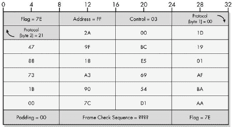

图 12-2. 样本 PPP 数据帧 包含缩略 23 字节 IP 数据报的 PPP 数据帧。

## 协议字段值

PPP 协议值的完整列表由互联网数字分配机构（IANA）维护，包括所有其他用于互联网标准的保留数字。 表 12-3 展示了一些更常见的值。

表 12-3. 在 PPP 帧中携带的常见协议及其协议字段值

| 协议类型 | 协议字段值（十六进制） | 协议 |
| --- | --- | --- |
| 封装的网络层数据报 | 0021 | Internet 协议版本 4 (IPv4) |
|   | 0023 | OSI 网络层 |
|   | 0029 | AppleTalk |
|   | 002B | Novell 互连网络数据包交换 (IPX) |
|   | 003D | PPP 多链接协议 (MP) 片段 |
|   | 003F | NetBIOS 帧（NBF/NetBEUI） |
|   | 004D | IBM 系统网络架构 (SNA) |
|   | 0053 | 使用 ECP 和 PPP 加密算法的加密数据 |
|   | 0055 | PPP 多链接下的单个链路加密数据 |
|   | 0057 | 互联网协议版本 6 (IPv6) |
|   | 00FB | PPP 多链接下的单个链路压缩数据 |
|   | 00FD | 使用 CCP 和 PPP 压缩算法的压缩数据 |
| 低流量封装协议 | 4003 | CDPD 移动网络注册协议 |
|   | 4025 | 光纤通道 |
| 网络控制协议 (NCP) 控制帧 | 8021 | PPP 互联网协议控制协议 |
|   | 8023 | PPP OSI 网络层控制协议 |
|   | 8029 | PPP AppleTalk 控制协议 |
|   | 802B | PPP IPX 控制协议 |
|   | 803F | PPP NetBIOS 帧控制协议 |
|   | 804D | PPP SNA 控制协议 |
|   | 8057 | PPP IPv6 控制协议 |
| LCP 和其他控制帧 | C021 | PPP 链路控制协议 (LCP) |
|   | C023 | PPP 密码认证协议 (PAP) |
|   | C025 | PPP 链路质量报告 (LQR) |
|   | C02B | PPP 带宽分配控制协议 (BACP) |
|   | C02D | PPP 带宽分配协议 (BAP) |
|   | C223 | PPP 挑战握手认证协议 (CHAP) |

## PPP 字段压缩

PPP 使用 HDLC 基本帧结构，该结构包括两个在 HDLC 中需要但在 PPP 中不需要的字段，因为 PPP 的操作方式。这些字段是地址和控制字段。为什么要在每个帧中发送两个具有相同值的字节，而这些字节又没有用于任何目的？最初，它们是为了兼容性而保留的，但这降低了效率。

为了避免在每个帧中浪费两个字节，在初始链路设置期间可以使用链路控制协议 (LCP) 通过该名称相同的 LCP 选项协商一个称为 *地址和控制字段压缩 (ACFC)* 的功能。启用此功能后，它将简单地导致这些两个字段不发送在大多数 PPP 帧中（但不包括 LCP 控制帧）。实际上，这个功能最好命名为 *地址和控制字段抑制*，因为字段只是被抑制并压缩到无。

即使设备同意使用字段压缩，它们仍然必须能够接收压缩和非压缩的帧。它们通过查看初始标志字段之后的第一个字节来区分这两种帧。如果它们包含值 0xFF03，则它们必须是地址和控制字段；否则，这些字段被抑制。（值 0xFF03 不是一个有效的协议字段值，因此不存在歧义的机会。）

同样，链路上的两个设备也可以协商对协议字段的压缩，使其只占用一个字节而不是两个字节。这通常是通过丢弃第一个字节（如果它是零）来完成的，这个过程称为*协议字段压缩（PFC）*。回想一下，第一个字节必须是偶数，第二个字节是奇数。因此，接收设备检查每个帧中协议字段的第一个字节的偶数性。如果它是奇数，这意味着协议字段中前导零字节已被抑制，因为完整的两个字节协议值的第一个字节必须是偶数。

### 注意

*此字段压缩（实际上是抑制）与 PPP 压缩控制协议（CCP）和压缩算法进行的数据压缩无关。*

# PPP 通用控制协议帧格式和选项格式

你刚才看到的通用帧格式用于 PPP 协议集中定义的所有许多帧类型。在该格式中，信息字段携带封装的第三层用户数据或封装的控制消息。这些控制消息包含用于配置、管理和断开 PPP 链路以及实现 PPP 所包含的各种特性的特定信息。

存在许多不同的 PPP 控制协议，通常可以通过其名称中出现的单词*控制*来区分。这些包括主要的 PPP 链路控制协议（LCP）；一系列网络控制协议（NCPs），如 IPCP、IPXCP 等；以及实现特性的控制协议，如压缩控制协议（CCP）和加密控制协议（ECP）。密码认证协议（PAP）和挑战握手认证协议（CHAP）名称中缺少控制，但也属于这一类别。

每个控制协议都以略微不同的方式使用控制消息，但消息之间也存在许多共性。这是因为，正如我在 PPP 协议讨论中解释的那样，大多数控制协议——如 NCP 家族、CCP 和 ECP——都是作为 LCP 功能子集实现的。它们执行许多相同的功能，因此 PPP 设计者明智地采用了 LCP 消息系统来适应这些其他控制协议。

这意味着控制协议帧具有一个共同的格式，该格式适合 PPP 中的整体通用帧格式。即使像 PAP 和 CHAP 这样的协议不是基于 LCP，也使用这种通用控制帧格式，该格式在表 12-4 中描述。

表 12-4. PPP 控制消息格式

| 字段名称 | 大小（字节） | 描述 |
| --- | --- | --- |
| Code (类型) | 1 | 一个单字节值，指示此控制帧中控制消息的类型。在某些 PPP 标准中，有时也称为类型。 |
| 标识符 | 1 | 这是一个标签字段，用于将请求与回复匹配。当发送请求时，会生成一个新的标识符。当创建回复时，使用请求中标识符字段的值作为回复的标识符字段。 |
| 长度 | 2 | 指定控制帧的长度。这是必需的，因为数据字段长度是可变的。长度字段以字节为单位指定，包括控制帧中的所有字段，包括代码、标识符、长度和数据字段。 |
| 数据 | 可变 | 包含特定于消息类型的信息。此字段的不同用途将在本章后面进行描述。 |

整个结构成为 PPP 帧的有效负载，这意味着它适合 PPP 帧的信息字段，如图 图 12-3 所示。PPP 控制消息格式的四个字段适合 PPP 通用帧格式的信息字段。数据字段随后填充与控制消息类型特定的数据。因此，长度字段的大小等于 PPP 帧中信息字段的大小。控制帧的协议字段设置为与生成控制帧的协议匹配。例如，对于 LCP 帧将是 0xC021。

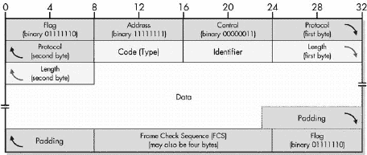

图 12-3. PPP 控制消息格式

## PPP 控制消息和代码值

代码字段指示特定控制协议中的控制帧类型。某些协议有一组独特的代码，仅由该特定协议使用；例如，身份验证协议（PAP 和 CHAP）和带宽分配协议（BAP）。由于 NCPs 和许多功能控制协议（如 CCP 和 ECP）基于 LCP，它们使用一组通用的消息代码和类型。表 12-5 显示了这些通用消息代码，并指出了哪些控制协议使用它们。

表 12-5. PPP 控制消息、代码值和 PPP 协议使用

| 代码值 | 控制消息 | LCP | NCPs | CCP 和 ECP |
| --- | --- | --- | --- | --- |
| **1** | 配置请求 | ⅳ | ⅳ | ⅳ |
| **2** | 配置确认 | ⅳ | ⅳ | ⅳ |
| **3** | 配置拒绝 | ⅳ | ⅳ | ⅳ |
| **4** | 配置拒绝 | ⅳ | ⅳ | ⅳ |
| **5** | 终止请求 | ⅳ | ⅳ | ⅳ |
| **6** | 终止确认 | ⅳ | ⅳ | ⅳ |
| **7** | 代码拒绝 | ⅳ | ⅳ | ⅳ |
| **8** | 协议拒绝 | ⅳ |   |   |
| **9** | 回显请求 | ⅳ |   |   |
| **10** | 回显回复 | ⅳ |   |   |
| **11** | 丢弃请求 | ⅳ |   |   |
| **12** | 识别 | ⅳ |   |   |
| **13** | 剩余时间 | ⅳ |   |   |
| **14** | 重置请求 |   |   | ⅳ |
| **15** | 重置确认 |   |   | ⅳ |

### 注意

我在第十章和第十一章中描述了这些帧类型在 LCP、NCP、CCP 和 ECP 各个独立主题中的具体使用方式。

数据字段的内容完全取决于控制消息的类型。在某些情况下，可能根本不需要发送额外数据，这种情况下可以省略数据字段。在其他控制消息中，它携带与消息类型相关的信息。例如，*代码拒绝*消息在数据字段中包含被拒绝的帧的副本。

## PPP 控制消息选项格式

不同的*配置*消息用于在 LCP 和其他控制协议中协商配置选项。在它们的数据字段中，它们携带一个或多个选项，这些选项再次是特定于使用它们的协议的。例如，LCP 使用一组配置选项来配置整个链路，CCP 使用选项来协商压缩算法，MP 使用它来设置多链路捆绑，等等。图 12-4 显示了这些选项（其长度可能不同）如何放置在 PPP 控制消息的数据字段中（该字段嵌套在一般的 PPP 帧格式中）。此图显示了在数据字段中携带选项的示例 PPP 控制消息。可以根据消息的需求包含任意数量的选项，并与其他数据混合。

图 12-4。PPP 控制消息携带选项

再次，这里也有共性。虽然每个选项都不同，但它们都使用相同的基本格式。任何出现在众多 PPP 控制消息类型中的选项都由类型、长度和数据的三元组组成，如表 12-6 所示，并在图 12-5 中说明。

表 12-6。PPP 控制消息选项格式

| 字段名称 | 大小（字节） | 描述 |
| --- | --- | --- |
| **类型** | 1 | 指示选项类型的类型值。类型值的集合对每个协议是唯一的。例如，LCP 有一组与配置选项对应的类型值，每个 NCP 有不同的类型值，CCP 有自己的类型值，等等。 |
| **长度** | 1 | 指定选项的长度（字节）。 |
| **数据** | 可变 | 包含配置选项的特定数据。 |

配置选项在各个协议主题中简要描述。我没有展示每个选项的具体内容，因为它们的数量实在太多。这些内容在 RFC 中。

图 12-5. PPP 控制消息选项格式

## PPP 控制消息格式总结

我的意图是向您展示不同控制协议使用的通用格式，因为它们非常相似，我没有时间或空间逐一描述每个协议的帧。以下是一个简要总结：

+   PPP 的通用帧格式用于所有帧，包括所有控制帧。其信息字段包含有效载荷，对于控制帧，它携带了整个控制消息。

+   控制帧的结构是使用我在本主题开头给出的通用格式构建的。代码值表示每个控制协议的控制帧类型。数据字段长度可变，包含该控制帧的数据，在某些情况下可能包括一个或多个配置选项。

+   对于像*配置请求*和*配置确认*这样的配置控制帧，数据字段包含使用本主题第二表中通用结构封装的选项集。每个选项都有自己的数据子字段，包含特定于该选项的数据。

为了使这一点更加清晰，接下来的两个部分提供了 LCP 和认证协议的帧格式的更具体示例。

# PPP 链路控制协议（LCP）帧格式

您刚刚探索了 PPP 协议中用于交换控制消息的各种协议所使用的通用格式。在 PPP 的众多控制协议中，LCP（链路控制协议）是最重要的，因为它负责基本的 PPP 链路设置和操作。它也是用作许多其他控制协议模板的协议。

由于它在 PPP 中如此核心，并且许多其他协议使用类似的消息系统，让我们通过展示用于每个 LCP 控制帧的具体帧格式来使一般的帧格式（如图 12-5 所示）更加具体。表 12-7 显示了 13 种 LCP 帧类型中每个字段的含义和内容。

### 注意

*LCP 帧类型 5、6、9、10、11、12 和 13 允许在数据字段中包含额外的数据量，其方式不是严格由协议描述的。PPP 标准表示可能有零个或多个字节“包含由发送方使用的未解释数据”并且“可能由任何二进制值组成”（RFC 1661）。包含这些未解释数据的选择留给了实现者。*

所有 LCP 控制帧都通过将帧结构放入其信息字段中封装到 PPP 帧中，正如你之前所看到的。协议字段设置为 0xC021 以表示 LCP。（有关帧的使用说明，请参阅第十章中 LCP 的操作描述 Chapter 10。）

表 12-7. PPP 链路控制协议（LCP）帧类型和字段

| 帧类型 | 代码字段 | 标识符字段 | 长度字段 | 数据字段 |
| --- | --- | --- | --- | --- |
| Configure-Request | 1 | 为每个帧生成的新值 | 4 + 所有包含的配置选项的长度 | 两个对等体在链路上协商的配置选项。（本章前面的部分描述了配置选项的一般格式。） |
| Configure-Ack | 2 | 从对应 Configure-Ack 回复的 Configure-Request 帧的标识符字段复制而来 | 4 + 所有包含的配置选项的长度 | 被积极确认的配置选项（在链路协商期间接受）。 |
| Configure-Nak | 3 | 从对应 Configure-Nak 回复的 Configure-Request 帧的标识符字段复制而来 | 4 + 所有包含的配置选项的长度 | 被否定确认的配置选项（请求重新协商）。 |
| Configure-Reject | 4 | 从对应 Configure-Reject 回复的 Configure-Request 帧的标识符字段复制而来 | 4 + 所有包含的配置选项的长度 | 被拒绝的配置选项（因为设备无法协商它们）。 |
| Terminate-Request | 5 | 为每个帧生成的新值 | 4（如果包含额外数据，则更多） | 不需要。请参阅本表之前的说明。 |
| Terminate-Ack | 6 | 从匹配的 Terminate-Request 帧的标识符字段复制而来 | 4（如果包含额外数据，则更多） | 不需要。请参阅本表之前的说明。 |
| Code-Reject | 7 | 为每个帧生成的新值 | 4 + 被拒绝帧的长度 | 被拒绝的 LCP 帧的副本。这不是完整的 PPP 帧，只是从其信息字段中的 LCP 控制部分。 |
| Protocol-Reject | 8 | 为每个帧生成的新值 | 6 + 被拒绝帧的长度 | 前两个字节包含被拒绝帧的协议值。其余部分包含被拒绝帧的信息字段的副本。 |
| Echo-Request | 9 | 为每个帧生成的新值 | 8（如果包含额外数据，则更多） | 包含一个用于检测回环链路的四字节“魔术数字”，如果已协商适当的配置选项；否则，设置为 0。也可能包含其他未解释的数据；请参阅本表之前的说明。 |
| 回显回复 | 10 | 从匹配的回显请求的标识符字段复制 | 8（或更多，如果包含额外数据） | 包含一个四字节的“魔法数字”，用于检测已协商适当配置选项的回环链路；否则，设置为 0。也可能包含其他未解释的数据；请参阅此表之前的说明。 |
| 丢弃请求 | 11 | 为每个帧生成的新值 | 8（或更多，如果包含额外数据） | 包含一个四字节的“魔法数字”，用于检测已协商适当配置选项的回环链路；否则，设置为 0。也可能包含其他未解释的数据；请参阅此表之前的说明。 |
| 标识 | 12 | 为每个帧生成的新值 | 8（或更多，如果包含额外数据） | 包含一个四字节的“魔法数字”，用于检测已协商适当配置选项的回环链路；否则，设置为 0。也可能包含其他未解释的数据；请参阅此表之前的说明。 |
| 剩余时间 | 13 | 为每个帧生成的新值 | 12（或更多，如果包含额外数据） | 包含一个四字节的“魔法数字”，用于检测已协商适当配置选项的回环链路；否则，设置为 0。还包含一个四字节的值，表示当前会话剩余的秒数。此字段中全为 1 的值表示永远，意味着会话不会过期。也可能包含其他未解释的数据；请参阅此表之前的说明。 |

# PAP 和 CHAP 帧格式

对于安全重要的链路，PPP 提供了两种可选的认证协议，即 PAP 和 CHAP。这些协议在 LCP 进行初始链路设置时使用，以拒绝未经授权的设备建立 PPP 连接。

PAP 和 CHAP 是控制协议，因此使用本节前面描述的相同基本控制协议帧格式。然而，由于它们与 LCP 和其他许多控制协议的目的非常不同，它们使用一组独特的帧，并具有自己独特的代码值集。PAP 使用三种不同的控制帧类型，而 CHAP 使用四种。让我们看看 PAP 和 CHAP 帧是如何构建的。

## PPP PAP 控制帧格式

PAP 的三个控制帧的构建方式如表表 12-8 帧格式")和表 12-9 所示。*认证请求*使用一种格式，如图图 12-6 所示，而其他两种帧类型使用不同的格式，如图图 12-7 所示。

表 12-8. PPP 密码认证协议（PAP）帧格式

| 帧类型 | 代码字段 | 标识符字段 | 长度字段 | 数据字段 |
| --- | --- | --- | --- | --- |
| Authenticate-Request | 1 | 每个帧生成的新值 | 6 + Peer-ID 长度 + 密码长度 | 包含用于认证的用户名和密码。这包含在四个子字段中，并按表 12-9 中所示排列。 |
| Authenticate-Ack | 2 | 从 Authenticate-Request 帧的标识符字段复制而来，作为回复 | 5 + 包含消息的长度 | 包含一个指定其后消息子字段长度的单字节 Msg-Length 子字段。消息子字段包含任意字符串数据，其用途取决于实现。它可以用来向用户指示认证成功或失败。如果没有使用，Msg-Length 字段仍然包含，但其值设置为零。 |
| Authenticate-Nak | 3 |   |   |   |

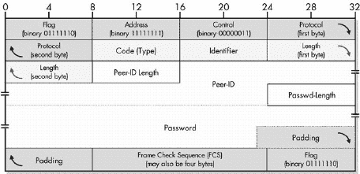

图 12-6. PPP PAP Authenticate-Request 帧格式

图 12-7. PPP PAP Authenticate-Ack 和 Authenticate-Nak 帧格式

表 12-9. PPP PAP Authenticate-Request 帧子字段

| 子字段名称 | 大小（字节） | 描述 |
| --- | --- | --- |
| Peer-ID 长度 | 1 | Peer-ID 字段的长度，以字节为单位 |
| Peer-ID | 可变 | 要认证的设备名称；在概念上等同于用户名 |
| Passwd-Length | 1 | 密码字段的长度，以字节为单位 |
| Password | 可变 | 与正在认证的名称对应的密码 |

## PPP CHAP 控制帧格式

四种 CHAP 帧类型格式如表表 12-10 和表 12-11 所示。挑战和响应帧使用一种消息格式，如图图 12-8 所示，而成功和失败帧使用不同的格式，如图图 12-9 所示。

表 12-10. PPP 挑战握手认证协议（CHAP）格式

| 帧类型 | 代码字段 | 标识符字段 | 长度字段 | 数据字段 |
| --- | --- | --- | --- | --- |
| 挑战 | 1 | 每个帧生成的新值 | 5 + 挑战文本的长度 + 名称的长度 | 载有挑战文本或响应文本和系统标识符。此信息在表 12-11 中所示的三个子字段中传输。 |
| 响应 | 2 | 从此响应的挑战帧的标识符字段复制 | 5 + 值的长度 + 名称的长度 |   |
| 成功 | 3 | 从此响应的响应帧的标识符字段复制 | 4（或更多，如果包含额外数据） | 可能包含一个任意、实现相关的消息字段，以指示用户身份验证是否成功或失败。 |
| 失败 | 4 |   |   |   |

表 12-11。CHAP 挑战和响应帧子字段

| 子字段名称 | 大小（字节） | 描述 |
| --- | --- | --- |
| 值大小 | 1 | 后续值子字段的长度，以字节为单位 |
| 值 | 变量 | 对于挑战帧，包含初始挑战中使用的挑战文本；对于响应帧，包含返回给验证器的加密挑战文本 |
| 名称 | 可变 | 用来标识发送帧的设备的文本字节 |

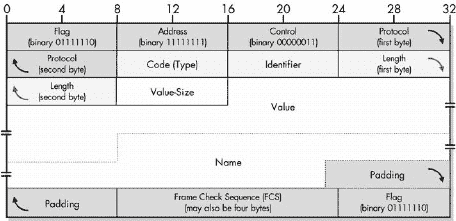

图 12-8。PPP CHAP 挑战和响应帧格式

图 12-9。PPP CHAP 成功和失败帧格式

# PPP 多链路协议（MP）帧格式

一些设备不是通过单个物理层链路连接，而是通过两个或更多。这些可能是多个物理连接，例如两个连接的调制解调器对，或者像 ISDN B 通道这样的复用虚拟层 1 连接。在任一情况下，PPP MP 都可以用来聚合这些物理链路的带宽，创建一个单一的、高速的*捆绑*。我在第十一章中描述了如何实现这一点。

在 MP 配置并开始工作后，它通过在组成 MP 捆绑的许多单个物理链路之间分配常规 PPP 帧的策略来运行。这通常是通过将 PPP 帧切割成称为*片段*的块，并将它们分散在物理链路上来实现的。这允许物理链路上的流量容易平衡。

## PPP MP 帧分片过程

要完成此分片过程，设备必须遵循以下三个步骤：

1.  **原始 PPP 帧创建** 要发送的数据或其他信息首先被格式化为一个完整的 PPP 帧，但将以修改后的形式，正如我们马上将看到的。

1.  **分片** MP 将完整大小的 PPP 帧切割成片段。

1.  **封装** 每个分片都封装在新的 PPP MP 分片帧的信息字段中，以及允许接收方重新组装分片的控制信息。

如果该帧将被分割并放置到其他 PPP MP 帧中，则通常出现在整个 PPP 帧中的几个字段就不需要了，因此当进行分片时，为了提高效率，在构建原始 PPP 帧时会省略这些字段。这些是在使用 MP 时未使用的字段：

+   起始和结束处的标志字段仅用于传输的帧定界，在逻辑分片帧中不需要。

+   FCS 字段不需要，因为每个分片都有自己的 FCS 字段。

+   对于任何 PPP 帧可能使用的特殊压缩选项，在创建此原始帧时都会使用——即地址和控制字段压缩（APCP）和协议字段压缩（PFC）。这意味着帧中不包含地址或控制字段，而协议字段的大小仅为一个字节。请注意，这本质上限制了分片只能携带某些类型的信息。

### 小贴士

**关键概念** PPP 多链路协议（MP）通常通过创建一个移除不必要的头部的原始 PPP 帧，并在物理链路之间分配数据，然后将它分成分片帧。每个分片包含特殊的头部，允许接收设备重新组装原始帧。

这些更改在每个将被分片的 PPP 帧上节省了完整的八个字节。因此，原始 PPP 帧具有一个非常小的头部，仅由一个字节的协议字段组成。每个分片的协议值设置为 0x003D，以指示一个 MP 分片，而原始帧的协议字段变为第一个分片中的数据的第一字节。

## PPP MP 分片帧格式

每个分片的信息字段使用一个包含四个字段*MP 头部*以及原始 PPP 帧的一个分片的子结构，如表 12-12 所示。

表 12-12. PPP 多链路协议分片帧格式

| 字段名称 | 大小（字节） | 描述 |
| --- | --- | --- |
| B | 1/8 (1 bit) | 开始分片标志：当设置为 1 时，将该分片标记为拆分 PPP 帧的第一个分片。对于其他分片，设置为 0。 |
| E | 1/8 (1 bit) | 结束分片标志：当设置为 1 时，将该分片标记为拆分 PPP 帧的最后一个分片。对于其他分片，设置为 0。 |
| 保留 | 2/8 (2 bits) 或 6/8 (6 bits) | 未使用；设置为 0。 |
| 序列号 | 1 1/2 (12 bits) 或 3 (24 bits) | 当一个帧被拆分时，分片被赋予连续的序列号，以便接收设备可以正确地重新组装它们。 |
| 分片数据 | 可变 | 原始 PPP 帧的实际分片。 |

如您所见，MP 帧格式有两种版本：长格式使用四个字节的头，而短格式只需要四个字节。默认的 MP 头格式使用 24 位序列号和 6 个保留位，如图 12-10 所示。当设置 MP 时，设备可以协商 Multilink Short Sequence Number Header Format 配置选项。如果成功完成，则使用较短的 12 位序列号。还有四个保留位被截断，每个帧节省两个字节，如图 12-11 所示。（考虑到 12 位仍然允许每个 PPP 帧有超过 4000 个片段，这通常已经足够了！）

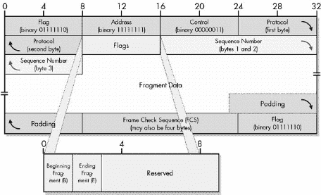

图 12-10. PPP MP 长片段帧格式 PPP MP 的长帧格式使用一个完整的字节用于标志位和一个 24 位的序列号。

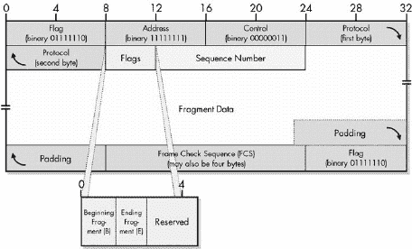

图 12-11. PPP MP 短片段帧格式 PPP MP 格式的简版使用 4 位用于标志位和一个 12 位的序列号。

片段数据字段包含要发送的实际片段。由于原始 PPP 头（包括协议字段）位于原始 PPP 帧的开始处，因此它将出现在第一个片段的开始处。其余的片段将包含原始 PPP 帧信息字段的片段。最后一个片段将以原始 PPP 帧的最后几个字节结束。

接收设备将收集每个 PPP 帧的所有片段，并从每个片段中提取片段数据和 MP 头。它将使用序列号重新组装片段，然后处理生成的 PPP 帧。

## PPP MP 分片演示

图 12-12 展示了 PPP 数据帧分片的演示。顶部是本章前面图 12-2 中显示的相同 PPP 数据帧。

这八个被灰显的字节是在帧需要分片时未使用的字节。因此，用于 MP 的 PPP 帧长度为 24 字节。此帧被分割成 8 字节的块，每个块都包含在 MP 分片的片段数据字段中。注意片段帧中的连续序列号值。另外，请注意，开始片段字段仅对第一个片段进行设置，而结束片段仅对最后一个进行设置。

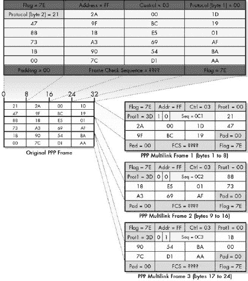

图 12-12. PPP MP 分片 此图展示了单个 PPP 帧如何被分成三个更小的帧。
