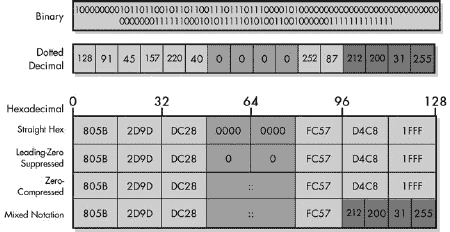
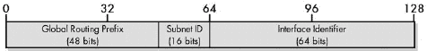
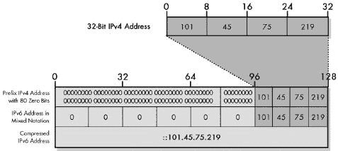
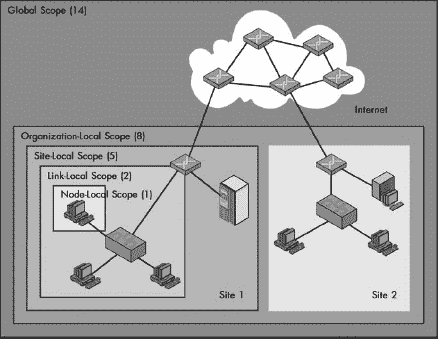
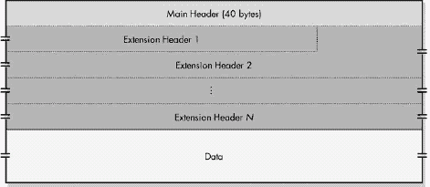
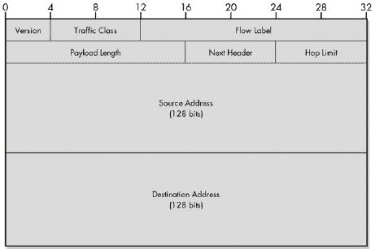
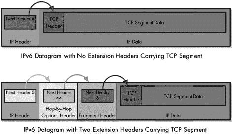
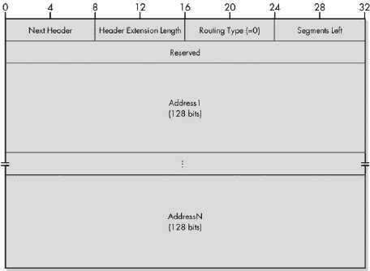
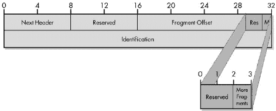
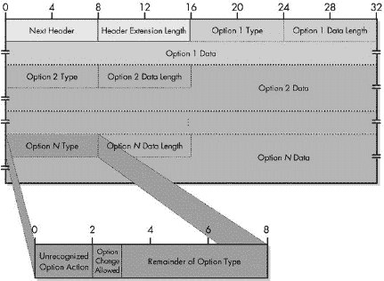

# 第二部分-4. 互联网协议版本 6 (IPV6)

第二十四章

第二十五章

第二十六章

第二十七章

自 1981 年以来，TCP/IP 一直建立在互联网协议 (IPv4) 的第 4 版上，在前一部分中进行了详细讨论。IPv4 是在如今我们视为理所当然的全球互联网只是一个小型实验性网络的时候被创建的。考虑到互联网在二十年的时间里经历了多大的增长和变化，IPv4 已经出色地完成了它的任务。同时，多年来，很明显，如果不对这个受人尊敬的协议中的某些限制进行解决，它们将阻碍互联网未来的增长。

由于 IP 扮演着关键角色，改变它是项艰巨的任务。这意味着对 TCP/IP 中几乎所有操作方式的重大修改。然而，尽管我们发现改变很难，但我们大多数人知道这是必要的。在过去几年里，IP 的新版本的开发一直在进行中，官方称为 *互联网协议版本 6 (IPv6)*，有时也称为 *IP 下一个世代* 或 *IPng*。IPv6 准备取代 IPv4，并将成为未来互联网的基础。

在本部分，我提供了 IPv6 的详细描述。由于 IPv6 仍然是 IP，就像 IPv4 一样，它执行相同的函数：寻址、封装、分片和重组，以及数据报交付和路由。因此，关于 IPv6 的讨论模仿了关于 IPv4 的讨论。共有四章：第一章涵盖 IPv6 概念和问题；第二章讨论 IPv6 寻址；第三章讨论 IPv6 封装和格式；第四章讨论 IPv6 数据报分片、重组和路由。

由于 IPv6 代表了 IP 的演变，许多操作概念都是建立在 IPv4 中引入的概念之上的。为了避免在本部分中不必要的重复，我假设您熟悉 IPv4 的操作，特别是地址以及数据报是如何封装和交付的。如果您还没有阅读第二部分-3"), 首先复习它将是明智的，因为 IPv6 的描述重点在于它如何与当前的 IP 版本不同。

您还可以参考第二部分-6, 其中涵盖了互联网控制消息协议 (ICMP)，其中一部分是 ICMP 版本 6——IPv6 的 ICMP，以及 IPv6 邻居发现 (ND) 协议，因为这些是 IPv6 的伴侣。

# 第二十四章. IPV6 概述、变更和过渡

互联网协议版本 6（IPv6）注定将成为 IP 的未来，由于 IP 的关键重要性，它将构成 TCP/IP 和互联网未来的基础。事实上，它自上上个十年中期以来一直在开发中，并且已经使用了多年的真实 IPv6 互连网络进行测试。尽管如此，许多人对于 IPv6 的了解并不多，除了它是一个 IP 的新版本之外。有些人甚至从未听说过它！当然，我将纠正这一点——但在深入探讨 IPv6 地址、封装、分片和其他功能的重要变化之前，让我们先从 IPv6 的鸟瞰图开始。

在本章中，我提供了一个关于 IPv6 的简要高级概述，包括从一般意义上看它与 IP 版本 4（IPv4）的不同之处。我首先简要概述了 IPv6 及其创建的原因。我列出了 IPv6 中做出的主要更改和协议的新增内容。我还解释了一些与从 IPv4 过渡到 IPv6 相关的困难。

# IPv6 动机和概述

“如果它没有坏，就别修它。”这是我非常喜欢的一句民间智慧。我通常喜欢坚持使用有效的方法，大多数人也是如此。IPv4 运行得相当不错。它已经存在了几十年，并且随着互联网从小型研究网络发展到全球性的强大力量而幸存下来。所以，就像一辆你成功驾驶多年的可靠老车一样，如果它还能完成任务，为什么还要更换它呢？

就像那辆老车一样，你可以在可预见的未来继续使用 IPv4。问题是：这要付出什么代价？如果你愿意投入时间和金钱来维护和保养它，一辆老车可以保持良好的工作状态。然而，它的一些功能将受到限制。它的可靠性可能会受到怀疑。它不会有最新的功能。除了那些喜欢把汽车修理作为爱好的人之外，最终继续修复一辆老车是没有意义的。

在某些方面，这并不是一个很好的类比。我们的高速公路与 20 世纪 70 年代相比并没有太大的不同，而且与驾驶汽车相关的其他大多数问题在过去 25 年里也没有发生太大的变化。是否更新车辆的选择更多是基于实际考虑而非必要性。

相比之下，看看在过去 25 年里计算机和网络世界发生了什么！今天的便携式电脑的功能比当时最强大的服务器还要多。网络技术速度提高了 100 倍甚至 1000 倍。连接到全球互联网的人数增加了更大的倍数。在许多情况下，计算机的通信方式也发生了巨大的变化。

在某些方面，IPv4 可以被认为是一辆经过精心维护和修复的老车。它完成了工作，但它的年龄开始显现。IPv4 的主要问题是其相对较小的地址空间，这是仅使用 32 位 IP 地址的决定的遗留问题。在原始的类地址分配方案下，我们可能已经用完了 IPv4 地址。迁移到无类地址分配有助于推迟这个问题，像 IP 网络地址转换（NAT）这样的技术也起到了作用，它允许私有地址的主机访问互联网。

然而，最终，这些只是修补工作和不完美的修复，目的是为了保持老化的 IPv4 汽车在路上行驶。核心问题，即 32 位地址空间对于当前和未来互联网规模来说太小，只能通过迁移到更大的地址空间来解决。这是创建下一个版本 IP，即*IPv6*的主要推动因素。

### 注意

*IPv4 的继任者版本是 6 而不是 5 的原因是因为版本号 5 被用来指代一个名为互联网流协议的实验性协议，该协议从未被广泛部署。有关 IP 历史和版本的完整讨论，请参见第十五章*。

## IPv6 标准

IPv6 代表了自 1981 年 IPv4 正式化以来 IP 的第一个重大变化。多年来，其核心操作在 1998 年发布的一系列 RFC 中定义：RFC 2460 至 RFC 2467。其中最值得注意的是主要的 IPv6 标准 RFC 2460，“互联网协议，版本 6（IPv6）规范”，以及描述 IPv6 的两个辅助协议的文档：RFC 2461，描述了 IPv6 邻居发现协议（ND），和 RFC 2463，描述了 IPv6 的互联网控制消息协议版本（ICMPv6）。

此外，1998 年还编写了两份文档。它们讨论了更多关于 IP 地址的内容：RFC 2373，“IP 版本 6 地址架构”和 RFC 2374，“IPv6 可聚合全局单播地址格式”。由于 IPv6 地址实现方式的变化，这些文档在 2003 年由 RFC 3513，“互联网协议版本 6（IPv6）地址架构”和 RFC 3587，“IPv6 全局单播地址格式”进行了更新。

许多其他 RFC 定义了 IPv6 如何工作的更多具体细节，许多也描述了 IPv6 兼容的其他 TCP/IP 协议版本，如域名系统（DNS；见第五十二章*。它是为了纠正 IPv4 的一些重大问题而创建的，特别是 IPv4 地址空间即将出现的不足，以提高整个协议的操作，并将 TCP/IP 带入未来。

在 IPv6 旨在解决这些问题以及许多其他传统 IP 问题的同时，其变化仍然是*渐进的*，而不是*革命性的*。在 20 世纪 90 年代互联网工程任务组（IETF）的许多讨论中，有些人说，当我们更新 IP 时，也许我们应该对一种全新的、未经证实的互联网互连协议进行彻底、根本的改变。最终的决定不是这样做，而是定义一个更强大的 IP 版本，这是我们一直在使用的。

原因很简单：IP，就像我们信任的旧车一样，*工作得很好*。IPv6 代表了一个更新，它努力增加 IPv4 的最佳特性，而不是让每个人都从头开始使用一些新事物。这种设计确保了从 IPv4 到 IPv6 的任何变化带来的痛苦都可以得到管理，并且希望最小化。

# IPv6 中的主要变化和新增功能

在前面的概述中，我解释了创建新的 IP 版本的主要动机是为了解决 IPv4 地址分配中的问题。但正如您所看到的，新协议也存在许多其他设计目标。一旦决定采取创建一个像 IP 一样重要的协议新版本的这一重大步骤，就有必要利用这个机会尽可能地进行改进。

当然，我们还需要担心改变带来的痛苦，因此 IPv6 中的每个潜在变化或新增功能都需要有超过其成本的益处。最终的设计在提供有用优势的同时，保持了原始 IP 的大部分核心。以下是 IPv4 和 IPv6 之间的一些最重要的变化，它们展示了 IPv6 团队如何满足新协议的设计目标：

**更大的地址空间** IPv6 地址长度为 128 位，而不是 32 位。这把地址空间从大约 40 亿个地址扩展到了，嗯，天文数字（超过 300 万亿万亿万亿个地址）。

**分层地址空间** IPv6 地址大小之所以扩大这么多，一个原因是为了允许它进行分层划分，从而提供大量不同类别的地址。

**单播地址的分层分配** 创建了一种特殊的全局单播地址格式，以便在整个互联网上轻松分配地址。它允许在互联网服务提供商（ISP）和组织级别上实现多级网络和子网层次结构。它还允许根据底层硬件接口设备 ID（如以太网 MAC 地址）生成 IP 地址。

**对非单播寻址的支持得到改善** 多播支持得到改进，并增加了对一种新型寻址方式的支持，即*任播*寻址。这种新型的寻址方式基本上意味着，“将此消息发送到这个群体中最容易到达的成员”，并可能启用新的消息功能。

**自动配置和重新编号** 包含了一项规定，允许在需要时更容易地自动配置主机以及重新编号网络和子网络中的 IP 地址。同时，也存在一种重新编号路由器地址的技术。

**新的数据报格式** IP 数据报格式已被重新定义并赋予了新的功能。每个 IP 数据报的主要头部已被简化，并增加了对数据报扩展头部的支持，以便于扩展需要更多控制信息的头部。

**对服务质量（QoS）的支持** IPv6 数据报包括 QoS 特性，这有助于更好地支持多媒体和其他需要 QoS 的应用。

**安全支持** 在 IPv6 中，通过使用认证和加密扩展头以及其他特性，设计进了安全支持。

**更新的分片和重组过程** 在 IPv6 中，数据报的分片和重组工作方式已经改变。改进的路由效率更好地反映了当今网络的实际情况。

**现代化的路由支持** IPv6 被设计成支持现代化的路由系统，并允许随着互联网的增长而进行扩展。

**过渡能力** 由于从一开始就认识到从 IPv4 过渡到 IPv6 是一个重大的转变，因此在多个领域提供了 IPv4/IPv6 过渡的支持。这包括 IPv4 和 IPv6 网络互操作的计划、IPv4 和 IPv6 地址之间的映射以及其他过渡支持。

**对其他协议的更改** 随着 IPv6 的引入，一些与 IP 密切相关的其他 TCP/IP 协议也必须进行更新。其中之一是 ICMP，它是 IPv4 最重要的支持协议，通过创建 ICMPv6 来对 IPv6 进行修订。TCP/IP 的补充是 ND 协议，它执行了 IPv6 中由版本 4 的地址解析协议（ARP）和 ICMP 执行的多个功能。

以下关于 IPv6 的章节提供了更多关于这些变化和 IP 新增功能的具体细节。你会注意到，其中大部分都与寻址相关，因为 IPv6 中最重要的变化就是在寻址方面。当然，路由和寻址是紧密相关的，寻址的变化也对路由产生了重大影响。

# 从 IPv4 到 IPv6 的过渡

IP 是 TCP/IP 协议套件和互联网的基础，因此在结构重要性方面与房子的基础有些类似。鉴于这一点，改变 IP 就像对房子的基础进行重大修改一样。由于 IP 用于连接许多设备，这就意味着不仅仅是改变你的房子，而是改变世界上每一座房子！

你如何改变房子的基础？非常小心。在实施 IPv6 时也需要同样的谨慎。虽然大多数人认为 IPv6 是件新鲜事，但实际情况是 IPv6 的计划和开发已经进行了近十年，如果我们从头开始，这个协议多年前就已经可以投入使用。然而，IPv4 的硬件和软件安装基础非常庞大。这意味着开发 TCP/IP 的人们不能只是打开一个开关，让所有人都转向使用 IPv6。相反，必须计划从 IPv4 向 IPv6 的过渡。

转型已经开始，尽管大多数人还不知道这一点。正如我所说，IPv6 本身的发展几乎已经完成，尽管仍在继续完善协议以及开发其他协议的 IPv6 兼容版本。IPv6 的实施始于创建开发网络以测试 IPv6 的运行。这些网络相互连接，形成了一个名为*6BONE*（该名称是*IPv6 骨干*的缩写）的实验性 IPv6 互联网。这个互联网已经运行了好几年。

## IPv4 到 IPv6 的过渡：意见分歧

实验性网络是很好的，但大问题是将互联网过渡到 IPv6，在这里，意见分歧相当快。一方面有公司、组织和个人。所有这些群体都迫切希望快速过渡到 IPv6，以获得它在寻址、路由和安全领域承诺的许多好处。另一方面的人则采取了一种更加谨慎的方法，指出 1990 年代中期对 IPv4 即将灭亡的悲观预测并没有成真，并认为我们应该花时间确保 IPv6 能够在大规模上运行。

这两组人将在接下来的几年里继续进行拔河比赛，但看起来现在潮流正在转向那些希望加快现在已持续多年的过渡的人。将 IPv6 作为*生产*协议的采用正在由多个团体和组织领导。IPv6 在除美国以外的许多地区都得到了很多支持，这些地区由于相对于其规模的小额分配而 IPv4 地址短缺。亚洲就是这样一片地区，拥有数十亿人口，互联网使用快速增长，IPv4 地址短缺。

在美国，由于互联网在这里开发，拥有大部分 IPv4 地址（因为互联网在这里开发），对于快速部署 IPv6 似乎有点不太热情。然而，即使在这里，IPv6 在 2003 年 7 月也获得了重大推动，当时美国国防部（DoD）宣布，从那年 10 月开始，它将只购买包含 IPv6 兼容性的网络产品。DoD（最初负责互联网的发展）希望到 2008 年完全过渡到 IPv6。这可能会对其他美国政府和私营组织的计划产生重大影响。

IPv6 的创造者从一开始就知道，过渡将是新协议的一个重要问题。IPv6 与 IPv4 不兼容，因为地址系统和数据报格式不同。然而，IPv6 的设计者知道，由于过渡将需要很多年，他们必须提供一种方法，使 IPv4 和 IPv6 宿主机能够互操作。考虑到在任何过渡中，总会有一些落后者。就像角落里那个你偶尔还需要使用的旧 Windows 3.11 PC 一样，一些设备将保持使用 IPv4，即使大部分互联网都是 IPv6，因为它们从未升级。

### 小贴士

**关键概念** 由于 IPv4 和 IPv6 之间存在许多差异，以及 IP 对 TCP/IP 的基本重要性，因此已经计划在多年内从 IPv4 到 IPv6 进行有序过渡。

## IPv4 到 IPv6 过渡方法

IETF 一直在制定具体规定，以允许从 IPv4 到 IPv6 的平稳过渡，以及硬件和软件互操作性解决方案，以便新的 IPv6 设备能够访问 IPv4 宿主机。IPv6 中包含了一种技术，允许管理员在 IPv6 地址中嵌入 IPv4 地址。定义了特殊方法来处理互操作性，包括以下内容：

**双栈设备** 路由器和其他一些设备可能被编程为同时支持 IPv4 和 IPv6 的实现，以便它们能够与这两种类型的宿主机进行通信。

**IPv4/IPv6 转换** 双栈设备可能被设计为接受来自 IPv6 宿主机的请求，将它们转换为 IPv4 数据报，然后将数据报发送到 IPv4 目的地，并类似地处理返回的数据报。

**IPv6 的 IPv4 隧道** 没有完全由支持 IPv6 的路由器组成的路径的 IPv6 设备可能能够通过封装 IPv6 数据报在 IPv4 中来进行通信。本质上，它们将使用 IPv6 在 IPv4 之上；也就是说，两个网络层。封装的 IPv4 数据报将穿越传统的 IPv4 路由器。

请记住，这些解决方案通常仅解决向后兼容性问题，以允许 IPv6 设备与 IPv4 硬件通信。IPv4 和 IPv6 之间的向前兼容性是不可能的，因为 IPv4 主机无法与 IPv6 主机通信；它们缺乏了解 IPv6 如何工作的知识。可能某些特殊的适应性可能会被创建，以允许 IPv4 主机访问 IPv6 主机。但最终，所有重要的 IPv4 设备都将希望迁移到 IPv6。

互联网工程任务组 (IETF) 在过去在引入新技术方面做得很好，并且在 IPv6 转型方面投入了大量的努力，因此我对 IPv6 转型能够顺利实施，几乎没有问题，非常有信心。关于转型的一个好处是，IPv4 在目前仍然能够完成任务，因此没有必要急于转向 IPv6。虽然像 CIDR 和 NAT 这样的技术就像是 IPv4 的创可贴，但它们在延长这个老协议的有效寿命方面非常成功。

# 第二十五章。IPv6 寻址

创建互联网协议版本 6 (IPv6) 的主要动机是为了纠正版本 4 (IPv4) 中的寻址问题。除了获取更多地址外，IPv6 设计者还希望找到一种方式，以更符合现代互联网的方式解释、分配和使用地址。因此，IPv6 中许多变化都与 IP 寻址相关。IPv6 寻址方案在概念上与 IPv4 寻址方案相似，但已经完全重新设计，以创建一个能够支持未来可预见的互联网扩展和新应用的寻址系统。

本章描述了与 IPv6 寻址相关的概念和方法。我首先回顾了 IPv6 中的一些寻址一般性内容，包括寻址模型、地址类型的大小和地址空间。我讨论了用于 IPv6 地址和前缀的独特和有时令人困惑的表示法和符号。然后，我探讨了地址是如何安排和分配到不同类型的，从整体上查看地址空间组成开始，然后是全局单播地址格式。我描述了用于将 IP 地址映射到底层物理网络地址的新方法。然后，我描述了特殊的 IPv6 寻址问题，包括保留地址和私有地址、IPv4 地址嵌入、任播和多播地址，以及地址的自动配置和重新编号。

IPv6 地址分配在主要的 IPv6 RFC 2460 中进行了概述，即“互联网协议，版本 6（IPv6）规范”。然而，IPv6 地址的大部分细节包含在其他两个标准中：RFC 3513，“互联网协议版本 6（IPv6）地址架构”和 RFC 3587，“IPv6 全局单播地址格式”。这些标准取代了 1998 年的 RFC 2373，“IP 版本 6 地址架构”和 RFC 2374，“IPv6 可聚合全局单播地址格式”。

### 小贴士

**背景信息** *与其他本书中的 IPv6 章节一样，我对地址分配的探讨在一定程度上是基于与 IPv4 地址分配方式的对比。我强烈建议在继续阅读之前，对 IPv4 地址分配有一个全面的理解，包括使用无类域间路由（CIDR）的无类地址分配，如第第十六章至第二十三章所述。与 IPv4 地址分配部分一样，了解二进制数的工作原理以及二进制与十进制数之间的转换也是很好的主意。第四章提供了关于数据表示和计算数学的一些背景信息，可能在这方面有所帮助*。

# IPv6 地址概述：地址模型、地址类型和地址大小

正如你在上一章中看到的，IPv6 对 IP 协议进行了重大更新，但其修改和新增内容并未改变 IP 工作的核心本质。地址分配是 IPv4 和 IPv6 之间大部分差异体现的地方，但这些变化主要在于地址的实现和使用方式。IPv6 中用于 IP 地址分配的整体模型与 IPv4 中的非常相似；一些方面完全没有变化，而其他方面则只有轻微的变化。

## IPv6 地址模型特性

以下是一些 IPv6 地址模型的一般特性，这些特性基本上与 IPv4 相同：

**地址的核心功能** 地址的两个主要功能仍然是网络接口标识和路由。路由通过互联网上地址的结构来实现。

**网络层地址** IPv6 地址仍然是与 TCP/IP 网络中的网络层相关联的地址，并且与数据链路层（有时也称为*物理层*）地址不同。

**每台设备的 IP 地址数量** 地址仍然分配给网络接口，因此像 PC 这样的普通主机通常只有一个（单播）地址，而路由器将为其连接的每个物理网络分配多个地址。

**地址解释和前缀表示** IPv6 地址与无类 IPv4 地址类似，它们被解释为具有网络标识符部分和主机标识符部分（网络 ID 和主机 ID），但这种划分并没有编码到地址本身中。使用类似 CIDR 的表示法，一个前缀长度数字用来指示网络 ID 的长度（前缀长度）。

**私有地址和公有地址** 在 IPv6 中，这两种类型的地址都存在，尽管它们的定义和使用方式有所不同。

## IPv6 支持地址类型

IPv6 寻址模型中的一个重要变化是支持的*地址类型*。IPv4 支持三种地址类型：单播、多播和广播。在这些类型中，绝大多数实际流量是单播。IP 多播支持直到互联网建立多年后才得到广泛部署，并且由于各种问题而继续受到阻碍。出于性能原因，IP 中的广播使用必须受到严格限制（我们不希望任何设备能够在整个互联网上广播！）。

IPv6 也支持三种地址类型，但有以下变化：

**单播地址** 这些是 IPv4 中的标准单播地址，每个主机接口一个。

**多播地址** 这些是代表各种 IP 设备组的地址。发送到多播地址的消息将发送到组中的所有设备。IPv6 包括比 IPv4 更好的多播功能和更多的多播地址。由于 IPv4 下的多播在很大程度上受到许多硬件设备不支持该特性的阻碍，因此多播支持是 IPv6 的一个必需部分，而不是一个可选部分。

**任播地址** 任播寻址用于必须将消息发送到组中的任何一个成员，但不需要发送给所有成员的情况。通常，最容易到达的组成员将接收该消息。任播寻址的一个常见例子是在组织中的一组路由器之间进行负载均衡。

在 IPv6 中，作为独立寻址方法的广播寻址已经消失。广播功能是通过多播寻址到设备组来实现的。例如，一个所有节点都属于的多播组可以用于网络中的广播。

### 提示

**关键概念** IPv6 像 IPv4 一样具有单播和多播地址。然而，IPv6 中并没有广播地址的独立概念。为了允许消息发送到设备组中的任何一个成员，增加了一种新的地址类型，即*任播*地址。

任播地址的创建的一个重要含义是消除了 IP 地址的严格唯一性要求。任播是通过将相同的 IP 地址分配给多个设备来实现的。这些设备还必须明确告知它们正在共享一个任播地址，但地址本身的结构与单播地址相同。

本章的剩余部分主要关注单播地址，因为它是迄今为止最重要的类型。多播和任播地址将在本章后面的单独部分中给予特别关注。

## IPv6 地址大小和地址空间

在 IPv6 引入的所有变化中，最容易引起关注的是 IP 地址大小的增加，这导致了地址空间大小的相应大幅增加。与 IPv4 相比，这些大小增加并不令人惊讶——因为多年来我们都知道 IPv4 地址空间太小，无法支持互联网的未来。令人印象深刻的是增加的程度以及这对互联网地址使用的影响。

在 IPv4 中，IP 地址长度为 32 位；这些地址通常被分为 4 个 8 位的八位字节。理论上的 IPv4 地址空间是 2³²，即 4,294,967,296 个地址。为了增加这个地址空间，我们只需增加地址的大小；我们给地址大小增加的每一个额外位都会使地址空间翻倍。基于这一点，有些人预计 IPv6 地址大小将从 32 位增加到 48 位，或者可能是 64 位。这两个数字中的任何一个都会给出一个非常大的地址数量。

然而，IPv6 地址使用的是这两个数字中的任何一个。相反，IP 地址大小直接跳到 128 位，即 16 个 8 位的八位字节/字节。IPv6 地址空间的大小实际上是天文数字。就像描述星系中星星数量或最远脉冲星距离的数字一样，IPv6 可以支持的地址数量令人难以置信。参见图 25-1 来了解我所说的“天文数字”是什么意思。

由于 IPv6 地址长度为 128 位，如果所有地址都被使用，理论上的地址空间是 2¹²⁸个地址。这个数字展开后是 340,282,366,920,938,463,463,374,607,431,768,211,456，通常用科学记数法表示为大约 3.4*10³⁸个地址。哇！这大约是 340 万亿，*万亿*，*万亿*个地址。正如我所说，很难理解这个数字有多大。考虑以下比较：

+   这些地址足够多，可以为地球上每一个人类分配数十亿个地址。

+   地球大约有 45 亿年的历史。如果你从地球形成的那一刻起，以每秒 10 亿个地址的速度分配 IPv6 地址，到目前为止，你使用的地址空间还不到万亿分之一。

+   地球表面积大约为 510 万亿平方米。如果一台典型的计算机占地面积约为 0.1 平方米，你需要堆叠 1000 亿台计算机——覆盖整个地球表面——才能耗尽同样的万亿分之一地址空间。

好的，我想你已经明白了。很明显，决定使用 128 位地址的一个目标是为了确保我们永远不会再次耗尽地址空间，而且这似乎是非常可能的。

图 25-1. 相对 IPv4 和 IPv6 地址空间大小的（较差）表示我想制作一个酷炫的图形来展示 IPv4 和 IPv6 地址空间的相对大小。你知道，我会把 IPv6 地址空间展示为一个大的盒子，而 IPv4 地址空间展示为一个小的盒子。问题是 IPv6 地址空间比 IPv4 空间大得多，以至于无法按比例展示！为了使这个图按比例展示，想象一下上面的 1.6 英寸平方是 IPv4 地址空间。在这种情况下，IPv6 地址空间将用一个代表太阳系的平方来表示！

拥有如此巨大的地址空间也有其缺点。考虑一下，即使使用 64 位地址，我们也会有一个非常大的地址空间；2⁶⁴ 等于 18,446,744,073,709,551,616，或者说大约 18 亿万亿。这些地址可能仍然比互联网需要的地址多。然而，通过使用 128 位，这使得处理 IP 地址变得难以管理（你将在下一节中看到）。这也增加了开销，因为每个数据报头或其他引用 IP 地址的地方都必须使用 16 个字节来表示每个地址，而不是 IPv4 中所需的 4 个字节，或者 64 位地址可能需要的 8 个字节。

### 小贴士

**关键概念** IPv6 地址空间真的非常大！

那么为什么需要过度到 128 位呢？主要原因在于*灵活性*。尽管如果我们逐个分配，我们可以拥有数亿个地址，但这使得分配变得困难。开发者移除了 IPv4 中的基于类别的地址分配，因为它浪费了地址空间。然而，现实是，能够浪费地址空间是一种有用的奢侈。

使用 128 位允许我们将地址空间分割，并为不同的位范围分配不同的用途，同时仍然不必担心空间不足。在本章的后续部分，在描述 IPv6 全局单播地址格式的部分，你会看到这些 128 位是如何得到良好应用的：它们允许你创建一个网络层次结构，同时仍然为主机 ID 保留 64 位。这种层次结构有其自身的优势。

# IPv6 地址、地址表示法和前缀表示法

将 IP 地址的大小从 32 位增加到 128 位，将地址空间扩展到一个巨大的规模，从而确保我们永远不会再次耗尽 IP 地址，并允许在分配和使用它们时具有灵活性。不幸的是，这种方法有一些缺点，其中之一是 128 位数字非常大。其大小使得它们使用起来很尴尬且困难。

计算机以二进制方式工作，它们处理一长串的 1 和 0 没有问题，但人类发现它们很令人困惑。即使是 IPv4 的 32 位地址对我们来说也很繁琐，这就是为什么我们通常使用点分十进制表示法来表示它们，除非我们需要在二进制下工作（如子网划分）。然而，IPv6 地址比 IPv4 地址大得多，使用点分十进制表示法会变得很成问题。为了使用这种表示法，我们需要将 128 位分成 16 个八位字节，并用 0 到 255 之间的十进制数来表示每个字节。然而，我们最终得到的不是 4 个这样的数字，而是*16*个。按照这种表示法，一个典型的 IPv6 地址可能如下所示：

| 128.91.45.157.220.40.0.0.0.0.252.87.212.200.31.255 |
| --- |

该地址的二元和点分十进制表示法显示在图 25-2 的顶部附近。在任何情况下，"优雅"这个词都不太可能立刻出现在你的脑海中。

图 25-2. IPv6 地址的二进制、十进制和十六进制表示。最上面两行显示了 IPv6 地址的二进制和点分十进制表示；这两种表示法都不常用（除了计算机本身之外！）。下表的最上面一行显示了完整的十六进制表示，而接下来的两行说明了零抑制和压缩。最后一行显示了混合表示法，其中 IPv6 地址的最后 32 位以点分十进制表示（212.200.31.255）。这最常用于嵌入式 IPv4 地址。

## IPv6 地址十六进制表示法

为了使地址更短，IPv6 中决定将表示地址的主要方法从十进制改为十六进制。这样做的好处是表示地址所需的字符更少，而且从十六进制到二进制以及反过来转换比从二进制到十进制或反过来转换要容易得多。缺点是许多人发现十六进制难以理解和处理，尤其是由于每个数字中包含 16 个值的概念有点奇怪。

用于 IPv6 地址的十六进制表示法与用于 IEEE 802 MAC 地址以及类似以太网等技术的相同方法相似。在这些 MAC 地址中，48 位由 6 个八位字节表示，每个八位字节是一个从 0 到 FF 的十六进制数，由破折号或冒号分隔，如下所示：

| 0A-A7-94-07-CB-D0 |
| --- |

由于 IPv6 地址更大，它们被分成八个 16 位 *单词*，并用冒号分隔，从而形成了有时被称为 *冒号十六进制表示法* 的格式，如图 25-2 所示。因此，前面例子中的 IPv6 地址可以这样表示：

| 805B:2D9D:DC28:0000:0000:FC57:D4C8:1FFF |
| --- |

为了减小地址的大小，可以在表示法中省略前导零，这样你可以立即将其简化为以下形式：

| 805B:2D9D:DC28:0:0:FC57:D4C8:1FFF |
| --- |

好吧，这确实比点分十进制表示法短，但仍然相当长。当你处理这么大的数字时，你能做的只有这么多。这也是为什么在 IPv6 下使用域名系统（DNS）名称来表示主机比在 IPv4 下更为重要的部分：谁会记得那么长的十六进制地址呢？

## IPv6 地址中的零压缩

幸运的是，有一种快捷方式可以进一步缩短某些地址。这种技术有时被称为*零压缩*。这种方法允许将 IPv6 地址中的一个连续的零字符串替换为双冒号。例如，前面的地址可以这样表示：

| 805B:2D9D:DC28::FC57:D4C8:1FFF |
| --- |

你知道有多少零被两个冒号（::）替换，因为你可以看到地址中有多少完全表示（未压缩）的十六进制词。在这种情况下，有六个，所以::代表两个零词。为了避免歧义，双冒号在任何 IP 地址中只能出现一次，因为如果出现多次，你将无法确定每个实例中替换了多少零。所以，如果示例地址是 805B:2D9D:DC28:0:0:FC57:0:0，你可以替换第一对零或第二对，但不能同时替换。

零压缩并没有使示例变得更短，但由于 IPv6 地址的结构，长串的零是常见的。例如，考虑以下地址：

| FF00:4501:0:0:0:0:0:32 |
| --- |

使用压缩，它可以缩短为以下形式：

| FF00:4501::32 |
| --- |

这种技术在特殊地址上效果更好。完整的 IPv6 回环地址写法如下：

| 0:0:0:0:0:0:0:1 |
| --- |

使用压缩，回环地址看起来是这样的：

| ::1 |
| --- |

为了更有趣，考虑特别奇怪的 IPv6 未指定地址，如下所示：

| 0:0:0:0:0:0:0:0 |
| --- |

对一个全为零的地址应用零压缩，你会得到什么？

| :: |
| --- |

没有任何数字！当然，将::视为地址确实需要一些习惯。

### 小贴士

**关键概念** 为了简洁起见，IPv6 地址使用八组四位十六进制数字表示，这种形式称为*冒号十六进制表示法*。此外，还使用称为*零省略*和*零压缩*的技术，通过从地址的表示中删除不必要的零来进一步减小显示地址的大小。

## IPv6 混合表示法

在某些情况下，也使用了一种替代表示法，特别是用于表示嵌入 IPv4 地址的 IPv6 地址（本章后面将讨论）。对于这些地址，显示地址的 IPv4 部分以较旧的点分十进制表示法是有用的，因为这是你用于 IPv4 的表示法。由于嵌入使用最后 32 位作为 IPv4 地址，因此表示法具有以冒号十六进制表示法显示的前 96 位和以点分十进制显示的最后 32 位。因此，再次以先前的例子为例，在 *混合表示法* 中，它将如下所示：

| 805B:2D9D:DC28::FC57:**212.200.31.255** |
| --- |

这并不是混合表示法的很好例子，因为嵌入通常涉及长串零后面跟着 IPv4 地址。因此，零压缩在这里非常有用。你不会看到如下这样的内容：

| 0:0:0:0:0:0:212.200.31.255 |
| --- |

你通常会看到这样的：

| ::212.200.31.255 |
| --- |

乍一看，这似乎是一个 IPv4 地址。你必须密切关注 IPv6 中的那些冒号！

### 提示

**关键概念** 对于最后 32 位包含嵌入的 IPv4 地址的 IPv6 地址，定义了一种特殊的混合表示法。在这种表示法中，前 96 位以常规的冒号十六进制表示法显示，而最后 32 位以 IPv4 风格的点分十进制表示法显示。

## IPv6 地址前缀长度表示

与 IPv4 无类地址一样，IPv6 地址在本质上被分成若干个网络 ID 位，后面跟着若干个主机 ID 位。网络标识符被称为 *前缀*，使用的位数是 *前缀长度*。这个前缀通过在地址后添加斜杠，然后在斜杠后放置前缀长度来表示。这是用于 CIDR 的无类 IPv4 地址的相同方法。例如，如果样本地址的前 48 位是网络 ID（前缀），那么我们将表示为 805B:2D9D:DC28::FC57:D4C8:1FFF/48。

### 提示

**关键概念** 在 IPv6 中，地址前缀的大小由跟在地址后面的前缀长度指示，用斜杠分隔，就像在 IPv4 无类地址中做的那样。

与 IPv4 类似，整个网络的指定符通常以长串零结尾。这些可以用双冒号（::）替换，使用零压缩。例如，前一个示例的 48 位网络 ID 是 805B:2D9D:DC28:0:0:0:0:0/48，或 805B:2D9D:DC28::/48。如果你替换了尾随的零，*必须* 包含 "::"。

# IPv6 地址空间分配

经过多年处理非常小的 IPv4 地址空间之后，IPv6 中巨大的地址数量一定让互联网工程任务组（IETF）的工程师们感觉像是在糖果店里的孩子。然而，他们都是好孩子，并没有乱跑，抓取他们能找到的所有糖果并吞下去。他们非常仔细地考虑了如何为各种用途划分地址空间。当然，当你有这么多糖果时，分享变得相当容易。

与 IPv4 一样，在决定如何划分 IPv6 地址空间时，有两个主要问题：地址分配和路由。IPv6 的设计者希望结构化地址空间，使得将地址分配给互联网服务提供商（ISP）、组织和个人尽可能容易。

起初，也许具有讽刺意味的是，这使 IPv6 的创造者回到了使用特定比特序列来识别不同类型地址的老路，就像旧的类地址方案一样。地址类型由地址开头的一组比特表示，称为格式前缀（FP）。格式前缀在概念上与 IPv4 类地址中用于表示地址类的 1 到 4 比特相同，但长度是可变的，范围从 3 到 10 比特。格式前缀在 RFC 2373 中进行了描述。

在 RFC 2373 发布后的几年里，管理互联网的大师们对地址块应该如何考虑有了新的看法。他们仍然希望将 IPv6 地址空间划分为不同大小的块以供不同目的使用。然而，他们意识到许多人开始认为使用格式前缀与旧的基于类的 IPv4 系统相当。他们主要担心的是，实施者可能会在 IPv6 硬件逻辑中编程，仅根据地址的前几个比特进行路由决策。这**特别不是**IPv6 应该工作的方式；一方面，分配是可能改变的。

因此，RFC 3513 中做出的修改之一是改变有关 IPv6 地址分配的语言，特别是从标准中删除了术语*格式前缀*。地址空间的各个部分的分配仍然基于地址的前三到十个比特的特定模式，以便某些类别比其他类别拥有更多的地址。消除表示这一点的特定术语是为了传达这些比特不应给予特殊关注。

表 25-1 显示了 IPv6 地址空间的分配以及每个分配占总地址空间的多少。

表 25-1. IPv6 地址空间分配

| 前导比特 | IPv6 地址空间总量的比例 | 分配 |
| --- | --- | --- |
| 0000 0000 | 1/256 | 未分配（包括特殊地址，如未指定地址和环回地址） |
| 0000 0001 | 1/256 | 未分配 |
| 0000 001 | 1/128 | 保留用于 NSAP 地址分配 |
| 0000 01 | 1/64 | 未分配 |
| 0000 1 | 1/32 | 未分配 |
| 0001 | 1/16 | 未分配 |
| 001 | 1/8 | 全球单播地址 |
| 010 | 1/8 | 未分配 |
| 011 | 1/8 | 未分配 |
| 100 | 1/8 | 未分配 |
| 101 | 1/8 | 未分配 |
| 110 | 1/8 | 未分配 |
| 1110 | 1/16 | 未分配 |
| 1111 0 | 1/32 | 未分配 |
| 1111 10 | 1/64 | 未分配 |
| 1111 110 | 1/128 | 未分配 |
| 1111 1110 0 | 1/512 | 未分配 |
| 1111 1110 10 | 1/1024 | 链路本地单播地址 |
| 1111 1110 11 | 1/1024 | 站点本地单播地址 |
| 1111 1111 | 1/256 | 组播地址 |

这比 IPv4 的类地址方案更复杂，因为类别更多，大小差异很大，即使大多数目前尚未分配。

要更好地理解这个表格，可以考虑将 IPv6 地址空间划分为*八分之一*。在这八个组中，一个（001）已被保留用于单播地址；第二个（000）被用来划分更小的保留块，第三个（111）被用来为本地和组播地址的子块。其余五个完全未分配。

你可以看到，IPv6 的设计者非常小心地只为每种地址类型分配了地址空间中他们认为需要的“八分之一”部分。例如，以 111 开头的地址空间部分只使用了很小的一部分，大部分留空。总的来说，目前只分配了地址空间的 71/512，大约 14%，其余的 86%尚未分配，留作将来使用。（记住，即使是 IPv6 地址空间的 1/1024 也是巨大的——它代表了数万亿的地址。）

本章后面的部分提供了关于这些地址块中几个地址块更多的信息。请注意，0000 0000 保留块用于几种特殊地址类型，包括环回地址、未指定地址和 IPv4 地址嵌入。1111 1111 格式前缀标识组播地址；这个字符串在十六进制中是 FF，所以任何以 FF 开头的地址在 IPv6 中都是组播地址。

# IPv6 全局单播地址格式

预计在 IPv6 下，单播地址将被用于绝大多数互联网流量，就像在 IPv4 中一样。正因为如此，分配给 IPv6 地址空间的最大块被用于单播地址。整个地址空间的八分之一被分配给单播地址，这由地址前三位中的 001 表示。问题是：我们如何使用宽敞的 IP 地址中剩余的 125 位？

## 结构化单播地址块的理由

当 IPv4 最初被创建时，互联网相对较小，地址块的分配模式基于一个中央协调者：互联网数字分配机构（IANA）。任何想要地址块的人都会直接前往中央权威机构。随着互联网的发展，这种模式变得不切实际。如今，IPv4 的无类别地址方案允许可变长度的网络 ID 和地址块的分层分配。大型 ISP 从中央权威机构获得大块地址，然后将其细分并分配给客户，等等。这由今天的 ISP 管理，但在地址空间中没有帮助管理分配过程的东西。反过来，每个组织都有能力进一步细分其地址分配，以满足其内部需求。

IPv6 的设计者受益于这一经验，并意识到将单播地址结构设计成反映互联网整体拓扑结构将带来巨大的优势。以下是一些包括的内容：

+   在互联网拓扑层次结构的各个级别上更容易分配地址块。

+   IP 网络地址能够自动反映路由器在互联网中传输信息时所采用的层次结构，从而使得路由可以轻松聚合，实现更有效的路由。

+   为像 ISP 这样的组织提供灵活性，以便将地址块细分以供客户使用。

+   为终端用户组织提供灵活性，以便将地址块细分以匹配内部网络，就像 IPv4 中的子网划分一样。

+   IP 地址具有更大的意义。不再是 128 位无结构的字符串，而是可以查看地址并了解其某些信息。

## 单播地址空间的通用划分

将单播地址空间的 128 位最通用地划分为三个部分，如图表 25-2 所示。

表 25-2. 通用 IPv6 全局单播地址格式

| 字段名称 | 大小（位） | 描述 |
| --- | --- | --- |
| 前缀 | *n* | 全局路由前缀：地址的网络 ID 或前缀，用于路由。 |
| 子网 ID | *m* | 子网标识符：一个数字，用于标识站点内的子网。 |
| 接口 ID | 128-*n-m* | 接口标识符：特定接口（主机或其他设备）的唯一标识符。它在特定的前缀和子网内是唯一的。 |

*全局路由前缀*和*子网标识符*代表了地址需要按层次结构构建的两个基本级别：即全球和特定站点。路由前缀由一定数量的位组成，可以根据互联网注册机构和 ISP 的需求进一步细分。这种细分反映了整个互联网的地形。子网 ID 为站点管理员提供了一定数量的位，以便创建适合每个管理员需求的内部网络结构。

## IPv6 单播地址空间实现

在理论上，可以使用任何大小的*n*和*m*（参见表 25-2 所示，并在图 25-3 中说明。

表 25-3. IPv6 全局单播地址格式

| 字段名称 | 大小（位） | 描述 |
| --- | --- | --- |
| 前缀 | 48 | 全局路由前缀：用于路由的地址的网络 ID 或前缀。前三位是 001，表示单播地址。 |
| 子网 ID | 16 | 子网标识符：一个标识站点内子网的数字。 |
| 接口 ID | 64 | 接口 ID：特定接口（主机或其他设备）的唯一标识符。它在特定的前缀和子网内是唯一的。 |

图 25-3. IPv6 全局单播地址格式

### 提示

**关键概念** IPv6 地址空间中为单播地址预留的部分被组织成一个地址格式，其中使用前 48 位作为*路由前缀*（类似于网络 ID），接下来的 16 位作为*子网 ID*，最后的 64 位作为*接口 ID*（类似于主机 ID）。

由于这种结构，大多数终端站点（与 ISP 相比，是普通公司和组织）将被分配具有 48 位前缀的 IPv6 网络。在常见的说法中，这些网络标识符现在被称为*48s*或*/48s*。

子网 ID 的 16 位允许每个站点在创建反映站点网络结构的子网时有相当大的灵活性。以下是一些 16 位的使用示例：

+   较小的组织可以将子网 ID 中的所有位都设置为 0，并拥有一个扁平的内部结构。

+   一个中等规模的组织可以使用子网 ID 中的所有位来执行 IPv4 下的直接子网划分，从而为每个子网分配不同的子网 ID。这里有 16 位，这允许有 65,536 个子网！

+   一个较大的组织可以使用这些位来创建多个级别的子网层次结构，就像 IPv4 的可变长度子网掩码（VLSM）一样。例如，公司可以使用两个位来创建四个子网。然后，它可以使用接下来的三个位在四个子网中的某些或全部子网中创建八个子子网。还有 11 个位可以用来创建更下一级的子子子网，以此类推。

## 全球路由前缀的原有划分：聚合器

全球路由前缀被类似地划分为一个层次结构，但这是一个为整个互联网使用而设计的层次结构，就像 CIDR。这里有 45 位可用（48 位减去固定的前三位 001）。这相当多。当 RFC 2374 首次详细说明单播地址结构时，该文件描述了基于互联网注册机构和提供商的两级层次拓扑结构的具体 45 位划分。这些组织被描述如下：

**顶级聚合器（TLAs）** 这些指的是最大的互联网组织，它们将从注册机构那里分配大量的 IPv6 地址。

**下一级聚合器（NLAs）** 这些组织将从顶级聚合器（TLAs）那里获得地址块，并将它们分配给最终用户组织（站点）。

45 位在这两个用途之间分配，中间保留了一些位，以便在需要时扩展任一字段。因此，RFC 2374 结构中的 45 位看起来就像表 25-4 中列出的一样。

表 25-4. 历史 IPv6 单播路由前缀结构

| 字段名称 | 大小（位） | 描述 |
| --- | --- | --- |
| TLA ID | 13 | 顶级聚合（TLA）标识符：顶级聚合器的全局唯一标识符。有 13 位，因此允许的最大 TLA 数量为 8,192 个。 |
| RES | 8 | 保留：这 8 位被保留供将来使用，并设置为 0。通过在 TLA ID 和 NLA ID 之间留出这 8 位未使用，它们可以在需要时扩展 TLA ID 或 NLA ID 字段。 |
| NLA ID | 24 | 下一级聚合（NLA）标识符：每个 TLA 都被分配了这个 24 位字段，用于为其客户分配地址块。NLA ID 对于每个 TLA ID 是唯一的。24 位的使用由 TLA 组织自行决定。 |

你会注意到我在描述 TLA/NLA 结构时使用了过去时态，而且那个表头也是一个很大的提示。2003 年 8 月，RFC 3587 被发布，简而言之就是，“嗯，关于所有那些 TLA/NLA 的事情就别管了。”决定将这种结构硬编码到互联网标准中是不灵活的，让区域互联网注册机构（APNIC、ARIN、LACNIC 和 RIPE）自己决定如何使用这 45 位似乎更有意义。

### 注意

*TLA/NLA 结构的淘汰是在人们习惯了多年之后发生的，所以在未来一段时间内，你仍然会经常在 IPv6 描述中看到这些术语。这就是为什么我在这里讨论了它们。)*

## 全球路由前缀分层划分的示例

在全球单播层次结构中，没有单一的结构来确定 48 位路由前缀如何划分。例如，它可能被划分为三个层次，如表 25-5 所示，并在图 25-4

图 25-4. IPv6 单播路由前缀结构示例。最上面一行显示了全局 IPv6 单播地址格式。第二行展示了将全局路由前缀分别使用 10、12 和 23 位划分为三个级别的示例。第三行展示了如何使用前 10 位来创建 210，即 1,024 个不同级别的 1 号块。下一行说明了对于这些 13 位前缀中的每一个，你可以有 212，即 4,096 个级别的 2 号块。然后，在每个 25 位的级别 2 ID 中，你有 23 位，即 8,388,608 个级别的 3 号块。在最下面，一个级别 3 或/48 将被分配给一个单独的组织。

这只是/48 网络地址中位分配的一种可能的理论方式。正如你所见，有这么多位，有很大的灵活性。在之前的方案中，你可以拥有超过四百万个级别 2 的组织，每个组织可以分配八百万个/48 地址。而且每个组织的大小相当于一个 IPv4 类 B 地址（超过 65,000 个主机）！

移除 RFC 2374 中全局路由前缀的固定结构与 IPv6 开发团队强调的位字段和结构仅用于地址分配而不用于路由目的的努力是一致的。一旦创建，地址本身不会根据这种格式在网络互连中的硬件上进行解释。对于路由器来说，唯一重要的是由 IP 地址后面的前缀长度给出的网络 ID 和主机 ID 之间的划分，这种划分可以在任何位边界发生。这些硬件设备只看到 IP 地址的 128 位，并使用它，而不了解层次地址划分或级别。

顺便说一下，获得可聚合单播地址格式分配好处的关键在于 IPv6 下我们可用的位非常多。在仍然允许 64 位用于接口标识符的同时拥有这些层次级别是 IPv6 设计者从 32 位到 128 位地址大小的主要原因之一。通过创建这种结构，我们保持了灵活性，同时避免了在 128 位内尝试分配许多不同网络大小的潜在混乱。

注意，任播地址的结构与单播地址相同，因此它们根据相同的模型分配。（多播地址不是。）

# IPv6 接口标识符和物理地址映射

在 IPv4 中，IP 地址与底层数据链路层网络技术使用的地址没有关系。一个使用以太网网络接口卡（NIC）连接到 TCP/IP 网络的宿主具有一个以太网 MAC 地址和一个 IP 地址，但这两个数字是不同的，并且以任何方式都不相关。IP 地址是由管理员手动分配的，不考虑底层物理地址。

随着 IPv6 地址系统的全面更新，出现了一个机会，可以创建一种更好的方法来映射 IP 单播地址和物理网络地址。实施这种高级映射技术是 IPv6 地址被设计得如此大的原因之一。总共有 128 位，即使有 45 位被保留用于网络前缀和 16 位用于站点子网，我们仍然有 64 位可用于*接口标识符（接口 ID）*，这在 IPv4 中类似于主机 ID。

拥有如此多的位给我们带来了极大的灵活性。我们不再需要为宿主使用任意编造的标识符，只要底层数据链路层硬件地址的长度不超过 64 位，我们就可以基于该地址创建接口 ID。由于几乎所有设备都使用 64 位或更短的第二层地址，因此将这些地址用于 IP 地址中的接口 ID 没有问题。这提供了一个直接的好处：它使得网络管理变得更加容易，因为我们不需要为每个宿主记录两个任意数字。IP 地址可以从 MAC 地址和网络 ID 中推导出来。这也意味着我们可以从 MAC 地址和 IP 地址中区分开来，反之亦然。

实际上，从数据链路层地址映射到 IP 接口 ID 取决于特定的技术。当然，同一网络上的所有设备使用相同的映射技术是至关重要的。到目前为止，网络中最常见的第二层地址是 IEEE 802 MAC 地址，这些地址被以太网和其他 IEEE 802 项目网络技术所使用。这些地址有 48 位，分为两个 24 位的块。上面的 24 位被组织成一个称为*组织唯一标识符（OUI）*的块，不同的值分配给各个组织。下面的 24 位用于每个特定设备的标识符。

IEEE 还定义了一种称为*64 位扩展唯一标识符*的格式，简称*EUI-64*。它与 48 位的 MAC 格式相似，除了 OUI 保持为 24 位外，设备标识符变为 40 位而不是 24 位。这给每个制造商提供了 65,536 倍的设备地址空间在其 OUI 内。

这种格式的形式，称为*修改后的 EUI-64*，已被采用作为 IPv6 接口 ID。要获取设备的修改后的 EUI-64 接口 ID，你只需将 EUI-64 地址并将第七位（通用/本地，或 U/L，位）从 0 改为 1。

当然，大多数设备仍然使用旧的 48 位 MAC 地址格式。这些可以转换为 EUI-64，然后修改为 EUI-64 形式以创建 IPv6 接口 ID。过程如下：

1.  将 24 位的 OUI 部分，即以太网地址的最左边 24 位，放入接口 ID 的最左边 24 位。将 24 位的本地部分（以太网地址的最右边 24 位）放入接口 ID 的最右边 24 位。

1.  在接口 ID 中间的剩余 16 位中，放入值 11111111 11111110，即十六进制的 FF FE。

1.  现在地址处于 EUI-64 形式。将通用/本地位（从左数第七位，在图 25-5 中用粗体表示）从 0 改为 1。这给出了修改后的 EUI-64 接口 ID。

### 提示

**关键概念** IPv6 单播地址的最后 64 位用于接口 ID，这些接口 ID 以称为*修改后的 EUI-64*的特殊格式创建。可以使用一个简单的流程从类似以太网网络接口卡的 48 位 MAC 地址中确定接口 ID。然后，可以将网络前缀（路由前缀和子网 ID）与之结合，以确定设备的相应 IPv6 地址。

以 39-A7-94-07-CB-D0 的以太网地址为例。以下是转换步骤（在图 25-5 中说明）：

1.  将标识符的前 24 位 39-A7-94 放入地址的第一个（最左边的）24 位。07-CB-D0 的本地部分成为标识符的最后 24 位。

1.  中间的 16 位赋予值 FF-FE。

1.  将第七位从 0 改为 1，这将第一个八位字节从 39 改为 3B。

因此，标识符变为 3B-A7-94-FF-FE-07-CB-D0，或者用 IPv6 冒号十六进制表示法，3BA7:94FF:FE07:CBD0。设备地址的前 64 位使用全局单播地址格式提供。

这种技术的唯一缺点是，如果物理硬件发生变化，IPv6 地址也会发生变化。

# IPv6 特殊地址：保留、私有、未指定和环回

正如某些 IPv4 地址范围被指定用于保留、私有和其他不寻常的地址一样，IPv6 的巨大地址空间中的一部分也被预留用于特殊地址。这些地址和地址块的目的在于为 IPv6 网络中的特殊需求和私有用途提供地址。由于即使是相对较小的 IPv6 地址空间也非常巨大，因此为特定用途预留地址空间的 0.1% 通常会产生比任何人需要的都多的地址。

图 25-5. 将 IEEE 802 MAC 地址转换为 IPv6 修改后的 EUI-64 标识符

## 特殊地址类型

IPv6 有四种基本类型的特殊地址：

**保留地址** 地址空间的一部分被预留，供 IETF 现在和未来的各种用途使用。与地址空间中分散的多个小保留块不同，IPv6 中的保留块位于地址空间的“顶部”，从 0000 0000（或第一个十六进制八位字节为 00）开始。这代表了总地址空间的 1/256。你很快就会看到的一些特殊地址就来自这个块。IPv4 地址嵌入也在此保留地址区域内进行。

### 注意

*保留地址与未分配地址不同。后者仅指尚未确定用途的块*。

**私有/未注册/不可路由地址** 与 IPv4 类似，预留了一块地址用于私有地址，但与 IPv6 中的所有事物一样，IPv6 中的私有地址块要大得多。这些私有地址仅限于特定的链路或站点本地，因此永远不会被路由到特定公司的网络之外。私有地址通过地址的前九位为“1111 1110 1”来表示。因此，私有地址的十六进制第一个八位字节值为 FE，下一个十六进制数字为 8 到 F。这些地址根据它们的范围进一步分为两种类型：站点本地和链路本地，如稍后所述。

**环回地址** 与 IPv4 类似，已经为测试目的预留了一个特殊的环回地址；发送到该地址的数据报文会“回环”到发送设备。然而，在 IPv6 中，只有一个这样的地址，而不是一个整个块（最初也从未需要过）。环回地址是 0:0:0:0:0:0:0:1，通常使用零压缩表示为 ::1。

**未指定地址** 在 IPv4 中，全零的 IP 地址具有特殊含义：它指的是主机本身，当设备不知道自己的地址时使用。在 IPv6 中，这个概念已经被正式化，全零地址（0:0:0:0:0:0:0:0）被称为*未指定地址*。它通常用于设备发送的报文源字段中，以配置其 IP 地址。可以对这个地址应用零压缩；由于它是全零，地址就变成了::。（我个人认为这很令人困惑。我认为像 0::0 这样的表示法既清晰又简洁。）

### **提示**

**关键概念** 在 IPv6 中，一个特殊的*环回地址*，0:0:0:0:0:0:0:1（压缩形式为::1）被预留用于测试目的。*未指定地址*，0:0:0:0:0:0:0:0（压缩形式为::）用于表示未知地址。定义了一个*私有*或*本地*地址块。这个块是所有以 1111 1110 1 作为前九位开始的地址集合。

## **IPv6 私有地址类型范围**

现在我们来更详细地看看私有地址。在 IPv6 中，这些被称为*本地使用*地址，名称清楚地说明了它们的作用。它们有时也被称为*链路层*地址。你会记得，在无法为所有设备获取公共地址时，IPv4 私有地址通常被使用，有时与网络地址转换（NAT）等技术结合使用。在 IPv6 中，不需要像 NAT 这样的技巧。相反，本地使用地址旨在用于仅设计为发送到本地设备的通信。例如，使用 IPv6 邻居发现（ND）协议的邻居发现功能采用本地使用地址。

本地地址的*范围*显然是本地网络，而不是公共互联网地址的全局范围。IPv6 中的本地地址进一步分为两种类型，反映了本地范围的划分：

**站点本地地址** 这些地址的范围是整个站点或组织。它们允许在组织内部进行寻址，而无需使用公共前缀。路由器将在站点内使用站点本地地址转发数据报，但不会将站点外的地址转发到公共互联网。站点本地地址通过在所有私有 IPv6 地址共有的九位起始地址之后有一个 1 位来与链路本地地址区分。因此，它们以 1111 1110 11 开始。以十六进制表示，站点本地地址以 FE 开始，然后是第三位的 C 到 F。因此，这些地址以 FEC、FED、FEE 或 FEF 开始。

**链路本地地址** 这些地址的范围比站点本地地址小；它们仅指特定的物理链路（物理网络）。路由器不会转发使用链路本地地址的数据报，甚至不在组织内部转发。这些地址仅用于特定物理网络段上的本地通信。它们可用于地址配置或用于 ND 功能，如地址解析和 ND。链路本地地址通过在所有私有 IPv6 地址共有的前九位地址之后跟一个 0 位来区分站点本地地址：1111 1110 1。因此，站点本地地址以 FE 开头，然后是第三十六进制位的 8 到 B。因此，这些地址以 FE8、FE9、FEA 或 FEB 开头。

### 小贴士

**关键概念** IPv6 站点本地地址只允许数据发送到站点或组织内的设备。它们以十六进制的 FEC、FED、FEE 或 FEF 开头。IPv6 链路本地地址仅在特定的本地链路（物理网络）上使用，通常用于特殊目的，如地址解析或邻居发现（ND）。它们以 FE8、FE9、FEA 或 FEB 开头。

注意，站点本地 IPv6 地址相当于 IPv4 私有地址，因为它们在整个组织中路由。链路本地范围的概念在 IPv6 中是新的。

# IPv6/IPv4 地址嵌入

由于 IP 的重要性以及 IPv6 中做出的变更的重要性，新版本的协议的部署不会一次性完成。需要从 IPv4 向 IPv6 的*过渡*。这次过渡需要周密的规划。正如我之前提到的，预计从 IPv4 到 IPv6 的迁移将需要很多年。

如果使用特殊技术，IPv6 与 IPv4 向后兼容。例如，为了在通过 IPv4 网络连接的 IPv6 设备岛屿之间启用通信，您可能需要使用隧道。为了支持 IPv4/IPv6 兼容性，开发了一种方案，允许 IPv4 地址嵌入到 IPv6 地址结构中。这种方法将常规 IPv4 地址放入特殊的 IPv6 格式中，以便某些 IPv6 设备将其识别为 IPv4 地址。

由于 IPv6 地址空间比 IPv4 大得多，将后者嵌入前者很容易——就像将紧凑型轿车塞进货轮的货舱一样！嵌入地址空间是地址块的一部分，其地址以八个 0 位开始，但它只是相对较小的一部分。使用两种不同的嵌入格式来指示使用嵌入地址的设备的性能：

**IPv4 兼容的 IPv6 地址** 这些是分配给 IPv6 兼容设备的特殊地址，例如同时使用 IPv4 和 IPv6 的 *双栈* 设备。它们中间的 16 位都是零；因此，它们以一串 96 个零位开始，后面跟着 IPv4 地址。这种地址的一个例子是混合表示法中的 0:0:0:0:0:0:101.45.75.219，或者更简洁地，::101.45.75.219。图 25-6 展示了 IPv4 兼容的 IPv6 表示。

**IPv4 映射 IPv6 地址** 这些是已映射到 IPv6 地址空间的常规 IPv4 地址。它们用于仅具有 IPv4 功能的设备。它们在初始的 80 个零位之后有一组 16 个一，然后是 IPv4 地址。所以如果一个 IPv4 设备具有地址 222.1.41.90，例如图 25-7 中显示的设备，它将被表示为 0:0:0:0:0:FFFF:222.1.41.90，或者 ::FFFF:222.1.41.90。

图 25-6. IPv4 兼容的嵌入式 IPv6 地址表示

这两者之间的区别微妙但很重要。它们地址的前 80 位都是零，并将嵌入的 IPv4 地址放入 IPv6 地址格式的最后 32 位。它们在中间的 16 位（从左数第 81 位到第 96 位）的值不同。IPv4 兼容的 IPv6 地址仅用于实际具有 IPv6 意识的设备；IPv4 兼容的地址是其传统 IPv6 地址的补充。相比之下，如果在初始的 80 位之后看到 FFFF，这表示一个传统的 IPv4 设备，其 IPv4 地址已被映射到 IPv6 格式。它不是一个具有 IPv6 功能的设备。

图 25-7. IPv4 映射的嵌入式 IPv6 地址表示

### 提示

**关键概念** *IPv4 地址嵌入* 用于在 IPv4 地址和 IPv6 地址之间建立关系，以帮助您从 IPv4 过渡到 IPv6。一种类型，即 *IPv4 兼容的 IPv6 地址*，用于同时兼容 IPv4 和 IPv6 的设备；它以 96 个零位开始。另一种，即 *IPv4 映射地址*，用于将不兼容 IPv6 的 IPv4 设备映射到 IPv6 地址空间；它以 80 个零位开始，然后是 16 个一。

# IPv6 多播和任播寻址

在 IPv6 的通用寻址模型中，最显著的修改之一是对基本地址类型及其使用方式的改变。单播地址仍然像在 IPv4 中一样，是绝大多数通信的选择，但在 IPv6 中，“批量”寻址方法有所不同。作为特定寻址类型的广播已被消除。相反，对多播寻址的支持得到了扩展，并成为协议的必要部分，并实现了一种称为*任播*的新类型地址。

## IPv6 多播地址

让我们从 IPv6 下的多播开始看起。多播允许单个设备向一组接收者发送数据报。IPv4 支持使用无类别寻址方案中的 D 类地址块进行多播寻址（见第十七章中解释，并在图 25-8 中展示。

图 25-8. IPv6 多播地址格式

表 25-6. IPv6 多播地址格式

| 字段名称 | 大小（位） | 描述 |
| --- | --- | --- |
| （指示符） | 8 | 前八位始终是 1111 1111，这表示一个多播地址。在术语被取消之前，这被称为*格式前缀*（如本章前面关于 IPv6 地址空间分配的章节中所述）。该字段现在没有名称。 |
| 标志 | 4 | 四位保留用于可以用来指示某些多播地址性质的标志。目前，这其中的前三个是未使用的，设置为 0。第四个是 T（瞬态）标志。如果保持为 0，则将多播地址标记为永久分配的、众所周知的多播地址，正如你将很快看到的。如果设置为 1，这意味着这是一个*瞬态*多播地址，意味着它不是永久分配的。 |
| 范围 ID | 4 | 这四个位用于定义多播地址的范围；从 0 到 15 的 16 个不同值是可能的。该字段允许创建全局多播地址，或限制在更小的范围，如特定组织、站点或链路。当前定义的值（十进制）如下：0 = 保留 1 = 节点本地范围 2 = 链路本地范围 5 = 站点本地范围 8 = 组织本地范围 14 = 全局范围 15 = 保留 |
| 群组 ID | 112 | 定义每个范围级别内的特定组。 |

### 多播范围

显式定义多播地址的范围的概念非常重要。全局范围的多播地址在整个互联网中必须是唯一的，但本地范围地址仅在组织内部是唯一的。这提供了极大的灵活性，因为每种类型的多播地址实际上都有几个版本：一个只在节点内部多播的版本，一个在本地链路（本地网络）上多播的版本，一个在本地站点上多播的版本，等等。范围还允许路由器立即确定它们应该将多播数据报传播得多广，以提高效率并消除将流量发送到预期范围之外的问题。图 25-9 以图形方式说明了多播范围的概念。

### 小贴士

**关键概念** 多播地址用于向互联网上的多个设备同时发送数据。在 IPv6 中，每个多播地址可以指定为各种不同的范围，从而允许将传输针对广泛的或狭窄的接收设备受众。

图 25-9. IPv6 多播范围 此图展示了范围的概念如何使 IPv6 多播限制在特定的影响范围内。最紧密的范围是节点本地范围，其范围 ID 值为 1。随着范围 ID 值的增加，范围扩展以覆盖本地网络、站点、组织，最终涵盖整个互联网。

### 常见多播地址

临时标志允许显式确定哪些多播地址可用于正常使用，与哪些保留为已知地址。通过保留用于多个范围 ID 值的一定数量的组 ID 来定义几个已知的多播地址。 表 25-7 显示了这些值；多播地址模式中的*x*是多位范围 ID 字段对应的十六进制数字。|

所有节点和所有路由器的多播地址实现了 IPv4 中广播所执行的功能的等效功能。同样，在这种类型的多播中，范围的概念非常重要，因为我们不希望尝试向全球互联网上的所有节点发送消息，例如。因此，当使用具有范围值 2 的全路由器地址时，意味着“本地链路上的所有路由器。”如果使用值为 5，则意味着“本站点的所有路由器。”

### 请求节点多播地址

除了常规的多播地址外，每个单播地址还有一个特殊的多播地址，称为其请求节点地址。此地址通过从设备的单播地址进行特殊映射创建。请求节点地址由 IPv6 ND 协议（参见第三十六章协议"））使用，以提供比 IPv4 中使用的地址解析协议（ARP；参见第十三章"））技术更有效的地址解析。

表 25-7. 重要 IPv6 已知多播地址

| 多播地址模式 | 有效范围值（十进制） | 标识 | 描述 |
| --- | --- | --- | --- |
| FF0x:0:0:0:0:0:0 | 0 到 15 | 保留 | 所有 112 位组 ID 为零的多播地址都是保留的。 |
| FF0x:0:0:0:0:0:1 | 1, 2 | 所有节点 | 当组 ID 恰好等于 1 时，这表示向所有节点进行多播。既可以是节点本地（FF01:0:0:0:0:0:1）也可以是链路本地（FF02:0:0:0:0:0:1）的所有节点多播地址。 |
| FF0x:0:0:0:0:0:2 | 1, 2, 5 | 所有路由器 | 当组 ID 恰好等于 2 时，这指定了特定范围内的所有路由器作为接收者。有效的范围值包括节点本地、链路本地和站点本地。 |

所有请求节点地址的 T 标志都设置为 0，并且具有范围 ID 2，因此它们以 FF02 开头。112 位的组 ID 如下分解（参见图 25-10

图 25-10. IPv6 solicited-node address calculation The solicited-node multicast address is calculated from a unicast address by taking the last 24 bits of the address and prepending them with the IPv6 partial address FF02:0:0:0:0:1:FF. This shows the example address from Figure 25-2. The top row of the lower table shows the full hexadecimal representation, while the next two rows illustrate zero suppression and compression. The last row shows mixed notation, with the final 32 bits of an IPv6 address shown in dotted decimal notation (212.200.31.255). This is most commonly used for embedded IPv4 addresses.") 转换为其 solicited-node 地址，FF02::1:FFC8:1FFF。

### 小贴士

**关键概念** 每个单播地址都有一个等效的 *solicited-node multicast address*，它是由单播地址创建的，并在其他设备需要在本地网络上访问它时使用。

## IPv6 Anycast Addresses

Anycast addresses are a unique type of address that is new to IP in IPv6\. The IPv6 implementation is based on the material in RFC 1546, "Host Anycasting Service." Anycast addresses can be considered a conceptual cross between unicast and multicast addressing. Where unicast says, "Send this to one address," and multicast says, "Send this to every member of this group," anycast says, "Send this to any one member of this group." Naturally, in choosing which member to send to, we would, for efficiency, normally send to the closest one—that is, the closest in routing terms. So, we can normally also consider *anycast* to mean, "Send this to the closest member of this group."

Anycast 背后的想法是使 TCP/IP 中以前难以实现的功能成为可能。Anycast 特别旨在在需要由多个不同服务器或路由器提供的服务的情况下提供灵活性，而我们并不关心哪个提供它。在路由方面，Anycast 允许数据报被发送到一组等效路由器中最近的任何一个路由器，并允许在路由器之间进行负载均衡，如果某些路由器停止服务，还可以提供动态灵活性。发送到 Anycast 地址的数据报将自动交付到最易到达的设备。

毫不奇怪，没有特殊的 Anycast 寻址方案。Anycast 地址与单播地址相同。当单播地址分配给多个接口时，Anycast 地址会自动创建。

### 小贴士

**关键概念** Anycast 地址是 IPv6 中的新功能，可以用来设置一组设备，其中任何一个都可以对发送到单个 IP 地址的请求做出响应。

与多播一样，Anycast 为路由器增加了更多的工作量，因为它的复杂性比单播寻址更高。特别是，共享 Anycast 地址的设备距离越远，复杂性就越高。在全球互联网上进行 Anycasting 可能难以实现，IPv6 Anycasting 是为彼此靠近的设备设计的，通常在同一网络内。此外，目前由于互联网社区对 Anycast 的相对不熟悉，只有路由器，而不是单个主机，使用 Anycast 地址。

# IPv6 自动配置和重新编号

在 IPv6 中实现的最有趣和可能最有价值的寻址功能之一是允许 IPv6 网络上的设备独立配置自己的功能。在 IPv4 中，主机最初是手动配置的。后来，如动态主机配置协议（DHCP；见第六十一章。

1.  **路由器方向** 路由器向节点提供有关如何进行自动配置的指示。它可能告诉节点在这个网络中正在使用有状态自动配置，并可能提供要使用的 DHCP 服务器的地址。或者，它将告诉主机如何确定其全球互联网地址。

1.  **全局地址配置** 假设网络中正在使用无状态自动配置，主机将使用其全局唯一的互联网地址进行配置。该地址通常由路由器提供给主机的网络前缀形成。前缀与设备标识符相结合，该标识符在第 1 步中生成。

显然，这种方法在手动和基于服务器的配置方法之上具有许多优势。它在支持 IP 设备的移动性方面尤其有用，因为它们可以移动到新的网络并获得有效的地址，而无需了解本地服务器或网络前缀。同时，如果需要，它仍然允许使用（IPv6 兼容的）DHCP 版本来管理 IP 地址。本地网络上的路由器通常会通过在 Internet 控制消息协议第 6 版（ICMPv6）路由器通告消息中的特殊标志来告诉主机支持哪种类型的自动配置（参见第三十五章）。

### 小贴士

**关键概念** IPv6 包含一个有趣的功能，称为“无状态地址自动配置”，它允许主机通过遵循一个特殊程序，从其第 2 层地址确定自己的 IPv6 地址。

## IPv6 设备重编号

设备重编号是与自动配置相关的方法。像主机配置一样，它可以通过使用像 DHCP 这样的协议，通过使用在一段时间后到期的 IP 地址租约来实现。在 IPv6 中，网络可以通过在自动配置时让路由器指定网络前缀的过期间隔来重编号。稍后，它们可以发送一个新的前缀来告诉设备重新生成它们的 IP 地址。设备实际上可以保持旧的不推荐地址一段时间，然后迁移到新地址。

RFC 2894 定义了一种用于重编号路由器地址的类似技术。它使用特殊的 ICMPv6 消息，并在第三十五章中描述。

# 第二十六章。IPv6 数据报封装和格式

在 Internet 协议版本 6（IPv6）互联网中传输数据是通过将高层数据封装到 IPv6 数据报中实现的。这些在 IPv6 中起到与 IPv4 数据报在旧版协议中相同的一般作用。然而，它们作为 IPv6 所代表的整体变化的组成部分进行了重新设计。IPv6 数据报具有灵活的结构，其格式更好地满足当前 IP 网络的需求。

在本章中，我将探讨 IPv6 数据报使用的格式。我首先概述 IPv6 数据报的一般结构，描述主要变更，并展示主头部和扩展头部在数据报中的排列方式。然后，我描述主头部的格式，定义并描述各种扩展头部类型。最后，我简要解释 IPv6 选项及其实现方式。

### 提示

**背景信息** *本章假设读者对 IPv6 地址概念有基本理解（参见上一章）并且对 IPv4 数据报格式有一般了解（在第二十一章中描述）*。

# IPv6 数据报概述和一般结构

IPv6 封装从高层协议接收的数据以在互联网中传输的方法基本上与 IPv4 使用的方法相同。从传输或更高层接收的数据被作为 IPv6 数据报的有效负载，该数据报有一个或多个头部，用于控制消息的传递。这些头部向路由器提供信息，以便它们能够将数据报移动到网络中。它们还向主机提供信息，以便它们可以知道哪些数据报是针对它们的。

虽然自 IPv4 以来数据报的基本使用没有改变，但在创建 IPv6 时对其结构和格式进行了许多修改。这主要是出于必要性：IPv6 地址与 IPv4 地址不同，IP 地址位于数据报头部。IP 地址从 32 位增加到 128 位，在头部中增加了惊人的额外 192 位，即 24 字节的信息。这导致了一个努力，以移除那些并非绝对必要的字段，以补偿必要的尺寸增加。然而，对 IPv6 数据报的变更也包括添加功能以及使它们更好地满足现代互联网的需求。

以下是对 IPv6 中数据报最显著的总体变更列表：

**多重头部结构** 与包含所有字段（可能包括选项）的单个头部不同，IPv6 数据报支持一个主头部，并在需要时支持扩展头部以提供附加信息。

**精简头部格式** 已从主头部中删除了几个字段，以减小其大小并提高效率。只有真正对几乎所有数据报都必需的字段保留在主头部中；其他字段被放入扩展头部中，并在需要时使用。一些字段被删除，因为它们不再需要，例如互联网头部长度字段。IPv6 头部长度是固定的。我将在稍后更详细地检查这一点。

**重命名字段** 一些字段已被重命名，以更好地反映它们在现代网络中的实际用途。

**更大的灵活性** 扩展头允许在需要时伴随数据报传输大量额外信息。IPv6 也支持选项。

**消除校验和计算** 在 IPv6 中，不再在头部计算校验和。这节省了每个封装 IP 数据报的设备（主机和路由器）的计算时间，以及校验和字段在 IPv4 头部所占用的空间。

**改进的服务质量支持** 定义了一个新的字段，即流标签，以帮助支持流量的优先级。

### 提示

**关键概念** IPv6 数据报使用一种通用结构，它以一个长度为 40 字节的强制主头开始，后面跟着可选的扩展头，然后是可变长度的数据区域。这种结构是为了使主头更加精简，同时允许设备在需要时向数据报添加额外信息。

如我之前所述，IPv6 数据报现在包括一个主头部格式（在标准中没有官方名称；它只是“头部”）和零个或多个扩展头部。IPv6 数据报的整体结构在 表 26-1 中显示，并在 图 26-1 中说明。

表 26-1. IPv6 通用数据报结构

| 组件 | 每个数据报的组件数量 | 大小（字节） | 描述 |
| --- | --- | --- | --- |
| 主头 | 1 | 40 | 包含源地址和目的地址，以及每个数据报所需的重要信息。 |
| 扩展头部 | 0 或更多 | 可变 | 每个头部包含一种支持各种功能（包括分片、源路由、安全和选项）的额外信息。 |
| 数据 | 1 | 变量 | 将在数据报中传输的上层有效载荷。 |

图 26-1. IPv6 通用数据报结构

注意，与 IPv4 一样，在封装之前可能会对大型有效载荷进行分片，以确保数据报的总大小不超过底层网络允许的最大大小。然而，IPv6 中的分片细节与 IPv4 不同，如第二十七章所述（第二十七章）。

# IPv6 数据报主头部格式

IPv6 数据报使用一种包括常规头和可选的一个或多个扩展头的结构。这个常规头类似于 IPv4 数据报的头部，尽管它的格式不同，您将在下面看到。标准没有给这个头部命名；它只是“*IPv6 头部*”。为了区分 IPv6 扩展头部，我称之为“*主头部*”。

IPv6 的主要报头对于每个数据报都是必需的。它包含用于管理数据报处理和路由的地址和控制信息。IPv6 数据报的主要报头格式在表 26-2 中描述，并在图 26-2 中展示。

表 26-2. IPv6 主要报头格式

| 字段名称 | 大小（字节） | 描述 |
| --- | --- | --- |
| 版本 | 1/2 (4 位) | 此字段标识用于生成数据报的 IP 版本。此字段的使用方式与 IPv4 相同，只是它携带的值是 6（二进制 0110）。 |
| 流类别 | 1 | 此字段替换了 IPv4 头中的服务类型（TOS）字段。它不是按照 TOS 字段最初定义的方式（使用优先级、D、T 和 R 位）使用，而是使用 RFC 2474 中定义的新区分服务（DS）方法。实际上，该 RFC 规定了 IPv4 和 IPv6 的质量服务（QoS）技术；有关更多信息，请参阅 IPv4 格式描述（第二十一章）。 |
| 流标签 | 2 1/2 (20 位) | 这个大字段是为了提供对实时数据报交付和 QoS 功能的额外支持而创建的。在 RFC 2460 中将流定义为从源设备发送到一个或多个目标设备的数据报序列。使用唯一的流标签来标识特定流中的所有数据报，以便源设备和目标设备之间的所有路由器都以相同的方式处理它们。这有助于确保流中数据报的交付一致性。例如，如果视频流正在通过 IP 互联网发送，包含流的那些数据报可以通过流标签来识别，以确保它们以最小的延迟交付。并非所有设备和路由器都支持流标签处理，并且源设备使用该字段完全是可选的。此外，该字段仍然有些实验性，并且可能随着时间的推移而改进。 |
| 有效载荷长度 | 2 | 此字段替换了 IPv4 头中的总长度字段，但其使用方式不同。它不是测量整个数据报的长度，而是只包含有效载荷的字节数。然而，如果包含扩展头，它们的长度也在此处计算。简单来说，此字段测量数据报的长度，减去主要头本身的 40 个字节。 |
| 下一个头部 | 1 | 此字段代替了协议字段，有两个用途。当一个数据报有扩展头部时，此字段指定第一个扩展头部的标识符，它是数据报中的下一个头部。当一个数据报只有这个“主要”头部而没有扩展头部时，它具有与旧 IPv4 协议字段相同的作用，并且具有相同的值，尽管 IPv6 版本中常用协议使用的新数字。在这种情况下，“下一个头部”是 IPv6 数据报携带的更高层消息的头部。我将在本章稍后更详细地讨论这一点。 |
| 跳数限制 | 1 | 这代替了 IPv4 头部中的生存时间（TTL）字段；其名称更好地反映了现代网络中 TTL 的使用方式（因为 TTL 实际上用于计算跳数，而不是时间）。 |
| 源地址 | 16 | 数据报发送者的 128 位 IP 地址。与 IPv4 一样，这始终是最初发送数据报的设备。 |
| 目标地址 | 16 | 数据报预期接收者的 128 位 IP 地址：单播、任播或多播。同样，尽管路由器等设备可能是数据报的中间目标，但此字段始终用于最终目的地。 |

图 26-2. IPv6 主要头部格式

## IPv6 下一个头部字段

下一个头部字段是 IPv6 数据报格式中最重要的新增功能之一。当 IPv6 数据报使用扩展头部时，此字段包含第一个扩展头部的标识符，该标识符反过来使用自己的下一个头部字段来指向下一个头部，依此类推。最后一个扩展头部随后引用封装的更高层协议。因为更高层协议的头部出现在 IPv6 数据字段的开头，所以它就像是接收数据报的设备眼中的“下一个头部”。对于一些人来说，这在概念上可能有点难以理解；你可以在本章后面的“使用下一个头部字段进行 IPv6 头部链接”部分找到更多关于该字段如何工作的细节（包括一个有用的插图，图 26-3)。

IPv6 中下一个头部字段的一些最常见值显示在表 26-3 中。

表 26-3. 常见 IPv6 下一个头部值

| 值（十六进制） | 值（十进制） | 协议/扩展头部 |
| --- | --- | --- |
| 00 | 0 | 跳到跳选项扩展头部（请注意，在 IPv4 中此值是“保留”的） |
| 01 | 1 | 互联网控制消息协议版本 4（ICMPv4） |
| 02 | 2 | 互联网组管理协议版本 4（IGMPv4） |
| 04 | 4 | IP-in-IP 封装 |
| 06 | 6 | 传输控制协议（TCP） |
| 08 | 8 | 外部网关协议（EGP） |
| 11 | 17 | 用户数据报协议（UDP） |
| 29 | 41 | IPv6 |
| 2B | 43 | 路由扩展头部 |
| 2C | 44 | 分段扩展头部 |
| 2E | 46 | 资源预留协议（RSVP） |
| 32 | 50 | 加密安全有效载荷（ESP）扩展头部 |
| 33 | 51 | 认证头部（AH）扩展头部 |
| 3A | 58 | ICMPv6 |
| 3B | 59 | 无下一个头部 |
| 3C | 60 | 目的选项扩展头部 |

IPv6 主要头部格式的总长度为 40 字节。这是没有选项的 IPv4 头部大小的两倍，这主要是因为需要额外的 24 字节来容纳庞大的 IPv6 地址。IPv6 主要头部中只有 8 字节的非地址头部字段，而 IPv4 头部中有 12 个。

## IPv4 和 IPv6 之间主要头部的关键变化

总结来说，IPv6 的主要头部与 IPv4 头部相比如下：

**未更改字段** 三个字段以相同的方式使用，并且保留了相同的名称（尽管它们的内容和/或大小不同）：版本、源地址和目的地址。

**重命名字段** 两个字段以相同的方式使用，但被重新命名：流量类别和跳数限制。

**修改字段** 两个字段以类似的方式使用，但它们的意义略有不同，并且也被重新命名：有效载荷长度和下一个头部。

**新增字段** 有一个新字段：流标签。

**移除字段** 为了减少头部长度和不需要的工作，从 IPv6 头部中移除了五个 IPv4 头部字段：

+   *互联网头部长度*字段不再需要，因为 IPv6 的主要头部长度固定为 40 字节。

+   *标识符、标志*和*分段偏移量*字段用于分段，在 IPv6 中比 IPv4 少用，因此这些字段现在仅在需要时出现在分段扩展头部中。

+   *头部校验和*字段不再需要，因为决定在 IPv6 中消除头部校验计算。这被视为与高层错误检查和数据链路层 CRC 计算冗余。这为路由器节省了处理时间，并在数据报头部中节省了 2 个字节。

此外，虽然 IPv4 中选项曾经被认为是主要头部的一部分，但在 IPv6 中它们是分开的。

# IPv6 数据报扩展头部

在 IPv6 数据报的强制主标题之后，可能有一或多个扩展标题出现在封装的有效载荷之前。这些标题是在尝试提供在创建 IPv6 数据报时的灵活性和效率而创建的。所有仅用于特殊目的的字段都被放入扩展标题中，并在需要时放入数据报。这使得主数据报标题的大小可以做得小而紧凑，只包含那些确实必须始终存在的字段。

关于扩展标题的作用经常存在混淆，尤其是在与数据报选项比较时。IPv4 数据报只有一个标题，但它包括了一个选项的条款，IPv6 也有选项，那么为什么还要麻烦扩展标题呢？

本来可以使用选项完成所有事情。然而，被认为更好的设计是为某些需要用于常见功能（如分段）的信息集使用扩展标题。确实，IPv6 仍然支持选项；它们通过提供可变长度的字段来提供更多的灵活性，这些字段可用于任何目的。它们本身是使用扩展标题定义的，正如你很快就会看到的。

当扩展标题包含在 IPv6 数据报中时，它们会依次出现在主标题之后。每种扩展标题类型都有自己的字段内部结构。

## 使用下一个标题字段进行 IPv6 标题链式连接

所有扩展标题类型共有的唯一字段是下一个标题字段，它实际上出现在 ESP 标题类型的末尾。8 位的下一个标题字段用于逻辑链接 IPv6 数据报中的所有标题，如下所示：

+   主标题中的下一个标题字段包含第一个扩展标题类型的参考编号。

+   第一个扩展标题中的下一个标题字段包含第二个扩展标题类型的编号，如果有第二个的话。如果有第三个，第二个标题的下一个标题指向它，依此类推。

+   最后一个扩展标题的下一个标题字段包含封装的更高层协议的协议号。本质上，此字段指向有效载荷内的“下一个标题”。

例如，假设一个封装 TCP 的数据报有一个跳-跳选项扩展标题和一个分段扩展标题。那么，这些标题的下一个标题字段将包含以下值：

+   主要标题的下一个标题值将是 0，表示跳-跳选项标题。

+   跳-跳选项标题的下一个标题值将是 44（十进制），这是分段扩展标题的值。

+   分段标题的下一个标题值将是 6。

这在 图 26-3 中进行了说明。

图 26-3. 使用下一个头部字段链接 IPv6 扩展头部 IPv6 下一个头部字段允许设备更容易地处理接收到的 IPv6 数据报中的头部。当数据报没有扩展头部时，“下一个头部”实际上是 IP 数据字段开始的头部，在这种情况下，是一个值为 6 的 TCP 头部。这与 IPv4 中使用协议字段的方式相同。当出现扩展头部时，每个头部的下一个头部值包含一个表示数据报中后续头部类型的数字，因此它们逻辑上链接在一起。

### 提示

**关键概念** IPv6 下一个头部字段用于将 IPv6 数据报中的头部链接在一起。主头部中的下一个头部字段包含第一个扩展头部的编号；其下一个头部包含第二个的编号，依此类推。数据报中的最后一个头部包含开始数据字段的封装协议的编号。

## IPv6 扩展头信息摘要

表 26-4 列出了不同的扩展头部，显示了每个扩展头部的下一个头部值、长度、定义的 RFC 以及其简要使用说明。

表 26-4. IPv6 扩展头部

| 下一个头部值（十进制） | 扩展头部名称 | 长度（字节） | 描述 | 定义 RFC |
| --- | --- | --- | --- | --- |
| 0 | 跳到跳选项 | 可变 | 定义一组任意选项，这些选项旨在由从源设备到目的地设备（们）路径上的所有设备检查。这是用于定义可变格式选项的两个扩展头之一。 | 2460 |
| 43 | 路由 | 可变 | 定义一种允许源设备指定数据报路由的方法。此头部类型实际上允许定义多种路由类型。IPv6 标准定义了类型 0 路由扩展头，它等同于 IPv4 中的“宽松”源路由选项。它以类似的方式使用。请参阅本章的“IPv6 路由扩展头”部分，了解此扩展头的格式。 | 2460 |
| 44 | 分片 | 8 | 当数据报只包含原始消息的一部分时，包含从主头部移除的片段偏移量、标识符和更多片段字段。请参阅本章的“IPv6 分片扩展头”部分，了解此扩展头的格式，以及关于分片和重组的专题（第二十七章），了解字段的使用细节。 | 2460 |
| 50 | 封装安全载荷 (ESP) | 可变 | 用于承载加密数据以实现安全通信。此头部在第二十九章中有详细描述，该章节涵盖了 IPsec。 | 2406 |
| 51 | 认证头 (AH) | 可变 | 包含用于验证加密数据真实性的信息。此头部在第二十九章中有详细描述。 | 2402 |
| 60 | 目的选项 | 可变 | 定义一组任意选项，这些选项仅由数据报的目的地（们）检查。这是用于定义可变格式选项的两个扩展头之一。 | 2460 |

注意，IPv6 主头部的下一个头部值为 41；IPv4 头部的值为 4（其协议号）。还有一个名为“无下一个头部”的“虚拟”扩展头，其值为 59。这是一个占位符，当在下一个头部字段中找到时，表示该扩展头部之后没有其他内容。

如表 26-4 中所述，几个头部格式的提供在其他本书的部分。然而，我将在这里描述其中两个：路由扩展头和分片扩展头。

## IPv6 路由扩展头

路由扩展头用于在 IPv6 中执行源路由。它在表 26-5 中描述，并在图 26-4 中展示。

表 26-5. IPv6 路由扩展头格式

| 字段名称 | 大小（字节） | 描述 |
| --- | --- | --- |
| 下一个头部 | 1 | 包含路由头部之后下一个头部的协议号。用于将头部链接在一起，如本章前面所述。 |
| Hdr Ext Len | 1 | 用于头部扩展长度，指定路由头在 8 字节单位中的长度，不包括头部的前 8 字节。对于路由类型字段为 0 的情况，此值是头部中嵌入的地址数的两倍。 |
| 路由类型 | 1 | 允许多个路由类型被定义；目前，唯一使用的值是 0。 |
| Segments Left | 1 | 指定在到达目的地之前路由中剩余的显式命名的节点数。 |
| 保留 | 4 | 未使用；设置为 0。 |
| Address1…AddressN | 可变（16 的倍数） | 一组 IPv6 地址，指定要使用的路由。 |

图 26-4. IPv6 路由扩展头部格式

## IPv6 分片扩展头部

片扩展头部包含在分片数据报中，以提供允许分片重新组装所需的信息。它描述在表 26-6 中，并在图 26-5 中展示。

表 26-6. IPv6 分片扩展头部格式

| 字段名称 | 大小（字节） | 描述 |
| --- | --- | --- |
| 下一个头部 | 1 | 包含分片头部之后下一个头部的协议号。用于将头部链接在一起，如本章前面所述。 |
| 保留 | 1 | 未使用；设置为 0。 |
| 分片偏移 | 13/8 (13 位) | 指定此分片中的数据在整体消息中的偏移量或位置。它以 8 字节（64 位）为单位指定，其使用方式与 IPv4 头部中同名字段非常相似。 |
| Res | 1/4 (2 位) | 未使用；设置为 0。 |
| M 标志 | 1/8 (1 位) | 更多分片标志，与 IPv4 头部中同名标志相同。当设置为 0 时，表示消息中的最后一个分片；当设置为 1 时，表示在分片消息中还有更多分片尚未到来。 |
| 标识 | 4 | 与 IPv4 头部中同名字段相同，但扩展到 32 位。它包含一个特定值，该值属于特定消息的每个分片。这确保了来自不同分片消息的片段不会混合在一起。 |

图 26-5. IPv6 分片扩展头部格式

## IPv6 扩展头部顺序

每个扩展标题在任何数据报中只出现一次（有一个例外，你很快就会看到）。此外，只有数据报的最终接收者会检查扩展标题，而不是中间设备（也有一个例外，你马上就会看到）。

RFC 2460 规定，当出现多个标题时，它们应该在 IPv6 数据报有效载荷中的主标题之后、高层封装标题之前按照以下顺序出现：

1.  跳-跳选项

1.  目的选项（用于由目的地以及路由标题中指定的设备处理的选项）

1.  路由

1.  分片

1.  认证标题

1.  封装安全有效载荷

1.  目的选项（仅由最终目的地处理的选项）

现在让我们来看看那些例外情况。唯一可能出现两次的标题是“目的选项”。通常，它作为最后一个标题出现。然而，数据报也可能包含一个“目的选项”标题，其中包含必须由源路由中指定的一组设备检查的选项，除了目的地之外。在这种情况下，这些选项的“目的选项”标题被放置在“路由”标题之前。还可能有一个包含仅针对最终目的地的选项的第二个此类标题。

### 提示

**关键概念** 每个扩展标题在 IPv6 数据报中只能出现一次，并且每个都必须按照固定顺序出现。例外的是“目的选项”标题，它可以出现两次：在数据报的开始处，用于处理前往目的地的设备的选项，以及在扩展标题的末尾，用于仅针对最终目的地的选项。

通常所有中间设备都会检查的唯一标题是“跳-跳选项”扩展标题。它专门用于将管理信息传达给路由中的所有路由器。如果存在，则“跳-跳选项”扩展标题必须作为第一个扩展标题出现。由于它是每个路由器都必须读取的（这代表了路由器的性能损耗），因此它被赋予最高的优先级，以便更容易、更快地找到和处理。

最后，请注意，所有扩展标题的长度必须是八的倍数，以便对齐。此外，请记住，特定扩展标题的“下一个标题”值出现在前一个标题的“下一个标题”字段中，而不是标题本身。

# IPv6 数据报选项

在 IPv4 中，为各种目的所需的所有额外信息都以选项的形式放入数据报中，这些选项出现在 IPv4 标题中。在 IPv6 中，引入了新的扩展标题概念，正如你刚才看到的。这些标题取代了许多预定义的 IPv4 选项。然而，选项的概念在 IPv6 中仍然保持，但目的略有不同。

选项允许 IPv6 数据报补充任意集合的信息，这些信息在常规扩展头部中没有定义。它们提供了最大的灵活性，从而允许基本 IPv6 协议以设计者未曾预料的方式扩展，目的是减少协议在未来变得过时的可能性。

我说 IPv6 选项补充扩展头部；实际上，它们实际上作为扩展头部实现。用于编码选项有两种不同的头部。这两个头部在处理它们包含的选项方面有所不同；否则，它们的格式相同，并且以相同的方式使用。

两种扩展头部类型如下：

**目标选项** 包含仅针对数据报最终目的地（如果存在，还包括路由头中的一组路由器）的选项。

**跳-跳选项** 包含携带源和目的地之间每个设备（路由器）信息的选项。

这些头部类型每个都有一个一字节的下一个头部字段和一个一字节的头部扩展长度字段，用于指示头部的总长度。头部的其余部分有一个或多个选项字段。

图 26-6 展示了这两个头部的整体格式。每个选项的格式与 IPv4 选项类似，如表 26-7 和表 26-8 所示。

 这些扩展头每个都以两个固定字段开始，即下一个头部和头部扩展长度。头部的其余部分由一系列可变长度的选项组成。每个选项都有一个由类型/长度/值三元组组成的结构，如图所示。

图 26-6. IPv6 跳-跳选项和目标选项头格式。这些扩展头每个都以两个固定字段开始，即下一个头部和头部扩展长度。头部的其余部分由一系列可变长度的选项组成。每个选项都有一个由类型/长度/值三元组组成的结构，如图表 26-7 所示。

表 26-7. IPv6 选项格式

| 子字段名称 | 大小（字节） | 描述 |
| --- | --- | --- |
| 选项类型 | 1 | 此字段指示选项的类型。位根据子子字段“结构”进行解释，如表 26-8 中所述。 |
| 选项数据长度 | 1 | 指定选项数据子字段长度。注意，这与 IPv4 中的语义不同，在 IPv4 中，长度字段指示整个选项的大小；在 IPv6 中，选项类型和选项数据长度字段的长度不包括在内。 |
| 选项数据 | 可变 | 作为选项的一部分要发送的数据，这取决于选项类型。有时也称为选项值。 |

表 26-8. IPv6 选项类型子字段

| 子子字段名称 | 大小（字节） | 描述 |
| --- | --- | --- |
| 未知选项操作 | 2/8 (2 位) | 这两个位指定如果处理选项的设备不识别选项类型时应该采取什么操作。四个值如下：00: 跳过选项；处理其余的头部。0: 丢弃数据报；不做其他操作。10: 丢弃数据报并发送一个带有代码 2 的 ICMP 参数问题消息回数据报源。11: 丢弃数据报并发送与值 10 相同的 ICMP 消息，仅当目标不是多播地址时。 |
| 选项更改允许标志 | 1/8 (1 位) | 如果选项数据在数据报传输过程中可以更改，则设置为 1；如果不可更改，则保留为 0。 |
| 选项类型剩余部分 | 5/8 (5 位) | 五个剩余的位允许为前三个位的每个组合指定 32 种不同的组合。 |

### 注意

*在解释方式上，选项类型子字段有点奇怪。尽管它有一个包含三个子子字段的子结构（如表 26-8 所示），但这个结构是非正式的——这个字段的 8 位被视为一个整体。尽管最高三位有特殊含义，但整个字段被称为选项类型，而不仅仅是最后五位，整个字段从 0 到 255 用作单个值。实际上，子子字段名称甚至没有在标准中指定；是我自己编造的*。 |

由于每个选项都有一个类型、长度和值（数据）的子字段，因此有时说选项是 TLV 编码的。如果有多个选项，它们将按顺序放置在头部中。在所有选项的末尾，在跳步选项或目标选项扩展头中，设备可以放置填充以确保头部长度是 8 的倍数。 |

### 提示

**关键概念** 两种 IPv6 扩展头类型，跳步选项和目标选项，用于在 IPv6 数据报中携带任意可选信息。每个都由一组使用三个子字段定义的可变长度选项组成，这些子字段指示选项的类型、长度和值。

# 第二十七章. IPv6 数据报大小、分片、重组和路由

互联网协议版本 6（IPv6）改变了 IP 的许多操作细节，但大多数基本原理是相同的。特别是，设备仍然需要在可能使用不同底层网络技术的互联网上传递数据报。这意味着我们必须关注这里，就像在 IPv4 中一样，数据报的大小、处理分片和重组以及处理与路由相关的问题的机制。

在本章中，我通过检查这些问题来完成 IPv6 的讨论，目的是对比它们在 IPv6 中的工作方式。这包括查看 IPv6 数据报的大小、最大传输单元（MTU）的变化以及分片和重组。我还简要讨论了 IPv6 路由与 IPv4 相同以及路由发生变化的地方。

# IPv6 数据报大小和分片概述

IP 的工作是在连接的网络之间传递消息。当在不同网络的主机之间发送数据报时，它们通过路由器逐跳传输，跨越许多物理网络链路。在旅途中每一步，数据报都会被编码在数据链路层帧中以便传输。

为了使数据报能够成功沿路由传输，其大小必须足够小，以便在每一步都能适应低层帧。术语*最大传输单元（MTU）*描述了任何给定物理网络的大小限制。如果一个数据报太大，无法适应网络的 MTU，它必须被分成几块——这个过程称为*分片*——然后这些块在目标设备上重新组装。这自从 IPv4 以来一直是必需的，我在相关的 IPv4 讨论中详细解释了与数据报大小、MTU、分片和重组相关的概念和问题，在第二十二章。

所有这些问题在发送 IPv6 数据报时与 IPv4 一样适用。然而，正如协议的其他领域一样，关于分片和重组的一些重要细节已经发生了变化。这些变化是为了提高路由过程的效率，并反映当前网络技术的现实：大多数可以处理平均 IP 数据报而不需要分片。

关于数据报大小、MTU 和分片与重组，IPv4 和 IPv6 之间最重要的区别如下：

**增加默认 MTU** 在 IPv4 中，路由器和物理链路必须处理的最低 MTU 是 576 字节。在 IPv6 中，所有链路都必须处理至少 1280 字节的数据报大小。这种大小的增加通过增加最大有效载荷与头部长度的比率来提高效率，并减少了需要分片的情况。

**消除途中分片** 在 IPv4 中，数据报可以在传输过程中由源设备或路由器进行分片。在 IPv6 中，只有源节点可以进行分片；路由器不行。在传输之前，源必须将分片的大小设置为路由上最小的 MTU。这将带来优点和缺点，您将看到。重组仍然只由目的地执行，就像在 IPv4 中一样。

**MTU 大小错误反馈** 由于路由器不能分片数据报，如果它们被迫尝试在物理链路上发送过大的数据报，它们必须丢弃它们。使用互联网控制消息协议版本 6（ICMPv6；见第三十一章)，已经定义了一个反馈过程，允许路由器告诉源设备它们正在使用对于路由来说太大的数据报。

**路径 MTU 发现** 由于源设备必须决定分片的大小，如果它们有一个机制来确定这应该是什么，那就很有帮助。这种能力是通过一种称为**路径 MTU 发现**的特殊技术提供的，最初是为 IPv4 定义的，但后来为 IPv6 进行了改进。

**分片头字段移动** 为了反映 IPv4 中分片的重要性降低，与该过程相关的永久字段已经从 IPv4 头部分离出来，并仅在需要时包含在分片扩展头中。

# IPv6 仅源分片规则的影响

我发现分片和重组过程中的变化很有趣。虽然 IPv6 中的许多其他变化代表了从主机设备到路由器的功能责任转移，但这一变化却是相反的。在 IPv4 中，源节点可以发送其本地链路可以处理的任何大小的数据报，并让路由器根据需要对其进行分片。这似乎是一个合理的模型；节点在一个大型、虚拟的网络中通信，而根据物理链路需要拆分消息的细节则被无形地处理。

这个问题的缺点是它代表了路由性能的拖累。路由器转发一个完整的数据报比花费时间对其进行分片要快得多。在某些情况下，分片可能需要在数据报传输过程中多次发生，而且记住，这必须发生在路由上的每个数据报上。源一开始就发送正确大小的数据报要高效得多。

当然，这里有一个问题：源如何知道应该使用什么大小？源对路由数据报将要使用的物理网络没有任何了解；实际上，它甚至不知道路由是什么！因此，它根本不知道 MTU 的最佳大小。它有两个选择：

**使用默认 MTU** 第一个选项是简单地使用默认的 1280 字节 MTU，所有物理网络都必须能够处理这个大小。这是一个不错的选择，尤其是对于短通信或发送少量数据时。

**使用路径 MTU 发现** 另一个选择是利用本章后面描述的路径 MTU 发现功能。该功能在 RFC 1981 中定义，定义了一种方法，即节点通过路由发送消息以确定路径的整体最小 MTU。这是一种与 IPv4 中讨论的方法非常相似的技术。第二十二章。

由于路由器在 IPv6 中不能分片，如果一个源发送的数据报太大而无法通过路由器，它必须丢弃该数据报。然后，它将向源发送关于这一事件的反馈，形式为 ICMPv6“数据包太大”消息。这告诉源它的数据报已被丢弃，并且它必须分片（或减小其分片的大小）。

这种反馈机制也用于发现路径 MTU。源节点发送一个包含其本地物理链路 MTU 的数据报，因为那代表了路径 MTU 的上限。如果这个数据报无错误地通过，它就知道可以使用这个值来发送未来的数据报。如果它收到任何“数据包太大”的消息，它将尝试使用更小的数据报大小。与默认的 1280 字节相比，这种方法的优点是它可能允许使用更高的 MTU 进行大量通信，从而提高性能。

### 小贴士

**关键概念** 在 IPv6 中，分片仅由发送数据报的设备执行，而不是由路由器执行。如果一个路由器遇到一个太大而无法通过具有小 MTU 的物理网络发送的数据报，路由器将向数据报的源发送一个 ICMPv6“数据包太大”消息。这可以作为称为“路径 MTU 发现”的过程的一部分来使用，以确定整个路由的最小 MTU。

仅在源节点进行分片的决定有一个缺点，那就是如果设备之间存在多条路由或路由发生变化，可能会引入潜在的问题。在 IPv4 中，分片是动态和自动的；它自行发生，并随着路由的变化而调整。路径 MTU 发现是一个很好的特性，但它却是静态的。它要求主机跟踪不同路由的 MTU 并定期更新。IPv6 通过在节点收到之前已执行路径 MTU 发现的路由上的“数据包太大”消息时重新执行路径 MTU 发现来实现这一点。然而，这需要时间。

# IPv6 分片过程

IPv6 中分片的实际机制与 IPv4 中的类似，但增加了处理扩展头部的复杂性。为了分片，IPv6 数据报被分成以下两个部分：

**不可分部分** 这包括原始数据报的主报头，以及任何需要存在于每个分片中的扩展报头。这意味着主报头，以及以下任何存在的报头：跳数选项、目的选项（对于需要在路由上的设备处理的选项），以及路由。

**可分部分** 这包括数据报的数据部分，以及如果存在的话，其他扩展报头——认证报头、封装安全载荷和/或目的选项（对于仅由最终目的地处理的选项）。

不可分部分必须存在于每个分片中，而可分部分则在分片中分割。因此，为了分片一个数据报，设备会创建一组分片数据报，每个数据报按顺序包含以下内容：

1.  **不可分部分** 原始数据报的完整不可分部分，其有效载荷长度已更改为分片数据报的长度。

1.  **分片报头** 一个分片报头，其中片段偏移、标识和 M 标志的设置方式与 IPv4 中使用的相同。

1.  **分片** 原始数据报的可分部分的分片。请注意，每个分片必须具有长度为 8 字节的倍数，因为片段偏移字段中的值是以 8 字节为单位的倍数。

### 提示

**关键概念** 在 IPv6 中，分片的方式与 IPv4 类似，但扩展报头必须特别处理。某些扩展报头被认为是*不可分片*的，并出现在每个分片中；其他则与数据一起分片。

让我们用一个例子来说明 IPv6 分段是如何工作的。假设你有一个正好 320 字节的 IPv6 数据报，由一个 40 字节的 IP 头，四个 30 字节的扩展头和 160 字节的数据组成。其中两个扩展头是不可分的，而另外两个是可分的。（在实际中，你永远不会需要分段如此小的数据报，但我试图保持数字简单。）假设你需要通过一个只有 230 字节 MTU 的链路发送这个数据报。实际上你需要三个片段，而不是你可能预期的两个，因为需要将两个 30 字节的不可分扩展头放入每个片段中，并且每个片段的长度必须是 8 的倍数。以下是片段的结构（参见图 27-1)：

1.  **第一片段** 第一个片段将包括 100 字节的不可分部分，随后是一个 30 字节的片段头和原始数据报文可分部分的第一个 96 字节。这将包含两个可分扩展头和前 36 字节的数据。这将留下 124 字节的数据需要发送。

1.  **第二片段** 这将包含 100 字节的不可分部分，随后是一个片段头，以及 96 字节的数据（字节 36 到 131）。这将留下 28 字节的数据未发送。

1.  **第三片段** 最后一个片段将包含 100 字节的不可分部分，一个片段头和最后的 28 字节数据。

图 27-1。IPv6 数据报分片 在这个示例中，一个包含四个 30 字节扩展头的 320 字节 IPv6 数据报被分成三个分片。字段的大小按比例显示。不可分部分，在左侧以较浅的阴影显示，开始于每个分片，然后是分片头部。然后，将可分部分的各个部分按顺序放入每个分片中。认证和目标选项扩展头部是可分部分的一部分，因此它们看起来像是第一部分的一部分。

在前两个分片中，M（更多分片）标志会被设置为 1，在第三个分片中设置为 0，并且分片偏移值会被适当地设置。有关这些字段如何使用的更多信息，请参阅第二十二章，它涵盖了 IPv4 的分片。

接收设备通过从第一个分片获取不可分部分，然后按顺序组装每个分片的分片数据来重新组装。

# IPv6 数据报交付和路由

IP 功能，如寻址、数据报封装，以及在必要时分片和重组，所有这些最终都指向协议的最终目标：将数据报从源设备实际交付到一台或多台目标设备。与 IPv6 中数据报交付相关的多数概念与 IPv4 中的相同：

+   当源节点和目标节点位于同一网络时，数据报直接交付。当它们位于不同的网络时，交付是间接的，使用路由到目标网络的路径，然后直接到目标。

+   路由器查看 IP 地址，并确定哪一部分是网络标识符（网络 ID），哪一部分是主机标识符（主机 ID）。IPv6 以与无类 IPv4 相同的基本方式执行此操作，尽管 IPv6 单播地址是使用特殊分层格式分配的。

+   路由仍然基于下一跳进行，源通常不知道数据报是如何从 A 点到 B 点的。

+   路由是由称为*路由器*的设备执行的，这些设备维护着路由表，告诉它们将数据报转发到不同的目标网络。

+   路由协议用于允许路由器交换有关路由和网络的信息。

IPv6 中路由的大部分变化都与协议其他领域的更改直接相关，如前几章所述。与 IPv6 中的路由和路由器相关的一些主要问题包括以下内容：

**分层路由和聚合** 用于组织单播地址的结构的目标之一是改进路由。单播地址格式旨在提供更好的地址与互联网拓扑之间的匹配，并便于路由聚合。在 IPv4 中使用 CIDR 的无类地址是一种改进，但它缺乏创建可扩展层次结构的正式机制。

**作用域本地地址** IPv6 中定义了本地使用地址，包括站点本地地址和链路本地地址，路由器必须能够识别它们。在适当的时候，它们必须路由这些地址或*不*路由这些地址。多播地址也有各种作用域级别。

**多播和任播路由** 多播在 IPv6 中是标准配置，不是像 IPv4 那样的可选配置，因此路由器必须支持它。任播寻址是 IPv6 中的一种新型寻址方式。

**更多支持功能** 路由器必须增加功能以支持 IPv6 中的新特性。例如，在新的 IPv6 分片方案中，路由器在无需服务器帮助的情况下实现自动配置和路径 MTU 发现中发挥着关键作用。

**新的路由协议** 路由协议，如 RIP，必须更新以支持 IPv6。

**过渡问题** 最后，但同样重要的是，路由器在支持从 IPv4 到 IPv6 的过渡中扮演着重要角色。它们将负责连接 IPv6“岛屿”并执行翻译，以便在多年向新协议迁移的过程中，IPv4 和 IPv6 设备能够相互通信。
