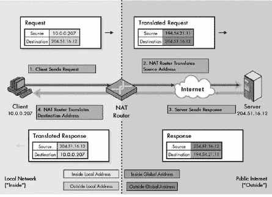
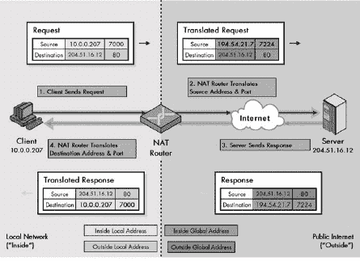
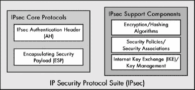
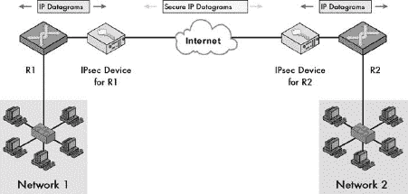
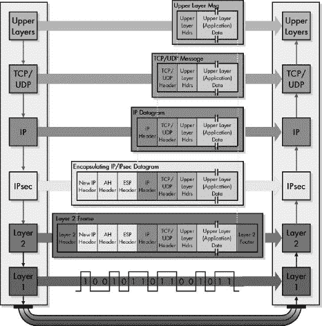
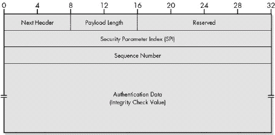
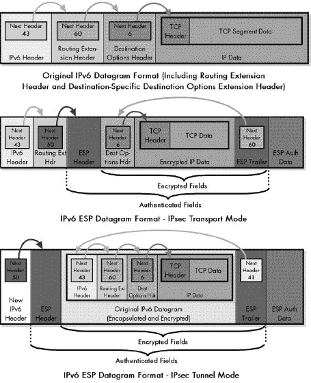
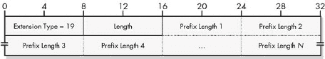
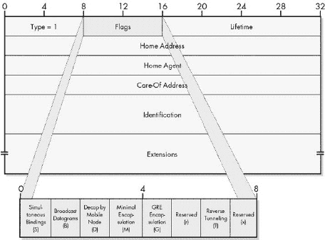
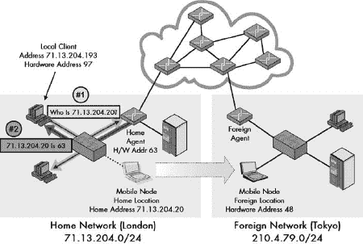

# 第二部分第五部分。与 IP 相关的功能协议

第二十八章

第二十九章

第三十章

前两部分彻底探讨了互联网协议（IP）的第四版和第六版。IP 是一个非常强大的协议，它提供了在 TCP/IP 互联网上寻址、打包和传递信息所需的功能。然而，IP 被有意设计得非常简单，没有很多花哨的功能。为了处理特殊需求，已经创建了许多其他协议来增强或扩展 IP 的功能。我称这些为*与 IP 相关的功能协议*。

本部分包含三个章节，提供了对三个更重要与 IP 相关的功能协议的完整解释。第一章描述了*IP 网络地址转换（IP NAT 或 NAT）*，它允许私有网络在互联网上访问并共享 IP 地址。第二章探讨了*IP 安全（IPsec）*，这是一组子协议，允许对 IP 数据报进行认证和/或加密。第三章涵盖了*移动 IP*协议，它纠正了使用 TCP/IP 与移动主机相关的一些问题。

本部分假设您已经很好地理解了 IP 的操作，这在第二部分的第三部分和第四部分中进行了讨论。

# 第二十八章。IP 网络地址转换（NAT）协议

为了在开发并部署新的 IPv6 协议的同时延长 IPv4 地址方案的寿命，已经开发了一些其他技术。其中最重要的之一是*IP 网络地址转换（NAT）*。这项技术允许少量公网 IP 地址被大量使用私有地址的主机共享。这个基本的工作方案使得全球互联网实际上能够支持比其地址空间通常支持的更多主机。同时，它通过使主机更难以被公网上的外国机器直接寻址，提供了一些安全优势。

在本章中，我提供了 IP NAT 背后的概念描述和对 IP NAT 类型的操作解释。我首先概述了该协议及其优缺点，然后描述了您需要了解的地址术语，以便理解 NAT 的功能以及各种转换技术之间的差异。我解释了地址映射的执行方式以及静态和动态地址映射之间的区别。

然后我解释了四种主要类型的 NAT 的操作：单向、双向、基于端口的和重叠的。我最后简要介绍了与 NAT 相关的兼容性问题。

NAT（网络地址转换）主要是为了解决 IPv4 地址短缺问题而开发的，因此它与 IPv4 相关联并一起使用。虽然可以实现 IPv6 兼容版本的 NAT，但在 IPv6 中，地址转换并不像 IPv4 那样重要，因为 IPv6 的设计目的是为每个 TCP/IP 设备分配其唯一的地址。因此，在本章中，我主要关注 NAT 与 IPv4 的使用。

### 注意

*顺便说一下，大多数人只是称这种技术为*网络地址转换*，而不带*IP*。*然而，在我看来这听起来相当通用，而且由于我这里讨论的是特定于 IP 的版本，我更喜欢明确指出这是一个 IP 特性。话虽如此，为了简便起见，我也经常只说“NAT”，因为这样更简洁。我还应该指出，相当多的人并不认为 NAT 在严格意义上是一个协议*。

# IP NAT 概述

将 IP 地址长度设置为 32 位作为 IP 原始设计的一部分，导致当互联网的普及程度超出任何人的预期时出现了一个严重问题：地址空间的耗尽。无类别寻址有助于更好地利用地址空间，IPv6 的创建确保我们永远不会再次耗尽地址。然而，无类别寻址仅减缓了 IPv4 地址空间的消耗，IPv6 的开发需要数年，部署也需要数年。

如果不实施某种解决方案直到 IPv6 过渡完成，IP 地址的短缺预计将在 20 世纪 90 年代末变得至关重要。互联网工程任务组（IETF）上的创新工程师们接受了这一挑战。他们创造了一种技术，不仅能够延缓地址空间的耗尽，还可以用于解决 20 世纪 90 年代中期到后期出现的以下两个其他日益增长的问题：

**IP 地址成本增加** 任何资源变得稀缺时，其成本就会增加。即使 IP 地址可用，从服务提供商那里获取大量地址的成本也比获取少量地址的成本高。不仅为了整个互联网的缘故，而且为了节省金钱，都有必要节约它们。

**对安全的担忧日益增加** 20 世纪 90 年代，随着互联网的使用增加，更多的坏人开始使用网络。公司直接连接到互联网的机器越多，它们面临的安全风险就越大。

解决这些问题的方法之一是建立一个系统，其中公司的网络不是直接连接到互联网，而是*间接连接*。由于以下重要特性，这种方式的网络设置是可能的，即大多数组织如何使用互联网：

**大多数主机是客户端设备** 互联网是基于客户端/服务器的，大多数主机是客户端。客户端设备通常不需要公开访问。例如，当使用你的本地 PC 访问万维网时，你向服务器发出请求，它们会做出回应，但服务器没有理由试图与你建立联系。客户端，而不是服务器，根据定义开始大多数通信。

**很少的主机同时访问互联网** 当你在同一网络上连接了大量的主机时，通常只有少数主机在任何给定时间试图访问互联网。没有必要假设他们都会同时需要访问服务器。即使你在积极浏览网页时，你也会时不时地停下来阅读信息；你只访问网络服务器进行交易所需的时间。

**互联网通信是路由的** 组织的网络与互联网之间的通信通过路由器进行，它充当流量流量的控制点。

最好的方式来解释为什么这些属性很重要，是通过类比组织如何使用电话来解释，因为许多相同的属性也适用于那里。在典型的组织中，大多数电话都是用来让员工打电话出去的。通常没有必要有直接调用员工的方式；相反，一个系统或一个人可以处理所有来电。在任何给定时间，只有少数员工会打电话给外部世界。所有电话都通过一个管理电话系统的中心点进行路由。

由于这些原因，为了节省金钱，组织不会为每个员工的办公桌运行独立的公共电话线路。相反，它们设置了一个电话系统，其中每个员工都得到一个*分机*，这基本上是一个只在组织内部有效的本地电话号码。一小部分外部线路以池的形式提供给员工共享，电话系统根据需要将内部分机与外部线路匹配。语音邮件系统和人工接待员处理来电的组织路由。是的，当然有些公司会在分机号码和真实电话号码之间进行直接映射。)

可以使用一个非常类似的技术来连接组织的计算机到互联网。在 TCP/IP 网络中，这项技术最初在 1994 年 5 月通过的 RFC 1631，“IP 网络地址转换器（NAT）”中得到了正式化。单词*转换器*指的是实现 NAT 的设备（路由器）。更常见的是，这项技术整体被称为*IP 网络地址转换*（*IP NAT*或*NAT*）。

### 注意

*RFC 1631 的文档状态为信息性。这意味着，技术上讲，IP NAT 不是一个官方的互联网标准*。

NAT 的基本实现涉及使用为本地 IP 网络预留的私有地址范围之一来设置组织的内部网络。组织还会分配一个或多个公共（互联网）地址，并在本地网络和公共互联网之间安装一个或多个具有 NAT 功能的路由器。公共 IP 地址就像电话系统中的外线，而私有地址就像内部分机。

NAT 路由器扮演着电话系统计算机和接待员的角色。它根据需要将内部分机映射到外线，并在需要时处理“来电”。它通过不仅路由 IP 数据报，而且在需要时修改它们来实现这一点，从而将数据报中的地址从私有网络转换为用于在互联网上传输的公共地址，然后再转换回来。

### 小贴士

**关键概念** *IP 网络地址转换* (*IP NAT* 或 *NAT*) 是一种技术，允许组织使用私有地址建立网络，同时仍然允许在公共互联网上进行通信。具有 NAT 功能的路由器根据需要将私有地址转换为公共地址，反之亦然。这允许少量公共 IP 地址在大量设备之间共享，并提供其他好处，但也存在一些缺点。

随着时间的推移，也创建了 NAT 的新版本。它们解决了其他问题或提供了额外的功能。*基于端口的 NAT* 通过让两个或多个设备每次共享一个 IP 地址，允许在有限的 IP 地址上共享更多的主机。所谓的*双重 NAT* 通过在传入和传出数据报中转换源地址和目标地址，有助于虚拟专用网络（VPN）的实施。

## IP NAT 的优点

NAT 是那些具有长串优缺点列表的技术之一。这意味着它在各种场景中可能极其有用，但在其他情况下也可能有问题。主要优点如下：

**公共 IP 地址共享** 大量主机可以共享少量公共 IP 地址。这不仅可以节省费用，还可以节约 IP 地址空间。

**更容易扩展** 由于本地网络设备使用私有地址，并且不需要为每个设备分配公共 IP 地址，因此很容易将新客户端添加到本地网络。

**更大的本地控制** 管理员可以获得与私有网络相关的所有控制好处，但仍可以连接到互联网。

**在互联网服务提供商（ISP）服务方面的更大灵活性** 更改组织的 ISP 更容易，因为只有公共地址会改变。不需要重新编号网络上的所有客户端计算机。

**增强安全性** NAT 转换代表了一种间接层次。因此，它自动在组织的网络和公共互联网之间创建了一种防火墙。由于客户端没有公开的 IP 地址，恶意用户直接访问任何客户端设备变得更加困难。

**（大部分）透明** NAT 实现主要是透明的，因为更改发生在一个或几个路由器上。成百上千的主机本身不需要更改。

## IP NAT 的缺点

列出的先前优点都是使用 NAT 的好理由，但这项技术也有其缺点：

**复杂性** NAT 在设置和管理网络方面代表了一种额外的复杂性。它还由于地址替换而使得故障排除更加复杂。

**由于缺乏公网地址的问题** 由于客户端主机机器缺乏真实的 IP 地址，某些功能可能无法正常工作。

**与某些应用的兼容性问题** 我之前提到 NAT 只是大部分透明。实际上，由于 NAT 在数据报中的 IP 头部字段中而不是在应用数据中篡改，某些应用存在兼容性问题。这意味着像文件传输协议（FTP；见第七十二章"))这样的工具，在命令中传递 IP 地址和端口号，必须特别处理，并且某些应用可能无法工作。

**与安全协议的问题** 如 IPsec 这样的协议旨在检测头部修改，并且通常对 NAT 所做的更改表示反对，因为它们无法区分这些更改和恶意数据报黑客行为。仍然可以将 NAT 和 IPsec 结合起来，但这变得更加复杂。

**对客户端访问的支持不足** 每个客户端缺乏公网 IP 地址是一把双刃剑；它保护了主机免受黑客尝试访问，但同时也使得对本地网络中客户端的合法访问变得困难。对等应用（P2P）的设置更加困难，而像组织网站（作为整体从互联网访问）通常需要在没有 NAT 的情况下设置。

**性能降低** 每次数据报在私有网络和互联网之间转换时，都需要进行地址转换。此外，还需要执行其他工作，例如重新计算头部校验和。每次单独的转换需要很少的努力，但当你加起来时，你正在放弃一些性能。

其中一些可能会抵消前述列表中某些项目的某些好处。然而，许多组织认为其优点超过了缺点，特别是如果他们主要以客户端/服务器模式使用互联网，就像大多数人一样。因此，NAT 已经变得非常流行。然而，请记住，导致 NAT 的主要问题是地址空间不足。IPv6 解决了这个问题，而 NAT 只是找到了一个巧妙的解决方案。因此，许多人认为 NAT 是一种 kludge。一旦部署 IPv6，它将不再需要，有些人甚至不喜欢它用于 IPv4。另一方面，有些人认为它的其他好处使其即使在 IPv6 中也有考虑的价值。

### **注意**

*A* kludge (*或* kluge) *是一种以不优雅的方式解决问题的方法，就像用可调扳手的侧面敲钉子一样。

# IP NAT 地址术语

如其名称明显所示，IP NAT 完全是关于 IP 地址的*转换*。当数据报在组织的私有网络和公共互联网之间传递时，NAT 路由器会更改这些数据报中的一个或多个地址。这种转换意味着在 NAT 环境中，每笔交易不仅涉及源地址和目的地址，还可能涉及源和目的地的多个地址。

为了更清楚地解释 NAT 的工作原理，已经开发了一些特殊名称来指代在使用 NAT 时可以在 IP 数据报中找到的不同类型的地址。不幸的是，NAT 中使用的地址术语可能会令人困惑，因为很难想象（通常听起来相似）名称之间的区别。然而，如果不了解这些地址的含义，就无法正确理解 NAT 的操作。

地址区分的第一种方式是基于设备在网络中的位置，如下所示：

**内部地址** 组织私有网络中任何使用 NAT 的设备都被称为内部网络。因此，任何以任何形式指向本地网络设备的地址都称为*内部地址*。

**外部地址** 公共互联网——即本地网络之外的一切——被认为是外部网络。任何指向公共互联网设备的地址都是*外部地址*。

### **提示**

**关键概念** 在 NAT 中，术语*内部*和*外部*用于识别设备的位置。*内部地址*指的是组织私有网络中的设备。*外部地址*指的是公共互联网上的设备。

内部设备始终具有内部地址；外部设备始终具有外部地址。然而，根据地址在数据报中出现的网络部分，有两种不同的方式来指定内部或外部设备：

**本地地址** 这个术语描述的是出现在内部网络数据报上的地址，*无论它是指内部地址还是外部地址*。

**全局地址** 这个术语描述的是出现在外部网络数据报上的地址，再次强调，无论它是指内部地址还是外部地址。

### 小贴士

**关键概念** 在 NAT 中，术语*本地*和*全局*用来指示特定地址出现在哪个网络中。*本地地址*用于组织的私有网络中（无论是引用内部设备还是外部设备）。*全局地址*用于公共互联网上（再次强调，无论是引用内部设备还是外部设备）。

这有点令人困惑，所以我将尝试进一步解释。NAT 转换路由器负责连接内部网络与外部网络（互联网）。内部设备需要能够与外部设备通信，反之亦然，但内部设备只能使用与本地网络寻址方案一致的地址。同样，外部设备不能使用本地地址。因此，内部和外部设备都可以用本地或全局地址版本来引用。这产生了四种不同的特定地址类型：

**内部本地地址** 使用其正常的本地设备表示法表示的本地网络设备地址。例如，如果你有一个使用 10.0.0.0 私有地址块并分配地址 10.0.0.207 的客户端，这将是其*内部本地*地址。

**全局地址** 这是一个全局的、可公开路由的 IP 地址，用于在内部设备与外部世界之间进行表示。在 NAT 配置中，*内部全局*地址是指分配给组织并由 NAT 路由器使用的实际 IP 地址。假设设备 10.0.0.207 想要向位于地址 204.51.16.12 的互联网服务器发送一个 HTTP 请求。它使用 10.0.0.207 作为源地址来形成数据报。然而，如果这个数据报以原样发送到互联网，服务器无法回复，因为 10.0.0.207 不是一个公开可路由的 IP 地址。因此，NAT 路由器将数据报中的 10.0.0.207 转换成组织注册的 IP 地址之一，比如 194.54.21.10。这是与 10.0.0.207 相对应的*内部全局*地址。当服务器发送其 HTTP 响应时，它将用作目标地址。请注意，在某些情况下，内部本地地址和外部本地地址可能是相同的。

**外部全局地址** 这是外部（公共互联网）设备在全局互联网上的引用地址。这基本上是互联网上设备的常规、公开注册的地址。在先前的例子中，204.51.16.12 是一个公共服务器的*外部全局*地址。

**外部本地地址** 外部设备在本地网络设备中引用的地址。在某些情况下，这可能与该外部设备的**外部全局**地址相同。

呼吸一下，这仍然很困惑，不是吗？让我们尝试另一种看待这个问题的方式。在这四个地址中，两种类型是内部或外部设备本地产生的地址，而另外两种是转换地址。以下是一个总结：

**内部设备标识** 对于内部设备，其**内部本地**地址是其正常或本地地址。其**内部全局**地址是一个用于在必要时在外部网络上表示内部设备的转换地址。

**外部设备标识** 对于外部设备，其**外部全局**地址是其正常或本地地址。其**外部本地**地址是一个用于在必要时在内部网络上表示外部设备的转换地址。

因此，NAT 所做的是将内部或外部设备的标识从本地表示转换为全局表示，反之亦然。地址如何更改以及具体类型取决于所使用的 NAT 类型。例如，在传统 NAT 中，内部设备使用它们的正确（全局）表示来引用外部设备，因此这些外部设备的全局外部和本地外部地址是相同的。

### 小贴士

**关键概念** NAT 路由器将**本地**地址转换为**全局**地址，反之亦然。因此，一个**内部本地**地址被转换为**内部全局**地址（反之亦然），一个**外部本地**地址被转换为**外部全局**地址（反之亦然）。

经过所有这些之后，仍然很困惑！一个很大的问题是，“内部”和“本地”这两个词在某种程度上是同义的，同样，“外部”和“全局”也是，但在 NAT 中它们的意思却不同。在试图解释网络概念时，典型的悖论再次显现：我想定义这些地址来使描述 NAT 操作更容易，但发现自己需要用 NAT 操作的例子来澄清地址的使用方式。

即使写完这些材料后，我发现这些术语仍然令人困惑，所以我创建了图 28-1 术语。希望这个图表能帮助你更好地理解整个“内部/外部/本地/全局”的概念。")，它以图形形式展示了这些术语，可能有所帮助。该图表也用作本章其余部分不同类型 NAT 插图模板。在阅读关于 NAT 操作的内容时，如果你想要再次检查地址类型，请回到这里。如果需要几次才能弄清楚地址，不要气馁。

图 28-1. IP 网络地址转换（NAT）术语。希望这个图表能帮助你更好地理解整个“内部/外部/本地/全局”的概念。

# IP NAT 静态和动态地址映射

NAT 允许你通过在连接两个网络的路由器中实现地址转换算法，将私有（内部）网络连接到公共（外部）网络，如互联网。每次 NAT 路由器遇到跨越两个网络边界的 IP 数据报时，它都必须适当地转换地址。但它如何知道要转换什么以及使用什么作为转换地址呢？

路由器中的 NAT 软件必须维护一个*转换表*，以告知其如何操作。转换表包含将内部设备（它们的常规地址）的*内部本地*地址映射到*内部全局*地址表示（用于外部通信的特殊公共地址）的信息。如果适当，它还可能包含*外部全局*地址和*外部本地*地址之间的映射，用于入站交易。

向 NAT 转换表中添加条目的两种基本方式是：静态或动态。

## 静态映射

静态映射表示在*全局*和*本地*地址表示之间定义的永久、固定关系，无论是*内部*还是*外部*设备的地址。例如，如果你想使具有*内部本地*地址 10.0.0.207 的内部设备始终使用*内部全局*地址 194.54.21.10，你可以使用静态转换。每当 10.0.0.027 与互联网发起交易时，NAT 路由器都会将此地址替换为 194.54.21.10。

## 动态映射

在动态映射中，*全局*和*本地*地址表示由 NAT 路由器自动生成，按需使用后即丢弃。这种用法最常见的方式是允许一个*内部全局*地址池被大量*内部*设备共享。

例如，假设你正在使用动态映射，并且有一个从 194.54.21.1 到 194.54.21.20 的*内部全局*地址池。当 10.0.0.207 向互联网发送请求时，它的源地址不会自动被替换为 194.54.21.10。NAT 路由器会从池中的 20 个地址中选择一个。然后，路由器会监视使用该地址返回的回复，并将它们转换回 10.0.0.207。当会话完成后，它会丢弃条目，将*内部全局*地址返回到池中。

## 在静态和动态映射之间进行选择

静态和动态 NAT 映射之间的权衡与静态和动态之间的选择时几乎总是相同的。例如，在地址解析协议（ARP）缓存中也会出现相同的问题；参见第十三章。

静态映射是永久的，因此非常适合需要在外部网络上始终以相同的公共地址表示的设备。它们也可以用来允许特定设备的入站流量；也就是说，它们可以用于在公共网络上发起的交易，这些交易发送到内部网络上的特殊服务器。然而，它们需要手动设置和维护，并且不允许在内部网络上共享 IP 地址。

动态映射通常用于常规客户端，以便促进公共 IP 地址的共享——这是大多数 NAT 实现的主要目标。它比静态映射更复杂，但一旦设置好，就会自动进行。

当然，可以在同一系统上混合动态和静态映射。你可以指定某些静态映射的设备，其余的则使用动态映射。你只需确保静态映射不会与用于动态分配的池重叠。

顺便提一下，你还可以通过使用域名系统（DNS；参见第五十二章）进行域名解析来执行全局和本地地址的动态映射。这在外部设备使用双向 NAT（入站事务）访问内部主机时尤其常见。由于公共互联网上的主机对组织的私有网络一无所知，它们会发出请求以获取他们想要访问的设备的 DNS 名称。这会导致生成一个 NAT 转换条目，将主机的内部本地公共地址映射到内部全局地址，以便网络外部的用户使用。关于双向 NAT 的工作原理的更多细节，请参见本章后面的描述。

# IP NAT 单向（传统/出站）操作

现在是时候深入了解它是如何工作的了。NAT 有许多不同的版本，本章涵盖了四种常见的版本。从 RFC 1631 中描述的原始 NAT 版本开始看是有意义的。这是最简单的 NAT 方法，因此也是最容易解释的。

NAT 被设计为允许私有网络上的主机在访问互联网时共享公网 IP 地址。由于大多数主机是发起事务的客户端，NAT 是在假设客户端/服务器请求/响应通信将以从*内部*网络发送到*外部*的数据报开始的情况下设计的。因此，这种 NAT 类型有时被称为*单向*或*出站*NAT。由于它是最古老的版本，现在也被称为*传统*NAT，以区分较新的类型。

为了展示单向 NAT 的工作原理，我将使用一个例子。假设内部网络有 250 个主机，它们使用 10.0.0.0/8 地址范围内的私有（内部本地）地址（我选择这个范围是因为数字较小！）。这些主机使用动态 NAT，共享从 194.54.21.1 到 194.54.21.20 的 20 个内部全局地址。

在这个例子中，设备 10.0.0.207 想要访问公网地址 204.51.16.12 上的万维网服务器。表 28-1 展示了在这个（简化）事务中涉及的四个基本步骤。我将其以表格形式呈现，以便明确展示请求数据报（步骤 1 和 2）和响应数据报（步骤 3 和 4）中的地址发生了什么变化。我还为了清晰起见，突出了翻译后的地址值，并提供了图 28-2，它以图形方式展示了这个过程。

表 28-1. 单向（传统/出站）NAT 的操作

| 步骤编号 | 描述 | 数据报类型 | 数据报源地址 | 数据报目的地址 |
| --- | --- | --- | --- | --- |
| 1 | **内部客户端生成请求并发送到 NAT 路由器**：设备 10.0.0.207 生成一个 HTTP 请求，最终传递到 IP 层并封装在 IP 数据报中。源地址是自身，10.0.0.207，目的地是 204.51.16.12。数据报被发送到能够连接组织内部网络到互联网的 NAT 路由器。 | 请求（从内部客户端到外部服务器） | 10.0.0.207（内部本地） | 204.51.16.12（外部本地） |
| 2 | **NAT 路由器转换源地址并发送到外部服务器**：NAT 路由器意识到 10.0.0.207 是一个 *内部本地* 地址，并且知道它必须替换一个 *内部全局* 地址，以便让公共互联网目标做出响应。它查阅其地址池并看到下一个可用的地址是 194.54.21.11。它将数据报中的源地址从 10.0.0.207 更改为 194.54.21.11。在传统 NAT 中，目标地址不会被转换。换句话说，*外部本地* 地址和 *外部全局* 地址是相同的。NAT 路由器将其从 10.0.0.207 到 194.54.21.11 的映射放入其转换表中。它发送修改后的数据报，该数据报最终被路由到 204.51.16.12 的服务器。 |   | 194.54.21.11 (内部全局) | 204.51.16.12 (外部全局) |
| 3 | **外部服务器生成响应并发送回 NAT 路由器**：204.51.16.12 的服务器生成一个 HTTP 响应。它不知道 NAT 是否被涉及；它看到发送给它的请求中包含 194.54.21.11，因此它将响应发送到那里。然后它被路由回原始客户端的 NAT 路由器。 | 响应（从外部服务器到内部客户端） | 204.51.16.12 (外部全局) | 194.54.21.11 (内部全局) |
| 4 | **NAT 路由器转换目标地址并将数据报发送到内部客户端**：NAT 路由器看到从互联网到达的响应中包含 194.54.21.11。它查阅其转换表并知道这个数据报是针对 10.0.0.207 的。这次，目标地址改变了，但源地址没有变。然后它将数据报发送回原始客户端。 |   | 204.51.16.12 (外部本地) | 10.0.0.207 (内部本地) |

图 28-2. 单向（传统/出站）NAT 操作图。您可以通过按顺时针顺序遵循这些步骤来查看此过程中的四个步骤。已转换的地址以粗体显示。有关四种地址类型的解释，请参阅 表 28-1 和 图 28-1 术语。希望这个图表能帮助您更好地理解整个“内部/外部/本地/全局”的概念。")。

如您所见，这其实并不是什么火箭科学，一旦您习惯了术语和概念，理解正在发生的事情就相当容易。在单向 NAT 中，源地址在出站数据报中被转换，而目的地址在入站数据报中被转换。传统 NAT 仅支持这种类型的出站事务，这种事务是由内部网络中的设备启动的。它无法处理向公共互联网上的私有地址发送请求的设备。

### 小贴士

**关键概念** 在*单向*（传统）NAT 中，NAT 路由器将出站请求的源地址从内部本地转换为内部全局形式。然后它将响应的目的地址从内部全局转换为内部本地。在请求和回复中，外部本地和外部全局地址是相同的。

还要注意，尽管我主要关注 NAT 路由器对地址所做的更改，但它也必须对数据报进行其他更改。更改 IP 头中的任何字段意味着需要重新计算 IP 头校验和字段。用户数据报协议（UDP）和传输控制协议（TCP）校验和也需要重新计算，并且根据数据报中数据的特点，可能还需要进行其他更改。我将在本章末尾关于 NAT 兼容性问题的部分中讨论这些问题。

顺便提一下，这个简化的示例假设在私有网络和公共网络之间只有一个路由器。在这些网络之间可能有多个路由器。但是，如果使用这种配置，则它们必须使用相同的转换表。否则，如果路由器 R1 处理请求，但路由器 R2 收到响应，路由器 R2 将不知道如何转换入站数据报上的目的地址。这使得动态映射变得极其困难：路由器必须协调它们的地址映射。

# IP NAT 双向（双向/入站）操作

传统 NAT 设计用于处理仅出站事务；本地网络上的客户端发起请求，互联网上的设备发送响应。然而，在某些情况下，我们可能希望反方向进行。也就是说，我们可能希望外部网络上的设备与内部网络上的设备发起事务。为了允许这样做，我们需要比传统版本更强大的 NAT 类型。这种增强有多种名称，最常见的是双向 NAT、双向 NAT 和入站 NAT。所有这些名称都传达了这种 NAT 允许您在前面主题中看到的类型的事务，以及从外部网络发起的事务。

在入站事务上进行 NAT 比传统的出站 NAT 更困难。要理解为什么，请记住使用 NAT 时的网络配置本质上是*不对称的*：内部网络通常知道外部设备的 IP 地址，因为它们是公开的，但外部网络不知道内部网络的私有地址。即使它们知道这些地址，它们也无法作为从外部发起的 IP 数据报的目标，因为它们是不可路由的——没有方法将它们发送到私有网络的本地路由器。

这有什么关系呢？好吧，考虑一下内部网络中设备 A 向外部网络中设备 B 进行 NAT 的情况。本地客户端 A 总是首先开始事务，因此设备 A 的 NAT 路由器能够在请求期间创建一个映射，将设备 A 的内部本地地址和内部全局地址关联起来。设备 B 是已翻译数据报的接收者，所以设备 A 使用 NAT 的事实被隐藏了。设备 B 进行响应，NAT 路由器进行反向翻译，而设备 B 甚至不知道为设备 A 使用了 NAT。

现在让我们看看入站的情况。在这里，设备 B 试图向使用 NAT 的设备 A 发送数据。设备 B 不能直接发送到设备 A 的私有（内部本地）地址。它需要设备 A 的内部全局地址来开始这个过程。然而，设备 A 的 NAT 路由器并不在设备 B 附近。实际上，设备 B 甚至可能不知道设备 A 的 NAT 路由器的身份！

这就只剩下两种方法。一种是为需要从外部访问的内部网络中的设备（如服务器）使用静态映射。当使用静态映射时，使用静态映射的设备的全局地址将是公开的，这解决了“我该向哪里发送请求”的问题。

另一个解决方案是利用 DNS。正如在 DNS 部分详细解释的那样（见第三部分-1)，该协议允许请求以名称而不是 IP 地址的形式发送。DNS 服务器将这些名称转换为相应的地址。可以将 DNS 和 NAT 集成在一起，使它们协同工作。这个过程在 RFC 2694，“DNS 对网络地址转换器的扩展（DNS_ALG）”中有描述。

在这种技术中，外部设备可以利用动态映射。基本过程（高度简化）如下：

1.  外部设备使用它想要到达的内部网络设备的名称发送 DNS 请求。例如，它可能是[www.ilikenat.com](http://www.ilikenat.com)。

1.  内部网络的 DNS 服务器将[www.ilikenat.com](http://www.ilikenat.com)名称解析为对应此 DNS 条目的设备的*内部本地*地址。

1.  *内部本地* 地址被传递给 NAT，并用于在从外部访问的服务器的 *内部本地* 地址和 *内部全局* 地址之间创建动态映射。此映射被放入 NAT 路由器的转换表中。

1.  当 DNS 服务器发送回名称解析时，它告诉外部设备之前步骤中映射的 *内部全局*（公共）地址，而不是正在寻找的服务器的 *内部本地*（私有）地址。

一旦外部设备知道内部网络中设备的内部全局地址，交易就可以开始了。让我们使用上一节中的相同示例，但这次我们将其反转，以便外部设备 204.51.16.12 发起请求（因此现在它是 *客户端*），向内部设备 10.0.0.207（它是 *服务器*）发起请求。假设已经使用了静态映射或 DNS，以便外部设备知道 10.0.0.207 的内部全局地址实际上是 194.54.21.6。表 28-2 详细描述了交易过程，并在图 28-3 中进行了说明。

图 28-3. 双向（双向/入站）NAT 操作此图与图 28-2 非常相似，除了事务是反向的，因此从右上角开始，逆时针进行。已转换的地址以粗体显示。表 28-2 包含对四个步骤的完整解释。请参阅图 28-1 以了解地址类型的解释。

表 28-2. 双向（双向/入站）NAT 操作

| 步骤 # | 描述 | 数据报类型 | 数据报源地址 | 数据报目的地址 |
| --- | --- | --- | --- | --- |
| 1 | **外部客户端生成请求并发送到 NAT 路由器**：设备 204.51.16.12 向内部服务器生成请求。它使用*内部全局*地址 194.54.21.6 作为目的地址。数据报将被路由到该地址的本地路由器，即服务位于内部网络的 NAT 路由器。 | 请求（从外部客户端到内部服务器） | 204.51.16.12（外部全局） | 194.54.21.6（内部全局） |
| 2 | **NAT 路由器转换目的地址并发送到内部服务器**：NAT 路由器已经从*内部全局*地址映射到服务器的*内部本地*地址。它将 194.54.21.6 目的地址替换为 10.0.0.207，并根据需要执行校验和重新计算和其他工作。源地址不进行转换。然后路由器将修改后的数据报发送到位于 10.0.0.207 的内部服务器。 |  | 204.51.16.12（外部本地） | 10.0.0.207（内部本地） |
| 3 | **内部服务器生成响应并发送回 NAT 路由器**：位于 10.0.0.207 的服务器生成响应，将其地址设置为 204.51.16.12，因为这是向它发送请求的来源。然后将其路由到服务器的 NAT 路由器。 | 响应（从内部服务器到外部客户端） | 10.0.0.207（内部本地） | 204.51.16.12（外部本地） |
| 4 | **NAT 路由器转换源地址并将数据报路由到外部客户端**：NAT 路由器在响应中看到私有地址 10.0.0.207，并将其替换为 194.54.21.6。然后它将此路由回外部网络上的原始客户端。 |  | 194.54.21.6（内部全局） | 204.51.16.12（外部全局） |

如您所见，一旦外部设备知道内部设备的 *内部全局* 地址，您会发现入站 NAT 与出站 NAT 非常相似。它只是执行相反的转换。而不是修改出站请求的源地址和入站响应的目的地址，路由器更改入站请求的目的地址和出站回复的源地址。

### 小贴士

**关键概念** 在传统的 NAT 中，交易必须从本地网络上的客户端请求开始，但在 *双向*（双向/入站）NAT 中，公共互联网上的设备可以访问本地网络服务器。这需要使用静态映射或 DNS 向外部客户端提供内部网络上服务器的地址。然后，NAT 交易基本上与单向情况相同，只是方向相反：传入请求的目的地址从 *内部全局* 更改为 *内部本地*；响应的源地址从 *内部本地* 更改为 *内部全局*。

# IP NAT 基于端口的操作（过载）

传统的 NAT 和双向 NAT 都是通过根据需要交换内部网络和外部网络地址来工作的，以便允许私有网络访问公共网络。对于每次交易，私有网络中设备上的 *内部本地* 地址与代表它在公共网络上出现的 *内部全局* 地址之间有一个一对一的映射。我们可以使用动态地址分配，允许大量私有主机共享少量已注册的公共地址。

然而，这里有一个潜在的陷阱。考虑之前的 NAT 示例，其中 250 个主机共享 20 个内部全局（公共）地址。如果已经有 20 个主机正在进行交易，那么当第 21 个尝试访问互联网时会发生什么？没有可用的 *内部全局* 地址供其使用，因此它将无法访问。

幸运的是，TCP/IP 已经内置了一种机制，可以帮助我们缓解这种情况。TCP/IP 传输层协议中的两个协议，TCP 和 UDP，都使用了额外的寻址组件，称为 *端口*。TCP 或 UDP 消息中的端口号有助于识别两个地址之间的单个连接。它用于允许 TCP/IP 客户端和服务器上的许多不同应用程序同时进行通信，而不会相互干扰。例如，当你打开多个浏览器窗口以同时访问同一网站上的多个网页时，你使用这种能力。这种在许多连接之间共享 IP 地址的行为称为 *复用*。第四十三章，它描述了 TCP 和 UDP 端口，对此进行了更详细的说明。

现在让我们回到 NAT（网络地址转换）。在我们发送数据报文在互联网的公共部分和私有部分之间时，我们已经在转换 IP 地址了。如果我们还能转换端口号呢？嗯，我们可以！地址和端口的组合唯一地标识了一个连接。当数据报文从私有网络传递到公共网络时，我们不仅可以更改 IP 地址，还可以更改 TCP 或 UDP 头中的端口号。数据报文将以不同的源地址和端口号发送出去。响应将返回到这个相同的地址和端口号组合（称为*套接字*）并可以再次进行转换。

这种方法有不同的名称。由于它是一种可以使多个内部本地地址共享单个内部全局地址的技术，因此被称为*内部全局地址的* *过载*，或者简单地称为*过载 NAT*。更优雅的名称能更好地说明该技术的工作方式，包括*基于端口的 NAT、网络地址端口转换（NAPT）*和*端口地址转换（PAT）*。

### 小贴士

**关键概念** *基于端口的* 或过载 NAT 是常规 NAT 的增强，它允许私有网络上的大量设备通过更改 TCP 和 UDP 消息中使用的端口号，同时共享一个单一的内部全局地址。

无论其名称如何，在转换中使用端口号具有巨大的优势。它可以允许私有网络上的所有 250 台主机只使用 20 个 IP 地址——甚至可能更少。理论上，甚至可以一次性让所有 250 台共享一个单一的公共 IP 地址！你不希望共享太多的本地主机以至于用完端口号，但可供选择的端口号有数千个。

基于端口的 NAT 需要一台被编程来在传输数据报文时在网络上进行适当的地址和端口映射的路由器。这种方法的不利之处包括更大的复杂性，以及更多兼容性问题（例如与 FTP 等应用程序），因为你现在必须在高层监视端口号，而不仅仅是 IP 地址。

NAPT/PAT 的操作与常规 NAT 的工作方式非常相似，只是端口也会被转换。对于传统的出站事务，源端口号码在修改源地址的同时在请求上更改；响应中的目标端口号码与目标地址一起修改。

让我们再次考虑你在传统 NAT 主题中查看的示例，但这次是在 PAT 环境中。设备 10.0.0.207 是私有网络上的 250 个主机之一，它访问了位于 204.51.16.12 的万维网服务器。假设由于使用了 PAT，为了节省费用，所有 250 个主机都在共享一个单一的*内部全局*地址，194.54.21.7，而不是一个 20 个地址的池。事务将按照表 28-3 中描述并在表 28-3 中展示的方式进行。

### 提示

**关键概念** 在基于端口的 NAT 中，NAT 路由器将内部本地请求的源地址和端口号转换为内部全局形式。然后，它将响应的目的地址和端口号从内部全局转换为内部本地。在外部本地和外部全局地址在请求和回复中是相同的。

与 NAPT/PAT 相关的一个其他问题也值得提及：它假设所有流量在传输层都使用 UDP 或 TCP。尽管这通常是情况，但它可能并不总是如此。如果没有端口号，则无法进行端口转换，该方法将无法工作。

图 28-4. 基于端口的（过载）NAT 操作 此图与表 28-3 非常相似，除了显示了源和目的端口号，因为它们在这种类型的 NAT 中使用。已翻译的地址和端口以粗体显示。表 28-3 包含了基于端口 NAT 的四个步骤的完整解释。请参考图 28-1 来解释地址类型。

表 28-3. 基于端口的（过载）NAT 操作

| 步骤编号 | 描述 | 数据包类型 | 数据包源地址:端口 | 数据包目的地址:端口 |
| --- | --- | --- | --- | --- |
| 1 | **内部客户端生成请求并发送至 NAT 路由器**：设备 10.0.0.207 向服务器 204.51.16.12 生成一个 HTTP 请求。WWW 的标准服务器端口是 80，所以请求的目标端口是 80；假设客户端的源端口是 7000。数据报被发送到连接组织内部网络到互联网的 NAT 兼容路由器。 | 请求（从内部客户端到外部服务器） | 10.0.0.207:7000 (内部本地) | 204.51.16.12:80 (外部本地) |
| 2 | **NAT 路由器转换源地址和端口并发送到外部服务器**：NAT 路由器意识到 10.0.0.207 是一个 *内部本地* 地址，并且知道它必须替换为一个 *内部全局* 地址。然而，这里有多个主机共享单个 *内部全局* 地址 194.54.21.7。假设端口 7000 已经被另一个私有主机连接使用。路由器替换了 *内部全局* 地址，并为这个请求选择了一个新的源端口号，比如 7224。目标地址和端口没有变化。NAT 路由器将地址和端口映射放入其转换表中。它发送修改后的数据报出去，该数据报到达服务器 204.51.16.12。 |   | 194.54.21.7:7224 (内部全局) | 204.51.16.12 (外部全局) |
| 3 | **外部服务器生成响应并发送回 NAT 路由器**：服务器在 204.51.16.12 生成一个 HTTP 响应。它不知道 NAT 是否被涉及；它看到发送给它的请求中有一个地址 194.54.21.7 和端口 7224，因此它将响应发送回那个地址和端口。 | 响应（从外部服务器到内部客户端） | 204.51.16.12:80 (外部全局) | 194.54.21.7:7224 (内部全局) |
| 4 | **NAT 路由器转换目标地址和端口并将数据报发送到内部客户端**：NAT 路由器看到从互联网到达的响应中包含的地址 94.54.21.7 和端口 7224。它查阅其转换表并知道这个数据报是针对 10.0.0.207，端口 7000 的。这次，目标地址和端口发生了变化，但源地址没有变。然后路由器将数据报发送回原始客户端。 |   | 204.51.16.12:80 (外部本地) | 10.0.0.207:7000 (内部本地) |

# IP NAT 重叠/双重 NAT 操作

到目前为止讨论的所有三种 NAT 版本——传统、双向和基于端口的 NAT——通常用于将使用私有、不可路由地址的网络连接到使用唯一、已注册、可路由地址的公共互联网。使用这些类型的 NAT，内部和外部网络的地址空间通常不会有重叠，因为前者是私有的，后者是公共的。这使得 NAT 路由器能够仅通过查看地址就能立即区分内部地址和外部地址。

在你迄今为止看到的例子中，内部地址都是从 RFC 1918 块 10.0.0.0 来的。这些不能是公共互联网地址，所以 NAT 路由器知道在这个范围内由内部网络内的请求引用的任何地址都是内部网络内的本地引用。同样，任何在这个范围之外的地址都很容易识别为属于外部世界。

然而，在某些情况下，内部网络使用的地址和外部网络部分使用的地址之间可能确实存在重叠。考虑以下情况：

**私有网络到私有网络连接** 使用 10.0.0.0 块地址的示例网络可能希望连接到另一个使用相同方法的网络。这种情况可能发生在两家公司合并并恰好使用相同的寻址方案（而且私有 IP 块并不多，所以这种情况并不罕见）。

**将公共地址空间无效分配给私有网络** 一些网络可能不是通过使用指定的私有地址块来设置的，而是使用包含有效互联网地址的块。例如，假设一位管理员决定他正在设置的整个网络永远不会连接到互联网（哈哈！），并使用麻省理工学院（MIT）的 18.0.0.0 地址来编号整个网络，这些地址属于麻省理工学院。然后，当这个网络确实需要连接到互联网时，这位管理员的短视将会适得其反。

**过时的公共地址分配** 公司 A 可能多年来一直在使用某个特定的地址块，但由于某种原因被重新分配或重新分配给了公司 B。公司 A 可能不想麻烦重新编号其网络，因此会保留其地址，即使公司 B 开始在互联网上使用它们。

这些情况都有一个共同点，那就是私有网络中使用的内部地址与公共网络上的地址重叠。当从本地网络发送数据报时，NAT 路由器无法判断目标是在内部网络还是外部网络。例如，如果你想在私有网络中将主机 10.0.0.207 连接到另一个网络中的主机 10.0.0.199，并将 10.0.0.199 放在数据报的目标中并发送它，那么路由器如何知道你是想连接到你的本地网络上的 10.0.0.199 还是远程网络上的 10.0.0.199？至于发送到另一个私有网络中的 10.0.0.207 的请求，你的自己的地址！以使用 MIT 地址块编号的网络为例。路由器如何知道数据报是实际发送到 MIT 还是私有网络上的另一个设备？

解决这个困境的方法是使用更复杂的 NAT 形式。你之前看到的版本总是转换数据包从内部网络到外部网络或相反方向时的源地址或目的地址。为了处理重叠地址，我们必须在每个从内部到外部或相反方向的转换中同时转换源地址和目的地址。这种技术被称为*重叠 NAT*，以解决它所解决的问题，或者称为*Twice NAT*，因为它解决问题的方法。（顺便说一下，尽管有后者的名称，常规 NAT 并不被称为 Once NAT。）

Twice NAT 通过创建一组映射，不仅为 NAT 路由器服务的私有网络，还包括与内部网络地址空间冲突的重叠网络（或多个网络）。为了实现这一点，Twice NAT 依赖于 DNS 的使用，就像双向 NAT 一样。这使得内部网络能够以唯一标识的方式向重叠网络发送请求。否则，路由器无法确定我们的内部网络试图联系哪个重叠网络。

让我们尝试一个新的例子。假设网络被错误地编号，因此它不在 10.0.0.0 私有块中，而是在 MIT 使用的 18.0.0.0 块中。我们私有网络上的一个客户端，18.0.0.18，想要向服务器[www.twicenat.mit.edu](http://www.twicenat.mit.edu)发送请求，该服务器在 MIT 的地址是 18.1.2.3。客户端不能直接使用 18.1.2.3 作为目的地址并发送数据包，因为路由器会认为它在本地网络中，不会进行路由。相反，18.0.0.18 使用 DNS 和 NAT 的组合来获取外部设备地址，如下所示：

1.  本地网络上的客户端（18.0.0.18）发送一个 DNS 请求以获取[www.twicenat.mit.edu](http://www.twicenat.mit.edu)的地址。

1.  为本地网络服务的（与 Twice-NAT 兼容）NAT 路由器拦截这个 DNS 请求。然后它查阅其表格以找到这个外部设备的特殊映射。假设它被编程为将[www.twicenat.mit.edu](http://www.twicenat.mit.edu)转换为地址 172.16.44.55。这是一个私有、不可路由的 RFC 1918 地址。

1.  NAT 路由器将这个值，172.16.44.55，返回给源客户端，客户端使用它作为目的地址。

一旦客户端获得了转换后的地址，它就像以前一样启动一个事务。现在 NAT 将执行内部设备和外部设备的转换。外部设备地址必须进行转换，因为内部设备正在使用 172.16.44.55，这不是它试图到达的服务器的有效地址。内部设备地址仍然需要像常规 NAT 那样进行转换，因为 18.0.0.18 不是有效的公共地址。它可能指向 MIT 中的一台真实机器，而且你不应该在互联网上使用它！

假设你仍在使用从 194.54.21.1 到 194.54.21.20 的内部全局地址池作为内部地址，并且进一步假设 NAT 路由器为这次特定的交换选择了 194.54.21.12。事务序列大致如表 28-4 所述，并在图 28-5 中所示。

重叠 NAT 用于源地址和目的地址都是私有地址或无法在公共互联网上常规使用的场合。在这种情况下，与其它类型的 NAT 不同，NAT 路由器将传入和传出数据报的源地址和目的地址都进行翻译。在传出消息中，*内部本地*地址被更改为*内部全局*，*外部本地*地址被更改为*外部全局*；在传入消息中，*内部全局*地址被更改为*内部本地*，*外部全局*地址被更改为*外部本地*。

表 28-4. Overlapping NAT/Twice NAT 的操作

| 步骤编号 | 描述 | 数据报类型 | 数据报源地址 | 数据报目的地址 |
| --- | --- | --- | --- | --- |
| 1 | **内部客户端生成请求并发送至 NAT 路由器**：设备 18.0.0.18 使用从（NAT 拦截的）DNS 查询得到的[www.twicenat.mit.edu](http://www.twicenat.mit.edu)的目的地址 172.16.44.55 生成一个请求。数据报被发送到本地网络的 NAT 路由器。 | 请求（从内部客户端到外部服务器） | 18.0.0.18（内部本地） | 172.16.44.55（外部本地） |
| 2 | **NAT 路由器翻译源地址和目的地址并发送至外部服务器**：NAT 路由器进行两次翻译。首先，它将 18.0.0.18 地址替换为公开注册的地址，在这个例子中是 194.54.21.12。然后，它将虚假的 172.16.44.55 地址翻译回真实的 MIT 地址[www.twicenat.mit.edu](http://www.twicenat.mit.edu)。它将数据报路由到外部服务器。 |  | 194.54.21.12（内部全局） | 18.1.2.3（外部全局） |
| 3 | **外部服务器生成响应并发送回 NAT 路由器**：位于 18.1.2.3 的 MIT 服务器生成一个响应并将其发送回 194.54.21.12，这导致它返回到 NAT 路由器。 | 响应（从外部服务器到内部客户端） | 18.1.2.3（外部全局） | 194.54.21.12（内部全局） |
| 4 | **NAT 路由器翻译源地址和目的地址并将数据报传递给内部客户端**：NAT 路由器将目的地址翻译回实际用于内部客户端的地址，就像常规 NAT 一样。它还替换回它用作[www.twicenat.mit.edu](http://www.twicenat.mit.edu)真实地址替代的 172.16.44.55 值。 | 172.16.44.55（外部本地） | 18.0.0.18（内部本地） |

如您所见，在这个例子中，*外部本地*和*外部全局*的地址是不同的，与前面的 NAT 例子不同。双 NAT 也可以通过监视从互联网进入的与本地网络使用的地址重叠的数据报来处理入站事务，并根据需要执行双重替换。

# IP NAT 兼容性问题及特殊处理要求

在一个完美的世界中，NAT 可以使其对使用它的设备透明。我们希望 NAT 路由器能够在数据报离开网络时更改 IP 地址，并在返回的响应中更改它们，并且没有任何主机会察觉到。不幸的是，这不是一个完美的世界。

 此图与非常相似，但如您所见，NAT 路由器每次都翻译源地址和目的地址（以粗体显示）。包含重叠 NAT 四个步骤的完整解释。有关地址类型的解释，请参阅。

图 28-5. 重叠 NAT/双 NAT 的操作 此图与图 28-2 非常相似，但如您所见，NAT 路由器每次都翻译源地址和目的地址（以粗体显示）。表 28-4 包含重叠 NAT 四个步骤的完整解释。有关地址类型的解释，请参阅图 28-1。

NAT 不可能对其使用的设备完全透明。如果 NAT 不执行某些功能，可能会出现潜在的兼容性问题。这些功能不仅涉及在 IP 头部中简单地交换 IP 地址和可能端口号，还涉及更多。主要问题是尽管 IP 地址被认为是 IP 的领域，但它们实际上也被其他协议使用，无论是在网络层还是在更高层。当 NAT 更改 IP 数据报中的 IP 地址时，它通常还必须更改其他地方地址，以确保各种头部和负载中的地址仍然匹配。

这些兼容性问题要求尽管 NAT 在理论上应在网络层的 IP 级别工作，但在实际应用中，NAT 路由器必须了解许多更多协议并根据需要执行特殊操作。其中一些是所有转换数据报所需的；其他则仅适用于某些数据报而不适用于其他数据报。即使在 NAT 路由器中添加了这些技术，某些事情在 NAT 环境中仍然可能无法正常工作。

让我们来看看一些主要问题和要求：

**TCP 和 UDP 校验和重新计算** 在 IP 头部更改 IP 地址意味着必须计算 IP 头部校验和。由于 UDP 和 TCP 也有校验和，并且这些校验和是在包含 IP 源地址和目标地址的伪头部上计算的，因此它们也必须在每次转换时重新计算。

**ICMP 操作** 由于 NAT 与 IP 头部紧密协作，并且由于 IP 与其“助手”协议互联网控制消息协议（ICMP；见第三十一章

原始互联网协议（IP）的一个弱点是，它在数据通过互联网传输时缺乏任何通用机制来确保数据的真实性和隐私。由于 IP 数据报通常需要在两个设备之间通过未知网络进行路由，因此其中的任何信息都可能被截获，甚至可能被更改。随着互联网在关键应用中的使用增加，IP 需要增强安全性。为此，开发了一套称为*IP 安全*或*IPsec*的协议。

在本章中，我简要介绍了 IPsec 的概念和协议。我首先概述了 IPsec，包括对这项技术历史的讨论和标准的定义。我描述了 IPsec 套件的主要组件和协议，以及其实施的不同架构和方法。然后，我转向实际讨论 IPsec 的工作原理，从对两种 IPsec 模式（传输和隧道）及其差异的描述开始。我描述了安全关联和相关结构，如安全参数索引（SPI）。最后三个主题涵盖了三个主要的 IPsec 协议：IPsec 认证头（AH）、IPsec 封装安全载荷（ESP）和 IPsec 互联网密钥交换（IKE）。

### 注意

*IPsec 最初是为了 IPv6 而开发的，但已被设计为为 IPv4 和 IPv6 网络提供安全，且两种版本的操作相似。AH 和 ESP 使用的数据报格式有所不同。这些差异取决于你在 IPv4 还是 IPv6 中使用 IPsec，因为两个版本有不同的数据报格式和寻址方式。我在适当的地方突出了这些差异。*

# IPsec 概述、历史和标准

原始 IP 版本（IPv4）的大问题是其地址空间的即将耗尽。这种情况是由于 IPv4 开发时，互联网的快速扩张超出了任何人的预期。IPv4 创建时互联网的状态与现在的状态之间的这种不匹配，导致了 IP 的另一个主要问题：缺乏确保 IP 互联网安全的确切手段。

安全问题产生的原因是，25 年前，互联网很小且相对私密。如今，它变得巨大且真正公开。随着互联网的增长，对安全的需求也随之增长。考虑一下，TCP/IP 和早期互联网先驱是在美国国防部高级研究计划局（DARPA 或 ARPA）的研究人员使用的小型网络中开发的。那些知名人士通常会有安全许可，控制着所有硬件。在这样的网络中，你不需要在协议中构建安全——你将其构建在建筑中！使用锁和守卫来确保安全比使用复杂的加密要容易。防止某人窃听或篡改网络上的数据的最佳方式就是简单地拒绝他们访问连接到网络的宿主。

在最初只有几十台机器在互联网上时，这种方法运行良好。即使互联网最初开始增长时，它也主要用于连接研究人员和其他网络专业人士。最初，新网站缓慢地被添加到网络中，而且至少有人知道每个新添加到不断增长的网络中的网站的身份。然而，随着互联网的持续增长并最终向公众开放，维护整个网络的安全性变得不可能。如今，“广大无知的群众”都在互联网上。许多路由器——由“谁知道”拥有并由“谁知道”管理——介于你和其他你想要连接的设备之间。你不能假设你发送或接收的数据是安全的。

随着时间的推移，已经发展出多种方法来满足对安全性的需求。其中大多数都集中在 OSI 协议栈的高层，以弥补 IP 安全性的不足。这些解决方案在某些情况下很有价值，但它们不能轻易推广，因为它们针对的是各种不同的应用。例如，我们可以使用安全套接字层（SSL）来处理某些应用，如万维网访问或文件传输协议（FTP），但还有数十种应用这种类型的网络安全从未打算与之配合。

真正需要的是一种允许在 IP 层实现安全性的解决方案，以便 TCP/IP 的所有高层协议都能从中受益。当决定开发新的 IP 版本（IPv6）时，这是解决不仅包括旧 IPv4 的寻址问题，还包括安全不足的黄金机会。针对 IPv6 开发的新安全技术，但由于 IPv6 的开发和部署耗时多年，而安全需求现在就存在，因此解决方案被设计成可以用于 IPv4 和 IPv6。

将安全通信带给 IP 的技术被称为*IP 安全*，通常缩写为*IPsec.* 这个缩写的首字母大小写是可变的，所以你会看到 IPSec 和 IPSEC。

## IPsec 服务和功能的概述

IPsec 不是一个单独的协议，而是一组服务和协议，为 IP 网络提供完整的解决方案。这些服务和协议结合在一起提供各种类型的保护。由于 IPsec 在 IP 层工作，它可以提供这些保护，而无需额外的安全方法，这对于任何高层 TCP/IP 应用或协议来说是一个主要优势。IPsec 提供的一些保护服务包括以下内容：

+   加密用户数据以保护隐私

+   验证消息的完整性以确保它在传输过程中未被更改

+   防止某些类型的网络安全攻击，例如重放攻击

+   设备协商满足其安全需求所需的安全算法和密钥的能力

+   两种安全模式，隧道和传输，以满足不同的网络需求

### 小贴士

**关键概念** *IPsec* 是 *IP 安全* 的缩写，它由一系列提供 IP 网络安全的服务和协议组成。它由一系列互联网标准定义。

## IPsec 标准

由于 IPsec 实际上是一系列技术和协议的集合，它不是由一个单一互联网标准定义的。相反，一系列 RFC 定义了 IPsec 的架构、服务和使用的特定协议。其中一些最重要的如下所示表 29-1，所有这些都是在 1998 年 11 月发布的。

表 29-1. 重要的 IP 安全（IPsec）标准

| RFC 编号 | 名称 | 描述 |
| --- | --- | --- |
| 2401 | 互联网协议的安全架构 | 主要的 IPsec 文档，描述了该技术的架构和通用操作，并展示了不同组件如何相互配合。 |
| 2402 | IP 认证头 | 定义了 IPsec 认证头（AH）协议，该协议用于确保数据完整性和来源验证。 |
| 2403 | HMAC-MD5-96 在 ESP 和 AH 中的使用 | 描述了用于 AH 和封装安全载荷（ESP）协议的特定加密算法，称为消息摘要 5（MD5），HMAC 变体。 |
| 2404 | HMAC-SHA-1-96 在 ESP 和 AH 中的使用 | 描述了用于 AH 和 ESP 的特定加密算法，称为安全哈希算法 1（SHA-1），HMAC 变体。 |
| 2406 | IP 封装安全载荷（ESP） | 描述了 IPsec ESP 协议，该协议提供数据加密以实现机密性。 |
| 2408 | 互联网安全关联和密钥管理协议（ISAKMP） | 定义了交换密钥和协商安全关联的方法。 |
| 2409 | 互联网密钥交换（IKE） | 描述了 IKE 协议，用于在设备之间协商安全关联和交换密钥以实现安全通信。基于 ISAKMP 和 OAKLEY。 |
| 2412 | OAKLEY 密钥确定协议 | 描述了一种通用的密钥交换协议。 |

IPsec 的部署仅在最近几年真正开始起飞。该技术的重大用途在于实现虚拟专用网络（VPN）。似乎 IPsec 的未来光明，因为越来越多的个人和公司决定他们需要利用互联网的力量，同时保护他们通过它传输的数据的安全性。

# IPsec 通用操作、组件和协议

IPsec 并不是这本书中唯一困难的主题，但它无疑是令许多人困惑的主题。大多数关于它的讨论都直接跳到描述机制和协议，而没有提供关于它做什么以及各个部分如何组合的一般描述。好吧，我认识到 IPsec 的重要性，并且我不回避挑战。因此，这是我尝试为理解 IPsec 的各种片段提供一个框架的尝试。

那么，IPsec 究竟做了什么，又是如何做到的？从一般意义上讲，它为其他 TCP/IP 协议和应用提供了 IP 层的安全服务。这意味着 IPsec 提供了 TCP/IP 网络上的设备在安全通信时所需的工具。当两个设备（无论是终端用户主机还是中间设备，如路由器或防火墙）想要进行安全通信时，它们需要在彼此之间建立一个*安全路径*，这个路径可能跨越许多不安全的中间系统。为了实现这一点，它们必须执行（至少）以下任务：

+   他们必须就使用的一组安全协议达成一致，以便每个设备都能以对方能理解的方式发送数据。

+   他们必须决定在编码数据时使用特定的加密算法。

+   他们必须交换用于“解锁”加密数据的密钥。

+   一旦完成这项背景工作，每个设备都必须使用之前商定的协议、方法和密钥来编码数据并将其发送到网络上。

## IPsec 核心协议

为了支持这些活动，许多不同的组件共同构成了被称为 IPsec 的总套件，如图图 29-1 所示。其中两个主要部分是一对有时被称为 IPsec 的*核心协议*的技术，实际上负责将信息编码以确保安全：

**IPsec 认证头（AH）** 此协议为 IPsec 提供认证服务。它允许消息的接收者验证消息的所谓发送者实际上是发送者本人。它还允许接收者验证途中经过的中间设备没有更改数据报文中的任何数据。它还提供了针对所谓的*重放攻击*的保护，即一个消息被未经授权的用户捕获并重新发送。

**封装安全载荷（ESP）** AH 确保数据报文的完整性，但不保证其隐私性。当数据报文中的信息“仅供你一人知晓”时，可以使用 ESP 进一步保护，ESP 会加密 IP 数据报文的负载。

图 29-1. IPsec 协议和组件概述 IPsec 包含两个核心协议，AH 和 ESP，以及三个支持组件。

## IPsec 支持组件

AH 和 ESP 通常被称为 *协议*，尽管这又是一个这个术语使用有争议的例子。它们实际上并不是独立的协议，而是作为插入到 IP 数据报中的头部来实现，正如你将看到的。因此，它们完成了 IPsec 的“基础工作”，可以一起使用以提供认证和隐私。然而，它们不能独立运行。为了正常工作，它们需要其他几个协议和服务的支持（参见 图 29-1* 和 *安全哈希算法 1 (SHA-1)*。这些算法也被称为 *哈希* 算法，因为它们通过基于输入数据和密钥计算一个称为 *哈希* 的公式来工作。

**安全策略、安全关联和管理方法** 由于 IPsec 允许不同的设备决定如何实现安全策略，因此它们需要一些方法来跟踪它们之间的安全关系。在 IPsec 中，这是通过称为 *安全策略* 和 *安全关联* 的结构来实现的，并提供交换安全关联信息的方式。

**密钥交换框架和机制** 为了两个设备能够交换加密信息，它们需要能够共享用于解密密钥。它们还需要一种交换安全关联信息的方式。在 IPsec 中，一个名为 *互联网密钥交换 (IKE)* 的协议提供了这些功能。

### 提示

**关键概念** IPsec 包含多个不同的组件，它们协同工作以提供安全服务。其中两个主要组件是名为 *认证头 (AH)* 和 *封装安全载荷 (ESP)* 的协议，它们通过在 IP 数据报中添加特殊头部的方式，为 IP 数据提供真实性和隐私性。

好吧，这至少为理解 IPsec 的概念以及各个部分如何协同工作提供了一个框架。随着你继续阅读本章，你将更详细地研究这些组件和协议。

# IPsec 架构与实现方法

IPsec 之所以如此强大，主要原因是它为 IP 提供了安全保护，而 IP 是所有其他 TCP/IP 协议的基础。在保护 IP 的同时，你也在保护 TCP/IP 中的几乎所有其他内容。因此，一个重要的问题是，你如何将 IPsec 精确地集成到 IP 中？部署 IPsec 有几种实现方法。这些方法代表了 IPsec 可能修改 TCP/IP 整体层架构的不同方式。

RFC 2401 中为 IPsec 定义了三种不同的实现架构。你使用哪一种取决于多种因素，包括使用的 IP 版本（IPv4 或 IPv6）、应用的需求以及其他因素。这些因素又基于一个主要实现决策：IPsec 应该被编程到网络上的所有主机中，还是仅编程到某些路由器或其他中间设备中？这是一个必须基于网络需求的设计决策：

**端点主机实现** 将 IPsec 集成到所有主机设备中提供了最大的灵活性和安全性。它使得网络中任何两个设备之间都能实现端到端的安全。然而，典型网络上有许多主机，这意味着这比仅在路由器中实现 IPsec 的工作量要大得多。

**路由器实现** 这个选项工作量要小得多，因为它意味着你只需对少数几个路由器进行更改，而不是数百或数千个客户端。它只提供实现 IPsec 的路由器对之间的保护，但这可能对于某些应用，如 VPN，已经足够了。路由器可以用来仅保护数据报在组织外部路由的部分，从而使得路由器和本地主机之间的连接保持未加密（或者可能通过其他方式加密）。

定义了三种不同的架构，描述了将 IPsec 集成到 TCP/IP 协议栈中的方法：集成架构、栈中凸起（BITS）架构和线中凸起（Bump in the Wire）。

## 集成架构

在理想情况下，我们会将 IPsec 的协议和能力直接集成到 IP 本身中。这是最优雅的解决方案，因为它允许像常规 IP 一样轻松地提供所有 IPsec 安全模式和功能。不需要额外的硬件或架构层。

IPv6 被设计用来支持 IPsec。因此，它对于主机或路由器来说是一个可行的选项。对于 IPv4，集成需要修改每个设备上的 IP 实现，这在很大程度上是不切实际的（至少可以说）。

## 栈中凸起（BITS）架构

在堆栈中断（BITS）技术中，IPsec 被作为一个独立的架构层置于 IP 和数据链路层之间。这个可爱的名字指的是 IPsec 是网络协议堆栈中的一个额外元素，正如您可以在图 29-2 中看到的那样。IPsec 在数据报通过协议堆栈传递时拦截它们，提供安全保护，并将它们传递到数据链路层。

图 29-2. IPsec 堆栈中断（BITS）架构 在这种类型的 IPsec 实现中，IPsec 成为了 TCP/IP 堆栈中的一个独立层。它作为位于 IP 之下的软件实现，并为 IP 层创建的数据报提供安全保护。

这种技术的优点是，由于 IPsec 功能与 IP 分离，因此可以将其回接到任何 IP 设备。缺点是与集成架构相比，存在工作重复的问题。BITS 通常用于 IPv4 主机。

## 线中断（BITW）架构

在线中断（BITW）方法中，我们添加一个提供 IPsec 服务的硬件设备。例如，假设我们有一家公司有两个站点。每个站点都有一个网络，通过一个不具备 IPsec 功能的路由器连接到互联网。我们可以在两个站点的路由器和互联网之间插入一个特殊的 IPsec 设备，如图图 29-3 所示。这些设备将拦截发出的数据报，为它们添加 IPsec 保护，并从传入的数据报中移除。

图 29-3. IPsec 线中的凸起（BITW）架构 在此 IPsec 架构中，IPsec 实际上是在位于希望安全通信的设备之间的独立设备中实现的。这些设备重新封装不安全的 IP 数据报，以便在公共互联网上传输。

正如 BITS 允许你将 IPsec 添加到旧主机一样，BITW 可以对非 IPsec 路由器进行改造，以提供安全优势。缺点是复杂性和成本。

### 提示

**关键概念** 为 IPsec 定义了三种不同的架构或实现模型。最好的是集成架构，其中 IPsec 直接构建到设备的 IP 层中。其他两种是 *堆栈中的凸起（BITS）* 和 *线中的凸起（BITW）*，它们是使用软件和硬件解决方案在常规 IP 下方分层 IPsec 的方法。

正如你将在下一节中看到的，架构的选择对可以使用哪两种 IPsec 模式有重要影响。顺便说一下，尽管 BITS 和 BITW 看起来相当不同，但它们实际上做的是同一件事。在 BITS 的情况下，我们有一个额外的软件层，它向现有的 IP 数据报添加安全性；在 BITW 中，专门的硬件设备执行这项相同的任务。在这两种情况下，结果都是相同的，并且对 IPsec 模式选择的影响也是相同的。

# IPsec 模式：传输和隧道

你刚刚看到，可以使用三种不同的基本实现架构来为 TCP/IP 网络提供 IPsec 功能。你使用的实现选择，以及你是否在端主机或路由器中实现，会影响 IPsec 的具体工作方式。为与这些架构相关的两种特定操作模式定义了 IPsec。它们被称为 *传输模式* 和 *隧道模式*。

IPsec 模式与两个核心协议 AH 和 ESP 的功能密切相关。这两个协议通过向数据报添加包含安全信息的头部（以及可能的其他字段）来提供保护。模式的选择不影响每个协议生成其头部的方法，而是改变 IP 数据报的哪些特定部分受到保护以及如何安排头部以实现这一点。本质上，模式实际上描述了而不是规定了 AH 或 ESP 如何工作。它被用作定义其他结构，如安全关联（SAs）的基础。

## 传输模式

正如其名称所暗示的，在传输模式下，协议保护从传输层传递给 IP 的消息。该消息由 AH 和/或 ESP 处理，并在传输（UDP 或 TCP）头部之前添加适当的头部。然后，IP 头部由 IP 添加到前面。

另一种看待这个问题的方式如下：通常，传输层将数据打包以进行传输，并将其发送到 IP。从 IP 的角度来看，这个传输层消息是 IP 数据报的有效负载。当 IPsec 在传输模式下使用时，IPsec 头部仅应用于这个 IP 有效负载，而不是 IP 头部。AH 和 ESP 头部出现在原始的单个 IP 头部和 IP 有效负载之间。这如图图 29-4 所示。

## 隧道模式

在隧道模式下，IPsec 用于在 IP 头部已经应用于 IP 数据报之后，保护一个完全封装的 IP 数据报。IPsec 头部出现在原始 IP 头部之前，然后在新 IP 头部之前添加一个新 IP 头部。也就是说，整个原始 IP 数据报被加密，然后封装在另一个 IP 数据报中。这如图图 29-5 所示。

## 比较传输模式和隧道模式

理解两种 IPsec 模式之间差异的底线是：隧道模式保护整个原始 IP 数据报，包括头部，而传输模式则不保护。因此，总的来说，头部的顺序如下：

**传输模式** IP 头部，IPsec 头部（AH 和/或 ESP），IP 有效负载（包括传输头部）

**隧道模式** 新 IP 头部，IPsec 头部（AH 和/或 ESP），旧 IP 头部，IP 有效负载

图 29-4. IPsec 传输模式操作 当 IPsec 在传输模式下运行时，它与 IP 集成并用于直接传输上层（TCP/UDP）消息。处理后，数据报只有一个包含 AH 和 ESP IPsec 头部的 IP 头部。与隧道模式相比，隧道模式在图 29-5 中展示。

再次强调，这是对 IPsec 数据报构建过程的简化视图；实际情况要复杂得多。在传输和隧道模式下，IPsec 数据报中头部的排列方式取决于所使用的 IP 版本。IPv6 在使用 IPsec 时必须以特定方式排列扩展头部。头部放置还取决于所使用的 IPsec 协议，AH 或 ESP。请注意，也可以将 AH 和 ESP 同时应用于同一个数据报；如果是这样，AH 头部总是出现在 ESP 头部之前。

因此，有三个变量和八种基本模式组合（隧道或传输）、IP 版本（IPv4 或 IPv6）和协议（AH 或 ESP）。接下来对 AH 和 ESP 的讨论将描述适用于每个协议的传输/隧道模式和 IPv4/IPv6 的四种格式组合。请注意，ESP 还包括一个 ESP 尾随数据保护后的数据。

通过阅读这些描述，您可能已经能够了解这两种模式如何与您之前查看的 IPsec 架构选择相关联。传输模式要求 IPsec 集成到 IP 中，因为 AH/ESP 必须在传输层消息的原 IP 封装过程中应用。这对于需要端到端安全且直接运行 IPsec 的主机实现通常是选择。

图 29-5. IPsec 隧道模式操作 IPsec 隧道模式之所以得名，是因为它代表了对完整 IP 数据报的封装，从而在具有 IPsec 功能的设备之间形成一个虚拟隧道。IP 数据报被传递给 IPsec，在那里创建一个新的 IP 头部，并添加了 AH 和 ESP IPsec 头部。这与传输模式形成对比，传输模式在图 29-4 中展示。

隧道模式代表了 IP 在 IP 加上 IPsec 组合中的封装。因此，它与 BITS 和 BITW 实现相对应，在这些实现中，IPsec 在 IP 处理了高层消息并已添加其头部之后应用。隧道模式是 VPN 实现的一个常见选择，这些实现基于通过不安全的网络（如互联网）隧道传输 IP 数据报。

### 小贴士

**关键概念** IPsec 有两种基本的工作模式。在*传输模式*中，IPsec AH 和 ESP 头部在创建原始 IP 数据报时添加。传输模式与集成 IPsec 架构相关联。在*隧道模式*中，原始 IP 数据报按正常方式创建，然后整个数据报被封装到一个新的 IP 数据报中，该数据报包含 AH/ESP IPsec 头部。隧道模式最常与*bump in the stack (BITS)*和*bump in the wire (BITW)*实现一起使用。

# IPsec 安全构造

重要 IPsec 安全构造包括安全关联、安全关联数据库、安全策略、安全策略数据库、选择器和安全参数索引。这些项目都密切相关，并且在开始查看核心 IPsec 协议之前是必不可少的。这些构造用于以一般方式指导 IPsec 的操作，特别是指导设备之间的交换。这些构造控制 IPsec 的工作方式，并确保每个进入或离开具有 IPsec 功能的设备的数据报都得到适当的处理。

## 安全策略、安全关联和相关数据库

让我们先考虑如何在处理许多不同数据报交换的设备上应用安全性的问题。提供安全性涉及开销，因此你不想为每个进出消息都这样做。某些类型的消息可能需要更多的安全性；其他可能需要较少。此外，与某些设备的交换可能需要与其他设备不同的处理。

为了管理所有这些复杂性，IPsec 配备了一种灵活、强大的方式来指定不同类型的数据报应该如何处理。要了解这是如何工作的，你必须首先定义以下两个重要的逻辑概念：

**安全策略和安全策略数据库（SPD）** 安全策略是编程到 IPsec 实现中的规则。它告诉实现如何处理设备接收到的不同数据报。例如，安全策略决定特定的数据包是否需要由 IPsec 处理。AH 和 ESP 完全绕过那些不需要处理的数据包。如果需要安全，安全策略提供了一般性指南，说明如何提供安全，并在必要时提供更具体细节的链接。设备的安全策略存储在设备的*安全策略数据库（SPD）*中。

**安全关联（SA）和安全关联数据库（SAD）** 安全关联（SA）是一组安全信息，描述了设备之间特定类型的安全连接。你可以将其视为一份合同，它指定了用于两个设备之间安全通信的特定安全机制。设备的安全关联包含在其*安全关联数据库（SAD）*中。

通常很难区分 SPD 和 SAD，因为它们在概念上相似。它们之间的主要区别是，安全策略是通用的，而安全关联更具体。为了确定如何处理特定的数据报，设备首先检查 SPD。SPD 中的安全策略可能引用 SAD 中的特定 SA。如果是这样，设备将查找该 SA 并使用它来处理数据报。

## 选择器

我还没有涉及的一个问题是设备如何确定为特定的数据报使用哪些安全策略或安全关联（SA）。同样在这里，IPsec 定义了一个非常灵活的系统，允许每个安全关联定义一组规则，用于选择 SA 应用到的数据报。这些规则集被称为*选择器*。例如，你可能定义一个选择器，它表示数据报源地址中特定范围的值，结合目标地址中的另一个值，意味着必须为该数据报使用特定的 SA。

## 安全关联三元组和安全参数索引（SPI）

设备与另一个设备进行的每次安全通信都需要建立 SA。SA 是单向的，因此每个 SA 只处理特定设备的入站或出站流量。这使得从设备 A 到设备 B 的流量安全级别可以不同于从设备 B 到设备 A 的流量安全级别。在这种双向通信中，设备 A 和设备 B 都会有两个 SA；设备 A 会有可以称为 SAdeviceBin 和 SAdeviceBout 的 SA。设备 B 会有 SAdeviceAin 和 SAdeviceAout。

然而，SA 实际上并没有名称。它们由一组三个参数定义，称为*三元组*：

**安全参数索引 (SPI)** 一个 32 位的数字，用于唯一标识任何已连接设备上的特定安全关联 (SA)。SPI 被放置在 AH 或 ESP 数据报中，从而将每个安全数据报与安全关联链接起来。它被传输的接收者使用，以便知道哪个 SA 管理该数据报。

**IP 目标地址** 建立 SA 的设备的地址。

**安全协议标识符** 指定此关联是用于 AH 还是 ESP。如果这两种协议都与此设备一起使用，它们有独立的 SA。

正如你所见，两个安全协议 AH 和 ESP 依赖于 SA、安全策略以及控制这些 SA 和政策操作的各个数据库。管理这些数据库非常重要，但这完全是另一个复杂的话题。通常，SA 可以手动设置（这当然需要额外的工作）或者你可以部署一个使用 IKE（在本章末尾讨论）等协议的自动化系统。

感到困惑？我不怪你，尽管我尽了最大努力，并且记住，这一切都被高度简化了。欢迎来到网络安全的奇妙世界。如果你曾经被失眠困扰，我强烈推荐阅读 RFC 2401！

# IPsec 认证头 (AH)

如我在本章前面提到的，AH 是 IPsec 中的两个核心安全协议之一。这是另一个名称选择得很好的协议。它通过添加基于数据报中值的计算出的头部，提供对数据报全部或部分内容的**认证**。用于计算的部分以及头部的放置取决于模式（隧道或传输）和 IP 版本（IPv4 或 IPv6）。

AH 的操作出奇地简单，尤其是对于任何与网络安全有关的协议来说。这种简单性类似于用于计算校验和或执行循环冗余（CRC）检查以检测错误的算法。在这些情况下，发送者使用标准算法根据消息内容计算校验和或 CRC 代码。这个计算结果与原始数据一起传输到目的地，目的地重复计算，如果发现其计算与源的计算有任何不一致，则丢弃该消息。

这与 AH 的理念相同，只是它使用的是一种特殊的哈希算法和只有源和目的地知道的特定密钥，而不是众所周知的简单算法。两个设备之间的 SA 指定了这些细节，这样源和目的地就知道如何执行计算，但其他人则无法知道。在源设备上，AH 执行计算并将结果（称为 *完整性校验值* 或 *ICV*）放入一个带有其他传输字段的特殊头部中。目标设备使用两个设备共享的密钥执行相同的计算。这使得设备能够立即看到原始数据报中的任何字段是否被修改（无论是由于错误还是恶意）。

正如校验和不会改变原始数据一样，ICV 计算也不会改变原始数据。AH 头部的存在使我们能够验证消息的完整性，但它不会加密它。因此，AH 提供了 *认证* 但不提供 *隐私*（这是 ESP 的作用）。

## AH 数据报放置和链接

IPv4 和 IPv6 的 AH 计算方式相似。一个不同之处在于将头部放入数据报以及将头部链接在一起的确切机制。我将首先描述 IPv6，因为它更简单，而且 AH 实际上是为了适应其机制而设计的。

### IPv6 AH 放置和链接

在 IPv6 中，AH 作为扩展头部插入到 IP 数据报中，遵循正常的 IPv6 扩展头部链接规则。它通过前一个头部（扩展或主）进行链接，将 AH 头部的分配值（51）放入其 Next Header 字段。然后 AH 头部通过其 Next Header 字段链接到下一个扩展头部或传输层头部。

在传输模式下，AH 放入主 IP 头部，出现在任何包含旨在最终目的地的选项的 Destination Options 头部之前，如果存在 ESP 头部，则出现在任何其他扩展头部之后。在隧道模式下，它作为封装原始数据报的新 IP 数据报的扩展头部出现。这在 图 29-6 这是一个使用标准 IPv6 机制（参见第二十六章中的图 26-3）链接两个扩展头部的 IPv6 数据报的示例。当在传输模式下应用 AH 时，它简单地作为一个新的扩展头部添加（如深色阴影所示），位于路由扩展头部和目的地选项头部之间。在隧道模式下，整个原始数据报被封装到一个新的 IPv6 数据报中，该数据报包含 AH 头部。在这两种情况下，Next Header 字段都用于将每个头部链接到下一个。注意隧道模式中使用的 Next Header 值 41，这是封装的 IPv6 数据报的值。") 中有图形表示。

图 29-6. 带有 IPsec 认证头(AH)的 IPv6 数据报格式 这是一个 IPv6 数据报的示例，它包含两个通过标准 IPv6 机制链接的扩展头（参见图 26-3）。当 AH 在传输模式下应用时，它简单地作为一个新的扩展头（如图中深色阴影所示）添加，位于路由扩展头和目标选项头之间。在隧道模式下，整个原始数据报被封装到一个新的 IPv6 数据报中，该数据报包含 AH 头。在这两种情况下，Next Header 字段都用于将每个头链接到下一个头。注意隧道模式中 Next Header 值的使用，该值为封装的 IPv6 数据报的值。

### IPv4 AH 放置和链接

在 IPv4 中，采用了一种类似于 IPv6 头链接技术的方法。在 IPv4 数据报中，协议字段指示数据报中携带的更高层协议（通常是 TCP 或 UDP）的身份。因此，该字段指向下一个头，即 IP 有效载荷的前端。AH 采用这个值并将其放入其 Next Header 字段，然后将 AH 本身的协议值（点分十进制中的 51）放入 IP 协议字段。这使得 IP 头指向 AH，然后 AH 指向 IP 数据报之前指向的内容。

再次强调，在传输模式下，AH 头部添加到原始数据报的主要 IP 头部之后；在隧道模式下，它添加到封装原始数据报的新 IP 头部之后。这如图 图 29-7 所示。

图 29-7. 带有 IPsec AH 的 IPv4 数据报格式 这里是一个 IPv4 数据报的示例；它可能包含或不包含 IPv4 选项（与 IPv6 中的情况不同，它们不是独立的实体）。在传输模式下，AH 头部添加到 IP 头部和 IP 数据之间；IP 头部的协议字段指向它，而其下一个头部字段包含 IP 头部的前一个协议值（在这种情况下为 6，表示 TCP）。在隧道模式下，IPv4 数据报封装到一个新的 IPv4 数据报中，该数据报包含 AH 头部。请注意，在隧道模式下，AH 头部在其下一个头部字段中使用值 4（表示 IPv4）。

### 小贴士

**关键概念** IPsec *认证头 (AH)* 协议允许接收方验证数据报的真实性。它作为头部添加到包含 *完整性校验值 (ICV)* 的 IP 数据报中，该值基于数据报中字段的值计算得出。接收方可以使用此值来确保数据在传输过程中未被更改。AH 不加密数据，因此不保证传输的隐私性。

## AH 格式

AH 格式在 表 29-2 格式") 中描述，并在 图 29-8 格式") 中展示。

表 29-2. IPsec 认证头(AH)格式

| 字段名称 | 大小（字节） | 描述 |
| --- | --- | --- |
| 下一个头部 | 1 | 包含 AH 之后的下一个头部的协议号。用于将头部链接在一起。 |
| 有效载荷长度 | 1 | 尽管其名称，此字段测量的是认证头本身的长度，而不是有效载荷的长度。（我想知道其背后的历史是什么！）它以 32 位为单位进行测量，为了与 IPv6 中通常计算头部长度的方法保持一致，减去 2。 |
| 保留 | 2 | 未使用；设置为 0。 |
| SPI | 4 | 一个 32 位值，当与目的地址和安全协议类型（在这里显然是 AH）结合时，可以识别出将用于此数据报的安全关联（SA）。（SAs 在本章前面已有讨论。） |
| 序列号 | 4 | 当两个设备之间形成 SA 时，该计数器字段被初始化为 0，然后为使用该 SA 发送的每个数据报递增。这唯一地标识了 SA 上的每个数据报，并用于通过防止捕获的数据报的重传来提供对重放攻击的保护。 |
| 认证数据 | 可变 | 包含 AH 协议执行的哈希算法的结果，称为完整性校验值（ICV）。 |

图 29-8. IPsec 认证头(AH)格式

认证数据字段的大小是可变的，以支持不同的数据报长度和哈希算法。其总长度必须是 32 位的倍数。此外，整个头部必须是 32 位（对于 IPv4）或 64 位（对于 IPv6）的倍数，因此如果需要，可以在认证数据字段中添加额外的填充。

你也可能注意到，在头部没有出现任何 IP 地址，这是它对 IPv4 和 IPv6 都相同的前提条件。

# IPsec 封装安全载荷(ESP)

IPsec AH 为具有 IPsec 功能的设备提供完整性认证服务，以便它们可以验证从其他设备接收到的消息是否完整。然而，对于许多应用来说，这仅仅是谜题的一部分。我们不仅希望防止中间设备更改数据报，还希望防止它们检查其内容。对于这种级别的私密通信，AH 是不够的；我们需要使用 ESP 协议。

ESP 的主要任务是通过对数据报进行加密来提供我们所需的 IP 数据报的隐私。加密算法将数据报中的数据与密钥结合，将其转换为加密形式。然后使用你很快就会看到的特殊格式重新封装，然后传输到目的地，目的地使用相同的算法进行解密。ESP 还拥有自己的认证方案，类似于 AH 中使用的方案，或者它可以与 AH 一起使用。

## ESP 字段

ESP 有几个字段与 AH 中使用的字段相同，但它以非常不同的方式打包其字段。它不仅仅有一个标题，而是将其字段分为三个部分：

**ESP 标题** 这包含两个字段，SPI 和序列号，位于加密数据之前。其位置取决于 ESP 是否在传输模式或隧道模式中使用，如本章前面所述。

**ESP 尾迹** 此部分放置在加密数据之后。它包含用于通过填充和填充长度字段对齐加密数据的填充。有趣的是，它还包含 ESP 的 Next Header 字段。

**ESP 认证数据** 此字段包含一个 ICV，其计算方式类似于 AH 协议的工作方式。当 ESP 使用可选的认证功能时，使用此字段。

将这些字段拆分成这样的原因有两个。第一个原因是某些加密算法要求加密的数据具有特定的块大小，因此必须在数据之后而不是之前添加填充。这就是为什么填充出现在 ESP 尾迹字段中的原因。第二个原因是 ESP 认证数据单独出现，因为它用于在加密之后对加密数据报的其余部分进行认证。这意味着它不能出现在 ESP 标题或 ESP 尾迹中。

## ESP 操作和字段使用

这仍然有点令人困惑，所以我将尝试通过考虑 ESP 执行的三步基本步骤来按程序解释：计算标题，然后是尾迹，然后是认证字段。

### 标题计算和放置

首先要考虑的是 ESP 标题的放置。这与 AH 的工作方式类似，并取决于 IP 版本，如下所示：

**IPv6** ESP 标题字段作为扩展标题插入到 IP 数据报中，遵循正常的 IPv6 扩展标题链接规则。在传输模式下，它出现在包含最终目的地选项的标题之前，但在任何其他扩展标题之后（如果有）。在隧道模式下，它作为封装原始数据报的新 IP 数据报的扩展标题出现。这如图图 29-9 所示。

**IPv4** 与 AH 类似，ESP 头部字段放置在正常的 IPv4 头部之后。在传输模式下，它出现在原始数据报的 IP 头部之后；在隧道模式下，它出现在封装原始数据报的新 IP 数据报的 IP 头部之后。您可以在图 29-10 中看到这一点。

### 拖车计算和放置

ESP 拖车字段被附加到将要加密的数据上。ESP 随后执行加密操作。有效载荷（TCP/UDP 消息或封装的 IP 数据报）以及 ESP 拖车都被加密，但 ESP 头部不被加密。再次提醒，任何出现在 ESP 头部和有效载荷之间的其他 IP 头部也会被加密。在 IPv6 中，这可以包括目标选项扩展头部。

通常，下一个头部字段会出现在 ESP 报头中，并用于将 ESP 报头与其后的报头链接起来。然而，ESP 中的下一个头部字段出现在尾部而不是头部，这使得 ESP 中的链接看起来有点奇怪。该方法基本上与 AH 以及 IPv6 中的方法相同，使用下一个头部和协议字段将一切联系起来。然而，在 ESP 中，下一个头部字段出现在加密数据之后，因此它指向以下之一：一个存在的目标选项扩展报头（如果存在）、TCP/UDP 报头（在传输模式下），或 IPv4/IPv6 报头（在隧道模式下）。这也在图 图 29-9 和 图 29-10 中展示。

### ESP 认证字段计算和放置

如果使用可选的 ESP 认证功能，它是在整个 ESP 数据报上计算的（当然，不包括认证数据字段本身）。这包括 ESP 报头、有效载荷和尾部。

### 小贴士

**关键概念** IPsec ESP 协议允许对数据报的内容进行加密，从而确保只有预期的接收者才能看到数据。ESP 通过三个组件实现：一个添加到受保护数据报前面的 *ESP 报头*，一个跟随受保护数据的 *ESP 尾部*，以及一个可选的 *ESP 认证* 数据字段，它提供类似于 AH 提供的认证服务。

这是您在之前看到的相同示例 IPv6 数据报，具有两个扩展头部。当 ESP 在传输模式下应用时，ESP 头部字段被添加到现有数据报中，就像 AH 一样，ESP 尾部和 ESP 认证数据字段放置在末尾。在隧道模式下，ESP 头部和尾部字段包围整个封装的 IPv6 数据报。注意每种情况下的加密和认证范围，以及 Next Header 字段如何回指到数据报，因为它出现在 ESP 尾部。

图 29-9. 带 IPsec ESP 的 IPv6 数据报格式这是您在图 29-6 的 IPv6 数据报格式这是一个带有两个扩展头部的 IPv6 数据报示例，这些扩展头部使用标准的 IPv6 机制链接（参见第二十六章的图 26-3）。当 AH 在传输模式下应用时，它简单地作为一个新的扩展头部添加（如深色阴影所示），位于路由扩展头部和目标选项头部之间。在隧道模式下，整个原始数据报封装到一个新的 IPv6 数据报中，该数据报包含 AH 头部。在这两种情况下，Next Header 字段都用于将每个头部链接到下一个。注意隧道模式中使用的 Next Header 值 41，这是封装的 IPv6 数据报的值。")中看到的相同示例 IPv6 数据报，具有两个扩展头部。当 ESP 在传输模式下应用时，ESP 头部字段被添加到现有数据报中，就像 AH 一样，ESP 尾部和 ESP 认证数据字段放置在末尾。在隧道模式下，ESP 头部和尾部字段包围整个封装的 IPv6 数据报。注意每种情况下的加密和认证范围，以及 Next Header 字段如何回指到数据报，因为它出现在 ESP 尾部。

这是您在之前看到的相同样本 IPv4 数据报。当 ESP 在传输模式下处理此数据报时，ESP 头部字段位于 IPv4 头部和数据之间，ESP 尾部和 ESP 认证数据字段随后。在隧道模式下，整个原始 IPv4 数据报被这些 ESP 组件包围，而不仅仅是 IPv4 数据。同样，请注意加密和认证范围，以及 Next Header 字段如何回指以指定加密数据或数据报的身份。

图 29-10. 带有 IPsec ESP 的 IPv4 数据报格式 这里是您在 图 29-7。)。当 ESP 在传输模式下处理此数据报时，ESP 头部字段被放置在 IPv4 头部和数据之间，ESP 尾部和 ESP 认证数据字段随后。在隧道模式下，整个原始 IPv4 数据报被这些 ESP 组件包围，而不仅仅是 IPv4 数据。再次强调，正如在 图 29-9, 注意加密和认证覆盖，以及 Next Header 字段如何指向数据报内部以指定加密数据或数据报的身份。

## ESP 格式

ESP 部分 和 字段的格式在 表 29-3 格式") 中描述，并在 图 29-11 中展示。在这张图和表中，我都明确显示了字段的加密和认证覆盖，以阐明其工作原理。

表 29-3. IPsec 封装安全载荷 (ESP) 格式

| 部分 | 字段名称 | 大小（字节） | 描述 | 加密覆盖 | 认证覆盖 |
| --- | --- | --- | --- | --- | --- |
| ESP 头部 | SPI | 4 | 一个 32 位值，与目标地址和安全协议类型结合使用，以标识将用于此数据报的安全关联（SAs）。（SAs 在本章前面已讨论。） |   |  |
| 序列号 | 4 | 当两个设备之间形成安全关联（SA）时，计数器字段初始化为零，然后为使用该 SA 发送的每个数据报递增。这用于提供防止重放攻击的保护。 |   |   |   |
| 有效载荷 | 有效载荷数据 | 可变 | 加密的有效载荷数据，由高层消息或封装的 IP 数据报组成。它还可以包括支持信息，例如某些加密方法所需的初始化向量。 |  |   |
| ESP 尾部 | 填充 | 可变（0 到 255） | 根据需要包含额外的填充字节，用于加密或对齐。 |   |   |
|   | 填充长度 | 1 | 前一个填充字段中的字节数。 |   |   |
|   | 下一个头部 | 1 | 包含数据报中下一个头部的协议号。用于链接头部。 |   |   |
| ESP 认证数据 | 可变 | 包含由可选的 ESP 认证算法应用产生的 ICV。 |   |   |   |

图 29-11. IPsec ESP 格式 注意，此格式中的大多数字段和部分都是可变长度的。例外的是 SPI 和序列号字段，它们都是 4 个字节长，填充长度和下一个头部字段各为 1 个字节。

填充字段在加密算法需要时使用。填充还用于确保 ESP 尾部字段以 32 位边界结束。也就是说，ESP 头部字段的大小加上有效载荷字段，再加上 ESP 尾部字段的大小必须是 32 位的倍数。ESP 认证数据字段也必须是 32 位的倍数。

# IPsec 互联网密钥交换（IKE）

IPsec，就像许多安全网络协议集一样，基于共享密钥的概念。两个想要安全发送信息的设备使用只有它们知道的信息进行编码和解码。任何不知道这个秘密的人都能拦截信息，但被阻止读取它（如果使用 ESP 加密有效载荷），或者不被察觉地篡改它（如果使用 AH）。然而，在 AH 或 ESP 可以使用之前，两个设备必须交换安全协议本身将使用的密钥。在 IPsec 中，用于此目的的主要支持协议被称为*互联网密钥交换（IKE）*。

IKE 定义在 RFC 2409 中，它是 IPsec 协议中较难理解的一个。实际上，如果没有在密码学方面的深厚背景，真正理解其操作的真实简化几乎是不可能的。我并没有密码学背景，而且我必须假设我的读者也没有。因此，为了避免在这个主题中充斥着令人困惑的缩写和未解释的概念，我将只提供一个 IKE 的简要概述以及它是如何被使用的。

## IKE 概述

IKE 的目的是允许设备交换用于安全通信所需的信息。正如标题所暗示的，这包括用于编码认证信息和执行有效载荷加密的加密密钥。IKE 通过允许 IPsec 兼容设备交换 SA 来工作，这些 SA 填充了它们的 SAD。然后，这些 SAD 被用于使用 AH 和 ESP 协议实际交换受保护的数据报。

IKE 被认为是混合协议，因为它结合（并补充）了三个其他协议的功能。首先是 *互联网安全关联和密钥管理协议（ISAKMP）*。该协议提供了一个交换加密密钥和安全关联信息的框架。它通过允许通过一系列阶段协商安全关联来运行。

ISAKMP 是一个支持许多不同密钥交换方法的通用协议。在 IKE 中，ISAKMP 框架被用作结合两个密钥交换协议特性的特定密钥交换方法的基础：

**OAKLEY** 描述了一种通过定义各种密钥交换模式来交换密钥的特定机制。IKE 的密钥交换过程的大部分基于 OAKLEY。

**SKEME** 描述了一种不同于 OAKLEY 的密钥交换机制。IKE 使用了 SKEME 的某些特性，包括其公钥加密方法和快速重新密钥功能。

## IKE 操作

IKE 并不严格实现 OAKLEY 或 SKEME，而是从每个协议中取其精华，形成自己使用 ISAKMP 的方法。我知道这听起来很混乱。因为 IKE 在 ISAKMP 框架内运行，其操作基于 ISAKMP 分阶段协商过程。有两个阶段，如下所示：

**ISAKMP Phase 1** 第一阶段是一个设置阶段，其中两个设备就如何安全地交换更多信息达成一致。这两个单元之间的协商创建了一个 ISAKMP 自身的 SA：一个 *ISAKMP SA*。然后，这个安全关联在第二阶段用于安全地交换更详细的信息。

**ISAKMP Phase 2** 在这个阶段，第一阶段建立的 ISAKMP SA 用于为其他安全协议创建 SAs。通常，这就是协商 AH 和 ESP 协议“真实”SA 参数的地方。

一个明显的问题是为什么 IKE 要费心采用这种两阶段方法。为什么不一开始就协商 AH 或 ESP 的安全关联（SA）呢？嗯，尽管额外的阶段增加了开销，但一旦完成第一阶段，就可以进行多个第二阶段的协商，从而分摊两阶段方法的额外成本。一旦在第一阶段建立了 ISAKMP SA，也可以使用更简单的交换方法进行第二阶段的协商。

第一阶段协商的 ISAKMP SA 包括后续协商中使用的以下属性：

+   一种加密算法，例如 *数据加密标准 (DES)*

+   一种哈希算法（MD5 或 SHA，如 AH 或 ESP 所用）

+   一种认证方法，例如使用先前共享的密钥进行认证

+   一个 *Diffie-Hellman* 群组

### 注意

*Diffie 和 Hellman 是行业中的两位先驱，他们发明了公钥加密。在这种方法中，不是使用相同的密钥进行加密和解密，而是使用任何人都可以知道的公钥进行加密，并使用保密的私钥进行解密。Diffie-Hellman 群组定义了执行此类加密的属性。IKE 中指定了从 OAKLEY 衍生的四个预定义群组，并允许定义新的群组*。

注意，尽管安全关联（SA）通常是单向的，但 ISAKMP SA 是双向建立的。一旦第一阶段完成，任何设备都可以使用 ISAKMP SA 设置后续的 AH 或 ESP 安全关联。

# 第三十章. 互联网协议移动支持（移动 IP）

互联网协议（IP）是计算中最成功的网络层协议，因为它具有许多优点，但它也有一些弱点，其中许多随着网络的演变而变得更加重要。无类别寻址和网络地址转换（NAT）等技术对抗了 IP 版本 4（IPv4）地址空间的耗尽，而 IPsec 为其提供了所缺少的安全通信。IP 的另一个弱点是它没有考虑到移动计算机。

尽管移动设备当然可以使用 IP，但设备寻址和数据报路由的方式在它们从一个网络移动到另一个网络时会导致问题。在 IP 开发的时候，计算机体积庞大且很少移动。今天，我们有数百万台笔记本电脑和更小的设备，其中一些甚至使用无线网络连接到有线网络。为这些移动设备提供完整的 IP 功能的重要性已经大幅增长。为了在移动环境中支持 IP，开发了一种新的协议，称为 *IP 移动支持*，或更简单地，*移动 IP*。

在本章中，我描述了为克服移动计算机连接到 IP 互联网的问题而开发的特殊协议。我首先概述了移动 IP 及其创建的原因。我讨论了定义移动 IP 及其一般操作模式的重要概念。然后，我转向移动 IP 工作的一些具体细节。这包括对特殊移动 IP 寻址方案的描述，解释移动设备如何发现代理，讨论与设备的主代理注册的过程，以及最后解释数据是如何封装和路由的。我讨论了移动 IP 对 TCP/IP 地址解析协议（ARP）操作的影响。我通过检查使用移动 IP 时出现的效率和安全性问题来结束本章。

### 注意

*本节专门描述了 IPv4 网络如何提供 IP 移动性支持。它不涉及 IPv6 中移动性实现的更具体细节*。

### 提示

**背景信息** *如果您不熟悉 IP 寻址和路由的基础知识，我强烈建议在阅读有关移动 IP 的内容之前，至少阅读第第十六章和第二十三章*。

# 移动 IP 概述、历史和动机

过去几年中，移动计算因其小型化技术的进步而大大增加了其受欢迎程度。如今，我们可以在笔记本电脑或甚至手持计算机中获得曾经需要庞大机器才能提供的强大功能。我们还拥有无线局域网（WLAN）技术，它能够轻松地让设备从一个地方移动到另一个地方，并在数据链路层保持网络连接。不幸的是，IP 是在巨无霸时代开发的，它并没有设计成优雅地处理移动的计算机。要了解为什么 IP 在移动环境中表现不佳，你必须回顾 IP 寻址和路由是如何工作的。

## TCP/IP 中移动节点的难题

如果您阅读过本书中关于 IP 寻址的任何材料——我当然希望您已经阅读过——您知道 IP 地址在本质上分为两部分：网络标识符（网络 ID）和主机标识符（主机 ID）。网络 ID 指定主机所在的网络，而主机 ID 唯一地指定网络内的主机。这种结构是数据报路由的基础，因为设备使用数据报目的地址的网络 ID 部分来确定接收者是在本地网络还是远程网络，而路由器则使用它来确定如何路由数据报。

这是一个很好的系统，但它有一个关键的缺陷：IP 地址与设备所在网络紧密绑定。大多数设备永远不会（或者至少很少）更改它们的网络连接点，因此这对它们来说不是问题，但对于移动设备来说确实是一个问题。当移动设备离开其本地位置时，基于 IP 地址的路由系统就会崩溃。这如图图 30-1 所示。

网络 ID 和主机 IP 地址的紧密绑定意味着，当移动设备从一个网络移动到另一个网络时，在传统的 IP 环境下，只有两种实际的选择：

**更改 IP 地址** 我们可以将主机的 IP 地址更改为一个新的地址，该地址包含它要移动到的网络的网络 ID。

**解耦 IP 路由与地址** 我们可以改变设备路由的方式，使得路由器不再根据设备的网络 ID 发送数据包到设备，而是根据其整个地址进行路由。

图 30-1. IP 互联网中移动设备的主要问题 在这个例子中，一个移动设备（笔记本电脑）已从其在伦敦的本地网络移动到另一个在东京的网络。一个远程客户端（左上角）决定向移动设备发送数据报。然而，它不知道设备已经移动。由于它使用移动节点的本地地址 71.13.204.20 发送，其请求被路由到负责该网络的路由器，该路由器位于伦敦。移动设备不在那里，因此路由器无法将其传递。移动 IP 通过使移动设备和路由器能够将数据报从一个位置转发到另一个位置来解决此问题。

这些看起来似乎都是可行的选择，如果只有少数设备尝试它们，它们可能有效。不幸的是，它们都效率低下，通常不实用，并且由于以下原因，它们都不具有可扩展性（当数千或数百万个设备尝试时是实用的）：

+   每次设备移动时更改 IP 地址既费时又通常需要人工干预。此外，整个 TCP/IP 堆栈都需要重新启动，从而中断任何现有的连接。

+   如果我们更改移动设备的 IP 地址，我们如何将地址更改通知互联网上的其他设备？这些设备将只有移动节点的原始本地地址，这意味着即使我们给它一个与其新位置匹配的新地址，它们也无法找到它。

+   基于主机完整地址的路由意味着整个互联网将被每个移动计算机的路由信息淹没。考虑到为了减少路由表条目而投入了大量精力开发诸如无类别寻址等技术，显然这是一个潘多拉的盒子，没有人愿意触碰。

### 小贴士

**关键概念** 在 IP 互联网中支持移动设备的基本问题是使用 IP 地址进行路由。这意味着设备的 IP 地址与其所在网络绑定。如果设备更改网络，发送到其旧地址的数据无法通过常规方式传递。传统的解决方案，如通过完整 IP 地址进行路由或手动更改 IP 地址，通常会产生更多问题。

## 解决方案：移动 IP

解决这些困难的方法是定义一个新的协议，专门用于支持移动设备，该协议增加了原始 IP 的功能。这个协议被称为*IPv4 的 IP 移动性支持*，最初在 RFC 2002 中定义，在 RFC 3220 中更新，现在在 RFC 3344 中描述。该文档标题中给出的正式名称相当长；这项技术更常见地被称为*移动 IP*，不仅在 RFC 本身中，而且在网络专业人士中也如此。

为了确保其成功，移动 IP 的设计者必须达到一系列重要的目标。由此产生的协议具有以下关键属性和特性：

**使用现有设备地址实现无缝设备移动** 移动设备可以在继续使用其现有 IP 地址的同时更改其物理网络连接方法和位置。

**无需新的寻址或路由要求** 与常规 IP 一样，寻址和路由的整体方案得到保持。IP 地址仍然按照每个设备所有者的传统方式分配。不对互联网施加新的路由要求，例如主机特定的路由。

**互操作性** 移动 IP 设备仍然可以向不知道如何使用移动 IP 的现有 IP 设备发送和接收数据，反之亦然。

**层透明性** 移动 IP 所做的更改仅限于网络层。传输层和更高层的协议和应用程序能够像在常规 IPv4 中一样运行，并且现有的连接甚至可以在移动过程中保持。

**有限的硬件更改** 需要修改移动设备的软件以及移动设备直接使用的路由器。然而，其他设备不需要更改，包括家庭网络和访问网络之间的路由器。

**可扩展性** 移动 IP 允许设备从任何网络更改为任何其他网络，并支持任意数量的设备这样做。连接更改的范围可以是全球性的；例如，您可以从伦敦的办公室断开一台笔记本电脑并将其移动到澳大利亚或巴西，它的工作方式将与您将其带到隔壁办公室时相同。

**安全性** 移动 IP 通过重定向消息来工作，并包括认证程序以防止未经授权的设备引起问题。

移动 IP 通过为移动设备实现一个*转发系统*来实现这些目标。当移动单元在其家庭网络中时，它正常工作。当它移动到不同的网络时，数据报从其家庭网络发送到其新位置。这使得不知道移动 IP 的正常主机和路由器可以继续像移动设备没有移动一样操作。需要特殊支持服务来实现移动 IP；这些服务允许诸如让移动设备确定其位置、告诉家庭网络将消息转发到何处等活动。

### 提示

**关键概念** *移动 IP* 通过建立一个系统来解决与设备更改网络位置相关的问题，该系统使得发送到移动节点家庭位置的数据报无论其位于何处都会被转发给它。它特别适用于无线设备，但也可以用于任何定期在网络上移动的设备。

移动 IP 通常与无线网络相关联，因为使用 WLAN 技术的设备可以轻松地从一个网络移动到另一个网络。然而，它并不是专门为无线网络设计的。它同样适用于从一个建筑物的以太网网络移动到另一个建筑、城市或国家的网络。移动 IP 对于许多旅行销售人员、访问客户场所的顾问、在校园中四处走动解决问题的管理员等众多应用来说，可以带来极大的好处。

## 移动 IP 的局限性

重要的是要认识到，移动 IP 在无线环境中的有用性存在某些局限性。它被设计来处理设备的移动性，但只有相对较少的移动性。这是由于每次更改所涉及的工作。当你每周、每天甚至每小时移动一次计算机时，这种开销并不是什么大问题。对于“实时”移动性，如无线网络中的漫游，数据链路层的手交功能可能更适合。移动 IP 是在特定的假设下设计的，即连接点不会每秒更改超过一次。

移动 IP 旨在与保持静态 IP 配置的设备一起使用。由于设备需要能够始终知道其主网络和正常 IP 地址的身份，因此在使用动态获取 IP 地址的设备（如动态主机配置协议 DHCP）时，它要困难得多。

# 移动 IP 概念和通用操作

我喜欢类比，因为它们提供了一种方式，用你可以理解的语言来解释通常枯燥的技术概念。移动设备在 IP 互联网中的问题可以很容易地与现实生活中移动和信息传输问题相比较：为那些旅行的人的邮件投递。

假设你是一名为大型公司工作的顾问，该公司拥有许多办事处。你的家办公室位于英国伦敦，你大约有一半的时间在那里。其余时间被分配给其他办事处，比如罗马、东京、纽约市和多伦多。你偶尔还会访问客户场所，这些场所可能遍布世界各地。你可能会在这些偏远地点待上几周的时间。

问题是如何安排事情，以便无论你在哪里都能收到你的邮件？你面临的问题与常规 IP 在移动设备上遇到的问题相同，而且如果不采取特殊措施，你有两种不令人满意的选择来解决它：更改地址或解除地址与路由的耦合。你不能每次搬家时都更改你的地址，因为你需要不断地修改它；等你告诉每个人你的新地址时，它可能又变了。而且你当然不能“解除”邮件路由与你的地址的耦合，除非你想建立自己的邮政系统！

解决这个困境的方法是**邮件转寄**。假设你离开伦敦去东京几个月。你告诉伦敦邮局（PO），你将在东京。他们会拦截寄往你正常伦敦地址的邮件，重新标记，并将其转发到东京。根据你停留的地方，这封邮件可能会直接转寄到东京的新地址，或者转寄到东京邮局，你可以在那里取件。如果你离开东京去另一个城市，你只需给伦敦邮局打电话，告诉他们你的新位置。当你回家时，你取消转寄，像往常一样取回你的邮件。（是的，我假设伦敦和东京每个地方只有一个邮局。）

这个系统的优点很多。它相对简单易懂且易于实施。对于给你发送邮件的每个人来说，它也是透明的；他们仍然会将邮件发送到伦敦，而邮件会到达它需要去的地方。转寄机制的处理仅由伦敦邮局（PO）以及你目前所在地的邮局进行；邮政系统的其他部分甚至不知道有任何异常情况发生。

当然，也有一些缺点。伦敦邮局可能会免费提供偶尔的转寄服务，但如果你定期这样做，可能会向你收费。你可能在旅行的城市也需要特别的安排。每次搬家时，你都需要与你的家乡邮局保持沟通。而且，每一封信件都必须通过系统发送两次——首先发送到伦敦，然后发送到你所在的地方——这非常低效。

移动 IP 的工作方式与我刚才描述的邮件转寄系统非常相似。移动顾问是那些在网络之间移动的设备。每个网络可以被视为一个不同的城市，路由器之间的互联网就像邮政系统。连接任何网络到互联网的路由器就像该网络的邮局，从 IP 的角度来看。

移动节点通常驻留在其本地网络上，这是由其 IP 地址中的网络 ID 指示的。互联网上的设备始终使用此地址进行路由，因此“邮件”（数据报）始终到达设备的“家”中的路由器。当设备前往另一个网络时，本地路由器（“邮局”）拦截这些数据报并将它们转发到设备的当前地址。它可以直接使用一个新的临时地址将它们发送到设备，或者将它们发送到设备当前网络上的路由器（在我们的类比中是“另一个邮局”或东京）以进行最终交付。您可以在图 30-2 中查看移动 IP 操作的概述。

图 30-2. 移动 IP 的一般操作 这个图与 图 30-1, 除了它展示了移动 IP 的实现。移动节点的本地路由器作为本地代理，东京的路由器作为外地代理。移动设备在东京期间被分配了一个临时的“照顾”地址来使用（在这种情况下是一个与本地节点共位的照顾地址，这意味着它直接分配给移动节点。图 30-3 展示了使用另一种类型的照顾地址的相同示例）。在步骤 1 中，远程客户端使用其本地地址向移动设备发送一个数据报，就像正常的 TCP/IP 一样。它像往常一样到达伦敦。在步骤 2 中，本地代理将那个数据报封装在一个新的数据报中，并将其发送到东京的移动节点。

## 移动 IP 设备角色

正如你所见，正如邮件转发需要来自一个或多个邮局的支持一样，移动 IP 需要两个路由器的帮助。以下特殊名称被赋予实现该协议的三个主要参与者（也显示在图 30-2

图 30-3. 使用国外代理的“照顾”地址的移动 IP 操作 此图与 图 30-2 类似，但不同的是，移动节点没有位于同一地点（不同）的 IP 地址，这里移动节点正在使用国外代理的照顾地址。这意味着节点的照顾地址实际上是国外代理自己的地址。步骤 1 与 图 30-2 相同，但在步骤 2 中，本地代理不是直接转发到移动节点，而是转发到国外代理（因为那个路由器是移动节点正在使用的 IP 地址所属的路由器）。在步骤 3 中，国外代理移除本地代理的包装，并将原始数据报交付给移动节点。这通常使用连接移动节点和国外代理的任何第 2 层（局域网或无线局域网）技术来完成。

在顾问类比中，此类照顾地址就像从伦敦邮政局转发到东京邮政局。伦敦人员会取走寄给约翰·史密斯的信件，并重新包装以交付给东京的约翰·史密斯，由东京邮政局照顾。东京邮政局（或约翰·史密斯本人）需要担心最后一段的交付。

## 同地照顾地址

本地转交地址是直接使用移动 IP 之外的手段分配给移动节点的。例如，它可能在外国网络上手动分配，或者可能通过 DHCP 自动分配。在这种情况下，转交地址用于将来自本地代理的流量直接转发到移动节点。这种类型的地址在前面图 30-2 中进行了描述。

由于与常规路由器发现的相似性，将代理发现作为现有过程的修改而不是建立全新的系统来实现是有意义的。代理发现过程中使用的消息如下：

**代理广告** 这是一个由作为移动 IP 代理的网关定期传输的消息。它由一个或多个添加了包含移动节点特定信息的扩展的常规路由器广告消息组成。

**代理请求** 这个消息可以被移动 IP 设备发送，以促使本地代理发送代理广告消息。

这些消息的使用在移动 IP 标准中进行了详细描述，并且不出所料，与常规路由器广告和路由器请求消息的使用非常相似。代理通常配置为定期发送代理广告，速率设置为确保与移动节点快速联系而不消耗过多的网络带宽。它们必须通过发送广告来响应它们收到的任何代理请求消息。可能某些代理被配置为仅在收到请求时发送广告。

移动节点需要接受和处理代理通告。它们通过查看消息的大小来区分这些通告和常规路由器通告。然后它们解析扩展（s）以了解本地代理的能力。它们确定自己是在本地网络还是外国网络，以及在外国代理的情况下，如何使用代理。移动节点需要使用代理通告来检测它们何时移动，使用标准中定义的两个算法之一。移动节点还需要检测在旅行后何时返回到本地网络。最后，如果它们在一段时间后没有收到代理通告，它们还需要能够发送代理请求消息。然而，它们被限制只在不经常发送这些消息，以保持流量可管理。

现在我们来看看这两种消息类型的格式。

### 代理请求消息格式

代理请求消息很简单。实际上，根本为这个消息定义了新的消息格式；它与路由器请求消息的格式完全相同（见第三十三章）。

在这里不需要新的消息类型的原因是，请求消息非常简单：“嘿，如果这里有任何路由器，请告诉我你是谁以及你能做什么。”不需要发送额外的移动 IP 信息。当一个常规 IP 路由器接收到路由器请求时，它会发送路由器通告，但当一个移动 IP 路由器在收到任何请求（无论来自移动 IP 节点还是常规 IP 设备）时，它会自动发送更长的代理通告。

### 代理通告消息格式

代理通告以 ICMP 路由器通告消息的正常字段开始（见第三十三章）。如果本地网络支持多播，则消息的目标是“所有设备”多播地址（224.0.0.1），否则是广播地址（255.255.255.255）。*路由器地址*字段用代理的地址（们）填充。

### 注意

*一个设备可能希望宣传其处理移动 IP 消息的能力，但又不希望作为常规路由器。在这种情况下，它将路由器通告消息头中的正常代码字段从 0 更改为 16*。

在常规字段之后，添加了一个或多个扩展：

**移动代理广告扩展** 这是主要用于向本地网络上的移动节点传达代理的移动 IP 功能的主要扩展。该字段在表表 30-1 和表 30-2 中描述，并在图 30-4 中说明。

**前缀长度扩展** 这是一个可选扩展，它告诉移动节点包含在代理广告消息常规部分中的路由器地址的前缀长度（s）；即消息常规路由器广告部分的路由器地址字段。前缀长度是地址中网络 ID 位数的另一个术语，因此它指定了路由器地址中的网络 ID。该字段在表 30-3 中描述，并在图 30-5 中说明。

**单字节填充扩展** 一些实现要求 ICMP 消息的字节数为偶数，因此需要一个填充字节。该字段仅包含一个全零字节。

### 提示

**关键概念** 移动 IP *代理发现* 是移动节点确定其位置并与本地或外地代理建立联系的过程。为了表明其能力，可以作为代理的路由器会定期发送*代理广告*消息，这些消息是常规*路由器广告*的修改版本。为了请求发送*广告*，移动节点也可以发送*代理请求*，它与常规*路由器请求*相同。

我应该指出，移动 IP 不包含对*代理广告*和*代理请求*消息进行认证的任何规定。如果已实现，它们可以使用 IPsec 进行认证。

图 30-4. 移动 IP 移动代理广告扩展格式 此扩展出现在路由器广告消息的正常字段之后，如图第三十三章中所示。

表 30-1. 移动 IP 移动代理广告扩展格式

| 字段名称 | 大小（字节） | 描述 |
| --- | --- | --- |
| 类型 | 1 | 识别代理广告扩展类型。对于移动性代理广告扩展，它设置为 16。 |
| 长度 | 1 | 扩展的长度（字节），不包括类型和长度字段。因此，它等于 6 加上消息中每个代管地址的 4 个字节。 |
| 序列号 | 2 | 当路由器初始化时，设置一个顺序计数器为零，然后为发送出的每个广告递增。 |
| 注册生存时间 | 2 | 代理愿意接受注册请求的最大时间长度，以秒为单位。65,535（全为 1）表示无限。请注意，此字段仅用于注册，与消息常规路由器广告部分的常规生存时间字段无关。 |
| 标志 | 1 | 一个包含多个信息标志的字节字段，这些标志传达有关代理能力和状态的具体信息。有七个单比特标志，当设置时，传达表 30-2 中所示的含义。 |
| 保留 | 1 | 作为零发送并由接收者忽略。 |
| 代管地址 | 可变（每个地址 4 个） | 由外国代理提供的零个或多个地址，供移动节点作为外国代理代管地址使用。外国代理必须在它的广告中提供至少一个地址。不能作为外国代理的路由器通常会省略此字段。 |

表 30-2. 移动 IP 移动代理广告扩展标志

| 子字段名称 | 大小（字节） | 描述 |
| --- | --- | --- |
| R | 1/8（1 位） | 注册要求：即使使用本地代管地址，移动节点也必须通过外国代理进行注册。 |
| B | 1/8（1 位） | 忙碌：代理目前太忙，无法接受来自移动节点的进一步注册。 |
| H | 1/8（1 位） | 家庭代理：代理愿意在此链路上作为家庭代理运行（它将转发数据报等）。请注意，设备可以作为家庭代理和外国代理同时提供服务。 |
| F | 1/8（1 位） | 外国代理：代理愿意作为外国代理运行。同样，设备可以同时作为家庭代理和外国代理。 |
| M | 1/8（1 位） | 最小封装：代理可以使用最小封装接收隧道数据报。 |
| G | 1/8（1 位） | GRE 封装：代理可以使用 GRE 封装接收隧道数据报。 |
| r | 1/8（1 位） | 保留：未使用；发送为零。 |
| T | 1/8（1 位） | 反向隧道：代理支持反向隧道。 |

表 30-3. 移动 IP 前缀长度扩展格式

| 字段名称 | 大小（字节） | 描述 |
| --- | --- | --- |
| 类型 | 1 | 识别代理通告扩展类型。对于前缀长度扩展，它设置为 19。 |
| 长度 | 1 | 扩展的长度（以字节为单位），不包括类型和长度字段。因此，它等于前缀长度的数量（因为每个长度占用 1 个字节）。 |
| 前缀长度 | 可变（每个长度 1 个） | 每个路由器地址在代理通告的常规路由通告部分中对应一个前缀长度数字。 |

图 30-5. 移动 IP 前缀长度扩展格式 此扩展出现在路由通告消息的正常字段之后，如图第三十三章所示。

在本章后面的移动 IP 封装部分中，请参阅有关最小和通用路由封装（GRE）封装以及反向隧道详情。

# 移动 IP 家园代理注册和注册消息

一旦移动节点完成了代理发现，它就知道自己是在家园网络还是外网。如果它在家园网络，它就像一个常规 IP 设备一样进行通信，但如果它在外网，它必须激活移动 IP。这需要它与家园代理通信，以便两者之间可以交换信息和指令。这个过程称为 *家园代理注册*，或者更简单地说，就是 *注册*。

注册的主要目的是实际上启动移动 IP 工作。移动节点必须联系家园代理，并告知它已进入外网，并请求开启数据报文转发。它还必须让家园代理知道其处理地址，以便家园代理知道将转发数据报文发送到何处。在执行注册时，家园代理需要将各种类型的信息反馈给移动节点。请注意，外网代理实际上并不参与注册，除非可能用于中继消息。

## 移动节点注册事件

成功的注册在标准中建立了一个称为 *移动绑定* 的家园代理和移动节点之间的绑定。在注册期间，移动节点的常规家园地址与其当前的处理地址绑定，家园代理将封装并转发指向家园地址的数据报文到处理地址。移动节点应通过以下操作来管理其注册和处理各种事件：

**注册** 当移动节点首次检测到它已从家园网络移动到外网时，它将启动一个 *注册*。

**注销** 当移动节点返回家园时，它应该通知家园代理取消转发——这个过程称为 *注销*。

**重新注册** 如果移动节点从一个外国网络移动到另一个网络，或者其 care-of 地址发生变化，它必须更新其与本地代理的注册。即使它停留在外国网络上的一个位置，如果当前的注册即将到期，它也必须这样做。

每个注册仅针对特定的时间长度，这就是为什么无论设备是否移动，都需要定期重新注册。注册的时间限制确保它们不会过时。例如，如果一个节点忘记在返回时注销，当注册到期时，数据报转发最终会停止。

## 注册请求和注册回复消息

为了执行注册，在移动 IP 中定义了两种新的消息类型：*注册请求*和*注册回复*。每个都按照其名称所暗示的执行操作。有趣的是，这些不是像代理发现中使用的 ICMP 消息，而是用户数据报协议（UDP）消息。因此，从技术上讲，注册是在比移动 IP 通信的其他部分更高的层次上执行的。代理在众所周知的 UDP 端口 434 上监听注册请求，并使用节点发送消息时使用的任何临时端口回应移动节点。

## 注册过程

根据移动节点使用的 care-of 地址类型以及其他我将简要说明的特定情况，定义了两种不同的注册程序。第一种是直接注册方法，它只有两个步骤：

1.  移动节点向本地代理发送注册请求。

1.  本地代理将注册回复发送回移动节点。

然而，在某些情况下，需要稍微复杂一些的过程，其中外国代理在本地代理和移动节点之间传递消息。在这种情况下，该过程有四个步骤：

1.  移动节点向外国代理发送注册请求。

1.  外国代理处理注册请求并将其转发给本地代理。

1.  本地代理向外国代理发送注册回复。

1.  外国代理处理注册回复并将其发送回移动节点。

当一个移动节点使用本地地址时，通常使用第一种、更简单的方法。在这种情况下，节点可以轻松地直接与本地代理通信，并且移动节点也被设置为直接接收来自本地代理的信息和数据报。当没有外国代理时，这显然是唯一可用的方法。当移动节点返回本地网络后注销其本地代理时，这也是显然的唯一方法。

当移动节点使用外国代理的 care-of 地址时，需要第二种方法。你会记得在这种情况下，移动节点根本没有任何唯一的 IP 地址；它正在使用外国代理给它的共享地址，这阻止了节点与本地代理之间的直接通信。此外，如果移动节点收到设置了 R 标志的代理广告，即使它有一个协同定位的 care-of 地址，它也应该通过外国代理进行。

注意，外国代理实际上只是一个中间人；交换仍然是在本地代理和移动节点之间进行的。然而，如果请求违反了外国网络使用的规则，外国代理可以拒绝注册。这就是为什么一些外国代理可能要求即使移动节点有一个协同定位的 care-of 地址，它们也必须是注册的渠道。当然，如果外国代理无法联系到本地代理，注册将无法进行。

### 提示

**关键概念** 移动 IP 的*本地代理注册*是指创建一个在本地代理和移动节点之间的*移动绑定*的过程，以便执行数据报文的转发。发送注册请求消息的移动节点执行注册，本地代理返回注册回复。外国代理可能需要充当中间人以便促进交易，但除此之外并不参与。

之前的描述实际上是对注册基本原理的高度简化解释。移动 IP 标准详细说明了代理和节点如何执行注册的许多细节，包括请求和回复发送的具体时间、如何处理各种特殊条件（如无效请求）、本地代理维护移动绑定表的规则以及更多内容。该标准涵盖了支持认证的常规注册消息的扩展定义，认证对于安全通信是必需的（有关安全问题的更多详细信息，请参阅本章后面的相关部分）。它还包括在需要时，移动节点可以维护多个并发绑定的能力。

## 注册请求消息格式

注册请求消息的格式如表格表 30-4 和表 30-5 所示，并在图 30-6 消息的有效负载中，其头部未显示")中说明。关于移动 IP 封装的详细信息，请参阅本章后面的相关部分。 

表 30-4. 移动 IP 注册请求消息格式

| 字段名称 | 大小（字节） | 描述 |
| --- | --- | --- |
| Type | 1 | 识别注册消息类型。对于请求，此字段为 1。 |
| Flags | 1 | 包含多个信息标志的一个字节字段，这些标志传达了移动节点向家庭代理提出的特定请求。当设置时，标志传达的含义如表 30-5 所示。 |
| Lifetime | 2 | 移动节点从家庭代理请求此注册的时间长度，单位为秒。 |
| Home Address | 4 | 移动节点在其本地网络上的家庭（正常）IP 地址。无论请求如何传达给家庭代理，都能唯一标识设备。 |
| Home Agent | 4 | 作为移动节点家庭代理的设备 IP 地址。 |
| Care-Of Address | 4 | 移动节点正在使用的作为其协同地址的 IP 地址。 |
| Identification | 8 | 一个 64 位数字，唯一标识*注册请求*，并用于将请求与回复匹配。它还提供了防止重放攻击的保护；有关更多信息，请参阅本章后面的移动 IP 安全问题部分。 |
| Extensions | 可变 | 包括扩展字段以对请求进行身份验证。还可以包括其他扩展。 |

表 30-5. 注册请求标志

| 子字段名称 | 大小（字节） | 描述 |
| --- | --- | --- |
| S | 1/8 (1 bit) | 同时绑定：移动节点请求保留先前的移动绑定，除了当前请求中的一个。 |
| B | 1/8 (1 bit) | 广播数据报：移动节点请求将家庭网络上的广播转发给它。 |
| D | 1/8 (1 bit) | 移动节点解封装：移动节点告诉家庭代理它将自行解封装封装的数据报，而不是使用外地代理。换句话说，当此字段为 1 时，移动节点正在使用本地协同地址；当为 0 时，它正在使用外地代理的协同地址。 |
| M | 1/8 (1 bit) | 最小封装：移动节点请求家庭代理使用最小封装转发数据报。 |
| G | 1/8 (1 bit) | GRE 封装：移动节点请求家庭代理使用 GRE 封装转发数据报。 |
| r | 1/8 (1 bit) | 保留：未使用；发送为零。 |
| T | 1/8 (1 bit) | 反向隧道：移动节点请求家庭代理使用反向隧道。 |
| x | 1/8 (1 bit) | 保留：未使用；发送为零。 |

图 30-6. 移动 IP 注册请求消息格式 此消息包含在用户数据报协议（UDP）消息的有效负载中，其头部未显示。

## 注册回复消息格式

注册回复消息的格式如表 30-6 所示，并在图 30-7 中说明。

表 30-6. 移动 IP 注册回复消息格式

| 字段名称 | 大小（字节） | 描述 |
| --- | --- | --- |
| 类型 | 1 | 识别注册消息类型。对于回复，此字段为 3。 |
| 代码 | 1 | 表示注册请求的结果。如果注册被接受，则此字段设置为 0；如果注册被接受但请求了同时绑定且不支持，则设置为 1。如果注册被拒绝，将提供不同的原因代码，以指示拒绝的原因，以及是家庭代理还是外国代理拒绝的。 |
| 寿命 | 2 | 如果注册被接受，这表示注册到期前的秒数。这可能与移动节点请求的值不同。 |
| 家庭地址 | 4 | 当移动节点处于其家庭网络时，该移动节点的家庭（正常）IP 地址。无论请求如何传达给家庭代理，都能唯一标识设备，以便在同一个外国代理为多个移动节点提供服务时，可以将消息发送到它。 |
| 家庭代理 | 4 | 作为移动节点家庭代理的设备的 IP 地址。 |
| 识别 | 8 | 一个 64 位数字，唯一标识*注册回复*，并与触发它的请求的识别字段相匹配。 |
| 扩展 | 可变 | 包含在此处的扩展字段用于回复的认证。也可能包含其他扩展。 |

图 30-7. 移动 IP 注册回复消息格式 此消息包含在 UDP 消息的有效负载中，其头部未显示。

# 移动 IP 数据封装和隧道

一旦外国网络上的移动节点与其家庭代理完成成功的注册，本章前面描述的移动 IP 数据报转发过程将被完全“激活”。家庭代理将拦截路由到其家庭网络的移动节点意图的数据报，并将它们转发到移动节点。通过封装数据报，然后发送到节点的 care-of 地址来实现这一点。

封装是必需的，因为您拦截并转发的每个数据报文都需要通过网络重新发送到设备的 care-of 地址。理论上，设计者可能通过仅仅让归属代理更改目标地址并将其重新发送到网络上来实现这一点，但存在各种复杂因素使得这种方法不切实际。在重新传输之前将整个数据报文包裹在一组新的头中更为合理。在我的邮件转发类比中，这相当于将收到的旅行顾问的信件放入一个新的信封中以便转发，而不是仅仅划掉原始地址并写上新地址。

在移动 IP 中使用的默认封装过程称为*IP 内部封装*，正如它在 RFC 2003 中定义的那样。它通常简称为*IP-in-IP*。这是一个相对简单的方法，描述了如何将 IP 数据报文作为另一个 IP 数据报文的负载。在移动 IP 中，新的头指定如何将封装数据报文发送到移动节点的 care-of 地址。

除了 IP-in-IP 之外，还可以选择使用以下两种封装方法：*IP 内部最小封装*，它在 RFC 2004 中定义，以及*通用路由封装（GRE）*，它在 RFC 1701 中定义。要使用这些方法之一，移动节点必须在它的注册请求中请求适当的方法，并且归属代理必须同意使用它。如果使用外地代理 care-of 地址，外地代理也必须支持所需的方法。

## 移动 IP 传统隧道

封装过程在封装设备和解封装设备之间创建了一个名为*tunnel*的逻辑结构。这与在虚拟专用网络（VPNs）、IPsec 隧道模式或用于安全性的各种其他隧道协议讨论中使用的隧道概念相同。隧道代表了一个数据报文可以在任意互联网上转发的中继，封装数据报文的细节（即原始 IP 头）暂时被隐藏。

在移动 IP 中，隧道的起始点是归属代理，它负责封装。隧道的终点取决于使用的是两种类型的 care-of 地址中的哪一种：

**外地代理 care-of 地址** 外地代理是隧道的终点。它从归属代理接收封装的消息，移除外部 IP 头，然后将数据报文递送到移动节点。这通常使用第二层来完成，因为移动节点和外地代理位于同一本地网络中，并且移动节点在该网络上没有自己的 IP 地址，因为它正在使用外地代理的地址。

**本地化 care-of 地址** 移动节点本身是隧道的终点，并移除外部头。

通常，之前描述的隧道仅用于已发送到移动节点并被本地代理捕获的数据报。当移动节点想要发送数据报时，它不会将其隧道化回本地代理；这将是不必要的低效。相反，它只需直接使用当前网络中可以找到的任何路由器发送数据报，这可能或可能不是外部代理。当它这样做时，它使用自己的本地地址作为发送请求的源地址。因此，对这些请求的任何响应都将返回到本地网络。这为这些类型的交易设置了一个由三个传输组成的三角形（如图图 30-8 所示）：

1.  移动节点从外部网络向互联网上某个第三方设备发送请求。

1.  第三方设备向移动节点回复。然而，这会将回复发送回移动节点在其本地网络上的本地地址。

1.  本地代理在本地网络中拦截响应并将其隧道化回移动节点。

图 30-8. 移动 IP 封装和隧道化 此示例说明了在移动 IP 中典型的请求/回复消息交换如何导致通信的三角形。在第 1 步中，移动节点向互联网上的某个远程服务器发送请求。它使用自己的本地地址作为请求的源地址，因此在第 2 步中，回复返回到本地代理。第 3 步包括本地代理将回复隧道化回移动节点。

反向交易基本上是相同的，只是顺序相反。在这种情况下，第三方（互联网）设备会向移动节点发送请求，该请求会被本地代理接收并转发。移动节点会直接向互联网主机回复。

### 提示

**关键概念** 一旦移动 IP 设置并运行，它通过本地代理*封装*和*隧道*接收到的数据报到移动节点来工作。移动设备通常直接将数据报发送到互联网主机，这些主机响应移动的本地代理，该代理将数据报转发到移动节点。这意味着请求/回复通信需要三次传输。

## 移动 IP 反向隧道

可能存在某些情况下，使用外国网络上的路由器直接将数据报发送到互联网是不可行或不受欢迎的，正如你刚才看到的。在这种情况下，如果移动节点、本地代理（如果相关的话，还有外国代理）支持，可以部署一个可选功能，称为*反向隧道*。当这样做时，根据 care-of 地址类型，在移动节点和本地代理之间，或者在外国代理和本地代理之间设置一个补充正常隧道的反向隧道。所有来自移动节点的传输都会通过隧道返回到本地网络，本地代理在那里通过互联网传输它们，从而实现比刚才描述的三角形更对称的操作。这基本上就是我之前描述的效率低下的原因，因为它意味着每次通信需要四个步骤。因此，它仅在必要时使用。

需要反向隧道的一种情况是，如果移动节点所在的网络实施了某些安全措施，禁止节点使用其正常的 IP 地址发送数据报。特别是，网络可能被设置为不允许带有与其网络前缀不匹配的源地址的出站数据报。这通常是为了防止*欺骗*（冒充他人的 IP 地址）。

### 小贴士

**关键概念** 在某些情况下，可以使用一个称为*反向隧道*的可选功能，例如当网络不允许带有外国源 IP 地址的出站数据报时。启用后，而不是直接发送数据报，移动节点将所有传输通过隧道返回到本地代理，该代理将它们发送到互联网。

注意，我刚才讨论的一切都适用于正常——即单播——数据报，这些数据报是发送到和从移动节点发送的。在本地网络上的广播数据报，如果移动节点在本地，通常会被发送到移动节点，除非节点在注册期间明确请求此服务，否则不会转发。在外国网络上的多播操作也得到支持，但移动节点需要做额外的工作来设置它。

# 移动 IP 和 TCP/IP 地址解析协议（ARP）操作

移动 IP 是一种协议，它很好地实现了困难的函数：它透明地允许 IP 设备移动到不同的网络。不幸的是，任何试图改变 IP 工作方式的协议都会遇到特殊情况的难题。家庭代理拦截数据报并将其隧道传输到移动节点在一般意义上是有效的，但有些情况下需要额外的工作。其中之一是使用 ARP，除非我们采取特殊措施，否则它会在移动 IP 下失效。

### 小贴士

**背景信息** 在本主题中假定对 ARP 在一般意义上的工作原理有所了解。这包括 ARP 代理，这在第十三章中有描述。

要了解 ARP 的问题是什么，考虑一个位于外国网络并已成功注册到其家庭代理的移动节点。家庭代理将拦截进入家庭网络的所有数据报，特别是那些旨在发送给移动节点的数据报，然后封装并转发它们。然而，为了实现这一点，家庭代理（家庭路由器）必须看到数据报。这通常只在数据报从外部进入家庭网络并由路由器处理时才会发生。

当家庭网络上的本地设备本身想要向已经旅行到其他地方的移动节点传输数据时会发生什么？记住，这个设备本身可能不是移动的，并且可能对移动 IP 一无所知。它将遵循标准流程来决定如何处理它需要发送的数据报，正如第二十三章中解释的那样。它将比较其网络 ID 与移动节点的网络 ID，并意识到它不需要路由其数据报；它可以直接将其发送到移动节点。

本地主机将尝试使用 ARP 来查找移动节点的数据链路层地址，以便它能直接向其发送数据报。主机将首先检查其 ARP 缓存，如果在那里找到节点的数据链路层地址，它将使用它来在第二层发送。移动节点不再位于本地网络段上，因此消息将不会被接收。如果没有 ARP 缓存条目，家庭网络上的主机将尝试向移动节点发送 ARP 请求以确定其第二层地址。同样，移动节点已经离开，所以这个请求将无人响应。

解决这个问题需要，正如你所猜到的，家庭代理的介入。它必须执行两个任务才能使本地主机能够向移动节点发送数据：

**ARP 代理** 家庭代理必须监听任何由当前注册到它的任何移动节点所在同一网络上的节点发送的 ARP 请求。当它听到一个请求时，它会代表移动节点进行回复，并指定自己的数据链路层地址作为移动节点 IP 地址的绑定。这将导致家庭网络上的主机将任何打算发送给移动节点的数据报发送到家庭代理，在那里它们可以被转发。这个过程在图 30-9 中进行了说明。

**无用的 ARP** 代理有助于处理 ARP 请求，但对于已经为移动节点缓存了条目的设备怎么办？一旦移动节点离开网络，这些条目就会自动过时。为了纠正它们，家庭代理发送所谓的“无用的”ARP 消息，告诉本地网络上的设备将移动节点的 IP 地址与家庭代理的数据链路层地址关联起来。术语“无用的”指的是设备不是发送消息以执行实际的地址解析，而是仅仅为了更新缓存。它可能发送多次，以确保每个设备都能收到消息。

图 30-9. 移动 IP 本地代理的 ARP 代理。本地代理必须采取特殊步骤来处理来自本地网络设备的传输。在这个例子中（为了简单起见，使用简短的硬件地址），移动节点的硬件地址是 48，本地代理是 63。本地网络上的一个客户端硬件地址为 97，发送一个 ARP 请求以找出移动节点的硬件地址。本地代理代表移动节点响应，指定不是硬件地址 48，而是它自己的地址：63。因此，客户端将数据发送到本地代理，然后本地代理可以将数据转发到外国网络上的移动节点。

### 小贴士

**关键概念** 在理论上，移动节点本地网络上的主机可能会遇到问题，它们试图在第二层向主机发送数据报。为了解决这些问题，需要本地代理使用代理 ARP 来指导这些设备向本地代理发送，以便它们可以被转发。它还必须使用 *无用的* ARP 来更新任何现有的 ARP 缓存以实现这一点。

一旦完成这些步骤，ARP 应该在本地链路上正常工作。当移动设备返回本地网络时，必须反转这个过程。在向本地代理注销后，移动设备将停止为移动节点代理。移动节点和本地代理还将发送无用的 ARP 广播，以更新本地设备缓存。这将再次将移动节点的 IP 地址与其自己的第 2 层地址关联起来，而不是本地代理的第 2 层地址。

# 移动 IP 效率问题

让本地代理将所有数据报转发到移动节点，无论它在何处，这是一个方便的移动解决方案，但也是一个相当低效的解决方案。由于设备必须首先将每个数据报发送到本地网络，然后再转发到移动节点，因此数据报将不得不在互联网的某个部分上往返两次。转发所表示的不效率程度可能非常显著，并可能导致某些应用程序出现问题。

要了解问题所在，让我们考虑一个移动的节点 M 和一个想要向其发送数据的常规设备，设备 A。移动 IP 的不效率程度是设备 A 与节点 M 的本地网络之间的互联网距离与设备 A 与节点 M 的当前网络之间的互联网距离的函数。这里的“距离”是指用于确定互联网上路由的术语。当两个设备之间通信所需的时间和跳数更少时，它们更接近；当需要更多的跳数时，它们更远。（在以下示例中，我使用地理距离来表示这个概念，但请记住，地理距离只是互联网距离的一个因素。）

让我们考虑移动节点 M 在外国网络上，且距离家乡相当远的情况，设备 A 想使用节点 M 的本地 IP 地址发送数据报。假设本地网络在伦敦，设备再次在东京。让我们看看移动 IP 与移动节点在外国网络上仅获取新的临时 IP 地址而不使用移动 IP 的替代方案的效率比较。以下示例按效率递增的顺序排列：

**在本地网络上的发送设备** 在这种情况下，设备 A 将发送一个数据报，该数据报立即被本地网络上的本地代理截获并转发到移动节点。实际上这里根本不存在任何低效（除了封装等开销），因为即使设备 A 直接将数据报发送到移动节点并使用新的外国地址，数据报可能仍然会通过本地代理路由器。

**接近本地网络的网络上的发送设备** 假设巴黎的设备想向移动节点发送数据。数据报从巴黎到伦敦，然后到东京。这还不是太糟糕。

**接近外国网络的网络上的发送设备** 现在假设发送设备位于台湾台北。在这种情况下，移动 IP 变得非常低效。数据报必须从台北发送到伦敦，然后再发送回东京。

**在外国网络上的发送设备** 当发送设备实际上位于移动节点访问的外国网络时，效率最低。如果设备 A 位于东京的移动节点当前网络，它必须一直发送到伦敦，然后将结果再次转发回东京。如果没有移动 IP，你只需要使用 ARP，然后在第二层直接交付，而不需要任何路由！这种情况在图 30-10 中进行了说明。

不幸的是，发送设备在外国网络上的最坏情况是经常发生的情况。移动设备通常连接到外国网络，以便与该网络上的主机进行特定通信。

图 30-10. 移动 IP 效率最坏情况示意图 此图显示了移动 IP 效率最坏的情况。当位于移动设备所在外国网络上的设备试图向移动设备发送数据时。这里的发送者，210.4.79.11，使用移动节点的本地地址，因此传输必须一路路由回伦敦，然后再转发回东京，尽管这两个设备可能就坐在同一张桌子上！

更糟糕的是，考虑一下如果使用反向隧道会发生什么！在这里，隧道不仅用于发送到移动节点的数据报，也用于从设备发送的数据报。在最坏的情况示例中，从移动节点到外国网络上另一设备的请求/回复对需要从东京到伦敦并返回的*两个*完整往返。显然，这远非理想。

### 小贴士

**关键概念** 由于数据报是发送到移动 IP 的本地地址，因此发送到移动设备的每个数据报必须首先返回其本地网络，然后转发到其当前位置。由此产生的效率低下程度取决于发送者与移动设备本地网络的距离。最坏的情况实际上发生在发送者和移动设备位于同一外国网络时，在这种情况下，每次传输都必须往返于移动设备的本地网络。

在移动 IP 内部实际上并没有解决这个问题；这只是协议工作方式的自然结果。真正改善事情的唯一方法是通过“黑客”方式引入一个解决方案，这个解决方案最终归结为我们在 IP 无移动支持时始终拥有的两种选择之一：要么在外国网络上给移动设备分配一个临时的真实 IP 地址，要么在移动设备位于外国网络时使用针对主机的特定路由。

你已经看到，这些方法都有问题，这也是移动 IP 最初被创建的原因。然而，可能存在效率比移动 IP 提供的透明可移植性更重要的情况。对于在远离本地网络的国外网络上长期部署，或者对于效率至关重要的应用，采用这些技术之一可能是合理的。例如，一个在多个城市有少量办公室且通过互联网连接的公司可能会设置特殊的路由。这将允许来自其他城市的移动设备直接与网络的外部部分的本地区域节点通信，而无需通过互联网进行路由。

# 移动 IP 安全注意事项

在当今的任何互联网环境中，安全性始终是一个关注点，但在使用移动 IP 时尤其重要。这有几个原因。这些原因既与协议的使用方式有关，也与实现该协议的具体机制有关。

在使用方面，由于移动设备通常使用无线网络技术，因此在移动 IP 的开发过程中始终考虑到了安全性。无线通信本质上比有线通信不安全，因为传输是在公开环境中进行的，可以被截获。恶意用户也更容易干扰无线设备的操作。

在操作方面，由于移动 IP 使用注册系统并在一个未加密的互联网上转发数据报，因此存在许多风险。恶意设备可能会干扰注册过程，从而使得原本打算发送给移动设备的数据报被重定向。一个恶意用户也可能通过封装一个虚假的数据报来干扰数据转发过程，诱使移动节点认为它收到了它从未收到的东西。

由于这些原因，移动 IP 标准包括了一些明确的条款，以防范各种安全风险。有一项安全措施被认为非常重要，因此它被直接集成到移动 IP 标准中：注册请求和注册回复消息的认证。这个过程以一种与 IPsec 认证头（AH）操作类似的方式进行，如第二十九章所述。其目标是防止未经授权的设备通过诱使代理不正确地设置、续订或取消注册来拦截流量。

所有移动 IP 设备都必须支持身份验证。节点必须用它来请求，代理必须用它来回复。由于没有自动化的安全密钥分发系统，密钥必须手动分配。默认的身份验证方法使用*HMAC-MD5*（在 RFC 2403 中指定），这是 IPsec 使用的两种哈希算法之一。

另一个关注点是称为重放攻击的安全问题。在这种攻击中，第三方截获一个数据报，保留它，然后稍后重新发送。这似乎相当无害，但考虑一下时间的重要性。想象一个注册了其家乡代理的移动节点，然后后来返回家中并注销。如果一个恶意设备捕获了原始注册请求的副本并重新发送，家乡代理可能会被欺骗，认为节点已经离开了家，而实际上并没有。它随后可能会截获转发的数据报。

在注册请求和注册回复消息中使用的标识字段是为了防止重放攻击设计的。由于每个请求都有一个不同的标识号，节点和代理可以匹配请求和回复，并拒绝他们收到的任何重复的已经见过的数据报。移动 IP 标准还指定了防止重放攻击的替代方法。

虽然移动 IP 包括对注册消息的认证措施，但它不对其他类型的消息进行认证。它也没有指定从家乡代理转发到移动节点的封装数据报的认证。加密也没有提供以保护控制消息或转发数据报的隐私。当需要更强的隐私或真实性保证时，明显的解决方案是使用 IPsec AH 和/或封装安全载荷（ESP）协议（在第二十九章第二十九章。IP 安全性（IPSEC）协议中描述）。
