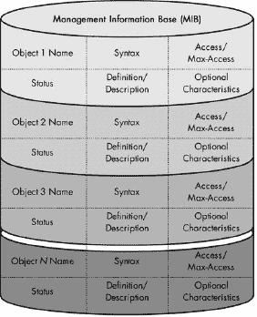
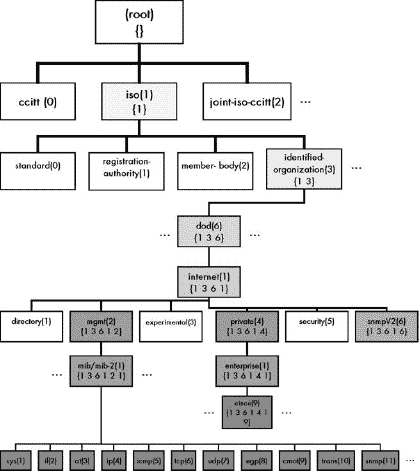
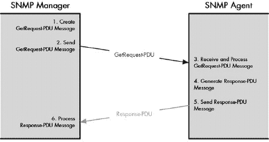
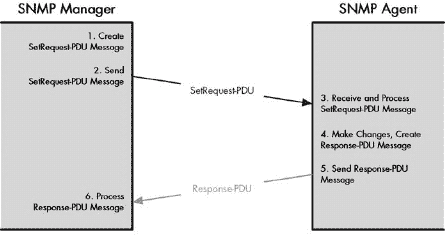
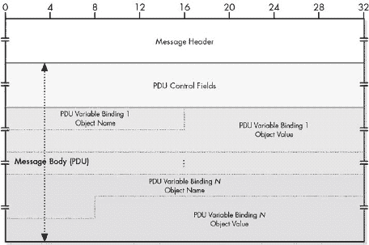
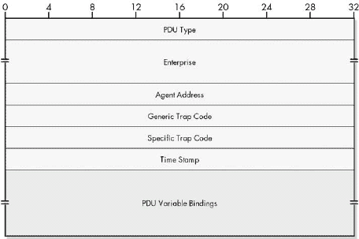
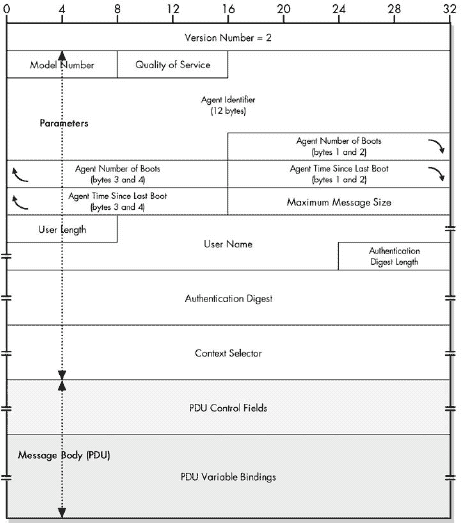
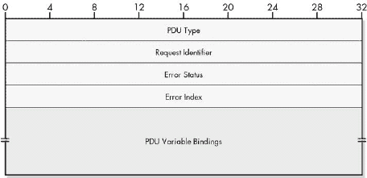
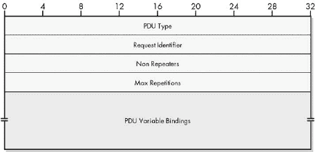

# 第三部分-4. TCP/IP 网络管理框架和协议

第六十五章

第六十六章

第六十七章

第六十八章

第六十九章

与多年前的前辈相比，现代网络和互联网更大、更快、功能更强大。随着我们扩展、加速和增强我们的网络，它们变得更加复杂，因此管理起来也更加困难。多年前，管理员可以用非常简单的工具来维持网络的运行，但如今，需要更复杂的网络管理技术来匹配我们网络的复杂性。

网络管理员工具箱中的一些最重要的工具现在都是以软件的形式存在的，而不是硬件。为了管理一个庞大、异构和复杂的互联网，我们可以使用软件应用程序来收集信息并使用互联网本身来控制设备。作为最受欢迎的互联网套件，TCP/IP 提供了这样的软件工具。其中最重要的一个是作为整体网络管理方法的一部分实现的两个协议，称为*TCP/IP 互联网标准管理框架*。

本部分描述了 TCP/IP 互联网标准管理框架，探讨了其各个架构和协议组件以及它们如何交互。第一章提供了网络管理框架本身的概述，并为后续章节提供了介绍。第二章讨论了网络管理信息是如何结构化和组织到称为*管理信息库（MIBs）*的信息存储中的。第三章描述了 TCP/IP 网络管理中关键协议背后的概念和操作：简单网络管理协议（SNMP）。第四章提供了 SNMP 消息和消息格式的详细信息。最后，第五章简要介绍了远程网络监控（RMON），这是 SNMP 的一个增强功能——尽管它有时被称为协议，但实际上并不是——它为管理员提供了在 TCP/IP 互联网上更强大的管理和监控能力。

注意，虽然你可能想直接跳到 SNMP 章节，但如果你按照顺序阅读本部分的所有章节，那里的内容会更有意义。

# 第六十五章。TCP/IP 互联网标准管理框架概述


TCP/IP 网络管理功能最常与负责实现这些功能的关键协议相关联：*简单网络管理协议（SNMP）*。许多人听说过 SNMP，并且通常认为 SNMP 是 TCP/IP 中执行网络管理“的方式”。这在某种程度上是正确的，但实际上是一种过度简化。实际的 SNMP 协议只是称为*互联网标准管理框架*的更高层次网络管理策略的一部分。为了真正理解 SNMP 是如何工作的，你需要首先了解这种网络管理作为整体是如何构建的。

在本章中，我通过描述 TCP/IP 互联网标准管理框架的概念和组件来介绍 TCP/IP 网络管理。我首先概述了框架的历史，并讨论了它与 SNMP 的关系。我描述了 TCP/IP 网络管理模型和组成网络管理系统的主要组件。我总结了互联网标准管理框架的架构。然后，我描述了框架和 SNMP 的三个主要版本以及它们之间的比较。最后，我讨论了用于描述这项技术的许多标准。

# TCP/IP 互联网标准管理框架和简单网络管理协议（SNMP）概述和历史

来自职业体育界的谚语说，当人们忘记棒球裁判的存在时，裁判就做得很好。在许多方面，这同样适用于网络管理员。当网络运行得如此顺畅和高效，以至于用户忘记了管理员的存在时，管理员就做得很好。因为，正如管理员所深知的那样，一旦出现问题，用户会很快记住他或她的存在。

网络管理员的主要工作之一是监控网络并确保其正常运行。关于网络上的硬件和软件的信息是正确执行此任务的关键。

当网络规模较小时，管理员可以通过简单的方式了解硬件和软件的状态，例如亲自走到一台计算机前使用它，或者使用低级链路层管理协议。在当今的大型、地理上分散且通常由许多不同底层技术组成的互联网中，这是不可能的。通常，网络上所有设备唯一共同之处在于它们都实现了特定的互联网协议套件，例如 TCP/IP。这使得互联网本身成为促进设备与网络管理员之间网络管理信息交流的逻辑方式。

## SNMP 的早期发展

在互联网的早期，许多人认识到需要某种网络管理技术来支持 TCP/IP。不幸的是，最初并没有一个单一的标准。在 1980 年代，不同的工作组开发了多种不同的技术。有三个主要竞争者：由 RFC 1021 至 1024 定义的高层实体管理系统（HEMS）/高层实体管理协议（HEMP）；由 RFC 1028 定义的 *简单网关监控协议（SGMP*）；以及实际上是 OSI 协议套件一部分的 *通用管理信息协议（CMIP*）。

互联网工程任务组（IETF）认识到拥有一个统一的管理标准对于 TCP/IP 的重要性，并于 1988 年发布了 RFC 1052，“IAB 关于开发互联网网络管理标准的建议”。这份备忘录不是一个标准，而更多的是一个意向声明和对有关此主题的会议的记录。RFC 1052 的结论是使用 SGMP 作为新互联网标准的基础，该标准被称为 *简单网络管理协议（SNMP*）。这项发展将由 SNMP 工作组执行。

## SNMP 的两种含义

简单网络管理协议（SNMP）名称中中间两个单词的合理性是显而易见的，但其他两个单词则稍微有些问题。单词 *协议* 假设 SNMP 只是一个 TCP/IP 通信协议，就像其他协议一样，例如动态主机配置协议（DHCP）和文件传输协议（FTP）。不幸的是，这个说法既是真的又是假的：名称是含糊的。

在较低级别，SNMP 确实指的是在设备之间传输网络管理信息的实际协议。这就是大多数人谈论 SNMP 时所想到的。然而，根据 SNMP 工作组的定义，TCP/IP 网络管理解决方案作为一个整体由多个不同的元素组成，这些元素按照一种架构排列。这个架构最初没有特定的名称，但现在被称为 *互联网标准管理框架*。奇怪的是，这个高级框架不是缩写为 ISMF，而是 *也* 被称为 SNMP，这意味着理解这个术语时上下文很重要。

### 注意

*为了避免混淆，我经常会使用“SNMP 框架”和“SNMP 协议”这两个短语来区分这两个术语的用法*。

## SNMP 的设计目标

在协议名称中的单词 *简单* 是另一个问题。即使在它的第一个版本中，它也只是相对简单。SNMP 的最新版本实际上相当复杂，有多个不同的标准定义了 SNMP 框架、SNMP 协议本身以及许多支持元素。

那为什么叫 *简单* 呢？好吧，正如他们所说，一切都是相对的。与更复杂的其他协议相比，SNMP 是简单的。这可以通过查看互联网标准管理框架和 SNMP 协议的整体基本目标来看到：

+   SNMP 定义了一种通用的方式，可以轻松地为任何对象定义管理信息，然后在该对象和用于简化网络管理的设备之间交换。

+   SNMP 将定义和通信管理信息的功能与应用程序分开，这些应用程序用于网络管理。

+   实际的 SNMP 协议相当简单，只包含几个易于理解的协议操作。

+   对于产品和的设计师和制造商来说，SNMP 的实现相对简单。

### 提示

**关键概念** *简单网络管理协议（SNMP）* 定义了一套技术，允许网络管理员远程监控和管理 TCP/IP 网络设备。术语 SNMP 既指一个特定的通信协议（有时称为 *SNMP 协议*），也指一个整体的互联网管理框架（*SNMP 框架*）。

由于 SNMP 是一个 TCP/IP 应用层协议，理论上它可以在各种传输机制上运行。它最常在互联网协议（IP）上实现，但最新的版本也定义了可以允许 SNMP 信息通过其他互联网技术传输的 *传输映射*。

## SNMP 的进一步发展和 SNMP 变体的问题

第一个开发的互联网标准管理框架（在 1988 年）现在被称为 *SNMP 版本 1（SNMPv1）*。这个 SNMP 的初始版本得到了广泛的认可，并且可能仍然是 SNMP 最常用的版本。

从那时起，SNMP 的历史在很大程度上是一个相当混乱的标准噩梦。SNMPv1 在安全领域存在一些弱点。因此，在 SNMPv1 完成后不久，就开始了一个新的 SNMP 版本的工作。不幸的是，这项工作变成了一片泥潭，许多 SNMPv2 的变体被创建出来。经过多年的混乱，没有一个 SNMPv2 变体取得了显著的成功。

最近，已经发布了 SNMP 框架和协议的第三个版本，它增加了新功能，并将 SNMP 再次统一到一个单一的通用协议下。本章后面关于 SNMP 版本和 SNMP 标准的讨论进一步探讨了自 1988 年以来的 SNMP 历史。它们可以被视为这个历史概述的延续，因为它们有助于阐明过去十多年中 SNMP 版本背后的非常混乱的故事。

### 提示

**相关信息** *有关 SNMP 协议的更多背景信息可以在实际协议本身的概述中找到，在第六十七章概念和操作")中*。

# TCP/IP SNMP 操作模型、组件和术语

因此，看起来 *简单* 网络管理协议实际上并不那么简单。SNMP 有许多版本、标准和用途，因此有很多东西要学习。我认为理解 SNMP 做什么的良好起点是查看其 *操作模型*。然后我们可以检查组成 TCP/IP 网络管理系统组件，并定义描述它们的术语。

## SNMP 设备类型

SNMP 的总体思想是允许使用 TCP/IP 交换网络管理所需的信息。更具体地说，该协议允许网络管理员利用一种特殊的网络设备，该设备与其他网络设备交互以收集信息并修改其操作方式。在最简单的意义上，定义了两种不同的基本类型的硬件设备：

**受管理节点** 网络上的常规节点，已经安装了软件，以便可以使用 SNMP 进行管理。这些通常是传统的 TCP/IP 设备。它们有时也被称为 *受管理设备*。

**网络管理站 (NMS)** 一个指定的网络设备，运行特殊软件以允许其管理上面提到的常规受管理节点。网络中必须存在一个或多个 NMS，因为这些设备是真正运行 SNMP 的设备。

## SNMP 实体

参与使用 SNMP 进行网络管理的每个设备都运行一个通称为 *SNMP 实体* 的软件。SNMP 实体负责实现 SNMP 协议的所有各种功能。每个实体由两个主要软件组件组成。组成设备上的 SNMP 实体的组件取决于该设备是受管理节点还是 NMS。

### 受管理节点实体

受管理节点上的 SNMP 实体包括以下软件元素和结构：

**SNMP 代理** 一个实现 SNMP 协议的软件程序，允许受管理节点向 NMS 提供信息并接受其指令。

**SNMP 管理信息库 (MIB)** MIB 定义了关于节点可以收集和用于控制受管理节点的信息类型。使用 SNMP 交换的信息采用 MIB 中的对象形式。

### 网络管理站实体

NMS 上的 SNMP 实体包括以下内容：

**SNMP 管理器** 一个实现 SNMP 协议的软件程序，允许 NMS 从受管理节点收集信息并向它们发送指令。

**SNMP 应用程序** 一个或多个软件应用程序，允许网络管理员使用 SNMP 管理网络。

## SNMP 操作模型摘要

因此，为了综合和重申所有这些内容，让我们总结一下。SNMP 由少数几个*网络管理站（NMSs）*组成，它们与被称为*管理节点*的常规 TCP/IP 设备交互。NMS 上的*SNMP 管理器*和管理节点上的*SNMP 代理*实现了 SNMP 协议，并允许网络管理信息交换。*SNMP 应用程序*运行在 NMS 上，为人类管理员提供接口，并允许从每个 SNMP 代理的*管理信息库（MIBs）*中收集信息。图 65-1 说明了 SNMP 操作模型。

一个 SNMP 管理的节点几乎可以是任何能够使用 TCP/IP 进行通信的网络设备，只要它被编程了适当的 SNMP 实体软件。SNMP 的设计目的是允许普通主机被管理，以及智能网络互连设备，如路由器、桥接器、集线器和交换机。其他设备——打印机、扫描仪、消费电子设备、专用医疗设备等等——也可以被管理，只要它们连接到 TCP/IP 互连网络。

在更大的网络中，一个 NMS 可能是一个独立的、高性能的 TCP/IP 计算机，专门用于网络管理。然而，真正使设备成为 NMS 的是软件，因此 NMS 可能不是一个独立的硬件设备。它可能充当 NMS 并同时在网络上执行其他功能。


图 65-1. SNMP 操作模型 此图显示了 SNMP 的简化实现，使用一个网络管理站（NMS）来维护三个管理节点。每个设备都有一个 SNMP 实体，它们通过 SNMP 消息进行通信。NMS 的 SNMP 实体由 SNMP 管理器和一个或多个 SNMP 应用程序组成。每个管理节点运行一个 SNMP 代理并维护一个管理信息库（MIB）。

### 小贴士

**关键概念** SNMP 允许网络管理员使用 **网络管理站 (NMS)** 控制一组受管节点。每个设备都包含一个实现该技术的 **SNMP 实体**。在 NMS 中，该实体由一个 **SNMP 管理器** 模块和一组 SNMP 应用程序组成。在受管节点中，该实体由一个 SNMP 代理和 **管理信息库 (MIB)** 组成。

# TCP/IP 互联网标准管理框架架构和协议组件

互联网标准管理框架包括构成 TCP/IP 网络管理解决方案的所有技术。SNMP 框架由多个定义管理信息结构、存储和通过 SNMP 协议交换方式的架构组件组成。框架还描述了不同组件如何组合在一起，如何在网络设备中实现 SNMP，以及设备如何交互。

## SNMP 框架组件

正如我们将在下一章中更详细地探讨的那样，互联网标准管理框架完全是 **信息导向的**。它包括四个主要组件（见 图 65-2)：

**管理信息结构 (SMI)** 为了确保各种设备的互操作性，我们希望有一个一致的方式来描述使用 SNMP 管理的设备特性。在计算机科学中，*数据描述语言 (DDL)* 是完成这项工作的工具。**SMI** 是一个标准，它定义了 SNMP 中管理信息的结构、语法和特性。

**管理信息库 (MIBs)** 每个受管设备都包含一组用于管理的变量。这些变量代表发送到 NMS 的设备操作信息，以及/或发送到受管设备的参数以控制它。**MIB** 是描述特定类型设备管理特性的这些变量的完整集合。MIB 中的每个变量称为 **MIB 对象**，它使用 SMI 数据描述语言定义。设备可能有多个对象，对应于它包含的不同硬件和软件元素。

### 注意

*最初，一个单独的文档定义了 SNMP 的 MIB，但这个模型不够灵活。为了更容易地定义新的 MIB 对象，现在将相关 MIB 对象组定义在单独的 RFC 标准中，称为 *MIB 模块*。*到目前为止，已经定义了超过 100 个这样的 MIB 模块*。

**简单网络管理协议 (SNMP)** 这实际上是 SNMP 协议本身。它定义了 SNMP 代理和 NMS 之间信息交换的方式。SNMP **协议操作** 定义了各种 SNMP 消息以及它们的创建和使用方式。SNMP **传输映射** 描述了如何在不同底层互联网（如 TCP/IP、IPX 等）上使用 SNMP。

**安全和行政** 在前三个主要架构组件的基础上，SNMP 框架增加了许多支持元素。这些元素增强了 SNMP 协议的操作，并解决了与 SNMP 实施相关的问题，包括版本转换和其他管理问题。


图 65-2. TCP/IP 互联网标准管理框架的组件

### 小贴士

**关键概念** 互联网标准管理框架（SNMP 框架）的三个主要组件是管理信息结构（SMI）、管理信息库（MIBs）以及 SNMP 协议本身。这些组件由 SNMP 安全性和管理元素支持。

## SNMP 框架架构

SNMP 的创造者特意设计了框架以模块化，因为当 SNMP 最初被创建时，它被视为一个临时解决方案，直到可以从 OSI 协议套件过渡到另一个网络管理协议。模块化架构将定义性、数据和功能性（协议）元素分离，以便在不改变网络管理信息定义和描述方式的情况下替换 SNMP 协议本身。

这种向 OSI 协议的过渡从未发生，但该架构在定义整个 SNMP 范围以及在简化其实施方面仍然非常有价值。上一节讨论的每个主要组件——SMI、MIBs 和 SNMP 本身——都在不同的标准中进行了描述。SNMP 框架的模块化也允许相对独立地对这些组件进行更改，使得在 SNMP 版本之间的转换比如果有一个庞大的文档定义一切要容易得多。

# TCP/IP 互联网标准管理框架和 SNMP 版本（SNMPv1、SNMPv2 变体和 SNMPv3）

在 第三章 中，我解释了专有标准、事实标准和开放标准之间的区别，并描述了开放标准的许多好处。历史充满了使用开放标准而成功的技术例子，当时竞争的标准是专有的。

TCP/IP 和互联网经常被作为一个合适的开放标准开发的典范。成千上万的 TCP/IP 标准是通过众所周知的请求评论（RFC）标准化过程开发和发布的。结果是计算历史上最成功的互联网互连协议集，被全球接受和使用。

然而，没有人是完美的，也没有任何过程是完美的。在引入 SNMP 版本 2 时出现了一些问题，导致通常平稳的协议标准化方法几乎崩溃，并出现了我们不习惯在 TCP/IP 中看到的许多不兼容的变体。这个故事是本章前面关于一般 SNMP 概述和历史的延续，并解释了许多 SNMP 标准名称和数字，以便你能理解它们。同时，讨论也生动地提醒了适当的标准发展的重要性，以及当没有就标准的演变达成普遍共识时可能产生的后果。

## SNMPv1

SNMP 的第一个版本是在 1988 年初开发的，并于 1988 年 8 月以三个 RFC 标准的形式发布。这个第一个版本现在被称为**SNMP 版本 1**或**SNMPv1**。三个 SNMPv1 标准提供了三个主要互联网标准管理框架组件的初始描述：SMI、MIB 和 SNMP 协议本身。然而，当时并没有实际使用**互联网标准管理框架**这个术语。

SNMPv1 被普遍接受并在许多网络中得到广泛部署。SNMPv1 完成了任务，并成为了 TCP/IP 网络管理的标准。它至今仍被广泛使用。它是 SNMP 版本中的“老忠实”。对初始标准进行了一些修订，随着时间的推移，定义了越来越多的 MIB 模块，但技术保持了多年不变。

与任何技术一样，SNMPv1 的用户发现了它的弱点以及改进的机会。SNMPv1 最被批评的领域之一是安全性。SNMPv1 仅使用了一个“简单”的（如 RFC 3410 所述）认证方案，采用了一个类似密码的结构，称为**社区字符串**。

安全性问题最终成为导致 SNMP 发展出现严重问题的争议焦点。有些人认为社区字符串就足够安全，但许多人认为将更好的安全性引入 SNMP 很重要。提出了许多不同的方法来增加 SNMP 的安全性，但没有就如何实现达成普遍共识。关于原始 SNMPv1 中安全弱点的讨论具有一定的合理性，正如我在第六十七章概念和操作")中关于 SNMP 协议操作讨论中所述。

## SNMPsec

第一次尝试增加安全性的措施是在 1992 年 7 月发布的三个标准中，这些标准定义了一种使用逻辑标识符称为**参与者**的新安全机制。这有时被称为**SNMP 安全**或**SNMPsec**。这种方法比原始的 SNMPv1 更安全，但 SNMPsec 从未被广泛接受，现在被认为是历史性的。

## SNMPv2

然而，基于党的安全的思想从未消失。它被用作定义 SNMP 的第一个完整修订版的基础，当时在 1993 年 4 月发布的 RFC 1441 至 1452 中发布了*SNMP 版本 2（SNMPv2）*。这个新版本包含了新的安全模型，并对实际的 SNMP 协议操作、SMI 标准（定义 SMI 的版本 2，SMIv2）进行了更改，并正式化了互联网标准管理框架的概念。

不幸的是，这个新标准也从未被普遍接受。有些人认为整个新版本是一个巨大的进步，但其他人对基于党的安全提出了异议，声称它太复杂。在接下来的几年里，进行了大量的辩论和讨论，试图让每个人都接受这个新版本。

## SNMPv2 变体

SNMPv2 的接受从未发生。相反，不同的派生小组分道扬镳，开始着手于 SNMPv2 的*变体*。为了避免混淆，原始的 SNMPv2 被称为*SNMPv2 经典*（这个名字让人联想到某种特定的软饮料）或*SNMPv2p*，其中的*p*指的是基于党的安全。当以下内容被提出和/或开发时，事情变得非常有趣（并且令人困惑）：

**SNMPv1.5** 当一个想法提出一个低于已标准化数字的版本号时，你可以立即判断这个想法可能是一个问题。SNMPv1.5 试图保留 SNMPv2p 中无争议的元素——对 SNMP 协议和 SMI 的增强——同时回到 SNMPv1 中的基于社区的安全。它本身从未成为标准，但成为下一个变体的基础。

**基于社区的 SNMPv2（SNMPv2c）** 这是对 SNMPv2p 的修改，使用社区字符串而不是基于党的安全；本质上与 SNMPv1.5 相同，但有一个听起来更官方的名字和一些更改。有趣的是，定义这个标准的 RFC 1901 仍然处于实验状态，尽管 SNMPv2c 实际上在商业上取得了一定的成功，而标准的 SNMPv2p 没有。SNMPv2c 由 RFC 1902 至 1908 的标准定义，这些标准包括其他更改，包括 SMI 的新版本（SMIv2）。

**基于用户的 SNMPv2（SNMPv2u）** 这是一种 SNMPv2c 的替代安全方法，它基于用户而不是社区字符串。它被认为比基于党的安全更简单，但比基于社区字符串的安全更安全。它由 RFC 1909 和 RFC 1910 定义。它也被正式认为是实验性的。

**SNMPv2*** 就像所有的其他变体都不够一样，一个知名的供应商决定定义另一个名为 *SNMPv2** 的变体，它结合了 SNMPv2p 和 SNMPv2u 的元素。这从未正式标准化。（是的，名字中有星号。不，页脚下面没有脚注，所以不用找。是的，在名字中放星号是非常令人困惑的。不，我不知道营销人员是如何得到好钱的，他们能想出这样的名字。）

现在，想象一下，如果你是 1990 年代中期的网络管理员，面临着 SNMPv2p、SNMPv2c、SNMPv2u 和 SNMPv2*。你会选择哪一个？好吧，如果你像大多数人一样，你可能会选择上面的任何一个都不选，说，“我想我会坚持使用 SNMPv1，直到这些版本 2 的人把事情做好！”这正是发生的事情。这些变体的支持者中的一些推广了它们，但从未达成任何协议，结果是所有各种 SNMPv2 的成功都受到了限制。正如我所说，这是普遍标准化重要性的经典例证。

## SNMPv3

我想象，在某个时候，每个人都意识到情况一团糟，并决定已经足够了。1996 年，开始了一种新的方法来解决悬而未决的问题，并将普遍性恢复到 SNMP。1998 年，开发了 *SNMP 版本 3 (SNMPv3)*，它包括对 SNMP 的额外增强，并最终让所有参与者回到了同一个团队。

SNMPv3 是 SNMP 的最新版本，仍在积极修订中。SNMPv3 中的一个重要变化是更正式地处理对 SNMP 的不同安全方法——显然，这是从 SNMPv2 经验中吸取的教训。

SNMPv3 使用 SNMPv2 协议操作及其协议数据单元 (PDU) 消息格式，以及 SNMPv2 的 SMIv2 标准。SNMPv3 允许将多种不同的安全方法集成到其架构中，包括描述基于用户的安全性的标准，这些标准在 SNMPv2u 和 SNMPv2* 中定义，以及一个新的基于视图的访问控制模型。它还包括额外的工具来帮助管理 SNMP。

# TCP/IP 互联网标准管理框架和 SNMP 标准

你现在已经看到，互联网标准管理框架有三个不同的版本。其中一些版本有不同的变体。框架的每个版本或变体都包含多个模块化组件。每个组件都有一个或多个定义它的文档。其中一些有多个修订版。再加上为 SNMP 和其他支持文档定义的数十个单独的 MIB，你会有什么？一大堆 TCP/IP 标准。可能定义 SNMP 各部分的 RFC 比任何其他单个 TCP/IP 协议或技术都要多。

正是因为与 SNMP 相关的版本、组件和文档如此之多，我认为保持所有标准清晰是很重要的。为此，表表 65-1 标准")至表 65-6 标准")展示了 SNMP 框架每个版本和变体的主要 SNMP 标准：SNMPv1、SNMPsec、SNMPv2p、SNMPv2c、SNMPv2u 和 SNMPv3。（SNMPv2*并未使用常规 RFC 流程进行标准化。）每个单独的 RFC 定义了框架一个版本的一个组件。

RFCs 通常的工作方式是，当发布新的标准版本，这些新版本是旧版本的直接替代品时，旧版本会被新版本废弃。在 SNMP 的情况下，由于存在许多版本和变体，这种情况有些不明确。例如，定义 SNMPv2p 的标准并未被 IETF 视为废弃 SNMPv1 的标准，但 IETF 表示 SNMPv2c 和 SNMPv2u 的标准废弃了 SNMPv2p 的标准。

为了保持所有这些内容的清晰区分，我决定分别展示每个版本或变体的标准。我仅在那些 RFC 针对相同 SNMP 版本或变体时，才列出已废弃 RFC 的 RFC 编号。例如，RFC 3410 废弃了 2570，因为它们都涉及 SNMPv3，而 3410 是 2570 的直接替代品。此外，还有一些情况下，标准名称在 RFC 编号之间略有变化；我已展示了当前名称。完整的、带超链接的 RFC 列表可以在[`www.rfc-editor.org/rfc-index.html`](http://www.rfc-editor.org/rfc-index.html)找到。

表 65-1. SNMP 版本 1 (SNMPv1) 标准

| 已废弃 RFC | 最近 RFC | 最近 RFC 的日期 | 标准名称 |
| --- | --- | --- | --- |
| — | — | — | — |
| 1065 | 1155 | 1990 年 5 月 | 基于 TCP/IP 网络的网络管理信息结构和标识 |
| 1066 | 1156 | 1990 年 5 月 | 基于 TCP/IP 网络的网络管理信息库 |
| 1067, 1098 | 1157 | 1990 年 5 月 | 简单网络管理协议（SNMP） |
| 1158 | 1213 | 1991 年 3 月 | 基于 TCP/IP 网络的网络管理信息库：MIB-II |

表 65-2. SNMP 安全（SNMPsec）标准

| 已废弃 RFC | 最近 RFC | 最近 RFC 的日期 | 标准名称 |
| --- | --- | --- | --- |
| — | — | — | — |
| — | 1351 | 七月 1992 | SNMP 管理模型 |
| — | 1352 | 1992 年 7 月 | SNMP 安全协议 |
| — | 1353 | 1992 年 7 月 | 管理 SNMP 实体的对象定义 |

表 65-3. 基于实体的 SNMP 版本 2 (SNMPv2p) 标准

| 已废弃 RFC | 最近 RFC | 最近 RFC 的日期 | 标准名称 |
| --- | --- | --- | --- |
| — | — | — | — |
| — | 1441 | 1993 年 4 月 | 互联网标准网络管理框架第 2 版的介绍 |
| — | 1442 | April 1993 | SNMPv2 版本 2 的简单网络管理协议（SNMPv2）的管理信息结构 |
| — | 1443 | April 1993 | SNMPv2 版本 2 的简单网络管理协议（SNMPv2）的文本约定 |
| — | 1444 | April 1993 | SNMPv2 版本 2 的简单网络管理协议（SNMPv2）的符合性声明 |
| — | 1445 | April 1993 | SNMPv2 版本 2 的简单网络管理协议（SNMPv2）的行政模型 |
| — | 1446 | April 1993 | SNMPv2 版本 2 的简单网络管理协议（SNMPv2）的安全协议 |
| — | 1447 | April 1993 | SNMPv2 版本 2 的简单网络管理协议（SNMPv2）的党派 MIB |
| — | 1448 | April 1993 | SNMPv2 版本 2 的简单网络管理协议（SNMPv2）的协议操作 |
| — | 1449 | April 1993 | SNMPv2 版本 2 的简单网络管理协议（SNMPv2）的传输映射 |
| — | 1450 | April 1993 | SNMPv2 版本 2 的简单网络管理协议（SNMPv2）的管理信息库 |
| — | 1451 | April 1993 | 管理员到管理员的网络管理信息库 |
| — | 1452 | April 1993 | 互联网标准网络管理框架第 1 版和第 2 版之间的共存 |

表 65-4. 基于社区的 SNMP 版本 2（SNMPv2c）标准 |

| 已废弃的 RFCs | 最近 RFC | 最近 RFC 的日期 | 标准名称 |
| --- | --- | --- | --- |
| — | 1901 | January 1996 | 基于社区的 SNMPv2 简介 |
| — | 1902 | January 1996 | SNMPv2 版本 2 的简单网络管理协议（SNMPv2）的管理信息结构 |
| — | 1903 | January 1996 | SNMPv2 版本 2 的简单网络管理协议（SNMPv2）的文本约定 |
| — | 1904 | January 1996 | SNMPv2 版本 2 的简单网络管理协议（SNMPv2）的符合性声明 |
| — | 1905 | January 1996 | SNMPv2 版本 2 的简单网络管理协议（SNMPv2）的协议操作 |
| — | 1906 | January 1996 | SNMPv2 版本 2 的简单网络管理协议（SNMPv2）的传输映射 |
| — | 1907 | January 1996 | SNMPv2 版本 2 的简单网络管理协议（SNMPv2）的管理信息库 |
| — | 1908 | January 1996 | 互联网标准网络管理框架第 1 版和第 2 版之间的共存 |

表 65-5. 基于用户的 SNMP 版本 2（SNMPv2u）标准 |

| 已废弃的 RFCs | 最近 RFC | 最近 RFC 的日期 | 标准名称 |
| --- | --- | --- | --- |
| — | 1909 | February 1996 | SNMPv2 的行政基础设施 |
| — | 1910 | February 1996 | SNMPv2 的用户安全模型 |

表 65-6. SNMP 版本 3（SNMPv3）标准 |

| 已废弃的 RFCs | 最近 RFC | 最近 RFC 的日期 | 标准名称 |
| --- | --- | --- | --- |
| — | 2576 | March 2000 | 第 1 版、第 2 版和第 3 版互联网标准网络管理框架之间的共存 |
| — | 2578 | April 1999 | 管理信息结构版本 2（SMIv2） |
| — | 2579 | 1999 年 4 月 | SMIv2 的文本约定 |
| — | 2580 | 1999 年 4 月 | SMIv2 的符合性声明 |
| 2570 | 3410 | 2002 年 12 月 | 互联网标准管理框架的介绍和适用性声明 |
| 2261, 2271, 2571 | 3411 | 2002 年 12 月 | 描述简单网络管理协议（SNMP）管理框架的架构 |
| 2262, 2272, 2572 | 3412 | 2002 年 12 月 | 简单网络管理协议（SNMP）的消息处理和分发 |
| 2263, 2273, 2573 | 3413 | 2002 年 12 月 | 简单网络管理协议（SNMP）的应用程序 |
| 2264, 2274, 2574 | 3414 | 2002 年 12 月 | 简单网络管理协议（SNMPv3）的第 3 版用户安全模型（USM） |
| 2265, 2275, 2575 | 3415 | 2002 年 12 月 | 简单网络管理协议（SNMP）的基于视图的访问控制模型（VACM） |
| — | 3416 | 2002 年 12 月 | 简单网络管理协议（SNMP）协议操作的版本 2 |
| — | 3417 | 2002 年 12 月 | 简单网络管理协议（SNMP）的传输映射 |
| — | 3418 | 2002 年 12 月 | 简单网络管理协议（SNMP）的管理信息库（MIB） |

除了这些表中列出的所有标准之外，还有数十个补充的 RFC，它们描述了 MIB 模块，并澄清了与 SNMP 相关的各种操作细节。您可以通过搜索“MIB”或“SNMP”来在线找到所有 MIB 的 RFC 列表。

# 第六十六章 TCP/IP 结构化管理信息（SMI）和管理信息库（MIBS）


互联网标准管理框架定义了三个主要组件，描述了如何在 TCP/IP 互联网中管理设备。其中之一，实际的简单网络管理协议（SNMP）相对较为知名，但它只是整体图景的一部分。SNMP 描述了 SNMP 实体之间信息交换的方式，但还有另外两个组件同样重要，因为它们描述了信息本身。

在本章中，我描述了 TCP/IP 互联网标准管理框架的两个重要支持元素：描述 SNMP 处理的信息类型的 MIB 标准，以及定义 MIB 信息的结构管理信息（SMI）标准。在检查实际的 SNMP 协议本身之前，理解这两个 SNMP 框架的部分是一个重要的初步步骤。

我首先概述了 SMI 数据描述语言以及 MIBs 的工作方式。我讨论了 MIB 对象名称层次结构和用于引用名称的符号。我还描述了 MIB 对象的工作方式，讨论了不同的对象类型和 MIB 对象组。我描述了所有 SNMP 版本中通用的 MIB 概念，并讨论了在那些 SNMP 版本中使用的特定 SMI 版本（SMIv1 和 SMIv2）。

### 小贴士

**背景信息** *如果您还没有阅读前面章节中描述的 SNMP 互联网标准管理框架，您应该在继续阅读此处之前先阅读它*。

# TCP/IP SMI 和 MIBs 概述

真正理解 TCP/IP 网络管理的关键是理解整个互联网标准管理框架（SNMP 框架）的*信息导向*本质。为了理解我的意思，让我们暂时退后一步，从一般的角度考虑网络管理的问题，以及更具体地，管理网络中设备的问题。

## SNMP 的信息导向设计

网络管理员需要执行两种基本类型的操作：收集有关设备的功能数据，以及向设备下达命令以改变其功能。用最简单的话说，第一类操作可以被视为读取操作，而第二类则相当于写入操作。

实现这种功能的一种经典方式是定义一个通信协议。大多数此类协议都是*命令导向*的——它们由一组特定的命令组成，用于执行读取和写入操作。例如，一个网络管理协议可能有一个读取命令，如“报告设备使用的小时数”，以及一个写入命令可能类似于“将此设备置于测试模式”。网络管理员通过下达适当的命令来控制设备。

命令导向的管理协议的优点在于其简单性，因为它很清楚命令的用途以及如何使用它们。它可能非常适合在某些环境中使用，但它不适合在大型、异构的 TCP/IP 互联网中工作。主要原因在于命令导向将协议与被管理的设备不可分割地联系在一起。考虑以下问题：

+   每种设备可能都需要一组独特的命令。例如，给路由器下达的命令可能需要与给主机下达的命令不同。这可能导致协议中命令的激增，或者导致在允许适当管理不同设备类型时的不灵活性。

+   每当一家公司创造了一种新型设备，或者为某种设备制作了一个独特的版本，网络管理协议就需要进行更改。

+   每当某种设备的功能发生变化时，可能是由于另一种协议的变化，管理协议就需要进行更新。

+   没有影响大量硬件，该协议本身很难进行更改。

解决以命令为导向的管理协议问题的方法是使用*信息导向*模型。不是定义特定的命令来查询或控制设备，而是通过设备与管理站之间要交换的信息单元来定义设备。

与读取命令和写入命令不同，我们拥有可以读取或写入的*变量*。以之前提到的两个例子来说明。不需要像“报告设备使用的小时数”这样的命令，设备会保留一个名为“使用的小时数”的变量，网络管理站可以将其作为众多变量之一读取，无需特定的协议命令。不需要名为“将此设备置于测试模式”的写入命令，设备有一个名为“当前模式”的变量。网络管理员可以通过更改变量的值来将设备的模式更改为测试模式。

这种差异可能看起来很微妙，但它构成了 SNMP 工作方式的每一个方面。我相信 SNMP 框架难以理解的部分原因是因为没有足够强调以“SNMP 方式”看待事物，这意味着考虑信息对象而不是命令。

### 小贴士

**关键概念** 与大多数以命令为导向的协议不同，SNMP 是*信息导向*的。SNMP 操作通过在管理设备中维护的称为*变量*的对象来实现。而不是发布命令，网络管理站通过读取变量来检查设备的状态，通过更改（写入）变量来控制设备操作。

## MIB 和 MIB 对象

在这样的背景下，我们可以以新的视角看待 SNMP 框架。实际的 SNMP 协议本身，我们将在接下来的几章中对其进行考察，它只有少数几个通用的命令来完成读取和写入任务。它只处理网络管理信息在 SNMP 代理和网络管理站（NMS）之间的交换方法，这些方法在上一章中已经描述。网络管理信息实际上是 TCP/IP 网络管理的核心。

因此，SNMP 不是通过控制特定设备的命令来定义的，而是通过称为*对象*的管理信息变量来定义的。每个对象描述了设备的特定特性。一些对象相当通用，对 TCP/IP 网络上的任何设备都有意义；例如，描述与互联网协议（IP）本身相关的对象，如设备的 IP 地址。其他对象可能特定于某种类型的设备；例如，路由器将具有普通主机以太网网络接口卡所不具备的对象。

在 SNMP 中使用的对象集合被称为*管理信息库（MIB）*，或*MIB*。（实际上，SNMP 对象通常被称为*MIB 对象*。）SNMP 的第一个版本，SNMPv1，有一个单一的标准定义了整个 SNMP 的 MIB。较新版本通过使用不同的*MIB 模块*提供了更多的灵活性，这些模块定义了特定于设备使用的硬件或软件的变量集。

### 提示

**关键概念** 管理设备中的管理数据变量被维护在一个逻辑集合中，称为*管理信息库（MIB）*。MIB 中的对象通常被称为*MIB 对象*，它们通常被收集到称为*MIB 模块*的集合中。

使用模块定义对象允许在定义允许管理不同类型设备的变量方面具有很大的灵活性。设备可以包含适用于其硬件和软件的所有适当的 MIB 模块。例如，如果你有一个使用以太网的设备，它将包含来自以太网 MIB 的变量。使用令牌环的设备将使用令牌环 MIB。这两个设备也会使用所有 TCP/IP 设备都使用的通用 SNMP MIB。根据需要，也可能包括其他模块。

### 注意

*由于其名称，MIB 通常被称为数据库。严格来说，这是不准确的。MIB 是对象的描述。设备中的实际 MIB 可能实现为软件数据库，但这不是必需的*。

## 定义 MIB 对象：SMI

使用 MIB 对象可以解决网络管理协议与网络管理信息绑定的问题。然而，我们必须非常注意如何定义这些对象。再次强调，原因是 TCP/IP 允许连接的设备种类繁多。每种设备可能以不同的方式表示信息。为了确保它们能够相互通信，我们需要确保管理信息以一致的方式表示。

确保 MIB 对象普遍性的 SNMP 框架部分是*管理信息结构（SMI）*标准。SMI 定义了如何构建 MIB 对象和 MIB 模块的规则。在 SMI 中，MIB 对象使用基于 ISO *抽象语法表示 1（ASN.1）*标准的精确定义集进行描述。

实质上，我们在 SNMP 中有三个抽象级别。实际的 SNMP 协议移动表示管理设备状态的值。MIB 定义了这些变量是什么。SMI 定义了 MIB 中的变量是如何定义的。

有两个主要的 SMI 标准。最初的，*SMIv1*，是第一个 SNMP 框架的一部分，SNMPv1，在 RFC 1155 中定义。它规定了 MIB 和 MIB 变量的基本规则。第二个，*SMIv2*，在 RFC 1442 中作为 SNMPv2p 的一部分定义，并在 RFC 2578 中进一步更新，这是 SNMPv3 的一部分。它与早期版本类似，但定义了更多的对象类型，以及 MIB 模块的结构。

这些 SMI 标准负责定义 SNMP 中的以下重要信息元素：

+   与所有 MIB 对象相关的一般特征——描述所有 MIB 对象的标准方式

+   可以创建的不同类型的 MIB 对象，例如整数、字符串和更复杂的数据类型

+   为命名 MIB 对象创建一个层次结构，以便可以一致地引用它们，而不会发生名称重叠

+   与每个 MIB 模块相关的信息

### 小贴士

**关键概念** *管理信息结构 (SMI)* 标准负责定义 MIB 对象的结构、描述和组织规则。SMI 通过确保不同设备使用通用数据表示来交换所有管理信息，从而允许不同设备进行通信。

# TCP/IP MIB 对象、对象特征和对象类型

如前几节所述，SNMP 框架旨在促进管理信息的交换。MIB 定义了设备的管理信息，并包含许多称为 *MIB 对象* 的变量，也称为 *受管对象*。这些对象是根据 SMI 标准中规定的规则定义的。

寻找 MIB 对象的最佳起点是检查定义它们的 SMI 规则。正如我在本章前面提到的，已经创建了两种不同的 SMI 版本：SMIv1 作为原始 SNMP 的一部分，以及 SMIv2 作为 SNMPv2 和 SNMPv3 的一部分。这两个版本在描述 MIB 对象方面相似，但 SMIv2 允许与每个对象关联更多信息。

## MIB 对象特征

正如典型的协议使用字段格式来指定使用该协议的设备之间发送的消息的内容一样，SMI 使用一种格式来指定每个 MIB 对象的基本特征。其中最基本的是在 SMIv1 中定义的五个强制性特征。这些特征也用于 SMIv2，但一些名称有所更改，一些字段的可能值也有所修改。MIB 对象可能具有以下特征（参见图 66-1 此图显示了一个包含 N 个 MIB 对象的 SNMP MIB。每个对象有五个强制性特征和可变数量的可选特征。"））：

**对象名称** 每个对象都有一个名称，用于唯一标识它。实际上，这并不完全正确。每个对象有两个名称：一个文本名称称为 *对象描述符* 和一个数字 *对象标识符*，它表示对象在 MIB 对象名称层次结构中的位置。我们将在稍后探讨这些名称及其使用方法。

**语法** 定义了对象的数据类型及其描述的结构。这个属性非常重要，因为它定义了对象包含的信息的数据类型。允许两种基本的数据类型类别：

+   常规数据类型是我们日常经常处理的信息的单个片段，例如整数和字符串。在 SMIv2 中，这些被称为*基本类型*。SMIv1 区分*原始类型*，如 ASN.1 中定义的整数，以及*定义类型*，它们是原始类型的特殊形式，仍然是单个信息片段，但与它们的使用方式有关联的特殊含义。SMIv2 不使用这两个术语。

+   表格数据类型是多个数据元素的集合。它们可能采取基本类型列表或基本类型表的形式。例如，可以构建一个整数表来表示一组值。在 SMIv1 中，这些被称为*构造类型*；在 SMIv2 中它们是*概念表*。它们可以使用为读取表格而设计的特殊 SNMP 机制进行访问。有关表格的更多信息，请参阅 SNMP 表遍历主题。

**访问（SMIv2 中的 Max-Access）** 此字段定义了 SNMP 应用程序通常使用对象的方式。在 SMIv1 中，有四个不同的可能值：*只读*、*读写*、*只写*和*不可访问*。在 SMIv2 中，有五个值，这些值被描述为一种层次结构。SMIv2 将此特性称为*Max-Access*（*最大访问*），以明确指出较高的访问级别包括较低的级别。例如，具有读取创建访问的对象也可以用于其下任何模式，如读写，但反之则不行。以下为 SMIv2 的五个访问值，按访问级别降序排列（请注意，SMIv2 中已删除只写）：

+   *读取创建*（对象可读、可写或创建）

+   *读写*（对象可读可写）

+   *只读*（对象只能读取）

+   *可通知访问*（对象只能通过 SNMP 通知或 SNMP 陷阱使用）

+   *不可访问*（用于特殊目的）

**状态**表示对象定义的有效性。在 SMIv1 中，有三个值：*强制*、*可选*和*过时*。在 SMIv2 中，前两个被合并为简单的*当前*，表示当前定义。保留值*过时*，并添加了*已弃用*，表示定义已过时但为兼容性而保留。

**定义（SMIv2 中的描述）** 对象的文本描述。

**可选特性** SMIv2 添加了以下可能出现在对象定义中的可选特性：

+   *Units*是与对象相关的单位的文本描述。

+   *参考*是对相关文档或其他与对象相关的信息的文本交叉引用。

+   *Index*是用于定义实际更复杂的其他对象行的值的值。

+   *增强*是索引字段的替代品。

+   *DefVal*定义了对象的可接受默认值。

### 提示

**关键概念** 每个管理信息变量，称为 *MIB 对象*，与其相关联五个关键属性：其名称、语法、最大访问权限、状态和定义。它还可能具有许多可选特性。



图 66-1. SNMP 管理信息库 (MIB) 此图显示了包含 N 个 MIB 对象的 SNMP MIB。每个对象具有五个强制特性和一个可变数量的可选特性。

## SMI 数据类型

表 66-1 显示了 SMIv1 和 SMIv2 中支持的对象的常规数据类型。（包含 32 的名称是在 SMIv2 中使用的；它们被更改以使类型的位数明确。）表中的前五个条目是原始类型；其余的是定义类型，使用 SMIv1 术语。

表 66-1. SNMP SMI 常规数据类型

| 数据类型代码 | 描述 | 在 SMIv1 中？ | 在 SMIv2 中？ |
| --- | --- | --- | --- |
| Integer/Integer32 | 以二进制补码表示的 32 位有符号整数，能够存储从 -2,147,483,648 到 +2,147,483,647 的值。也可以用来表示枚举类型；例如，其中 1 表示一个特定的常量，2 表示另一个，依此类推。 | 是 | 是 |
| Octet String | 一个可变长度的二进制或文本数据字符串。 | 是 | 是 |
| 空值 | 无。 | 是 | 否 |
| Bits | 命名位的枚举。用于允许一组位标志被当作一个单一的数据类型处理。 | 否 | 是 |
| 无符号 | 一个 32 位无符号整数，从 0 到 4,294,967,295。 | 否 | 是 |
| 网络地址/IP 地址 | 一个 IP 地址，编码为一个 4 字节八位组字符串。 | 是 | 是 |
| Counter/Counter32 | 一个 32 位无符号整数，从 0 开始增加，直到 4,294,967,295，然后回绕到 0。 | 是 | 是 |
| Gauge/Gauge32 | 一个 32 位无符号整数，其值可以从 0 到 4,294,967,295，可以增加或减少，就像一个仪表。与仪表相关联的最小值和最大值表示其正常范围。 | 是 | 是 |
| TimeTicks | 一个 32 位无符号整数，表示自某个任意起始日期以来的百分之一秒数。用于时间戳和计算经过时间。 | 是 | 是 |
| Opaque | 使用任意 ASN.1 语法的数据，在设备之间传递时不会被解释。如在网络文件系统 (NFS) 的 XDR 中（见 第五十八章"))，术语 opaque 表示数据被当作一个黑盒处理，其内部细节无法看到。 | 是 | 是 |
| Counter64 | 与 Counter32 类似但宽度为 64 位，允许从 0 到 18,446,744,073,709,551,615 的值。 | 无 | 是 |

除了表 66-1 中显示的类型之外，还创建了其他定义的类型，以表示特定数据类型的更具体语义。这些被称为*文本约定*，并在 RFC 2579 中描述了 SMIv2 的文本约定。例如，一个名为*TimeStamp*的类型与*TimeTicks*相同。然而，使用前者而不是后者来表示对象，可以使变量代表特定的时间戳值更加清晰。另一个名为*TimeInterval*的类型，其名称下也是一个整数，但传达了不同的解释意义。

如果这一切对你来说都很混乱，请注意，这个描述实际上是 SMI 对象定义的重大简化。查看示例 66-1，它展示了 RFC 3418 中使用 SMIv2 的一个对象定义。

示例 66-1. 示例 SNMP SMIv2 对象定义

```
sysLocation OBJECT-TYPE
     SYNTAX DisplayString (SIZE (0..255))
     MAX-ACCESS read-write
     STATUS current
     DESCRIPTION "The physical location of this node
      (e.g., 'telephone closet, 3rd floor'). If the location
      is unknown, the value is the zero-length string."
              ::= { system 6 }
```

注意，`DisplayString`是显示文本字符串的文本约定。最后一部分，`{ system 6 }`将在下一节中解释。

# TCP/IP MIB 对象描述符、标识符和对象名称层次结构

在许多 MIB 对象特性中，只有一个足够有趣，以至于它真正值得单独阐述。或者也许我应该这么说，只有一个足够复杂，需要进一步的解释。这就是对象名称，它是用于 MIB 对象的更大命名系统的一部分。

每个 MIB 对象实际上有两个名称：一个*对象描述符*和一个*对象标识符*。

## 对象描述符

对象描述符是一个传统的文本名称，它提供了一个用户友好的引用对象的手段。名称是根据对象所在的特定 MIB 对象组分配的。在先前的例子中，`sysLocation`是该 MIB 对象的对象描述符。我将在本章后面讨论 MIB 模块和对象组时，更详细地描述这些名称。

## 对象标识符

文本名称很方便，但它们通常是未结构化的。目前有超过 10,000 个不同的 MIB 对象，即使每个都有一个独特的文本名称，这样一大堆名称也无法帮助我们管理这些对象并了解它们之间的关系。为此，我们需要一种更结构化的方法来分类和命名对象。

这个问题与另一个你可能阅读过的类似问题相似：如何在互联网上分配名称的问题。最初，主机的名称是简单的、扁平的名称，但这很快变得难以管理。DNS 层次命名空间（见第五十三章。

这个相同的概念用于在 SNMP 中组织 MIB 对象。使用一个包含所有 MIB 对象的单一、通用的层次结构。它是按层次组织的，并且从最一般到最具体分为几个级别。每个对象在层次结构中都有一个特定的位置。

MIB 名称层次结构与 DNS 名称层次结构之间有一个重要的区别：MIB 名称层次结构比 DNS 的更通用。所有 MIB 对象的整个子树只是由国际标准化组织（ISO）和国际电信联盟（ITU）维护的完整、国际对象层次结构的一个分支。这个对象标识符层次结构如此通用，以至于它可以包含世界上任何技术使用的每个对象或变量的名称（以及可能的其他星球或太阳系）。

我为什么这么幽默的原因将在稍后变得明显。只需说，这个对象树非常庞大。这个树中的每个节点都由一个标签和一个整数来标识。标签用于描述目的。对象（或子树）标识符是通过从树的顶部开始，按顺序列出数字，直到节点，并用点分隔来形成的。然而，SNMP 并不像 DNS 那样反转标签的顺序。它们是从上到下，从左到右列出的。（文本标签也可以用作名称，但它们不是，因为由于树结构的深度，它们会变得非常长。）

### 小贴士

**关键概念** SNMP MIB 对象有两个名称。第一个是一个文本*对象描述符*，它提供了一种以熟悉且易于人类的方式访问对象的方法。第二个是*对象标识符*，它由一系列整数组成，指定了对象在国际标准机构 ISO 和 ITU 维护的全局对象层次结构中的位置。

## MIB 对象名称层次结构

让我们探讨 MIB 对象树的构成，更重要的是，SNMP MIB 对象是如何融入其中的。图 66-2 下的网纹框表示。每个子树都包含自己的子结构（其中一些在此处展示），定义了数千个不同的 MIB 对象。左侧的分支用于通用 MIB 对象，右侧的分支用于私有对象。还定义了一个单独的层次结构用于 SNMPv2。")展示了全局对象名称层次结构和 SNMP MIB 层次结构。



图 66-2. 全局对象名称层次结构和 SNMP MIB 层次结构 此图显示了 ISO 和 CCITT（ITU）定义的对象名称层次结构，以允许所有类型的对象被普遍表示。通过跟随阴影框，可以找到通向与 SNMP 相关的树分支的路径。用于 SNMP 的两个子树以互联网(1)下的网纹框表示。每个子树都包含自己的子结构（其中一些在此处展示），定义了数千个不同的 MIB 对象。左侧的分支用于通用 MIB 对象，右侧的分支用于私有对象。还定义了一个单独的层次结构用于 SNMPv2。

树的根没有标签，有三个子节点：

+   ccitt(0)用于 ITU（以前称为 CCITT）标准（也可见为 itu(0)）。

+   iso(1)用于 ISO 标准。

+   joint-iso-ccitt(2)用于联合标准（也可见为 joint-iso-itu(2))。

在 iso(1)节点之后，在接下来的几个级别上，我们看到以下内容：

+   在 iso(1)中，ISO 为其他组织创建了一个子树，称为 org(3)。

+   在 org(3)中，有一个子树用于美国国防部（如您可能记得，它是互联网的发起者）：dod(6)。

+   在 dod(6)中，有一个名为 internet(1)的子树。

我们在 SNMP 中使用的一切都位于这个非常具体的子树中：1.3.6.1，如果使用文本标签，将是 iso.org.dod.internet。在这个命名空间的部分中，有六个子树：

+   directory(1) 是为 ISO 保留的，供将来使用。

+   mgmt(2) 是 MIB 对象的主要子树。这是 1.3.6.1.2。它包含一个名为 mib(1) 的子树，即 1.3.6.1.2.1。当创建 MIB-II 时，使用相同的数字 1.3.6.1.2.1 创建了一个名为 mib-2(1) 的子树。

+   experimental(3) 包含用于正在开发中的标准的对象。这是 1.3.6.1.3。

+   private(4) 用于由私有公司定义的对象。此节点 1.3.6.1.4 有一个名为 enterprise(1) 的子树，即 1.3.6.1.4.1。

+   security(5) 是为安全用途保留的。

+   snmpV2(6) 定义了用于 SNMP 版本 2 的对象。

那么，这一切的底线是什么？好吧，基本上所有 MIB 模块对象都在整体对象树的两个分支之一中命名：

**常规 MIB 对象** 这些位于 mgmt(2) 下 mib(1) 子树中：1.3.6.1.2.1。

**私有 MIB 对象** 这些位于 private(4) 下 enterprise(1) 子树中，即 1.3.6.1.4.1。例如，在 enterprise(1) 中有一个 cisco(9) 的条目用于 Cisco Systems。因此，所有 Cisco 特定的 MIB 对象都以 1.3.6.1.4.1.9 开头。

清楚如泥，对吧？他们为什么不直接创建一个单独的层次结构，其中“mib”位于顶部而不是六层深？你怎么敢提出这样的建议？你不理解全球标准的重要性吗？

一切玩笑话 aside，这个名称层次结构处理起来有点繁琐（好吧，不止一点点），但它确实允许我们以合理的方式组织 MIB 对象。在 1.3.6.1.2.1 子树中，我们找到了大多数在 SNMP 中使用的常规 MIB 对象。1.3.6.1.2.1 中的每个子树都对应于一个常规 SNMP 对象组或特定的 MIB 模块。

### 提示

**关键概念** 所有 MIB 对象都具有适合于全局对象层次结构两个分支的对象标识符。常规 MIB 对象（非厂商特定）位于 mgmt(2) 子树下的 mib(1) 下：1.3.6.1.2.1。私有对象，可以由硬件厂商创建以帮助管理该厂商的产品，位于 private(4) 子树下的 enterprise(1) 下，即 1.3.6.1.4.1。

## MIB 对象标识符的递归定义

通过将对象名称放在对象的开头，给对象赋予一个文本对象描述符，如示例 66-1 所示，但数字对象标识符的定义，再次，更为复杂。这是通过仅定义对象在其特定子树中的数字来完成的。这意味着对象标识符是递归定义的（一个基于另一个）并且没有为每个对象明确声明。这在语法上是精确的，但使得一眼就能看出任何特定对象的数字变得困难。

再次考虑本章前面提到的 示例 66-1。对于此对象，`sysLocation` 是对象描述符，`{ system 6 }` 是对象标识符。这意味着它是节点系统中的第 6 个对象，而节点系统被定义为 `{ mib-2 1 }`——它是 mib-2 子树中的第一个节点。由于 mib-2 是 1.3.6.1.2.1，如前所述，这意味着 `system` 是 1.3.6.1.2.1.1，而 `sysLocation` 是 1.3.6.1.2.1.1.6。

# TCP/IP MIB 模块和对象组

MIB 包含了使用 SNMP 框架描述设备特性的 MIB 对象集合。当 SNMP 首次创建时，MIB 中的对象并不多。此外，它们大多是通用的对象，可以相当普遍地应用于整个 TCP/IP 设备。实际上，MIB 中的大多数对象都与 TCP/IP 协议的操作相关，例如 IP、传输控制协议 (TCP) 和互联网控制消息协议 (ICMP)。

因此，最初，一个单独的文档定义了“MIB”的“定义”。这些文档中的第一个是 RFC 1066，它是初始 SNMPv1 规范的一部分。随后在 RFC 1156 中进行了修订。在 RFC 1158 中，定义了 MIB 的第二个版本，即 *MIB II*，它与第一个版本基本相同，但做了一些修改。

## 将 MIB 对象组织成对象组

在早期的 MIB 标准中定义的 MIB 对象数量相对较少。然而，仍然有几十个，从一开始就认识到随着时间的推移将会有更多。为了以逻辑方式组织对象，它们被安排成 *对象组*。这些组的作用是分离对象，并定义它们在整体对象名称层次结构中应如何分配对象标识符。

每个组都与以下三个重要信息相关联：

**组名** 这是一个用作本章前面所述的对象识别树中的文本标签的名称（参见 图 66-2 下的阴影框。每个都包含自己的子结构（其中一些在此处展示），定义了数千个不同的 MIB 对象。左侧的分支用于通用 MIB 对象，右侧的用于私有对象。还定义了一个单独的层次结构用于 SNMPv2。")). 这些对象都位于 iso.org.dod.internet.mgmt.mib 子树中。例如，系统组将是 iso.org.dod.internet.mgmt.mib.system。

**组编号** 此数字对应于用于从对象名称树中创建数字标识符的组名称。例如，系统组有数字 1，因此该组的对象标识符是 1.3.6.1.2.1.1。该组中的所有对象都将位于该树之下；例如，`sysUpTime`是 1.3.6.1.2.1.1.3。

**组代码** 这是一个文本标签，可能与组名称相同，也可能是缩写。它用于在制作对象描述符（对象的文本名称）时作为前缀。例如，对于系统组，代码是`sys`，因此该组中的对象是`sysUpTime`。

表 66-2 展示了在 RFC 1158 中定义的八个通用 SNMP 组，包括它们的代码、名称和数字。

表 66-2. SNMP 通用 MIB 对象组

| Group Name | Group Code | Group Number | Full Group Identifier | Description |
| --- | --- | --- | --- | --- |
| system | `sys` | 1 | 1.3.6.1.2.1.1 | 与所有或大多数设备相关的通用对象。例如，设备的通用描述是该组中的一个对象，对象的标识符也是如此。后来的 MIB 版本大大增加了该组中的变量数量。 |
| interfaces | `if` | 2 | 1.3.6.1.2.1.2 | 与该设备与互联网之间的 IP 接口相关的对象。（回想一下，普通主机通常有一个接口，而路由器有两个或更多。） |
| at (地址转换) | `at` | 3 | 1.3.6.1.2.1.3 | 用于 IP 地址转换的对象。（不再使用。） |
| ip | `ip` | 4 | 1.3.6.1.2.1.4 | 与设备整体 IP 层相关的对象（与`if`组中的接口特定信息相对）。 |
| icmp | `icmp` | 5 | 1.3.6.1.2.1.5 | 与 ICMP 操作相关的对象。 |
| tcp | `tcp` | 6 | 1.3.6.1.2.1.6 | 与 TCP 操作相关的对象。 |
| udp | `udp` | 7 | 1.3.6.1.2.1.7 | 与用户数据报协议（UDP）的操作相关的对象。 |
| egp | `egp` | 8 | 1.3.6.1.2.1.8 | 与外部网关协议（EGP）的操作相关的对象。 |
| cmot | `cmot` | 9 | 1.3.6.1.2.1.9 | 与在 TCP 上运行 CMIP 协议相关的对象（历史性的，不再使用）。 |
| transmission | `trans` | 10 | 1.3.6.1.2.1.10 | 与系统上每个接口使用的特定信息传输方法相关的对象。 |
| snmp | `snmp` | 11 | 1.3.6.1.2.1.11 | 用于管理 SNMP 本身的对象。 |

表中的所有组都是相当通用的，除了关于 EGP 的那个组外，几乎适用于所有使用 SNMP 的 TCP/IP 系统。（提到 EGP，这是一种现在被认为是过时的路由协议，显示了该列表的年龄。）前五个组和最后一个组对所有系统都是强制性的。其他组仅由使用指示协议或功能的设备使用。

## MIB 模块

在表 66-2 中列出的对象组中最引人注目的是那些未被包含的组。对于大多数其他 TCP/IP 协议，没有相应的组，也没有为特定硬件类型可能需要的变量设置任何组。例如，大多数主机都会内置一个使用层 2 协议（如以太网或令牌环）的网络卡。管理者如何检查或控制该硬件的操作？对于像开放最短路径优先（OSPF）或边界网关协议（BGP）这样的新路由协议呢？又或者是与运行域名系统（DNS）相关的对象呢？

持续更新 MIB 文档是不切实际的。相反，在 SNMPv2 中，MIB 从单一文档变为一系列文档。保留了将对象分组的基本组织结构，但不再是所有组都在同一标准中，而是被划分为多个标准。还定义了一种创建描述特定技术特定对象组的新方法的方法。这些模块的列表由*互联网数字分配机构*（IANA）维护，该机构维护所有这些类型的数字。当前 SNMP MIB 模块的列表可以在[`www.iana.org/assignments/smi-numbers`](http://www.iana.org/assignments/smi-numbers)找到。

使用 MIB 模块将 SNMP 支持集成到设备中，有点像去购物。将所有设备共有的基本组纳入每个设备中，然后根据需要使用其他模块/组。表 66-3 提供了一些 MIB 模块的简要选择，以给您一个关于现有内容的想法，同时也显示了模块的组号（在 1.3.6.1.2.1 名称子树中）。表中列出的模块远不止这些。

表 66-3. 一些常见的 SNMP MIB 模块

| MIB 模块名称 | 组号 | 描述 |
| --- | --- | --- |
| `ospf` | 14 | 与 OSPF 相关的对象 |
| `bgp` | 15 | 与 BGP 相关的对象 |
| `rmon` | 16 | 作为远程网络监控（RMON）一部分使用的对象 |
| `snmpDot3 RptrMgt` | 22 | 与 IEEE 802.3（以太网）中继器相关的对象 |
| `rip-2` | 23 | 作为路由信息协议（RIP）第 2 版一部分使用的对象 |
| `snmpDot3 MauMgt` | 26 | 与 IEEE 802.3（以太网）介质附件单元相关的对象 |
| `etherMIB` | 35 | 类似以太网的通用对象 |
| `mipMIB` | 44 | 移动 IP 对象 |
| `ipMIB` | 48 | 用于 SNMPv2 的 IP 对象 |
| `tcpMIB` | 49 | 用于 SNMPv2 的 TCP 对象 |
| `udpMIB` | 50 | 用于 SNMPv2 的 UDP 对象 |

表 66-3 中的最后三个条目可能有些令人困惑，因为如表 66-2 所示，已经存在 IP、TCP 和 UDP 的组。这些条目的原因在于，在 SNMPv2 中创建 MIB 对象的新模块化架构时，SNMPv1 中作为单一文档一部分的各个协议的对象定义被分离出来，以保持一致性并允许它们独立更新。实际上，基本的 SNMPv2 和 SNMPv3 MIB 文档现在只定义了`system`和`snmp`组中的对象。

### 提示

**关键概念** 在 SNMP 早期历史中创建的 MIB 对象被组织成位于 mib(1)子树中的*MIB 对象组*，从标识符代码 1.3.6.1.2.1 开始。随着 TCP/IP 的普及，集中定义所有 MIB 对象变得不切实际，因此特定于不同硬件设备的对象集现在在*MIB 模块*中指定。

## MIB 模块格式

MIB 模块的格式在 SMI 标准版本 2（SMIv2）中描述。本文件指定了如何定义模块，类似于对象本身的定义：通过列出每个模块描述必须包含的一组特征。模块字段如下：

**模块名称** 模块的名称。记住，从语法上讲，模块实际上是对象，因此像常规对象一样，它们有一个文本对象描述符（如`tcpMIB`）和一个对象标识符（在`tcpMIB`的情况下，数字 50）。

**最后更新** 模块最后修订的日期和时间。

**组织** 管理模块开发的组织的名称。

**联系方式** 此模块负责人的姓名、地址、电话号码和电子邮件地址。

**描述** 模块的描述。

**修订和修订描述** 每次模块的修订都会有一条修订记录，以显示其历史。每条记录都与一个描述相关联。

在模块本身的定义之后，模块中的对象将被描述。例如，请参阅 RFC 2012，它定义了 SNMPv2 TCP MIB。

# 第六十七章。TCP/IP 简单网络管理协议（SNMP）概念和操作


TCP/IP 网络的总体网络管理解决方案是互联网标准管理框架。在前两章中，我们整体地审视了该框架，并讨论了定义 TCP/IP 设备之间传输的管理信息的两个组件。SNMP 框架的第三大组成部分是实际的*简单网络管理协议（SNMP）*，它负责在设备之间移动管理信息。

协议的核心由一组*协议操作*组成，这些操作允许在 SNMP 代理和管理器之间交换管理信息。在之前考察了 SNMP 的一般性和管理信息库（MIB）对象之后，我们现在可以深入探讨如何使用 SNMP 实际进行管理信息的通信。

在本章中，我详细描述了 SNMP 协议执行的操作。我首先简要概述和介绍协议的历史。然后提供 SNMP 如何操作的一般描述以及设备用于通信的两种基本方法。我还描述了 SNMP 的消息类和 SNMP 中执行的基本操作：基本请求/响应、表遍历、对象修改和通知。最后，我讨论了 SNMP 的安全问题，并总结了每个 SNMP 版本中的安全方法。

### 注意

*SNMP 中协议操作的数量和类型在 SNMPv1 和 SNMPv2 之间发生了变化。SNMPv2 中定义的操作已延续到最新的版本 SNMPv3。大部分讨论都集中在最新的实现 SNMPv3 上，并指出它与原始的、仍然广泛使用的 SNMPv1 之间的差异*。

# SNMP 协议概述

如前几章所述，SNMP 框架通常被描述为*信息导向的*。在 SNMP 框架的设计中，做出了一项特定决策，将 SNMP 代理和 SNMP 管理器之间传递的管理信息与用于携带该信息的协议解耦。这对整个技术提供了许多好处，其中最重要的是灵活性和模块化。

在这个模型中，管理协议的操作不是通过向设备发送特定命令来检查其状态或更改其操作方式来定义的。相反，协议是通过称为*对象*的管理信息变量来定义的，以及一个允许网络管理员检查或更改这些对象的通信协议。我在前一章中详细描述了这一概念。

MIB 和管理信息结构（SMI）规定了如何创建和描述 MIB 对象。这些 MIB 对象描述了可以从设备读取或写入设备的信息类型。最后一部分是负责这些读取和写入操作的协议本身。这就是 SNMP 本身，我给它起了一个有些冗余的名字*SNMP 协议*，以区分它和 SNMP 框架。

将协议与其携带的管理信息分离的结果是，协议本身的复杂性显著降低。SNMP 协议不需要定义数十个甚至数百个特定网络管理功能的操作，它只需要处理 SNMP 代理和管理员之间 MIB 对象信息的传输。SNMP 协议本身并不关注这些对象中有什么；它只是关注移动它们。在某种程度上，SNMP 协议是 SNMP 中唯一真正简单的部分！

## SNMPv1 的早期开发

SNMP 协议的历史可以追溯到 SNMP 框架的前身，即*简单网关监控协议（SGMP）*，该协议于 1987 年在 RFC 1028 中定义。SGMP 被设计为一个临时解决方案，用于在探索更大问题期间进行网络管理，正如我在第六十五章中解释的那样。然而，这个标准中可以找到许多现代 SNMP 协议背后的基本设计概念。

SGMP 标准通过仅用 SGMP 描述互联网网关（路由器）上存储的变量的检索或更改来描述 SNMP 使用的基本设计模型。该标准还概述了今天 SNMP 操作仍基于的少量协议操作。

SNMP 框架的第一个版本，SNMPv1，在 RFC 1067 中包含了 SNMP 协议的第一个正式定义（后来由 RFC 1098 和 RFC 1157 修订）。这个标准精炼了 SGMP 文档中给出的协议操作。它使 SNMP 协议的操作适合于整个 SNMP 框架，与正式定义的 MIB 对象一起工作。

## SNMPv2 和将 SNMP 分为协议操作和传输映射

当创建 SNMPv2 时，描述 SNMP 协议的单个文件被拆分为两个标准，以使协议更加模块化，并更好地反映互联网中使用的层：

**协议操作**这对文档中的第一份文件描述了通过特定的 SNMP 消息类型在 SNMP 设备之间移动 MIB 对象的实际机制。在 SNMPv3 中，它是 RFC 3416，“简单网络管理协议（SNMP）的协议操作版本 2。”当人们谈论“SNMP 标准”时，通常指的是这份文档。

**传输映射**第二份文件详细说明了如何将第一标准中描述的 SNMP 协议操作传输到各种不同的协议套件中。通过使用正确的映射，SNMP 操作可以使用除了互联网协议（IP）之外的下层技术执行。这个标准在 SNMPv3 中由 RFC 3417，“简单网络管理协议（SNMP）的传输映射”表示。

### 小贴士

**关键概念** 实际上用于在网络管理站（NMS）和受管理设备之间通信管理信息的机制被称为*简单网络管理协议*，可能被称为*SNMP 协议*以区分它和 SNMP 框架。它由一系列*协议操作*组成，描述了设备之间实际发生的消息交换，以及一组*传输映射*，定义了这些消息如何在各种类型的互联网中传输。互联网协议（IP）是用于 SNMP 的最常见的传输映射。

我将在本章后面关于 SNMP 消息描述的更详细部分中讨论传输映射，但鉴于 IP/用户数据报协议（UDP）方法是最常见的传输机制，关于这一方面的 SNMP 协议并没有太多可说的。

## SNMP 通信方法

为了使 SNMP 在使网络管理成为可能方面有用，它必须允许网络管理员使用网络管理站（NMS）轻松检查受管理设备中 SNMP 代理的状态。在数据通信中，有两种一般技术用于一个实体需要了解另一个实体的活动或事件的情况：

**轮询驱动通信** 这个术语指的是一种一般技术，即想要信息的人去请求信息——就像有人可能进行政治民意调查一样。在 SNMP 中，NMS 会轮询 SNMP 代理以获取信息。轮询的一个常见现实生活例子是常规邮件服务使用的模型；每天你都会去检查邮箱，看看是否有邮件。

**中断驱动通信** 这个术语指的是拥有信息而其他设备需要知道的信息设备决定主动发送信息。在 SNMP 中，这指的是 SNMP 代理在没有被要求的情况下向 NMS 发送信息。这是那个最著名的中断者——电话使用的模型。

哪种通信方式更好？通常的答案在这里适用：两者在普遍意义上都不是更好或更差，这就是为什么两种选择都存在。由于这些模型的明显优势和劣势，SNMP 协议被设计为同时使用两者。轮询用于定期收集常规信息，例如检查设备的利用率统计和一般状态。中断以*陷阱*的形式使用，网络管理员可以在受管理设备上设置这些陷阱。这些陷阱会在发生重要事件时使 SNMP 代理中断 NMS。

### 小贴士

**关键概念** SNMP 使用两种基本方法来交换管理信息。常规通信使用*轮询驱动*技术，其中网络管理站（NMS）从受管理节点请求信息。也支持*中断驱动*模型。在需要立即通知 NMS 发生情况的情况下，受管理设备可以发送一个*陷阱*消息，而不必等待 NMS 的请求。

本章我们将重点关注 SNMP 协议操作：使用哪些消息，它们的结构如何，以及它们是如何交换的。在检查这些消息时，我们将看到 SNMP 中信息交换的两种主要方式——通过轮询和通过中断——并了解 SNMP 协议如何与 MIB 对象协同工作。

# SNMP 协议操作

SNMP 协议中实际的信息通信是通过类似于大多数其他协议的方式进行的，即通过交换 SNMP 消息。这些消息有时被称为*协议数据单元*或*PDUs*。你可能在其他协议中听说过这个术语，它是 OSI 参考模型中数据封装的正式定义的一部分，如第五章中所述。消息当然是由协议使用的数据单元。SNMP 消息的名称末尾都有*-PDU*来标识它们。

有些人认为*协议数据单元*类似于军事使用长形、金属头、手动操作、加速固定装置来指代锤子。不过，公平地说，严格来说，在 SNMP 中，PDU 和消息并不完全相同。PDU 是 SNMP 封装的更高层数据，如 OSI 模型所述。SNMP 消息格式是一个*包装器*，它封装了一个 PDU 以及头部字段，正如我在下一章“SNMP 消息”中描述的那样。然而，消息的目的就是发送 PDU，所以两者足够接近，术语有时可以互换使用。

## SNMP PDU 类别

SNMPv1 最初定义了六个 PDUs。PDUs 的数量得到了扩展，在 SNMPv2 和 SNMPv3 中对它们的名称和使用进行了某些更改。当前的 SNMP 框架将 PDUs 分类到不同的*类别*中。这些类别描述了每种消息类型的功能以及它们执行任务时使用的通信类型（轮询与中断）。

### 小贴士

**关键概念** SNMP 消息由一组围绕称为*协议数据单元*或*PDU*的数据元素的字段组成。在某些情况下，术语消息和 PDU 可以互换使用，尽管技术上它们并不相同。SNMP PDUs 根据其功能被安排成*类别*。

表 67-1 类别") 列出了主要的 SNMPv2/SNMPv3 PDU 类别，描述了它们，并显示了在 SNMPv2/SNMPv3 中每个类别包含哪些 PDU。这些类别在 SNMPv1 中没有使用，但为了清晰起见，我也展示了哪些 SNMPv1 消息在概念上属于这些类别。

表 67-1. SNMP PDU (消息) 类别

| SNMPv3 PDU 类 | 描述 | SNMPv1 PDUs | SNMPv2/SNMPv3 PDUs |
| --- | --- | --- | --- |
| 读取 | 使用轮询机制从受管理设备读取管理信息的消息。 | GetRequest-PDU, GetNextRequest-PDU | GetRequest-PDU, GetNextRequest-PDU, GetBulkRequest-PDU |
| 写入 | 改变受管理设备上的管理信息以影响设备操作的消息。 | SetRequest-PDU | SetRequest-PDU |
| 响应 | 对先前请求的响应消息。 | GetResponse-PDU | Response-PDU |
| 通知 | 设备用于向 SNMP 管理器发送类似中断的通知的消息。 | Trap-PDU | Trapv2-PDU, InformRequest-PDU |

GetBulkRequest-PDU 和 InformRequest-PDU 消息是 SNMPv2/v3 中的新消息。GetResponse-PDU 消息被重命名为 Response-PDU（因为它是一个响应，而不是获取任何东西的消息），新的 Trapv2-PDU 替换了 Trap-PDU。

当前 SNMP 框架定义了三个其他特殊类别，对我们来说不太重要，因为它们没有定义积极使用的消息，但我应该提到以示完整。内部类别包含一个称为 Report-PDU 的特殊消息，用于内部 SNMP 通信。SNMP 标准还提供了两个类别，称为已确认和未确认，用于根据消息是否被确认来对 表 67-1 类别") 中的消息进行分类。Report-PDU、Trapv2-PDU 和 Response-PDU 消息被认为是未确认的，其余的是已确认的。

现在我们将探讨四个主要类别中的主要消息类型是如何使用的。请注意，在一般术语中，SNMP 中的所有协议交换都是用一种 SNMP 实体向另一个实体发送消息来描述的。最常见的是，发送请求的实体是 SNMP 管理器，而响应的是 SNMP 代理，除了陷阱，陷阱是由代理发送的。为了更清晰，我尽量在可能的情况下使用更具体的术语（*管理器* 或 *代理*），而不是仅仅 *实体*。

## 使用 GetRequest 和 (Get)Response 消息进行基本请求/响应信息轮询

我们对 SNMP 协议操作进行详细研究的明显起点是信息交换的最简单类型。这将是一个简单的*轮询*操作，用于读取一个或多个管理信息变量，由一个 SNMP 实体（通常是 SNMP 管理器）请求或读取另一个实体（通常是在受管理设备上的 SNMP 代理）的信息。SNMP 通过一个简单、两个消息的请求/响应协议交换来实现这一点，类似于在许多 TCP/IP 协议中找到的请求/回复过程。

此信息请求过程通常从应用程序的用户想要检查设备的状态或查看有关它的信息开始。正如我们所见，所有这些信息都以 MIB 对象的形式存储在设备上。因此，通信的形式是请求特定的 MIB 对象，并从包含这些对象值的设备获得回复。以简化的形式，该过程中的步骤如下（参见图 67-1)):

1.  **SNMP 管理器创建 GetRequest-PDU** 根据应用程序和用户所需的信息，NMS 上的 SNMP 软件创建一个 GetRequest-PDU 消息。它包含应用程序想要检索的 MIB 对象名称。

1.  **SNMP 管理器发送 GetRequest-PDU** SNMP 管理器将 PDU 发送到被轮询的设备。

1.  **SNMP 代理接收并处理 GetRequest-PDU** SNMP 代理接收并处理请求。它查看消息中包含的 MIB 对象名称列表，并检查它们是否有效（代理实际实现的那些）。它查找每个正确指定的变量的值。

1.  **SNMP 代理创建响应-PDU** 代理创建一个响应-PDU 以发送回 SNMP 管理器。此消息包含请求的 MIB 对象值以及/或错误代码，以指示请求中可能出现的任何问题，例如无效的对象名称。

1.  **SNMP 代理发送响应-PDU** 代理将响应发送回 SNMP 管理器。

1.  **SNMP 管理器处理响应-PDU** 管理器处理从代理接收到的响应-PDU 中的信息。



图 67-1. SNMP 信息轮询过程 基本的 SNMP 信息轮询过程涉及一个简单的交换，即由 SNMP 管理器发送的 GetRequest-PDU 和由 SNMP 代理返回的 Response-PDU。

### 小贴士

**关键概念** SNMP 中最基本的通信类型是*信息轮询*，它允许 NMS 通过简单的请求/回复消息交换从受管理节点读取一个或多个 MIB 对象。

在 SNMPv1 中，响应-PDU 消息被称为 GetResponse-PDU。据推测，这个名字是基于它是 get 操作的响应而选择的，以使 GetRequest-PDU 和 GetResponse-PDU 的名称在某种程度上对称。问题是这个名字令人困惑，有两个原因。首先，它听起来好像 PDU 的目的是“获取响应”。其次，GetResponse-PDU 也被定义为除 get 操作之外的操作的响应消息，包括 SetRequest-PDU 的回复消息。将 GetResponse 消息发送作为 SetRequest 消息的回复令人不安。新的名字更通用，避免了这些问题。

## 使用 GetNextRequest 和 GetBulkRequest 消息进行表格遍历

GetRequest-PDU 消息由应用程序用于请求 SNMP 受管理对象的 MIB 中常规、单个变量的值。然而，正如我在第六十六章中提到的，SMI 还允许 MIB 包含*表格数据*。

MIB 表格是设备存储和组织一组相关数据项的有用方式。试图将这些项目仅作为常规对象的集合来结构化将远非理想。例如，一个设备可能有多个 IP 地址。定义一个名为 ipAddr1 的 MIB 对象，另一个名为 ipAddr2，以此类推来存储 IP 地址信息将是不高效的。相反，在原始 SNMPv1 MIB 中定义了一个名为 ipAddrTable 的对象，它指定了一个包含一个或多个名为 ipAddrEntry 条目的表格。每个条目包含设备一个接口的 IP 地址和子网掩码。

### SNMPv1 使用 GetNextRequest 进行表格遍历

需要有一个方法让 SNMP 管理器从设备中读取这些表格的内容。这可以通过使用常规的 GetRequest-PDU 消息来完成，通过依次指定表中的每个条目。然而，这种方法有些粗糙，并且留下了一个问题：SNMP 管理器可能不知道表中有多少条目，因此也不知道应该请求多少条目。

在 SNMPv1 中，通过创建一个名为 GetNextRequest-PDU 的新消息类型来解决*表格遍历*问题。你可以将其视为常规 GetRequest-PDU 的一个亲戚。GetNextRequest-PDU 包含一个表格变量的名称以及表中的一个特定条目。接收 GetNextRequest-PDU 的设备使用这个信息来查找表中的下一个值，并在 GetResponse-PDU 消息中返回它。

实际的协议交换与上一节中描述的类似：SNMP 管理员发送请求，SNMP 代理返回回复。区别在于，SNMP 代理不是返回指定变量的值，而是返回表中下一个变量的值。然后，这个值用作下一个请求的值，依此类推，直到达到表中的最后一个条目。一旦发生这种情况，并且发送包含此最后一个条目的 GetNextRequest-PDU，响应设备通过返回 MIB 对象来指示这一点，该对象在 MIB 的实现中概念上位于表格之后。这向 SNMP 管理员表明表格已被完全遍历。

### 小贴士

**关键概念** SNMP GetNextRequest-PDU 消息允许 NMS 请求 MIB 中的连续变量序列。这通常用于允许更轻松地检索表格数据，而无需为表中的每个变量单独指定。

### 使用 GetBulkRequest 进行 SNMPv2/v3 表遍历

GetNextRequest-PDU 消息是功能性的，但尽管它比使用常规 GetRequest-PDU 消息更优雅，但它并不更高效——表中的每个条目仍然必须逐个请求。这意味着检索表中的信息需要很长时间，并且由于必须发送的大量请求和回复，还会产生大量流量。

为了使表格遍历更容易，并更保守地使用网络资源，SNMPv2 引入了一种新的消息类型，称为 GetBulkRequest-PDU。您可能可以从名称中推测出这个想法。与指定要获取或获取下一个特定 MIB 对象不同，GetBulkRequest-PDU 允许 SNMP 管理员发送一个请求，该请求在 Response-PDU 消息中返回表中的多个条目。

GetBulkRequest-PDU 被设计为允许在单个请求中检索常规变量和表格。PDU 包含一个对象列表，就像在 GetRequest-PDU 或 GetNextRequest-PDU 中一样。列表按顺序组织，常规对象首先出现，表格对象随后。请求中包含两个特殊参数：

**非重复器** 指定要检索的非重复常规对象的数量。这是对象列表开头的常规对象数量。

**最大重复次数** 指定要读取剩余表格对象的迭代次数或条目数。

例如，假设一个 SNMP 管理员想要请求四个常规变量和表中的三个条目。GetNextRequest-PDU 将包含五个 MIB 对象规范，其中表在最后。非重复器字段将被设置为 4，最大重复次数字段设置为 3。

### 小贴士

**关键概念** 为了提高表遍历的效率，SNMPv2 引入了 GetBulkRequest-PDU 消息，允许 NMS 通过向受管理节点发送单个请求来从表中请求一系列 MIB 对象。

在开发 SNMPv2 和 SNMPv3 时，保留了使用 GetRequest-PDU 和 GetNextRequest-PDU 从 SNMPv1 遍历表的原始方法。然而，引入了更高效的 GetBulkRequest-PDU 意味着 GetNextRequest-PDU 的重要性不如 SNMPv1 中那么重要。然而，请注意，使用 GetBulkRequest-PDU 确实要求请求实体知道要请求多少条记录。因此，如果不知道条目数量，可能需要进行一些尝试和错误，或者多次请求才能获取整个表。

## 使用 SetRequest 消息进行对象修改

GetRequest-PDU、GetNextRequest-PDU 和 GetBulkRequest-PDU 消息是 SNMP 读类 PDUs 的三个成员—they are used to let an SNMP manager read MIB objects from an SNMP agent. The opposite function is represented by the SNMP Write class, which contains a single member: the SNMP SetRequest-PDU message.

使用此 PDU 的方法相当明显；其中三个 Get PDUs 之一指定了一个要检索其值的变量，而 SetRequest-PDU 消息包含网络管理员要修改其值的变量的规范。请记住，SNMP 不包含允许网络管理员控制受管理设备的特定命令。这是*控制*方法，通过设置影响受管理设备操作变量的方式来实现。

集合过程是获取过程的补集，使用相同的基本思想，但在对象值如何传输以及如何处理它们方面进行了反转。该过程遵循以下步骤（参见图 67-2)：

1.  **SNMP 管理器创建 SetRequest-PDU** 根据用户通过 SNMP 应用程序指定的信息更改，NMS 上的 SNMP 软件创建一个 SetRequest-PDU 消息。它包含一组 MIB 对象名称以及它们要设置的值。

1.  **SNMP 管理器发送 SetRequest-PDU** SNMP 管理器将 PDU 发送到被控制的设备。

1.  **SNMP 代理接收并处理 SetRequest-PDU** SNMP 代理接收并处理设置请求。它检查请求中的每个对象以及对象要设置到的值，并确定是否应该或不应执行该请求。

1.  **SNMP 代理进行更改并创建响应-PDU** 假设请求中的信息是正确的（并且任何安全措施都已满足），SNMP 代理会更改其内部变量。代理创建一个响应-PDU 发送回 SNMP 管理器，要么指示请求成功，要么包含错误代码以指示在处理过程中发现的任何请求问题。

1.  **SNMP 代理发送响应-PDU** 代理将响应发送回 SNMP 管理器。

1.  **SNMP 管理器处理响应-PDU** 管理器处理响应-PDU 中的信息，以查看设置的成果。



图 67-2. SNMP 对象修改过程 设置 MIB 对象值的通信过程与读取一个非常相似。主要区别在于对象值是从 SNMP 管理器发送到 SNMP 代理，通过 SetRequest-PDU 消息携带。

显然，要求设备更改变量的值比仅仅要求设备读取值是一个更重要的请求。因此，受管理的设备必须非常仔细地分析和验证请求中的信息，以确保请求有效。执行的检查包括以下内容：

+   验证要更改的对象的名称

+   验证对象是否允许修改（基于它们的访问或最大访问对象特性，如第六十六章所述第六十六章。管理信息（SMI）和 MIB（MIB）的 TCP/IP 结构）

+   检查请求中包含的值，以确保其类型和大小对于要更改的对象是有效的

这也是一般协议安全问题变得更加重要的地方，我将在本章末尾讨论。

### 小贴士

**关键概念** SNMP NMS 通过更改设备上的 MIB 对象来控制受管理设备的操作。这是通过使用 SetRequest-PDU 消息完成的，该消息指定要修改的对象及其值。

## 使用陷阱和 InformRequest 消息进行信息通知

在本章的早期，我介绍了在 SNMP 设备之间传递信息的基本两种方法：使用轮询或中断。本节迄今为止我们检查的所有消息类型和交换都是轮询驱动的。它们包括 SNMP 管理器发出特定请求，导致采取行动，并由 SNMP 代理生成响应。

投票对于需要定期收集的常规信息交换是理想的。例如，定期的获取请求可以用来验证设备的设置，检查一段时间内的错误计数，或检查其运行时间或使用统计信息。显然，投票是执行设置操作的唯一真正方法，其中数据被更改。

但是，对于需要快速传达的重要信息，投票并不适用。原因是，由投票驱动的通信总是由信息的接收者：SNMP 管理员来发起的。如果管理设备上发生了管理员没有预料到的重要事件，除非管理员特意请求查看已更改的变量，否则管理员不会得知这一情况。这意味着重要的变量需要由 SNMP 管理员持续检查，这非常高效。

在现实世界中，使用投票来实现需要发送关键信息的场景，就像是你所在城镇的紧急响应服务每小时给每个人打电话，以了解他们是否需要救护车或消防车。同样，在 SNMP 中，需要一个机制让 SNMP 代理启动信息的通信。这种能力最初是通过包含 Trap-PDU 消息类型成为 SNMPv1 协议的一部分。

在计算机科学中，*陷阱* 简单来说就是设备持续监控的一组条件。如果发生适当的条件，陷阱就会被*触发*，导致采取某种行动。在 SNMP 中，陷阱被编程到 SNMP 代理中，当它们被触发时，会向 SNMP 管理员发送 SNMP 陷阱-PDU 消息，通知其事件的发生。SNMPv1 规范中陷阱的例子包括在通信链路故障、设备重启或认证问题发生时触发的陷阱。

### 使用 SNMP 陷阱和 Trapv2 消息

在陷阱的情况下，通信非常简单。SNMP 代理发送陷阱，因此认为 SNMP 管理员已经了解发生了什么。这就是全部。这些是未确认的消息，不会向 SNMP 代理发送回复。陷阱的触发可能会使网络管理员采取对发送陷阱的设备进行后续行动。

某个 MIB 的设计者必须确定为特定对象组创建哪些陷阱。实现必须指定触发陷阱的条件，以及当这种情况发生时，将发送 Trap-PDU 消息的目的地。在 SNMPv2 中，陷阱通知消息以 Trapv2-PDU 消息的形式保留。

### 使用 SNMPv2 InformRequest 消息

SNMPv2 还包含第二种通知消息类型：InformRequest-PDU 消息。这种类型的消息与陷阱不同，但它与陷阱有两个相关的原因：这两种消息类型都用于在不由接收方启动过程的情况下通信信息，并且这两种消息有时会一起使用。

InformRequest-PDU 的目的实际上是为了促进 NMS 之间的信息交流。一个 NMS 上的 SNMP 管理器可以选择通过向另一个 SNMP 管理器发送 InformRequest-PDU 来通知它一些信息。接收的管理器随后会向发送 InformRequest-PDU 的管理器回复一个 Response-PDU，确认已收到通知信息。

这种消息通常被用来在发生陷阱时传播消息。假设一个设备发生电源故障，导致一个 Trapv2-PDU 被发送到 NMS 1。网络管理员可能希望设置 NMS 1，使得接收到特定的陷阱时，陷阱中的信息会被转发到另一个 NMS。InformRequest-PDU 将被用来将信息从 NMS 1 传输到，比如说，NMS 2。

### 小贴士

**关键概念** SNMP 管理的设备可以通过发送 Trap-PDU 或 Trapv2-PDU 消息来通知 NMS 一个重要事件。网络管理员确定在什么情况下应该发送这些消息之一。SNMPv2 增加了 InformRequest-PDU 消息的这种能力，它可以用来在管理站之间传播关于事件的信息。

# SNMP 协议的安全问题和解决方法

在我对第六十五章中各种 SNMP 版本的描述中，我可能对那些在 1990 年代从事 SNMP 工作的人有些苛刻。许多 SNMP 版本 2 变体的泛滥确实是不幸的，这在 TCP/IP 的世界中并不常见。然而，现在我们已经看到了 SNMP 所做的工作，对协议中安全性的需求似乎很明确。考虑到这一点，以及初始 SNMPv1 协议中非常低的安全级别，对安全问题的冲突在一定程度上是可以理解的。

在 SNMP 中需要安全性的原因很明显，因为正在通信的 MIB 对象包含有关网络设备的临界信息。我们不希望任何人都能窥探我们的网络，以找出我们的 IP 地址、我们的机器运行了多长时间、我们的链路是否已断开，或者几乎所有其他信息。当涉及到使用 SetRequest-PDU 进行的对象写操作时，担忧会更大，因为我们绝对不希望陌生人能够通过发出虚假命令来控制或干扰我们的管理设备，以更改控制设备操作的 MIB 对象！

## SNMPv1 安全问题的困扰

不幸的是，SNMPv1 中集成的安全性极为有限。它实际上只是一种政策和一种简单技术的形式。

SNMP 的创建是基于这样的观念，即协议中使用的 MIB 对象将会相对 *脆弱*。这意味着这些对象被设计成，在使用过程中出现任何问题只会造成最小损害。SNMP 设计者的政策是，通常应该读取的 MIB 对象不应包含关键信息，而应该写入的对象不应控制关键功能。

因此，一个只读的 MIB 对象，其中包含机器的描述，是可以的，但包含管理密码的就不是。同样，一个可读写 MIB 对象，控制计算机何时重新启动是可以接受的，但告诉对象重新格式化其硬盘的肯定不行！

由一组特定的 NMS 管理的 SNMP 网络中的所有设备都被认为是处于一个 *社区* 中。社区成员之间发送的每个 SNMPv1 消息都通过消息头中的一个 *社区字符串* 来标识。这个字符串就像一个简单的密码。任何收到错误字符串的消息都将被接收者拒绝。

这些安全特性总比没有好，但也不多。使用脆弱对象相当于一种政策，即不要将未锁门的汽车停在便利店前，钥匙留在点火开关上——这基本上是在说，“不要惹麻烦。”这是明智的，但不是完整的解决方案。

社区字符串可以防止明显的篡改，如未经授权的消息。然而，这些字符串以明文形式发送，很容易被发现并被用来破坏社区。因此，这就像停车时锁上车门——它可以防止偶然的窃贼，但不能防止专业人士。

当然，对于一些人来说，停车时不开车，锁上车门就足够提供安全保障，SNMPv1 的安全对于一些 SNMP 用户来说也足够了。但在新的、更大的互联网中，尤其是在跨越较大距离或使用公共运营商的情况下，SNMPv1 无法胜任这项任务。这就是为什么 SNMPv2 出现了那么多有趣的事情。

## SNMPv2/v3 安全方法

在 SNMPv2 变体的演变过程中，最终创建了 SNMPv3，在此期间，为了提高 SNMPv1 的安全性，创建了几个新的安全模型：

**基于党的安全模型** 基于党的安全是原始 SNMPv2 标准的模型，现在称为 *SNMPv2p*。定义了一个名为 *party* 的逻辑实体，用于指定特定的认证协议和隐私（加密）协议的通信。这些信息用于验证特定请求的真实性，并确保发送者和接收者就如何加密和解密数据达成一致。

**基于用户的访问控制模型 (USM)** USM 是在 SNMPv2u 变体中开发的，并在 SNMPv2* (SNMPv2 星号) 中使用。它最终被纳入 SNMPv3。这里的想法是摆脱将安全性与机器绑定在一起，而是使用更传统的基于机器用户访问权限的安全机制。可以使用各种身份验证和加密协议来确保尊重访问权限并保护消息隐私。该方法依赖于时间戳、时钟同步和其他技术来防止某些类型的攻击。

**基于视图的访问控制模型 (VACM)** VACM 是 SNMPv3 的一部分，它定义了一种方法，可以在设备上的对象访问上实现更精细的控制。一个 *视图* 指定了一组特定的 MIB 对象，这些对象可以在特定上下文中由特定组访问。通过控制这些视图，管理员可以管理谁可以访问哪些信息。

基于实体的安全机制在 SNMPv2p 中几乎已经消失。USM 和 VACM 是 SNMPv3 的一部分，为需要它们的人提供了增强的安全性。再次值得注意的是，有多少网络继续使用 SNMPv1，无论其安全问题如何。

SNMPv3 在重新定义 SNMP 架构以无缝支持多个安全模型方面又迈出了另一个重要的安全相关步骤。这使得不同的实现可以选择最适合它们的安全模型。USM 是 SNMPv3 的默认模型。

# 第六十八章。SNMP 协议消息和消息格式


正如我们在上一章中广泛看到的那样，管理信息的通信是通过交换包含 *协议数据单元 (PDUs)* 的简单网络管理协议 (SNMP) 消息来完成的。像大多数 TCP/IP 协议的消息一样，这些 PDU 被设计为使用特定的字段格式，并按照特定的协议规则创建、寻址和传输。SNMP 消息包括控制协议操作的字段，并以管理信息库 (MIB) 对象的形式携带管理信息负载。

在本章中，我描述了在 SNMP 协议中如何实现消息的细节。我首先从与消息生成、寻址和传输相关的一般问题开始讨论，并描述了在必要时如何处理消息的重传。我讨论了在 SNMP 消息中定义字段的方式，并描述了它们的通用格式，解释了整体消息与其包含的 PDU 之间的区别。然后，我检查了所有重要 SNMP 版本中使用的消息格式，展示了每种消息类型的结构以及使用的字段。

# SNMP 协议消息生成

SNMP 中的消息生成与大多数其他协议使用的典型 TCP/IP 客户端/服务器模型略有不同。在 SNMP 中实际上并没有真正的客户端和服务器，因为管理信息可以从任何设备获取；它是分布式的。大多数的消息交换使用一对匹配的请求和回复消息。网络管理系统（NMS）通常在这些交换中充当客户端，向 SNMP 代理发送特定的获取或设置请求，而 SNMP 代理则扮演包含信息的服务器角色。然而，SNMP 代理通常不被视为传统意义上的服务器。

SNMP 陷阱与消息生成的正常请求/回复模型完全不同。当陷阱被触发时，SNMP 代理会主动向其上的 NMS 发送陷阱消息，而不是作为对请求的响应。由于陷阱消息是不确认的，因此没有回复。然而，请注意，SNMP 版本 2 和 3（SNMPv2 和 SNMPv3）的 InformRequest-PDU 消息（将在本章后面讨论）是确认的，因此会向生成它的 NMS 发送响应消息。

# SNMP 传输映射

一旦生成消息，它就会使用位于应用层之下的协议层进行发送。正如你在上一章中关于 SNMP 协议概述中看到的，当前的 SNMP 标准集将协议操作和 PDUs 的描述与实际发送它们的方法分开。

从版本 2 开始，SNMP 定义了几个 *传输映射*，这些映射描述了 SNMP PDUs 如何通过各种互联网协议套件发送，包括 TCP/IP、OSI、IPX/SPX（Novell）和 AppleTalk。SNMP 消息的许多具体细节取决于特定实现中使用的传输映射。SNMP 主要用于 TCP/IP 互联网，因此我们在这里的兴趣点在于 TCP/IP，所以接下来的讨论将涉及在互联网协议（IP）上使用 SNMP 时的传输问题。

SNMP 的标准 IP 传输映射要求使用用户数据报协议（UDP）进行传输。这一决定可以追溯到 SNMPv1 的最初实现（在存在明确的传输映射之前）。UDP 很可能被选择，因为它对于 SNMP 使用的简单请求/回复消息方案来说更有效率。许多传输控制协议（TCP）的特性被认为是不必要的，并增加了 SNMP 设计者想要避免的开销。虽然可以将 TCP 用于携带 SNMP，定义为不同的传输映射，但我相信这实际上并没有这样做。

为 SNMP 保留了两个著名的 UDP 端口号。第一个是端口 161，这是通用 SNMP 号码。所有设置为监听 SNMP 请求的设备——包括代理和管理员——都在端口 161 上监听。每个设备接收发送的任何消息，并回复给客户端，即发出请求的 SNMP 实体，它使用一个临时端口号来识别请求进程。第二个 UDP 端口号是 162，它为 SNMP 陷阱保留。有两个号码可以保持常规消息和陷阱的分离。通常，只有 NMS 会在端口 162 上监听，因为代理不是陷阱的接收者。

使用 UDP 可以使 SNMP 信息通信更加流畅，因为不需要建立 TCP 连接，并且消息头更短，处理时间略有减少。但是，使用 UDP 引入了一些 SNMP 实现必须关注的问题，包括消息大小和丢失的消息。

## UDP 消息大小问题

第一个问题就是消息长度。SNMP PDUs 可以携带许多 MIB 对象，这意味着它们可能相当大。然而，UDP 在可以携带的消息大小上有限制（而 TCP 则没有）。标准规定 SNMP 实体必须接受至少 484 字节大小的消息。它们还建议 SNMP 实现能够接受更大的消息，最多 1,472 字节，这相当于可以封装在以太网帧中的最大消息大小（1,500 字节，允许 IP 头 20 字节和 UDP 头 8 字节）。

在 SNMPv2 和 SNMPv3 中使用 GetBulkRequest-PDU 消息类型需要特别注意，因为它允许单个请求在响应中发送多个 MIB 对象。必须谨慎选择最大重复次数参数，以防止 SNMP 代理尝试发送一个过大而无法适应的消息。

## 丢失传输问题

UDP 的第二个问题是，我们为了其效率和简洁性所付出的代价：缺乏传输功能。UDP 不保证数据交付或处理重传，这意味着请求或回复理论上可能在传输过程中丢失。只有最初发送请求的设备才能知道传输过程中是否存在问题。它发送请求，如果没有收到回复，它知道请求或响应已经丢失。这把重传的责任放在了发送请求消息的设备上。

向 SNMP 代理发送请求的 NMS 通常使用计时器来跟踪自发送请求以来经过的时间。如果在一定时间间隔内没有收到响应，请求将再次发送。由于 SNMP 的工作方式，请求意外地被接收多次通常不会引起任何问题（这是一个称为*幂等性*的特性）。NMS 确实需要采用算法来确保它不会生成过多的重传并阻塞网络（尤其是由于拥塞可能首先导致其消息丢失）。

由于陷阱是不确认的，因此陷阱 PDU 的预期接收者无法知道它是否没有到达，发送者也无法知道。这只是协议的一个弱点；TCP/IP（及其底层网络）的整体可靠性确保这些消息很少丢失。

### 小贴士

**关键概念** SNMP 设计时使用了一个单独定义的协议操作集和传输映射集，因此它可以跨越许多不同的互连网络技术。这些传输机制中最常见的是 TCP/IP，其中 SNMP 利用在 IP 上运行的 UDP，以其实效和简单的通信。UDP 缺乏可靠性特性意味着请求必须由发送它们的设备跟踪，如果没有收到回复，则必须重新发送。UDP 消息大小的限制限制了任何 SNMP PDU 中可以发送的信息量。

# SNMP 通用消息格式

为了结构化其消息以便传输，SNMP 使用特殊的字段格式，就像大多数协议一样。然而，SNMP 有趣的地方在于，其标准并没有像大多数 TCP/IP 标准那样使用简单的字段列表来描述 SNMP 消息格式。相反，SNMP 消息使用与描述 MIB 对象相同的描述性数据语言（*抽象语法表示 1*或*ASN.1*）来定义。

这是因为 SNMP 消息实现了各种 SNMP 协议操作，最终目标是允许 MIB 对象在 SNMP 实体之间传递。这些 MIB 对象成为要发送的消息中的字段。SNMP 消息中携带的 MIB 对象使用在结构化管理信息（SMI）标准中描述的 ASN.1 进行定义。因此，使用相同的语法来定义 SNMP 消息及其所有字段是有意义的。

由于所有 SNMP 字段都像 MIB 对象一样定义，它们具有某些特性。具体来说，每个字段都有一个名称，其内容使用标准 SMI 数据类型之一进行描述。因此，与每个字段只有名称和长度的常规消息格式不同，SNMP 消息格式字段有一个名称和一个*语法*，例如整数、字节字符串或 IP 地址。字段的语法定义了其长度以及其格式和用法。

正如常规消息格式使用整数来表示特定值（例如，DNS 消息头中的数值操作码字段，它指示 DNS 消息类型），在 SNMP 中也可以使用枚举整数类型来完成。一个例子是错误状态字段，其中一系列整数值代表不同的错误条件。

决定使用 ASN.1 定义 SNMP 消息，使得消息格式描述与格式中对象的描述保持一致，这是很不错的。不幸的是，这意味着字段格式很难从标准中确定，因为它们没有在同一个地方描述。相反，整体消息格式被定义为一系列组件，这些组件可能包含在其他地方定义的子组件，依此类推。实际上，完整的消息格式甚至没有在一个标准中定义；部分内容分散在几个标准中。因此，你无法在一个地方看到整个消息格式。好吧，我应该说我如果使用标准的话，你无法做到这一点，但如果你在这里查看，你就可以做到。

为了让您更容易理解，我已经将这些分散的语法描述转换成了我在本书其他部分使用的相同表格字段格式。我将从这里开始描述用于 SNMP 消息的一般格式，并在本章的剩余部分探讨每个 SNMP 版本中使用的特定格式。

## SNMP 消息和 PDU 的区别

要理解 SNMP 消息，首先掌握 SNMP 消息和 SNMP PDU 之间的区别非常重要。我们在查看 SNMP 协议操作时看到，这两个术语经常被互换使用。这是因为每个消息都携带一个 PDU，而 PDU 是消息中最重要的部分。

然而，严格来说，SNMP PDU 和 SNMP 消息并不完全相同。PDU 是在 SNMP 实体之间实际传递的信息。它包含在 SNMP 消息中，并带有多个头字段，这些字段用于携带标识和安全信息。因此，从概念上讲，SNMP 消息格式可以被认为有两个主要部分：

**消息头** 包含用于控制消息处理方式的字段，包括用于实现 SNMP 安全性的字段。

**消息体（PDU）** 包含消息的主要部分。在这种情况下，消息体就是正在传输的 PDU。

整个 SNMP 消息有时被称为 PDU 的*包装器*，因为它封装了 PDU，并在其前面添加了额外的字段。PDU 与整个消息格式的区别最初是 SNMPv1 中的一个形式，但在后续版本中变得非常重要。原因是它允许用于基本协议操作的字段（位于 PDU 中）与用于实现安全特性的字段保持分离。在 SNMPv2 中，安全性的实现确实变得非常重要，因此这种灵活性非常重要。

## 通用 PDU 格式

每个 PDU 中的字段取决于 PDU 类型，但可以分为以下通用子结构：

**PDU 控制字段** 描述 PDU 并从 SNMP 的一个实体向另一个实体传递信息的一组字段。

**PDU 变量绑定** PDU 中 MIB 对象的描述集合。每个对象都描述为名称到值的*绑定*。

每个 PDU 都将遵循以下通用结构，如图图 68-1 所示，只是在控制字段的数量和变量绑定以及它们的使用方式上有所不同。理论上，每个 PDU 可以使用一组不同的控制字段具有不同的消息格式，但在实践中，大多数特定 SNMP 版本的 PDU 使用相同的控制字段（尽管有一些例外）。



图 68-1. SNMP 通用消息格式

每个变量绑定描述一个 MIB 对象。绑定由一对子字段组成，一个指定对象的标准 SNMP 对象标识符表示法中的名称，另一个指定其值，格式化以匹配对象的 SMI 语法。例如，如果对象是整型，则值字段将宽四字节，并包含一个数值整数。表 68-1 描述了每个 PDU 变量绑定的子字段格式。

表 68-1. SNMP 变量绑定格式

| 子字段名称 | 语法 | 大小（字节） | 描述 |
| --- | --- | --- | --- |
| 对象名称 | 整数序列 | 变量 | MIB 对象的数值对象标识符，指定为整数序列。例如，对象`sysLocation`具有对象标识符 1.3.6.1.2.1.1.6，因此它将使用 ASN.1 指定为 1 3 6 1 2 1 1 6。 |
| 对象值 | 变量 | 变量 | 在任何类型的 get 请求中，此子字段是一个占位符；它使用适当的语法结构化对象，但没有值（因为 get 请求是请求该值！）在 set 请求（SetRequest-PDU）或携带请求数据的回复消息（GetResponse-PDU 或 Response-PDU）中，对象的值放置在这里。 |

### 提示

**关键概念** SNMP 消息的通用格式由一个 *消息标题* 和一个 *消息体* 组成。消息体也称为 *协议数据单元* 或 *PDU*，包含一组 PDU *控制字段* 和多个 *变量绑定*。每个变量绑定描述一个 MIB 对象，并包括对象的名称和值。

# SNMP 版本 1 (SNMPv1) 消息格式

SNMP 通用消息格式最初用于定义原始 SNMP 协议（SNMPv1）中消息的格式。这个 SNMP 的第一个版本可能因其相对于后续版本的相对简单性而最为人所知。这反映在其消息格式上，该格式相当直接。

## SNMPv1 通用消息格式

SNMPv1 中的通用消息格式是一个由一个小标题和一个封装的 PDU 组成的包装器。在 SNMPv1 中，不需要很多标题字段，因为 SNMPv1 中的基于社区的网络安全方法非常原始。SNMPv1 消息的整体格式在 表 68-2 通用消息格式") 中描述，并在 图 68-2 中展示。

表 68-2. SNMP 版本 1 (SNMPv1) 通用消息格式

| 字段名称 | 语法 | 大小（字节） | 描述 |
| --- | --- | --- | --- |
| 版本 | 整数 | 4 | 版本号：描述此消息的 SNMP 版本号；用于确保版本之间的兼容性。对于 SNMPv1，此值实际上是 0，而不是 1。 |
| Community | 八位字节串 | 可变 | 社区字符串：标识发送者和接收者所在的 SNMP 社区。这用于实现前一章中描述的简单 SNMP 基于社区的安全机制。 |
| PDU | — | Variable | 协议数据单元：作为消息体的通信 PDU。 |


图 68-2. SNMPv1 通用消息格式

## SNMPv1 PDU 格式

SNMPv1 中的所有 PDU 都具有相同的格式，只有一个例外：Trap-PDU。PDU 中每个字段的精确语义取决于特定的消息。例如，ErrorStatus 字段只在回复中有意义，而不是请求中，并且对象值在请求和回复中的使用方式也不同。

表 68-3 展示了大多数 SNMPv1 PDU 的通用格式：GetRequest-PDU、GetNextRequest-PDU、SetRequest-PDU 和 GetResponse-PDU。

表 68-3. SNMPv1 常见 PDU 格式

| 字段名称 | 语法 | 大小（字节） | 描述 |
| --- | --- | --- | --- |
| PDU 类型 | 整数（枚举） | 4 | PDU 类型：表示 PDU 类型的整数值：0 = GetRequest-PDU 1 = GetNextRequest-PDU 2 = GetNextRequest-PDU 3 = SetRequest-PDU |
| 请求 ID | 整数 | 4 | 请求标识符：用于匹配请求和响应的数字。由发送请求的设备生成，并由响应的 SNMP 实体复制到 GetResponse-PDU 的此字段中。 |
| 错误状态 | 整数（枚举） | 4 | 错误状态：在 GetResponse-*-*PDU 中使用的整数值，用于告知请求的 SNMP 实体其请求的结果。零值表示没有发生错误；其他值表示发生了什么类型的错误，如 表 68-4 中列出。 |
| 错误索引 | 整数 | 4 | 错误索引：当错误状态非零时，此字段包含一个指针，指定哪个对象生成了错误。在请求中始终为零。 |
| 变量绑定 | 变量 | 变量 | 变量绑定：一组标识 PDU 中 MIB 对象的名称/值对，在 SetRequest-PDU 或 GetResponse-PDU 的情况下，包含它们的值。有关这些绑定的更多信息，请参阅本章前面关于通用 SNMP PDU 格式的讨论。 |

表 68-4. SNMPv1 错误状态字段值

| 错误状态值 | 错误代码 | 描述 |
| --- | --- | --- |
| 0 | noError | 没有发生错误。此代码也用于所有请求 PDU，因为它们没有错误状态要报告。 |
| 1 | tooBig | GetResponse-PDU 的大小将太大而无法传输。 |
| 2 | noSuchName | 请求的对象名称未找到。 |
| 3 | badValue | 请求中的某个值与请求接收者对对象的结构不符。例如，请求中的对象指定了错误的长度或类型。 |
| 4 | readOnly | 尝试设置一个具有表示只读访问值的变量。 |
| 5 | genErr | 发生了前四种特定类型之外的错误。 |


图 68-3. SNMPv1 常见 PDU 格式

表 68-5 描述了 SNMPv1 Trap-PDU 的特殊格式，并在 图 68-4 中进行了说明。

表 68-5. SNMPv1 Trap-PDU 格式

| 字段名称 | 语法 | 大小（字节） | 描述 |
| --- | --- | --- | --- |
| PDU 类型 | 整数（枚举） | 4 | PDU 类型：指示 PDU 类型的整数值，对于 Trap-PDU 消息为 4。 |
| 企业 | 整数序列 | 变量 | 企业：表示生成陷阱的对象类型的对象标识符。 |
| 代理地址 | 网络地址 | 4 | 代理地址：生成陷阱的 SNMP 代理的 IP 地址。这在较低层级的 IP 头部中也有，但将其包含在 SNMP 消息格式中可以更容易地在 SNMP 中进行陷阱记录。此外，在多宿主主机的情况下，这指定了首选地址。 |
| 通用陷阱 | 整数（枚举） | 4 | 通用陷阱代码：指定预定义的几种通用陷阱类型之一的代码值。 |
| 特定陷阱 | 整数 | 4 | 特定陷阱代码：指示特定实现陷阱类型的代码值。 |
| 时间戳 | TimeTicks | 4 | 时间戳：自发送此消息的 SNMP 实体上次初始化或重新初始化以来经过的时间。用于为记录目的对陷阱进行时间戳。 |
| 变量绑定 | 变量 | 变量绑定：一组标识 PDU 中 MIB 对象的名称/值对。关于这些绑定的更多信息，请参阅本章前面关于通用 SNMP PDU 格式的讨论。 |



图 68-4. SNMPv1 陷阱-PDU 格式

# SNMP 版本 2（SNMPv2）消息格式

在 SNMPv1 使用了几年后，人们注意到了它的一些问题，并确定了改进的领域。这导致了原始 SNMPv2 的开发，其目的是在许多领域增强 SNMPv1，包括 MIB 对象定义、协议操作和安全。最后一个领域，安全，导致了我在第六十五章中描述的 SNMPv2 版本变种的激增。

由于存在几个不同的 SNMPv2 版本，因此也有几个 SNMPv2 的消息格式。这很令人困惑，但如果没有 SNMP 消息模块化特性的帮助，情况会更糟。SNMPv2 中的协议操作从 SNMPv1 更改，这需要修改 SNMPv2 PDU 的格式。然而，所有 SNMPv2 变体中的协议操作都是相同的。SNMPv2 变体之间的差异在于安全实现方面。因此，结果是所有 SNMPv2 类型的 PDU 格式都是相同的，而每个变体的整体消息格式都不同。（这就是为什么 PDU 和消息之间的区别不仅仅是一个学术问题！）

在 SNMPv2 的分歧期间，定义了四种变体：原始 SNMPv2（SNMPv2p）、基于社区的 SNMPv2（SNMPv2c）、基于用户的 SNMPv2（SNMPv2u）和 SNMPv2 星号（SNMPv2*）。其中，前三种在 SNMP RFC 标准集中进行了记录，如第六十五章中所述；第四种没有。每个变体的整体消息格式结构在讨论该变体的管理或安全标准中进行了讨论，该标准引用了共享的 SNMPv2 标准 PDU 格式（RFC 1905）。

## SNMP 版本 2 (SNMPv2p) 消息格式

基于实体的安全模型相当复杂，但本版本的基本消息通过定义一个 *管理通信* 来描述，该通信描述了源和目的实体，并引用了通信的 *上下文*。整体消息格式在 RFC 1445 中详细描述。此信息在 表 68-6 通用消息格式") 中总结，并在 图 68-5 中以图形方式展示。

表 68-6. SNMP 版本 2 (SNMPv2p) 通用消息格式

| 字段名称 | 语法 | 大小（字节） | 描述 |
| --- | --- | --- | --- |
| 版本 | 整数 | 4 | 版本号：描述此消息的 SNMP 版本号；用于确保版本之间的兼容性。对于 SNMPv2p，此值为 2。 |
| 目的实体 | 整数序列 | 变量 | 目的实体：一个对象标识符，指定消息的预期接收者实体。 |
| 源实体 | 整数序列 | 变量 | 源实体：一个对象标识符，指定消息的发送者实体。 |
| 上下文 | 整数序列 | 变量 | 上下文：定义一组 MIB 对象资源，该资源可由特定实体访问。 |
| PDU | — | 变量 | PDU：消息的协议数据单元。 |


图 68-5. SNMPv2p 通用消息格式

## 基于社区的 SNMP 版本 2 (SNMPv2c) 消息格式

SNMPv2 的基于社区的版本旨在保留 SNMPv2p 引入的新协议增强功能，但回归到简单的 SNMPv1 安全模型。因此，SNMPv2c 的定义文档 RFC 1901 指定其整体消息格式与 SNMPv1 相同，除了版本号已更改。这显示在 表 68-7 通用消息格式") 中，并在 图 68-6 中展示。

表 68-7. 基于社区的 SNMP 版本 2 (SNMPv2c) 通用消息格式

| 字段名称 | 语法 | 大小（字节） | 描述 |
| --- | --- | --- | --- |
| 版本 | 整数 | 4 | 版本号：描述此消息的 SNMP 版本号；用于确保版本之间的兼容性。对于 SNMPv2c，此值为 1。 |
| 社区 | 字节串 | 变量 | 社区字符串：标识发送者和接收者所在的 SNMP 社区。 |
| PDU | — | 变量 | 协议数据单元：作为消息主体的 PDU。 |


图 68-6. SNMPv2c 通用消息格式

## 基于用户的 SNMP 版本 2（SNMPv2u）消息格式

在 SNMPv2c 标准化时，基于用户的 SNMPv2 版本被定义为可选的安全模型。RFC 1910 定义了基于用户的安全模型和表 68-8 通用消息格式")中描述的消息格式，并在图 68-7 中说明。

表 68-8. 基于用户的 SNMP 版本 2（SNMPv2u）通用消息格式

| 字段名称 | 语法 | 大小（字节） | 描述 |
| --- | --- | --- | --- |
| 版本 | 整数 | 4 | 版本号：描述此消息的 SNMP 版本号；用于确保版本之间的兼容性。对于 SNMPv2u，此值为 2。注意，这与 SNMPv2p 使用的值相同。 |
| 参数 | 字节串 | 可变 | 参数：用于实现基于用户的安全模型的一串参数，这些参数在表 68-9 中简要描述。 |
| PDU | — | 可变 | 协议数据单元：作为消息主体的正在通信的 PDU。这可能以加密或未加密的形式存在。 |



图 68-7. SNMPv2u 通用消息格式

表 68-9. SNMPv2u 参数字段子字段

| 子字段名称 | 大小（字节） | 描述 |
| --- | --- | --- |
| 模型 | 1 | 模型号：设置为 1 以标识基于用户的模型。 |
| QoS | 1 | 服务质量：指示是否使用了认证和/或隐私（加密），以及是否允许生成报告-PDU。 |
| 代理 ID | 12 | 代理标识符：发送消息的代理的标识符。用于防止重放攻击和其他某些类型的安全攻击。 |
| 代理启动次数 | 4 | 代理启动次数：自设置代理 ID 以来代理已启动或重启的次数；用于防止某些安全攻击。 |
| 代理时间 | 4 | 代理自上次启动以来的时间：自上次启动以来此代理的秒数。再次用于防止重放和其他安全攻击。 |
| 最大大小 | 2 | 最大消息大小：发送此消息的发送者可以接收的消息的最大大小。 |
| 用户长度 | 1 | 用户长度：下面用户名字段的长度。 |
| 用户名 | 可变（1 到 16） | 用户名：发送消息的用户名。 |
| 认证长度 | 1 | 认证摘要长度：认证摘要字段长度。 |
| 认证摘要 | 可变（0 到 255） | 认证摘要：用于验证此消息的身份和真实性的认证值，当使用认证时。 |
| 上下文选择器 | 变量（0 到 40） | 上下文选择器：一个字符串，与代理 ID 结合使用，以指定包含此消息引用的管理信息的特定上下文。 |

## SNMPv2 PDU 格式

SNMPv2 中协议数据单元的格式在 RFC 1905 中描述，它与 SNMPv1 的格式相似。SNMPv2 中所有 PDUs 的格式相同，除了 GetBulkRequest-PDU 消息。（奇怪的是，这包括 Trapv2-PDU 消息，尽管 SNMPv1 中的 Trap-PDU 消息使用了不同的格式。）

表 68-10 显示了常见的 SNMPv2 PDU 格式。表 68-11 包含错误状态字段的不同的值及其解释。图 68-8 说明了 SNMPv2 通用 PDU 格式。

表 68-10. SNMPv2 通用 PDU 格式

| 字段名称 | 语法 | 大小（字节） | 描述 |
| --- | --- | --- | --- |
| PDU 类型 | 整数（枚举） | 4 | PDU 类型：表示 PDU 类型的整数值：0 = GetRequest-PDU1 = GetNextRequest-PDU2 = Response-PDU3 = SetRequest-PDU4 = 已废弃，不再使用（这是 SNMPv1 中的旧 Trap-PDU）5 = GetBulkRequest-PDU（有自己的格式；请参阅表 68-12)6 = InformRequest-PDU7 = Trapv2-PDU8 = Report-PDU |
| 请求 ID | 整数 | 4 | 请求标识符：用于匹配请求和响应的数字。由发送请求的设备生成，并由响应的 SNMP 实体复制到响应-PDU 中的此字段。 |
| 错误状态 | 整数（枚举） | 4 | 错误状态：在响应-PDU 中使用的整数值，用于告知请求的 SNMP 实体其请求的结果。零值表示没有发生错误；其他值表示发生了什么类型的错误（请参阅表 68-11）。 |
| 错误索引 | 整数 | 4 | 错误索引：当错误状态不为零时，此字段包含一个指针，指定哪个对象生成了错误。在请求中始终为零。 |
| 变量绑定 | 变量 | 变量 | 变量绑定：一组标识 PDU 中 MIB 对象的名称/值对，在请求以外的消息中包含它们的值。有关这些绑定的更多信息，请参阅本章前面关于通用 SNMP PDU 格式的讨论。 |

### 注意

*前六个错误状态字段值（0 到 5）保持与 SNMPv1 中使用的值一致，以保持兼容性，但 SNMPv2 添加了许多新的错误代码，这些代码提供了对请求中错误确切性质的更具体指示。当没有特定的错误类型（无论是旧代码还是新代码）适用时，仍然使用 genErr 代码*。

表 68-11. SNMPv2 PDU 错误状态字段值

| 错误状态值 | 错误代码 | 描述 |
| --- | --- | --- |
| 0 | noError | 没有发生错误。此代码也用于所有请求 PDU，因为它们没有错误状态要报告。 |
| 1 | tooBig | 响应-PDU 的大小将太大而无法传输。 |
| 2 | noSuchName | 请求的对象名称未找到。 |
| 3 | badValue | 请求中的值与请求接收者对对象的预期结构不匹配。例如，请求中的对象指定了不正确的长度或类型。 |
| 4 | readOnly | 尝试设置一个具有只读访问值的变量。 |
| 5 | genErr | 发生了一个错误，该错误未在本表中的更具体错误代码中指示。 |
| 6 | noAccess | 由于安全原因，拒绝访问对象。 |
| 7 | wrongType | 变量绑定中的对象类型对于对象是不正确的。 |
| 8 | wrongLength | 变量绑定指定了一个不适用于对象的长度。 |
| 9 | wrongEncoding | 变量绑定指定了一个不适用于对象的编码。 |
| 10 | wrongValue | 变量绑定中给出的值对于对象来说是不可能的。 |
| 11 | noCreation | 指定的变量不存在且无法创建。 |
| 12 | inconsistentValue | 变量绑定指定了一个变量可以持有的值，但在此时刻无法分配给它。 |
| 13 | resourceUnavailable | 设置变量需要一种不可用的资源。 |
| 14 | commitFailed | 尝试设置特定变量失败。 |
| 15 | undoFailed | 尝试将特定变量作为一组变量的一部分设置失败，然后尝试撤销其他变量的设置并未成功。 |
| 16 | authorizationError | 授权过程中出现问题。 |
| 17 | notWritable | 变量无法写入或创建。 |
| 18 | inconsistentName | 变量绑定中的名称指定了一个不存在的变量。 |



图 68-8. SNMPv2 常见 PDU 格式

SNMPv2 GetBulkRequest-PDU 消息的特殊格式在表 68-12 中显示，并在图 68-9 中说明。



图 68-9. SNMPv2 GetBulkRequest-PDU 格式

表 68-12. SNMPv2 GetBulkRequest-PDU 格式

| 字段名称 | 语法 | 大小（字节） | 描述 |
| --- | --- | --- | --- |
| PDU 类型 | 整数（枚举） | 4 | PDU 类型：一个表示 PDU 类型的整数值，对于 GetBulkRequest-PDU 消息为 5。 |
| 请求 ID | 整数 | 4 | 请求标识符：用于匹配请求和响应的数字。由发送请求的设备生成，并由响应的 SNMP 实体复制到 Response-PDU 中的此字段。 |
| 非重复项 | 整数 | 4 | 非重复项：指定请求变量列表开头非重复、常规对象的数量。 |
| 最大重复次数 | 整数 | 4 | 最大重复次数：在表中读取跟随非重复对象的重复对象的迭代次数。 |
| 变量绑定 | 变量 | 变量 | 变量绑定：一组标识 PDU 中 MIB 对象的名称/值对。有关这些绑定的更多信息，请参阅本章前面关于通用 SNMP PDU 格式的讨论。 |

第六十七章概念和操作")包含了关于非重复字段和最大重复字段如何使用的详细信息。

# SNMP 版本 3（SNMPv3）消息格式

在 20 世纪 90 年代末，为了解决 SNMPv2 的许多不同变体中出现的各种问题，创建了 SNMPv3。SNMPv3 框架采用了 SNMPv2 中创建的许多组件，包括 SNMPv2 协议操作、PDU 类型和 PDU 格式。SNMPv3 中做出的重大变化包括定义安全方法和参数的更灵活方式，以允许多种安全技术的共存。

SNMPv3 的通用消息格式仍然遵循整体消息包装器的基本思想，该包装器包含一个头和一个封装的 PDU，但它得到了进一步的细化。头部字段本身已经被分为处理安全和未处理安全问题的字段。与安全无关的字段对所有 SNMPv3 实现都是通用的。安全字段的使用可以由每个 SNMPv3 安全模型定制，并由处理安全的 SNMP 实体中的模块处理。这种解决方案提供了相当大的灵活性，同时避免了困扰 SNMPv2 的问题。

SNMPv3 的整体消息格式在 RFC 3412 中有描述，该规范指定了其消息处理和分发。表 68-13 通用消息格式")描述了 SNMPv3 消息格式，并在图 68-10 中进行了说明。


图 68-10. SNMPv3 通用消息格式

表 68-13. SNMP 版本 3 (SNMPv3)通用消息格式

| 字段名称 | 语法 | 大小（字节） | 描述 |
| --- | --- | --- | --- |
| 消息版本 | 整数 | 4 | 消息版本号：描述此消息的 SNMP 版本号；用于确保版本之间的兼容性。对于 SNMPv3，此值为 3。 |
| 消息标识符 | 整数 | 4 | 消息标识符：用于识别 SNMPv3 消息并将响应消息与请求消息匹配的数字。此字段的使用方式类似于 SNMPv2 PDU 格式中的请求 ID 字段（参见 表 68-10），但它们并不相同。创建此字段是为了允许在消息处理级别进行匹配，而不管 PDU 的内容如何，以防止某些安全攻击。因此，Msg ID 和 Request ID 是独立使用的。 |
| 消息最大大小 | 整数 | 4 | 最大消息大小：发送此消息的发送者可以接收的消息的最大大小。此字段的最低值为 484。 |
| 消息标志 | 字节串 | 1 | 消息标志：控制消息处理的标志集。此字段的当前子结构在 表 68-14 中显示。 |
| 消息安全模型 | 整数 | 4 | 消息安全模型：表示用于此消息的安全模型的整数值。对于基于用户的模型（SNMPv3 中的默认值），此值为 3。 |
| 消息安全参数 | — | 可变 | 消息安全参数：包含实现此消息所使用的特定安全模型所需参数的一组字段。此字段的内容在每个描述 SNMPv3 安全模型的文档中指定。例如，基于用户的模型参数在 RFC 3414 中。 |
| 作用域 PDU | — | 可变 | 作用域 PDU：包含要传输的 PDU，以及标识 SNMP 上下文的参数，该上下文描述了一组特定实体可访问的管理信息。PDU 被称为 *作用域*，因为它是在此上下文的作用域内应用的。（是的，安全内容很复杂，抱歉；要正确解释上下文需要很多页；请参阅 RFC 3411。）该字段可能根据 *私有标志* 的值进行加密或未加密。其结构在 表 68-15 中显示。 |

表 68-14. SNMPv3 消息标志子字段

| 子字段名称 | 大小（位） | 描述 |
| --- | --- | --- |
| 保留 | 5 | 保留：供将来使用。 |
| 可报告标志 | 1 | 可报告标志：当设置为 1 时，接收此消息的设备必须在出现应生成此类 PDU 的条件时发送回 Report-PDU。 |
| 私有标志 | 1 | 私有标志：当设置为 1 时，表示已使用加密来保护消息的隐私。除非认证标志也设置为 1，否则不得设置为 1。 |
| 认证标志 | 1 | 认证标志：当设置为 1 时，表示已使用认证来保护此消息的真实性。 |

表格 68-15. SNMPv3 范围 PDU 子字段

| 子字段名称 | 语法 | 大小 | 描述 |
| --- | --- | --- | --- |
| 上下文引擎 ID | 八位字节字符串 | 变量 | 用于标识 PDU 将被发送到哪个应用程序进行处理。 |
| 上下文名称 | 八位字节字符串 | 变量 | 一个对象标识符，指定与该 PDU 关联的特定上下文。 |
| PDU | — | 变量 | 正在传输的协议数据单元。 |

幸运的是，SNMPv3 使用了 SNMPv2 的协议操作，如 RFC 3416 所述，这只是 RFC 1904 的更新。因此，SNMPv3 的 PDU 格式与 SNMPv2 相同（见表格 Table 68-10 至 Table 68-12 和图 Figure 68-8 和 Figure 68-9)。

# 第六十九章. TCP/IP 远程网络监控（RMON）


在本部分的先前章节中，我们已经看到简单网络管理协议（SNMP）定义了在 TCP/IP 互联网上交换网络信息的框架和特定协议。SNMP 使用的一般模型是网络管理站（NMS）向运行在受管理设备上的 SNMP 代理发送请求。SNMP 代理还可以通过发送*trap*消息来启动某些类型的通信，告知 NMS 何时发生特定事件。

这种模型运行良好，这也是为什么 SNMP 如此受欢迎的原因。然而，该协议及其使用的模型的一个基本限制是它围绕从通常是常规 TCP/IP 设备（如主机和路由器）的 SNMP 代理通信网络信息。这些设备收集的信息通常有限，因为显然主机和路由器有实际的工作要做——即执行主机和路由器的任务。它们不能全身心投入网络管理任务。

因此，在需要比传统设备收集的更多信息的情况下，管理员通常会使用称为*网络分析仪*、*监控器*或*探针*的特殊硬件单元。这些是专门用于连接到网络并严格用于收集统计数据和监视管理员感兴趣或关注的事件的设备。如果这些设备能够使用 SNMP 来允许检索它们收集的信息，并在它们注意到重要事项时生成陷阱，显然会非常有用。为了实现这一点，创建了*远程网络监控（RMON）*规范。

# RMON 标准

RMON 通常被称为一种协议，有时你会看到 SNMP 和 RMON 被提及为 TCP/IP 网络管理协议。然而，RMON 实际上根本不是一种独立的协议——它不定义任何协议操作。RMON 实际上是 SNMP 的一部分，RMON 规范实际上是一个管理信息库（MIB）模块，它定义了一组特定的 MIB 对象，供网络监控探针使用。从架构上讲，它只是组成 SNMP 框架的许多 MIB 模块之一。

### 小贴士

**关键概念** SNMP *远程网络监控（RMON）*的创建是为了能够使用如网络分析仪、监控器或探针等专用管理设备有效地管理网络。RMON 通常被称为一种协议，但它并不定义任何新的协议操作。它实际上是一个 SNMP 的 MIB 模块，描述了允许高级网络管理功能的对象。

记录 RMON 的第一个标准是 RFC 1271，“远程网络监控管理信息库”，于 1991 年发布。RFC 1271 在 1995 年被 RFC 1757 取代，该规范进行了一些更改。2000 年 5 月发布的 RFC 2819 更新了 RMON，使其使用新的结构化管理信息版本 2（SMIv2）规范，该规范是 SNMPv2 的一部分，但在功能上与 RFC 1757 相同。

# RMON MIB 层次结构和对象组

由于 RMON 是一个 MIB 模块，它几乎完全由 MIB 对象的描述组成，每个对象都具有所有此类对象的标准特征。RMON 中的所有对象都排列在 *rmon* 组中的 SNMP 对象名称层次结构中，该组是 SNMP mib（mib-2）对象树中的第 16 组，1.3.6.1.2.1\. 因此，所有 RMON 对象的标识符都以 1.3.6.1.2.1.16 开头。这个单一的 RMON 组被分解为几个更底层的组，为规范定义的 RMON 对象提供更多结构。 图 69-1 MIB 层次结构 RMON 使用一个特殊的 MIB 模块，rmon(16)，它适合于 mgmt(2) 下的 mib/mib-2(1) 总体 SNMP 对象层次树中——就像其他 MIB 对象组，如 sys(1) 和 if(2)；参见图 66-2。在这个组中，该组的标识符为 1.3.6.1.2.1.16，有九个子组属于 RMON 对象。") 展示了这种结构。

表 69-1 描述了每个 RMON 组，显示了其名称、组代码（在组中用作对象描述符的前缀）以及 RMON 组编号和 SNMP 对象层次标识符。


图 69-1. SNMP 远程网络监控 (RMON) MIB 层次结构 RMON 使用一个特殊的 MIB 模块，rmon(16)，它适合于 mgmt(2) 下的 mib/mib-2(1) 总体 SNMP 对象层次树中——就像其他 MIB 对象组，如 sys(1) 和 if(2)；参见 图 66-2 定义的由对象名称层次结构，以允许所有类型的对象被普遍表示。可以通过跟随阴影框找到此较大树中与 SNMP 相关的树分支。用于 SNMP 的两个子树显示为 internet(1) 下的网状框。每个都包含自己的子结构（其中一些在此处展示）定义了数千个不同的 MIB 对象。左侧的分支用于通用 MIB 对象，右侧的用于私有对象。还定义了一个单独的层次结构用于 SNMPv2。") 在 第六十六章 和管理信息库 (MIBs)") 中。在这个组中，该组的标识符为 1.3.6.1.2.1.16，有九个子组属于 RMON 对象。

表 69-1. SNMP RMON MIB 对象组

| RMON 组名称 | RMON 组代码 | RMON 组编号 | 完整组标识符 | 描述 |
| --- | --- | --- | --- | --- |
| statistics | etherStats | 1 | 1.3.6.1.2.1.16.1 | 此组包含跟踪设备测量的网络统计信息的对象。统计信息可能包括网络流量负载、平均数据包大小、观察到的广播数量、发生的错误计数、各种大小范围内的数据包数量等。 |
| history | history, etherHistory | 2 | 1.3.6.1.2.1.16.2 | 历史组包含一个控制探针采样统计数据的频率的单个表对象。额外的 etherHistory 组是可选的，包含额外的以太网特定信息；它逻辑上包含在历史组中。 |
| alarm | alarm | 3 | 1.3.6.1.2.1.16.3 | 此组定义了可能生成警报以通知管理员发生导入的参数。警报组包含一个表，描述将触发事件的阈值（请参阅此表中的事件组描述）。 |
| hosts | host | 4 | 1.3.6.1.2.1.16.4 | 此组包含跟踪网络中每个主机信息的对象。 |
| hostsTopN | hostTopN | 5 | 1.3.6.1.2.1.16.5 | 此组包含便于按特定方式报告主机的对象。管理员确定如何跟踪这些有序统计信息。例如，管理员可以生成一个报告，列出按发送数据包数量排序的主机，显示最活跃的设备。 |
| 矩阵 | 矩阵 | 6 | 1.3.6.1.2.1.16.6 | 此组跟踪特定对主机之间数据交换的统计数据。网络中任何两个设备之间发送的数据量可以在此处跟踪。由于大型网络可能有数千个此类设备对，为了在探针上节省资源，通常只保留设备对之间最近的对话记录在 MIB 中。 |
| filter | filter | 7 | 1.3.6.1.2.1.16.7 | 此组允许管理员设置过滤器，以控制探针将捕获哪些类型的网络数据包。 |
| capture | buffer, capture | 8 | 1.3.6.1.2.1.16.8 | 此组用于允许探针根据在过滤器组中设置的特定参数捕获数据包。 |
| 事件 | 事件 | 9 | 1.3.6.1.2.1.16.9 | 当基于警报组中对象的参数触发特定警报时，将生成一个事件。此组控制这些事件的处理方式，包括创建并发送 SNMP 陷阱消息到 NMS。 |

原始的 RMON 标准主要针对以太网局域网（LANs），您可以在表 69-1 中看到一些相关内容。探测器也可以通过使用为该目的创建的其他 RMON 组来收集和报告与其它网络技术相关的信息。这方面的最佳例子是 1993 年 RFC 1513 中定义的一组专门针对令牌环的组。

# RMON 警报、事件和统计信息

警报和事件在 RMON 中特别有用，因为它们允许将重要信息立即传达给 NMS。管理员可以完全控制哪些条件会导致警报响起以及事件是如何产生的。这包括指定要监控哪些变量或统计信息，多久检查一次，以及哪些值会触发警报。当事件发生时，也可能记录一条日志条目。如果事件导致发送陷阱消息，管理员将因此被通知，并可以根据事件的严重性决定如何响应。

与所有 MIB 模块和组一样，特定的制造商可能决定实现哪些 RMON 组。然而，某些组——如警报和事件——是相关的，而某些组——如统计信息——通常在所有 RMON 探测器中实现。显然，当使用 RMON 时，NMS 必须了解 RMON 组，并允许运行一个网络管理应用程序来利用 RMON MIB 对象的功能。
