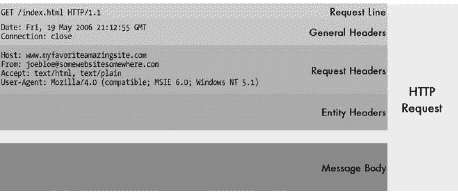

# 第三部分-8. TCP/IP 万维网和超文本传输协议 (HTTP)

第七十九章

第八十章

第八十一章

第八十二章

第八十三章

第八十四章

在我对 第七十一章 中文件和消息传输协议的概述中，我说万维网“几乎肯定”是最重要的 TCP/IP 应用。如果有什么不同的话，我可能还低估了情况。万维网不仅非常明显是今天最重要的 TCP/IP 应用，它可以说是网络历史上最重要的单一应用，甚至可能是整个计算领域最重要的应用。

这可能听起来有些夸张，但考虑一下万维网在存在十年左右的时间里所做的事情。它不仅改变了互联网的使用方式，而且在许多方面也改变了社会本身。可以说，万维网将互联网推上了地图，将其从技术人员和学者的领域转移到了主流世界。

本部分包含六个章节，描述了万维网以及至关重要的 *超文本传输协议 (HTTP)*，这是使万维网运行工作的 TCP/IP 应用层协议。第一章从一般意义上讨论了万维网以及超文本和超文本文档背后的概念。第二章概述了 HTTP 并以一般性描述其操作，重点关注连接的建立和维护。第三章概述了 HTTP 消息及其格式化方式，并描述了 HTTP 方法（命令）和状态码。第四章详细介绍了许多 HTTP 头部，这些头部至关重要，因为它们是 HTTP 服务器和客户端之间信息传递的主要方式。第五章提供了关于资源（称为 *实体*）在 HTTP 中编码和传输的信息。第六章和最后一章探讨了现代 HTTP 协议的特殊功能和能力。

就像许多 TCP/IP 协议一样，当 HTTP 被设计时，其创造者借鉴了其他应用协议的元素。在这种情况下，HTTP 使用了电子邮件中的某些元素，特别是多用途互联网邮件扩展（MIME）。在阅读这部分内容之前，我建议您熟悉 RFC 822 电子邮件消息格式和 MIME，特别是 MIME 头和媒体类型（这两个主题在第七十六章中都有涉及）。HTTP 与 MIME 之间的关系在第八十三章中有更全面的讨论，该章节讨论了 HTTP 实体和媒体类型。

# 第七十九章。万维网和超文本概述与概念


万维网（简称 Web）扩展了消息的概念，超越了简单文本文件传输的电子邮箱（email）、文件传输协议（FTP）和 Usenet 的界限。它的力量在于其结合了*超文本*，这是一个允许相关文档相互链接的系统，其丰富的文档格式不仅支持文本，还支持图形和多媒体，以及允许这些媒体高效传输的特殊协议。结果是，一个一旦推出就几乎立即被从大型公司用户到个人在内的所有人所接受的强大系统。在短短几年内，Web 就占据了互联网上所有其他应用的主导地位。

在本章中，我以高层次的视角概述了构成万维网的概念。我首先简要介绍了万维网和超文本的概述和历史，并讨论了构成万维网系统的组件。我简要描述了在万维网上使用的文档和媒体，并解释了超文本标记语言（HTML）的重要性。最后，我概述了在万维网上使用统一资源定位符（URL）对文档进行寻址的方法。

# 万维网和超文本概述与历史

万维网是互联网消息应用类别中的一员。但不知何故，它在我眼中并不像是一个消息传输协议。这让我想弄清楚，万维网有什么特别之处，使得它以一种先前任何消息应用都没有的方式变得流行？

对于这个问题，没有一个真正准确的单一词回答。然而，如果无论如何我都必须给出一个答案，那将是这个：*超文本*。当然，像电子邮件和 Usenet 这样的应用允许用户发送和接收信息，而 FTP 则允许用户访问服务器上的文件集。但这些方法缺乏任何易于表示文档之间*关系*的方法，或者提供一种从一份文档移动到另一份文档的方式。高度简化地说，超文本正是这样做的：它允许文档的创建者包含指向相关信息的链接，无论是该文档的其它部分还是其他文档。有了适当的软件，用户可以轻松地在不同位置之间移动。那么这为什么是个大问题呢？事实上，这比最初看起来更重要。

如果没有某种方式将文档链接在一起，它们将保持未连接的孤岛状态。在某种程度上，超文本链接的文档与未链接的文档的关系，就像联网的计算机与未联网的计算机的关系一样。

## 超文本的历史

超文本背后的思想实际上远早于互联网甚至电子计算机。范内瓦·布什（1890-1974）通常被归功于他在 1945 年描述一个名为*Memex*的理论装置时引入了这个想法，该装置旨在用于存储和检索文档。他描述了*轨迹*的概念，它将相关联的信息链接起来，以便更容易地组织和访问设备中的信息。

布什的思想被后续几位研究人员作为工作的基础。其中之一是特德·纳尔逊，他提出了*超文本*这个术语，并在 1960 年首次描述了一个名为*Xanadu*的系统，该系统被认为是原始的超文本软件模型之一。

互联网本身的历史可以追溯到 1989 年的欧洲核子研究中心（CERN），位于日内瓦。该缩写代表*Conseil Européen pour la Recherche Nucléaire*，即该组织的法语名称。CERN 进行的项目大多规模庞大且复杂，需要多年才能完成。它们还涉及许多必须共同工作和共享相关文档的科学家。

欧洲核子研究中心（CERN）的研究员蒂姆·伯纳斯-李提出了创建一个“网络”的电子链接文档的想法。快速增长的互联网显然是这个项目的明显渠道。他在 1990 年设计了 TCP/IP 的最初（非常粗糙和简单）版本的 HTTP。他还负责开发或共同开发 Web 背后的其他一些关键概念和组件，例如统一资源标识符（URIs）和 HTML。

将文档和文件链接起来的能力具有巨大的吸引力，创意人士很快就发现了这种新技术的大量用途。20 世纪 90 年代初，开发活动迅速展开。Web 服务器和客户端软件得到了开发和完善，1993 年，国家超级计算应用中心（NCSA）创建了第一个图形化 Web 浏览器*Mosaic*。（该程序的开发者马克·安德森最终成立了网景通信公司。）

一旦万维网开始形成，它就迅速发展。事实上，如果将万维网的增长称为其他任何非爆炸性的东西，那都不足以描述其真实情况。1993 年初，只有 50 个活跃的 HTTP Web 服务器。到 1993 年底，服务器数量超过 1000 个。到 1995 年底，每天都有成千上万的新的网站上线，HTTP 请求和响应已经超过了所有其他 TCP/IP 应用流量。到本世纪末，*数百万*个网站和超过十亿份文档可在互联网上获取。

## 今天的万维网

虽然互联网规模的快速增长令人惊叹，但更令人着迷的是其范围的扩展。既然你在阅读一本关于网络的书，你很可能是一个熟悉今天互联网上可以找到的令人难以置信的各种类型信息的 Web 用户。早期的超文本系统仅基于文本文档的使用；今天，互联网是一个包含图片、声音和电影等多种媒体的全球世界。在许多情况下，*超文本*这一术语已被更通用的*超媒体*所取代——在功能上，如果不是在官方上。

互联网已经超越了提供简单文档检索的功能，提供了各种各样的服务。一个网站可以提供不仅仅是文档的服务，使用户能够运行成千上万种程序，从购物到在线播放音乐或游戏。网站也在模糊不同类型应用之间的界限，提供基于 Web 的电子邮件、基于 Web 的 Usenet 访问、公告板以及其他用于讨论的互动论坛。

互联网对网络和社会整体的影响，即使是其最热情的早期粉丝也未曾预料到。事实上，互联网的终极“杀手级应用”就是万维网。在 20 世纪 90 年代初，大公司把互联网视为一种有趣的奇观；到本世纪末，对许多人来说，它已经成为一种商业必需品。数百万个人和家庭发现了他们指尖上的信息财富，互联网接入对许多人来说成为另一种必需的公用事业，就像电话服务一样。事实上，互联网流量的大幅增加催生了数十亿美元用于互联网基础设施的投资。

21 世纪初的互联网泡沫破灭削弱了互联网的势头。互联网的惊人增长无法以原来的速度继续，并且已经有所放缓。但总体而言，互联网仍在持续扩展和成熟，它很可能会在相当长一段时间内成为互联网上最重要的信息和资源。

### 提示

**关键概念** 万维网（Web 或 WWW）始于 1989 年，是一个旨在促进文档之间关系表示和研究人员之间信息共享的项目。使万维网如此强大的主要特征是超文本，它允许从一个文档链接到另一个文档。万维网的许多好处使得它仅在短短几年内从一个小型应用发展到世界上最大、也许是最重要的网络应用。它主要负责将互联网带入社会的主流。

# 万维网系统概念和组件

超文本是使万维网不仅仅是一个消息传输系统的核心概念。然而，超文本背后的想法在万维网出现之前就已经存在了几十年，以及基于该想法的某些软件产品。显然，一个想法要发展成为成功的系统，需要的不仅仅是概念。

互联网之所以成为现象，是因为它将超文本的基本思想与几个其他概念和技术相结合，创造了一个丰富、全面的交互式通信机制。这个系统今天包含了如此多的不同概念和软件元素，并且与其他技术如此集成，以至于很难找到两个对互联网究竟包含什么以及哪些部分最为关键达成共识的人。

例如，不可否认，互联网成功的关键之一是 TCP/IP 互联网互连协议套件与连接全世界计算机的互联网基础设施的结合。那么，互联网是否是互联网的必要组成部分呢？在许多方面，是的；实际上，由于互联网今天如此受欢迎，人们常常将互联网称为*互联网*。当然，我们知道这并不是精确的术语使用，但它显示了互联网变得多么重要，以及它与互联网的紧密联系。

## 万维网的主要功能组件

虽然互联网和 TCP/IP 显然是互联网成功的重要部分，但它们本质上是通用的。当具体定义万维网系统本身时，通常认为有三个特定的组件最为关键（参见图 79-1)：

**超文本标记语言** HTML 是一种用于定义超文本文档的文本语言。HTML 背后的想法是向常规文本文档中添加简单的结构，称为**标签**，以便将一个文档链接到另一个文档，并允许特殊数据格式化以及不同类型媒体的组合。HTML 已经成为实现超文本信息的标准语言，并催生了众多相关语言的创建。

**超文本传输协议** HTTP 是 TCP/IP 应用层协议，通过实现客户端和服务器之间超文本文档和其他文件的传输来实施网络。HTTP 最初是一种非常原始的协议，用于在计算机之间传输 HTML 文档，并且它已经发展成为一个功能齐全且复杂的消息协议。它支持多种不同类型文档的传输，连接上的多个文件的流式传输，以及包括缓存、代理和认证在内的各种高级功能。

**统一资源标识符** URIs 用于定义标识因特网上资源的标签，以便它们可以轻松找到和引用。URIs 最初是为了提供一种方式，让网络用户能够定位超文本文档，以便检索它们。尽管 URIs 并非特定于网络，但它们通常与网络和 HTTP 相关联。


图 79-1. 万维网的主要功能组件

### 注意

*统一资源定位符（URLs）实际上是统一资源标识符（URIs）的一个子集。在万维网讨论中，这两个术语经常被互换使用*。

这三个组件都是在同一时间创建和开发的，并且综合起来代表了定义网络的关键技术。在本章中，我将描述 HTML 以及在网络环境中 URI 的使用。HTTP 实际上是网络的中心，并在本书本部分的剩余五章中进行介绍。

## 网络服务器和网络浏览器

这三个主要的网络组件由许多其他元素补充，这些元素在完善整个系统方面发挥着辅助作用。其中最重要的是用于实现客户端/服务器通信的硬件和软件，这使得网络能够工作，也如图图 79-1 所示：**网络服务器**和**网络浏览器**。

网络服务器是运行特殊服务器软件的计算机，这使得它们能够向请求它们的客户端提供超文本文档和其他文件。现在，全世界有成千上万的此类机器作为网络所代表的巨大信息财富的虚拟分布式存储库。

网络浏览器是在 TCP/IP 客户端计算机上运行的 HTTP 客户端软件程序，用于访问网络服务器上的网络文档。这些浏览器程序检索超文本文档并显示它们，并且它们还实现了许多网络的先进功能，如缓存。今天的浏览器支持广泛的媒体，使网络能够实现许多不同的功能，除了超文本文档传输之外。例如，显示图像、播放声音和实现交互式程序。

最后，但同样重要的是，*用户*是万维网最重要的组成部分。用户参与在塑造网络技术发展方面发挥了比任何其他网络应用更大的作用。万维网最初是一种简单的交换文档的手段；如今，它已经发展到包括数千种不同的应用和服务，这主要归功于其用户的创造力。内容提供商通过创造新的信息和服务的想法来推动万维网所能做到的边界，以满足终端用户群体的无尽需求。

### 小贴士

**关键概念** 万维网是一个由许多相关组件组成的完整系统，其中三个是最基本的。超文本标记语言（HTML）描述了超文本文档是如何构建的。HTML 允许在文档之间表示链接。超文本传输协议（HTTP）是在网络上移动超文本和其他文档的应用层协议。统一资源标识符（URI）机制提供了一种一致的方法来标识资源，无论是在万维网上还是在更广泛的互联网上。

# 万维网媒体和超文本标记语言

我已经说过，网络是基于中心概念*超文本*的。前缀*hyper*通常意味着在之上或超越，因此*超文本*就像文本，但在功能上超越了它。用超文本编写的文档与常规文本文件类似，但包括实现超文本功能的信息。这些通常被称为*超文本文档*或*超文本文件*。

超文本文档中的额外信息用于告诉显示文件的计算机程序如何格式化它。这些信息以特殊指令的形式出现，穿插在文档的实际文本中，这些指令是根据定义语言的语法编写的。这种向文档内容添加额外元素的行为通常被称为*标记文档*。

## HTML 概述

HTML 是万维网的三个主要系统组件之一，由万维网的创造者蒂姆·伯纳斯-李于 1990 年发明。它不是在真空中创造的；相反，它是 ISO 标准 8879:1986 中描述的通用标记语言概念的特定应用——*标准通用标记语言（SGML）*。

标记语言定义了特殊的项目，为显示文档的软件提供有关如何展示的信息。在超文本的目的上，文档中最基本的信息类型是特殊的指令，指定如何将一个文档链接到另一个文档——毕竟，链接过程是超文本的定义属性。

然而，HTML 的功能远不止于此；它定义了一套完整的文本代码，用于描述文档如何向用户展示的几乎所有方面。这包括格式化文本的指令（例如定义其颜色、大小和对齐方式）、交互式表单、显示表格数据的方法、如何展示图像和其他媒体与文档一起的规范，以及更多。理论上，这种语言只应该定义文档，而将如何展示留给浏览器，但在实践中，现代 HTML 文档通常也包含相当具体的指令，说明它们的信息应该如何展示。

要公正地对待 HTML，我可能需要为这个主题写上几十页。我决定不这样做，因为尽管 HTML 是网络的一个重要部分，但在理解网络如何工作方面，它实际上并不是那么重要。如果你在编写网络内容，了解 HTML 是必不可少的，如果你想要了解如何编写网络软件，它也是至关重要的。然而，具有讽刺意味的是，对于使网络工作的实际机制，如 HTTP，文档就是文档。HTTP 并不是在假设它会传输 HTML 的情况下设计的，在大多数情况下，服务器甚至不会查看 HTML 文件的内容——它们只是传输它。

话虽如此，对 HTML 的基本理解很重要，而且似乎不提供至少对该语言的概述是不合适的，所以我将在这里这样做。我鼓励你寻找许多优秀的 HTML 资源之一，如果你想要了解更多——你可以在网上找到成百上千的资源（还能在哪里？）。

## HTML 元素和标签

简而言之，HTML 文档是一个普通的 ASCII 文本文件，就像一封电子邮件或其他文本文件。HTML 与普通文本的最大区别在于 HTML 文档是*结构化的*；也就是说，文档逻辑上组织成一系列*元素*，这些元素按照语言的规则排列。每个元素定义了文档整体的一部分。文档的标题、段落、表格以及指向另一个文档的超链接都是元素的例子。

每个元素都使用特殊的文本*标签*来描述，这些标签遵循特定的语法。每个标签以<符号开始，然后是（不区分大小写）元素名称，以及可选的描述元素的参数。标签以>符号结束。一般来说，标签看起来是这样的：

```
<element parameter1="value1" parameter2="value2". . .>
```

一些元素完全由标签的存在来描述，在这种情况下，该标签就是整个元素。更常见的是，标签成对出现，包围着元素的真正内容；*开始标签*以元素名称开头，*结束标签*以一个斜杠符号开头，后跟元素名称。例如，文档的标题是一个可以定义为以下内容的元素：

```
<title>This Is A Great Story</title>
```

每个元素的 内容可以包含其他元素，这导致标签在彼此之间嵌套。例如，如果我们想通过将单词 *Great* 以粗体字母的形式显示来突出显示标题中的该词，我们可以添加以下 `<b>` 标签：

```
<title>This Is A <b>Great</b> Story</title>
```

每个完整的 HTML 文档都定义为单个名为 `html` 的元素；整个文档被 `<html>` 和 `</html>` 标签包围。在这个元素内部，文档被分为两个标准子元素，每个文档都必须包含这些子元素：`head` 和 `body`。文档的 `head` 包含描述文档及其处理方式的信息；它最常见地包含文档的标题。`body` 包含文档的实际内容。这三个元素定义了基本的 HTML 文档结构，如下所示：

```
<html>
<head>
(head elements go here...)
</head>
<body>
(body elements go here...)
</body>
</html>
```

文档的大部分内容由放置在 `<body>` 和 `</body>` 标签之间的主体元素组成。HTML 文档可以从非常简单的只包含文本段落和几个链接的简单主体，到由计算机生成且包含数百甚至数千个嵌套标签的复杂文档。

## 常见 HTML 元素

表 79-1 提供了一些在 HTML 消息主体中常用元素及其定义的标签的简要描述，以帮助您了解该语言的工作方式。

表 79-1. 常见 HTML 元素

| 元素 | 示例元素和标签 | 描述 |
| --- | --- | --- |
| 段落 |

```
<p>Jack and Jill went up the hill to
fetch a pail of water...</p>
```

| 标记一段文本。请注意，从开始标签到结束标签之间的所有内容都将被视为一个段落，即使它们被分成多行，就像我在这里所做的那样。在 HTML 格式化中，换行符并不重要；只有标签被识别。 |
| --- |
| 换行 |

```
George W. Bush<br>
The White House<br>
1600 Pennsylvania Ave., NW<br>
Washington, DC 20500
```

| 强制换行。用于将行紧密排列，例如地址。 |
| --- |
| 标题 |

```
<h1>First Topic</h1>
<h2>Subtopic</h2>
```

| 定义文档中的部分标题，以便在长文档中以分层形式显示信息。定义了六组标签，从 `<h1>` 和 `</h1>` 到 `<h6>` 和 `</h6>`。浏览器会自动以更突出的方式显示高级标题，例如使用更大的字体、下划线文本或类似处理。 |
| --- |
| 列表 |

```
<p>Shopping list:
<ul>
<li>Milk
<li>Eggs
<li>Sushi
</ul>
</p>
```

| 允许以列表的形式呈现信息。标签 `<ul>` 表示无序列表，导致列表项通常以项目符号显示。另可使用 `<ol>`（有序列表）来显示前面带有 1、2、3 等的项。 |
| --- |
| 水平线 |

```
...end of this part of the story.</p>
<hr size= "3">
<p>Start of next part of story...
```

| 在页面上绘制一条水平线；`size` 参数控制其厚度。用于在文档中分隔逻辑部分。 |
| --- |
| 图片 |

```

```

| 在文本的适当部分显示内联图像。`src` 参数是图像的相对或绝对 URL，可以包含多个其他参数来定义图像的对齐方式、大小、如果浏览器是非图形的则显示的替代文本（如这里所示，使用 `alt` 参数），以及更多。 |
| --- |
| 链接 |

```
<a href="http://
www.PCGuide.com">Click here to visit
The PC Guide</a>
```

| 指向另一个文档的超链接。标签中的 *a* 代表锚点，这是超链接的正式名称。`href` 参数指定链接的 URL。大多数浏览器会在开始和结束标签之间的文本下划线或以其他方式突出显示，以清楚地表明该文本代表超链接。也可以通过结合 `` 和 `<a>` 标签来给图像创建超链接。 |
| --- |
| 书签 |

```
<a name="Step4">Step 4: Remove paint
using scrubbing tool.</a>
```

| 创建一个书签，可以用来指向文档中的特定部分。例如，如果这个示例中的书签在一个 URL 为 [`www.homefixitup.com/repainting.htm`](http://www.homefixitup.com/repainting.htm) 的文档中，那么 URL [`www.homefixitup.com/repainting.htm#Step4`](http://www.homefixitup.com/repainting.htm#Step4) 就指向文档中的这个特定位置。有关更多详细信息，请参阅本章后面的 URL 讨论部分。 |
| --- |
| 表格 |

```
<table>
<tr>
<td>1st row, 1st column.</td>
<td>1st row, 2nd column.</td>
</tr>
<tr>
<td>2nd row, 1st column.</td>
<td>2nd row, 2nd column.</td>
</tr>
</table>
```

| 以表格形式显示信息。每个 `<tr>` 和 `</tr>` 标签集定义表格的一行；在每一行中，每个 `<td>` 和 `</td>` 对定义一个表格数据元素。可以为这些标签中的每一个提供多个不同的参数来控制表格的大小和外观。 |
| --- |
| 表格形式 |

```
<form method="POST" action="https://
www.myfavesite.com/order.php">
<input type="hidden" name="PRODUCT"
value="widget">
<input type="text" name="QUANTITY"
size="3">
<input type="submit" value="Click
Here to Proceed to the Secure
Processing Site">
</form>
```

| 定义一个 HTML 表单，允许客户端向处理表单的网站上的程序提交各种类型的信息。表单由描述提交按钮按下时要采取的操作的初始 `<form>` 标签组成，以及其他表单项，如预定义变量、文本输入字段和按钮。这里展示了这些项的每个示例。 |
| --- |
| 脚本 |

```
<script language=javascript>
(JavaScript code)
</script>
```

| 允许在 HTML 文档中包含脚本语言的指令。它最常用于 JavaScript。 |
| --- |

## 常见文本格式化标签

在文档中格式化文本外观的标签有很多，这里列出了一些更常见的标签：

**`<b>文本</b>`** 以粗体形式呈现包含的文本。

**`<i>文本</i>`** 以斜体形式呈现包含的文本。

**`<u>文本</u>`** 以下划线呈现包含的文本。

**`<font (参数)>文本</font>`** 使用指定的字体类型、大小或颜色来呈现包含的文本。

这只是冰山一角，当涉及到 HTML 时。如果你不熟悉 HTML，然而，了解这些基本标签应该有助于你解释基本的 HTML 文档并学习 HTTP 的工作原理。

### 提示

**关键概念** 互联网超文本文档使用的语言称为 HTML。HTML 文档类似于 ASCII 文本文件，但它们使用 HTML 元素的特殊结构来排列，这些元素定义了文档的不同部分以及它们应该如何显示给用户。每个元素都使用特殊的文本标签来描述，这些标签定义了它及其特征。

# 万维网寻址：HTTP 统一资源定位符

超文本之所以强大且有用，主要原因是它允许相关文档相互链接。在万维网的情况下，这是通过一组特殊的 HTML 标签来实现的，这些标签在一篇文档中指定了另一篇与之在某些重要方面相关的文档的名称。用户可以通过简单的鼠标点击从一个文档跳转到另一个文档。万维网在很大程度上是基于这种简单而优雅的引用方法而成功的。

超链接的概念对万维网文档和其他资源的寻址方式有重要影响。尽管万维网本质上是一种类似于 FTP 的消息传输协议，但需要能够定义超链接意味着必须放弃传统的 FTP 模型，即使用一系列命令来指定如何检索资源。相反，需要一个系统，通过一个简单紧凑的字符串可以唯一地指定资源。

这种需求的结果是定义了万维网三个主要元素之一：*URI*。URI 分为两类：*统一资源定位符（URLs）*和*统一资源名称（URNs）*。虽然 URI、URL 和 URN 起源于万维网的发展，但现在它们已经被推广，为各种 TCP/IP 应用层协议提供寻址机制。它们在第七十章中进行了详细描述。在这里，我们将探讨它们在万维网中具体是如何使用的。

目前，万维网几乎完全使用 URLs；URNs 仍在开发中。万维网 URL 指定了使用 HTTP 进行资源检索，因此通常被称为*HTTP URLs*。这些 URL 允许通过指定资源所在的主机名、目录路径和文件名来唯一地寻址资源，如文档、图形图像或多媒体文件。

### 小贴士

**关键概念** 统一资源标识符（URIs）的开发是为了使万维网资源能够轻松且一致地被识别；它们现在也被用于其他协议和应用。目前万维网上使用的 URI 类型是统一资源定位符（URL），它标识了使用 HTTP 来检索资源，并提供了关于资源的位置和检索方式的信息。

## HTTP URL 语法

HTTP URL 可以是绝对路径或相对路径（有关它们之间的区别，请参阅第七十章")中的“URL 相对语法和基本 URL”）。绝对路径通常用于从一个网站链接到另一个网站，或者用户在没有任何先前上下文的情况下请求新文档。绝对 HTTP URL 基于以下常见的互联网 URL 语法：

```
<scheme>://<user>:<password>@<host>:<port>/<urlpath>;<params>?<query>#<fragment>
```

对于 Web，方案是 `http:`，不同 URL 元素的语义被定义为与 Web 相关的含义。HTTP URL 的一般结构如下所示：

```
http://<user>:<password>@<host>:<port>/<url-path>?<query>#<bookmark>
```

这些句法元素被专门定义为 HTTP 绝对 URL 如下：

**`<用户> 和 <密码>`** 可选的认证信息，用于位于受密码保护的服务器上的资源。这种结构在实际应用中很少使用，因此大多数人没有意识到这是一个选项。因此，它成为了骗子们用来隐藏不良 URL 的目标。

**`<主机>`** 存放资源的 Web 服务器的主机名。这通常是一个完全合格的域名系统 (DNS) 域名，但它也可能是一个 IP 地址。

**`<端口>`** 用于连接到 Web 服务器的 TCP 端口号。对于 HTTP，默认端口是 80，通常省略。在罕见的情况下，您可能会看到使用其他端口号的情况，有时是为了在同一 IP 地址上允许两个用于不同用途的 Web 服务器软件副本。端口 8080 特别常见作为替代方案。

**`<url-path>`** 使用 HTTP 获取特定资源的路径。这通常是一个完整的目录路径，表示从根目录到资源所在位置的目录序列，然后是资源名称。重要的是要记住，路径是区分大小写的，尽管 DNS 域名不是。

**`<查询>`** 可选的查询或其他要传递给 Web 服务器的信息。此功能通常用于实现交互式功能，因为查询值可以由用户指定，然后从 Web 浏览器传递到 Web 服务器。另一种方法是使用 HTTP POST 方法。

**`<书签>`** 识别 HTML 文档中的特定位置。这在非常大的 HTML 文档中很常见，允许用户点击超链接并滚动到文档中的特定位置。请参阅表 79-1 末尾的示例。

虽然 Web 的 URL 语法相当丰富且可能复杂，但大多数 Web URL 实际上相当简短。这些组件中的绝大多数都被省略了，特别是用户、密码、端口和书签元素。查询仅用于特殊目的。这留下了您通常遇到的更简化的 URL 形式：

```
http://<*`host`*>/<*`url-path`*>
```

## 资源路径和目录列表

用来引用特定文档的`<url-path>`也可以省略。这为用户提供了一个方便的方法，可以在不知道要请求哪个特定文档的情况下查看网站提供的内容。例如，想要查看 CNN 当前头条新闻的用户会访问[`www.cnn.com`](http://www.cnn.com)。在这种情况下，请求被发送到 Web 服务器上的空文档（由/表示，如果未指定则隐含；技术上，你应该指定[`www.cnn.com/`](http://www.cnn.com/))。

如何处理/请求取决于服务器。技术上，这样的请求实际上是在询问服务器：“请显示服务器根目录的内容。”然而，这既不美观（文件名列表不是留下最佳第一印象的方式）也潜在存在安全风险（因为任何人都可以看到服务器上每个文件的名称）。因此，大多数 HTTP 服务器都设置为自动识别此类请求并返回默认文档，通常命名为 index.html 或 default.html。许多服务器在 URL 中指定任何其他目录时也会返回某种类型的默认文档；例如，在 Web 浏览器的 URL 地址栏中键入[`www.pcguide.com/ref`](http://www.pcguide.com/ref)实际上返回[`www.pcguide.com/ref/index.htm`](http://www.pcguide.com/ref/index.htm)。

### 注意

*虽然从技术上讲，在 HTTP URL 中省略 http://是不正确的，但大多数 Web 浏览器如果省略了它，会自动添加。因此，许多 Web 用户习惯于输入仅包含主机名的 URL，例如[www.tcpipguide.com](http://www.tcpipguide.com)*。

这里显示的格式适用于绝对 HTTP URL。URL 也可以是相对的，这在紧密相关的文档之间是常见的，例如与文档一起的图形，或者在一组或项目中的文档之间。在这种情况下，通常只指定 URL 路径的一部分。这将在第七十章中详细描述。

# 第八十章。HTTP 一般操作和连接


超文本传输协议（HTTP）最初是一个非常基础的协议，设计用来做一件事：允许客户端发送一个简单的请求来获取超文本文件，并从服务器接收它。现代 HTTP 在本质上仍然是一个简单的请求/回复协议，但现在包括了众多新特性和功能，以支持不断增长的万维网（Web）规模以及人们不断发现的新用途。因此，解释 HTTP 的最佳起点是查看其整体操作以及 Web 服务器和 Web 客户端之间通信的方式。

在本章中，我通过描述其一般操作来介绍 HTTP。我首先概述了 HTTP，讨论了其版本和定义它们的规范。然后，我讨论了其操作模型，这对于理解 HTTP 的工作方式非常重要。我解释了 HTTP 客户端和服务器之间支持的两个类型的连接，以及如何在当前版本的 HTTP（HTTP/1.1）中通过流水线请求。然后，我提供了更多关于如何在 HTTP/1.1 中建立、管理和终止持久连接的信息。

# HTTP 版本和标准

万维网起源于瑞士研究机构欧洲核子研究组织 CERN 的一个研究项目。该项目的首要目标是允许超文本文档通过电子方式相互链接，因此在一个文档中选择一个引用到第二个文档会导致引用文档被检索。为了实现这个系统，研究人员需要某种机制来允许客户端计算机告诉服务器发送它一个文档。为了填补这个功能，早期的网络开发者创建了一个新的 TCP/IP 应用层协议：*超文本传输协议（HTTP）*。

这个第一个版本现在被称为 HTTP/0.9。随后的版本是 HTTP/1.0 和 HTTP/1.1。

## HTTP/0.9

原始的 HTTP 版本仅用于传输超文本文档，并且设计得非常简单，以便更容易实现新兴的 Web。这个早期的 HTTP 规定，HTTP 客户端使用传输控制协议（TCP）与 HTTP 服务器建立连接。然后客户端发出一个 GET 请求，指定要检索的资源。服务器通过发送文本字节流作为文件来响应，然后断开连接。定义这个版本 HTTP 的整个文档只有几页长！

这个 HTTP 的第一个版本在功能上是可行的，但在其能力上极为有限。它不支持传输除超文本之外的其他类型的数据，并且没有提供任何机制来实现客户端和服务器之间的任何智能通信。这个早期的 HTTP 原型无法为 Web 的未来数据传输提供基础。它从未成为官方的 RFC 标准，实际上甚至没有正式的版本号；它今天被称为 HTTP 版本 0.9，或 HTTP/0.9，使用 HTTP 版本格式。我相信这个数字没有特别的意义，除了比协议的第一个官方版本号小一点。

## HTTP/1.0

HTTP/0.9 的功能框架为 1990 年代初 HTTP 的快速演变奠定了基础。随着网络的规模和接受度的增长，许多新想法和功能被纳入 HTTP。大量开发工作的结果是第一个 HTTP 标准的正式化：版本 1.0。这个增强后的 HTTP 标准于 1996 年 5 月作为 RFC 1945 发布，即“超文本传输协议——HTTP/1.0”。然而，在正式发布日期之前，它已经使用了几年。

HTTP/1.0 将 HTTP 从一个简单的请求/响应应用程序转变为一个真正的消息协议。它描述了 HTTP 的完整消息格式，并解释了它应该如何用于客户端请求和服务器响应。HTTP/1.0 最重要的变化之一是将协议泛化以处理多种不同类型的媒体，而不是严格限于超文本文档。为了拓宽 HTTP 的范围，其开发者从为电子邮件定义的多用途互联网邮件扩展（MIME）标准中借鉴了概念和头部结构（在第七十六章中讨论）。与此同时，它定义了更强大的网页服务器和客户端，HTTP/1.0 还保留了与仍在使用 HTTP/0.9 的服务器和客户端的向后兼容性。

HTTP/1.0 是 1990 年代中期广泛实施的 HTTP 版本，当时网络在流行度上爆炸式增长。仅仅几年后，HTTP 就占有了新兴互联网上大部分的流量。HTTP 的普及如此之大，以至于它单方面促使安装了大量新硬件来处理浏览器请求和网页服务器响应的负载。

不幸的是，大量流量中的很大一部分是由于 HTTP 本身的一些限制造成的。这些限制只有在协议使用量激增的情况下才变得明显，这结合了互联网的正常成长痛，导致许多网络用户感到沮丧。HTTP/1.0 的低效是设计限制的结果，例如以下内容：

+   每个网站都需要托管在不同的服务器上。

+   每个 HTTP 会话只处理一个客户端请求。

+   对必要的性能增强功能（如缓存、代理和部分资源检索）的支持普遍不足。

## HTTP/1.1

虽然不耐烦的评论家们提出了讽刺性的术语，如“全球等待”，但互联网工程任务组（IETF）继续努力改进 HTTP。1997 年 1 月，HTTP/1.1 的第一个草案版本在 RFC 2068 中出现。该文件后来经过修订并于 1999 年 6 月作为 RFC 2616 发布，即“超文本传输协议——HTTP/1.1”。HTTP/1.1 与 HTTP/1.0 和 HTTP/0.9 都保持向后兼容性。它还伴随着 RFC 2617，“HTTP 认证：基本和摘要访问认证”，该文件处理安全和认证问题。

HTTP/1.1 相比于协议的 1.0 版本引入了几个显著的改进，其中大部分专门针对我刚才描述的性能问题。HTTP1/1 中一些更重要改进包括以下内容：

**多主机名支持** 在 HTTP/1.0 中，没有方法可以指定客户端需要连接的服务器的名称。因此，特定 IP 地址的 Web 服务器只能支持一个域名。这不仅效率低下，而且在 1990 年代还加剧了 IP 地址的枯竭，因为每个上线的新 Web 服务器都需要一个新的 IP 地址。HTTP/1.1 允许一个 Web 服务器处理数十个甚至数百个不同虚拟主机的请求。

**持久连接** HTTP/1.1 允许客户端在一个 TCP 会话中向服务器发送多个相关文档的请求。这比 HTTP/1.0 的性能有了很大提升，在 HTTP/1.0 中，每个请求都需要一个新的连接到服务器。

**部分资源选择** 在 HTTP/1.1 中，客户端可以请求资源的部分，而不是需要获取整个文档，这减少了服务器的负载并节省了传输带宽。

**更好的缓存和代理支持** HTTP/1.1 包含了许多规定，使得缓存和代理比 HTTP/1.0 更有效率且更有效。这些技术可以通过为客户端提供更快地回复其请求来提高性能，同时减少服务器的负载，以及增强安全性和实现其他功能。

**内容协商** HTTP/1.1 有一个额外的协商功能，允许客户端和服务器交换信息，以帮助在多个变体可用时选择最佳资源或资源的版本。

**更好的安全性** HTTP/1.1 定义了身份验证方法，并且通常比 HTTP/1.0 更注重安全性。

除了这些显著的改进之外，HTTP/1.1 还进行了许多其他小的增强。其中一些以新头部的形式出现，可以包含在客户端请求中，以更好地控制在什么情况下从服务器检索资源，以及服务器响应中的头部提供额外的信息给客户端。

## 未来 HTTP 版本

尽管 HTTP/1.1 现在已经几年了，但它仍然是当前的 HTTP 版本。考虑到 HTTP 的广泛使用，这可能会让人有些惊讶。然而，这也可能是因为有数以百万计的服务器和客户端实现了 HTTP/1.1，因此没有创建新的版本。曾经有过关于 HTTP 1.2 版本将会开发的猜测，但到目前为止这还没有发生。

在 1990 年代末，开始研究通过扩展现有版本 1.1 来扩展 HTTP 的方法。*HTTP 扩展框架* 的开发持续了多年，到 1998 年，为一个新的互联网标准创建了一个提议的草案。然而，由于 HTTP/1.1 非常广泛部署且非常重要，因此很难就任何修改它的提议达成共识。因此，当 HTTP 扩展框架最终在 2000 年 2 月作为 RFC 2774 发布时，新的标准所需的普遍接受度并不存在。该框架被赋予实验性状态，从未成为正式标准。

### 小贴士

**关键概念** 互联网（Web）的引擎是定义服务器和客户端如何交换信息的应用协议：*超文本传输协议（HTTP）*。HTTP 的第一个版本是 HTTP/0.9，它是早期 Web 的一部分，是一个非常简单的请求/响应协议，只能传输文本文件。第一个广泛使用的版本是 HTTP/1.0，这是一个更完整的协议，允许传输许多类型的文件和资源。当前版本是 HTTP/1.1，它通过几个提高传输效率并解决许多现代 Web 快速增长需求的功能扩展了 HTTP/1.0 的功能。

# HTTP 操作模型和客户端/服务器通信

虽然 Web 本身有许多不同的方面，但 HTTP 只关注一个基本功能：从网页服务器向网页客户端传输超文本文档和其他文件。在实际情况中，客户端主要关注向服务器发出请求，服务器对这些请求进行响应。

因此，尽管 HTTP 包含了许多功能以满足客户端和服务器需求，但当你将其简化时，你会得到一个非常简单、客户端/服务器、请求/响应协议。在这方面，HTTP 更类似于像引导协议（BOOTP）或地址解析协议（ARP）这样的基本协议，而不是像文件传输协议（FTP）和简单邮件传输协议（SMTP）这样的其他应用层协议，后者涉及多个通信步骤和命令/回复序列。

## 基本 HTTP 客户端/服务器通信

在其最简单的形式中，HTTP 的操作仅涉及一个 HTTP 客户端，通常是一个客户端机器上的 *网页浏览器*，以及一个 HTTP 服务器，更常被称为 *网页服务器*。在创建 TCP 连接之后，通信的步骤如下（参见 图 80-1

图 80-1. HTTP 客户端/服务器通信 在其最简单形式中，HTTP 通信包括一个客户端发送给服务器的 HTTP 请求消息，服务器以 HTTP 响应消息回复。

在 HTTP/1.0 中，每个 TCP 连接仅涉及这样一个交换，如 图 80-1 所示。在 HTTP/1.1 中，可能存在多个交换，您很快就会看到。注意，在某些情况下，服务器可能在发送完整响应之前，先发送一个或多个初步响应。这可能发生在服务器在发送实际回复之前，使用 100 Continue 状态码发送一个初步响应。有关 HTTP 状态码的更多描述，请参阅 第八十一章。

### 小贴士

**关键概念** HTTP 是一种面向客户端/服务器的请求/回复协议。基本通信包括一个由 HTTP 客户端发送到 HTTP 服务器的 *HTTP 请求* 消息，服务器随后返回一个 *HTTP 响应* 消息给客户端。

## 代理和 HTTP 请求/响应链

当在客户端和服务器之间的虚拟通信路径中放置 *代理* 时，客户端和服务器之间的简单请求/响应对会变得更加复杂。这些设备如 *代理、网关* 或 *隧道* 用于提高性能、提供安全性或为特定客户端或服务器执行其他必要功能。代理在互联网上尤其常用，因为它们可以大大提高相关客户端计算机组的响应时间。

当中间件参与 HTTP 通信时，它充当中间人。而不是客户端直接与服务器通信，反之亦然，每个都通过中间件进行交流。这允许中间件执行诸如缓存、翻译、聚合和封装等功能。例如，考虑通过单个中间设备进行交换。前面章节中描述的两步通信过程将变为四步：

1.  **客户端请求** HTTP 客户端向中间设备发送请求消息。

1.  **中间请求** 中间件处理请求，如果需要则对其进行更改。然后它将请求转发到服务器。

1.  **服务器响应** 服务器读取并解释请求，采取适当的行动，然后发送响应。由于它从中间件接收请求，所以它的回复返回到中间件。

1.  **中间件响应** 中间件处理请求，再次可能进行更改，然后将它转发回客户端。

如您所见，从客户端的角度来看，中间件表现得像服务器，从服务器的角度来看，它表现得像客户端。许多中间件被设计成能够拦截各种 TCP/IP 协议，通过充当客户端对服务器和服务器对客户端。大多数协议对中间件的存在一无所知。然而，HTTP 包含对某些中间件（如代理服务器）的特殊支持，提供控制中间件如何处理 HTTP 请求和响应的头部信息。（代理服务器在第八十四章中讨论。）

在客户端和服务器之间，可能存在两个或更多中间件相互连接。例如，客户端可能向中间件 1 发送请求，然后中间件 1 转发到中间件 2，然后中间件 2 与服务器通信，如图 80-2 所示。回复的过程是相反的。HTTP 标准使用短语“请求/响应链”来指代参与 HTTP 消息交换的所有设备集合。


图 80-2. 使用中介的 HTTP 请求/响应链 与直接连接不同，HTTP 客户端和服务器可能通过一个或多个中介设备（如代理）连接。在这个例子中，有两个中介设备。客户端发送的 HTTP 请求消息实际上会被传输三次：从客户端到第一个中介，然后到第二个，最后到服务器。HTTP 响应消息只创建一次，但会传输三次。参与消息交换的全部设备集合称为请求/响应链。

### 小贴士

**关键概念** 当在 HTTP 客户端和服务器之间的通信路径中插入*中介设备*，如代理、隧道或网关时，简单的客户端/服务器操作模型变得更加复杂。HTTP/1.1 特别设计了一些功能，以支持通过一系列步骤高效地传输请求和响应，从客户端通过中介到服务器，然后再返回。参与此类通信的所有设备统称为*请求/响应链*。

## 缓存对 HTTP 通信的影响

正常的 HTTP 通信模型通过应用*缓存*到客户端请求而改变。网络上的各种设备使用缓存来存储最近检索的资源，以便在响应请求时可以快速提供。客户端本身也会缓存最近访问的网页文档，这样如果用户再次请求它们，它们可以在不向服务器发出请求的情况下显示。如果需要请求，任何中介设备都可以在它的缓存中满足对文件的请求。

当使用缓存时，拥有请求的缓存资源的设备会直接返回它，绕过了正常的 HTTP 通信过程。在图 80-2,如果中间件 1 拥有客户端需要的文件，它将直接提供给客户端，而中间件 2 以及客户端最初试图到达的原始 Web 服务器甚至都不会意识到曾经有请求被发起。第八十四章提供了关于 HTTP 缓存的详细信息。

### 注意

*大多数对网络资源的请求都是使用基于域名系统（DNS）主机名的 HTTP URL 进行的。满足此类请求的第一步是将 DNS 域名解析为 IP 地址，但这个过程与 HTTP 通信本身是分开的。*

# HTTP 的临时性连接、持久性连接和流水线

你刚刚了解到基本的 HTTP 通信过程是一个简单的两步程序：客户端向服务器发送请求，服务器回复客户端。由于 HTTP 原本就是为了做这件事而设计的，因此该协议的第一个版本被设计成在客户端和服务器之间建立 TCP 连接后，只执行一次请求/响应交换。请求得到满足后，TCP 连接就被终止了。这些*临时性*连接是原始 HTTP/0.9 所支持的唯一类型，在更广泛部署的 HTTP/1.0 中也保持了同样的模型。

这种连接模型的优势在于其概念上的简单性。问题是，当客户端需要向同一服务器发送多个请求时，它是不高效的。这在现代超文本文档中很常见，这些文档通常包含对图像和其他媒体的内联引用。一个典型的客户端对网站主页的请求开始于对一个超文本标记语言（HTML）文件的单一请求，但随后会引发对该文档相关其他文件的后续请求。

在临时连接中，客户端发出的每个请求都需要在客户端和服务器之间建立一个全新的、独立的 TCP 连接。每个连接都消耗服务器资源和网络带宽，因此为每个文件建立新的连接效率极低。假设你正在与某人交谈，你需要连续提出一系列问题。现在想象一下，在回答完每个问题后，对方挂断了电话，你不得不再次拨通她！你就能理解这个情况了。

有些人认为 HTTP/0.9 和 HTTP/1.0 连接的临时性是这些早期 HTTP 版本的设计缺陷，但我不认为这是公平的。在早期，这种操作模式并不是一个大问题；只有在 Web 和超文本的使用演变后，才变得有问题。在其存在的最初几年，超文本主要是这样的：*文本*。HTTP 会话只需持续足够长的时间来完成一次请求/响应就足够了，因为整个资源都在一个文件中。只有在 20 世纪 90 年代，超文本才变成了*超媒体*，强调嵌入图形和其他文件。当网页从简单的文本变为多媒体奇迹，拥有数十甚至数百个嵌入图像时，HTTP/1.0 的限制变得明显。

问题解决方案出现在 HTTP/1.1 中，它允许 HTTP 客户端和服务器建立一种**持久连接**。

## 持久连接

在持久连接下，HTTP 的基本操作并未改变。主要区别在于，默认情况下，每次请求/响应集之后，TCP 连接保持开启状态，以便下一个请求和响应可以立即交换。会话仅在客户端完成请求所有需要的文档后关闭。

在请求之间保持 HTTP 客户端和服务器之间的 TCP 连接活跃，可能是 HTTP/1.1 相对于 HTTP/1.0 性能提升的最重要方式。客户端能够更快地获取文件，因为它们不需要在检索每个资源之前等待 TCP 连接。服务器负载减少，繁忙服务器中的内存使用得到节约。通过消除不必要的 TCP 握手段，减少了网络拥塞。

## 管道化

持久连接为 HTTP 客户端提供了另一个重要的性能提升选项：能够 *管线化* 请求。假设客户端需要向服务器发送对文件 A、B 和 C 的请求。由于所有这些文件的请求都将发送在同一个 TCP 会话中，客户端在发送对文件 B 的请求之前无需等待对文件 A 请求的响应。客户端可以连续快速地发送请求。这也提高了服务器的效率，服务器将能够按照接收到的顺序尽快填充请求，无需等待每个新请求的发送。

### 小贴士

**关键概念** HTTP/0.9 和 HTTP/1.0 只支持 HTTP 客户端和服务器之间的 *临时连接*，在 TCP 连接上只能交换一个请求和响应。这对于现代网络来说非常低效，因为客户端经常需要向服务器发送数十个请求。默认情况下，HTTP/1.1 使用 *持久连接*。这意味着一旦建立了 TCP 连接，客户端就可以向服务器发送多个请求，并依次接收每个请求的回复。这允许更快地检索文件，并节省服务器资源和互联网带宽。客户端甚至可以在发送第一个请求的回复之前发送第二个请求。HTTP/1.1 仍然支持临时连接以实现向后兼容性，当需要时。

持久连接的明显优势使它们成为现代 HTTP 通信的默认选项，但它们确实有一个缺点：它们使从服务器向客户端发送数据的过程复杂化。在临时连接中，客户端知道它从服务器接收到的所有数据都是对它发送的一个请求的回复。一旦它收到了服务器发送的所有字节并且 TCP 会话结束，客户端就知道文件已经完成。

在使用持久连接，尤其是当使用管线化时，服务器通常会向客户端连续发送一个文件接着另一个文件，客户端必须区分它们。记住 TCP 将数据作为一系列无结构的字节发送；应用程序必须负责指定文件之间的分隔点。这意味着持久连接和管线化导致的数据长度问题必须在 HTTP 中特别处理。

为了与旧版本的软件保持兼容性，HTTP/1.1 服务器仍然支持临时连接，并且如果它们收到 HTTP/0.9 或 HTTP/1.0 请求，它们将自动在发送一个响应后关闭 TCP 连接。HTTP/1.1 客户端也可以在其初始请求中指定它们不想使用持久连接。

## HTTP 持久连接的建立和管理

与大多数 TCP/IP 客户端/服务器协议一样，在建立持久连接时，HTTP 服务器通过监听特定端口号上的请求来扮演被动角色。HTTP 的默认端口号是众所周知的 TCP 端口号 80，并且被网页浏览器用于大多数 HTTP 请求，除非在统一资源定位符（URL）中指定了不同的端口号。客户端通过从自身到它希望联系的服务器打开一个 TCP 连接来启动 HTTP 连接。

### 注意

*DNS 名称解析步骤可能在整个 HTTP 连接之前进行，因为大多数 URL 包含一个主机名，而 HTTP 要求客户端知道服务器的 IP 地址。这可能会导致混淆，因为 DNS 使用用户数据报协议（UDP），但 HTTP 使用 TCP。这导致一些人认为 HTTP 使用 UDP。*

一旦 TCP 连接激活，客户端就会发送它的第一个请求消息。请求指定客户端正在使用哪个版本的 HTTP。如果是 HTTP/0.9 或 HTTP/1.0，服务器将自动在过渡连接模式下工作，并且它只会发送一个回复然后关闭连接。如果是 HTTP/1.1，假设希望持久连接。一个 HTTP/1.1 客户端可以通过在其初始请求中包含特殊的 Connection: Close 头来自定义这个假设，这告诉服务器它不希望在发送的请求得到满足后保持会话活跃。

假设正在使用持久连接，客户端在发送第一个请求并等待服务器对初始查询的响应时，可以开始管道后续请求。随着服务器开始响应请求，客户端处理它们并采取行动，例如向用户显示检索到的数据。从服务器接收到的数据也可能促使客户端在相同的连接上请求更多文件，例如包含图像引用的 HTML 文档。

服务器通常会在客户端缓冲一定数量的管道请求。在客户端发送请求过于频繁的情况下，服务器可能会使用 TCP 内置的流量控制机制来限制客户端。理论上，服务器也可以选择与客户端终止连接，但最好还是使用 TCP 现有的功能。关闭连接将导致客户端启动一个新的连接，这可能会加剧任何过载问题。

请求和响应的流动将持续到客户端有请求为止。客户端可以通过在其需要发送给服务器的最后一个请求中包含 Connection: Close 头来优雅地终止连接。所有请求都是按顺序填充的，因此服务器将满足所有未完成的请求，然后关闭会话。

由于 HTTP/1.1 支持请求管线化，通常客户端不需要与同一服务器建立多个并发连接。客户端偶尔也会这样做，以便更快地从服务器获取信息。许多人认为这是“反社会的”，因为它可能导致一个繁忙的服务器资源被一个客户端垄断，而其他想要访问它的客户端则无法访问。

在特殊情况下，客户端或服务器可能会意外地关闭一个活跃的持久连接。例如，如果客户端检测到自服务器上次回复以来已经过去太多时间，它可能会得出结论，服务器已崩溃并终止连接。同样，服务器可能会收到管理员发出的关闭命令或其他原因突然结束与客户端的会话。服务器通常避免在发送响应过程中关闭连接。

客户端和服务器都必须能够处理突然的会话终止。对于服务器来说，没有太多的事情要做；如果客户端终止连接，服务器只需清理与连接相关的任何资源，然后继续为下一个客户端提供服务。

当服务器提前终止会话时，客户端需要做更多的工作，尤其是在请求管线化时更是如此。客户端必须跟踪发送给服务器的所有请求，以确保每个请求都被满足。如果服务器意外关闭会话，客户端通常会尝试建立一个新的连接来重新传输未满足的请求。由于突然的会话终止通常是一个繁忙服务器的标志，HTTP 标准指定客户端使用二进制指数退避算法，在重新提交文件请求之前等待一个可变但逐渐增加的时间（与处理以太网中的冲突所使用的方法类似）。这有助于防止客户端向已经超负荷的设备堆积请求。

# 第八十一章：HTTP 消息、方法和状态码


正如你在上一章中看到的，超文本传输协议（HTTP）完全围绕发送客户端请求和服务器响应而构建。这些是以客户端和服务器之间发送的*HTTP 消息*的形式出现的。与所有协议一样，HTTP 使用一种特殊的格式，该格式规定了客户端请求消息和服务器响应消息的结构。理解这些消息的工作原理是理解 HTTP 整体的重要组成部分。

在本章中，我将描述 HTTP 使用的消息以及客户端和服务器发出的特定命令和响应。我首先查看通用 HTTP 消息格式和每个 HTTP 消息的主要组成部分。然后，我讨论请求和响应消息的具体格式。我解释了客户端请求中使用的不同类型的 HTTP 方法（命令）以及服务器回复中使用的 HTTP 状态码。

### 注意

*HTTP 的大部分功能都是通过在每个 HTTP 请求和响应消息的开始处出现的标题字段实现的。标题将在下一章中详细讨论*。

# HTTP 通用消息格式

如你在上一章所学，使用 HTTP 的设备之间的所有通信都通过 HTTP 消息进行，其中只有两种类型：*请求*和*响应消息*。客户端通常发送请求并接收响应，而服务器接收请求并发送响应。中间设备，如网关或代理，可以发送和接收这两种类型的消息。

所有 HTTP 消息都是为了适应标准称为*通用消息格式*的消息结构而创建的。像大多数其他 TCP/IP 消息协议一样，HTTP 不使用二进制消息格式；相反，消息是基于文本的。HTTP 消息基于电子邮件（email）RFC 822 和 2822 消息标准，以及多用途互联网邮件扩展（MIME）标准（在第七十六章中描述）。我说“基于”，因为 HTTP 消息在结构上与电子邮件消息相似，但并不严格遵循所有电子邮件或 MIME 格式要求。一个区别是，并不是所有 RFC 822 和 MIME 标题都被使用；还有其他区别，我们很快就会探讨。

HTTP 通用消息格式如下：

| <*起始行*> |
| --- |
| <*消息头*> |
| <*空行*> |
| [<*消息体*>] |
| [<*消息尾部*>] |

你可以看到，这基本上与用于电子邮件消息的格式相同：标题、一个空行，然后是消息体。所有文本行都以标准的回车换行（CRLF）控制字符序列结束。空行只包含这两个字符，没有其他内容。标题始终以常规文本发送。然而，正文可以是文本或 8 位二进制信息，具体取决于要发送的数据的性质。（这是 HTTP 不完全遵循 RFC 822 标准的一种方式；有关实体和媒体类型的详细讨论，请参阅第八十三章。）

通用消息格式有以下组成部分：

**起始行** *起始行* 是一个特殊的文本行，它传达了消息的性质。在请求中，这一行以 *方法* 的形式表明请求的性质，并指定一个统一资源标识符 (URI)，以指示请求的对象资源。响应使用起始行来指示对请求的响应状态信息。您可以在本章以下各节中找到更多关于起始行使用的详细信息，这些节详细介绍了 HTTP 请求消息和响应消息。

**消息头** HTTP 中定义了许多十几个消息头。这些头根据功能分组，如本章以下各节所述。几乎所有这些头都是可选的；唯一的例外是 Host 头，在 HTTP/1.1 的每个请求中都必须存在。头可以按任何顺序发送，并且它们都遵循在电子邮件消息中使用的相同头格式：`<header-name>: <header-value>`。

**消息体** 消息体是可选的，因为它只适用于某些类型的消息。消息体可以携带一组需要在客户端和服务器之间传递的信息，例如响应中的详细错误消息。更常见的是，它携带一个文件或其他资源，在 HTTP 标准中正式称为 *实体*。实体通常在响应消息的体中找到，因为大多数客户端请求要求服务器发送一个文件或其他资源。然而，它们也可以在某些请求消息中找到。HTTP 支持许多类型的实体，如第八十三章中详细描述。

**消息尾** 如前一章所述，HTTP/1.1 默认使用持久连接，因此消息从客户端到服务器再到客户端以稳定的流发送。这需要某种方法来标记一条消息的结束和下一条消息的开始，这通常通过两种方式之一实现。第一种是使用一个特殊头，它指示消息的长度，这样接收设备就知道整个消息已经接收完毕。第二种是称为 *分块传输* 的方法，其中消息被分成几部分进行传输，每部分的长度在消息体中指示。当进行分块传输时，可能有一组消息 *尾* 随着消息体发送。尾实际上与头相同，只是它们在文件中的位置不同，但它们只能用于实体头。有关尾和分块数据的更多详细信息，请参阅第八十三章。

### 提示

**关键概念** 所有 HTTP 消息都符合称为 *通用消息格式* 的结构。此格式基于 RFC 822 和 MIME 电子邮件消息标准，尽管 HTTP 并不完全遵循这些格式。每个 HTTP 消息都以一个起始行开始，然后包含多个消息头部，接着是一个空行，然后可选地包含一个消息体。消息体可能包含一个资源，例如一个在客户端和服务器之间通信的文件，称为 *实体*。

# HTTP 请求消息格式

客户端通过向它希望通信的 HTTP 服务器打开一个 TCP 连接来启动一个 HTTP 会话。然后，它向服务器发送 *HTTP 请求消息*，每条消息都指定了 HTTP 客户端用户希望服务器执行的一种特定类型的操作。请求可以由特定的用户操作（例如在网页浏览器中点击超链接）或先前操作的结果（例如在 HTML 文档中引用内联图像导致对该图像的请求）间接生成。

HTTP 请求消息使用一种基于上一节中描述的通用消息格式的格式，但针对请求的具体需求。此格式的结构如下（参见图 81-1):

| [<*请求行*>] |
| --- |
| [<*通用头部*>] |
| [<*请求头部*>] |
| [<*实体头部*>] |
| [<*空行*>] |
| [<*消息体*>] |
| [<*消息尾部*>] |



图 81-1. HTTP 请求消息格式 此图展示了 HTTP 请求消息的结构元素以及请求消息可能包含的头部示例。像大多数 HTTP 请求一样，此请求不携带实体，因此没有实体头部，消息体为空。有关 HTTP 响应消息格式的信息，请参阅图 81-2。

## 请求行

所有 HTTP 消息开始处的通用 *起始行* 在请求消息中称为 *请求行*。它有三个主要目的：

+   指示客户端希望执行的操作

+   要指定应执行操作的资源

+   向服务器指示客户端正在使用 HTTP 的哪个版本

请求行的正式语法如下：

<*METHOD* > <*request-uri*> <*HTTP-VERSION*>

以下各节将讨论请求行组件。

### 方法

*方法* 简单地是客户端希望服务器执行的动作类型；它始终以大写字母指定。HTTP/1.1 定义了八个标准方法，其中三个被广泛使用：*GET, HEAD* 和 *POST*。它们被称为 *方法* 而不是 *命令*，因为 HTTP 标准使用了面向对象编程的术语。我将在本章后面的 "HTTP 方法" 部分解释这一点，并描述这些方法本身。

### 请求 URI

*请求 URI* 是请求所应用的资源的 URI。虽然 URI 从理论上可以指代统一资源定位符 (URL) 或统一资源名称 (URN)，但目前，URI 几乎总是遵循 Web URL 的标准语法规则，即 HTTP URL，如第七十章")所述。

有趣的是，HTTP 请求行中使用的 URL 的确切形式通常与 HTML 文档中使用的或用户输入的 URL 不同。这是因为完整 URL 中的某些信息用于控制 HTTP 本身。它是用户与 HTTP 客户端之间通信的一部分，但不在客户端向服务器的请求中使用。在请求中指定资源的标准方法是在请求行中包含路径和文件名（以及任何可选的查询信息），同时在 HTTP/1.1 请求消息中必须使用的特殊 Host 头部中指定主机。

例如，假设用户输入了一个像`http://www.myfavoritewebsite.com:8080/chatware/chatroom.php`这样的 URL。显然，我们不需要将`http:`发送到服务器。客户端将取剩余的信息，将其分割，使 URI 指定为`/chatware/chatroom.php`，而 Host 行将包含`www.myfavoritewebsite.com:8080`。因此，请求的开始看起来像这样：

```
GET /chatware/chatroom.php HTTP/1.1
Host: www.myfavoritewebsite.com:8080
```

这个规则的例外情况是当请求是发送给代理服务器时。在这种情况下，请求使用其原始形式的完整 URL，这样它就可以像原始客户端处理它一样被代理处理。请求看起来像这样：

```
GET http://www.myfavoritewebsite.com:8080/chatware/chatroom.php HTTP/1.1
```

最后，有一种特殊情况，可以使用单个星号代替实际的 URL。这是用于 OPTIONS 方法的，该方法不需要指定资源。（名义上，星号表示方法指的是服务器本身。）

### HTTP 版本

*HTTP 版本* 元素告诉服务器客户端正在使用哪个版本，这样服务器就知道如何解释请求，以及在其响应中向客户端发送什么内容，不发送什么内容。例如，接收来自使用 HTTP/0.9 或 HTTP/1.0 的客户端请求的服务器将假设正在使用临时连接而不是持久连接（如前所述），并且服务器将避免在其回复中使用 HTTP/1.1 头。版本令牌以大写字母发送，如 HTTP/0.9、HTTP/1.0 或 HTTP/1.1——正如我在讨论协议时一直所做的那样。

## 头部

在请求行之后，可以包含客户端想要包含在消息中的任何头。在这些头中，向服务器提供了有关请求的详细信息。所有头都使用相同的结构，但根据它们所执行的功能以及是否特定于某种消息，被组织成以下几类：

**通用头** 通用头主要指的是消息本身，而不是其内容，它们用于控制消息的处理或向接收者提供额外信息。它们既不是请求消息也不是响应消息特有的，因此它们可以出现在任何一种消息中。此外，它们与消息可能携带的任何实体没有特别的相关性。

**请求头** 这些头向服务器传达了更多关于客户端请求性质的信息，并使客户端能够更多地控制请求的处理方式。例如，客户端可以使用特殊的请求头指定一个条件请求——只有当满足某些标准时才会被填充。其他头可以告诉服务器客户端能够处理响应消息中的哪些格式或编码。

**实体头** 这些头描述了请求体中包含的实体（如果有的话）。

### 小贴士

**关键概念** *HTTP 请求消息*是 HTTP 客户端请求服务器执行特定类型操作的手段，例如发送文件或处理用户输入。每个请求消息以一个*请求行*开始，该行包含三个关键信息：客户端请求的*方法*（动作类型）、客户端希望执行动作的资源*URI*以及客户端使用的 HTTP 版本。请求行之后是一系列与请求相关的消息头，然后是一个空行，然后是可选的请求消息体。

请求头显然仅在请求消息中使用，但通用头和实体头都可以出现在请求或响应消息中。由于存在如此多的头信息，并且大多数头信息并不特定于某一种消息类型，我在下一章中详细描述了它们。

# HTTP 响应消息格式

每个 HTTP 客户端向服务器发送的请求消息都会促使服务器发送回一个*响应消息*。实际上，在某些情况下，服务器可能会发送两个响应：一个初步响应，然后是真正的响应。通常情况下，一个请求会产生一个响应，这表明服务器处理请求的结果，响应通常还携带一个实体（文件或资源）在消息体中。

与请求消息一样，响应消息使用它们自己的特定格式，该格式基于本章前面描述的 HTTP 通用消息格式。响应消息格式的头部如下（参见图 81-2

图 81-2. HTTP 响应消息格式 此图说明了 HTTP 响应消息的构建，并包括消息头部和主体的示例。状态码 200 表示这是对请求的成功响应；它包含消息主体中的简短文本 HTML 实体。参见图 81-1 了解 HTTP 请求消息格式。

## 状态行

*状态行*（注意这并不被称为*响应行*）是用于响应消息的起始行。它有两个功能：告诉客户端服务器正在使用哪个版本的协议，以及传达处理客户端请求的结果摘要。状态行的正式语法如下：

| <*HTTP-VERSION*> <*status-code*> <*reason-phrase*> |
| --- |

下面的各节将讨论状态行各组成部分。

### HTTP 版本

状态行中的 *HTTP-VERSION* 标签在请求消息的请求行中起到相同的作用（如前节所述）。在这里，它告诉客户端服务器正在使用哪个版本号进行响应。它使用与请求行相同的格式，版本号为大写，如 HTTP/0.9、HTTP/1.0 或 HTTP/1.1。服务器必须返回一个 HTTP 版本号，该版本号不大于客户端在其请求中发送的版本号。

### 状态码和原因短语

*状态码*和*原因短语*以两种不同的形式提供有关处理客户端请求结果的信息。状态码是一个三位数，表示服务器向客户端传达的正式结果。它旨在让客户端 HTTP 实现处理，以便软件可以采取适当的行动。原因短语是一个额外的描述性文本字符串，可以显示给 HTTP 客户端的人类用户，以便他们可以看到服务器如何响应。我在本章后面描述状态码和原因短语，并列出所有标准代码。

## 头部

响应消息将始终包含一些头部，提供有关其的额外信息。响应消息头部分为三类：

**通用头部** 指的是消息本身且不特定于响应消息或消息主体中的实体的通用头部。这些与可以出现在请求消息中的通用头部相同（尽管某些头部在响应中出现得更频繁，而其他头部在请求中出现得更常见）。

**响应头** 这些头信息提供了对状态行中总结结果信息的扩展数据。服务器还可能在消息体中返回额外的结果信息，尤其是在发生错误时。

**实体头** 这些是描述响应体中包含的实体（如果有的话）的头信息。这些与请求消息中可能出现的实体头相同，但它们在响应消息中出现的频率更高。

大多数响应消息在消息体中包含实体。在成功请求检索资源的情况下，这本身就是资源。表示请求不成功的响应通常包含详细的错误信息，通常以 HTML 格式化的错误消息的形式出现。

### 注意

*实体头可能出现在响应消息中，用于描述请求的主题资源，即使实体本身没有在消息中发送。这发生在使用 HEAD 方法请求仅与实体关联的头信息时*。

响应头仅用于响应消息，而其他头信息在消息类型方面是通用的。有关 HTTP 头信息的更多详细信息，请参阅第八十二章。

### 小贴士

**关键概念** 客户端发送的每个 HTTP 请求消息都会导致服务器返回一个或多个*HTTP 响应消息*。每个响应消息都以*状态行*开始，其中包含服务器的 HTTP 版本号、一个数字*状态码*和文本*原因短语*，这些指示了处理客户端请求的结果。然后是有关响应的头信息，接着是一个空行，然后是可选的消息体。由于大多数 HTTP 请求消息要求服务器返回文件或其他资源，因此许多 HTTP 响应消息在消息体中携带实体。

# HTTP 方法

客户端向服务器发送的 HTTP 请求消息显然是要求服务器执行某些操作。所有客户端/服务器协议都提供了一种方式，允许客户端提示服务器采取行动，通常是通过客户端向服务器提供一系列命令。与 HTTP 不同，HTTP 有*方法*而不是命令。每个客户端请求消息都以指定请求主题的方法开始。

方法和命令之间的区别是什么？在实用意义上，没有区别；它们是相同的。那么为什么 HTTP 使用“方法”这个词而不是“命令”呢？这是一个好问题。答案可以在定义 HTTP/1.0 的标准摘要中找到，即 RFC 1945。它部分指出，HTTP 是“一种通用的、无状态的、面向对象的协议，可用于许多任务……”。用高度简化的术语来说，面向对象编程是一种技术，其中软件模块不是描述为一系列过程，而是描述为具有属性的*对象*。这些模块通过发送消息相互通信并执行操作，其中执行的操作取决于对象的性质。在面向对象编程中，每个对象可以执行的过程称为*方法*。

HTTP 被认为是面向对象的，因为在许多情况下，服务器执行的操作取决于请求的主题对象。例如，如果你要求服务器检索一个文本文档，它将发送该文档；但如果你要求目录，服务器可能会返回该目录的默认文档。相比之下，指定程序名称的请求将导致程序执行并返回其输出（而不是返回程序的源代码）。

## 常见方法

每种方法都允许客户端指定服务器要执行的一种特定类型的操作。方法名称始终为大写字母。在 HTTP 中常用的三种方法是：GET、HEAD 和 POST。

### GET

GET 方法请求服务器根据 HTTP 请求行中的 URL 检索指定的资源，并将其作为响应发送回客户端。这是最基本的请求类型，也是占 HTTP 流量大多数的类型。当你输入一个常规 URL 或点击链接到文档或其他文件时，你通常是在提示你的网页浏览器发送一个 GET 请求。

GET 请求的处理取决于许多因素。如果 URL 正确且服务器可以找到资源，它将向客户端发送适当的响应。返回的确切资源取决于请求的对象的性质。如果请求无法正确处理，可能会产生错误消息。缓存（在第八十四章中讨论）也起作用，因为代理服务器甚至客户端本身可能在请求到达服务器之前就满足请求。

需要记住，如果使用某些头部信息，例如 If-Modified-Since 或 If-Match，GET 请求的含义可能会改变。这些头部信息指示服务器仅在满足某些条件时发送资源。这种类型的请求有时被称为 *条件 GET*。同样，客户端可以使用 Range 头部信息请求服务器只发送资源的一部分；这通常用于大文件。当包含此头部信息时，请求可能被称为 *部分 GET*。

### HEAD

HEAD 方法与 GET 方法相同，但它告诉服务器不要发送消息的实际主体。因此，响应将包含所有伴随等效 GET 消息的头部信息，包括描述服务器在方法为 GET 时将发送的实体的头部信息。客户端通常使用此方法在决定是否希望服务器发送整个文件之前，检查文件的存在、状态或大小。

HEAD 请求的处理方式与 GET 请求相同，但除了只返回头部信息外，不返回实际资源。

### POST

POST 方法允许客户端向服务器发送包含任意数据的实体以进行处理。它通常用于允许客户端将信息，如交互式 HTML 表单，提交给服务器上的程序，然后该程序根据该输入采取行动并发送响应。现在这种能力被用于各种在线程序。请求中的 URL 指定了服务器上要接受数据的程序名称。这与下一节中描述的 PUT 方法形成对比。

## 其他方法

HTTP 标准定义的其他方法使用得不太频繁，但我将简要描述它们，因为您可能还会遇到它们。其他 HTTP 方法包括以下内容：

**OPTIONS** 此方法允许客户端请求服务器发送有关可用通信选项的信息。可以指定资源的 URI 以请求与访问该资源相关的信息，或者使用星号 (*) 来表示查询是关于服务器本身的。响应包括头部信息，这些头部信息向客户端提供了更多关于如何访问服务器细节。

**PUT** 此方法请求服务器将请求行中指定的 URL 存储在请求体中的实体。在 PUT 方法中，URI 标识请求中的实体；因此，PUT 允许将文件复制到服务器，这与 GET 请求将文件复制到客户端的方式正好相反。相比之下，使用 POST 时，URI 标识一个旨在*处理*请求中实体的程序，因此它用于交互式程序。现在，你希望人们能够以请求文件的方式将文件存储在你的服务器上吗？我也不希望。这是 PUT 方法不常使用的一个主要原因。它有有效的用途，例如上传网站内容，在这种情况下必须使用身份验证。然而，在网站上存储文件通常使用其他方式，如文件传输协议（FTP）。

**DELETE** 此方法请求删除指定的资源。这与 PUT 方法存在相同的问题，并且由于类似的原因不常使用。

**TRACE** 此方法允许客户端接收到它发送给服务器的请求的副本，用于诊断目的。

此外，标准为未来的使用保留了方法名称 CONNECT。HTTP/1.1 的早期版本 RFC 2068 定义了方法 PATCH、LINK 和 UNLINK。这些在最终版本中被删除了，但你可能仍然会看到对它们的引用。

### 提示

**关键概念** 每个 HTTP 客户端请求都指定服务器应执行的一种特定操作；在 HTTP 中，这些被称为*方法*，而不是命令。最常用的三种 HTTP 方法是*GET*，它提示服务器返回一个资源；*HEAD*，它只返回与资源关联的头部信息；以及*POST*，它允许客户端向服务器提交数据以进行处理。

## 安全和幂等方法

正如你所看到的，方法在导致服务器采取的行为类型上差异很大。HTTP 标准定义了两个可以用来根据方法对服务器的影响进行区分的特性：

**安全方法** 这些是管理员可以合理地允许客户端发送的方法，因为它们极不可能产生任何负面副作用。通常被归入此类的方法是 GET、HEAD、OPTIONS 和 TRACE。导致服务器接受数据进行处理或导致服务器上发生变化的方法被认为是不可安全的：POST、PUT 和 DELETE。（它们被认为是不可安全的并不意味着服务器永远不会允许它们——只是它们在处理上比其他方法需要更多的注意和细节。）

**幂等方法** 如果重复执行相同的方法请求多次会产生完全相同的结果，就像该方法只被发出一次一样，那么这种方法就被称作是 *幂等的*。例如，如果你在浏览器中加载一个网页，然后再次输入相同的 URL，你通常会得到相同的结果，至少大多数时候是这样。一般来说，HTTP 中的所有方法都具有这种属性，除了 POST 方法。

POST 方法不是幂等的，因为每个 POST 请求的实例都会导致接收服务器处理请求消息体中的数据。提交两次或更多次的 POST 请求通常会导致不希望的结果。一个经典的例子是在表单上多次点击提交按钮，这可能会导致诸如在互联网论坛上出现重复消息或在在线商店中重复订单等烦恼。

也存在一种情况，即通常幂等的方法可能不是幂等的。对简单文档的 GET 请求是幂等的，但对脚本的 GET 请求可能会更改服务器上的文件，因此不是幂等的。同样，一系列幂等方法可能也不是幂等的。例如，考虑一种情况，其中 PUT 请求后面跟着对同一资源的 GET 请求。这个序列不是幂等的，因为第二个请求依赖于第一个请求的结果。

非幂等性的重要性在于客户端必须特别处理此类请求或序列。客户端必须跟踪它们，确保它们按顺序填写且只填写一次。HTTP 标准还规定，非幂等方法不应进行管道化，以避免在 HTTP 会话意外终止时出现问题。例如，如果两个 POST 请求被管道化，并且服务器在处理它们时出现故障，客户端需要重新发出它们，但可能不知道原始请求中有多少已经成功处理。

# HTTP 状态码和原因短语

每个由 HTTP 客户端发送的请求都会导致接收它的服务器返回一个或多个响应。正如你在之前关于响应消息格式的讨论中看到的，响应的第一行是一个状态行，其中包含处理请求结果的摘要。这一行的目的是快速传达请求是否成功以及原因。

HTTP 状态行包含一个数字状态码和一个文本原因短语。使用数字和文本字符串的原因是，计算机可以通过查看数字来更容易地理解请求的结果，并相应地快速响应。另一方面，人类发现文本描述更容易理解。使用这两种形式的思想直接来源于早期的应用层协议，如 FTP、简单邮件传输协议 (SMTP) 和网络新闻传输协议 (NNTP)。第七十二章") 中对 FTP 响应代码的解释更完整地讨论了为什么除了描述性文本外还使用数字响应代码。

## 状态码格式

HTTP 状态码长度为三位，遵循特定的格式，其中第一位数字具有特定的意义。与 FTP 和其他协议使用的响应代码不同，第二位数字不代表功能分组；第二位和第三位数字一起为第一位数字表示的每个类别提供 100 种不同的选项。因此，HTTP 状态码的一般形式为 *xyy*，其中第一位数字 *x* 如 表 81-1 所示。

表 81-1. HTTP 状态码格式：第一位数字解释

| 状态码格式 | 含义 | 描述 |
| --- | --- | --- |
| 1yy | 信息性消息 | 提供一般信息；不指示请求的成功或失败。 |
| 2yy | 成功 | 服务器已接收、理解并接受该方法。 |
| 3yy | 重定向 | 请求并未直接失败，但在成功完成之前需要采取额外的操作。 |
| 4yy | 客户端错误 | 请求无效，包含语法错误，或由于其他原因无法完成，服务器认为这是客户端的过错。 |
| 5yy | 服务器错误 | 请求是有效的，但由于服务器自身的问题无法完成。 |

在这五个组中的每一个组中，*yy* 为 00 的代码被定义为该组的通用状态码，而其他两位数组合则是更具体的响应。例如，404 是众所周知的特定错误消息，表示服务器未找到请求的资源，而 400 是不太具体的错误请求。该系统被建立起来以允许定义某些客户端可能不理解的新状态码。如果客户端收到一个奇怪的代码，它就将其视为适当类别中通用响应的等效物。因此，如果服务器响应以代码 491 开头，而客户端不知道这是什么，它就将其视为 400 错误请求响应。

## 原因短语

原因短语是一个文本字符串，为那些不擅长记住这些晦涩代码代表什么的人提供了更有意义的错误描述（这将是大多数我们中的人）。HTTP 标准为每个状态码提供了示例原因短语，但服务器管理员可以根据需要自定义这些短语。当服务器在其响应消息的主体中返回更详细的 HTML 错误消息时，原因短语通常用于该消息主体的标题标签。

### 提示

**关键概念** 每个 HTTP 响应消息都包含一个数字 *状态码* 和一个文本 *原因短语*，这两个都指示相应客户端请求的处理情况。数字代码允许软件程序轻松解释请求的结果，而文本短语则向人类用户提供更有用的信息。HTTP 状态码长度为三位数字，第一位数字表示响应的一般类别。

表 81-2 按数字顺序列出了 HTTP/1.1 标准定义的状态码，以及标准原因短语和每个的简要描述。

表 81-2. HTTP 状态码和原因短语

| 状态码 | 原因短语 | 描述 |
| --- | --- | --- |
| 100 | Continue | 客户端应继续发送其请求。这是一个特殊的状态码；请参阅本章下一节以获取详细信息。 |
| 101 | Switching Protocols | 客户端已使用 Upgrade 头请求使用替代协议，并且服务器已同意。 |
| 200 | OK | 这是一个通用的成功请求消息响应，这是在请求正常完成时发送的最常见的代码。 |
| 201 | Created | 请求成功并导致资源被创建。这是对 PUT 方法的典型响应。 |
| 202 | Accepted | 服务器已接受请求，但尚未处理。这是一个故意不承诺的响应，不会告诉客户端请求是否会被执行。客户端以某种未指定的方式确定请求的最终处理。它仅在特殊情况下使用。 |
| 203 | Non-Authoritative Information | 请求成功，但服务器返回的一些信息来自第三方，而不是来自与资源关联的原始服务器。 |
| 204 | No Content | 请求成功，但服务器已确定不需要向客户端返回实体主体。 |
| 205 | Reset Content | 请求成功；服务器正在告诉客户端它应该重置生成请求的文档，以便不发送重复请求。此代码旨在与表单一起使用。 |
| 206 | 部分内容 | 服务器已成功满足部分 GET 请求。有关此内容的更多详细信息，请参阅本章前面的方法部分，以及下一章中关于 Range 头的描述。 |
| 300 | 多种选择 | 服务器上以多种方式表示资源。服务器正在返回描述这些表示的信息，以便客户端可以选择最合适的一个，这个过程称为代理驱动协商（在第八十三章中讨论）。 |
| 301 | 永久移动 | 请求的资源已永久移动到新的 URL。任何未来对该资源的请求都应该使用新的 URL。这是处理服务器上文件重命名或移动到新目录等情况的正确方法。大多数人懒得设置这个，这就是为什么 URL 经常损坏，导致 404 错误。 |
| 302 | 找到 | 请求的资源临时使用不同的 URL。客户端应继续使用原始 URL。参见代码 307。 |
| 303 | 另见 | 请求的响应可以在服务器指定的不同 URL 找到。客户端必须对该 URL 进行新的 GET 请求以查看先前请求的结果。 |
| 304 | 未修改 | 客户端发送了一个条件 GET 请求，但资源自指定日期/时间以来未修改，因此服务器未发送它。 |
| 305 | 使用代理 | 要访问请求的资源，客户端必须使用服务器在响应中给出的代理，其 URL 由服务器提供。 |
| 306 | (未使用) | 定义在 HTTP 的早期版本中，现已不再使用。 |
| 307 | 临时重定向 | 资源临时位于客户端指定的不同 URL。请注意，302 和 307 基本上是相同的状态码。代码 307 是为了澄清在 HTTP 早期版本中发生的与 302 相关的某些混淆而创建的。 |
| 400 | 错误请求 | 这是一个通用的响应，当请求因客户端端的问题无法理解或执行时。 |
| 401 | 未授权 | 客户端无权访问资源。如果尝试无适当凭据访问受密码或其他方式保护的资源，通常会返回此响应。 |
| 402 | 需要支付 | 这是为了将来使用而保留的。它在 HTTP 标准中的存在让很多人挠头思考“嗯……”。 |
| 403 | 禁止访问 | 服务器拒绝请求。这是一个通用的“无权访问”响应，与授权无关。例如，如果网站维护者阻止特定客户端访问网站，任何来自该客户端的请求都将导致 403 回复。 |
| 404 | 未找到 | 这是最常见的 HTTP 错误消息，当服务器无法找到请求的资源时返回。这通常是由于服务器已移动（或删除）资源或客户端提供了一个无效的 URL（通常是由于拼写错误）造成的。 |
| 405 | 方法不允许 | 请求的方法对于指定的资源是不允许的。响应包括一个 Allow 头，指示服务器将允许哪些方法。 |
| 406 | 不接受 | 客户端发送的请求指定了服务器无法满足的特定资源的限制条件。如果请求中放入了一个过于严格的条件列表，以至于服务器无法返回资源的任何部分，则可能会发生此错误。 |
| 407 | 代理认证必需 | 这与 401 类似，但客户端必须首先通过代理进行认证。 |
| 408 | 请求超时 | 服务器期望客户端在特定时间内发送请求，但客户端没有发送。 |
| 409 | 冲突 | 由于与资源相关的某种冲突，请求无法完成。这种情况通常在响应 PUT 方法时发生，例如，如果一个用户试图 PUT 另一个用户已打开进行编辑的资源。 |
| 410 | 已删除 | 资源在服务器上不再可用，服务器不知道其新的 URL。这是 404 代码的一个更具体版本，仅在服务器知道资源被有意删除时使用。这种情况很少见（如果有的话）。 |
| 411 | 长度必需 | 请求需要 Content-Length 头字段，但没有包含。 |
| 412 | 预先条件失败 | 这表示客户端在其请求中指定了一个预先条件，例如使用 If-Match 头，其评估结果为假值。这表明条件未满足，因此请求没有被处理。客户端在特殊情况下使用此方法以确保他们不会意外地收到错误资源。 |
| 413 | 请求实体过大 | 服务器拒绝完成请求，因为客户端请求的实体太大。 |
| 414 | 请求 URI 过长 | 服务器拒绝完成请求，因为指定的 URL 超过了服务器可以处理的最大长度。这通常不会在正确构造的 URL 中发生，但如果客户端尝试向服务器发送乱码，可能会看到这种情况。 |
| 415 | 不支持的媒体类型 | 由于请求包含服务器不支持的媒体类型的实体，无法处理请求。 |
| 416 | 请求范围不满足 | 客户端包含了一个 Range 头，指定了一个对于资源无效的值范围。一个例子可能是请求一个 2400 字节的文件的 3000 到 4000 字节。 |
| 417 | 期望失败 | 请求包含了一个服务器无法满足的 Expect 头。 |
| 500 | 内部服务器错误 | 这是一个通用错误消息，表示请求无法完成，因为服务器出现问题。 |
| 501 | 未实现 | 服务器不知道如何执行请求，因此无法满足它。 |
| 502 | 网关错误 | 服务器在充当网关或代理时，从它试图代表客户端访问的另一个服务器接收到了无效的响应。 |
| 503 | 服务不可用 | 服务器因内部原因暂时无法满足请求。这通常在服务器过载或维护时返回。 |
| 504 | 网关超时 | 服务器在充当网关或代理时，在等待从它试图代表客户端访问的另一个服务器获取响应时超时。 |
| 505 | HTTP 版本不受支持 | 请求使用了服务器不理解的 HTTP 版本。 |

## 100（继续）初步回复

现在，让我们回到列表的顶部，查看 HTTP 状态码和原因短语，并查看特殊的状态码 100。通常，客户端会向服务器发送一个完整的请求并等待响应（同时可选地管道化其他请求，如前一章所述）。然而，在某些情况下，客户端可能希望在发送整个消息之前先检查服务器是否愿意接受该请求。这种情况并不常见，因为大多数请求都很小，所以先检查并不值得麻烦。但是，在用户想要向在线程序提交大量数据或使用 PUT 存储大文件等情况下，先与服务器检查可能是一种有用的优化。

在这种情况下，客户端发送一个包含特殊头 Expect: 100-Continue 的请求。假设服务器支持该功能，它将处理请求的头部并立即发送 100 Continue 初步回复。这告诉客户端继续发送剩余的请求。然后服务器处理它并正常响应。如果在一定时间内服务器没有发送 100 响应，客户端通常会发送剩余的请求。请注意，在某些情况下，即使服务器不应该这样做，也会发送这些初步回复，因此客户端必须准备好处理它们（它们被简单地丢弃，因为它们不包含任何信息）。

# 第八十二章. HTTP 消息头

正如你在前两章中看到的，超文本传输协议（HTTP）的通信是通过相对简单的请求和响应消息的交换来进行的。该协议支持的方法（命令）数量很少，这可能会让你觉得该协议相当有限。然而，外表可能会欺骗人。HTTP 中的许多功能实际上是以*消息标题*的形式实现的，这些标题在客户端和服务器之间传递重要细节。

一些标题只能出现在 HTTP 请求中，一些只能出现在 HTTP 响应中，还有一些可以出现在这两种类型的消息中。理解这些标题对于学习 HTTP 的工作方式非常重要。实际上有数十个这样的标题，其中许多适用于请求和响应消息。

在本章中，我提供了对 HTTP 请求和响应消息中使用的许多标题的描述。本章按照 HTTP 标题的四种基本类型组织：通用标题、请求标题、响应标题和实体标题。

### 小贴士

**背景信息** *在此，我假设你已经阅读了描述 HTTP 消息格式的上一章*。

### 注意

*为了确定 Web 缓存如何处理 HTTP 消息，HTTP 标题被分为端到端标题和跳转标题。前者只对消息的最终接收者有意义，而后者与连接客户端和服务器的一系列设备（如代理）中的每个设备都相关。为了避免不必要的复杂性，我没有使用这些类别对标题进行分类；有关缓存的全讨论，请参阅第八十四章以获取更多信息。在个别标题的描述中，我指出了哪些是跳转标题；所有其他都是端到端标题*。

# HTTP 通用标题

HTTP *通用标题*之所以被称为通用标题，是因为与其它三个类别的标题不同，它们并不特定于任何特定类型的信息或信息组件（请求、响应或消息实体）。通用标题主要用于传达有关消息本身的信息，而不是它所携带的内容。它们提供一般信息，并控制消息的处理和操作。

尽管这些通用标题既不特定于请求也不特定于回复，但它们在一种或另一种类型的信息中要么主要使用，要么完全使用。还有一些通用标题可以出现在请求或回复消息中，但在每种情况下都有不同的含义。

在这里，我描述了 Cache-Control 和 Warning 标题，然后是其他更直接的标题。

## Cache-Control 标题

Cache-Control 头部指定了管理缓存如何执行指令，这些指令适用于 HTTP 请求或响应。这些指令影响请求或响应在请求/响应链中所有设备（从 HTTP 客户端，通过任何中间代理，到 HTTP 服务器，或相反，从服务器，通过中间代理，到客户端）的处理。它们覆盖了设备执行的任何默认缓存行为。有关该主题的全面讨论，请参阅第八十四章。

在此头部中可以出现一打单独的指令，其完整细节可以在 RFC 2616 中找到。尽管这是一个通用头部，但某些指令只能出现在请求或响应中。一些还包括一个额外的参数，例如秒数，以控制它们的解释。表 82-1 提供了不同 Cache-Control 选项的简要总结以及它们的使用方法。

注意，Cache-Control 头部中只能出现一个指令，但一个消息中可以出现多个这样的头部。

表 82-1. HTTP Cache-Control 指令

| Cache-Control 指令 | HTTP 消息类型 | 描述 |
| --- | --- | --- |
| no-cache | 请求或响应 | 当存在时，强制缓存设备将任何后续请求相同内容转发到服务器进行重新验证；也就是说，缓存必须与服务器联系以确保缓存的数据仍然有效。另外，请参阅 Pragma 头部描述，了解完成同一任务的另一种方法。 |
| public | 响应 | 表示响应可以被任何缓存存储，包括共享缓存（由多个客户端使用的缓存）。有关共享缓存的更多详细信息，请参阅第八十四章。 |
| private | 响应 | 指定响应仅针对特定用户，不应放入共享缓存中。 |
| no-store | 请求或响应 | 指定整个请求或响应不应存储在缓存中。有时用于防止将敏感文档存储在缓存中，这些缓存可能被未经授权的人访问。然而，正如 HTTP 标准所指出的，这实际上是一个非常基本的保护措施，不应过分信任（因为恶意缓存操作员可以简单地忽略该指令）。 |
| max-age | 请求或响应 | 在请求中，表示客户端愿意接受年龄不超过指定值的响应。在响应中，表示在被视为过时之前响应的最大年龄。这是使用 Expires 头部的替代方法，并且具有优先权。 |
| s-maxage | 响应 | 如果存在，指定接收响应的共享缓存的最大年龄。私有缓存（仅服务于单个客户端的缓存）使用 max-age 值（参见前面的描述）。 |
| min-fresh | 请求 | 指定客户端想要一个响应，不仅在该请求收到时未过时，而且将在指定的秒数内保持新鲜。 |
| max-stale | 请求 | 如果未发送参数，表示客户端愿意接受一个过时的回复（一个已过期的回复）。如果包含一个数值参数，表示响应可能过时的秒数。 |
| only-if-cached | 请求 | 仅在特殊情况下使用，强制回复只能来自缓存；内容可能不会来自实际指定的 HTTP 服务器。 |
| must-revalidate | 响应 | 指示缓存在条目过时后，与原始服务器重新验证给定响应的缓存条目。这用于防止将过时的缓存条目发送给客户端（可能是由于客户端使用 max-stale 指令）可能引起的问题。 |
| proxy-revalidate | 响应 | 与 must-revalidate 类似，但仅适用于为许多用户服务的代理。私有缓存（如个人客户端计算机上的缓存）不受影响。 |
| no-transform | 请求或响应 | 一些缓存默认会更改某些已缓存条目存储的格式，以节省空间或提高性能。在可能引起问题的场合，客户端或服务器可以使用此指令请求不要执行此转换。 |

## 警告

当需要提供有关消息状态的额外信息时，使用警告头。许多定义的警告头类型都与缓存相关。一个消息中可能包含多个警告头，每个通常包括一个三位数的代码以及一个纯文本消息，遵循与 HTTP 响应状态代码相同的格式（在第八十一章中描述）。表 82-2 简要列出了 RFC 2616 中定义的警告。|

表 82-2. HTTP 警告头代码

| 警告代码 | 警告文本 | 描述 |
| --- | --- | --- |
| 110 | 响应已过时 | 当缓存提供的响应已过时（即，已超过为其设置的过期时间）时必须包含。 |
| 111 | 重验证失败 | 缓存尝试重验证一个已缓存条目但未成功，因此返回了其（过时）的已缓存条目。 |
| 112 | 断开连接操作 | 缓存与网络的其他部分断开连接。 |
| 113 | 启发式过期 | 如果缓存选择了一个超过 24 小时的 freshness lifetime，并且响应的年龄也大于 24 小时，则包含。 |
| 199 | 其他警告 | 其他非特定警告的通用代码。 |
| 214 | 应用了转换 | 警告接收者，中间缓存或代理对消息或消息体的内容编码或媒体类型进行了某种类型的转换。 |
| 299 | 其他持久性警告 | 与代码 199 类似，但表示一个持久性警告。 |

## 其他 HTTP 通用标题

以下是一些其他类型的 HTTP 通用标题：

**连接** 包含仅适用于此特定连接的指令，并且代理不得保留这些指令用于后续连接。此标题最常见的使用是与 `close` 参数一起使用，如下所示：`Connection: close`。这覆盖了 HTTP/1.1 的默认持久连接行为（在第八十章中描述），强制在服务器响应后终止连接。连接是一个跳段标题。

**日期** 表示消息产生的日期和时间。这与 RFC 822 电子邮件格式中的日期头相同（在第七十六章中描述）。一个典型的例子是 `Date: Wed, 17 May 2006 16:43:50 GMT`。

**Pragma** 用于在请求/响应链中的所有设备上应用特定实现的指令。此标题的一个常见用途是在消息中包含 `Pragma: no-cache` 以抑制缓存。这与 `Cache-Control: no-cache` 头的含义相同，并且包含在 HTTP/1.1 中以实现与 HTTP/1.0 的向后兼容性（HTTP/1.0 支持 Pragma 但不支持 Cache-Control）。

**Trailer** 当使用分块传输（如第八十三章中所述）时，某些标题可以作为尾随标题放置在发送的数据之后。在这种情况下，Trailer 标题在数据之前包含，并列出该消息中实际为尾随标题的标题名称。这警告接收者数据之后查找它们。Trailer 是一个跳段标题。

**传输编码** 表示消息体所使用的编码，以确保它能够在设备之间正确传输。此标题通常与分块传输方法一起使用。请注意，此标题描述的是应用于整个消息的编码，因此它与特定描述消息中实体的 Content-Encoding 实体标题不同。有关完整讨论，请参阅第八十三章。此标题仅适用于单个传输，因此它是一个跳段标题。

**Upgrade** 允许客户端指定它支持哪些附加协议。如果服务器也支持客户端列出的协议之一，则服务器可以同意将连接升级到替代协议。它通过在客户端的 101（切换协议）响应中包含一个 Upgrade 头来指示它升级到的协议。这是一个端到端头。

**Via** 由中介设备包含，以向接收者指示在传达请求或响应时使用了哪些网关、代理和/或隧道。此头允许轻松追踪消息在客户端和服务器之间可能复杂的设备链中走过的路径。

### 小贴士

**关键概念** HTTP **通用头** 可以出现在 HTTP 请求或 HTTP 响应消息中。它们用于传达有关消息本身的信息，而不是其内容。通用头用于指定消息的日期和时间、控制消息的缓存方式以及指示其传输编码方法等功能。

# HTTP 请求头

如您所想象的那样，HTTP **请求头** 仅用于 HTTP 请求消息中，它们在消息中执行多个功能。首先，它们允许客户端向服务器提供有关自己的信息。其次，它们提供了有关客户端正在进行的请求性质的额外细节。第三，它们允许客户端对其请求的处理方式以及服务器或中介返回响应的方式（甚至是否返回）有更大的控制权。

这是 HTTP 头四个类别中最大的一个，包含十几种不同的类型，如下所示：

**Accept** 允许客户端告诉服务器它愿意在响应中接受哪些互联网媒体类型。该头可以列出客户端知道如何处理的多个不同的多用途互联网邮件扩展（MIME）媒体类型和子类型。每个都可以通过一个质量值（`q` 参数）开头，以表示客户端的偏好。如果此头未指定，则默认为服务器假设可以发送给客户端的任何媒体类型。有关此头如何使用的更多信息，请参阅关于实体媒体类型和内容协商的讨论，见第八十三章。

**Accept-Charset** 与 Accept 类似，但指定客户端愿意在响应中接受哪些字符集（charsets），而不是媒体类型。同样，列出的字符集可以使用 `q` 值，同样，如果省略了头，则默认为客户端接受任何字符集。

**Accept-Encoding** 与 Accept 和 Accept-Charset 类似，但指定了客户端愿意接受的内容编码。这通常用于控制服务器是否可以发送压缩形式的内容。（正如你将在第八十三章中学习到的，内容编码与传输编码不同。）

**Accept-Language** 与前面的 Accept-type 头部类似，但提供了一组 *语言标签*，表示客户端支持或期望服务器在其响应中使用哪些语言。

**Authorization** 由客户端用于向服务器提供身份验证信息（称为 *凭证*），以允许客户端进行身份验证。仅在服务器请求身份验证时才需要此信息，通常是通过向客户端的初始请求发送一个 401（未授权）响应来实现的。此响应将包含一个 WWW-Authenticate 头部，向客户端提供有关如何与服务器进行身份验证的详细信息。有关安全和隐私的讨论，请参阅第八十四章以获取更多信息。

**Expect** 表示客户端期望服务器执行的一些特定类型的操作。通常，服务器将接受指示的参数；如果不接受，它将发送一个 417（期望失败）响应。此字段的常见用途是控制服务器何时发送 100（继续）响应。客户端通过在其请求中包含 Expect: 100-Continue 头部来指示它希望服务器发送此初步回复。（有关状态代码的讨论，请参阅第八十一章末尾。）

**From** 包含发起请求的人类用户的电子邮件地址。这是可选的，并且由于它很容易被伪造，因此仅应用于信息目的，而不应用于任何类型的访问权限确定或身份验证。

**Host** 指定互联网主机作为域名系统（DNS）域名，并且还可以包含端口号的指定（通常，只有当需要使用除 HTTP 默认端口 80 之外的端口号时）。此头部用于允许在特定的互联网协议（IP）主机上由同一个 Web 服务器为多个域名提供服务。它具有区别于其他头部的特点——它是唯一必需的头部——必须在所有 HTTP/1.1 请求中存在。

**If-Match** 通过指定客户端希望访问的特定实体的 *实体标签*（或标签）来使方法条件化。这通常用于 GET 方法，并且只有当服务器收到的实体与该头部中指定的实体匹配时，才会响应实体。否则，服务器会发送一个 412（预条件失败）回复。

**If-Modified-Since** 通过告诉服务器仅在自该头中指定的时间以来实体已修改的情况下返回请求的实体，使方法条件化。否则，服务器发送 304 (未修改) 响应。这用于检查资源自上次访问以来是否已更改，以避免不必要的传输。

**If-None-Match** If-Match 的对立面；它创建一个条件请求，仅在指定的标签不匹配请求的实体时才填充。

**If-Range** 与 Range 头结合使用，有效地允许客户端在单个请求中同时检查实体是否已更改并请求发送其一部分。 (另一种选择是首先发出一个条件请求，如果它失败，再发出第二个请求。) 当存在时，If-Range 告诉服务器如果实体未更改，则向客户端发送 Range 头中指示的实体部分。如果实体已更改，服务器将发送整个实体作为响应。

**If-Unmodified-Since** If-Modified-Since 头的逻辑对立面；只有在自指定时间以来资源未修改的情况下才填充请求。否则，服务器发送 412 回复。

**Max-Forwards** 指定请求可以转发到请求链中下一个设备的次数限制。此头仅与 TRACE 或 OPTIONS 方法一起使用，以允许诊断转发失败或循环。当存在于这些方法之一中时，每次设备转发请求，此头中的数字就会递减。如果设备收到一个 Max-Forwards 值为 0 的请求，它必须不转发它，而应该向客户端响应。 (从某种意义上说，这与 IP 数据报格式中 Time to Live 字段的使用方式类似，如第二十一章所述。第二十一章。)

**Proxy-Authorization** 与 Authorization 头类似，但用于向代理服务器提供用于身份验证的凭据，而不是向最终服务器。它使用包含 Proxy-Authenticate 头的响应中发送的信息创建。这是一个跳到跳的头，仅发送到接收请求的第一个代理。如果需要通过多个代理进行身份验证，可以在消息中放置多个 Proxy-Authorization 头，每个代理消耗一个头。

**Range** 允许客户端请求服务器只发送实体的一部分，通过指定要检索的实体中的字节数范围。如果请求的范围有效，服务器将只发送指示的文件部分，使用 206 (部分内容) 状态码；如果请求的范围无法满足，则回复是 416 (请求范围无法满足)。

**Referer** 告诉服务器当前请求的 URL 是从哪个资源的 URL 获得的。通常，当用户点击一个网页上的链接以加载另一个网页时，原始网页的地址会在发送点击链接的请求时放入 Referer 行。这允许跟踪和记录服务器是如何被访问的。如果人工用户手动将统一资源标识符（URI）输入到网络浏览器中，则此头不会包含在请求中。由于此头提供有关网页使用方式的信息，因此它具有某些隐私影响。

### 注意

*这个词的正确拼写是 referrer。在 HTTP 标准的早期版本中多年以前被误拼，在此拼写被发现并纠正之前，这种拼写已经融入了大量的软件中，因此互联网工程任务组（IETF）选择不在 HTTP/1.1 中纠正拼写*。

**TE** 向服务器提供有关客户端希望如何处理服务器发送的实体传输编码的信息。如果定义了标准 HTTP 传输编码的扩展，客户端可以使用此头指示其愿意接受它们。客户端还可以使用头 `TE: trailers` 来指示其处理在分块数据时作为拖车发送的头的功能。这是一个跳过跳（hop-by-hop）的头，仅适用于直接连接。

**User-Agent** 提供有关客户端软件的信息。这通常是发送请求的网页浏览器或其他程序的名称和版本号。它用于服务器访问统计日志记录，也可能被用来调整服务器如何响应不同客户端的需求。请注意，代理在转发请求时不会修改此字段；相反，它们使用 Via 头。 

### 提示

**关键概念** HTTP *请求头* 仅用于 HTTP 请求消息中。它们允许客户端向服务器提供有关自己的信息，提供更多关于请求的细节，并允许控制请求的执行方式。

# HTTP 响应头

请求头（request headers）的对应项，*响应头（response headers*），仅出现在服务器或中间件发送的 HTTP 响应中。它们提供了额外的数据，这些数据扩展了每个服务器回复开始时的状态行中存在的摘要信息。许多响应头仅在收到特定类型的请求或甚至某些请求中的特定头时发送。

HTTP/1.1 定义了九个响应头：

**Accept-Ranges** 告诉客户端服务器是否接受使用 Range 请求标题的局部内容请求，以及如果接受，接受哪种类型。例如，包含`Accept-Range: bytes`表示服务器接受字节范围，而`Accept-Range: none`表示不支持范围请求。请注意，此标题与其他 Accept-标题不同，这些标题用于 HTTP 请求以执行内容协商。

**Age** 告诉客户端资源的大致年龄，这是由发送响应的设备计算的。

**ETag** 指定包含在响应中的实体标签。此值可以在客户端未来的请求中使用，以唯一标识一个实体，使用 If-Match（或类似）请求标题。

**位置** 指示服务器指示客户端使用的新 URL，以替代客户端最初请求的 URL。此标题通常在服务器使用 301、302 或 307 响应将客户端请求重定向到新位置时使用。它还用于在 PUT 请求的 201（已创建）响应中指示创建的资源的位置。请注意，这与用于指示原始请求资源位置的 Content-Location 实体标题不同。

**Proxy-Authenticate** 是 WWW-Authenticate 标题的代理版本（将在下面描述）。它包含在 407（代理身份验证所需）响应中，以指示代理如何要求客户端执行身份验证。标题指定了身份验证方法以及身份验证所需的任何其他参数。客户端将使用此信息生成一个包含 Proxy-Authorization 标题的新请求。这是一个跳转-跳转标题。

**Retry-After** 有时包含在失败的请求中——例如，导致 503（服务不可用）响应的请求——以告诉客户端何时应再次尝试其请求。它还可以与重定向响应（如 301、302 或 307）一起使用，以指示客户端在发送重定向 URL 的请求之前应等待多长时间。Retry-After 标题可以指定一个等待的时间间隔（以秒为单位）或服务器建议客户端再次尝试的完整日期/时间。

**服务器** 服务器版本的 User-Agent 请求标题。它标识生成响应的服务器软件的类型和版本。请注意，当代理转发响应时，代理不会修改此字段；它们将标识信息放入 Via 标题中。

**Vary** 指定哪些请求头部字段完全确定缓存是否可以使用此响应来回复后续请求同一资源而不进行重新验证。缓存设备检查 Vary 头部以确定当客户端发出对此次响应中资源的下一个请求时，它需要检查哪些其他头部，以确定它是否可以使用缓存条目进行响应。（有关缓存的更多信息，请参阅第八十四章，这将有助于理解此头部的使用。）

**WWW-Authenticate** 包含在 401 (未授权) 响应中，以指示服务器希望客户端如何进行身份验证。该头部指定了身份验证方法以及任何其他用于身份验证的参数。客户端将使用此信息生成一个新的请求，其中包含一个授权头部。

### 小贴士

**关键概念** HTTP *响应头部* 出现在 HTTP 响应消息中，其中它们提供了有关 HTTP 服务器能力和要求的附加信息，以及处理客户端请求的结果。

# HTTP 实体头部

最后，但同样重要的是，我们来到了第四组 HTTP 头部：*实体头部*。这些头部提供了有关 HTTP 消息主体中携带的资源的信息，在 HTTP 标准中称为 *实体*。它们服务于传达给消息接收者所需的信息，以便正确处理和显示实体，例如其类型和编码方法。

最常见的实体类型是客户端请求的文件或其他信息集，因此实体头部最常出现在 HTTP 响应消息中。然而，它们也可以出现在 HTTP 请求消息中，特别是使用 PUT 和 POST 方法的请求，这些方法是从客户端向服务器传输数据。

任何携带实体的 HTTP 消息至少应包含一个实体头部。然而，它们也可能出现在某些没有实际实体的响应中。最值得注意的是，对 HEAD 请求的响应将包含与请求中指定的资源相关联的所有实体头部；这些头部与在相同资源上使用 GET 方法而不是 HEAD 方法时包含在实体中的头部相同。实体头部也可能出现在某些错误响应中，以提供帮助客户端成功发出后续请求的信息。

### 注意

*许多实体头部与某些 MIME 头部具有相同的名称，但它们通常以不同的方式使用。请参阅第八十三章中关于 HTTP 互联网媒体类型的主题，以全面了解 HTTP 与 MIME 之间的关系*。

HTTP/1.1 定义了十个实体头部：

**允许** 列出特定资源支持的所有方法。此报头可以作为服务器响应的一部分提供，以指导客户端关于将来可以在资源上使用哪些方法。当服务器返回一个包含不支持方法的请求的 405（方法不允许）响应时，必须包含此报头。

**内容编码** 描述可能已用于编码实体的任何可选方法。此报头最常用于传输已压缩的实体。它告诉接收者使用了哪种算法，以便可以解压缩实体。请注意，此报头仅描述在消息中对实体执行的转换；传输编码报头描述对整个消息执行的编码。有关内容编码和传输编码的更多详细信息，请参阅第八十三章中的讨论。

**内容语言** 指定用于使用实体的自然（人类）语言。这是一个可选的报头，并且可能不适合所有资源类型。如果需要，可以指定多种语言。此报头旨在提供指导，以便实体可以呈现给正确的受众；因此，应根据谁最能使用材料来选择语言，这不一定包括实体中使用的所有语言。例如，对意大利歌剧的德国分析可能最好只标记为语言 *de*。

**内容长度** 指示实体的大小（以字节为单位）。此报头很重要，因为它被接收者用来确定消息的结束。然而，只有在可以在传输实体之前完全确定消息长度的情况下才包含此报头。在动态生成内容的情况下，这通常是不可能的，这使消息长度计算复杂化；第八十三章中关于数据长度和分块传输编码的讨论全面探讨了这个问题。

**内容位置** 指定实体资源的位置，形式为绝对或相对 URL。这是一个可选的报头，通常仅在实体是从与请求中指定的位置不同的位置提供时才包含。如果特定资源存储在多个位置，可能会发生这种情况。

**内容-MD5** 包含实体的消息摘要 5（MD5）摘要，用于检查消息完整性。

**内容范围** 当消息包含仅是完整资源的一部分的实体时发送——例如，在包含 Range 标题的 HTTP GET 请求中发送的文件片段。Content-Range 标题指示此消息包含整体文件的哪个部分，以及资源的总大小。此信息以字节范围的形式给出，第一个字节编号为 0。例如，如果实体包含一个 2000 字节文件的第一个 1200 字节，则此标题的值将为 0-1199/2000。

**内容类型** 指定实体的媒体类型和子类型，其方式与 MIME 中此标题的使用非常相似。参见第八十三章以获取全面讨论。

**过期时间** 指定一个日期和时间，在此之后，消息中的实体应被视为过时。这可以用来标识某些实体，这些实体在 HTTP 缓存中应比通常更长时间或更短时间保留。如果消息中存在包含 max-age 指令的 Cache-Control 标题，则忽略此标题。

**最后修改时间** 指示服务器认为实体最后一次被修改的日期和时间。此标题通常用于确定资源自上次检索以来是否已被修改。例如，假设客户端机器已经包含了一个两个月前获得的非常大的文件的副本，并且其用户想要检查文件是否有更新。客户端可以为该文件发送一个 HEAD 请求，并将返回的 Last-Modified 标题的值与其已有的文件副本的日期进行比较。然后，只有在文件已更改的情况下，它才需要请求整个文件。

注意在 Last-Modified 标题的前面描述中使用了“相信”这个词。这种措辞的原因是服务器不能总是确定资源被修改的时间。对于文件来说，这相对简单——通常是操作系统为文件存储的最后一次修改时间。然而，对于其他更复杂的资源，如数据库记录或虚拟对象，确定特定信息最后一次更改的时间可能更困难。在动态生成内容的情况下，Last-Modified 日期/时间可能与整个消息的日期相同，如 Date 字段中指定的。

### 小贴士

**关键概念** HTTP *实体标题* 出现在包含消息主体的请求或响应消息中。它们描述了实体的性质，包括其类型、语言和编码，以便接收设备的正确处理和展示。

# 第八十三章。HTTP 实体、传输、编码方法和内容管理


超文本传输协议（HTTP）的消息头非常重要，因为它们是 HTTP 用来允许设备指定客户端请求和服务器响应细节的机制。然而，这些头信息只是达到目的的手段，目的是将资源（如文件、表单输入和程序输出）从一个设备传输到另一个设备。当一个资源包含在 HTTP 消息体中时，它被称为 *实体*。HTTP 定义了特殊的规则来规定这些实体的识别、编码和传输方式。

在本章中，我解释了 HTTP 如何处理实体。我首先从一般意义上讨论实体，并查看其内容是如何被识别的。这包括对 HTTP 和多用途互联网邮件扩展（MIME）之间关系的考察。我讨论了实体在客户端和服务器之间传输的问题，以及内容编码和传输编码之间的区别。我描述了与在 HTTP 消息中识别实体长度相关的特殊问题，并详细说明了特殊的分块传输编码和消息尾迹。最后，我描述了设备如何执行内容协商的方法，以及质量值如何允许客户端智能地选择资源的不同变体。

# HTTP 实体和互联网媒体类型

超文本传输协议（HTTP）名称中的“text”一词是对 HTTP 传统的提醒。正如我在第八十章中解释的那样，HTTP 最初被创建是为了允许文本文档相互链接。这在当时是有意义的，因为当时网络被创建时，大多数计算都是用文本进行的。因此，HTTP 的第一个版本（HTTP/0.9）只支持一种类型的消息体：纯 ASCII 文本文档。

在 20 世纪 90 年代初期，计算能力和网络性能的迅速增长将信息技术世界从文本转变为多媒体。这些也是网络的成型时期，不久之后，许多用户都希望利用网络的力量来分享不仅仅是文本文件，还有图片、绘图、声音剪辑、电影等等。因此，HTTP 也必须随之发展。从 HTTP/1.0 开始，该协议的开发者做出了重大改变，允许 HTTP 传输和处理比文本多得多的内容。今天，HTTP 实际上更应该被描述为处理 *超媒体* 而不是 *超文本*。

在 HTTP 中支持许多类型的文件的一个缺点是增加了复杂性。以前，每个消息接收者都知道消息体包含 ASCII 文本；现在任何消息都可能包含许多种类的数据。当 HTTP 扩展到支持灵活的媒体时，它需要一个系统来解决两个具体问题：将各种类型的实体编码到 HTTP 消息体中，并清楚地识别实体特性以便消息的接收者。

当 HTTP 正在改变以支持非文本实体时，另一个重要的 TCP/IP 应用也在从其数十年的文本消息媒介角色转变为能够传输多媒体的角色：电子邮件（email）。这是通过一种称为 MIME 的技术（在第七十六章介绍）实现的，该技术定义了一种编码和标识非文本数据的方法——这正是 HTTP 需要做的。由于 TCP/IP 开发者明智地重用了有效的工作技术，HTTP 的创造者借鉴了 MIME 的许多概念，包括许多用于标识 MIME 消息内容的 MIME 电子邮件头。

## 媒体类型和子类型

HTTP 从 MIME 中采纳的最重要概念是使用标准化的互联网媒体类型，这些类型描述了 HTTP 实体的内容。HTTP 媒体类型的正式语法与 MIME 中使用的语法相同：

| <*type*>/<*subtype*> [; *parameter1* ; *parameter2* … ; *parameterN* ] |
| --- |

每种媒体类型由一个顶层媒体类型定义其一般性质，以及一个更具体的子类型，该子类型指示其形式或结构。例如，文本文档使用顶层媒体类型 `text`，子类型包括 `plain` 用于常规未格式化文本和 `html` 用于 HTML 文档。因此，使用 HTTP 常见传输的 HTML 文档将被标识为 `text/html` 媒体类型。同样，`image` 是一个顶层媒体类型，子类型包括 `jpeg`、`gif` 和 `tiff`。照片通常被标识为 `image/jpeg`，而线图通常被看作 `image/gif`。还可以提供额外的参数，以提供更多信息，帮助接收者解释实体。

## HTTP 对媒体类型的运用

在 HTTP 中，媒体类型最常见于特殊的 `Content-Type` 实体头，该头出现在任何携带实体的 HTTP 消息中。此头使用与 MIME 中同名头的相同格式：

| Content-Type: <*type*>/<*subtype*> [; *parameter1* ; *parameter2* … ; *parameterN* ] |
| --- |

### Tip

**相关信息** *我在第七十六章提供了对内容类型头和互联网媒体类型的更完整描述，包括许多类型和子类型的描述。HTTP 也可以支持复合媒体类型，例如多部分媒体类型*。

HTTP 中媒体类型被使用的另一个地方是在客户端发送的 HTTP 请求中的 Accept 请求头部。如果存在，此头部的目的是告诉服务器客户端可以处理哪些媒体类型，以便服务器不会发送无法处理的响应。例如，如果客户端只能处理文本文档，它可能会在 Accept 头部中指定这一点。这是 HTTP 支持的整体内容协商过程的一部分，我将在本章后面的“HTTP 内容协商和质量值”部分中描述。

当在 Accept 头部中指定媒体类型时，子类型或类型和子类型都可以用星号 (*) 通配符替换，以表示任何可接受类型。例如，在 Accept 头部中，指定`text/html`指的是 HTML 文档，而`text/*`表示任何文本类型。字符串`*/*`表示任何媒体类型；这通常与一个`q`值一起使用，如本章后面关于 HTTP 内容协商过程的讨论中所述。

### 小贴士

**关键概念** 虽然 HTTP 通常与超文本相关联，但其消息可以传输各种不同类型的文件，包括图像、音频、视频等等。为了指示 HTTP 消息中包含的实体类型，其发送者必须识别其媒体 *类型* 和 *子类型*。这是通过使用 HTTP Content-Type 头部来完成的，该头部是从多用途互联网邮件扩展（MIME）规范中借用的。

## HTTP 和 MIME 结构之间的差异

除了媒体类型外，HTTP 还在其他几个方面借鉴了 MIME，例如 MIME 的内容编码概念以及使用头部来指示实体的长度。然而，重要的是要认识到，尽管 HTTP 处理互联网媒体的方式与 MIME 非常相似，但它们并不相同。事实上，曾有一个早期建议 HTTP 使用 MIME 的精确定义，但 HTTP 的开发者明确决定不这样做。我们将在下一节探讨 HTTP 不是严格符合 MIME 规范的可能原因。

重要的是，HTTP 的开发者选择了从 MIME 中采用有意义的概念，并省略了其他部分。因此，尽管你可能在 HTTP 消息中看到以 MIME 的 Content-前缀开始的几个头部，但 HTTP 消息并不符合 MIME 规范。例如，尽管 HTTP 有一个 Content-Encoding 头部，但其使用方式与 MIME 的完全不同。HTTP 不使用 MIME 消息中必需的 MIME-Version 头部，这证实了 HTTP 和 MIME 之间的差异。

### 小贴士

**关键概念** 尽管 HTTP 从 MIME 中借鉴了几个概念和头部类型，但该协议并不符合 MIME 规范。

# HTTP 内容和传输编码

HTTP 必须解决两个具体问题，以便在其消息中携带各种媒体类型：数据编码以及识别其类型和特征。HTTP 从 MIME 借用了媒体类型和 Content-Type 报头的概念，如前所述，以处理类型识别。它还从 MIME 借用了概念和报头来处理编码问题。然而，在这里，我们遇到了 HTTP 和 MIME 之间的一些重要差异。

对 MIME 而言，编码是一个重要的问题，因为它是为了特定的目的而创建的，即使用旧的 RFC 822 电子邮件消息标准（在第七十六章中讨论，Chapter 76）发送非文本数据。RFC 822 对其携带的消息施加了几个重要的限制，其中最重要的是数据必须使用 7 位 ASCII 编码。RFC 822 消息的行长度也限制在最多 1,000 个字符，并以回车/换行（CRLF）序列结束。

这些限制意味着任意二进制文件，它们没有行的概念，由可以包含从 0 到 255 的值的字节组成，不能以它们的原生格式使用 RFC 822 发送。为了使 MIME 能够传输二进制文件，它们必须使用类似 base64（在第七十六章中描述，Chapter 76）的方法进行编码，该方法将三个 8 位字符转换为可以表示在 ASCII 中的四个 6 位字符集。当进行这种转换时，消息中会包含 MIME Content-Transfer-Encoding 报头，以便接收者可以反转编码，将数据恢复到其正常形式。尽管这种技术可行，但它不如直接以二进制形式发送数据高效，因为 base64 编码将消息的大小增加了 33%（三个字节使用四个 ASCII 字符进行编码，每个字符需要一字节来传输）。

HTTP 消息直接在客户端和服务器之间通过传输控制协议（TCP）连接传输，并且不使用 RFC 822 标准。因此，可以在 HTTP 客户端和服务器之间发送二进制数据，而无需进行 base64 编码或其他转换技术。由于发送未编码的数据更高效，这可能是 HTTP 开发者决定不使协议严格遵循 MIME 标准的一个原因。

## HTTP 的双层编码方案

因此，编码似乎是一个 HTTP 比 MIME 更简单的领域。不需要对实体进行编码，因此不需要“内容传输编码”标题，所以我们少了一件要担心的事情。确实，HTTP 本可以设计成所有实体一次只发送一个字节，无需指定编码，但协议的开发者认识到这将使协议缺乏灵活性。有些情况下，可能需要转换或编码实体或消息以进行传输，然后在接收时反转操作。

这种使 HTTP 灵活的努力导致了一个表示编码的系统，实际上比 MIME 的更复杂！理解它的关键是认识到 HTTP/1.1 实际上将 MIME 的内容传输编码概念分为两个不同的编码级别：

**内容编码** 这种编码专门应用于 HTTP 消息中携带的实体，以便在传输之前对其进行准备或打包。内容编码被称为**端到端**的，因为实体的编码在客户端或服务器发送之前只进行一次，并且仅在最终接收者（服务器或客户端）接收时解码。当进行此类编码时，方法将在特殊的“内容编码”实体标题中标识。客户端还可以通过使用“接受编码”标题来指定它可以处理的内容编码，正如你将在本章后面的内容协商部分中看到的。

**传输编码** 这种编码专门用于确保数据可以在设备之间安全传输。它应用于整个 HTTP 消息，而不是特定于实体。这种类型的编码是**逐跳**的，因为对于通过多个中间代理在请求/响应链中传输的消息的每一跳，可能使用不同的传输编码。如果有传输编码方法，它将在“传输编码”通用标题中指示。

## 内容和传输编码的使用

由于内容编码和传输编码在不同的级别上应用，因此它们可以同时使用。内容编码可以应用于实体，然后将其放入消息中。在用于移动包含该实体的消息的一些或所有跳中，可以对整个消息（包括实体）应用传输编码。首先移除传输编码，然后移除内容编码。

那么，这些编码类型在实际应用中是用来做什么的呢？答案是并不多。HTTP 标准定义了少量内容编码和传输编码，并规定可以通过互联网数字分配机构（IANA）注册额外的编码方法。目前，只有 HTTP/1.1 标准中定义的编码正在使用。

内容编码仅用于实现压缩。这是一个虽然不是严格必要的，但由于它可以显著提高某些类型数据的性能而可能很有用的编码示例。RFC 2616 定义了三种不同的编码算法：

+   `gzip`，这是由 RFC 1952 描述的 UNIX `gzip` 程序所使用的压缩方法

+   `compress`，它也代表了同名 UNIX 程序所使用的压缩方法

+   `deflate`，这是在 RFC 1950 和 1951 中定义的方法

### 注意

*也可以将压缩应用于整个 HTTP 消息作为传输编码。显然，如果实体已经使用内容编码进行了压缩，这将导致一些工作重复。由于 HTTP 头的大小与 HTTP 消息携带的一些实体相比并不大，通常只需使用内容编码压缩实体就足够简单了*。

由于传输编码旨在用于使数据安全传输，并且我们已经讨论了 HTTP 可以处理任意二进制数据的事实，这表明传输编码实际上并不是必需的。然而，有一种情况，安全传输确实成为一个问题：识别消息结束的问题。这个问题是下一节的主题。

### 小贴士

**关键概念** HTTP 支持数据传输的两个编码级别。第一个是*内容编码*，在特定情况下用于转换 HTTP 消息中携带的实体。第二个是*传输编码*，用于对整个 HTTP 消息进行编码以确保其安全传输。当实体被压缩以提高通信效率时，通常会使用内容编码。传输编码主要用于处理识别消息结束的问题。

# HTTP 数据长度问题、分块传输和消息尾迹

如你所知，HTTP 中使用了两种不同的编码级别：*内容编码*，它应用于 HTTP 实体，以及*传输编码*，它用于整个 HTTP 消息。内容编码用于方便地将实体打包以进行传输。传输编码是跳数特定的，并且旨在用于需要使数据安全传输的情况。

然而，我们已经看到 HTTP 可以传输任意二进制数据，因此与 MIME 需要使二进制数据安全（如 RFC 822 中定义的）的情况不同，这并不是 HTTP 的问题。因此，为什么传输编码是必需的呢？从理论上讲，它们不是必需的，而且 HTTP/1.0 甚至没有传输编码头（尽管它确实使用了内容编码）。传输编码的概念在 HTTP/1.1 中变得重要，这要归因于该版本 HTTP 的另一个关键特性：持久连接（在第八十章[Chapter 80. HTTP GENERAL OPERATION AND CONNECTIONS]中描述）。

## 动态数据长度

回想一下，HTTP 使用 TCP 进行连接。TCP 的一个关键特性是它将所有数据作为无结构的字节流传输（参见第四十六章的样本输出所示。

示例 83-1. 使用 Content-Length 头的 HTTP 响应示例

```
HTTP/1.1 200 OK
Date: Tue, 22 Mar 2005 11:15:03 GMT
Content-Type: text/html
Content-Length: 129
Expires: Sun, 27 Mar 2005 21:12:00 GMT

<html><body><p>The file you requested is 3,400 bytes long and was last modified:
Sun, 20 Mar 2005 21:12:00 GMT.</p></body></html>
```

使用分块传输而不是一次性发送整个响应，允许服务器在程序中部分响应可用时立即发送它们。使用分块传输的示例 83-1 的等效输出显示在示例 83-2 中。

示例 83-2. 使用分块传输编码的 HTTP 响应示例

```
HTTP/1.1 200 OK
Date: Tue, 22 Mar 2005 11:15:03 GMT
Content-Type: text/html
Transfer-Encoding: chunked
Trailer: Expires

29
<html><body><p>The file you requested is
5
3,400
23
 bytes long and was last modified:
1d
Sun, 20 Mar 2005 21:12:00 GMT
13
.</p></body></html>
0
Expires: Sun, 27 Mar 2005 21:12:00 GMT
```

在示例 83-2 中，请注意，Expires 头现在是一个尾部，因此可以根据程序的输出进行计算，并且这由 Trailer: Expires 头指示。记住，Content-Length 头指定长度为十进制数字，而分块传输指定分块长度为十六进制；本例中的分块长度分别为 41、5、35、29 和 19 个十进制字节。

### 小贴士

**关键概念** 由于 HTTP/1.1 使用持久连接，允许通过 TCP 连接发送多个请求和响应，因此客户端和服务器需要某种方式来识别一条消息的结束和下一条消息的开始。更简单的解决方案是使用 Content-Length 头部来指示消息的大小，但这仅在可以预先确定消息长度的情况下有效。对于动态内容或其他在发送数据之前无法轻松计算消息长度的案例，可以使用特殊的 *分块* 传输编码，其中消息体作为一系列块发送，每个块前面都带有块的大小。当使用分块传输编码时，消息发送者可以将某些头部从消息的开始移动到末尾，在那里它们被称为 *尾部*。尾部被接收者以与正常头部相同的方式解释。特殊的 Trailer 头部用于此类消息，以告知接收者在消息体之后查找尾部。

# HTTP 内容协商和质量值

许多互联网资源只有一个表示形式，意味着它们只以一种方式存储或提供。在这种情况下，客户端对服务器的请求是一个全有或全无的提议。客户端可以指定条件，在满足这些条件的情况下，它希望服务器发送资源，使用上一章中描述的 If- 系列请求头部。如果条件得到满足，资源将以服务器存在的一种形式发送；如果条件未得到满足，则不会返回任何实体。

然而，其他资源可能有多个表示形式。最常见的一个例子是可用多种语言的文档，或者使用多个字符集存储的文档。同样，一个图形图像可能存在两种不同的格式：一个用于希望图像质量最大化但图像大小较大的 Tagged Image File Format (TIFF) 文件，以及一个更紧凑的 JPEG 文件，用于那些需要快速查看图像且不太关心其质量级别的人。

为了提供灵活性，允许客户端获取存在于多种形式的最佳资源版本，HTTP/1.1 定义了一系列功能，统称为 *内容协商*。

## 内容协商技术

HTTP/1.1 标准定义了两种基本方法来执行这种协商。

**服务器驱动协商** 在这种技术中，客户端在其请求中包含头部信息，为服务器提供关于其期望的资源表示形式的指导。服务器使用一个算法处理这些信息，并提供与客户端偏好最匹配的资源版本。

**代理驱动协商** 这种方法将客户端置于协商过程的主导地位。它首先向服务器发送一个初步的资源请求。如果资源以多种形式可用，服务器通常会发送一个 300（多种选择）响应，其中包含资源可用的各种表示形式列表。然后客户端发送第二个请求，以获取它偏好的那个。

为了进行类比，假设一个同事提出在午餐时间出去为你们两人买午餐。他将去一家你们都没有吃过的餐厅。你可以给他一些关于你喜好的参数——“我喜欢烤牛肉三明治、炸鱼薯条和披萨，但不吃鸡肉”——然后信任他为你挑选一些你会喜欢的。或者，他可以去餐厅，用手机给你打电话，读菜单给你听，让你做出选择。这种前一种方法类似于基于服务器的协商；后一种方法类似于基于代理的协商。

这个类比不仅指出了两种方法之间的区别，而且还突出了每种方法的关键优缺点。将午餐选择托付给你的同事既简单又高效，但并非万无一失。可能的情况是，餐厅没有你指定的任何菜品，或者你的朋友可能会给你一些含有你不喜欢但忘记提及的另一种成分的东西。同样，基于服务器的协商是一个最佳猜测的过程，并不能保证客户端将以它想要的格式接收到资源。这一点由于客户端只能通过有限的几种方式使用少量请求头来指定其偏好而加剧。

相反，基于代理的协商允许客户端从可用的选项中选择它想要的，就像你可以从餐厅的菜单中选择你最喜欢的菜品一样。这里的问题是它效率不高，因为每个资源访问都需要两个请求和响应。（你真的愿意在电话里读餐厅的菜单给某人听，以便他可以选择他理想的菜品吗？）

在实践中，基于服务器的协商是目前最常用的类型。客户端使用一组四个请求头来指定它对资源表示的偏好。每个头代表资源的一个特征：Accept（媒体类型）、Accept-Charset（字符集）、Accept-Encoding（内容编码）和 Accept-Language（资源语言）。这些头中的任何一个或所有都可以包含在请求中。每个 Accept 头包含一个适当的值列表，这些值与它所指定的特征相匹配，并用逗号分隔。例如，Accept 头列出了客户端认为可接受的媒体类型，而 Accept-Language 包含语言标签。

例如，假设你有一个朋友，她懂英语、法语和西班牙语。她可以用这些语言中的任何一种阅读特定的文档，因此她可能指示她的浏览器在她的请求中包含以下头信息：

```
Accept-Language: en, fr, sp
```

### 小贴士

**关键概念** HTTP 包含一个名为 *内容协商* 的功能，允许选择具有多个表示形式的资源的一个特定变体。有两种协商技术：*服务器驱动*，其中客户端在其请求中包含表示其需求的头信息，服务器尽力选择最合适的变体，以及*代理驱动*，其中服务器向客户端发送可用资源替代品的列表，客户端选择其中一个。

## 偏好权重质量值

为了提高服务器驱动协商的结果，HTTP 允许客户端为列表中的每个项目分配权重，以表明对替代方案的偏好。客户端通过在每个参数后添加一个十进制 *质量值* 来指定权重，使用语法 `q=`<*`value`*>，这表示该参数相对于其他参数的相对优先级。最高优先级是 1，最低优先级是 0。如果没有指定值，则默认为 1。值为 0 表示客户端不会接受具有该特性的文档。

例如，假设你的三语朋友懂英语、法语和西班牙语，但她的法语有点生疏。此外，她可能需要与只知道一点西班牙语的她的一个朋友分享她请求的文档，因此最好她能收到英文版本的文档。最后，她知道有一个她肯定不想要的资源德语版本。这可以表示如下：

```
Accept-Language: en, fr;q=0.3, sp;q=0.7, de;q=0
```

翻译成英语，这意味着：“我更希望您用英语发送文档给我。如果不是，西班牙语也可以，或者如果您只有法语，那就法语吧，但绝对不要用德语发给我。”

顺便提一下，*质量值* 这个名称是 HTTP 标准中使用的，但实际上这是一个不恰当的术语选择（公平地说，这一点在标准中也有提及）。这些值与质量无关；据我们所知，这份文档的德语版本可能是原始版本，而其他版本可能是糟糕的翻译。`q` 值仅指定发出请求的客户端的相对偏好。

最后，星号 (*) 通配符可以在 Accept 头字段的家族中使用，以表示任何值或所有其他值。这通常用来告诉服务器：“如果您找不到我具体要求的内容，那么这里是我的替代品偏好。”让我们用一个 Accept 头的例子来说明：

```
Accept: text/html, text/*;q=0.6, */*;q=0.1
```

这个标题表示客户端表示：“我的首选是 HTML 文本文档（`q=1`，默认值，因为没有指定`q`值）。如果不可用，我更喜欢其他类型的文本文档。如果这些都不行，你可以发送与我请求的资源相关的任何其他类型的文档。”

### 小贴士

**关键概念** 服务器驱动的协商是 HTTP 中最常用的类型。发送请求的客户端可以包含最多四个不同的标题，这些标题提供了有关服务器如何填充其请求的信息。这些可能包括可选的**质量**值，这些值指定了客户端在一系列替代资源特征（如媒体类型、语言、字符集和编码）中的相对偏好。

# 第八十四章：HTTP 功能、能力和问题


前几章涵盖了超文本传输协议（HTTP）的基本概念和基本操作。然而，现代 HTTP 不仅超越了 HTTP 请求和响应交换的简单机制，还包括了许多功能和能力，这些功能和能力扩展了基本协议，以提高性能并满足使用现代 TCP/IP 互联网的组织的需求。

在本章中，我通过讨论几个对现代万维网操作至关重要的重要问题来完成对 HTTP 的描述。我首先概述了 HTTP 缓存，这是促进 Web 事务效率的最重要功能。我讨论了 HTTP 中代理的不同用途以及与之相关的一些问题。我简要检查了与 HTTP 中的安全和隐私相关的问题，并以讨论状态管理问题以及如何在本质上是无状态的 HTTP 协议中实现它作为结论。

# HTTP 缓存功能和问题

互联网的爆炸性增长对用户来说是一个奇迹，但对网络工程师来说却是一场噩梦。互联网创建的最大问题是它运行的互联网的过载。添加到 HTTP/1.1 中的许多功能都是专门设计来提高协议效率并减少 HTTP 请求和响应消耗的不必要带宽的。可以说，其中最重要的是一系列旨在支持**缓存**的功能。

缓存问题在计算机和网络讨论中反复出现，这是因为在这些技术中广泛观察到的现象：每当用户、硬件设备或软件进程请求特定数据时，有很大可能性在不久的将来会再次请求相同的数据。因此，通过在缓存中存储最近检索到的项目，我们可以消除重复的工作。这就是为什么缓存在诸如地址解析协议（ARP）和域名系统（DNS）等协议的效率中起着重要作用。

## HTTP 缓存的益处

缓存对于 HTTP 来说非常重要，因为网络用户往往会反复请求相同的文档。例如，在撰写关于 HTTP 的这一节时，我多次引用了 RFC 2616。每次，我都会从特定的网络服务器上加载它。由于该文档从未改变，直接从本地缓存加载它将更加高效，而不是每次都需要从远程网络服务器检索它。

然而，缓存对于 HTTP 来说甚至比用于其他大多数协议或技术的缓存更为重要。原因是网络文档往往被组织成这样：对一个资源的请求会导致对许多其他资源的请求。即使你加载了多个*不同*的文档，它们也可能各自引用在请求之间不发生变化的共同元素。因此，即使在用户从未两次请求相同的文档，或者单个文档随时间变化而缓存文档本身价值不大的情况下，HTTP 中的缓存也能带来好处。

例如，假设你每天早上都会加载 CNN 的网站，看看世界上发生了什么。显然，每天的头条新闻都会不同，所以缓存 CNN.com 主页的价值不会很大。然而，页面上的许多图形元素（CNN 的标志、分隔栏、可能是一个“突发新闻”图形等）每天都会相同，并且这些可以缓存。另一个例子是一个网站上的讨论论坛集。当你加载不同的主题来阅读时，每个主题都是不同的，但它们有共同元素（如图标和其他图像），如果需要反复检索，将会造成浪费。

HTTP 中的缓存带来两大主要好处：

+   通过消除不必要的请求和响应传输，减少带宽使用

+   加载资源时用户响应时间更快

考虑到如今许多网页上，图像文件的大小往往比引用它们的 HTML 页面要大得多。缓存这些图形将允许整个页面更快地加载。图 84-1

）。在这个例子中，中间件 2 能够从其缓存中满足客户端的请求。这缩短了通信链在两次传输后的长度，这意味着客户端可以更快地获取其资源，并且 HTTP 服务器无需处理客户端的请求。](http://atomoreilly.com/source/nostarch/images/288315.png.jpg)

图 84-1. 缓存对 HTTP 请求/响应链的影响 此图说明了缓存对请求/响应链的影响（见图 80-2 第八十章)。在这个例子中，中间件 2 能够从其缓存中满足客户端的请求。这缩短了通信链在两次传输后的长度，这意味着客户端可以更快地获取其资源，并且 HTTP 服务器无需处理客户端的请求。

缓存的明显优势使其从互联网的早期开始就成为了其中的一部分。然而，直到 HTTP/1.1，缓存在协议本身中的重要性才真正得到认可，并且添加了许多功能来支持它。HTTP/1.0 标准只是简单提及缓存及其相关问题，而 HTTP/1.1 则用 26 页的篇幅专门讨论缓存（占文档主体超过 20%！）。

## 缓存位置

HTTP 缓存可以在请求/响应链的多个位置实现。选择位置涉及到缓存中始终存在的根本权衡：邻近性与普遍性。简单来说，缓存越靠近信息请求者，从缓存中提取数据而不是从源获取时节省就越多。然而，缓存离请求者越远（因此越接近源），能够从缓存中受益的设备数量就越多。让我们看看这种影响如何在可能发现缓存的三个设备类别中体现出来：网络客户端、中间件和网络服务器。

### 网络客户端上的缓存

大多数互联网用户熟悉的缓存是本地客户端上的缓存。它通常内置在 Web 浏览器软件中，因此被称为*Web 浏览器缓存*。这个缓存存储了特定用户最近访问的文档和文件，以便在用户再次请求时可以快速提供。

由于缓存位于用户的机器上，因此请求缓存中包含的项目可以立即得到满足，从而避免了网络事务，并为用户提供即时的满足感。然而，只有该用户能够从缓存中受益，因此有时它被称为*私有缓存*。

### 中间件上的缓存

位于 Web 客户端和服务器之间的设备，如代理服务器，也经常配备缓存。如果用户想要不在其本地客户端缓存中的文档，中间件可能能够提供它，如图图 84-1 所示。这不如从本地缓存检索高效，但远比回到 Web 服务器要好。

一个优点是，所有使用中间件的设备都可以从其缓存中受益，这种缓存可能被称为*公共*或*共享缓存*。这可能是有用的，因为组织成员经常访问类似的文档。例如，在一个为在苹果电脑上使用的硬件产品开发组织的例子中，许多人可能正在访问苹果网站上的文档。使用共享缓存，用户 A 的请求通常会缓存可以供用户 B 使用的项目。

### Web 服务器上的缓存

Web 服务器本身也可能实现缓存。虽然让服务器维护其自己的文档缓存看起来有些奇怪，但在某些情况下这可能是有益的。资源可能需要大量的服务器资源来创建。例如，考虑一个使用复杂数据库查询生成的网页。如果这个页面被许多客户端频繁检索，那么定期创建并缓存它，而不是为每个请求即时生成，可以带来很大的好处。

由于 Web 服务器缓存距离用户最远，因此缓存命中的节省最少，因为客户端请求和服务器响应仍然必须通过网络在客户端和服务器之间完整路径传输。然而，这个距离对于客户端来说也意味着服务器上的所有用户都可以从缓存中受益。

### 小贴士

**关键概念** 提高 HTTP 操作效率的最重要特性是*缓存*——将最近请求的资源存储在临时区域。如果稍后再次需要相同的资源，它可以从缓存中检索，而不是需要向服务器发出新的请求，从而节省时间和带宽。缓存可以由 Web 客户端、Web 服务器和中间代理执行。缓存离用户越近，效率效益就越大；离用户越远，能从缓存中受益的用户数量就越多。

## 缓存控制

在客户端和服务器中，缓存的控制方式与 HTTP 中大多数其他类型的控制方式相同：通过使用特殊的首部。其中最重要的是 Cache-Control 通用首部，它包含多个指令，允许管理缓存的操作。还有其他一些重要的与缓存相关的首部，包括 Expires 和 Vary。有关 HTTP 缓存的更多具体信息，请参阅 RFC 2616，第十三部分。

## 重要缓存问题

虽然缓存的性能优势很明显，但缓存有一个显著的缺点：它在许多方面使 HTTP 的操作复杂化。以下是一些 HTTP/1.1 客户端、服务器和中间代理需要解决的问题。这个列表并不详尽，但它让你了解 HTTP 中缓存涉及的内容。

**缓存老化与过时** 当用户直接从服务器上的原始源检索文档时，他们可以确保获得该资源的当前版本。当使用缓存时，情况就不再是这样了。虽然许多资源变化不频繁，但几乎所有的资源都会在某个时候发生变化。例如，在 CNN 网站上，CNN 标志不太可能经常改变，但网站可能会定期重新设计，标志可能会以某种方式修改，例如大小或颜色。因此，设备不能无限期地保留 HTTP 缓存中的项目。一个项目在缓存中保留的时间越长——这个过程称为*老化*——服务器上的资源发生变化并且缓存过时的可能性就越大。更复杂的是，一些资源比其他资源更快地过时。因此，HTTP 中与缓存相关的许多功能都涉及处理这个问题，即缓存老化。

**缓存过期与验证** HTTP 处理缓存老化问题的一种方式是通过首部和逻辑，允许缓存、客户端和服务器指定项目在过期并需要刷新之前应该被缓存多长时间。验证过程允许缓存在不适当的时间与服务器检查，以查看它存储的项目是否已被修改。

**向用户传达缓存状态** 在大多数情况下，一个项目是从缓存而不是其源检索的事实对用户来说是透明的（尽管他们可能会注意到资源加载速度比预期快）。然而，在某些情况下，用户可能需要被告知资源来自缓存而不是原始源。特别是当缓存项可能已过时时，客户端应警告用户信息可能已过时。

**头部缓存** HTTP 中的缓存复杂化是由于它可以在多个地方发生，并且某些 HTTP 头部与其他头部处理方式不同。HTTP 头部分为两大类：*端到端头部*，这些头部旨在伴随资源一直到达其最终接收者，以及*跳到跳头部*，这些头部仅用于两个设备（客户端、服务器或中间设备）之间的特定通信。端到端头部必须与缓存资源一起存储。跳到跳头部只对特定的传输有意义，不会被缓存。

**资源更新的影响** 一些 HTTP 方法（在第八十一章 Chapter 81 中讨论）将自动使缓存条目失效，因为这些方法本质上会导致底层资源发生变化。例如，如果用户对一个之前使用 GET 方法检索的资源执行 PUT 操作，那么该资源的任何缓存副本都应该自动失效，以防止从缓存中提供旧版本。

**隐私问题** 在共享缓存（如代理中可能存在的情况）的情况下，存在潜在的隐私问题。在大多数情况下，让用户 A 的缓存资源对用户 B 可用是有利的，但我们必须小心不要缓存任何可能特定于用户 A、而用户 B 不应该看到的项目。

# HTTP 代理服务器和代理

在我对第八十章 Chapter 80 中 HTTP 操作模型的概述中，我描述了 HTTP 是如何被设计来支持不仅客户端和服务器之间的通信，还包括可能位于他们之间通信路径上的中间件的。最重要的一种中间件是称为*代理服务器*的设备，或者更简单地说，就是*代理*。

代理是一个充当客户端和服务器双重角色的中间人。它像服务器一样接受来自客户端的请求，然后将这些请求（可能对其进行修改）转发到真实服务器，服务器将代理视为客户端。服务器响应代理，代理再将回复转发回客户端。代理可以是*透明的*，这意味着它们不会修改请求和响应，或者*非透明的*，如果它们修改消息以提供特定服务。

### 注意

*“透明代理”这个术语也可以用来指代自动插入在客户端和服务器之间——例如组织范围内的防火墙——的代理，而不是用户手动配置的代理*。

## 代理的好处

由于代理能够完全处理所有客户端请求和服务器响应，它们在许多情况下都非常有用。它们可以用来实现或增强许多重要功能，例如以下内容：

**安全性** 代理可以被配置为检查出站请求和入站响应，以解决各种安全问题。例如，可以设置过滤来防止用户请求令人反感的内容，或筛选出有害的回复，例如包含隐藏病毒的文件。

**缓存** 如您之前所见，在中介上设置共享缓存是有利的，这样请求的资源就可以提供给另一个客户端。这可以在代理服务器中完成。

**性能** 在某些情况下，使用代理服务器可以显著提高性能，尤其是通过减少延迟。

代理服务器如何提高性能的一个很好的例子是，我的卫星互联网连接是如何使用代理的。由于地球到卫星的距离，我的 PC 和我的互联网服务提供商（ISP）之间的往返请求/响应周期需要超过 500 毫秒。如果我加载包含图像的网页，我需要等待 500+毫秒才能获取 HTML 页面，然后我的浏览器需要为每个图形元素生成新的请求，这意味着每个图形元素又会有 500+毫秒的延迟。相反，我的 ISP 有一个代理服务器，我将我的网页请求发送给它。代理服务器会查看这些页面的 HTML，并自动为我请求任何元素，例如图形。然后，它将这些元素直接发送回我的机器，从而大大减少了显示完整网页所需的时间。

### 小贴士

**关键概念** HTTP 中最重要的一种中介设备是*代理服务器*，它充当客户端和服务器之间的中间人，处理请求和响应。代理服务器可能传输未更改的消息，也可能修改它们以实现某些功能和能力。代理通常用于提高 Web 访问的安全性和/或性能。

## 比较代理和缓存

代理和缓存是具有许多相似性的概念，尤其是在它们对基本 HTTP 操作的影响方面。像缓存一样，代理在近年来变得更加重要，并且它也在许多方面使 HTTP 变得复杂。HTTP/1.1 标准包括许多特定功能来支持代理，同时也解决了与代理相关的一些问题。

代理和缓存都代表了基本 HTTP 客户端/服务器通信发生变化的方式，加上代理执行缓存的能力，有时会导致人们认为缓存和代理是相同的，这并不正确。代理是一个位于 HTTP 请求/响应链中的独立元素。缓存可以在该链中的任何设备中实现，包括代理。

缓存和代理之间另一个关键的差异是，当启用时，缓存会自动使用，但代理不会。要使用代理，客户端软件必须被告知使用代理，并提供了其 IP 地址或域名。然后客户端将所有请求发送到代理，而不是用户指定的实际服务器。

### 注意

*我这里的许多解释都集中在硬件代理服务器上，但代理也通常在客户端设备中作为软件实现。软件代理执行处理请求和响应的相同任务。与硬件代理相比，软件代理的实现成本要低得多，但它不能被许多设备共享*。

## 重要代理问题

与缓存一样，当在 HTTP 中使用代理时，也会出现问题。以下是一些更重要的问题。（有关代理的更多信息，请参阅 RFC 2616）。

**能力不一致问题** 当客户端和服务器不使用相同的 HTTP 版本或不支持相同的功能时，会出现问题。例如，一些服务器可能不支持客户端尝试使用的所有方法。当代理介入时，这个问题变得更加复杂。特别需要注意的是，客户端和服务器可能就某个代理不支持的功能达成一致。代理必须确保它传递了它可能不理解的头信息或其他元素。

**认证要求** 使用代理服务器通常会引入新的认证或安全要求。除了对端服务器进行认证外，代理可能还指定客户端需要向它提供单独的认证凭据。这是通过 HTTP Proxy-Authorization 和 Proxy-Authenticate 头信息实现的，如本章下一节所述。

**缓存交互** 不仅缓存和代理都会使 HTTP 复杂化，它们还可以相互复杂化。在处理缓存时，许多问题（如头信息缓存、过期和验证）在涉及代理时变得更加复杂。一些 Cache-Control 通用头指令是针对代理的。另一个问题是，同时使用代理和缓存可能导致对 Web 资源访问次数的明显数量扭曲。在网页由广告支持的情况下，这些广告基于页面访问次数，这种情况尤为重要。在某些情况下，在 URL 中放置称为*缓存破坏者*的特殊代码，以强制页面不被存储在共享缓存中。

**编码** 内容编码（在第八十三章讨论，Chapter 83 中的注释）请求头部是一把双刃剑。对于运营网站的人来说，它非常有用，因为它让他们可以看到指向其资源的链接来源。同时，它也可能被那些可能利用它来研究用户网络访问模式的人滥用。HTTP 标准也提出了潜在的隐私问题。例如，用户可能不希望引用公共网页的私有文档的名称通过 Referer 头部传输。

## 确保 HTTP 隐私的方法

如前所述，HTTP 不包含任何保护传输文档或消息隐私的机制。通常有两种不同的方法来完成这项任务：

**加密** 最简单的方法是在服务器上加密资源，并且只向授权用户提供有效的解密密钥。即使整个消息被截获，实体本身仍然会被保护。这里的保护水平取决于加密的质量。

**安全套接字层（SSL）** 另一种更常见的方法是使用专门设计来确保 HTTP 事务隐私的协议。今天经常使用的一种称为*安全套接字层（SSL）*。服务器使用 SSL 来保护敏感资源，例如与金融交易相关的资源。在支持该协议的网页浏览器中，它们通过使用 URL 方案*https*而不是*http*来访问。SSL 最初由 Netscape 开发，现在在互联网上被广泛使用。

# 使用 Cookies 进行 HTTP 状态管理

尽管现代 HTTP 有很多功能和特性，但它的核心仍然是一个简单的请求/回复协议。由此产生的一个不幸问题是 HTTP 是完全无状态的。这意味着每次服务器从客户端收到一个请求时，它都会处理该请求，发送一个响应，然后忘记该请求。来自客户端的下一个请求被视为与之前的请求无关。

### 注意

*HTTP/1.1 的持久连接功能（在第八十章中描述，见第八十章）并没有改变协议的无状态性质。尽管可以在单个传输控制协议（TCP）连接上发送多个请求和响应，但它们仍然不被视为以任何方式相关*。

那么为什么 HTTP 的无状态性会成为一个问题呢？这难道不是我们对于一个旨在允许客户端快速高效地从服务器检索资源的协议的期望吗？好吧，这又是 HTTP 的行为与其最初的设计用途非常契合，但并不适应今天网络使用方式的另一个例子。当然，如果我们只是想告诉服务器，“嘿，请给我那里的文件”，那么服务器不需要关心它是否以前已经向该客户端提供了其他文件。这就是 HTTP 最初被设计成这样使用的。

今天，网络已经不仅仅是一个简单的资源检索协议。如果你去在线商店，你希望能够选择多个商品放入“购物车”，并且商店的服务器能够记住它们。你也可能想参与一个讨论论坛，这要求你提供用户名和密码才能发帖。理想情况下，服务器应该让你登录一次，然后记住你是谁，这样你就可以发很多帖子，而不需要每次都输入登录信息。（我使用过需要每次都输入登录信息的论坛——这很快就会变得很烦人，相信我。）

对于这些和其他交互式应用，HTTP 的无状态特性是一个严重的问题。解决方案是添加一种名为*状态管理*的新技术，它允许客户端与服务器之间的会话状态在一系列 HTTP 事务中保持。最初由网景开发，这项技术后来在 RFC 2109 中正式成为互联网标准，后来在 RFC 2965 中进行了修订，“HTTP 状态管理机制”。这个特性实际上不是 HTTP 的一部分；它是一个可选元素，但由于其有用性，大多数网络浏览器都实现了它。

状态管理的理念非常简单。当服务器实现一个需要在一系列事务中维护状态的功能时，它会向网络客户端发送一小块数据，称为*饼干*。饼干包含与特定网络应用相关的关键信息，例如客户姓名、购物车中的商品，或用户名和密码。客户端将信息存储在饼干中，然后在随后的请求中将其用于设置饼干的服务器。然后，服务器可以根据新请求中的信息更新饼干，并将其发送回客户端。通过这种方式，状态信息可以无限期地保持，使客户端和服务器能够保持一段时间的记忆。

### 注意

饼干*可能听起来有些奇怪，但在某些上下文中，它被用来指代一小块重要的数据。另一个例子可以在引导协议（BOOTP）和动态主机配置协议（DHCP）的消息格式中找到。今天，如果你提到“HTTP 状态管理机制”，大多数有知识的网络用户可能会对你皱眉，但他们通常知道什么是饼干*。

## 饼干的問題

饼干听起来是个不错的想法，对吧？饼干对于许多使网络成为今天这样强大动力的应用来说绝对是必不可少的。在线购物和讨论论坛只是从饼干中受益的众多交互式应用中的两个。大多数时候，饼干被用于这些有用且良性的目的。不幸的是，有些人通过找到滥用它们的方法，将饼干转向了“黑暗面”。即使没有恶意意图，饼干也可能存在潜在问题。因此，饼干相当有争议。

这里有一些关于饼干的问题：

**敏感信息的传输** 假设你使用在线银行系统。你登录到服务器，服务器随后将你的用户名和密码（控制对账户的访问）存储在饼干中。如果应用程序没有谨慎实现，包含该饼干的短信可能会被截获，从而让某人能够访问你的账户。即使没有被截获，一个有知识的、能够访问你的电脑的人也可能从存储饼干信息的文件中检索到信息。

**Cookies 的不当使用** 理论上，Cookies 应该对用户有帮助，而不是阻碍。然而，任何服务器都可以出于任何原因设置 Cookies。在某些情况下，服务器可能会设置 Cookies 以追踪用户访问的网站，这被一些人视为侵犯隐私。由于一些网络浏览器在设置 Cookies 时不会通知用户，用户甚至可能没有意识到这种情况正在发生。

**第三方或非故意设置的 Cookies** 当大多数人认为 Cookies 是在请求特定资源时设置的，但实际上，任何服务器都可以在用户发送请求时设置 Cookies，无论用户是否意识到这一点。假设你向[`www.myfavoritesite.com/index.htm/`](http://www.myfavoritesite.com/index.htm/)发送了一个请求，并且该页面包含了一个位于服务器[`www.bigbrotherishere.com/`](http://www.bigbrotherishere.com/)上的小图像的引用。第二个网站可以在你的机器上设置一个 Cookies，即使你从未打算访问它。这被称为*第三方 Cookies*。

### 小贴士

**关键概念** HTTP 是一个本质上*无状态*的协议，因为服务器独立地处理来自客户端的每个请求，忘记所有之前的请求。HTTP 的这个特性对于大多数常规的 Web 使用来说不是问题，但对于需要服务器在一段时间内跟踪用户信息的交互式应用程序（如在线购物）来说是一个问题。为了支持这些应用程序，大多数 HTTP 实现包括一个可选功能，称为*状态管理*。当启用时，服务器向客户端发送一小块信息，称为*Cookies*，该信息存储在客户端机器上。Cookies 中的数据在随后的每个请求中返回给服务器，允许服务器更新它并将其再次发送回客户端。因此，Cookies 使服务器能够在请求之间记住用户数据。然而，由于与它们的使用相关的某些潜在的隐私和安全问题，它们是有争议的。

## 管理 Cookies 的使用

描述 Cookies 状态管理技术的 RFC 详细讨论了这些问题以及其他问题，但并没有明确的解决方案。像大多数安全和隐私问题一样，潜在 Cookies 滥用的重要决定因素是您个人的舒适度。每天有成千上万的人浏览网络，允许任何网站设置他们想要的 Cookies，并且从未遇到问题。其他人认为 Cookies 是一种侵犯性的想法，并禁用了所有 Cookies，这消除了隐私问题，但可能会影响像交互式网站这样的有用应用程序。通常，最好的方法通常是折中方案，即您选择何时以及如何允许设置 Cookies。

cookie 控制的程度在很大程度上取决于您的网络客户端软件的质量和功能集。许多浏览器在如何和何时设置 cookies 方面提供的控制能力有限；而其他浏览器在这方面则要好得多。一些浏览器允许禁用 cookies，但默认情况下它们是开启的。由于许多人甚至没有意识到与 cookies 相关的问题，他们没有意识到 cookies 正在被发送。在这方面最值得注意的是流行的 Microsoft Internet Explorer，它通常默认设置为接受所有 cookies，没有任何抱怨或评论。

Internet Explorer 允许您禁用 cookies，但您必须自己操作。它还允许您区分第一方和第三方 cookies，但同样，您必须手动开启这个功能。其他浏览器有更复杂的设置，这可以让您规定 cookies 可以设置的条件和不可以设置的条件。一些浏览器甚至允许您允许某些网站发送 cookies，同时禁止其他网站发送。更好的浏览器还会让您能够直观地检查 cookies，并选择性地清除您不希望在您的机器上的 cookies。

第三方 cookies 可以被在线广告公司和其他公司用来追踪网络用户访问的网站。因此，许多人认为它们属于一类不希望使用的软件，即所谓的*间谍软件*。有许多工具可以帮助您识别和从您的计算机中删除跟踪 cookies；许多工具在网络上都是免费提供的。
